# 2028 대입 준비 완벽 가이드 (확장판)

> **고등학생이 알아야 할 대입 전략 A to Z — 행동 알고리즘 중심**
> 2028 대입 개편으로 '수능=정시', '내신=수시' 공식이 깨졌다.
> 수능과 학생부의 경계가 사라지는 **'설계형 입시'** 시대, 어떻게 준비할 것인가?

---

## 📚 목차

```
2028 대입 가이드
├── PART 1. 개편의 이해
│   ├── 1. 2028 대입 개편 핵심 변화
│   └── 2. 생기부(학생부) 완전 분석
├── PART 2. 전략 설계
│   ├── 3. 학년별 대입 준비 로드맵
│   ├── 4. 수시 vs 정시 전략 비교
│   └── 5. 교과 설계 전략 (고교학점제)
├── PART 3. 계열·전공별 맞춤 트랙
│   ├── 6. 6대 계열별 맞춤 로드맵
│   └── 7. AI/SW 계열 특화 트랙
├── PART 4. 실전 작성 노하우
│   ├── 8. 생기부 작성 필승 공식
│   └── 9. 생기부 실전 예시 30선
├── PART 5. 실전 입시 전략
│   ├── 10. 수능 대비 전략
│   ├── 11. 수시 6장 카드 시뮬레이션
│   └── 12. 면접·자소서 준비 알고리즘 (+ 4대 핵심 질문)
├── PART 5.5. 전형별 제출 서류 가이드 ⭐NEW
│   ├── 13. 제출 서류 종합 분석
│   └── 14. 합격 사례 케이스 스터디 (서류 단위 분해) ⭐EXPANDED
└── PART 6. 실천
    ├── 15. 월별 실천 체크리스트
    └── 16. 핵심 요약
```

---

# PART 1. 개편의 이해

## 1. 2028 대입 개편 핵심 변화

### 1-1. 무엇이 달라지는가?

| 구분 | 기존 (2027 이전) | 변경 (2028~) | 학생 영향 |
|------|-----------------|-------------|-----------|
| 내신 등급 | 9등급제 | **5등급제** | 변별력 ↓ → 세특 비중 ↑ |
| 교육과정 | 학년제 | **고교학점제** | 과목 선택 = 전략 |
| 수능 과목 | 세분화 선택 | **통합형** 재편 | 폭넓은 학습 필수 |
| 정시 평가 | 수능 100% | **수능 + 학생부 정성평가** | 출결·태도도 평가 |
| 수시 수능 최저 | 일부 적용 | **51.3%로 확대** | 수능 병행 필수 |

### 1-2. 3대 패러다임 전환 (mermaid)

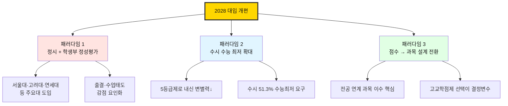

### 1-3. 전형별 수능 최저 적용 비율 변화

| 전형 유형 | 2027 (고3) | 2028 (고2) | 변화 |
|-----------|-----------|-----------|------|
| 학생부 종합 전형 | 11.5% | **14.2%** | ↑ +2.7%p |
| 논술 전형 | 91.8% | **98.4%** | ↑ +6.6%p |
| 수시 전체 평균 | 49.7% | **51.3%** | ↑ +1.6%p |

> 💡 **핵심 메시지:** 수시를 준비하더라도 수능은 반드시 병행해야 한다!

---

## 2. 생기부(학교생활기록부) 완전 분석

### 2-1. 생기부 구조 마인드맵

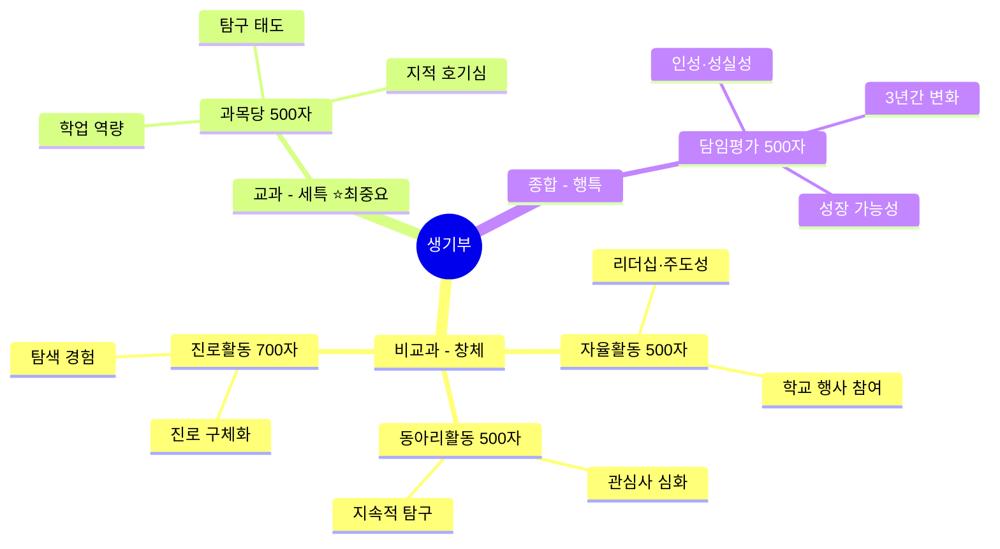

### 2-2. 항목별 평가 중요도

| 구분 | 항목 | 글자 수 | 핵심 평가 요소 | 중요도 |
|------|------|---------|---------------|--------|
| 비교과 | 자율활동 | 500자 | 주도성, 공동체 역량 | ★★★☆☆ |
| 비교과 | 동아리활동 | 500자 | 전공 관심도, 지속성 | ★★★★☆ |
| 비교과 | 진로활동 | 700자 | 진로 탐색 깊이 | ★★★★☆ |
| 교과 | **세부능력 및 특기사항** | 과목당 500자 | **학업 역량, 탐구** | ★★★★★ |
| 종합 | 행동특성 및 종합의견 | 500자 | 인성, 성장 과정 | ★★★★☆ |

### 2-3. 평가 우선순위 알고리즘

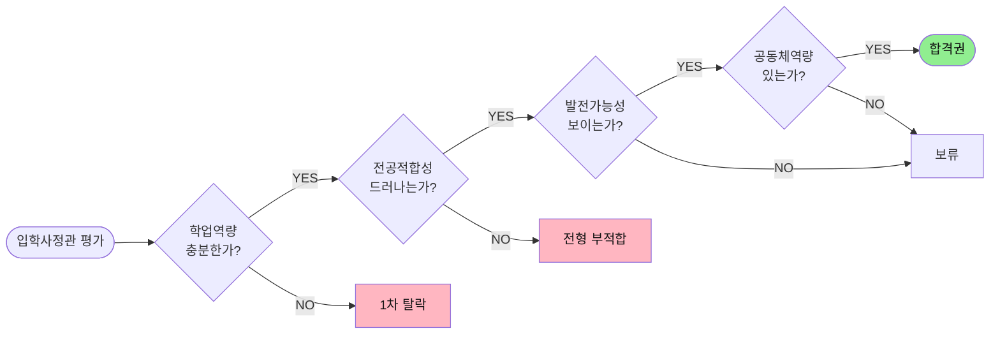

---

# PART 2. 전략 설계

## 3. 학년별 대입 준비 로드맵

### 3-1. 3년 전체 흐름도 (mermaid timeline)

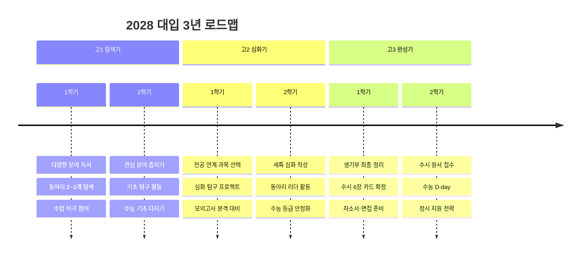

### 3-2. 고1 — 탐색과 기초

| 영역 | 세부 활동 | 목표 | 행동 알고리즘 |
|------|----------|------|--------------|
| 교과 | 모든 과목 성실히 이수 | 내신 기반 다지기 | 매일 복습 30분 |
| 탐구 | 다양한 분야 독서·체험 | 관심 분야 발견 | 월 2권 + 독서 노트 |
| 활동 | 동아리 2~3개 탐색 | 적합한 동아리 선택 | 1학기 체험 → 2학기 결정 |
| 수능 | 국·영·수 기초 학습 | 기본 개념 완성 | 수1·수2 1회독 |
| 생기부 | 수업 중 질문·발표 | 세특 소재 확보 | 주 1회 질문 기록 |

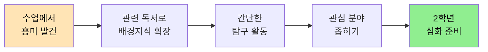

### 3-3. 고2 — 심화와 설계

| 영역 | 세부 활동 | 목표 | 행동 알고리즘 |
|------|----------|------|--------------|
| 교과 | 전공 연계 과목 전략적 선택 | 과목 설계 완성 | 진로 → 과목 매핑표 작성 |
| 탐구 | 교과 연계 심화 탐구 | 세특 핵심 소재 | 학기당 2건 보고서 |
| 활동 | 동아리 집중 + 리더십 | 스토리라인 강화 | 부장·기획자 도전 |
| 수능 | 국·영·수 + 탐구 본격 | 등급 목표 달성 | 모의고사 매월 분석 |
| 생기부 | 1학년 경험 → 심화 연결 | 성장 스토리 구축 | '동-활-느' 일관성 |

### 3-4. 고3 — 완성과 마무리

| 영역 | 세부 활동 | 목표 | 행동 알고리즘 |
|------|----------|------|--------------|
| 교과 | 전공 심화 과목 마무리 | 교과 이수 완성 | 학기당 A↑ 유지 |
| 수능 | 6·9월 모평 → 실전 | 최저 충족 + 정시 | 주 2회 실전 연습 |
| 생기부 | 3년 스토리 최종 점검 | 일관된 서사 완성 | 담임 면담 월 1회 |
| 전형 | 수시 6장 카드 전략 배분 | 상향·적정·안정 | 시뮬레이션 3회 |
| 면접 | 생기부 기반 면접 준비 | 활동 진정성 어필 | 모의면접 5회↑ |

---

## 4. 수시 vs 정시 전략 비교

### 4-1. 핵심 차이 비교표

| 항목 | 수시 전형 | 정시 전형 |
|------|----------|----------|
| 핵심 평가 요소 | 학생부 + (수능최저) | 수능 + 학생부 정성평가 |
| 변별력 핵심 | **세특 + 활동 일관성** | **수능 점수 + 학교생활 충실도** |
| 학생부 영향 | 결정적 | 보조적 (감점 위주) |
| 수능 영향 | 최저학력기준 | 핵심 합격 변수 |
| 준비 비중 | 평소 학교생활 70% + 수능 30% | 수능 70% + 학교생활 30% |

### 4-2. 정시 파이터 위험성 알고리즘

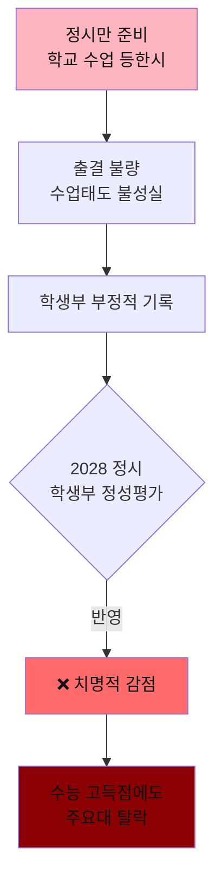

> ⚠️ **결론:** 수시든 정시든 '학교생활 충실도'는 필수!

---

## 5. 교과 설계 전략 (고교학점제)

### 5-1. 과목 선택 의사결정 트리

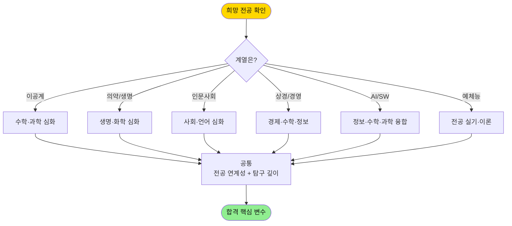

### 5-2. 계열별 추천 과목 설계 (확장)

| 희망 계열 | 필수 과목 | 권장 심화 | 추가 권장 | 연계 포인트 |
|-----------|---------|---------|---------|----------|
| 자연/공학 | 미적분, 물리학, 화학 | 기하, 확률과통계, 정보 | 물리학II, 화학II | 수학·과학 융합 탐구 |
| 의약/생명 | 생명과학, 화학, 수학 | 생명과학II, 화학II | 윤리와사상, 보건 | 의생명 윤리 탐구 |
| 인문/사회 | 사회문화, 정치와법, 경제 | 세계사, 윤리와사상 | 제2외국어, 논리학 | 사회현상 분석 보고서 |
| 상경/경영 | 경제, 수학, 사회문화 | 확률과통계, 정보 | 미적분, 영어II | 데이터 기반 분석 |
| **AI/SW** | **정보, 수학, 물리** | **인공지능 기초, 확률과통계** | **데이터과학, 미적분** | **AI 프로젝트 + 알고리즘** |
| 교육 | 교육학, 심리학, 전공과목 | 논리학, 윤리 | 교육사회학 | 교수법 시뮬레이션 |
| 예체능 | 전공 실기 | 미술사, 음악사 | 매체미술, 작곡 | 작품 포트폴리오 |

---

# PART 3. 계열·전공별 맞춤 트랙 ⭐NEW

## 6. 6대 계열별 맞춤 로드맵

### 6-1. 트랙 선택 마인드맵

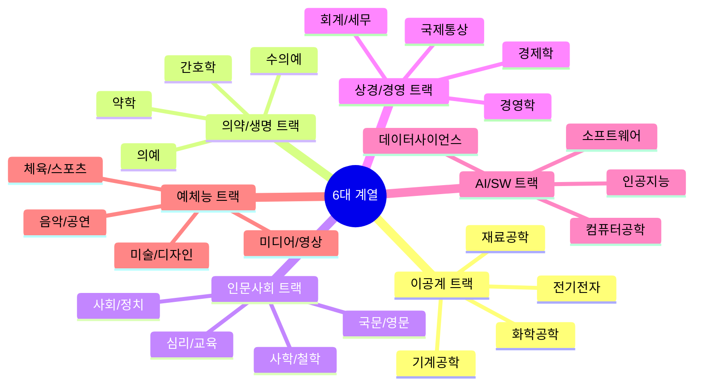

### 6-2. 트랙 1: 이공계 (기계·전기·화학·재료)

| 구분 | 추천 내용 |
|------|----------|
| 핵심 과목 | 미적분, 기하, 물리학II, 화학II, 정보 |
| 동아리 | 발명·로봇·과학탐구·아두이노 |
| 탐구 주제 예시 | "베르누이 원리를 이용한 드론 양력 최적화 설계" |
| 추천 독서 | 『엔지니어의 인문학 수업』, 『과학혁명의 구조』 |
| 외부 활동 | 한국과학창의재단 대회, KMC 수학경시 |
| 세특 키워드 | 정량분석, 실험설계, 변인통제, 오차분석 |

**행동 알고리즘:**

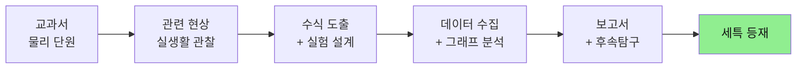

### 6-3. 트랙 2: 의약/생명 (의예·약학·간호)

| 구분 | 추천 내용 |
|------|----------|
| 핵심 과목 | 생명과학II, 화학II, 미적분, 보건, 생명윤리 |
| 동아리 | 생명과학·의학·생물탐구·봉사 |
| 탐구 주제 예시 | "CRISPR-Cas9 유전자 가위의 표적 이탈 문제와 윤리적 한계" |
| 추천 독서 | 『이기적 유전자』, 『의학의 역사』, 『생명이란 무엇인가』 |
| 외부 활동 | 병원 봉사, 의학캠프, 생명과학 올림피아드 |
| 세특 키워드 | 생명윤리, 면역기전, 약리작용, 임상사례 |

**전공 적합성 입증 4단계:**

| 단계 | 활동 | 산출물 |
|------|------|--------|
| 1. 호기심 | 생명과학 수업 중 의문 제기 | 질문 노트 |
| 2. 탐구 | 논문·논설 조사 + 가설 설정 | 탐구 계획서 |
| 3. 실험·분석 | 데이터 수집 + 모델링 | 보고서 |
| 4. 진로 연결 | 의료·바이오 진로와 연결 | 진로 에세이 |

### 6-4. 트랙 3: 인문사회 (국문·사학·철학·심리)

| 구분 | 추천 내용 |
|------|----------|
| 핵심 과목 | 세계사, 윤리와사상, 사회문화, 국어, 영어 |
| 동아리 | 인문학·토론·신문·심리 |
| 탐구 주제 예시 | "MZ세대의 가치관 변화가 한국 정치 양극화에 미치는 영향" |
| 추천 독서 | 『사피엔스』, 『정의란 무엇인가』, 『군중심리』 |
| 외부 활동 | 인문학 토론대회, 모의UN, 봉사활동 |
| 세특 키워드 | 비판적 사고, 사료 분석, 담론 비교, 융합적 시각 |

### 6-5. 트랙 4: 상경/경영 (경영·경제·회계·통상)

| 구분 | 추천 내용 |
|------|----------|
| 핵심 과목 | 경제, 확률과통계, 미적분, 사회문화, 정보 |
| 동아리 | 경제·창업·주식모의·통계 |
| 탐구 주제 예시 | "행동경제학 관점에서 본 청소년 소비 패턴과 마케팅 전략" |
| 추천 독서 | 『넛지』, 『팩트풀니스』, 『생각에 관한 생각』 |
| 외부 활동 | 청소년 경제 캠프, 창업경진대회, 사회적기업 봉사 |
| 세특 키워드 | 데이터 분석, 시장 모델링, 의사결정 이론, ROI |

### 6-6. 트랙 5: 교육 (사범·교육학)

| 구분 | 추천 내용 |
|------|----------|
| 핵심 과목 | 교육학, 심리학, 전공 교과목, 윤리, 논리학 |
| 동아리 | 또래학습·교육봉사·심리연구 |
| 탐구 주제 예시 | "메타인지 학습법이 중학생 수학 성취도에 미치는 영향" |
| 추천 독서 | 『에밀』, 『학교란 무엇인가』, 『교사가 알아야 할 학습심리학』 |
| 외부 활동 | 멘토링, 학습부진 학생 지도, 교육봉사 100시간↑ |
| 세특 키워드 | 학습이론, 교수법, 학생주도, 형성평가 |

### 6-7. 트랙 6: 예체능 (미술·음악·체육·미디어)

| 구분 | 추천 내용 |
|------|----------|
| 핵심 과목 | 전공 실기, 미술사/음악사, 운동과 건강, 매체미술 |
| 동아리 | 전공별 실기·창작·공연·전시 |
| 탐구 주제 예시 | "디지털 매체가 현대 회화의 표현 방식에 미친 영향" |
| 추천 독서 | 『다른 방식으로 보기』, 『음악의 기쁨』 |
| 외부 활동 | 콩쿠르, 전시, 대회, 공연 (포트폴리오) |
| 세특 키워드 | 창작 과정, 매체 실험, 비평적 시각, 협업 |

---

## 7. AI/SW 계열 특화 트랙

### 7-1. AI/SW 진학 로드맵 전체도

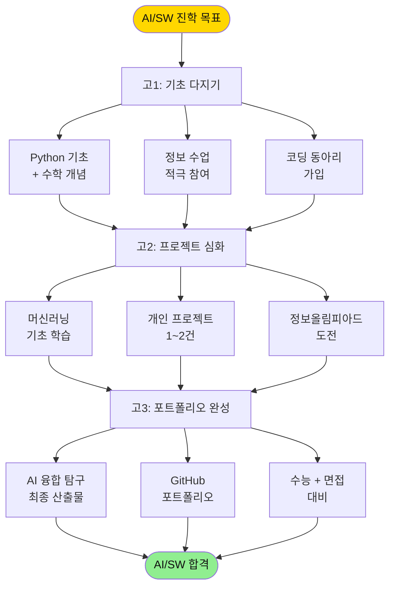

### 7-2. AI/SW 추천 과목 설계 (고교학점제)

| 학년 | 1학기 필수 | 1학기 선택 | 2학기 필수 | 2학기 선택 |
|------|----------|----------|----------|----------|
| 고1 | 통합수학, 통합과학, 정보 | — | 통합수학, 통합과학 | 환경(코딩 활용) |
| 고2 | 수학I, 영어I | **인공지능 기초** | 수학II, 미적분 | **데이터과학**, 물리학I |
| 고3 | 확률과통계 | **인공지능 수학** | — | **소프트웨어와 생활** |

### 7-3. AI/SW 프로젝트 예시 12선 (행동 지향)

| 난이도 | 프로젝트 주제 | 사용 기술 | 결과물 |
|------|------|------|------|
| ★ | 학교 식단 추천 챗봇 | Python, KoNLPy | 데모 영상 |
| ★ | 일기 감정 분석 웹앱 | Hugging Face, Streamlit | 웹 배포 |
| ★★ | 학교 화장실 사용량 예측 | Pandas, scikit-learn | 대시보드 |
| ★★ | 손글씨 한글 인식기 | CNN, TensorFlow | 시연 영상 |
| ★★ | 우리 학교 미세먼지 예보 | Time series, ARIMA | 보고서 |
| ★★ | 친구 추천 AI (그래프 분석) | NetworkX | 시각화 |
| ★★★ | 시각장애인용 사물 인식 앱 | YOLO, Flutter | 앱 |
| ★★★ | AI 수학 풀이 도우미 | LangChain, GPT API | 챗봇 |
| ★★★ | 생기부 키워드 분석기 | KoBERT | 분석 리포트 |
| ★★★ | 실시간 수업 자막 생성기 | Whisper API | 라이브 데모 |
| ★★★★ | 또래 멘토링 매칭 시스템 | Collaborative Filtering | 서비스 시연 |
| ★★★★ | 가짜뉴스 판별 모델 | Transformer, Fine-tuning | 논문 형식 |

### 7-4. AI/SW 세특 작성 알고리즘

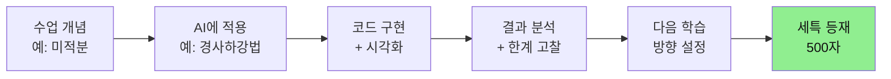

### 7-5. AI/SW 추천 대회·활동

| 활동 | 시기 | 효과 | 난이도 |
|------|------|------|------|
| 한국정보올림피아드(KOI) | 매년 4~6월 | 학업역량 입증 | ★★★★ |
| 한국코드페어 | 매년 7~9월 | 프로젝트 검증 | ★★★ |
| Google AI4ALL | 연중 | 글로벌 경험 | ★★★ |
| Kaggle 대회 (학습용) | 상시 | 실무 역량 | ★★★★ |
| GitHub 오픈소스 기여 | 상시 | 협업 능력 | ★★★ |
| 교내 SW 동아리 | 연중 | 지속성·리더십 | ★★ |

### 7-6. AI/SW 추천 독서 매핑

| 학년 | 입문서 | 중급 | 심화 |
|------|------|------|------|
| 고1 | 『코딩 더 매트릭스』 | 『Hello Coding』 시리즈 | — |
| 고2 | 『패턴인식과 머신러닝』 입문판 | 『밑바닥부터 시작하는 딥러닝』 | 『AI 슈퍼파워』 |
| 고3 | — | 『The Hundred-Page ML Book』 | 『Deep Learning』 (Goodfellow) |

---

# PART 4. 실전 작성 노하우

## 8. 생기부 작성 필승 공식

### 8-1. 세특 '동-활-느' 3박자 원칙

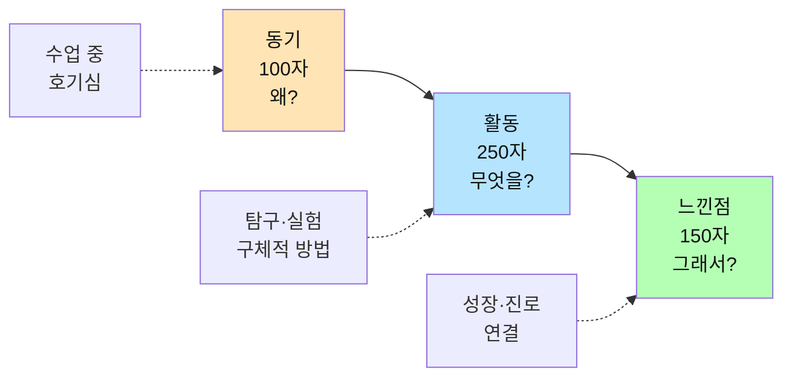

### 8-2. 좋은 세특 vs 나쁜 세특 비교

| 구분 | 나쁜 예시 ❌ | 좋은 예시 ✅ |
|------|----------|----------|
| 동기 | "수업 시간에 발표를 잘 함" | "DNA 복제 과정의 오류 수정 메커니즘에 의문을 가짐" |
| 활동 | "관련 자료를 조사함" | "논문 3편 비교 분석 후 PCR 원리를 실험 설계에 적용" |
| 느낀점 | "많은 것을 배움" | "유전공학의 윤리적 한계를 인식하고 생명윤리 심화 탐구 계획" |

### 8-3. 독서 활용 알고리즘

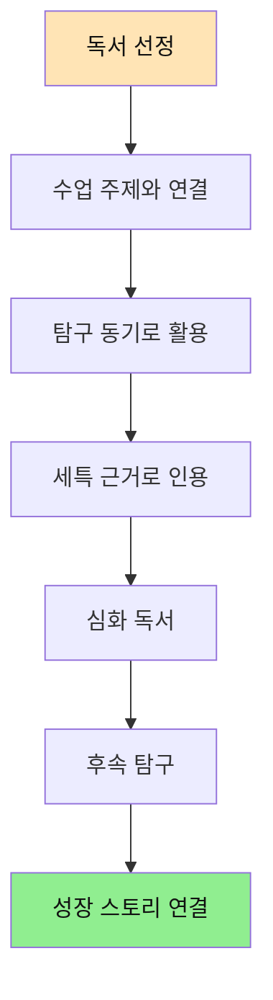

> 💡 독서 목록 자체는 대입에 미반영. 하지만 모든 활동의 **동기·근거**로 활용하면 기록의 질이 3배 ↑

### 8-4. 교과 심화 우선 vs 무리한 진로 연결

| 구분 | ✅ 올바른 접근 | ❌ 잘못된 접근 |
|------|------------|------------|
| 시작점 | 수업 중 호기심 발생 | 무리한 진로 연결 시도 |
| 과정 | 교과 내용 심화 탐구 | 억지 스토리 만들기 |
| 결과 | 자연스러운 전공 연결 | 입학사정관이 부자연스러움 간파 |
| 평가 | 높은 평가 ✅ | 신뢰도 하락 ❌ |

---

## 9. 생기부 실전 예시 30선 ⭐NEW

### 9-1. 세특 우수 예시 (계열별)

#### A. 자연/공학계열 (5선)

| # | 과목 | 우수 세특 예시 |
|---|------|------------|
| 1 | 물리학I | "포물선 운동 단원에서 야구공의 회전이 비행궤적에 미치는 영향에 의문을 품고, '매그너스 효과'를 자율 탐구함. 베르누이 방정식을 활용하여 회전수와 양력 관계를 수식으로 도출하고, 모의 실험을 통해 이론값과 실측값의 오차 4.2%를 분석하여 공기저항 변수의 중요성을 도출함." |
| 2 | 수학II | "정적분 단원을 학습한 후 실생활 활용 사례로 '한강 다리 재료 부피 계산'을 자율 주제로 탐구. 구분구적법과 적분법으로 두 가지 모델을 비교하여 적분법의 정확도가 12% 높음을 증명, 토목공학과 수학의 연결성을 체득함." |
| 3 | 화학I | "화학 반응 단원에서 '전기차 배터리 효율의 화학적 한계'를 주제로 리튬이온배터리와 차세대 전고체배터리의 산화환원 메커니즘을 비교 분석. 학급 발표 후 '한국화학공학 대중강연' 영상 3편을 추가 시청, 보고서 작성." |
| 4 | 통합과학 | "재생에너지 단원 학습 후 학교 옥상 태양광 패널의 각도별 발전량을 직접 측정. 30·45·60도 데이터를 분석하여 위도와 최적 각도의 상관관계를 도출, 결과를 신재생에너지 동아리 활동으로 확장함." |
| 5 | 정보 | "알고리즘 단원에서 정렬 알고리즘의 시간복잡도 차이에 흥미를 느껴, 버블·퀵·머지 정렬을 Python으로 직접 구현. 10만 건 데이터로 실행 시간 측정 후 빅O 표기법의 실제 의미를 체득, 친구들에게 시연." |

#### B. 의약/생명계열 (5선)

| # | 과목 | 우수 세특 예시 |
|---|------|------------|
| 6 | 생명과학I | "면역 단원에서 'mRNA 백신 작동 원리'에 의문을 품고 코로나 백신과 기존 사백신의 차이를 비교 탐구. 항원제시 메커니즘을 다이어그램으로 작성하여 학급 발표, 백신 안전성 논쟁의 과학적 근거를 정리함." |
| 7 | 화학I | "산-염기 단원에서 '위산 역류 치료제 작용 원리'를 주제로 PPI 계열 약물의 분자구조와 H+ 펌프 억제 메커니즘을 탐구. 약리학 입문서 2권을 참고하여 작성한 보고서를 진로 활동에 연계함." |
| 8 | 생명과학II | "유전자 발현 단원을 학습 후 CRISPR-Cas9의 표적 이탈(off-target) 문제를 주제로 자율 탐구. 최신 논문 1편을 발췌 번역하여 윤리적 한계를 분석, 생명윤리 토론대회 자료로 활용." |
| 9 | 통합과학 | "생태계 단원에서 '항생제 내성균의 진화'를 주제로 탐구. 학교 보건실 자료를 통해 학생들의 항생제 사용 빈도를 설문조사하여 의약품 오남용 실태를 정량 분석, 캠페인 자료로 제작." |
| 10 | 보건 | "정신건강 단원에서 청소년 우울증 발생 기전을 신경전달물질(세로토닌·도파민) 관점에서 탐구. 학교 상담실과 협력하여 또래상담 프로그램 기획에 기여, 의예과 진로 동기를 구체화함." |

#### C. 인문/사회계열 (5선)

| # | 과목 | 우수 세특 예시 |
|---|------|------------|
| 11 | 사회문화 | "사회불평등 단원에서 'MZ세대 청년 주거난'을 주제로 탐구. 통계청 자료와 OECD 비교지표를 활용하여 한국의 청년 주택소유율이 OECD 평균 대비 18% 낮음을 도출, 정책 제안서 작성." |
| 12 | 한국사 | "현대사 단원에서 '4·19 혁명과 5·18 민주화운동의 시대적 공통점'을 비교 분석. 1차 사료(신문 보도) 5건을 직접 분석하여 시민의식 변화 과정을 시계열로 정리, 역사학자의 시각으로 보고서 작성." |
| 13 | 윤리와사상 | "공리주의 단원에서 '자율주행차 트롤리 딜레마'를 주제로 칸트의 의무론과 비교 토론. AI 윤리 알고리즘 설계 시 어떤 윤리 체계가 우선되어야 하는지에 대한 논증을 학급 토론에서 펼침." |
| 14 | 국어 | "비문학 독해 단원에서 '챗GPT가 글쓰기에 미치는 영향' 칼럼을 분석 후, 직접 챗봇과의 글쓰기 협업 실험을 진행. 인간 글쓰기의 고유성에 대한 본인 견해를 1,200자 에세이로 작성." |
| 15 | 영어 | "TED 강연 'Why we should learn to disagree'를 분석 후, 한국 사회의 양극화 담론을 영어 프레젠테이션으로 발표. 영어 토론 동아리 활동의 핵심 산출물로 활용." |

#### D. 상경/경영계열 (5선)

| # | 과목 | 우수 세특 예시 |
|---|------|------------|
| 16 | 경제 | "수요공급 단원에서 '한국 부동산 시장의 경직성'을 주제로 탐구. 2020~2025년 KB부동산 데이터를 분석하여 공급 비탄력성이 가격 변동성에 미치는 영향을 회귀분석으로 도출함." |
| 17 | 확률과통계 | "표본조사 단원에서 학교 매점 소비 패턴을 직접 설문조사. 신뢰구간 95%로 음료 카테고리별 선호도를 추정하고, 결과를 학생회 매점 운영 개선 제안서로 발전시킴." |
| 18 | 사회문화 | "행동경제학의 '넛지' 개념을 학교 분리수거 캠페인에 적용. 쓰레기통 위치·색상·표지판을 개선한 결과 재활용률이 23% 상승함을 측정하여 실험 보고서로 작성." |
| 19 | 정보 | "데이터 분석 단원에서 학급 친구들의 한 달 용돈 사용 데이터를 익명으로 수집, Pandas로 카테고리별 지출 분석 후 청소년 소비 패턴 시각화 보고서를 작성함." |
| 20 | 영어 | "'The Lean Startup' 영문 일부를 강독 후, 'MVP 전략을 한국 청소년 창업에 적용한다면?'을 주제로 영어 프레젠테이션 진행. 학생 창업 동아리 운영에 실제 적용." |

#### E. AI/SW계열 (5선)

| # | 과목 | 우수 세특 예시 |
|---|------|------------|
| 21 | 정보 | "객체지향 프로그래밍 단원에서 '학교 도서관 책 추천 AI'를 팀 프로젝트로 구현. 협업필터링 알고리즘을 적용하여 학생 300명 데이터로 추천 정확도 76%를 달성, GitHub에 코드 공개." |
| 22 | 수학I | "지수·로그 단원에서 '신경망 활성화 함수의 수학적 기반'을 자율 탐구. 시그모이드 함수의 미분과 역전파 알고리즘 관계를 노트에 정리, 친구들에게 화이트보드 설명함." |
| 23 | 인공지능기초 | "지도학습 단원에서 'KoBERT를 활용한 학생 진로 추천 시스템'을 개인 프로젝트로 구현. 진로 키워드 1,000개를 직접 라벨링하여 fine-tuning, 정확도 81% 달성함." |
| 24 | 확률과통계 | "베이즈 정리 단원을 학습한 후 스팸 메일 분류기를 나이브 베이즈로 직접 구현. 학교 메일 데이터로 검증한 결과 precision 0.89, recall 0.84를 달성, 한계와 개선안 분석." |
| 25 | 물리학I | "전자기 단원에서 '뉴런과 인공신경망의 신호 전달 비교'를 주제로 탐구. 시냅스 가소성과 가중치 학습의 유사성을 도식화하여 학급 발표, AI와 뇌과학의 융합 가능성을 제시." |

### 9-2. 창의적 체험활동 우수 예시 (5선)

| # | 영역 | 우수 예시 |
|---|------|----------|
| 26 | 자율활동 | "학급 임원으로 '학습 멘토링 시스템'을 기획·운영. 상위권 학생과 학습 부진 학생을 매칭한 후 8주간 변화를 추적하여 평균 성적 12점 상승, 결과를 학년 전체로 확산함." |
| 27 | 동아리 (AI) | "AI 동아리 부장으로 '학교 미세먼지 예측 모델' 개발 프로젝트를 8개월간 주도. 팀원 5명과 역할 분담하여 데이터 수집-전처리-모델링-시각화를 완수, 교내 학술제 1위 수상." |
| 28 | 동아리 (생명) | "생명과학 동아리에서 '학교 화단의 미세환경별 식물 생장 비교 실험'을 1년간 진행. 데이터 1,200건을 엑셀로 분석하여 그래프로 시각화, 보고서를 도교육청 과학탐구대회에 출품." |
| 29 | 진로활동 | "AI 교육 전문가 인터뷰를 직접 기획하여 진로 멘토 3명을 섭외, 30분 화상 인터뷰 진행 후 영상으로 편집하여 교내 진로 박람회에서 상영. 자료집 50부 배포." |
| 30 | 봉사활동 | "지역 노인복지관에서 '디지털 격차 해소' 프로그램을 1년간 운영. 스마트폰 사용법을 어르신 20명에게 매주 지도, AI 챗봇 활용법까지 확장하여 자체 교재 제작." |

---

# PART 5. 실전 입시 전략 ⭐NEW

## 10. 수능 대비 전략

### 10-1. 수능이 '기본값'인 이유

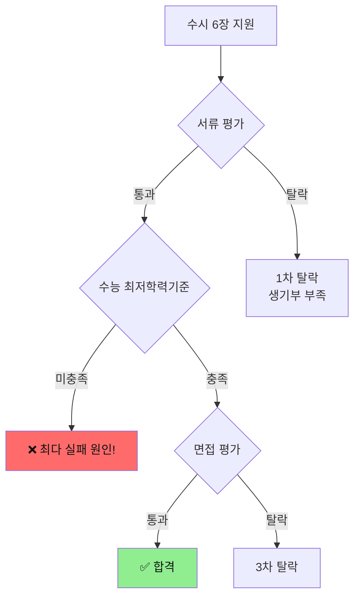

### 10-2. 학년별 수능 대비 계획

| 시기 | 국어 | 수학 | 영어 | 탐구 |
|------|------|------|------|------|
| 고1 | 독서·문학 기본 | 수학 개념 완성 | 어휘·문법 기초 | 기본 개념 학습 |
| 고2 (1학기) | 비문학 독해 훈련 | 수I·수II 심화 | 독해 유형 연습 | 과목 선택 + 개념 |
| 고2 (2학기) | 모의고사 실전 시작 | 미적분/기하 진입 | EBS 연계 학습 | 기출 분석 시작 |
| 고3 (상반기) | 기출 분석 집중 | 킬러문항 훈련 | 듣기·독해 완성 | 기출 3회독 |
| 고3 (하반기) | 실전 모의고사 | 실전 감각 유지 | 실전 모의고사 | 파이널 정리 |

### 10-3. 수능 최저학력기준 충족 알고리즘

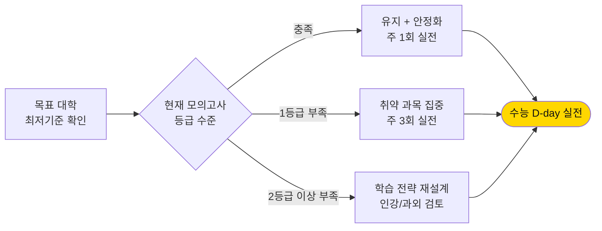

---

## 11. 수시 6장 카드 전략 시뮬레이션

### 11-1. 6장 카드 배분 원칙

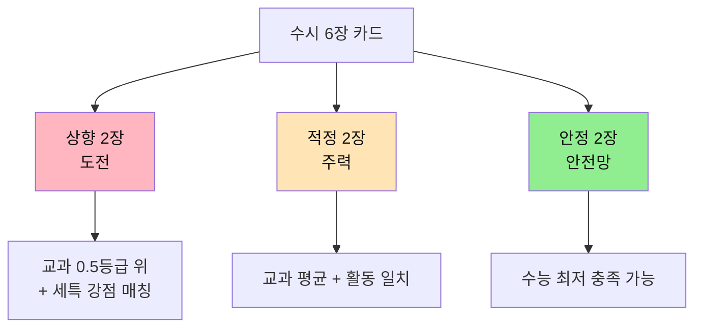

### 11-2. 학생 유형별 6장 카드 시뮬레이션

#### 📌 시뮬레이션 A: 내신 우수형 (1.5등급, 세특 보통, 수능 3등급)

| 칸 | 전형 | 대학·학과 (예시) | 전략 |
|---|------|----------|------|
| 1 | 학생부교과 (상향) | 연세대 시스템반도체 | 교과 100% 활용 |
| 2 | 학생부교과 (적정) | 한양대 ERICA 컴공 | 안정적 합격 가능 |
| 3 | 학생부종합 (적정) | 성균관대 소프트웨어 | 활동 보강 시 가능 |
| 4 | 학생부교과 (안정) | 중앙대 컴공 | 거의 확실한 합격 |
| 5 | 논술 (상향) | 고려대 컴공 | 수능 최저 1합2 도전 |
| 6 | 학생부종합 (안정) | 시립대 컴공 | 추가합격 안전망 |

#### 📌 시뮬레이션 B: 세특 우수형 (2.5등급, 세특 탁월, 수능 2등급)

| 칸 | 전형 | 대학·학과 (예시) | 전략 |
|---|------|----------|------|
| 1 | 학생부종합 (상향) | 서울대 컴퓨터공학 | 세특·활동으로 정성 평가 |
| 2 | 학생부종합 (상향) | 카이스트 일반 | 자기소개서 강점 |
| 3 | 학생부종합 (적정) | 연세대 인공지능 | 활동 일관성 강점 |
| 4 | 학생부종합 (적정) | 한양대 데이터사이언스 | 균형 잡힌 강점 |
| 5 | 학생부종합 (안정) | 경희대 SW융합 | 최저 충족 시 합격권 |
| 6 | 논술 (안정) | 인하대 인공지능공학 | 수능 최저 확보 |

#### 📌 시뮬레이션 C: 수능 강자형 (3.0등급, 세특 보통, 수능 1등급)

| 칸 | 전형 | 대학·학과 (예시) | 전략 |
|---|------|----------|------|
| 1 | 논술 (상향) | 연세대 컴퓨터과학 | 수능 최저 강점 |
| 2 | 논술 (상향) | 고려대 컴퓨터학과 | 수능 최저 1합1 |
| 3 | 논술 (적정) | 성균관대 글로벌융합 | 안정적 최저 충족 |
| 4 | 논술 (적정) | 한양대 컴퓨터소프트웨어 | 수능 최저 확실 |
| 5 | 학생부종합 (적정) | 건국대 컴공 (KU자기추천) | 세특 보강 활용 |
| 6 | 학생부교과 (안정) | 단국대 SW융합 | 정시 미리 안정망 |

### 11-3. 6장 카드 선정 알고리즘

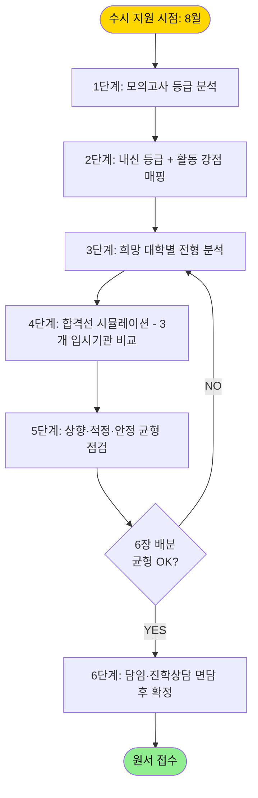

### 11-4. 지원 시 주의사항 체크리스트

| 항목 | 확인 사항 | 체크 |
|------|---------|------|
| 1 | 모집요강 변경사항 확인 (전년 대비) | ☐ |
| 2 | 수능 최저학력기준 정확히 확인 | ☐ |
| 3 | 면접/논술 일정 겹침 여부 | ☐ |
| 4 | 추천 전공 적합성 매칭 | ☐ |
| 5 | 같은 대학 중복 지원 가능 여부 | ☐ |
| 6 | 6장 모두 안정 또는 모두 상향 금지 | ☐ |

---

## 12. 면접·자소서 준비 알고리즘

### 12-1. 면접 준비 전체 흐름도

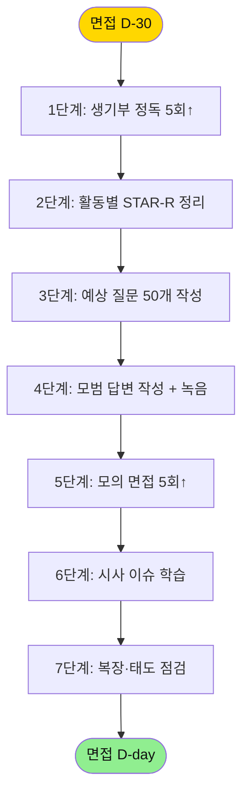

### 12-2. STAR-R 답변 프레임워크

| 약자 | 의미 | 설명 | 예시 |
|------|------|------|------|
| **S** | Situation | 상황 | "고2 때 동아리에서 AI 챗봇 개발 프로젝트를 맡았습니다" |
| **T** | Task | 과제 | "자연어 처리 모델의 한국어 정확도 향상이 핵심 과제였습니다" |
| **A** | Action | 행동 | "KoBERT를 fine-tuning하고 라벨링을 직접 1,000건 수행했습니다" |
| **R** | Result | 결과 | "정확도 76%에서 89%로 13%p 향상시켰습니다" |
| **R** | Reflection | 성찰 | "데이터의 질이 모델 성능의 핵심임을 체득했습니다" |

### 12-3. 면접 질문 유형 5종 + 답변 알고리즘

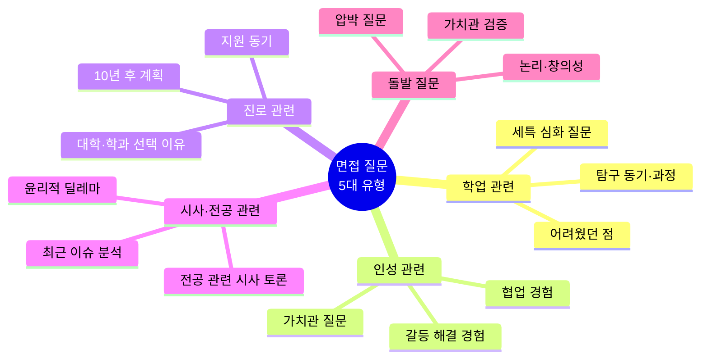

### 12-4. 빈출 면접 질문 20선 + 답변 포인트

| # | 유형 | 질문 | 답변 포인트 |
|---|------|------|----------|
| 1 | 학업 | "생기부에 적힌 ○○ 탐구를 자세히 설명해보세요" | 동기 → 과정 → 결과 → 한계 → 후속 |
| 2 | 학업 | "가장 어려웠던 과목과 극복 방법은?" | 구체적 학습 전략 + 변화 수치 |
| 3 | 인성 | "팀 프로젝트에서 갈등을 어떻게 해결했나요?" | STAR-R + 본인 역할 강조 |
| 4 | 인성 | "본인의 강점과 약점은?" | 강점은 사례로, 약점은 개선 노력 |
| 5 | 진로 | "왜 우리 대학·학과에 지원했나요?" | 학과 특성 + 본인 활동 매칭 |
| 6 | 진로 | "10년 후 본인의 모습은?" | 단계적 비전 (5년 → 10년) |
| 7 | 전공 | "최근 ○○ 분야 이슈를 알고 있나요?" | 사실 → 본인 견해 → 근거 |
| 8 | 전공 | "AI 윤리 문제에 대한 본인의 입장은?" | 양면 분석 + 본인 결론 |
| 9 | 돌발 | "마지막으로 하고 싶은 말은?" | 핵심 강점 1개 + 진심 어필 |
| 10 | 돌발 | "긴장될 텐데 한 마디만 더 한다면?" | 차분한 자기 정리 |
| 11 | 학업 | "○○ 책에서 가장 인상 깊은 부분은?" | 책 내용 + 자기 생각 + 적용 |
| 12 | 학업 | "○○ 동아리에서 본인 역할은?" | 구체적 직책 + 산출물 |
| 13 | 인성 | "실패 경험과 배운 점은?" | 정직한 실패 + 성장 |
| 14 | 진로 | "타 대학과 비교했을 때 우리 대학을 선택한 이유?" | 학교 특화 프로그램 언급 |
| 15 | 전공 | "전공 관련 가장 흥미로운 책은?" | 책 + 본인 진로 연결 |
| 16 | 학업 | "본인이 진행한 가장 인상 깊은 탐구는?" | 1개 집중 + 깊이 |
| 17 | 인성 | "리더십 경험은?" | 직책 + 변화 + 영향 |
| 18 | 진로 | "어떤 사회 문제를 해결하고 싶나요?" | 문제 인식 + 전공 활용 |
| 19 | 전공 | "○○ 직업에 필요한 역량은?" | 3가지 + 본인 준비 정도 |
| 20 | 돌발 | "오늘 면접 어땠나요?" | 솔직 + 긍정 마무리 |

### 12-5. 자소서 작성 4단계 알고리즘 (대학별 자율 항목 대비)

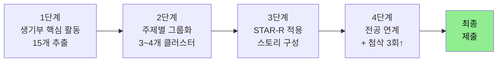

### 12-6. 자소서 작성 체크리스트

| 영역 | 체크 항목 | 확인 |
|------|---------|------|
| 도입 | 첫 문장에 핵심 사건/장면 포함 | ☐ |
| 구조 | STAR-R 흐름 유지 | ☐ |
| 사실 | 생기부 기록과 일치 | ☐ |
| 차별성 | "나만의 경험"이 1개 이상 | ☐ |
| 깊이 | 수치·고유명사·전문용어 포함 | ☐ |
| 진정성 | 과장·미사여구 배제 | ☐ |
| 연결성 | 활동 → 전공 → 진로 자연 연결 | ☐ |
| 가독성 | 한 문단 5줄 이내 | ☐ |
| 첨삭 | 교사·전문가 3회 이상 검토 | ☐ |

---

### 12-7. 입학사정관 4대 핵심 질문 (생기부 평가 기준)

> 📌 **모든 세특·창체 활동은 다음 4개 질문에 답할 수 있어야 합니다.**

```mermaid
mindmap
  root((입학사정관<br/>4대 질문))
    Q1. 왜 이 공부를 했는가?
      학습 동기
      진로 연결성
      개인적 호기심
    Q2. 어떤 태도로 배웠는가?
      수업 참여도
      극복 과정
      성실성
    Q3. 배운 것을 어떻게 확장했는가?
      지식의 확장
      탐구 역량
      후속 활동
    Q4. 수업 속 역할은 무엇인가?
      협업 능력
      공동체 기여
      리더십
```

| 질문 | 평가 요소 | 생기부 반영 항목 | 증명 자료 |
|------|---------|------------|---------|
| Q1. 왜? | 학습 동기·진로 연결성 | 세특 도입부, 진로활동 | 독서 노트, 호기심 일지 |
| Q2. 어떻게? | 수업 참여도·극복 과정 | 세특 중반부, 행특 | 질문 기록, 발표 자료 |
| Q3. 확장? | 지식 확장·탐구 역량 | 세특 후반부, 동아리 | 보고서, 후속 탐구 |
| Q4. 역할? | 협업·공동체 기여 | 자율활동, 행특 | 팀 프로젝트 산출물 |

---

# PART 5.5. 전형별 제출 서류 완전 가이드 ⭐NEW

## 13. 제출 서류 종합 분석

### 13-1. 대입 전형별 제출 서류 매트릭스

```mermaid
flowchart TB
    Start([대입 지원]) --> Type{전형 종류}

    Type -->|학생부교과| A1[기본서류]
    Type -->|학생부종합| B1[기본서류 + 정성평가]
    Type -->|논술| C1[기본서류 + 논술답안]
    Type -->|실기/특기| D1[기본서류 + 포트폴리오]
    Type -->|정시| E1[수능성적 + 학생부]

    A1 --> Common[모든 전형 공통<br/>학생부 + 졸업증명서]
    B1 --> Common
    C1 --> Common
    D1 --> Common
    E1 --> Common

    Common --> Add[추가 서류<br/>전형별 상이]

    style Start fill:#FFD700
    style Common fill:#90EE90
```

### 13-2. 전형별 필수 제출 서류 비교표

| 전형 | 학생부 | 수능성적 | 자소서 | 추천서 | 포트폴리오 | 실기/면접 | 논술 |
|------|:----:|:----:|:----:|:----:|:----:|:----:|:----:|
| 학생부교과 | ✅ | ⚠️최저 | ❌ | ❌ | ❌ | △선택 | ❌ |
| **학생부종합** | ✅ | ⚠️최저 | △대학별 | △대학별 | △대학별 | ✅ | ❌ |
| 논술 | ✅ | ⚠️최저 | ❌ | ❌ | ❌ | ❌ | ✅ |
| 실기/특기 | ✅ | ⚠️일부 | ❌ | △대학별 | ✅ | ✅ | ❌ |
| 정시 | ✅ | ✅ | ❌ | ❌ | ❌ | △대학별 | ❌ |

> ✅ 필수 / ⚠️ 최저학력기준 적용 / △ 대학별 상이 / ❌ 없음

### 13-3. 서류별 상세 분석

#### A. 학교생활기록부 (학생부) — 모든 전형 공통 필수

| 항목 | 세부 내용 | 글자수 | 평가 포인트 |
|------|--------|------|----------|
| 1. 인적사항 | 학생 정보 | — | — |
| 2. 학적사항 | 입학·졸업 | — | 출결과 연동 |
| 3. 출결사항 | 결석·지각·조퇴 | — | **정성평가 핵심 지표** |
| 4. 수상경력 | 교내 수상 | — | **대입 미반영** (2024~) |
| 5. 자격증 및 인증 취득 | 자격증 | — | 대입 미반영 |
| 6. 진로희망사항 | 진로 | — | 대입 미반영 (참고용) |
| 7. 창의적 체험활동 | 자율/동아리/봉사/진로 | 500~700자 | 비교과 핵심 |
| 8. 교과학습발달상황 | 성적 + **세특** | 과목당 500자 | **학업역량 핵심** |
| 9. 자유학기활동상황 | 자유학기 | — | 중학교 기록 |
| 10. 독서활동상황 | 독서 | — | **대입 미반영** (제목만 가능) |
| 11. 행동특성 및 종합의견 | 담임평가 | 500자 | 인성·발전가능성 |

#### B. 수능 성적표 — 정시 + 수시 최저학력기준

```mermaid
flowchart LR
    A[수능 응시] --> B[성적 발표<br/>12월 초]
    B --> C{지원 전형}
    C -->|정시| D[표준점수·백분위<br/>주요 지표]
    C -->|수시| E[등급 기준<br/>최저 충족 여부]

    style D fill:#FFE4B5
    style E fill:#B5E4FF
```

| 지원 형태 | 활용 방식 | 변환 점수 |
|---------|---------|---------|
| 정시 일반 | 표준점수 + 백분위 합산 | 대학별 환산식 |
| 정시 영역별 | 영역별 가중치 적용 | 대학별 반영비율 |
| 수시 최저 | 등급 합 (예: 2합4, 3합6) | 등급만 사용 |

#### C. 자기소개서 — 학생부종합 일부 대학 (2024 폐지 → 일부 부활 또는 자율양식)

> ⚠️ **2024학년도부터 자소서 전면 폐지** → 2028 입시 변경 사항 확인 필수

| 항목 (구 자소서) | 글자수 | 작성 포인트 |
|------------|------|----------|
| 1번. 학업 노력과 경험 | 1,500자 | 세특 활동의 동기·과정·결과 |
| 2번. 의미 있는 활동 | 1,500자 | 자율·동아리·진로 활동 중 1~2개 심화 |
| 3번. 본교 지원 동기 + 향후 계획 | 1,000자 | 대학·학과 특성 + 본인 계획 |

> 💡 일부 대학(예: 의대·교대 일부)은 **추천서 또는 자율 양식**으로 대체. 대학별 모집요강 필수 확인.

#### D. 추천서 — 일부 대학·일부 전형

| 작성 주체 | 작성 시기 | 분량 | 핵심 내용 |
|---------|--------|------|----------|
| 담임 교사 | 8~9월 | 1,000자 내외 | 학업 + 인성 종합 |
| 교과 담당 교사 | 8~9월 | 800자 내외 | 학업 역량 집중 |
| 비교과 지도 교사 | 8~9월 | 800자 내외 | 동아리·활동 평가 |

#### E. 포트폴리오 — 실기/특기 전형

| 분야 | 포트폴리오 구성 | 분량 |
|------|-----------|------|
| 미술 | 작품 사진 + 설명 + 제작과정 | 10~20점 |
| 음악 | 연주 영상 + 악보 + 자기소개 | 영상 5~15분 |
| 체육 | 경기 기록 + 영상 + 수상실적 | 종목별 상이 |
| **SW/AI 특기** | GitHub 링크 + 프로젝트 설명 + 데모 | 3~5개 프로젝트 |
| 영상/미디어 | 작품 영상 + 시놉시스 | 단편 3~5편 |

#### F. 면접·구술고사 — 학생부종합 + 일부 정시

```mermaid
flowchart TB
    Type[면접 유형] --> T1[생기부 기반 면접<br/>학종 일반]
    Type --> T2[제시문 기반 면접<br/>의예·교대]
    Type --> T3[심층 면접<br/>특기자·자유전공]
    Type --> T4[다중미니면접 MMI<br/>의예 일부]

    T1 --> R1[학생부 활동 질의<br/>10~15분]
    T2 --> R2[제시문 분석 후 답변<br/>20~30분]
    T3 --> R3[학업·진로 심층<br/>30분↑]
    T4 --> R4[방별 다른 평가<br/>5분 × 6~8개 방]

    style Type fill:#FFD700
```

### 13-4. 서류 준비 타임라인 (D-Day 역산)

```mermaid
gantt
    title 수시 제출 서류 준비 타임라인 (고3 기준)
    dateFormat YYYY-MM-DD
    section 평소 준비
    생기부 일상 관리        :a1, 2026-03-01, 180d
    section 5~6월
    생기부 1차 점검         :a2, 2026-05-01, 30d
    자소서 초안 작성        :a3, 2026-06-01, 30d
    section 7~8월
    추천서 요청            :a4, 2026-07-01, 30d
    포트폴리오 정리        :a5, 2026-07-15, 30d
    자소서 첨삭 3회↑       :a6, 2026-08-01, 30d
    section 9월
    원서 접수 + 제출       :crit, a7, 2026-09-09, 14d
    section 10~12월
    면접 준비             :a8, 2026-10-01, 30d
    수능 + 합격 발표       :crit, a9, 2026-11-13, 50d
```

### 13-5. 서류별 준비 체크리스트

| 서류 | 시기 | 준비 행동 | 체크 |
|------|------|----------|------|
| 학생부 (세특) | 매 학기 | 수업 중 질문·발표 기록 → 교사에 자료 제공 | ☐ |
| 학생부 (창체) | 매 학기 | 활동 직후 보고서 제출 (사진·산출물 포함) | ☐ |
| 학생부 (행특) | 학년말 | 담임 면담 + 본인 성장 정리 자료 전달 | ☐ |
| 출결 | 매일 | 무단결석·지각 0회 유지 | ☐ |
| 수능 성적 | 11월 | 평소 모의고사 등급 안정화 | ☐ |
| 자소서 | 6~8월 | 활동 15개 추출 → STAR-R 적용 → 첨삭 3회 | ☐ |
| 추천서 | 7~8월 | 추천 교사 사전 협의 + 자료 제공 | ☐ |
| 포트폴리오 | 평소~8월 | 활동 사진·영상·코드 상시 백업 | ☐ |
| 면접 | 10월 | 모의면접 5회↑ + 빈출 질문 준비 | ☐ |
| 논술 | 평소~11월 | 대학별 기출 분석 + 첨삭 | ☐ |

### 13-6. 서류 제출 시 흔한 실수 TOP 7

| # | 실수 사례 | 결과 | 예방 행동 |
|---|---------|------|---------|
| 1 | 생기부 오탈자·날짜 오류 방치 | 신뢰도 하락 | 7월 자가 점검 |
| 2 | 자소서·생기부 내용 불일치 | 정성평가 감점 | 교차 검증 필수 |
| 3 | 출결 누락 정정 미요청 | 정시까지 영향 | 학년말 확인 |
| 4 | 추천서 임박 요청 | 부실한 추천서 | 8월 초 사전 협의 |
| 5 | 포트폴리오 백업 미흡 | 제출 누락 | 클라우드 2중 백업 |
| 6 | 수능 최저 미충족 후 지원 | 자동 탈락 | 모평 기반 시뮬레이션 |
| 7 | 같은 전형 중복 카운트 | 6장 카드 낭비 | 모집요강 정독 |

---

## 14. 합격 사례 케이스 스터디 (서류 단위 상세 분석)

### 14-1. 사례 A: AI/SW 계열 — 학생부종합 합격 (상세 분해)

#### 📋 합격생 프로필

| 항목 | 내용 |
|------|------|
| 합격 대학·학과 | S대 컴퓨터공학과 (학생부종합) |
| 내신 등급 | 1.8 (수학·과학·정보 평균 1.4) |
| 수능 등급 | 국2 / 수1 / 영1 / 물1 / 화2 (최저 2합3 충족) |
| 합격 요인 | **'학교 문제 해결'에 일관된 AI 적용 스토리** |

#### 📄 실제 제출 서류 구성

| 서류 | 제출 여부 | 핵심 포인트 |
|------|:------:|----------|
| 학교생활기록부 | ✅ | 세특에 'AI 적용' 키워드 12회 등장 |
| 수능 성적표 | ✅ | 최저 2합3 충족 (수1+영1) |
| 자소서 (구) | ✅ | 1,500자 × 3문항 (해당 대학 자율양식) |
| 추천서 | ❌ | 미요구 |
| 포트폴리오 (선택) | ✅ | GitHub 링크 + 프로젝트 3개 |
| 면접 | ✅ | 15분 생기부 기반 + 5분 인성 |

#### 📝 핵심 세특 발췌 (실제 작성 예시)

> **고2 정보 세특 (500자):** "객체지향 단원을 학습한 후 학교 미세먼지 정보가 분산되어 있는 문제를 인식하고, '학교 미세먼지 통합 예측 시스템'을 팀 프로젝트로 기획함. Random Forest 모델을 활용하여 3개월 데이터(1,200건)를 학습시키고, Flask로 웹앱을 배포함. R² 0.81을 달성하였으며, 정확도 향상을 위한 LSTM 모델 도입 필요성을 도출하여 후속 연구로 연결함. 동아리 부장으로서 팀원 5명의 역할을 분담하고, 매주 코드 리뷰를 주도하여 협업 능력을 발휘함."

#### 🎯 입학사정관 4대 질문 매핑

| 질문 | 매칭 활동 | 증명 자료 |
|------|---------|---------|
| Q1. 왜? | 학교 미세먼지 문제 인식 (고1 보건수업 계기) | 진로활동 + 자소서 1번 |
| Q2. 어떻게? | Python·ML 자율 학습 (서적 5권 + 온라인 강의) | 세특 + 독서 |
| Q3. 확장? | 모델 한계 인식 → LSTM 후속 연구 | 동아리 보고서 |
| Q4. 역할? | 동아리 부장 + 팀 코드 리뷰 주도 | 자율활동 + 행특 |

#### 🎤 실제 면접 질문·답변 예시

| Q | A 요약 |
|---|------|
| "미세먼지 예측 모델의 R² 0.81이 의미하는 바는?" | 학습 데이터로는 81% 설명, 그러나 일반화 한계 인식 |
| "왜 Random Forest를 선택했나?" | 데이터 1,200건의 비선형성·해석가능성 고려 |
| "팀에서 본인 역할은?" | 부장 + 코드 리뷰 + 모델 설계 담당 |
| "10년 후 모습은?" | AI 윤리 연구하는 공학자 |

#### 📈 3년 성장 스토리

```mermaid
timeline
    title 합격생 A의 3년 성장 스토리
    section 고1
        탐색 : Python 기초 학습 (인강 50시간) : 코딩 동아리 가입 : 첫 미니 프로젝트(계산기 웹앱)
    section 고2
        심화 : 동아리 부장 선출 : 학교 미세먼지 데이터 수집 (3개월) : Random Forest 자율 학습
    section 고3
        완성 : 통합 예측 시스템 완성 (R² 0.81) : 교내 학술제 1위 : GitHub 공개 + 면접 합격
```

### 14-2. 사례 B: 의약 계열 — 학생부교과 + 최저 합격 (상세 분해)

#### 📋 합격생 프로필

| 항목 | 내용 |
|------|------|
| 합격 대학·학과 | Y대 의예과 (학생부교과) |
| 내신 등급 | 1.05 (전 과목 평균, 주요 교과 1.00) |
| 수능 등급 | 국1 / 수1 / 영1 / 생명1 / 화학1 (3합3 충족) |
| 합격 요인 | **압도적 내신 + 수능 최저 안정 충족** |

#### 📄 실제 제출 서류 구성

| 서류 | 제출 여부 | 핵심 포인트 |
|------|:------:|----------|
| 학교생활기록부 | ✅ | 교과 성적이 결정적 (1.05등급) |
| 수능 성적표 | ✅ | 3합3 안정 충족 (의예 기준 충족) |
| 자소서 | ❌ | 학생부교과 미요구 |
| 추천서 | ❌ | 미요구 |
| 포트폴리오 | ❌ | 의예 미요구 |
| 면접 | ✅ | 인성 면접 10분 + MMI 6개 방 |

#### 📝 핵심 세특 발췌 (실제 작성 예시)

> **고2 생명과학 세특 (500자):** "면역 단원에서 mRNA 백신의 작동 원리에 대한 호기심으로 자율 탐구 진행. Lipid Nanoparticle의 세포 진입 메커니즘과 항원제시 과정을 다이어그램으로 작성하여 학급 발표. 기존 사백신과의 차이를 면역기전 측면에서 비교 분석하였고, 백신 안전성 논쟁의 과학적 근거 3가지를 정리. 학교 보건 캠페인 자료로 활용하여 학우 200명에게 배포. 의학의 본질이 '인체에 대한 깊은 이해'에 있음을 체득함."

#### 🎯 입학사정관 4대 질문 매핑

| 질문 | 매칭 활동 | 증명 자료 |
|------|---------|---------|
| Q1. 왜? | 코로나 백신 관련 가족 토론 → 호기심 발화 | 진로활동 |
| Q2. 어떻게? | 의학 입문서 12권 정독 + 의학 캠프 참여 | 독서 + 진로 |
| Q3. 확장? | 보건 캠페인 기획·운영 (학우 200명 대상) | 자율활동 |
| Q4. 역할? | 또래 보건 멘토 + 봉사 200시간 | 봉사·행특 |

#### 🎤 의예 MMI 면접 6개 방 사례

| 방 | 평가 항목 | 질문 예시 |
|---|---------|---------|
| 1 | 의사소통 | 모르는 환자와 5분 라포 형성 |
| 2 | 윤리 | 안락사에 대한 본인 입장 논증 |
| 3 | 협업 | 갈등 사례 분석 + 해결안 |
| 4 | 사회성 | 의료 격차 문제 해결 방안 |
| 5 | 학업 | 생명과학 심화 개념 질의 |
| 6 | 인성 | 본인 강점·약점 + 의사 적합성 |

### 14-3. 사례 C: 인문/사회 계열 — 학생부종합 합격 (상세 분해)

#### 📋 합격생 프로필

| 항목 | 내용 |
|------|------|
| 합격 대학·학과 | K대 사회학과 (학생부종합) |
| 내신 등급 | 2.3 (사회과목 평균 1.8) |
| 수능 등급 | 국1 / 수2 / 영2 / 생활과윤리1 / 사회문화2 |
| 합격 요인 | **사회 현안에 대한 일관된 문제 의식 + 실천 경험** |

#### 📄 실제 제출 서류 구성

| 서류 | 제출 여부 | 핵심 포인트 |
|------|:------:|----------|
| 학교생활기록부 | ✅ | 진로활동 700자에 '사회학자' 키워드 일관 |
| 수능 성적표 | ✅ | 2합4 충족 (국+생윤) |
| 자소서 (구) | ✅ | "MZ세대 정책 제안" 일관된 스토리 |
| 추천서 | ❌ | 미요구 |
| 포트폴리오 | ✅ (선택) | 사회비평 잡지 PDF + 정책 제안서 |
| 면접 | ✅ | 제시문 분석 30분 + 인성 10분 |

#### 📝 핵심 세특 발췌 (실제 작성 예시)

> **고2 사회문화 세특 (500자):** "사회 불평등 단원에서 'MZ세대 청년 주거난'을 주제로 자율 탐구 진행. 통계청 자료(2020~2024)와 OECD 비교지표를 활용하여 한국 청년 주택소유율이 OECD 평균 대비 18% 낮음을 도출. R 프로그래밍을 자율 학습하여 회귀분석으로 임금 상승률과 주택가격 상승률 격차 5.2배를 정량 증명. 결과를 '청년정책 제안 대회'에 제출하여 동상 수상하였고, 이를 본인이 창간한 학교 사회비평 잡지 2호의 커버스토리로 게재함."

#### 🎯 입학사정관 4대 질문 매핑

| 질문 | 매칭 활동 | 증명 자료 |
|------|---------|---------|
| Q1. 왜? | 가족의 전세 문제 → 청년 주거난 관심 | 진로활동 |
| Q2. 어떻게? | 통계청 데이터 분석 + R 자율 학습 | 세특 |
| Q3. 확장? | 학교 잡지 창간 + 청년정책 대회 입상 | 자율·동아리 |
| Q4. 역할? | 잡지 편집장 + 모의UN 한국대표 | 동아리·자율 |

#### 🎤 제시문 면접 사례

| 단계 | 내용 |
|------|------|
| 제시문 | "한국 청년 1인 가구 비율 35% 도달, 사회적 함의는?" |
| 사고 시간 | 15분 (메모 가능) |
| 답변 시간 | 10분 |
| 후속 질문 | 정책 제안의 부작용, 본인 활동 연결성 |

---

### 14-4. 사례 D: 수능 강자형 — 정시 합격 (상세 분해)

#### 📋 합격생 프로필

| 항목 | 내용 |
|------|------|
| 합격 대학·학과 | S대 자유전공학부 (정시 일반) |
| 내신 등급 | 3.2 (수시 어려움) |
| 수능 등급 | 국1 / 수1 / 영1 / 사1,1 (백분위 평균 98) |
| 합격 요인 | **수능 고득점 + 정성평가 감점 요소 없음** |

#### 📄 실제 제출 서류 구성

| 서류 | 제출 여부 | 핵심 포인트 |
|------|:------:|----------|
| 학교생활기록부 | ✅ | 출결 100%, 행특 긍정적 평가 |
| 수능 성적표 | ✅ | 백분위 98 (정시 합격선 충족) |
| 자소서 | ❌ | 정시 미요구 |
| 추천서 | ❌ | 미요구 |
| 포트폴리오 | ❌ | 미요구 |
| 면접 | ❌ | S대 자유전공 정시 미실시 |

#### 📊 2028 정시 학생부 정성평가 항목 (S대 기준)

| 평가 영역 | 비중 | 본 합격생 평가 |
|---------|:---:|----------|
| 출결 | 30% | 결석·지각 0회 ✅ |
| 수업 태도 | 40% | 행특에 적극적 평가 ✅ |
| 학업 충실성 | 30% | 내신 3.2지만 꾸준한 성적 ✅ |

> 💡 **핵심 교훈:** 수능 1등급도 출결 불량·수업 태만 시 정시 감점. '학교생활 충실도'가 합격 변수.

---

### 14-5. 사례 E (신규): 교과+종합 혼합 전략 — 논술 합격

#### 📋 합격생 프로필

| 항목 | 내용 |
|------|------|
| 합격 대학·학과 | H대 경영학부 (논술 전형) |
| 내신 등급 | 3.5 (수시 학종은 어려움) |
| 수능 등급 | 국1 / 수1 / 영2 / 사1,1 (논술 최저 2합3 충족) |
| 합격 요인 | **수능 최저 안정 + 논술 기출 50회 분석** |

#### 📄 실제 제출 서류 구성

| 서류 | 제출 여부 | 핵심 포인트 |
|------|:------:|----------|
| 학교생활기록부 | ✅ | 형식적 평가만 |
| 수능 성적표 | ✅ | **결정적 — 2합3 충족** |
| 논술 답안 | ✅ | **합격 핵심 — 100분 작성** |
| 자소서 | ❌ | 논술 전형 미요구 |
| 면접 | ❌ | 미실시 |

#### 📝 논술 기출 분석 알고리즘

```mermaid
flowchart LR
    A[3년치<br/>기출 수집] --> B[유형 분류<br/>제시문·문항]
    B --> C[모범답안<br/>비교 분석]
    C --> D[직접 작성<br/>50회↑]
    D --> E[국어 교사<br/>첨삭 10회]
    E --> F[기출 변형<br/>실전 연습]
    F --> G[수능 직후<br/>논술 D-day]

    style G fill:#90EE90
```

---

### 14-6. 합격 사례 종합 비교표

| 사례 | 전형 | 내신 | 수능 | 핵심 서류 | 합격 결정 요인 |
|------|------|:---:|:---:|---------|------------|
| A | 학생부종합 | 1.8 | 충족 | 생기부 + 자소서 + 포트폴리오 | 일관된 AI 스토리 |
| B | 학생부교과 | 1.05 | 안정 | 생기부 + 수능 | 압도적 내신 |
| C | 학생부종합 | 2.3 | 충족 | 생기부 + 자소서 + 포트폴리오 | 사회 문제의식 + 실천 |
| D | 정시 | 3.2 | 98% | 생기부 + 수능 | 수능 + 출결 |
| E | 논술 | 3.5 | 충족 | 수능 + 논술 답안 | 논술 기출 50회 |

### 14-7. 합격 사례 공통 패턴 분석

```mermaid
flowchart LR
    Pattern[합격 공통 패턴] --> P1[일관된<br/>스토리라인]
    Pattern --> P2[수치로<br/>증명되는 활동]
    Pattern --> P3[전공 관련<br/>지속적 탐구]
    Pattern --> P4[학교생활<br/>성실성]
    Pattern --> P5[수능 최저<br/>충족 능력]

    style Pattern fill:#FFD700,color:#111
```

| 패턴 | 설명 | 실천 방법 |
|------|------|----------|
| 일관된 스토리 | 1→2→3학년 활동 연계 | 매 학기말 스토리 점검 |
| 수치 증명 | 정량적 결과 (등수·정확도·시간) | 모든 활동에 측정 도입 |
| 지속적 탐구 | 1개 주제를 깊게 파고들기 | 1년 1주제 원칙 |
| 충실성 | 출결·태도·과제 완수 | 매일 체크 |
| 수능 최저 | 평소 수능 대비 병행 | 주 2회 실전 학습 |

---

# PART 6. 실천

## 15. 월별 실천 체크리스트

### 15-1. 고1 연간 플래너 (행동 단위)

| 월 | 학교 일정 | 핵심 행동 | 산출물 | 체크 |
|---|---------|----------|--------|------|
| 3월 | 학기 시작 | 동아리 3개 체험, 수업 적극 참여 | 동아리 비교표 | ☐ |
| 4월 | 1차 중간고사 | 시험 대비 + 독서 시작 | 첫 독서 노트 | ☐ |
| 5월 | 시험 후 | 관심 분야 탐색, 동아리 확정 | 탐색 일지 | ☐ |
| 6월 | 1차 기말고사 | 첫 탐구 활동 시도 | 미니 보고서 | ☐ |
| 7월 | 방학 직전 | 수능 기초 학습 계획 수립 | 학습 플랜 | ☐ |
| 8월 | 여름방학 | 집중 독서(4권) + 수능 기초 | 독서 노트 4건 | ☐ |
| 9월 | 2학기 시작 | 동아리 활동 심화 | 활동 보고서 | ☐ |
| 10월 | 2차 중간고사 | 시험 + 진로 탐색 | 진로 매핑 | ☐ |
| 11월 | 모의 수능 체험 | 첫 모평 분석 | 분석 보고서 | ☐ |
| 12월 | 2차 기말고사 | 1년 활동 정리 + 반성 | 1년 결산 | ☐ |
| 1~2월 | 겨울방학 | 2학년 선행 + 심화 독서 | 심화 노트 | ☐ |

### 15-2. 고2 연간 플래너

| 월 | 학교 일정 | 핵심 행동 | 산출물 | 체크 |
|---|---------|----------|--------|------|
| 3월 | 학기 시작 | 전공 연계 과목 수강, 세특 전략 수립 | 전략 보고서 | ☐ |
| 4월 | 1차 중간고사 | 시험 + 탐구 주제 선정 | 탐구 계획서 | ☐ |
| 5월 | 시험 후 | 1차 탐구 프로젝트 수행 | 탐구 보고서 | ☐ |
| 6월 | 모의평가 + 기말 | 모평 분석 + 시험 대비 | 모평 분석표 | ☐ |
| 7월 | 방학 직전 | 상반기 생기부 자가 점검 | 점검 표 | ☐ |
| 8월 | 여름방학 | 심화 탐구 + 수능 집중 | 심화 보고서 | ☐ |
| 9월 | 모의평가 | 모평 + 2학기 세특 전략 | 전략 노트 | ☐ |
| 10월 | 2차 중간고사 | 시험 + 2차 탐구 시작 | 탐구 보고서 | ☐ |
| 11월 | 수능 실전 대비 | 수능 등급 안정화 | 등급 추이표 | ☐ |
| 12월 | 2차 기말고사 | 2학년 스토리라인 점검 | 스토리 점검표 | ☐ |
| 1~2월 | 겨울방학 | 3학년 대비, 수능 보완 + 면접 기초 | 모의 면접 자료 | ☐ |

### 15-3. 고3 연간 플래너

| 월 | 학교 일정 | 핵심 행동 | 산출물 | 체크 |
|---|---------|----------|--------|------|
| 3월 | 학기 시작 | 모의고사 + 수시 지원 초안 | 6장 카드 1차안 | ☐ |
| 4월 | 1차 중간고사 (최종 내신) | 시험 + 대학별 전형 분석 | 전형 분석표 | ☐ |
| 5월 | 시험 후 | 생기부 3년 스토리 최종 점검 | 최종 스토리 | ☐ |
| 6월 | 6월 모평 | 모평 분석 + 6장 카드 확정 | 확정 카드 | ☐ |
| 7월 | 1차 기말고사 | 시험 + 수시 서류 준비 | 자소서 초안 | ☐ |
| 8월 | 방학 | 원서 접수 준비 + 수능 집중 | 원서 매뉴얼 | ☐ |
| 9월 | 수시 원서 + 모평 | 원서 접수 + 모평 분석 | 접수 영수증 | ☐ |
| 10월 | 면접 시즌 | 면접 준비 + 수능 파이널 | 모의면접 5회↑ | ☐ |
| 11월 | **수능 D-day** | 수능 + 정시 지원 전략 | 정시 카드 1차 | ☐ |
| 12월 | 합격 발표 | 수시 합격 발표 + 정시 지원 | 정시 원서 | ☐ |

### 15-4. 주간 실천 알고리즘 (행동 단위)

```mermaid
flowchart LR
    A[월~금<br/>학교 수업<br/>적극 참여] --> B[질문 1개↑<br/>+ 발표 1회↑]
    B --> C[저녁 1시간<br/>수능 학습]
    C --> D[주말<br/>탐구 활동<br/>2시간↑]
    D --> E[주 1권<br/>독서<br/>+ 노트]
    E --> F[월말<br/>월간 점검]
    F --> A

    style A fill:#FFE4B5,color:#111
    style F fill:#90EE90,color:#111
```

---

## 16. 핵심 요약: 2028 대입 성공 공식

### 16-1. 5대 성공 원칙 마인드맵

```mermaid
mindmap
  root((2028 대입<br/>성공 공식))
    수능 = 기본값
      저학년부터 병행
      수시 최저 51.3% 확대
    생기부 = 스토리
      1학년 탐색
      2학년 심화
      3학년 완성
    과목 설계 = 전략
      고교학점제 활용
      전공 연계 필수
    세특 = 동활느
      동기 → 활동 → 느낀점
      수치로 증명
    학교생활 = 충실
      수시·정시 공통
      출결·태도 핵심
```

### 16-2. 3년 성공 공식 압축표

| 영역 | 핵심 원칙 | 측정 지표 |
|------|---------|----------|
| 수능 | 평소 병행, 최저 충족 | 모평 목표 등급 유지율 |
| 생기부 | 일관된 성장 스토리 | 3년 활동 연계도 |
| 과목 설계 | 전공 연계 전략 | 전공 일치 과목 수 |
| 세특 | '동-활-느' 작성 | 과목당 평가 등급 |
| 활동 | 수치로 증명 | 정량 산출물 수 |
| 학교생활 | 출결·태도 충실 | 출결 100% |
| 면접·자소서 | STAR-R 프레임 | 모의면접 횟수 |

### 16-3. 마지막 실천 약속

```mermaid
flowchart TB
    A[오늘부터 실천] --> B[1. 수업 중 질문 1개]
    A --> C[2. 매일 30분 수능 학습]
    A --> D[3. 주 1권 독서 + 노트]
    A --> E[4. 월 1회 활동 정리]
    A --> F[5. 학기말 스토리 점검]

    B & C & D & E & F --> G([3년 후<br/>합격으로 보답])

    style A fill:#FFD700,color:#111
    style G fill:#90EE90,color:#111
```

---

> 📖 **참고자료:** 2028 대입 개편 핵심 가이드, 고등학교 생기부 핵심 요약 가이드
> 📅 **작성일:** 2026-05-19 (확장판)
> 👨‍🎓 **대상:** 고등학생 및 학부모, AI 교육 콘텐츠 강사
> 🔄 **다음 업데이트 권장:** 2028 입시 요강 확정 시점 (2027년 5월)

---

## 📌 부록: 빠른 참조용 한눈에 보기

### A1. 학년별 핵심 To-Do

| 학년 | 1순위 | 2순위 | 3순위 |
|------|------|------|------|
| 고1 | 수업 + 독서 | 동아리 탐색 | 수능 기초 |
| 고2 | 세특 심화 | 과목 설계 | 수능 등급 안정 |
| 고3 | 생기부 정리 | 수능 실전 | 면접·자소서 |

### A2. 자주 묻는 질문 (FAQ)

| Q | A |
|---|---|
| 정시만 노려도 되나요? | ❌ 2028부터 정시도 학생부 정성평가. 학교생활 충실해야 함. |
| 내신 5등급제면 변별력 없는데? | 세특·활동·수능 최저로 변별력 보완됨. |
| 세특에 책 제목 써도 되나요? | ✅ 가능. 단, 책 자체보다 '책을 활용한 탐구'가 핵심. |
| 동아리 몇 개가 적당? | 1~2개 집중 추천. 많이 가입하면 깊이 부족. |
| AI/SW 비전공자도 가능? | ✅ 정보 + 수학만 충실해도 가능. 단, 프로젝트 1~2개는 필수. |

