# 2028 대입 | 학년별 실전 준비 가이드 (Mermaid 도식화 버전)

> **2028 대입 기준 | 고1 → 고2 → 고3 단계별 대처법**
> 내신 5등급제 · 고교학점제 · 수능 통합형 시대,
> 학년별로 **무엇을, 언제, 어떻게** 해야 하는가?

---

## 2028 대입 변화 핵심 요약

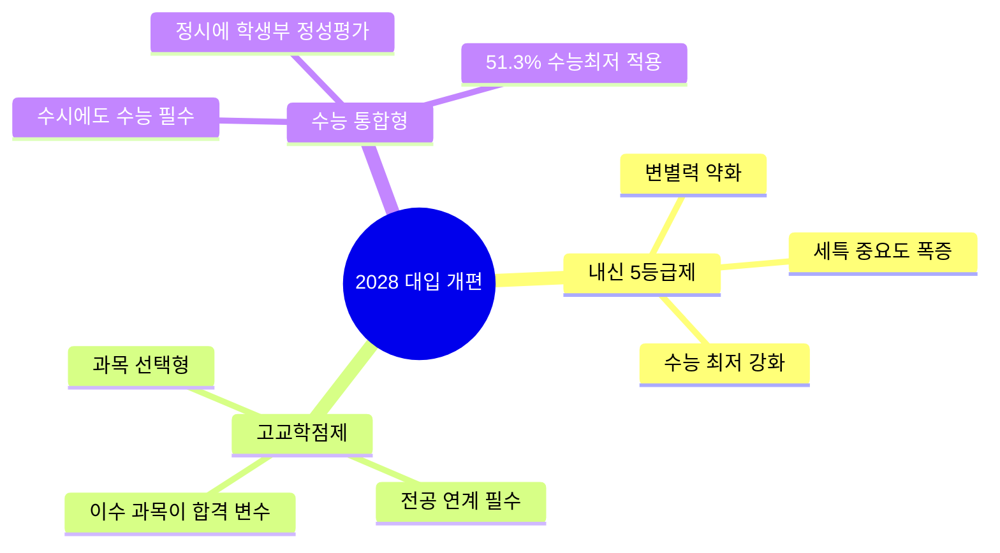

---

## 전체 3개년 로드맵

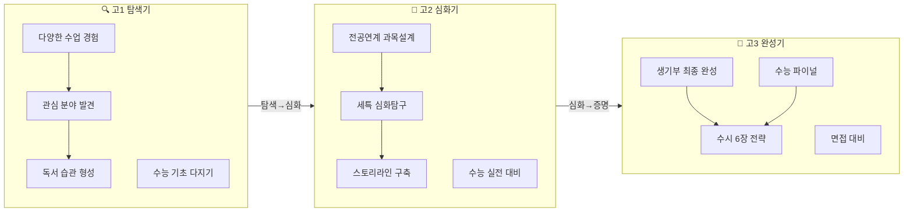

---

## 학년별 핵심 수치 비교

| 항목 | 고1 | 고2 | 고3 |
|------|-----|-----|-----|
| 내신 비중 | ★★★★★ | ★★★★★ | ★★★★☆ (1학기만) |
| 세특 전략 | 탐색형 기록 | 심화형 기록 | 증명형 기록 |
| 수능 학습 | 주 13시간 | 주 20시간 | 주 35시간+ |
| 독서 목표 | 연 15권 (넓게) | 연 12권 (전공 중심) | 연 5권 (면접 대비) |
| 탐구 보고서 | 1~2편 (입문) | 3~4편 (심화) | 1~2편 (완성) |
| 동아리 | 2~3개 탐색 | 1개 집중 리더 | 마무리 활동 |
| 생기부 기록 밀도 | 30% | 50% | 20% |

---

# PART 1. 고등학교 1학년 — 탐색과 기초

## 1-1. 고1 전략 개요

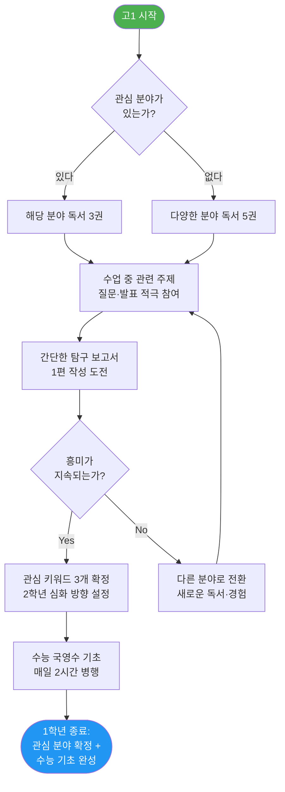

## 1-2. 내신 시험 대비 알고리즘

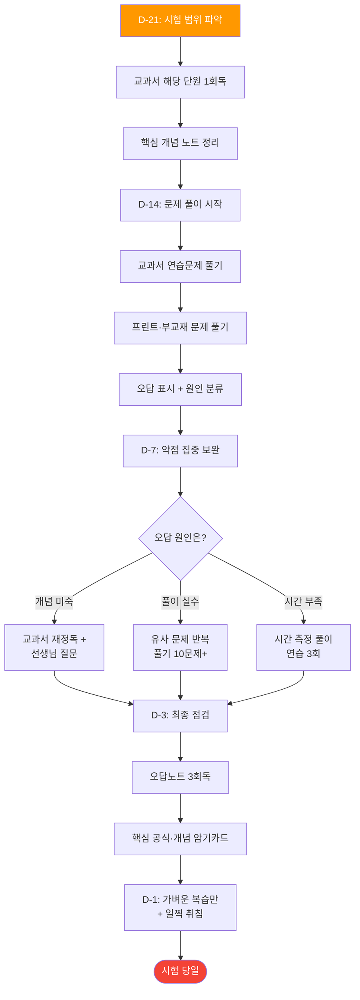

### 내신 오답 분류 체계

| 오답 유형 | 진단 기준 | 처방 | 실전 예시 |
|----------|----------|------|----------|
| A. 개념 오류 | 공식·정의를 모르거나 잘못 기억 | 교과서 해당 페이지 재정독 → 개념 노트 재작성 | 수학: 등차수열 공식 an=a₁+(n-1)d를 an=a₁+nd로 잘못 암기 → 교과서 p.45 재학습 |
| B. 적용 실패 | 개념은 아는데 문제에 적용 못함 | 유사 유형 5문제 추가 풀이 | 과학: 뉴턴의 제2법칙(F=ma)은 아는데 마찰력 포함 문제에서 힘의 방향 설정 실패 → 힘의 분해 유형 5문제 연습 |
| C. 계산 실수 | 풀이 방향은 맞지만 연산 오류 | 검산 습관 + 자주 틀리는 연산 패턴 정리 | 수학: 분수 통분 과정에서 부호 실수 → "부호 먼저 확인" 체크리스트 만들기 |
| D. 시간 초과 | 풀이는 가능하나 시간 내 해결 불가 | 타이머 맞추고 유형별 목표 시간 설정 | 영어: 장문 독해 1문제에 8분 소요 → 목표 4분으로 설정, 스키밍 연습 |
| E. 문제 해석 | 문제가 묻는 것을 잘못 파악 | 문제 밑줄 치기 습관 + "구하는 것" 먼저 체크 | 국어: "적절하지 않은 것"을 "적절한 것"으로 오독 → 핵심 단어 동그라미 습관 |

## 1-3. 생기부 탐구 주제 발굴 프로세스

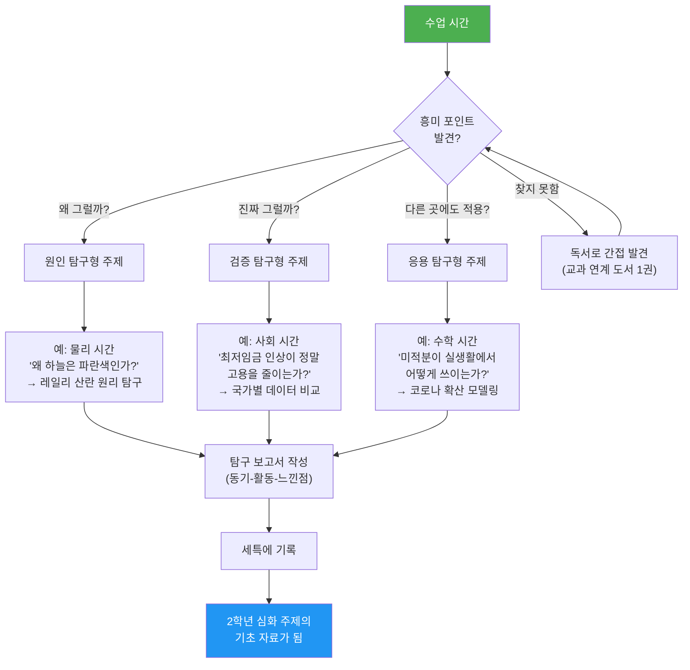

### 과목별 탐구 주제 발굴 실전 예시

| 과목 | 수업 단원 | 발견한 질문 | 탐구 주제 | 탐구 방법 | 2학년 연결 |
|------|----------|-----------|----------|----------|-----------|
| 국어 | 논증의 구조 | "가짜뉴스는 왜 논리적으로 보일까?" | 가짜뉴스의 논리적 오류 분석 | 실제 가짜뉴스 5건 수집 → 오류 유형 분류표 작성 | 미디어 리터러시 심화 탐구 |
| 수학 | 함수와 그래프 | "주식 차트도 함수인가?" | 코스피 지수의 함수적 해석 | 최근 1년 데이터 엑셀 분석 → 추세선 함수 도출 | 확률과통계로 금융 데이터 분석 |
| 영어 | 영미 문학 | "번역이 원작의 의미를 바꾸는가?" | 영한 번역 과정에서의 의미 변형 | 단편소설 원문 vs 3개 번역본 비교 분석 | 언어학·번역학 심화 탐구 |
| 과학 | 전자기파 | "5G가 인체에 해로운가?" | 전자기파 주파수별 인체 영향 | 주파수대별 에너지 계산 + 논문 3편 비교 | 물리학II 전자기학 심화 |
| 사회 | 민주주의 | "직접민주주의는 가능한가?" | 디지털 직접민주주의의 가능성과 한계 | 에스토니아 전자투표 사례 분석 | 정치와법 전자민주주의 심화 |
| 한국사 | 일제강점기 | "독립운동 방략은 왜 나뉘었나?" | 무장투쟁 vs 외교독립론 전략 비교 | 자료집 기반 두 노선의 성과·한계 분석표 작성 | 세계사·동아시아사 비교 연구 |

## 1-4. 수능 기초 확립 로드맵

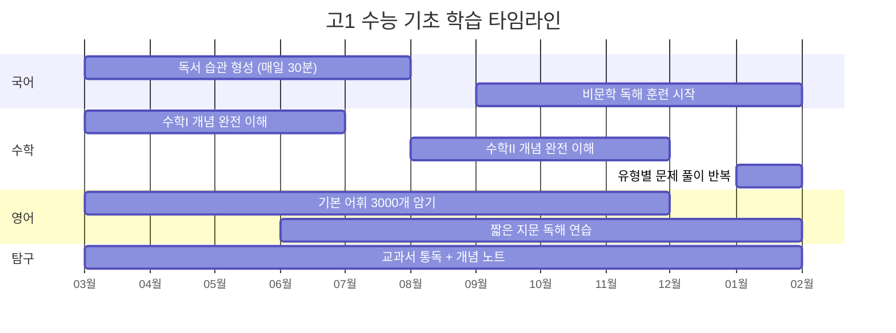

### 국·영·수 일일 학습 알고리즘

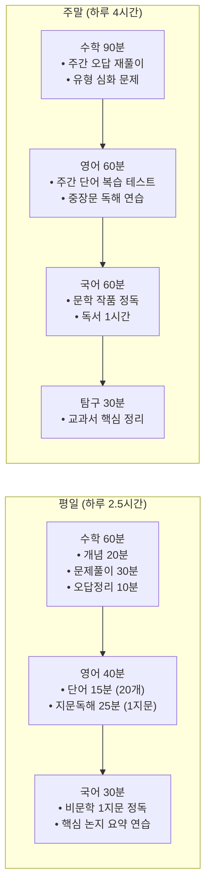

## 1-5. 고1 월별 실전 행동 플래너

```mermaid
flowchart TD
    MAR["3월: 적응기"] --> MAR_D["• 반배정 후 선생님별 수업 스타일 파악<br/>• 동아리 박람회 참석 → 2~3개 체험<br/>• 수업 중 '질문 1개' 습관 시작<br/>• 수능 국영수 기초 교재 구매"]
    
    MAR_D --> APR["4~5월: 첫 시험"]
    APR --> APR_D["• 중간고사 D-21 학습 계획표 작성<br/>• 과목별 교과서→프린트→기출 순서<br/>• 시험 후 오답노트 작성 (유형 분류)<br/>• 관심 분야 독서 2권 시작"]
    
    APR_D --> JUN["6~7월: 탐구 시작"]
    JUN --> JUN_D["• 기말고사 대비 + 수행평가 100%<br/>• 첫 교과 연계 탐구 보고서 도전<br/>  (예: 수학-'피보나치 수열과 자연의 관계')<br/>• 수업 중 발견한 궁금증 3개 메모<br/>• 동아리 1개로 좁혀 집중"]
    
    JUN_D --> SUM["7~8월: 여름방학"]
    SUM --> SUM_D["• 수능 국어: 비문학 하루 1지문 (30일)<br/>• 수능 수학: 개념서 1권 완독<br/>• 수능 영어: 단어장 절반 암기<br/>• 진로 탐색: 희망 학과 5개 리서치<br/>  (커리큘럼, 졸업 후 진로, 필요 역량)<br/>• 심화 독서 3권 (관심 분야)"]
    
    SUM_D --> SEP["9~10월: 심화"]
    SEP --> SEP_D["• 동아리 활동 결과물 1개 완성<br/>• 2차 탐구 보고서 도전<br/>  (예: 과학-'미세플라스틱의 해양 생태계 영향')<br/>• 중간고사 대비 + 오답 분석 정밀화<br/>• 선생님과 1:1 면담 (세특 소재 상의)"]
    
    SEP_D --> NOV["11~12월: 정리"]
    NOV --> NOV_D["• 기말고사 끝 → 1년 활동 총정리<br/>• '나의 관심 키워드 3개' 확정<br/>  (예: 'AI', '의료윤리', '데이터')<br/>• 2학년 과목 선택 (고교학점제 설계)<br/>  → 관심 키워드와 연결되는 과목 우선<br/>• 수능 기초 학습 진도 점검"]
    
    NOV_D --> WIN["1~2월: 겨울방학"]
    WIN --> WIN_D["• 2학년 핵심 과목 선행 학습<br/>  (미적분 개념, 전공 연계 과목 예습)<br/>• 심화 독서 3권 + 독서 노트 작성<br/>• 수능 수학: 수I 기출 50문제 풀이<br/>• 2학년 세특 전략 초안 작성<br/>  (과목별 탐구 주제 후보 2개씩)"]
    
    style MAR fill:#4CAF50,color:#fff
    style WIN fill:#2196F3,color:#fff
```

---

# PART 2. 고등학교 2학년 — 심화와 설계

## 2-1. 고2 전략 개요

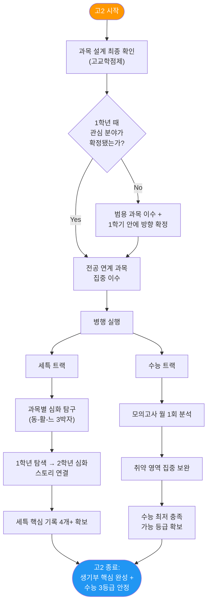

## 2-2. 고교학점제 과목 설계 상세

```mermaid
flowchart TD
    GOAL_MAJOR["희망 전공 확인"] --> CHECK{어떤 계열?}
    
    CHECK -->|이공계| ENG
    CHECK -->|인문사회| HUM
    CHECK -->|상경계| BIZ
    CHECK -->|의약계| MED
    CHECK -->|교육계| EDU
    
    subgraph ENG["이공계 과목 설계"]
        E1["필수: 미적분 + 물리I + 화학I + 정보"]
        E2["심화: 기하 + 물리II/화학II + 확통"]
        E3["연계: 인공지능기초, 프로그래밍"]
        E1 --> E2 --> E3
    end
    
    subgraph HUM["인문사회 과목 설계"]
        H1["필수: 독서 + 정치와법 + 사회문화"]
        H2["심화: 세계사 + 윤리와사상 + 경제"]
        H3["연계: 심리학, 논리학, 제2외국어"]
        H1 --> H2 --> H3
    end
    
    subgraph BIZ["상경계 과목 설계"]
        B1["필수: 경제 + 확통 + 사회문화"]
        B2["심화: 정치와법 + 수학II + 정보"]
        B3["연계: 창업과경영, 국제경제"]
        B1 --> B2 --> B3
    end
    
    subgraph MED["의약계 과목 설계"]
        M1["필수: 생명과학I + 화학I + 미적분"]
        M2["심화: 생명과학II + 화학II + 확통"]
        M3["연계: 물리I, 윤리와사상(의료윤리)"]
        M1 --> M2 --> M3
    end
    
    subgraph EDU["교육계 과목 설계"]
        ED1["필수: 전공교과 + 교육학 + 심리학"]
        ED2["심화: 논리학 + 윤리 + 전공심화"]
        ED3["연계: 사회문화, 독서, 실용영어"]
        ED1 --> ED2 --> ED3
    end
```

### 계열별 과목 설계 실전 예시 (6가지)

#### 예시 1: 컴퓨터공학과 지망

| 학기 | 과목 | 세특 탐구 주제 | 탐구 방법 (구체적) |
|------|------|-------------|-------------------|
| 2-1 | 미적분 | "경사하강법과 AI 학습 원리" | ① 미분의 극값 개념 복습 → ② 경사하강법 수학적 원리 정리 → ③ Python으로 간단한 선형회귀 구현 → ④ 학습률 변화에 따른 수렴 속도 비교 그래프 작성 |
| 2-1 | 물리학I | "반도체의 밴드갭과 CPU 성능" | ① 에너지 밴드 이론 교과서 학습 → ② 실리콘 vs 갈륨비소 밴드갭 비교 → ③ 반도체 공정 미세화 트렌드 자료 수집 → ④ "무어의 법칙 한계" 보고서 작성 |
| 2-2 | 정보 | "정렬 알고리즘 시간복잡도 비교" | ① 버블·선택·삽입·퀵·병합 정렬 5종 코딩 → ② 데이터 1000/10000/100000개에서 실행시간 측정 → ③ 빅오 표기법으로 이론값과 실측값 비교표 작성 → ④ "최적 알고리즘 선택 가이드" 발표 |
| 2-2 | 확률과통계 | "베이즈 정리와 스팸메일 필터링" | ① 조건부확률·베이즈 정리 개념 정리 → ② 실제 스팸메일 50건 단어 빈도 분석 → ③ 나이브 베이즈 분류기 원리 도식화 → ④ "확률이 AI를 만든다" 발표 |

#### 예시 2: 의예과(의학계열) 지망

| 학기 | 과목 | 세특 탐구 주제 | 탐구 방법 (구체적) |
|------|------|-------------|-------------------|
| 2-1 | 생명과학I | "CRISPR 유전자 가위의 원리와 윤리" | ① 유전자 발현 단원 복습 → ② CRISPR-Cas9 작동 메커니즘 논문 3편 분석 → ③ 겸상적혈구빈혈 치료 사례 조사 → ④ "치료 vs 향상" 윤리적 딜레마 찬반 정리표 작성 |
| 2-1 | 화학I | "약물의 분자 구조와 효능 관계" | ① 분자 구조와 극성 단원 학습 → ② 아스피린·이부프로펜·아세트아미노펜 분자 구조 비교 → ③ 구조-활성 관계(SAR) 개념 조사 → ④ "왜 분자 구조가 바뀌면 약효가 달라지는가" 발표 |
| 2-2 | 생명과학II | "암 면역치료제 CAR-T의 작용 원리" | ① T세포 면역 반응 메커니즘 정리 → ② CAR-T 세포 제작 과정 단계별 도식화 → ③ 기존 항암치료 vs CAR-T 효과 비교표 → ④ 비용·부작용·접근성 한계 분석 |
| 2-2 | 윤리와사상 | "뇌사 판정과 장기이식의 윤리적 기준" | ① 칸트 의무론 vs 공리주의 관점 정리 → ② 국가별 뇌사 판정 기준 비교(한·미·일) → ③ 장기이식 대기자 현황 통계 분석 → ④ "의료윤리 4원칙" 적용 논증문 작성 |

#### 예시 3: 경영학과 지망

| 학기 | 과목 | 세특 탐구 주제 | 탐구 방법 (구체적) |
|------|------|-------------|-------------------|
| 2-1 | 경제 | "한국 자영업 폐업률과 최저임금의 상관관계" | ① 수요·공급 법칙 복습 → ② 최근 5년 최저임금 인상률 + 자영업 폐업률 데이터 수집 → ③ 엑셀 산점도 + 상관계수 분석 → ④ "단순 인과가 아닌 복합 변수" 결론 도출 |
| 2-1 | 사회문화 | "MZ세대 구독경제와 소비문화 변화" | ① 사회 계층과 소비 이론 학습 → ② 10대·20대 100명 소비 패턴 설문 설계·실시 → ③ 넷플릭스·멜론·쿠팡 구독 현황 분석 → ④ "소유에서 접근으로" 소비 패러다임 전환 보고서 |
| 2-2 | 확률과통계 | "A/B 테스트와 마케팅 의사결정" | ① 가설검정 개념 학습 → ② 가상 웹사이트 A/B 테스트 시나리오 설계 → ③ 카이제곱 검정으로 유의미성 판단 → ④ "데이터 기반 마케팅 전략" 발표 |
| 2-2 | 정치와법 | "플랫폼 기업의 독점과 공정거래법" | ① 시장 구조 유형 학습 → ② 구글·애플·네이버 시장점유율 비교 → ③ 한국 공정거래법 vs EU 디지털시장법 비교표 → ④ "플랫폼 규제의 적정선" 토론 자료 |

#### 예시 4: 교육학과(국어교육) 지망

| 학기 | 과목 | 세특 탐구 주제 | 탐구 방법 (구체적) |
|------|------|-------------|-------------------|
| 2-1 | 독서 | "문해력 저하 현상의 원인과 해결방안" | ① OECD PISA 읽기 영역 데이터 분석 → ② 디지털 네이티브 세대의 읽기 특성 논문 조사 → ③ "긴 글 읽기 훈련 프로그램" 설계 → ④ 교실 적용 가능성 제안 |
| 2-1 | 심리학 | "교육 동기부여 이론의 실제 적용" | ① 매슬로·데시·라이언 동기이론 비교 → ② 고등학생 30명 학습 동기 설문 조사 → ③ 내재적 동기 vs 외재적 동기 효과 분석 → ④ "자기결정성 높이는 교수법" 제안 |
| 2-2 | 윤리와사상 | "AI 시대 교사의 역할 재정립" | ① AI 교육 플랫폼(킨더, 매쓰플랫) 사례 조사 → ② 교사 5명 인터뷰(AI 도입 경험) → ③ "대체 가능 vs 대체 불가능" 교사 역할 분류표 → ④ "미래 교사상" 에세이 작성 |

## 2-3. 세특 '동-활-느' 작성 알고리즘

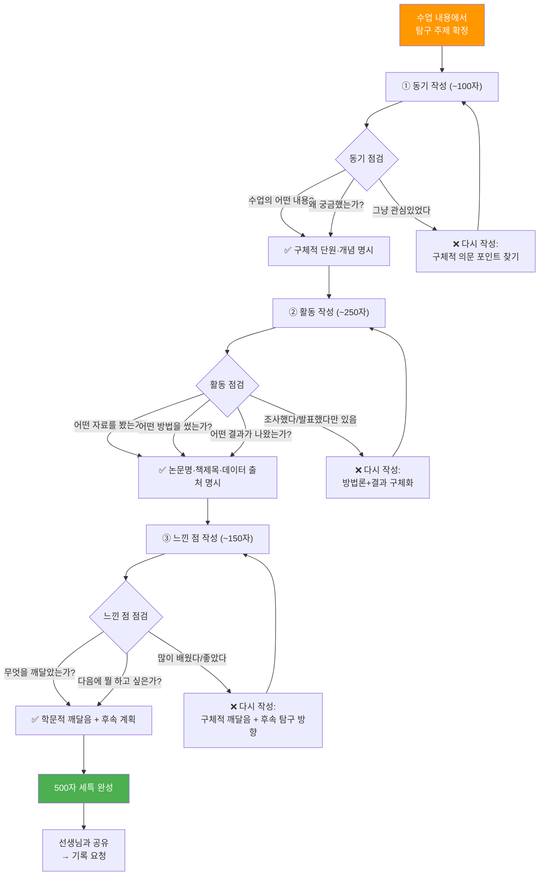

### 세특 500자 실전 작성 예시 (3가지 전공)

**예시 A: 컴퓨터공학 — 정보 과목 세특**

| 구분 | 내용 | 글자수 |
|------|------|--------|
| 동기 | 정보 수업에서 정렬 알고리즘을 배우며 "데이터가 1억 개일 때 어떤 알고리즘이 가장 빠를까?"라는 의문이 생겨 시간복잡도 관점에서 탐구를 시작함. | ~95자 |
| 활동 | 버블·선택·퀵·병합 정렬 4종을 Python으로 직접 구현하고, 데이터 1,000/10,000/100,000개에서 실행시간을 측정함. 이론적 빅오 표기(O(n²), O(n log n))와 실측 데이터를 비교한 그래프를 작성하여 이론값과 실제 성능의 차이를 분석함. 특히 퀵 정렬의 피벗 선택에 따른 최악의 경우를 실험으로 재현하고, 랜덤 피벗 전략이 평균 성능을 어떻게 개선하는지 수치로 증명함. | ~245자 |
| 느낀 점 | 같은 문제도 알고리즘 설계에 따라 1000배 이상의 성능 차이가 날 수 있음을 체감하며, 효율적 알고리즘 설계가 실제 서비스 품질에 직결됨을 깨달음. 향후 그래프 알고리즘과 동적 프로그래밍으로 탐구를 확장할 계획. | ~145자 |

**예시 B: 의예과 — 생명과학I 세특**

| 구분 | 내용 | 글자수 |
|------|------|--------|
| 동기 | 면역 단원에서 항체-항원 결합의 특이성을 배우며 "왜 자가면역질환에서는 자기 세포를 공격하는가?"라는 의문을 갖고 면역관용 실패 메커니즘을 탐구함. | ~98자 |
| 활동 | 중추관용(흉선 내 음성선별)과 말초관용(조절T세포)의 작동 원리를 교과서와 면역학 논문 3편으로 비교 학습함. 류마티스 관절염과 제1형 당뇨를 사례로, 각각의 자가항원 표적과 면역관용 실패 지점을 도식화함. 특히 HLA 유전자 다형성이 자가면역질환 감수성에 미치는 영향을 통계 데이터로 정리하여 "유전적 소인 vs 환경 인자" 비교표를 작성·발표함. | ~250자 |
| 느낀 점 | 면역계의 '자기-비자기' 구분이 단순 이분법이 아닌 연속적 스펙트럼임을 이해하게 됨. 특히 면역관용의 미세 조절이 암 면역치료와도 연결됨을 알게 되어, 2학기 생명과학II에서 T세포 소진(exhaustion)과 면역관문억제제 원리를 심화 탐구할 계획. | ~155자 |

**예시 C: 경영학 — 경제 과목 세특**

| 구분 | 내용 | 글자수 |
|------|------|--------|
| 동기 | 시장 실패 단원에서 정보 비대칭을 배우며 "중고거래 앱에서 사기가 줄어든 이유는 무엇인가?"라는 질문으로 신호(signaling) 이론 관점의 탐구를 시작함. | ~95자 |
| 활동 | 애커로프의 '레몬시장' 이론을 기반으로, 당근마켓·중고나라·번개장터 3개 플랫폼의 신뢰 구축 메커니즘을 비교 분석함. 매너온도(평판시스템), 본인인증, 안전결제(에스크로) 등 각 플랫폼의 정보 비대칭 해소 전략을 유형별로 분류하고, 실제 이용자 리뷰 200건을 분석하여 "신뢰도 체감 요인 순위"를 도출함. 에스크로 도입 전후의 거래 분쟁률 변화 데이터를 수집하여 제도적 해결책의 효과를 수치화함. | ~255자 |
| 느낀 점 | 경제 이론이 실제 비즈니스 모델 설계에 직접 적용되고 있음을 확인하며, 특히 플랫폼 경제에서 '신뢰 설계'가 핵심 경쟁력임을 깨달음. 향후 블록체인 기술이 정보 비대칭을 해결하는 차세대 방안이 될 수 있는지 탐구할 계획. | ~148자 |

## 2-4. 1학년 → 2학년 스토리 연결 설계

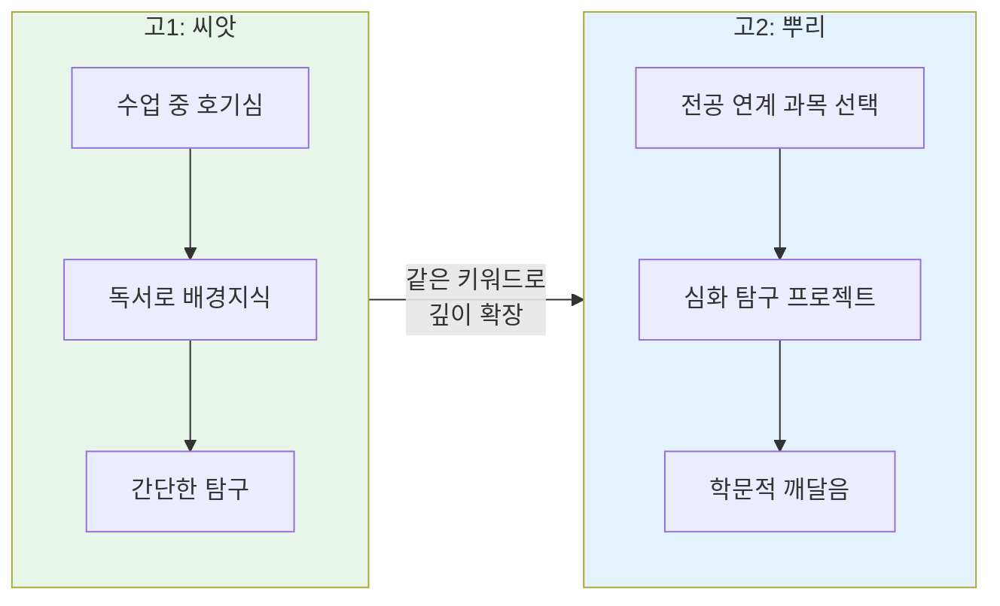

### 스토리 연결 실전 예시 4가지

| 전공 | 고1 (탐색) | 연결 고리 | 고2 (심화) |
|------|-----------|----------|-----------|
| 컴퓨터공학 | 수학: "피보나치 수열이 자연에 나타나는 이유" 탐구 | 수학적 패턴 → 알고리즘 | 정보: "재귀 알고리즘과 동적 프로그래밍의 효율성 비교" 심화 탐구 |
| 의예과 | 과학: "암세포의 세포주기 조절 실패" 탐구 | 세포 → 유전자 → 치료 | 생명과학II: "유전자 가위 CRISPR의 암 치료 적용과 윤리" 심화 |
| 경영학 | 사회: "학교 매점 가격 결정의 경제학" 탐구 | 수요공급 → 시장분석 → 플랫폼 | 경제: "중고거래 플랫폼의 정보 비대칭 해소 전략" 심화 |
| 국어교육 | 국어: "가짜뉴스의 논리적 오류 유형 분석" 탐구 | 논리 → 문해력 → 교육 | 독서: "디지털 시대 문해력 저하의 원인과 교육적 해결방안" 심화 |

## 2-5. 수능 대비 의사결정 트리

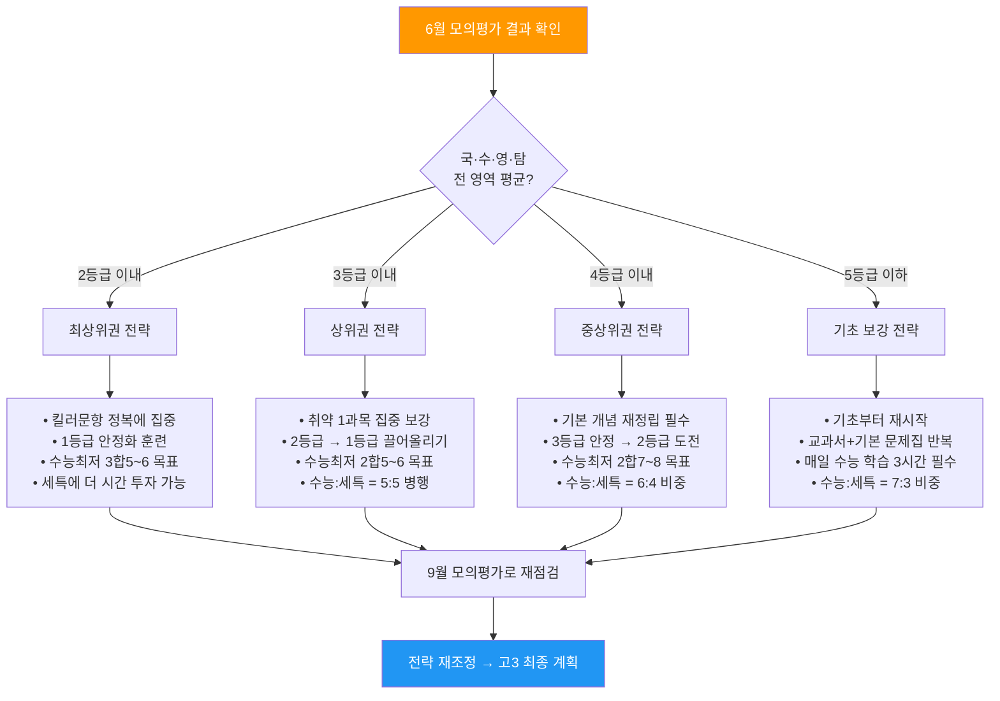

### 등급별 구체적 처방전

| 영역 | 현재 5등급 | 현재 4등급 | 현재 3등급 | 현재 2등급 |
|------|----------|----------|----------|----------|
| 국어 | 기본 문법·어휘력 재확립. 매일 비문학 1지문 정독 + 문단 요약 연습. 3개월 목표: 4등급 | 독해 속도 향상. 비문학 유형별(인문/과학/기술) 하루 2지문. 문학 기본 개념어 100개 암기 | 킬러 지문(융합·고난도) 집중. 기출 5개년 2회독. 평가원 출제 패턴 분석 노트 작성 | 만점 전략. 틀리는 문항 유형 분석 → 해당 유형만 집중 반복. 시간 관리(80분 안에 완료) 훈련 |
| 수학 | 교과서 예제부터 재시작. 개념 이해 없이 공식만 외운 부분 찾아 재학습. 하루 10문제 | 유형별 풀이법 체계화. 자주 틀리는 유형 Top 5 선정 → 각 20문제 반복. 계산 실수 체크리스트 | 3점짜리 문제 실수 제로 목표. 4점짜리 문제 적중률 70% 목표. 기출 함수·미적분 집중 | 킬러문항(21번·30번) 정복. 사고력 문제 매일 2문제. 시험 시간 배분 전략 최적화 |
| 영어 | 기본 어휘 3000개 재암기. 매일 단어 30개 + 2줄 문장 해석 연습 | 구문 독해 훈련. 복잡한 문장 구조(관계사, 분사구문) 100문장 해석 연습 | 빈칸추론·순서배열 유형 집중. 기출 5개년 해당 유형만 모아 풀기 | 듣기 만점 + 독해 1~2개 실수 목표. 고난도 추론 유형 매일 5문제 |

## 2-6. 고2 월별 실전 행동 플래너

```mermaid
flowchart TD
    MAR["3월: 과목설계 확정"] --> MAR_D["• 전공연계 과목 수강 시작 확인<br/>• 과목별 세특 탐구 주제 후보 3개 선정<br/>  (예: 수학-'경사하강법', '베이즈정리', '행렬과AI')<br/>• 수능 기출 최근 3개년 구매 → 주말 1회 풀기<br/>• 동아리 리더십 역할 확보 (부장·차장)"]
    
    MAR_D --> APR["4~5월: 1차 탐구 + 중간"]
    APR --> APR_D["• 중간고사 D-21 계획표 작성 → 전과목 1등급 목표<br/>• 핵심 과목 1차 세특 탐구 수행<br/>  (예: 경제 수업 '시장실패' 단원 학습 후<br/>   → '중고거래 플랫폼의 정보비대칭 분석' 탐구<br/>   → 당근마켓·번개장터 실데이터 수집·분석<br/>   → 비교표+그래프 포함 보고서 작성)<br/>• 독서 2권 완독 → 탐구 동기 근거로 활용"]
    
    APR_D --> JUN["6월: 모의평가 분석"]
    JUN --> JUN_D["• 6월 모의평가 영역별 등급·원점수 기록<br/>• 취약 영역 진단 → 처방 계획 수립<br/>  (예: 국어 3등급 → '빈칸추론 유형 매일 3문제')<br/>• 기말고사 대비 시작<br/>• 수능 최저 충족 가능성 1차 판단"]
    
    JUN_D --> SUM["7~8월: 여름방학 승부처"]
    SUM --> SUM_D["• 수능 취약 과목 하루 4시간 집중<br/>  (예: 수학 3→2등급 목표:<br/>   오전 개념 재정리 2시간<br/>   오후 기출 유형별 풀이 2시간)<br/>• 세특 심화 탐구 보고서 1편 완성<br/>  (예: '정렬 알고리즘 4종 성능 비교'<br/>   → 코드 작성·실험·그래프·결론 포함)<br/>• 관심 대학 10개 전형 요강 분석<br/>  (전형별 반영 비율, 수능최저 정리표)"]
    
    SUM_D --> SEP["9월: 모의평가 + 방향 결정"]
    SEP --> SEP_D["• 9월 모의평가 → 수시/정시 비율 1차 결정<br/>• 2학기 세특 핵심 활동 시작<br/>  (예: 물리 수업 '전자기파' 단원 후<br/>   → '5G 주파수별 인체 영향 분석' 탐구<br/>   → 논문 기반 주파수-에너지 계산표 작성)<br/>• 동아리 최종 성과물 제작 시작"]
    
    SEP_D --> NOV["10~12월: 마무리"]
    NOV --> NOV_D["• 중간+기말 고사 최선<br/>• 2학년 생기부 스토리 총점검<br/>  ('1학년 탐색 → 2학년 심화' 연결 확인)<br/>• 수능 모의고사 매주 1회 → 등급 추이 기록<br/>• 3학년 전략 수립: 목표대학·전형·일정표"]
    
    NOV_D --> WIN["1~2월: 겨울방학"]
    WIN --> WIN_D["• 수능 집중 (하루 6시간)<br/>  국어 2h + 수학 2h + 영어 1h + 탐구 1h<br/>• 생기부 3년 스토리 초안 작성<br/>  (A4 1장으로 요약: 관심→탐색→심화→증명)<br/>• 목표 대학별 면접 기출 수집<br/>• 시사 이슈 주간 브리핑 노트 시작"]
    
    style MAR fill:#FF9800,color:#fff
    style WIN fill:#2196F3,color:#fff
```

---

# PART 3. 고등학교 3학년 — 완성과 실전

## 3-1. 고3 전략 개요

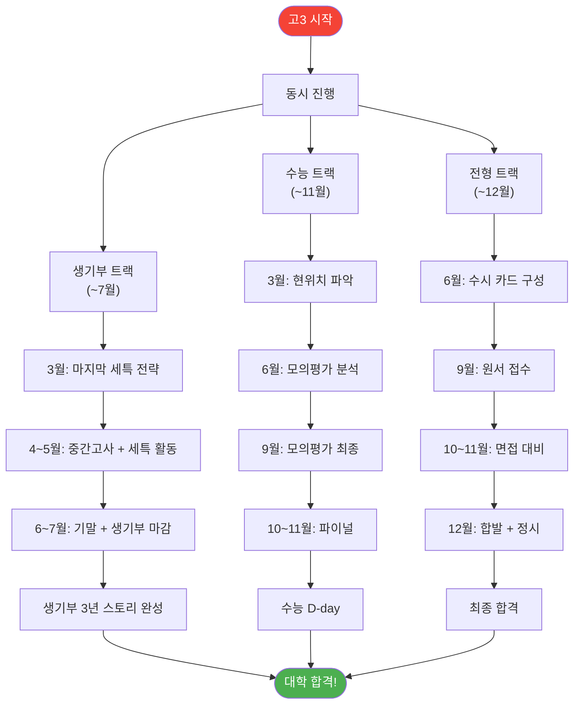

## 3-2. 수시 6장 카드 배분 알고리즘

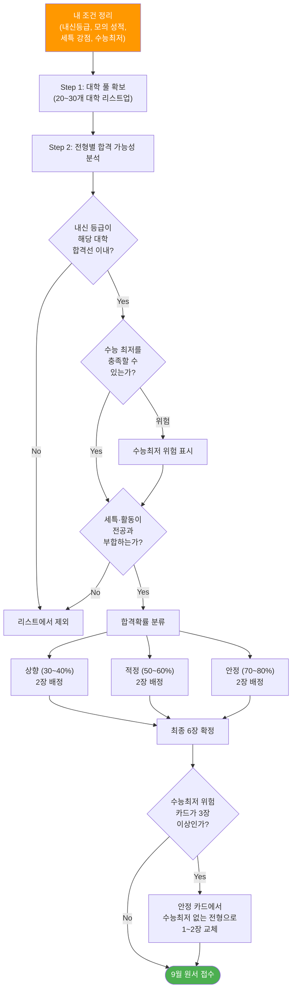

### 수시 6장 배분 실전 시뮬레이션

**Case A: 내신 2등급(5등급제) + 모의고사 2등급 + 세특 강함 (컴퓨터공학 지망)**

| 카드 | 대학·전형 (예시) | 유형 | 수능최저 | 합격확률 | 선택 이유 |
|------|----------------|------|---------|---------|----------|
| 1장 | 서울대 지균 (컴공) | 상향 | 3합5 | 30% | 최고 목표, 세특 스토리 강점 활용 |
| 2장 | 연세대 활동우수 (컴공) | 상향 | 없음 | 35% | 수능최저 없어 세특으로 승부 |
| 3장 | 성균관대 학종 (소프트) | 적정 | 2합5 | 55% | 내신+세특 균형, 충족 가능 |
| 4장 | 한양대 학종 (컴공) | 적정 | 없음 | 60% | 수능최저 없는 안전 카드 |
| 5장 | 중앙대 학종 (소프트) | 안정 | 2합6 | 75% | 합격 안정권 |
| 6장 | 건국대 학종 (컴공) | 안정 | 2합7 | 80% | 확실한 보험 |

**Case B: 내신 3등급(5등급제) + 모의고사 3등급 + 논술 강점 (경영학 지망)**

| 카드 | 대학·전형 (예시) | 유형 | 수능최저 | 합격확률 | 선택 이유 |
|------|----------------|------|---------|---------|----------|
| 1장 | 성균관대 논술 (경영) | 상향 | 2합5 | 25% | 논술 자신, 수능최저 도전 |
| 2장 | 중앙대 논술 (경영) | 상향 | 2합6 | 35% | 논술 실력 활용 |
| 3장 | 건국대 학종 (경영) | 적정 | 2합7 | 50% | 내신+세특 조합 |
| 4장 | 동국대 논술 (경영) | 적정 | 2합7 | 55% | 논술 가능 + 최저 충족 가능 |
| 5장 | 단국대 학종 (경영) | 안정 | 없음 | 70% | 수능최저 없는 안전망 |
| 6장 | 가톨릭대 학종 (경영) | 안정 | 없음 | 80% | 확실한 합격 보험 |

## 3-3. 면접 준비 알고리즘

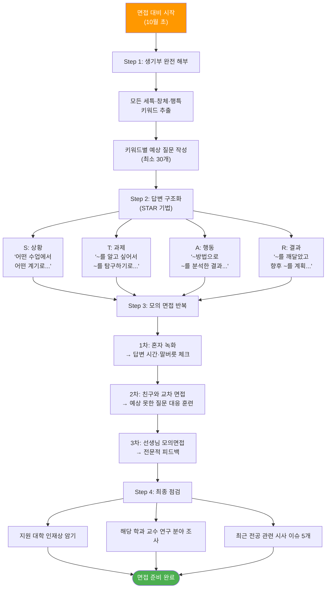

### 면접 예상 질문 & 답변 전략 실전 예시

**컴퓨터공학 지원자 (세특: 정렬 알고리즘 탐구)**

| 예상 질문 | 답변 핵심 포인트 | 구체적 답변 전략 |
|----------|----------------|----------------|
| "왜 정렬 알고리즘을 탐구했나요?" | 동기의 진정성 | "정보 수업에서 같은 결과를 내는데 10배 이상 속도 차이가 나는 것에 충격받음 → 효율성의 의미를 깊이 이해하고 싶었음" |
| "퀵 정렬과 병합 정렬의 차이는?" | 전공 지식 확인 | "시간복잡도는 둘 다 O(n log n)이지만, 퀵 정렬은 피벗 선택에 따라 최악 O(n²), 병합 정렬은 항상 O(n log n)이나 추가 메모리 필요. 실험에서 확인한 수치 차이 언급" |
| "이 탐구의 한계점은 무엇인가요?" | 학문적 성숙도 | "정수 데이터만 테스트 → 문자열·객체 정렬에서는 다른 결과 가능. 실제 서비스 환경(캐시, 병렬 처리)을 고려하지 못한 점이 한계" |
| "대학에서 무엇을 공부하고 싶나요?" | 전공 적합성 | "학과 교육과정 중 '자료구조와 알고리즘' 수업을 통해 그래프 알고리즘으로 확장하고, 향후 대규모 데이터 최적화 분야를 연구하고 싶음" |
| "최근 IT 분야에서 관심 있는 이슈는?" | 시사 이해도 | "생성형 AI의 추론 최적화 → 대규모 언어모델의 연산 효율성 문제 → 알고리즘 최적화가 AI 서비스 비용 절감의 핵심 → 직접 탐구한 정렬 효율성과 같은 맥락" |

**의예과 지원자 (세특: 자가면역질환 메커니즘 탐구)**

| 예상 질문 | 답변 핵심 포인트 | 구체적 답변 전략 |
|----------|----------------|----------------|
| "자가면역질환에 관심을 갖게 된 계기는?" | 동기의 구체성 | "면역 수업에서 '왜 자기 세포를 공격하는가'가 직관과 모순되어 의문 → 면역관용의 복잡한 조절 메커니즘에 매료됨" |
| "HLA와 자가면역의 관계를 설명해보세요" | 탐구 깊이 | "HLA 유전자의 특정 대립유전자(예: HLA-B27)가 강직성 척추염과 강한 상관관계 → 자가항원 제시 과정에서의 이상이 원인으로 추정 → 통계 데이터 언급" |
| "의사가 되면 어떤 분야를 전공하고 싶나요?" | 진로 구체성 | "류마티스내과를 중심으로 자가면역질환 치료 → 특히 면역관문억제제의 부작용으로 나타나는 자가면역 반응 관리에 관심 → 종양면역학과의 접점" |
| "의료윤리에 대한 생각은?" | 인문학적 소양 | "윤리 세특에서 탐구한 장기이식 사례 언급 → 의료윤리 4원칙(자율존중·악행금지·선행·정의) → 현실에서의 딜레마 구체적 사례 제시" |

## 3-4. 수능 D-100 파이널 전략

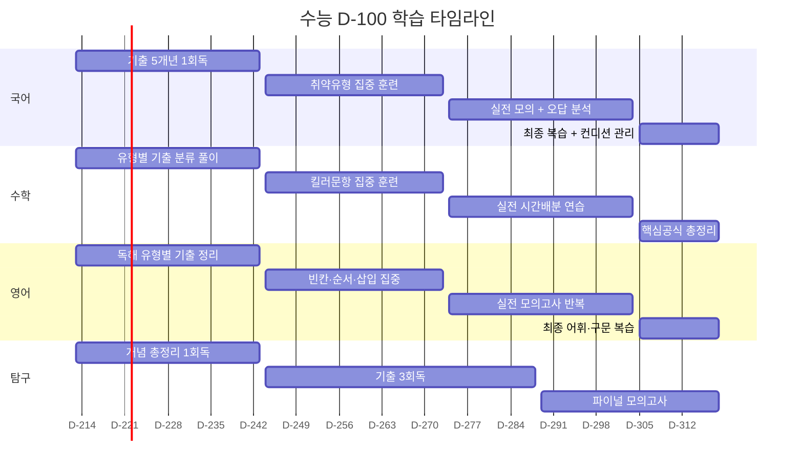

### 수능 당일 시간 배분 전략

| 교시 | 과목 | 시간 | 전략 |
|------|------|------|------|
| 1교시 | 국어 (80분) | 08:40~10:00 | 화법·작문 15분 → 독서 35분 → 문학 25분 → 검토 5분 |
| 2교시 | 수학 (100분) | 10:30~12:10 | 1~21번 순서대로. 막히면 3분 내 넘기기. 22~30번 배점 높은 순. 마지막 10분 검산 |
| 3교시 | 영어 (70분) | 13:10~14:20 | 듣기 25분(집중) → 독해 쉬운것 먼저 → 빈칸·순서 마지막 10분 집중 |
| 4교시 | 탐구 (60분) | 14:50~15:50 | 자신있는 과목 먼저. 과목당 30분. 모르면 2분 내 넘기고 돌아오기 |

## 3-5. 고3 월별 실전 행동 플래너

```mermaid
flowchart TD
    MAR["3월"] --> MAR_D["• 3월 모의고사 결과 분석표 작성<br/>  (영역별 등급+원점수+취약단원)<br/>• 수시/정시 비율 1차 판단<br/>  (예: 모의 2등급 → 수시 70% + 정시 30%)<br/>• 3학년 세특 마지막 전략<br/>  (예: 수학-'선형대수와 머신러닝' 최종 탐구)<br/>• 목표 대학 20개 리스트 + 전형 정리표"]
    
    MAR_D --> MAY["4~5월"]
    MAY --> MAY_D["• 1학기 중간고사 = 마지막 내신!<br/>  D-21 알고리즘 적용, 전과목 올인<br/>• 세특 핵심 활동 최종 수행 + 기록 요청<br/>• 생기부 3년 스토리 최종 점검<br/>  (1학년 탐색→2학년 심화→3학년 증명<br/>   일관성 있는가? 빈틈은 없는가?)"]
    
    MAY_D --> JUN["6월"]
    JUN --> JUN_D["• 6월 모의평가 → 수능 등급 예측<br/>• 수시 6장 카드 1차 확정<br/>  (상향2+적정2+안정2 시뮬레이션)<br/>• 기말고사 대비<br/>• 대학별 전형 요강 정밀 분석<br/>  (모집인원, 전형방법, 수능최저,<br/>   면접비중, 제출서류 체크리스트)"]
    
    JUN_D --> AUG["7~8월"]
    AUG --> AUG_D["• 기말 종료 → 수능 올인 모드<br/>  일일 학습: 국어2h+수학3h+영어1.5h+탐구1.5h<br/>• 수시 원서 접수 준비<br/>  (서류 점검, 자기소개서 초안 작성)<br/>• 수시 6장 최종 확정<br/>• D-100 학습 계획 실행 시작"]
    
    AUG_D --> SEP["9월"]
    SEP --> SEP_D["• 수시 원서 접수 (실수 금지!)<br/>  체크: 접수 마감시간, 전형료 납부,<br/>  서류 업로드 확인, 수능최저 재확인<br/>• 9월 모의평가 → 정시 지원선 예측<br/>• 논술 대비 (해당 시) 주 2회 연습"]
    
    SEP_D --> OCT["10~11월"]
    OCT --> OCT_D["• 면접 대비 (STAR 기법 + 모의면접 3회)<br/>• 수능 실전 모의고사 주 2회<br/>  → 시간 배분 + 컨디션 관리 연습<br/>• D-14: 새 문제 풀지 않기!<br/>  오답노트+핵심개념만 복습<br/>• 수능 D-day: 평소 실력 발휘에 집중"]
    
    OCT_D --> DEC["11~12월"]
    DEC --> DEC_D["• 수능 후 가채점 즉시<br/>• 수시 면접 (수능 후 면접 대학)<br/>• 수시 합격 발표 확인<br/>• 미합격 시 → 정시 지원<br/>  정시 배치표 기반 상향1+적정1+안정1<br/>• 최종 등록 + 대학 생활 준비"]
    
    style MAR fill:#f44336,color:#fff
    style DEC fill:#4CAF50,color:#fff
```

---

# 부록

## A. 3년 성장 스토리 설계도

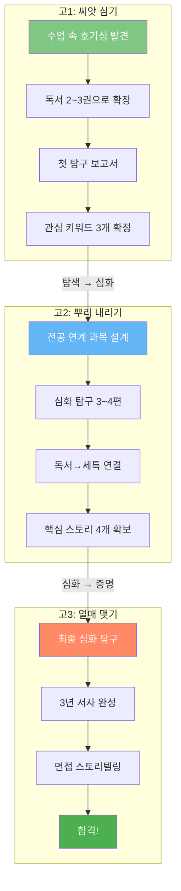

### 전공별 3년 스토리 실전 예시

| 전공 | 고1 (탐색) | 고2 (심화) | 고3 (증명) | 한 줄 스토리 |
|------|-----------|-----------|-----------|------------|
| 컴퓨터공학 | 수학: 피보나치+자연 → 과학: 세포분열 시뮬레이션 흥미 | 정보: 정렬알고리즘 성능비교 → 수학: 경사하강법과 AI학습 → 물리: 반도체 원리 | 정보: 자연어처리 모델 비교 실험 → "알고리즘 최적화로 AI 서비스 혁신" | "수학적 패턴에서 시작하여 AI 알고리즘 최적화까지 탐구를 확장한 학생" |
| 의예과 | 과학: 세포주기 조절 실패와 암 → 독서: 『암의 역습』 | 생명I: 자가면역질환 메커니즘 → 화학: 약물 분자구조와 효능 → 윤리: 장기이식 윤리 | 생명II: CAR-T 면역치료 원리 → "면역학에서 윤리까지 통합적 사고" | "세포 수업에서 의문을 품어 면역치료의 과학과 윤리를 모두 탐구한 학생" |
| 경영학 | 사회: 학교매점 가격의 경제학 → 독서: 『넛지』 | 경제: 중고거래 플랫폼 정보비대칭 → 사문: MZ세대 구독경제 → 확통: A/B테스트 | 정치법: 플랫폼 독점 규제 → "데이터 기반 비즈니스 전략" | "일상 경제 현상에서 출발해 플랫폼 비즈니스 전략까지 탐구한 학생" |
| 국어교육 | 국어: 가짜뉴스 논리적 오류 분석 → 독서 습관 형성 | 독서: 문해력 저하 원인 분석 → 심리: 교육 동기부여 이론 → 윤리: AI시대 교사역할 | 교육학: 문해력 향상 프로그램 설계 → "읽기 교육의 미래" | "논리에서 시작하여 미래 읽기 교육의 방향을 설계한 학생" |

## B. 2028 대입 핵심 수치 정리

| 항목 | 수치 | 의미 | 대응 전략 |
|------|------|------|----------|
| 내신 등급 | 5등급제 | 변별력 약화 | 세특 품질로 차별화 필수 |
| 수시 수능최저 적용 | 51.3% | 수시에도 수능 필수 | 고1부터 수능 기초 병행 |
| 학종 수능최저 적용 | 14.2% (↑3.7%p) | 학종도 수능 필요 | 수능 2~3등급 안정 목표 |
| 논술 수능최저 적용 | 98.4% | 사실상 전원 적용 | 논술 지원 시 수능 필수 |
| 세특 글자 수 | 과목당 500자 | 짧지만 핵심 | '동-활-느' 3박자 필수 |
| 창체 글자 수 | 자율500/동아리500/진로700 | 주도성 어필 | 리더십+구체적 성과 |
| 행특 글자 수 | 500자 | 인성 평가 | 3년간 일관된 성장 |
| 정시 학생부 정성평가 | 신설 | 정시도 학교생활 반영 | 출결·수업태도 절대 소홀 금지 |

## C. 정시 파이터 위험 경고

```mermaid
flowchart TD
    FIGHTER["정시만 준비<br/>(학교생활 등한시)"] --> RISK1["출결 불량<br/>지각·결석 누적"]
    FIGHTER --> RISK2["수업태도 불량<br/>세특 기록 빈약"]
    FIGHTER --> RISK3["수행평가 미참여<br/>내신 등급 하락"]
    
    RISK1 --> RESULT["2028 정시 전형:<br/>학생부 정성평가 반영"]
    RISK2 --> RESULT
    RISK3 --> RESULT
    
    RESULT --> DANGER["수능 점수가 같아도<br/>학생부로 인해 탈락!"]
    
    DANGER --> LESSON["결론: 수시든 정시든<br/>학교생활 충실도는 필수"]
    
    SAFE["올바른 전략:<br/>학교생활 + 수능 병행"] --> SUCCESS["수시 합격 가능<br/>+ 정시도 안전"]
    
    style FIGHTER fill:#f44336,color:#fff
    style DANGER fill:#f44336,color:#fff
    style SAFE fill:#4CAF50,color:#fff
    style SUCCESS fill:#4CAF50,color:#fff
```

---

> **작성 기준:** 2028 대입 개편안 기반
> **작성일:** 2026-05-19
> **대상:** 고등학교 1·2·3학년 학생 및 학부모
> **참고자료:** 2028 대입 개편 핵심 가이드, 고등학교 생기부 핵심 요약 가이드
