# 커리어 패스 앱 기획서: 페르소나 & 필요성 분석
> "왜 지금 이 앱이 필요한가?" — 실전 데이터 기반 사용자 페르소나 설계

---

## 0. 왜 이 앱을 만들어야 하는가?

### 0.1 핵심 문제 정의

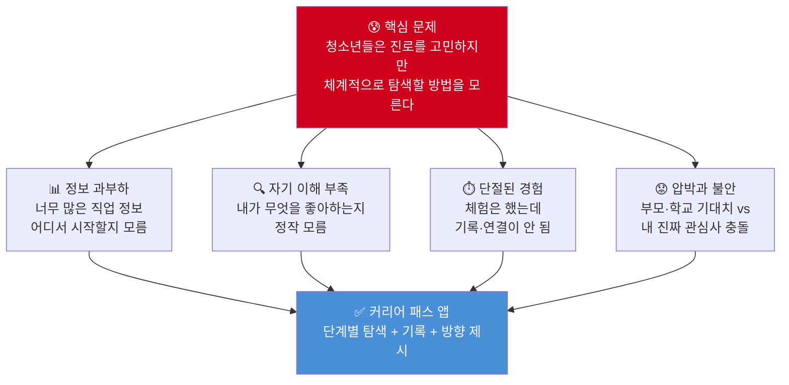

### 0.2 실전 데이터로 본 문제의 심각성

> 출처: 교육부·한국직업능력연구원 「2024 초·중등 진로교육 현황조사」(38,481명 대상)

| 지표 | 수치 | 의미 |
|------|------|------|
| 희망 직업 없는 고등학생 | **증가 추세** | 진로 방향을 잃은 학생 급증 |
| 희망 직업 업무를 아는 중학생 | **53.0%** | 절반은 직업을 모르고 꿈꾼다 |
| 희망 직업 업무를 아는 고등학생 | **55.3%** | 입시 준비 중에도 직업 이해 부족 |
| 진로 결정 장애 1위: 성적 걱정 | **42.9%** | 적성보다 성적이 진로를 결정 |
| 진로 스트레스 경험 고등학생 | **56%** | 절반 이상이 진로 때문에 힘들다 |
| 대학 진학 희망률 감소 | 77.3% → **66.5%** | 진로 다양화, 기존 경로에 의문 |
| 취업 직접 희망 | 7.0% → **13.3%** | 대입 외 경로 필요성 급증 |
| 미래 직업 준비 방법 모름 | **34.6%** | 방법을 모르는 것이 가장 큰 문제 |

### 0.3 기존 앱·플랫폼의 한계

| 기존 서비스 | 문제점 | 우리 앱이 채울 공백 |
|-----------|--------|------------------|
| 커리어넷 | PC 중심, UI 구식, 탐색 후 행동 연결 없음 | 모바일 우선, 행동 계획까지 연결 |
| 주니어 커리어넷 | 초등 한정, 중·고 연계 없음 | 초→중→고 성장 연속성 |
| 유튜브 직업 영상 | 단편적, 나의 상황과 연결 안 됨 | 내 상황에 맞는 개인화 추천 |
| 학교 진로 수업 | 연 몇 회, 기록 없음, 일회성 | 365일 지속 기록·성찰 |
| ChatGPT | 질문 방법을 모르면 못 씀 | 질문 없이도 단계별 안내 |

---

## 1. 앱 개요: "DreamPath" — 나만의 커리어 탐색 앱

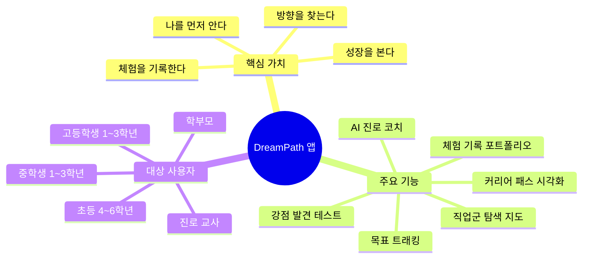

---

## 2. 페르소나 설계

> **페르소나란?** 앱의 실제 사용자를 대표하는 가상의 인물 프로필.
> 개발 전 "누구를 위해 만드나?"를 구체화하여 기능과 UX를 결정하는 기준.

---

### 페르소나 #1: 초등학생 — 김민준 (11세, 초등 5학년)

```
┌─────────────────────────────────────────────────────────┐
│  👦 김민준 / 11세 / 초등 5학년 / 서울 거주              │
│  "뭐든 다 재미있는데, 뭘 해야 할지 모르겠어요"           │
└─────────────────────────────────────────────────────────┘
```

#### 기본 프로필

| 항목 | 내용 |
|------|------|
| 이름 | 김민준 |
| 나이 | 11세 |
| 학년 | 초등 5학년 |
| 거주지 | 서울 노원구 |
| 관심사 | 레고 조립, 마인크래프트, 과학 실험 |
| 가족 상황 | 맞벌이 부모, 외동, 학원 3개 수강 중 |
| 디지털 환경 | 스마트폰 하루 1~2시간, 유튜브 주 사용 |

#### 실제 고민 (리얼 보이스)

> *"엄마는 의사 되라는데, 저는 레고 만드는 게 더 좋아요. 레고 만드는 게 직업이 될 수 있어요?"*

> *"과학관 갔을 때 로봇 만지는 게 진짜 재밌었는데, 학교 진로 수업엔 그런 거 없어요."*

> *"유튜브 보면 멋있는 직업 많은데, 나는 어떤 게 맞는지 모르겠어요."*

#### 페인 포인트 (Pain Points)

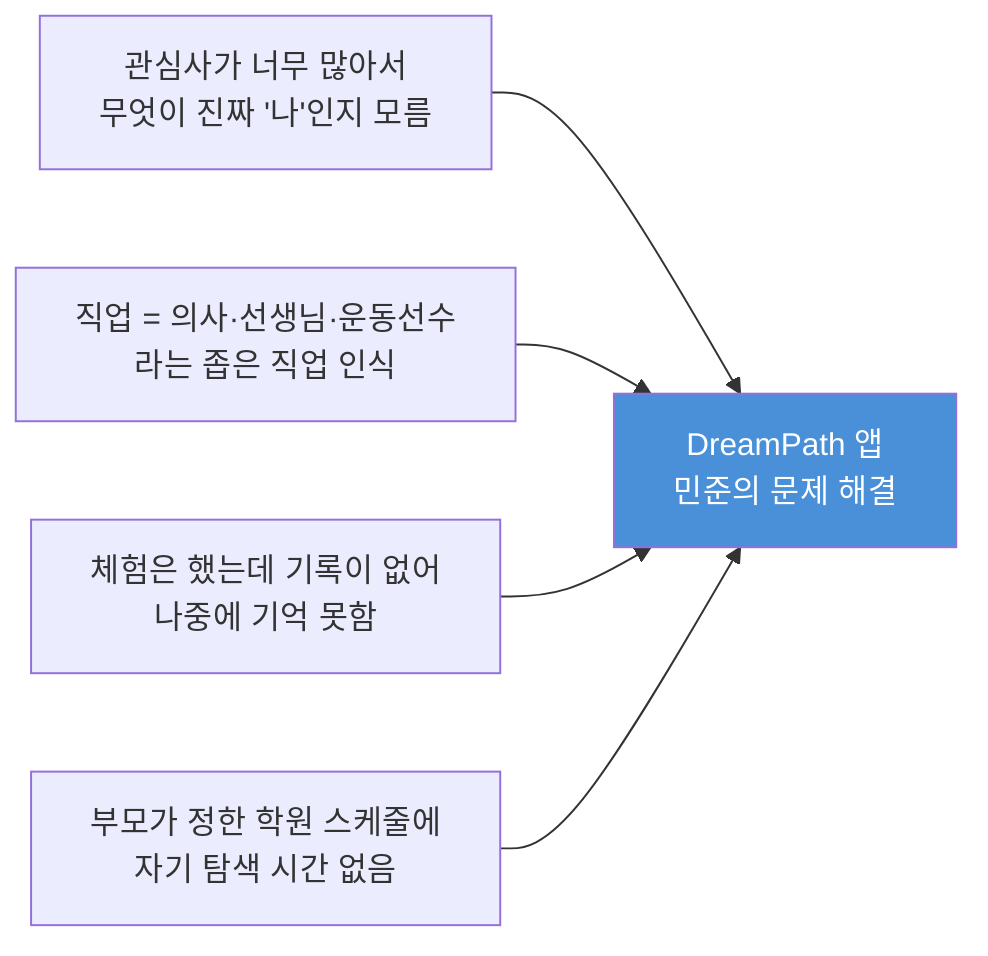

| 페인 포인트 | 현재 상황 | 앱이 해결하는 방식 |
|-----------|---------|-----------------|
| 직업 세계가 좁다 | 알고 있는 직업 10개 미만 | 게임처럼 직업 세계 탐험 (직업 지도) |
| 체험 기록 없음 | 과학관·박물관 가도 기억에서 사라짐 | 체험 후 3줄 기록 + 사진 첨부 기능 |
| 강점을 모름 | "잘하는 게 없는 것 같아요" | 재미있었던 순간 추적 → 강점 패턴 도출 |
| 진로 탐색 동기 부족 | 학교 진로 수업이 지루함 | 레벨업, 배지, 캐릭터 성장 게이미피케이션 |

#### 앱 사용 시나리오 (민준의 하루)

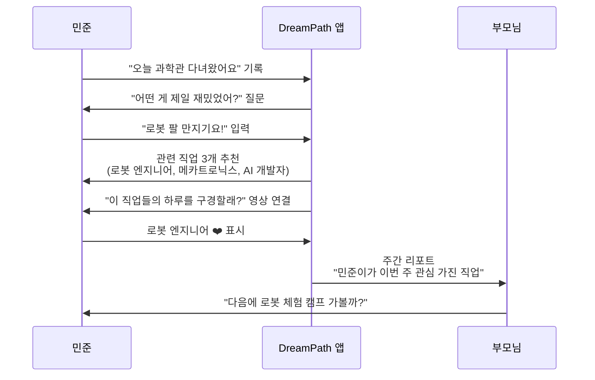

#### 민준에게 필요한 핵심 기능

- **직업 탐험 지도**: 200개+ 직업을 게임 맵처럼 탐험
- **재미 레이더**: "오늘 뭐가 제일 신났어?" 하루 1문장 기록
- **강점 뱃지**: 쌓인 기록에서 자동으로 강점 패턴 추출
- **부모 연결**: 주간 탐색 리포트를 부모에게 공유

---

### 페르소나 #2: 중학생 — 박서연 (14세, 중학교 2학년)

```
┌─────────────────────────────────────────────────────────┐
│  👧 박서연 / 14세 / 중2 / 경기도 성남 거주              │
│  "하고 싶은 건 있는데, 그게 직업이 될 수 있을지 모르겠어" │
└─────────────────────────────────────────────────────────┘
```

#### 기본 프로필

| 항목 | 내용 |
|------|------|
| 이름 | 박서연 |
| 나이 | 14세 |
| 학년 | 중학교 2학년 (자유학기제 경험) |
| 거주지 | 경기도 성남 분당 |
| 관심사 | 그림 그리기, 인테리어, 인스타그램 피드 꾸미기 |
| 가족 상황 | 전업주부 엄마, 직장인 아빠, 언니 1명 |
| 고민 | "미술 쪽이 좋은데 돈을 벌 수 있을까?" |
| 디지털 환경 | 인스타·유튜브 매일, Pinterest 적극 사용 |

#### 실제 고민 (리얼 보이스)

> *"홀랜드 검사 결과가 예술형(A)인데, 예술로는 먹고살기 힘들다고 엄마가 말해요."*

> *"자유학기 때 디자인 체험 했는데 너무 재밌었어요. 근데 그게 기록으로 남아있지 않아서 나중에 쓸 수가 없어요."*

> *"인스타 팔로워 모으는 게 재밌는데 이게 마케터랑 연결되는 건지 몰랐어요."*

> *"진로 검사 할 때마다 결과가 달라요. 뭘 믿어야 해요?"*

#### 페인 포인트 분석

| 페인 포인트 | 빈도 | 심각도 | 앱 해결책 |
|-----------|------|--------|---------|
| 검사 결과 불일치 (매번 다름) | 높음 | 중 | 시간 흐름에 따른 검사 추이 시각화 |
| 예술 = 돈 못 번다는 편견 | 높음 | 높음 | 예술 기반 고수입 직업 데이터 제공 |
| 체험 기록이 없어 자소서 소재 없음 | 높음 | 높음 | 체험 즉시 기록 → 포트폴리오 자동 생성 |
| 부모와 진로 갈등 | 중간 | 높음 | 부모 설득용 데이터 리포트 (직업 전망, 연봉) |
| 관심사 → 직업 연결 방법 모름 | 높음 | 높음 | 관심사 태깅 → 관련 직업군 자동 매핑 |

#### 서연의 커리어 패스 발견 여정

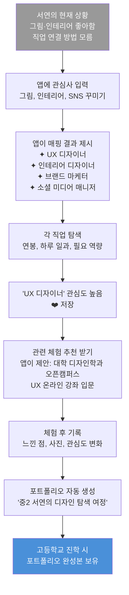

#### 서연에게 필요한 핵심 기능

- **관심사 → 직업 매핑 엔진**: 태그 기반 자동 직업군 연결
- **직업 현실 탐색**: 연봉 분포, 하루 일과, 선배 인터뷰 영상
- **체험 포트폴리오**: 활동 즉시 기록 → 자소서 소재 자동 정리
- **부모 설득 리포트**: "이 직업의 미래 전망과 수입" 데이터 공유 기능
- **진로 갈등 상담**: 부모-자녀 진로 갈등 해소 가이드

---

### 페르소나 #3: 고등학생 — 이준혁 (17세, 고등학교 2학년)

```
┌─────────────────────────────────────────────────────────┐
│  👨‍🎓 이준혁 / 17세 / 고2 / 부산 거주                   │
│  "하고 싶은 건 있는데, 지금 뭘 해야 하는지 모르겠어요"   │
└─────────────────────────────────────────────────────────┘
```

#### 기본 프로필

| 항목 | 내용 |
|------|------|
| 이름 | 이준혁 |
| 나이 | 17세 |
| 학년 | 고등학교 2학년 |
| 거주지 | 부산 해운대 |
| 관심사 | 데이터 분석, 경제 뉴스 읽기, 투자 공부 |
| 성적 | 중상위권 (수학 강점, 국어 약점) |
| 가족 상황 | 부모 모두 직장인, 형 1명 (대학생) |
| 고민 | "AI 관련 직업을 원하는데 어떤 전공이 맞는지 모름" |
| 디지털 환경 | 유튜브·Reddit 탐독, Python 독학 중 |

#### 실제 고민 (리얼 보이스)

> *"데이터 사이언티스트가 되고 싶은데, 통계학과를 가야 해요? 아니면 컴퓨터공학과를 가야 해요?"*

> *"학교 진로 선생님이 'AI 분야가 좋다'고 하는데, 구체적으로 지금 뭘 준비해야 할지 알려주지 않아요."*

> *"Python 공부는 하고 있는데, 이게 자소서에 어떻게 쓰이는지 모르겠어요."*

> *"수시 준비할 때 관련 활동이 없어서 학생부가 빈약해요. 지금이라도 할 수 있는 게 있나요?"*

> *"입시까지 1년 남았는데, 우선순위를 어떻게 정해야 해요?"*

#### 고등학생이 가장 많이 하는 진로 질문 TOP 10

> 실제 커리어 상담 현장 + 포털 사이트 검색어 기반

| 순위 | 질문 | 연관 페인 포인트 |
|------|------|--------------|
| 1 | "이 전공 나오면 어디 취업돼요?" | 직업-학과 연결 정보 부족 |
| 2 | "AI 시대에 사라지지 않을 직업은?" | 미래 불확실성 불안 |
| 3 | "수시 자소서에 뭘 써야 해요?" | 활동 기록 부재 |
| 4 | "지금 고2인데 늦었나요?" | 시작 시점 불안 |
| 5 | "부모님이 원하는 직업과 제가 원하는 게 달라요" | 가족 갈등 |
| 6 | "적성검사 결과를 믿어야 해요?" | 검사 신뢰 부족 |
| 7 | "문과인데 AI 공부해도 돼요?" | 계열 편견 |
| 8 | "어떤 자격증이 도움 돼요?" | 우선순위 설정 어려움 |
| 9 | "대학 말고 다른 경로는 없나요?" | 입시 외 경로 정보 부족 |
| 10 | "내 강점이 뭔지 모르겠어요" | 자기 이해 부족 |

#### 준혁의 페인 포인트 심층 분석

| 고민 항목             | 긴급도 | 중요도 | 해석                             |
|----------------------|-------|-------|-----------------------------------|
| 자소서 소재 발굴      | 0.85  | 0.90  | 즉시 해결 필요                   |
| 전공 결정            | 0.75  | 0.95  | 즉시 해결 필요                   |
| Python 심화 학습     | 0.60  | 0.70  | 계획 세워서 해결                 |
| 학과별 취업률 파악   | 0.50  | 0.80  | 계획 세워서 해결                 |
| 부모 설득            | 0.40  | 0.60  | 나중에 해결                      |
| 자격증 준비          | 0.30  | 0.50  | 위임 또는 무시                   |
| 해외 대학 탐색       | 0.20  | 0.40  | 위임 또는 무시                   |

#### 준혁의 커리어 패스 역공학 설계 (앱 활용)

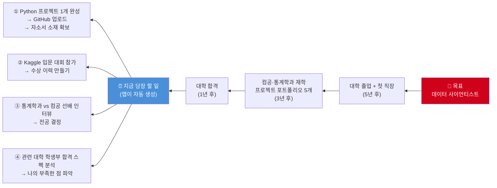

#### 준혁에게 필요한 핵심 기능

- **역공학 진로 설계**: 목표 직업 입력 → 단계별 Now-Action 자동 생성
- **학과-직업 매트릭스**: 전공별 취업 경로, 선배 인터뷰, 연봉 분포
- **자소서 소재 발굴기**: 나의 활동 기록 → 자소서 문항별 소재 자동 매핑
- **입시 타임라인**: 남은 기간 기준 우선순위 자동 재조정
- **AI 진로 코치**: "지금 뭘 해야 해요?" 질문에 즉시 맞춤 답변

---

### 페르소나 #4: 진로 교사 — 최수진 (38세, 중학교 진로 전담 교사)

```
┌─────────────────────────────────────────────────────────┐
│  👩‍🏫 최수진 / 38세 / 중학교 진로 전담 교사 / 경력 8년  │
│  "학생 한 명 한 명을 다 챙기고 싶은데, 시간이 없어요"    │
└─────────────────────────────────────────────────────────┘
```

#### 기본 프로필

| 항목 | 내용 |
|------|------|
| 이름 | 최수진 |
| 나이 | 38세 |
| 역할 | 중학교 진로 전담 교사 |
| 담당 학생 수 | 약 400명 |
| 경력 | 8년 |
| 고민 | "개인 상담을 하고 싶지만 400명은 불가능" |
| 디지털 도구 | 커리어넷, Excel, 카카오톡 사용 |

#### 교사의 실제 고민

> *"학생들이 진로 검사를 했는데 해석을 어떻게 해야 할지 모르는 아이들이 절반이에요."*

> *"학생 A가 지난달에 무슨 체험을 했는지 제가 기억을 못해요. 기록 시스템이 없어요."*

> *"자유학기 체험 기관을 매번 직접 찾아야 해서 행정 업무가 너무 많아요."*

> *"부모님들이 '우리 애 진로가 어때요?' 물어보는데, 통합적으로 보여줄 자료가 없어요."*

#### 교사 페인 포인트 & 앱 해결책

| 교사 페인 포인트 | 현재 방식 | 앱 해결책 |
|--------------|---------|---------|
| 400명 개별 관리 불가 | 기억·수기 기록 | 학생 대시보드 자동 집계 |
| 체험 기관 탐색 시간 낭비 | 직접 검색·전화 | 지역별 체험 기관 DB 연결 |
| 진로 상담 준비 자료 없음 | 즉흥 상담 | 학생 진로 이력 자동 요약 제공 |
| 부모 소통 자료 없음 | 말로만 설명 | 자동 생성 학생 진로 리포트 |
| 교육 트렌드 업데이트 | 개인이 알아서 | 신생 직업·트렌드 자동 업데이트 |

---

### 페르소나 #5: 학부모 — 김영희 (45세, 중2 자녀 학부모)

```
┌─────────────────────────────────────────────────────────┐
│  👩 김영희 / 45세 / 중2 딸 서연의 엄마                  │
│  "애가 미술 좋아하는데, 솔직히 걱정돼요"                  │
└─────────────────────────────────────────────────────────┘
```

#### 부모의 실제 고민

> *"아이가 하고 싶다는 걸 지지해주고 싶은데, 그게 현실적으로 가능한지 데이터가 없어요."*

> *"학교 진로 수업을 믿을 수 없어요. 연 몇 번 밖에 안 하잖아요."*

> *"아이 진로를 제가 결정하는 게 맞지 않은 건 알아요. 근데 방향을 안 잡아주면 불안해요."*

> *"학원을 뭘 보내야 아이 미래에 도움이 될지 모르겠어요."*

#### 부모 페인 포인트 & 앱 해결책

| 부모 페인 포인트 | 앱 해결책 |
|--------------|---------|
| 자녀 관심사를 모름 | 자녀 탐색 기록 공유 리포트 |
| 직업 현실 정보 부족 | 직업별 미래 전망·연봉 데이터 |
| 진로 갈등 해소 방법 모름 | "자녀와 진로 대화하는 법" 가이드 |
| 학원 vs 체험 무엇을 해야 할지 모름 | 직업군별 추천 외부 활동 목록 |

---

## 3. 앱이 해결하는 핵심 문제 정리

### 3.1 페르소나별 핵심 해결 문제 비교표

| 문제 | 민준(초5) | 서연(중2) | 준혁(고2) | 교사 최수진 | 부모 김영희 |
|------|---------|---------|---------|----------|-----------|
| 직업 정보 부족 | ⭐⭐⭐ | ⭐⭐ | ⭐ | ⭐ | ⭐⭐⭐ |
| 자기 이해 부족 | ⭐⭐⭐ | ⭐⭐⭐ | ⭐⭐ | - | ⭐ |
| 체험 기록 없음 | ⭐⭐ | ⭐⭐⭐ | ⭐⭐⭐ | ⭐⭐⭐ | ⭐⭐ |
| 진로 방향 불명확 | ⭐⭐ | ⭐⭐⭐ | ⭐⭐ | - | ⭐⭐ |
| 행동 계획 없음 | ⭐ | ⭐⭐ | ⭐⭐⭐ | ⭐⭐ | ⭐ |
| 부모-자녀 갈등 | ⭐ | ⭐⭐⭐ | ⭐⭐ | ⭐⭐ | ⭐⭐⭐ |
| AI 시대 불안 | ⭐ | ⭐⭐ | ⭐⭐⭐ | ⭐⭐ | ⭐⭐⭐ |

> ⭐⭐⭐ 매우 심각 / ⭐⭐ 보통 / ⭐ 경미

### 3.2 사용자 여정 지도 (User Journey Map)

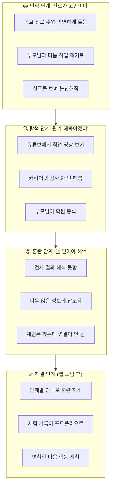

---

## 4. 앱 핵심 기능 설계 (페르소나 기반)

### 4.1 기능-페르소나 매핑

| 핵심 기능 | 민준 | 서연 | 준혁 | 교사 | 부모 | 우선순위 |
|---------|------|------|------|------|------|---------|
| **직업 탐험 지도** | ✅ 필수 | ✅ 필수 | 참고용 | 교육용 | ✅ 필수 | 🔴 1순위 |
| **강점 발견 테스트** | ✅ 필수 | ✅ 필수 | ✅ 필수 | 활용 | 참고 | 🔴 1순위 |
| **체험 기록 포트폴리오** | 습관 형성 | ✅ 필수 | ✅ 필수 | ✅ 필수 | 공유 | 🔴 1순위 |
| **커리어 패스 시각화** | 단순 버전 | ✅ 필수 | ✅ 필수 | 모니터링 | 공유 | 🔴 1순위 |
| **역공학 행동 계획** | 간단 버전 | 필요 | ✅ 필수 | 참고 | 참고 | 🟡 2순위 |
| **부모 공유 리포트** | ✅ 필수 | ✅ 필수 | 선택 | 활용 | ✅ 필수 | 🟡 2순위 |
| **AI 진로 코치** | 단순 | 필요 | ✅ 필수 | 지원도구 | 정보용 | 🟡 2순위 |
| **체험 기관 DB** | 추천 | ✅ 필수 | 필요 | ✅ 필수 | 참고 | 🟡 2순위 |
| **입시 타임라인** | ❌ | 간단 | ✅ 필수 | 활용 | ✅ 필수 | 🟢 3순위 |
| **교사 대시보드** | ❌ | ❌ | ❌ | ✅ 필수 | ❌ | 🟢 3순위 |

### 4.2 앱 화면 구조 (정보 아키텍처)

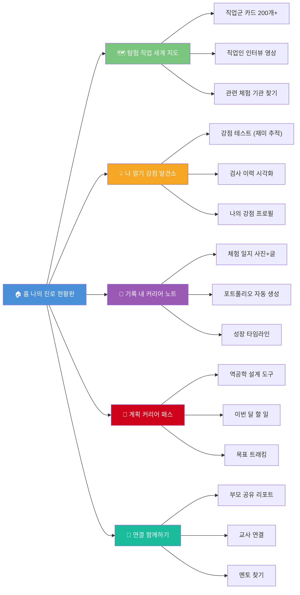

---

## 5. 실전 시나리오: 앱 사용 3개월 후 변화

### 5.1 민준 (초등) — 3개월 사용 후

```
Before: "레고 만드는 게 직업이 될 수 있어요?"
After:  "저는 로봇공학자나 게임 레벨 디자이너에 관심이 생겼어요.
         과학관 3번 갔고, 유튜브 채널도 구독했어요.
         스크래치로 미니 게임도 만들었는데 뿌듯했어요."

📊 앱 활동:
  - 탐험한 직업 수: 23개
  - 체험 기록: 5건
  - 강점 뱃지 획득: '만들기 마스터', '탐구자'
  - 부모 공유 리포트 발송: 12회
```

### 5.2 서연 (중학) — 3개월 사용 후

```
Before: "미술로는 돈 못 번다고 엄마가 걱정해요."
After:  "UX 디자이너 연봉 데이터를 엄마한테 보여줬더니
         생각이 조금 바뀌셨어요. 대학 디자인과 오픈캠퍼스도
         같이 가기로 했어요. 인스타 피드 디자인 포트폴리오도
         앱에 정리했어요."

📊 앱 활동:
  - 탐색한 직업: 15개 → 관심 직업 3개로 압축
  - 체험 기록: 4건 (자유학기 체험 포함)
  - 부모와 공유: 직업 전망 리포트 2회
  - 포트폴리오 페이지: 8페이지 완성
```

### 5.3 준혁 (고등) — 3개월 사용 후

```
Before: "지금 뭘 해야 할지 모르겠어요. 입시가 불안해요."
After:  "역공학 설계로 앞으로 1년 할 일 리스트가 생겼어요.
         Python으로 주가 분석 미니 프로젝트 완성해서 GitHub에 올렸고,
         컴공과 통계학 선배 각 1명씩 인터뷰했어요.
         자소서 소재가 3개 생겼어요."

📊 앱 활동:
  - 커리어 패스 역공학 설계 완성: 1개
  - 체험·프로젝트 기록: 6건
  - 자소서 소재 저장: 3건
  - 남은 할 일 완료율: 67%
```

---

## 6. 경쟁 앱 비교 분석

| 앱/서비스 | 대상 | 강점 | 약점 | DreamPath 차별점 |
|---------|------|------|------|-------------|
| **커리어넷** | 중·고 | 공신력, 방대한 직업 DB | PC 중심, 기록 없음, UI 구식 | 모바일 우선 + 기록 연동 |
| **꿈길** | 중·고 | 체험 기관 연결 | 체험 예약만, 진로 연결 없음 | 체험 후 포트폴리오 자동 연결 |
| **LinkedIn** | 대학생+ | 실제 직업인 네트워크 | 청소년에게 너무 어려움 | 청소년 눈높이 직업인 네트워크 |
| **틱톡/유튜브** | 전연령 | 실제 직업인 콘텐츠 | 내 상황 반영 안 됨 | 나의 관심사 기반 개인화 |
| **Khan Academy** | 전연령 | 무료 학습 | 한국 진로 맥락 없음 | 한국 입시·진로 맥락 특화 |
| **ChatGPT** | 고등+ | 자유로운 탐색 | 질문 방법 필요, 기록 없음 | 질문 없이 단계별 안내 |

---

## 7. 앱 성공 지표 (KPI)

### 7.1 사용자 성공 지표

| 지표 | 초등 목표 | 중학 목표 | 고등 목표 | 측정 방법 |
|------|---------|---------|---------|---------|
| 탐색한 직업 수 | 20개+ / 학기 | 10개 → 3개 압축 | 목표 직업 확정 | 앱 내 활동 로그 |
| 체험 기록 건수 | 월 2건 이상 | 월 3건 이상 | 월 4건 이상 | 포트폴리오 카운트 |
| 커리어 패스 완성도 | 씨앗 단계 | 방향 설정 | 역공학 설계 완성 | 완성도 점수 |
| 진로 불안 지수 | - | 측정 → 감소 | 측정 → 감소 | 월간 자가 평가 |
| 부모 공유 횟수 | 월 4회 | 월 2회 | 월 1회 | 공유 버튼 클릭 수 |

### 7.2 앱 비즈니스 지표

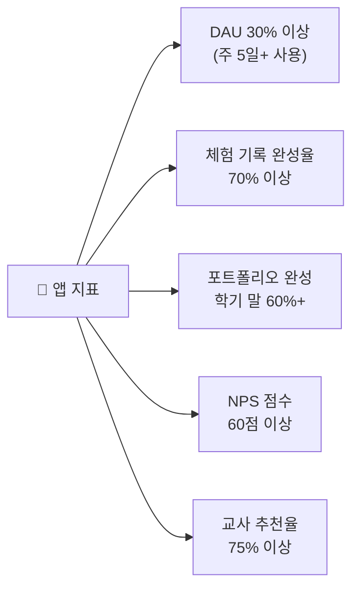

---

## 8. 앱 개발 우선순위 로드맵

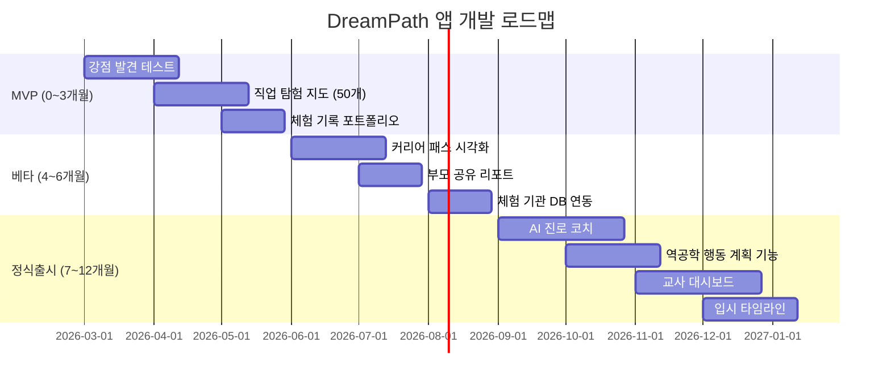

---

## 9. 결론: 왜 지금 이 앱인가?

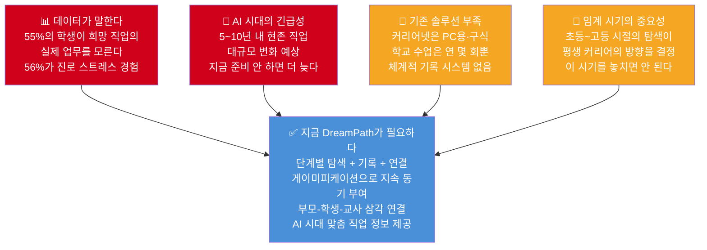

### 한 줄 요약

> **"학생들은 진로를 고민하고 있다. 도구가 없을 뿐이다."**
>
> DreamPath는 막연한 고민을 **기록 가능한 탐색**으로,
> 탐색을 **체계적인 커리어 패스**로,
> 커리어 패스를 **실행 가능한 행동 계획**으로 변환한다.

---

> 📌 **참고 데이터 출처**
> - 교육부·한국직업능력연구원 「2024 초·중등 진로교육 현황조사」(n=38,481)
> - 서울시 고등학생 진로 스트레스 연구 (n=7,155)
> - UX Planet: Career Compass 케이스 스터디 (2024)
> - World Economic Forum: Future of Jobs Report 2025
> - Gallup PathAdvisor 론칭 보고서 (2025)

---
*작성일: 2026년 2월 | AI 커리어 패스 앱 기획 연구팀*
