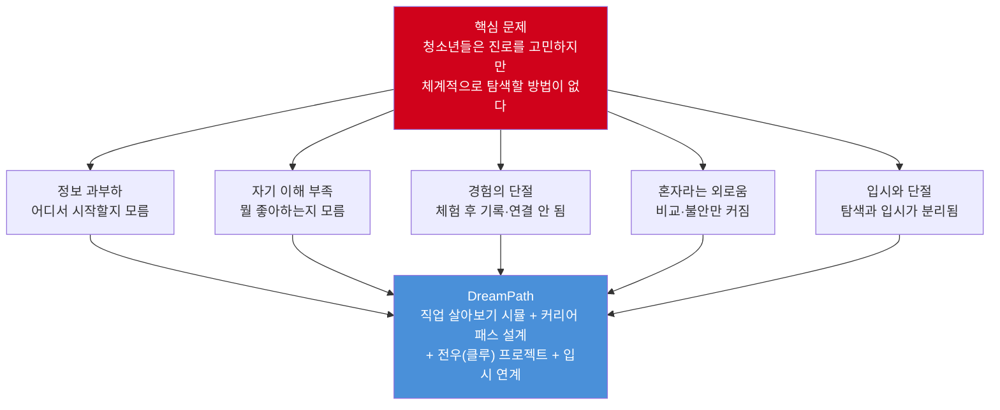
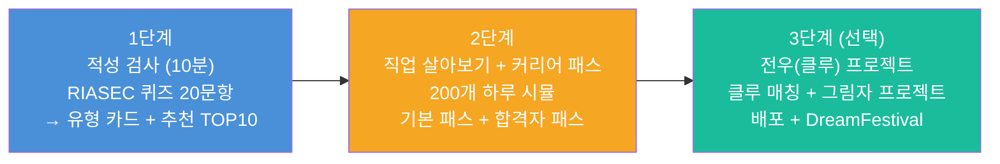
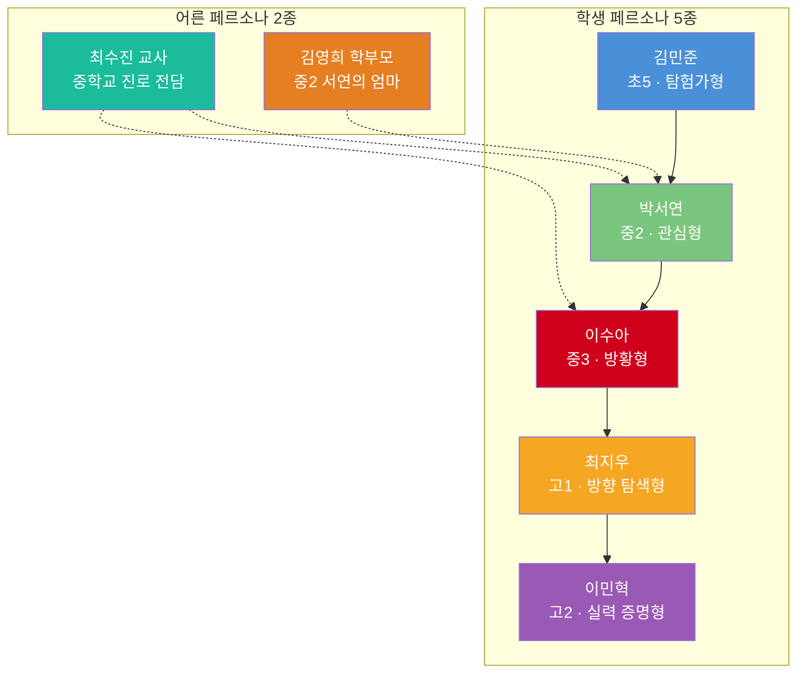
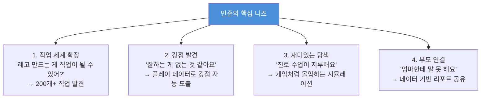
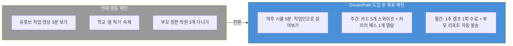
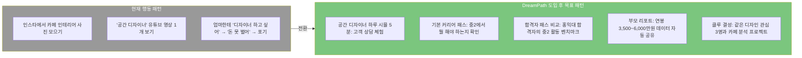
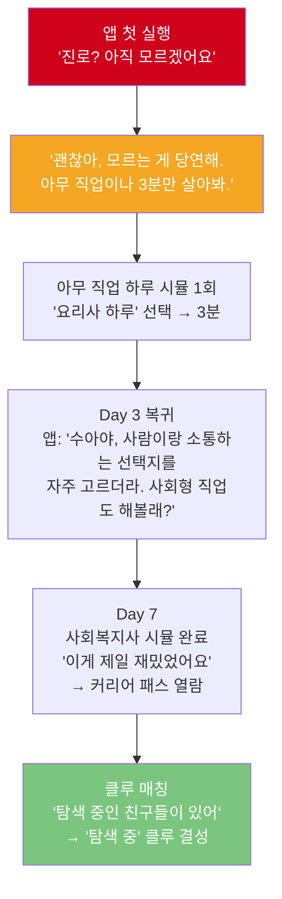
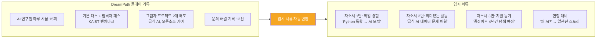

# DreamPath 페르소나 & 필요성 분석 (상)
# — 대표 고객 · 핵심 니즈 · 행동 패턴 · 목표 완전 정의

> **"직업을 살아보고, 전우와 함께 완성한다"**
> 이 문서는 DreamPath 앱의 **대표 고객 7종**을 정의하고,
> 각 고객의 **핵심 니즈 → 행동 패턴 → 목표 → 성공 기준**을 명확하게 구조화한다.

---

## 0. 왜 이 앱을 만들어야 하는가?

### 0.1 핵심 문제 정의



### 0.2 실전 데이터로 본 문제의 심각성

> 출처: 교육부·한국직업능력연구원 「2024 초·중등 진로교육 현황조사」(38,481명 대상)

| 지표 | 수치 | 의미 |
|------|------|------|
| 희망 직업 없는 고등학생 | **증가 추세** | 진로 방향을 잃은 학생 급증 |
| 희망 직업 업무를 아는 중학생 | **53.0%** | 절반은 직업을 모르고 꿈꾼다 |
| 희망 직업 업무를 아는 고등학생 | **55.3%** | 입시 중에도 직업 이해 부족 |
| 진로 결정 장애 1위: 성적 걱정 | **42.9%** | 적성보다 성적이 진로를 결정 |
| 진로 스트레스 경험 고등학생 | **56%** | 절반 이상이 진로 때문에 힘들다 |
| 대학 진학 희망률 감소 | 77.3% → **66.5%** | 기존 경로에 의문 |
| 미래 직업 준비 방법 모름 | **34.6%** | 방법 모르는 것이 가장 큰 문제 |

---

## 1. 앱 개요

### 1.1 앱 정체성

| 항목 | 내용 |
|------|------|
| **앱 이름** | DreamPath (드림패스) |
| **슬로건** | "직업을 살아보고, 전우와 함께 완성한다" |
| **핵심 정체성** | 직업 체험 시뮬 + 커리어 패스 설계 + 전우 프로젝트 RPG |
| **타겟 사용자** | 초등 고학년 ~ 고등학생 + 부모 + 교사 |
| **핵심 차별점** | 2단계만으로 커리어 패스 완성 / 가상 합격자 패스 비교 / 전우 그림자 프로젝트 |
| **비전** | 대한민국 청소년이 "진로 불안" 대신 "진로 설렘"을 느끼는 세상 |

### 1.2 3단계 여정 구조



### 1.3 핵심 설계 원칙

| 원칙 | 내용 |
|------|------|
| **일기·기록 강요 없음** | 플레이 행동이 자동으로 데이터가 됨 |
| **2단계 = 완성된 경험** | 2단계만으로 커리어 패스 + 합격자 패스까지 제공 |
| **3단계는 선택** | 멈춰도 완성된 경험. 억지 유도 안 함 |
| **배포가 완성 기준** | "만들다 멈춤"이 아닌 배포까지 트래킹 |

---

## 2. 대표 고객 · 니즈 · 행동 패턴 · 목표 — 총괄 정의

### 2.0 7종 페르소나 전체 맵



### 2.1 대표 고객 · 니즈 · 행동 패턴 · 목표 — 한눈에 보기

| | 김민준 (초5) | 박서연 (중2) | 이수아 (중3) | 최지우 (고1) | 이민혁 (고2) | 최수진 (교사) | 김영희 (학부모) |
|---|---|---|---|---|---|---|---|
| **대표 고객** | 관심 많지만 직업 세계 좁은 초등생 | 관심사는 있지만 직업 연결 모르는 중학생 | 진로 자체를 회피하는 방황형 | 방향 잡았지만 입시 연결 모르는 고1 | 목표 확정, 증명 결과물 필요한 고2 | 400명 개별 관리 불가능한 교사 | 자녀 진로 데이터 없는 학부모 |
| **시장 규모** | 초등 4~6학년 130만 명 | 중학생 130만 명 | 중학생의 20~30% (30~40만 명) | 고1 약 43만 명 | 고2 약 43만 명 | 진로 전담 교사 1.5만 명 | 중·고 학부모 500만+ |
| **핵심 니즈** | "뭐가 재미있는지 알고 싶어" | "관심사가 직업이 될 수 있어?" | "나부터 알고 싶어" | "방향은 잡았는데 어떻게 준비?" | "증명할 결과물이 필요해" | "400명을 효율적으로 관리" | "데이터로 아이 진로 판단" |
| **행동 패턴** | 유튜브 숏폼, 3~5분 짧은 세션 | 인스타·Pinterest, 밤 9시 루틴 | 회피적, 설치 후 즉시 이탈 | 적극 검색, 15~20분 긴 세션 | 독학 중심, 목적형 30분 세션 | 엑셀 수기 관리, 시간 부족 | 카페·검색 정보 수집 |
| **앱 진입점** | 직업 카드 스와이프 | 하루 시뮬레이션 | "아무 직업 살아보기" | 합격자 패스 비교 | 그림자 프로젝트 보드 | 교사 대시보드 | 자녀 탐색 리포트 |
| **3개월 목표** | 직업 30개 탐험 + 커리어 패스 3개 | 관심 직업 3개 압축 + 합격자 패스 | 성향 발견 + 불안 40% 감소 | 갭 분석 + 공모전 1회 | 프로젝트 1개 배포 | 상담 준비 50% 절감 | 자녀 관심사 파악 + 갈등 감소 |
| **유료 전환 의지** | 낮음 (부모 결정) | 중간 | 낮음 | 높음 | 매우 높음 | B2B | B2C |
| **긴급도** | 낮음 | 중간 | 중간 | 높음 | 긴급 | 중간 | 중간 |

---

## 3. 학생 페르소나 상세 정의

---

### 페르소나 #1: 김민준 (11세, 초5, 탐험가형)

```
╔══════════════════════════════════════════════════════╗
║  김민준 / 11세 / 초5 / 서울 노원구                    ║
║  RIASEC: R(현실형) + I(탐구형)                       ║
║  "뭐든 다 재미있는데, 뭘 해야 할지 모르겠어요"        ║
╚══════════════════════════════════════════════════════╝
```

#### A. 대표 고객 정의

> **"관심사는 많지만 직업 세계가 좁은 초등 고학년"**
> 호기심 풍부하지만 알고 있는 직업 10개 미만. 부모가 원하는 직업(의사, 변호사)과 자신의 관심사(레고, 게임, 과학) 사이에서 막연한 혼란.

| 항목 | 내용 |
|------|------|
| 대표 시장 | 초등 4~6학년 약 130만 명 |
| 시장 특성 | 부모 결정력 높음, 학원 스케줄 빡빡, 자기 탐색 시간 부족 |
| 핵심 결정자 | 부모 (앱 설치·과금) → 자녀 (실제 사용) |
| 경쟁 대안 | 유튜브 직업 영상, 주니어 커리어넷, 학교 진로 수업 |

#### B. 핵심 니즈



| 니즈 레벨 | 구체적 니즈 | 심각도 | DreamPath 해결 |
|---------|-----------|--------|--------------|
| **기능적** | 다양한 직업 정보를 쉽고 재미있게 접근 | 높음 | 카드 스와이프 + 하루 시뮬 5분 |
| **기능적** | 직업이 되려면 뭘 해야 하는지 확인 | 중간 | 기본 커리어 패스 열람 |
| **감정적** | "나도 뭔가 잘하는 게 있구나" 확인 | 높음 | 시뮬 행동 데이터 → 강점 자동 도출 |
| **사회적** | 같은 관심사 친구 연결, 부모 인정 | 중간 | 클루 매칭 + 부모 리포트 |

#### C. 행동 패턴

| 행동 영역 | 현재 패턴 | 빈도 | 트리거 | DreamPath 설계 반영 |
|---------|---------|------|--------|-------------------|
| 디지털 사용 | 유튜브 숏폼 위주 (1~2시간/일) | 매일 | 학원 후 여가 시간 | 5분 이내 하루 시뮬 설계 |
| 앱 사용 | 짧은 세션 3~5분, 쉽게 이탈 | 빈번 | 재미 없으면 즉시 이탈 | 시뮬 1회 5분 완결 + 즉시 보상(XP) |
| 정보 탐색 | "OO 직업" 유튜브 검색 → 단편 시청 → 잊음 | 주 2~3회 | 학교 수업, 유튜브 알고리즘 | 카드 스와이프로 능동 탐색 |
| 진로 행동 | 학교 수업 수동 참여, 커리어넷 1회 해봄 | 분기 1회 | 학교 숙제 | 매일 3분 접속 가능한 퀘스트 |
| 의사결정 | 부모 의견에 강하게 영향 받음 | 항상 | 부모 지시 | 부모 리포트로 데이터 기반 대화 유도 |



#### D. 목표 (Goals)

| 목표 시점 | 구체적 목표 | 측정 기준 | KPI |
|---------|-----------|---------|-----|
| **즉시 (Day 1)** | "이 앱 재미있다" → 재방문 의지 | 하루 시뮬 1회 완료 | D1 리텐션 70%+ |
| **단기 (1개월)** | RIASEC 유형 확인 + 관심 직업 5개 저장 | 하루 시뮬 3회, 커리어 패스 1개 열람 | 월간 접속 15일+ |
| **중기 (3개월)** | 직업 30개 탐험 + 기본 커리어 패스 3개 열람 | 1주 캠프 1회 수료 | 시뮬 10회+ |
| **장기 (6개월)** | 개인 커리어 패스 초안 + 클루 가입 | 합격자 패스 1회 비교 | 캐릭터 Lv.4+ |

#### E. 성공 시나리오

```
Before: "레고 만드는 게 직업이 될 수 있어요?"
After:  "로봇공학자 하루 시뮬 했는데 회로 설계가 진짜 재밌었어요.
         커리어 패스 보니까 중학교 때 아두이노 배워야 하네요!
         클루 친구 태현이랑 로봇 1주 캠프 같이 들었어요.
         엄마도 리포트 보고 '이런 직업도 있구나' 하셨어요."

📊 3개월 성과:
  - 탐험 직업: 35개 | 하루 시뮬: 10회+
  - 커리어 패스 열람: 5개 | 클루 활동: 주 1회
  - 캐릭터 Lv.4 | 뱃지 3개
```

---

### 페르소나 #2: 박서연 (14세, 중2, 관심형 — Primary Persona)

```
╔══════════════════════════════════════════════════════╗
║  박서연 / 14세 / 중2 / 경기도 수원                    ║
║  RIASEC: A(예술형) + S(사회형)                       ║
║  "인테리어 좋아하는데, 그게 직업이 될 수 있을까?"     ║
╚══════════════════════════════════════════════════════╝
```

#### A. 대표 고객 정의

> **"관심사는 있지만, 그것이 현실적 직업이 될 수 있는지 확신이 없는 중학생"**
> DreamPath의 **Primary Persona**. 자유학기 체험 후 기록 없음. 부모의 "예술로는 먹고살기 힘들다"와 본인 관심사 사이 갈등.

| 항목 | 내용 |
|------|------|
| 대표 시장 | 중학생 1~3학년 약 130만 명 (자유학기제 세대) |
| 시장 특성 | 진로 탐색 동기 가장 높은 시기, 부모 갈등 시작 |
| 핵심 결정자 | 자녀 (앱 발견·사용) + 부모 (과금 결정) |
| 경쟁 대안 | 커리어넷 검사, Pinterest·인스타 탐색, 학교 수업 |

#### B. 핵심 니즈

| 우선순위 | 니즈 레벨 | 구체적 니즈 | 심각도 | DreamPath 해결 |
|---------|---------|-----------|--------|--------------|
| **1** | 기능적 | 관심사(인테리어·디자인) → 현실 직업 연결 | 매우 높음 | 하루 시뮬로 직업인 하루 체험 |
| **2** | 감정적 | "이 꿈이 현실적이다"는 확신 | 매우 높음 | 합격자 패스: "이 길로 성공한 사람 있어" |
| **3** | 기능적 | 지금 학년에서 뭘 해야 하는지 명확한 안내 | 높음 | 기본 커리어 패스: 학기별 체크리스트 |
| **4** | 감정적 | 부모와의 갈등 해소 | 높음 | 부모 리포트: 연봉·전망 데이터 자동 공유 |
| **5** | 기능적 | 체험이 포트폴리오로 자동 연결 | 높음 | 플레이 행동 자동 기록 |
| **6** | 사회적 | 같은 꿈 친구와 함께하는 느낌 | 중간 | 클루 매칭: 같은 A+S 유형 3~5명 |

#### C. 행동 패턴

| 행동 영역 | 현재 패턴 | 빈도 / 시간대 | 트리거 | DreamPath 설계 반영 |
|---------|---------|-------------|--------|-------------------|
| 디지털 사용 | 인스타·Pinterest (2~3시간/일) | 매일, 밤 9~10시 | 잠자기 전 루틴 | 밤 9시 푸시 알림, 비주얼 UI |
| 앱 사용 | 중간 세션 10~15분 | 매일 1회 | 습관 / 알림 | 1회 시뮬 5분 + 커리어 패스 열람 5분 |
| 진로 탐색 | 인스타 "인테리어" 해시태그 → 영감 수집 → 연결 안 됨 | 주 3~4회 | 피드 알고리즘 | 관심사 → 직업 AI 매핑 + 하루 시뮬 |
| 검사 경험 | 커리어넷 홀랜드 2회 → 매번 결과 다름 → 불신 | 연 1~2회 | 학교 수업 | 상황형 퀴즈 20문항 + 시뮬 행동 통합 분석 |
| 소통 | 친한 친구 3~4명 DM, 진로 이야기 안 함 | 매일 | 친구 관계 | 클루 채팅: 같은 꿈 소규모 안전 공간 |
| 부모 관계 | 진로 대화 시 갈등 ("미술로는 안 돼") → 회피 | 월 1~2회 | 성적·진로 관련 상황 | 리포트 자동 공유 → 데이터 기반 대화 전환 |



#### D. 목표 (Goals)

| 목표 시점 | 구체적 목표 | 측정 기준 | KPI |
|---------|-----------|---------|-----|
| **즉시 (Day 1)** | 관심 직업 하루 시뮬 체험 → "이게 진짜 하는 일이구나" | 시뮬 1회 완료 | 첫 시뮬 전환율 80%+ |
| **단기 (1개월)** | 관심 직업 5개 시뮬 + 기본 패스 3개 열람 → "3개로 압축" | 관심 직업 3개 확정 | 월간 접속 20일+ |
| **중기 (3개월)** | 개인 커리어 패스 완성 + 합격자 패스 5회 비교 + 클루 가입 | "지금 뭘 해야 하는지 안다" | 합격자 패스 비교 5회+ |
| **장기 (6개월)** | 그림자 프로젝트 1개 배포 + 포트폴리오 자동 생성 | "고등학교 진학 시 포폴 보유" | 프로젝트 1개 배포 |

#### E. 성공 시나리오

```
Before: "미술로는 돈 못 번다고 엄마가 걱정해요."
After:  "공간 디자이너 하루 시뮬 했는데 고객 상담이 진짜 재밌었어요.
         합격자 패스 보니까 홍익대 합격자가 중2 때 디자인 씽킹 PBL 했대요.
         엄마한테 리포트 보여줬더니 연봉 보고 생각이 바뀌셨어요.
         클루 친구 지민이랑 카페 분석 앱 만들어서 배포까지 했어요!"

📊 3개월 성과:
  - 시뮬 완료: 20회+ | 커리어 패스 열람: 10개+
  - 합격자 패스 비교: 5회+ | 그림자 프로젝트: 1개 배포
  - 진로 불안 지수: 30% 감소 | 부모 리포트 열람: 월 2회+
```

---

### 페르소나 #3: 이수아 (15세, 중3, 방황형)

```
╔══════════════════════════════════════════════════════╗
║  이수아 / 15세 / 중3 / 인천                           ║
║  RIASEC: 미측정 (검사 거부)                          ║
║  "아무것도 모르겠어요. 친구들은 다 뭔가 있는 것 같은데" ║
╚══════════════════════════════════════════════════════╝
```

#### A. 대표 고객 정의

> **"진로에 대한 관심 자체가 없거나, 불안과 회피로 탐색을 거부하는 학생"**
> 전체 중학생의 20~30%. 기존 서비스가 도달 못하는 사각지대. 검사 거부, 꿈 발표 싫어함, "모르겠어요"가 유일한 답.

| 항목 | 내용 |
|------|------|
| 대표 시장 | 전체 중학생의 20~30% (약 30~40만 명) |
| 시장 특성 | 기존 앱으로 도달 불가능, 교사도 케어 어려움 |
| 핵심 결정자 | 교사 (앱 도입 권유) 또는 부모 (불안감에서 설치) |
| 설계 원칙 | **절대 강요 안 함.** 시뮬 1회로 부담 없이 시작 |

#### B. 핵심 니즈

| 우선순위 | 니즈 레벨 | 구체적 니즈 | 심각도 | DreamPath 해결 |
|---------|---------|-----------|--------|--------------|
| **1** | 감정적 | "나만 모르는 게 아니구나" 안심감 | 매우 높음 | "탐색 중" 클루 + "모르는 게 당연해" 메시지 |
| **2** | 감정적 | 비교 스트레스 해소 | 높음 | 점수·등급 없는 탐색 경험 |
| **3** | 기능적 | 부담 없는 첫 경험 | 높음 | 검사 없이 아무 직업 하루 시뮬 바로 시작 |
| **4** | 기능적 | 내가 뭘 좋아하는지 단서 발견 | 높음 | 시뮬 선택 행동 → 성향 자동 분석 |

#### C. 행동 패턴

| 행동 영역 | 현재 패턴 | 빈도 / 시간대 | 트리거 | DreamPath 설계 반영 |
|---------|---------|-------------|--------|-------------------|
| 디지털 사용 | 유튜브·틱톡 3시간/일 (수동 소비, 도피 목적) | 매일, 밤 | 무료함·스트레스 | 숏폼 3분 시뮬로 접근 |
| 앱 사용 | 설치 → 1~2일 사용 → 삭제 | 설치 직후 | 흥미 없으면 즉시 이탈 | 온보딩 0분: "아무 직업이나 살아봐" |
| 진로 행동 | 학교 수업 때만 수동 참여, 검사 거부 | 분기 1회 | 강제 상황 | 검사 강요 없이 시뮬부터 시작 |
| 소통 | 친구 1~2명과만, 진로 이야기 회피 | 매일 | 가까운 친구 | "탐색 중" 클루: 같은 방황형 안전 공간 |
| 심리 상태 | 진로 불안 80/100, 자존감 낮음 | 상시 | 친구 비교, 엄마 질문 | 작은 성공 반복 (시뮬 완료 = 뱃지) |
| **이탈 핵심** | **첫 온보딩이 길면 즉시 삭제** | 설치 후 1분 | **앱 첫 인상** | **첫 1분 내 시뮬 체험 제공** |



#### D. 목표 (Goals)

| 목표 시점 | 구체적 목표 | 측정 기준 | KPI |
|---------|-----------|---------|-----|
| **즉시 (Day 1)** | "생각보다 재밌네" → 삭제 안 함 | 시뮬 1회 완료 | D1 리텐션 50%+ |
| **단기 (1개월)** | "사람 관련 직업이 좋은 것 같아" → 성향 단서 | 시뮬 5회 + 관심 직업 2개 저장 | 주간 접속 3일+ |
| **중기 (3개월)** | "나만 모르는 게 아니구나" → 불안 감소 | 클루 활동 시작 + 커리어 패스 1개 열람 | 불안 지수 40% 감소 |
| **장기 (6개월)** | 기본 커리어 패스 1개 완성 | 개인 커리어 패스 완성 | 캐릭터 Lv.3+ |

#### E. 성공 시나리오

```
Before: "아무것도 모르겠어요. 친구들은 다 뭔가 있는 것 같은데."
After:  "사회복지사 하루 시뮬 했는데 상담 부분이 재밌었어요.
         커리어 패스 보니까 중3이라 아직 늦지 않았네요.
         클루 친구들이랑 '학교 문제 발견 캠페인' 기획도 했어요.
         아직 확실하진 않지만, 뭔가 찾아가는 느낌이에요."

📊 3개월 성과:
  - 하루 시뮬: 10회+ | 커리어 패스 열람: 3개+
  - 클루 활동: 주 1회 | 진로 불안: 80 → 45 (44% 감소)
```

---

### 페르소나 #4: 최지우 (16세, 고1, 방향 탐색형)

```
╔══════════════════════════════════════════════════════╗
║  최지우 / 16세 / 고1 / 서울 노원구                    ║
║  RIASEC: A(예술형) + E(진취형)                       ║
║  "UX 디자인이 좋다는 건 알았는데, 고등학교에서 뭘 해야?" ║
╚══════════════════════════════════════════════════════╝
```

#### A. 대표 고객 정의

> **"방향은 잡았지만, 고등학교 입시와 어떻게 연결해야 할지 모르는 고1"**
> 2028 대입 개편(프로젝트 기반 평가 본격화)으로 이 니즈는 급증 중. 계열 선택·세특 전략·공모전 정보 등 입시 연결 고리가 없어 혼란.

| 항목 | 내용 |
|------|------|
| 대표 시장 | 고1 약 43만 명 (2028 대입 개편 직격탄 세대) |
| 시장 특성 | 계열 선택 필수, 학종 비중 40%+ 시대 진입 |
| 핵심 결정자 | 자녀 (적극 검색) + 부모 (입시 불안) |
| 긴급도 | **매우 높음** — 고1 선택이 입시를 좌우 |

#### B. 핵심 니즈

| 우선순위 | 니즈 레벨 | 구체적 니즈 | 심각도 | DreamPath 해결 |
|---------|---------|-----------|--------|--------------|
| **1** | 기능적 | "합격자는 고1 때 뭘 했나?" 벤치마크 | 매우 높음 | 가상 합격자 패스: 전형별 합격 사례 |
| **2** | 기능적 | 계열 선택 + 권장과목 가이드 | 긴급 | 커리어 패스 기반 계열·과목 자동 매핑 |
| **3** | 기능적 | 세특 소재 + 공모전 정보 | 높음 | 프로젝트 기록 → 세특 태깅 + 공모전 DB |
| **4** | 기능적 | 중학교 탐색 기록 연속 | 높음 | 중→고 데이터 자동 인수인계 |
| **5** | 감정적 | "이 방향이 맞다"는 확신 | 높음 | 합격자 패스: "이 길로 간 사람 있어" |

#### C. 행동 패턴

| 행동 영역 | 현재 패턴 | 빈도 / 시간대 | 트리거 | DreamPath 설계 반영 |
|---------|---------|-------------|--------|-------------------|
| 디지털 사용 | Figma·Dribbble·Behance (능동적) | 매일, 방과 후 | 자발적 학습 | 심화 시뮬 + 외부 도구 연결 |
| 앱 사용 | 목적 지향, 긴 세션 15~20분 가능 | 주 3~4회 | 입시 정보 필요 | 합격자 패스 + 프로젝트 보드 |
| 진로 탐색 | "홍익대 시각디자인 학종" 직접 검색 | 주 2~3회 | 입시 일정 | 합격자 패스에서 대학·전형별 비교 |
| 프로젝트 | Figma 독학 중, 정리·포폴화 방법 모름 | 매일 | 자발적 | 자동 포트폴리오 (플레이 기록 기반) |
| 소통 | 디자인 오픈채팅 참여 시도 | 주 1회 | 질문 필요 | 클루: 같은 분야 고등학생 매칭 |

#### D. 목표 (Goals)

| 목표 시점 | 구체적 목표 | 측정 기준 | KPI |
|---------|-----------|---------|-----|
| **즉시 (Day 1)** | 합격자 패스로 "나 vs 합격자" 갭 분석 | 합격자 패스 3회 비교 | 첫 주 접속 5일+ |
| **단기 (1개월)** | 계열 확정 + 고1 로드맵 수립 | 계열 선택 보고서 완성 | 커리어 패스 기반 액션 3개+ |
| **중기 (3개월)** | 심화 시뮬 + 그림자 프로젝트 시작 | 공모전 1회 참가 | 합격자 대비 갭 30% 해소 |
| **장기 (6개월)** | 포트폴리오 PDF 10p+ + 멘토 연결 | 갭 50%+ 해소 | 프로젝트 1개 배포 |

#### E. 성공 시나리오

```
Before: "UX 디자인 좋은데, 고등학교에서 뭘 해야 하는지 모르겠어요."
After:  "합격자 패스 보니까 홍익대 합격자가 고1 때 R&E 했대요.
         갭 분석 결과 세특이 부족해서 디자인 씽킹 세특 준비 중이에요.
         클루 친구들이랑 UX 리서치 프로젝트 배포했어요.
         포트폴리오 10페이지 PDF도 자동으로 만들어졌어요!"

📊 3개월 성과:
  - 합격자 패스 비교: 10회+ | 갭 기반 액션: 5개+
  - 그림자 프로젝트: 1개 배포 | 포트폴리오 PDF: 10p+
```

---

### 페르소나 #5: 이민혁 (17세, 고2, 실력 증명형)

```
╔══════════════════════════════════════════════════════╗
║  이민혁 / 17세 / 고2 / 경기 성남시                    ║
║  RIASEC: I(탐구형) + C(관습형)                       ║
║  "AI 개발자 목표는 확실한데, 포트폴리오가 막막해"      ║
╚══════════════════════════════════════════════════════╝
```

#### A. 대표 고객 정의

> **"목표 직업 확정, 증명할 결과물(포트폴리오)이 없어 초조한 고2"**
> Python 독학, GitHub 활동 등 자기주도 역량 높지만, 입시 서류 변환 방법과 동료가 없음. 수시까지 1년, 시간 긴급도 최고.

| 항목 | 내용 |
|------|------|
| 대표 시장 | 고2 약 43만 명 (수시 설계 직전) |
| 시장 특성 | 시간 긴급도 최고, **유료 전환 의지 가장 높음** |
| 핵심 결정자 | 자녀 (스스로 결제 가능한 나이) |
| 긴급도 | **긴급** — 수시까지 1년, 모든 액션에 마감 존재 |

#### B. 핵심 니즈

| 우선순위 | 니즈 레벨 | 구체적 니즈 | 심각도 | DreamPath 해결 |
|---------|---------|-----------|--------|--------------|
| **1** | 기능적 | 배포 가능한 프로젝트 완성 | 매우 높음 | 1달 그림자 프로젝트: 기획→배포 트래킹 |
| **2** | 기능적 | 프로젝트 → 자소서 소재 변환 | 긴급 | 자동 포트폴리오 + 자소서 문항별 매핑 |
| **3** | 기능적 | 전공 결정 데이터 (통계 vs 컴공) | 높음 | 학과-직업 매트릭스 + 합격자 패스 전공별 비교 |
| **4** | 기능적 | 남은 1년 우선순위 | 긴급 | 합격자 패스 갭 분석 + 타임라인 |
| **5** | 사회적 | 같은 분야 동료 + 멘토 | 높음 | 전우(클루) 매칭 + 현직 개발자 멘토 |

#### C. 행동 패턴

| 행동 영역 | 현재 패턴 | 빈도 / 시간대 | 트리거 | DreamPath 설계 반영 |
|---------|---------|-------------|--------|-------------------|
| 디지털 사용 | GitHub, Reddit, Stack Overflow (3시간+/일) | 매일, 저녁~밤 | 자발적 학습 | 프로젝트 보드 + 외부 도구 연결 |
| 앱 사용 | 목적 달성형, 기능 명확해야 사용 (15~30분) | 주 5회+ | 할 일 체크 | 갭 분석 → 액션 체크리스트 |
| 학습 방식 | Python 독학 1년, Kaggle 시도 | 매일 | 목표 의식 | 그림자 프로젝트에서 실전 결과물 |
| 진로 탐색 | "KAIST 전산학부 학종" 검색, 합격 수기 탐독 | 주 2~3회 | 입시 불안 | 합격자 패스: 학종·정시·특기자 벤치마크 |
| 소통 | 독학 중심, Stack Overflow → 답변 없으면 포기 | 주 1~2회 | 문제 해결 | 클루 채팅 + 문의 게시판 + 멘토 |

#### D. 목표 (Goals)

| 목표 시점 | 구체적 목표 | 측정 기준 | KPI |
|---------|-----------|---------|-----|
| **즉시 (Day 1)** | 합격자 패스로 KAIST 벤치마크 확인 | 합격자 패스 3회 비교 | 첫 갭 분석 완료 |
| **단기 (1개월)** | 그림자 프로젝트 기획 + 클루 결성 | 프로젝트 기획서 완성 | 클루 매칭 완료 |
| **중기 (3개월)** | 프로젝트 1개 배포 + 자소서 소재 3개 | GitHub 배포 + 기술 보고서 | 자소서 자동 매핑 3건 |
| **장기 (6개월)** | 포트폴리오 완성 + 입시 서류 초안 | DreamFestival 출품 | 합격자 대비 갭 70%+ 해소 |

#### E. 입시 서류 변환 흐름



#### F. 성공 시나리오

```
Before: "AI 개발자 목표는 확실한데, 포트폴리오가 막막해요."
After:  "합격자 패스로 KAIST 갭 분석하니까 R&E가 부족했어요.
         클루 친구 3명이 설문 수집 도와줘서 급식 AI 배포 완료.
         멘토 피드백 3회, DreamFestival 출품.
         자소서 소재 3개가 자동으로 정리돼 있어요!"

📊 3개월 성과:
  - 합격자 패스 비교: 10회+ | 갭 기반 액션: 8개+
  - 그림자 프로젝트: 2개 배포 | 자소서 매핑: 3건
  - 멘토링: 3회+ | DreamFestival 출품: 1회
```

---

## 4. 학생 페르소나 비교 총괄표

### 4.1 고객 · 니즈 · 행동 패턴 · 목표 종합 비교

| 축 | 김민준 (초5) | 박서연 (중2) | 이수아 (중3) | 최지우 (고1) | 이민혁 (고2) |
|----|------------|------------|------------|------------|------------|
| **유형** | 탐험가형 | 관심형 (Primary) | 방황형 | 방향 탐색형 | 실력 증명형 |
| **RIASEC** | R+I | A+S | 미측정 | A+E | I+C |
| **한 줄 고객** | 관심 많지만 직업 세계 좁음 | 관심사 → 직업 연결 모름 | 진로 자체 회피 | 방향 OK, 입시 연결 모름 | 목표 확정, 증명 필요 |
| **한 줄 니즈** | "뭐가 재미있는지 알고 싶어" | "관심사가 직업 될 수 있어?" | "나부터 알고 싶어" | "어떻게 준비해?" | "결과물이 필요해" |
| **행동 핵심** | 유튜브 숏폼, 3~5분 | 인스타·Pinterest, 밤 9시 | 회피, 즉시 이탈 | 적극 검색, 15~20분 | 독학, 목적형 30분 |
| **앱 진입점** | 직업 카드 스와이프 | 하루 시뮬 | "아무 직업 살아보기" | 합격자 패스 비교 | 그림자 프로젝트 보드 |
| **3개월 목표** | 직업 30개 + 패스 3개 | 3개 압축 + 합격자 비교 | 성향 발견 + 불안 40%↓ | 갭 분석 + 공모전 1회 | 프로젝트 1개 배포 |
| **긴급도** | 낮음 | 중간 | 중간 | 높음 | 긴급 |
| **유료 전환** | 낮음 (부모) | 중간 | 낮음 | 높음 | 매우 높음 |

### 4.2 앱 3단계 활용 비교

| 단계 | 김민준 | 박서연 | 이수아 | 최지우 | 이민혁 |
|------|--------|--------|--------|--------|--------|
| **1단계 (적성검사)** | 퀴즈형 체험 | 전체 20문항 | 검사 없이 시뮬 시작 | 기완료 (중학교 데이터) | 기완료 |
| **2단계 (직업 살아보기)** | 하루 시뮬 + 카드 | 시뮬 + 커리어 패스 + 합격자 패스 | 시뮬 1회씩 점진적 | 심화 시뮬 + 합격자 패스 집중 | 합격자 패스 + 갭 분석 집중 |
| **3단계 (전우 프로젝트)** | 클루: 탐험 동료 | 클루: 그림자 프로젝트 | 클루: 안심 공간 | 클루: 심화 프로젝트 | 클루: 개발 협업 + 배포 |
| **핵심 산출물** | 관심 직업 리스트 + 뱃지 | 커리어 패스 + 프로젝트 1개 | 성향 발견 + 첫 커리어 패스 | 포트폴리오 PDF | 배포 프로젝트 + 자소서 |

### 4.3 니즈 심각도 히트맵

| 니즈 | 민준 | 서연 | 수아 | 지우 | 민혁 |
|------|------|------|------|------|------|
| 자기 이해 | ★★★ | ★★ | ★★★ | ★ | ★ |
| 직업 정보 | ★★★ | ★★ | ★ | ★ | ★ |
| 입시 연계 | — | ★ | — | ★★★ | ★★★ |
| 포트폴리오 | ★ | ★★ | — | ★★★ | ★★★ |
| 동료·멘토 | ★ | ★★ | ★★★ | ★★ | ★★★ |
| 부모 갈등 | ★ | ★★★ | ★★ | ★ | ★ |
| 진로 불안 | ★ | ★★ | ★★★ | ★★ | ★★ |
| 행동 계획 | ★ | ★★ | ★ | ★★★ | ★★★ |

> ★★★ 매우 심각 / ★★ 보통 / ★ 경미

---

> **이 문서의 하편(下)에서 계속됩니다**
> - 어른 페르소나 2종 (교사·학부모) — 고객·니즈·행동패턴·목표
> - 페르소나별 핵심 해결 문제 비교표
> - 앱 핵심 기능 설계 (페르소나 기반 매핑)
> - 실전 시나리오: 3개월 후 변화 (5명)
> - 경쟁 앱 비교 · KPI · 로드맵

---

> 📌 **참고 데이터 출처**
> - 교육부·한국직업능력연구원 「2024 초·중등 진로교육 현황조사」(n=38,481)
> - 커리어넷 직업흥미검사(H) RIASEC 설계 자료
> - 2028 대입 개편안 — 교육부 발표 (2024)
> - 경기도교육청 「꿈it(잇)다」 AI 진로진학 시스템 (2025)
> - 드림어필 운영 현황 (2025, 6만 사용자)
> - iLevelUP, Meroo, SkillHatch 해외 앱 분석 (2025)

---
*작성일: 2026년 2월 | DreamPath 페르소나 & 필요성 분석 (상)*
