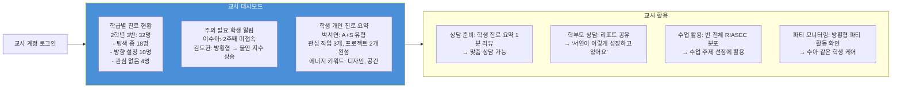
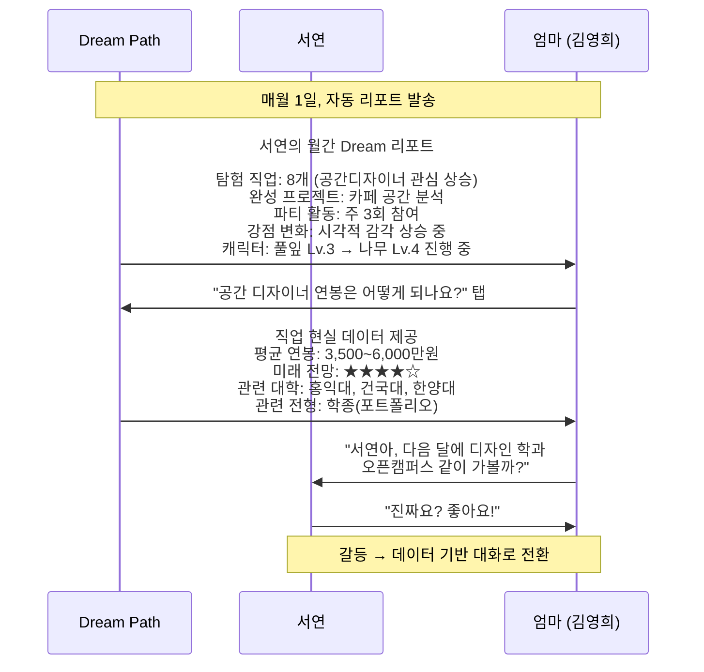
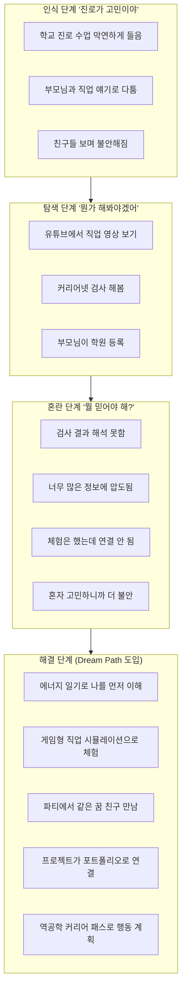
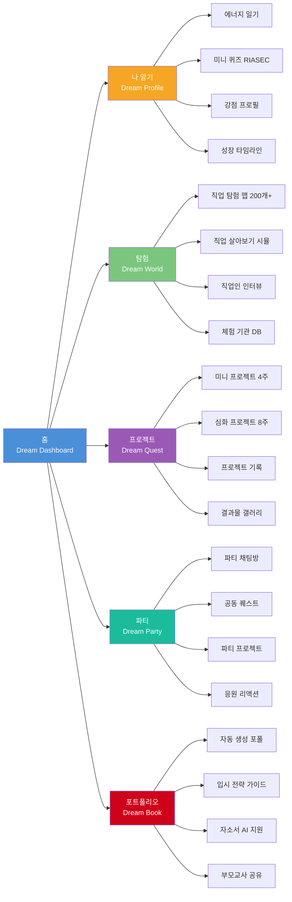
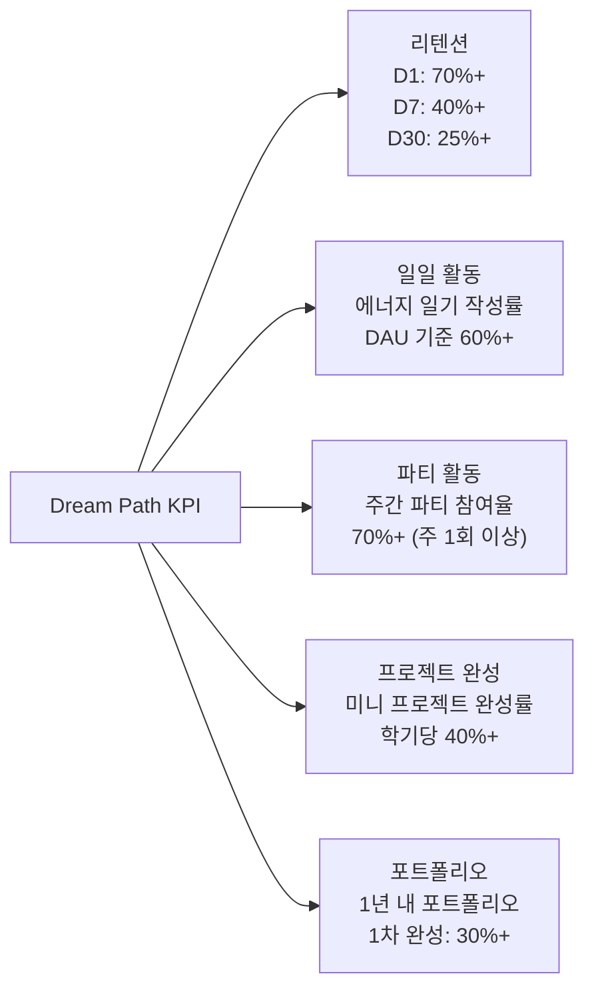
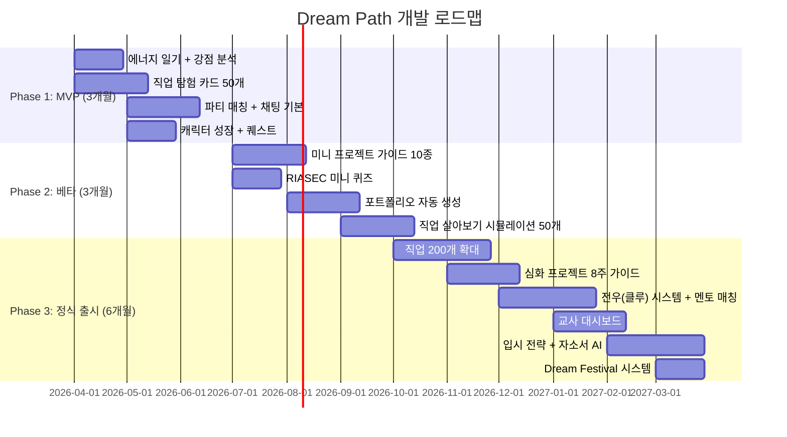
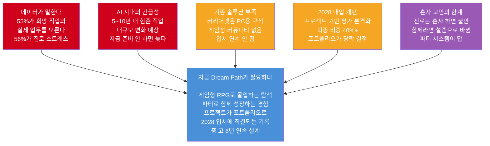

# Dream Path 페르소나 & 필요성 분석 (하)
# — 어른 페르소나 · 기능 설계 · 3개월 시나리오 · 경쟁 분석 · KPI · 로드맵

> **"혼자 꾸면 꿈, 함께 걸으면 길"**
> 이 문서는 [2단계-커리어패스앱_페르소나_기획서_상.md]의 후속 문서입니다.

---

## 4. 어른 페르소나 설계

### 페르소나 #6: 최수진 (38세, 중학교 진로 전담 교사)

```
╔══════════════════════════════════════════════════════════╗
║  최수진 / 38세 / 중학교 진로 전담 교사 / 경력 8년        ║
║  담당 학생: 약 400명                                     ║
║  "학생 한 명 한 명을 다 챙기고 싶은데, 시간이 없어요"     ║
╚══════════════════════════════════════════════════════════╝
```

#### 기본 프로필

| 항목 | 내용 |
|------|------|
| 이름 | 최수진 |
| 나이 | 38세 |
| 역할 | 중학교 진로 전담 교사 |
| 담당 학생 수 | 약 400명 |
| 경력 | 8년 |
| 고민 | "개인 상담을 하고 싶지만 400명은 불가능" |
| 디지털 도구 | 커리어넷, Excel, 카카오톡 사용 |

#### 실제 고민 (리얼 보이스)

> *"학생들이 진로 검사를 했는데 해석을 어떻게 해야 할지 모르는 아이들이 절반이에요."*

> *"학생 A가 지난달에 무슨 체험을 했는지 제가 기억을 못해요. 기록 시스템이 없어요."*

> *"이수아처럼 '아무것도 모르겠다'는 학생에게 뭘 해줘야 할지... 상담 시간도 부족하고."*

> *"자유학기 체험 기관을 매번 직접 찾아야 해서 행정 업무가 너무 많아요."*

> *"부모님들이 '우리 애 진로가 어때요?' 물어보는데, 통합적으로 보여줄 자료가 없어요."*

#### 교사 페인 포인트 & Dream Path 해결책

| 교사 페인 포인트 | 현재 방식 | Dream Path 해결책 |
|--------------|---------|-----------------|
| 400명 개별 관리 불가 | 기억·수기 기록 | **교사 대시보드**: 학생별 진로 이력 자동 집계 |
| 방황형 학생 케어 어려움 | 즉흥 상담 | 학생 불안 지수 알림 + 에너지 일기 패턴 리포트 |
| 체험 기관 탐색 시간 낭비 | 직접 검색·전화 | 지역별 체험 기관 DB 자동 연결 |
| 진로 상담 준비 자료 없음 | 기억에 의존 | 학생 Dream Profile + 활동 이력 자동 요약 |
| 부모 소통 자료 없음 | 말로만 설명 | 학생 진로 리포트 자동 생성 → 부모 공유 |
| 교육 트렌드 업데이트 | 개인이 알아서 | 신생 직업·트렌드·2028 입시 자동 업데이트 |

#### 교사 대시보드 시나리오



#### 최수진 교사에게 필요한 핵심 기능

| 기능 | 역할 | 우선순위 |
|------|------|---------|
| **교사 대시보드** | 400명 학생 진로 현황 한눈에 파악 | P0 |
| **학생 진로 자동 요약** | 상담 전 1분 리뷰 가능 | P0 |
| **주의 필요 알림** | 미접속·불안 지수 상승 학생 자동 알림 | P1 |
| **학부모 리포트 공유** | 학부모 상담 시 데이터 기반 설명 | P1 |
| **파티 모니터링** | 학교 내 파티 활동 현황 열람 | P2 |

---

### 페르소나 #7: 김영희 (45세, 중2 자녀 학부모)

```
╔══════════════════════════════════════════════════════════╗
║  김영희 / 45세 / 중2 딸 서연의 엄마                      ║
║  "애가 미술 좋아하는데, 솔직히 걱정돼요"                  ║
╚══════════════════════════════════════════════════════════╝
```

#### 기본 프로필

| 항목 | 내용 |
|------|------|
| 이름 | 김영희 |
| 나이 | 45세 |
| 역할 | 전업주부, 중2 박서연의 엄마 |
| 고민 | "미술로 먹고살 수 있을까?" |
| 원하는 것 | 아이 진로를 지지해주고 싶지만 현실적 데이터가 필요 |

#### 실제 고민 (리얼 보이스)

> *"아이가 하고 싶다는 걸 지지해주고 싶은데, 그게 현실적으로 가능한지 데이터가 없어요."*

> *"학교 진로 수업을 믿을 수 없어요. 연 몇 번밖에 안 하잖아요."*

> *"아이 진로를 제가 결정하는 게 맞지 않은 건 알아요. 근데 방향을 안 잡아주면 불안해요."*

> *"학원을 뭘 보내야 아이 미래에 도움이 될지 모르겠어요."*

> *"서연이가 뭘 좋아하는지, 학교에서 뭘 했는지, 솔직히 잘 몰라요."*

#### 부모 페인 포인트 & Dream Path 해결책

| 부모 페인 포인트 | Dream Path 해결책 |
|--------------|-----------------|
| 자녀 관심사를 잘 모름 | **월간 Dream 리포트**: 탐색 직업·에너지 키워드·파티 활동 자동 공유 |
| 직업 현실 정보 부족 | **직업 현실 데이터**: 연봉 분포·미래 전망·관련 대학 |
| 예술 = 돈 못 번다는 편견 | **예술 기반 고수입 직업 리스트**: UX디자이너 연봉 데이터 |
| 진로 갈등 해소 방법 모름 | **"자녀와 진로 대화하는 법" 가이드**: 월별 대화 주제 추천 |
| 학원 vs 체험 무엇을 해야 할지 모름 | **직업군별 추천 외부 활동 목록** |
| 입시 전략 정보 부족 | **2028 입시 트렌드 가이드**: 프로젝트 기반 평가 설명 |

#### 부모 연동 시나리오



#### 김영희 학부모에게 필요한 핵심 기능

| 기능 | 역할 | 우선순위 |
|------|------|---------|
| **월간 Dream 리포트** | 자녀 탐색 현황 자동 공유 | P1 |
| **직업 현실 데이터** | 연봉·전망·관련 대학 정보 | P1 |
| **진로 대화 가이드** | 월별 자녀와 대화 주제 추천 | P2 |
| **2028 입시 트렌드** | 프로젝트 기반 평가 설명 | P2 |

---

## 5. 앱이 해결하는 핵심 문제 정리

### 5.1 페르소나별 핵심 해결 문제 비교표

| 문제 | 민준(초5) | 서연(중2) | 수아(중3) | 지우(고1) | 민혁(고2) | 교사 수진 | 부모 영희 |
|------|---------|---------|---------|---------|---------|----------|-----------|
| 자기 이해 부족 | ★★★ | ★★★ | ★★★ | ★ | ★ | - | ★ |
| 직업 정보 부족 | ★★★ | ★★ | ★ | ★ | ★ | ★ | ★★★ |
| 체험 기록 없음 | ★★ | ★★★ | ★ | ★★★ | ★★★ | ★★★ | ★★ |
| 진로 방향 불명확 | ★★ | ★★★ | ★★★ | ★★ | ★ | - | ★★ |
| 행동 계획 없음 | ★ | ★★ | ★ | ★★★ | ★★★ | ★★ | ★ |
| 혼자라는 외로움 | ★★ | ★★ | ★★★ | ★★ | ★★ | - | - |
| 부모-자녀 갈등 | ★ | ★★★ | ★★ | ★ | ★ | ★★ | ★★★ |
| 입시 연계 부족 | - | ★ | - | ★★★ | ★★★ | ★★ | ★★★ |
| AI 시대 불안 | ★ | ★★ | ★ | ★★ | ★★★ | ★★ | ★★★ |
| 동료/멘토 부재 | ★ | ★★ | ★★★ | ★★ | ★★★ | - | - |

> ★★★ 매우 심각 / ★★ 보통 / ★ 경미

### 5.2 사용자 여정 지도 (User Journey Map)



---

## 6. 앱 핵심 기능 설계 (페르소나 기반)

### 6.1 기능-페르소나 매핑

| 핵심 기능 | 민준(초5) | 서연(중2) | 수아(중3) | 지우(고1) | 민혁(고2) | 교사 | 부모 | 우선순위 |
|---------|---------|---------|---------|---------|---------|------|------|---------|
| **에너지 일기** | ✅ 필수 | ✅ 필수 | ✅ 핵심 진입 | 참고용 | 참고용 | 열람 | 열람 | P0 |
| **RIASEC 미니 퀴즈** | 선택 | ✅ 필수 | 선택 (이후) | 기완료 | 기완료 | 활용 | - | P0 |
| **직업 탐험 맵 (200개+)** | ✅ 핵심 | ✅ 필수 | 점진적 | 참고용 | 참고용 | 교육용 | ✅ 필수 | P0 |
| **직업 살아보기 시뮬레이션** | 간단 | ✅ 필수 | 점진적 | ✅ 필수 | ✅ 필수 | 교육용 | 참고 | P0 |
| **캐릭터 성장 + 퀘스트** | ✅ 핵심 | ✅ 필수 | ✅ 동기부여 | 필요 | 필요 | - | - | P0 |
| **파티/전우(클루) 시스템** | ✅ 필수 | ✅ 핵심 | ✅ 안심공간 | ✅ 협업 | ✅ 협업 | 모니터링 | - | P0 |
| **미니 프로젝트 (4주)** | 간단 | ✅ 핵심 | 나중에 | ✅ 필수 | - | 참고 | 참고 | P1 |
| **심화 프로젝트 (8주)** | ❌ | 나중에 | ❌ | ✅ 핵심 | ✅ 핵심 | 참고 | 참고 | P1 |
| **포트폴리오 자동 생성** | 간단 | ✅ 필수 | 나중에 | ✅ 핵심 | ✅ 핵심 | 열람 | 열람 | P1 |
| **역공학 커리어 패스** | ❌ | 간단 | ❌ | ✅ 핵심 | ✅ 핵심 | 참고 | 참고 | P1 |
| **부모 공유 리포트** | ✅ 필수 | ✅ 필수 | 선택 | 선택 | 선택 | 활용 | ✅ 핵심 | P1 |
| **입시 전략 + 자소서 AI** | ❌ | ❌ | ❌ | ✅ 필수 | ✅ 핵심 | 활용 | ✅ 필수 | P2 |
| **교사 대시보드** | ❌ | ❌ | ❌ | ❌ | ❌ | ✅ 핵심 | ❌ | P2 |
| **멘토 매칭** | ❌ | 나중에 | ❌ | ✅ 필수 | ✅ 필수 | 지원 | 참고 | P2 |
| **Dream Festival** | 참가 | 참가 | 관람 | 출품 | 출품 | 관람 | 관람 | P2 |

### 6.2 앱 화면 구조 (정보 아키텍처)



---

## 7. 실전 시나리오: 앱 사용 3개월 후 변화

### 7.1 김민준 (초등) — 3개월 사용 후

```
Before: "레고 만드는 게 직업이 될 수 있어요?"
After:  "저는 로봇공학자나 게임 레벨 디자이너에 관심이 생겼어요.
         과학관 3번 갔고, 유튜브 채널도 구독했어요.
         스크래치로 미니 게임도 만들었는데 뿌듯했어요.
         파티 친구 태현이랑 같이 로봇 영상 매주 봐요!"

📊 앱 활동:
  - 탐험한 직업 수: 35개
  - 에너지 일기: 68일 (82% 달성)
  - 미니 프로젝트 완성: 1개 (스크래치 게임)
  - 파티 활동: 주 2회 평균
  - 강점 뱃지 획득: '만들기 마스터', '탐구자'
  - 캐릭터: 🌰 씨앗 → 🌳 나무 (Lv.4)
  - 부모 리포트 발송: 12회
```

### 7.2 박서연 (중학) — 3개월 사용 후

```
Before: "미술로는 돈 못 번다고 엄마가 걱정해요."
After:  "UX 디자이너 연봉 데이터를 엄마한테 보여줬더니
         생각이 조금 바뀌셨어요. 대학 디자인과 오픈캠퍼스도
         같이 가기로 했어요. 인스타 피드 디자인 포트폴리오도
         앱에 정리했어요. 파티원 지민이랑 카페 분석 프로젝트
         완성했는데 진짜 뿌듯했어요!"

📊 앱 활동:
  - 탐험한 직업: 23개 → 관심 직업 3개로 압축
  - 에너지 일기: 75일 (패턴: A+S 확인)
  - 미니 프로젝트 완성: 2개 (카페 분석, 앱 리디자인)
  - 파티 '디자인 드리머즈' 활동: 주 3회
  - 부모 리포트 공유: 직업 전망 데이터 2회
  - 캐릭터: 🌱 새싹 → 🌲 숲 (Lv.5)
  - 포트폴리오: 8페이지 완성
```

### 7.3 이수아 (중학, 방황형) — 3개월 사용 후

```
Before: "아무것도 모르겠어요. 친구들은 다 뭔가 있는 것 같은데."
After:  "아직 확실하진 않지만, 사람 돕는 일이 좋은 것 같아요.
         파티 친구들이랑 얘기하면서 '나만 모르는 게 아니구나' 했어요.
         학교 문제 발견 캠페인 프로젝트도 해봤는데,
         생각보다 재밌었어요. 뭔가 찾아가는 것 같아요."

📊 앱 활동:
  - 에너지 일기: 45일 (패턴: S유형 발견)
  - '탐색 중' 파티 활동: 주 2회
  - RIASEC 미니 퀴즈 완성: (8주차에 자발적 참여)
  - 미니 프로젝트: 1개 (학교 문제 발견 캠페인)
  - 캐릭터: 🌰 씨앗 → 🌿 풀잎 (Lv.3)
  - 강점 뱃지: '공감 능력자'
  - 진로 불안 지수: 80 → 45 (44% 감소!)
```

### 7.4 최지우 (고1) — 3개월 사용 후

```
Before: "UX 디자인 좋은데, 고등학교에서 뭘 해야 하는지 모르겠어요."
After:  "중학교 Dream Path 기록이 그대로 넘어와서 편했어요.
         고1 계열은 예체능+인문 융합으로 정했고,
         Figma 심화 독학 시작했어요. 디자인 공모전도 1개 나갔고,
         파티 친구들이랑 Figma 스터디 매주 하고 있어요.
         세특 소재도 2개 확보했어요!"

📊 앱 활동:
  - 역공학 커리어 패스 완성: 1개 (UX 디자이너)
  - 심화 프로젝트 진행 중: 1개 (UX 리서치)
  - Figma 포트폴리오: 5작품
  - 공모전 참가: 1건
  - 전우(클루) 스터디: 주 2회
  - 캐릭터: 🌳 나무 → 🏔️ 산 (Lv.6) 진행 중
  - 포트폴리오: 10페이지 PDF
```

### 7.5 이민혁 (고2) — 3개월 사용 후

```
Before: "AI 개발자 목표는 확실한데, 포트폴리오가 막막해요."
After:  "역공학 설계로 앞으로 1년 할 일 리스트가 생겼어요.
         Python으로 급식 만족도 AI 프로젝트 완성해서 GitHub에 올렸고,
         전우(클루) 친구 3명이 설문 수집 도와줬어요.
         현직 네이버 개발자 멘토링도 3회 받았어요.
         자소서 소재 3개, 포트폴리오 거의 완성이에요."

📊 앱 활동:
  - 역공학 커리어 패스 완성: 1개 (데이터 사이언티스트)
  - 심화 프로젝트 완성: 1개 (급식 AI 모델)
  - GitHub 프로젝트: 2개
  - 기술 보고서: 1편 (10페이지)
  - 자소서 소재 자동 매핑: 3건
  - 멘토링 세션: 3회
  - 전우(클루) 공동 작업: 12회
  - 캐릭터: 🌲 숲 → ⭐ 별 (Lv.7) 진행 중
  - 입시 서류 변환: 자소서 초안 자동 생성
```

---

## 8. 경쟁 앱 비교 분석

### 8.1 국내·해외 핵심 비교표

| 기능 | 커리어넷 | 꿈길 | 드림어필 | 꿈it다 | iLevelUP | Meroo | **Dream Path** |
|------|---------|------|---------|--------|----------|-------|---------------|
| 자기 발견 검사 | ✅ 홀랜드 | ❌ | ❌ | ✅ AI | ✅ 성격검사 | ✅ 미니게임 | ✅ **에너지일기 + RIASEC + AI** |
| 직업 탐색 | ✅ 텍스트 | ❌ | ❌ | ✅ AI | ✅ 카드형 | ✅ 매칭 | ✅ **RPG 맵 + 시뮬레이션** |
| 체험 기록 | ❌ | ❌ | ✅ 일부 | ❌ | ❌ | ❌ | ✅ **자동 포트폴리오** |
| 프로젝트 가이드 | ❌ | ❌ | ❌ | ❌ | ❌ | ❌ | ✅ **4주/8주 프로젝트** |
| 게이미피케이션 | ❌ | ❌ | △ 약함 | ❌ | ✅ RPG | ✅ 미니게임 | ✅ **RPG + 파티 + 퀘스트** |
| 커뮤니티 | ❌ | ❌ | ✅ 응원 | ❌ | ❌ | ❌ | ✅ **파티/전우(클루)** |
| 입시 연계 | ❌ | ❌ | ❌ | ✅ 일부 | ❌ | ❌ | ✅ **학종·세특·포트폴리오** |
| 부모·교사 연결 | ❌ | ❌ | ❌ | ❌ | ❌ | ❌ | ✅ **리포트 + 대시보드** |
| 모바일 최적화 | ❌ PC | ❌ PC | ✅ | ✅ | ✅ | ✅ | ✅ **모바일 퍼스트** |
| 한국 입시 맥락 | ✅ | ✅ | ✅ | ✅ | ❌ | ❌ | ✅ **2028 대입 개편 반영** |

### 8.2 시장 공백 분석

| 서비스 | 정보 나열 | 행동 유도 | 개인 탐색 | 커뮤니티 성장 | 비고 |
|--------|---------|---------|---------|------------|------|
| 커리어넷 | 0.3 | 0.2 | ○ | △ | 기존 밀집 영역 |
| 꿈길 | 0.2 | 0.15 | ○ | △ | 기존 밀집 영역 |
| 드림어필 | 0.4 | 0.55 | ○ | ○ | 커뮤니티 있으나 행동 적음 |
| 꿈it다 | 0.5 | 0.25 | ○ | △ | AI 있으나 커뮤니티 없음 |
| iLevelUP | 0.7 | 0.3 | △ | △ | 게이미피케이션 강함 |
| Meroo | 0.6 | 0.2 | ○ | △ | 자기발견 강함 |
| **Dream Path** | **0.85** | **0.85** | **◎** | **◎** | **행동+커뮤니티 성장 목표** |

> ○=강조, △=중간, ◎=최고

---

## 9. 성공 지표 (KPI)

### 9.1 사용자 성공 지표 비교표

| 지표 | 민준(초5) | 서연(중2) | 수아(중3) | 지우(고1) | 민혁(고2) | 교사 수진 | 부모 영희 |
|------|---------|---------|---------|---------|---------|----------|-----------|
| 탐색 직업 수 | 30개+/학기 | 20→5 압축 | 10개+/3개월 | 목표 직업 확정 | 합격자 패스 완성 | — | — |
| 에너지 일기 | 60일+/학기 | 70일+/학기 | 45일+/3개월 | 선택적 | 선택적 | — | — |
| 프로젝트 완성 | 1개/학기 | 2개/학기 | 1개/3개월 | 3개/학기 | 3개/학기 | — | — |
| 파티 활동 | 주 2회 | 주 3회 | 주 2회 | 주 2회 | 주 2회 | — | — |
| 포트폴리오 | 강점 프로필 | 탐색 여정 정리 | 강점+첫 프로젝트 | PDF 10p+ | 기술 포폴 완성 | — | — |
| 진로 불안 지수 | — | 30% 감소 | 40%+ 감소 | 20% 감소 | 30% 감소 | — | — |
| 상담 준비 시간 | — | — | — | — | — | 50% 절감 | — |
| 리포트 열람 | — | — | — | — | — | — | 월 2회+ |

### 9.2 앱 비즈니스 지표



---

## 10. 앱 개발 로드맵

### 10.1 전체 로드맵



### 10.2 MVP 핵심 기능 정의

| 우선순위 | 기능 | 왜 MVP인가? | 개발 기간 |
|---------|------|-----------|---------|
| P0 | 에너지 일기 | 매일 접속 → 리텐션의 핵심 | 2주 |
| P0 | 직업 탐험 카드 (50개) | 핵심 가치 체험 | 4주 |
| P0 | 파티 매칭 + 채팅 | 차별점의 핵심 | 4주 |
| P0 | 캐릭터 성장 | 게임 몰입의 핵심 | 3주 |
| P1 | 퀘스트 시스템 | 행동 유도 | 2주 |
| P1 | 뱃지 시스템 | 성취 동기 | 1주 |
| P1 | 부모 리포트 (기본) | 부모 참여 유도 | 2주 |

### 10.3 기술 스택

| 영역 | 기술 | 선택 이유 |
|------|------|---------|
| **프론트엔드** | React Native (Expo) | iOS + Android 동시 개발, 빠른 MVP |
| **백엔드** | Node.js + Express | 빠른 API 개발 |
| **데이터베이스** | PostgreSQL + Redis | 관계형 데이터 + 실시간 캐싱 |
| **실시간 채팅** | Socket.io | 파티 채팅 실시간 |
| **AI 엔진** | OpenAI API + 커스텀 모델 | 직업 매핑, 진로 코치 |
| **인프라** | AWS (EC2 + RDS + S3) | 확장성 + 안정성 |
| **분석** | Mixpanel + BigQuery | 사용자 행동 분석 |

---

## 11. 결론: 왜 지금 Dream Path인가?



### 한 줄 요약

> **"학생들은 진로를 고민하고 있다. 도구가 없을 뿐이다."**
>
> Dream Path는 막연한 고민을 **게임처럼 재미있는 탐색**으로,
> 탐색을 **함께하는 프로젝트**로,
> 프로젝트를 **입시에 직결되는 포트폴리오**로 변환한다.
> **혼자 꾸면 꿈, 함께 걸으면 길.**

---

> 📌 **참고 데이터 출처**
> - 교육부·한국직업능력연구원 「2024 초·중등 진로교육 현황조사」(n=38,481)
> - 서울시 고등학생 진로 스트레스 연구 (n=7,155)
> - 커리어넷 직업흥미검사(H) RIASEC 설계 자료
> - 2028 대입 개편안 — 교육부 발표 (2024)
> - 경기도교육청 「꿈it(잇)다」 AI 진로진학 시스템 (2025)
> - 드림어필 운영 현황 (2025, 6만 사용자)
> - iLevelUP, Meroo, SkillHatch 해외 앱 분석 (2025)
> - World Economic Forum: Future of Jobs Report 2025

---
*작성일: 2026년 2월 | Dream Path 페르소나 & 필요성 분석 (하)*
