# 게임형 커리어 패스 앱 기획서 (v3.0)
> "선배의 발자국을 따라가며, 나만의 커리어 퀘스트를 완성한다"
> 핵심 고객: 중학생 (보조: 고등학생)

---

## 0. 왜 게임 형식인가?

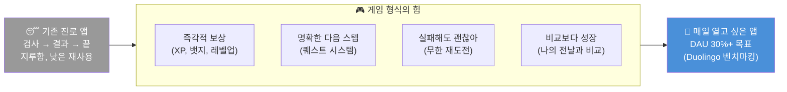

### Duolingo에서 배우는 게임화 원칙

| Duolingo 메커니즘 | 우리 앱 적용 방식 |
|-----------------|----------------|
| 스트릭 (연속 접속) | 커리어 탐험 연속 기록 (3일·7일·30일 뱃지) |
| XP 포인트 | 탐험 XP: 활동할 때마다 획득 |
| 리그 시스템 | 같은 관심 분야 친구들과 주간 탐험 랭킹 |
| 하트 시스템 | 미션 실패 → 다시 도전 기회 (패널티 없음) |
| 캐릭터 스토리 | 선배 멘토 캐릭터가 나의 여정 안내 |
| 짧은 레슨 (5분) | 하루 미션 3~5분 완성 가능 설계 |

---

## 1. 직업 세계 지도: 8대 직업군 × 대표 직업

> 한국표준직업분류 10개 대분류를 청소년 친화적으로 재구성 (8개 왕국)

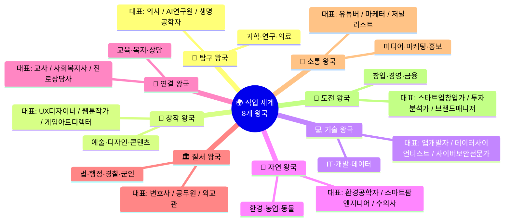

### 1.1 직업군별 대표 직업 & 핵심 정보

| 왕국 | 대표 직업 3선 | 핵심 강점 | AI 대체 위험도 | 미래 성장성 |
|------|------------|---------|------------|-----------|
| 🔬 탐구 | 의사 / AI연구원 / 생명공학자 | 분석력, 꼼꼼함 | 낮음 | ★★★★★ |
| 🎨 창작 | UX디자이너 / 웹툰작가 / 공간디자이너 | 창의력, 감수성 | 중간 | ★★★★ |
| 💻 기술 | 앱개발자 / 데이터사이언티스트 / 클라우드엔지니어 | 논리력, 수학 | 낮음 | ★★★★★ |
| 🌱 자연 | 환경공학자 / 스마트팜엔지니어 / 수의사 | 관찰력, 체력 | 낮음 | ★★★★ |
| 🤝 연결 | 교사 / 사회복지사 / 심리상담사 | 공감력, 소통 | 매우 낮음 | ★★★★ |
| 🏛️ 질서 | 변호사 / 외교관 / 경찰관 | 논리력, 정의감 | 낮음 | ★★★ |
| 📣 소통 | 크리에이터 / 마케터 / PD | 표현력, 기획력 | 중간 | ★★★★ |
| 🚀 도전 | 창업가 / 투자분석가 / 브랜드매니저 | 추진력, 판단력 | 중간 | ★★★★★ |

---

## 2. "선배의 발자국" 시스템 — 핵심 차별화

> 그 직업을 이룬 선배들이 **중학교 때 무엇을 했는지** 역추적하여 보여준다.
> "나도 저렇게 하면 될 수 있어" 라는 구체적 희망을 준다.

### 2.1 선배 발자국 카드 구조

```
╔══════════════════════════════════════════════════════════╗
║  👣 선배의 발자국                                         ║
║  김지수 / 현재: 카카오 UX 디자이너 (5년차)               ║
║  ─────────────────────────────────────────────────────  ║
║  중학교 때                                               ║
║  • 미술 동아리 + 사진 찍기 좋아함                        ║
║  • 학교 축제 포스터 직접 만들어 봄                       ║
║  • "저도 막막했어요. 디자인이 직업인 줄 몰랐어요"         ║
║                                                          ║
║  고등학교 때                                             ║
║  • 포토샵 독학, 인스타 디자인 계정 운영 (팔로워 2천)     ║
║  • 대학교 디자인과 오픈캠퍼스 2번 참가                   ║
║  • 청소년 디자인 공모전 장려상 수상                      ║
║                                                          ║
║  대학·이후                                               ║
║  • 시각디자인학과 → UX 심화 과정 → 카카오 인턴 → 정규직 ║
║                                                          ║
║  선배의 조언:                                            ║
║  "포트폴리오가 전부예요. 지금부터 만든 것을 저장하세요"   ║
║  ─────────────────────────────────────────────────────  ║
║  [나도 이 발자국 따라가기 🚀]  [다른 선배 보기 🔄]       ║
╚══════════════════════════════════════════════════════════╝
```

### 2.2 직업군별 선배 발자국 요약 (대표 사례)

| 직업 | 선배 현재 | 중학교 때 | 고등학교 때 | 전환점 |
|------|---------|---------|-----------|--------|
| UX 디자이너 | 카카오 5년차 | 축제 포스터 제작, 사진 촬영 | Figma 독학, 공모전 장려상 | 오픈캠퍼스에서 UX 발견 |
| AI 개발자 | 네이버 AI랩 | 마인크래프트 모딩, 스크래치 게임 | Python 독학, 교내 해커톤 우승 | 고2 때 논문 읽고 충격 받음 |
| 의사 | 서울대병원 전공의 | 병원 봉사, 생명과학 탐구 | 생명올림피아드 은상 | 응급실 봉사 중 사명감 생김 |
| 유튜브 크리에이터 | 구독자 50만 | 학교 방송부, 영상 편집 취미 | 유튜브 채널 개설, 구독자 1만 | 브랜드 협업 첫 수익 |
| 스타트업 창업가 | 시리즈 A 유치 | 플리마켓 운영, 반장 경험 | 창업 동아리, 교내 아이디어 대회 우승 | 대학교 창업경진대회 수상 |
| 환경공학자 | 환경부 연구원 | 환경 캠페인 참여, 자연 탐구 | 환경 과학 탐구 발표 전국 3위 | 미세먼지 데이터 분석 프로젝트 |

---

## 3. 직업군별 미니 프로젝트 × 핵심 프로젝트 전체 설계

### 3.1 🔬 탐구 왕국 (과학·의료·AI연구)

#### 중학생 미니 프로젝트

| # | 프로젝트명 | 기간 | 과제 내용 | 결과물 | 연결 직업 |
|---|-----------|------|---------|--------|---------|
| 1 | **우리 동네 건강 지도** | 4주 | 동네 걷기 → 병원·약국·공원 매핑 → 건강 환경 점수 매기기 | 손그림 지도 + 분석 보고서 | 의사·공중보건전문가 |
| 2 | **14일 수면 실험** | 2주 | 매일 수면 시간·기분·성적 기록 → 패턴 분석 → 개선 제안 | 데이터 그래프 + 발표 자료 | 의사·생명과학자·데이터분석가 |

#### 고등학생 핵심 프로젝트

| # | 프로젝트명 | 기간 | 과제 내용 | 결과물 |
|---|-----------|------|---------|--------|
| 1 | **질병 데이터 분석** | 8주 | 공공 건강 데이터 수집 → Python 분석 → 지역별 건강 위험 시각화 | GitHub + 분석 리포트 |
| 2 | **AI 진단 보조 시스템 기획** | 6주 | 의료 AI 논문 3편 읽기 → 간단한 증상 분류 모델 설계 → 발표 | 기획서 + 모델 프로토타입 |

#### 관련 콘텐츠·글쓰기 활동

```
📝 글쓰기:  "10년 후 AI가 의사를 대체할 수 있을까?" 에세이
📺 영상:    병원 하루 체험 브이로그 (병원 봉사 후)
📊 인포그래픽: "대한민국 10대 건강 문제 TOP 5"
🔬 실험일지: 14일 수면 실험 블로그 연재
```

---

### 3.2 🎨 창작 왕국 (디자인·예술·웹툰)

#### 중학생 미니 프로젝트

| # | 프로젝트명 | 기간 | 과제 내용 | 결과물 | 연결 직업 |
|---|-----------|------|---------|--------|---------|
| 1 | **앱 리디자인 챌린지** | 4주 | 매일 쓰는 앱 1개 불편함 찾기 → 개선 화면 스케치 3개 → Canva로 목업 제작 | 비포/애프터 목업 카드 | UX디자이너·서비스기획자 |
| 2 | **동네 브랜드 만들기** | 4주 | 우리 동네 특색 리서치 → 가상 카페 브랜드 네이밍·로고·메뉴판 디자인 | 브랜드 패키지 (로고+메뉴판) | 그래픽디자이너·브랜드디렉터 |

#### 고등학생 핵심 프로젝트

| # | 프로젝트명 | 기간 | 과제 내용 | 결과물 |
|---|-----------|------|---------|--------|
| 1 | **실제 의뢰 디자인** | 8주 | 주변 소상공인 의뢰 받기 → SNS 카드뉴스·로고 제작 → 실제 납품 | 실제 클라이언트 작업물 |
| 2 | **청소년 공모전 도전** | 6주 | 공모전 선정 → 기획·제작·제출 → 결과 분석 | 공모전 출품작 + 수상 여부 |

#### 관련 콘텐츠·글쓰기 활동

```
📝 글쓰기:  "내가 리디자인한 앱, 왜 이렇게 바꿨나?" 디자인 노트
📺 영상:    디자인 과정 타임랩스 (제작 과정 영상)
📸 포트폴리오: 인스타그램 디자인 계정 운영 (월 4개 이상 포스팅)
📊 분석글:  "좋은 UI와 나쁜 UI, 내가 발견한 차이점"
```

---

### 3.3 💻 기술 왕국 (IT·개발·데이터)

#### 중학생 미니 프로젝트

| # | 프로젝트명 | 기간 | 과제 내용 | 결과물 | 연결 직업 |
|---|-----------|------|---------|--------|---------|
| 1 | **우리 반 데이터 분석** | 4주 | 반 친구들 취미·수면·점심메뉴 설문 → 엑셀 분석 → 인포그래픽 제작 | 데이터 인포그래픽 발표 자료 | 데이터분석가·통계학자 |
| 2 | **나만의 챗봇 시나리오** | 4주 | "우리 학교 Q&A 챗봇" 대화 흐름 100개 설계 → 종이 프로토타입 → 발표 | 챗봇 대화 설계 문서 | AI개발자·서비스기획자 |

#### 고등학생 핵심 프로젝트

| # | 프로젝트명 | 기간 | 과제 내용 | 결과물 |
|---|-----------|------|---------|--------|
| 1 | **Python 데이터 프로젝트** | 8주 | 관심 주제 데이터 수집 → Pandas 분석 → Matplotlib 시각화 → GitHub 공개 | GitHub 레포지토리 |
| 2 | **앱 기획 + 프로토타입** | 10주 | 문제 정의 → 와이어프레임 → Figma 프로토타입 → 사용자 테스트 5명 | Figma 프로토타입 + 테스트 결과 |

#### 관련 콘텐츠·글쓰기 활동

```
📝 글쓰기:  "내가 만든 챗봇 설계하면서 배운 것" 개발 일지
📺 영상:    코딩 과정 유튜브 기록 (초보자 관점)
🐙 GitHub:  README 잘 작성된 저장소 1개 이상
📊 분석글:  "AI가 우리 학교 급식을 개선할 수 있을까?"
```

---

### 3.4 🌱 자연 왕국 (환경·동물·농업)

#### 중학생 미니 프로젝트

| # | 프로젝트명 | 기간 | 과제 내용 | 결과물 | 연결 직업 |
|---|-----------|------|---------|--------|---------|
| 1 | **교실 탄소 발자국 측정** | 4주 | 우리 반 1주 전기·급식·이동 데이터 수집 → 탄소량 계산 → 줄이기 캠페인 | 탄소 측정 보고서 + 캠페인 포스터 | 환경공학자·ESG전문가 |
| 2 | **스마트 식물 키우기** | 4주 | 씨앗 3종 조건 달리 심기 (빛·물·흙) → 성장 매일 사진 기록 → 비교 분석 | 성장 일지 + 실험 결과 발표 | 식물과학자·스마트팜엔지니어 |

#### 고등학생 핵심 프로젝트

| # | 프로젝트명 | 기간 | 과제 내용 | 결과물 |
|---|-----------|------|---------|--------|
| 1 | **우리 지역 환경 데이터 리포트** | 8주 | 공공 환경 데이터 수집·분석 → 지역 환경 문제 발굴 → 해결 제안서 | 환경 분석 보고서 (PDF) |

#### 관련 콘텐츠·글쓰기 활동

```
📝 글쓰기:  "내가 측정한 우리 반 탄소 발자국 결과" 과학 에세이
📺 영상:    14일 식물 성장 타임랩스 영상
📸 기록:    환경 탐사 사진 일지 (인스타 또는 노션)
📊 인포그래픽: "지구를 살리는 직업 TOP 5"
```

---

### 3.5 🤝 연결 왕국 (교육·복지·상담)

#### 중학생 미니 프로젝트

| # | 프로젝트명 | 기간 | 과제 내용 | 결과물 | 연결 직업 |
|---|-----------|------|---------|--------|---------|
| 1 | **후배를 위한 수업 만들기** | 4주 | 내가 잘하는 것 1가지 선택 → 초등생에게 가르칠 30분 수업 기획 → 실제 진행 | 수업 기획안 + 후기 | 교사·에듀테크개발자 |
| 2 | **우리 학교 고민 설문 분석** | 3주 | 반 친구들 고민 익명 설문 → 분류·분석 → "공감 가이드" 제작 | 설문 분석 + 공감 가이드 소책자 | 상담사·사회복지사 |

#### 고등학생 핵심 프로젝트

| # | 프로젝트명 | 기간 | 과제 내용 | 결과물 |
|---|-----------|------|---------|--------|
| 1 | **청소년 멘토링 프로그램 기획·운영** | 12주 | 초등생 대상 멘토링 커리큘럼 설계 → 4주 실제 운영 → 효과 분석 | 프로그램 기획서 + 활동 보고서 |

#### 관련 콘텐츠·글쓰기 활동

```
📝 글쓰기:  "내가 처음 수업을 만들어봤을 때" 교육 에세이
📺 영상:    수업 진행 기록 영상 (동의 받아 촬영)
📋 설문 보고서: "우리 반 친구들이 가장 힘든 것"
📖 소책자:  "중학생을 위한 고민 해결 가이드"
```

---

### 3.6 📣 소통 왕국 (미디어·마케팅·크리에이터)

#### 중학생 미니 프로젝트

| # | 프로젝트명 | 기간 | 과제 내용 | 결과물 | 연결 직업 |
|---|-----------|------|---------|--------|---------|
| 1 | **유튜브 쇼츠 3개 챌린지** | 4주 | 주제 정하기 → 스크립트 → 촬영 → 편집 → 업로드 → 반응 분석 | 유튜브 쇼츠 3개 + 분석 노트 | 크리에이터·영상PD |
| 2 | **학교 SNS 마케팅 기획** | 4주 | 학교 행사 하나 선택 → 인스타용 홍보 콘텐츠 5개 제작 → 반응 비교 | SNS 콘텐츠 5개 + 성과 분석 | 마케터·SNS매니저 |

#### 고등학생 핵심 프로젝트

| # | 프로젝트명 | 기간 | 과제 내용 | 결과물 |
|---|-----------|------|---------|--------|
| 1 | **30일 콘텐츠 챌린지** | 30일 | 주제 채널 1개 개설 → 30일 연속 콘텐츠 발행 → 성장 분석 | 채널 지표 + 성장 보고서 |
| 2 | **실제 브랜드 캠페인 기획** | 8주 | 지역 소상공인 선정 → SNS 마케팅 전략 수립 → 2주 실행 → 성과 보고 | 캠페인 기획서 + 성과 보고서 |

#### 관련 콘텐츠·글쓰기 활동

```
📝 글쓰기:  "내가 영상 3개 만들면서 배운 것" 크리에이터 일지
📊 분석글:  "조회수 높은 영상 vs 낮은 영상, 차이가 뭘까?"
📱 포트폴리오: 제작한 콘텐츠 모음 링크 정리
🎙️ 팟캐스트: "중학생이 바라보는 유튜브 세계" 에피소드 1개
```

---

### 3.7 🚀 도전 왕국 (창업·경영·금융)

#### 중학생 미니 프로젝트

| # | 프로젝트명 | 기간 | 과제 내용 | 결과물 | 연결 직업 |
|---|-----------|------|---------|--------|---------|
| 1 | **100원 투자 게임** | 4주 | 가상 100만원으로 모의 주식 투자 → 주 1회 포트폴리오 점검 → 투자 일지 작성 | 수익률 분석 + 투자 결정 이유 일지 | 투자분석가·펀드매니저 |
| 2 | **학교 앞 문제 창업 기획** | 4주 | 학교 주변 불편한 점 3개 발굴 → 해결하는 서비스 1개 기획 → 친구 5명에게 피칭 | 1페이지 사업 계획서 + 피칭 영상 | 스타트업창업가·서비스기획자 |

#### 고등학생 핵심 프로젝트

| # | 프로젝트명 | 기간 | 과제 내용 | 결과물 |
|---|-----------|------|---------|--------|
| 1 | **실제 플리마켓 창업** | 8주 | 제품·서비스 기획 → 원가 계산 → 플리마켓 출점 → 매출 분석 | 실제 매출 기록 + 비즈니스 회고 |
| 2 | **청소년 창업 대회 도전** | 12주 | 팀 구성 → 아이디어 검증 → 사업계획서 완성 → 대회 출전 | 사업계획서 + 발표자료 |

#### 관련 콘텐츠·글쓰기 활동

```
📝 글쓰기:  "내가 플리마켓에서 배운 경영학" 창업 에세이
📊 분석글:  "내 모의 투자 포트폴리오 4주 결과 분석"
📋 사업계획서: 1페이지 린 캔버스 작성
🎤 피칭 영상: 60초 엘리베이터 피치 영상
```

---

## 4. 게임 시스템 상세 설계

### 4.1 전체 게임 세계관

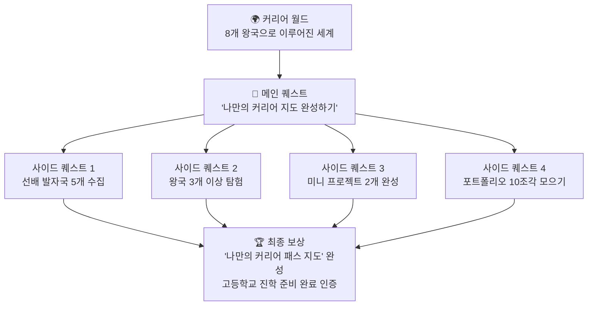

### 4.2 캐릭터 성장 시스템

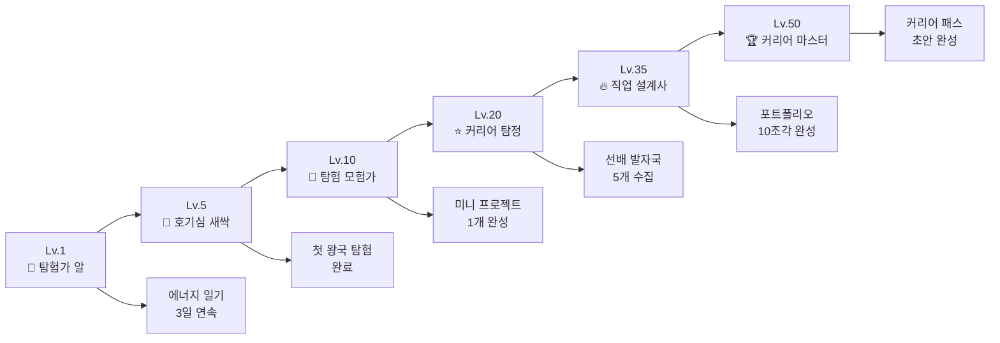

### 4.3 XP (탐험 포인트) 획득 시스템

| 활동 | 획득 XP | 설명 |
|------|--------|------|
| 에너지 일기 작성 | +10 XP | 매일 1문장 |
| 직업 카드 탐험 | +5 XP | 카드 1개 열람 |
| 직업 영상 시청 (3분) | +20 XP | 완주 시 |
| 시뮬레이션 미션 완료 | +30 XP | 미니게임 |
| 선배 발자국 수집 | +25 XP | 1명당 |
| 미니 프로젝트 완성 | +200 XP | 4주 과제 완료 |
| 콘텐츠 업로드 | +50 XP | 기록·글·영상 |
| 연속 접속 보너스 | +5~50 XP | 3·7·14·30일 |
| 친구 초대 | +100 XP | 1인당 |

### 4.4 왕국 탐험 지도 (UI 개념)

```
┌─────────────────────────────────────────────────────────┐
│  🌍 커리어 월드 지도                        Lv.7 ⭐     │
│  ─────────────────────────────────────────────────────  │
│                                                          │
│   🔬탐구    🎨창작★   💻기술    🌱자연                  │
│   [잠금]   [탐험중]  [잠금]  [잠금]                     │
│                                                          │
│   🤝연결    🏛️질서   📣소통★  🚀도전                   │
│   [잠금]   [잠금]   [완료!] [잠금]                      │
│                                                          │
│  ★ 관심 왕국  • 나의 강점 매칭 왕국                     │
│  ─────────────────────────────────────────────────────  │
│  오늘의 퀘스트: 창작 왕국 선배 발자국 1개 수집하기       │
│  보상: +25 XP + 창작 뱃지 조각 1/5                      │
│                         [퀘스트 시작 →]                  │
└─────────────────────────────────────────────────────────┘
```

### 4.5 미니 미션 (데일리 퀘스트) 설계

| 미션 유형 | 예시 | 소요 시간 | XP |
|---------|------|---------|-----|
| 관찰 미션 | "오늘 길에서 본 직업인 1명 기록하기" | 1분 | +10 |
| 탐험 미션 | "새 직업 카드 3개 열어보기" | 3분 | +15 |
| 시뮬레이션 | "UX 디자이너처럼 앱 불편함 찾기 게임" | 5분 | +30 |
| 성찰 미션 | "오늘 가장 신났던 순간 1문장 쓰기" | 1분 | +10 |
| 도전 미션 | "선배 발자국 1개 읽고 '나라면?' 적기" | 5분 | +25 |
| 프로젝트 체크인 | "이번 주 프로젝트 진행 상황 업데이트" | 3분 | +20 |

---

## 5. 앱/웹 개발 범위 분석

### 5.1 기능 범위 × 개발 난이도

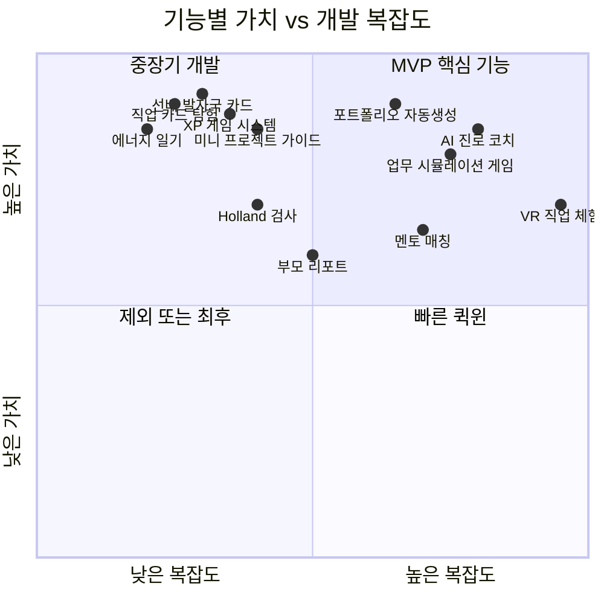

### 5.2 MVP vs 풀버전 범위 비교

| 구분 | MVP (3개월, 앱) | V2.0 (6개월) | V3.0 (12개월, 풀) |
|------|---------------|------------|-----------------|
| **화면 수** | 8~10개 | 20개 | 40개+ |
| **직업 DB** | 50개 | 100개 | 200개 |
| **게임 시스템** | XP + 레벨 | + 뱃지 + 왕국 지도 | + 리그 + 랭킹 |
| **선배 발자국** | 20명 | 60명 | 200명 |
| **미니 프로젝트** | 10개 템플릿 | 30개 | 80개 |
| **콘텐츠** | 영상 링크 큐레이션 | 자체 제작 영상 | VR/AR 체험 |
| **AI 기능** | 없음 | 기본 추천 | AI 진로 코치 |
| **개발 인원** | FE 1 + BE 1 + 디자이너 1 | +2명 | +AI엔지니어 |
| **예상 비용** | 3,000~5,000만원 | +3,000만원 | +5,000만원+ |

### 5.3 앱 vs 웹 선택 분석

| 비교 항목 | 앱 (iOS/Android) | 웹 (반응형) | 추천 |
|---------|----------------|-----------|------|
| 중학생 접근성 | 스마트폰 설치 필요 | 바로 접속 | 웹 우선 |
| 알림 (스트릭) | 푸시 알림 강력 | 제한적 | 앱 우선 |
| 게임 UX | 풍부한 애니메이션 | CSS로 가능 | 앱 우선 |
| 카메라(포트폴리오) | 네이티브 접근 쉬움 | 제한적 | 앱 우선 |
| 개발 비용 | 높음 (iOS+Android) | 낮음 | 웹 우선 |
| 업데이트 속도 | 심사 기간 필요 | 즉시 배포 | 웹 우선 |
| **결론** | **MVP: 웹앱 (PWA)** | **이후: 네이티브 앱** | **단계적 전환** |

> **추천 전략**: PWA(Progressive Web App)로 먼저 출시 → 사용자 반응 검증 → iOS/Android 앱 전환

---

## 6. 벤치마킹 앱 분석

### 6.1 핵심 벤치마킹 앱 비교표

| 앱 | 게임화 수준 | 진로 특화 | 대상 연령 | 배울 점 | 한계 |
|----|-----------|---------|---------|--------|------|
| **Duolingo** | ★★★★★ | ❌ (언어) | 전연령 | 스트릭, XP, 리그 시스템 | 진로와 무관 |
| **Xello (Real Game)** | ★★★★ | ★★★★★ | 중·고 | 진로 시뮬레이션 게임 | 미국 맥락, 한국 미지원 |
| **Habitica** | ★★★★★ | ❌ (습관) | 전연령 | RPG 캐릭터 성장 구조 | 진로 콘텐츠 없음 |
| **Khan Academy** | ★★★ | ★★ | 전연령 | 배지, 학습 지도 | 게임성 약함 |
| **커리어넷** | ★ | ★★★★★ | 중·고 | 방대한 직업 DB | PC 중심, 게임화 전무 |
| **Notion** | ❌ | ❌ | 성인 | 포트폴리오 구조 | 청소년 사용 어려움 |
| **Class Dojo** | ★★★ | ❌ (교실) | 초등 | 교사-학생-부모 연결 | 진로 없음 |

### 6.2 Xello "The Real Game" 상세 분석

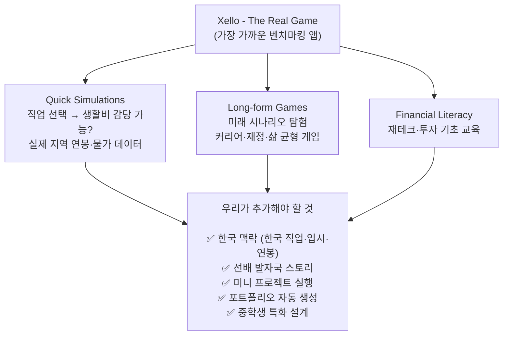

### 6.3 게임 메커니즘 조합 전략

| 메커니즘 | 참조 앱 | 우리 앱 적용 |
|---------|--------|-----------|
| **스트릭 + 알림** | Duolingo | 탐험 연속 기록 → 스트릭 불꽃 🔥 |
| **RPG 캐릭터 성장** | Habitica | 나의 커리어 아바타 레벨업 |
| **지도 탐험** | 포켓몬GO | 직업 세계 지도에서 왕국 언락 |
| **퀘스트 시스템** | Zelda 시리즈 | 메인·사이드 퀘스트 구조 |
| **실생활 연결** | Xello | 실제 미니 프로젝트 과제 |
| **소셜 랭킹** | Duolingo 리그 | 같은 관심사 친구 주간 랭킹 |
| **수집 욕구** | 포켓몬 도감 | 선배 발자국 카드 수집 |

---

## 7. 핵심 화면 게임 UX 설계

### 7.1 온보딩 (첫 3분)

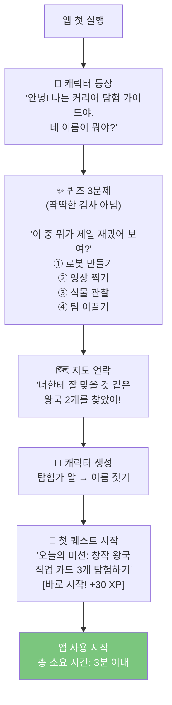

### 7.2 직업 카드 탐험 화면 (스와이프)

```
┌─────────────────────────────────────────────────┐
│  🗺️ 창작 왕국 탐험 중...          ✦ +5 XP/카드  │
│                                                  │
│  ╔═══════════════════════════════════╗           │
│  ║  🎨 UX 디자이너                  ║           │
│  ║                                   ║           │
│  ║  "앱을 쓰는 사람의 마음을         ║           │
│  ║   디자인하는 직업"                ║           │
│  ║                                   ║           │
│  ║  [▶ 3분 영상]  [🎮 체험]          ║           │
│  ╚═══════════════════════════════════╝           │
│                                                  │
│     👈 스킵         ❤️ 관심있어 👉              │
│                                                  │
│  탐험: ████████░░  8/30 카드           230 XP   │
└─────────────────────────────────────────────────┘
```

### 7.3 선배 발자국 수집 화면

```
┌─────────────────────────────────────────────────┐
│  👣 선배 발자국 수집                 12/50 수집  │
│  ─────────────────────────────────────────────  │
│                                                  │
│  ✨ 새 발자국 발견!                              │
│  ╔═══════════════════════════════════╗           │
│  ║ [희귀 ⭐⭐⭐]  김지수 / 카카오    ║           │
│  ║ UX 디자이너 5년차                ║           │
│  ║                                   ║           │
│  ║ 중2 때: 학교 축제 포스터 제작     ║           │
│  ║ → 지금 내 상황이랑 비슷해!        ║           │
│  ╚═══════════════════════════════════╝           │
│                                                  │
│  [선배 이야기 전체 보기]   [발자국 따라가기 🚀]  │
│                                                  │
│  🗂️ 내 발자국 컬렉션: ★★☆☆☆ 이 분야 2/5명 수집 │
└─────────────────────────────────────────────────┘
```

---

## 8. 앱 개발 로드맵 & 팀 구성

### 8.1 단계별 개발 로드맵

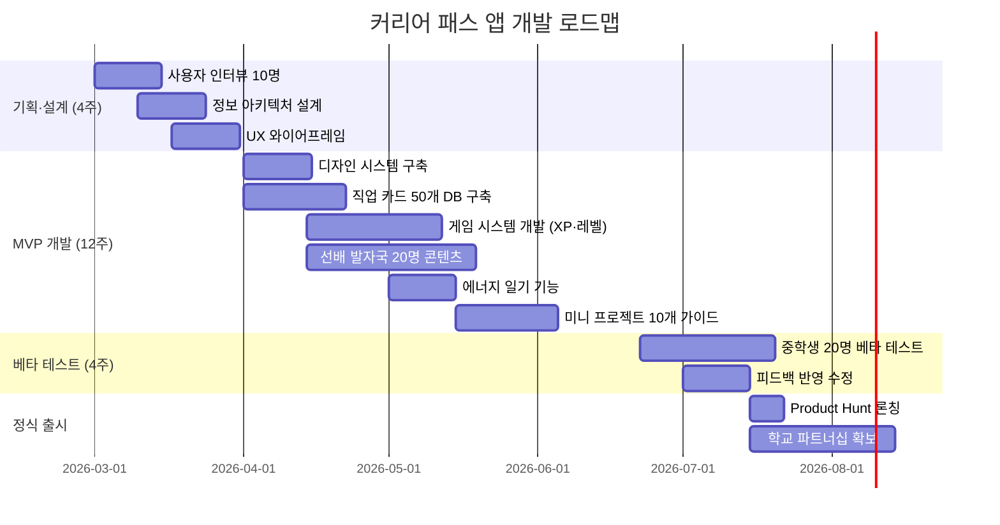

### 8.2 필요 팀 구성

| 역할 | 인원 | 주요 담당 | MVP 필수 여부 |
|------|------|---------|------------|
| 프로덕트 매니저 | 1명 | 기획, 로드맵 관리 | ✅ 필수 |
| UX 디자이너 | 1명 | UI/UX 설계, 게임 UX | ✅ 필수 |
| 프론트엔드 개발자 | 1명 | React/Next.js 웹앱 | ✅ 필수 |
| 백엔드 개발자 | 1명 | API, DB, 게임 로직 | ✅ 필수 |
| 콘텐츠 크리에이터 | 1명 | 직업 카드·선배 인터뷰 영상 | ✅ 필수 |
| AI 엔지니어 | 1명 | 추천 엔진, AI 코치 | 🟡 V2.0 |
| 마케터 | 1명 | 학교·학부모 채널 | 🟡 출시 후 |

---

## 9. 최종 정리: 핵심 차별화 포인트 3가지

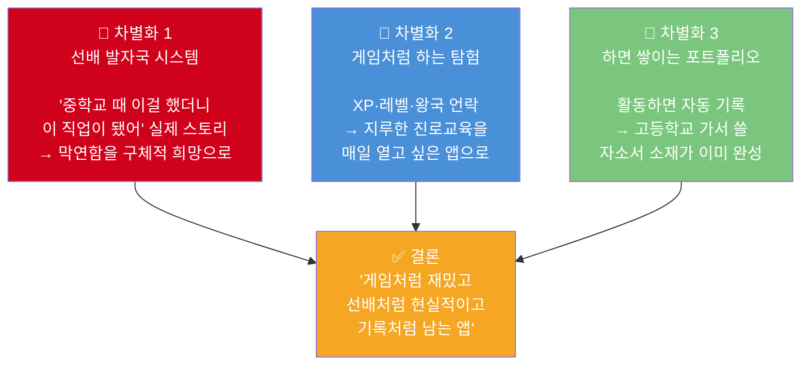

### 한 줄 앱 컨셉

> **"선배의 발자국을 게임처럼 따라가며, 나만의 커리어 지도를 완성한다."**

---

> 📌 **벤치마킹 참조**
> - Duolingo: 스트릭·XP·리그 게임화 시스템 (MAU 1.28억, 2025)
> - Xello "The Real Game": 진로 시뮬레이션 게임 (미국 K-12 1위 진로 플랫폼)
> - Habitica: RPG 캐릭터 성장 + 실생활 연결 구조
> - 한국표준직업분류 제8차 개정 (통계청, 2024)
> - 교육부 2024 초·중등 진로교육 현황조사

---

## 10. 직업군 상세 커리어 가이드 — 중학생·고등학생 준비 로드맵

> **보는 법**: 각 직업별로 ① 실제 업무 ② 중학생 준비 ③ 고등학생 준비 ④ 추천 도서 ⑤ 핵심 기술 순으로 정리했습니다.

---

### 10.1 🔬 탐구 왕국 — 과학·의료·AI연구

#### 전체 커리어 흐름도

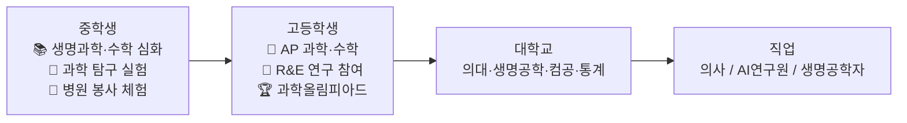

---

#### 📋 직업 1: 의사 (일반의 / 전문의)

| 항목 | 내용 |
|------|------|
| **핵심 업무** | 환자 진찰·진단·치료, 처방전 작성, 수술 및 시술, 의학 연구 및 논문 작성 |
| **주요 협업** | 간호사, 약사, 방사선사, 임상병리사, 의료행정팀 |
| **하루 일과** | 오전 외래 진료 → 오후 수술/회진 → 저녁 차트 기록·연구 |
| **연봉 범위** | 전공의 5,000만원 → 개원의 1억~3억원+ |
| **AI 대체 위험** | 낮음 (AI는 보조 도구, 최종 판단은 의사) |

**중학생 준비 사항**

| 준비 영역 | 구체적 활동 | 기간 |
|---------|-----------|------|
| 학과 기초 | 생명과학 A등급 유지, 수학 심화 문제 풀기 | 상시 |
| 체험 활동 | 지역 병원·보건소 봉사 활동 (월 1회) | 1년 |
| 독서 | 의학 관련 교양 도서 3권 이상 | 1년 |
| 탐구 과제 | "우리 동네 건강 문제 조사" 보고서 작성 | 4주 |
| 대회 | 학교 과학 탐구 대회 참가 | 연 1회 |

**고등학생 준비 사항**

| 준비 영역 | 구체적 활동 | 기간 |
|---------|-----------|------|
| 내신 | 생명과학Ⅰ·Ⅱ, 화학Ⅰ·Ⅱ, 수학Ⅰ·Ⅱ, 미적분 최상위 유지 | 상시 |
| 비교과 | 한국생물올림피아드(KBO), 한국화학올림피아드(KChO) 도전 | 연 1회 |
| 연구 | R&E (Research & Education) 프로그램 참여, 교수 지도 연구 | 1년 |
| 봉사 | 응급실·호스피스 봉사 (전문의 사명감 체험) | 연 20시간+ |
| 독서 | 의학 윤리·철학 서적 (수시 면접 대비) | 상시 |

**추천 도서**

| 도서명 | 저자 | 수준 | 핵심 내용 |
|-------|------|------|---------|
| 《아픔이 길이 되려면》 | 김승섭 | 중·고 | 사회역학, 왜 의사가 되는가 |
| 《의사의 생각》 | 제롬 그루프먼 | 고등+ | 의사의 의사결정 과정 |
| 《최종 진단》 | 아툴 가완디 | 고등+ | 의료 현장 에세이 |
| 《이기적 유전자》 | 리처드 도킨스 | 고등 | 생명과학 기초 세계관 |
| 《세포의 노래》 | 싯다르타 무커지 | 고등+ | 세포의학 최신 동향 |
| 《내 아이가 아플 때》 | 폴 오피트 | 중등 | 의학적 사고 입문 |

**핵심 기술 및 도구**

```
필수 지식: 생명과학, 화학, 물리(방사선), 통계학
디지털 도구: EMR(전자의무기록), PACS(의료영상), PubMed 논문 검색
AI 도구: IBM Watson Health, 의료 AI 진단 보조 시스템 이해
어학: 영어 의학 논문 독해 (PubMed, NEJM)
미래 역량: 정밀의학, 유전체 분석, 디지털 헬스케어 이해
```

---

#### 📋 직업 2: AI 연구원 (머신러닝 엔지니어 / NLP 연구원)

| 항목 | 내용 |
|------|------|
| **핵심 업무** | AI 모델 설계·학습·평가, 논문 연구 및 발표, 데이터 수집·전처리, 모델 배포·최적화 |
| **주요 협업** | 데이터 엔지니어, 소프트웨어 엔지니어, 프로덕트 매니저, 도메인 전문가 |
| **하루 일과** | 오전 논문 리딩/코딩 → 오후 실험·결과 분석 → 저녁 팀 리뷰 |
| **연봉 범위** | 신입 5,000만원 → 시니어 1억~2억원+ (네이버AI랩, 카카오, 삼성리서치) |
| **AI 대체 위험** | 낮음 (AI를 만드는 사람) |

**중학생 준비 사항**

| 준비 영역 | 구체적 활동 | 기간 |
|---------|-----------|------|
| 수학 기초 | 함수·확률·통계 개념 선행 학습 | 상시 |
| 코딩 입문 | 스크래치 → Entry → Python 기초 | 1년 |
| 프로젝트 | 마인크래프트 모딩, 앱인벤터 간단 앱 제작 | 6개월 |
| 탐구 | "AI가 뭔지 5분 설명하기" 유튜브 영상 제작 | 4주 |
| 대회 | 정보올림피아드(KOI) 1차 도전, 코딩 경진대회 참가 | 연 1회 |

**고등학생 준비 사항**

| 준비 영역 | 구체적 활동 | 기간 |
|---------|-----------|------|
| 수학 심화 | 선형대수학·미적분·확률통계 대학 수준 선행 | 1~2년 |
| 프로그래밍 | Python 중급 → TensorFlow/PyTorch 입문 | 1년 |
| 논문 읽기 | arXiv.org에서 AI 논문 주 1편 (번역·요약 블로그 운영) | 1년 |
| 프로젝트 | Kaggle 데이터 대회 참가, GitHub 포트폴리오 구축 | 상시 |
| 대회 | 정보올림피아드(KOI) 전국, AI 해커톤 참가 | 연 1~2회 |

**추천 도서**

| 도서명 | 저자 | 수준 | 핵심 내용 |
|-------|------|------|---------|
| 《Hello 코딩 머신러닝》 | 세바스찬 라시카 | 중등 | ML 입문 시각적 설명 |
| 《파이썬 머신러닝 완벽 가이드》 | 권철민 | 고등+ | scikit-learn 실습 |
| 《딥러닝의 비밀》 | 존 폴 뮬러 | 고등 | 딥러닝 개념 입문 |
| 《AI 슈퍼파워》 | 리카이푸 | 중·고 | AI 미래와 직업 변화 |
| 《수학의 쓸모》 | 닉 폴슨 | 고등 | 데이터 과학 수학 기초 |
| 《Hands-On ML》 | 오렐리앙 제롱 | 고등+ | TensorFlow 실전 |

**핵심 기술 및 도구**

```
프로그래밍: Python, R, SQL, C++ (성능 최적화)
AI/ML 프레임워크: TensorFlow, PyTorch, scikit-learn, Hugging Face
수학: 선형대수, 미적분, 확률통계, 정보이론
클라우드: AWS SageMaker, Google Colab, Azure ML
실험 관리: MLflow, Weights & Biases (WandB)
버전 관리: Git/GitHub, DVC
논문 출처: arXiv, Google Scholar, Papers With Code
```

---

#### 📋 직업 3: 생명공학자 (바이오테크 연구원)

| 항목 | 내용 |
|------|------|
| **핵심 업무** | 유전자 편집(CRISPR), 신약 개발, 임상시험 설계, 단백질 구조 분석 |
| **주요 협업** | 의사, 화학자, 통계학자, 규제기관(식약처) |
| **하루 일과** | 오전 실험 설계·실시 → 오후 데이터 분석 → 저녁 논문 작성 |
| **연봉 범위** | 연구원 4,000만원 → 책임연구원 8,000만원+ (삼성바이오, 셀트리온, SK바이오) |

**중학생 준비 사항**

| 준비 영역 | 구체적 활동 |
|---------|-----------|
| 과학 탐구 | 현미경 실험, 식물 세포 관찰 일지 작성 |
| 독서 | 생명공학 관련 청소년 교양 도서 |
| 체험 | 과학 박물관, 바이오 캠프 참가 |
| 탐구 | "GMO 식품의 장단점" 탐구 보고서 |

**추천 도서**

| 도서명 | 저자 | 수준 |
|-------|------|------|
| 《생명이란 무엇인가》 | 에르빈 슈뢰딩거 | 고등 |
| 《유전자의 내밀한 역사》 | 싯다르타 무커지 | 고등 |
| 《크리스퍼 베이비》 | 헨리 그릴리 | 고등+ |

---

### 10.2 🎨 창작 왕국 — 디자인·예술·웹툰

#### 전체 커리어 흐름도

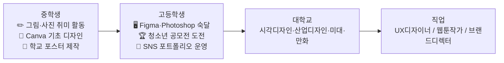

---

#### 📋 직업 4: UX/UI 디자이너

| 항목 | 내용 |
|------|------|
| **핵심 업무** | 사용자 리서치(인터뷰·설문), 와이어프레임 제작, UI 화면 디자인, 프로토타입 테스트, 디자인 시스템 구축 |
| **주요 협업** | 프론트엔드 개발자, 프로덕트 매니저, 마케터, 데이터 분석가 |
| **하루 일과** | 오전 사용자 인터뷰/데이터 분석 → 오후 Figma 디자인 작업 → 저녁 개발자 협업 |
| **연봉 범위** | 주니어 4,000만원 → 시니어 8,000만원+ (카카오, 네이버, 쿠팡) |
| **포트폴리오 핵심** | 케이스 스터디 3개 이상 (문제-과정-결과 스토리) |

**중학생 준비 사항**

| 준비 영역 | 구체적 활동 | 결과물 |
|---------|-----------|--------|
| 도구 입문 | Canva 무료 버전으로 포스터·카드뉴스 제작 | 월 2개 이상 |
| 관찰 훈련 | 매일 쓰는 앱 1개씩 불편한 점 3가지 기록 | 관찰 노트 |
| 그림 실력 | 와이어프레임 손 스케치 연습 (앱 화면 따라 그리기) | 스케치북 |
| 색감 감각 | Pinterest·Behance에서 레퍼런스 수집 및 분류 | 무드보드 |
| 프로젝트 | 학교 행사 포스터 직접 디자인 → 실제 부착 | 실제 작업물 |

**고등학생 준비 사항**

| 준비 영역 | 구체적 활동 | 결과물 |
|---------|-----------|--------|
| 핵심 도구 | Figma 중급 (컴포넌트·오토레이아웃·프로토타이핑) | Figma 파일 |
| 보조 도구 | Adobe Photoshop·Illustrator 기초 | 작업물 |
| 리서치 | 사용자 인터뷰 5명 이상 진행·분석 경험 | 인터뷰 보고서 |
| 포트폴리오 | 케이스 스터디 2개 (실제 문제 → 내 해결 디자인) | 포트폴리오 사이트 |
| 공모전 | 청소년 UX·디자인 공모전 연 1~2회 도전 | 수상 또는 출품 경험 |
| SNS | 인스타그램 디자인 계정 운영 (팔로워보다 꾸준함) | 계정 링크 |

**추천 도서**

| 도서명 | 저자 | 수준 | 핵심 내용 |
|-------|------|------|---------|
| 《디자인 오브 에브리데이 씽스》 | 돈 노먼 | 중·고 | UX 개념의 바이블 |
| 《스프린트》 | 제이크 냅 | 고등 | Google Ventures 디자인 프로세스 |
| 《사용자를 생각하게 하지 마라》 | 스티브 크룩 | 고등 | 웹 UX 실무 원칙 |
| 《감각의 디자인》 | 롭 워커 | 고등 | 브랜드 스토리텔링 |
| 《픽사 이야기》 | 에드 캣멀 | 중·고 | 창의적 조직 문화 |
| 《그래픽 디자인의 역사》 | 필립 멕스 | 고등 | 디자인 흐름 이해 |

**핵심 기술 및 도구**

```
디자인 도구: Figma (필수), Adobe XD, Sketch
그래픽 도구: Photoshop, Illustrator, After Effects (모션)
리서치 도구: Maze, UserTesting, Google Forms
협업 도구: Zeplin, Notion, Slack, Jira
포트폴리오: Behance, Dribbble, 개인 포트폴리오 웹사이트
AI 도구: Midjourney (시안), Adobe Firefly, Galileo AI
```

---

#### 📋 직업 5: 웹툰 작가 / 일러스트레이터

| 항목 | 내용 |
|------|------|
| **핵심 업무** | 스토리 기획, 콘티 작업, 디지털 드로잉, 색채 작업, 플랫폼 업로드 및 독자 소통 |
| **주요 협업** | 네이버웹툰·카카오페이지 담당 PD, 작화 어시스턴트, 번역가 (글로벌 진출 시) |
| **수익 구조** | 원고료 + 플랫폼 수익 + IP 2차 창작 수익 (드라마·영화화) |
| **포트폴리오 핵심** | 완결 단편 3편 이상, 일관된 화풍 |

**중학생 준비 사항**

| 준비 영역 | 구체적 활동 |
|---------|-----------|
| 드로잉 기초 | 매일 30분 스케치 (인체 드로잉, 표정 연습) |
| 디지털 입문 | 클립스튜디오 무료 체험 또는 Procreate Pocket |
| 스토리 감각 | 좋아하는 웹툰 5편 분석 (구도·컷 배치·감정선) |
| 창작 | 4컷 만화 20편 이상 완성 (스토리 완결 경험) |

**고등학생 준비 사항**

| 준비 영역 | 구체적 활동 |
|---------|-----------|
| 도구 숙달 | 클립스튜디오 프로 중급 이상, 포토샵 색보정 |
| 작품 완성 | 단편 웹툰 (10화 이상) 완결 후 네이버 도전만화 연재 |
| 플랫폼 | 인스타툰 운영으로 독자 반응 학습 |
| 대회 | 네이버웹툰 공모전, 카카오웹툰 오픈 챌린지 참가 |

**추천 도서**

| 도서명 | 저자 | 수준 |
|-------|------|------|
| 《Making Comics》 | 스콧 맥클라우드 | 중·고 |
| 《스토리》 | 로버트 맥키 | 고등 |
| 《웹툰 작가 입문》 | 강도하 외 | 중·고 |
| 《히어로의 여정》 | 조지프 캠벨 | 고등 |

**핵심 기술 및 도구**

```
드로잉: 클립스튜디오 프로 (필수), Procreate (iPad), Photoshop
태블릿: Wacom Intuos/Cintiq, iPad Pro + Apple Pencil
스토리: 최종 초고 작성 → 콘티 → 밑그림 → 선화 → 채색 → 효과
플랫폼: 네이버 도전만화, 카카오페이지, Webtoon 영문 플랫폼
AI 보조: Stable Diffusion (배경 레퍼런스), Midjourney (컬러 무드)
```

---

### 10.3 💻 기술 왕국 — IT·개발·데이터

#### 전체 커리어 흐름도

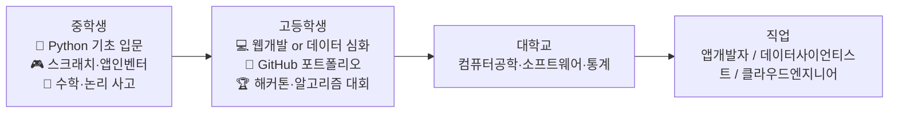

---

#### 📋 직업 6: 앱/웹 개발자 (프론트엔드 / 백엔드 / 풀스택)

| 항목 | 내용 |
|------|------|
| **핵심 업무 (프론트)** | 화면 UI 구현, API 연동, 성능 최적화, 디자이너와 협업 |
| **핵심 업무 (백엔드)** | 서버·API 설계, DB 관리, 인증·보안, 배포 자동화 |
| **하루 일과** | 오전 코드리뷰·회의 → 오후 개발 집중 → 저녁 PR 올리기·문서화 |
| **연봉 범위** | 신입 4,500만원 → 시니어 9,000만원+ (네이버, 카카오, 토스, 쿠팡) |

**중학생 준비 사항**

| 준비 영역 | 구체적 활동 | 추천 플랫폼 |
|---------|-----------|-----------|
| 프로그래밍 기초 | 스크래치 → Entry → Python 순서로 학습 | code.org, 엔트리 |
| HTML/CSS 입문 | 간단한 개인 소개 웹페이지 만들기 | MDN, W3Schools |
| 알고리즘 기초 | 백준 단계별 문제 (브론즈 단계) | solved.ac |
| 프로젝트 | 나만의 계산기, 할일 목록 앱 만들기 | replit.com |

**고등학생 준비 사항**

| 준비 영역 | 구체적 활동 | 결과물 |
|---------|-----------|--------|
| 웹 개발 | HTML/CSS/JavaScript → React.js 기초 | 개인 포트폴리오 웹사이트 |
| 백엔드 | Python Flask or Node.js + REST API 설계 | API 서버 GitHub 공개 |
| DB | SQL 기초 (SELECT, JOIN, INDEX) | 데이터베이스 설계 경험 |
| 알고리즘 | 백준 실버 이상, 정보올림피아드(KOI) 참가 | solved.ac 프로필 |
| 포트폴리오 | GitHub 공개 레포지토리 3개+ (README 상세 작성) | GitHub 프로필 |
| 협업 | 학교 동아리 팀 프로젝트 or 해커톤 참가 | 팀 프로젝트 결과물 |

**추천 도서**

| 도서명 | 저자 | 수준 | 핵심 내용 |
|-------|------|------|---------|
| 《혼자 공부하는 파이썬》 | 윤인성 | 중등 | Python 입문 최적 |
| 《Do it! HTML+CSS+자바스크립트》 | 고경희 | 중·고 | 웹 기초 3종 세트 |
| 《클린 코드》 | 로버트 마틴 | 고등+ | 좋은 코드 작성법 |
| 《프로그래머의 뇌》 | 펠리너 헤르만스 | 고등 | 코딩 학습법 과학 |
| 《컴퓨터 과학이 보이는 그림책》 | 아다치 미쓰유키 | 중등 | CS 개념 시각화 |
| 《소프트웨어 장인》 | 산드로 만쿠소 | 고등+ | 개발자 커리어 철학 |

**핵심 기술 및 도구**

```
프론트엔드: HTML, CSS, JavaScript, React.js, TypeScript, Next.js
백엔드: Python(FastAPI/Django), Node.js(Express), Java(Spring)
데이터베이스: PostgreSQL, MySQL, MongoDB, Redis
클라우드: AWS(EC2, S3, Lambda), Vercel, Netlify
개발 도구: VS Code, Git, GitHub, Docker, Postman
알고리즘: 백준, 프로그래머스, LeetCode
AI 협업: GitHub Copilot, Cursor AI, ChatGPT API 연동
```

---

#### 📋 직업 7: 데이터 사이언티스트 / 데이터 분석가

| 항목 | 내용 |
|------|------|
| **핵심 업무** | 데이터 수집·정제·분석, 비즈니스 인사이트 도출, 예측 모델 개발, 대시보드 제작, A/B 테스트 설계 |
| **주요 협업** | 개발자, 마케터, 경영진, 프로덕트 매니저 |
| **하루 일과** | 오전 데이터 파이프라인 점검 → 오후 분석·모델링 → 저녁 인사이트 리포트 작성 |
| **연봉 범위** | 신입 4,500만원 → 시니어 1억원+ (빅테크, 금융사, 유통사) |

**중학생 준비 사항**

| 준비 영역 | 구체적 활동 |
|---------|-----------|
| 수학 기초 | 통계 개념 (평균·중앙값·표준편차) 엑셀로 직접 계산 |
| 데이터 감각 | 생활 데이터 수집 (수면·운동·점수) → 그래프로 시각화 |
| 도구 입문 | 구글 스프레드시트 함수 마스터, 차트 만들기 |
| 프로젝트 | "우리 반 데이터 분석" (설문 → 엑셀 → 인포그래픽) |

**고등학생 준비 사항**

| 준비 영역 | 구체적 활동 | 결과물 |
|---------|-----------|--------|
| Python 분석 | Pandas, NumPy, Matplotlib, Seaborn 실습 | Jupyter Notebook |
| SQL | 데이터베이스 쿼리 작성 (GROUP BY, JOIN, 서브쿼리) | SQL 프로젝트 |
| 통계 | 가설 검정, 회귀분석, 상관분석 이해 | 통계 분석 보고서 |
| 시각화 | Tableau Public or Google Data Studio 대시보드 | 공개 대시보드 |
| 대회 | Kaggle 입문 대회 참가 (Titanic, Housing Price) | Kaggle 프로필 |
| 공공 데이터 | 공공데이터포털(data.go.kr) 데이터로 사회문제 분석 | 분석 보고서 |

**추천 도서**

| 도서명 | 저자 | 수준 | 핵심 내용 |
|-------|------|------|---------|
| 《데이터 과학자의 사고법》 | 김용대 | 중·고 | 데이터 분석 사고방식 |
| 《Everybody Lies》 | 세스 스티븐스-다비도위츠 | 고등 | 빅데이터가 말하는 진실 |
| 《넛지》 | 탈러·선스타인 | 고등 | 데이터 기반 행동경제학 |
| 《파이썬 라이브러리를 활용한 데이터 분석》 | 웨스 맥키니 | 고등+ | Pandas 창시자 책 |
| 《통계의 함정》 | 다렐 허프 | 중·고 | 잘못된 통계 비판 |

**핵심 기술 및 도구**

```
프로그래밍: Python (Pandas, NumPy, Scikit-learn, Matplotlib, Seaborn)
SQL: PostgreSQL, BigQuery, Redshift
시각화: Tableau, Power BI, Looker Studio, Plotly Dash
클라우드: Google BigQuery, AWS Athena, Snowflake
통계: 가설 검정, A/B 테스트, 회귀분석, 시계열 분석
ML: 예측 모델 (XGBoost, LightGBM), 추천 시스템
노트북: Jupyter, Google Colab
```

---

### 10.4 🌱 자연 왕국 — 환경·동물·농업

#### 📋 직업 8: 환경공학자 / ESG 전문가

| 항목 | 내용 |
|------|------|
| **핵심 업무** | 환경오염 측정·분석, 폐수·대기 오염 처리 시스템 설계, ESG 보고서 작성, 환경 규제 컨설팅 |
| **주요 협업** | 화학공학자, 법무팀, 기업 경영진, 환경부 |
| **연봉 범위** | 공공기관 4,000만원 → 대기업 ESG팀 7,000만원+ |
| **미래 성장성** | ESG 의무공시 확대로 수요 급증 중 |

**중학생 → 고등학생 준비 비교표**

| 준비 영역 | 중학생 | 고등학생 |
|---------|-------|--------|
| 과학 | 화학·지구과학 기초 | 화학Ⅱ, 지구과학Ⅱ 심화 |
| 활동 | 환경 캠페인 참여, 탄소 발자국 측정 | 환경 R&E 연구, 환경부 공모전 |
| 데이터 | 공공 환경 데이터 조사·그래프 | Python으로 환경 데이터 분석 |
| 자격 | — | 환경기능사 필기 준비 |
| 체험 | 환경 단체 봉사, 자연 탐사 | 환경공학과 랩 방문, 현장 견학 |

**추천 도서**

| 도서명 | 저자 | 수준 |
|-------|------|------|
| 《침묵의 봄》 | 레이첼 카슨 | 중·고 |
| 《지속가능한 미래를 위한 ESG 경영》 | 강민정 | 고등 |
| 《2050 거주불능 지구》 | 데이비드 월러스-웰스 | 고등 |
| 《플라스틱 바다》 | 찰스 무어 | 중·고 |

**핵심 기술 및 도구**

```
측정 도구: 대기질 측정기, 수질 분석기, GIS(지리정보시스템)
분석: Python (환경 데이터), ArcGIS, QGIS
인증: 환경기사, ESG 분석가 자격증
규제 이해: 환경부 법령, 탄소배출권 거래제, RE100
데이터 출처: 에어코리아, 환경공단, Our World in Data
```

---

#### 📋 직업 9: 스마트팜 엔지니어 / 애그테크 창업가

| 항목 | 내용 |
|------|------|
| **핵심 업무** | IoT 센서 설계·설치, 작물 데이터 분석, 자동화 시스템 구축, 수직 농장 설계 |
| **특이점** | 농업 + IT + 환경 융합 직업 (문과·이과 경계 없음) |
| **시장 규모** | 글로벌 스마트팜 시장 2030년 430억 달러 예상 |

**중학생 → 고등학생 준비 비교표**

| 준비 영역 | 중학생 | 고등학생 |
|---------|-------|--------|
| 기초 실험 | 식물 성장 조건 실험 (빛·온도·수분 변인 통제) | IoT 아두이노로 자동 급수 시스템 제작 |
| 코딩 | 스크래치로 센서 시뮬레이션 | Python + Arduino + Raspberry Pi |
| 체험 | 스마트팜 견학, 농촌 체험 캠프 | 스마트팜 인턴십, 농업 R&D 기관 방문 |
| 프로젝트 | 교실 미니 수경재배 데이터 기록 | 소형 스마트팜 제작 + 데이터 분석 |

**핵심 기술 및 도구**

```
하드웨어: Arduino, Raspberry Pi, 각종 센서(온습도, CO2, 조도)
소프트웨어: Python, Node-RED, MQTT 프로토콜
데이터: 작물 생장 데이터 분석, 수율 최적화 알고리즘
기계 학습: 작물 병해 이미지 분류 (CNN)
플랫폼: AWS IoT, Google Cloud IoT
```

---

### 10.5 🤝 연결 왕국 — 교육·복지·상담

#### 전체 커리어 흐름도

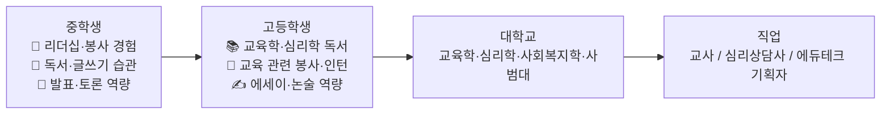

---

#### 📋 직업 10: 교사 / 에듀테크 기획자

| 항목 | 내용 |
|------|------|
| **핵심 업무 (교사)** | 수업 설계, 학생 지도·상담, 생활지도, 학부모 소통, 행정 업무 |
| **핵심 업무 (에듀테크)** | 교육 콘텐츠 기획, 학습 데이터 분석, 교사·학생 UX 설계 |
| **연봉 범위 (교사)** | 초임 3,500만원 → 20년 이상 6,000만원+ (공무원 연금 포함) |
| **연봉 범위 (에듀테크)** | PM 4,500만원 → 시니어 8,000만원+ |

**중학생 → 고등학생 준비 비교표**

| 준비 영역 | 중학생 | 고등학생 |
|---------|-------|--------|
| 가르치기 | 후배/동생에게 공부 가르쳐보기 | 초등생 멘토링 프로그램 운영 |
| 커뮤니케이션 | 학급 회장, 모둠 리더 경험 | 토론 대회, 강연 활동 |
| 글쓰기 | 독서 감상문, 교육 에세이 | 교육 관련 칼럼·블로그 운영 |
| IT 역량 | — | 에듀테크 앱 UX 분석, 학습 앱 리뷰 |

**추천 도서**

| 도서명 | 저자 | 수준 |
|-------|------|------|
| 《가르친다는 것》 | 파울로 프레이리 | 고등+ |
| 《공부의 배반》 | 알피 콘 | 중·고 |
| 《마음 vs 뇌》 | 크리스토프 코흐 | 고등 |
| 《배움의 발견》 | 타라 웨스트오버 | 고등 |
| 《세계를 바꾼 교육》 | 켄 로빈슨 | 고등 |

---

#### 📋 직업 11: 심리상담사 / 임상심리사

| 항목 | 내용 |
|------|------|
| **핵심 업무** | 심리 검사·해석, 개인·집단 상담, 인지행동치료(CBT), 위기 개입, 사례 보고서 작성 |
| **연봉 범위** | 학교 상담사 3,000만원 → 임상심리사 4,500만원 → 개인 개업 6,000만원+ |
| **자격증** | 학교상담사 2급, 청소년상담사 3급(대학), 임상심리사 2급 |

**중학생 → 고등학생 준비 비교표**

| 준비 영역 | 중학생 | 고등학생 |
|---------|-------|--------|
| 공감 훈련 | 친구 고민 들어주기, 일기 쓰기 | 또래 상담 동아리 참여 |
| 심리학 입문 | 심리학 교양서 읽기 | 심리학개론 선행학습, 상담 이론 독서 |
| 봉사 | 지역 복지관 봉사 | 청소년 상담복지센터 봉사 인턴 |
| 관찰 | 감정 일기 100일 쓰기 | 비구조화 관찰 일지, 사례 분석 글쓰기 |

**추천 도서**

| 도서명 | 저자 | 수준 |
|-------|------|------|
| 《미움받을 용기》 | 기시미 이치로 | 중·고 |
| 《감정은 습관이다》 | 최명기 | 중·고 |
| 《상담이론과 실제》 | 이형득 | 고등+ |
| 《너는 왜 나를 이해 못 해》 | 피아 칼렌 | 중등 |
| 《Man's Search for Meaning》 | 빅터 프랭클 | 고등 |

---

### 10.6 🏛️ 질서 왕국 — 법·행정·외교

#### 📋 직업 12: 변호사 / 법학 전문가

| 항목 | 내용 |
|------|------|
| **핵심 업무** | 법률 자문, 소송 대리, 계약서 검토, 법률 리서치, 협상 |
| **주요 분야** | 형사, 민사, 기업법무, IT·개인정보법, 국제법 |
| **연봉 범위** | 변호사 신입 6,000만원 → 파트너 1억 5,000만원+ |
| **진입 경로** | (고교 졸업) → 법학과 4년 → 로스쿨 3년 → 변호사시험 합격 |

**중학생 → 고등학생 준비 비교표**

| 준비 영역 | 중학생 | 고등학생 |
|---------|-------|--------|
| 논리·토론 | 토론 동아리, 모의법정 참가 | 전국 토론 대회, 모의 유엔(MUN) |
| 글쓰기 | 설득형 논설문 쓰기 | 법학 관련 심화 에세이, 논술 |
| 사회 이해 | 신문 읽기 (사회면·정치면 스크랩) | 헌법·법률 기초 독서 |
| 영어 | 기초 독해·작문 | LSAT 논리 유형 익히기, 영어 시사 독해 |

**추천 도서**

| 도서명 | 저자 | 수준 |
|-------|------|------|
| 《법이 전부는 아니지만》 | 안경환 | 중·고 |
| 《정의란 무엇인가》 | 마이클 샌델 | 고등 |
| 《법은 왜 불공평한가》 | 최강욱 | 고등 |
| 《로스쿨 이야기》 | 스콧 터로 | 고등 |
| 《논어》 | 공자 | 중·고 (인성·정의 기반) |

**핵심 기술 및 도구**

```
필수 역량: 논리적 글쓰기, 비판적 독해, 구술 토론, 영어 독해
디지털 도구: LexisNexis, Westlaw (법률 DB), ChatGPT (법률 초안 보조)
AI 변화: 계약서 검토 AI, 판례 분석 AI → 법률 해석·전략은 여전히 인간
영어: LSAT, TOEFL, 법률 영어 문서 독해 필수
```

---

#### 📋 직업 13: 외교관 / 국제기구 직원

| 항목 | 내용 |
|------|------|
| **핵심 업무** | 양자·다자 회담, 조약 협상, 영사 업무, 국제법 적용, 해외 한인 보호 |
| **진입 경로** | 외무고시(5급 공채) 또는 국제기구(UN, OECD, WTO 등) 공모 |
| **연봉 범위** | 외교관 4,500만원(초임) → 대사 8,000만원+ (해외 근무 수당 별도) |

**중학생 → 고등학생 준비 비교표**

| 준비 영역 | 중학생 | 고등학생 |
|---------|-------|--------|
| 어학 | 영어 회화 기초, 제2외국어 입문 | 영어(토플·오픽) + 중국어·불어 등 1개 |
| 국제 감각 | 세계 뉴스 읽기, 모의 유엔(MUN) 참가 | 전국 MUN, 국제 교류 프로그램 |
| 글쓰기 | 국제 이슈 독후감·에세이 | 외교 안보 관련 정책 리포트 |

**추천 도서**

| 도서명 | 저자 | 수준 |
|-------|------|------|
| 《총, 균, 쇠》 | 재레드 다이아몬드 | 고등 |
| 《국제정치의 이해》 | 이삼성 | 고등+ |
| 《세계는 왜 싸우는가》 | 김영미 | 중·고 |
| 《외교관 이야기》 | 반기문 | 중·고 |

---

### 10.7 📣 소통 왕국 — 미디어·마케팅·크리에이터

#### 전체 커리어 흐름도

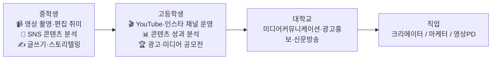

---

#### 📋 직업 14: 유튜버 / 콘텐츠 크리에이터

| 항목 | 내용 |
|------|------|
| **핵심 업무** | 주제 기획, 스크립트 작성, 촬영, 편집, 썸네일 제작, 알고리즘 최적화, 브랜드 협찬 협상 |
| **수익 구조** | 유튜브 광고 + 브랜드 협업 + 굿즈 + 강연 + 멤버십 |
| **구독자 수익 기준** | 1만명 브랜드 협업 시작 → 10만명 안정 수익 → 100만명 주요 매체 수준 |
| **성공 핵심** | 꾸준함 (업로드 주기) × 기획력 × 편집 퀄리티 |

**중학생 준비 사항**

| 준비 영역 | 구체적 활동 | 도구 |
|---------|-----------|------|
| 스토리텔링 | 좋아하는 유튜버 5명 분석 (구성 방식, 썸네일, 댓글) | 노션 분석 노트 |
| 편집 입문 | 캡컷(무료) or 다빈치 리졸브 기초 편집 | CapCut |
| 글쓰기 | 영상 스크립트 5편 직접 작성 | Google Docs |
| 실전 | 유튜브 쇼츠 5개 업로드 + 반응 분석 | YouTube Studio |

**고등학생 준비 사항**

| 준비 영역 | 구체적 활동 | 결과물 |
|---------|-----------|--------|
| 채널 전문화 | 특정 주제 채널 (공부법·게임·요리 등) 꾸준 운영 | 채널 통계 스크린샷 |
| 편집 심화 | 프리미어 프로 or 파이널컷 중급 | 편집 포트폴리오 |
| 분석 역량 | YouTube Analytics 해석 → CTR·시청 지속률 개선 | 성장 보고서 |
| 협업 | 같은 분야 크리에이터 콜라보, 브랜드 제안서 작성 | 협업 결과물 |

**추천 도서**

| 도서명 | 저자 | 수준 | 핵심 내용 |
|-------|------|------|---------|
| 《무기가 되는 스토리》 | 도널드 밀러 | 고등 | 스토리텔링 프레임워크 |
| 《유튜브 레볼루션》 | 로버트 킨슬 | 고등 | 유튜브 비즈니스 전략 |
| 《크리에이터 코드》 | 에이미 윌킨슨 | 고등 | 창업가·크리에이터 마인드셋 |
| 《On Writing》 | 스티븐 킹 | 고등 | 글쓰기 실전 |
| 《영상 제작의 모든 것》 | 마이클 라비거 | 고등+ | 영화·영상 제작 바이블 |

**핵심 기술 및 도구**

```
촬영: 스마트폰 카메라 고급 설정, DSLR/미러리스 기초
조명: 링라이트, 소프트박스 활용
편집: CapCut(입문) → Premiere Pro/Final Cut Pro(심화)
썸네일: Photoshop, Canva Pro
SEO: 유튜브 키워드 최적화, VidIQ, TubeBuddy
음악: Epidemic Sound (저작권 없는 배경음악)
AI 도구: Descript (자동 자막), Runway (영상 생성), Kling AI
```

---

#### 📋 직업 15: 디지털 마케터 / 그로스 해커

| 항목 | 내용 |
|------|------|
| **핵심 업무** | 광고 집행(메타·구글), 콘텐츠 마케팅, 이메일 캠페인, SEO, 데이터 기반 A/B 테스트, KPI 분석 |
| **주요 채널** | 인스타그램, 유튜브, 네이버, 카카오 비즈보드, 구글 검색광고 |
| **연봉 범위** | 주니어 3,500만원 → 그로스 리드 8,000만원+ |

**중학생 → 고등학생 준비 비교표**

| 준비 영역 | 중학생 | 고등학생 |
|---------|-------|--------|
| 콘텐츠 | 학교 SNS 계정 운영 자원, 인스타 게시물 반응 관찰 | 실제 브랜드 SNS 마케팅 기획·실행 |
| 데이터 | 게시물별 조회수·반응 비교 기록 | 구글 애널리틱스, 메타 Ads Manager 입문 |
| 글쓰기 | 카피라이팅 모방 연습 (광고 카피 5개 분석) | 카피라이팅 강의 수강, 광고 기획서 작성 |
| 심리학 | 왜 이 광고는 클릭하게 될까? 분석 노트 | 소비자 행동론 교양서 독서 |

**추천 도서**

| 도서명 | 저자 | 수준 |
|-------|------|------|
| 《설득의 심리학》 | 로버트 치알디니 | 중·고 |
| 《훅》 | 니르 에얄 | 고등 |
| 《그로스 해킹》 | 션 앨리스 | 고등+ |
| 《포지셔닝》 | 알 리스·잭 트라우트 | 고등 |
| 《마케팅이다》 | 세스 고딘 | 고등 |

**핵심 기술 및 도구**

```
광고 플랫폼: 메타 Ads Manager, 구글 Ads, 네이버 검색광고
분석: Google Analytics 4, Mixpanel, Amplitude
SEO: 네이버 서치어드바이저, 구글 Search Console, Ahrefs
CRM: Mailchimp, Braze, Amplitude
시각화: Canva Pro, Adobe Express
AI 도구: ChatGPT (카피라이팅), Jasper, Midjourney (광고 이미지)
```

---

### 10.8 🚀 도전 왕국 — 창업·경영·금융

#### 전체 커리어 흐름도

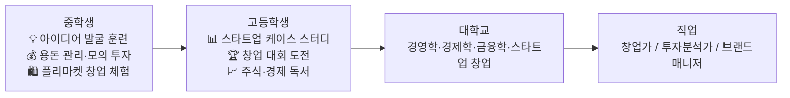

---

#### 📋 직업 16: 스타트업 창업가 / 프로덕트 매니저

| 항목 | 내용 |
|------|------|
| **핵심 업무 (창업가)** | 문제 발굴, 비즈니스 모델 설계, 팀 빌딩, 투자 유치, 제품 개발 총괄 |
| **핵심 업무 (PM)** | 제품 로드맵 관리, 기능 우선순위 결정, 개발·디자인·마케팅 조율, 데이터 기반 의사결정 |
| **연봉 범위 (PM)** | 주니어 5,000만원 → 시니어 1억원+ (토스, 쿠팡, 카카오) |
| **성공 핵심 (창업)** | 문제 집착 × 빠른 실행 × 팀워크 × 고객 인터뷰 |

**중학생 준비 사항**

| 준비 영역 | 구체적 활동 | 결과물 |
|---------|-----------|--------|
| 문제 발굴 | "학교생활 불편한 점 10개 찾기" 아이디어 노트 | 노션 아이디어 DB |
| 미니 창업 | 학교 앞 플리마켓 기획·운영 (소자본) | 매출 기록 + 회고 |
| 경제 감각 | 용돈 가계부 → 저축·소비 패턴 분석 | 월간 가계부 |
| 발표력 | 아이디어 1분 피칭 연습 (친구 5명에게 발표) | 피칭 영상 |

**고등학생 준비 사항**

| 준비 영역 | 구체적 활동 | 결과물 |
|---------|-----------|--------|
| 린 스타트업 | 린 캔버스 작성 → 고객 인터뷰 10명 → MVP 프로토타입 | 린 캔버스 + 인터뷰 결과 |
| 대회 | 청소년 창업 경진대회, 학교 창업 아이디어 발표 | 수상·참가 경험 |
| 케이스 스터디 | 성공한 스타트업 10개 분석 (비즈니스 모델, 성장 전략) | 케이스 노트북 |
| 네트워킹 | 스타트업 행사 참관, 창업가 멘토 인터뷰 | 인터뷰 기록 |

**추천 도서**

| 도서명 | 저자 | 수준 | 핵심 내용 |
|-------|------|------|---------|
| 《린 스타트업》 | 에릭 리스 | 고등+ | MVP·피봇 창업 방법론 |
| 《제로 투 원》 | 피터 틸 | 고등 | 독창적 창업 철학 |
| 《스타트업 바이블》 | 박태웅 | 고등 | 한국 스타트업 실전 |
| 《하드씽》 | 벤 호로위츠 | 고등+ | 창업 위기 극복 |
| 《나는 왜 이 일을 하는가》 | 사이먼 사이넥 | 중·고 | WHY로 시작하는 리더십 |
| 《워런 버핏 바이블》 | 워런 버핏 | 고등 | 투자 철학 입문 |

**핵심 기술 및 도구**

```
기획: 린 캔버스, 비즈니스 모델 캔버스, OKR 설정
PM 도구: Notion, Jira, Linear, Confluence, Miro
데이터: Google Analytics, Amplitude, SQL 기초
프로토타이핑: Figma, Notion 목업
재무: 손익계산서, DCF 밸류에이션 기초 이해
투자 유치: IR 덱(Investor Deck) 작성, YC 지원서 양식 이해
```

---

#### 📋 직업 17: 투자분석가 / 펀드매니저

| 항목 | 내용 |
|------|------|
| **핵심 업무** | 기업 재무 분석, 밸류에이션, 투자 리포트 작성, 포트폴리오 관리, 리스크 평가 |
| **주요 기관** | 증권사, 자산운용사, 벤처캐피탈(VC), 사모펀드(PE), 헤지펀드 |
| **연봉 범위** | 애널리스트 4,500만원 → 펀드매니저 1억원+ + 성과보수 |
| **자격증** | CFA (국제재무분석사), 증권투자권유자문인력 |

**중학생 → 고등학생 준비 비교표**

| 준비 영역 | 중학생 | 고등학생 |
|---------|-------|--------|
| 경제 감각 | 모의 주식 투자 게임 (삼성증권 주니어) | 실제 소액 주식 투자 + 투자 일지 |
| 수학 | 이자·복리·퍼센트 계산 완벽 이해 | 금융수학, 통계학 선행 |
| 독서 | 경제 신문 1면 매일 읽기 | CFA 레벨 1 교재 훑어보기 |
| 분석 | 내가 아는 기업 1개 분석 (강점·약점) | 기업 재무제표 분석 리포트 작성 |

**추천 도서**

| 도서명 | 저자 | 수준 |
|-------|------|------|
| 《주식 시장을 이기는 작은 책》 | 조엘 그린블라트 | 중·고 |
| 《현명한 투자자》 | 벤저민 그레이엄 | 고등+ |
| 《머니》 | 롭 무어 | 중·고 |
| 《넥스트 머니》 | 정유신 | 고등 |
| 《블랙스완》 | 나심 탈레브 | 고등+ |

---

## 11. 8대 직업군 × 중학생-고등학생 전체 로드맵 종합 비교표

### 11.1 핵심 준비 사항 한눈 비교

| 왕국 | 대표 직업 | 중학생 핵심 1가지 | 고등학생 핵심 1가지 | 필수 도구/기술 | 추천 대표 도서 1권 |
|-----|---------|--------------|----------------|------------|----------------|
| 🔬 탐구 | 의사·AI연구원·생명공학자 | 생명과학 탐구 + 병원 봉사 | 올림피아드·R&E 연구 | Python, PubMed | 《아픔이 길이 되려면》 |
| 🎨 창작 | UX디자이너·웹툰작가 | Canva 디자인 + 포스터 제작 | Figma·클립스튜디오 포트폴리오 | Figma, Photoshop | 《디자인 오브 에브리데이 씽스》 |
| 💻 기술 | 앱개발자·데이터사이언티스트 | Python 기초 + 미니 앱 제작 | GitHub 포트폴리오 + 해커톤 | Python, React, SQL | 《혼자 공부하는 파이썬》 |
| 🌱 자연 | 환경공학자·스마트팜엔지니어 | 탄소 발자국 측정 프로젝트 | 환경 데이터 분석 + R&E | GIS, Python, Arduino | 《침묵의 봄》 |
| 🤝 연결 | 교사·심리상담사 | 후배 가르치기 + 봉사 | 멘토링 운영 + 또래 상담 | Notion (수업 설계) | 《미움받을 용기》 |
| 🏛️ 질서 | 변호사·외교관 | 토론 동아리 + 신문 읽기 | 모의 유엔(MUN) + 논술 | 법률 DB, 영어 | 《정의란 무엇인가》 |
| 📣 소통 | 크리에이터·마케터 | 유튜브 쇼츠 5개 제작 | 채널 운영 + 성과 분석 | Premiere Pro, 메타 Ads | 《무기가 되는 스토리》 |
| 🚀 도전 | 창업가·투자분석가 | 플리마켓 창업 체험 | 창업 대회 + 린 캔버스 | Notion, Figma, Excel | 《린 스타트업》 |

---

### 11.2 공통 핵심 역량 (모든 직업군에 통용)

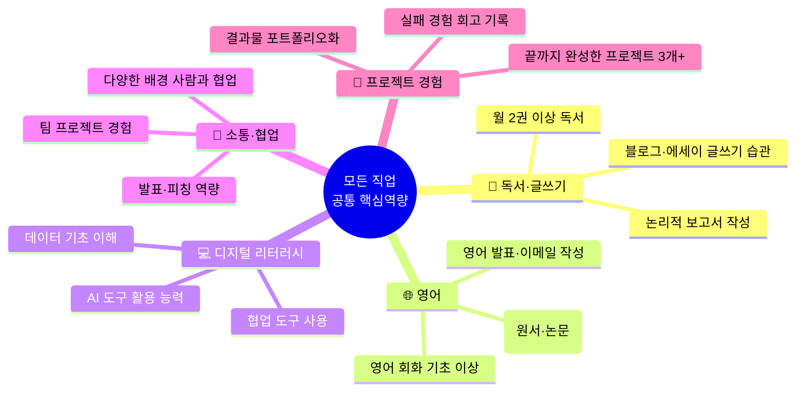

---

### 11.3 중학생 당장 오늘 시작할 수 있는 1가지씩

| 직업군 | 오늘 바로 시작할 수 있는 1가지 | 소요 시간 |
|-------|--------------------------|---------|
| 🔬 탐구 | 유튜브에서 "AI가 뭔지 알아볼게요" 영상 1편 보기 + 요약 노트 작성 | 30분 |
| 🎨 창작 | Canva 무료 가입 → 내가 좋아하는 것 소개 카드뉴스 1장 만들기 | 1시간 |
| 💻 기술 | code.org 무료 입문 과정 첫 레슨 완료 | 1시간 |
| 🌱 자연 | 오늘 사용한 전기·음식·이동 기록 → 내 탄소 발자국 계산해보기 | 30분 |
| 🤝 연결 | 동생 or 후배에게 내가 잘하는 것 10분 가르쳐보기 | 10분 |
| 🏛️ 질서 | 오늘 뉴스 사회면 기사 1개 읽고 "나는 이것이 옳다/그르다" 이유 3가지 쓰기 | 20분 |
| 📣 소통 | 스마트폰으로 30초 쇼츠 찍어보기 (주제: 오늘 가장 재밌었던 것) | 30분 |
| 🚀 도전 | "만약 학교 앞에 가게를 낸다면?" 아이디어 3가지 노트에 적어보기 | 15분 |

---

*작성일: 2026년 2월 | 게임형 커리어 패스 앱 기획 v3.0 + 직업군 상세 가이드 추가*
