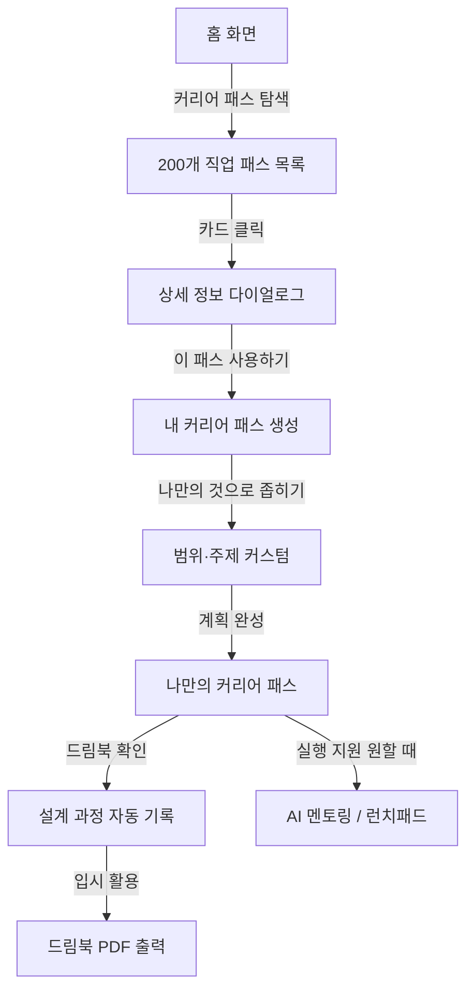

# 커리어 패스 중심 개편 완료 보고서

## 📅 작업 일자
2026-02-27

## 🎯 작업 목표

**핵심 방향 전환**: 커리어 패스를 "클릭 한 번으로 만드는 것"을 최우선으로 강조

> **AI 시대의 철학적 전환**:  
> AI가 결과를 만드는 데 점점 유리해지는 시대,  
> 우리가 집중해야 할 것은 **무엇을 만들지 기획하는 과정**이다.  
> 커리어 패스를 설계하고 좁혀가는 과정 자체가 진짜 실력이고 포트폴리오다.  
> **결국 커리어 패스 과정만 남는다.**

---

## ✅ 완료된 작업

### 1. 핵심 가치 재정의

#### 이전 방향
```
① 찾다 → ② 세우다 → ③ 실행하다 → 완성
(3단계가 동등한 비중)
```

#### 새로운 방향
```
[메인] ① 클릭으로 패스 선택 → ② 나만의 것으로 좁히기
[서브] ③ 실행 지원 (AI 멘토링, 런치패드)
(커리어 패스 설계가 핵심, 실행은 지원)
```

### 2. 클릭 중심 UX 강화

#### 원클릭 커리어 패스 생성 플로우
```
200개 직업 패스 탐색
    ↓
카드 클릭 → 상세 정보 다이얼로그
    ↓
"이 패스 사용하기" 클릭
    ↓
즉시 내 커리어 패스 생성
    ↓
나만의 것으로 좁혀가기
```

### 3. 나만의 계획으로 좁혀가기 (신규 개념)

커리어 패스는 처음 선택한 그대로 끝나지 않습니다.  
점점 나만의 범위와 주제로 발전시켜 나갑니다.

```
처음: 200개 패스 중 "의사 커리어 패스" 선택
    ↓
좁히기 1: 중2~고3 전체 → 고1~고3 집중
    ↓
좁히기 2: 전체 활동 → 과학 탐구 + 의료 봉사 특화
    ↓
좁히기 3: 일반 의사 → 소아과 전문의 목표로 구체화
    ↓
결국: 나만의 고유한 커리어 패스 완성
     (결국 커리어 패스 과정만 남는다)
```

### 4. 용어 변경: 왕국 → 별 (Star)
- 모든 UI에서 "별" 표현 사용
- 더 게임스럽고 우주 테마에 맞는 용어로 통일

### 5. 하단 메뉴 재구성 (4개 탭)

| 순서 | 탭명 | 경로 | 아이콘 | 설명 |
|-----|------|------|--------|------|
| 1 | 홈 | `/home` | 🏠 Home | 커리어 패스 현황 중심 |
| 2 | Job 체험 | `/jobs/explore` | 💼 Briefcase | 8개 별 × 직업 프로세스 체험 |
| 3 | 커리어 | `/career` | 🗺️ Map | 커리어 패스 메이커 스페이스 (메인) |
| 4 | lauchpad | `/launchpad` | 🕐 launchpad | 커리어 패스를 실행하는 공간 (모임)  |

### 6. JSON 데이터 구조 개선

#### 새 구조
```
data/stars/
├── README.md
├── STRUCTURE.md
├── explore-star.json      # 🔬 탐구의 별 (3개 직업 샘플)
├── create-star.json       # 🎨 창작의 별 (준비 중)
├── tech-star.json         # 💻 기술의 별 (준비 중)
├── nature-star.json       # 🌱 자연의 별 (준비 중)
├── connect-star.json      # 🤝 연결의 별 (준비 중)
├── order-star.json        # ⚖️ 질서의 별 (준비 중)
├── communicate-star.json  # 📡 소통의 별 (준비 중)
└── challenge-star.json    # 🚀 도전의 별 (준비 중)
```

### 7. 커리어 패스 타임라인 구조 상세화

**초4 → 고3까지 학기별 상세 로드맵**

```json
{
  "careerTimeline": {
    "title": "의사가 되는 커리어 패스",
    "totalYears": "초4 ~ 고3 (9년)",
    "milestones": [
      {
        "period": "초4",
        "semester": "1학기",
        "icon": "🌱",
        "title": "과학 호기심 싹트기",
        "activities": ["과학 실험 키트", "인체 도감"],
        "cost": "3만원",
        "achievement": "과학이 재미있다는 걸 알게 됨"
      }
    ]
  }
}
```

---

## 🎯 핵심 변화: 메인 vs 서브

### 메인 (커리어 패스 설계)
- 200개 직업 커리어 패스 탐색 및 클릭 선택
- 나만의 범위·주제로 좁혀가기
- 설계 과정의 자동 기록 (드림북)

### 서브 (실행 지원)
- AI 프로젝트 멘토링
- WBS 프로젝트 관리
- 런치패드 세미나 & 모임

> **왜 이 구분이 중요한가?**  
> AI가 결과를 만드는 시대, 실행 결과물은 AI가 더 잘 만든다.  
> 우리가 차별화할 수 있는 것은 **기획하는 과정**이다.  
> 커리어 패스를 설계하고, 좁히고, 발전시키는 과정 자체가 학생의 진짜 역량이 된다.

---

## 🚀 다음 단계

### 즉시 필요한 작업 (메인 우선순위)
1. **200개 직업 커리어 패스 데이터 제작**
   - 나머지 7개 별 JSON 파일 생성
   - 각 별마다 25개 직업 데이터 작성

2. **나만의 패스 커스텀 기능**
   - 범위·주제 좁히기 UI
   - 학년, 관심사, 목표 필터
   - 커스텀 저장 및 관리

3. **클릭 UX 최적화**
   - 상세 다이얼로그 → "이 패스 사용하기" 전환율 개선
   - 즉시 피드백 애니메이션

### 추가 개선 사항 (서브 우선순위)
1. **AI 멘토링 연동**
2. **WBS 프로젝트 관리**
3. **런치패드 백엔드 연동**

---

## 📱 사용자 플로우 (업데이트)



---

## 🎮 게임 요소 (커리어 패스 중심)

### 진행 시스템
- XP 획득 (패스 선택 시 +10 XP, 좁히기 완성 시 +20 XP)
- 레벨 업 시스템
- 배지 수집 (패스 설계 마스터, 나만의 패스 완성 등)
- 타임라인 기록

### 커리어 패스 관련 배지
- 🗺️ **첫 패스 선택** — 처음으로 커리어 패스를 선택했을 때
- ✂️ **나만의 패스** — 패스를 나만의 것으로 좁혔을 때
- 🎯 **패스 마스터** — 5개 이상 패스를 탐색했을 때
- 📋 **기획자** — 커리어 패스 설계 과정을 드림북에 기록했을 때

---

## 📊 데이터 확장 계획

### Phase 1: 샘플 (현재)
- explore-star.json (3개 직업)
- 의사, AI 연구원, 약사

### Phase 2: 탐구의 별 완성
- 25개 직업 추가
- 각 직업별 클릭 즉시 사용 가능한 패스

### Phase 3: 나머지 7개 별
- 각 별마다 25개 직업
- 총 200개 직업 완성

### Phase 4: 나만의 패스 커스텀
- 범위·주제 좁히기 기능
- 커스텀 패스 저장 및 공유

---

## 📝 참고 문서

- `frontend/data/stars/README.md` - 데이터 구조 설명
- `frontend/data/stars/STRUCTURE.md` - 상세 구조 가이드
- `documents/실전예시/32개_커리어패스_대입학종_완전가이드_상.md` - 원본 데이터 출처

---

## 🔗 주요 URL

- 홈: `http://localhost:3000/home`
- Job 체험: `http://localhost:3000/jobs/explore`
- 커리어 제작 (메인): `http://localhost:3000/career`
- launchpad: `http://localhost:3000/launchpad`

---

## 💡 핵심 메시지

> **"클릭 한 번으로 나만의 커리어 패스를 만든다"**
>
> 복잡한 설정 없이, 마음에 드는 패스를 클릭하면 즉시 나의 커리어 계획이 됩니다.  
> 그리고 그 계획은 점점 나만의 범위와 주제로 좁혀지며 발전합니다.  
> 설계하는 과정 자체가 드림북이 되고, 결국 커리어 패스 과정만 남습니다.
>
> AI 시대에 결과는 AI가 만드는 데 유리합니다.  
> 우리는 기획하는 사람을 키웁니다.
