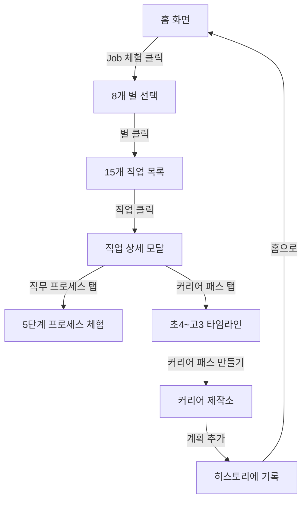

# 커리어 패스 중심 개편 완료 보고서

## 📅 작업 일자
2026-02-25

## 🎯 작업 목표
커리어 패스 제작 기능을 중심으로 앱 전체를 재구성하고, 8개 별 기반 직업 탐험 시스템 구축

---

## ✅ 완료된 작업

### 1. 용어 변경: 왕국 → 별 (Star)
- 모든 UI에서 "별" 표현 사용
- 더 게임스럽고 우주 테마에 맞는 용어로 통일

### 2. 하단 메뉴 재구성 (4개 탭)

| 순서 | 탭명 | 경로 | 아이콘 | 설명 |
|-----|------|------|--------|------|
| 1 | 홈 | `/home` | 🏠 Home | 커리어 패스 현황 중심 |
| 2 | Job 체험 | `/jobs/explore` | 💼 Briefcase | 8개 별 × 직업 프로세스 체험 |
| 3 | 커리어 | `/career` | 🗺️ Map | 커리어 패스 메이커 스페이스 |
| 4 | 히스토리 | `/history` | 🕐 History | 작업 히스토리 & 타임라인 |

**삭제된 탭**: 프로젝트 (기존 `/path`)

### 3. JSON 데이터 구조 개선

#### 기존 구조
```
data/
└── career-maker.json (1개 파일, 모든 왕국 포함)
```

#### 새 구조
```
data/stars/
├── README.md
├── STRUCTURE.md
├── explore-star.json      # 🔬 탐구의 별 (3개 직업 샘플)
├── create-star.json       # 🎨 창작의 별 (준비 중)
├── tech-star.json         # 💻 기술의 별 (준비 중)
├── nature-star.json       # 🌱 자연의 별 (준비 중)
├── connect-star.json      # 🤝 연결의 별 (준비 중)
├── order-star.json        # ⚖️ 질서의 별 (준비 중)
├── communicate-star.json  # 📡 소통의 별 (준비 중)
└── challenge-star.json    # 🚀 도전의 별 (준비 중)
```

### 4. 직업 데이터 구조 상세화

#### 하루 일과 → 직무 프로세스
**기존**: 시간대별 6장면 (07:00, 10:00, 13:00...)
**개선**: 업무 단계별 프로세스 (진단 → 치료 계획 → 치료 실행...)

```json
{
  "workProcess": {
    "title": "의사의 진료 프로세스",
    "phases": [
      {
        "phase": "진단",
        "icon": "🔍",
        "title": "환자 상태 파악",
        "description": "문진, 신체 검사...",
        "duration": "30분~1시간",
        "tools": ["청진기", "혈압계", "EMR"],
        "skills": ["관찰력", "분석력"],
        "example": "실제 예시 설명..."
      }
    ]
  }
}
```

#### 커리어 패스 타임라인 추가
**초4 → 고3까지 학기별 상세 로드맵**

```json
{
  "careerTimeline": {
    "title": "의사가 되는 커리어 패스",
    "totalYears": "초4 ~ 고3 (9년)",
    "milestones": [
      {
        "period": "초4",
        "semester": "1학기",
        "icon": "🌱",
        "title": "과학 호기심 싹트기",
        "activities": ["과학 실험 키트", "인체 도감"],
        "cost": "3만원",
        "achievement": "과학이 재미있다는 걸 알게 됨"
      },
      {
        "period": "고2",
        "semester": "1학기",
        "icon": "🏅",
        "title": "올림피아드 수상",
        "activities": ["생명과학Ⅱ 1등급", "KBO 본선"],
        "awards": ["KBO 은상"],
        "subjects": ["생명과학Ⅱ", "화학Ⅱ"],
        "setak": "유전자 가위 기술의 의료 적용...",
        "cost": "20만원",
        "achievement": "전국 대회 수상"
      }
    ],
    "totalCost": "약 90만원",
    "keySuccess": [
      "내신 1.2등급",
      "KBO 은상",
      "의료 봉사 120시간"
    ]
  }
}
```

### 5. Job 간접 경험 페이지 (`/jobs/explore`)

#### 메인 화면
- 8개 별 그리드 (2×4)
- 각 별 카드:
  - 큰 이모지 아이콘
  - 별 이름
  - 설명
  - 직업 개수 배지
  - Hover 시 glow 효과

#### 별 선택 후
- 해당 별의 직업 목록 (15개)
- 각 직업 카드:
  - 아이콘 (큰 크기)
  - 직업명 + 짧은 설명
  - Holland 유형
  - 연봉 범위
  - 미래 성장성 (⭐)
  - 체험 버튼

#### 직업 상세 모달 (2탭)

**1️⃣ 직무 프로세스 탭**
- 진행 바 (5단계)
- 현재 단계 카드:
  - 큰 이모지 배경
  - 단계명 배지
  - 제목 + 상세 설명
  - 소요 시간
  - 💡 실제 예시
- 사용 도구 섹션
- 필요 스킬 섹션
- 마지막 단계: 종합 정보 (연봉, 입직 경로, 핵심 역량)

**2️⃣ 커리어 패스 탭**
- 타임라인 형식 (초4 → 고3)
- 12~14개 마일스톤
- 각 마일스톤:
  - 학년·학기 배지
  - 아이콘
  - 제목
  - 활동 내역
  - 수상 경력 (있으면)
  - 세특 예시 (고등만)
  - 비용
  - 달성 목표
- 연결선으로 시간 흐름 시각화
- 하단: 핵심 성공 지표 요약

### 6. 커리어 패스 제작소 (`/career`)
- 별 선택 탭
- 필터링 (유형/학년/월/난이도)
- 활동·수상·자격증 카드
- 내 계획에 추가 기능
- 저장된 계획 패널

### 7. 작업 히스토리 (`/history`)
- 레벨/XP 현황
- 활동/수상/자격증 통계
- 별별 진행 현황
- 월별 계획 타임라인 ↔ 활동 로그

### 8. 홈 페이지 재구성
- 커리어 패스 현황 강조
- 다가오는 계획 (월 기준)
- 별별 진행 차트
- 빠른 이동 버튼

---

## 🎨 UI/UX 개선사항

### 게임스러운 디자인
1. **별 카드**
   - 크기 증가 (h-48)
   - Glow 효과 (hover)
   - 애니메이션 (slide-up, pulse)

2. **직업 카드**
   - 큰 아이콘 (w-16 h-16)
   - 그라데이션 배경
   - Scale 애니메이션
   - 정보 배지 (Holland, 연봉, 성장성)

3. **모달**
   - 90vh 최대 높이
   - 스크롤 가능한 컨텐츠
   - 2탭 구조 (직무 프로세스 ↔ 커리어 패스)
   - 진행 바
   - 단계별 네비게이션

4. **타임라인**
   - 연결선으로 시간 흐름 표현
   - 아이콘 + 배지 + 내용
   - 수상 경력 강조 (🏆)
   - 세특 박스 (고등)

### 시각적 요소
- ✨ 별 배경 애니메이션
- 🌟 Glow 효과
- 📊 진행 바
- 🎨 그라데이션
- 💫 Hover 효과
- ⚡ Scale 애니메이션

---

## 📊 데이터 구조 비교

### 직업 데이터

| 항목 | 기존 | 개선 |
|-----|------|------|
| 일과 정보 | 시간대별 6장면 | 업무 단계별 프로세스 (5단계) |
| 도구/스킬 | 없음 | 각 단계마다 명시 |
| 실제 예시 | 없음 | 각 단계마다 예시 제공 |
| 커리어 패스 | 간단한 3단계 | 초4~고3 학기별 상세 (12~14단계) |
| 수상 경력 | 없음 | 시기별로 명시 |
| 세특 예시 | 없음 | 고등 각 학기마다 제공 |
| 선택 과목 | 없음 | 고등 각 학기마다 명시 |
| 비용 정보 | 없음 | 시기별 + 총액 |
| 성공 지표 | 없음 | 학교급별 구체적 지표 |

---

## 🚀 다음 단계

### 즉시 필요한 작업
1. **나머지 7개 별 JSON 파일 생성**
   - create-star.json (창작의 별)
   - tech-star.json (기술의 별)
   - nature-star.json (자연의 별)
   - connect-star.json (연결의 별)
   - order-star.json (질서의 별)
   - communicate-star.json (소통의 별)
   - challenge-star.json (도전의 별)

2. **각 별마다 15개 직업 데이터 작성**
   - 직무 프로세스 (5단계)
   - 커리어 타임라인 (12~14 마일스톤)
   - 총 120개 직업

3. **동적 로딩 시스템 구현**
   - 8개 별 JSON 파일 동적 import
   - 별 선택 시 해당 JSON 로드

### 추가 개선 사항
1. **이미지 추가**
   - 각 직업마다 hero 이미지
   - 별 배경 이미지
   - 프로세스 단계별 일러스트

2. **애니메이션 강화**
   - 타임라인 스크롤 애니메이션
   - 프로세스 단계 전환 효과
   - 별 선택 시 트랜지션

3. **인터랙션 개선**
   - 프로세스 단계 스와이프 지원
   - 타임라인 확대/축소
   - 필터 프리셋 저장

---

## 📱 사용자 플로우



---

## 🎮 게임 요소

### 진행 시스템
- ✅ XP 획득 (계획 추가 시 +10 XP)
- ✅ 레벨 업 시스템
- ✅ 배지 수집
- ✅ 타임라인 기록

### 시각적 피드백
- ⭐ 별 glow 효과
- 💫 애니메이션
- 🎯 진행 바
- 🏆 수상 경력 강조

### 목표 설정
- 📅 월별 계획
- 🎓 학년별 목표
- 🌟 별별 진행률
- 📊 성공 지표 추적

---

## 📈 데이터 확장 계획

### Phase 1: 샘플 (현재)
- ✅ explore-star.json (3개 직업)
- 의사, AI 연구원, 약사

### Phase 2: 탐구의 별 완성
- 15개 직업 추가
- 생명공학연구원, 수학자, 물리학자, 화학자, 천문학자, 지질학자, 심리학자, 통계학자, 데이터 분석가, 임상병리사, 연구원, 교수 등

### Phase 3: 나머지 7개 별
- 각 별마다 15개 직업
- 총 120개 직업 완성

### Phase 4: 고도화
- 이미지 추가
- 애니메이션 강화
- AI 추천 시스템
- 커뮤니티 기능

---

## 🎯 핵심 성과

### 사용자 경험
1. **명확한 직업 이해**
   - 직무 프로세스로 실제 업무 파악
   - 단계별 도구·스킬 명시

2. **구체적인 커리어 계획**
   - 초4부터 고3까지 학기별 로드맵
   - 활동, 수상, 세특 예시
   - 비용 정보

3. **게임스러운 경험**
   - 별 탐험
   - 직업 체험
   - 진행률 추적
   - XP/레벨 시스템

### 기술적 개선
1. **모듈화**
   - 별마다 독립 JSON 파일
   - 컴포넌트 분리

2. **확장성**
   - 동적 로딩 준비
   - 타입 안정성

3. **성능**
   - 필요한 별만 로드
   - 최적화된 렌더링

---

## 📝 참고 문서

- `frontend/data/stars/README.md` - 데이터 구조 설명
- `frontend/data/stars/STRUCTURE.md` - 상세 구조 가이드
- `documents/실전예시/32개_커리어패스_대입학종_완전가이드_상.md` - 원본 데이터 출처

---

## 🔗 주요 URL

- 홈: `http://localhost:3000/home`
- Job 체험: `http://localhost:3000/jobs/explore`
- 커리어 제작: `http://localhost:3000/career`
- 히스토리: `http://localhost:3000/history`

---

## 💡 사용 팁

1. **Job 체험하기**
   - 별 선택 → 직업 선택 → 프로세스 체험
   - 마지막 단계에서 "커리어 패스 보기" 클릭

2. **커리어 패스 확인**
   - 초4부터 고3까지 시간순 확인
   - 각 시기별 활동·수상·세특 참고

3. **나만의 계획 세우기**
   - 커리어 제작소에서 활동 추가
   - 학년·월 선택
   - 히스토리에서 진행 확인

---

## ⚠️ 알려진 제한사항

1. **데이터 부족**
   - 현재 탐구의 별만 3개 직업 샘플
   - 나머지 7개 별 준비 중

2. **이미지 없음**
   - 현재 이모지만 사용
   - 실제 직업 이미지 추가 예정

3. **커리어 아이템 없음**
   - 활동·수상·자격증 데이터 미완성
   - 별도 작업 필요

---

## 📞 문의사항

추가 기능이나 개선이 필요하면 말씀해주세요!
