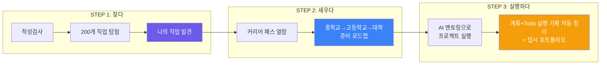
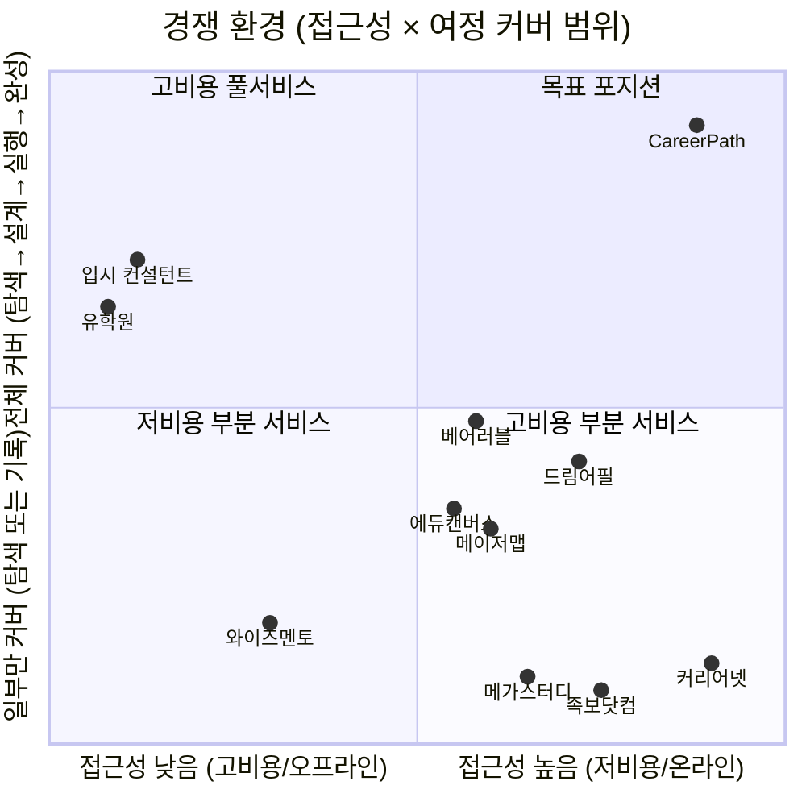
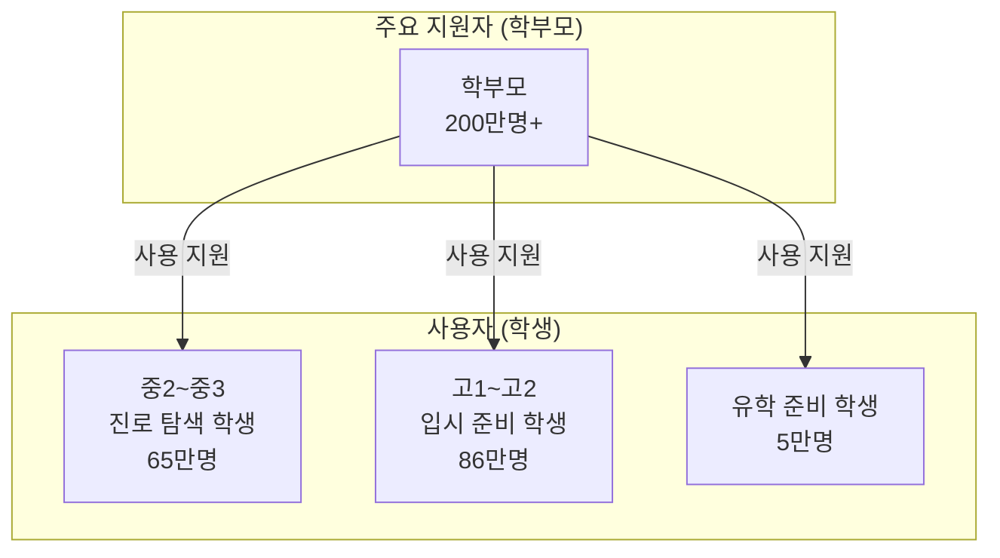
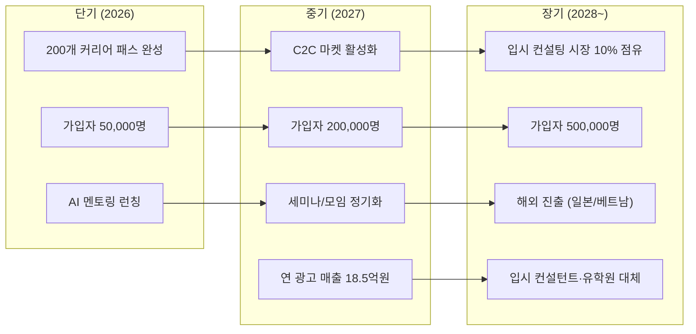

# CareerPath — 왜 필요한가?

> 경쟁사 분석 · 벤치마킹 · 고객 페르소나 · 강점 · 목표  
> 2026.02

---

## 목차

1. [왜 CareerPath인가?](#1-왜-dreampath인가)
2. [시장의 구멍: 아무도 풀지 못한 문제](#2-시장의-구멍-아무도-풀지-못한-문제)
3. [경쟁사 전체 지도](#3-경쟁사-전체-지도)
4. [벤치마킹 앱 상세 분석](#4-벤치마킹-앱-상세-분석)
5. [기존 사교육 시장 분석](#5-기존-사교육-시장-분석)
6. [기능별 경쟁 비교표](#6-기능별-경쟁-비교표)
7. [주요 고객 페르소나](#7-주요-고객-페르소나)
8. [CareerPath의 강점](#8-dreampath의-강점)
9. [CareerPath의 목표](#9-dreampath의-목표)

---

## 1. 왜 CareerPath인가?

### 한 문장 정의

> **"나의 직업을 찾고, 그 직업으로 가는 길을 세우고, 계획+Todo를 실행해 포트폴리오로 완성한다"**

### 시장의 현실

```
┌──────────────────────────────────────────────────────────────────┐
│                                                                  │
│   한국 사교육 시장 = 29.2조원 (2024)                               │
│   진학 컨설팅 시장 = 1,007억원 (2024, 매년 33% 성장)               │
│                                                                  │
│   그런데...                                                       │
│                                                                  │
│   ❌ 적성검사를 해도 → 그 다음 뭘 해야 할지 모른다                   │
│   ❌ 직업을 골라도 → 중학교/고등학교에서 뭘 준비할지 모른다           │
│   ❌ 계획을 세워도 → 혼자서 실행하지 못한다                          │
│   ❌ 활동을 해도 → 포트폴리오로 정리하지 못한다                      │
│                                                                  │
│   이 4가지를 한 번에 해결하는 서비스가 없다.                         │
│   입시 컨설턴트만이 이것을 해주지만, 300만원이 든다.                  │
│                                                                  │
│   CareerPath는 이 전체 과정을 앱 하나로 해결한다.                    │
│                                                                  │
└──────────────────────────────────────────────────────────────────┘
```

### CareerPath의 공식



> 이 3단계 전체를 커버하는 서비스는 **현재 시장에 없다.**  
> 기존 서비스들은 모두 이 중 **한 조각**만 해결한다.

---

## 2. 시장의 구멍: 아무도 풀지 못한 문제

### 학생의 여정에서 각 서비스가 커버하는 범위

```
학생의 여정:  찾다 ───────── 세우다 ───────── 실행하다 ───── 완성
              │                │                │              │
              │ 적성검사       │ 커리어 패스     │ 프로젝트     │ 실행 기록 포트폴리오
              │ 직업 탐색      │ 로드맵 설계     │ 멘토링       │ 포트폴리오
              │                │                │              │
커리어넷      ████░░░░░░░░░░░░░░░░░░░░░░░░░░░░░░░░░░░░░░░░░░░░░
              적성검사만

메이저맵      ████████░░░░░░░░░░░░░░░░░░░░░░░░░░░░░░░░░░░░░░░░░
              검사 + 학과 연결

드림어필      ░░░░░░░░░░░░░░░░░░░░░░░░░░████████░░░░░░░░░░░░░░░
                                        실천 기록 SNS

에듀캔버스    ██████████████░░░░░░░░░░░░░░░░░░░░░░░░░░░░░░░░░░░░
              검사 + 시뮬레이션

베어러블      ░░░░░░░░░░░░░░░░░░░░░░░░░░░░░░░░████████████░░░░░
                                                세특 포트폴리오

입시 컨설턴트 ░░░░░░░░████████████████████████████████░░░░░░░░░░
              설계~실행 (그러나 300만원, 1회성, 서울 한정)

CareerPath    █████████████████████████████████████████████████████
              찾다 → 세우다 → 실행하다 → 완성 (전 구간)
```

### 핵심 질문: 각 서비스에 물어보면?

| 질문 | 커리어넷 | 메이저맵 | 드림어필 | 에듀캔버스 | 베어러블 | 컨설턴트 | **CareerPath** |
|------|---------|---------|---------|----------|---------|---------|-------------|
| "나한테 맞는 직업이 뭐야?" | ✅ 검사 | ✅ 검사 | ❌ | ✅ 검사 | ❌ | △ 상담 | ✅ **검사 + 시뮬레이션** |
| "그 직업 되려면 중학교 때 뭐 해?" | ❌ | ❌ | ❌ | ❌ | ❌ | ✅ 수동 | ✅ **커리어 패스** |
| "고등학교 때 어떤 활동을 해야 해?" | ❌ | ❌ | ❌ | ❌ | △ 세특만 | ✅ 수동 | ✅ **패스 + 프로젝트** |
| "프로젝트를 어떻게 시작하지?" | ❌ | ❌ | △ 미션 | ❌ | ❌ | △ 분기1회 | ✅ **AI 멘토 + WBS** |
| "이걸 포트폴리오로 어떻게 정리해?" | ❌ | ❌ | △ 기록 | ❌ | ✅ 세특 | ✅ 수동 | ✅ **계획+Todo 자동 정리** |

> **"찾다 → 세우다 → 실행하다 → 완성"의 전체 여정을 하나의 앱으로 해결하는 서비스는 CareerPath뿐이다.**

---

## 3. 경쟁사 전체 지도

### 3-1. 포지셔닝 맵



### 3-2. 경쟁사 분류

| 분류 | 서비스 | 특징 | CareerPath와의 관계 |
|------|--------|------|-------------------|
| **공공 서비스** | 커리어넷, 워크넷 | 무료, 적성검사 중심 | 유입 보완 (검사 후 CareerPath로 전환) |
| **에듀테크 B2B** | 메이저맵, 에듀캔버스 | 학교 납품 중심 | 간접 경쟁 (학생 직접 접근 불가) |
| **에듀테크 B2C** | 드림어필, 베어러블 | 학생 직접 사용 | 직접 경쟁 (그러나 커버 범위 다름) |
| **사교육 오프라인** | 입시 컨설턴트, 유학원 | 고비용 1:1 | 대체 대상 (300만원 → 월 2만원) |
| **온라인 학습** | 족보닷컴, 메가스터디 | 시험/인강 중심 | 비경쟁 (진로 영역 아님) |

---

## 4. 벤치마킹 앱 상세 분석

### 4-1. 커리어넷 (정부 무료 서비스)

| 항목 | 내용 |
|------|------|
| **운영** | 한국직업능력연구원 (교육부 산하) |
| **이용료** | 무료 |
| **핵심 기능** | 14종 적성검사, 직업백과 800종+, 원격 멘토링, 진로 상담 |
| **강점** | 공신력, 방대한 직업 데이터, 전국 학교 연계, 무료 |
| **약점** | UX 낡음, 검사 후 후속 행동 제시 없음, 커리어 패스 없음, 게임화 없음, 실행 지원 없음 |
| **사용 패턴** | 자유학기제 과제로 1회 검사 → 결과 확인 → 이탈 |

```
커리어넷의 한계:
  학생: "적성검사 결과 탐구형이래" → "그래서 뭘 해야 하지?" → (이탈)
                                     ↑ 여기서 끊긴다
```

**CareerPath가 채우는 빈 자리**: 커리어넷 검사 결과를 연동하여, "탐구형이면 의사/연구원/데이터과학자 중 어떤 직업이 맞는지 체험해보고, 그 직업의 커리어 패스를 따라가라"는 다음 행동을 제시한다.

---

### 4-2. 메이저맵 (AI 진로 + 학과 연결)

| 항목 | 내용 |
|------|------|
| **설립** | 2020년 5월 |
| **모델** | B2B / B2G (학교·교육청 납품) |
| **핵심 서비스** | 웨이메이커 (올인원 진로진학설계솔루션) |
| **기능** | AI 진로검사, 선택교과 추천, AI 세특작성 도우미, 수행평가 관리, 탐구주제 추천, 140개+ 대학 학과 DB |
| **강점** | 2025 대한민국혁신대상 수상, 교과-학과-직업 데이터 매핑, 교사 도구 연계, 전국 15개 가맹점 |
| **약점** | B2B 모델이라 학생이 직접 접근 어려움, 커리어 패스(중학교→대학 로드맵) 없음, 프로젝트 실행 관리 없음, 자동 포트폴리오 없음 |
| **가격** | 비공개 (학교 단위 계약) |

```
메이저맵의 한계:
  학생: "AI가 학과를 추천해줬다" → "그런데 거기 가려면 뭘 준비하지?" → (모름)
                                   ↑ 여기서 끊긴다
```

**CareerPath가 채우는 빈 자리**: 학과/직업을 추천하는 것에서 끝나지 않고, "그 직업으로 가려면 중학교 때 이것, 고등학교 때 이것, 이런 공모전에 나가라"는 구체적 커리어 패스를 제공한다.

---

### 4-3. 드림어필 (실천형 진로 SNS)

| 항목 | 내용 |
|------|------|
| **운영** | 트루밸류 (2022년 출시) |
| **모델** | B2C + B2B (학교 도입) |
| **누적 유저** | 7만명+ (2025.11), 846개교 도입 |
| **누적 실천** | 40만건+, 소통 700만건+ |
| **핵심 기능** | 꿈 설정 → 목표 → 실천 기록 (SNS 형태), 친구 피드백, 실천 미션 |
| **투자** | 누적 50억원, Series A 20억 (2025.11, 스케일업벤처스 등) |
| **강점** | 높은 사용 빈도 (연 384회 소통), SNS 형태로 자발적 참여 유도, 교육부 등록 콘텐츠, 일본 진출 |
| **약점** | 적성검사 없음 (진로 탐색 기능 약함), 커리어 패스 없음 (구체적 준비 가이드 부재), AI 멘토링 없음, 입시 직접 연결 약함 |
| **가격** | 비공개 |

```
드림어필의 한계:
  학생: "꿈을 기록하고 미션을 실천하고 있다" → "근데 의대 가려면 구체적으로 뭘 해야 해?" → (모름)
                                               ↑ 실천은 하지만 방향이 없다
```

**CareerPath가 채우는 빈 자리**: 실천의 "방향"을 제시한다. 단순히 꿈을 기록하는 것이 아니라, 200개 직업별로 "무엇을 실천해야 하는지" 커리어 패스로 구체적 행동을 안내한다.

---

### 4-4. 에듀캔버스 / 알파지니 (AI 진로 + 3D 시뮬레이션)

| 항목 | 내용 |
|------|------|
| **운영** | 에듀캔버스 |
| **모델** | B2B (학교·기관 납품) |
| **핵심 서비스** | 알파지니 (AI 맞춤형 진로교육 솔루션) |
| **기능** | AI 진로 진단, 3D 직무 시뮬레이션 (메타버스), 12,000건 직무 데이터 NLP 분석, 개인 맞춤 로드맵, 진로 다이어리, 자소서 컨설팅 |
| **강점** | 게임화된 3D 시뮬레이션, 방대한 직무 데이터, 한국장학재단 등 공공기관 파트너, 베트남 진출 |
| **약점** | B2B 모델 (개인 학생 직접 사용 제한), 커리어 패스 C2C 마켓 없음, 프로젝트 WBS 관리 없음, 자동 포트폴리오 기능 약함 |
| **가격** | 비공개 (프로그램별 상이) |

```
에듀캔버스의 한계:
  학생: "3D로 직업을 체험했다. 재밌다" → "그래서 이걸 실제로 준비하려면?" → (학교 수업에서만 가능)
                                         ↑ 체험은 되지만 실행으로 이어지지 않는다
```

**CareerPath가 채우는 빈 자리**: 시뮬레이션 체험 이후 "그래서 이 직업을 위해 지금부터 뭘 해야 하는지"를 커리어 패스로 안내하고, AI 멘토링으로 실행까지 지원한다. 또한 B2C 모델로 학생이 직접 접근 가능하다.

---

### 4-5. 베어러블 / 마이폴리오 (AI 세특 포트폴리오)

| 항목 | 내용 |
|------|------|
| **설립** | 2024년 10월 (초기 스타트업) |
| **모델** | B2C + B2B (학생용 마이폴리오 + 교사용 스쿨폴리오) |
| **핵심 기능** | AI 기반 세특 탐구 추천, 독서 탐구, 자율 탐구, 10만건+ 데이터 기반 개인화, 교사용 생기부 자동 작성 지원 |
| **투자** | TIPS 선정, 씨엔티테크 시드 투자 |
| **강점** | 2025 에듀플러스어워즈 금상, 일본 SusHi Tech 수상, 교사-학생 양방향 설계, 세특 특화 |
| **약점** | 진로 탐색 기능 없음 (적성검사 없음), 커리어 패스 없음, AI 프로젝트 멘토링 없음 (세특 작성만), 직업 시뮬레이션 없음, 초기 단계 |
| **가격** | 비공개 (기존 컨설팅 30~40만원/시간 대비 저렴 표방) |

```
베어러블의 한계:
  학생: "AI가 세특에 넣을 탐구 주제를 추천해줬다" → "근데 나한테 맞는 직업이 뭔지 모르겠는데?" → (모름)
                                                    ↑ 세특은 도와주지만, 전체 진로 설계는 안 해준다
```

**CareerPath가 채우는 빈 자리**: 적성검사 → 직업 발견 → 커리어 패스 → 프로젝트 실행의 전체 흐름을 제공한다. 세특은 이 흐름의 "결과물 중 하나"이지, 출발점이 아니다.

---

## 5. 기존 사교육 시장 분석

### 5-1. 입시 컨설턴트

| 항목 | 현황 |
|------|------|
| **시장 규모** | 1,007억원 (2024), 매년 33% 성장 |
| **비용** | 생기부 관리 10시간 = 240~300만원, 개별 상담 80분 = 40만원 |
| **분포** | 강남/대치동 집중, 지방은 접근 자체가 어려움 |
| **한계** | 1회성 상담, 실행 관리 불가, 정보 독점 구조 |

#### 컨설팅 비용 vs CareerPath

| 서비스 | 기간 | 비용 | 내용 |
|--------|------|------|------|
| 대치동 생기부 관리 | 10시간 | **240~300만원** | 활동 추천 + 생기부 작성 가이드 |
| 개별 입시 상담 | 80분 | **40만원** | 1회 전략 상담 |
| 유학원 패키지 | 원서~입학 | **500~3,000만원** | 학교 선정 + 원서 대행 + 에세이 |
| **CareerPath (광고 기반)** | **1개월** | **무료** | 적성검사 + 커리어 패스 + AI 멘토 + 실행 기록 포트폴리오 |
| **CareerPath 1년** | **12개월** | **무료** | 구글 애드센스 광고 + 학교 B2B 프라이버시 공간 제공 수익 (구독료 없음) |

### 5-2. 유학원

| 항목 | 현황 |
|------|------|
| **주요 업체** | edm, uhak, 유학네트 등 |
| **비용** | 500~3,000만원 (패키지) |
| **수익 구조** | 학교 커미션 + 컨설팅비 (이해 충돌) |
| **한계** | 정보 비대칭 (유학원이 알아야 학생도 앎), 커미션 학교 위주 추천, 지역 편중 |

### 5-3. 온라인 학습 플랫폼

| 서비스 | 핵심 | CareerPath와의 관계 |
|--------|------|-------------------|
| **족보닷컴** | 시험 문제 은행 | 비경쟁 (진로가 아닌 학업) |
| **메가스터디** | 수능 인강 | 비경쟁 (수능 대비, 진로 아님) |
| **이투스** | 수능 인강 | 비경쟁 |
| **클래스101** | 취미/기술 강의 | 부분 경쟁 (프로젝트 강의 영역) |

---

## 6. 기능별 경쟁 비교표

### 6-1. 전체 기능 비교

| 기능 | 커리어넷 | 메이저맵 | 드림어필 | 에듀캔버스 | 베어러블 | 컨설턴트 | **CareerPath** |
|------|---------|---------|---------|----------|---------|---------|-------------|
| **적성검사** | ✅ 14종 | ✅ AI | ❌ | ✅ AI | ❌ | △ 상담 | ✅ RIASEC |
| **직업 정보** | ✅ 800종 | ✅ 학과 연결 | ❌ | ✅ 12,000건 | ❌ | △ 수동 | ✅ 200개 상세 |
| **직업 시뮬레이션** | ❌ | ❌ | ❌ | ✅ 3D | ❌ | ❌ | ✅ RPG |
| **커리어 패스 (중→대학)** | ❌ | ❌ | ❌ | ❌ | ❌ | ✅ 수동 | ✅ **200개 DB** |
| **프로젝트 WBS** | ❌ | ❌ | △ 미션 | ❌ | ❌ | △ 분기1회 | ✅ AI 생성 |
| **AI 멘토링** | ❌ | △ 세특 | ❌ | △ | △ 세특 | ❌ | ✅ **구조화** |
| **자동 포트폴리오** | ❌ | ❌ | △ 기록 | ❌ | ✅ 세특 | ❌ | ✅ **계획+Todo 기반 자동 정리** |
| **게임화 (XP/뱃지)** | ❌ | ❌ | △ | ✅ | ❌ | ❌ | ✅ RPG |
| **C2C 커리어 패스 마켓** | ❌ | ❌ | ❌ | ❌ | ❌ | ❌ | ✅ **유일** |
| **가격** | 무료 | B2B | B2C+B2B | B2B | B2C+B2B | 40~300만원 | **무료 (광고 기반)** |
| **접근성** | 전국 | 학교만 | 전국 | 학교만 | 전국 | 수도권 | **전국 + 해외** |

### 6-2. 핵심 차별점 요약

```
┌────────────────────────────────────────────────────────────────┐
│                                                                │
│  경쟁사들이 못 하는 것, CareerPath만 하는 것:                      │
│                                                                │
│  ① 200개 직업별 커리어 패스 DB                                   │
│     "의사가 되려면 중2에 이것, 고1에 이것, 이런 공모전에 나가라"    │
│     → 이것을 가지고 있는 서비스가 없다.                            │
│                                                                │
│  ② 탐색 → 설계 → 실행의 풀 커버리지                              │
│     커리어넷은 탐색만, 드림어필은 실천 기록만, 베어러블은 세특만.    │
│     → 전체 여정을 하나의 앱에서 해결하는 서비스가 없다.             │
│                                                                │
│  ③ C2C 커리어 패스 마켓                                          │
│     합격 선배가 자기 경험을 패스로 만들어 파는 마켓.                │
│     → 이 개념 자체가 시장에 없다.                                 │
│                                                                │
│  ④ AI 멘토 + 실행 기록 자동 정리                                   │
│     프로젝트 실행을 AI가 도와주고, 계획+Todo 기록이 자동으로 쌓인다. │
│     → 실행까지 관리하는 온라인 서비스가 없다.                      │
│                                                                │
└────────────────────────────────────────────────────────────────┘
```

---

## 7. 주요 고객 페르소나

### 7-1. 전체 고객 구조



### 7-2. Persona 1: 김서연 — "나한테 맞는 직업이 뭐야?"

| 항목 | 내용 |
|------|------|
| **나이/학년** | 14세, 중학교 2학년 |
| **거주지** | 경기도 수원 |
| **성적** | 중상위권 |
| **상황** | 자유학기제 진로 탐색 과제를 해야 함 |
| **현재 고민** | "나한테 맞는 직업이 뭔지 모르겠다. 커리어넷 검사 했는데 그래서 뭘 해야 하지?" |
| **현재 행동** | 커리어넷 검사 → 결과 화면 캡처 → 끝 |
| **학부모** | 맞벌이, 사교육비 부담 느낌, 아이 진로에 관심 있지만 방법 모름 |

**CareerPath 여정:**

```
김서연의 CareerPath 이야기:

1. 자유학기제 과제로 CareerPath 앱 다운로드 (무료)
2. RIASEC 적성검사 → "탐구형 + 사회형" 결과
3. 탐구의 별, 연결의 별 왕국 탐험 → 수의사, 심리상담사 발견
4. 수의사 하루 체험 시뮬레이션 → "이거 재밌다!"
5. 수의사 기본 커리어 패스 열람 (무료)
   → "중학교 때 생물 동아리, 동물 봉사활동, 과학 탐구 보고서..."
6. 상세 커리어 패스 열람 + Todo 실행 시작 (무료, 광고 기반)
7. 실행 기록 포트폴리오에 자동 기록: 적성 결과, 탐험 기록, 관심 직업

→ 자유학기제 과제 완성 + 진로 방향 설정
→ 고등학교까지 CareerPath와 함께 성장
```

| 지불 의향 | 전환 포인트 |
|----------|-----------|
| 무료 시작 → 커리어 패스 5,000원 | "검사만 하고 끝이 아니라, 다음에 뭘 해야 하는지 알려준다!" |

---

### 7-3. Persona 2: 이준호 — "생기부에 뭘 넣어야 해?"

| 항목 | 내용 |
|------|------|
| **나이/학년** | 16세, 고등학교 1학년 |
| **거주지** | 서울 |
| **성적** | 상위권 |
| **상황** | 의대/약대를 목표로 하지만 구체적 계획 없음 |
| **현재 고민** | "생기부에 뭘 넣어야 하지? 어떤 활동을 해야 하지? 컨설팅은 300만원이래..." |
| **현재 행동** | 학원 + 부모님이 입시 컨설팅 알아보는 중 |
| **학부모** | 컨설팅비 300만원 부담, 효과 불확실, 맘카페에서 정보 수집 |

**CareerPath 여정:**

```
이준호의 CareerPath 이야기:

1. 엄마가 맘카페에서 CareerPath 발견 → 아들에게 추천
2. 의사 커리어 패스 구매 (15,000원)
   → 고1: "과학 동아리, 생명과학 탐구 보고서, 의료 봉사활동"
   → 고2: "과학경시, 심화 연구 프로젝트, 내신 1등급 전략"
3. AI 멘토링 시작 (무료, 광고 기반)
4. AI 멘토에게 질문: "생명과학 탐구 보고서 주제 추천해줘"
   → AI가 3개 주제 + WBS + 참고문헌 리스트 생성
5. 프로젝트 실행 → 마일스톤 체크 → 완성
6. 실행 기록 포트폴리오에 자동 기록: 커리어 패스 진행률, 프로젝트 결과물, 멘토링 로그
7. 12개월 후: 생기부에 넣을 활동 4개 완성 + 포트폴리오 PDF 출력

→ 300만원 컨설팅 없이, 무료 서비스로 실행 기반 준비 가능
```

| 이용 의향 | 전환 포인트 |
|----------|-----------|
| 무료 이용 의향 높음 | "비싼 컨설팅 없이도 지금 바로 실행할 수 있다" |

---

### 7-4. Persona 3: 박하은 — "유학원비가 너무 비싸다"

| 항목 | 내용 |
|------|------|
| **나이/학년** | 17세, 고등학교 2학년 |
| **거주지** | 부산 |
| **특기** | 영어 (TOEFL 100+) |
| **상황** | 미국 대학 CS 전공 희망, 유학원 상담 중 |
| **현재 고민** | "유학원 견적이 1,000만원이다. 이걸 내가 직접 준비할 수는 없을까?" |
| **현재 행동** | 유학원 3곳 상담, Reddit/College Confidential 검색 |
| **학부모** | 유학 비용 부담, 정보를 직접 찾고 싶지만 방법 모름 |

**CareerPath 여정:**

```
박하은의 CareerPath 이야기:

1. "미국 CS 유학 준비" 검색 → CareerPath 발견
2. 앱 개발자 + 유학 커리어 패스 구매 (30,000원)
   → AP CS 과목 리스트, SAT 준비 일정, 과외활동 추천
3. 마켓에서 "MIT CS 합격 패스" 구매 (25,000원, 선배 제작)
   → 실제 합격자의 활동 내역 + 에세이 구조 + 타임라인
4. AI 멘토링 사용 (무료, 광고 기반)
5. AI 멘토: "Common App 에세이 주제 브레인스토밍 도와줘"
   → 3개 초안 피드백 + 구조 개선 제안
6. 코딩 프로젝트 실행 (WBS 관리) → GitHub 포트폴리오 구축
7. 실행 기록 포트폴리오: 활동 전체 기록 → 미국 대학 지원 시 Reference로 활용

→ 유학원 1,000만원 없이, 무료로 충분히 준비
```

| 이용 의향 | 전환 포인트 |
|----------|-----------|
| 무료 이용 의향 높음 | "유학원 없이도 필요한 정보를 계속 얻을 수 있다" |

---

### 7-5. Persona 4: 최미영 — "아이 진로를 어떻게 도와주지?"

| 항목 | 내용 |
|------|------|
| **나이** | 44세 |
| **역할** | 고1 아들 + 중2 딸의 어머니 |
| **거주지** | 인천 |
| **현재 고민** | "진로를 알아서 정하면 좋겠는데, 잔소리만 하게 된다. 컨설팅은 비싸다." |
| **현재 행동** | 맘카페, 입시설명회, 아이와 갈등 |
| **지출** | 두 아이 사교육비 월 200만원 |

**CareerPath 가치:**

```
최미영의 CareerPath 이야기:

1. 맘카페에서 "300만원 컨설팅 대신 무료 앱" 후기 발견
2. 아들(고1)에게 CareerPath 사용 추천 (무료, 광고 기반)
3. 딸(중2)에게 무료 사용 시작 → 적성검사 + 탐험
4. 결과:
   · 아들: 혼자 커리어 패스 따라가며 프로젝트 진행 중
   · 딸: "나 수의사 되고 싶어!" 스스로 관심 직업 발견
   · 엄마: 실행 기록 포트폴리오에서 아이들 활동 현황 확인 가능
5. 잔소리 대신 앱이 게임처럼 동기부여 → 부모-자녀 갈등 감소

→ 무료 사용으로 300만원 × 2 컨설팅 대체 가능성 확보
```

| 이용 의향 | 전환 포인트 |
|----------|-----------|
| 두 아이 무료 이용 의향 높음 | "아이가 스스로 진로를 찾고 실행한다. 잔소리 안 해도 된다." |

---

### 7-6. 페르소나 우선순위

| # | 페르소나 | 인구 | 이용 의향 | 획득 난이도 | LTV | **우선순위** |
|---|---------|------|---------|-----------|-----|-----------|
| 1 | **고1~고2 입시 준비** | 86만 | 높음 | 중간 | 높음 | ★★★★★ |
| 2 | **학부모 (사용 지원 주체)** | 200만+ | 높음 | 중간 | 높음 | ★★★★★ |
| 3 | **중2~중3 진로 탐색** | 65만 | 보통 | 낮음 | 매우 높음 (장기) | ★★★★☆ |
| 4 | **유학 준비 학생** | 5만 | 매우 높음 | 높음 | 매우 높음 | ★★★★☆ |
| 5 | **고3 수시/정시** | 43만 | 매우 높음 | 높음 | 낮음 (단기) | ★★★☆☆ |

> **1차 타겟**: 고1~고2 학생 + 학부모 (86만명, 가장 절실한 시점)  
> **2차 타겟**: 중2~중3 학생 (65만명, 자유학기제 유입 → 장기 LTV)

---

## 8. CareerPath의 강점

### 8-1. 3가지 해자 (Competitive Moat)

```
┌────────────────────────────────────────────────────────────────┐
│                                                                │
│  해자 1: 200개 직업 커리어 패스 DB                                │
│  ─────────────────────────────────                              │
│  · 시장에 이 데이터를 가진 곳이 없다.                              │
│  · 200개 직업 × (초등~대학 단계별 활동, 공모전, 프로젝트)           │
│  · 내부에서 직접 제작 → 품질 관리 가능.                            │
│  · 사용자(선배)가 추가 패스를 만들어 마켓에 올리면 DB가 자동 확장.   │
│  · 데이터가 쌓일수록 경쟁자 진입이 어려워지는 네트워크 효과.         │
│                                                                │
│  해자 2: 풀 커버리지 (탐색 → 설계 → 실행 → 완성)                  │
│  ─────────────────────────────────                              │
│  · 기존 서비스는 탐색(커리어넷), 기록(드림어필), 세특(베어러블)     │
│    중 하나만 해결한다.                                            │
│  · CareerPath만이 4단계 전체를 하나의 앱에서 해결한다.              │
│  · 풀 커버리지 = 높은 전환율 + 높은 잔류율 + 높은 LTV.            │
│                                                                │
│  해자 3: 실행 기록 포트폴리오 (자동 정리)                           │
│  ─────────────────────────────────                              │
│  · 커리어북은 별도 제품이 아니라, 앱 내 계획+Todo 실행 기록의 결과물이다. │
│  · 학생이 앱을 사용하면 3가지 기록이 자동으로 쌓인다.              │
│    ① 직업 찾는 기록 ② 패스 설계 기록 ③ 프로젝트 실행 기록         │
│  · 사용할수록 포트폴리오 품질이 높아지고, 성장 과정이 자산이 된다.  │
│  · 실행 기록 포트폴리오 = 입시 포트폴리오 = 제출 가능한 결과물.      │
│                                                                │
│  해자 4: 가이드 문화 기반 집단 지능                               │
│  ─────────────────────────────────                              │
│  · 소수의 비공개 정보가 아니라, 누구나 참고 가능한 가이드 문화 지향. │
│  · 선배의 경험/실패/개선안을 공유해 모두의 실행 품질을 끌어올린다.  │
│  · 정보의 폐쇄성을 낮추고, 학습 기회를 집단 지능으로 민주화한다.    │
│                                                                │
└────────────────────────────────────────────────────────────────┘
```

### 8-2. 왜 지금인가? (Timing)

| 요인 | 설명 |
|------|------|
| **입시 컨설팅 급성장** | 진학 컨설팅 시장 1,007억원, 매년 33% 성장 → 수요가 폭발하고 있다 |
| **생기부 종합전형** | 비교과 활동 중요도 상승 → 프로젝트 + 포트폴리오 수요 증가 |
| **AI 기술 성숙** | ChatGPT/Claude API 보편화 → AI 멘토링 비용이 낮아졌다 |
| **사교육비 부담 극대화** | 서울 고등학생 월 103만원 → 저렴한 대안 수요 절실 |
| **자유학기제 확대** | 중학교 진로 탐색 의무화 → 도구 수요 (현재 커리어넷만) |

### 8-3. 왜 CareerPath인가? (Why Us)

| 차원 | CareerPath의 답 |
|------|---------------|
| **왜 이 문제?** | 입시 컨설팅은 연 33% 성장하지만, 디지털화가 안 되어 있다 |
| **왜 이 솔루션?** | 탐색→설계→실행의 풀스택을 앱 하나로 해결하는 서비스가 없다 |
| **왜 지금?** | AI API 비용 하락 + 사교육비 부담 폭증 + 생기부 중요도 상승 |
| **왜 이 팀?** | 교육 도메인 + 기술 개발 + 입시 데이터 결합 |

---

## 9. CareerPath의 목표

### 9-1. 미션

> **"모든 학생이 자신에게 맞는 직업을 찾고, 그 직업으로 가는 길을 걸어갈 수 있게 한다."**  
> **"300만원짜리 입시 컨설팅의 정보 접근을 무료(구글 애드센스 광고 기반)로 민주화한다."**  
> **"소수의 폐쇄적 정보가 아닌, 가이드 공유 문화로 집단 지능을 모두의 자산으로 만든다."**  
> **"돈이 많은 사람이 아니라, 꾸준히 노력하는 학생이 꿈을 설계하고 실행할 수 있는 공익형 앱을 만든다."**

### 9-2. 시장 목표



### 9-3. 수익 모델 전략: 광고 + 학교 B2B

| 수익 축 | 대상 | 수익 구조 | 기대 효과 |
|--------|------|-----------|-----------|
| **광고 수익 (B2C)** | 학생·학부모 전체 트래픽 | 구글 애드센스 기반 노출/클릭 수익 | 개인 사용자 무료 유지 + 접근성 확대 |
| **학교 수익 (B2B)** | 중·고등학교, 교육기관 | 학교 전용 프라이버시 공간 제공(학급/동아리/상담 운영 공간) | 안정적 반복 매출 + 공공 교육 연계 강화 |
| **공익 확장** | 지역/소득 무관 사용자 | 무료 핵심 기능 제공 + 가이드 공유 문화 | 돈이 아닌 노력 중심의 기회 확대 |

### 9-4. 제품 원칙

| 원칙 | 설명 |
|------|------|
| **커리어북 분리 없음** | 커리어북은 별도 기능이 아니라, 계획+Todo 실행 데이터가 자동 정리된 결과물 |
| **가이드 공유 우선** | 소수의 정보 독점이 아니라, 학생/선배의 가이드를 공유해 집단 지능 형성 |
| **정보 민주화** | 돈이 있는 사람만 접근하는 구조를 줄이고, 모두가 실행 가능한 정보 제공 |
| **이중 수익 모델** | 주 수익원은 구글 애드센스 광고 + 학교 B2B 프라이버시 공간 제공이며, 구독료 모델을 기본으로 두지 않음 |
| **확장 로드맵** | 추후 계획+Todo 데이터를 바탕으로 서술형 에세이 작문 AI 서비스 추가 |

### 9-5. 달성 마일스톤

| 시기 | 마일스톤 | 의미 |
|------|---------|------|
| **2026 Q2** | 200개 커리어 패스 완성 + AI 멘토 런칭 | 핵심 제품 완성 |
| **2026 Q3** | 가입자 30,000명 + 월 광고 매출 3,000만원 | Product-Market Fit 검증 |
| **2026 Q4** | C2C 마켓 오픈 + 멘토 50명 | 마켓플레이스 시작 |
| **2027 Q2** | 가입자 100,000명 + 연 광고 매출 10억원 | Series A 투자 유치 |
| **2027 Q4** | 파트너 학교 200개 + 프라이버시 공간 도입 | B2B2C 확장 및 학교 수익 안정화 |
| **2028** | 가입자 500,000명 + 해외 진출 | 카테고리 리더 |

---

## 부록: 한 장 요약

```
┌──────────────────────────────────────────────────────────────────┐
│                                                                  │
│                     왜 CareerPath인가?                             │
│                                                                  │
├──────────────────────────────────────────────────────────────────┤
│                                                                  │
│  문제:                                                           │
│  · 적성검사 해도 → 다음 뭘 해야 할지 모른다 (커리어넷의 한계)       │
│  · 직업 골라도 → 중학교~고등학교 준비법을 모른다 (정보 비대칭)       │
│  · 계획 세워도 → 혼자 실행 못 한다 (실행력 부재)                    │
│  · 활동 해도 → 포트폴리오 정리 못 한다 (수동 관리의 한계)            │
│  · 이걸 한 번에 해결? → 300만원짜리 입시 컨설턴트뿐                 │
│                                                                  │
│  경쟁사:                                                         │
│  · 커리어넷 = 검사만 (후속 없음)                                   │
│  · 메이저맵 = 학과 연결 (패스 없음, B2B)                           │
│  · 드림어필 = 기록 SNS (방향 없음, 패스 없음)                      │
│  · 에듀캔버스 = 시뮬레이션 (실행 없음, B2B)                        │
│  · 베어러블 = 세특 (탐색 없음, 초기)                               │
│  → 찾다→세우다→실행→완성 전체를 하는 곳이 없다.                     │
│                                                                  │
│  CareerPath:                                                      │
│  · 적성검사 → 200개 직업 시뮬레이션 → 커리어 패스 →                │
│    AI 멘토링 프로젝트 → 계획+Todo 실행 기록 포트폴리오 자동 완성     │
│  · 300만원 컨설팅 정보 접근 → 무료(광고) + 학교 B2B로 민주화         │
│  · 서울 한정 → 전국 어디서나                                       │
│  · 1회성 → 365일 24시간                                           │
│                                                                  │
│  강점:                                                           │
│  · 200개 커리어 패스 DB (시장에 없는 데이터)                        │
│  · 풀 커버리지 (탐색→설계→실행→완성)                               │
│  · 계획+Todo 실행 기록 기반 자동 포트폴리오                         │
│                                                                  │
│  목표:                                                           │
│  · 입시 컨설턴트 · 유학원의 정보 비대칭을 공익형 디지털로 대체        │
│  · 돈보다 노력으로 꿈을 설계할 수 있는 플랫폼 문화 정착               │
│                                                                  │
└──────────────────────────────────────────────────────────────────┘
```
