# Dream Path 앱 상세 기획서 (하)
# — 상세 유저 시나리오 · 게임 메카닉 · 화면 설계 · 개발 로드맵

> **"혼자 꾸면 꿈, 함께 걸으면 길"**
> 이 문서는 [DreamPath_상세기획서_상.md]의 후속 문서입니다.

---

## 7. 상세 유저 시나리오 — 6가지 페르소나별 완전 시나리오

### 7.0 페르소나 전체 맵

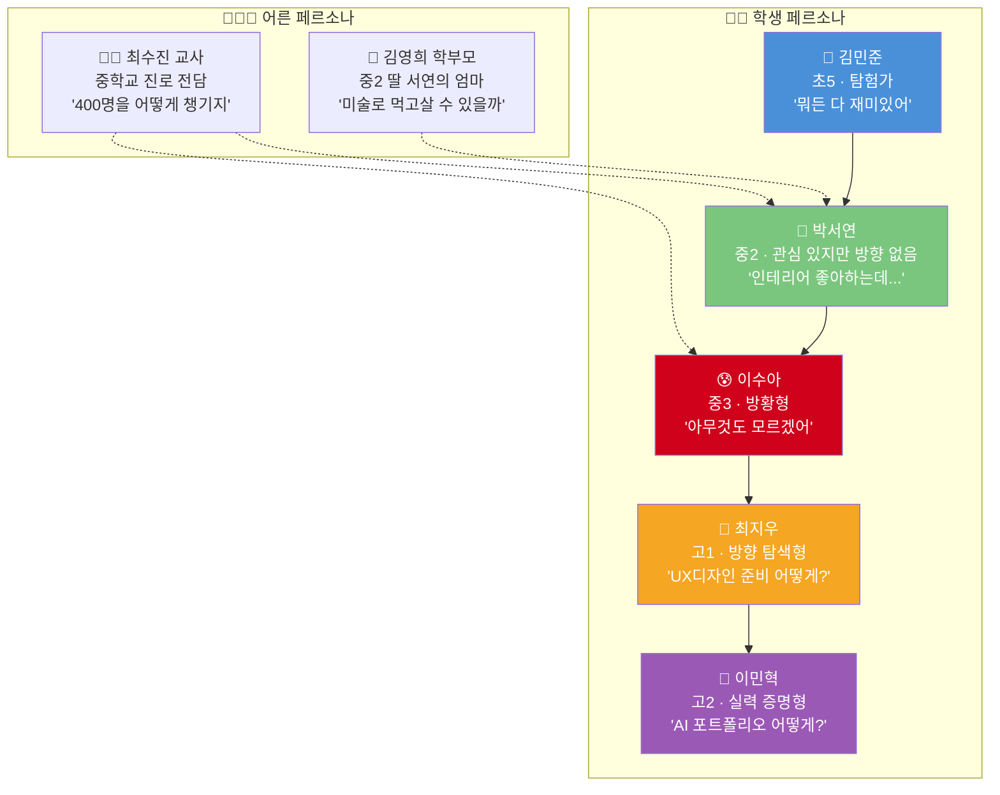

---

### 7.1 시나리오 A: 김민준 (초5, 탐험가형)

```
╔══════════════════════════════════════════════════════╗
║  👦 김민준 / 11세 / 초5 / 서울 노원구                ║
║  RIASEC: R(현실형) + I(탐구형)                       ║
║  "레고 만드는 게 직업이 될 수 있어요?"                ║
╚══════════════════════════════════════════════════════╝
```

#### 일일 시나리오 (매일 3분)

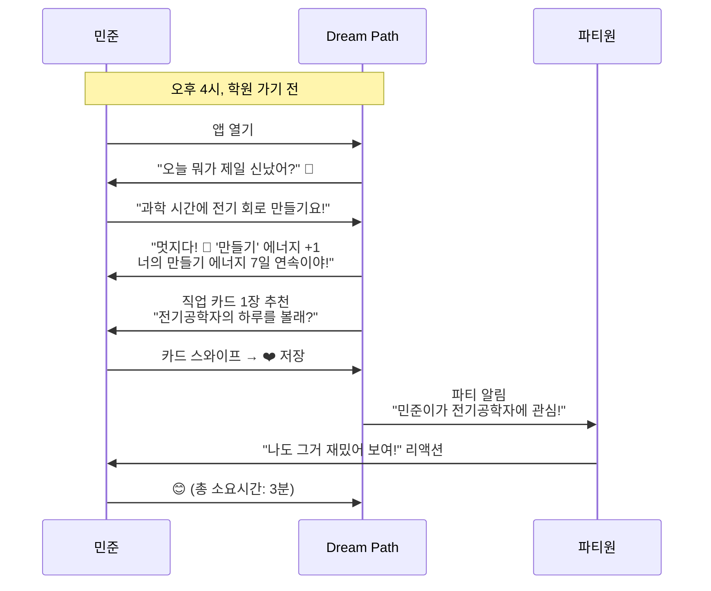

#### 주간 시나리오 (매주 토요일 15분)

| 시간 | 활동 | 앱 기능 | 결과 |
|------|------|--------|------|
| 0~3분 | 이번 주 에너지 일기 리뷰 | 자동 주간 리포트 | "이번 주 '만들기' 에너지가 가장 높았어!" |
| 3~8분 | 추천 직업 영상 시청 | 3분 직업 하루 영상 | 로봇 엔지니어 하루 일과 시청 |
| 8~12분 | 주간 미니 미션 수행 | "집에서 만들 수 있는 간단한 회로 사진 찍어봐!" | 사진 1장 업로드 |
| 12~15분 | 파티 토론 참여 | "이번 주 뭐가 재밌었어?" 파티 채팅 | 파티원 3명과 짧은 대화 |

#### 월간 시나리오 (한 달 성장 기록)

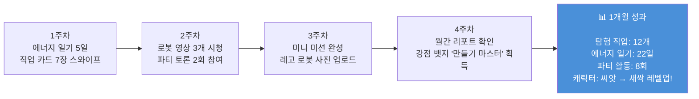

#### 학기 시나리오 (6개월 성장)

| 월 | 핵심 활동 | 캐릭터 변화 | 포트폴리오 추가 |
|----|---------|-----------|-------------|
| 1개월 | 에너지 일기 시작, 첫 파티 매칭 | 🌰 씨앗 → 🌱 새싹 | 강점 프로필 초안 |
| 2개월 | 직업 탐험 30개, 관심 직업 5개 저장 | 🌱 새싹 유지 | 관심 직업 리스트 |
| 3개월 | 첫 미니 프로젝트 시작 (스크래치 게임) | 🌱 → 🌿 풀잎 | 프로젝트 기획서 |
| 4개월 | 미니 프로젝트 완성, 파티 전시회 참가 | 🌿 풀잎 유지 | 완성된 게임 + 성찰 기록 |
| 5개월 | 두 번째 미니 프로젝트 (로봇 설계도) | 🌿 → 🌳 나무 | 설계도 + 과정 기록 |
| 6개월 | 학기 말 Dream Festival 참가 | 🌳 나무 | **1학기 포트폴리오 완성!** |

---

### 7.2 시나리오 B: 박서연 (중2, 탐험가형 — 핵심 페르소나)

```
╔══════════════════════════════════════════════════════╗
║  👧 박서연 / 14세 / 중2 / 경기도 수원                ║
║  RIASEC: A(예술형) + S(사회형)                       ║
║  "인테리어 좋아하는데, 그게 직업이 될 수 있을까?"      ║
╚══════════════════════════════════════════════════════╝
```

#### 일일 시나리오 (매일 5분)

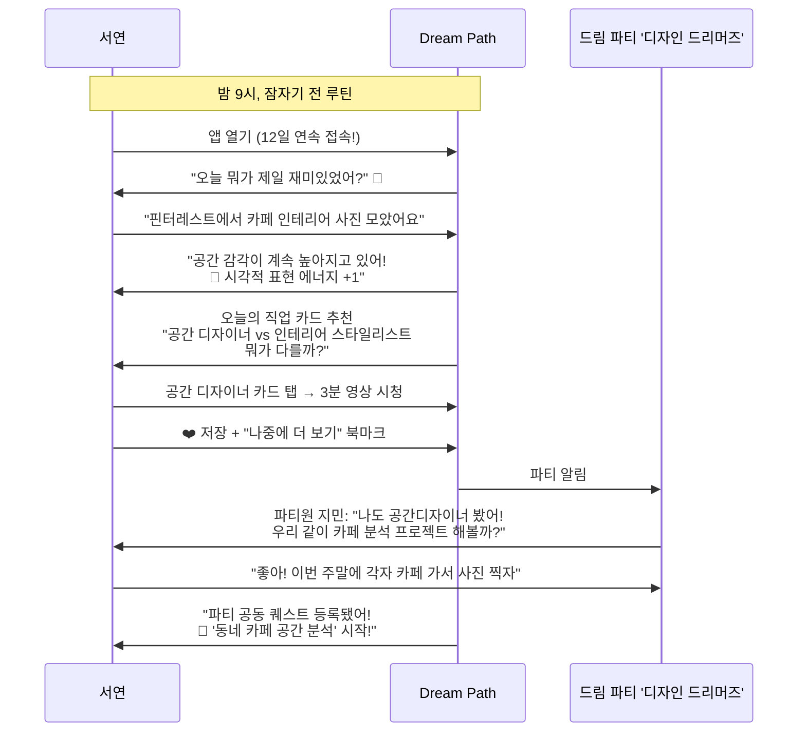

#### 주간 시나리오 (주말 20분)

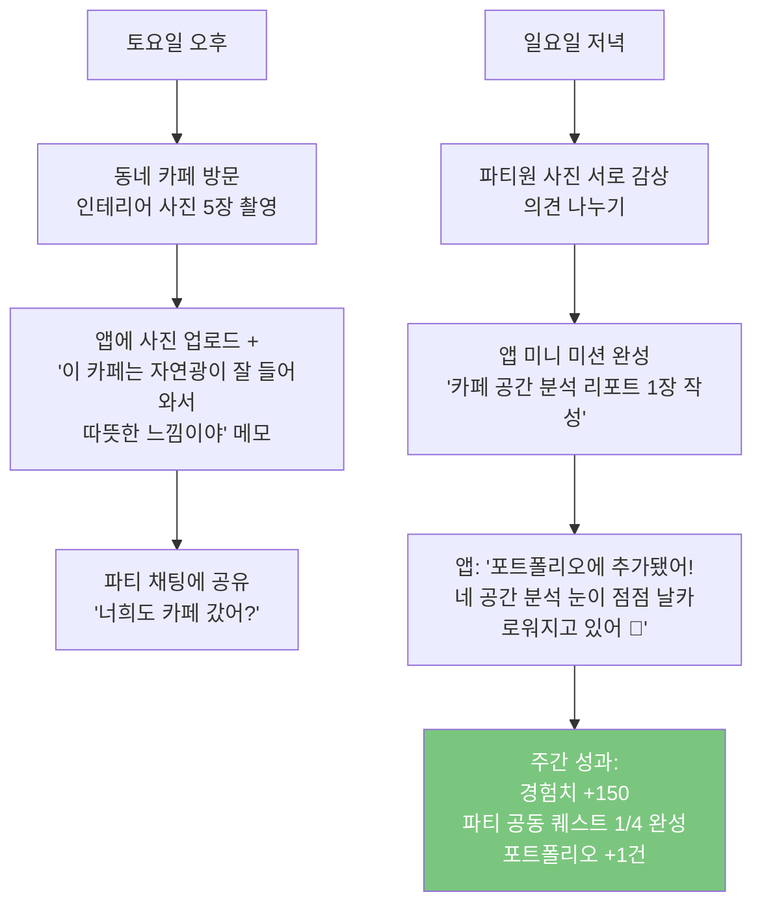

#### 월간 시나리오 (미니 프로젝트 4주)

| 주차 | 활동 내용 | 파티 활동 | 앱 기능 | 산출물 |
|------|---------|---------|--------|--------|
| **1주차: 조사** | UX 디자이너 vs 공간 디자이너 비교 조사 | 파티원 각자 1개 직업 조사 후 공유 | 직업 비교 도구 | 직업 비교표 |
| **2주차: 모방** | 좋아하는 앱 화면 3개 따라 스케치 | 파티원끼리 서로 스케치 피드백 | 참고 자료 큐레이션 | 스케치 3장 |
| **3주차: 창작** | 학교 급식 앱 UI 개선안 직접 디자인 | 파티 토론: "어떤 디자인이 더 편해?" | Canva/Figma 템플릿 가이드 | 개선안 와이어프레임 |
| **4주차: 성찰** | "이 프로젝트 하면서 가장 신난 순간은?" | 파티 성찰 모임: 각자 발표 | 성찰 질문 자동 제공 | 성찰 보고서 + 포트폴리오 자동 갱신 |

#### 부모 연동 시나리오

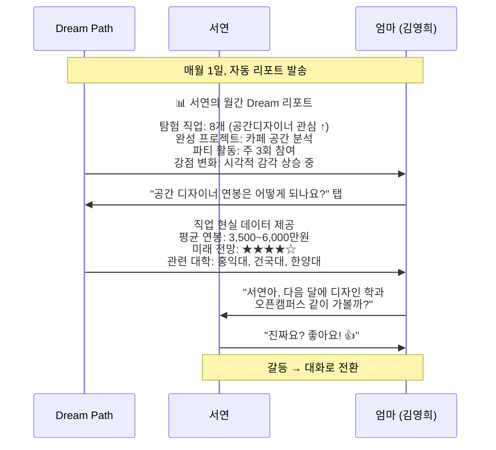

---

### 7.3 시나리오 C: 이수아 (중3, 방황형)

```
╔══════════════════════════════════════════════════════╗
║  😰 이수아 / 15세 / 중3 / 인천                       ║
║  RIASEC: 미측정 (검사 거부)                          ║
║  "아무것도 모르겠어요. 친구들은 다 뭔가 있는 것 같은데" ║
╚══════════════════════════════════════════════════════╝
```

#### 첫 주 온보딩 시나리오 (방황형 특화 흐름)

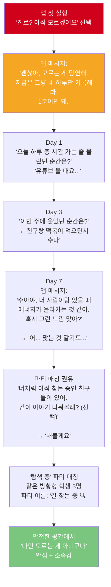

#### 수아의 3개월 변화 여정

| 시기 | 수아의 상태 | 앱 접근 방식 | 핵심 활동 | 변화 |
|------|-----------|-----------|---------|------|
| **1주~2주** | "아무것도 모르겠어" | 1일 1분 에너지 일기만 | 하루 1줄 기록 | "매일 뭔가 쓰긴 하네" |
| **3주~4주** | "약간 패턴이 보이는 것 같기도..." | 강점 패턴 자동 분석 | 앱이 보여주는 패턴 확인 | "사람이랑 있을 때 에너지 올라가네" |
| **5주~6주** | "파티 친구들이랑 얘기하니까 좀 나아" | 파티 활동 시작 | 토론 참여, 서로 관심사 공유 | "나만 모르는 게 아니구나" |
| **7주~8주** | "봉사활동 했을 때 좋았던 것 같아" | 관련 직업 살짝 추천 | 사회형(S) 직업 카드 탐색 | "사회복지사? 처음 들어보는데..." |
| **9주~10주** | "한번 해볼까" | 미니 미션 제안 | '학교 문제 발견 캠페인' 미니 프로젝트 | "프로젝트 해보니 재밌네!" |
| **11주~12주** | "나도 뭔가 하고 있다!" | 포트폴리오 자동 생성 | 3개월 기록 정리 | 캐릭터 레벨업 + 강점 뱃지 획득 |

> **핵심 설계**: 방황형 학생에게는 **절대 강요하지 않는다**. 1일 1분, 에너지 일기만으로 시작. 패턴이 보이면 살짝 힌트. 파티에서 "혼자가 아니라는 안심감"을 먼저 제공.

---

### 7.4 시나리오 D: 최지우 (고1, 방향 탐색형)

```
╔══════════════════════════════════════════════════════╗
║  👩 최지우 / 16세 / 고1 / 서울 노원구                 ║
║  RIASEC: A(예술형) + E(진취형)                       ║
║  "UX 디자인이 좋다는 건 알았는데, 고등학교에서 뭘 해야?" ║
╚══════════════════════════════════════════════════════╝
```

#### 고1 전환 시나리오 (중→고 인수인계)

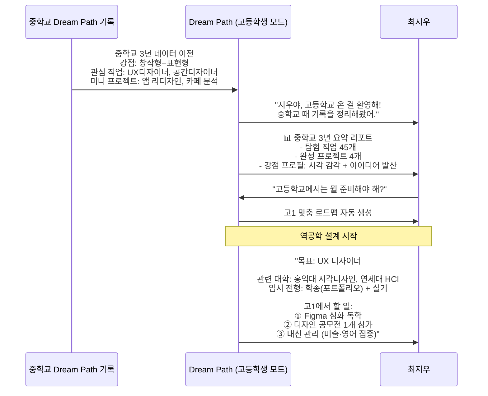

#### 고1 학기별 상세 시나리오

| 시기 | 핵심 활동 | Dream Path 기능 활용 | 파티 활동 | 산출물 |
|------|---------|-------------------|---------|--------|
| 고1 3월 | 계열 확정 (예체능+인문 융합) | 계열 선택 가이드 | 고1 디자인 파티 매칭 | 계열 선택 보고서 |
| 고1 4~5월 | Figma 독학 시작 | 스킬 로드맵 가이드 | 파티원끼리 Figma 스터디 | Figma 포트폴리오 5작품 |
| 고1 6~7월 | 디자인 공모전 참가 | 공모전 DB + 알림 | 파티 공모전 함께 참가 | 공모전 출품작 |
| 고1 8~9월 | 심화 프로젝트 시작 (8주) | 프로젝트 가이드 | 파티 프로젝트 역할 분담 | UX 리서치 보고서 |
| 고1 10~11월 | 포트폴리오 1차 정리 | 자동 포트폴리오 생성 | 파티 포트폴리오 리뷰 | 포트폴리오 PDF 10페이지 |
| 고1 12~2월 | 멘토 연결 (현직 UX 디자이너) | 멘토 매칭 시스템 | 멘토 세션 파티원 공동 참가 | 멘토 피드백 기록 |

---

### 7.5 시나리오 E: 이민혁 (고2, 실력 증명형)

```
╔══════════════════════════════════════════════════════╗
║  👦 이민혁 / 17세 / 고2 / 경기 성남시                 ║
║  RIASEC: I(탐구형) + C(관습형)                       ║
║  "AI 개발자 목표는 확실한데, 포트폴리오가 막막해"       ║
╚══════════════════════════════════════════════════════╝
```

#### 고2 심화 프로젝트 시나리오 (8주)

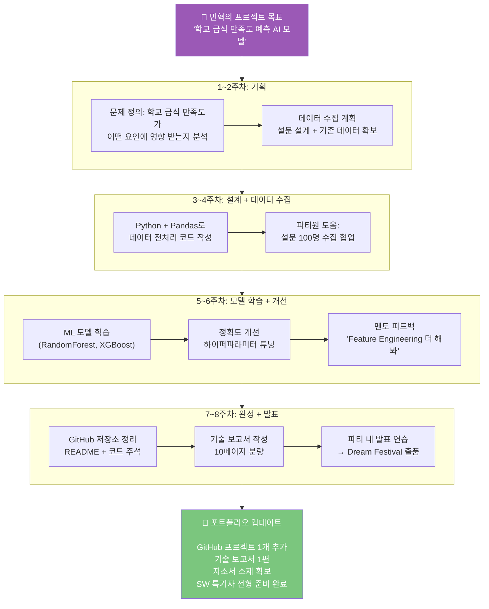

#### 민혁의 입시 연계 시나리오

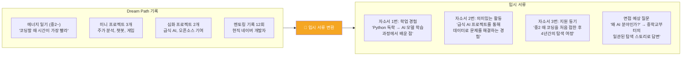

---

### 7.6 시나리오 F: 최수진 교사 (중학교 진로 전담)

```
╔══════════════════════════════════════════════════════╗
║  👩‍🏫 최수진 / 38세 / 중학교 진로 전담 교사 / 경력 8년 ║
║  담당 학생: 약 400명                                  ║
║  "개인 상담을 하고 싶지만 400명은 불가능"               ║
╚══════════════════════════════════════════════════════╝
```

#### 교사 대시보드 시나리오

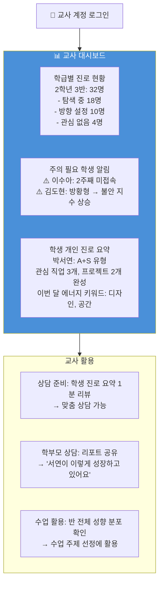

---

## 8. 게임 메카닉 상세 설계

### 8.1 경험치(XP) 시스템

| 활동 | 개인 XP | 파티 XP | 일일 제한 |
|------|--------|---------|---------|
| 에너지 일기 1줄 | +10 | +5 | 1회 |
| 직업 카드 스와이프 | +5 | — | 10회 |
| 직업 영상 시청 (3분) | +20 | +10 | 3회 |
| 직업 시뮬레이션 완료 | +50 | +25 | 1회 |
| 미니 미션 완성 | +30 | +15 | 2회 |
| 파티 토론 참여 | +15 | +20 | 3회 |
| 파티원 응원 리액션 | +5 | +10 | 5회 |
| 미니 프로젝트 주차 완료 | +100 | +50 | — |
| 미니 프로젝트 최종 완성 | +500 | +250 | — |
| Dream Festival 참가 | +1000 | +500 | — |

### 8.2 뱃지 시스템 (60종)

| 카테고리 | 뱃지 예시 | 획득 조건 | 희귀도 |
|---------|---------|---------|--------|
| **자기 발견** | 🔍 탐색가 | 에너지 일기 7일 연속 | ⭐ 일반 |
| **자기 발견** | 💎 자기 전문가 | 에너지 일기 100일 달성 | ⭐⭐⭐ 희귀 |
| **직업 탐험** | 🗺️ 세계 여행자 | 직업 50개 탐험 | ⭐⭐ 보통 |
| **직업 탐험** | 🌍 직업 마스터 | 8개 분야 모두 탐험 | ⭐⭐⭐ 희귀 |
| **프로젝트** | 🛠️ 첫 걸음 | 미니 프로젝트 1개 완성 | ⭐ 일반 |
| **프로젝트** | 🏗️ 프로 메이커 | 프로젝트 5개 완성 | ⭐⭐⭐⭐ 에픽 |
| **파티** | 🤝 동료 발견 | 첫 파티 가입 | ⭐ 일반 |
| **파티** | 👑 파티 리더 | 파티 공동 프로젝트 완성 | ⭐⭐⭐ 희귀 |
| **특별** | ⭐ 드림 페스티벌 | Dream Festival 참가 | ⭐⭐⭐⭐⭐ 전설 |

### 8.3 Dream Festival (학기 말 이벤트)

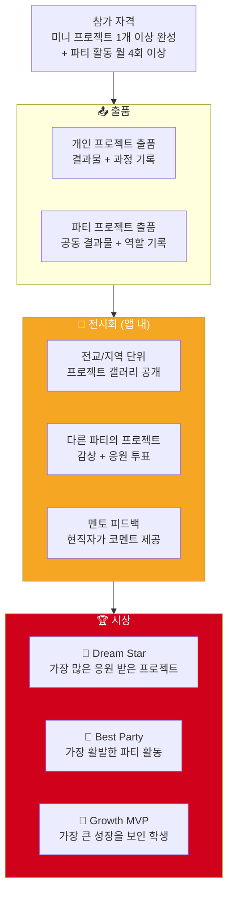

---

## 9. 화면별 와이어프레임 설계

### 9.1 홈 화면 (Dream Dashboard)

```
┌─────────────────────────────────┐
│  Dream Path              🔔 ⚙️  │
│─────────────────────────────────│
│                                 │
│  🌿 서연 Lv.3 풀잎              │
│  ████████████░░░ 78% → Lv.4     │
│                                 │
│  ┌─────────────────────────────┐│
│  │ 오늘의 질문 ☀️               ││
│  │ "오늘 뭐가 제일 재미있었어?" ││
│  │                             ││
│  │ [여기에 입력해봐...]        ││
│  │                   [기록 →]  ││
│  └─────────────────────────────┘│
│                                 │
│  📋 오늘의 퀘스트               │
│  ☑️ 에너지 일기 기록     (+10XP)│
│  ☐ 직업 카드 1장 보기   (+5XP) │
│  ☐ 파티원 응원 1개      (+5XP) │
│                                 │
│  🤝 드림 파티: 디자인 드리머즈   │
│  "지민: 오늘 카페 분석 했어!"    │
│  [파티 채팅 열기 →]             │
│                                 │
│─────────────────────────────────│
│  🌱    🗺️    🛠️    🤝    📁    │
│  나    탐험  프로젝트 파티  포폴  │
└─────────────────────────────────┘
```

### 9.2 직업 탐험 화면 (Dream World)

```
┌─────────────────────────────────┐
│  🗺️ 직업 세계 탐험              │
│─────────────────────────────────│
│                                 │
│  [내 성향 맞춤] [전체] [8대 분야]│
│                                 │
│  ┌─────────────────────────────┐│
│  │  🎨 공간 디자이너            ││
│  │  ★★★ 내 성향 매칭 95%       ││
│  │                             ││
│  │  사람들이 생활하는 공간을     ││
│  │  아름답고 편하게 디자인하는   ││
│  │  사람                       ││
│  │                             ││
│  │  미래 전망: ★★★★☆           ││
│  │  연봉: 3,500~6,000만원      ││
│  │                             ││
│  │  [▶ 3분 영상] [🎮 시뮬레이션]││
│  │                             ││
│  │     [❤️ 저장]  [→ 다음]     ││
│  └─────────────────────────────┘│
│                                 │
│  탐험 진행도: 23/200 직업       │
│  ████░░░░░░░░░░░ 11.5%          │
│                                 │
│─────────────────────────────────│
│  🌱    🗺️    🛠️    🤝    📁    │
└─────────────────────────────────┘
```

### 9.3 파티 화면 (Dream Party)

```
┌─────────────────────────────────┐
│  🤝 드림 파티: 디자인 드리머즈   │
│  파티 레벨 Lv.4 ████████░░ 80%  │
│─────────────────────────────────│
│                                 │
│  👧서연  👩지민  👦하준  👧예은   │
│  Lv.3   Lv.3   Lv.2   Lv.3    │
│                                 │
│  🎯 이번 주 공동 퀘스트          │
│  ┌─────────────────────────────┐│
│  │ "동네 카페 공간 분석"        ││
│  │ 진행: ██████░░░░ 60%        ││
│  │                             ││
│  │ ☑️ 서연: 카페 사진 5장 ✅    ││
│  │ ☑️ 지민: 카페 사진 3장 ✅    ││
│  │ ☐ 하준: 카페 방문 예정       ││
│  │ ☑️ 예은: 분석 레포트 작성 중 ││
│  └─────────────────────────────┘│
│                                 │
│  💬 파티 채팅                    │
│  ──────────────────────         │
│  지민: 오늘 강남 카페 갔는데     │
│        인테리어 대박이야!        │
│  서연: 사진 보여줘! 😍           │
│  예은: 나도 내일 갈 거야~        │
│                                 │
│  [메시지 입력...]      [전송]   │
│                                 │
│─────────────────────────────────│
│  🌱    🗺️    🛠️    🤝    📁    │
└─────────────────────────────────┘
```

### 9.4 포트폴리오 화면 (Dream Book)

```
┌─────────────────────────────────┐
│  📁 서연의 Dream Book            │
│  [편집] [PDF 다운로드] [공유]    │
│─────────────────────────────────│
│                                 │
│  🙋 나는 이런 사람               │
│  ┌─────────────────────────────┐│
│  │ 강점: 창작형 / 표현형 / 설계형││
│  │ RIASEC: A(예술) + S(사회)   ││
│  │ 에너지 키워드: 공간, 색감,   ││
│  │ 디자인, 사람                 ││
│  └─────────────────────────────┘│
│                                 │
│  🗺️ 탐험한 직업 (23개)          │
│  ❤️ UX디자이너 | 공간디자이너    │
│  ❤️ 인테리어 스타일리스트        │
│                                 │
│  🛠️ 완성한 프로젝트 (3개)       │
│  ┌──────────┐ ┌──────────┐     │
│  │📱앱 리디자│ │🏠카페 분석│     │
│  │인 챌린지  │ │ 보고서   │     │
│  │ 2026.05  │ │ 2026.07  │     │
│  └──────────┘ └──────────┘     │
│                                 │
│  📈 성장 타임라인                │
│  3월 ─── 5월 ─── 7월 ─── 9월   │
│  앱설치  첫프로젝트 파티결성 축제│
│                                 │
│─────────────────────────────────│
│  🌱    🗺️    🛠️    🤝    📁    │
└─────────────────────────────────┘
```

---

## 10. 수익 모델

### 10.1 수익 구조

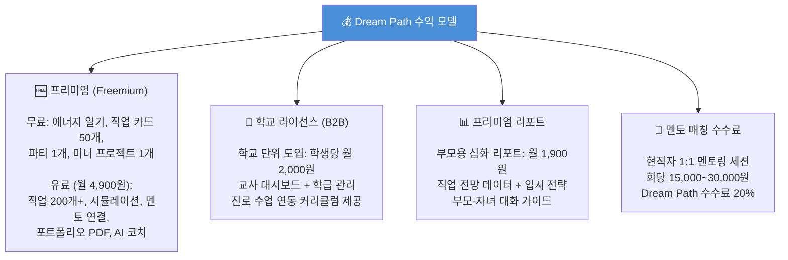

### 10.2 예상 수익 시뮬레이션

| 항목 | 출시 6개월 | 출시 1년 | 출시 2년 |
|------|----------|---------|---------|
| 가입 사용자 | 50,000명 | 200,000명 | 500,000명 |
| 유료 전환율 | 5% | 8% | 12% |
| 학교 라이선스 | 50개교 | 200개교 | 500개교 |
| 월 매출 (추정) | 약 3,000만원 | 약 1.5억원 | 약 5억원 |

---

## 11. 개발 로드맵

### 11.1 전체 로드맵

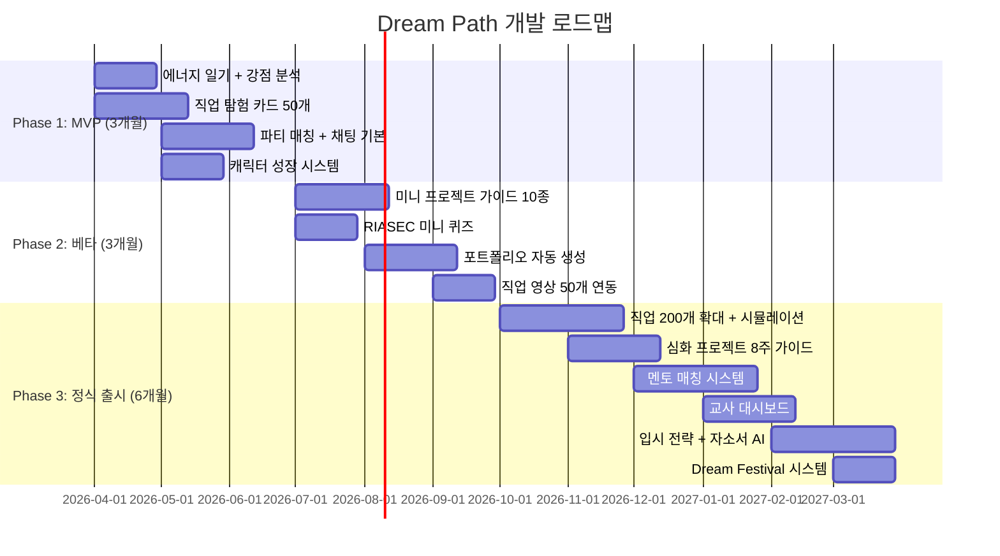

### 11.2 MVP 핵심 기능 정의

| 우선순위 | 기능 | 왜 MVP인가? | 개발 기간 |
|---------|------|-----------|---------|
| 🔴 P0 | 에너지 일기 | 매일 접속 → 리텐션의 핵심 | 2주 |
| 🔴 P0 | 직업 탐험 카드 (50개) | 핵심 가치 체험 | 4주 |
| 🔴 P0 | 파티 매칭 + 채팅 | 차별점의 핵심 | 4주 |
| 🔴 P0 | 캐릭터 성장 | 게임 몰입의 핵심 | 3주 |
| 🟡 P1 | 퀘스트 시스템 | 행동 유도 | 2주 |
| 🟡 P1 | 뱃지 시스템 | 성취 동기 | 1주 |
| 🟢 P2 | 부모 리포트 (기본) | 부모 참여 유도 | 2주 |

### 11.3 기술 스택 (안)

| 영역 | 기술 | 선택 이유 |
|------|------|---------|
| **프론트엔드** | React Native (Expo) | iOS + Android 동시 개발, 빠른 MVP |
| **백엔드** | Node.js + Express | 빠른 API 개발 |
| **데이터베이스** | PostgreSQL + Redis | 관계형 데이터 + 실시간 캐싱 |
| **실시간 채팅** | Socket.io | 파티 채팅 실시간 |
| **AI 엔진** | OpenAI API + 커스텀 모델 | 직업 매핑, 진로 코치 |
| **인프라** | AWS (EC2 + RDS + S3) | 확장성 + 안정성 |
| **분석** | Mixpanel + BigQuery | 사용자 행동 분석 |

---

## 12. KPI 및 성공 지표

### 12.1 핵심 지표 대시보드

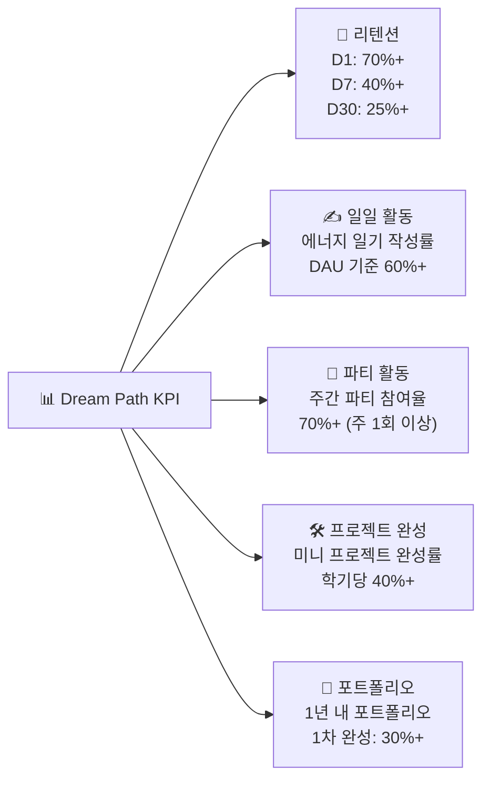

### 12.2 사용자 성공 지표 비교표

| 지표 | 초등 | 중학생 | 고등학생 | 교사 | 부모 |
|------|------|--------|---------|------|------|
| 탐색 직업 수 | 30개+/학기 | 20개 → 5개 압축 | 목표 직업 확정 | — | — |
| 프로젝트 완성 | 1개/학기 | 2개/학기 | 3개/학기 | — | — |
| 파티 활동 | 주 2회 | 주 3회 | 주 2회 | — | — |
| 포트폴리오 완성도 | 강점 프로필 | 탐색 여정 정리 | 입시 PDF 완성 | — | — |
| 진로 불안 지수 | — | 30% 감소 | 40% 감소 | — | — |
| 상담 준비 시간 | — | — | — | 50% 절감 | — |
| 부모 리포트 열람 | — | — | — | — | 월 2회+ |

---

## 13. 결론 — Dream Path 핵심 가치 정리

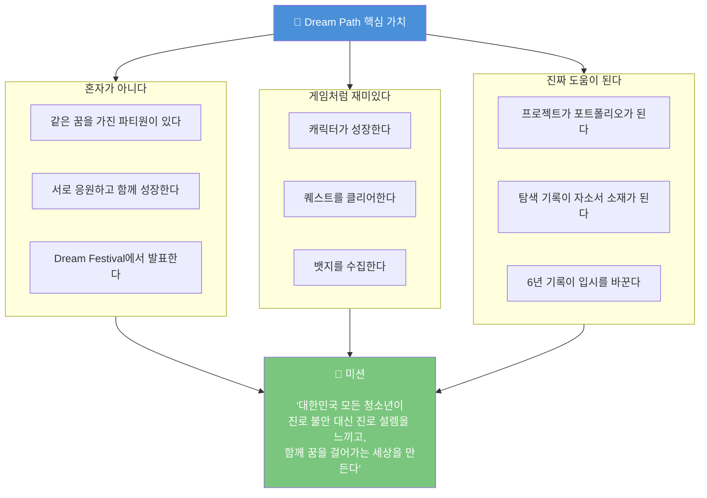

### 한 줄 핵심

> **"진로를 찾는 게 아니라, 꿈을 함께 걷는 거야."**
>
> 나를 알면 → 직업이 보이고
> 직업이 보이면 → 해볼 수 있고
> 해봐야 → 진짜 내 길이 보인다.
> **함께 걸으면 → 그 길이 더 즐겁다.**
>
> Dream Path는 그 여정을 함께 기록한다.

---

> 📌 **참고 데이터 출처**
> - 교육부·한국직업능력연구원 「2024 초·중등 진로교육 현황조사」(n=38,481)
> - 커리어넷 직업흥미검사(H) RIASEC 설계 자료
> - 2028 대입 개편안 — 교육부 발표 (2024)
> - 경기도교육청 「꿈it(잇)다」 AI 진로진학 시스템 (2025)
> - 드림어필 운영 현황 (2025, 6만 사용자)
> - iLevelUP, Meroo, SkillHatch 해외 앱 분석 (2025)
> - World Economic Forum: Future of Jobs Report 2025

---
*작성일: 2026년 2월 | Dream Path 앱 상세 기획서 (하)*
