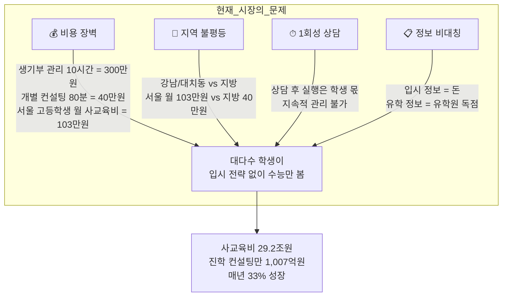
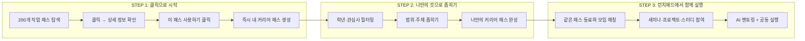
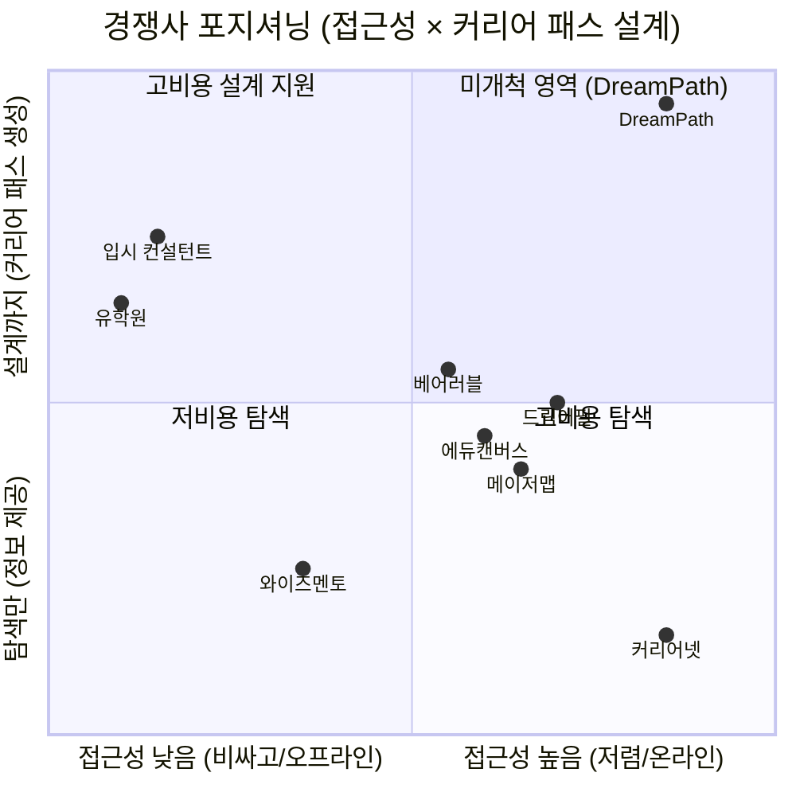
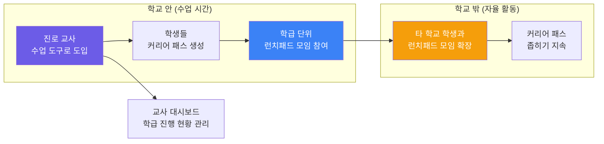
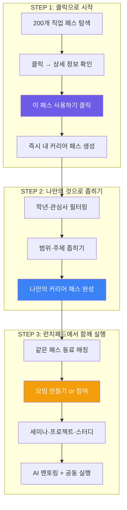
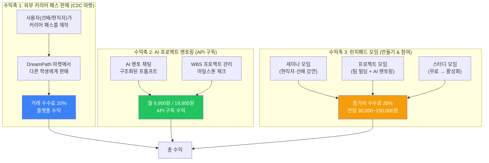
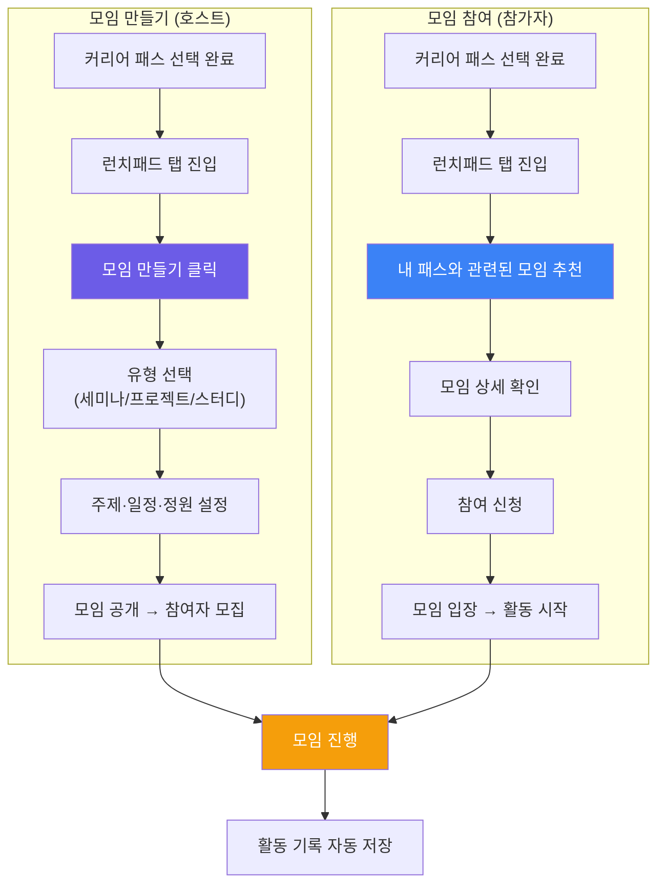
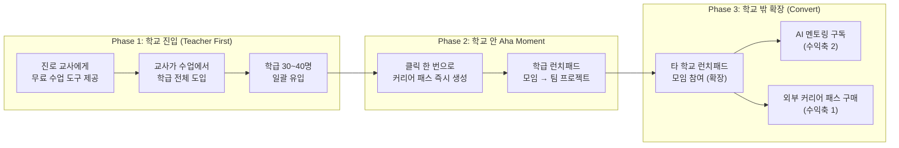
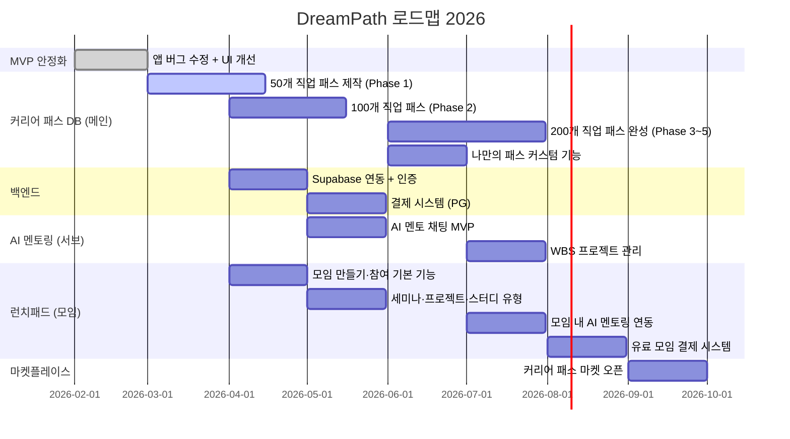

# DreamPath — 투자 제안서

> **"클릭 한 번으로 커리어 패스 설계, 런치패드로 함께 실행"**  
> 중학생~고등학생 AI 커리어 패스 설계 + 모임 활성화 플랫폼  
> 2026.02

---

## 목차

1. [Executive Summary](#1-executive-summary)
2. [시장의 문제 (Problem)](#2-시장의-문제-problem)
3. [솔루션 (Solution)](#3-솔루션-solution)
4. [벤치마킹 & 경쟁사 분석](#4-벤치마킹--경쟁사-분석)
5. [고객 페르소나](#5-고객-페르소나)
6. [핵심 제품: 커리어 패스 시스템](#6-핵심-제품-커리어-패스-시스템)
7. [수익 모델](#7-수익-모델)
8. [시장 규모 (TAM / SAM / SOM)](#8-시장-규모-tam--sam--som)
9. [Go-to-Market 전략](#9-go-to-market-전략)
10. [로드맵 & 마일스톤](#10-로드맵--마일스톤)
11. [재무 전망](#11-재무-전망)

---

## 1. Executive Summary

```
┌──────────────────────────────────────────────────────────────────┐
│                                                                  │
│   DreamPath = 클릭으로 커리어 패스 설계 + 런치패드로 함께 실행        │
│                                                                  │
│   핵심 철학:                                                      │
│   AI 시대에 결과는 AI가 만드는 데 유리하다.                         │
│   우리가 집중해야 할 것은 무엇을 만들지 기획하는 과정이다.            │
│   커리어 패스를 설계하고 좁혀가는 과정 자체가 진짜 실력이다.          │
│                                                                  │
│   메인 기능 (커리어 패스 설계):                                    │
│   ① 200개 직업 패스 중 클릭 → 즉시 내 커리어 패스 생성              │
│   ② 나만의 범위·주제로 점점 좁혀가기                               │
│                                                                  │
│   활성화 기능 (런치패드 — 모임 만들기 & 참여):                      │
│   · 같은 커리어 패스를 선택한 학생끼리 모임 자동 매칭                 │
│   · 누구나 모임을 만들고, 누구나 참여 가능                          │
│   · 세미나·프로젝트·스터디 등 다양한 모임 유형                       │
│   · 모임 내 AI 멘토링 + 공동 프로젝트 실행                          │
│                                                                  │
│   서브 기능 (실행 지원):                                          │
│   · AI 프로젝트 멘토링 (계획 실행 지원)                             │
│                                                                  │
│   수익 모델 3가지:                                                │
│     🔵 외부 커리어 합격 패스 판매 (사용자 C2C 마켓)                  │
│     🟢 AI 프로젝트 멘토링 (월 구독)                                │
│     🟠 런치패드 프리미엄 모임 (유료 세미나·프로젝트 실행 모임)        │
│                                                                  │
│   목표: 입시 컨설턴트 · 유학원 시장을 디지털로 대체                  │
│                                                                  │
└──────────────────────────────────────────────────────────────────┘
```

### 핵심 숫자

| 지표 | 수치 |
|------|------|
| **타겟 시장** | 한국 사교육 시장 29.2조원 (2024) |
| **직접 경쟁 시장** | 진로진학 컨설팅 1,007억원 (2024, YoY +33%) |
| **타겟 고객** | 중고등학생 260만명 + 학부모 |
| **제공 직업 수** | 200개 (8개 분야 × 25개) |
| **가격 파괴** | 기존 300만원 → 월 9,900원 (97% 절감) |
| **핵심 차별점** | 클릭 한 번 커리어 패스 생성 + 런치패드 모임으로 함께 실행 (시장 유일) |

---

## 2. 시장의 문제 (Problem)

### 2-1. 입시 컨설팅의 구조적 불평등



### 2-2. 학생이 겪는 Pain Point

#### 학생이 겪는 Pain Point

| # | Pain Point | 현재 해결책 | 비용 | 문제점 |
|---|-----------|-----------|------|--------|
| 1 | "나한테 맞는 직업을 모르겠다" | 커리어넷 검사 (무료) | 0원 | 검사만 하고 끝, 후속 행동 없음 |
| 2 | "의사가 되려면 중학교 때 뭘 해야 해?" | 입시 컨설턴트 | 40~300만원 | 비용 부담, 1회성 |
| 3 | "커리어 패스를 어떻게 만들지?" | 혼자 구글링 | 0원 | 막막함, 방향 모름 |
| 4 | "생기부에 뭘 넣어야 해?" | 학원 컨설팅 | 월 50~100만원 | 서울 편중, 지방은 기회 없음 |
| 5 | "프로젝트를 어떻게 시작해?" | 혼자 구글링 | 0원 | 방향 모름, 완성 못 함 |
| 6 | "같은 목표의 동료가 없다" | 학교 동아리 | 0원 | 관심사가 안 맞음, 주도적 활동 어려움 |

#### 진로 교사가 겪는 Pain Point

| # | Pain Point | 현재 해결책 | 문제점 |
|---|-----------|-----------|--------|
| 1 | "16차시 수업을 채울 콘텐츠가 없다" | 커리어넷 검사 + PPT 직접 제작 | 매 학기 반복 제작, 시간 소모 |
| 2 | "학생 300명 개별 맞춤 지도가 불가능하다" | 학기당 1인 15분 상담 | 물리적 시간 한계, 직업 전문 지식 부족 |
| 3 | "활동 기록 정리가 너무 힘들다" | 엑셀/나이스 수기 입력 | 학기말 야근, 생기부 근거 자료 부족 |
| 4 | "학생들이 검사 한 번 하고 흥미를 잃는다" | 적성검사 1회 | 지속적 탐색 유도 수단 없음 |
| 5 | "직업 체험처 섭외가 너무 어렵다" | 직접 섭외 (연 1~2회) | 비용·시간 한계, 지역 편차 큼 |

### 2-3. AI 시대의 새로운 문제

> **"AI가 다 해주면 내가 할 게 없다"** — 이것이 새로운 불안이다.

| 기존 불안 | AI 시대의 불안 | DreamPath 해결 |
|----------|-------------|--------------|
| "결과물을 어떻게 만들지?" | "AI가 다 만드는데 내가 뭘 해야 하지?" | 기획하는 과정이 진짜 실력 |
| "포트폴리오가 없다" | "AI가 만든 것을 내 것이라 할 수 있나?" | 설계 과정이 나만의 포트폴리오 |
| "방향을 모르겠다" | "AI한테 물어봐도 내 상황에 맞지 않다" | 커리어 패스 좁히기 + 런치패드 모임에서 함께 실행 |

---

## 3. 솔루션 (Solution)

### 3-1. DreamPath의 핵심 가치

```
기존 방식:
  계획 세우기 (어렵고 막막) ──── 혼자 실행 ──── 대부분 포기
       ↑ 여기서 대부분 포기           ↑ 동료 없이 지속 불가

DreamPath:
  클릭 → 패스 선택 ──── 나만의 것으로 좁히기 ──── 런치패드 모임에서 함께 실행
       ↑ 누구나 즉시 시작 가능            ↑ 같은 꿈 동료와 함께
```

### 3-2. 메인 기능: 커리어 패스 설계 + 런치패드 모임



### 3-3. 나만의 계획으로 좁혀가기

커리어 패스는 처음 선택한 그대로 끝나지 않습니다.  
점점 나만의 범위와 주제로 발전시켜 나갑니다.

```
처음: 200개 패스 중 "의사 커리어 패스" 선택
    ↓
좁히기 1: 중2~고3 전체 → 고1~고3 집중
    ↓
좁히기 2: 전체 활동 → 과학 탐구 + 의료 봉사 특화
    ↓
좁히기 3: 일반 의사 → 소아과 전문의 목표로 구체화
    ↓
결국: 나만의 고유한 커리어 패스 완성
     (결국 커리어 패스 과정만 남는다)
```

### 3-4. DreamPath vs 기존 방식 비교

| 항목 | 입시 컨설턴트 | 유학원 | 커리어넷 | **DreamPath** |
|------|-------------|--------|---------|---------------|
| **커리어 패스 생성** | 수동, 300만원 | 없음 | 없음 | ✅ **클릭 한 번** |
| **나만의 계획 커스텀** | 1회성 | 없음 | 없음 | ✅ **무제한 좁히기** |
| **함께 실행 (모임)** | 없음 | 없음 | 없음 | ✅ **런치패드 모임** |
| **실행 지원** | 분기 1회 체크 | 서류 대행 | 없음 | ✅ AI 멘토링 + 모임 |
| **비용** | 300만원+ | 1,000만원+ | 무료 | **무료~월 19,900원** |
| **접근성** | 서울/수도권 | 서울/수도권 | 전국 | **전국 + 해외** |

---

## 4. 벤치마킹 & 경쟁사 분석

### 4-1. 경쟁 환경 지도



### 4-2. 경쟁사 상세 분석

#### A. 정부/공공 서비스

| 서비스 | 운영 | 핵심 기능 | 강점 | 약점 |
|--------|------|----------|------|------|
| **커리어넷** | 한국직업능력연구원 | 14종 적성검사, 직업백과 | 무료, 공신력 | 커리어 패스 생성 없음, UX 낡음 |
| **워크넷** | 고용노동부 | 직업 정보, 적성검사 | 무료, 성인 대상 포함 | 중고등학생 맞춤형 아님 |

#### B. 에듀테크 스타트업

| 서비스 | 설립 | 핵심 기능 | 강점 | 약점 |
|--------|------|----------|------|------|
| **메이저맵** | 2018 | AI 진로 검사, 학과 분석 | 140개 대학 데이터 | 클릭으로 패스 생성 없음 |
| **드림어필** | 2022 | 실천형 진로 SNS | 846개교 도입 | 커리어 패스 설계 없음 |
| **에듀캔버스** | - | AI 진로 로드맵, 3D 시뮬레이션 | 12,000 직무 데이터 | B2B 모델, 개인 사용 제한 |
| **베어러블** | 2024.10 | AI 포트폴리오, 세특 정리 | 교사용 도구 연계 | 진로 탐색 기능 약함 |

### 4-3. DreamPath 핵심 차별점

```
┌─────────────────────────────────────────────────────────────┐
│              DreamPath만의 3가지 해자 (Moat)                  │
├─────────────────────────────────────────────────────────────┤
│                                                             │
│  ① 클릭 한 번으로 커리어 패스 즉시 생성                         │
│     → 경쟁사 없음. 커리어넷은 정보만, 컨설턴트는 300만원.         │
│     → 200개 직업 패스 중 클릭 → 즉시 내 계획이 된다.             │
│     → 나만의 범위·주제로 좁혀가는 과정 설계.                     │
│                                                             │
│  ② 런치패드 (모임 만들기 & 참여)                               │
│     → 같은 커리어 패스를 선택한 학생끼리 자동 매칭.               │
│     → 누구나 모임을 만들고, 누구나 참여 가능.                    │
│     → 세미나·프로젝트·스터디 등 다양한 모임 유형.                │
│     → 혼자 포기하던 프로젝트를 함께 완성.                       │
│                                                             │
│  ③ 과정 중심 철학 (AI 시대 대응)                               │
│     → AI가 결과를 만드는 시대, 기획 과정이 진짜 실력.             │
│     → 커리어 패스 설계 과정 자체가 포트폴리오.                    │
│     → 결국 커리어 패스 과정만 남는다.                           │
│                                                             │
└─────────────────────────────────────────────────────────────┘
```

| 차별점 | 커리어넷 | 메이저맵 | 드림어필 | 에듀캔버스 | 베어러블 | **DreamPath** |
|--------|---------|---------|---------|----------|---------|-------------|
| 적성검사 | ✅ | ✅ | ❌ | ✅ | ❌ | ✅ |
| 직업 시뮬레이션 | ❌ | ❌ | ❌ | ✅ (3D) | ❌ | ✅ (RPG) |
| **클릭으로 패스 생성** | ❌ | ❌ | ❌ | ❌ | ❌ | ✅ **(유일)** |
| **나만의 계획 커스텀** | ❌ | ❌ | ❌ | ❌ | ❌ | ✅ **(유일)** |
| **커리어 패스 DB** | ❌ | ❌ | ❌ | ❌ | ❌ | ✅ **(200개)** |
| **런치패드 모임** | ❌ | ❌ | △ SNS | ❌ | ❌ | ✅ **(모임 생성/참여)** |
| AI 멘토링 | ❌ | ❌ | ❌ | △ | △ 세특 | ✅ (서브) |
| B2C 직접 판매 | 무료 | B2B | ✅ | B2B | B2B | ✅ |
| 커리어 패스 마켓 | ❌ | ❌ | ❌ | ❌ | ❌ | ✅ |

---

## 5. 고객 페르소나

### 5-0. 학교 내 사용 흐름 (B2B2C)

> DreamPath는 **진로 교사가 학교 수업에서 도입**하고, **학생이 교실에서 시작**하여, **수업 밖에서도 지속**하는 구조입니다.



---

### 5-1. 핵심 고객: 진로 교사 (B2B 게이트웨이)

```
┌────────────────────────────────────────────────────────────┐
│  🏫 Persona 1: "진로전담교사" — 박정민 (38세, 중학교 8년차)   │
├────────────────────────────────────────────────────────────┤
│                                                            │
│  배경: 경기도 공립중학교 진로전담교사, 담당 학생 약 300명       │
│  수업: 자유학기제 진로탐색 수업 (주 2시간) + 창의적 체험활동     │
│                                                            │
│  ┌──────────────────────────────────────────────────────┐  │
│  │              진로 교사의 5가지 어려움                    │  │
│  ├──────────────────────────────────────────────────────┤  │
│  │                                                      │  │
│  │  ❶ 수업 콘텐츠 부족                                   │  │
│  │  · 커리어넷 검사 → 결과 보고 끝 (후속 활동이 없음)       │  │
│  │  · 매 학기 진로 수업 16차시를 채울 콘텐츠가 부족함        │  │
│  │  · PPT 직접 제작, 외부 강사 섭외에 시간 소모              │  │
│  │                                                      │  │
│  │  ❷ 개별 맞춤 지도 불가                                 │  │
│  │  · 학생 300명 × 관심 직업 모두 다름                      │  │
│  │  · 1:1 상담은 학기당 학생 1인 15분이 한계                │  │
│  │  · "선생님, 게임 개발자 되려면요?" → 전문 지식 부족       │  │
│  │                                                      │  │
│  │  ❸ 활동 기록·관리 부담                                 │  │
│  │  · 학생별 진로 활동 기록을 수기로 정리 (엑셀/나이스)      │  │
│  │  · 창의적 체험활동 보고서 작성에 학기말 야근 반복         │  │
│  │  · 생기부(학생부) 진로 희망사항 기재 근거 자료 확보 어려움 │  │
│  │                                                      │  │
│  │  ❹ 학생 참여도·지속성 저하                              │  │
│  │  · 적성검사 1회 후 흥미를 잃는 학생 대다수                │  │
│  │  · "수업 시간에만 하고 끝" — 지속적 탐색 유도 어려움      │  │
│  │  · 진로 수업 = 자습 시간이라는 학생 인식                 │  │
│  │                                                      │  │
│  │  ❺ 외부 체험 연계 한계                                 │  │
│  │  · 직업 체험처 섭외 어려움 (연 1~2회가 한계)             │  │
│  │  · 같은 관심사 학생끼리 모임 구성이 물리적으로 어려움      │  │
│  │  · 프로젝트 기반 학습을 하고 싶지만 도구/틀이 없음        │  │
│  │                                                      │  │
│  └──────────────────────────────────────────────────────┘  │
│                                                            │
│  DreamPath 도입 시나리오 (학교 수업):                         │
│                                                            │
│  📅 1차시: 적성검사 + 200개 직업 탐험                         │
│  → 학생들이 각자 앱에서 RIASEC 검사 후 관심 직업 탐색           │
│                                                            │
│  📅 2~4차시: 커리어 패스 선택 + 나만의 계획 좁히기              │
│  → 클릭으로 패스 선택 → 학년·관심사로 커스텀                    │
│  → 교사는 대시보드에서 학급 전체 진행 현황 확인                  │
│                                                            │
│  📅 5~8차시: 런치패드 학급 모임                                │
│  → 같은 직업군 학생 3~5명 모임 자동 구성                        │
│  → 모임별 미니 프로젝트 실행 (AI 멘토 지원)                     │
│                                                            │
│  📅 9~16차시: 프로젝트 발표 + 런치패드 확장                    │
│  → 모임별 결과 발표, 타 학교 학생과 모임 연결                   │
│  → 학기 리포트 자동 생성 (교사 활동 기록 부담 해소)              │
│                                                            │
│  교사 전환 포인트:                                            │
│  "수업 16차시를 채우면서, 학생 개별 진로 기록까지 자동으로!"      │
│  "학생들이 수업 밖에서도 스스로 계속 쓰는 건 처음이다"           │
│                                                            │
└────────────────────────────────────────────────────────────┘
```

#### 진로 교사 Pain Point → DreamPath 해결 매핑

| # | 교사의 어려움 | 현재 해결책 | 문제점 | DreamPath 해결 |
|---|-------------|-----------|--------|---------------|
| ❶ | 수업 콘텐츠 부족 (16차시) | 커리어넷 + PPT 직접 제작 | 매 학기 반복, 시간 소모 | 200개 직업 패스 = 수업 콘텐츠 즉시 활용 |
| ❷ | 개별 맞춤 지도 불가 (300명) | 학기당 1인 15분 상담 | 물리적 한계 | 학생이 스스로 패스 선택·좁히기, 교사는 대시보드로 모니터링 |
| ❸ | 활동 기록 부담 (생기부) | 엑셀/나이스 수기 입력 | 학기말 야근 | 학생 활동 자동 기록 → 학기 리포트 출력 |
| ❹ | 학생 참여도 저하 | 적성검사 1회 | 검사 후 흥미 상실 | 커리어 패스 좁히기 + 런치패드 모임 → 지속 참여 |
| ❺ | 외부 체험 한계 (연 1~2회) | 직업 체험처 직접 섭외 | 비용·시간 한계 | 런치패드 세미나 (현직자 온라인 강연) + 프로젝트 모임 |

---

### 5-2. 대표 고객: 학생 (학교 수업에서 시작)

```
┌────────────────────────────────────────────────────────────┐
│  🎯 Persona 2: "자유학기제 중학생" — 김서연 (중2, 14세)       │
├────────────────────────────────────────────────────────────┤
│                                                            │
│  배경: 경기도 수원 거주, 공부는 중상위권                       │
│  상황: 진로 수업 시간에 선생님이 DreamPath를 소개              │
│  고민: "나한테 맞는 직업이 뭔지 모르겠다"                      │
│  현재 행동: 커리어넷 검사 → 결과 보고 끝 → 자습                │
│                                                            │
│  학교 수업 여정:                                             │
│  📅 수업 1~2차시: 적성검사 + 200개 직업 탐험                   │
│  📅 수업 3~4차시: "수의사" 커리어 패스 클릭 → 내 계획 생성      │
│  📅 수업 5~8차시: 학급 런치패드 모임 참여                      │
│  → 같은 "동물 관련 직업" 관심 학생 4명과 팀 구성               │
│  → 동물병원 직업 체험 기획 미니 프로젝트 진행                   │
│                                                            │
│  수업 밖 확장:                                               │
│  → 집에서도 패스 좁히기 지속 ("수의사 → 야생동물 전문수의사")    │
│  → 타 학교 "동물" 런치패드 모임에도 참여                       │
│                                                            │
│  전환 포인트: "수업에서 시작했는데, 집에서도 계속 하고 싶다!"     │
│                                                            │
└────────────────────────────────────────────────────────────┘
```

```
┌────────────────────────────────────────────────────────────┐
│  🎯 Persona 3: "입시 준비 고등학생" — 이준호 (고1, 16세)      │
├────────────────────────────────────────────────────────────┤
│                                                            │
│  배경: 서울 거주, 상위권 학생                                 │
│  상황: 진로진학상담교사가 수업에서 DreamPath 안내              │
│  고민: "생기부에 뭘 넣어야 하지? 어떤 활동을 해야 하지?"       │
│  현재 행동: 학원 + 부모님이 입시 컨설팅 알아보는 중             │
│                                                            │
│  학교 수업 여정:                                             │
│  📅 창체 시간: 의사 커리어 패스 클릭 → 고등학교 활동 가이드      │
│  → 나만의 과학 탐구 특화 계획으로 좁히기                       │
│  → 교사가 대시보드에서 활동 기록 확인 → 생기부 반영             │
│                                                            │
│  수업 밖 확장:                                               │
│  → 런치패드에서 같은 의학 목표 동료와 프로젝트 모임 참여        │
│  → AI 멘토링으로 탐구 보고서 구조 잡기                        │
│                                                            │
│  전환 포인트: "300만원 컨설팅 대신 학교 수업에서 바로 시작!"     │
│                                                            │
└────────────────────────────────────────────────────────────┘
```

```
┌────────────────────────────────────────────────────────────┐
│  🎯 Persona 4: "유학 준비 학생" — 박하은 (고2, 17세)          │
├────────────────────────────────────────────────────────────┤
│                                                            │
│  배경: 부산 거주, 영어 특기                                   │
│  상황: 미국 대학 진학 희망, 유학원 상담 중                     │
│  고민: "유학원비가 너무 비싸다. 정보를 직접 찾고 싶다"          │
│                                                            │
│  DreamPath 여정:                                           │
│  해외 대학 커리어 패스 클릭 → AP/SAT 준비 로드맵 즉시 확인      │
│  → 나만의 CS 전공 특화 계획으로 좁히기                        │
│  → 런치패드 프로젝트 모임에서 CS 포트폴리오 함께 제작           │
│                                                            │
│  전환 포인트: "유학원 1,000만원 대신 직접 기획할 수 있다"       │
│                                                            │
└────────────────────────────────────────────────────────────┘
```

---

### 5-3. 보조 고객 (Secondary Persona)

```
┌────────────────────────────────────────────────────────────┐
│  👨‍👩‍👧 Persona 5: "불안한 학부모" — 최미영 (44세, 학부모)    │
├────────────────────────────────────────────────────────────┤
│                                                            │
│  배경: 고1 아들, 중2 딸                                     │
│  고민: "아이들 진로를 어떻게 도와줘야 할지 모르겠다"            │
│                                                            │
│  DreamPath 가치:                                           │
│  "학교 수업에서 시작한 걸 집에서도 계속 하는 모습이 보인다"      │
│  "런치패드 모임에서 같은 꿈 동료와 함께 성장하는 것이 보인다"    │
│  "300만원 컨설팅 대신 월 2만원 × 2 = 4만원이면 충분"           │
│                                                            │
└────────────────────────────────────────────────────────────┘
```

---

## 6. 핵심 제품: 커리어 패스 시스템

### 6-1. 클릭으로 시작하는 커리어 패스



### 6-2. 커리어 패스 1개의 구성

| 섹션 | 내용 | 무료 범위 | 유료 범위 |
|------|------|---------|---------|
| **직업 개요** | 하는 일, 필요 역량, 연봉, 전망 | ✅ 전체 공개 | - |
| **중학교 로드맵** | 교과 준비, 동아리, 봉사, 체험 | ✅ 요약 공개 | 상세 활동 가이드 |
| **고등학교 로드맵** | 내신 전략, 비교과, 공모전, 프로젝트 | ⛔ 잠금 | ✅ 상세 전략 + 실제 사례 |
| **대학/이후 경로** | 학과, 대학, 자격증, 인턴 | ⛔ 잠금 | ✅ 학과별 커리큘럼 |
| **공모전/대회 리스트** | 직업 관련 참가 가능한 대회 | ⛔ 잠금 | ✅ 일정 + 준비 가이드 |
| **나만의 커스텀** | 범위·주제 좁히기 | ⛔ 잠금 | ✅ 무제한 커스텀 |
| **런치패드 모임** | 같은 패스 학생끼리 모임 참여 | 무료 모임 1개 | ✅ 무제한 모임 참여 + 생성 |

### 6-3. 200개 직업 제작 계획

#### 8개 별(왕국) × 25개 직업

| 별(왕국) | RIASEC | 대표 직업 (25개 중 일부) | 제작 순서 |
|---------|--------|----------------------|----------|
| **탐구의 별** | I 탐구형 | 의사, 약사, 연구원, 데이터과학자, 심리학자 | Phase 1 |
| **기술의 별** | R 실행형 | 개발자, 기계공학자, 전기기사, 파일럿, 요리사 | Phase 2 |
| **창작의 별** | A 예술형 | 디자이너, 영화감독, 작곡가, 웹툰작가, 건축가 | Phase 3 |
| **연결의 별** | S 사회형 | 교사, 간호사, 상담사, 사회복지사, 소방관 | Phase 3 |
| **도전의 별** | E 진취형 | CEO, 마케터, 변호사, 외교관, 프로게이머 | Phase 4 |
| **소통의 별** | E+S | 아나운서, 유튜버, PD, 기자, 통역사 | Phase 4 |
| **질서의 별** | C 관습형 | 회계사, 공무원, 금융인, 세무사, 물류전문가 | Phase 5 |
| **자연의 별** | R+I | 수의사, 환경공학자, 농업과학자, 해양학자 | Phase 5 |

---

## 7. 수익 모델

### 7-1. 세 가지 수익 축



#### 수익 모델 요약

| # | 수익축 | 설명 | 수익 구조 | 활성화 시기 |
|---|--------|------|----------|-----------|
| 1 | **외부 커리어 패스 판매** | 사용자(선배/현직자)가 만든 패스를 C2C 마켓에서 판매 | 거래 수수료 20% | Phase 2 (마켓 오픈 후) |
| 2 | **AI 프로젝트 멘토링** | AI 기반 멘토링 + WBS 관리 API 구독 | 월 9,900 / 19,900원 | Phase 1 (MVP 직후) |
| 3 | **런치패드 모임** | 세미나·프로젝트·스터디 모임 (누구나 만들기 & 참여) | 참가비 수수료 20% | Phase 1~2 (점진 확장) |

> 내부에서 200개 직업 커리어 패스를 먼저 제작하여 **무료 기본 패스**로 유입을 만들고,  
> **런치패드 모임으로 학생들의 실행력을 활성화**하면서 3가지 수익축을 **점진적으로 확장**합니다.

---

### 7-2. 구독 플랜

| 플랜 | 월 가격 | 커리어 패스 | AI 멘토 | 런치패드 모임 | 대상 |
|------|--------|-----------|--------|-------------|------|
| **Free** | 0원 | 200개 탐색 + 기본 사용 | 5회/일 | 무료 모임 참여 1개 | 탐색 단계 학생 |
| **Explorer** | **9,900원** | 나만의 패스 무제한 저장 | 50회/월 | 무제한 참여 + 모임 생성 3개 | 진로 설계 시작 학생 |
| **Pioneer** | **19,900원** | 커스텀 패스 제작 + 공유 | 무제한 | 무제한 참여·생성 + 프리미엄 모임 | 적극적 입시 준비 학생 |

---

### 7-3. 런치패드 — 모임 만들기 & 참여 상세 설계

> **커리어 패스를 설계한 뒤, 혼자 실행하면 포기한다. 런치패드는 같은 꿈을 가진 동료끼리 모여서 함께 실행하는 활성화 엔진이다.**

```
┌──────────────────────────────────────────────────────────────┐
│                        런치패드 (Launchpad)                     │
│           "같은 꿈, 함께 실행 — 모임 만들기 & 참여"               │
├──────────────────────────────────────────────────────────────┤
│                                                              │
│  핵심 개념:                                                    │
│  · 커리어 패스를 선택한 학생끼리 자동 매칭                        │
│  · 누구나 모임을 만들 수 있고, 누구나 참여 가능                   │
│  · 모임 내에서 AI 멘토링 + 공동 프로젝트 실행                     │
│                                                              │
│  모임 유형 3가지:                                               │
│                                                              │
│  🎓 세미나 모임 (지식 공유)                                     │
│  · 직업별 현직자/선배 초청 강연                                   │
│  · 정원 20~50명, 1회성 또는 시리즈                               │
│  · 수익: 유료 참가비 (건당 3~10만원)                             │
│                                                              │
│  🚀 프로젝트 모임 (함께 만들기)                                  │
│  · 같은 패스 학생 3~5명이 팀 구성                                │
│  · 4~8주 공동 프로젝트 (AI 멘토 지원)                            │
│  · 수익: 프리미엄 모임 참가비 (건당 5~15만원)                     │
│                                                              │
│  📚 스터디 모임 (꾸준한 학습)                                    │
│  · 주 1회 정기 모임, 학습 자료 공유                               │
│  · 정원 5~10명, 지속형                                          │
│  · 수익: 무료 (활성화 목적) → 유료 전환 가능                      │
│                                                              │
└──────────────────────────────────────────────────────────────┘
```

#### 런치패드 사용자 플로우



#### 런치패드 모임 유형 비교

| 항목 | 🎓 세미나 모임 | 🚀 프로젝트 모임 | 📚 스터디 모임 |
|------|--------------|----------------|--------------|
| **목적** | 지식 공유·영감 | 공동 프로젝트 제작 | 꾸준한 학습 |
| **기간** | 1회 or 시리즈 (2~4회) | 4~8주 | 지속형 (주 1회) |
| **정원** | 20~50명 | 3~5명 (팀) | 5~10명 |
| **AI 멘토** | 발표자 보조 | 팀 프로젝트 멘토링 | 학습 질문 답변 |
| **호스트** | 현직자·선배·교사 | 학생 누구나 | 학생 누구나 |
| **가격** | 무료~10만원 | 무료~15만원 | 무료 |
| **수익 분배** | 플랫폼 20% + 호스트 80% | 플랫폼 20% + 호스트 80% | 무료 (활성화 목적) |
| **입시 가치** | 참여 이력 | 프로젝트 산출물 | 지속적 탐구 기록 |

---

### 7-4. 수익 시뮬레이션

| 지표 | 6개월차 | 12개월차 | 24개월차 |
|------|--------|---------|---------|
| **총 가입자** | 10,000명 | 50,000명 | 200,000명 |
| **[수익축 1] 외부 커리어 패스 C2C 판매** | | | |
| 등록 판매자 수 | 20명 | 100명 | 500명 |
| 월 거래 건수 | 50건 | 500건 | 5,000건 |
| 수수료 수익 (20%) | 15만원/월 | 200만원/월 | 2,500만원/월 |
| **[수익축 2] AI 멘토링 구독** | | | |
| Explorer 구독자 (3%) | 300명 | 1,500명 | 6,000명 |
| Pioneer 구독자 (1%) | 100명 | 500명 | 2,000명 |
| 구독 매출 | 497만원/월 | 2,480만원/월 | 9,920만원/월 |
| **[수익축 3] 런치패드 모임** | | | |
| 월 활성 모임 수 | 5개 | 30개 | 150개 |
| 유료 모임 비율 | 20% (1개) | 33% (10개) | 40% (60개) |
| 런치패드 매출 (수수료 20%) | 90만원/월 | 750만원/월 | 3,840만원/월 |
| **월 총 매출** | **602만원** | **3,430만원** | **1.63억원** |

---

## 8. 시장 규모 (TAM / SAM / SOM)

| 구분 | 규모 | 산출 근거 |
|------|------|---------|
| **TAM** (Total Addressable Market) | **29.2조원** | 한국 사교육 시장 전체 (2024) |
| **SAM** (Serviceable Addressable Market) | **1,007억원** | 진로진학 컨설팅 시장 (2024, YoY +33%) |
| **확장 SAM** | **3,000억원** | 진학 컨설팅 + 유학 컨설팅 + 진로 교육 도서 |
| **SOM** (Serviceable Obtainable Market) | **87억원 (Year 1)** | 중고등학생 260만 × 0.5% 침투율 × 평균 ARPU 6.7만원 |

---

## 9. Go-to-Market 전략

### 9-1. 진입 전략 (학교 우선 — Teacher First)

> **핵심 전략: 진로 교사가 수업 도구로 도입 → 학급 단위 유입 → 학생이 수업 밖에서도 지속**



### 9-2. 채널별 전략

| 채널 | 전략 | 예상 효과 | 비용 | 우선순위 |
|------|------|---------|------|---------|
| **진로 교사 직접 영업** (B2B2C) | 교육청/교사 연수에서 무료 수업 도구로 소개 | 학교 1곳 = 학급 8~10개 = 300명 | 낮음 | ★★★ 최우선 |
| **교육청/교사 커뮤니티** | 인디스쿨·전국진로교사모임 등에서 사례 공유 | 교사 간 입소문 → 학교 확산 | 낮음 | ★★★ |
| **맘카페/학부모 커뮤니티** | "학교에서 쓰는 진로 앱" 바이럴 | 학부모 결제 전환 | 낮음 | ★★ |
| **네이버/유튜브 SEO** | "의사 되려면", "생기부 관리법" 키워드 | 검색 유입 | 중간 | ★★ |
| **인스타그램/틱톡** | 진로 퀴즈, 직업 시뮬레이션 클립 | 중고등학생 인지도 | 중간 | ★ |

---

## 10. 로드맵 & 마일스톤

### 10-1. 개발 로드맵



### 10-2. 마일스톤

| 시기 | 마일스톤 | 핵심 지표 |
|------|---------|---------|
| **2026 Q1** | MVP 안정화 + 50개 패스 완성 | 앱 완성도, 패스 50개 |
| **2026 Q2** | 200개 패스 + 런치패드 모임 MVP | 가입 5,000명, 활성 모임 10개 |
| **2026 Q3** | 백엔드 + 결제 + AI 멘토 + 유료 모임 | 가입 30,000명, MRR 3,000만원 |
| **2026 Q4** | 마켓플레이스 + 런치패드 고도화 | 활성 모임 100개, 월 거래 500건 |
| **2027 Q1** | 학교 B2B 영업 시작 | 파트너 학교 100개 |
| **2027 Q2** | 시리즈 A 투자 유치 | 가입 100,000명, ARR 10억원 |

---

## 11. 재무 전망

### 11-1. 3개년 재무 요약

| 항목 | Year 1 (2026) | Year 2 (2027) | Year 3 (2028) |
|------|-------------|-------------|-------------|
| **가입자** | 50,000명 | 200,000명 | 500,000명 |
| **수익축 1: 외부 커리어 패스 C2C 판매** | | | |
| 수수료 수익 (20%) | 600만원 | 8,800만원 | 5.6억원 |
| **수익축 2: AI 멘토링 구독** | | | |
| 구독 매출 | 2.97억원 | 16.7억원 | 53.6억원 |
| **수익축 3: 런치패드 모임 (세미나·프로젝트·스터디)** | | | |
| 런치패드 매출 (수수료 20%) | 1,440만원 | 9,000만원 | 4.6억원 |
| **총 매출** | **3.17억원** | **18.5억원** | **63.8억원** |
| **영업비용** | 4억원 | 10억원 | 22억원 |
| **영업이익** | -0.83억원 | 8.5억원 | 41.8억원 |

### 11-2. 투자 요청

| 라운드 | 시기 | 금액 | 용도 |
|--------|------|------|------|
| **Pre-Seed** | 2026 Q1 | **2억원** | 200개 패스 완성 + 런치패드 MVP + 팀 빌딩 |
| **Seed** | 2026 Q4 | **5~8억원** | AI 멘토 고도화 + 런치패드 유료화 + 마켓 구축 + 마케팅 |
| **Series A** | 2027 Q2 | **20~30억원** | B2B 영업 + 해외 진출 + 팀 확장 |

---

## 부록: 핵심 한 장 요약

```
┌───────────────────────────────────────────────────────────────┐
│                                                               │
│                        DreamPath                              │
│    "클릭 한 번으로 커리어 패스 설계 + 런치패드로 함께 실행"        │
│                                                               │
├───────────────────────────────────────────────────────────────┤
│                                                               │
│  핵심 철학:                                                    │
│  · AI 시대, 결과는 AI가 만든다                                  │
│  · 우리가 집중할 것은 기획하는 과정                              │
│  · 커리어 패스를 설계하는 과정 자체가 진짜 포트폴리오             │
│  · 결국 커리어 패스 과정만 남는다                               │
│                                                               │
│  문제: 진학 컨설팅 1,007억 시장, 연 33% 성장                    │
│       300만원짜리 상담을 받아야만 커리어 패스를 세울 수 있음       │
│       지방 학생은 기회조차 없음                                  │
│       혼자 실행하면 대부분 포기                                  │
│                                                               │
│  솔루션 (메인):                                                │
│  · ① 클릭 한 번으로 커리어 패스 즉시 생성 (200개 직업)           │
│  · ② 나만의 범위·주제로 점점 좁혀가기                           │
│                                                               │
│  솔루션 (활성화):                                              │
│  · 런치패드 — 모임 만들기 & 참여                                │
│    → 같은 패스 동료 자동 매칭                                   │
│    → 세미나·프로젝트·스터디 3가지 모임 유형                      │
│    → 모임 내 AI 멘토링 + 공동 실행                              │
│                                                               │
│  서브 기능:                                                    │
│  · AI 프로젝트 멘토링 (실행 지원)                               │
│                                                               │
│  수익 모델 3가지:                                              │
│  · 🔵 외부 커리어 패스 C2C 판매 (사용자가 만들어 판매)           │
│  · 🟢 AI 프로젝트 멘토링 (월 9,900 / 19,900원 구독)            │
│  · 🟠 런치패드 유료 모임 (세미나·프로젝트 참가비 수수료 20%)     │
│                                                               │
│  시장: TAM 29.2조원 / SAM 1,007억원 / SOM Year1 3.2억원       │
│  고객: 중고등학생 260만명 + 학부모                              │
│  경쟁 우위: 커리어 패스 즉시 생성 + 런치패드 모임 (시장 유일)     │
│                                                               │
│  투자 요청: Pre-Seed 2억원                                     │
│                                                               │
└───────────────────────────────────────────────────────────────┘
```
