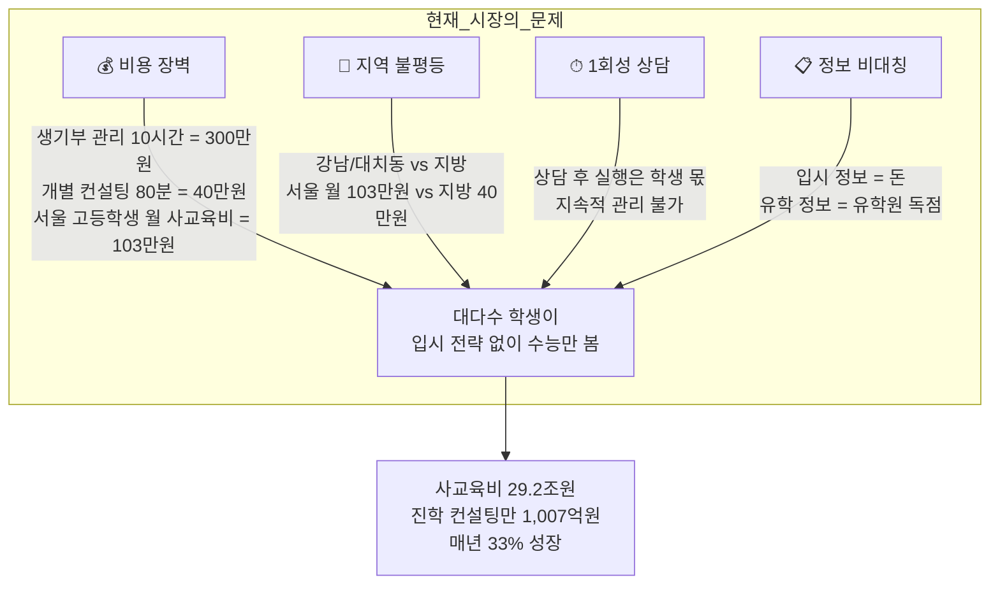
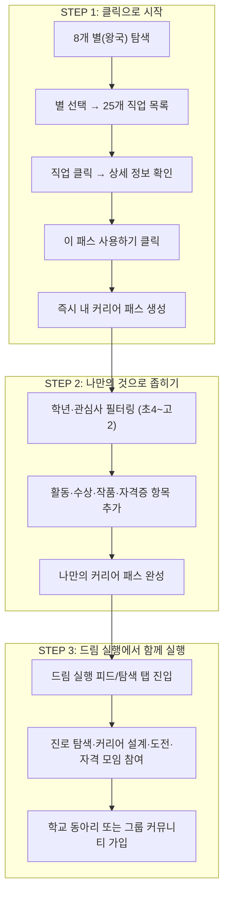
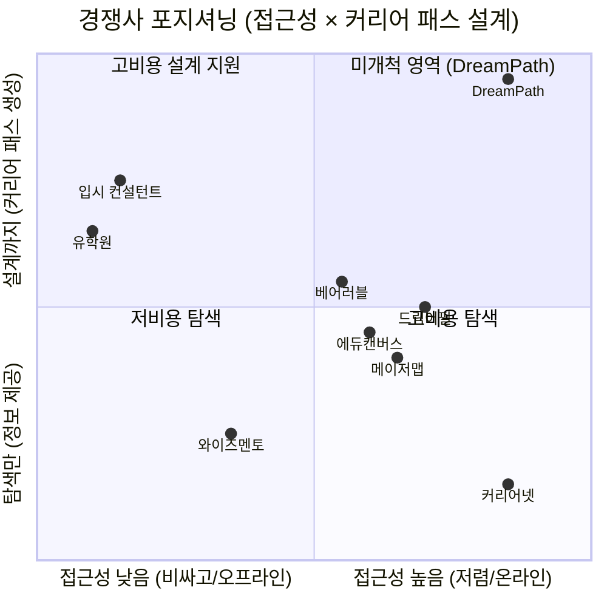
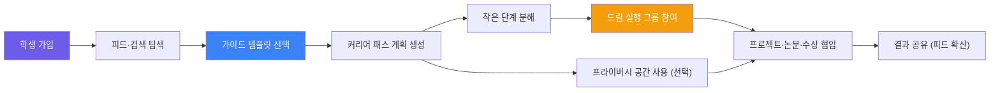
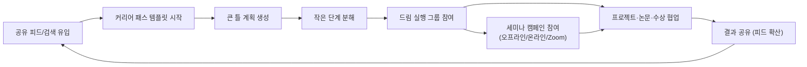
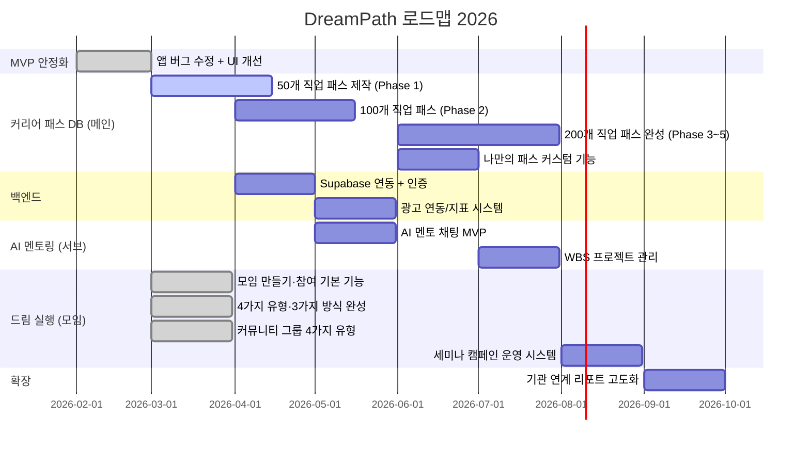

# DreamPath — 투자 제안서

> **"계획 중심 커리어 패스 에디터, 드림 실행으로 이어지는 학생 주도 플랫폼"**  
> 초등 고학년~고등학생 진로 설계 특화 + 공유·가이드 문화 플랫폼  
> 2026.03

---

## 목차

1. [Executive Summary](#1-executive-summary)
2. [시장의 문제 (Problem)](#2-시장의-문제-problem)
3. [솔루션 (Solution)](#3-솔루션-solution)
4. [벤치마킹 & 경쟁사 분석](#4-벤치마킹--경쟁사-분석)
5. [고객 페르소나](#5-고객-페르소나)
6. [핵심 제품: 커리어 패스 시스템](#6-핵심-제품-커리어-패스-시스템)
7. [수익 모델](#7-수익-모델)
8. [시장 규모 (TAM / SAM / SOM)](#8-시장-규모-tam--sam--som)
9. [Go-to-Market 전략](#9-go-to-market-전략)
10. [로드맵 & 마일스톤](#10-로드맵--마일스톤)
11. [재무 전망](#11-재무-전망)

---

## 1. Executive Summary

```
┌──────────────────────────────────────────────────────────────────┐
│                                                                  │
│   DreamPath = 계획 중심 커리어 패스 에디터 + 드림 실행 연결             │
│                                                                  │
│   핵심 철학:                                                      │
│   AI 시대에 결과는 AI가 만드는 데 유리하다.                         │
│   우리가 집중해야 할 것은 무엇을 만들지 기획하는 과정이다.            │
│   커리어 패스를 설계하고 좁혀가는 과정 자체가 진짜 실력이다.          │
│                                                                  │
│   메인 기능 (계획 중심):                                           │
│   ① 커리어 패스 큰 틀 생성 (고입·대입·진로 템플릿)                   │
│   ② 작은 단계로 분해 (주/월/학기 단위 실행 항목)                      │
│   ③ 드림 실행 피드·검색·그룹으로 바로 연결                            │
│                                                                  │
│   활성화 기능 (드림 실행):                                         │
│   · 기본은 공개 피드·검색 공유                                      │
│   · 같은 성향 친구들과 그룹을 만들어 프로젝트·논문·수상 준비            │
│   · 프라이버시 공간은 선택 기능 (개인/기관 연계 전용)                 │
│                                                                  │
│   수익 모델:                                                       │
│     🔵 광고 수익 (교육/진로 맥락형)                                  │
│     🟠 학교·기관 연계 수익 (별도 측정)                               │
│     🟢 세미나 캠페인 스폰서십/파트너십                               │
│                                                                  │
│   목표: 입시 컨설턴트 · 유학원 시장을 디지털로 대체                  │
│                                                                  │
└──────────────────────────────────────────────────────────────────┘
```

### 핵심 숫자

| 지표 | 수치 |
|------|------|
| **타겟 시장** | 한국 사교육 시장 29.2조원 (2024) |
| **직접 경쟁 시장** | 진로진학 컨설팅 1,007억원 (2024, YoY +33%) |
| **타겟 고객** | 중고등학생 260만명 + 학부모 |
| **제공 직업 수** | 200개 (8개 별(왕국) × 25개) |
| **접근 정책** | 학생 개인 구독 없음, 핵심 기능 무료 |
| **핵심 차별점** | 계획 중심 커리어 패스 에디터 + 단계 분해 + 드림 실행 연계 (시장 유일) |

---

## 2. 시장의 문제 (Problem)

### 2-1. 입시 컨설팅의 구조적 불평등



### 2-2. 학생이 겪는 Pain Point

#### 학생이 겪는 Pain Point

| # | Pain Point | 현재 해결책 | 비용 | 문제점 |
|---|-----------|-----------|------|--------|
| 1 | "나한테 맞는 직업을 모르겠다" | 커리어넷 검사 (무료) | 0원 | 검사만 하고 끝, 후속 행동 없음 |
| 2 | "의사가 되려면 중학교 때 뭘 해야 해?" | 입시 컨설턴트 | 40~300만원 | 비용 부담, 1회성 |
| 3 | "커리어 패스를 어떻게 만들지?" | 혼자 구글링 | 0원 | 막막함, 방향 모름 |
| 4 | "생기부에 뭘 넣어야 해?" | 학원 컨설팅 | 월 50~100만원 | 서울 편중, 지방은 기회 없음 |
| 5 | "프로젝트를 어떻게 시작해?" | 혼자 구글링 | 0원 | 방향 모름, 완성 못 함 |
| 6 | "같은 목표의 동료가 없다" | 학교 동아리 | 0원 | 관심사가 안 맞음, 주도적 활동 어려움 |

#### 학교 연계(선택)에서 겪는 Pain Point

| # | Pain Point | 현재 해결책 | 문제점 |
|---|-----------|-----------|--------|
| 1 | "16차시 수업을 채울 콘텐츠가 없다" | 커리어넷 검사 + PPT 직접 제작 | 매 학기 반복 제작, 시간 소모 |
| 2 | "학생 300명 개별 맞춤 지도가 불가능하다" | 학기당 1인 15분 상담 | 물리적 시간 한계, 직업 전문 지식 부족 |
| 3 | "활동 기록 정리가 너무 힘들다" | 엑셀/나이스 수기 입력 | 학기말 야근, 생기부 근거 자료 부족 |
| 4 | "학생들이 검사 한 번 하고 흥미를 잃는다" | 적성검사 1회 | 지속적 탐색 유도 수단 없음 |
| 5 | "직업 체험처 섭외가 너무 어렵다" | 직접 섭외 (연 1~2회) | 비용·시간 한계, 지역 편차 큼 |

### 2-3. AI 시대의 새로운 문제

> **"AI가 다 해주면 내가 할 게 없다"** — 이것이 새로운 불안이다.

| 기존 불안 | AI 시대의 불안 | DreamPath 해결 |
|----------|-------------|--------------|
| "결과물을 어떻게 만들지?" | "AI가 다 만드는데 내가 뭘 해야 하지?" | 기획하는 과정이 진짜 실력 |
| "포트폴리오가 없다" | "AI가 만든 것을 내 것이라 할 수 있나?" | 설계 과정이 나만의 포트폴리오 |
| "방향을 모르겠다" | "AI한테 물어봐도 내 상황에 맞지 않다" | 커리어 패스 좁히기 + 드림 실행 그룹에서 함께 실행 |

---

## 3. 솔루션 (Solution)

### 3-1. DreamPath의 핵심 가치

```
기존 방식:
  계획 세우기 (어렵고 막막) ──── 혼자 실행 ──── 대부분 포기
       ↑ 여기서 대부분 포기           ↑ 동료 없이 지속 불가

DreamPath:
  클릭 → 패스 선택 ──── 나만의 것으로 좁히기 ──── 드림 실행 모임에서 함께 실행
       ↑ 누구나 즉시 시작 가능            ↑ 같은 꿈 동료와 함께
```

### 3-2. 메인 기능: 커리어 패스 설계 + 드림 실행 모임



### 3-2-1. 운영 원칙 (앱 구조 반영)

- **템플릿 운영**: 가이드는 `커리어 패스` + `드림 실행(피드/탐색)`에서 이미 제공한 템플릿 중심으로 운영
- **자료실 분리 운영**: 자료실은 `드림 경험` 영역에서 고입·대입·취업 정보를 통합 가이드하는 별도 축으로 운영
- **명칭/구조 분리**: 사용자 명칭은 `드림 실행`, 코드 경로는 현재 `dreammate` 구조를 유지하여 안정적으로 확장

### 3-2-2. Notion/Jira 대비 차별화

| 항목 | 일반 에디터 (Notion/Jira 등) | DreamPath |
|------|-------------------------------|-----------|
| 제품 성격 | 범용 문서/업무 관리 | **진로 한정 계획·실행 엔진** |
| 시작 방식 | 빈 문서에서 직접 설계 | **커리어 패스 템플릿 즉시 시작** |
| 실행 연결 | 수동 태스크 연결 | **단계 분해 후 드림 실행 자동 연결** |
| 커뮤니티 맥락 | 일반 협업 | **진로 성향 기반 그룹 협업** |
| 산출물 | 문서/보드 | **계획-실행-결과 기록 일체화** |

> 핵심은 "범용 기능을 더 많이 넣는 것"이 아니라,  
> **진로 계획에 꼭 필요한 최소 에디터를 가장 빠르게 실행 가능한 형태로 제공**하는 것입니다.

### 3-2-3. 핵심 패턴: 큰 틀 → 작은 단계 → 드림 실행

```
커리어 패스 큰 틀 설계 (Editor)
    ↓
작은 단계 분해 (주/월/학기 단위)
    ↓
드림 실행 피드·검색·그룹으로 협업 실행
    ↓
결과 기록 및 공유 (가이드 자산 축적)
```

### 3-3. 나만의 계획으로 좁혀가기

커리어 패스는 처음 선택한 그대로 끝나지 않습니다.  
점점 나만의 범위와 주제로 발전시켜 나갑니다.

```
처음: 탐구의 별 → "의사 커리어 패스" 선택
    ↓
좁히기 1: 초4~고2 전체 → 고1~고2 집중 (학년 범위 조정)
    ↓
좁히기 2: 전체 활동 → 과학 탐구 + 의료 봉사 특화 (항목 유형 선택)
    ↓
좁히기 3: 일반 의사 → 소아과 전문의 목표로 구체화 (커스텀 제목 수정)
    ↓
결국: 나만의 고유한 커리어 패스 완성
     (활동·수상·작품·자격증 4가지 항목 유형으로 구성)
```

### 3-4. DreamPath vs 기존 방식 비교

| 항목 | 입시 컨설턴트 | 유학원 | 커리어넷 | **DreamPath** |
|------|-------------|--------|---------|---------------|
| **커리어 패스 생성** | 수동, 300만원 | 없음 | 없음 | ✅ **클릭 한 번** |
| **나만의 계획 커스텀** | 1회성 | 없음 | 없음 | ✅ **무제한 좁히기** |
| **함께 실행 (모임)** | 없음 | 없음 | 없음 | ✅ **드림 실행 그룹** |
| **커뮤니티 (동아리·그룹)** | 없음 | 없음 | 없음 | ✅ **학교 동아리 + 4가지 그룹** |
| **실행 지원** | 분기 1회 체크 | 서류 대행 | 없음 | ✅ AI 멘토링 + 모임 |
| **비용** | 300만원+ | 1,000만원+ | 무료 | **기본 무료 (광고 기반)** |
| **접근성** | 서울/수도권 | 서울/수도권 | 전국 | **전국 + 해외** |

---

## 4. 벤치마킹 & 경쟁사 분석

### 4-1. 경쟁 환경 지도



### 4-1-1. 경쟁 구도 재정의 (콘텐츠 vs 기술)

| 구분 | 경쟁자 | 경쟁 포인트 | DreamPath 전략 |
|------|--------|------------|----------------|
| **콘텐츠 경쟁** | 고입·대입·취업 컨설팅 학원 | 축적된 입시/진로 노하우, 고가 컨설팅 | **가이드 문화 + 공유 문화로 콘텐츠 격차를 빠르게 축소** |
| **기술 경쟁** | Notion, Jira 등 글로벌 에디터 | 강력한 범용 편집/협업 기능 | **진로 한정 최소 필수 에디터로 계획-실행 속도 극대화** |

> 초기에는 콘텐츠 양에서 컨설팅 학원 대비 불리합니다.  
> 그러나 DreamPath는 학생들이 생산하는 계획·실행·회고 데이터를 템플릿과 결합해  
> **진로 도메인 특화 자료 아카이브(자료 맛집)**를 핵심 해자로 만듭니다.

### 4-2. 경쟁사 상세 분석

#### A. 정부/공공 서비스

| 서비스 | 운영 | 핵심 기능 | 강점 | 약점 |
|--------|------|----------|------|------|
| **커리어넷** | 한국직업능력연구원 | 14종 적성검사, 직업백과 | 무료, 공신력 | 커리어 패스 생성 없음, UX 낡음 |
| **워크넷** | 고용노동부 | 직업 정보, 적성검사 | 무료, 성인 대상 포함 | 중고등학생 맞춤형 아님 |

#### B. 에듀테크 스타트업

| 서비스 | 설립 | 핵심 기능 | 강점 | 약점 |
|--------|------|----------|------|------|
| **메이저맵** | 2018 | AI 진로 검사, 학과 분석 | 140개 대학 데이터 | 클릭으로 패스 생성 없음 |
| **드림어필** | 2022 | 실천형 진로 SNS | 846개교 도입 | 커리어 패스 설계 없음 |
| **에듀캔버스** | - | AI 진로 로드맵, 3D 시뮬레이션 | 12,000 직무 데이터 | B2B 모델, 개인 사용 제한 |
| **베어러블** | 2024.10 | AI 포트폴리오, 세특 정리 | 교사용 도구 연계 | 진로 탐색 기능 약함 |

### 4-3. DreamPath 핵심 차별점

```
┌─────────────────────────────────────────────────────────────┐
│              DreamPath만의 3가지 해자 (Moat)                  │
├─────────────────────────────────────────────────────────────┤
│                                                             │
│  ① 클릭 한 번으로 커리어 패스 즉시 생성                         │
│     → 경쟁사 없음. 커리어넷은 정보만, 컨설턴트는 300만원.         │
│     → 8개 별(왕국) × 25개 = 200개 직업 패스 클릭 → 즉시 생성.   │
│     → 활동·수상·작품·자격증 4가지 항목으로 나만의 로드맵 구성.    │
│                                                             │
│  ② 드림 실행 (모임 만들기 & 참여) + 커뮤니티                    │
│     → 진로 탐색·커리어 설계·실행·도전·자격·수상 4가지 모임 유형.  │
│     → 학교 동아리 + 스터디·프로젝트팀·멘토링·동아리 4가지 그룹.   │
│     → 온라인(Zoom)·오프라인·하이브리드 3가지 진행 방식.          │
│     → 커뮤니티 접근 제한으로 신뢰 기반 네트워크 형성.             │
│                                                             │
│  ③ 과정 중심 철학 (AI 시대 대응)                               │
│     → AI가 결과를 만드는 시대, 기획 과정이 진짜 실력.             │
│     → 커리어 패스 설계 과정 자체가 포트폴리오.                    │
│     → 결국 커리어 패스 과정만 남는다.                           │
│                                                             │
│  ④ 콘텐츠 우위 전략 (가이드 + 공유 데이터 누적)                 │
│     → 시작은 약하지만, 템플릿 기반 가이드로 진입 장벽을 낮춘다.     │
│     → 피드/검색/그룹에서 학생 데이터가 계속 누적된다.              │
│     → 장기적으로 "최대 자료 맛집"을 목표로 콘텐츠 우위를 만든다.    │
│                                                             │
└─────────────────────────────────────────────────────────────┘
```

| 차별점 | 커리어넷 | 메이저맵 | 드림어필 | 에듀캔버스 | 베어러블 | **DreamPath** |
|--------|---------|---------|---------|----------|---------|-------------|
| 적성검사 | ✅ | ✅ | ❌ | ✅ | ❌ | ✅ |
| 직업 시뮬레이션 | ❌ | ❌ | ❌ | ✅ (3D) | ❌ | ✅ (별 탐험) |
| **클릭으로 패스 생성** | ❌ | ❌ | ❌ | ❌ | ❌ | ✅ **(유일)** |
| **나만의 계획 커스텀** | ❌ | ❌ | ❌ | ❌ | ❌ | ✅ **(유일)** |
| **커리어 패스 DB** | ❌ | ❌ | ❌ | ❌ | ❌ | ✅ **(200개)** |
| **드림 실행 그룹** | ❌ | ❌ | △ SNS | ❌ | ❌ | ✅ **(성향 기반 협업)** |
| **커뮤니티 (동아리·그룹)** | ❌ | ❌ | △ SNS | ❌ | ❌ | ✅ **(학교 동아리 + 4가지 그룹)** |
| AI 멘토링 | ❌ | ❌ | ❌ | △ | △ 세특 | ✅ (서브) |
| B2C 직접 판매 | 무료 | B2B | ✅ | B2B | B2B | ✅ |
| 커리어 패스 마켓 | ❌ | ❌ | ❌ | ❌ | ❌ | ✅ |

---

## 5. 고객 페르소나

### 5-0. 학생 주도 사용 흐름 (Student First)

> DreamPath의 기본은 **학생이 피드·검색에서 시작**하고, **가이드 템플릿으로 계획**한 뒤, **그룹에서 실행을 이어가는 구조**입니다.



---

### 5-1. 학교 연계 페르소나 (선택)

```
┌────────────────────────────────────────────────────────────┐
│  🏫 Persona 1: "학교·기관 코디네이터" — 박정민 (38세)          │
├────────────────────────────────────────────────────────────┤
│                                                            │
│  배경: 학교/기관 연계 프로그램 운영 담당                         │
│  역할: 필요 시 학생 그룹의 실행을 지원                           │
│                                                            │
│  DreamPath 연계 시나리오 (선택):                               │
│                                                            │
│  📅 1단계: 학생들이 피드·검색으로 진입                           │
│  → 각자 템플릿 기반으로 커리어 패스 계획 생성                    │
│                                                            │
│  📅 2단계: 학생 그룹 실행 시작                                   │
│  → 프로젝트·논문·수상 준비 그룹 자율 운영                        │
│  → 연계 담당자는 필요한 경우에만 피드백                           │
│                                                            │
│  📅 3단계: 세미나 캠페인 연계                                    │
│  → 오프라인/온라인/Zoom 세미나로 실행 전환 강화                  │
│                                                            │
│  📅 4단계: 결과 공유 및 확산                                     │
│  → 학생들이 피드에 결과를 공유하고 자료 아카이브 누적             │
│                                                            │
│  연계 전환 포인트:                                              │
│  "학생 주도 흐름을 해치지 않고도 연계 지원이 가능하다"            │
│  "세미나 캠페인과 함께 실행 전환율을 높일 수 있다"               │
│                                                            │
└────────────────────────────────────────────────────────────┘
```

#### 학교·기관 연계 Pain Point → DreamPath 해결 매핑

| # | 연계 운영 어려움 | 현재 해결책 | 문제점 | DreamPath 해결 |
|---|-------------|-----------|--------|---------------|
| ❶ | 수업 콘텐츠 부족 (16차시) | 커리어넷 + PPT 직접 제작 | 매 학기 반복, 시간 소모 | 8개 별 × 25개 직업 패스 = 수업 콘텐츠 즉시 활용 |
| ❷ | 대규모 운영 시 추적 부담 | 수기 체크 | 관리 부담 큼 | 학생 자율 실행 + 선택적 연계 모니터링 |
| ❸ | 활동 기록 부담 (생기부) | 엑셀/나이스 수기 입력 | 학기말 야근 | 학생 활동 자동 기록 → 학기 리포트 출력 |
| ❹ | 학생 참여도 저하 | 적성검사 1회 | 검사 후 흥미 상실 | 커리어 패스 좁히기 + 드림 실행 모임 + 커뮤니티 → 지속 참여 |
| ❺ | 외부 체험 한계 (연 1~2회) | 직업 체험처 직접 섭외 | 비용·시간 한계 | 드림 실행 Zoom 세미나 (현직자 온라인 강연) + 프로젝트 그룹 |

---

### 5-2. 대표 고객: 일반 학생 (학생 주도 시작)

```
┌────────────────────────────────────────────────────────────┐
│  🎯 Persona 2: "자유학기제 중학생" — 김서연 (중2, 14세)       │
├────────────────────────────────────────────────────────────┤
│                                                            │
│  배경: 경기도 수원 거주, 공부는 중상위권                       │
│  상황: 피드/검색에서 DreamPath를 발견                            │
│  고민: "나한테 맞는 직업이 뭔지 모르겠다"                      │
│                                                            │
│  학생 주도 여정:                                               │
│  📅 1단계: 자연의 별 🌱 탐험 → 수의사 직업 발견                  │
│  📅 2단계: "수의사" 커리어 패스 클릭 → 내 계획 생성              │
│  → 활동·수상·작품·자격증 항목으로 중2~고2 로드맵 구성           │
│  📅 3단계: 드림 실행 모임 참여                                   │
│  → "진로 탐색" 유형 Zoom 모임에서 동물 관련 직업 탐색           │
│                                                            │
│  확장:                                                         │
│  → 집에서도 패스 좁히기 지속 ("수의사 → 야생동물 전문수의사")    │
│  → 커뮤니티 탭 → 학교 동아리 또는 스터디 그룹 가입             │
│  → 타 학교 "동물" 드림 실행 모임에도 참여                      │
│                                                            │
│  전환 포인트: "피드에서 시작했는데, 바로 실행까지 이어진다!"       │
│                                                            │
└────────────────────────────────────────────────────────────┘
```

```
┌────────────────────────────────────────────────────────────┐
│  🎯 Persona 3: "입시 준비 고등학생" — 이준호 (고1, 16세)      │
├────────────────────────────────────────────────────────────┤
│                                                            │
│  배경: 서울 거주, 상위권 학생                                 │
│  상황: 친구가 공유한 피드에서 DreamPath를 발견                   │
│  고민: "생기부에 뭘 넣어야 하지? 어떤 활동을 해야 하지?"       │
│                                                            │
│  학생 주도 여정:                                               │
│  📅 1단계: 탐구의 별 🔬 → 의사 커리어 패스 클릭                 │
│  → 고1~고2 학년 범위 + 과학 탐구 활동 특화로 좁히기            │
│  → 동료·멘토 피드백으로 계획 고도화                              │
│                                                            │
│  확장:                                                         │
│  → 드림 실행 커뮤니티 → 의료계 진로 탐색반 그룹 가입 (멘토링)   │
│  → 프로젝트팀 그룹에서 탐구 보고서 공동 제작                   │
│                                                            │
│  전환 포인트: "300만원 컨설팅 없이도 바로 시작할 수 있다!"        │
│                                                            │
└────────────────────────────────────────────────────────────┘
```

```
┌────────────────────────────────────────────────────────────┐
│  🎯 Persona 4: "유학 준비 학생" — 박하은 (고2, 17세)          │
├────────────────────────────────────────────────────────────┤
│                                                            │
│  배경: 부산 거주, 영어 특기                                   │
│  상황: 미국 대학 진학 희망, 유학원 상담 중                     │
│  고민: "유학원비가 너무 비싸다. 정보를 직접 찾고 싶다"          │
│                                                            │
│  DreamPath 여정:                                           │
│  기술의 별 💻 → CS 전공 커리어 패스 클릭 → AP/SAT 준비 로드맵  │
│  → 나만의 CS 전공 특화 계획으로 좁히기                        │
│  → 드림 실행 커뮤니티 → AI 커리어 스터디 그룹 가입             │
│  → 공모전 도전단 프로젝트 그룹에서 CS 포트폴리오 함께 제작      │
│                                                            │
│  전환 포인트: "유학원 1,000만원 대신 직접 기획할 수 있다"       │
│                                                            │
└────────────────────────────────────────────────────────────┘
```

---

### 5-3. 보조 고객 (Secondary Persona)

```
┌────────────────────────────────────────────────────────────┐
│  👨‍👩‍👧 Persona 5: "불안한 학부모" — 최미영 (44세, 학부모)    │
├────────────────────────────────────────────────────────────┤
│                                                            │
│  배경: 고1 아들, 중2 딸                                     │
│  고민: "아이들 진로를 어떻게 도와줘야 할지 모르겠다"            │
│                                                            │
│  DreamPath 가치:                                           │
│  "피드에서 시작한 계획을 집에서도 스스로 이어간다"               │
│  "드림 실행 모임과 커뮤니티 그룹에서 같은 꿈 동료와 함께 성장"   │
│  "유료 구독 없이도 계획-실행-기록이 가능하다"                    │
│                                                            │
└────────────────────────────────────────────────────────────┘
```

---

## 6. 핵심 제품: 커리어 패스 시스템

### 6-1. 8개 별(왕국) — 200개 직업 구조

| 별(왕국) | RIASEC | 대표 직업 (25개 중 일부) | 색상 |
|---------|--------|----------------------|------|
| **탐구의 별** 🔬 | I 탐구형 | 의사, 약사, 연구원, 데이터과학자, 심리학자 | #4A90D9 |
| **창작의 별** 🎨 | A 예술형 | 디자이너, 영화감독, 작곡가, 웹툰작가, 건축가 | #E74C3C |
| **기술의 별** 💻 | R+I 실행·탐구형 | 개발자, 기계공학자, 전기기사, 파일럿, 요리사 | #3498DB |
| **자연의 별** 🌱 | I+R 탐구·실행형 | 수의사, 환경공학자, 농업과학자, 해양학자 | #27AE60 |
| **연결의 별** 🤝 | S 사회형 | 교사, 간호사, 상담사, 사회복지사, 소방관 | #F39C12 |
| **질서의 별** ⚖️ | C+E 관습·진취형 | 회계사, 공무원, 금융인, 세무사, 물류전문가 | #8E44AD |
| **소통의 별** 📡 | A+E 예술·진취형 | 아나운서, 유튜버, PD, 기자, 통역사 | #E91E63 |
| **도전의 별** 🚀 | E 진취형 | CEO, 마케터, 변호사, 외교관, 프로게이머 | #FF6B35 |

### 6-2. 커리어 패스 1개의 구성 (계획 중심 에디터)

| 섹션 | 내용 | 제공 방식 |
|------|------|---------|
| **큰 틀 설계** | 진로 목표, 학년별 방향, 핵심 역량 정의 | 기본 무료 |
| **단계 분해** | 연간/학기/월/주 단위 실행 항목 분해 | 기본 무료 |
| **실행 체크** | 프로젝트·논문·수상·자격증 체크리스트 | 기본 무료 |
| **결과 기록** | 실행 결과와 회고 기록 | 기본 무료 |
| **드림 실행 연결** | 피드·검색·그룹 협업으로 연결 | 기본 무료 |
| **자료 연동** | 드림 경험 자료실 템플릿 연결 | 기본 무료 |
| **수익 모델** | 광고 노출 + 기관 연계(별도) | 사용자 구독 없음 |

### 6-3. 커리어 패스 항목 유형 4가지

| 유형 | 이모지 | 색상 | 설명 |
|------|--------|------|------|
| **활동** | 🎯 | #3B82F6 | 동아리, 봉사, 체험 활동 |
| **수상·대회** | 🏆 | #FBBF24 | 공모전, 경시대회, 수상 이력 |
| **작품** | 🖼️ | #EC4899 | 포트폴리오, 프로젝트 산출물 |
| **자격증** | 📜 | #22C55E | 자격증, 어학 성적, 인증 |

### 6-4. 200개 직업 제작 계획

#### 8개 별(왕국) × 25개 직업

| 별(왕국) | RIASEC | 대표 직업 (25개 중 일부) | 제작 순서 |
|---------|--------|----------------------|----------|
| **탐구의 별** | I 탐구형 | 의사, 약사, 연구원, 데이터과학자, 심리학자 | Phase 1 |
| **기술의 별** | R 실행형 | 개발자, 기계공학자, 전기기사, 파일럿, 요리사 | Phase 2 |
| **창작의 별** | A 예술형 | 디자이너, 영화감독, 작곡가, 웹툰작가, 건축가 | Phase 3 |
| **연결의 별** | S 사회형 | 교사, 간호사, 상담사, 사회복지사, 소방관 | Phase 3 |
| **도전의 별** | E 진취형 | CEO, 마케터, 변호사, 외교관, 프로게이머 | Phase 4 |
| **소통의 별** | E+S | 아나운서, 유튜버, PD, 기자, 통역사 | Phase 4 |
| **질서의 별** | C 관습형 | 회계사, 공무원, 금융인, 세무사, 물류전문가 | Phase 5 |
| **자연의 별** | R+I | 수의사, 환경공학자, 농업과학자, 해양학자 | Phase 5 |

---

## 7. 수익 모델

### 7-1. 기본 원칙

- 학생 개인에게는 구독 과금을 두지 않고, 핵심 기능은 무료로 제공합니다.
- 기본 수익은 광고이며, 학교/기관 연계 수익은 별도로 측정합니다.
- 세미나 캠페인은 실행 전환을 높이는 성장 엔진이자 파트너십 수익 채널입니다.

### 7-2. 수익 구조 (구독 없음)

| # | 수익축 | 설명 | 수익 구조 | 활성화 시기 |
|---|--------|------|----------|-----------|
| 1 | **광고 수익 (기본)** | 가이드 맥락형 교육/진로 광고 | CPM/CPC 광고 매출 | Phase 1 |
| 2 | **학교·기관 연계 수익 (별도)** | 학교/교육청/기관 도입 운영비 | 기관 계약 수익 (별도 집계) | Phase 2 |
| 3 | **세미나 캠페인 파트너십** | 오프라인·온라인·Zoom 캠페인 | 스폰서십/파트너십 수익 | Phase 1~2 |

### 7-3. 세미나 캠페인 운영 모델

> "앱 기능을 아는 것"과 "실제로 실행하는 것" 사이를 연결하는 불쏘시개가 세미나 캠페인입니다.

| 유형 | 목적 | 방식 | 핵심 성과 |
|------|------|------|---------|
| **입문 세미나** | 계획 중심 사용법 전파 | Zoom/온라인 | 템플릿 시작률 증가 |
| **실행 세미나** | 단계 분해 실습 | 오프라인/하이브리드 | 그룹 실행률 증가 |
| **공유 세미나** | 사례 확산 | 온라인 라이브 | 피드 공유량 증가 |

### 7-4. 광고 및 기관 수익 시뮬레이션

| 지표 | 6개월차 | 12개월차 | 24개월차 |
|------|--------|---------|---------|
| **총 가입자** | 10,000명 | 50,000명 | 200,000명 |
| **광고 매출** | 300만원/월 | 1,500만원/월 | 6,000만원/월 |
| **기관 연계 수익 (별도)** | 0~200만원/월 | 500만원/월 | 2,000만원/월 |
| **세미나 파트너십 수익** | 100만원/월 | 400만원/월 | 1,500만원/월 |
| **월 총 매출** | **400~600만원** | **2,400만원** | **9,500만원** |

---

## 8. 시장 규모 (TAM / SAM / SOM)

| 구분 | 규모 | 산출 근거 |
|------|------|---------|
| **TAM** (Total Addressable Market) | **29.2조원** | 한국 사교육 시장 전체 (2024) |
| **SAM** (Serviceable Addressable Market) | **1,007억원** | 진로진학 컨설팅 시장 (2024, YoY +33%) |
| **확장 SAM** | **3,000억원** | 진학 컨설팅 + 유학 컨설팅 + 진로 교육 도서 |
| **SOM** (Serviceable Obtainable Market) | **87억원 (Year 1)** | 중고등학생 260만 × 0.5% 침투율 × 평균 ARPU 6.7만원 |

---

## 9. Go-to-Market 전략

### 9-1. 진입 전략 (학생 우선 — Student First)

> **핵심 전략: 피드/검색 기반 공유 유입 → 템플릿 시작 → 그룹 실행 → 세미나 캠페인으로 실행 전환 강화**



### 9-2. 채널별 전략

| 채널 | 전략 | 예상 효과 | 비용 | 우선순위 |
|------|------|---------|------|---------|
| **공유 피드/검색 유입** | 학생 사례·템플릿 공개 확산 | 자연 유입 증가 | 낮음 | ★★★ 최우선 |
| **세미나 캠페인** | 오프라인/온라인/Zoom 설명회 운영 | 실행 전환율 상승 | 중간 | ★★★ |
| **유튜브/숏폼 콘텐츠** | 계획 분해법, 합격/실행 사례 콘텐츠 | 인지도 + 재방문 | 중간 | ★★ |
| **커뮤니티 제휴** | 청소년/학부모 커뮤니티 협업 | 초기 신뢰 확보 | 낮음 | ★★ |
| **학교·기관 연계** | 선택적 파트너십 운영 | 기관 도입 확장 | 중간 | ★ |

---

## 10. 로드맵 & 마일스톤

### 10-1. 개발 로드맵



### 10-2. 마일스톤

| 시기 | 마일스톤 | 핵심 지표 |
|------|---------|---------|
| **2026 Q1** | MVP 안정화 + 드림 실행 완성 (피드/검색/그룹 핵심 기능) | 앱 완성도, 계획 생성률 |
| **2026 Q2** | 200개 패스 + 백엔드 연동 | 가입 5,000명, 활성 모임 10개 |
| **2026 Q3** | 광고 시스템 + 세미나 캠페인 + AI 멘토 고도화 | 가입 30,000명, 월 광고 매출 |
| **2026 Q4** | 드림 실행 고도화 + 기관 연계 확장 | 활성 그룹 100개, 기관 연계 수익 |
| **2027 Q1** | 기관 연계 확장 | 파트너 기관 100개 |
| **2027 Q2** | 시리즈 A 투자 유치 | 가입 100,000명, ARR 10억원 |

---

## 11. 재무 전망

### 11-1. 3개년 재무 요약

| 항목 | Year 1 (2026) | Year 2 (2027) | Year 3 (2028) |
|------|-------------|-------------|-------------|
| **가입자** | 50,000명 | 200,000명 | 500,000명 |
| **수익축 1: 광고 수익** | | | |
| 광고 매출 | 2.1억원 | 9.6억원 | 26.4억원 |
| **수익축 2: 기관 연계 수익 (별도)** | | | |
| 기관 연계 매출 | 6,000만원 | 3.2억원 | 8.4억원 |
| **수익축 3: 세미나 캠페인 파트너십** | | | |
| 세미나/파트너십 매출 | 4,800만원 | 1.8억원 | 4.2억원 |
| **총 매출** | **3.18억원** | **14.6억원** | **39.0억원** |
| **영업비용** | 4억원 | 10억원 | 22억원 |
| **영업이익** | -0.82억원 | 4.6억원 | 17.0억원 |

### 11-2. 투자 요청

| 라운드 | 시기 | 금액 | 용도 |
|--------|------|------|------|
| **Pre-Seed** | 2026 Q1 | **2억원** | 200개 패스 완성 + 드림 실행 고도화 + 팀 빌딩 |
| **Seed** | 2026 Q4 | **5~8억원** | 광고/지표 고도화 + 세미나 캠페인 확장 + 기관 연계 체계화 |
| **Series A** | 2027 Q2 | **20~30억원** | 학생 확산 + 기관 파트너십 + 해외 진출 + 팀 확장 |

---

## 부록: 핵심 한 장 요약

```
┌───────────────────────────────────────────────────────────────┐
│                                                               │
│                        DreamPath                              │
│    "계획 중심 커리어 패스 에디터 + 드림 실행으로 함께 실행"         │
│                                                               │
├───────────────────────────────────────────────────────────────┤
│                                                               │
│  핵심 철학:                                                    │
│  · AI 시대, 결과는 AI가 만든다                                  │
│  · 우리가 집중할 것은 기획하는 과정                              │
│  · 커리어 패스를 설계하는 과정 자체가 진짜 포트폴리오             │
│  · 결국 커리어 패스 과정만 남는다                               │
│                                                               │
│  문제: 진학 컨설팅 1,007억 시장, 연 33% 성장                    │
│       300만원짜리 상담을 받아야만 커리어 패스를 세울 수 있음       │
│       지방 학생은 기회조차 없음                                  │
│       혼자 실행하면 대부분 포기                                  │
│                                                               │
│  솔루션 (메인):                                                │
│  · ① 8개 별(왕국) × 25개 = 200개 직업 패스 클릭 즉시 생성        │
│  · ② 활동·수상·작품·자격증 4가지 항목으로 나만의 것으로 좁히기    │
│                                                               │
│  솔루션 (활성화):                                              │
│  · 드림 실행 — 피드·검색·그룹 중심 학생 주도 실행                │
│  · 세미나 캠페인 — 오프라인/온라인/Zoom 실행 전환 촉진            │
│                                                               │
│  서브 기능:                                                    │
│  · AI 프로젝트 멘토링 (실행 지원)                               │
│                                                               │
│  수익 모델:                                                    │
│  · 학생 개인 구독 없음 (핵심 기능 무료)                          │
│  · 광고 수익 기반 운영 (교육/진로 맥락형)                         │
│  · 기관 연계 수익 별도 측정 + 세미나 파트너십                    │
│                                                               │
│  시장: TAM 29.2조원 / SAM 1,007억원 / SOM Year1 3.2억원       │
│  고객: 중고등학생 260만명 + 학부모                              │
│  경쟁 우위: 계획 중심 에디터 + 단계 분해 + 드림 실행 연계 (시장 유일)│
│                                                               │
│  투자 요청: Pre-Seed 2억원                                     │
│                                                               │
└───────────────────────────────────────────────────────────────┘
```
