# DreamPath — 왜 필요한가?

> 경쟁사 분석 · 벤치마킹 · 고객 페르소나 · 강점 · 목표  
> 2026.02

---

## 목차

1. [왜 DreamPath인가?](#1-왜-dreampath인가)
2. [시장의 구멍: 아무도 풀지 못한 문제](#2-시장의-구멍-아무도-풀지-못한-문제)
3. [경쟁사 전체 지도](#3-경쟁사-전체-지도)
4. [벤치마킹 앱 상세 분석](#4-벤치마킹-앱-상세-분석)
5. [기존 사교육 시장 분석](#5-기존-사교육-시장-분석)
6. [기능별 경쟁 비교표](#6-기능별-경쟁-비교표)
7. [주요 고객 페르소나](#7-주요-고객-페르소나)
8. [DreamPath의 강점](#8-dreampath의-강점)
9. [DreamPath의 목표](#9-dreampath의-목표)

---

## 1. 왜 DreamPath인가?

### 한 문장 정의

> **"나의 직업을 찾고, 그 직업으로 가는 길을 세우고, 직접 실행하여 포트폴리오를 완성한다"**

### 시장의 현실

```
┌──────────────────────────────────────────────────────────────────┐
│                                                                  │
│   한국 사교육 시장 = 29.2조원 (2024)                               │
│   진학 컨설팅 시장 = 1,007억원 (2024, 매년 33% 성장)               │
│                                                                  │
│   그런데...                                                       │
│                                                                  │
│   ❌ 적성검사를 해도 → 그 다음 뭘 해야 할지 모른다                   │
│   ❌ 직업을 골라도 → 중학교/고등학교에서 뭘 준비할지 모른다           │
│   ❌ 계획을 세워도 → 혼자서 실행하지 못한다                          │
│   ❌ 활동을 해도 → 포트폴리오로 정리하지 못한다                      │
│                                                                  │
│   이 4가지를 한 번에 해결하는 서비스가 없다.                         │
│   입시 컨설턴트만이 이것을 해주지만, 300만원이 든다.                  │
│                                                                  │
│   DreamPath는 이 전체 과정을 앱 하나로 해결한다.                    │
│                                                                  │
└──────────────────────────────────────────────────────────────────┘
```

### DreamPath의 공식

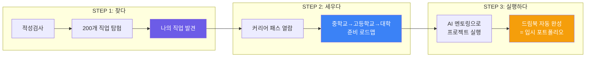

> 이 3단계 전체를 커버하는 서비스는 **현재 시장에 없다.**  
> 기존 서비스들은 모두 이 중 **한 조각**만 해결한다.

---

## 2. 시장의 구멍: 아무도 풀지 못한 문제

### 학생의 여정에서 각 서비스가 커버하는 범위

```
학생의 여정:  찾다 ───────── 세우다 ───────── 실행하다 ───── 완성
              │                │                │              │
              │ 적성검사       │ 커리어 패스     │ 프로젝트     │ 드림북
              │ 직업 탐색      │ 로드맵 설계     │ 멘토링       │ 포트폴리오
              │                │                │              │
커리어넷      ████░░░░░░░░░░░░░░░░░░░░░░░░░░░░░░░░░░░░░░░░░░░░░
              적성검사만

메이저맵      ████████░░░░░░░░░░░░░░░░░░░░░░░░░░░░░░░░░░░░░░░░░
              검사 + 학과 연결

드림어필      ░░░░░░░░░░░░░░░░░░░░░░░░░░████████░░░░░░░░░░░░░░░
                                        실천 기록 SNS

에듀캔버스    ██████████████░░░░░░░░░░░░░░░░░░░░░░░░░░░░░░░░░░░░
              검사 + 시뮬레이션

베어러블      ░░░░░░░░░░░░░░░░░░░░░░░░░░░░░░░░████████████░░░░░
                                                세특 포트폴리오

입시 컨설턴트 ░░░░░░░░████████████████████████████████░░░░░░░░░░
              설계~실행 (그러나 300만원, 1회성, 서울 한정)

DreamPath    █████████████████████████████████████████████████████
              찾다 → 세우다 → 실행하다 → 완성 (전 구간)
```

### 핵심 질문: 각 서비스에 물어보면?

| 질문 | 커리어넷 | 메이저맵 | 드림어필 | 에듀캔버스 | 베어러블 | 컨설턴트 | **DreamPath** |
|------|---------|---------|---------|----------|---------|---------|-------------|
| "나한테 맞는 직업이 뭐야?" | ✅ 검사 | ✅ 검사 | ❌ | ✅ 검사 | ❌ | △ 상담 | ✅ **검사 + 시뮬레이션** |
| "그 직업 되려면 중학교 때 뭐 해?" | ❌ | ❌ | ❌ | ❌ | ❌ | ✅ 수동 | ✅ **커리어 패스** |
| "고등학교 때 어떤 활동을 해야 해?" | ❌ | ❌ | ❌ | ❌ | △ 세특만 | ✅ 수동 | ✅ **패스 + 프로젝트** |
| "프로젝트를 어떻게 시작하지?" | ❌ | ❌ | △ 미션 | ❌ | ❌ | △ 분기1회 | ✅ **AI 멘토 + WBS** |
| "이걸 포트폴리오로 어떻게 정리해?" | ❌ | ❌ | △ 기록 | ❌ | ✅ 세특 | ✅ 수동 | ✅ **드림북 자동** |

> **"찾다 → 세우다 → 실행하다 → 완성"의 전체 여정을 하나의 앱으로 해결하는 서비스는 DreamPath뿐이다.**

---

## 3. 경쟁사 전체 지도

### 3-1. 포지셔닝 맵

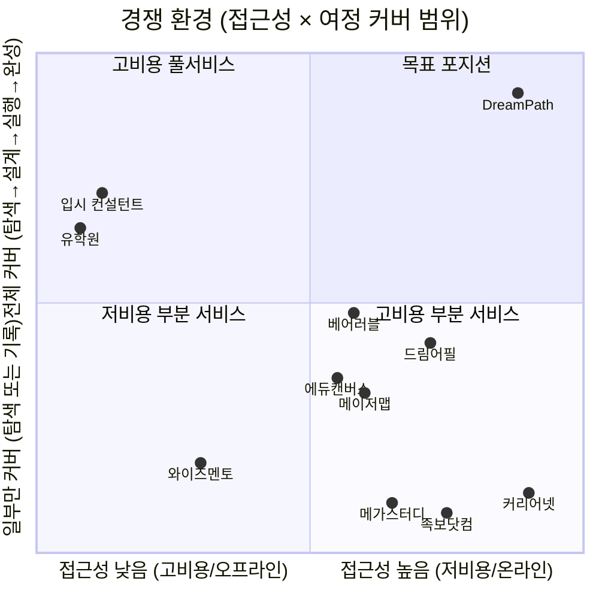

### 3-2. 경쟁사 분류

| 분류 | 서비스 | 특징 | DreamPath와의 관계 |
|------|--------|------|-------------------|
| **공공 서비스** | 커리어넷, 워크넷 | 무료, 적성검사 중심 | 유입 보완 (검사 후 DreamPath로 전환) |
| **에듀테크 B2B** | 메이저맵, 에듀캔버스 | 학교 납품 중심 | 간접 경쟁 (학생 직접 접근 불가) |
| **에듀테크 B2C** | 드림어필, 베어러블 | 학생 직접 사용 | 직접 경쟁 (그러나 커버 범위 다름) |
| **사교육 오프라인** | 입시 컨설턴트, 유학원 | 고비용 1:1 | 대체 대상 (300만원 → 월 2만원) |
| **온라인 학습** | 족보닷컴, 메가스터디 | 시험/인강 중심 | 비경쟁 (진로 영역 아님) |

---

## 4. 벤치마킹 앱 상세 분석

### 4-1. 커리어넷 (정부 무료 서비스)

| 항목 | 내용 |
|------|------|
| **운영** | 한국직업능력연구원 (교육부 산하) |
| **이용료** | 무료 |
| **핵심 기능** | 14종 적성검사, 직업백과 800종+, 원격 멘토링, 진로 상담 |
| **강점** | 공신력, 방대한 직업 데이터, 전국 학교 연계, 무료 |
| **약점** | UX 낡음, 검사 후 후속 행동 제시 없음, 커리어 패스 없음, 게임화 없음, 실행 지원 없음 |
| **사용 패턴** | 자유학기제 과제로 1회 검사 → 결과 확인 → 이탈 |

```
커리어넷의 한계:
  학생: "적성검사 결과 탐구형이래" → "그래서 뭘 해야 하지?" → (이탈)
                                     ↑ 여기서 끊긴다
```

**DreamPath가 채우는 빈 자리**: 커리어넷 검사 결과를 연동하여, "탐구형이면 의사/연구원/데이터과학자 중 어떤 직업이 맞는지 체험해보고, 그 직업의 커리어 패스를 따라가라"는 다음 행동을 제시한다.

---

### 4-2. 메이저맵 (AI 진로 + 학과 연결)

| 항목 | 내용 |
|------|------|
| **설립** | 2020년 5월 |
| **모델** | B2B / B2G (학교·교육청 납품) |
| **핵심 서비스** | 웨이메이커 (올인원 진로진학설계솔루션) |
| **기능** | AI 진로검사, 선택교과 추천, AI 세특작성 도우미, 수행평가 관리, 탐구주제 추천, 140개+ 대학 학과 DB |
| **강점** | 2025 대한민국혁신대상 수상, 교과-학과-직업 데이터 매핑, 교사 도구 연계, 전국 15개 가맹점 |
| **약점** | B2B 모델이라 학생이 직접 접근 어려움, 커리어 패스(중학교→대학 로드맵) 없음, 프로젝트 실행 관리 없음, 자동 포트폴리오 없음 |
| **가격** | 비공개 (학교 단위 계약) |

```
메이저맵의 한계:
  학생: "AI가 학과를 추천해줬다" → "그런데 거기 가려면 뭘 준비하지?" → (모름)
                                   ↑ 여기서 끊긴다
```

**DreamPath가 채우는 빈 자리**: 학과/직업을 추천하는 것에서 끝나지 않고, "그 직업으로 가려면 중학교 때 이것, 고등학교 때 이것, 이런 공모전에 나가라"는 구체적 커리어 패스를 제공한다.

---

### 4-3. 드림어필 (실천형 진로 SNS)

| 항목 | 내용 |
|------|------|
| **운영** | 트루밸류 (2022년 출시) |
| **모델** | B2C + B2B (학교 도입) |
| **누적 유저** | 7만명+ (2025.11), 846개교 도입 |
| **누적 실천** | 40만건+, 소통 700만건+ |
| **핵심 기능** | 꿈 설정 → 목표 → 실천 기록 (SNS 형태), 친구 피드백, 실천 미션 |
| **투자** | 누적 50억원, Series A 20억 (2025.11, 스케일업벤처스 등) |
| **강점** | 높은 사용 빈도 (연 384회 소통), SNS 형태로 자발적 참여 유도, 교육부 등록 콘텐츠, 일본 진출 |
| **약점** | 적성검사 없음 (진로 탐색 기능 약함), 커리어 패스 없음 (구체적 준비 가이드 부재), AI 멘토링 없음, 입시 직접 연결 약함 |
| **가격** | 비공개 |

```
드림어필의 한계:
  학생: "꿈을 기록하고 미션을 실천하고 있다" → "근데 의대 가려면 구체적으로 뭘 해야 해?" → (모름)
                                               ↑ 실천은 하지만 방향이 없다
```

**DreamPath가 채우는 빈 자리**: 실천의 "방향"을 제시한다. 단순히 꿈을 기록하는 것이 아니라, 200개 직업별로 "무엇을 실천해야 하는지" 커리어 패스로 구체적 행동을 안내한다.

---

### 4-4. 에듀캔버스 / 알파지니 (AI 진로 + 3D 시뮬레이션)

| 항목 | 내용 |
|------|------|
| **운영** | 에듀캔버스 |
| **모델** | B2B (학교·기관 납품) |
| **핵심 서비스** | 알파지니 (AI 맞춤형 진로교육 솔루션) |
| **기능** | AI 진로 진단, 3D 직무 시뮬레이션 (메타버스), 12,000건 직무 데이터 NLP 분석, 개인 맞춤 로드맵, 진로 다이어리, 자소서 컨설팅 |
| **강점** | 게임화된 3D 시뮬레이션, 방대한 직무 데이터, 한국장학재단 등 공공기관 파트너, 베트남 진출 |
| **약점** | B2B 모델 (개인 학생 직접 사용 제한), 커리어 패스 C2C 마켓 없음, 프로젝트 WBS 관리 없음, 자동 포트폴리오 기능 약함 |
| **가격** | 비공개 (프로그램별 상이) |

```
에듀캔버스의 한계:
  학생: "3D로 직업을 체험했다. 재밌다" → "그래서 이걸 실제로 준비하려면?" → (학교 수업에서만 가능)
                                         ↑ 체험은 되지만 실행으로 이어지지 않는다
```

**DreamPath가 채우는 빈 자리**: 시뮬레이션 체험 이후 "그래서 이 직업을 위해 지금부터 뭘 해야 하는지"를 커리어 패스로 안내하고, AI 멘토링으로 실행까지 지원한다. 또한 B2C 모델로 학생이 직접 접근 가능하다.

---

### 4-5. 베어러블 / 마이폴리오 (AI 세특 포트폴리오)

| 항목 | 내용 |
|------|------|
| **설립** | 2024년 10월 (초기 스타트업) |
| **모델** | B2C + B2B (학생용 마이폴리오 + 교사용 스쿨폴리오) |
| **핵심 기능** | AI 기반 세특 탐구 추천, 독서 탐구, 자율 탐구, 10만건+ 데이터 기반 개인화, 교사용 생기부 자동 작성 지원 |
| **투자** | TIPS 선정, 씨엔티테크 시드 투자 |
| **강점** | 2025 에듀플러스어워즈 금상, 일본 SusHi Tech 수상, 교사-학생 양방향 설계, 세특 특화 |
| **약점** | 진로 탐색 기능 없음 (적성검사 없음), 커리어 패스 없음, AI 프로젝트 멘토링 없음 (세특 작성만), 직업 시뮬레이션 없음, 초기 단계 |
| **가격** | 비공개 (기존 컨설팅 30~40만원/시간 대비 저렴 표방) |

```
베어러블의 한계:
  학생: "AI가 세특에 넣을 탐구 주제를 추천해줬다" → "근데 나한테 맞는 직업이 뭔지 모르겠는데?" → (모름)
                                                    ↑ 세특은 도와주지만, 전체 진로 설계는 안 해준다
```

**DreamPath가 채우는 빈 자리**: 적성검사 → 직업 발견 → 커리어 패스 → 프로젝트 실행의 전체 흐름을 제공한다. 세특은 이 흐름의 "결과물 중 하나"이지, 출발점이 아니다.

---

## 5. 기존 사교육 시장 분석

### 5-1. 입시 컨설턴트

| 항목 | 현황 |
|------|------|
| **시장 규모** | 1,007억원 (2024), 매년 33% 성장 |
| **비용** | 생기부 관리 10시간 = 240~300만원, 개별 상담 80분 = 40만원 |
| **분포** | 강남/대치동 집중, 지방은 접근 자체가 어려움 |
| **한계** | 1회성 상담, 실행 관리 불가, 정보 독점 구조 |

#### 컨설팅 비용 vs DreamPath

| 서비스 | 기간 | 비용 | 내용 |
|--------|------|------|------|
| 대치동 생기부 관리 | 10시간 | **240~300만원** | 활동 추천 + 생기부 작성 가이드 |
| 개별 입시 상담 | 80분 | **40만원** | 1회 전략 상담 |
| 유학원 패키지 | 원서~입학 | **500~3,000만원** | 학교 선정 + 원서 대행 + 에세이 |
| **DreamPath Explorer** | **1개월** | **9,900원** | 적성검사 + 커리어 패스 + AI 멘토 50회 |
| **DreamPath Pioneer** | **1개월** | **19,900원** | 전체 기능 + WBS + 드림북 출력 |
| **DreamPath 1년** | **12개월** | **약 24만원** | 입시 컨설팅 1회 비용의 1/10 이하 |

### 5-2. 유학원

| 항목 | 현황 |
|------|------|
| **주요 업체** | edm, uhak, 유학네트 등 |
| **비용** | 500~3,000만원 (패키지) |
| **수익 구조** | 학교 커미션 + 컨설팅비 (이해 충돌) |
| **한계** | 정보 비대칭 (유학원이 알아야 학생도 앎), 커미션 학교 위주 추천, 지역 편중 |

### 5-3. 온라인 학습 플랫폼

| 서비스 | 핵심 | DreamPath와의 관계 |
|--------|------|-------------------|
| **족보닷컴** | 시험 문제 은행 | 비경쟁 (진로가 아닌 학업) |
| **메가스터디** | 수능 인강 | 비경쟁 (수능 대비, 진로 아님) |
| **이투스** | 수능 인강 | 비경쟁 |
| **클래스101** | 취미/기술 강의 | 부분 경쟁 (프로젝트 강의 영역) |

---

## 6. 기능별 경쟁 비교표

### 6-1. 전체 기능 비교

| 기능 | 커리어넷 | 메이저맵 | 드림어필 | 에듀캔버스 | 베어러블 | 컨설턴트 | **DreamPath** |
|------|---------|---------|---------|----------|---------|---------|-------------|
| **적성검사** | ✅ 14종 | ✅ AI | ❌ | ✅ AI | ❌ | △ 상담 | ✅ RIASEC |
| **직업 정보** | ✅ 800종 | ✅ 학과 연결 | ❌ | ✅ 12,000건 | ❌ | △ 수동 | ✅ 200개 상세 |
| **직업 시뮬레이션** | ❌ | ❌ | ❌ | ✅ 3D | ❌ | ❌ | ✅ RPG |
| **커리어 패스 (중→대학)** | ❌ | ❌ | ❌ | ❌ | ❌ | ✅ 수동 | ✅ **200개 DB** |
| **프로젝트 WBS** | ❌ | ❌ | △ 미션 | ❌ | ❌ | △ 분기1회 | ✅ AI 생성 |
| **AI 멘토링** | ❌ | △ 세특 | ❌ | △ | △ 세특 | ❌ | ✅ **구조화** |
| **자동 포트폴리오** | ❌ | ❌ | △ 기록 | ❌ | ✅ 세특 | ❌ | ✅ **드림북** |
| **게임화 (XP/뱃지)** | ❌ | ❌ | △ | ✅ | ❌ | ❌ | ✅ RPG |
| **C2C 커리어 패스 마켓** | ❌ | ❌ | ❌ | ❌ | ❌ | ❌ | ✅ **유일** |
| **가격** | 무료 | B2B | B2C+B2B | B2B | B2C+B2B | 40~300만원 | **무료~월 19,900원** |
| **접근성** | 전국 | 학교만 | 전국 | 학교만 | 전국 | 수도권 | **전국 + 해외** |

### 6-2. 핵심 차별점 요약

```
┌────────────────────────────────────────────────────────────────┐
│                                                                │
│  경쟁사들이 못 하는 것, DreamPath만 하는 것:                      │
│                                                                │
│  ① 200개 직업별 커리어 패스 DB                                   │
│     "의사가 되려면 중2에 이것, 고1에 이것, 이런 공모전에 나가라"    │
│     → 이것을 가지고 있는 서비스가 없다.                            │
│                                                                │
│  ② 탐색 → 설계 → 실행의 풀 커버리지                              │
│     커리어넷은 탐색만, 드림어필은 실천 기록만, 베어러블은 세특만.    │
│     → 전체 여정을 하나의 앱에서 해결하는 서비스가 없다.             │
│                                                                │
│  ③ C2C 커리어 패스 마켓                                          │
│     합격 선배가 자기 경험을 패스로 만들어 파는 마켓.                │
│     → 이 개념 자체가 시장에 없다.                                 │
│                                                                │
│  ④ AI 멘토 + 자동 드림북                                         │
│     프로젝트 실행을 AI가 도와주고, 모든 기록이 자동으로 쌓인다.     │
│     → 실행까지 관리하는 온라인 서비스가 없다.                      │
│                                                                │
└────────────────────────────────────────────────────────────────┘
```

---

## 7. 주요 고객 페르소나

### 7-1. 전체 고객 구조

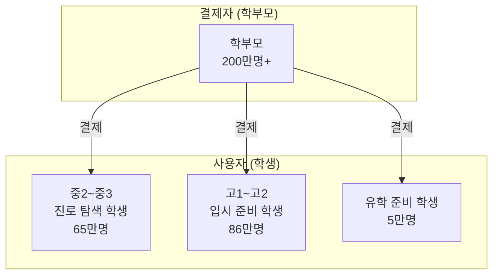

### 7-2. Persona 1: 김서연 — "나한테 맞는 직업이 뭐야?"

| 항목 | 내용 |
|------|------|
| **나이/학년** | 14세, 중학교 2학년 |
| **거주지** | 경기도 수원 |
| **성적** | 중상위권 |
| **상황** | 자유학기제 진로 탐색 과제를 해야 함 |
| **현재 고민** | "나한테 맞는 직업이 뭔지 모르겠다. 커리어넷 검사 했는데 그래서 뭘 해야 하지?" |
| **현재 행동** | 커리어넷 검사 → 결과 화면 캡처 → 끝 |
| **학부모** | 맞벌이, 사교육비 부담 느낌, 아이 진로에 관심 있지만 방법 모름 |

**DreamPath 여정:**

```
김서연의 DreamPath 이야기:

1. 자유학기제 과제로 DreamPath 앱 다운로드 (무료)
2. RIASEC 적성검사 → "탐구형 + 사회형" 결과
3. 탐구의 별, 연결의 별 왕국 탐험 → 수의사, 심리상담사 발견
4. 수의사 하루 체험 시뮬레이션 → "이거 재밌다!"
5. 수의사 기본 커리어 패스 열람 (무료)
   → "중학교 때 생물 동아리, 동물 봉사활동, 과학 탐구 보고서..."
6. 상세 커리어 패스 구매 (5,000원, 엄마가 결제)
7. 드림북에 자동 기록: 적성 결과, 탐험 기록, 관심 직업

→ 자유학기제 과제 완성 + 진로 방향 설정
→ 고등학교까지 DreamPath와 함께 성장
```

| 지불 의향 | 전환 포인트 |
|----------|-----------|
| 무료 시작 → 커리어 패스 5,000원 | "검사만 하고 끝이 아니라, 다음에 뭘 해야 하는지 알려준다!" |

---

### 7-3. Persona 2: 이준호 — "생기부에 뭘 넣어야 해?"

| 항목 | 내용 |
|------|------|
| **나이/학년** | 16세, 고등학교 1학년 |
| **거주지** | 서울 |
| **성적** | 상위권 |
| **상황** | 의대/약대를 목표로 하지만 구체적 계획 없음 |
| **현재 고민** | "생기부에 뭘 넣어야 하지? 어떤 활동을 해야 하지? 컨설팅은 300만원이래..." |
| **현재 행동** | 학원 + 부모님이 입시 컨설팅 알아보는 중 |
| **학부모** | 컨설팅비 300만원 부담, 효과 불확실, 맘카페에서 정보 수집 |

**DreamPath 여정:**

```
이준호의 DreamPath 이야기:

1. 엄마가 맘카페에서 DreamPath 발견 → 아들에게 추천
2. 의사 커리어 패스 구매 (15,000원)
   → 고1: "과학 동아리, 생명과학 탐구 보고서, 의료 봉사활동"
   → 고2: "과학경시, 심화 연구 프로젝트, 내신 1등급 전략"
3. AI 멘토링 구독 시작 (월 19,900원)
4. AI 멘토에게 질문: "생명과학 탐구 보고서 주제 추천해줘"
   → AI가 3개 주제 + WBS + 참고문헌 리스트 생성
5. 프로젝트 실행 → 마일스톤 체크 → 완성
6. 드림북에 자동 기록: 커리어 패스 진행률, 프로젝트 결과물, 멘토링 로그
7. 12개월 후: 생기부에 넣을 활동 4개 완성 + 드림북 PDF 출력

→ 300만원 컨설팅 없이, 연 24만원으로 같은 효과 (97% 절감)
```

| 지불 의향 | 전환 포인트 |
|----------|-----------|
| 패스 15,000원 + 구독 월 19,900원 | "300만원짜리 컨설팅이 월 2만원으로 가능하다" |

---

### 7-4. Persona 3: 박하은 — "유학원비가 너무 비싸다"

| 항목 | 내용 |
|------|------|
| **나이/학년** | 17세, 고등학교 2학년 |
| **거주지** | 부산 |
| **특기** | 영어 (TOEFL 100+) |
| **상황** | 미국 대학 CS 전공 희망, 유학원 상담 중 |
| **현재 고민** | "유학원 견적이 1,000만원이다. 이걸 내가 직접 준비할 수는 없을까?" |
| **현재 행동** | 유학원 3곳 상담, Reddit/College Confidential 검색 |
| **학부모** | 유학 비용 부담, 정보를 직접 찾고 싶지만 방법 모름 |

**DreamPath 여정:**

```
박하은의 DreamPath 이야기:

1. "미국 CS 유학 준비" 검색 → DreamPath 발견
2. 앱 개발자 + 유학 커리어 패스 구매 (30,000원)
   → AP CS 과목 리스트, SAT 준비 일정, 과외활동 추천
3. 마켓에서 "MIT CS 합격 패스" 구매 (25,000원, 선배 제작)
   → 실제 합격자의 활동 내역 + 에세이 구조 + 타임라인
4. AI 멘토링 구독 (월 19,900원)
5. AI 멘토: "Common App 에세이 주제 브레인스토밍 도와줘"
   → 3개 초안 피드백 + 구조 개선 제안
6. 코딩 프로젝트 실행 (WBS 관리) → GitHub 포트폴리오 구축
7. 드림북: 활동 전체 기록 → 미국 대학 지원 시 Reference로 활용

→ 유학원 1,000만원 없이, 연 30만원으로 충분히 준비
```

| 지불 의향 | 전환 포인트 |
|----------|-----------|
| 패스 55,000원 + 구독 월 19,900원 | "유학원 1,000만원이 연 30만원으로 충분하다" |

---

### 7-5. Persona 4: 최미영 — "아이 진로를 어떻게 도와주지?"

| 항목 | 내용 |
|------|------|
| **나이** | 44세 |
| **역할** | 고1 아들 + 중2 딸의 어머니 |
| **거주지** | 인천 |
| **현재 고민** | "진로를 알아서 정하면 좋겠는데, 잔소리만 하게 된다. 컨설팅은 비싸다." |
| **현재 행동** | 맘카페, 입시설명회, 아이와 갈등 |
| **지출** | 두 아이 사교육비 월 200만원 |

**DreamPath 가치:**

```
최미영의 DreamPath 이야기:

1. 맘카페에서 "300만원 컨설팅 대신 월 2만원" 후기 발견
2. 아들(고1)에게 Pioneer 구독 (월 19,900원)
3. 딸(중2)에게 무료 사용 시작 → 적성검사 + 탐험
4. 결과:
   · 아들: 혼자 커리어 패스 따라가며 프로젝트 진행 중
   · 딸: "나 수의사 되고 싶어!" 스스로 관심 직업 발견
   · 엄마: 드림북에서 아이들 활동 현황 확인 가능
5. 잔소리 대신 앱이 게임처럼 동기부여 → 부모-자녀 갈등 감소

→ 월 4만원 (두 아이 합산)으로 300만원 × 2 컨설팅 대체
```

| 지불 의향 | 전환 포인트 |
|----------|-----------|
| 두 아이 합산 월 4만원 | "아이가 스스로 진로를 찾고 실행한다. 잔소리 안 해도 된다." |

---

### 7-6. 페르소나 우선순위

| # | 페르소나 | 인구 | 지불 의향 | 획득 난이도 | LTV | **우선순위** |
|---|---------|------|---------|-----------|-----|-----------|
| 1 | **고1~고2 입시 준비** | 86만 | 높음 | 중간 | 높음 | ★★★★★ |
| 2 | **학부모 (결제 주체)** | 200만+ | 높음 | 중간 | 높음 | ★★★★★ |
| 3 | **중2~중3 진로 탐색** | 65만 | 보통 | 낮음 | 매우 높음 (장기) | ★★★★☆ |
| 4 | **유학 준비 학생** | 5만 | 매우 높음 | 높음 | 매우 높음 | ★★★★☆ |
| 5 | **고3 수시/정시** | 43만 | 매우 높음 | 높음 | 낮음 (단기) | ★★★☆☆ |

> **1차 타겟**: 고1~고2 학생 + 학부모 (86만명, 가장 절실한 시점)  
> **2차 타겟**: 중2~중3 학생 (65만명, 자유학기제 유입 → 장기 LTV)

---

## 8. DreamPath의 강점

### 8-1. 3가지 해자 (Competitive Moat)

```
┌────────────────────────────────────────────────────────────────┐
│                                                                │
│  해자 1: 200개 직업 커리어 패스 DB                                │
│  ─────────────────────────────────                              │
│  · 시장에 이 데이터를 가진 곳이 없다.                              │
│  · 200개 직업 × (초등~대학 단계별 활동, 공모전, 프로젝트)           │
│  · 내부에서 직접 제작 → 품질 관리 가능.                            │
│  · 사용자(선배)가 추가 패스를 만들어 마켓에 올리면 DB가 자동 확장.   │
│  · 데이터가 쌓일수록 경쟁자 진입이 어려워지는 네트워크 효과.         │
│                                                                │
│  해자 2: 풀 커버리지 (탐색 → 설계 → 실행 → 완성)                  │
│  ─────────────────────────────────                              │
│  · 기존 서비스는 탐색(커리어넷), 기록(드림어필), 세특(베어러블)     │
│    중 하나만 해결한다.                                            │
│  · DreamPath만이 4단계 전체를 하나의 앱에서 해결한다.              │
│  · 풀 커버리지 = 높은 전환율 + 높은 잔류율 + 높은 LTV.            │
│                                                                │
│  해자 3: 드림북 (자동 포트폴리오)                                  │
│  ─────────────────────────────────                              │
│  · 학생이 앱을 사용하면 3가지 기록이 자동으로 쌓인다.              │
│    ① 직업 찾는 기록 ② 패스 설계 기록 ③ 프로젝트 실행 기록         │
│  · 사용할수록 드림북이 풍부해진다 → 떠날 수 없다 (Lock-in).       │
│  · 드림북 = 입시 포트폴리오 = 제출 가능한 결과물.                  │
│                                                                │
└────────────────────────────────────────────────────────────────┘
```

### 8-2. 왜 지금인가? (Timing)

| 요인 | 설명 |
|------|------|
| **입시 컨설팅 급성장** | 진학 컨설팅 시장 1,007억원, 매년 33% 성장 → 수요가 폭발하고 있다 |
| **생기부 종합전형** | 비교과 활동 중요도 상승 → 프로젝트 + 포트폴리오 수요 증가 |
| **AI 기술 성숙** | ChatGPT/Claude API 보편화 → AI 멘토링 비용이 낮아졌다 |
| **사교육비 부담 극대화** | 서울 고등학생 월 103만원 → 저렴한 대안 수요 절실 |
| **자유학기제 확대** | 중학교 진로 탐색 의무화 → 도구 수요 (현재 커리어넷만) |

### 8-3. 왜 DreamPath인가? (Why Us)

| 차원 | DreamPath의 답 |
|------|---------------|
| **왜 이 문제?** | 입시 컨설팅은 연 33% 성장하지만, 디지털화가 안 되어 있다 |
| **왜 이 솔루션?** | 탐색→설계→실행의 풀스택을 앱 하나로 해결하는 서비스가 없다 |
| **왜 지금?** | AI API 비용 하락 + 사교육비 부담 폭증 + 생기부 중요도 상승 |
| **왜 이 팀?** | 교육 도메인 + 기술 개발 + 입시 데이터 결합 |

---

## 9. DreamPath의 목표

### 9-1. 미션

> **"모든 학생이 자신에게 맞는 직업을 찾고, 그 직업으로 가는 길을 걸어갈 수 있게 한다."**  
> **"300만원짜리 입시 컨설팅을 월 9,900원으로 민주화한다."**

### 9-2. 시장 목표

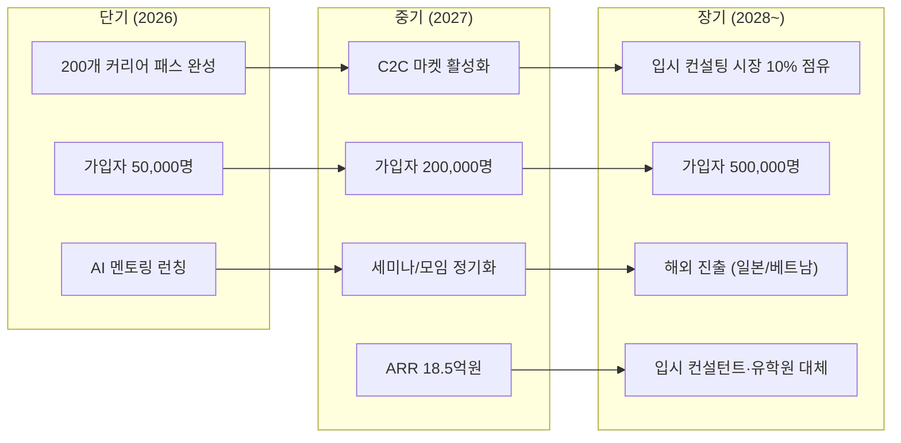

### 9-3. 초토화 전략: 입시 컨설턴트 · 유학원을 대체한다

| 기존 시장 | 규모 | DreamPath 대체 전략 | 목표 점유율 |
|----------|------|-------------------|-----------|
| **입시 컨설팅** | 1,007억원 | 커리어 패스 + AI 멘토링으로 97% 가격 파괴 | 10% (100억원) |
| **유학원 컨설팅** | 2,000억원+ | 해외 대학 커리어 패스 + AI 에세이 멘토링 | 5% (100억원) |
| **진로 교육 B2B** | 500억원+ | B2B2C 모델로 학교 무료 제공 → 학생 유료 전환 | 3% (15억원) |

### 9-4. 달성 마일스톤

| 시기 | 마일스톤 | 의미 |
|------|---------|------|
| **2026 Q2** | 200개 커리어 패스 완성 + AI 멘토 런칭 | 핵심 제품 완성 |
| **2026 Q3** | 가입자 30,000명 + MRR 3,000만원 | Product-Market Fit 검증 |
| **2026 Q4** | C2C 마켓 오픈 + 멘토 50명 | 마켓플레이스 시작 |
| **2027 Q2** | 가입자 100,000명 + ARR 10억원 | Series A 투자 유치 |
| **2027 Q4** | 파트너 학교 200개 | B2B2C 확장 |
| **2028** | 가입자 500,000명 + 해외 진출 | 카테고리 리더 |

---

## 부록: 한 장 요약

```
┌──────────────────────────────────────────────────────────────────┐
│                                                                  │
│                     왜 DreamPath인가?                             │
│                                                                  │
├──────────────────────────────────────────────────────────────────┤
│                                                                  │
│  문제:                                                           │
│  · 적성검사 해도 → 다음 뭘 해야 할지 모른다 (커리어넷의 한계)       │
│  · 직업 골라도 → 중학교~고등학교 준비법을 모른다 (정보 비대칭)       │
│  · 계획 세워도 → 혼자 실행 못 한다 (실행력 부재)                    │
│  · 활동 해도 → 포트폴리오 정리 못 한다 (수동 관리의 한계)            │
│  · 이걸 한 번에 해결? → 300만원짜리 입시 컨설턴트뿐                 │
│                                                                  │
│  경쟁사:                                                         │
│  · 커리어넷 = 검사만 (후속 없음)                                   │
│  · 메이저맵 = 학과 연결 (패스 없음, B2B)                           │
│  · 드림어필 = 기록 SNS (방향 없음, 패스 없음)                      │
│  · 에듀캔버스 = 시뮬레이션 (실행 없음, B2B)                        │
│  · 베어러블 = 세특 (탐색 없음, 초기)                               │
│  → 찾다→세우다→실행→완성 전체를 하는 곳이 없다.                     │
│                                                                  │
│  DreamPath:                                                      │
│  · 적성검사 → 200개 직업 시뮬레이션 → 커리어 패스 →                │
│    AI 멘토링 프로젝트 → 드림북(포트폴리오) 자동 완성                │
│  · 300만원 → 월 9,900원 (97% 가격 파괴)                           │
│  · 서울 한정 → 전국 어디서나                                       │
│  · 1회성 → 365일 24시간                                           │
│                                                                  │
│  강점:                                                           │
│  · 200개 커리어 패스 DB (시장에 없는 데이터)                        │
│  · 풀 커버리지 (탐색→설계→실행→완성)                               │
│  · 드림북 자동 포트폴리오 (Lock-in)                                │
│                                                                  │
│  목표:                                                           │
│  · 입시 컨설턴트 · 유학원 시장을 디지털로 대체                      │
│  · 2028년 가입자 50만명, 카테고리 리더                             │
│                                                                  │
└──────────────────────────────────────────────────────────────────┘
```
# DreamPath — 투자 제안서

> **"입시 컨설팅의 민주화: 300만원짜리 입시 상담을 월 9,900원으로"**  
> 중학생~고등학생 AI 커리어 패스 & 프로젝트 멘토링 플랫폼  
> 2026.02

---

## 목차

1. [Executive Summary](#1-executive-summary)
2. [시장의 문제 (Problem)](#2-시장의-문제-problem)
3. [솔루션 (Solution)](#3-솔루션-solution)
4. [벤치마킹 & 경쟁사 분석](#4-벤치마킹--경쟁사-분석)
5. [고객 페르소나](#5-고객-페르소나)
6. [핵심 제품: 커리어 패스 시스템](#6-핵심-제품-커리어-패스-시스템)
7. [수익 모델](#7-수익-모델)
8. [시장 규모 (TAM / SAM / SOM)](#8-시장-규모-tam--sam--som)
9. [Go-to-Market 전략](#9-go-to-market-전략)
10. [로드맵 & 마일스톤](#10-로드맵--마일스톤)
11. [재무 전망](#11-재무-전망)

---

## 1. Executive Summary

```
┌──────────────────────────────────────────────────────────────────┐
│                                                                  │
│   DreamPath = 적성 검사 → 커리어 패스 → 드림북 완성               │
│                                                                  │
│   ① 적성 검사로 나에게 맞는 직업을 찾는다 (탐색)                   │
│   ② 그 직업을 위한 커리어 패스를 세운다 (설계)                     │
│   ③ 프로젝트를 실행하여 드림북을 완성한다 (실행)                    │
│                                                                  │
│   드림북 = 3가지 자동 기록의 결과물 (직접 제작 X, 자동 누적 O)     │
│     📍 직업을 찾는 기록 (탐색 히스토리)                            │
│     📋 커리어 패스를 만드는 기록 (설계 히스토리)                    │
│     🚀 커리어 패스를 실행하는 프로젝트 기록 (실행 히스토리)          │
│                                                                  │
│   수익 모델 3가지:                                                │
│     🔵 외부 커리어 합격 패스 판매 (사용자 C2C 마켓)                     │
│     🟢 AI 프로젝트 멘토링 (API 구독 서비스)                        │
│     🟠 내부 커리어 패스 세미나 & 프로젝트 실행 모임                  │
│                                                                  │
│   목표: 입시 컨설턴트 · 유학원 시장을 디지털로 대체                 │
│                                                                  │
└──────────────────────────────────────────────────────────────────┘
```

### 핵심 숫자

| 지표 | 수치 |
|------|------|
| **타겟 시장** | 한국 사교육 시장 29.2조원 (2024) |
| **직접 경쟁 시장** | 진로진학 컨설팅 1,007억원 (2024, YoY +33%) |
| **타겟 고객** | 중고등학생 260만명 + 학부모 |
| **제공 직업 수** | 200개 (8개 분야 × 25개) |
| **가격 파괴** | 기존 300만원 → 월 9,900원 (97% 절감) |
| **수익 모델** | 외부 커리어 패스 C2C 판매 + AI 멘토링 구독 + 내부 세미나/모임 |

---

## 2. 시장의 문제 (Problem)

### 2-1. 입시 컨설팅의 구조적 불평등

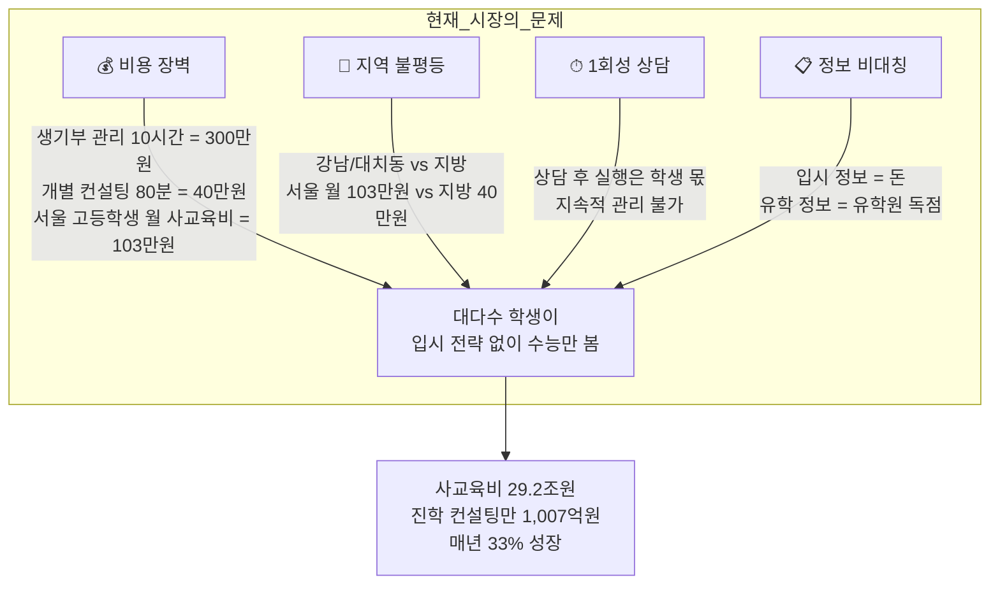

### 2-2. 학생이 겪는 Pain Point

| # | Pain Point | 현재 해결책 | 비용 | 문제점 |
|---|-----------|-----------|------|--------|
| 1 | "나한테 맞는 직업을 모르겠다" | 커리어넷 검사 (무료) | 0원 | 검사만 하고 끝, 후속 행동 없음 |
| 2 | "의사가 되려면 중학교 때 뭘 해야 해?" | 입시 컨설턴트 | 40~300만원 | 비용 부담, 1회성 |
| 3 | "생기부에 뭘 넣어야 해?" | 학원 컨설팅 | 월 50~100만원 | 서울 편중, 지방은 기회 없음 |
| 4 | "프로젝트를 어떻게 시작해?" | 혼자 구글링 | 0원 | 방향 모름, 완성 못 함 |
| 5 | "포트폴리오 정리가 안 돼" | 수동 엑셀/문서 | 0원 | 산발적, 입시에 활용 불가 |
| 6 | "유학 가려면 어디서부터?" | 유학원 | 500~3,000만원 | 유학원 수수료 구조 |

### 2-3. 학부모가 겪는 Pain Point

| # | Pain Point | 현재 행동 | 결과 |
|---|-----------|---------|------|
| 1 | "아이 진로를 어떻게 도와주지?" | 주변 조언 + 인터넷 검색 | 정보 파편화, 혼란 |
| 2 | "컨설팅은 너무 비싸" | 포기하거나 무리한 지출 | 가계 부담 |
| 3 | "정보가 매년 바뀐다" | 입시설명회 참석 | 시간 소모, 정보 과잉 |
| 4 | "아이가 안 한다" | 잔소리 → 갈등 | 동기부여 실패 |

---

## 3. 솔루션 (Solution)

### 3-1. DreamPath 3단계 공식

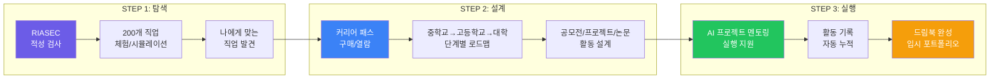

### 3-2. DreamPath vs 기존 방식 비교

| 항목 | 입시 컨설턴트 | 유학원 | 커리어넷 | **DreamPath** |
|------|-------------|--------|---------|---------------|
| **1단계: 탐색** | 상담 1회 | 해당 없음 | 적성검사 | ✅ AI 적성검사 + 200개 직업 시뮬레이션 |
| **2단계: 설계** | 수동 로드맵 | 유학 경로만 | 없음 | ✅ 200개 직업 커리어 패스 (구매 가능) |
| **3단계: 실행** | 분기 1회 체크 | 서류 대행 | 없음 | ✅ AI 멘토 + WBS + 실시간 관리 |
| **결과물** | 수동 정리 | 에세이 | 없음 | ✅ 드림북 자동 완성 |
| **비용** | 300만원+ | 1,000만원+ | 무료 | **무료~월 19,900원** |
| **접근성** | 서울/수도권 | 서울/수도권 | 전국 | **전국 + 해외** |
| **지속성** | 1회성 | 원서 기간만 | 없음 | **365일 24시간** |
| **동기부여** | 없음 | 없음 | 없음 | **RPG 게임화 (XP/뱃지)** |

---

## 4. 벤치마킹 & 경쟁사 분석

### 4-1. 경쟁 환경 지도

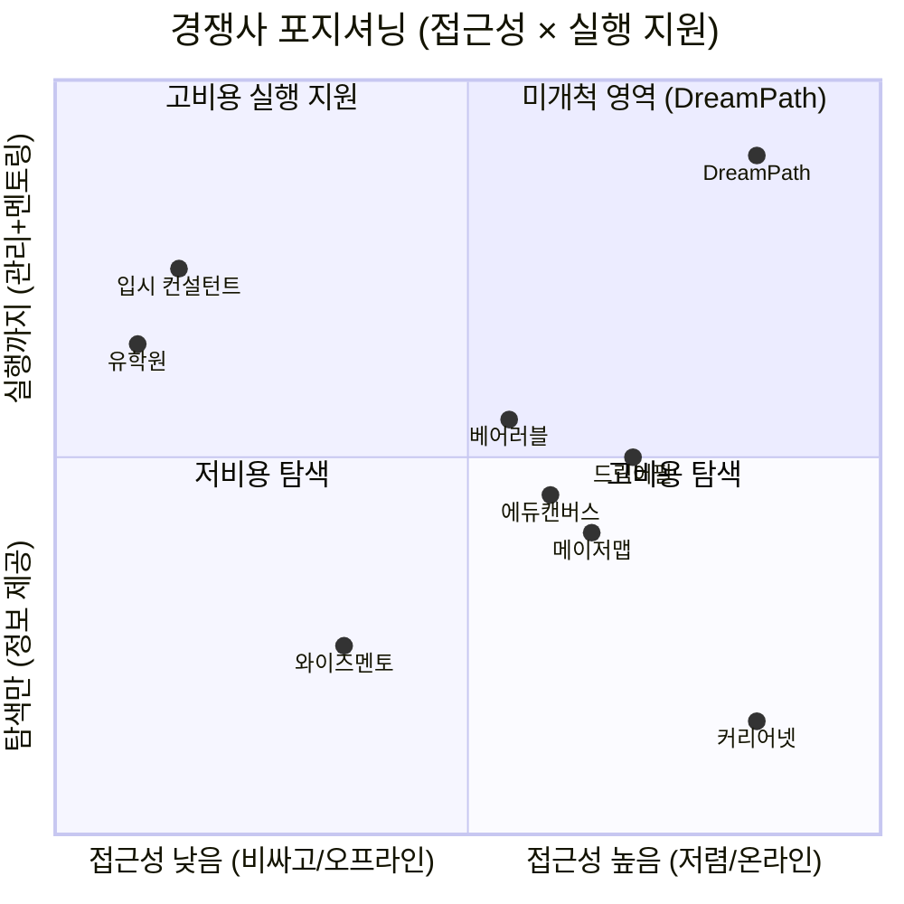

### 4-2. 경쟁사 상세 분석

#### A. 정부/공공 서비스

| 서비스 | 운영 | 핵심 기능 | 강점 | 약점 |
|--------|------|----------|------|------|
| **커리어넷** | 한국직업능력연구원 | 14종 적성검사, 직업백과, 원격멘토링 | 무료, 공신력, 방대한 데이터 | 후속 실행 지원 없음, UX 낡음, 게임화 없음 |
| **워크넷** | 고용노동부 | 직업 정보, 적성검사 | 무료, 성인 대상 포함 | 중고등학생 맞춤형 아님 |

#### B. 에듀테크 스타트업

| 서비스 | 설립 | 누적 유저 | 핵심 기능 | 강점 | 약점 |
|--------|------|----------|----------|------|------|
| **메이저맵** | 2018 | B2B 중심 | AI 진로 검사, 학과 커리큘럼 분석 | 140개 대학 데이터, B2G 납품 | 학생 직접 사용 어려움, 커리어 패스 없음 |
| **드림어필** | 2022 | 6.1만명 | 실천형 진로 SNS, 미션 기록 | 846개교 도입, 일본 진출 | 입시 직접 연결 약함, 시뮬레이션 없음 |
| **에듀캔버스 (알파지니)** | - | B2B 중심 | AI 진로 로드맵, 3D 직무 시뮬레이션 | 12,000 직무 데이터, 게임화 | B2B 모델, 개인 사용 제한적 |
| **베어러블 (마이폴리오)** | 2024.10 | 초기 | AI 포트폴리오, 세특 자동 정리 | 교사용 도구 연계, TIPS 선정 | 초기 스타트업, 진로 탐색 기능 약함 |

#### C. 기존 사교육

| 서비스 | 유형 | 핵심 기능 | 강점 | 약점 |
|--------|------|----------|------|------|
| **대치동 입시컨설팅** | 오프라인 1:1 | 생기부 관리, 입시 전략 | 합격 실적, 정보력 | 300만원+, 서울 한정, 1회성 |
| **유학원 (edm, uhak 등)** | 오프라인 | 유학 상담, 원서 대행 | 해외 학교 네트워크 | 1,000만원+, 수수료 구조, 정보 비대칭 |
| **족보닷컴** | 온라인 | 시험 문제 은행 | 문제 DB 방대 | 진로/커리어 패스 없음 |
| **메가스터디/이투스** | 온라인 강의 | 인강 | 강의 품질, 브랜드 | 수능 중심, 진로 탐색 없음 |

### 4-3. DreamPath 핵심 차별점 (경쟁 우위)

```
┌─────────────────────────────────────────────────────────────┐
│              DreamPath만의 3가지 해자 (Moat)                  │
├─────────────────────────────────────────────────────────────┤
│                                                             │
│  ① 200개 직업 커리어 패스 DB                                  │
│     → 경쟁사 없음. 커리어넷은 정보만, 컨설턴트는 1:1 수동.      │
│     → 중학교~대학까지 단계별 활동/공모전/프로젝트 포함.          │
│     → 내부 제작 → 외부 멘토 마켓 확장 가능.                     │
│                                                             │
│  ② AI 프로젝트 멘토링 (구조화된 프롬프트)                       │
│     → 실행 단계까지 지원하는 유일한 서비스.                      │
│     → WBS, 마일스톤, 포트폴리오 자동 정리.                      │
│     → 24시간 이용 가능, 월 구독 모델.                           │
│                                                             │
│  ③ 드림북 (자동 포트폴리오)                                    │
│     → 탐색~실행의 모든 기록이 드림북으로 자동 누적.              │
│     → 콘텐츠 + 히스토리 = 입시 포트폴리오.                      │
│     → 기존 수동 정리 → 자동화.                                 │
│                                                             │
└─────────────────────────────────────────────────────────────┘
```

| 차별점 | 커리어넷 | 메이저맵 | 드림어필 | 에듀캔버스 | 베어러블 | **DreamPath** |
|--------|---------|---------|---------|----------|---------|-------------|
| 적성검사 | ✅ | ✅ | ❌ | ✅ | ❌ | ✅ |
| 직업 시뮬레이션 | ❌ | ❌ | ❌ | ✅ (3D) | ❌ | ✅ (RPG) |
| **커리어 패스 DB** | ❌ | ❌ | ❌ | ❌ | ❌ | ✅ **(200개)** |
| 프로젝트 관리 (WBS) | ❌ | ❌ | △ 미션 | ❌ | ❌ | ✅ |
| **AI 멘토링** | ❌ | ❌ | ❌ | △ | △ 세특 | ✅ **(구조화)** |
| 자동 포트폴리오 | ❌ | ❌ | △ 기록 | ❌ | ✅ 세특 | ✅ **(드림북)** |
| 게임화 (XP/뱃지) | ❌ | ❌ | △ | ✅ | ❌ | ✅ |
| B2C 직접 판매 | 무료 | B2B | ✅ | B2B | B2B | ✅ |
| 커리어 패스 마켓 | ❌ | ❌ | ❌ | ❌ | ❌ | ✅ |

---

## 5. 고객 페르소나

### 5-1. 대표 고객 (Primary Persona)

```
┌────────────────────────────────────────────────────────────┐
│  🎯 Persona 1: "진로 탐색 중학생" — 김서연 (중2, 14세)        │
├────────────────────────────────────────────────────────────┤
│                                                            │
│  배경: 경기도 수원 거주, 공부는 중상위권                       │
│  상황: 자유학기제에서 진로 탐색 과제를 해야 함                  │
│  고민: "나한테 맞는 직업이 뭔지 모르겠다"                      │
│  현재 행동: 커리어넷 검사 → 결과 보고 끝                      │
│  학부모: 맞벌이, 사교육비 부담 느낌                           │
│                                                            │
│  DreamPath 여정:                                           │
│  적성검사 → 200개 직업 탐험 → 시뮬레이션 체험 → 관심 직업 발견  │
│  → 무료 커리어 패스 열람 → 중학교 때 할 활동 확인              │
│                                                            │
│  지불 의향: 무료로 시작, 관심 직업 커리어 패스 구매 (5,000원)    │
│  전환 포인트: "내가 좋아하는 직업의 로드맵이 있다니!"           │
│                                                            │
└────────────────────────────────────────────────────────────┘
```

```
┌────────────────────────────────────────────────────────────┐
│  🎯 Persona 2: "입시 준비 고등학생" — 이준호 (고1, 16세)      │
├────────────────────────────────────────────────────────────┤
│                                                            │
│  배경: 서울 거주, 상위권 학생                                 │
│  상황: 의대/약대를 목표로 하지만 구체적 계획 없음               │
│  고민: "생기부에 뭘 넣어야 하지? 어떤 활동을 해야 하지?"       │
│  현재 행동: 학원 + 부모님이 입시 컨설팅 알아보는 중             │
│  학부모: 컨설팅비 300만원 부담, 효과 불확실                    │
│                                                            │
│  DreamPath 여정:                                           │
│  의사 커리어 패스 구매 (15,000원) → 고등학교 활동 가이드 확인   │
│  → AI 멘토에게 "과학 탐구 보고서 주제 추천" 질문              │
│  → 프로젝트 WBS 생성 → 실행 → 드림북에 자동 기록              │
│                                                            │
│  지불 의향: 커리어 패스 구매 + AI 멘토링 구독 (월 19,900원)    │
│  전환 포인트: "300만원짜리 컨설팅 대신 월 2만원으로 가능하네!"  │
│                                                            │
└────────────────────────────────────────────────────────────┘
```

```
┌────────────────────────────────────────────────────────────┐
│  🎯 Persona 3: "유학 준비 학생" — 박하은 (고2, 17세)          │
├────────────────────────────────────────────────────────────┤
│                                                            │
│  배경: 부산 거주, 영어 특기                                   │
│  상황: 미국 대학 진학 희망, 유학원 상담 중                     │
│  고민: "유학원비가 너무 비싸다. 정보를 직접 찾고 싶다"          │
│  현재 행동: 유학원 3곳 상담 (각 500~1,000만원 견적)            │
│  학부모: 유학 비용 부담, 신뢰할 수 있는 정보 부족               │
│                                                            │
│  DreamPath 여정:                                           │
│  해외 대학 커리어 패스 구매 → AP/SAT 준비 로드맵 확인          │
│  → AI 멘토에게 "Common App 에세이 피드백" 질문                │
│  → 과외활동 프로젝트 실행 → 드림북으로 활동 정리                │
│                                                            │
│  지불 의향: 프리미엄 커리어 패스 (30,000원) + 구독 (월 19,900원)|
│  전환 포인트: "유학원 1,000만원 대신 연 25만원으로 충분하다"     │
│                                                            │
└────────────────────────────────────────────────────────────┘
```

### 5-2. 보조 고객 (Secondary Persona)

```
┌────────────────────────────────────────────────────────────┐
│  👨‍👩‍👧 Persona 4: "불안한 학부모" — 최미영 (44세, 학부모)    │
├────────────────────────────────────────────────────────────┤
│                                                            │
│  배경: 고1 아들, 중2 딸                                     │
│  고민: "아이들 진로를 어떻게 도와줘야 할지 모르겠다"            │
│  현재 행동: 입시 설명회 참석, 맘카페에서 정보 수집               │
│  지출: 두 아이 사교육비 월 200만원                            │
│                                                            │
│  DreamPath 가치:                                           │
│  "아이가 스스로 진로를 탐색하고 계획을 세우는 모습을 볼 수 있다"  │
│  "잔소리 대신 앱이 게임처럼 동기부여 해준다"                    │
│  "300만원 컨설팅 대신 월 2만원 × 2 = 4만원이면 충분"           │
│                                                            │
│  결제 주체: 학부모가 결제, 학생이 사용                         │
│                                                            │
└────────────────────────────────────────────────────────────┘
```

### 5-3. 페르소나별 구매 여정 (Purchase Journey)

```mermaid
graph TD
    subgraph "중학생 (Persona 1)"
        A1["자유학기제 과제"] --> A2["커리어넷 검사 (무료)"]
        A2 --> A3["DreamPath 발견"]
        A3 --> A4["적성검사 + 직업 탐험 (무료)"]
        A4 --> A5["관심 직업 커리어 패스 구매 (5,000원)"]
    end

    subgraph "고등학생 (Persona 2)"
        B1["생기부 고민"] --> B2["컨설팅 비용 충격 (300만원)"]
        B2 --> B3["DreamPath 발견"]
        B3 --> B4["커리어 패스 구매 (15,000원)"]
        B4 --> B5["AI 멘토링 구독 (월 19,900원)"]
        B5 --> B6["드림북 완성"]
    end

    subgraph "학부모 (Persona 4)"
        C1["입시 불안"] --> C2["맘카페 정보 탐색"]
        C2 --> C3["DreamPath 추천 발견"]
        C3 --> C4["자녀에게 추천, 학부모가 결제"]
        C4 --> C5["자녀 활동 현황 확인"]
    end
```

### 5-4. 페르소나 우선순위 매트릭스

| 페르소나 | 인구 규모 | 지불 의향 | 획득 난이도 | LTV | **우선순위** |
|---------|----------|----------|-----------|-----|-----------|
| 고1~고2 입시 준비 학생 | 약 86만명 | 높음 | 중간 | 높음 | **★★★★★** |
| 중2~중3 진로 탐색 학생 | 약 65만명 | 보통 | 낮음 (자유학기제) | 높음 (장기) | **★★★★☆** |
| 유학 준비 학생 | 약 5만명 | 매우 높음 | 높음 | 매우 높음 | **★★★★☆** |
| 학부모 (결제 주체) | 약 200만명 | 높음 | 중간 | 높음 | **★★★★★** |
| 고3 수시/정시 준비 | 약 43만명 | 매우 높음 | 높음 (전환 늦음) | 낮음 (단기) | **★★★☆☆** |

---

## 6. 핵심 제품: 커리어 패스 시스템

### 6-1. DreamPath의 3단계 핵심 흐름

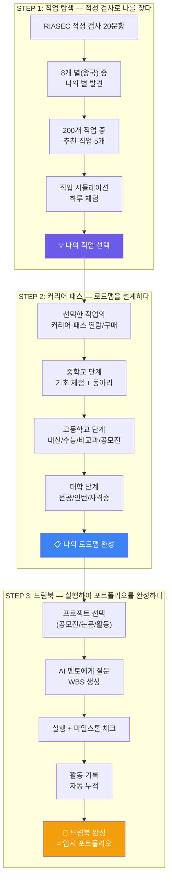

### 6-2. 커리어 패스 1개의 구성

| 섹션 | 내용 | 무료 범위 | 유료 범위 |
|------|------|---------|---------|
| **직업 개요** | 하는 일, 필요 역량, 연봉, 전망 | ✅ 전체 공개 | - |
| **중학교 로드맵** | 교과 준비, 동아리, 봉사, 체험 | ✅ 요약 공개 | 상세 활동 가이드 |
| **고등학교 로드맵** | 내신 전략, 비교과, 공모전, 프로젝트 | ⛔ 잠금 | ✅ 상세 전략 + 실제 사례 |
| **대학/이후 경로** | 학과, 대학, 자격증, 인턴 | ⛔ 잠금 | ✅ 학과별 커리큘럼 |
| **공모전/대회 리스트** | 직업 관련 참가 가능한 대회 | ⛔ 잠금 | ✅ 일정 + 준비 가이드 |
| **프로젝트 템플릿** | 생기부/포트폴리오 활동 설계 | ⛔ 잠금 | ✅ WBS + 결과물 예시 |
| **합격 사례** | 해당 직업으로 진학한 선배 사례 | ⛔ 잠금 | ✅ 가상 합격 스토리 |
| **즉시 실행 3가지** | 지금 바로 시작할 수 있는 행동 | ✅ 전체 공개 | - |

### 6-3. 200개 직업 제작 계획

#### 8개 별(왕국) × 25개 직업

| 별(왕국) | RIASEC | 대표 직업 (25개 중 일부) | 제작 순서 |
|---------|--------|----------------------|----------|
| **탐구의 별** | I 탐구형 | 의사, 약사, 연구원, 데이터과학자, 심리학자 | Phase 1 |
| **기술의 별** | R 실행형 | 개발자, 기계공학자, 전기기사, 파일럿, 요리사 | Phase 2 |
| **창작의 별** | A 예술형 | 디자이너, 영화감독, 작곡가, 웹툰작가, 건축가 | Phase 3 |
| **연결의 별** | S 사회형 | 교사, 간호사, 상담사, 사회복지사, 소방관 | Phase 3 |
| **도전의 별** | E 진취형 | CEO, 마케터, 변호사, 외교관, 프로게이머 | Phase 4 |
| **소통의 별** | E+S | 아나운서, 유튜버, PD, 기자, 통역사 | Phase 4 |
| **질서의 별** | C 관습형 | 회계사, 공무원, 금융인, 세무사, 물류전문가 | Phase 5 |
| **자연의 별** | R+I | 수의사, 환경공학자, 농업과학자, 해양학자 | Phase 5 |

#### 제작 일정

| Phase | 기간 | 직업 수 | 내용 |
|-------|------|--------|------|
| Phase 1 | 2026.03~04 | 50개 | 인기 직업 (의사, 개발자, 교사 등) |
| Phase 2 | 2026.04~05 | 50개 | IT/기술/공학 분야 |
| Phase 3 | 2026.05~06 | 50개 | 예술/미디어/사회 분야 |
| Phase 4 | 2026.06~07 | 30개 | 경영/법률/소통 분야 |
| Phase 5 | 2026.07~08 | 20개 | 자연/질서/특수 분야 |

---

## 7. 수익 모델

### 7-1. 세 가지 수익 축

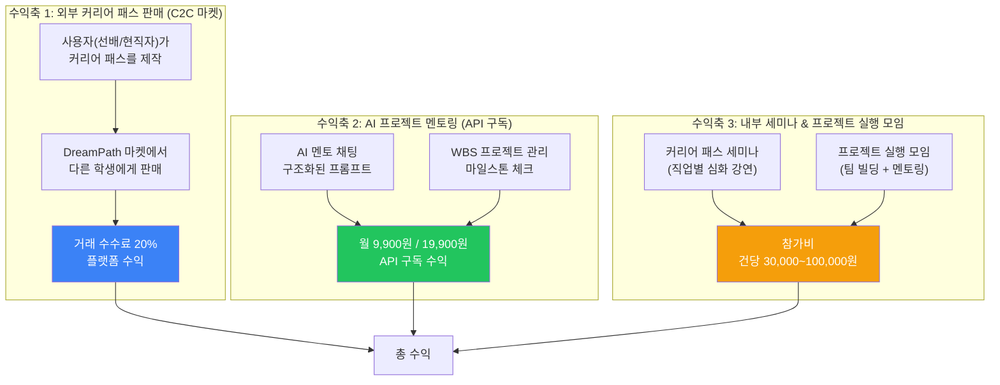

#### 수익 모델 요약

| # | 수익축 | 설명 | 수익 구조 | 활성화 시기 |
|---|--------|------|----------|-----------|
| 1 | **외부 커리어 패스 판매** | 사용자(선배/현직자)가 만든 패스를 C2C 마켓에서 판매 | 거래 수수료 20% | Phase 2 (마켓 오픈 후) |
| 2 | **AI 프로젝트 멘토링** | AI 기반 멘토링 + WBS 관리 API 구독 | 월 9,900 / 19,900원 | Phase 1 (MVP 직후) |
| 3 | **내부 세미나 & 프로젝트 모임** | 직업별 세미나, 프로젝트 제작 실행 모임 주최 | 참가비 건당 과금 | Phase 2~3 (점진 확장) |

> 내부에서 200개 직업 커리어 패스를 먼저 제작하여 **무료 기본 패스**로 유입을 만들고,  
> 이를 토대로 3가지 수익축을 **점진적으로 활성화**시킵니다.

---

### 7-2. 수익축 1: 외부 커리어 패스 판매 (C2C 마켓)

> **"합격한 선배, 현직자가 자신의 커리어 패스를 직접 만들어 판매한다"**

#### 마켓 구조

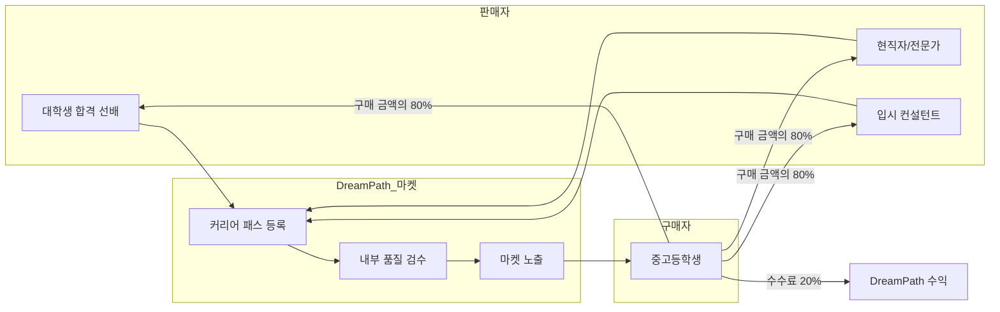

#### 상품 유형

| 상품 유형 | 판매자 | 가격대 | 내용 | 예시 |
|----------|--------|--------|------|------|
| **합격 패스** | 대학생 선배 | 10,000~30,000원 | 실제 합격 경험 기반 로드맵 + 생기부 사례 | "서울대 컴공 합격 패스" |
| **전문가 패스** | 현직자 | 15,000~50,000원 | 업계 인사이트 + 필수 스킬 + 추천 활동 | "현직 개발자가 알려주는 개발자 패스" |
| **입시 전략 패스** | 입시 전문가 | 30,000~100,000원 | 전형별 상세 전략 + Q&A 포함 | "의대 수시 전략 완전 가이드" |
| **유학 패스** | 유학 경험자 | 20,000~80,000원 | 해외 대학 준비 전과정 | "미국 CS 대학 유학 패스" |

#### 무료 vs 유료 구분

```
┌──────────────────────────────────────────────────────────┐
│  내부 제작 200개 기본 패스 = 무료 (유입 Hook)                │
├──────────────────────────────────────────────────────────┤
│  ✅ 직업 개요, 단계별 요약, 즉시 실행 3가지                  │
│  ✅ 기본 중학교~대학 로드맵 (개요 수준)                      │
│  ✅ 적성검사 결과 기반 직업 추천                             │
├──────────────────────────────────────────────────────────┤
│  외부 사용자 제작 패스 = 유료 (C2C 마켓)                     │
├──────────────────────────────────────────────────────────┤
│  💰 실제 합격 경험 + 구체적 활동 내역                        │
│  💰 공모전/대회 실전 가이드                                  │
│  💰 생기부 작성 사례 + 면접 노하우                           │
│  💰 현직자 업계 인사이트                                     │
└──────────────────────────────────────────────────────────┘
```

#### 판매자 등록 & 검수 흐름

| 단계 | 내용 | 소요 시간 |
|------|------|---------|
| 1. 가입 | 판매자 계정 생성 + 본인 인증 | 즉시 |
| 2. 자격 증명 | 합격증/재직증명 등 업로드 | 즉시 |
| 3. 패스 작성 | 템플릿 기반 커리어 패스 제작 | 판매자 재량 |
| 4. 품질 검수 | 내부 팀 심사 (정확성/완성도) | 3~5일 |
| 5. 마켓 등록 | 승인 후 마켓 노출 | 즉시 |
| 6. 정산 | 매월 말일, 판매 금액의 80% 지급 | 월 1회 |

---

### 7-3. 수익축 2: AI 프로젝트 멘토링 (API 구독 서비스)

> **"AI가 프로젝트 설계부터 실행까지 멘토링한다"**

#### 구독 플랜

| 플랜 | 월 가격 | AI 멘토 | WBS 관리 | 드림북 기록 | 대상 |
|------|--------|--------|----------|-----------|------|
| **Free** | 0원 | 5회/일 (기본 답변) | ❌ | 자동 기록 (열람만) | 탐색 단계 학생 |
| **Explorer** | **9,900원** | 50회/월 (구조화 답변) | 프로젝트 1개 | 자동 기록 + 내보내기 | 진로 설계 시작 학생 |
| **Pioneer** | **19,900원** | 무제한 | 프로젝트 무제한 | 자동 기록 + PDF 출력 | 적극적 입시 준비 학생 |

#### AI 멘토링 기능 상세

| 기능 | Free | Explorer | Pioneer |
|------|------|----------|---------|
| 학습 경로 질문 | ✅ (5회/일) | ✅ (50회/월) | ✅ (무제한) |
| 프로젝트 WBS 생성 | ❌ | ✅ (1개) | ✅ (무제한) |
| 포트폴리오 피드백 | ❌ | ❌ | ✅ |
| 면접 모의 연습 | ❌ | ❌ | ✅ |
| 공모전 추천 알림 | ❌ | ✅ | ✅ |
| 드림북 PDF 출력 | ❌ | ❌ | ✅ (월 3회) |
| 활동 기록 자동 정리 | ❌ | ✅ | ✅ |

#### API 구독의 핵심 가치

```
학생이 느끼는 가치:
├── "프로젝트를 어떻게 시작할지 모르겠다" → AI가 WBS를 짜준다
├── "탐구 보고서 주제가 생각 안 난다" → AI가 주제를 추천한다
├── "진행 중인데 막혔다" → AI가 실시간으로 도와준다
├── "완성했는데 잘 한 건지 모르겠다" → AI가 피드백한다
└── "이걸 생기부에 어떻게 넣지?" → AI가 정리해준다

모든 과정이 드림북에 자동 기록된다.
```

---

### 7-4. 수익축 3: 내부 커리어 패스 세미나 & 프로젝트 실행 모임

> **"온라인 앱에서 시작하여, 오프라인 실행 모임으로 확장한다"**

#### 프로그램 유형

| 유형 | 형태 | 인원 | 가격 | 내용 |
|------|------|------|------|------|
| **커리어 패스 세미나** | 온라인 웨비나 | 30~100명 | 30,000~50,000원 | 직업별 심화 강연 (현직자 초청) |
| **프로젝트 부트캠프** | 온/오프라인 혼합 | 10~20명 | 100,000~300,000원 | 4~8주 프로젝트 완성 과정 |
| **드림북 완성 워크숍** | 오프라인 | 15~30명 | 50,000~80,000원 | 1일 집중, 드림북 정리 + 피드백 |
| **팀 프로젝트 모임** | 온라인 | 4~6명/팀 | 50,000~100,000원/인 | 팀 빌딩 + 프로젝트 실행 + 발표 |
| **입시 전략 특강** | 온라인 | 50~200명 | 20,000~40,000원 | 전형별 입시 전략 시즌 특강 |

#### 세미나/모임 활성화 로드맵

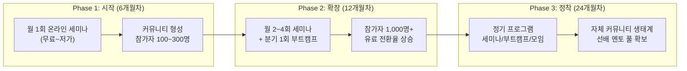

#### 세미나/모임의 전략적 가치

| 가치 | 설명 |
|------|------|
| **유입 채널** | 무료/저가 세미나로 신규 사용자 유입 → 앱 가입 전환 |
| **커뮤니티** | 참가자 간 네트워크 형성 → 팀 프로젝트 연계 |
| **멘토 풀** | 세미나 강사/멘토 → 커리어 패스 마켓 판매자 전환 |
| **콘텐츠** | 세미나 녹화 → VOD 콘텐츠 2차 판매 |
| **브랜드** | 오프라인 접점으로 신뢰도 구축 |

---

### 7-5. 드림북 — 3가지 자동 기록의 결과물

> **드림북은 직접 만드는 것이 아니다. 앱 활동의 자동 기록이 쌓여서 완성된다.**  
> **콘텐츠 + 히스토리 정리 = 드림북**

```
┌──────────────────────────────────────────────────────────────┐
│                          드림북                                │
│              (3가지 자동 기록이 모여 완성된다)                    │
├──────────────────────────────────────────────────────────────┤
│                                                              │
│  📍 기록 1: 직업을 찾는 기록 (탐색 히스토리)                     │
│  ──────────────────────────────────────                       │
│  · RIASEC 적성검사 결과 (나의 유형, 강점)                       │
│  · 탐험한 별(왕국) 목록, 방문 횟수                               │
│  · 직업 시뮬레이션 체험 기록 + 소감                              │
│  · 스와이프한 직업 리스트 (좋아요/패스)                           │
│  · 최종 선택한 관심 직업 TOP 5                                  │
│  → "나는 어떤 사람이고, 어떤 직업에 관심이 있는가"                 │
│                                                              │
│  📋 기록 2: 커리어 패스를 만드는 기록 (설계 히스토리)              │
│  ──────────────────────────────────────                       │
│  · 선택한 커리어 패스 (어떤 직업의 패스를 골랐는지)                │
│  · 단계별 로드맵 진행률 (중학교/고등학교/대학)                    │
│  · 설계한 공모전, 프로젝트, 논문 리스트                          │
│  · AI 멘토와의 설계 관련 대화 요약                               │
│  → "나는 어떤 계획을 세웠는가"                                   │
│                                                              │
│  🚀 기록 3: 프로젝트 실행 기록 (실행 히스토리)                    │
│  ──────────────────────────────────────                       │
│  · 진행 중 / 완료한 프로젝트 목록                                │
│  · WBS 마일스톤 달성 기록                                       │
│  · AI 멘토링 질문/답변 히스토리                                  │
│  · 프로젝트 결과물 (보고서, 발표자료, 코드 등)                    │
│  · 세미나/모임 참가 기록                                         │
│  → "나는 무엇을 실행하고, 무엇을 만들었는가"                      │
│                                                              │
│  ──────────────────────────────────────                       │
│  + XP, 레벨, 뱃지 등 성장 기록 (자동 누적)                       │
│  + 통계 & 인사이트 (활동 패턴, 시간 투자 분석)                    │
│                                                              │
│  [PDF 다운로드] [공유 링크 생성] [입시 제출용 포맷]                │
│                                                              │
└──────────────────────────────────────────────────────────────┘
```

#### 드림북 3가지 기록 요약

| 기록 | 자동 수집 시점 | 수집 데이터 | 입시 활용 |
|------|-------------|-----------|----------|
| **1. 직업 찾는 기록** | STEP 1 (적성검사 + 탐색) | 적성 유형, 탐험 기록, 시뮬레이션, 관심 직업 | 자소서 "나는 어떤 사람인가" |
| **2. 커리어 패스 기록** | STEP 2 (패스 열람 + 설계) | 선택 패스, 로드맵, 설계한 활동 리스트 | 면접 "나의 계획은 무엇인가" |
| **3. 프로젝트 실행 기록** | STEP 3 (실행 + 멘토링) | WBS, 결과물, 멘토링 로그, 세미나 참가 | 생기부 비교과 + 포트폴리오 |

> 학생은 앱을 사용하기만 하면 됩니다.  
> 적성검사를 하고, 직업을 탐험하고, 커리어 패스를 세우고, 프로젝트를 실행하면  
> 그 모든 과정이 **자동으로 기록**되어 **드림북**이 됩니다.

---

### 7-6. 수익 시뮬레이션

| 지표 | 6개월차 | 12개월차 | 24개월차 |
|------|--------|---------|---------|
| **총 가입자** | 10,000명 | 50,000명 | 200,000명 |
| | | | |
| **[수익축 1] 외부 커리어 패스 C2C 판매** | | | |
| 등록 판매자 수 | 20명 | 100명 | 500명 |
| 월 거래 건수 | 50건 | 500건 | 5,000건 |
| 평균 거래 단가 | 15,000원 | 20,000원 | 25,000원 |
| 수수료 수익 (20%) | 15만원/월 | 200만원/월 | 2,500만원/월 |
| | | | |
| **[수익축 2] AI 멘토링 구독** | | | |
| Explorer 구독자 (3%) | 300명 | 1,500명 | 6,000명 |
| Pioneer 구독자 (1%) | 100명 | 500명 | 2,000명 |
| 구독 매출 | 497만원/월 | 2,480만원/월 | 9,920만원/월 |
| | | | |
| **[수익축 3] 내부 세미나 & 모임** | | | |
| 월 개최 횟수 | 1회 | 3회 | 8회 |
| 회당 평균 참가자 | 30명 | 50명 | 80명 |
| 평균 참가비 | 30,000원 | 50,000원 | 60,000원 |
| 세미나 매출 | 90만원/월 | 750만원/월 | 3,840만원/월 |
| | | | |
| **월 총 매출** | **602만원** | **3,430만원** | **1.63억원** |
| **연 매출 환산** | **7,224만원** | **약 4.1억원** | **약 19.5억원** |

#### 수익축별 비중 변화 (점진적 활성화)

```
6개월차:  AI 구독 83% ████████░░  │ 마켓 2% ░  │ 세미나 15% █░
12개월차: AI 구독 72% ███████░░░  │ 마켓 6% ░  │ 세미나 22% ██░
24개월차: AI 구독 61% ██████░░░░  │ 마켓 15% █░ │ 세미나 24% ██░
```

> 초기에는 **AI 멘토링 구독**이 핵심 매출을 견인하고,  
> 마켓과 세미나가 **점진적으로 활성화**되며 수익 다각화를 이룹니다.

---

## 8. 시장 규모 (TAM / SAM / SOM)

### 8-1. 시장 규모 산정

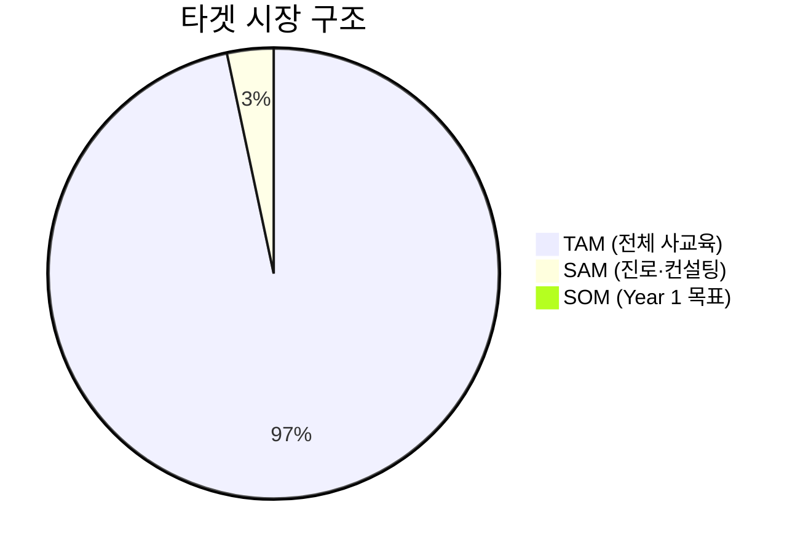

| 구분 | 규모 | 산출 근거 |
|------|------|---------|
| **TAM** (Total Addressable Market) | **29.2조원** | 한국 사교육 시장 전체 (2024) |
| **SAM** (Serviceable Addressable Market) | **1,007억원** | 진로진학 컨설팅 시장 (2024, YoY +33%) |
| **확장 SAM** | **3,000억원** | 진학 컨설팅 + 유학 컨설팅 + 진로 교육 도서 |
| **SOM** (Serviceable Obtainable Market) | **87억원 (Year 1)** | 중고등학생 260만 × 0.5% 침투율 × 평균 ARPU 6.7만원 |

### 8-2. 시장 성장 드라이버

| 드라이버 | 영향 | 설명 |
|---------|------|------|
| **입시 정보 비대칭 심화** | ↑↑↑ | 매년 바뀌는 입시 정책 → 컨설팅 수요 증가 (YoY +33%) |
| **생기부 종합전형 확대** | ↑↑↑ | 비교과 활동/포트폴리오 중요도 상승 |
| **자유학기제 확대** | ↑↑ | 중학교 진로 탐색 의무화 → 도구 수요 |
| **AI/ChatGPT 보편화** | ↑↑ | AI 멘토링 수용도 급증 |
| **사교육비 부담 증가** | ↑↑ | 저렴한 대안 서비스 수요 |
| **학령인구 감소** | ↓ | 총 학생 수 감소 (2026: 483만명) |
| **1인당 사교육비 증가** | ↑ | 학생 수 감소 → 1인당 투자 증가로 상쇄 |

---

## 9. Go-to-Market 전략

### 9-1. 진입 전략

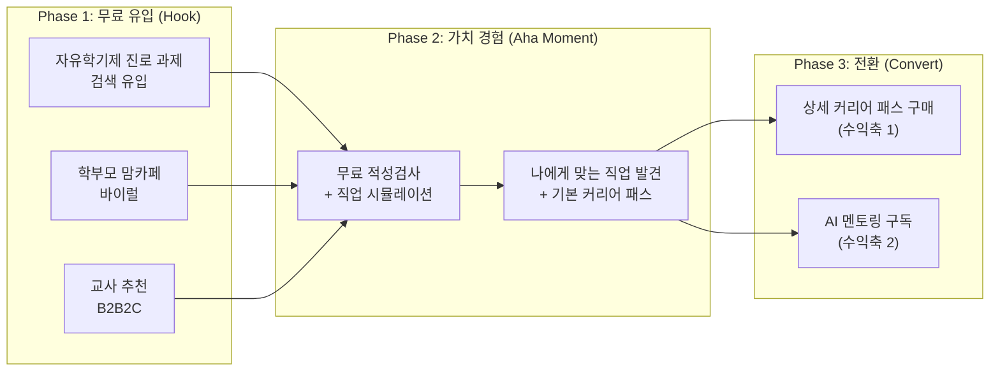

### 9-2. 채널별 전략

| 채널 | 전략 | 예상 효과 | 비용 |
|------|------|---------|------|
| **학교 교사 추천** (B2B2C) | 자유학기제 진로 도구로 무료 제공 | 학급 단위 유입 (30~40명) | 낮음 |
| **맘카페/학부모 커뮤니티** | "300만원 컨설팅 대신 월 2만원" 바이럴 | 학부모 결제 전환 | 낮음 |
| **네이버/유튜브 SEO** | "의사 되려면", "생기부 관리법" 키워드 | 검색 유입 | 중간 |
| **인스타그램/틱톡** | 진로 퀴즈, 직업 시뮬레이션 클립 | 중고등학생 인지도 | 중간 |
| **교육청 제휴** | 공교육 보조 도구로 MOU | 대규모 무료 가입 → 유료 전환 | 높음 (시간 투자) |

---

## 10. 로드맵 & 마일스톤

### 10-1. 개발 로드맵

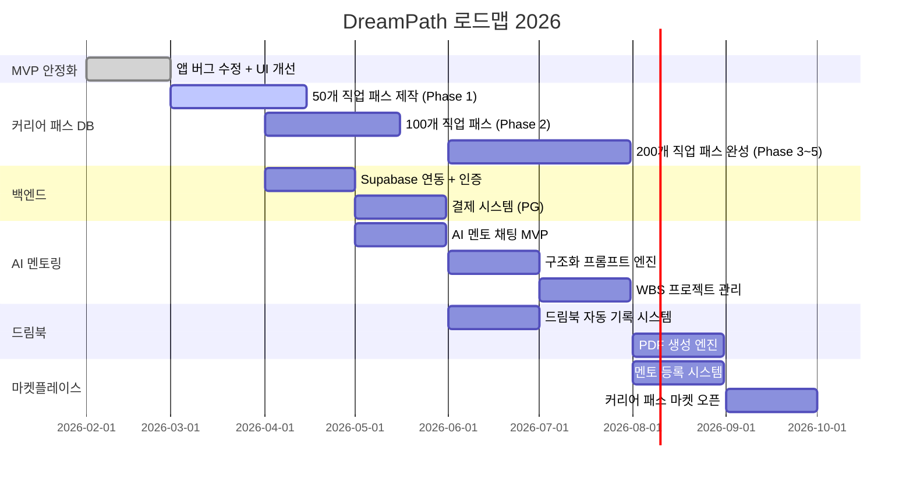

### 10-2. 마일스톤

| 시기 | 마일스톤 | 핵심 지표 |
|------|---------|---------|
| **2026 Q1** | MVP 안정화 + 50개 패스 완성 | 앱 완성도, 패스 50개 |
| **2026 Q2** | 백엔드 + 결제 + AI 멘토 MVP | 가입 5,000명, 첫 매출 |
| **2026 Q3** | 200개 패스 + WBS + 드림북 | 가입 30,000명, MRR 3,000만원 |
| **2026 Q4** | 마켓플레이스 오픈 | 멘토 50명, 월 거래 500건 |
| **2027 Q1** | 학교 B2B 영업 시작 | 파트너 학교 100개 |
| **2027 Q2** | 시리즈 A 투자 유치 | 가입 100,000명, ARR 10억원 |

---

## 11. 재무 전망

### 11-1. 3개년 재무 요약

| 항목 | Year 1 (2026) | Year 2 (2027) | Year 3 (2028) |
|------|-------------|-------------|-------------|
| **가입자** | 50,000명 | 200,000명 | 500,000명 |
| | | | |
| **수익축 1: 외부 커리어 패스 C2C 판매** | | | |
| 등록 판매자 | 50명 | 300명 | 1,000명 |
| 연간 거래 건수 | 2,000건 | 20,000건 | 100,000건 |
| 평균 거래 단가 | 15,000원 | 22,000원 | 28,000원 |
| 수수료 수익 (20%) | 600만원 | 8,800만원 | 5.6억원 |
| | | | |
| **수익축 2: AI 멘토링 구독** | | | |
| Explorer (9,900원) | 1,500명 | 8,000명 | 25,000명 |
| Pioneer (19,900원) | 500명 | 3,000명 | 10,000명 |
| 구독 매출 | 2.97억원 | 16.7억원 | 53.6억원 |
| | | | |
| **수익축 3: 내부 세미나 & 프로젝트 모임** | | | |
| 연간 개최 수 | 12회 | 36회 | 96회 |
| 평균 참가자 × 참가비 | 30명 × 4만원 | 50명 × 5만원 | 80명 × 6만원 |
| 세미나 매출 | 1,440만원 | 9,000만원 | 4.6억원 |
| | | | |
| **총 매출** | **3.17억원** | **18.5억원** | **63.8억원** |
| **영업비용** | 4억원 | 10억원 | 22억원 |
| **영업이익** | -0.83억원 | 8.5억원 | 41.8억원 |

### 11-2. 비용 구조

| 항목 | Year 1 | Year 2 | Year 3 | 비고 |
|------|--------|--------|--------|------|
| 인건비 (개발 3명) | 2.4억원 | 4.8억원 | 8억원 | 팀 확장 |
| AI API 비용 | 0.6억원 | 3억원 | 8억원 | OpenAI/Claude API |
| 서버/인프라 | 0.3억원 | 0.8억원 | 2억원 | Supabase/Vercel |
| 콘텐츠 제작 | 1억원 | 1.5억원 | 2억원 | 200개 패스 + 강의 |
| 마케팅 | 0.5억원 | 1.5억원 | 4억원 | SEO, 바이럴, 학교 영업 |
| 기타 | 0.2억원 | 0.4억원 | 1억원 | 사무실, 법무, 회계 |
| **합계** | **5억원** | **12억원** | **25억원** | |

### 11-3. 투자 요청

| 라운드 | 시기 | 금액 | 용도 |
|--------|------|------|------|
| **Pre-Seed** | 2026 Q1 | **2억원** | MVP 완성 + 200개 패스 + 팀 빌딩 |
| **Seed** | 2026 Q4 | **5~8억원** | AI 멘토 고도화 + 마켓 구축 + 마케팅 |
| **Series A** | 2027 Q2 | **20~30억원** | B2B 영업 + 해외 진출 + 팀 확장 |

---

## 부록: 핵심 한 장 요약

```
┌───────────────────────────────────────────────────────────────┐
│                                                               │
│                        DreamPath                              │
│          "입시 컨설팅의 민주화: 300만원 → 월 9,900원"            │
│                                                               │
├───────────────────────────────────────────────────────────────┤
│                                                               │
│  문제: 진학 컨설팅 1,007억 시장, 연 33% 성장                    │
│       300만원짜리 상담을 받아야만 입시 전략을 세울 수 있음         │
│       지방 학생은 기회조차 없음                                  │
│                                                               │
│  솔루션: 3단계 → 드림북 자동 완성                               │
│       ① 적성검사로 직업을 찾는다 → 📍 직업 찾는 기록            │
│       ② 커리어 패스를 세운다     → 📋 패스 설계 기록            │
│       ③ 프로젝트를 실행한다      → 🚀 프로젝트 실행 기록        │
│       = 3가지 기록이 모여 드림북(입시 포트폴리오) 자동 완성       │
│                                                               │
│  수익 모델 3가지:                                              │
│       🔵 외부 커리어 패스 C2C 판매 (사용자가 만들어 판매)        │
│       🟢 AI 프로젝트 멘토링 (월 9,900 / 19,900원 구독)         │
│       🟠 내부 세미나 & 프로젝트 실행 모임 (점진적 활성화)        │
│                                                               │
│  시장: TAM 29.2조원 / SAM 1,007억원 / SOM Year1 3.2억원        │
│  고객: 중고등학생 260만명 + 학부모                               │
│  경쟁 우위: 유일한 "탐색 → 설계 → 실행" 풀스택 서비스            │
│                                                               │
│  목표: 입시 컨설턴트 · 유학원 시장을 디지털로 대체                 │
│                                                               │
│  투자 요청: Pre-Seed 2억원                                     │
│                                                               │
└───────────────────────────────────────────────────────────────┘
```
