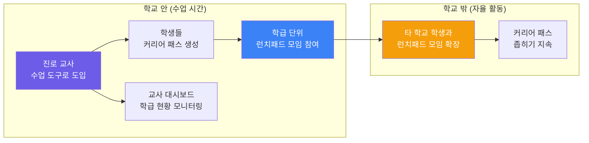
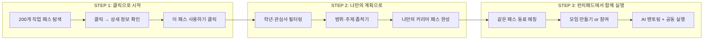
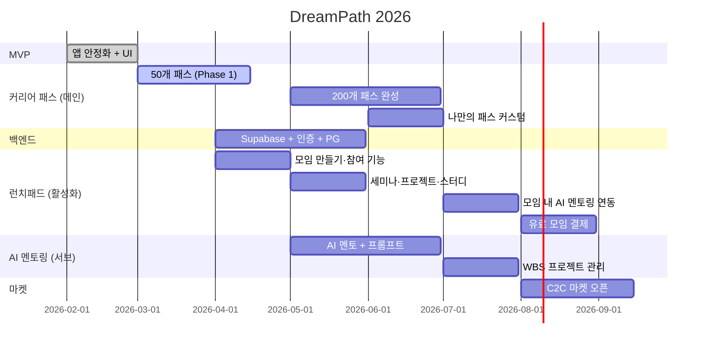

<p align="center">
  
  
  
  
</p>

# DreamPath

### 클릭 한 번으로 커리어 패스 설계, 런치패드로 함께 실행

> 중학생~고등학생 AI 커리어 패스 설계 + 모임 활성화 플랫폼  
> "결과보다 과정이 중요하다 — AI가 결과를 만드는 시대, 우리는 기획하는 사람을 키운다"  
> 진로 교사 수업 도구 + 학생 자기주도 진로 설계 | 모바일 퍼스트 430px

---

## 한 문장 요약

**"클릭으로 커리어 패스를 설계하고, 런치패드 모임에서 같은 꿈 동료와 함께 실행한다"**

```
  ① 클릭으로 만든다 ──── ② 나만의 것으로 좁힌다 ──── ③ 런치패드에서 함께 실행
        │                        │                          │
   커리어 패스 탐색          나만의 범위·주제 설정         모임 만들기 & 참여
   200개 직업 패스 클릭      관심사·학년·목표로 필터링      세미나·프로젝트·스터디
   "이 패스 사용하기"         점점 좁혀지는 나만의 계획      혼자 포기 → 함께 완성
```

> **AI 시대의 역설**: AI는 결과물을 만드는 데 점점 더 유리해진다.  
> 그렇다면 우리가 집중해야 할 것은 **무엇을 만들지 기획하는 과정**이다.  
> DreamPath는 그 기획 과정을 클릭 한 번으로 시작하고, 런치패드에서 함께 완성하게 한다.

---

## 왜 DreamPath인가?

### 핵심 철학: 과정이 곧 결과다

```
기존 방식:  계획 세우기 (어렵고 막막) → 혼자 실행 → 대부분 포기
DreamPath: 클릭으로 패스 선택 → 나만의 것으로 좁히기 → 런치패드 모임에서 함께 실행
```

| 기존 문제 | DreamPath 해결 |
|----------|--------------|
| "어디서부터 시작하지?" | 클릭 한 번으로 커리어 패스 즉시 생성 |
| "계획 세우는 게 너무 어렵다" | 200개 패스 중 고르면 끝 |
| "내 상황에 맞게 바꾸고 싶다" | 나만의 범위·주제로 점점 좁혀가기 |
| "혼자 하면 포기하게 된다" | 런치패드 — 같은 꿈 동료와 모임 만들기 & 참여 |
| "AI가 다 해주면 내가 할 게 없다" | 기획하는 과정이 진짜 실력이 된다 |

### 시장의 문제

#### 학생이 겪는 어려움

| 문제 | 현재 해결책 | 비용 | 한계 |
|------|-----------|------|------|
| "나한테 맞는 직업을 모르겠다" | 커리어넷 검사 | 무료 | 검사만 하고 끝, 후속 없음 |
| "의사 되려면 중학교 때 뭘 해?" | 입시 컨설턴트 | **300만원** | 1회성, 서울 한정 |
| "생기부에 뭘 넣어야 해?" | 학원 컨설팅 | **월 50~100만원** | 지방은 접근 불가 |
| "커리어 패스를 직접 만들기 어렵다" | 혼자 구글링 | 0원 | 방향 모름, 완성 못 함 |
| "같은 목표 동료가 없다" | 학교 동아리 | 0원 | 관심사 안 맞음, 주도적 활동 어려움 |

#### 진로 교사가 겪는 어려움

| 문제 | 현재 해결책 | 한계 |
|------|-----------|------|
| "16차시 수업을 채울 콘텐츠가 없다" | 커리어넷 검사 + PPT 직접 제작 | 매 학기 반복 제작, 시간 소모 |
| "학생 300명 개별 맞춤 지도가 불가능하다" | 학기당 1인 15분 상담 | 물리적 시간 한계 |
| "활동 기록 정리가 너무 힘들다" | 엑셀/나이스 수기 입력 | 학기말 야근, 생기부 근거 부족 |
| "학생들이 검사 한 번 하고 흥미를 잃는다" | 적성검사 1회 | 지속적 탐색 유도 수단 없음 |
| "직업 체험처 섭외가 너무 어렵다" | 직접 섭외 (연 1~2회) | 비용·시간 한계, 지역 편차 큼 |

> **사교육 시장 29.2조원** | **진학 컨설팅 1,007억원 (매년 33% 성장)**  
> 클릭 한 번으로 커리어 패스를 만들고 런치패드로 함께 실행하는 서비스가 없다. DreamPath가 처음이다.

---

## 학교 내 사용 흐름 (B2B2C — Teacher First)

> **진로 교사가 수업 도구로 도입 → 학급 단위 유입 → 학생이 수업 밖에서도 지속**



### 수업 16차시 시나리오 (자유학기제 / 창의적 체험활동)

| 차시 | 활동 | 교사 역할 | 학생 역할 |
|------|------|---------|---------|
| **1~2차시** | 적성검사 + 200개 직업 탐험 | 앱 소개, 가이드 | RIASEC 검사 → 관심 직업 탐색 |
| **3~4차시** | 커리어 패스 선택 + 나만의 계획 | 대시보드로 진행 확인 | 클릭으로 패스 선택 → 학년·목표 커스텀 |
| **5~8차시** | 학급 런치패드 모임 | 팀 편성 지원 | 같은 직업군 3~5명 팀 → 미니 프로젝트 |
| **9~16차시** | 프로젝트 진행 + 발표 | 모임별 피드백 | AI 멘토링 활용 → 결과 발표 |
| **학기 말** | 활동 기록 정리 | 학기 리포트 출력 → 생기부 반영 | 자율 런치패드로 타 학교 확장 |

---

## 핵심 기능: 커리어 패스 설계 + 런치패드 모임

```
┌─────────────────────────────────────────────────────────────┐
│                                                             │
│   STEP 1: 클릭으로 패스 선택                                  │
│   ─────────────────────────                                 │
│   200개 직업 커리어 패스 중 마음에 드는 것을 클릭              │
│   "이 패스 사용하기" → 즉시 내 커리어 패스가 된다              │
│                                                             │
│   STEP 2: 나만의 것으로 좁히기                                │
│   ─────────────────────────                                 │
│   학년, 관심사, 목표에 맞게 필터링                             │
│   범위와 주제를 점점 좁혀 나만의 계획으로 발전                  │
│   (중2 → 고1 → 의대 목표 → 과학 탐구 특화)                   │
│                                                             │
│   STEP 3: 런치패드에서 함께 실행                              │
│   ─────────────────────────                                 │
│   같은 커리어 패스 동료 자동 매칭                              │
│   세미나·프로젝트·스터디 모임 만들기 & 참여                    │
│   모임 내 AI 멘토링 + 공동 프로젝트 실행                       │
│                                                             │
└─────────────────────────────────────────────────────────────┘
```

### 경쟁 환경에서 DreamPath의 위치

```
학생의 여정:  클릭으로 시작 ─── 나만의 계획 ─── 함께 실행 ─── 지속 성장

커리어넷      ████░░░░░░░░░░░░░░░░░░░░░░░░░░░░░░░░░░░░░░░░░░░
              적성검사만 → 이후 행동 제시 없음

메이저맵      ████████░░░░░░░░░░░░░░░░░░░░░░░░░░░░░░░░░░░░░░░
              검사 + 학과 연결 → 패스 없음, B2B

드림어필      ░░░░░░░░░░░░░░░░░░░░████████░░░░░░░░░░░░░░░░░░░
              실천 기록 SNS → 방향 제시 없음

베어러블      ░░░░░░░░░░░░░░░░░░░░░░░░░░░░████████████░░░░░░░
              세특 포트폴리오 → 진로 탐색·모임 없음

입시 컨설턴트 ░░░░░░████████████████████████░░░░░░░░░░░░░░░░░
              설계~실행 → 300만원, 1회성, 서울 한정

DreamPath    ████████████████████████████████████████████████████
              클릭 → 나만의 계획 → 런치패드 모임 → 지속 성장 (전 구간 유일)
```

---

## 3단계 핵심 흐름



> **핵심 철학**: 결과는 AI가 만드는 데 유리하다.  
> 우리는 **무엇을 만들지 기획하는 과정**에 집중한다.  
> 커리어 패스를 설계하고 좁혀가는 과정 자체가 진짜 실력이고 포트폴리오다.

### 런치패드 모임 유형

| 모임 유형 | 목적 | 정원 | 대상 | 수익 |
|-----------|------|------|------|------|
| 🎓 **세미나 모임** | 현직자·선배 지식 공유 | 20~50명 | 관심 직업 탐색 학생 | 유료 참가비 수수료 20% |
| 🚀 **프로젝트 모임** | 팀 빌딩 + 공동 제작 | 3~5명 | 실행 단계 학생 | 유료 참가비 수수료 20% |
| 📚 **스터디 모임** | 꾸준한 학습 | 5~10명 | 지속 탐색 학생 | 무료 (활성화 목적) |

---

## 수익 모델

| # | 수익축 | 설명 | 수익 구조 | 활성화 시기 |
|---|--------|------|----------|-----------|
| 1 | **외부 커리어 패스 판매** | 합격 선배/현직자가 만든 패스를 C2C 마켓에서 판매 | 거래 수수료 20% | Phase 2 |
| 2 | **AI 프로젝트 멘토링** | 구조화된 AI 멘토 + WBS 관리 API 구독 | 월 9,900 / 19,900원 | Phase 1 (초기 핵심) |
| 3 | **런치패드 유료 모임** | 세미나·프로젝트 모임 (누구나 만들기 & 참여) | 참가비 수수료 20% | Phase 1~2 |

### 구독 플랜

| 플랜 | 가격 | 커리어 패스 | AI 멘토 | 런치패드 모임 |
|------|------|-----------|--------|-------------|
| **Free** | 0원 | 200개 탐색 + 기본 사용 | 5회/일 | 무료 모임 참여 1개 |
| **Explorer** | 9,900원/월 | 나만의 패스 무제한 저장 | 50회/월 | 무제한 참여 + 모임 생성 3개 |
| **Pioneer** | 19,900원/월 | 커스텀 패스 제작 + 공유 | 무제한 | 무제한 참여·생성 + 프리미엄 모임 |

---

## 핵심 숫자

| 지표 | 수치 |
|------|------|
| **TAM** | 한국 사교육 시장 29.2조원 (2024) |
| **SAM** | 진로진학 컨설팅 1,007억원 (YoY +33%) |
| **타겟 고객** | 중고등학생 260만명 + 학부모 + 진로 교사 |
| **제공 직업** | 200개 (8개 분야 × 25개) |
| **가격 파괴** | 기존 300만원 → 월 9,900원 (97% 절감) |
| **핵심 차별점** | 클릭 한 번 커리어 패스 생성 + 런치패드 모임 (시장 유일) |

---

## 로드맵



| 시기 | 마일스톤 | 지표 |
|------|---------|------|
| 2026 Q1 | MVP 안정화 + 50개 패스 | 앱 완성도 |
| 2026 Q2 | 200개 패스 + 런치패드 모임 MVP | 가입 5,000명, 활성 모임 10개 |
| 2026 Q3 | 백엔드 + 결제 + AI 멘토 + 유료 모임 | 가입 30,000명, MRR 3,000만원 |
| 2026 Q4 | C2C 마켓 + 런치패드 고도화 | 활성 모임 100개 |
| 2027 Q2 | 가입 100,000명, ARR 10억 | Series A |

---

## 기술 스택

| 영역 | 기술 |
|------|------|
| **Framework** | Next.js 16.1.6 (App Router, Turbopack) |
| **Language** | TypeScript |
| **Styling** | Tailwind CSS v4 |
| **UI** | Radix UI, Lucide Icons, Recharts |
| **State** | LocalStorage (클라이언트) → Supabase 예정 |
| **Package** | pnpm |
| **Deploy** | Vercel (예정) |

---

## 프로젝트 구조

```
AI-career-path/
├── frontend/                  # Next.js 앱
│   ├── app/                   # App Router 페이지
│   │   ├── page.tsx           # Splash 페이지
│   │   ├── onboarding/        # 온보딩 4슬라이드
│   │   ├── home/              # 홈 대시보드 (XP, 퀘스트, 추천)
│   │   ├── quiz/              # RIASEC 적성검사 (intro, quiz, results)
│   │   ├── explore/           # 8개 별 왕국 탐험
│   │   ├── jobs/              # 직업 상세 (L1~L4) + 스와이프 + 탐험
│   │   ├── simulation/        # 하루 체험 시뮬레이션
│   │   ├── career/            # 커리어 패스 메이커 (메인 기능)
│   │   │   └── components/
│   │   │       ├── CareerPathDetailDialog.tsx  # 상세 정보 + 사용하기
│   │   │       ├── CareerPathList.tsx          # 패스 탐색 목록
│   │   │       ├── VerticalTimelineList.tsx    # 나만의 타임라인
│   │   │       ├── CareerPathBuilder.tsx        # 전체 수정 빌더
│   │   │       ├── ReportModal.tsx             # 신고 모달 (공통)
│   │   │       └── community/                  # 커뮤니티 (학교 공간·그룹)
│   │   │           ├── CommunityTab.tsx       # 학교 공간 / 그룹 탭
│   │   │           ├── SchoolSpaceView.tsx    # 학교 공간 뷰
│   │   │           ├── GroupListView.tsx       # 그룹 목록·상세
│   │   │           ├── SharedPlanCardWithReactions.tsx  # 공유 패스 카드
│   │   │           ├── SharedPlanDetailDialog.tsx       # 공유 패스 상세
│   │   │           ├── ShareSettingsDialog.tsx          # 공유 설정
│   │   │           ├── formatTime.ts          # 시간 포맷 유틸
│   │   │           └── types.ts               # 커뮤니티 타입
│   │   ├── launchpad/         # 런치패드 (세미나·프로젝트·스터디 모임)
│   │   │   └── components/
│   │   │       ├── SessionCard.tsx    # 세션 카드
│   │   │       ├── SessionDetail.tsx  # 세션 상세
│   │   │       └── SessionForm.tsx    # 세션 생성/수정 폼
│   │   ├── path/              # 커리어 패스 (레거시)
│   │   ├── history/           # 활동 히스토리
│   │   └── settings/          # 설정
│   ├── components/            # 재사용 컴포넌트
│   ├── data/                  # 정적 JSON 데이터
│   │   ├── jobs.json          # 200개 직업 데이터
│   │   ├── kingdoms.json      # 8개 별(왕국) 데이터
│   │   ├── career-paths.json  # 커리어 패스 데이터
│   │   ├── career-path-templates.json  # 커리어 패스 템플릿
│   │   ├── launchpad.json     # 런치패드 세션 시드 데이터
│   │   ├── share-community.json  # 학교 공간·그룹·공유 패스 시드 데이터
│   │   ├── badges.json        # 뱃지 데이터 (12개)
│   │   ├── questions.json     # RIASEC 20문항
│   │   ├── simulations.json   # 시뮬레이션 시나리오
│   │   ├── levels.json        # XP 레벨 데이터
│   │   └── projects.json      # 프로젝트 데이터
│   ├── lib/                   # 비즈니스 로직
│   │   ├── storage.ts         # LocalStorage 래퍼
│   │   ├── badge-system.ts    # 뱃지 자동 획득 시스템
│   │   └── types.ts           # TypeScript 타입
│   ├── hooks/                 # 커스텀 훅
│   └── docs/                  # 기획 문서
│       ├── INVESTMENT_PROPOSAL.md  # 투자 제안서
│       ├── COMPETITOR_ANALYSIS.md  # 경쟁사 분석
│       ├── SITEMAP.md              # 사이트맵
│       ├── BADGE_SYSTEM.md         # 뱃지 시스템 가이드
│       └── CHANGES_SUMMARY.md      # 기획 현황
└── Readme.md                  # 이 파일
```

---

## 시작하기

### 필수 요구사항

- **Node.js** >= 20.x
- **pnpm** >= 10.x

### 개발 서버 실행

```bash
cd frontend
pnpm install
pnpm run dev
```

브라우저에서 `http://localhost:3000` 접속

### 프로덕션 빌드

```bash
cd frontend
pnpm run build
pnpm run start
```

### 린트 검사

```bash
cd frontend
pnpm run lint
```

---

## 현재 구현 현황

### 완료

- [x] Splash 페이지 (우주 파티클 애니메이션)
- [x] 온보딩 4슬라이드 (닉네임/학년 설정)
- [x] RIASEC 적성검사 20문항 + 결과 분석
- [x] 홈 대시보드 (XP 바, 일일 퀘스트, 추천 직업 성좌)
- [x] 탭바 (홈, 탐험, 프로젝트, 런치패드)
- [x] 8개 별 왕국 탐험
- [x] 직업 상세 페이지 (L1~L4 탭)
- [x] 직업 스와이프 (틴더 스타일)
- [x] 시뮬레이션 — 직업 하루 체험
- [x] **커리어 패스 탐색 (200개 직업 패스 목록)**
- [x] **클릭 → 상세 정보 → "이 패스 사용하기" 원클릭 선택**
- [x] **나만의 타임라인 — 선택한 패스로 커리어 계획 관리**
- [x] 커리어 패스 상세 다이얼로그 (좋아요, 즐겨찾기, 댓글, 공유)
- [x] 커리어 패스 C2C 공유 (내부 타임라인 / 외부 링크 복사)
- [x] **커뮤니티** — 학교 공간 · 그룹 (공유 패스 탐색)
  - [x] 학교 공간 (학교 코드로 참여, 같은 학교 공유 패스 목록)
  - [x] 그룹 (그룹 생성·참여, 친구 초대, 그룹 내 공유 패스)
  - [x] 공유 패스 카드 (좋아요, 북마크, NEW/확인 필요 뱃지, 업데이트 시간)
  - [x] 공유 패스 상세 (댓글·대댓글 트리, 신고, 운영자 공유)
  - [x] 확인 필요 뱃지 — 1주일 이상 경과 시 표시, 상세 조회 시 사라짐 (localStorage)
- [x] **런치패드** — 세미나 · 프로젝트 모임 · 스터디 (모임 만들기 & 참여)
  - [x] 세션 생성/수정/삭제 (CRUD)
  - [x] 참여/취소 (실시간 인원 카운트)
  - [x] 타입 필터 탭 (전체/세미나/프로젝트/스터디)
  - [x] 내 현황 탭 (전체/참여 중/내 런치패드)
  - [x] 세션 상세 보기
- [x] 뱃지 시스템 (12개, 자동 획득, 동적 UI)
- [x] XP / 레벨 시스템
- [x] 설정 페이지

### 다음 단계

- [ ] 200개 직업 커리어 패스 데이터 제작 (메인 최우선)
- [ ] 나만의 패스 커스텀 기능 (범위·주제 좁히기)
- [ ] 런치패드 — 모임 내 AI 멘토링 연동
- [ ] 런치패드 — 유료 모임 결제 시스템
- [ ] 교사 대시보드 (학급 진행 현황 모니터링)
- [ ] 백엔드 구축 (Supabase)
- [ ] 사용자 인증 (회원가입/로그인)
- [ ] AI 멘토 채팅 시스템 (서브)
- [ ] WBS 프로젝트 관리 (서브)
- [ ] C2C 커리어 패스 마켓플레이스
- [ ] 결제 시스템 (PG 연동)

---

## 문서 목록

| 문서 | 내용 |
|------|------|
| [`INVESTMENT_PROPOSAL.md`](INVESTMENT_PROPOSAL.md) | 투자 제안서 (시장, 수익 모델, 재무 전망, 페르소나) |
| [`docs/COMPETITOR_ANALYSIS.md`](frontend/docs/COMPETITOR_ANALYSIS.md) | 경쟁사 분석 |
| [`docs/SITEMAP.md`](frontend/docs/SITEMAP.md) | 전체 사이트맵 & 페이지 구성도 |
| [`docs/BADGE_SYSTEM.md`](frontend/docs/BADGE_SYSTEM.md) | 뱃지 시스템 설계 가이드 |
| [`docs/CHANGES_SUMMARY.md`](frontend/docs/CHANGES_SUMMARY.md) | 기획 및 개발 현황 |
| [`frontend/app/career/커뮤니티_학교공간_그룹_운영자_설계.md`](frontend/app/career/커뮤니티_학교공간_그룹_운영자_설계.md) | 커뮤니티 설계서 (학교 공간·그룹·운영자) |

---

## 한 장 요약

```
┌───────────────────────────────────────────────────────────────┐
│                                                               │
│                        DreamPath                              │
│    "클릭 한 번으로 커리어 패스 설계, 런치패드로 함께 실행"        │
│                                                               │
├───────────────────────────────────────────────────────────────┤
│                                                               │
│  핵심 철학:                                                    │
│  · AI 시대, 결과는 AI가 만든다                                  │
│  · 우리가 집중할 것은 기획하는 과정                              │
│  · 커리어 패스를 설계하는 과정 자체가 진짜 포트폴리오             │
│  · 혼자 포기하지 않도록 — 런치패드에서 함께 실행                 │
│                                                               │
│  핵심 기능 (메인):                                             │
│  · ① 클릭으로 커리어 패스 즉시 선택 (200개 직업 패스)            │
│  · ② 나만의 범위·주제로 점점 좁혀가기                           │
│                                                               │
│  활성화 기능 (런치패드):                                        │
│  · 세미나·프로젝트·스터디 모임 만들기 & 참여                     │
│  · 같은 커리어 패스 동료 자동 매칭                               │
│  · 모임 내 AI 멘토링 + 공동 프로젝트 실행                        │
│                                                               │
│  지원 기능 (서브):                                             │
│  · AI 프로젝트 멘토링 (실행 지원)                               │
│                                                               │
│  수익 모델:                                                    │
│  · 🔵 외부 커리어 패스 C2C 판매 (수수료 20%)                    │
│  · 🟢 AI 프로젝트 멘토링 (월 9,900 / 19,900원)                 │
│  · 🟠 런치패드 유료 모임 (참가비 수수료 20%)                    │
│                                                               │
│  고객:                                                        │
│  · 학생: 중고등학생 260만명 (자기주도 진로 설계)                 │
│  · 교사: 진로전담교사 (수업 도구 + 학급 관리)                    │
│  · 학부모: 진로 불안 해소 + 비용 절감                           │
│                                                               │
│  강점:                                                        │
│  · 클릭 한 번으로 커리어 패스 즉시 생성 (시장 유일)              │
│  · 200개 커리어 패스 DB (시장에 없는 데이터)                    │
│  · 런치패드 모임 (혼자 포기 → 함께 완성)                        │
│  · 교사 수업 도구 → B2B2C 학급 단위 유입                        │
│                                                               │
│  시장: TAM 29.2조 / SAM 1,007억 / 타겟 260만명                │
│  목표: 입시 컨설턴트 · 유학원 시장을 디지털로 대체               │
│                                                               │
└───────────────────────────────────────────────────────────────┘
```
