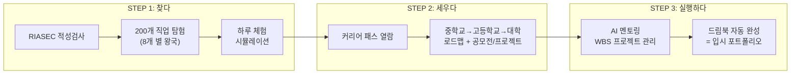
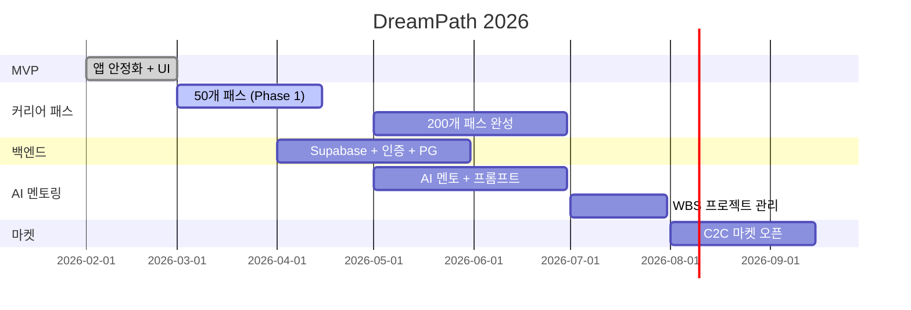

<p align="center">
  
  
  
  
</p>

# DreamPath

### 입시 컨설팅의 민주화: 300만원짜리 입시 상담을 월 9,900원으로

> 중학생~고등학생 AI 커리어 패스 & 프로젝트 멘토링 플랫폼  
> 우주 탐험 x 직업 RPG 테마 | 모바일 퍼스트 430px

---

## 한 문장 요약

**"나의 직업을 찾고, 그 직업으로 가는 길을 세우고, 직접 실행하여 드림북을 완성한다"**

```
  ① 찾다 ─────────── ② 세우다 ─────────── ③ 실행하다 ──── 완성
     │                   │                     │              │
     적성검사             커리어 패스            AI 프로젝트      드림북
     200개 직업 탐험      중학교→대학 로드맵      멘토링 + WBS    자동 포트폴리오
     시뮬레이션 체험       공모전/프로젝트 설계    실행 + 기록      = 입시 제출물
```

---

## 왜 DreamPath인가?

### 시장의 문제

| 문제 | 현재 해결책 | 비용 | 한계 |
|------|-----------|------|------|
| "나한테 맞는 직업을 모르겠다" | 커리어넷 검사 | 무료 | 검사만 하고 끝, 후속 없음 |
| "의사 되려면 중학교 때 뭘 해?" | 입시 컨설턴트 | **300만원** | 1회성, 서울 한정 |
| "생기부에 뭘 넣어야 해?" | 학원 컨설팅 | **월 50~100만원** | 지방은 접근 불가 |
| "프로젝트 어떻게 시작하지?" | 혼자 구글링 | 0원 | 방향 모름, 완성 못 함 |
| "포트폴리오 정리가 안 돼" | 수동 엑셀/문서 | 0원 | 산발적, 입시에 활용 불가 |

> **사교육 시장 29.2조원** | **진학 컨설팅 1,007억원 (매년 33% 성장)**  
> 이 전체 과정을 해결하는 서비스가 없다. DreamPath가 처음이다.

### 경쟁 환경에서 DreamPath의 위치

```
학생의 여정:  찾다 ────────── 세우다 ────────── 실행하다 ───── 완성

커리어넷      ████░░░░░░░░░░░░░░░░░░░░░░░░░░░░░░░░░░░░░░░░░░░
              적성검사만 → 이후 행동 제시 없음

메이저맵      ████████░░░░░░░░░░░░░░░░░░░░░░░░░░░░░░░░░░░░░░░
              검사 + 학과 연결 → 패스 없음, B2B

드림어필      ░░░░░░░░░░░░░░░░░░░░░░░░████████░░░░░░░░░░░░░░░
              실천 기록 SNS → 방향 제시 없음

베어러블      ░░░░░░░░░░░░░░░░░░░░░░░░░░░░░░░████████████░░░░
              세특 포트폴리오 → 진로 탐색 없음

입시 컨설턴트 ░░░░░░░████████████████████████████████░░░░░░░░░
              설계~실행 → 300만원, 1회성, 서울 한정

DreamPath    ████████████████████████████████████████████████████
              찾다 → 세우다 → 실행하다 → 완성 (전 구간 유일)
```

### 핵심 비교표

| 기능 | 커리어넷 | 메이저맵 | 드림어필 | 에듀캔버스 | 베어러블 | 컨설턴트 | **DreamPath** |
|------|---------|---------|---------|----------|---------|---------|-------------|
| 적성검사 | ✅ | ✅ | ❌ | ✅ | ❌ | △ | ✅ |
| 직업 시뮬레이션 | ❌ | ❌ | ❌ | ✅ 3D | ❌ | ❌ | ✅ RPG |
| **커리어 패스 DB** | ❌ | ❌ | ❌ | ❌ | ❌ | ✅ 수동 | **✅ 200개** |
| AI 멘토링 | ❌ | △ | ❌ | △ | △ 세특 | ❌ | **✅ 구조화** |
| 자동 포트폴리오 | ❌ | ❌ | △ | ❌ | ✅ 세특 | ❌ | **✅ 드림북** |
| C2C 마켓 | ❌ | ❌ | ❌ | ❌ | ❌ | ❌ | **✅ 유일** |
| 가격 | 무료 | B2B | B2C+B2B | B2B | B2C+B2B | 300만원+ | **무료~월 19,900원** |

---

## 3단계 핵심 흐름



### 드림북 = 3가지 자동 기록의 결과물

> 드림북은 직접 만드는 것이 아니다. 앱 활동이 자동으로 기록되어 완성된다.

| 기록 | 자동 수집 시점 | 수집 데이터 | 입시 활용 |
|------|-------------|-----------|----------|
| **직업 찾는 기록** | STEP 1 | 적성 유형, 탐험 기록, 시뮬레이션, 관심 직업 | 자소서 "나는 어떤 사람인가" |
| **커리어 패스 기록** | STEP 2 | 선택 패스, 로드맵, 공모전/프로젝트 설계 | 면접 "나의 계획은 무엇인가" |
| **프로젝트 실행 기록** | STEP 3 | WBS, 결과물, 멘토링 로그, 세미나 참가 | 생기부 비교과 + 포트폴리오 |

---

## 수익 모델

| # | 수익축 | 설명 | 수익 구조 | 활성화 시기 |
|---|--------|------|----------|-----------|
| 1 | **외부 커리어 패스 판매** | 합격 선배/현직자가 만든 패스를 C2C 마켓에서 판매 | 거래 수수료 20% | 점진적 |
| 2 | **AI 프로젝트 멘토링** | 구조화된 AI 멘토 + WBS 관리 API 구독 | 월 9,900 / 19,900원 | 초기 핵심 |
| 3 | **내부 세미나 & 프로젝트 모임** | 직업별 세미나, 부트캠프, 프로젝트 실행 모임 | 참가비 건당 과금 | 점진적 확장 |

### 구독 플랜

| 플랜 | 가격 | AI 멘토 | WBS | 드림북 |
|------|------|--------|-----|--------|
| **Free** | 0원 | 5회/일 | ❌ | 열람만 |
| **Explorer** | 9,900원/월 | 50회/월 | 1개 | 자동 기록 |
| **Pioneer** | 19,900원/월 | 무제한 | 무제한 | 기록 + PDF 출력 |

---

## 핵심 숫자

| 지표 | 수치 |
|------|------|
| **TAM** | 한국 사교육 시장 29.2조원 (2024) |
| **SAM** | 진로진학 컨설팅 1,007억원 (YoY +33%) |
| **타겟 고객** | 중고등학생 260만명 + 학부모 |
| **제공 직업** | 200개 (8개 분야 x 25개) |
| **가격 파괴** | 기존 300만원 → 월 9,900원 (97% 절감) |
| **목표** | 입시 컨설턴트 · 유학원 시장을 디지털로 대체 |

---

## 로드맵



| 시기 | 마일스톤 | 지표 |
|------|---------|------|
| 2026 Q2 | 200개 패스 + AI 멘토 런칭 | 핵심 제품 완성 |
| 2026 Q3 | 가입 30,000명 | PMF 검증 |
| 2026 Q4 | C2C 마켓 오픈 | 멘토 50명 |
| 2027 Q2 | 가입 100,000명, ARR 10억 | Series A |

---

## 기술 스택

| 영역 | 기술 |
|------|------|
| **Framework** | Next.js 16.1.6 (App Router, Turbopack) |
| **Language** | TypeScript |
| **Styling** | Tailwind CSS v4 |
| **UI** | Radix UI, Lucide Icons, Recharts |
| **State** | LocalStorage (클라이언트) → Supabase 예정 |
| **Package** | pnpm |
| **Deploy** | Vercel (예정) |

---

## 프로젝트 구조

```
AI-career-path/
├── frontend/                  # Next.js 앱
│   ├── app/                   # App Router 페이지
│   │   ├── page.tsx           # Splash 페이지
│   │   ├── onboarding/        # 온보딩 4슬라이드
│   │   ├── home/              # 홈 대시보드 (XP, 퀘스트, 추천)
│   │   ├── quiz/              # RIASEC 적성검사 (intro, quiz, results)
│   │   ├── explore/           # 8개 별 왕국 탐험
│   │   ├── jobs/              # 직업 상세 (L1~L4) + 스와이프
│   │   ├── simulation/        # 하루 체험 시뮬레이션
│   │   ├── path/              # 커리어 패스
│   │   ├── portfolio/         # 드림북 (여정/배지/통계)
│   │   └── settings/          # 설정
│   ├── components/            # 재사용 컴포넌트
│   ├── data/                  # 정적 JSON 데이터
│   │   ├── jobs.json          # 200개 직업 데이터
│   │   ├── kingdoms.json      # 8개 별(왕국) 데이터
│   │   ├── career-paths.json  # 커리어 패스 데이터
│   │   ├── badges.json        # 뱃지 데이터 (12개)
│   │   ├── questions.json     # RIASEC 20문항
│   │   ├── simulations.json   # 시뮬레이션 시나리오
│   │   └── ...
│   ├── lib/                   # 비즈니스 로직
│   │   ├── storage.ts         # LocalStorage 래퍼
│   │   ├── badge-system.ts    # 뱃지 자동 획득 시스템
│   │   └── types.ts           # TypeScript 타입
│   ├── hooks/                 # 커스텀 훅
│   └── docs/                  # 기획 문서
│       ├── INVESTMENT_PROPOSAL.md  # 투자 제안서
│       ├── COMPETITOR_ANALYSIS.md  # 경쟁사 분석
│       ├── SITEMAP.md              # 사이트맵
│       ├── BADGE_SYSTEM.md         # 뱃지 시스템 가이드
│       └── CHANGES_SUMMARY.md      # 기획 현황
└── Readme.md                  # 이 파일
```

---

## 시작하기

### 필수 요구사항

- **Node.js** >= 20.x
- **pnpm** >= 10.x

### 개발 서버 실행

```bash
cd frontend
pnpm install
pnpm run dev
```

브라우저에서 `http://localhost:3000` 접속

### 프로덕션 빌드

```bash
cd frontend
pnpm run build
pnpm run start
```

### 린트 검사

```bash
cd frontend
pnpm run lint
```

---

## 현재 구현 현황

### 완료

- [x] Splash 페이지 (우주 파티클 애니메이션)
- [x] 온보딩 4슬라이드 (닉네임/학년 설정)
- [x] RIASEC 적성검사 20문항 + 결과 분석
- [x] 홈 대시보드 (XP 바, 일일 퀘스트, 추천 직업 성좌)
- [x] 탭바 (홈, 탐험, 프로젝트, 드림북)
- [x] 8개 별 왕국 탐험
- [x] 직업 상세 페이지 (L1~L4 탭)
- [x] 직업 스와이프 (틴더 스타일)
- [x] 시뮬레이션 — 직업 하루 체험
- [x] 커리어 패스 (기본 2개 직업)
- [x] 드림북 포트폴리오 (여정/배지/통계)
- [x] 뱃지 시스템 (12개, 자동 획득, 동적 UI)
- [x] XP / 레벨 시스템
- [x] 설정 페이지

### 다음 단계

- [ ] 200개 직업 커리어 패스 데이터 제작
- [ ] 백엔드 구축 (Supabase)
- [ ] 사용자 인증 (회원가입/로그인)
- [ ] AI 멘토 채팅 시스템
- [ ] WBS 프로젝트 관리
- [ ] C2C 커리어 패스 마켓플레이스
- [ ] 드림북 PDF 생성 엔진
- [ ] 결제 시스템 (PG 연동)

---

## 문서 목록

| 문서 | 내용 |
|------|------|
| [`docs/INVESTMENT_PROPOSAL.md`](frontend/docs/INVESTMENT_PROPOSAL.md) | 투자 제안서 (시장, 수익 모델, 재무 전망) |
| [`docs/COMPETITOR_ANALYSIS.md`](frontend/docs/COMPETITOR_ANALYSIS.md) | 경쟁사 분석 & 고객 페르소나 |
| [`docs/SITEMAP.md`](frontend/docs/SITEMAP.md) | 전체 사이트맵 & 페이지 구성도 |
| [`docs/BADGE_SYSTEM.md`](frontend/docs/BADGE_SYSTEM.md) | 뱃지 시스템 설계 가이드 |
| [`docs/CHANGES_SUMMARY.md`](frontend/docs/CHANGES_SUMMARY.md) | 기획 및 개발 현황 (상) |
| [`docs/CHANGES_SUMMARY_2.md`](frontend/docs/CHANGES_SUMMARY_2.md) | 기획 및 개발 현황 (하) |

---

## 한 장 요약

```
┌───────────────────────────────────────────────────────────────┐
│                                                               │
│                        DreamPath                              │
│         "입시 컨설팅의 민주화: 300만원 → 월 9,900원"             │
│                                                               │
├───────────────────────────────────────────────────────────────┤
│                                                               │
│  문제:                                                        │
│  · 진학 컨설팅 1,007억 시장, 매년 33% 성장                      │
│  · 300만원 컨설팅 없이는 입시 전략을 세울 수 없다                 │
│  · 지방 학생은 기회조차 없다                                     │
│  · 찾다→세우다→실행→완성 전체를 해결하는 곳이 없다                │
│                                                               │
│  솔루션:                                                       │
│  · ① 적성검사 → 200개 직업 시뮬레이션 (무료)                    │
│  · ② 커리어 패스 설계 (중학교~대학 로드맵)                       │
│  · ③ AI 멘토링 프로젝트 실행 → 드림북 자동 완성                  │
│                                                               │
│  드림북 = 3가지 자동 기록:                                       │
│  · 📍 직업 찾는 기록  📋 패스 설계 기록  🚀 프로젝트 실행 기록   │
│                                                               │
│  수익 모델:                                                     │
│  · 🔵 외부 커리어 패스 C2C 판매 (수수료 20%)                     │
│  · 🟢 AI 프로젝트 멘토링 (월 9,900 / 19,900원)                  │
│  · 🟠 내부 세미나 & 프로젝트 실행 모임                           │
│                                                               │
│  강점:                                                         │
│  · 200개 커리어 패스 DB (시장에 없는 데이터)                      │
│  · 유일한 풀 커버리지 (탐색→설계→실행→완성)                      │
│  · 드림북 자동 포트폴리오 (Lock-in)                              │
│                                                               │
│  시장: TAM 29.2조 / SAM 1,007억 / 타겟 260만명                 │
│  목표: 입시 컨설턴트 · 유학원 시장을 디지털로 대체                 │
│                                                               │
└───────────────────────────────────────────────────────────────┘
```
