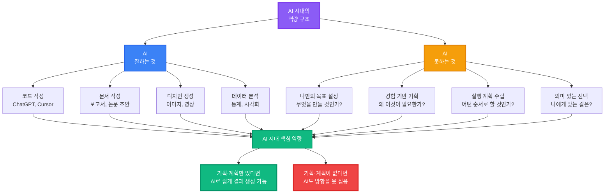
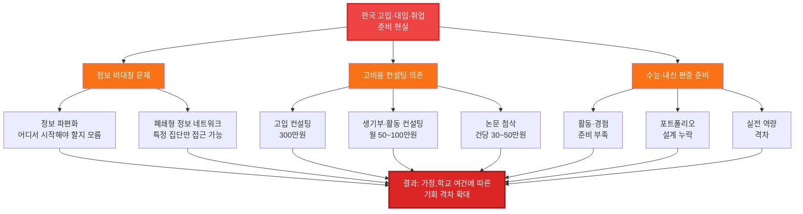
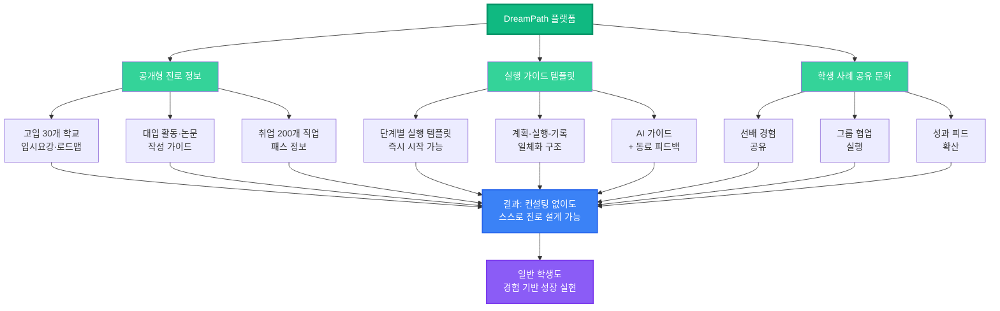
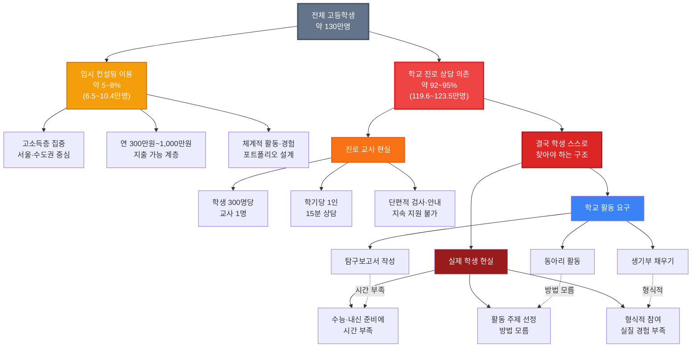
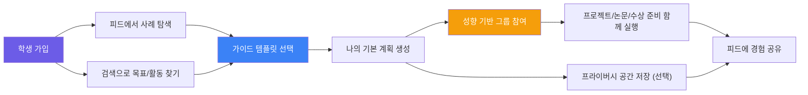
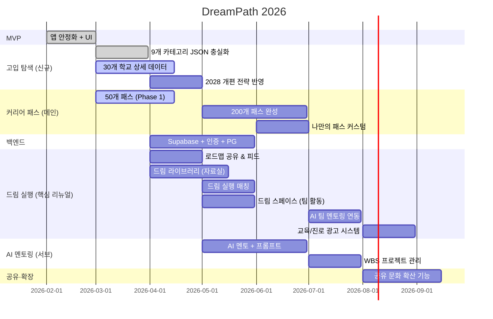

<p align="center">
  
  
  
  
  
</p>


# DreamPath

### 초등 고학년부터 시작하는 꿈 여정, 함께 찾고 함께 만드는 플랫폼

> 초등 고학년~고등학생~취업 준비까지 이어지는 진로 여정 플랫폼  
> "지름길보다 중요한 것은 함께 부딪치며 만드는 과정"  
> *학생 주도 공유·탐색·그룹 문화* 기반 진로 플랫폼 | 모바일 퍼스트 430px

---

## AI 시대, 왜 기획·계획이 더 중요한가?



### 핵심 메시지

| 구분 | 설명 | 예시 |
|-----|------|------|
| **AI가 잘하는 것** | 명확한 지시가 있을 때 실행 | "파이썬으로 데이터 시각화 코드 작성해줘" → 즉시 생성 |
| **AI가 못하는 것** | 나만의 목표·경험 기반 기획 | "나는 무엇을 만들어야 할까?" → AI는 답 못함 |
| **DreamPath 역할** | 기획·계획 수립 지원 | 가이드 템플릿 + 선배 사례 → 나만의 계획 수립 → AI로 실행 |

> **AI 시대 진로 준비 공식**  
> ```
> 나만의 기획·계획 (DreamPath) + AI 실행 도구 (ChatGPT, Cursor 등) = 빠른 결과 생성
> ```
> 
> - AI는 "어떻게(How)" 만드는지 탁월하지만, "무엇을(What)" "왜(Why)" 만들지는 학생 스스로 결정해야 합니다.
> - DreamPath는 학생이 **나만의 목표·계획을 수립**하도록 돕고, 실행은 AI 도구로 가속화합니다.
> - 기획·계획이 명확하면, AI로 논문·프로젝트·포트폴리오를 빠르게 완성할 수 있습니다.

---

## 왜 지금 필요한가? (문제 구조 도식)

### 기존 진로 준비 시스템의 문제점



### DreamPath 해결 방식



### 일반 학생 현실: 컨설팅 접근 불가 비율



> **핵심 통계**  
> - 전체 고등학생 중 **약 92~95%는 입시 컨설팅 없이 학교 진로 상담에 의존**  
> - 컨설팅 이용자는 주로 **고소득층·서울 수도권 집중** (연 300만원~1,000만원 지출)  
> - **학교 진로 교사 현실**: 학생 300명당 교사 1명, 학기당 1인 15분 상담 — **물리적 시간 한계**  
> - **학생 딜레마**: 학교는 탐구보고서·동아리·생기부 활동을 요구하지만, 실제로는 **수능·내신 준비에 바쁨 → 활동 주제 선정 방법 모름 → 형식적 참여로 끝남**  
> - 일반 학생 대부분은 **단편적 검사·안내 후 스스로 찾아야 함 → 활동·경험·포트폴리오 설계 격차 발생**  
> - 사교육 시장 29.2조원 중 진학 컨설팅 1,007억원 (매년 33% 성장) — **소수에게만 집중**

### 핵심 개선 포인트

| 문제 영역 | 컨설팅 이용 (5~8%) | 일반 학생 현실 (92~95%) | DreamPath 방식 |
|---------|------------------|---------------------|---------------|
| **정보 접근** | 컨설턴트 맞춤 정보 제공 | 학교 단편적 안내 → 혼자 구글링, 체계 없음 | 공개형 통합 정보 DB |
| **실행 지원** | 고가 컨설팅 (300만원~1,000만원) | 진로 교사 15분 상담 → 접근 불가, 스스로 찾아야 함 | 무료 가이드 템플릿 + AI 지원 |
| **준비 방향** | 활동·경험·포트폴리오 체계 설계 | 단편적 검사 후 → 수능·내신만 준비 | 경험·활동·포트폴리오 병행 |
| **협업 문화** | 컨설팅 그룹·멘토링 네트워크 | 개인 경쟁, 정보 고립 | 학생 사례 공유·그룹 협업 |
| **결과** | 상위권 대학 진학 유리 | 기회 격차 확대 | 누구나 실행 가능한 경로 제공 |

---

## 한 문장 요약

**"고입-대입-취업 준비의 비용·정보 격차를 줄이고, 일반 학생도 경험 기반으로 성장하게 돕는 진로 실행 플랫폼"**

```
  ① 초등 고학년 ──── ② 중학생 ──── ③ 고등학생 ──── ④ 대입 이후
        │                │                │                │
   흥미·경험 탐색      고입 준비       대입 준비        취업·중간교육 연결
   작은 프로젝트       학교 선택 로드맵  논문·활동·수상    SSAFY·42서울·AI사관학교
   공유 문화 시작      중1~중3 준비      그룹 협업         나의 길 확장
```

> **핵심 가치**: 꿈은 고가 컨설팅으로 사는 지름길이 아니라, 공개된 정보와 함께하는 실행으로 만드는 여정이다.  
> 학생은 피드와 검색으로 서로의 경험을 공유하고, 가이드 템플릿으로 스스로 성장한다.  
> DreamPath는 정보의 폐쇄성을 낮추고, 누구나 쉽게 길을 찾게 돕는다.

---

## 왜 DreamPath인가?

### 핵심 철학: 지름길이 아닌 함께 만드는 여정

```
기존 방식:  정보 비대칭 + 폐쇄형 네트워크 → 지름길 의존 → 기회 격차 확대
DreamPath: 공개 정보 + 공유 문화 + 가이드 문화 → 누구나 계획·실행 가능
```

### 왜 Notion/Jira와 다른가

많은 에디터 앱은 훌륭하지만, DreamPath는 진로 한정 실행 엔진입니다.

| 항목 | 일반 에디터 (Notion/Jira 등) | DreamPath |
|------|-------------------------------|-----------|
| 핵심 목적 | 범용 문서/업무 관리 | **고입·대입·진로 계획 특화** |
| 시작점 | 빈 페이지/보드 | **가이드 템플릿 즉시 시작** |
| 구조 | 사용자가 직접 설계 | **커리어 패스 큰 틀 자동 제공** |
| 실행 연결 | 수동 연결 | **작은 단계 분해 → 드림 실행 자동 연결** |
| 커뮤니티 맥락 | 일반 협업 | **같은 성향 학생 중심 공유·그룹 문화** |
| 결과 정리 | 별도 정리 필요 | **계획-실행-기록 흐름 일체화** |

### 계획 중심 실행 패턴

```
큰 틀 커리어 패스 설계 (Editor)
        ↓
작은 단계로 분해 (주/월/학기 단위)
        ↓
드림 실행 피드·검색·그룹에서 협업 실행
        ↓
결과 기록 및 공유 (다음 학생의 가이드 자산)
```

| 학생 중심 문제 | DreamPath 해결 |
|--------------|--------------|
| **초등 고학년**: "꿈이 뭔지 모르겠다" | 작은 경험 기반 탐색 템플릿 + 흥미 기록 |
| **고입**: "어떤 고등학교를 가야 할지 모르겠다" | 고입 탐색 — 30개 학교 입시요강·중1~중3 로드맵·합격 전략 |
| **대입**: "생기부에 뭘 넣어야 해? 논문은 어떻게 써?" | 논문·탐구보고서 작성 가이드 + 활동·수상·자격증 로드맵 |
| **대입**: "캠프·인턴·봉사 활동 정보가 없다" | 활동 정보 DB + 선배 사례 + 신청 일정 안내 |
| **취업**: "대학 졸업 후 진로가 막막하다" | 200개 직업 패스 + 연봉·전망·필요 역량 정보 |
| **중간 교육**: "SSAFY, 42서울은 어떻게 가나?" | 삼성 SSAFY, 42서울/경산, AI사관학교 입학 가이드 |
| **문화**: "좋은 정보가 폐쇄적으로 돈 많은 집단에만 흐른다" | 공유 문화 + 가이드 문화 + 공개 템플릿 운영 |

### 시장의 문제

#### 학생이 겪는 어려움 (고입-대입-취업 전 단계)

| 단계 | 문제 | 현재 해결책 | 비용 | 한계 |
|------|------|-----------|------|------|
| **고입** | "어떤 고등학교를 가야 할지 모르겠다" | 입시 설명회, 학원 상담 | 무료~50만원 | 정보 파편화, 비교 어려움 |
| **고입** | "과학고 준비를 언제부터 시작해야 해?" | 입시 컨설턴트 | **300만원** | 1회성, 서울 한정 |
| **대입** | "생기부에 뭘 넣어야 해?" | 학원 컨설팅 | **월 50~100만원** | 지방은 접근 불가 |
| **대입** | "논문·탐구보고서는 어떻게 써?" | 학원 첨삭 | **건당 30~50만원** | 주제 선정부터 막막함 |
| **대입** | "캠프·인턴·봉사 활동 정보가 없다" | 혼자 구글링 | 0원 | 신청 기한 놓침, 정보 부족 |
| **대입** | "수상·자격증은 어떤 걸 따야 해?" | 학원 추천 | 유료 | 개인 맞춤 아님 |
| **취업** | "대학 졸업 후 진로가 막막하다" | 커리어넷 검사 | 무료 | 검사만 하고 끝, 후속 없음 |
| **중간 교육** | "SSAFY, 42서울은 어떻게 가나?" | 혼자 검색 | 0원 | 정보 파편화, 준비 방법 모름 |
| **협업** | "같은 목표 동료가 없다" | 학교 동아리 | 0원 | 관심사 안 맞음, 지속 어려움 |

#### 학교 연계(선택)에서 겪는 어려움

| 문제 | 현재 해결책 | 한계 |
|------|-----------|------|
| "16차시 수업을 채울 콘텐츠가 없다" | 커리어넷 검사 + PPT 직접 제작 | 매 학기 반복 제작, 시간 소모 |
| "학생 300명 개별 맞춤 지도가 불가능하다" | 학기당 1인 15분 상담 | 물리적 시간 한계 |
| "학생들의 활동 계획과 실행을 추적하기 어렵다" | 엑셀/나이스 수기 입력 | 학기말 야근, 생기부 근거 부족 |
| "학생들이 검사 한 번 하고 흥미를 잃는다" | 적성검사 1회 | 지속적 탐색 유도 수단 없음 |
| "동아리 활동 관리가 어렵다" | 수기 기록 | 학생별 활동 추적 불가 |
| "논문·탐구보고서 지도가 어렵다" | 교사 개인 역량 | 전문 지식 부족, 시간 부족 |

> **사교육 시장 29.2조원** | **진학 컨설팅 1,007억원 (매년 33% 성장)**  
> 고입-대입-취업 전 단계를 하나의 플랫폼에서 계획하고 실행하는 서비스가 없다. DreamPath가 처음이다.

---

## 학생 주도 사용 흐름 (Student First)

> **기본은 피드·검색 공유 → 성향 기반 그룹 참여 → 필요 시 프라이버시 공간 활용**



### 학생 사용 시나리오 (기본 흐름)

| 단계 | 활동 | 학생 중심 행동 |
|------|------|--------------|
| **1단계** | 피드·검색 탐색 | 비슷한 목표 학생 사례/자료 탐색 |
| **2단계** | 가이드 템플릿 선택 | 고입/대입/활동/논문 기본 템플릿 불러오기 |
| **3단계** | 계획 생성 | 나의 목표·학년·관심사에 맞춰 수정 |
| **4단계** | 그룹 참여 | 같은 성향 친구들과 그룹 생성/참여 |
| **5단계** | 함께 실행 | 프로젝트·논문·수상·자격증 준비를 협업 |
| **6단계** | 공유 확산 | 결과와 과정을 피드로 공유, 다음 학생에게 가이드 제공 |

### 학교 연계 시나리오 (선택 기능)

| 활동 | 학교/선생님 역할 | 학생 역할 |
|------|-----------------|---------|
| **연계 개설** | 프라이버시 공간 제공 | 연계 공간 선택 참여 |
| **주제 운영** | 필요 시 가이드 코멘트 | 기본은 학생 주도 계획/실행 |
| **성과 정리** | 활동 확인 및 연계 지원 | 결과 공유 및 포트폴리오 정리 |

---

## 핵심 기능

### 1. 고입-대입-취업 통합 가이드 (메인)

```
┌─────────────────────────────────────────────────────────────┐
│                                                             │
│   STAGE 1: 고입 탐색 (중학생 대상)                            │
│   ─────────────────────────────────────────                 │
│   30개 특목고·자사고·일반고 정보 제공                          │
│   입시 전형 단계별 안내 + 중1~중3 준비 로드맵                  │
│   2028 수능 개편 대응 전략 + 수시 6장 배분 전략                │
│   학교 비교 기능 + 적성 기반 추천                              │
│                                                             │
│   STAGE 2: 대입 준비 (고등학생 대상) ★ 핵심 ★                 │
│   ─────────────────────────────────────────                 │
│   📝 논문·탐구보고서 작성 가이드                               │
│      - 주제 선정 → 연구 설계 → 작성 → 첨삭                    │
│      - AI 가이드 + 동료 피드백 (학교 연계 시 선생님 피드백 선택) │
│                                                             │
│   🎯 활동 계획 (캠프·인턴·봉사)                                │
│      - 활동 정보 DB (신청 기한, 자격 요건)                     │
│      - 선배 후기 + 합격 사례                                   │
│      - 활동 일정 캘린더 + 알림                                 │
│                                                             │
│   🏆 수상·자격증 로드맵                                        │
│      - 공모전·대회 정보 (분야별, 학년별)                       │
│      - 자격증 추천 (진로별 필수·권장)                          │
│      - 준비 가이드 + 스터디 그룹 매칭                          │
│                                                             │
│   📊 생기부 관리                                              │
│      - 활동 자동 기록 → 생기부 항목별 정리                     │
│      - 자기 점검/동료 검토 → 포트폴리오 생성                    │
│                                                             │
│   STAGE 3: 취업·진로 설계 (대학생·일반인 대상)                 │
│   ─────────────────────────────────────────                 │
│   200개 직업 커리어 패스 탐색                                  │
│   "이 패스 사용하기" → 즉시 내 커리어 패스 생성                 │
│   나만의 범위·주제로 점점 좁혀가기                             │
│                                                             │
│   STAGE 4: 중간 교육기관 정보 (대입-취업 연결)                 │
│   ─────────────────────────────────────────                 │
│   삼성 SSAFY (소프트웨어 아카데미)                             │
│   42서울, 42경산 (이노베이션 아카데미)                         │
│   AI 사관학교 (과기정통부)                                     │
│   입학 요건 + 준비 방법 + 취업 연계 정보                       │
│                                                             │
└─────────────────────────────────────────────────────────────┘
```

### 2. 드림 실행 (Dream Execution) — 학생 주도 공유·협업 공간

> 기본은 공개 피드·검색 공유, 프라이버시 공간은 필요할 때만 사용하는 학생 중심 플랫폼

```
┌─────────────────────────────────────────────────────────────┐
│                                                             │
│   🤝 드림 실행 — "서로 공유하고 함께 성장"                       │
│                                                             │
│   ① 피드·검색 기반 공유 공간                                   │
│   ─────────────────────────                                 │
│   피드에서 사례 공유·탐색                                       │
│   검색으로 목표/활동/템플릿 빠르게 찾기                          │
│   좋아요·댓글·북마크·리믹스로 공유 문화 강화                     │
│   가이드 템플릿 중심으로 누구나 즉시 시작                        │
│                                                             │
│   ② 가이드 템플릿 기반 실행 (논문·활동·수상·자격증)            │
│   ─────────────────────────                                 │
│   📝 논문·탐구보고서 작성 가이드                               │
│      - 주제 선정 → 연구 설계 → 작성 → 첨삭                    │
│      - AI 가이드 + 선배 사례 기반 템플릿                        │
│                                                             │
│   🎯 활동 정보 DB (캠프·인턴·봉사)                             │
│      - 신청 기한, 자격 요건, 선발 기준                         │
│      - 선배 후기 + 합격 팁                                     │
│      - 활동 일정 캘린더 + 알림                                 │
│                                                             │
│   🏆 수상·공모전 정보 아카이브                                 │
│      - 분야별·학년별 공모전 목록                               │
│      - 수상 전략 + 준비 가이드                                 │
│      - 스터디 그룹 매칭                                        │
│                                                             │
│   📜 자격증 추천 시스템                                        │
│      - 진로별 필수·권장 자격증                                 │
│      - 시험 일정 + 준비 자료                                   │
│      - 자격증 스터디 그룹                                      │
│                                                             │
│   ③ 드림 경험 자료실 (분리 운영)                               │
│   ─────────────────────────                                 │
│   드림 실행 내부가 아닌 드림 경험 영역에서 운영                 │
│   고입·대입·취업 통합 정보 가이드 제공                          │
│   논문·활동·수상·자격증 자료 템플릿 제공                        │
│   선배 합격 수기·로드맵 사례 아카이브                           │
│   학생 공유 자료 + 기관 연계 승인 자료 구분                      │
│   카테고리별 정리 + 검색 + 북마크                                │
│                                                             │
│   ④ 그룹 스페이스 (성향 기반 팀 문화)                          │
│   ─────────────────────────                                 │
│   관심사·목표·성향 기반 그룹 생성/참여                           │
│   프로젝트팀 구성 & 공동 작업                                  │
│   논문·탐구 팀 운영 (주제 공유, 진행 추적)                     │
│   수상·자격증 스터디 그룹 운영                                  │
│   학생 자율 협업 문화                                           │
│                                                             │
│   ⑤ 프라이버시 공간 (선택 기능)                                │
│   ─────────────────────────                                 │
│   개인 비공개 계획 저장                                         │
│   학교·기관 연계 시 전용 공간 제공                              │
│   기본 운영은 공개 피드·검색·그룹                               │
│                                                             │
└─────────────────────────────────────────────────────────────┘
```

#### 드림 실행 탭 구조

| 탭 | 이름 | 설명 |
|----|------|------|
| 피드 | 공유 피드 | 학생 사례·계획·결과를 공유하고 피드백 |
| 탐색 | 검색 탐색 | 목표/활동/템플릿/그룹 검색 |
| 가이드 | 실행 가이드 | 논문·활동·수상·자격증 템플릿 기반 실행 |
| 스페이스 | 그룹 스페이스 | 성향 기반 프로젝트·논문·수상 준비 협업 |
| 내 활동 | 내 드림 실행 | 내 계획, 참여 그룹, 북마크 자료 |
| 프라이버시 | 나만의 공간 | 비공개 계획/메모/기관 연계 전용 (선택) |

#### 드림 경험 자료실 (드림 라이브러리) 카테고리

| 카테고리 | 내용 | 예시 |
|----------|------|------|
| 고입 준비 | 입시 요강, 기출, 면접 팁 | "과학고 자기소개서 작성법", "외고 면접 기출 모음" |
| 대입 준비 | 논문 샘플, 활동 보고서, 생기부 가이드 | "과학 탐구 논문 샘플 10선", "의료 봉사 활동 보고서 양식" |
| 수상·공모전 | 공모전 정보, 수상 전략, 후기 | "2026 청소년 과학탐구대회 안내", "공모전 수상 노하우" |
| 활동 정보 | 캠프·인턴·봉사 활동 안내 | "의료 봉사 캠프 신청 가이드", "기업 인턴십 후기" |
| 로드맵 사례 | 선배 합격 수기, 성공 로드맵 | "과학고 합격 중3 로드맵", "서울대 의대 합격생 생기부" |
| 학습 자료 | 과목별 학습 팁, 추천 교재 | "수학 경시대회 준비 교재 추천", "영어 원서 읽기 가이드" |
| 생기부·포트폴리오 | 생기부 작성 팁, 포트폴리오 예시 | "생기부 자율활동 작성 가이드", "포트폴리오 구성 팁" |
| 중간 교육기관 | SSAFY, 42서울, AI사관학교 정보 | "SSAFY 합격 후기", "42서울 라피신 준비법" |

### 2-1. 운영 구조 원칙 (앱 구조 반영)

- **명칭 기준**: 사용자 UI 명칭은 `드림 실행`으로 운영
- **코드 구조 기준**: 현재 구현 경로와 상태 키는 `dreammate` 네이밍을 유지 (`frontend/app/dreammate`, `frontend/data/dreammate`, `dreammate_*` localStorage)
- **콘텐츠 운영 기준**: 가이드는 `커리어 패스` + `드림 실행`의 피드/탐색에서 템플릿 기반으로 제공
- **기본 운영 기준**: 기본은 공개 피드·검색·그룹 문화, 프라이버시 공간은 선택 기능
- **자료실 분리 기준**: 자료실은 `드림 경험` 영역에서 통합 정보 가이드를 제공하는 별도 축으로 운영
- **확장 기준**: 향후 라우트/스토리지 리팩터링 시 `dreammate`를 `dream-execution`으로 단계적 전환

### 2-2. 세미나 캠페인 운영 (실행 촉진)

- **목적**: 계획을 실제 실행으로 옮기는 초기 불쏘시개 역할
- **운영 방식**: 오프라인/온라인/Zoom 하이브리드 세미나
- **핵심 콘텐츠**: 커리어 패스 설계법, 단계 분해법, 드림 실행 그룹 운영법, AI 연계 실습
- **성과 흐름**: 세미나 참여 → 템플릿 시작 → 그룹 실행 → 피드 공유 확산

### 3. 고입 탐색 (HighSchool Admission) — 중학생 필수

중학생이 고등학교 선택을 위해 필요한 모든 정보를 게임형 UI로 제공합니다.  
**고입 → 대입 → 취업**으로 이어지는 첫 단계입니다.

```
┌─────────────────────────────────────────────────────────────┐
│                                                             │
│   🪐 행성 궤도 뷰 — 10개 고교 유형을 행성으로 시각화           │
│   ─────────────────────────────────────────────────         │
│   과학고·영재고 / 외국어고 / 국제고 / IB 인증학교 / 자사고     │
│   자공고 / 예술고·체육고 / 마이스터고 / 비즈니스고 / 일반고    │
│                                                             │
│   🏫 학교 카테고리 뷰 — 카테고리별 특성 + 대표 학교 목록       │
│   ─────────────────────────────────────────────────         │
│   카테고리 특성 (적성·공부법·정체성·멘탈 강도)                 │
│   2028 개편 대응 전략                                        │
│   수시 6장 배분 전략                                         │
│                                                             │
│   📋 학교 상세 다이얼로그 — 30개 학교 심층 정보               │
│   ─────────────────────────────────────────────────         │
│   입학 전형 단계별 안내                                       │
│   중1~중3 준비 로드맵 (careerPathDetails)                    │
│   하루 일과표 / 생존 팁 / 솔직한 학교 생활                    │
│   연봉 정보 포함 졸업 후 커리어 경로                           │
│                                                             │
│   🧠 간단 적성 검사 — 나에게 맞는 학교 유형 찾기               │
│   ─────────────────────────────────────────────────         │
│   7개 질문으로 최적 고교 유형 추천                             │
│                                                             │
│   💪 정체성·멘탈 강화 섹션                                    │
│   ─────────────────────────────────────────────────         │
│   엘리트 환경에서 자존감 지키는 법 6가지 팁                    │
│                                                             │
└─────────────────────────────────────────────────────────────┘
```

---

## 고입 탐색 데이터 구조

> 모든 콘텐츠는 JSON 파일로 관리 — 백엔드 연동 시 API 호출로 전환 예정

```
frontend/data/high-school/
├── meta.json                  # 전역 메타·적성 체크리스트·정체성 팁
├── science_high.json          # 과학고·영재고 (KSA·서울과고·경기과고·대전과고)
├── foreign_language.json      # 외국어고 (대원외고·한영외고·부산외고)
├── international.json         # 국제고 (서울국제고·청심국제고·인천국제고)
├── ib.json                    # IB 인증학교 (대구IB고·경기외고IB·부산IB외고)
├── autonomous_private.json    # 자율형사립고 (하나고·민사고·상산고·현대청운고)
├── autonomous_public.json     # 자율형공립고 (관악고·대전중앙고·부산남고)
├── arts_sports.json           # 예술고·체육고 (서울예고·한국예고·서울체고)
├── meister.json               # 마이스터고 (현대공고·세교AI마이스터고·수도전기공고)
├── business.json              # 비즈니스고 (경복비즈니스고·안산국제비즈니스고·신일비즈니스고)
└── general_elite.json         # 일반고 학군지 (휘문고·양정고·재현고)
```

### 학교별 JSON 구조 (HighSchoolCategory)

```typescript
{
  id, name, emoji, color, bgColor, description,
  planet: { size, orbitRadius, orbitSpeed, glowColor },
  categoryTraits: {
    aptitude, studyStyle, identity, mentalStrength,
    gradeRequirement, aptitudeTest, internalGradeStrategy
  },
  admissionStrategy2028: {   // 2028 수능 개편 대응 전략
    title, summary, points[]
  },
  universitySixCardStrategy: {  // 수시 6장 배분 전략
    title, cards[]
  },
  schools: [
    {
      id, name, shortName, location, type, emoji, color,
      difficulty, annualAdmission, tuition, dormitory, ibCertified,
      specialCertification, teachingMethod,
      famousPrograms[], famousProgramDetails[],
      studentLevel,
      admissionProcess[],           // 입학 전형 단계
      careerPath: { middle1, middle2, middle3 },
      careerPathDetails[],          // 중1~중3 단계별 로드맵
      highlightStats[],             // 핵심 통계 4개
      realTalk[],                   // 솔직한 학교 생활
      dailySchedule[],              // 하루 일과표
      survivalTips[],               // 생존 팁
      pros[], cons[], admissionTip,
      targetUniversities[],
      alumniCareers[]               // 연봉 정보 포함
    }
  ]
}
```

### 고입 탐색 컴포넌트 구조

```
frontend/app/jobs/explore/components/HighSchoolAdmissionTab/
├── index.tsx                      # 메인 탭 (JSON 조립 + 상태 관리)
├── PlanetOrbitView.tsx            # 행성 궤도 뷰 (9개 유형 시각화)
├── SchoolCategoryView.tsx         # 카테고리 목록 + 학교 카드
├── SchoolDetailModal.tsx          # 학교 상세 다이얼로그 (모바일 최적화)
├── AptitudeCheckSection.tsx       # 간단 적성 검사 (7개 질문)
├── IdentityMentalSection.tsx      # 정체성·멘탈 강화 섹션
├── CategoryTraitDetailDialog.tsx  # 카테고리 특성 상세 다이얼로그
├── DecisionFlowCard.tsx           # 고교 선택 의사결정 플로우
├── SchoolTypeCard.tsx             # 학교 유형 카드
└── category-trait-detail-config.ts # 카테고리 특성 설정
```

---

## 경쟁 환경에서 DreamPath의 위치

```
학생의 여정:  고입 준비 ─── 대입 준비 ─── 취업 준비 ─── 중간 교육 ─── 지속 성장

커리어넷      ████░░░░░░░░░░░░░░░░░░░░░░░░░░░░░░░░░░░░░░░░░░░
              적성검사만 → 이후 행동 제시 없음

메이저맵      ████████░░░░░░░░░░░░░░░░░░░░░░░░░░░░░░░░░░░░░░░
              검사 + 학과 연결 → 대입 가이드 없음, B2B

드림어필      ░░░░░░░░░░░░░░░░░░░░████████░░░░░░░░░░░░░░░░░░░
              실천 기록 SNS → 계획 수립 기능 없음

베어러블      ░░░░░░░░░░░░░░░░░░░░░░░░░░░░████████████░░░░░░░
              세특 포트폴리오 → 고입·대입 전략 없음

입시 컨설턴트 ░░░░░░████████████████████████░░░░░░░░░░░░░░░░░
              대입 설계 → 300만원, 1회성, 서울 한정, 고입·취업 없음

DreamPath    ████████████████████████████████████████████████████
              고입 → 대입 (논문·활동·수상) → 취업 → 중간교육 (전 구간 유일)
              학생 주도 공유 + AI 가이드 + 드림 실행 협업
```

### 경쟁 구도 (2축) — 콘텐츠 vs 기술

| 경쟁 축 | 주요 경쟁자 | 현재 DreamPath 위치 | 우리가 가는 방향 |
|--------|------------|---------------------|------------------|
| **콘텐츠 경쟁** | 고입·대입·취업 컨설팅 학원 | 시작 시점은 데이터/노하우가 부족 | **가이드 문화 + 공유 문화로 최대 자료 아카이브 구축** |
| **기술 경쟁** | Notion, Jira 등 글로벌 에디터 | 범용 에디터 대비 기능 수는 적음 | **진로 한정 최소 필수 에디터로 빠른 계획·실행** |

> 지금은 컨설팅 학원보다 콘텐츠가 부족할 수 있습니다.  
> 하지만 DreamPath는 `템플릿 기반 가이드`와 `학생 공유 데이터`를 누적해  
> **가장 자주 찾는 진로 자료 맛집**으로 성장하는 전략을 선택합니다.

---

## 수익 모델

> 원칙: 학생 개인에게는 구독 과금을 두지 않고, 누구나 접근 가능한 구조를 지향합니다.

| # | 수익축 | 설명 | 수익 구조 | 활성화 시기 |
|---|--------|------|----------|-----------|
| 1 | **광고 수익 (기본)** | 앱 내 가이드 맥락형 광고, 진로·교육 연관 광고 | CPM/CPC 기반 광고 매출 | Phase 1 |
| 2 | **학교/기관 연계 수익 (별도 측정)** | 학교·교육청·기관 도입 시 운영/연계 비용 | 기관 단위 계약 (별도 측정) | Phase 2 |
| 3 | **공익·파트너십 캠페인** | 공공기관·교육기관 공동 캠페인 운영 | 캠페인/스폰서십 수익 | Phase 2 |

### 접근 정책

- **학생 개인**: 핵심 기능 무료 제공 (구독 없음)
- **학교 연계**: 기관 도입 시 별도 운영 수익 측정
- **정보 접근성**: 공유 문화 중심, 폐쇄형 유료 정보 구조 지양

---

## 핵심 숫자

| 지표 | 수치 |
|------|------|
| **TAM** | 한국 사교육 시장 29.2조원 (2024) |
| **SAM** | 진로진학 컨설팅 1,007억원 (YoY +33%) |
| **타겟 고객** | 일반 학생(초등 고학년~고등학생) + 학부모 |
| **커버 범위** | 고입 (30개 학교) + 대입 (논문·활동·수상·자격증) + 취업 (200개 직업) + 중간 교육 (SSAFY·42·AI사관학교) |
| **접근 정책** | 학생 개인 구독 없음 (핵심 기능 무료) |
| **핵심 차별점** | 고입-대입-취업 전 단계 통합 + 공유 문화 + 가이드 문화 (시장 유일) |

---

## 로드맵



| 시기 | 마일스톤 | 지표 |
|------|---------|------|
| 2026 Q1 | MVP 안정화 + 고입 탐색 + 50개 패스 | 앱 완성도 |
| 2026 Q2 | 200개 패스 + 드림 실행 MVP (로드맵 공유 + 자료실) | 가입 5,000명, 활성 그룹 10개 |
| 2026 Q3 | 백엔드 + 광고 시스템 + AI 멘토 + 자료실 고도화 | 가입 30,000명, 월 광고 매출 |
| 2026 Q4 | 공유 문화 기능 확장 + 드림 실행 고도화 + 기관 연계 확장 | 활성 그룹 100개, 기관 연계 수익 |
| 2027 Q2 | 가입 100,000명, ARR 10억 | Series A |

---

## 기술 스택

| 영역 | 기술 |
|------|------|
| **Framework** | Next.js 16.1.6 (App Router, Turbopack) |
| **Language** | TypeScript (strict 모드) |
| **Styling** | Tailwind CSS v4 |
| **UI** | Radix UI, Lucide Icons, Recharts |
| **State** | LocalStorage (클라이언트) → Supabase 예정 |
| **Data** | JSON 파일 (카테고리별 분리 관리) → 백엔드 API 전환 예정 |
| **Package** | pnpm |
| **Deploy** | Vercel (예정) |

---

## 프로젝트 구조

```
AI-career-path/
├── frontend/                          # Next.js 앱
│   ├── app/                           # App Router 페이지
│   │   ├── page.tsx                   # Splash 페이지
│   │   ├── onboarding/                # 온보딩 4슬라이드
│   │   ├── home/                      # 홈 대시보드 (XP, 퀘스트, 추천)
│   │   ├── quiz/                      # RIASEC 적성검사 (intro, quiz, results)
│   │   ├── explore/                   # 8개 별 왕국 탐험
│   │   ├── jobs/                      # 직업 상세 (L1~L4) + 스와이프 + 탐험
│   │   │   └── explore/               # 직업 탐험 (고입 탐색 포함)
│   │   │       ├── page.tsx           # 메인 탐험 페이지
│   │   │       ├── types.ts           # TypeScript 타입 정의
│   │   │       ├── config.ts          # 설정 및 라벨
│   │   │       └── components/
│   │   │           ├── HighSchoolAdmissionTab/   # 고입 탐색 탭 (10개 카테고리)
│   │   │           └── JobDetailModal/           # 직업 상세 모달
│   │   ├── simulation/                # 하루 체험 시뮬레이션
│   │   ├── career/                    # 커리어 패스 메이커 (메인 기능)
│   │   │   └── components/
│   │   │       ├── CareerPathDetailDialog.tsx
│   │   │       ├── CareerPathList.tsx
│   │   │       ├── VerticalTimelineList.tsx
│   │   │       ├── CareerPathBuilder.tsx
│   │   │       ├── ReportModal.tsx
│   │   │       └── community/         # 커뮤니티 (학교 공간·그룹)
│   │   ├── dreammate/                 # 드림 실행 기능 (코드 경로 유지)
│   │   │   ├── page.tsx               # 메인 페이지
│   │   │   ├── config.ts              # 탭·필터·라벨 상수
│   │   │   ├── types.ts               # TypeScript 타입
│   │   │   └── components/
│   │   │       ├── RoadmapFeedTab.tsx        # 로드맵 피드 (공유·피드백)
│   │   │       ├── DreamLibraryTab.tsx       # 자료실 (카테고리별 자료)
│   │   │       ├── DreamSpaceTab.tsx         # 팀 활동 공간
│   │   │       ├── MyDreamMateTab.tsx        # 내 활동
│   │   │       ├── ResourceCard.tsx          # 자료 카드 컴포넌트
│   │   │       ├── ResourceDetail.tsx        # 자료 상세
│   │   │       ├── ResourceUploadForm.tsx    # 자료 업로드 폼
│   │   │       ├── RoadmapShareCard.tsx      # 공유 로드맵 카드
│   │   │       └── TeamSpaceView.tsx         # 팀 스페이스 상세
│   │   ├── portfolio/                 # 포트폴리오
│   │   └── settings/                  # 설정
│   │
│   ├── components/                    # 재사용 컴포넌트
│   │
│   ├── data/                          # 정적 JSON 데이터
│   │   ├── high-school/               # 고입 탐색 데이터 (카테고리별 분리)
│   │   ├── dreammate/                 # 드림 실행 데이터 (코드 경로 유지)
│   │   │   ├── resources.json         # 자료실 시드 데이터
│   │   │   ├── teams.json             # 팀·그룹 시드 데이터
│   │   │   └── shared-roadmaps.json   # 공유 로드맵 시드 데이터
│   │   ├── jobs.json                  # 200개 직업 데이터
│   │   ├── kingdoms.json              # 8개 별(왕국) 데이터
│   │   ├── career-paths.json          # 커리어 패스 데이터
│   │   ├── career-path-templates.json # 커리어 패스 템플릿
│   │   ├── badges.json                # 뱃지 데이터 (12개)
│   │   ├── questions.json             # RIASEC 20문항
│   │   ├── simulations.json           # 시뮬레이션 시나리오
│   │   ├── levels.json                # XP 레벨 데이터
│   │   └── projects.json              # 프로젝트 데이터
│   │
│   ├── lib/                           # 비즈니스 로직
│   │   ├── storage.ts                 # LocalStorage 래퍼
│   │   ├── badge-system.ts            # 뱃지 자동 획득 시스템
│   │   └── types.ts                   # TypeScript 타입
│   ├── hooks/                         # 커스텀 훅
│   └── docs/                          # 기획 문서
│
├── app/                               # Expo React Native 앱
│   └── dreampath-app/
│
├── documents/                         # 기획·리서치 문서
│
└── Readme.md                          # 이 파일
```

---

## 시작하기

### 필수 요구사항

- **Node.js** >= 20.x
- **pnpm** >= 10.x

### 개발 서버 실행

```bash
cd frontend
pnpm install
pnpm run dev
```

브라우저에서 `http://localhost:3000` 접속

### 프로덕션 빌드

```bash
cd frontend
pnpm run build
pnpm run start
```

### 린트 검사

```bash
cd frontend
pnpm run lint
```

---

## 현재 구현 현황

### 완료

- [x] Splash 페이지 (우주 파티클 애니메이션)
- [x] 온보딩 4슬라이드 (닉네임/학년 설정)
- [x] RIASEC 적성검사 20문항 + 결과 분석
- [x] 홈 대시보드 (XP 바, 일일 퀘스트, 추천 직업 성좌)
- [x] 탭바 (홈, 탐험, 프로젝트, 드림 실행)
- [x] 8개 별 왕국 탐험
- [x] 직업 상세 페이지 (L1~L4 탭)
- [x] 직업 스와이프 (틴더 스타일)
- [x] 시뮬레이션 — 직업 하루 체험
- [x] **커리어 패스 탐색 (200개 직업 패스 목록)**
- [x] **클릭 → 상세 정보 → "이 패스 사용하기" 원클릭 선택**
- [x] **나만의 타임라인 — 선택한 패스로 커리어 계획 관리**
- [x] 커리어 패스 상세 다이얼로그 (좋아요, 즐겨찾기, 댓글, 공유)
- [x] 커리어 패스 C2C 공유 (내부 타임라인 / 외부 링크 복사)
- [x] **커뮤니티** — 학교 공간 · 그룹 (공유 패스 탐색)
  - [x] 학교 공간 (학교 코드로 참여, 같은 학교 공유 패스 목록)
  - [x] 그룹 (그룹 생성·참여, 친구 초대, 그룹 내 공유 패스)
  - [x] 공유 패스 카드 (좋아요, 북마크, NEW/확인 필요 뱃지)
  - [x] 공유 패스 상세 (댓글·대댓글 트리, 신고, 운영자 공유)
- [x] 뱃지 시스템 (12개, 자동 획득, 동적 UI)
- [x] XP / 레벨 시스템
- [x] 설정 페이지
- [x] **고입 탐색 (HighSchool Admission Tab)**
  - [x] 행성 궤도 뷰 (9개 고교 유형 시각화)
  - [x] 학교 카테고리 뷰 (카테고리 특성 + 학교 목록)
  - [x] 학교 상세 다이얼로그 (모바일 최적화)
  - [x] 간단 적성 검사 (7개 질문)
  - [x] 정체성·멘탈 강화 섹션
  - [x] JSON 카테고리별 분리 관리 (10개 파일)
  - [x] 33개 학교 상세 데이터 (중1~중3 로드맵, 연봉 정보, 2028 전략)
  - [x] IB 인증학교 카테고리 (대구IB고·경기외고IB·부산IB외고)

### 다음 단계 — 대입 준비 기능 (최우선 ★★★)

- [ ] **논문·탐구보고서 작성 가이드**
  - [ ] 주제 선정 가이드 (분야별 추천 주제 100개)
  - [ ] 연구 설계 템플릿 (가설 설정, 실험 설계, 데이터 분석)
  - [ ] 논문 작성 단계별 가이드 (서론, 본론, 결론, 참고문헌)
  - [ ] AI 첨삭 시스템 (1차 피드백)
  - [ ] 동료·멘토 검토 시스템 (2차 피드백, 학교 연계 시 선생님 선택)
  - [ ] 선배 논문 샘플 DB (분야별 우수 사례)
- [ ] **활동 정보 DB (캠프·인턴·봉사)**
  - [ ] 활동 목록 (신청 기한, 자격 요건, 선발 기준)
  - [ ] 활동 일정 캘린더 + 알림
  - [ ] 선배 후기 + 합격 팁
  - [ ] 활동 보고서 작성 가이드
- [ ] **수상·공모전 정보 시스템**
  - [ ] 분야별·학년별 공모전 목록 (연간 200개+)
  - [ ] 수상 전략 가이드
  - [ ] 스터디 그룹 매칭
- [ ] **자격증 추천 시스템**
  - [ ] 진로별 필수·권장 자격증 매핑
  - [ ] 시험 일정 + 준비 자료
  - [ ] 자격증 스터디 그룹
- [ ] **학교·기관 연계 대시보드 (선택 기능)**
  - [ ] 연계 공간 진행 상황 모니터링
  - [ ] 논문·활동 계획서 연계 검토
  - [ ] 학급·동아리 연계 시 운영 관리
  - [ ] 연계 리포트 출력

### 다음 단계 — 드림 실행 강화 (우선 ★★)

- [ ] **자료실 (드림 라이브러리) 고도화**
  - [ ] 고입·대입·취업·중간교육 카테고리별 자료
  - [ ] 기관 승인 자료 + 학생 공유 자료 구분
  - [ ] 광고 친화형 자료 탐색 UX 개선
- [ ] **드림 스페이스 강화**
  - [ ] 학급·동아리 연계 스페이스 (선택 기능)
  - [ ] 프로젝트팀·스터디 그룹 (학생 자율)
  - [ ] 팀 내 자료 공유 + 진행 추적
- [ ] **드림 실행 매칭** — 같은 목표 동료 자동 매칭

### 다음 단계 — 중간 교육기관 정보 (우선 ★)

- [ ] **삼성 SSAFY** — 입학 요건, 준비 방법, 취업 연계
- [ ] **42서울, 42경산** — 라피신 준비법, 커리큘럼, 선배 후기
- [ ] **AI 사관학교** — 지원 자격, 교육 과정, 진로 경로
- [ ] 중간 교육기관 비교 기능

### 다음 단계 — 기타

- [ ] 고입 탐색 — 학교 비교 기능 (2개 학교 나란히 비교)
- [ ] 고입 탐색 — 나의 적성 기반 학교 추천 (RIASEC 연동)
- [ ] 취업 설계 — 200개 직업 커리어 패스 데이터 제작
- [ ] 취업 설계 — 나만의 패스 커스텀 기능
- [ ] 백엔드 구축 (Supabase)
- [ ] 사용자 인증 (회원가입/로그인)
- [ ] 광고 운영 대시보드 구축
- [ ] 학교·기관 연계 수익 측정 대시보드 구축

---

## 코딩 컨벤션

> 유지보수성을 위한 프로젝트 규칙

| 규칙 | 내용 |
|------|------|
| **파일 크기** | 단일 소스 파일 400줄 이하 — 초과 시 컴포넌트 분리 |
| **콘텐츠 관리** | 모든 텍스트·데이터는 JSON 파일로 관리 (config.ts 또는 data/*.json) |
| **네이밍** | 파일명·함수명·변수명은 길어도 무엇을 하는지 명확하게 |
| **조건문** | Early return 패턴 선호, 반복 콘텐츠는 배열로 정리 |
| **타입** | TypeScript strict 원칙, 클린 코드 원칙 준수 |
| **문서** | .md 파일은 1,200줄 이하 — 초과 시 상/하 분리 |

---

## 문서 목록

| 문서 | 내용 |
|------|------|
| [`INVESTMENT_PROPOSAL.md`](INVESTMENT_PROPOSAL.md) | 투자 제안서 (시장, 수익 모델, 재무 전망, 페르소나) |
| [`docs/COMPETITOR_ANALYSIS.md`](frontend/docs/COMPETITOR_ANALYSIS.md) | 경쟁사 분석 |
| [`docs/SITEMAP.md`](frontend/docs/SITEMAP.md) | 전체 사이트맵 & 페이지 구성도 |
| [`docs/BADGE_SYSTEM.md`](frontend/docs/BADGE_SYSTEM.md) | 뱃지 시스템 설계 가이드 |
| [`docs/CHANGES_SUMMARY.md`](frontend/docs/CHANGES_SUMMARY.md) | 기획 및 개발 현황 |
| [`documents/한국_캐리어패스_상_특목고_좋은대학_좋은직장_완전가이드.md`](documents/한국_캐리어패스_상_특목고_좋은대학_좋은직장_완전가이드.md) | 특목고·자사고 입시 완전 가이드 (상) |
| [`documents/한국_캐리어패스_하_특목고_좋은대학_좋은직장_완전가이드_하.md`](documents/한국_캐리어패스_하_특목고_좋은대학_좋은직장_완전가이드_하.md) | 특목고·자사고 입시 완전 가이드 (하) |

---

## 한 장 요약

```
┌───────────────────────────────────────────────────────────────┐
│                                                               │
│                        DreamPath                              │
│    "클릭 한 번으로 커리어 패스 설계, 드림 실행과 함께 실행"        │
│                                                               │
├───────────────────────────────────────────────────────────────┤
│                                                               │
│  핵심 철학:                                                    │
│  · AI 시대, 결과는 AI가 만든다                                  │
│  · 우리가 집중할 것은 기획하는 과정                              │
│  · 커리어 패스를 설계하는 과정 자체가 진짜 포트폴리오             │
│  · 초등 고학년부터 부딪치며 성장하는 꿈 여정                        │
│  · 지름길보다 공유와 가이드를 통해 함께 성장                         │
│                                                               │
│  핵심 기능 (메인):                                             │
│  · ① 커리어 패스 큰 틀을 에디터로 설계                           │
│  · ② 작은 단계(주/월/학기)로 분해                                │
│  · ③ 드림 실행 피드·검색·그룹으로 연결                           │
│  · ④ 고입 탐색 — 9개 유형 30개 학교 심층 정보                  │
│     - 행성 궤도 뷰 / 중1~중3 로드맵 / 2028 전략                │
│     - 수시 6장 배분 / 연봉 정보 / 솔직한 학교 생활              │
│                                                               │
│  드림 실행 (핵심 실행 공간):                                      │
│  · 로드맵 공유 & 협업 — 방과후·방학 활동 로드맵 함께 작성        │
│  · 드림 라이브러리 — 고입 자료·수상 정보·프로젝트 템플릿 공유    │
│  · 드림 실행 매칭 — 같은 꿈 동료 자동 매칭                       │
│  · 드림 스페이스 — 프로젝트팀·스터디 그룹 운영                   │
│  · 세미나 캠페인 — 오프라인/온라인/Zoom 실행 촉진                │
│                                                               │
│  지원 기능 (서브):                                             │
│  · AI 프로젝트 멘토링 (실행 지원)                               │
│                                                               │
│  수익 모델:                                                    │
│  · 학생 개인 구독 없음 (핵심 기능 무료)                          │
│  · 광고 수익 기반 운영 (교육/진로 맥락형)                         │
│  · 학교·기관 연계 수익은 별도 측정                               │
│                                                               │
│  고객:                                                        │
│  · 학생: 일반 학생 (초등 고학년~고등학생, 자기주도 진로 설계)     │
│  · 학부모: 진로 불안 해소 + 비용 절감                           │
│  · 학교/기관: 필요 시 연계하는 선택 파트너                       │
│                                                               │
│  강점:                                                        │
│  · 클릭 한 번으로 커리어 패스 즉시 생성 (시장 유일)              │
│  · 200개 커리어 패스 DB (시장에 없는 데이터)                    │
│  · 고입 탐색 — 30개 학교 심층 정보 (입시 컨설턴트 대체)          │
│  · 드림 실행 — 로드맵 협업 + 드림 경험 자료실 연계                │
│  · 피드·검색·그룹 중심 학생 주도 확산                             │
│                                                               │
│  시장: TAM 29.2조 / SAM 1,007억 / 타겟 260만명                │
│  목표: 입시 컨설턴트 · 유학원 시장을 디지털로 대체               │
│                                                               │
└───────────────────────────────────────────────────────────────┘
```
