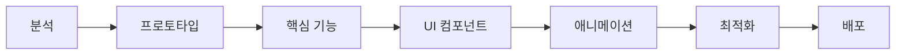

# Next.js → Expo React Native 마이그레이션 가이드

> **작성일:** 2026-03-06  
> **대상:** Next.js 모바일 웹을 네이티브 앱으로 전환하려는 개발자

---

## 📋 목차

1. [마이그레이션 전략 개요](#마이그레이션-전략-개요)
2. [환경 설정](#환경-설정)
3. [코드 공유 전략](#코드-공유-전략)
4. [컴포넌트 변환 가이드](#컴포넌트-변환-가이드)
5. [라이브러리 대체 맵](#라이브러리-대체-맵)
6. [애니메이션 마이그레이션](#애니메이션-마이그레이션)
7. [스타일링 전략](#스타일링-전략)
8. [네비게이션 전환](#네비게이션-전환)
9. [API 및 데이터 관리](#api-및-데이터-관리)
10. [테스트 전략](#테스트-전략)
11. [배포 및 스토어 제출](#배포-및-스토어-제출)

---

## 🎯 마이그레이션 전략 개요

### 권장 접근법: 완전 재작성 (Fresh Rewrite)

#### 왜 완전 재작성인가?

```
Next.js (Web)              →              Expo React Native (Native)
━━━━━━━━━━━━━━━━━━━━━━━━━━━━━━━━━━━━━━━━━━━━━━━━━━━━━━━━━━━━━━
<div>, <span>,        →              <View>, <Text>, <Image>
CSS, Tailwind, Styled      →              StyleSheet, NativeWind
React Router, Next Router  →              Expo Router
Framer Motion, GSAP        →              Reanimated 3
Chart.js, Recharts         →              Victory Native, React Native Chart Kit
Axios, Fetch               →              ✅ 재사용 가능
Redux, Zustand             →              ✅ 재사용 가능
TypeScript 타입            →              ✅ 재사용 가능
비즈니스 로직              →              ✅ 재사용 가능
```

#### 마이그레이션 단계



---

## 🛠 환경 설정

### 1. Expo 프로젝트 생성

```bash
# 최신 Expo 프로젝트 생성 (TypeScript + Expo Router)
npx create-expo-app@latest my-app --template tabs

cd my-app

# 필수 의존성 설치
npx expo install expo-router react-native-safe-area-context react-native-screens expo-linking expo-constants expo-status-bar
```

### 2. 프로젝트 구조 설정

```
my-app/
├── app/                    # Expo Router (Next.js의 pages/ 역할)
│   ├── (tabs)/            # 탭 네비게이션
│   │   ├── index.tsx      # 홈 화면
│   │   └── profile.tsx    # 프로필 화면
│   ├── _layout.tsx        # 루트 레이아웃
│   └── [id].tsx           # 동적 라우트
├── components/            # 재사용 가능한 컴포넌트
│   ├── Button.tsx
│   └── Card.tsx
├── services/              # API 호출 (Next.js에서 재사용)
│   └── api.ts
├── store/                 # 상태 관리 (Next.js에서 재사용)
│   └── useStore.ts
├── utils/                 # 유틸리티 함수 (Next.js에서 재사용)
│   └── formatters.ts
├── constants/             # 상수 (Next.js에서 재사용)
│   └── colors.ts
└── types/                 # TypeScript 타입 (Next.js에서 재사용)
    └── index.ts
```

### 3. 필수 패키지 설치

```bash
# 네비게이션
npx expo install expo-router

# 상태 관리 (기존 Next.js와 동일하게 사용 가능)
npm install zustand
# 또는
npm install @reduxjs/toolkit react-redux

# API 통신 (기존 코드 재사용 가능)
npm install axios

# 애니메이션
npx expo install react-native-reanimated

# 제스처
npx expo install react-native-gesture-handler

# UI 라이브러리 (선택)
npm install @rneui/themed @rneui/base
# 또는
npm install react-native-paper

# 폼 관리 (기존과 동일)
npm install react-hook-form zod

# 날짜 처리 (기존과 동일)
npm install date-fns
```

---

## 🔄 코드 공유 전략

### ✅ 재사용 가능한 코드

#### 1. API 서비스 레이어

```typescript
// services/api.ts - Next.js와 Expo 모두 동일하게 사용
import axios from 'axios';

const API_BASE_URL = 'https://api.example.com';

export const apiClient = axios.create({
  baseURL: API_BASE_URL,
  timeout: 10000,
  headers: {
    'Content-Type': 'application/json',
  },
});

export const userService = {
  getUser: async (id: string) => {
    const response = await apiClient.get(`/users/${id}`);
    return response.data;
  },
  
  updateUser: async (id: string, data: any) => {
    const response = await apiClient.put(`/users/${id}`, data);
    return response.data;
  },
};
```

#### 2. 상태 관리 (Zustand 예시)

```typescript
// store/useStore.ts - Next.js와 Expo 모두 동일하게 사용
import { create } from 'zustand';

interface UserStore {
  user: User | null;
  setUser: (user: User) => void;
  logout: () => void;
}

export const useUserStore = create<UserStore>((set) => ({
  user: null,
  setUser: (user) => set({ user }),
  logout: () => set({ user: null }),
}));
```

#### 3. 비즈니스 로직

```typescript
// utils/validators.ts - Next.js와 Expo 모두 동일하게 사용
export const validateEmail = (email: string): boolean => {
  const regex = /^[^\s@]+@[^\s@]+\.[^\s@]+$/;
  return regex.test(email);
};

export const formatCurrency = (amount: number): string => {
  return new Intl.NumberFormat('ko-KR', {
    style: 'currency',
    currency: 'KRW',
  }).format(amount);
};
```

#### 4. TypeScript 타입 정의

```typescript
// types/index.ts - Next.js와 Expo 모두 동일하게 사용
export interface User {
  id: string;
  name: string;
  email: string;
  avatar?: string;
  createdAt: Date;
}

export interface ApiResponse<T> {
  data: T;
  message: string;
  status: number;
}
```

### ❌ 재작성이 필요한 코드

1. **모든 UI 컴포넌트**
2. **CSS/스타일 코드**
3. **라우팅 로직**
4. **애니메이션**
5. **웹 전용 API (window, document, localStorage 등)**

---

## 🎨 컴포넌트 변환 가이드

### HTML → React Native 컴포넌트 매핑

| Next.js (Web)           | React Native              | 비고                          |
|-------------------------|---------------------------|------------------------------|
| `<div>`                 | `<View>`                  | 레이아웃 컨테이너             |
| `<span>`, `<p>`         | `<Text>`                  | 텍스트는 반드시 Text 안에     |
| ``                 | `<Image>`                 | require() 또는 { uri: '...' } |
| `<button>`              | `<Pressable>`, `<TouchableOpacity>` | 터치 피드백 제공 |
| `<input>`               | `<TextInput>`             | 폼 입력                       |
| `<a>`                   | `<Link>` (Expo Router)    | 내비게이션                    |
| `<ul>`, `<ol>`          | `<FlatList>`, `<SectionList>` | 리스트 렌더링 최적화    |
| `<video>`               | `<Video>` (expo-av)       | 비디오 재생                   |
| `<select>`              | `<Picker>`                | 드롭다운                      |

### 변환 예시

#### Before (Next.js)

```tsx
// components/UserCard.tsx (Next.js)
import Image from 'next/image';
import styles from './UserCard.module.css';

interface Props {
  user: User;
  onPress: () => void;
}

export const UserCard = ({ user, onPress }: Props) => {
  return (
    <div className={styles.card} onClick={onPress}>
      <Image 
        src={user.avatar} 
        alt={user.name}
        width={50}
        height={50}
        className={styles.avatar}
      />
      <div className={styles.info}>
        <h3 className={styles.name}>{user.name}</h3>
        <p className={styles.email}>{user.email}</p>
      </div>
    </div>
  );
};
```

#### After (React Native)

```tsx
// components/UserCard.tsx (React Native)
import { View, Text, Image, Pressable, StyleSheet } from 'react-native';

interface Props {
  user: User;
  onPress: () => void;
}

export const UserCard = ({ user, onPress }: Props) => {
  return (
    <Pressable style={styles.card} onPress={onPress}>
      <Image 
        source={{ uri: user.avatar }}
        style={styles.avatar}
      />
      <View style={styles.info}>
        <Text style={styles.name}>{user.name}</Text>
        <Text style={styles.email}>{user.email}</Text>
      </View>
    </Pressable>
  );
};

const styles = StyleSheet.create({
  card: {
    flexDirection: 'row',
    padding: 16,
    backgroundColor: '#fff',
    borderRadius: 8,
    shadowColor: '#000',
    shadowOffset: { width: 0, height: 2 },
    shadowOpacity: 0.1,
    shadowRadius: 4,
    elevation: 3, // Android 그림자
  },
  avatar: {
    width: 50,
    height: 50,
    borderRadius: 25,
  },
  info: {
    marginLeft: 12,
    justifyContent: 'center',
  },
  name: {
    fontSize: 16,
    fontWeight: '600',
    color: '#333',
  },
  email: {
    fontSize: 14,
    color: '#666',
    marginTop: 4,
  },
});
```

---

## 📦 라이브러리 대체 맵

### UI 컴포넌트

| Next.js (Web)              | React Native 대체         | 설치 명령                                    |
|---------------------------|---------------------------|---------------------------------------------|
| Material-UI, Chakra UI    | React Native Paper        | `npm install react-native-paper`            |
| Ant Design                | React Native Elements     | `npm install @rneui/themed @rneui/base`     |
| Headless UI               | React Native Reusables    | 직접 구현 또는 커뮤니티 라이브러리           |
| Radix UI                  | -                         | 직접 구현 필요                               |

### 차트 라이브러리

| Next.js (Web)              | React Native 대체         | 설치 명령                                    |
|---------------------------|---------------------------|---------------------------------------------|
| Chart.js                  | React Native Chart Kit    | `npm install react-native-chart-kit`        |
| Recharts                  | Victory Native            | `npm install victory-native`                |
| D3.js                     | React Native SVG + D3     | `npx expo install react-native-svg` + `npm install d3` |
| ApexCharts                | -                         | Victory Native 또는 Chart Kit 사용          |

### 애니메이션

| Next.js (Web)              | React Native 대체         | 설치 명령                                    |
|---------------------------|---------------------------|---------------------------------------------|
| Framer Motion             | React Native Reanimated 3 | `npx expo install react-native-reanimated`  |
| GSAP                      | React Native Reanimated 3 | 동일                                         |
| React Spring              | React Native Reanimated 3 | 동일                                         |
| Lottie (Web)              | Lottie React Native       | `npx expo install lottie-react-native`      |

### 폼 관리

| Next.js (Web)              | React Native 대체         | 설치 명령                                    |
|---------------------------|---------------------------|---------------------------------------------|
| React Hook Form           | ✅ 동일하게 사용 가능      | `npm install react-hook-form`               |
| Formik                    | ✅ 동일하게 사용 가능      | `npm install formik`                        |
| Zod                       | ✅ 동일하게 사용 가능      | `npm install zod`                           |
| Yup                       | ✅ 동일하게 사용 가능      | `npm install yup`                           |

### 데이터 페칭

| Next.js (Web)              | React Native 대체         | 설치 명령                                    |
|---------------------------|---------------------------|---------------------------------------------|
| React Query (TanStack)    | ✅ 동일하게 사용 가능      | `npm install @tanstack/react-query`         |
| SWR                       | ✅ 동일하게 사용 가능      | `npm install swr`                           |
| Axios                     | ✅ 동일하게 사용 가능      | `npm install axios`                         |

### 날짜 처리

| Next.js (Web)              | React Native 대체         | 설치 명령                                    |
|---------------------------|---------------------------|---------------------------------------------|
| date-fns                  | ✅ 동일하게 사용 가능      | `npm install date-fns`                      |
| Day.js                    | ✅ 동일하게 사용 가능      | `npm install dayjs`                         |
| Moment.js                 | Day.js 권장               | -                                            |

### 아이콘

| Next.js (Web)              | React Native 대체         | 설치 명령                                    |
|---------------------------|---------------------------|---------------------------------------------|
| React Icons               | @expo/vector-icons        | 기본 포함 (Expo)                             |
| Heroicons                 | @expo/vector-icons        | 동일                                         |
| Font Awesome              | @expo/vector-icons        | 동일                                         |

### 지도

| Next.js (Web)              | React Native 대체         | 설치 명령                                    |
|---------------------------|---------------------------|---------------------------------------------|
| Google Maps React         | React Native Maps         | `npx expo install react-native-maps`        |
| Mapbox GL JS              | Mapbox Maps SDK           | 별도 설치 필요                               |

### 카메라/미디어

| Next.js (Web)              | React Native 대체         | 설치 명령                                    |
|---------------------------|---------------------------|---------------------------------------------|
| getUserMedia              | Expo Camera               | `npx expo install expo-camera`              |
| Input file upload         | Expo Image Picker         | `npx expo install expo-image-picker`        |
| HTML5 Video               | Expo AV                   | `npx expo install expo-av`                  |

---

## 🎬 애니메이션 마이그레이션

### Framer Motion → Reanimated 3 변환 예시

#### Before (Framer Motion)

```tsx
import { motion } from 'framer-motion';

export const FadeInBox = () => {
  return (
    <motion.div
      initial={{ opacity: 0, y: 20 }}
      animate={{ opacity: 1, y: 0 }}
      transition={{ duration: 0.5 }}
      className="box"
    >
      Hello World
    </motion.div>
  );
};
```

#### After (Reanimated 3)

```tsx
import Animated, { 
  useSharedValue, 
  useAnimatedStyle, 
  withTiming 
} from 'react-native-reanimated';
import { useEffect } from 'react';
import { StyleSheet } from 'react-native';

export const FadeInBox = () => {
  const opacity = useSharedValue(0);
  const translateY = useSharedValue(20);

  useEffect(() => {
    opacity.value = withTiming(1, { duration: 500 });
    translateY.value = withTiming(0, { duration: 500 });
  }, []);

  const animatedStyle = useAnimatedStyle(() => ({
    opacity: opacity.value,
    transform: [{ translateY: translateY.value }],
  }));

  return (
    <Animated.View style={[styles.box, animatedStyle]}>
      <Text>Hello World</Text>
    </Animated.View>
  );
};

const styles = StyleSheet.create({
  box: {
    padding: 20,
    backgroundColor: '#fff',
  },
});
```

### 복잡한 애니메이션 패턴

```tsx
// 스크롤 기반 애니메이션
import { useAnimatedScrollHandler, useSharedValue } from 'react-native-reanimated';

export const ScrollAnimation = () => {
  const scrollY = useSharedValue(0);

  const scrollHandler = useAnimatedScrollHandler({
    onScroll: (event) => {
      scrollY.value = event.contentOffset.y;
    },
  });

  const headerStyle = useAnimatedStyle(() => ({
    opacity: scrollY.value > 100 ? withTiming(0) : withTiming(1),
  }));

  return (
    <Animated.ScrollView onScroll={scrollHandler} scrollEventThrottle={16}>
      <Animated.View style={headerStyle}>
        {/* 헤더 내용 */}
      </Animated.View>
    </Animated.ScrollView>
  );
};
```

---

## 🎨 스타일링 전략

### CSS → StyleSheet 변환

#### Flexbox 차이점

| CSS (Web)                     | React Native StyleSheet        | 차이점                        |
|-------------------------------|--------------------------------|------------------------------|
| `display: flex`               | 기본값 (명시 불필요)            | RN은 기본이 flex              |
| `flex-direction: row`         | `flexDirection: 'column'`      | RN 기본값은 column            |
| `justify-content: flex-start` | `justifyContent: 'flex-start'` | kebab-case → camelCase       |
| `gap: 16px`                   | `gap: 16`                      | 단위 없음 (숫자만)            |

#### 변환 예시

**Before (CSS)**

```css
.container {
  display: flex;
  flex-direction: row;
  justify-content: space-between;
  align-items: center;
  padding: 16px;
  background-color: #ffffff;
  border-radius: 8px;
  box-shadow: 0 2px 4px rgba(0, 0, 0, 0.1);
}

.title {
  font-size: 18px;
  font-weight: 600;
  color: #333333;
  margin-bottom: 8px;
}
```

**After (StyleSheet)**

```tsx
import { StyleSheet } from 'react-native';

const styles = StyleSheet.create({
  container: {
    flexDirection: 'row',
    justifyContent: 'space-between',
    alignItems: 'center',
    padding: 16,
    backgroundColor: '#ffffff',
    borderRadius: 8,
    // 그림자는 플랫폼별로 다름
    shadowColor: '#000',        // iOS
    shadowOffset: { width: 0, height: 2 },
    shadowOpacity: 0.1,
    shadowRadius: 4,
    elevation: 3,               // Android
  },
  title: {
    fontSize: 18,
    fontWeight: '600',
    color: '#333333',
    marginBottom: 8,
  },
});
```

### NativeWind (Tailwind for RN) 사용 시

```bash
npm install nativewind
npm install --save-dev tailwindcss
```

```tsx
// 사용 예시
import { View, Text } from 'react-native';

export const Card = () => {
  return (
    <View className="flex-row justify-between items-center p-4 bg-white rounded-lg shadow-md">
      <Text className="text-lg font-semibold text-gray-800">Title</Text>
    </View>
  );
};
```

---

## 🧭 네비게이션 전환

### Next.js Router → Expo Router

#### Before (Next.js)

```tsx
// pages/index.tsx
import { useRouter } from 'next/router';
import Link from 'next/link';

export default function Home() {
  const router = useRouter();

  const handleNavigate = () => {
    router.push('/profile/123');
  };

  return (
    <div>
      <h1>Home</h1>
      <Link href="/about">About</Link>
      <button onClick={handleNavigate}>Go to Profile</button>
    </div>
  );
}
```

#### After (Expo Router)

```tsx
// app/index.tsx
import { useRouter } from 'expo-router';
import { Link } from 'expo-router';
import { View, Text, Pressable } from 'react-native';

export default function Home() {
  const router = useRouter();

  const handleNavigate = () => {
    router.push('/profile/123');
  };

  return (
    <View>
      <Text>Home</Text>
      <Link href="/about">About</Link>
      <Pressable onPress={handleNavigate}>
        <Text>Go to Profile</Text>
      </Pressable>
    </View>
  );
}
```

### 동적 라우트

```tsx
// app/profile/[id].tsx (Expo Router)
import { useLocalSearchParams } from 'expo-router';
import { View, Text } from 'react-native';

export default function Profile() {
  const { id } = useLocalSearchParams();

  return (
    <View>
      <Text>Profile ID: {id}</Text>
    </View>
  );
}
```

### 탭 네비게이션

```tsx
// app/(tabs)/_layout.tsx
import { Tabs } from 'expo-router';
import { Ionicons } from '@expo/vector-icons';

export default function TabLayout() {
  return (
    <Tabs
      screenOptions={{
        tabBarActiveTintColor: '#007AFF',
      }}
    >
      <Tabs.Screen
        name="index"
        options={{
          title: '홈',
          tabBarIcon: ({ color }) => <Ionicons name="home" size={24} color={color} />,
        }}
      />
      <Tabs.Screen
        name="profile"
        options={{
          title: '프로필',
          tabBarIcon: ({ color }) => <Ionicons name="person" size={24} color={color} />,
        }}
      />
    </Tabs>
  );
}
```

---

## 🔌 API 및 데이터 관리

### 환경 변수

#### Before (Next.js)

```bash
# .env.local
NEXT_PUBLIC_API_URL=https://api.example.com
API_SECRET=secret_key
```

```tsx
const apiUrl = process.env.NEXT_PUBLIC_API_URL;
```

#### After (Expo)

```bash
# .env
EXPO_PUBLIC_API_URL=https://api.example.com
```

```tsx
// Expo SDK 49+
const apiUrl = process.env.EXPO_PUBLIC_API_URL;
```

### 로컬 저장소

| Web (Next.js)        | React Native            | 설치                              |
|----------------------|-------------------------|-----------------------------------|
| localStorage         | AsyncStorage            | `npx expo install @react-native-async-storage/async-storage` |
| sessionStorage       | -                       | AsyncStorage로 대체               |
| Cookies              | SecureStore (보안 데이터) | `npx expo install expo-secure-store` |

```tsx
// AsyncStorage 사용 예시
import AsyncStorage from '@react-native-async-storage/async-storage';

// 저장
await AsyncStorage.setItem('user', JSON.stringify(user));

// 읽기
const user = JSON.parse(await AsyncStorage.getItem('user'));

// 삭제
await AsyncStorage.removeItem('user');
```

---

## 🧪 테스트 전략

### 테스트 도구

```bash
# Jest + React Native Testing Library
npm install --save-dev @testing-library/react-native @testing-library/jest-native

# E2E 테스트 (Detox)
npm install --save-dev detox detox-cli
```

### 컴포넌트 테스트 예시

```tsx
import { render, fireEvent } from '@testing-library/react-native';
import { Button } from './Button';

describe('Button', () => {
  it('should call onPress when pressed', () => {
    const onPress = jest.fn();
    const { getByText } = render(<Button title="Click me" onPress={onPress} />);
    
    fireEvent.press(getByText('Click me'));
    
    expect(onPress).toHaveBeenCalledTimes(1);
  });
});
```

---

## 📱 배포 및 스토어 제출

### 빌드 설정

```json
// app.json
{
  "expo": {
    "name": "My App",
    "slug": "my-app",
    "version": "1.0.0",
    "orientation": "portrait",
    "icon": "./assets/icon.png",
    "userInterfaceStyle": "automatic",
    "splash": {
      "image": "./assets/splash.png",
      "resizeMode": "contain",
      "backgroundColor": "#ffffff"
    },
    "ios": {
      "supportsTablet": true,
      "bundleIdentifier": "com.yourcompany.myapp"
    },
    "android": {
      "adaptiveIcon": {
        "foregroundImage": "./assets/adaptive-icon.png",
        "backgroundColor": "#ffffff"
      },
      "package": "com.yourcompany.myapp"
    }
  }
}
```

### EAS Build (권장)

```bash
# EAS CLI 설치
npm install -g eas-cli

# 로그인
eas login

# 프로젝트 설정
eas build:configure

# iOS 빌드
eas build --platform ios

# Android 빌드
eas build --platform android

# 스토어 제출
eas submit --platform ios
eas submit --platform android
```

---

## ✅ 마이그레이션 체크리스트

### Phase 1: 준비 및 분석 (1-2주)

- [ ] 기존 Next.js 프로젝트 의존성 분석
- [ ] 사용 중인 라이브러리 대체 방안 조사
- [ ] React Native 대체 불가능한 기능 파악
- [ ] 디자인 시스템 정리 (색상, 타이포그래피, 간격 등)
- [ ] API 엔드포인트 목록 작성
- [ ] 화면 목록 및 플로우 정리

### Phase 2: 환경 구축 (1주)

- [ ] Expo 프로젝트 생성
- [ ] 필수 패키지 설치
- [ ] 프로젝트 구조 설정
- [ ] 공통 코드 이관 (API, 상태 관리, 유틸)
- [ ] 타입 정의 이관
- [ ] 환경 변수 설정

### Phase 3: 핵심 기능 구현 (2-4주)

- [ ] 인증 시스템 (로그인, 회원가입)
- [ ] 메인 네비게이션 구조
- [ ] 주요 화면 구현 (우선순위 순)
- [ ] API 연동
- [ ] 상태 관리 통합
- [ ] 에러 처리

### Phase 4: UI 컴포넌트 구현 (2-3주)

- [ ] 공통 컴포넌트 (Button, Input, Card 등)
- [ ] 레이아웃 컴포넌트
- [ ] 폼 컴포넌트
- [ ] 리스트 컴포넌트 (FlatList 최적화)
- [ ] 모달/바텀시트
- [ ] 로딩/에러 상태 UI

### Phase 5: 애니메이션 및 인터랙션 (1-2주)

- [ ] 화면 전환 애니메이션
- [ ] 제스처 처리
- [ ] 스크롤 애니메이션
- [ ] 마이크로 인터랙션
- [ ] 로딩 애니메이션

### Phase 6: 차트 및 시각화 (1-2주)

- [ ] 차트 라이브러리 통합
- [ ] 차트 컴포넌트 구현
- [ ] 데이터 시각화 최적화
- [ ] 반응형 차트

### Phase 7: 테스트 및 최적화 (1-2주)

- [ ] 단위 테스트 작성
- [ ] 통합 테스트
- [ ] 성능 최적화 (메모이제이션, 리스트 가상화)
- [ ] 메모리 누수 체크
- [ ] 번들 크기 최적화

### Phase 8: 배포 준비 (1주)

- [ ] 앱 아이콘 및 스플래시 스크린
- [ ] iOS 빌드 설정
- [ ] Android 빌드 설정
- [ ] 앱 스토어 메타데이터 준비
- [ ] 스크린샷 준비
- [ ] 개인정보처리방침, 이용약관

### Phase 9: 스토어 제출

- [ ] Apple App Store 제출
- [ ] Google Play Store 제출
- [ ] 심사 대응

---

## 🚨 주의사항

### 1. WebView 사용 자제

- App Store 심사에서 리젝될 수 있음
- 네이티브 경험이 저하됨
- 정말 필요한 경우만 사용 (예: OAuth 인증)

### 2. 플랫폼별 차이 고려

```tsx
import { Platform } from 'react-native';

const styles = StyleSheet.create({
  container: {
    paddingTop: Platform.OS === 'ios' ? 20 : 0,
    ...Platform.select({
      ios: {
        shadowColor: '#000',
        shadowOffset: { width: 0, height: 2 },
        shadowOpacity: 0.1,
      },
      android: {
        elevation: 3,
      },
    }),
  },
});
```

### 3. 성능 고려

- `FlatList` 사용 시 `getItemLayout` 설정
- 이미지 최적화 (react-native-fast-image)
- 불필요한 리렌더링 방지 (React.memo, useMemo, useCallback)

### 4. 권한 처리

```tsx
import * as Location from 'expo-location';

const requestLocationPermission = async () => {
  const { status } = await Location.requestForegroundPermissionsAsync();
  if (status !== 'granted') {
    alert('위치 권한이 필요합니다.');
    return false;
  }
  return true;
};
```

---

## 📚 추가 리소스

### 공식 문서

- [Expo Documentation](https://docs.expo.dev/)
- [React Native Documentation](https://reactnative.dev/)
- [React Native Reanimated](https://docs.swmansion.com/react-native-reanimated/)

### 유용한 도구

- [React Native Directory](https://reactnative.directory/) - RN 라이브러리 검색
- [Expo Snack](https://snack.expo.dev/) - 온라인 에디터
- [React Native Paper](https://callstack.github.io/react-native-paper/) - Material Design

### 커뮤니티

- [Expo Discord](https://chat.expo.dev/)
- [React Native Community Discord](https://www.reactiflux.com/)

---

## 💡 팁 모음

### 1. 빠른 프로토타이핑

```bash
# Expo Go 앱으로 즉시 테스트
npx expo start

# QR 코드 스캔하여 실제 디바이스에서 확인
```

### 2. 디버깅

```tsx
// React Native Debugger 사용
// Flipper 사용 (권장)
// Chrome DevTools 사용
```

### 3. Hot Reload

- Fast Refresh가 자동으로 작동
- 코드 변경 시 즉시 반영
- 상태 유지

---

## 🎯 예상 소요 시간

| 프로젝트 규모 | 예상 기간 |
|--------------|----------|
| 소규모 (5-10 화면) | 2-3개월 |
| 중규모 (10-20 화면) | 3-5개월 |
| 대규모 (20+ 화면) | 5-8개월 |

*팀 규모, 복잡도, 기존 코드 품질에 따라 달라질 수 있음*

---

## 📞 문의 및 지원

이 가이드는 지속적으로 업데이트됩니다. 추가 질문이나 피드백은 언제든지 환영합니다!

**작성:** AI-Vive Coding Team  
**최종 업데이트:** 2026-03-06
