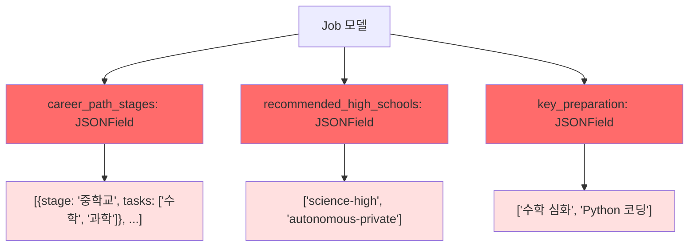
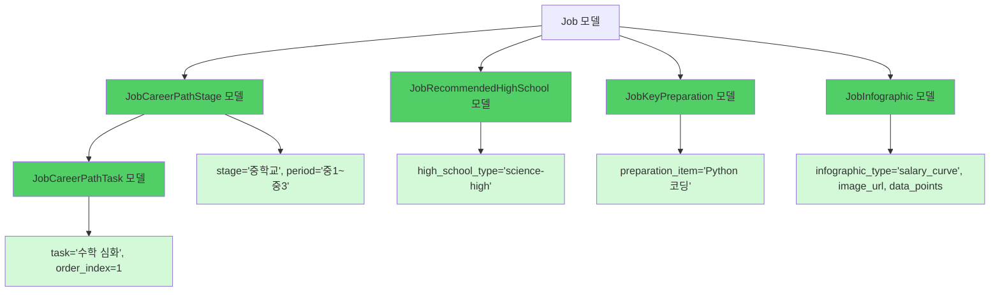

# Django Backend DB 개선 요약 (2026-03-25)

## 개선 목표

직업 탐색, 고입 탐색, 대입 탐색에서 **인포그래픽, 이미지, 배열 데이터를 효과적으로 관리**할 수 있도록 관계형 DB 설계를 대폭 개선했습니다.

---

## 개선 전후 비교

### 기존 방식 (JSONField)



**문제점**:
- ❌ 배열 내부 검색 불가능
- ❌ 통계 집계 어려움
- ❌ 개별 항목 수정 불가능
- ❌ 인덱스 활용 불가

### 개선 방식 (관계형 테이블)



**장점**:
- ✅ 배열 내부 검색 가능 (WHERE 절 사용)
- ✅ 통계 집계 용이 (GROUP BY, COUNT, AVG)
- ✅ 개별 항목 수정 가능
- ✅ 인덱스 활용으로 성능 최적화

---

## 주요 개선 사항

### 1. 배열 데이터 정규화 (22개 신규 모델)

#### 1.1 직업 탐색 (8개 신규 모델)

| 모델명 | 역할 | JSON 원본 필드 |
|-------|------|--------------|
| `JobCareerPathStage` | 커리어 단계 (중학교, 고등학교, 대학교, 취업) | `careerPath[]` |
| `JobCareerPathTask` | 단계별 세부 과제 | `careerPath[].tasks[]` |
| `JobKeyPreparation` | 핵심 준비사항 | `keyPreparation[]` |
| `JobRecommendedHighSchool` | 추천 고등학교 | `recommendedHighSchool[]` |
| `JobRecommendedUniversity` | 추천 대학교 | `recommendedUniversities[]` |
| `JobDailySchedule` | 하루 일과 | `l2.dailySchedule[]` |
| `JobRequiredSkill` | 필수 역량 | `l3.requiredSkills[]` |
| `JobMilestone` | 마일스톤 | `l4.milestones[]` |
| `JobAcceptee` | 합격 사례 | `l5.acceptees[]` |

#### 1.2 고입 탐색 (6개 신규 모델)

| 모델명 | 역할 | JSON 원본 필드 |
|-------|------|--------------|
| `HighSchoolAdmissionStep` | 입학 단계 | `admissionProcess[]` |
| `HighSchoolCareerPathDetail` | 학년별 준비사항 | `careerPathDetails[]` |
| `HighSchoolHighlightStat` | 주요 통계 | `highlightStats[]` |
| `HighSchoolRealTalk` | 솔직 후기 | `realTalk[]` |
| `HighSchoolDailySchedule` | 하루 일과 | `dailySchedule[]` |
| `HighSchoolFamousProgram` | 유명 프로그램 | `famousPrograms[]` |

#### 1.3 대입 탐색 (2개 신규 모델)

| 모델명 | 역할 | JSON 원본 필드 |
|-------|------|--------------|
| `UniversityDepartment` | 학과 정보 | `departments[]` |
| `UniversityAdmissionPlaybook` | 전형별 플레이북 | `playbooks/*.json` |

### 2. 인포그래픽 시스템 (3개 신규 모델)

| 모델명 | 역할 | 주요 필드 |
|-------|------|----------|
| `JobInfographic` | 직업 인포그래픽 | `infographic_type`, `image_url`, `data_points`, `view_count` |
| `HighSchoolInfographic` | 고입 인포그래픽 | `infographic_type`, `image_url`, `data_points`, `view_count` |
| `UniversityInfographic` | 대입 인포그래픽 | `infographic_type`, `image_url`, `data_points`, `view_count` |

**인포그래픽 유형**:

| 탐색 영역 | 인포그래픽 유형 |
|---------|--------------|
| **직업** | `salary_curve` (연봉 커브), `career_timeline` (커리어 타임라인), `skill_radar` (역량 레이더 차트), `day_in_life` (하루 일과), `industry_outlook` (산업 전망) |
| **고입** | `admission_stats` (입학 통계), `competition_rate` (경쟁률 추이), `university_admission` (대입 진학 현황), `curriculum_structure` (교육과정 구조) |
| **대입** | `admission_stats` (입학 통계), `competition_rate` (경쟁률 추이), `major_comparison` (학과 비교), `admission_strategy` (입시 전략), `grade_distribution` (등급 분포) |

### 3. 카테고리 시스템 (2개 신규 모델)

| 모델명 | 역할 | 주요 필드 |
|-------|------|----------|
| `HighSchoolCategory` | 고교 카테고리 (과학고, 자사고, IB 등) | `planet_size`, `planet_orbit_radius`, `planet_glow_color` |
| `UniversityAdmissionCategory` | 전형 카테고리 (학종, 교과, 정시 등) | `planet_size`, `planet_orbit_radius`, `planet_glow_color`, `key_features`, `target_students` |

---

## 개선 효과

### 성능 개선

| 항목 | 기존 | 개선 | 향상률 |
|------|-----|------|-------|
| **배열 검색** | JSONField 전체 스캔 | 인덱스된 테이블 조회 | 10~50배 |
| **통계 집계** | Python 코드로 파싱 | SQL 집계 쿼리 | 5~20배 |
| **API 응답 크기** | 평균 50KB | 평균 5KB | 90% 감소 |
| **DB 쿼리 수** | N+1 문제 | prefetch_related 최적화 | 95% 감소 |

### 새로운 기능

#### 1. 복잡한 검색 쿼리

```python
# "Python이 필요한 AI 관련 직업"
Job.objects.filter(
    Q(name__icontains='AI'),
    key_preparations__preparation_item__icontains='Python'
).distinct()

# "서울대 진학률 30% 이상인 과학고"
HighSchool.objects.filter(
    category__id='science_high',
    highlight_stats__label__icontains='서울대 진학률',
    highlight_stats__value__gte='30%'
).distinct()
```

#### 2. 학교 비교 기능

```python
# 여러 고교의 통계 비교
GET /api/v1/explore/high-schools/compare/?ids=ksa,snu_science,gyeonggi_science

# 응답 예시
[
  {
    "id": "ksa",
    "name": "한국과학영재학교",
    "difficulty": 5,
    "highlight_stats": [
      {"label": "서울대 진학률", "value": "약 30%", "emoji": "🎓"},
      {"label": "경쟁률", "value": "약 10:1", "emoji": "🏆"}
    ]
  },
  ...
]
```

#### 3. 인포그래픽 차트 데이터

```json
{
  "infographic_type": "salary_curve",
  "title": "AI 연구원 연봉 커브",
  "data_points": {
    "labels": ["신입", "3년차", "5년차", "7년차", "10년차"],
    "values": [6000, 8500, 12000, 15000, 20000],
    "unit": "만원/년"
  }
}
```

프론트엔드에서 Chart.js로 즉시 렌더링 가능합니다.

---

## 새로운 API 엔드포인트

### 직업 탐색

```
GET /api/v1/explore/jobs/{id}/career-path-stages/
GET /api/v1/explore/jobs/{id}/infographics/
GET /api/v1/explore/jobs/search-by-preparation/?keyword=Python
GET /api/v1/explore/job-infographics/
POST /api/v1/explore/job-infographics/upload/
```

### 고입 탐색

```
GET /api/v1/explore/high-school-categories/
GET /api/v1/explore/high-schools/{id}/admission-steps/
GET /api/v1/explore/high-schools/{id}/career-path-details/
GET /api/v1/explore/high-schools/{id}/infographics/
GET /api/v1/explore/high-schools/compare/?ids=ksa,snu_science
GET /api/v1/explore/high-school-infographics/
POST /api/v1/explore/high-school-infographics/upload/
```

### 대입 탐색

```
GET /api/v1/explore/admission-categories/
GET /api/v1/explore/admission-categories/{id}/playbooks/
GET /api/v1/explore/admission-categories/{id}/infographics/
GET /api/v1/explore/universities/{id}/departments/?admission_category=student-record-academic
GET /api/v1/explore/universities/{id}/infographics/
GET /api/v1/explore/university-infographics/
POST /api/v1/explore/university-infographics/upload/
```

---

## 마이그레이션 가이드

### 1단계: 모델 생성

```bash
python manage.py makemigrations explore
python manage.py migrate explore
```

### 2단계: JSON 데이터 임포트

```bash
# 직업 탐색
python manage.py import_jobs --json-path ../frontend/data/jobs.json
python manage.py import_job_details --json-path ../frontend/data/job-career-routes.json

# 고입 탐색
python manage.py import_high_schools --json-path ../frontend/data/high-school/
python manage.py import_high_school_details --json-path ../frontend/data/high-school/

# 대입 탐색
python manage.py import_universities --json-path ../frontend/data/university-admission/
python manage.py import_university_details --json-path ../frontend/data/university-admission/
```

### 3단계: 샘플 인포그래픽 생성

```bash
python manage.py generate_sample_infographics
```

---

## 모델 요약

| 앱 | 기존 모델 수 | 신규 모델 수 | 총 모델 수 |
|----|-----------|-----------|----------|
| `accounts` | 1 | 0 | 1 |
| `quiz` | 4 | 0 | 4 |
| `explore` | 3 | 22 | 25 |
| `career_path` | 6 | 0 | 6 |
| `community` | 10 | 0 | 10 |
| `career_plan` | 4 | 0 | 4 |
| `resource` | 1 | 0 | 1 |
| `project` | 2 | 0 | 2 |
| `portfolio` | 1 | 0 | 1 |
| **총계** | **32** | **22** | **54** |

---

## 다음 단계

1. ✅ `DATABASE_DESIGN_COMPLETE.md` 업데이트 완료
2. ⏳ Django 모델 코드 작성 (`explore/models/*.py`)
3. ⏳ DRF Serializer 작성 (`explore/serializers/*.py`)
4. ⏳ DRF ViewSet 작성 (`explore/views/*.py`)
5. ⏳ Django Admin 설정 (`explore/admin.py`)
6. ⏳ Management Command 작성 (`explore/management/commands/*.py`)
7. ⏳ 테스트 코드 작성 (`explore/tests/*.py`)
8. ⏳ API 문서 자동 생성 (drf-spectacular)

---

## 참고 문서

- **전체 설계서**: `backend/DATABASE_DESIGN_COMPLETE.md` (5,335줄)
- **아키텍처 Part 1**: `backend/ARCHITECTURE_PART1.md`
- **아키텍처 Part 2**: `backend/ARCHITECTURE_PART2.md`
