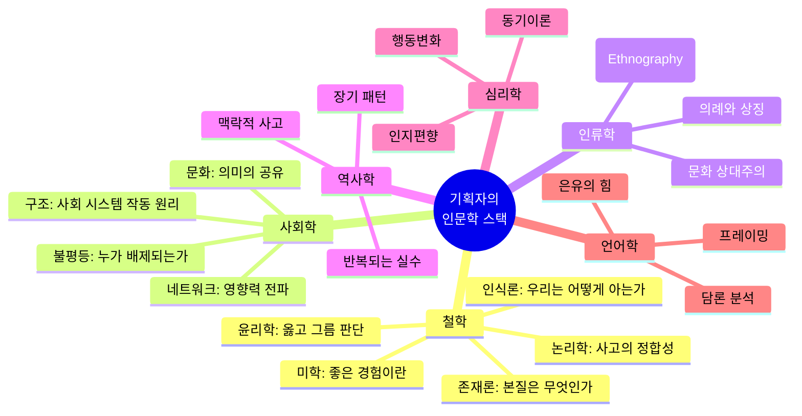
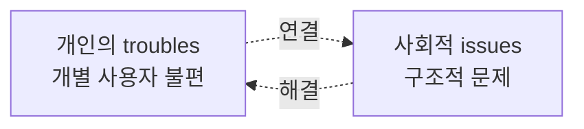
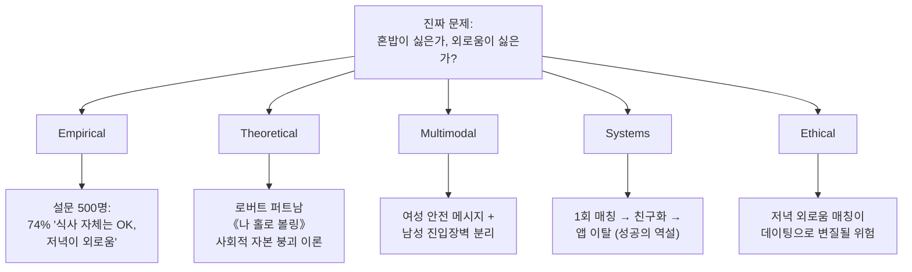
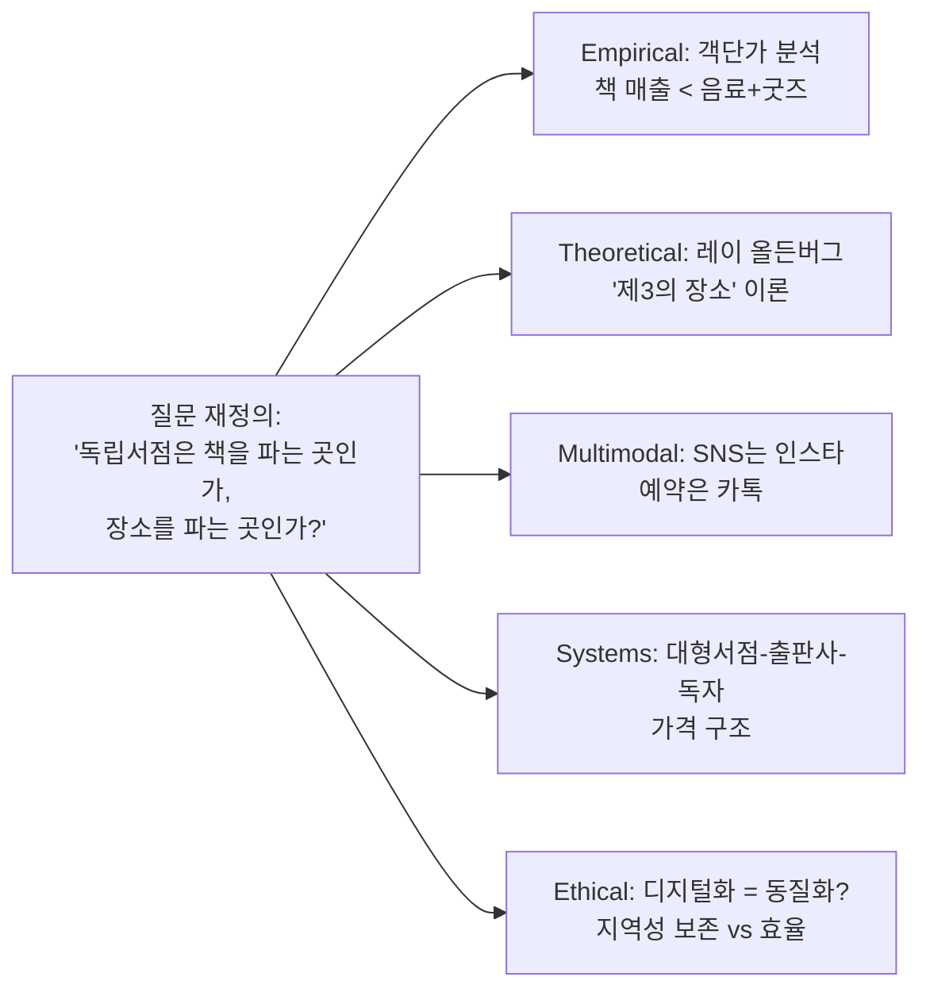
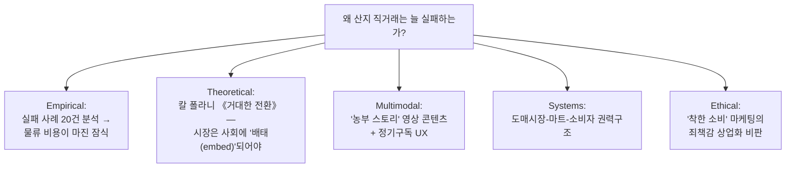
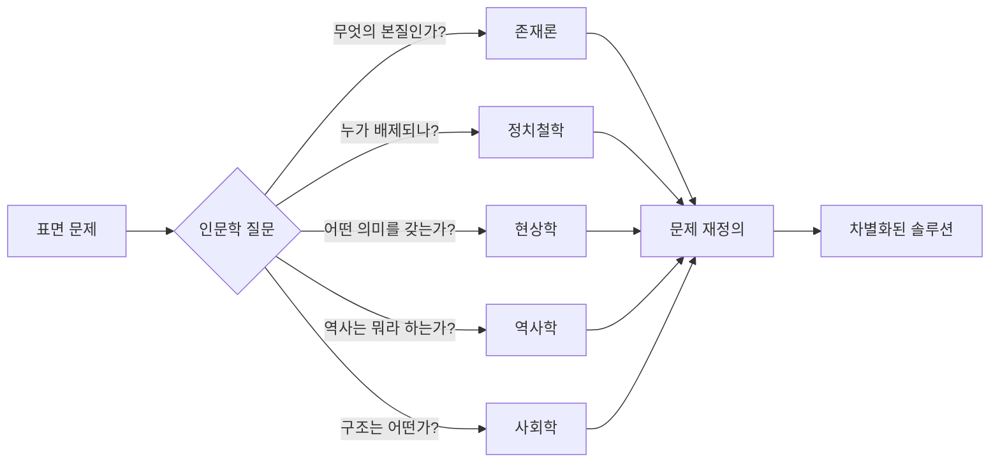
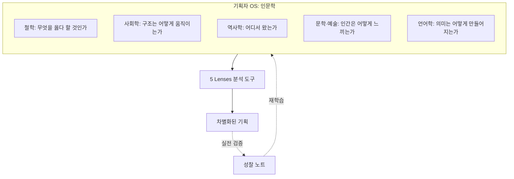

# 미네르바 5 Lenses — 실전 프로젝트 적용 & 인문학 학습 로드맵 (실전편)

> **이 문서의 목적**
> 1. **왜** 기획자가 인문학·철학·사회학을 배워야 하는지 — 추상론 없이 실제 사건/실패 사례로 증명
> 2. **어떻게** 5가지 관점을 실제 프로젝트에 적용하는지 — 한 프로젝트당 페이지 1장 분량으로 깊이 있게
> 3. **무엇을** 어떤 순서로 읽고 훈련할지 — 12개월 학습 로드맵

---

## PART 1. 인문학·철학·사회학을 기획자가 배워야 하는 이유

### 1.1 결론부터 — "기술이 발전할수록 인문학의 가치는 올라간다"

### 1.2 인문학 부재가 만든 실제 실패 사례 5

| 사례 | 무엇이 빠졌나 | 어떤 인문학이 막을 수 있었나 |
|---|---|---|
| **Google Glass (2013)** | "왜 사람들이 카메라를 차고 다니는 사람을 싫어할지" 사회학적 상상력 부재 | 어빙 고프먼 《자아 연출의 사회학》 — 공적 공간에서의 인상 관리 |
| **Facebook Free Basics 인도 (2016)** | "무료 인터넷"이 식민주의로 읽힐 맥락 무지 | 탈식민주의 이론, 파농 《대지의 저주받은 사람들》 |
| **Microsoft Tay 챗봇 (2016)** | 인간 악의의 가능성에 대한 윤리적 상상력 부재 | 한나 아렌트 《예루살렘의 아이히만》 — 악의 평범성 |
| **iTunes 자동 U2 앨범 강제 다운로드 (2014)** | "선물"과 "침입"의 경계에 대한 미학적 감수성 부재 | 마르셀 모스 《증여론》 — 선물의 사회학 |
| **Zillow iBuying 사업 폐쇄 ($569M 손실, 2021)** | 알고리즘에 대한 인식론적 과신, 시장의 복잡계 무시 | 도넬라 메도우즈 《Thinking in Systems》, 칸트 인식론 |

> 이 5개 실패의 공통점: **엔지니어링은 완벽했다. 인간/사회에 대한 이해가 빠졌다.**

### 1.3 분야별로 "무엇을 가르쳐주는가"

### 1.4 "왜 배워야 하는가" — 7가지 실용적 이유

| # | 이유 | 인문학이 주는 무기 |
|---|---|---|
| 1 | **문제를 다르게 정의**한다 | 칸트의 코페르니쿠스적 전환 — "사용자가 적응하는 게 아니라 시스템이 적응" |
| 2 | **2차·3차 효과를 본다** | 시스템 사고, 사회학적 상상력(밀스) — 즉각적 결과 너머의 파급 |
| 3 | **윤리적 지뢰를 피한다** | 칸트/공리주의/덕윤리 — 출시 전 위험 신호 감지 |
| 4 | **이해관계자 갈등을 푼다** | 하버마스 의사소통 행위 이론 — 합의의 조건 |
| 5 | **AI 시대 차별화** | LLM이 못 하는 "맥락·가치·판단" |
| 6 | **장기 트렌드를 읽는다** | 역사학·푸코 계보학 — 변화의 패턴 |
| 7 | **자기 결정을 정당화**한다 | 명확한 가치 언어 = 팀 정렬 |

### 1.5 C.W. 밀스의 "사회학적 상상력" — 기획자 필수 개념

**예**: "내 앱 사용자가 외롭다" (개인 문제) ↔ "현대 도시의 약한 연결망과 알고리즘 큐레이션의 필터 버블" (구조 문제)
— 둘을 **동시에** 볼 수 있는 능력이 기획자의 핵심.

---

## PART 2. 실전 적용 — 5개 가상 프로젝트 깊이 분석

각 프로젝트마다: **상황 → 5 Lenses 분석 → 실제 결정 → 결과 시나리오 → 인문학 출처**

---

### 🎯 실전 프로젝트 1. **"한끼" — 1인 가구 식사 동반자 매칭 앱**

#### ▶ 상황
- 타깃: 서울 20-30대 1인 가구 350만 명
- 가설: "혼밥이 외로워서 함께 먹을 사람이 필요할 것"
- 경쟁: 데이팅 앱, 소셜 모임 앱

#### ▶ 5 Lenses 분석

| Lens | 발견 | 결정 |
|---|---|---|
| **Empirical** | 진짜 페인은 '저녁시간 고독' → 점심 매칭은 수요 낮음 | 저녁 7-9시 슬롯만 오픈 |
| **Theoretical** | 퍼트남: '강한 연결' 아닌 '약한 반복 연결'이 외로움 해소 | 같은 사람 3회 이상 매칭 금지 (의도적 약한 연결) |
| **Multimodal** | 여성 사용자 안전 우려 = 가장 큰 진입장벽 | 공공 식당 화이트리스트만, 실명+신분증 인증 |
| **Systems** | 매칭 성공 → 외부 친구화 → 앱 이탈 = 수익 모델 충돌 | "혼밥 탈출 졸업" 콘셉트로 LTV 대신 추천 모델 |
| **Ethical** | 데이팅화·외모 차별 위험 | 프로필 사진 금지, 음식 취향만 노출 |

#### ▶ 인문학 출처
- 퍼트남 《Bowling Alone》 — 사회적 자본
- 한병철 《피로사회》 — 현대 고독의 구조
- 어빙 고프먼 《자아 연출의 사회학》 — 첫 만남의 인상 관리

#### ▶ 차별화 한 줄
> "데이팅 앱이 아니라, **약한 연결의 인프라**다."

---

### 🎯 실전 프로젝트 2. **"공부방" — 중고등학생용 AI 학습 코치 (현 레포 컨텍스트)**

#### ▶ 상황
- 타깃: 중3~고2, 사교육 시장 27조 원
- 가설: "GPT 기반 개인 코치가 사교육을 대체할 수 있다"

#### ▶ 5 Lenses 분석

| Lens | 표면적 답 | 인문학으로 본 답 |
|---|---|---|
| **Empirical** | "성적 올랐다" 비율 측정 | **부르디외 《구별짓기》**: 사교육은 성적이 아니라 *문화자본* 신호 → 진짜 KPI는 '학부모 안심도' |
| **Theoretical** | 적응형 학습 알고리즘 | **비고츠키 ZPD(근접발달영역)** — 혼자 못 풀지만 도움으로 풀 수 있는 지점 자동 탐지 |
| **Multimodal** | 학생용 앱 | **삼각 페르소나**: 학생(자율감), 학부모(통제감), 교사(권위 존중) — 셋 다 다른 화면 |
| **Systems** | 성적↑ → 만족↑ → 이용↑ | **이반 일리치 《학교 없는 사회》**: 교육 시스템이 사교육을 재생산 → 우리도 그 일부가 되는가? |
| **Ethical** | 개인정보 보호 | **롤스 정의론**: 월 5만 원 못 내는 학생에게 더 불리해지는가? → 학교 단위 무료 라이선스 정책 |

#### ▶ 결정적 인사이트
> "**진짜 경쟁자는 다른 학습앱이 아니라 '학부모의 불안'**이다.
> 우리는 학습 도구가 아니라 **불안 관리 인프라**를 만든다."

#### ▶ 인문학 출처
- 부르디외 《구별짓기》 / 《재생산》
- 비고츠키 《사고와 언어》
- 이반 일리치 《학교 없는 사회》
- 한국 사례: 오찬호 《우리는 차별에 찬성합니다》

---

### 🎯 실전 프로젝트 3. **"동네책방" — 독립서점 디지털 플랫폼**

#### ▶ 상황
- 전국 독립서점 800여 곳, 매년 10% 폐업
- "온라인으로 옮기면 살 수 있다" — 정말?

#### ▶ 5 Lenses 분석

| Lens | 핵심 발견 |
|---|---|
| **Empirical** | 책 매출은 30%, 나머지는 공간·이벤트·굿즈 |
| **Theoretical** | 레이 올든버그 《The Great Good Place》 — 집(1)·일터(2)가 아닌 **제3의 장소**가 시민사회의 핵심 |
| **Multimodal** | "온라인 서점"이 아니라 "오프라인 방문 유도 플랫폼"으로 메시지 전환 |
| **Systems** | 대형서점 도서정가제 우회 할인 → 독립서점 가격 경쟁력 무너뜨림 |
| **Ethical** | 디지털 플랫폼이 강해질수록 약한 서점은 의존성 ↑ — 플랫폼 자본주의의 함정 |

#### ▶ 결정적 피벗
> "온라인 서점이 아니라, **'우리 동네 책방 발견 + 방문 예약' 플랫폼**으로."

#### ▶ 인문학 출처
- 레이 올든버그 《The Great Good Place》
- 제인 제이콥스 《미국 대도시의 죽음과 삶》
- 한병철 《장소의 상실》
- 닉 서르닉 《플랫폼 자본주의》

---

### 🎯 실전 프로젝트 4. **"마음숨" — 직장인 멘탈헬스 앱**

#### ▶ 상황
- 한국 우울증 유병률 36.8% (코로나 이후)
- 시장: 정신과 진료 거부감 + 상담 비용 부담

#### ▶ 5 Lenses 분석

| Lens | 분석 |
|---|---|
| **Empirical** | CBT 기반 앱 효과 = 임상 우울증에는 약함 (meta-analysis), 경증·예방엔 효과 — **타깃 명확화 필요** |
| **Theoretical** | **푸코 《광기의 역사》** — '정신질환' 개념 자체가 역사적 구성물 → "고치는 앱" 아닌 "감정 리터러시 도구"로 프레이밍 |
| **Multimodal** | "심리 상담" 카피 → 사용자 회피, "오늘의 기분 정리" → 진입장벽 ↓ |
| **Systems** | 회사 도입 → 직원 데이터 우려 → 사용률 ↓ — B2B2C 구조의 신뢰 딜레마 |
| **Ethical** | 자살 의도 감지 시 책임 소재, 보험사 데이터 판매 위험, **다크 패턴(중독적 알림)** 유혹 |

#### ▶ 결정적 윤리 정책
- 회사 결제·개인 데이터 분리 (zero-knowledge 아키텍처)
- "사용 시간 늘리기" KPI 금지 — 대신 "회복 후 졸업률"
- **칸트의 정언명령**: "사용자를 수단이 아닌 목적으로" — 광고·데이터 판매 금지 선언

#### ▶ 인문학 출처
- 푸코 《광기의 역사》, 《감시와 처벌》
- 어빙 고프먼 《수용소》(낙인 이론)
- 한병철 《피로사회》, 《투명사회》
- 앤드류 솔로몬 《한낮의 우울》

---

### 🎯 실전 프로젝트 5. **"농부장터" — 농민-소비자 직거래 B2C**

#### ▶ 상황
- 농민 수익 < 유통 마진, "산지 직거래" 시도는 많았으나 대부분 실패

#### ▶ 5 Lenses 분석

| Lens | 핵심 인사이트 |
|---|---|
| **Empirical** | 단발 직거래 실패 → **정기 구독 박스** 모델만 LTV 확보 가능 |
| **Theoretical** | 폴라니: 시장 거래에는 **호혜성·재분배**가 섞여야 지속 가능 — 단순 가격 경쟁 X |
| **Multimodal** | 농부 = 캐릭터, 소비자 = 단골 — 익명 거래가 아닌 **관계 거래** |
| **Systems** | 기존 도매상 반발 → 소규모·고품질 니치로 진입 |
| **Ethical** | "착한 소비" 강요 = 소비자 피로 → 가치는 보여주되 강요 X |

#### ▶ 차별화
> "유통 혁신이 아니라, **'관계의 회복'이라는 인문학적 명제**를 제품으로 만든다."

#### ▶ 인문학 출처
- 칼 폴라니 《거대한 전환》
- 마르셀 모스 《증여론》
- 웬델 베리 《소농, 문명의 뿌리》
- 김종철 《근대문명에서 생태문명으로》

---

## PART 3. 5개 프로젝트 공통 패턴 — "기획자의 인문학 발동 순간"

**5개 프로젝트 모두 같은 패턴**:
1. 표면 문제로 시작 ("혼밥 매칭", "학습 앱", "동네 서점", "멘탈 앱", "산지 직거래")
2. 인문학 질문으로 **재정의** ("외로움이란?", "교육이란?", "장소란?", "정상성이란?", "시장이란?")
3. **차별화된 본질** 발견 → 경쟁자가 못 따라오는 포지션

---

## PART 4. 12개월 학습 로드맵 — 구체적 책 50권

### 🟢 Month 1-3: 사고법 기초 (사고의 OS 깔기)

| # | 책 | 핵심 도구 |
|---|---|---|
| 1 | 대니얼 카너먼 《생각에 관한 생각》 | System 1/2 |
| 2 | 롤프 도벨리 《스마트한 생각들》 | 인지 편향 52 |
| 3 | 가브리엘 와인버그 《슈퍼 씽킹》 | 멘탈 모델 300+ |
| 4 | 데이비드 엡스타인 《늦깎이 천재들의 비밀》(Range) | 다영역 사고 |
| 5 | 줄리아 갈렙 《스카우트 마인드셋》 | 진실 추구 vs 입장 방어 |

### 🟢 Month 4-5: 철학 입문

| # | 책 | 분야 |
|---|---|---|
| 6 | 마이클 샌델 《정의란 무엇인가》 | 정치철학 |
| 7 | 토마스 네이글 《이 모든 것은 무엇을 의미하는가》 | 철학 입문 |
| 8 | 나이절 워버턴 《철학의 역사》 | 통사 |
| 9 | 한나 아렌트 《인간의 조건》 | 정치철학 |
| 10 | 비트겐슈타인 《논리철학논고》(가이드와 함께) | 언어철학 |
| 11 | 한병철 《피로사회》 | 현대 진단 |
| 12 | 김상욱 《떨림과 울림》 | 과학+철학 |

### 🟢 Month 6-7: 사회학·인류학

| # | 책 | 핵심 개념 |
|---|---|---|
| 13 | C. 라이트 밀스 《사회학적 상상력》 | 개인/구조 연결 |
| 14 | 어빙 고프먼 《자아 연출의 사회학》 | 인상 관리 |
| 15 | 부르디외 《구별짓기》 | 문화자본 |
| 16 | 푸코 《감시와 처벌》 | 권력/규율 |
| 17 | 로버트 퍼트남 《나 홀로 볼링》 | 사회자본 |
| 18 | 클리포드 기어츠 《문화의 해석》 | 두꺼운 기술 |
| 19 | 데이비드 그레이버 《불쉿 잡》 | 노동 비판 |
| 20 | 엄기호 《단속사회》 | 한국 사회 |

### 🟢 Month 8: 시스템·복잡계

| # | 책 |
|---|---|
| 21 | 도넬라 메도우즈 《Thinking in Systems》 |
| 22 | 피터 센게 《학습하는 조직》 |
| 23 | 멜라니 미첼 《Complexity》 |
| 24 | 야니어 바얌 《Making Things Work》 |
| 25 | 나심 탈레브 《안티프래질》 |

### 🟢 Month 9: 디자인·미학·경험

| # | 책 |
|---|---|
| 26 | 도널드 노먼 《디자인과 인간 심리》 |
| 27 | 야나기 무네요시 《공예의 길》 |
| 28 | 존 듀이 《경험으로서의 예술》 |
| 29 | 케빈 린치 《도시의 이미지》 |
| 30 | 한병철 《아름다움의 구원》 |

### 🟢 Month 10: 윤리·기술철학

| # | 책 |
|---|---|
| 31 | 캐시 오닐 《대량살상수학무기》 |
| 32 | 쇼샤나 주보프 《감시 자본주의 시대》 |
| 33 | 닉 보스트롬 《슈퍼인텔리전스》 |
| 34 | 한스 요나스 《책임의 원칙》 |
| 35 | 루치아노 플로리디 《정보철학 입문》 |

### 🟢 Month 11: 비즈니스·기획 실전과의 다리

| # | 책 |
|---|---|
| 36 | 클레이튼 크리스텐슨 《혁신기업의 딜레마》 |
| 37 | 로저 마틴 《디자인 씽킹 바이블》(원제 *The Design of Business*) |
| 38 | 도널드 쇤 《The Reflective Practitioner》 |
| 39 | 켄트 벡 《Tidy First?》 |
| 40 | 마티 케이건 《INSPIRED》 |

### 🟢 Month 12: 한국적 맥락·통합

| # | 책 |
|---|---|
| 41 | 김누리 《경쟁 교육은 야만이다》 |
| 42 | 송호근 《한국의 평등주의, 그 마음의 습관》 |
| 43 | 이졸데 카림 《나와 타자들》 |
| 44 | 박노자 《당신들의 대한민국》 |
| 45 | 김홍중 《마음의 사회학》 |
| 46 | 정수복 《한국인의 문화적 문법》 |
| 47 | 조한혜정 《다시, 마을이다》 |
| 48 | 신영복 《담론》 |
| 49 | 김영민 《공부란 무엇인가》 |
| 50 | 미네르바 — Kosslyn 《Building the Intentional University》 |

---

## PART 5. 실전 훈련 — 매일/매주/매월 알고리즘

```mermaid
gantt
    title 기획자 인문학 훈련 사이클
    dateFormat X
    axisFormat %s

    section 매일 (15분)
    아침 1꼭지 독서       :0, 15
    section 매주
    노트 1편 작성 (책→프로젝트 연결)  :15, 60
    section 매월
    프로젝트 5 Lenses 재검토 :60, 120
    section 매분기
    독서 모임 1회 + 글 1편 발행 :120, 180
```

### 매일 (15분)
- 책 1꼭지 + **"이걸 내 프로젝트에 어떻게 적용할까?" 한 문장**

### 매주 (1시간)
- 노트 1편: *"이번 주 읽은 개념 1개 × 진행 중 프로젝트 1개 = 새 관점 1개"*

### 매월 (반나절)
- 진행 중 프로젝트를 **5 Lenses로 재검토** → 새로 보이는 것 기록

### 매분기
- 5권 누적 → 1편의 글로 발행 (블로그/사내) → **외부화가 학습을 고정**

---

## PART 6. 한 페이지 통합 — 기획자의 인문학 운영체제

---

## 마지막 — 기획자에게 던지는 3가지 질문

1. **존재론적**: "내가 만드는 이것은 본질적으로 *무엇*인가? (그 카테고리 이름이 정확한가?)"
2. **윤리적**: "이것이 *최악으로* 쓰일 때 누가 다치는가? 나는 막을 수 있는가?"
3. **역사적**: "10년 후 사람들이 이걸 보고 *부끄러워할* 부분은 어디인가?"

> 이 3가지에 답할 수 있을 때, 당신은 **'개발자가 시킨 일을 하는 PM'이 아니라**
> **'세계관을 가진 기획자'가 된다.**

---

**부록 — 미네르바 HCs와 인문학 매핑 (요약)**

| HC | 대응 인문학 개념 | 출처 |
|---|---|---|
| `#rightproblem` | 문제 정식화 | 듀이 《How We Think》 |
| `#evidencebased` | 경험주의 | 베이컨, 흄 |
| `#fallacies` | 비형식 논리 | 아리스토텔레스 《수사학》 |
| `#audience` | 수사학 | 아리스토텔레스 |
| `#ethicalconsiderations` | 정언명령/덕윤리 | 칸트, 매킨타이어 |
| `#systemmapping` | 시스템 사고 | 메도우즈 |
| `#emergentproperties` | 창발 | 화이트헤드, 베이트슨 |
| `#context` | 두꺼운 기술 | 기어츠 |
| `#multipleagents` | 의사소통 행위 | 하버마스 |
| `#nuance` | 해석학 | 가다머 |
