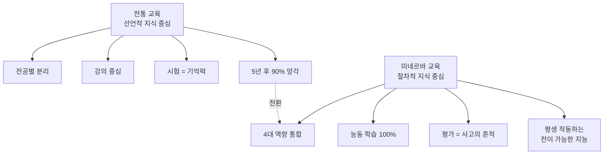
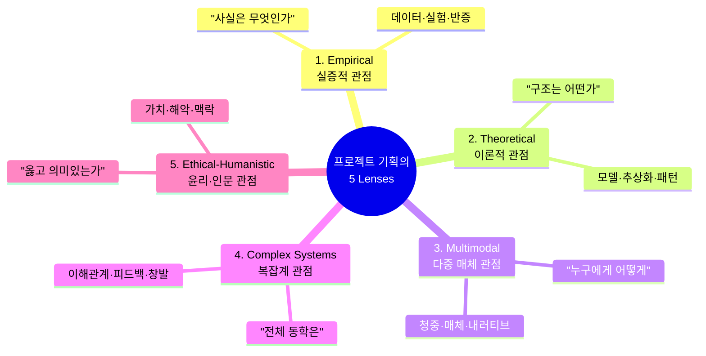
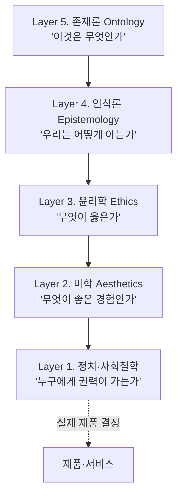
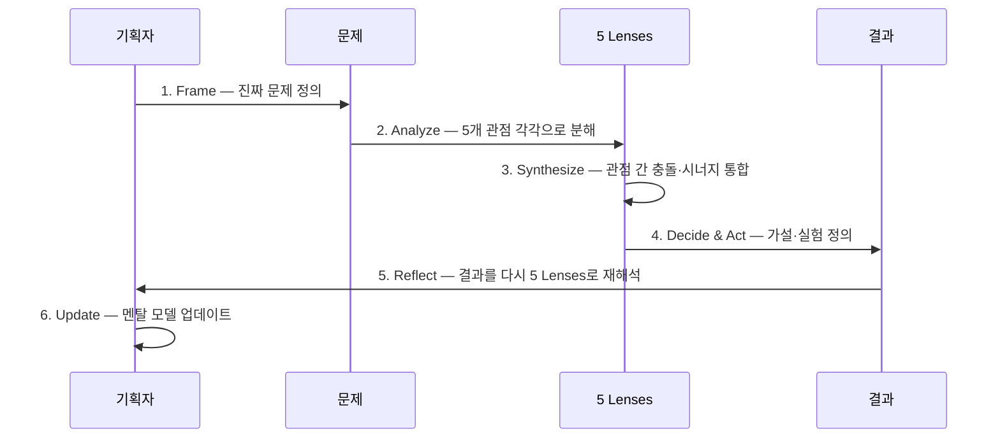
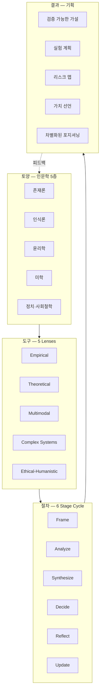

# 미네르바 스쿨의 5가지 관점 분석법
## — 프로젝트 기획자를 위한 완전 해설서 (상세 서술판)

> **이 문서의 약속**
> 미네르바 스쿨이 4년간 학생에게 심어주는 사고 방식을, 프로젝트 기획자가 책상에서 즉시 꺼내 쓸 수 있는
> **'도구 상자'**로 재구성한다. 단순 요약이 아니라, **왜 그렇게 생각해야 하는지의 맥락**과
> **어떻게 적용하는지의 단계별 사고 트리**를 함께 펼친다.

---

# 제1장. 미네르바 스쿨이라는 실험 — 왜 이 학교의 사고법이 특별한가

## 1.1 미네르바의 탄생 배경 — 교육에 대한 근본적 회의

2012년, 벤 넬슨(Ben Nelson)과 하버드 인지과학자 스티븐 코슬린(Stephen Kosslyn)은 단순한 질문 하나에서 출발했다.

> *"왜 명문대 졸업생조차 5년이 지나면 전공 지식의 대부분을 잊어버리는가?
> 그리고 왜 그들은 잊었다는 사실조차 인지하지 못하는가?"*

이 질문은 인지심리학의 오래된 발견 하나로 귀결된다. **선언적 지식(declarative knowledge)** — '무엇을 안다'는 종류의 지식 — 은 사용하지 않으면 빠르게 망각된다.
반면 **절차적 지식(procedural knowledge)** — '어떻게 생각하고 행동하는가'에 대한 지식 — 은 자전거 타기처럼 한번 체화되면 평생 간다.

미네르바는 이 통찰을 교육의 중심에 놓았다. **지식이 아니라 사고의 절차를 가르치자.** 그 결과물이 바로 우리가 다룰 **HCs(Habits of Mind & Foundational Concepts)** 이며, 4년 동안 약 80~120개의 사고 습관을 반복 훈련한다.



## 1.2 사고를 '전이 가능한 지능'으로 만든다는 것

심리학에서 가장 어려운 개념 중 하나가 **전이(transfer)** 다. 학교에서 배운 수학을 실제 사업 결정에 쓰지 못하는 사람이 대부분이다. 왜일까?

지식이 **'그 맥락에 묶여서'** 저장되기 때문이다. "사인·코사인은 시험 문제 안에서만 산다."

미네르바는 이 전이 문제를 풀기 위해 세 가지 장치를 쓴다.

```
전이 가능한 지능을 만드는 3단계 알고리즘
│
├─ 1단계. 다양한 맥락에서 같은 도구를 쓰게 한다
│  └─ 예: '#evidencebased'를 1학년에는 정치 토론에서,
│        2학년에는 비즈니스 케이스에서,
│        3학년에는 의료 윤리에서 반복 적용
│
├─ 2단계. 추상화 수준을 의식적으로 끌어올린다
│  └─ "이 문제는 우리가 지난주 다룬 OO 문제와 구조가 같다"는
│     패턴 인식을 강제로 훈련
│
└─ 3단계. 메타인지를 평가 항목에 넣는다
   └─ "당신이 어떤 사고 도구를 사용했고, 왜 그것이 적절했는지" 자체가
      성적의 핵심 — 답이 아닌 사고 절차를 평가
```

이 세 가지가 합쳐지면, 졸업생은 "**낯선 문제 앞에서도 어떤 도구를 꺼내야 할지 아는 사람**"이 된다. 그리고 이것이 정확히 **기획자에게 필요한 능력**이다.

## 1.3 왜 기획자가 미네르바식 사고법을 가져와야 하는가

기획자의 일은 본질적으로 **'한 번도 만나본 적 없는 문제'** 를 다루는 것이다.

- 시장은 매번 다르다
- 사용자는 매번 다르다
- 기술 제약도 매번 다르다
- 경쟁자도 매번 다르다

이런 환경에서 살아남으려면 "이 산업의 베스트 프랙티스를 외운다"는 접근은 한계가 명확하다. 베스트 프랙티스는 **이미 어제의 문제에 대한 답**이기 때문이다.

기획자에게 필요한 것은 **"낯선 문제를 만났을 때 자동으로 작동하는 사고 절차"** 다.
미네르바의 5 Lenses는 정확히 그 절차를 제공한다.

---

# 제2장. 미네르바의 4대 역량과 거기서 도출되는 5가지 관점

## 2.1 4대 핵심 역량 — 미네르바 교육과정의 척추

미네르바는 1학년 전원이 듣는 **Cornerstone Courses**라는 네 개의 기둥 과목을 둔다.

| 과목 | 한국어 명 | 본질 질문 | 양성하는 능력 |
|---|---|---|---|
| Empirical Analyses | 실증적 분석 | "사실은 무엇이며 우리는 그것을 어떻게 아는가?" | 데이터·증거·인과 추론 |
| Formal Analyses | 형식적 분석 | "이 문제를 어떤 모델로 표현할 수 있는가?" | 추상화·논리·구조화 |
| Multimodal Communications | 다중 매체 소통 | "다른 마음에 어떻게 도달할 것인가?" | 청중·메시지·매체 설계 |
| Complex Systems | 복잡 시스템 | "부분의 합 이상인 전체의 동학은?" | 시스템·이해관계·창발 |

이 네 과목을 자세히 들여다보면, 각각이 서로 다른 **인식의 관문**을 열어준다는 것을 알게 된다.

### Empirical — "보이는 것을 의심하라"

실증적 사고는 단순한 데이터 사용이 아니다. 그 핵심은 **"내가 지금 안다고 믿는 것이 실제로 어떻게 검증되었는지를 추적하는 능력"** 이다. 칼 포퍼가 강조했듯, 과학적 사고의 본질은 **반증 가능성**에 있다. "이 주장이 틀렸다면 어떤 증거가 나타날 것인가?"라는 질문에 답할 수 없다면, 그 주장은 신념일 뿐 지식이 아니다.

### Formal — "구조를 드러내라"

형식적 사고는 현실의 복잡함 속에서 **반복되는 추상 구조**를 발견하는 능력이다. 수학자가 다리 설계와 인구 변동에서 같은 미분 방정식을 보는 것처럼, 기획자도 "이 시장의 동학은 지난 분기의 다른 시장과 같은 구조다"를 알아챌 수 있어야 한다.

### Multimodal — "메시지는 매체에 묻는다"

마샬 맥루한의 명제 "The medium is the message"는 단순히 미디어 이론이 아니라 모든 소통의 본질에 대한 통찰이다. 같은 내용도 어떤 형식·매체·맥락에서 전달되느냐에 따라 완전히 다른 메시지가 된다. 기획자에게 이는 **"우리 제품의 진짜 메시지는 우리가 적은 카피가 아니라 사용자가 받는 형식 전체"** 라는 뜻이다.

### Complex Systems — "부분의 합을 의심하라"

복잡계 사고의 출발은 환원주의(reductionism)에 대한 회의다. 시스템을 부분으로 나누어 분석하면 **창발적 속성(emergent properties)** 을 놓친다. 도시는 건물의 합이 아니고, 조직은 사람의 합이 아니다. 기획자가 "사용자 100명 인터뷰했으니 시장을 안다"고 말하는 순간 이 함정에 빠진다.

## 2.2 4대 역량에서 5 Lenses로 — 한 축의 분리

기획 실무에서 미네르바의 4대 역량을 그대로 쓰기에는 한 가지 부족함이 있다. **윤리적·인문학적 차원**이다.

미네르바는 4대 역량 안에 윤리를 녹여 두지만(`#ethicalconsiderations` HC), 기획 현장에서는 이를 **독립된 관문**으로 빼서 다루는 편이 훨씬 강력하다. 이유는 단순하다. 윤리를 분석 도구의 한 줄로 두면, 바쁜 기획자는 그것을 가장 먼저 건너뛴다. **별도의 독립 관문**으로 만들어야 강제로 통과시킬 수 있다.

그래서 우리는 미네르바의 4대 역량 중 Formal Analyses를 **'이론적 관점'** 으로 재명명하고, 윤리·인문학을 **다섯 번째 관문**으로 분리해 다음과 같은 5 Lenses를 얻는다.



---

# 제3장. 5가지 관점 — 각각의 깊이 있는 해부

## 3.1 관점 1. Empirical (실증적 관점) — "보이는 것을 의심하는 기술"

### 3.1.1 본질 질문

> **"내가 사실이라고 믿는 이것은, 어떤 증거에 의해 얼마나 강하게 뒷받침되는가?
> 그리고 이 믿음이 틀렸다면 어떤 모습일 것인가?"**

이 질문은 두 부분으로 이루어져 있다. 앞 절반은 **현재의 증거 평가**이고, 뒤 절반은 **반증 조건의 명시**다. 두 번째가 빠지면 그것은 실증주의가 아니라 확증편향이다.

### 3.1.2 철학적 뿌리 — 왜 이 관점이 필요해졌는가

17세기 프랜시스 베이컨이 《노붐 오르가눔(Novum Organum)》에서 제시한 **귀납적 방법**은 인류가 권위에서 벗어나 자연을 직접 관찰하기 시작한 출발점이었다. 데이비드 흄은 한 걸음 더 나아가 **"우리가 인과를 본 적이 있는가?"** 라는 충격적인 질문을 던졌다. 우리는 사건의 연속만 보았을 뿐, 인과 자체를 관찰한 적이 없다는 것이다.

20세기 들어 칼 포퍼는 이 질문에 결정적인 답을 내놓았다. **"과학은 검증된 진실의 모음이 아니라, 아직 반증되지 않은 가설의 모음"** 이라는 것이다. 그래서 그는 **반증 가능성(falsifiability)** 을 과학과 비과학의 경계로 삼았다.

### 3.1.3 기획자에게 주는 실천적 의미

이 관점이 없으면 기획자는 두 가지 함정에 빠진다.

```
실증적 관점 부재 시의 사고 트리
│
├─ 함정 A. 확증 편향의 늪
│  ├─ 가설을 세운다
│  ├─ 그 가설을 지지하는 데이터만 본다
│  └─ "역시 내 생각이 맞았다"는 자기 강화
│     → 출시 후 시장 반응에 충격
│
└─ 함정 B. 상관관계의 함정
   ├─ A와 B가 같이 움직이는 것을 본다
   ├─ "A가 B를 일으킨다"고 결론
   └─ A를 더 강화했지만 B는 안 따라온다
      → 진짜 원인은 숨겨진 C였음
```

### 3.1.4 실전 도구 5종

| 도구 | 언제 쓰나 | 핵심 절차 |
|---|---|---|
| **사용자 인터뷰 (Mom Test 방식)** | 가설 탐색 초기 | 미래 의향 X, 과거 행동 O 만 질문 |
| **A/B 테스트** | 정량 인과 검증 | 변수 1개만 변경, 통계적 유의 확보 |
| **코호트 분석** | 시간에 따른 행동 추적 | 가입 시기별 리텐션 추이 |
| **신뢰 구간(CI) 사고** | 단일 숫자에 속지 않기 | 평균이 아닌 분포·구간으로 사고 |
| **반증 실험 설계** | 강한 가설 검증 | "이 결과면 가설을 버린다"를 사전 정의 |

### 3.1.5 적용 사고 트리

```
새로운 기획을 받았을 때 Empirical Lens 작동 순서
│
├─ Step 1. 핵심 가정 분해
│  └─ "이 기획이 성공하려면 OO, OO, OO이 사실이어야 한다"
│     를 3~5개 명제로 적기
│
├─ Step 2. 각 가정의 증거 등급 매기기
│  ├─ A등급: 정량 데이터로 검증됨
│  ├─ B등급: 정성 데이터(인터뷰)로 시사됨
│  ├─ C등급: 추측 또는 직관
│  └─ → C등급 가정이 가장 큰 위험
│
├─ Step 3. 가장 약한 가정의 반증 실험 설계
│  ├─ "이 결과가 나오면 가설을 버린다"의 임계값 정의
│  ├─ 최소 표본·기간·예산 명시
│  └─ 결과 해석 룰을 사전에 확정 (사후 합리화 방지)
│
└─ Step 4. 실험 후 메타 평가
   ├─ "실험 자체에 결함은 없었나?"
   └─ "결과가 일반화 가능한 범위는?"
```

---

## 3.2 관점 2. Theoretical (이론적 관점) — "구조를 드러내는 기술"

### 3.2.1 본질 질문

> **"눈앞의 이 현상을, 어떤 추상 모델로 설명할 수 있는가?
> 그리고 이 모델은 다른 어떤 사례에서 작동한 적이 있는가?"**

이론적 관점의 힘은 **'유추를 통한 시간 단축'** 에 있다. 좋은 모델 하나는 수많은 사례를 미리 경험한 효과를 준다.

### 3.2.2 철학적 뿌리

플라톤의 **이데아론**은 첫 번째 이론적 사고의 선언이었다. "우리가 보는 현실의 의자는 모두 다르지만, 그것들이 '의자'인 이유는 어떤 공통의 형상(eidos)을 공유하기 때문이다." 추상화의 출발점.

칸트는 한 발 더 나아갔다. **"우리는 세상을 있는 그대로 보지 않는다. 우리 마음의 범주(categories)를 통해 본다."** 즉, 우리가 세상을 이해하는 데 사용하는 모델은 단순한 도구가 아니라, **이해 자체의 조건**이다.

토마스 쿤은 20세기에 이 통찰을 과학사로 확장했다. **패러다임(paradigm)** 이라는 개념을 통해, 같은 사실도 다른 패러다임 안에서는 다른 의미를 갖는다는 것을 보였다.

### 3.2.3 기획자에게 주는 실천적 의미

기획에서 이론적 사고의 부재는 **"매번 처음부터 시작하는 사람"** 으로 나타난다. 다른 산업·다른 시대·다른 지리의 유사 사례에서 배우지 못하기 때문이다.

```
이론적 관점이 작동하는 방식의 사고 트리
│
├─ Level 1. 표면 관찰
│  └─ "사용자가 결제 직전에 이탈한다"
│
├─ Level 2. 일반화 시도
│  └─ "이것은 '결정 지연(decision deferral)' 현상이다"
│
├─ Level 3. 이론적 프레임 발견
│  ├─ 행동경제학: '손실 회피'와 '선택의 역설'
│  ├─ 인지심리학: '인지 부하 이론'
│  └─ 마케팅: 'Jobs-to-be-Done'
│
├─ Level 4. 유사 사례 탐색
│  ├─ 아마존 1-Click의 마찰 제거
│  ├─ 넷플릭스의 자동 다음 화
│  └─ 토스의 송금 UX
│
└─ Level 5. 우리 맥락에 맞는 변형
   └─ 단순 복제가 아니라, 우리 사용자의 맥락에 맞게
      이론에서 도출되는 원칙만 추출
```

### 3.2.4 기획자가 반드시 알아야 할 핵심 이론 12개

| 분야 | 이론 | 한 줄 핵심 |
|---|---|---|
| 동기 | Self-Determination Theory (Deci·Ryan) | 자율성·유능감·관계성이 내재 동기의 3축 |
| 동기 | Fogg Behavior Model | 행동 = 동기 × 능력 × 트리거 |
| 행동변화 | Stages of Change (Prochaska) | 인식 전→인식→준비→실행→유지 |
| 의사결정 | Prospect Theory (Kahneman·Tversky) | 손실은 같은 크기 이득의 약 2배 |
| 의사결정 | Jobs-to-be-Done (Christensen) | 사람들은 제품이 아니라 '진척'을 산다 |
| 학습 | Vygotsky ZPD | 혼자 못 풀지만 도움받으면 풀리는 영역에서 학습 발생 |
| 학습 | Cognitive Load Theory | 작업기억 한계가 학습을 결정 |
| 네트워크 | Metcalfe's Law | 네트워크 가치는 노드 수의 제곱 |
| 네트워크 | Granovetter '약한 연결의 힘' | 새로운 정보는 약한 연결에서 온다 |
| 시장 | Disruption Theory (Christensen) | 하위 시장에서 시작해 위로 올라가는 파괴 |
| 시장 | Crossing the Chasm (Moore) | 얼리어답터와 초기 다수자 사이의 간극 |
| 조직 | Conway's Law | 시스템 구조 = 조직의 소통 구조 |

### 3.2.5 적용 사고 트리

```
이론적 Lens 작동 순서
│
├─ Step 1. 현상을 한 문장으로 기술
│  └─ "사용자가 OO 상황에서 OO 행동을 한다"
│
├─ Step 2. 기존 이론과의 매칭 시도
│  ├─ 행동경제학에서 같은 패턴이 있는가?
│  ├─ 학습 이론에서?
│  ├─ 사회학에서?
│  └─ 다른 산업에서?
│
├─ Step 3. 가장 강한 매칭 이론 선택
│  └─ 단, 하나에 너무 집착하지 말 것 — 복수의 이론으로 본다
│
├─ Step 4. 이론이 예측하는 다음 행동 도출
│  └─ "이 이론이 맞다면, 다음에는 OO이 일어나야 한다"
│
└─ Step 5. 4번을 Empirical Lens로 검증
   └─ 이론 → 가설 → 실험으로 순환
```

---

## 3.3 관점 3. Multimodal (다중 매체 소통 관점) — "메시지가 도착하는 방식의 기술"

### 3.3.1 본질 질문

> **"내가 전달하려는 내용이, 어떤 청중에게, 어떤 매체와 형식을 통해, 어떤 맥락에서 받아들여지는가?
> 그 과정에서 메시지는 어떻게 변형되는가?"**

### 3.3.2 철학적·이론적 뿌리

기원은 멀리 아리스토텔레스의 《수사학》까지 거슬러 올라간다. 그는 설득의 3요소를 **에토스(ethos, 신뢰성)**, **파토스(pathos, 감정)**, **로고스(logos, 논리)** 로 나누었다. 흥미로운 점은 그가 이 셋을 **"청중에 따라 비율을 바꾼다"** 고 했다는 것이다. 청중 분석은 2400년 된 기획 도구다.

20세기 마샬 맥루한의 **"미디어는 메시지다"** 는 이 통찰을 디지털 시대로 확장했다. 같은 사실도 신문에서 본 것과 틱톡에서 본 것은 다른 메시지다. 매체 자체가 의미의 일부다.

언어철학자 비트겐슈타인은 **"언어 게임(language game)"** 이라는 개념을 통해 또 하나의 층을 더했다. 같은 단어도 사용되는 맥락(게임)에 따라 의미가 달라진다는 것. 기획자에게 이는 **"우리 카피의 의미는 우리가 정하는 게 아니라 사용자가 속한 언어 게임이 정한다"** 는 뜻이다.

### 3.3.3 다중 매체 사고의 4층 구조

```
같은 메시지가 사용자에게 도달하는 과정
│
├─ Layer 1. 의도된 메시지 (Intended)
│  └─ 기획자가 전달하려고 적은 것
│
├─ Layer 2. 인코딩된 메시지 (Encoded)
│  └─ 카피·이미지·UI·인터랙션으로 변환된 것
│     (이미 의도와 갭이 생긴다)
│
├─ Layer 3. 전달된 메시지 (Transmitted)
│  └─ 채널을 통과한 후의 형태
│     (모바일 좁은 화면, 알림 미리보기 등 채널 제약)
│
└─ Layer 4. 디코딩된 메시지 (Decoded)
   └─ 사용자의 맥락·기분·사전지식 안에서 해석된 것
      (여기서 또 한 번 갭)

→ Layer 1 ≠ Layer 4 가 거의 항상이다.
   기획자의 일은 이 갭을 의식하고 줄이는 것.
```

### 3.3.4 청중 분석 — 페르소나를 넘어서

기획 입문서들이 가르치는 페르소나는 시작점일 뿐이다. 미네르바식 청중 분석은 **세 가지 축**으로 청중을 본다.

| 축 | 질문 | 도구 |
|---|---|---|
| 인지적 축 | "이 청중이 이미 아는 것은? 모르는 것은?" | 사전지식 매핑 |
| 정서적 축 | "이 청중은 지금 어떤 감정 상태인가?" | 감정 맥락 분석 |
| 사회적 축 | "이 청중은 어떤 정체성·집단에 속해 있는가?" | 정체성 프레임 |

이 세 축을 모두 고려하면, 같은 제품에도 메시지가 사람마다 달라야 한다는 결론이 자연스럽다.

### 3.3.5 적용 사고 트리

```
Multimodal Lens 작동 순서
│
├─ Step 1. 핵심 청중 3그룹 명명
│  └─ "20대 자취생", "40대 워킹맘", "60대 은퇴자" 식이 아니라
│     "오늘 저녁 혼자 먹기 싫은 28세 김지영"처럼 구체적으로
│
├─ Step 2. 각 그룹의 3축 분석
│  ├─ 인지: 무엇을 알고 무엇을 모르는가
│  ├─ 정서: 어떤 감정 상태인가
│  └─ 사회: 어떤 정체성을 가졌는가
│
├─ Step 3. 그룹별 메시지 + 매체 매트릭스
│  ┌─────────────────┬─────────┬─────────┐
│  │                 │ 매체    │ 메시지  │
│  ├─────────────────┼─────────┼─────────┤
│  │ 청중 A          │ 인스타  │ "혼자도 │
│  │                 │         │  당당히"│
│  │ 청중 B          │ 카톡    │ "따뜻한 │
│  │                 │         │  한끼"  │
│  │ 청중 C          │ 유튜브  │ "동네의 │
│  │                 │         │  맛집"  │
│  └─────────────────┴─────────┴─────────┘
│
└─ Step 4. 메시지 변형 추적
   └─ Layer 1~4 갭을 좁히기 위한 사용자 테스트
```

---

## 3.4 관점 4. Complex Systems (복잡계 관점) — "전체의 동학을 보는 기술"

### 3.4.1 본질 질문

> **"이 문제와 솔루션이 놓여 있는 시스템 전체는 어떻게 움직이는가?
> 누가 어떤 영향을 주고받으며, 어떤 피드백 루프가 작동하고,
> 부분에서는 보이지 않던 어떤 창발적 현상이 나타나는가?"**

### 3.4.2 철학적·과학적 뿌리

복잡계 사고의 뿌리는 동양에서는 **연기(緣起)** — 모든 것은 서로 의존하여 일어난다는 불교 사상 — 까지 거슬러 올라간다. 서양에서는 알프레드 노스 화이트헤드의 **과정철학**, 그레고리 베이트슨의 **"마음의 생태학"**, 그리고 도넬라 메도우즈의 **시스템 사고**가 직접적 조상이다.

20세기 후반, 산타페 연구소(Santa Fe Institute)를 중심으로 한 복잡계 과학자들 — 머레이 겔만, 스튜어트 카우프만, 존 홀랜드 등 — 은 이를 정량 과학으로 발전시켰다. 핵심 발견은 단순하지만 충격적이었다.

**"단순한 규칙을 따르는 다수의 행위자가 상호작용할 때, 누구도 의도하지 않은 패턴이 창발한다."**

개미 한 마리는 단순하지만 개미 군집은 지능적이다. 사람 한 명은 합리적이지만 시장은 비합리적이다. 사용자 한 명은 예측 가능하지만 사용자 커뮤니티는 예측 불가능하다.

### 3.4.3 시스템 사고의 핵심 개념 6가지

```
복잡계 관점의 6가지 핵심 도구
│
├─ 1. 피드백 루프 (Feedback Loop)
│  ├─ 강화 루프 (Reinforcing): 부익부 빈익빈
│  └─ 균형 루프 (Balancing): 자기 조절
│
├─ 2. 지연 (Delay)
│  └─ 원인과 결과 사이 시간차 → 진단을 어렵게 함
│
├─ 3. 창발 (Emergence)
│  └─ 부분의 합 이상의 패턴이 자발적으로 나타남
│
├─ 4. 비선형성 (Non-linearity)
│  └─ 입력의 작은 변화가 출력의 큰 변화로 → 임계점
│
├─ 5. 다중 균형 (Multiple Equilibria)
│  └─ 같은 시스템에 여러 안정 상태 가능
│
└─ 6. 레버리지 포인트 (Leverage Point)
   └─ 작은 개입으로 큰 변화를 만드는 지점
     (메도우즈는 12단계로 위계 분류)
```

### 3.4.4 도넬라 메도우즈의 12 레버리지 포인트 — 기획자에게 가장 강력한 무기

영향력이 낮은 순부터 높은 순으로:

| 순위 | 개입점 | 기획 적용 예 |
|---|---|---|
| 12 | 숫자(상수·파라미터) | 가격을 5% 인하 |
| 11 | 버퍼·재고 크기 | 캐시·인벤토리 조정 |
| 10 | 구조(물리적 흐름) | UI 흐름 변경 |
| 9 | 지연 시간 | 응답 속도 개선 |
| 8 | 균형 루프의 강도 | 모더레이션 시스템 |
| 7 | 강화 루프의 강도 | 추천 알고리즘 강화 |
| 6 | 정보 흐름 | 누가 무엇을 보는지 |
| 5 | 규칙(인센티브·제약) | 가입 조건·정책 |
| 4 | 자기조직화 능력 | 사용자 자율 모더레이션 |
| 3 | 목표 | KPI 자체를 바꿈 |
| 2 | 패러다임 | "우리는 무엇인가" 재정의 |
| 1 | 패러다임을 초월하는 능력 | 메타 수준의 유연성 |

**기획자에게 주는 교훈**: 우리는 보통 11~12위 (가격·파라미터 조정)에만 매달리지만, 진짜 변화는 2~3위 (목표·패러다임 변경)에서 일어난다.

### 3.4.5 적용 사고 트리

```
Complex Systems Lens 작동 순서
│
├─ Step 1. 시스템 경계 정의
│  └─ "어디까지를 우리 시스템으로 볼 것인가?"
│     너무 좁으면 핵심 동학을 놓치고,
│     너무 넓으면 분석 불가
│
├─ Step 2. 이해관계자 명명 (최소 7명)
│  ├─ 직접 사용자
│  ├─ 영향받는 비사용자
│  ├─ 결정권자
│  ├─ 자금 제공자
│  ├─ 경쟁자
│  ├─ 규제 당국
│  └─ 사회적 환경
│
├─ Step 3. 피드백 루프 그리기
│  ├─ 강화 루프 최소 2개
│  └─ 균형 루프 최소 2개
│
├─ Step 4. 지연·임계점·창발 식별
│  ├─ "원인-결과 사이에 어떤 지연이 있나?"
│  ├─ "어떤 임계점을 넘으면 비선형 변화가 오나?"
│  └─ "어떤 창발 현상을 기대/우려하나?"
│
├─ Step 5. 레버리지 포인트 선택
│  └─ 메도우즈 12단계에서 가능한 한 위쪽을 노린다
│
└─ Step 6. Pre-mortem
   └─ "6개월 후 이 프로젝트가 실패했다면 그 이유는?"
      시스템 관점에서 3가지 시나리오 작성
```

---

## 3.5 관점 5. Ethical/Humanistic (윤리·인문 관점) — "옳고 의미 있는가를 묻는 기술"

### 3.5.1 본질 질문

> **"이것이 누구에게 어떤 의미인가? 누가 이득을 보고 누가 해를 입는가?
> 우리 자신은 이 일을 자랑스럽게 말할 수 있는가?
> 10년·100년 후의 사람들이 이 결정을 어떻게 평가할 것인가?"**

이 관점은 다른 네 관점과 본질적으로 다르다. 다른 관점들이 **"어떻게 작동하는가"** 를 묻는다면, 이 관점은 **"그래서 우리가 그렇게 해야 하는가"** 를 묻는다.

### 3.5.2 철학적 뿌리 — 윤리학의 3대 전통

서양 윤리학은 크게 세 갈래로 흐른다. 기획자는 이 셋을 **'세 개의 렌즈'** 처럼 번갈아 써야 한다.

```
윤리적 판단의 3대 전통
│
├─ 1. 결과주의 (Consequentialism) — 공리주의
│  ├─ 대표: 벤담, 밀
│  ├─ 핵심: "최대 다수의 최대 행복"
│  ├─ 기획 질문: "이 결정이 만드는 총 효용은?"
│  └─ 한계: 소수에 대한 침해를 정당화할 수 있음
│
├─ 2. 의무론 (Deontology) — 칸트
│  ├─ 대표: 칸트
│  ├─ 핵심: "정언명령 — 인간을 수단이 아닌 목적으로"
│  ├─ 기획 질문: "이 결정이 누군가를 도구로 삼고 있지 않은가?"
│  └─ 한계: 융통성 부족, 결과 무시
│
└─ 3. 덕윤리 (Virtue Ethics) — 아리스토텔레스
   ├─ 대표: 아리스토텔레스, 매킨타이어
   ├─ 핵심: "어떤 종류의 사람·조직이 되려 하는가"
   ├─ 기획 질문: "우리가 이것을 만들면 우리는 어떤 회사가 되는가?"
   └─ 강점: 장기적 정체성과 일관성
```

20세기 들어 존 롤스의 **《정의론》**은 또 다른 강력한 도구를 더했다. **"무지의 베일(veil of ignorance)"** — 내가 이 시스템에서 어떤 위치에 떨어질지 모른다면, 그래도 이 시스템을 선택하겠는가? 이 사고 실험은 **'가장 취약한 사용자에게도 공정한가'** 를 묻는 강력한 도구다.

한나 아렌트의 **《예루살렘의 아이히만》**은 또 다른 차원을 열었다. **'악의 평범성(banality of evil)'** — 큰 해악은 악마가 아니라 '생각하지 않는' 평범한 사람들의 일상적 결정에서 나온다. 기획자에게 이는 **"내가 의도하지 않아도, 생각하지 않으면 해악을 만든다"** 는 무거운 경고다.

### 3.5.3 인문학이 기획에 주는 5가지 층위

```
기획자에게 인문학이 작동하는 5개 층위
│
├─ 1. 존재론 (Ontology) — "이것은 본질적으로 무엇인가?"
│  ├─ 우리 제품의 카테고리 이름이 정확한가?
│  ├─ 사용자가 우리를 무엇으로 인식하는가?
│  └─ 예: "우리는 데이팅 앱이 아니라 약한 연결 인프라"
│
├─ 2. 인식론 (Epistemology) — "우리는/사용자는 어떻게 아는가?"
│  ├─ 사용자가 우리 제품을 이해하는 멘탈 모델은?
│  ├─ 우리가 사용자를 안다고 믿는 근거는?
│  └─ 예: 학습 앱에서 사용자의 사전지식 매핑
│
├─ 3. 윤리학 (Ethics) — "옳은가?"
│  ├─ 누가 이득/손해를 보는가?
│  ├─ 강제·기만·착취 요소는 없는가?
│  └─ 예: 다크 패턴 회피
│
├─ 4. 미학 (Aesthetics) — "좋은 경험이란?"
│  ├─ 왜 이 경험이 아름답거나 불쾌한가?
│  ├─ 무엇이 '품격'을 만드는가?
│  └─ 예: 야나기 무네요시의 '용(用)의 미'
│
└─ 5. 정치·사회철학 (Political Philosophy) — "권력은 어디로 가는가?"
   ├─ 우리 제품이 어떤 권력 구조를 강화/약화하는가?
   ├─ 누가 목소리를 갖고 누가 침묵당하는가?
   └─ 예: 플랫폼 자본주의의 함정
```

### 3.5.4 적용 사고 트리

```
Ethical-Humanistic Lens 작동 순서
│
├─ Step 1. 세 윤리 렌즈로 동시 검사
│  ├─ 공리주의: "총 효용은?"
│  ├─ 의무론: "수단화하고 있지 않나?"
│  └─ 덕윤리: "어떤 회사가 되는가?"
│
├─ Step 2. 무지의 베일 사고 실험
│  └─ "내가 이 시스템에서 가장 약한 위치라면 이 결정을 받아들이겠는가?"
│
├─ Step 3. 최악의 사용 시나리오 3가지 (Consequence Scanning)
│  ├─ "악의적 행위자가 이 기능을 어떻게 악용할 수 있나?"
│  ├─ "선의의 사용자가 어떻게 의도치 않게 다칠 수 있나?"
│  └─ "이것이 사회 전체에 미치는 2차 효과는?"
│
├─ Step 4. 거절할 사용 사례 명시
│  └─ "우리는 이런 사용에는 협력하지 않는다"의 선언
│     (이것이 기업의 정체성을 만든다)
│
└─ Step 5. 100년 후 시점의 자기 평가
   └─ "100년 후 사람들이 이 결정을 보고 부끄러워할 부분은?"
```

---

# 제4장. 인문학·철학 5층 스택 — 기획자의 깊이를 만드는 토양

5 Lenses는 '도구'다. 도구를 잘 쓰려면 그 도구가 깊은 토양에서 자라야 한다. 그 토양이 인문학이다.

## 4.1 5층 스택의 의미



이 스택의 흐름은 추상에서 구체로, 개인에서 사회로 내려온다.

| 층 | 작동하는 기획 순간 | 대표 사상가 | 무시했을 때의 비용 |
|---|---|---|---|
| 존재론 | 카테고리 정의·포지셔닝 | 하이데거, 화이트헤드 | 시장에서 "이게 뭐지" 소리 |
| 인식론 | 사용자 학습·온보딩 설계 | 칸트, 비트겐슈타인, 폴라니 | 사용자가 이해 못 함 |
| 윤리학 | 정책·약관·기능 한계 | 칸트, 밀, 매킨타이어, 롤스 | 사회적 신뢰 붕괴 |
| 미학 | UI·내러티브·브랜드 톤 | 칸트, 듀이, 야나기 무네요시 | 사용자 이탈 |
| 정치·사회 | 시장·생태계·규제 대응 | 푸코, 아렌트, 샌델 | 규제·여론·보이콧 |

## 4.2 각 층의 깊이 있는 해설

### 존재론 — "우리는 무엇을 만들고 있는가"

마틴 하이데거는 《존재와 시간》에서 도구의 존재 방식에 대한 놀라운 통찰을 제시했다. 망치는 우리가 사용 중일 때 **"손에 있음(zuhanden)"** 의 방식으로 존재한다. 우리는 망치를 의식하지 않는다. 그저 못을 박는다. 그러나 망치가 부러지면, 그제야 망치는 **"눈앞에 있음(vorhanden)"** 의 대상으로 나타난다.

기획자에게 이는 결정적인 교훈을 준다. **좋은 제품은 사용자가 의식하지 않을 때 가장 잘 작동한다.** 즉, 우리가 만드는 것의 '존재 방식'을 묻지 않으면, 우리는 사용자가 의식해야 하는 제품 — 결국 짐이 되는 제품 — 을 만든다.

### 인식론 — "사용자는 우리를 어떻게 이해하는가"

마이클 폴라니의 **암묵지(tacit knowledge)** 개념은 모든 기획자가 알아야 한다. 그의 명제는 단순하다. **"우리는 우리가 말할 수 있는 것보다 더 많이 안다."** 자전거 타기, 얼굴 알아보기, 모국어 말하기 — 모두 우리가 할 수 있지만 설명할 수 없는 것들이다.

사용자도 마찬가지다. 사용자에게 "무엇을 원하느냐"고 물으면 대답하지 못한다. 그것이 암묵지이기 때문이다. 그래서 기획자는 **묻지 말고 관찰해야** 한다.

### 윤리학 — "이 결정에 우리는 떳떳한가"

알래스데어 매킨타이어는 《덕의 상실(After Virtue)》에서 현대 윤리의 핵심 문제를 짚었다. 우리는 **"내가 이 결정을 통해 어떤 사람이 되는가"** 라는 질문을 잊어버렸다는 것이다. 결과만 따지거나 규칙만 따지면서, 가장 근본적인 자기 정체성의 문제를 외면한다.

기획자에게 이 질문은 정말 무거운 무게를 갖는다. **"우리 회사는 이 제품을 만들고 나서 어떤 회사가 되는가?"** 이 질문이 빠지면 회사는 자기가 누구인지 잊은 채로 표류한다.

### 미학 — "왜 이것은 아름답거나 추한가"

존 듀이의 《경험으로서의 예술》은 미학을 박물관에서 일상으로 가져왔다. 그의 핵심 명제: **"아름다움은 대상의 속성이 아니라, 경험의 질이다."**

이것이 기획에 주는 의미는 막대하다. UI가 아름다운 것이 아니라, UI를 통한 경험이 아름다운 것이다. 우리가 디자인하는 것은 픽셀이 아니라 사용자가 우리 제품과 만나는 시간의 결(texture)이다.

일본 민예운동의 야나기 무네요시는 또 다른 미학적 차원을 더했다. **"용(用)의 미(美)"** — 도구가 자기 쓰임 안에서 가장 아름답다는 사상. 화려한 장식이 아니라, 본질에 충실한 단순함이 진짜 아름다움이라는 것이다. 이것은 좋은 제품 디자인의 거의 모든 원칙과 통한다.

### 정치·사회철학 — "이 제품이 만드는 권력 지도는 어떤가"

미셸 푸코는 **권력이 위에서 아래로 흐르지 않는다**는 것을 보였다. 권력은 모세혈관처럼 미세한 일상의 실천 속에 퍼져 있다. 학교·병원·감옥의 일상적 규율이 사실은 거대한 권력 시스템이다.

기획자에게 이는 충격적인 통찰을 준다. **"우리가 만드는 UI의 작은 결정 — 어떤 버튼을 어디에 두는가, 어떤 알림을 언제 보내는가 — 이 모두 권력의 작동"** 이라는 것. 우리는 사용자에게 매일 무엇을 하라고 말하고 있다. 그것이 어떤 권력 관계를 만드는가?

한나 아렌트의 **공적 영역(public realm)** 개념은 또 다른 층을 더한다. 그녀에게 인간이 인간일 수 있는 조건은 **공적 영역에서 말하고 행동할 수 있는 가능성**이다. 소셜미디어 시대에 우리가 만드는 플랫폼은 새로운 공적 영역이다. 그 영역의 규칙이 곧 시민 됨의 조건이 된다.

---

# 제5장. 미네르바식 4단계 사고 절차 — 5 Lenses를 실제로 작동시키는 알고리즘

5 Lenses는 정적인 체크리스트가 아니다. 동적으로 순환하는 **사고 절차**다.

## 5.1 전체 절차 개관



## 5.2 단계별 깊이 있는 절차

### Stage 1. Frame — "진짜 문제는 무엇인가"

알베르트 아인슈타인이 했다고 전해지는 말이 있다.
> *"세상을 구할 1시간이 있다면, 55분은 문제를 정의하는 데 쓰고, 5분은 풀이에 쓰겠다."*

이 단계의 목표는 **문제를 정확하게 적는 것** 이다.

```
Frame 단계 사고 트리
│
├─ Step 1.1. 처음 표면 진술 적기
│  └─ "사용자가 OO 안 한다"
│
├─ Step 1.2. "왜?" 5번 묻기 (5 Whys)
│  ├─ 왜 안 하는가?
│  ├─ 왜 그 이유가 발생하는가?
│  ├─ 왜 그 원인이 있는가?
│  ├─ 왜 그것이 해결되지 않았는가?
│  └─ 왜 우리가 이것을 풀어야 하는가?
│
├─ Step 1.3. 문제의 재진술
│  └─ 표준 양식: "We believe that [솔루션]
│              for [사용자]
│              because [통찰].
│              We will know we're right when [지표]."
│
└─ Step 1.4. 문제가 풀 가치가 있는지 검토
   ├─ 시장 규모?
   ├─ 우리가 풀 적임자인가?
   └─ 지금 푸는 것이 적절한가?
```

### Stage 2. Analyze — "5개 관점으로 분해"

각 관점에 대해 미리 정해진 질문 세트를 통과시킨다.

```
Analyze 단계 — 각 Lens별 통과 질문
│
├─ Empirical
│  ├─ Q1. 이 문제에 대한 정량 데이터가 있는가?
│  ├─ Q2. 핵심 가정 3개를 적으면?
│  ├─ Q3. 각 가정의 증거 등급은? (A/B/C)
│  └─ Q4. 가장 약한 가정의 반증 실험은?
│
├─ Theoretical
│  ├─ Q1. 이 현상을 설명하는 기존 이론은?
│  ├─ Q2. 유사 사례 3개는?
│  ├─ Q3. 그 사례에서 성공/실패 요인은?
│  └─ Q4. 우리 맥락의 차이는?
│
├─ Multimodal
│  ├─ Q1. 핵심 청중 3그룹은?
│  ├─ Q2. 각 그룹의 인지·정서·사회적 맥락은?
│  ├─ Q3. 그룹별 최적 채널·메시지는?
│  └─ Q4. 메시지 변형 위험 지점은?
│
├─ Complex Systems
│  ├─ Q1. 이해관계자 7명은?
│  ├─ Q2. 강화 루프·균형 루프는?
│  ├─ Q3. 어떤 창발 효과를 기대/우려?
│  └─ Q4. 메도우즈 12단계 중 어디를 노릴 것인가?
│
└─ Ethical-Humanistic
   ├─ Q1. 누가 이득·손해?
   ├─ Q2. 가장 취약한 사용자는?
   ├─ Q3. 최악의 사용 시나리오 3개는?
   └─ Q4. 우리가 거절할 사용 사례는?
```

### Stage 3. Synthesize — "관점 간 통합"

이 단계가 가장 어렵고 가장 중요하다. 5개 관점은 서로 충돌할 때가 많다.

- Empirical은 "데이터가 X를 가리킨다"고 말하는데
- Ethical은 "그래도 X는 안 된다"고 말한다
- Multimodal은 "메시지를 단순화하라"고 하는데
- Systems는 "복잡한 이해관계를 다 다뤄야 한다"고 한다

이런 충돌을 어떻게 풀까?

```
Synthesize 단계의 충돌 해결 알고리즘
│
├─ Step 3.1. 충돌 명시화
│  └─ "Lens A는 X를 권하고 Lens B는 Y를 권한다"
│
├─ Step 3.2. 충돌의 본질 분류
│  ├─ 시간 충돌: 단기 vs 장기
│  ├─ 가치 충돌: 효율 vs 공정
│  ├─ 우선순위 충돌: 누구의 이익 우선
│  └─ 정보 충돌: 다른 정보 기반
│
├─ Step 3.3. 메타 기준 적용
│  ├─ 우리 회사의 정체성(덕윤리)은?
│  ├─ 가장 취약한 사용자는?
│  └─ 100년 후의 평가는?
│
└─ Step 3.4. 통합 결정문 작성
   └─ "우리는 OO를 선택한다. 그 이유는 OO이며,
      OO를 포기하는 대신 OO로 보완한다."
```

### Stage 4. Decide & Act — "가설로 변환"

분석은 그 자체가 목적이 아니다. **검증 가능한 가설**과 **다음 행동**으로 이어져야 한다.

```
Decide & Act 단계 산출물
│
├─ 4.1. 핵심 가설 1문장
│  └─ "OO 사용자에게 OO를 제공하면 OO이 OO만큼 변한다"
│
├─ 4.2. 검증 실험 정의
│  ├─ 기간: 2주
│  ├─ 표본: 최소 N명
│  ├─ 성공 임계값: 사전 정의
│  └─ 실패 시 의사결정: 사전 정의
│
├─ 4.3. 책임자·일정
│  └─ Who·What·When 명시
│
└─ 4.4. Pre-mortem 1줄
   └─ "이 실험이 실패한다면 가장 가능성 큰 이유는?"
```

### Stage 5. Reflect — "결과를 다시 5 Lenses로"

실험 후 결과를 본다. 단, 결과만 보면 안 된다. **결과를 5 Lenses로 다시 해석한다.**

- 결과가 Empirical 가정을 지지/반박했는가?
- 우리가 사용한 이론적 모델이 적절했는가?
- 사용자 반응이 우리 Multimodal 예측과 같았는가?
- 시스템 차원에서 예상치 못한 효과가 있었는가?
- 윤리적으로 의도하지 않은 영향이 있었는가?

### Stage 6. Update — "멘탈 모델 업데이트"

이 단계가 미네르바식 사고의 결정적 차별점이다. 단순히 다음 실험을 정의하는 것이 아니라, **자신의 사고 자체를 업데이트** 한다.

> "나의 어떤 사고 습관이 이 결과를 예측하지 못하게 했는가?
> 다음에는 어떤 Lens를 더 강하게 작동시켜야 하는가?"

이것이 **메타인지** 의 핵심이며, 미네르바가 가르치는 사고법의 정점이다.

---

# 제6장. 실전 적용 예시 — 5가지 프로젝트의 깊이 있는 사례

각 사례는 **상황 → Frame → 5 Lenses 분석 → Synthesize → 결정** 의 전체 사이클을 거친다.

---

## 6.1 사례 1. **AI 진로 추천 서비스 (현재 레포 컨텍스트)**

### ▶ 상황
고등학생을 위한 AI 진로 추천 플랫폼. 학생의 관심·성적·성향을 입력하면 어울리는 진로와 학과를 추천한다. 시장에는 이미 유사 서비스 다수.

### ▶ Stage 1. Frame

처음 진술: "고등학생이 진로를 못 정해서 진로 추천이 필요하다."

5 Whys:
1. 왜 진로를 못 정하나? → 정보가 부족하다
2. 왜 정보가 부족한가? → 학교가 안 가르치고 부모도 모른다
3. 왜 학교가 안 가르치나? → 입시 중심이라 진로보다 점수 우선
4. 왜 부모도 모르나? → 본인 시대 직업과 지금 직업이 다르다
5. 왜 우리가 풀어야 하나? → AI로 개인화된 추천이 처음 가능해졌기 때문

재진술: **"우리는 AI 기반 진로 가이드를 고등학생에게 제공한다.
왜냐하면 학교·가정 모두 빠르게 변하는 직업 세계를 따라가지 못하기 때문이다.
6개월 후 학생들의 진로 결정 자신감이 OO점에서 OO점으로 오르면 성공이다."**

### ▶ Stage 2. Analyze

```
AI 진로 추천 서비스 — 5 Lenses 분석 트리
│
├─ Empirical
│  ├─ 가정 A: 학생들은 진로 추천을 신뢰할 것이다 (C등급 — 미검증)
│  ├─ 가정 B: 진로 자신감이 학습 동기를 증가시킨다 (B등급 — 교육학 연구 있음)
│  ├─ 가정 C: 학부모도 추천을 받아들인다 (C등급 — 미검증)
│  └─ 실험: 50명 학생에게 베타 제공, 4주 후 자신감 측정 + 학부모 인터뷰
│
├─ Theoretical
│  ├─ Holland 직업 코드 (RIASEC)
│  ├─ Super의 진로 발달 단계 이론
│  ├─ Self-Determination Theory: 자율성이 핵심
│  └─ 부르디외의 문화자본: 진로 정보 자체가 자본
│
├─ Multimodal
│  ├─ 청중 1: 학생 — "꿈을 찾고 싶다" 정서, 영상·인터랙티브 선호
│  ├─ 청중 2: 학부모 — "안정성·성공" 정서, 데이터·리포트 선호
│  ├─ 청중 3: 교사 — "전체 학급 관리" 맥락, 대시보드 선호
│  └─ 한 제품에 3개 인터페이스 필요
│
├─ Complex Systems
│  ├─ 이해관계자: 학생·학부모·교사·학교·입시제도·사교육·기업
│  ├─ 강화 루프: 추천 → 자신감↑ → 학습↑ → 성취↑ → 추천 신뢰↑
│  ├─ 균형 루프: 추천 편향 발견 → 신뢰↓ → 사용↓
│  ├─ 창발 우려: 모든 학생이 비슷한 진로로 수렴
│  └─ 레버리지: 6번(정보 흐름) — 학생이 직접 진로 데이터에 접근
│
└─ Ethical-Humanistic
   ├─ 누가 이득? 정보 격차 큰 가정의 학생
   ├─ 누가 손해? 잘못된 추천 받은 학생, 데이터 유출 시 모두
   ├─ 무지의 베일: 가난한 가정 학생도 동등한 추천 받나?
   ├─ 최악 시나리오 1: 특정 직군으로 편향 추천 → 사회 다양성 훼손
   ├─ 최악 시나리오 2: 청소년 정신건강 데이터 노출
   ├─ 최악 시나리오 3: 학부모가 결과를 자녀 압박 도구로 사용
   └─ 거절할 사용 사례: 학교에 학생 개별 데이터 판매
```

### ▶ Stage 3. Synthesize

주요 충돌:
- Empirical은 "정확도 높은 추천이 가치"라고 말한다
- Ethical은 "정확도 추구가 편향을 만들 수 있다"고 경고한다

해결: **"추천은 닫힌 답이 아니라 탐색의 출발점"** 으로 제품 철학 재정의. 단일 답 추천이 아니라 5개 시나리오 + 각 시나리오의 근거 + 본인이 선택할 권한.

이는 메도우즈 레버리지 2위(패러다임)에 해당한다. "추천 서비스"가 아니라 "진로 탐색 도구"로 카테고리 자체를 바꾼다.

### ▶ Stage 4. Decide

핵심 가설: "5개 시나리오 + 근거 제공 방식이 단일 추천 방식보다 학생 자율성·만족도를 OO% 높인다"

실험: 4주, 학생 100명, A/B 테스트

### ▶ 최종 차별화 한 문장
> **"우리는 진로를 추천하지 않는다. 학생이 스스로 진로를 탐색할 도구를 만든다."**

---

## 6.2 사례 2. **사내 협업툴 도입 프로젝트**

### ▶ 상황
직원 200명 회사가 Slack·Notion·Jira를 따로 쓰며 정보 사일로가 심하다. 통합 협업툴 도입을 검토 중.

### ▶ Stage 1. Frame

표면: "정보 사일로를 해결할 도구가 필요하다."

5 Whys 후 재진술:
**"우리는 통합 협업 환경을 만든다.
왜냐하면 도구 분산이 정보 비대칭과 의사결정 지연을 일으키기 때문이다.
6개월 후 평균 의사결정 시간이 OO% 단축되면 성공이다."**

### ▶ Stage 2. Analyze — 핵심만

```
사내 협업툴 도입 — 5 Lenses 트리
│
├─ Empirical
│  ├─ 가정: 도구가 통합되면 정보 사일로가 줄어든다
│  └─ 사실: 도구 통합만으로는 안 된다 — 일하는 방식이 문제
│
├─ Theoretical
│  ├─ Conway's Law: 시스템 구조 = 조직 소통 구조
│  ├─ → 도구를 바꿔도 조직 구조가 그대로면 사일로 재발
│  └─ 처방: 도구와 조직 구조를 함께 본다
│
├─ Multimodal
│  ├─ 임원: "ROI·생산성 지표" 메시지
│  ├─ 팀장: "팀 운영의 편의" 메시지
│  └─ 실무자: "내 일이 편해지나" 메시지
│
├─ Complex Systems
│  ├─ 강화 루프: 새 도구 → 적응 비용 → 저항 → 사용↓ → 다시 옛 도구
│  ├─ 균형 루프 필요: 챔피언·인센티브·교육
│  └─ 지연: 도구 효과는 3~6개월 후 — 그 사이 회의론 견뎌야
│
└─ Ethical
   ├─ 사용 데이터 → 직원 평가에 쓰이는가?
   ├─ 활동 추적이 감시로 변질될 위험
   └─ 정책: 데이터를 평가에 안 쓰는 것을 공개적으로 선언
```

### ▶ Stage 3. Synthesize

가장 큰 충돌은 Theoretical(Conway's Law)이 던지는 경고였다.
**도구 도입이 아니라 일하는 방식의 변화가 본질이다.**

### ▶ 최종 결정
- 6개월짜리 도구 도입 프로젝트 → **18개월짜리 '협업 방식 재설계' 프로그램**으로 확장
- Phase 1 (3개월): 현 협업 방식 진단
- Phase 2 (6개월): 도구 + 프로세스 동시 변경
- Phase 3 (9개월): 정착 + 측정

### ▶ 차별화
> **"우리는 도구를 도입하는 게 아니라, 일하는 방식을 다시 설계한다."**

---

## 6.3 사례 3. **온라인 교육 콘텐츠 플랫폼**

### ▶ 상황
직장인 대상 자기계발 강의 플랫폼. 가입은 많지만 완강률 10% 미만.

### ▶ Stage 1. Frame

표면: "완강률이 낮다. 어떻게 올릴까?"

5 Whys:
1. 왜 안 끝내나? → 시간 부족
2. 왜 시간이 부족한가? → 다른 일 우선순위가 높다
3. 왜 우선순위가 낮은가? → 끝내도 즉각적 보상이 없다
4. 왜 보상이 약한가? → 완강 자체가 무의미한 단위
5. 왜 우리가 풀어야 하나? → '완강'이라는 개념 자체를 의심해야 한다

재진술: **"우리는 학습의 단위를 '강의 완강'에서 '실무 적용'으로 바꾼다.
왜냐하면 완강은 학습의 끝이 아니라 시작이기 때문이다."**

### ▶ Stage 2. Analyze — 핵심만

```
교육 플랫폼 — 5 Lenses 트리
│
├─ Empirical
│  └─ 완강자 vs 미완강자의 6개월 후 만족도 차이 측정
│     → 의외 발견: 완강 안 했어도 1개 강의 적용한 사람이 가장 만족
│
├─ Theoretical
│  ├─ Cognitive Load Theory: 작업기억 한계
│  ├─ ARCS 동기 모델: Attention·Relevance·Confidence·Satisfaction
│  ├─ Vygotsky ZPD: 혼자 못 풀지만 도움받으면 풀리는 영역
│  └─ Self-Determination Theory: 자율성이 핵심
│
├─ Multimodal
│  ├─ 영상 시청 vs 텍스트 요약 vs 실습 과제
│  └─ 학습자 유형별 채널 다양화
│
├─ Complex Systems
│  ├─ 강화 루프: 완강 강요 → 부담 → 가입 안 함
│  ├─ 균형 루프 필요: '진척의 즐거움' 설계
│  └─ 레버리지: 3위(목표 재정의) — KPI를 '완강률'에서 '적용률'로
│
└─ Ethical
   ├─ 듀이: 학습은 강요가 아닌 경험의 재구성
   ├─ 다크 패턴 회피 — 죄책감 알림 금지
   └─ 거절 사용: '학습 안 한 날' 압박 알림
```

### ▶ Stage 3 & 4. Synthesize & Decide

레버리지 포인트가 3위(목표)에 있다는 발견이 결정적. **KPI를 완강률에서 적용률로** 바꾼다.

신규 기능:
- "1개 강의 → 1주 안에 적용" 챌린지
- 적용 후기 공유 → 다른 학습자에게 인사이트
- '완강 배지' 폐기, '적용 배지' 도입

### ▶ 차별화
> **"우리는 강의를 끝내는 곳이 아니라, 일을 바꾸는 곳이다."**

---

## 6.4 사례 4. **헬스케어 식단 추천 앱**

### ▶ 상황
당뇨 전단계·고혈압 등 만성질환 위험군을 위한 식단 추천 앱.

### ▶ Stage 2. Analyze — 핵심만

```
식단 앱 — 5 Lenses 트리
│
├─ Empirical
│  ├─ 무작위 임상시험(RCT) 근거가 있는 식단만 추천
│  └─ 사용자별 효과 차이 = 코호트 분석 필수
│
├─ Theoretical
│  ├─ Fogg Behavior Model: 동기 × 능력 × 트리거
│  ├─ Stages of Change: 사용자가 어느 단계인지 파악
│  └─ 습관 형성 이론 (Charles Duhigg): 신호-루틴-보상
│
├─ Multimodal
│  ├─ 20대 vs 60대: 완전히 다른 톤·UI·메시지
│  ├─ 가족 동참 모드 (혼자 식단 바꾸는 게 가장 어려움)
│  └─ 의사·약사가 보는 리포트 모드
│
├─ Complex Systems
│  ├─ 이해관계자: 사용자·가족·의사·보험사·식품기업
│  ├─ 강화 루프: 식단 → 혈당↓ → 약 줄임 → 동기↑
│  ├─ 균형 루프: 가족 식사 갈등 → 포기
│  └─ 창발 우려: 섭식장애 트리거
│
└─ Ethical-Humanistic
   ├─ 푸코: '건강'이라는 정상성의 정치
   ├─ 가장 취약한 사용자: 섭식장애 이력자 → 칼로리 노출 옵션화
   ├─ 칸트 정언명령: 보험사에 데이터 판매 금지 선언
   ├─ 한병철 《피로사회》: 자기 착취 강요 회피
   └─ 거절 사용: 보험료 차등화 데이터 제공
```

### ▶ Stage 3 & 4. Synthesize & Decide

윤리적 라인 사전 선언:
- Zero-knowledge 아키텍처
- 사용 시간 늘리기 KPI 금지
- 회복 후 '졸업' 모델

### ▶ 차별화
> **"우리는 평생 쓰는 앱이 아니다. 졸업하는 앱이다."**

---

## 6.5 사례 5. **로컬 커뮤니티 마켓플레이스**

### ▶ 상황
동네 단위 중고거래 + 동네 정보 + 동네 모임을 통합한 슈퍼앱.

### ▶ Stage 2. Analyze — 핵심만

```
로컬 마켓플레이스 — 5 Lenses 트리
│
├─ Empirical
│  ├─ 거래 성사율 30% 이하 카테고리 데이터 분석
│  ├─ 사기 발생률 vs 카테고리 상관
│  └─ 동네 모임 참여율 vs 거래 활성도
│
├─ Theoretical
│  ├─ Granovetter '약한 연결의 힘': 동네 = 약한 연결
│  ├─ 신뢰 게임 이론: 반복 게임이 협력 만든다
│  └─ 메트칼프 법칙: 동네 단위로 작동
│
├─ Multimodal
│  ├─ 채팅 UX: 카톡과의 차별화
│  ├─ 거래용 vs 친목용 채팅 분리
│  └─ 익명성 vs 신뢰의 균형
│
├─ Complex Systems
│  ├─ 이해관계자: 판매자·구매자·이웃·상권·자치단체
│  ├─ 강화 루프: 거래 성공 → 신뢰↑ → 거래↑
│  ├─ 균형 루프: 사기 발생 → 신뢰↓ → 거래↓
│  └─ 레버리지 2위(패러다임): "중고거래"가 아니라 "동네 신뢰 인프라"
│
└─ Ethical-Humanistic
   ├─ 한나 아렌트 공적 영역: 동네라는 새 공적 공간
   ├─ 푸코: 알고리즘이 만드는 새 권력 (어떤 글이 위로?)
   ├─ 사기 피해자 보호 정책
   └─ 거절 사용: 정치적 동원 카테고리
```

### ▶ Stage 3 & 4. Synthesize & Decide

패러다임 전환: "중고거래 플랫폼" → "동네 신뢰 인프라"

이는 메도우즈 레버리지 2위. 가장 강력한 개입.

### ▶ 차별화
> **"우리는 물건을 거래하지 않는다. 동네의 신뢰를 거래한다."**

---

# 제7장. 프로젝트 기획서 표준 템플릿 — 5 Lenses 통합 양식

복사해서 모든 기획에 바로 쓰는 양식.

```markdown
# [프로젝트명] 기획서 (5 Lenses)

## 0. One-liner
We believe that [솔루션]
for [사용자]
because [통찰].
We'll know we're right when [지표].

## 1. Frame
- 처음 표면 진술:
- 5 Whys 결과:
- 진짜 문제 재진술:

## 2. Empirical Lens — 데이터·가설
- 핵심 가정 3개와 증거 등급:
  1. [가정] — 등급 [A/B/C]
  2. ...
- 가장 약한 가정의 반증 실험:
  - 기간:
  - 표본:
  - 성공 임계값:
  - 실패 시 결정 룰:

## 3. Theoretical Lens — 모델·유사 사례
- 적용 가능 이론 2~3개:
- 유사 사례 3개와 그 교훈:
- 우리 맥락의 차이:

## 4. Multimodal Lens — 청중·매체
- 청중 3그룹 (이름·구체적 묘사):
- 각 그룹의 인지·정서·사회 맥락:
- 그룹별 채널·메시지 매트릭스:

## 5. Complex Systems Lens — 시스템·이해관계
- 이해관계자 7명:
- 강화 루프 2개:
- 균형 루프 2개:
- 예상 창발 효과:
- Pre-mortem 3가지 실패 시나리오:

## 6. Ethical-Humanistic Lens — 가치·영향
- 가장 취약한 사용자:
- 최악 사용 시나리오 3개:
- 우리가 거절할 사용 사례:
- 100년 후 부끄러워질 가능성이 있는 부분:

## 7. Synthesize — 통합 결론
- Lens 간 주요 충돌과 해결:
- 패러다임 재정의 (있다면):
- 최대 리스크:
- 최대 기회:

## 8. Act — 다음 2주
- 핵심 실험 1개:
- 책임자·일정:
- Pre-mortem 한 줄:
```

---

# 제8장. 매일 단련 7가지 습관 — 미네르바식 사고를 체화하는 절차

도구는 매일 쓰지 않으면 녹슨다. 사고도 마찬가지다.

```
기획자의 일일 사고 단련 루틴
│
├─ 습관 1. 하루 1개 HC 적용 (점심시간)
│  └─ 회의·뉴스·대화에서 의식적으로 한 가지 사고 도구 사용
│
├─ 습관 2. 반대 입장 작성 (저녁 10분)
│  └─ 내 결정의 반대 입장을 200자로 직접 변호
│
├─ 습관 3. Pre-mortem 일기 (주 1회)
│  └─ "이번 주 결정이 6개월 후 실패한 이유" 시나리오
│
├─ 습관 4. 유사 사례 수집 (수시)
│  └─ 다른 산업·시대의 유사 문제 1개씩 노션·메모에
│
├─ 습관 5. 이해관계자 5명 명명 (결정 전)
│  └─ 결정 영향받는 사람 5명을 실명·이미지로
│
├─ 습관 6. 윤리 체크 질문 (주요 결정 시)
│  ├─ "내 어머니가 이걸 본다면?"
│  ├─ "미래 자녀가 이걸 본다면?"
│  └─ "가장 가난한 사용자가 이걸 본다면?"
│
└─ 습관 7. Reflective Practice (결정 후 30초)
   └─ 도널드 쇤 식 reflection-in-action 메모
      "방금 결정에서 작동한 가정은? 안 본 관점은?"
```

---

# 제9장. 미네르바식 사고를 기르기 위한 단계별 독서 로드맵

## 9.1 입문 단계 (1~3개월)

| 책 | 저자 | 왜 |
|---|---|---|
| 《Building the Intentional University》 | Stephen Kosslyn | 미네르바 모델의 1차 자료 |
| 《Thinking, Fast and Slow》 | Daniel Kahneman | System 1·2 사고, 인지편향 |
| 《Super Thinking》 | Gabriel Weinberg | 멘탈 모델 300+ |
| 《Range》 | David Epstein | 다영역 사고의 가치 |
| 《Scout Mindset》 | Julia Galef | 진실 추구 vs 입장 방어 |

## 9.2 중급 — 관점별 심화 (4~9개월)

| 관점 | 핵심 도서 |
|---|---|
| Empirical | 주디아 펄 《The Book of Why》, 애니 듀크 《Thinking in Bets》 |
| Theoretical | 토마스 쿤 《과학혁명의 구조》, 클레이튼 크리스텐슨 《혁신기업의 딜레마》 |
| Multimodal | 칩 히스 《Made to Stick》, 낸시 두아르테 《Resonate》, 도널드 노먼 《디자인과 인간 심리》 |
| Complex Systems | 도넬라 메도우즈 《Thinking in Systems》, 멜라니 미첼 《Complexity》, 나심 탈레브 《안티프래질》 |
| Ethical | 마이클 샌델 《정의란 무엇인가》, 캐시 오닐 《대량살상수학무기》, 쇼샤나 주보프 《감시 자본주의 시대》 |

## 9.3 고급 — 철학 원전 (10~12개월 이상)

| 책 | 다루는 차원 |
|---|---|
| 비트겐슈타인 《철학적 탐구》 | 언어와 의미 |
| 한나 아렌트 《인간의 조건》 | 노동·작업·행위 |
| 토마스 쿤 《과학혁명의 구조》 | 패러다임 |
| 도넬라 메도우즈 〈Leverage Points〉 논문 | 시스템 개입 12단계 |
| 도널드 쇤 《Reflective Practitioner》 | 실천 속의 성찰 |
| 알래스데어 매킨타이어 《덕의 상실》 | 현대 윤리 진단 |
| 미셸 푸코 《감시와 처벌》 | 권력의 미시 분석 |

---

# 제10장. 마무리 — 한 페이지로 통합



## 미네르바의 핵심 명제 다시 한 번

> **"좋은 기획자는 답을 가진 사람이 아니라, 더 좋은 질문을 던지는 사람이다.
> 그리고 좋은 질문은 다섯 개의 다른 렌즈를 모두 통과한 질문이다."**

---

## 부록. HC 핵심 30개 — 기획자 우선순위

| 카테고리 | HC 코드 | 한 줄 정의 | 기획 사용 순간 |
|---|---|---|---|
| Critical | #rightproblem | 진짜 문제 정의 | 모든 기획 시작 |
| Critical | #evidencebased | 근거 기반 판단 | 가설 수립 |
| Critical | #testability | 반증 가능 가설 | 실험 설계 |
| Critical | #confidenceintervals | 불확실성 정량화 | KPI 해석 |
| Critical | #fallacies | 논리 오류 식별 | 의사결정 회의 |
| Critical | #correlationcausation | 상관 vs 인과 | 데이터 해석 |
| Creative | #analogies | 유추적 사고 | 유사 사례 탐색 |
| Creative | #gapanalysis | 갭 분석 | 제품 포지셔닝 |
| Creative | #breakitdown | 문제 분해 | 복잡 과제 |
| Creative | #constraints | 제약 활용 | MVP 정의 |
| Creative | #variables | 변수 식별 | 실험 설계 |
| Creative | #wickedproblems | 난제 인식 | 사회 문제 |
| Communicate | #audience | 청중 분석 | 모든 커뮤니케이션 |
| Communicate | #composition | 메시지 구조화 | 발표·문서 |
| Communicate | #nuance | 뉘앙스 설계 | 카피·톤 |
| Communicate | #organization | 정보 구조 | UX·문서 |
| Communicate | #context | 맥락 설정 | 발표 도입 |
| Interact | #multipleagents | 다자 관계 | 이해관계자 관리 |
| Interact | #negotiation | 협상 프레이밍 | 자원 확보 |
| Interact | #ethicalconsiderations | 윤리 검토 | 모든 결정 |
| Interact | #fairness | 공정성 검토 | 정책 결정 |
| Interact | #responsibility | 책임 분배 | 팀 운영 |
| Systems | #systemmapping | 시스템 도식화 | 기획 초기 |
| Systems | #emergentproperties | 창발 인식 | 시스템 설계 |
| Systems | #networks | 네트워크 효과 | 플랫폼 기획 |
| Systems | #complexcausality | 복잡 인과 | 문제 진단 |
| Systems | #optimization | 최적화 한계 | KPI 설정 |
| Meta | #estimation | 추정 사고 | 자원 계획 |
| Meta | #algorithms | 알고리즘 사고 | 절차 설계 |
| Meta | #criticalreading | 비판적 독해 | 자료 분석 |

---

**참고 자료 정리**
- Minerva University HC 공식 리스트: minerva.edu
- Kosslyn, S. (2017). *Building the Intentional University*. MIT Press.
- Meadows, D. (2008). *Thinking in Systems: A Primer*.
- Schön, D. (1983). *The Reflective Practitioner*.
- Popper, K. (1959). *The Logic of Scientific Discovery*.
- Kuhn, T. (1962). *The Structure of Scientific Revolutions*.
- Foucault, M. (1975). *Discipline and Punish*.
- Arendt, H. (1958). *The Human Condition*.
- 마이클 샌델 (2010). 《정의란 무엇인가》.
- 한병철 (2010). 《피로사회》.
