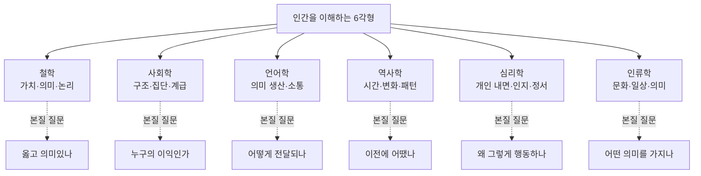
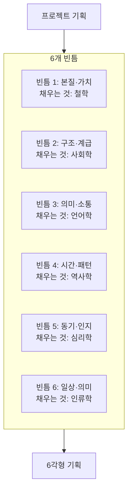
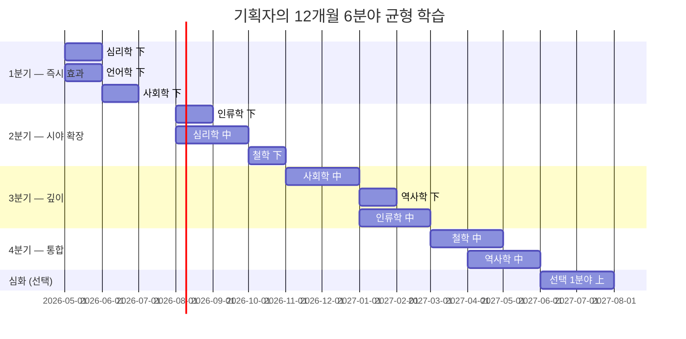
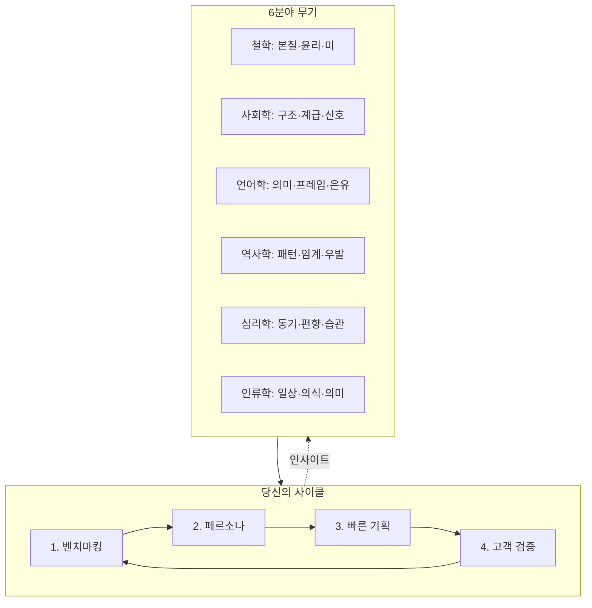

# 기획자를 위한 인문학 6분야 완전 심화 가이드
## — 철학·사회학·언어학·역사학·심리학·인류학의
## 이론적 배경, 학문적 목적, 그리고 "벤치마킹 → 페르소나 → 빠른 기획 → 고객 검증" 사이클로의 통합

> **이 문서가 다른 가이드와 다른 점**
> 단순히 "이 분야는 이런 도구를 준다"가 아니라,
> **"이 학문은 어떤 역사적·이론적 맥락에서 그 도구를 만들게 되었는가"** 까지 거슬러 올라간다.
> 도구의 뿌리를 알아야 도구를 변형해서 쓸 수 있다.
> 책 한 권의 명제만 받으면 그 명제가 안 통하는 상황에서 무력해지지만,
> 그 명제가 어떤 학문적 고민의 결과인지를 알면 새 상황에 맞춰 응용할 수 있다.

---

# 제0장. 시작 — 왜 6분야인가, 왜 지금인가

## 0.1 인문학 분과는 왜 갈라졌는가 — 19세기 대분기(Great Divergence)

지금 우리가 당연하게 여기는 "철학과 사회학은 다른 학문"이라는 구분은 사실 매우 최근의 발명이다. 200년 전만 해도 이 모든 것은 **'도덕철학(Moral Philosophy)'** 이라는 하나의 영역이었다. 애덤 스미스는 경제학자이기 전에 도덕철학자였고, 그가 쓴 《국부론》은 그의 《도덕감정론》의 후속편이었다.

분과 학문(disciplines)이 갈라진 것은 19세기 후반 독일 대학 모델이 세계로 퍼지면서다. 그 이유는 두 가지였다.

```
19세기 분과 학문 분리의 두 동력
│
├─ 동력 1. 인식론적 분리
│  ├─ 자연과학의 성공 → "인간 영역에도 과학적 방법을"
│  ├─ 그러나 인간 = 의미·문화·역사 → 다른 방법 필요
│  └─ 빌헬름 딜타이: 자연과학(설명, Erklären) vs 정신과학(이해, Verstehen)
│
└─ 동력 2. 사회적·정치적 분리
   ├─ 산업혁명 → 새로운 사회 문제 (계급·도시·노동)
   ├─ 철학으로는 부족 → 새로운 분과 필요
   └─ 1838년 콩트가 'sociology' 명명 → 1890년대 뒤르켐 학과 설립
      → 1920년대 시카고 학파 도시 연구
```

20세기 들어 분과는 더 세분화되었지만, **21세기의 가장 흥미로운 발견들은 다시 분과를 가로지르는 곳**에서 나온다. 행동경제학(심리학+경제학), 디지털 인류학(인류학+컴퓨터과학), 인지언어학(언어학+심리학+철학) 등. 기획자에게 이는 큰 행운이다. **분과를 합쳐 사고하는 능력이 곧 차별화의 원천**이 되기 때문이다.

## 0.2 이 6분야를 고른 이유 — 다른 분과를 제외한 이유

```
인문·사회과학에는 더 많은 분과가 있다.
경제학·정치학·법학·종교학·문학·미학·교육학…

왜 이 6분야만 골랐는가?

기준 1. 기획자의 일과 직접 닿는 분야
기준 2. 도구로 변환 가능한 분야 (이론으로 끝나지 않는)
기준 3. 6분야로 인간 행동의 6개 다른 층위를 커버
```



이 6분야는 **상호 보완적**이다. 어느 하나만으로는 인간을 다 못 본다. 6분야 모두를 통과한 페르소나만이 살아 있는 페르소나가 된다.

## 0.3 당신의 사이클 — 강점과 함정의 정확한 진단

당신의 작업 방식:
1. **벤치마킹** → 시장의 다른 시도를 빠르게 학습
2. **페르소나 정의** → 사용자의 모습을 구체화
3. **빠른 기획** → 시간을 끌지 않고 형태를 잡는다
4. **고객 검증/심판** → 진짜 사용자에게 평가받는다

이 방식의 **강점**은 명확하다.
- 시장 학습 비용이 낮다
- 추상적 토론에 시간 안 뺏긴다
- 사용자 중심성이 살아있다
- 실패 비용이 작다 (작게 빨리 실패)

그러나 함정도 명확하다.

| 단계 | 강점이 함정이 되는 순간 |
|---|---|
| 벤치마킹 | **표면 기능을 보고 본질을 못 본다** — "이 앱은 채팅을 한다"에서 멈춤 |
| 페르소나 정의 | **본인 가정을 페르소나에 투사한다** — "내가 사용자랑 비슷하다"의 함정 |
| 빠른 기획 | **속도가 깊이를 누른다** — 5분 안에 결정한 카피의 5년 후 영향 |
| 고객 검증 | **사용자가 '말한 것'을 '원하는 것'으로 착각** — Henry Ford의 "더 빠른 말"의 함정 |

이 함정들이 정확히 6분야 인문학이 막아주는 지점이다. 이 문서의 목적은 **당신의 빠른 사이클을 느리게 만드는 게 아니라, 같은 속도로 더 깊이 들어가게** 하는 것이다.

---

# 제1장. 철학 (Philosophy) — "근본을 묻는 학문"

## 1.1 철학이라는 학문의 본질과 역사적 발전

### 1.1.1 철학의 어원적 의미

'철학(philosophia)'은 그리스어로 **'지혜(sophia)에 대한 사랑(philos)'**이다. 주목할 것은 "지혜를 가진 자"가 아니라 "지혜를 **사랑하는** 자"라는 점이다. 소크라테스는 자신이 지혜로운 게 아니라 **"내가 모른다는 것을 안다"** 는 점에서만 다른 사람과 다르다고 했다. 이것이 철학의 출발점이며 끝까지 변하지 않는 핵심이다.

**철학의 본질은 답이 아니라 질문이다.** 다른 학문이 답을 추구한다면, 철학은 **"이 질문이 잘 던져진 질문인가"** 를 묻는다. 이 한 가지 능력이 기획자에게 결정적이다. 기획에서 가장 비싼 실패는 잘못된 질문에 정확한 답을 한 결과다.

### 1.1.2 철학의 4대 시대와 각 시대가 답하려 한 질문

```
서양 철학의 4대 시대 — 각 시대가 답한 질문
│
├─ 1. 고대 (기원전 6세기~기원후 5세기)
│  ├─ 대표: 소크라테스·플라톤·아리스토텔레스
│  ├─ 본질 질문: "좋은 삶이란 무엇인가?"
│  └─ 만든 도구: 논리학·윤리학·정치학의 기초
│
├─ 2. 중세 (5~15세기)
│  ├─ 대표: 아우구스티누스·아퀴나스
│  ├─ 본질 질문: "신앙과 이성은 어떻게 양립하는가?"
│  └─ 만든 도구: 신학·체계적 사고
│
├─ 3. 근대 (16~19세기)
│  ├─ 대표: 데카르트·칸트·헤겔·니체
│  ├─ 본질 질문: "우리는 어떻게 알 수 있는가?" (인식론 전회)
│  └─ 만든 도구: 과학적 방법론·자아 개념·역사 철학
│
└─ 4. 현대 (20세기~)
   ├─ 대표: 비트겐슈타인·하이데거·푸코·롤스
   ├─ 본질 질문: 두 갈래로 분기
   │  ├─ 분석철학: "언어와 의미는 어떻게 작동하나"
   │  └─ 대륙철학: "권력·존재·역사는 우리를 어떻게 만드나"
   └─ 만든 도구: 언어 분석·해석학·비판이론·정의론
```

근대의 결정적 사건은 **칸트의 '코페르니쿠스적 전회(Copernican Revolution)'** 였다. 그 이전까지 철학은 "세계가 어떠한가"를 물었다. 칸트는 충격적인 전환을 했다. **"우리가 어떻게 세계를 받아들이는가가 세계의 모습을 결정한다."** 마음의 범주가 경험을 조직한다. 이 통찰은 200년 후 인지심리학·언어학·디자인 사고로 이어진다.

기획자에게 이 통찰의 무게는 막대하다. **사용자는 세계를 '있는 그대로' 보지 않는다. 그들의 멘탈 모델이 세계를 조직해서 본다.** 이것이 모든 UX 디자인의 출발점이다.

## 1.2 철학이 기획에 주는 5층 도구

### 1.2.1 존재론 (Ontology) — "이것은 본질적으로 무엇인가"

**학문적 배경**: 존재론은 가장 오래된 철학 분과다. 파르메니데스(기원전 5세기)가 "있는 것은 있고 없는 것은 없다"는 동어반복으로 시작했다. 아리스토텔레스가 《형이상학》에서 본격적으로 다루었고, 20세기 하이데거가 《존재와 시간》에서 다시 핵심 화두로 끌어올렸다.

**핵심 통찰**: 우리가 "사물(thing)"이라고 부르는 것들은 분류 체계(taxonomy)에 의해 정해진다. 같은 대상도 어떤 카테고리 안에 놓이느냐에 따라 의미가 달라진다. 박쥐는 새인가 포유류인가? 토마토는 채소인가 과일인가? 이런 분류 질문은 단순한 명명 문제가 아니라 **그 대상이 어떻게 다루어질지를 결정**한다.

**기획자에게 주는 목적**: 우리가 만드는 제품이 어떤 카테고리에 속하는지가 곧 시장에서의 운명이다. 같은 기능도 "데이팅 앱"인지 "친구 사귀기 앱"인지에 따라 사용자의 기대·평가·사용 방식이 완전히 달라진다. **카테고리 정의는 가장 비싼 의사결정**이며, 한 번 자리잡으면 바꾸기 어렵다.

```
존재론적 사고의 4단계 (기획 적용)
│
├─ Step 1. 사용자가 우리를 어떤 카테고리로 분류하나?
│  └─ 출시 후 사용자 발언·리뷰·기사에서 사용된 카테고리 단어 수집
│
├─ Step 2. 그 카테고리에 묶이면 따라오는 기대는?
│  └─ "OO 앱이라면 당연히 OO 해야지" 목록
│
├─ Step 3. 그 기대 중 우리가 충족 못 하는 것은?
│  └─ 카테고리 선택의 비용
│
└─ Step 4. 카테고리를 새로 만들 것인가, 기존에 편승할 것인가
   └─ 새로 만들기: 큰 비용, 큰 보상
      편승: 작은 비용, 작은 차별화
```

### 1.2.2 인식론 (Epistemology) — "우리는 어떻게 아는가"

**학문적 배경**: 인식론은 17세기 데카르트가 "내가 의심할 수 없는 단 하나의 사실은 무엇인가"를 물으면서 본격화되었다. "나는 생각한다, 고로 존재한다(Cogito ergo sum)"는 그의 출발점이었다. 이후 영국 경험론(베이컨·로크·흄)과 대륙 합리론(데카르트·라이프니츠)이 충돌했고, 칸트가 《순수이성비판》에서 종합을 시도했다.

**핵심 통찰**: 지식에는 여러 종류가 있다. 명제적 지식(knowing that), 능력적 지식(knowing how), 그리고 마이클 폴라니가 강조한 **암묵지(tacit knowledge)** — 우리가 알지만 말로 표현 못 하는 지식. 폴라니의 명제: **"우리는 우리가 말할 수 있는 것보다 더 많이 안다(We know more than we can tell)."**

**기획자에게 주는 목적**: 사용자 리서치의 본질적 한계를 알게 된다. **사용자에게 "무엇을 원하느냐"고 물으면 진짜 답을 얻을 수 없다.** 진짜 욕구는 암묵지의 영역에 있어 본인도 말로 못 한다. 따라서 인터뷰는 항상 불완전하고, **관찰·실험·맥락적 탐색**으로 보완해야 한다.

```
인식론적 의심의 4단계
│
├─ Step 1. "내가 안다고 믿는 것"의 출처 추적
│  └─ 데이터? 인터뷰? 직관? 권위?
│
├─ Step 2. 그 출처의 신뢰도 평가
│  └─ 표본의 대표성, 측정의 타당성
│
├─ Step 3. 안다는 것 자체의 한계 인식
│  └─ "사용자가 그렇게 말했다" ≠ "사용자가 그렇게 생각한다"
│
└─ Step 4. 안 그렇다는 증거를 찾는 노력
   └─ 확증편향 방어
```

### 1.2.3 윤리학 (Ethics) — "무엇이 옳은가"

**학문적 배경**: 윤리학은 서양에서 세 갈래로 발전했다.
- **덕윤리(Virtue Ethics)**: 아리스토텔레스 — "어떤 사람이 되려 하는가"
- **의무론(Deontology)**: 칸트 — "보편화 가능한 원칙인가"
- **결과주의(Consequentialism)**: 벤담·밀 — "총 효용이 최대인가"

20세기에는 존 롤스의 **《정의론》(1971)** 이 게임 체인저였다. "**무지의 베일(veil of ignorance)**" 사고 실험 — 사회 시스템을 설계하되 자신이 그 사회에서 어떤 위치에 떨어질지 모른다고 가정하라. 이 가정 아래에서 합의 가능한 원칙이 정의의 원칙이다.

또 하나의 결정적 작업은 알래스데어 매킨타이어의 **《덕의 상실(After Virtue, 1981)》**이다. 그는 현대 윤리의 위기를 진단했다. 우리는 도덕적 논쟁의 공통 언어를 잃어버렸다는 것. 누가 옳다고 말해도 다른 사람은 "그건 너의 가치일 뿐"이라고 답한다. 이 진단은 기업·플랫폼이 가치를 어떻게 선언하고 일관되게 행동할지의 문제와 직결된다.

**기획자에게 주는 목적**: 윤리는 "출시 후 문제 생기면 대응"의 영역이 아니다. **출시 전에 미리 생각하지 않으면 출시 후엔 손쓸 수 없다.** Microsoft Tay 챗봇(2016)이 24시간 만에 인종차별 발언을 학습한 사건, Facebook 알고리즘이 미얀마 학살을 증폭한 사건, Boeing 737 MAX 사고 — 모두 "윤리적 상상력"의 부재에서 왔다.

```
3대 윤리 전통의 동시 사용법
│
├─ 결과주의 렌즈
│  └─ "이 결정이 만드는 총 효용·총 해악은?"
│     예: A/B 테스트의 정당성 검토
│
├─ 의무론 렌즈
│  └─ "이 결정이 누군가를 수단으로만 쓰지 않는가?"
│     예: 다크 패턴은 동의를 우회 → 수단화
│
└─ 덕윤리 렌즈
   └─ "이 결정을 통해 우리는 어떤 회사가 되는가?"
      예: 한 번의 단기 이익을 위해 신뢰를 깎는가
```

세 렌즈는 같은 결정에 다른 답을 줄 수 있다. 그것을 의식하면서 결정하는 것이 윤리적 사고다. 한 가지만 쓰면 함정에 빠진다.

### 1.2.4 미학 (Aesthetics) — "무엇이 좋은 경험인가"

**학문적 배경**: 미학은 18세기 알렉산더 바움가르텐이 명명한 비교적 젊은 분과지만, 다루는 문제는 고대부터 있었다. 플라톤은 미가 진리·선과 통한다고 봤고, 아리스토텔레스의 《시학》은 비극이 만드는 카타르시스를 분석했다.

근대 미학의 결정적 작업은 **칸트의 《판단력비판》(1790)** 이다. 그는 미적 판단의 특수성을 분석했다. **미적 판단은 주관적이지만 보편성을 주장한다.** "이 그림은 (내게) 아름답다"가 아니라 "이 그림은 (모두에게) 아름답다"는 식으로 말한다. 어떻게 이게 가능한가? 이 역설이 미학의 중심 문제다.

20세기에는 존 듀이의 **《경험으로서의 예술(Art as Experience, 1934)》**이 미학을 박물관에서 일상으로 끌어내렸다. 그의 핵심 명제: **"미는 대상의 속성이 아니라 경험의 질이다."** 같은 음악도 어떤 상황에서 듣느냐에 따라 미적 경험이 된다.

또 하나 결정적인 흐름은 일본 민예운동이다. **야나기 무네요시**는 화려한 예술품이 아니라 **무명 장인의 일용품**에서 진짜 아름다움을 봤다. **'용(用)의 미(美)'** — 도구가 자기 쓰임에 충실할 때 가장 아름답다. 이것이 디터 람스의 "Good Design"의 10원칙으로, 다시 애플의 디자인 철학으로 이어진다.

**기획자에게 주는 목적**: UI 디자인은 '예쁜 화면'의 문제가 아니다. **사용자가 우리 제품과 만나는 시간의 결(texture) 전체**를 디자인하는 것이다. 미학적 사고는 (1) 그 결을 의식하게 하고 (2) "그냥 좋다/싫다"를 넘어 **왜 좋은지·왜 싫은지를 분석**하게 한다.

### 1.2.5 정치철학 (Political Philosophy) — "권력은 어떻게 분배되어야 하나"

**학문적 배경**: 플라톤의 《국가》에서 시작해 홉스·로크·루소의 사회계약론, 마르크스의 비판이론, 한나 아렌트의 공적 영역 이론으로 이어진다. 20세기 후반엔 다시 두 흐름이 충돌했다. **존 롤스의 자유주의(《정의론》)** vs **마이클 샌델의 공동체주의(《자유주의와 정의의 한계》)**.

가장 결정적인 작업은 **미셸 푸코**의 권력 분석이다. 그의 통찰: **권력은 위에서 아래로 흐르는 것이 아니라, 모세혈관처럼 일상의 미세한 실천에 퍼져 있다.** 학교의 시간표, 병원의 진료 순서, 감옥의 감시 구조 — 이 모든 미시적 규율이 권력의 실제 작동이다.

**기획자에게 주는 목적**: 우리가 만드는 모든 UI 결정은 정치적 결정이다. **어떤 콘텐츠를 어떤 순서로 보여줄지가 곧 권력 행사**다. 어떤 사용자의 목소리는 증폭되고 어떤 사용자는 침묵된다. 이 사실을 의식하면서 만드는 것과 의식 없이 만드는 것은 결과가 다르다.

특히 한나 아렌트의 **공적 영역(public realm)** 개념이 중요하다. 그녀에게 인간이 인간일 수 있는 조건은 "공적 영역에서 말하고 행동할 수 있는 가능성"이다. 우리가 만드는 소셜 플랫폼은 새로운 공적 영역이며, **그 영역의 규칙이 곧 시민 됨의 조건**이 된다.

## 1.3 철학 핵심 사상가 10명 — 기획자가 알아야 할 한 줄씩

| 사상가 | 시대 | 핵심 무기 | 기획자의 사용처 |
|---|---|---|---|
| 아리스토텔레스 | 고대 | 덕윤리·목적인 | "우리는 무엇을 위한 회사인가" |
| 소크라테스 | 고대 | 산파법(질문 기술) | 사용자 인터뷰의 원형 |
| 데카르트 | 근대 | 방법적 회의 | 가정 점검 |
| 칸트 | 근대 | 정언명령·코페르니쿠스 전회 | "사용자를 도구로 안 쓰기" |
| 헤겔 | 근대 | 정-반-합 변증법 | 갈등 통합의 사고 |
| 니체 | 근대 | 가치의 계보학 | "이 가치는 누구의 이익?" |
| 비트겐슈타인 | 현대 | 언어 게임 | "카피는 사용 맥락이 의미" |
| 하이데거 | 현대 | 손에 있음 | "의식 안 될 때 잘 작동" |
| 한나 아렌트 | 현대 | 공적 영역·악의 평범성 | "생각 안 한 결정이 가장 위험" |
| 푸코 | 현대 | 권력의 미시 분석 | "UI의 정치성" |

## 1.4 추천 도서 — 上·中·下 + 깊이 있는 설명

### 입문 (下) — 첫 3개월

| 책 | 저자 | 무엇을 얻나 | 어떻게 읽나 |
|---|---|---|---|
| 《소피의 세계》 | 요슈타인 가아더 | 서양 철학사 통관, 소설 형식 | 1차 통독 → 흥미 가는 사상가 표시 |
| 《정의란 무엇인가》 | 마이클 샌델 | 윤리학 케이스 스터디 | 각 장의 사례를 자기 프로젝트에 대입 |
| 《이 모든 것은 무엇을 의미하는가》 | 토마스 네이글 | 100쪽으로 철학 9문제 | 9문제 각각에 자기 답 적기 |
| 《철학의 위안》 | 알랭 드 보통 | 6명 철학자 × 일상 문제 | 하루에 한 명씩 |
| 《처음 만나는 철학》 | 그레일링 | 분과별 입문 | 분과별 책상 옆 카드로 |

### 중급 (中) — 6~12개월

| 책 | 저자 | 깊이 |
|---|---|---|
| 《덕의 상실》 | 알래스데어 매킨타이어 | 현대 윤리 위기의 진단. "왜 우리는 도덕 논쟁에서 합의 못 하는가" |
| 《인간의 조건》 | 한나 아렌트 | 노동·작업·행위의 구분. 일의 본질을 다시 보게 함 |
| 《피로사회》 | 한병철 | 자기 착취 시대 진단. 100쪽 미만, 압축적 |
| 《과학혁명의 구조》 | 토마스 쿤 | 패러다임 전환의 원리. 모든 시장 변동의 원형 |
| 《Reflective Practitioner》 | 도널드 쇤 | 실천 속의 성찰. 기획자 직업 필독서 |
| 《정의론》 | 존 롤스 | 무지의 베일. 공정성 사고의 결정판 |
| 《자유주의와 정의의 한계》 | 마이클 샌델 | 롤스 비판. 공동체주의 관점 |

### 고급 (上) — 1년 이상, 해설서와 병행

| 책 | 저자 | 도전의 깊이 |
|---|---|---|
| 《존재와 시간》 | 마틴 하이데거 | 도구의 존재 방식. 해설서 필수 |
| 《철학적 탐구》 | 비트겐슈타인 | 언어 게임. 짧지만 어렵다 |
| 《감시와 처벌》 | 미셸 푸코 | 권력의 미시 분석. 역사적 사례 풍부 |
| 《순수이성비판》 | 칸트 | 인식론의 정전. 해설서 필독 |
| 《도덕의 계보》 | 니체 | 가치의 역사적 형성 |

## 1.5 기획자의 철학 읽기법 — 도구 채굴자의 자세

학자처럼 읽으면 평생 다 못 읽는다. 기획자의 읽기는 다르다.

```
철학책 1권에서 4개의 도구 채굴하기
│
├─ 도구 1. 핵심 명제 1줄
│  └─ 책 전체에서 살아남는 명제는 1~2개
│     예: 칸트 → "인간은 수단이 아니라 목적"
│
├─ 도구 2. 그 명제의 반대 사례
│  └─ "이 명제가 안 통하는 상황은?"
│     도구의 적용 한계를 알아야 도구를 잘 쓴다
│
├─ 도구 3. 자기 프로젝트로의 강제 대입
│  └─ "이 명제가 옳다면 우리 제품에서 뭐가 달라져야 하나"
│     3개 구체 변경점 도출
│
└─ 도구 4. 카드 한 장에 적어 책상 옆에
   └─ 다음 의사결정 때 꺼내본다
      읽은 후 사용 안 하면 잊는다
```

## 1.6 당신의 사이클 × 철학

```
당신의 4단계 사이클에서 철학이 작동하는 정확한 순간들
│
├─ 벤치마킹 단계
│  ├─ 존재론: "이 경쟁사의 본질 카테고리는 무엇인가?"
│  │  표면 기능 비교가 아니라 카테고리 비교
│  └─ 인식론: "이 경쟁사가 사용자에 대해 안다고 믿는 근거는?"
│     그들의 데이터·리서치의 한계 추적
│
├─ 페르소나 정의 단계
│  ├─ 인식론: "우리가 페르소나에 대해 안다고 믿는 근거는?"
│  │  암묵지 영역은 인터뷰로 안 잡힌다 (폴라니)
│  └─ 존재론: "이 사용자는 자기 자신을 어떤 카테고리로 보나?"
│     사용자의 자기 정체성 명명
│
├─ 빠른 기획 단계
│  ├─ 미학: "이 경험의 결(texture)은 어떤가?"
│  ├─ 윤리: "다크 패턴·강제·기만의 요소는?"
│  └─ 정치철학: "어떤 사용자 목소리가 증폭/침묵되나?"
│
└─ 고객 검증 단계
   ├─ 인식론: "이 검증으로 우리가 진짜 알 수 있는 것은?"
   │  사용자 발언과 실제 욕구의 차이
   └─ 윤리: "검증 과정에서 사용자를 도구화하지 않았나?"
```

---

# 제2장. 사회학 (Sociology) — "구조와 집단을 보는 학문"

## 2.1 사회학이라는 학문의 본질과 역사적 발전

### 2.1.1 사회학의 탄생 — 19세기의 충격

사회학은 19세기 산업혁명이 만든 충격에서 태어났다. 그 이전까지 사회는 "원래 그런 것"이었다. 신분제·종교·공동체가 자연 질서처럼 보였다. 그런데 산업혁명이 모든 것을 흔들었다. 농민이 도시 노동자가 되었고, 가족이 해체되었고, 새로운 계급이 출현했다. 이 충격을 설명할 새로운 학문이 필요했다.

```
사회학 탄생의 3대 동기
│
├─ 1. 산업혁명의 충격 (1760~1840)
│  └─ "농촌이 무너지고 도시가 폭발한다 — 왜?"
│
├─ 2. 프랑스 혁명의 여파 (1789~)
│  └─ "신분제 없는 사회는 어떻게 질서를 유지하나?"
│
└─ 3. 과학적 방법의 확산
   └─ "자연을 과학으로 본 것처럼 사회도 과학으로"
```

**오귀스트 콩트**(1798~1857)가 1838년 'sociology'라는 단어를 만들었다. 그는 사회도 자연처럼 법칙으로 설명될 수 있다고 믿었다. 이 야심은 너무 컸지만, 그가 던진 질문 — **"사회는 어떻게 가능한가"** — 은 사회학의 영원한 질문이 되었다.

### 2.1.2 사회학의 3대 고전 — 마르크스·뒤르켐·베버

19세기 말~20세기 초, 사회학을 학문으로 정착시킨 세 거인이 등장한다. 그들의 답은 서로 달랐지만, 모두 **"근대 사회를 어떻게 이해할 것인가"** 라는 같은 질문에 답하고 있었다.

```
사회학 3대 고전 — 같은 질문, 다른 답
│
├─ 카를 마르크스 (1818~1883)
│  ├─ 답: "사회는 계급 갈등으로 움직인다"
│  ├─ 핵심 개념: 생산수단·소외·이데올로기
│  └─ 기획자 함의: 누가 가치를 만들고 누가 가져가는가
│
├─ 에밀 뒤르켐 (1858~1917)
│  ├─ 답: "사회는 집단적 사실(social fact)이 만든다"
│  ├─ 핵심 개념: 사회적 사실·아노미·집합의식
│  └─ 기획자 함의: 통계적 패턴은 개인 의지를 초월
│
└─ 막스 베버 (1864~1920)
   ├─ 답: "사회는 의미와 행위로 만들어진다"
   ├─ 핵심 개념: 이상형(ideal type)·합리화·관료제
   └─ 기획자 함의: 행위자 의미를 이해해야 행동을 안다
```

이 셋의 종합이 20세기 사회학의 토대였다. 마르크스는 **거시 구조**, 뒤르켐은 **집합적 패턴**, 베버는 **행위자의 의미**를 강조했다. 좋은 사회학적 분석은 이 셋을 모두 다룬다.

### 2.1.3 20세기 사회학의 5대 흐름

```
20세기 사회학의 5대 학파 — 각자 다른 무기
│
├─ 1. 시카고 학파 (1920~)
│  ├─ 도시 사회학·민족지학적 방법
│  ├─ 대표: 로버트 파크, 어니스트 버제스
│  └─ 기여: "도시는 사회학의 실험실"
│
├─ 2. 구조기능주의 (1940~60)
│  ├─ 사회를 유기체로 — 각 부분의 기능
│  ├─ 대표: 탈콧 파슨스, 로버트 머튼
│  └─ 약점: 변화 설명 부족
│
├─ 3. 갈등 이론 (1960~)
│  ├─ 마르크스 부활, 권력·계급 강조
│  ├─ 대표: 랄프 다렌도르프, C. W. 밀스
│  └─ 영향: 비판이론, 페미니즘
│
├─ 4. 상징적 상호작용론 (1960~)
│  ├─ 일상 대면 상호작용에서 의미 생산
│  ├─ 대표: 어빙 고프먼, 허버트 블루머
│  └─ 영향: 마이크로 사회학, UX 디자인
│
└─ 5. 후기 구조주의·문화 사회학 (1980~)
   ├─ 의미·문화·취향·정체성
   ├─ 대표: 부르디외, 푸코(철학자이자), 카스텔
   └─ 현재 가장 영향력 있는 흐름
```

### 2.1.4 사회학의 핵심 문제의식 — "구조와 행위의 변증법"

사회학의 거의 모든 토론은 결국 하나의 질문으로 수렴한다: **"개인이 사회를 만드는가, 사회가 개인을 만드는가?"**

답은 양쪽이다. 그러나 어느 쪽을 강조하느냐가 학파를 가른다.

```
구조-행위 스펙트럼
│
├─ 강한 구조주의 (사회 → 개인)
│  ├─ 마르크스의 후예들
│  ├─ "당신은 당신이 속한 계급의 산물"
│  └─ 위험: 개인의 자유의지를 무시
│
├─ 중간 — 변증법
│  ├─ 부르디외의 '구조화된 구조이자 구조화하는 구조'
│  ├─ 앤서니 기든스의 '구조화 이론'
│  └─ "구조는 행위의 조건이자 결과"
│
└─ 강한 행위론 (개인 → 사회)
   ├─ 베버, 상징적 상호작용론
   ├─ "사회는 매일 재생산되는 행위들의 결과"
   └─ 위험: 구조적 제약을 못 봄
```

기획자에게 이 토론의 함의는 직접적이다. **사용자의 선택은 자유로워 보이지만, 사실은 사용자가 속한 구조가 선택지 자체를 미리 결정한다.** 동시에, 사용자의 매일의 행동이 모여 시장 구조를 만든다. 둘 다 봐야 한다.

## 2.2 사회학이 기획에 주는 6개 핵심 도구

### 2.2.1 사회학적 상상력 (C. W. 밀스, 1959)

**학문적 배경**: 미국 사회학자 C. 라이트 밀스는 1959년 《사회학적 상상력》에서 사회학의 본질을 한 문장으로 정의했다. **"개인의 사적 troubles(고민)을 공적 issues(쟁점)와 연결하는 능력"**.

**핵심 통찰**: 한 사람의 실업은 그 개인의 문제로 보이지만, 동시에 10만 명이 실업이라면 그것은 사회 구조의 문제다. 사회학적 상상력은 **개인의 사적 경험을 시대·구조의 맥락에 위치시키는** 능력이다.

**기획자에게 주는 목적**: 사용자의 개별 페인을 보고 멈추지 않고, **그 페인이 사실 어떤 사회 구조의 표현인지** 묻는다. "이 사용자가 외롭다"에서 멈추면 1인 매칭만 만든다. "현대 도시의 약한 연결망과 알고리즘 큐레이션의 필터 버블"까지 보면 다른 제품이 나온다.

```
사회학적 상상력 적용 사고 트리
│
├─ Step 1. 페르소나의 개인 페인 명명
│  └─ "김지영은 점심시간이 외롭다"
│
├─ Step 2. 같은 페인을 겪는 사람의 규모 추정
│  └─ "서울 20~30대 1인 가구 중 비슷한 사람 N명?"
│
├─ Step 3. 이 규모가 의미하는 구조적 변화 식별
│  ├─ 1인 가구 급증의 인구학적 배경
│  ├─ 노동시간·통근시간 변화
│  ├─ 사회적 연결망의 변화
│  └─ 도시 공간의 변화
│
└─ Step 4. 우리 제품의 위치 재정의
   └─ "점심 동반자 매칭"이 아니라
     "현대 도시 약한 연결 인프라"
```

### 2.2.2 자아 연출 (어빙 고프먼, 1959)

**학문적 배경**: 같은 1959년에 출간된 또 하나의 결정적 저작이 고프먼의 **《일상생활의 자아표현(The Presentation of Self in Everyday Life)》**이었다. 고프먼은 일상 상호작용을 **연극**으로 분석했다. 우리는 모두 무대 위 배우이며, 다른 사람 앞에서 자기 자신의 인상을 관리한다.

**핵심 개념**:
- **무대 앞(front stage)**: 다른 사람이 보는 공연 영역
- **무대 뒤(back stage)**: 자신의 진짜 모습, 다른 사람 안 보임
- **인상 관리(impression management)**: 의도된 자기 제시
- **역할 거리(role distance)**: 자기 역할과의 거리감

**기획자에게 주는 목적**: 사용자 행동을 인터뷰로 묻는 것의 한계를 알게 된다. **인터뷰는 무대 앞 행동이다.** 사용자는 사회적으로 바람직한 답을 한다. 진짜는 무대 뒤에 있다. 또한 **소셜 플랫폼은 새로운 자기 연출의 무대**다. 인스타그램의 본질은 사진이 아니라 무대다.

### 2.2.3 문화자본·아비투스·구별짓기 (피에르 부르디외)

**학문적 배경**: 프랑스 사회학자 부르디외(1930~2002)는 마르크스의 자본 개념을 확장했다. 자본은 경제 자본만이 아니다. **문화자본·사회자본·상징자본**도 있다.

```
부르디외의 4가지 자본
│
├─ 1. 경제자본
│  └─ 돈·재산
│
├─ 2. 문화자본
│  ├─ 체화된 자본: 몸에 익은 취향·말투·매너
│  ├─ 객관화된 자본: 책·예술·악기 등
│  └─ 제도화된 자본: 학위·자격증
│
├─ 3. 사회자본
│  └─ 인맥·네트워크 (그라노베터와 다른 개념)
│
└─ 4. 상징자본
   └─ 명예·인지도·평판
```

**아비투스(habitus)**: 어린 시절 가정환경에서 흡수된 **체화된 성향 체계**. 의식하지 않아도 작동하는 취향·판단·반응. 같은 음식·옷·음악도 자기 계급의 아비투스에 따라 다르게 좋아한다.

**구별짓기(distinction)**: 소비는 단순히 욕구 충족이 아니라 **계급적 신호 행위**다. 같은 옷도 어느 브랜드인지가 누구와 같은 부류인지를 표시한다.

**기획자에게 주는 목적**: 페르소나를 소득만으로 보면 안 된다. **같은 소득이라도 문화자본이 다르면 완전히 다른 사용자다.** 또한 우리 제품 사용 자체가 사용자의 사회적 신호임을 인식한다. "토스를 쓴다"는 것은 단순히 송금이 아니라 정체성 표현이다.

### 2.2.4 약한 연결의 힘 (마크 그라노베터, 1973)

**학문적 배경**: 미국 사회학자 그라노베터는 1973년 논문 〈The Strength of Weak Ties〉에서 직관에 반하는 발견을 발표했다. **사람들이 새 일자리를 얻을 때 도움을 준 사람은 친한 친구가 아니라 약한 지인이었다.**

**핵심 통찰**: 강한 연결(가족·절친)은 우리와 비슷한 정보를 갖는다. 정보 중복이다. 새로운 정보는 다른 세계와 닿아 있는 **약한 연결**에서 온다.

**기획자에게 주는 목적**: LinkedIn·당근마켓·동네 커뮤니티 같은 플랫폼의 본질이 보인다. **이 플랫폼들은 "강한 연결" 만들기가 아니라 "약한 연결의 인프라"다.** 카카오톡과 다른 점이 여기에 있다.

### 2.2.5 사회자본 (로버트 퍼트남, 2000)

**학문적 배경**: 미국 정치학자 퍼트남의 **《나 홀로 볼링(Bowling Alone)》**(2000)은 미국 사회자본의 50년 추이를 추적한 거대한 연구였다. 핵심 발견: **미국인의 사회적 연결망과 시민 참여가 1960년대 이후 급감했다.**

사회자본(social capital): 신뢰·호혜성·연결망이 만드는 자원. 개인의 부와는 다른 차원의 자본.

**기획자에게 주는 목적**: 커뮤니티 플랫폼·로컬 비즈니스·신뢰 기반 거래의 본질을 본다. **거래는 신뢰 위에서만 일어난다.** 신뢰가 무너지면 시장이 무너진다. 우리 제품이 사회자본을 쌓는지 갉아먹는지가 장기 운명을 결정한다.

### 2.2.6 감시 자본주의 (쇼샤나 주보프, 2019)

**학문적 배경**: 하버드 사회학자 주보프의 **《감시 자본주의 시대》**는 2019년 출간된 디지털 시대 사회학의 결정적 작품이다. 그녀의 진단: 현재 자본주의는 새로운 단계에 들어갔다. **인간 경험을 행동 데이터로 변환해 예측 상품으로 파는 자본주의.**

**핵심 통찰**: 우리는 더 이상 "고객"이 아니다. 데이터를 뽑히는 원료다. 진짜 고객은 광고주이며, 그들에게 팔리는 상품은 "우리의 미래 행동 예측"이다.

**기획자에게 주는 목적**: 데이터 비즈니스 모델의 윤리적·구조적 함의를 본다. **공짜 서비스의 진짜 비용**이 무엇인지, 우리가 그 시스템에서 어떤 위치에 있는지 의식한다.

## 2.3 사회학 추천 도서 — 上·中·下

### 입문 (下)

| 책 | 저자 | 깊이 |
|---|---|---|
| 《사회학적 상상력》 | C. W. 밀스 | 사회학의 출발점. 짧고 강력 |
| 《보이지 않는 영향력》 | 조나 버거 | 사회적 영향의 실험적 증명 |
| 《티핑 포인트》 | 말콤 글래드웰 | 사회 변화의 임계점 |
| 《단속사회》 | 엄기호 | 한국 사회 일상 진단 |
| 《세상물정의 사회학》 | 노명우 | 일상 속 사회학 입문 |

### 중급 (中)

| 책 | 저자 | 무엇을 |
|---|---|---|
| 《자아 연출의 사회학》 | 어빙 고프먼 | UX·소셜 플랫폼 기획자 필독 |
| 《나 홀로 볼링》 | 로버트 퍼트남 | 사회자본의 흥망 |
| 《네트워크 사회의 도래》 | 마누엘 카스텔 | 플랫폼 시대의 사회학 |
| 《마음의 사회학》 | 김홍중 | 한국 청년의 마음 진단 |
| 《한국의 평등주의, 그 마음의 습관》 | 송호근 | 한국 사회 심층 분석 |
| 《액체 근대》 | 지그문트 바우만 | 유동하는 현대성 |

### 고급 (上)

| 책 | 저자 | 도전 |
|---|---|---|
| 《구별짓기》 | 피에르 부르디외 | 취향·계급·자본 통합 이론 |
| 《재생산》 | 부르디외·파스롱 | 교육이 불평등 재생산 |
| 《감시 자본주의 시대》 | 쇼샤나 주보프 | 데이터 시대 권력 분석 |
| 《프로테스탄트 윤리와 자본주의 정신》 | 막스 베버 | 사회학 고전 |
| 《자살론》 | 에밀 뒤르켐 | 통계적 방법의 원형 |

## 2.4 기획자의 사회학 읽기법

사회학은 철학과 다르다. 철학이 '개념'을 다룬다면 사회학은 **'경험적 패턴'** 을 다룬다. 기획자는 사회학을 **패턴 카탈로그**로 활용한다.

```
사회학책 읽기 4단계
│
├─ Step 1. 책이 다루는 사회 현상 명명
│  └─ "이 책은 OO 현상의 메커니즘을 설명한다"
│
├─ Step 2. 그 현상의 작동 메커니즘 추출
│  └─ "이 현상이 일어나려면 OO 조건이 필요하고
│     OO 단계로 진행된다"
│
├─ Step 3. 우리 사용자/시장에 적용
│  └─ "우리 환경에서 같은 메커니즘이 작동하는가?
│     아니면 다른 조건 때문에 다르게 작동하는가?"
│
└─ Step 4. 페르소나·기획에 차원 추가
   └─ 보이지 않던 사회적 차원을 페르소나에 추가
```

## 2.5 당신의 사이클 × 사회학

```
당신의 사이클에서 사회학이 결정적인 순간
│
├─ 벤치마킹 단계 [★ 결정적]
│  ├─ "이 경쟁사를 쓴다는 것의 사회적 신호는?"
│  │  표면 기능이 아니라 사용 자체의 의미
│  ├─ 부르디외 식 분석: 이 제품의 사용자는 어떤 계급/문화 위치?
│  └─ "왜 이 제품이 이 사회적 맥락에서 작동하는가?"
│
├─ 페르소나 정의 단계 [★ 결정적]
│  ├─ 페르소나에 '계급 차원' 추가 (부르디외)
│  │  소득만이 아니라 4가지 자본 모두
│  ├─ 페르소나의 사회적 네트워크 지도 (그라노베터)
│  │  강한 연결·약한 연결 수와 종류
│  └─ 페르소나의 준거 집단·구별짓고 싶은 집단
│
├─ 빠른 기획 단계
│  └─ 우리 제품이 만드는 사회적 신호 의식
│     "이걸 쓰면 어떤 사람으로 보이는가?"
│
└─ 고객 검증 단계 [★ 결정적]
   ├─ 인터뷰의 무대 앞·무대 뒤 구분 (고프먼)
   │  사용자가 무대 앞에서 말하는 답 vs 실제 무대 뒤 행동
   ├─ 1:1 vs 그룹 인터뷰 답 차이 = 사회적 무대 차이
   └─ 사용자가 같은 답을 다른 청중에게도 할까?
```

## 2.6 사회학적으로 풍부한 페르소나 양식

```
[페르소나 이름]: 김지영 (28세)

표면 데이터 — 보통 여기서 멈춤
├─ 직업: 마케터 3년차
├─ 거주: 서울 마포구
└─ 소득: 4,500만 원

[사회학적 심화 — 여기부터가 진짜]

부르디외의 4자본
├─ 경제자본: 4,500만 + 대출 8천만
├─ 문화자본
│  ├─ 체화: 부모 4년제, 본인 SKY권, 영어 보통, 미술관 가끔
│  ├─ 객관화: 책 30권/년, 카메라, 아이패드
│  └─ 제도화: 학사
├─ 사회자본
│  ├─ 강한 연결: 가족 4 + 절친 3
│  ├─ 약한 연결: LinkedIn 500+, 인스타 800
│  └─ 영향력 연결: 업계 멘토 1, 인플루언서 팔로우 30
└─ 상징자본: SNS 팔로워 2천, 업계 인지도 보통

준거집단 분석
├─ 동일시하고 싶은 집단: 디자인 컨퍼런스 다니는 30대 기획자
├─ 구별짓고 싶은 집단: 회사 부장님 세대, 공무원
└─ 미묘한 라이벌 집단: 같은 또래 스타트업 동료

고프먼식 무대 분석
├─ 회사 무대 페르소나: 차분하고 분석적
├─ 친구 무대 페르소나: 솔직하고 농담 잘함
├─ 인스타 무대 페르소나: 큐레이션된 일상 미학
├─ 카톡 무대 페르소나: 친구별 다른 말투
└─ 무대 뒤 진짜 자신: 약간 외롭고 미래 불안

밀스의 사회학적 상상력 적용
├─ 표면 troubles: "시간이 없다, 외롭다, 미래 불안"
├─ 사회적 issues 차원
│  ├─ 1인 가구 35% 시대의 구조적 외로움
│  ├─ 평생 직장 붕괴 후의 커리어 불안
│  └─ 결혼·출산 압박과 자기실현 욕구의 충돌
└─ → 우리 제품은 개인 troubles만 풀까,
     구조적 issues 차원에서 의미를 줄 수 있을까?
```

---

# 제3장. 언어학 (Linguistics) — "의미가 만들어지는 학문"

## 3.1 언어학이라는 학문의 본질과 역사적 발전

### 3.1.1 언어학의 두 출발 — 비교언어학과 구조주의

언어학은 19세기 초 **비교언어학**으로 시작했다. 산스크리트어가 라틴어·그리스어와 친족 관계라는 발견이 충격이었다. 인도-유럽어족이라는 거대한 가족이 있다는 것. 이는 언어를 **역사적·진화적 대상**으로 보게 했다.

그러나 진짜 혁명은 20세기 초 **페르디낭 드 소쉬르**(1857~1913)에서 왔다. 그의 **《일반언어학 강의》**(1916, 사후 출간)는 언어학뿐 아니라 20세기 인문학 전체의 흐름을 바꿨다.

```
소쉬르의 4가지 결정적 구분
│
├─ 1. 랑그(langue) vs 파롤(parole)
│  ├─ 랑그: 사회적·체계로서의 언어
│  └─ 파롤: 개별 발화 행위
│
├─ 2. 공시적(synchronic) vs 통시적(diachronic)
│  ├─ 공시적: 한 시점의 언어 체계
│  └─ 통시적: 시간에 따른 변화
│  → 언어학은 공시적 연구가 우선
│
├─ 3. 기표(signifier) vs 기의(signified)
│  ├─ 기표: 소리·문자
│  ├─ 기의: 개념·의미
│  └─ 기호 = 기표 + 기의 (결합은 자의적!)
│
└─ 4. 가치(value)는 차이에서 온다
   └─ '빨강'의 의미 = '파랑·노랑이 아닌 것'
      의미는 시스템 내 차이로 정해진다
```

소쉬르의 **'기호의 자의성(arbitrariness of the sign)'** — '나무'라는 단어가 나무 자체와 본질적 연결이 없다 — 은 단순해 보이지만 폭발적이었다. **모든 의미는 사회적 약속이고, 약속은 바뀔 수 있다.** 이 통찰이 20세기 후반 구조주의·포스트구조주의·문화 연구의 출발점이 되었다.

### 3.1.2 20세기 언어학의 3대 흐름

```
20세기 언어학의 갈래
│
├─ 1. 구조주의 언어학 (소쉬르의 후예)
│  ├─ 언어를 닫힌 체계로 분석
│  ├─ 영향: 레비스트로스(인류학), 라캉(정신분석)
│  └─ 약점: 언어 사용의 맥락 무시
│
├─ 2. 생성문법 (노엄 촘스키, 1957~)
│  ├─ "인간은 보편 문법을 타고난다"
│  ├─ 인지과학·심리언어학으로 확장
│  └─ 영향: 인공지능 초기 (현재 LLM과는 다른 경로)
│
└─ 3. 화용론·사회언어학·담론분석
   ├─ "언어는 맥락 안에서 의미"
   ├─ 그라이스·오스틴·서얼·라보프·푸코
   └─ 기획자에게 가장 유용한 흐름
```

### 3.1.3 화용론 (Pragmatics) — 기획자에게 가장 중요한 분과

영국 철학자 J. L. 오스틴(1911~1960)의 **《How to Do Things with Words》**(1962, 사후 출간)는 언어를 보는 시각을 완전히 바꿨다. 그의 통찰: **언어는 단순히 묘사하는 것이 아니라 행위를 한다.**

```
오스틴의 발화 행위 3층
│
├─ 1. 발화 행위 (locutionary act)
│  └─ 무엇을 말하는가 — 표면 의미
│     "이 방 더워"
│
├─ 2. 발화수반 행위 (illocutionary act)
│  └─ 말하면서 무엇을 하는가 — 의도된 행위
│     "에어컨 켜달라는 요청"
│
└─ 3. 발화효과 행위 (perlocutionary act)
   └─ 말의 결과로 무엇이 일어나는가
      "상대가 에어컨을 켰다"
```

이 분석이 화용론의 출발이었다. 곧 **폴 그라이스**(1913~1988)가 대화의 협력 원리와 4격률을 정리했다.

```
그라이스의 협력 원리와 4격률
│
├─ 대전제: 대화는 협력적 행위
│
├─ 격률 1. 양(Quantity)
│  ├─ 필요한 만큼만 정보 제공
│  └─ 너무 적게도, 너무 많이도 X
│
├─ 격률 2. 질(Quality)
│  ├─ 진실하다고 믿는 것만 말함
│  └─ 증거 없는 것은 말 안 함
│
├─ 격률 3. 관련성(Relation)
│  └─ 지금 맥락에 관련 있는 것만
│
└─ 격률 4. 방식(Manner)
   ├─ 명확하게
   ├─ 모호하지 않게
   ├─ 간결하게
   └─ 순서대로
```

**기획자에게의 의미**: 이 4격률은 **카피·UX writing·챗봇·고객 응대**의 절대 기준이다. 격률을 위반하면 사용자는 불쾌해진다. 그러나 의도적으로 위반하면 (예: 유머·역설) 강력한 효과가 난다. 격률을 알면 위반의 효과도 설계할 수 있다.

### 3.1.4 인지언어학 — 은유의 발견

1980년 조지 레이코프와 마크 존슨의 **《은유, 삶이 만든 것(Metaphors We Live By)》**은 또 하나의 혁명이었다. 그들의 주장: **은유는 단순한 수사가 아니라 사고의 기본 방식이다.**

예시:
- "시간은 돈이다" → 시간을 절약하고 낭비하고 투자한다
- "토론은 전쟁이다" → 입장을 방어하고 주장을 공격한다
- "사랑은 여정이다" → 갈 길이 멀다, 갈림길에 섰다

이 은유들은 우리도 모르게 사고를 조직한다. 기획에서의 함의는 거대하다. **우리가 선택하는 은유가 사용자가 우리 제품을 이해하는 방식을 결정한다.**

예시:
- "메일함(inbox)" 은유: 메일이 쌓이는 박스 → 비워야 한다는 압박
- 만약 "메일 강(stream)" 은유였다면? → 흘려보내도 된다는 마음

### 3.1.5 푸코의 담론 분석

미셸 푸코는 철학자이자 언어학자였다. 그의 **담론(discourse)** 개념은 단순한 말이 아니라 **"무엇이 말해질 수 있고 무엇이 말해질 수 없는지를 결정하는 규칙 체계"** 다.

예시: '광기'라는 단어는 18세기와 20세기에 다른 의미를 가졌다. 누가 광인을 판정할 권한이 있는지, 광인을 어떻게 다루는지 — 모두 그 시대 담론이 정한다.

**기획자에게의 의미**: 우리 시장의 담론을 의식한다. **"우리 시장에서 무엇이 당연하게 받아들여지고, 무엇이 의심되지 않고, 무엇은 말할 수 없는가?"** 이 의식이 곧 차별화의 자리다.

## 3.2 언어학이 기획에 주는 5층 도구

### 3.2.1 카피·UX writing — 그라이스 4격률 적용

모든 카피·버튼 텍스트·에러 메시지·푸시 알림이 4격률을 통과해야 한다.

```
사용자가 보는 모든 텍스트의 4격률 체크
│
├─ 양: 사용자가 필요한 정보만? 부족 X, 과잉 X?
├─ 질: 과장 없는 진실? 증거 있는 주장?
├─ 관련성: 사용자의 지금 맥락에 관련?
└─ 방식: 명확? 간결? 순서대로?
```

### 3.2.2 은유 분석 — 프레임 전쟁

우리 제품이 사용하는 은유가 사용자의 멘탈 모델을 만든다. 경쟁사의 은유와 다른 은유를 선택하면 다른 카테고리가 된다.

```
은유 분석 사고 트리
│
├─ Step 1. 우리 제품이 명시적/암묵적으로 사용하는 은유 식별
│  └─ UI 비유, 카피 어휘, 기능 이름
│
├─ Step 2. 그 은유가 함의하는 사용 방식
│  └─ "도서관" 은유면 차곡차곡 정리하는 사용
│     "공방" 은유면 직접 만드는 사용
│
├─ Step 3. 경쟁사의 은유 분석
│  └─ 그들이 어떤 프레임을 만들고 있나
│
└─ Step 4. 의도적 은유 선택
   └─ 같은 은유로 경쟁? 다른 은유로 차별화?
```

### 3.2.3 사회언어학 — 페르소나의 언어 수집

페르소나의 어휘·말투·문체는 인구통계만큼 중요한 정보다. 같은 30대도 어떤 30대인지에 따라 다른 언어를 쓴다.

```
페르소나 언어 수집 가이드
│
├─ 빈도 어휘: 일상적으로 자주 쓰는 단어 50개
├─ 거부 어휘: 닭살 돋는 단어, 피하는 표현
├─ 키워드: 검색·해시태그 사용 패턴
├─ 문체: 짧은 문장? 긴 문장? 이모지 사용?
└─ 매체별 변이: 카톡·인스타·이메일 다른 톤
```

### 3.2.4 담론 분석 — 시장의 보이지 않는 규칙

우리 시장에서 무엇이 당연시되고 무엇이 의심받지 않는지 추적한다.

```
시장 담론 분석 사고 트리
│
├─ 모두가 말하는 것 (당연시되는 것)
│  └─ 의심해볼 가치 있음
│
├─ 아무도 말하지 않는 것 (말할 수 없는 것)
│  └─ 차별화의 자리
│
├─ 일부만 말하기 시작한 것 (떠오르는 것)
│  └─ 다음 트렌드
│
└─ 더 이상 말하지 않게 된 것 (저무는 것)
   └─ 회피 영역
```

### 3.2.5 발화 행위 분석 — 사용자 말의 진짜 의도

사용자가 "이 기능 좀 더 빠르면 좋겠어요"라고 말할 때, 그것은 묘사인가? 요구인가? 불만 표현인가? 발화 행위 분석은 사용자 인터뷰의 깊이를 결정한다.

## 3.3 언어학 추천 도서 — 上·中·下

### 입문 (下)

| 책 | 저자 | 내용 |
|---|---|---|
| 《Made to Stick》 | 칩 히스·댄 히스 | 끈끈한 메시지 6원칙 (SUCCES) |
| 《Words that Work》 | 프랭크 런츠 | 정치 카피 분석의 클래식 |
| 《은유, 삶이 만든 것》 | 레이코프·존슨 | 인지언어학 입문, 일상 은유 |
| 《Pre-Suasion》 | 로버트 치알디니 | 설득 전(前) 프레이밍 |
| 《원숭이도 이해하는 카피 쓰기》 | 핫키타다시 | 일본 카피라이팅 실무 |

### 중급 (中)

| 책 | 저자 | 깊이 |
|---|---|---|
| 《Don't Think of an Elephant!》 | 조지 레이코프 | 프레이밍 이론 |
| 《Speech Acts》 | 존 설 | 말이 곧 행위 |
| 《Through the Language Glass》 | 가이 도이처 | 언어가 사고를 어떻게 형성 |
| 《Pragmatics》 | 스티븐 레빈슨 | 화용론 표준 교과서 |
| 《Influence》 | 로버트 치알디니 | 영향력의 6원칙 |

### 고급 (上)

| 책 | 저자 | 도전 |
|---|---|---|
| 《일반언어학 강의》 | 페르디낭 드 소쉬르 | 구조주의의 원전 |
| 《철학적 탐구》 | 비트겐슈타인 | 언어 게임 — 의미의 본질 |
| 《How to Do Things with Words》 | J. L. 오스틴 | 발화 행위 이론 원전 |
| 《담론의 질서》 | 미셸 푸코 | 무엇이 말해질 수 있는가 |
| 《Metaphor and Thought》 | 앤드류 오토니 편 | 은유 연구 종합 |

## 3.4 기획자의 언어학 적용 — 실전 알고리즘

```
신규 카피·기능명·에러 메시지 작성 알고리즘
│
├─ Step 1. 사용자 맥락 파악
│  ├─ 어디서 보는가? (화면·매체·상황)
│  ├─ 어떤 정서 상태인가?
│  └─ 무엇을 알고 무엇을 모르나?
│
├─ Step 2. 발화 행위 정의
│  └─ 이 텍스트는 무엇을 하는가?
│     안내? 요청? 사과? 격려? 경고?
│
├─ Step 3. 은유 선택
│  └─ 의식적으로 어떤 멘탈 모델을 활성화할지
│
├─ Step 4. 4격률 통과
│  ├─ 양: 길이 적절?
│  ├─ 질: 과장 없음?
│  ├─ 관련성: 맥락 맞음?
│  └─ 방식: 명확함?
│
└─ Step 5. 사용자 디코딩 테스트
   └─ 사용자가 이 텍스트를 어떻게 해석하는지 직접 확인
      "이게 무슨 뜻 같아요?"
```

## 3.5 당신의 사이클 × 언어학

```
당신의 사이클 × 언어학
│
├─ 벤치마킹 단계
│  └─ 경쟁사 텍스트(카피·메뉴·에러)의 담론·은유·프레임 해체
│     "그들이 만드는 의미의 세계는?"
│
├─ 페르소나 정의 단계
│  └─ 페르소나가 쓰는 실제 언어 수집
│     인터뷰 녹취록에서 단어·문장 패턴 추출
│
├─ 빠른 기획 단계 [★ 결정적]
│  ├─ 모든 텍스트의 4격률 체크
│  ├─ 사용한 은유의 함의 분석
│  └─ 프레임 일관성 점검
│
└─ 고객 검증 단계 [★ 결정적]
   ├─ "이해했나요"가 아니라 "다시 설명해 보세요"
   ├─ 사용자가 우리 제품을 묘사할 때 쓰는 단어 수집
   └─ 그 단어들이 우리 의도와 다를 때 = 디코딩 갭
```

---

# 제4장. 역사학 (History) — "시간과 패턴을 보는 학문"

## 4.1 역사학이라는 학문의 본질과 역사적 발전

### 4.1.1 역사학의 기원과 두 전통

서양 역사학은 두 명의 그리스 작가에서 시작한다. **헤로도토스(기원전 5세기)** 는 "이야기꾼" 전통의 시조다. 페르시아 전쟁을 다양한 일화·인물·문화 묘사로 풀었다. **투키디데스**는 "분석가" 전통의 시조다. 펠로폰네소스 전쟁을 권력 정치의 메커니즘으로 분석했다.

이 두 전통 — 이야기 vs 분석 — 은 지금도 역사학의 두 축이다.

### 4.1.2 근대 역사학의 탄생 — 19세기 독일

근대 역사학은 19세기 독일에서 형성되었다. **레오폴트 폰 랑케**(1795~1886)가 핵심이었다. 그의 명제: **"있는 그대로 보여주는 것(wie es eigentlich gewesen)"**. 사료 비판·1차 사료 우선·객관성 추구.

이 객관주의 역사학은 20세기 들어 도전받았다. **"역사는 결국 역사가가 선택하는 것"** 이라는 비판이다. E. H. 카의 **《역사란 무엇인가》**(1961)가 결정적 작업이었다. **"역사는 과거와 현재의 끊임없는 대화."**

### 4.1.3 20세기 역사학의 3대 혁명

```
20세기 역사학의 3대 혁명
│
├─ 1. 아날학파 (1929~)
│  ├─ 프랑스 — 마르크 블로크, 페르낭 브로델
│  ├─ "사건사가 아닌 구조사"
│  ├─ 장기지속(longue durée) · 일상생활 · 멘탈리티
│  └─ 영향: 거시 패턴 + 미시 일상의 통합
│
├─ 2. 사회사·일상사 (1960~)
│  ├─ "왕·전쟁이 아니라 보통 사람의 삶"
│  ├─ E. P. 톰슨 《영국 노동계급의 형성》
│  └─ 영향: 사용자 중심 역사 보기
│
└─ 3. 문화사·신문화사 (1980~)
   ├─ 카를로 긴츠부르그, 로버트 단턴
   ├─ "의미·상징·표상의 역사"
   └─ 영향: 두꺼운 기술적 접근
```

### 4.1.4 역사학의 핵심 사고 도구 — 패턴과 우발성

역사학의 진짜 가치는 **두 가지 사고의 균형**에 있다.

```
역사학적 사고의 2축
│
├─ 패턴 인식 (Pattern Recognition)
│  ├─ "이런 일은 전에도 있었다"
│  ├─ 구조적 반복·법칙성
│  └─ 위험: 표면 비유로 본질 차이 놓침
│
└─ 우발성 (Contingency)
   ├─ "그러나 이번엔 다르다"
   ├─ 특수한 조건·우연·돌발
   └─ 위험: 과거에서 배우지 못함

→ 좋은 역사적 사고 = 패턴과 우발성을 동시에 본다
```

### 4.1.5 기술사·비즈니스사 — 기획자가 가장 필요한 분야

기획자에게 가장 유용한 역사학 분과는 **기술사**와 **비즈니스사**다.

기술사의 핵심 인물은 **루이스 멈포드**(1895~1990)와 **데이비드 노블**(1945~2010), 최근에는 **케빈 켈리**다. 그들의 통찰: **기술은 사회를 만들고 사회는 기술을 만든다.** 양방향이다.

비즈니스사의 거인은 **알프레드 챈들러**(1918~2007)였다. 그의 **《보이는 손(The Visible Hand)》**(1977)은 미국 대기업의 형성을 추적했다. 핵심 명제: **"조직 구조가 전략을 결정한다"** (역설적으로는 챈들러의 다른 책에선 "전략이 구조를 결정한다"였다 — 양방향).

가장 결정적인 비즈니스사 작업은 **클레이튼 크리스텐슨**의 **《혁신기업의 딜레마》**(1997)다. 디스크 드라이브 산업 100년사를 분석해 **'파괴적 혁신' 패턴**을 발견했다. 모든 기획자의 필독서.

## 4.2 역사학이 기획에 주는 핵심 사고 도구

### 4.2.1 장기지속(Longue Durée) 사고

페르낭 브로델은 시간을 3층으로 봤다.

```
브로델의 시간 3층
│
├─ 사건사 (Histoire évenementielle)
│  └─ 일·주·년 단위 — 뉴스가 다루는 시간
│
├─ 콩종크튀르 (Conjuncture)
│  └─ 10~50년 단위 — 경기 사이클, 세대 변화
│
└─ 장기지속 (Longue durée)
   └─ 100~1000년 단위 — 문명·기후·구조
```

**기획자에게의 함의**: 우리는 거의 항상 사건사만 본다. 분기별 KPI, 월별 코호트. 그러나 **진짜 변화는 콩종크튀르와 장기지속 차원에서 일어난다.** 인구 구조 변화, 도시화, 정보 통신 패러다임 — 이런 흐름을 보지 못하면 매번 같은 함정에 빠진다.

### 4.2.2 파괴적 혁신의 역사 패턴 (크리스텐슨)

```
크리스텐슨이 발견한 파괴적 혁신 5단계
│
├─ Step 1. 신기술이 하위 시장에서 등장
│  └─ 기존 시장보다 성능 낮지만 싸고 단순
│
├─ Step 2. 기존 강자는 "별 거 아냐" 평가
│  └─ 자기 시장의 상위 고객만 보니까
│
├─ Step 3. 신기술이 빠르게 개선
│  └─ "Good enough"에 도달
│
├─ Step 4. 기존 시장으로 침투
│  └─ 이제 기존 강자가 따라가려 해도
│
└─ Step 5. 기존 강자 붕괴
   └─ 자기 자산이 부채가 됨
```

이 패턴은 디스크 드라이브뿐 아니라 스마트폰 → 카메라, 넷플릭스 → 케이블, 디지털 카메라 → 코닥 등 무수히 반복되었다.

### 4.2.3 하이프 사이클 — 모든 신기술의 5단계

가트너의 하이프 사이클은 사실 역사적 패턴의 일반화다.

```
모든 신기술의 5단계
│
├─ 1. 기술 촉발 (Innovation Trigger)
├─ 2. 부풀려진 기대의 정점 (Peak of Inflated Expectations)
├─ 3. 환멸의 골 (Trough of Disillusionment)
├─ 4. 깨달음의 비탈 (Slope of Enlightenment)
└─ 5. 생산성의 안정기 (Plateau of Productivity)
```

**기획자에게의 함의**: 우리가 지금 어느 단계인지 안다면 의사결정이 달라진다. 2단계에 진입하면 빨리 빠지고, 4단계에서 들어가면 늦다.

### 4.2.4 경로 의존성 (Path Dependence)

경제사학자 **폴 데이비드**가 키보드 QWERTY 배열 사례로 유명하게 만든 개념. 한 번 자리잡은 표준은 더 나은 대안이 나와도 바뀌기 어렵다. 초기 우연이 장기 구조를 결정한다.

**기획자에게의 함의**: 초기 디자인 결정의 무게가 막대하다. "나중에 바꾸면 되지"는 안 통한다.

## 4.3 역사학 추천 도서 — 上·中·下

### 입문 (下)

| 책 | 저자 | 내용 |
|---|---|---|
| 《총·균·쇠》 | 재러드 다이아몬드 | 거시 역사 입문 |
| 《사피엔스》 | 유발 하라리 | 인류사 통관 |
| 《팩트풀니스》 | 한스 로슬링 | 데이터로 보는 세계 변화 |
| 《역사란 무엇인가》 | E. H. 카 | 역사학 본질 입문, 짧음 |
| 《호모 데우스》 | 유발 하라리 | 미래사 사고 실험 |

### 중급 (中)

| 책 | 저자 | 깊이 |
|---|---|---|
| 《혁신기업의 딜레마》 | 클레이튼 크리스텐슨 | 비즈니스사로 본 파괴 패턴 |
| 《기술의 충격》 | 케빈 켈리 | 기술 진화의 패턴 |
| 《거대한 전환》 | 칼 폴라니 | 시장의 역사적 발명 |
| 《Why Nations Fail》 | 아세모글루·로빈슨 | 제도가 결정한다 |
| 《공간이 만든 공간》 | 유현준 | 한국 도시·공간의 사회사 |
| 《총, 균, 쇠》 후속 《붕괴》 | 다이아몬드 | 문명 붕괴 패턴 |

### 고급 (上)

| 책 | 저자 | 도전 |
|---|---|---|
| 《장기 20세기》 | 조반니 아리기 | 자본주의의 장기 사이클 |
| 《물질문명과 자본주의》 (3권) | 페르낭 브로델 | 일상의 장기사 — 대작 |
| 《21세기 자본》 | 토마 피케티 | 200년 자본의 역사 |
| 《과학혁명의 구조》 | 토마스 쿤 | 패러다임의 역사적 변동 |
| 《치즈와 구더기》 | 카를로 긴츠부르그 | 미시사·일상사의 결작 |

## 4.4 기획자의 역사 읽기법

```
역사책에서 기획 인사이트 채굴 4단계
│
├─ Step 1. 패턴 식별
│  └─ "이 책에서 반복되는 구조는?"
│     예: 신기술 → 과도한 기대 → 환멸 → 안정 채택
│
├─ Step 2. 변화의 임계점 (Tipping Point) 식별
│  └─ "언제·왜 변화가 일어났나?"
│     무엇이 임계점을 만들었나?
│
├─ Step 3. 실패 사례 메커니즘 추출
│  └─ "왜 실패했나"의 작동 원리
│     예: 코닥은 디지털을 발명했지만 자기 시장을 못 죽임
│        — 자기 잠식의 두려움
│
└─ Step 4. 우리 시점의 특수성 식별
   └─ "지금 우리에게 작동하지 않을 패턴은?"
      이번엔 무엇이 다른가
```

## 4.5 당신의 사이클 × 역사학

```
당신의 사이클 × 역사학
│
├─ 벤치마킹 단계 [★ 결정적]
│  ├─ 동시대 경쟁사뿐 아니라 10년·20년 전 유사 모델 추적
│  │  예: 메타버스 → 세컨드라이프(2003)의 부활?
│  ├─ "왜 그때는 실패했고 지금은 가능한가?"
│  ├─ 지금 가능해진 조건이 사라지면?
│  └─ 크리스텐슨 패턴: 우리는 파괴자인가 피파괴자인가
│
├─ 페르소나 정의 단계
│  └─ 페르소나의 세대적 특성
│     세대 = 출생 코호트가 공유한 역사 경험
│     예: IMF 직후 유년 vs 코로나 사춘기
│
├─ 빠른 기획 단계
│  ├─ 우리 결정의 5년·10년 후 평가 사고 실험
│  └─ 경로 의존성 의식: 초기 결정의 장기 효과
│
└─ 고객 검증 단계
   └─ 단발 결과가 아닌 추세로 해석
      "이 반응이 시계열에서 어떤 패턴인가"
```

---

# 제5장. 심리학 (Psychology) — "마음과 행동을 보는 학문"

## 5.1 심리학이라는 학문의 본질과 역사적 발전

### 5.1.1 심리학의 탄생 — 1879년 라이프치히

심리학은 1879년 빌헬름 분트가 라이프치히 대학에 첫 심리학 실험실을 만든 해를 공식 탄생일로 본다. 그 이전까지 마음은 철학의 영역이었다. 분트의 야심은 **마음을 실험으로 연구하자** 는 것이었다.

그러나 곧 심리학은 분열한다. 마음을 어떻게 볼 것인가에 대한 근본적 차이 때문이었다.

### 5.1.2 20세기 심리학의 5대 학파

```
20세기 심리학의 5대 학파
│
├─ 1. 행동주의 (1910~1960)
│  ├─ 대표: 왓슨, 스키너
│  ├─ "마음은 블랙박스, 관찰 가능한 행동만 다룬다"
│  ├─ 강점: 객관성·실험성
│  └─ 약점: 내면을 무시
│
├─ 2. 정신분석 (1900~)
│  ├─ 대표: 프로이트, 융, 라캉
│  ├─ "무의식이 행동을 결정한다"
│  ├─ 영향: 광고·문학·문화 비평
│  └─ 약점: 과학적 검증 어려움
│
├─ 3. 인본주의 심리학 (1950~70)
│  ├─ 대표: 매슬로우, 칼 로저스
│  ├─ "인간은 자기실현의 잠재력을 가진다"
│  └─ 영향: 동기 이론, 자기계발
│
├─ 4. 인지심리학 (1960~ "인지혁명")
│  ├─ 대표: 닐슨, 밀러, 카너먼
│  ├─ "마음은 정보처리 시스템"
│  └─ 현재 주류, AI와 연결
│
└─ 5. 진화심리학 (1990~)
   ├─ 대표: 코스미데스, 투비, 핑커
   ├─ "마음은 자연선택이 빚은 도구"
   └─ 영향: 행동경제학, UX
```

### 5.1.3 행동경제학의 탄생 — 1979년 카너먼·트버스키

기획자에게 가장 중요한 사건은 1979년 다니엘 카너먼과 아모스 트버스키의 **〈전망 이론(Prospect Theory)〉** 논문이다. 그들의 발견은 단순했지만 충격적이었다.

**사람은 합리적이지 않다. 그리고 비합리성은 무작위가 아니라 체계적 패턴을 따른다.**

이 발견이 **행동경제학**의 출발이었다. 카너먼은 2002년 노벨 경제학상을 받았다(트버스키는 1996년 사망). 그의 2011년 책 **《생각에 관한 생각(Thinking, Fast and Slow)》**은 모든 기획자의 필독서가 되었다.

```
카너먼의 System 1 vs System 2
│
├─ System 1 (빠른 사고)
│  ├─ 자동·직관·감정적
│  ├─ 거의 항상 작동
│  ├─ 빠르지만 편향에 취약
│  └─ 사용자가 UI를 보는 95%의 순간
│
└─ System 2 (느린 사고)
   ├─ 의식적·논리적·노력 필요
   ├─ 게으름 (활성화 비용 큼)
   ├─ 천천히 정확
   └─ 사용자가 거의 안 쓴다 (가능하면 회피)
```

**기획자에게의 핵심**: **사용자의 거의 모든 결정은 System 1이 한다.** 합리적 설득보다 직관·감정·습관을 다루는 디자인이 효과적이다. 그러나 윤리적 라인을 넘으면 다크 패턴이 된다.

### 5.1.4 동기심리학의 결정판 — Self-Determination Theory

1985년 에드워드 데시와 리처드 라이언이 정립한 **자기결정성 이론(Self-Determination Theory, SDT)** 은 동기 심리학의 결정판이다. 그들의 핵심 발견:

```
SDT의 3대 심리적 욕구
│
├─ 1. 자율성 (Autonomy)
│  └─ "내가 선택했다는 느낌"
│
├─ 2. 유능감 (Competence)
│  └─ "내가 잘하고 있다는 느낌"
│
└─ 3. 관계성 (Relatedness)
   └─ "다른 사람과 연결되어 있다는 느낌"

→ 이 셋이 충족되면 내재 동기가 살아난다
→ 셋 중 하나가 깨지면 외재 동기조차 작동 안 함
```

**기획자에게의 함의**: 사용자 참여를 만드는 거의 모든 제품은 이 3축을 다룬다. 게임은 자율성·유능감·관계성을 동시에 충족시킨다. 학습 앱이 망하는 거의 모든 이유는 이 셋 중 하나가 무너지기 때문이다.

### 5.1.5 습관의 신경과학

찰스 두히그의 **《습관의 힘》**(2012)과 제임스 클리어의 **《Atomic Habits》**(2018)는 습관 형성의 메커니즘을 대중화했다. 핵심 발견:

```
습관 루프 4단계
│
├─ 1. 신호 (Cue) — 트리거
├─ 2. 갈망 (Craving) — 동기
├─ 3. 반응 (Response) — 행동
└─ 4. 보상 (Reward) — 강화
```

**기획자에게의 함의**: 습관 형성 제품을 만들려면 4단계 모두 설계해야 한다. 신호 없이는 시작 안 되고, 보상 없이는 지속 안 된다. 그러나 윤리적 문제 — 어디까지 가야 다크 패턴인가.

## 5.2 심리학이 기획에 주는 핵심 도구

### 5.2.1 인지편향 카탈로그 — 200+ 중 핵심 15

| 편향 | 정의 | 기획 적용 |
|---|---|---|
| 손실 회피 | 같은 크기 손실이 이득보다 2배 크게 느껴짐 | "잃을 것을 강조" 카피 |
| 디폴트 효과 | 미리 선택된 것을 그대로 둠 | 기본 옵션이 정책 |
| 앵커링 | 처음 본 숫자에 끌림 | 가격 표시 순서 |
| 가용성 휴리스틱 | 떠올리기 쉬운 = 흔하다고 착각 | 사례 노출 |
| 확증 편향 | 보고 싶은 것만 봄 | 우리 자신을 가장 경계 |
| 사회적 증거 | 다른 사람이 하면 따라 함 | 리뷰·사용자 수 |
| 권위 효과 | 권위자 의견 과대평가 | 전문가 추천 |
| 호혜성 | 받으면 갚고 싶음 | 무료 샘플 |
| 희소성 | 적을수록 가치 큼 | 한정판·타이머 |
| 일관성 욕구 | 이전 행동과 일치하려 함 | 작은 약속 → 큰 행동 |
| 자이가르닉 효과 | 미완성이 더 기억됨 | 진척 바·연재 |
| 피크엔드 법칙 | 절정·끝 경험이 전체 기억 결정 | 마지막 인상 |
| 부여 효과 | 내 것은 더 가치 있게 느낌 | 무료 체험 |
| 평균 회귀 | 극단은 평균으로 돌아옴 | A/B 테스트 해석 |
| 생존자 편향 | 살아남은 것만 보임 | 성공 사례 분석 한계 |

### 5.2.2 Fogg 행동 모델

스탠퍼드의 BJ 포그가 만든 단순하지만 강력한 모델.

```
Fogg 행동 모델
│
B = MAT
│
├─ B (Behavior, 행동) = 동기 × 능력 × 트리거
│
├─ M (Motivation): 하고 싶은 정도
│  └─ 쾌락·고통, 희망·두려움, 사회적 수용·거부
│
├─ A (Ability): 할 수 있는 정도
│  └─ 시간·돈·노력·인지부하·일상 일치
│
└─ T (Trigger): 행동을 촉발하는 신호
   ├─ 동기 높을 때 → Spark (점화)
   ├─ 능력 부족할 때 → Facilitator (촉진)
   └─ 동기·능력 모두 충분 → Signal (신호)
```

**기획자에게의 함의**: 사용자가 행동 안 한다? 셋 중 어느 게 문제인지 진단한다.
- 동기 부족 → 가치 제안 강화
- 능력 부족 → 단순화·자동화
- 트리거 부족 → 알림·시각적 큐

### 5.2.3 변화의 단계 모델 (Stages of Change)

프로차스카가 정립한 모델. 사용자가 우리 제품에 대해 어떤 단계에 있는지 파악.

```
변화의 5단계
│
├─ 1. 인식 전 (Precontemplation)
│  └─ 문제 인식조차 없음 — 우리가 제공할 것: 인식
│
├─ 2. 인식 (Contemplation)
│  └─ 문제는 알지만 행동 X — 우리가 제공할 것: 동기
│
├─ 3. 준비 (Preparation)
│  └─ 곧 행동할 계획 — 우리가 제공할 것: 도구
│
├─ 4. 실행 (Action)
│  └─ 실제 행동 중 — 우리가 제공할 것: 지원
│
└─ 5. 유지 (Maintenance)
   └─ 6개월 이상 지속 — 우리가 제공할 것: 강화
```

다른 단계의 사용자에게는 다른 제품 경험이 필요하다. 같은 메시지가 1단계엔 거부감, 4단계엔 격려가 된다.

## 5.3 심리학 추천 도서 — 上·中·下

### 입문 (下)

| 책 | 저자 | 내용 |
|---|---|---|
| 《생각에 관한 생각》 | 대니얼 카너먼 | 필독서 #1 — System 1·2 |
| 《넛지》 | 탈러·선스타인 | 행동경제학 적용 |
| 《훅》 | 니르 이얄 | 습관 형성 제품 |
| 《설득의 심리학》 | 로버트 치알디니 | 6가지 영향력 원칙 |
| 《Atomic Habits》 | 제임스 클리어 | 습관 설계 실전 |

### 중급 (中)

| 책 | 저자 | 깊이 |
|---|---|---|
| 《Drive》 | 다니엘 핑크 | 자율성·숙달·목적 |
| 《Mindset》 | 캐롤 드웩 | 고정형 vs 성장형 |
| 《Predictably Irrational》 | 댄 애리얼리 | 비합리성 패턴 |
| 《Flow》 | 미하이 칙센트미하이 | 몰입 이론 |
| 《Stumbling on Happiness》 | 다니엘 길버트 | 미래 예측의 한계 |

### 고급 (上)

| 책 | 저자 | 도전 |
|---|---|---|
| 《Behave》 | 로버트 사폴스키 | 인간 행동의 생물학 — 백과사전급 |
| 《Misbehaving》 | 리처드 탈러 | 행동경제학의 역사 |
| 《The Righteous Mind》 | 조너선 하이트 | 도덕심리학 |
| 《Self-Determination Theory》 | 데시·라이언 | 동기 이론 정전 |
| 《인지심리학과 그 응용》 | 솔소 외 | 인지심리학 표준 교과서 |

## 5.4 당신의 사이클 × 심리학

```
당신의 사이클 × 심리학
│
├─ 벤치마킹 단계
│  └─ 경쟁사가 활용하는 인지편향 카탈로그 작성
│     "이 UI는 어떤 심리 메커니즘으로 작동하나"
│     도덕적·전략적 채택 여부 결정
│
├─ 페르소나 정의 단계 [★ 결정적]
│  ├─ SDT 3축으로 페르소나 동기 구조 분석
│  ├─ 변화의 단계: 우리 카테고리에 대해 어디?
│  └─ 핵심 인지편향: 어떤 편향이 강하게 작동?
│
├─ 빠른 기획 단계 [★ 결정적]
│  ├─ Fogg Model 진단: 동기·능력·트리거 정렬
│  ├─ 습관 루프 4단계 설계
│  ├─ 인지부하 최소화
│  └─ 피크엔드 의식적 설계
│
└─ 고객 검증 단계 [★ 결정적]
   ├─ 자기보고 데이터의 한계 의식
   │  "말 vs 행동" 격차
   ├─ 실제 행동 관찰 우선
   └─ 사회적 바람직성 편향 회피 인터뷰
```

---

# 제6장. 인류학 (Anthropology) — "낯설게 보는 학문"

## 6.1 인류학이라는 학문의 본질과 역사적 발전

### 6.1.1 인류학의 탄생 — 19세기 식민지의 그림자

인류학은 19세기 서구 식민지 확장과 함께 태어났다. 처음에는 부끄러운 출발이었다. **식민 통치를 위해 현지인을 이해하려는 도구**로 시작했다. 초기 인류학자들은 "원시 부족"을 자기 문화의 발전된 입장에서 평가했다.

그러나 20세기 초, 인류학은 자기 안의 식민주의를 극복하기 시작했다.

### 6.1.2 20세기 인류학의 4대 혁명

```
20세기 인류학의 4대 혁명
│
├─ 1. 참여 관찰 (Malinowski, 1922)
│  ├─ 책상에서 보고서 분석 X
│  ├─ "현지에서 1년 이상 살아라"
│  └─ 민족지학(ethnography)의 표준화
│
├─ 2. 문화 상대주의 (Boas, Mead, 1920~30)
│  ├─ "원시 부족은 발전이 늦은 우리가 아니다"
│  ├─ 각 문화는 자기 논리로 평가
│  └─ 자기 문화 절대화 거부
│
├─ 3. 구조주의 (Levi-Strauss, 1950~)
│  ├─ "모든 문화에 공통된 심층 구조 있다"
│  ├─ 신화·친족·요리의 보편 구조
│  └─ 영향: 언어학·기호학으로 확장
│
└─ 4. 해석학적 인류학 (Geertz, 1970~)
   ├─ "문화는 텍스트, 읽혀야 한다"
   ├─ '두꺼운 기술(thick description)'
   └─ 행동 묘사가 아닌 의미 해석
```

### 6.1.3 민족지학 — 인류학의 결정적 방법론

브로니슬라프 말리노프스키(1884~1942)는 1차 대전 중 트로브리안드 군도에 발이 묶이면서 본의 아니게 새 방법을 발명했다. **1년 이상 현지에 머물며 그 사회의 일상에 깊이 들어간다.** 단순한 관찰자가 아니라 그 일상의 일부가 된다.

그의 1922년 책 **《서태평양의 항해자들(Argonauts of the Western Pacific)》**은 민족지학의 정전이 되었다. 그가 발견한 **'쿨라(Kula) 교환'** — 트로브리안드인들이 가치 없어 보이는 조개껍데기 목걸이를 섬에서 섬으로 교환하는 의식 — 은 단순한 경제 행위가 아니라 사회 관계 자체를 유지하는 의식이었다.

**기획자에게의 함의**: 사용자 행동을 1시간 인터뷰로 안다고 믿지 마라. 그 행동은 더 큰 의미 체계의 일부다. 표면만 보면 안 보인다.

### 6.1.4 두꺼운 기술 (Thick Description)

미국 인류학자 클리포드 기어츠(1926~2006)의 1973년 책 **《문화의 해석》** 은 인류학 방법론의 결정판이었다. 그가 발리에서 닭싸움을 연구하며 정립한 개념: **두꺼운 기술**.

**얕은 기술**: "발리에서 남자들이 닭을 싸움 시키며 큰 돈을 건다."

**두꺼운 기술**: "발리에서 닭싸움은 단순 도박이 아니다. 닭은 남성의 분신이며, 싸움은 사회적 지위·계급·남성성·우주관이 한 자리에 응축되는 의식이다. 누가 누구의 닭에 거는지가 사회 관계의 지도다."

같은 행동도 의미층까지 읽어야 진짜 본다.

**기획자에게의 함의**: 사용자가 "출근길에 우리 앱을 연다"는 사실은 얕은 기술이다. 두꺼운 기술이 필요하다. 그 시간이 어떤 의미 체계 안에 있는지, 어떤 의식의 일부인지.

### 6.1.5 마르셀 모스의 증여론

프랑스 인류학자 마르셀 모스(1872~1950)의 1925년 작품 **《증여론(Essai sur le don)》**은 작은 책이지만 거대한 영향을 미쳤다. 그의 발견: **선물은 자유로워 보이지만 사실 의무다.** 모든 선물은 세 가지 의무를 만든다.

```
모스의 선물의 3대 의무
│
├─ 1. 줄 의무 (Obligation to give)
├─ 2. 받을 의무 (Obligation to receive)
└─ 3. 답례할 의무 (Obligation to reciprocate)
```

**기획자에게의 함의**: 무료 서비스·바이럴·추천 시스템의 본질이 보인다. **공짜는 진짜 공짜가 아니다. 사용자는 무의식적으로 답례 의무를 느낀다.** 동시에, 우리가 사용자에게 무엇을 '선물'하는지가 관계의 본질을 만든다.

### 6.1.6 디자인 인류학의 등장

1990년대부터 IDEO·Microsoft·Intel 등이 인류학자를 고용하기 시작했다. **루시 서치먼**(Lucy Suchman)이 Xerox PARC에서 한 작업이 결정적이었다. 그녀는 사람들이 복사기를 어떻게 쓰는지 관찰했고, **"사용자 매뉴얼대로 안 쓴다"** 는 발견을 했다. 이것이 사용성 연구·UX 리서치의 인류학적 뿌리다.

## 6.2 인류학이 기획에 주는 핵심 도구

### 6.2.1 stranger's eye — 자기 문화를 낯설게 보기

인류학자의 가장 큰 자산은 **"자기 익숙함을 의심하는 능력"** 이다. 다른 부족의 의식을 처음 본 인류학자의 신선한 눈으로 자기 일상을 본다.

```
stranger's eye 적용 사고 트리
│
├─ Step 1. 우리 시장의 '당연한 것' 목록
│  └─ "당연히 OO 하지" 라고 말해지는 것들
│
├─ Step 2. 그 당연함의 역사적 출처 추적
│  └─ "언제부터 당연해졌나? 왜?"
│
├─ Step 3. 그 당연함이 안 당연한 곳 찾기
│  └─ 다른 시대·다른 나라·다른 산업
│
└─ Step 4. 당연함을 의도적으로 깨기
   └─ 거기서 차별화가 나온다
```

### 6.2.2 간이 민족지학 — 1주일 실전 방법

당신의 빠른 사이클에도 들어가는 인류학적 방법.

```
1주일 간이 민족지학
│
├─ Day 1. 섀도잉 (Shadowing)
│  └─ 사용자 1명의 하루 동행 또는 다이어리
│     관련 행동만이 아니라 전체 맥락
│
├─ Day 2~3. 컨텍스추얼 인터뷰
│  └─ 사용자의 실제 환경에서 인터뷰
│     집·사무실·이동 중 등 실제 공간
│
├─ Day 4. 아티팩트 수집
│  └─ 사용자의 물건·앱·노트·메모 사진
│     디지털 흔적 (홈 화면·자주 쓰는 앱)
│
├─ Day 5. 자기 기록 요청
│  └─ 사용자가 1주일 사진·메모 다이어리
│
├─ Day 6. 비교 분석
│  └─ 3명 이상의 패턴 차이·공통점
│
└─ Day 7. 두꺼운 기술 작성
   └─ 단순 사실이 아니라 의미까지
```

### 6.2.3 통과 의례 (Liminality) — 빅터 터너

인류학자 빅터 터너는 통과 의례의 3단계를 분석했다.

```
통과 의례 3단계 (Van Gennep · Turner)
│
├─ 1. 분리 (Separation)
│  └─ 이전 상태에서 벗어남
│
├─ 2. 경계기 (Liminality)
│  └─ 어느 상태도 아닌 모호한 시기
│     공동체적 유대(communitas)가 생김
│
└─ 3. 통합 (Incorporation)
   └─ 새 상태로 편입
```

**기획자에게의 함의**: **온보딩은 통과 의례다.** 사용자가 비사용자에서 사용자로 변신하는 의식. 이 과정에 분리·경계·통합의 3단계를 의도적으로 설계하면 사용자 정체성이 깊어진다.

### 6.2.4 의식 (Ritual) 분석

인류학은 의식을 단순한 반복 행위가 아니라 **의미를 만드는 행위**로 본다. 매일 아침 커피·매주 토요일 산책 — 모두 의식이다. 우리 제품이 어떤 의식의 일부가 될지가 장기 사용을 결정한다.

## 6.3 인류학 추천 도서 — 上·中·下

### 입문 (下)

| 책 | 저자 | 내용 |
|---|---|---|
| 《슬픈 열대》 | 클로드 레비스트로스 | 인류학의 문학적 클래식 |
| 《인류학자처럼 보기》 | 그랜트 매크래컨 | 비즈니스 인류학 입문 |
| 《관찰의 인문학》 | 알렉산드라 호로위츠 | 일상을 낯설게 보기 |
| 《Subject to Change》 | Adaptive Path | 디자인 인류학 실무 |
| 《인류학의 거장들》 | 제리 무어 | 16명 인류학자 소개 |

### 중급 (中)

| 책 | 저자 | 깊이 |
|---|---|---|
| 《문화의 해석》 | 클리포드 기어츠 | 두꺼운 기술 — 정전 |
| 《증여론》 | 마르셀 모스 | 선물의 사회학, 짧음 |
| 《순수와 위험》 | 메리 더글러스 | 문화적 분류 체계 |
| 《Liquid Modernity》 | 지그문트 바우만 | 현대성 분석 |
| 《Sapiens》 후속 《호모 데우스》 | 유발 하라리 | 인류학적 미래 분석 |

### 고급 (上)

| 책 | 저자 | 도전 |
|---|---|---|
| 《Argonauts of the Western Pacific》 | 말리노프스키 | 민족지학 원전 |
| 《Coming of Age in Samoa》 | 마거릿 미드 | 문화 상대주의 |
| 《Tristes Tropiques》 | 레비스트로스 | 원전 — 문학과 학문의 교차 |
| 《Hanging Out, Messing Around, Geeking Out》 | 미미 이토 외 | 디지털 청소년 민족지 |
| 《야생의 사고》 | 레비스트로스 | 구조주의 인류학 |

## 6.4 두꺼운 기술 — 기획자의 노트 양식

```
얕은 기술 (보통의 사용자 노트)
"사용자는 출근길에 우리 앱을 연다."

두꺼운 기술 (인류학자의 노트)
"사용자는 출근 9호선 지하철 안에서,
사람들이 빽빽한 가운데,
한 손은 손잡이를 잡고 다른 손으로 휴대폰을 본다.
이 시간은 '직장의 나'로 변신하기 전의
'아직 사적인 나'의 마지막 5분이다.

이 맥락에서 앱을 연다는 것은:
- 정보 획득이 아니라 마음의 준비
- 외부 자극으로부터의 차단막
- 자기만의 작은 의식 (ritual)
- 다른 승객 시선으로부터의 도피처
- 가짜로라도 '할 일이 있는 사람'의 모습

→ 우리 앱이 이 의식에 어떻게 부합하는가?
→ '효율적인 정보 전달'이 아니라
  '의식의 매개체'로 설계해야"
```

## 6.5 당신의 사이클 × 인류학

```
당신의 사이클 × 인류학
│
├─ 벤치마킹 단계
│  └─ 경쟁사를 문화적 산물로 본다
│     "이 제품은 어떤 문화적 의미를 만드나"
│
├─ 페르소나 정의 단계 [★ 결정적]
│  ├─ 통계적 평균이 아닌 실제 1인의 두꺼운 기술
│  ├─ 자기 가정 의심 — stranger's eye
│  └─ 페르소나의 일상 의식(ritual) 지도
│
├─ 빠른 기획 단계
│  └─ 통과 의례로서의 온보딩 설계
│     사용자가 어떤 '문턱'을 넘는가?
│
└─ 고객 검증 단계 [★ 결정적]
   ├─ 인터뷰보다 관찰
   ├─ "왜 그렇게 하나"가 아니라 "어떻게 하는지 보여주세요"
   └─ 말 안 하는 의식·습관·금기 포착
```

---

# 제7장. 6분야 통합 — 당신의 사이클에 어떻게 함께 작동하는가

## 7.1 6분야가 채우는 6개 다른 빈틈



## 7.2 단계별 6분야 통합 사고 트리

### 7.2.1 벤치마킹 단계 — 표면이 아닌 본질을 보는 6각형

```
벤치마킹 단계 — 6분야로 경쟁사를 해체
│
├─ 철학 (존재론)
│  ├─ "이 경쟁사의 본질 카테고리는?"
│  └─ "그들이 자기를 무엇이라 부르는가?"
│
├─ 사회학
│  ├─ "이 제품을 쓰는 것의 사회적 신호는?"
│  └─ "어떤 문화자본을 가진 사람들이 쓰는가?"
│
├─ 언어학
│  ├─ "그들의 카피·메뉴명·에러 메시지의 프레임은?"
│  └─ "어떤 은유를 사용하는가?"
│
├─ 역사학
│  ├─ "유사한 시도가 과거에 있었나? 결과는?"
│  └─ "지금 가능한 조건은 무엇이며 사라질 수 있는가?"
│
├─ 심리학
│  ├─ "어떤 인지편향을 활용하나?"
│  └─ "SDT 3축 중 어디를 충족시키나?"
│
└─ 인류학
   ├─ "어떤 일상 의식의 일부가 되나?"
   └─ "이 제품의 두꺼운 기술은?"
```

### 7.2.2 페르소나 정의 단계 — 6분야 통합 양식

```
[페르소나 이름]: 김지영 (28세)

[표면 데이터]
├─ 직업·소득·거주
└─ 인구통계 기본

[철학적 차원]
├─ 자기 정체성 정의 (존재론)
├─ 자기가 안다고 믿는 것의 근거 (인식론)
├─ 핵심 가치 우선순위 (윤리학)
└─ "좋은 삶"의 정의 (목적인)

[사회학적 차원]
├─ 부르디외 4자본 (경제·문화·사회·상징)
├─ 준거집단 (동일시·구별짓기)
├─ 무대별 페르소나 (고프먼)
└─ 사회적 상상력 (개인 troubles ↔ 사회 issues)

[언어학적 차원]
├─ 빈도 어휘·거부 어휘
├─ 매체별 문체 변이
├─ 검색 키워드 패턴
└─ 사용하는 은유

[역사학적 차원]
├─ 세대적 경험 (출생 코호트)
├─ 형성기 사건
├─ 첫 디지털 경험
└─ 세대 가치관

[심리학적 차원]
├─ SDT 3축 강도
├─ 변화의 단계 (우리 카테고리에 대해)
├─ 주된 인지편향
├─ 핵심 정서·동기
└─ 습관 루프

[인류학적 차원]
├─ 일상 의식 (아침·점심·퇴근·주말)
├─ 디지털 의식 (앱 사용 리듬)
├─ 두꺼운 기술 1편
└─ 의미 체계 (이 사람의 세계관)

[종합]
├─ 표면 페인 (자기 보고)
├─ 심층 페인 (관찰·추론)
└─ 우리 제품의 진짜 가치
```

### 7.2.3 빠른 기획 단계 — 6분야 체크리스트

```
빠른 기획 — 1주일 안에 6분야 통과
│
├─ □ 철학: 카테고리·윤리적 라인·존재론적 본질 명확?
├─ □ 사회학: 만드는 사회적 신호·계급 위치 의식?
├─ □ 언어학: 카피 그라이스 4격률 통과? 은유 일관?
├─ □ 역사학: 유사 과거 시도 회피? 임계점 의식?
├─ □ 심리학: Fogg Model 정렬? 습관 루프 설계?
└─ □ 인류학: 일상 의식과 충돌 X? 통과의례 설계?

→ 6개 중 4개 이상 ○ 이어야 다음 단계
```

### 7.2.4 고객 검증 단계 — 6분야가 검증의 질을 결정

당신이 가장 좋아하는 단계. 여기서 6분야가 가장 큰 차이를 만든다.

```
고객 검증 — 6분야의 의식적 적용
│
├─ 1. 인류학: 관찰 > 인터뷰
│  └─ "보여주세요"가 "왜 그러나요"를 이긴다
│
├─ 2. 심리학: 사회적 바람직성 편향 회피
│  └─ "좋네요" = 거의 무의미
│     실제 행동·실제 지불·실제 추천만 인정
│
├─ 3. 언어학: 사용자 묘사 단어 수집
│  └─ 우리 의도와 다른 단어 = 디코딩 갭
│
├─ 4. 사회학: 무대 의식
│  └─ 1:1 vs 그룹 vs SNS 답이 다른 이유
│
├─ 5. 철학: 검증의 윤리·인식론
│  ├─ 사용자를 검증 도구로만 쓰지 않기
│  └─ 우리가 진짜 알 수 있는 것의 범위
│
└─ 6. 역사학: 단발이 아닌 추세
   └─ 1차 결과 ≠ 진실, 패턴이 진실
```

## 7.3 6분야 학습 12개월 로드맵



| 시기 | 분야·수준 | 핵심 도서 1권 |
|---|---|---|
| 1개월 | 심리학 下 | 《생각에 관한 생각》 |
| 2개월 | 언어학 下 | 《Made to Stick》 |
| 3개월 | 사회학 下 | 《사회학적 상상력》 |
| 4개월 | 인류학 下 | 《인류학자처럼 보기》 |
| 5~6개월 | 심리학 中 | 《Atomic Habits》, 《Drive》 |
| 7개월 | 철학 下 | 《정의란 무엇인가》 |
| 8~9개월 | 사회학 中 | 《자아 연출의 사회학》 |
| 10개월 | 역사학 下 | 《혁신기업의 딜레마》 |
| 11~12개월 | 철학 中 + 인류학 中 | 《덕의 상실》 + 《문화의 해석》 |

## 7.4 매주 학습 루틴

```
주간 인문학 학습 알고리즘
│
├─ 평일 (월~금, 매일 25분)
│  └─ 책 한 챕터 + 1줄 메모
│     "이 챕터의 명제 × 내 프로젝트"
│
├─ 토요일 (1시간)
│  └─ 주간 학습을 1편의 글로 작성
│     "이번 주 배운 개념 × 진행 중 프로젝트 사례"
│
└─ 일요일 (30분)
   └─ 페르소나 양식에 새 인사이트 추가
      6분야 양식이 매주 풍부해진다
```

---

# 제8장. 마무리 — 한 페이지 요약과 결정적 명제

## 8.1 6분야 × 당신의 사이클 한 페이지



## 8.2 결정적 한 줄들 — 책상 옆에 붙여둘 명제

| 분야 | 한 줄 명제 | 출처 |
|---|---|---|
| **철학** | "이 결정으로 우리는 어떤 회사가 되는가?" | 매킨타이어 덕윤리 |
| **사회학** | "이 사용자의 개인 문제는 어떤 구조 문제인가?" | 밀스 사회학적 상상력 |
| **언어학** | "내 카피의 의미는 내가 정하지 못한다." | 비트겐슈타인 |
| **역사학** | "이미 누군가 시도했다. 왜 실패/성공했나?" | 크리스텐슨 |
| **심리학** | "사용자가 말하는 것 ≠ 사용자가 원하는 것." | 카너먼 |
| **인류학** | "관찰이 인터뷰를 이긴다." | 기어츠 |

## 8.3 최종 통합 명제

> **벤치마킹은 역사학과 사회학의 눈으로,
> 페르소나는 인류학과 심리학의 깊이로,
> 기획은 언어학과 철학의 정확함으로,
> 검증은 6분야 전체로 한다.**
>
> 빠른 사이클은 당신의 강점이다.
> 그러나 빠른 사이클이 얕은 사이클이 되지 않으려면,
> 사이클의 각 마디에 **다른 분야의 다른 깊이가 박혀 있어야** 한다.
>
> 그것이 인문학 6분야가 기획자에게 주는 진짜 무기다.

## 8.4 분야별 단 한 권 — 시간 없는 사람용

| 분야 | 단 한 권 |
|---|---|
| 철학 | 마이클 샌델 《정의란 무엇인가》 |
| 사회학 | C. W. 밀스 《사회학적 상상력》 |
| 언어학 | 칩 히스 《Made to Stick》 |
| 역사학 | 클레이튼 크리스텐슨 《혁신기업의 딜레마》 |
| 심리학 | 대니얼 카너먼 《생각에 관한 생각》 |
| 인류학 | 그랜트 매크래컨 《인류학자처럼 보기》 |

이 6권만 정독해도 6각형 기획자의 토대는 완성된다.

## 8.5 마지막 — 학문을 도구로 쓰되 도구로만 쓰지 말 것

이 문서는 6분야 학문을 **기획자의 도구**로 환원해 설명했다. 그러나 한 가지 주의가 필요하다.

학문을 도구로만 보면, **학문이 우리에게 줄 수 있는 가장 큰 선물 — 우리 자신을 의심하는 능력 — 을 놓친다.**

좋은 기획자는 도구를 잘 쓰는 사람이지만, 위대한 기획자는 **자기 자신이 무엇을 못 보는지** 를 아는 사람이다. 6분야 인문학은 결국 그 메타인지를 위한 것이다.

> *"교육의 목적은 책에 적힌 것을 아는 게 아니라,
> 책 옆에 적혀 있지 않은 것을 의심하는 능력이다."*
> — 알프레드 노스 화이트헤드 (수학자이자 철학자)

---

**부록. 분야별 핵심 사상가 카드 — 한 줄 요약 통합**

| 분야 | 사상가 | 시대 | 한 줄 무기 |
|---|---|---|---|
| 철학 | 아리스토텔레스 | 고대 | 덕윤리·목적인 |
| 철학 | 칸트 | 18세기 | 정언명령·코페르니쿠스 전회 |
| 철학 | 비트겐슈타인 | 20세기 | 언어 게임 |
| 철학 | 하이데거 | 20세기 | 손에 있음 |
| 철학 | 한나 아렌트 | 20세기 | 공적 영역·악의 평범성 |
| 철학 | 매킨타이어 | 20세기 | 덕의 상실 |
| 사회학 | 마르크스 | 19세기 | 계급·소외 |
| 사회학 | 뒤르켐 | 19세기 | 사회적 사실·아노미 |
| 사회학 | 베버 | 20세기 | 이상형·합리화 |
| 사회학 | 밀스 | 20세기 | 사회학적 상상력 |
| 사회학 | 고프먼 | 20세기 | 자아 연출·무대 |
| 사회학 | 부르디외 | 20세기 | 자본·아비투스·구별짓기 |
| 사회학 | 푸코 | 20세기 | 권력·담론·규율 |
| 언어학 | 소쉬르 | 20세기 초 | 기호·기표·기의·자의성 |
| 언어학 | 야콥슨 | 20세기 | 언어의 6기능 |
| 언어학 | 오스틴 | 20세기 | 발화 행위 |
| 언어학 | 그라이스 | 20세기 | 협력 원리·4격률 |
| 언어학 | 레이코프 | 20세기 | 개념적 은유·프레이밍 |
| 역사학 | 랑케 | 19세기 | 사료 비판·객관성 |
| 역사학 | 브로델 | 20세기 | 장기지속·일상사 |
| 역사학 | E. H. 카 | 20세기 | "역사는 과거-현재 대화" |
| 역사학 | 크리스텐슨 | 20세기 | 파괴적 혁신 |
| 역사학 | 케빈 켈리 | 21세기 | 기술의 진화 |
| 심리학 | 분트 | 19세기 | 심리학 실험실 |
| 심리학 | 프로이트 | 20세기 초 | 무의식 |
| 심리학 | 매슬로우 | 20세기 | 욕구 위계 |
| 심리학 | 스키너 | 20세기 | 조작적 조건화 |
| 심리학 | 카너먼·트버스키 | 20세기 | 전망 이론·System 1·2 |
| 심리학 | 데시·라이언 | 20세기 | SDT |
| 심리학 | 칙센트미하이 | 20세기 | 몰입(Flow) |
| 심리학 | BJ 포그 | 21세기 | 행동 모델 |
| 인류학 | 말리노프스키 | 20세기 초 | 참여 관찰 |
| 인류학 | 보아스 | 20세기 초 | 문화 상대주의 |
| 인류학 | 모스 | 20세기 초 | 증여론 |
| 인류학 | 미드 | 20세기 | 사모아 청소년 |
| 인류학 | 레비스트로스 | 20세기 | 구조주의 |
| 인류학 | 기어츠 | 20세기 | 두꺼운 기술 |
| 인류학 | 더글러스 | 20세기 | 순수와 위험 |
| 인류학 | 터너 | 20세기 | 통과 의례·리미널리티 |

이 38명만 알아도 6각형 기획자의 **사상적 토대**가 잡힌다.
