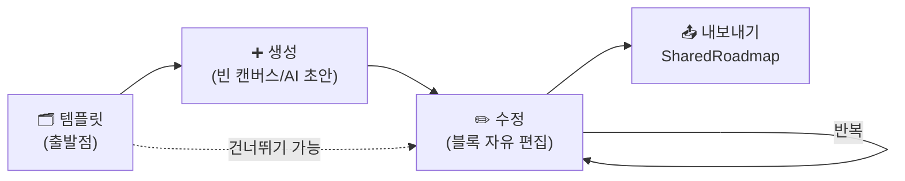
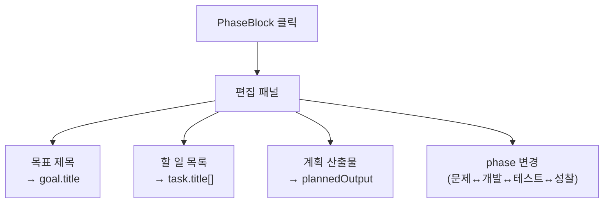

# 프로젝트 빌더 (Project Builder) — 설계안

> 작성일: 2026-06-04
> 성격: 커리어 실행(`/dreammate`)의 **프로젝트 생성·수정을 특화**한 캡컷식 전용 빌더
> 목적: "프론트 + AI로 반복하며 완성하는 프로젝트"를 **템플릿으로 시작 → 자유롭게 수정**해 찍어내는 콘텐츠 제작 도구

---

## 0. 한 줄 요약

> 4단계 반복 사이클(**문제찾기 → 개발 → 테스트 → 디버깅·성찰**)을 캡컷 타임라인처럼 블록으로 편집한다.
> **템플릿은 출발점일 뿐, 진짜 강점은 생성·수정**이다. 결과는 포트폴리오용 피드카드(`SharedRoadmap`)로 나간다.

---

## 1. 세 개의 기둥 — 무엇을 특화하나

기존 [`ExecutionWizardDialog`](../frontend/app/dreammate/components/ExecutionWizardDialog.tsx)는 "템플릿 고르고 끝"이라 **수정이 약하다**. 빌더는 세 가지를 모두 특화한다.



| 기둥 | 지금(`ExecutionWizardDialog`) | 빌더에서 특화 |
|---|---|---|
| 🗂 **템플릿** | 고르면 고정, 못 바꿈 | 80개 갤러리 → 블록으로 풀어 **자유 변형** |
| ➕ **생성** | 템플릿 없으면 빈 로드맵만 | 빈 캔버스 + phase별 블록 직접 추가 |
| ✏️ **수정** | 사실상 없음 | **블록 추가·삭제·이동·복제·재배치 + 인라인 편집** ← 핵심 |

---

## 2. 생성 — 세 가지 진입 (어디서 시작하든 같은 트랙으로 모임)

```mermaid
flowchart TD
    Start(["+ 실행"]) --> Q{어떻게 시작?}
    Q -->|템플릿| A["갤러리에서 선택<br/>→ 블록 자동 배치"]
    Q -->|빈 캔버스| B["스프린트 1 골격만<br/>(4단계 빈 블록)"]
    Q -->|AI 초안 (v2)| C["주제 입력<br/>→ AI가 블록 생성"]
    A --> Track["스프린트 트랙 편집기"]
    B --> Track
    C --> Track
    Track --> Out["미리보기 → 내보내기"]
```

- **템플릿 시작**: 80개 중 선택 → phase 매핑으로 블록 자동 배치 (v1 기본)
- **빈 캔버스 시작**: `문제찾기·개발·테스트·성찰` 빈 블록 1세트만 깔고 사용자가 채움
- **AI 초안 시작**(v2): 주제·기간만 입력 → `ExecutionPlanAiGenerateDialog` 로직으로 블록 생성

> 셋 다 결과는 **동일한 `PhaseBlock[]` 편집 상태**로 수렴 → 이후 수정 경험이 일관됨.

---

## 3. 수정 — 빌더의 핵심 (블록 단위 자유 편집)

캡컷이 클립을 자르고 옮기듯, 빌더는 **블록을 다룬다.** 수정 동작을 명세로 고정한다.

### 3-1. 블록 단위 동작

| 동작 | 설명 | UI |
|---|---|---|
| ➕ 추가 | 특정 phase·sprint에 빈 블록 삽입 | 셀 호버 시 `+` |
| 🗑 삭제 | 블록 제거 (주차 번호 자동 재정렬) | 블록 우상단 `×` |
| ⬍ 이동 | 블록을 다른 sprint 행으로 | 드래그(v1.5) / `↑↓` 버튼(v1) |
| 📑 복제 | 비슷한 주차를 빠르게 | 블록 메뉴 `복제` |
| ↻ 스프린트 | 회차(sprint) 추가·삭제·복제 | `+ 스프린트` / 행 메뉴 |

### 3-2. 블록 내부 인라인 편집

블록 클릭 → 편집 패널. 모든 필드가 곧 `RoadmapTodoItem`에 1:1 대응.



- **할 일**: 추가/삭제/순서변경/텍스트 편집
- **산출물(plannedOutput)**: 이 주차에 남길 결과물 — 포트폴리오 근거 (자동완성: [`autocomplete.json`](../frontend/data/dreammate/config/autocomplete.json)의 `weeklyTodoByItemType` 활용)
- **phase 재지정**: 휴리스틱이 틀리게 잡으면 사용자가 드롭다운으로 교정 → 트랙 열 이동

### 3-3. 기존 프로젝트 불러와 수정 (편집 모드)

빌더는 신규 생성뿐 아니라 **이미 만든 프로젝트를 다시 연다.**


- `?edit=<roadmapId>` 쿼리로 진입 → 기존 `items` → `PhaseBlock[]` 역변환
- 저장 시 **id 유지**하여 갱신(신규 생성과 분기). 실행 중 기록(`note`/`reviewNote`/`comments`)은 보존.

---

## 4. 4단계 사이클 — 데이터 표현

기존 템플릿 주차는 **이미** 사이클을 따른다 (예: `edu/학습 도우미 앱`).

```
1주 벤치마킹·문제찾기 ─┐
2주 페르소나 정의      ─┴─ ① 문제찾기 (problem) 🔍
3주 V0 구현           ──── ② 개발 (build)     🛠
4주 지인 테스트(1차)   ──── ③ 테스트 (test)     🧪
5주 UI 수정·개선      ──── ④ 디버깅·성찰 (refine) 🔄
6~8주                 ──── 스프린트 2 (반복)
```

`RoadmapTodoItem`을 건드리지 않고 **빌더 전용 편집 타입**에만 phase를 둔다.

```ts
type PhaseKey = 'problem' | 'build' | 'test' | 'refine';

interface PhaseBlock {
  id: string;
  phase: PhaseKey;
  sprint: number;          // 1,2,3... 반복 회차
  weekLabel: string;       // "1주차"
  goalTitle: string;       // → RoadmapTodoItem(goal).title
  tasks: string[];         // → RoadmapTodoItem(task).title[]
  plannedOutput?: string;  // → RoadmapTodoItem.plannedOutput
}
```

phase 추론(템플릿/불러오기 → 블록). v1은 키워드 휴리스틱, **사용자가 언제든 교정 가능**(§3-2).

| phase | 키워드(title) | 색 |
|---|---|---|
| `problem` | 벤치마킹·문제·페르소나·조사·정의 | 🔍 파랑 |
| `build` | 구현·개발·프론트·V0·제작·배포 | 🛠 보라 |
| `test` | 테스트·사용성·검증·설문 | 🧪 초록 |
| `refine` | 수정·개선·UI·회고·발표·디버깅 | 🔄 주황 |

> 매핑은 `data/execution/builder-phase-map.json`으로 분리해 코드 수정 없이 튜닝.

---

## 5. 화면 (캡컷식 3-패널)

```
/dreammate/build  (신규)   ·   /dreammate/build?edit=<id>  (수정)

┌──────────────┬─────────────────────────────────────────┬──────────────┐
│ ① 시작 패널    │ ② 스프린트 트랙 편집기 (핵심)              │ ③ 미리보기    │
│              │                                         │              │
│ ◦ 템플릿 갤러리│  🔍문제찾기 🛠개발 🧪테스트 🔄성찰         │ 피드카드     │
│ ◦ 빈 캔버스   │  ┌────┐┌────┐┌────┐┌────┐  스프린트1     │ (라이브)     │
│ ◦ AI초안(v2)  │  │1주 ││3주 ││4주 ││5주 │  [×][복제][↑↓] │ 산출물 N개   │
│              │  └────┘└────┘└────┘└────┘                │ 진행률 0/N   │
│ [분야 필터]   │  ┌────┐┌ + ┐┌────┐┌────┐  스프린트2     │              │
│ [난이도]      │  │6주 │└───┘│7주 ││8주 │                │ [공유 설정]   │
│              │  [+ 스프린트]   [블록 클릭→편집]           │ [내보내기]    │
└──────────────┴─────────────────────────────────────────┴──────────────┘
```

- **①** 세 가지 시작점(§2). 템플릿은 분야(10)×난이도 필터.
- **②** phase 4열 × sprint N행. 블록마다 `× / 복제 / ↑↓`. 클릭 시 편집(§3-2). ← **빌더가 가장 공들일 곳**
- **③** 편집 상태 → `SharedRoadmap` 실시간 변환 → 피드카드 렌더 + 공유/내보내기.

---

## 6. 파일 구조

```
frontend/app/dreammate/build/
├── page.tsx                    # 라우트 (신규/편집 모드 분기)
├── config.ts                   # phase 메타·라벨·색
├── types.ts                    # PhaseKey, PhaseBlock, BuilderState
├── utils/
│   ├── templateToBlocks.ts     # 템플릿 → PhaseBlock[]
│   ├── roadmapToBlocks.ts      # 기존 SharedRoadmap → PhaseBlock[] (편집 모드)
│   ├── blocksToRoadmap.ts      # PhaseBlock[] → payload (= 기존 buildSubItems 추출)
│   └── phaseMap.ts             # 키워드 휴리스틱
└── components/
    ├── BuilderStartPanel.tsx   # ① (템플릿/빈/AI)
    ├── SprintTrackEditor.tsx   # ② 그리드 (추가·삭제·이동·복제)
    ├── PhaseBlockCard.tsx      # 블록 1개
    ├── BlockEditPanel.tsx      # ③-내부 인라인 편집
    └── BuilderPreviewCard.tsx  # ③ 피드카드 래퍼

frontend/data/execution/builder-phase-map.json
```

진입: `/dreammate` 피드 `+ 실행` → "빠른 생성(기존 다이얼로그)" / "빌더로 만들기(`/build`)" 분기.

---

## 7. 데이터 흐름 (생성·수정 양방향)

```mermaid
flowchart TD
    TPL["templates JSON"] -->|templateToBlocks| B["PhaseBlock[]"]
    SR["기존 SharedRoadmap"] -->|roadmapToBlocks| B
    BLANK["빈 캔버스"] --> B
    B <-->|사용자 편집| B
    B -->|blocksToRoadmap| PAY["SharedRoadmap payload"]
    PAY -->|신규| NEW["localStorage / 피드 추가"]
    PAY -->|편집(id 유지)| UPD["기존 항목 갱신"]
```

**불변식**: 출력은 [`SharedRoadmap`](../frontend/app/dreammate/types.ts) 형태 고정 → 피드·포트폴리오·자료실 무수정 수신.

---

## 8. 단계별 범위

### v1 — 템플릿·생성·수정 (이번 작업)
- [ ] `/dreammate/build` 라우트 + 3-패널
- [ ] 시작 패널: 템플릿 갤러리(분야 필터) + 빈 캔버스
- [ ] 트랙: phase 4열 그리드, 템플릿→블록 자동 배치
- [ ] **수정**: 블록 추가·삭제·복제·`↑↓` 이동, 스프린트 추가·삭제
- [ ] **인라인 편집**: 목표/할일/산출물/phase 재지정
- [ ] **편집 모드**: `?edit=<id>`로 기존 프로젝트 불러와 수정(id 유지)
- [ ] 미리보기 피드카드 + 내보내기

### v2 — AI
- [ ] 블록별 "AI로 채우기", 주제만으로 4단계 초안

### v3 — 도구화
- [ ] 드래그 재배치, 내 템플릿 저장, 회고 자동요약→다음 스프린트 제안

---

## 9. 구현 전 확정

1. 블록 편집 UI: 우측 패널 교체 vs 팝오버 — (미리보기와 공존하려면 **우측 패널 탭 전환** 권장)
2. v1 블록 이동: `↑↓` 버튼으로 시작하고 드래그는 v1.5? (권장)
3. 미리보기에 기존 피드카드 컴포넌트 재사용 가능한지 — 구현 시 스타일 의존성 점검
