# AI 시대 지식 생산자 교육과 4주 프로젝트 완성 가이드

> **대상**: 고1 학생 · 학부모 · 입학사정관 · 진로교사  
> **목적**: IB/KB 교육 철학이 AI 시대에 왜 필수인지 이해하고, 여름방학 4주 프로젝트로 실제 수익까지 연결하는 실행 가이드  
> **기준일**: 2026년 7월  
> **참조**: 메타 AI 벤처 블루프린트, 미네르바 5관점 프로젝트 기획, IB/KB 현황 문서

---

## 목차

1. [AI 시대, 왜 교육이 바뀌어야 하는가](#1-ai-시대-왜-교육이-바뀌어야-하는가)
2. [IB/KB 교육의 연도별 발전 타임라인](#2-ibkb-교육의-연도별-발전-타임라인)
3. [지식 소비자 vs 지식 생산자: 패러다임 전환](#3-지식-소비자-vs-지식-생산자-패러다임-전환)
4. [프로젝트·토론·논문이 왜 필수인가](#4-프로젝트토론논문이-왜-필수인가)
5. [창직과 글로벌 기업가 정신](#5-창직과-글로벌-기업가-정신)
6. [AI와 교육의 결합: 메타 AI 오케스트레이션](#6-ai와-교육의-결합-메타-ai-오케스트레이션)
7. [고1 여름방학 4주 프로젝트 실행 가이드](#7-고1-여름방학-4주-프로젝트-실행-가이드)
8. [학생부·대입과의 연결](#8-학생부대입과의-연결)
9. [회복탄력성: 실패를 연료로 바꾸는 태도](#9-회복탄력성-실패를-연료로-바꾸는-태도)
10. [부록](#10-부록)

---

## 1. AI 시대, 왜 교육이 바뀌어야 하는가

### 1.1 30초 요약

```
기존 교육: 정답 암기 → 시험 → 등급 → 취업(BG 마인드)
AI 시대:   질문 설계 → 프로젝트 → 가치 창출 → 창직(AG 마인드)
```

AI가 검색·요약·번역·코딩을 수행하는 시대에, **"정답을 아는 사람"은 AI와 경쟁**하게 된다. 반면 **"좋은 질문을 던지고, 여러 AI를 지휘하여 가치를 만드는 사람"**은 대체 불가능하다.

### 1.2 BG vs AG: 마인드셋 전환

| 구분 | BG (Before Gen-AI) | AG (After Gen-AI) |
|------|---------------------|---------------------|
| **목표** | 좋은 직장에 취업 | 직접 직업을 만든다 (창직) |
| **무기** | 스펙 (학점, 토익, 자격증) | 포트폴리오 (런칭한 프로덕트) |
| **학습 방식** | 강의 수강 → 암기 → 시험 | 문제 발견 → 빌드 → 런칭 |
| **실패 해석** | 좌절, 경로 이탈 | 데이터 수집, 프롬프트 수정 |
| **AI 활용** | 단일 AI에 질문 (팔로워) | 다중 AI를 지휘 (오케스트레이터) |
| **수익 구조** | 월급 (고정, 한정적) | 프로덕트 수익 (확장 가능) |
| **핵심 역량** | 지식 암기량 | 문제 정의력 + AI 오케스트레이션 |

### 1.3 교육 패러다임 전환 흐름도

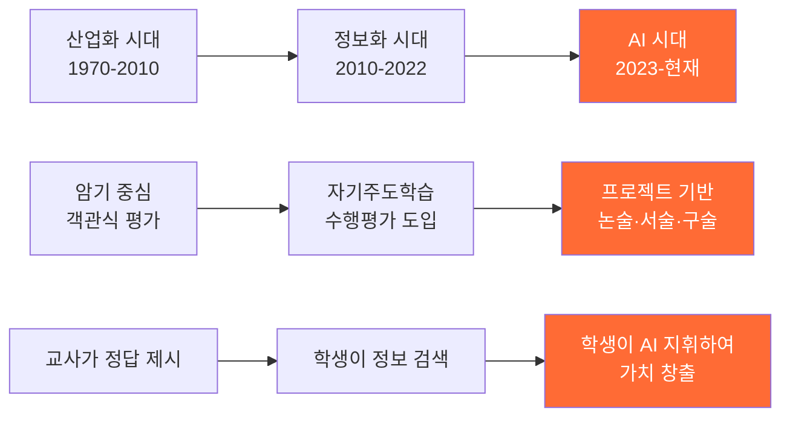

---

## 2. IB/KB 교육의 연도별 발전 타임라인

### 2.1 한국 IB/KB 도입 연대기

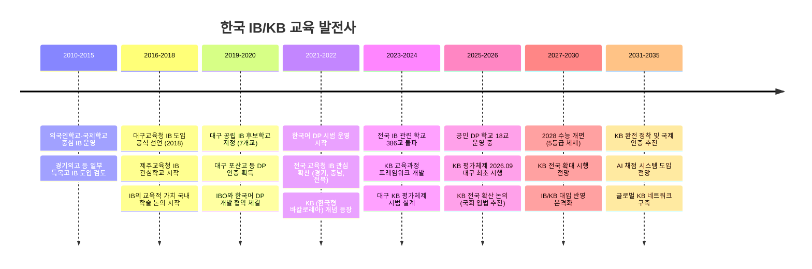

### 2.2 주요 이정표 연표

| 연도 | 구분 | 주요 사건 | 의의 |
|------|------|----------|------|
| 2018 | IB | 대구교육청 IB 도입 공식 선언 | 공교육 IB 도입의 시작 |
| 2019 | IB | 대구 7개교 IB 후보학교 지정 | 한국어 IB 시범 운영 기반 |
| 2020 | IB | 한국어 DP 교과서·평가 개발 착수 | IBO 공식 협력 |
| 2022 | KB | KB 개념 공식화 | IB 철학 + 한국 교육과정 융합 |
| 2023 | IB | 전국 386교 IB 관련 (106 인증) | 양적 확산 |
| 2024 | KB | KB 평가체제 프레임워크 확정 | 논술40-50%, 서술30-40%, 구술10-20% |
| 2025 | IB | 공인 DP 18교 운영 | 전국 6개 시도로 확대 |
| 2026.09 | KB | 대구 KB 평가체제 최초 시행 | 한국형 모델 실전 검증 시작 |
| 2028 | 대입 | 수능 5등급 체제 개편 | 세특 비중 35-40%로 상승 |
| 2030+ | KB | 전국 확대 및 국제 인증 추진 | KB의 글로벌화 |

### 2.3 IB vs KB 핵심 구조 비교

| 항목 | IB (International Baccalaureate) | KB (K-Baccalaureate) |
|------|----------------------------------|----------------------|
| **운영 주체** | 스위스 IBO | 한국 교육부/교육청 |
| **교육과정** | IB 전용 (6과목 + Core) | 국가 교육과정 기반 |
| **평가 언어** | 영어 (한국어 DP 일부) | 한국어 |
| **핵심 요소** | EE + TOK + CAS | K-Essay + K-Think + K-Act |
| **평가 방식** | 100% 에세이·구술 (외부 채점) | 논술 40-50% + 서술 30-40% + 구술 10-20% |
| **비용** | IBO 연회비 부담 (학교당 수천만 원) | 국가 예산 운영 (IBO 비용 없음) |
| **만점** | 45점 (학교 성적 아님) | 한국 내신 체계와 연동 |
| **2026 현황** | 18교 DP 인증 | 대구 최초 시행 예정 |

### 2.4 KB 3계층 구조

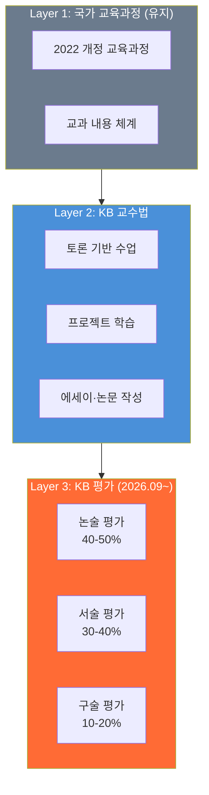

---

## 3. 지식 소비자 vs 지식 생산자: 패러다임 전환

### 3.1 전통 교육 vs IB/KB 교육 vs AI 시대 교육

| 차원 | 전통 교육 (암기형) | IB/KB 교육 (탐구형) | AI 시대 교육 (창직형) |
|------|-------------------|---------------------|---------------------|
| **학생 역할** | 수동적 수용자 | 탐구자·발표자 | AI 지휘자·가치 창출자 |
| **지식의 의미** | 외워야 할 정보 | 탐구해야 할 대상 | 조합·재구성할 원재료 |
| **평가 기준** | 정답률 | 논증의 깊이 | 만든 것의 가치 |
| **AI 위치** | 없음/금지 | 보조 도구 | 핵심 협업 파트너 |
| **최종 산출물** | 시험 점수 | 에세이·발표 | 런칭된 프로덕트 + 수익 |
| **실패 처리** | 감점 | 피드백 루프 | 프롬프트 수정 후 재시도 |

### 3.2 AI가 대체하는 것 vs 대체 못 하는 것

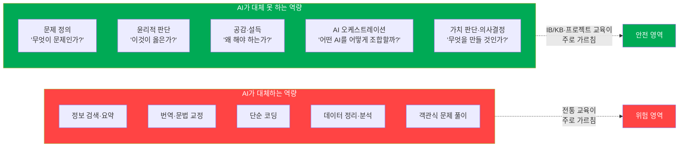

### 3.3 Purposeful Intellect: 목적 있는 지성

AI 시대의 핵심 역량은 **"목적 있는 지성"(Purposeful Intellect)**이다.

```
학기 중 관찰  →  사회적 결핍 발견  →  "이건 왜 아직 해결 안 됐지?"  →  Two-Word Test
                                                                        ↓
                                                              사회 문제 × AI 기술
                                                                        ↓
                                                              결핍 틈새(Gap) 발견
                                                                        ↓
                                                              4주 프로젝트로 해결
```

> **Two-Word Test 예시**

| 사회 문제 (Word 1) | AI 기술 (Word 2) | 발견된 Gap | 프로젝트 아이디어 |
|-------------------|-----------------|-----------|----------------|
| 노인 고독 | 음성 AI | 말벗 서비스 부재 | AI 말벗 챗봇 앱 |
| 급식 잔반 | 이미지 인식 | 잔반 데이터 없음 | 급식 잔반 분석 앱 |
| 동네 소상공인 | 영상 생성 AI | 광고비 부담 | AI 광고 영상 자동 제작 서비스 |
| 반려동물 건강 | 자연어 처리 | 증상 판단 어려움 | 펫 헬스 AI 챗봇 |
| 학교 폭력 | 감정 분석 AI | 조기 감지 부재 | 익명 감정 일기 + 위기 알림 앱 |

---

## 4. 프로젝트·토론·논문이 왜 필수인가

### 4.1 IB/KB 교육의 3대 방법론과 AI 시대 가치

| 교육 방법 | IB/KB에서의 역할 | AI 시대 가치 | 전통 교육과 차이 |
|----------|--------------|-----------|-------------|
| **토론** | TOK / K-Think | 다중 관점 종합 → AI에게 줄 프롬프트 설계력 | 정답 맞히기 vs 관점 충돌 |
| **프로젝트** | CAS / K-Act / IA | 실행력 + 결과물 → 런칭 가능한 프로덕트 | 보고서 제출 vs 실제 사용자 테스트 |
| **논문(에세이)** | EE / K-Essay | 논증 구조화 → AI 결과물의 비판적 검증 | 감상문 vs 근거 기반 주장 |

### 4.2 왜 이 세 가지가 AI와 결합되어야 하는가

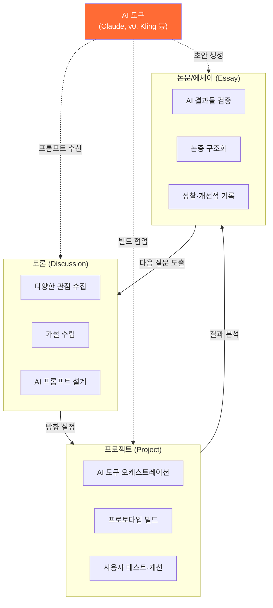

### 4.3 구체적 결합 시나리오

#### 토론 + AI
| 단계 | 학생 역할 | AI 역할 |
|------|---------|---------|
| 주제 선정 | "급식 잔반이 왜 문제인가?" 질문 | 관련 데이터·통계 제공 |
| 관점 수집 | 환경·경제·심리 관점 토론 | 각 관점의 반론 생성 |
| 프롬프트 설계 | 핵심 질문 3개 정리 | 질문 구체화 도움 |

#### 프로젝트 + AI
| 단계 | 학생 역할 | AI 역할 |
|------|---------|---------|
| 기획 | PRD (기능 명세서) 작성 | Claude가 데이터 구조·화면 설계 |
| 개발 | 코드 리뷰·의사결정 | v0가 UI 생성, Claude가 프론트엔드 로직 구현 |
| 테스트 | 사용자 피드백 수집 | 버그 수정·최적화 |

#### 논문(에세이) + AI
| 단계 | 학생 역할 | AI 역할 |
|------|---------|---------|
| 주제 | 연구 질문 설정 | 선행 연구 검색·요약 |
| 작성 | 논증 구조·주장 | 초안 생성·문법 교정 |
| 검증 | 비판적 평가·수정 | 반론 생성·약점 지적 |

### 4.4 미네르바 5관점 분석 프레임워크

프로젝트를 깊이 있게 만들기 위해, 미네르바대학의 5관점 분석을 적용한다:

| 관점 | 핵심 질문 | 4주 프로젝트 적용 예시 |
|------|---------|-------------------|
| **실증적 (Empirical)** | 데이터가 무엇을 말하는가? | 타겟 사용자 설문 100명, 잔반량 데이터 수집 |
| **이론적 (Theoretical)** | 어떤 원리가 작동하는가? | UX 심리학, 행동경제학 넛지 이론 적용 |
| **다모달 (Multimodal)** | 다른 분야에서 유사한 사례는? | 해외 유사 앱 벤치마킹, 다른 환경 캠페인 참조 |
| **복합시스템 (Complex Systems)** | 어떤 변수들이 상호작용하는가? | 급식 메뉴-계절-학년별 잔반 패턴 분석 |
| **윤리·인문 (Ethical-Humanistic)** | 이것이 옳은 일인가? | 데이터 프라이버시, 감시 우려 검토 |

---

## 5. 창직과 글로벌 기업가 정신

### 5.1 취업(就職) vs 창직(創職)

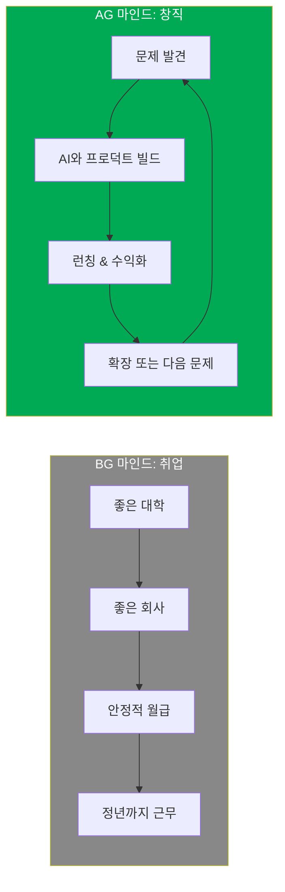

### 5.2 왜 IB/KB 교육이 창직과 맞는가

| IB/KB 역량 | 창직에 필요한 이유 | 구체적 연결 |
|-----------|---------------|----------|
| **에세이 작성 (EE/K-Essay)** | 사업 제안서·투자 유치 발표 능력 | 4,000자 EE → Pitch Deck 논증 구조 동일 |
| **TOK / K-Think** | 시장·윤리·기술의 다관점 분석 | "이 서비스가 정말 필요한가?" 비판적 검증 |
| **CAS / K-Act** | 실행력 + 사회적 가치 | 프로젝트 런칭 = 서비스 활동 + 창의 활동 |
| **IA (내부 평가)** | 데이터 기반 의사결정 | 사용자 데이터 분석 → 제품 개선 |
| **구술 평가** | 투자자·고객 설득 | 3분 Elevator Pitch 역량 |

### 5.3 글로벌 10대 창직가 사례

| 이름 | 나이 | 창직 내용 | 교육 배경 핵심 |
|------|------|---------|-------------|
| 벤자민 퓌르스트 | 17세 | 프리랜서 웹 에이전시 | IB 이수, 프로젝트 경험 |
| 하비에르 아길라르 | 16세 | 교육 게이미피케이션 앱 | 토론·프레젠테이션 중심 학교 |
| 에밀리 첸 | 15세 | AI 기반 환경 모니터링 | STEM 프로젝트 학습 |
| 사라 김 (가명) | 16세 | 한국 전통 디저트 커머스 | 자사고, CAS 프로젝트에서 시작 |

> **공통점**: 모두 프로젝트 기반 학습에서 시작하여 실제 서비스로 발전

### 5.4 창직 엔진: 기술 × 목적 × 태도

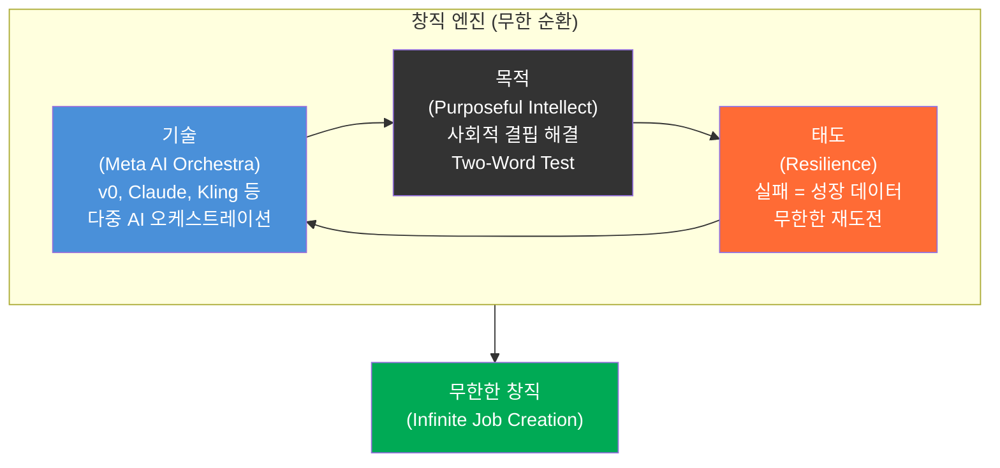

---

## 6. AI와 교육의 결합: 메타 AI 오케스트레이션

### 6.1 단일 AI 사용자 vs 메타 AI 오케스트레이터

| 차원 | 단일 AI 팔로워 | 메타 AI 오케스트레이터 |
|------|-------------|-------------------|
| **사용 패턴** | ChatGPT에 질문 1개 | Claude + v0 + Kling + CapCut 동시 지휘 |
| **결과물** | 텍스트 답변 | 런칭 가능한 프로덕트 + 마케팅 영상 |
| **AI 관계** | 일문일답 (수동적) | 비교·토론·경쟁 (능동적) |
| **비유** | 피아노 한 대 연주 | 오케스트라 지휘 |
| **핵심 역량** | 프롬프트 작성 | 프로세스 설계 + 멀티 AI 조율 |

### 6.2 마이크로 벤처 아키텍처: 1~2인 오케스트라 시스템

각 AI 도구가 회사의 부서를 완벽히 대체하는 파이프라인:

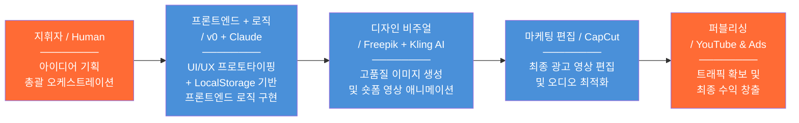

### 6.3 AI 도구별 역할 매핑

| 회사 부서 | AI 도구 | 역할 | 고1 학생 활용 시나리오 |
|----------|--------|------|-------------------|
| **CEO / 기획** | 학생 본인 | 문제 정의, 의사결정 | Two-Word Test로 아이디어 발굴 |
| **기획팀** | Claude | PRD 작성, 데이터 구조 설계, 로직 설계 | "급식 잔반 앱 기능 명세서 만들어줘" |
| **프론트엔드 + 로직** | v0 + Claude | UI/UX 생성 + LocalStorage 기반 로직 구현 | "이 PRD 기반으로 반응형 웹앱 만들어줘" |
| **디자인팀** | Freepik | 마케팅 이미지, 썸네일, 로고 | "앱 홍보 포스터용 이미지 생성해줘" |
| **영상팀** | Kling AI | 시네마틱 숏폼 영상 제작 | "이 이미지를 15초 광고 영상으로 변환해줘" |
| **마케팅팀** | CapCut | 영상 편집, 자막, 오디오 | 숏폼 영상 + BGM + 자막 = 최종 광고 |
| **사업부** | YouTube / Ads | 배포 + 수익화 | 유튜브 업로드 + 웹앱 내 광고 탑재 |

> **왜 백엔드 없이?**: 링고팡(Duolingo)의 초기 버전처럼, 프론트엔드만으로도 충분히 가치 있는 서비스를 만들 수 있다. 백엔드 서버는 보안 이슈(인증 취약점, SQL 인젝션, 서버 비용)가 따르기 때문에, 첫 프로젝트에서는 **LocalStorage + 프론트엔드 로직**으로 핵심 가치를 검증한 뒤, 사용자가 늘면 그때 백엔드를 추가하는 것이 현명하다.

---

## 7. 고1 여름방학 4주 프로젝트 실행 가이드

### 7.1 전체 구조: 아이디어에서 수익까지 (Zero to Income)

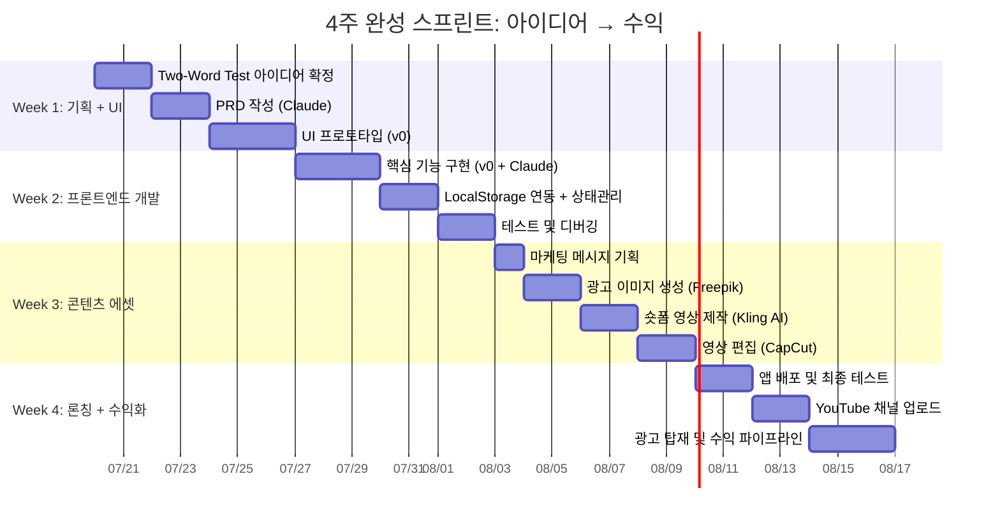

---

### 7.2 Week 1: 뼈대와 외형 구축 — 기획과 초고속 UI 제작

> **목표**: 코딩 지식이 없어도 기획이 즉시 인터페이스로 변환되는 과정 체험  
> **도구**: Claude (기획자) + v0 (디자이너/퍼블리셔)

#### Day 1-2: 아이디어 확정 (Two-Word Test)

| 단계 | 활동 | 산출물 |
|------|------|--------|
| 1 | 학기 중 관찰한 불편/결핍 5개 나열 | 불편 리스트 |
| 2 | 각 불편에 AI 기술 매칭 (Two-Word Test) | 5개 조합 표 |
| 3 | Gap 가장 큰 1개 선정 | 최종 아이디어 1문장 |
| 4 | Claude에게 "이 아이디어의 타겟 사용자와 핵심 가치는?" 질문 | 타겟 정의서 |

**실전 프롬프트 예시**:
```
나는 고1 학생이야. "학교 급식 잔반"이라는 사회 문제와 "이미지 인식 AI"를 
결합한 웹앱을 만들고 싶어. 백엔드 서버 없이 프론트엔드 + LocalStorage로 만들 거야.
1) 타겟 사용자는 누구인가?
2) 핵심 가치 제안(Value Proposition)은?
3) MVP(최소 기능 제품)에 들어갈 기능 3가지는?
4) LocalStorage에 저장할 데이터 구조는 어떻게 설계해야 하나?
```

#### Day 3-4: PRD(기능 명세서) 작성

| 항목 | 내용 | Claude 프롬프트 |
|------|------|---------------|
| 서비스명 | 앱 이름 확정 | "이 서비스에 어울리는 이름 10개 제안해줘" |
| 핵심 기능 | MVP 기능 3-5개 | "각 기능의 입력-처리-출력을 표로 정리해줘" |
| 사용자 흐름 | 화면 전환 시나리오 | "사용자 여정 맵을 그려줘" |
| 데이터 구조 | LocalStorage 스키마 | "LocalStorage에 저장할 JSON 데이터 구조를 설계해줘" |
| 화면 목록 | 페이지/컴포넌트 정리 | "필요한 화면과 컴포넌트 목록을 정리해줘" |

#### Day 5-7: UI 프로토타입 (v0)

```
Claude 기획서 → 자연어 프롬프트 전송 → v0가 실시간 반응형 UI/UX 코드 광속 생성
```

| 순서 | 활동 | v0 프롬프트 예시 |
|------|------|---------------|
| 1 | 메인 화면 생성 | "급식 잔반 사진을 올리면 AI가 분석해주는 앱. 메인 화면에 카메라 버튼과 오늘의 잔반 통계 대시보드" |
| 2 | 상세 화면 추가 | "잔반 분석 결과 화면: 음식 종류별 잔반량 차트, 이번 주 트렌드, 절약 금액" |
| 3 | 모바일 반응형 확인 | "모바일 퍼스트로 최적화해줘" |
| 4 | 디자인 수정 | "색상을 초록 계열로, 폰트를 더 둥글게" |

**Week 1 산출물 체크리스트**:
- [ ] Two-Word Test 결과표
- [ ] PRD (기능 명세서) 1페이지
- [ ] LocalStorage 데이터 구조 설계
- [ ] v0로 만든 UI 프로토타입 (3-5 화면)
- [ ] 앱 로고 초안

---

### 7.3 Week 2: 프론트엔드 완성 — 서버 없이 완전한 앱 만들기

> **목표**: v0로 구축한 UI에 LocalStorage 기반 데이터 관리와 프론트엔드 로직을 결합하여 **서버 없이 완전히 작동하는 웹앱** 완성  
> **도구**: v0 (UI 고도화) + Claude (프론트엔드 로직 + 디버깅 오케스트레이션)  
> **철학**: 링고팡(Duolingo)도 처음에는 단순한 프론트엔드에서 시작했다. 백엔드는 보안 이슈(인증 취약점, 데이터 유출, 서버 비용)가 따르므로, 먼저 프론트엔드로 핵심 가치를 검증한다.

#### 왜 프론트엔드 Only인가?

| 항목 | 백엔드 포함 | 프론트엔드 Only |
|------|-----------|---------------|
| **보안 리스크** | SQL 인젝션, 인증 취약점, 서버 해킹 | 클라이언트 데이터만 → 보안 부담 최소 |
| **서버 비용** | 월 $5~$20+ (트래픽 증가 시 더) | 무료 (Vercel 정적 배포) |
| **개발 복잡도** | 프론트 + 백 + DB + 인증 = 4배 학습량 | 프론트엔드 집중 → 2주 안에 완성 가능 |
| **배포 난이도** | 환경변수, 도메인, SSL, DB 마이그레이션 | `vercel deploy` 한 줄 |
| **MVP 검증** | 기능은 많지만 런칭이 늦음 | 빠르게 런칭 → 사용자 피드백 → 개선 |

#### 프론트엔드 데이터 관리 전략

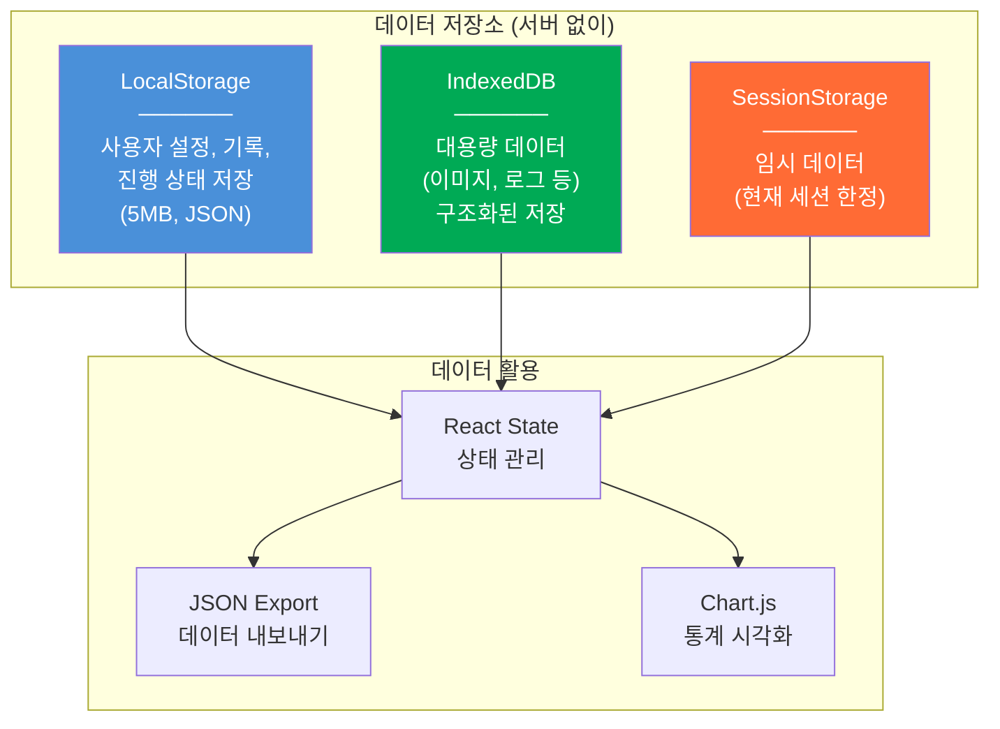

| 저장 방식 | 용도 | 용량 | 사용 예시 |
|----------|------|------|---------|
| **LocalStorage** | 사용자 설정·기록 | 5MB | 잔반 기록, 사용자 닉네임, 테마 설정 |
| **IndexedDB** | 대용량·구조화 데이터 | 수백 MB | 사진 데이터, 상세 분석 로그 |
| **SessionStorage** | 임시 데이터 | 5MB | 현재 입력 중인 폼 데이터 |
| **JSON Export/Import** | 데이터 백업·공유 | 무제한 | "내 데이터 내보내기" 기능 |

#### 핵심 개념: 페어 프로그래밍 + 디버깅 오케스트레이션

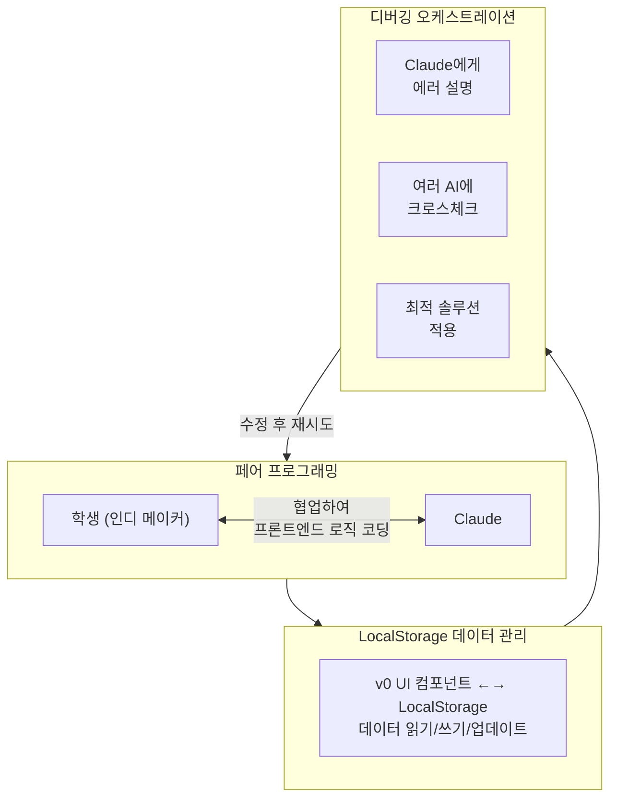

#### Day별 개발 로드맵

| Day | 목표 | 구체적 작업 | Claude 프롬프트 |
|-----|------|----------|---------------|
| Day 1 | 프로젝트 세팅 | Next.js + Tailwind 초기 설정, 폴더 구조 | "Next.js 14 + Tailwind CSS 프론트엔드 전용 프로젝트 셋업해줘. 백엔드 없이 LocalStorage로 데이터 관리할 거야" |
| Day 2 | 핵심 기능 1 | 데이터 입력 UI + LocalStorage 저장 | "사용자가 급식 잔반 정보를 입력하면 LocalStorage에 JSON으로 저장하는 React 컴포넌트 만들어줘" |
| Day 3 | 핵심 기능 2 | 데이터 조회 + 통계 차트 | "LocalStorage에서 잔반 데이터를 읽어 Chart.js로 주간 통계를 보여주는 대시보드 만들어줘" |
| Day 4 | 핵심 기능 3 | 게이미피케이션 요소 | "잔반 절약량에 따라 레벨업하는 시스템 만들어줘. 경험치와 뱃지를 LocalStorage에 저장해" |
| Day 5 | UI 고도화 | 애니메이션, 다크모드, PWA 설정 | "이 앱을 PWA로 만들어서 홈 화면에 추가할 수 있게 해줘" |
| Day 6 | 버그 수정 + 최적화 | 크로스체크 디버깅, 반응형 테스트 | "이 에러를 분석하고 3가지 해결 방안 제시해줘" |
| Day 7 | 배포 | Vercel 정적 배포 | "Vercel로 정적 사이트 배포해줘. 서버 사이드 기능 없이" |

#### 디버깅 오케스트레이션 전략

에러 발생 시, 단일 AI에 의존하지 않고 여러 AI에 크로스체크:

```
에러 발생 → Claude에게 설명 → 해결 안 됨?
         → ChatGPT에 같은 에러 질문 → 다른 관점?
         → 두 답변 비교 → 최적 솔루션 적용
         → 여전히 안 됨? → Stack Overflow 검색 → Claude에게 재질문
```

#### 실전 코드 예시: LocalStorage 데이터 관리

```javascript
// 잔반 기록 저장
const saveRecord = (record) => {
  const records = JSON.parse(localStorage.getItem('waste-records') || '[]');
  records.push({ ...record, id: Date.now(), date: new Date().toISOString() });
  localStorage.setItem('waste-records', JSON.stringify(records));
};

// 주간 통계 조회
const getWeeklyStats = () => {
  const records = JSON.parse(localStorage.getItem('waste-records') || '[]');
  const oneWeekAgo = Date.now() - 7 * 24 * 60 * 60 * 1000;
  return records.filter(r => new Date(r.date).getTime() > oneWeekAgo);
};

// 데이터 내보내기 (JSON 다운로드)
const exportData = () => {
  const data = localStorage.getItem('waste-records');
  const blob = new Blob([data], { type: 'application/json' });
  const url = URL.createObjectURL(blob);
  // 다운로드 링크 생성...
};
```

#### 향후 확장 로드맵 (프로젝트 성공 시)

```
Phase 1 (4주 프로젝트): 프론트엔드 + LocalStorage → MVP 검증
         ↓ 사용자 50명 이상 확보 시
Phase 2 (방학 이후):    Supabase 연동 → 데이터 클라우드 동기화
         ↓ 사용자 200명 이상 시
Phase 3 (다음 방학):    사용자 인증 + 학교 간 랭킹 시스템
```

**Week 2 산출물 체크리스트**:
- [ ] 작동하는 웹앱 (핵심 기능 3개)
- [ ] LocalStorage 데이터 CRUD 완성
- [ ] 통계 대시보드 (Chart.js)
- [ ] PWA 설정 (홈 화면 추가 가능)
- [ ] Vercel 테스트 배포 URL
- [ ] 버그 리스트 + 해결 로그

---

### 7.4 Week 3: 비주얼 오케스트레이션 — 자본 없는 고품질 에셋 제작

> **목표**: 정지 이미지에서 시네마틱 숏폼 마케팅 비디오까지, 자본 0원으로 제작  
> **도구**: Freepik (이미지) + Kling AI (영상) + CapCut (편집)

#### 3단계 에셋 파이프라인

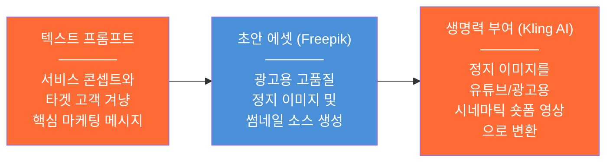

#### Day별 제작 로드맵

| Day | 활동 | 구체적 작업 | 산출물 |
|-----|------|----------|--------|
| Day 1 | 마케팅 메시지 기획 | 타겟 고객 페르소나 정의, 핵심 메시지 3개, 광고 스크립트 | 마케팅 전략 1-pager |
| Day 2 | 앱 스크린샷 + 로고 | v0 앱 화면 캡처, Freepik으로 로고·배너 생성 | 앱스토어용 스크린샷 5장 |
| Day 3 | 광고 이미지 제작 | Freepik으로 SNS 광고 이미지 제작 | Instagram/YouTube 썸네일 3-5장 |
| Day 4 | 숏폼 영상 제작 | Kling AI로 정지 이미지 → 15초 시네마틱 영상 | 광고 영상 소스 3-5개 |
| Day 5 | 영상 편집 | CapCut으로 자막 + BGM + 효과 추가 | 최종 광고 영상 30초 × 2편 |
| Day 6 | YouTube 썸네일 | 클릭율 높은 썸네일 디자인 | 썸네일 + 제목 3세트 |
| Day 7 | 최종 검수 | 영상·이미지 품질 확인, 수정 | 모든 에셋 완성 |

#### Freepik 프롬프트 예시
```
Create a modern, clean app promotional image for a school meal waste 
tracking app. Show a smartphone with a green dashboard, floating food 
icons, and a progress chart. Korean high school cafeteria background. 
Professional, eco-friendly color palette.
```

#### Kling AI 활용법
```
입력: Freepik으로 만든 고품질 정지 이미지
설정: 15초 시네마틱 모드, 카메라 줌인/패닝 효과
출력: 유튜브 Shorts / Instagram Reels용 동영상
```

**Week 3 산출물 체크리스트**:
- [ ] 마케팅 전략 1-pager
- [ ] 앱 스크린샷 5장
- [ ] SNS 광고 이미지 3-5장
- [ ] Kling AI 숏폼 영상 소스 3-5개
- [ ] CapCut 편집 완료 광고 영상 2편
- [ ] YouTube 썸네일 + 제목 3세트

---

### 7.5 Week 4: 론칭과 수익화(Monetization) — 트래픽 및 파이프라인 가동

> **목표**: 모든 에셋을 결합하여 실제 비즈니스 수입을 창출하는 최종 단계  
> **도구**: CapCut (최종 편집) + YouTube / Ads (수익화)

#### 수익화 파이프라인

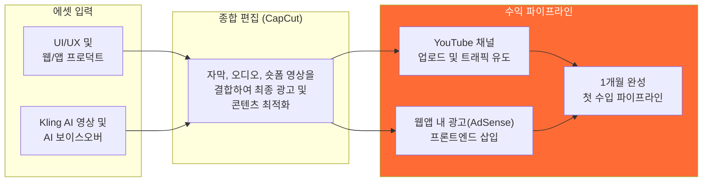

#### Day별 론칭 로드맵

| Day | 활동 | 구체적 작업 | 핵심 지표 |
|-----|------|----------|----------|
| Day 1 | 최종 앱 테스트 | 친구 5명 베타 테스트, 피드백 수집 | 버그 0개, 핵심 플로우 완성 |
| Day 2 | 앱 배포 | Vercel 프로덕션 배포, 도메인 연결 | 배포 URL 확정 |
| Day 3 | YouTube 채널 생성 | 채널 개설, 프로필·배너 설정, 첫 영상 업로드 | 구독자 목표 50명 |
| Day 4 | 홍보 영상 배포 | YouTube Shorts + Instagram Reels 업로드 | 조회수 목표 1,000 |
| Day 5 | 광고 탑재 | Google AdSense 웹 배너 광고 설정 | 광고 노출 시작 |
| Day 6 | 마케팅 푸시 | 학교 커뮤니티·SNS 홍보, QR 코드 배포 | DAU 목표 30명 |
| Day 7 | 수익 확인 + 회고 | 첫 수익 확인, 프로젝트 회고록 작성 | 첫 수익 발생! |

#### 수익 채널 3가지

| 수익 채널 | 설명 | 예상 첫 달 수익 |
|----------|------|---------------|
| **YouTube 광고** | 숏폼 영상 조회수 기반 수익 | 1,000~5,000원 |
| **웹앱 내 광고** | Google AdSense 배너 광고 (프론트엔드 삽입) | 3,000~10,000원 |
| **확장 가능성** | 학교 간 경쟁·리더보드 프리미엄 | 향후 |

> **핵심 메시지**: 금액이 작더라도 **"고1이 직접 만든 서비스로 실제 수익을 창출했다"**는 경험 자체가 학생부 기록, 대입 면접, 향후 창업의 원천 자산이 된다.

---

### 7.6 4주 전체 요약 대시보드

| 주차 | 테마 | 핵심 AI 도구 | 핵심 산출물 | 역량 |
|------|------|------------|-----------|------|
| **W1** | 뼈대와 외형 | v0 + Claude | PRD + UI 프로토타입 | 문제 정의 + 기획력 |
| **W2** | 프론트엔드 완성 | v0 + Claude | 작동하는 웹앱 (서버 없이) | 개발 + 디버깅 |
| **W3** | 비주얼 에셋 | Freepik + Kling AI + CapCut | 광고 영상 + 이미지 | 마케팅 + 크리에이티브 |
| **W4** | 론칭 + 수익 | YouTube + Ads | 배포된 서비스 + 첫 수익 | 사업 운영 + 수익화 |

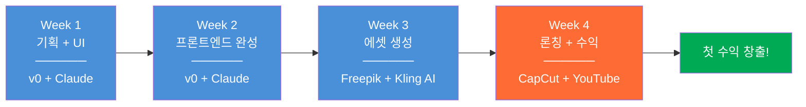

---

## 8. 학생부·대입과의 연결

### 8.1 2028 수능 개편과 세특의 중요성

| 항목 | 현행 (2025) | 2028 개편 |
|------|-----------|----------|
| 수능 등급 | 9등급 (상대평가) | 5등급 (절대평가적) |
| 세특 비중 | 약 25-30% | **약 35-40%** |
| 내신 체제 | 상대평가 | 성취평가제 확대 |
| 변별력 원천 | 수능 점수 | **세특 내용 + 면접** |

> **핵심**: 수능의 변별력이 줄면서, **학생부 세특(세부능력특기사항)**이 대입의 핵심 변별 자료가 된다. 4주 프로젝트의 과정과 결과가 곧 세특 소재이다.

### 8.2 4주 프로젝트 → 학생부 기록 전략

| 프로젝트 단계 | 세특 기록 키워드 | 기록 예시 |
|-------------|-------------|---------|
| **W1 기획** | 문제 발견, 탐구 동기, 비판적 사고 | "학교 급식 잔반 문제에 관심을 갖고 AI 이미지 인식 기술과의 결합 가능성을 탐구함" |
| **W2 개발** | 자기주도학습, 융합적 사고, 문제해결 | "프로그래밍 언어(JavaScript)를 자기주도적으로 학습하여 프론트엔드 기반 웹 애플리케이션을 개발하고 PWA로 배포함" |
| **W3 마케팅** | 창의성, 미디어 리터러시, 의사소통 | "AI 영상 생성 도구를 활용하여 서비스 홍보 콘텐츠를 기획·제작함" |
| **W4 론칭** | 기업가 정신, 실행력, 사회 참여 | "개발한 서비스를 실제 배포하여 학교 커뮤니티에서 운영하며 사회적 가치를 실현함" |

### 8.3 면접 대비: 예상 질문과 답변 프레임

| 예상 질문 | 답변 프레임 (STAR) |
|---------|------------------|
| "이 프로젝트를 하게 된 계기는?" | **S**: 급식 시간 잔반 관찰 → **T**: AI로 해결 가능 여부 탐구 → **A**: 4주 프로젝트 실행 → **R**: 실제 서비스 런칭 |
| "AI를 어떻게 활용했나?" | "단일 AI에 의존하지 않고, Claude(기획·코딩), v0(UI 생성), Kling AI(영상)를 **오케스트라처럼 지휘**했습니다" |
| "가장 어려웠던 점은?" | "API 연동 에러 → 여러 AI에 크로스체크 → 최적 솔루션 발견. **실패를 프롬프트 수정의 기회로 전환**했습니다" |
| "프로젝트에서 배운 것은?" | "정답을 아는 것보다 **좋은 질문을 던지는 것**이 중요하다는 걸 깨달았습니다" |

### 8.4 IB/KB 학교 재학생의 경우

| 항목 | IB 학생 연결 | KB 학생 연결 |
|------|-----------|-----------|
| **EE / K-Essay** | 프로젝트 경험을 4,000자 Extended Essay로 발전 | K-Essay로 프로젝트 과정·성찰 논술 |
| **TOK / K-Think** | "AI 도구의 지식 생산에서의 역할" 토론 | K-Think에서 AI 윤리·활용 논의 |
| **CAS / K-Act** | 창의(앱 개발) + 활동(마케팅) + 서비스(사회 문제 해결) | K-Act 프로젝트로 정식 인정 |
| **IA** | 수집된 데이터로 통계 분석 Internal Assessment | 교과 연계 수행평가 소재 |

---

## 9. 회복탄력성: 실패를 연료로 바꾸는 태도

### 9.1 Rebound Curve

```
성과 ↑
  │                                          ★ 자율성과 목적이 이끄는 여정
  │                                        ↗   (실패를 두려워하지 않는
  │                                      ↗     무한한 재도전과 가치 창출)
  │                                    ↗
  │──────────────╲                  ↗
  │               ╲              ↗
  │                ╲           ↗
  │                 ╲        ↗
  │                  ╲     ↗
  │                   ╲  ↗
  │                    ╳  ← 첫 론칭의 에러 (BG 마인드: 좌절)
  │                        글로벌 리더의 해석:
  │                        "뭐 하나 배웠다. 프롬프트를 수정해서 다시 하면 되지."
  │
  └──────────────────────────────────────────→ 시간
```

### 9.2 실패 대응 비교

| 상황 | BG 마인드 (좌절) | AG 마인드 (성장) |
|------|---------------|---------------|
| 앱이 에러로 안 됨 | "나는 코딩에 소질이 없나 봐" | "에러 메시지를 Claude에게 보여주고 다시 해보자" |
| 영상 조회수 10회 | "아무도 안 봐, 포기해야지" | "썸네일을 바꿔보고, 제목 A/B 테스트하자" |
| 수익 0원 | "시간 낭비였다" | "사용자 피드백을 받아 개선하자. 런칭 경험 자체가 자산" |
| 친구들이 비웃음 | "창피하다, 숨기자" | "1년 후에 포트폴리오로 보여주면 된다" |

### 9.3 AG 마인드의 실패 해석 공식

```
실패 = 성장을 위한 데이터 수집
     = 프롬프트를 수정해서 다시 하면 되는 것
     ≠ 경로 이탈
     ≠ 능력 부족의 증거
```

---

## 10. 부록

### 10.1 4주 프로젝트 아이디어 예시 10선

| # | 사회 문제 (Word 1) | AI 기술 (Word 2) | 앱 아이디어 | 수익 모델 |
|---|------------------|----------------|----------|---------|
| 1 | 급식 잔반 | 이미지 인식 | 잔반 분석·절약 앱 | 광고 + 학교 계약 |
| 2 | 동네 소상공인 마케팅 | 영상 생성 AI | AI 광고 영상 자동 제작 | 건당 과금 |
| 3 | 학생 스트레스 | 감정 분석 | 감정 일기 + AI 상담 챗봇 | 프리미엄 기능 |
| 4 | 분리수거 혼란 | 이미지 분류 | 쓰레기 분류 도우미 앱 | 광고 + 환경 포인트 |
| 5 | 반려동물 건강 | 자연어 처리 | 펫 증상 AI 상담 | 병원 연계 수수료 |
| 6 | 학교 분실물 | 이미지 매칭 | 분실물 찾기 플랫폼 | 학교 구독 |
| 7 | 중고 교과서 | 가격 예측 AI | 교과서 중고 거래 플랫폼 | 거래 수수료 |
| 8 | 교통 안전 | 위치 데이터 | 통학로 위험 알림 앱 | 지자체 계약 |
| 9 | 외국인 관광객 | 번역 AI | 동네 맛집 가이드 | 음식점 광고 |
| 10 | 노인 디지털 소외 | 음성 AI | 시니어 스마트폰 도우미 | 복지관 계약 |

### 10.2 AI 도구 빠른 참조표

| 도구 | 용도 | 무료/유료 | 고1 활용 난이도 |
|------|------|---------|-------------|
| **Claude** | 기획, 프론트엔드 코딩, 디버깅, 글쓰기 | 무료 (일일 한도) | 쉬움 |
| **v0 (Vercel)** | UI/UX 코드 생성 | 무료 (기본) | 쉬움 |
| **LocalStorage / IndexedDB** | 브라우저 내장 데이터 저장 (서버 불필요) | 무료 | 쉬움 |
| **Freepik** | AI 이미지 생성 | 무료 (일부) | 쉬움 |
| **Kling AI** | 정지 이미지 → 영상 변환 | 무료 (크레딧) | 쉬움 |
| **CapCut** | 영상 편집 (자막, BGM) | 무료 | 쉬움 |
| **Vercel** | 정적 웹앱 배포 (서버 비용 0원) | 무료 (기본) | 쉬움 |
| **YouTube** | 영상 배포 + 수익화 | 무료 | 쉬움 |
| **Google AdSense** | 웹 광고 수익 | 무료 | 보통 |
| **PWA (Progressive Web App)** | 앱스토어 없이 홈 화면 설치 | 무료 | 보통 |

### 10.3 일일 시간 배분 추천 (방학 기준)

| 시간대 | 활동 | 비고 |
|--------|------|------|
| 09:00-10:00 | 어제 작업 리뷰 + 오늘 목표 설정 | Claude에게 "어제 한 것" 브리핑 |
| 10:00-12:00 | **핵심 작업 (개발/디자인)** | 집중 시간, 방해 차단 |
| 12:00-13:00 | 점심 + 휴식 | |
| 13:00-15:00 | **핵심 작업 계속** | |
| 15:00-15:30 | 디버깅 / 피드백 정리 | |
| 15:30-16:30 | 보조 작업 (문서화, 에셋 제작) | |
| 16:30-17:00 | 하루 회고 + 내일 계획 | 프로젝트 일지 작성 (세특 소재) |

> **주 5일 작업, 주말 2일은 피드백 수집 + 휴식**  
> **하루 실제 작업 시간: 약 5-6시간**

### 10.4 프로젝트 일지 템플릿

```markdown
## Day [N] 프로젝트 일지

**날짜**: 2026년 _월 _일  
**주차**: Week [1/2/3/4]

### 오늘의 목표
- [ ] 

### 한 일
1. 
2. 
3. 

### 사용한 AI 도구
| 도구 | 용도 | 프롬프트 요약 | 결과 |
|------|------|------------|------|
|      |      |            |      |

### 어려웠던 점 + 해결 방법
- 문제: 
- 시도: 
- 해결: 

### 내일 할 일
- [ ] 

### 오늘의 배움 (1문장)
> 
```

### 10.5 참고 문헌 및 자료

| 자료 | 내용 |
|------|------|
| 메타 AI 벤처 블루프린트 (PDF) | 4주 완성 스프린트 프레임워크, BG vs AG 마인드, 마이크로 벤처 아키텍처 |
| IB vs KB 비교가이드 | IB/KB 차이점, 학교 분포, 평가 체계 |
| 미네르바 5관점 프로젝트 기획 | 5 Lenses 분석 프레임워크 |
| PROJECT_BUILDER_DESIGN.md | 4-Phase 프로젝트 빌더 구조 (problem → build → test → refine) |

---

> **마지막 메시지**:  
> 다중 AI를 지휘하여 스스로 가치를 창출하는 **'메타 AI 오케스트레이터'**로 거듭나십시오.  
> 수익 창출은 끝이 아닙니다. 다음 질문을 향한 새로운 시작입니다.
