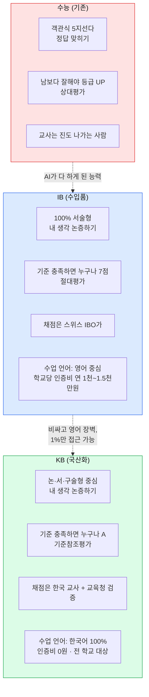
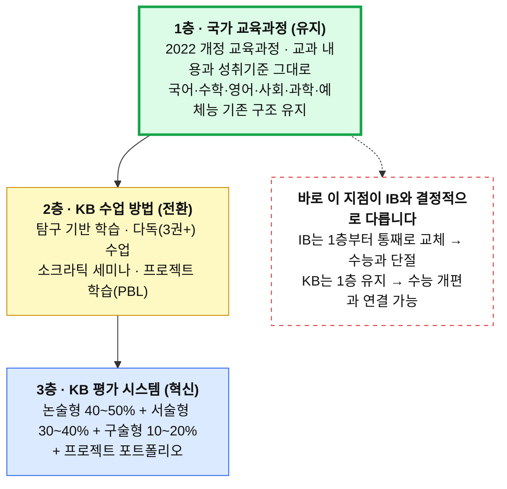
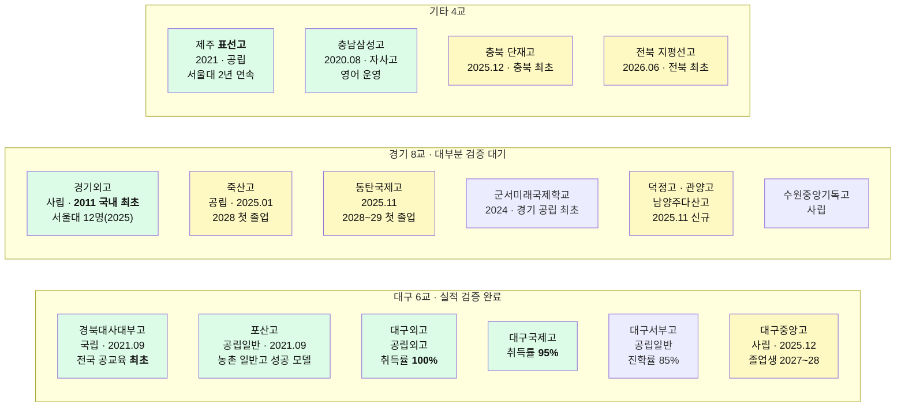
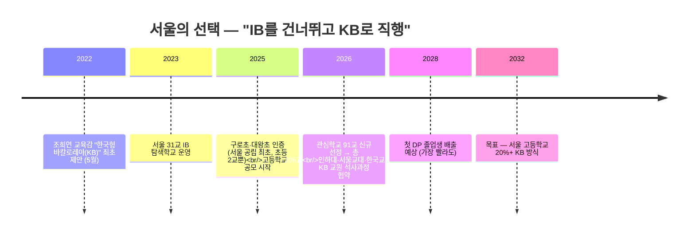
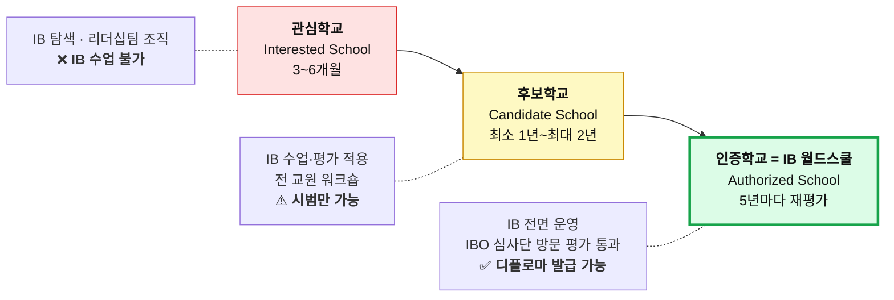
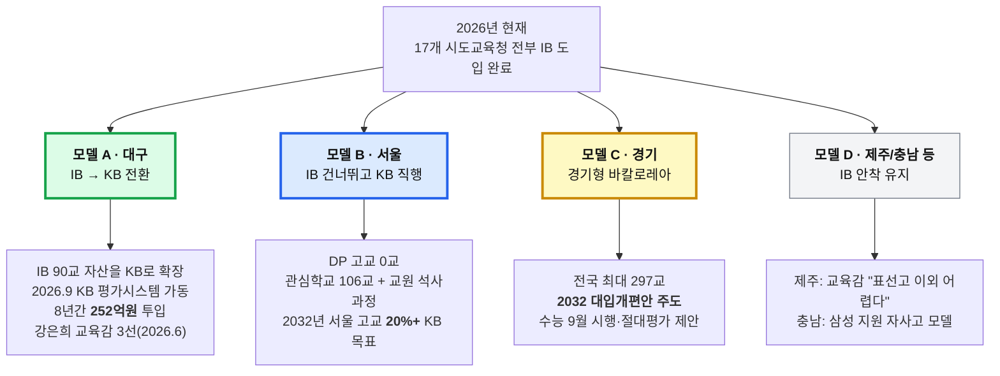
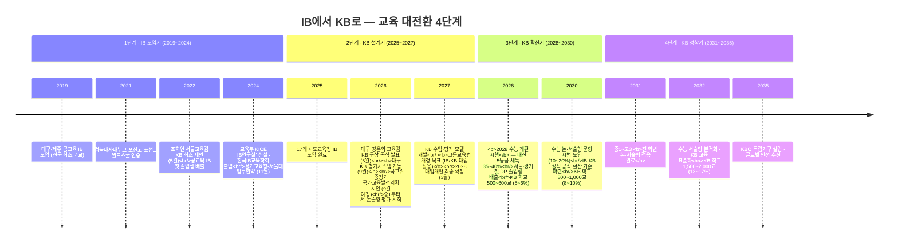
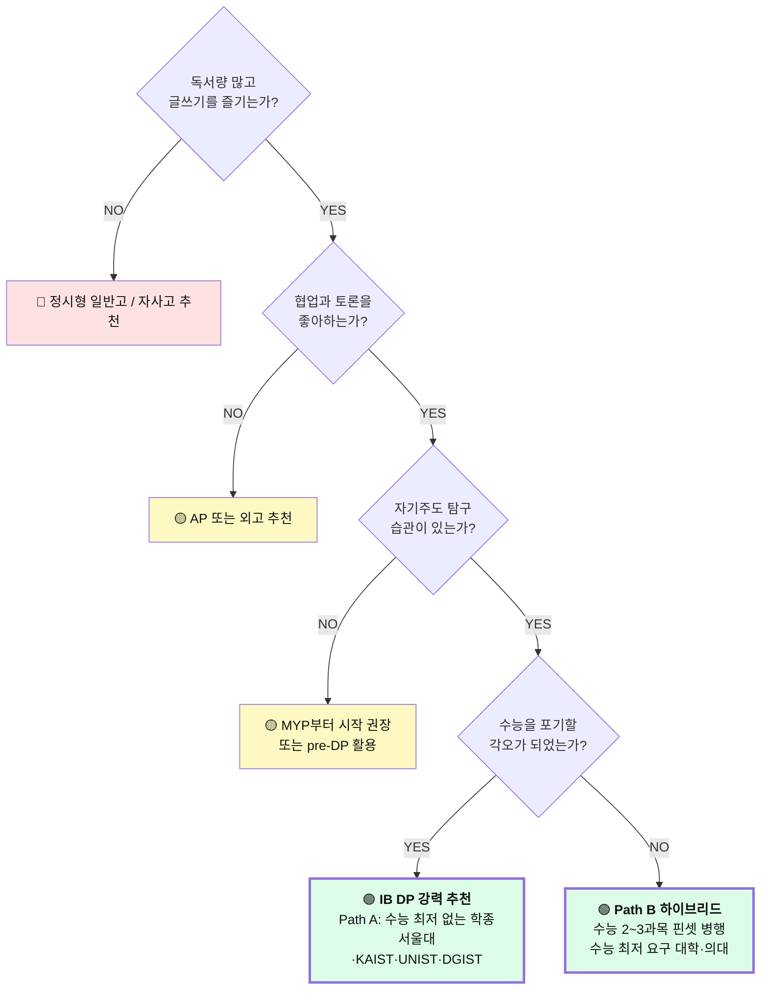
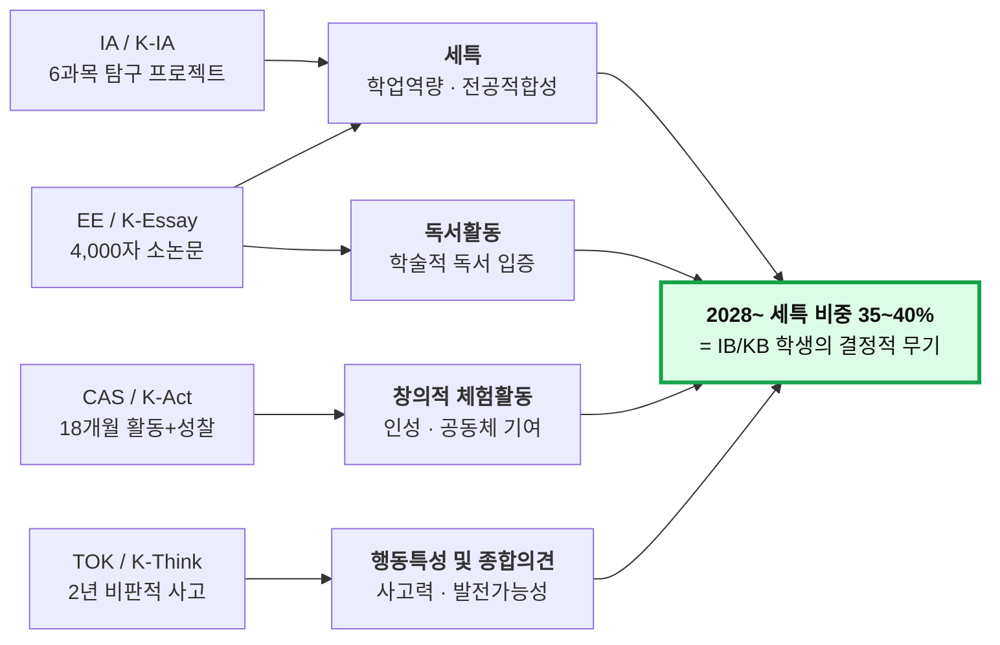
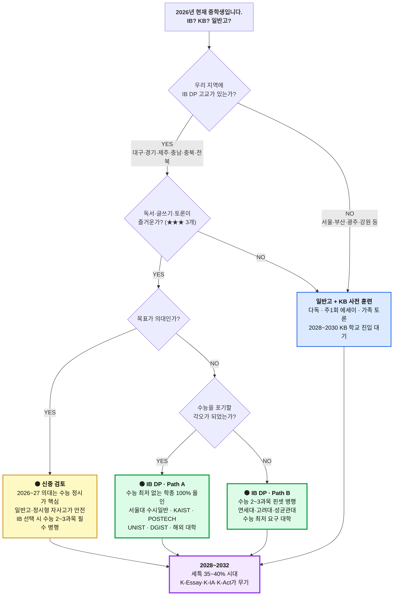

# IB vs KB 완전 비교 가이드
### 입학사정관 상담용 · 중학생 길라잡이

> **작성 기준일**: 2026년 7월
> **대상**: 입학사정관, 진로상담 교사, 중학생과 학부모
> **출처**: `(IB)-입학사정관_완전가인드.md`, `(IB)_한국_공교육_IB_도입_현황_2026.md`, `(KB)_한국_공교육_KB_도입_현황_2026.md`, `(KB교육)-한국형_바칼로레아_KB_완전가이드_2032대입전망.md`

---

## 0. 30초 요약 — 이것만 알면 됩니다

| 질문 | 한 줄 답 |
|---|---|
| **IB가 뭔가요?** | 스위스 IBO가 만든 **국제** 교육과정. 전 세계 160개국이 인정하는 "글로벌 여권". |
| **KB가 뭔가요?** | 한국 교육부·교육청이 만드는 **한국판 IB**. IB의 방식만 빌려오고 로열티·영어 장벽은 뺐다. |
| **가장 큰 차이는?** | **IB = 남의 나라 시스템을 사서 쓴다 / KB = 우리가 직접 만들어 쓴다.** |
| **지금 뭐가 돌아가나요?** | **IB만 실제로 돌아갑니다.** KB는 2026년 9월 대구에서 평가 시스템이 처음 가동됩니다. |
| **중3인 우리 아이는?** | 지금 갈 수 있는 건 **IB 학교(전국 공교육 고교 18곳)**. KB는 고교 시절에 "내 학교로 들어오는" 형태가 됩니다. |
| **왜 지금 중요한가?** | **2028 수능 개편**으로 세특 비중이 35~40%로 커집니다. IB/KB식 생기부가 그때 무기가 됩니다. |

> ⚠️ **가장 중요한 오해 정정**: KB는 **아직 대학이 공식 인정하는 제도가 아닙니다.** 2026년 현재 KB 성적으로 수능을 면제받거나 특별전형에 지원할 수 없습니다. 고등교육법 개정은 **2027년 목표**로 추진 중입니다.

---

## 1. 쉽게 설명하기 — 비유 하나로

### 한 문장 비유

| 구분 | 비유 |
|---|---|
| **수능** | 남이 낸 문제의 **정답을 빨리 찾는** 시험 |
| **IB** | **명품 수입차**. 성능은 검증됐지만 비싸고, 매뉴얼이 영어고, 아무나 못 산다 |
| **KB** | 그 수입차를 뜯어보고 만든 **국산차**. 값은 무료, 매뉴얼은 한국어, 전 국민이 탈 수 있게 하는 게 목표. 단, **아직 도로 주행 검증 중** |

> 원문 표현: **"KB는 IB의 '정신'은 취하고 '껍데기'는 벗겨낸 것입니다."**

---

## 2. IB vs KB — 핵심 차이 총정리

### 2.1 한눈에 보는 3자 비교

| 비교 항목 | 기존 수능 교육 | **IB** (국제 바칼로레아) | **KB** (한국형 바칼로레아) |
|---|---|---|---|
| **운영 주체** | 한국 교육부 | **IBO** (스위스 제네바, 1968년 설립) | **한국 교육부 + 시도교육청** |
| **교육과정** | 2022 개정 국가 교육과정 | **IB 자체 교육과정** (국가 교육과정과 별도) | **국가 교육과정 그대로 유지** + 평가만 전환 |
| **평가 방식** | 객관식 70% + 서술형 30% | **서술형 100%** + IA + EA | **논·서·구술형 중심** (서술형 70%+) |
| **채점 주체** | 기계(OMR) + 교사 | **IBO 직접 채점** (타국 채점관 교차) | **한국 교사 채점 + 교육청 외부 검증** |
| **수업 언어** | 한국어 | **영어/프랑스어/스페인어** (한국어 DP 일부) | **한국어 100%** |
| **비용** | 무상 | 공립 IB 무상 + **IBO 인증비 연 1,000~1,500만원/교** 사립 IB 연 1,500~2,500만원 | **무상** (IBO 인증비 없음) |
| **적용 범위** | 전체 학교 | **인증학교만** (전국 106교 = 전체의 약 1%) | **모든 공교육 학교** (목표) |
| **대입 연계** | 수능 = 교육의 목표 | 학종 활용 (공식 IB 전형은 3개 대학) | **2028 수능 개편과 직접 연계 설계** |
| **글로벌 인정** | 한국 내에서만 | **전 세계 160개국 / 5,000+ 대학** | **한국 내만** (해외 인정 미정) |
| **교사 자격** | 교과서 진도 | IBO 공인 워크숍 (해외 연수 필수) | IBEC 인증 대학 연수 + 국내 연수 |
| **약점** | 파행 교육과정, 사교육 의존 | 높은 로열티, 영어 부담, **수능 병행 사실상 불가** | **개발 중** — 검증·인정 시간 필요 |

### 2.2 KB가 IB에서 "가져온 것"과 "버린 것"

| ✅ 가져온 것 (IB의 강점) | ❌ 버린 것 (IB의 한계) |
|---|---|
| 100% 서술형 평가 | IBO 인증비 (학교당 연 수천만원) |
| 탐구 기반 학습 (Inquiry-based) | 영어 중심 수업·평가 |
| 내부평가(IA) — 학생 자기주도 프로젝트 | IBO 글로벌 채점 시스템 의존 |
| 소논문(EE) — 독립 연구 논문 경험 | 국가 교육과정과의 괴리 |
| 지식론(TOK) — 비판적 사고 훈련 | **수능과의 완전 단절** |
| CAS — 창의·활동·봉사 통합 | 소수 인증학교만 접근하는 **엘리트 구조** |
| 성찰 일지 — 메타인지 훈련 | 외국인 교사 의존 |

### 2.3 IB Core vs KB Core — 이름만 바뀐 게 아닙니다

| IB Core | → | KB Core | 무엇이 달라지나 |
|---|---|---|---|
| **EE** (Extended Essay) 4,000**단어**(영어), 9개월 지도교사 3~5회 면담 | → | **K-Essay** (탐구 논문) 4,000**자**(한국어), 약 12개월 지도교사 월 1회 면담 | 한국 사회·문화 주제 가능, 언어 장벽 소멸 |
| **TOK** (Theory of Knowledge) "우리는 어떻게 아는가?" 에세이 1,600단어 + 전시 | → | **K-Think** (사고와 논증) "우리는 어떻게 생각하고 논증하는가?" 논증 에세이 + 구술 발표 10분 | 한국 사회 이슈 소재, **AI 시대 지식의 본질**·미디어 리터러시 |
| **CAS** (창의·활동·봉사) 18개월, 성찰 일지, **합격/불합격** | → | **K-Act** (실천과 성찰) 18개월, 주 2~3시간, **합격/불합격** | 지역사회 연계 프로젝트 1개 이상 필수 |

> ⚠️ **K-Essay 분량은 원문에서 4,000자 / 4,000~8,000자로 엇갈립니다.** 확정 규격이 아직 없다는 뜻이니 상담 시 "4,000자 내외, 세부 규격은 개발 중"으로 안내하세요.

### 2.4 KB의 3층 구조 — "교과서는 그대로, 평가만 바꾼다"

**수업이 실제로 어떻게 바뀌나** (대구·제주 IB 학교 실측 기준)

| 항목 | 기존 수업 | KB 수업 |
|---|---|---|
| 교사 강의 비중 | 80% | **20%** |
| 학생 탐구·토론 비중 | 20% | **80%** |
| 객관식 평가 | 70% | **0%** |
| 서술·논술·구술형 | 30% | **100%** |
| **학생 발언 시간 (고2 하루)** | **약 5~10분** | **약 120~180분** |

---

## 3. 학교 분포 — 지금 어디에 무엇이 있나

### 3.1 전국 총괄 (2026년 7월 기준)

| 항목 | 수치 |
|---|---|
| **IB 도입 시도교육청** | **17개 = 전국 전부** |
| **전국 IB 관련 학교** | **386교** (전국 초중고 대비 약 3.3%) |
| ├ 인증학교 (IB 월드스쿨) | **106교** ← 실제로 IB 수업·디플로마 발급 가능 |
| ├ 후보학교 | **73교** ← 시범 운영 중 |
| └ 관심학교 | **207교** ← **아직 IB 수업 안 함** |
| **공교육 DP 인증 고등학교** | **18교** (국제학교 제외) |
| **KB 평가시스템 가동** | **2026년 9월 (대구, 전국 최초)** |
| **KB 핵심 추진 교육청** | **대구 · 서울** |
| IB 전문교원 | 2,500명+ |
| KB/IB 관련 조례 | 7개 교육청 (부산·전남·강원·제주 제정, 전북 공포, 서울·경기 추진) |

> 🚨 **입학사정관·학부모가 가장 많이 속는 지점**
> 뉴스의 "**IB 학교 386교(또는 225교, 400교)**"는 **관심 + 후보 + 인증을 전부 합친 숫자**입니다.
> **관심학교 207교 ≠ IB 수업하는 학교 207교.** 실제 IB 디플로마를 주는 곳은 **인증학교(월드스쿨) 106교뿐**이고, **고등학교 DP로 좁히면 공교육 18교**입니다.
> 상담 첫 질문은 항상: **"그 학교, 몇 단계인가요? 어떤 프로그램(PYP/MYP/DP) 인증인가요?"**

### 3.2 시도교육청별 분포 — 한눈에

| 교육청 | IB 학교 수 | **DP 인증 고교** | KB 추진 단계 | 전략 한 줄 |
|---|---|---|---|---|
| **대구** | **90교** (월드스쿨 36 / 후보 23 / 관심 31) *기초 포함 114교* | **6교** | 🟢 **KB 가동 (2026.9)** | **IB → KB 전환**. 전국 모델 |
| **경기** | **297교+** (월드스쿨 30 / 후보 42 / 관심 244) | **8교** | 🟡 "경기형 바칼로레아" | **전국 최대 규모**. 2032 대입안 주도 |
| **서울** | **106교** (초 49 / 중 22 / 고 35) | **0교** | 🟢 **KB 직행** | **IB 건너뛰고 KB 직접 구축** |
| **전남** | 40교 | 3교 | 🔵 IB 확대 | 농산어촌 모델 |
| **충북** | 26교 | 2교 | 🔵 IB 확대 | 청주·충주·제천 클러스터 |
| **전북** | 24교 | 1교 | 🔵 조례 기반 제도화 | **2026.5.8 IB 조례 공포** |
| **대전** | 20교 (탐색 5 / 관심 9 / 후보 6) | **0교** | 🔵 단계적 확대 | 후보 3교 |
| **경북** | 약 19교 | **0교** | 🔵 추진 중 | 후보 9 + 관심 10 |
| **제주** | 17교 (초 11 / 중 5 / 고 1) | **1교** (표선고) | 🟡 IB 안착 | **IB 벨트 모델**, 확대는 제동 |
| **부산** | 16교 | 인증 6교* | 🔵 IB 확대 | "부산형 IB", 2028 정착 목표 |
| **충남** | — | **1교** (충남삼성고) | 🔵 IB 운영 | 자사고 모델 |
| **강원** | 관심 7교 | 0교 | 🔵 조례 제정 완료 | 후보학교 추진 중 |
| **광주** | 탐색 7교 | 0교 | ⚪ 탐색 단계 | |
| **울산 / 인천** | 추진 중 | 0교 | ⚪ 도입기 | 울산 IBO 협약(2024.6) |

> \* 부산의 "인증 6교"는 초·중 포함 수치이며 **고교 DP 인증인지 원문상 불명확**합니다. 인용 시 주의하세요.
> ⚠️ 원문에서 경기·충북 수치가 표마다 다릅니다(경기 297교 vs 관심232/후보33/인증30 · 충북 26교 vs 18교). 위 표는 문서 내 최신·최다 인용 수치입니다.

### 3.3 지금 갈 수 있는 학교 — 공교육 IB DP 고교 18곳 전수

🟩 **초록 = 졸업생 배출·실적 검증 완료** / 🟨 **노랑 = 졸업생 미배출, 실적 검증 불가**

> **상담 시 결정적 포인트**: 2025년 신규 인증 학교(덕정·관양·남양주다산·수원중앙기독·단재·지평선·대구중앙·동탄국제)는 **모두 DP 졸업생이 없습니다.** "인증받았다"와 "성과가 검증됐다"는 전혀 다른 얘기입니다.

### 3.4 IB 벨트 — 초·중·고가 연결된 곳

| 지역 | 벨트 | 특징 |
|---|---|---|
| **대구 경북대** | 경북대사대부초 → 경북대사대부중 → **경북대사대부고** | 국립대 부설 핵심축, 전국 최초 완성 |
| **대구 중앙** | 대구중앙중 → **대구중앙고** | 전국 일반계 **사립 최초** MYP+DP 연속 |
| **제주 표선** | 표선초 → 표선중 → **표선고** | 서귀포시 표선면 = **'IB 지구'** 지정 |
| **경기 안성** | 개산초 → 죽산중 → **죽산고** | 전국 최초 **공립 초중고 완전 연계** |
| **경기 시흥** | 군서미래국제학교 (PYP+MYP+DP 단일 캠퍼스) | 경기 공립 최초 |

### 3.5 서울은 왜 DP 고교가 0교인가

- 서울 자치구 분포: **양천구 10교 최다**, 노원구·마포구 각 8교, 구로구·강남구 각 7교
- 서울 소재 DP 인증 국제학교: **Seoul Foreign School, Dwight School Seoul, Dulwich College Seoul** (모두 사립 국제학교, 연 3,000만원+)

> **서울 학부모 상담 스크립트**: "서울 공교육에는 IB DP 고등학교가 **한 곳도 없습니다.** 아이가 지금 중3이면 대구·경기·제주로 가거나, 서울에서 KB가 자리 잡을 2030년대를 기다려야 합니다. 대신 지금부터 다독·에세이·토론 훈련을 하면 KB가 들어올 때 즉시 적응합니다."

---

## 4. 지금 어떤 방식으로 운영되고 있나

### 4.1 IB — 3단계 인증 시스템 (2~4년 소요)

- 대구는 별도로 **'기초' 단계**를 추가 운영 (114교 = 기초 33 + 관심 22 + 후보 26 + 인증 32)
- **인증학교(월드스쿨)만 IB 디플로마 발급 가능** — 이것이 전부의 핵심
- 실제 소요 사례: **대구중앙고 = 2021 관심 → 2023 후보 → 2025 인증 (4년)** / 동탄국제고 = 14개월(최속)
- DP 구조: **pre-DP 1년(고1) + DP 2년(고2~3)**

### 4.2 IB DP 점수 체계 — 45점의 구조

| 구성 | 배점 | 내용 |
|---|---|---|
| **6개 교과 그룹** | **42점** | 과목당 1~7점 × 6과목. **HL 3과목(240시간) + SL 3과목(150시간)** |
| **Core (EE × TOK 매트릭스)** | **3점** | EE 등급 × TOK 등급 조합으로 0~3점 |
| **CAS** | **0점** | 점수 없음. **합격/불합격만 — 미충족 시 디플로마 불가** |
| **합계** | **45점** | 디플로마 최소 기준 **24점** |

**평가 비중**: 외부평가(EA, IBO 직접 채점, 5월 시험) **70~80%** + 내부평가(IA, 교사 채점 후 IBO 조정) **20~30%**

> 🪤 **The Hidden Trap — 입학사정관이 반드시 알아야 할 함정**
> **가장 흔한 실패 원인은 점수 부족이 아니라 CAS 미충족(연 5~10%)과 EE 낙제(연 3~5%)입니다.**
> Core는 45점 중 **고작 3점**이지만, **E등급 받으면 점수와 무관하게 디플로마 자체가 무효**입니다.
> 그 외 자동 실패 조건: HL 3과목 합 12점 미만(5~8%), SL 3과목 합 9점 미만(3~5%), 표절·AI 부정 사용(1~2%).

### 4.3 KB — 2026년 9월, 대구에서 시작되는 것

**대구교육청이 2년간 IB를 분석해 자체 개발한 전국 최초 논·서·구술형 평가 시스템**

| 기능 | 내용 |
|---|---|
| **OCR 손글씨 인식** | 다양한 손글씨 자동 인식·디지털화 (2만 건 학습) |
| **표절 탐지 AI** | 다른 학생 / AI 생성 / 인터넷 복붙을 구분 |
| **내용 구성 평가** | 특정 키워드가 없어도 논리 구성이 완벽하면 높은 점수 |
| **GPU 기반 RAG 체계** | AI 보조 채점으로 교사 부담 경감 |
| **교차 채점** | 동일 답안을 2인 이상 독립 채점 + 편차 검증 |
| **앵커페이퍼** | 등급별 모범·경계 답안 예시를 학생에게 **사전 제공** |

**AI 채점 도입 3단계 로드맵**

| 단계 | 시기 | 방식 |
|---|---|---|
| **1단계 · AI 보조** | 2026~2028 | 교사 채점 후 AI가 편차 검증 / 표절 탐지 전면 도입 |
| **2단계 · AI 협업** | 2028~2030 | AI 1차 채점 + 교사 2차 / 수학·과학 AI 단독 시범 |
| **3단계 · AI 주도** | 2030~2032 | 수학·과학 AI 단독(교사 감독) / 국어·영어 AI 1차 + 교사 확정 |

> ⚠️ **국제 공통 원칙: "AI 단독 채점 금지, 인간 감독 필수"** (IBO·영국 Ofqual 2026.1.14 공식 발표)
> **실패 사례**: 미국 MCAS(2025) AI 채점 오류로 **1,400건 재채점** / ETS GPT-4o가 **아시아계 학생에 1.1점 편향**(2024) / 케임브리지대(2026.5) LLM 채점 등급 일치율 **35~65%** → "AI는 아직 준비 안 됨"

### 4.4 교육청별 3가지 접근 모델 — 지금 실제로 갈리는 지점

### 4.5 비용 — 지금 실제로 얼마 드나

| 구분 | 공립 IB (표선고·죽산고·포산고) | 사립 IB (경기외고·충남삼성고) | 국제학교 IB (채드윅·NLCS 등) | **KB** |
|---|---|---|---|---|
| 수업료 | **무상** | 연 1,500~2,500만원 | 연 3,000~5,000만원 | **무상** |
| IB/KB 운영비 | 교육청 지원 (학생 부담 0) | 학교/일부 학생 부담 | 학비 포함 | **국가·교육청 예산** |
| 기숙사비 | 연 100~300만원 | 연 300~600만원 | 연 500~1,000만원 | — |
| 사교육비 | **사실상 0원** (인프라 부재) | 일부 가능 | 불필요 | — |
| **연간 총액** | **150~400만원** | **2,000~3,500만원** | **4,000~6,000만원** | **0원** |
| **3년 총액** | **450~1,200만원** | **6,000~1억 500만원** | **1.2~1.8억원** | **0원** |

**공공 예산 (KB 추진의 진짜 동기)**

| 항목 | 금액 |
|---|---|
| 대구 8년간 총 투입 | **251억 9천만원** (2025년 42.6억 / 2026년 36.1억) |
| **전국 8개 교육청 IBO 누적 지불** | **24억 1천만원** ← **"국부 유출"** 비판의 근거 |
| IBO 연회비 (대구 기준) | 초등 1,129만원 / 고등 1,544만원 |
| **KB 예상 비용** | **IBO 인증비 0원** (전국 500교 운영 시 연 약 365억원 = 교육부 예산의 **0.038%**) |

> **KB가 왜 나왔는지 한 줄**: IB는 좋은데 ① **비싸고**(24.1억 해외 유출) ② **1%만 접근 가능하고**(120교) ③ **영어 장벽**이 있다. → 이 셋을 없앤 게 KB.

---

## 5. 향후 계획 — 2026 → 2032 로드맵

### 5.1 교육 대전환 4단계

### 5.2 논·서술형 평가 전면 적용 — 이미 시작됐습니다

| 시기 | 적용 대상 |
|---|---|
| **2026학년도** | **중학교 1학년부터 서·논술형 평가 시작** ← **지금 이미 진행 중** |
| **2028학년도** | 고등학교 내신 논·서술형 확대 |
| **2031학년도** | **중1~고3 전 학년 적용 완료** |

### 5.3 2028 수능 개편 — 확정된 사실 (2023.12.27 교육부 발표)

| 항목 | 현행 (~2027) | **2028학년도부터** | IB/KB 학생 영향 |
|---|---|---|---|
| **내신 등급제** | 9등급 상대평가 (1등급 4%) | **5등급 (1등급 10%)** + 성취도 A~E 병기 | 내신 부담 완화. 1등급 비율 **2.5배** 확대 |
| **수능 구조** | 국·수·탐 선택과목 | **선택과목 전면 폐지 → 통합형** (통합사회+통합과학) | KB 융합 교육과 정합성 높음 |
| **수능 서술형** | 없음 | **미도입 — 객관식 유지** | ⚠️ 수능 자체는 아직 안 바뀜 |
| **내신 논·서술형** | 학교 자율 | **확대** (5등급제 변별력 보완) | **KB 서술형 훈련이 내신에서 직접 경쟁력** |
| **세특 비중** | 약 20~25% | **35~40%** | **K-IA·K-Essay가 세특 최강 소재** |
| **정시 비율** | 40% 룰 | 40% 유지 (3개 대학만 30% 완화) | 학종 실질 확대 → KB 유리 |

> 🔑 **입학사정관이 학부모에게 전달해야 할 핵심 한 문장**
> **"2028 개편으로 수능은 그대로 객관식이지만, 내신은 논·서술형으로, 세특은 35~40%로 바뀝니다. 즉 IB/KB식 훈련이 '수능 대신'이 아니라 '내신과 생기부에서' 곧바로 돈이 됩니다."**

### 5.4 2032 수능 — 아직 아무것도 정해지지 않았습니다

**2032학년도 대입 = 2026년 현재 중1이 치르는 시험**

| 시나리오 | 확률 | 내용 | KB 학생 영향 |
|---|---|---|---|
| **① 수능 5단계 절대평가** (경기교육청 제안) | **45%** | 변별력은 내신(논서술형)이 담당 | **내신에서 압도적 유리** |
| **② 수능I(객관) + 수능II(서술) 이원화** | **35%** | AI 3단계 채점 도입 | 수능II에서 유리 |
| **③ 수능 자격시험화** | **20%** | 학생부 70% + 수능 30% 통합선발 | **압도적 유리** |

> ⚠️ **원문 내 확률이 두 곳에서 다릅니다** (§9.4 vs Q23: 서술형 도입 40% / 절대평가 25% / 현행유지 20% / 이원화 10% / 폐지 5%).
> **상담 시 확률 수치를 단정적으로 인용하지 마세요.** "여러 시나리오가 논의 중이며, 공통점은 **모든 시나리오에서 서술형·생기부 비중이 올라간다**는 것"으로 안내하는 게 안전합니다.

**논의 중인 구체적 변화**

| 논의 사항 | 제안 주체 |
|---|---|
| 수능 5단계(A~E) 절대평가 전환 | 경기교육청 |
| **수능 시기 11월 → 9월** | 복수 교육청 |
| 수시/정시 통합 (12월 일괄 원서접수) | 국교위 |
| 영어 듣기 폐지 → 학교 수행평가 대체 | 경기교육청 |
| **내신 전과목 절대평가 (2029년 고1부터)** | 복수 교육청 |
| 학생부 반영 66.7%+ | 국교위 |

### 5.5 학교 수 전망

| 시기 | KB/IB 학교 수 | 전국 대비 | 주요 이벤트 |
|---|---|---|---|
| 2019 | 4교 | 0.03% | 대구·제주 최초 도입 |
| 2024 | 약 200교 | 1.7% | KICE 'IB연구실' 신설 |
| **2026 (현재)** | **386교** | **3.3%** | 17개 교육청 전체 도입 · **대구 KB 가동** |
| 2028 | 500~600교 | 5~6% | 2028 수능 개편 · IB DP 대입 지원 **1,200명+** |
| 2030 | 800~1,000교 | 8~10% | 수능 서술형 시범 · 서울·경기 대규모 확산 |
| **2032** | **1,500~2,000교** | **13~17%** | 수능 서술형 본격화 · KB 교육 표준화 |
| 2035 | 2,500~3,500교 | 22~30% | KBO 설립 · 글로벌 인정 추진 |

> ⚠️ 원문 §16.3은 2032년을 "400~500교 / 17~22%"로 기술 — **고등학교만 센 것**으로 추정되나 명시 없음. 위 표는 초중고 전체 기준.

### 5.6 대학은 지금 어떻게 대응하고 있나

| 대학 | 대응 | 시기 |
|---|---|---|
| **고려대 · 서강대 · 한양대** | **IB 우수자 특별전형 도입** | **2025학년도~** |
| **서울대** | 경기교육청과 IB 업무협약 + IB 종단연구. **권장 IB 38점 이상** | 2024.11~ |
| 15개 상위 대학 | 12개 대학이 IBDP 점수를 **특례전형**에서 인정 | 현행 |
| **고등교육법 개정안** | IB 이수 점수를 **대입 자료로 활용**하도록 법 개정 추진 | **2027년 목표** |

**대학의 KB 대응 4단계 전망**

| 단계 | 시기 | 내용 |
|---|---|---|
| 1단계 | 2026~2027 | 일부 대학 KB 인지 시작, 입학사정관 연수 |
| 2단계 | 2028~2029 | **KB 학생 전용 전형 시범 도입** |
| 3단계 | 2030~2031 | 주요 대학 학종에 KB 역량 반영 기준 마련 |
| 4단계 | 2032~ | **KB 생기부 평가 매뉴얼 표준화** |

---

## 6. 입학사정관 실전 체크포인트

### 6.1 상담 대응 스크립트

| 상황 | 이렇게 답하세요 |
|---|---|
| **"KB가 뭔가요?"** | "한국형 IB입니다. IB의 장점(서술형·토론·프로젝트)을 **한국 공교육에서 무상으로** 받는 모델입니다. 다만 **2026년 지금은 대구에서 평가 시스템이 막 가동되는 단계**이고, 아이가 지금 갈 수 있는 건 IB 학교입니다." |
| **"수능 안 보면 SKY 못 가는 거 아닌가요?"** | "2028 개편 이후 **세특 비중이 35~40%로 커집니다.** IB/KB 학생 생기부는 일반고와 비교 불가한 수준입니다. 실제로 **표선고는 수능 없이 서울대 학종에 2년 연속 합격**했습니다. 단, **의대는 다릅니다** — 정시 수능이 여전히 핵심입니다." |
| **"우리 아이가 적합한가요?"** | "**월 3권 이상 독서**하고, **자기 의견을 글로 표현**할 수 있고, **'왜?'라는 질문을 스스로 던지는** 아이라면 적합합니다. 이 셋이 안 되면 초기 6개월간 성적 하락과 자신감 저하를 겪습니다." |
| **"우리 지역엔 IB 학교가 없어요"** | "지금부터 **다독·에세이·토론** 훈련을 하세요. 교육부는 **2028년까지 17개 시도교육청 전체에 KB 시범학교를 최소 1곳씩 지정할 계획**입니다. 학교가 생기면 즉시 적응합니다." |
| **"의대 지망인데요"** | "**신중하셔야 합니다.** 2026~2027년은 수능 정시 비중이 40~60%라 IB/KB 학생이 **불리**합니다. 2032년에는 MMI 면접이 확대돼 K-Think가 강력한 무기가 되지만, **지금 중3이면 일반고·정시형 자사고가 더 안전**할 수 있습니다." |

### 6.2 학생 유형별 IB/KB 적합도

| 학생 유형 | 권장도 |
|---|---|
| 글로벌 진학 목표 + 비판적 사고력 우수 | 🟢 **매우 높음** |
| 이공계 특화 + 수능 병행 가능 | 🟢 **높음** (KAIST·POSTECH 학종 유리) |
| 의대 목표 + 수능 최저 필수 | 🟡 **보통** (수능 2~3과목 핀셋 병행 필수) |
| 수학·과학 편중 학생 | 🟡 **보통** (6개 그룹 균형 이수 부담) |
| 글쓰기·토론에 자신 없는 학생 | 🔴 **낮음** |
| 중학교 내신 불안정 학생 | 🔴 **낮음** |

### 6.3 자녀 적합성 진단 체크리스트

| 항목 | 가중치 |
|---|---|
| 월 2권 이상 **자발적** 독서를 하는가? | ★★★ |
| 자기 의견을 **글로 표현**하는 것을 즐기는가? | ★★★ |
| **"왜?"라는 질문**을 자주 던지는가? | ★★★ |
| 정답이 없는 토론에 흥미를 느끼는가? | ★★☆ |
| 장기 프로젝트를 끈기 있게 수행한 경험이 있는가? | ★★☆ |
| 기존 객관식 시험에서 상위 50% 이상을 유지하는가? | ★☆☆ |
| 새로운 학습 방식에 대한 개방성이 있는가? | ★★☆ |

> **판정**: ★★★ 3개 모두 → **적극 추천** / ★★★ 2개 + ★★☆ 1개 → **추천, 전환기 지원 필요** / ★★★ 1개 이하 → **일반고에서 자기 훈련 후 재검토**

### 6.4 IB DP 적합성 진단 플로우

### 6.5 생기부에서 무엇이 달라지나 — 입학사정관의 실제 시각

| 항목 | 일반고 생기부 | **IB/KB 생기부** |
|---|---|---|
| **세특** | "수업에 적극 참여함", "발표를 잘함" | "한국 근대 문학의 식민지 모더니즘을 **OPCVL 프레임워크**로 분석하여 8,000자 비평문 작성" |
| **행특** | "성실하고 모범적임" | "지역사회 문해력 격차 해소 독서 멘토링 프로젝트 **40시간 수행, 성찰 보고서 제출**" |
| **독서활동** | "『사피엔스』 읽음" | "『사피엔스』를 읽고 **K-Essay 주제('기술 발전이 인류의 자유를 확대하는가')와 연결**하여 비판적 서평 작성" |
| **동아리** | "토론 동아리 참여" | "소크라틱 세미나 동아리 **inner circle 진행자**, 학기당 4회 세미나 주도" |

> **원문 인용**: *"일반고 생기부가 '무엇을 했다'의 나열이라면, KB 생기부는 '왜 했고, 어떻게 성장했는가'의 서사입니다."*

**IB/KB Core → 생기부 매핑**

---

## 7. 중학생 학년별 길라잡이

### 7.1 지금 무엇을 해야 하나 (2026년 기준)

| 학년 (2026) | 지금 해야 할 것 | 2032 입시에서의 효과 |
|---|---|---|
| **초6 → 중1** | 독서 습관 형성 (**월 4권+**), 글쓰기 연습 (주 1회 일기 → 에세이) | KB 방식 학습의 **기초 체력** |
| **중1** | 토론 동아리 가입, 자기 의견 말하기 훈련 | K-Think 대비, 면접 기초 |
| **중2** | 탐구 보고서 작성 연습 (**2,000자 목표**), 비판적 독서 시작 | K-Essay 대비, 세특 작성 능력 |
| **중3** | **IB/KB 학교 진학 검토**, 에세이 구조화 훈련 (주장-근거-반론-결론) | 고교 선택, 서술형 평가 적응 |
| **고1** | IB/KB 학교 입학 or 일반고에서 자기 훈련, K-Essay 주제 탐색 | 생기부 1차 기록, 방향 설정 |
| **고2** | K-Essay 본격 작성, K-Think 심화, 서술형 시험 실전 | 생기부 핵심 기록, 전형 전략 |
| **고3 (2032)** | K-Essay 완성, 수능 대비 병행, 면접 준비 | **2032 대입 실전** |

### 7.2 학교가 없는 지역이라면 — 지금 당장 5가지

| 전략 | 실천 방법 | 기대 효과 |
|---|---|---|
| **다독 습관** | 한 주제에 **관점이 다른 책 2~3권** 비교 독서 | IB/KB 수업 방식에 사전 적응 |
| **에세이 훈련** | 주 1회 500자+ 의견문 → 월 1회 1,000자 논증 에세이 | K-IA / K-Essay 준비 |
| **토론 경험** | 가족 식탁 토론, 독서 토론 모임, 모의유엔(MUN) | 소크라틱 세미나 적응 |
| **자기주도 프로젝트** | 방학 중 관심 주제 탐구 프로젝트 1개 완수 (**보고서 포함**) | K-IA 프로젝트 경험 |
| **성찰 일지** | 매일 "오늘 배운 것 / 궁금한 것 / 다음에 해 볼 것" **3줄** | K-Act 성찰 포트폴리오 습관 |

> **매일 하는 딱 3가지**: ① **매일 30분 독서** ② **주 1회 에세이** (500자 → 1,000자 → 2,000자) ③ **가족 저녁 토론** ("오늘 뉴스에서 가장 놀라운 것은?")

### 7.3 IB 학교 지원 — 중학교 내신 기준

| 학교 | 내신 기준 | 전형 방식 |
|---|---|---|
| **표선고** | **내신 100% 정량 선발** (면접·자소서 **없음**) | 제주 도내 모집. 정원 150명, 경쟁률 약 1.39:1 |
| 대구외고 · 대구국제고 | **전 과목 A** (상위 10%) | 외국어특기전형 — 영어 증빙 + 면접 |
| **경북대사대부고** | **전 과목 A~B** (상위 20%) | 자기주도학습전형 — 자소서 + 면접 |
| 죽산고 | 경기도 내 중학생 | 자기주도학습전형 — 자소서 + 면접 |
| **경기외고** | — | 1차 서류·내신(160점) + 2차 면접(40점). **연 약 1,956만원** |
| 충남삼성고 | 전 과목 A (상위 10%) | 자소서 + 면접, **삼성 임직원 자녀 일부 우선**. 연 2,500만원+ |

**영어 요건**

| 구분 | 요건 |
|---|---|
| **한국어 IB 학교** (표선고·경북대사대부고·죽산고·대구외고) | **영어 점수 요건 없음** |
| **영어 IB 학교** (경기외고·충남삼성고) | 최소 TOEFL 80+ / IELTS 6.0+, 권장 90+/6.5+, 이상적 100+/7.0+ |

> 💡 SAT 등 외부 공인 점수는 **반드시 IB 과정 시작 전(10학년 이하)에 완료**하세요. DP 2년은 그럴 시간이 없습니다.

### 7.4 면접 실전 — 자주 나오는 질문

IB 선택 이유 / EE 주제 아이디어 / 최근 읽은 책 / AI 시대 교육 변화 / 팀 갈등 해결 경험 / 자기주도 프로젝트 / 관심 있는 글로벌 이슈 / 스트레스 관리법 / 10년 후 비전

> 🔮 **2028 예측**: **"AI를 학습에 어떻게 활용하고, 어디서 멈추시겠습니까?"** — AI 윤리 판단력을 직접 묻는 질문이 **입학 면접의 표준**이 됩니다.

---

## 8. 반드시 알려야 할 리스크

### 8.1 IB의 7가지 반대론

| # | 논거 | 근거 |
|---|---|---|
| 1 | **수능 병행 사실상 불가** | IB 과제량 + 수능 = 번아웃 |
| 2 | **공교육 디플로마 취득률이 낮다** | **표선고 42.3% / 포산고 55%** vs 글로벌 80% |
| 3 | **교사 역량 부족** | IB 인증 교사 양성에 2~3년, 한국어 자료 부족 |
| 4 | **사교육 우회** | IA/EE **대리 작성** 사례 보고 |
| 5 | **의대·약대 불리** | 대부분 의대가 수능 최저 요구 |
| 6 | **지역 편중** | 대구·제주 집중, **서울 공교육 IB 고교 부재** |
| 7 | **IBO 인증비 부담** | 학교당 연 수천만원 → **24.1억 국부 유출** 논란 |

### 8.2 KB의 리스크 — 심각도 순

| 리스크 | 구체적 문제 | 심각도 |
|---|---|---|
| **채점 공정성** | "같은 에세이를 교사 A는 A등급, 교사 B는 C등급으로 준다면?" | 🔴 **매우 높음** |
| **교사 역량·저항** | **전교조 대구지부 교사 1,407명 중 77.1%가 부정 평가.** "IB 수업은 일반 수업의 2~3배 시간" | 🔴 높음 |
| **학부모 저항** | "수능 안 보면 SKY 못 간다" 인식 | 🔴 높음 |
| **정권 교체** | **2027 대선** 결과에 따라 정책 폐기·축소 가능 | 🔴 높음 |
| **예산 논란** | 전국 총 투입 **618억원** → "세금 낭비" 정치 공격 | 🔴 높음 |
| **사교육 포획** | "KB 에세이 대필" 학원 등장 위험 | 🟡 보통 |
| **지역 격차** | **대구 90교·경기 297교 vs 강원 7교·광주 7교** | 🟡 보통 |

### 8.3 KB가 실패할 시나리오

| 시나리오 | 확률* | 발생 조건 |
|---|---|---|
| **사교육 시장이 KB를 장악** | 20~35% | "KB 에세이 템플릿화" 학원 성공 |
| **학생·학부모 이탈** | 30~40% | 초기 성적 하락 + 불안감 → 정원 미달 |
| **교사 저항으로 형식화** | 20~30% | 연수 없이 강제 도입 → "서류만 바꾸고 수업은 그대로" |
| **정권 교체로 정책 중단** | 15~30% | 교육감·정권 교체 |
| **채점 불신으로 반발** | 15~25% | 초기 채점 편차 언론 보도 |
| **일본식 장기 정체** | 20~25% | 도입은 했으나 확산 실패 (일본 15년간 5.4%) |

> \* 원문 §13.6과 Q13의 확률이 다릅니다. **범위로 표기**했으니 단정 인용 금지.
> ☠️ **가장 위험한 조합**: **"정권 교체 + 채점 논란" 동시 발생** → KB가 "실패한 실험"으로 낙인.

### 8.4 구조적 병목 — 이게 진짜 문제입니다

| 병목 | 현실 |
|---|---|
| **교사 채점 부담** | 학생 30명 × 2,000자 에세이 = **교사 1인당 60,000자 채점**. 서술형 1문항 = 객관식 5문항의 **10배 시간** |
| **학급당 학생 수** | KB 운영 가능선 = **20명**. 현재 한국 고교 평균 **23.4명** (수도권 28~30명) |
| **교사 양성 규모** | 2032년 KB 500교 운영 시 **1만명 필요**. 현재 약 300명 → **30배 확대 필요** |
| **IBEC 인증 대학** | 현재 **4개** (한국교원대·경북대·한동대·서울교대) → **10~20개** 필요 |
| **역설적 기회** | 합계출산율 **0.72(2024)** → 2030년대 학급당 20명 이하 일반화 → **저출생이 KB에는 오히려 유리** |

### 8.5 실제 실패 사례 — 반드시 공유하세요

> **경북대사대부고 졸업생이 IB DP 42/45점**(옥스퍼드·캠브리지 지원 가능 수준)을 받고도 **국내 대학에 불합격**, **토론토대학교 장학금**을 받고 유학을 떠났습니다.
> — 한국 입시가 IB/KB 성적을 아직 충분히 인정하지 못하는 **구조적 문제**의 상징적 사례.

> **일반고 전환 학부모 후기**: *"IB를 하다가 수능 병행이 너무 힘들어서 자녀가 번아웃. **IB가 맞지 않는 아이도 분명 있습니다**"*

> ⚖️ **상담 원칙 (원문 지침)**: **"학부모 후기는 긍정적인 것만 공유하지 마세요. 반대 의견도 함께 안내하세요."**

### 8.6 중도 포기 시 — 되돌아갈 길이 좁습니다

- IB DP 중도 포기 시 **한국 교육과정 이수가 불완전** → **일반 수능 응시에 큰 불이익**
- **5월 외부시험은 1회성**, 재시험 기회 매우 제한적
- 디플로마 미취득 시 **국내·해외 IB 트랙 모두 차단**
- → **MYP / pre-DP로 적합성을 사전 검증하는 것이 강력히 권장**됩니다

---

## 9. 성과 데이터 — 상담 근거 자료

### 9.1 한국 공교육 IB 학교 실적

| 학교 | 디플로마 취득률 | 최고점 / 평균 | 주요 진학 |
|---|---|---|---|
| **대구외고** | **약 94~100%** (2기 전원) | 43점 / 30.5점 | 연세대·고려대·서강대·성균관대·이화여대 |
| **대구국제고** | **약 95%** (20명 중 19명) | 42점 / 31점 | 서울대·고려대·UNIST, 멜버른대·홍콩대 |
| **경북대사대부고** | 약 65% (2024) | **42점** / 30.9점 | UNIST·DGIST·POSTECH, UCL·UBC·McGill |
| **포산고** | **약 55~71%** (2기 21명 중 15명) | **39점** / 28점 | 21명 중 20명 대학 합격, U. of Alberta |
| **표선고** | **42.3%** (1기 26명 중 11명) | 38점 / 29점 | **수능 없이 서울대 학종 합격 (전국 최초 공교육 IB)** |
| **대구서부고** | — | 진학률 1기 81.8% / 2기 85% | 전국 평균 73.6% 상회 |

**표선고 서울대·주요대 합격 (모두 학종)**

| 연도 | 실적 |
|---|---|
| 2024 (1기) | 서울대 1 · 연세대 1 · 고려대 1 · UNIST 2 · DGIST 2 · 성균관대 2 |
| 2025 (2기) | 서울대 1 · 연세대 2 · 고려대 2 · KAIST 1 |

> 표선고 효과: 학생 수 **240명(2019, 폐교 위기) → 461명(2025)**, 지역 인구 500명+ 증가

### 9.2 글로벌 vs 한국

| 항목 | 글로벌 | 한국 공교육 |
|---|---|---|
| 평균 점수 | **29.73 / 45점** | 약 28~32점 |
| **디플로마 취득률** | **약 73.8~82%** | **약 42~70%** ⚠️ |
| 40점 이상 | 약 7~9% | 약 2~5% |
| 45점 만점자 | 약 0.2~0.3% | **아직 미배출** |

> 🔍 **입학사정관이 주의할 통계 함정**: 대구외고·대구국제고(94~95%)와 표선고(42.3%)·포산고(55%)의 **30~50%p 격차**는 IB의 효과 차이가 아니라 **선발 방식의 차이**일 수 있습니다. 표선고는 **내신 100% 정량 선발**(면접 없음), 대구외고는 **전 과목 A + 영어 증빙 + 면접**입니다. **자기선택 편향(self-selection bias)**을 반드시 구분하세요.

### 9.3 대구 IB의 만족도 (KB 추진의 근거)

| 지표 | 수치 |
|---|---|
| 초등 학부모 만족도 | **97.0%** |
| 고등 학생 만족도 | **93.6%** |
| **교사 변화 동의** | **96%** (6,766명 조사) |
| 자기주도학습 능력 향상 | **42%** (대구교육청 조사) |
| IB DP 응시생 증가 | 93명(2023) → **141명(2025)**, **51.6% 증가** |

> ⚠️ **모순 주의**: 같은 대구에서 **교사 96%가 "변화에 동의"**한 반면 **전교조 대구지부 조사에서는 교사 77.1%가 부정 평가**했습니다. 조사 주체·문항이 다르니 **양쪽 다 제시**하는 게 정직한 상담입니다.

### 9.4 IB 졸업생 장기 추적 (해외 연구)

| 지표 | IB 졸업생 vs 일반 |
|---|---|
| 대학 1학년 GPA | **0.3~0.5점 높음** (UK HESA) |
| 비판적 사고 표준화 검사 | **15~20% 높음** |
| **대학 중도 탈락률** | **30~40% 낮음** (IBO 연구) |
| 대학원 진학률 | **15~25% 높음** |
| 의대 MMI 면접 통과율 | **15~20% 높음** (UK UCAS 2023) |

---

## 10. 최종 정리 — 결정 트리

### 세 줄 결론

1. **지금(2026)은 IB만 실재합니다.** KB는 대구에서 9월에 평가 시스템이 처음 켜지는 단계이고, 대학이 인정하는 제도가 **아직 아닙니다**.
2. **하지만 방향은 확정됐습니다.** 2026년 중1부터 서·논술형 평가가 시작됐고, 2028년 세특 비중이 35~40%로 커지며, 2031년 전 학년 논·서술형이 완성됩니다. **IB/KB식 훈련은 학교를 못 가도 지금 시작할 가치가 있습니다.**
3. **모든 아이에게 맞는 건 아닙니다.** 독서·글쓰기·토론 셋 중 하나라도 막히면 초기 6개월 성적 하락과 자신감 저하가 옵니다. **적합성 검증 없이 유행을 따라가면 되돌아갈 길이 좁습니다.**

> *"2032년, 대학이 원하는 학생은 수능 만점자가 아니라 '좋은 질문을 만들 수 있는 학생'입니다."*

---

## 부록 A. 원문 수치 충돌 목록 — 인용 전 반드시 확인

원본 4개 문서 사이, 그리고 문서 내부에서 수치가 엇갈리는 항목입니다. **상담 자료로 인용할 때 단정하지 마세요.**

| 항목 | 값 A | 값 B | 이 가이드의 처리 |
|---|---|---|---|
| **전국 IB 학교 수** | 386교 (인증106/후보73/관심207) | 400교+ (관심·탐색 221) / 360교+ | **386교** 채택 (분해 수치가 일치) |
| **2026 KB/IB 비율** | 3.3% (초중고 전체) | 1.2% (약 25~30교) | **3.3%** 채택, 후자는 고교 한정 추정 |
| **2032 학교 수** | 1,500~2,000교 (13~17%) | 400~500교 (17~22%) / 240~455교 | **범위 병기** |
| **공교육 DP 인증 고교** | 18교 (지역 합계 정합) | 20교 / 18~20교 | **18교** 채택 |
| **경기 IB 학교** | 297교 (월드30/후보42/관심244) | 관심232/후보33/인증30 | **297교** 채택 |
| **충북 IB 학교** | 26교 (초9/중11/고6) | 18교 | **26교** 채택 |
| **K-Essay 분량** | 4,000자 | 4,000~8,000자 | **"4,000자 내외, 규격 개발 중"** |
| **K-Essay 면담** | 3회 | 월 1회, 총 10~12회 | **미확정 표기** |
| **K-Think 에세이** | 1,200자 | 2,000자 / 1,200~1,600자 | **미확정 표기** |
| **2028 내신 등급제** | 5등급 **절대**평가 | 5등급 **상대**평가 + 성취도 병기 | **후자** 채택 (교육부 발표 원문 기준) |
| **2032 수능 시나리오 확률** | 절대평가45/이원화35/자격20 | 서술형40/절대25/현행20/이원10/폐지5 | **단정 인용 금지** |
| **KB 실패 확률** | §13.6 7개 항목 | Q13 7개 항목 (상이) | **범위로 병기** |
| **CAS 시간** | 18개월, 시간 명시 없음 | 150시간+ | **"18개월"** 채택 (150h는 구 기준) |
| **IB 졸업생 중퇴율** | 40% 낮음 | 30~40% 낮음 | **30~40%** 채택 |
| **대구 교사 인식** | 96% 변화 동의 (교육청 조사) | 77.1% 부정 (전교조 조사) | **양쪽 병기** |
| **일본 IBEC 대학** | 9개 | 7개 | 미확정 |
| **대구 예산** | 251억 9천만원 | 252억원 | 동일 |

## 부록 B. 원문 문서 안내

| 파일 | 분량 | 성격 | 언제 보나 |
|---|---|---|---|
| `(IB)-입학사정관_완전가인드.md` | 2,526줄 | IB 구조·평가·대입 전략 총망라. 15장 + 부록 A~G | **IB 심층 상담 시** |
| `(IB)_한국_공교육_IB_도입_현황_2026.md` | 637줄 | 지역별 학교·실적 데이터. 성과 중심, **비판 섹션 없음** | **학교 정보 확인 시** |
| `(KB)_한국_공교육_KB_도입_현황_2026.md` | 1,443줄 | KB 현황·시도교육청별 전략·조례 | **KB 정책 확인 시** |
| `(KB교육)-한국형_바칼로레아_KB_완전가이드_2032대입전망.md` | 2,225줄 | KB 구조·2032 전망·리스크·Q&A 30선 | **미래 전망 상담 시** |

> ⚠️ `(IB)_한국_공교육_IB_도입_현황_2026.md`에는 **비판·한계·비용 섹션이 아예 없습니다.** 이 문서만 근거로 상담하면 균형이 깨집니다. 리스크는 KB 문서 2종에서 보완하세요.
> ⚠️ 파일명 오타: `완전가인드.md` (→ 완전가이드)
