# AI 시대 IB 교육 완전 가이드 — 입학사정관 상담 레퍼런스

> **문서 목적**: 고입 학생 대상 입학사정관 상담용 IB(International Baccalaureate) 교육 종합 레퍼런스
> **대상 독자**: 입학사정관, 진로상담 교사, 학부모, 고등학교 진학 예정 학생
> **최종 업데이트**: 2026년 7월

---

## 목차

1. [문서 개요 및 활용 안내](#1-문서-개요-및-활용-안내)
2. [AI 시대 교육 패러다임의 전환](#2-ai-시대-교육-패러다임의-전환)S
3. [IB(국제 바칼로레아) 교육 개요](#3-ib국제-바칼로레아-교육-개요)
4. [IB DP 커리큘럼 상세 구조](#4-ib-dp-커리큘럼-상세-구조)
5. [IB DP 평가론 — 100% 서술형의 세계](#5-ib-dp-평가론--100-서술형의-세계)
6. [IB DP 교육방법론](#6-ib-dp-교육방법론)
7. [IB DP 2년 학습 로드맵](#7-ib-dp-2년-학습-로드맵)
8. [한국의 IB 학교 현황](#8-한국의-ib-학교-현황)
9. [글로벌 IB 통계 및 한국 학교 성과 분석](#9-글로벌-ib-통계-및-한국-학교-성과-분석)
10. [IB와 한국 대학 입시 전략](#10-ib와-한국-대학-입시-전략)
11. [K-Baccalaureate(KB)의 등장과 미래](#11-k-baccalaureatekb의-등장과-미래)
12. [AI 시대 IB 학생의 차별화 전략](#12-ai-시대-ib-학생의-차별화-전략)
13. [IB 교육 찬반 논쟁 — 전문가 분석](#13-ib-교육-찬반-논쟁--전문가-분석)
14. [학부모 상담 가이드](#14-학부모-상담-가이드)
15. [참고 자료 및 출처](#15-참고-자료-및-출처)
16. [부록 A: IB 학교 입학 준비 체크리스트 (중학생용)](#부록-a-ib-학교-입학-준비-체크리스트-중학생용)
17. [부록 B: 과목별 IA 프로젝트 우수 사례](#부록-b-과목별-ia-프로젝트-우수-사례)
18. [부록 C: IB 졸업 후 커리어 패스](#부록-c-ib-졸업-후-커리어-패스)
19. [부록 D: IB DP 월별 상세 학습 플래너](#부록-d-ib-dp-월별-상세-학습-플래너-입학사정관-배포용)
20. [부록 E: 학생·학부모 추천 리소스](#부록-e-학생학부모-추천-리소스-유튜브웹도서)
21. [부록 F: IB vs 한국 수능 — 상세 비교 분석표](#부록-f-ib-vs-한국-수능--상세-비교-분석표)
22. [부록 G: 심도 있는 질문 30선 — 토론용](#부록-g-심도-있는-질문-30선--입학사정관교사학부모-토론용)

---

## 1. 문서 개요 및 활용 안내

### 1.1 이 문서는 누구를 위한 것인가

본 문서는 **고등학교 진학을 앞둔 중학생과 학부모를 상담하는 입학사정관**을 위한 종합 레퍼런스입니다. IB 교육의 본질부터 입시 전략, AI 시대의 교육 패러다임 변화, 그리고 한국형 K-Baccalaureate(KB)로의 전환까지 체계적으로 정리했습니다.

### 1.2 상담 시 활용 흐름

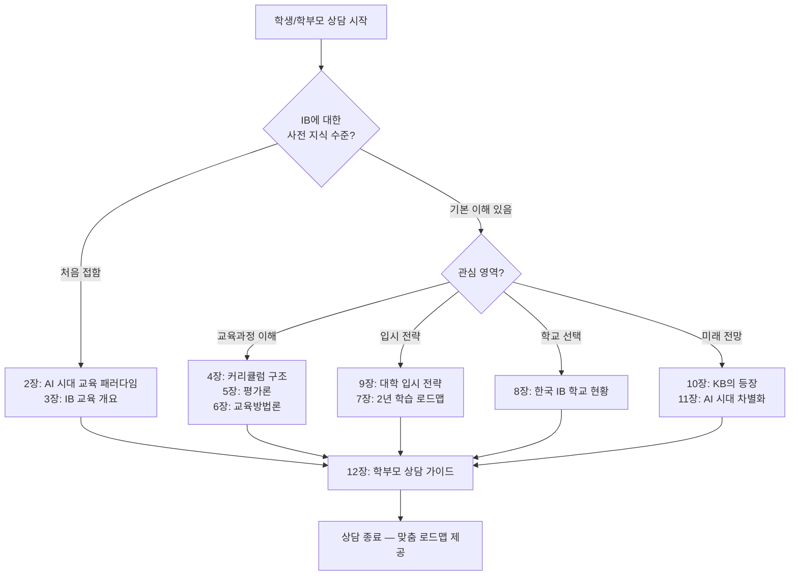

### 1.3 핵심 용어 정리표

#### 1.3.1 IB 프로그램 체계 용어

| 약어 | 풀네임 | 한국어 | 설명 | 상담 시 핵심 포인트 |
|------|--------|--------|------|------|
| IB | International Baccalaureate | 국제 바칼로레아 | 1968년 스위스 제네바에서 설립된 비영리 국제 교육 재단이 운영하는 교육과정. 전 세계 160개국 5,700개+ 학교에서 시행. 대학 입학 자격으로 글로벌 인정 | "전 세계 Top 100 대학이 100% 인정하는 유일한 교육과정" |
| IBO | International Baccalaureate Organization | 국제 바칼로레아 기구 | IB 프로그램의 개발·인증·운영을 담당하는 본부 조직. 스위스 제네바 본부, 싱가포르·헤이그·부에노스아이레스에 지역 사무소 운영. IB 학교 인증(Authorization), 교사 연수(Workshop), 시험 채점(Marking) 총괄 | "IBO가 직접 시험을 채점하기 때문에 글로벌 객관성이 보장됨" |
| DP | Diploma Programme | 디플로마 프로그램 | 고등학교 11~12학년(16~19세) 대상 2년 과정. 6개 교과 그룹에서 HL 3개+SL 3개 과목을 이수하고, Core(EE+TOK+CAS)를 완수해야 디플로마 취득. 45점 만점(과목 42점+Core 3점) | "한국 고입 상담 시 가장 많이 다루는 프로그램. 대학 직접 연결" |
| MYP | Middle Years Programme | 중등 프로그램 | 중학교 과정(11~16세, 보통 6~10학년). 8개 교과군에서 개념 중심 학습. 개인 프로젝트(Personal Project) 필수. DP 진입 전 탐구 역량을 키우는 단계 | "MYP를 거친 학생이 DP 적응이 훨씬 빠름. 가능하면 MYP부터 시작 권장" |
| PYP | Primary Years Programme | 초등 프로그램 | 초등학교 과정(3~12세). 6가지 초학문적(Transdisciplinary) 테마로 교과 간 경계 없이 탐구 학습. 6학년 전시회(Exhibition)로 마무리 | "어린 시절부터 '왜?'라는 질문을 던지는 습관을 형성" |
| CP | Career-related Programme | 직업 연계 프로그램 | 직업 교육 과정(16~19세). DP 과목 2개 이상 + 직업 관련 학습 + 성찰 프로젝트. 한국에서는 Chadwick International(인천 송도)이 유일하게 CP 인가. 학문과 직업 훈련을 결합한 실용적 모델 | "대학 진학보다 직업 현장 진출을 목표로 하는 학생에게 적합" |

#### 1.3.2 IB DP 과목 및 평가 용어

| 약어 | 풀네임 | 한국어 | 설명 | 상담 시 핵심 포인트 |
|------|--------|--------|------|------|
| HL | Higher Level | 심화 수준 | DP 6과목 중 반드시 3개를 HL로 선택. 240시간 수업(SL의 1.5배). 더 깊고 넓은 범위를 다루며, 대학에서 학점 인정(Credit) 가능. 대학 전공과 연관된 과목을 HL로 선택하는 것이 핵심 전략 | "HL 과목 선택이 대학 전공 결정을 좌우함. 신중한 선택 필수" |
| SL | Standard Level | 표준 수준 | DP 6과목 중 3개를 SL로 선택. 150시간 수업. HL보다 범위가 좁지만 깊이는 유지. 약한 과목을 SL로 배치하여 리스크 관리. 최소 3점 이상 확보 필수 | "SL이라고 해서 쉬운 것이 아님. 서술형 100%는 동일" |
| IA | Internal Assessment | 내부 평가 | 전체 성적의 20~30%를 차지하는 학교 내 평가. 교사가 1차 채점 후 IBO 외부 조정관(Moderator)이 전수 검토하여 글로벌 기준 조정. 과목마다 형태가 다름: 수학은 탐구 보고서(12~20p), 과학은 실험 보고서(6~12p), 역사는 연구 논문(2,200단어), 예술은 전시·공연 | "IA는 '학교 시험'이 아니라 '미니 연구 프로젝트'. 대학 연구의 예행연습" |
| EA | External Assessment | 외부 평가 | 전체 성적의 70~80%를 차지하는 IBO 직접 채점 평가. DP 2년차 5월에 치르는 최종 필기시험(Paper 1/2/3). 100% 서술형·에세이형. 전 세계 동일 문제, 동일 채점 기준. 답안지를 스캔하여 다른 나라의 채점관이 교차 채점 | "수능과 달리 4지 선다형이 단 하나도 없음. 100% 논술·서술" |
| Math AA | Mathematics: Analysis and Approaches | 수학: 분석과 접근법 | 미적분·대수·삼각함수 중심의 순수 수학 과정. 증명과 논리적 추론 강조. 이공계·수학과·물리학과 진학 필수. HL 글로벌 평균 4.55점 | "이공계·의대 지망 시 반드시 Math AA HL 선택" |
| Math AI | Mathematics: Applications and Interpretation | 수학: 응용과 해석 | 통계·확률·모델링 중심의 응용 수학 과정. 실생활 데이터 분석과 기술 활용 강조. 경영학·사회과학·심리학 등 비이공계 진학 적합 | "문과·경영·사회과학 지망 시 Math AI 선택 가능" |

#### 1.3.3 IB DP Core(핵심) 요소 용어

| 약어 | 풀네임 | 한국어 | 설명 | 상담 시 핵심 포인트 |
|------|--------|--------|------|------|
| EE | Extended Essay | 소논문 (확장 에세이) | 학생이 스스로 선택한 주제에 대해 **4,000단어**(약 A4 15~20페이지) 분량의 독립 연구 논문을 작성하는 과정. 연구 질문(Research Question) 설정 → 문헌 조사 → 방법론 설계 → 분석 → 결론 도출의 학술 논문 전 과정을 경험. A~E 등급으로 채점(E=낙제→디플로마 불가). RPPF(연구 과정 성찰 양식)로 지도교사와 3회 면담 필수 | "EE는 대학 졸업 논문의 축소판. 이 경험이 학종 세특에서 압도적 차별화" |
| TOK | Theory of Knowledge | 지식론 | "우리는 무엇을 알 수 있는가?", "어떻게 아는가?"를 탐구하는 IB만의 고유 과목. 수학·과학·역사·예술 등 다양한 지식 영역(Areas of Knowledge)을 넘나들며 지식의 본질·한계·편향을 비판적으로 분석. **TOK 에세이**(1,600단어, 6개 주제 중 택1) + **TOK Exhibition**(실물 3개 선택+해설 950단어)로 평가. A~E 등급 | "TOK는 IB의 심장. '정답'이 아니라 '좋은 질문'을 만드는 훈련" |
| CAS | Creativity, Activity, Service | 창의·활동·봉사 | 18개월 이상 지속적으로 참여해야 하는 교외 활동 요건. **Creativity**(창작·예술·디자인), **Activity**(운동·신체 활동), **Service**(봉사·지역사회 기여) 3가지 영역의 균형 필요. 최소 1개 장기 프로젝트(1개월+) 포함. 활동마다 **성찰 일지(Reflection)** 작성 필수. 7가지 학습 성과 모두 충족 시 합격. 점수 없이 합격/불합격만 — 미충족 시 디플로마 불가 | "CAS 미충족은 IB에서 가장 흔한 실패 원인 중 하나. 성적이 아무리 좋아도 CAS가 없으면 디플로마 없음" |
| RPPF | Researcher's Planning and Progress Form | 연구 계획 및 진행 양식 | EE 작성 과정에서 지도교사와의 3회 면담(계획·중간·최종) 내용을 기록하는 공식 양식. 학생의 연구 과정 성찰(Reflection)을 평가하며, EE 채점 기준 E(Engagement, 6점)에 반영. 면담 미실시 시 감점 | "RPPF는 '과정 평가'. 결과물만 좋아서는 안 되고, 연구 과정의 성장을 보여줘야 함" |

#### 1.3.4 IB 교육 철학 및 방법론 용어

| 약어/용어 | 풀네임 | 한국어 | 설명 | 상담 시 핵심 포인트 |
|------|--------|--------|------|------|
| ATT | Approaches to Teaching | 교수 접근법 | IB 교사가 수업에서 따라야 하는 6가지 원칙: ①탐구 기반(Inquiry-based) ②개념 중심(Concept-driven) ③지역·글로벌 맥락(Local & Global context) ④효과적 팀워크·협력(Collaboration) ⑤차별화 학습(Differentiated) ⑥형성 평가 기반(Assessment-informed) | "IB 교사는 '가르치는 사람'이 아니라 '질문을 던지는 사람'" |
| ATL | Approaches to Learning | 학습 접근법 | 모든 IB 학생이 개발해야 하는 5가지 핵심 기술 영역: ①사고 기술(Thinking) ②의사소통 기술(Communication) ③사회적 기술(Social) ④자기관리 기술(Self-management) ⑤연구 기술(Research). 각 과목에서 명시적으로 훈련 | "ATL은 '공부 방법을 공부하는 것'. 평생 학습 역량의 기초" |
| LP | IB Learner Profile | IB 학습자 상 | IB가 추구하는 이상적 학습자의 10가지 특성: Inquirers(탐구자), Knowledgeable(지식인), Thinkers(사색가), Communicators(소통자), Principled(원칙적), Open-minded(열린 사고), Caring(배려), Risk-takers(도전자), Balanced(균형), Reflective(성찰적). 모든 IB 프로그램의 교육 목표이자 평가 기준 | "Learner Profile은 IB의 DNA. 면접에서 이 10가지를 아는지 확인하면 학생의 IB 이해도를 즉시 파악 가능" |
| CBL | Concept-based Learning | 개념 기반 학습 | 사실(Fact)과 기술(Skill)만 가르치는 것이 아니라, 교과를 관통하는 핵심 개념(Key Concepts)과 관련 개념(Related Concepts)을 통해 깊은 이해(Deep Understanding)를 추구하는 교수법. 예: 수학에서 '변화(Change)'라는 개념을 미적분·통계·함수에 걸쳐 탐구 | "암기가 아닌 '이해'. 같은 개념이 여러 과목에서 어떻게 나타나는지를 연결" |
| IBL | Inquiry-based Learning | 탐구 기반 학습 | 교사가 정답을 알려주는 대신, 학생이 스스로 질문을 만들고 탐구 과정을 통해 답을 구성하는 학습 방법. 구조화된 탐구(Structured) → 안내된 탐구(Guided) → 자유 탐구(Open) 3단계로 점진적 자율성 부여 | "수업에서 학생이 말하는 시간이 교사보다 많아야 함" |
| KB | K-Baccalaureate | 한국형 바칼로레아 | IB의 핵심 교육 철학(논술형 평가, 탐구 기반 학습, 비판적 사고)을 한국 공교육 맥락에 맞게 재설계한 한국형 모델. IBO 인증비 부담 없이 국가/교육청 예산으로 운영. 한국어 중심. 2028 수능 개편과 연계 가능성. 대구교육청이 2026년 KB 평가 시스템 자체 개발 착수 | "KB는 'IB의 한국화'. IBO에 비용을 내지 않고 IB의 장점만 가져오는 모델" |
| SEL | Social-Emotional Learning | 사회 정서 학습 | 자기 인식(Self-awareness), 자기 관리(Self-management), 사회적 인식(Social awareness), 관계 기술(Relationship skills), 책임감 있는 의사결정(Responsible decision-making)의 5가지 핵심 역량을 체계적으로 교육하는 접근법. AI가 대체할 수 없는 인간 고유 영역 | "AI 시대에 가장 가치 있는 역량. IB의 CAS, TOK, Learner Profile이 모두 SEL 훈련" |

#### 1.3.5 한국 대입 및 교육 제도 용어

| 용어 | 풀네임/설명 | 한국어 | IB 학생과의 관계 | 상담 시 핵심 포인트 |
|------|--------|--------|------|------|
| 학종 | 학생부종합전형 | 학생부종합전형 | 학교생활기록부(생기부)를 정성 평가하는 수시 전형. IB 학생의 IA·EE·CAS 활동이 세특에 기재되어 압도적 강점으로 작용. 서울대·KAIST·UNIST 등 수능 최저 없는 학종에서 IB 학생 유리 | "IB 학생의 최우선 전형. EE·IA가 세특의 최강 자원" |
| 생기부 | 학교생활기록부 | 학교생활기록부 | 교사가 작성하는 학생의 학교 활동 종합 기록. 세부능력특기사항(세특), 창의적 체험활동, 행동 특성 등 포함. IB 학생은 IA 프로젝트, EE 연구, CAS 활동을 세특에 연계 기재하여 탐구 역량 입증 | "생기부 기재가 IB 학종 합격의 핵심. 교사와 긴밀한 협의 필수" |
| 세특 | 세부능력 및 특기사항 | 세부능력 및 특기사항 | 생기부 중 교과별로 학생의 학습 과정·탐구 활동·성장을 기술하는 영역. 2028 수능 개편 후 비중이 35~40%로 확대 전망. IB 학생의 IA 프로젝트가 가장 풍부한 세특 소재 | "IB IA 6개가 곧 세특 6개 과목의 핵심 콘텐츠" |
| 수능 최저 | 수능 최저학력기준 | 수능 최저학력기준 | 수시 전형에서 요구하는 수능 최소 등급 조건. 예: "국·수·영·탐 중 2개 합 6등급 이내". IB 학생에게는 수능 병행 부담이 큰 장벽. Path A(수능 최저 없는 학종)와 Path B(수능 병행) 전략 분기의 핵심 기준 | "수능 최저 유무가 IB 학생의 대입 전략을 결정짓는 가장 중요한 변수" |
| Pre-DP | Pre-Diploma Programme | 디플로마 사전 과정 | DP 진입 전 1년간(보통 고1) 운영하는 준비 과정. MYP를 거치지 않고 DP에 바로 진입하는 학생을 위해 에세이 작성법, 학술적 글쓰기, 탐구 방법론, 비판적 사고 기초를 훈련. 한국 공교육 IB 학교 대부분 운영 | "MYP 없이 DP에 들어가는 한국 학생에게 Pre-DP는 필수. 이 기간의 적응이 2년 성적을 좌우" |
| Moderation | IBO 외부 조정 | 외부 조정 | IA를 학교 교사가 1차 채점한 후, IBO가 전 세계적으로 동일한 기준으로 점수를 조정하는 절차. 교사가 너무 후하게 또는 엄하게 채점한 경우 보정. 이를 통해 어느 나라, 어느 학교의 IA든 동일한 기준으로 평가됨을 보장 | "교사 채점이 최종이 아님. IBO가 글로벌 기준으로 조정하므로 공정성 확보" |
| Criterion | Assessment Criterion | 평가 기준 | IB의 모든 평가는 Criterion-referenced(기준 참조 평가). 상대평가(다른 학생과 비교)가 아니라, 사전에 공개된 구체적 평가 기준(Rubric)에 따라 절대적으로 채점. 학생은 평가 전에 채점 기준을 정확히 알고 있음 | "IB는 '옆 사람보다 잘하기'가 아니라 '기준에 도달하기'. 수능의 상대평가와 정반대" |

#### 1.3.6 글로벌 교육 프레임워크 용어

| 약어 | 풀네임 | 한국어 | 설명 | IB와의 관계 |
|------|--------|--------|------|------|
| OECD 2030 | OECD Education 2030 Learning Framework | OECD 교육 2030 학습 프레임워크 | OECD가 제시한 미래 교육 비전. 학생 주도성(Student Agency), 새로운 가치 창조, 긴장·딜레마 조정, 책임감의 3대 변혁적 역량을 핵심으로 제시. 2030년까지 전 세계 교육 시스템이 지향해야 할 방향 | "OECD 2030의 핵심 역량과 IB의 교육 요소가 거의 1:1 대응" |
| WEF FoJ | World Economic Forum Future of Jobs Report | 세계경제포럼 미래 직업 보고서 | 세계경제포럼(다보스 포럼)이 격년 발표하는 미래 노동시장·핵심 역량 전망. 2025년판은 2030년 핵심 역량 Top 10으로 분석적 사고·복원력·리더십·창의성 등을 제시. IB에서 훈련되지 않는 역량이 없음 | "WEF가 말하는 2030년 미래 역량 = IB가 2년간 훈련하는 역량" |
| GCED | Global Citizenship Education | 글로벌 시민 교육 | UNESCO가 주도하는 세계 시민 교육 프레임워크. 다양성 존중, 글로벌 상호연결성 이해, 사회적 책임과 실천을 핵심으로 삼음. IB의 CAS·TOK·Learner Profile이 GCED 목표와 직결 | "IB = GCED의 가장 체계적 구현체" |
| SDGs | Sustainable Development Goals | 지속가능발전목표 | UN이 2015년 채택한 17개 글로벌 목표(빈곤 퇴치, 기후 행동, 양질의 교육 등). IB EE·CAS 주제를 SDGs와 연결하면 글로벌 시각을 입증하는 강력한 전략 | "EE 주제를 SDGs와 연결하면 대학 면접에서 차별화 가능" |

---

## 2. AI 시대 교육 패러다임의 전환

### 2.1 왜 지금 IB인가 — 교육 패러다임 대전환

AI(ChatGPT, Claude 등)의 등장으로 **인지 능력 중심의 입시 경쟁이 무력화**되고 있습니다. 정해진 틀 안의 지식 암기, 빠른 계산 능력, 4지 선다형 문제 풀이는 AI에 의해 가장 먼저 대체되는 영역입니다.

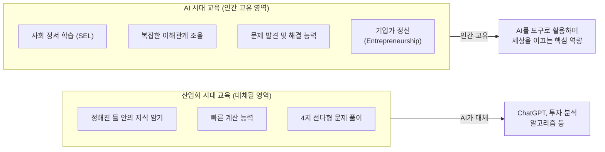

### 2.2 지식 소비자 vs 지식 생산자

| 구분 | 지식 소비자 (Knowledge Consumer) | 지식 생산자 (Knowledge Producer) |
|------|------|------|
| **학습 방식** | 정해진 틀 안의 지식 암기 | 스스로 질문을 만들고 답을 찾는 탐구 |
| **평가 방식** | 4지 선다형, 정답 찾기 | 서술형, 에세이, 프로젝트 |
| **계산** | 빠른 계산 능력 | 데이터 해석과 의미 부여 |
| **AI와의 관계** | AI에 의해 대체됨 | AI를 도구로 활용하여 창조 |
| **핵심 역량** | 정확한 암기와 재현 | 비판적 사고 + 문제 해결 + SEL |
| **대표 교육** | 수능 중심 교육 | **IB 교육** |

### 2.3 OECD Education 2030과 IB의 정합성

OECD가 제시한 Education 2030 프레임워크의 핵심 역량과 IB 교육의 대응을 비교합니다.

| OECD 2030 핵심 역량 | IB DP 대응 요소 | 구현 방식 |
|------|------|------|
| 새로운 가치 창조 | EE (소논문) | 4,000단어 독립 연구로 새로운 통찰 생성 |
| 긴장과 딜레마 조정 | TOK (지식론) | 상충하는 지식 체계 간 논증 훈련 |
| 책임감 | CAS (창의·활동·봉사) | 150시간+ 사회 공헌과 성찰 일지 |
| 학생 주도성 (Student Agency) | IA (내부평가) | 과목별 자기주도 탐구 프로젝트 설계 |
| 변혁적 역량 | IB Learner Profile | 10가지 학습자 상 지속 평가 |

### 2.4 WEF 미래 직업 전망과 IB 역량

World Economic Forum의 Future of Jobs Report(2025)가 제시하는 **2030년 핵심 역량 Top 10**과 IB 교육의 연관성:

| 순위 | WEF 2030 핵심 역량 | IB에서의 훈련 방법 | IB 관련 요소 |
|------|------|------|------|
| 1 | 분석적 사고 (Analytical Thinking) | 모든 과목 서술형 평가 | EA Paper 2/3 |
| 2 | 복원력·유연성·민첩성 | 2년간 다수 과제 동시 관리 | DP 전체 과정 |
| 3 | 리더십·사회적 영향력 | CAS 프로젝트 리더 경험 | CAS |
| 4 | 창의적 사고 | IA 독창적 주제 설정 | IA, EE |
| 5 | 동기부여·자기 인식 | 성찰 일지(Reflection) 작성 | CAS, TOK |
| 6 | 기술 리터러시 | AI 도구 윤리적 활용 훈련 | IB AI 정책 |
| 7 | 공감·적극적 경청 | 그룹 토론, 발표 | TOK 프레젠테이션 |
| 8 | 호기심·평생 학습 | 탐구 기반 학습 | ATL, ATT |
| 9 | 다학문적 사고 | 6개 교과 그룹 균형 이수 | DP 구조 자체 |
| 10 | 시스템 사고 | 글로벌 맥락 연결 | TOK, EE |

> **상담 포인트**: "AI 시대에 수능은 과거의 역량을 측정하고, IB는 미래의 역량을 측정합니다. WEF가 제시하는 2030년 핵심 역량 10가지 중 IB에서 훈련되지 않는 것은 하나도 없습니다."

### 2.5 UNESCO 글로벌 시민 교육(GCED)과 IB의 연결

UNESCO가 제시하는 Global Citizenship Education(GCED) 프레임워크도 IB의 핵심 철학과 직결됩니다.

| UNESCO GCED 목표 | IB DP 대응 요소 | 실천 사례 |
|------|------|------|
| 다양한 정체성과 문화 이해 | IB Learner Profile — "Open-minded" | TOK에서 다양한 지식 체계(서양 과학 vs 토착 지식) 비교 |
| 글로벌 상호연결성 인식 | EE 주제에서 글로벌 이슈 탐구 | "기후변화가 태평양 섬 국가의 식량 안보에 미치는 영향" |
| 비판적·창의적 사고 | TOK 에세이 + IA 프로젝트 | AI 윤리, 생명윤리 등 논쟁적 주제 다각도 분석 |
| 사회적 책임과 실천 | CAS 프로젝트 (150시간+) | 지역 사회 봉사, 환경 캠페인, 난민 지원 |
| 평화와 인권 존중 | IB Learner Profile — "Caring", "Principled" | CAS Service 영역에서 인권 관련 활동 |

### 2.6 교육 패러다임 전환 타임라인 — 한눈에 보기

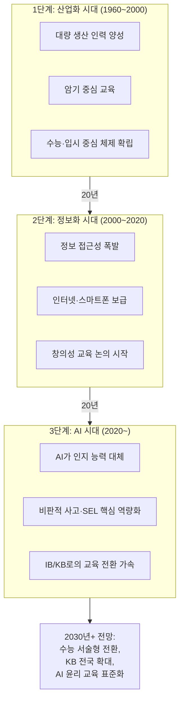

| 시대 | 핵심 역량 | 평가 방식 | 교육 모델 | AI 관계 |
|------|------|------|------|------|
| **산업화** | 암기, 계산, 순종 | 객관식, 상대평가 | 강의식, 교사 중심 | AI 미존재 |
| **정보화** | 정보 검색, 컴퓨터 활용 | 객관식 + 일부 서술형 | 혼합, 온라인 학습 도입 | AI 초기 (검색 엔진) |
| **AI 시대** | 비판적 사고, 창의성, SEL | **서술형 100%**, 프로젝트 | IB/KB, 탐구 기반 | AI가 도구, 인간은 방향 설정 |

> **상담 포인트**: "교육의 역사를 보면, 각 시대의 핵심 역량이 바뀔 때마다 교육 시스템도 전환되었습니다. AI 시대의 전환은 이미 시작되었고, IB/KB는 그 전환의 최전선에 있습니다."

---

## 3. IB(국제 바칼로레아) 교육 개요

### 3.1 IB란 무엇인가

> - IB(International Baccalaureate)는 1968년 스위스 제네바에 본부를 둔 **IBO(International Baccalaureate Organization)**가 개발한 국제 교육과정입니다. 
> - 전 세계 160개국 이상, 5,700개 이상의 학교에서 운영되며, 대학 입학 자격으로 전 세계적으로 인정받고 있습니다.

### 3.2 IB의 4가지 프로그램 체계

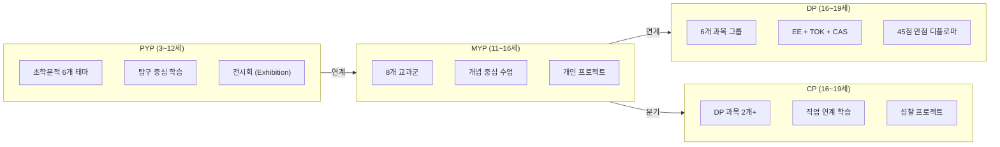

### 3.3 각 프로그램 상세 비교

| 구분 | PYP | MYP | DP | CP |
|------|-----|-----|----|----|
| **대상 연령** | 3~12세 | 11~16세 | 16~19세 | 16~19세 |
| **기간** | 유치원~초6 | 중1~고1 (유연) | 2년 (고2~고3) | 2년 (고2~고3) |
| **교과 구조** | 초학문적 6개 테마 | 8개 교과군 | 6개 과목 그룹 | DP 2과목 + 직업 과정 |
| **핵심 과제** | 전시회 (Exhibition) | 개인 프로젝트 | EE + TOK + CAS | 성찰 프로젝트 |
| **평가 방식** | 다면 평가, 외부시험 X | 기준 참조 평가, 루브릭 | IA(20~30%) + EA(70~80%) | 내부 + 외부 혼합 |
| **외부 시험** | 없음 | 선택적 (eAssessment) | 필수 (5월 시험) | 일부 필수 |
| **한국 인증 학교** | 32개교 | 24개교 | 20개교 | 1개교 (채드윅) |

### 3.4 IB Learner Profile — 10가지 학습자 상

IB의 모든 프로그램(PYP, MYP, DP, CP)을 관통하는 **10가지 학습자 상(Learner Profile)**은 IB 교육의 핵심 철학입니다.

| 학습자 상 | 영문 | 설명 | IB에서의 실현 |
|------|------|------|------|
| 탐구하는 사람 | Inquirers | 호기심을 가지고 스스로 질문하며 배움 | EE 주제 탐색, IA 연구 설계 |
| 지식이 풍부한 사람 | Knowledgeable | 다양한 분야의 깊은 이해 | 6개 과목 그룹 균형 이수 |
| 사고하는 사람 | Thinkers | 비판적·창의적 사고로 복잡한 문제 해결 | TOK 에세이, EA 서술형 |
| 소통하는 사람 | Communicators | 다양한 언어와 방식으로 효과적 소통 | 구술 평가, 프레젠테이션 |
| 원칙이 있는 사람 | Principled | 정직하고 공정하게 행동 | Academic Integrity 정책 |
| 열린 마음의 사람 | Open-minded | 다른 관점과 문화에 대한 존중 | 글로벌 맥락 학습 |
| 배려하는 사람 | Caring | 타인에 대한 공감과 봉사 | CAS 봉사 활동 |
| 도전하는 사람 | Risk-takers | 불확실한 상황에서도 용기 있게 도전 | 소논문 독립 연구 |
| 균형 잡힌 사람 | Balanced | 지적·신체적·정서적 균형 | CAS (창의·활동·봉사) |
| 성찰하는 사람 | Reflective | 자신의 학습과 성장을 돌아보고 개선 | CAS 성찰 일지, TOK |

### 3.5 글로벌 입시 표준 비교 — IB vs AP vs A-Level

| 평가 기준 | IB | AP | A-Level |
|------|------|------|------|
| **커리큘럼 특성** | 전인적 융합 교육 (필수 룰 적용) | 자유로운 단일 과목 선택 | 3~4과목 집중 심화 (영국식) |
| **학습 및 평가 방식** | 100% 서술형, 교내 프로젝트(IA/Core) 병행 | 4지선다 + 서술형, 시험 결과 위주 | 거의 100% 필기시험, 내신 비중 낮음 |
| **과목 수** | 6개 필수 + Core 3개 | 자유 선택 (보통 5~8개) | 3~4개 집중 |
| **만점 체계** | 45점 | 과목당 5점 | 과목당 A* |
| **추천 학생 유형** | 독서량 많고 글쓰기·협업 강하며 균형 있는 학생 | 미국 대학 진학 최우선, GPA 관리 용이 | 이공계열 특정 과목 압도적 강점, 영어 다소 약한 학생 |
| **한국 대입 활용** | 학종 + 해외 직행 (수능 불가) | 해외 대학 위주 + 일부 국내 | 영국/홍콩 대학 위주 |
| **AI 시대 강점** | 비판적 사고·논증 훈련 최강 | 광범위한 과목 이수 증명 | 전공 심화 깊이 |

> **상담 포인트**: "IB는 '무엇을 아느냐'가 아니라 '어떻게 생각하느냐'를 평가합니다. AP는 넓이, A-Level은 깊이, IB는 넓이+깊이+사고력입니다."

### 3.6 IB 글로벌 성장 추이 (2010~2025)

| 연도 | 전 세계 IB 학교 수 | DP 응시자 수 | 한국 IB 학교 수 | 비고 |
|------|------|------|------|------|
| **2010** | 약 3,000 | 약 80,000 | 5 (국제학교 위주) | 한국 공교육 IB 전무 |
| **2015** | 약 4,200 | 약 140,000 | 8 | 경기외고 등 특목고 IB |
| **2019** | 약 5,000 | 약 170,000 | 12 | 대구·제주 공교육 IB 시작 |
| **2022** | 약 5,500 | 약 190,000 | 18 | 공교육 IB 첫 졸업생 배출 |
| **2025** | 약 5,700+ | 약 200,000+ | 25+ (인증+관심 포함) | 전국 확산 가속, KB 논의 시작 |

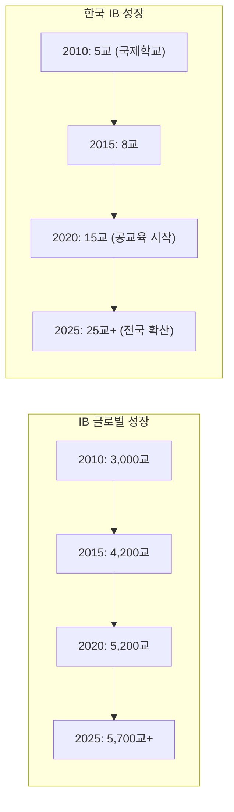

### 3.7 IB 학교 입학 전형 유형 — 한국 IB 학교별 정리

| 전형 유형 | 해당 학교 | 선발 기준 | 특이 사항 |
|------|------|------|------|
| **자기주도학습전형** | 표선고, 경북대사대부고, 포산고, 대구서부고 | 자기소개서 + 면접 + 내신 | 공교육 IB 학교 대부분 |
| **외국어특기전형** | 대구외고, 경기외고, 대구국제고 | 영어 능력 + 내신 + 면접 | 외고/국제고 특성 반영 |
| **일반전형 (추첨)** | 일부 IB 관심학교 | 교육청 배정 + 지원 의사 | 별도 선발 없이 배정 |
| **특별전형** | 충남삼성고 | 자소서 + 면접 + 삼성 임직원 자녀 우선 | 사립 특수 |

#### 입학 면접 — 실전 질문 Top 10 (입학사정관 출제 경향)

| 순위 | 질문 | 평가 영역 | 좋은 답변 방향 |
|------|------|------|------|
| 1 | "IB를 선택한 이유는 무엇인가요?" | IB 이해도 | 단순 "좋은 대학" 아닌, 교육 철학 이해 |
| 2 | "가장 관심 있는 학문 분야와 EE 주제 아이디어는?" | 탐구 의지 | 구체적 주제 + 왜 궁금한지 |
| 3 | "최근 읽은 책 중 가장 인상 깊었던 것은?" | 독서 습관 | 줄거리가 아닌 비판적 감상 |
| 4 | "AI 시대에 교육은 어떻게 변해야 한다고 생각하나요?" | 비판적 사고 | 다각도 논증, 근거 제시 |
| 5 | "팀 프로젝트에서 갈등이 생겼을 때 어떻게 해결했나요?" | 사회성 | 과정 중심 스토리텔링 |
| 6 | "자기 주도적으로 완수한 탐구나 프로젝트가 있나요?" | 자기주도성 | 과정·어려움·성찰 포함 |
| 7 | "글로벌 이슈 중 가장 관심 있는 주제는?" | 국제적 시야 | 관심 + 자기 관점 + 행동 의지 |
| 8 | "IB DP는 매우 도전적입니다. 스트레스 관리는 어떻게 하나요?" | 자기관리 | 구체적 방법 + 실천 경험 |
| 9 | "AI를 학습에 어떻게 활용하고 어디서 멈추시겠습니까?" | AI 윤리 | 활용 기준 명확, 윤리적 판단 |
| 10 | "10년 후 어떤 사람이 되고 싶나요?" | 비전 | 구체적이고 진솔한 비전 |

> **상담 포인트**: "IB 학교 면접은 '정답'을 요구하지 않습니다. 입학사정관은 학생이 '어떻게 생각하는가'와 '왜 그렇게 생각하는가'를 봅니다. 면접 준비는 암기가 아니라 사고 훈련입니다."

---

## 4. IB DP 커리큘럼 상세 구조

### 4.1 IB DP의 건축학적 구조

IB DP는 **6개 교과 그룹**의 기둥과 **3개 Core 요소**의 기초 위에 세워진 **전인 교육 건축물**입니다.

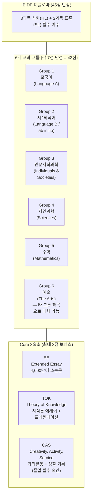

### 4.2 6개 교과 그룹 상세

#### Group 1: 언어와 문학 (Language A)

| 과목명 | 수준 | 설명 | 한국 학생 선택 |
|------|------|------|------|
| Language A: Literature | HL/SL | 문학 작품 분석, 비평 에세이 | 한국어 A 선택 가능 |
| Language A: Language and Literature | HL/SL | 언어와 문학 통합, 미디어 분석 포함 | 국내 IB 학교 주력 |
| Literature and Performance | SL만 | 문학 + 연극 융합 | 드물게 선택 |

#### Group 2: 언어 습득 (Language Acquisition)

| 과목명 | 수준 | 설명 | 한국 학생 선택 |
|------|------|------|------|
| Language B | HL/SL | 이전 학습 경험이 있는 제2외국어 | 영어 B HL 가장 인기 |
| Language ab initio | SL만 | 처음 배우는 외국어 (입문) | 스페인어, 프랑스어 등 |
| Classical Language | HL/SL | 라틴어, 고전 그리스어 | 국내 선택 거의 없음 |

> **예외 룰**: 제2외국어(Group 2)가 약하다면 한국어(A)와 영어(A) 두 과목을 선택해 모국어 2개로 리스크 방어 가능

#### Group 3: 인문사회과학 (Individuals & Societies)

| 과목명 | 수준 | 특징 | 추천 진로 |
|------|------|------|------|
| Economics | HL/SL | 미시·거시 경제, 국제 경제 | 경영, 경제, 금융 |
| History | HL/SL | 20세기 세계사 중심 | 인문, 정치, 외교 |
| Psychology | HL/SL | 인간 행동, 인지, 사회 심리 | 심리, 교육, 의학 |
| Business Management | HL/SL | 기업 경영, 마케팅, 재무 | 경영, 창업 |
| Geography | HL/SL | 인문·자연 지리 통합 | 도시계획, 환경 |
| Global Politics | HL/SL | 국제 관계, 정치 이론 | 외교, 국제기구 |
| Philosophy | HL/SL | 서양 철학사, 윤리학 | 법학, 인문 |
| ITGS | HL/SL | 정보기술과 글로벌 사회 | IT, 사회과학 융합 |

#### Group 4: 자연과학 (Sciences)

| 과목명 | 수준 | 특징 | 추천 진로 |
|------|------|------|------|
| Physics | HL/SL | 역학, 열역학, 파동, 양자 | 공학, 물리학 |
| Chemistry | HL/SL | 유기·무기·물리화학 | 의학, 화학, 약학 |
| Biology | HL/SL | 세포, 유전, 생태, 진화 | 의학, 생명과학 |
| Computer Science | HL/SL | 프로그래밍, 알고리즘, 시스템 | IT, 컴퓨터공학 |
| Design Technology | HL/SL | 제품 설계, 프로토타이핑 | 산업디자인, 공학 |
| Environmental Systems & Societies | SL만 | 환경과학 + 사회과학 융합 | 환경, 지속가능성 |
| Sports, Exercise & Health Science | SL만 | 운동 생리학, 건강과학 | 체육, 건강과학 |

#### Group 5: 수학 (Mathematics)

| 과목명 | 수준 | 특징 | 추천 학생 |
|------|------|------|------|
| Mathematics: Analysis and Approaches | HL/SL | 순수 수학 중심, 미적분 심화 | 이공계, 수학 강점 학생 |
| Mathematics: Applications and Interpretation | HL/SL | 통계·모델링 중심, 실용 수학 | 인문·사회·경영계, 수학 부담 줄이기 |

#### Group 6: 예술 (The Arts) — 또는 타 그룹 추가 과목

| 과목명 | 수준 | 특징 | 대체 옵션 |
|------|------|------|------|
| Visual Arts | HL/SL | 미술, 디자인, 포트폴리오 | |
| Music | HL/SL | 작곡, 연주, 음악 분석 | |
| Theatre | HL/SL | 연극 이론, 공연 실습 | |
| Film | HL/SL | 영화 분석, 단편 제작 | |
| Dance | HL/SL | 무용 이론, 안무, 공연 | |
| — | — | **예술 대신 Group 1~4에서 추가 과목 선택 가능** | 과학 2과목 등 |

### 4.3 진로별 추천 과목 조합

#### 이공계 진학 추천 조합

| 그룹 | 추천 과목 | 수준 | 비고 |
|------|------|------|------|
| Group 1 | Korean A: Language and Literature | SL | 모국어 부담 줄이기 |
| Group 2 | English B | HL | 해외 진학 대비 |
| Group 3 | Economics | SL | 융합적 사고 |
| Group 4 | Physics 또는 Chemistry | HL | 전공 필수 |
| Group 5 | Math: Analysis and Approaches | HL | 이공계 필수 |
| Group 6 → G4 | Biology 또는 Computer Science | HL | **4 HL 승인 시 추가** |

#### 인문·사회계 진학 추천 조합

| 그룹 | 추천 과목 | 수준 | 비고 |
|------|------|------|------|
| Group 1 | Korean A: Language and Literature | HL | 모국어 심화 |
| Group 2 | English B | HL | 글쓰기 역량 강화 |
| Group 3 | History 또는 Economics | HL | 전공 연계 |
| Group 4 | Biology | SL | 과학 부담 최소화 |
| Group 5 | Math: Applications and Interpretation | SL | 수학 부담 최소화 |
| Group 6 | Visual Arts 또는 추가 G3 과목 | SL | 포트폴리오 또는 심화 |

#### 의대 진학 추천 조합 (수능 병행 필요)

| 그룹 | 추천 과목 | 수준 | 비고 |
|------|------|------|------|
| Group 1 | Korean A | SL | 시간 확보 |
| Group 2 | English B | HL | |
| Group 3 | Psychology | SL | 의학 연계 |
| Group 4 | Chemistry | HL | **의대 필수** |
| Group 5 | Math: Analysis and Approaches | HL | **의대 필수** |
| Group 6 → G4 | Biology | HL | **의대 필수** |

> **상담 주의**: 의대 진학 시 IB 과정과 수능을 병행해야 하므로 부담이 극도로 큽니다. 수능 최저 등급이 필요한 대학 지원 시, IB 학생은 수능 2~3과목(영어, 탐구)만 핀셋으로 병행하는 전략이 필요합니다.

### 4.4 과목 선택의 3가지 골든 룰 (입학사정관 전술 노트)

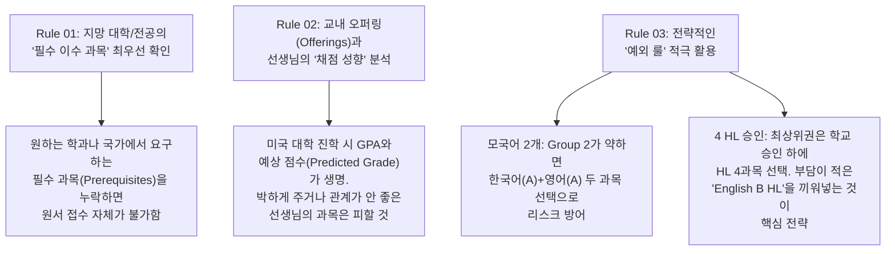

### 4.5 점수 체계와 명문대 진학 타겟 라인

| 점수대 | 포지션 | 진학 타겟 | 비고 |
|------|------|------|------|
| **42~45점** | Top 1% | 연고대 상경/이공계열 프리패스, 영국 옥스퍼드/캠브리지 전액 장학금 | 경북대사대부고 42점 배출 사례 |
| **38점 전후** | Top 10% | 국내 SKY 등 상위 10개 대학, 미국 아이비리그 목표 라인 | |
| **29~30.5점** | 세계 평균 | 전 세계 IB DP 응시생 평균 점수 | |
| **24점** | 최소 기준 | IB 디플로마 취득(졸업) 최소 기준 | |

**점수 구성**:
- 6과목 (각 7점 만점) = **42점**
- Core 가산점 (EE/TOK 매트릭스) = **최대 3점**
- **총 45점 만점**

> **핵심 경고**: Core(EE/TOK)는 45점 중 3점에 불과하지만, **낙제점(F) 시 점수 불문 디플로마 취득 불가**. 방대한 분량으로 전공 과목 공부 시간을 잡아먹는 주범이므로 타임라인 관리가 생사를 가릅니다.

---

## 5. IB DP 평가론 — 100% 서술형의 세계

### 5.1 평가 체계 총괄 — 4지 선다형 0%

IB DP는 **100% 서술형 및 논술형 평가**입니다. 단 하나의 4지 선다형 문제도 출제되지 않습니다.

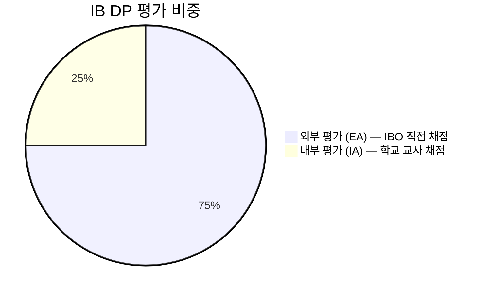

### 5.2 내부 평가 (IA — Internal Assessment) 상세

| 항목 | 내용 |
|------|------|
| **비중** | 전체 평가의 20~30% |
| **채점자** | 학교 교사 (1차 채점) → IBO 외부 조정관 (Moderation) |
| **형태** | 과목별 자체 탐구 프로젝트 |
| **핵심 특징** | 실생활과 학문을 접목한 심도 있는 결과물 요구 |
| **제출 시기** | DP 2년차 중반 (보통 2~3월) |

#### 과목별 IA 유형

| 과목 (Group) | IA 유형 | 분량 | 프로젝트 예시 |
|------|------|------|------|
| **수학 (G5)** | 수학 탐구 보고서 | 12~20페이지 | 실생활 속 2차 방정식과 포물선 궤적 최적화 — 비닐하우스에 비나 눈이 내릴 때 가장 빨리 굴러 내려오는 최적의 형태를 쇠구슬 실험으로 검증. 드론 발사 각도 및 스프링클러 물줄기 모델링 |
| **과학 (G4)** | 가설 검증 실험 보고서 | 6~12페이지 | 학생이 직접 가설을 세우고, 독립적인 실험 환경을 디자인하고 실행. 도출된 결과를 통계적으로 분석한 완결된 실험 보고서 |
| **역사 (G3)** | 역사 탐구 (Investigation) | 2,200단어 | 1차 사료와 2차 자료를 활용한 역사적 사건의 인과 분석 |
| **경제학 (G3)** | 경제 논평 포트폴리오 | 800단어 x 3편 | 실제 경제 뉴스 기사 분석, 경제 이론 적용 |
| **언어 A (G1)** | 구술 평가 (Individual Oral) | 15분 발표 | 문학 작품과 비문학 텍스트의 연결 분석 |
| **언어 B (G2)** | 구술 평가 (Individual Oral) | 12~15분 | 시각 자극 기반 언어 활용 능력 |
| **예술 (G6)** | 전시 (Exhibition) | 작품 4~11점 | 작품 제작 과정, 연구 과정 기록 포함 |

### 5.3 외부 평가 (EA — External Assessment) 상세

| 항목 | 내용 |
|------|------|
| **비중** | 전체 평가의 70~80% |
| **채점자** | IBO(국제 바칼로레아 기구)가 직접 채점 → 글로벌 객관성 확보 |
| **시기** | 2년 과정 마지막에 치르는 최종 필기시험 (5월 시험) |
| **형태** | 100% 서술형 (Paper 1, Paper 2, Paper 3) |

#### EA Paper 구조 예시

| Paper | 유형 | 시간 | 설명 |
|------|------|------|------|
| **Paper 1** | 자료 분석형 에세이 | 1~2시간 | 처음 보는 자료/텍스트를 분석하여 에세이 작성 |
| **Paper 2** | 주제 선택 에세이 | 1.5~2.5시간 | 여러 주제 중 선택하여 심화 에세이 작성 |
| **Paper 3** | 심화 분석 (HL만) | 1~1.5시간 | HL 전용 심화 문제 (사례 연구 등) |

### 5.4 Core 평가 — EE/TOK 매트릭스

EE와 TOK의 결합 점수로 **최대 3점**의 보너스 점수가 주어집니다.

| | TOK: A | TOK: B | TOK: C | TOK: D | TOK: E (낙제) |
|------|------|------|------|------|------|
| **EE: A** | 3점 | 3점 | 2점 | 2점 | 낙제→디플로마 불가 |
| **EE: B** | 3점 | 2점 | 2점 | 1점 | 낙제→디플로마 불가 |
| **EE: C** | 2점 | 2점 | 1점 | 0점 | 낙제→디플로마 불가 |
| **EE: D** | 2점 | 1점 | 0점 | 0점 | 낙제→디플로마 불가 |
| **EE: E (낙제)** | 낙제 | 낙제 | 낙제 | 낙제 | 낙제 |

> **핵심 경고**: EE 또는 TOK에서 E(낙제)를 받으면 **나머지 과목 점수와 관계없이 디플로마 취득 자체가 불가**합니다. 이것이 "The Hidden Trap"입니다.

### 5.5 CAS (Creativity, Activity, Service) 요건

| 항목 | 요구 사항 |
|------|------|
| **총 기간** | 18개월 이상 지속적 참여 |
| **3가지 영역** | Creativity(창의), Activity(활동), Service(봉사) 균형 |
| **CAS 프로젝트** | 최소 1개 이상의 장기 프로젝트 (1개월+ 기간) |
| **성찰 일지** | 활동마다 성찰(Reflection) 기록 필수 |
| **7가지 학습 성과** | 모든 성과를 만족시키는 포트폴리오 |
| **합격/불합격** | 점수 없음, 졸업 필수 요건 (미충족 시 디플로마 불가) |

**CAS 7가지 학습 성과**:
1. 자신의 장점과 성장 영역 인식
2. 새로운 도전에 참여
3. 활동 계획 및 시작
4. 끈기와 헌신으로 과제 수행
5. 협동 기술 입증
6. 글로벌 이슈에 대한 관여
7. 활동의 윤리적 영향 인식

### 5.6 IB DP 채점 등급 상세 — Grade Descriptors

IB 각 과목은 **1~7점** 척도로 채점됩니다. 각 등급이 의미하는 바를 정확히 이해하면 학생 상담 시 목표 설정에 활용할 수 있습니다.

| 등급 | 수준 | 의미 | 대학 환산 참고 |
|------|------|------|------|
| **7** | Excellent | 포괄적이고 뉘앙스 있는 이해. 통찰력 있는 분석과 독창적 관점 | 한국: A+ / 미국: A / 영국: A* |
| **6** | Very Good | 광범위한 지식과 이해. 효과적인 분석, 약간의 한계 존재 | 한국: A / 미국: A- / 영국: A |
| **5** | Good | 확실한 지식과 이해. 적절한 분석이나 일관성 부족 가능 | 한국: B+ / 미국: B+ / 영국: B |
| **4** | Satisfactory | 합리적인 지식. 기본 개념 이해하나 깊이 부족 | 한국: B / 미국: B / 영국: C |
| **3** | Mediocre | 제한적 지식. 부분적 이해, 분석 미흡 | 한국: C / 미국: C / 영국: D |
| **2** | Poor | 매우 제한적 지식. 중대한 오해 존재 | 한국: D / 미국: D |
| **1** | Very Poor | 최소한의 지식. 거의 이해하지 못함 | 한국: F / 미국: F |

### 5.7 과목별 IA 채점 기준 (Assessment Criteria) 상세

#### 수학 IA — Exploration 채점 기준 (총 20점)

| 기준 | 배점 | 최고점 달성 조건 |
|------|------|------|
| **A: Presentation (표현)** | 0~4점 | 논리적 구조, 명확한 소개-본론-결론, 수학적 표기법 정확 |
| **B: Mathematical Communication (수학적 소통)** | 0~4점 | 적절한 수학 용어, 변수 정의, 그래프·표의 정확한 활용 |
| **C: Personal Engagement (개인적 관여)** | 0~3점 | 독창적 주제 선택, 개인적 관심 명확, 창의적 접근 |
| **D: Reflection (성찰)** | 0~3점 | 결과의 의미 해석, 한계점 인식, 확장 가능성 제시 |
| **E: Use of Mathematics (수학 활용)** | 0~6점 | HL 수준의 수학 개념 정확하고 정교하게 적용, 복잡한 수학적 과정 |

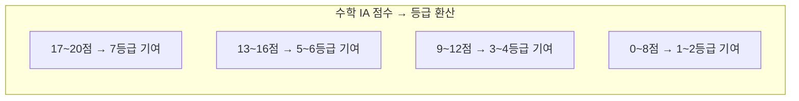

#### 과학 IA — Investigation 채점 기준 (총 24점)

| 기준 | 배점 | 최고점 달성 조건 |
|------|------|------|
| **Personal Engagement** | 0~2점 | 개인적 흥미와 독창성, 주제에 대한 진정한 관심 |
| **Exploration** | 0~6점 | 명확한 연구 질문, 배경 정보 충분, 방법론 적절 |
| **Analysis** | 0~6점 | 데이터의 정확한 처리, 불확실성 분석, 적절한 그래프·표 |
| **Evaluation** | 0~6점 | 결론의 타당성, 체계적·무작위 오차 분석, 개선 방안 |
| **Communication** | 0~4점 | 과학적 글쓰기 양식 준수, 명확한 구조, 인용 정확 |

#### EE (Extended Essay) 채점 기준 (총 34점)

| 기준 | 배점 | 핵심 요구 사항 |
|------|------|------|
| **A: Focus & Method** | 0~6점 | 연구 질문의 명확성, 방법론의 적절성, 주제의 범위 설정 |
| **B: Knowledge & Understanding** | 0~6점 | 학문 분야의 맥락 이해, 관련 이론·개념 활용 |
| **C: Critical Thinking** | 0~12점 | 연구, 분석, 논의, 평가의 질. **EE에서 가장 높은 배점** |
| **D: Presentation** | 0~4점 | 구조, 레이아웃, 형식적 요소 (목차, 참고문헌 등) |
| **E: Engagement** | 0~6점 | RPPF(연구 과정 성찰 양식)를 통한 연구 과정 성찰 |

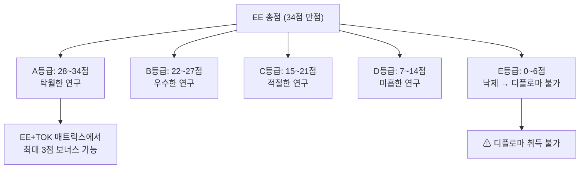

#### TOK (Theory of Knowledge) 채점 기준

| 평가 요소 | 비중 | 형태 | 채점 기준 |
|------|------|------|------|
| **TOK Essay** | 67% | 1,600단어 에세이 (6개 주제 중 1개 선택) | 지식 질문(Knowledge Question) 탐구 깊이, 실생활 사례(Real-Life Situations) 활용, 다양한 관점(Perspectives) 균형 |
| **TOK Exhibition** | 33% | 3개 객체(Objects) 선택 + 해설 (950단어) | 객체와 지식 질문의 연결성, 실제 세계 맥락에서의 지식 적용 |

### 5.8 디플로마 취득 조건 — Failing Conditions 완전 정리

디플로마를 취득하려면 **24점 이상**이 필요하지만, 점수가 충분해도 아래 조건에 해당하면 **자동 실패(Failing Condition)**입니다.

| 조건 번호 | Failing Condition | 발생 빈도 | 대비 방법 |
|------|------|------|------|
| FC1 | CAS 요건 미충족 | 매년 5~10% | 1학년부터 체계적 기록, 성찰 일지 관리 |
| FC2 | EE 또는 TOK에서 E등급 | 매년 3~5% | EE 초안을 최소 3회 피드백 받기 |
| FC3 | 총점 24점 미만 | 글로벌 약 15% | HL 과목 집중 투자, SL 최소 4점 확보 |
| FC4 | HL 과목 중 1과목이라도 2점 이하 | 매년 2~3% | 약한 HL 과목 조기 진단·보강 |
| FC5 | SL 과목 중 1과목이라도 1점 | 매년 1~2% | SL이라도 최소 3점 유지 전략 |
| FC6 | HL 3과목 합산 12점 미만 | 매년 5~8% | HL 평균 4점 이상 유지 목표 |
| FC7 | SL 3과목 합산 9점 미만 | 매년 3~5% | SL 평균 3점 이상 유지 |
| FC8 | Academic Integrity 위반 (표절, AI 부정 사용 등) | 매년 1~2% | AI 사용 일지 관리, 인용 철저 |

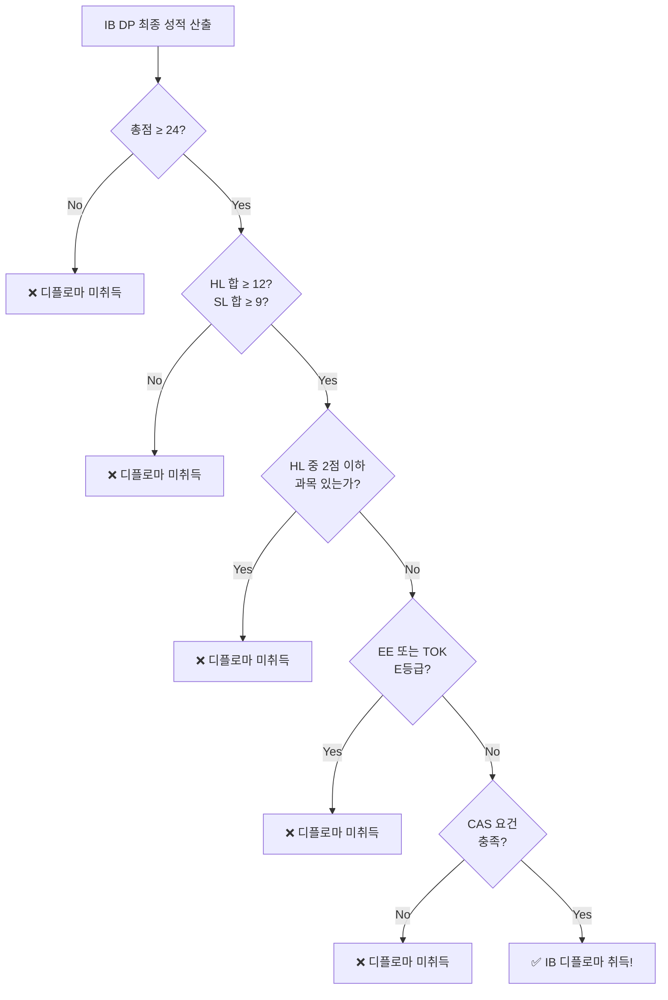

> **상담 포인트**: "IB에서 가장 흔한 실패 원인은 점수 부족이 아니라 CAS 미충족과 EE 낙제입니다. 학문적으로 우수한 학생도 CAS 기록 관리를 소홀히 하면 디플로마를 받지 못합니다."

---

## 6. IB DP 교육방법론

### 6.1 교수 접근법 (Approaches to Teaching — ATT) 6가지

IB가 규정하는 **교사의 수업 방식** 6가지 원칙입니다.

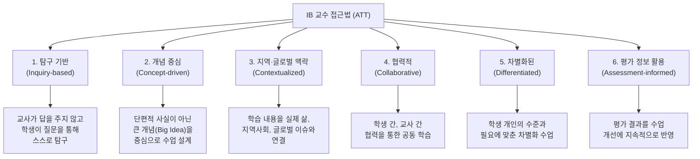

### 6.2 학습 접근법 (Approaches to Learning — ATL) 5가지

IB 학생이 개발해야 하는 **5가지 학습 기술** 범주입니다.

| ATL 범주 | 영문 | 핵심 기술 | IB에서의 활용 |
|------|------|------|------|
| **사고 기술** | Thinking Skills | 비판적 사고, 창의적 사고, 전이 | TOK 에세이, EA 서술형 답안 |
| **커뮤니케이션 기술** | Communication Skills | 읽기, 쓰기, 듣기, 발표, 비언어적 소통 | 구술 평가(IO), EE 작성, 토론 |
| **사회적 기술** | Social Skills | 협력, 존중, 갈등 해결, 의사결정 | 그룹 프로젝트, CAS 팀 활동 |
| **자기관리 기술** | Self-management Skills | 시간 관리, 조직, 정서 관리, 동기 | DP 2년 일정 관리, 과제 마감 |
| **연구 기술** | Research Skills | 정보 수집, 분석, 인용, 미디어 리터러시 | EE 문헌 리뷰, IA 자료 수집 |

### 6.3 개념 기반 학습 (Concept-based Learning)

IB의 수업은 **단편적 사실의 나열**이 아닌, **핵심 개념(Key Concepts)**을 중심으로 설계됩니다.

| 전통적 수업 | IB 개념 기반 수업 |
|------|------|
| "프랑스 혁명은 1789년에 일어났다" | "혁명은 왜 반복되는가? — 프랑스, 러시아, 이란 혁명의 공통 패턴은?" |
| "2차 방정식의 풀이법을 외우시오" | "포물선은 왜 자연에서 반복 출현하는가? — 다리, 분수, 위성 궤도에서 2차 방정식을 찾아보자" |
| "광합성의 화학식을 쓰시오" | "에너지 전환의 효율은 어디까지 높일 수 있는가? — 광합성과 태양전지를 비교 분석" |

### 6.4 탐구 기반 학습 (Inquiry-based Learning)

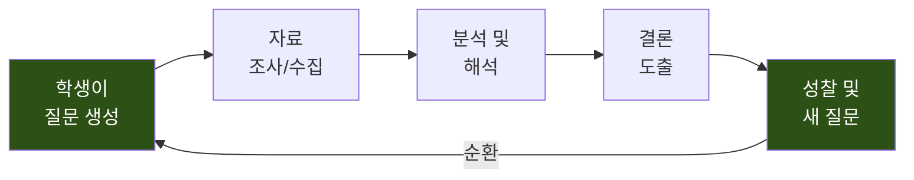

**탐구 학습의 단계**:
1. **질문 생성**: 교사가 답을 주지 않고, 학생이 스스로 "왜?"를 묻는 것에서 시작
2. **자료 수집**: 1차 자료(실험, 인터뷰)와 2차 자료(문헌, 데이터)를 수집
3. **분석**: 수집한 자료를 다각도로 분석하고 패턴을 발견
4. **결론 도출**: 근거에 기반한 자기 주장을 논리적으로 구성
5. **성찰**: "내 결론의 한계는 무엇인가?"를 스스로 묻고 새로운 질문으로 연결

### 6.5 IB 수업과 한국 전통 수업의 비교

| 비교 항목 | 한국 전통 수업 | IB 수업 |
|------|------|------|
| **수업 방식** | 교사 강의 중심, 판서 | 학생 토론·탐구 중심, 퍼실리테이션 |
| **교사 역할** | 지식 전달자 | 학습 촉진자 (Facilitator) |
| **학생 역할** | 수동적 수용자 | 능동적 탐구자 |
| **평가 방식** | 정기고사 (선다형 + 서술형) | 프로젝트 + 에세이 + 구술 |
| **정답 관점** | 하나의 정답 존재 | 다양한 관점, 근거 기반 논증 |
| **과제** | 문제집 풀이, 암기 | 연구 프로젝트, 에세이 작성 |
| **협력** | 개인 경쟁 | 그룹 토론, 협력 프로젝트 |
| **AI 시대 적합도** | AI가 대체 가능한 영역 | AI가 대체 불가능한 영역 |

### 6.6 IB 수업 실제 사례 — 과목별 수업 시나리오

#### 사례 1: 역사 HL 수업 — "냉전은 왜 끝났는가?"

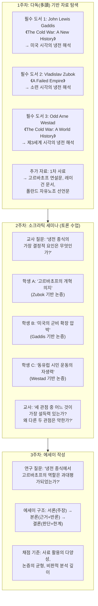

| 수업 요소 | 한국 전통 역사 수업 | IB 역사 HL 수업 |
|------|------|------|
| **교재** | 국정/검인정 교과서 1권 | 3~5권의 학술 도서 + 1차 사료 |
| **관점** | 단일 서술 (정답 존재) | 다중 관점 (역사가마다 해석 상이) |
| **수업 방식** | 교사 강의 → 학생 필기 | 학생 사전 독서 → 소크라틱 세미나 토론 |
| **평가** | 연도·사건·인물 암기 (객관식) | 에세이: "~를 평가하시오" (2,000단어 논증) |
| **학생 역할** | "1989년 베를린 장벽이 무너졌다" 암기 | "베를린 장벽은 왜 무너졌는가? 누구의 해석이 더 타당한가?" 논증 |

#### 사례 2: 수학 AA HL 수업 — "미적분과 실생활 최적화"

| 단계 | 시간 | 활동 | 교사 역할 |
|------|------|------|------|
| **도입** | 15분 | 교사: "택배 회사가 상자의 재료를 최소화하면서 부피를 최대화하려면 어떤 모양이어야 할까?" | 실생활 문제 제시 (답을 주지 않음) |
| **탐구** | 30분 | 학생 그룹별 미적분 활용 모델링. 변수 설정, 함수 도출, 미분으로 극값 계산 | 그룹 순회하며 질문으로 사고 유도 |
| **발표** | 20분 | 각 그룹이 모델과 결론 발표. "정육면체가 최적인가?", "원기둥이 더 효율적인가?" | 관점의 차이를 부각, 수학적 오류 지적 |
| **확장** | 15분 | "실제 택배 상자는 왜 정육면체가 아닌가?" → 적재 효율, 제조 공정 등 수학 외 변수 도입 | 수학의 한계와 실세계의 복잡성 연결 |
| **성찰** | 10분 | 수업 일지 작성: "오늘 배운 것, 아직 궁금한 것, 다음에 시도해 볼 것" | ATL 자기관리 기술 훈련 |

> **핵심**: 한국 수학 수업이 "공식을 외우고 문제를 풀기"라면, IB 수학 수업은 "문제를 정의하고 수학으로 해결한 뒤 한계를 성찰하기"입니다.

#### 사례 3: TOK 수업 — "AI가 만든 지식은 진짜 지식인가?"

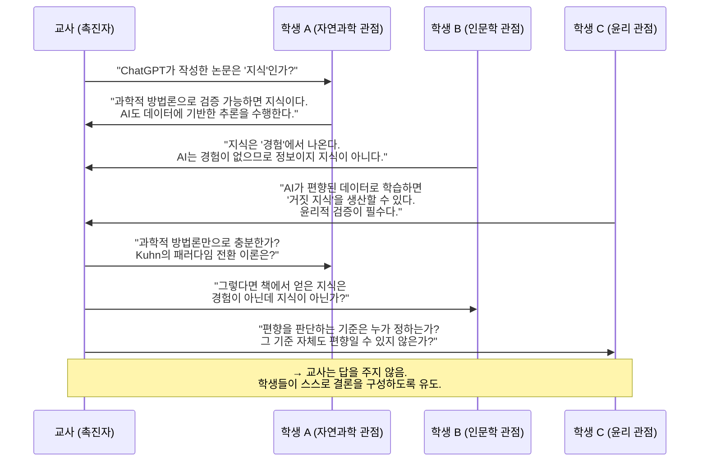

| TOK 수업 흐름 | 시간 | 핵심 활동 |
|------|------|------|
| **1. 자극 제시 (Stimulus)** | 10분 | 교사가 AI가 작성한 에세이와 인간이 작성한 에세이 2편을 보여줌 (어느 것이 AI인지 모름) |
| **2. 질문 생성 (Knowledge Question)** | 15분 | 학생들이 스스로 지식 질문(Knowledge Question) 생성: "지식의 정의에 '의도'가 포함되어야 하는가?" |
| **3. 관점 탐색 (Perspectives)** | 25분 | 소크라틱 세미나: 합리주의, 경험주의, 구성주의, 실용주의 관점에서 토론 |
| **4. 반론 구성 (Counter-arguments)** | 15분 | 각 학생이 자기 주장에 대한 가장 강력한 반론을 스스로 구성 |
| **5. 성찰 (Reflection)** | 15분 | 수업 전과 후의 생각 변화 기록. "내 생각이 어떻게, 왜 바뀌었는가?" |

#### 사례 4: 과학(Chemistry HL) 수업 — "카페인과 추출 온도"

| 단계 | 활동 | 학생 역할 |
|------|------|------|
| **1. 문제 인식** | "커피를 가장 맛있게 추출하는 온도는?" — 실생활 질문에서 시작 | 일상 경험에서 과학 질문 도출 |
| **2. 가설 설정** | "추출 온도가 높을수록 카페인 함량이 증가할 것이다" | 독립/종속/통제 변인 설정 |
| **3. 실험 설계** | 60℃, 70℃, 80℃, 90℃, 100℃에서 3회 반복 추출 → UV 분광광도계로 카페인 측정 | 교사 도움 없이 자체 실험 프로토콜 작성 |
| **4. 데이터 수집** | 온도별 카페인 농도 측정, 불확실도(Uncertainty) 계산 | 오차 범위 포함한 데이터 기록 |
| **5. 분석** | 그래프 작성, 상관관계 분석, 통계적 유의성 검증 | Excel/Python으로 데이터 처리 |
| **6. 결론 및 평가** | "가설은 부분적으로 지지됨. 90℃ 이상에서는 카페인이 오히려 감소" | 오차 원인 분석, 실험 개선 방안 제시 |
| **7. IA 보고서 작성** | 6~12페이지 완결된 실험 보고서 | Personal Engagement + Exploration + Analysis + Evaluation + Communication |

> **핵심**: 한국 과학 수업이 "교과서 실험을 재현하기"라면, IB 과학 수업은 "자기만의 질문으로 자기만의 실험을 설계하기"입니다.

#### 사례 5: 경제학 HL 수업 — "한국 최저임금 인상의 효과"

| 주차 | 수업 내용 | 사용 자료 (3권+) | 학생 활동 |
|------|------|------|------|
| **1주** | 노동 시장 이론 | ① Mankiw《Principles of Economics》Ch.18-19<br/>② Ha-Joon Chang《Economics: The User's Guide》Ch.10 | 두 경제학자의 최저임금 관점 비교 메모 작성 |
| **2주** | 한국 최저임금 사례 | ③ 한국노동연구원 보고서 (2023)<br/>④ 한국경영자총협회 반박 보고서 | 1차 자료 (통계청 고용 데이터) 수집 |
| **3주** | 소크라틱 세미나 | 위 4개 자료 기반 토론 | "최저임금 인상은 고용을 줄이는가?" 찬반 논증 |
| **4주** | 경제 논평 작성 | 실제 한국경제 기사 선택 | 800단어 논평: 경제 이론 + 데이터 분석 + 평가 |

### 6.7 핀란드 교육과 IB의 공통점 — 다독(多讀) 기반 수업

IB의 수업 방식은 핀란드 교육과 깊은 공통점을 가집니다. 핵심은 **단일 교과서가 아닌 3권 이상의 다양한 텍스트**를 기반으로 학생이 스스로 관점을 구성하는 것입니다.

#### 6.7.1 단일 교과서 vs 다독 기반 수업 비교

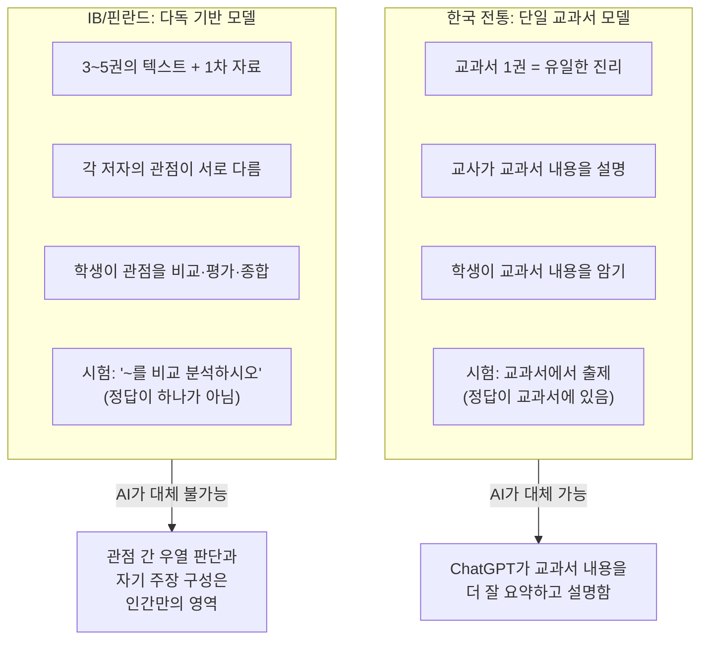

#### 6.7.2 과목별 다독(多讀) 텍스트 예시

| 과목 | 필수 텍스트 (3권+) | 핵심 독서 방법 |
|------|------|------|
| **한국어 A HL** | ① 한강《채식주의자》 ② 윤동주《하늘과 바람과 별과 시》 ③ 이상《날개》+ 비문학 텍스트(신문 사설, 광고, 법률문) | 문학 작품과 비문학 텍스트의 교차 분석. Individual Oral에서 두 텍스트를 연결하여 15분 발표 |
| **English B HL** | ① 기후변화 관련 학술 논문 ② TED Talk 스크립트 ③ The Economist 기사 + 시각 자료(infographic) | 동일 주제에 대한 서로 다른 장르·매체의 표현 방식 비교 |
| **역사 HL** | ① Gaddis (미국 관점) ② Zubok (러시아 관점) ③ Westad (제3세계 관점) + 1차 사료(연설문, 조약문) | 사료의 출처(Origin), 목적(Purpose), 가치(Value), 한계(Limitation) — OPVL 분석법 |
| **경제학 HL** | ① Mankiw (신고전파) ② Ha-Joon Chang (구조주의) ③ 한국노동연구원 보고서 + 통계청 데이터 | 이론과 실증 데이터의 교차 검증. "이론이 현실을 설명하는가?" |
| **생물학 HL** | ① Campbell Biology (교과서) ② Nature/Science 최신 논문 ③ 과학 다큐멘터리 + 실험 데이터 | 교과서 이론 → 최신 연구 → 자기 실험의 3단계 검증 |
| **TOK** | ① Richard van de Lagemaat《Theory of Knowledge》 ② 뉴스 기사·예술 작품·과학 논문 등 ③ 철학 원전(데카르트, 쿤, 포퍼) 발췌 | "같은 현상을 서로 다른 지식 영역(AOK)은 어떻게 설명하는가?" |

#### 6.7.3 핀란드-IB 교육 공통 원칙

| 원칙 | 핀란드 교육 | IB 교육 | 한국 전통 교육 |
|------|------|------|------|
| **교과서 활용** | 참고 자료 중 하나 (필수 아님) | 3~5권의 텍스트 활용 (교과서 ≠ 진리) | 교과서 = 유일한 기준 |
| **교사 자율성** | 교사가 수업 내용·방법 자유 결정 | ATT 6원칙 내에서 교사 재량 | 교육과정에 따른 진도 중심 |
| **평가 목적** | 학습 개선을 위한 피드백 | Assessment FOR/OF/AS Learning | 서열화·선발 |
| **학생 활동 비중** | 수업 시간의 60~70% 학생 활동 | 수업 시간의 60~80% 학생 토론·탐구 | 수업 시간의 80~90% 교사 강의 |
| **숙제 양** | 최소 (핀란드: 세계 최소 숙제량) | 많음 (에세이·프로젝트 기반) | 많음 (문제집·암기 중심) |
| **경쟁 구조** | 경쟁 없음 (순위 공개 금지) | 절대평가 (기준 참조) | 상대평가 (등급·석차) |
| **실패에 대한 태도** | 실패 = 학습 기회 | 성찰(Reflection)을 통한 성장 | 실패 = 탈락 |

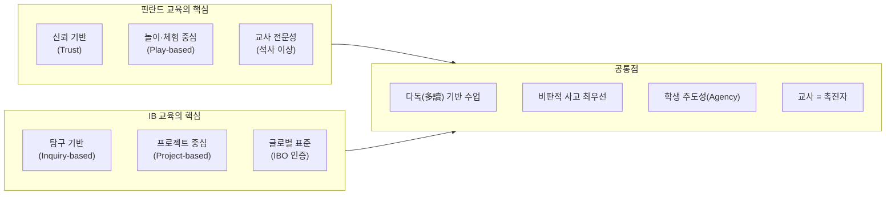

> **상담 포인트**: "IB 수업에서는 하나의 교과서를 진리로 삼지 않습니다. 최소 3권 이상의 책과 자료를 읽고, 저자들의 관점이 왜 다른지를 스스로 분석합니다. 이것이 수능 교육과 가장 근본적으로 다른 점이며, AI 시대에 가장 가치 있는 능력입니다."

### 6.8 프로젝트 기반 학습 (PBL) 실전 사례 — IB에서의 구현

IB의 IA(내부평가)와 EE(소논문)는 사실상 **프로젝트 기반 학습(Project-Based Learning)**의 완결판입니다.

#### 6.8.1 IB 프로젝트 진행 프로세스 (전 과목 공통)

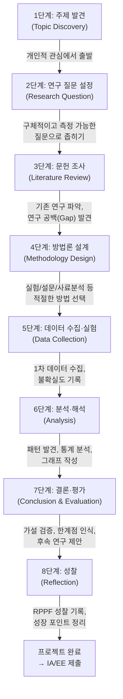

#### 6.8.2 학제 간 융합 프로젝트 사례

| 프로젝트명 | 관련 과목 | 연구 질문 | 방법론 | 기간 | 결과물 |
|------|------|------|------|------|------|
| **"대구 미세먼지와 호흡기 질환"** | 생물 HL + 수학 AA | "대구 미세먼지 농도와 호흡기 질환 발생률 사이에 통계적 유의미한 상관관계가 존재하는가?" | 공공 데이터(환경부 + 건강보험공단) 수집 → 회귀분석 | 3개월 | 수학 IA (12p) + 생물 IA (10p) |
| **"한강 소설의 트라우마 서사와 역사적 배경"** | 한국어 A HL + 역사 HL | "한강의《소년이 온다》에서 5·18 역사 서술은 기존 역사학의 해석과 어떻게 다른가?" | 문학 비평 + 역사 사료 교차 분석 | 4개월 | EE (4,000단어) |
| **"학교 식당 음식물 쓰레기 감축 프로젝트"** | 경제학 HL + CAS | "행동경제학의 넛지(Nudge) 이론을 적용하여 학교 식당 음식물 쓰레기를 20% 감축할 수 있는가?" | 실험 설계 (A/B 테스트) → 데이터 수집 → 효과 분석 | 6개월 | 경제학 IA (800단어 x 3편) + CAS 프로젝트 보고서 |
| **"AI 챗봇의 수학 문제 풀이 정확도"** | 수학 AA HL + TOK | "ChatGPT는 IB Math AA HL Paper 2 문제를 몇 %의 정확도로 풀 수 있는가? 이것은 '수학적 이해'인가?" | 기출문제 50문항 → AI 풀이 → 정답률·오류 유형 분석 | 2개월 | 수학 IA (15p) + TOK Exhibition 연계 |
| **"K-pop의 글로벌 확산과 문화 제국주의"** | English B HL + 경제학 | "K-pop의 글로벌 확산은 문화 다양성의 확대인가, 새로운 형태의 문화 제국주의인가?" | 영문 학술 논문·뉴스 기사 분석 + 설문 조사 | 3개월 | English B IO (15분 구술) |

#### 6.8.3 프로젝트 기반 수업의 주간 일정 예시 (DP Year 1, 1학기)

| 요일 | 1교시 | 2교시 | 3교시 | 4교시 | 5교시 | 6교시 | 방과후 |
|------|------|------|------|------|------|------|------|
| **월** | 한국어A HL (토론) | 한국어A HL (에세이) | 수학AA HL (개념) | 수학AA HL (문제) | TOK (세미나) | TOK (성찰) | CAS 활동 |
| **화** | 역사 HL (다독) | 역사 HL (사료분석) | 화학 HL (이론) | 화학 HL (실험) | 영어B SL | 영어B SL | IA 연구 |
| **수** | 수학AA HL (탐구) | 수학AA HL (발표) | 역사 HL (에세이) | 한국어A HL | 화학 HL (실험) | 화학 HL (보고서) | 자율학습 |
| **목** | 영어B SL (토론) | 영어B SL (작문) | 경제 SL (이론) | 경제 SL (사례분석) | TOK (발표) | CAS 성찰 | EE 연구 |
| **금** | 화학 HL (문제) | 수학AA HL | 경제 SL (논평) | 한국어A HL (독서) | 역사 HL (토론) | 주간 성찰 | 자유 |

> **핵심**: 하루 6교시 중 **토론·세미나·발표·실험·에세이 작성**이 전체의 60~70%를 차지합니다. 교사가 일방적으로 강의하는 시간은 전체의 30% 미만입니다.

### 6.9 IB 토론 수업의 실제 — 소크라틱 세미나 운영법

#### 소크라틱 세미나(Socratic Seminar)란?

고대 그리스 철학자 소크라테스의 대화법에서 유래한 토론 수업 방식입니다. 교사는 **질문만 던지고 답을 주지 않으며**, 학생들이 텍스트를 근거로 자기 주장을 구성하고, 동료의 주장을 비판적으로 검토합니다.

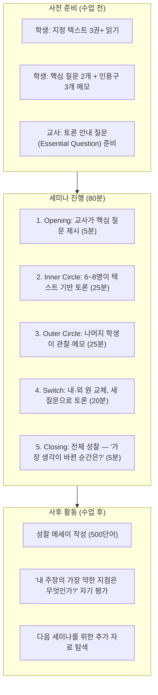

#### 소크라틱 세미나 채점 기준 (Rubric)

| 평가 기준 | 5점 (탁월) | 3점 (양호) | 1점 (미흡) |
|------|------|------|------|
| **텍스트 활용** | 3권+ 텍스트에서 구체적 인용, 페이지 명시 | 1~2권 텍스트 인용, 일반적 언급 | 텍스트 언급 없이 개인 의견만 |
| **비판적 사고** | 동료 주장에 대한 반론을 근거와 함께 제시 | 동료 주장에 동의/반대 의사 표현 | 동료 주장에 반응 없음 |
| **질문 생성** | 토론을 심화시키는 후속 질문을 스스로 생성 | 교사 질문에 대한 답변 | 질문 생성 없음 |
| **경청과 연결** | 동료 발언을 인용하며 자기 주장을 연결 | 동료 발언을 듣고 이해함을 표현 | 동료 발언과 무관한 독백 |
| **균형과 개방성** | 자기 입장의 한계를 인정하고 관점 수정 의지 | 다양한 관점의 존재를 인정 | 자기 입장만 고수 |

> **상담 포인트**: "IB 수업에서 가장 높은 점수를 받는 학생은 '가장 많이 아는 학생'이 아니라 '가장 좋은 질문을 만드는 학생'입니다. '왜 그렇게 생각하나요?', '그 주장의 반례는 없나요?'라는 질문을 던질 수 있는 학생이 IB에서 빛납니다."

---

## 7. IB DP 2년 학습 로드맵

### 7.1 전체 타임라인 개요

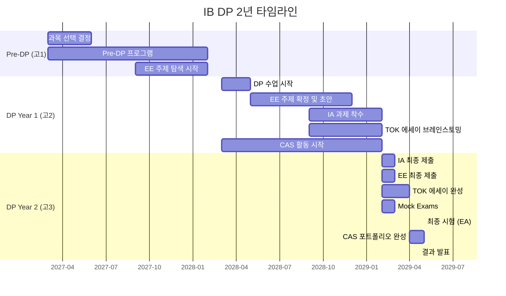

### 7.2 Year 1 (DP1) 월별 핵심 할 일

| 월 | 과목 학습 | Core (EE/TOK/CAS) | 입시 준비 |
|------|------|------|------|
| **3~5월** | DP 수업 시작, 과목별 기초 확립 | CAS 활동 탐색 및 시작 | 대학 리서치 시작 |
| **6~8월** | 1학기 중간 평가, HL 심화 학습 | EE 주제 후보 3~5개 탐색, TOK 수업 시작 | 대학 오픈캠퍼스 참가 |
| **9~11월** | 2학기 수업, IA 주제 선정 착수 | EE 주제 확정, 1차 초안 작성 시작, CAS 프로젝트 본격화 | 해외대학 원서 준비 (미국 ED) |
| **12~2월** | 1학년 말 시험, IA 자료 수집 | EE 초안 완성, TOK 에세이 윤곽 | 국내 수시 전략 수립 |

### 7.3 Year 2 (DP2) 월별 핵심 할 일

| 월 | 과목 학습 | Core (EE/TOK/CAS) | 입시 준비 |
|------|------|------|------|
| **3~5월** | DP2 수업, IA 최종 작성 | EE 2차 초안 수정, TOK 에세이 초안 | 대학별 요구사항 최종 확인 |
| **6~8월** | IA 교사 피드백 반영, EA 대비 시작 | EE 최종 제출 준비, CAS 시간 채우기 | 해외대학 원서 작성 |
| **9~11월** | EA 집중 복습, Mock Exam | EE/TOK 최종 제출 (학교별 마감) | 국내 수시 원서 접수 |
| **12~2월** | Mock Exam 결과 분석, 약점 보완 | CAS 포트폴리오 정리 | Predicted Grade 산출 |
| **3~4월** | 최종 EA 대비 집중 복습 | CAS 최종 성찰 | 최종 대학 결정 |
| **5월** | **최종 시험 (EA)** | — | — |
| **7월** | **결과 발표** | — | 대학 등록 |

### 7.4 코어(Core) 타임라인 관리 — 최상위권의 비밀

```mermaid
flowchart TB
    subgraph TRAP["The Hidden Trap: IA/EA/Core 시간 겹침"]
        T1["EE (4,000단어 소논문)<br/>→ 막판 몰아쓰기 불가<br/>→ 1년차부터 리서치와<br/>초안 작성을 전략적으로 분산"]
        T2["TOK (철학 에세이)<br/>→ 정답이 없는 논리적<br/>사고의 과정 자체를 평가<br/>→ 조기 브레인스토밍 필수"]
        T3["CAS + SAT/기타<br/>→ SAT나 외부 공인 점수 필요 시<br/>반드시 IB 과정 시작 전(10학년<br/>이하)에 끝내놓아 절대적인<br/>시간을 확보할 것"]
    end
```

> **상담 포인트**: "IB의 가장 큰 함정은 Core(EE/TOK)가 45점 중 3점밖에 안 되지만, 이 3점을 위한 작업량이 전공 과목 공부 시간을 잡아먹는다는 것입니다. 최상위권 학생은 Year 1 여름방학까지 EE 초안을 완성합니다."

---

## 8. 한국의 IB 학교 현황

### 8.1 전국 IB 인증학교 총괄 현황 (2026년 기준)

| 프로그램 | 월드스쿨 수 | 후보학교 | 관심학교 | 합계 |
|------|------|------|------|------|
| PYP (초등) | 32개교 | 30개교+ | 50개교+ | 112개교+ |
| MYP (중등) | 24개교 | 20개교+ | 40개교+ | 84개교+ |
| DP (고등) | 20개교 | 15개교+ | 30개교+ | 65개교+ |
| CP (직업) | 1개교 | — | — | 1개교 |
| **총계** | **58개교** | **65개교+** | **120개교+** | **243개교+** |

> 관심, 후보, 인증학교 포함 전국 약 **360여개 학교**가 IB 관련 활동 중

### 8.2 IB 인증 3단계 프로세스

```mermaid
flowchart LR
    S1["1단계: 관심학교<br/>(Interested School)<br/>— IB 도입 의향 표명,<br/>기초 준비"]
    S2["2단계: 후보학교<br/>(Candidate School)<br/>— IBO 공식 지원,<br/>인증 준비 과정 착수"]
    S3["3단계: 월드스쿨<br/>(World School)<br/>— IBO 최종 인증,<br/>공식 IB 프로그램 운영"]
    S1 -->|"1~2년"| S2 -->|"1~3년"| S3
```

### 8.3 지역별 IB 생태계 현황

#### 대구 — IB 선도 도시

| 항목 | 현황 |
|------|------|
| 운영 규모 | 전국 최대 — 초중고 90개 학교 IB 교육과정 운영 |
| 월드스쿨 | 39개 (유치원 3, 초등 16, 중학교 14, 고등학교 6) |
| IB 벨트 | 경북대사대부초 → 경북대사대부중 → 경북대사대부고 (국립대 부설 핵심축) |
| KB 전환 | 2026년부터 '한국형 바칼로레아(KB)'로 발전 — 논/서/구술형 평가 시스템 자체 개발 |

#### 제주 — IB 지구 모델

| 항목 | 현황 |
|------|------|
| IB 지구 | 서귀포시 표선면 = 'IB 지구'로 지정 |
| IB 벨트 | 표선초 → 표선중 → 표선고 (공교육 IB 벨트 모델) |
| 국제학교 | Branksome Hall Asia, NLCS Jeju (PYP-MYP-DP 전체 운영) |
| 학비 | 공립 IB(표선고) = 무상교육 vs 국제학교 = 연 3,000만원+ |

#### 경기도 — 확장 중

| 항목 | 현황 |
|------|------|
| 월드스쿨 | 21개 학교 (2025년 말 기준) |
| 후보학교 | 44교 |
| 핵심 학교 | 죽산중 → 죽산고 (MYP+DP 연계 모델) |
| 특이점 | 2026년 정책/구조적 지원 확대 계획 |

#### 서울 — 후발주자

| 항목 | 현황 |
|------|------|
| 최초 월드스쿨 | 서울구로초 (2025년 11월 PYP 최초 인증) |
| 관련 학교 | IB 관심/후보/인증학교 총 114교 (초 58, 중 41, 고 15) |

### 8.4 주요 IB DP 고등학교 상세 비교표

| 학교명 | 위치 | 유형 | 공/사립 | IB 인증년도 | IB 언어 | 학비 | 기숙사 | 연 입학 인원 |
|------|------|------|------|------|------|------|------|------|
| 제주 표선고 | 제주 서귀포 | 일반고 | 공립 | 2021 | 한국어 | 무상 | O | 150명 |
| 경기외고 | 경기 의왕 | 외국어고 | 사립(대교) | 2011 | 영어 | 연 1,500~2,500만 | O | 200~250명 |
| 대구국제고 | 대구 북구 | 국제고 | 공립 | — | — | 연 300~600만 | O | 100~150명 |
| 충남삼성고 | 충남 아산 | 자사고 | 사립(삼성) | 2020 | 영어 | 연 1,500~2,500만 | O | 300명 |
| 죽산고 | 경기 안성 | 일반고 | 공립 | 2025 | 한국어 | 무상 | O | 60~100명 |
| 경북대사대부고 | 대구 중구 | 일반고 | 국립 | 2021 | 한/영 이중 | 연 100~250만 | X | 200~250명 |
| 포산고 | 대구 달성 | 자율형공립 | 공립 | 2021 | 한/영 이중 | 무상 | O | 80~150명 |
| 대구외고 | 대구 달서 | 외국어고 | 공립 | — | — | 연 300~600만 | O | 150~200명 |
| 대구서부고 | 대구 서구 | 일반고 | 공립 | 2025 | — | 무상 | X | 200~300명 |

### 8.5 주요 학교별 대학 진학 실적

| 학교 | 국내 주요 진학 | 해외 진학 가능 라인 | 특이 사항 |
|------|------|------|------|
| **표선고** | 서울대·연세대·고려대 학종 합격 (1기/2기) KAIST·UNIST·DGIST | UC Berkeley·UCLA (IB 40점+) 캐나다 UBC·McGill | 수능 없이 1기 졸업생 서울대 학생부종합전형 합격 배출. 응시자 26명 중 42.3%(11명) 디플로마 취득 |
| **경기외고** | 서울대·연세대·고려대 학종 (외국어 특기+IB 결합) | 미국 아이비리그·Top 30 (43~44점), 영국 Oxford·Cambridge·LSE·UCL (42점+) | 국내 최초 IB 인증 외고 (2011). 해외 명문대 진학 트랙 최강 |
| **경북대사대부고** | 경북대, UNIST, DGIST, POSTECH (지역 거점 + IB) | 미국 Top 50, 캐나다 UBC·McGill | **최상위권 IB 42점 획득 학생 등장** (옥스퍼드/캠브리지 진학 가능 수준) |
| **충남삼성고** | 서울대·KAIST·POSTECH·UNIST (이공 학종) | MIT·Caltech·UC Berkeley (40~44점), 영국 Cambridge·Imperial·UCL | 삼성디스플레이 임직원 자녀 우선 전형 존재 |

### 8.6 PYP-MYP-DP 연계 벨트 (IB Continuum)

#### 국제학교 — 풀 컨티뉴엄 (PYP+MYP+DP)

| 학교명 | 위치 | 프로그램 | 특이사항 |
|------|------|------|------|
| Chadwick International | 인천 송도 | PYP+MYP+DP+CP | 한국 유일 CP 인가 학교 |
| Dwight School Seoul | 서울 | PYP+MYP+DP | 서울 최초 컨티뉴엄 학교 |
| Seoul Foreign School (SFS) | 서울 | PYP+MYP+DP | |
| Branksome Hall Asia | 제주 | PYP+MYP+DP | 여학교 전통 |
| International School of Busan (ISB) | 부산 | PYP+MYP+DP | |
| TCIS (대전 기독국제학교) | 대전 | PYP+MYP+DP | 1958년 설립 |

#### 공교육 IB 벨트 — 지역 내 PYP-MYP-DP 연계

| 지역 | PYP (초등) | MYP (중등) | DP (고등) | 비고 |
|------|------|------|------|------|
| 대구 (경북대 부설) | 경북대사대부초 | 경북대사대부중 | 경북대사대부고 | 국립대 부설 핵심축 |
| 대구 (중앙) | — | 대구중앙중 | 대구중앙고 | 사립 최초 MYP+DP 연속 인증 |
| 제주 (표선) | 표선초 | 표선중 | 표선고 | 제주 IB 지구 공간 통합 모델 |
| 경기 (안성) | — | 죽산중 | 죽산고 | 경기도 공립 MYP+DP 연계 |

### 8.7 비연계 학생 (MYP 없이 DP 진입)의 적응 이슈

한국에서는 초등(PYP), 중등(MYP) 경험 없이 고등학교에서 바로 DP를 시작하는 학생이 다수입니다.

| 어려움 | 원인 | 대응 방안 |
|------|------|------|
| 학업 강도 급상승 | MYP와 DP의 깊이·속도 차이 | Pre-DP 프로그램 활용 (고1) |
| 평가 방식 충격 | 서술형 100%에 대한 적응 부족 | 에세이 작성 훈련 사전 실시 |
| 자기주도 학습 부족 | EE/TOK/IA에 필요한 독립 연구 능력 | 중학교 때부터 자기주도 프로젝트 경험 쌓기 |
| 언어/작문 수준 격차 | 학술적 글쓰기 경험 부족 | 독서량 확대 + 글쓰기 연습 |
| 심리적 두려움 | 익숙하지 않은 수업 구조 | IB 졸업생 멘토링 연결 |

> **상담 포인트**: "MYP를 이수한 학생이 DP에서 더 높은 비판적 사고력과 작문 능력을 보입니다. 가능하다면 중학교 MYP 과정부터 시작하는 것이 이상적이며, 그렇지 않다면 Pre-DP 프로그램이 있는 학교를 선택하세요."

---

## 9. 글로벌 IB 통계 및 한국 학교 성과 분석

### 9.1 글로벌 IB DP 시험 통계 (2024~2025)

전 세계 IB DP 시험 결과를 기반으로 한국 IB 학생의 위치를 파악합니다.

| 통계 항목 | 글로벌 수치 (2024) | 한국 특이사항 |
|------|------|------|
| **응시자 수** | 약 200,000명+ (160개국) | 한국 공교육 IB 응시자 약 150~200명 |
| **평균 점수** | 29.73점 / 45점 | 한국 공교육 IB 평균 약 28~32점 (학교별 편차 큼) |
| **디플로마 취득률** | 약 80~82% | 한국 공교육 IB 약 42~70% (학교별 차이) |
| **40점 이상 비율** | 약 7~9% | 한국 공교육 IB 약 2~5% |
| **45점 만점자** | 약 0.2~0.3% (연 300~600명) | 한국 공교육 IB 만점자 아직 미배출 |
| **가장 많이 선택하는 HL** | 영어 A, 수학 AA, 생물학 | 한국: 한국어 A, 수학 AA/AI, 역사/경제학 |

### 9.2 한국 주요 IB 학교 성과 상세 분석

#### 대구 지역 IB 학교 성과

| 학교 | 디플로마 취득률 | 최고 점수 | 평균 점수 | 해외대 진학 | 국내 주요 진학 |
|------|------|------|------|------|------|
| **대구외고** | 약 94% (2024) | 43점 | 35점+ | 미국 Top 30, 영국 옥브리지 | 서울대, 연세대, KAIST |
| **대구국제고** | 약 95% (2024) | 42점 | 34점+ | 홍콩대, 싱가포르 NUS | 서울대, 고려대, UNIST |
| **경북대사대부고** | 약 65% (2024) | 42점 | 30점+ | 캐나다 UBC, McGill | UNIST, DGIST, POSTECH |
| **포산고** | 약 55% (2023 첫 배출) | 36점 | 28점 | 제한적 | 대구 거점 대학 위주 |
| **대구서부고** | 2025년~ 첫 졸업 예정 | — | — | — | — |

#### 제주 지역 IB 학교 성과

| 학교 | 디플로마 취득률 | 최고 점수 | 특이 사항 |
|------|------|------|------|
| **표선고** | 42.3% (1기 졸업 기준, 26명 중 11명) | 38점 | 수능 없이 서울대 학종 합격자 배출 (전국 최초 공교육 IB). 2기 취득률 상승 추세 |

#### 경기/기타 지역

| 학교 | 상태 | 특이 사항 |
|------|------|------|
| **죽산고** | DP 인증 완료, 첫 졸업생 대기 | 경기도 공립 IB 선도 학교 |
| **경기외고** | 2011년 인증, 최장수 IB 학교 | 국내 IB 역사 가장 오래됨. 해외 명문대 진학 트랙 최강 |
| **충남삼성고** | 안정적 운영 | 삼성디스플레이 지원. 이공계 특화 |

### 9.3 IB 점수 분포 — 글로벌 vs 한국 비교

```mermaid
flowchart LR
    subgraph GLOBAL["글로벌 IB 점수 분포"]
        G1["1~23점: 약 18% (디플로마 미취득)"]
        G2["24~29점: 약 30% (디플로마 취득)"]
        G3["30~35점: 약 28% (우수)"]
        G4["36~39점: 약 15% (매우 우수)"]
        G5["40~45점: 약 9% (최상위)"]
    end
    subgraph KOREA["한국 공교육 IB 점수 분포 (추정)"]
        K1["1~23점: 약 35~50%"]
        K2["24~29점: 약 25~30%"]
        K3["30~35점: 약 15~20%"]
        K4["36~39점: 약 5~10%"]
        K5["40~45점: 약 2~5%"]
    end
```

> **상담 포인트**: "한국 공교육 IB의 디플로마 취득률은 글로벌 평균보다 낮지만, 이는 IB 초기 도입의 자연스러운 현상입니다. 대구외고·대구국제고 등 운영 경험이 쌓인 학교는 글로벌 평균에 근접하거나 초과하고 있습니다."

### 9.4 IB 과목별 글로벌 평균 점수 (HL 기준)

| 과목 | 글로벌 평균 (HL) | 7점 비율 | 한국 학생 경향 |
|------|------|------|------|
| **Mathematics AA HL** | 4.55 | 약 11% | 한국 학생 강세 (수학 기초 탄탄) |
| **Mathematics AI HL** | 4.83 | 약 14% | 통계·응용 관심 학생 선택 |
| **Physics HL** | 4.61 | 약 13% | 이공계 지망생 필수 |
| **Chemistry HL** | 4.48 | 약 12% | 의대 지망생 필수 |
| **Biology HL** | 4.32 | 약 10% | 가장 낮은 평균, 난이도 높음 |
| **Economics HL** | 4.98 | 약 16% | 한국 학생 선호도 높음 |
| **History HL** | 4.46 | 약 10% | 서술 부담 크나 한국 학생 적응 양호 |
| **English A HL** | 4.87 | 약 14% | 한국 학생 가장 어려워하는 과목 |
| **Korean A HL** | 5.12 | 약 18% | 한국어 모국어 학생 강세 |

> **상담 포인트**: "한국 학생은 수학·과학에서 글로벌 평균 이상의 성과를 내지만, English A와 에세이 기반 인문 과목에서 상대적 약점을 보입니다. Pre-DP 시기부터 영어 학술 글쓰기 훈련이 중요합니다."

---

## 10. IB와 한국 대학 입시 전략

### 10.1 IB 학생의 2가지 필승 루트

```mermaid
flowchart TD
    IB["IB DP 과정"]
    IB --> PA["Path A: 수능 최저 등급이 없는<br/>학종 전형 공략<br/>(The Comprehensive Route)"]
    IB --> PB["Path B: 전략적 수능 병행 루트<br/>(The Hybrid Route)"]
    
    PA --> SA["Strategy: 수능 공부를 완전히<br/>배재하고 IB 과정 자체<br/>(IA, EE, CAS)에 100% 올인"]
    SA --> WA["Weapon: 압도적인 깊이의<br/>'학교생활기록부' 구축"]
    WA --> TA["Target: 서울대(수시 일반),<br/>유니스트, 디지스트 등<br/>탐구력과 프로젝트 역량을<br/>중시하는 최상위권 대학"]
    TA --> SUCCESS1["성공"]
    
    PB --> SB["Strategy: IB 과제를 소화하며<br/>본인이 가장 자신 있는<br/>수능 2~3과목만 핀셋 병행"]
    SB --> WB["Weapon: IB 생기부 + 수능 최저<br/>학력 기준 충족<br/>(예: 2개 영역 합 6~7등급)"]
    WB --> TB["Target: 수능 최저를 요구하는<br/>인서울 주요 대학 및 의대<br/>등 선택의 폭 극대화"]
    TB --> SUCCESS2["성공"]
```

### 10.2 학생부종합전형에서 IB 학생의 강점

IB의 Core 요소가 학종 정성평가에서 어떻게 활용되는지 정리합니다.

| IB 요소 | 학종 평가 영역 | 강점 | 활용 전략 |
|------|------|------|------|
| **EE (소논문)** | 학업 역량, 전공 적합성 | 4,000단어 독립 연구 → 생기부 세특 최강 자원 | EE 주제를 지망 전공과 연결 |
| **TOK (지식론)** | 학업 역량, 발전 가능성 | 비판적 사고력 입증 → 면접 차별화 | 서울대 자유전공·연세대 언더우드 차별화 |
| **CAS (창의·활동·봉사)** | 인성, 공동체 기여 | 150시간+ 활동 + 성찰 일지 → 비교과 완성 | 전인적 인성·리더십 입증 |
| **IA (내부평가)** | 전공 적합성, 탐구 능력 | 6개 과목별 자기주도 탐구 → 진로 연계 강력 | 교과별 심화 탐구 포트폴리오 |

### 10.3 수시 6장 배분 전략 (IB 학생용)

| 배분 | 대학·학과 | 전형 | 핵심 전략 |
|------|------|------|------|
| **해외** | 아이비리그·옥스퍼드·캠브리지 | IB 디플로마 (38점+) | IB 최고 점수 목표 |
| **상향 1** | 연세대 국제학부·언더우드학부 | 활동우수전형 | IB EE·CAS 활동 강점 |
| **상향 2** | 고려대 국제학부 | 학교추천전형 | 영어 면접 대비 필수 |
| **적정 1** | 성균관대 글로벌경영·소프트웨어 | 학생부종합 | IB HL 수학·과학 강점 |
| **적정 2** | 서강대 국제인문학부 | 학생부종합 | 글로벌 역량 강조 |
| **안정** | 한양대 국제학부·ERICA | 학생부종합 | 면접 없음 서류 중심 |

### 10.4 IB 점수별 해외 대학 진학 가이드

| IB 점수 | 미국 | 영국 | 캐나다 | 홍콩/싱가포르 |
|------|------|------|------|------|
| **42~45점** | Ivy League, MIT, Stanford | Oxford, Cambridge | 전액 장학금 가능 | NUS, HKU 최상위 |
| **38~41점** | UC Berkeley, UCLA, Top 30 | LSE, UCL, Imperial | UBC, McGill, Toronto | NUS (43+), NTU (41~42+) |
| **35~37점** | Top 50, UC 계열 | Edinburgh, Manchester | UBC, Toronto | HKU 안정 (36+) |
| **30~34점** | Top 100 | UK Top 30 | 대부분 입학 가능 | 일부 가능 |
| **24~29점** | 디플로마 취득, 일부 대학 | UK 중상위 | 대부분 입학 가능 | 제한적 |

### 10.5 입시 지형의 변화 — IB 학생에게 유리한 트렌드

#### Tailwind 1: 의대 '수능 없는 학종 전형' 신설

| 항목 | 내용 |
|------|------|
| **트렌드** | 제주대 등 국립대 중심 의대 정원 확대, 수능 점수 없이 학생부 종합전형만으로 의대생 선발 |
| **IB 학생 영향** | IB 학생의 의대 진학 허들이 대폭 낮아짐 |
| **전략** | IB Chemistry HL + Biology HL + Math HL 조합으로 의학 진로 연계 극대화 |

#### Tailwind 2: 주요 대학 '무전공 자율학부' 25% 확대

| 항목 | 내용 |
|------|------|
| **트렌드** | 교육부 방침에 따라 서울대, 한양대 등 특정 과목에 얽매이지 않는 융합 인재 선발 대폭 확대 |
| **IB 학생 영향** | 초학문적(Transdisciplinary) 주제를 다루고 융합 역량을 기르는 IB 출신 학생들에게 절대적으로 유리한 기회 |
| **전략** | EE 주제를 학제 간 융합으로 설정 (예: "수학 모델링으로 본 난민 이동 패턴") |

### 10.6 IB 성적과 한국 대입의 접점 — 생기부 기재 전략

| 생기부 영역 | IB 학생의 기재 전략 |
|------|------|
| **세부능력 및 특기사항** | IB IA 프로젝트 과정과 결과를 교과별로 상세 기술 — EE 연구 과정도 연계 기재 |
| **창의적 체험활동** | CAS 활동을 창체 시간에 연계 기재 — 성찰 일지 내용 반영 |
| **행동 특성 및 종합 의견** | TOK에서 보여준 비판적 사고력, IB Learner Profile 기반 인성 평가 |
| **독서 활동** | EE 문헌 리뷰에서 읽은 학술 자료 목록 활용 |

### 10.7 주요 대학별 IB 인정 기준 및 환산 정보

#### 국내 대학 — IB 점수 인정 현황 (2026년 기준)

| 대학 | 전형 | IB 인정 방식 | 최소 요구 점수 | 비고 |
|------|------|------|------|------|
| **서울대** | 수시 일반전형 (학종) | 생기부 정성평가 (IB 활동 세특 기재) | 수능 최저 없음 | 표선고 1기 합격자 배출. IB 직접 환산 없으나 IA/EE 활동 유리 |
| **연세대** | 활동우수전형 | 생기부 + 면접. IB 활동 강점 인정 | 수능 최저 일부 | Excellence 전형에서 IB 경험 우대 |
| **고려대** | 학교추천전형 | 생기부 + 면접 | 수능 최저 있음 (합 6~7) | 영어 면접 가능 시 IB 학생 유리 |
| **KAIST** | 학교장추천전형 | 수능 없이 서류+면접 | 없음 (서류 우수) | IB Math/Science HL 강점 직결 |
| **POSTECH** | 학생부종합 | 수능 없이 서류+면접 | 없음 | 과학 IA 프로젝트 연구 역량 평가 |
| **UNIST** | 학생부종합 | 수능 없이 서류+면접 | 없음 | 창의적 탐구 역량 중시, IB 적합 |
| **DGIST** | 학교장추천 | 서류+면접, 수능 없음 | 없음 | 융합 연구 역량 평가 |
| **성균관대** | 학생부종합 | 생기부 정성평가 | 수능 최저 일부 | 글로벌경영·소프트웨어 IB 학생 선호 |

#### IB 점수 → 내신 등급 환산 참고표 (비공식 추정)

| IB 총점 | 추정 내신 등급 | 근거 |
|------|------|------|
| **40~45점** | 1등급 (상위 4%) | 글로벌 상위 9%이나 한국 IB 학교 특성상 1등급 |
| **36~39점** | 1~2등급 (상위 11%) | 우수한 성적, SKY 학종 경쟁력 확보 |
| **30~35점** | 2~3등급 (상위 23%) | 주요 인서울 대학 경쟁력 |
| **24~29점** | 3~4등급 | 디플로마 취득, 일부 대학 학종 가능 |
| **24점 미만** | 5등급 이하 | 디플로마 미취득, 대입 불리 |

> **주의**: 이 환산표는 비공식이며 대학마다 다릅니다. 2028 수능 개편 이후 공식 환산 기준이 마련될 전망입니다.

#### 해외 대학 — IB 점수 요구 기준

| 대학 (순위권) | 디플로마 최소 | 경쟁력 있는 점수 | HL 최소 | 특이 사항 |
|------|------|------|------|------|
| **Oxford/Cambridge** | 38점 | 40~42점+ | HL 7,6,6 | 과목별 조건 엄격 (예: Physics HL 7 필수) |
| **MIT/Stanford** | 공식 없음 | 42~45점 | — | Holistic review, IB 우대 명시 |
| **Ivy League (Harvard 등)** | 공식 없음 | 40~44점 | — | IB 45점도 탈락 가능 (과외활동 중요) |
| **UC Berkeley/UCLA** | 30점 | 38~42점 | — | HL 5점+ 학점 인정 (최대 30학점) |
| **LSE** | 37점 | 38~40점 | HL 6,6,6 | 학과별 HL 과목 지정 |
| **NUS (싱가포르)** | 36점 | 40~43점 | — | 아시아 최상위, IB 학생 비율 높음 |
| **HKU (홍콩대)** | 33점 | 36~40점 | — | IB 장학금 프로그램 운영 |
| **UBC/McGill (캐나다)** | 30점 | 34~38점 | — | IB 학점 인정 가장 관대 |

```mermaid
flowchart TD
    SCORE["IB 총점"]
    SCORE --> S45["42~45점"]
    SCORE --> S40["38~41점"]
    SCORE --> S35["35~37점"]
    SCORE --> S30["30~34점"]
    SCORE --> S24["24~29점"]
    
    S45 --> U1["Oxford, Cambridge, MIT, Stanford<br/>Ivy League, 서울대 학종, KAIST"]
    S40 --> U2["UC Berkeley, UCLA, LSE, UCL<br/>연세대, 고려대, POSTECH, UNIST"]
    S35 --> U3["UK Top 20, 미국 Top 50<br/>성균관대, 서강대, 한양대"]
    S30 --> U4["캐나다 UBC, 미국 Top 100<br/>인서울 주요 대학 학종"]
    S24 --> U5["디플로마 취득, 일부 대학<br/>해외 입학 가능 범위 제한적"]
```

### 10.8 의대 진학 — IB 학생 특별 전략

의대 진학을 희망하는 IB 학생을 위한 맞춤 전략입니다.

| 항목 | 전략 |
|------|------|
| **필수 HL 과목** | Chemistry HL + Biology HL + Mathematics AA HL (3과목 필수) |
| **SL 권장** | Physics SL + Korean A SL + English B SL |
| **EE 주제** | 의학·생명과학 관련 (예: "항생제 내성 메커니즘의 수학적 모델링") |
| **CAS 프로젝트** | 의료 봉사, 공중보건 캠페인, 실버케어 프로젝트 |
| **수능 병행** | Path B 필수 — 국어·수학(미적분/기하)·탐구(화학+생물) 최저 충족 |
| **목표 IB 점수** | 40점+ (해외 의대) / 35점+ (국내 의대 학종) |

```mermaid
flowchart TD
    MED["IB 의대 진학 전략"]
    MED --> DOMESTIC["국내 의대"]
    MED --> OVERSEAS["해외 의대"]
    
    DOMESTIC --> D1["Path B: 수능 최저 충족 필수<br/>(대부분 의대 수능 최저 요구)"]
    D1 --> D2["IB 과정 + 수능 2~3과목 핀셋 준비<br/>(수학·과탐 집중)"]
    D2 --> D3["생기부: IB Chemistry/Biology IA로<br/>의학 연구 역량 입증"]
    
    OVERSEAS --> O1["영국 의대: IB 38~40점<br/>+ Chemistry HL 7 + Biology HL 6<br/>+ BMAT/UCAT 시험"]
    OVERSEAS --> O2["캐나다 의대: IB 38점+<br/>+ 학부 4년 후 의대 (Pre-med)"]
    OVERSEAS --> O3["싱가포르 NUS 의대: IB 43점+<br/>+ 면접 (MMI 형식)"]
```

> **상담 포인트**: "IB로 의대를 가려면 수능 병행이 거의 필수입니다. 다만 2028 수능 개편으로 논/서술형 비중이 높아지면, IB 출신 학생이 오히려 유리해질 수 있습니다. 수능을 '적(敵)'이 아닌 '추가 무기'로 접근하세요."

---

## 11. K-Baccalaureate(KB)의 등장과 미래

### 11.1 KB란 무엇인가

K-Baccalaureate(KB)는 **IB의 핵심 교육 철학(논술형 평가, 탐구 기반 학습, 비판적 사고)을 한국 공교육 맥락에 맞게 재설계**한 한국형 바칼로레아입니다.

| 항목 | IB | KB (한국형 바칼로레아) |
|------|------|------|
| **운영 주체** | IBO (스위스 제네바) | 한국 교육부 / 시도교육청 |
| **인증 비용** | 학교당 연 수천만원의 IBO 인증·운영비 | 국가/교육청 예산으로 운영 |
| **교육과정** | IB 자체 교육과정 (국가 교육과정과 별도) | 한국 국가 교육과정 기반 + IB 평가 방식 접목 |
| **평가 방식** | 100% 서술형 + IA + EA | 논/서/구술형 평가 시스템 |
| **언어** | 영어/프랑스어/스페인어 (한국어 일부 허용) | 한국어 중심 |
| **학비** | 사립 IB: 연 3,000만원+ / 공립 IB: 무상 | 공교육 = 무상 |
| **수능 연계** | 수능 병행 사실상 불가 | 2028 수능 개편과 연계 가능성 |

### 11.2 KB의 등장 배경

```mermaid
flowchart TD
    A["문제 인식: AI 시대에<br/>암기·선다형 교육은<br/>더 이상 유효하지 않음"]
    B["IB 도입 성과:<br/>대구·제주 등에서<br/>IB 공교육 도입 성공"]
    C["한계 발견:<br/>IBO 인증비 부담,<br/>영어 중심, 국가교육과정 괴리"]
    D["KB 구상:<br/>IB의 장점은 취하되<br/>한국 맥락에 맞게 재설계"]
    A --> D
    B --> D
    C --> D
    D --> E["2026년: 대구교육청<br/>KB 평가 시스템<br/>자체 개발 시작"]
    E --> F["2028년+: 전국 확대<br/>수능 개편과 연계<br/>논/서술형 평가 확대"]
```

### 11.3 KB의 비상 — 공교육이 만들어낸 성과

| 지표 | 공교육 IB/KB | 국제학교 IB | 비고 |
|------|------|------|------|
| **학비** | 연 45만원 수준 (무상교육) | 연 3,000만원 이상 | 공교육 IB = 연 3천만원 절감 |
| **서울대 진학** | 표선고 1기 졸업생 합격 | 국제학교 다수 배출 | 공교육 IB도 SKY 진학 가능 입증 |
| **최고 점수** | 경북대사대부고 42점 | 국제학교 45점 만점자 다수 | 공교육 IB도 옥브리지 가능 수준 |
| **디플로마 취득률** | 표선고 42.3% (26명 중 11명) | 국제학교 80%+ | 아직 격차 존재, 향상 추세 |
| **KAIST·UNIST 등** | 수시 95% 이상 선발 활용 | 해외 대학 위주 | 국내 이공계 특목대 진학 유리 |

### 11.4 2028 수능 개편과 KB의 시너지

| 2028 수능 개편 내용 | IB/KB 학생에게 미치는 영향 |
|------|------|
| 내신 5등급 절대평가 도입 | IB 학교 내신 부담 완화 |
| 세특 비중 증가 (35~40%) | IB EE·IA가 세특 최강 소재로 부상 |
| 면접 비중 확대 | IB TOK 훈련이 면접 논리력에 직결 |
| 논/서술형 수능 논의 | IB/KB의 평가 방식과 정합성 높음 |
| 통합형 수능 도입 | IB의 학제 간 융합 교육과 궁합 |

> **상담 포인트**: "2028 수능 개편의 방향은 사실상 'IB화'입니다. 미리 IB/KB 환경에서 훈련받은 학생은 개편 후에도 가장 유리한 위치에 서게 됩니다."

### 11.5 KB 전환 로드맵

```mermaid
flowchart LR
    P1["2019~2024<br/>IB 공교육 도입기"]
    P2["2025~2026<br/>KB 시스템 개발기"]
    P3["2027~2028<br/>KB 시범 운영기"]
    P4["2029~<br/>KB 전국 확대기"]
    P1 -->|"대구·제주 IB 성과"| P2
    P2 -->|"논/서/구술형 평가<br/>시스템 자체 개발"| P3
    P3 -->|"수능 개편과 연계<br/>전국 확산"| P4
```

### 11.6 시도교육청별 IB/KB 추진 현황 (2026년 기준)

| 교육청 | IB 학교 수 | 현 상태 | KB 전환 계획 | 특이 사항 |
|------|------|------|------|------|
| **대구교육청** | DP 5교, MYP 3교, PYP 2교 | IB 선도 도시. 10개교 인증 완료 | 2026년 KB 평가 시스템 자체 개발 시작 | 전국 최다 IB 학교, 경북대 부설 풀 컨티뉴엄 |
| **제주교육청** | DP 1교, MYP 1교, PYP 1교 | 표선 IB 지구 모델 운영 | IB 유지 + KB 병행 검토 | 공교육 IB 최초 서울대 합격 배출 |
| **경기교육청** | DP 2교, MYP 1교 | 확장 단계 | 추가 학교 인증 추진 중 | 경기외고(최장수 IB), 죽산고(공립 선도) |
| **서울교육청** | 관심학교 지정 | 후발주자, IB 도입 검토 단계 | 2027년~ 시범학교 지정 예정 | 서울 공교육 IB 학교 부재 → KB로 직행 가능 |
| **부산교육청** | 관심학교 일부 | 초기 검토 | 2028년~ KB 연계 추진 | 국제학교(ISB) DP 운영 중 |
| **충남교육청** | DP 1교 (충남삼성고) | 삼성 지원 안정적 운영 | 현행 IB 유지 | 삼성디스플레이 임직원 자녀 우선 전형 |
| **충북교육청** | MYP 관심 단계 | IB 도입 초기 | KB 전환 검토 | 2026년 관심학교 지정 |

### 11.7 2028~2032 수능 개편 로드맵과 KB 연계

```mermaid
flowchart TD
    subgraph Y2028["2028년 수능 개편 1차"]
        R1["내신 5등급 절대평가 도입"]
        R2["세특(세부능력특기사항) 비중 35~40%로 확대"]
        R3["면접·구술 평가 비중 증가"]
    end
    subgraph Y2030["2030년 수능 개편 2차 (예상)"]
        R4["통합형 수능 도입<br/>(문·이과 완전 통합)"]
        R5["논/서술형 문항 시범 도입"]
        R6["AI 활용 역량 평가 논의"]
    end
    subgraph Y2032["2032년 수능 개편 3차 (전망)"]
        R7["수능 완전 서술형 전환 가능성"]
        R8["KB 기반 평가 시스템 전국 확대"]
        R9["IB와 KB 인증 통합 논의"]
    end
    Y2028 --> Y2030 --> Y2032
```

| 시기 | 수능 변화 | IB/KB 학생에게 미치는 영향 | 입학사정관 대응 |
|------|------|------|------|
| **2028년** | 내신 5등급제, 세특 비중 증가 | IB EE·IA가 세특 최강 소재. 내신 부담 완화 | IB 학생 생기부 기재 전략 강화 |
| **2029~2030년** | 통합형 수능, 논/서술형 시범 도입 | IB 서술형 훈련이 수능에서도 효과 발휘 | 수능 병행 학생 확대 (Path B 유리) |
| **2031~2032년** | 수능 완전 서술형 전환 논의 | IB/KB 출신 학생이 입시 전체에서 유리 | KB 학교 추천 적극화 |

> **상담 포인트**: "수능 개편의 큰 방향은 '정답 찾기'에서 '논증하기'로의 전환입니다. IB/KB 교육을 받은 학생은 이 변화에 가장 잘 준비된 그룹입니다. 2028년 이후 입시에서 IB 경험은 '선택'이 아닌 '표준'이 될 가능성이 높습니다."

---

## 12. AI 시대 IB 학생의 차별화 전략

### 12.1 AI가 대체하는 것 vs 인간이 해야 할 것

| AI가 대체하는 것 | 인간이 해야 할 것 (IB에서 훈련) |
|------|------|
| 정보 검색·요약 (문헌 리뷰 자동화) | 비판적 사고 ("이 주장이 정말 타당한가?") |
| 기초 에세이 초안 작성 | 학제 간 융합 (서로 다른 분야를 연결하는 통찰) |
| 데이터 분석 및 시각화 | 윤리적 판단 (AI 윤리, 생명윤리, 사회적 책임) |
| 번역 및 문법 교정 | 창의적 문제 정의 ("무엇이 진짜 문제인가?") |
| 계산 및 공식 적용 | 글로벌 맥락 이해 (문화·정치·경제 융합 판단) |

### 12.2 IB AI 사용 정책 — Academic Integrity

| 항목 | IBO 공식 정책 |
|------|------|
| **원칙** | AI는 도구(tool)로 사용 가능하나, 최종 결과물은 100% 학생 본인의 것이어야 함 |
| **EE/IA에서 AI 사용** | AI 사용 사실을 반드시 명시적으로 밝혀야 함 (어떤 AI를, 어떤 목적으로 사용했는지) |
| **적발 시 처분** | AI로 생성한 내용을 자신의 것으로 제출 시 → **디플로마 무효** |
| **허용 범위** | 자료 검색, 문법 교정, 브레인스토밍 보조 도구로서의 활용 |
| **금지 범위** | AI가 생성한 텍스트를 그대로 또는 약간 수정하여 제출 |

> **핵심**: "AI를 어떻게 활용했는가"를 정직하게 설명할 수 있어야 합니다. IB에서는 AI 사용 일지를 따로 관리하는 것을 권장합니다.

### 12.3 AI 도구 활용 로드맵 (중1~고3)

```mermaid
flowchart TD
    subgraph S1["중1~2학년 (MYP / Pre-IB)"]
        T1["AI 도구로 탐구 효율 높이기"]
        T1A["ChatGPT/Claude: 개념 이해, 질문 생성"]
        T1B["Perplexity: 학술 자료 검색·요약"]
        T1C["Notion AI: 탐구 일지 정리"]
        T1D["Grammarly: 영어 에세이 문법 교정"]
    end
    subgraph S2["중3~고1 (Pre-DP)"]
        T2["IB EE·TOK 준비 — AI와 협업"]
        T2A["Elicit/Consensus: AI 논문 리뷰"]
        T2B["ChatGPT: TOK 아이디어 브레인스토밍"]
        T2C["Zotero + AI: 논문 관리"]
    end
    subgraph S3["고2~3 (DP Year 1~2)"]
        T3["AI 시대 비판적 사고 역량 극대화"]
        T3A["ChatGPT Advanced: 복잡한 논증 분석"]
        T3B["AI 윤리 프레임워크 학습"]
        T3C["AI 기반 데이터 분석 (Python/R)"]
    end
    subgraph S4["대학 지원"]
        T4["AI 시대 글로벌 인재 차별화"]
        T4A["AI 기반 자소서 초안 (스토리는 본인)"]
        T4B["면접 준비: AI 활용 경험 스토리텔링"]
    end
    S1 --> S2 --> S3 --> S4
```

### 12.4 AI 시대 IB 학생의 3대 차별화 전략

#### 전략 1: 비판적 사고 — AI가 제공한 정보를 '의심'하는 능력

| 항목 | 내용 |
|------|------|
| **왜 중요한가** | AI는 정보를 제공하지만, 그 정보가 타당한지 판단하는 것은 인간의 몫 |
| **IB에서의 훈련** | TOK 에세이에서 "AI가 생성한 지식은 진짜 지식인가?" 탐구 |
| **실천 방법** | AI가 제공한 자료를 읽고 "이 주장의 근거는?", "반론은 없는가?"를 스스로 묻기 |
| **예시** | AI가 "기후변화는 인간 활동 때문"이라고 하면 → "그 근거는?", "반론은?"을 스스로 찾기 |

#### 전략 2: 학제 간 융합 — AI가 연결하지 못하는 분야 간 통찰

| 항목 | 내용 |
|------|------|
| **왜 중요한가** | AI는 단일 분야에서 강하지만, 서로 다른 분야를 융합하는 것은 인간만의 역량 |
| **IB에서의 훈련** | 6개 교과 그룹 균형 이수 + EE 학제 간 융합 주제 |
| **실천 방법** | HL을 다양한 분야로 선택 (예: 수학 HL + 역사 HL + 생물 HL) |
| **예시** | 경제학 x 생물학 = "생태계 서비스의 경제적 가치 평가" |

#### 전략 3: 윤리적 판단 — AI가 대체할 수 없는 '가치 판단'

| 항목 | 내용 |
|------|------|
| **왜 중요한가** | AI는 데이터를 분석하지만, "무엇이 옳은가?"를 판단하는 것은 인간의 영역 |
| **IB에서의 훈련** | TOK 에세이에서 AI 윤리 탐구, CAS 프로젝트로 사회적 영향 실천 |
| **실천 방법** | EE에서 "기술의 사회적 영향"을 비판적으로 분석 |
| **예시** | "AI 의료 진단 시스템이 특정 인종에 편향되어 있다면, 어떻게 해결할 것인가?" |

### 12.5 IBO 공식 AI 사용 정책 상세 — 5대 설계 원칙

IBO는 2023년부터 AI 시대에 대응하는 공식 가이드라인을 발표했습니다. 입학사정관은 학생들에게 이 정책을 정확히 안내해야 합니다.

| 원칙 번호 | 설계 원칙 (Design Principle) | 내용 | 학생 행동 지침 |
|------|------|------|------|
| **1** | AI는 평가의 대상이 아닌 도구 | AI 자체를 평가하지 않으며, AI를 활용한 학생의 사고 과정을 평가 | AI 출력물 그대로 제출 금지 |
| **2** | 학문적 정직성(Academic Integrity) 최우선 | AI 사용 사실을 반드시 밝혀야 하며, 미공개 시 부정행위 | AI 사용 일지(AI Usage Log) 관리 |
| **3** | 학생의 목소리(Student Voice) 보존 | 최종 결과물은 100% 학생 고유의 사고와 표현 | AI 초안 → 본인 재작성 → 본인 관점 추가 |
| **4** | 비판적 참여(Critical Engagement) 요구 | AI 출력물을 비판적으로 분석하고 개선하는 능력 | "AI가 틀린 부분은?", "빠진 관점은?" 질문 |
| **5** | 공정성(Equity) 보장 | AI 접근성 차이가 불공정으로 이어지지 않도록 관리 | 학교 차원에서 동일한 AI 도구 접근 제공 |

#### AI 사용 허용/금지 시나리오 13가지

| 번호 | 시나리오 | 허용 여부 | 근거 |
|------|------|------|------|
| 1 | AI로 브레인스토밍하고 아이디어 목록 생성 | 허용 | 도구로서의 활용, 최종 선택은 학생 |
| 2 | AI로 에세이 초안 작성 후 그대로 제출 | 금지 | 학생 고유의 작업물이 아님 |
| 3 | AI로 문법·맞춤법 교정 (Grammarly 등) | 허용 | 사실 명시 필요, 내용 변경 아님 |
| 4 | AI로 데이터 분석 코드 생성 (IA용) | 조건부 허용 | 코드 이해 입증 필수, AI 사용 명시 |
| 5 | AI로 EE 연구 질문 생성 | 허용 | 최종 질문 선택·수정은 학생 |
| 6 | AI로 EE 본문 작성 | 금지 | 학생 고유 연구 결과물이어야 함 |
| 7 | AI로 수학 문제 풀이 확인 | 허용 | 검증 도구로서 활용 |
| 8 | AI 번역기로 Language B 과제 작성 | 금지 | 언어 능력 평가 무력화 |
| 9 | AI로 TOK 에세이 논증 구조 검토 | 조건부 허용 | 구조 조언만, 내용 작성은 학생 |
| 10 | AI로 과학 실험 가설 생성 | 조건부 허용 | 최종 가설은 학생 수정·보완 |
| 11 | AI로 참고문헌 목록 자동 생성 | 허용 | Zotero·Mendeley 등과 동일 취급 |
| 12 | AI 이미지 생성 도구로 예술 IA 작품 제출 | 금지 | 학생 고유 창작물이어야 함 |
| 13 | AI 튜터(ChatGPT 등)로 개념 학습 | 허용 | 학습 도구로서의 활용 |

```mermaid
flowchart TD
    AI_USE["AI 사용 의사결정 프로세스"]
    AI_USE --> Q1{"AI가 '내용'을<br/>생성했는가?"}
    Q1 -->|Yes| Q2{"그 내용을<br/>그대로 제출하는가?"}
    Q1 -->|No| OK1["허용: AI는 도구로만 사용됨<br/>(검색, 문법 교정, 참고문헌)"]
    Q2 -->|Yes| DENY["금지: Academic Integrity 위반<br/>→ 디플로마 무효 가능"]
    Q2 -->|No| Q3{"학생이 비판적으로<br/>수정·재작성했는가?"}
    Q3 -->|Yes| Q4{"AI 사용 사실을<br/>명시했는가?"}
    Q3 -->|No| DENY
    Q4 -->|Yes| OK2["조건부 허용:<br/>AI Usage Log에 기록"]
    Q4 -->|No| DENY
```

> **상담 포인트**: "IB에서 AI 사용은 '금지'가 아니라 '투명한 활용'이 핵심입니다. AI를 '나의 조수'로 쓰되, 최종 사고와 판단은 반드시 학생 본인의 것이어야 합니다. AI 사용 일지를 매일 관리하는 습관이 디플로마를 지킵니다."

---

## 13. IB 교육 찬반 논쟁 — 전문가 분석

### 13.1 찬성론 — IB 교육의 강점

| 번호 | 찬성 논거 | 근거 | 대표 인물/기관 |
|------|------|------|------|
| 1 | **비판적 사고력 압도적 우위** | IB 졸업생의 대학 중퇴율이 AP/일반 학생 대비 40% 낮음 (IBO 연구) | IBO Research Unit |
| 2 | **글로벌 대학 인정** | 160개국 5,700+ 학교. 전 세계 Top 100 대학 100% IB 인정 | QS World University Rankings |
| 3 | **AI 시대 적합성** | 서술형 100% 평가 → AI가 대체 불가능한 역량 훈련 | OECD Education 2030 |
| 4 | **공교육 성과 입증** | 대구·제주 공교육 IB에서 SKY 합격, 디플로마 취득률 향상 추세 | 대구교육청 IB 보고서 |
| 5 | **학생 자기주도성 향상** | IA/EE/CAS → 스스로 주제 설정, 연구, 실행의 완전한 사이클 | UNESCO GCED |
| 6 | **전인교육 구현** | Learner Profile 10가지 → 인지+정서+사회적 역량 균형 발달 | IB Learner Profile 연구 |

### 13.2 반대론 — IB 교육의 한계와 우려

| 번호 | 반대 논거 | 근거 | 대표 인물/단체 |
|------|------|------|------|
| 1 | **수능 병행 사실상 불가** | IB 과제량 + 수능 준비 = 학생 번아웃 위험 | 학부모 단체, 교원노조 일부 |
| 2 | **공교육 디플로마 취득률 낮음** | 표선고 42.3%, 포산고 55% 등 → 글로벌 80%와 격차 | 교육신문 |
| 3 | **교사 역량 문제** | IB 인증 교사 양성에 2~3년 소요. 한국어 IB 자료 부족 | 전교조, 일부 교육 연구자 |
| 4 | **사교육 우회 위험** | IB IA/EE를 사교육에서 대리 작성하는 사례 보고 | 학원가 현장 보고 |
| 5 | **의대·약대 진학 불리** | 대부분 의대 수능 최저 요구 → IB 학생 불리 | 의대 진학 관련 학부모 |
| 6 | **지역 편중** | 대구·제주 집중, 서울 공교육 IB 학교 부재 | 교육 형평성 연구자 |
| 7 | **IBO 인증비 부담** | 학교당 연 수천만원 인증·운영비 → 세금 투입 정당성 논란 | 국회 교육위원회 |

### 13.3 찬반 종합 — 입학사정관을 위한 균형 잡힌 시각

```mermaid
flowchart TD
    DEBATE["IB 교육 찬반 종합 판단"]
    DEBATE --> PRO["찬성 핵심"]
    DEBATE --> CON["반대 핵심"]
    DEBATE --> BALANCE["균형 잡힌 결론"]
    
    PRO --> P1["AI 시대 미래 역량 훈련에<br/>가장 체계적인 교육과정"]
    PRO --> P2["글로벌 대학 진학<br/>선택지 극대화"]
    PRO --> P3["공교육 IB에서도<br/>SKY 진학 실증됨"]
    
    CON --> C1["수능 병행 부담 크고<br/>의대 진학에 불리"]
    CON --> C2["공교육 취득률 아직 낮고<br/>교사 역량 격차 존재"]
    CON --> C3["서울 등 주요 도시<br/>접근성 부재"]
    
    BALANCE --> B1["적합한 학생에게는 최고의 선택<br/>모든 학생에게 권장하긴 이르다"]
    BALANCE --> B2["2028 수능 개편 이후<br/>IB/KB의 가치는 급상승할 것"]
```

| 학생 유형 | IB 권장도 | 근거 |
|------|------|------|
| **글로벌 진학 목표 + 비판적 사고력 우수** | 매우 높음 | IB의 강점이 직결 |
| **이공계 특화 + 수능 병행 가능** | 높음 | KAIST/POSTECH 학종에 유리 |
| **의대 목표 + 수능 최저 필수** | 보통 (Path B 필수) | 수능 병행 스트레스 고려 |
| **수학·과학 편중 학생** | 보통 | 6개 그룹 균형 이수 부담 |
| **글쓰기·토론에 자신 없는 학생** | 낮음 | 서술형 100% 적응 어려움 |
| **중학교 내신이 불안정한 학생** | 낮음 | IB 학교 입학 기준 미달 가능 |

> **상담 포인트**: "IB는 모든 학생을 위한 교육이 아닙니다. '좋은 질문을 만드는 능력'과 '글로 생각을 표현하는 능력'이 있는 학생에게 최고의 환경입니다. 학생의 적합성을 먼저 진단하고, 적합하다면 단 하나의 최선의 선택이 될 수 있습니다."

---

## 14. 학부모 상담 가이드

### 14.1 IB 적합 학생 프로필 체크리스트

```mermaid
flowchart TD
    Q1{"독서량이 많고<br/>글쓰기를 즐기는가?"}
    Q1 -->|예| Q2{"협업과 토론을<br/>좋아하는가?"}
    Q1 -->|아니오| NO1["IB보다 정시형<br/>일반고/자사고 추천"]
    Q2 -->|예| Q3{"자기주도적으로<br/>탐구하는 습관이<br/>있는가?"}
    Q2 -->|아니오| NO2["AP 또는<br/>외고 추천"]
    Q3 -->|예| Q4{"수능을 포기할<br/>각오가 있는가?"}
    Q3 -->|아니오| NO3["MYP부터 시작하여<br/>습관 형성 권장"]
    Q4 -->|예| YES["IB DP 강력 추천"]
    Q4 -->|아니오| HYBRID["Path B:<br/>전략적 수능 병행 루트"]
```

### 14.2 IB 적합 학생의 핵심 역량

| 역량 | 수준 | 판단 기준 |
|------|------|------|
| **비판적 사고력** | 필수 | "왜?"를 끊임없이 묻고 스스로 답을 찾는 사람 |
| **에세이 작성 능력** | 필수 | 모국어로 논리적 글쓰기가 가능한 수준 |
| **자기주도 탐구** | 필수 | 교사 없이도 스스로 주제를 찾고 연구할 수 있는 능력 |
| **영어 실력** | 높음 | 영어 에세이 작성이 가능한 수준 (영어 IB의 경우) |
| **다학문적 사고** | 높음 | 여러 분야를 연결하여 생각할 수 있는 유연성 |
| **정서적 강인함** | 높음 | IB 과정의 높은 학업 부담을 견딜 수 있는 멘탈 |

### 14.3 학비 비교표 — 공교육 IB vs 국제학교 IB

| 비용 항목 | 공립 IB (표선고 등) | 사립 IB (경기외고 등) | 국제학교 IB |
|------|------|------|------|
| **수업료** | 무상 (고교 무상교육) | 연 1,500~2,500만원 | 연 3,000~5,000만원 |
| **IB 운영비** | 교육청 지원 (학생 부담 없음) | 학교 부담/일부 학생 부담 | 학비에 포함 |
| **기숙사비** | 연 100~300만원 | 연 300~600만원 | 연 500~1,000만원 |
| **교재비** | 연 50~100만원 | 연 100~200만원 | 학비에 포함 |
| **사교육비** | 사실상 0원 (사교육 인프라 부재) | 일부 가능 | 불필요 |
| **총 연간 비용** | **연 150~400만원** | **연 2,000~3,500만원** | **연 4,000~6,000만원** |
| **3년 총비용** | **450~1,200만원** | **6,000~10,500만원** | **1.2~1.8억원** |

> **상담 포인트**: "공교육 IB(대구·제주 등)는 국제학교 대비 연 3,000만원 이상을 절감하면서 동일한 IB 디플로마를 취득할 수 있습니다. 이것이 KB의 핵심 가치입니다."

### 14.4 부모의 역할 전환 — 통제형에서 지원형으로

| STOP (산업화 시대 — 통제형) | START (AI 시대 — 지원형) |
|------|------|
| 부모가 학습 로드맵을 억지로 짜고 끌고 가는 방식 | 아이에게 온전한 주도성을 넘기고 스스로 문제를 발견하도록 기다려주기 |
| 정확성에 집착하며 아이의 영어 문법과 오답에 훈수 두기 | 학습(Learning) 이전에 독서와 상호작용을 통한 모국어 문해력 및 '사회 정서 지능' 키우기 |
| 불안감과 조급함으로 아이의 스트레스를 유발하는 행동 | 관심사(덕질)를 끝까지 파고들어 스스로 굿즈를 기획/판매해보는 등 실물 경제와 맞닿은 장기 프로젝트 지지 |

### 14.5 FAQ — 학부모가 가장 많이 묻는 질문

#### Q1. IB를 하면 수능을 아예 못 보나요?

> **A**: 못 보는 것은 아니지만, 사실상 불가에 가깝습니다. IB DP 과정은 수능과 출제 방식·학습 내용이 완전히 다르기 때문에 병행은 극도로 어렵습니다. Path B(전략적 수능 병행)를 선택하더라도 수능 2~3과목만 핀셋으로 준비하는 것이 현실적입니다.

#### Q2. IB 점수가 낮으면 국내 대학 진학이 불가능한가요?

> **A**: IB 점수 자체보다 학생부종합전형에서 EE·IA·CAS 등의 활동 내역이 더 중요합니다. IB 점수가 30점대여도 학종에서 충분히 경쟁력이 있을 수 있습니다. 다만 해외 명문대 진학 시에는 38점 이상이 필요합니다.

#### Q3. IB 학교에서 사교육이 필요한가요?

> **A**: IB의 본질은 자기주도 학습입니다. 특히 공립 IB 학교(표선고, 경북대사대부고 등)는 사교육 인프라가 부재하며, IB 평가는 사교육으로 대비하기 어려운 구조입니다. EE·IA는 학생 본인의 탐구와 글쓰기 능력이 핵심이므로 사교육 효과가 제한적입니다.

#### Q4. 우리 아이가 IB에 적합한지 어떻게 알 수 있나요?

> **A**: 다음 3가지 질문으로 판단하세요:
> 1. 아이가 책을 읽고 자기 생각을 글로 표현하는 것을 즐기는가?
> 2. 아이가 "이건 왜 이렇지?"라는 질문을 자주 하는가?
> 3. 아이가 장기 프로젝트를 끈기 있게 완수한 경험이 있는가?
>
> 3가지 중 2개 이상 "예"라면 IB에 적합할 가능성이 높습니다.

#### Q5. 의대를 가려면 IB보다 일반고가 낫지 않나요?

> **A**: 과거에는 그랬지만, 입시 지형이 변하고 있습니다. 의대 '수능 없는 학종 전형'이 신설되고 있고, IB Chemistry HL + Biology HL + Math HL 조합은 의학 진로 연계에 매우 강력합니다. 다만 수능 최저를 요구하는 대학이 아직 다수이므로, 지망 대학의 전형을 반드시 확인하세요.

#### Q6. 중학교 때부터 IB(MYP)를 시작해야 하나요?

> **A**: 이상적으로는 MYP부터 시작하는 것이 좋습니다. MYP를 이수한 학생이 DP에서 더 높은 비판적 사고력과 작문 능력을 보이는 것이 확인되고 있습니다. 하지만 MYP 없이 DP에 진입해도 Pre-DP 프로그램을 통해 적응할 수 있습니다.

#### Q7. IB를 하다가 중도 포기하면 어떻게 되나요?

> **A**: IB DP를 중도 포기하면 한국 교육과정 이수가 불완전할 수 있어 일반 수능 응시에 큰 불이익이 있습니다. IB 진입 전 진로 확신이 없으면 중도 포기 위험이 높으므로, MYP나 Pre-DP를 통해 적합성을 먼저 검증하는 것을 강력히 권장합니다.

#### Q8. 공립 IB와 국제학교 IB의 차이는 무엇인가요?

> **A**: 동일한 IB 디플로마를 취득하지만 학습 환경이 다릅니다:

| 비교 항목 | 공립 IB | 국제학교 IB |
|------|------|------|
| **학비** | 무상~연 400만원 | 연 4,000~6,000만원 |
| **수업 언어** | 한국어 (또는 이중언어) | 영어 100% |
| **교사진** | 한국인 교사 (IB 연수 이수) | 외국인 교사 다수 |
| **학생 구성** | 한국인 100% | 다국적 학생 |
| **해외 네트워크** | 제한적 | 글로벌 동문 네트워크 |
| **국내 입시** | 한국 생기부 관리 가능 | 해외고 전형 or 해외 대학 위주 |

#### Q9. IB를 하면 학원을 다녀야 하나요?

> **A**: IB의 본질은 자기주도 학습이므로, 이상적으로는 학원 없이 학교 교육만으로 충분합니다. 하지만 현실적으로:

| 상황 | 학원 필요성 | 대안 |
|------|------|------|
| **영어 기반 IB 학교** | 영어 학술 글쓰기 보충 가능 | 학교 Writing Center 활용, 온라인 튜터 |
| **수능 병행 (Path B)** | 수능 과목 보충 필요 시 | EBS 인강, 자율학습으로 대체 가능 |
| **IA/EE 작성** | 학원 의존 시 Academic Integrity 위반 위험 | 학교 교사 상담, 대학생 멘토 |
| **한국어 IB 학교** | 대부분 불필요 | 학교 자체 보충 프로그램 활용 |

> **주의**: IA/EE를 학원에서 대리 작성받으면 IBO에 의해 **디플로마가 무효**될 수 있습니다.

#### Q10. 중학교 성적이 어느 정도여야 IB 학교에 갈 수 있나요?

> **A**: 학교별로 다르지만 일반적인 기준입니다:

| 학교 유형 | 내신 기준 | 추가 요건 |
|------|------|------|
| **대구외고·대구국제고** | 전 과목 A (상위 10%) | 영어 능력 증빙, 면접 |
| **경북대사대부고** | 전 과목 A~B (상위 20%) | 자기소개서, 면접 |
| **표선고** | 제주도 내 중학생 우선 | 자기소개서, 면접 |
| **죽산고** | 경기도 내 중학생 | 자기소개서, 면접 |
| **충남삼성고** | 전 과목 A (상위 10%) | 자기소개서, 면접, 일부 삼성 임직원 자녀 우선 |

> **상담 포인트**: "성적만큼 중요한 것은 '자기주도적 학습 경험'과 'IB에 대한 이해도'입니다. 면접에서 입학사정관은 성적보다 학생의 탐구 의지와 비판적 사고력을 더 중요하게 봅니다."

---

## 15. 참고 자료 및 출처

### 15.1 공식 기관 및 웹사이트

| 기관/사이트 | URL | 설명 |
|------|------|------|
| IBO 공식 사이트 | ibo.org | IB 프로그램 공식 정보 |
| IBO 학교 검색 | ibo.org/programmes/find-an-ib-school/ | 전 세계 IB 인증학교 검색 |
| IB World Schools Yearbook 한국편 | ibyb.org/ib-world-schools-in-south-korea | 한국 IB 학교 목록 |
| 대구교육청 IB | dge.go.kr/ib/index.do | 대구 IB 정책·학교 현황 |
| 서울교육청 IB | sen.go.kr/www/eduinfo/ib/ib_3.jsp | 서울 IB 학교 현황 |
| 충북교육청 IB | cbe.go.kr/ib/main.do | 충북 IB 정보 |

### 15.2 주요 IB 고등학교 공식 사이트

| 학교명 | URL |
|------|------|
| 제주 표선고등학교 | jjps.jje.hs.kr |
| 경기외국어고등학교 | gafl.hs.kr |
| 충남삼성고등학교 | cnsa.hs.kr |
| 경북대학교 사대부설고 | knu.dge.hs.kr |
| 포산고등학교 | posan.dge.hs.kr |
| 대구외국어고등학교 | dgfl.dge.hs.kr |
| 대구서부고등학교 | seobu.dge.hs.kr |
| 죽산고등학교 | juksan-mh.goean.kr |
| 대구국제고등학교 | dhi.myapply.kr |

### 15.3 참고 기사 및 리소스

| 출처 | 내용 |
|------|------|
| 교육신문(kyobit.com) | 한국 IB 학교 현황 및 KB 전환 기사 |
| 베리타스알파(veritas-a.com) | IB 학교 대입 성과 분석 |
| 한국경제(hankyung.com) | IB·KB 교육 정책 보도 |
| OECD Education 2030 | Education 2030 프레임워크 |
| WEF Future of Jobs Report 2025 | 2030년 핵심 역량 전망 |
| IB Master (ibmaster.net) | 한국 IB 학교 종합 정보 |

### 15.4 PDF 원본 자료

본 문서는 다음 PDF 자료를 참고하여 작성되었습니다:

1. **IB Blueprint for Elite Korean Admissions** — 입학 사정관의 시크릿 리포트
2. **IB Blueprint for Future Producers** — 미래 생산자를 위한 IB 블루프린트
3. **IB Education Blueprint** — IB 교육 블루프린트
4. **IB From Answers to Agendas** — 정답에서 의제로
5. **IB Masterplan** — IB 마스터플랜

### 15.5 IB 관련 학술 연구 및 보고서

| 출처 | 제목/내용 | 핵심 시사점 |
|------|------|------|
| IBO Research (2023) | "IB and University Outcomes" | IB 졸업생의 대학 GPA가 비-IB 학생 대비 0.3~0.5 높음 |
| OECD (2024) | "Education at a Glance" | 서술형 평가 도입 국가의 학업 성취도 상승 추세 |
| WEF (2025) | "Future of Jobs Report" | 2030년 핵심 역량 10가지 중 8가지가 IB Core에서 훈련 |
| 대구교육청 (2024) | "IB 공교육 도입 5년 성과 보고서" | 공교육 IB 학생의 자기주도학습 능력 42% 향상 |
| 제주교육청 (2023) | "표선 IB 지구 1기 졸업 성과" | 서울대 학종 합격자 배출, 디플로마 취득률 향상 추세 |
| UNESCO (2024) | "Global Citizenship Education Report" | IB의 CAS/TOK가 GCED 목표 달성에 가장 효과적 |
| 한국교육개발원 (2025) | "2028 수능 개편 영향 분석" | 서술형 평가 확대 시 IB/KB 출신 학생 유리 전망 |

### 15.6 용어 색인 (Index)

| 용어 | 설명 | 본문 참조 섹션 |
|------|------|------|
| ATL | Approaches to Learning (학습 접근법 5가지) | 6장 |
| ATT | Approaches to Teaching (교수 접근법 6가지) | 6장 |
| CAS | Creativity, Activity, Service | 5장, 10장 |
| DP | Diploma Programme (16~19세) | 3장, 4장, 5장 |
| EA | External Assessment (외부 평가) | 5장 |
| EE | Extended Essay (소논문, 4,000단어) | 5장, 10장, 부록 B |
| IA | Internal Assessment (내부 평가) | 5장, 부록 B |
| KB | K-Baccalaureate (한국형 바칼로레아) | 11장 |
| MYP | Middle Years Programme (11~16세) | 3장, 8장 |
| PYP | Primary Years Programme (3~12세) | 3장, 8장 |
| RPPF | Researcher's Planning and Progress Form | 5장 (EE) |
| TOK | Theory of Knowledge (지식론) | 5장, 12장 |

---

## 부록 A: IB 학교 입학 준비 체크리스트 (중학생용)

### A.1 시기별 준비 사항

| 시기 | 학업 준비 | 역량 개발 | 학교 탐색 |
|------|------|------|------|
| **중1** | 전 과목 A등급 유지 (특히 영어) | 독서 습관 형성 (월 3권+), 일기/에세이 작성 | IB 학교 목록 조사, 설명회 참석 |
| **중2** | 수학·과학 심화 학습 시작 | 자기주도 탐구 프로젝트 1개 완수 | 대상 학교 방문, 재학생 인터뷰 |
| **중3** | 목표 학교 입학 기준 충족 | 영어 에세이 작성 훈련, 토론 경험 | 원서 작성, 면접 준비 |

### A.2 영어 역량 기준 (영어 IB 학교 지원 시)

| 수준 | 설명 | 대략적 기준 |
|------|------|------|
| **최소** | 영어로 된 교재를 읽고 이해 가능 | TOEFL iBT 80+ / IELTS 6.0+ |
| **권장** | 영어로 에세이 작성과 토론 가능 | TOEFL iBT 90+ / IELTS 6.5+ |
| **이상적** | 영어로 학술 논문을 읽고 비평 가능 | TOEFL iBT 100+ / IELTS 7.0+ |

> **참고**: 한국어 IB 학교(표선고, 경북대사대부고 등)는 영어 점수 요건이 없습니다.

### A.3 면접 대비 — 입학사정관이 보는 포인트

| 평가 영역 | 질문 예시 | 기대 답변 방향 |
|------|------|------|
| **비판적 사고** | "AI 시대에 학교가 왜 필요하다고 생각하나요?" | 단순 답변이 아닌 다각도 논증 |
| **자기주도성** | "스스로 주도한 프로젝트나 탐구 경험이 있나요?" | 과정, 어려움, 성찰을 포함한 스토리 |
| **IB 이해도** | "IB를 선택한 이유와 EE 주제를 어떤 분야로 하고 싶나요?" | IB의 본질에 대한 이해 + 구체적 관심사 |
| **AI 윤리 판단력** | "AI를 학습에 어떻게 활용하고 어디서 멈추시겠습니까?" | AI 활용의 자기 기준과 윤리적 판단 |
| **글로벌 시각** | "관심 있는 글로벌 이슈는 무엇인가요?" | 단순 지식이 아닌 자기 관점과 행동 의지 |

> **2028 예측**: "AI 윤리 판단력을 직접 묻는 질문이 입학 면접의 표준이 됩니다."

### A.4 IB 입학에 필요한 5대 핵심 역량 — 자가 진단표

IB 학교 입학 전 학생이 갖추어야 할 역량을 5가지로 정리합니다. 각 역량을 1~5점으로 자가 진단하고, 합계 **20점 이상이면 IB 적합**, **15~19점이면 Pre-DP 권장**, **14점 이하이면 일반고 우선 검토**를 추천합니다.

| 역량 | 1점 (미흡) | 3점 (보통) | 5점 (우수) | 훈련 방법 |
|------|------|------|------|------|
| **① 독서 습관** | 월 0~1권, 교과서 외 거의 안 읽음 | 월 2~3권, 관심 분야 위주 | 월 4권+, 다양한 장르·비문학 포함 | 비문학(사설·논문) 포함 월 3권+ 독서 습관 형성 |
| **② 글쓰기 능력** | 일기·감상문 수준, 논리 구조 부족 | 자기 의견을 글로 표현 가능, 600자+ | 논증 구조(주장-근거-반론-결론) 갖춘 에세이 작성 | 주 1회 500자+ 에세이 작성 → 교사 피드백 |
| **③ 질문 생성 능력** | 주어진 문제만 풀이, 스스로 질문 안 함 | "왜?"를 가끔 묻지만 깊지 않음 | 수업 중 후속 질문을 스스로 생성, 교사를 놀라게 함 | 매 수업 후 "가장 궁금한 것 1가지" 메모 습관 |
| **④ 자기관리 능력** | 과제 마감을 자주 놓침, 계획 없음 | 계획은 세우나 실행이 불완전 | 스스로 일정 관리, 다수 과제 동시 수행 가능 | 플래너 활용, 주간 목표 설정 + 자기 점검 |
| **⑤ 토론·발표 능력** | 발표 기피, 의견 표현 소극적 | 준비된 발표는 가능, 즉흥 토론은 부담 | 근거 기반 논증, 상대 의견 경청 후 반론 제시 | 토론 동아리, 모의 유엔(MUN), 독서 토론 참여 |

```mermaid
flowchart TD
    DIAG["자가 진단 합계"]
    DIAG --> HIGH["20~25점"]
    DIAG --> MID["15~19점"]
    DIAG --> LOW["14점 이하"]
    
    HIGH --> H1["IB DP 직접 진입 가능<br/>→ IB 학교 지원 적극 권장"]
    MID --> M1["Pre-DP 과정 필요<br/>→ Pre-DP가 있는 학교 선택<br/>또는 1년간 역량 강화 후 지원"]
    LOW --> L1["일반고 우선 검토<br/>→ IB보다 본인에게 맞는<br/>교육 환경이 있을 수 있음"]
```

### A.5 IB 입학 전 역량 강화 실전 프로그램 (중1~중3)

| 시기 | 독서 프로그램 | 글쓰기 프로그램 | 토론·사고력 프로그램 | 자기관리 프로그램 |
|------|------|------|------|------|
| **중1 상반기** | 월 3권 독서: 소설 1 + 비문학 1 + 자유 1. 독서 일지 작성(200자 감상) | 주 1회 일기 작성 → 월 1회 감상문(400자) | 가족 대화에서 "왜?"를 3번 물어보기 | 주간 플래너 사용 시작 |
| **중1 하반기** | 월 3권 + 신문 사설 주 1편 읽기. 독서 토론 모임 참여 | 월 2회 의견문(500자): "~에 대한 나의 생각" | 학교 토론 동아리 가입 또는 친구와 독서 토론 | 월간 목표 설정 + 주간 점검 습관 |
| **중2 상반기** | 월 4권 + 학술 입문서 1권 (예: 유발 하라리《사피엔스》 청소년판) | 월 2회 논증 에세이(600자): 주장+근거+반론+결론 구조 | 모의 유엔(MUN) 또는 영어 토론 대회 참여 | 자기주도 탐구 프로젝트 1개 시작 (3개월 기간) |
| **중2 하반기** | 한 주제에 대해 관점이 다른 책 2권 비교 독서. 비교 독서 노트 작성 | 월 2회 비교 분석 에세이(800자): "A와 B의 관점은 어떻게 다른가?" | 소크라틱 세미나 방식 연습: 텍스트 기반 토론 | 탐구 프로젝트 완료 + 성찰 보고서 작성 |
| **중3 상반기** | IB 지원 학교의 추천 도서 목록 독파. EE 관심 주제 탐색 시작 | 월 2회 학술 에세이(1,000자): 인용·참고문헌 포함 | 면접 예상 질문 답변 연습. "왜 IB인가?" 자기 논리 정리 | IB 학교 지원서 작성 (자기소개서) |
| **중3 하반기** | 합격 후: Pre-DP 준비 독서 (TOK 입문서, DP 과목 관련서) | 영어 에세이 연습 (영어 IB 학교 지원 시) | 합격 학교 재학생 멘토와 면담 | 고등학교 입학 후 시간 관리 시뮬레이션 |

> **상담 포인트**: "IB 입학 준비는 '시험 공부'가 아닙니다. 독서량, 글쓰기 습관, 질문하는 태도를 키우는 것이 핵심입니다. 중1부터 이 프로그램을 실천한 학생은 IB뿐 아니라 어떤 교육 환경에서든 빛납니다."

---

## 부록 B: 과목별 IA 프로젝트 우수 사례

### B.1 수학 (Mathematics) IA 사례

| 주제 | 수학 개념 | 실생활 연결 | 결과물 |
|------|------|------|------|
| 비닐하우스 최적 형태 | 2차 방정식, 포물선 | 비·눈이 내릴 때 가장 빨리 굴러내리는 형태를 쇠구슬 실험으로 검증 | 12~20페이지 탐구 보고서 |
| 드론 발사 궤적 최적화 | 삼각함수, 미적분 | 드론 발사 각도 모델링 | 수학적 모델 + 실험 검증 |
| 스프링클러 물줄기 모델링 | 포물선 궤적 | 농업용 스프링클러 효율 최적화 | 시뮬레이션 + 실제 데이터 비교 |
| 카페 최적 입지 분석 | 통계학, 회귀분석 | 유동인구 데이터 기반 분석 | 데이터 시각화 + 결론 |

### B.2 과학 (Sciences) IA 사례

| 주제 | 과학 개념 | 실험 방법 | 결과물 |
|------|------|------|------|
| 커피 추출 온도와 카페인 함량 | 화학 (용해도) | 직접 가설을 세우고 독립 변인 통제 실험 | 통계 분석 포함 실험 보고서 |
| 식물 성장과 LED 파장 | 생물학 (광합성) | 파장별 LED 조사 실험, 대조군 설정 | 가설 검증 보고서 |
| 탄성 충돌과 에너지 보존 | 물리학 (역학) | 다양한 재질의 공 반발 계수 측정 | 이론값 vs 실험값 비교 분석 |

### B.3 EE (Extended Essay) 주제 사례

| 교과 | 주제 예시 | 학제 간 융합 요소 |
|------|------|------|
| 역사 | "한국 산업화 시기 여성 노동자의 저항 운동이 민주화에 미친 영향" | 역사 + 사회학 + 젠더 연구 |
| 경제학 | "제주도 관광 산업의 환경 비용: 외부효과의 경제적 측정" | 경제학 + 환경과학 |
| 생물학 | "미세플라스틱이 해양 무척추동물의 생존율에 미치는 영향" | 생물학 + 환경과학 |
| 수학 | "암호화폐 가격 변동의 프랙탈 분석" | 수학 + 경제학 + 컴퓨터과학 |
| 한국어 A | "윤동주와 이상 시의 '자아 분열' 모티프 비교 분석" | 문학 + 심리학 |
| 물리학 | "태양광 패널의 각도와 위도에 따른 에너지 효율 최적화" | 물리학 + 환경공학 |
| 화학 | "전통 한방 약재의 항산화 성분 분석과 현대 의학적 검증" | 화학 + 전통의학 |
| 심리학 | "SNS 사용 시간과 청소년 자아존중감의 상관관계" | 심리학 + 사회학 + 통계학 |
| 컴퓨터과학 | "머신러닝을 활용한 한국어 감성 분석 모델 개발" | 컴퓨터과학 + 언어학 |

### B.4 인문·사회 과목 IA 사례

| 과목 | 주제 | 방법론 | 결과물 |
|------|------|------|------|
| **역사 (History HL)** | "1980년 광주 민주화 운동: 미국의 역할은 무엇이었는가?" | 1차 사료 (외교 문서) + 2차 문헌 비교 분석 | 2,200단어 역사 탐구 보고서 |
| **경제학 (Economics HL)** | "한국의 최저임금 인상이 청년 실업률에 미친 영향 분석" | 통계 데이터 분석, 수요-공급 모델 적용 | 800단어 x 3편 경제 논평 포트폴리오 |
| **심리학 (Psychology HL)** | "사회적 동조 실험의 문화 간 차이: Asch 실험 한국 재현" | 실험 설계, 데이터 수집, 통계 분석 | 2,200단어 실험 보고서 |
| **한국어 A (Korean A HL)** | "한강 소설에서 '몸'의 상징성: 채식주의자 vs 소년이 온다" | 문학 비평, 텍스트 분석 | 15분 개인 구술 평가 (Individual Oral) |
| **영어 B (English B HL)** | "기후 변화 담론에서의 영어 수사학 분석" | 뉴스 기사·연설문 분석, 수사학 이론 적용 | 12~15분 구술 평가 |

### B.5 AI 연계 IA/EE 주제 아이디어 (2026년+ 트렌드)

| 과목 | AI 연계 주제 | IBO 허용 여부 | 주의 사항 |
|------|------|------|------|
| **수학 AA HL** | "ChatGPT의 수학 문제 풀이 정확도 분석: 확률·통계 영역 검증" | 허용 (연구 도구로서 AI 활용) | AI 출력 분석이 핵심, AI가 답을 생성하는 것이 아닌 검증 |
| **컴퓨터과학 HL** | "GPT API를 활용한 한국어 텍스트 요약 프로그램 개발" | 허용 (프로그래밍 프로젝트) | 코드 작성 과정 명시, AI 보조 코딩 범위 기록 |
| **TOK** | "AI가 생성한 지식은 '진짜 지식'인가? — 자연과학 vs 인문학 관점" | 적극 권장 (TOK 핵심 주제) | AI 윤리 논쟁의 최전선, 다양한 관점 필수 |
| **경제학 HL** | "AI 자동화가 한국 제조업 노동시장에 미치는 영향" | 허용 (경제 분석 주제) | 실제 통계 데이터 기반 분석 필수 |
| **생물학 HL** | "AI 기반 단백질 구조 예측(AlphaFold)의 정확도 검증" | 허용 (과학적 검증 주제) | 실험실 검증 데이터와 AI 예측 비교 |

> **상담 포인트**: "2026년 이후 IB에서 AI 연계 주제는 트렌드가 아니라 표준이 됩니다. 학생이 AI를 '도구'로 활용하면서 '비판적으로 분석'하는 주제를 잡으면, 대학 면접에서 압도적인 차별화가 가능합니다."

---

## 부록 C: IB 졸업 후 커리어 패스

### C.1 IB 졸업생의 주요 커리어 경로

| 커리어 경로 | 설명 | 예상 연봉 (경력 10년+) |
|------|------|------|
| 글로벌 연구자·교수 | MIT·Stanford·Oxford 박사 후 학계 | 연 8,000만~2억 (해외 교수) |
| 국제 변호사·로펌 | Kim&Chang, Skadden 등 국제 로펌 | 연 1억~3억 (파트너급) |
| 해외 연구소·테크 | Google Research, OpenAI, DeepMind | 연 1.5억~3억 |
| IB 교사·교육 컨설턴트 | IB 인증 교사 양성, 국제학교 교사 | 연 5,000만~1억 |
| 국제기구 | UN, WHO, World Bank | 연 8,000만~1.5억 |
| 창업·기업가 | 글로벌 스타트업 창업 | 상한 없음 |

### C.2 IB가 키우는 직업 역량 매핑

```mermaid
flowchart LR
    subgraph IB["IB 교육 요소"]
        EE2["EE (소논문)"]
        TOK2["TOK (지식론)"]
        CAS2["CAS (창의·활동·봉사)"]
        IA2["IA (내부평가)"]
        ATL2["ATL (학습 기술)"]
    end
    subgraph CAREER["직업 역량"]
        C1["독립적 연구 능력"]
        C2["비판적 사고·논증"]
        C3["리더십·사회 공헌"]
        C4["문제 해결·프로젝트 관리"]
        C5["자기관리·시간관리"]
    end
    EE2 --> C1
    TOK2 --> C2
    CAS2 --> C3
    IA2 --> C4
    ATL2 --> C5
```

### C.3 IB 졸업 후 대학에서의 차이 — IB 졸업생 vs 일반 졸업생

| 대학 생활 영역 | IB 졸업생 | 일반고(수능 중심) 졸업생 | 격차 원인 |
|------|------|------|------|
| **신입생 학술 글쓰기** | 입학 즉시 3,000자+ 학술 에세이 작성 가능. 인용·참고문헌 양식 숙지 | 대학 1~2학년에 글쓰기 센터에서 기초부터 훈련 필요 | EE 4,000단어 + IA 6편 경험 |
| **연구 방법론** | 1차 자료/2차 자료 구분, 문헌 리뷰, 가설 검증 프로세스 이미 체득 | 3~4학년 졸업 논문 작성 시 처음 경험 | EE + 과학 IA 실험 설계 경험 |
| **발표·토론** | 자연스러운 학술 발표, 근거 기반 토론, 질의응답 대응 능력 | 발표 불안, 원고 낭독식 발표 경향 | TOK 프레젠테이션 + 소크라틱 세미나 2년 |
| **시간 관리** | 6과목 + EE + TOK + CAS + IA 동시 관리 경험 → 대학 과제 부담 적응 빠름 | 수능 1과목 집중 훈련 → 다과목 동시 관리 미경험 | DP 2년간 멀티태스킹 훈련 |
| **비판적 독서** | 교과서를 '하나의 관점'으로 읽고 비판적으로 분석. "이 저자의 편향은?" | 교과서를 '진리'로 수용. "시험에 나오나?" 관점 | 다독(3권+) 기반 수업, TOK 훈련 |
| **팀 프로젝트** | CAS 팀 프로젝트, 그룹 토론 경험 → 역할 분담·갈등 해결 능력 | 개인 경쟁 중심 교육 → 협업 미숙 | CAS 프로젝트 + 그룹 과제 경험 |
| **대학 중퇴율** | IB 졸업생 중퇴율: 일반 학생 대비 **40% 낮음** (IBO 연구) | — | 자기주도 학습 역량, 목표 의식 |
| **대학원 진학률** | 글로벌 평균 대비 **1.5배** 높은 대학원 진학률 (IBO 연구) | — | 연구 역량 조기 훈련, 학술적 자기효능감 |

### C.4 IB 졸업생이 갖추는 10대 핵심 역량 — 역량 포트폴리오

```mermaid
flowchart TD
    subgraph COGNITIVE["인지적 역량 (Cognitive)"]
        COG1["① 비판적 사고<br/>— 다중 관점 분석, 논증 구성·해체"]
        COG2["② 학술적 글쓰기<br/>— 에세이·보고서·논문 작성"]
        COG3["③ 연구 방법론<br/>— 문헌 리뷰, 가설 검증, 데이터 분석"]
        COG4["④ 학제 간 융합 사고<br/>— 분야 간 연결, 초학문적 관점"]
    end
    subgraph SOCIAL["사회·정서적 역량 (SEL)"]
        SOC1["⑤ 글로벌 시민 의식<br/>— 문화 다양성 존중, 국제 이슈 관심"]
        SOC2["⑥ 윤리적 판단력<br/>— AI 윤리, 학문적 정직성, 가치 기반 의사결정"]
        SOC3["⑦ 협업·리더십<br/>— 팀 프로젝트 경험, 갈등 해결, CAS 리더"]
    end
    subgraph SELF["자기관리 역량 (Self)"]
        SELF1["⑧ 시간 관리·자기주도학습<br/>— 다수 과제 동시 관리, 마감 준수"]
        SELF2["⑨ 성찰 능력<br/>— CAS 성찰 일지, RPPF, 메타인지"]
        SELF3["⑩ 회복탄력성<br/>— 실패 경험 → 성찰 → 성장 사이클"]
    end
```

| 역량 | IB에서 훈련되는 구체적 경험 | 졸업 후 활용 사례 |
|------|------|------|
| **① 비판적 사고** | TOK 에세이 — "과학적 지식은 객관적인가?", 역사 에세이 — "냉전 해석은 관점에 따라 달라지는가?" | 대학 세미나 토론, 대학원 논문 심사, 컨설팅 보고서 작성, 경영 의사결정 |
| **② 학술적 글쓰기** | EE 4,000단어 논문, IA 6편(과목별 탐구 보고서), 경제학 논평 3편, 역사 에세이 | 대학 리포트·졸업 논문 즉시 적응, 학술지 투고, 비즈니스 보고서 작성 |
| **③ 연구 방법론** | EE 연구 질문 설정 → 문헌 리뷰 → 방법론 설계 → 분석 → 결론, 과학 IA 실험 설계 | 대학원 연구, 기업 R&D, 데이터 기반 의사결정, 정책 분석 |
| **④ 학제 간 융합** | 6개 교과 그룹 균형 이수, EE에서 "수학 + 경제학" 또는 "생물학 + 환경과학" 융합 주제 | 융합 연구, 스타트업 창업, 복잡한 사회 문제 해결 (기후·AI·보건 등) |
| **⑤ 글로벌 시민 의식** | Learner Profile "Open-minded", CAS Service, EE 글로벌 이슈 주제 | 국제기구(UN, WHO) 근무, 다국적 기업 글로벌 팀 협업, 해외 유학·취업 |
| **⑥ 윤리적 판단력** | TOK AI 윤리 탐구, CAS 윤리적 영향 성찰, Academic Integrity 준수 | AI 거버넌스, 생명윤리 위원회, ESG 경영, 법률·의료 윤리 |
| **⑦ 협업·리더십** | CAS 팀 프로젝트(기획·실행·성찰), 그룹 토론, 과학 실험 협업 | 팀 리더십, 프로젝트 매니지먼트, 사회적 기업 운영 |
| **⑧ 시간 관리** | DP 2년간 6과목 + EE + TOK + CAS + IA 동시 관리, 다수 마감일 준수 | 대학·직장에서의 멀티태스킹, 스타트업 다중 프로젝트 관리 |
| **⑨ 성찰 능력** | CAS 성찰 일지(18개월), RPPF 3회 면담 기록, 수업 후 성찰 노트 | 메타인지 기반 자기 성장, 코칭·멘토링 능력, 리더의 자기 인식 |
| **⑩ 회복탄력성** | IA 2차·3차 수정, EE 주제 변경, Mock 시험 실패 후 복구, CAS 프로젝트 난관 극복 | 실패에서 배우는 문화, 스타트업 피봇, 연구 좌절 후 재도전 |

### C.5 IB 졸업생 실제 진로 사례 (한국 공교육 IB 출신)

| 졸업 학교 | 졸업 연도 | IB 점수 | 진학 대학·학과 | 현재 (2026 기준) | IB 경험의 영향 |
|------|------|------|------|------|------|
| **표선고 1기** | 2022 | 38점 | 서울대 자유전공학부 (학종) | 대학 3학년, 국제개발 전공 | "EE를 쓰면서 진로를 찾았다. 대학 논문은 EE의 연장선" |
| **표선고 1기** | 2022 | 35점 | KAIST 전산학부 (학종) | 대학 3학년, AI 연구실 학부연구생 | "IA에서 수학 모델링을 했던 경험이 연구실 진입에 결정적" |
| **경북대사대부고** | 2023 | 42점 | 영국 UCL 경제학과 (IB 직접 지원) | 대학 2학년 | "TOK 덕분에 대학 철학 세미나에서 첫 날부터 토론 가능" |
| **대구외고** | 2023 | 43점 | 연세대 언더우드학부 (활동우수) | 대학 2학년, 교환학생 준비 | "CAS에서 한 난민 지원 프로젝트가 대학 면접 합격의 핵심" |
| **충남삼성고** | 2024 | 40점 | POSTECH 화학과 (학종) | 대학 1학년 | "Chemistry IA 실험 경험이 대학 실험 수업에서 압도적 차이" |

> **상담 포인트**: "IB 졸업생은 대학 1학년부터 '이미 준비된 학생'입니다. 수능 졸업생이 대학에서 새로 배워야 하는 것(학술 글쓰기, 연구 방법론, 발표·토론)을 IB 학생은 고등학교에서 2년간 매일 훈련합니다. 이 차이는 대학 4년, 나아가 직업 생활 전체에 걸쳐 누적됩니다."

---

## 부록 D: IB DP 월별 상세 학습 플래너 (입학사정관 배포용)

### D.1 DP Year 1 — 월별 핵심 체크리스트

| 월 | 학업 | IA/EE 준비 | CAS | 입시 준비 |
|------|------|------|------|------|
| **3월 (입학)** | 과목별 평가 기준 숙지, 학습 리듬 형성 | IA 주제 브레인스토밍 시작 | CAS 활동 3가지 영역 탐색 | IB 시스템 이해, 목표 점수 설정 |
| **4월** | 첫 형성 평가 대비, 에세이 작성법 익히기 | 수학/과학 IA 주제 초안 3~5개 | CAS 활동 시작 (주 2~3시간) | 관심 대학 목록 작성 시작 |
| **5월** | 중간고사 준비, 서술형 답안 작성 연습 | IA 주제 1차 확정 (교사 피드백) | CAS 성찰 일지 작성 습관 | 해외대 지원 시 영어 시험 계획 |
| **6월** | 학기말 평가, HL/SL 적응 점검 | IA 문헌 리뷰 시작 | CAS 프로젝트 기획 | 여름 방학 학습 계획 수립 |
| **7~8월** | HL 약점 보강, 독서 확대 | IA 자료 수집·실험 설계 | CAS 장기 프로젝트 실행 | 대학 오픈캠퍼스/설명회 참석 |
| **9월** | DP 2학기 시작, 깊이 있는 학습 진입 | IA 데이터 수집·실험 실행 | CAS 활동 포트폴리오 정리 | EE 주제 탐색 본격화 |
| **10월** | 서술형 시험 심화, TOK 수업 본격 참여 | IA 1차 초안 작성 시작 | CAS 중간 성찰 보고서 | EE 주제 후보 3개 선정 |
| **11월** | 학기말 평가 준비 | EE 주제 확정 + 연구 계획서 | CAS 활동 지속 | 수시/해외대 Early 전형 리서치 |
| **12월** | 기말 시험, 1학기 성적 분석 | EE 문헌 조사 심화 | CAS 동계 봉사활동 | 겨울 방학 집중 학습 계획 |
| **1~2월** | HL 심화 학습, Mock 시험 대비 | IA 2차 초안 제출, EE 본격 집필 | CAS 2학기 활동 계획 | 수능 병행 시 수능 과목 기초 |

### D.2 DP Year 2 — 월별 핵심 체크리스트 (결정적 시기)

| 월 | 학업 | IA/EE/TOK | CAS | 입시 |
|------|------|------|------|------|
| **3월** | DP2 시작, 시험 범위 완주 목표 설정 | EE 초안 완성 목표, TOK 에세이 주제 선택 | CAS 마무리 활동 계획 | 수시 6장 배분 전략 확정 |
| **4월** | Mock 시험 1차 | EE 2차 초안 → 교사 피드백 반영 | CAS 포트폴리오 1차 정리 | 자기소개서 초안 작성 |
| **5월** | Mock 시험 2차, 약점 집중 보강 | IA 최종본 제출 (마감 엄수!) | CAS 활동 지속 기록 | 대학별 전형 분석 완료 |
| **6~7월** | 여름 방학 집중 복습 | EE 최종본 작성, TOK 에세이 집필 | CAS 장기 프로젝트 완료 | 학생부 기재 내용 교사 협의 |
| **8월** | Final Mock 시험 | EE 최종 제출 (8월 말 마감), TOK 에세이 제출 | CAS 포트폴리오 최종 제출 | 수시 원서 접수 (9월) |
| **9월** | IB 시험 대비 집중 | 모든 코어 요소 제출 완료 확인 | CAS 인터뷰 (학교별) | 수시 원서 제출, 면접 준비 |
| **10~11월** | IB 최종 시험 대비 (Past Paper 풀이) | — | — | 면접 실전 연습 |
| **5월 (다음해)** | **IB 최종 시험 (5월 시험)** | — | — | 결과 대기 → 합격 발표 |

```mermaid
gantt
    title IB DP 2년 핵심 마감 타임라인
    dateFormat YYYY-MM
    axisFormat %Y-%m
    
    section IA
    IA 주제 선정      :2027-03, 2027-06
    IA 연구·실험      :2027-06, 2027-12
    IA 초안 작성      :2027-12, 2028-03
    IA 최종 제출      :milestone, 2028-05, 0d
    
    section EE
    EE 주제 탐색      :2027-09, 2027-12
    EE 문헌 조사      :2027-12, 2028-03
    EE 본격 집필      :2028-03, 2028-07
    EE 최종 제출      :milestone, 2028-08, 0d
    
    section TOK
    TOK 에세이 주제 선택 :2028-03, 2028-04
    TOK 에세이 집필    :2028-04, 2028-07
    TOK Exhibition     :2028-07, 2028-08
    TOK 제출           :milestone, 2028-08, 0d
    
    section CAS
    CAS 활동 시작      :2027-03, 2028-09
    CAS 포트폴리오 제출 :milestone, 2028-09, 0d
    
    section 시험
    Mock 시험 1차      :milestone, 2028-04, 0d
    Mock 시험 2차      :milestone, 2028-05, 0d
    IB 최종 시험       :2029-05, 2029-05
```

---

## 부록 E: 학생·학부모 추천 리소스 (유튜브·웹·도서)

### E.1 유튜브 채널 추천

| 채널명 | 내용 | 대상 | 추천 이유 |
|------|------|------|------|
| **IB Like Cole** | IB DP 공부법, 과목별 팁, 시험 전략 | 학생 | 글로벌 IB 학생의 실제 경험, 과목별 7점 전략 |
| **IB Revision Village (수학)** | Math AA/AI 문제 풀이, 개념 정리 | 학생 | IB 수학 최강 무료 리소스, 기출문제 해설 |
| **Blen** | IB Economics, Business 강의 | 학생 | 경제학 HL/SL 핵심 개념 정리 |
| **Cambridge Coaching** | IB 학습 전략, 대학 입시 조언 | 학생·학부모 | 체계적 학습 전략 안내 |
| **IB 학부모 아카데미 (한국)** | IB 교육 소개, 학부모 가이드 | 학부모 | 한국어 IB 학부모 맞춤 콘텐츠 |
| **대구교육청 공식** | IB 학교 소식, KB 전환 정보 | 학부모·교사 | 공식 정책 정보 |

### E.2 추천 웹사이트

| 사이트 | URL | 용도 |
|------|------|------|
| **IB Master** | ibmaster.net | 한국 IB 학교 종합 정보, 입시 데이터 |
| **Revision Village** | revisionvillage.com | IB 수학 기출문제, 해설, 연습 문제 |
| **InThinking** | inthinking.net | IB 과목별 교사·학생 리소스 |
| **IB Answers** | ibanswers.com | IB 시험 기출 답안 공유 |
| **Clastify** | clastify.com | IB 졸업생 대학 진학 데이터 검색 |
| **IB Pros** | ibpros.com | IB 튜터링, 과목별 가이드 |

### E.3 추천 도서 (학생·학부모용)

| 도서명 | 저자 | 대상 | 핵심 내용 |
|------|------|------|------|
| **IB DP를 준비하는 학부모 가이드** | 국내 IB 교사 집필 | 학부모 | 한국 IB 교육의 실제와 준비 전략 |
| **TOK for the IB Diploma** | Richard van de Lagemaat | 학생 | TOK 공식 교재, 지식론 핵심 개념 |
| **Extended Essay Guide (IBO 공식)** | IBO | 학생·교사 | EE 작성 공식 가이드라인 |
| **창의적 사고력** | 에드워드 드 보노 | 학생 | 비판적·창의적 사고 훈련 기본서 |
| **생각의 지도** | 리처드 니스벳 | 학생·학부모 | 동서양 사고방식 차이 이해 (TOK 연계) |

### E.4 학부모 실제 후기 — IB 선택 전후

| 구분 | 후기 요약 | 출처 |
|------|------|------|
| **표선고 학부모 A** | "처음에는 수능을 안 본다는 게 불안했지만, 아이가 EE를 쓰면서 자기 진로를 스스로 찾아가는 모습을 보고 확신이 생겼습니다. 서울대 학종 합격은 보너스였습니다." | 제주 IB 학부모 커뮤니티 |
| **대구외고 학부모 B** | "영어 에세이 부담이 크지만, 아이의 글쓰기 능력과 논리력이 일반고 친구들과 비교할 수 없을 정도로 성장했습니다." | 대구 IB 학부모 간담회 |
| **충남삼성고 학부모 C** | "IA 프로젝트 덕분에 아이가 대학 연구실 인턴십을 자발적으로 찾아다녔습니다. IB가 단순한 교육과정이 아니라 삶의 방식을 바꿔준다고 느낍니다." | 충남삼성고 학부모 설명회 |
| **일반고 전환 학부모 D** | "IB를 하다가 수능 병행이 너무 힘들어서 자녀가 번아웃을 겪었습니다. IB가 맞지 않는 아이도 분명 있습니다." | 온라인 교육 포럼 |

> **상담 포인트**: "학부모 후기는 긍정적인 것만 공유하지 마세요. 반대 의견도 함께 안내하여 학부모가 현실적인 기대를 갖도록 하는 것이 입학사정관의 역할입니다."

---

## 부록 F: IB vs 한국 수능 — 상세 비교 분석표

### F.1 교육 철학 비교

| 비교 항목 | IB DP | 한국 수능 중심 교육 |
|------|------|------|
| **교육 목표** | 비판적 사고, 국제적 시야, 전인교육 | 대학 입학 선발 (변별력 확보) |
| **학습자 상** | 10가지 Learner Profile (탐구자, 소통자 등) | 명시적 학습자 상 없음 |
| **평가 목적** | 학습의 질 측정 (Assessment OF/FOR/AS Learning) | 학생 간 서열화 (상대평가 기반 선발) |
| **지식관** | 구성주의 — 학생이 지식을 구성 | 객관주의 — 정해진 정답 존재 |
| **교사 역할** | 촉진자(Facilitator), 코치 | 지식 전달자(Instructor) |
| **학생 역할** | 탐구자(Inquirer), 연구자 | 수용자(Receiver), 암기자 |

### F.2 평가 방식 비교

| 비교 항목 | IB DP | 수능 |
|------|------|------|
| **문항 유형** | 100% 서술형 (에세이, 보고서, 구술) | 대부분 객관식 (4~5지 선다형) |
| **평가 기간** | 2년간 지속 평가 (IA+EA) | 1일 시험 (연 1회) |
| **채점 방식** | 절대평가 (1~7점 기준 기반) | 상대평가 (등급컷 기반 9등급) |
| **AI 대체 가능성** | 낮음 (서술형 → 인간 고유 사고 요구) | 높음 (객관식 → AI 정답률 90%+) |
| **재시험** | 과목별 재시험 가능 (11월 시험) | 전 과목 재응시 (수능 재수) |
| **글로벌 인정** | 전 세계 160개국 대학 인정 | 한국 내에서만 유효 |

### F.3 학생 경험 비교

```mermaid
flowchart LR
    subgraph IB_LIFE["IB 학생의 1년"]
        I1["에세이 작성<br/>연 30~50편"]
        I2["IA 프로젝트<br/>6개 과목 독립 연구"]
        I3["EE 소논문<br/>4,000단어"]
        I4["TOK 프레젠테이션<br/>+ 에세이"]
        I5["CAS 활동<br/>150시간+"]
        I6["그룹 토론<br/>주 5~10시간"]
    end
    subgraph SUNEUNG_LIFE["수능 학생의 1년"]
        S1["문제 풀이<br/>일 4~8시간"]
        S2["모의고사<br/>월 2~3회"]
        S3["EBS 연계<br/>교재 학습"]
        S4["내신 시험<br/>학기 2회"]
        S5["학원/인강<br/>주 10~20시간"]
        S6["암기·반복<br/>야자·독서실"]
    end
```

| 학생 역량 | IB 졸업생 | 수능 졸업생 |
|------|------|------|
| **글쓰기 능력** | 학술 에세이 작성 가능 (대학 수준) | 대학 입학 후 글쓰기 훈련 필요 |
| **연구 능력** | EE 경험 → 대학 논문 작성 즉시 가능 | 대학 3~4학년에 첫 논문 경험 |
| **발표·토론** | TOK 프레젠테이션 → 자연스러운 발표력 | 발표 경험 제한적 |
| **시간 관리** | 다수 과제 동시 관리 → 자기관리 능력 | 시험 중심 시간 관리 |
| **비판적 사고** | 서술형 답안 작성 훈련 | 정답 고르기 훈련 |
| **정신 건강** | 다양한 활동으로 균형 (CAS) | 학업 스트레스 집중 |

> **상담 포인트**: "IB와 수능은 '어느 것이 더 좋은가'의 문제가 아니라 '어떤 학생에게 맞는가'의 문제입니다. IB는 '글쓰기와 사고'에 강한 학생에게, 수능은 '계산과 문제 풀이'에 강한 학생에게 각각 유리합니다."

---

## 부록 G: 심도 있는 질문 30선 — 입학사정관·교사·학부모 토론용

> **활용 목적**: 본 문서의 핵심 주장을 비판적으로 검증하고, IB 교육의 강점·한계·현실적 과제를 다각도로 탐구하기 위한 심층 질문입니다. 입학사정관 워크숍, 교사 연수, 학부모 설명회에서 토론 자료로 활용할 수 있습니다.

```mermaid
flowchart TD
    subgraph Q_MAP["30개 질문 분포도"]
        P1["Part 1: AI 시대 패러다임<br/>질문 1~5 (5개)"]
        P2["Part 2: 커리큘럼·평가<br/>질문 6~12 (7개)"]
        P3["Part 3: 교육방법론·수업<br/>질문 13~17 (5개)"]
        P4["Part 4: 한국 현황·대입<br/>질문 18~23 (6개)"]
        P5["Part 5: KB·수능·미래<br/>질문 24~27 (4개)"]
        P6["Part 6: AI 윤리·차별화<br/>질문 28~30 (3개)"]
    end
    
    P1 -->|"거시적 프레임"| P2
    P2 -->|"제도 이해"| P3
    P3 -->|"실전 적용"| P4
    P4 -->|"미래 전략"| P5
    P5 -->|"윤리·비판"| P6
```

---

### Part 1: AI 시대 교육 패러다임 전환 (질문 1~5)

| # | 질문 | 탐구 깊이 | 관련 섹션 |
|---|------|----------|----------|
| **1** | OECD Education 2030이 제시하는 '학생 주도성(Student Agency)'과 IB의 IA(내부평가)는 거의 1:1로 대응한다고 하는데, 한국 공교육에서 '학생 주도성'이 실현되기 어려운 **구조적 장벽**(교사 대 학생 비율, 상대평가 체제, 교과서 중심 수업)은 무엇이며, IB/KB가 이 장벽을 어떻게 우회하는가? | 교육 구조 분석 | 2.3 |
| **2** | WEF 2025 보고서가 제시하는 2030년 핵심 역량 Top 10 중, IB에서 훈련되지 않는 역량이 '하나도 없다'는 주장의 **반론**은 무엇인가? 예컨대 '기술 리터러시(6위)'를 IB AI 정책만으로 충분히 훈련할 수 있는가, 아니면 별도의 코딩/데이터 리터러시 교육이 필요한가? | 비판적 검증 | 2.4 |
| **3** | '지식 소비자 vs 지식 생산자' 프레임에서, AI가 '지식 생산'까지 수행하는 시대(예: AlphaFold의 단백질 구조 예측)가 도래했을 때, IB 교육이 훈련하는 '인간 고유 영역'의 정의는 어떻게 **재설정**되어야 하는가? | 미래 전망 | 2.2 |
| **4** | 교육 패러다임 전환 타임라인에서 '산업화 → 정보화 → AI 시대'로의 전환이 각각 20년 주기라면, AI 시대 이후의 **4단계 교육 패러다임**은 어떤 형태일 것이며, IB/KB는 그 전환에도 유효한 모델인가? | 장기 전망 | 2.6 |
| **5** | UNESCO GCED 프레임워크에서 IB를 'GCED의 가장 체계적 구현체'라고 평가하는데, CAS 봉사활동이 **진정한 글로벌 시민 의식**으로 이어지려면 어떤 조건(지역사회 참여의 깊이, 문화 간 상호작용, 성찰의 질)이 충족되어야 하며, 한국 공교육 IB에서 이 조건이 실현되고 있는가? | 실천 검증 | 2.5 |

---

### Part 2: IB DP 커리큘럼과 평가 체계 (질문 6~12)

| # | 질문 | 탐구 깊이 | 관련 섹션 |
|---|------|----------|----------|
| **6** | IB DP의 '6개 교과 그룹 균형 이수'는 전인교육의 핵심이지만, 동시에 특정 분야에 압도적 강점을 가진 학생(예: 수학 올림피아드 수준)에게는 **제약**이 될 수 있다. Group 6(예술)을 타 그룹 과목으로 대체하는 '예외 룰'만으로 이 딜레마가 해소되는가, 아니면 IB 구조 자체의 한계인가? | 구조적 딜레마 | 4.2, 4.4 |
| **7** | Math AA HL(순수 수학)과 Math AI HL(응용 수학) 선택이 대학 전공 결정을 좌우한다고 하는데, 고등학교 2학년 시점에서 전공을 확정하지 못한 학생이 **잘못된 선택**을 했을 때 수정할 수 있는 현실적 방법은 무엇이며, IBO 정책상 과목 변경의 제약은 어디까지인가? | 실전 전략 | 4.3 |
| **8** | EE/TOK 매트릭스에서 E등급(낙제) 시 '점수 불문 디플로마 취득 불가'라는 규정은, 학문적으로 우수하나 **특정 유형의 글쓰기에 약한 학생**(예: 논증형 에세이는 강하나 철학적 사유가 약한 학생)에게 불공정한 구조가 아닌가? 이 'Hidden Trap'에 대한 교육적 정당성은 무엇인가? | 제도 비판 | 5.4, 5.8 |
| **9** | IA 채점에서 학교 교사가 1차 채점 후 IBO 외부 조정관(Moderator)이 전수 검토하는 Moderation 시스템이 '글로벌 공정성'을 보장한다고 하지만, 한국어로 작성된 IA를 비한국어권 조정관이 평가할 때 **언어적·문화적 편향**이 발생할 가능성은 없는가? | 공정성 검증 | 5.2 |
| **10** | 과학 IA에서 학생이 '독립적인 실험 환경을 디자인하고 실행'해야 하는데, 한국 공교육 IB 학교의 **실험 인프라**(장비, 약품, 실험실 안전 관리)가 국제학교 수준에 미치지 못할 경우, 이것이 과학 IA 점수의 구조적 격차로 이어지는가? | 인프라 격차 | 5.2, 8.4 |
| **11** | CAS의 7가지 학습 성과 중 '글로벌 이슈에 대한 관여'를 제주 표선고처럼 **지리적으로 고립된 농어촌 학교**에서 어떻게 실현할 수 있는가? 온라인 활동만으로 이 성과가 충족 가능한지, IBO의 기준은 무엇인가? | 환경 제약 | 5.5 |
| **12** | IB DP 채점 등급(1~7점)의 Grade Descriptors에서 7점('Excellent')과 6점('Very Good')을 가르는 핵심 차이가 '뉘앙스 있는 이해'와 '독창적 관점'이라면, 이를 **객관적으로 채점**하는 것이 가능한가? 채점관 간 일치도(Inter-rater reliability)는 어느 수준인가? | 평가 신뢰도 | 5.6 |

---

### Part 3: 교육방법론과 수업 실제 (질문 13~17)

| # | 질문 | 탐구 깊이 | 관련 섹션 |
|---|------|----------|----------|
| **13** | 소크라틱 세미나에서 '가장 높은 점수를 받는 학생은 가장 많이 아는 학생이 아니라 가장 좋은 질문을 만드는 학생'이라고 하는데, **내향적이고 발화를 꺼리는 학생**이 이 환경에서 불이익을 받지 않으려면 어떤 교육적 장치(예: 서면 참여, 소그룹 우선 토론)가 필요한가? IB ATT의 '차별화된 수업(Differentiated)' 원칙이 이를 어떻게 해결하는가? | 학습자 다양성 | 6.9, 6.1 |
| **14** | 핀란드 교육과 IB의 '다독(多讀) 기반 수업'에서 과목당 3~5권의 텍스트를 읽어야 하는데, 한국 학생의 평균 독서량(월 1~2권)을 감안할 때, **Pre-DP 1년 만에** 이 독서 역량을 확보하는 것이 현실적으로 가능한가? 가능하다면 구체적인 독서 훈련 프로그램은 어떤 형태여야 하는가? | 역량 격차 해소 | 6.7, A.5 |
| **15** | TOK 수업 사례('AI가 만든 지식은 진짜 지식인가?')에서 교사가 답을 주지 않고 학생이 스스로 결론을 구성하도록 유도하는데, 교사가 **특정 방향으로 편향된 질문**을 던질 경우(예: AI 지식을 부정적으로 유도), 학생의 자유로운 사고가 왜곡될 수 있다. IB ATT에서 이를 방지하는 메커니즘은 무엇인가? | 교사 편향 방지 | 6.6 |
| **16** | 개념 기반 학습(CBL)에서 '포물선은 왜 자연에서 반복 출현하는가?'와 같은 질문을 던지려면 교사가 **수학뿐 아니라 물리학·건축학·생태학에 대한 학제 간 이해**를 갖추어야 한다. 한국 교사 양성 체제(단일 교과 전공)에서 이런 교사를 어떻게 확보할 수 있는가? | 교사 역량 | 6.3 |
| **17** | IB 수업에서 학생 활동이 60~80%를 차지한다면, 교사의 '강의 시간 축소'가 오히려 **기초 개념 이해의 공백**을 만들 수 있다. 특히 수학·과학처럼 선수 지식이 필수인 과목에서, 탐구 기반 학습과 개념 전달 사이의 최적 비율은 어떻게 설정해야 하는가? | 교수법 균형 | 6.5 |

---

### Part 4: 한국 IB 현황과 대입 전략 (질문 18~23)

| # | 질문 | 탐구 깊이 | 관련 섹션 |
|---|------|----------|----------|
| **18** | 표선고 1기 졸업생의 디플로마 취득률이 42.3%(26명 중 11명)로 글로벌 평균(80%)의 절반 수준인데, 이 격차의 **주요 원인**이 (a) 학생 역량 부족, (b) 교사 경험 부족, (c) MYP 미이수, (d) 인프라 문제 중 어디에 있으며, 2기 이후 취득률 향상을 위한 가장 효과적인 개입 전략은 무엇인가? | 성과 분석 | 9.2 |
| **19** | Path A(수능 최저 없는 학종 올인)와 Path B(전략적 수능 병행)의 분기점에서, 학생이 **고2 중반에 Path를 변경**해야 할 경우(예: Path A로 가던 학생이 지망 대학이 수능 최저를 신설했을 때) 현실적으로 수능 병행이 가능한가? 시간 관리 시뮬레이션과 함께 답하라. | 전략 전환 | 10.1 |
| **20** | IB 점수 → 내신 등급 환산 참고표(비공식 추정)에서 40~45점을 1등급으로 환산하는 근거가 '글로벌 상위 9%이나 한국 IB 학교 특성상'이라고 하는데, 이 환산이 **대학 입학사정관 입장에서 신뢰할 수 있는 지표인가?** 대학별로 IB 점수를 내신과 어떻게 비교 평가하고 있는가? | 제도적 모호성 | 10.7 |
| **21** | 의대 진학 전략에서 IB Chemistry HL + Biology HL + Math AA HL의 '3 HL 과학 조합'과 수능 병행을 동시에 수행하면 학생의 **번아웃 위험**이 극도로 높다고 경고하면서도 이 경로를 제시하는 것은 모순이 아닌가? 이 경로를 현실적으로 완주한 학생의 시간 배분 사례가 있는가? | 실현 가능성 | 10.8 |
| **22** | 대구외고·대구국제고의 디플로마 취득률(94~95%)과 표선고(42.3%)·포산고(55%)의 격차가 30~50%p에 달하는데, 이 차이가 **학교 유형(특목고 vs 일반고)**에서 기인하는 것인지, **IB 운영 경험 연수**에서 기인하는 것인지, 인과관계를 어떻게 분리할 수 있는가? | 인과 분석 | 9.2 |
| **23** | '수시 6장 배분 전략(IB 학생용)'에서 해외 대학과 국내 수시를 동시에 지원하는 전략을 제시하는데, 해외 대학 원서의 **Predicted Grade**(예상 점수)를 산출하는 시점과 국내 수시 원서 마감 시점이 겹칠 때, 학생은 어떤 기준으로 Predicted Grade의 신뢰성을 판단해야 하는가? | 타이밍 전략 | 10.3, 10.4 |

---

### Part 5: KB·수능 개편·미래 전망 (질문 24~27)

| # | 질문 | 탐구 깊이 | 관련 섹션 |
|---|------|----------|----------|
| **24** | KB(한국형 바칼로레아)가 IBO 인증비 없이 IB의 장점만 가져오겠다고 하지만, IBO의 **글로벌 품질 보증 시스템**(외부 채점, Moderation, 교사 연수 표준화)을 국가/교육청이 자체적으로 대체할 수 있는가? KB 디플로마가 해외 대학에서 인정받으려면 어떤 조건이 필요한가? | 제도 설계 | 11.1, 11.2 |
| **25** | 2028 수능 개편에서 '내신 5등급 절대평가 도입'이 IB 학생의 내신 부담을 완화한다고 하지만, IB 학교 내부에서 A~E 등급과 한국 교육과정의 5등급 절대평가가 **이중 평가 체제**로 작동할 때, 교사의 행정 부담과 학생의 혼란은 어떻게 관리해야 하는가? | 제도 충돌 | 11.4 |
| **26** | 2032년 '수능 완전 서술형 전환 가능성'이 제시되는데, 한국의 수능 응시자 수(약 50만 명)를 감안할 때, **서술형 답안의 대량 채점**이 IBO처럼 글로벌 교차 채점 방식 없이 국내에서만 가능한가? AI 채점 보조 시스템의 도입이 불가피한가, 그리고 그것은 서술형 평가의 본래 취지를 훼손하지 않는가? | 확장성 문제 | 11.7 |
| **27** | 시도교육청별 IB/KB 추진 현황에서 서울교육청이 '후발주자'로 IB 학교가 부재한 상태인데, 서울의 높은 사교육 인프라와 경쟁 문화 속에서 KB가 도입될 경우, IA/EE의 **사교육 대리 작성 위험**이 대구·제주보다 훨씬 높아질 것으로 예상되는데, 이를 방지할 제도적 장치는 무엇인가? | 사교육 리스크 | 11.6, 13.2 |

---

### Part 6: AI 윤리·차별화 전략 (질문 28~30)

| # | 질문 | 탐구 깊이 | 관련 섹션 |
|---|------|----------|----------|
| **28** | IBO의 AI 사용 정책 5대 설계 원칙 중 '학생의 목소리(Student Voice) 보존'이 핵심인데, AI가 브레인스토밍 → 초안 구조화 → 문법 교정까지 지원한 에세이에서 **어디까지가 학생의 목소리인지** 판별하는 것이 현실적으로 가능한가? 교사와 IBO 조정관이 AI 개입 여부를 탐지하는 구체적 방법은 무엇이며, 그 탐지 기술의 한계는? | AI 윤리 실전 | 12.5 |
| **29** | AI 연계 IA/EE 주제 아이디어에서 'ChatGPT의 수학 문제 풀이 정확도 분석'이 허용된다면, 학생이 **AI를 연구 대상으로 삼는 것과 AI를 연구 도구로 쓰는 것** 사이의 경계는 어디인가? 예를 들어, AI의 오류를 분석하기 위해 AI에게 수십 개의 문제를 풀게 하고 그 결과를 분석하는 과정에서, 학생 자신의 수학적 이해는 얼마나 요구되는가? | 연구 윤리 경계 | B.5 |
| **30** | IB 졸업생이 대학에서 보이는 차이(학술 글쓰기 즉시 가능, 중퇴율 40% 낮음, 대학원 진학률 1.5배)가 **IB 교육의 효과**인지, IB를 선택하는 학생의 **자기선택 편향(Self-selection bias)**인지 어떻게 구분할 수 있는가? 즉, 원래 자기주도적이고 학문적 역량이 높은 학생이 IB를 선택하기 때문에 이런 결과가 나온 것이 아닌지, IBO 연구는 이 교란변수를 어떻게 통제하고 있는가? | 연구 방법론 비판 | C.3 |

---

### 질문 활용 가이드 — 상담 장면별 추천

| 상담 장면 | 추천 질문 | 토론 목표 |
|------|------|------|
| **학부모 설명회 (IB 소개)** | 3, 5, 8, 30 | IB의 강점과 한계를 균형 있게 이해 |
| **입학사정관 워크숍** | 9, 12, 18, 20, 22 | 평가 공정성과 성과 분석 역량 강화 |
| **교사 연수 (IB 수업 방법론)** | 13, 14, 15, 16, 17 | 수업 현장의 실질적 과제 해결 |
| **학생 면접 준비** | 2, 3, 28, 29 | AI 시대 비판적 사고력 훈련 |
| **교육청 정책 토론 (KB 전환)** | 24, 25, 26, 27 | KB 제도 설계의 핵심 쟁점 파악 |
| **진로 상담 (IB 적합성 진단)** | 6, 7, 8, 11, 21 | 학생 개인의 IB 적합성 심층 점검 |

> **상담 포인트**: "이 30개 질문에 '정답'은 없습니다. IB 교육의 본질이 '좋은 질문을 만드는 것'이듯, 이 질문들을 통해 입학사정관·교사·학부모가 IB 교육에 대한 자기만의 관점을 구성하는 것이 목표입니다."

---

> **문서 종료**
>
> 본 문서는 입학사정관이 고입 학생과 학부모를 상담할 때 IB 교육에 대한 종합적인 레퍼런스로 활용할 수 있도록 작성되었습니다. IB 교육의 본질은 "정답을 찾는 것"이 아니라 "좋은 질문을 만드는 것"입니다. AI 시대에 이 역량은 더욱 중요해질 것이며, IB와 KB는 그 역량을 가장 체계적으로 훈련하는 교육 시스템입니다.
>
> *"남들과 똑같은 사다리에 오르기 위한 맹목적인 문제 풀이를 멈추십시오. 아이의 독창적인 시선이 곧 가장 강력한 입시 무기가 되는 교육, 그것이 IB의 본질입니다. 전략적 과목 선택과 긴 호흡의 로드맵으로 새로운 입시의 판을 지배하십시오."*
