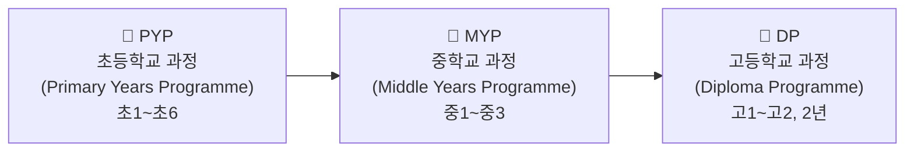
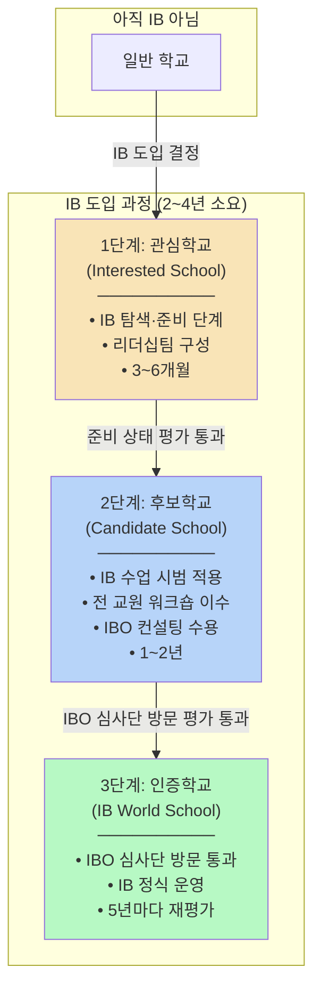
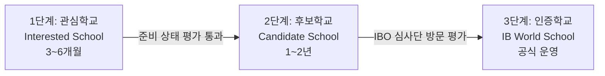
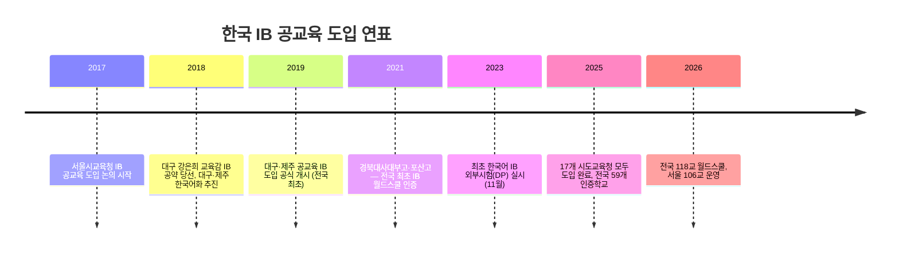
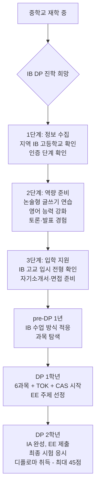

# 한국 공교육 IB 도입 현황 (2026년 기준)

## 먼저 알아야 할 핵심 용어

> IB 관련 문서를 읽기 전에 아래 용어를 먼저 이해하면 전체 흐름이 쉽게 잡힙니다.

### IB 기본 용어

| 용어 | 뜻 | 쉽게 말하면 |
|------|-----|-----------|
| **IB** (International Baccalaureate) | 국제 바칼로레아. 스위스 IBO가 운영하는 국제 교육 프로그램 | 전 세계 공통 교육과정 (한국 교육과정과 별개) |
| **IBO** (IB Organization) | IB를 만들고 관리하는 스위스 본부 기관 | IB의 "교육부" 역할 |
| **IB 월드스쿨** (IB World School) | IBO로부터 최종 인증을 받은 학교 | "IB 정식 운영 학교" = 인증학교 |

### IB 프로그램 종류 (학교급별)

| 약어 | 정식 명칭 | 대상 | 핵심 |
|------|----------|------|------|
| **PYP** | Primary Years Programme | 초등학교 (3~12세) | 탐구 중심 학습, 주제 통합 수업 |
| **MYP** | Middle Years Programme | 중학교 (11~16세) | 교과 간 연결, 개념 기반 학습 |
| **DP** | Diploma Programme | 고등학교 (16~19세, 2년) | 6과목 + TOK/EE/CAS, 최대 45점, **국제 공인 학력** |

> **"DP 인증학교"** = IBO로부터 고등학교 과정(DP)을 정식 운영할 수 있다고 인증받은 학교.
> 같은 학교라도 PYP만 인증받고 MYP/DP는 아직인 경우가 있으므로, **어떤 프로그램의 인증인지**가 중요합니다.

### IB 학교 인증 단계 (3단계)

학교가 IB를 도입하려면 IBO의 심사를 거쳐 단계별로 승격됩니다.

| 단계 | 한국어 | 영어 | 의미 | IB 수업 가능? |
|------|--------|------|------|:------------:|
| **1단계** | 관심학교 | Interested School | IB를 알아보고 준비하는 중 | ❌ 불가 |
| **2단계** | 후보학교 | Candidate School | IB 수업을 시범 적용하며 인증 준비 중 | ⚠️ 시범만 가능 |
| **3단계** | 인증학교 (= 월드스쿨) | Authorized School (= IB World School) | IBO가 공식 인증한 정식 IB 학교 | ✅ 정식 운영 |

> **핵심 포인트:** "IB 학교"라고 해서 모두 같은 수준이 아닙니다.
> - **관심학교 106교** ≠ IB 수업을 하는 학교 106교
> - **인증학교(월드스쿨)만** IB 디플로마를 발급할 수 있는 정식 IB 학교입니다
> - 뉴스에서 "IB 학교 225교"라고 하면 관심+후보+인증을 모두 합친 숫자입니다

### DP 수업에서 나오는 용어

| 용어 | 뜻 | 쉽게 말하면 |
|------|-----|-----------|
| **HL** (Higher Level) | 심화 수준 과목 (240시간) | 깊이 배우는 과목 (3~4과목 선택) |
| **SL** (Standard Level) | 표준 수준 과목 (150시간) | 기본 수준으로 배우는 과목 |
| **TOK** (Theory of Knowledge) | 지식이론 — 지식의 본질을 탐구 | "우리가 아는 것을 어떻게 아는가?" 철학 수업 |
| **EE** (Extended Essay) | 확장 에세이 — 4,000단어 연구 논문 | 대학 졸업논문의 고등학생 버전 |
| **CAS** (Creativity, Activity, Service) | 창의·활동·봉사 프로젝트 | 18개월간 봉사+운동+창작 활동 필수 |
| **IA** (Internal Assessment) | 내부평가 — 교사가 채점, IBO가 검증 | 실험보고서, 구술발표, 연구과제 등 |
| **EA** (External Assessment) | 외부평가 — IBO 본부가 출제·채점 | IB 최종 시험 (논술형) |
| **IB 디플로마** | IB DP 과정 수료 증서 | 총 24점 이상 + 모든 조건 충족 시 발급되는 국제 공인 학력 |

---

## 전체 현황 요약

| 항목 | 수치 | 설명 |
|------|------|------|
| 시도교육청 도입 | **17개** | 전국 17개 시도교육청 모두 IB 도입 완료 |
| 전국 IB 학교 | **360교 이상** | 관심·후보·인증 단계 포함 |
| IB 월드스쿨 (인증) | **118교** | 전국 인증 완료 학교 (2026년 기준) |
| 공교육 DP 인증 고등학교 | **약 18~20교** | 국제학교 제외, 공교육 고등학교 기준 |

---

## 1. IB 인증 3단계

| 단계 | 명칭 | 소요 기간 | 주요 요건 |
|------|------|----------|----------|
| **1단계** | 관심학교 (Interested School) | 3~6개월 | IB 프로그램 탐색, IB 리더십팀 조직, 전문적 학습공동체 운영, IB 평가자의 준비 상태 평가 통과 |
| **2단계** | 후보학교 (Candidate School) | 최소 1년~최대 2년 | IB 수업·평가 적용, 전 교원 IB 워크숍 참여, IBO 컨설턴트 대면·비대면 컨설팅 수용, 학습 운영 과제 실천 |
| **3단계** | 인증학교 (Authorized School / World School) | 심사단 방문 평가 후 | IB 프로그램 전면 도입·운영, IBO 심사단 방문 평가 통과, 공식 IB 월드스쿨 자격 획득 |

> 관심학교부터 인증학교까지 전체 과정은 약 **2~4년** 소요

---

## 2. IB DP(고등학교 과정) 수업 방식

### 2-1. 과목 구성: 6개 과목군 + 3개 핵심 과정

| 과목군 | 영역 | 과목 예시 |
|--------|------|----------|
| Group 1 | 언어와 문학 (Studies in Language & Literature) | 한국어 A, 영어 A |
| Group 2 | 언어 습득 (Language Acquisition) | 영어 B, 중국어, 일본어 |
| Group 3 | 개인과 사회 (Individuals & Societies) | 경제학, 역사, 경영학, 심리학 |
| Group 4 | 과학 (Sciences) | 물리학, 화학, 생물학, 컴퓨터과학 |
| Group 5 | 수학 (Mathematics) | 수학 AA(분석과 접근), 수학 AI(응용과 해석) |
| Group 6 | 예술 (The Arts) | 미술, 음악, 연극 (또는 Group 1~4에서 추가 선택 가능) |

- 6과목 중 **3~4과목은 HL(Higher Level, 240시간)**, 나머지는 **SL(Standard Level, 150시간)**
- 각 과목 **최대 7점**, 6과목 합산 **최대 42점**

### 2-2. 핵심 과정 (Core Components)

| 핵심 과정 | 내용 | 평가 방식 | 배점 |
|----------|------|----------|------|
| **TOK** (Theory of Knowledge, 지식이론) | 지식의 본질과 인식 방법을 탐구하는 철학적 수업 (100시간) | 에세이 1편 + 전시회(Exhibition) | 최대 3점 (EE와 합산) |
| **EE** (Extended Essay, 확장에세이) | 학생이 선택한 주제로 독립 연구, 4,000단어 논문 작성 | 외부 평가(IBO 채점) | TOK와 합산하여 최대 3점 |
| **CAS** (Creativity, Activity, Service) | 창의성·신체활동·봉사 프로젝트 수행 (18개월간) | 이수/미이수 (미이수 시 디플로마 불가) | - |

**총점: 과목 42점 + 핵심 3점 = 최대 45점**

### 2-3. 디플로마 미수여 조건 (Failing Conditions)

다음 중 하나라도 해당하면 IB 디플로마가 수여되지 않습니다:

| 조건 | 설명 |
|------|------|
| 총점 24점 미만 | 6과목 + 보너스 합산 24점 이상 필요 |
| 과목 1점 | 어떤 과목이든 1점을 받으면 불가 |
| 3과목 이상 3점 이하 | HL/SL 무관 |
| CAS 미완료 | 18개월간 창의·활동·봉사 포트폴리오 필수 |
| TOK 또는 EE에서 E등급 | 최저 등급 시 불가 |
| 표절 적발 | 학문적 정직성 위반 시 불가 |

### 2-4. 평가 방식

| 구분 | 내용 | 비율 |
|------|------|------|
| **외부평가 (EA)** | IBO 본부 출제·채점, 5월 시행, 과목당 2~3개 시험지, 서술형·분석형 중심 | 약 70~80% |
| **내부평가 (IA)** | 교사 평가 → IBO 조정. 과학: 실험보고서, 수학: 수학적 탐구, 영어: 구술발표, 경제: 기사분석 | 약 20~30% (예술 35~50%) |

### 2-4. 한국 일반고 vs IB DP 수업 비교

| 비교 항목 | 한국 일반고 | IB DP |
|----------|-----------|-------|
| **수업 방식** | 강의 중심, 교과서 기반 | 토론·탐구·프로젝트 중심 |
| **평가 방식** | 객관식+단답형, 상대평가(내신 등급) | 논술형·서술형, 절대평가(1~7점) |
| **교육과정** | 3년 (고1~고3) | 2년 (pre-DP 1년 + DP 2년) |
| **시험 출제** | 학교 자체 출제 | IBO 본부 출제 (외부평가) |
| **성적 인증** | 국내 내신 등급 | IB 디플로마 (국제 공인 학력) |
| **핵심 역량** | 교과 지식 암기·적용 | 비판적 사고, 연구 능력, 자기주도 학습 |

---

## 3. 지역별 IB DP 고등학교 상세 현황

### 3-1. 대구광역시 — DP 인증학교 6교 (전국 선도)

> 2019년 전국 최초 공교육 IB 도입. 총 114교 운영 (기초 33, 관심 22, 후보 26, 인증 32)
> 대구는 초(PYP)→중(MYP)→고(DP) IB 벨트를 전국 최초로 완성

---

#### 경북대학교사범대학부설고등학교 (경북대사대부고)

| 항목 | 내용 |
|------|------|
| **홈페이지** | [knue.dge.hs.kr](https://knue.dge.hs.kr) |
| **위치** | 대구광역시 북구 |
| **인증** | 인증학교 (2021.09) — **전국 공교육 최초 IB DP 월드스쿨** |
| **학교 유형** | 국립 부설 고등학교 |

**학교 특징:**
- 전국 공교육 최초로 IB DP 월드스쿨 인증을 받은 상징적 학교
- 경북대학교 사범대학과 연계한 교원 전문성 확보
- 1기 졸업생 30명 전원 디플로마 또는 과목 이수증 취득
- 38점 이상 고득점자 5명 배출 (해외 명문대 진학 가능 수준)

**대입 실적:**

| 구분 | 1기 졸업생 (2024 대입) | 2기 졸업생 (2025 대입) |
|------|----------------------|----------------------|
| 디플로마 취득 | 30명 전원 (디플로마+과목이수증) | 18명 디플로마 + 11명 과목이수증 |
| 평균 점수 | - | 30.9점 (세계 평균 29점 상회) |
| 고득점자 | 38점 이상 5명 | 37점 이상 4명 |
| 주요 합격 대학 | 연세대, 고려대, 성균관대, DGIST, UNIST, KENTECH — 수도권 주요 대학 22명 합격 | 연세대, 서울시립대, 경북대, DGIST 등 |

---

#### 포산고등학교

| 항목 | 내용 |
|------|------|
| **홈페이지** | [posan.dge.hs.kr](https://posan.dge.hs.kr) |
| **위치** | 대구광역시 달성군 |
| **인증** | 인증학교 (2021.09) — 경북대사대부고와 동시 인증 |
| **학교 유형** | 공립 일반고 |

**학교 특징:**
- 달성군 IB 교육의 거점 학교
- 농촌 지역 공립 일반고에서 IB 도입 성공 사례로 주목
- 2기 졸업생 21명 중 15명 풀 디플로마 취득

**대입 실적:**

| 구분 | 내용 |
|------|------|
| 2기 졸업생 | 21명 중 20명 국내외 대학 합격 |
| 최고 점수 | 39점 (캐나다 University of Alberta 합격) |
| 주요 합격 대학 | 건국대, 명지대, 대구교대, 광주교대 등 — 이공계·인문계·예술 다양 |

---

#### 대구외국어고등학교

| 항목 | 내용 |
|------|------|
| **홈페이지** | [dgfl.dge.hs.kr](https://dgfl.dge.hs.kr) |
| **위치** | 대구광역시 달서구 |
| **인증** | 인증학교 — **전국 국·공립 최초 한국어 IB DP 월드스쿨** |
| **학교 유형** | 공립 특수목적고 (외국어고) |

**학교 특징:**
- 1997년 개교한 외국어고등학교로서 외국어 교육 강점
- 2기 졸업생 응시생 **100% 전체 디플로마 취득** (전국 최고 성적)
- 평균 점수 30.5점, 33점 이상 학생 40%
- 개별 맞춤형 학습 코칭, 체계적 글쓰기 교육이 강점

**대입 실적:**

| 구분 | 내용 |
|------|------|
| 3년간 졸업생 총 54명 | 서울 주요 상위권 대학 대거 합격 |
| 주요 합격 대학 | 연세대, 고려대, 서강대, 성균관대, 이화여대, 지방 거점 국립대 |
| 주요 진학 전공 | 국제학부, 글로벌경제학과, 정치외교학과, 영어영문학과 등 어문·국제 계열 |

---

#### 대구국제고등학교

| 항목 | 내용 |
|------|------|
| **홈페이지** | [dhi.dge.hs.kr](https://dhi.dge.hs.kr) |
| **위치** | 대구광역시 |
| **인증** | 인증학교 |
| **학교 유형** | 대구시교육청 소속 국제고등학교 |

**학교 특징:**
- 첫 졸업생 20명 중 19명 디플로마 취득 — **취득률 95%** (세계 평균 73.8% 대비 압도)
- 평균 점수 31점 (세계 평균 29점 상회)
- 이중언어 디플로마(Bilingual Diploma) 18명(90%) 취득 — 경제 등을 영어로 이수

**대입 실적:**

| 구분 | 내용 |
|------|------|
| 국내 대학 | 연세대, 성균관대, 한양대, 중앙대, 건국대, 서울시립대, 숙명여대 등 — 글로벌학부, 경제경영학부 |
| 해외 대학 | 호주 멜버른대, 모나쉬대, 미국 엠브리-리들 항공대, 홍콩대 등 |

---

#### 대구서부고등학교

| 항목 | 내용 |
|------|------|
| **홈페이지** | [dgseobu.dge.hs.kr](https://dgseobu.dge.hs.kr) |
| **위치** | 대구광역시 서구 |
| **인증** | 인증학교 — 대구 5번째 DP 월드스쿨 |
| **학교 유형** | 공립 일반고 |

**학교 특징:**
- 대구외고, 포산고와 함께 DP 거점 고등학교로서 IB 벨트 형성
- 일반고에서 IB를 성공적으로 운영하는 모델
- IB DP 대학 진학률: 1기 81.8%, 2기 85% (전국 고교 평균 73.6% 상회)

**대입 실적:**
- 주로 수능 최저등급 없는 학생부종합전형, 논술전형으로 진학
- 캐나다·영국·호주 등 해외 대학, 수도권 주요 대학, 지방 거점 대학, DGIST 등 연구 중심 대학에 다수 합격

---

#### 대구중앙고등학교

| 항목 | 내용 |
|------|------|
| **홈페이지** | [djoongang.dge.hs.kr](https://djoongang.dge.hs.kr) |
| **위치** | 대구광역시 |
| **인증** | 인증학교 (2025.12) — **대구 사립고 최초 IB DP 인증** |
| **학교 유형** | 사립 일반고 |

**학교 특징:**
- 전국 일반계 사립 최초로 MYP + DP 연속 운영 IB 월드스쿨
- 2021년 관심학교 → 2023년 후보학교 → 2025년 인증학교 (4년 과정)
- 개념 기반 탐구 학습, 학생 주도 수업 문화 정착
- 지역사회 연계 프로젝트·협업 기회 풍부

**대입 실적:**
- 2025.12 인증으로 아직 DP 졸업생 미배출 (첫 졸업생 2027~2028년 예상)

---

### 3-2. 경기도 — DP 인증학교 8교 (전국 최대 규모 확산)

> 총 297교 운영 (관심 244, 후보 42, 인증 21)

---

#### 경기외국어고등학교

| 항목 | 내용 |
|------|------|
| **홈페이지** | [gafl.hs.kr](https://gafl.hs.kr) |
| **위치** | 경기도 의왕시 |
| **인증** | 인증학교 (2011) — **국내 최초 IB DP 도입** (영어 운영) |
| **학교 유형** | 공립 특수목적고 (외국어고) |

**학교 특징:**
- 2011년 국내 고등학교 최초로 IB DP 도입한 원조 IB 학교
- IB 졸업생들이 영국·미국·싱가포르·호주·캐나다·중국·일본·네덜란드·독일 등 **세계 11개국 149개 대학**에 진학
- 영어로 DP 운영 — 해외 대학 진학에 특히 강점

**대입 실적:**

| 구분 | 내용 |
|------|------|
| 2025 서울대 | 수시 6명 + 정시 6명 = **12명** |
| 2024 서울대 | 수시 11명 + 정시 2명 = **13명** |
| 2023 서울대 | 수시 7명 + 정시 2명 = **9명** |
| 해외 대학 | 2025학년 70명 해외대 합격, 세계 50위 이내 대학 22명 합격 |

---

#### 죽산고등학교

| 항목 | 내용 |
|------|------|
| **홈페이지** | [juksan-mh.goean.kr](https://juksan-mh.goean.kr) |
| **위치** | 경기도 안성시 |
| **인증** | 인증학교 (2025.01) — **경기 공립고 최초 한국어 DP 인증** |
| **학교 유형** | 공립 일반고 (중·고 통합학교) |

**학교 특징:**
- 중학교(MYP)·고등학교(DP) 모두 인증받은 전국 최초 공립 통합학교
- 경기도 안성의 IB 교육 허브 역할
- 논술·서술형 평가 위주, 개인 역량 중심 교육
- 과학/인문 계열 맞춤 과목 선택 (예: IB생명과학+IB영어+IB역사 또는 IB화학+IB언어와문학+IB수학)

**대입 실적:**
- 2028학년도에 첫 DP 졸업생 배출 예정 (현재 재학 중)
- 경기도교육청-서울대학교 업무협약(2024.11) 체결로 IB의 대입 전형 반영 연구 진행 중

---

#### 동탄국제고등학교

| 항목 | 내용 |
|------|------|
| **홈페이지** | [dtg.hs.kr](https://www.dtg.hs.kr) |
| **위치** | 경기도 화성시 동탄 |
| **인증** | 인증학교 (2025.11) |
| **학교 유형** | 공립 국제고등학교 |

**학교 특징:**
- 2024.09 후보학교 → 2025.11 월드스쿨 인증 (약 14개월만에 인증 완료)
- 2026년 16기 학생부터 pre-DP 방식으로 시작, 정식 DP 운영 예정
- 국제고등학교로서 국제 교류·다문화 교육 기반 강점

**대입 실적:**
- DP 졸업생 아직 미배출 (2026년 pre-DP 시작, 2028~2029년 첫 졸업생 예상)

---

#### 군서미래국제학교 (시흥)

| 항목 | 내용 |
|------|------|
| **홈페이지** | [gunseo.goesp.kr](https://gunseo.goesp.kr) |
| **위치** | 경기도 시흥시 |
| **인증** | 인증학교 (2024) — **경기도 공립 최초 IB 인증** |
| **학교 유형** | 공립 초·중·고 통합학교 |

**학교 특징:**
- PYP(초)·MYP(중)·DP(고) 전 과정을 하나의 캠퍼스에서 운영
- 경기도 공립 학교 최초 IB 인증이라는 상징성

---

#### 기타 경기도 신규 인증학교 (2025.11)

| 학교명 | 홈페이지 | 위치 | 특징 |
|--------|---------|------|------|
| 덕정고등학교 | [덕정고](https://school.iamservice.net/organization/18787) | 경기도 양주시 | 2025.11 신규 인증 |
| 관양고등학교 | [gwanyang-h.goeay.kr](https://gwanyang-h.goeay.kr) | 경기도 안양시 동안구 | 2025.11 신규 인증 |
| 남양주다산고등학교 | [nyjdasan-h.goegn.kr](https://nyjdasan-h.goegn.kr) | 경기도 남양주시 | 2020년 개교, 디지털 창의역량 강화 특색 |
| 수원중앙기독고등학교 | [suwoncca-h.goesw.kr](https://suwoncca-h.goesw.kr) | 경기도 수원시 | IB DP 운영 중 |

> 위 학교들은 모두 2025년 신규 인증으로 DP 졸업생은 아직 없음

**경기도 주요 후보/관심 고등학교:**

| 학교명 | 인증 단계 |
|--------|----------|
| 동화고등학교 | 후보/관심학교 |
| 저동고등학교 | 후보/관심학교 |
| 현화고등학교 | 관심학교 |
| 포천고등학교 | 관심학교 |
| 진접고등학교 | 관심학교 |
| 성남외국어고등학교 | 관심학교 |
| 수원고등학교 | 관심학교 |

---

### 3-3. 서울특별시 — 고등학교 22교 운영 (대부분 관심학교 단계)

> 2026년 총 106교 (초 49, 중 35, 고 22). 양천구 10교, 노원구·마포구 각 8교로 최다

| 구분 | 현황 | 비고 |
|------|------|------|
| 인증학교 (DP) | **없음** | 초등 2교만 인증 (구로초, 대왕초 — 2025.12 서울 공립 최초) |
| 후보학교 | 진행 중 | 중학교 중심 (휘경여중, 창덕여중 등) |
| 관심학교 (고등) | 22교 | 2025년부터 고등학교 공모 시작 |

> 서울시교육청은 '한국형 바칼로레아(KB)' 모델을 별도로 구축 추진 중
> 서울 소재 공교육 고등학교 중 DP 인증학교는 아직 없음 — 가장 빨라도 2028년 이후 첫 졸업생 예상

**서울 소재 국제학교 (DP 인증):**

| 학교명 | 홈페이지 | 비고 |
|--------|---------|------|
| Seoul Foreign School (SFS) | [seoulforeign.org](https://www.seoulforeign.org) | IB DP 운영 |
| Dwight School Seoul | [dwight.or.kr](https://dwight.or.kr) | IB DP 운영 |
| Dulwich College Seoul | [seoul.dulwich.org](https://seoul.dulwich.org) | IB DP 운영 |

---

### 3-4. 제주특별자치도

#### 표선고등학교

| 항목 | 내용 |
|------|------|
| **홈페이지** | [pyoseon.jje.hs.kr](https://pyoseon.jje.hs.kr) |
| **위치** | 서귀포시 표선면 |
| **인증** | 인증학교 (2021) — **제주 유일 공교육 IB DP 고등학교**, 국내 최초 전 과정 한국어 DP |
| **학교 유형** | 공립 일반고 |

**학교 특징:**
- 읍면 지역 공립 일반고에서 IB를 도입하여 전국적 주목
- 표선면 IB지구(초-중-고 벨트) 형성으로 학생 유입 증가
- 도외 4년제 대학 합격 인원 2023학년 108명 → 2024학년 189명으로 급증

**대입 실적:**

| 구분 | 2024학년도 대입 (1기) | 2025학년도 대입 |
|------|---------------------|----------------|
| DP 응시 | 26명 (디플로마 11명 + 과목이수증 15명) | - |
| 평균 점수 | 29점 (세계 평균 29.06점 근접), 30점 이상 5명 | - |
| 서울대 | **1명** | **1명** |
| 연세대/고려대 | 각 1명 | 연세대 2명, 고려대 2명 |
| KAIST | - | **1명** |
| UNIST/DGIST | 각 2명 | - |
| 성균관대 | 2명 | - |

---

**제주 소재 국제학교 (DP 인증):**

| 학교명 | 홈페이지 | 비고 |
|--------|---------|------|
| Branksome Hall Asia (BHA) | [branksome.asia](https://www.branksome.asia) | IB DP 운영 |
| North London Collegiate School Jeju (NLCS) | [nlcsjeju.kr](https://www.nlcsjeju.kr) | IB DP 운영 |

---

### 3-5. 전북특별자치도

#### 지평선고등학교

| 항목 | 내용 |
|------|------|
| **홈페이지** | [school.jbedu.kr/jipyeongseon-h](https://school.jbedu.kr/jipyeongseon-h) |
| **위치** | 전북 김제시 성덕면 |
| **인증** | 인증학교 (2026.06) — **전북 최초 IB DP 월드스쿨** |
| **학교 유형** | 대안교육 특성화고등학교 (원불교 운영) |

**학교 특징:**
- 대안교육 특성화고로서 IB를 도입한 독특한 사례
- 도서관 중심 독서·토론, 인문학 탐구, 생태적 감수성 교육을 IB DP와 결합
- "지평선을 넘어, 새로운 배움" 비전
- 소규모 학교의 장점을 살린 개별화 교육

**대입 실적:**
- 2026.06 인증으로 DP 졸업생 아직 미배출

**기타 전북 IB 관심학교:**

| 학교명 | 인증 단계 |
|--------|----------|
| 자유고등학교 | 관심학교 |
| 전주중앙여자고등학교 | 관심학교 |
| 순창고등학교 | 관심학교 |

---

### 3-6. 충청북도

#### 단재고등학교

| 항목 | 내용 |
|------|------|
| **홈페이지** | [school.cbe.go.kr/danjae-h](https://school.cbe.go.kr/danjae-h) |
| **위치** | 충북 청주시 |
| **인증** | 인증학교 (2025.12) — **충북 최초 IB DP 월드스쿨** (후보 승인 후 10개월만에 인증) |
| **학교 유형** | 공립 일반고 |

**학교 특징:**
- 학년당 1학급 소규모 체제 — 학생 한 명 한 명 세밀한 성장 관리
- '정답 중심'이 아닌 **'질문 중심'** 수업이 핵심
- 학생 주도성을 수업·프로젝트·학교생활 전반에 걸쳐 중시

**대입 실적:**
- 인증 직후로 DP 졸업생 아직 미배출

---

### 3-7. 충청남도

#### 충남삼성고등학교

| 항목 | 내용 |
|------|------|
| **홈페이지** | [cnsa.hs.kr](https://www.cnsa.hs.kr) |
| **위치** | 충남 아산시 |
| **인증** | 인증학교 (2020.08) — **영어 운영** |
| **학교 유형** | 사립 자율형사립고 (광역자사고) |

**학교 특징:**
- '학생 선택 진로별 교육과정' — 3계열 13과정의 맞춤형 교육
- 2020년 IB DP 도입, 영어로 운영
- 전국 7개 비서울 광역자사고 중 서울대 합격 실적 최상위권

**대입 실적:**

| 구분 | 내용 |
|------|------|
| 서울대 합격 추이 | 2022대입 16명(수시13+정시3), 2023대입 15명 |
| 최근 5년 서울대 수시 | 44명 (7개 비서울 광역자사고 중 2위) |
| 진학 특징 | 국내 상위권 대학 + IB 점수 활용 해외 대학 동시 지원 |

---

### 3-8. 대전광역시 (후보학교 단계)

| 학교명 | 홈페이지 | 인증 단계 | 비고 |
|--------|---------|----------|------|
| 대전대성고등학교 | - | **후보학교** | 2025.11 후보 승인 |
| 서대전고등학교 | - | **후보학교** | 2026.04 후보 승인 |
| 서일고등학교 | - | **후보학교** | 2026.05 후보 승인 |

---

### 3-9. 부산·인천·기타

| 지역 | 학교명 | 홈페이지 | 인증 단계 | 비고 |
|------|--------|---------|----------|------|
| 부산 | (공교육 DP 없음) | - | - | 2025년 IB 연구학교 시작, 2028년 이후 정착 목표 |
| 부산 | International School of Busan | [isbusan.org](https://www.isbusan.org) | 인증학교 (국제학교) | |
| 인천 | Chadwick International (송도) | [chadwickinternational.org](https://www.chadwickinternational.org) | 인증학교 (국제학교) | DP, CP 포함 |
| 경남 | Gyeongnam International Foreign School | - | 인증학교 (국제학교) | 사천 |
| 광주 | (공교육 DP 없음) | - | 탐색학교 단계 | |
| 강원 | (공교육 DP 없음) | - | IB 도입 추진 중 | |

---

## 4. IB 도입 타임라인

---

## 5. IB DP 실전 준비 로드맵

---

## Sources

- [교육을 비추다 — IB 도입 7년차 현황](https://www.kyobit.com/news/articleView.html?idxno=3142)
- [대구시교육청 IB 프로그램 운영 현황](http://www.dge.go.kr/main/cm/cntnts/cntntsView.do?mi=5768&cntntsId=3407)
- [경기도교육청 IB 월드스쿨 21교 인증 완료](https://www.gninews.co.kr/news/article.html?no=748975)
- [서울시교육청 IB 학교 현황](https://www.sen.go.kr/www/eduinfo/ib/ib_3.jsp)
- [서울 공립학교 최초 IB 인증학교 — 전국 59개](https://v.daum.net/v/20251219125123423?f=p)
- [대구 중앙고 IB DP 월드스쿨 인증](https://www.imaeil.com/page/view/2025121519100109569)
- [경북대사대부고·포산고 IB 인증](http://www.veritas-a.com/news/articleView.html?idxno=391338)
- [전북 지평선고 IB DP 인증](https://www.newsis.com/view/NISX20260630_0003689302)
- [충북 단재고 IB 월드스쿨 인증](https://v.daum.net/v/qSfD4KXSEG?f=p)
- [대전교육청 IB 후보학교](https://www.goodmorningcc.com/news/articleView.html?idxno=446314)
- [군서미래국제학교 IB 인증](https://www.kyeonggi.com/article/20241113580061)
- [IBO 공식 — 한국 학교 리소스](https://ibo.org/about-the-ib/the-ib-by-region/ib-asia-pacific/resources-for-schools-in-south-korea/)
- [한국 IB 학교 지도](https://korea-ib-school-map-hosting.vercel.app/)
- [한국 IB 교육과정 2025 최신 — IBMaster](https://www.ibmaster.net/blog/IB-in-Korea)
