# 한국형 바칼로레아(KB) 도입 현황 (2026년 기준)

> **문서 목적**: K-Baccalaureate(KB)의 도입 배경, 전국 시도교육청별 추진 현황, 고등학교별 준비 단계, 2032 대입 연계 전략을 종합 정리한 레퍼런스
> **대상 독자**: 진로상담 교사, 학부모, 입학사정관, 교육 정책 관계자
> **핵심 요약**: IB의 교육 철학을 한국 공교육 전체로 확산하는 KB가 2026년 9월 논·서·구술형 평가 시스템 가동과 함께 본격 출발. 2032 대입부터 KB 방식 교육이 구조적 우위를 점할 전망
> **최종 업데이트**: 2026년 7월

---

## 먼저 알아야 할 핵심 용어

> KB 관련 문서를 읽기 전에 아래 용어를 먼저 이해하면 전체 흐름이 쉽게 잡힙니다.

### KB 기본 용어

| 용어 | 뜻 | 쉽게 말하면 |
|------|-----|-----------|
| **KB** (K-Baccalaureate) | 한국형 바칼로레아. IB의 교육 철학을 한국 공교육에 접목한 모델 | IB의 '정신'을 한국 공교육 전체에 퍼뜨리는 프로젝트 |
| **IB** (International Baccalaureate) | 국제 바칼로레아. 스위스 IBO가 운영하는 국제 교육 프로그램 | 전 세계 공통 교육과정 (KB의 원형) |
| **KBO** (Korean Baccalaureate Organization) | KB를 운영할 한국형 독립 기구 (구상 중) | IBO의 한국판 — 정권 교체에도 KB가 지속되도록 하는 장치 |
| **DP** (Diploma Programme) | IB 고등학교 과정 (16~19세 대상) | IB에서 대학 입시에 직접 연결되는 핵심 과정 |
| **MYP** (Middle Years Programme) | IB 중학교 과정 (11~16세 대상) | DP 진입 전 탐구·논술 기초를 다지는 과정 |
| **PYP** (Primary Years Programme) | IB 초등학교 과정 (3~12세 대상) | 가장 이른 시기부터 탐구 기반 학습 시작 |
| **월드스쿨** (World School) | IBO가 공식 인증한 학교 | IB 프로그램을 정식으로 운영할 수 있는 학교 |
| **후보학교** (Candidate School) | 인증 준비 중인 학교 | 1~2년 내 월드스쿨 인증 예상 |
| **관심학교** (Interest School) | IB 도입을 탐색하는 학교 | IB 교육 철학을 학교에 적용하기 시작한 단계 |

### KB vs IB — 핵심 차이

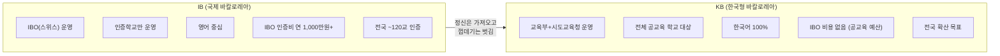

| 비교 항목 | IB (국제 바칼로레아) | KB (한국형 바칼로레아) | 기존 수능 중심 교육 |
|------|------|------|------|
| **운영 주체** | IBO (스위스 제네바) | 한국 교육부 + 시도교육청 | 한국 교육부 |
| **교육과정** | IB 자체 교육과정 | **국가 교육과정 기반** + IB 평가 방식 | 국가 교육과정 (2022 개정) |
| **평가 방식** | 서술형 100% + IA + EA | **논/서/구술형 중심** (서술형 70%+) | 객관식 70% + 서술형 30% |
| **수업 언어** | 영어/한국어(일부) | **한국어 100%** | 한국어 |
| **비용** | 학교당 연 1,000~1,500만원 IBO 인증비 | **무상** — IBO 인증비 없음 | 무상 (공교육) |
| **적용 범위** | 인증학교만 (전국 ~120교) | **모든 공교육 학교** 대상 | 전체 학교 |
| **대입 연계** | 학종 활용 (공식 IB 전형 없음) | **수능 개편과 직접 연계** 가능 | 수능 = 교육의 목표 |
| **글로벌 인정** | 전 세계 160개국 인정 | 한국 내 + 향후 글로벌 인정 추진 | 한국 내에서만 유효 |
| **학생 부담** | 영어 몰입 수업 + EE 4,000단어 (영어) | K-Essay 4,000자 (한국어) | 5지선다 객관식 암기 |
| **교사 역할** | IBO 인증 교사 자격 필요 | KB 교원연수 이수 | 교과서 진도 중심 |

### KB가 IB에서 가져온 것과 버린 것

| 가져온 것 (IB의 강점) | 버린 것 (IB의 한계) |
|------|------|
| 100% 서술형 평가 | IBO 인증비 (학교당 연 수천만원) |
| 탐구 기반 학습 (Inquiry-based) | 영어 중심 수업·평가 |
| 내부평가(IA) — 학생 자기주도 프로젝트 | IBO 글로벌 채점 시스템 의존 |
| 소논문(EE) — 독립 연구 논문 경험 | 국가 교육과정과의 괴리 |
| 지식론(TOK) — 비판적 사고 훈련 | 수능과의 완전 단절 |
| CAS — 창의·활동·봉사 통합 | 소수 인증학교만 접근 가능한 구조 |

### 수능 vs IB vs KB 교육 패러다임 비교

| 항목 | 전통적 수능 | IB (국제 바칼로레아) | KB (한국형 바칼로레아) |
|------|----------|----------|----------|
| **평가 방식** | 5지선다 객관식, 상대평가 (1-9등급) | 논·서술형, 구술, 절대평가 (45점 만점) | 한국형 절대논술평가 (수능 자격고사화 연계) |
| **교육 철학** | 공정성·객관성 담보, 입시 경쟁 | 질문하는 학생, 토론하는 수업, 창의력 | IB 장점을 한국 교육 환경에 최적화 |
| **약점** | 파행적 교육과정, 사교육 의존 심화 | 높은 로열티, 영어 부담, 수능과 충돌 | 개발 중 체제로 검증 시간 필요 |
| **대입 경로** | 정시(수능) — 해외 지원 불가 | 학종 + 글로벌 명문대 Dual-Track | 2028 이후 국내 대입 직접 연계 |
| **AI 시대 적합성** | 낮음 (암기 중심) | 높음 (비판적 사고·에세이) | 높음 (한국어 기반 + AI 연계) |

---

## 전체 현황 요약

| 항목 | 수치 | 설명 |
|------|------|------|
| 시도교육청 도입 | **17개** | 전국 17개 시도교육청 모두 IB 도입 완료 (KB 전환 추진 중) |
| 전국 IB/KB 관련 학교 | **400교 이상** | 인증 106 + 후보 73 + 관심·탐색 200+ (2026년 기준, 계속 증가 중) |
| KB 평가시스템 가동 | **2026년 9월** | 대구교육청, 논·서·구술형 평가 시스템 전국 최초 학교 현장 제공 |
| KB 핵심 추진 교육청 | **대구·서울** | 대구: IB→KB 전환 모델, 서울: KB 직행 모델 |
| 2028 IB DP 대입 지원 | **1,200명+** | 2028학년도 30개교 이상 학생이 수시 지원 전망 (IBO 추산) |
| IB 우수자 특별전형 | **3개 대학** | 고려대·서강대·한양대 2025학년도부터 IB 우수자 특별전형 도입 |
| IB 전문교원 | **2,500명+** | 전국 IB 인증 교사 및 전문교원 양성 완료 |
| KB 관련 조례 | **7개 교육청** | 부산·전남·강원·제주 제정, 전북 공포, 서울·경기 추진 중 |

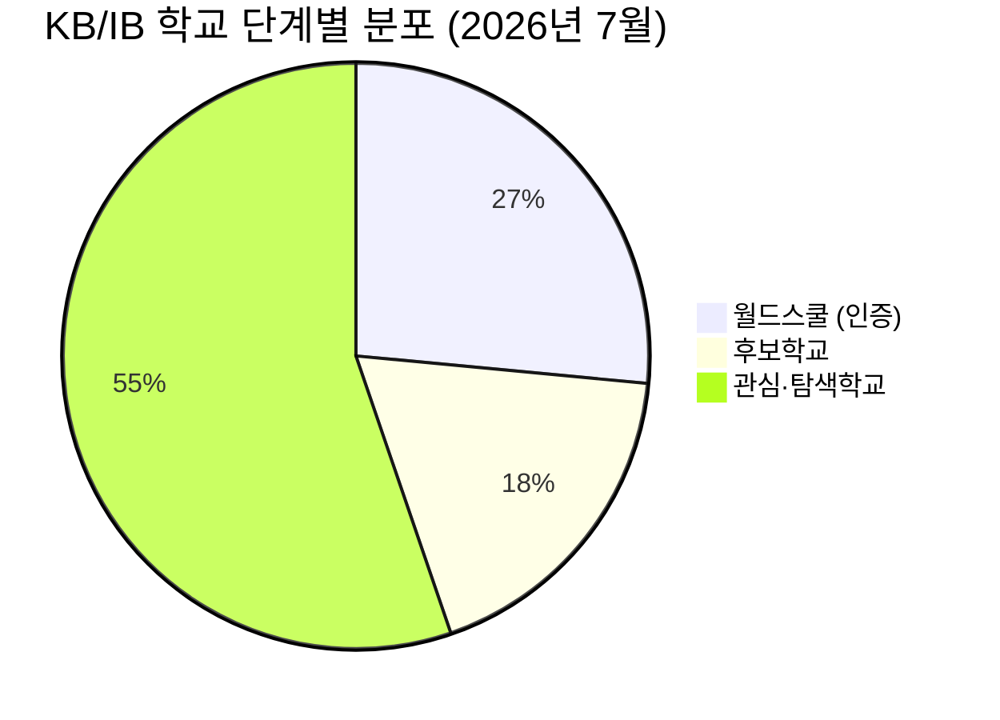

---

## 1. KB 도입의 배경 — 왜 IB에서 KB로 전환하는가

### 1-1. IB 공교육 도입의 성과 (2019~2026)

IB가 한국 공교육에서 성과를 입증하면서, "이 방식을 전국으로 확대할 수 있는가?"라는 질문이 KB를 탄생시켰습니다.

| 성과 지표 | 수치 | 의미 |
|------|------|------|
| 표선고 서울대 합격 | 2년 연속 (2024·2025 대입) | 공교육 IB도 최상위 대학 진학 가능 입증 |
| 경북대사대부고 38점+ | IB 45점 만점 중 38점 이상 5명 | 해외 명문대 지원 가능 수준 |
| 대구외고 디플로마 취득률 | 응시생 100% 전체 디플로마 취득 (2기) | 글로벌 평균 73.8% 대비 압도적 |
| IB DP 응시생 증가 | 93명(2023) → 141명(2025), **51.6% 증가** | 수요 급증 |
| 학부모 만족도 | 초등 97.0%, 고등 95.1% | 교육 현장의 높은 호응 |
| 교사 변화 동의 | 96% (6,766명 조사) | 교사의 절대다수가 IB 방식 변화에 동의 |
| 표선고 1기 합격 실적 | 서울대 1, 연세대 1, 고려대 1, UNIST 2, DGIST 2 | 사교육 0원으로 최상위권 합격 |
| 표선고 2기 합격 실적 | 서울대 1, 연세대 2, 고려대 2, KAIST 1 | 연속 입증 — 우연이 아닌 구조적 성과 |

### 1-2. 표선고 — 공교육 IB의 살아있는 증거

> **폐교 위기의 농어촌 학교 → 전국 최초 학교 단위 IB DP → SKY·KAIST 합격**

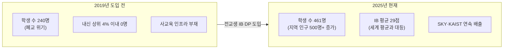

| 항목 | 내용 |
|------|------|
| **학교명** | [표선고등학교](https://jjps.jje.hs.kr/) |
| **위치** | 제주특별자치도 서귀포시 표선면 |
| **유형** | 공립 일반고 (무상교육) |
| **IB 인증** | 2021년 — 전국 최초 학교 단위(Whole-School) DP 월드스쿨 |
| **모집정원** | 150명 (6학급 × 25명, 일반 147 + 체육특기자 3) |
| **경쟁률** | 약 1.39:1 (2025학년도, 매년 상승 추세) |
| **선발 방식** | 내신성적 100% 정량 선발 (면접·자기소개서 없음) |
| **모집 범위** | 도내 모집 (제주 거주자 한정, 혁신도시·영어교육도시 예외) |
| **비용** | 공립 무상교육 + IB 운영비 교육청 지원. 기숙사비·식비 등 연 200~400만원 |
| **기숙사** | 송림학사 운영 (제주 본섬·도외 학생 수용) |
| **사교육비** | 사실상 0원 (학원 인프라 부재) |

**표선고 하루 일과**

| 시간 | 활동 | 비고 |
|------|------|------|
| 07:00~08:00 | 기숙사 기상, 아침식사, 등교 준비 | |
| 08:30~12:30 | IB DP 정규 수업 (영어 몰입 + 논·서술 평가) | 수능 문제풀이 0% |
| 12:30~13:30 | 점심 + 동료와 IA·EE 진행 상황 공유 | 협업 학습 문화 |
| 13:30~16:30 | 오후 수업 (TOK·과학 실험·HL 심화) | |
| 16:30~18:00 | CAS 협업 프로젝트·동아리·운동 | |
| 18:00~19:00 | 저녁 식사 | |
| 19:00~22:00 | 기숙사 자율학습 — IA 작성·EE 자료조사·에세이 | 자기주도 70~80% |
| 22:00~23:30 | 개인 독서·휴식·취침 준비 | |

> **핵심**: 학원 의존 0%, 자기주도 학습 비중 70~80%로 전국 최고 수준. 학교가 학습의 전부인 환경

### 1-3. IB의 한계 → KB의 필요성

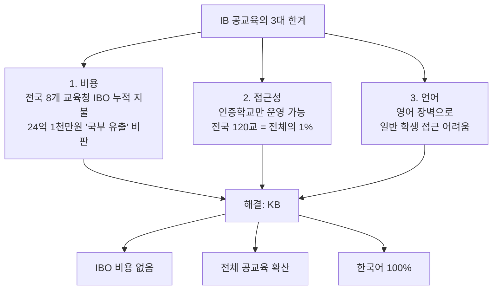

### 1-4. KB 탄생 타임라인

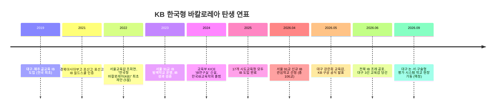

---

## 2. KB의 구체적 내용

### 2-1. KB 교육과정 3층 구조

KB는 기존 국가 교육과정을 유지하면서, **평가 방식**과 **수업 방법**만 전환하는 모델입니다.

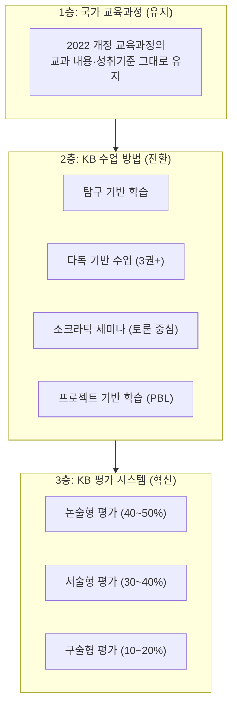

### 2-2. KB Core — IB Core의 한국화

KB의 가장 혁신적 요소는 IB의 EE+TOK+CAS를 한국 맥락에 재설계한 **KB Core**입니다.

| KB Core 요소 | IB 원형 | 한국형 재설계 | 분량 | 평가 |
|------|------|------|------|------|
| **탐구 논문 (K-Essay)** | Extended Essay (EE) | 4,000자 독립 연구 논문. 한국 사회·문화 주제 가능 | 고2~고3, 1년 | A~E 등급 |
| **사고와 논증 (K-Think)** | Theory of Knowledge (TOK) | "어떻게 아는가?" 탐구. AI 시대 지식의 본질, 미디어 리터러시 | 주 2시간, 2년 | 논술 에세이 + 구술 |
| **실천과 성찰 (K-Act)** | CAS (Creativity, Activity, Service) | 창의+신체+봉사 18개월, 성찰 일지 작성 | 주 2~3시간 | 합격/불합격 |

#### K-Essay (탐구 논문) 상세 가이드

| 항목 | IB EE (영어) | KB K-Essay (한국어) |
|------|------------|----------|
| **분량** | 4,000단어 (영어) | 4,000자 (한국어) |
| **언어** | 영어 필수 (일부 한국어 허용) | 한국어 100% |
| **주제 선택** | IBO 교과 범위 내 | 한국 사회·문화·과학 주제 자유 선택 |
| **지도 방식** | 1:1 지도교사 매칭 | 1:1 멘토교사 + AI 보조 피드백 |
| **평가 기관** | IBO 글로벌 채점단 | KB 전문 평가단 (교차채점) |
| **대입 활용** | 학종 세특 + 해외 PS | 학종 세특 + 면접 핵심 소재 |
| **AI 사용** | 자료 수집만 허용, 본문 작성 시 부정행위 | AI 활용 일지 의무 작성, 투명한 활용 장려 |

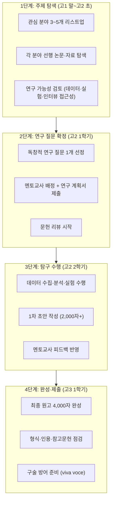

#### K-Think (사고와 논증) 상세

| 항목 | 내용 |
|------|------|
| **목표** | "지식을 어떻게 알 수 있는가?"를 탐구하는 비판적 사고 훈련 |
| **수업 방식** | 소크라틱 세미나 (교사가 질문, 학생이 토론) |
| **AI 시대 주제 예시** | "AI가 생성한 지식은 진짜 지식인가?", "AI 편향성은 지식의 신뢰성에 어떤 영향을 미치는가?" |
| **평가** | 논술 에세이 (1,600자) + 구술 발표 (10분) |
| **대입 효과** | 면접 논리력 극대화, 옥스브리지·아이비리그 인터뷰 대응력 |

#### K-Act (실천과 성찰) 상세

| 항목 | 내용 |
|------|------|
| **구성** | 창의성 (Creativity) + 신체활동 (Activity) + 봉사 (Service) |
| **기간** | 최소 18개월, 주 2~3시간 |
| **핵심 요건** | 최소 1개의 협업 프로젝트 (1개월 이상 팀 단위) |
| **성찰 일지** | 매 활동 후 "배운 것 / 느낀 것 / 다음에 할 것" 기록 |
| **평가** | 합격/불합격 (포트폴리오 기반) |
| **K-Act 예시** | 초등학생 AI 윤리 수업 설계·진행, 폐자원 가방 제작·기부, 지역 노인 디지털 리터러시 교육 |

### 2-3. KB 논·서·구술형 평가 시스템 (2026년 9월 가동)

대구교육청이 2년간 IB를 분석하여 개발한 **전국 최초 KB 평가 시스템**의 핵심 기능:

| 기능 | 내용 | 기존 평가와의 차이 |
|------|------|------|
| **OCR 손글씨 인식** | 학생들의 다양한 손글씨를 자동 인식·디지털화 | 기존: 교사가 수기 채점 |
| **표절 탐지 AI** | 다른 학생·AI·인터넷에서 베낀 내용을 구분 | 기존: 표절 확인 수단 없음 |
| **내용 구성 평가** | 특정 단어 없어도 논리 구성이 완벽하면 높은 점수 | 기존: 모범답안 키워드 존재 여부로 채점 |
| **GPU 기반 RAG 체계** | AI 보조 채점으로 교사 채점 부담 경감 | 기존: 교사 전적 부담 |
| **교차채점 시스템** | 동일 답안 2인 이상 독립 채점 + 편차 검증 | 기존: 1인 채점 |
| **앵커페이퍼 제공** | 등급별 모범·경계 답안 예시를 교사에게 사전 제공 | 기존: 교사별 기준 상이 |

> **핵심 변화**: "정해진 모범답안 단어를 외우는 공부"에서 → "**자기 논리로 내용을 구성하는 능력**이 점수로 이어지는 구조"

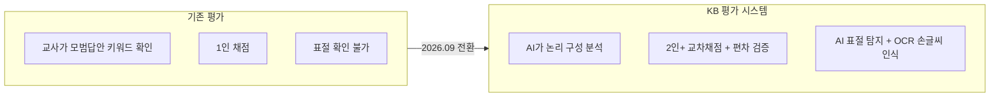

---

## 3. 시도교육청별 KB/IB 추진 현황 상세

### 3-1. 전국 현황 총괄 (2026년 7월 기준)

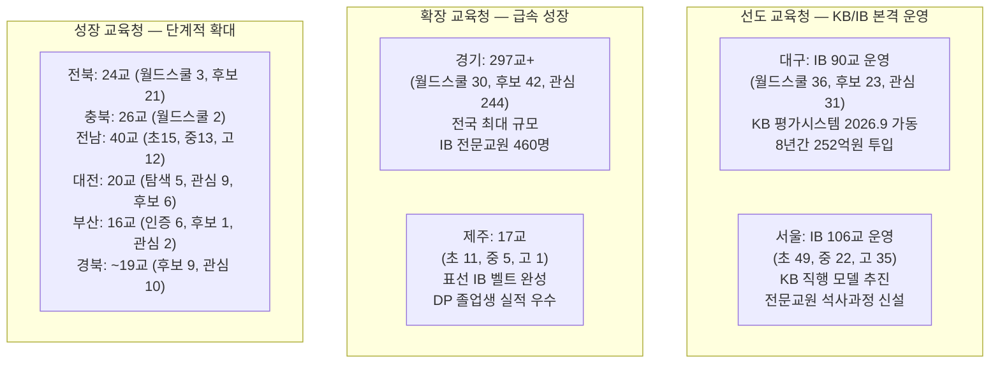

### 3-2. 대구광역시 — KB의 심장 (IB→KB 전환 모델)

> **대구 = IB의 원조이자 KB의 발상지.** 2019년 전국 최초 공교육 IB 도입 → 2026년 KB로 진화

| 항목 | 내용 |
|------|------|
| **IB 학교 현황** | 월드스쿨 36교, 후보 23교, 관심 31교 = **총 90교** (전체 461교 중 19.5%) |
| **KB 핵심 전략** | IB를 30% 더 확산 + 논·서·구술형 평가 시스템으로 **일반학교 전반에 KB 확대** |
| **KB 평가시스템** | 2026년 9월 학교 현장 제공. OCR 손글씨 인식, 표절 탐지 AI, 내용 구성 평가 |
| **투입 예산** | 8년간 총 **251억 9천만원** (2025년 42.6억, 2026년 36.1억) |
| **교사 양성** | IB 인증 교사 **200명+** 양성 완료. 전국 2,500명 교원 대구 IB 학교 탐방 |
| **만족도** | 초등 학부모 97.0%, 고등 학생 93.6%, 교사 96% 변화 동의 (6,766명 조사) |
| **교육감** | 강은희 3선 성공 (2026.6) → 정책 연속성 확보 |
| **KB 전담기관** | 미래교육연구원을 **KB 전담기관으로 전환** 예정 |
| **KB 인프라** | KB 가이드북 개발, KB 컨트롤타워 설치, KB 교원연수센터 구축, 3단계 교원 전문성 과정 |

**대구 KB/IB DP 인증 고등학교 (6교) 상세 프로필**

#### 경북대사대부고 — 전국 공교육 최초 DP 월드스쿨

| 항목 | 내용 |
|------|------|
| **학교명** | [경북대학교사범대학부설고등학교](https://knue.dge.hs.kr) |
| **위치** | 대구 북구 |
| **유형** | 국립 부설고 |
| **IB 인증** | 2021년 9월 |
| **특징** | 전국 공교육 최초 DP 월드스쿨 |
| **성과** | 38점 이상 고득점자 5명 — 해외 명문대 지원 가능 수준 |
| **수업** | 한국어 IB DP 운영 |
| **대입 실적** | SKY·KAIST·POSTECH 학종 진학 다수 |

#### 포산고 — 농촌 일반고 IB 성공 모델

| 항목 | 내용 |
|------|------|
| **학교명** | [포산고등학교](https://posan.dge.hs.kr) |
| **위치** | 대구 달성군 |
| **유형** | 공립 일반고 |
| **IB 인증** | 2021년 9월 |
| **특징** | 농촌 일반고에서 IB 성공을 증명한 모델 |
| **성과** | 최고 39점 |
| **비용** | 공립 무상교육 |

#### 대구외고 — 100% 디플로마 취득

| 항목 | 내용 |
|------|------|
| **학교명** | [대구외국어고등학교](https://dgfl.dge.hs.kr) |
| **위치** | 대구 달서구 |
| **유형** | 공립 외국어고 |
| **특징** | 응시생 **100% 디플로마 취득** (글로벌 평균 73.8% 대비 압도적) |
| **성과** | 평균 30.5점, 이중언어 디플로마 90% |
| **해외 진학** | 영미권 명문대 진학 트랙 강세 |

#### 대구국제고 — 이중언어 디플로마 강세

| 항목 | 내용 |
|------|------|
| **학교명** | [대구국제고등학교](https://dhi.dge.hs.kr) |
| **위치** | 대구 |
| **유형** | 국제고 |
| **성과** | 취득률 95%, 이중언어 디플로마 90% |
| **특징** | 국내·해외 Dual-Track 진학에 최적화 |

#### 대구서부고 — 공립 일반고 성공 모델

| 항목 | 내용 |
|------|------|
| **학교명** | [대구서부고등학교](https://dgseobu.dge.hs.kr) |
| **위치** | 대구 서구 |
| **유형** | 공립 일반고 |
| **성과** | 진학률 85% (전국 평균 73.6% 상회) |
| **비용** | 공립 무상교육 |

#### 대구중앙고 — 사립고 최초 MYP+DP 연속

| 항목 | 내용 |
|------|------|
| **학교명** | [대구중앙고등학교](https://djoongang.dge.hs.kr) |
| **위치** | 대구 |
| **유형** | 사립 일반고 |
| **IB 인증** | 2025년 12월 |
| **특징** | 사립고 최초 MYP+DP 연속 월드스쿨. 중학교→고등학교 IB 연속 이수 가능 |

**대구 KB 전환 로드맵**

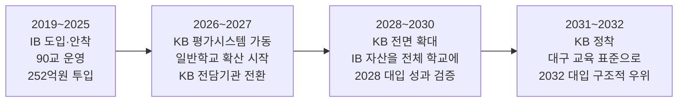

---

### 3-3. 서울특별시 — KB 직행 모델

> **서울 = IB를 건너뛰고 KB로 직행하는 접근.** 대구가 "IB→KB"라면 서울은 "KB 직접 구축"

| 항목 | 내용 |
|------|------|
| **IB/KB 학교 현황** | 2026년 **총 106교** (초 49, 중 22, 고 35). 91교 신규 관심학교 선정 |
| **고등학교** | **35교** 운영 (대부분 관심학교 단계) |
| **인증학교** | 구로초, 대왕초 (2025.12 — **서울 공립 최초 IB 인증**) |
| **후보학교** | 휘경여중, 창덕여중, 신가초 등 |
| **KB 핵심 정책** | "서울 미래형 학교 교육 체제" — IB 운영 시사점을 서울교육에 적용 |
| **교원 양성** | 한국형 바칼로레아 연구 전문 교원 **석사 과정 신설** |
| **네트워크** | 4개 권역별(동북·동남·서북·서남) IB 학교 네트워크 구성 |
| **구별 분포** | 양천구 10교 최다, 노원구·마포구 각 8교 |

**서울 자치구별 IB 학교 분포 (106교)**

| 자치구 | 학교 수 | 주요 학교 |
|--------|---------|----------|
| 양천구 | 10교 | 경인초, 계남초, 목운초, 진명여고, 광영여고 |
| 노원구 | 8교 | 당현초, 태릉초, 수암초, 하계중, 서라벌고 |
| 마포구 | 8교 | 서강초, 아현초, 염리초, 창천중, 숭문고 |
| 구로구 | 7교 | **구로초(인증)**, 개봉초, 신미림초, 영림중, 오류고 |
| 강남구 | 7교 | **대왕초(인증)**, 개원초, 자곡초, 압구정중, 풍문고 |
| 동대문구 | 6교 | 전농초, 휘경중, 동대문중, 대광고 |
| 송파구 | 6교 | 거원초, 잠전초, 풍납중, 잠일고 |
| 서초구 | 5교 | 방현초, 내곡중, 서초중, 양재고, 동덕여고 |
| 강동·강서·성동 | 각 5교 | 강솔초, 가곡초, 경동초 등 |
| 용산·서대문·관악·성북 | 각 4교 | 한남초, 홍제초, 인헌고, 홍익사대부고 등 |

**서울 고등학교 현황**

| 구분 | 현황 | 비고 |
|------|------|------|
| DP 인증학교 | **없음** (공교육 기준) | 가장 빨라도 2028년 이후 첫 졸업생 |
| 관심학교 (고등) | **35교** | 2026년 공모로 대폭 확대 |
| 후보학교 진입 | 추진 중 | 중학교 중심으로 먼저 진행 |

**서울 소재 국제학교 (DP 인증)**

| 학교명 | 비고 |
|--------|------|
| Seoul Foreign School (SFS) | IB DP 운영 |
| Dwight School Seoul | IB DP 운영 |
| Dulwich College Seoul | IB DP 운영 |

**서울 KB 추진 전략**

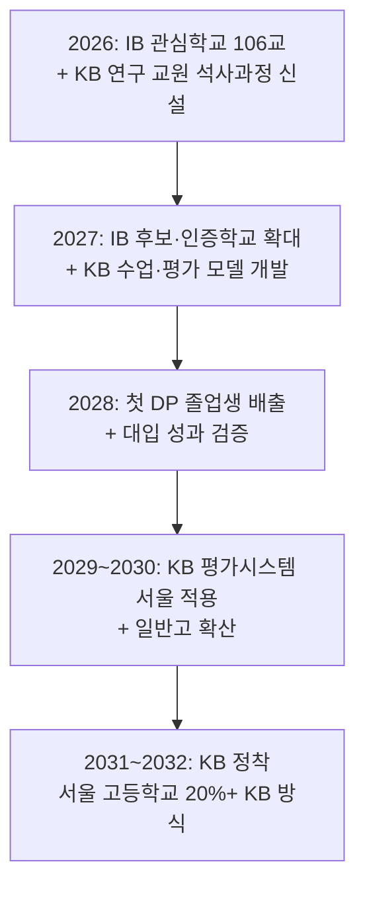

**서울 KB 교원 양성 체계**

| 파트너 대학 | 역할 | 협약 시기 |
|------------|------|----------|
| 인하대학교 | KB 기반 강화 업무협약, 교원 석사 과정 | 2026.04 |
| 서울교대 | KB 연구 전문 교원 양성 | 2026 |
| 한국교원대 | KB 연구 전문 교원 양성 | 2026 |

---

### 3-4. 경기도 — 전국 최대 규모 IB 확산 + 경기형 바칼로레아

| 항목 | 내용 |
|------|------|
| **IB 학교 현황** | **총 297교+** (월드스쿨 30, 후보 42, 관심 244) — 2023년 30교에서 약 10배 성장 |
| **교원 역량** | IB 전문교원 **약 460명** 확보 (국제공인 전문강사 75명, 교육전문가 86명) |
| **핵심 모델** | 안성시 초중고 완전 연계 IB 벨트: 개산초(PYP)→죽산중(MYP)→죽산고(DP) |
| **KB 방향** | "경기형 바칼로레아" 운영 추진 |
| **2032 대입** | 경기교육청이 '2032 대입개편안' 공식 발표 (2026.03 교육감협의회) |

**경기도 DP 인증 고등학교 (8교) 상세**

| 학교명 | 위치 | 인증 시기 | 유형 | 특징 | 비용 |
|--------|------|----------|------|------|------|
| [경기외고](https://gafl.hs.kr) | 의왕시 | 2011 | 사립 외고 | **국내 최초 DP 도입** (영어). 서울대 12명(2025) | 연 약 1,956만원 |
| [죽산고](https://juksan-mh.goean.kr) | 안성시 | 2025.01 | 공립 일반고 | **경기 공립고 최초 한국어 DP**. 2028 첫 졸업생 | 공립 무상 |
| [동탄국제고](https://www.dtg.hs.kr) | 화성시 | 2025.11 | 국제고 | 14개월만에 인증. 2028~2029 첫 졸업생 | 사립 |
| [군서미래국제학교](https://gunseo.goesp.kr) | 시흥시 | 2024 | 공립 | **경기 공립 최초 IB 인증**. PYP·MYP·DP 통합 | 공립 무상 |
| 덕정고 | 양주시 | 2025.11 | 공립 | 신규 인증 | 공립 무상 |
| [관양고](https://gwanyang-h.goeay.kr) | 안양시 | 2025.11 | 공립 | 신규 인증 | 공립 무상 |
| [남양주다산고](https://nyjdasan-h.goegn.kr) | 남양주시 | 2025.11 | 공립 | 2020년 개교. 디지털 창의역량 특색 | 공립 무상 |
| [수원중앙기독고](https://suwoncca-h.goesw.kr) | 수원시 | 2025.11 | 사립 | IB DP 운영 | 사립 |

**경기외고 상세 프로필 — 국내 최초 IB DP 도입교**

| 항목 | 내용 |
|------|------|
| **학교명** | [경기외국어고등학교](https://www.gafl.hs.kr/) |
| **위치** | 경기도 의왕시 고천동 |
| **유형** | 사립 외국어고 (대교그룹 산하) |
| **IB 인증** | 2011년 — 국내 최초 DP 도입 |
| **수업 언어** | 영어 (일부 일본어 제2전공) |
| **모집 범위** | 전국 단위 |
| **연 학비** | 약 1,956만원 (입학금·수업료·기숙사·IB 운영비) |
| **기숙사** | 4인 1실, 주중 기숙·주말 귀가 |
| **선발 방식** | 1차 서류·내신 (160점) + 2차 면접 (40점) |
| **대입 실적** | 서울대 12명(2025), 해외 명문대 다수 |
| **장점** | 외국어 특목 + IB DP 결합, 해외 진학 컨설팅, Model UN·국제 토론 |
| **단점** | 학비 부담 큼, 외국어 + IB 이중 부담, 정시 트랙 불리 |

**경기도 IB 학교 확장 단계별 현황**

| 단계 | 학교 수 | 설명 |
|------|---------|------|
| 관심학교 | 232교 | 탐색 단계 — 교육 철학 이해 및 교사 연수 시작 |
| 후보학교 | 33교 | 준비 단계 — 본격적인 IB 커리큘럼 수업 적용 |
| 인증학교 (월드스쿨) | 30교 | 완성 단계 — IBO 최종 승인, 고교생 공식 IB 시험 응시 가능 |

**경기도 주요 후보/관심 고등학교**

| 학교명 | 단계 | 비고 |
|--------|------|------|
| 동화고 | 후보/관심 | |
| 저동고 | 후보/관심 | |
| 현화고 | 관심 | |
| 포천고 | 관심 | |
| 진접고 | 관심 | |
| 성남외고 | 관심 | |
| 수원고 | 관심 | |

**경기교육청 2032 대입개편안 핵심 (2026.03 교육감협의회 발표)**

| 제안 항목 | 내용 |
|----------|------|
| 수능 절대평가 | 5단계(A~E) 절대평가 전환 |
| 수능 시기 | 11월 → **9월** 앞당김 |
| 서술형 수능 | 수능에 논/서술형 문항 도입 |
| 채점 3단계 | ①AI 기반 채점 → ②전문 평가단 → ③검증 체제 |

---

### 3-5. 제주특별자치도 — IB 원조, DP 실적 입증

| 항목 | 내용 |
|------|------|
| **IB 학교 현황** | 총 17교 (초 11, 중 5, 고 1). 2022년 8교에서 2배 증가 |
| **DP 인증 고등학교** | **표선고 1교** (유일한 공교육 DP) |
| **성과** | 표선고 서울대·연세대·고려대·KAIST·인하의대 합격 |
| **한계** | 교육감 "고등학교는 표선고 이외 어렵다" 입장 |
| **KB 추진** | KB추진위원회 설치 계획, **KB연구개발센터 제주 설립 구상** |
| **확대 계획** | 표선고 학급 수 확대, 서부 지역에 IB 고등학교 **신설 추진** |

**표선고 합격 실적 상세**

| 연도 | 대학 | 인원 | 비고 |
|------|------|------|------|
| 2024 (1기) | 서울대 | 1명 | 학종 |
| 2024 (1기) | 연세대 | 1명 | 학종 |
| 2024 (1기) | 고려대 | 1명 | 학종 |
| 2024 (1기) | UNIST | 2명 | 이공계 학종 |
| 2024 (1기) | DGIST | 2명 | 이공계 학종 |
| 2025 (2기) | 서울대 | 1명 | 학종 |
| 2025 (2기) | 연세대 | 2명 | 학종 |
| 2025 (2기) | 고려대 | 2명 | 학종 |
| 2025 (2기) | KAIST | 1명 | 이공계 학종 |

> **핵심**: 사교육비 0원, 공립 무상교육만으로 2년 연속 SKY·KAIST 합격 배출

---

### 3-6. 전북특별자치도 — IB 조례 제정, DP 인증 확대

| 항목 | 내용 |
|------|------|
| **IB 학교 현황** | 월드스쿨 3교, 후보 21교 = **총 24교** |
| **DP 인증 고등학교** | 지평선고 (2026.06 인증 — **전북 최초 DP 월드스쿨**) |
| **조례 제정** | 2026.05.08 「IB 프로그램 운영 및 지원 조례」 공포·시행 (10개 조문) |
| **신규 관심학교** | 2026년 10교 신규 선정 (초 4, 중 3, 고 3) |

**전북 IB 학교 상세 목록**

| 프로그램 | 학교명 |
|---------|--------|
| **DP (고등)** | 지평선고(인증), 자유고, 전주중앙여고, 전주여고, 양현고, 순창고(사립), 성원고(신규), 유일여고(신규), 호남고(신규) |
| **MYP (중등)** | 회현중, 함열여중, 지평선중, 전주덕일중, 자유중, 백산중, 화산중, 용북중, 원광중, 전주효문중, 전주온빛중 |
| **PYP (초등)** | 회현초, 전주교대전주부설초, 전주교대군산부설초, 이백초, 이리영등초, 이리남초, 덕과초, 이리백제초, 영만초, 전주아중초 |

---

### 3-7. 충청북도 — 신흥 성장 지역

| 항목 | 내용 |
|------|------|
| **IB 학교 현황** | 총 **26교** (초 9, 중 11, 고 6) — 2024년 9교에서 급성장 |
| **DP 인증 고등학교** | 단재고 (2025.12 — **충북 최초 DP 월드스쿨**), 일신여자고 (DP 인증) |
| **관심/준비 고등학교** | 중앙탑고, 제천여자고, 충북외국어고 (관심), 산남고 (준비) |
| **추진 방향** | 청주·충주·제천 지역별 IB 클러스터 조성 |

---

### 3-8. 충청남도

| 항목 | 내용 |
|------|------|
| **DP 인증 고등학교** | 충남삼성고 (2020.08 인증, **영어 운영**, 광역자사고) |
| **대입 실적** | 서울대 2022대입 16명, 2023대입 15명. 비서울 자사고 중 최상위 |
| **비용** | 사립 (연 약 2,500만원+) |
| **특징** | 삼성 장학금 지원, 기숙사 필수, 전국 단위 모집 |

---

### 3-9. 대전광역시

| 학교명 | 단계 | 승인 시기 |
|--------|------|----------|
| 대전대성고 | **후보학교** | 2025.11 |
| 서대전고 | **후보학교** | 2026.04 |
| 서일고 | **후보학교** | 2026.05 |

> 대전: 탐색 5교, 관심 9교, 후보 6교 = **총 20교** 운영

---

### 3-10. 전라남도

| 항목 | 내용 |
|------|------|
| **현황** | **총 40교** (초 15, 중 13, 고 12). 2026년 10개 시·군 확대 예정 |
| **DP 인증 고등학교** | 전남외국어고, 나주 봉황고, 영암 삼호고 (DP 인증) |
| **후보 고등학교** | 광양고, 벌교고, 벌교여고, 예당고 |
| **관심 고등학교** | 목포 덕인고, 목포 문태고, 순천 매안고, 나주 금성고, 여수여고 |
| **PYP 인증** | 나주 빛가람초 (전남 최초 인증) |
| **교육발전특구** | 나주시, 목포시, 무안군, 신안군, 영암군, 강진군 |

---

### 3-11. 부산·기타 지역

| 지역 | 현황 | 비고 |
|------|------|------|
| **부산** | 인증 6교, 후보 1교, 관심 2교 = **총 16교** (2026 기준) | 2028년 이후 정착 목표. "부산형 IB 교육 모델" 개발 |
| **경북** | 후보 9교 + 관심 10교 = **약 19교** | 구미원당초, 청하중(포항), 화랑중(경주), 풍산고(안동) |
| **강원** | 관심학교 7교, 후보학교 추진 중 | 조례 제정 완료 |
| **광주** | 탐색기관 7교 (초 4, 중 3) | |
| **울산** | 2024.06 IBO 협력 협약 체결, 관심학교 선정 | |
| **인천** | IB 중점학교 운영 중 | 초등 IB 중심학교 교원연수 |

---

### 3-12. 시도교육청별 KB/IB 종합 비교

| 교육청 | IB 학교 수 | KB 추진 단계 | 고등학교 DP 인증 | 핵심 전략 |
|--------|----------|------------|----------------|----------|
| **대구** | 90교 | **KB 가동** (2026.9) | 6교 | IB→KB 전환. 전국 모델 |
| **서울** | 106교 | **KB 직행** | 0교 (관심 35교) | IB 건너뛰고 KB 직접 구축 |
| **경기** | 297교+ | **경기형 바칼로레아** | 8교 | 전국 최대 규모. 2032 대입안 주도 |
| **제주** | 17교 | IB 안착 | 1교 (표선고) | IB 벨트 모델 |
| **전북** | 24교 | IB 확대 + 조례 | 1교 (지평선고) | 조례 기반 제도화 |
| **충북** | 26교 | IB 확대 | 2교 (단재고, 일신여고) | 클러스터 조성 |
| **충남** | - | IB 운영 | 1교 (충남삼성고) | 자사고 모델 |
| **대전** | 20교 | IB 확대 | 0교 (후보 3교) | 단계적 확대 |
| **전남** | 40교 | IB 확대 | 3교 (전남외고, 봉황고, 삼호고) | 농산어촌 모델 |
| **부산** | 16교 | IB 확대 | 6교 (인증) | 부산형 IB 교육 모델 |
| **경북** | ~19교 | IB 확대 | 0교 (추진 중) | 후보 9교 + 관심 10교 |
| **울산** | 추진 중 | IB 도입기 | 0교 | IBO 협력 협약 체결 |
| **인천** | 추진 중 | IB 도입기 | 0교 | 중점학교 운영 |

---

## 4. IB/KB 관련 조례 제정 현황 — 법적 기반

정치적 변동에도 KB/IB가 지속될 수 있도록 각 교육청이 조례를 제정하고 있습니다.

| 시도교육청 | 조례 현황 | 주요 내용 |
|----------|----------|----------|
| **부산** | 제정 완료 | IB 프로그램 운영 기본 원칙, 행재정적 지원 |
| **전남** | 제정 완료 | IB 프로그램 운영 및 지원 |
| **강원** | 제정 완료 | IB 프로그램 운영 및 지원 |
| **제주** | 제정 완료 | IB 프로그램 운영 및 지원 |
| **전북** | **2026.05.08 공포·시행** | 「IB 프로그램 운영 및 지원 조례」 10개 조문 |
| **서울** | 2025.02.17 발의 | 「IB 활성화에 관한 조례안」 |
| **경기** | 입법예고 중 | 「IB 프로그램 운영 및 지원에 관한 조례안」 |

---

## 5. 2032 대입과 KB — 왜 KB가 구조적 우위인가

### 5-1. 2032 대입 개편 타임라인

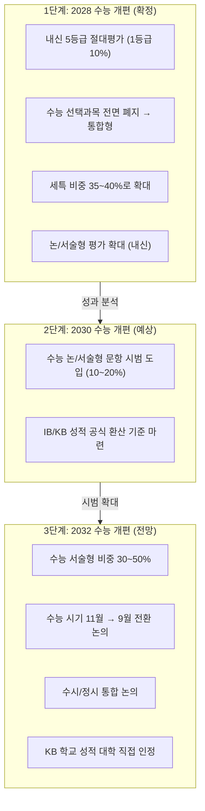

### 5-2. 국가교육위원회 중장기 계획과 KB

| 항목 | 내용 |
|------|------|
| **중장기 국가교육발전계획** | 2027~2036년 교육 방향을 정하는 10개년 계획 |
| **시안 발표 예정** | 2026년 9월 (당초 2025년 예정에서 순연) |
| **2032학년도 대입** | 2026년 현재 중1이 치르는 시험 — 이 계획에 포함 전망 |
| **핵심 논의 사항** | 수능 논/서술형 도입, 수능 절대평가, 수능 시기 변경 |

### 5-3. 논·서술형 평가 전면 적용 로드맵

| 시기 | 적용 대상 | KB와의 관계 |
|------|----------|------------|
| **2026학년도** | 중학교 1학년부터 서·논술형 평가 시작 | KB 학교는 이미 시행 중 |
| **2028학년도** | 고등학교 내신 논/서술형 확대 | KB 학생의 서술형 훈련이 내신 경쟁력 |
| **2031학년도** | 중1~고3 **전 학년 적용 완료** | KB가 교육 표준으로 자리매김 |

### 5-4. 2032 대입에서 KB 학생의 구조적 우위

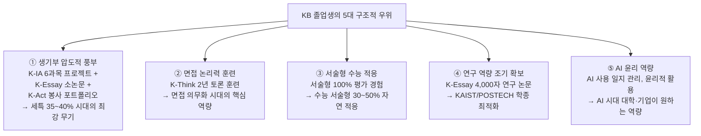

### 5-5. 대학의 IB/KB 대응 현황

| 대학 | 대응 내용 | 시기 |
|------|----------|------|
| **고려대·서강대·한양대** | IB 우수자 특별전형 도입 | 2025학년도~ |
| **서울대** | IB 관련 업무협약 (경기교육청과) + IB 종단연구 실시 | 2024.11~ |
| **15개 상위 대학** | 12개 대학이 IBDP 점수를 특례전형에서 인정 | 현행 |
| **고등교육법 개정안** | IB 이수 점수를 대입 자료로 활용할 수 있도록 법 개정 추진 | 2027년 목표 |

> **서울대 권장 IB 점수**: 38점 이상. 실제 합격 평균은 이보다 높은 수준

### 5-6. IB 점수별 공략 가능 대학 매트릭스

| 점수대 | 등급 | 국내 대학 | 해외 대학 |
|--------|------|----------|----------|
| **43~45점** | World Class | 서울대 글로벌인재특별전형 | Harvard·Yale·Princeton·MIT, Oxford·Cambridge (42+), NUS 경쟁학과 |
| **40~42점** | Top Tier | KAIST·POSTECH 일반전형, 서울대 학종 (안정권) | UC Berkeley·UCLA (40+), Oxford·Cambridge 최소선, NTU (41~42+) |
| **36~39점** | Upper Tier | 연세대·고려대 IB 우대 학과, 한양대·성균관대 국제학부 | 미국 상위 리버럴아츠 (38+), HKU (36+), UBC·McGill·Toronto (38+) |
| **32~35점** | Mid-Upper | 국내 중상위권 대학 IB 전형 (경희대·중앙대 등) | 캐나다 중상위권 대학, HKU 최소 지원 자격 (32+) |

> 합격자 경쟁선 기준. 최소 요구 점수에 방심 금물 — 실제 경쟁선은 항상 더 높게 형성됩니다

### 5-7. 2032 대입 시나리오별 KB 학생 영향

| 시나리오 | 가능성 | 내용 | KB 학생 영향 |
|---------|--------|------|------------|
| **수능 5단계 절대평가** | 45% | 수능을 A~E로 전환, 변별력은 내신이 담당 | KB 서술형 내신에서 **압도적 유리** |
| **수능I(객관)+수능II(서술)** | 35% | AI 3단계 채점 도입 | KB 학생이 수능II에서 유리 |
| **수능 자격시험화** | 20% | 학생부 70%+수능 30% 통합선발 | KB 학생 **압도적 유리** |

---

## 6. IB/KB Dual-Track 전략 — 국내 SKY + 글로벌 명문대 동시 도전

### 6-1. 하나의 커리큘럼, 두 개의 세계

> IB 디플로마 하나로 국내 SKY 학종과 글로벌 아이비리그를 동시에 노리는 전략

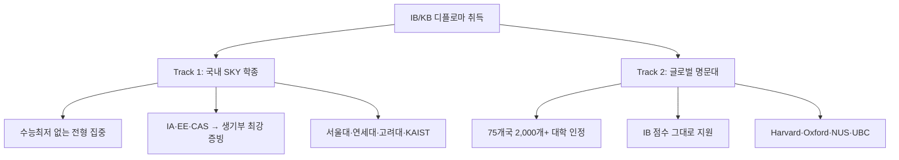

| 트랙 | 핵심 전략 | 타겟 대학 |
|------|----------|----------|
| **Track 1: 국내 SKY** | 수능 없이, IA/EE/CAS로 무장된 생기부로 학종 합격 | 서울대·연세대·고려대·KAIST·POSTECH |
| **Track 2: 글로벌** | 내신 변환 불이익 없이, IB 점수 하나로 직접 지원 | Harvard·Yale·Oxford·Cambridge·NUS·UBC |

### 6-2. IB ↔ 학종 연계 포인트

| IB 요소 | 학종 연계 항목 | 대입 활용 |
|---------|-------------|----------|
| **EE (소논문)** | 세특(세부능력 및 특기사항) | 탐구 주제 심화 기록 — 학종 최강 무기 |
| **TOK (지식론)** | 교과 세특 | 비판적 사고력·고차원적 질문 역량 기록 |
| **CAS 협업 프로젝트** | 창체(창의적 체험활동) | 자율·동아리·봉사·진로 통합 기록 |
| **HL 과목 IA (내부 탐구)** | 교과 세특 | 전공 연계 심화 탐구 증빙 |

### 6-3. Global IB Passport — 전 세계 공용 학위

| 지역 | 대학 수 | 핵심 대학 | 합격선 | 전략 |
|------|---------|----------|--------|------|
| 🇺🇸 **미국** | 982개 | Harvard·Yale·MIT·Princeton | Ivy 43~44점, Top UC 40+, UC 안전 38+ | CAS 리더십이 PS 핵심. HL 6~7점 필수 |
| 🇬🇧 **영국** | 78개 | Oxford·Cambridge | 42점+ (경쟁선), HL 7,7,6 | TOK·EE 깊이가 당락 좌우 |
| 🇨🇦 **캐나다** | 다수 | UBC·McGill·Toronto | 38점+ | Predicted Grade로 조기합격 가능. 어학 면제 |
| 🌏 **아시아** | 다수 | NUS·NTU·HKU | NUS 43+, NTU 41~42+, HKU 36+ | 국제 학생 커트라인이 자국민보다 높음 |

**미국 대학 숨겨진 혜택**

| 혜택 | 내용 |
|------|------|
| 대학 학점 인정 (AP 대체) | HL 과목 5~7점 획득 시 대학 기초 과목 이수 면제 |
| IB 전용 장학금 | WPI 최소 $20,000, SMU 최대 $12,000, 네브라스카-링컨 최대 $15,000 |

**캐나다 대학 숨겨진 혜택**

| 혜택 | 내용 |
|------|------|
| 어학 성적 면제 | IB English 이수 또는 이중언어 디플로마 → IELTS/TOEFL 불필요 |
| 선이수 학점 인정 | UBC HL 5점 이상 → 대학 1학년 학점 부여. Bishop's 디플로마 완주 시 30학점 |
| 내신 환산 불필요 | IB 점수 그대로 인정 — 한국 내신 환산 절차 불필요 |

### 6-4. 수시 6장 배분 전략 (IB/KB 학생용)

| 카드 유형 | 대학 | 전형 | 비고 |
|----------|------|------|------|
| 🌍 **해외** | 아이비리그·옥스브리지 | IB 디플로마 (38점 이상) | IB 최고 점수 목표 |
| 🔺 **상향** | 연세대 국제학부·언더우드학부 | 활동우수전형 | IB EE·CAS 활동 강점 |
| 🔺 **상향** | 고려대 국제학부 | 학교추천전형 | 영어 면접 대비 필수 |
| 🎯 **적정** | 성균관대 글로벌경영·소프트웨어 | 학생부종합 | IB HL 수학·과학 강점 |
| 🎯 **적정** | 서강대 국제인문학부 | 학생부종합 | 글로벌 역량 강조 |
| ✅ **안정** | 한양대 국제학부·ERICA | 학생부종합 | 면접 없음 서류 중심 |

---

## 7. AI 시대 KB/IB 전략 — 인간만의 역량으로 차별화

### 7-1. AI가 대체하는 것 vs 인간이 해야 할 것

| AI가 대체하는 것 | 인간이 해야 할 것 (KB/IB가 훈련하는 것) |
|----------------|--------------------------------------|
| 정보 검색·요약 (문헌 리뷰 자동화) | 비판적 사고 ("이 주장이 정말 타당한가?") |
| 기초 에세이 초안 작성 | 학제 간 융합 (서로 다른 분야를 연결하는 통찰) |
| 데이터 분석 및 시각화 | 윤리적 판단 (AI 윤리, 생명윤리, 사회적 책임) |
| 번역 및 문법 교정 | 창의적 문제 정의 ("무엇이 진짜 문제인가?") |
| | 글로벌 맥락 이해 (문화·정치·경제 융합 판단) |

### 7-2. AI 도구 활용 로드맵 (중1~대학 지원)

| 단계 | 초점 | 추천 AI 도구 | 프로젝트 예시 |
|------|------|-------------|-------------|
| **중1~중2 (MYP)** | AI로 탐구 효율 높이기 | ChatGPT/Claude: 개념 이해, Perplexity: 학술 자료 검색, Notion AI: 탐구 일지, Grammarly: 문법 교정 | MYP Personal Project (AI로 자료 수집, 인간이 분석) |
| **중3~고1 (DP 준비)** | EE·TOK 준비 — AI와 협업 | Elicit/Consensus: AI 논문 리뷰, Zotero + AI: 논문 관리, Overleaf: LaTeX 에세이 | EE 주제 탐색 (AI로 문헌 리뷰, 인간이 연구 질문 정의) |
| **고2~고3 (DP)** | 비판적 사고 역량 극대화 | ChatGPT Advanced: 논증 분석, AI 윤리 프레임워크, Mermaid + AI: 논리 시각화 | EE 완성 (4,000자/단어 — AI 활용 투명 공개) |
| **대학 지원** | 글로벌 인재 차별화 | AI 기반 자소서 초안 (스토리는 본인), 면접 준비 | IB 포트폴리오 정리, 대학 에세이 완성 |

### 7-3. AI 시대 KB/IB 학생의 3대 차별화 전략

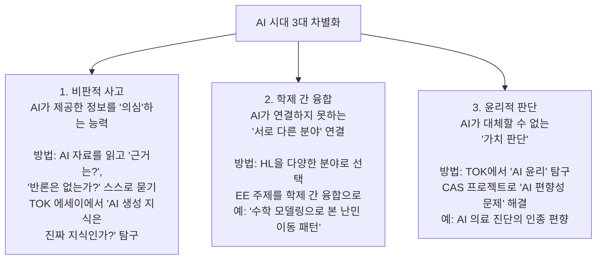

### 7-4. AI 활용 시 주의할 점

| 잘못된 활용 | 올바른 활용 |
|------------|-----------|
| AI가 작성한 EE 초안을 그대로 제출 | AI 초안의 구조를 참고하되, 본인의 분석과 비판적 사고로 재작성 |
| AI가 제공한 자료를 검증 없이 인용 | AI 자료를 인용 전 반드시 원문 확인 및 비판적 분석 |
| TOK 에세이에서 AI를 단순히 '도구'로만 언급 | TOK에서 'AI가 지식의 본질에 미치는 영향'을 철학적으로 탐구 |
| AI 활용 사실을 숨기고 스스로 한 것처럼 포장 | AI 활용을 투명하게 공개하고, '어떻게 비판적으로 활용했는가' 강조 |

> IB는 **학문적 정직성(Academic Honesty)** 규정이 매우 엄격합니다. EE·IA에 AI 사용이 적발되면 **디플로마 무효**. KB도 동일한 기준을 적용합니다.

### 7-5. AI 시대 KB/IB 출신의 미래 커리어

| 미래 직업 | 필요 역량 | KB/IB 연결 |
|----------|----------|----------|
| AI 윤리 컨설턴트 | 기술 이해 + 윤리적 판단 | K-Think(TOK) 윤리 탐구 경험 |
| 학제 간 융합 연구자 | 다학문적 사고 | HL 다양한 분야 선택 + EE 융합 주제 |
| 글로벌 정책 분석가 | 국제 이슈 이해 + 데이터 분석 | IB 글로벌 이슈 학습 + AI 데이터 분석 |
| 크리에이티브 디렉터 | 창의력 + AI 도구 활용 | CAS 창의 프로젝트 + AI 크리에이티브 도구 |
| 교육 혁신가 | 교육 설계 + 기술 통합 | KB/IB 교육 경험 자체가 자산 |

---

## 8. 2032 대입 대비 — KB/IB 고등학교 선택 가이드

### 8-1. 현재 KB/IB 준비 중인 고등학교 전국 지도

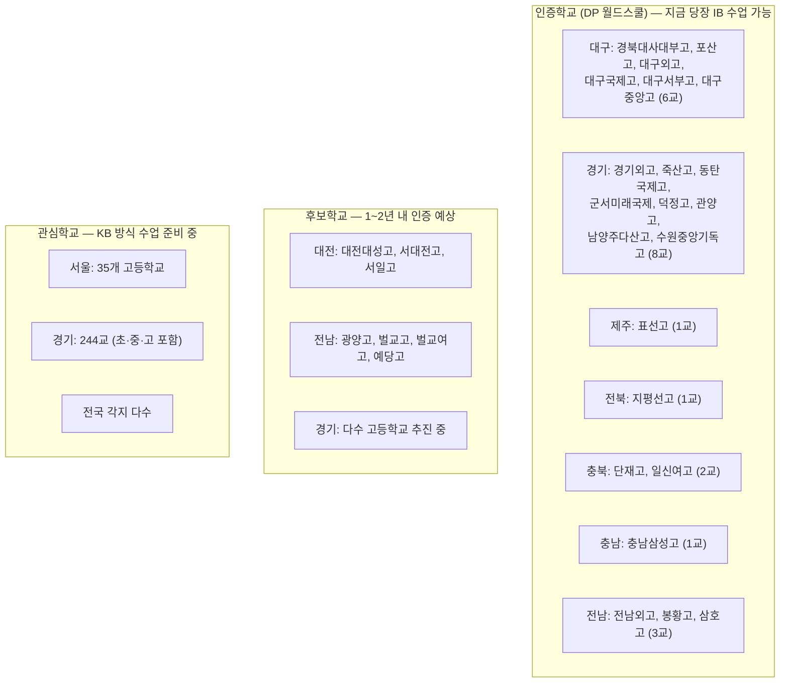

### 8-2. 학교 유형별 비교 — 공립 무상 vs 사립

| 항목 | 공립 IB (표선고·죽산고·포산고) | 사립 IB (경기외고·충남삼성고) |
|------|--------------------------|--------------------------|
| **학비** | 무상교육 (연 0원) | 연 1,500~2,500만원+ |
| **사교육비** | 사실상 0원 (인프라 부재) | 보충 학원 가능 |
| **모집 범위** | 도내/학군 모집 | 전국 단위 모집 |
| **기숙사** | 있음 (무상 또는 소액) | 있음 (유료) |
| **IB 수업 언어** | 한국어 IB | 영어 IB (경기외고) |
| **대입 실적** | SKY·KAIST 검증 (표선고) | 서울대 12명(경기외고 2025) |
| **해외 진학** | 제한적 (영어 IB 아닌 경우) | 강세 (영어 IB) |
| **저소득층** | **가장 유리** | 부담 큼 |
| **장학금** | 농어촌 특별전형 활용 | 교내 장학금 |

### 8-3. 학년별 대비 전략

| 현재 학년 | 2032 대입 시 | KB/IB 대비 전략 |
|----------|------------|----------------|
| **초6 (2026)** | 고3 (2032 대입) | 지금 KB/IB 중학교 탐색. 다독+에세이 습관 시작 |
| **중1 (2026)** | 고3 (2032 대입) | KB/IB 고등학교 입학 준비. 토론·발표 경험 축적 |
| **중2 (2026)** | 고3 (2031 대입) | KB/IB 고등학교 입시 전형 확인. 자기주도 프로젝트 1개 완수 |
| **중3 (2026)** | 고3 (2030 대입) | KB/IB 고교 지원. pre-DP 적응 준비 |

### 8-4. KB 시대 사전 준비 (KB 학교가 아직 없는 지역)

| 전략 | 실천 방법 | 기대 효과 |
|------|----------|----------|
| **다독 습관** | 한 주제에 관점이 다른 책 2~3권 비교 독서 | KB 수업 방식에 사전 적응 |
| **에세이 훈련** | 주 1회 500자+ 의견문 → 월 1회 1,000자 논증 에세이 | K-IA/K-Essay 준비 |
| **토론 경험** | 가족 식탁 토론, 독서 토론 모임, 모의유엔(MUN) | K-Think 소크라틱 세미나 적응 |
| **자기주도 프로젝트** | 방학 중 관심 주제 탐구 프로젝트 1개 완수 (보고서 포함) | K-IA 프로젝트 경험 |
| **성찰 일지** | 매일 "오늘 배운 것, 궁금한 것, 다음에 해 볼 것" 3줄 기록 | K-Act 성찰 포트폴리오 습관 |
| **AI 활용 일지** | AI 도구 사용 시 "어떤 도구로 무엇을 했는지" 기록 | KB AI 윤리 역량 선행 준비 |

---

## 9. 학년별 상세 준비 로드맵 — KB/IB 진학 완전 가이드

### 9-1. 중학교 1학년 — 기초 체력 형성

| 영역 | 실천 항목 | 주간 시간 |
|------|----------|----------|
| **영어 쓰기·말하기** | 영어 에세이 주 1편 (150~300단어), 영어 일기 | 3시간 |
| **비판적 독서** | 사회·과학·인문 교양서 월 1권+, 독서 노트 작성 | 2시간 |
| **탐구 주제 메모** | 관심 분야 탐구 주제 3~5개 리스트업 | 1시간 |
| **자기주도 학습** | 학원 의존 줄이기, 스스로 노트 정리 능력 | 매일 |
| **AI 도구 입문** | ChatGPT/Claude로 개념 이해, Perplexity로 자료 검색 | 1시간 |

> **핵심**: KB/IB 고교는 입학 시험이 별도 없는 경우가 많지만, 적응이 어렵습니다. 중1부터 영어로 생각하고 쓰는 훈련을 시작하세요.

### 9-2. 중학교 2학년 — 방향성 탐색

| 영역 | 실천 항목 | 주간 시간 |
|------|----------|----------|
| **영어 에세이** | 한 주제 500단어+ 에세이 작성, 영어 구술 연습 | 4시간 |
| **전공 방향 탐색** | 의·이·공·인문·예술 등 진로 탐색 | 2시간 |
| **협업·봉사** | CAS 사전 준비 — 동아리·봉사 경험 축적 | 2시간 |
| **학교 탐방** | KB/IB 고교 설명회·방문 참가 (기숙·적응 확인) | 수시 |
| **AI 활용 심화** | Notion AI로 탐구 일지 정리, Grammarly로 문법 교정 | 1시간 |

> **핵심**: CAS는 단순 봉사가 아닌 1개월+ 협업 프로젝트입니다. 중2부터 동아리·봉사로 협업 경험을 쌓으세요.

### 9-3. 중학교 3학년 — 입시 준비 + pre-DP

| 영역 | 실천 항목 | 주간 시간 |
|------|----------|----------|
| **거주지 검토** | 농어촌 특별전형 자격 확보 시 거주지 이전 검토 | 가정 논의 |
| **IB DP 과목 선택** | 6과목 HL/SL 구분 이해, 사전 학습 시작 | 3시간 |
| **4,000자 에세이 도전** | EE 예비 훈련 — 한 주제로 장문 에세이 1편 완성 | 집중 |
| **구술 발표·토론** | IB 구술 평가 대비 — 발표·토론 경험 만들기 | 2시간 |
| **내신 관리** | 내신성적 100% 선발 학교 대비 (표선고 등) | 매일 |

### 9-4. 고등학교 1학년 (IB/KB 1년차) — DP/KB 적응기

| 영역 | 실천 항목 | 비고 |
|------|----------|------|
| **HL 과목 선택** | 전공과 연결된 HL 3과목 선택 (이공: 수학·물리·화학 / 인문: 언어·역사·경제) | 대학 진학에 직결 |
| **EE 주제 초안** | AI 관련 선행 탐구 2~3편으로 EE 주제 방향 설정 | 고2 1학기 확정 마지노선 |
| **TOK 기초** | AI 인식론 입문 독서, TOK 기초 개념 학습 | 주 2시간 |
| **CAS 시작** | 창의·활동·봉사 활동 기록 시작 | 18개월 누적 |
| **Dual-Track 목표** | 국내·해외 타겟 대학 리스트업, IB 기준 비교표 초안 | |

### 9-5. 고등학교 2학년 (IB/KB 2년차) — 본격 전투

| 영역 | 실천 항목 | 비고 |
|------|----------|------|
| **EE 집필** | 1~2차 초안 완성 (4,000자/단어). AI 활용 투명하게 공개 | 핵심 과제 |
| **CAS 협업 프로젝트** | 1개월+ 팀 프로젝트 기획·운영 시작 | 미국 명문대 PS 핵심 |
| **해외 에세이 초안** | Common App/UCAS Personal Statement 초안 작업 | EE 연구 기반 |
| **국내·해외 비교** | 국내 대학 IB 환산 기준 + 해외 합격자 평균 점수 비교 완료 | Dual-Track |
| **IA 완성** | 6과목 내부평가(IA) 순차 완성 | |

### 9-6. 고등학교 3학년 (IB/KB 최종) — 마무리 + 지원

| 영역 | 실천 항목 | 비고 |
|------|----------|------|
| **EE 최종 제출** | 최종 원고 제출 + 구술 방어 준비 | |
| **TOK 완성** | TOK 에세이 완성 + 구술 발표 | |
| **국내 면접 준비** | EE·TOK 내용 한국어 설명 반복 훈련 | |
| **해외 PS 완성** | Common App/UCAS Personal Statement 최종 제출 | |
| **IB 최종 시험** | 5월 외부시험 — 재시험 기회 매우 제한적 | 1회성 |

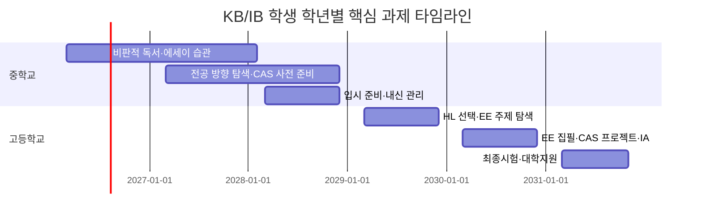

---

## 10. 2028 IB Dual-Track 생존 체크리스트

> 국내 SKY + 글로벌 명문대 동시 합격을 위한 8가지 필수 확인

| # | 체크 항목 | 상세 | 마감 | 중요도 |
|---|----------|------|------|--------|
| 1 | **HL 3과목 전공 정합성** | 이공계: 수학·물리·화학 HL 필수. 인문계: 언어·역사·경제 HL. HL에서 6~7점 목표 | 고1 초반 | 필수 |
| 2 | **Dual-Track 타겟 점수 역산** | 국내 36+ / Ivy 43+ / Oxford 42+ / NUS 43+ / UBC 38+ 동시 목표 설정 | 고1 초반 | 필수 |
| 3 | **EE 주제 확정 (AI + 전공)** | 4,000자/단어 소논문 주제를 전공과 AI 교차 방향으로. 고2 1학기 마지노선 | 고2 1학기 | 필수 |
| 4 | **CAS 협업 프로젝트 기획·운영** | 최소 1개월+ 협업 프로젝트. 봉사시간 채우기 금지 — Holistic Review 핵심 소재 | 고1~고2 | 중요 |
| 5 | **TOK AI 인식론 연계** | AI가 생성하는 지식의 신뢰성·편향·윤리를 인식론적으로 분석 | 고2~고3 | 중요 |
| 6 | **IB 환산 + Predicted Grade 관리** | 국내 대학별 환산 방식 비교 + 해외 Conditional Offer용 예상 점수 관리 | 고2 하반기 | 중요 |
| 7 | **수능 백업 플랜** | IB 점수 미달 시 국내 지원 가능 대학 급감. 최소한의 수능 준비 병행 | 고2 | 주의 |
| 8 | **면접 + PS 동시 완성** | EE 연구 내용을 한국어 면접 답변 + Common App/UCAS 에세이 양쪽에 활용 | 고3 초반 | 중요 |

---

## 11. KB/IB 확산 추이와 2032 전망

| 시기 | KB/IB 학교 수 | 전국 초중고 대비 | 주요 이벤트 |
|------|-------------|---------------|------------|
| **2019** | 4교 | 0.03% | 전국 최초 공교육 IB 도입 (대구·제주) |
| **2024** | ~200교 | ~1.7% | 교육부 KICE 'IB연구실' 신설 |
| **2026 (현재)** | **400교+** | **~3.4%** | 17개 교육청 전체 도입. 대구 KB 평가시스템 가동 |
| **2028** | 500~600교 | 5~6% | 2028 수능 개편. IB DP 대입지원 1,200명+ |
| **2030** | 800~1,000교 | 8~10% | 수능 서술형 시범. 서울·경기 KB 대규모 확산 |
| **2032** | 1,500~2,000교 | **13~17%** | 수능 서술형 본격화. KB 교육 표준으로 자리매김 |

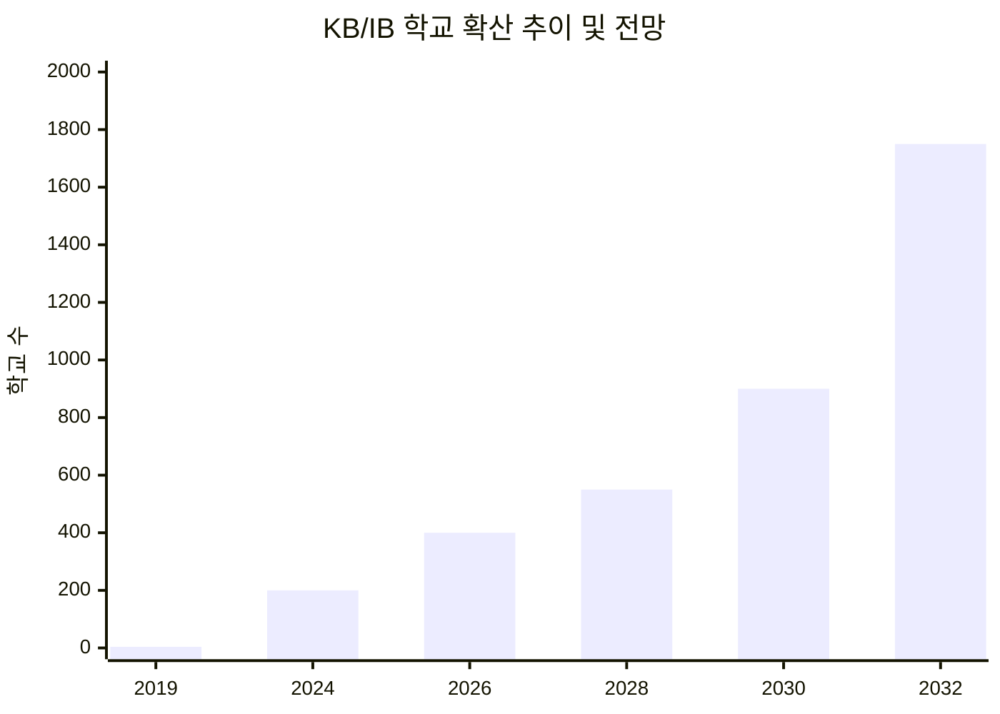

---

## 12. KB의 리스크와 과제

| 리스크 | 구체적 문제 | 심각도 | 대응 방안 |
|--------|-----------|--------|----------|
| **교사 역량 격차** | 전교조 대구지부 교사 77.1% 부정 평가. 서술형 채점 부담 | 높음 | 3년 단계별 연수, AI 보조 채점, 교사 학습공동체(PLC) |
| **채점 공정성** | 서술형 채점의 교사 간 편차 → 학부모 불신 | 매우 높음 | 대구 AI 채점시스템(OCR+표절탐지), 교차채점, 앵커페이퍼 |
| **학부모 저항** | "수능 안 보면 SKY 못 간다" 인식 | 높음 | IB 졸업생 서울대·KAIST 합격 사례 홍보 |
| **사교육 우회** | IB/KB 전문 학원 출현 | 보통 | K-IA 과정 기록 의무화, 구술 평가에서 과정 질문 |
| **지역 간 격차** | 대구 90교 vs 강원 7교 | 보통 | 온라인 연수, 교육청 간 멘토링, 예산 균등 배분 |
| **정권 교체 리스크** | 교육감 교체 시 정책 폐기 가능 | 높음 | 조례 제정 (7개 교육청 완료/추진), KBO 독립기구 설립 |
| **영어 몰입 부담** | 중하위권 학생 영어 수업 적응 어려움 | 보통 | KB는 한국어 100%로 해결. IB는 한국어 IB 확대 |
| **수능 정시 충돌** | IB/KB 학생 정시 지원 불리 | 높음 | 수능 서술형 확대로 장기적 해소. 단기적으로 학종 집중 |
| **AI 부정행위** | EE·IA에서 AI 무단 사용 | 높음 | 표절 탐지 AI, AI 사용 일지 의무화, 구술 방어(viva) |

### 리스크 대응 전략 로드맵

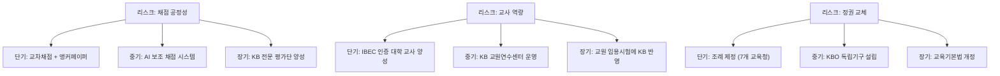

---

## 13. KB 실전 준비 로드맵

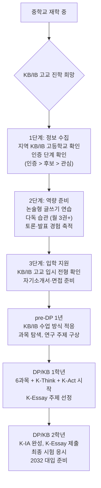

### 입학사정관이 보는 핵심 3가지

| # | 평가 포인트 | 상세 |
|---|-----------|------|
| 1 | **IB 총점과 HL 과목의 전공 정합성** | 36점 이상이 기본이지만 HL 3과목과 전공의 연결이 더 중요. 이공계는 수학·물리·화학 HL, 인문계는 언어·사회 HL |
| 2 | **EE의 탐구 깊이와 독창성** | 4,000자/단어 EE가 최강 평가 자료. 주제 독창성·연구 방법론·논리적 결론을 직접 읽고 평가 |
| 3 | **CAS의 리더십·협업·사회기여** | 단순 봉사시간이 아닌, 1개월+ 협업 프로젝트(Collaborative Project)의 리더십·이니셔티브·팀워크 |

### Do & Don't

| Do (해야 할 것) | Don't (하지 말아야 할 것) |
|----------------|------------------------|
| HL 3과목을 전공과 완벽히 연결 | IB 점수 미달 상태에서 수능 백업 없이 IB만 준비 |
| EE 주제를 AI + 전공 교차 방향으로 고1 하반기에 설정 | EE 주제를 너무 광범위하게 잡아 깊이 없는 소논문 작성 |
| CAS 최소 1개월+ 협업 프로젝트 직접 기획·운영 | CAS 시간만 채우는 형식적 활동 |
| 국내 면접 대비 EE·TOK 내용 한국어 설명 반복 훈련 | 영어 면접만 준비하고 한국어 소통 역량 소홀 |
| 국내·해외 타겟 점수 역산 후 Dual-Track 최적 조합 설계 | 해외 지원 포기하고 국내 IB 전형만 준비 |
| AI 활용을 투명하게 공개하고 비판적 활용 강조 | AI 산출물 그대로 제출 (Academic Honesty 위반) |

---

## 14. KB 관련 주요 기관·조직

| 기관 | 역할 | 현황 |
|------|------|------|
| **국가교육위원회 (국교위)** | 중장기 국가교육발전계획 수립, 2032 대입 방향 결정 | 2026.09 시안 발표 예정 |
| **한국교육과정평가원 (KICE)** | IB연구실 운영, KB 평가 연구 | 2024년 IB연구실 신설 |
| **한국IB교육학회** | IB/KB 관련 학술 연구 | 2024년 출범 |
| **KBO (구상 중)** | KB 운영 독립 비영리기구 | 교육 전문가, 대학교수, 현장교사로 구성 제안 |
| **대구 미래교육연구원** | KB 전담기관으로 전환 예정 | 2026년~ |
| **IBEC 인증 대학** | KB 교사 양성 | 한국교원대·경북대·한동대·서울교대 (4개교) |
| **IBO (스위스)** | IB 프로그램 국제 인증·관리 | 전 세계 5,000교+ 인증 |

---

## 15. KB/IB FAQ 30선

### 기본 개념

**Q1. KB와 IB의 가장 큰 차이는 무엇인가요?**

| 항목 | IB | KB |
|------|-----|-----|
| 운영 | IBO(스위스)가 인증·관리 | 한국 교육부+교육청이 직접 운영 |
| 비용 | 학교당 연 1,000만원+ IBO 인증비 | 무상 (공교육 예산) |
| 언어 | 영어 중심 | 한국어 100% |
| 범위 | 인증학교만 (~120교) | 모든 공교육 학교 대상 |

**Q2. KB 학교에 다니면 수능을 안 봐도 되나요?**

현재로서는 **아닙니다**. KB는 아직 수능을 대체하는 공식 입시 제도가 아닙니다. 다만 2028 수능 개편(절대평가·서술형 확대) 이후, KB 학생이 서술형 수능과 학종에서 구조적 우위를 점할 것으로 전망됩니다.

**Q3. IB 학교에 다니면서 수능도 준비할 수 있나요?**

**극도로 어렵습니다.** IB 과정은 수능 출제 방식과 완전히 단절됩니다. IB 학생은 학종(수능 최저 없는 전형)과 해외 대학 직접 지원이 주요 경로입니다.

**Q4. KB 교사가 되려면 어떤 자격이 필요한가요?**

현재 IBEC 인증 대학(한국교원대·경북대·한동대·서울교대) 4개교에서 KB/IB 교사 양성 과정을 운영합니다. 서울교육청은 KB 연구 전문 교원 석사 과정을 2026년 신설했습니다.

### 진학·입시

**Q5. KB/IB 졸업생이 서울대에 갈 수 있나요?**

**네, 이미 증명되었습니다.** 표선고(제주) 1기·2기 졸업생이 2년 연속 서울대에 합격했습니다. 학종(수능최저 없는 전형)을 통해 지원합니다. 서울대 권장 IB 점수는 38점 이상입니다.

**Q6. IB 점수 36점이면 어디에 갈 수 있나요?**

국내: 연세대·고려대 IB 우대 학과, 한양대·성균관대 국제학부 지원 가능. 해외: 미국 상위 리버럴아츠, HKU(홍콩대 36+ 안정), UBC·McGill·Toronto(38+ 권장).

**Q7. 공립 IB는 정말 무료인가요?**

**네.** 표선고·죽산고·포산고 등 공립 IB 인증학교는 무상교육입니다. IB 운영비도 교육청이 지원합니다. 기숙사비·식비·자료비 등만 부담하며 연 200~400만원 수준입니다. 사립 IB(경기외고 등)는 연 1,956만원~2,500만원 이상입니다.

**Q8. 의대 지원을 원하는데 KB/IB가 유리한가요?**

**신중해야 합니다.** 의약학 정시는 수능이 핵심인데 IB/KB 학생의 수능 준비가 어렵습니다. 다만 KAIST·POSTECH 등 이공계 학종은 IB 학생에게 매우 유리합니다. 의약학 목표라면 일반고·정시형 자사고가 더 안전합니다.

### 학교 선택

**Q9. 우리 지역에 KB/IB 고등학교가 없으면 어떻게 하나요?**

1. **기숙사 학교 지원**: 표선고(제주), 충남삼성고(충남) 등 기숙사 운영 학교
2. **가까운 후보·관심학교 탐색**: 1~2년 내 인증 예상되는 후보학교 확인
3. **KB 방식 자율 준비**: 다독·에세이·토론·자기주도 프로젝트로 KB 역량 사전 준비
4. **서울·경기 관심학교**: 서울 35교, 경기 244교 관심학교 중 관할 학교 확인

**Q10. 공립 IB와 사립 IB 중 어디가 좋나요?**

목표에 따라 다릅니다:
- **국내 SKY 학종 + 가성비**: 공립 IB (표선고·죽산고·포산고) — 무상교육, 사교육 0원
- **해외 명문대 + 영어 IB**: 사립 IB (경기외고·충남삼성고) — 영어 몰입, 해외 진학 컨설팅

**Q11. KB 관심학교에 다니면 IB 시험을 볼 수 있나요?**

**아닙니다.** 관심학교는 IB 교육 철학을 탐색하는 단계이지 IB 시험을 치를 수 없습니다. IB 디플로마를 받으려면 **인증학교(월드스쿨)**에 다녀야 합니다. 관심학교에서는 KB 방식의 수업·평가를 경험할 수 있습니다.

### AI·미래 역량

**Q12. AI 시대에 KB/IB가 왜 유리한가요?**

KB/IB는 **에세이·토론·구술·프로젝트** 중심 교육입니다. AI가 정보 처리를 자동화하는 시대에, AI가 대신 할 수 없는 **비판적 사고·학제 간 융합·윤리적 판단**을 매일 훈련합니다. 이것이 AI 시대 가장 희소한 인간 역량입니다.

**Q13. EE/K-Essay에서 AI를 사용해도 되나요?**

**자료 수집·문법 검토에만 허용**됩니다. 본문 작성·논증에 AI를 사용하면 **학문적 정직성(Academic Honesty) 위반으로 디플로마 무효**입니다. KB는 AI 활용 일지 의무 작성을 통해 투명한 활용을 장려합니다.

**Q14. 표선고가 사교육 0원이라는데 정말인가요?**

**사실상 맞습니다.** 표선면은 학원 인프라가 없습니다. IB DP 자체가 자기주도 + 학교 + 교사 지도로 완결되는 시스템이라 학원 의존 없이 SKY·KAIST 진학이 가능합니다. 자기주도 학습 비중이 70~80%로 전국 최고 수준입니다.

### 대입 제도

**Q15. 2028 수능 개편이 KB/IB 학생에게 어떤 영향을 주나요?**

IB 학교는 2028 수능 개편의 영향을 **가장 적게 받습니다**. IB는 외부 절대평가 시험이라 국내 수능 개편과 별개 트랙입니다. 오히려 내신 5등급제·세특 비중 확대로 IB/KB 학생의 학종 경쟁력이 더 강화됩니다.

**Q16. KB 학교 성적이 대학에서 공식 인정되나요?**

2026년 현재 **공식 인정은 아직 없습니다**. 다만 고등교육법 개정안이 2027년 목표로 추진 중이며, IB 이수 점수를 대입 자료로 활용할 수 있도록 법적 기반을 마련 중입니다. IB 점수는 이미 12개 상위 대학에서 특례전형으로 인정합니다.

**Q17. 해외 대학에서 한국어 IB도 인정하나요?**

**네.** IBO가 인증한 한국어 IB 디플로마는 전 세계 75개국 2,000개+ 대학에서 인정됩니다. 단, 영어 IB 대비 어학 증명(IELTS/TOEFL)이 추가로 필요할 수 있습니다. 캐나다 대학은 IB English 이수 또는 이중언어 디플로마 시 어학 면제됩니다.

### 학교생활

**Q18. IB/KB 학교에서 가장 힘든 점은 무엇인가요?**

1. **영어 몰입 수업의 벽** (IB): 중하위권 첫 6개월이 고통. KB는 한국어 100%로 해결
2. **IA·EE·TOK·CAS 과제량**: 4개 핵심 과제를 동시에 관리해야 하는 부담
3. **정시 포기 불안**: "수능 안 보면 SKY 못 간다" 주변 시선과의 싸움
4. **AI 유혹**: "AI에게 시키면 편한데" — 부정행위 시 디플로마 박탈

**Q19. IB/KB 학교는 동아리·운동·사회생활이 힘든가요?**

**오히려 강점입니다.** CAS(창의·활동·봉사)가 필수 과정이라 동아리·운동·봉사를 학교가 체계적으로 지원합니다. 표선고는 학년 전체가 IB 동료이며, 기숙사 + CAS 협업으로 결속력이 강합니다.

**Q20. 중학교 때 뭘 준비하면 좋나요?**

1. 영어 글쓰기 주 1편 (150~300단어)
2. 내신 관리 (표선고 등 내신 100% 선발 대비)
3. 자기주도 학습 루틴 완성 (학원 없이 EBS·AI로 하루 공부 설계)
4. 책 읽고 '내 생각' 쓰기 월 2권 — IB는 '내 주장 + 근거'
5. 농어촌 특별전형 거주 요건 부모님과 사전 점검

### KB 정책

**Q21. KB는 대구만의 정책인가요?**

**아닙니다.** KB는 전국적 트렌드입니다. 대구(IB→KB 전환), 서울(KB 직행), 경기(경기형 바칼로레아)가 각각의 모델로 추진 중이며, 17개 교육청 모두 IB 도입 완료 후 KB 전환을 논의 중입니다.

**Q22. 교육감이 바뀌면 KB가 없어지나요?**

가능성이 있어 **조례로 보호**합니다. 현재 부산·전남·강원·제주·전북 5개 교육청이 조례를 제정했고, 서울·경기가 추진 중입니다. KBO 독립기구 설립도 정권 교체 리스크 대비책입니다. 대구는 강은희 교육감 3선으로 정책 연속성이 확보되었습니다.

**Q23. KB가 성공하면 수능이 없어지나요?**

**당장은 아닙니다.** 수능은 자격시험화(절대평가)로 전환될 가능성이 높지만 완전 폐지는 현실적으로 어렵습니다. KB가 확산되면 수능의 변별력이 약해지고, 학종(생기부+면접)의 비중이 더 커질 것으로 전망됩니다.

**Q24. 전교조가 KB에 반대하는 이유는?**

대구지부 교사 77.1%가 IB에 부정적 평가를 내렸는데, 주요 이유는: ① 서술형 채점 부담 증가, ② 교사 업무 과중, ③ 학교 현장 준비 부족입니다. KB는 AI 보조 채점과 3단계 교원 연수로 이 문제를 해결하려 합니다.

### 비용·실용

**Q25. 저소득층에게 가장 유리한 KB/IB 학교는?**

**표선고(제주)**입니다. 공립 무상교육, 사교육비 0원, 기숙사 운영, 농어촌 특별전형 활용 가능. 죽산고(경기 안성)도 공립 무상으로 가성비가 뛰어납니다.

**Q26. IB 시험에 떨어지면 어떻게 되나요?**

IB 디플로마를 취득하지 못하면 국내·해외 IB 트랙이 모두 막힙니다. 5월 외부시험은 1회성이며 재시험 기회가 매우 제한적입니다. 이를 대비해 최소한의 수능 백업 플랜을 확보해야 합니다.

**Q27. KB 학교 졸업장이 IB 디플로마와 같은 효력이 있나요?**

**현재는 아닙니다.** KB는 IBO가 아닌 한국 교육부가 운영하므로 IB 디플로마와는 별개입니다. 해외 대학에서 KB를 인정받으려면 KBO 독립기구 설립 등 별도의 국제 인증 체계가 필요합니다.

### 2032 대비

**Q28. 현재 중1인데, 2032 대입에서 KB가 정말 유리할까요?**

**높은 가능성으로 유리합니다.** 2032년까지 수능 서술형 30~50% 확대, 세특 비중 35~40% 확대가 예상됩니다. KB 학생은 서술형 100% 평가를 이미 경험한 상태로 수능을 치르기 때문에 구조적 우위에 있습니다.

**Q29. KB가 아닌 일반고에서도 KB 방식으로 공부할 수 있나요?**

**가능합니다.** KB의 핵심은 "평가 방식"이 아니라 "학습 방식"입니다. 다독·에세이·토론·자기주도 프로젝트는 어떤 학교에서든 실천할 수 있습니다. 8-4항의 "KB 시대 사전 준비" 전략을 참고하세요.

**Q30. 지금 가장 먼저 해야 할 행동 1가지는?**

**"관심 주제로 1,000자 의견문 1편 쓰기"**입니다. KB/IB의 본질은 "자기 논리로 글을 쓰는 능력"입니다. 지금 당장 관심 있는 주제 하나를 골라, 주장 + 근거 + 반론 + 결론 구조로 1,000자 글을 써보세요. 이것이 K-Essay·EE의 첫걸음입니다.

---

## 16. KB/IB 관련 추천 도서 & 자료

| 분야 | 추천 도서/자료 | 저자 | 활용 |
|------|-------------|------|------|
| AI 윤리 | *Life 3.0* | Max Tegmark | TOK·K-Think AI 주제 탐구 |
| AI 사회 영향 | *Weapons of Math Destruction* | Cathy O'Neil | EE·K-Essay AI 편향 주제 |
| 비판적 사고 | *Thinking, Fast and Slow* | Daniel Kahneman | TOK·K-Think 인식론 기초 |
| 교육 혁신 | 김현섭 칼럼: IB와 KB | 김현섭 | KB 정책 이해 |
| IB 가이드 | IBO 공식 한국 학교 리소스 | IBO | IB 학교 정보 |

---

## Sources

### 공식 발표·보도

- [IB 넘어 '한국형 바칼로레아'로…9월 논·서·구술형 평가 시스템 가동 — 교육을 비추다 (2026.06)](https://www.kyobit.com/news/articleView.html?idxno=5763)
- [서울시교육청, '한국형 바칼로레아(KB)' 본격화 — 교육을 비추다 (2026.04)](https://www.kyobit.com/news/articleView.html?idxno=5044)
- [서울시교육청, '2026 한국형 바칼로레아' 미래 역량 중심 교육체제 전면 가동 — 교육을 비추다](https://www.kyobit.com/news/articleView.html?idxno=4985)
- [서울시교육청 IB 관심학교 91곳 선정 — 스마트비즈 (2026.04)](https://www.smartbizn.com/news/articleView.html?idxno=141758)
- [강은희 대구교육감, '한국형 바칼로레아' 승부수 — 경북일보 (2026.05)](https://www.kyongbuk.co.kr/news/articleView.html?idxno=4070590)
- [강은희 대구교육감 "한국형 바칼로레아로 공교육 새 표준 만들겠다" — 주간한국 (2026.05)](https://weekly.hankooki.com/news/articleView.html?idxno=7168933)

### 대입·수능 개편

- ['9월 수능·논서술형 대입개편' 교육감협·대교협 논의 — 이투데이 (2026.03)](https://www.etoday.co.kr/news/view/2453341)
- [2032학년도 대입 개편 '수능·내신 절대평가' 전환 논의 본격화 — 교육을 비추다](https://www.kyobit.com/news/articleView.html?idxno=1963)
- [국교위 "대입 패러다임 전환" 천명…논·서술형 수능으로 바뀌나 — 다음 (2024.09)](https://v.daum.net/v/20240925093644434)
- [국가교육위원회 수능 논·서술형 도입 본격 논의 — YTN (2025.01)](https://www.ytn.co.kr/_ln/0103_202501201446015003)
- [2028 대입 개편, IB교육에 호재 — 한국대학신문](https://news.unn.net/news/articleView.html?idxno=550630)

### 시도교육청별 현황

- [전북교육청 IB 교육 조례 공포 — 포커스전북 (2026.05)](https://www.focusjeonbuk.kr/news/articleView.html?idxno=21122)
- [교육을 비추다 — IB 도입 7년차 현황](https://www.kyobit.com/news/articleView.html?idxno=3142)
- [서울시교육청 IB 학교 현황](https://www.sen.go.kr/www/eduinfo/ib/ib_3.jsp)
- [충북교육청 IB 학교 현황](https://www.cbe.go.kr/ib/cm/cntnts/cntntsView.do?mi=14904&cntntsId=36377)
- [전남교육청 IB 학교 현황](https://www.jge.go.kr/ib/cm/cntnts/cntntsView.do?mi=1848&cntntsId=658)
- [전남 IB 인증학교 확대 — 데일리비즈온](https://www.dailybizon.com/news/articleView.html?idxno=60048)
- [전북 지평선고 IB DP 인증 — 뉴시스 (2026.06)](https://www.newsis.com/view/NISX20260630_0003689302)

### 학교 정보

- [한국 IB 학교 지도](https://korea-ib-school-map-hosting.vercel.app/)
- [한국 IB 학교 총정리 — IBMaster](https://www.ibmaster.net/blog/korean-IB-schools)
- [IBO 공식 — 한국 학교 리소스](https://ibo.org/about-the-ib/the-ib-by-region/ib-asia-pacific/resources-for-schools-in-south-korea/)
- [표선고등학교 공식 홈페이지](https://jjps.jje.hs.kr/)
- [경기외국어고등학교 공식 홈페이지](https://www.gafl.hs.kr/)

### KB 정책·구상

- [대구 '글로벌 교육수도 도약' 미래교육 — 매일신문 (2026.07)](https://www.imaeil.com/page/view/2026070711162188795)
- [제주 IB를 KB로 전환 추진 — 제주투데이](https://www.ijejutoday.com/news/articleView.html?idxno=401225)
- [강은희 KB 구상 — 데일리대구경북뉴스 (2026.05)](https://www.dailydgnews.com/news/article.html?no=251583)
- [김현섭 칼럼: IB와 KB — 교육플러스](https://www.edpl.co.kr/news/articleView.html?idxno=6917)
- [국교위 '중장기 교육발전계획' 시안 발표 지연 — 아시아경제 (2025.11)](https://cm.asiae.co.kr/article/2025110323371780988)

### 기타

- [서울교육청 한국형 바칼로레아 106곳 운영 — 노컷뉴스](https://www.nocutnews.co.kr/news/6501198)
- [인하대, 서울시교육청과 한국형 바칼로레아 협력 — 컨슈머타임스](https://www.cstimes.com/news/articleView.html?idxno=700638)
- [대구삼영초 공립 최초 IB 월드스쿨 — 교육플러스](https://www.edpl.co.kr/news/articleView.html?idxno=2409)
- [구로초 서울 1호 IB 월드스쿨 인증 — 뉴스1](https://www.news1.kr/society/education/5989458)
- [강은희 대구교육감 KB 정책 — 대구MBC](https://dgmbc.com/NewsArticle/844069)
- [AI 시대 인재교육의 답은? IB 교육 서울대서 논의 — 한국대학신문 (2026)](https://news.unn.net/news/articleView.html?idxno=593925)
