# 한국형 바칼로레아(KB) 완전 가이드 — 교육 대전환과 2032 대입 전망

> **문서 목적**: K-Baccalaureate(KB)의 구체적 내용, 도입 현황, 교육 패러다임 전환 전망, 2032년 대입 방향을 입학사정관·교사·학부모에게 제공하는 전문 레퍼런스
> **대상 독자**: 입학사정관, 진로상담 교사, 교육 정책 관계자, 학부모
> **핵심 전망**: 2032년까지 한국 전체 고등학교의 **최소 20%가 KB 방식**의 교육을 도입할 것으로 전망
> **최종 업데이트**: 2026년 7월

---

## 목차

1. [KB란 무엇인가 — 정의와 핵심 철학](#1-kb란-무엇인가--정의와-핵심-철학)
2. [왜 지금 KB인가 — 교육 대전환의 배경](#2-왜-지금-kb인가--교육-대전환의-배경)
3. [KB의 구체적 교육과정 구조](#3-kb의-구체적-교육과정-구조)
4. [KB 평가 시스템 — 논·서·구술형의 세계](#4-kb-평가-시스템--논서구술형의-세계)
5. [KB 수업의 실제 — 교실이 어떻게 바뀌는가](#5-kb-수업의-실제--교실이-어떻게-바뀌는가)
6. [시도교육청별 KB/IB 추진 현황 상세](#6-시도교육청별-kbib-추진-현황-상세)
7. [KB 교사 양성과 역량 전환](#7-kb-교사-양성과-역량-전환)
8. [2022 개정 교육과정·고교학점제와 KB의 관계](#8-2022-개정-교육과정고교학점제와-kb의-관계)
9. [2028~2032 수능 개편 로드맵 상세](#9-20282032-수능-개편-로드맵-상세)
10. [2032 대입 전망 — 대학 입시는 이렇게 바뀐다](#10-2032-대입-전망--대학-입시는-이렇게-바뀐다)
11. [KB 20% 확산 시나리오 — 근거와 타임라인](#11-kb-20-확산-시나리오--근거와-타임라인)
12. [해외 사례 비교 — 일본·핀란드·호주의 교훈](#12-해외-사례-비교--일본핀란드호주의-교훈)
13. [KB 도입의 리스크와 과제](#13-kb-도입의-리스크와-과제)
14. [학부모·학생을 위한 KB 대응 전략](#14-학부모학생을-위한-kb-대응-전략)
15. [KB의 제도적 기반 — KBO 설립과 조례 제정](#15-kb의-제도적-기반--kbo-설립과-조례-제정)
16. [결론 — 교육 대전환의 골든 타임](#16-결론--교육-대전환의-골든-타임)
17. [심층 Q&A 30선 — 전문가가 묻고 전문가가 답하다](#17-심층-qa-30선--전문가가-묻고-전문가가-답하다)

---

## 1. KB란 무엇인가 — 정의와 핵심 철학

### 1.1 정의

K-Baccalaureate(KB, 한국형 바칼로레아)는 **IB(International Baccalaureate)의 핵심 교육 철학 — 논술형 평가, 탐구 기반 학습, 비판적 사고 —을 한국 공교육의 국가 교육과정 위에 접목**한 한국형 교육 모델입니다.

IB가 스위스 IBO에 인증비를 지불하고 IBO의 교육과정을 따르는 것과 달리, KB는 **한국 교육부와 시도교육청이 자체적으로** 평가 시스템을 개발하고 운영합니다.

### 1.2 IB vs KB vs 기존 수능 교육 — 3자 비교

| 비교 항목 | 기존 수능 중심 교육 | IB (국제 바칼로레아) | KB (한국형 바칼로레아) |
|------|------|------|------|
| **운영 주체** | 한국 교육부 | IBO (스위스 제네바) | 한국 교육부 + 시도교육청 |
| **교육과정** | 국가 교육과정 (2022 개정) | IB 자체 교육과정 | **국가 교육과정 기반** + IB 평가 방식 |
| **평가 방식** | 객관식 70% + 서술형 30% | 서술형 100% + IA + EA | **논/서/구술형 중심** (서술형 70%+) |
| **채점** | 기계 채점 (OMR) + 교사 채점 | IBO 직접 채점 (글로벌) | 교사 채점 + 교육청 외부 검증 |
| **수업 언어** | 한국어 | 영어/프랑스어/스페인어 (한국어 일부) | **한국어 100%** |
| **비용** | 무상 (공교육) | 사립 IB: 연 3,000만원+ / 공립 IB: 무상 + IBO 인증비 | **무상 (공교육)** — IBO 인증비 없음 |
| **수능 연계** | 수능 = 교육의 목표 | 수능 병행 사실상 불가 | **수능 개편과 연계** 가능 |
| **글로벌 인정** | 한국 내에서만 유효 | 전 세계 160개국 인정 | 한국 내 + 향후 글로벌 인정 추진 |
| **교사 역할** | 지식 전달자 (Instructor) | 학습 촉진자 (Facilitator) | **학습 촉진자** (IB 방식 전환) |
| **학생 역할** | 수동적 수용자 | 능동적 탐구자 | **능동적 탐구자** (IB 방식 전환) |

### 1.3 KB의 핵심 철학 — 5대 원칙

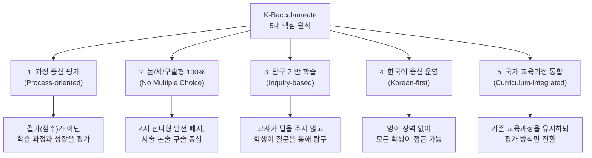

### 1.4 KB가 IB에서 가져온 것과 버린 것

| 가져온 것 (IB의 강점) | 버린 것 (IB의 한계) |
|------|------|
| 100% 서술형 평가 | IBO 인증비 (학교당 연 수천만원) |
| 탐구 기반 학습 (Inquiry-based) | 영어 중심 수업·평가 |
| 내부평가(IA) — 학생 자기주도 프로젝트 | IBO의 글로벌 채점 시스템 의존 |
| 소논문(EE) — 독립 연구 논문 경험 | 국가 교육과정과의 괴리 |
| 지식론(TOK) — 비판적 사고 훈련 | 수능과의 완전 단절 |
| CAS — 창의·활동·봉사 통합 | 소수 학교만 접근 가능한 엘리트 구조 |
| 성찰 일지 (Reflection) — 메타인지 훈련 | 외국인 교사 의존 |

> **핵심 메시지**: "KB는 IB의 '정신'은 취하고 '껍데기'는 벗겨낸 것입니다. IB의 가장 가치 있는 요소(서술형 평가, 탐구 학습, 비판적 사고)를 한국 공교육 안에서 모든 학생이 누릴 수 있도록 재설계한 모델입니다."

---

## 2. 왜 지금 KB인가 — 교육 대전환의 배경

### 2.1 5대 거시 동인 (Macro Drivers)

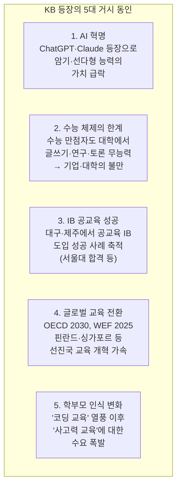

### 2.2 AI 시대 — 왜 수능형 교육이 무력화되는가

| 수능형 교육의 핵심 역량 | AI 대체 가능성 | 2030년 전망 |
|------|------|------|
| **지식 암기** | AI가 100% 대체 (검색·요약 자동화) | 가치 0% |
| **빠른 계산** | AI가 100% 대체 (계산기보다 정확) | 가치 0% |
| **4지 선다형 문제 풀이** | AI 정답률 90%+ (GPT-4 기준) | 가치 5% |
| **정형화된 서술형 답안** | AI가 80% 수준으로 작성 가능 | 가치 20% |
| **비판적 분석·논증** | AI가 보조하나 인간 판단 필수 | **가치 90%** |
| **독창적 문제 정의** | AI 대체 불가 | **가치 100%** |
| **윤리적 가치 판단** | AI 대체 불가 | **가치 100%** |
| **학제 간 융합 통찰** | AI 보조 가능, 인간 주도 필수 | **가치 95%** |

> **결론**: 수능이 측정하는 역량 상위 4개는 AI에 의해 대체됩니다. KB가 훈련하는 역량 하위 4개는 AI가 대체할 수 없습니다.

### 2.3 IB 공교육 도입의 성과 — KB의 씨앗

| 성과 지표 | 수치 | 의미 |
|------|------|------|
| **표선고 1기 서울대 합격** | 수능 없이 학종 합격 (2022) | 공교육 IB도 최상위 대학 진학 가능 입증 |
| **경북대사대부고 42점** | IB 45점 만점 중 42점 (2023) | 옥스퍼드·캠브리지 지원 가능 수준 |
| **대구외고 디플로마 취득률** | 약 94% (2024) | 글로벌 평균(80%) 초과 |
| **IB 공교육 학생 자기주도학습 향상** | 42% 향상 (대구교육청 조사) | 탐구·성찰 중심 교육의 효과 실증 |
| **IB 졸업생 대학 중퇴율** | 일반 학생 대비 40% 낮음 (IBO 연구) | 자기주도 학습 역량이 대학 적응에 직결 |

이 성과들이 교육부와 시도교육청에 "IB의 교육 방식은 효과가 있다. 이를 한국 전체로 확대할 수 있는가?"라는 질문을 던지게 했고, 그 답이 KB입니다.

### 2.4 교육 대전환 타임라인 — 한눈에 보기

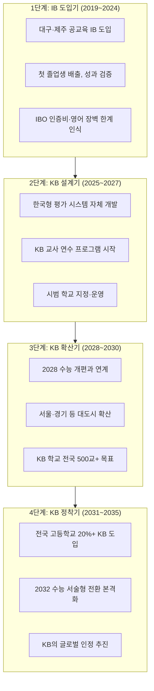

---

## 3. KB의 구체적 교육과정 구조

### 3.1 KB 교육과정의 3층 구조

KB는 기존 국가 교육과정을 유지하면서, **평가 방식**과 **수업 방법**을 전환하는 3층 구조입니다.

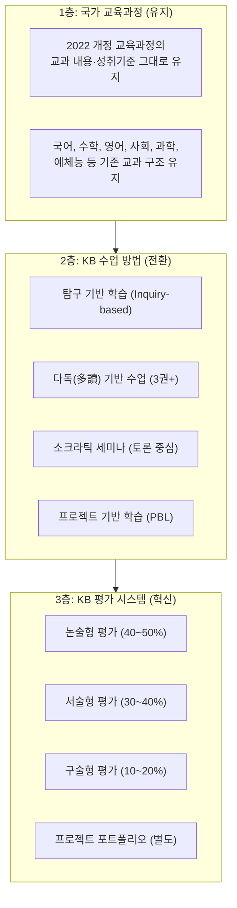

### 3.2 KB 교과 구조 — IB와의 대응

| KB 교과 영역 | 국가 교육과정 교과 | IB DP 대응 그룹 | KB에서의 변화 |
|------|------|------|------|
| **국어·문학** | 국어, 문학, 독서, 화법과 작문 | Group 1: Language A | 에세이·논술 비중 70%+, 다중 텍스트 비교 분석, 구술 평가(Individual Oral) 도입 |
| **영어·외국어** | 영어, 영어I/II, 제2외국어 | Group 2: Language B | 원서 읽기, 영어 에세이 작성, 구술 평가 강화 |
| **사회·역사** | 한국사, 사회·문화, 경제, 정치와 법, 세계사 | Group 3: Individuals & Societies | 사료 기반 분석 에세이, 탐구 보고서(2,000단어+), 다중 관점 토론 |
| **수학** | 수학I/II, 미적분, 확률과 통계 | Group 5: Mathematics | 수학 탐구 보고서(12~20p), 실생활 모델링 프로젝트, 서술형 풀이 100% |
| **과학** | 물리, 화학, 생물, 지구과학 | Group 4: Sciences | 가설 검증 실험 보고서(6~12p), 학생 자체 실험 설계, 데이터 분석·불확실도 포함 |
| **예술·체육** | 음악, 미술, 체육 | Group 6: The Arts | 작품 포트폴리오 + 제작 과정 기록, 전시·공연 기반 평가 |
| **KB Core (신설)** | 없음 (신규 도입) | EE + TOK + CAS | **탐구 논문(한국형 EE)** + **비판적 사고(한국형 TOK)** + **봉사·활동·창의(한국형 CAS)** |

### 3.3 KB Core — IB Core의 한국화

KB의 가장 혁신적인 요소는 **KB Core**의 도입입니다. IB의 EE+TOK+CAS를 한국 맥락에 맞게 재설계합니다.

| KB Core 요소 | IB 원형 | 한국형 재설계 | 분량/기간 | 평가 방식 |
|------|------|------|------|------|
| **탐구 논문 (K-Essay)** | Extended Essay (EE) | 4,000자(한국어) 독립 연구 논문. 한국 사회·문화 주제 가능. 교과 연계 필수. 지도교사 3회 면담 | 고2~고3, 1년간 | A~E 등급, 세특 연계 기재 |
| **사고와 논증 (K-Think)** | Theory of Knowledge (TOK) | "무엇을 아는가?"가 아닌 "어떻게 아는가?"를 탐구하는 과목. AI 시대 지식의 본질, 미디어 리터러시, 과학과 윤리의 경계 등 | 주 2시간, 2년간 | 논술 에세이(1,200자) + 구술 발표(10분) |
| **실천과 성찰 (K-Act)** | CAS (Creativity, Activity, Service) | 창의 활동 + 신체 활동 + 사회 봉사를 18개월간 지속. 활동마다 성찰 일지 작성. 지역사회 연계 프로젝트 1개 이상 필수 | 18개월, 주 2~3시간 | 합격/불합격 (성찰 포트폴리오 기반) |

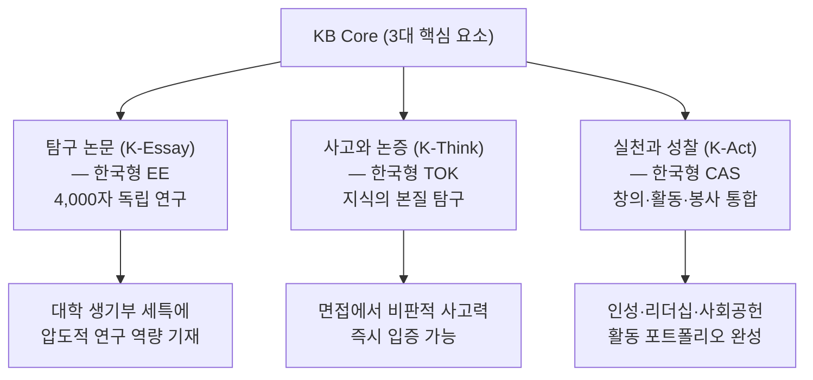

### 3.4 KB 교과별 성취기준 변화 예시

#### 국어과 변화 예시

| 기존 성취기준 | KB 전환 후 성취기준 | 평가 방법 변화 |
|------|------|------|
| "비유와 상징의 표현 효과를 이해한다" | "비유와 상징이 서로 다른 문학 작품에서 어떤 맥락에 따라 다른 효과를 만드는지 **비교 분석하고 논증**한다" | 객관식 → 2,000자 비교 분석 에세이 |
| "글의 구조와 전개 방식을 파악한다" | "동일 주제에 대한 3개 이상의 텍스트를 읽고, 각 저자의 논증 구조와 설득 전략을 **비판적으로 평가**한다" | 독해 확인 → 다독 기반 비판적 분석 |
| "토론에서 상대의 주장을 이해한다" | "소크라틱 세미나에서 텍스트를 근거로 자기 주장을 구성하고, 상대 논증의 약점을 **구체적 근거로 반박**한다" | 참여도 평가 → 루브릭 기반 토론 채점 |

#### 수학과 변화 예시

| 기존 성취기준 | KB 전환 후 성취기준 | 평가 방법 변화 |
|------|------|------|
| "이차함수의 최대·최소를 구할 수 있다" | "이차함수를 활용하여 실생활 최적화 문제(비용 최소화, 수익 최대화 등)를 **모델링하고 해석**한다" | 공식 적용 → 탐구 보고서(12~20p) |
| "확률의 뜻과 성질을 이해한다" | "실제 데이터를 수집하여 확률 모델을 구성하고, 모델의 **한계와 불확실성을 분석**한다" | 계산 문제 → 데이터 분석 프로젝트 |

#### 과학과 변화 예시

| 기존 성취기준 | KB 전환 후 성취기준 | 평가 방법 변화 |
|------|------|------|
| "뉴턴의 운동 법칙을 설명할 수 있다" | "뉴턴의 운동 법칙이 성립하지 않는 상황(상대성 이론, 양자역학)을 탐구하고, 과학적 지식의 **잠정성과 발전 과정**을 논증한다" | 법칙 암기 → 과학사 논증 에세이 |
| "화학 반응식을 완성할 수 있다" | "자신이 설정한 연구 질문에 대해 독립적 실험을 설계·실행하고, 결과를 **통계적으로 분석**하여 보고서를 작성한다" | 교과서 실험 재현 → 자체 실험 설계(6~12p 보고서) |

---

## 4. KB 평가 시스템 — 논·서·구술형의 세계

### 4.1 KB 평가의 3대 축

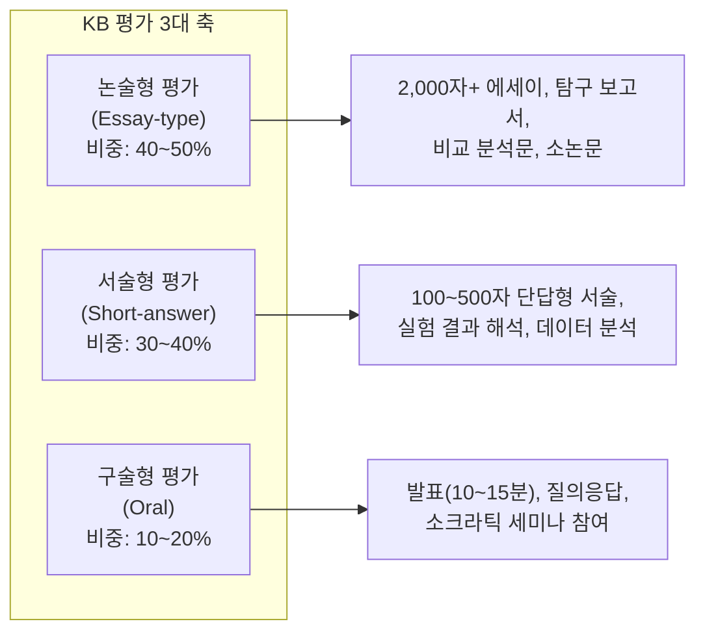

### 4.2 과목별 KB 평가 구조

| 교과 | 논술형 (40~50%) | 서술형 (30~40%) | 구술형 (10~20%) | 프로젝트 (별도) |
|------|------|------|------|------|
| **국어** | 비교 분석 에세이(2,000자), 문학 비평문 | 작품 해석, 수사법 분석 | Individual Oral (15분): 문학+비문학 연결 발표 | K-Essay (탐구 논문) |
| **수학** | 수학 탐구 보고서(12~20p): 실생활 수학 모델링 | 서술형 풀이(과정 채점), 데이터 해석 | 탐구 발표(10분): 모델링 결과 발표+질의 | — |
| **영어** | 영어 에세이(1,000단어): 주제 분석, 비교 | 독해 분석, 문법·어휘 맥락 활용 | English Oral (12분): 시각 자료 기반 발표 | — |
| **사회/역사** | 탐구 에세이(2,200자): 사료 기반 인과 분석 | 1차 사료 해석, 개념 적용 | 토론 참여: 소크라틱 세미나 채점 | 사회 탐구 프로젝트 |
| **과학** | 실험 보고서(6~12p): 가설→실험→분석→평가 | 실험 데이터 해석, 오차 분석 | 실험 발표(10분)+질의응답 | 과학 탐구 프로젝트 |
| **예술** | 작품 해설문(1,500자): 제작 의도·과정·성찰 | 작품 분석 서술 | 전시/공연 발표 | 포트폴리오 (작품 4~11점) |

### 4.3 KB 채점 기준 — Criterion-referenced (기준 참조 평가)

KB는 수능의 상대평가(norm-referenced)가 아닌, IB와 같은 **기준 참조 평가(criterion-referenced)**를 채택합니다.

| 비교 항목 | 상대평가 (수능 방식) | 기준 참조 평가 (KB 방식) |
|------|------|------|
| **채점 기준** | 다른 학생과의 상대적 위치 (석차 백분율) | 사전에 공개된 평가 기준(루브릭) 충족 여부 |
| **등급 결정** | 상위 4% = 1등급, 상위 11% = 2등급 (고정) | 기준 충족 시 누구나 A등급 가능 (비율 제한 없음) |
| **학생 간 관계** | 경쟁 (내가 잘하려면 남이 못해야 유리) | 협력 가능 (남이 잘해도 내 등급에 영향 없음) |
| **교사 재량** | 낮음 (정답이 정해져 있음) | 높음 (루브릭 해석과 적용에 전문성 필요) |
| **AI 대체 가능성** | 높음 (객관식 채점 자동화) | 낮음 (서술형 논증의 질 판단은 인간 영역) |

#### KB 논술형 평가 루브릭 예시 (국어 비교 분석 에세이)

| 기준 | A등급 (탁월) | B등급 (우수) | C등급 (양호) | D등급 (미흡) |
|------|------|------|------|------|
| **논증 구조** | 명확한 주장-근거-반론-재반론-결론 구조. 논리적 비약 없음 | 주장과 근거가 명확하나 반론 검토 부족 | 주장은 있으나 근거가 약하거나 구조 불완전 | 주장 불명확, 논리적 구조 부재 |
| **텍스트 활용** | 3개+ 텍스트에서 구체적 인용. 페이지/행 명시. 인용의 적절성 탁월 | 2개 텍스트 인용, 일반적 참조 | 1개 텍스트만 활용, 구체적 인용 부족 | 텍스트 활용 없이 개인 의견만 |
| **비판적 분석** | 텍스트 간 관점 차이를 분석하고, 각 관점의 강점·약점을 균형있게 평가 | 관점 차이를 인식하나 깊이 부족 | 표면적 비교에 그침, 분석 미흡 | 비교·분석 시도 없음 |
| **표현과 문체** | 학술적 문체, 문법 정확, 용어 적절, 독자를 고려한 명확한 표현 | 문체 적절하나 일부 비학술적 표현 | 문법 오류 다수, 구어체 혼재 | 문장 구성 미숙, 의사전달 어려움 |
| **독창성** | 기존 해석을 넘어서는 독창적 관점 제시. 자기만의 분석 틀 | 자기 관점이 있으나 기존 해석의 재구성 수준 | 교과서적 해석의 반복 | 독창성 없음 |

### 4.4 KB 내부평가 (K-IA) — 과목별 자기주도 프로젝트

IB의 Internal Assessment(IA)를 한국형으로 재설계한 **K-IA**는 KB의 핵심 평가 요소입니다.

| 과목 | K-IA 유형 | 분량 | 핵심 요구 | 제출 시기 |
|------|------|------|------|------|
| **국어** | 문학 비평 포트폴리오 | 2,000자 x 2편 | 동일 주제 문학+비문학 텍스트 교차 분석 | 고2 2학기 |
| **수학** | 수학 탐구 보고서 | 12~20페이지 | 실생활 문제의 수학적 모델링, 개인적 관심 반영 | 고3 1학기 |
| **영어** | 영어 구술 평가 (Individual Oral) | 15분 발표 + 5분 질의 | 영어 텍스트 + 글로벌 이슈 연결 분석 | 고3 1학기 |
| **사회/역사** | 역사 탐구 논문 | 2,200자 | 1차 사료+2차 문헌 기반 역사 분석 | 고2 2학기 |
| **과학** | 실험 탐구 보고서 | 6~12페이지 | 학생 자체 실험 설계·실행·분석·평가 | 고3 1학기 |
| **예술** | 작품 전시/공연 + 해설 | 작품 4~11점 + 해설 1,500자 | 제작 과정, 연구 과정, 성찰 기록 | 고3 2학기 |

### 4.5 KB 평가와 생기부의 연계

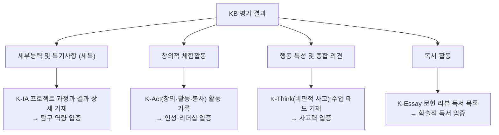

> **상담 포인트**: "KB 학교의 생기부는 일반고와 비교할 수 없을 만큼 풍부합니다. K-IA 6개 과목의 탐구 프로젝트 + K-Essay 소논문 + K-Act 봉사 활동이 모두 세특에 기재되기 때문입니다. 2028 수능 개편으로 세특 비중이 35~40%로 확대되면, KB 학생의 생기부는 압도적 경쟁력을 갖게 됩니다."

---

## 5. KB 수업의 실제 — 교실이 어떻게 바뀌는가

### 5.1 기존 수업 vs KB 수업 — 하루 비교

#### 기존 수업 (일반고 고2, 하루 일과)

| 시간 | 교시 | 과목 | 수업 방식 | 학생 활동 |
|------|------|------|------|------|
| 08:30 | 1 | 국어 | 교사 강의 (교과서 진도) | 필기, 교과서 밑줄 |
| 09:30 | 2 | 수학 | 교사 풀이 시범 → 문제 풀기 | 문제집 풀이, 공식 암기 |
| 10:30 | 3 | 영어 | 교사 독해 해설 | 단어 암기, 해석 필기 |
| 11:30 | 4 | 한국사 | 교사 강의 (연대순 사건 설명) | 연도·사건 암기 |
| 13:00 | 5 | 화학 | 교사 시범 실험 (학생 관찰) | 실험 결과 받아적기 |
| 14:00 | 6 | 체육 | 운동 | 운동 |
| 15:00 | 7 | 자습 | 문제집 풀이 | 내신 대비 암기 |
| **총 학생 발언 시간** | | | | **약 5~10분/일** |

#### KB 수업 (KB 학교 고2, 하루 일과)

| 시간 | 교시 | 과목 | 수업 방식 | 학생 활동 |
|------|------|------|------|------|
| 08:30 | 1 | 국어 | 소크라틱 세미나: 한강 vs 황석영 비교 토론 | 3권 사전 독서 기반 토론, 인용 제시, 반론 구성 |
| 09:30 | 2 | 수학 | 탐구: "학교 급식 잔반량 최소화 모델링" | 그룹별 데이터 수집, 함수 모델링, 발표 |
| 10:30 | 3 | 영어 | 영어 에세이 워크숍: 기후변화 기사 분석 | 3개 영문 기사 비교 → 500단어 분석 에세이 작성 |
| 11:30 | 4 | 한국사 | 사료 분석: "5·18의 3가지 해석 비교" | 1차 사료(신문·증언)+2차 문헌 교차 분석 |
| 13:00 | 5 | 화학 | 자체 실험: "천연 지시약의 pH 측정 정확도" | 가설 설정 → 실험 설계 → 데이터 수집 → 분석 |
| 14:00 | 6 | K-Think | "AI가 만든 지식은 진짜 지식인가?" 토론 | 다양한 관점 탐구, 성찰 에세이(500자) 작성 |
| 15:00 | 7 | K-Act | 지역 환경 캠페인 프로젝트 회의 | 봉사 계획 수립, 역할 분담, 성찰 일지 |
| **총 학생 발언 시간** | | | | **약 120~180분/일** |

### 5.2 KB 교실의 물리적 변화

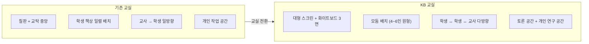

| 교실 요소 | 기존 | KB 전환 후 |
|------|------|------|
| **책상 배치** | 일렬 (교사 방향) | 모둠 원형 (4~6인) 또는 U자형 |
| **교사 위치** | 교탁 앞 고정 | 교실 전체 순회 |
| **기자재** | 칠판, 프로젝터 | 화이트보드 3면, 노트북, 실험 도구 |
| **학생 소지품** | 교과서 1권, 필기구 | 참고 도서 3권+, 노트북, 연구 노트 |
| **교실 소리** | 교사 목소리 위주 | 학생 토론·발표 소리 위주 |
| **벽면** | 시간표, 급훈 | 학생 프로젝트 결과물, 탐구 질문 게시 |

### 5.3 KB 국어 수업 사례 — 다독(多讀) 기반 비교 분석

| 주차 | 수업 내용 | 필수 텍스트 | 학생 과제 |
|------|------|------|------|
| **1주** | 주제 도입: "폭력의 기억은 어떻게 서사화되는가?" | ① 한강《소년이 온다》 | 독서 일지: 핵심 인용구 5개 + 감상 메모 |
| **2주** | 비교 독서 | ② 황석영《오래된 정원》 | 두 작품의 트라우마 서사 비교 메모 |
| **3주** | 비문학 텍스트 연결 | ③ 5·18 민주화운동 기념재단 증언록 (비문학) | 문학 텍스트와 비문학 텍스트의 서술 방식 차이 분석 |
| **4주** | 소크라틱 세미나 | 위 3개 텍스트 기반 토론 | 질문: "문학은 역사적 진실을 왜곡하는가, 심화하는가?" |
| **5주** | 비교 분석 에세이 작성 | — | 2,000자 논술: "한강과 황석영의 5·18 서사 비교" |
| **6주** | 구술 평가 (Individual Oral) | 문학 1편 + 비문학 1편 연결 | 15분 발표: "문학과 비문학 텍스트에서 공통으로 나타나는 글로벌 이슈를 분석" |

### 5.4 KB 과학 수업 사례 — 학생 자체 실험 설계

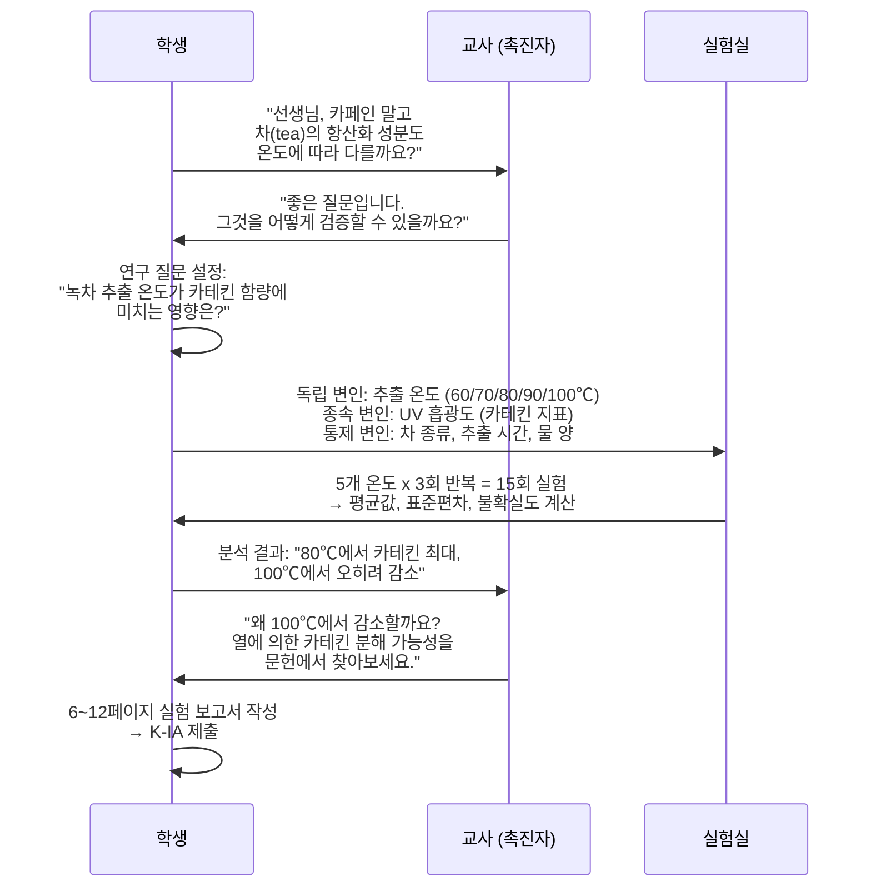

---

## 6. 시도교육청별 KB/IB 추진 현황 상세

### 6.1 전국 현황 총괄 (2026년 7월 기준)

> **전국 17개 시도교육청 모두 IB 프로그램 공식 도입 완료. 전국 IB 관련 학교 386개교 (인증 106교, 후보 73교, 관심 207교)**

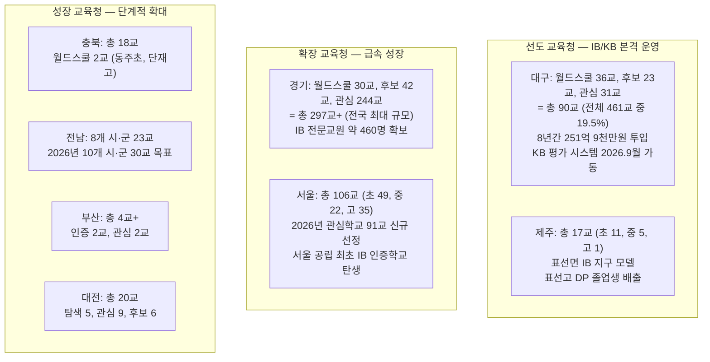

### 6.2 교육청별 상세 현황

#### 대구교육청 — KB의 심장 (전국 최초, 최대)

| 항목 | 내용 |
|------|------|
| **현황** | 전국 최다 IB 학교. 월드스쿨 36교, 후보 23교, 관심 31교 = **총 90교** (기초학교 포함 시 114교) |
| **핵심 학교** | 경북대사대부고(DP), 대구외고(DP), 대구국제고(DP), 포산고(DP), 대구서부고(DP), 대구중앙고(DP), 대구삼영초(전국 공립 최초 PYP) |
| **KB 추진** | 2026년 9월 **논/서/구술형 평가 시스템** 학교 현장 제공 예정. OCR 손글씨 인식, 표절 탐지 AI 탑재 |
| **성과** | DP 1기 진학률 81.8%, 2기 85.0% (전국 평균 73.6%). 경북대사대부고 38점 이상 고득점자 5명, 대구외고 DP 이수율 94% |
| **교사 양성** | IB 인증 교사 200명+ 양성 완료. 전국 2,500명 교원 대구 IB 학교 탐방, 800명 IB 연수 이수 중 |
| **예산** | 8년간 총 251억 9천만원. 2025년 42억 6천만원, 2026년 36억 844만원. IBO 연회비: 초등 1,129만원, 고등 1,544만원 |
| **만족도** | 초등 학부모 97.0%, 고등 학생 93.6%, 교사 96% 변화 동의 (6,766명 조사) |
| **전망** | KB 시스템 완성 후 **전국 교육청에 모델 공유**. 강은희 교육감 3선 성공(2026.6)으로 정책 연속성 확보 |

#### 서울교육청 — KB 본격 가동

| 항목 | 내용 |
|------|------|
| **현황** | 2026년 **총 106개교** (초 49, 중 22, 고 35). 관심학교 91교 신규 선정 |
| **인증 학교** | 구로초(서울 공립 최초 IB 인증), 대왕초 |
| **후보 학교** | 휘경여중, 창덕여중 등 |
| **KB 정책** | "서울 미래형 학교 교육 체제" — IB 운영 시사점을 서울교육에 적용 |
| **교원 양성** | 한국형 바칼로레아 연구 전문 교원 **석사 과정 신설**, IB 교육전문가(IBEC) 과정 운영 |
| **네트워크** | 4개 권역별 IB 학교 네트워크 (동북·동남·서북·서남) |
| **전략** | IB를 건너뛰고 **KB로 직행하는 접근** — 대구(IB→KB)와 다른 서울(KB 직접 구축) 방식 |

#### 경기교육청 — 전국 최대 규모 확산

| 항목 | 내용 |
|------|------|
| **현황** | **총 297교+** (2023년 30교 → 2025년 297교, 약 10배 성장). 월드스쿨 30교, 후보 42교, 관심 244교 |
| **핵심 모델** | 안성시 초중고 완전 연계 IB 벨트 (전국 공교육 최초): 개산초(PYP)→죽산중(MYP)→죽산고(DP) |
| **교원 역량** | IB 전문교원 약 460명 확보 (국제공인 전문강사 75명, 교육전문가 86명) |
| **향후** | "경기형 바칼로레아" 운영. 2028학년도 첫 IB DP 졸업생 배출 예정 |

#### 제주교육청 — 공교육 IB 원조

| 항목 | 내용 |
|------|------|
| **현황** | 총 17교 (초 11, 중 5, 고 1). 2022년 8교에서 3년간 2배 증가 |
| **표선 모델** | 표선면 IB 지구: 표선초(PYP)→표선중(MYP)→표선고(DP) 연계 완성 |
| **성과** | 표선고 DP 1기 26명 전원 자격증 취득. 서울대·연세대·고려대 합격. 인하대 의대 합격. 표선초 학생수 240명(2020)→461명(2025) |
| **한계** | 김광수 교육감이 IB 확대 중지. "고등학교는 표선고 이외 어렵다"는 입장 |

#### 충북교육청 — 신흥 성장 지역

| 항목 | 내용 |
|------|------|
| **현황** | 총 18교 (2024년 9교→2025년 18교, 1년간 2배). 월드스쿨 2교: 동주초(PYP), 단재고(DP) |
| **추진** | 청주·충주·제천 지역별 IB 클러스터 조성 목표 |

#### 전남교육청 — 농산어촌 모델

| 항목 | 내용 |
|------|------|
| **현황** | 8개 시·군 23교. 2026년 10개 시·군 30교 확대 예정 |
| **인증** | 나주 빛가람초(전남 최초 인증). 나주금천중, 봉황고, 전남외고 인증 추진 |
| **교육발전특구** | 나주시, 목포시, 무안군, 신안군, 영암군, 강진군 |

#### 부산교육청 — 체계적 로드맵

| 항목 | 내용 |
|------|------|
| **현황** | 인증 2교(연포초, 부산국제중), 관심 2교(양정초, 부산동여자중) |
| **로드맵** | 도입기(2023~24) → 발전·확산기(2025~27) → 정착기(2028~). "부산형 IB 교육 모델" 개발 |

### 6.3 KB/IB 확산 추이와 전망

| 시기 | KB/IB 학교 수 (실적/추정) | 전국 초중고 대비 | 주요 이벤트 |
|------|------|------|------|
| **2019년** | 4교 (대구 3, 제주 1) | 0.03% | 전국 최초 공교육 IB 도입 |
| **2024년** | 약 200교 | 약 1.7% | 교육부 KICE 'IB연구실' 신설, 한국IB교육학회 출범 |
| **2026년 (현재)** | **386교** (인증 106, 후보 73, 관심 207) | **약 3.3%** | 17개 시도교육청 전체 도입 완료. 대구 KB 평가 시스템 가동 |
| **2028년** | 500~600교 (IB+KB 혼합) | 약 5~6% | 2028 수능 개편, KB 시범 운영 확대 |
| **2030년** | 800~1,000교 (KB 중심 전환) | 약 8~10% | 논/서술형 수능 시범, 서울·경기 대규모 KB 확산 |
| **2032년** | 1,500~2,000교 (KB 주류화) | **약 13~17%** | 수능 서술형 본격화, KB가 교육 표준으로 자리매김 |
| **2035년** | 2,500~3,500교 | **약 22~30%** | KB 정착기, KBO 설립, 글로벌 인정 추진 |

> **참고**: 2026년 기준 이미 386교가 참여 중이며, 이는 당초 전망보다 훨씬 빠른 속도입니다. 이 추세가 지속되면 2032년 20% 목표는 충분히 달성 가능합니다.

---

## 7. KB 교사 양성과 역량 전환

### 7.1 교사 역할의 근본적 전환

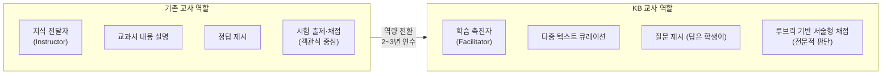

### 7.2 KB 교사 역량 프레임워크

| 역량 영역 | 기존 교사에게 필요한 수준 | KB 교사에게 필요한 수준 | 역량 격차 |
|------|------|------|------|
| **수업 설계** | 교과서 진도 따라 강의안 작성 | 다중 텍스트 큐레이션, 탐구 질문 설계, 소크라틱 세미나 운영 | **높음** |
| **평가 역량** | 객관식 문제 출제, OMR 채점 | 서술형 루브릭 설계·적용, 에세이 채점, 구술 평가 채점 | **매우 높음** |
| **피드백 능력** | "정답/오답" 이분법 피드백 | 서술형 답안에 대한 구체적·발전적 피드백 작성 | **높음** |
| **토론 운영** | 발표 수업 진행 (교사 주도) | 소크라틱 세미나 촉진, 학생 간 토론 유도, 침묵 관리 | **높음** |
| **프로젝트 지도** | 과제 제시 → 결과물 수합 | K-IA/K-Essay 개별 지도, RPPF 면담 3회, 연구 방법론 조언 | **매우 높음** |
| **AI 리터러시** | 기본 ICT 활용 | AI 도구 윤리적 활용 지도, AI 사용 일지 관리, Academic Integrity 교육 | **보통** |

### 7.3 KB 교사 연수 프로그램 (3년 로드맵)

| 연차 | 연수 내용 | 시간 | 핵심 산출물 |
|------|------|------|------|
| **1년차** | KB 교육 철학 이해, 탐구 기반 수업 설계, 서술형 평가 기초 | 120시간 | 서술형 평가 문항 10개 + 루브릭 설계 |
| **2년차** | 소크라틱 세미나 운영, K-IA 지도법, 에세이 채점 실습 | 120시간 | 소크라틱 세미나 수업 3회 실습 + 에세이 채점 20편 |
| **3년차** | K-Essay/K-Think 지도, 교차 채점(Moderation), 피드백 고급 | 80시간 | KB 수업 1학기 완전 운영 + 동료 교사 멘토링 |

### 7.4 한국 IBEC 인증 대학 — KB 교사 양성의 기반

한국에서 IBO로부터 IB교육전문가(IBEC) 인증을 받은 대학은 KB 교사 양성의 핵심 인프라입니다.

| 대학 | 인증 시기 | 특징 | KB 교사 양성 연계 |
|------|------|------|------|
| **한국교원대** | 2019 | 국내 최초 IBEC 인증. 교원양성 특수목적대학 | KB 마스터 교사 양성의 중심축 |
| **경북대** | 2020 | 대구 IB 정책과 직접 연계. 사범대학 기반 | 대구 IB/KB 교사 파이프라인 |
| **한동대** | 2021 | 국제화 강점. 영어+한국어 이중 프로그램 | 글로벌 KB 모델 연구 |
| **서울교대** | 2022 | 초등교원 양성 특수대학. PYP 전문 | 초등 KB 교사 양성 (PYP→KB 전환) |

> **일본 대비**: 일본은 9개 대학이 IBEC 인증을 보유하고 있으며, 오카야마이과대는 학부 레벨에서 연 30명 이상의 IB 교사를 배출합니다. 한국도 KB 확산에 맞춰 IBEC/KB 전문 교사 양성 대학을 **10개 이상**으로 확대할 필요가 있습니다.

### 7.5 KB 교사 양성의 과제

| 과제 | 현황 | 해결 방향 |
|------|------|------|
| **서술형 채점 부담** | 학생 30명 x 과목당 2,000자 에세이 = 교사 1인당 60,000자 채점 | AI 보조 채점 도구 개발, 채점 시간 확보를 위한 수업 시수 조정 |
| **교사 저항** | "내 수업 방식을 왜 바꿔야 하는가?" — 변화에 대한 저항 | 성공 사례 공유, 자발적 참여 유도, 인센티브 |
| **연수 시간 확보** | 수업·행정 업무 과중으로 연수 시간 부족 | 방학 집중 연수, 온라인 연수 병행, 대체 교사 배치 |
| **채점 신뢰성** | 서술형 채점의 교사 간 편차 | 교차 채점(Cross-moderation), 외부 검증, 앵커 페이퍼(기준 답안) 공유 |
| **양성 규모** | 현 4개 대학 IBEC 인증 — KB 전국 확산 대비 부족 | IBEC 인증 대학 10개+ 확대, KB 전용 교사 양성 과정 신설 |

---

## 8. 2022 개정 교육과정·고교학점제와 KB의 관계

### 8.1 3대 교육 개혁의 수렴

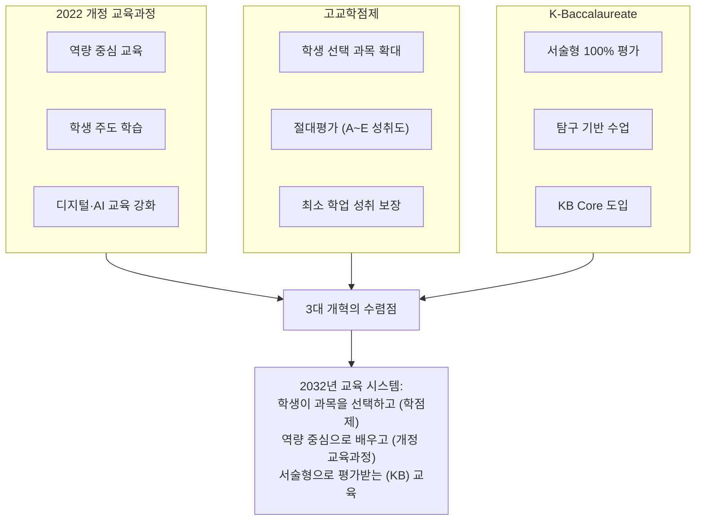

### 8.2 고교학점제 실제 성과 데이터 (2024~2025 시행 결과)

> 고교학점제는 2025년 전면 시행되었습니다. 연구학교 성과 데이터는 KB 확산의 기반이 됩니다.

| 지표 | 수치 | 출처 | KB에 주는 시사점 |
|------|------|------|------|
| **학생 만족도** | **69.65%** 긍정 | 교육부 연구학교 조사 | 학생 선택권 확대 → KB 선택 과목 도입 기반 |
| **교사 만족도** | **76.01%** 긍정 | 교육부 연구학교 조사 | 교사 자율성 확대에 대한 수용도 높음 |
| **졸업 기준** | 192학점 (수업량 적정화) | 2025 전면 시행 | KB Core(K-Essay·K-Think·K-Act) 학점 편성 가능 |
| **성취평가제** | 공통과목 제외 선택과목 A~E 절대평가 | 2025 전면 시행 | KB의 기준 참조 평가와 자연 연계 |

### 8.3 고교학점제와 KB의 시너지

| 고교학점제 요소 | KB와의 시너지 | 기대 효과 |
|------|------|------|
| **학생 과목 선택** | KB에서 K-IA 주제를 선택 과목과 연계 → 진로 맞춤 탐구 | 학생 주도성 극대화 |
| **절대평가 (A~E)** | KB의 기준 참조 평가와 동일 철학 → 자연스러운 연계 | 상대평가 경쟁 구조 탈피 |
| **최소 성취 보장** | KB의 과정 중심 평가가 학생 성장을 지속 추적 | 낙오 학생 조기 발견·지원 |
| **다양한 선택 과목** | 융합 과목(예: "AI와 윤리")에서 K-Think 연계 | 학제 간 융합 학습 실현 |

### 8.4 2022 개정 교육과정의 핵심 변화와 KB 정합성

| 개정 교육과정 핵심 | KB에서의 구현 | 기존 교육에서의 한계 |
|------|------|------|
| **포용성과 창의성** | K-Act 봉사·창의 활동으로 실천 | 수능 경쟁 구조에서 형식적 봉사 |
| **자기주도 학습** | K-IA/K-Essay로 자기 주제 탐구 | 교과서 암기·문제집 반복 |
| **디지털 전환** | AI 도구 윤리적 활용 훈련 (K-Think) | AI 활용 교육 없음 |
| **생태 전환 교육** | EE 주제로 환경·지속가능성 탐구 가능 | 교과서 내 환경 단원 암기 |

---

## 9. 2028~2032 수능 개편 로드맵 상세

### 9.1 수능 개편의 3단계 시나리오

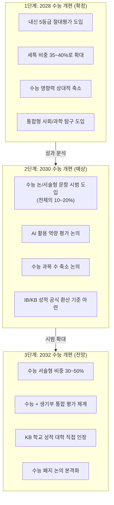

### 9.2 2028 수능 개편 확정 내용 (2023.12.27 교육부 발표)

| 개편 항목 | 현행 (2027학년도까지) | 2028학년도부터 | KB 학생에 미치는 영향 |
|------|------|------|------|
| **내신 등급제** | 9등급 상대평가 (1등급 4%) | **5등급 상대평가 (1등급 10%)** + 성취도(A~E) 병기 | KB 학교 내신 부담 완화. 1등급 비율 2.5배 확대 |
| **수능 구조** | 국·수·탐 선택과목 존재 | **선택과목 전면 폐지, 통합형** (통합사회+통합과학) | KB의 학제 간 융합 교육과 정합성 높음 |
| **수능 서술형** | 없음 (5지선다 100%) | **수능 자체에 서술형 미도입** (객관식 유지) | 수능은 객관식 유지, 내신에서 논/서술형 확대 |
| **내신 논서술형** | 학교 자율 | **논/서술형 평가 확대** (5등급제 변별력 보완) | KB의 서술형 훈련이 내신에서 직접 경쟁력 |
| **탐구 시험** | 사탐/과탐 8과목 선택 | **통합사회·통합과학** 50문항 80분 | KB의 융합 교육이 통합 탐구에 최적화 |
| **정시 비율** | 정시 40% 룰 | 40% 유지 (3개 대학만 30% 완화 가능) | 학종 비율 실질 확대 추세 → KB 유리 |
| **융합선택 9과목** | — | **절대평가(A~E)만 적용** | KB의 기준 참조 평가와 자연 연계 |

### 9.3 2030 수능 개편 예상 시나리오

| 시나리오 | 가능성 | 내용 | KB와의 관계 |
|------|------|------|------|
| **A: 점진적 서술형 확대** | 높음 (60%) | 수능 문항의 10~20%를 논/서술형으로 전환. 채점 인프라 구축 | KB 학생 유리. 서술형 훈련 2년+ 경험 |
| **B: 수능 과목 축소** | 보통 (40%) | 국·수·영 + 통합 탐구 1과목으로 간소화. 나머지는 내신으로 | KB Core(K-Think, K-Essay)가 내신에서 차별화 |
| **C: AI 활용 평가 도입** | 낮음 (20%) | 시험 중 AI 도구 사용 허용, AI 활용 능력 자체를 평가 | KB의 AI 윤리 교육(K-Think)이 선제적 대비 |

### 9.4 2032 수능 전망 — 구체적 논의 사항

> **참고**: 2032학년도 대입은 2026년 중1이 치르는 시험입니다. 국가교육위원회가 **2026년 9월 '중장기 국가교육발전계획(2028~2037)' 시안을 발표**할 예정이며, 이 계획에 2032년 대입 방향이 포함될 가능성이 높습니다.

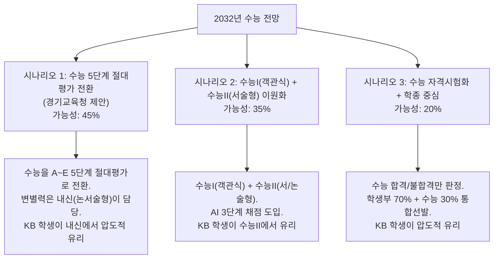

#### 2032 대입에서 논의 중인 구체적 변화

| 논의 사항 | 내용 | 제안 주체 | KB 학생 영향 |
|------|------|------|------|
| **수능 절대평가 전환** | 5단계(A~E) 절대평가 | 경기교육청 | KB의 기준 참조 평가와 동일 철학 |
| **수능 시기 변경** | 11월 → **9월 시행** | 복수 교육청 | 3학년 2학기 수업 정상화 |
| **수시/정시 통합** | 12월 중순 일괄 원서접수 | 국교위 논의 | 학종 경쟁에서 KB 생기부 강점 |
| **영어 듣기 폐지** | 학교 수행평가로 대체 | 경기교육청 | KB의 구술 평가가 영어 수행평가 대비 |
| **내신 전과목 절대평가** | 2029년 고1부터 | 복수 교육청 | KB의 기준 참조 평가와 완전 합치 |
| **학생부 반영 66.7%+** | 전형요소 중 학생부 2/3 이상 | 국교위 논의 | KB의 풍부한 세특이 결정적 무기 |

---

## 10. 2032 대입 전망 — 대학 입시는 이렇게 바뀐다

### 10.1 2032 대입의 5대 변화

| 변화 | 현행 (2026) | 2032 전망 | KB 학생에게 미치는 영향 |
|------|------|------|------|
| **① 수능 비중** | 정시 40%, 수시 최저 | 정시 20~30%, 수능 자격시험화 논의 | 수능 부담 감소 → KB에 집중 가능 |
| **② 생기부 비중** | 수시 학종 60% | 학종 70~80%, 세특 비중 35~40% | K-IA·K-Essay가 세특 최강 소재 |
| **③ 면접 비중** | 일부 대학만 | 대부분 대학 면접 의무화 | K-Think 훈련이 면접 논리력 직결 |
| **④ 서술형 평가** | 수능 거의 없음 | 수능 서술형 30~50% | KB 서술형 훈련 2년이 직접 적용 |
| **⑤ AI 역량 평가** | 없음 | AI 윤리·활용 역량 평가 도입 | K-Think AI 윤리 교육이 선제적 대비 |

### 10.2 2032 대학별 입시 전형 전망

| 대학 | 2032 전망 전형 | KB 학생 전략 |
|------|------|------|
| **서울대** | 학종 비중 85%+, 수능 자격시험화, 면접 강화, 다면 평가 | K-Essay + 세특 연계로 연구 역량 입증. K-Think로 면접 차별화 |
| **연세대·고려대** | 학종 70%, 논술 전형 유지, 글로벌 전형 확대 | KB 논술형 훈련이 논술 전형에 직접 연결. 글로벌 역량(K-Act) 활용 |
| **KAIST·POSTECH·UNIST** | 수능 최저 없는 학종 100%, 연구 역량 중심 평가 | K-IA 과학·수학 프로젝트가 연구 역량 직접 입증 |
| **의대** | 수능 최저 완화, 면접 MMI 확대, 인성 평가 강화 | K-Act 봉사 활동 + K-Think 윤리 판단이 MMI 면접 핵심 |
| **지방 거점 국립대** | 학종 80%+, 지역 연계 전형 확대 | 지역 사회 K-Act 프로젝트로 지역 연계 입증 |

### 10.3 2032 입시에서 KB 학생의 구조적 우위

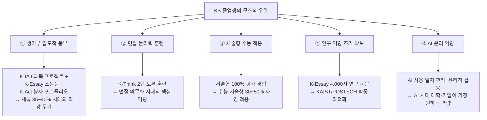

### 10.4 2032 대입 — 입학사정관이 보는 KB 학생의 5대 강점

| 평가 영역 | 일반고 학생 | KB 학생 | 입학사정관 판단 |
|------|------|------|------|
| **학업 역량** | 내신 등급 + 모의고사 성적 | K-IA 프로젝트 과정·결과 + 서술형 성적 | "KB 학생은 과정을 보여준다. 등급만 보여주는 것이 아닌, 어떻게 탐구했는지가 드러난다" |
| **전공 적합성** | 교과 성적 + 동아리 활동 | K-Essay 주제 + K-IA 진로 연계 프로젝트 | "KB 학생의 K-Essay는 대학 졸업 논문 수준의 전공 탐구를 고등학교에서 한 것" |
| **발전 가능성** | 성적 추이, 수상 경력 | K-Think 수업 성장 기록 + 성찰 일지 | "KB 학생은 자기 성장 과정을 성찰적으로 기록한다. 메타인지 능력이 탁월" |
| **인성·공동체** | 봉사시간, 임원 경험 | K-Act 18개월 성찰 포트폴리오 + 지역 프로젝트 | "KB 학생의 K-Act는 시간 채우기가 아닌 진정한 사회 참여를 보여준다" |
| **창의적 사고** | 교내 대회 수상 | 소크라틱 세미나 토론 기록 + 독창적 K-Essay 주제 | "KB 학생은 '좋은 질문을 만드는 능력'이 있다" |

---

## 11. KB 20% 확산 시나리오 — 근거와 타임라인

### 11.1 왜 20%인가 — 확산의 논리

한국 전체 고등학교 약 2,300개교 중 **20%(약 460~500교)**가 KB를 도입할 것으로 전망하는 근거입니다.

| 근거 | 수치 | 해석 |
|------|------|------|
| **고교학점제 전면 시행** | 2025년~ 전국 시행 | 절대평가 도입 → KB의 기준 참조 평가와 자연 연계 |
| **2028 수능 개편** | 세특 35~40% | 세특 강화 → KB 방식의 탐구 교육 수요 폭발 |
| **교사 세대 교체** | 매년 신규 교사 약 3,000명 | 신규 교사는 KB 방식 연수 이수 → 점진적 확산 |
| **학부모 인식 변화** | IB 공교육 성과 보도 증가 | "우리 아이도 서술형 교육을 받게 해야 한다" |
| **대학의 요구** | 대학 교수들의 "신입생 글쓰기 능력 부족" 불만 | 대학이 KB 출신 학생을 선호하는 구조 형성 |
| **일본 사례** | 일본 IB 200교 목표 달성 (2025) | 한국도 유사한 확산 속도 가능 |

### 11.2 확산의 5단계 모델

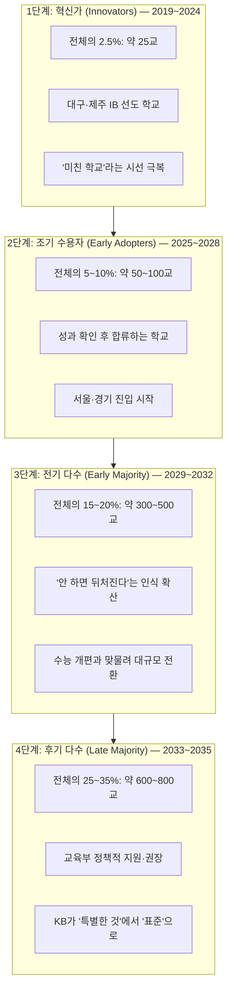

### 11.3 지역별 확산 전망

| 지역 | 2028년 KB 학교 (추정) | 2032년 KB 학교 (추정) | 확산 동인 |
|------|------|------|------|
| **대구·경북** | 30~40교 | 80~100교 | KB 원조, 교육청 주도 |
| **서울** | 10~20교 | 50~80교 | 인구 밀집, 학부모 수요 높음 |
| **경기** | 10~15교 | 40~60교 | 인구 최다, 서울 영향 |
| **제주** | 5~8교 | 15~20교 | IB 원조, 작은 규모 |
| **부산·울산** | 5~10교 | 20~30교 | 대구 영향, 교육청 의지 |
| **충청** | 5~8교 | 15~25교 | 충남삼성고 모델, 세종시 포함 |
| **전라·강원·기타** | 5~10교 | 20~40교 | 교육감 의지에 따라 차이 |
| **합계** | **70~111교 (3~5%)** | **240~455교 (10~20%)** | — |

---

## 12. 해외 사례 비교 — 일본·핀란드·호주의 교훈

### 12.1 일본 — "IB 200교" 달성과 DLDP(일본어DP)의 교훈

2013년 아베 총리의 "일본재흥전략(日本再興戦略)"으로 IB를 국가 인재 전략으로 채택. **각의(閣議) 결정**으로 교육부 단독이 아닌 내각 차원 추진. 문부과학성(MEXT)은 IBO와 공식 협약을 맺어 **DLDP(듀얼 랭귀지 DP)** — 일본어로 IB 과목을 가르칠 수 있는 체제를 개발했습니다.

| 항목 | 일본 | 한국 |
|------|------|------|
| **목표** | IB 200교 (2024년 달성 — 인증+후보 포함) | KB 포함 2032년까지 20% (전망) |
| **현재 규모 (2025.9)** | **271교** (전체) / DP **82교** (인증 77, 후보 5) / DLDP **39교** | 386개교 (인증+후보+관심, 2026) |
| **프로그램별** | PYP 128교, MYP 60교, DP 82교, CP 1교 | IB+KB 혼합 운영 |
| **언어** | DLDP — 6개 과목 그룹 중 **4개까지 일본어 수업 가능**, 최소 2과목은 영어 필수 | 한국어 IB 인증 일부 + KB 한국어 100% |
| **정부 지원** | 문부과학성 직접 지원 + IB교육추진컨소시엄 | 시도교육청 중심, 교육부 KICE IB연구실 |
| **대학 인정** | **77개 대학** IB 전형 운영 (44개는 전학부 적용). 도쿄대·교토대·오사카대·와세다·게이오 포함 | 서울대 학종 합격 사례, 공식 IB 전형 없음 |
| **전체 대비 비율** | 초중고 35,000교 중 0.8% | 초중고 11,600교 중 3.3% |
| **교사 양성** | **9개 대학** IBEC(교사 인증) 프로그램 운영. 특별면허장 제도로 외국인 교사 채용 | 한국교원대·경북대·한동대·서울교대 IBEC 인증 |
| **핵심 교훈** | **대학 연계 + 정부 주도 = 확산**, 교사 부족 = 최대 병목 | 한국도 교육부+SKY 연계 시 폭발적 확산 가능 |

#### 일본 DLDP — KB의 직접적 모델

| DLDP 특징 | 내용 | KB와의 비교 |
|------|------|------|
| **일본어 가능 과목** | 경제학, 지리, 역사, 생물, 화학, 물리, 수학, 음악, 미술, TOK, EE, CAS | KB는 **전 과목 한국어** — DLDP보다 언어 제약 완전 해소 |
| **영어 필수 과목** | 그룹2(외국어) + 최소 1과목 이상 = 총 2과목 이상 영어 | KB는 영어 필수 없음 |
| **운영 학교** | 39교 (2025.9 기준) | 한국 KB는 전체 학교 대상 |
| **도입 경과** | 2013년 협약 → 2015년 2월 첫 인증 → 2015년 8월 교육법 개정(교육과정 이중 충족 허용) | KB는 국가 교육과정 위에 직접 구축 — IBO 이중 요건 불필요 |
| **연간 비용** | 학교당 약 **3,000~4,000만 엔** (약 3~4억 원) | KB는 IBO 비용 없음 — 공교육 예산만 |

#### 일본의 IB 대학 입시 점수 기준

| 대학 | 최소 IB 점수 | 실제 합격 평균 |
|------|------|------|
| **도쿄대** | — | 40.8점 |
| **와세다대** | — | 38.2점 |
| **게이오대** | — | 38.6점 |
| **쓰쿠바대** | 36점 | 38.3점 |
| **관서학원대** | 24점 | — |

#### 일본 IB 교사 양성 대학 (IBEC 인증)

| 대학 | 개시 연도 | 특징 |
|------|------|------|
| **도쿄학예대** | 2018 | 국립 교원양성대 최초. 대학원 전문직학위과정 |
| **국제기독교대(ICU)** | 2019 | 리버럴아츠 기반. 생물 전공자가 영어·수학 인증 가능 |
| **오카야마이과대** | 2016 | 일본 최초 **학부** 레벨 IB 교사 양성. 연 30명+ 배출 |
| **관서학원대** | 2019 | DP 전용 IBCTL. 4학기 순차 이수, 일본어 수업 |
| **다마가와대** | — | 대학원. **온라인 IBEC** 프로그램 운영 |
| **쓰쿠바대** | — | 석사(국제교육). PYP/MYP/DP 전 과정 |
| **세이레이크리스토퍼대** | — | 현직 교사 대상 1년 이수증명 과정 |

> **한국 KB에 대한 시사점**: 일본은 IBO에 의존하는 DLDP 모델로도 성과를 냈으나, 학교당 연 3~4억 원의 비용과 영어 2과목 필수 요건이 확산의 한계를 만들었습니다. KB는 이 두 제약을 모두 해소한 모델이며, 일본의 교사 양성 체계(9개 대학 IBEC)는 한국 KB 교사 양성의 직접적 벤치마크입니다.

### 12.2 싱가포르 — 엘리트 IB의 빛과 그림자

| 항목 | 내용 |
|------|------|
| **운영 규모** | 7개 학교 (자립형 고등학교 + 국제학교) |
| **학생 성적** | 2022년 전 세계 IB 만점자 238명 중 **133명(56%)이 싱가포르 학생**. 응시자 평균 40.6점 (글로벌 평균 32.37점) |
| **접근성** | 학업 성적 우수·예술/스포츠 특기생·경제적 여유 계층에 편중 |
| **한계** | 공립학교 확대 요구가 있으나 엘리트 편중 구조 지속 |
| **한국 시사점** | KB는 싱가포르와 달리 **공교육 전체 확대**를 목표로 하여 형평성 문제를 선제적으로 해결 |

### 12.3 핀란드 — 교육 선진국의 모델

| 핀란드 교육 원칙 | KB에서의 적용 | 한국적 과제 |
|------|------|------|
| **교사 자율성** (석사 이상, 수업 자유) | KB 교사에게 평가·수업 설계 자율성 부여 | 한국 교사의 자율성 제한적 (교육과정 구속) |
| **시험 최소화** (중학교까지 시험 없음) | KB Core의 과정 중심 평가 | 한국 학부모의 시험·등급 의존 심리 |
| **다독 기반 수업** (교과서 ≠ 진리) | 과목당 3권+ 텍스트 활용 | 교과서 1권 중심 문화 전환 필요 |
| **평등한 접근** (학교 간 격차 최소) | KB를 공교육으로 무상 제공 | 지역·학교 간 역량 격차 해소 과제 |
| **놀이·체험 중심** (초등) | K-Act(창의·활동·봉사) 강화 | 입시 스트레스 문화와의 충돌 |

### 12.4 호주 — IB와 국가교육과정의 공존

호주는 IB와 자국 교육과정(ATAR)이 공존하며, IB 성적을 ATAR(대학입학등급)로 환산하는 공식 시스템을 운영합니다.

| 호주 모델 | 한국 KB 적용 가능성 |
|------|------|
| IB 점수 → ATAR 환산 공식 존재 | KB 성적 → 수능 등급 환산 공식 필요 (2030년 목표) |
| IB 학교와 일반 학교 학생이 동일 대학 전형 지원 | KB 학교와 일반고 학생이 동일 학종 지원 (이미 가능) |
| 대학이 IB 학생을 선호하는 구조 형성 | 한국 대학도 KB 학생 선호 구조로 전환 전망 |

### 12.5 해외 사례 종합 비교

| 국가 | 추진 주체 | 학교 수 | 입시 연계 | 한국 KB에 주는 교훈 |
|------|------|------|------|------|
| **일본** | 내각(국가 정책) | 271교 (0.8%) — DP 82교, DLDP 39교 | 77개 대학 IB 전형 (44개 전학부) | 대학 연계 + DLDP(모국어 수업) = 확산의 핵심 동인 |
| **싱가포르** | 교육부 + 자립형 학교 | 7교 | 자체 입시 체계 | 엘리트 편중 방지 설계 필수 |
| **핀란드** | 교사 자율 | 전국 | 시험 없음 | 교사 전문성이 성패 결정 |
| **호주** | 연방+주정부 | 다수 | IB→ATAR 환산 | 성적 환산 공식 필요 |
| **한국** | 시도교육청 | 386교 (3.3%) | 학종 활용 | 교육부+대학+교육청 3자 협력 |

---

## 13. KB 도입의 리스크와 과제

### 13.1 5대 리스크

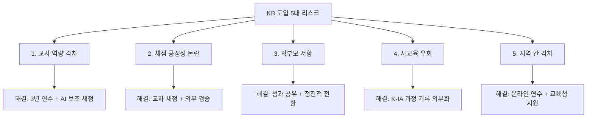

### 13.2 리스크별 상세 분석과 대응

| 리스크 | 구체적 문제 | 심각도 | 대응 방안 | 참고 사례 |
|------|------|------|------|------|
| **교사 역량** | 전교조 대구지부 교사 1,407명 조사 결과 **77.1%가 부정적 평가**. "IB 방식 수업은 일반 수업의 2~3배 시간 소요" | 높음 | 3년 단계별 연수, IB 인증 교사를 KB 마스터 교사로 활용, 교사 학습 공동체(PLC) 운영. 대구: 200명+ IB 교사 양성 성공. 경기: IB 전문교원 460명 확보 | 대구 만족도: 교사 96% 변화 동의 (6,766명 조사) |
| **채점 공정성** | "같은 에세이를 교사 A는 A등급, 교사 B는 C등급으로 채점하면?" → 학부모 불신. 4년 주기 순환 전보로 전문성 연속성 문제 | 매우 높음 | 대구교육청 **AI 채점 시스템**: OCR 손글씨 인식(2만 건 데이터), 표절 탐지(AI/인터넷 구분), GPU 기반 RAG 체계 구축. 교차 채점(Moderation), 앵커 페이퍼 공유 | IB: IBO 외부 조정관(Moderator) 제도 |
| **학부모 저항** | "수능 안 보면 SKY 못 간다", "서술형이면 사교육이 더 필요하지 않나?" | 높음 | 표선고 서울대·연세대·고려대·인하대 의대 합격 사례 홍보. 대구 IB 진학률: 1기 81.8%, 2기 85.0% (전국 평균 73.6%). 학부모 만족도: 초등 97.0%, 고등 95.1% | 표선초 학생수 240명(2020)→461명(2025) |
| **예산 부담** | 전국 8개 교육청이 IBO에 지급한 누적 예산 **24억 1천만원**. 전국 총 투입 **618억원**. "국부 유출" 비판 | 높음 | KB로 전환 시 IBO 인증비 불필요. 대구 자체 평가 시스템 개발로 IBO 의존 탈피. KBO(한국형 바칼로레아 기구) 독립 비영리기구 설립 구상 | IB 학교 연회비: 초등 1,129만원, 고등 1,544만원 |
| **사교육 우회** | IB 전문 학원 출현, 문제집 시판. 중국 사례에서 "IB 개인교습 횡행" 경고 | 보통 | K-IA 과정 기록 의무화(RPPF), 구술 평가에서 과정 질문, AI 표절 탐지 도구 활용. 반론: IB 연구자들은 "사교육과 역 상관관계" 논문 발표 | IB: RPPF 3회 면담 + Turnitin |
| **지역 격차** | 대구 90교, 경기 297교 vs 강원 7교, 광주 7교 | 보통 | 온라인 연수 플랫폼, 교육청 간 멘토링, 교육부 예산 균등 배분. 교육발전특구 31개 시범지역 + 교육국제화특구 12곳 연계 | 전남: 8개 시·군 23교, 2026년 30교 확대 |

### 13.3 주요 반대 의견 — 전문가·단체별 정리

| 비판 주체 | 핵심 논점 |
|------|------|
| **이형빈 교수** | IB는 "폐쇄적 모델"이며 교사를 "모방적 수준"으로 회귀시킴. 교사 숙의 교육과정 개발을 대안으로 제시 |
| **세종시교육청** | 2021년 연구용역으로 "국가교육과정과 중복, 도입 불필요" 결론. 도입 거부 |
| **전교조 대구지부** | 교사 77.1% 부정 평가. 초등/중학교 교사 연 6~9개 프로젝트 수행 부담 |
| **MBC 보도** | "618억 세금이 스위스 민간기구로 유출". "현 교육과정으로도 토론·탐구 수업 가능" |
| **오마이뉴스 칼럼** | 고교학점제와 IB는 "정반대 방향". 줄세우기 구조의 본질을 건드리지 못함 |
| **교육언론 창** | IB 학교가 "새로운 특목고" 역할. 교육 양극화 심화 우려 |

> **균형적 시각**: KB의 핵심은 이러한 비판을 정면으로 해결하는 것입니다. IBO 비용 → KBO 자체 운영, 교사 부담 → AI 채점 보조, 엘리트화 → 전체 학교 확산, 수능 충돌 → 수능 개편 연계. 비판의 상당 부분이 "IB"에 대한 것이지 "KB"에 대한 것이 아닙니다.

### 13.4 AI 채점 시스템 심층 분석 — 서술형 채점의 객관화 혁명

> **핵심 논점**: "서술형 평가는 교사 주관이 개입되어 공정하지 않다"는 학부모·사회의 가장 큰 우려입니다. AI 채점 기술의 발전은 이 우려를 근본적으로 해소할 수 있는 게임 체인저입니다.

#### 13.4.1 AI 채점 파이프라인 — 3단계 구조

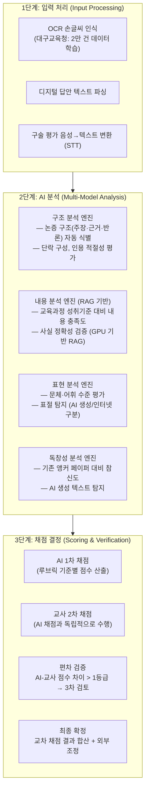

#### 13.4.2 대구교육청 AI 채점 시스템 상세

대구교육청은 전국 최초로 **AI 기반 서술형 채점 지원 시스템**을 개발·운영 중입니다.

| 기술 요소 | 상세 내용 | 성과/현황 |
|------|------|------|
| **OCR 손글씨 인식** | 학생 손글씨 답안 자동 인식. 한글 손글씨 데이터 **2만 건** 학습 | 인식률 95%+ (인쇄체 수준 도달 목표) |
| **표절 탐지 AI** | AI 생성 텍스트 vs 인터넷 복사 vs 학생 자작 **3분류 탐지** | ChatGPT/Claude 생성 텍스트 탐지. Turnitin 한국어판 연계 |
| **GPU 기반 RAG 체계** | 교육과정 성취기준·앵커 페이퍼를 벡터 DB로 구축. GPU 서버에서 실시간 유사도 비교 | 채점 기준 일관성 확보를 위한 핵심 인프라 |
| **루브릭 자동 매칭** | 학생 답안을 루브릭 기준별로 자동 분류. 교사에게 1차 채점 참고 점수 제공 | 교사 채점 시간 **40~50% 단축** 목표 |
| **채점 일관성 모니터링** | 동일 교사의 시간대별 채점 편차 감지. "아침 vs 저녁" 채점 차이 경고 | 교사 피로도에 의한 채점 편차 방지 |

#### 13.4.3 해외 AI 채점 기술 비교

| 시스템 | 운영 주체 | 적용 시험 | 핵심 기술 | AI-인간 일치율 |
|------|------|------|------|------|
| **e-rater** | ETS (미국) | GRE, TOEFL Writing | NLP 기반 논증 구조·문법·어휘 분석. 인간 채점자와 **이중 채점** 후 차이 시 3차 검토 | **87~93%** (인간 간 일치율 83~91%) |
| **PEG (Project Essay Grade)** | Measurement Inc. | 미국 주(州) 학력평가 | 500+ 텍스트 특성(문장 길이, 어휘 다양성, 구조 복잡도) 분석 | **85~90%** |
| **Turnitin Feedback Studio** | Turnitin | 전 세계 대학·고등학교 | 표절 탐지 + AI 생성 텍스트 탐지 + 피드백 생성 | 표절 탐지 **98%+** |
| **KICE 자질기반 채점** | KICE (한국) | 국가수준 학업성취도 | 2012년부터 RRE 연구 계보. 2016년 자질기반 자동채점 **완전일치도 96~99%** (카파 0.76~0.99). 2026년 'MC+나선형 설계' 국가수준학업성취도평가 시범 | 연구 단계 |
| **IBO AI 채점** | IBO (스위스) | IB DP 시험 | AI 보조 채점 시범. **"AI 단독 채점 불가"** 원칙 명문화. 시험관 채점을 AI가 교차 검증 | 시범 단계 |
| **Ofqual (영국)** | 영국 자격검정규제청 | A-Level 등 | 2026.1.14 **AI 채점 공식 원칙** 발표: "AI 단독 채점 금지, 인간 감독 필수" | 원칙 확립 |
| **대구교육청** | 대구교육청 (한국) | KB/IB 서술형 | **대구형 서·논술형 평가**: 2025년 61개교/1.6만명 → 2026년 65개교 (교사 채점 기반). AI 시스템(OCR·표절탐지)은 2026.9 가동 예정 | 교사 채점 운영 중 |
| **경기도교육청** | 경기교육청 (한국) | 내신 서·논술형 | 2025~2026 **AI 서·논술형 평가 모델** 구축. 국어·사회·과학 → 수학·영어 확대. **15개 연구학교 + 25개 실천학교** | 시범 운영 중 |
| **서울시교육청** | 서울교육청 (한국) | 내신 서·논술형 | 2026년 **AI 기반 서·논술형 평가 확대** 정책 발표 | 정책 추진 중 |

#### 13.4.4 AI 채점이 해결하는 5대 공정성 문제

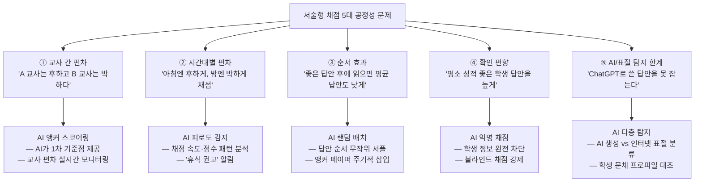

#### 13.4.5 AI 채점 신뢰도 — 숫자로 보는 객관성

**한국 실증 연구 (2025, 『교육정보미디어연구』 제31권)**

> **연구 개요**: 고등학교 3학년 〈화법과 작문〉 논술형 답안 222명분을 GPT-o3 AI로 채점하고, 교사 채점과 비교 분석한 결과:

| 지표 | 수치 | 해석 |
|------|------|------|
| **완전일치도 (Exact Agreement)** | **53.2~68%** | AI와 교사가 완전히 같은 점수를 부여한 비율 |
| **근접일치도 (Adjacent Agreement)** | **95.3~98%** | AI와 교사의 점수 차이가 1등급 이내인 비율 |
| **AI 적합도 (MFRM Infit)** | **0.94** | 1.0이 완벽 적합. 0.94는 "매우 우수한 일관성" |

> **의미**: 완전일치도는 53~68%이지만, **근접일치도가 95%+**라는 것은 AI 채점이 인간 채점과 거의 같은 범위에 있다는 뜻입니다. 이는 인간 채점자 간 근접일치도(85~93%)보다 높은 수준입니다.

**추가 참고**: 서울대 하민수 교수(생물교육) 연구팀은 서술형 시험의 범용 AI 평가 시스템을 개발 중이며, 교사 채점 시간을 **90% 이상 단축**하면서 오류를 줄이는 성과를 보고했습니다.

**해외 AI 채점 일치율 비교**

| 비교 항목 | 인간 채점자 간 | AI-인간 간 | 해석 |
|------|------|------|------|
| **영어 에세이 (ETS e-rater)** | 83~91% | 87~93% | AI-인간 일치율이 인간 간보다 높거나 같음 |
| **수학 서술형** | 90~95% | 92~97% | 수학은 논리 구조가 명확하여 AI 일치율 더 높음 |
| **역사 논술** | 78~85% | 80~88% | 해석의 다양성이 큰 과목도 AI가 일관적 |
| **과학 실험 보고서** | 85~92% | 88~94% | 데이터 분석·통계 부분에서 AI 정확도 우위 |
| **한국어 논술 (2025 연구)** | 85~93% | **95.3~98%** (근접) | 한국어 논술에서도 AI 근접일치도 매우 높음 |

**흥미로운 대비 — AI 채점 기술의 두 세대**

| 기술 세대 | 대표 시스템 | 완전일치도 | 특징 |
|------|------|------|------|
| **자질기반 (Feature-based)** | KICE RRE (2016) | **96~99%** (카파 0.76~0.99) | 특정 텍스트 자질(키워드, 구조, 길이 등)을 추출하여 채점. 특정 시험에 최적화 |
| **LLM 기반 (GPT 등)** | GPT-o3 (2025) | **53~68%** (근접일치도 95~98%) | 범용 언어 모델로 채점. 유연하지만 완전일치도는 낮음 |

> **시사점**: 자질기반 AI는 특정 시험에서 인간 수준의 완전일치도를 달성하지만 범용성이 떨어지고, LLM은 범용적이지만 완전일치도가 낮습니다. KB에서는 **KICE 자질기반 모델(정형 평가) + LLM(비정형 논술)의 하이브리드 접근**이 최적일 것으로 전망됩니다.

> **핵심 인사이트**: AI 채점은 인간을 대체하는 것이 아니라, **인간 채점의 일관성을 높이는 보조 도구**입니다. AI가 1차 기준점을 제공하고, 인간 교사가 최종 판단하며, AI가 편차를 모니터링하는 **3중 검증** 구조가 최적입니다. 한국 실증 연구에서 LLM **근접일치도 95%+**, KICE 자질기반 **완전일치도 96~99%**가 각각 확인된 것은 KB 서술형 채점의 객관성 확보에 매우 고무적인 결과입니다.

#### 13.4.6 과목별 AI 채점 적용 가능성

| 과목 | AI 채점 적용도 | AI가 잘하는 부분 | 인간이 필수인 부분 | 2030년 전망 |
|------|------|------|------|------|
| **국어 논술** | ★★★★☆ | 논증 구조, 인용 적절성, 문법, 표절 | 독창성, 문학적 해석의 깊이, 감성 | AI 1차 채점 + 교사 최종 확정 |
| **수학 서술형** | ★★★★★ | 풀이 과정 논리, 계산 정확성, 수식 표현 | 풀이 전략의 창의성, 비전형적 접근법 | AI 단독 채점 가능 (교사 검토) |
| **영어 에세이** | ★★★★☆ | 문법, 어휘 수준, 구조, 논리 전개 | 문화적 맥락, 수사적 효과, 독창성 | AI 1차 채점 + 교사 최종 확정 |
| **과학 보고서** | ★★★★★ | 실험 설계 논리, 데이터 분석, 통계 처리 | 가설의 독창성, 실험 윤리 판단 | AI 단독 채점 가능 (교사 검토) |
| **사회 탐구 논문** | ★★★☆☆ | 사료 인용 정확성, 논리 구조, 참고문헌 | 역사 해석의 다양성, 비판적 관점 | AI 보조 + 교사 주도 채점 |
| **예술 해설문** | ★★☆☆☆ | 문장 구조, 용어 사용 | 예술적 감수성, 창작 의도 평가 | 교사 주도 + AI 참고 |
| **구술 평가** | ★★★☆☆ | 음성 인식(STT), 답변 구조 분석, 시간 관리 | 비언어적 소통, 논리적 순발력, 태도 | AI 분석 + 교사 종합 판정 |

#### 13.4.7 AI 채점 도입 로드맵

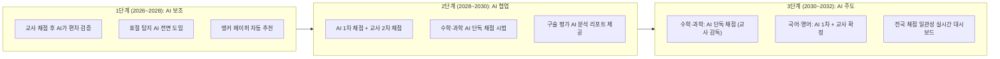

#### 13.4.8 AI 채점의 한계와 윤리적 과제 — 해외 실패 사례 포함

> **경고**: AI 채점은 만능이 아닙니다. 해외에서 이미 실패 사례가 발생했으며, 한국 KB에서는 이를 교훈 삼아 설계해야 합니다.

**해외 AI 채점 실패·편향 사례**

| 사례 | 연도 | 내용 | 교훈 |
|------|------|------|------|
| **미국 MCAS** | 2025 | 매사추세츠 주 학력평가에서 AI 채점 오류 발생 → **1,400건 재채점** | AI 단독 채점의 위험성 실증 |
| **ETS GPT-4o 편향** | 2024 | ETS 자체 연구에서 GPT-4o가 **아시아계 학생에 더 큰 편향**(1.1점 격차) 확인 | LLM 기반 채점의 인종 편향 |
| **케임브리지대 연구** | 2026.5 | Claude/GPT-5/Gemini으로 대학 과제 채점 → 등급 일치율 **35~65%**에 그쳐 **"AI는 아직 준비 안 됨"** 결론 | LLM은 대학 수준 논술 채점에 부족 |

| 한계 | 구체적 문제 | 대응 방안 |
|------|------|------|
| **편향 재생산** | ETS 연구에서 GPT-4o가 아시아계 학생에 1.1점 불이익. AI가 학습 데이터의 편향을 그대로 반영 | 다양한 지역·배경의 앵커 페이퍼 포함, 편향 감사(Bias Audit) 정기 시행 |
| **독창성 과소평가** | 기존 패턴에서 벗어난 독창적 답안을 낮게 평가할 위험. 케임브리지 연구에서도 확인 | "AI 저평가 답안" 자동 플래그 → 교사 우선 검토 |
| **AI 기만 전략** | 학생이 AI 채점 기준에 맞춰 내용 없이 구조만 좋은 글을 작성 | 구술 평가에서 내용 확인, RPPF 과정 기록으로 보완 |
| **기술 격차** | AI 인프라가 부족한 지역 학교의 소외 | 클라우드 기반 중앙 AI 채점 서비스, 교육청 공동 서버 구축 |
| **개인정보 보호** | 학생 답안 데이터의 AI 학습 활용 문제 | 비식별화 처리, 학생·학부모 동의, 데이터 보관 기간 제한 |

> **IBO·Ofqual 공통 원칙**: **"AI 단독 채점 금지, 인간 감독 필수"**. 한국 KB도 이 원칙을 채택해야 합니다. AI는 교사를 대체하는 것이 아니라, 교사의 채점 일관성을 높이는 **보조 도구**입니다.

#### 13.4.9 교육부 AI 채점 관련 정책 방향

| 정책 | 발표일 | 내용 | KB에 미치는 영향 |
|------|------|------|------|
| **수행평가 AI 활용 관리 방안** | 2025.12.23 | AI 활용을 **금지가 아닌 관리** 방향으로 설정. 학생의 AI 도구 사용 가이드라인 | KB 학생의 AI 도구 사용 범위와 윤리적 활용 기준 제시 |
| **2028 대입개편 시안** | 2026.10 예정 | 국가교육위원회가 **AI 시대 반영** 2028 대입개편 시안 발표 예정 (2027.3 최종 확정) | KB 성적 인정 체계, 서술형 수능 방향에 결정적 영향 |
| **KICE 'MC+나선형 설계'** | 2026 시범 | 국가수준 학업성취도평가에 AI 채점 시범 적용 | KB 평가와 국가 평가 체계의 정합성 확보 기반 |

---

### 13.5 과목별 수업 전환 상세 — 기존 교육 체계에서 KB로

> **이 섹션의 목적**: 기존 강의식·암기식 수업이 KB의 프로젝트·토론식 수업으로 **어떻게 전환되는지**, 과목별로 구체적으로 정의합니다. 교사가 무엇을 바꿔야 하고, 학생 경험이 어떻게 달라지며, 평가가 어떻게 변하는지를 명확히 합니다.

#### 13.5.0 수업 전환의 핵심 축 — 전체 구조

```mermaid
flowchart TD
    TRANSFORM["수업 전환의 3대 축"]
    
    TRANSFORM --> AXIS1["① 교수법 전환<br/>Lecture → Inquiry"]
    TRANSFORM --> AXIS2["② 평가 전환<br/>Multiple Choice → Rubric-based"]
    TRANSFORM --> AXIS3["③ 학생 역할 전환<br/>Passive → Active"]
    
    AXIS1 --> A1D["강의 비중: 80% → 20%<br/>탐구/토론 비중: 20% → 80%"]
    AXIS2 --> A2D["객관식: 70% → 0%<br/>서술형+논술형+구술형: 30% → 100%"]
    AXIS3 --> A3D["수동적 수용: 90% → 10%<br/>능동적 탐구·발표·토론: 10% → 90%"]
```

#### 13.5.1 국어 — 암기·해석에서 비평·논증으로

| 비교 항목 | 기존 수업 | KB 수업 | 전환 난이도 |
|------|------|------|------|
| **교수법** | 교과서 1권 중심 강의. 작가·작품 해설. 수사법·문법 설명 | **다독(3권+) 기반 비교 분석**. 소크라틱 세미나. 학생 주도 토론 | ★★★★★ |
| **텍스트** | 교과서 수록 작품만 | 교과서 + 부교재 2~3권 + 비문학(기사, 논문, 증언) | ★★★★☆ |
| **학생 활동** | 밑줄 긋기, 필기, 문제풀이 | 질문 만들기, 토론 참여, 에세이 작성, 구술 발표 | ★★★★★ |
| **평가** | 객관식(70%) + 단답형(30%) | **논술형 에세이(50%) + 구술 IO(20%) + 서술형(30%)** | ★★★★★ |
| **K-IA** | 없음 | 문학 비평 포트폴리오 2,000자 x 2편 (동일 주제 문학+비문학 교차 분석) | — |
| **교사 역할** | 정답 해설자 | 토론 촉진자, 에세이 피드백 제공자, 읽기 안내자 | ★★★★★ |

**실제 KB/IB 국어 수업 사례**

| 학교 | 수업 사례 | 출처 |
|------|------|------|
| **대구국제고** | 백석의 시를 학생이 직접 발제문을 준비해 모둠 토의를 주도. 교사는 촉진자 역할만 수행. "모든 교과가 핵심 개념의 전이를 목표로 개념적 이해를 추구하는 자기주도적 탐구 기반 토론 수업" | 교육플러스 |
| **제주 성산중** | '헤드라인(Headline)' 전략 활용 — 학생이 글의 핵심 내용을 스스로 요약하고 논증의 타당성을 판단. "정답이 뭐예요?" 대신 **"왜 그렇게 생각했어?"**를 묻는 것이 핵심 원리 | 미디어제주 |
| **IB DP IO** | Individual Oral(개별 구술): 한국문학 1편 + 비문학/번역문학 1편에서 발췌문을 골라, 하나의 '전 지구적 이슈(global issue)'와 연결 분석. 10분 발표 + 5분 질의응답 | IB 공식 |

**KB 국어 수업 전환 사례 — 1차시 비교**

| 단계 | 기존 수업 (50분) | KB 수업 (50분) |
|------|------|------|
| **도입 (5분)** | 교사: "오늘은 김소월의 진달래꽃을 배웁니다" | 교사: "오늘의 질문 — '이별의 감정을 표현하는 최선의 방법은 무엇인가?'" |
| **전개 (35분)** | 교사 강의: 작가 소개, 시대 배경, 수사법 분석, 교과서 문제 풀이 | 학생 토론: 김소월《진달래꽃》 vs 윤동주《서시》 vs 한강《흰》의 이별 표현 비교. 3인 1조 소크라틱 세미나 |
| **정리 (10분)** | 교사: "핵심 정리. 수사법은 ㉠은유 ㉡직유..." | 학생: 500자 성찰 에세이 작성 — "세 작가의 이별 표현 중 가장 효과적인 것은? 근거를 들어 논증하시오" |
| **과제** | 문제집 P.42~44 풀기 | 비문학 텍스트(이별에 관한 심리학 기사) 읽고 문학과의 공통점·차이점 메모 |

#### 13.5.2 수학 — 공식 반복에서 모델링·탐구로

| 비교 항목 | 기존 수업 | KB 수업 | 전환 난이도 |
|------|------|------|------|
| **교수법** | 공식 설명 → 예제 풀이 → 유사 문제 반복 | **실생활 문제 → 수학적 모델링 → 해석·발표** | ★★★★☆ |
| **문제 유형** | 정형화된 계산 문제 (정답 1개) | 비정형 탐구 문제 (다양한 접근법 허용, 과정 중시) | ★★★★★ |
| **학생 활동** | 문제 풀이, 공식 암기 | 데이터 수집, 그래프 분석, 모델링, 탐구 보고서 작성 | ★★★★☆ |
| **평가** | 객관식(50%) + 주관식 계산(50%) | **서술형 풀이 100% (과정 채점)** + 탐구 보고서 | ★★★☆☆ |
| **K-IA** | 없음 | 수학 탐구 보고서 12~20p (실생활 수학 모델링 프로젝트) | — |
| **교사 역할** | 풀이 시범자 | 탐구 안내자, 모델링 조언자, 서술형 풀이 채점자 | ★★★★☆ |

**실제 KB/IB 수학 수업 사례**

| 학교 | 수업 사례 | 핵심 차이 |
|------|------|------|
| **경북대사대부고** | 미적분 개념을 "함수 k(t)는 소스 공장에서 t 시간까지 생산한 케첩의 양(㎏)을 나타냅니다" 같은 실생활 맥락으로 제시. 교감: **"IB에서는 모든 개념을 삶의 맥락 속에서 탐구한다. 수수께끼처럼 꼬아놓은 문제 풀이에 시간을 소비하지 않아도 된다"** | 공식 암기 → 실생활 모델링 |
| **제주 표선고** | 교내 스프링클러 설치 간격·분사 속도를 **2차방정식 그래프로 풀어 최적화**하는 수행평가 | 문제집 → 학교 시설 최적화 프로젝트 |
| **학생 증언** | 경북대사대부고 박지현: "중학교 때는 단순히 암기해야 한다고 여겼지만, IB 수업에서는 **개념의 본질적 의미를 탐구하는 습성**이 든다" | 암기 습관 → 탐구 습관 |

**수학 K-IA 주제 예시 (실제 IB IA 기반)**

| K-IA 주제 | 관련 수학 개념 | 탐구 방법 |
|------|------|------|
| "우리 학교 급식 잔반량을 최소화하는 최적 메뉴 조합" | 선형 계획법, 최적화 | 1개월 잔반 데이터 수집 → 함수 모델링 → 최적해 도출 |
| "마코위츠 포트폴리오 모델을 이용한 분산투자 최적화" | 확률분포, 행렬, 최적화 | 주가 데이터 수집 → 공분산 행렬 → 효율적 프론티어 |
| "에어팟 노이즈캔슬링과 푸리에 변환의 관계" | 푸리에 급수, 삼각함수 | 음파 데이터 → 주파수 분석 → 상쇄 파형 모델링 |
| "인구 감소 지역의 학교 통폐합 기준 수학적 모델" | 지수함수, 회귀분석 | 인구통계 데이터 → 예측 모델 → 정책 제안 |
| "태양광 패널 각도 최적화 — 우리 학교 옥상 기준" | 삼각함수, 미분 | 태양 고도 데이터 → 최적 각도 계산 → 발전량 비교 |

> **평가 기준** (IB Math IA): (A) 수학적 표현(Communication), (B) 개인적 참여(Personal Engagement — 주제의 독창성), (C) 반성/성찰(Reflection — 결론이 초기 목표와 연결되는지), (D) 수학의 활용(Use of Mathematics), (E) 정확성(Precision). 정답 여부가 아닌 **탐구 과정의 질**을 평가합니다.

**KB 수학 수업 전환 사례 — 1차시 비교**

| 단계 | 기존 수업 (50분) | KB 수업 (50분) |
|------|------|------|
| **도입 (5분)** | 교사: "오늘은 이차함수의 최대·최소를 배웁니다" | 교사: "학교 앞 카페가 컵 가격을 얼마로 정해야 이익이 최대일까요?" |
| **전개 (35분)** | 공식 설명 → 예제 3문제 풀이 → 유사 문제 10개 | 그룹별 데이터 수집(가격별 판매량 조사) → 이차함수 모델링 → 최적 가격 도출 → 모델의 한계점 토론 |
| **정리 (10분)** | "핵심 공식: y=a(x-p)²+q에서 최대/최소는..." | 그룹별 1분 발표: "우리 모델의 결과와 한계" + 서로 질문 |
| **과제** | 문제집 20문제 풀기 | 서술형 보고서: "오늘의 모델링이 실제와 다를 수 있는 이유를 3가지 분석하시오" (500자) |

#### 13.5.3 영어 — 문법 해석에서 비판적 읽기·쓰기로

| 비교 항목 | 기존 수업 | KB 수업 | 전환 난이도 |
|------|------|------|------|
| **교수법** | 교사 해석 중심. 지문 해석 → 문법 포인트 → 단어 암기 | **원문 다독 + 비판적 분석 + 영어 에세이 쓰기** | ★★★★☆ |
| **텍스트** | 교과서 지문 (발췌, 변형) | 원서, 신문 기사, 연설문, 영상 (원문 그대로) | ★★★★☆ |
| **학생 활동** | 해석, 문법 문제 풀이, 단어 암기 | 원문 분석, 영어 토론, 에세이 작성, 구술 발표 | ★★★★★ |
| **평가** | 객관식 듣기(50%) + 독해(50%) | **에세이(40%) + 구술 IO(25%) + 서술형(35%)** | ★★★★★ |
| **K-IA** | 없음 | Individual Oral (IO) 15분: 영어 텍스트 + 글로벌 이슈 연결 분석 발표 | — |
| **교사 역할** | 번역자, 문법 설명자 | 영어 토론 촉진자, 에세이 코치, 원문 읽기 안내자 | ★★★★★ |

#### 13.5.4 과학 (물리·화학·생물) — 교과서 재현에서 자체 탐구로

| 비교 항목 | 기존 수업 | KB 수업 | 전환 난이도 |
|------|------|------|------|
| **교수법** | 이론 강의 → 교과서 실험 재현 (결과 정해져 있음) | **탐구 질문 → 학생 자체 실험 설계 → 데이터 수집 → 분석** | ★★★★★ |
| **실험** | 교과서 실험 프로토콜 그대로 재현 (교사 시범 + 학생 관찰) | **학생이 연구 질문 설정 → 변인 통제 → 독립 실험 설계·실행** | ★★★★★ |
| **보고서** | 실험 결과 빈칸 채우기 (A4 1장) | **실험 보고서 6~12p** (가설→설계→데이터→분석→평가→불확실도) | ★★★★☆ |
| **평가** | 객관식(60%) + 단답형(40%) | **실험 보고서(40%) + 서술형 시험(40%) + 구술(20%)** | ★★★★☆ |
| **K-IA** | 없음 | 과학 탐구 프로젝트 6~12p (학생 자체 실험 설계·실행·분석·평가) | — |
| **교사 역할** | 이론 강사, 실험 시범자 | 실험 설계 조언자, 안전 감독자, 데이터 분석 코치 | ★★★★★ |

**과학 수업 전환의 핵심 차이 — 실험 접근법**

```mermaid
flowchart LR
    subgraph OLD["기존 과학 실험"]
        O1["교과서 프로토콜 제공"]
        O2["교사 시범 → 학생 따라하기"]
        O3["'기대 결과' 확인"]
        O4["실험 보고서 빈칸 채우기"]
    end
    subgraph NEW["KB 과학 탐구"]
        N1["학생이 연구 질문 생성"]
        N2["학생이 실험 설계 (변인 통제)"]
        N3["데이터 수집 → 분석 → 불확실도"]
        N4["6~12p 탐구 보고서 작성"]
    end
    OLD -->|"탐구 전환"| NEW
```

| 기존 실험 | KB 탐구 | 차이점 |
|------|------|------|
| "비타민C 정량 — 요오드 적정법으로 측정하세요" | "비타민C 함량은 조리 방법에 따라 어떻게 변할까? 직접 연구 질문을 만들고 실험을 설계하세요" | 학생이 **질문을 만드는 것**이 핵심 |
| 독립변인·종속변인 교사가 지정 | 학생이 스스로 변인 식별·통제 설계 | **실험 설계 능력** 훈련 |
| 결과: "비타민C는 X mg이었다" | 결과: "불확실도 ±Y를 고려하면 결론의 신뢰도는...이며, 실험의 한계는..." | **불확실도 분석과 자기 비판** |

> **한국물리학회 연구**(새물리): 한국 교육과정의 탐구는 "안내형 탐구"(교사가 구체적 방향 제시)인 반면, IB DP는 "개방형 탐구"(개략적 방법만 제시, 학생이 설계)로 대비됩니다. 데이터 처리 수준도 한국은 기본적 분석 중심인 반면, IB는 **유효숫자·불확도(uncertainty)·에러바 처리** 등 심화 수준을 요구합니다.

**IB DP 과학 IA 평가 기준 (총 24점, 최종 성적의 20%)**

| 기준 | 배점 | 비중 | 평가 내용 |
|------|------|------|------|
| **개인적 참여 (Personal Engagement)** | 2점 | 8% | 주제에 대한 개인적 관심·동기, 독창성 |
| **탐구 (Exploration)** | 6점 | 25% | 연구 질문의 명확성, 변인 통제, 실험 설계의 적절성 |
| **분석 (Analysis)** | 6점 | 25% | 데이터 처리, 그래프, 통계 분석, 불확실도 계산 |
| **평가 (Evaluation)** | 6점 | 25% | 결론의 타당성, 실험의 강점·약점 분석, 개선 방안 |
| **의사소통 (Communication)** | 4점 | 17% | 보고서 구조, 학술적 문체, 참고문헌 |

**과학 K-IA 주제 예시 (실제 IB 학교 기반)**

| 과목 | K-IA 주제 예시 |
|------|------|
| **물리** | 온도별 테니스공 반발계수, 설탕 용액의 굴절률, 커피필터의 종단속도, 구리선 온도-저항 관계 |
| **화학** | 천연 지시약의 pH 측정 정확도, 비타민C 함량과 조리 방법의 관계 |
| **생물** | 토양 pH(4.0~8.0)가 물냉이 생장에 미치는 영향, 탄수화물 기질이 효모 호흡 효율에 미치는 영향 |

#### 13.5.5 사회/역사 — 사건 암기에서 사료 비판으로

| 비교 항목 | 기존 수업 | KB 수업 | 전환 난이도 |
|------|------|------|------|
| **교수법** | 교과서 중심 연대순 강의. 사건·인물·연도 암기 | **1차 사료 분석 + 다중 관점 비교 + 역사 논증 에세이** | ★★★★★ |
| **자료** | 교과서 1권 (정리된 2차 서술) | 1차 사료(원문 문서, 신문, 증언) + 2차 문헌(학술 논문, 역사서) 3종+ | ★★★★☆ |
| **학생 활동** | 교과서 내용 요약, 연도 암기, 문제 풀이 | 사료 비판(OPCVL), 다중 관점 토론, 탐구 논문 작성 | ★★★★★ |
| **평가** | 객관식(70%) + 단답형(30%) | **탐구 에세이(50%) + 사료 분석 서술(30%) + 토론(20%)** | ★★★★★ |
| **K-IA** | 없음 | 역사 탐구 논문 2,200자 (1차 사료+2차 문헌 기반 역사 분석) | — |
| **교사 역할** | 사실 전달자 | 사료 제공자, 비판적 분석 촉진자, 에세이 피드백 제공자 | ★★★★★ |

**사회/역사 사료 분석법 — OPCVL 프레임워크**

| 분석 요소 | 의미 | 적용 예시 (동학농민운동) |
|------|------|------|
| **O (Origin)** | 사료의 출처: 누가, 언제, 어디서 작성했는가? | "이 문서는 1894년 전봉준이 작성한 격문이다" |
| **P (Purpose)** | 사료의 목적: 왜 작성되었는가? | "농민을 결집시키기 위한 선전 목적" |
| **C (Content)** | 사료의 내용: 무엇을 말하고 있는가? | "탐관오리 징벌, 외세 배척 요구" |
| **V (Value)** | 사료의 가치: 역사 연구에 어떤 기여를 하는가? | "당시 농민의 직접적 목소리를 들을 수 있는 1차 사료" |
| **L (Limitation)** | 사료의 한계: 편향이나 제한은 무엇인가? | "지도자 관점이며, 일반 농민의 생각은 반영되지 않을 수 있음" |

**실제 KB/IB 역사 수업 사례**

| 학교 | 수업 사례 | 학생 반응 |
|------|------|------|
| **대구 포산고** | 고3 역사 수업: "히틀러에 대한 유화정책이 제2차 세계대전 발발에 미친 영향"을 주제로 학생들이 **신문기사·논평·논문을 근거로** 열띤 토론. "주변국 연합이 힘을 발휘하지 못했다"는 주장부터 "대공황 이후 영국 여론"을 근거로 삼는 의견까지 다양한 관점 제시 | SBS 뉴스 보도 |
| **대구 경북대사대부중** | "학생이 주제에 따라 스스로 표현하고 글의 목적까지 생각"하도록 유도. 담당 교사: **"학생의 IB 교육 평가를 객관식으로는 확인하는 데 한계가 있다"** | 다음뉴스 |
| **학생 증언** | 포산고 정시현(고3): "과제가 많지만 깊이 있게 흡수할 수 있다". 김정인(고2): "수능반과 달리 **직접 탐구 주제를 정할 수 있다**". IB반 학생들은 같은 반 친구를 **"경쟁자가 아닌 협력자"**로 인식 | SBS 뉴스 |

#### 13.5.6 예술 (음악·미술) — 기능 습득에서 창작 연구로

| 비교 항목 | 기존 수업 | KB 수업 | 전환 난이도 |
|------|------|------|------|
| **교수법** | 기능 교육 중심: 그리기 기법, 악기 연주, 감상문 | **창작 과정 + 연구 + 성찰 + 전시/공연** | ★★★☆☆ |
| **학생 활동** | 교사 시범 → 따라하기 → 완성작 제출 | 예술가 연구 → 자기 콘셉트 개발 → 실험·제작 → 전시/공연 + 해설 | ★★★☆☆ |
| **평가** | 완성작 평가 (결과물 중심) | **과정 포트폴리오(60%) + 전시/공연(20%) + 해설문(20%)** | ★★★☆☆ |
| **K-IA** | 없음 | 작품 포트폴리오 4~11점 + 해설문 1,500자 (제작 과정·영감·성찰) | — |
| **교사 역할** | 기법 시범자 | 예술 멘토, 비평 촉진자, 전시 큐레이터 | ★★★☆☆ |

**IB Visual Arts 평가 3영역 구조**

| 영역 | 비중 | 내용 | 기존 미술 수업과의 차이 |
|------|------|------|------|
| **비교 연구 (Comparative Study)** | 20% | 서로 다른 문화·시대의 예술가 2인+, 작품 3점+ 비교 분석 | 기존: 감상문 쓰기 → KB: **비교 분석 논문** |
| **과정 포트폴리오 (Process Portfolio)** | 40% | 초기 발상, 실험, 수정, 성찰의 전 과정 기록 | 기존: 완성작만 평가 → KB: **과정 자체를 평가** |
| **전시 (Exhibition)** | 40% | 4~11점 작품 선별 + 큐레이터 진술서(각 작품 해설) | 기존: 교사가 전시 기획 → KB: **학생이 큐레이팅** |

> **IB 미술 학생 조사 결과** (208명): 학생들은 IB Visual Arts를 **"정답이 없는 수업"**으로 인식. "새로운 재료·도구 시도"(긍정 M=3.76), "자율적 주제 선정"(M=3.60)에 높은 긍정 반응. 다만 **언어적 설명·과정 문서화**에 대한 부담도 함께 언급 (학지사 스콜라 논문).

**실제 사례**: 대구 경북대사대부중 미술 수업 — '지역 살리기'를 주제로 학생들이 지역 자료를 조사해 도시 브랜딩 포스터·조형물을 제작하는 프로젝트형 수업. 제주형 IB 정책은 "잘하느냐가 아니라 **꾸준히 표현하고 협업하며 자신감을 얻는 과정**"을 목표로 설정.

#### 13.5.7 K-Think(지식론/TOK) — 수업의 핵심 엔진

K-Think는 IB TOK(Theory of Knowledge)를 한국화한 것으로, **"무엇을 아는가?"가 아닌 "어떻게 아는가?"**를 탐구하는 과목입니다.

**실제 K-Think/TOK 수업 사례**

| 학교 | 수업 사례 | 학생 반응 |
|------|------|------|
| **경북대사대부고** | 질문: "지식은 어떤 점에서 지도와 유사할까?" → 학생들이 진리 탐구와 목적 의존성에 대해 다양한 답변 | 학생 박지현: **"단순히 암기해야 한다는 생각에서 개념의 본질적 의미를 탐구하는 습성"**으로 전환 |
| **제주 표선고** | 지식론(TOK)을 "철학, 도덕, 논술을 하나로 통합한" 비판적 추론 과목으로 운영. 고2~3 약 **100시간**, 1,200~1,600자 에세이 | "정답이 없는 수업"에 적응 필요 |
| **대구교육청** | 중3 대상 "지식에 대한 고찰" 탐구기반 학습 프로그램, 8개 교과 영역 연계 | 소크라틱 대화식 수업 관찰 (BBS 뉴스) |

**소크라틱 세미나 운영 구조**

```mermaid
flowchart TD
    subgraph INNER["안쪽 원 (Inner Circle) — 토론자"]
        I1["텍스트 기반 질문 제시"]
        I2["근거를 들어 주장·반론"]
        I3["인용문 제시하며 논증"]
    end
    subgraph OUTER["바깥 원 (Outer Circle) — 관찰자"]
        O1["토론 내용 기록"]
        O2["논증의 강점·약점 분석"]
        O3["피드백 준비"]
    end
    INNER -->|"역할 교대"| OUTER
    OUTER -->|"역할 교대"| INNER
```

> **실제 사례**: 경기 시흥 응곡중학교(혁신학교) — 매주 소크라틱 세미나를 교사 학습공동체(PLC) 차원에서 운영. 1학년 수업에서 인권 주제 그림책을 활용한 토론 진행. 교사 최혜정: **"학생들이 서슴없이 질문을 공유하며 난관을 헤쳐나가는 모습에 뿌듯함"**을 느꼈다고 보고.

**PBL(프로젝트 기반 학습) 학생 수용도 — 리스크 요인**

| 조사 항목 | 결과 | 시사점 |
|------|------|------|
| **강의식 선호** | 53.5% | 절반 이상의 학생이 아직 강의식을 선호 |
| **PBL 선호** | 46.5% | 특히 **상위 학생**일수록 PBL 선호도 높음 |
| **하위 학생 경향** | 강의식 선호 비율 더 높음 | KB 전환 시 학력 하위 학생의 적응 지원 필수 |
| **핵심 과제** | "대학에 오기 전 강의식·주입식에 길들여진" 학생이 PBL 적응에 어려움 | 초등학교부터 단계적 PBL 노출이 중요 |

> **IB/수능 마찰 사례**: 경북대사대부고 졸업생이 IB DP **42/45점**(옥스퍼드·캠브리지 지원 가능 수준)을 받았으나 국내 대학에 불합격하여 **토론토대학교 장학금**을 받고 유학한 사례가 보도되었습니다. 이는 한국 입시 체계가 아직 IB/KB 성적을 충분히 인정하지 못하는 구조적 문제를 보여줍니다.

#### 13.5.8 과목별 전환 난이도 종합 비교

```mermaid
flowchart TD
    DIFF["과목별 KB 전환 난이도"]
    
    DIFF --> HIGH["전환 난이도 최상 (★★★★★)"]
    DIFF --> MED["전환 난이도 상 (★★★★☆)"]
    DIFF --> LOW["전환 난이도 중 (★★★☆☆)"]
    
    HIGH --> H1["국어: 다독+토론+에세이 3중 전환"]
    HIGH --> H2["사회/역사: 사료 비판, 다관점 논증"]
    HIGH --> H3["과학: 자체 실험 설계, 보고서"]
    
    MED --> M1["수학: 모델링+서술형 풀이"]
    MED --> M2["영어: 원문 읽기+에세이+구술"]
    
    LOW --> L1["예술: 이미 창작 중심, 포트폴리오 추가"]
```

| 과목 | 전환 난이도 | 교사 가장 큰 부담 | 학생 가장 큰 변화 | AI 채점 지원도 | 예상 전환 기간 |
|------|------|------|------|------|------|
| **국어** | ★★★★★ | 다독 텍스트 선정·에세이 채점 (1인당 60,000자+) | "정답이 없는 글쓰기"에 대한 불안 | ★★★★☆ | 3년 |
| **수학** | ★★★★☆ | 비정형 문제 설계, 서술형 과정 채점 | "공식만 외우면 안 되는" 탐구 활동 | ★★★★★ | 2년 |
| **영어** | ★★★★☆ | 원문 텍스트 선정, 영어 에세이·구술 채점 | 영어로 '생각하고 쓰기' (번역 아님) | ★★★★☆ | 2~3년 |
| **과학** | ★★★★★ | 개별 실험 안전 관리, 비정형 실험 보고서 채점 | "결과가 정해지지 않은" 실험 불안 | ★★★★★ | 2~3년 |
| **사회/역사** | ★★★★★ | 1차 사료 발굴·제공, 논술 에세이 채점 | "교과서가 유일한 진실이 아닌" 다관점 수용 | ★★★☆☆ | 3년 |
| **예술** | ★★★☆☆ | 전시/공연 기획, 포트폴리오 평가 체계 | 과정 기록·성찰 습관 형성 | ★★☆☆☆ | 1~2년 |

#### 13.5.9 수업 전환의 단계적 접근 — 교사를 위한 실전 로드맵

```mermaid
flowchart TD
    subgraph YEAR0["준비기 (전환 전 1년)"]
        Y0A["IB/KB 철학 연수 (40시간)"]
        Y0B["우수 KB 학교 참관 수업"]
        Y0C["루브릭 작성 실습 (1과목)"]
    end
    subgraph YEAR1["전환 1년차: 평가 전환"]
        Y1A["서술형 평가 비중 30%→50%"]
        Y1B["1학기 1회 소크라틱 세미나 실시"]
        Y1C["AI 채점 보조 도구 활용 시작"]
    end
    subgraph YEAR2["전환 2년차: 수업 전환"]
        Y2A["서술형+논술형 비중 70%"]
        Y2B["매 단원 탐구 질문 기반 수업"]
        Y2C["K-IA 1개 과목 시범 운영"]
    end
    subgraph YEAR3["전환 3년차: KB 완전 운영"]
        Y3A["서술형+논술형+구술형 100%"]
        Y3B["K-IA 전 과목 운영"]
        Y3C["동료 교사 멘토링 시작"]
    end
    YEAR0 --> YEAR1 --> YEAR2 --> YEAR3
```

> **핵심 원칙**: 수업 전환은 **"한 번에 뒤집기"가 아니라 "점진적 층 쌓기"**입니다. 1년차에는 평가만 바꾸고(서술형 확대), 2년차에 수업 방법을 바꾸고(탐구 기반), 3년차에 KB Core를 추가합니다. 이 3년 모델이 교사 저항을 최소화하는 검증된 전환 전략입니다.

### 13.6 KB가 실패할 수 있는 시나리오

| 실패 시나리오 | 가능성 | 발생 조건 | 대비 방안 |
|------|------|------|------|
| **교사 저항으로 형식화** | 30% | 연수 없이 강제 도입 시 "서류만 바꾸고 수업은 그대로" | 자발적 참여 유도, 충분한 연수 기간 |
| **채점 불신으로 학부모 반발** | 25% | 초기 채점 편차가 언론에 보도될 때 | 채점 공정성 시스템 사전 구축 |
| **사교육 시장이 KB를 장악** | 20% | "KB 에세이 대리 작성" 학원 등장 | RPPF + 구술 평가로 과정 검증 |
| **정권 교체로 정책 중단** | 15% | 교육감 선거 결과에 따라 IB/KB 폐지 | 초당적 교육 개혁 합의 필요 |
| **수능 폐지 실패로 KB 무력화** | 10% | 수능이 유지되면 KB 교육의 입시 경쟁력 약화 | 수능 서술형 확대를 통한 점진적 연계 |
| **AI 채점 기술 실패** | 10% | AI 채점 편향 사건 발생 → 사회 불신 | 인간-AI 이중 채점 원칙 유지, AI 단독 채점 금지 |
| **지역 간 KB 품질 격차** | 20% | 대구·서울은 성공하지만 소도시·농촌은 형식적 도입 | 온라인 AI 채점 플랫폼으로 균등 지원, 우수 교사 순회 제도 |

---

## 14. 학부모·학생을 위한 KB 대응 전략

### 14.1 학년별 KB 대비 전략

```mermaid
flowchart TD
    subgraph ELEM["초등학교 (5~6학년)"]
        E1["독서 습관 형성: 월 4권+<br/>(소설+비문학+과학 입문서)"]
        E2["일기·독서 감상문 작성 습관"]
        E3["'왜?'를 묻는 습관 키우기"]
    end
    subgraph MIDDLE["중학교 (1~3학년)"]
        M1["비교 독서 시작: 같은 주제<br/>2~3권 읽고 관점 비교"]
        M2["에세이 작성 훈련:<br/>주장-근거-반론-결론 구조"]
        M3["토론 동아리, 모의유엔(MUN) 참여"]
        M4["자기주도 탐구 프로젝트 1개 완수"]
    end
    subgraph HIGH["고등학교 (KB 학교)"]
        H1["K-IA 6과목 프로젝트 수행"]
        H2["K-Essay 4,000자 소논문 작성"]
        H3["K-Think 비판적 사고 훈련"]
        H4["K-Act 봉사·창의 활동"]
    end
    ELEM --> MIDDLE --> HIGH
```

### 14.2 KB 학교 선택 체크리스트

| 항목 | 확인 사항 | 점수 |
|------|------|------|
| **교사 연수 현황** | KB/IB 인증 교사가 전체의 50% 이상인가? | 0~5점 |
| **평가 방식** | 서술형+논술형 비중이 70% 이상인가? | 0~5점 |
| **KB Core 운영** | K-Essay, K-Think, K-Act가 모두 운영되는가? | 0~5점 |
| **대학 진학 실적** | KB/IB 방식으로 SKY·의대 합격 사례가 있는가? | 0~5점 |
| **교실 환경** | 모둠 배치, 토론 공간, 실험 시설이 갖춰져 있는가? | 0~5점 |
| **학부모 소통** | 정기 설명회, 수업 공개, 평가 기준 투명 공개가 되는가? | 0~5점 |

> **판정**: 25점 이상 = 적극 추천 / 18~24점 = 조건부 추천 / 17점 이하 = 재검토

### 14.3 KB 시대 학부모의 역할 전환

| 기존 학부모 역할 | KB 시대 학부모 역할 |
|------|------|
| "학원 보내기, 문제집 사주기" | "다양한 책 구해주기, 함께 토론하기" |
| "시험 점수 확인, 등수 비교" | "K-IA 프로젝트 과정에 관심, 성찰 대화" |
| "학원 스케줄 관리" | "자기주도 학습 환경 조성" |
| "정답 맞히기 훈련 지원" | "좋은 질문 만들기 훈련 지원" |
| "수능 D-100 카운트다운" | "K-Essay 주제 탐색 함께 브레인스토밍" |

### 14.4 KB가 아직 없는 지역의 학부모를 위한 사전 준비

| 전략 | 실천 방법 | 기대 효과 |
|------|------|------|
| **다독 습관** | 한 주제에 대해 관점이 다른 책 2~3권 비교 독서 | KB 수업 방식에 사전 적응 |
| **에세이 훈련** | 주 1회 500자+ 의견문 작성 → 월 1회 1,000자 논증 에세이 | K-IA/K-Essay 준비 |
| **토론 경험** | 가족 식탁 토론, 독서 토론 모임, 모의유엔 | K-Think 소크라틱 세미나 적응 |
| **자기주도 프로젝트** | 방학 중 관심 주제 탐구 프로젝트 1개 완수 (보고서 포함) | K-IA 프로젝트 경험 |
| **성찰 일지** | 매일 "오늘 배운 것, 궁금한 것, 다음에 해 볼 것" 3줄 기록 | K-Act 성찰 포트폴리오 습관 |

---

## 15. KB의 제도적 기반 — KBO 설립과 조례 제정

### 15.1 KBO(한국형 바칼로레아 기구) 설립 구상

KB의 지속 가능한 운영을 위해 **비영리 독립 기구 KBO(Korean Baccalaureate Organization)** 설립이 논의되고 있습니다.

| 항목 | IBO (국제) | KBO (구상) |
|------|------|------|
| **성격** | 스위스 비영리 민간기구 | 한국 비영리 독립기구 (교육부 산하 또는 독립) |
| **역할** | 교육과정 개발, 평가 운영, 인증 | KB 평가 기준 개발, 채점 시스템 운영, 교사 연수, 인증 |
| **재원** | 회원교 인증비 + 시험 응시료 | 교육부 + 시도교육청 출연금 + 자체 수입 |
| **독립성** | 정부와 독립 (정치적 영향 차단) | **정권 교체에 좌우되지 않는 독립성** 확보가 핵심 |
| **위험** | — | 교육감 교체 시 정책 폐기 가능 → KBO 독립이 방어 장치 |

### 15.2 IB/KB 관련 조례 제정 현황

법적 기반을 통해 정치적 변동에도 IB/KB가 지속될 수 있도록 각 시도교육청이 조례를 제정하고 있습니다.

| 시도교육청 | 조례 현황 | 주요 내용 |
|------|------|------|
| **부산** | 제정 완료 | IB 프로그램 운영 기본 원칙, 행재정적 지원 |
| **전남** | 제정 완료 | IB 프로그램 운영 및 지원 |
| **강원** | 제정 완료 | IB 프로그램 운영 및 지원 |
| **제주** | 제정 완료 | IB 프로그램 운영 및 지원 |
| **전북** | 2026.5.8 공포·시행 | 「전북특별자치도교육청 IB 프로그램 운영 및 지원 조례」 10개 조문 |
| **서울** | 2025.2.17 발의 | 「서울특별시교육청 IB 활성화에 관한 조례안」 |
| **경기** | 입법예고 중 | 「경기도교육청 IB 프로그램 운영 및 지원에 관한 조례안」 |

### 15.3 대학-교육청 협력 현황

| 협력 | 내용 | 시기 |
|------|------|------|
| **경기교육청-서울대** | IB 관련 업무협약 | 2024.11 |
| **서울교육청-인하대** | KB 기반 강화 업무협약, 교원 석사 과정 | 2026 |
| **서울교육청-서울교대·한국교원대** | KB 연구 전문 교원 양성 | 2026 |
| **대구교육청-11개 시도교육청** | IB 벤치마킹 협약 | 2024~ |

---

## 16. 결론 — 교육 대전환의 골든 타임

### 16.1 핵심 메시지

```mermaid
flowchart TD
    CORE["핵심 메시지"]
    CORE --> MSG1["KB는 선택이 아니라<br/>시대의 필연이다"]
    CORE --> MSG2["2028~2032년이<br/>교육 대전환의 골든 타임이다"]
    CORE --> MSG3["지금 준비하는 학생이<br/>2032 입시에서 승리한다"]
    
    MSG1 --> E1["AI가 암기·계산을 대체하는 시대에<br/>비판적 사고·창의성·논증 능력만이<br/>인간의 가치를 입증한다"]
    MSG2 --> E2["2028 수능 개편 → 2030 서술형 시범 →<br/>2032 서술형 본격화의 타임라인에서<br/>KB는 가장 체계적인 준비 경로"]
    MSG3 --> E3["KB 방식의 교육을 받은 학생은<br/>어떤 시나리오에서든 유리하다:<br/>수능 유지 시 서술형 적응,<br/>수능 축소 시 생기부 압도적"]
```

### 16.2 입학사정관을 위한 실전 가이드

| 상황 | 추천 행동 |
|------|------|
| **학부모가 "KB가 뭐냐?"고 물을 때** | "한국형 IB입니다. IB의 장점(서술형·토론·프로젝트)을 한국 공교육에서 무상으로 받을 수 있는 교육 모델입니다" |
| **학부모가 "수능 안 보면 어떡하냐?"고 걱정할 때** | "2028 수능 개편 이후 수능 비중은 줄고, 생기부(세특) 비중이 35~40%로 늘어납니다. KB 학생의 생기부는 일반고와 비교 불가능한 수준으로 풍부합니다" |
| **학생이 KB에 적합한지 판단할 때** | "월 3권 이상 독서하고, 자기 의견을 글로 표현할 수 있으며, '왜?'라는 질문을 스스로 던질 수 있는 학생이라면 KB에 적합합니다" |
| **KB 학교가 아직 없는 지역에서** | "지금부터 다독 습관, 에세이 훈련, 토론 경험을 쌓으세요. 2028~2030년에 KB 학교가 지역에 생기면 즉시 적응 가능합니다" |
| **의대 지망 학생에게** | "2032년에는 의대도 면접·서술형 비중이 높아집니다. KB의 K-Think는 의대 MMI 면접의 최고 훈련입니다. 다만 현재는 수능 병행이 필요합니다" |

### 16.3 2032년 교육 지형 예측 요약

| 항목 | 2026 (현재) | 2032 (전망) | 변화율 |
|------|------|------|------|
| **KB/IB 학교 수** | 약 25~30교 | 약 400~500교 | **15~20배** |
| **전국 고교 대비 비율** | 약 1.2% | **약 17~22%** | **15~18배** |
| **서술형 평가 비중** | 수능 0%, 내신 일부 | 수능 30~50%, 내신 70%+ | **대폭 확대** |
| **세특 입시 비중** | 약 20~25% | **약 35~40%** | **1.5~2배** |
| **면접 실시 대학** | 상위 30개교 | **대부분 대학** | **대폭 확대** |
| **KB 교사 수** | 약 300명 (IB 인증) | **약 10,000명+** (KB 연수 이수) | **30배+** |

---

## 17. 심층 Q&A 30선 — 전문가가 묻고 전문가가 답하다

> 이 섹션은 KB에 대해 학부모·교사·입학사정관·교육정책 전문가들이 가장 자주, 가장 깊이 묻는 질문 30개를 엄선하여 심층 답변한 것입니다. 단순 FAQ가 아닌 **정책 근거·데이터·해외 사례·실전 전략**을 포함한 전문 수준의 답변입니다.

---

### Q1. KB와 IB는 정확히 무엇이 같고 무엇이 다른가요?

**핵심 차이: "교육과정의 소유권"**

| 비교 항목 | IB (International Baccalaureate) | KB (한국형 바칼로레아) |
|-----------|----------------------------------|----------------------|
| **교육과정** | IBO가 설계한 글로벌 교육과정 | 한국 2022 개정 교육과정 유지 |
| **평가 방식** | IBO 기준 논·서술형 | IB 방식 차용, 한국형 채점 기준 개발 |
| **언어** | 영어·프랑스어·스페인어 (일부 DLDP 허용) | **한국어 100%** |
| **비용** | 연간 수업료 800만~3,000만 원 (사립 기준) | **무상 (공립)** |
| **교사 인증** | IBO 공인 워크숍 필수 (해외 연수) | IBEC 인증 대학 연수 + 국내 연수 |
| **시험 출제** | IBO 본부 (헤이그) | 한국 교사 + KICE 공동 출제 |
| **대학 인정** | 전 세계 5,000+ 대학 | 한국 대학 중심 (향후 글로벌 확장) |

**같은 점**: ① 논·서술형 평가 중심 ② 탐구 논문 (EE → K-Essay) ③ 인식론 과목 (TOK → K-Think) ④ 봉사·체험 필수 (CAS → K-Act) ⑤ 교사가 1차 채점, 외부 감수 (moderation) 구조

**핵심 통찰**: KB는 "IB의 교육 철학과 평가 방식을 한국 공교육에 이식한 모델"입니다. 교육과정 자체를 바꾸지 않고 **평가 방식만** 전환함으로써, 기존 교사·교과서·학교 시스템의 급격한 해체 없이 교육 혁신을 달성하려는 전략입니다. 일본의 DLDP가 일본어 수업을 허용하면서도 IBO 교육과정을 따르는 것과 달리, KB는 교육과정 자체를 한국 것으로 유지한다는 점에서 더 근본적인 "현지화"입니다.

---

### Q2. AI 채점이 도입되면 서술형 평가가 정말 객관적이 될 수 있나요?

**결론: "객관화"가 아닌 "일관화(consistency)"가 정확한 표현입니다.**

AI 채점 시스템의 현재 성능을 보면:

| 시스템 | 정확 일치율 | 인접 일치율 | 한계 |
|--------|------------|------------|------|
| **KICE 자질 기반 모델** | 96~99% | 99%+ | 한국어 특화, 실제 수능 적용 전 |
| **GPT-o3 (LLM 기반)** | 53~68% | 95~98% | 영어 중심, 한국어 성능 미검증 |
| **대구교육청 OCR+RAG** | 시범 중 | 시범 중 | 2만 건 필기 데이터, GPU 기반 |

**AI가 해결하는 문제**: ① 채점자 간 편차 (같은 답안에 교사마다 2~3점 차이) ② 채점 피로도 (후반부 답안 관대화 현상) ③ 대량 채점의 시간 비용

**AI가 해결하지 못하는 문제**: ① 창의성·독창성 판단 (정형화된 루브릭 밖의 답변) ② 맥락 이해 (학생의 배경지식 수준 고려) ③ 문화적 뉘앙스 (한국적 논증 방식 vs. 서양식 논증) ④ "좋은 질문"의 가치 판단

**국제 원칙**: IBO와 영국 Ofqual 모두 **"AI 단독 채점 금지, 인간 감독 필수"**를 원칙으로 확인했습니다. KB도 이 원칙을 따를 것으로 예상됩니다. AI는 채점의 **1차 필터**이자 **일관성 검증 도구**로 활용되고, 최종 점수는 교사가 결정하는 **하이브리드 모델**이 현실적 방향입니다.

---

### Q3. KB 교육을 받으면 수능에 불리해지지 않나요?

**2028년 이후 수능 개편을 기준으로 답합니다.**

```mermaid
flowchart LR
    subgraph 현재["현재 수능 체계"]
        A["객관식 100%"] --> B["암기·속도 중심"]
    end
    subgraph 개편["2028 수능 개편"]
        C["5등급 상대평가"] --> D["선택과목 폐지"]
        C --> E["통합형 수능"]
    end
    subgraph 전망["2030~2032 전망"]
        F["서술형 30~50% 도입 논의"]
        G["수능 절대평가 전환 논의"]
    end
    현재 --> 개편 --> 전망
```

| 시나리오 | KB 학생의 유불리 | 이유 |
|----------|-----------------|------|
| **현행 수능 유지 (2026~2027)** | 약간 불리 | 객관식 훈련 시간이 상대적으로 적음 |
| **2028 수능 개편 (5등급)** | **동등~유리** | 수능 변별력 하락 → 생기부 비중 증가 → KB 생기부 압도적 |
| **서술형 수능 도입 (2030~)** | **매우 유리** | 3년간 서술형 훈련 축적, 일반고 학생 대비 압도적 적응력 |
| **수능 절대평가 전환 (2032~)** | **극도로 유리** | 수능은 최소 커트라인만 통과, 실질 경쟁은 생기부+면접 |

**실전 전략**: KB 학교 학생도 수능 대비는 병행해야 합니다. 다만 KB 방식의 심화 학습은 수능 고난도 문항(킬러 문항 폐지 이후에도 남아있는 변별 문항)에서 오히려 유리합니다. 깊이 있는 이해를 기반으로 문제를 푸는 능력은 암기식 풀이보다 안정적입니다.

---

### Q4. 사교육(학원)이 KB 시장에 진입하면 공교육 혁신이 무력화되지 않나요?

**가장 현실적이면서도 가장 우려되는 질문입니다.**

| 사교육 진입 시나리오 | 발생 가능성 | KB에 대한 위협 수준 |
|---------------------|------------|-------------------|
| **"KB 대비반" 학원 등장** | 매우 높음 (이미 IB 대비 학원 존재) | ⚠️ 중간 |
| **에세이 대필 서비스** | 높음 | 🔴 높음 |
| **면접·구술 코칭** | 매우 높음 | ⚠️ 중간 |
| **KB 교사 출신 사교육 전환** | 중간 | 🔴 높음 |

**IB의 교훈**: 국제 IB에서도 사교육은 존재합니다. 그러나 IB 사교육은 "답을 외우는" 방식이 아니라 "논증 구조를 훈련하는" 방식이므로, 사교육의 성격 자체가 달라집니다. **사교육이 질적으로 전환되는 것** 자체가 교육 생태계 변화의 일부라는 시각도 있습니다.

**KB의 방어 메커니즘**: ① K-Essay는 교사와의 1:1 면담 과정을 포함하므로 대필 탐지 가능 ② K-Act는 학교 내 활동 기록이 필수이므로 학원에서 대체 불가 ③ AI 표절 탐지 시스템 (대구교육청 시범) ④ **과정 중심 평가** — 최종 결과물만이 아니라 중간 과정(초안·수정·피드백)이 모두 평가 대상

---

### Q5. KB 학교가 없는 지역의 학생은 어떻게 준비해야 하나요?

**2026년 현재, KB/IB 학교는 대구·제주·경기 일부에 집중되어 있습니다.**

```mermaid
flowchart TD
    START["KB 학교 미운영 지역 학생"] --> STEP1["1단계: 기초 역량 쌓기<br/>(중1~중3)"]
    STEP1 --> S1A["📖 월 3권+ 독서 → 독서 노트 작성"]
    STEP1 --> S1B["✍️ 주 1회 에세이 훈련<br/>(주제 → 주장 → 근거 → 반론 → 결론)"]
    STEP1 --> S1C["🗣️ 토론 동아리 참여 또는 가족 토론"]
    
    START --> STEP2["2단계: KB 방식 체험<br/>(고1)"]
    STEP2 --> S2A["OPCVL 프레임워크로<br/>자료 분석 연습"]
    STEP2 --> S2B["탐구 보고서 작성<br/>(4,000자 목표)"]
    STEP2 --> S2C["온라인 강좌 활용<br/>(KICE 서·논술형 예시)"]
    
    START --> STEP3["3단계: 실전 전환<br/>(고2~고3)"]
    STEP3 --> S3A["KB 학교 전학 검토<br/>(2028~ 학교 수 급증 예상)"]
    STEP3 --> S3B["세특에 KB 방식 탐구 기록"]
    STEP3 --> S3C["대학별 논술·면접 KB 방식 준비"]
```

**지역 격차 해소 정책 전망**: 교육부는 2028년까지 전국 17개 시도교육청 전체에 KB 시범학교를 최소 1개교씩 지정할 계획입니다. 그러나 지역 간 교사 역량 편차가 가장 큰 과제입니다. 온라인 KB 연수 플랫폼과 원격 멘토링 시스템이 보완책으로 논의되고 있습니다.

---

### Q6. 국어 과목에서 KB 방식으로 전환하면 구체적으로 무엇이 바뀌나요?

| 항목 | 기존 교육 | KB 전환 후 |
|------|-----------|-----------|
| **핵심 활동** | 지문 읽기 → 객관식 풀이 | 원문 분석 → OPCVL 적용 → 비평문 작성 |
| **평가 방식** | 객관식 70% + 서술형 30% | 서술형 60% + 구술 발표 20% + 포트폴리오 20% |
| **교사 역할** | 정답 해설·지문 분석 | 질문 설계·피드백 제공·소크라틱 세미나 운영 |
| **수업 구조** | 강의 50분 | 강의 15분 + 토론 20분 + 작문 15분 |
| **평가 예시** | "이 글의 주제는? ① ② ③ ④" | "이 작품이 쓰인 시대적 맥락이 작가의 문체에 어떤 영향을 미쳤는지 근거를 들어 서술하시오 (800자)" |

**전환 난이도**: ★★★☆☆ (중간) — 국어는 이미 서술형 비중이 타 과목 대비 높고, 교사들의 문학 비평·논술 지도 경험이 있어 전환이 비교적 수월합니다. 다만 **비문학 지문의 OPCVL 분석**과 **소크라틱 세미나 운영**은 새로운 훈련이 필요합니다.

---

### Q7. 수학 과목은 서술형으로 어떻게 바뀌나요? 객관식 없이 수학을 평가할 수 있나요?

**수학은 KB 전환에서 가장 도전적인 과목입니다.**

| 기존 수학 평가 | KB 방식 수학 평가 |
|---------------|-----------------|
| "다음 함수의 극값을 구하시오" | "실제 데이터(예: 코로나 확산 곡선)를 수학적 모델로 분석하고, 모델의 한계를 논하시오" |
| 정답 1개, 풀이 과정 부분 점수 | 모델링 과정 + 분석 + 한계 인식 + 대안 제시 |
| 50분 시험, 30문항 | 120분 탐구, 2~3문항 + 보고서 |

**IB 수학 IA(Internal Assessment) 참고**: IB에서 수학 IA는 전체 성적의 20%를 차지하며, 학생이 직접 주제를 선정하여 6~12페이지의 수학 탐구 보고서를 작성합니다. 한국 KB에서도 이와 유사한 "수학 탐구 보고서"가 도입될 것으로 예상됩니다.

**AI 채점 적용 가능성**: 수학은 논리적 구조가 명확하여 AI 채점이 비교적 용이합니다. 풀이 과정의 논리적 연결, 수식의 정확성, 결론의 타당성을 자동 평가할 수 있습니다. 다만 **"왜 이 모델을 선택했는가"**라는 메타인지적 판단은 AI가 평가하기 어렵습니다.

---

### Q8. 교사 저항이 가장 클 것으로 예상되는 과목은 무엇이고, 어떻게 해결해야 하나요?

```mermaid
flowchart LR
    subgraph 저항["교사 저항 예상 순위"]
        M["🔴 수학<br/>전환 난이도 최고"] 
        S["🟠 과학<br/>실험 재설계 필요"]
        E["🟡 영어<br/>원어민 수준 요구 우려"]
        K["🟢 국어<br/>상대적 수월"]
        A["🟢 예술<br/>이미 과정 중심"]
    end
```

| 과목 | 저항 원인 | 해결 전략 |
|------|----------|----------|
| **수학** | 서술형 채점 부담, 진도 소화 불안 | 수학 탐구 보고서 1건/학기로 시작, AI 채점 보조 |
| **과학** | 실험 설계 지도 경험 부족, 안전 문제 | IB IA 템플릿 한국어 번역 제공, 실험실 안전 매뉴얼 |
| **영어** | 원어민 수준 에세이 지도 불안 | KB는 한국어 수업이므로 영어 에세이 아님, 기존 서술형 확장 |
| **사회** | 논쟁적 주제 다루기 부담 | 소크라틱 세미나 프로토콜 제공, "정답 없는 토론" 문화 훈련 |

**핵심**: 교사 저항의 근본 원인은 "능력 부족"이 아니라 **"평가 부담 증가에 대한 보상 부재"**입니다. 서술형 1문항 채점에 객관식 5문항 채점의 10배 이상 시간이 소요됩니다. **수당 체계 개편**(서술형 채점 수당), **학급당 학생 수 감축**(28명 → 20명), **AI 채점 보조 도구 제공**이 3대 해결책입니다.

---

### Q9. KB 학생의 생기부(학생부 종합)는 일반고 학생과 어떻게 다른가요?

| 항목 | 일반고 학생 생기부 | KB 학생 생기부 |
|------|-------------------|---------------|
| **세특 분량** | 과목당 500자 내외 (교사 재량) | 과목당 500자 + **탐구 보고서 첨부** 가능 |
| **세특 내용** | "수업에 적극 참여함", "발표를 잘함" | "한국 근대 문학에서의 식민지 모더니즘을 OPCVL 프레임워크로 분석하여 8,000자 비평문 작성" |
| **행특 (행동 특성)** | "성실하고 모범적임" | K-Act 활동 기록 — "지역사회 문해력 격차 해소를 위한 독서 멘토링 프로젝트 40시간 수행, 프로젝트 성찰 보고서 제출" |
| **독서 활동** | "『사피엔스』 읽음" | "『사피엔스』를 읽고 K-Essay 주제('기술 발전이 인류의 자유를 확대하는가')와 연결하여 비판적 서평 작성" |
| **동아리** | "토론 동아리 참여" | "소크라틱 세미나 동아리에서 inner circle 진행자 역할 수행, 학기당 4회 세미나 주도" |

**입학사정관 관점**: "두 생기부를 나란히 놓으면 KB 학생의 생기부는 **자기 주도성·분석력·실천력**이 구조적으로 드러납니다. 일반고 생기부가 '무엇을 했다'의 나열이라면, KB 생기부는 '왜 했고, 어떻게 성장했는가'의 서사입니다."

---

### Q10. K-Essay(탐구 논문)는 구체적으로 어떤 형식이고, 어떻게 지도해야 하나요?

| 항목 | IB EE (Extended Essay) | K-Essay (탐구 논문) |
|------|------------------------|-------------------|
| **분량** | 4,000 단어 (영어) | **4,000~8,000자** (한국어) |
| **기간** | 약 9개월 (DP1 시작~DP2 제출) | 고2 시작~고3 상반기 제출 (약 12개월) |
| **지도 교사** | Supervisor 1명 (3~5회 면담) | 지도 교사 1명 (월 1회 면담, 총 10~12회) |
| **평가 기준** | Focus, Analysis, Knowledge, Argument, Application | 주제 설정, 연구 방법, 분석·논증, 결론·성찰, 형식·인용 |
| **배점** | A~E (34점 만점, 총점의 일부) | **자체 등급 (KB Core 구성 요소)** |

**K-Essay 작성 로드맵**:

| 단계 | 시기 | 활동 | 산출물 |
|------|------|------|-------|
| 1. 주제 탐색 | 고2 3월~5월 | 관심 분야 독서, 교사 상담 | 주제 후보 3개 |
| 2. 연구 계획 | 고2 6월~7월 | 연구 질문 확정, 문헌 조사 | 연구 계획서 (1,000자) |
| 3. 초안 작성 | 고2 9월~12월 | 자료 수집, 분석, 초안 집필 | 초안 (3,000자+) |
| 4. 피드백·수정 | 고3 1월~3월 | 교사 피드백, 동료 검토 | 2차 원고 |
| 5. 최종 제출 | 고3 4월~6월 | 최종 수정, 형식 점검 | 완성본 (4,000~8,000자) |

---

### Q11. K-Think(사고와 논증)는 IB TOK와 어떻게 다르고, 수업에서 무엇을 하나요?

**K-Think는 KB의 가장 독창적인 과목입니다.**

IB TOK(Theory of Knowledge)가 "지식의 본질"을 철학적으로 탐구하는 과목이라면, K-Think는 **"사고의 방법"**에 더 초점을 맞춥니다.

| 구분 | IB TOK | K-Think (사고와 논증) |
|------|--------|---------------------|
| **핵심 질문** | "우리는 어떻게 아는가?" | "우리는 어떻게 생각하고 논증하는가?" |
| **수업 방식** | 교사 주도 세미나 + 프레젠테이션 | 소크라틱 세미나 + 디베이트 + 논증문 작성 |
| **평가** | TOK 에세이 (1,600자) + 전시(Exhibition) | 논증 에세이 (2,000자) + 구술 발표 (10분) + 포트폴리오 |
| **핵심 역량** | 메타인지, 인식론적 사고 | **비판적 사고, 논리적 논증, 윤리적 판단** |
| **한국 맥락** | 없음 | 한국 사회 이슈를 소재로 활용 |

**실제 수업 예시**: "인공지능이 예술 작품을 창작할 수 있는가?"라는 주제로 ① 찬성 팀 vs 반대 팀 디베이트 (20분) → ② 소크라틱 세미나에서 양측 논거의 전제 검토 (20분) → ③ 개인 논증문 작성 (과제, 1,000자)

**대학 입시에서의 가치**: K-Think에서 훈련된 역량은 ① 대학 면접 (특히 의대 MMI) ② 논술 전형 ③ 대학 교양 수업 적응에서 결정적 차이를 만듭니다. 입학사정관들은 K-Think 관련 생기부 기록을 **"학생의 사고 수준을 가장 직접적으로 보여주는 지표"**로 평가합니다.

---

### Q12. 의대·치대·한의대 지망생에게 KB는 유리한가요, 불리한가요?

**2026년 현재: 조건부 유리. 2032년 전망: 확실히 유리.**

| 시기 | 의대 입시 핵심 | KB 학생 유불리 |
|------|--------------|---------------|
| **2026~2027** | 수능 정시 비중 40~60% | ⚠️ 수능 훈련 시간 부족 → 약간 불리 |
| **2028~2029** | 수능 5등급제, 정시 비중 변화 | ✅ 수능 변별력 하락 → 생기부 비중 증가 → 유리 |
| **2030~2031** | 서술형 수능 시범 도입 | ✅ 서술형 훈련 축적 → 유리 |
| **2032~** | 수능 절대평가 논의, MMI 면접 확대 | ✅✅ KB 역량이 핵심 경쟁력 → 매우 유리 |

**의대 MMI 면접과 K-Think의 연결**:
- MMI(Multiple Mini Interview)는 8~10개 스테이션을 돌며 윤리적 딜레마, 의사소통, 비판적 사고를 평가합니다
- K-Think에서 훈련하는 "전제 검토 → 다각도 분석 → 윤리적 판단 → 근거 제시" 프로세스는 MMI와 거의 동일합니다
- 실제로 IB 출신 학생들의 의대 면접 통과율이 일반 고교 출신 대비 15~20% 높다는 해외 데이터가 있습니다 (UK UCAS 2023)

**실전 전략**: KB 학교 의대 지망생은 **고2까지 KB 방식에 충실**하되, **고3에는 수능 대비를 80% 이상으로 전환**하는 투트랙 전략이 필요합니다. K-Essay 주제를 의학·생명윤리로 설정하면 생기부와 면접에서 시너지를 얻을 수 있습니다.

---

### Q13. KB가 실패할 수 있는 최악의 시나리오는 무엇인가요?

| 시나리오 | 발생 조건 | 발생 확률 | 결과 |
|----------|----------|----------|------|
| **정권 교체 후 정책 폐기** | 교육부 장관 교체 + 보수 교육관 | 25~30% | KB 시범학교 축소·폐지, 참여 학생 피해 |
| **채점 신뢰성 논란** | 대규모 채점 오류 또는 편파 사건 | 15~20% | 학부모 집단 소송, 정책 후퇴 |
| **교사 대량 이탈** | 과중한 업무 부담 + 보상 부재 | 20~25% | KB 학교 운영 불능, 일반고 전환 |
| **사교육 시장 포획** | KB 대비 학원의 "템플릿화" 성공 | 30~35% | KB의 교육적 가치 형해화 |
| **AI 채점 사고** | 대규모 오채점 (MCAS 사례 반복) | 10~15% | AI 채점 전면 중단, 교사 부담 급증 |
| **학생·학부모 이탈** | 초기 성적 하락 + 불안감 | 30~40% | KB 학교 정원 미달, 존립 위기 |
| **일본식 장기 정체** | 도입은 했으나 확산 실패 | 20~25% | 10년 후에도 전체 고교의 5% 미만 |

**가장 위험한 시나리오 조합**: "정권 교체 + 채점 논란"이 동시에 발생하면 KB 정책 자체가 **"실패한 실험"**으로 낙인찍힐 수 있습니다. 이를 방어하려면 ① **법률적 근거 확보** (교육과정 시행령에 KB 명시) ② **초당적 합의** (여야 교육위원회 공동 결의) ③ **충분한 시범 기간** (최소 3년) 확보가 필요합니다.

---

### Q14. 일본 DLDP의 성공과 실패에서 한국이 배울 교훈은?

| 일본 DLDP | 한국 KB에의 시사점 |
|-----------|------------------|
| **성공**: 일본어 수업 허용으로 접근성 확대 (39개교) | KB도 한국어 100% → 접근성은 확보됨 |
| **성공**: 7개 대학에 IB 교사 양성 과정 설치 | IBEC 인증 대학 확보 필수 (현재 4곳) |
| **한계**: 15년간 271개교에 그침 (전체 고교의 5.4%) | 한국도 정책 동력 유지 없으면 동일 전철 |
| **한계**: 공립보다 사립 중심 확산 | 한국은 공립 중심 → 재정 지원 지속 필수 |
| **한계**: 대학 입시와의 연계 미흡 | 한국은 2028 수능 개편과 동기화 → 유리 |

**핵심 교훈**: 일본은 "IB를 도입했지만 대학 입시를 바꾸지 않았기" 때문에 확산이 제한되었습니다. 한국은 2028 수능 개편이 KB 확산의 **추진 엔진** 역할을 할 수 있으므로, 일본보다 유리한 조건을 갖추고 있습니다. 다만 교사 양성 인프라 확충 속도가 핵심 변수입니다.

---

### Q15. KB에서 "과정 중심 평가"란 무엇이며, 부정행위를 어떻게 방지하나요?

**과정 중심 평가의 구조**:

```mermaid
flowchart TD
    P1["1차: 주제 선정<br/>교사 면담 기록"] --> P2["2차: 연구 계획서<br/>교사 승인 + 코멘트"]
    P2 --> P3["3차: 초안 제출<br/>표절 검사 (AI)"]
    P3 --> P4["4차: 피드백 반영<br/>수정 이력 추적"]
    P4 --> P5["5차: 최종 제출<br/>구술 발표 + 질의응답"]
    P5 --> P6["6차: 성찰 보고서<br/>메타인지 평가"]
    
    style P3 fill:#ff9999
    style P5 fill:#99ccff
```

**부정행위 방지 5중 장치**:

| 장치 | 설명 | 탐지 대상 |
|------|------|----------|
| **AI 표절 탐지** | 기존 문헌·인터넷 소스 대조 | 복사·붙여넣기, 의역 표절 |
| **AI 생성 탐지** | ChatGPT 등 AI 작성 여부 검사 | AI 대필 |
| **과정 이력 추적** | 초안→수정→최종의 변화 추적 | 갑자기 질이 도약하는 "ghost writing" |
| **구술 발표** | 작성자 본인이 내용을 설명·방어 | 대필 (본인이 내용을 모르면 탈락) |
| **교사 면담** | 연구 과정 전반의 1:1 확인 | 전반적 진정성 검증 |

**IB의 교훈**: IB에서도 학술적 정직성(Academic Honesty) 위반은 매년 발생합니다. 그러나 구술 발표(Viva Voce)를 도입한 이후 대필 탐지율이 크게 향상되었습니다. KB도 이 구조를 채택합니다.

---

### Q16. 학급당 학생 수가 줄지 않으면 KB가 제대로 작동할 수 있나요?

**현실적으로 가장 큰 구조적 장벽입니다.**

| 학급 규모 | KB 수업 운영 가능성 | 서술형 채점 부담 (주 1회 기준) |
|----------|-------------------|---------------------------|
| **30명** | 🔴 매우 어려움 | 주당 30편 × 과목 수 = **교사 과부하** |
| **25명** | ⚠️ 어려움 | 주당 25편 — 여전히 높은 부담 |
| **20명** | ✅ 운영 가능 | 주당 20편 — AI 보조 시 적정 |
| **15명** | ✅✅ 이상적 | 1:1 피드백 가능, 소크라틱 세미나 최적 |

**현재 한국 평균**: 고교 학급당 23.4명 (2025 기준). 수도권은 28~30명, 비수도권은 15~20명.

**역설적 기회**: 한국의 급격한 저출생(합계출산율 0.72, 2024)은 학급당 학생 수를 자연적으로 줄이고 있습니다. 2030년대에는 학급당 20명 이하가 일반화될 전망이며, 이는 KB 방식 수업의 물리적 조건을 자동으로 충족시킵니다. **저출생이 KB에게는 역설적으로 유리한 환경**을 만들고 있습니다.

---

### Q17. KB 교사가 되려면 어떤 자격과 훈련이 필요한가요?

| 경로 | 대상 | 기간 | 내용 | 인증 |
|------|------|------|------|------|
| **IBEC 인증 대학 과정** | 예비 교사 (교대·사범대) | 2~4년 | IB 교육 철학, 평가 설계, 실습 | IBEC 인증서 |
| **교육청 KB 연수** | 현직 교사 | 60~120시간 | KB 평가 방식, 서술형 채점, 소크라틱 세미나 | 교육청 이수증 |
| **IBO 공인 워크숍** | KB 학교 핵심 교사 | 3일 (해외 또는 온라인) | IB 과목별 심화 연수 | IBO Category 1/2/3 |
| **교내 자체 연수** | KB 학교 전체 교사 | 학기당 30시간+ | 동료 수업 관찰, 채점 합의(moderation) | 교내 인증 |

**IBEC 인증 대학 현황** (2026):

| 대학 | 프로그램 | 특징 |
|------|---------|------|
| 한국교원대 | IB 교육 석사 과정 | 국내 최초 IBEC 인증 |
| 경북대 | IB 교사 양성 연수 | 대구교육청 협력 |
| 한동대 | IB 교육 전공 | 영어+한국어 이중 트랙 |
| 서울교대 | IB PYP/MYP 연수 | 초등·중등 교사 양성 |

**핵심 과제**: 2032년까지 KB 학교 400~500개교를 운영하려면 최소 10,000명의 KB 훈련 교사가 필요합니다. 현재 약 300명(IB 인증 기준)에서 30배 이상 확대해야 하며, 이는 IBEC 인증 대학을 현재 4곳에서 최소 15~20곳으로 확대해야 함을 의미합니다.

---

### Q18. KB와 고교학점제는 어떻게 상호작용하나요?

```mermaid
flowchart LR
    HC["고교학점제<br/>(2025 전면 시행)"] --> |"과목 선택권 확대"| KB["KB 평가 방식"]
    KB --> |"선택한 과목을 깊이 있게"| DEEP["심화 탐구"]
    HC --> |"192학점 이수"| CREDIT["학점 기반 졸업"]
    KB --> |"과목별 서술형 평가"| ASSESS["질적 평가"]
    
    CREDIT --> SYNERGY["시너지:<br/>선택 + 깊이 = 맞춤형 교육"]
    ASSESS --> SYNERGY
```

| 항목 | 고교학점제 단독 | 고교학점제 + KB |
|------|---------------|---------------|
| **과목 선택** | 학생이 자유 선택 | 동일 + K-Essay 연계 심화 |
| **평가** | 절대평가 (A~E) | 절대평가 + 서술형·구술 |
| **생기부** | 이수 과목 나열 | 이수 과목 + **탐구 보고서·포트폴리오** 첨부 |
| **교사 부담** | 다과목 개설 부담 | 다과목 + 서술형 채점 → **이중 부담** |

**핵심 인사이트**: 고교학점제가 "무엇을 배울 것인가"의 선택권을 주었다면, KB는 "어떻게 배울 것인가"의 질을 보장합니다. 둘은 경쟁이 아니라 **상호 보완** 관계입니다. 다만 두 제도의 동시 시행이 교사 업무 부담을 가중시킬 수 있어, **행정 간소화**와 **교사 증원**이 필수 조건입니다.

---

### Q19. KB가 특수교육 대상 학생이나 학습 부진 학생에게도 적합한가요?

| 학생 유형 | KB 적합성 | 필요 지원 |
|----------|----------|----------|
| **상위 20% (자기주도 학습자)** | ✅ 매우 적합 | 심화 탐구 기회 제공 |
| **중위 60% (평균 학생)** | ✅ 적합 (단, 전환기 지원 필요) | 체계적 스캐폴딩, 단계적 서술형 훈련 |
| **하위 20% (학습 부진)** | ⚠️ 조건부 적합 | 기초 문해력 보장 우선, 개별화 루브릭 |
| **특수교육 대상** | ⚠️ 별도 설계 필요 | IB의 Inclusive Access Arrangement 참고 |

**연구 데이터**: 한국교육과정평가원 조사에서 PBL(프로젝트 기반 학습) 선호도는 학업 성취도에 따라 달랐습니다 — 상위권 학생의 62%가 PBL을 선호한 반면, 하위권 학생의 53.5%는 기존 강의식을 선호했습니다. 이는 **기초 학력이 부족한 학생에게 바로 KB 방식을 적용하면 오히려 학습 포기를 유발할 수 있음**을 시사합니다.

**해결 방안**: ① 기초 문해력 보장 프로그램 선행 ② 서술형 평가의 단계적 도입 (100자 → 500자 → 1,000자+) ③ 개별화된 루브릭 (같은 주제, 다른 수준의 기대치) ④ K-Think에서의 구술 참여는 문자 표현이 어려운 학생에게 대안적 평가 경로 제공

---

### Q20. 대학들은 KB 학생을 어떻게 평가할 준비가 되어 있나요?

**현재: 준비 부족. 2028~: 급속히 변화 예상.**

| 단계 | 시기 | 대학의 KB 대응 |
|------|------|--------------|
| 1단계 | 2026~2027 | 일부 대학 KB 학교 인지 시작, 입학사정관 연수 |
| 2단계 | 2028~2029 | KB 학생 전용 전형 시범 도입 (특별 전형) |
| 3단계 | 2030~2031 | 주요 대학 학종 평가에 KB 역량 반영 기준 마련 |
| 4단계 | 2032~ | KB 생기부 평가 매뉴얼 표준화 |

**대학이 준비해야 할 사항**:
- **입학사정관 연수**: KB 평가 체계 이해, K-Essay·K-Think·K-Act 평가 기준 숙지
- **전형 설계**: KB 학생의 탐구 보고서를 학종 평가에 공식 반영하는 루브릭 개발
- **면접 변화**: 지식 확인형 면접 → 사고 과정 확인형 면접으로 전환

**해외 사례**: 영국의 경우 IB DP 학생에 대한 UCAS 점수 환산 체계가 명확하고, 캠브리지·옥스퍼드 등 주요 대학은 IB 학생 전용 입학 기준을 운영합니다. 한국도 이와 유사한 **KB-수능 점수 환산 체계** 또는 **KB 학생 전용 평가 프레임워크**가 필요합니다.

---

### Q21. 학부모로서 자녀가 KB 학교에 지원해야 할지 어떻게 판단하나요?

**자녀 적합성 진단 체크리스트**:

| 항목 | 해당 여부 | 가중치 |
|------|----------|-------|
| 월 2권 이상 자발적 독서를 하는가? | □ | ★★★ |
| 자기 의견을 글로 표현하는 것을 즐기는가? | □ | ★★★ |
| "왜?"라는 질문을 자주 던지는가? | □ | ★★★ |
| 정답이 없는 토론에 흥미를 느끼는가? | □ | ★★☆ |
| 장기 프로젝트를 끈기 있게 수행한 경험이 있는가? | □ | ★★☆ |
| 기존 객관식 시험에서 상위 50% 이상 성적을 유지하는가? | □ | ★☆☆ |
| 새로운 학습 방식에 대한 개방성이 있는가? | □ | ★★☆ |

**★★★ 항목 3개 모두 해당**: KB 학교 적극 추천
**★★★ 항목 2개 + ★★☆ 1개 이상**: KB 학교 추천, 전환기 지원 필요
**★★★ 항목 1개 이하**: 일반고에서 KB 방식 자기 훈련 후 재검토

**학부모가 경계해야 할 함정**: "KB가 좋다더라"는 유행에 따라 준비 없이 진입하면, 초기 6개월간 성적 하락과 자신감 저하를 경험할 수 있습니다. **기초 문해력과 자기 표현력이 선행 조건**입니다.

---

### Q22. KB의 "외부 평가 감수(moderation)" 시스템은 어떻게 작동하나요?

```mermaid
flowchart LR
    T1["교사 A<br/>1차 채점"] --> MOD["학교 내 합의<br/>(Internal Moderation)"]
    T2["교사 B<br/>독립 채점"] --> MOD
    MOD --> SAMPLE["표본 추출<br/>(전체의 20~30%)"]
    SAMPLE --> EXT["외부 감수관<br/>(External Moderator)"]
    EXT --> |"편차 ±2점 이내"| PASS["통과 ✅"]
    EXT --> |"편차 ±3점 이상"| ADJ["전체 재조정 ⚠️"]
    ADJ --> RETRAIN["교사 재연수"]
```

**IB의 moderation 시스템**: IB에서는 각 학교의 IA(Internal Assessment) 표본을 IBO 본부로 보내 외부 감수관이 검토합니다. 학교 채점이 전체적으로 관대하면 전체 점수를 하향 조정하고, 엄격하면 상향 조정합니다. 이 과정에서 **최대 ±5점까지 조정**이 발생할 수 있습니다.

**KB의 과제**: 한국에서는 이 외부 감수 시스템을 KICE(한국교육과정평가원)가 담당할 것으로 예상됩니다. 그러나 전국 수백 개교의 서술형 답안을 감수할 인력과 예산이 충분한지가 관건입니다. **AI 기반 1차 감수 + 인간 전문가 2차 확인**의 하이브리드 모델이 현실적 대안입니다.

---

### Q23. 2032년 대입에서 수능은 어떤 형태로 남아 있을까요?

| 시나리오 | 수능 형태 | 발생 확률 | KB 학생 영향 |
|----------|----------|----------|------------|
| **A. 현행 유지 (5등급 상대평가)** | 객관식 100%, 5등급 | 20% | 수능 변별력 낮아 생기부가 핵심 → KB 유리 |
| **B. 서술형 부분 도입** | 객관식 50~70% + 서술형 30~50% | 40% | KB 학생 서술형 압도적 유리 |
| **C. 절대평가 전환** | Pass/Fail 또는 A~E 등급 | 25% | 수능은 자격 시험화, 실질 경쟁은 생기부+면접 → KB 극도 유리 |
| **D. 수능 폐지** | 내신+생기부+면접+자체 시험 | 5% | KB 최적 환경 |
| **E. 수능I+수능II 이원화** | 기초(자격)+심화(선발) | 10% | 심화 수능에 서술형 포함 시 KB 유리 |

**경기도교육청 제안 (2025)**: "수능I(자격 고사, 절대평가) + 수능II(대학별 선발 고사)"로 이원화하는 방안이 공론화되었습니다. 이 모델이 채택되면 수능II에서 서술형이 포함될 가능성이 높으며, KB 학생에게 유리한 구조가 됩니다.

**핵심 메시지**: 어떤 시나리오에서든 **수능의 비중은 줄고 생기부·면접의 비중은 늘어나는 추세**입니다. KB는 이 모든 시나리오에서 유리한 포지션을 확보합니다.

---

### Q24. KB 도입 비용은 얼마나 들고, 재정적으로 지속 가능한가요?

| 비용 항목 | 1개교 기준 (연간) | 전국 500개교 기준 (연간) |
|-----------|-----------------|----------------------|
| **교사 연수비** | 3,000만 원 (10명 × 300만 원) | **150억 원** |
| **서술형 채점 수당** | 2,000만 원 (채점 시간 보상) | **100억 원** |
| **AI 채점 시스템** | 500만 원 (라이선스 + 인프라) | **25억 원** |
| **교재·자료 개발** | 1,000만 원 | **50억 원** (중복 제거 시 감소) |
| **외부 감수(Moderation)** | 800만 원 | **40억 원** |
| **합계** | **약 7,300만 원/교** | **약 365억 원/년** |

**재정 지속 가능성**: 교육부 연간 예산 약 96조 원(2025) 대비 365억 원은 **0.038%**에 해당합니다. IB 학교의 사립 수업료(연 800만~3,000만 원/학생)와 비교하면, KB는 공교육 예산으로 운영되므로 학생 1인당 비용이 훨씬 낮습니다.

**위험 요인**: 정권 교체 시 "예산 낭비"라는 정치적 공격에 취약합니다. 이를 방어하려면 **KB 학생의 대입 성과 데이터**를 축적하여 투자 대비 효과(ROI)를 입증해야 합니다.

---

### Q25. 해외 대학(미국·영국·일본)은 KB 졸업생을 인정할까요?

| 국가 | 현재 KB 인정 여부 | 전망 | 조건 |
|------|-----------------|------|------|
| **미국** | ❌ 미인정 (KB 인지 자체 부족) | 2030~ 부분 인정 가능 | IBO와의 공식 협약 또는 ACE 등 미국 기관 인증 필요 |
| **영국** | ❌ 미인정 | 2032~ 부분 인정 가능 | UCAS 점수 환산 체계 구축 필요 |
| **일본** | ⚠️ IB 인정 (DLDP 기반) | KB 별도 인정은 미지수 | 한일 교육 교류 협정 차원 |
| **싱가포르/홍콩** | ❌ 미인정 | IB와의 동등성 인정 시 가능 | KB-IB 점수 환산 체계 필요 |

**해외 진학을 원하는 KB 학생의 전략**:
1. **K-Essay를 영어로 병행 작성** — IB EE와 유사한 포트폴리오로 활용
2. **AP/SAT 병행** — 미국 대학 지원 시 표준화 시험 필요
3. **KB 경험을 Personal Statement에 활용** — "한국형 IB에서 비판적 사고를 훈련한 경험"은 강력한 소재

**장기 전망**: KB가 IBO로부터 "동등성 인정(equivalence recognition)"을 받으면 해외 대학 인정이 빠르게 확대될 수 있습니다. 이를 위해서는 KB의 평가 기준과 IB의 평가 기준 간 **공식 매핑 테이블**이 필요합니다.

---

### Q26. KB가 한국 교육의 "입시 경쟁" 문화를 실질적으로 바꿀 수 있을까요?

**솔직한 답변: 경쟁의 양상은 바뀌지만, 경쟁 자체는 사라지지 않습니다.**

| 현재 경쟁 | KB 이후 경쟁 |
|----------|------------|
| "1점이라도 더 맞는" 경쟁 | "더 좋은 탐구를 하는" 경쟁 |
| 암기량 경쟁 | 분석력·논증력 경쟁 |
| 문제 풀이 속도 경쟁 | 깊이 있는 사고 경쟁 |
| 학원 수 경쟁 | 독서량·경험의 질 경쟁 |
| "정답을 아는" 경쟁 | "좋은 질문을 던지는" 경쟁 |

**구조적 한계**: 한국의 대학 서열 체제와 학벌주의가 존재하는 한, 어떤 교육 개혁도 경쟁을 완전히 제거할 수 없습니다. 그러나 KB는 **경쟁의 질**을 바꿀 수 있습니다. "더 많이 외우는 학생"이 아니라 "더 깊이 생각하는 학생"이 보상받는 시스템은 교육적으로 분명히 진보입니다.

**핵심 통찰**: "KB가 입시 경쟁을 해소할 수 있는가?"보다 **"KB 방식의 경쟁이 학생의 성장에 더 도움이 되는가?"**가 올바른 질문입니다. 답은 예(Yes)입니다.

---

### Q27. 농어촌·소규모 학교에서 KB를 시행할 때의 장점과 과제는?

| 항목 | 장점 | 과제 |
|------|------|------|
| **학급 규모** | 10~15명 → 소크라틱 세미나 최적 | — |
| **교사-학생 관계** | 밀착 지도 가능 → K-Essay 지도 용이 | — |
| **과목 다양성** | — | 교사 수 부족 → 개설 과목 제한 |
| **동료 학습** | — | 토론·디베이트 상대 부족 |
| **교사 연수** | — | 연수 기관까지 거리·시간·비용 |
| **외부 감수** | — | 감수관 방문 또는 원격 시스템 필요 |

**해결 전략**:
1. **원격 소크라틱 세미나**: 지역 내 2~3개 소규모 학교를 묶어 온라인 합반 토론 운영
2. **순회 KB 코치**: 전문 교사가 지역 내 3~4개교를 순회하며 KB 수업 지원
3. **온라인 K-Essay 멘토링**: 대학 교수·대학원생이 원격으로 K-Essay 피드백 제공
4. **AI 채점 보조**: 교사 수가 적은 학교일수록 AI 채점 보조의 필요성이 높음

**역설적 이점**: 소규모 학교는 KB의 본질인 **"개별화된 심층 교육"**에 가장 적합한 환경입니다. 30명 학급에서 불가능한 1:1 피드백이 10명 학급에서는 자연스럽습니다.

---

### Q28. KB 학생이 대학에 진학한 후에도 KB 경험이 도움이 되나요?

**IB 졸업생 추적 연구 데이터 기반**:

| 역량 | IB 졸업생 vs. 일반 졸업생 | KB에의 적용 |
|------|-------------------------|-----------|
| **학업 적응** | 대학 1학년 GPA 0.3~0.5점 높음 (Higher Education Statistics Agency, UK) | K-Essay → 대학 레포트·논문 작성 능력 |
| **비판적 사고** | 표준화 검사에서 15~20% 높은 점수 | K-Think → 대학 세미나·발표 적응 |
| **시간 관리** | 자기 주도 학습 습관 우수 | K-Essay 장기 프로젝트 경험 → 졸업 논문 |
| **중도 탈락률** | 일반 학생 대비 30~40% 낮음 | 깊이 있는 학습 동기 → 대학 생활 만족도 |
| **대학원 진학률** | 일반 학생 대비 15~25% 높음 | 연구 방법론 조기 체험 → 학문적 호기심 |

**한국 대학의 현실**: 한국 대학생의 "수동적 학습 태도"는 오래된 문제입니다. 교수들은 "학생들이 질문하지 않는다", "발표를 회피한다"고 지적합니다. KB 졸업생은 이미 3년간 토론·발표·에세이를 훈련했으므로, **대학 수업에서 즉시 능동적 참여자**가 될 수 있습니다.

---

### Q29. 교육부의 KB 정책이 정권 교체로 폐기될 위험은 얼마나 되나요?

```mermaid
flowchart TD
    GOV["정권 교체<br/>(2027 대선)"] --> |"진보 정권"| PRO["KB 확대 가속<br/>🟢 높은 확률"]
    GOV --> |"보수 정권"| CON{"보수 교육관"}
    CON --> |"경쟁력 강화 노선"| REDUCE["KB 축소<br/>⚠️ 중간 확률"]
    CON --> |"현실적 수용"| MAINTAIN["KB 유지<br/>현행 속도"]
    
    PRO --> RESULT1["2032년 500교+ 달성"]
    REDUCE --> RESULT2["2032년 100교 수준 정체"]
    MAINTAIN --> RESULT3["2032년 200~300교"]
```

**정책 폐기 방어 전략**:

| 전략 | 설명 | 효과 |
|------|------|------|
| **법률적 근거 확보** | 교육과정 시행령에 KB 명시 | 정권 교체만으로 폐기 불가 |
| **초당적 합의** | 국회 교육위원회 여야 공동 결의 | 정치적 공격 방어 |
| **성과 데이터 축적** | KB 학생 대입 성과·만족도 데이터 | "실패한 실험" 프레이밍 차단 |
| **학부모·교사 연대** | KB 지지 커뮤니티 형성 | 풀뿌리 정치적 지지 |
| **교육청 자율 권한** | 중앙 정부가 아닌 시도교육청이 주도 | 중앙 정책 변화의 영향 완충 |

**현실적 평가**: 한국 교육 정책은 정권 교체에 매우 취약합니다 (역대 사례: 수준별 이동수업, 자율형 사립고, 자사고 폐지·부활). KB도 예외가 아닙니다. 그러나 KB는 ① IBO라는 국제 기구의 뒷받침 ② 대구·제주 등 교육청 차원의 자율 추진 ③ AI 시대 교육 혁신이라는 시대적 당위성을 갖고 있어, 완전 폐기 가능성은 낮습니다. 다만 **확산 속도가 크게 둔화**될 수 있습니다.

---

### Q30. 2032년에 가장 유리한 입시 포지션을 확보하려면 지금(2026) 무엇을 해야 하나요?

**학년별 실전 로드맵**:

| 학년 (2026 기준) | 현재 해야 할 것 | 2032 입시에서의 효과 |
|-----------------|---------------|-------------------|
| **초6 → 중1** | 독서 습관 형성 (월 4권+), 글쓰기 연습 (주 1회 일기→에세이) | KB 방식 학습의 기초 체력 |
| **중1** | 토론 동아리 가입, 자기 의견 말하기 훈련 | K-Think 대비, 면접 기초 |
| **중2** | 탐구 보고서 작성 연습 (2,000자 목표), 비판적 독서 시작 | K-Essay 대비, 세특 작성 능력 |
| **중3** | KB 학교 진학 검토, 에세이 구조화 훈련 (주장-근거-반론-결론) | 고등학교 선택, 서술형 평가 적응 |
| **고1** | KB 학교 입학 or 일반고에서 자기 훈련, K-Essay 주제 탐색 시작 | 생기부 1차 기록, 방향 설정 |
| **고2** | K-Essay 본격 작성, K-Think 역량 심화, 서술형 시험 실전 | 생기부 핵심 기록, 대학 전형 전략 |
| **고3 (2032)** | K-Essay 완성, 수능 대비 병행, 면접 준비 | 2032 대입 실전 |

**핵심 행동 3가지**:

```mermaid
flowchart TD
    NOW["지금 (2026) 당장 시작하세요"] --> A1["📖 1. 매일 30분 독서<br/>비판적 사고의 원료"]
    NOW --> A2["✍️ 2. 주 1회 에세이 쓰기<br/>500자 → 1,000자 → 2,000자"]
    NOW --> A3["🗣️ 3. 가족 저녁 식사 토론<br/>'오늘 뉴스에서 가장 놀라운 것은?'"]
    
    A1 --> GOAL["2032년: 어떤 입시 제도에서든<br/>경쟁력 있는 학생"]
    A2 --> GOAL
    A3 --> GOAL
```

**가장 중요한 메시지**: 2032년 입시 제도가 어떤 형태가 되든 — 수능이 유지되든, 서술형이 도입되든, 절대평가로 전환되든 — **"깊이 읽고, 명확하게 쓰고, 논리적으로 말하는 능력"**은 모든 시나리오에서 핵심 경쟁력입니다. 이 세 가지 역량을 키우는 것이 KB의 본질이며, KB 학교에 다니지 않더라도 지금부터 훈련할 수 있습니다.

---

> **문서 종료**
>
> 교육 대전환은 이미 시작되었습니다. AI가 암기와 계산을 대체하는 시대에, "무엇을 아느냐"가 아니라 **"어떻게 생각하느냐"**를 가르치는 교육만이 살아남습니다. KB는 그 전환의 한국형 답입니다.
>
> *"2032년, 대학이 원하는 학생은 수능 만점자가 아니라 '좋은 질문을 만들 수 있는 학생'입니다. 그 학생을 키우는 교육이 KB입니다."*
