# 2032 대입 예측 | 입학사정관 관점 고등학생 상담 가이드

> **2032 대입 기준 | 입학사정관이 직접 상담하듯 알려주는 미래 대입 완전정복**
> 2028 대입 개편의 성과와 한계를 분석하고,
> 2032년 대입에서 **무엇이 변하고, 어떻게 대비해야 하는가**를 예측합니다.

---

## 이 가이드의 목적

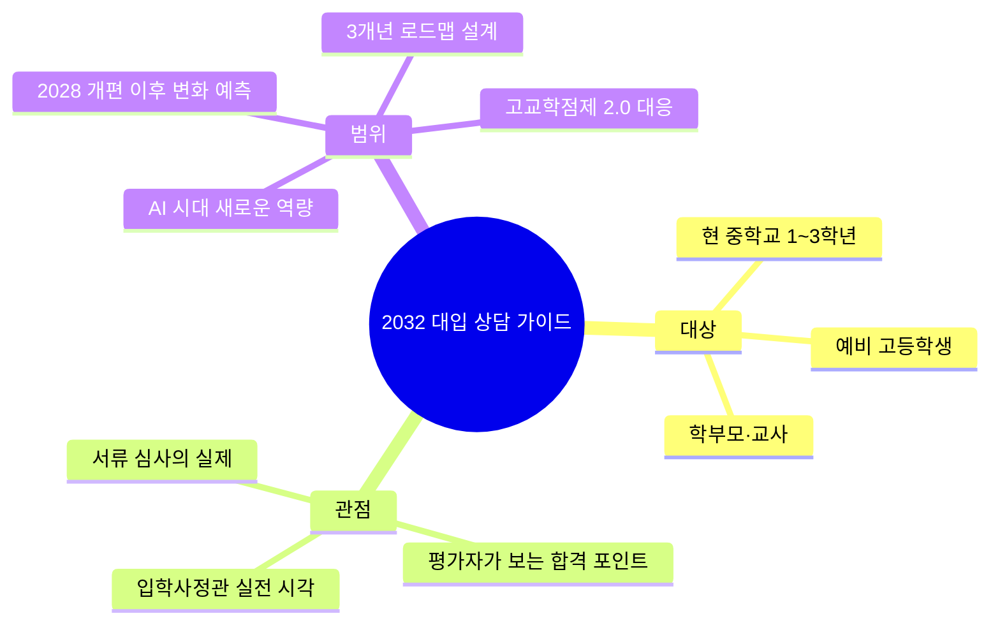

---

# PART 0. 2028→2032 대입 변화 예측의 근거

## 0-1. 2028 개편 이후 4년간 예상 변화 동인

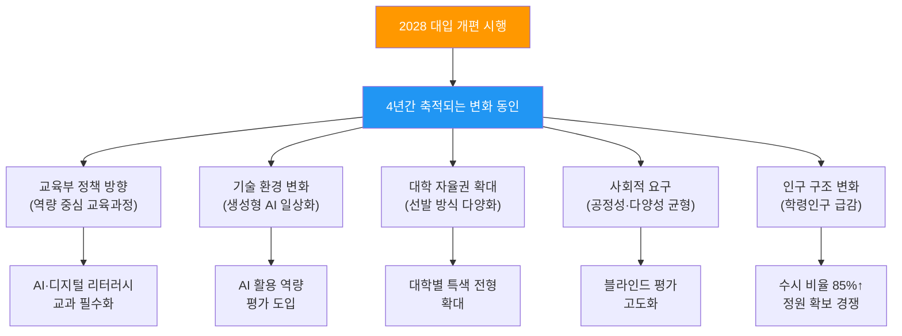

## 0-2. 핵심 예측 근거 정리표

| 변화 동인 | 2028 현행 | 2032 예측 | 근거 |
|----------|----------|----------|------|
| 내신 등급제 | 5등급제 | 5등급 유지 + 절대평가 혼합 | 2022 개정교육과정 안정화 주기 고려 |
| 고교학점제 | 1세대 운영 | 2세대 고도화 (과목 다양성↑) | 4년 운영 피드백 반영 |
| 수능 체제 | 통합형 | 통합형 유지 + AI 리터러시 포함 가능 | 교육과정 개정 주기(~2030) |
| 정시 학생부 | 정성평가 도입 | 정성평가 강화 (비중↑) | 2028 도입 후 확대 경향 |
| AI 활용 | 생기부에 미반영 | AI 협업 역량 세특 반영 | AI 교과 필수화 흐름 |
| 학령인구 | 47만 명 | 37만 명 (▼21%) | 통계청 추계 |
| 대학 정원 | 현행 유지 | 구조조정 가속 | 정원 미달 대학 증가 |
| 전형 비율 | 수시 77% / 정시 23% | 수시 85% / 정시 15% | 학령인구 감소 + 대학 수시 선호 |

---

# PART 1. 2032 대입 핵심 변화 예측

## 1-1. 5대 메가 트렌드

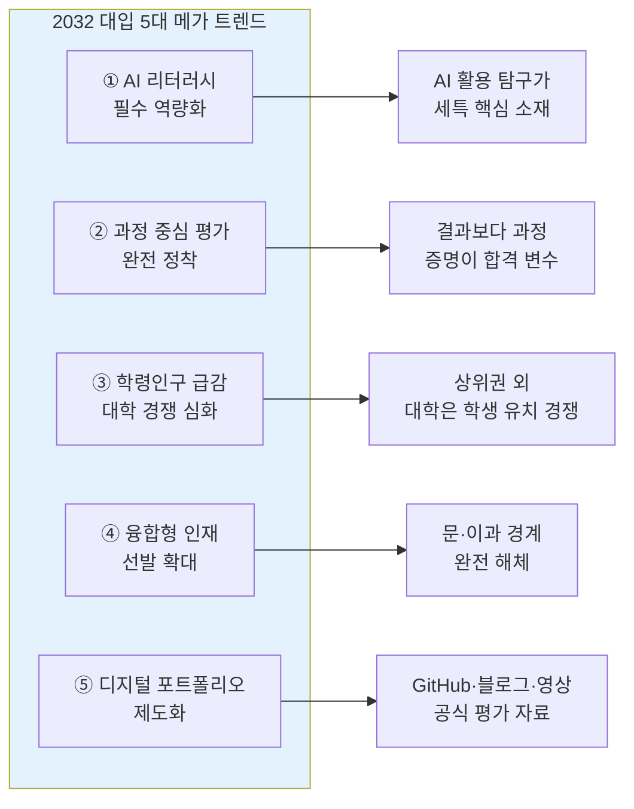

## 1-2. 전형별 변화 예측 상세

### 학생부종합전형 (예측 비중: 45%→50%)

| 항목 | 2028 현행 | 2032 예측 | 입학사정관 코멘트 |
|------|----------|----------|----------------|
| 세특 글자 수 | 500자 | 500~700자 (일부 확대) | "더 많은 서술 공간 = 더 명확한 변별" |
| 평가 기준 | 학업역량·전공적합성·발전가능성·공동체 | + **AI 활용 역량** + **자기주도 탐구력** | "AI를 도구로 쓸 줄 아는지가 핵심" |
| 수능 최저 | 51.3% 적용 | 55~60% 적용 확대 | "수능 병행은 선택이 아닌 필수" |
| 면접 | 생기부 기반 | 생기부 + **과제 수행형** 혼합 | "면접장에서 실시간 문제 해결력 검증" |
| AI 관련 | 미반영 | AI 도구 활용 탐구 적극 평가 | "ChatGPT를 쓴 게 아니라 어떻게 썼는가" |

### 학생부교과전형 (예측 비중: 30%→25%)

| 항목 | 2028 현행 | 2032 예측 | 입학사정관 코멘트 |
|------|----------|----------|----------------|
| 내신 반영 | 5등급제 성적 | 5등급 + 과목 이수 이력 가중 | "어떤 과목을 들었는가가 더 중요" |
| 정성평가 | 미시행 (일부) | 보편화 (창체·행특 정성 가미) | "순수 성적만으로는 1차 심사 통과 어려움" |
| 수능 최저 | 적용 | 유지~강화 | "최저 미충족이 여전히 최다 탈락 사유" |

### 정시전형 (예측 비중: 23%→15%)

| 항목 | 2028 현행 | 2032 예측 | 입학사정관 코멘트 |
|------|----------|----------|----------------|
| 수능 비중 | 핵심 | 핵심 유지 | "수능 실력은 영원한 기본기" |
| 학생부 정성평가 | 도입 (보조) | 비중 확대 (15~20%) | "출결만이 아닌 전반적 학교생활" |
| 면접 | 일부 대학 | 확대 (과제수행형) | "정시에서도 사고력 검증 시작" |
| AI 리터러시 | 미반영 | 수능 과목화 가능 | "2030 교육과정 개정 시 포함 가능성" |

## 1-3. 2032 대입 변화 핵심 키워드 7개

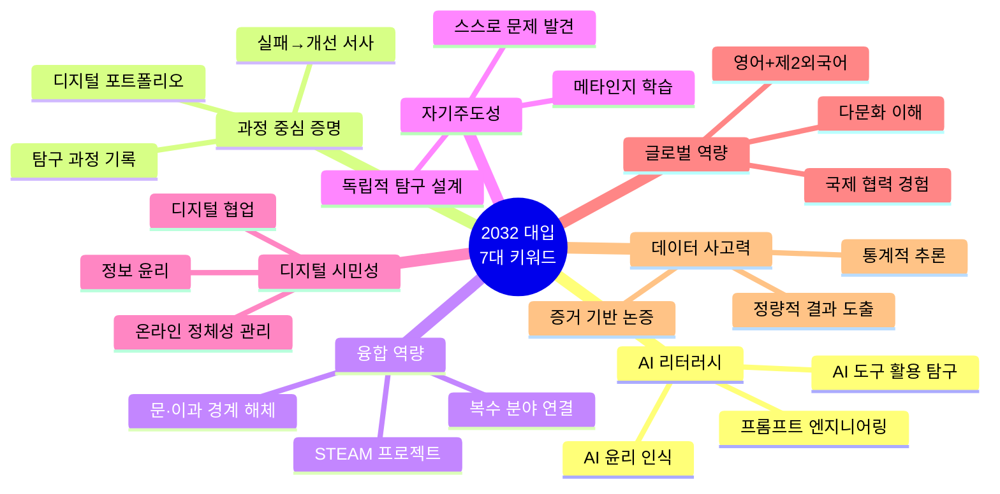

---

# PART 2. 입학사정관이 말하는 2032 평가 기준

## 2-1. 입학사정관의 서류 평가 알고리즘 (2032 예측 버전)

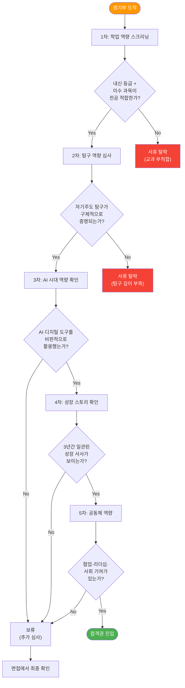

## 2-2. 입학사정관 6대 평가 질문 (2032 확장판)

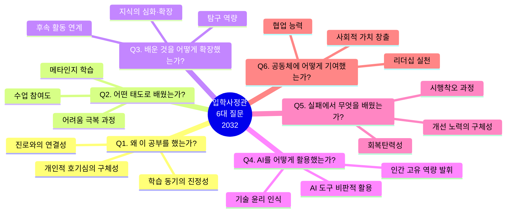

### 6대 질문 실전 적용표

| 질문 | 평가 요소 | 생기부 반영 항목 | 증명 방법 | 차별화 포인트 |
|------|---------|------------|---------|------------|
| Q1. 왜? | 동기의 진정성 | 세특 도입부, 진로활동 | 수업→호기심→탐구 자연 연결 | "왜"가 구체적일수록 높은 점수 |
| Q2. 어떻게? | 학습 태도 | 세특 중반부, 행특 | 질문 기록, 발표 참여 증거 | 메타인지 학습 전략 서술 |
| Q3. 확장? | 탐구 깊이 | 세특 후반부, 동아리 | 보고서, 후속 탐구 연결 | 1→2→3학년 깊어지는 탐구 |
| Q4. AI? | 디지털 역량 | 세특, 정보 과목 | AI 도구 활용+비판적 검증 | AI 결과를 검증·개선한 과정 |
| Q5. 실패? | 회복탄력성 | 세특, 행특, 창체 | 초기 실패→원인 분석→개선 | 정직한 실패 서술 + 성장 |
| Q6. 기여? | 공동체 역량 | 자율활동, 동아리, 행특 | 팀 프로젝트 산출물, 멘토링 | 양적 봉사 아닌 질적 기여 |

## 2-3. 입학사정관이 "이 학생은 합격이다"라고 느끼는 순간

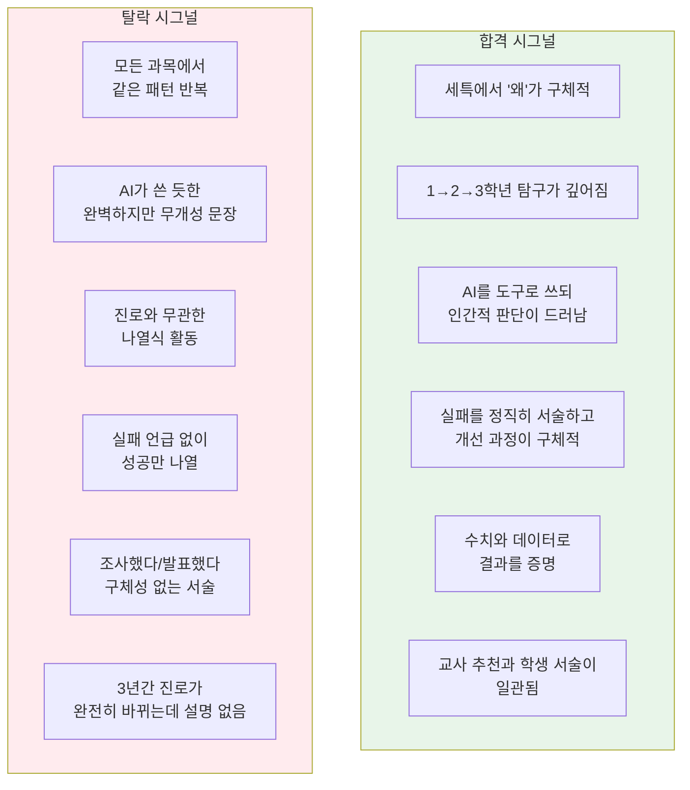

### 합격/탈락 시그널 실전 비교

| 영역 | 탈락 시그널 | 합격 시그널 | 입학사정관 코멘트 |
|------|------------|------------|----------------|
| 동기 | "관심이 있어서 조사함" | "수업 중 ○○ 개념에서 '왜 △△인가'라는 의문이 생겨" | "구체적 장면이 그려져야 진정성을 느낌" |
| 활동 | "자료를 조사하여 정리함" | "논문 3편 비교 분석 후 가설을 세우고 데이터 200건으로 검증" | "방법론+수치가 있어야 학업역량으로 인정" |
| AI 활용 | "ChatGPT로 자료를 정리함" | "AI가 생성한 코드의 오류 3건을 발견하고 직접 디버깅하여 정확도 12% 향상" | "AI를 쓴 것이 아니라 AI와 협업한 증거" |
| 실패 | (언급 없음) | "초기 모델의 정확도 42%에 그쳤으나, 원인 분석 후 특성공학을 추가하여 78%로 개선" | "실패를 인정하는 학생이 더 성숙해 보임" |
| 성장 | "다양한 경험을 쌓음" | "1학년 단순 관찰→2학년 실험 설계→3학년 모델링으로 탐구 수준이 심화됨" | "3년간 깊어지는 궤적이 합격의 핵심" |

---

# PART 3. 2032 대입 대비 3개년 로드맵

## 3-1. 전체 흐름도

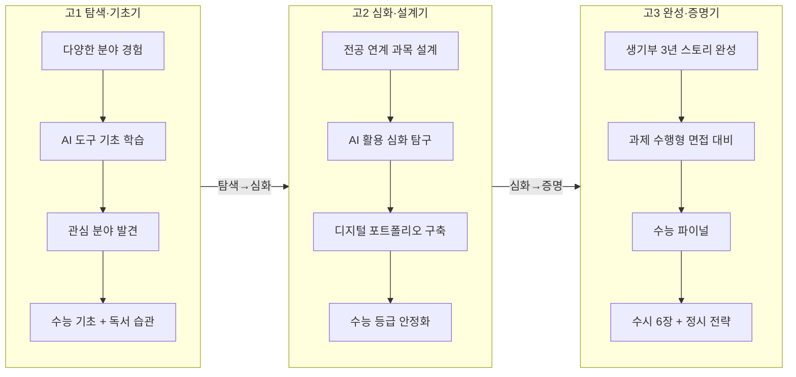

## 3-2. 학년별 핵심 수치 비교 (2032 예측)

| 항목 | 고1 | 고2 | 고3 |
|------|-----|-----|-----|
| 내신 비중 | ★★★★★ | ★★★★★ | ★★★★☆ (1학기만) |
| 세특 전략 | 탐색형 + AI 기초 | 심화형 + AI 활용 | 증명형 + AI 비판적 활용 |
| 수능 학습 | 주 13시간 | 주 20시간 | 주 35시간+ |
| AI 활용 시간 | 주 3시간 (기초) | 주 5시간 (프로젝트) | 주 2시간 (면접 대비) |
| 독서 목표 | 연 15권 (넓게) | 연 12권 (전공 중심) | 연 5권 (면접 대비) |
| 탐구 보고서 | 1~2편 (입문) | 3~4편 (AI 활용 포함) | 1~2편 (최종 완성) |
| 동아리 | 2~3개 탐색 | 1개 집중 + AI 동아리 | 마무리 활동 |
| 디지털 포트폴리오 | 시작 (블로그) | 구축 (GitHub/블로그) | 최종 정리 |
| 생기부 기록 밀도 | 25% | 50% | 25% |

---

# PART 4. 고등학교 1학년 — 탐색과 AI 기초

## 4-1. 고1 전략 개요 (입학사정관 관점)

> **입학사정관 코멘트:**
> "1학년은 '씨앗을 심는 시기'입니다. 아직 방향이 정해지지 않아도 괜찮습니다. 
> 다만 2032 대입에서는 **AI 도구를 자연스럽게 쓸 줄 아는 기초 역량**이 
> 1학년 때부터 드러나야 합니다. '조사했다'가 아니라 '어떤 도구로, 어떻게 조사했다'가 중요합니다."

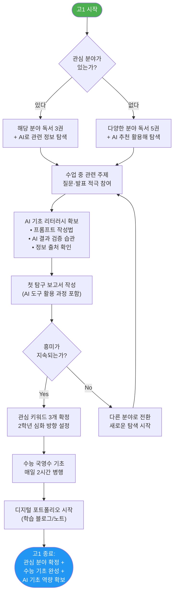

## 4-2. 내신 시험 대비 알고리즘 (2032 업그레이드 버전)

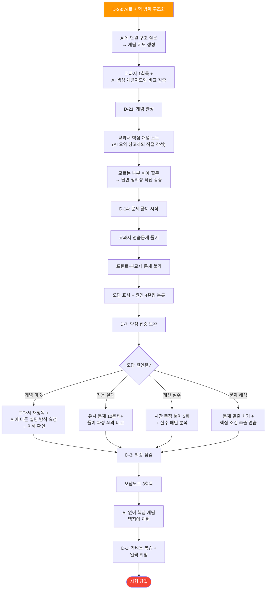

## 4-3. AI 리터러시 기초 확립 (고1 필수)

> **입학사정관 코멘트:**
> "2032 대입에서 AI 활용은 '특기'가 아니라 '기본기'입니다.
> 마치 인터넷 검색을 할 줄 아는 것처럼, AI를 활용한 학습·탐구가 기본이 됩니다.
> 다만, AI에 의존하는 것과 AI를 도구로 쓰는 것은 완전히 다릅니다."

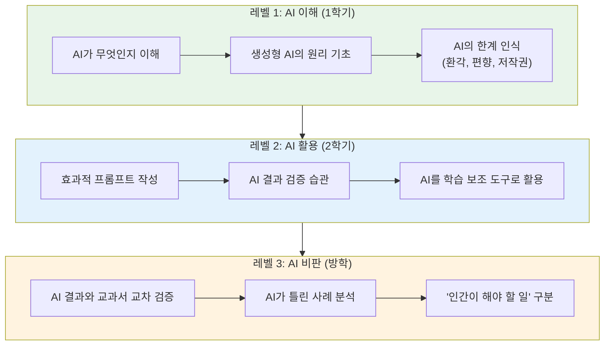

### AI 리터러시 실전 행동 체크리스트 (고1)

| 월 | 학습 내용 | 실천 행동 | 산출물 |
|---|---------|---------|--------|
| 3~4월 | AI란 무엇인가 | AI 관련 독서 1권 + 정보 수업 참여 | 독서 노트 |
| 5~6월 | 프롬프트 작성법 | 학습 질문을 AI에 체계적으로 질문하는 연습 | 프롬프트 일지 |
| 7~8월 | AI 결과 검증 | AI가 생성한 답변 5개를 교과서로 팩트체크 | 검증 보고서 |
| 9~10월 | AI 활용 탐구 | 탐구 주제에 AI를 보조 도구로 활용 | 탐구 보고서 (AI 활용 과정 명시) |
| 11~12월 | AI 윤리 인식 | AI 저작권·편향 이슈 조사 | 에세이 |
| 1~2월 | 종합 정리 | 1년간 AI 활용 경험 정리 | 디지털 포트폴리오 시작 |

## 4-4. 생기부 탐구 주제 발굴 (2032 AI 시대 버전)

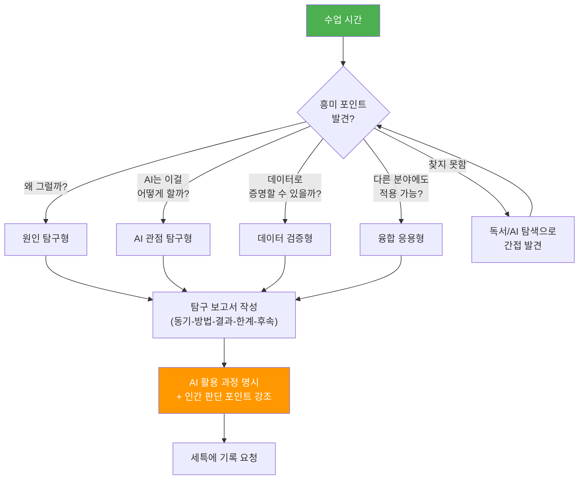

### 과목별 탐구 주제 발굴 (2032 AI 시대 실전 예시)

| 과목 | 수업 단원 | AI 시대 질문 | 탐구 주제 | AI 활용 방법 | 인간 판단 포인트 |
|------|----------|-----------|----------|------------|--------------|
| 국어 | 비문학 독해 | "AI가 쓴 글과 인간이 쓴 글의 차이는?" | AI 생성 텍스트의 문체적 특성 분석 | AI로 샘플 텍스트 생성 → 비교 분석 | 문학적 가치 판단은 인간 고유 |
| 수학 | 확률과 통계 | "AI 추천 알고리즘은 편향되는가?" | 추천 시스템의 확률적 편향 분석 | AI 추천 결과 100건 수집·분류 | 편향의 윤리적 판단 |
| 영어 | 영미 문학 | "AI 번역이 문학의 뉘앙스를 살릴 수 있나?" | AI 번역 vs 인간 번역 품질 비교 | AI 번역 3종 비교 평가 | 문화적 맥락 판단 |
| 과학 | 기후 변화 | "AI로 기후 예측 정확도를 높일 수 있나?" | 기후 데이터 기반 예측 모델 비교 | AI 모델과 전통 모델 예측 비교 | 모델 한계 인식 |
| 사회 | 민주주의 | "AI가 여론을 조작할 수 있나?" | 딥페이크와 민주주의 위협 분석 | AI 생성 콘텐츠 탐지 실험 | 민주주의 가치 판단 |
| 정보 | 알고리즘 | "정렬 알고리즘을 AI가 자동 선택할 수 있나?" | 데이터 특성별 최적 알고리즘 추천 시스템 | AutoML 개념 학습·실험 | 알고리즘 선택의 근거 해석 |

## 4-5. 고1 월별 실전 행동 플래너

```mermaid
flowchart TD
    MAR["3월: 적응기"] --> MAR_D["• 반배정 후 선생님별 수업 스타일 파악<br/>• 동아리 박람회 참석 → AI/코딩/관심분야 2~3개 체험<br/>• AI 리터러시 독서 1권 시작<br/>• 수업 중 '질문 1개' 습관 시작<br/>• 디지털 학습 노트 시작 (블로그/노션)"]
    
    MAR_D --> APR["4~5월: 첫 시험 + AI 기초"]
    APR --> APR_D["• 중간고사 D-28 학습 계획표 작성<br/>• AI 보조 학습 시작 (질문→검증 루틴)<br/>• 시험 후 오답 4유형 분류 분석<br/>• 관심 분야 독서 2권 + AI로 배경 탐색<br/>• 정보 수업 적극 참여 (프로그래밍 기초)"]
    
    APR_D --> JUN["6~7월: 탐구 시작"]
    JUN --> JUN_D["• 기말고사 대비 + 수행평가 100%<br/>• 첫 교과 연계 탐구 보고서 도전<br/>  (AI 활용 과정을 명시적으로 기록)<br/>• 동아리 1개로 좁혀 집중"]
    
    JUN_D --> SUM["7~8월: 여름방학 집중"]
    SUM --> SUM_D["• 수능 국어: 비문학 하루 1지문 (30일)<br/>• 수능 수학: 개념서 1권 완독<br/>• AI 리터러시 심화:<br/>  - 프롬프트 엔지니어링 연습 (주 3회)<br/>  - AI 생성물 팩트체크 습관화<br/>  - AI 윤리 관련 독서 1권<br/>• 진로 탐색: 희망 학과 5개 리서치<br/>• 심화 독서 3권 (관심 분야)"]
    
    SUM_D --> SEP["9~10월: 심화 탐색"]
    SEP --> SEP_D["• 2차 탐구 보고서 도전<br/>  (AI를 활용하되 비판적으로 활용한 과정 기록)<br/>• 동아리 활동 결과물 1개 완성<br/>• 중간고사 대비 + 오답 분석 정밀화<br/>• 선생님과 1:1 면담 (세특 소재 상의)"]
    
    SEP_D --> NOV["11~12월: 정리 + 설계"]
    NOV --> NOV_D["• 기말고사 끝 → 1년 활동 총정리<br/>• '나의 관심 키워드 3개' 확정<br/>• 2학년 과목 선택 (고교학점제 설계)<br/>  → 관심 키워드+AI 연계 과목 우선<br/>• 디지털 포트폴리오 1년차 정리<br/>• AI 활용 학습 경험 정리 에세이"]
    
    NOV_D --> WIN["1~2월: 겨울방학"]
    WIN --> WIN_D["• 2학년 핵심 과목 선행 학습<br/>• AI 활용 탐구 프로젝트 1건 시도<br/>• 심화 독서 3권 + 독서 노트 작성<br/>• 수능 수학: 수I 기출 50문제 풀이<br/>• 2학년 세특 전략 초안 작성"]
    
    style MAR fill:#4CAF50,color:#fff
    style WIN fill:#2196F3,color:#fff
```

---

# PART 5. 고등학교 2학년 — 심화와 AI 활용 설계

## 5-1. 고2 전략 개요 (입학사정관 관점)

> **입학사정관 코멘트:**
> "2학년은 대입의 **핵심 승부처**입니다. 생기부의 50%가 여기서 결정됩니다.
> 2032 대입에서 특히 주목하는 것은 **AI를 활용한 심화 탐구**입니다.
> AI를 단순히 '쓴' 것이 아니라, AI의 결과를 **검증하고, 개선하고, 비판적으로 활용한** 과정이
> 세특에 드러나야 합니다."

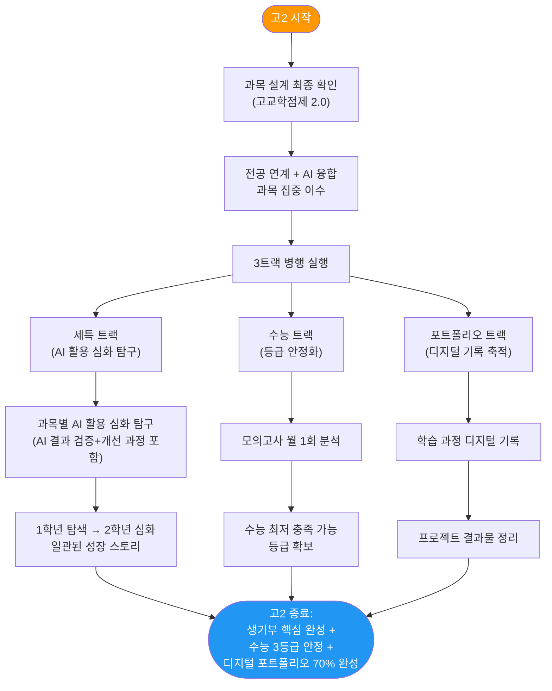

## 5-2. 고교학점제 2.0 과목 설계 (2032 예측)

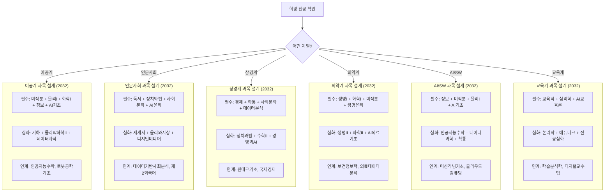

## 5-3. 세특 2032 확장 버전: '동-활-AI-느-후'

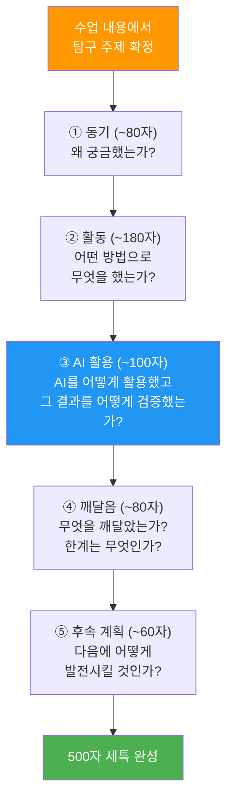

### 세특 500자 실전 작성 예시 (2032 AI 시대 버전)

**예시 A: 컴퓨터공학 — 수학 과목 세특**

| 구분 | 내용 | 글자수 |
|------|------|--------|
| 동기 | 미적분 수업에서 경사하강법을 배우며 "AI 학습에서 학습률은 어떻게 결정되는가?"라는 의문이 생김. | ~75자 |
| 활동 | 학습률 0.001~1.0까지 10단계로 설정하여 선형회귀 모델의 수렴 속도를 Python으로 실험. 에폭별 손실함수 변화를 그래프로 시각화하여 학습률 0.01에서 최적 수렴을 확인함. | ~135자 |
| AI 활용 | 코드 작성 시 AI에 초안을 요청했으나, 생성된 코드에서 배열 인덱싱 오류 2건을 발견하여 직접 수정. AI 코드를 그대로 쓰지 않고 검증·개선한 과정을 학습 일지에 기록함. | ~115자 |
| 깨달음 | 수학적 직관 없이 AI 코드만 의존하면 오류를 발견할 수 없음을 체감. 인간의 수학적 이해가 AI 활용의 전제조건임을 인식함. | ~80자 |
| 후속 | 향후 Adam·RMSProp 등 적응형 학습률 알고리즘을 비교하고, 실제 이미지 분류 문제에 적용할 계획. | ~60자 |

**예시 B: 의예과 — 생명과학 세특**

| 구분 | 내용 | 글자수 |
|------|------|--------|
| 동기 | 면역 단원에서 면역관문억제제(PD-1 억제제)의 반응률이 환자마다 다른 이유에 의문을 가짐. | ~65자 |
| 활동 | 종양미세환경(TME)과 면역반응의 관계를 논문 4편으로 분석. 종양 돌연변이 부담(TMB)이 높을수록 면역치료 반응률이 상승하는 상관관계를 정리하고, TMB 측정 한계를 도식화하여 발표함. | ~135자 |
| AI 활용 | 영문 논문 초벌 번역에 AI를 활용했으나, 면역학 전문용어 5건의 오역을 발견하여 교과서 정의와 대조하여 수정. AI 번역의 한계를 "맥락 미인식"으로 분류하여 보고서에 포함함. | ~115자 |
| 깨달음 | 의학에서 '개인 맞춤 치료'의 방향이 유전체 데이터 분석에 있음을 이해. 동시에 데이터 해석에서 임상의의 판단이 불가결함을 깨달음. | ~90자 |
| 후속 | 2학기 화학II에서 약물 표적 분자 설계의 화학적 기반을 탐구하여, 면역치료의 다음 단계를 이해할 계획. | ~65자 |

**예시 C: 경영학 — 경제 과목 세특**

| 구분 | 내용 | 글자수 |
|------|------|--------|
| 동기 | 시장 구조 단원에서 "AI 추천 알고리즘이 소비자 선택권을 제한하는 것은 독점과 같은가?"라는 의문을 가짐. | ~75자 |
| 활동 | 3개 플랫폼(유튜브·넷플릭스·쿠팡)의 추천 결과 각 50건을 2주간 수집하고, 카테고리 편중도를 지니계수로 수치화. 유튜브의 추천 편중도가 0.72로 가장 높음을 증명함. | ~130자 |
| AI 활용 | 데이터 전처리에 AI를 활용했으나, 카테고리 분류 기준을 AI에 맡기면 주관적 분류가 발생함을 확인. 분류 기준을 직접 설정하고 AI는 반복 작업에만 활용함. | ~110자 |
| 깨달음 | 플랫폼 독점의 본질이 '시장점유율'이 아닌 '정보 편향의 구조화'에 있음을 이해. 기존 공정거래법의 한계를 인식함. | ~80자 |
| 후속 | EU 디지털시장법의 알고리즘 투명성 조항을 분석하여, 한국형 규제 방안을 제안하는 후속 탐구를 계획함. | ~65자 |

## 5-4. 고2 월별 실전 행동 플래너

```mermaid
flowchart TD
    MAR["3월: 과목설계 확정"] --> MAR_D["• 전공연계+AI 과목 수강 확인<br/>• 과목별 세특 탐구 주제 후보 3개<br/>  (AI 활용 가능한 주제 우선)<br/>• 디지털 포트폴리오 2년차 시작<br/>• 동아리 리더십 역할 확보<br/>• 수능 기출 3개년 구매"]
    
    MAR_D --> APR["4~5월: 1차 탐구 + 중간"]
    APR --> APR_D["• 중간고사 전 과목 1등급 목표<br/>• 핵심 과목 1차 세특 탐구 수행<br/>  (AI 활용 과정 명시적 기록)<br/>• 독서 2권 → 탐구 동기 근거<br/>• 포트폴리오 월간 업데이트"]
    
    APR_D --> JUN["6월: 모의평가 + 전략"]
    JUN --> JUN_D["• 6월 모의평가 영역별 분석<br/>• 취약 영역 → AI 보조 학습 계획<br/>• 기말고사 대비<br/>• 수능 최저 충족 가능성 판단<br/>• AI 활용 탐구 보고서 1편 완성"]
    
    JUN_D --> SUM["7~8월: 여름방학 승부처"]
    SUM --> SUM_D["• 수능 취약 과목 하루 4시간<br/>• 세특 심화 탐구 보고서 1편 완성<br/>  (AI 비판적 활용 과정 포함)<br/>• 디지털 포트폴리오 중간 점검<br/>• 관심 대학 10개 전형 분석<br/>• AI 프로젝트 1건 완료"]
    
    SUM_D --> SEP["9월: 모의평가 + 방향"]
    SEP --> SEP_D["• 9월 모의평가 → 수시/정시 비율 결정<br/>• 2학기 세특 핵심 활동 시작<br/>• 동아리 최종 성과물 제작<br/>• 포트폴리오 핵심 프로젝트 추가"]
    
    SEP_D --> NOV["10~12월: 마무리"]
    NOV --> NOV_D["• 중간+기말 고사 최선<br/>• 2학년 생기부 스토리 총점검<br/>• 수능 모의고사 매주 1회<br/>• 디지털 포트폴리오 2년차 정리<br/>• 3학년 전략 수립"]
    
    NOV_D --> WIN["1~2월: 겨울방학"]
    WIN --> WIN_D["• 수능 집중 (하루 6시간)<br/>• 포트폴리오 최종 다듬기<br/>• 생기부 3년 스토리 초안 작성<br/>• 목표 대학별 면접 기출 수집<br/>• AI 관련 시사 이슈 브리핑 시작"]
    
    style MAR fill:#FF9800,color:#fff
    style WIN fill:#2196F3,color:#fff
```

---

# PART 6. 고등학교 3학년 — 완성과 실전

## 6-1. 고3 전략 개요 (입학사정관 관점)

> **입학사정관 코멘트:**
> "3학년은 새로운 것을 시작하는 시기가 아닙니다. 
> 1~2학년에 쌓은 것을 **증명하고 완성하는** 시기입니다.
> 2032 대입에서 가장 달라지는 것은 **과제 수행형 면접**입니다.
> 면접장에서 실시간으로 문제를 풀고, AI를 활용하되 그 과정을 설명해야 합니다."

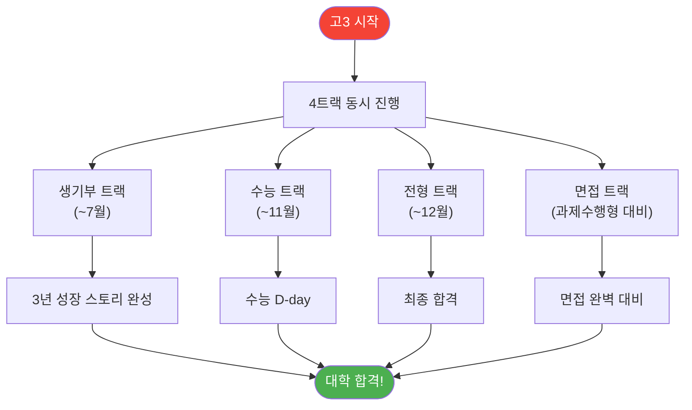

## 6-2. 수시 6장 카드 배분 (2032 버전)

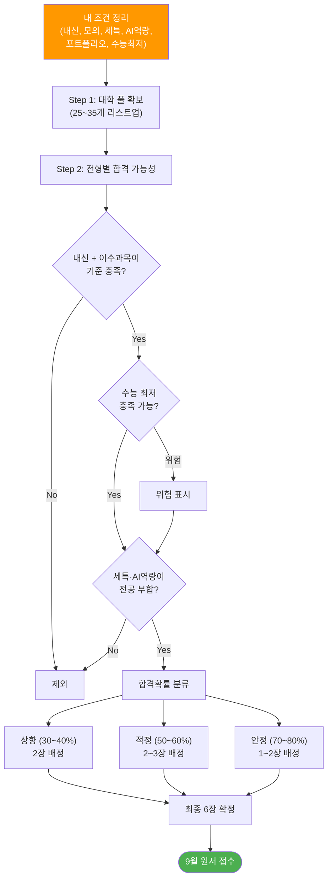

### 수시 6장 시뮬레이션 (AI/SW 지망, 내신2 + 모의2 + 세특 강함)

| 카드 | 대학·전형 | 유형 | 수능최저 | 합격확률 |
|------|----------|------|---------|---------|
| 1장 | 서울대 학종 (컴공) | 상향 | 3합5 | 30% |
| 2장 | 카이스트 학종 (AI) | 상향 | 없음 | 35% |
| 3장 | 연세대 학종 (AI) | 적정 | 2합5 | 55% |
| 4장 | 성균관대 학종 (SW) | 적정 | 없음 | 60% |
| 5장 | 한양대 학종 (컴공) | 안정 | 없음 | 75% |
| 6장 | 중앙대 학종 (AI) | 안정 | 2합6 | 80% |

## 6-3. 과제 수행형 면접 대비 (2032 핵심)

> **입학사정관 코멘트:**
> "과제 수행형 면접의 핵심은: AI가 준 답을 그대로 발표하면 낮은 점수. 
> AI 답을 비판적으로 검증하고 개선하면 높은 점수."

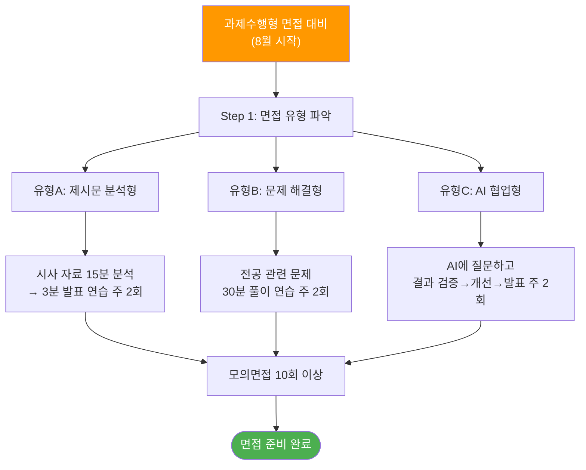

### 과제수행형 면접 예상 시나리오 (전공별)

| 전공 | 과제 유형 | 예상 시나리오 | 평가 포인트 |
|------|---------|------------|----------|
| 컴퓨터공학 | AI 협업형 | "주어진 데이터셋으로 분류 모델을 설계하세요" | AI 코드 검증+개선 과정 |
| 의예과 | 제시문 분석형 | "임상 데이터를 보고 치료 방향을 제안하세요" | 데이터 해석+윤리적 고려 |
| 경영학 | 문제 해결형 | "매출 데이터를 분석하고 전략을 제안하세요" | 정량 분석+현실적 제안 |
| 사회학 | 제시문 분석형 | "사회 현상에 대해 두 이론으로 분석하세요" | 이론 적용+균형 분석 |
| 교육학 | AI 협업형 | "AI 활용 수업 설계안을 작성하세요" | AI 한계 인식+교사 역할 |

## 6-4. 고3 월별 실전 행동 플래너

```mermaid
flowchart TD
    MAR["3월"] --> MAR_D["• 모의고사 분석 + 수시/정시 판단<br/>• 세특 마지막 전략<br/>• 목표 대학 20개 + 면접 유형 확인"]
    
    MAR_D --> MAY["4~5월"]
    MAY --> MAY_D["• 마지막 내신! D-28 알고리즘 적용<br/>• 세특 최종 활동 + 기록 요청<br/>• 생기부 3년 스토리 최종 점검"]
    
    MAY_D --> JUN["6월"]
    JUN --> JUN_D["• 6월 모평 → 수시 6장 1차 확정<br/>• 기말고사 대비<br/>• 대학별 면접 유형 정밀 분석"]
    
    JUN_D --> AUG["7~8월"]
    AUG --> AUG_D["• 수능 올인 모드<br/>• 과제수행형 면접 연습 시작 (주 2회)<br/>• 수시 6장 최종 확정"]
    
    AUG_D --> SEP["9월"]
    SEP --> SEP_D["• 수시 원서 접수<br/>• 9월 모평 → 정시 지원선 예측<br/>• 면접 실전 연습 주 3회"]
    
    SEP_D --> NOV["10~11월"]
    NOV --> NOV_D["• 면접 대비 집중<br/>• 수능 실전 모의고사 주 2회<br/>• 수능 D-day"]
    
    NOV_D --> DEC["12월"]
    DEC --> DEC_D["• 수시 면접 + 합격 발표<br/>• 정시 지원 전략<br/>• 최종 등록"]
    
    style MAR fill:#f44336,color:#fff
    style DEC fill:#4CAF50,color:#fff
```

---

# PART 7. 계열별 2032 맞춤 전략

## 7-1. AI/SW 계열

| 구분 | 추천 내용 |
|------|----------|
| 핵심 과목 | 정보, 미적분, 인공지능수학, 데이터과학, 물리학I |
| 동아리 | AI·코딩·로봇·데이터사이언스 |
| 탐구 주제 | "LLM의 환각 현상 분석 및 사실성 검증 알고리즘 설계" |
| 포트폴리오 | GitHub 5개+ 프로젝트, AI 실험 보고서 3편 |
| 면접 대비 | 과제수행형(코딩+AI 활용), AI 윤리 토론 |

## 7-2. 의약/생명 계열

| 구분 | 추천 내용 |
|------|----------|
| 핵심 과목 | 생명과학II, 화학II, 미적분, 생명윤리, AI의료기초 |
| 동아리 | 생명과학·의학·봉사·생명윤리토론 |
| 탐구 주제 | "AI 영상 진단의 정확도와 의사 판독의 차이 분석" |
| 면접 대비 | MMI(다중미니면접) + AI 의료 윤리 제시문 |

## 7-3. 인문사회 계열

| 구분 | 추천 내용 |
|------|----------|
| 핵심 과목 | 사회문화, 정치와법, 윤리와사상, AI윤리, 세계사 |
| 동아리 | 인문학·토론·신문·사회비평·정책연구 |
| 탐구 주제 | "AI 딥페이크가 민주주의에 미치는 영향과 규제 방안" |
| 면접 대비 | 제시문 분석형 + AI 사회 이슈 토론 |

## 7-4. 상경/경영 계열

| 구분 | 추천 내용 |
|------|----------|
| 핵심 과목 | 경제, 확률과통계, 데이터분석, 사회문화, 경영과AI |
| 동아리 | 경제·창업·데이터분석·마케팅 |
| 탐구 주제 | "AI 추천 알고리즘의 소비자 행동 변화 정량 분석" |
| 면접 대비 | 데이터 분석형 과제 + 비즈니스 케이스 |

## 7-5. 교육 계열

| 구분 | 추천 내용 |
|------|----------|
| 핵심 과목 | 교육학, 심리학, AI교육론, 윤리, 전공과목 |
| 동아리 | 또래학습·교육봉사·에듀테크·심리 |
| 탐구 주제 | "AI 개인화 학습 도구가 학생 자기주도성에 미치는 영향" |
| 면접 대비 | AI 협업형(수업 설계) + 교육 철학 토론 |

---

# PART 8. 학령인구 감소와 대학 구조 변화

## 8-1. 2032년 대학 입시 환경 전망

```mermaid
flowchart TD
    POP["학령인구 37만 명<br/>(2028 대비 21% 감소)"] --> IMPACT["대학 구조 변화"]
    
    IMPACT --> I1["상위 15개 대학<br/>경쟁률 유지~소폭 하락"]
    IMPACT --> I2["중위권 대학<br/>정원 미달 시작"]
    IMPACT --> I3["하위권 대학<br/>통폐합 가속"]
    
    I1 --> S1["전략: 세특+수능 모두 강화"]
    I2 --> S2["전략: 특색 전형 활용"]
    I3 --> S3["전략: 학과 선택 중요"]
    
    style POP fill:#FF9800,color:#fff
```

## 8-2. 2032 유망 학과/전공 예측

| 분야 | 유망 전공 | 이유 | 권장 과목 설계 |
|------|---------|------|-------------|
| AI/데이터 | AI공학, 데이터사이언스 | AI 산업 지속 성장 | 수학+정보+물리 |
| 바이오 | 바이오인포매틱스, 정밀의료 | AI+의료 융합 | 생명+화학+정보 |
| 에너지 | 신재생에너지공학 | 에너지 전환 가속 | 물리+화학+수학 |
| 반도체 | 반도체공학, 양자컴퓨팅 | 국가 전략 산업 | 물리+수학+정보 |
| 보건 | 디지털헬스, 보건정보학 | 고령화+디지털 전환 | 생명+정보+통계 |
| 교육 | 에듀테크, AI교육 | 교육 혁신 가속 | 교육+심리+정보 |
| 환경 | 기후테크, 환경데이터 | ESG 규제 강화 | 화학+지구과학+정보 |
| 콘텐츠 | AI 크리에이티브 | 콘텐츠 산업 확대 | 미술+정보+미디어 |

---

# PART 9. 정시 전략 (2032 예측)

## 9-1. 정시 파이터 위험 경고

```mermaid
flowchart TD
    FIGHTER["정시만 준비<br/>(학교생활 등한시)"] --> RISK1["출결 불량"]
    FIGHTER --> RISK2["수업태도 불량"]
    FIGHTER --> RISK3["수행평가 미참여"]
    
    RISK1 --> RESULT["2032 정시:<br/>학생부 정성평가 15~20%"]
    RISK2 --> RESULT
    RISK3 --> RESULT
    
    RESULT --> DANGER["수능 고득점이어도 탈락 가능!"]
    
    SAFE["올바른 전략:<br/>학교생활 + 수능 병행"] --> SUCCESS["수시+정시 모두 안전"]
    
    style FIGHTER fill:#f44336,color:#fff
    style DANGER fill:#f44336,color:#fff
    style SAFE fill:#4CAF50,color:#fff
    style SUCCESS fill:#4CAF50,color:#fff
```

## 9-2. 정시 학생부 정성평가 항목 (2032 예측)

| 평가 영역 | 예상 비중 | 세부 항목 | 고득점 전략 |
|---------|---------|---------|----------|
| 출결·성실도 | 25% | 무단결석 0, 지각 최소화 | 3년간 출결 관리 |
| 수업 참여도 | 30% | 행특 평가, 세특 내용 | 수업 적극 참여 |
| 학업 충실성 | 25% | 이수 과목 적절성, 내신 추이 | 전공 연계 과목 이수 |
| 공동체 기여 | 20% | 동아리, 자율활동, 봉사 | 의미 있는 활동 |

---

# PART 10. 합격 사례 시뮬레이션

## 10-1. Case A: AI/SW 학종 합격 (서울대 컴퓨터공학)

| 항목 | 내용 |
|------|------|
| 내신 | 1.7등급 (수학·정보 1.2) |
| 수능 | 국2/수1/영1/물1/정보1 (최저 충족) |
| 세특 핵심 | "AI 모델의 편향성 탐지 및 완화 알고리즘 설계" |
| 합격 요인 | AI를 비판적으로 활용한 3년 일관 스토리 |

```mermaid
timeline
    title AI/SW 합격생 성장 궤적
    section 고1
        탐색 : Python 기초 + 첫 프로그램 : AI 원리 독서 3권 : AI 생성물 팩트체크 실험
    section 고2
        심화 : 머신러닝 기초 실습 : AI 편향성 발견 → 탐구 주제화 : GitHub 포트폴리오 구축
    section 고3
        증명 : 편향 탐지 알고리즘 설계 : 과제수행형 면접 통과 : 합격
```

## 10-2. Case B: 의예과 합격 (연세대 의예과)

| 항목 | 내용 |
|------|------|
| 내신 | 1.1등급 |
| 수능 | 전 영역 1등급 (3합3 충족) |
| 세특 핵심 | "AI 영상 진단 보조 시스템의 한계와 의사 판독의 불가결성" |
| 합격 요인 | 과학적 깊이 + AI 시대 의사 역할에 대한 철학적 사고 |

## 10-3. 합격 공통 패턴

```mermaid
flowchart LR
    PATTERN["2032 합격<br/>공통 패턴"] --> P1["3년 일관된<br/>성장 스토리"]
    PATTERN --> P2["AI 비판적<br/>활용 증거"]
    PATTERN --> P3["수치로<br/>증명된 결과"]
    PATTERN --> P4["실패→개선<br/>과정 서술"]
    PATTERN --> P5["디지털<br/>포트폴리오"]
    PATTERN --> P6["과제수행형<br/>면접 통과"]
    
    style PATTERN fill:#FFD700,color:#111
```

---

# PART 11. 학부모·교사 상담 가이드

## 11-1. 학부모 Q&A

| Q | A | 실천 조언 |
|---|---|---------|
| "내신 5등급제면 다 같나요?" | "세특이 변별력의 핵심입니다" | 자녀의 탐구 시간 확보 |
| "AI를 얼마나 배워야 하나요?" | "도구로 쓸 줄 알고 한계를 인식하면 충분" | AI 기초 학습 기회 제공 |
| "정시만 노리면 안 되나요?" | "정시도 학생부 15~20% 반영" | 학교생활 충실도 강조 |
| "포트폴리오가 필수인가요?" | "2032년 '강력 권장' 수준" | 1학년부터 기록 시작 |
| "학원을 더 보내야 하나요?" | "세특과 탐구는 자기주도여야" | 탐구 시간 vs 학원 균형 |

---

# PART 12. 핵심 요약

## 12-1. 2032 대입 성공 7대 원칙

```mermaid
mindmap
  root((2032 대입<br/>7대 성공 원칙))
    수능 = 기본값
      수시에도 최저 55~60%
      1학년부터 병행 필수
    세특 = 핵심 변별
      동-활-AI-느-후 5박자
      3년 깊어지는 탐구
    AI = 비판적 활용
      결과 검증+개선 기록
      한계 인식이 핵심
    스토리 = 일관성
      탐색→심화→증명
      실패도 스토리의 일부
    포트폴리오 = 과정 증거
      1학년부터 시작
      결과보다 과정
    면접 = 실전 역량
      과제수행형 대비
      10회 이상 모의면접
    학교생활 = 성실
      출결 100%
      정시에도 반영!
```

## 12-2. 변하지 않는 합격의 본질

```mermaid
flowchart TD
    CORE["변하지 않는<br/>합격의 본질"] --> V1["진정성"]
    CORE --> V2["일관성"]
    CORE --> V3["깊이"]
    CORE --> V4["성장"]
    CORE --> V5["성실"]
    
    V1 --> RESULT(["어느 시대든<br/>이 학생은 합격합니다"])
    V2 --> RESULT
    V3 --> RESULT
    V4 --> RESULT
    V5 --> RESULT
    
    style CORE fill:#FFD700,color:#111
    style RESULT fill:#4CAF50,color:#fff
```

---

# 부록 I. 입학사정관이 던지는 심층 질문 30선

> **활용법:** 아래 30개 질문은 입학사정관이 실제 서류 심사·면접에서 활용하는 심층 질문입니다.
> 학생은 자신의 생기부·세특·포트폴리오가 이 질문에 답할 수 있는지 점검하세요.
> 모든 질문에 "구체적 사례 + 수치 + 과정"으로 답할 수 있으면 합격 가능성이 높습니다.

---

## 영역 1: 학업 역량·탐구 깊이 (Q1~Q10)

### Q1. "이 탐구의 출발점이 된 수업 속 순간을 구체적으로 묘사해 주세요."

| 평가 의도 | 고득점 답변 조건 | 저득점 답변 특징 |
|---------|-------------|-------------|
| 동기의 진정성 | "○월 ○일 ○○ 단원에서 선생님이 △△를 설명할 때, □□가 이해되지 않아서" | "관심이 있어서", "재미있을 것 같아서" |

> **입학사정관 해설:** 동기가 구체적 장면으로 재현 가능해야 진정성을 인정합니다.

---

### Q2. "탐구 과정에서 가장 어려웠던 순간은 언제였고, 어떻게 극복했나요?"

| 평가 의도 | 고득점 답변 조건 | 저득점 답변 특징 |
|---------|-------------|-------------|
| 문제 해결력·회복탄력성 | "데이터 수집 3주차에 결측치 40%를 발견 → 원인 분석 → 대체값 3가지 비교 → 중앙값 대체 채택" | "어려움 없이 잘 진행됨" |

> **입학사정관 해설:** 어려움을 '구체적 상황 + 시도한 방법 + 최종 결정 근거'로 설명해야 합니다.

---

### Q3. "이 탐구의 결론에 동의하지 않는 사람이 있다면, 어떤 반론을 제기할까요?"

| 평가 의도 | 고득점 답변 조건 | 저득점 답변 특징 |
|---------|-------------|-------------|
| 비판적 사고력 | "제 결론의 한계는 △△이고, 반대 입장에서는 □□을 근거로 반박할 수 있습니다" | "제 결론이 맞다고 생각합니다" |

> **입학사정관 해설:** 자기 탐구의 한계를 인식하고 반대 논거를 예상할 수 있는 학생은 학문적 성숙도가 높습니다.

---

### Q4. "만약 이 탐구를 처음부터 다시 한다면, 무엇을 다르게 하겠습니까?"

| 평가 의도 | 고득점 답변 조건 | 저득점 답변 특징 |
|---------|-------------|-------------|
| 메타인지·학습 능력 | "변인 통제를 더 엄밀히, 데이터 수집 기간을 2주→4주로 확대, AI 전처리에서 정규화를 먼저 적용" | "더 열심히 했을 것" |

> **입학사정관 해설:** '더 열심히'는 답이 아닙니다. '어떤 단계를, 왜, 어떻게' 바꾸겠는지를 말해야 합니다.

---

### Q5. "이 탐구 주제가 10년 후에도 여전히 의미 있을까요?"

| 평가 의도 | 고득점 답변 조건 | 저득점 답변 특징 |
|---------|-------------|-------------|
| 학문적 시야 | "이 문제는 근본적 질문이므로 기술이 변해도 유효합니다. 다만 접근 방법은 AI 발전에 따라 진화할 것" | "중요한 주제라서요" |

> **입학사정관 해설:** 자기 탐구를 학문 전체의 맥락에서 위치시킬 수 있는 학생은 '연구자 기질'을 가진 것으로 봅니다.

---

### Q6. "교과서에 나오는 이론과 당신의 실험 결과가 다르다면, 무엇을 신뢰하겠습니까?"

| 평가 의도 | 고득점 답변 조건 | 저득점 답변 특징 |
|---------|-------------|-------------|
| 과학적 사고 | "먼저 실험 설계의 오류를 점검합니다. 변인 통제·측정 오차 확인 후에도 차이가 있다면, 이론의 적용 조건이 다를 수 있음을 고려" | "교과서가 맞겠죠" |

> **입학사정관 해설:** 검증 과정을 서술할 수 있는지 봅니다.

---

### Q7. "이 탐구에서 사용한 데이터의 신뢰도를 어떻게 보장했나요?"

| 평가 의도 | 고득점 답변 조건 | 저득점 답변 특징 |
|---------|-------------|-------------|
| 데이터 리터러시 | "표본 200건, 수집 기간 4주, 결측치 5% 이하, 이상치 IQR 처리, 출처 3곳 교차 검증" | "인터넷에서 찾았습니다" |

> **입학사정관 해설:** 데이터의 '양'이 아니라 '질'을 관리한 과정이 핵심입니다.

---

### Q8. "이 주제에 대해 읽은 가장 중요한 자료 3가지는 무엇이고, 각각에서 무엇을 얻었나요?"

| 평가 의도 | 고득점 답변 조건 | 저득점 답변 특징 |
|---------|-------------|-------------|
| 독서·자료 활용 깊이 | "논문 A에서 방법론을, 도서 B에서 배경 이론을, 자료 C에서 한국 사례 적용 시각을 얻었습니다" | 제목만 나열 |

> **입학사정관 해설:** 자료를 '읽은 것'이 아니라 '활용한 것'을 봅니다.

---

### Q9. "당신의 탐구 결과를 한 문장으로 요약한다면?"

| 평가 의도 | 고득점 답변 조건 | 저득점 답변 특징 |
|---------|-------------|-------------|
| 핵심 추출·전달력 | "△△ 조건에서 □□ 방법을 적용하면 ○○% 개선된다" | "많은 것을 배웠다" |

> **입학사정관 해설:** 30초 안에 핵심을 전달할 수 있는 학생이 합격합니다.

---

### Q10. "이 탐구가 당신의 전공 선택에 어떤 영향을 미쳤나요?"

| 평가 의도 | 고득점 답변 조건 | 저득점 답변 특징 |
|---------|-------------|-------------|
| 진로 연결성 | "이 탐구를 통해 ○○ 분야에서 △△ 문제가 가장 시급함을 알게 되었고, 대학에서 □□을 심화 연구하고 싶어졌습니다" | "재미있어서 지원했습니다" |

> **입학사정관 해설:** 탐구→깨달음→전공 결정이 자연스러운 인과로 연결되어야 합니다.

---

## 영역 2: AI 시대 역량 (Q11~Q18)

### Q11. "AI가 당신의 탐구에서 할 수 없었던 부분은 무엇인가요?"

| 평가 의도 | 고득점 답변 조건 | 저득점 답변 특징 |
|---------|-------------|-------------|
| 인간 고유 역량 인식 | "실험 설계의 '왜 이 변인인가'를 결정하는 것, 결과가 윤리적으로 타당한지 판단하는 것" | "AI가 다 해줬어요" |

> **입학사정관 해설:** AI가 '못하는 것'을 아는 학생이 AI를 '가장 잘 쓰는' 학생입니다.

---

### Q12. "AI가 생성한 결과 중 틀린 것을 발견한 경험을 구체적으로 설명해 주세요."

| 평가 의도 | 고득점 답변 조건 | 저득점 답변 특징 |
|---------|-------------|-------------|
| AI 비판적 활용 실증 | "AI가 생성한 ○○에서 △△ 오류를 발견. 교과서 p.○○과 대조하여 확인. 원인은 AI의 학습 데이터에 □□가 부족" | "AI 결과를 그대로 사용" |

> **입학사정관 해설:** 이 질문에 구체적 사례가 없으면 AI를 '비판 없이 수용'한 것으로 판단합니다.

---

### Q13. "AI 윤리에 대한 당신의 입장을 한 가지 사례를 들어 설명해 주세요."

| 평가 의도 | 고득점 답변 조건 | 저득점 답변 특징 |
|---------|-------------|-------------|
| AI 윤리 인식 | "딥페이크 사례에서 표현의 자유 vs 인격권 침해를 분석. '명확한 출처 표시'를 전제로 제한적 허용이 타당. 근거: 유럽 AI법" | "AI는 위험하다" |

> **입학사정관 해설:** '사례+근거+자기 결론'의 구조로 논증할 수 있는지 봅니다.

---

### Q14. "AI가 당신의 전공 분야를 10년 후 어떻게 바꿀 것이라고 예측하나요?"

| 평가 의도 | 고득점 답변 조건 | 저득점 답변 특징 |
|---------|-------------|-------------|
| 전공 미래 비전 | "○○ 분야에서 AI는 △△ 업무를 대체할 것. 하지만 □□ 영역은 인간 고유. 미래 전문가는 'AI와 협업하는 설계자'" | "AI가 다 대체할 것" |

> **입학사정관 해설:** 비관도 낙관도 아닌, 근거 있는 예측을 할 수 있는 학생을 찾습니다.

---

### Q15. "AI 도구 없이 이 탐구를 했다면, 결과가 어떻게 달라졌을까요?"

| 평가 의도 | 고득점 답변 조건 | 저득점 답변 특징 |
|---------|-------------|-------------|
| AI 활용 부가가치 인식 | "데이터 전처리에 3주가 더 걸렸을 것. 하지만 핵심 가설과 결론은 동일. AI는 효율성을 높였지만, 탐구의 본질적 가치는 나의 질문에서 비롯" | "AI 없이는 못 했을 것" |

> **입학사정관 해설:** AI를 '필수'가 아닌 '효율 도구'로 인식하는 학생이 올바르게 이해한 것입니다.

---

### Q16. "AI 개발자라면, 현재 AI의 어떤 한계를 가장 먼저 해결하고 싶나요?"

| 평가 의도 | 고득점 답변 조건 | 저득점 답변 특징 |
|---------|-------------|-------------|
| 기술 이해 + 문제 발견력 | "환각 문제. 제가 경험한 사례에서 AI가 존재하지 않는 논문을 인용. 검증 자동화 시스템이 필요" | "더 똑똑하게" |

> **입학사정관 해설:** 직접 경험한 한계를 바탕으로 해결 방향을 제시하면 최고 점수입니다.

---

### Q17. "AI 시대에 '암기'와 '이해'의 가치는 어떻게 변한다고 생각하나요?"

| 평가 의도 | 고득점 답변 조건 | 저득점 답변 특징 |
|---------|-------------|-------------|
| 학습관·교육 철학 | "단순 암기의 가치는 줄어들지만, '핵심 개념의 구조적 이해'는 더 중요해짐. AI 결과를 판단하려면 기본 지식 체계가 필요" | "암기는 필요없다" |

> **입학사정관 해설:** 극단적 답변은 사고의 유연성 부족으로 봅니다.

---

### Q18. "당신이 생성한 콘텐츠와 AI가 생성한 콘텐츠의 차이를 어떻게 증명하겠습니까?"

| 평가 의도 | 고득점 답변 조건 | 저득점 답변 특징 |
|---------|-------------|-------------|
| 진정성·정직성 | "탐구 과정을 일자별로 기록한 학습 일지가 있고, 초안→수정→완성의 버전 이력이 블로그에 남아 있습니다" | "제가 직접 했어요" (증거 없음) |

> **입학사정관 해설:** 2032년에는 '과정의 기록'이 진정성의 증거입니다.

---

## 영역 3: 성장·인성·공동체 (Q19~Q25)

### Q19. "고등학교 3년간 당신이 가장 크게 변화한 점은 무엇인가요?"

| 평가 의도 | 고득점 답변 조건 | 저득점 답변 특징 |
|---------|-------------|-------------|
| 자기 인식·성장 | "고1 때는 정답을 찾으려 했지만, 고3인 지금은 '좋은 질문'을 만드는 것이 더 가치 있다는 걸 알게 됐습니다" | "공부를 더 열심히 하게 됐다" |

> **입학사정관 해설:** '행동의 변화'가 아니라 '사고의 변화'를 말할 수 있으면 높은 점수입니다.

---

### Q20. "팀 프로젝트에서 의견이 충돌했을 때, 어떤 역할을 했나요?"

| 평가 의도 | 고득점 답변 조건 | 저득점 답변 특징 |
|---------|-------------|-------------|
| 갈등 해결·협업 | "팀원 A와 B의 의견을 정리하고, 각각의 장점을 결합한 제3의 안을 제안. 결과적으로..." | "중재 역할을 했어요" (구체성 없음) |

> **입학사정관 해설:** '어떤 말을 했고, 상대가 어떻게 반응했고, 최종 결과가 어떻게 됐는지'를 구체적으로 서술해야 합니다.

---

### Q21. "당신의 탐구가 다른 사람에게 실질적으로 도움이 된 사례가 있나요?"

| 평가 의도 | 고득점 답변 조건 | 저득점 답변 특징 |
|---------|-------------|-------------|
| 사회적 가치·기여 | "미세먼지 예측 시스템을 학교 홈페이지에 게시하여 학생 300명이 매일 확인. 교사 5명이 야외 수업 결정에 활용" | "발표해서 친구들이 잘 들었어요" |

> **입학사정관 해설:** '공유'를 넘어 '실질적 변화'를 만든 경험이 최고 점수입니다.

---

### Q22. "실패했거나 포기하고 싶었던 순간을 솔직히 말해 주세요."

| 평가 의도 | 고득점 답변 조건 | 저득점 답변 특징 |
|---------|-------------|-------------|
| 정직성·회복탄력성 | "2학년 모의고사 4등급을 받고 포기하고 싶었습니다. 원인 분석 후 ○○ 방법으로 3개월 후 2등급 회복" | "포기하고 싶은 적 없었어요" |

> **입학사정관 해설:** 정직한 실패 고백 + 구체적 극복이 가장 좋은 답입니다.

---

### Q23. "속한 공동체에서 가장 시급하게 해결해야 할 문제는 무엇이라고 생각하나요?"

| 평가 의도 | 고득점 답변 조건 | 저득점 답변 특징 |
|---------|-------------|-------------|
| 사회 인식·문제 발견력 | "우리 학교의 ○○ 문제를 데이터로 분석해 보니 △△임을 확인. □□ 방안을 학생회에 제안" | "환경 문제가 심각합니다" (너무 일반적) |

> **입학사정관 해설:** '내 주변의 구체적 문제'를 발견하고 행동한 사례가 훨씬 높은 점수입니다.

---

### Q24. "의견이 완전히 다른 사람의 주장에서 배운 점이 있나요?"

| 평가 의도 | 고득점 답변 조건 | 저득점 답변 특징 |
|---------|-------------|-------------|
| 열린 사고·지적 겸손 | "토론에서 반대 입장의 ○○ 논거가 설득력 있었고, 제 입장에 △△을 보완하는 계기가 됐습니다" | "제 의견이 맞았어요" |

> **입학사정관 해설:** '내가 맞다'만 고집하는 학생은 학문적 성장 가능성이 낮다고 판단합니다.

---

### Q25. "후배에게 고등학교 3년을 조언한다면, 가장 먼저 무엇을 말하겠습니까?"

| 평가 의도 | 고득점 답변 조건 | 저득점 답변 특징 |
|---------|-------------|-------------|
| 자기 경험 성찰 | "첫째, 진짜 궁금한 것을 찾으세요. 둘째, AI를 무서워하지 말되 맹신하지도 마세요. 셋째, 실패를 기록하세요" | "공부 열심히 하세요" |

> **입학사정관 해설:** 구체적이고 개인적인 조언일수록 좋습니다.

---

## 영역 4: 전공 적합성·미래 비전 (Q26~Q30)

### Q26. "이 학과의 교육과정에서 가장 듣고 싶은 과목은 무엇이고, 왜인가요?"

| 평가 의도 | 고득점 답변 조건 | 저득점 답변 특징 |
|---------|-------------|-------------|
| 전공 이해도 | "○○학과 3학년의 '□□' 과목을 듣고 싶습니다. 고교 탐구에서 △△의 한계를 느꼈는데, 이 과목의 ▽▽ 이론이 해결의 실마리가 될 것 같기 때문" | "전공 과목이 다 재미있을 것 같아요" |

> **입학사정관 해설:** 학과 교육과정을 확인하고 자기 탐구와 연결한 학생은 '이 학과를 정말 원하는구나'라고 느낍니다.

---

### Q27. "다른 대학에도 같은 학과가 있는데, 왜 우리 대학을 선택했나요?"

| 평가 의도 | 고득점 답변 조건 | 저득점 답변 특징 |
|---------|-------------|-------------|
| 지원 동기 구체성 | "귀교의 ○○ 연구실에서 수행 중인 △△ 프로젝트가 제 관심사와 직결됩니다" | "명문대라서" |

> **입학사정관 해설:** 교수 연구 분야, 특화 프로그램을 구체적으로 언급하면 '진짜 우리 학교를 원한다'고 판단합니다.

---

### Q28. "대학 졸업 후 5년, 10년 후의 구체적 계획을 말해 주세요."

| 평가 의도 | 고득점 답변 조건 | 저득점 답변 특징 |
|---------|-------------|-------------|
| 진로 구체성 | "학부 4년간 ○○을 심화, 대학원에서 △△ 연구. 5년 후 □□ 문제 해결 연구자, 10년 후 ▽▽ 전문가" | "좋은 회사에 취직" |

> **입학사정관 해설:** 단계적이고 구체적인 계획은 '목적 없이 다니지 않겠구나'라는 확신을 줍니다.

---

### Q29. "전공 분야에서 현재 가장 중요한 윤리적 쟁점은 무엇이라고 생각하나요?"

| 평가 의도 | 고득점 답변 조건 | 저득점 답변 특징 |
|---------|-------------|-------------|
| 전공 윤리 인식 | "○○ 분야에서 △△ 기술의 발전이 □□ 윤리 문제를 야기합니다. ▽▽ 관점에서 규제가 필요" | "윤리는 중요합니다" |

> **입학사정관 해설:** 이공계 학생이 윤리를 논하면 '사회 속 기술인'으로 성장할 잠재력을 봅니다.

---

### Q30. "합격한다면, 대학 1학년 때 가장 먼저 하고 싶은 것은 무엇인가요?"

| 평가 의도 | 고득점 답변 조건 | 저득점 답변 특징 |
|---------|-------------|-------------|
| 학습 의지 | "○○ 교수님의 연구실 문을 두드리고 싶습니다. 고교 탐구에서 도달한 한계점 △△을 말씀드리고, 학부 수준에서 어떤 접근이 가능한지 여쭤보고 싶습니다" | "캠퍼스 구경하고 싶어요" |

> **입학사정관 해설:** 마지막 질문에서 '학문적 열정'이 느껴지면, 면접관은 이 학생을 합격시키고 싶어집니다.

---

## 심층 질문 30선 활용법 총정리

```mermaid
flowchart TD
    USE["심층 질문 30선<br/>활용 방법"] --> U1["① 생기부 점검 도구<br/>세특이 이 질문에 답할 수 있는가?"]
    USE --> U2["② 면접 연습 도구<br/>이 질문에 1분 안에 답할 수 있는가?"]
    USE --> U3["③ 탐구 설계 도구<br/>탐구 계획 시 이 질문을 미리 고려"]
    USE --> U4["④ 포트폴리오 점검 도구<br/>디지털 기록이 이 질문을 뒷받침하는가?"]
    
    U1 --> RESULT["모든 질문에 '구체적 사례+수치+과정'으로<br/>답할 수 있으면 합격 가능성 90% 이상"]
    U2 --> RESULT
    U3 --> RESULT
    U4 --> RESULT
    
    style USE fill:#FF9800,color:#fff
    style RESULT fill:#4CAF50,color:#fff
```

### 학년별 대비해야 할 질문 우선순위

| 학년 | 최우선 대비 질문 | 이유 |
|------|-------------|------|
| 고1 | Q1(동기), Q11(AI 한계), Q19(성장), Q23(공동체) | 탐색기에 기초 역량 점검 |
| 고2 | Q2(극복), Q7(데이터), Q12(AI 오류), Q3(반론) | 심화기에 탐구 깊이 점검 |
| 고3 | Q4(개선), Q9(요약), Q26(교육과정), Q30(1학년 계획) | 완성기에 면접 최종 대비 |

---

> **작성 기준:** 2028 대입 개편안 기반 + 교육 정책 트렌드 분석에 따른 2032 예측
> **작성일:** 2026-07-11
> **대상:** 예비 고등학생(현 중1~3), 학부모, 교사, 진로 상담사
> **관점:** 입학사정관의 실전 상담 시각
> **주의:** 이 가이드는 현재 정책과 트렌드에 기반한 **예측**이며, 실제 2032 대입 정책은 교육부 발표를 반드시 확인해야 합니다.
> **참고자료:** 2028 대입 개편 핵심 가이드, 2028 학년별 실전 가이드, 통계청 인구추계, 교육부 정책 방향
