# 국립대 대전환 2026 — "등록금 0원 + AI 거점" 리포트

> 조사 기준일: 2026-09-02 · 출처: 교육부·과기정통부 발표 보도 및 주요 언론 기사(하단 출처 목록)
> 대상 독자: 진로·입시 상담 교사, 중3~고3 학부모

---

## 1. 한 장 요약

| 축 | 무엇이 바뀌나 | 시점 | 규모 |
|---|---|---|---|
| **① 등록금** | 지방 국립대 30개교 신입생 등록금 전액 국가 지원 | 2027학년도 신입생부터 | 첫해 약 2,130억 원 / 대상 6만~6.4만 명 |
| **② 서열** | '서울대 10개 만들기' — 거점국립대 집중 투자 | 2026~2030 (5년) | 1차 3개교(부산대·전남대·충남대), 교당 연 700억 원 내외 |
| **③ 학과** | AI 거점대학 + 첨단분야 정원 증원, 총장 직속 AI 전담기구 | 2026~ | AI 거점대학 교당 1,000억 원 내외 |
| **④ 체제** | RISE(지자체 주도) + 글로컬대학30 연계 재편 | 2025~ | 글로컬대학은 2025년 선정으로 종료, RISE 인센티브로 전환 |

핵심 한 줄: **"돈(등록금 0원) + 간판(서울대 10개) + 학과(AI)"가 동시에 지방 국립대에 얹히는 3중 정책**입니다.

---

## 2. 정책 전체 구조도

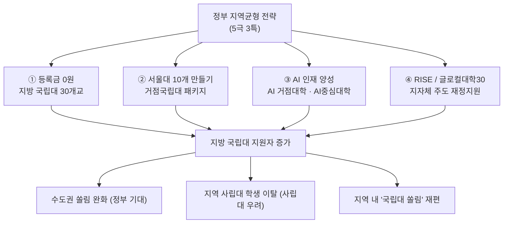

---

## 3. ① 등록금 0원 — 제도 상세

### 3.1 적용 조건

| 항목 | 내용 |
|---|---|
| 대상 학교 | 수도권(서울·경기·인천) 제외 **지방 국립대 30개교** |
| 대상 학생 | **2027학년도 신입생 전원** (소득분위 무관) |
| 제외 학과 | 의대·치의대·약대·수의대 |
| 조건 | 국가장학금 신청 + 직전학기 12학점 이상, **B학점 이상** 유지 |
| 환수 | 중도 자퇴 시 **전액 환수** 방향 검토 (도덕적 해이 방지) |
| 보완책 | 지방 사립대생 대상 **지역인재 장학금** 4,000명 → **1만 명**, 예산 1,150억 원 |

### 3.2 학년 확대 로드맵

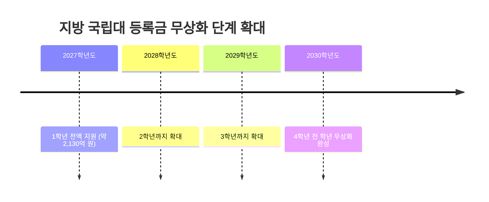

| 연도 | 지원 학년 | 누적 대상 |
|---|---|---|
| 2027 | 1학년 | 신입생 6만~6.4만 명 |
| 2028 | 1~2학년 | 약 12만 명 |
| 2029 | 1~3학년 | 약 18만 명 |
| 2030 | 1~4학년 | **전 학년 무상** |

---

## 4. ② 서울대 10개 만들기 — 거점국립대 패키지

2026년 9월 1일, 1차 패키지 지원대학 **3개교 선정: 부산대 · 전남대 · 충남대**

| 사업 | 교당 지원 규모 | 내용 |
|---|---|---|
| AI 거점대학 | **1,000억 원 내외** | 학사조직 개편, 총장 직속 AI 전담기구, 대학 전반 AI 확산 |
| 성장엔진 브랜드 단과대 | **400억 원 내외** | 학부–대학원–연구소 패키지 육성 |
| 5극3특 공유대학 | **200억 원 내외** | 지역 전략산업 연계 대학 간 공유 |
| **2026년 실집행** | **교당 약 700억 원 내외** | 2026~2030년 5년 집중 투자 |

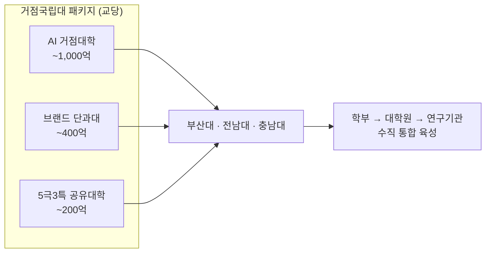

---

## 5. ③ AI 학과 확대 — 두 갈래 트랙

| 구분 | 주관 | 2026년 규모 | 특징 |
|---|---|---|---|
| **AI 거점대학** | 교육부 | 3개교 / 총 300억 원(별도 트랙) | 지방 거점국립대 한정, 지역 AX(인공지능 전환) 거점 |
| **AI중심대학** | 과기정통부 | 10개교(전환 7 + 신규 3) / 255억 원 | 대학당 연 30억 원 내외, 최대 8년(3+3+2) |

> ※ AI중심대학 기존 선정교에는 연세대·고려대·가천대 등 수도권 사립대가 다수 포함되어, **교육부 트랙(지방 국립대) ↔ 과기정통부 트랙(전국 경쟁)** 이 병행되는 구조입니다.

### 5.1 대학 안에서 실제로 바뀌는 것

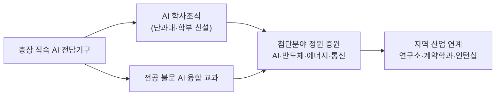

- 특정 학과 안에 가두지 않고 **대학 전체로 AI 교육을 확산**하는 것이 정부 요구 조건
- 첨단분야(AI·에너지·통신·반도체) **정원 증원**은 국립대뿐 아니라 사립대에서도 동시 진행 (예: 동국대 2026학년도 89명 증원)

---

## 6. 쟁점 — 찬반 지형

| 쟁점 | 정부·찬성 논리 | 반대·우려 |
|---|---|---|
| 수도권 쏠림 | 등록금 부담 제거로 지방 잔류 유도 | 고3 조사에서 **59%가 여전히 수도권 선택** — 효과 제한적 |
| 형평성 | 국립대는 공공재, 국가 책임 영역 | 사총협: "같은 지역인데 국립대만 무상은 **역차별**" |
| 지역 사립대 | 지역인재 장학금 2.5배 확대로 보완 | 학령인구 감소 + 지역 내 국립대 쏠림 = **이탈 가속** |
| 재정 | 단계 확대로 부담 분산 | 2030년 전 학년 확대 시 연간 소요 급증 |
| 도덕적 해이 | 자퇴 시 전액 환수 장치 | 성적 요건(B학점) 미달자 처리·중도이탈 관리 미확정 |

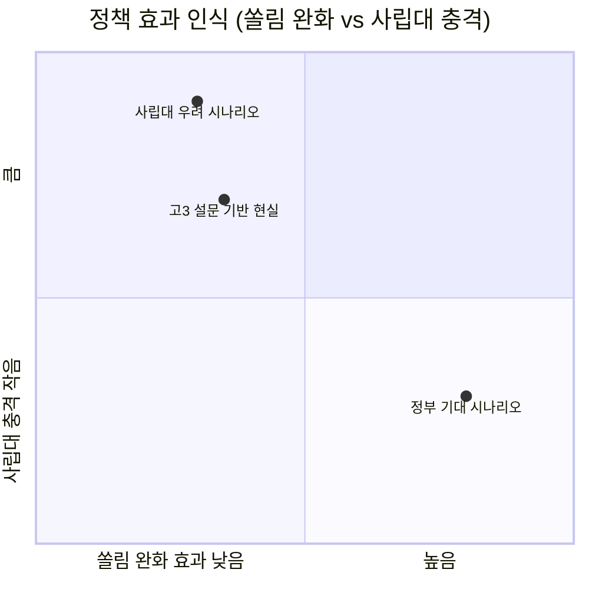

---

## 7. 진학 상담 관점 — 무엇을 조언할까

| 학생 유형 | 권고 |
|---|---|
| 현 중3~고1 (2029~2030 대입) | **전 학년 무상화 완성 구간**에 진입 — 지방 거점국립대 가성비가 최고조. AI 거점 3개교(부산대·전남대·충남대) 학과 개편 주시 |
| 현 고2 (2028 대입) | 1~2학년 무상 구간. 등록금보다 **학과 신설·정원 증원** 정보가 더 중요 |
| 현 고3 (2027 대입) | **첫 적용 학번**. 국립대 경쟁률 상승 가능성 → 안정 지원 전략 재점검 |
| 지방 사립대 지망 | 지역인재 장학금(1만 명) 요건 확인 필수 |

### 체크리스트
- [ ] 지망 국립대가 **지방 국립대 30개교 명단**에 포함되는지 (수도권 국립대 제외)
- [ ] 지망 학과가 **의·치·약·수의** 제외 대상이 아닌지
- [ ] **B학점·12학점** 유지 요건 감당 가능한지
- [ ] 해당 대학의 **AI 학사조직 개편 / 첨단분야 증원** 공고 확인
- [ ] 중도 자퇴 시 **환수** 조건 확인 (반수·편입 계획자 특히)

---

## 8. 향후 관전 포인트

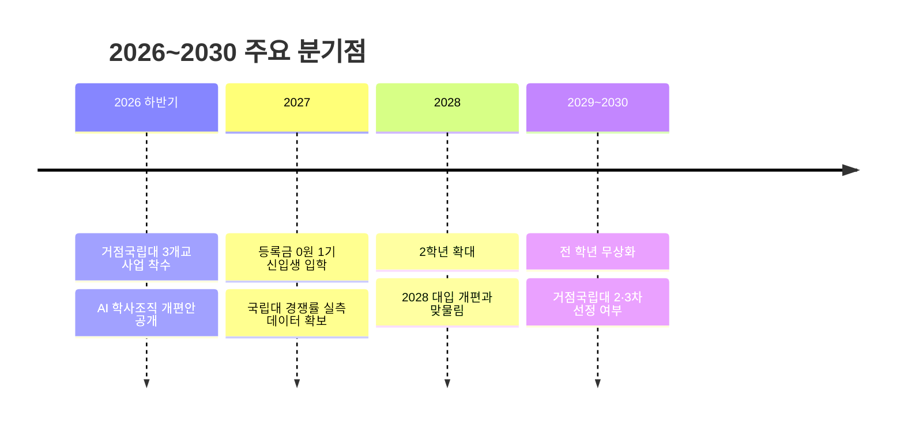

- 거점국립대 **추가 선정(2차·3차)** 대학이 어디가 될지
- 등록금 0원 정책이 **수도권 국립대·지방 사립대**로 확대될지
- AI 거점대학 사업의 **정원 증원 실제 규모** 발표
- 사립대 반발이 **국고 보조 확대**로 절충될지

---

## 9. 지방 국립대 30개교 — 명단과 특징

> ⚠️ **주의**: 교육부는 "비수도권 국립대 30개교"라고만 밝혔을 뿐 **공식 확정 명단은 미공개**(2026-09 기준)입니다.
> 아래는 **비수도권 국립 4년제 대학 로스터**를 기준으로 정리한 것이며, 확정 시 일부 조정될 수 있습니다.
> 명시적으로 **제외**가 알려진 곳: 인천대·한경국립대·경인교대 등 **수도권 국립대**.

### 9.1 권역 지도

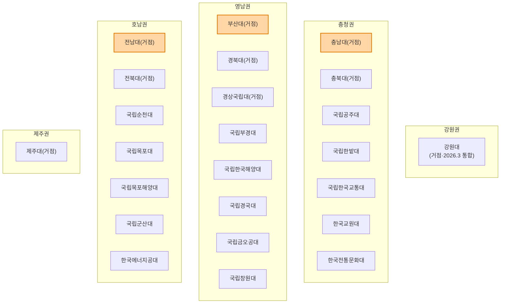

### 9.2 ① 거점국립대 9개교 (지거국)

| 대학 | 소재 | 위상 | 대표 강점·유망 학과 |
|---|---|---|---|
| **부산대** | 부산 | ★ 2026 국가대표 거점 선정 | 조선·해운, 미래모빌리티, 우주항공방산, 차세대 원자력 / **혁신제조해양융합대학**(2028 신설) / **LG전자 스마트가전공학과(30명)**, 한화 3개 계열사 계약학과, 삼성·SK하이닉스 반도체 논의 중 / 권역 반도체공동연구소 |
| **전남대** | 광주 | ★ 2026 국가대표 거점 선정 | 첨단 반도체·미래에너지·AI / **첨단융합대학** 신설 / 반도체 패키징 공동연구소(앰코 모델 → 삼성·한전 확대) / 대규모 AX 전주기 사업 |
| **충남대** | 대전 | ★ 2026 국가대표 거점 선정 | 중부권 4대 성장엔진 / **NEXUS 과학기술대학** 신설 / **KAIST 공동 교육·연구** / 권역 반도체공동연구소 |
| **경북대** | 대구 | 거점 (구 상주대 통합) | 전자·IT·반도체 전통 강세, 권역 반도체공동연구소, 의대·수의대 |
| **전북대** | 전주 | 거점 | 수소·이차전지·농생명, 탄소소재 |
| **충북대** | 청주 | 거점 | 바이오·제약(오송), 반도체(SK하이닉스 청주), 수의대 |
| **경상국립대** | 진주·창원 | 거점 (경상대+경남과기대 통합) | **우주항공·항공정비(KAI)**, **반도체특성화대학 사업단**, 해양수산 |
| **강원대** | 춘천·강릉·삼척·원주 | 거점 / **2026.3 통합 출범** | 전국 최초 광역 통합 국립대(학생 3만·교수 1,400), 바이오헬스·의료기기(원주), 수의대 |
| **제주대** | 제주 | 거점 | 해양·관광, 청정에너지(풍력), 수의대 |

### 9.3 ② 특성화·전문 국립대

| 대학 | 소재 | 성격 | 대표 강점·유망 학과 |
|---|---|---|---|
| **국립부경대** | 부산 | 해양·수산 특성화 | 해양공학, 해양생물, 수산과학, 스마트수산 |
| **국립한국해양대** | 부산 | 해양 전문 | 항해·기관(승선), 해운경영 / '1국 1해양대' 통합 논의 |
| **국립목포해양대** | 목포 | 해양 전문 | 항해·기관 / 한국해양대와 통합 논의 |
| **국립금오공과대** | 구미 | 공과 특성화 | 반도체·전자, 스마트제조 (구미 국가산단 연계) |
| **국립한밭대** | 대전 | 공과 특성화 | 반도체·IT, 산학협력 중심(대덕특구) |
| **국립창원대** | 창원 | 지역산업 연계 | 기계·방산·원전 (창원 국가산단) |
| **국립경국대** | 안동·예천 | 안동대+경북도립대 통합 | 바이오백신, 한국문화·유교, 지역 농생명 |
| **국립공주대** | 공주·천안·예산 | 종합 | 기계·전기(천안), 사범계, 농생명(예산) |
| **국립한국교통대** | 충주·증평 | 교통 특성화 | 철도·교통시스템, 항공, 물류 |
| **국립순천대** | 순천 | 글로컬 선정 | 3대 특화분야 + **5개 지산학캠퍼스** (우주항공·스마트팜) |
| **국립목포대** | 목포·무안 | 글로컬 선정 | **친환경 무탄소 선박·그린해양에너지**, 해양관광·섬 인문학 |
| **국립군산대** | 군산 | 지역산업 연계 | 이차전지·해상풍력, 자동차융합(새만금) |
| **한국교원대** | 청주 | 교원 양성 | 초·중등 교원 통합 양성 (등록금 원래 저렴, 교직 진로 특화) |
| **한국전통문화대** | 부여 | 국가유산청 소관 | 문화유산 보존·수리 (※ 교육부 소관 아님 — 대상 여부 확인 필요) |
| **한국에너지공대(KENTECH)** | 나주 | 국립대법인 | 에너지 AI·신소재·기후 (※ 별도 법인 — 대상 여부 확인 필요) |

### 9.4 ③ 지방 교육대학 8개교

| 대학 | 소재 | 비고 |
|---|---|---|
| 부산교대 | 부산 | **부산대와 통합 → 2027.3 출범 예정** |
| 대구교대 / 광주교대 / 전주교대 / 진주교대 / 청주교대 / 춘천교대 / 공주교대 | 각 지역 | 초등교원 양성, 등록금 자체가 낮아 무상화 체감 효과는 상대적으로 작음 |

> 수도권 교대(서울교대·경인교대)는 제외 대상으로 알려짐.

---

## 10. 유망 학과 지도 — 어디에 돈이 몰리나

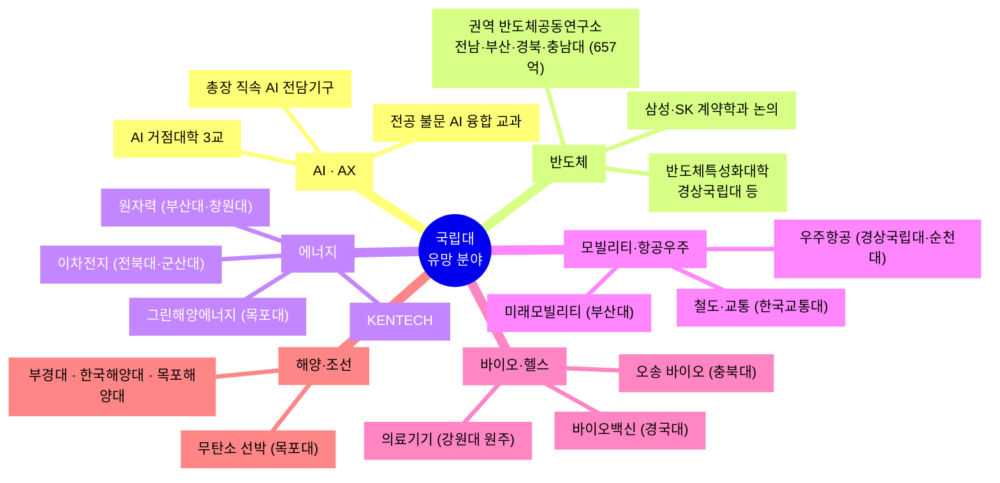

### 정부 재정지원이 붙은 첨단 8개 분야 (2026, 88개교 참여)

| 분야 | 참여 대학 수 | 국립대 대표 사례 |
|---|---|---|
| **AI** | 40개교 (별도 트랙) | AI 거점대학 3교, AI중심대학 10교 |
| 반도체 | 28개교 | 전남대·부산대·경북대·충남대(공동연구소), 경상국립대, 금오공대 |
| 이차전지 | 4개교 | 전북대, 군산대 |
| 바이오 | 4개교 | 충북대, 강원대 |
| 미래차 | 4개교 | 군산대, 공주대 |
| 디스플레이 | 3개교 | — |
| 항공우주 | 3개교 | 경상국립대, 순천대 |
| 로봇 | 2개교 | — |

> ※ '첨단산업 인재양성 부트캠프'(기업 공동 1년 단기 집중), **AI 융합과정**이 2026년 신설되어 비이공계 학생도 AI 트랙 진입 경로가 생김.

### 학과 선택 우선순위 (상담용)

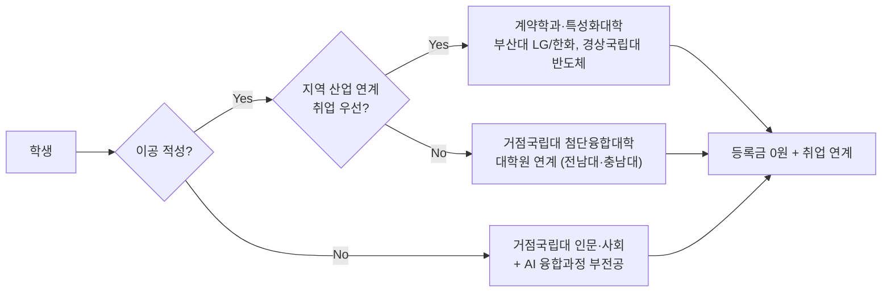

| 순위 | 선택 | 이유 |
|---|---|---|
| 1 | 계약학과 (부산대 LG·한화 등) | 등록금 0원 + 채용 연계 = 최고 가성비 |
| 2 | AI 거점대학 3교의 신설 단과대 | 5년간 교당 1,000억 투입 구간 |
| 3 | 권역 반도체공동연구소 4교 | 장비·연구 인프라 확정 (2026~) |
| 4 | 글로컬대학 특화 트랙 (목포대·순천대 등) | 5년 1,000억, 학과 개편 폭 큼 |
| 5 | 교대 | 무상화 체감 효과 작음, 교직 수요 감소 고려 |

---

## 11. 주의할 점 (팩트체크 상태)

| 항목 | 상태 |
|---|---|
| 30개교 공식 명단 | ❌ **미공개** — 9.2~9.4는 로스터 기반 추정 |
| 시행 시기 | ⚠️ 2027학년도 목표, **확정 아님** |
| 한국전통문화대·KENTECH 포함 여부 | ⚠️ 소관 부처·법인 성격 달라 확인 필요 |
| 계약학과(삼성·SK) | ⚠️ **논의 중** (LG전자 스마트가전공학과 30명은 확정 보도) |
| 통합 대학 학번 처리 | ⚠️ 강원대(2026.3), 부산대-부산교대(2027.3) 통합 후 모집단위 변동 주의 |

## 12. 왜 지금 국립대인가 — AI 시대 관점의 해석

### 12.1 세 개의 위기가 한 점에서 만난다

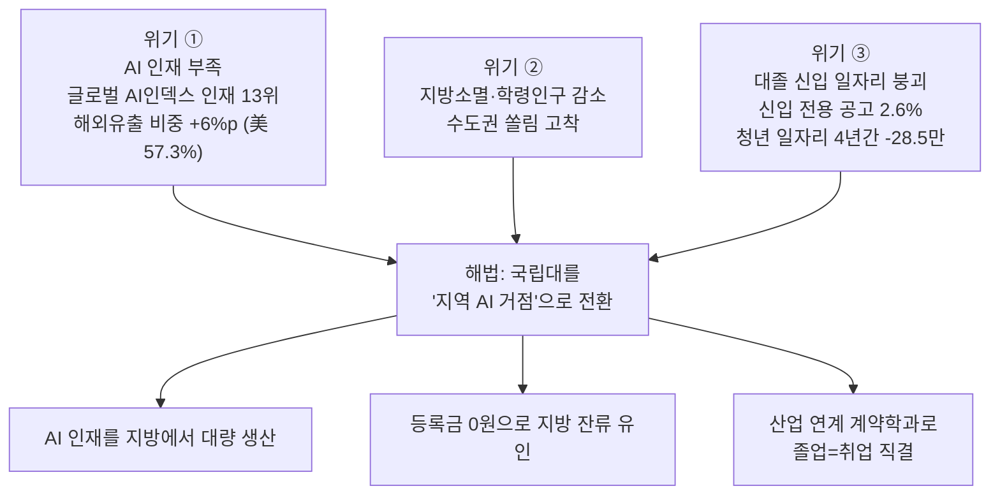

### 12.2 정부 논리를 한 줄로 정리하면

> **"AI 대전환(AX)은 전국 단위 과제인데, AI 인재는 수도권에만 있다."**
> → 지역 산업(조선·반도체·이차전지·농생명)을 AI로 전환하려면 **그 지역에 AI 인력이 상주**해야 한다.
> → 이미 지역에 캠퍼스·연구소·부속병원을 가진 **국립대가 유일하게 실행 가능한 인프라**다.
> → 그런데 학생이 안 온다 → **등록금을 0원으로 만들어 유입을 강제**한다.

### 12.3 예산으로 본 국가 우선순위 (2026)

| 항목 | 규모 | 비고 |
|---|---|---|
| **2026 국가 AI 예산 총액** | **9.9조 원** (전년 대비 약 3배) | 738개 사업 |
| ├ 기술개발 | 2.9조 원 | |
| ├ 인프라·연구기반 | 2.5조 원 | GPU 8천 장 슈퍼컴 6호기 가동 |
| ├ **AX(AI 전환)** | **2.4조 원** | ← 지역 AX가 여기 |
| ├ **인재양성** | **1.4조 원** | ← 국립대 AI 거점이 여기 |
| └ 생태계 조성 | 0.6조 원 | |
| 거점국립대 패키지 | 교당 연 700억 × 3교 × 5년 | 별도 |
| 등록금 0원 (2027) | 2,130억 원 | 2030년 전 학년 시 급증 |

> 즉 **국립대 육성은 교육 정책이 아니라 국가 AI 산업 정책의 하위 실행 수단**입니다. "AI 3대 강국" 목표의 인력 공급망이 국립대인 셈입니다.

### 12.4 AI 시대라서 국립대가 유리해진 이유 4가지

| # | 논리 | 설명 |
|---|---|---|
| 1 | **GPU·연구장비는 국가가 산다** | AI 연구는 자본집약적. 권역 반도체공동연구소(657억), 국가AI컴퓨팅센터 등 인프라는 국립대에 우선 배치. 사립대가 자력으로 따라잡기 어려움 |
| 2 | **AI는 '도메인 × AI'로 승부** | 순수 AI 인력은 이미 포화. 조선·원자력·농생명·해양 등 **지역 산업 도메인을 가진 국립대**가 오히려 차별화 가능 |
| 3 | **간판 프리미엄이 약해진다** | AI가 초급 업무를 대체하며 채용이 "학벌"에서 "포트폴리오·실무"로 이동. 계약학과·산학 프로젝트가 있는 국립대가 상대적으로 유리 |
| 4 | **비용 리스크 제로** | AI로 진로 불확실성이 커진 시대에 **등록금 0원 = 진로 실패 비용 최소화**. 재수·전과·복수전공 실험을 감당할 여력 |

### 12.5 반대로, 냉정하게 볼 지점

| 리스크 | 내용 |
|---|---|
| 효과 제한 | 고3 조사에서 **59%가 여전히 수도권 선택** — 등록금이 진학 결정의 1순위가 아님 |
| AI 인력 해외유출 | 국내에서 길러도 **미국행 57.3%** — 지역 정주까지 이어질지 미지수 |
| 신입 채용 자체가 감소 | 채용공고의 **97.4%가 경력 요구**. "좋은 대학"보다 "경력 진입로"가 병목 |
| 5년 뒤 예산 절벽 | 거점국립대 사업은 2030년 종료. 그 후 자립 가능한지 미검증 |

---

## 13. 실제 비용 점검 — 등록금 + 기숙사

### 13.1 등록금 (2026학년도 기준)

| 구분 | 연간 평균 등록금 | 4년 총액 |
|---|---|---|
| 전체 평균 | **727만 원** (전년 712만 → +2.1%) | 약 2,908만 원 |
| **국·공립대** | **약 425만 원** | 약 1,700만 원 |
| 사립대 | 약 823만 원 | 약 3,292만 원 |
| 수도권 대학 | 약 827만 원 | 약 3,308만 원 |
| 비수도권 대학 | 약 662만 원 | 약 2,648만 원 |
| (참고) 의학계열 | 약 1,033만 원 | — |
| (참고) 예체능 | 약 834만 원 | — |

**2026학년도 인상 현황**: 사립대 151곳 중 **122곳(80.8%) 인상** vs 국공립대 39곳 중 **36곳(92.3%) 동결**.
→ 등록금 0원 이전에도 이미 **국립대와 사립대 격차는 매년 벌어지는 중**입니다.

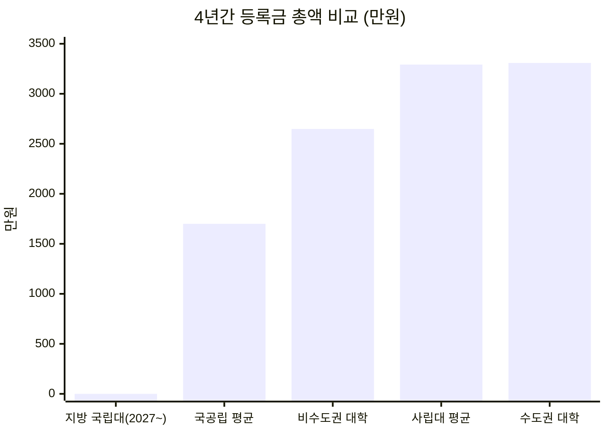

### 13.2 기숙사 — 여기가 진짜 변수

| 항목 | 수치 |
|---|---|
| 전국 대학 평균 기숙사 **수용률** | **23.4%** |
| 공공기숙사 월 평균 | 약 **30만 5천 원** |
| 행복기숙사(연합형) 월 평균 | 약 **26만 3천 원** |
| 서울 주요대 수용률 | 연세대 35%, 중앙대 17.8%, 건국대 17.1%, 경희대 17.1%, 동국대 13.7% |

> 지방 국립대는 수도권 대비 캠퍼스 부지가 넓어 **수용률이 상대적으로 높고 기숙사비도 낮은** 편입니다. 다만 대학·캠퍼스별 편차가 크므로 **지망 대학의 실제 수용률·기숙사비는 대학알리미에서 개별 확인**이 필요합니다.

### 13.3 4년 총비용 시뮬레이션

> 가정: 기숙사 10개월/년 거주, 식비·교재·교통 등 생활비는 동일 조건으로 제외

| 시나리오 | 등록금(4년) | 주거비(4년) | **합계** |
|---|---|---|---|
| **지방 국립대 + 기숙사** (2027~) | **0원** | 약 1,052만 원 (26.3만×10×4) | **약 1,052만 원** |
| 지방 국립대 + 기숙사 (현행) | 1,700만 원 | 약 1,052만 원 | 약 2,752만 원 |
| 지방 사립대 + 기숙사 | 약 2,648만 원 | 약 1,220만 원 | 약 3,868만 원 |
| 수도권 사립대 + 기숙사 | 약 3,308만 원 | 약 1,220만 원 | 약 4,528만 원 |
| 수도권 사립대 + 자취(월 70만) | 약 3,308만 원 | 약 3,360만 원 | **약 6,668만 원** |

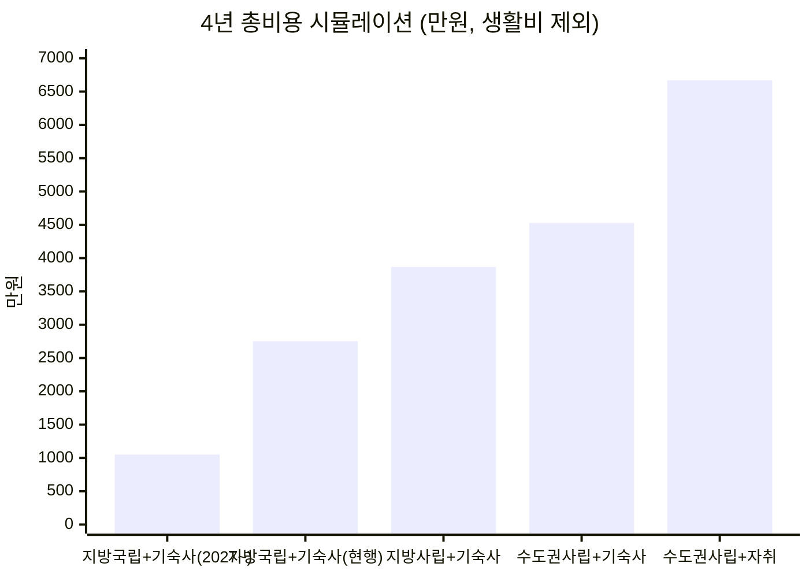

> **핵심**: 등록금 0원이 적용되면 **수도권 사립대 자취 대비 약 5,600만 원 차이**. 이는 사회초년생 기준 **약 3~4년치 저축액**에 해당합니다.
> 단, 수도권 대학의 인턴십·네트워크 접근성이라는 무형 가치는 이 표에 반영되지 않습니다.

---

## 14. 졸업하면 어떻게 되나 — 진로 전망

### 14.1 확정된 유리한 조건

| 제도 | 내용 | 국립대 졸업생에게 |
|---|---|---|
| **이전 공공기관 지역인재 채용** | 비수도권 공공기관 신규채용의 **35% 이상 의무** | **실제 채용률 71.3%** (2025년, 184곳 중 1만2,742명/1만7,871명). 2024년 64.5% → 계속 상승 |
| **지역인재 7급 공무원** | 2026년 **180명** 선발(행정 121·과기 59) | **대학별 추천 인원 상한(12명) 폐지** → 거점국립대에 유리 |
| **계약학과** | 부산대 LG전자 스마트가전공학과 30명, 한화 3개 계열사 | 채용 연계형 — 사실상 입학=취업 |
| **권역 반도체공동연구소** | 전남·부산·경북·충남대 (657억, 2026~ 장비) | 학부 단계부터 실장비 경험 |

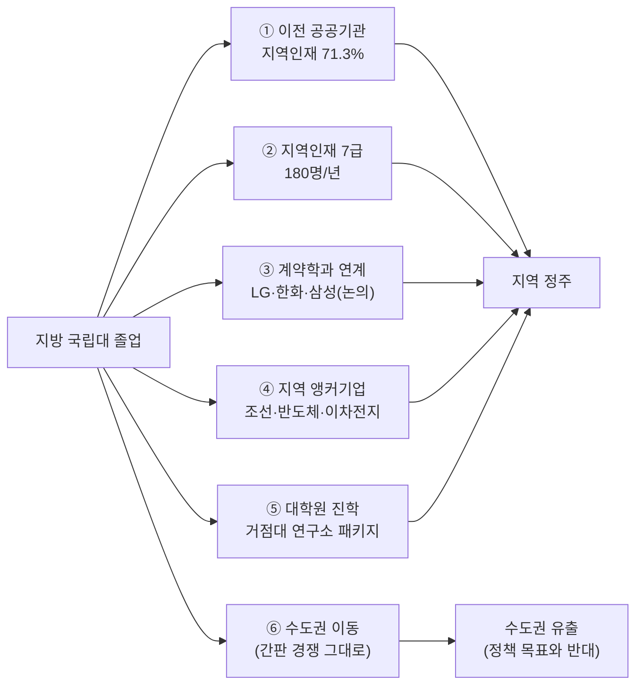

### 14.2 그런데 반드시 알아야 할 역설

> **지역인재 의무채용 도입 후 지방대 졸업생의 전체 기업 취업 확률은 오히려 약 4.1%p 낮아졌고, 공공기관 취업 확률도 약 1.5%p 낮아졌다**는 분석이 있습니다.

**해석**: 할당제는 파이를 키우는 게 아니라 **지방대생끼리 나눠 갖는 몫을 재분배**할 뿐이며, 오히려 "지방대생은 할당으로 들어온다"는 낙인 효과나 민간 채용에서의 회피를 유발했을 가능성이 제기됩니다.

### 14.3 AI 시대 공통 리스크 — 대학 유형과 무관

| 지표 | 수치 |
|---|---|
| 신입만 뽑는 채용공고 비율 | **2.6%** (경력 요구 97.4%) |
| 20대 대졸 실업률 | **8.3%** (2021년 이후 최고) |
| 청년(15~29세) 일자리 증감 | 2022.6~2026.6 **-28만 5천 개** |
| AI 대체 집중 구간 | **경력 5년 이내** 업무 (자료정리·문서초안·기초분석·단순코딩) |

> **즉, "어느 대학을 나오느냐"보다 "졸업 시점에 경력으로 인정될 무언가를 가졌느냐"가 결정적입니다.**
> 등록금 0원은 이 문제를 풀어주지 않습니다. 다만 **실패해도 빚이 없다**는 안전망은 제공합니다.

### 14.4 그래서 전략은

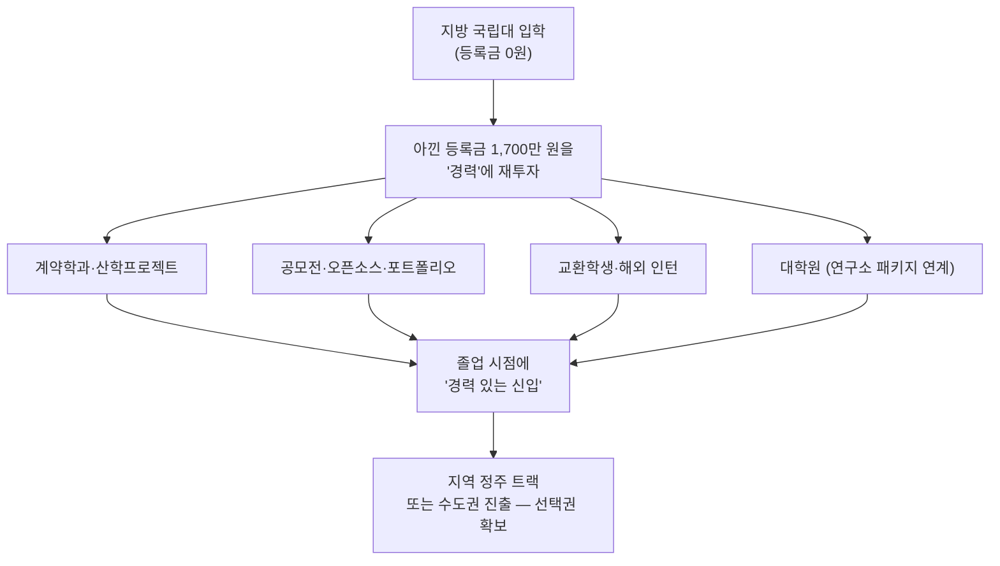

| 학생 유형 | 졸업 후 시나리오 | 권고 |
|---|---|---|
| 지역 정주 희망 | 이전 공공기관·지역 앵커기업 | 지역인재 요건(해당 지역 고교+대학 졸업) 사전 확인 필수 |
| 대기업 지향 | 계약학과 → 채용 연계 | 부산대 LG/한화, 삼성·SK 논의 추이 주시 |
| 연구·전문직 | 학부-대학원-연구소 패키지 | 거점 3교(부산·전남·충남대)가 5년간 투자 집중 구간 |
| 진로 미정 | 등록금 0원으로 탐색 기간 확보 | AI 융합과정(2026 신설)으로 비이공계도 AI 트랙 진입 |

---

## 15. 최종 요약 — 세 문장

1. **왜 국립대인가**: 교육 정책이 아니라 **국가 AI 산업 정책**입니다. 9.9조 원 AI 예산 중 AX 2.4조·인재양성 1.4조가 지역으로 흘러야 하는데, 그 그릇이 국립대뿐입니다.
2. **비용**: 등록금 0원이면 지방 국립대+기숙사 4년 총비용은 **약 1,052만 원**, 수도권 사립대 자취 대비 **약 5,600만 원 절감**입니다.
3. **졸업 후**: 이전 공공기관 지역인재 채용 **71.3%**라는 강력한 통로가 있지만, 신입 채용 자체가 붕괴(신입 전용 공고 2.6%)한 시대라 **"어느 대학"보다 "졸업 시점의 경력"**이 결정적입니다. 등록금 0원의 진짜 가치는 **아낀 1,700만 원을 경력에 재투자할 수 있다는 것**입니다.

## 출처

- [내년부터 지방 국립대 등록금 '0원' 시대 열린다…사립대는 반발 — 아주경제](https://www.ajunews.com/view/20260828171302458)
- ['등록금 0원' 지방 국립대…대학생 수도권 쏠림 막을까 — 경향신문](https://www.khan.co.kr/article/202608102108035)
- [등록금 '0원'에도 59% '수도권大 선택'…지역 내 국립대 쏠림 우려 — 매일신문](https://www.imaeil.com/page/view/2026082815270595415)
- [내년 지역 국립대 등록금 '0원'… 신입생 6만 명 전액 장학금 추진 — 한국일보](https://www.hankookilbo.com/news/article/A2026080515580002394)
- [지방국립대 '등록금 0원' 추진…자퇴시 환수 안하면 도덕적 해이 우려 — 머니투데이](https://www.mt.co.kr/policy/2026/08/06/2026080614101814308)
- [지방국립대 등록금 '공짜' 시대 열린다…그만두면 '전액 환수' — 헤럴드경제](https://biz.heraldcorp.com/article/10855866)
- [사총협 "국립대 등록금 0원, 지역대학 갈등 키운다" — 매일신문](https://www.imaeil.com/page/view/2026083014401369877)
- ["'지방 국립대 등록금 0원'? 지역 균형 아닌 역차별" — 펜앤마이크](https://www.pennmike.com/news/articleView.html?idxno=126694)
- ['서울대 10개 만들기' 본격화…거점국립대 3개교 선정 교당 1000억 지원 — 아주경제](https://www.ajunews.com/view/20260617141913163)
- ['서울대 10개' 만들기 거점국립대 3곳…부산대·전남대·충남대 선정 — 더퍼블릭](https://www.thepublic.kr/news/articleView.html?idxno=317148)
- [올해 지방 거점국립대 3곳에 1천억씩 투자…'성장엔진·AI' 지역인재 키운다 — 대학지성 In&Out](https://www.unipress.co.kr/news/articleView.html?idxno=14383)
- [거점국립대 집중 육성 박차…올해 3곳 선정에 대학별 1000억 추가 지원 — 더쎈뉴스](https://www.mhns.co.kr/news/articleView.html?idxno=750631)
- [과기정통부, 2026년 AI중심대학 10개 대학 신규 사업 공고 — AX Planable](https://axplanable.com/m/581)
- [정부, 연세대·고려대 등 7개 'AI중심대학' 선정 — 연세대 인공지능융합대학](https://computing.yonsei.ac.kr/bbs/board.php?bo_table=sub4_4&wr_id=216)
- [동국대, 2026학년도 첨단분야 학과 정원 89명 증원 — 중앙이코노미뉴스](https://www.joongangenews.com/news/articleView.html?idxno=418797)
- [교육부 RISE·글로컬대학 정책 페이지](https://www.moe.go.kr/boardCnts/listRenew.do?boardID=72775&renew=72775&m=0316&s=moe)
- [2026년까지 글로컬대학 30개교 지정…5년간 1000억 원 지원 — 한국대학신문](https://news.unn.net/news/articleView.html?idxno=545357)
- [대한민국의 국립 대학 목록 — 위키백과](https://ko.wikipedia.org/wiki/%EB%8C%80%ED%95%9C%EB%AF%BC%EA%B5%AD%EC%9D%98_%EA%B5%AD%EB%A6%BD_%EB%8C%80%ED%95%99_%EB%AA%A9%EB%A1%9D)
- [국가거점국립대학교 총장협의회 — 나무위키](https://namu.wiki/w/%EA%B5%AD%EA%B0%80%EA%B1%B0%EC%A0%90%EA%B5%AD%EB%A6%BD%EB%8C%80%ED%95%99%EA%B5%90%20%EC%B4%9D%EC%9E%A5%ED%98%91%EC%9D%98%ED%9A%8C)
- [LG·한화·삼성 계약학과 생긴다… 부산대·전남대·충남대 '국가대표 거점 국립대' 선정 — 한국일보](https://www.hankookilbo.com/news/article/A2026090115030000904)
- [전남대·부산대·경북대·충남대, 권역별 반도체공동연구소 건립 대학 선정 — 교육플러스](https://www.edpl.co.kr/news/articleView.html?idxno=9187)
- [국립대학 권역별 반도체공동연구소 4개 대학 선정 — 교육부 보도자료](https://www.moe.go.kr/boardCnts/viewRenew.do?boardID=294&boardSeq=95040&lev=0&statusYN=W&page=1&s=moe&m=020402&opType=N)
- [교육부, 강원대-강릉원주대 통합 승인…'강원 1도 1국립대' 출범 본격화 — 전자신문](https://www.etnews.com/20250529000406)
- [강원대-강릉원주대 등 국·공립대 통합 4건 최종 승인 — 한국대학신문](https://news.unn.net/news/articleView.html?idxno=579417)
- [경상국립대학교 반도체특성화대학사업단](https://ultra.gnu.ac.kr/main/)
- [국립목포대학교 글로컬대학추진단](https://glocal.mokpo.ac.kr/)
- [2026년 고등교육 재정지원 계획 (첨단분야 8개 분야 88개교)](https://bi.hknu.ac.kr/bbs/ir/430/109867/download.do)
- [지방국립대 등록금 0원…30곳·의학계열 제외 — YouTube Shorts](https://www.youtube.com/shorts/mlzu2N0ByVs)
- [올해 대학 등록금, 연간 1인당 평균 727만 원…전년 대비 2.1% 상승 — 교수신문](https://www.kyosu.net/news/articleView.html?idxno=205119)
- [올해 4년제大 125개교 등록금 인상…31개교는 3% 이상 올려 — 대학지성 In&Out](https://www.unipress.co.kr/news/articleView.html?idxno=14139)
- [2027 수시/기숙사지원제도 — 대학생 공공기숙사 — 한국대학신문](https://news.unn.net/news/articleView.html?idxno=594851)
- [2026대입잣대 상위15개대 기숙사 수용률 — 베리타스알파](https://www.veritas-a.com/news/articleView.html?idxno=579780)
- [한국사학진흥재단 대학별 기숙사 수용 현황 — 공공데이터포털](https://www.data.go.kr/data/15094204/fileData.do)
- [대한민국 인공지능행동계획(인공지능 기본계획 2026~2028) — 국가인공지능전략위원회·과기정통부](https://smartcity.go.kr/wp-content/uploads/2026/03/%EC%95%88%EA%B1%B41%EB%8C%80%ED%95%9C%EB%AF%BC%EA%B5%AD%EC%9D%B8%EA%B3%B5%EC%A7%80%EB%8A%A5%ED%96%89%EB%8F%99%EA%B3%84%ED%9A%8D%EC%9D%B8%EA%B3%B5%EC%A7%80%EB%8A%A5%EA%B8%B0%EB%B3%B8%EA%B3%84%ED%9A%8D20262028.pdf)
- [AI 3대 강국 도약을 위한 예산 현황과 향후 과제 — 국회예산정책처](https://www.nabo.go.kr/board/file/down.do?fid=33319071)
- [첨단 GPU 1만8천 장 확보·차세대 AI 원천기술 개발 — KDI 나라경제](https://eiec.kdi.re.kr/publish/naraView.do?fcode=00002000040000100005&cidx=15122&sel_year=2025&sel_month=04)
- [공공기관 채용 10명 중 7명 지역인재…지방대 위기 해법 될까](https://v.daum.net/v/20260621160347765)
- [공공기관 취업은 지방대로? 신입 70%가 '지역인재' — 더스쿠프](https://www.thescoop.co.kr/news/articleView.html?idxno=310607)
- [올해 지역인재 7급 180명 선발…대학별 추천 인원 상한 폐지](https://v.daum.net/v/20260102154940636)
- [공공기관의 이전 지역인재 채용 목표제에 대한 연구 — 한국조세재정연구원](https://www.kipf.re.kr/cmm/fms/FileDown.do?atchFileId=FILE_000000023724Hw0&fileSn=0)
- [대학 나오면 취업 유리하다고?…AI 시대, 뒤집힌 청년 실업률 — 더스쿠프](https://www.thescoop.co.kr/news/articleView.html?idxno=311301)
- [2026년 채용시장 분석: 경력 우대 강화와 신입채용 감소 배경](https://insight.goover.ai/report/202603/go-public-report-ko-36252d08-c501-49b9-9264-92100e9eea4c-0-0.html)
- [대졸 실업자 5년 만에 최대…"AI가 청년 일자리 대체" — 서울경제](https://www.sedaily.com/article/20069330)
