# 논·서술형 수능 — 해외 5개국 기출로 배우는 '미래형 수능' 대비

> **한 줄 요약** — 정답을 고르는 수능에서 **생각을 쓰는 수능**으로. 아직 확정된 제도는 아니지만, 프랑스·중국·독일·스위스·영국이 이미 운영하는 국가시험을 벤치마킹하면 **우리 청소년이 지금 무엇을 준비해야 하는지**가 분명해집니다.

| 항목 | 내용 |
|---|---|
| 주제 | 논·서술형 수능(미래형 수능) + 해외 5개국 기출 벤치마킹 |
| 기준일 | 2026-09 |
| 대상 | 초·중·고 학생과 학부모, 진로·입시 지도 교사 |
| 연동 화면 | 커리어 탐색 › 대입 › **논·서술형 수능** (`/jobs/explore?tab=university&subView=essay-suneung`) |
| 핵심 메시지 | 조기 사교육이 아니라 **읽기·요약·근거 대며 쓰기 습관**이 가장 확실하고 저렴한 대비 |

---

## 0. 한눈에 보기

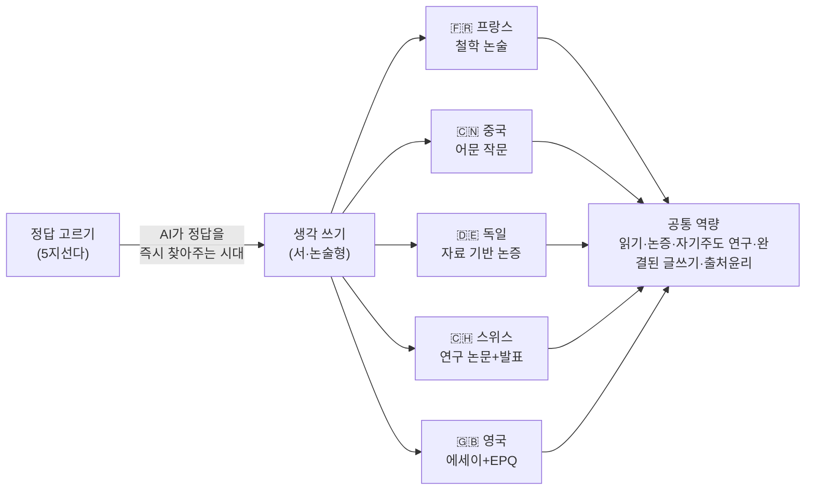

- **논·서술형 수능**은 5지선다 대신 학생이 **근거를 들어 글로 답을 쓰는** 시험입니다.
- **2028 수능에는 포함되지 않았습니다.** 지금은 국가교육위원회의 검토·공론화 단계이며, **현재 초6이 치르는 2033학년도 대입부터 적용하는 방안이 유력하게 거론(미확정)**됩니다.
- 5개국의 공통점은 하나 — **"읽고, 생각하고, 근거를 들어 쓴다."** 학년이 오를수록 분량과 자기주도성을 키우는 것이 가장 확실한 대비입니다.

---

## 1. 논·서술형 수능이란?

### 1-1. 정의와 배경

논·서술형 수능은 5지선다에서 답을 고르는 대신, 학생이 근거를 들어 문장·글로 답을 쓰는 시험입니다. **2028 대입 개편**(선택과목 없는 통합형·5등급 절대평가)에는 포함되지 않았습니다. 대신 국가교육위원회 산하 **대학입학제도 특별위원회**가 '수능 전 과목 절대평가 + 서·논술형 문항 도입'을 함께 검토 중입니다.

**왜 지금인가?**

- AI가 정답을 즉시 찾아주는 시대 — 고르기보다 **스스로 사고하고 표현하는 힘**을 평가하려는 흐름
- 암기·문제풀이 중심에서 **문해력·논증력** 중심으로 무게 이동
- 이미 프랑스·독일·중국·스위스·영국 등 여러 나라가 국가시험에서 서·논술형을 운영

### 1-2. 진행 상황 타임라인

| 시점 | 내용 |
|---|---|
| 2023.12 | 2028 대입 개편안 확정 — 통합형·5등급 절대평가. **논·서술형은 채택되지 않음** |
| 2025.12 | 여러 시·도 교육감이 수능 전 과목 절대평가·서·논술형 전환을 잇따라 제안 |
| 2026 | 국가교육위원회 대학입학제도 특별위원회, 전 과목 절대평가 + 서·논술형 문항 도입 검토 착수 |
| 2026.10(예정) | 중장기 국가교육발전계획(2028~2037) 공개 — 미래형 수능 방향 포함 전망 |
| 2027.3(예정) | 국민 의견 수렴 후 최종안 확정 전망 |
| **2033학년도(거론)** | **현재 초6이 치르는 대입부터 서·논술형 적용안이 유력하게 거론(미확정)** |

### 1-3. 핵심 숫자

| 지표 | 값 | 설명 |
|---|---|---|
| 적용 대상 수능 | **2033학년도?** | 현재 초6이 치르는 대입부터 적용안 유력 거론 · 미확정 |
| 해외 참고 사례 | **5개국** | 프랑스·독일·중국·스위스·영국 |
| 최대 쟁점 | **채점 공정성** | AI 채점·복수 채점 접목이 함께 논의 |

### 1-4. 쟁점 3가지

| 쟁점 | 내용 |
|---|---|
| 채점 객관성·공정성 | 채점자에 따라 편차가 생길 수 있어 **AI 채점·복수 채점** 등 보완책이 함께 논의 |
| 학교 현장 평가 전문성 | 교사의 서·논술 평가 역량과 **내신에서의 서·논술형 확대**가 함께 검토 |
| 사교육 과열 우려 | PD수첩 '7세부터 준비하는 논술형 수능'처럼, 아직 도입도 안 된 시험에 **조기 사교육**이 붙는 것에 대한 우려 |

### 1-5. 전문가·참고 영상 관점

- **PD수첩 「7세부터 준비하는 논술형 수능」**(MBC 시사교양) — 논술형 수능 도입 논의와 조기 사교육 과열 현상.
- **이범(교육평론가) 「수능은 결국 이렇게 바뀝니다」**
  - 한국은 미국식·유럽식 입시를 제대로 해본 적이 없다 — 어느 쪽을 택해도 '사교육 대란' 우려('대입 미신' 비판).
  - 수능을 서·논술형으로 바꾸려면 초·중등이 개별화 지도로 함께 바뀌어야 하는데, 공교육이 못 따라가면 학생은 사교육으로 몰린다.
  - 방향은 약 **15년에 걸친 단계적 전환** — 서·논술형 비중을 70%, 궁극적으로 100%까지.
  - **핵심 경고: 대학 서열 구조를 그대로 둔 채 시험 형식만 바꾸면, 경쟁은 대학별 전형·사교육으로 옮겨갈 뿐.**

---

## 2. 해외 5개국 기출 심층 분석

> 아래 기출은 **시험 형식을 이해하기 위한 참고용**입니다. 국가·연도·시험지(주/성별)에 따라 실제 문제는 달라집니다. 프랑스·중국은 국가 단위 공개 기출을, 독일·스위스·영국은 주(州)/시험위원회/시험위원단이 출제하므로 **대표 과제 유형과 실제 예시**를 함께 정리했습니다.

### 2-1. 🇫🇷 프랑스 — 바칼로레아 철학 (Baccalauréat · Philosophie)

| 구분 | 내용 |
|---|---|
| 위상 | 고3(Terminale) **전 계열 필수**, 바칼로레아의 첫 시험이자 상징 (매년 약 53만 명 응시) |
| 시간·형식 | **4시간**, 3개 주제 중 **1개 선택** — 논술(dissertation) 2 + 텍스트 해설(explication de texte) 1 |
| 평가 요소 | 개념 정의 → **정(주장)·반(반론)·합(종합)** 전개 → 결론의 구조, 철학자·사례 인용 |
| 참고 | 2020년은 코로나로 국가 필기 미실시(내신 대체), **개편된 '일반계열(série générale)' 통합 시험은 2021년부터**. 2019년 이전은 계열(L/ES/S)별 상이 |

**기출 문제 (2021~2024 일반계열 + 2019 계열별 L/ES/S)**

| 연도 | 과목/유형 | 문제 (한국어) | 원문 |
|---|---|---|---|
| 2024 | 논술 ① | 과학은 진리에 대한 우리의 욕구를 충족시킬 수 있는가? | *La science peut-elle satisfaire notre besoin de vérité ?* |
| 2024 | 논술 ② | 국가는 우리에게 무언가를 빚지고 있는가? | *L'État nous doit-il quelque chose ?* |
| 2024 | 텍스트 해설 | 시몬 베유(Simone Weil)의 노동·인간에 관한 텍스트 해설 | *Simone Weil* |
| 2023 | 논술 ① | 행복은 이성의 문제인가? | *Le bonheur est-il affaire de raison ?* |
| 2023 | 논술 ② | 평화를 원하는 것은 곧 정의를 원하는 것인가? | *Vouloir la paix, est-ce vouloir la justice ?* |
| 2023 | 텍스트 해설 | 클로드 레비스트로스(Lévi-Strauss)의 인류학 텍스트 해설 | *Claude Lévi-Strauss* |
| 2022 | 논술 ① | 자신의 권리를 모든 수단을 동원해 지키는 것은 정당한가? | *Est-il juste de défendre ses droits par tous les moyens ?* |
| 2022 | 논술 ② | 자유란 누구에게도 복종하지 않는 것인가? | *La liberté consiste-t-elle à n'obéir à personne ?* |
| 2022 | 텍스트 해설 | 디드로 『백과전서』(1751) 발췌 해설 | *Denis Diderot, Encyclopédie (1751)* |
| 2021 | 논술 ① | 토론한다는 것은 폭력을 포기하는 것인가? | *Discuter, est-ce renoncer à la violence ?* |
| 2021 | 논술 ② | 무의식은 모든 형태의 인식에서 벗어나는가? | *L'inconscient échappe-t-il à toute forme de connaissance ?* |
| 2021 | 텍스트 해설 | 뒤르켐(Durkheim) 『사회분업론』 발췌 해설 | *Émile Durkheim, De la division du travail social* |
| 2024(기술계열) | 논술 예시 | 자연은 인간에게 적대적인가? / 예술가는 자기 작업의 주인인가? | *La nature est-elle hostile à l'Homme ? / L'artiste est-il maître de son travail ?* |
| 2019(L계열) | 논술 ① | 시간에서 벗어나는 것이 가능한가? | *Est-il possible d'échapper au temps ?* |
| 2019(S계열) | 논술 ① | 문화의 다양성은 인류의 통일을 가로막는가? | *La pluralité des cultures fait-elle obstacle à l'unité du genre humain ?* |
| 2019(S계열) | 논술 ② | 자기 의무를 인정하는 것은 자유를 포기하는 것인가? | *Reconnaître ses devoirs, est-ce renoncer à sa liberté ?* |
| 2019(ES계열) | 논술 ② | 노동은 인간을 분열시키는가? | *Le travail divise-t-il les hommes ?* |
| 2019 | 텍스트 해설 | 프로이트 『환상의 미래』(1927) 발췌 해설 | *Freud, L'Avenir d'une illusion (1927)* |

**한국 학생이 배울 점** — 개념을 스스로 정의하고 찬반 양쪽을 세운 뒤 종합하는 **변증법(정-반-합)** 구조. **정답보다 논증 과정**을 평가한다는 점이 핵심입니다.

**준비 팁**
- 자유·정의·행복·기술 같은 추상 개념을 **'정의부터 다시 써보기'**로 연습.
- '예/아니오'가 아니라 **'어떤 조건에서 그러한가'**로 답을 여는 훈련.
- **정(주장)-반(반론)-합(종합)** 3단 구조로 800~1000자 논술을 시간 안에 써보기.

---

### 2-2. 🇨🇳 중국 — 가오카오 어문 작문 (高考 语文 · 作文)

| 구분 | 내용 |
|---|---|
| 위상 | 가오카오 어문(150점)의 **마지막 대문항** |
| 배점·분량 | 전국권 **60점 · 800자 이상** (지역별 상이 — 베이징 대작문 50점+미작문, 상하이 등) |
| 형식 | 짧은 **제시문(材料)**을 읽고 논설문·서사문 등 문체를 자유롭게 골라 **완결된 글** 작성. 시험지가 지역별로 다름(신과표 I·II권, 전국 갑·을권, 베이징·상하이·톈진·저장 등) |
| 평가 요소 | 제시문에서 **나만의 논점(立意)** 세우기, 논점의 참신함과 논증 구성 |

**기출 문제 (2020~2024 · 주요 시험지)**

| 연도 | 시험지 | 주제(한국어) | 원문 핵심 |
|---|---|---|---|
| 2024 | 신과표 I권 | 인터넷·AI로 많은 문제가 빠르게 답을 얻는데, 그렇다면 **우리의 질문은 줄어들까?** | 越来越多的问题能很快得到答案，那么，我们的问题是否会越来越少？ |
| 2024 | 신과표 II권 | 인류의 우주여행처럼 우리도 계속 **미지의 영역에 도달**한다 | 我们每个人也都在不断抵达未知之境 |
| 2024 | 전국 갑권 | 사람은 타인과 어울리는 법을 배워야 한다 — **솔직한 소통(坦诚交流)** | 坦诚交流才有可能迎来真正的相遇 |
| 2024 | 전국 을권 | 우주 탐사를 소재로 한 '도달·탐색' | 我们每个人也都在不断抵达未知之境 |
| 2024 | 베이징 | ①의론문 **「오래될수록 새롭다(历久弥新)」** / ②기술문 **「열다(打开)」** 중 택1 | 历久弥新 / 打开 |
| 2024 | 톈진 | **'규정됨(被定义)'과 '스스로 규정함(自定义)'** | 被定义 / 自定义 |
| 2024 | 상하이 | 사물을 평가할 때의 **'인정도(认可度)'** | 认可度 |
| 2023 | 신과표 I권 | **좋은 이야기의 힘** — 표현·소통을 돕고 마음을 움직인다 | 好的故事，可以帮我们更好地表达和沟通 |
| 2023 | 신과표 II권 | 청소년이 자기 공간에서 성장 — **'방해받지 않고 잠시 조용히(安静一下不被打扰)'** | 安静一下不被打扰 |
| 2023 | 전국 갑권 | 기술로 시간을 더 잘 통제하지만, **시간의 종(仆人)**이 되기도 한다 | 有人因此成了时间的仆人 |
| 2023 | 전국 을권 | **'한 송이 꽃으론 봄이 아니다'** — 인류운명공동체 | 一花独放不是春，百花齐放春满园 |
| 2023 | 베이징 | ①의론문 **「지속 항해(续航)」** / ②기술문 **「등장(亮相)」** | 续航 / 亮相 |
| 2023 | 상하이 | 낯선 세계를 탐구하려는 것은 **오직 호기심 때문인가?** | 好奇心 |
| 2022 | 신고고 I권 | 바둑 용어 **본수·묘수·속수(本手·妙手·俗手)**로 본 기본기와 창의 | 本手、妙手、俗手 |
| 2022 | 신고고 II권 | **선택·창조·미래(选择·创造·未来)** — 각 분야 분투하는 사람들 | 选择·创造·未来 |
| 2022 | 전국 갑권 | 『홍루몽』 대관원 편액 짓기 — **차용·화용·독창(移用·化用·独创)** | 翼然 / 泻玉 / 沁芳 |
| 2022 | 전국 을권 | 베이징 두 번의 올림픽 — **'뛰어넘고 다시 뛰어넘다(跨越，再跨越)'** | 跨越，再跨越 |
| 2021 | 신고고 I권 | 마오쩌둥 『체육의 연구』 — 강함·약함의 전환, **'체육의 효과(体育之效)'** | 体育之效 |
| 2021 | 전국 갑권 | 혁명·사회주의 문화 속 청년의 **'해도 됨(可为)·해냄(有为)'** | 可为与有为 |
| 2021 | 전국 을권 | 양웅의 '활·화살·과녁' 비유로 본 **이상 추구** | 修身以为弓 |
| 2021 | 신고고 II권 | 붓글씨 '描红'에 빗댄 **'글자 쓰기와 사람 되기(写人与做人)'** | 写人与做人 |
| 2021 | 상하이 | **시간의 침전(时间的沉淀)** — 시간이 사물의 가치를 인정하게 하는가 | 时间的沉淀 |
| 2020 | 전국 I권 | 제 환공·관중·포숙 — **역사 인물 평가** 발언문 | 齐桓公·管仲·鲍叔 |
| 2020 | 신고고 I권(산둥) | 코로나 방역이 보여준 **'거리와 연결(距离与联系)'** | 疫情中的距离与联系 |
| 2020 | 상하이 | 중요한 **전환(转折)**은 예상치 못한 데서 오는가 | 转折 |

**한국 학생이 배울 점** — **AI 시대에 딱 맞는 질문**입니다. '검색·AI로 답이 나오는 시대에 인간의 질문과 사고가 왜 여전히 중요한가'를 스스로 논증하게 합니다.

**준비 팁**
- 짧은 제시문을 읽고 **'나만의 논점' 한 문장**으로 뽑는 연습.
- AI가 답을 주는 시대에 **'좋은 질문'이란 무엇인지** 구체적 사례로 논증.
- **도입-전개(2~3단락)-결론**의 800자 완결 구성을 제한 시간 안에.

---

### 2-3. 🇩🇪 독일 — 아비투어 독일어 (Abitur · Deutsch)

| 구분 | 내용 |
|---|---|
| 위상 | 대학 진학 자격시험(아비투어)의 핵심 과목, **주(州)별 출제 분권형** |
| 형식 | 여러 **과제 유형(Aufgabenart)** 중 택1, 장문 서술 |
| 평가 요소 | 문학·실용 텍스트 분석 + **여러 자료를 근거로 자기 논증문** 구성, 인용 출처 표기 |
| 대표 지정 작품 | 괴테 『파우스트』, 카프카 『소송』·『변신』, 뷔히너 『보이체크』, 프리쉬 『호모 파버』, 레싱 『현자 나탄』, 율리 체 『코르푸스 델릭티』 등 (주·연도별 상이) |

**과제 유형과 대표 예시** (KMK 표준 과제 유형 기준)

| 유형 코드 | 과제 유형 | 대표 예시 |
|---|---|---|
| IA | 문학 텍스트 해석(Interpretation) | 카프카 『변신』 발췌 장면을 해석 — 형식과 의미의 연결 |
| IB | 비교 해석(Vergleichende Interpretation) | 두 시(예: 낭만주의 vs 표현주의)를 제시하고 **비교 해석** |
| II | 실용 텍스트 분석(Analyse pragmatischer Texte) | 칼럼/사설을 분석 — 출처·필자·발표 맥락 명시 후 논증 구조 검토 |
| IIIA | 문학 텍스트 기반 논술(Erörterung) | 지정 작품(예: 『파우스트』)의 주제를 자료와 함께 **논증적으로 검토** |
| IIIB | 실용 텍스트 기반 논술(textbasiert) | 사회 쟁점 사설을 읽고 그 주장을 **찬반으로 논증** |
| IVA | 자료 기반 정보문(informierend) | 여러 자료(통계·인터뷰)를 종합해 **설명하는 글** 작성 |
| IVB | 자료 기반 논증문(argumentierend) | 여러 자료를 읽고 특정 쟁점에 **논평(Kommentar)**을 근거 들어 작성 |
| 예시 | 문학 해석(시) | 제시된 시 한 편의 **운율·구조와 의미**를 연결해 해석 |
| 예시 | 드라마 장면 해석 | 레싱 『현자 나탄』의 한 장면을 인물 관계 중심으로 해석 |
| 예시 | 자료 기반 논증(디지털) | '디지털 미디어와 청소년'에 관한 자료 3~4개로 **논평** 작성 |

**한국 학생이 배울 점** — 여러 출처의 자료를 종합해 근거 있는 글을 쓰는 **'자료 기반 논증'**이 핵심. **인용 출처 표기와 맥락 분석**이 채점 기준에 포함됩니다.

**준비 팁**
- 서로 다른 자료 3~4개를 읽고 **공통점·상충점**을 정리한 뒤 내 입장을 쓰기.
- 인용할 때 **출처·필자·발표 맥락**을 먼저 밝히는 습관.
- 문학 지문 해석은 **형식(운율·구조)과 의미를 반드시 연결**해 서술.

---

### 2-4. 🇨🇭 스위스 — 마투라 (Matura) + 마투라 작업

| 구분 | 내용 |
|---|---|
| 위상 | 대학 입학 자격(Matura), **최소 5과목 필기** |
| 제1언어 필기 | 독일어·프랑스어 등 제1언어에서 **텍스트 분석·논술(Erörterung) 에세이** |
| 마투라 작업 | 5·6학기 동안 **스스로 주제를 정해 연구 논문**을 쓰고 **구두 발표**까지 — 성적표의 **13번째 성적**으로 반영 |
| 평가 요소 | 장문 에세이 + 자기주도 연구 역량, **SBFI(연방 교육연구혁신처) 지침**의 윤리·표절 규정 준수 |

**과제 유형과 대표 예시**

| 구분 | 과제 유형 | 대표 예시 |
|---|---|---|
| 필기 | 텍스트 분석(Textanalyse) | 제시된 문학·논설 텍스트를 분석 |
| 필기 | 자유/텍스트 기반 논술(Erörterung) | 주어진 명제에 대해 찬반을 세워 **논술문** 작성 (예: "우리는 할 수 있는 모든 것을 해야 하는가?") |
| 필기 | 창의적/문학적 글쓰기 | 제시 상황·모티프로 **서사/성찰 글** 창작 |
| 필기 | 자료 기반 논술 | 여러 자료를 엮어 **근거 있는 입장** 전개 |
| 연구 | **마투라 작업(Maturaarbeit)** | 학생이 직접 정한 주제로 수개월간 연구 논문 집필 → **구두 발표·심사**, 윤리·표절 지침 준수 |

**한국 학생이 배울 점** — 단발 시험 답안을 넘어 **'장기 연구 → 집필 → 발표'**까지 평가합니다. **표절·연구윤리**가 채점 요소라는 점이 특징입니다.

**준비 팁**
- 관심 주제 하나로 **몇 달짜리 탐구보고서(질문→조사→결론)**를 한 편 완성.
- 쓴 내용을 **말로 설명(구두 발표)**하는 연습으로 쓰기와 말하기를 연결.
- **인용·출처 표기와 표절 회피** 규칙을 처음부터 지키기.

---

### 2-5. 🇬🇧 영국 — A레벨 논술형 과목 + EPQ

| 구분 | 내용 |
|---|---|
| 위상 | 대학 진학 A레벨 — 영문학·역사·정치·경제 등 다수 과목이 **에세이형 시험** |
| 형식 | 지정 작품/사료 기반 논증 에세이 + **처음 보는(unseen) 지문** 분석 |
| EPQ | Extended Project Qualification — **약 5,000단어** 독립 연구 논문 + 과정 성찰 |
| 평가 요소 | **'어느 정도인가(To what extent)'** 식 균형 논증, 자료 신뢰성·한계 평가, 자기주도 연구 |

**과목별 대표 문항 유형** (AQA/Edexcel/OCR 계열 실제 명령어 스타일)

| 과목 | 명령어 유형 | 대표 예시 |
|---|---|---|
| 역사(History) | *To what extent / Assess the validity* | "바이마르 공화국 붕괴의 주된 원인은 대공황이었다." 이 견해의 타당성을 평가하라 |
| **역사(2023 AQA·튜더)** | *Assess the validity* | "튜더 시대 예술·문학·음악은 '모두를 위한 황금기'였다"는 견해의 타당성 평가 **(실제 출제)** |
| **역사(2023 AQA·독일 1871~1991)** | *Assess the validity* | "1966년 대연정이 서독을 다시 정상 궤도에 올려놓았다"는 견해의 타당성 평가 **(실제 출제)** |
| 역사(사료) | *How far do you agree* | 제시된 사료들을 근거로 특정 해석에 **어느 정도 동의하는지** 논증 |
| 영문학 | *unseen + set text* | 처음 보는 지문 분석(25점) + 지정 작품 에세이(25점) |
| 영문학 | *Explore / Compare* | "『오셀로』에서 질투는 파괴적 힘으로 그려진다" — 탐구하라 |
| 정치(Politics) | *Evaluate the view* | "영국 총리는 사실상 대통령이 되었다"는 견해를 평가하라 |
| 경제(Economics) | *Assess / Evaluate* | 최저가격제의 미시·거시 경제적 효과를 평가하라 |
| 지리(Geography) | *Assess / To what extent* | "세계화가 지역 불평등의 가장 큰 원인이다" — 평가하라 |
| 종교학(RS) | *Discuss / Critically assess* | "아퀴나스의 우주론적 논증은 실패한다" — 논하라 |
| 사회학(Sociology) | *Evaluate* | 계층 이동에 대한 사회학적 설명을 평가하라 |
| 심리학(Psychology) | *Discuss / Describe & evaluate* | 기억의 다중저장 모형을 서술하고 평가하라 |
| **EPQ** | 독립 연구 | 학생이 정한 연구 질문으로 **약 5,000단어 논문** + 과정 성찰 일지 |

**한국 학생이 배울 점** — **'어느 정도인가(To what extent)'**처럼 정도·조건을 저울질하는 **균형 논증**이 특징. EPQ는 스위스 마투라 작업과 같은 **자기주도 연구**입니다.

**준비 팁**
- 질문을 **'어느 정도인가'**로 바꿔, 찬성·반대 양쪽 근거를 저울질.
- 사료·자료를 쓸 때 그 **신뢰성과 한계를 먼저 평가**.
- 관심 주제로 **5,000단어급 소논문(EPQ형)**에 도전.

---

## 3. 벤치마킹 — 청소년은 무엇을 준비할까 🎯

> "다른 나라를 벤치마킹해 청소년이 무엇을 준비해야 하는가"에 대한 답입니다. 5개국이 각기 다른 형식으로 시험하지만, 요구하는 **밑바탕 역량은 겹칩니다.**

### 3-1. 나라별 핵심 역량 → 지금 준비할 것

| 나라 | 시험이 요구하는 핵심 | 청소년이 지금 준비할 것 |
|---|---|---|
| 🇫🇷 프랑스 | 추상 개념의 **변증법적 논증(정-반-합)** | 개념을 스스로 정의하고 찬반을 세워 종합하는 **논술 훈련** |
| 🇨🇳 중국 | 짧은 제시문에서 **나만의 논점 세우기** | AI 시대에 **'좋은 질문'과 논점**을 잡아 800자로 완결 |
| 🇩🇪 독일 | 여러 자료를 엮는 **자료 기반 논증** | 자료 3~4개를 비교·종합하고 **출처를 밝혀 쓰기** |
| 🇨🇭 스위스 | 장기 연구 → **집필 → 발표** | 관심 주제 **탐구보고서**를 쓰고 **말로 설명**하기 |
| 🇬🇧 영국 | **균형 논증**(To what extent) + 자기주도 연구 | 찬반을 저울질하는 에세이 + **소논문(EPQ형)** 도전 |

### 3-2. 5대 공통 역량과 구체적 훈련

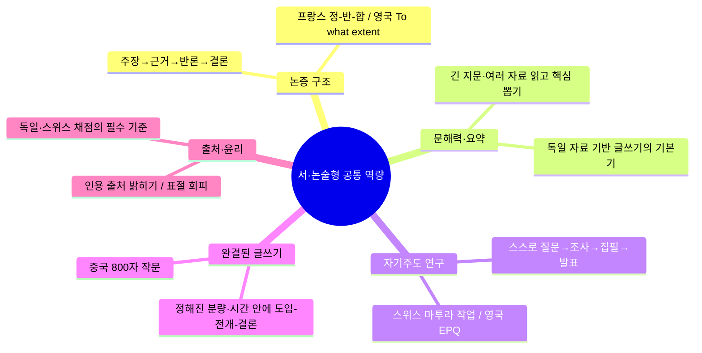

| 역량 | 어떻게 기르나 |
|---|---|
| **논증 구조** | 주장 → 근거 → 반론 검토 → 결론. 프랑스의 정-반-합, 영국의 'to what extent'가 대표 |
| **문해력·요약** | 긴 지문과 여러 자료를 읽고 핵심을 뽑기. 독일 '자료 기반 글쓰기'의 기본기 |
| **자기주도 연구** | 스스로 질문을 세워 조사·집필·발표. 스위스 마투라 작업, 영국 EPQ |
| **완결된 글쓰기** | 정해진 분량·시간 안에 도입-전개-결론을 맞추기. 중국 800자 작문 |
| **출처·윤리** | 인용 출처를 밝히고 표절을 피하기. 독일·스위스 채점의 필수 기준 |

### 3-3. 학년별 로드맵

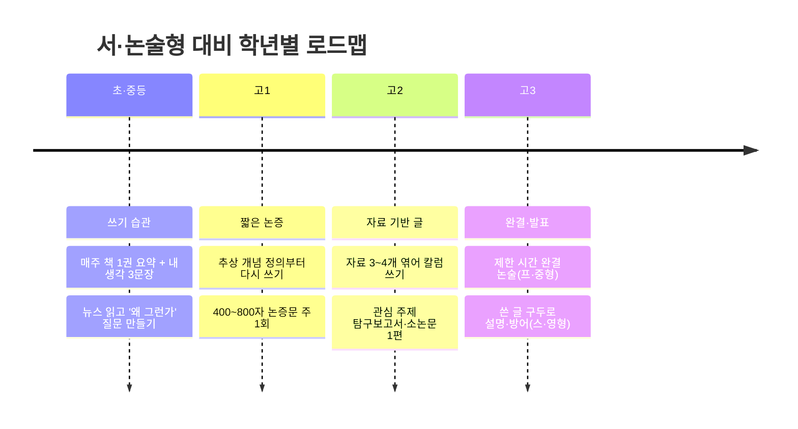

| 학년 | 목표 | 구체 활동 |
|---|---|---|
| **초·중등** | 쓰기 습관 | 매주 책 1권 요약 + 내 생각 3문장 / 뉴스 한 편 읽고 '왜 그런가' 질문 만들기 |
| **고1** | 짧은 논증 | 추상 개념 하나를 정의부터 다시 쓰기 / 400~800자 논증문(주장-근거-결론) 주 1회 |
| **고2** | 자료 기반 글 | 자료 3~4개를 엮어 논평(칼럼) 쓰기 / 관심 주제로 탐구보고서·소논문 1편 완성 |
| **고3** | 완결·발표 | 제한 시간 안에 완결 논술(프랑스·중국형) / 쓴 글을 구두로 설명·방어(스위스·영국형) |

### 3-4. 오늘부터 할 수 있는 체크리스트 ✅

- [ ] **주 1회 '한 문장 논점' 쓰기** — 오늘 읽은 기사/책에서 내 주장 한 문장 + 근거 2개
- [ ] **개념 다시 정의하기** — '자유', '공정', '성공' 같은 말을 사전 없이 내 문장으로 정의
- [ ] **찬반 저울질 노트** — 하나의 쟁점에 찬성 근거 3 / 반대 근거 3을 나란히
- [ ] **AI에게 답 말고 질문 받기** — AI가 준 답을 그대로 쓰지 말고 '더 좋은 질문'으로 되묻기(중국형)
- [ ] **자료 3개 엮어 400자 논평** — 서로 다른 자료의 공통점·상충점을 정리해 내 입장(독일형)
- [ ] **탐구보고서 한 편** — 관심 주제로 질문→조사→결론, 출처 표기까지(스위스·영국형)
- [ ] **소리 내어 설명** — 쓴 글을 3분 안에 말로 설명하고 예상 반론에 답해보기

---

## 4. 단계별 교육 커리큘럼 프로세스 (초등 · 중등 · 고등)

> 서술형·논술을 **잘 답변하기 위한** 12년 커리큘럼입니다. 씨앗(초등) → 줄기(중등) → 열매(고등)로, **읽기 → 말하기 → 문장 → 문단 → 완결 논술 → 연구·발표**의 순서로 자랍니다. 아래 **탭(초등｜중등｜고등)**을 눌러 각 단계의 프로세스를 확인하세요.

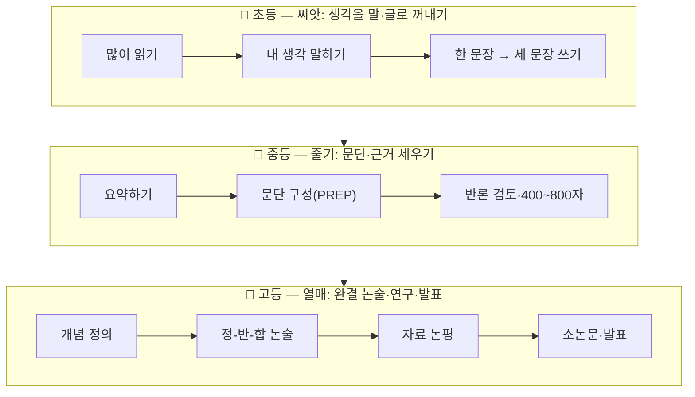

**🗂️ 탭 안내** — 아래 세 블록을 펼쳐 단계별 커리큘럼을 확인하세요 (기본으로 초등 탭이 열려 있습니다).

<b>［탭 1］🌱 초등(1~6학년) — 씨앗 단계: "말과 글로 생각 꺼내기"</b>

**목표**: 정답을 외우는 게 아니라 **'내 생각을 문장으로 꺼내는' 습관**을 만든다. 이 시기의 핵심은 **분량이 아니라 즐거움과 빈도**.

**커리큘럼 프로세스**

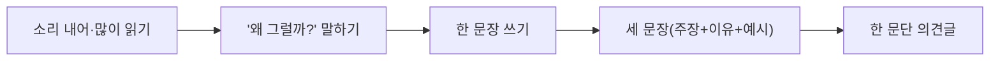

| 학년대 | 목표 | 핵심 활동 | 산출물 | 평가 포인트 |
|---|---|---|---|---|
| 저학년(1~2) | 읽기 즐거움·말로 표현 | 그림책·동화 읽고 "왜?" 말하기, 한 문장 일기·독서록 | 한 줄 일기, 그림+한 문장 | 자기 생각을 문장으로 말하는가 |
| 중학년(3~4) | 요약·이유 대기 | 책 내용 3문장 요약, **"왜냐하면"**으로 이유 붙이기 | 3문장 요약글 | 사실과 내 생각을 구분하는가 |
| 고학년(5~6) | 한 문단 의견글 | 뉴스·책 읽고 **주장-이유-예시** 한 문단, '질문 만들기' | 한 문단(150~300자) 의견글 | 주장에 이유·예시를 붙이는가 |

- **주간 루틴(예시)**: 책 1권 읽기 → 3문장 요약 → "가장 궁금한 점" 질문 1개 만들기.
- **해외 연결**: 중국 가오카오의 **'좋은 질문'**, 프랑스 바칼로레아의 **'왜' 정신**의 씨앗. 질문하고 이유를 대는 힘을 기른다.
- **주의**: '7세 논술'식 조기 선행은 발달에 맞지 않습니다(→ 5장 심리학 관점). 이 시기엔 **읽기·말하기·짧은 쓰기의 즐거움**이 우선.

**앱 화면과 동일 — 5단계 학습 프로세스 (초 3~6 · 약 8~12세)**

1. **많이 읽기** — 매주 책 1권, 그림책·동화에서 지식책으로 넓혀 어휘 쌓기
2. **한 줄 요약** — 읽은 책·기사를 '누가-무엇-왜' 한 문장으로
3. **내 생각 3문장** — "나는 ~라고 생각한다 / 왜냐하면 ~ / 예를 들면 ~"
4. **질문 만들기** — "왜?", "만약 ~라면?"으로 호기심을 글감으로
5. **소리 내어 설명** — 쓴 글을 가족에게 말로 설명(말하기↔쓰기 잇기)

| 다각도 관점 | 이 단계에서 왜 중요한가 |
|---|---|
| 🧠 심리학 | 구체적 조작기(피아제) — 추상보다 경험·구체가 먼저. '성공 경험'으로 자기효능감, 비고츠키 '말→속말→글' |
| 👨‍👩‍👧 사회학 | 가정·또래 '이야기 공동체'에서 사회화 — 함께 읽고 나누는 경험이 문해력을 습관으로 |
| 💭 철학 | 소크라테스의 '경이(wonder)' — 아직 정답이 아니라 '질문하는 즐거움' |

🔁 **루틴** 주 1회 독서록 + 하루 3문장 일기 ｜ 📦 **산출물** 한 학기 독서록 10편 + 그림·글 발표 1회 ｜ 🔗 **연결** 중국 800자 작문으로 가는 기초 체력

<b>［탭 2］🌿 중등(1~3학년) — 줄기 단계: "문단에서 글로, 근거를 세우기"</b>

**목표**: 한 문단을 넘어 **여러 문단의 완결된 짧은 글**을 쓰고, **근거와 반론**을 다룰 줄 안다.

**커리큘럼 프로세스**

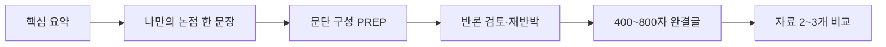

> **PREP** = Point(주장) · Reason(이유) · Example/Evidence(근거·예시) · Point(정리)

| 학년 | 목표 | 핵심 활동 | 산출물 | 평가 포인트 |
|---|---|---|---|---|
| 중1 | 문단 구조화 | PREP로 한 문단 쓰기, 긴 글 핵심 요약 | 200~400자 논증 문단 | 주장-근거의 연결이 있는가 |
| 중2 | 짧은 논증글 | 하나의 쟁점에 **찬성/반대 근거** 각 2~3개, 반론 검토 | 400~600자 논증글 | 반대 입장을 다루는가 |
| 중3 | 자료 기반 입문 | 자료 2~3개 읽고 공통점·차이 정리 후 내 입장 | 600~800자 완결글 | 자료를 근거로 쓰는가·출처를 밝히는가 |

- **주간 루틴(예시)**: 기사·자료 2개 비교 → 논점 한 문장 → PREP 논증글 → 예상 반론 1개에 답하기.
- **해외 연결**: 독일 아비투어의 **자료 기반 논증** 입문, 프랑스의 **정-반-합** 맛보기, 중국의 **800자 완결** 감각.
- **핵심 전환점**: '내 생각 표현'에서 **'근거로 설득'**으로 무게 이동. 반론을 다루기 시작하는 시기.

**앱 화면과 동일 — 5단계 학습 프로세스 (중 1~3 · 약 13~15세)**

1. **개념 정의** — 자유·정의·행복 같은 추상어를 내 말로 정의
2. **주장+근거** — '주장 → 근거 2개 → 예시'의 400~600자 논증문
3. **반론 세우기** — 내 주장의 반대 의견을 스스로 만들고 재반박
4. **자료 비교** — 서로 다른 자료 2~3개의 공통점·차이 정리
5. **고쳐쓰기** — 근거·연결을 다듬는 퇴고 습관화

| 다각도 관점 | 이 단계에서 왜 중요한가 |
|---|---|
| 🧠 심리학 | 형식적 조작기 진입(피아제) — 추상·가설 사고. 에릭슨 '정체성 형성기', 논증은 가치관 실험의 장 |
| 🗣️ 사회학 | 또래·미디어 영향 확대 — 토론·반론으로 '공론장(하버마스)' 소통 학습 |
| ⚖️ 철학 | 개념 정의와 변증법(정-반-합)이 비판적 사고의 뼈대 — '반대편 세우기'가 독단을 막음 |

🔁 **루틴** 주 1회 600자 논증문 + 토론 1회 ｜ 📦 **산출물** 찬반 논술 5편 + 모둠 토론·발표 ｜ 🔗 **연결** 프랑스 정-반-합·독일 자료 기반 글쓰기로 가는 다리

<b>［탭 3］🌳 고등(1~3학년) — 열매 단계: "완결 논술과 자기주도 연구·발표"</b>

**목표**: 제한 시간 안에 **완결된 논술**을 쓰고, **스스로 주제를 정해 조사·집필·발표**까지 해낸다.

**커리큘럼 프로세스**

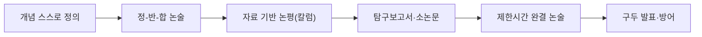

| 학년 | 목표 | 핵심 활동 | 산출물 | 평가 포인트 |
|---|---|---|---|---|
| 고1 | 개념·짧은 논증 | 추상 개념(자유·정의·기술) **정의부터 다시 쓰기**, 정-반-합 800~1000자 | 개념 논술 1편 | 개념을 스스로 정의하는가 |
| 고2 | 자료 기반 글·연구 | 자료 3~4개 엮어 **논평**, 관심 주제 **탐구보고서·소논문 1편** | 소논문(3,000자+) | 여러 자료를 종합·인용하는가 |
| 고3 | 완결·발표 | 제한 시간 완결 논술(프·중형), 쓴 글 **구두로 설명·방어**(스·영형) | 시험형 논술·발표 | 시간 안에 완결하고 방어하는가 |

- **주간 루틴(예시)**: 시사·학술 지문 정독 → 개념 정의 → 정-반-합 논술 → 3분 구두 요약·반론 방어.
- **해외 연결**: **5개국 종합** — 프랑스(변증법)·중국(완결 작문)·독일(자료 논증)·스위스(연구+발표)·영국(균형 논증+EPQ).
- **산출물 포트폴리오**: 개념 논술 → 자료 논평 → 소논문 → 발표 영상까지 **한 편씩 남기면** 학생부·면접 자산이 된다.

<b>［탭 4］🌐 IB(국제 바칼로레아) 연속과정 — 초·중·고를 관통하는 '하나의 흐름' (→ KB로)</b>

**IB는 그 자체가 생애 주기 커리큘럼입니다.** 초등(PYP)→중등(MYP)→고등(DP)이 **탐구·서술·구술**이라는 하나의 축으로 이어지므로, 앞의 초·중·고 3단계를 **관통하는 국제 모델**로 볼 수 있습니다. 한국은 이 정신을 국가교육과정 위에 한국어·무상으로 접목한 **KB(한국형 바칼로레아)**로 확산 중이며, **논·서술형 수능은 이 IB→KB 흐름과 같은 방향**입니다.

| IB 프로그램 | 국내 학교급 | 나이 | 서·논술 관련 핵심 |
|---|---|---|---|
| **PYP**(Primary Years) | 초등 | 3~12세 | 탐구 단원(UOI), '왜?' 질문, 초6 **전시회(Exhibition)** |
| **MYP**(Middle Years) | 중등 | 11~16세 | 개념 기반 학습, 교과 서술 평가, **개인 프로젝트(Personal Project)** |
| **DP**(Diploma) | 고등 | 16~19세(2년) | 6과목 **서술형 시험** + 코어 **TOK·EE·CAS**, 최대 45점 |
| **KB**(한국형 바칼로레아) | 초→고 전 과정 | 미래 | IB를 참고한 국가교육과정 기반 **서·논술·구술형**, 논의·연구 중(2019 대구·제주 도입 → 2025 말 17개 시도교육청 확산) |

**DP 코어 = 5개국 시험의 종합판**

| 코어 | 무엇 | 5개국 연결 |
|---|---|---|
| **TOK**(Theory of Knowledge·인식론) | "우리는 어떻게 아는가" — 1,600단어 에세이 + 전시 | 🇫🇷 프랑스 **철학 논술**과 통함 |
| **EE**(Extended Essay) | **4,000단어 자기주도 소논문** | 🇨🇭 스위스 마투라 작업 · 🇬🇧 영국 EPQ와 동일 계열 |
| **CAS**(Creativity·Activity·Service) | 창의·활동·봉사 성찰 | 자기주도·성찰 역량 |

**IB → KB 흐름 (앞으로의 추세)**

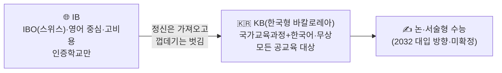

- KB 평가는 **논/서/구술형 중심(서술형 70%+)**, EE의 한국어판 **K-Essay(약 4,000자)**를 핵심 산출물로 둡니다.
- 2032 대입까지 **전체 고교의 약 20%가 KB 방식**을 도입할 것이란 전망(프로젝트 KB 가이드 기준).
- **시사점**: IB/KB 학교가 아니어도, 위 초·중·고 커리큘럼(탐구→서술→연구·발표)을 따르면 **같은 역량**을 기를 수 있습니다.

### 4-종합. 생애주기별 통합 단계도 (완성본) 🧭

> IB 연속과정을 관통 축으로 삼아, **① 국내 학년 · ② 서·논술 성장 단계 · ③ IB 프로그램 · ④ 해외 5개국 · ⑤ KB**를 하나로 겹친 **완성 단계도**입니다. 세로로 읽으면 한 학생이 유아기부터 고3까지 **어떻게 나선형으로 심화**되는지 보입니다.

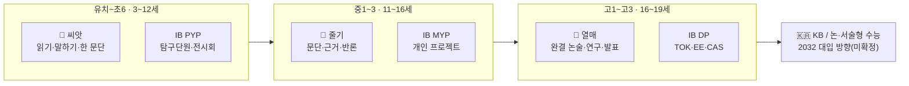

**통합 단계도 (표 — 정본)**

| 생애주기(나이/학년) | 서·논술 성장단계 | 국내 커리큘럼 목표 | IB 연속과정 | IB 핵심 산출·평가 | 해외 5개국 대표 연결 | KB(한국형) 연결 |
|---|---|---|---|---|---|---|
| 유아~초저 (3~8세 / 유치~초2) | 🌱 발아 | 읽기·말하기 즐거움, 한 문장 | PYP 초기 | 탐구단원(UOI) | 🇫🇷 '왜?'의 씨앗 | 탐구 습관 |
| 초중~초고 (초3~6) | 🌱 씨앗 | 3문장~한 문단 의견글 | PYP | **전시회(Exhibition)** | 🇨🇳 '좋은 질문' | 서술 기초 |
| 중등 (중1~3 / 11~16세) | 🌿 줄기 | 문단·근거·반론, 400~800자 | MYP | **개인 프로젝트** | 🇩🇪 자료 기반 논증 입문 | 논·서술 기초 |
| 고1~고2 (16~18세) | 🌳 열매 | 개념 정의·정반합·자료논평·소논문 | DP(2년) | 6과목 서술형 + **TOK·EE(4,000단어)·CAS** | 🇫🇷🇩🇪🇨🇭🇬🇧 종합 | **K-Essay·논서구술** |
| 고3 (18~19세) | 🌳 완결·발표 | 제한시간 완결 논술·구두 방어·지원 | DP 최종평가·대학지원 | 외부평가(EA)+구술 | 🇨🇭🇬🇧 발표·방어 | (미래) 논·서술형 수능 |

**🔍 단계도 검토 노트** (설계 원칙과 정합성 점검)

| 점검 항목 | 검토 내용 |
|---|---|
| **발달 정합성** | 초등에 추상 논술을 앞세우지 않고 '읽기·말하기·한 문단'에 둠 → 심리학(구체적 조작기)과 정합 |
| **나선형 심화** | 같은 역량(주장-근거-반론)을 학년마다 **분량·자기주도성**만 키워 반복 → 비고츠키 비계 원리 |
| **IB 매핑 근사치** | IB 나이 구간(PYP 3~12·MYP 11~16·DP 16~19)은 국내 학년과 **겹치는 근사 매핑**임(각 나이대 경계는 학교·국가별 상이) |
| **DP 2년 + 고3** | IB DP는 **고1~고2 2년** 과정이며, 국내 고3은 **최종평가·대학지원** 시기로 배치 |
| **제도 미확정** | 맨 오른쪽 'KB/논·서술형 수능'은 **방향(추세)**이며 확정 제도가 아님 → 6장 주의사항 참조 |
| **비IB 경로 유효** | IB/KB 학교가 아니어도 표의 '국내 커리큘럼 목표'만 따르면 동일 역량 도달 가능 |

---

## 5. 생애 주기로 본 서·논술 역량 — 철학 · 사회학 · 심리학 다각도 🔭

> 같은 '쓰는 힘'도 **어느 렌즈로 보느냐**에 따라 다르게 보입니다. 서·논술 역량을 **한 사람의 성장(생애 주기)** 위에 놓고, **철학·사회학·심리학** 세 관점에서 다각도로 살펴봅니다. 세 관점은 경쟁이 아니라 **서로를 보완**합니다.

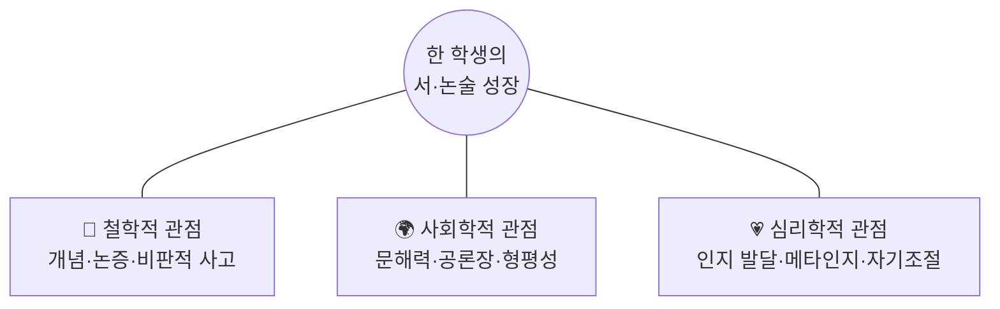

**세 관점 × 발달 단계 요약**

| 관점 | 초등(씨앗) | 중등(줄기) | 고등(열매) |
|---|---|---|---|
| 🧠 **철학** | 경이·'왜?' 질문 (아이는 타고난 철학자) | 개념 구분·논증 형식 익히기 | 변증법·자기 입장의 근거 세우기 |
| 🌍 **사회학** | 가정·학교 언어 환경의 격차 시작 | 또래·미디어·공론 참여 | 대입 경쟁 속 형평성·문화자본 쟁점 |
| 💗 **심리학** | 구체적 조작기 — 경험·이야기로 표현 | 형식적 조작기 진입 — 추상·메타인지 싹틈 | 추상 논증·자기조절·시험 정서 관리 |

---

### 5-핵심. 한 문제, 다른 답안 — 관점을 바꾸면 서술이 완전히 달라진다 🎭

> **서·논술형에는 정답이 없습니다.** 같은 문제도 어떤 렌즈로 보느냐에 따라 **논지·근거·결론이 통째로 바뀝니다.** 좋은 답안은 '어떤 관점을 택했는지'가 분명하고 그 안에서 일관됩니다. 그래서 **하나의 문제를 여러 렌즈로 써보는 연습**이 곧 실력입니다. 아래는 한 문제를 **다섯 렌즈**로 푼 예시입니다.

**예시 문제** (중국 가오카오 2024 신과표 I권 변형)

> ✍️ *"AI가 답을 즉시 찾아주는 시대, **인간의 질문은 줄어들까?**"*

| 관점 | 💬 한 문장 논지(thesis) | 🔑 근거·개념 | ➡️ 결론 방향 |
|---|---|---|---|
| 🧠 **철학** | 질문은 '앎의 조건'이라 줄지 않는다 — 답이 흔할수록 '무엇을 물을지'가 더 중요 | 소크라테스 '무지의 지', 하이데거 '질문함이 사유' | 질문하는 인간이 곧 사유하는 인간 |
| 🌍 **사회학** | AI 접근 격차가 '질문의 격차'를 낳는다 — 문제는 양이 아니라 '누가 좋은 질문을 배우나' | 디지털 디바이드, 부르디외 문화자본 | 질문 능력의 **형평성**이 진짜 쟁점 |
| 💗 **심리학** | 즉답 습관은 '인지적 게으름'을 부른다 — 메타인지가 있어야 질문이 산다 | 인지부하, '구글 효과'(디지털 기억상실), 자기조절 | 스스로 점검하는 습관이 질문을 지킨다 |
| 💹 **경제학** | 답의 한계비용이 0 → 희소가치는 '문제를 정의하는 힘'으로 이동 | 한계비용·희소성, 인간 판단이라는 보완재 | 질문 설계가 새로운 부가가치 |
| 🔬 **과학·기술** | AI는 기존 지식을 재조합할 뿐, 새 가설(질문)은 인간이 던진다 | 가설연역법, 포퍼의 반증가능성 | 과학의 엔진은 여전히 '질문' |

→ **같은 문제, 다섯 개의 완전히 다른 답안.** 어느 것도 틀리지 않습니다. 채점의 핵심은 *"어느 관점이 맞느냐"가 아니라 "택한 관점 안에서 얼마나 일관되고 근거 있게 논증하느냐"*입니다.

**다관점 쓰기 훈련법 (알고리즘)**

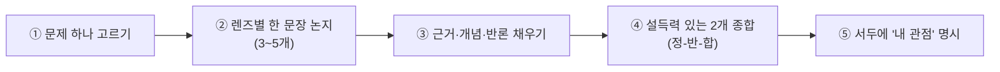

1. **문제 하나 고르기** — 기출·시사에서 정답 없는 물음 하나.
2. **렌즈별 한 문장 논지** — 철학·사회학·심리학·경제·과학 등 3~5개 렌즈로 각각 주장 한 문장씩.
3. **근거·개념·반론 채우기** — 각 논지에 핵심 개념·근거·예상 반론을 붙인다.
4. **종합하기** — 가장 설득력 있는 2개를 하나의 글로 통합(프랑스 정-반-합처럼).
5. **관점 명시** — "나는 어떤 관점에서 답하는가"를 서두에 밝히면 채점자가 논지를 명확히 읽는다.

**더 연습할 문제 (관점 힌트)**

| 문제 | 렌즈 힌트 |
|---|---|
| 행복은 이성의 문제인가? (프랑스 2023) | 철학=이성 vs 감정 / 심리학=주관적 안녕·적응 / 사회학=행복의 사회적 조건·비교 |
| SNS는 우리를 더 외롭게 하는가? | 심리학=연결감 vs 비교·불안 / 사회학=약한 유대·공론장 / 경제학=관심경제(어텐션) |
| 기술 발전은 곧 자유의 확대인가? (프랑스 기술계열 변형) | 철학=자율성의 의미 / 사회학=감시·격차 / 과학기술=도구의 양면성 |

> **💡 왜 이 연습이 결정적인가** — 실전에서 학생은 '한 문제에 하나의 답'만 급히 떠올립니다. 하지만 평소 여러 렌즈로 써본 학생은 **① 가장 자신 있는 관점을 빠르게 고르고 ② 다른 관점을 '반론'으로 끌어와** 글을 입체적으로 만듭니다. 관점 훈련은 곧 **논술 점수 차이**로 이어집니다.

---

**🗂️ 탭 안내** — 아래 세 관점을 눌러 자세히 확인하세요.

<b>［관점 1］🧠 철학적 관점 — "스스로 묻고 논증하는 사람"</b>

**핵심 명제**: 앎이란 남의 답을 외우는 게 아니라 **스스로 개념을 정의하고 근거로 논증하는 것**. 소크라테스의 *"검토되지 않은 삶은 살 가치가 없다"*는 정신이 바로 **프랑스 바칼로레아 철학**의 뿌리입니다.

| 발달 단계 | 철학적으로 무슨 일이 일어나나 | 무엇을 준비하나 |
|---|---|---|
| 초등 | 아이는 "왜 하늘은 파래?"처럼 **본질을 묻는 질문**을 던진다 — 타고난 철학자 | 질문을 억누르지 말고 **"왜?"에 이유 붙이기** 놀이 |
| 중등 | 개념을 구분(자유 vs 방종)하고 **논증 형식**(주장-근거-반론)을 배운다 | 하나의 개념을 여러 각도로 정의해 보기 |
| 고등 | **변증법(정-반-합)**으로 대립을 종합하고 자기 입장을 세운다 | 찬반을 저울질하고 **조건을 나누어** 논증 |

- **AI 시대의 함의**: 정답은 AI가 준다. **인간 고유의 힘은 '좋은 질문'과 '왜 그런가'를 논증하는 능력** — 중국 가오카오 2024('질문은 줄어들까')와 정확히 통한다.
- **이 렌즈로 답안을 쓰면** (AI 질문 예시): *"질문은 앎의 조건이다 — 소크라테스의 '무지의 지'처럼, 답이 흔할수록 '무엇을 물을지'가 인간의 몫으로 남는다."* → **개념 정의와 논증**이 중심.
- **한 줄**: 철학적 관점에서 서·논술은 *생각하는 법 자체를 기르는 훈련*이다.

<b>［관점 2］🌍 사회학적 관점 — "쓰기는 사회적 실천이자 시민의 권리"</b>

**핵심 명제**: 글쓰기는 개인 능력이자 **공론장에 참여하는 사회적 실천**입니다. 문해력·논증력은 **시민권**에 가깝고, 서·논술 능력은 부르디외가 말한 **문화자본(cultural capital)**과 연결되어 **교육 형평성** 문제를 낳습니다.

| 발달 단계 | 사회학적으로 무슨 일이 일어나나 | 무엇을 준비하나(사회·학교 차원) |
|---|---|---|
| 초등 | 가정·학교의 **언어 환경 격차**가 어휘·문해력 격차로 시작 | 공교육의 **읽기·쓰기 기초** 보장, 도서관·독서 습관 |
| 중등 | 또래·미디어·SNS로 **공론 참여** 시작, 정보 판별 필요 | 미디어 리터러시, 학교 내 **토론·글쓰기** 확대 |
| 고등 | 대입 경쟁 속 **사교육 격차·형평성** 쟁점이 첨예 | 학교의 **개별화 지도**로 사교육 의존 낮추기 |

- **핵심 쟁점(이범 경고와 연결)**: 대학 서열을 그대로 둔 채 시험 형식만 바꾸면 경쟁은 **대학별 전형·사교육으로 이동**. 공교육이 개별화 지도로 뒷받침하지 못하면 서·논술은 **격차를 키울** 수 있다.
- **해외 연결**: 프랑스·독일은 **공교육 안에서** 서·논술을 오래 훈련시켜 형평성을 완충한다.
- **이 렌즈로 답안을 쓰면** (AI 질문 예시): *"문제는 질문의 양이 아니라 '누가 좋은 질문을 배우느냐'다 — AI 접근 격차가 곧 질문의 격차, 새로운 교육 불평등이 된다."* → **형평성·공교육**이 중심.
- **한 줄**: 사회학적 관점에서 서·논술은 *누구나 공론에 참여할 수 있게 하는 공교육의 과제*다.

<b>［관점 3］💗 심리학적 관점 — "발달에 맞춘 사고와 자기조절"</b>

**핵심 명제**: 쓰기는 **고차 인지 활동**입니다. 피아제의 **인지 발달 단계**, 비고츠키의 **근접발달영역(ZPD)·비계(scaffolding)**, 그리고 **메타인지·자기조절 학습**이 서·논술 역량의 심리적 토대입니다.

| 발달 단계 | 심리학적으로 무슨 일이 일어나나 | 무엇을 준비하나 |
|---|---|---|
| 초등 | **구체적 조작기** — 추상보다 **구체 경험·이야기**로 사고 | 경험·그림·이야기로 표현, **과한 추상 논술 강요 금지** |
| 중등 | **형식적 조작기 진입** — 추상·가설 사고, **메타인지** 싹틈 | "내 글의 약점은?" 스스로 점검하는 **자기 피드백** |
| 고등 | 추상 논증 성숙, **자기조절**과 **시험 정서(불안) 관리**가 관건 | 시간 관리, 계획-집필-검토 루틴, 발표 불안 다루기 |

- **비계(scaffolding)의 원리**: 지금 혼자 할 수 있는 것보다 **한 단계 위**를 어른·교사가 도와주면 곧 스스로 하게 된다 — 학년별 난이도 설계의 근거.
- **조기 선행 경계(PD수첩 문제의식)**: 발달 단계를 앞질러 초등에게 고등 수준 논술을 강요하면 **흥미 저하·쓰기 불안**을 낳는다. **발달에 맞춘 비계**가 정답.
- **이 렌즈로 답안을 쓰면** (AI 질문 예시): *"즉답에 익숙해지면 '인지적 게으름'에 빠진다 — 메타인지로 스스로 되묻는 습관이 있어야 질문하는 힘이 살아남는다."* → **인지·자기조절**이 중심.
- **한 줄**: 심리학적 관점에서 서·논술은 *발달 단계에 맞춰 생각과 감정을 스스로 조절하는 힘*이다.

**세 관점의 통합** — 철학이 *무엇을 기르는가(사고·논증)*, 사회학이 *누구에게 어떻게 공정하게(공교육·형평성)*, 심리학이 *언제·어떻게 발달에 맞게(단계·비계)*를 답합니다. 세 렌즈를 함께 볼 때 **"조기 사교육이 아니라, 발달에 맞춘 공교육 안 읽기·쓰기 습관"**이라는 결론이 뚜렷해집니다.

---

## 6. 주의사항

1. 논·서술형 수능은 **2028 수능에 포함되지 않았습니다.** 현재는 국가교육위원회의 검토·공론화 단계이며, **도입 시기와 방식은 확정되지 않았습니다.**
2. 위 해외 기출은 **시험 형식을 이해하기 위한 참고용**입니다. 국가·연도·시험지(주/성별)에 따라 실제 문제는 달라지며, 독일·스위스·영국은 대표 과제 유형과 예시로 정리했습니다.
3. **조기 사교육에 휩쓸리기보다, 평소의 독서·요약·자기 생각 쓰기 습관**이 가장 확실하고 저렴한 대비입니다.

> ⚠️ **팩트체크 (2026-09 기준)** — 논·서술형 수능은 국가교육위원회가 '미래형 수능'으로 검토 중인 사안으로, 아직 확정된 제도가 아닙니다. 중장기 국가교육발전계획(2028~2037)과 2027년 최종안 발표에 따라 달라질 수 있습니다. 해외 기출·형식은 프랑스 교육부, 중국 교육부 공개 자료, 각국 교육청·SBFI 지침 등에서 확인한 실제 내용입니다.

---

## 7. 출처

| 구분 | 자료 | 링크 |
|---|---|---|
| 프랑스 | 바칼로레아 철학 2024 (교육부) | https://www.education.gouv.fr/sites/default/files/document/Baccalaur%C3%A9at%20g%C3%A9n%C3%A9ral%202024%20-%20Philosophie%20-402222.pdf |
| 프랑스 | 바칼로레아 철학 2023 (교육부) | https://www.education.gouv.fr/sites/default/files/document/Baccalaur%C3%A9at%20g%C3%A9n%C3%A9ral%202023%20-%20Philosophie-364953.pdf |
| 프랑스 | 바칼로레아 철학 기출 DB(2021~) | https://www.sujetdebac.fr/annales/philosophie-2023-metropole |
| 프랑스 | 바칼로레아 철학 2019 계열별(L/ES/S) 기출 | https://actualitte.com/article/12844/scolarite/le-temps-le-travail-la-liberte-les-sujets-du-bac-de-philosophie-2019 |
| 중국 | 가오카오 작문 2021 전국 汇총 (中国教育在线) | https://gaokao.eol.cn/zuowen/jiqiao/202405/t20240529_2612956.shtml |
| 영국 | A레벨 역사 7042 2023 실제 시험지 (AQA) | https://filestore.aqa.org.uk/sample-papers-and-mark-schemes/2023/june/AQA-70421C-QP-JUN23-CR.PDF |
| 한국 | IB→KB 확산(제주發 269개 공립교) | https://www.jejudomin.co.kr/news/articleView.html?idxno=320589 |
| 중국 | 가오카오 작문 2022~2024 汇总 (武汉本地宝) | http://wh.bendibao.com/news/202566/187545.shtm |
| 중국 | 2024 신과표 I권 작문 (중국교육재선) | https://gaokao.eol.cn/zuowen/jiqiao/202406/t20240607_2614957.shtml |
| 독일 | 아비투어 독일어 과제 형식 2024 (바덴뷔르템베르크 교육서버) | https://www.schule-bw.de/faecher-und-schularten/sprachen-und-literatur/deutsch/pruefungen/abi/das-deutschabitur-ab-2024/aufgabenformate-abitur-2024 |
| 스위스 | 마투라 시험·마투라 작업 (SBFI) | https://www.sbfi.admin.ch/de/schweizerische-maturitaetspruefung |
| 한국 | 국가교육위원회 서·논술형 수능 공론화 (한국일보 2026-08) | https://www.hankookilbo.com/news/article/A2026082615030005278 |
| 한국 | 2028 대입 미래형 수능 검토 (한국대학신문) | https://news.unn.net/news/articleView.html?idxno=236653 |
| 한국 | 수능 전 과목 절대평가·서·논술형 검토 (경향신문 2026-08) | https://www.khan.co.kr/article/202608031639001/ |
| 한국 | 이범 '대입 미신' 칼럼 (경향신문 2025-03) | https://www.khan.co.kr/article/202503172035005 |
| 영상 | PD수첩 「7세부터 준비하는 논술형 수능」 | https://www.youtube.com/watch?v=9vQCXDb1A8M |
| 영상 | 이범 「수능은 결국 이렇게 바뀝니다」 | https://www.youtube.com/watch?v=nGEgD9rj-GE |

---

*이 문서는 커리어 탐색 › 대입 › 「논·서술형 수능」 화면(`/jobs/explore?tab=university&subView=essay-suneung`)의 데이터(`frontend/data/university-admission/essay-suneung/content.json`)를 기반으로, 나라별 기출을 확장·검증해 정리한 것입니다.*

*최근 갱신(2026-09-13): 나라별 기출 확대(프랑스 2019 계열별·중국 2020~2021·영국 2023 AQA 실제 문항 추가), 프랑스 2022 기출 검증 교정(디드로 『백과전서』·「자유란 누구에게도 복종하지 않는 것인가」), 초·중·고 커리큘럼 탭에 5단계 프로세스+다각도 관점 반영, 5장에 「한 문제, 다른 답안」 다관점 실전 예시(5개 렌즈)·훈련법 신설, IB 표에 KB 행 추가. 앱 화면은 상단 4개 탭(📍한국 현황·🌍해외 기출·🧭준비 커리큘럼·🎭관점 연습)으로 그룹핑됨.*
