# 수도권·서울권 AI 대학 지도 2027 — 학과 · 연구조직 · 교수진 확인법

> 조사 기준일: 2026-09-02 · 웹 확인 기반(언론 보도 + 대학 공식 페이지)
> 자매 문서: [(대입)_국립대_대전환_2026_등록금0원_AI거점.md](./(대입)_국립대_대전환_2026_등록금0원_AI거점.md) — 지방 국립대 편

---

## 0. 먼저 정리할 용어 혼동

"AI 거점대학"이라는 말이 **세 가지 다른 사업**을 가리켜 뉴스에서 자주 뒤섞입니다.

| 사업명 | 주관 | 대상 | 지원 | 수도권 포함? |
|---|---|---|---|---|
| **AI 거점대학** | 교육부 | **지방 거점국립대 3교** (부산대·전남대·충남대) | 교당 1,000억 원 내외 | ❌ **비수도권 전용** |
| **AI중심대학** | 과기정통부 | 전국 10개교 (전환 7 + 신규 3) | 대학당 연 30억, 최대 8년 240억 | ✅ 다수 포함 |
| **AI 단과대학** | 과기정통부 + 과학기술원 | KAIST(2026) → GIST·DGIST·UNIST(2027) | 정원 300명 신규 배정 | △ (대전·광주·대구·울산) |

> **핵심**: 수도권·서울권에서 정부 예산이 명시적으로 붙은 트랙은 **AI중심대학**입니다. 나머지는 대학 자체 개편(학과 신설·정원 증원)입니다.

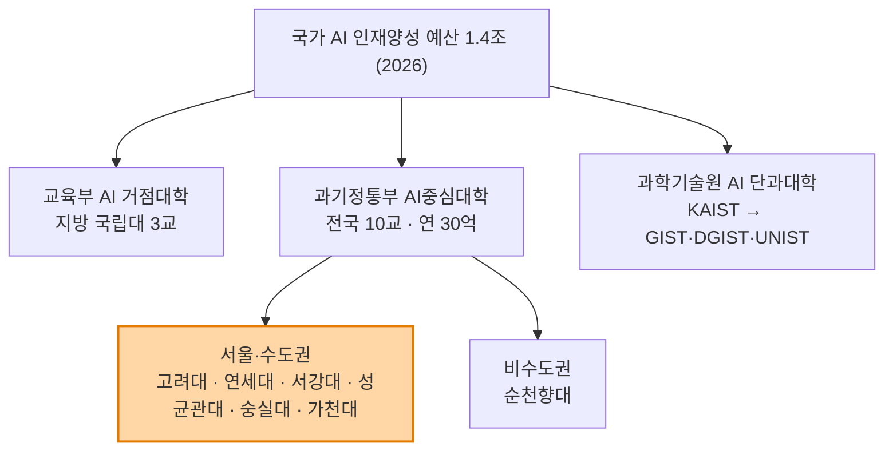

---

## 1. AI중심대학 7개교 (2026-05 발표, 전환형)

| 대학 | 소재 | 유형 | 비고 |
|---|---|---|---|
| **고려대** | 서울 성북 | 전환 | 정보대학 내 인공지능학과(2019 신설) |
| **연세대** | 서울 서대문 | 전환 | 인공지능융합대학 보유 |
| **서강대** | 서울 마포 | 전환 | AI기반자유전공학부 신설로 화제 |
| **성균관대** | 서울/수원 | 전환 | 반도체·AI 산학 강세 |
| **숭실대** | 서울 동작 | 전환 | 전통 SW중심대학 |
| **가천대** | 경기 성남 | 전환 | 경인권 대표 |
| **순천향대** | 충남 아산 | 전환 | 유일한 비수도권 |
| *(신규 3개교)* | — | 비-SW중심대 대상 | ⚠️ 2026년 6월 발표 예정 — **명단 미확인** |

**지원 조건**: 대학당 연 30억 원, 최대 8년(3+3+2), 총 240억 원.
**사업 목표**: 'AI 전문인재' + **'AX(AI 전환) 융합인재'** 양성 — 즉 비전공자의 AI 융합 트랙까지 포함.

---

## 2. 대학별 카드 — 서울권

### 2.1 서울대학교

| 항목 | 내용 |
|---|---|
| 학부 | 컴퓨터공학부, 전기정보공학부 중심 (AI 전용 학부는 별도 신설 흐름 보도) |
| **대학원 대개편** | **2027년 3월 'AI 대학원' 개원 목표** |
| 통합 대상 | ① 협동과정 인공지능 ② 융합과학기술대학원 지능정보융합학과 ③ 데이터사이언스대학원 데이터사이언스학과 (정보보호 협동과정은 제외) |
| **교수 규모** | **약 300명 교수진이 겸무 형태로 참여**하는 매머드급 조직 |
| 의미 | 학내에 흩어진 AI 역량을 한 조직으로 결집 — 학부→대학원 진학 설계 시 최대 변수 |
| 확인 링크 | [데이터사이언스대학원](https://gsds.snu.ac.kr/) · [협동과정 인공지능(IPAI)](https://gsai.snu.ac.kr/) |

### 2.2 연세대학교 — 조직도가 가장 명확

**인공지능융합대학** 구성 (공식 페이지 확인):

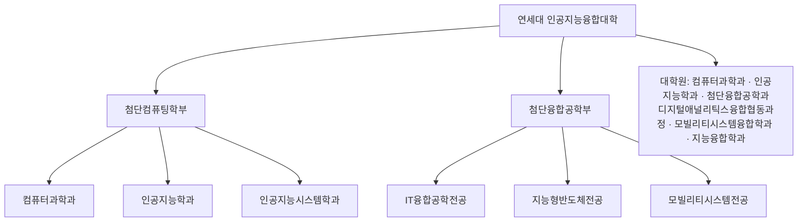

**2027학년도 변화**
- 인공지능시스템학과 **25명 → 41명 (16명 증원)**
- **모빌리티시스템전공 신설 (25명)**
- 첨단컴퓨팅학부 **분리 선발**

확인 링크: [인공지능융합대학](https://computing.yonsei.ac.kr/) · [2027 입학전형 시행계획 PDF](https://www2.yonsei.ac.kr/entrance/plan/2027_plan.pdf)

### 2.3 고려대학교

| 항목 | 내용 |
|---|---|
| 소속 | **정보대학** |
| 학부 | 인공지능학과(2019.9 신설), 컴퓨터학과, 데이터과학과, 인공지능응용융합전공 |
| 교수 규모 | 정보대학 관련 **약 70명 전임교수**가 국책 연구·합동 연구 참여 (학과 소개 기준) |
| 목표 | AI 분야 세계 Top 20 |
| 계약학과 | **SK하이닉스 채용조건형** |
| 2026 정시 | 인공지능학과 경쟁률 **5.5:1 (전년 대비 +36.0%)** |
| 확인 링크 | [정보대학 학부 인공지능학과](https://info.korea.ac.kr/info/under/ai_intro_250120.do) · [대학원](https://info.korea.ac.kr/info/grad/ai_intro.do) · [교수진](http://xai.korea.ac.kr/teacher/teacher) |

### 2.4 서강대학교 — 경쟁률 폭발 케이스

| 학과 | 2026 정시 경쟁률 |
|---|---|
| **AI기반자유전공학부** | **28.6 : 1** ← 주요대 최상위권 |
| 인공지능학과 | 7.2 : 1 |

- AI중심대학 선정 + **SK하이닉스 채용조건형 계약학과** 동시 보유
- "AI기반자유전공"은 **전공 미정 상태로 입학해 AI를 축으로 진로 설계**하는 구조 — 진로 미정 학생에게 유리

### 2.5 성균관대학교

| 항목 | 내용 |
|---|---|
| AI중심대학 | 선정 (전환형) |
| 계약학과 | **반도체시스템공학과 — 국내 첫 삼성전자 채용조건형** |
| 강점 | 반도체 × AI 산학 결합, 삼성 계열 네트워크 |

### 2.6 그 외 서울권

| 대학 | 2027 학과 변화 / 특징 | 2026 정시 경쟁률 |
|---|---|---|
| **한양대(서울)** | SK하이닉스 채용조건형 계약학과 | — |
| **중앙대** | AI학과 | 4.6:1 (+14.8%) |
| **서울시립대** | **인공지능학과 정원 15명 순증(2027)** | 첨단인공지능전공 **36:1** ← 최고 |
| **건국대** | **인공지능학과 신설(2027) — 정원 50명, 수시 24명** | — |
| **세종대** | AI융합전자공학과 | **26:1** |
| **국민대** | AI빅데이터융합경영(자연) | 13.2:1 |
| **서울여대** | **AI융합학부 인공지능전공 신설(2027) — 25명** | — |
| **숭실대** | AI중심대학 선정, 전통 SW중심대학 | — |

### 2.7 경인권

| 대학 | 특징 |
|---|---|
| **가천대** | **AI중심대학 선정** — 경인권 대표, 최대 240억 원 |
| **인하대 · 단국대** | 2026 정시 **경인권 AI 지원자 49.6% 급증**의 진원지 |

---

## 3. 특수 트랙 — 과학기술원 AI 단과대학

### KAIST AI 단과대학 (2026 신설)

| 항목 | 내용 |
|---|---|
| 규모 | **정원 300명 신규**(학부 100 · 석사 150 · 박사 50) |
| 구성 | **AI학부** + **AI컴퓨팅학과 · AI시스템학과 · AX학과 · AI미래학과** (4개 학과) |
| 개시 | 학부 **2026년 봄학기**, 대학원 **2026년 가을학기** |
| 확대 | **2027년 GIST·DGIST·UNIST까지 확대** → 4개 초광역권 AI·AX 혁신 체계 |
| 기존 조직 | 김재철AI대학원 |

> 수도권 학생에게 KAIST·과학기술원은 **"수도권 밖이지만 전액 장학+기숙 제공"** 트랙으로, 등록금 0원 정책과 별개로 비용 부담이 이미 낮습니다.

---

## 4. 계약학과 지도 — "입학 = 취업 확정" 트랙

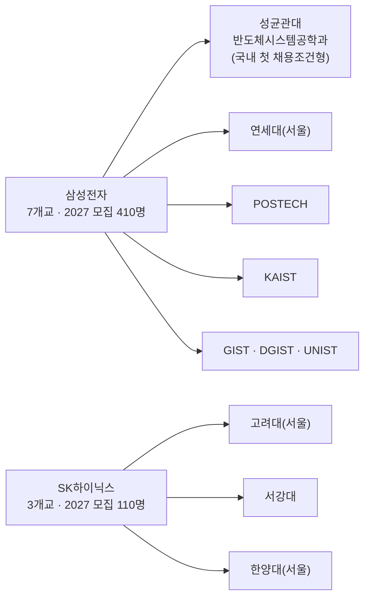

| 기업 | 협약 대학 | 2027 모집 |
|---|---|---|
| **삼성전자** | 성균관대, 연세대(서울), POSTECH, KAIST, GIST, DGIST, UNIST — **7개교** | **410명** |
| **SK하이닉스** | 고려대(서울), 서강대, 한양대(서울) — **3개교** | **110명** |

**혜택**: 4년 전액 장학금 + 생활비 지원 + 졸업 후 채용 확정
**주의**: 정시 합격선이 **서울대 자연대를 넘어섰다**는 보도 — "삼전·닉스 의치한약수"라는 말이 나올 만큼 최상위권 경쟁입니다.

> ⚠️ 계약학과는 **의무복무 기간·중도 이탈 시 장학금 환수** 조건이 붙습니다. 대학원 진학이나 창업을 염두에 둔 학생은 약정 조건을 반드시 먼저 확인해야 합니다.

---

## 5. 입시 데이터 — AI 학과는 이미 '국가대표 학과'

### 5.1 주요 20개대 AI 관련 학과 정시 지원자

| 학년도 | 모집 인원 | 지원자 | 증감 |
|---|---|---|---|
| 2024 | 498명 | 3,069명 | — |
| 2025 | 545명 | 4,222명 | +37.6% |
| **2026** | **648명** | **4,896명** | **+16.0%** |

> 2년 만에 지원자 **약 60% 폭증**. 모집 인원 확대(498→648, +30%)보다 지원 증가가 더 빠릅니다.

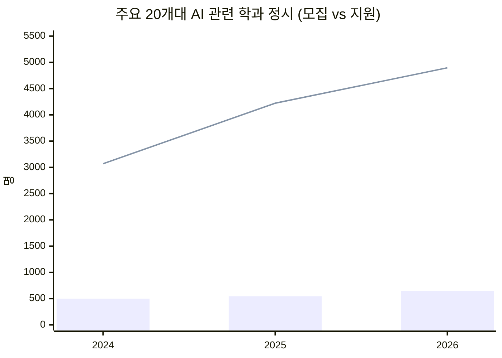

### 5.2 권역별 지원자 증가율 (2026 정시)

| 권역 | 증가율 |
|---|---|
| **경인권** (단국대·인하대) | **+49.6%** |
| 지방권 | +29.7% |
| 서울권 | +12.6% |

> **해석**: 서울권은 이미 포화 상태라 증가폭이 완만하고, **경인권이 가장 빠르게 뜨거워지는 중**입니다. 경쟁률 관점에서는 경인권이 오히려 어려워지고 있다는 뜻이므로 안정 지원 판단에 주의가 필요합니다.

### 5.3 2026 정시 경쟁률 순위 (확인된 값)

| 순위 | 대학·학과 | 경쟁률 |
|---|---|---|
| 1 | 서울시립대 첨단인공지능전공 | **36 : 1** |
| 2 | 서강대 AI기반자유전공 | 28.6 : 1 |
| 3 | 세종대 AI융합전자공학과 | 26 : 1 |
| 4 | 국민대 AI빅데이터융합경영(자연) | 13.2 : 1 |
| 5 | 서강대 인공지능학과 | 7.2 : 1 |
| 6 | 고려대 인공지능학과 | 5.5 : 1 (+36.0%) |
| 7 | 중앙대 AI학과 | 4.6 : 1 (+14.8%) |

> ⚠️ 경쟁률과 합격선은 다릅니다. 모집 인원이 적은 신설 학과일수록 경쟁률이 튀는 구조라, **경쟁률만 보고 난이도를 판단하면 안 됩니다.**

---

## 6. 교수 중심으로 보는 법 — 명단이 아니라 '확인 방법'

### 6.1 솔직한 상태 보고

이번 조사에서 **개별 교수 명단을 신뢰할 수준으로 웹에서 확보하지 못했습니다.** 대학 교수진 페이지는 대부분 동적 렌더링이거나 접근이 차단되어 자동 수집이 되지 않습니다. **검증되지 않은 교수 이름을 문서에 적는 것은 이 프로젝트의 원칙(환각 제거)에 어긋나므로 싣지 않았습니다.**

대신 **확인된 조직 규모**와 **공식 교수진 페이지 직링크**, 그리고 **학생이 직접 검증하는 절차**를 정리합니다.

### 6.2 확인된 교수 조직 규모

| 대학 | 조직 | 규모 | 출처 |
|---|---|---|---|
| 서울대 | AI 대학원(2027 개원 예정) | **약 300명 겸무 교수진** | 대학신문 보도 |
| 고려대 | 정보대학 관련 | **약 70명 전임교수** | 학과 소개 페이지 |
| KAIST | AI 단과대학 | 학부+4개 학과, 정원 300명 | 과기정통부 발표 |
| 연세대 | 인공지능융합대학 | 2개 학부 6개 전공 + 대학원 6개 과정 | 공식 페이지 |

### 6.3 교수·연구실 검증 5단계 (학생·학부모용)

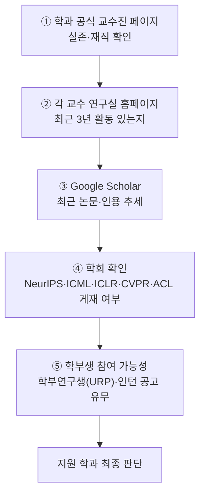

| 단계 | 확인 포인트 | 왜 중요한가 |
|---|---|---|
| ① 공식 페이지 | 겸임/초빙이 아닌 **전임** 비중 | 겸무 300명이라도 실제 지도 가능 인원은 다름 |
| ② 연구실 홈페이지 | **최근 3년** 업데이트 | 방치된 랩은 학부생을 받지 않음 |
| ③ Google Scholar | 최근 논문 연도 | 교수의 현재 활동성 = 학부생 기회 |
| ④ 학회 | Top-tier 게재 | AI는 학회 논문이 실질 지표 |
| ⑤ 학부연구생 | URP·인턴 모집 공고 | **"경력 있는 신입"을 만드는 실제 통로** |

### 6.4 공식 교수진·학과 페이지 링크

| 대학 | 링크 |
|---|---|
| 서울대 데이터사이언스대학원 | https://gsds.snu.ac.kr/ |
| 서울대 협동과정 인공지능(IPAI) | https://gsai.snu.ac.kr/ |
| 연세대 인공지능융합대학 | https://computing.yonsei.ac.kr/ |
| 고려대 정보대학(학부 AI) | https://info.korea.ac.kr/info/under/ai_intro_250120.do |
| 고려대 인공지능학과 교수진 | http://xai.korea.ac.kr/teacher/teacher |
| KAIST 김재철AI대학원 | https://gsai.kaist.ac.kr/ |
| 연세대 SW중심대학사업단 | https://swedu.yonsei.ac.kr/yonseisw/ |

> **팁**: 교수 개인보다 **"그 학과에 학부연구생 제도가 있는가"**가 학부 진학 판단에서 훨씬 결정적입니다. AI 분야는 대학원 진학률이 높아, 학부 때 랩 경험 유무가 진로를 가릅니다.

---

## 7. 학생 유형별 지원 전략

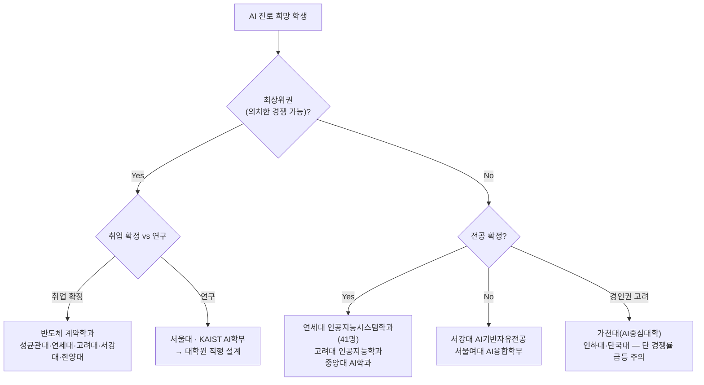

| 유형 | 1순위 | 근거 |
|---|---|---|
| 최상위 + 취업 확정 | **반도체 계약학과** | 전액 장학 + 생활비 + 채용 확정. 단 약정 조건 확인 |
| 최상위 + 연구 지향 | **서울대(2027 AI대학원) · KAIST AI 단과대학** | 학부→대학원 통합 설계, 교수 풀 압도적 |
| 상위권 + 전공 확정 | **연세대 인공지능융합대학** | 조직도가 가장 명확, 2027 증원·신설 진행 중 |
| 진로 미정 | **서강대 AI기반자유전공** | AI를 축으로 전공 탐색, AX 융합인재 트랙에 부합 |
| 경인권 | **가천대** | 유일한 경인권 AI중심대학(240억) |
| 신설 학과 노림 | 건국대 인공지능학과(50명, 2027 신설), 서울시립대(15명 순증), 서울여대(25명 신설) | 첫해는 입결 데이터가 없어 변동성이 큼 — 기회이자 리스크 |

---

## 8. 상담 시 반드시 짚을 3가지

| # | 포인트 |
|---|---|
| 1 | **"AI 학과"라는 이름이 다 같지 않다.** 컴퓨터과학 기반(연세대 인공지능학과), 시스템·하드웨어 기반(인공지능시스템학과, 지능형반도체전공), 융합·응용 기반(AI빅데이터융합경영, AX학과)은 배우는 내용과 진로가 완전히 다릅니다. **커리큘럼 표를 반드시 열어볼 것.** |
| 2 | **경쟁률 ≠ 합격선.** 36:1(서울시립대)이 5.5:1(고려대)보다 어렵다는 뜻이 아닙니다. 신설·소수 모집 학과일수록 경쟁률이 튑니다. |
| 3 | **AI 학과를 안 가도 AI를 할 수 있다.** AI중심대학 사업의 절반은 **AX 융합인재** — 비전공자의 AI 융합 트랙입니다. 전공 + AI 부전공/융합과정 조합도 정식 경로입니다. |

---

## 9. 팩트체크 상태

| 항목 | 상태 |
|---|---|
| AI중심대학 7개교 (가천·고려·서강·성균관·순천향·숭실·연세) | ✅ 확인 (2026-05 발표) |
| AI중심대학 **신규 3개교** | ❌ **미확인** — 2026년 6월 발표 예정이라는 보도만 존재 |
| 서울대 AI 대학원 2027.3 개원 | ⚠️ **목표·추진 중** (세부 운영계획 수립 단계) |
| KAIST AI 단과대학 2026 개시 | ✅ 확인 (과기정통부 발표) |
| 반도체 계약학과 협약 대학·인원 | ✅ 확인 (삼성 7교 410명 / SK 3교 110명) |
| 2027 학과 신설·증원 (연세·건국·시립·서여대) | ✅ 언론 보도 기준 — **각 대학 최종 모집요강으로 재확인 필요** |
| **개별 교수 명단** | ❌ **미수록** — 웹에서 신뢰 수준 확보 실패, 6.3의 검증 절차로 대체 |
| 경쟁률 수치 | ✅ 2026 정시 기준 — **매년 변동, 참고용** |

---

## 10. 기업 연계 · 창업 지도 — 포트폴리오를 만드는 실제 통로

> 앞 장까지가 "어디에 지원하나"였다면, 이 장은 **"입학 후 4년간 무엇을 쌓아 나오나"**입니다.
> AI 시대 채용의 병목은 학과 이름이 아니라 **졸업 시점의 결과물**이기 때문입니다.

### 10.1 왜 포트폴리오가 결정적인가 — 채용 시장의 확인된 변화

| 지표 | 내용 |
|---|---|
| 신입만 뽑는 채용공고 | **2.6%** (경력 요구 97.4%) |
| AI 채용 솔루션 도입 | 국내 **상위 100대 기업 중 약 73%**가 도입·검토 |
| 평가 축 이동 | '과거 이력' → **'미래 성과에 기여할 실질 스킬'** |
| 공고 요구사항 변화 | 학력란 대신 **'프로젝트 경험'과 '결과물'** 요구 확대 (마케팅·디자인·개발 직군) |
| 개발자 역할 변화 | "**어떻게 구현할 것인가**" → "**무엇을 해결할 것인가**" |
| 선호 인재 | 이미 **AI 툴·데이터 워크플로우를 다뤄본** 실무형. 단순 코딩테스트보다 **AI 도구 활용 + 문제해결 기여도** |

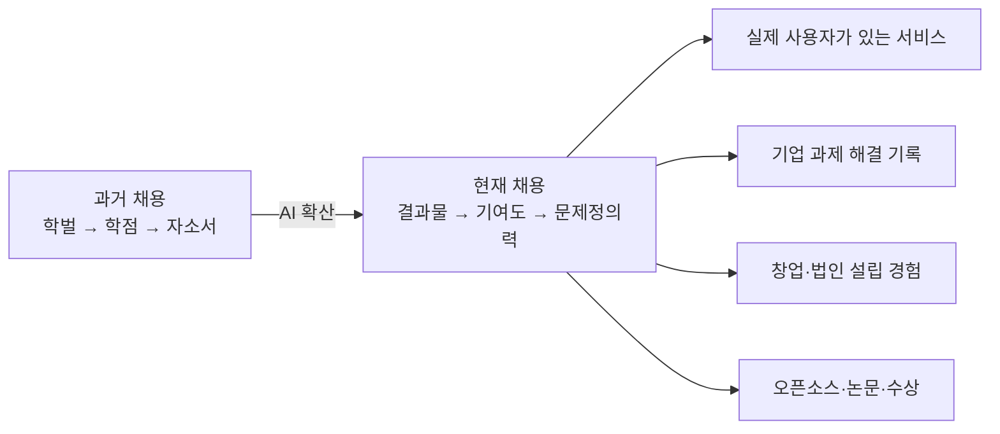

> **핵심**: AI가 "구현"을 대신하면서, 신입의 차별점은 **무엇을 문제로 정의했고 누구에게 쓰였는가**로 옮겨갔습니다. 이건 강의실이 아니라 **기업 연계·창업 트랙**에서만 만들어집니다.

---

## 11. 수도권 대학 기업 연계 트랙 4종

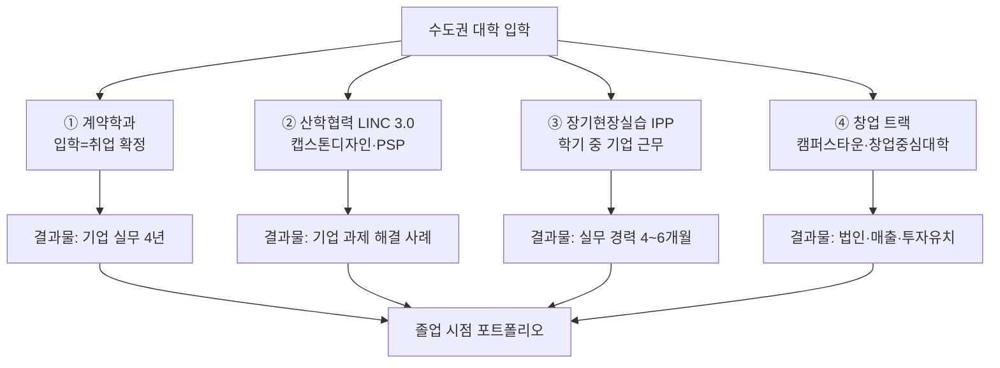

### 트랙 ① 계약학과 — 가장 확실하지만 가장 좁은 문

| 기업 | 수도권 협약 대학 | 2027 모집 |
|---|---|---|
| 삼성전자 | 성균관대, 연세대(서울) | (전체 7교 410명) |
| SK하이닉스 | 고려대(서울), 서강대, 한양대(서울) | (전체 3교 110명) |

- 4년 전액 장학 + 생활비 + 채용 확정
- ⚠️ **의무복무·중도이탈 시 환수** 조건 → 창업·대학원 지향 학생과는 상충

### 트랙 ② LINC 3.0 — 기업 과제를 학점으로

| 항목 | 내용 |
|---|---|
| 정식명 | 3단계 산학연협력 선도대학 육성사업 (Leaders in INdustry-university Cooperation) |
| 사업기간 | **2022.3 ~ 2028.2** |
| 주요 프로그램 | **캡스톤디자인**, 마이크로전공, **PSP(Problem-Solving Project)**, 다년도 연구과제 |
| 수도권 참여 | 연세대, 한양대 ERICA, 인하대 등 |
| 포트폴리오 가치 | 실제 기업이 낸 과제를 팀으로 해결 → **"기업 과제 해결 사례"**가 남음 |
| 확인 링크 | [LINC3.0 사업 포털](https://lincthree.nrf.re.kr/) · [연세대 산학연협력 학생 포털](https://linc.yonsei.ac.kr/) |

### 트랙 ③ IPP — 학기 중 기업 근무를 학점으로

| 항목 | 내용 |
|---|---|
| 정식명 | 기업연계형 **장기현장실습**(Industry Professional Practice) |
| 원조 | **한국기술교육대**가 2012년 국내 최초 설계·운영 |
| 특징 | **학교 출석 없이 기업 근무 → 학점 인정** |
| 효과 | "IPP 출신은 **신입사원 연수 없이 바로 실무 투입**" (기업 측 평가) |
| 수도권 운영 | 한성대 등 다수 대학 IPP사업단 운영 |

> 일반 인턴(4~8주)과 달리 **4~6개월 이상**이라 실제 프로젝트 한 사이클을 돌 수 있습니다. 포트폴리오 밀도가 다릅니다.

### 트랙 ④ 창업 — 결과물이 가장 강력한 트랙

다음 12장에서 상세히 다룹니다.

---

## 12. 창업 지도 — 수도권이 압도적으로 유리한 영역

### 12.1 서울시 캠퍼스타운 — 13개 대학 (2026)

**2026년 수행 대학**: 건국대 · 경희대 · 고려대 · 광운대 · 국민대 · 동국대 · 서울대 · 서울시립대 · 숭실대 · 연세대 · 이화여대 · 중앙대 · 한양대

| 항목 | 내용 |
|---|---|
| 목표 | **2030년까지 창업기업 3,496개 육성, 아기유니콘 76개 배출** |
| 연계 | **RISE 연계**, AI·바이오 등 첨단산업 혁신거점과 결합 |
| 2025 성과 | 입주기업 **총매출 전년 대비 +70%** |
| 확인 링크 | [서울캠퍼스타운](https://campustown.seoul.go.kr/) |

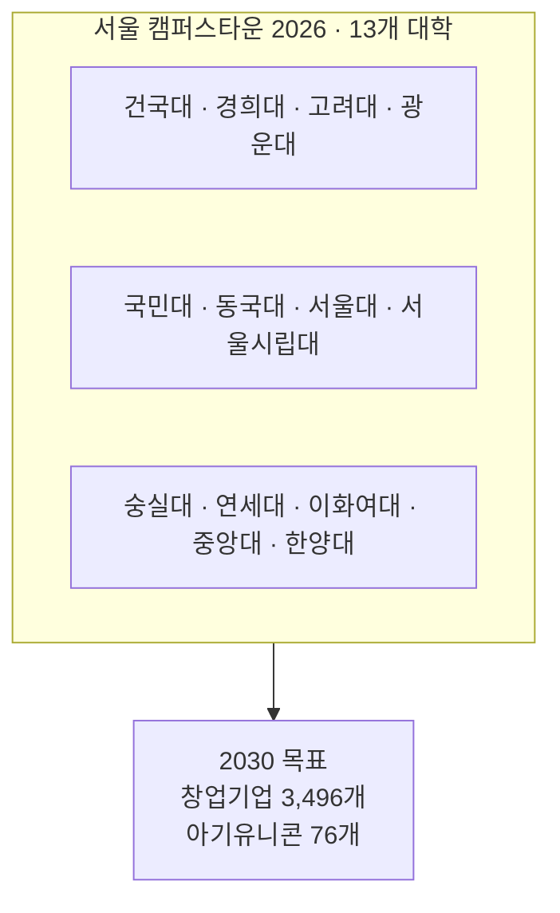

> **의미**: 서울 소재 대학에 다니면 **학교 안에 창업 인프라(공간·멘토링·초기자금)가 기본 제공**됩니다. 이건 지방 대학 대비 수도권의 가장 실질적인 우위입니다.

### 12.2 창업중심대학 (중소벤처기업부, 2026)

| 권역 | 대학 |
|---|---|
| **수도권** | **한양대 · 성균관대** |
| 충청권 | 호서대 · 한남대 · 충북대 |
| 호남권 | 전북대 · 전남대 |
| 강원권 | 강원대 |
| 대경권 | 대구대 |
| 동남권 | 부산대 · 경상국립대 |

| 항목 | 내용 |
|---|---|
| 규모 | 6개 권역 **11개 대학**, (예비)창업기업 **757개사** 지원 |
| 지원금 | 사업화자금 **최대 1.5억 원** + 멘토링·투자유치·글로벌 진출 |
| 확인 링크 | [중소벤처기업부 공고](https://www.mss.go.kr/site/smba/ex/bbs/View.do?cbIdx=86&bcIdx=1065967) |

> 캠퍼스타운(서울시)과 창업중심대학(중기부)은 **별개 사업**입니다. **한양대는 두 사업에 모두 포함**되어 창업 인프라가 가장 두껍습니다.

### 12.3 학생창업 실적 — 확인된 수치

| 대학 | 지표 | 수치 |
|---|---|---|
| **건국대** | 학생 창업기업 수 | **88개 — 전국 1위 (2년 연속)** *(2026년 공시, 2025학년도 기준)* |
| **한양대** | 학생 창업자 수 | **61명** — 전국 최다 배출 |
| 한양대 | 설립 기업 | 교내 18개 + 교외 35개 = **53개**, 매출 약 **9억 8,559만 원** |
| **고려대** | 학생 창업자 수 | **42명** |
| 연세대 | 창업사업화 지원 | 연 약 **45개 기업**, 매출 약 **200억 원**, 투자유치 약 **70억 원** |

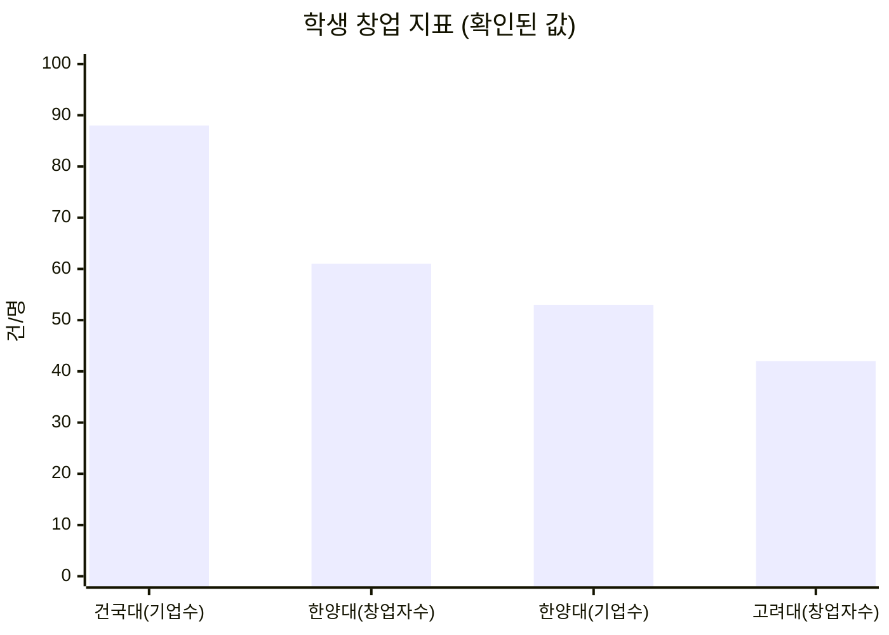

> ⚠️ 지표 종류가 서로 달라(기업 수 vs 창업자 수 vs 지원 실적) **단순 서열 비교는 불가**합니다. 다만 **건국대·한양대·고려대·연세대가 수도권 학생창업의 상위권**이라는 것은 확인됩니다.
> 특히 **건국대는 2027학년도 인공지능학과(50명)를 신설**하므로, "AI 학과 신설 + 학생창업 전국 1위 + 캠퍼스타운" 세 요소가 겹칩니다.

### 12.4 창업친화적 학사제도 — 학업과 창업을 병행하는 장치

| 제도 | 내용 |
|---|---|
| **창업휴학** | 창업을 이유로 한 휴학. **최대 2년**까지 사용 가능(대학별 상이) |
| **창업대체학점**(창업현장실습) | 사업자등록 후 창업활동을 학점으로 인정. 학기당 **최소 6학점(8주) ~ 최대 12학점(16주)** |
| 절차 | 창업교육 학사제도 운영위원회 심의 → 결과보고서 + 학점인정서(주임교수 확인) 제출 |
| 제한 | 정규학기 중 창업대체학점 1회 이수자는 재신청 불가 |

> **즉, 휴학 없이도 창업이 졸업 요건 안으로 들어옵니다.** 지원 전 **해당 대학에 이 제도가 있는지** 학칙에서 확인하는 것이 좋습니다.

---

## 13. 대학별 "포트폴리오 인프라" 종합표

| 대학 | AI중심대학 | 계약학과 | 캠퍼스타운 | 창업중심대학 | 학생창업 실적 | 종합 |
|---|:---:|:---:|:---:|:---:|---|---|
| **한양대(서울)** | — | ✅ SK하이닉스 | ✅ | ✅ | 창업자 61명·기업 53개 | ★★★★★ **창업 최강** |
| **고려대** | ✅ | ✅ SK하이닉스 | ✅ | — | 창업자 42명 | ★★★★★ |
| **연세대** | ✅ | ✅ 삼성전자 | ✅ | — | 연 45개사·투자 70억 | ★★★★★ |
| **성균관대** | ✅ | ✅ 삼성전자(1호) | — | ✅ | — | ★★★★☆ |
| **서강대** | ✅ | ✅ SK하이닉스 | — | — | — | ★★★★☆ |
| **건국대** | — | — | ✅ | — | **기업 88개 전국 1위** | ★★★★☆ **창업 실적 1위** |
| **숭실대** | ✅ | — | ✅ | — | — | ★★★☆☆ |
| **중앙대** | — | — | ✅ | — | — | ★★★☆☆ |
| **서울시립대** | — | — | ✅ | — | — | ★★★☆☆ |
| **경희대·광운대·국민대·동국대·이화여대** | — | — | ✅ | — | — | ★★★☆☆ |
| **서울대** | — | — | ✅ | — | 창업지원단 운영 | ★★★★☆ |
| **가천대**(경기) | ✅ | — | — | — | — | ★★★☆☆ |

> 표의 별점은 **"포트폴리오를 만들 인프라가 얼마나 겹쳐 있는가"** 기준이며, 대학 서열이나 입결과 무관합니다.

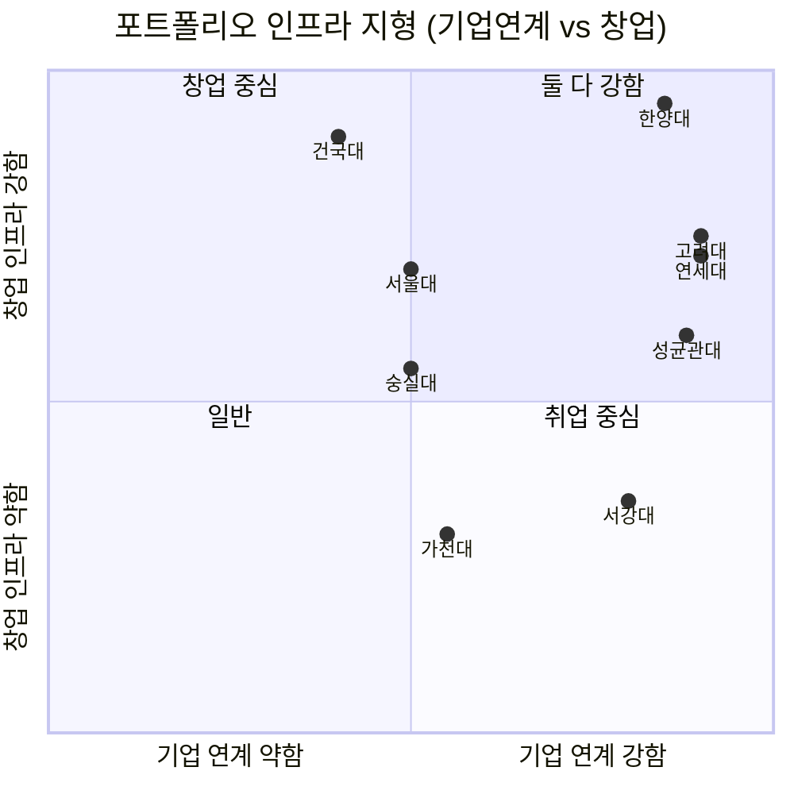

---

## 14. 4년 포트폴리오 설계 로드맵

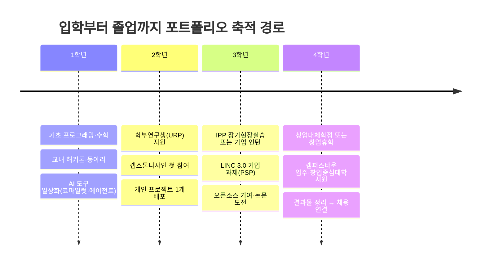

### 학년별 체크리스트

| 학년 | 목표 | 구체 행동 | 남는 결과물 |
|---|---|---|---|
| **1** | 도구 장착 | AI 코딩 도구 상시 사용, 교내 해커톤 1회 | 깃허브 잔디, 팀 프로젝트 1건 |
| **2** | 랩 진입 | 학부연구생(URP) 지원, 캡스톤 참여 | 연구실 경험, 기업 과제 1건 |
| **3** | 실무 진입 | IPP 또는 4개월+ 인턴, PSP 참여 | **실무 경력 4~6개월** |
| **4** | 결과물 확정 | 창업대체학점 / 캠퍼스타운 입주 / 논문·수상 | **법인 또는 서비스 또는 논문** |

### 포트폴리오 품질 기준 5가지

| # | 기준 | 나쁜 예 | 좋은 예 |
|---|---|---|---|
| 1 | **사용자가 있는가** | 튜토리얼 클론 코딩 | 실제 사용자 30명이 쓰는 서비스 |
| 2 | **문제를 정의했는가** | "AI로 챗봇 만듦" | "OO 문제를 관찰 → 왜 기존 해법이 실패하는지 → 이렇게 해결" |
| 3 | **기여도가 명확한가** | "팀 프로젝트 참여" | "4인 팀에서 데이터 파이프라인 전담, 처리시간 40% 단축" |
| 4 | **기업/기관이 인정했는가** | 개인 사이드 프로젝트만 | 캡스톤·PSP·IPP·창업지원사업 선정 |
| 5 | **AI를 도구로 썼는가** | AI 없이 수작업 or AI가 다 함 | AI로 구현 속도를 높이고 **판단은 본인이 한** 기록 |

> **주의**: AI가 코드를 대신 써주는 시대에 "만들었다"는 사실 자체는 차별점이 아닙니다. 심사자가 보는 건 **"왜 그걸 만들기로 했는가"와 "무엇이 실제로 바뀌었는가"**입니다.

---

## 15. 상담 결론 — 대학 선택 기준을 하나 바꾸면

| 기존 기준 | 바꿀 기준 |
|---|---|
| "이 대학 간판이 어느 정도인가" | **"이 대학에서 4년간 무엇을 남길 수 있는가"** |
| 학과 이름에 'AI'가 있는가 | 커리큘럼에 **캡스톤·IPP·URP·창업학점**이 있는가 |
| 취업률 몇 %인가 | **기업 과제·현장실습·창업 지원 인프라가 겹쳐 있는가** |

**유형별 최종 권고**

| 학생 유형 | 1순위 | 이유 |
|---|---|---|
| 안정적 대기업 취업 | 성균관대·연세대(삼성) / 고려대·서강대·한양대(SK) 계약학과 | 입학=취업, 단 약정 조건 확인 |
| 창업 지향 | **한양대**(캠퍼스타운+창업중심대학) / **건국대**(학생창업 1위+2027 AI학과 신설) | 창업 인프라 중첩 |
| 연구·대학원 | 서울대(2027 AI대학원 300명 겸무) · KAIST AI 단과대학 | 학부→대학원 직결 |
| 진로 미정 | 서강대 AI기반자유전공 | AX 융합인재 트랙 |
| 경인권 | 가천대(AI중심대학 240억) | 경인권 유일 |

## 출처

- [정부, 연세대·고려대 등 7개 'AI중심대학' 선정 — 경향신문](https://www.khan.co.kr/article/202605051344001)
- [정부, AI중심대학 7개교 추가…8년간 240억원씩 — ZDNet Korea](https://zdnet.co.kr/view/?no=20260505080026)
- [AI중심대학 7개교 선정…非 SW중심대 중 3곳 추가 선발 — 전자신문](https://www.etnews.com/20260505000001)
- [대학 AI 인재 양성 주도할 '인공지능 중심대학 7개교' 선정 — 인공지능신문](https://www.aitimes.kr/news/articleView.html?idxno=39917)
- ['연·고·서·성'만 아니다…AI 중심대학 오른 7곳 — 더스쿠프](https://www.thescoop.co.kr/news/articleView.html?idxno=310106)
- [2027학년도 AI 대학원 신설… 학내 AI 단위 현황은? — 대학신문](http://www.snunews.com/news/articleView.html?idxno=35159)
- [서울대, 2027년 'AI 전문대학원' 개원… 공대·데이터사이언스 전격 통합 — 대구교육신문](https://www.edudaegu.co.kr/news/articleView.html?idxno=6370)
- [서울대학교 데이터사이언스대학원](https://gsds.snu.ac.kr/)
- [연세대학교 인공지능융합대학](https://computing.yonsei.ac.kr/)
- [2027학년도 연세대학교 입학전형 시행계획 (PDF)](https://www2.yonsei.ac.kr/entrance/plan/2027_plan.pdf)
- [고려대학교 정보대학 학부 인공지능학과 소개](https://info.korea.ac.kr/info/under/ai_intro_250120.do)
- [고려대학교 인공지능학과 교수진](http://xai.korea.ac.kr/teacher/teacher)
- [KAIST, 300명 규모 'AI 단과대학' 신설 — 아시아경제](https://cm.asiae.co.kr/article/2025121119275720087)
- [KAIST에 AI 단과대학 신설…"AI 지역인재 양성 핵심 거점" — 대한민국 정책브리핑](https://www.korea.kr/news/policyNewsView.do?newsId=148956326)
- [내년에 KAIST AI 단과대학 설립…AI컴퓨터학과 등 4개 학과 — 아이뉴스24](https://www.inews24.com/view/1916755)
- ['국가대표 학과'로 우뚝 선 AI… 2026 정시, 주요 20개대 지원자 16% 폭증 — 한국대학신문](https://news.unn.net/news/articleView.html?idxno=588670)
- [대학 입학하면 삼성전자·SK하이닉스 채용 확정…계약학과 어디? — 뉴시스](https://www.newsis.com/view/NISX20250905_0003317252)
- [졸업 후 바로 대기업 취업… 2026학년도 채용조건형 계약학과 총정리 — 한국대학신문](https://news.unn.net/news/articleView.html?idxno=583503)
- [반도체 계약학과 총정리｜채용조건형·조기취업형 대학 — 링커리어](https://linkareer.com/stem-community/stem-employment/6268204)
- [건국대, 2027년 수시 1900명 모집…인공지능학과 신설 — 이데일리](https://www.edaily.co.kr/News/Read?newsId=01262806645575856)
- [서울시립대, 2027 수시 특집 — 대학저널](https://www.dhnews.co.kr/news/view/1065579146284541)
- [서울여대, 991명 수시로 선발...AI융합학부 인공지능전공 신설 — 한국NGO신문](https://www.ngonews.kr/news/articleView.html?idxno=235749)
- [대학가 인공지능학과 설립 열풍 — AI타임스](https://www.aitimes.com/news/articleView.html?idxno=137332)
- [서울시, 내년도 캠퍼스타운 13개 대학 선정…RISE 연계로 AI·바이오 창업 지속 성장 이끈다 — 서울특별시](https://news.seoul.go.kr/economy/archives/568643)
- [서울캠퍼스타운 공식 사이트](https://campustown.seoul.go.kr/)
- [중기부, 2026년 창업중심대학 지원사업 창업기업 모집 — 벤처스퀘어](https://www.venturesquare.net/1041723)
- [2026년 창업중심대학 참여기업 모집 — 중소벤처기업부 보도자료](https://www.mss.go.kr/site/smba/ex/bbs/View.do?cbIdx=86&bcIdx=1065967)
- [건국대, 학생 창업기업 88개 '전국 1위'.. 2년 연속 최다 — 베리타스알파](https://www.veritas-a.com/news/articleView.html?idxno=620217)
- [국내 대학 '학생창업' 어디까지 왔나…1위 대학 비결은? — 한국대학신문](https://news.unn.net/news/articleView.html?idxno=211234)
- [연세대학교 창업지원단](https://venture.yonsei.ac.kr/)
- [서울대학교 창업지원단](https://startup.snu.ac.kr/)
- [LINC3.0 사회맞춤형 산학협력 선도대학 육성사업](https://lincthree.nrf.re.kr/)
- [3단계 산학연협력 선도(전문)대학 육성사업(LINC 3.0) 기본계획 — 교육부](https://www.moe.go.kr/boardCnts/viewRenew.do?boardID=294&boardSeq=90756&lev=0&statusYN=W&page=1&s=moe&m=020402&opType=N)
- [연세대학교 산학연협력 학생 포털시스템](https://linc.yonsei.ac.kr/)
- ["한국기술교육대 장기현장실습(IPP) 출신 직원, 신입사원 연수 없이 바로 실무 투입해요"](https://mwebzine.koreatech.ac.kr/newshome/mtnmain.php?mtnkey=articleview&mkey=bcatelist&mkey2=17&aid=44586&bpage=143)
- [2026학년도 창업대체학점(창업현장실습)과 창업휴학 안내 — 명지대](https://mjhistory.mju.ac.kr/eng/1436/subview.do)
- [창업친화적 학사제도 — 한국공학대 TU Startup](https://startup.tukorea.ac.kr/education/curriculumSystem/curriculumSystem.hs)
- ["경력보다 스킬" AI 시대 2026년 인재 선발 기준의 변화 — Speak B2B](https://www.speak.com/ko/b2b-blog/ai-era-skills-based-hiring-2026)
- [2026 HR 채용 트렌드: 스킬 중심 채용의 시대](https://class101.ghost.io/2026-hr-recruitment-trends/)
- [AI 시대, 개발자 취업 완벽 가이드: 2026년을 준비하는 실전 로드맵 — 코드트리](https://www.codetree.ai/blog/ai-%EC%8B%9C%EB%8C%80-%EA%B0%9C%EB%B0%9C%EC%9E%90-%EC%B7%A8%EC%97%85-%EC%99%84%EB%B2%BD-%EA%B0%80%EC%9D%B4%EB%93%9C-2026%EB%85%84%EC%9D%84-%EC%A4%80%EB%B9%84%ED%95%98%EB%8A%94-%EC%8B%A4%EC%A0%84/)
