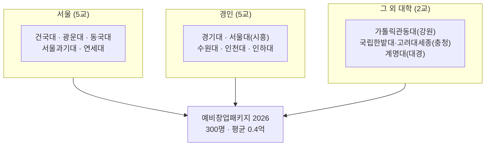
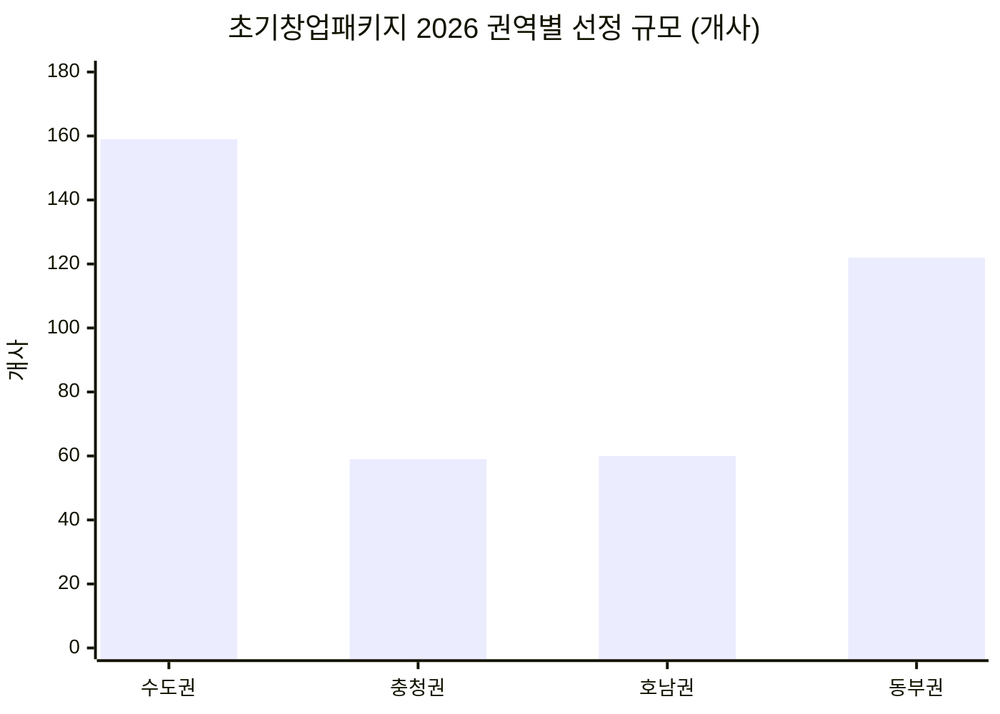
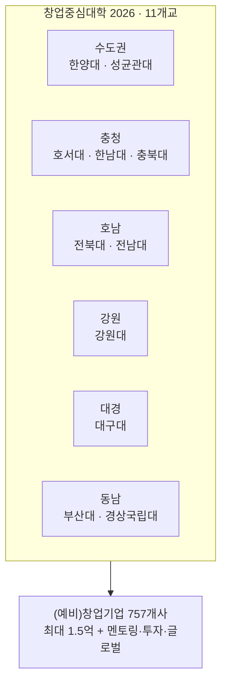
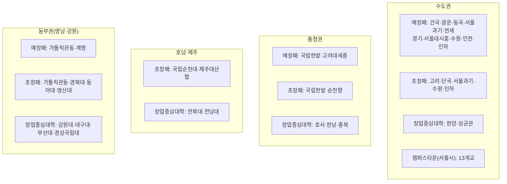
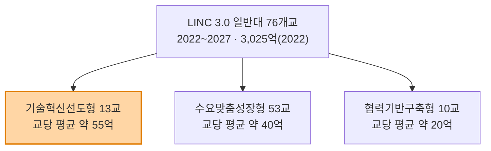
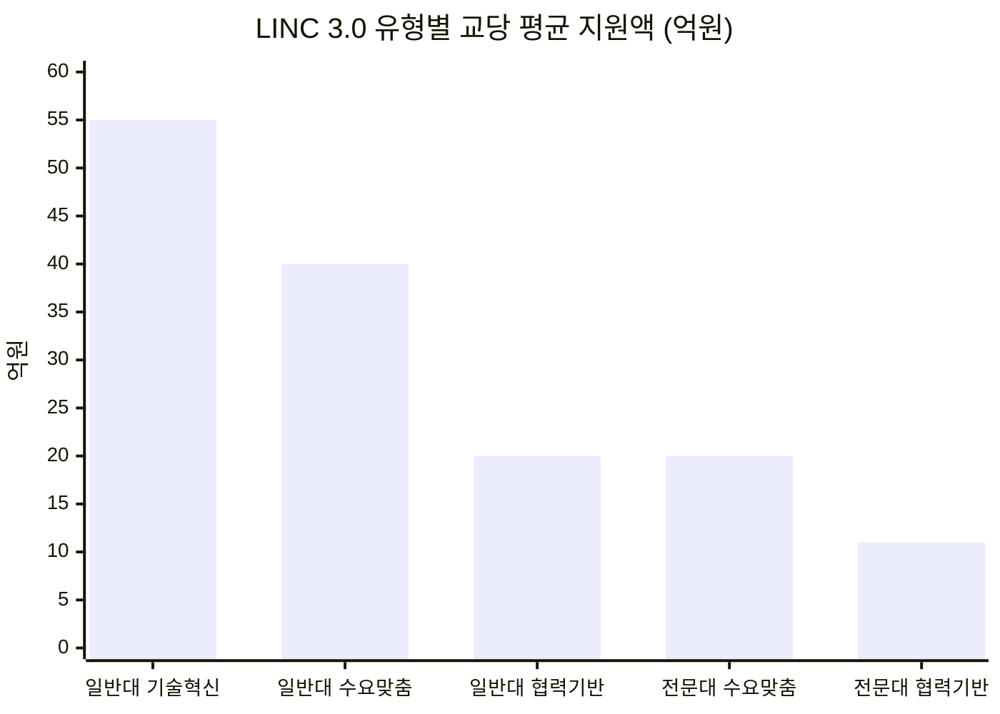
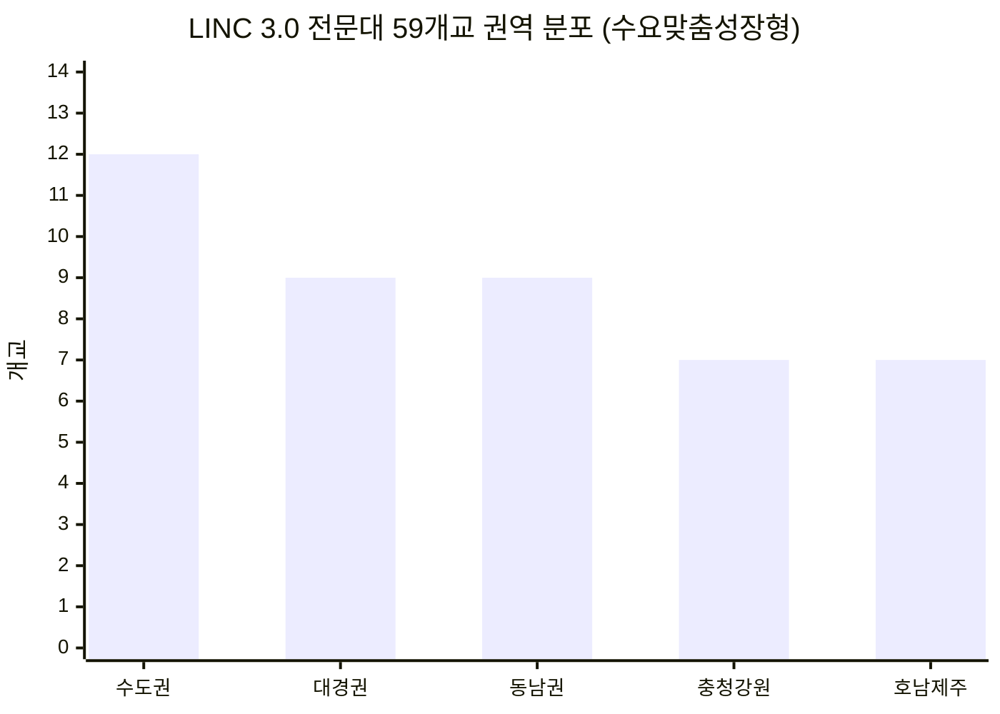
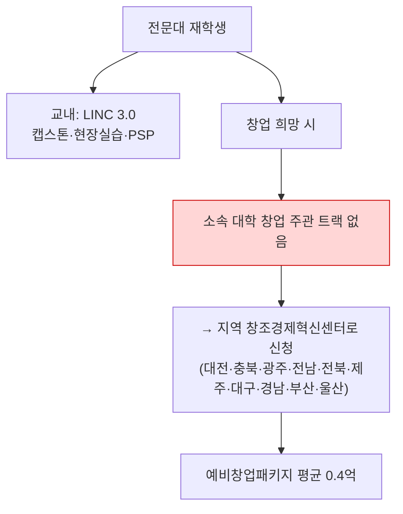

# 전국 대학 창업·기업연계 지원 권역별 지도 (2026)

> 조사 기준일: 2026-09-02
> **1차 출처: 중소벤처기업부 공식 공고문 원문 PDF**(2026년 예비창업패키지 / 초기창업패키지 일반형) + 교육부·정책브리핑 보도자료
> 자매 문서: [(대입)_수도권_AI대학_지도_2027_학과교수.md](./(대입)_수도권_AI대학_지도_2027_학과교수.md) · [(대입)_국립대_대전환_2026_등록금0원_AI거점.md](./(대입)_국립대_대전환_2026_등록금0원_AI거점.md)

---

## 0. 먼저 — 대학 창업 지원사업은 '사다리' 구조입니다

많은 분들이 "창업중심대학"만 아시는데, 실제로는 **단계별로 다른 사업**이 붙어 있고 **주관 대학도 다릅니다.**

```mermaid
flowchart LR
    A["예비창업자<br/>(사업자등록 전)"] -->|예비창업패키지<br/>평균 0.4억| B["창업 3년 이내"]
    B -->|초기창업패키지<br/>최대 1억| C["창업 3~7년"]
    C -->|창업도약패키지| D["스케일업"]

    A2["대학 재학생"] -.->|캠퍼스타운·창업동아리| A
    A2 -.->|실험실특화형<br/>(대학원 연구실)| A
    E["창업중심대학<br/>(전 단계 통합·최대 1.5억)"] -.-> A
    E -.-> B
    E -.-> C

    style E fill:#ffd6a5,stroke:#e07b00,stroke-width:2px
```

| 사업 | 주관 | 대상 | 지원금 | 2026 규모 |
|---|---|---|---|---|
| **예비창업패키지** | 중기부/창진원 | 예비창업자 | 평균 **0.4억** | **300명** (일반 110 · 특화 190) |
| **초기창업패키지(일반형)** | 중기부/창진원 | 창업 3년 이내 | 평균 0.5억, **최대 1억** | **400개사** |
| 초기창업패키지(딥테크 특화형) | 중기부 | 딥테크 5대 분야 3년 이내 | **최대 1.5억** | 100개사 |
| 초기창업패키지(투자연계형) | 중기부 | **비수도권** 투자유치 실적 보유 | 최대 1억 | 68개사 |
| **창업중심대학** | 중기부 | 예비~도약 전 단계 | **최대 1.5억** | 11개 대학 |
| 실험실특화형 창업선도대학 | 교육부·과기정통부 | **대학원 연구실 기반** | 별도 | 대학별 상이 |
| LINC 3.0 | 교육부 | 산학협력(창업 아님) | 대학 지원 | 134개교 |

> ⚠️ **중요**: 예비창업패키지·초기창업패키지·창업중심대학은 **동시 수행 불가**입니다(공고문 붙임 3). 하나를 고르셔야 합니다.
> 단, **예비창업패키지에서 성과평가 '최우수'를 받으면 차년도 초기창업패키지 서류평가 면제** 우대가 있습니다 → 사다리를 타는 정석 경로입니다.

---

## 1. 예비창업패키지 2026 — 주관기관 26곳 (대학 12곳)

**사업 개요** (공고 원문 기준)

| 항목 | 내용 |
|---|---|
| 대상 | **예비창업자** (사업자등록 전, 기술창업 영위 예정) |
| 선정 규모 | 총 **300명 내외** (일반분야 110명 · 특화분야 190명) |
| 사업화 자금 | **평균 0.4억 원**, 자기부담금 **없음**(정부지원 100%) |
| 협약 기간 | 협약일로부터 **8개월** (2026.6 ~ 2027.1 예정) |
| 온라인 설명회 | **2026.3.6.** 창업진흥원 유튜브 |
| 신청 제한 | 주관기관 **1곳만** 신청 가능 (중복 불가) |

### 1.1 권역별 주관기관 (공고문 원문 표)

| 권역 | 주관기관 | 대학 여부 |
|---|---|---|
| **서울** | **건국대학교** | 🎓 |
| 서울 | **광운대학교** | 🎓 |
| 서울 | **동국대학교** | 🎓 |
| 서울 | **서울과학기술대학교** | 🎓 |
| 서울 | **연세대학교** | 🎓 |
| **경인** | **경기대학교** | 🎓 |
| 경인 | **서울대학교(시흥)** | 🎓 |
| 경인 | **수원대학교** | 🎓 |
| 경인 | **인천대학교** | 🎓 |
| 경인 | **인하대학교** | 🎓 |
| **강원** | **가톨릭관동대학교** | 🎓 |
| **충청** | **국립한밭대학교** | 🎓 |
| 충청 | **고려대학교 세종산학협력단** | 🎓 |
| 충청 | 대전창조경제혁신센터 | |
| 충청 | 충북창조경제혁신센터 | |
| **호남** | 광주창조경제혁신센터 | |
| 호남 | 전남창조경제혁신센터 | |
| 호남 | 전북창조경제혁신센터 | |
| **제주** | 제주창조경제혁신센터 | |
| **대경** | **계명대학교** | 🎓 |
| 대경 | 대구창조경제혁신센터 | |
| **동남** | 경남창조경제혁신센터 | |
| 동남 | 부산창조경제혁신센터 | |
| 동남 | 울산창조경제혁신센터 | |
| **특화(서울)** | 벤처기업협회 | |
| 특화(서울) | 한국여성벤처협회 | |

> **질문하신 대학들 확인 결과**
> - **경기대** ✅ 예비창업패키지 주관기관 (경인권)
> - **수원대** ✅ 예비창업패키지 + ✅ 초기창업패키지 (**둘 다**)
> - **단국대** ✅ **초기창업패키지** 주관기관 (예비창업패키지는 아님)
> - **성균관대** ✅ **창업중심대학** 주관 (예비·초기 패키지 주관기관은 아님)



> **주목**: 예비창업패키지 대학 주관기관 **12곳 중 10곳이 수도권**(서울 5 + 경인 5)입니다. 비수도권은 창조경제혁신센터가 주로 맡습니다. **대학생 창업 접근성에서 수도권이 구조적으로 유리한 이유**가 여기 있습니다.

---

## 2. 초기창업패키지 2026 (일반형) — 권역별 선정 규모까지 확정

**사업 개요**

| 항목 | 내용 |
|---|---|
| 대상 | 창업 **3년 이내** 초기창업기업 (제조·서비스 등 전 분야) |
| 선정 규모 | **총 400개사 내외** |
| 사업화 자금 | 평균 **0.5억**, **최대 1억 원** |
| 협약 기간 | **10개월** (2026.4 ~ 2027.1 예정) |
| 공고일 | **2026.1.23.** |
| 신청 규칙 | **본점 소재지 권역 내** 주관기관 중 1곳 선택 필수 (타 권역 신청 시 선정 제외) |

### 2.1 권역별 주관기관 및 선정 규모 (공고문 원문)

| 권역 | 주관기관 | 선정 규모 |
|---|---|---|
| **수도권**<br/>(서울·경기·인천) | **고려대학교** | 22개사 |
| | **단국대학교** | 20개사 |
| | **서울과학기술대학교** | 22개사 |
| | 서울창조경제혁신센터 | 24개사 |
| | **수원대학교** | **23개사** |
| | 씨엔티테크 | **25개사** |
| | **인하대학교** | 23개사 |
| **충청권**<br/>(대전·세종·충북·충남) | **국립한밭대학교** | 21개사 |
| | **순천향대학교** | 19개사 |
| | 한국수자원공사 | 19개사 |
| **호남권**<br/>(광주·전북·전남·제주) | 광주창조경제혁신센터 | 21개사 |
| | **국립순천대학교** | 20개사 |
| | **제주대학교 산학협력단** | 19개사 |
| **동부권**<br/>(부산·대구·울산·경북·경남·강원) | **가톨릭관동대학교** | 20개사 |
| | **경북대학교** | 21개사 |
| | 대구창조경제혁신센터 | 21개사 |
| | **동아대학교** | 19개사 |
| | 부산창조경제혁신센터 | 22개사 |
| | **영산대학교** | 19개사 |



| 권역 | 주관기관 수 | 합계 |
|---|---|---|
| **수도권** | 7곳 (대학 5) | **159개사 (약 40%)** |
| 동부권 | 6곳 (대학 4) | 122개사 |
| 호남권 | 3곳 (대학 2) | 60개사 |
| 충청권 | 3곳 (대학 2) | 59개사 |

> **해석**: 초기창업패키지 400개사 중 **수도권이 약 40%**를 가져갑니다. 다만 초기창업패키지는 **본점 소재지 권역으로 신청이 강제**되므로, 지방 소재 학생은 지방 주관기관으로만 지원 가능합니다. 반대로 말하면 **지방은 경쟁 인원이 적을 수 있습니다.**

### 2.2 초기창업패키지 3개 유형 비교

| 유형 | 대상 | 규모 | 지원금 | 공고 |
|---|---|---|---|---|
| **① 일반형** | 업력 3년 이내 전 분야 | 400개사 | 최대 1억 | 2026.1.23. |
| **② 딥테크 특화형** | 딥테크 5대 분야, 3년 이내 | 100개사 | **최대 1.5억** | 2026.1.6. |
| **③ 투자연계형** | **비수도권** + 투자유치 실적 보유 | 68개사 | 최대 1억 | 2026.5월(예정) |

> ③ 투자연계형은 **비수도권 전용**입니다. 지방 대학생 창업팀에게는 수도권에 없는 별도 트랙입니다.

---

## 3. 창업중심대학 2026 — 11개 대학 (권역별)

| 권역 | 대학 | 2022 출범 시 |
|---|---|---|
| **수도권** | **한양대 · 성균관대** | ✅ 원년 멤버 |
| **충청권** | **호서대 · 한남대 · 충북대** | 호서·한남 원년, **충북대 추가** |
| **호남권** | **전북대 · 전남대** | 전북대 원년, **전남대 추가** |
| **강원권** | **강원대** | ✅ 원년 |
| **대경권** | **대구대** | ✅ 원년 |
| **동남권** | **부산대 · 경상국립대** | ✅ 원년 |

| 항목 | 내용 |
|---|---|
| 출범 | **2022년 9개 대학** → **2026년 11개 대학**(충북대·전남대 추가) |
| 사업 목적 | 창업 인프라·협업 네트워크를 갖춘 대학을 통한 **지역 청년창업 확산** |
| 지원 규모 | (예비)창업기업 **757개사** 지원 계획 |
| 지원금 | 사업화자금 **최대 1.5억 원** + 멘토링·투자유치·글로벌 진출 |
| 대학당 구성(참고) | 예비창업 40 · 초기창업 25 · 도약창업 20 내외 |
| 트랙 | 지역기반 / 대학발 / 생애최초 청년 예비창업(만 29세 이하, 최대 1억) |



> ⚠️ 보도자료별로 지원 규모 수치가 **757개사 / 535개사 내외**로 엇갈립니다(트랙별 집계 차이로 추정). **최종 수치는 K-Startup 공고문 확인 필요**.

> **창업중심대학의 강점**: 예비→초기→도약을 **한 대학 안에서 연속 지원**받습니다. 대학을 옮겨 다닐 필요가 없어 **재학 중 창업을 졸업 후까지 이어가기에 가장 유리한 구조**입니다.

---

## 4. 권역별 종합 지도 — 어느 대학에 무엇이 붙어 있나



### 4.1 대학별 사업 중첩 종합표

| 대학 | 권역 | 예비창업패키지 | 초기창업패키지 | 창업중심대학 | 캠퍼스타운 | 중첩 수 |
|---|---|:---:|:---:|:---:|:---:|:---:|
| **수원대** | 경인 | ✅ | ✅ (23개사) | — | — | **2** |
| **국립한밭대** | 충청 | ✅ | ✅ (21개사) | — | — | **2** |
| **가톨릭관동대** | 강원 | ✅ | ✅ (20개사) | — | — | **2** |
| **인하대** | 경인 | ✅ | ✅ (23개사) | — | — | **2** |
| **서울과학기술대** | 서울 | ✅ | ✅ (22개사) | — | — | **2** |
| **건국대** | 서울 | ✅ | — | — | ✅ | **2** |
| **연세대** | 서울 | ✅ | — | — | ✅ | **2** |
| **광운대** | 서울 | ✅ | — | — | ✅ | **2** |
| **동국대** | 서울 | ✅ | — | — | ✅ | **2** |
| **고려대** | 서울 | (세종산협은 충청) | ✅ (22개사) | — | ✅ | **2~3** |
| **한양대** | 서울 | — | — | ✅ | ✅ | **2** |
| **성균관대** | 수도권 | — | — | ✅ | — | 1 |
| **경기대** | 경인 | ✅ | — | — | — | 1 |
| **단국대** | 경인 | — | ✅ (20개사) | — | — | 1 |
| **인천대** | 경인 | ✅ | — | — | — | 1 |
| **서울대** | 서울/시흥 | ✅ (시흥) | — | — | ✅ | **2** |
| **경북대** | 대경 | — | ✅ (21개사) | — | — | 1 |
| **계명대** | 대경 | ✅ | — | — | — | 1 |
| **부산대·경상국립대** | 동남 | — | — | ✅ | — | 1 |
| **동아대·영산대** | 동남 | — | ✅ | — | — | 1 |
| **국립순천대·제주대** | 호남·제주 | — | ✅ | — | — | 1 |
| **전북대·전남대** | 호남 | — | — | ✅ | — | 1 |
| **강원대·대구대** | 강원·대경 | — | — | ✅ | — | 1 |
| **호서대·한남대·충북대** | 충청 | — | — | ✅ | — | 1 |
| **순천향대** | 충청 | — | ✅ (19개사) | — | — | 1 |

> **중첩이 많다 = 재학 중 어느 단계에서 창업하든 학교 안에서 지원받을 수 있다**는 뜻입니다.

---

## 5. 기업 연계 — 창업이 아닌 '취업형' 트랙

### 5.1 LINC 3.0 (산학연협력 선도대학) — 일반대 76개교 전체 명단

| 항목 | 내용 |
|---|---|
| 사업기간 | **2022.3 ~ 2028.2** (최대 6년, 3+3) |
| 2022년 예산 | **3,025억 원** |
| 선정 규모 | **일반대 76개교** (기술혁신선도형 13 · 수요맞춤성장형 53 · 협력기반구축형 10) + **전문대 59개교** |
| 핵심 프로그램 | **캡스톤디자인**, **PSP(Problem-Solving Project)**, 마이크로전공, 다년도 연구과제 |
| 학생에게 남는 것 | **기업이 실제로 낸 과제를 팀으로 해결한 기록** |



#### ① 기술혁신선도형 13개교 — 교당 평균 약 55억 원 (최상위 트랙)

| 권역 | 대학 |
|---|---|
| **수도권 (3)** | **고려대 · 성균관대 · 한양대** |
| **지역 (10)** | **강원대 · 경북대 · 경상국립대 · 부경대 · 부산대 · 전남대 · 전북대 · 충남대 · 충북대 · POSTECH** |

> 거점국립대 9곳 중 **7곳**(강원·경북·경상국립·부산·전남·전북·충남·충북 = 8곳)이 여기 포함됩니다. 산학협력 예산이 가장 두꺼운 트랙입니다.

#### ② 수요맞춤성장형 53개교 — 교당 평균 약 40억 원

| 권역 | 대학 (수) |
|---|---|
| **수도권 (12)** | 가톨릭대 · 경희대 · 국민대 · **단국대** · 동국대 · 서강대 · **서울과학기술대** · 아주대 · **인하대** · 중앙대 · 한국공학대 · 한양대 ERICA |
| **충청권 (10)** | 건양대 · 대전대 · 선문대 · **순천향대** · 한국교통대 · 한국기술교육대 · 한남대 · **한밭대** · 한서대 · 호서대 |
| **호남·제주권 (9)** | 광주대 · 동신대 · 목포대 · 우석대 · 원광대 · 전주대 · **제주대** · 조선대 · 호남대 |
| **대경·강원권 (12)** | **가톨릭관동대** · 강릉원주대 · 경운대 · 경일대 · **계명대** · 금오공대 · **대구대** · 대구한의대 · 안동대 · 영남대 · 한동대 · 한림대 |
| **동남권 (10)** | 경남대 · 경성대 · 동명대 · 동서대 · **동아대** · 동의대 · 울산대 · 인제대 · 창원대 · 한국해양대 |

> **볼드 표시**는 앞 장의 창업 주관기관(예창패·초창패·창업중심대학)과 겹치는 대학입니다.

#### ③ 협력기반구축형 10개교 — 교당 평균 약 20억 원

| 권역 | 대학 |
|---|---|
| **수도권 (2)** | 숙명여대 · **인천대** |
| **지역 (8)** | **고려대(세종)** · 공주대 · 동국대(경주) · 목원대 · 목포해양대 · 신라대 · 우송대 · 위덕대 |

#### ④ 전문대학(선도전문대학) 59개교 — 2022~2027, 총 1,045억 원

| 항목 | 내용 |
|---|---|
| 선정 규모 | **59개교** (수요맞춤성장형 44 · 협력기반구축형 15) |
| 예산 | **1,045억 원** (2022년 기준, 최대 6년 3+3) |
| 발표 | 2022.5.4. 교육부 |
| 목표 | 신산업·신기술 분야 **현장 실무형 인재 양성** |

**유형별 예산 규모**

| 유형 | 선정 교수 | 교당 평균 지원 | 유형별 합계(추정) |
|---|---:|---:|---:|
| **수요맞춤성장형** | 44개교 | **약 20억 원** | 약 880억 원 |
| **협력기반구축형** | 15개교 | **약 11억 원** | 약 165억 원 |
| **합계** | **59개교** | — | **약 1,045억 원** |

> ✅ **검산**: 44×20억 + 15×11억 = **1,045억 원** — 교육부 발표 총액과 정확히 일치합니다.

**일반대 vs 전문대 유형별 예산 비교**

| 구분 | 유형 | 교수 | 교당 평균 |
|---|---|---:|---:|
| **일반대** | 기술혁신선도형 | 13 | **약 55억 원** |
| 일반대 | 수요맞춤성장형 | 53 | 약 40억 원 |
| 일반대 | 협력기반구축형 | 10 | 약 20억 원 |
| **전문대** | 수요맞춤성장형 | 44 | 약 20억 원 |
| 전문대 | 협력기반구축형 | 15 | **약 11억 원** |



> **해석**: 전문대 **수요맞춤성장형(20억)** = 일반대 **협력기반구축형(20억)** 수준입니다. 즉 전문대 최상위 트랙이 일반대 최하위 트랙과 같은 규모이며, 일반대 기술혁신선도형(55억)과는 **약 2.8배** 차이가 납니다.
> 총 예산으로 봐도 일반대 3,025억 vs 전문대 1,045억으로 **약 2.9배** 격차입니다.

**수요맞춤성장형 44개교**

| 권역 | 대학 (수) |
|---|---|
| **수도권 (12)** | 경기과학기술대 · 경민대 · 경복대 · 동서울대 · 동아방송예술대 · 동양미래대 · 연성대 · 오산대 · 유한대 · 인천재능대 · 인하공업전문대 · 한양여대 |
| **충청·강원권 (7)** | 대전과학기술대 · 아주자동차대 · 연암대 · 우송정보대 · 충북보건과학대 · 한국영상대 · 한림성심대 |
| **호남·제주권 (7)** | 순천제일대 · 원광보건대 · 전남과학대 · 전주비전대 · 제주관광대 · 제주한라대 · 조선이공대 |
| **대경권 (9)** | 경북전문대 · 계명문화대 · 구미대 · 대경대 · 대구과학대 · 대구보건대 · 안동과학대 · 영남이공대 · 영진전문대 |
| **동남권 (9)** | 경남도립거창대 · 경남도립남해대 · 경남정보대 · 동의과학대 · 동주대 · 부산과학기술대 · 부산여대 · 연암공과대 · 울산과학대 |

**협력기반구축형 15개교**

| 권역 | 대학 |
|---|---|
| **수도권 (3)** | 명지전문대 · 안산대 · 인덕대 |
| **지방 (12)** | 가톨릭상지대 · 강릉영동대 · 강원도립대 · 거제대 · 군장대 · 대전보건대 · 동원과학기술대 · 마산대 · 목포과학대 · 전주기전대 · 창원문성대 · 춘해보건대 |



#### ⑤ 전문대 × 창업사업 교차 확인 — 결론: 겹치지 않습니다

| 사업 | 전문대 포함 여부 |
|---|---|
| **예비창업패키지 2026** 주관기관 26곳 | ❌ **전문대 0곳** (대학 주관 12곳 전원 4년제) |
| **초기창업패키지 2026** 주관기관 19곳 | ❌ **전문대 0곳** |
| **창업중심대학 2026** 11개교 | ❌ **전문대 0곳** |
| **서울시 캠퍼스타운 2026** 13개교 | ❌ **전문대 0곳** (전원 4년제 서울 소재) |
| **LINC 3.0 선도전문대학** | ✅ **전문대 전용 트랙 59개교** |

> **중요한 함의**: 전문대에는 **정부 창업 주관기관 트랙이 사실상 없고**, 대신 **LINC 3.0 선도전문대학이라는 전용 산학협력 트랙**이 있습니다.
> 즉 전문대의 강점은 "창업"이 아니라 **"현장 실무형 취업 연계"**입니다. 전문대 진학을 고려하는 학생에게는 **창업 지원 유무로 대학을 고르는 것이 의미가 없고, LINC 3.0 참여 여부와 유형(수요맞춤성장형 > 협력기반구축형)을 보는 것이 맞습니다.**
> 전문대생이 창업 지원을 받으려면 **지역 창조경제혁신센터**(예창패 주관기관 14곳) 트랙으로 가야 합니다 — 이건 대학 소속과 무관하게 신청 가능합니다.



#### ⚠️ 명단 해석 시 주의 — 통합으로 사라진 교명

| 선정 당시 교명 | 현재 |
|---|---|
| 강릉원주대 (대경·강원권) | **2026.3 통합 강원대로 흡수** |
| 안동대 (대경·강원권) | **국립경국대로 통합**(안동대+경북도립대) |

> 2022년 선정 명단이라 **2026년 현재 교명·법인이 바뀐 대학**이 있습니다. 지원 전 현재 대학 홈페이지에서 LINC 3.0 사업단 운영 여부를 재확인하세요.

#### LINC 3.0 × 창업사업 중첩 대학 (기업연계 + 창업 둘 다 강한 곳)

| 대학 | LINC 3.0 유형 | 창업 사업 |
|---|---|---|
| **고려대** | 기술혁신선도형 (최상위) | 초기창업패키지 22개사 + 캠퍼스타운 |
| **한양대** | 기술혁신선도형 (최상위) | 창업중심대학 + 캠퍼스타운 |
| **성균관대** | 기술혁신선도형 (최상위) | 창업중심대학 |
| **부산대 · 경상국립대** | 기술혁신선도형 | 창업중심대학 |
| **전남대 · 전북대 · 충북대** | 기술혁신선도형 | 창업중심대학 |
| **강원대** | 기술혁신선도형 | 창업중심대학 |
| **경북대** | 기술혁신선도형 | 초기창업패키지 21개사 |
| **한밭대** | 수요맞춤성장형 | 예창패 + 초창패 21개사 |
| **가톨릭관동대** | 수요맞춤성장형 | 예창패 + 초창패 20개사 |
| **인하대** | 수요맞춤성장형 | 예창패 + 초창패 23개사 |
| **서울과학기술대** | 수요맞춤성장형 | 예창패 + 초창패 22개사 |
| **단국대** | 수요맞춤성장형 | 초창패 20개사 |
| **순천향대** | 수요맞춤성장형 | 초창패 19개사 |
| **동아대** | 수요맞춤성장형 | 초창패 19개사 |
| **계명대 · 대구대** | 수요맞춤성장형 | 계명대 예창패 / 대구대 창업중심대학 |
| **호서대 · 한남대** | 수요맞춤성장형 | 창업중심대학 |
| **제주대** | 수요맞춤성장형 | 초창패 19개사(산학협력단) |
| **인천대** | 협력기반구축형 | 예창패 |
| **고려대(세종)** | 협력기반구축형 | 예창패(세종산학협력단) |

> ⚠️ **미확인**: 수원대·경기대·건국대·광운대·연세대·서울대는 LINC 3.0 일반대 76개교 명단에서 확인되지 않았습니다. (2022년 선정 기준이며, 이후 변동 가능)

### 5.2 IPP (장기현장실습)

| 항목 | 내용 |
|---|---|
| 정식명 | 기업연계형 장기현장실습(Industry Professional Practice) |
| 원조 | **한국기술교육대**가 2012년 국내 최초 설계·운영 |
| 방식 | **학교 출석 없이 기업 근무 → 학점 인정** (4~6개월) |
| 기업 평가 | "IPP 출신은 신입사원 연수 없이 바로 실무 투입" |

### 5.3 계약학과 (채용조건형)

| 기업 | 협약 대학 | 2027 모집 |
|---|---|---|
| 삼성전자 | 성균관대, 연세대(서울), POSTECH, KAIST, GIST, DGIST, UNIST | 410명 |
| SK하이닉스 | 고려대(서울), 서강대, 한양대(서울) | 110명 |
| LG전자 | 부산대 스마트가전공학과 | 30명 |
| 한화 | 부산대 (3개 계열사) | — |

### 5.4 실험실특화형 창업선도대학 (교육부·과기정통부)

| 항목 | 내용 |
|---|---|
| 대상 | **대학 연구실(실험실) 기반 기술창업** — 주로 대학원 |
| 프로그램 | (예비)혁신창업실험실 선정, **대학원생 창업동아리** 모집 |
| 확인된 참여교 | 서울대, 연세대, 서울과학기술대 등 |
| 의미 | 학부→대학원 진학 시 **연구 성과를 그대로 창업으로 전환**하는 경로 |

---

## 6. "대학생 창업, 어디서 하는 게 좋은가" — 상황별 답

```mermaid
flowchart TD
    Q0["대학생 창업 희망"] --> Q1{"현재 단계는?"}
    Q1 -->|아이디어만 있음| A1["교내 창업동아리 → 캠퍼스타운<br/>→ 예비창업패키지"]
    Q1 -->|사업자등록 완료<br/>3년 이내| A2["초기창업패키지<br/>(본점 권역 내 주관기관 필수)"]
    Q1 -->|대학원 연구실 기술| A3["실험실특화형 창업선도대학<br/>+ 초창패 딥테크 특화형(1.5억)"]

    A1 --> Q2{"거주·본점 권역?"}
    Q2 -->|서울| B1["건국·광운·동국·서울과기·연세<br/>+ 캠퍼스타운 13교"]
    Q2 -->|경인| B2["경기대·수원대·인천대·인하대<br/>서울대(시흥)"]
    Q2 -->|비수도권| B3["창업중심대학 9교<br/>+ 지역 창조경제혁신센터<br/>+ 투자연계형(비수도권 전용)"]
```



### 6.1 유형별 최적 선택

| 학생 상황 | 권장 | 이유 |
|---|---|---|
| **1~2학년, 아이디어 단계** | **캠퍼스타운 13개 대학**(서울) 또는 교내 창업동아리 | 자금보다 **공간·멘토·팀빌딩**이 먼저. 실패해도 손실 없음 |
| **3~4학년, 아이템 구체화** | **예비창업패키지** (평균 0.4억, 자기부담 0) | 사업자등록 전에 받는 유일한 대형 지원. 자기부담금이 없음 |
| **이미 창업(3년 내)** | **초기창업패키지** (최대 1억) | **본점 소재지 권역 강제** — 주소지 먼저 확인 |
| **재학 중 창업을 길게 가져갈 계획** | **창업중심대학 11개교** | 예비→초기→도약 **한 대학에서 연속 지원** |
| **대학원 연구실 기술 보유** | 실험실특화형 + **딥테크 특화형(1.5억)** | 지원금 최대. 학부 때 랩 진입이 전제 |
| **비수도권 거주** | 창업중심대학 + **투자연계형(비수도권 전용 68개사)** | 수도권에 없는 별도 트랙, 경쟁 상대적으로 적음 |
| **창업 생각 없음** | **LINC 3.0 캡스톤·PSP + IPP** | 기업 과제 해결 기록 = 취업 포트폴리오 |

### 6.2 반드시 확인할 3가지 함정

| # | 함정 | 대응 |
|---|---|---|
| 1 | **동시 수행 불가** | 예창패·초창패·창업중심대학·청년창업사관학교는 **중복 지원 불가**. 하나만 고를 것 |
| 2 | **권역 강제** | 초기창업패키지는 **본점 소재지 권역** 주관기관만 신청 가능. 타 권역 신청 시 **선정 제외** |
| 3 | **주관기관 1곳만** | 예비창업패키지도 주관기관 **1곳만** 신청 가능. 접수 마감 후 변경 불가 |

> **전략 팁**: 예비창업패키지에서 **성과평가 '최우수'**를 받으면 **차년도 초기창업패키지 서류평가가 면제**됩니다. 재학 중 예창패 → 졸업 무렵 초창패로 이어가는 것이 가장 안정적인 사다리입니다.

---

## 7. 대학 선택 시 확인 체크리스트

- [ ] 지망 대학이 **예비창업패키지 주관기관**인가 (재학 중 교내에서 신청 가능)
- [ ] 지망 대학이 **초기창업패키지 주관기관**인가, **선정 규모는 몇 개사**인가
- [ ] 지망 대학이 **창업중심대학**인가 (단계 연속 지원)
- [ ] (서울 소재) **캠퍼스타운 13개 대학**에 포함되는가
- [ ] **LINC 3.0** 참여교인가, 유형은? (기술혁신선도형 > 수요맞춤성장형 > 협력기반구축형)
- [ ] **IPP 사업단**이 있는가 (학기 중 기업 근무 학점 인정)
- [ ] **창업휴학(최대 2년)·창업대체학점(학기당 6~12학점)** 학칙이 있는가
- [ ] **학부연구생(URP)** 제도가 있는가 (실험실특화형 창업으로 가는 입구)
- [ ] 계약학과가 있는가 — 단, **창업과는 상충**(의무복무·환수 조건)

---

## 8. 팩트체크 상태

| 항목 | 상태 |
|---|---|
| 예비창업패키지 2026 주관기관 26곳·규모 300명·평균 0.4억 | ✅ **공고문 원문 확인** |
| 초기창업패키지 2026 일반형 주관기관 19곳·권역별 선정규모 | ✅ **공고문 원문 확인** |
| 초기창업패키지 딥테크(100개사·1.5억)·투자연계형(68개사) | ✅ 공고문 원문 |
| 창업중심대학 2026 11개교 권역 배치 | ✅ 정책브리핑·보도 확인 |
| 창업중심대학 지원 규모 | ⚠️ **757개사 / 535개사 내외** 보도 상충 — 공고문 재확인 필요 |
| 창업중심대학 2022 출범 9개교 | ✅ 확인 |
| LINC 3.0 일반대 76개교 전체 명단 (유형별·권역별) | ✅ **확인 완료** — 교육부 보도자료 기반 2개 매체 교차 검증 |
| LINC 3.0 전문대 59개교 명단 (유형별·권역별) | ✅ **확인 완료** — 수요맞춤성장형 44 + 협력기반구축형 15 |
| LINC 3.0 유형별 교당 예산 (일반대 55/40/20억, 전문대 20/11억) | ✅ **확인 완료** — 전문대 합계 검산 일치(1,045억) |
| 전문대 × 창업 주관기관 중첩 | ✅ **확인 — 중첩 0건** (예창패·초창패·창업중심대학·캠퍼스타운 모두 4년제 전용) |
| LINC 3.0 명단 기준 시점 | ⚠️ **2022년 선정 기준** — 강릉원주대·안동대는 이후 통합으로 교명 소멸 |
| 실험실특화형 참여 대학 전체 명단 | ❌ **미확보** — 서울대·연세대·서울과기대 참여만 확인 |
| 캠퍼스타운 13개교 | ✅ 서울시 발표 확인 |
| 각 사업의 2027년 이후 지속 여부 | ⚠️ 연도별 재공모 — **매년 변동** |

---

## 출처

- [2026년도 초기창업패키지(일반형) 창업기업 모집공고 — 중소벤처기업부 공고 제2026-38호 (PDF 원문)](https://www.cku.ac.kr/bbs/startup/1136/149077/download.do)
- [2026년도 예비창업패키지 예비창업자 모집공고(수정) — 중소벤처기업부 (PDF 원문)](https://www.bizinfo.go.kr/cmm/fms/fileDown.do?atchFileId=FILE_000000000745175&fileSn=1)
- [2026년도 예비창업패키지 예비창업자 모집 수정 공고 — 인천대학교](https://www.inu.ac.kr/bbs/inu/2611/420778/artclView.do)
- [2026년 창업중심대학 참여기업 모집 — 중소벤처기업부 보도자료](https://www.mss.go.kr/site/smba/ex/bbs/View.do?cbIdx=86&bcIdx=1065967)
- [창업중심대학 참여기업 모집…사업화자금·창업지원 프로그램 제공 — 대한민국 정책브리핑](https://www.korea.kr/news/policyNewsView.do?newsId=148940552)
- [창업중심대학 — 창업진흥원 사업안내](https://www.kised.or.kr/menu.es?mid=a10205150000)
- [창업중심대학 — 나무위키 (2022년 출범 9개교)](https://namu.wiki/w/%EC%B0%BD%EC%97%85%EC%A4%91%EC%8B%AC%EB%8C%80%ED%95%99)
- [수원대, 2026년 초기·예비창업패키지 통합 발대식 — 대학저널](https://www.dhnews.co.kr/news/view/1065594145769507)
- [수원대 '2026년 초기/예비창업패키지 통합 발대식' 성료 — 베리타스알파](https://www.veritas-a.com/news/articleView.html?idxno=613885)
- [3단계 산학연협력 선도대학 육성사업(LINC 3.0) 선정 대학 발표 — 교육부](https://www.moe.go.kr/boardCnts/viewRenew.do?boardID=294&boardSeq=91440&lev=0&statusYN=W&page=1&s=moe&m=020402&opType=N)
- [산학연협력 선도전문대학 육성사업(LINC3.0) 선정 대학 발표 — 교육부](https://www.moe.go.kr/boardCnts/viewRenew.do?boardID=294&boardSeq=91524&lev=0&statusYN=W&page=1&s=moe&m=020402&opType=N)
- [LINC3.0 사회맞춤형 산학협력 선도대학 육성사업 포털](https://lincthree.nrf.re.kr/)
- [실험실특화형 창업선도대학 육성사업 공고 — 과학기술정보통신부](https://www.msit.go.kr/bbs/view.do?sCode=user&mId=113&mPid=112&bbsSeqNo=94&nttSeqNo=3179941)
- [2026년 실험실 특화형 창업선도대학 사업 예비 혁신창업실험실 모집 공고 — 기업마당](https://www.bizinfo.go.kr/web/lay1/bbs/S1T122C128/AS/74/view.do?pblancId=PBLN_000000000116413)
- [서울시, 내년도 캠퍼스타운 13개 대학 선정 — 서울특별시](https://news.seoul.go.kr/economy/archives/568643)
- [올해 3025억 투입되는 'LINC 3.0' 사업에 76개 대학 선정 — 한국대학신문](https://news.unn.net/news/articleView.html?idxno=527423)
- [76개 일반대 'LINC 3.0' 사업 선정…6년간 산학연협력 생태계 — 대학저널](https://m.dhnews.co.kr/news/view/179524466021032)
- [3단계 산학연협력 선도(LINC 3.0) 일반대 75곳·전문대 59곳 육성한다 — 대학지성 In&Out](https://www.unipress.co.kr/news/articleView.html?idxno=5286)
- ['전문대 LINC3.0' 3단계 산학연협력 선도전문대학 59개교 선정 — 베리타스알파](https://www.veritas-a.com/news/articleView.html?idxno=413759)
- [산학연협력 선도전문대학 육성사업(LINC3.0) 선정 대학 발표 — 교육부 (2022.5.4.)](https://www.moe.go.kr/boardCnts/viewRenew.do?boardID=294&boardSeq=91524&lev=0&statusYN=W&page=1&s=moe&m=020402&opType=N)
- [3단계 산학연협력 선도(전문)대학 육성 사업(LINC3.0) 출범식 개최 — 대한민국 정책브리핑](https://www.korea.kr/news/pressReleaseView.do?newsId=156514298)
- [전문대 59개대 'LINC 3.0' 사업 선정…산학연협력 지속 기반 마련 — 대학저널](https://dhnews.co.kr/news/view/179524480841223)
