# AI 시대 자율형공립고 완전 가이드 — 입학사정관 상담 레퍼런스

> **문서 목적**: 고입 학생 대상 입학사정관 상담용 자율형공립고(자공고 2.0) 종합 레퍼런스
> **대상 독자**: 입학사정관, 진로상담 교사, 학부모, 고등학교 진학 예정 학생
> **최종 업데이트**: 2026년 7월
> **참조 데이터**: `frontend/data/high-school/autonomous_public.json`

---

## 목차

1. [문서 개요 및 활용 안내](#1-문서-개요-및-활용-안내)
2. [AI 시대 교육 패러다임의 전환](#2-ai-시대-교육-패러다임의-전환)
3. [자율형공립고 2.0 제도 개요](#3-자율형공립고-20-제도-개요)
4. [자공고 25개교 지역별 현황](#4-자공고-25개교-지역별-현황)
5. [교육과정 구조와 자율 프로그램](#5-교육과정-구조와-자율-프로그램)
6. [2028 대입 개편과 자공고 전략](#6-2028-대입-개편과-자공고-전략)
7. [AI 시대 자공고 생존 전략](#7-ai-시대-자공고-생존-전략)
8. [학년별 로드맵 (고1~고3)](#8-학년별-로드맵-고1고3)
9. [자공고 vs 다른 학교 유형 비교](#9-자공고-vs-다른-학교-유형-비교)
10. [학부모 상담 가이드](#10-학부모-상담-가이드)
11. [자공고 선택 체크리스트](#11-자공고-선택-체크리스트)
12. [자공고 생존 전략 — 학교 내 포지셔닝](#12-자공고-생존-전략--학교-내-포지셔닝)
13. [참고 자료 및 출처](#13-참고-자료-및-출처)
14. [부록 A: 자공고 입학 준비 체크리스트 (중학생용)](#부록-a-자공고-입학-준비-체크리스트-중학생용)
15. [부록 B: 세특 우수 사례 (과목별)](#부록-b-세특-우수-사례-과목별)
16. [부록 C: 자공고 졸업 후 커리어 패스](#부록-c-자공고-졸업-후-커리어-패스)
17. [부록 D: 월별 학습 플래너](#부록-d-월별-학습-플래너-입학사정관-배포용)
18. [부록 E: 입학사정관을 위한 상담 스크립트 모음](#부록-e-입학사정관을-위한-상담-스크립트-모음)
19. [부록 F: AI 도구 활용 가이드](#부록-f-자공고-학생을-위한-ai-도구-활용-가이드)
20. [부록 G: 입시 전략 시뮬레이션](#부록-g-자공고-입시-전략-시뮬레이션)
21. [부록 H: 자주 인용되는 통계·데이터](#부록-h-자공고-관련-자주-인용되는-통계데이터)

---

## 1. 문서 개요 및 활용 안내

### 1.1 이 문서는 누구를 위한 것인가

본 문서는 **고등학교 진학을 앞둔 중학생과 학부모를 상담하는 입학사정관**을 위한 자율형공립고(자공고 2.0) 종합 레퍼런스입니다. 2025년 8월 교육부가 신규 지정한 자공고 2.0의 제도적 배경, 25개교 현황, 2028 대입 개편 대응 전략, AI 시대 학생 차별화 방안까지 체계적으로 정리했습니다.

**이 문서가 답하는 핵심 질문**:

| 번호 | 질문 | 해당 장 |
|------|------|---------|
| 1 | 자공고 2.0이란 무엇이고, 기존 자공고 1.0과 뭐가 다른가? | 3장 |
| 2 | 전국 25개교는 어디에 있고, 각 학교의 특징은? | 4장 |
| 3 | 자공고에서 어떤 교육을 받을 수 있는가? | 5장 |
| 4 | 2028 대입 개편에서 자공고가 왜 유리한가? | 6장 |
| 5 | AI 시대에 자공고 학생은 무엇을 해야 하는가? | 7장 |
| 6 | 고1부터 고3까지 무엇을 언제 해야 하는가? | 8장 |
| 7 | 자사고, 특목고, 일반고와 뭐가 다른가? | 9장 |
| 8 | 학부모 상담에서 어떤 질문이 나오고 어떻게 답하는가? | 10장 |
| 9 | 자공고가 우리 아이에게 맞는 학교인가? | 11장 |
| 10 | 자공고 입학 후 어떻게 살아남는가? | 12장 |

### 1.2 상담 시 활용 흐름

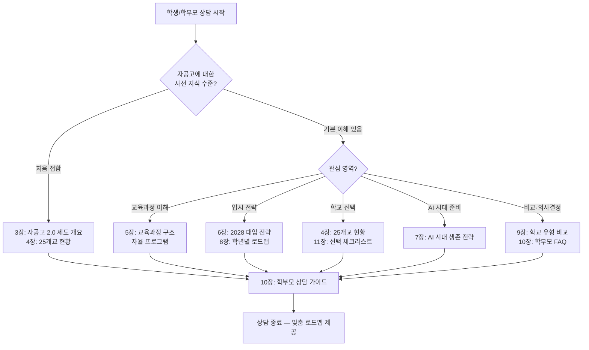

### 1.3 핵심 용어 정리표

| 용어 | 정식 명칭 | 설명 | 상담 시 핵심 포인트 |
|------|-----------|------|---------------------|
| 자공고 | 자율형 공립고등학교 | 공립 일반고 중 교육부 공모 선정을 통해 자율적 교육과정 운영 권한을 부여받은 학교 | "공립의 안정성 + 자율적 교육과정 = 가성비 최상위 선택지" |
| 자공고 2.0 | 자율형 공립고 2.0 | 2025.8 교육부 신규 지정 / 2026.3 운영 시작 / 학교-지자체-대학-기업 4자 협약 기반 | "기존 자공고 1.0과 다르다. 4자 협약이 핵심 차별점" |
| 4자 협약 | 학교-지자체-대학-기업 협약 | 자공고 2.0의 핵심 운영 구조. 4개 주체가 협약을 맺어 지역 특색 교육과정을 설계 | "4자 협약의 실질적 내용이 학교의 질을 결정한다" |
| 자율교육과정 | 학교 자율 교육과정 | 국가 표준 교육과정 위에 학교가 자율적으로 편성하는 심화 교육과정 | "자율 시간을 어떻게 쓰느냐가 자공고 학생의 성패를 가른다" |
| 교과전형 | 학생부교과전형 | 내신 성적 중심 수시 전형. 2028 5등급제로 자공고 최대 수혜 | "자공고에서 내신 1등급 받으면 SKY 교과전형 도전 가능" |
| 학종 | 학생부종합전형 | 생기부 정성 평가 수시 전형. 세특 비중 35~40% | "세특의 질이 학종 합격을 결정한다" |
| 세특 | 세부능력 및 특기사항 | 교과별 학생의 학습 과정, 탐구 활동, 성장을 기술하는 영역 | "자율 프로그램 활동을 세특에 연결하는 것이 핵심 전략" |
| 5등급제 | 2028 내신 5등급 체계 | 2028 대입부터 적용. 상위 10% = 1등급으로 진입 폭 확대 | "9등급제의 상위 4% → 5등급제의 상위 10% = 1등급 확보 2.5배 쉬워짐" |
| 수능 최저 | 수능 최저학력기준 | 수시 전형에서 요구하는 수능 최소 등급 조건 | "교과전형 지원 시 수능 최저 충족 여부가 합불을 결정" |
| 통합형 수능 | 2028 통합형 수능 | 문·이과 구분 폐지. 전 학생 동일 시험 | "자공고 학생도 일반고와 동일 조건으로 수능 응시" |
| 지역인재전형 | 지역인재 선발 전형 | 비수도권 대학이 해당 지역 고교 졸업자에게 별도 정원을 배정하는 전형 | "비수도권 자공고 학생의 숨겨진 강점" |
| 생기부 | 학교생활기록부 | 교사가 작성하는 학생의 학교 활동 종합 기록 | "교사와의 관계 구축이 생기부 질을 좌우한다" |
| 학교알리미 | schoolinfo.go.kr | 학교 교육과정, 진학실적, 학생현황 등 공시 정보 제공 사이트 | "자공고 비교 시 반드시 학교알리미로 객관 데이터 확인" |

> **상담 포인트**: "용어가 낯설 수 있지만, 자공고 2.0의 핵심은 간단합니다. '공립학교의 안정성 위에 자율적 교육과정을 얹은 학교'입니다. 학비 0원, 내신 관리 유리, 2028 대입 개편 최대 수혜 — 이 세 가지를 먼저 기억하시면 됩니다."

---

## 2. AI 시대 교육 패러다임의 전환

### 2.1 AI가 바꾸는 고등학교 교육

AI(ChatGPT, Claude, Gemini 등)의 등장으로 **암기 중심 교육의 가치가 급격히 하락**하고 있습니다. 기존 입시 교육에서 강조하던 '정해진 틀 안의 지식 암기'와 '빠른 문제 풀이 능력'은 AI가 훨씬 잘하는 영역입니다.

| 구분 | AI가 대체하는 영역 | 인간이 해야 하는 영역 |
|------|-------------------|----------------------|
| **학습** | 문제 풀이, 개념 설명, 오답 분석 | 내신 관리, 세특 활동 선정, 자기주도 학습 전략 |
| **정보** | 단순 정보 검색, 자료 정리 | 정보의 맥락 파악, 비판적 분석 |
| **글쓰기** | 형식적 보고서, 요약문 | 개인 경험 기반 성찰, 독창적 관점 |
| **계산** | 수치 계산, 데이터 처리 | 데이터 해석, 의미 부여 |
| **계획** | 일정 관리, 루틴 설계 | 장기 진로 설계, 가치관 기반 의사결정 |

> **상담 포인트**: "AI 시대에 학교의 가치는 '무엇을 가르치느냐'가 아니라 '어떤 환경을 제공하느냐'로 바뀝니다. 자공고는 '자유로운 시간'이라는 환경을 제공합니다. 이 시간을 어떻게 쓰느냐가 곧 경쟁력입니다."

### 2.2 자공고의 AI 시대 포지셔닝

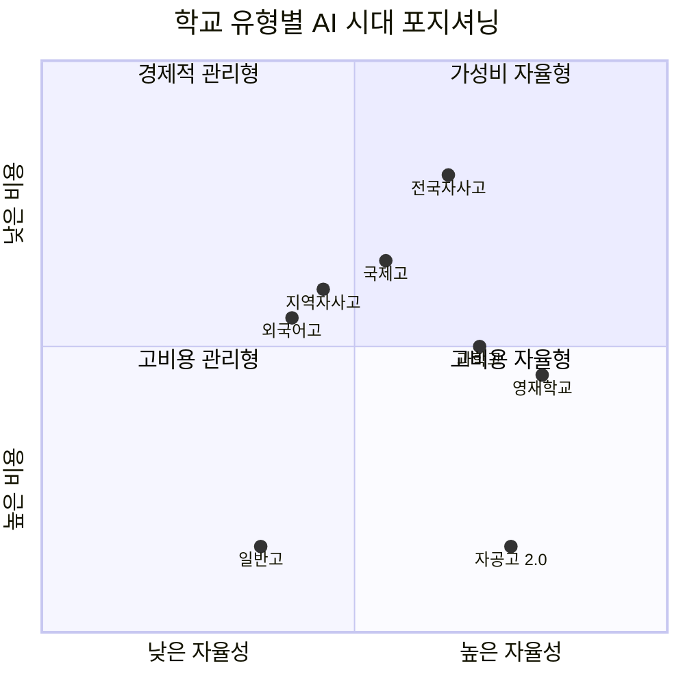

**해석**: 자공고 2.0은 **높은 자율성 + 낮은 비용(무상)** 영역에 위치합니다. AI 시대에는 자율성이 곧 경쟁력이 되므로, 비용 부담 없이 높은 자율성을 확보할 수 있는 자공고의 포지션이 매력적입니다.

| 학교 유형 | 자율성 | 연간 비용 | AI 시대 강점 | AI 시대 약점 |
|-----------|--------|-----------|-------------|-------------|
| **자공고 2.0** | 높음 | 무상 (0원) | 자유 시간 활용, 비용 없음 | 인프라 편차, 초기 데이터 부재 |
| 일반고 | 보통 | 무상 (0원) | 안정적 내신 환경 | 특색 프로그램 부족 |
| 전국자사고 | 높음 | 연 1,000만 원+ | 풍부한 인프라 | 높은 비용, 내신 경쟁 |
| 외국어고 | 보통 | 연 600~800만 원 | 어학 특화 | AI 번역으로 어학 가치 하락 |
| 과학고 | 높음 | 보통 | 연구 인프라 | 진로 폭 제한 |

### 2.3 미래 핵심 역량과 자공고 교육의 정합성

World Economic Forum(WEF)의 Future of Jobs Report(2025)가 제시하는 **2030년 핵심 역량 Top 10**과 자공고 교육의 연관성:

| 순위 | WEF 2030 핵심 역량 | 자공고에서의 훈련 방법 | 자공고 관련 요소 |
|------|-------------------|---------------------|----------------|
| 1 | 분석적 사고 (Analytical Thinking) | 교과 탐구 활동, AI 데이터 분석 프로젝트 | 세특 탐구 보고서 |
| 2 | 복원력·유연성·민첩성 | 자율 시간 자기 관리, 다수 과제 동시 수행 | 자율 프로그램 운영 |
| 3 | 리더십·사회적 영향력 | 4자 협약 지역사회 프로젝트 리더 경험 | 협약 프로그램 |
| 4 | 창의적 사고 | 자기주도 프로젝트 독창적 주제 설정 | 자율 교육과정 |
| 5 | 동기부여·자기 인식 | 자기주도 학습 계획 수립·실행·성찰 | 학습 일지 작성 |
| 6 | 기술 리터러시 | AI 도구 윤리적 활용 훈련 | AI 활용 탐구 |
| 7 | 공감·적극적 경청 | 그룹 토론, 교내 발표, 지역사회 봉사 | 동아리, 봉사 활동 |
| 8 | 호기심·평생 학습 | 관심 분야 자기주도 탐구 | 자기주도 프로젝트 |
| 9 | 다학문적 사고 | 전 과목 균형 학습 + 교과 융합 탐구 | 범교과 교육과정 |
| 10 | 시스템 사고 | 지역 문제 분석 → 구조적 원인 파악 → 해결 제안 | 4자 협약 연계 탐구 |

> **상담 포인트**: "AI 시대에 가장 가치 있는 역량은 '분석적 사고'와 '창의적 사고'입니다. 자공고는 자율 시간과 4자 협약을 통해 이 역량을 훈련할 수 있는 구조를 갖추고 있습니다. 단, 이 구조를 활용하는 것은 학생 본인의 몫입니다."

### 2.4 OECD Education 2030 프레임워크와 자공고

OECD가 제시한 Education 2030 프레임워크의 핵심 역량과 자공고 교육의 대응을 비교합니다.

| OECD 2030 핵심 역량 | 자공고 대응 요소 | 구현 방식 |
|---------------------|----------------|----------|
| 새로운 가치 창조 | 자기주도 프로젝트 | 자율 시간에 독자적 프로젝트 설계·실행 |
| 긴장과 딜레마 조정 | 4자 협약 이해관계 경험 | 학교-지자체-대학-기업 간 관점 차이 체험 |
| 책임감 | 지역사회 연계 활동 | 4자 협약 기반 지역 봉사·정책 제안 |
| 학생 주도성 (Student Agency) | 자율 교육과정 | 학생 스스로 탐구 주제 선정·실행 |
| 변혁적 역량 | AI 도구 활용 + 비판적 사고 | AI를 도구로 활용하며 인간 고유 역량 강화 |

### 2.5 "자유 시간"이 곧 경쟁력인 시대

AI 시대 고등학생의 경쟁력은 **'무엇을 배웠느냐'가 아니라 '자유 시간에 무엇을 했느냐'**로 결정됩니다.

자공고가 제공하는 **자율 교육과정 시간**은 다음과 같이 활용될 수 있습니다:

| 활용 방식 | 세특 연결 | 입시 효과 | 예시 |
|-----------|----------|-----------|------|
| 자기주도 프로젝트 | 직접 연결 | 학종 변별력 최상 | GitHub 오픈소스, 데이터 분석 보고서 |
| AI 도구 활용 탐구 | 직접 연결 | 학종 차별화 | AI로 문학 작품 감정 분석 후 비교 연구 |
| 지역사회 연계 봉사 | 간접 연결 | 학종 + 면접 소재 | 4자 협약 기업 인턴, 지자체 정책 제안 |
| 독서 및 심화 탐구 | 직접 연결 | 세특 풍부화 | 진로 관련 학술 논문 리뷰 |
| 수능 집중 학습 | 해당 없음 | 정시 전환 대비 | 통합형 수능 모의고사 훈련 |

> **상담 포인트**: "자사고는 빡빡한 커리큘럼으로 자유 시간이 적고, 일반고는 자율 프로그램이 부족합니다. 자공고는 '학교가 보장하는 자유 시간'이 있습니다. AI 시대에 이 시간이 가장 큰 자산입니다. 단, 이 시간을 학원 보충이 아닌 자기 프로젝트로 채워야 합니다."

---

## 3. 자율형공립고 2.0 제도 개요

### 3.1 자공고 2.0이란

자율형공립고 2.0은 **2025년 8월 27일 교육부가 신규 지정**한 공립고등학교 유형입니다. 기존 자공고 1.0이 2025년 폐지된 후, 새로운 제도적 틀 위에 설계된 **'지역 거점 자율 공립고'**입니다.

**핵심 사실 정리**:

| 항목 | 내용 |
|------|------|
| **공식 명칭** | 자율형 공립고 2.0 |
| **교육부 지정일** | 2025년 8월 27일 |
| **운영 시작** | 2026년 3월 |
| **지정 학교 수** | 25개교 (39개교 공모, 25개교 선정) |
| **지정 기간** | 5년 (1회 연장 가능, 최대 10년) |
| **운영비 지원** | 연 2억 원 내외 (교육부 + 교육청) |
| **학비** | 무상교육 적용 (학비 0원) |
| **기숙사** | 대부분 없음 (통학 기본) |
| **선발 방식** | 학구 배정/추첨 (별도 선발 시험 없음) |
| **핵심 운영 구조** | 학교-지자체-대학-기업 4자 협약 |

### 3.2 4자 협약 구조

자공고 2.0의 가장 큰 특징은 **4자 협약** 구조입니다. 학교 단독 운영이 아니라, 지역 생태계 전체가 교육에 참여하는 모델입니다.

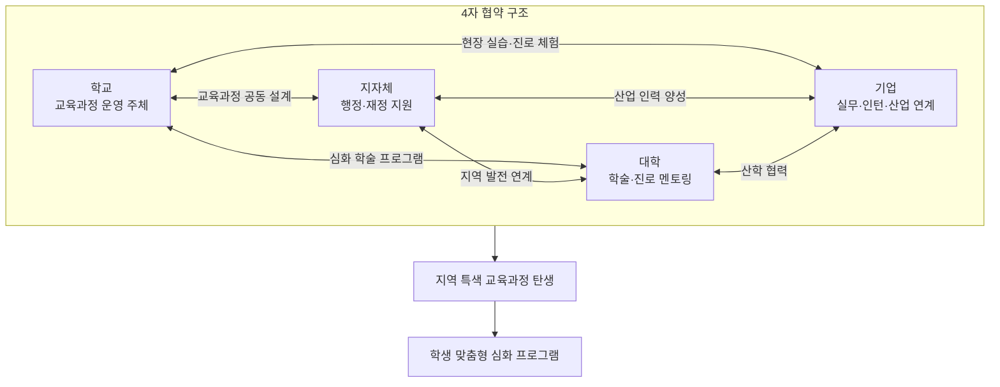

**각 주체의 역할**:

| 주체 | 주요 역할 | 기대 효과 |
|------|----------|-----------|
| **학교** | 교육과정 편성·운영, 학생 지도 | 자율적 교육과정으로 학교 경쟁력 확보 |
| **지자체** | 행정 지원, 지역 인프라 연계, 재정 보조 | 지역 교육 활성화, 인구 유출 방지 |
| **대학** | 전공 체험, 학술 멘토링, 연구 지원 | 우수 학생 조기 발굴, 지역 대학 활성화 |
| **기업** | 현장 실습, 진로 체험, 산업 연계 교육 | 지역 인재 양성, CSR 실현 |

> **상담 포인트**: "4자 협약의 실질적 내용이 자공고의 질을 결정합니다. '어떤 대학, 어떤 기업과 협약했는가'를 학교 설명회에서 반드시 확인하세요. 협약이 형식적 MOU에 그치는지, 실제 프로그램으로 구현되는지가 핵심입니다."

### 3.3 자공고 1.0 vs 2.0 비교

| 비교 항목 | 자공고 1.0 (폐지) | 자공고 2.0 (2026~) |
|-----------|-------------------|-------------------|
| **운영 기간** | 2010~2025 | 2026~ (5년 지정, 1회 연장) |
| **운영 구조** | 학교 단독 자율 운영 | 4자 협약 (학교-지자체-대학-기업) |
| **재정 지원** | 교육청 별도 지원 미미 | 연 2억 원 내외 교육부·교육청 지원 |
| **교원 인사** | 일반 공립고와 동일 순환 | 교원 인사 자율권 일부 보장 |
| **교육과정** | 학교 재량 자율 편성 | 4자 협약 기반 지역 특색 교육과정 |
| **성과 관리** | 별도 평가 체계 미비 | 5년 단위 성과 평가, 재지정 심사 |
| **선발 방식** | 학구 배정/추첨 | 학구 배정/추첨 (동일) |
| **학비** | 무상 | 무상 (동일) |
| **폐교 시** | 일반고로 전환 | 일반고로 전환 (동일) |

> **상담 포인트**: "1.0은 '학교한테 자율권을 줬지만 지원은 안 한' 구조였고, 2.0은 '자율권 + 재정 지원 + 외부 협약'을 묶은 구조입니다. 1.0의 실패를 보완한 버전이라고 보시면 됩니다."

### 3.4 예산 구조

| 항목 | 내용 |
|------|------|
| **운영비** | 연 2억 원 내외 (교육부 + 시·도교육청 분담) |
| **지원 기간** | 5년 (1회 연장 가능 → 최대 10년) |
| **사용 용도** | 특색 교육과정 개발, 협약 프로그램 운영, 교원 역량 강화 |
| **학생 부담** | 0원 (고교 무상교육 적용) |
| **추가 비용** | 급식비, 교복, 수학여행 등 부대비용만 학교별 별도 |

**자사고와의 예산 비교**:

| 비교 | 자공고 2.0 | 전국자사고 |
|------|-----------|-----------|
| 학생 연간 학비 | 0원 | 1,000만 원+ |
| 학교 특색 프로그램 재원 | 교육부 지원 2억/년 | 학생 학비 + 재단 출연금 |
| 3년간 학생 총 부담 | 0원 | 3,000만 원+ |
| 재정 안정성 | 정부 예산 (안정) | 학생 수 의존 (변동) |

### 3.5 교원 인사 자율권

자공고 2.0의 중요한 변화 중 하나는 **교원 인사 자율권의 일부 보장**입니다.

| 항목 | 일반 공립고 | 자공고 2.0 |
|------|------------|-----------|
| 교원 순환 근무 | 5~7년 단위 의무 순환 | 협약 분야 전문 교원 유임 가능 |
| 교원 초빙 | 시·도교육청 배정 | 학교장 초빙 일부 허용 |
| 교과 전문성 | 배정 교원 역량에 의존 | 협약 기관 전문가 겸임 강사 활용 |
| 교원 연수 | 일반 연수 프로그램 | 4자 협약 기반 맞춤 연수 |

> **상담 포인트**: "교원 순환 근무제가 교육 연속성을 해치는 것은 사실입니다. 하지만 자공고 2.0은 협약 분야 전문 교원에 대해 유임을 일부 허용하고, 외부 전문가를 겸임 강사로 활용할 수 있습니다. 완벽하진 않지만, 일반 공립고보다는 나은 구조입니다."

### 3.6 자공고 2.0 선정 과정과 평가 체계

**선정 과정**:

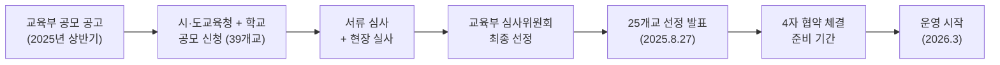

**성과 평가 체계**:

| 평가 시기 | 평가 주체 | 평가 내용 | 평가 결과 |
|-----------|----------|----------|----------|
| 매년 | 시·도교육청 | 운영비 집행 실적, 프로그램 운영 현황 | 연차 보고 |
| 3년차 | 교육부 + 외부 전문가 | 중간 평가 — 프로그램 성과, 학생 만족도, 4자 협약 실행 | 개선 권고 또는 경고 |
| 5년차 | 교육부 | 재지정 심사 — 종합 성과 평가 | 재지정 또는 일반고 전환 |
| 10년차 | 교육부 | 최종 평가 | 재지정 불가 — 일반고 전환 |

### 3.7 자공고 2.0의 제도적 위치

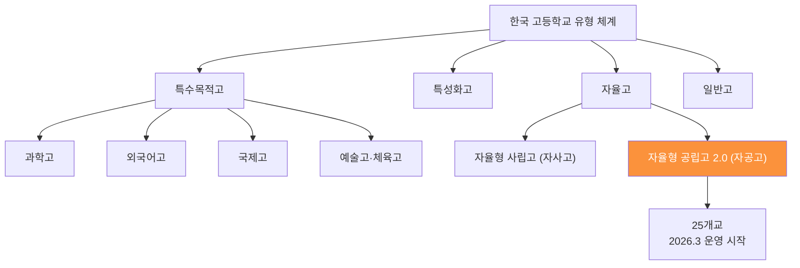

---

## 4. 자공고 25개교 지역별 현황

2025년 8월 교육부 공모에서 **39개교 중 25개교**가 자공고 2.0으로 선정되었습니다.

### 지역별 분포

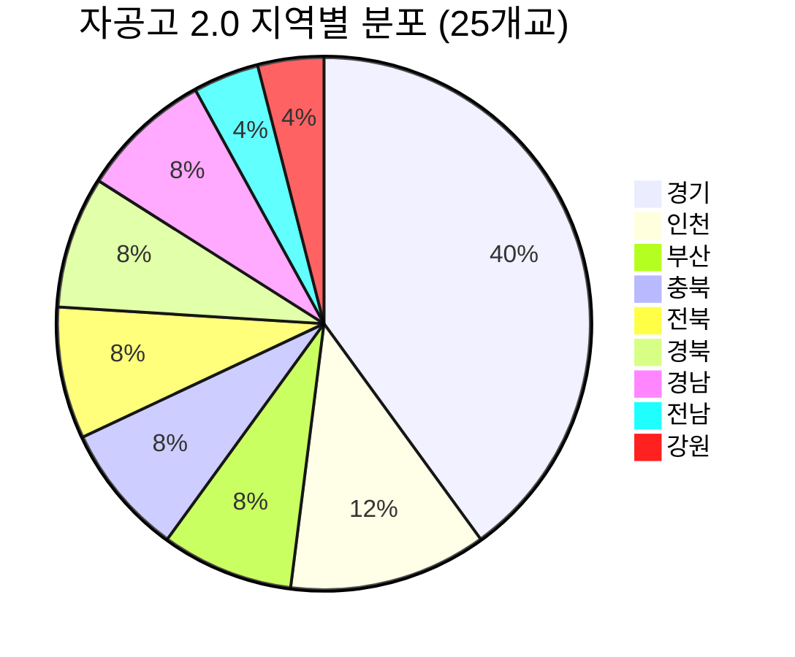

**핵심 관찰**: 경기도가 10개교(40%)로 압도적이며, 서울에는 단 한 곳도 없습니다. 비수도권 지역 거점 학교가 다수를 차지합니다.

### 4.1 부산 (2개교)

| 학교명 | 위치 | 개교 연도/특징 | 학비 | 기숙사 | 특색 프로그램 |
|--------|------|---------------|------|--------|-------------|
| 부산고등학교 | 부산광역시 서구 | 1913년 개교 / 전통 공립 남고 | 무상 | 없음 | 자공고 2.0 협약 프로그램 (2026.3 운영 시작), 운영비 연 2억 원 내외 지원 |
| 주례여자고등학교 | 부산광역시 사상구 | 사상구 공립 여자고 | 무상 | 없음 | 자공고 2.0 협약 프로그램 (2026.3 운영 시작), 운영비 연 2억 원 내외 지원 |

> **상담 포인트**: "부산고는 1913년 개교한 전통 명문 공립고입니다. 113년 전통의 네트워크와 지역 사회 기반이 강점입니다. 주례여고는 사상구 거점 여자고로, 여학생 환경을 선호하는 가정에 적합합니다."

### 4.2 인천 (3개교)

| 학교명 | 위치 | 개교 연도/특징 | 학비 | 기숙사 | 특색 프로그램 |
|--------|------|---------------|------|--------|-------------|
| 강화여자고등학교 | 인천광역시 강화군 | 강화군 공립 여자고 | 무상 | 없음 | 자공고 2.0 협약 프로그램 (2026.3 운영 시작), 운영비 연 2억 원 내외 지원 |
| 선인고등학교 | 인천광역시 남동구 | 남동구 공립고 | 무상 | 없음 | 자공고 2.0 협약 프로그램 (2026.3 운영 시작), 운영비 연 2억 원 내외 지원 |
| 인천고등학교 | 인천광역시 | 1895년 개교 / 전통 공립 남고 | 무상 | 없음 | 자공고 2.0 협약 프로그램 (2026.3 운영 시작), 운영비 연 2억 원 내외 지원 |

> **상담 포인트**: "인천고는 1895년 개교한 한국에서 가장 오래된 공립고 중 하나입니다. 131년 전통의 명문 공립고가 자공고 2.0으로 새롭게 출발합니다. 강화여고는 강화도라는 지리적 특수성이 오히려 소규모 밀착 교육의 강점이 될 수 있습니다."

### 4.3 경기 (10개교)

| 학교명 | 위치 | 개교 연도/특징 | 학비 | 기숙사 | 특색 프로그램 |
|--------|------|---------------|------|--------|-------------|
| 남한고등학교 | 경기도 하남시 | 경기 동부 공립고 | 무상 | 없음 | 자공고 2.0 협약 프로그램 (2026.3 운영 시작), 운영비 연 2억 원 내외 지원 |
| 백석고등학교 | 경기도 고양시 일산동구 | 일산 학군 공립고 | 무상 | 없음 | 자공고 2.0 협약 프로그램 (2026.3 운영 시작), 운영비 연 2억 원 내외 지원 |
| 수주고등학교 | 경기도 부천시 | 부천 공립고 | 무상 | 없음 | 자공고 2.0 협약 프로그램 (2026.3 운영 시작), 운영비 연 2억 원 내외 지원 |
| 연천고등학교 | 경기도 연천군 | 경기 북부 공립고 | 무상 | 없음 | 자공고 2.0 협약 프로그램 (2026.3 운영 시작), 운영비 연 2억 원 내외 지원 |
| 의정부고등학교 | 경기도 의정부시 | 의정부 공립 남고 | 무상 | 없음 | 자공고 2.0 협약 프로그램 (2026.3 운영 시작), 운영비 연 2억 원 내외 지원 |
| 의정부여자고등학교 | 경기도 의정부시 | 의정부 공립 여자고 | 무상 | 없음 | 자공고 2.0 협약 프로그램 (2026.3 운영 시작), 운영비 연 2억 원 내외 지원 |
| 이의고등학교 | 경기도 수원시 영통구 | 광교 학군 공립고 | 무상 | 없음 | 자공고 2.0 협약 프로그램 (2026.3 운영 시작), 운영비 연 2억 원 내외 지원 |
| 저현고등학교 | 경기도 고양시 일산동구 | 일산 학군 공립고 | 무상 | 없음 | 자공고 2.0 협약 프로그램 (2026.3 운영 시작), 운영비 연 2억 원 내외 지원 |
| 평내고등학교 | 경기도 남양주시 | 남양주 공립고 | 무상 | 없음 | 자공고 2.0 협약 프로그램 (2026.3 운영 시작), 운영비 연 2억 원 내외 지원 |
| 포천일고등학교 | 경기도 포천시 | 포천 공립고 | 무상 | 없음 | 자공고 2.0 협약 프로그램 (2026.3 운영 시작), 운영비 연 2억 원 내외 지원 |

> **상담 포인트**: "경기도에 10개교가 집중된 것은 경기도교육청의 적극적 정책 의지를 반영합니다. 특히 이의고(광교), 백석고·저현고(일산)는 학군 지역 공립고로서 내신 경쟁이 적절한 수준입니다. 연천고, 포천일고 같은 경기 북부 학교는 소규모 학교의 장점(밀착 지도)을 활용하세요."

### 4.4 충북 (2개교)

| 학교명 | 위치 | 개교 연도/특징 | 학비 | 기숙사 | 특색 프로그램 |
|--------|------|---------------|------|--------|-------------|
| 진천고등학교 | 충청북도 진천군 | 진천 공립고 | 무상 | 없음 | 자공고 2.0 협약 프로그램 (2026.3 운영 시작), 운영비 연 2억 원 내외 지원 |
| 충주예성여자고등학교 | 충청북도 충주시 | 충주 공립 여자고 | 무상 | 없음 | 자공고 2.0 협약 프로그램 (2026.3 운영 시작), 운영비 연 2억 원 내외 지원 |

> **상담 포인트**: "충북 자공고는 지역인재전형을 적극 활용할 수 있는 좋은 위치입니다. 충북 소재 대학(충북대, 한국교통대 등)의 지역인재전형에 유리하며, 진천은 바이오산업 클러스터가 인근에 있어 4자 협약의 기업 연계가 기대됩니다."

### 4.5 전북 (2개교)

| 학교명 | 위치 | 개교 연도/특징 | 학비 | 기숙사 | 특색 프로그램 |
|--------|------|---------------|------|--------|-------------|
| 남원고등학교 | 전라북도 남원시 | 남원 공립고 | 무상 | 없음 | 자공고 2.0 협약 프로그램 (2026.3 운영 시작), 운영비 연 2억 원 내외 지원 |
| 이리여자고등학교 | 전라북도 익산시 | 익산(이리) 공립 여자고 | 무상 | 없음 | 자공고 2.0 협약 프로그램 (2026.3 운영 시작), 운영비 연 2억 원 내외 지원 |

> **상담 포인트**: "전북 지역은 전북대, 원광대 등 지역 국립대의 지역인재전형을 적극 활용할 수 있습니다. 남원은 문화예술 도시로서 인문·예술 분야 협약이 기대되고, 익산은 원광대·군산대와의 대학 연계가 강점이 될 수 있습니다."

### 4.6 전남 (1개교)

| 학교명 | 위치 | 개교 연도/특징 | 학비 | 기숙사 | 특색 프로그램 |
|--------|------|---------------|------|--------|-------------|
| 보성고등학교 | 전라남도 보성군 | 보성 공립고 | 무상 | 없음 | 자공고 2.0 협약 프로그램 (2026.3 운영 시작), 운영비 연 2억 원 내외 지원 |

> **상담 포인트**: "보성은 녹차와 관광 산업의 거점 도시입니다. 지역 특화 산업(농업 바이오, 관광)과 연계한 4자 협약이 기대됩니다. 소규모 학교의 장점인 학생 1인당 교사 관심도가 높은 환경을 활용하세요."

### 4.7 경북 (2개교)

| 학교명 | 위치 | 개교 연도/특징 | 학비 | 기숙사 | 특색 프로그램 |
|--------|------|---------------|------|--------|-------------|
| 북삼고등학교 | 경상북도 칠곡군 | 칠곡 북삼읍 공립고 | 무상 | 없음 | 자공고 2.0 협약 프로그램 (2026.3 운영 시작), 운영비 연 2억 원 내외 지원 |
| 영주여자고등학교 | 경상북도 영주시 | 영주 공립 여자고 | 무상 | 없음 | 자공고 2.0 협약 프로그램 (2026.3 운영 시작), 운영비 연 2억 원 내외 지원 |

> **상담 포인트**: "북삼고는 칠곡군의 산업단지와 연계한 실무 교육이 기대되고, 영주여고는 경북 북부 유일의 자공고로서 지역인재전형에서 유리한 포지션입니다. 경북대, 안동대 등 지역 거점 국립대의 전형을 주목하세요."

### 4.8 강원 (1개교)

| 학교명 | 위치 | 개교 연도/특징 | 학비 | 기숙사 | 특색 프로그램 |
|--------|------|---------------|------|--------|-------------|
| 도계고등학교 | 강원도 삼척시 | 삼척 도계읍 공립고 | 무상 | 없음 | 자공고 2.0 협약 프로그램 (2026.3 운영 시작), 운영비 연 2억 원 내외 지원 |

> **상담 포인트**: "도계고는 강원 지역 유일의 자공고입니다. 소규모 학교의 장점을 극대화할 수 있는 환경이며, 강원대·강릉원주대 등의 지역인재전형을 활용하면 대입에서 유리한 포지션을 확보할 수 있습니다. 내신 경쟁이 상대적으로 수월한 것도 장점입니다."

### 4.9 경남 (2개교)

| 학교명 | 위치 | 개교 연도/특징 | 학비 | 기숙사 | 특색 프로그램 |
|--------|------|---------------|------|--------|-------------|
| 김해고등학교 | 경상남도 김해시 | 김해 공립고 | 무상 | 없음 | 자공고 2.0 협약 프로그램 (2026.3 운영 시작), 운영비 연 2억 원 내외 지원 |
| 삼천포중앙고등학교 | 경상남도 사천시 | 사천 삼천포 공립고 | 무상 | 없음 | 자공고 2.0 협약 프로그램 (2026.3 운영 시작), 운영비 연 2억 원 내외 지원 |

> **상담 포인트**: "김해는 부산과 인접한 경남 제2의 도시로 인프라가 풍부합니다. 김해 공항, 김해 산업단지와 연계한 4자 협약이 기대됩니다. 삼천포중앙고는 사천시의 항공우주산업(KAI) 클러스터와 연계 가능성이 있어 이공계 관심 학생에게 흥미로운 선택지입니다."

### 4.10 주목할 만한 자공고 — 역사·지리적 특수성

일부 자공고는 100년 이상의 역사나 독특한 지리적 위치로 인해 특별한 주목을 받습니다.

#### 100년 이상 전통 학교

| 학교 | 개교 | 역사 | 강점 |
|------|------|------|------|
| 인천고 | 1895년 | 131년 전통. 한국 최초 공립 근대학교 중 하나 | 인천 지역 최대 동문 네트워크, 역사적 브랜드 가치 |
| 부산고 | 1913년 | 113년 전통. 부산 서구 대표 공립 남고 | 부산 지역 동문 네트워크, 전통의 교육 노하우 |

#### 지리적 특수성 활용 가능 학교

| 학교 | 지리적 특수성 | 활용 가능한 4자 협약 방향 |
|------|-------------|----------------------|
| 강화여고 | 강화도 — 도서 지역, 역사·문화 자원 풍부 | 강화 역사 문화 탐구, 해양·환경 교육, 농촌 활성화 |
| 도계고 | 삼척 도계 — 강원 산간 지역, 폐광 도시 | 도시 재생, 에너지 전환, 환경 탐구 |
| 보성고 | 보성 — 녹차 산지, 관광 도시 | 농업 바이오, 관광 산업, 지역 브랜딩 |
| 연천고 | 연천 — 접경지역, DMZ 인근 | 평화·통일 교육, 생태 환경 탐구 |
| 삼천포중앙고 | 사천 — KAI(한국항공우주) 본사 소재 | 항공우주 산업 연계, 이공계 실무 체험 |

> **상담 포인트**: "학교의 지리적 특수성을 활용하면 다른 학교에서는 할 수 없는 독특한 세특을 만들 수 있습니다. 예를 들어, 연천고 학생이 DMZ 접경지역의 생태 변화를 탐구하거나, 삼천포중앙고 학생이 KAI와 연계하여 항공우주 분야를 탐구한다면, 이것은 그 학교에서만 가능한 차별화된 경험입니다."

### 4.11 25개교 종합 요약

| 지역 | 학교 수 | 학교 목록 | 특징 |
|------|---------|----------|------|
| 부산 | 2 | 부산고, 주례여고 | 전통 명문 공립고 + 광역시 인프라 |
| 인천 | 3 | 강화여고, 선인고, 인천고 | 전통 명문(인천고) + 도서지역(강화) |
| 경기 | 10 | 남한고, 백석고, 수주고, 연천고, 의정부고, 의정부여고, 이의고, 저현고, 평내고, 포천일고 | 최다 선정, 학군 지역 + 경기 북부 포함 |
| 충북 | 2 | 진천고, 충주예성여고 | 바이오 클러스터 인근 |
| 전북 | 2 | 남원고, 이리여고 | 지역 문화 특색 |
| 전남 | 1 | 보성고 | 녹차·관광 도시 |
| 경북 | 2 | 북삼고, 영주여고 | 산업단지 연계 가능 |
| 강원 | 1 | 도계고 | 강원 유일, 소규모 밀착 교육 |
| 경남 | 2 | 김해고, 삼천포중앙고 | 부산 인접(김해) + 항공우주(사천) |

---

## 5. 교육과정 구조와 자율 프로그램

### 5.1 국가 표준 교육과정 + 자율 교육과정

자공고 2.0의 교육과정은 **이중 구조**로 설계됩니다. 국가 표준 교육과정을 기반으로 하되, 그 위에 학교 자율 교육과정을 얹는 방식입니다.

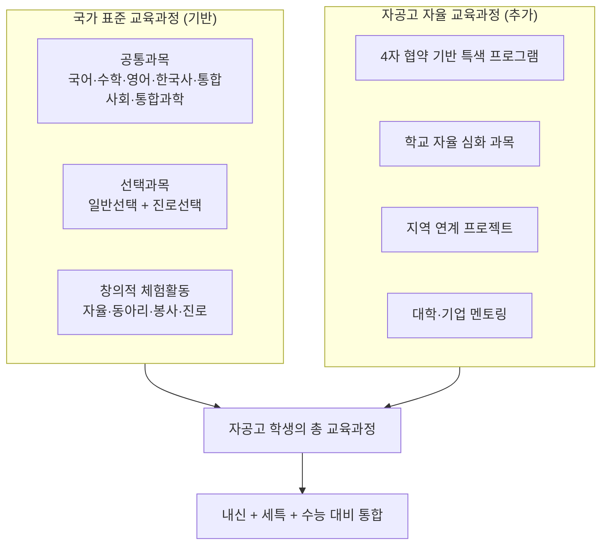

### 5.2 자율 프로그램 시간 활용법

자공고의 자율 프로그램 시간은 학생의 세특과 직결되는 핵심 자원입니다. 이 시간을 어떻게 설계하느냐에 따라 대입 경쟁력이 달라집니다.

| 활동 유형 | 세특 연결 방식 | 입시 효과 | 구체적 예시 |
|-----------|---------------|-----------|-----------|
| **교과 심화 탐구** | 해당 교과 세특에 직접 기재 | 학종 핵심 자원 | 수학 교과에서 AI 확률 모델 탐구 보고서 작성 |
| **4자 협약 프로그램** | 창체 + 관련 교과 세특 | 학종 차별화 | 협약 기업 현장 체험 후 산업 분석 보고서 |
| **자기주도 프로젝트** | 관련 교과 세특 + 면접 소재 | 학종 최대 변별력 | GitHub 오픈소스 프로젝트, 지역 문제 해결 리서치 |
| **독서 심화** | 국어·사회·과학 세특 | 세특 풍부화 | 진로 관련 학술서 읽고 비평문 작성 |
| **AI 도구 활용 탐구** | 관련 교과 세특 | AI 시대 차별화 | ChatGPT로 역사 사료 분석 후 기존 해석 비교 |
| **지역사회 연계 활동** | 창체 봉사 + 관련 교과 세특 | 학종 + 면접 | 지자체 정책 제안서 작성, 지역 문제 해결 프로젝트 |
| **수능 집중 학습** | 해당 없음 | 정시 전환 대비 | 통합형 수능 모의고사 집중 훈련 |

### 5.3 학교별 특색 프로그램

모든 25개교의 자공고 2.0 협약 프로그램은 **2026년 3월 운영 시작** 예정입니다. 현재 시점(2026년 7월)에서 구체적 프로그램 내용은 각 학교 공식 발표 및 교육청 공지를 통해 확인해야 합니다.

**학교 선택 시 확인해야 할 프로그램 정보**:

| 확인 항목 | 확인 방법 | 중요도 |
|-----------|----------|--------|
| 4자 협약 기관 명단 | 학교 설명회, 교육청 공지 | 최상 |
| 협약 프로그램 구체 내용 | 학교 홈페이지, 설명회 자료 | 최상 |
| 자율 교육과정 편성표 | 학교알리미 '교육과정 편성·운영' | 상 |
| 동아리 현황 | 학교알리미, 학교 홈페이지 | 상 |
| 재학생·졸업생 후기 | 학교 탐방, 온라인 커뮤니티 | 중 |
| 교원 전문성 | 학교 설명회, 교육청 정보 | 중 |

> **상담 포인트**: "자공고 2.0은 2026년 3월에 막 운영을 시작했기 때문에 아직 성과 데이터가 없습니다. 이것이 리스크이기도 하고 기회이기도 합니다. 학교 설명회에서 4자 협약의 구체적 내용을 반드시 확인하세요. '어떤 대학·기업과 협약했는가', '실제 프로그램이 무엇인가'를 물어보시면 됩니다."

### 5.4 자율 교육과정 모델 — 학교 설계 패턴

자공고 2.0의 자율 교육과정은 학교별로 다양한 패턴으로 설계될 수 있습니다. 아래는 4자 협약 구조에 따른 예상 모델입니다.

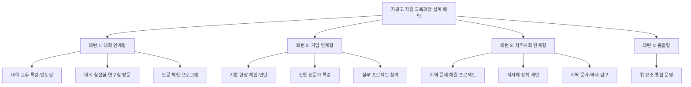

| 패턴 | 핵심 내용 | 적합한 학생 유형 | 세특 연결 강도 |
|------|----------|----------------|--------------|
| **대학 연계형** | 협약 대학과의 학술 교류, 전공 체험, 교수 멘토링 | 학술 탐구에 관심 있는 학생 | 매우 높음 |
| **기업 연계형** | 협약 기업의 현장 체험, 실무 프로젝트, 산업 이해 | 실무 경험에 관심 있는 학생 | 높음 |
| **지역사회 연계형** | 지역 문제 발굴·해결, 지자체 정책 참여 | 사회 문제에 관심 있는 학생 | 높음 |
| **융합형** | 대학+기업+지역사회 통합 운영 | 폭넓은 경험을 원하는 학생 | 최상 |

### 5.5 자율 교육과정과 일반 교육과정의 시간 배분

자공고 학생의 주간 시간표 예시 (학교별 편차 있음):

| 시간대 | 월 | 화 | 수 | 목 | 금 |
|--------|-----|-----|-----|-----|-----|
| 1교시 | 국어 | 수학 | 영어 | 과학 | 사회 |
| 2교시 | 수학 | 영어 | 국어 | 수학 | 영어 |
| 3교시 | 과학 | 사회 | 수학 | 국어 | 과학 |
| 4교시 | 영어 | 국어 | 사회 | 영어 | 국어 |
| 5교시 | 한국사 | **자율 프로그램** | 체육 | **자율 프로그램** | 수학 |
| 6교시 | 선택과목 | **자율 프로그램** | 동아리 | **자율 프로그램** | 선택과목 |
| 7교시 | 자율학습 | 자율학습 | 창체 | 자율학습 | 자율학습 |

> **상담 포인트**: "자율 프로그램 시간이 주당 4시간 이상 확보되면, 한 학기에 약 80시간의 자율 탐구가 가능합니다. 이 80시간을 어떻게 설계하느냐가 자공고 학생의 세특 품질을 결정합니다. 학기 초에 80시간 활용 계획을 세우고, 매주 실행·점검하는 루틴을 만드세요."

### 5.6 자율 프로그램 운영 품질 평가 기준

학부모·학생이 자공고의 자율 프로그램 운영 품질을 평가하는 기준입니다.

| 평가 항목 | 우수 (A) | 보통 (B) | 미흡 (C) |
|-----------|---------|---------|---------|
| **협약 기관 참여도** | 협약 기관 전문가 정기 방문·멘토링 | 연 1~2회 특강 수준 | 형식적 MOU만 체결 |
| **프로그램 구체성** | 학기별 프로그램 일정표·커리큘럼 공개 | 개요 수준만 공개 | 프로그램 내용 미확정 |
| **학생 참여도** | 전체 학생 70% 이상 적극 참여 | 50% 내외 참여 | 30% 미만 참여 |
| **세특 연결성** | 프로그램 활동이 교과 세특에 체계적 반영 | 일부 반영 | 세특과 무관하게 운영 |
| **성과 관리** | 학기별 프로그램 성과 보고·환류 | 연 1회 보고 | 성과 관리 없음 |
| **교사 참여** | 교과 교사가 프로그램 설계에 참여 | 담당 교사만 참여 | 교사 참여 없음 |

---

## 6. 2028 대입 개편과 자공고 전략

### 6.1 내신 5등급제 — 자공고 최대 수혜

2028 대입부터 적용되는 **내신 5등급제**는 자공고 학생에게 가장 유리한 변화입니다.

**9등급제 vs 5등급제 비교**:

| 등급 | 9등급제 (현행) | 5등급제 (2028~) |
|------|---------------|----------------|
| 1등급 | 상위 4% | **상위 10%** |
| 2등급 | 상위 11% | 상위 25% |
| 3등급 | 상위 23% | 상위 50% |
| 4등급 | 상위 40% | 상위 75% |
| 5등급 | 상위 60% | 상위 100% |

**자공고에 유리한 이유**:

| 분석 항목 | 설명 |
|-----------|------|
| **1등급 진입 폭 확대** | 상위 4% → 상위 10%로 2.5배 확대. 반에서 3~4명이던 1등급이 7~8명으로 늘어남 |
| **학생 모집단 특성** | 자공고는 자사고·특목고보다 학생 수준 편차가 커서 상위 10%에 진입하기 상대적으로 수월 |
| **교과전형 문 열림** | SKY 교과전형(서울대 지역균형, 연세대 추천형, 고려대 학교추천)에 자공고 1등급 학생이 지원 가능 |
| **내신 경쟁 완화** | 9등급제에서의 과도한 내신 경쟁이 완화되어 세특 활동에 시간 투자 가능 |

> **상담 포인트**: "5등급제 도입은 자공고 학생에게 게임 체인저입니다. 예전에는 자공고에서 1등급 받기 어려웠지만, 이제 상위 10%만 되면 1등급입니다. 300명 학교에서 30명이 1등급을 받을 수 있다는 뜻이에요. 이 30명이 SKY 교과전형에 도전할 수 있습니다."

### 6.2 교과전형 SKY 진입 전략

2028 대입에서 자공고 학생이 교과전형으로 SKY에 진입하기 위한 구체적 전략입니다.

| 대학 | 전형명 | 선발 방식 | 수능 최저 | 자공고 전략 |
|------|--------|----------|----------|-----------|
| 서울대 | 지역균형선발 | 학교추천 + 교과 + 서류 | 있음 (3개 영역 이내) | 내신 1등급 + 수능 최저 충족 필수. 학교장 추천 필요 |
| 연세대 | 추천형 | 학생부교과 중심 | 있음 | 내신 1~2등급 + 수능 최저 충족. 학교 추천 |
| 고려대 | 학교추천 | 학생부교과 중심 | 있음 | 내신 1~2등급 + 수능 최저 충족. 학교 추천 |
| 성균관대 | 학생부교과 | 교과 성적 중심 | 있음 (확인 필수) | 내신 1~2등급. 수능 최저 전략적 준비 |
| 한양대 | 학생부교과 | 교과 성적 중심 | 없음 | 내신 1~2등급. 수능 최저 없어 지원 부담 낮음 |

**교과전형 SKY 진입 로드맵**:

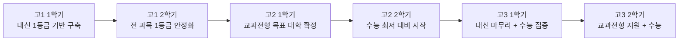

> **상담 포인트**: "자공고에서 SKY 교과전형에 가려면 두 가지가 필요합니다. 첫째, 내신 1등급 (5등급제 기준 상위 10%). 둘째, 수능 최저학력기준 충족. 이 두 가지를 동시에 준비하는 것이 자공고의 핵심 전략입니다."

### 6.3 학종(학생부종합) 전략 — 세특 비중 35~40%

2028 대입에서 학종의 **세특 비중이 35~40%로 확대**됩니다. 자공고의 자율 프로그램이 세특의 핵심 자원이 됩니다.

**세특 연결 3단계 시나리오**:

| 단계 | 활동 | 세특 기재 | 예시 |
|------|------|----------|------|
| **1단계: 탐구 주제 선정** | 자율 프로그램 시간에 교과 관련 탐구 주제 발굴 | 교과 세특 서두에 탐구 동기 기재 | "경제 수업에서 지역 상권 분석에 관심을 갖고..." |
| **2단계: 심화 탐구** | AI 도구 활용, 문헌 조사, 현장 조사 수행 | 교과 세특 본문에 탐구 과정·방법·결과 기재 | "ChatGPT를 활용하여 10년간 상권 변화 데이터를 분석하고..." |
| **3단계: 발표·공유** | 교내 발표, 보고서 작성, 교사 피드백 | 교과 세특 마무리에 성장·발전 기재 | "발표 후 교사 피드백을 반영하여 분석 모델을 개선하며..." |

**과목별 세특 전략**:

| 교과 | 탐구 주제 유형 | 자공고 자율 프로그램 연계 | 세특 기재 포인트 |
|------|---------------|--------------------------|-----------------|
| 국어 | 비문학 주제 심화 탐구, 문학 비평 | 독서 토론 동아리, 지역 문학 조사 | 비판적 읽기 → 자기 관점 제시 과정 |
| 수학 | 실생활 데이터 분석, 수학적 모델링 | AI 도구 활용 탐구, 통계 프로젝트 | 문제 발견 → 모델링 → 검증 과정 |
| 영어 | 원서 읽기, 영어 에세이, TED 분석 | 글로벌 이슈 탐구, 영어 발표 | 영어 활용 능력 + 비판적 사고 |
| 과학 | 실험 설계, 과학 논문 리뷰 | 대학 연계 실험, 과학 동아리 | 탐구 설계 → 실험 → 결론 과정 |
| 사회 | 지역 문제 분석, 정책 제안 | 지자체 연계 프로젝트, 현장 조사 | 사회 현상 분석 → 대안 제시 |

### 6.4 정시 병행 전략 — 통합형 수능

2028 통합형 수능은 문·이과 구분이 폐지되어 자공고 학생에게 유리합니다.

**통합형 수능 핵심 변화**:

| 변화 항목 | 내용 | 자공고 전략 |
|-----------|------|-----------|
| 문·이과 통합 | 전 학생 동일 시험 | 전 과목 균형 학습 (자공고 교육과정 특성과 부합) |
| 선택과목 폐지 | 공통 시험으로 통합 | 선택과목 유불리 사라짐 — 실력 그대로 반영 |
| 서·논술형 확대 | 단답형·서술형 비중 증가 | 세특 탐구 활동이 서술형 대비에도 도움 |
| 절대평가 확대 가능성 | 영어는 이미 절대평가 | 상대평가 과목 집중 대비 |

### 6.5 수시 6장 배분 전략

자공고 학생의 수시 6장 카드 배분 전략입니다 (참조: `autonomous_public.json` 의 `universitySixCardStrategy`).

| 구분 | 대학 | 전형 | 비고 |
|------|------|------|------|
| **상향 1** | 서울대 | 지역균형선발 | 내신 1.5등급 이내 필요 |
| **상향 2** | 연세대 | 추천형 (학생부교과) | 내신 1~2등급 필요 |
| **적정 1** | 고려대 | 학교추천 (학생부교과) | 내신 1~2등급 필요 |
| **적정 2** | 성균관대 | 학생부교과 | 수능최저 확인 필수 |
| **안정 1** | 지방 국립대 | 교과전형 | 내신 2~3등급 가능 |
| **안정 2** | 한양대 | 학생부교과 | 수능최저 없음 |

> **상담 포인트**: "수시 6장 중 상향 2장은 SKY에 도전하고, 적정 2장은 상위권 대학을 노리고, 안정 2장은 확실한 합격을 확보하는 3-2-1 전략이 기본입니다. 비수도권 자공고 학생은 지역 국립대의 지역인재전형을 안정권에 반드시 포함시키세요."

### 6.6 의약학 진학 전략

자공고에서 의약학 진학이 가능한가? 결론부터 말하면, **가능하지만 전략적 접근이 필수**입니다.

| 전략 | 구체적 방법 | 난이도 | 성공 확률 |
|------|-----------|--------|----------|
| **교과전형** | 내신 1등급 + 수능 최저 충족 | 높음 | 중 |
| **지역인재전형** | 비수도권 자공고 → 지역 의대 | 중간 | 상 |
| **정시** | 수능 상위 1% 이내 | 매우 높음 | 하 |
| **학종** | 세특 + 의학 관련 탐구 활동 | 높음 | 중 |

> **상담 포인트**: "자공고에서 의대를 가려면 비수도권 학생에게 가장 유리한 카드가 있습니다. 바로 '지역인재전형'입니다. 비수도권 의대의 40%를 지역 학생에게 배정하므로, 비수도권 자공고에서 내신 1등급 + 수능 최저를 충족하면 의대 진학 가능성이 수도권보다 높을 수 있습니다."

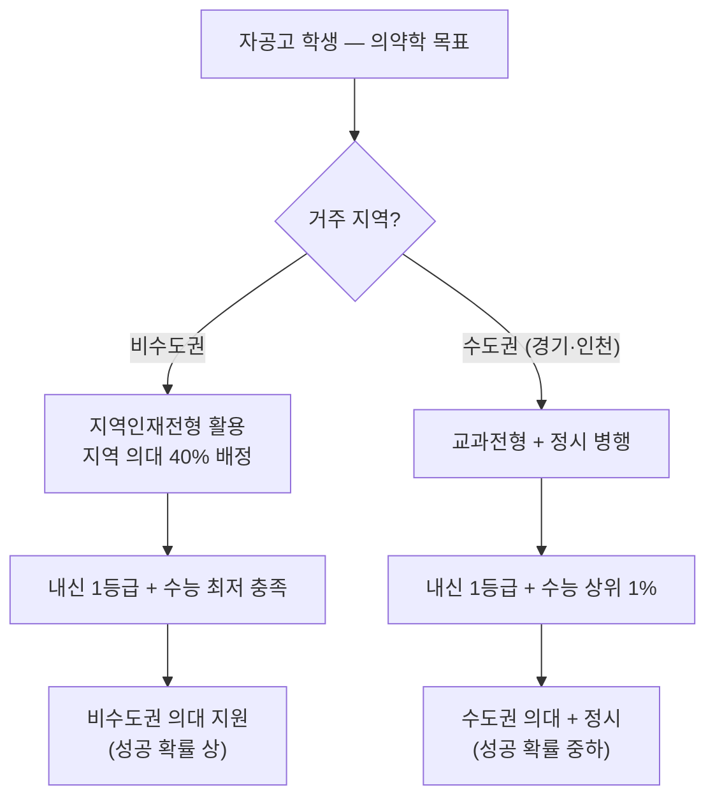

### 6.7 전형별 자공고 학생 경쟁력 분석

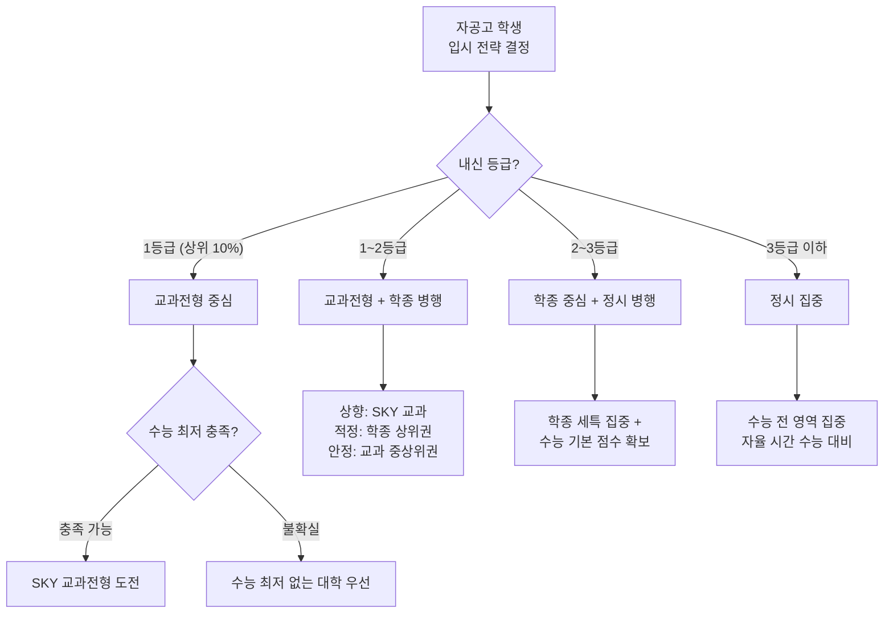

**내신 등급별 대학 목표 매트릭스** (5등급제 기준):

| 내신 등급 | 교과전형 | 학종 | 정시 | 지역인재전형 (비수도권) |
|-----------|---------|------|------|---------------------|
| 1등급 (상위 10%) | SKY, 서성한 | SKY, 서성한 | 수능 점수에 따라 | 지역 의대·약대 가능 |
| 2등급 (상위 25%) | 서성한, 중경외시 | 서성한, 중경외시 | 수능 점수에 따라 | 지역 국립대 상위 학과 |
| 3등급 (상위 50%) | 중상위권 대학 | 중상위권~중위권 | 수능 점수에 따라 | 지역 국립대 대부분 학과 |
| 4등급 (상위 75%) | 중위권 대학 | 중위권 이하 | 수능 집중 권고 | 지역 대학 활용 |

### 6.8 자공고 학생의 면접 대비 전략

교과전형·학종 모두 면접이 포함될 수 있습니다. 자공고 학생만의 면접 차별화 전략입니다.

| 면접 질문 유형 | 자공고 학생 답변 전략 | 예시 답변 프레임 |
|-------------|---------------------|----------------|
| "왜 이 전공을 선택했나요?" | 자율 프로그램에서의 탐구 경험과 연결 | "자율 시간에 [주제]를 탐구하면서 [발견]을 했고, 이를 더 깊이 공부하고 싶어서..." |
| "고교 생활에서 가장 의미 있었던 활동은?" | 자기주도 프로젝트 경험 | "4자 협약 [기관]과 연계하여 [프로젝트]를 수행했고, [결과]를 얻었습니다..." |
| "AI 시대에 이 전공의 미래는?" | AI 도구 활용 경험 기반 답변 | "세특에서 AI를 활용하여 [분석]을 했는데, AI의 [한계]를 발견하고 인간의 [역할]이 더 중요하다고..." |
| "지역사회에 기여한 경험이 있나요?" | 4자 협약 지역 연계 활동 | "자공고의 4자 협약을 통해 [지자체/기업]과 함께 [활동]을 했고, [영향]을 미쳤습니다..." |
| "자기주도적으로 문제를 해결한 경험은?" | 자율 시간 활용 사례 | "자율 프로그램 시간에 [문제]를 발견하고, 직접 [방법]으로 해결했습니다..." |

> **상담 포인트**: "면접에서 자공고 학생의 최대 무기는 '자기주도 경험의 구체성'입니다. 자사고 학생은 학교 프로그램을 따라간 경험이 많지만, 자공고 학생은 '내가 직접 기획하고 실행한 경험'을 말할 수 있습니다. 이것이 면접관에게 가장 강한 인상을 줍니다."

### 6.9 대입 전형 일정표와 자공고 대비 타임라인

| 시기 | 대입 이벤트 | 자공고 학생 할 일 |
|------|-----------|----------------|
| 고3 3월 | - | 수시 6장 최종 확정, 내신 마무리 전략 |
| 고3 6월 | 6월 모의고사 | 모의고사 분석 → 수능 최저 충족 가능 여부 판단 |
| 고3 8월 | 대학별 모집요강 확정 | 수시 원서 작성·제출 준비 |
| 고3 9월 | 수시 원서 접수 시작 | 원서 제출 (교과전형·학종) |
| 고3 9~10월 | 대학별 면접 | 면접 실전 연습 (자기주도 경험 기반) |
| 고3 11월 | 수능 | 수능 응시 (수능 최저 충족 필수) |
| 고3 12월 | 수시 합격자 발표, 정시 지원 | 합불 확인 → 정시 전략 최종 결정 |
| 고3 1월 | 정시 합격자 발표 | 최종 합격 대학 등록 |

---

## 7. AI 시대 자공고 생존 전략

### 7.1 AI가 대체하는 것 vs 인간이 해야 할 것

| 영역 | AI가 대체하는 것 | 인간이 반드시 해야 하는 것 | 자공고 학생 실천 방안 |
|------|-----------------|--------------------------|---------------------|
| **학습** | 문제 풀이, 개념 설명, 오답 분석 | 내신 관리, 세특 활동 선정, 자기주도 학습 전략 | AI로 개념 이해 → 문제는 직접 풀기 |
| **글쓰기** | 형식적 보고서, 요약문 | 개인 경험 기반 성찰, 독창적 관점 | AI 초안 → 본인 관점 추가 → 독창적 결론 |
| **정보 검색** | 단순 사실 검색, 자료 정리 | 정보의 맥락 파악, 비판적 분석 | AI로 자료 수집 → 비판적 분석은 본인 |
| **계획 수립** | 일정 관리, 루틴 설계 | 장기 진로 설계, 가치관 기반 의사결정 | AI로 학습 계획 → 진로 결정은 성찰 기반 |
| **데이터 분석** | 수치 계산, 패턴 인식 | 데이터 해석, 의미 부여, 스토리텔링 | AI로 데이터 처리 → 의미 부여는 본인 |

### 7.2 AI 도구 활용 로드맵

자공고 학생의 학년별 AI 도구 활용 로드맵입니다.

| 시기 | 초점 | AI 도구 | 핵심 포인트 |
|------|------|---------|-----------|
| **중학교** | AI로 학습 효율 높이기 | ChatGPT(개념 학습), Notion AI(학습 계획) | AI는 보조 도구, 내신 관리는 본인 |
| **고1** | AI로 탐구 기초 다지기 | ChatGPT(주제 탐색), Claude(심화 질문), Perplexity(자료 조사) | AI로 주제 발굴 → 탐구는 직접 |
| **고2** | AI로 세특 강화 | AI 탐구 주제 아이디어, 데이터 분석 도구, 코딩 보조 | AI 활용 과정을 세특에 기재 |
| **고3** | AI로 입시 최종 준비 | 수능 오답 분석, 면접 시뮬레이션, 자소서 구조 점검 | AI 활용의 윤리적 경계 인식 |

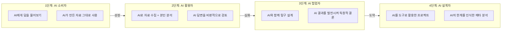

### 7.3 자기주도 프로젝트 설계 가이드

자공고의 자율 시간을 활용한 자기주도 프로젝트 설계 방법입니다.

**프로젝트 유형별 가이드**:

| 프로젝트 유형 | 시작 방법 | 산출물 | 세특 연결 | 면접 활용 |
|-------------|----------|--------|----------|----------|
| **GitHub 프로젝트** | 관심 분야 코딩 프로젝트 시작 | GitHub 저장소, README, 코드 | 정보/수학 세특 | "이 코드를 왜, 어떻게 작성했는지" |
| **블로그 운영** | 학습 내용 정리·공유 | 블로그 글 50편+, 독자 반응 | 국어/사회 세특 | "글쓰기를 통해 사고를 정리하는 과정" |
| **NGO/봉사 프로젝트** | 지역 문제 발굴 → 해결 방안 기획 | 제안서, 활동 보고서, 영상 | 사회/도덕 세특 | "지역 사회 문제를 어떻게 접근했는지" |
| **데이터 분석 프로젝트** | 공공 데이터 활용 탐구 | 분석 보고서, 시각화 자료 | 수학/과학 세특 | "데이터에서 어떤 인사이트를 발견했는지" |
| **학술 리서치** | 학술 논문 리뷰 → 소논문 작성 | 소논문 (3,000~5,000자) | 관련 교과 세특 | "연구 질문 설정부터 결론까지의 과정" |

> **상담 포인트**: "자공고 학생의 최강 무기는 '자기주도 프로젝트'입니다. 학원에서 떠먹여 주는 활동이 아니라, 본인이 직접 기획하고 실행한 프로젝트가 면접에서 가장 강력한 변별 요소입니다. '자공고에서 무엇을 자기주도로 했는가?'라는 질문에 자신 있게 답할 수 있어야 합니다."

### 7.4 세특에 AI 활용 기재 방법

AI를 활용한 탐구 활동을 세특에 기재할 때의 핵심 원칙입니다.

| 원칙 | 설명 | 기재 예시 (좋은 예) | 기재 예시 (나쁜 예) |
|------|------|-------------------|-------------------|
| **과정 중심** | AI 사용 자체가 아닌 탐구 과정을 기재 | "AI 번역 결과의 오류를 발견하고 원인을 분석하여..." | "AI를 사용하여 번역을 완료함" |
| **비판적 활용** | AI 결과를 그대로 수용하지 않고 검증 | "ChatGPT의 답변과 교과서 내용의 차이를 비교하여..." | "ChatGPT에게 물어서 정리함" |
| **독창적 관점** | AI가 제시하지 못하는 본인만의 시각 | "AI 분석 결과에 지역 사회 맥락을 추가하여 독창적 결론을..." | "AI 분석 결과를 요약함" |
| **윤리적 인식** | AI 활용의 한계와 윤리를 인식 | "AI 생성 데이터의 편향 가능성을 인식하고 교차 검증을..." | (윤리 언급 없음) |

### 7.5 AI 활용 4단계 원칙

| 단계 | 원칙 | 설명 | 실천 방법 |
|------|------|------|----------|
| **1단계** | AI는 출발점, 결론은 본인 | AI의 답변을 시작점으로 삼되, 최종 결론은 반드시 본인이 도출 | AI 답변 → 추가 조사 → 본인 분석 → 독창적 결론 |
| **2단계** | AI 결과를 의심하라 | AI의 정보가 항상 정확하지 않음을 인식하고 교차 검증 | AI 답변을 교과서·논문·공식 자료로 검증 |
| **3단계** | AI 활용 과정을 기록하라 | AI를 어떻게 활용했는지 과정을 투명하게 기록 | "AI를 활용하여 주제 탐색 → 교차 검증 → 독창적 분석" |
| **4단계** | AI가 못하는 것에 집중하라 | AI가 대체할 수 없는 영역(경험, 감정, 윤리, 맥락)에 집중 | 개인 경험 기반 성찰, 지역 사회 맥락 분석 |

> **상담 포인트**: "AI를 '안 쓰는 것'이 아니라 '잘 쓰는 것'이 중요합니다. 세특에 AI 활용을 기재할 때 핵심은 '과정'입니다. AI가 답을 줬다는 것이 아니라, AI를 활용하는 과정에서 본인이 어떤 질문을 던졌고, 어떤 비판적 사고를 했는지를 보여주세요."

### 7.6 자공고 학생의 디지털 포트폴리오 구축

AI 시대에 자공고 학생이 구축해야 할 디지털 포트폴리오 가이드입니다.

| 플랫폼 | 목적 | 활용 방법 | 대입 연결 |
|--------|------|----------|----------|
| **Notion** | 학습 관리 + 포트폴리오 | 학습 일지, 탐구 보고서, 프로젝트 기록 정리 | 면접 시 체계적 활동 증거 |
| **GitHub** | 코딩 프로젝트 | 데이터 분석, 웹 프로젝트, AI 실험 코드 | 이공계 면접 차별화 소재 |
| **블로그 (Tistory/Velog)** | 글쓰기 + 사고 정리 | 탐구 과정 기록, 독서 리뷰, 학습 정리 | 인문계 면접 차별화 소재 |
| **YouTube** | 발표 + 교육 콘텐츠 | 탐구 결과 발표 영상, 학습 영상 제작 | 소통 역량 + 미디어 리터러시 증명 |

**포트폴리오 구축 타임라인**:

| 시기 | 목표 | 산출물 |
|------|------|--------|
| 고1 1학기 | 플랫폼 개설 + 첫 게시물 | 자기소개 + 학습 계획 |
| 고1 2학기 | 정기 업데이트 시작 | 탐구 보고서 1편, 블로그 글 10편 |
| 고2 1학기 | 심화 콘텐츠 제작 | 프로젝트 1개 완성, 블로그 글 30편 |
| 고2 2학기 | 포트폴리오 정리 | 프로젝트 2개, 블로그 글 50편 |
| 고3 | 면접 소재로 정리 | 핵심 프로젝트 3개 요약, 성장 스토리 정리 |

### 7.7 자공고 학생의 AI 시대 차별화 5대 전략

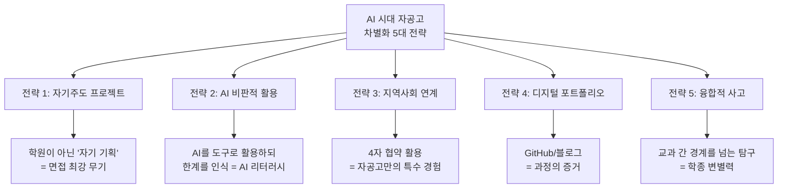

| 전략 | 왜 차별화되는가 | 실천 방법 | 기대 효과 |
|------|---------------|----------|----------|
| **자기주도 프로젝트** | 자사고=학교 프로그램, 자공고=자기 기획 | 관심 분야 프로젝트 3년 일관 추진 | 면접에서 "왜 이것을 했는가" 강력 답변 |
| **AI 비판적 활용** | AI를 단순 사용이 아닌 비판적으로 활용 | AI 결과 검증, 한계 분석, 인간적 보완 | AI 리터러시 보유 학생으로 평가 |
| **지역사회 연계** | 수도권 학교에서 하기 어려운 지역 밀착 탐구 | 4자 협약 기관과 협업, 지역 문제 해결 | 학종에서 "깊이 있는 경험" 평가 |
| **디지털 포트폴리오** | 과정의 객관적 증거 (생기부만으로 부족한 부분 보완) | GitHub, 블로그, Notion 정기 업데이트 | 면접 시 구체적 근거 제시 |
| **융합적 사고** | 단일 교과가 아닌 교과 간 연결 탐구 | 수학+과학, 국어+사회, 영어+기술 융합 프로젝트 | 학종 세특 변별력 극대화 |

> **상담 포인트**: "자공고 학생이 AI 시대에 차별화하려면 '5가지 전략을 동시에' 가져가야 합니다. 자기주도 프로젝트를 하되, AI를 비판적으로 활용하고, 지역사회와 연계하고, 과정을 디지털로 기록하고, 교과를 융합하는 것입니다. 이 5가지가 결합되면 자사고·특목고 학생과 확실히 다른 포트폴리오가 만들어집니다."

---

## 8. 학년별 로드맵 (고1~고3)

### 8.1 고1 — 기반 구축

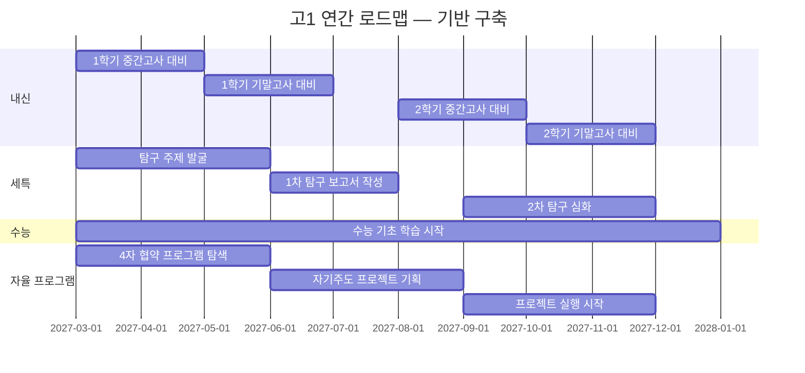

**고1 월별 핵심 활동**:

| 월 | 내신 | 수능 | 세특 | 자율 프로그램 |
|----|------|------|------|-------------|
| 3월 | 학습 습관 형성, 과목별 공부법 확립 | 국·수·영 기초 다지기 | 관심 분야 탐색 | 4자 협약 프로그램 파악 |
| 4월 | 중간고사 대비 집중 | 수능 기출 구조 파악 | 탐구 주제 후보 3개 선정 | 동아리 가입·활동 시작 |
| 5월 | 중간고사 결과 분석 | 모의고사 1회 응시 | 탐구 주제 확정 | 협약 기관 방문/체험 |
| 6월 | 기말고사 대비 시작 | 여름방학 수능 계획 수립 | 1차 탐구 자료 수집 | 프로젝트 아이디어 정리 |
| 7월 | 기말고사 응시 | 여름방학 수능 집중 | 탐구 보고서 초안 | 여름 프로젝트 기획 |
| 8월 | 1학기 성적 분석·보완 | 수능 기본서 1회독 | 탐구 보고서 완성 | 자기주도 프로젝트 착수 |
| 9월 | 2학기 내신 전략 재수립 | 모의고사 분석 | 2학기 탐구 주제 선정 | 프로젝트 1차 결과물 |
| 10월 | 중간고사 대비 | 수능 약점 파악 | 2학기 탐구 심화 | 교내 발표/공유 |
| 11월 | 기말고사 대비 시작 | 수능 기출 분석 | 탐구 보고서 작성 | 프로젝트 중간 점검 |
| 12월 | 기말고사 + 1년 총정리 | 겨울방학 수능 계획 | 고1 세특 최종 점검 | 2년차 계획 수립 |

> **상담 포인트**: "고1은 '기반 구축의 해'입니다. 내신 1등급 습관을 만들고, 세특에 쓸 탐구 주제를 발굴하고, 자기주도 프로젝트의 씨앗을 심는 시기입니다. 가장 중요한 것은 '학습 습관 형성'입니다. 자공고는 학원 의존도가 낮아야 하므로, 스스로 계획하고 실행하는 루틴을 만드세요."

### 8.2 고2 — 심화 탐구

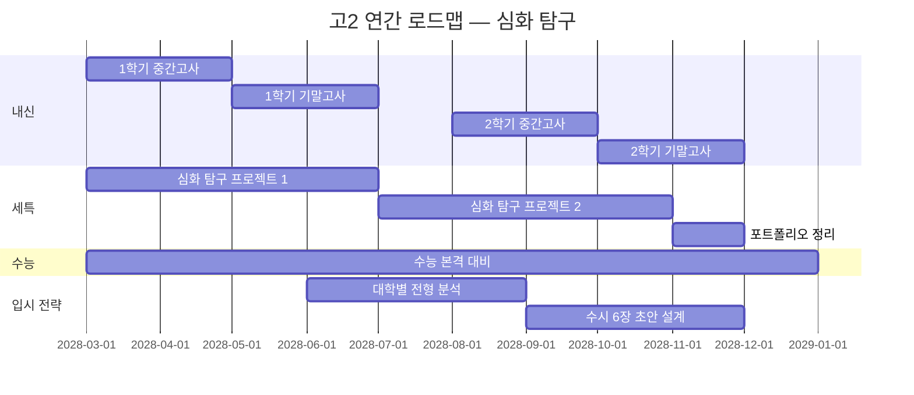

**고2 월별 핵심 활동**:

| 월 | 내신 | 수능 | 세특 | 입시 전략 |
|----|------|------|------|----------|
| 3월 | 고2 교과 적응 | 수능 영역별 집중 시작 | 심화 탐구 주제 확정 | 대입 전형 기초 이해 |
| 4월 | 중간고사 대비 | 6월 모의고사 대비 | 탐구 자료 수집·분석 | 교과전형 vs 학종 방향 결정 |
| 5월 | 중간고사 결과 분석 | 수능 기출 유형 분석 | 1차 심화 탐구 보고서 | 목표 대학 리스트 작성 |
| 6월 | 기말고사 대비 | 6월 모의고사 응시·분석 | 탐구 보고서 교사 피드백 | 대학 전형 세부 분석 |
| 7월 | 기말고사 응시 | 여름방학 수능 심화 | 2차 탐구 주제 선정 | 수시 6장 초안 작성 |
| 8월 | 2학기 준비 | 수능 취약 영역 집중 | 2차 탐구 실행 | 대학별 수능 최저 확인 |
| 9월 | 2학기 내신 전략 | 9월 모의고사 응시 | 2차 탐구 심화 | 수시 6장 1차 확정 |
| 10월 | 중간고사 대비 | 수능 실전 연습 | 탐구 보고서 완성 | 학교 추천 준비 |
| 11월 | 기말고사 대비 | 수능 최종 대비 | 고2 세특 총정리 | 수시 6장 최종 검토 |
| 12월 | 기말고사 + 2년 총정리 | 겨울방학 수능 집중 | 포트폴리오 정리 | 고3 입시 전략 최종 확정 |

> **상담 포인트**: "고2는 '결정의 해'입니다. 교과전형으로 갈지 학종으로 갈지, 수시에 올인할지 정시를 병행할지를 고2 여름까지 결정해야 합니다. 심화 탐구 프로젝트를 최소 2개 완성하고, 이것이 세특의 핵심 콘텐츠가 됩니다."

### 8.3 고3 — 마무리 및 입시

| 월 | 내신 | 수능 | 입시 | 핵심 포인트 |
|----|------|------|------|-----------|
| 3월 | 고3 내신 최후 전투 시작 | 수능 D-270 | 수시 6장 최종 확정 | 내신과 수능의 마지막 균형점 |
| 4월 | 중간고사 사활 대비 | 수능 기출 회독 | 교과전형 지원 대학 확인 | 중간고사가 마지막 내신 기회 |
| 5월 | 중간고사 응시 | 수능 실전 모의 | 학교 추천 확정 | 내신 마무리 |
| 6월 | 기말고사 대비 | 6월 모의고사 분석 | 수시 원서 작성 시작 | 교과전형 성적 최종 확인 |
| 7월 | 기말고사 — 고교 마지막 시험 | 여름방학 수능 풀타임 | 수시 원서 완성 | 기말고사 이후 수능 집중 전환 |
| 8월 | (내신 종료) | 수능 D-90 집중 | 수시 원서 제출 | 원서 제출 마감 엄수 |
| 9월 | (내신 종료) | 9월 모의고사 최종 점검 | 면접 준비 시작 | 모의고사 = 수능 예행연습 |
| 10월 | (내신 종료) | 수능 D-30 최종 | 면접 실전 연습 | 컨디션 관리 최우선 |
| 11월 | (내신 종료) | **수능 응시** | 정시 지원 준비 | 수능 당일 컨디션 = 1년 결과 |
| 12월 | (내신 종료) | (수능 종료) | 정시 지원 + 수시 결과 확인 | 정시 지원 전략 최종 결정 |

> **상담 포인트**: "고3은 '마무리의 해'입니다. 새로운 것을 시작할 시간이 아닙니다. 고1~고2에서 쌓은 것을 수확하는 시기입니다. 내신은 1학기 기말고사가 마지막이고, 이후에는 수능에 올인합니다. 면접은 그동안의 세특 활동을 정리하여 자신의 언어로 말하는 연습을 하면 됩니다."

---

## 9. 자공고 vs 다른 학교 유형 비교

### 9.1 자공고 vs 자사고

| 비교 항목 | 자공고 2.0 | 전국자사고 | 분석 |
|-----------|-----------|-----------|------|
| **학비** | 무상 (0원) | 연 1,000만 원+ | 자공고 압도적 유리 |
| **3년 총 비용** | 0원 | 3,000만 원+ | 3,000만 원 차이 |
| **선발 방식** | 학구 배정/추첨 | 자기주도 학습전형 (선발) | 자사고는 상위권 학생 모집 |
| **내신 경쟁** | 보통 (학구 학생 분포) | 치열 (우수 학생 집중) | 자공고에서 1등급 더 수월 |
| **5등급제 효과** | 매우 유리 (상위 10% 진입 쉬움) | 보통 (이미 우수한 학생 모집단) | 자공고 최대 수혜 |
| **교육과정** | 국가 교육과정 + 자율 프로그램 | 자율적 심화 교육과정 | 자사고 교육과정 자율성 더 높음 |
| **기숙사** | 없음 (통학) | 기숙사 제공 | 자사고 유리 (통학 시간 절약) |
| **교사 전문성** | 공립 배정 + 일부 초빙 | 초빙 교사 비율 높음 | 자사고 유리 |
| **입시 인프라** | 기본 수준 | 풍부 (전문 입시 지원) | 자사고 유리 |
| **세특 질** | 학교별 편차 큼 | 높음 (전문 교사 지도) | 자사고 유리 (단, 개인 노력으로 극복 가능) |
| **네트워크** | 지역 기반 | 전국 기반 (동문 네트워크) | 자사고 유리 |
| **AI 시대 적합성** | 높음 (자율 시간 활용) | 높음 (인프라 풍부) | 동등 (활용 방식에 따라) |

> **상담 포인트**: "자공고 vs 자사고는 '비용 대비 효과'로 판단하세요. 3년간 3,000만 원의 학비 차이를 감수할 만큼 자사고의 인프라가 필요한가? 자기주도 학습 능력이 있다면 자공고에서도 충분히 경쟁력을 확보할 수 있습니다. 반면, 학습 관리를 학교에 맡기고 싶다면 자사고가 유리합니다."

### 9.2 자공고 vs 일반고

| 비교 항목 | 자공고 2.0 | 일반고 | 분석 |
|-----------|-----------|--------|------|
| **학비** | 무상 | 무상 | 동일 |
| **교육과정** | 국가 교육과정 + **자율 프로그램** | 국가 교육과정 | 자공고 우위 (자율 프로그램) |
| **4자 협약** | 있음 (학교-지자체-대학-기업) | 없음 | 자공고 우위 |
| **운영비 지원** | 연 2억 원 | 일반 예산 | 자공고 우위 (추가 재원) |
| **교원 인사** | 일부 자율권 | 순환 배정 | 자공고 소폭 우위 |
| **내신 경쟁** | 보통 | 보통 | 유사 |
| **세특 자원** | 자율 프로그램 + 협약 기관 연계 | 학교 자체 프로그램 | 자공고 우위 |
| **지역 연계** | 체계적 (협약 기반) | 비체계적 | 자공고 우위 |

> **상담 포인트**: "일반고와 비교하면 자공고는 '일반고 + 알파'입니다. 같은 무상교육이지만, 자율 프로그램과 4자 협약이라는 추가 자원이 있습니다. 다만, 이 추가 자원이 실질적으로 운영되는지 학교별로 확인해야 합니다."

### 9.3 자공고 vs 특목고

| 비교 항목 | 자공고 2.0 | 외국어고 | 과학고 | 분석 |
|-----------|-----------|---------|--------|------|
| **학비** | 무상 | 연 600~800만 원 | 보통 (학교별 상이) | 자공고 가장 유리 |
| **선발 기준** | 학구 배정 | 자기주도+면접 | 영재교육원 추천+시험 | 자공고 진입 장벽 가장 낮음 |
| **교육 전문성** | 범교과 자율 | 외국어 특화 | 수학·과학 심화 | 특목고 전문성 높음 |
| **진로 폭** | 넓음 (전 분야) | 제한적 (어학·국제) | 제한적 (이공계) | 자공고 진로 유연성 최고 |
| **AI 시대 리스크** | 낮음 | 높음 (AI 번역) | 중간 | 외국어고 AI 시대 리스크 최대 |
| **내신 경쟁** | 보통 | 치열 | 매우 치열 | 자공고 내신 관리 가장 수월 |

### 9.4 학교 유형별 최적 학생 프로필

| 학생 유형 | 최적 학교 | 이유 |
|-----------|----------|------|
| 자기주도 학습 능력 높고, 비용 부담 원하지 않음 | **자공고 2.0** | 무상 + 자율 시간 = 가성비 최상 |
| 전 과목 균형 있고, 지역 대학 목표 | **자공고 2.0** | 내신 관리 유리 + 지역인재전형 |
| 학비 여유 있고, 관리형 교육 선호 | 전국자사고 | 체계적 입시 관리 + 기숙사 |
| 외국어에 탁월하고, 해외 대학 목표 | 외국어고 | 외국어 심화 + 글로벌 네트워크 |
| 수학·과학 영재, 이공계 연구자 목표 | 과학고/영재학교 | 수학·과학 심화 + R&E 기회 |
| 특별한 목표 없이 안정적 학교 생활 | 일반고 | 가장 안정적, 변수 적음 |
| AI에 관심 있고, 자기 프로젝트를 하고 싶음 | **자공고 2.0** | 자율 시간 + 4자 협약 기업 연계 |

> **상담 포인트**: "어떤 학교가 '객관적으로 좋다'는 없습니다. '이 학생에게 맞는 학교'가 있을 뿐입니다. 자공고는 '자기주도 학습 능력이 있는 학생'에게 최적입니다. 반대로 말하면, 외부 관리가 필요한 학생에게는 자사고나 일반고가 더 나을 수 있습니다."

### 9.5 학교 유형별 대입 전형 적합도

| 전형 | 자공고 2.0 | 전국자사고 | 일반고 | 외국어고 | 과학고 |
|------|-----------|-----------|--------|---------|--------|
| **교과전형** | 매우 유리 (5등급제 수혜) | 불리 (내신 경쟁 치열) | 유리 | 불리 | 해당 없음 |
| **학종** | 유리 (자율 프로그램) | 매우 유리 (풍부한 인프라) | 보통 | 유리 (특화 활동) | 매우 유리 |
| **정시** | 보통 (수능 대비 동일) | 유리 (기숙사+학습) | 보통 | 보통 | 보통 |
| **지역인재** | 매우 유리 (비수도권) | 해당 없음 (전국 모집) | 유리 (비수도권) | 해당 없음 | 해당 없음 |
| **특기자** | 보통 | 보통 | 보통 | 유리 (어학) | 유리 (과학) |

### 9.6 학교 유형별 3년 총 비용 비교

| 비용 항목 | 자공고 2.0 | 전국자사고 | 일반고 (공립) | 외국어고 | 과학고 |
|-----------|-----------|-----------|-------------|---------|--------|
| 입학금 | 0 | 30~50만 | 0 | 10~30만 | 10~20만 |
| 수업료 (3년) | 0 | 2,400~3,600만 | 0 | 1,800~2,400만 | 1,200~1,800만 |
| 기숙사비 (3년) | 해당 없음 | 600~1,200만 | 해당 없음 | 학교별 상이 | 600~900만 |
| 교과서·교재 | 0 (무상) | 50~100만 | 0 (무상) | 50~100만 | 30~60만 |
| **3년 총합** | **0원** | **3,000~5,000만** | **0원** | **1,900~2,500만** | **1,900~2,800만** |
| **월 환산** | **0원** | **83~139만/월** | **0원** | **53~69만/월** | **53~78만/월** |

> **상담 포인트**: "비용 관점에서 자공고는 압도적으로 유리합니다. 자사고 3년 학비 3,000~5,000만 원을 절약하면서도 4자 협약을 통해 특색 프로그램을 무상으로 경험할 수 있습니다. 이 비용 차이를 대학 등록금, 해외 연수, 또는 자기 개발에 투자할 수 있습니다."

### 9.7 학교 유형 선택 의사결정 플로우차트

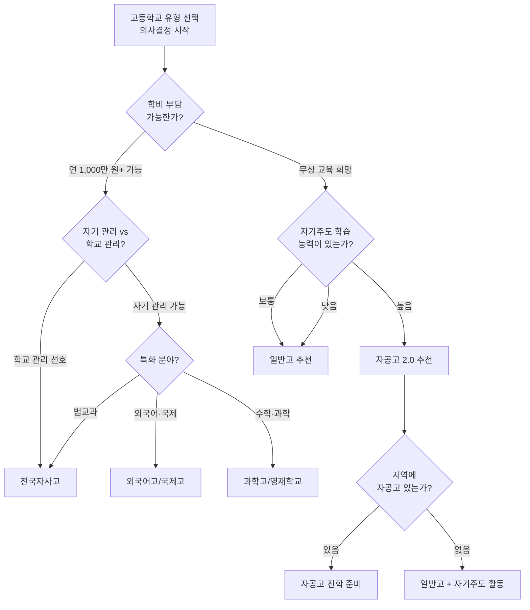

---

## 10. 학부모 상담 가이드

### 10.1 학부모 FAQ — 자주 묻는 질문 25선

#### A. 기본 이해 (Q1~Q5)

| 번호 | 질문 | 핵심 답변 |
|------|------|----------|
| Q1 | 자공고가 뭔가요? 일반고랑 뭐가 다른가요? | 자공고는 일반 공립고에 '자율 교육과정 운영 권한'을 추가로 부여한 학교입니다. 일반고와 동일한 무상교육이지만, 학교-지자체-대학-기업 4자 협약을 통해 특색 프로그램을 운영합니다. |
| Q2 | 자공고 1.0은 왜 없어졌나요? 2.0이 뭐가 다른가요? | 1.0은 자율권만 주고 재정·외부 지원이 부족해 일반고와 차이가 모호했습니다. 2.0은 연 2억 원 운영비 지원 + 4자 협약 구조를 추가하여 실질적 차별화를 도모합니다. |
| Q3 | 전국에 몇 개 학교가 있나요? | 25개교입니다. 경기 10개교, 인천 3개교, 부산·충북·전북·경북·경남 각 2개교, 전남·강원 각 1개교입니다. 서울에는 없습니다. |
| Q4 | 입학 시험이 있나요? | 별도 선발 시험이 없습니다. 학구 배정/추첨 방식이 일반적입니다. 일부 학교는 자기주도 학습계획서나 면접을 운영할 수 있으므로 모집요강을 확인하세요. |
| Q5 | 자공고는 언제부터 운영하나요? | 2025년 8월 교육부 지정, 2026년 3월 운영 시작입니다. 현재(2026년 7월) 첫 학기를 운영 중입니다. |

#### B. 학비·비용 (Q6~Q10)

| 번호 | 질문 | 핵심 답변 |
|------|------|----------|
| Q6 | 학비가 진짜 0원인가요? | 네, 고교 무상교육이 적용되어 입학금·수업료·운영지원비·교과서비가 무상입니다. 급식비·교복·수학여행 등 부대비용만 학교별로 별도입니다. |
| Q7 | 자사고와 비용 차이가 얼마나 나나요? | 3년간 약 3,000만 원 이상 차이납니다. 전국자사고는 연 1,000만 원 이상의 학비가 필요하지만, 자공고는 0원입니다. |
| Q8 | 학원비는 어떤가요? | 자공고는 자율 프로그램과 자기주도 학습이 핵심이므로, 학원 의존도를 줄이는 것이 바람직합니다. 다만, 수능 대비를 위해 일부 학원 수강은 개인 선택입니다. |
| Q9 | 장학금이 있나요? | 별도 장학금이 필요 없을 만큼 학비가 무상입니다. 기초생활수급자·차상위 가정은 교육청 장학금을 추가 신청할 수 있습니다. |
| Q10 | 숨겨진 비용이 있나요? | 자공고 자체의 숨겨진 비용은 없습니다. 다만, 자기주도 프로젝트 수행 시 필요한 도구(노트북, 소프트웨어 등)는 개인 부담입니다. AI 도구(ChatGPT 등)의 무료 버전만으로도 충분히 활용 가능합니다. |

#### C. 입시·진로 (Q11~Q15)

| 번호 | 질문 | 핵심 답변 |
|------|------|----------|
| Q11 | 자공고에서 SKY 갈 수 있나요? | 2028 내신 5등급제 도입으로 가능성이 확대됩니다. 상위 10%=1등급이 되면서 교과전형(서울대 지역균형, 연세대 추천형, 고려대 학교추천)에 도전할 수 있습니다. 다만, 2029년 첫 졸업생이 배출되므로 실적 데이터는 그때부터 확인 가능합니다. |
| Q12 | 의대는 가능한가요? | 가능합니다. 특히 비수도권 자공고 학생은 '지역인재전형'을 활용하면 유리합니다. 비수도권 의대 40%를 지역 학생에게 배정하므로 내신 1등급 + 수능 최저 충족 시 의대 진학 가능성이 있습니다. |
| Q13 | 학종과 교과전형 중 어디에 집중해야 하나요? | 내신 1등급이 확보되면 교과전형 우선, 1~2등급이면 학종을 병행하세요. 자공고의 자율 프로그램이 세특의 핵심 자원이 되므로 학종에서도 경쟁력을 갖출 수 있습니다. |
| Q14 | 정시도 준비할 수 있나요? | 충분히 가능합니다. 자공고의 교육과정은 일반고와 동일한 국가 표준 교육과정을 포함하므로 수능 준비에 불리하지 않습니다. 자율 시간을 수능 대비에 활용할 수도 있습니다. |
| Q15 | 수시 6장 어떻게 배분하나요? | 상향 2장(서울대·연세대), 적정 2장(고려대·성균관대), 안정 2장(한양대·지방국립대)이 기본 구조입니다. 비수도권 학생은 지역인재전형을 안정권에 반드시 포함하세요. |

#### D. 학교 생활 (Q16~Q20)

| 번호 | 질문 | 핵심 답변 |
|------|------|----------|
| Q16 | 기숙사가 없으면 통학이 힘들지 않나요? | 자공고는 학구 배정이므로 거주지에서 통학 가능한 거리입니다. 자사고처럼 전국 모집이 아니라 지역 내 배정이기 때문에 통학 부담은 일반고와 동일합니다. |
| Q17 | 자율 프로그램은 어떻게 운영되나요? | 4자 협약 기관과 연계하여 지역 특색 교육과정을 운영합니다. 구체적 프로그램은 학교별로 다르므로 학교 설명회에서 확인하세요. |
| Q18 | 동아리 활동은 충분한가요? | 자공고는 일반고 수준의 동아리에 더해 4자 협약 기반 특색 동아리가 추가될 수 있습니다. 학교알리미에서 동아리 현황을 확인하세요. |
| Q19 | 교사 수준은 어떤가요? | 공립 교원 배정이 기본이지만, 자공고 2.0은 협약 분야 전문 교원 유임과 일부 초빙이 가능합니다. 또한 협약 기관의 전문가가 겸임 강사로 참여할 수 있습니다. |
| Q20 | 학교 분위기는 어떤가요? | 자공고는 자사고처럼 과도한 입시 경쟁 분위기는 아니지만, 일반고보다는 학업 동기가 있는 학생이 모이는 경향이 있습니다. 학교별로 분위기가 다르므로 재학생 인터뷰가 도움됩니다. |

#### E. 비교·선택 (Q21~Q25)

| 번호 | 질문 | 핵심 답변 |
|------|------|----------|
| Q21 | 자사고를 갈 형편이 안 되면 자공고가 대안인가요? | 그렇게 볼 수도 있지만, 자공고는 '차선책'이 아니라 '다른 전략'입니다. 자사고의 관리형 교육 대신 자기주도형 교육을 선택하는 것이며, AI 시대에는 자기주도 능력이 더 중요해질 수 있습니다. |
| Q22 | 일반고랑 별 차이 없는 것 아닌가요? | 제도적으로는 '일반고 + 자율 프로그램 + 4자 협약 + 연 2억 운영비'입니다. 실질적 차이는 학교의 운영 의지와 4자 협약 내용에 달려 있습니다. 학교 선택 전 반드시 확인하세요. |
| Q23 | 우리 지역에 자공고가 없는데 어떡하나요? | 현재 25개교만 지정되어 있어 모든 지역에 있지는 않습니다. 다만, 향후 추가 지정 가능성이 있으며, 기존 일반고에서도 유사한 자율 프로그램을 운영하는 학교가 있을 수 있습니다. |
| Q24 | 서울에는 왜 자공고가 없나요? | 서울은 이미 자사고·특목고 인프라가 풍부하고, 자공고 2.0은 '지역 거점 활성화'를 목표로 하므로 비수도권과 경기 지역에 집중 배치되었습니다. |
| Q25 | 자공고 지정이 취소되면 어떻게 되나요? | 재학 중 전환은 없습니다. 5년 지정 기간(최대 10년)이 끝나면 일반고로 전환되지만, 재학생은 졸업까지 자공고 프로그램을 이수합니다. 최악의 경우에도 '일반고'가 되는 것이므로 위험은 제한적입니다. |

---

### 10.2 심층 상담 질문 25선 — 입학사정관이 반드시 대비해야 할 질문

학부모 상담에서 나오는 표면적 질문 너머, **입학사정관이 전문성을 갖고 답해야 하는 심층 질문 25선**입니다.

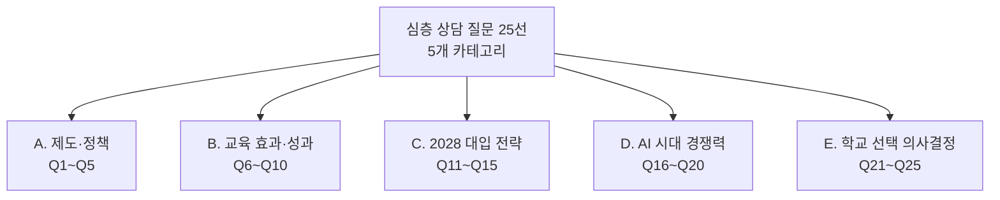

#### A. 제도·정책 (Q1~Q5)

| 번호 | 심층 질문 | 핵심 답변 | 근거·데이터 |
|------|----------|----------|-----------|
| Q1 | 자공고 2.0은 5년 한시 지정인데, 재지정 안 되면 아이가 피해를 보는 것 아닌가요? | 재학 중 전환은 없습니다. 5년 지정이므로 현재 입학하는 학생은 졸업 시까지 자공고 혜택을 받습니다. 1회 연장(총 10년)이 가능하므로, 현 시점에서 입학하는 학생이 재지정 실패로 피해를 볼 가능성은 사실상 없습니다. 만약 재지정이 안 되더라도 일반 공립고로 전환될 뿐, '폐교'가 아닙니다. | 교육부 자공고 2.0 운영 지침: "지정기간 5년, 1회 연장 가능(최대 10년). 재학생은 지정기간 만료와 무관하게 졸업까지 프로그램 이수." |
| Q2 | 연 2억 원 운영비로 충분한가요? 자사고 대비 턱없이 부족한 것 아닌가요? | 절대 금액으로는 자사고보다 적지만, 자공고는 학생 학비 수입이 없는 공립학교이므로 연 2억 원은 '추가 특색사업비'입니다. 자사고의 연 수십억 예산(학비 수입)과 단순 비교하기 어렵습니다. 2억 원은 4자 협약 프로그램 운영, 교원 연수, 심화 과목 개설에 집중 투입됩니다. 또한 협약 기관(기업·대학)의 자체 재원도 활용합니다. | 자공고 연 2억 vs 자사고 학생 300명 x 1,000만 원 = 연 30억. 단, 자사고 예산의 대부분은 교원 인건비·시설비이고, 자공고 2억은 순수 특색사업비. |
| Q3 | 공립학교의 교원 순환근무제 때문에 교육 연속성이 떨어지는 것 아닌가요? | 맞는 지적입니다. 자공고 2.0은 이를 보완하기 위해 협약 분야 전문 교원에 대한 유임을 일부 허용합니다. 또한 4자 협약 구조상 대학 교수·기업 전문가가 겸임 강사로 참여하므로, 교원 순환에 의한 공백을 상당 부분 메울 수 있습니다. 완벽한 해결은 아니지만, 일반 공립고보다는 나은 구조입니다. | 교원 인사 자율권: "협약 분야 전문교원 유임 권한 일부 부여. 학교장 초빙 제한적 허용." |
| Q4 | 4자 협약이 형식적 MOU에 그치면 어떡하나요? | 현실적으로 가장 큰 리스크입니다. 4자 협약의 실효성은 학교별로 편차가 클 수밖에 없습니다. 확인 방법: (1) 학교 설명회에서 협약 기관 담당자 직접 참석 여부 확인, (2) 구체적 프로그램 일정표 요청, (3) 재학생에게 실제 협약 프로그램 참여 경험 문의. 1~2년 운영 후 성과가 미미하면 교육부 성과평가에서 문제가 될 수 있습니다. | 학부모 확인 체크리스트: 협약 기관 담당자 면담 가능 여부, 프로그램 구체 일정표 존재 여부, 재학생 참여 후기 |
| Q5 | 서울이나 대도시에 자공고가 없는 이유는 뭔가요? | 자공고 2.0은 '지역 거점 활성화'가 제도 설계의 핵심 목표입니다. 서울은 이미 자사고·특목고·일반고 인프라가 풍부하고 사교육 시장이 발달해 있어 자공고 2.0의 필요성이 상대적으로 낮습니다. 비수도권과 경기 외곽 지역의 교육 격차 해소가 자공고 2.0의 정책 목적입니다. | 교육부 정책 배경: "지역 교육 거점 활성화, 수도권-비수도권 교육 격차 해소" |

#### B. 교육 효과·성과 (Q6~Q10)

| 번호 | 심층 질문 | 핵심 답변 | 근거·데이터 |
|------|----------|----------|-----------|
| Q6 | 자공고에서 SKY에 실제로 몇 명이나 갈 수 있나요? | 솔직하게 말씀드리면, **아직 모릅니다.** 자공고 2.0은 2026년 3월에 운영을 시작했으므로 첫 졸업생은 2029년 2월에 배출됩니다. 그때까지 실적 데이터가 없습니다. 다만, 2028 5등급제 도입으로 교과전형 진입 가능성이 구조적으로 확대되었으므로 이론적 가능성은 충분합니다. | 첫 졸업생 배출 예정: 2029년 2월. 학교알리미 '졸업생 진로현황' 공시로 확인 가능. |
| Q7 | 학교마다 편차가 크다고 하는데, 우리 지역 자공고가 잘 운영되는지 어떻게 아나요? | 학교 운영 수준 편차는 자공고의 가장 큰 리스크입니다. 확인 방법: (1) 학교알리미(schoolinfo.go.kr)에서 교육과정 편성·운영, 동아리 현황, 진학실적 비교, (2) 학교 설명회 참석하여 4자 협약 구체 내용 확인, (3) 재학생·학부모 인터뷰, (4) 교육청 공시 자료 확인. 이 4단계를 반드시 거치세요. | 확인 도구: 학교알리미 schoolinfo.go.kr, 교육청 고입전형 기본계획, 학교 홈페이지 |
| Q8 | 세특의 질이 자사고 대비 어떤가요? | 자사고의 세특은 전문 교사의 밀착 지도로 질이 높은 경향이 있습니다. 자공고의 세특은 교사 역량에 따라 편차가 있지만, 학생 본인의 자기주도 탐구를 세특에 반영하면 질적으로 차별화할 수 있습니다. 핵심은 '학생이 교사에게 자기 활동을 충분히 공유하고, 교사가 이를 세특에 반영하도록 적극적으로 소통하는 것'입니다. | 세특 질 향상 전략: 탐구 활동 사전 공유 → 교사 피드백 → 수정·보완 → 최종 세특 기재 협의 |
| Q9 | 자공고에서 정말 자기주도 학습 역량이 형성되나요? | 자공고가 '자기주도 학습 역량을 자동으로 형성해 주는 것'은 아닙니다. 자공고는 '자기주도 학습을 할 수 있는 환경(자율 시간)'을 제공하는 것입니다. 이 환경을 활용하는 것은 학생 본인의 몫입니다. 따라서 자기주도 학습 습관이 어느 정도 있는 학생에게 자공고가 적합합니다. | 학생 자기 진단: (1) 혼자 계획 세우고 실행할 수 있는가? (2) 학원 없이도 공부할 수 있는가? (3) 관심 분야를 깊이 파고드는 경험이 있는가? |
| Q10 | 자공고 출신이라는 것이 입시에서 유리한가요, 불리한가요? | 현 시점에서 자공고 출신이라는 것 자체가 입시에 유불리를 주지 않습니다. 대입 전형은 학교 유형이 아니라 학생 개인의 성적·활동·역량을 평가합니다. 다만, 자공고의 자율 프로그램을 적극 활용한 세특이 학종에서 긍정적 평가를 받을 수 있고, 5등급제 도입으로 내신 관리가 유리해진 것은 구조적 이점입니다. | 대입 전형 원칙: 학교 유형이 아닌 개인 역량 평가 (학종, 교과, 정시 공통) |

#### C. 2028 대입 전략 (Q11~Q15)

| 번호 | 심층 질문 | 핵심 답변 | 실전 전략 |
|------|----------|----------|----------|
| Q11 | 5등급제에서 상위 10%=1등급이면 구체적으로 몇 등까지가 1등급인가요? | 학교·과목별 수강 인원에 따라 다릅니다. 예를 들어 300명 학년에서 상위 10%는 30등까지, 200명이면 20등까지가 1등급입니다. 9등급제의 상위 4%(300명 중 12등)보다 2.5배 넓어졌습니다. | 내 학교 학년 인원 x 10% = 1등급 인원수. 자공고의 학생 분포를 고려하면 상위 10% 진입이 자사고보다 상대적으로 수월합니다. |
| Q12 | 교과전형으로 SKY에 가려면 구체적으로 어떻게 해야 하나요? | (1) 전 과목 내신 1등급(5등급제 상위 10%) 확보, (2) 수능 최저학력기준 충족, (3) 학교장 추천 확보. 이 세 가지가 필수입니다. 특히 수능 최저 충족이 관건이므로 내신과 수능을 병행하는 '교과 50% + 정시 50%' 전략이 필요합니다. | 고1부터 전 과목 1등급 습관 → 고2부터 수능 최저 대비 → 고3 1학기 내신 마무리 + 수능 집중 |
| Q13 | 학종에서 세특이 어떻게 연결되는지 구체적 시나리오를 알려주세요. | **3단계 시나리오**: 1단계(탐구 주제 선정) — 자율 프로그램 시간에 교과 관련 관심 주제 발굴. 2단계(심화 탐구) — AI 도구·문헌·현장 조사로 깊이 있는 탐구 수행. 3단계(발표·공유) — 교내 발표, 보고서 작성, 교사 피드백 반영. 이 과정이 교과 세특에 구체적으로 기재됩니다. | 예시: 경제 수업 → "지역 상권 쇠퇴 원인을 AI 데이터 분석으로 탐구하고, 지자체 정책 제안서를 작성하여 발표" → 경제 세특 핵심 콘텐츠 |
| Q14 | 의대 목표 학생인데, 자공고에서 어떤 전략이 가능한가요? | 비수도권 자공고라면 **교과전형 + 지역인재전형** 이중 전략이 최적입니다. 지역인재전형은 비수도권 의대 정원의 40%를 해당 지역 학생에게 배정합니다. 내신 1등급 + 수능 최저 충족 + 의학 관련 세특 활동이 3대 요소입니다. | 수시 6장 배분: 상향 2장(지역 의대 지역인재 + 교과전형), 적정 2장(약대·치대 지역인재), 안정 2장(국립대 교과전형) |
| Q15 | 교과전형 안 되면 정시로 전환할 때, 자공고에서 수능 대비가 가능한가요? | 가능합니다. 자공고의 자율 시간을 수능 대비에 활용할 수 있고, 교육과정 자체가 일반고와 동일한 국가 표준 교육과정입니다. 통합형 수능(문이과 통합)에서 전 과목 균형 학습이 요구되는데, 이는 자공고의 범교과 학습 방식과 부합합니다. 고3 1학기 기말고사 이후 수능에 올인하는 전략도 유효합니다. | 자율 시간 활용: 수능 기출 반복 풀이, 오답 분석(AI 활용), 모의고사 실전 훈련 |

#### D. AI 시대 경쟁력 (Q16~Q20)

| 번호 | 심층 질문 | 핵심 답변 | 실전 전략 |
|------|----------|----------|----------|
| Q16 | AI가 다 해주는 시대에 교과 지식을 배우는 게 의미가 있나요? | 교과 지식은 'AI에게 좋은 질문을 던지기 위한 기초'입니다. AI를 활용하려면 해당 분야의 기본 개념을 이해해야 합니다. 수학을 모르면 AI에게 수학적 모델링을 요청할 수 없고, 역사를 모르면 AI의 역사 해석을 비판적으로 검토할 수 없습니다. 교과 지식은 '암기 대상'에서 'AI 활용의 기초'로 역할이 변한 것입니다. | 교과 학습 방법 전환: 암기 → 이해 → 응용 → AI와 협업 |
| Q17 | AI 도구를 세특에 활용할 때 윤리적 문제는 없나요? | AI 도구 사용 자체는 문제가 아닙니다. 문제는 'AI 결과를 그대로 자기 것처럼 제출하는 것'입니다. 세특에 AI 활용을 기재할 때 핵심 원칙: (1) AI 사용 사실을 투명하게 밝히기, (2) AI 결과를 비판적으로 검토했음을 보여주기, (3) AI가 제시하지 못하는 독창적 관점을 추가하기. 이 원칙을 지키면 오히려 'AI 리터러시'를 갖춘 학생으로 긍정 평가받을 수 있습니다. | 세특 기재 공식: "AI를 활용하여 [자료 수집/분석] → AI 결과의 [한계점/오류] 발견 → [독창적 관점] 추가하여 결론 도출" |
| Q18 | 외부 산출물(GitHub, 블로그 등)의 수준은 어느 정도여야 하나요? | 대입에서 외부 산출물은 '증빙 자료'가 아니라 '면접 소재'로 활용됩니다. 생기부에 직접 기재되지 않지만, 면접에서 "어떤 프로젝트를 했는지" 질문에 답할 때 구체적 근거가 됩니다. 수준 기준: 전문가 수준이 아니어도 됩니다. 핵심은 '과정'입니다. 왜 이 프로젝트를 시작했는지, 어떤 어려움을 극복했는지, 무엇을 배웠는지를 말할 수 있으면 충분합니다. | GitHub: 주석이 있는 코드, README 작성. 블로그: 주 1회 이상 꾸준한 포스팅, 자기 관점이 담긴 글 |
| Q19 | 자율 시간에 학생이 방황하면 어떻게 관리하나요? | 현실적으로 자율 시간을 제대로 활용하지 못하는 학생이 있을 수 있습니다. 리스크 관리 방법: (1) 학기 초 자율 시간 활용 계획서를 작성하고 담임 교사와 공유, (2) 주 단위 실행 점검 루틴 만들기, (3) 또래 스터디 그룹 형성, (4) 4자 협약 프로그램에 적극 참여하여 구조화된 활동 확보. 자율 시간이 '방치'가 되지 않도록 초기 구조화가 중요합니다. | 실패 확률 관리: 자율 시간 계획서 작성 → 주간 점검 → 월간 수정 → 학기 말 회고 |
| Q20 | 일반고 대비 자공고가 AI 시대에 더 유리한 이유가 뭔가요? | 두 가지입니다. 첫째, **자율 시간**: 일반고에는 없는 자율 프로그램 시간이 자공고에는 있습니다. 이 시간에 AI 도구를 활용한 자기주도 프로젝트를 수행할 수 있습니다. 둘째, **4자 협약**: 기업 연계를 통해 실무에서 AI가 어떻게 사용되는지 체험할 수 있습니다. AI 시대에 '학교 밖 경험'이 중요해지는데, 4자 협약이 이를 구조적으로 제공합니다. | 자공고 AI 시대 포뮬러: 자율 시간 + 4자 협약 + AI 도구 활용 = 일반고 대비 차별화 |

#### E. 학교 선택 의사결정 (Q21~Q25)

| 번호 | 심층 질문 | 핵심 답변 | 의사결정 가이드 |
|------|----------|----------|---------------|
| Q21 | 25개교 중에서 좋은 자공고를 고르는 기준 5가지를 알려주세요. | **(1) 4자 협약 기관의 질**: 협약 대학·기업의 수준과 프로그램 구체성. **(2) 교원 전문성**: 초빙 교원 비율, 전문 교사 유임 여부. **(3) 교육과정 편성**: 학교알리미에서 자율 교육과정 편성 내용 확인. **(4) 접근성**: 통학 거리·시간. 왕복 2시간 초과 시 비추천. **(5) 학교 분위기**: 재학생·학부모 후기, 학교 방문 시 분위기. | 5가지 기준으로 후보 학교를 점수화(각 20점, 총 100점)하여 객관적 비교 |
| Q22 | 비수도권 자공고의 역설적 장점이 있다면? | 세 가지가 있습니다. **(1) 지역인재전형**: 비수도권 의대·약대·치대·국립대의 40% 정원을 지역 학생에게 배정. 수도권 학생은 이 전형에 지원조차 불가. **(2) 내신 경쟁 완화**: 학생 수가 적어 상위 10%(1등급) 진입이 상대적으로 수월. **(3) 밀착 교육**: 소규모 학교에서 교사-학생 비율이 유리하여 세특 지도가 밀도 높음. | 비수도권 자공고 전략: 지역인재전형을 수시 6장 중 최소 2장에 배치 |
| Q23 | 우리 아이가 자율적이지 않은데, 자공고에 보내도 될까요? | 솔직하게 답드리면, **자율적이지 않은 학생에게 자공고는 독이 될 수 있습니다.** 자공고의 핵심 가치는 '자율 시간'인데, 이 시간을 활용하지 못하면 일반고보다 오히려 불리합니다. 다만, 자율성은 '타고난 것'이 아니라 '길러지는 것'이므로, 중학교 때부터 작은 자기주도 경험을 쌓아가는 것이 중요합니다. 현재 자율적이지 않다면 일반고에서 안정적으로 내신을 관리하는 것이 더 현실적일 수 있습니다. | 자율성 자가 진단: (1) 혼자 계획 세우고 실행한 경험이 있는가? (2) 관심 분야를 깊이 파고든 적이 있는가? (3) 외부 강제 없이 공부한 경험이 있는가? 3개 중 2개 이상 "예"라면 자공고 적합. |
| Q24 | 기회비용을 계산해 주세요. 자공고의 리스크와 리턴은? | **리스크-리턴 분석**: 금전적 리스크 = 0원(무상), 학업 리스크 = 중(자기주도 실패 시 내신·세특 모두 타격), 최악의 시나리오 = 일반고와 동일(자공고 지정 취소되어도 일반 공립고), 최선의 시나리오 = 무상으로 자율적 교육 + SKY 교과전형 진입 + AI 시대 차별화. **리턴**: 학비 0원으로 자사고급 자율 교육과정을 경험하고, 5등급제 수혜로 교과전형 진입 가능성 확대. 리스크 대비 리턴이 우수한 선택지입니다. | 리스크-리턴 요약: 잃을 것 = 거의 없음(무상, 최악=일반고). 얻을 것 = 자율 프로그램, 4자 협약, 5등급제 수혜. |
| Q25 | 결국 자공고 2.0은 실험 아닌가요? 우리 아이로 실험하는 것 아닌가요? | 맞습니다, 자공고 2.0은 **새로운 제도적 실험**입니다. 하지만 이 실험의 최악의 결과는 '일반 공립고와 동일한 교육'입니다. 폐교가 아니고, 학비 손실도 없습니다. 반면, 이 실험이 성공하면 '무상으로 자율적 교육 + 4자 협약 네트워크 + 5등급제 수혜'를 얻습니다. 다운사이드 리스크가 제한적이고 업사이드 포텐셜이 높은 비대칭적 구조입니다. 실험이긴 하지만, 가성비 측면에서 참여할 만한 실험입니다. | 핵심 논리: 최악 = 일반고(잃을 것 없음), 최선 = 자사고급 교육(무상). 비대칭적 리스크-리턴. |

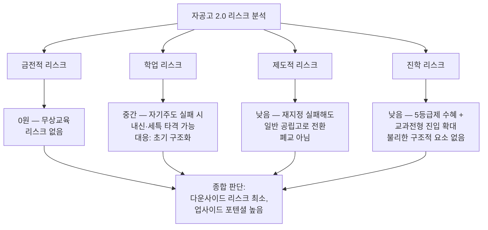

### 10.3 학비 걱정하는 학부모 상담 전략

자공고의 최대 강점 중 하나인 **무상교육**을 활용한 상담 전략입니다.

| 비교 항목 | 자공고 2.0 | 전국자사고 | 일반고 |
|-----------|-----------|-----------|--------|
| 입학금 | 0원 | 수십만 원 | 0원 |
| 연간 수업료 | 0원 | 800~1,200만 원 | 0원 |
| 교과서비 | 0원 (무상) | 자부담 | 0원 (무상) |
| 기숙사비 | 해당 없음 | 연 200~400만 원 | 해당 없음 |
| 급식비 | 학교별 별도 | 학교별 별도 | 학교별 별도 |
| 교복비 | 학교별 별도 | 학교별 별도 | 학교별 별도 |
| **3년 총 학비** | **0원** | **2,400~4,800만 원** | **0원** |
| **차별화 프로그램** | 4자 협약 (추가 비용 없음) | 학비에 포함 | 제한적 |

> **상담 포인트**: "학비가 걱정되시면 자공고가 최적의 선택지입니다. 자사고와 3년간 3,000만 원 이상 차이나지만, 자공고도 4자 협약을 통해 자사고 수준의 특색 프로그램을 제공받을 수 있습니다. '비용은 0원이면서 프로그램은 있는 학교'가 자공고입니다."

### 10.4 자사고/특목고 대비 자공고의 장단점

**자공고의 장점**:

| 번호 | 장점 | 설명 |
|------|------|------|
| 1 | 학비 무상 | 3년간 0원, 자사고 대비 3,000만 원+ 절약 |
| 2 | 내신 관리 유리 | 학생 수준 분포가 다양하여 상위권 진입 수월 |
| 3 | 5등급제 최대 수혜 | 상위 10%=1등급, 교과전형 진입 가능성 확대 |
| 4 | 자율 시간 | 자기주도 프로젝트에 시간 투자 가능 |
| 5 | 4자 협약 | 대학·기업 연계 프로그램 무상 제공 |
| 6 | 지역인재전형 | 비수도권 학생에게 의대·국립대 별도 정원 |
| 7 | 낮은 리스크 | 최악의 시나리오 = 일반고 (무상, 폐교 없음) |
| 8 | AI 시대 적합성 | 자율 시간 + AI 도구 = 자기주도 프로젝트 환경 |

**자공고의 단점**:

| 번호 | 단점 | 설명 |
|------|------|------|
| 1 | 초기 데이터 부재 | 2026.3 운영 시작, 첫 졸업생 2029.2 배출 |
| 2 | 학교별 편차 큼 | 25개교 간 4자 협약·운영 수준 편차 |
| 3 | 입시 인프라 약함 | 자사고·특목고 대비 전문 입시 지원 부족 |
| 4 | 교원 순환 | 공립 교원 순환근무제 (일부 완화되었으나 완전 해결 아님) |
| 5 | 기숙사 없음 | 통학 필수, 원거리 학생 불리 |
| 6 | 자기주도 필수 | 자율적이지 않은 학생에게는 오히려 불리 |
| 7 | 네트워크 제한적 | 지역 기반, 전국 단위 동문 네트워크 약함 |

### 10.5 실제 상담 시나리오

#### 시나리오 1: 경제적으로 어려운 가정, 학업 우수 학생

> **학부모**: "아이가 공부를 잘하는데, 자사고 보내고 싶어도 학비가 부담됩니다. 자공고면 괜찮을까요?"

> **상담사 답변**: "좋은 판단이십니다. 아이가 자기주도 학습 능력이 있다면 자공고는 최적의 선택지입니다. 학비 0원으로 자사고급 특색 프로그램을 경험할 수 있고, 2028 5등급제 도입으로 내신 1등급 확보가 더 수월해졌습니다. 특히 비수도권이시면 지역인재전형으로 의대·국립대에 유리한 포지션을 잡을 수 있습니다. 자사고에 3,000만 원을 쓰는 대신, 그 비용으로 아이의 자기주도 프로젝트(노트북, 도서, 온라인 강의)에 투자하시는 것이 더 효율적일 수 있습니다."

#### 시나리오 2: 의대 목표, 비수도권 거주

> **학부모**: "우리 아이가 의대를 가고 싶어하는데, 자공고에서 가능한가요?"

> **상담사 답변**: "비수도권이시면 오히려 자공고가 유리할 수 있습니다. 비수도권 의대의 40%를 지역 학생에게 배정하는 지역인재전형이 있기 때문입니다. 자공고에서 내신 1등급(5등급제 상위 10%)을 확보하고, 수능 최저학력기준을 충족하면 지역 의대에 도전할 수 있습니다. 수시 6장 중 상향 2장은 지역 의대 지역인재전형, 적정 2장은 약대·치대, 안정 2장은 국립대 교과전형으로 배분하시면 됩니다."

#### 시나리오 3: AI에 관심 많은 학생, 진로 미확정

> **학부모**: "아이가 AI에 관심이 많은데, 아직 구체적 진로는 정하지 못했어요. 자공고가 맞을까요?"

> **상담사 답변**: "AI에 관심 있는 학생에게 자공고는 매우 좋은 환경입니다. 자공고의 자율 시간에 AI 프로젝트를 수행할 수 있고, 4자 협약을 통해 AI를 실무에서 활용하는 기업과 연결될 수 있습니다. 구체적 진로가 확정되지 않은 것은 괜찮습니다. 자공고는 진로 폭이 넓어서 고1~고2 동안 다양한 분야를 탐색할 수 있습니다. AI를 도구로 활용하여 다양한 분야(데이터 분석, 문학 비평, 사회 문제 분석 등)를 탐구하는 과정 자체가 세특의 핵심 콘텐츠가 됩니다."

---

## 11. 자공고 선택 체크리스트

### 11.1 적합성 진단표

자공고 진학 전, 학생·학부모가 스스로 진단하는 **15개 항목 체크리스트**입니다.

| 번호 | 진단 항목 | 해당 시 체크 | 자공고 적합도 |
|------|----------|------------|-------------|
| 1 | 혼자 계획을 세우고 실행한 경험이 있다 | [ ] | 핵심 |
| 2 | 학원 없이도 공부할 수 있다 | [ ] | 핵심 |
| 3 | 관심 분야를 깊이 파고든 경험이 있다 | [ ] | 핵심 |
| 4 | 학비 부담을 최소화하고 싶다 | [ ] | 매우 유리 |
| 5 | 내신 관리를 안정적으로 하고 싶다 | [ ] | 유리 |
| 6 | 자기만의 프로젝트를 하고 싶다 | [ ] | 매우 유리 |
| 7 | AI 도구를 적극 활용하고 싶다 | [ ] | 유리 |
| 8 | 지역 대학(국립대, 지역인재전형)에 관심 있다 | [ ] | 매우 유리 |
| 9 | 기숙사가 필요하지 않다 (통학 가능) | [ ] | 필수 조건 |
| 10 | 교과전형(내신 중심)으로 대학을 가고 싶다 | [ ] | 유리 |
| 11 | 전 과목 균형 있게 공부하는 스타일이다 | [ ] | 유리 |
| 12 | 지역 사회 활동에 관심이 있다 | [ ] | 유리 |
| 13 | 특정 분야(외국어, 과학)에 올인하기보다 폭넓게 탐구하고 싶다 | [ ] | 유리 |
| 14 | 빡빡한 관리형 학교보다 자유로운 환경을 선호한다 | [ ] | 핵심 |
| 15 | 새로운 제도에 도전하는 것이 부담되지 않는다 | [ ] | 유리 |

**해석 기준**:

| 체크 개수 | 판정 | 권고 |
|-----------|------|------|
| 12~15개 | 자공고 매우 적합 | 적극 추천 |
| 8~11개 | 자공고 적합 | 추천 (단, 부족한 부분 보완 필요) |
| 4~7개 | 보통 | 자공고와 일반고 비교 후 결정 |
| 0~3개 | 자공고 부적합 | 일반고 또는 관리형 학교 권고 |

### 11.2 부적합 신호

아래에 해당하는 학생에게는 자공고보다 다른 학교 유형이 더 적합할 수 있습니다.

| 번호 | 부적합 신호 | 이유 | 대안 |
|------|-----------|------|------|
| 1 | 외부 강제 없이 공부하지 않는다 | 자율 시간이 방치 시간이 됨 | 관리형 자사고 또는 일반고 |
| 2 | 기숙사가 반드시 필요하다 | 자공고는 대부분 통학형 | 자사고 (기숙사 제공) |
| 3 | 특정 분야(외국어, 수학·과학)에 올인하고 싶다 | 자공고는 범교과 자율형 | 외국어고, 과학고 |
| 4 | 전국 단위 최상위 경쟁을 원한다 | 자공고는 지역 기반 | 전국자사고, 영재학교 |
| 5 | 학부모가 학교에 체계적 입시 관리를 기대한다 | 자공고의 입시 관리 인프라는 제한적 | 자사고 (전문 입시 지원) |
| 6 | 해외 대학 진학이 목표다 | 자공고에는 국제 프로그램(IB 등)이 없음 | 국제고, IB 학교 |

> **상담 포인트**: "솔직히 말씀드리면, 자공고가 모든 학생에게 맞는 것은 아닙니다. '자기주도 학습 능력'이 전제되어야 합니다. 이 능력이 부족한 학생에게 자공고의 자율 시간은 '기회'가 아니라 '빈 시간'이 됩니다. 체크리스트로 진단해 보시고, 7개 이하라면 일반고가 더 현실적인 선택일 수 있습니다."

---

## 12. 자공고 생존 전략 — 학교 내 포지셔닝

### 12.1 내신 전략 (과목별)

자공고에서 내신 1등급을 확보하기 위한 과목별 전략입니다.

| 과목 | 전략 | 자공고 특화 팁 | 주의 사항 |
|------|------|-------------|----------|
| **국어** | 교과서 지문 정독 + 기출 유형 분석 | 독서 동아리 활동을 국어 세특에 연결 | 비문학 독해력이 수능에도 직결 |
| **수학** | 개념 완전 이해 + 유형별 반복 | AI 도구로 오답 분석, 수학적 모델링 탐구 | 수학 내신과 수능 범위 차이 확인 |
| **영어** | 교과서 본문 암기 수준 이해 + 어법 | 원서 읽기를 영어 세특에 연결 | 절대평가이므로 1등급 기준 확인 |
| **한국사** | 시대별 흐름 이해 + 사료 분석 | 지역 역사와 연결한 탐구 프로젝트 | 절대평가 과목이지만 수능에도 필수 |
| **사회/과학** | 교과서 핵심 개념 + 응용 문제 | 4자 협약 프로그램과 연결한 심화 탐구 | 선택과목 성적도 내신에 반영 |
| **탐구 과목** | 개념 정리 + 실험 보고서 | AI 활용 데이터 분석을 세특에 기재 | 세특의 핵심 콘텐츠가 되는 과목 |

**내신 등급 관리 공식**:

| 시기 | 목표 | 실천 방법 |
|------|------|----------|
| 시험 3주 전 | 범위 파악 + 1회독 | 교과서 정독, 핵심 개념 정리 |
| 시험 2주 전 | 2회독 + 문제 풀이 | 기출 문제, 프린트 풀이 |
| 시험 1주 전 | 3회독 + 취약점 보완 | 오답 분석, 예상 문제 풀이 |
| 시험 3일 전 | 최종 정리 | 핵심 노트 복습, 컨디션 관리 |
| 시험 당일 | 실전 | 시간 배분 전략, 실수 방지 |

### 12.2 동아리·활동 전략

| 활동 유형 | 선택 기준 | 세특 연결 | 권장 활동 수 |
|-----------|----------|----------|------------|
| **교과 연계 동아리** | 진로 관련 교과와 연결 | 직접 연결 (해당 교과 세특) | 1~2개 (핵심 집중) |
| **자율 동아리** | 자기주도 프로젝트 수행 | 관련 교과 세특 | 1개 (깊이 있게) |
| **봉사 활동** | 지역사회 연계 | 창체 + 사회 세특 | 꾸준히 (월 1~2회) |
| **4자 협약 프로그램** | 협약 기관 연계 활동 | 관련 교과 세특 | 적극 참여 |

> **상담 포인트**: "동아리는 '많이' 하는 것이 아니라 '깊이' 하는 것이 중요합니다. 1~2개 핵심 동아리에서 3년간 꾸준히 활동하고, 그 과정을 세특에 일관되게 연결하세요. '이 학생은 3년간 이 주제를 일관되게 탐구했구나'라는 인상을 주는 것이 학종 합격의 핵심입니다."

### 12.3 교사 관계 구축

자공고에서 세특의 질은 **교사와의 관계**에 크게 좌우됩니다.

| 전략 | 구체적 실천 방법 | 기대 효과 |
|------|----------------|----------|
| **수업 참여도 높이기** | 수업 중 질문, 토론 적극 참여, 발표 자원 | 교사가 학생을 인식하고 세특에 구체적으로 기재 |
| **탐구 활동 공유** | 자율 시간 탐구 결과를 교과 교사에게 보고 | 교사가 세특에 심화 탐구 내용을 반영 |
| **피드백 요청** | 보고서·발표 후 교사에게 피드백 요청 | 교사의 지도 과정이 세특에 기재 → 학종 가점 |
| **진로 상담** | 교과 교사에게 진로 관련 조언 요청 | 진로 탐색 과정이 세특에 기재 |
| **4자 협약 활동 연결** | 협약 프로그램 참여 결과를 교과와 연결 | 교과 세특에 협약 활동 경험 반영 |

> **상담 포인트**: "세특은 교사가 쓰는 것입니다. 교사가 학생에 대해 잘 알아야 좋은 세특이 나옵니다. 학생이 교사에게 자기 활동을 적극적으로 공유하고, 피드백을 요청하고, 수업에서 존재감을 보여주는 것이 세특의 질을 높이는 가장 확실한 방법입니다."

### 12.4 학기별 목표 설정 프레임워크

자공고 3년을 6학기로 나누어, 각 학기별로 달성해야 할 핵심 목표를 제시합니다.

| 학기 | 내신 목표 | 세특 목표 | 자율 프로그램 목표 | 수능 목표 | 핵심 키워드 |
|------|----------|----------|----------------|----------|-----------|
| 고1-1 | 전 과목 1등급 기반 구축 | 탐구 주제 3개 발굴 | 4자 협약 프로그램 파악 | 기초 다지기 | **탐색** |
| 고1-2 | 1등급 안정화 | 탐구 보고서 1편 완성 | 자기주도 프로젝트 시작 | 모의고사 1회 응시 | **시작** |
| 고2-1 | 1등급 유지 | 심화 탐구 프로젝트 1 | 프로젝트 1차 결과물 | 영역별 집중 시작 | **심화** |
| 고2-2 | 1등급 유지 | 심화 탐구 프로젝트 2 | 프로젝트 포트폴리오 | 모의고사 정기 분석 | **완성** |
| 고3-1 | 최종 내신 확보 | 세특 총정리 | (입시 집중) | 수능 최저 대비 | **마무리** |
| 고3-2 | (내신 종료) | 면접 소재 정리 | (입시 집중) | **수능 응시** | **수확** |

### 12.5 멘탈 관리 전략

자공고 학생이 겪을 수 있는 심리적 어려움과 대응 전략입니다.

| 어려움 | 원인 | 대응 전략 | 도움 요청 대상 |
|--------|------|----------|-------------|
| **자사고·특목고 학생과의 비교 불안** | SNS·커뮤니티에서 타 학교 학생 활동 비교 | SNS 비교를 줄이고, 자기 성장에 집중하는 루틴 만들기 | 담임 교사, 상담 교사 |
| **자율 시간 활용 실패** | 계획만 세우고 실행 못함, 방향 상실 | 주간 실행 점검 루틴, 또래 스터디 그룹 형성 | 교과 교사, 또래 멘토 |
| **성적 정체** | 내신 1등급 유지 어려움, 수능 점수 안 오름 | 과목별 약점 분석, AI 도구로 오답 패턴 분석 | 교과 교사, 학원(필요 시) |
| **진로 불확실성** | 아직 구체적 진로가 없어 불안 | 자율 시간에 다양한 분야 탐색, 진로 상담 | 진로 상담 교사, 협약 대학 |
| **입시 스트레스** | 고3 시기 극심한 스트레스 | 운동·수면·식사 루틴 유지, 상담 적극 활용 | 상담 교사, 학부모 |
| **초기 데이터 부재로 인한 불안** | "우리 학교 졸업생이 아직 없다" | 구조적 유리함(5등급제, 지역인재전형)에 집중 | 입학사정관, 교사 |

> **상담 포인트**: "멘탈 관리는 입시의 숨겨진 변수입니다. 자공고 학생이 겪는 가장 큰 심리적 어려움은 '비교 불안'입니다. 자사고·특목고 친구들의 활동을 보며 위축될 수 있습니다. 이때 핵심은 '자공고만의 강점(무상, 자율, 5등급제)'을 명확히 인식하는 것입니다."

### 12.6 자공고 학생의 시간 관리 매트릭스

| 구분 | 긴급 + 중요 | 긴급하지 않음 + 중요 | 긴급 + 중요하지 않음 | 긴급하지 않음 + 중요하지 않음 |
|------|-----------|-------------------|-------------------|--------------------------|
| **예시** | 내일 시험 대비, 원서 마감 | 세특 탐구 프로젝트, 수능 기초 | 학교 행사 참여, 잡무 | SNS, 무의미한 인터넷 |
| **자공고 전략** | 즉시 실행 | **자율 시간에 배치** (최우선) | 효율적으로 처리 | 과감히 줄이기 |
| **시간 비중** | 20% | **50%** | 20% | 10% |

> **상담 포인트**: "자공고 학생의 자율 시간은 '긴급하지 않지만 중요한' 활동(세특 탐구, 수능 기초, 자기 프로젝트)에 투자해야 합니다. 대부분의 학생이 긴급한 것에만 반응하다가 중요한 것을 놓칩니다. 매주 자율 시간 계획을 세울 때, '긴급하지 않지만 중요한 것'을 먼저 배치하세요."

### 12.7 자공고 학생의 1주일 이상적 시간 배분

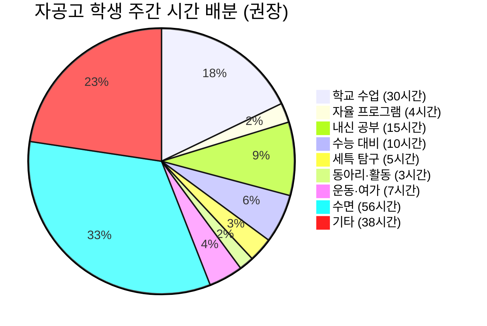

---

## 13. 참고 자료 및 출처

### 13.1 공식 자료

| 자료명 | 출처 | URL |
|--------|------|-----|
| 자공고 2.0 신규 지정 발표 | 교육부 | 교육부 보도자료 (2025.8.27) |
| 학교알리미 | 교육부 | schoolinfo.go.kr |
| 고입정보포털 | 교육부 | hischool.go.kr |
| 대입정보포털 | 한국대학교육협의회 | adiga.kr |
| 각 시·도교육청 고입전형 기본계획 | 시·도교육청 | 각 교육청 홈페이지 |

### 13.2 참조 데이터

| 데이터 | 경로 | 설명 |
|--------|------|------|
| 자공고 25개교 상세 정보 | `frontend/data/high-school/autonomous_public.json` | 학교별 위치, 특색 프로그램, 입시 전략, AI 시대 전략 등 |
| 2028 대입 개편 가이드 | `docs/가이드-입시/2028_대입준비_완벽가이드.md` | 2028 대입 개편 종합 레퍼런스 |
| 고등학교 유형 비교 가이드 | `docs/가이드-입시/고등학교_유형_완전정리_진로지도가이드.md` | 학교 유형별 비교 레퍼런스 |

### 13.3 관련 법령 및 정책

| 법령/정책 | 내용 |
|-----------|------|
| 초·중등교육법 시행령 | 자율형 공립고등학교 지정 근거 |
| 교육부 자공고 2.0 공모 지침 | 39개교 공모, 25개교 선정 기준 |
| 2028 대학입학제도 개편 방안 | 내신 5등급제, 통합형 수능 |
| 고교 무상교육 법률 | 자공고 무상교육 적용 근거 |

---

## 부록 A: 자공고 입학 준비 체크리스트 (중학생용)

> **배포 안내**: 이 체크리스트는 입학사정관이 중학생 학부모에게 배포하여 자공고 진학 준비를 돕는 용도로 설계되었습니다.

### 중1 체크리스트

| 번호 | 항목 | 구체적 실천 | 기한 | 완료 |
|------|------|-----------|------|------|
| 1 | 전 과목 내신 관리 시작 | 중간·기말고사 전 과목 A등급 목표 | 1학년 내내 | [ ] |
| 2 | 독서 습관 형성 | 월 2권 이상, 분야 다양하게 | 매월 | [ ] |
| 3 | 관심 분야 탐색 | 3개 이상 분야 체험 (동아리, 체험 활동) | 1학년 말까지 | [ ] |
| 4 | 자기주도 학습 루틴 | 하루 2시간 이상 자기 공부 습관 | 1학기 내 | [ ] |
| 5 | 지역사회 봉사 시작 | 월 1회 이상 봉사 활동 | 매월 | [ ] |

### 중2 체크리스트

| 번호 | 항목 | 구체적 실천 | 기한 | 완료 |
|------|------|-----------|------|------|
| 1 | 자공고 후보 학교 조사 | 학교알리미에서 3개교 이상 비교 | 1학기 | [ ] |
| 2 | 교내 탐구·발표 참여 | 발표 2회 이상, 탐구 보고서 1편 | 2학년 내내 | [ ] |
| 3 | 리더십 활동 | 학급/동아리 임원 경험 | 2학년 | [ ] |
| 4 | 자공고 2.0 협약 정보 수집 | 학교 설명회 참석 또는 교육청 공지 확인 | 2학기 | [ ] |
| 5 | 수능 기초 학습 | 국·수·영 기초 수준 점검 | 겨울방학 | [ ] |

### 중3 체크리스트

| 번호 | 항목 | 구체적 실천 | 기한 | 완료 |
|------|------|-----------|------|------|
| 1 | 진학할 학구 결정 | 거주지 기반 배정 학구 확인 | 1학기 | [ ] |
| 2 | 자공고 학교 설명회 참석 | 직접 방문, 4자 협약 내용 확인 | 1~2학기 | [ ] |
| 3 | 자기소개서/면접 준비 | 자기주도 학습계획서 초안 작성 (해당 시) | 2학기 | [ ] |
| 4 | 고교 입학 전 선행 학습 | 고1 교과 미리보기 (국·수·영) | 겨울방학 | [ ] |
| 5 | 자기주도 프로젝트 기획 | 고1에 시작할 프로젝트 아이디어 정리 | 겨울방학 | [ ] |

---

## 부록 B: 세특 우수 사례 (과목별)

### B.1 국어 세특 사례

| 구분 | 내용 |
|------|------|
| **탐구 주제** | 지역 방언의 소멸과 보존 — AI 음성 인식 기술을 활용한 방언 데이터베이스 구축 가능성 탐구 |
| **탐구 과정** | (1) 지역 어르신 인터뷰로 방언 사례 수집 → (2) AI 음성 인식 도구로 방언 인식률 테스트 → (3) 표준어 대비 방언 인식률 분석 → (4) 방언 보존을 위한 AI 활용 방안 제안 |
| **세특 기재 포인트** | 지역 문화에 대한 관심에서 출발, AI 기술의 한계를 직접 실험으로 확인, 독창적 제안 도출 |
| **자공고 연결** | 자율 프로그램 시간에 지역사회 인터뷰 수행, 4자 협약 대학의 국어학 교수 자문 |

### B.2 수학 세특 사례

| 구분 | 내용 |
|------|------|
| **탐구 주제** | 지역 상권 매출 예측을 위한 회귀 분석 모델 구축 |
| **탐구 과정** | (1) 공공 데이터포털에서 지역 상권 데이터 수집 → (2) AI 도구로 데이터 전처리 → (3) 회귀 분석 모델 설계 → (4) 예측 결과와 실제 데이터 비교 → (5) 모델 개선 |
| **세특 기재 포인트** | 교과서 회귀분석 개념을 실생활에 적용, 데이터 기반 문제 해결 과정 |
| **자공고 연결** | 자율 프로그램 시간에 프로젝트 수행, 4자 협약 기업의 데이터 분석 팀 멘토링 |

### B.3 영어 세특 사례

| 구분 | 내용 |
|------|------|
| **탐구 주제** | AI 번역 도구의 문학 번역 한계 — 한국 소설 영문 번역의 맥락 손실 분석 |
| **탐구 과정** | (1) 한국 단편 소설 3편 선정 → (2) AI 번역 도구 3종(Google Translate, DeepL, ChatGPT)으로 영문 번역 → (3) 공식 영문 번역과 비교 → (4) 문화적 맥락 손실 사례 분석 → (5) AI 번역의 한계와 인간 번역의 가치 논증 |
| **세특 기재 포인트** | AI 도구의 비판적 활용, 문학적 감수성과 기술의 교차 분석 |
| **자공고 연결** | 자율 프로그램 시간에 비교 분석 수행, 영어 원서 읽기 동아리 활동 연계 |

### B.4 과학 세특 사례

| 구분 | 내용 |
|------|------|
| **탐구 주제** | 미세먼지와 지역 농작물 생산량의 상관관계 분석 |
| **탐구 과정** | (1) 한국환경공단 대기질 데이터 수집 → (2) 통계청 농업 생산량 데이터 수집 → (3) 상관관계 분석(Python 활용) → (4) 연도별 추이 시각화 → (5) 지역 농업인 인터뷰로 현장 검증 → (6) 미세먼지 저감 정책과 농업 생산성 연계 제안 |
| **세특 기재 포인트** | 환경-농업 융합 탐구, 데이터 분석+현장 검증의 이중 방법론, 정책 제안 |
| **자공고 연결** | 4자 협약 지자체의 환경 데이터 활용, 협약 대학 농학과 교수 자문 |

### B.5 사회 세특 사례

| 구분 | 내용 |
|------|------|
| **탐구 주제** | 지역 인구 감소와 공공 서비스 축소의 악순환 — 자공고 소재 지역 사례 분석 |
| **탐구 과정** | (1) 지역 인구 통계 데이터 수집 → (2) 공공 서비스(교통, 의료, 교육) 변화 추이 분석 → (3) 주민 설문조사 실시 → (4) 악순환 구조 도식화(mermaid) → (5) 해외 지방 도시 재생 사례 조사 → (6) 자공고 소재 지역 맞춤 정책 제안서 작성 |
| **세특 기재 포인트** | 지역 문제에 대한 직접적 관심, 데이터+설문의 혼합 방법론, 구체적 정책 제안 |
| **자공고 연결** | 4자 협약 지자체에 정책 제안서 실제 제출, 지자체 담당자 피드백 반영 |

---

## 부록 C: 자공고 졸업 후 커리어 패스

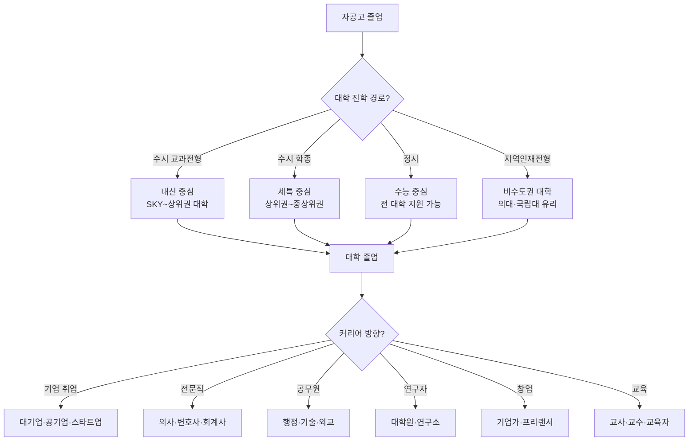

**자공고 경험이 커리어에 미치는 영향**:

| 자공고 경험 | 커리어 연결 | 경쟁력 |
|-----------|-----------|--------|
| 자기주도 프로젝트 | 기업 면접 시 '자기주도성' 입증 | 높음 |
| 4자 협약 기업 체험 | 산업 이해도, 실무 감각 | 중~높음 |
| AI 도구 활용 경험 | AI 시대 직무 적응력 | 높음 |
| 지역사회 연계 활동 | 사회적 책임감, 커뮤니티 리더십 | 중 |
| 자율적 시간 관리 | 자기 관리 역량, 생산성 | 높음 |

---

## 부록 D: 월별 학습 플래너 (입학사정관 배포용)

### D.1 고1 월별 플래너

| 월 | 학업 목표 | 세특 활동 | 자율 프로그램 | 생활 |
|----|----------|----------|-------------|------|
| 3월 | 학습 습관 형성, 과목별 공부법 확립 | 관심 분야 탐색 시작 | 4자 협약 프로그램 파악 | 통학 루틴 안정화 |
| 4월 | 중간고사 대비 집중 | 탐구 주제 후보 3개 선정 | 동아리 가입·활동 시작 | 수면·운동 루틴 |
| 5월 | 중간고사 결과 분석·보완 | 탐구 주제 확정 | 협약 기관 방문/체험 | 스트레스 관리 |
| 6월 | 기말고사 대비 시작 | 1차 탐구 자료 수집 | 프로젝트 아이디어 정리 | 여름방학 계획 수립 |
| 7월 | 기말고사 응시 | 탐구 보고서 초안 | 여름 프로젝트 기획 | 방학 자기주도 학습 |
| 8월 | 1학기 성적 분석·보완 | 탐구 보고서 완성 | 자기주도 프로젝트 착수 | 2학기 준비 |
| 9월 | 2학기 내신 전략 재수립 | 2학기 탐구 주제 선정 | 프로젝트 1차 결과물 | 학교 행사 참여 |
| 10월 | 중간고사 대비 | 2학기 탐구 심화 | 교내 발표/공유 | 진로 고민 정리 |
| 11월 | 기말고사 대비 시작 | 탐구 보고서 작성 | 프로젝트 중간 점검 | 겨울방학 계획 |
| 12월 | 기말고사 + 1년 총정리 | 고1 세특 최종 점검 | 2년차 계획 수립 | 자기 성찰·목표 재설정 |
| 1월 | 겨울방학 집중 학습 | 탐구 심화 자료 수집 | 프로젝트 심화 작업 | 독서 집중 기간 |
| 2월 | 고2 준비 | 고2 탐구 주제 사전 탐색 | 프로젝트 포트폴리오 정리 | 새 학기 준비 |

### D.2 고2 월별 플래너

| 월 | 학업 목표 | 세특 활동 | 입시 준비 | 생활 |
|----|----------|----------|----------|------|
| 3월 | 고2 교과 적응 | 심화 탐구 주제 확정 | 대입 전형 기초 이해 | 학습 루틴 강화 |
| 4월 | 중간고사 대비 | 탐구 자료 수집·분석 | 교과전형 vs 학종 방향 결정 | 시간 관리 최적화 |
| 5월 | 중간고사 결과 분석 | 1차 심화 탐구 보고서 | 목표 대학 리스트 작성 | 체력 관리 |
| 6월 | 기말고사 대비 | 탐구 보고서 교사 피드백 | 대학 전형 세부 분석 | 모의고사 분석 루틴 |
| 7월 | 기말고사 응시 | 2차 탐구 주제 선정 | 수시 6장 초안 작성 | 여름방학 수능 집중 |
| 8월 | 수능 취약 영역 집중 | 2차 탐구 실행 | 대학별 수능 최저 확인 | 멘탈 관리 |
| 9월 | 2학기 내신 전략 | 2차 탐구 심화 | 수시 6장 1차 확정 | 9월 모의고사 분석 |
| 10월 | 중간고사 대비 | 탐구 보고서 완성 | 학교 추천 준비 | 입시 스트레스 관리 |
| 11월 | 기말고사 대비 | 고2 세특 총정리 | 수시 6장 최종 검토 | 수능 최종 대비 시작 |
| 12월 | 기말고사 + 2년 총정리 | 포트폴리오 정리 | 고3 입시 전략 최종 확정 | 겨울방학 수능 풀타임 |
| 1월 | 수능 집중 학습 | 면접 소재 정리 | 원서 작성 연습 | 체력·멘탈 강화 |
| 2월 | 고3 직전 총정리 | 세특 포트폴리오 완성 | 최종 전략 확정 | 새 학기 준비 |

### D.3 고3 월별 플래너

| 월 | 학업 목표 | 입시 활동 | 핵심 포인트 |
|----|----------|----------|-----------|
| 3월 | 고3 내신 최후 전투 시작 | 수시 6장 최종 확정 | 내신과 수능의 마지막 균형점 |
| 4월 | 중간고사 사활 대비 | 교과전형 지원 대학 확인 | 중간고사 = 마지막 내신 기회 |
| 5월 | 중간고사 응시·분석 | 학교 추천 확정 | 내신 결과에 따라 수시 6장 조정 |
| 6월 | 기말고사 대비 | 수시 원서 작성 시작 | 6월 모의고사 = 수능 방향 제시 |
| 7월 | 기말고사 — 고교 마지막 시험 | 수시 원서 완성 | 기말 후 수능 풀타임 전환 |
| 8월 | 수능 D-90 집중 | 수시 원서 제출 | 원서 제출 마감 엄수 |
| 9월 | 수능 실전 연습 | 면접 준비 시작 | 9월 모의고사 = 최종 점검 |
| 10월 | 수능 D-30 최종 | 면접 실전 연습 | 컨디션 관리 최우선 |
| 11월 | **수능 응시** | 정시 지원 준비 | 수능 당일 = 1년 결과 |
| 12월 | 정시 지원 | 수시 결과 확인 | 정시 지원 전략 최종 결정 |

> **상담 포인트**: "이 월별 플래너는 가이드라인일 뿐, 학생 개인의 상황에 맞게 조정해야 합니다. 핵심은 '매월 무엇을 해야 하는지 알고 있는 것'입니다. 자공고 학생에게 가장 중요한 것은 자기 관리 능력이므로, 이 플래너를 기반으로 자기만의 계획을 세우는 연습 자체가 가치 있습니다."

---

## 부록 E: 입학사정관을 위한 상담 스크립트 모음

### E.0.1 첫 상담 오프닝 스크립트

> "자율형공립고, 줄여서 자공고라고 합니다. 2025년 8월에 교육부가 새로 지정한 학교 유형인데요, 쉽게 말씀드리면 '일반 공립고의 안정성 위에 자율적 교육과정을 얹은 학교'입니다. 학비는 0원이고, 2028 대입 개편에서 가장 큰 수혜를 받는 학교 유형으로 평가받고 있습니다."

### E.0.2 5등급제 설명 스크립트

> "현재 내신은 9등급인데, 2028년부터 5등급으로 바뀝니다. 가장 중요한 변화는 1등급 기준이 상위 4%에서 상위 10%로 넓어진다는 것입니다. 300명 학교에서 12명이던 1등급이 30명으로 늘어나는 거예요. 자공고처럼 학생 수준이 다양한 학교에서는 이 10%에 들어가기가 자사고보다 상대적으로 수월합니다."

### E.0.3 비용 비교 설명 스크립트

> "자공고는 학비가 완전 무상입니다. 자사고를 3년 다니면 학비만 3,000만 원 이상인데, 자공고는 0원이에요. 그런데 자공고도 학교-지자체-대학-기업이 협약을 맺어서 특색 프로그램을 운영합니다. 학비는 0원인데 프로그램은 있는 학교, 이것이 자공고의 가장 큰 매력입니다."

### E.0.4 리스크 설명 스크립트

> "솔직히 말씀드리면, 자공고 2.0은 아직 새로운 제도입니다. 2026년 3월에 막 운영을 시작했기 때문에 졸업생 데이터가 없어요. 이것이 리스크입니다. 하지만 이 리스크의 최악의 결과는 '일반 공립고와 동일한 교육'입니다. 폐교가 아니고, 학비 손실도 없어요. 잃을 것은 거의 없고, 얻을 것은 많은 비대칭적 구조입니다."

### E.0.5 부적합 학생 설명 스크립트 (정직하게)

> "자공고가 모든 학생에게 맞는 것은 아닙니다. 자율 시간이 많기 때문에, 이 시간을 스스로 관리할 수 있는 학생에게 적합합니다. 외부 강제가 없으면 공부하지 않는 스타일이라면, 솔직히 일반고에서 안정적으로 내신을 관리하는 것이 더 현실적인 선택일 수 있습니다."

---

## 부록 F: 자공고 학생을 위한 AI 도구 활용 가이드

### F.1 학습 단계별 AI 도구 추천

| 학습 단계 | AI 도구 | 활용 방법 | 주의 사항 |
|-----------|---------|----------|----------|
| **개념 이해** | ChatGPT, Claude | 교과서 개념을 다양한 비유로 설명 요청 | AI 설명을 교과서로 반드시 교차 검증 |
| **문제 풀이** | Mathway, Photomath | 풀이 과정 확인 (답만 보지 않기) | 문제는 반드시 직접 먼저 풀기 |
| **오답 분석** | ChatGPT, Claude | 틀린 이유와 개념 연결 분석 요청 | 오답 패턴을 노트에 직접 정리 |
| **탐구 주제 발굴** | Perplexity, ChatGPT | 관심 분야 + 교과 연결 주제 아이디어 | AI 제안을 그대로 쓰지 말고 자기 관점 추가 |
| **자료 수집** | Perplexity, Google Scholar | 학술 논문·통계 데이터 검색 | 출처 반드시 확인, 1차 자료 우선 |
| **데이터 분석** | Python (Colab), Excel | 공공 데이터 분석, 시각화 | 분석 결과의 의미 해석은 본인 |
| **글쓰기 보조** | ChatGPT, Claude | 보고서 구조 잡기, 문장 다듬기 | 핵심 논지·결론은 반드시 본인 |
| **면접 연습** | ChatGPT, Claude | 모의 면접 질문 생성, 답변 피드백 | 실제 대면 연습도 병행 |

### F.2 AI 활용 세특 기재 템플릿

**좋은 기재 예시**:

| 단계 | 기재 내용 | 예시 문구 |
|------|----------|----------|
| 1. 문제 인식 | 어떤 문제/질문에서 출발했는지 | "지역 소멸 위기 관련 뉴스를 접한 후, 우리 지역의 인구 변화 추이에 관심을 갖고..." |
| 2. AI 활용 | AI를 어떻게 활용했는지 (투명하게) | "공공 데이터포털의 인구 통계를 수집하고, Python과 AI 분석 도구를 활용하여 10년간 추이를 분석한 결과..." |
| 3. 비판적 검토 | AI 결과를 어떻게 검증했는지 | "AI 분석 결과와 실제 지역 주민 인터뷰 내용을 대조하여, 데이터로는 포착되지 않는 [요인]을 발견하고..." |
| 4. 독창적 결론 | 본인만의 관점·제안 | "이를 종합하여 [독창적 정책 제안]을 도출하고, 이를 보고서로 작성하여 교내 발표를 통해 공유함" |
| 5. 성장 기록 | 이 과정에서 무엇을 배웠는지 | "데이터 분석 역량과 함께, AI가 포착하지 못하는 인간적 맥락의 중요성을 인식하는 계기가 됨" |

### F.3 자공고 학생을 위한 추천 도서 (분야별)

| 분야 | 도서명 | 저자 | 자공고 연결 포인트 |
|------|--------|------|-----------------|
| AI·기술 | 초예측 | 유발 하라리 | AI 시대 인간의 역할 이해 |
| AI·기술 | 인공지능 시대의 비즈니스 전략 | 아지이 아그라왈 | AI 경제학적 관점 탐구 세특 |
| 교육 | 공부의 미래 | 존 카우치 | 자기주도 학습의 원리 |
| 사회 | 지방소멸 | 마스다 히로야 | 지역사회 문제 탐구 세특 |
| 경제 | 넛지 | 리처드 탈러 | 행동경제학 탐구 세특 |
| 과학 | 코스모스 | 칼 세이건 | 과학적 사고방식 |
| 인문 | 사피엔스 | 유발 하라리 | 인류 역사 비판적 분석 |
| 자기계발 | 아주 작은 습관의 힘 | 제임스 클리어 | 자기주도 학습 루틴 형성 |
| 글쓰기 | 유시민의 글쓰기 특강 | 유시민 | 세특 보고서 작성 능력 향상 |
| 수학 | 수학의 쓸모 | 닉 폴슨 | 수학 실생활 적용 탐구 세특 |

### F.4 온라인 학습 리소스

| 리소스 | 유형 | 활용 방법 | 비용 |
|--------|------|----------|------|
| Khan Academy | 무료 강의 | 수학·과학 개념 보충 | 무료 |
| Coursera | 대학 강의 | 관심 전공 미리보기 (세특 연결) | 무료 (수료증 유료) |
| 공공데이터포털 (data.go.kr) | 데이터 | 탐구 프로젝트 데이터 수집 | 무료 |
| 학교알리미 (schoolinfo.go.kr) | 학교 정보 | 자공고 비교·분석 | 무료 |
| Google Scholar | 논문 검색 | 세특 탐구 자료 수집 | 무료 |
| GitHub | 코딩 프로젝트 | 자기주도 프로젝트 포트폴리오 | 무료 |
| Notion | 학습 관리 | 학습 계획·기록·포트폴리오 정리 | 무료 (학생) |
| EBSi | 수능 대비 | 수능 강의·모의고사 | 무료 |

---

## 부록 G: 자공고 vs 일반고 — 상세 비교 분석표

| 비교 항목 | 자공고 2.0 | 일반고 | 차이점 분석 |
|-----------|-----------|--------|-----------|
| **법적 지위** | 자율형 공립고 (교육부 지정) | 일반 공립/사립고 | 자공고는 별도 지정 절차 필요 |
| **교육과정 자율권** | 국가 교육과정 + 자율 교육과정 | 국가 교육과정 | 자공고에 자율 편성권 추가 |
| **4자 협약** | 학교-지자체-대학-기업 | 없음 | 자공고만의 핵심 차별점 |
| **운영비 지원** | 연 2억 원 | 일반 예산 | 자공고에 추가 재원 |
| **교원 인사** | 일부 자율권 (유임·초빙) | 순환 배정 | 자공고 소폭 유리 |
| **학비** | 무상 | 무상 (공립) / 유상 (사립) | 공립 동일, 사립 일반고보다 유리 |
| **선발 방식** | 학구 배정/추첨 | 학구 배정/추첨 | 동일 |
| **내신 경쟁** | 보통 | 보통 | 유사 (학생 분포 유사) |
| **세특 자원** | 자율 프로그램 + 협약 기관 | 학교 자체 프로그램 | 자공고 우위 |
| **동아리** | 일반 + 협약 기반 특색 동아리 | 일반 동아리 | 자공고 소폭 우위 |
| **수능 대비** | 동일 조건 | 동일 조건 | 동일 |
| **진로 폭** | 넓음 (전 분야) | 넓음 (전 분야) | 동일 |
| **학교 분위기** | 학업 동기 학생 모이는 경향 | 학교별 편차 | 자공고 소폭 우위 |
| **지정 기간** | 5년 (1회 연장, 최대 10년) | 해당 없음 | 자공고는 한시 지정 |
| **리스크** | 초기 데이터 부재, 학교별 편차 | 안정적 | 일반고 안정성 우위 |

---

## 부록 H: 자공고 입시 전략 시뮬레이션

### G.1 시뮬레이션 A: 경기도 자공고 이과 상위권 학생

| 항목 | 내용 |
|------|------|
| **학생 프로필** | 경기도 이의고(광교), 이과 계열, 내신 1등급, 수능 모의 상위 5% |
| **목표** | KAIST, 서울대 공대, 연세대 공대 |
| **수시 6장 배분** | 상향: 서울대 지역균형, KAIST 학종 / 적정: 연세대 추천형, 고려대 학교추천 / 안정: 성균관대 교과, 한양대 교과 |
| **핵심 전략** | 내신 1등급 유지 + 수능 최저 충족 + AI 활용 수학·과학 탐구 프로젝트 세특 |
| **자율 시간 활용** | Python 데이터 분석 프로젝트, AI 모델링 실험, GitHub 포트폴리오 |
| **리스크 관리** | 수능 최저 미충족 대비 → 정시 50% 병행 준비 |

### G.2 시뮬레이션 B: 비수도권 자공고 의대 지망 학생

| 항목 | 내용 |
|------|------|
| **학생 프로필** | 충북 진천고, 자연계열, 내신 1등급, 수능 모의 상위 3% |
| **목표** | 충북대 의대, 전북대 의대, 원광대 의대 |
| **수시 6장 배분** | 상향: 충북대 의대 지역인재, 전북대 의대 지역인재 / 적정: 원광대 의대, 충북대 약대 / 안정: 충북대 간호, 한국교통대 교과 |
| **핵심 전략** | 지역인재전형 집중 (비수도권 의대 40% 배정) + 내신 1등급 + 수능 최저 |
| **자율 시간 활용** | 생명과학 탐구 프로젝트, 지역 보건소 봉사, 의학 관련 독서·보고서 |
| **리스크 관리** | 의대 불합격 대비 → 약대·치대·간호 안정권 확보 |

### G.3 시뮬레이션 C: 비수도권 자공고 인문 계열 학생

| 항목 | 내용 |
|------|------|
| **학생 프로필** | 전북 남원고, 인문 계열, 내신 2등급, 수능 모의 상위 15% |
| **목표** | 전북대 인문계열, 전남대 사회과학, 원광대 |
| **수시 6장 배분** | 상향: 전북대 학종, 전남대 교과 / 적정: 전북대 교과, 원광대 학종 / 안정: 군산대 교과, 전주대 교과 |
| **핵심 전략** | 지역 국립대 교과전형 + 학종 병행. 지역사회 연계 세특 집중 |
| **자율 시간 활용** | 남원 문화·역사 탐구, 지역 문제 해결 프로젝트, AI 활용 사회 분석 |
| **리스크 관리** | 수시 불합격 → 정시 전환, 지역 대학 안정권 확보 |

> **상담 포인트**: "시뮬레이션은 참고용입니다. 실제 학생의 상황(내신, 수능, 관심 분야, 지역)에 맞게 맞춤 전략을 세워야 합니다. 핵심은 '수시 6장을 낭비하지 않는 것'입니다. 상향·적정·안정을 2:2:2로 배분하고, 비수도권 학생은 지역인재전형을 반드시 포함시키세요."

---

## 부록 I: 자공고 관련 자주 인용되는 통계·데이터

| 데이터 항목 | 수치 | 출처 | 상담 활용 |
|-----------|------|------|----------|
| 자공고 2.0 지정 학교 수 | 25개교 (39개교 공모) | 교육부 (2025.8.27) | "39개교 중 25개교만 선정 — 선별 과정을 거침" |
| 5등급제 1등급 기준 | 상위 10% | 교육부 2028 대입 개편 | "9등급제 상위 4%에서 2.5배 확대" |
| 자공고 운영비 | 연 2억 원 | 교육부 | "5년간 총 10억 원 규모" |
| 지정 기간 | 5년 (1회 연장, 최대 10년) | 교육부 | "재학 중 지정 취소 없음" |
| 학비 | 0원 (무상교육) | 고교 무상교육법 | "자사고와 3년간 3,000만 원+ 차이" |
| 비수도권 의대 지역인재 배정 | 40% | 지역인재전형 정책 | "비수도권 자공고의 숨겨진 강점" |
| 자공고 2.0 첫 졸업생 | 2029년 2월 예정 | 2026.3 운영 시작 기준 | "실적 데이터는 2029년부터 확인 가능" |
| 경기도 자공고 수 | 10개교 (40%) | 교육부 | "경기도 교육청의 적극적 정책 의지" |
| 전체 고교 대비 자공고 비율 | 약 1% (25/2,300+) | 교육부 통계 | "극소수 선별 학교 — 일반고 대비 차별화" |

---

## 부록 J: 자공고 학생을 위한 세특 주제 발굴 가이드

### J.1 교과별 세특 주제 발굴 프레임워크

```mermaid
flowchart TD
    A["수업 중 흥미로운 개념 발견"] --> B["AI에게 관련 질문 3개 생성 요청"]
    B --> C["가장 궁금한 질문 1개 선택"]
    C --> D{"자공고 자원 활용 가능?"}
    D -->|"4자 협약 프로그램"| E["협약 대학·기업 연계 탐구"]
    D -->|"자율 시간"| F["독자적 탐구 프로젝트"]
    D -->|"지역 자원"| G["지역 현장 조사·인터뷰"]
    E --> H["탐구 보고서 작성"]
    F --> H
    G --> H
    H --> I["교사에게 공유 → 세특 기재"]
```

### J.2 학과 계열별 세특 주제 예시 30선

| 번호 | 계열 | 관련 교과 | 세특 주제 | 자공고 자원 활용 | 난이도 |
|------|------|-----------|----------|----------------|--------|
| 1 | 인문 | 국어 | 지역 방언의 사회언어학적 분석 — AI 음성인식 기술과의 관계 | 지역 노인 인터뷰 + AI 음성 분석 도구 | ★★☆ |
| 2 | 인문 | 국어 | 자공고 소재 지역의 지명 유래와 역사적 맥락 연구 | 지역 향토사 자료 + 지자체 문화원 협조 | ★★☆ |
| 3 | 인문 | 영어 | 지역 관광 자원의 다국어 안내 콘텐츠 제작 | 지자체 관광과 연계 + AI 번역 도구 | ★★★ |
| 4 | 인문 | 사회 | 지역 인구 감소가 학교 교육에 미치는 영향 — 자공고의 역할 | 지역 통계 + 주민 설문 | ★★☆ |
| 5 | 인문 | 사회 | 지역 전통시장 활성화 정책의 효과 분석 | 전통시장 방문 + 소상공인 인터뷰 | ★★★ |
| 6 | 인문 | 역사 | 우리 지역의 독립운동 유적지 디지털 아카이브 구축 | 지역 박물관 연계 + 디지털 도구 | ★★★ |
| 7 | 사회과학 | 경제 | 지역 농산물 직거래 플랫폼의 경제적 효과 분석 | 지역 농협 + 온라인 플랫폼 데이터 | ★★★ |
| 8 | 사회과학 | 정치·법 | 자공고 2.0 정책의 교육 형평성 기여도 평가 | 교육부 자료 + 학교 운영 데이터 | ★★★ |
| 9 | 사회과학 | 지리 | GIS를 활용한 지역 학교 접근성 분석 | 공공데이터포털 + GIS 도구 | ★★★ |
| 10 | 사회과학 | 윤리 | AI 시대 공교육의 역할 재정립 — 자공고 사례 중심 | 교사 인터뷰 + 교육 철학 문헌 | ★★☆ |
| 11 | 자연과학 | 물리 | 지역 재생에너지(태양광·풍력) 발전 효율 측정 | 지역 발전소 견학 + 데이터 수집 | ★★★ |
| 12 | 자연과학 | 화학 | 지역 하천 수질 분석 — 계절별 오염물질 변화 | 현장 수질 채집 + 학교 실험실 | ★★★ |
| 13 | 자연과학 | 생물 | 자공고 주변 생태계 조사 — 도시화와 생물 다양성 | 학교 주변 현장 조사 + AI 생물 분류 | ★★☆ |
| 14 | 자연과학 | 지구과학 | 지역 기상 데이터 분석 — 기후변화 지역 영향 | 기상청 공공데이터 + 파이썬 분석 | ★★★ |
| 15 | 자연과학 | 수학 | 지역 교통 흐름의 수학적 모델링 | 교통 데이터 + 수학적 시뮬레이션 | ★★★ |
| 16 | 공학 | 정보 | AI 챗봇을 활용한 자공고 입학 상담 시스템 개발 | 학교 입학 Q&A 데이터 + ChatGPT API | ★★★ |
| 17 | 공학 | 정보 | 지역 노인을 위한 키오스크 사용 교육 앱 설계 | 지역 복지관 연계 + 앱 프로토타입 | ★★★ |
| 18 | 공학 | 기술가정 | 지역 농가를 위한 스마트팜 IoT 센서 설계 | 지역 농업기술센터 협약 | ★★★ |
| 19 | 의학 | 생물 | 지역 보건소 건강검진 데이터로 본 지역 질환 패턴 | 보건소 협조 + 통계 분석 | ★★★ |
| 20 | 의학 | 화학 | 지역 약용식물의 성분 분석 — 전통 민간요법의 과학적 검증 | 지역 한의원 연계 + 실험 | ★★★ |
| 21 | 교육 | 교육학 | 자공고 자율 시간의 학습 효과 측정 — 자기효능감 변화 | 재학생 설문 + 통계 분석 | ★★☆ |
| 22 | 교육 | 심리 | 비수도권 고등학생의 진로 결정 요인 분석 | 학생 인터뷰 + 설문 조사 | ★★☆ |
| 23 | 예술 | 미술 | 지역 문화유산을 활용한 디지털 아트 프로젝트 | 지역 문화재 + AI 이미지 생성 도구 | ★★☆ |
| 24 | 예술 | 음악 | 지역 전통 음악의 디지털 아카이빙 및 현대적 편곡 | 지역 예술인 협조 + 음악 소프트웨어 | ★★★ |
| 25 | 체육 | 체육 | 비수도권 청소년 체력 수준과 학업 성취도의 상관관계 | 학교 체력 측정 데이터 + 성적 데이터 | ★★☆ |
| 26 | 융합 | 수학+사회 | 지역 부동산 가격 예측 모델 — 학교 배정과의 관계 | 공공데이터 + 회귀분석 | ★★★ |
| 27 | 융합 | 과학+사회 | 지역 미세먼지 원인 분석 — 공장·교통·기후 요인 분리 | 에어코리아 데이터 + 지역 관찰 | ★★★ |
| 28 | 융합 | 국어+정보 | AI 기반 지역 방언 보존 프로젝트 — 자연어처리 활용 | 지역 어르신 녹음 + NLP 분석 | ★★★ |
| 29 | 융합 | 영어+경제 | 지역 특산물의 해외 마케팅 전략 수립 | 지역 농협·수출업체 + 시장 조사 | ★★★ |
| 30 | 융합 | 사회+기술 | 스마트시티 기술의 지역 적용 가능성 연구 | 지자체 스마트시티 부서 연계 | ★★★ |

> **상담 포인트**: "세특 주제는 '거창한 것'보다 '지역에 뿌리내린 것'이 더 강력합니다. 자공고의 장점은 지역 자원(지자체·대학·기업·커뮤니티)을 활용할 수 있다는 것입니다. '우리 동네의 문제를 내가 탐구했다'는 스토리가 입학사정관에게 진정성 있게 전달됩니다."

### J.3 세특 주제 선정 체크리스트

| 번호 | 체크 항목 | 설명 | 체크 |
|------|----------|------|------|
| 1 | 교과 연결성이 명확한가? | 해당 교과의 핵심 개념과 직접 연결되어야 함 | [ ] |
| 2 | 탐구 가능한 범위인가? | 고등학생이 3~6개월 내 완료 가능한 규모 | [ ] |
| 3 | 자공고 자원(4자 협약, 자율 시간, 지역)을 활용하는가? | 일반고에서는 할 수 없는 자공고만의 탐구 | [ ] |
| 4 | 본인의 진로·관심과 연결되는가? | 세특 전체가 하나의 스토리라인으로 연결 | [ ] |
| 5 | AI 도구를 활용할 여지가 있는가? | AI 활용 과정 자체가 세특의 차별화 요소 | [ ] |
| 6 | 데이터·근거를 수집할 수 있는가? | 현장 조사·설문·실험·공공데이터 등 | [ ] |
| 7 | 결과물을 만들 수 있는가? | 보고서·발표·프로토타입·블로그 등 | [ ] |
| 8 | 교사가 관찰·지도할 수 있는 과정인가? | 교사 피드백이 세특 기재의 핵심 | [ ] |
| 9 | 면접에서 심화 질문에 답할 수 있는가? | '왜 이 주제를?', '한계는?', '다음 단계는?' | [ ] |
| 10 | 진로 스토리라인에 부합하는가? | 고1~고3 세특이 하나의 성장 서사 | [ ] |

### J.4 세특 기재 품질 등급 기준

| 등급 | 기준 | 예시 (경제 교과) | 입학사정관 평가 |
|------|------|-----------------|-------------|
| **S급** | 교과 개념 + 자기주도 탐구 + 외부 자원 + AI 활용 + 성찰 | "경제 수업에서 학습한 수요-공급 이론을 바탕으로 지역 전통시장 데이터를 AI로 분석하고, 시장 활성화 정책을 제안하여 지자체에 발표함" | 학종 최상위 평가 |
| **A급** | 교과 개념 + 자기주도 탐구 + 보고서 작성 | "수요-공급 이론을 지역 사례에 적용하여 분석 보고서를 작성하고 발표함" | 학종 상위 평가 |
| **B급** | 교과 개념 이해 + 추가 질문 | "수업 내용에 대해 심화 질문을 하고, 추가 자료를 조사하여 정리함" | 학종 보통 평가 |
| **C급** | 교과 수업 참여만 기재 | "수업에 성실히 참여하고 과제를 완수함" | 학종 변별력 없음 |

> **상담 포인트**: "자공고 학생은 S급 세특을 목표로 해야 합니다. 자공고만의 무기인 '4자 협약 + 자율 시간 + 지역 자원'을 세특에 녹이면, 자사고 학생과도 충분히 경쟁할 수 있습니다."

---

## 부록 K: 자공고 25개교 한눈에 보기 — 입학사정관 배포용 요약 카드

| 지역 | 학교명 | 학비 | 기숙사 | 핵심 키워드 | 4자 협약 특징 | 적합 학생 유형 |
|------|--------|------|--------|-----------|-------------|-------------|
| 부산 | 부산고 | 0원 | ✕ | 1913년 전통, 해양도시 | 부산 지역 대학·기업 | 이과·공학 관심 |
| 부산 | 주례여고 | 0원 | ✕ | 여학교, 부산 서부 | 지역 사회 연계 | 인문·사회 관심 |
| 인천 | 강화여고 | 0원 | ✕ | 강화도, 역사·생태 | 강화 지역 문화유산 | 역사·환경 관심 |
| 인천 | 선인고 | 0원 | ✕ | 남동구, 산업단지 인접 | 인천 기업 연계 가능 | 공학·경영 관심 |
| 인천 | 인천고 | 0원 | ✕ | 인천 전통 명문 | 인천 교육 인프라 | 전 계열 |
| 경기 | 남한고 | 0원 | ✕ | 하남시, 서울 인접 | 수도권 대학 접근 용이 | 전 계열 |
| 경기 | 백석고 | 0원 | ✕ | 고양 일산, 수도권 | 수도권 기업·대학 | 전 계열 |
| 경기 | 수주고 | 0원 | ✕ | 부천시 | 수도권 기업·대학 | 전 계열 |
| 경기 | 연천고 | 0원 | ✕ | 접경지역, 소규모 | 지역 특색 (안보·평화) | 인문·사회 관심 |
| 경기 | 의정부고 | 0원 | ✕ | 의정부시, 전통 명문 | 경기 북부 거점 | 전 계열 |
| 경기 | 의정부여고 | 0원 | ✕ | 의정부시, 여학교 | 경기 북부 거점 | 전 계열 |
| 경기 | 이의고 | 0원 | ✕ | 수원 영통, 삼성전자 인접 | IT·기술 기업 연계 | 공학·IT 관심 |
| 경기 | 저현고 | 0원 | ✕ | 고양 일산 | 수도권 기업·대학 | 전 계열 |
| 경기 | 평내고 | 0원 | ✕ | 남양주시 | 수도권 동부 거점 | 전 계열 |
| 경기 | 포천일고 | 0원 | ✕ | 포천시, 접경지역 | 지역 특색 (농업·환경) | 자연과학·환경 |
| 충북 | 진천고 | 0원 | ✕ | 진천군, 반도체 클러스터 | 진천·오창 산업단지 | 공학·과학 관심 |
| 충북 | 충주예성여고 | 0원 | ✕ | 충주시, 여학교 | 충북 거점 대학 연계 | 전 계열 |
| 전북 | 남원고 | 0원 | ✕ | 남원시, 문화·관광 | 지역 문화자원 활용 | 인문·예술 관심 |
| 전북 | 이리여고 | 0원 | ✕ | 익산시, 여학교 | 전북 거점 대학 연계 | 전 계열 |
| 전남 | 보성고 | 0원 | ✕ | 보성군, 녹차·해양 | 농업·해양·관광 | 자연과학·관광 |
| 경북 | 북삼고 | 0원 | ✕ | 칠곡군, 산업단지 | 구미·칠곡 기업 연계 | 공학·기술 관심 |
| 경북 | 영주여고 | 0원 | ✕ | 영주시, 선비문화 | 전통문화·역사 | 인문·역사 관심 |
| 강원 | 도계고 | 0원 | ✕ | 삼척시, 탄광·해양 | 지역 자원(에너지·해양) | 자연과학·환경 |
| 경남 | 김해고 | 0원 | ✕ | 김해시, 가야문화 | 가야 역사·문화 연계 | 역사·인문 관심 |
| 경남 | 삼천포중앙고 | 0원 | ✕ | 사천시, 항공우주 | 사천 항공산업 연계 | 공학·항공 관심 |

```mermaid
pie title 자공고 25개교 지역 분포
    "경기도 (10교)" : 10
    "인천 (3교)" : 3
    "부산 (2교)" : 2
    "충북 (2교)" : 2
    "전북 (2교)" : 2
    "경북 (2교)" : 2
    "경남 (2교)" : 2
    "전남 (1교)" : 1
    "강원 (1교)" : 1
```

> **상담 포인트**: "25개교 모두 학비 0원, 기숙사 없음(통학형)이라는 공통점이 있지만, 지역 특성과 4자 협약 기관이 다르므로 '우리 지역 자공고'의 구체적 프로그램을 확인하는 것이 가장 중요합니다. 특히 삼천포중앙고(항공우주), 이의고(삼성전자), 진천고(반도체) 등은 지역 산업과의 연계가 강점입니다."

---

> **문서 종료**
>
> 본 문서는 자율형공립고 2.0에 대한 종합 레퍼런스로, 입학사정관의 상담 역량 강화를 목적으로 작성되었습니다.
> 자공고 2.0은 2026년 3월 운영을 시작한 신규 제도이므로, 실적 데이터는 2029년 첫 졸업생 배출 이후 학교알리미(schoolinfo.go.kr)에서 확인하시기 바랍니다.
>
> **참조 데이터**: `frontend/data/high-school/autonomous_public.json` (25개교 상세 정보)
>
> **최종 업데이트**: 2026년 7월
