# AI 시대 자율형사립고 완전 가이드 — 입학사정관 상담 레퍼런스

> **문서 목적**: 고입 학생 대상 입학사정관 상담용 자율형사립고(자사고) 종합 레퍼런스
> **대상 독자**: 입학사정관, 진로상담 교사, 학부모, 고등학교 진학 예정 학생
> **최종 업데이트**: 2026년 7월
> **참조 데이터**: `frontend/data/high-school/autonomous_private.json`

---

## 목차

1. [문서 개요 및 활용 안내](#1-문서-개요-및-활용-안내)
2. [AI 시대 교육 패러다임의 전환](#2-ai-시대-교육-패러다임의-전환)
3. [자율형사립고 제도 개요](#3-자율형사립고-제도-개요)
4. [전국단위 자사고 10개교 상세](#4-전국단위-자사고-10개교-상세)
5. [서울 광역단위 자사고 15개교 상세](#5-서울-광역단위-자사고-15개교-상세)
6. [비서울 광역단위 자사고 8개교 상세](#6-비서울-광역단위-자사고-8개교-상세)
7. [입학 전형 분석](#7-입학-전형-분석)
8. [2028 대입 개편과 자사고 전략](#8-2028-대입-개편과-자사고-전략)
9. [학교별 DNA 분석](#9-학교별-dna-분석)
10. [AI 시대 자사고 생존 전략](#10-ai-시대-자사고-생존-전략)
11. [학부모 상담 가이드](#11-학부모-상담-가이드)
12. [학년별 로드맵 (고1~고3)](#12-학년별-로드맵-고1고3)
13. [자사고 vs 다른 학교 유형 비교](#13-자사고-vs-다른-학교-유형-비교)
14. [참고 자료 및 출처](#14-참고-자료-및-출처)
- [부록 A: 자사고 입학 준비 체크리스트 (중학생용)](#부록-a-자사고-입학-준비-체크리스트-중학생용)
- [부록 B: 자소서 작성 가이드 (실전 예시)](#부록-b-자소서-작성-가이드-실전-예시)
- [부록 C: 면접 대비 체크리스트](#부록-c-면접-대비-체크리스트)
- [부록 D: R&E 주제 선정 가이드](#부록-d-re-주제-선정-가이드)
- [부록 E: 학교별 DNA 매칭 매트릭스](#부록-e-학교별-dna-매칭-매트릭스)
- [부록 F: 월별 학습 플래너](#부록-f-월별-학습-플래너)
- [부록 G: 자사고 졸업 후 커리어 패스](#부록-g-자사고-졸업-후-커리어-패스)
- [부록 H: 학비·장학금 비교표](#부록-h-학비장학금-비교표)

---

## 1. 문서 개요 및 활용 안내

### 1.1 이 문서는 누구를 위한 것인가

본 문서는 **고등학교 진학을 앞둔 중학생과 학부모를 상담하는 입학사정관**을 위한 자율형사립고(자사고) 종합 레퍼런스입니다. 2026년 기준 전국 33개교(전국단위 10개교, 서울 광역단위 15개교, 비서울 광역단위 8개교)의 학교별 특성, 입시 전략, 2028 대입 개편 대응 전략, AI 시대 생존 전략을 체계적으로 정리했습니다.

**활용 대상별 안내**:

| 대상 | 핵심 활용 섹션 | 활용 목적 |
|------|--------------|----------|
| **입학사정관** | 전체 문서 (특히 11.2 심층 질문 25선) | 상담 레퍼런스, 학부모 질문 대응 |
| **진로상담 교사** | 4~6장 학교 상세, 9장 DNA 분석, 13장 비교 | 학생 맞춤 학교 추천 |
| **학부모** | 3장 제도 개요, 7장 입학 전형, 11장 상담 가이드 | 자녀 적합성 판단 |
| **학생** | 7장 입학 전형, 12장 로드맵, 부록 A~F | 입시 준비 실행 |

### 1.2 상담 시 활용 흐름

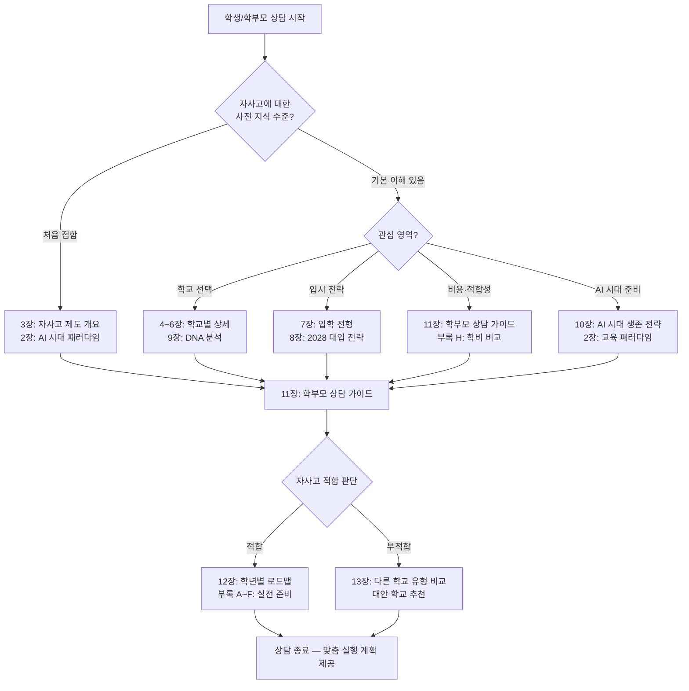
```mermaid
flowchart TD
    A["학생/학부모 상담 시작"] --> B{"자사고에 대한<br/>사전 지식 수준?"}
    B -->|처음 접함| C["3장: 자사고 제도 개요<br/>2장: AI 시대 패러다임"]
    B -->|기본 이해 있음| D{"관심 영역?"}
    D -->|학교 선택| E["4~6장: 학교별 상세<br/>9장: DNA 분석"]
    D -->|입시 전략| F["7장: 입학 전형<br/>8장: 2028 대입 전략"]
    D -->|비용·적합성| G["11장: 학부모 상담 가이드<br/>부록 H: 학비 비교"]
    D -->|AI 시대 준비| H["10장: AI 시대 생존 전략<br/>2장: 교육 패러다임"]
    C --> I["11장: 학부모 상담 가이드"]
    E --> I
    F --> I
    G --> I
    H --> I
    I --> J{"자사고 적합 판단"}
    J -->|적합| K["12장: 학년별 로드맵<br/>부록 A~F: 실전 준비"]
    J -->|부적합| L["13장: 다른 학교 유형 비교<br/>대안 학교 추천"]
    K --> M["상담 종료 — 맞춤 실행 계획 제공"]
    L --> M
```

### 1.3 핵심 용어 정리표

| 용어 | 설명 | 상담 시 핵심 포인트 |
|------|------|-------------------|
| **자사고** (자율형사립고) | 초·중등교육법 시행령 제91조의3에 근거한 자율형 사립 고등학교. 교육과정 편성·운영의 자율성이 보장된 사립 고등학교 | "자사고는 '자율'이 핵심 — 교육과정·교사 채용·학비 결정에서 자율성이 보장됩니다" |
| **전국단위** | 전국 모든 지역에서 학생을 모집할 수 있는 자사고 (10개교). 기숙사 의무 | "전국단위는 전국 최상위 학생이 모이는 곳. 하나고·민사고·상산고 등 10개교" |
| **광역단위** | 해당 시·도 내에서만 학생을 모집하는 자사고. 서울 15개교 + 비서울 8개교 | "광역단위는 같은 자사고여도 학교별 편차가 매우 큼. 데이터 검증 필수" |
| **학종형 DNA** | 학생부종합전형(학종)에 최적화된 학교 — 세특·비교과·R&E 중심 | "하나고·외대부고·민사고가 대표적. 서울대 학종 합격에 강점" |
| **정시형 DNA** | 정시(수능) 중심으로 교육과정이 설계된 학교 — 수능 집중 인프라 | "상산고·현대청운고가 대표적. 의대 정시 합격에 강점" |
| **R&E** | Research & Education. 대학교수 지도 하 1년 이상 진행하는 심화 연구 프로젝트 | "학종에서 가장 강력한 무기. 자사고에서만 체계적으로 운영되는 프로그램" |
| **세특** | 세부능력 및 특기사항. 학교생활기록부(생기부)에서 교과별 학생의 탐구 활동을 기술하는 영역 | "2028 대입에서 세특 비중 35~40%로 확대 전망. 자사고 학종형의 핵심 무기" |
| **5등급제** | 2028 대입부터 적용되는 내신 절대평가 5등급(A~E). 현행 9등급 상대평가 대체 | "자사고에 중립적 — 경쟁 완화되나 변별력 감소 → 세특으로 차별화 필수" |
| **수능 최저** | 수시 전형에서 요구하는 수능 최소 등급 조건 | "정시형 자사고 학생은 수능 최저 충족이 용이 — 수시+정시 양방향 전략 가능" |
| **자소서** | 자기소개서. 자사고 입학 전형에서 제출하는 자기주도 학습 경험 서술 문서 | "자사고 입학의 핵심 서류. '왜 이 학교인가'를 구체적으로 서술해야 합니다" |
| **면접** | 자사고 입학 전형 2단계. 자기주도 학습 역량·인성·잠재력을 평가 | "정답이 아니라 '사고의 과정'을 봅니다. AI 시대에는 'AI를 어떻게 활용했는가'도 질문" |
| **DNA** | 학교의 핵심 입시 전략 방향성 (학종형/정시형/균형형) | "같은 자사고여도 DNA가 다르면 준비 전략이 완전히 달라집니다" |
| **재지정 심사** | 5년 단위로 자사고 지정을 갱신하는 교육청 심사 | "심사 탈락 시 일반고로 전환. 대광고(2026)가 자발적 전환 사례" |

> **상담 포인트**: "자사고를 고려할 때 가장 먼저 할 일은 **학종형인지 정시형인지 DNA를 파악**하는 것입니다. 같은 자사고여도 DNA가 다르면 준비 방법, 대입 전략, 적합한 학생 유형이 완전히 달라집니다."

---

## 2. AI 시대 교육 패러다임의 전환

### 2.1 AI가 바꾸는 엘리트 교육

AI(ChatGPT, Claude 등)의 등장으로 **엘리트 교육의 정의가 근본적으로 변화**하고 있습니다. 과거 자사고가 독점하던 '심화 선택과목 우위'는 2028 통합형 수능으로 사라지며, 결국 **'무엇을 알고 있는가'가 아니라 '무엇을 할 수 있는가'**가 변별력이 됩니다.

| 구분 | 과거 엘리트 교육 | AI 시대 엘리트 교육 |
|------|-----------------|-------------------|
| **핵심 역량** | 빠른 문제 풀이, 지식 암기량 | 문제 정의, 비판적 사고, 메타인지 |
| **평가 방식** | 정답 찾기 (객관식 + 단답형) | 과정 평가 (세특 + 면접 + 서술형) |
| **학습 방식** | 학원 → 선행 → 반복 풀이 | 자기주도 탐구 → R&E → AI 도구 활용 |
| **AI와의 관계** | AI 미존재 (학원 의존) | AI를 도구로 활용하되 해석은 본인 |
| **자사고의 가치** | 심화 선택과목 + 내신 경쟁 | **세특 깊이 + 면접 논리 + R&E 경험** |
| **변별력 원천** | 선행 범위, 풀이 속도 | '왜 했는지·무엇을 발견했는지' 설명 능력 |

> **상담 포인트**: "AI 시대에 자사고의 가치는 '심화 문제를 더 많이 풀 수 있는 환경'이 아니라, **'자기만의 탐구를 깊이 있게 할 수 있는 환경'**에 있습니다. 학원에서 떠먹여 줘야 공부하는 학생은 자사고에서 오히려 도태됩니다."

### 2.2 자사고의 AI 시대 포지셔닝

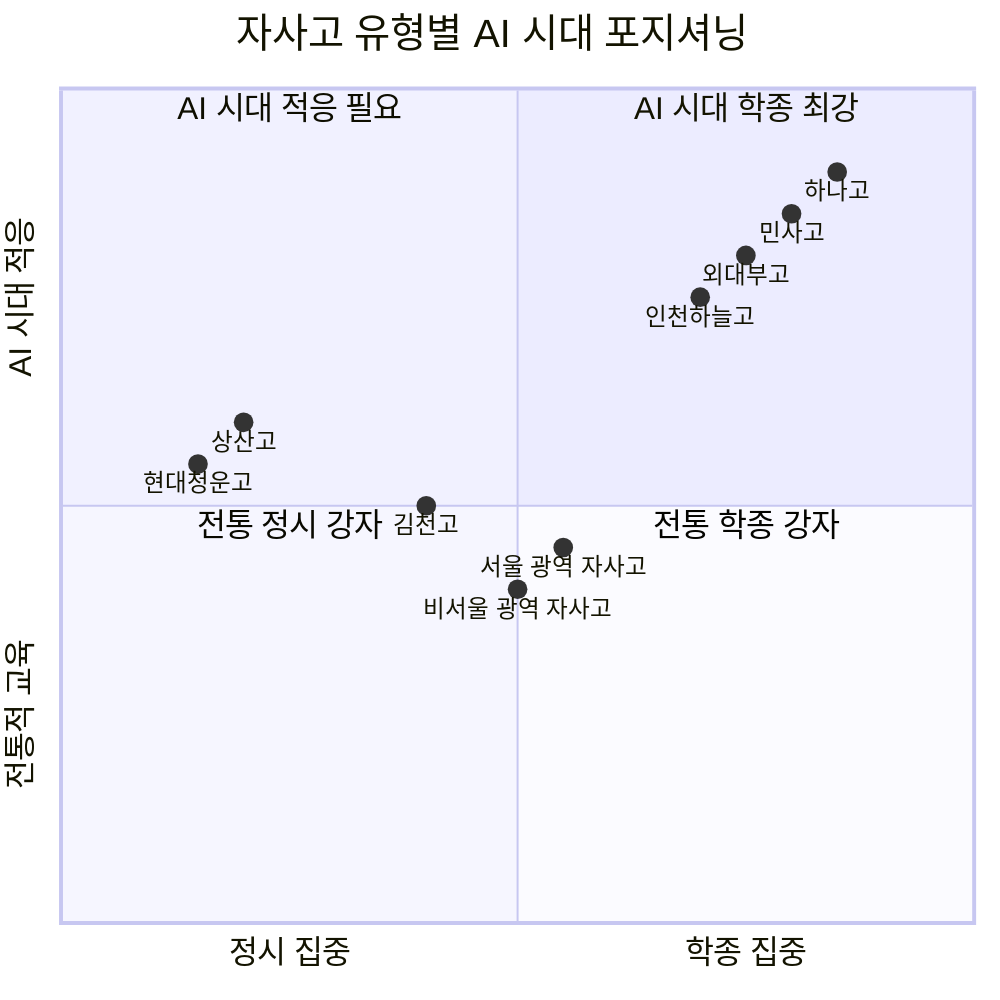
```mermaid
quadrantChart
    title 자사고 유형별 AI 시대 포지셔닝
    x-axis "정시 집중" --> "학종 집중"
    y-axis "전통적 교육" --> "AI 시대 적응"
    quadrant-1 "AI 시대 학종 최강"
    quadrant-2 "AI 시대 적응 필요"
    quadrant-3 "전통 정시 강자"
    quadrant-4 "전통 학종 강자"
    "하나고": [0.85, 0.90]
    "민사고": [0.80, 0.85]
    "외대부고": [0.75, 0.80]
    "인천하늘고": [0.70, 0.75]
    "상산고": [0.20, 0.60]
    "현대청운고": [0.15, 0.55]
    "김천고": [0.40, 0.50]
    "서울 광역 자사고": [0.55, 0.45]
    "비서울 광역 자사고": [0.50, 0.40]
```

### 2.3 학종형 vs 정시형 DNA의 의미

| 구분 | 학종형 DNA | 정시형 DNA | 균형형 DNA |
|------|-----------|-----------|-----------|
| **대표 학교** | 하나고, 외대부고, 민사고 | 상산고, 현대청운고 | 김천고, 포항제철고, 북일고 |
| **교육과정 핵심** | 세특 강화, R&E, 비교과 활동 풍부 | 수능 집중 인프라, 심화 문제풀이 | 수시 60% + 정시 40% 균형 |
| **수업 방식** | 토론·발표·프로젝트 중심 | 강의·풀이·반복 학습 중심 | 혼합형 |
| **AI 시대 강점** | 세특에 AI 활용 과정 기록 가능 | 수능 최저 충족 용이 | 양방향 전략 가능 |
| **AI 시대 약점** | AI로 비교과 차별화 어려워짐 | AI가 문제풀이 대체 → 가치 감소 | 양쪽 모두 중간 수준 |
| **적합 학생** | 탐구형, 자기주도형, 면접 강점 | 수능형, 의대 지망, 끈기형 | 진로 미확정, 유연성 원하는 학생 |
| **SKY 진학 루트** | 서울대 학종, 연세대 활동우수 | 정시 수능 상위 % | 수시+정시 병행 |
| **의대 진학 루트** | 학종 의대 (세특 중심) | **정시 의대 (수능 최적화)** | 수시+정시 병행 |

> **상담 포인트**: "자사고를 선택할 때 가장 중요한 것은 **학교의 DNA와 학생의 DNA가 맞는지**입니다. 탐구형 학생이 정시형 자사고에 가면 답답하고, 수능형 학생이 학종형 자사고에 가면 비교과 활동에 시간을 빼앗깁니다."

---

## 3. 자율형사립고 제도 개요

### 3.1 자사고란 — 법적 근거

자율형사립고(자사고)는 **초·중등교육법 시행령 제91조의3**에 근거한 고등학교 유형입니다.

| 항목 | 내용 |
|------|------|
| **법적 근거** | 초·중등교육법 시행령 제91조의3 |
| **정의** | 교육과정 편성·운영의 자율성이 보장된 사립 고등학교 |
| **지정 주체** | 교육부장관(전국단위) 또는 시·도 교육감(광역단위) |
| **지정 기간** | 5년 (재지정 심사를 통해 갱신) |
| **학비** | 일반고 등록금의 3배 이내 (실제로는 학교별 상이) |
| **교육과정 자율성** | 국가 교육과정의 50% 이상 자율 편성 가능 |
| **교사 채용** | 독자적 교사 채용 가능 (전문 교과 교사 초빙) |
| **2026년 현재 학교 수** | 전국 33개교 (전국단위 10 + 서울 광역 15 + 비서울 광역 8) |

### 3.2 전국단위 vs 광역단위 비교

| 구분 | 전국단위 자사고 (10개교) | 광역단위 자사고 (23개교) |
|------|----------------------|----------------------|
| **모집 범위** | 전국 모든 지역 | 해당 시·도 내 |
| **기숙사** | 전원 의무 기숙사 | 대부분 통학 (일부 기숙사 운영) |
| **학비 수준** | 연 500~1,900만원 (학교별 상이) | 연 800~1,200만원 |
| **학생 수준** | 전국 최상위 (내신 전 과목 A) | 해당 지역 상위 (학교별 편차 큼) |
| **입시 전형** | 자소서 + 면접 (경쟁률 5~8:1) | 자소서 + 면접 (경쟁률 1.5~4:1) |
| **대입 실적** | SKY 진학률 30~70%+ | 학교별 편차 큼 (10~40%) |
| **DNA 유형** | 학종형·정시형 뚜렷이 구분 | 대부분 균형형 |
| **대표 학교** | 하나고, 민사고, 상산고, 외대부고 | 세화고, 중동고, 양정고, 휘문고 |
| **재지정 심사** | 교육부 주관 | 시·도 교육감 주관 |

> **상담 포인트**: "같은 '자사고'라는 이름이지만, 전국단위와 광역단위는 **완전히 다른 학교**입니다. 전국단위는 기숙사·학비·학생 수준 모두 최상위이고, 광역단위는 일반고와 자사고의 중간 — **학교별 실적을 반드시 데이터로 검증**해야 합니다."

### 3.3 자사고 존치 히스토리

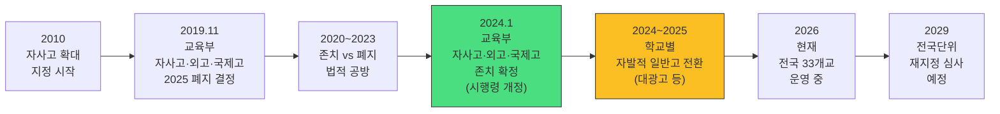
```mermaid
flowchart LR
    A["2010<br/>자사고 확대<br/>지정 시작"] --> B["2019.11<br/>교육부<br/>자사고·외고·국제고<br/>2025 폐지 결정"]
    B --> C["2020~2023<br/>존치 vs 폐지<br/>법적 공방"]
    C --> D["2024.1<br/>교육부<br/>자사고·외고·국제고<br/>존치 확정<br/>(시행령 개정)"]
    D --> E["2024~2025<br/>학교별<br/>자발적 일반고 전환<br/>(대광고 등)"]
    E --> F["2026<br/>현재<br/>전국 33개교<br/>운영 중"]
    F --> G["2029<br/>전국단위<br/>재지정 심사<br/>예정"]
    
    style D fill:#4ade80,stroke:#333
    style E fill:#fbbf24,stroke:#333
```

| 시점 | 사건 | 영향 |
|------|------|------|
| 2010~2018 | 자사고 확대 지정 (최대 49개교) | 자사고 전성기, SKY 진학률 폭발적 성장 |
| 2019.11 | 교육부 자사고·외고·국제고 2025 폐지 결정 | 학부모 불안, 자사고 지원율 하락 |
| 2020~2023 | 법적 공방, 교육부·학교법인 갈등 | 일부 학교 자발적 일반고 전환 |
| **2024.1** | **자사고·외고·국제고 존치 확정 (시행령 개정)** | **정책 안정화, 지원율 반등** |
| 2025~2026 | 서울 대광고 자발적 일반고 전환 (2026) | 서울 광역 16 → 15개교 |
| 2028~ | 2028 대입 개편 (5등급제, 통합형 수능) | 자사고 전략 전면 재편 필요 |
| 2029~ | 전국단위 자사고 재지정 심사 | 실적 미달 학교 일반고 전환 가능 |

### 3.4 재지정 심사 구조 (5년 단위)

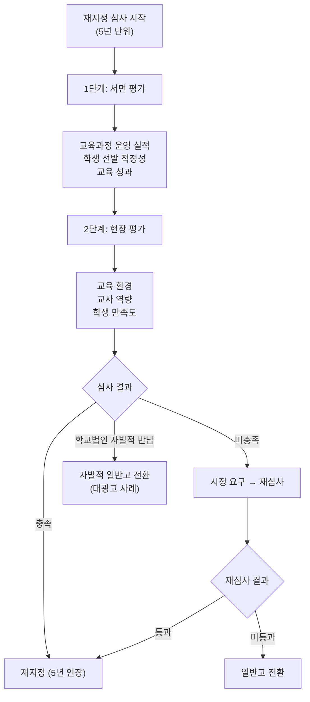
```mermaid
flowchart TD
    A["재지정 심사 시작<br/>(5년 단위)"] --> B["1단계: 서면 평가"]
    B --> C["교육과정 운영 실적<br/>학생 선발 적정성<br/>교육 성과"]
    C --> D["2단계: 현장 평가"]
    D --> E["교육 환경<br/>교사 역량<br/>학생 만족도"]
    E --> F{"심사 결과"}
    F -->|"충족"| G["재지정 (5년 연장)"]
    F -->|"미충족"| H["시정 요구 → 재심사"]
    H --> I{"재심사 결과"}
    I -->|"통과"| G
    I -->|"미통과"| J["일반고 전환"]
    F -->|"학교법인 자발적 반납"| K["자발적 일반고 전환<br/>(대광고 사례)"]
```

**재지정 심사 핵심 평가 항목**:

| 평가 영역 | 세부 항목 | 비중 | 핵심 포인트 |
|----------|----------|------|------------|
| 교육과정 운영 | 자율 교육과정 편성 비율, 심화 과목 개설 | 30% | 국가 교육과정 50% 이상 자율 편성 충족 여부 |
| 학생 선발 적정성 | 공정한 선발 과정, 사교육 유발 여부 | 20% | 자기주도 학습 전형 준수 여부 |
| 교육 성과 | 대입 실적, 학생 만족도, 중도 탈락률 | 30% | SKY 진학률, 학생·학부모 만족도 조사 |
| 운영 건전성 | 재정 투명성, 교사 처우, 시설 투자 | 20% | 학비 대비 교육 투자 비율 |

### 3.5 대광고 사례 — 자발적 일반고 전환 (2026)

| 항목 | 내용 |
|------|------|
| **학교명** | 대광고등학교 (서울특별시 중구) |
| **전환 시점** | 2026학년도 신입생부터 일반고 운영 |
| **전환 사유** | 학교법인 자발적 자사고 지정 반납 |
| **배경 분석** | 학비 부담 대비 대입 실적 차별화 어려움, 학생 모집 경쟁력 약화 |
| **영향** | 서울 광역단위 자사고 16 → 15개교 |
| **상담 시사점** | 자사고 지정이 영구적이지 않음 — 학교법인의 판단에 따라 전환 가능 |

> **상담 포인트**: "대광고 사례는 자사고가 **영원하지 않다**는 것을 보여줍니다. 5년 재지정 심사 외에도 학교법인이 스스로 반납할 수 있습니다. 입학 전 해당 학교의 재지정 심사 일정과 학교법인의 운영 의지를 확인하세요."

---

## 4. 전국단위 자사고 10개교 상세

### 전국단위 자사고 종합 비교표

| 순번 | 학교명 | 위치 | 연간 학비(추정) | 기숙사 | DNA | 재단/후원 | SKY 진학률(추정) | 핵심 강점 |
|------|--------|------|--------------|--------|-----|---------|----------------|----------|
| 1 | **하나고** | 서울 은평구 | ~500만원 | 의무 | 학종형 | 하나금융 | 40~50% | 자기주도 학습, 서울대 학종 |
| 2 | **민사고** | 강원 횡성 | ~1,500만원+ | 의무 | 학종+해외 | 독자 재단 | 30~40%+해외 | 한국학+글로벌, 아이비리그 |
| 3 | **상산고** | 전북 전주 | ~800만원 | 의무 | 정시형 | 독자 재단 | 50~70% | 의대 정시 전국 1위급 |
| 4 | **현대청운고** | 울산 북구 | 현대 지원 | 의무 | 정시형 | 현대그룹 | 40~50% | 이공계·의대, 현대 장학금 |
| 5 | **외대부고** | 경기 용인 | ~998~1,800만원 | 의무 | 학종형 | 한국외대 | 40~50% | 외국어·학종·해외대 |
| 6 | **인천하늘고** | 인천 영종도 | ~1,000만원대 | 의무 | 균형형 | 인천공항공사 | 30~40% | 전인교육, 영어 몰입 |
| 7 | **김천고** | 경북 김천 | ~1,060만원 | 의무 | 균형형 | 송설재단 | 30~40% | 전통 명문, 1931 개교 |
| 8 | **광양제철고** | 전남 광양 | ~910만원 | 의무 | 균형형 | 포스코교육재단 | 25~35% | 이공계·산업현장 연계 |
| 9 | **포항제철고** | 경북 포항 | ~928만원 | 의무 | 균형형 | 포스코교육재단 | 30~40% | POSTECH 인접, 이공계 |
| 10 | **북일고** | 충남 천안 | ~924만원 | 의무 | 균형형 | 한화그룹 | 25~35% | 한화 장학금, 야구부 |

---

### 4.1 하나고등학교

| 항목 | 상세 |
|------|------|
| **정식명칭** | 하나고등학교 |
| **위치** | 서울특별시 은평구 |
| **설립 유형** | 전국 단위 자율형사립고 |
| **DNA** | **학종형** — 자기주도 학습 + 세특 + R&E 중심 |
| **연간 학비** | 약 500만원 (하나금융 지원으로 동급 최저) |
| **기숙사** | 전원 의무 기숙사 (2인실, 격주 외박) |
| **기숙사비** | 연 300~400만원 |
| **총 비용** | 연 800~900만원 (동급 자사고 최저 수준) |
| **입학 정원** | 연 100~180명 |
| **남녀 비율** | 남 50% : 여 50% (균등 선발) |
| **경쟁률** | 약 5~7:1 |
| **핵심 프로그램** | 하나 자율 인문교육, R&E 소논문, 국제 교류, 의·치·약 컨설팅 |
| **대입 실적** | 서울대 진학률 약 20~25%, SKY 40~50% 추정 |
| **핵심 특징** | 하나금융그룹 장학재단 연계 — 저소득 가정도 전액 지원 가능 |

**하나고 입시 전략 핵심**:
1. **자기주도 학습 능력**이 합격의 핵심 — '학원이 아닌 내가 계획한 공부' 경험 필수
2. 자소서에 **구체적인 자기주도 학습 사례** 기술 (막연한 '열심히 했다'는 탈락 요인)
3. 면접에서 **'왜 공부하는가'**에 대한 자기 서사가 중요
4. AI 시대: ChatGPT·Khan Academy 활용 **자기설계 학습 프로젝트**가 최신 소재

> **상담 포인트**: "하나고는 동급 자사고 중 **학비가 가장 낮습니다** (하나금융 지원). 비용 부담으로 자사고를 포기하려는 학부모에게 첫 번째로 추천할 학교입니다. 단, 자기주도 학습 능력이 없으면 입학해도 따라가기 어렵습니다."

---

### 4.2 민족사관고등학교 (민사고)

| 항목 | 상세 |
|------|------|
| **정식명칭** | 민족사관고등학교 |
| **위치** | 강원도 횡성군 |
| **설립 유형** | 전국 단위 자율형사립고 |
| **DNA** | **학종 + 해외** — 한국학 + 글로벌 이중 구조 |
| **연간 학비** | 약 1,500만원 이상 (국내 사립고 최고 수준) |
| **기숙사** | 전원 의무 기숙사 (2~4인실) |
| **총 비용** | 연 1,600~1,900만원 |
| **입학 정원** | 연 약 140명 |
| **남녀 비율** | 남 55% : 여 45% |
| **경쟁률** | 약 5~8:1 |
| **핵심 프로그램** | 한국학 특화교육, 글로벌 캠프, AP·SAT 학습, 전통 인성교육 |
| **대입 실적** | 서울대 + 아이비리그 동시 진학생 배출, SKY 30~40% + 해외 명문대 |
| **핵심 특징** | 수업의 50% 이상이 영어로 진행, 한국학+영어 이중 구조 |

**민사고 입시 전략 핵심**:
1. **영어 면접** 통과 필수 — 영어 회화·독해 최상위 필요
2. **한국 역사·문화**에 대한 관심과 이해 (한국학 특화 학교)
3. **리더십 경험** (학생회·전국 대회 등) 중시
4. 학습량 주당 55~60시간 — **자기 페이스 조절 능력** 없으면 번아웃

> **상담 포인트**: "민사고는 **해외 대학 진학**을 고려하는 학생에게 최적입니다. 국내에서 아이비리그·옥스브리지에 가장 많은 합격생을 배출하는 학교 중 하나입니다. 단, 학비가 국내 최고 수준이므로 장학금 수혜 가능 여부를 반드시 확인하세요."

---

### 4.3 상산고등학교

| 항목 | 상세 |
|------|------|
| **정식명칭** | 상산고등학교 |
| **위치** | 전라북도 전주시 |
| **설립 유형** | 전국 단위 자율형사립고 |
| **DNA** | **정시형** — 수능 집중 인프라, 의대 진학 최적화 |
| **연간 학비** | 약 800만원 수준 |
| **기숙사** | 전원 의무 기숙사 |
| **총 비용** | 연 1,000~1,200만원 (기숙·식비 포함) |
| **입학 정원** | 연 약 150명 |
| **경쟁률** | 약 5~7:1 |
| **핵심 프로그램** | 수능 집중 인프라, 의대 진학 프로그램, 심화 수학·과학 |
| **대입 실적** | SKY 진학률 50~70% 추정, **의대 합격률 전국 최상위** |
| **핵심 특징** | 정시 수능 집중 환경, 의·약학 진학 전국 1위급 |

**상산고 입시 전략 핵심**:
1. **수학·과학 최상위** — 특히 수학 선행이 필수
2. 정시형 DNA — 입학 후 **수능 집중 환경**에서 3년간 훈련
3. **의대 지망**이라면 상산고가 최적 선택지 중 하나
4. 학종보다 정시 비중이 높은 전략 설계 필요

> **상담 포인트**: "의대를 정시로 가고 싶다면 **상산고가 전국 1위급**입니다. 단, 학종형 학생이 가면 비교과 활동이 부족할 수 있습니다. DNA 매칭이 핵심입니다."

---

### 4.4 현대청운고등학교

| 항목 | 상세 |
|------|------|
| **정식명칭** | 현대청운고등학교 |
| **위치** | 울산광역시 북구 |
| **설립 유형** | 전국 단위 자율형사립고 |
| **DNA** | **정시형** — 이공계·의대 특화, 현대그룹 전폭 지원 |
| **연간 학비** | 현대그룹 지원으로 학비 부담 경감 |
| **기숙사** | 전원 의무 기숙사 |
| **핵심 프로그램** | 이공계 심화 교육, 현대그룹 산업 연계, 의대 진학 프로그램 |
| **대입 실적** | SKY 40~50%, 이공계·의대 강세 |
| **핵심 특징** | 현대그룹 재단이 운영하여 시설·장학금이 우수 |

> **상담 포인트**: "현대청운고는 **현대그룹의 전폭적 지원** 덕분에 시설·장학금 모두 최상급입니다. 이공계·의대 지망 학생에게 강력 추천합니다. 울산 소재라 서울 학생에게는 접근성이 단점이지만, 기숙사 생활의 질은 최상입니다."

---

### 4.5 외대부속외국어고등학교 (외대부고)

| 항목 | 상세 |
|------|------|
| **정식명칭** | 한국외국어대학교부속외국어고등학교 |
| **위치** | 경기도 용인시 처인구 모현읍 |
| **설립 유형** | 전국 단위 자율형사립고 |
| **DNA** | **학종형** — 외국어·국제 특화, SKY 학종 + 해외대 |
| **연간 학비** | 기본 약 998만원 / 방과후 포함 1,800만원+ |
| **기숙사** | 전원 의무 기숙사 |
| **총 비용** | 연 1,300~2,000만원 (방과후·기숙비 포함) |
| **입학 정원** | 연 약 200명 |
| **핵심 프로그램** | 외국어 심화교육, 국제 교류, R&E, SKY 학종 집중 |
| **대입 실적** | SKY 40~50%, 해외 명문대 합격 다수 |
| **핵심 특징** | 외국어(영어·제2외국어) 교육 최강, 학종 세특 풍부 |

> **상담 포인트**: "외대부고는 **외국어 능력 + 학종 세특**이 동시에 필요한 학생에게 최적입니다. 해외 대학 병행 전략도 가능합니다. 단, 학비가 높은 편이므로 장학금 확인이 필요합니다."

---

### 4.6 인천하늘고등학교

| 항목 | 상세 |
|------|------|
| **정식명칭** | 인천하늘고등학교 |
| **위치** | 인천광역시 중구 운서동 (영종도) |
| **설립 유형** | 전국 단위 자율형사립고 |
| **DNA** | **균형형** — 전인교육 + 영어 몰입 |
| **연간 학비** | 약 1,000만원대 |
| **기숙사** | 전원 의무 기숙사 |
| **핵심 프로그램** | 전인교육, 영어 몰입교육, 인천공항공사 연계 프로그램 |
| **대입 실적** | SKY 30~40% |
| **핵심 특징** | 인천국제공항공사 후원, 영종도 소재, 영어 몰입 환경 |

> **상담 포인트**: "인천하늘고는 **전인교육**을 강조합니다. 학업 성적만이 아니라 인성·체력·사회성을 균형 있게 기르고 싶은 학생에게 적합합니다."

---

### 4.7 김천고등학교

| 항목 | 상세 |
|------|------|
| **정식명칭** | 김천고등학교 |
| **위치** | 경상북도 김천시 |
| **설립 유형** | 전국 단위 자율형사립고 |
| **DNA** | **균형형** — 수시+정시 균형, 전통 명문 |
| **연간 학비** | 약 1,060만원 (재단 지원으로 실질 부담 낮음) |
| **기숙사** | 전원 의무 기숙사 |
| **핵심 프로그램** | 심화 교과과정, R&E, 진로 탐구 |
| **대입 실적** | SKY 30~40% |
| **핵심 특징** | 1931년 개교 전통 명문, 송설재단 운영, 충성도 높은 동문 네트워크 |

---

### 4.8 광양제철고등학교

| 항목 | 상세 |
|------|------|
| **정식명칭** | 광양제철고등학교 |
| **위치** | 전라남도 광양시 광양읍 |
| **설립 유형** | 전국 단위 자율형사립고 |
| **DNA** | **균형형** — 이공계·산업현장 연계 특화 |
| **연간 학비** | 약 910만원 (포스코 재단 지원) |
| **기숙사** | 전원 의무 기숙사 |
| **핵심 프로그램** | 이공계 심화, 포스코 산업연계, R&E |
| **대입 실적** | SKY 25~35% |
| **핵심 특징** | 포스코교육재단 운영, 이공계·산업현장 연계 교육 |

---

### 4.9 포항제철고등학교

| 항목 | 상세 |
|------|------|
| **정식명칭** | 포항제철고등학교 |
| **위치** | 경상북도 포항시 남구 지곡동 |
| **설립 유형** | 전국 단위 자율형사립고 |
| **DNA** | **균형형** — 이공계 특화, POSTECH 인접 |
| **연간 학비** | 약 928만원 (포스코 재단 지원) |
| **기숙사** | 전원 의무 기숙사 |
| **핵심 프로그램** | POSTECH 연계 R&E, 이공계 심화, 포스코 장학금 |
| **대입 실적** | SKY 30~40% |
| **핵심 특징** | POSTECH과 물리적으로 인접 — 대학 연구실 방문·R&E 용이 |

> **상담 포인트**: "포항제철고는 POSTECH이 바로 옆에 있어 **이공계 R&E**에 최적입니다. POSTECH·KAIST 이공계 진학을 목표로 하는 학생에게 강력 추천합니다."

---

### 4.10 북일고등학교

| 항목 | 상세 |
|------|------|
| **정식명칭** | 북일고등학교 |
| **위치** | 충청남도 천안시 동남구 |
| **설립 유형** | 전국 단위 자율형사립고 |
| **DNA** | **균형형** — 수시+정시 균형, 한화그룹 지원 |
| **연간 학비** | 약 924만원 (한화 재단 지원) |
| **기숙사** | 전원 의무 기숙사 |
| **핵심 프로그램** | 심화 교과, 한화 장학금, 진로 탐구 프로그램 |
| **대입 실적** | SKY 25~35% |
| **핵심 특징** | 한화그룹(김종희 장학재단) 운영, 야구부 명문 |

> **상담 포인트**: "북일고는 **한화그룹 지원** 덕분에 장학금이 풍부합니다. 학비 부담을 줄이면서 전국단위 자사고의 환경을 원하는 학생에게 적합합니다."

---

## 5. 서울 광역단위 자사고 15개교 상세

### 2026년 현재 서울 광역단위 자사고 현황

> 2026년 대광고가 자발적으로 일반고로 전환하여 서울 광역단위 자사고는 **16 → 15개교**로 감소했습니다.

| 순번 | 학교명 | 위치(구) | 연간 학비(추정) | 기숙사 | 성별 | 강점 분야 |
|------|--------|---------|--------------|--------|------|----------|
| 1 | **양정고** | 양천구 | ~900만원 | 없음 | 남학교 | 서울대·연세대·고려대 진학 강점 |
| 2 | **이화여고** | 중구 | ~850만원 | 없음 | 여학교 | 서울대·이화여대, 여학생 명문 |
| 3 | **휘문고** | 강남구 | ~900만원 | 없음 | 남학교 | 강남 소재, SKY 진학률 상위 |
| 4 | **신일고** | 강북구 | ~800~1,000만원 | 없음 | 남학교 | 강북 지역 거점 자사고 |
| 5 | **배재고** | 강동구 | ~800~1,000만원 | 없음 | 남학교 | 한국 최초 근대 학교(1885) 전통 |
| 6 | **보인고** | 송파구 | ~800~1,000만원 | 없음 | 남학교 | 송파 지역 거점, 체계적 내신 관리 |
| 7 | **선덕고** | 도봉구 | ~800~1,000만원 | 없음 | 남학교 | 도봉 지역 거점 자사고 |
| 8 | **세화고** | 서초구 | ~800~1,000만원 | 없음 | 남학교 | 서초 강남권, SKY 진학률 최상위급 |
| 9 | **세화여고** | 서초구 | ~800~1,000만원 | 없음 | 여학교 | 서초 강남권, 여학생 명문 |
| 10 | **이대부고** | 서대문구 | ~800~1,000만원 | 없음 | 공학 | 이화여대 부속, 공학 자사고 |
| 11 | **중동고** | 강남구 | ~800~1,000만원 | 없음 | 남학교 | 강남 일원동, SKY 진학률 상위 |
| 12 | **중앙고** | 종로구 | ~800~1,000만원 | 없음 | 공학 | 종로 계동 소재, 3·1 운동 역사 학교 |
| 13 | **한대부고** | 성동구 | ~800~1,000만원 | 없음 | 공학 | 한양대 부속, 공학 인재 양성 |
| 14 | **현대고** | 강남구 | ~800~1,000만원 | 없음 | 공학 | 강남 압구정, 현대그룹 연계 |
| 15 | **경희고** | 동대문구 | ~800~1,000만원 | 없음 | 공학 | 경희대 인접, 균형 잡힌 교육 |

### 서울 광역단위 자사고 15개교 개별 특성

#### 양정고등학교 (양천구, 남학교)

| 항목 | 상세 |
|------|------|
| **위치** | 서울특별시 양천구 |
| **성별** | 남학교 |
| **학비** | 연 약 900만원 |
| **강점** | 서울대·연세대·고려대 진학 강점, 서남권 거점 |
| **특징** | 양천구·강서구 지역 최상위 남학생 집결. 학종+정시 균형형 DNA |

#### 이화여자고등학교 (중구, 여학교)

| 항목 | 상세 |
|------|------|
| **위치** | 서울특별시 중구 |
| **성별** | 여학교 |
| **학비** | 연 약 850만원 |
| **강점** | 서울대·이화여대 진학 강점, 한국 대표 여학생 명문 |
| **특징** | 이화학당 전통의 여성 리더십 교육. 인문·사회 계열 학종에 강점. 역사적 브랜드 가치 |

#### 휘문고등학교 (강남구, 남학교)

| 항목 | 상세 |
|------|------|
| **위치** | 서울특별시 강남구 |
| **성별** | 남학교 |
| **학비** | 연 약 900만원 |
| **강점** | 강남 소재, SKY 진학률 상위, 학원 밀집 지역 접근성 |
| **특징** | 강남 학원가와 인접하여 사교육 병행 용이. 내신 경쟁 치열 |

#### 신일고등학교 (강북구, 남학교)

| 항목 | 상세 |
|------|------|
| **위치** | 서울특별시 강북구 미아동 |
| **성별** | 남학교 |
| **학비** | 연 약 800~1,000만원 |
| **강점** | 강북 지역 거점 자사고, 교통 접근성 양호 |
| **특징** | 강북·노원·도봉 지역 상위 남학생 집결. 학종+정시 균형 |

#### 배재고등학교 (강동구, 남학교)

| 항목 | 상세 |
|------|------|
| **위치** | 서울특별시 강동구 고덕동 |
| **성별** | 남학교 |
| **학비** | 연 약 800~1,000만원 |
| **강점** | 한국 최초 근대 학교(1885), 141년 전통의 동문 네트워크 |
| **특징** | 한국 근대 교육의 시작점. 동문 네트워크가 타 학교 대비 압도적. 강동·하남 지역 거점 |

#### 보인고등학교 (송파구, 남학교)

| 항목 | 상세 |
|------|------|
| **위치** | 서울특별시 송파구 오금동 |
| **성별** | 남학교 |
| **학비** | 연 약 800~1,000만원 |
| **강점** | 송파 지역 거점, 체계적 내신 관리 시스템 |
| **특징** | 송파·강동·위례 지역 상위 남학생 집결. 내신 관리 시스템이 체계적 |

#### 선덕고등학교 (도봉구, 남학교)

| 항목 | 상세 |
|------|------|
| **위치** | 서울특별시 도봉구 쌍문동 |
| **성별** | 남학교 |
| **학비** | 연 약 800~1,000만원 |
| **강점** | 도봉·노원 지역 거점 자사고 |
| **특징** | 강북 북부 지역 상위 남학생 집결. 통학 편의성 중시 학부모에게 추천 |

#### 세화고등학교 (서초구, 남학교)

| 항목 | 상세 |
|------|------|
| **위치** | 서울특별시 서초구 반포동 |
| **성별** | 남학교 |
| **학비** | 연 약 800~1,000만원 |
| **강점** | 서초 강남권, **서울 광역 자사고 중 SKY 진학률 최상위급** |
| **특징** | 서초·강남·송파 지역 최상위 남학생 집결. 대치동 학원가 인접. 내신 경쟁 매우 치열하나 대입 실적 우수 |

#### 세화여자고등학교 (서초구, 여학교)

| 항목 | 상세 |
|------|------|
| **위치** | 서울특별시 서초구 반포동 |
| **성별** | 여학교 |
| **학비** | 연 약 800~1,000만원 |
| **강점** | 서초 강남권, **여학생 자사고 중 SKY 진학률 최상위급** |
| **특징** | 세화고와 동일 재단. 서초·강남 지역 최상위 여학생 집결. 이공계·의대 여학생 진학에 강점 |

#### 이화여자대학교사범대학부속고등학교 (이대부고, 서대문구, 공학)

| 항목 | 상세 |
|------|------|
| **위치** | 서울특별시 서대문구 대신동 |
| **성별** | 공학 (남녀공학) |
| **학비** | 연 약 800~1,000만원 |
| **강점** | 이화여대 부속, 공학 자사고, 남녀공학의 다양성 |
| **특징** | 서울 광역 자사고 중 드문 남녀공학. 서대문·마포 지역 거점. 이화여대 연계 프로그램 |

#### 중동고등학교 (강남구, 남학교)

| 항목 | 상세 |
|------|------|
| **위치** | 서울특별시 강남구 일원동 |
| **성별** | 남학교 |
| **학비** | 연 약 800~1,000만원 |
| **강점** | 강남 일원동, **SKY 진학률 상위**, 대치동 학원가 인접 |
| **특징** | 강남 지역 자사고 중 세화고와 함께 SKY 진학률 상위. 의대 지망 학생도 다수 |

#### 중앙고등학교 (종로구, 공학)

| 항목 | 상세 |
|------|------|
| **위치** | 서울특별시 종로구 계동 |
| **성별** | 공학 (남녀공학) |
| **학비** | 연 약 800~1,000만원 |
| **강점** | 종로 계동 소재, 3·1 운동 역사 학교, 전통 명문 |
| **특징** | 독립운동과 함께한 역사적 학교. 인문·사회 계열 학종에 강점. 남녀공학 |

#### 한양대학교사범대학부속고등학교 (한대부고, 성동구, 공학)

| 항목 | 상세 |
|------|------|
| **위치** | 서울특별시 성동구 사근동 |
| **성별** | 공학 (남녀공학) |
| **학비** | 연 약 800~1,000만원 |
| **강점** | 한양대 부속, 공학 인재 양성, 이공계 강점 |
| **특징** | 한양대 연계 프로그램 (실험실 방문, 멘토링 등). 성동·광진 지역 거점 |

#### 현대고등학교 (강남구, 공학)

| 항목 | 상세 |
|------|------|
| **위치** | 서울특별시 강남구 압구정동 |
| **성별** | 공학 (남녀공학) |
| **학비** | 연 약 800~1,000만원 |
| **강점** | 강남 압구정 소재, 현대그룹 연계, 공학 자사고 |
| **특징** | 현대가와의 역사적 연결. 강남 핵심 지역에 위치하여 통학 편의성 최상. 남녀공학의 다양성 |

#### 경희고등학교 (동대문구, 공학)

| 항목 | 상세 |
|------|------|
| **위치** | 서울특별시 동대문구 회기동 |
| **성별** | 공학 (남녀공학) |
| **학비** | 연 약 800~1,000만원 |
| **강점** | 경희대 인접, 균형 잡힌 교육, 공학 자사고 |
| **특징** | 경희대 캠퍼스 인접. 경희대 연계 프로그램 활용 가능. 동대문·성북 지역 거점 |

---

### 서울 광역단위 자사고 특성 분석

**지역별 분포**:

| 지역권 | 학교 | 특성 |
|--------|------|------|
| **강남·서초권** | 세화고, 세화여고, 중동고, 현대고, 휘문고 | SKY 진학률 최상위, 학원 밀집 지역 |
| **종로·중구권** | 중앙고, 이화여고 | 전통 명문, 역사적 브랜드 |
| **서대문·성동권** | 이대부고, 한대부고 | 대학 부속 강점 |
| **강동·송파권** | 배재고, 보인고 | 지역 거점, 통학 편의 |
| **강북·도봉권** | 신일고, 선덕고 | 강북 지역 최상위 |
| **양천권** | 양정고 | 서남권 거점 |
| **동대문권** | 경희고 | 경희대 연계 강점 |

> **상담 포인트**: "서울 광역단위 자사고는 **통학이 기본**입니다. 따라서 **거주지에서 가까운 학교**를 우선 고려하되, 강남·서초권 학교의 SKY 진학률이 상대적으로 높은 경향이 있습니다. 단, 학교별 편차가 크므로 **최근 3년 진학 실적**을 반드시 확인하세요."

### 서울 광역단위 자사고 선택 기준

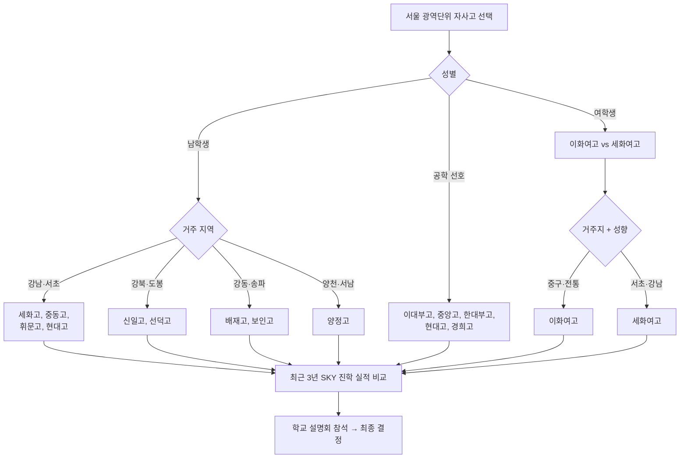
```mermaid
flowchart TD
    A["서울 광역단위 자사고 선택"] --> B{"성별"}
    B -->|"남학생"| C{"거주 지역"}
    B -->|"여학생"| D["이화여고 vs 세화여고"]
    B -->|"공학 선호"| E["이대부고, 중앙고, 한대부고,<br/>현대고, 경희고"]
    C -->|"강남·서초"| F["세화고, 중동고,<br/>휘문고, 현대고"]
    C -->|"강북·도봉"| G["신일고, 선덕고"]
    C -->|"강동·송파"| H["배재고, 보인고"]
    C -->|"양천·서남"| I["양정고"]
    D --> J{"거주지 + 성향"}
    J -->|"중구·전통"| K["이화여고"]
    J -->|"서초·강남"| L["세화여고"]
    F --> M["최근 3년 SKY 진학 실적 비교"]
    G --> M
    H --> M
    I --> M
    E --> M
    K --> M
    L --> M
    M --> N["학교 설명회 참석 → 최종 결정"]
```

---

## 6. 비서울 광역단위 자사고 8개교 상세

| 순번 | 학교명 | 지역 | 연간 학비(추정) | 기숙사 | 성별 | 강점 분야 | 특이사항 |
|------|--------|------|--------------|--------|------|----------|---------|
| 1 | **해운대고** | 부산 해운대구 | ~900~1,200만원 | 있음 | 공학 | 부산 최상위 자사고, SKY 강점 | 기숙사 옵션 |
| 2 | **계성고(대구)** | 대구 서구 | ~800~1,000만원 | 없음 | 공학 | 대구 거점 자사고 | 통학 |
| 3 | **대건고** | 대구 달서구 | ~800~1,000만원 | 없음 | 남학교 | 대구 남학생 거점 | 통학 |
| 4 | **대성고(대전)** | 대전 서구 | ~800~1,000만원 | 없음 | 남학교 | 대전 거점 자사고 | 통학 |
| 5 | **대신고(대전)** | 대전 동구 | ~800~1,000만원 | 없음 | 공학 | 대전 동구 거점 | 통학 |
| 6 | **인천포스코고** | 인천 연수구 송도 | ~900~1,200만원 | 있음 | 공학 | 포스코교육재단, 이공계 강점 | 기숙사 옵션, 송도 소재 |
| 7 | **안산동산고** | 경기 안산 | ~900~1,200만원 | 있음 | 공학 | 경기 지역 거점 자사고 | 기숙사 옵션 |
| 8 | **충남삼성고** | 충남 아산 | ~900~1,300만원 | 의무 | 공학 | 삼성디스플레이 사회공헌 연계 | **기숙사 의무**, 삼성 장학금 |

### 비서울 광역단위 자사고 특성 분석

| 지역 | 학교 수 | 핵심 특성 | 전국단위 대비 차이 |
|------|---------|----------|------------------|
| **부산** | 1개교 (해운대고) | 부산 최상위, 기숙사 운영 | 학비·학생 수준 모두 전국단위보다 낮음 |
| **대구** | 2개교 (계성고, 대건고) | 대구 지역 거점, 통학 | 통학 중심, 지역 내 경쟁 |
| **대전** | 2개교 (대성고, 대신고) | 대전 지역 거점, 통학 | KAIST 인접 장점 |
| **인천** | 1개교 (인천포스코고) | 포스코 재단, 송도 소재 | 포스코 장학금, 이공계 강점 |
| **경기** | 1개교 (안산동산고) | 경기 서남부 거점 | 기숙사 옵션 |
| **충남** | 1개교 (충남삼성고) | 삼성 재단, 기숙사 의무 | **가장 전국단위에 가까운 광역단위** |

> **상담 포인트**: "비서울 광역단위 자사고 중에서 **충남삼성고**는 기숙사가 의무이고 삼성디스플레이의 지원을 받아 **전국단위에 가장 가까운 환경**을 제공합니다. 비서울 지역에서 자사고를 고려한다면 충남삼성고를 반드시 체크하세요."

### 비서울 광역단위 자사고 개별 특성

#### 해운대고등학교 (부산)

| 항목 | 상세 |
|------|------|
| **위치** | 부산광역시 해운대구 |
| **성별** | 공학 |
| **학비** | 연 약 900~1,200만원 (기숙사 포함) |
| **기숙사** | 있음 (옵션) |
| **강점** | 부산 최상위 자사고. 부산 지역 SKY 진학 거점. 부산대·UNIST 연계 |
| **특징** | 부산 유일의 자사고로 부산·경남 지역 최상위 학생 집결. 기숙사 운영으로 통학 어려운 학생도 수용 |

#### 계성고등학교 (대구)

| 항목 | 상세 |
|------|------|
| **위치** | 대구광역시 서구 평리동 |
| **성별** | 공학 |
| **강점** | 대구 지역 거점 자사고. 대구 교육 전통의 강점 활용 |
| **특징** | 대구 서구 소재. 통학 중심. 대구 지역 내 상위 학생 집결 |

#### 대건고등학교 (대구)

| 항목 | 상세 |
|------|------|
| **위치** | 대구광역시 달서구 송현동 |
| **성별** | 남학교 |
| **강점** | 대구 남학생 거점 자사고. 카톨릭 재단 운영 |
| **특징** | 대구 달서구 소재. 가톨릭 교육 전통. 인성 교육과 학업 병행 |

#### 대성고등학교 (대전)

| 항목 | 상세 |
|------|------|
| **위치** | 대전광역시 서구 도마동 |
| **성별** | 남학교 |
| **강점** | 대전 거점 자사고. KAIST 인접 활용 가능 |
| **특징** | 대전 소재로 KAIST·충남대 인접. 이공계 R&E 연계 가능. 대전 상위 남학생 집결 |

#### 대신고등학교 (대전)

| 항목 | 상세 |
|------|------|
| **위치** | 대전광역시 동구 가양동 |
| **성별** | 공학 |
| **강점** | 대전 동구 거점 자사고. 남녀공학의 다양성 |
| **특징** | 대전 동구 소재 공학 자사고. 대성고와 함께 대전 자사고 양축 |

#### 인천포스코고등학교 (인천 송도)

| 항목 | 상세 |
|------|------|
| **위치** | 인천광역시 연수구 송도동 |
| **성별** | 공학 |
| **학비** | 연 약 900~1,200만원 (포스코교육재단 지원) |
| **기숙사** | 있음 (옵션) |
| **강점** | 포스코교육재단 운영. 이공계 특화. 송도 신도시 소재 |
| **특징** | 포스코교육재단의 지원으로 이공계 교육 인프라 우수. 인천 하늘고(전국단위)와 차별화 — 광역단위로 인천 지역 내 모집 |

#### 안산동산고등학교 (경기 안산)

| 항목 | 상세 |
|------|------|
| **위치** | 경기도 안산시 상록구 |
| **성별** | 공학 |
| **학비** | 연 약 900~1,200만원 |
| **기숙사** | 있음 (옵션) |
| **강점** | 경기 서남부(안산·시흥·화성) 지역 거점 자사고 |
| **특징** | 경기도 유일의 광역단위 자사고 중 하나. 안산·시흥·수원 지역 상위 학생 집결 |

#### 충남삼성고등학교 (충남 아산)

| 항목 | 상세 |
|------|------|
| **위치** | 충청남도 아산시 탕정면 |
| **성별** | 공학 |
| **학비** | 연 약 900~1,300만원 (삼성디스플레이 사회공헌 지원) |
| **기숙사** | **의무** |
| **강점** | 삼성디스플레이 사회공헌 연계. **기숙사 의무로 전국단위에 가장 가까운 광역 자사고** |
| **특징** | 광역단위이지만 기숙사 의무 운영. 삼성 장학금 풍부. 충남 지역 최상위 학생 집결. 아산·천안 산업단지 연계 프로그램 |

> **상담 포인트**: "비서울 광역단위 자사고에서 **KAIST 연계를 원한다면 대전(대성고·대신고)**, **포스코 재단을 원한다면 인천포스코고**, **기숙사 환경을 원한다면 충남삼성고**를 각각 검토하세요. 지역별 특성이 뚜렷하므로 학생의 거주지와 목표에 맞춰 선택하세요."

---

## 7. 입학 전형 분석

### 7.1 자소서 작성 전략

**자사고 자소서 핵심 구조**:

| 항목 | 내용 | 분량(예시) | 핵심 전략 |
|------|------|----------|----------|
| **자기주도 학습 경험** | 학원 없이 스스로 계획·실행한 학습 사례 | 600~800자 | '무엇을 했나'보다 **'왜 했고, 어떻게 성장했나'** 중심 |
| **지원 동기** | 이 학교를 선택한 이유와 입학 후 계획 | 400~600자 | 학교 프로그램 사전 조사 후 **구체적 연결** 필수 |
| **인성·사회성** | 봉사, 리더십, 갈등 해결 경험 | 300~500자 | 결과가 아닌 **과정과 배움** 중심 |
| **진로 계획** | 장래 희망과 이를 위한 준비 | 300~500자 | 막연한 꿈이 아닌 **구체적 탐구 경험 연결** |

**자소서 작성 5단계 프로세스**:

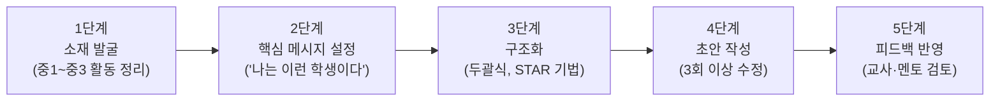
```mermaid
flowchart LR
    A["1단계<br/>소재 발굴<br/>(중1~중3 활동 정리)"] --> B["2단계<br/>핵심 메시지 설정<br/>('나는 이런 학생이다')"]
    B --> C["3단계<br/>구조화<br/>(두괄식, STAR 기법)"]
    C --> D["4단계<br/>초안 작성<br/>(3회 이상 수정)"]
    D --> E["5단계<br/>피드백 반영<br/>(교사·멘토 검토)"]
```

**자소서 실전 예시 — '자기주도 학습 경험' 항목**:

| 구분 | 나쁜 예시 | 좋은 예시 |
|------|----------|----------|
| **도입** | "저는 수학을 열심히 공부했습니다" | "중2 여름, 이차방정식 단원에서 3회 연속 오답이 나왔습니다" |
| **과정** | "매일 문제집을 풀었습니다" | "오답 원인을 분석해 '판별식 이해 부족'을 발견하고, 판별식의 기하학적 의미를 스스로 탐구했습니다" |
| **AI 활용** | (언급 없음) | "ChatGPT에게 판별식의 기하학적 해석을 질문했으나, 답변이 불충분해 직접 그래프를 그려 검증했습니다" |
| **성장** | "성적이 올랐습니다" | "이 경험으로 '모르는 것을 정확히 찾는 메타인지 능력'이 학습의 핵심임을 깨달았습니다" |

### 7.2 면접 실전 질문 Top 15

| 번호 | 면접 질문 | 출제 의도 | 모범 답변 방향 |
|------|----------|----------|--------------|
| 1 | "자기주도 학습 경험 중 가장 기억에 남는 사례를 말해보세요" | 자기주도 학습 능력 검증 | 구체적 사례 + 과정 + 깨달음 |
| 2 | "이 학교를 선택한 이유는 무엇인가요?" | 지원 동기의 진정성 | 학교 프로그램·DNA와 본인 목표 연결 |
| 3 | "최근 읽은 책 중 가장 인상 깊었던 것은?" | 독서 습관 + 비판적 사고 | 내용 요약 + 자기 해석 + 삶의 연결 |
| 4 | "AI를 학습에 어떻게 활용해본 적 있나요?" | AI 시대 적응력 | 활용 사례 + AI의 한계 인식 + 본인의 역할 |
| 5 | "친구와 심하게 갈등한 경험이 있나요?" | 인성·갈등 해결 능력 | 갈등 상황 → 해결 과정 → 배운 점 |
| 6 | "자신의 약점은 무엇이고, 어떻게 극복하고 있나요?" | 메타인지 + 자기 인식 | 솔직한 약점 인정 + 구체적 개선 노력 |
| 7 | "10년 후 어떤 사람이 되고 싶나요?" | 진로 비전 + 동기 | 구체적 진로 + 왜 그 진로인지 + 이 학교와의 연결 |
| 8 | "학원 없이 공부한 적이 있나요?" | 자기주도 학습 진정성 | 학원 의존 탈피 구체적 사례 |
| 9 | "기숙사 생활에서 가장 걱정되는 점은?" | 적응력 + 자기관리 | 솔직한 걱정 + 대비 계획 |
| 10 | "수학(또는 특정 과목)을 좋아하는 이유는?" | 학문적 호기심 | 단순 '잘해서'가 아닌 '왜 재미있는지' |
| 11 | "학교에서 리더 역할을 해본 적이 있나요?" | 리더십 + 사회성 | 결과보다 과정에서의 리더십 |
| 12 | "공부 외에 가장 열정적으로 하는 활동은?" | 다면적 인성 | 활동 + 그 활동에서 배운 점 |
| 13 | "이 학교에 입학하면 가장 하고 싶은 것은?" | 입학 후 계획 + 학교 이해도 | 학교 프로그램 구체적 언급 + 참여 계획 |
| 14 | "부모님이 반대하는 일을 한 적이 있나요?" | 주체성 + 의사결정 | 반대 상황 → 설득 과정 → 결과 |
| 15 | "AI 시대에 왜 공부해야 한다고 생각하나요?" | AI 시대 인식 + 학습 동기 | AI가 대체 못하는 인간 역량 + 본인의 가치관 |

### 7.3 자소서 체크리스트 (15개 항목)

| 번호 | 체크 항목 | 확인 |
|------|----------|------|
| 1 | 자기주도 학습 경험이 **구체적 사례**로 기술되어 있는가 | [ ] |
| 2 | '무엇을 했나'보다 **'왜 했고, 어떻게 성장했나'**가 중심인가 | [ ] |
| 3 | 학원 의존이 아닌 **스스로 계획·실행한 경험**이 드러나는가 | [ ] |
| 4 | 지원 학교의 **프로그램·특성을 사전 조사**하여 연결했는가 | [ ] |
| 5 | AI 도구를 **학습에 어떻게 활용했는지** 기술했는가 | [ ] |
| 6 | AI 활용 시 **AI의 한계와 본인의 역할**을 구분했는가 | [ ] |
| 7 | 인성·사회성 경험이 **결과가 아닌 과정** 중심으로 기술되어 있는가 | [ ] |
| 8 | 진로 계획이 **막연한 꿈이 아닌 구체적 탐구 경험**과 연결되는가 | [ ] |
| 9 | 문장이 **두괄식**으로 핵심 메시지가 먼저 드러나는가 | [ ] |
| 10 | 불필요한 수식어·과장 표현을 제거했는가 | [ ] |
| 11 | 오탈자·문법 오류를 3회 이상 교정했는가 | [ ] |
| 12 | 교사 또는 멘토에게 **피드백**을 받았는가 | [ ] |
| 13 | **분량 기준**(학교별 상이)을 준수했는가 | [ ] |
| 14 | 다른 학교 자소서를 **복사·붙여넣기**하지 않았는가 | [ ] |
| 15 | 전체를 통해 **'나는 이런 학생이다'**라는 일관된 메시지가 있는가 | [ ] |

### 7.4 불합격 시 대안 전략

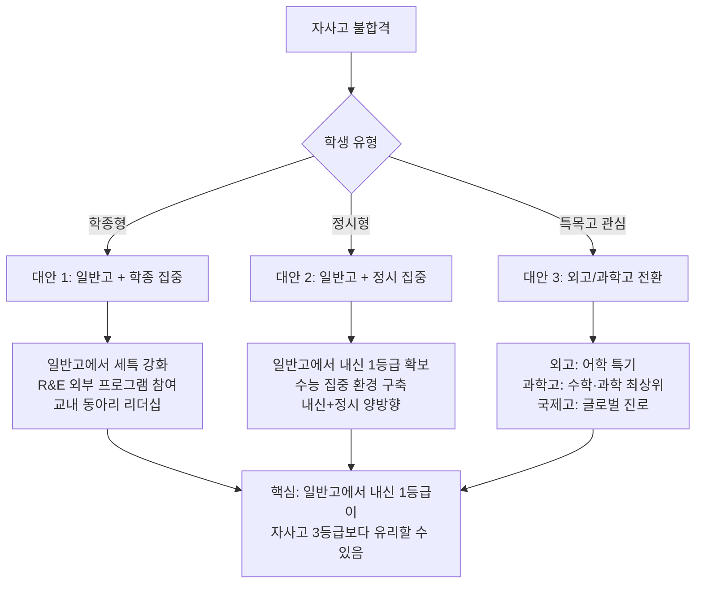
```mermaid
flowchart TD
    A["자사고 불합격"] --> B{"학생 유형"}
    B -->|"학종형"| C["대안 1: 일반고 + 학종 집중"]
    B -->|"정시형"| D["대안 2: 일반고 + 정시 집중"]
    B -->|"특목고 관심"| E["대안 3: 외고/과학고 전환"]
    C --> F["일반고에서 세특 강화<br/>R&E 외부 프로그램 참여<br/>교내 동아리 리더십"]
    D --> G["일반고에서 내신 1등급 확보<br/>수능 집중 환경 구축<br/>내신+정시 양방향"]
    E --> H["외고: 어학 특기<br/>과학고: 수학·과학 최상위<br/>국제고: 글로벌 진로"]
    F --> I["핵심: 일반고에서 내신 1등급이<br/>자사고 3등급보다 유리할 수 있음"]
    G --> I
    H --> I
```

> **상담 포인트**: "자사고 불합격은 **끝이 아닙니다**. 일반고에서 내신 1등급을 받으면 자사고 3등급보다 학종에서 유리할 수 있습니다. 중요한 것은 **어떤 학교에 다니느냐가 아니라, 어떻게 3년을 보내느냐**입니다."

---

## 8. 2028 대입 개편과 자사고 전략

### 8.1 내신 5등급제 — 자사고에 미치는 영향

| 구분 | 현행 (9등급 상대평가) | 2028 (5등급 절대평가) |
|------|---------------------|---------------------|
| **등급 체계** | 1~9등급 (상대평가) | A~E등급 (절대평가) |
| **1등급 비율** | 상위 4% | A등급 기준 점수 이상 (비율 무관) |
| **자사고 영향** | 내신 불리 (최상위끼리 경쟁) | **중립적** — A등급 취득 용이해지나 변별력 감소 |
| **학종 변별력** | 내신 등급으로 변별 | **세특·면접으로 변별** |
| **정시 영향** | 내신과 무관 | 내신과 무관 |

**A등급의 의미 분석**:

| 학교 유형 | A등급 취득 난이도 | A등급 비율(추정) | 변별력 |
|----------|-----------------|----------------|--------|
| 전국단위 자사고 | 높음 (최상위 집결) | 40~60% | **세특으로 차별화 필수** |
| 서울 광역 자사고 | 중상 | 50~70% | 세특+면접으로 차별화 |
| 일반고 | 중 | 30~50% | 내신 등급 자체로 차별화 어려움 |

> **상담 포인트**: "5등급제에서 자사고 학생은 A등급 취득은 어렵지만, **A등급 안에서의 변별력은 세특으로만 가능**합니다. 이것이 자사고 학종형 DNA의 핵심 가치입니다."

### 8.2 학종형 자사고 전략 (세특 35~40%, R&E 활용)

| 전략 항목 | 세부 내용 | 실행 시기 |
|----------|----------|----------|
| **세특 강화** | 전 과목 탐구 활동 기록 (교과서 넘어선 심화 주제) | 고1~고2 |
| **R&E 프로젝트** | 대학교수 지도 하 1년 장기 연구 (세특 핵심 콘텐츠) | 고1 하반기~고2 |
| **비교과 활동** | 동아리·봉사·자율활동 (단, AI로 차별화 어려운 활동 피하기) | 고1~고3 |
| **면접 준비** | 생기부 기반 심층 질문 대비 (예상 질문 100개 리스트) | 고3 상반기 |
| **수능 최저** | 학종에 필요한 수능 최저 충족 (국·수·영·탐 2개 합 5~6) | 고2~고3 |

### 8.3 정시형 자사고 전략 (수능 킬러문항 대비)

| 전략 항목 | 세부 내용 | 실행 시기 |
|----------|----------|----------|
| **수능 집중** | 국·수·영·탐 4과목 최적화 (수학 킬러문항 정복) | 고1~고3 |
| **통합형 수능** | 2028 통합형 수능 대비 — 공통+선택 구조 변화 파악 | 고1부터 |
| **모의고사** | 월 2회 이상 모의고사 + 오답 분석 | 고2~고3 |
| **EBS 연계** | EBS 연계 교재 완벽 소화 | 고3 |
| **의대 정시** | 의대 정시 커트라인 분석 + 수능 점수 목표 설정 | 고2~고3 |

### 8.4 교과전형 SKY 진입 전략

| 전략 | 대학 | 전형명 | 핵심 요건 | 자사고 유불리 |
|------|------|--------|----------|-------------|
| 교과전형 | 서울대 | 지역균형선발 | 학교장 추천 + 내신 + 수능최저 | **불리** (내신 경쟁 치열) |
| 교과전형 | 연세대 | 추천형 | 학교장 추천 + 교과 | **불리** (내신 등급) |
| 교과전형 | 고려대 | 학교추천 | 학교장 추천 + 교과 | **불리** (내신 등급) |

> **상담 포인트**: "교과전형에서 자사고는 **불리**합니다. 내신 경쟁이 치열해 1등급 확보가 어렵기 때문입니다. 자사고 학생은 **학종 또는 정시**를 주 전략으로 삼아야 합니다."

### 8.5 의대 진학 전략 (학종 의대 vs 정시 의대)

| 구분 | 학종 의대 | 정시 의대 |
|------|---------|---------|
| **적합 학교** | 하나고, 외대부고 (학종형) | **상산고, 현대청운고 (정시형)** |
| **핵심 준비** | 세특(생명과학·화학 심화) + R&E + 봉사 | 수능 전 과목 최상위 (수학 만점 목표) |
| **장점** | 의대 학종은 내신 불리를 세특으로 보완 가능 | 의대 정시는 수능 점수만으로 결정 — 명확한 기준 |
| **단점** | 세특 변별력 어려워짐 (AI 시대) | 수능에서 실수 하나가 합불 결정 |
| **성공 확률** | 중상 (세특 깊이에 따라 결정) | **상** (정시형 자사고 인프라 활용 시) |
| **AI 시대 변화** | AI 활용 R&E가 새로운 차별화 요소 | AI가 문제풀이 보조 → 인간의 응용력이 관건 |

### 8.6 해외 대학 병행 전략 (민사고·하나고·외대부고)

| 학교 | 해외 대학 강점 | 병행 전략 | 적합 학생 |
|------|--------------|----------|----------|
| **민사고** | 아이비리그·옥스브리지 | AP/SAT + 국내 수시 병행 | 영어 최상위 + 글로벌 리더십 |
| **하나고** | 미국 Top 30 | R&E 기반 미국대 에세이 소재 확보 | 자기주도형 + 연구 경험 |
| **외대부고** | 미국·영국 명문대 | 외국어 능력 + 국제 교류 경험 | 외국어 특기 + 국제 감각 |

### 8.7 수시 6장 배분 전략

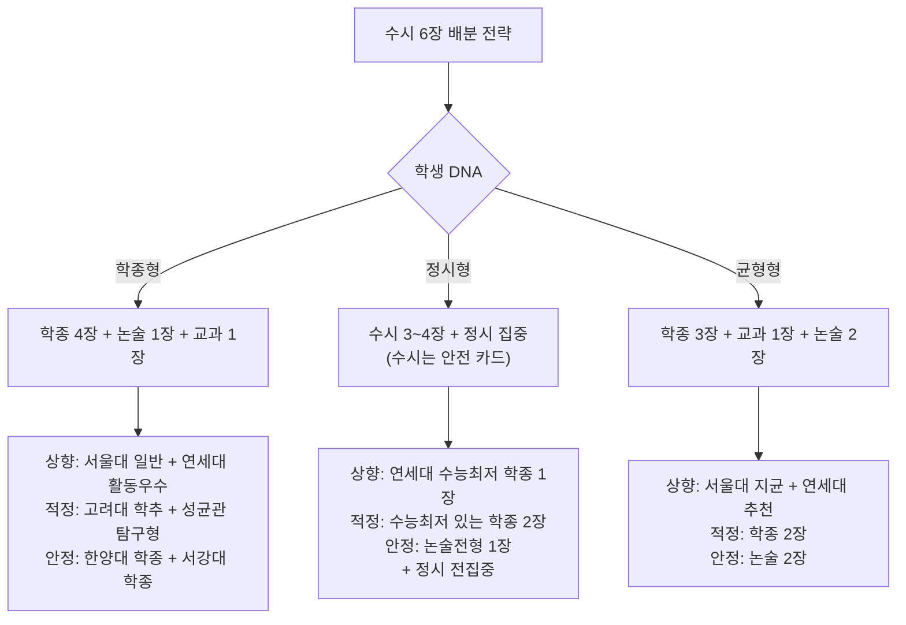
```mermaid
flowchart TD
    A["수시 6장 배분 전략"] --> B{"학생 DNA"}
    B -->|"학종형"| C["학종 4장 + 논술 1장 + 교과 1장"]
    B -->|"정시형"| D["수시 3~4장 + 정시 집중<br/>(수시는 안전 카드)"]
    B -->|"균형형"| E["학종 3장 + 교과 1장 + 논술 2장"]
    C --> F["상향: 서울대 일반 + 연세대 활동우수<br/>적정: 고려대 학추 + 성균관 탐구형<br/>안정: 한양대 학종 + 서강대 학종"]
    D --> G["상향: 연세대 수능최저 학종 1장<br/>적정: 수능최저 있는 학종 2장<br/>안정: 논술전형 1장<br/>+ 정시 전집중"]
    E --> H["상향: 서울대 지균 + 연세대 추천<br/>적정: 학종 2장<br/>안정: 논술 2장"]
```

**수시 6장 배분 표 — 이과 기준 (학종형 자사고)**:

| 구분 | 대학 | 전형 | 비고 |
|------|------|------|------|
| 상향 | 서울대 공대 | 일반전형 (학종) | 내신 1등급 + 세특 강점 필수 |
| 상향 | 연세대 공대 | 활동우수전형 | 수능최저 충족 필수 |
| 적정 | 고려대 공대 | 학교추천전형 | 학교 추천 인원 제한 |
| 적정 | 성균관대 공대 | 탐구형인재 | 수능최저 없음 |
| 안정 | 한양대 공대 | 학생부종합 | 면접 없음 |
| 안정 | 서강대 공대 | 학생부종합 | 소규모 면접 |

---

## 9. 학교별 DNA 분석

### 9.1 학종형 DNA (하나고, 외대부고, 민사고)

| 항목 | 하나고 | 외대부고 | 민사고 |
|------|--------|---------|--------|
| **핵심 DNA** | 자기주도 학습 | 외국어 + 학종 | 한국학 + 글로벌 |
| **세특 강점** | R&E 소논문, 인문 심화 | 외국어 활용 탐구, 국제 교류 | 한국학 심화, 해외 연구 |
| **비교과** | 동아리·봉사 풍부 | 외국어 대회, 국제 교류 | 리더십·봉사 최강 |
| **면접 특성** | 자기주도 학습 심층 검증 | 외국어 면접 포함 | 영어+한국어 이중 면접 |
| **서울대 루트** | 학종 일반전형 | 학종 + 지균 | 학종 + 해외대 병행 |
| **의대 루트** | 학종 의대 (세특 중심) | 학종 의대 (약함) | 학종 + 해외 의대 |
| **해외대 루트** | 가능 (R&E 소재) | 강함 (외국어 강점) | **최강** (AP/SAT) |

### 9.2 정시형 DNA (상산고, 현대청운고)

| 항목 | 상산고 | 현대청운고 |
|------|--------|----------|
| **핵심 DNA** | 수능 집중, 의대 정시 | 이공계 정시, 현대 재단 |
| **수능 인프라** | 심화 문제풀이, 모의고사 다량 | 이공계 심화, 과학 실험 |
| **의대 합격** | **정시 의대 전국 최강** | 정시 의대 강세 |
| **SKY 루트** | 정시 비중 높음 | 정시 + 일부 학종 |
| **교육과정** | 수능 최적화 시간표 | 현대그룹 연계 프로그램 |
| **AI 시대 과제** | 문제풀이 → AI 대체 위험 → 탐구 능력 보완 필요 | 이공계 R&E 강화로 학종 보완 |

### 9.3 DNA 매칭 가이드 (학생 유형 → 학교 추천)

| 학생 유형 | 특성 | 추천 학교 | 비추천 학교 |
|----------|------|----------|-----------|
| **탐구형** | 호기심 왕성, 질문 많음, 독서 좋아함 | 하나고, 외대부고, 민사고 | 상산고 (탐구보다 풀이 중심) |
| **수능형** | 문제풀이 강점, 끈기, 반복 학습 가능 | 상산고, 현대청운고 | 하나고 (비교과에 시간 소요) |
| **의대 지망** | 의대 정시 집중, 수학·과학 최상위 | 상산고(정시), 하나고(학종) | 외대부고 (의대 비중 낮음) |
| **해외대 지망** | 영어 최상위, 글로벌 경험 | 민사고, 외대부고 | 상산고 (국내 정시 중심) |
| **균형형** | 수시+정시 양방향, 유연성 | 김천고, 포항제철고, 북일고 | 극단적 DNA 학교 |
| **서울 거주** | 통학 선호, 서울 대학 타겟 | 서울 광역 자사고 15개교 | 전국단위 (기숙사 부담) |
| **비용 민감** | 학비 부담 최소화 | 하나고(500만), 광양제철고(910만) | 민사고(1,500만+) |

### DNA 매칭 사분면 차트

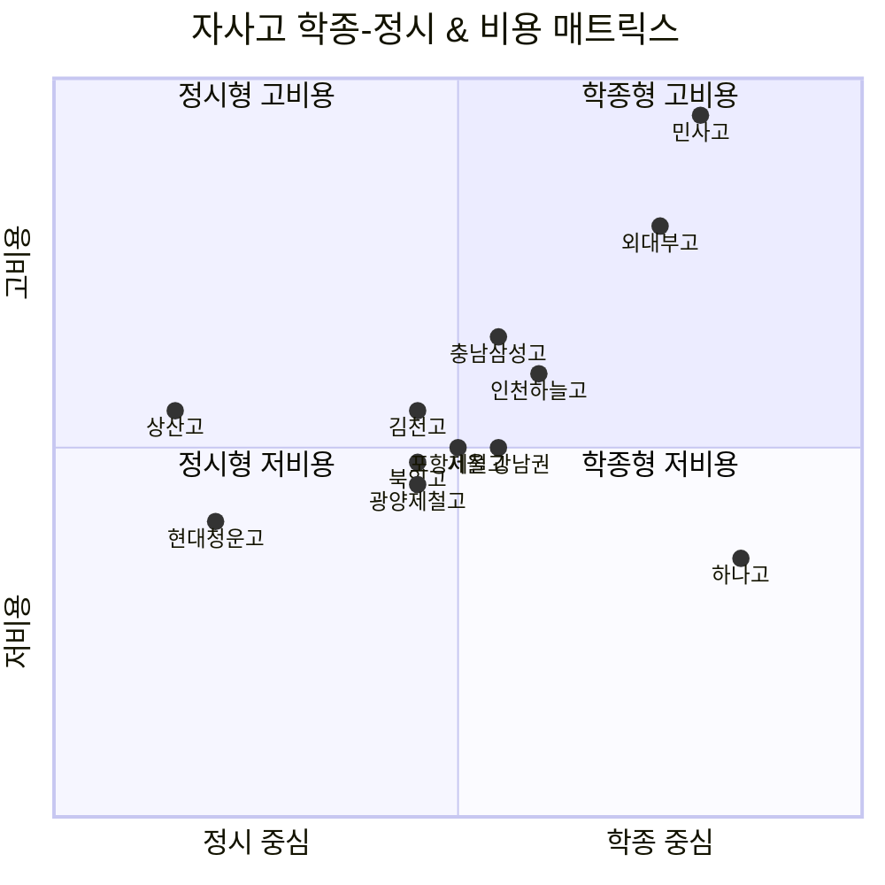
```mermaid
quadrantChart
    title 자사고 학종-정시 & 비용 매트릭스
    x-axis "정시 중심" --> "학종 중심"
    y-axis "저비용" --> "고비용"
    quadrant-1 "학종형 고비용"
    quadrant-2 "정시형 고비용"
    quadrant-3 "정시형 저비용"
    quadrant-4 "학종형 저비용"
    "민사고": [0.80, 0.95]
    "외대부고": [0.75, 0.80]
    "하나고": [0.85, 0.35]
    "상산고": [0.15, 0.55]
    "현대청운고": [0.20, 0.40]
    "인천하늘고": [0.60, 0.60]
    "김천고": [0.45, 0.55]
    "포항제철고": [0.50, 0.50]
    "광양제철고": [0.45, 0.45]
    "북일고": [0.45, 0.48]
    "서울 강남권": [0.55, 0.50]
    "충남삼성고": [0.55, 0.65]
```

> **상담 포인트**: "이 차트에서 학생의 위치를 찾으세요. **탐구형+비용 민감**이면 하나고(좌하단), **의대 정시+비용 여유**면 상산고(우상단), **해외대+비용 여유**면 민사고(우상단)입니다."

---

## 10. AI 시대 자사고 생존 전략

### 10.1 AI가 대체하는 것 vs 인간이 해야 할 것

| AI가 대체하는 것 | 인간이 해야 할 것 |
|----------------|----------------|
| 문제 풀이 자동화 | **문제 정의 (무엇이 문제인가?)** |
| 개념 설명 및 요약 | **메타인지 (내가 무엇을 모르는가?)** |
| 학습 계획 제안 | **자기주도 학습 전략 수립** |
| 오답 분석 | **오답의 근본 원인 진단** |
| 자료 수집·번역 | **해석과 의미 부여** |
| 에세이 초안 작성 | **세특 스토리 구성 (개인 경험 연결)** |
| 면접 예상 질문 생성 | **면접에서의 즉흥 논리 전개** |

### 10.2 R&E + AI 통합 전략

| 단계 | R&E 전통 방식 | R&E + AI 통합 방식 | 세특 기재 포인트 |
|------|-------------|-------------------|---------------|
| 1. 주제 선정 | 교수·교사 제안 | AI로 선행연구 탐색 → 교수와 논의 | "AI로 00편의 선행연구를 분석하여 연구 공백 발견" |
| 2. 문헌 조사 | 도서관·학술DB | AI로 1차 요약 → 핵심 논문 직접 읽기 | "AI 요약을 비판적으로 검토해 3가지 오류 발견" |
| 3. 실험 설계 | 교수 지도 | AI로 실험 변인 시뮬레이션 → 실제 실험 | "AI 시뮬레이션과 실제 실험 결과 비교 분석" |
| 4. 데이터 분석 | 통계 프로그램 | AI로 1차 분석 → 본인이 해석 | "AI 분석 결과에 대한 인과적 해석 제시" |
| 5. 보고서 작성 | 교수 피드백 | AI 초안 → 본인 재작성 → 교수 검토 | "AI 초안 대비 본인 수정 사항 3가지 근거 기술" |

### 10.3 AI 도구 활용 원칙 (4단계)

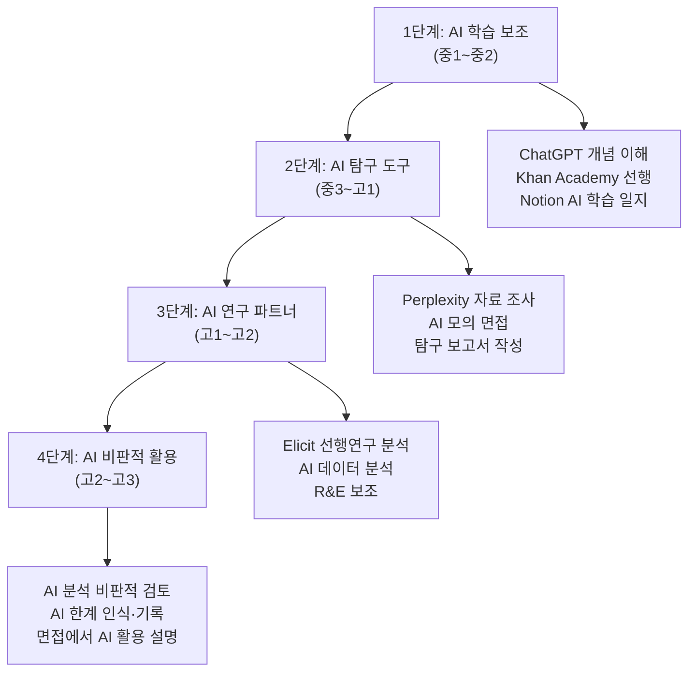
```mermaid
flowchart TD
    A["1단계: AI 학습 보조<br/>(중1~중2)"] --> B["2단계: AI 탐구 도구<br/>(중3~고1)"]
    B --> C["3단계: AI 연구 파트너<br/>(고1~고2)"]
    C --> D["4단계: AI 비판적 활용<br/>(고2~고3)"]
    
    A --> A1["ChatGPT 개념 이해<br/>Khan Academy 선행<br/>Notion AI 학습 일지"]
    B --> B1["Perplexity 자료 조사<br/>AI 모의 면접<br/>탐구 보고서 작성"]
    C --> C1["Elicit 선행연구 분석<br/>AI 데이터 분석<br/>R&E 보조"]
    D --> D1["AI 분석 비판적 검토<br/>AI 한계 인식·기록<br/>면접에서 AI 활용 설명"]
```

**AI 활용 4대 원칙**:

| 원칙 | 설명 | 실전 예시 |
|------|------|----------|
| **1. 1차 사고는 본인** | AI에게 답을 먼저 묻지 말고, 본인이 먼저 생각한 후 AI로 검증 | 수학 문제: 본인 풀이 → AI 검증 → 차이 분석 |
| **2. AI 한계 인식** | AI의 오류·편향을 인지하고 기록 | "AI가 잘못된 통계를 제시하여 직접 원문 확인" |
| **3. 과정 기록** | AI를 어떻게 활용했는지 세특에 명시 | "AI를 활용해 데이터를 수집하되 해석은 본인이 수행" |
| **4. 면접 대비** | 'AI는 무엇을 못 했고 내가 무엇을 했는가'를 한 문장으로 | "AI가 제시한 5가지 가설 중 3가지가 불완전하여 직접 수정" |

### 10.4 프로젝트 기반 학습 전환

| 전통 학습 | 프로젝트 기반 학습 (AI 시대) |
|----------|--------------------------|
| 교과서 내용 암기 | 실제 문제를 발견하고 해결책 설계 |
| 교사가 주제 제시 | 학생이 주제를 선정하고 탐구 설계 |
| 시험으로 평가 | 보고서·발표·포트폴리오로 평가 |
| 개인 학습 | 팀 프로젝트 + 개인 역할 분담 |
| AI 없이 수행 | AI를 도구로 활용하되 비판적 검토 |

> **상담 포인트**: "AI 시대에 자사고의 가치는 **'프로젝트를 스스로 설계하고 완성하는 환경'**에 있습니다. 학원에서 정해진 커리큘럼을 따라가는 것만으로는 자사고의 장점을 활용할 수 없습니다."

---

## 11. 학부모 상담 가이드

### 11.1 학부모 FAQ 25선

#### A. 입학 관련 (Q1~Q5)

| 번호 | 질문 | 핵심 답변 |
|------|------|----------|
| Q1 | "자사고 입학 경쟁률이 어떻게 되나요?" | 전국단위 5~8:1, 광역단위 1.5~4:1. 학교·연도별 편차 큼. 최근 3년 경쟁률 추이 확인 필수 |
| Q2 | "내신이 몇 등급이어야 합격하나요?" | 전국단위: 전 과목 A등급 필수. 광역단위: A~B등급. 내신보다 자소서·면접이 더 중요한 경우 많음 |
| Q3 | "학원 다니면서 자기주도 학습을 어필할 수 있나요?" | 학원 수강 자체가 불이익은 아니나, 자소서·면접에서 '학원이 아닌 본인의 주도적 학습 경험'을 반드시 증명해야 함 |
| Q4 | "자소서에 무엇을 써야 하나요?" | 자기주도 학습 경험(구체적 사례), 지원 동기(학교 프로그램 연결), 인성·사회성, 진로 계획 |
| Q5 | "면접에서 어떤 질문이 나오나요?" | 자기주도 학습 경험, 지원 동기, 독서, AI 활용 경험, 진로 비전, 인성 등. 7.2절 Top 15 참조 |

#### B. 학교생활 관련 (Q6~Q10)

| 번호 | 질문 | 핵심 답변 |
|------|------|----------|
| Q6 | "기숙사 생활이 힘들지 않을까요?" | 전국단위는 기숙사 의무. 첫 학기 적응이 핵심. 독립심·자기관리 능력이 없으면 어려움. 정신건강 지원 체계 확인 필요 |
| Q7 | "하루 공부 시간이 얼마나 되나요?" | 전국단위: 10~13시간(수업+자습). 광역단위: 8~10시간. 자기 페이스 조절이 핵심 |
| Q8 | "학교에서 사교육을 받을 수 있나요?" | 전국단위 기숙사 학교는 외부 학원 불가. 교내 방과후 수업·자습으로 대체. 광역단위는 통학이므로 학원 병행 가능 |
| Q9 | "동아리·비교과 활동은 어떤 것들이 있나요?" | 학교별 상이하나, 학술 동아리·R&E·봉사·체육 동아리 등 다양. 학교 홈페이지에서 동아리 목록 확인 |
| Q10 | "중도 탈락(자퇴)하는 학생이 있나요?" | 있음. 전국단위 기숙사 학교는 적응 실패·번아웃으로 인한 자퇴 사례 존재. 학교별 중도탈락률 확인 필요 |

#### C. 비용 관련 (Q11~Q15)

| 번호 | 질문 | 핵심 답변 |
|------|------|----------|
| Q11 | "학비가 얼마나 드나요?" | 전국단위: 연 500~1,900만원(기숙비 별도). 광역단위: 연 800~1,200만원. 학교별 상이 — 학교 홈페이지 확인 |
| Q12 | "장학금이 있나요?" | 대부분 성적 우수 장학금 운영. 하나고(하나금융), 현대청운고(현대그룹), 포스코계열(포스코재단) 등 재단 장학금 풍부 |
| Q13 | "일반고 대비 총 교육비 차이는?" | 자사고: 3년간 2,400~5,700만원. 일반고: 3년간 150~300만원. 차이 2,000~5,000만원 이상 |
| Q14 | "학비가 비싼 만큼 교육의 질이 보장되나요?" | 학교별 편차 큼. 전국단위는 대체로 학비 대비 교육 투자 비율 높음. 광역단위는 반드시 데이터 검증 필요 |
| Q15 | "저소득 가정도 자사고에 갈 수 있나요?" | 가능. 하나고(하나금융 장학), 포스코계열(포스코재단), 현대청운고(현대재단) 등은 저소득 가정 전액 지원 가능 |

#### D. 대입 관련 (Q16~Q20)

| 번호 | 질문 | 핵심 답변 |
|------|------|----------|
| Q16 | "자사고에서 서울대에 몇 명 보내나요?" | 전국단위 학종형: 30~50명+. 전국단위 정시형: 20~40명+. 광역단위: 학교별 5~20명. 최근 실적 확인 필수 |
| Q17 | "자사고 내신이 불리하지 않나요?" | 현행 상대평가에서는 불리 (최상위끼리 경쟁). 2028 절대평가(5등급)에서는 불리함 감소 |
| Q18 | "학종이 나은가요, 정시가 나은가요?" | 학교 DNA에 따라 다름. 학종형(하나고): 학종 집중. 정시형(상산고): 정시 집중. 9장 DNA 분석 참조 |
| Q19 | "의대에 가려면 어떤 자사고가 좋나요?" | 정시 의대: 상산고, 현대청운고. 학종 의대: 하나고, 외대부고. 8.5절 참조 |
| Q20 | "일반고에서도 서울대 갈 수 있지 않나요?" | 가능. 하지만 자사고는 세특·R&E·면접 등 학종 인프라가 체계적. 일반고는 내신 유리 but 비교과 인프라 부족 |

#### E. 적합성 관련 (Q21~Q25)

| 번호 | 질문 | 핵심 답변 |
|------|------|----------|
| Q21 | "우리 아이가 자사고에 맞는 학생인가요?" | 11.4절 진단 체크리스트 활용. 핵심: 자기주도 학습 능력 + 경쟁 스트레스 내성 + 명확한 목표 |
| Q22 | "자사고에서 뒤처지면 어떻게 하나요?" | 적응 초기(1학기)가 핵심. 학교 내 상담·멘토링 활용. 최악의 경우 일반고 전학 가능 |
| Q23 | "자사고 졸업하면 취업에 유리한가요?" | 직접적 취업 유리함은 없으나, 동문 네트워크·명문대 학력이 간접적 이점. 부록 G 참조 |
| Q24 | "자사고가 폐지되면 어떻게 되나요?" | 2024 존치 확정되었으나 정권 변화 시 재논의 가능. 입학 시점 기준 3년은 유지 보장 |
| Q25 | "아이가 원하지 않는데 보내도 될까요?" | **절대 비추천**. 자기주도 학습이 핵심인 자사고에서 동기 없는 학생은 빠르게 도태 |

---

### 11.2 심층 상담 질문 25선 — 자사고 입학사정관이 반드시 대비해야 할 질문

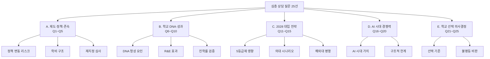
```mermaid
flowchart TD
    A["심층 상담 질문 25선"] --> B["A. 제도·정책·존속<br/>Q1~Q5"]
    A --> C["B. 학교 DNA·성과<br/>Q6~Q10"]
    A --> D["C. 2028 대입 전략<br/>Q11~Q15"]
    A --> E["D. AI 시대 경쟁력<br/>Q16~Q20"]
    A --> F["E. 학교 선택 의사결정<br/>Q21~Q25"]
    
    B --> B1["정책 변동 리스크"]
    B --> B2["학비 구조"]
    B --> B3["재지정 심사"]
    
    C --> C1["DNA 형성 요인"]
    C --> C2["R&E 효과"]
    C --> C3["진학률 검증"]
    
    D --> D1["5등급제 영향"]
    D --> D2["의대 시나리오"]
    D --> D3["해외대 병행"]
    
    E --> E1["AI 시대 가치"]
    E --> E2["구조적 한계"]
    
    F --> F1["선택 기준"]
    F --> F2["불평등 비판"]
```

---

#### A. 제도·정책·존속 (Q1~Q5)

**Q1. "정권이 바뀌면 자사고가 다시 폐지될 수 있지 않나요? 3년 뒤를 보장할 수 있나요?"**

| 항목 | 내용 |
|------|------|
| **핵심 답변** | 2024년 1월 교육부가 시행령을 개정하여 자사고·외고·국제고 존치를 확정했습니다. 그러나 시행령은 대통령령이므로 정권 교체 시 재개정이 가능합니다. **완전한 보장은 없지만, 현실적으로 입학 시점부터 3년간은 유지될 가능성이 높습니다.** |
| **근거·데이터** | 2019년 폐지 결정 → 2024년 존치 확정까지 5년 소요. 정권 교체 후에도 시행령 개정에 최소 1~2년 소요. 현재 재학생에 대한 경과조치는 법적으로 보장됨 |
| **실전 전략** | 1) 입학 시점 기준 3년 유지는 현실적으로 보장. 2) 그 이후는 정치 상황에 따라 변동 가능. 3) 자사고가 폐지되더라도 재학생 경과조치 보장. 4) 불확실성이 너무 불안하다면 일반고를 선택하는 것도 합리적 판단 |

**Q2. "학비가 연 800~2,000만원이라고 하는데, 이 비용이 정확히 어디에 쓰이나요?"**

| 항목 | 내용 |
|------|------|
| **핵심 답변** | 자사고 학비는 크게 **등록금(수업료) + 기숙사비 + 급식비 + 방과후 교육비 + 교재비**로 구성됩니다. 일반고(연 100만원 내외)의 3~20배 수준이며, 그 차이는 주로 소규모 학급 운영, 전문 교사 초빙, 기숙사 시설, R&E 프로그램 운영에 투입됩니다. |
| **비용 구조 분석** | 전국단위: 등록금 30~40% + 기숙사·급식 30% + 방과후·교재 20% + 시설·운영 10%. 광역단위: 등록금 50~60% + 방과후·교재 20~30% + 시설·운영 10~20% |
| **핵심 질문** | "이 비용 대비 어떤 교육적 가치를 얻는가?"를 학교 설명회에서 반드시 질문하세요. 학교알리미(schoolinfo.go.kr)에서 1인당 교육비 공시 정보 확인 가능 |

**Q3. "대광고처럼 자사고가 자발적으로 일반고로 전환하는 경우, 재학 중인 학생은 어떻게 되나요?"**

| 항목 | 내용 |
|------|------|
| **핵심 답변** | 대광고는 2026학년도 **신입생부터** 일반고로 운영합니다. 기존 재학생(2024·2025 입학생)은 **자사고 교육과정을 그대로 이수**합니다. 법적으로 재학생에 대한 경과조치가 보장됩니다. |
| **근거·데이터** | 대광고는 서울에서 12번째로 자사고를 자발적으로 반납한 사례(메트로서울 2025.8 보도). 학교법인의 판단에 따른 반납이며, 재지정 심사 탈락은 아님 |
| **의사결정 가이드** | 1) 입학 전 해당 학교의 재지정 심사 일정 확인 (5년 단위). 2) 학교법인의 장기 운영 의지 확인 (설명회에서 질문). 3) 재학 중 전환되더라도 경과조치 보장 → 교육 공백은 없음 |

**Q4. "자사고에 대한 교육 감독 체계는 어떻게 되나요? 학교가 학비만 받고 교육은 부실하게 하면요?"**

| 항목 | 내용 |
|------|------|
| **핵심 답변** | 자사고는 **5년마다 재지정 심사**를 받습니다. 교육과정 운영 실적, 학생 선발 적정성, 교육 성과, 운영 건전성을 평가하며, 미충족 시 일반고로 전환됩니다. 또한 학교알리미를 통해 교육비·성과 정보가 공개됩니다. |
| **근거·데이터** | 교육부·교육청 합동 평가 + 학교알리미 공시 + 학부모 만족도 조사. 2019~2025년 사이 다수의 자사고가 실적 부진으로 자발적 전환 |
| **실전 전략** | 학교알리미(schoolinfo.go.kr)에서 해당 학교의 1인당 교육비, 교사 1인당 학생 수, 진학 실적을 직접 확인하세요 |

**Q5. "전국단위 자사고와 광역단위 자사고의 법적·제도적 차이가 정확히 무엇인가요?"**

| 항목 | 내용 |
|------|------|
| **핵심 답변** | 전국단위는 **교육부장관이 지정**하고 전국에서 학생을 모집합니다. 광역단위는 **시·도 교육감이 지정**하고 해당 시·도 내에서만 모집합니다. 전국단위는 기숙사가 의무이고 학비가 높으며, 광역단위는 통학이 기본이고 학비가 상대적으로 낮습니다. |
| **핵심 차이표** | 3.2절 비교표 참조. 핵심: 지정 주체(교육부 vs 교육감), 모집 범위(전국 vs 시도), 기숙사(의무 vs 선택), 학비(높음 vs 중간), 학생 수준(전국 최상위 vs 지역 상위) |
| **의사결정 가이드** | 전국 최상위를 목표로 하면 전국단위. 통학 편의 + 지역 내 우수 환경을 원하면 광역단위. "같은 자사고도 다른 학교" — 반드시 구분하여 상담 |

---

#### B. 학교 DNA·성과 (Q6~Q10)

**Q6. "학종형 DNA와 정시형 DNA는 어떻게 형성되는 건가요? 학교가 의도적으로 만드는 건가요?"**

| 항목 | 내용 |
|------|------|
| **핵심 답변** | DNA는 학교의 **설립 이념 + 교육과정 편성 + 교사 구성 + 졸업생 실적 패턴**이 축적되어 형성됩니다. 의도적 설계와 자연스러운 축적이 모두 작용합니다. |
| **근거·데이터** | 하나고: 설립 이념이 '자기주도 학습' → 교육과정이 탐구·토론 중심 → 학종 실적 축적 → 학종형 DNA 확립. 상산고: 설립 초기부터 수능 집중 인프라 구축 → 의대 정시 실적 축적 → 정시형 DNA 확립 |
| **실전 전략** | DNA는 10년 이상의 축적 결과. 최근 1~2년 실적만 보지 말고 **5~10년 추이**를 확인하세요. DNA가 변하는 학교(예: 정시형 → 학종형 전환 시도)는 과도기 리스크가 있음 |

**Q7. "R&E 프로그램이 실제로 대입에 얼마나 도움이 되나요?"**

| 항목 | 내용 |
|------|------|
| **핵심 답변** | R&E는 학종에서 **가장 강력한 세특 소재**입니다. 대학교수 지도 하 1년 장기 연구 경험은 일반고에서 쉽게 접하기 어려운 자사고만의 장점입니다. 서울대 자연계 학종 합격생의 상당수가 R&E 경험을 보유하고 있습니다. |
| **근거·데이터** | R&E 효과: 세특 기재 시 탐구 깊이 차별화, 면접에서 연구 과정 설명 가능, 학문적 호기심 입증. 단, R&E 자체가 합격을 보장하지는 않음 — **연구 과정의 진정성**이 핵심 |
| **실전 전략** | R&E 참여 시: 1) 주제를 본인이 선정 (교수 제안을 그대로 따르지 않기). 2) 과정을 세특에 구체적으로 기록. 3) 면접에서 "AI가 못한 것, 내가 한 것"을 설명할 수 있어야 함. AI 시대에는 R&E에서 AI를 도구로 어떻게 활용했는지가 새로운 평가 포인트 |

**Q8. "자사고 SKY 진학률이 70~80%라는 말이 사실인가요?"**

| 항목 | 내용 |
|------|------|
| **핵심 답변** | **학교별 편차가 매우 큽니다.** 전국단위 최상위(상산고 등)는 SKY 50~70%까지 가능하지만, 광역단위 자사고 중에는 SKY 10~20%에 그치는 곳도 있습니다. "자사고 = SKY 70%"는 일부 학교의 실적을 전체에 일반화한 것입니다. |
| **근거·데이터** | 전국단위 상위: SKY 40~70%. 전국단위 하위: SKY 25~35%. 서울 광역 상위(세화·중동·휘문): SKY 20~40%. 서울 광역 하위: SKY 10~20%. 비서울 광역: 학교별 편차 큼 |
| **실전 전략** | 1) 학교 공식 발표 실적을 확인하되, "중복 합격"과 "최종 등록" 구분 필요. 2) 최근 3년 추이를 확인. 3) "SKY 진학률"보다 **"나와 비슷한 성적대의 선배가 어디에 갔는가"**가 더 유의미한 지표 |

**Q9. "자사고에서 중도 탈락(자퇴)하는 학생의 유형과 비율은?"**

| 항목 | 내용 |
|------|------|
| **핵심 답변** | 전국단위 기숙사 학교에서 중도탈락률은 **연간 1~5%** 수준으로 추정됩니다. 주요 원인은 1) 기숙사 생활 부적응, 2) 성적 하락에 따른 번아웃, 3) 교우관계 갈등, 4) 진로 변경(해외 유학 등)입니다. |
| **근거·데이터** | 탈락 유형: 1학기 적응 실패(가장 많음) > 2학년 번아웃 > 진로 변경. 광역단위 통학 학교는 탈락률 낮음 |
| **실전 전략** | 1) 입학 전 기숙사 체험 프로그램 참여. 2) 학교 내 상담·멘토링 체계 확인. 3) "적응 못 하면 전학 가능한가?" 사전 확인. 4) 학부모: 자녀의 독립심·자기관리 능력을 객관적으로 평가 |

**Q10. "서울 광역단위 자사고 15개교 사이에도 격차가 큰가요?"**

| 항목 | 내용 |
|------|------|
| **핵심 답변** | **매우 큽니다.** 서초·강남권(세화고, 중동고, 휘문고, 현대고)과 기타 지역 자사고 사이에 대입 실적 차이가 있습니다. 같은 "서울 자사고"라는 이름으로 묶이지만, 실제 교육 환경·학생 수준·대입 실적은 학교별로 상당히 다릅니다. |
| **근거·데이터** | 강남·서초권: 학원 밀집 + 학부모 교육열 → 학생 수준 상대적 우위. 강북·도봉권: 지역 내 최상위이나 강남권 대비 실적 격차 존재 |
| **의사결정 가이드** | 1) 거주지 기준으로 통학 가능한 학교 먼저 선별. 2) 해당 학교의 최근 3년 SKY 진학 실적 직접 확인. 3) 학교 설명회에서 "우리 학교 SKY 진학 실적"을 정확히 질문. 4) "서울 자사고니까 다 비슷하겠지"는 위험한 가정 |

---

#### C. 2028 대입 전략 (Q11~Q15)

**Q11. "2028 내신 5등급 절대평가가 자사고에 어떤 영향을 미치나요? A등급이면 변별력이 없는 거 아닌가요?"**

| 항목 | 내용 |
|------|------|
| **핵심 답변** | 5등급제는 자사고에 **중립적**입니다. A등급 취득이 쉬워지는 것은 사실이지만, 자사고 내부 모집단 자체가 최상위이므로 A등급 내에서의 변별력은 **세특**에 의해 결정됩니다. 즉, 내신이 아니라 세특이 당락을 가릅니다. |
| **근거·데이터** | 자사고 A등급 비율 추정: 40~60%. 일반고 A등급 비율 추정: 30~50%. A등급 안에서의 차이는 세특 깊이로 변별. 2028 학종에서 세특 비중 35~40%로 확대 전망 |
| **실전 전략** | 1) A등급 확보는 기본 — 내신 관리 소홀 금지. 2) **세특에 시간·에너지 집중 투자**. 3) R&E·탐구활동의 깊이가 합격과 불합격을 가르는 핵심. 4) "A등급이니까 내신 걱정 없다"는 착각 금지 — A 안에서도 줄 세우기는 존재 |

**Q12. "2028 대입에서 학종형 자사고와 정시형 자사고 중 어디가 유리한가요?"**

| 항목 | 내용 |
|------|------|
| **핵심 답변** | **학종형이 상대적으로 유리**해지는 추세입니다. 5등급제로 내신 변별력이 감소하면 세특·면접이 핵심이 되고, 이는 학종형 자사고의 강점입니다. 정시형은 통합형 수능에서 기존의 '심화 선택과목 우위'가 사라지므로 전략 수정이 필요합니다. |
| **근거·데이터** | 학종형 자사고: 세특 인프라 → 2028 학종에서 강점 유지. 정시형 자사고: 수능 인프라는 여전히 강하지만, 통합형 수능으로 차별화 포인트 변경 |
| **실전 전략** | 학종형: 기존 전략 유지 + AI 활용 세특 강화. 정시형: 수능 집중 유지 + 세특 보완 (학종 일부 병행). 균형형: 수시 60% + 정시 40% 유지 |

**Q13. "의대 합격을 위해 자사고에서 학종과 정시 중 어떤 전략이 좋나요?"**

| 항목 | 내용 |
|------|------|
| **핵심 답변** | **의대 정시: 상산고·현대청운고가 최적.** 수능 전 과목 최상위 인프라가 구축되어 있습니다. **의대 학종: 하나고·외대부고에서 가능.** 세특(생명과학·화학 심화) + R&E + 봉사가 핵심입니다. 양쪽 모두 의대 합격 사례가 있으므로 학생의 DNA에 따라 선택하세요. |
| **근거·데이터** | 의대 정시: 수능 수학 만점 + 과탐 만점급 필요. 상산고 정시 의대 합격 실적 전국 최상위. 의대 학종: 세특 깊이 + 면접(MMI) 대비. 하나고 학종 의대 합격 사례 다수 |
| **실전 전략** | 1) 수능형 학생 → 상산고 정시 의대. 2) 탐구형 학생 → 하나고 학종 의대. 3) 양방향 → 균형형 자사고에서 수시+정시 병행. 의대 정원 확대 추세에서 자사고는 학종+정시 양쪽 모두 강력한 경쟁력 유지 |

**Q14. "서울대 지역균형전형에서 학교장 추천은 자사고에 유리한가요?"**

| 항목 | 내용 |
|------|------|
| **핵심 답변** | 서울대 지역균형선발전형은 학교당 추천 인원이 **제한**됩니다 (보통 2~3명). 자사고에서는 내부 경쟁이 치열하여 추천 받기 자체가 어렵습니다. 반면 일반고에서는 추천 경쟁이 상대적으로 낮아 유리할 수 있습니다. |
| **근거·데이터** | 서울대 지역균형: 학교당 추천 인원 제한 → 자사고 내부 경쟁 치열. 일반고에서 내신 1등급 확보 후 추천 받는 것이 확률적으로 유리 |
| **실전 전략** | 서울대 지균을 주 전략으로 삼는다면 일반고가 유리. 서울대 일반전형(학종)은 자사고 세특 강점 활용 가능. 전략에 따라 학교 선택이 달라짐 |

**Q15. "해외 대학 병행 전략이 현실적으로 가능한가요? 수능도 준비하면서?"**

| 항목 | 내용 |
|------|------|
| **핵심 답변** | **민사고·하나고·외대부고**에서는 현실적으로 가능합니다. 이들 학교는 AP/SAT 준비, 해외 대학 원서 작성, 추천서 등의 인프라를 보유하고 있습니다. 단, 국내 수능과 해외 대학 준비를 동시에 하면 부담이 크므로, 고2까지 방향을 결정하는 것이 좋습니다. |
| **근거·데이터** | 민사고: AP/SAT 수업 제공, 아이비리그 합격 다수. 하나고: 미국 Top 30 합격 사례. 외대부고: 외국어 기반 해외대 준비. 이 3개교 외 학교에서는 해외대 병행이 현실적으로 어려움 |
| **실전 전략** | 1) 해외대 병행 가능 학교: 민사고 > 외대부고 > 하나고. 2) 고1 때 해외대 가능성 탐색 → 고2 초반에 방향 확정. 3) 국내 수시 + 미국 EA/ED 동시 지원 전략. 4) 에세이 소재: R&E + 교내 활동이 핵심 |

---

#### D. AI 시대 경쟁력 (Q16~Q20)

**Q16. "AI 시대에 심화 문제풀이 중심 교육이 여전히 가치가 있나요?"**

| 항목 | 내용 |
|------|------|
| **핵심 답변** | **문제풀이 자체의 가치는 감소하지만, 문제풀이 과정에서 훈련되는 논리적 사고력은 여전히 가치 있습니다.** AI가 문제를 풀어주는 시대에, 중요한 것은 '어떤 문제를 풀어야 하는가'를 정의하는 능력입니다. 정시형 자사고도 이 점을 인식하고 교육 방법을 진화시킬 필요가 있습니다. |
| **근거·데이터** | AI(GPT-4 이상)는 수능 수학 킬러문항의 상당수를 풀 수 있음. 그러나 수능은 여전히 '인간이 제한 시간 내 풀기'를 요구 → 당분간 문제풀이 훈련의 입시적 가치는 유지. 장기적으로는 서술형·과정형 평가로 전환 예상 |
| **실전 전략** | 1) 수능 준비는 여전히 필요 (정시 전략). 2) 문제풀이 + 탐구 능력의 균형이 중요. 3) "문제를 푸는 기계"가 아니라 "문제를 정의하는 인간"으로 성장 |

**Q17. "자사고에서 AI 도구를 활용한 학습이 허용되나요? 세특에 기재할 수 있나요?"**

| 항목 | 내용 |
|------|------|
| **핵심 답변** | **허용되며, 올바르게 활용하면 세특에서 차별화 요소**가 됩니다. 핵심은 'AI에게 답을 받은 것'이 아니라 'AI를 도구로 활용하되 해석과 결론은 본인이 도출한 과정'을 기록하는 것입니다. |
| **근거·데이터** | 2025~2026 학종 평가 트렌드: "AI 활용 여부"보다 **"AI를 어떻게 활용했고, AI가 못한 부분을 본인이 어떻게 보완했는가"**를 평가. 세특에 "ChatGPT로 자료를 수집한 후, 3가지 오류를 발견하여 직접 원문 확인"식 기술이 차별화 |
| **실전 전략** | 10.3절 AI 활용 4대 원칙 참조. 세특 기재 시: "AI 활용 과정 + AI 한계 발견 + 본인 보완"의 3단계 구조로 서술 |

**Q18. "자사고 동문 네트워크가 AI 시대에도 가치가 있나요?"**

| 항목 | 내용 |
|------|------|
| **핵심 답변** | **AI 시대에 동문 네트워크의 가치는 오히려 증가합니다.** AI가 정보를 평준화하는 시대에, '누구와 연결되어 있는가'라는 사회적 자본은 AI가 대체할 수 없는 인간 고유의 자산입니다. 자사고 졸업생 네트워크는 대학 진학·취업·창업에서 지속적 가치를 제공합니다. |
| **근거·데이터** | 전국단위 자사고(특히 하나고·민사고·상산고)의 동문 네트워크는 의사·법조인·교수·대기업 임원 등 사회 지도층에 분포. 대학 입학 후 선배 멘토링, 취업 시 추천, 창업 시 투자 연결 등의 실질적 가치 |
| **실전 전략** | 1) 동문 네트워크는 **부가 가치**이지 **입학 이유**가 되어서는 안 됨. 2) 네트워크의 질은 학교 역사·졸업생 수에 비례. 3) 오래된 학교(배재고 1885년, 김천고 1931년)의 동문 네트워크가 두꺼움 |

**Q19. "자사고에서 기업가 정신·창업 교육을 받을 수 있나요?"**

| 항목 | 내용 |
|------|------|
| **핵심 답변** | 대부분의 자사고는 기업가 정신·창업 교육을 **체계적으로 제공하지는 않습니다.** 자사고의 핵심은 대입 준비이며, 창업 교육은 대학에서 본격적으로 접하게 됩니다. 다만, R&E·프로젝트 기반 학습에서 기업가적 사고(문제 발견 → 해결책 설계)를 간접 훈련할 수 있습니다. |
| **실전 전략** | 1) 창업에 관심 있다면: 자사고보다 과학고·영재고의 창업 프로그램이 더 체계적일 수 있음. 2) 자사고 내에서: R&E를 사회적 문제 해결 주제로 설계하면 기업가적 사고 훈련 가능. 3) 동아리를 통한 자체적 프로젝트 운영 |

**Q20. "자사고 교육 모델의 구조적 한계는 무엇인가요? 솔직하게 말해주세요."**

| 항목 | 내용 |
|------|------|
| **핵심 답변** | 솔직하게 말하면 자사고의 구조적 한계는 존재합니다. 1) **학비 장벽**: 경제적 불평등이 교육 기회의 불평등으로 이어짐. 2) **내신 불리**: 최상위끼리 경쟁하므로 교과전형에서 불리. 3) **정책 불안정성**: 정권 변화에 따른 존폐 리스크. 4) **획일적 엘리트 교육**: 다양성보다 대입 실적에 집중. 5) **AI 시대 적응 속도**: 전통적 교육 방식의 변화가 느릴 수 있음. |
| **근거·데이터** | 학비 상위 5개교 평균: 연 1,300만원. 이는 중위소득 가구의 연간 교육비 예산을 크게 초과. 내신 불리: 자사고 내 3등급이 일반고 1등급보다 실질 학력이 높을 수 있으나, 학종에서는 등급이 그대로 반영 |
| **실전 전략** | 이 한계를 인식한 상태에서 자사고를 선택하는 것과, 한계를 모른 채 선택하는 것은 다릅니다. **한계를 알고도 선택할 만한 이유가 있는지**를 학생·학부모와 함께 판단하세요 |

---

#### E. 학교 선택 의사결정 (Q21~Q25)

**Q21. "전국단위 10개교 중에서 우리 아이에게 맞는 학교를 어떻게 고르나요?"**

| 항목 | 내용 |
|------|------|
| **핵심 답변** | **DNA 매칭이 핵심입니다.** 9.3절의 학생 유형별 추천표를 참조하세요. |
| **의사결정 가이드** | 1단계: 학생 DNA 파악 (탐구형/수능형/해외대/균형형). 2단계: DNA에 맞는 학교 2~3개 선별. 3단계: 학비·장학금·거리 등 현실적 조건 검토. 4단계: 학교 설명회 참석 + 재학생 인터뷰. 5단계: 최종 결정 |

| 학생 DNA | 1순위 | 2순위 | 3순위 |
|----------|-------|-------|-------|
| 탐구형 (학종) | 하나고 | 외대부고 | 인천하늘고 |
| 수능형 (정시) | 상산고 | 현대청운고 | 김천고 |
| 해외대 | 민사고 | 외대부고 | 하나고 |
| 의대 정시 | 상산고 | 현대청운고 | 북일고 |
| 의대 학종 | 하나고 | 외대부고 | 포항제철고 |
| 이공계 | 포항제철고 | 현대청운고 | 광양제철고 |
| 비용 민감 | 하나고 | 광양제철고 | 북일고 |

**Q22. "서울 광역단위 자사고는 일반고와 실질적으로 얼마나 다른가요? 솔직한 답변 부탁합니다."**

| 항목 | 내용 |
|------|------|
| **핵심 답변** | **솔직히 말하면, 서울 광역단위 자사고의 일부는 일반고와 큰 차이가 없을 수 있습니다.** 차이는 주로 1) 학생 모집단 수준(자사고가 약간 높음), 2) 교육과정 자율성(자사고가 높음), 3) 학비(자사고가 3~5배)입니다. 이 차이가 학비 차이(연 600~800만원)만큼의 가치가 있는지는 **학교별로 다릅니다.** |
| **근거·데이터** | 서울 광역 자사고 SKY 진학률: 10~40% (학교별 편차 큼). 서울 상위 일반고 SKY 진학률: 5~15%. 차이가 크지 않은 학교도 있음 |
| **의사결정 가이드** | 1) 해당 학교의 SKY 진학 실적을 일반고와 비교. 2) 학비 차이 대비 교육적 가치를 평가. 3) "자사고라서 좋다"가 아니라 "이 학교가 우리 아이에게 좋다"가 판단 기준. 4) 강남·서초권 자사고와 기타 지역 자사고의 실적 격차 확인 필수 |

**Q23. "기숙사 생활이 아이의 정신건강에 부정적 영향을 줄 수 있지 않나요?"**

| 항목 | 내용 |
|------|------|
| **핵심 답변** | **가능합니다.** 기숙사 생활은 독립심과 사회성을 키우는 장점이 있지만, 동시에 홈시크·교우관계 갈등·수면 부족·번아웃의 위험도 있습니다. 학교의 정신건강 지원 체계(상담사, 멘토링, 위기 대응)를 반드시 확인하세요. |
| **근거·데이터** | 전국단위 기숙사 학교: 1학기 적응 기간이 가장 위험. 적응 실패 시 학업·인간관계 동반 악화. 학교별 상담사 배치 현황 확인 필요 |
| **의사결정 가이드** | 1) 자녀의 독립심 수준 객관적 평가 (한 번도 혼자 잔 적 없다면 경고). 2) 학교 상담 체계 사전 확인. 3) 격주 외박·주말 귀가 정책 확인. 4) 적응 실패 시 전학 가능성 사전 확인. 5) "자사고에 보내는 것이 부모의 꿈인가, 아이의 꿈인가" 솔직한 자기 점검 |

**Q24. "자사고 불합격 리스크를 감수할 만한 가치가 있나요?"**

| 항목 | 내용 |
|------|------|
| **핵심 답변** | **리스크-리턴 분석이 필요합니다.** 자사고 불합격 시 후기고(일반고) 배정을 받게 되며, 원하는 일반고에 배정되지 않을 수 있습니다. 합격 확률(경쟁률 기반)과 불합격 시 대안을 사전에 준비해야 합니다. |
| **의사결정 가이드** | 리스크: 불합격 → 원하지 않는 일반고 배정 가능. 리턴: 합격 시 자사고의 교육 환경·대입 인프라 활용. 판단 기준: 1) 경쟁률이 3:1 이하면 도전 가치 있음. 2) 경쟁률이 5:1 이상이면 불합격 대비 대안 필수. 3) 불합격 시 배정될 수 있는 일반고 목록 사전 확인. 4) "어떤 학교를 다니든 3년을 어떻게 보내느냐가 핵심"이라는 마인드셋 |

**Q25. "자사고가 교육 불평등을 심화시킨다는 비판에 대해 어떻게 생각하시나요?"**

| 항목 | 내용 |
|------|------|
| **핵심 답변** | **구조적 한계를 인정합니다.** 자사고의 높은 학비(연 800~1,900만원)는 중산층 이하 가정에게 진입 장벽입니다. 장학금 제도가 있지만, 모든 저소득 학생이 혜택을 받지는 못합니다. 자사고가 '부유한 학생을 위한 학교'라는 비판은 일정 부분 사실입니다. 그러나 하나고(하나금융 전액 장학)처럼 저소득 가정도 접근 가능한 학교가 있으며, 교육의 질 향상이 전체 사회에 기여하는 측면도 있습니다. |
| **실전 전략** | 1) 이 비판을 회피하지 말고 **솔직하게 인정**하세요. 2) 동시에, 장학금·재정지원 제도를 적극 안내. 3) "불평등을 심화시키지 않으려면 어떤 정책이 필요한가"에 대한 토론으로 전환. 4) 궁극적으로, **학생에게 최선의 교육 환경을 제공하는 것**이 입학사정관의 역할 |

---

### 자사고 유형별 포지셔닝 (심층 질문 정리용)

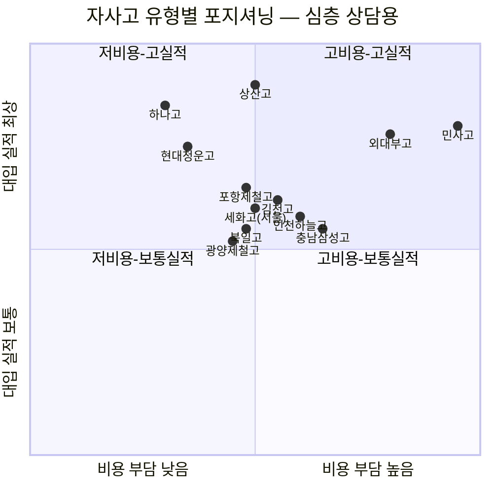
```mermaid
quadrantChart
    title 자사고 유형별 포지셔닝 — 심층 상담용
    x-axis "비용 부담 낮음" --> "비용 부담 높음"
    y-axis "대입 실적 보통" --> "대입 실적 최상"
    quadrant-1 "고비용-고실적"
    quadrant-2 "저비용-고실적"
    quadrant-3 "저비용-보통실적"
    quadrant-4 "고비용-보통실적"
    "상산고": [0.50, 0.90]
    "하나고": [0.30, 0.85]
    "민사고": [0.95, 0.80]
    "외대부고": [0.80, 0.78]
    "현대청운고": [0.35, 0.75]
    "포항제철고": [0.48, 0.65]
    "김천고": [0.55, 0.62]
    "인천하늘고": [0.60, 0.58]
    "북일고": [0.48, 0.55]
    "광양제철고": [0.45, 0.52]
    "세화고(서울)": [0.50, 0.60]
    "충남삼성고": [0.65, 0.55]
```

---

### 11.3 학비 부담 상담 가이드

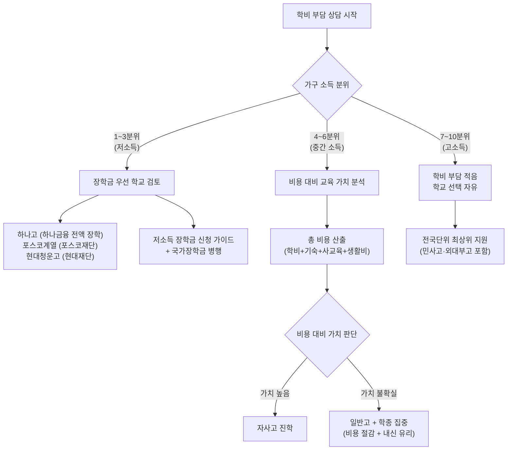
```mermaid
flowchart TD
    A["학비 부담 상담 시작"] --> B{"가구 소득 분위"}
    B -->|"1~3분위<br/>(저소득)"| C["장학금 우선 학교 검토"]
    B -->|"4~6분위<br/>(중간 소득)"| D["비용 대비 교육 가치 분석"]
    B -->|"7~10분위<br/>(고소득)"| E["학비 부담 적음<br/>학교 선택 자유"]
    
    C --> C1["하나고 (하나금융 전액 장학)<br/>포스코계열 (포스코재단)<br/>현대청운고 (현대재단)"]
    C --> C2["저소득 장학금 신청 가이드<br/>+ 국가장학금 병행"]
    
    D --> D1["총 비용 산출<br/>(학비+기숙+사교육+생활비)"]
    D1 --> D2{"비용 대비 가치 판단"}
    D2 -->|"가치 높음"| D3["자사고 진학"]
    D2 -->|"가치 불확실"| D4["일반고 + 학종 집중<br/>(비용 절감 + 내신 유리)"]
    
    E --> E1["전국단위 최상위 지원<br/>(민사고·외대부고 포함)"]
```

**소득 분위별 자사고 학비 부담 비교표**:

| 소득 분위 | 연간 가용 교육비(추정) | 자사고 학비(전국단위) | 부담률 | 현실적 선택지 |
|----------|---------------------|---------------------|--------|-------------|
| 1~3분위 | 200~500만원 | 500~1,900만원 | **100%+** | 장학금 필수 (하나고, 포스코계열, 현대청운고) |
| 4~5분위 | 500~800만원 | 500~1,900만원 | 60~200% | 하나고(500만), 광양제철고(910만) 검토 |
| 6~7분위 | 800~1,200만원 | 500~1,900만원 | 40~150% | 대부분 전국단위 가능 (민사고 제외) |
| 8~10분위 | 1,200만원 이상 | 500~1,900만원 | 40~100% | 전 학교 가능 |

### 11.4 '우리 아이가 자사고에 맞는가' 진단 체크리스트

| 번호 | 진단 항목 | 예 (+2) | 보통 (+1) | 아니오 (0) |
|------|----------|---------|----------|-----------|
| 1 | 학원 없이 스스로 학습 계획을 세우고 실행한 경험이 있다 | | | |
| 2 | 전 과목 내신 A등급(또는 상위 10%) 이내이다 | | | |
| 3 | 수학·영어 중 최소 1과목은 최상위(상위 5%)이다 | | | |
| 4 | 독서를 즐기고, 읽은 책에 대해 자기 생각을 말할 수 있다 | | | |
| 5 | 경쟁에서 스트레스를 받기보다 동기부여를 받는 편이다 | | | |
| 6 | 기숙사 생활(부모와 떨어져 자기관리)에 자신이 있다 | | | |
| 7 | "왜 공부하는가"에 대한 자기 나름의 답이 있다 | | | |
| 8 | 호기심이 많고, 수업 시간에 질문을 자주 한다 | | | |
| 9 | SKY·의대 등 명확한 대입 목표가 있다 | | | |
| 10 | 가정의 학비 부담 능력이 충분하다 (또는 장학금 수혜 가능) | | | |

**결과 해석**:

| 총점 | 판정 | 추천 |
|------|------|------|
| 16~20점 | **매우 적합** | 전국단위 자사고 적극 추천 |
| 12~15점 | **적합** | 자사고 도전 권장 (학교 DNA 매칭 후) |
| 8~11점 | **보통** | 광역단위 자사고 또는 일반고 + 학종 집중 |
| 0~7점 | **부적합** | 일반고 추천 (내신 유리 + 비용 절감) |

### 11.5 자사고 불합격 시 대안 전략

| 대안 | 전략 | 장점 | 단점 |
|------|------|------|------|
| **일반고 + 학종** | 내신 1등급 확보 + 세특 강화 | 내신 유리, 비용 낮음 | 비교과 인프라 부족 |
| **일반고 + 정시** | 내신 관리 + 수능 집중 | 내신+정시 양방향 | 수능 집중 환경 부족 |
| **외고 전환** | 외국어 특기 활용 | 학종 강점, 외국어 차별화 | 지원 자격 필요 |
| **과학고 전환** | 수학·과학 최상위 활용 | R&E 체계적, 조기졸업 | 지원 자격·시기 제한 |
| **자공고 검토** | 자율형공립고 지원 | 학비 무상, 자율 교육과정 | 학교 수 적음, 선발 없음 |

### 11.6 실제 상담 시나리오

**시나리오 1: "우리 아이가 하나고에 가고 싶어하는데, 학비가 걱정입니다"**

| 단계 | 상담 내용 |
|------|----------|
| 1. 학생 적합성 확인 | 11.4 체크리스트로 적합성 진단 → 16점 이상이면 적극 추천 |
| 2. 학비 부담 분석 | 하나고 총 비용: 연 800~900만원 (동급 최저). 하나금융 장학재단 확인 |
| 3. 장학금 안내 | 소득 3분위 이하: 등록금+기숙사비 전액 지원 가능. 성적 우수 장학금도 별도 |
| 4. 최종 조언 | "하나고는 자사고 중 학비가 가장 낮고, 장학금 제도가 가장 잘 갖춰져 있습니다. 장학금 수혜 가능 여부를 먼저 확인하세요." |

**시나리오 2: "의대를 보내고 싶은데, 자사고 vs 일반고 중 어디가 좋을까요?"**

| 단계 | 상담 내용 |
|------|----------|
| 1. 학생 유형 파악 | 수능형(문제풀이 강점) vs 탐구형(세특 강점) |
| 2. 전략 분기 | 수능형 → 상산고(정시 의대 최강). 탐구형 → 하나고(학종 의대 가능). 양방향 → 균형형 자사고 |
| 3. 일반고 대안 | 일반고에서 내신 1등급 + 정시 집중도 유효한 전략 |
| 4. 최종 조언 | "의대 합격의 핵심은 학교가 아니라 학생의 실력과 전략입니다. 자사고의 인프라가 필요한지, 일반고의 내신 유리함이 필요한지를 판단하세요." |

**시나리오 3: "자사고에 보냈는데 성적이 떨어져서 고민입니다"**

| 단계 | 상담 내용 |
|------|----------|
| 1. 현황 파악 | 성적 하락 원인: 적응 실패? 학습 방법 문제? 정신건강 이슈? |
| 2. 해결 방안 | 학교 내 상담사 연결, 학습 멘토링 신청, 자기주도 학습 계획 재수립 |
| 3. 최악의 경우 | 일반고 전학도 옵션 — "자사고 자퇴"는 실패가 아님 |
| 4. 최종 조언 | "자사고에서 3등급이 일반고 1등급보다 실질 학력이 높을 수 있습니다. 하지만 대입에서는 등급이 중요하므로, 학종 전략을 재설계하거나 정시에 집중하는 것을 검토하세요." |

---

## 12. 학년별 로드맵 (고1~고3)

### 3개년 간트 차트

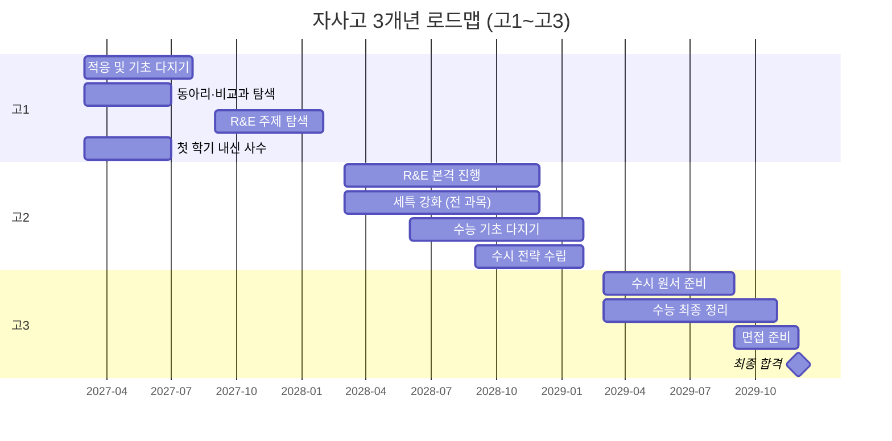
```mermaid
gantt
    title 자사고 3개년 로드맵 (고1~고3)
    dateFormat  YYYY-MM
    axisFormat  %Y-%m
    
    section 고1
    적응 및 기초 다지기           :a1, 2027-03, 2027-08
    동아리·비교과 탐색            :a2, 2027-03, 2027-07
    R&E 주제 탐색                :a3, 2027-09, 2028-02
    첫 학기 내신 사수             :a4, 2027-03, 2027-07
    
    section 고2
    R&E 본격 진행                :b1, 2028-03, 2028-12
    세특 강화 (전 과목)           :b2, 2028-03, 2028-12
    수능 기초 다지기              :b3, 2028-06, 2029-02
    수시 전략 수립               :b4, 2028-09, 2029-02
    
    section 고3
    수시 원서 준비               :c1, 2029-03, 2029-09
    수능 최종 정리               :c2, 2029-03, 2029-11
    면접 준비                    :c3, 2029-09, 2029-12
    최종 합격                    :milestone, 2029-12, 0d
```

### 고1 월별 로드맵

| 월 | 학업 | 비교과 | 전략 | 핵심 포인트 |
|----|------|--------|------|------------|
| 3월 | 첫 중간고사 대비, 수업 적응 | 동아리 지원·선택 | 학교 시스템 파악 | **첫 시험이 3년을 결정합니다** |
| 4월 | 중간고사 전력투구 | 동아리 활동 시작 | 내신 등급 확보 | 전 과목 A등급 목표 |
| 5월 | 중간고사 결과 분석 | 봉사·자율활동 탐색 | 약점 과목 보완 | 오답 분석 체계화 |
| 6월 | 기말고사 대비 시작 | R&E 관심 분야 탐색 | 학습 루틴 확립 | 자기주도 학습 시간 확보 |
| 7월 | 기말고사 | 여름방학 R&E 사전 조사 | 1학기 성적 분석 | 세특 기재 내용 교사와 협의 |
| 8월 | 수학·영어 선행/심화 | R&E 주제 확정 (교수 컨택) | 2학기 전략 수립 | **여름방학이 승부처** |
| 9월 | 2학기 중간고사 대비 | R&E 본격 시작 | 세특 주제 구체화 | 탐구 주제 선정이 가장 중요 |
| 10월 | 중간고사 | R&E 진행 | 독서 활동 누적 | AI 활용 일지 작성 시작 |
| 11월 | 기말고사 대비 | R&E 중간 보고서 | 1학년 종합 정리 | 세특 완성도 점검 |
| 12월 | 기말고사 | R&E 계속 | 겨울방학 계획 | 고2 전략 사전 수립 |

### 고2 월별 로드맵

| 월 | 학업 | 비교과 | 전략 | 핵심 포인트 |
|----|------|--------|------|------------|
| 3월 | 내신 강화 (A등급 사수) | R&E 심화 | 수시 6장 초안 설계 | **고2 성적이 학종의 핵심** |
| 4~5월 | 중간고사 | R&E + 동아리 | 세특 깊이 강화 | 교과 연계 탐구 활동 |
| 6월 | 모의고사 분석 | R&E 결과 정리 | 수능 최저 가능성 점검 | 학종 vs 정시 비중 결정 |
| 7~8월 | 여름방학 수능 집중 | R&E 최종 보고서 | 수시 전략 확정 | **수능 기초 완성 시기** |
| 9~10월 | 내신 + 모의고사 | 세특 최종 정리 | 대학별 전형 분석 | 목표 대학·전형 확정 |
| 11~12월 | 기말고사 + 겨울방학 수능 | 면접 기초 준비 | 자소서 소재 정리 | 고3 돌입 전 총정리 |

### 고3 월별 로드맵

| 월 | 학업 | 입시 | 전략 | 핵심 포인트 |
|----|------|------|------|------------|
| 3~5월 | 1학기 내신 | 자소서 초안 | 6장 배분 확정 | **1학기 내신이 최종 내신** |
| 6월 | 모의평가 | 자소서 수정 | 수능 최저 충족 점검 | 6월 모평이 수능 예측 지표 |
| 7~8월 | 수능 집중 | 대학별 면접 준비 | 원서 접수 준비 | **마지막 여름방학 = 수능 승부** |
| 9월 | 수시 원서 접수 | 6장 최종 결정 | 모의평가 결과 반영 | 9월 모평 후 원서 조정 |
| 10~11월 | 수능 최종 정리 | 면접 준비 (학종) | 수능 D-day 전략 | 멘탈 관리가 핵심 |
| 12월 | 수능 후 면접 | 합격 발표 | 정시 지원 분석 | 수시 결과 + 정시 전략 |

> **상담 포인트**: "3년 로드맵에서 가장 중요한 시기는 **고1 1학기 중간고사**와 **고2 여름방학**입니다. 첫 시험에서 자사고 내신 경쟁을 경험하고, 고2 여름에 수능 기초를 완성해야 합니다."

### 자사고 3년 핵심 전략 요약

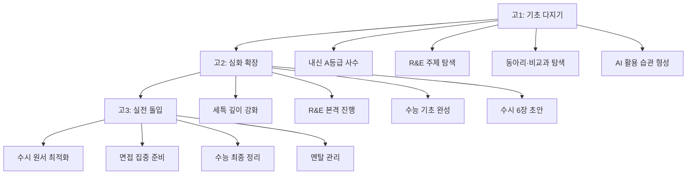
```mermaid
flowchart TD
    A["고1: 기초 다지기"] --> B["고2: 심화 확장"]
    B --> C["고3: 실전 돌입"]
    
    A --> A1["내신 A등급 사수"]
    A --> A2["R&E 주제 탐색"]
    A --> A3["동아리·비교과 탐색"]
    A --> A4["AI 활용 습관 형성"]
    
    B --> B1["세특 깊이 강화"]
    B --> B2["R&E 본격 진행"]
    B --> B3["수능 기초 완성"]
    B --> B4["수시 6장 초안"]
    
    C --> C1["수시 원서 최적화"]
    C --> C2["면접 집중 준비"]
    C --> C3["수능 최종 정리"]
    C --> C4["멘탈 관리"]
```

### 학종형 vs 정시형 시간 배분 비교 (고2 기준)

| 시간대 | 학종형 자사고 학생 | 정시형 자사고 학생 |
|--------|-----------------|-----------------|
| **오전 수업** | 내신 A등급 집중 | 내신 관리 (B+이상) |
| **점심시간** | 동아리 미팅 | 수학 추가 문제풀이 |
| **오후 수업** | 세특 연계 탐구 활동 | 수능 연계 심화 학습 |
| **방과후** | R&E 연구·실험 | 모의고사 풀이·오답 |
| **저녁 자습 1** | 세특 보고서 작성 | 수학 킬러문항 풀이 |
| **저녁 자습 2** | 면접 준비·독서 | 영어 독해·과탐 |
| **주말** | R&E + 봉사 + 독서 | 모의고사 + 오답 분석 |
| **방학** | R&E 집중 + 세특 정리 | 수능 집중 학습 (하루 12시간+) |

### 자사고 학생의 AI 도구 활용 로드맵 (고1~고3)

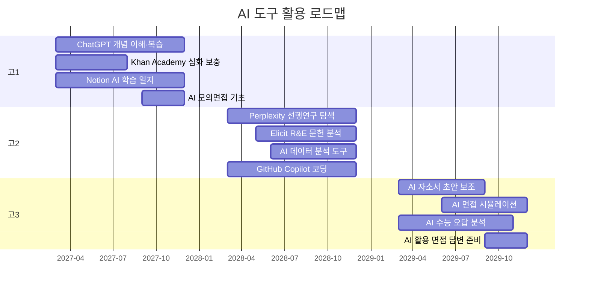
```mermaid
gantt
    title AI 도구 활용 로드맵
    dateFormat  YYYY-MM
    axisFormat  %Y-%m
    
    section 고1
    ChatGPT 개념 이해·복습     :2027-03, 2027-12
    Khan Academy 심화 보충     :2027-03, 2027-08
    Notion AI 학습 일지        :2027-03, 2027-12
    AI 모의면접 기초            :2027-09, 2027-12
    
    section 고2
    Perplexity 선행연구 탐색    :2028-03, 2028-12
    Elicit R&E 문헌 분석       :2028-05, 2028-12
    AI 데이터 분석 도구         :2028-06, 2028-12
    GitHub Copilot 코딩        :2028-03, 2028-12
    
    section 고3
    AI 자소서 초안 보조         :2029-03, 2029-09
    AI 면접 시뮬레이션          :2029-06, 2029-12
    AI 수능 오답 분석          :2029-03, 2029-11
    AI 활용 면접 답변 준비      :2029-09, 2029-12
```

| 학년 | AI 활용 목적 | 핵심 도구 | 세특 기재 포인트 | 위험 요소 |
|------|------------|----------|---------------|----------|
| **고1** | 학습 효율화, 개념 이해 | ChatGPT, Khan Academy, Notion AI | "AI로 개념을 확인하되 풀이는 직접 수행" | AI 답안 그대로 제출 (표절 위험) |
| **고2** | 탐구·연구 보조, R&E | Perplexity, Elicit, AI 통계 | "AI 분석 결과를 비판적으로 검토하여 3가지 오류 발견" | AI 결론을 무비판적으로 수용 |
| **고3** | 입시 전략 최적화, 면접 | AI 면접 시뮬레이터, AI 자소서 보조 | "AI 초안 대비 본인 수정 사항과 그 이유 기술" | AI가 쓴 자소서 그대로 제출 |

---

## 13. 자사고 vs 다른 학교 유형 비교

### 자사고 vs 자공고 (자율형공립고)

| 비교 항목 | 자율형사립고 (자사고) | 자율형공립고 (자공고) |
|----------|---------------------|---------------------|
| **설립 주체** | 사립 학교법인 | 공립 (국가/지자체) |
| **학비** | 연 500~1,900만원 | **무상** (공립) |
| **교육과정 자율성** | 높음 (50% 이상 자율 편성) | 높음 (자사고와 유사) |
| **학생 선발** | 자기주도 학습 전형 (경쟁 선발) | **비경쟁 선발** (지원자 전원 또는 추첨) |
| **대입 실적** | 높음~매우 높음 (학교별 상이) | 중상 (학교별 상이) |
| **학교 수** | 33개교 | 약 80~100개교 |
| **핵심 차이** | 높은 학비, 경쟁 선발, 높은 실적 | **무상, 비경쟁, 교육과정만 자율** |

> **상담 포인트**: "학비 부담 없이 자율적 교육과정을 원한다면 **자공고**가 대안입니다. 자사고와 유사한 교육과정 자율성을 무상으로 제공합니다. 단, 경쟁 선발이 아니므로 학생 수준의 편차가 있을 수 있습니다."

### 자사고 vs 특목고 (외고·과학고·국제고)

| 비교 항목 | 자사고 | 외고 | 과학고 | 국제고 |
|----------|--------|------|--------|--------|
| **교육 특화** | 전반적 엘리트 교육 | 외국어 특화 | 수학·과학 특화 | 글로벌 교육 |
| **학비** | 연 500~1,900만원 | 연 500~800만원 | 무상~저렴 | 연 500~1,000만원 |
| **대입 전략** | 학종+정시 균형 | 학종 중심 | 학종+조기졸업 | 학종+해외대 |
| **의대 진학** | 가능 (정시형) | 어려움 | **매우 강함** | 어려움 |
| **SKY 진학** | 30~70% | 20~40% | 40~60% | 20~30% |
| **선발 방식** | 자기주도 학습 전형 | 자기주도 학습 전형 | 입학 시험 | 자기주도 학습 전형 |
| **적합 학생** | 전과목 최상위, 명확한 목표 | 외국어 특기 | 수학·과학 영재 | 글로벌 진로 |

### 자사고 vs 일반고

| 비교 항목 | 자사고 | 일반고 |
|----------|--------|--------|
| **학비** | 연 500~1,900만원 | 연 100만원 이내 (실질 무상) |
| **내신 경쟁** | **매우 치열** (최상위끼리 경쟁) | 상대적으로 유리 (학생 수준 분포 넓음) |
| **세특 인프라** | R&E, 심화 동아리, 전문 교사 | 학교별 편차 큼 (자체 노력 필요) |
| **학종 유리함** | 세특 깊이 강점 / 내신 불리 | 내신 유리 / 세특 인프라 부족 |
| **정시 유리함** | 수능 집중 환경 (정시형) | 학원 병행으로 보완 가능 |
| **기숙사** | 전국단위 의무 / 광역 없음 | 없음 (통학) |
| **동문 네트워크** | 강함 (특히 오래된 학교) | 보통 |
| **자기주도 환경** | 매우 강함 | 학생 개인에 따라 다름 |

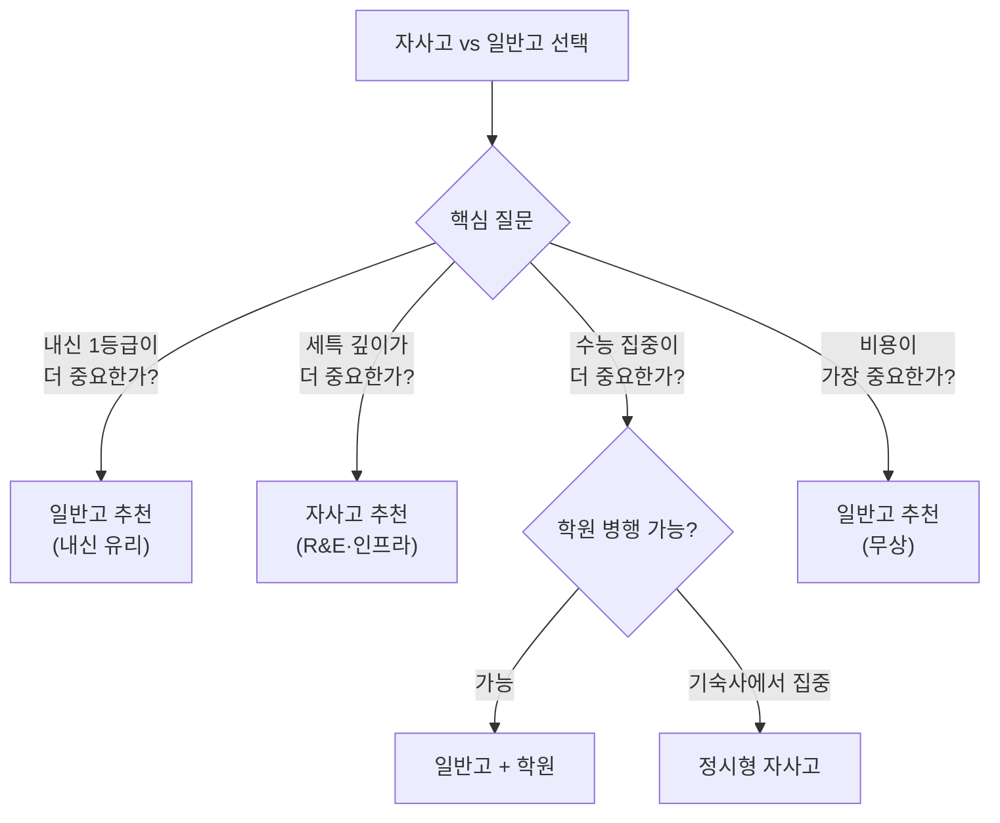
```mermaid
flowchart TD
    A["자사고 vs 일반고 선택"] --> B{"핵심 질문"}
    B -->|"내신 1등급이<br/>더 중요한가?"| C["일반고 추천<br/>(내신 유리)"]
    B -->|"세특 깊이가<br/>더 중요한가?"| D["자사고 추천<br/>(R&E·인프라)"]
    B -->|"수능 집중이<br/>더 중요한가?"| E{"학원 병행 가능?"}
    E -->|"가능"| F["일반고 + 학원"]
    E -->|"기숙사에서 집중"| G["정시형 자사고"]
    B -->|"비용이<br/>가장 중요한가?"| H["일반고 추천<br/>(무상)"]
```

> **상담 포인트**: "자사고 vs 일반고 선택의 핵심은 **'내 아이는 내신이 유리한 환경에서 잘하는 타입인가, 세특 인프라가 풍부한 환경에서 잘하는 타입인가'**입니다. 둘 다 가능하다면, 비용까지 고려하여 결정하세요."

---

## 14. 참고 자료 및 출처

### 14.1 공식 자료

| 출처 | URL | 활용 목적 |
|------|-----|----------|
| 교육부 정책브리핑 — 자사고 존치 결정 | https://www.korea.kr/news/policyNewsView.do?newsId=148866386 | 자사고 존치 정책 근거 |
| 고입정보포털 | https://www.hischool.go.kr/entrance/typeJayulgo.jsp | 자사고 제도 공식 안내 |
| 학교알리미 | https://www.schoolinfo.go.kr/ | 학교별 공시 정보 (학비·실적) |

### 14.2 보도 자료

| 출처 | URL | 활용 목적 |
|------|-----|----------|
| 베리타스알파 — 전국자사고 10개교 모집 | http://www.veritas-a.com/news/articleView.html?idxno=571199 | 전국단위 10개교 명단 확인 |
| 베리타스알파 — 서울 광역자사고 경쟁률 | http://www.veritas-a.com/news/articleView.html?idxno=587835 | 서울 광역 자사고 명단·경쟁률 |
| 메트로서울 — 대광고 일반고 전환 | https://www.metroseoul.co.kr/article/20250824500010 | 대광고 자발적 전환 근거 |
| 문화일보 — 자사고 학비 분석 | https://www.munhwa.com/article/11533969 | 학비 추정치 근거 |
| 베리타스알파 — 1인당 교육비 | http://www.veritas-a.com/news/articleView.html?idxno=477138 | 학교별 교육비 비교 |

### 14.3 데이터 출처

| 항목 | 출처 | 비고 |
|------|------|------|
| 학교 목록·기본 정보 | `frontend/data/high-school/autonomous_private.json` | 2026-05-22 검증 완료 |
| 학비 수치 | 베리타스알파 보도 + 학교 공시 | estimate 등급 — 학교알리미 직접 확인 권장 |
| SKY 진학률 | 베리타스알파 + 학교 발표 | 학교별 발표 기준 상이 — 중복 합격 vs 최종 등록 구분 필요 |
| 경쟁률 | 베리타스알파 보도 | 연도별 변동 큼 — 최신 자료 확인 필요 |

> **데이터 품질 주의**: 본 문서의 학비·진학률 수치는 **추정치(estimate)**입니다. 100% 정확한 수치는 학교알리미(schoolinfo.go.kr) → '학교회계 예·결산서' PDF를 직접 다운로드하여 확인하세요.

---

## 부록 A: 자사고 입학 준비 체크리스트 (중학생용)

### 중1 체크리스트

| 번호 | 항목 | 시기 | 완료 |
|------|------|------|------|
| 1 | 전 과목 내신 A등급 유지 (절대 기준) | 연중 | [ ] |
| 2 | 수학 선행: 중2 과정 시작 | 1학기 | [ ] |
| 3 | 독서 습관: 월 2권 이상 다양한 분야 | 연중 | [ ] |
| 4 | 자기만의 관심 분야 1개 찾기 | 2학기 | [ ] |
| 5 | 자기주도 학습 습관 형성 (하루 3시간) | 연중 | [ ] |
| 6 | 학교 동아리 1개 이상 가입 | 3월 | [ ] |
| 7 | AI 도구 기초 활용법 학습 | 여름방학 | [ ] |

### 중2 체크리스트

| 번호 | 항목 | 시기 | 완료 |
|------|------|------|------|
| 1 | 전 과목 A등급 유지 + 수학·영어 최상위 | 연중 | [ ] |
| 2 | 자기주도 학습 포트폴리오 구축 시작 | 1학기 | [ ] |
| 3 | 봉사 활동 시작 (의미 있는 활동) | 연중 | [ ] |
| 4 | 독서 토론 활동 참가 | 1학기 | [ ] |
| 5 | 목표 자사고 학교 2~3개 선정 | 2학기 | [ ] |
| 6 | 학교 설명회 참석 (목표 학교) | 10~11월 | [ ] |
| 7 | AI 도구 활용 미니 프로젝트 1개 | 겨울방학 | [ ] |
| 8 | 리더십 경험 (학생회·동아리 대표) | 연중 | [ ] |

### 중3 체크리스트

| 번호 | 항목 | 시기 | 완료 |
|------|------|------|------|
| 1 | 내신 전 과목 A등급 사수 (1학기 최우선) | 3~7월 | [ ] |
| 2 | 자소서 초안 작성 | 여름방학 | [ ] |
| 3 | 자소서 수정 (3회 이상) | 9~10월 | [ ] |
| 4 | 면접 준비: 예상 질문 30개 답변 연습 | 10~11월 | [ ] |
| 5 | 면접 모의 연습 (교사·멘토·AI 활용) | 11~12월 | [ ] |
| 6 | 원서 접수 | 11~12월 | [ ] |
| 7 | 합격 발표 후 입학 준비 | 1~2월 | [ ] |
| 8 | 불합격 대비 대안 학교 사전 검토 | 10월 | [ ] |

---

## 부록 B: 자소서 작성 가이드 (실전 예시)

### 자소서 구조 (STAR 기법 적용)

| 단계 | 영문 | 설명 | 예시 |
|------|------|------|------|
| **S** | Situation | 상황 제시 | "중2 수학 시간, 이차방정식 판별식 단원에서 3회 연속 오답" |
| **T** | Task | 과제/목표 | "판별식의 기하학적 의미를 스스로 이해하겠다는 목표 설정" |
| **A** | Action | 행동 | "교과서 → 참고서 → AI(ChatGPT)에 질문 → AI 답변 검증 → 직접 그래프 작성" |
| **R** | Result | 결과/성장 | "판별식과 포물선의 관계를 이해. '모르는 것을 정확히 찾는 메타인지'의 중요성 체득" |

### 실전 자소서 예시 — 항목별

**항목 1: 자기주도 학습 경험 (800자 이내)**

> [좋은 예시]
> "중학교 2학년 여름, 수학 이차방정식 단원에서 판별식 문제를 세 번 연속 틀렸습니다. 학원 선생님은 '공식을 외워라'고 했지만, 왜 D=b^2-4ac가 그래프의 교점 수를 결정하는지 이해가 되지 않았습니다.
> 
> 그래서 학원을 쉬고 스스로 탐구하기로 결심했습니다. 먼저 교과서의 설명을 다시 읽었지만 부족했습니다. ChatGPT에 '판별식의 기하학적 의미'를 질문했으나, 답변이 일반적이어서 만족스럽지 않았습니다. 이때 깨달은 것이 있습니다 — AI는 '설명'은 해주지만, '이해'는 내가 직접 해야 한다는 것입니다.
> 
> 직접 y=x^2+bx+c에서 b, c 값을 바꿔가며 30개의 그래프를 그렸습니다. D>0, D=0, D<0일 때 포물선이 x축과 만나는 방식이 달라지는 것을 눈으로 확인하면서 비로소 이해했습니다. 이 경험으로 '모르는 것을 정확히 찾는 메타인지 능력'이 학습의 핵심임을 깨달았습니다."

### 자소서 작성 시 피해야 할 10가지 실수

| 번호 | 실수 | 올바른 방향 |
|------|------|-----------|
| 1 | 학원 경험을 자기주도 학습으로 포장 | 학원이 아닌 본인 주도 경험 서술 |
| 2 | 성적 향상만 강조 | 과정에서의 깨달음·성장 중심 |
| 3 | 추상적 표현 남발 ("열심히", "최선을") | 구체적 수치·사례로 대체 |
| 4 | 다른 학교 자소서 복사·붙여넣기 | 해당 학교 프로그램과 구체적 연결 |
| 5 | AI가 쓴 문장 그대로 사용 | AI 초안 참고 → 본인 경험·어투로 재작성 |
| 6 | 지원 동기에 학교 홈페이지 문구 나열 | 본인이 왜 이 학교에 가고 싶은지 |
| 7 | 봉사 시간만 나열 | 봉사에서 배운 점·변화 중심 |
| 8 | 자랑 일색 | 어려움·실패에서 배운 점도 포함 |
| 9 | 분량 초과 또는 미달 | 기준 분량 ±10% 이내 |
| 10 | 맞춤법·문법 오류 | 최소 3회 교정 + 타인 검토 |

---

## 부록 C: 면접 대비 체크리스트

### 면접 전 (D-30 ~ D-1)

| 번호 | 준비 항목 | 완료 |
|------|----------|------|
| 1 | 예상 질문 30개 리스트 작성 (7.2절 Top 15 포함) | [ ] |
| 2 | 각 질문에 대한 답변 스크립트 작성 (핵심 메시지 + 근거 사례) | [ ] |
| 3 | 답변 연습 (거울 앞에서 매일 20분) | [ ] |
| 4 | AI 모의 면접 실시 (ChatGPT에게 면접관 역할 요청) | [ ] |
| 5 | 교사·멘토와 모의 면접 (최소 3회) | [ ] |
| 6 | 지원 학교 프로그램·특성 사전 조사 | [ ] |
| 7 | 최근 읽은 책 3권에 대한 자기 해석 정리 | [ ] |
| 8 | AI 활용 경험 정리 (활용 사례 + AI 한계 + 본인 역할) | [ ] |
| 9 | 면접 복장 준비 (단정한 교복 또는 캐주얼) | [ ] |
| 10 | 면접 장소·시간 확인 | [ ] |

### 면접 당일 핵심 팁

| 항목 | 팁 |
|------|-----|
| **자세** | 바른 자세, 눈 맞춤, 자신감 있는 목소리 |
| **답변 구조** | 결론 먼저 → 근거·사례 → 정리 (30초~1분) |
| **모르는 질문** | "솔직히 그 부분은 잘 모르지만, 제 생각에는..."으로 시작 |
| **AI 관련 질문** | "AI를 학습에 활용하되, 해석과 판단은 제가 직접 했습니다"가 핵심 메시지 |
| **마무리** | "이 학교에서 제가 가장 하고 싶은 것은..."으로 열정 표현 |

---

## 부록 D: R&E 주제 선정 가이드

### R&E 주제 선정 5단계 프로세스

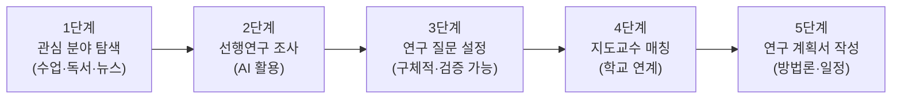
```mermaid
flowchart LR
    A["1단계<br/>관심 분야 탐색<br/>(수업·독서·뉴스)"] --> B["2단계<br/>선행연구 조사<br/>(AI 활용)"]
    B --> C["3단계<br/>연구 질문 설정<br/>(구체적·검증 가능)"]
    C --> D["4단계<br/>지도교수 매칭<br/>(학교 연계)"]
    D --> E["5단계<br/>연구 계획서 작성<br/>(방법론·일정)"]
```

### 분야별 R&E 주제 예시

| 분야 | 주제 예시 | AI 활용 포인트 | 세특 기재 포인트 |
|------|----------|-------------|---------------|
| **수학** | "특정 조건에서 피보나치 수열의 수렴 특성 분석" | AI로 수치 시뮬레이션 → 본인이 증명 | "AI 시뮬레이션 결과와 수학적 증명의 차이 분석" |
| **물리** | "자유낙하 실험에서 공기저항 모델 비교" | AI로 이론 모델 시뮬레이션 | "AI 예측과 실험 결과 간 오차 원인 분석" |
| **화학** | "가정용 세제의 pH 변화와 세척 효과 상관관계" | AI로 데이터 패턴 분석 | "AI가 놓친 온도 변수를 직접 발견" |
| **생명과학** | "학교 주변 식물 군락의 계절별 변화 관찰" | AI로 종 식별 보조 | "AI 식별 오류를 현장 관찰로 보정" |
| **사회과학** | "우리 지역 1인 가구 증가와 공공서비스 수요 변화" | AI로 인구 데이터 분석 | "AI 분석의 사회적 맥락 해석을 본인이 수행" |
| **인문학** | "조선 시대 과거제와 현대 수능의 구조적 유사성" | AI로 문헌 검색·요약 | "AI 요약의 편향을 발견하고 원문 재검토" |

---

## 부록 E: 학교별 DNA 매칭 매트릭스

### 서울 광역단위 자사고 DNA 매칭 매트릭스

| 학생 특성 | 양정고 | 이화여고 | 휘문고 | 세화고 | 세화여고 | 중동고 | 중앙고 | 배재고 | 경희고 |
|----------|--------|---------|--------|--------|---------|--------|--------|--------|--------|
| 내신 경쟁력 | 4 | 4 | 4 | **5** | **5** | **5** | 4 | 3 | 3 |
| 학종 세특 | 3 | 4 | 4 | 4 | 4 | 4 | 4 | 3 | 3 |
| 정시 인프라 | 3 | 3 | 4 | 4 | 4 | 4 | 3 | 3 | 3 |
| 통학 편의 | 서남권 | 중구 | 강남 | 서초 | 서초 | 강남 | 종로 | 강동 | 동대문 |
| 동문 네트워크 | 3 | **5** | 4 | 4 | 4 | 4 | **5** | **5** | 3 |
| 종합 추천도 | 중상 | 상 | 상 | **최상** | **최상** | 상 | 상 | 중상 | 중 |

**(5=최상, 4=상, 3=중, 2=하)**

### 전국단위 자사고 DNA 매칭 매트릭스

| 학생 특성 | 하나고 | 민사고 | 상산고 | 현대청운고 | 외대부고 | 인천하늘고 | 김천고 | 광양제철고 | 포항제철고 | 북일고 |
|----------|--------|--------|--------|----------|---------|----------|--------|----------|----------|--------|
| 자기주도 학습 | **5** | 4 | 3 | 3 | 4 | 4 | 3 | 3 | 3 | 3 |
| 수능 집중력 | 3 | 3 | **5** | **5** | 3 | 3 | 4 | 3 | 4 | 4 |
| 탐구·R&E | **5** | 4 | 3 | 3 | 4 | 3 | 3 | 4 | **5** | 3 |
| 외국어 | 3 | **5** | 2 | 2 | **5** | 4 | 2 | 2 | 2 | 2 |
| 리더십 | 4 | **5** | 3 | 3 | 4 | 4 | 3 | 3 | 3 | 3 |
| 이공계 | 4 | 3 | 4 | **5** | 3 | 3 | 3 | **5** | **5** | 3 |
| 비용 민감 | **5** | 1 | 3 | 4 | 2 | 3 | 3 | 4 | 4 | 4 |
| 의대 지망 | 4 | 2 | **5** | 4 | 2 | 3 | 3 | 2 | 3 | 3 |
| 해외대 | 4 | **5** | 1 | 1 | **5** | 3 | 1 | 1 | 1 | 1 |

**(5=최적, 4=적합, 3=보통, 2=부적합, 1=매우 부적합)**

---

## 부록 F: 월별 학습 플래너

### 중3 자사고 입시 준비 월별 플래너

| 월 | 학업 목표 | 자소서 | 면접 | 비교과 | 체크포인트 |
|----|----------|--------|------|--------|-----------|
| 3월 | 1학기 내신 올인 | - | - | 동아리 최종 확정 | 내신이 최우선 |
| 4월 | 중간고사 | 소재 발굴 시작 | - | 활동 기록 정리 | 시험 후 오답 분석 |
| 5월 | 중간 결과 분석 | 소재 리스트 작성 | - | 봉사 활동 | 약점 과목 보완 |
| 6월 | 기말고사 대비 | 초안 구상 | - | R&E 정리 | 1학기 내신 사수 |
| 7월 | 기말고사 | **자소서 초안 작성** | 예상 질문 리스트 | 여름방학 계획 | 자소서 1차 완성 |
| 8월 | 2학기 예습 | 자소서 1차 수정 | AI 모의 면접 시작 | 독서 활동 보충 | 자소서 피드백 반영 |
| 9월 | 2학기 내신 | 자소서 2차 수정 | 모의 면접 주 2회 | 활동 최종 정리 | 담임 추천서 요청 |
| 10월 | 중간고사 | **자소서 최종 완성** | 모의 면접 주 3회 | 포트폴리오 완성 | 불합격 대비 대안 검토 |
| 11월 | 기말 대비 시작 | 원서 접수 | **면접 집중 준비** | - | 면접 복장 준비 |
| 12월 | 기말고사 | 면접 실시 | 면접 실시 | - | **합격 발표** |
| 1월 | 예비 학습 | - | - | - | 합격 시 입학 준비 |
| 2월 | 고교 입학 준비 | - | - | - | 수학·영어 선행 |

---

## 부록 G: 자사고 졸업 후 커리어 패스

### 자사고 졸업생 주요 커리어 패스

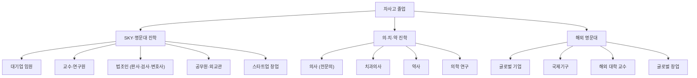
```mermaid
flowchart TD
    A["자사고 졸업"] --> B["SKY·명문대 진학"]
    A --> C["의·치·약 진학"]
    A --> D["해외 명문대"]
    
    B --> B1["대기업 임원"]
    B --> B2["교수·연구원"]
    B --> B3["법조인 (판사·검사·변호사)"]
    B --> B4["공무원·외교관"]
    B --> B5["스타트업 창업"]
    
    C --> C1["의사 (전문의)"]
    C --> C2["치과의사"]
    C --> C3["약사"]
    C --> C4["의학 연구"]
    
    D --> D1["글로벌 기업"]
    D --> D2["국제기구"]
    D --> D3["해외 대학 교수"]
    D --> D4["글로벌 창업"]
```

### 학교 DNA별 주요 커리어

| 학교 유형 | 주요 커리어 | 강점 분야 |
|----------|-----------|----------|
| 학종형 (하나고·외대부고) | 교수, 연구원, 외교관, 대기업 기획 | 인문·사회·정책·글로벌 |
| 정시형 (상산고·현대청운고) | 의사, 판사, 엔지니어 | 의약학·법학·공학 |
| 해외대 (민사고) | 글로벌 기업 임원, 국제기구, 창업가 | 글로벌 비즈니스·국제관계 |
| 이공계 (포항제철고·광양제철고) | 엔지니어, 연구원, 기술 스타트업 | 공학·기술·R&D |

---

## 부록 H: 학비·장학금 비교표

### 전국단위 자사고 학비·장학금 비교표

| 학교 | 연간 등록금(추정) | 기숙사비(추정) | 총 비용(추정) | 재단/후원 | 장학금 특이사항 |
|------|----------------|-------------|-------------|---------|--------------|
| **하나고** | ~500만원 | ~300~400만원 | ~800~900만원 | 하나금융 | **동급 최저 비용 + 저소득 전액 장학** |
| **민사고** | ~1,500만원+ | 포함 | ~1,600~1,900만원 | 독자 재단 | 성적 최상위 전액 장학 가능 |
| **상산고** | ~800만원 | 포함 | ~1,000~1,200만원 | 독자 재단 | 성적 우수 장학금 |
| **현대청운고** | 현대 지원 | 포함 | 상대적 저렴 | **현대그룹** | 현대 장학금 풍부 |
| **외대부고** | ~998~1,800만원 | 포함 | ~1,300~2,000만원 | 한국외대 | 성적 우수 장학금 |
| **인천하늘고** | ~1,000만원대 | 포함 | ~1,200~1,500만원 | 인천공항공사 | 인천공항 장학금 |
| **김천고** | ~1,060만원 | 포함 | ~1,200~1,400만원 | 송설재단 | 재단 지원 장학금 |
| **광양제철고** | ~910만원 | 포함 | ~1,100~1,300만원 | **포스코교육재단** | 포스코 장학금 |
| **포항제철고** | ~928만원 | 포함 | ~1,100~1,300만원 | **포스코교육재단** | 포스코 장학금 |
| **북일고** | ~924만원 | 포함 | ~1,100~1,300만원 | **한화그룹** | 한화 장학금 |

### 장학금 우수 학교 TOP 5 (저소득 가정 접근성)

| 순위 | 학교 | 장학금 특이사항 | 저소득 지원 수준 |
|------|------|-------------|---------------|
| 1 | **하나고** | 하나금융 장학재단 — 기초·차상위 전액 지원 | **최우수** |
| 2 | **현대청운고** | 현대그룹 재단 — 학비·기숙비 대폭 지원 | 우수 |
| 3 | **광양제철고** | 포스코교육재단 — 성적 우수+소득 연계 | 우수 |
| 4 | **포항제철고** | 포스코교육재단 — 성적 우수+소득 연계 | 우수 |
| 5 | **북일고** | 한화 장학재단 — 성적 우수+소득 연계 | 우수 |

> **상담 포인트**: "저소득 가정에서 자사고를 고려한다면 **하나고를 1순위로 검토**하세요. 하나금융 장학재단 덕분에 동급 자사고 중 비용이 가장 낮고, 저소득 가정 전액 지원이 가능합니다. 다음으로 포스코계열(광양제철고·포항제철고)과 현대청운고(현대재단)를 검토하세요."

---

> **문서 작성 기준**: 2026년 7월 기준. 학교 정보 및 정책은 변동될 수 있으므로 최신 자료를 반드시 확인하세요.
> **데이터 출처**: `frontend/data/high-school/autonomous_private.json` (2026-05-22 검증)
> **문서 목적**: 입학사정관·진로상담 교사·학부모의 자사고 상담 레퍼런스로 활용

---

*본 문서는 교육 상담 참고 자료이며, 특정 학교를 추천하거나 보장하는 문서가 아닙니다. 모든 수치는 추정치(estimate)이며, 정확한 정보는 각 학교 공식 홈페이지 및 학교알리미(schoolinfo.go.kr)를 통해 확인하시기 바랍니다.*
