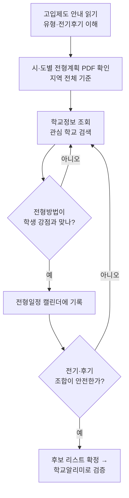
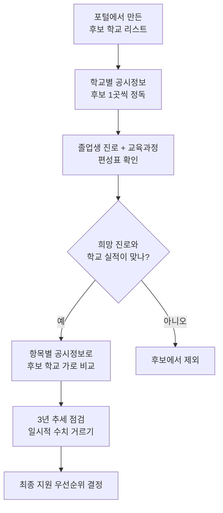
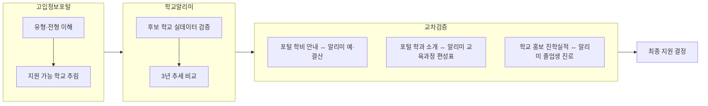

# 고입 정보 사이트 활용 가이드 (교사용 레퍼런스)

> **대상**: 중학교 3학년 고입 준비 지도 교사
> **목적**: 고입정보포털·학교알리미 두 사이트의 메뉴별 핵심 내용과 실전 활용법 정리
> **활용 시기**: 중3 1학기말 ~ 원서 접수 직전 (대략 6월 ~ 11월)

---

## 0. 문서 사용법

```
고입_정보_사이트_가이드
├── 1. 두 사이트 한눈에 비교       → 어떤 사이트를 언제 쓰는지 판단
├── 2. 고입정보포털 (hischool)     → "어디에 어떻게 지원하나" (제도·일정)
├── 3. 학교알리미 (schoolinfo)     → "그 학교가 진짜 어떤가" (실데이터)
├── 4. 두 사이트 교차검증 프로세스 → 정보를 엮어서 결론 내는 법
├── 5. 중3 월별 활용 타임라인      → 학사일정에 맞춘 지도 순서
└── 6. 수업 활용 팁 & 흔한 오해    → 학생 지도 시 주의점
```

---

## 1. 두 사이트 한눈에 비교

| 구분 | 고입정보포털 (hischool.go.kr) | 학교알리미 (schoolinfo.go.kr) |
|---|---|---|
| 운영 성격 | 고교 **입학 전형** 안내 포털 | 초·중·고 **교육정보 공시** 서비스 |
| 핵심 질문 | "**어디에, 어떻게, 언제** 지원하나?" | "그 학교는 **실제로 어떤 학교**인가?" |
| 대표 정보 | 모집요강, 전형일정, 전형방법, 학교 유형 | 학업성취도, 졸업생 진로, 학비, 교육과정 편성표 |
| 정보 성격 | 제도·규칙 (확정 공고) | 통계·실적 (최근 3년 공시 데이터) |
| 갱신 주기 | 학년도별 전형계획 공고 시점 | 법령에 따라 연 1~2회 정기 공시 |
| 지도 활용 단계 | 1단계 — 지원 가능 범위 파악 | 2단계 — 후보 학교 검증·비교 |

> **핵심 원칙**: 고입정보포털로 **"갈 수 있는 학교"를 좁히고**, 학교알리미로 **"갈 만한 학교인지"를 검증**한다. 두 사이트는 경쟁 관계가 아니라 **순서 관계**다.

---

## 2. 고입정보포털 (hischool.go.kr)

### 2-1. 사이트 성격

- 전국 고등학교의 **모집 요강과 고입 전형 기본계획**을 모아 둔 공식 포털
- "이 학교에 지원하려면 무엇이 필요한가"를 확인하는 곳
- **주의**: 전형 일정·방법은 매 학년도 새로 공고되므로 **반드시 해당 학년도 자료인지 확인**

### 2-2. 메뉴 구조 (tree)

```
고입정보포털
├── 고입제도 안내
│   ├── 고등학교 유형 설명 (일반고/특목고/특성화고/자율고/마이스터고)
│   ├── 전형 구분 (전기/후기)
│   └── 지원 방법·중복지원 제한 규정
├── 시·도별 전형계획
│   └── 17개 시도교육청 고입전형 기본계획 원문 (PDF)
├── 학교정보 조회  ★ 가장 많이 쓰는 메뉴
│   ├── 지역·유형·키워드로 학교 검색
│   └── 학교 상세 페이지
│       ├── 학교 개요 (소재지·설립유형·연락처)
│       ├── 모집요강 / 모집 인원
│       ├── 전형방법 (서류·면접·실기 등 반영 요소)
│       ├── 전형일정 (원서접수~합격발표)
│       └── 학과·계열 정보 (특성화고·마이스터고)
└── 공지사항 / 자료실
    └── 전형 일정 변경·정정 공고
```

### 2-3. 메뉴별 "유심히 봐야 할 것" (교사 체크포인트)

| 메뉴 | 주로 들어 있는 내용 | 교사가 짚어줄 포인트 |
|---|---|---|
| 고등학교 유형 설명 | 5개 유형의 교육 목적·졸업 후 진로 | 학생이 **유형 차이**부터 이해해야 학교 선택이 가능 |
| 전형 구분(전기/후기) | 어떤 학교가 전기, 어떤 학교가 후기인지 | **전기 불합격 시 후기 지원 가능** — 지원 전략의 핵심 |
| 중복지원 제한 규정 | 동시 지원 불가 조합 | 위반 시 **합격 취소**까지 가능 → 반드시 사전 확인 |
| 시·도별 전형계획 PDF | 지역 전체의 일정·평가 기준 총괄 | 개별 학교 요강보다 **먼저** 읽어야 할 기준 문서 |
| 학교 상세 — 전형방법 | 내신·출결·면접·실기 등 **반영 비율** | 학생 강·약점과 매칭 (예: 내신 약하면 면접 비중 큰 곳) |
| 학교 상세 — 전형일정 | 원서접수일, 발표일 | **날짜 충돌** 여부 점검, 캘린더에 표시 |
| 공지사항 | 일정 정정·추가 모집 공고 | 원서 접수 2~3주 전 **재확인 필수** |

### 2-4. 학교 상세 페이지에서 꼭 확인할 5가지

1. **모집 인원** — 작년 대비 증감, 학과별 정원
2. **전형 요소와 반영 비율** — 내신 / 출결·봉사 / 면접 / 실기의 배점
3. **지원 자격** — 거주지 제한, 졸업(예정) 요건, 우선·특별전형 조건
4. **전형 일정** — 원서접수 → (면접·실기) → 합격발표 → 등록 날짜
5. **전기/후기 구분** — 이 학교가 불합격일 때 다음 카드가 무엇인지

### 2-5. 활용 순서도



---

## 3. 학교알리미 (schoolinfo.go.kr)

### 3-1. 사이트 성격

- 「교육관련기관의 정보공개에 관한 특례법」에 따라 전국 초·중·고가 **의무 공시**하는 데이터 서비스
- 학교가 직접 입력·공개한 **객관 통계** — 홍보 문구가 아닌 실데이터
- 최근 **3개년 자료**가 함께 보여 추세 비교 가능

### 3-2. 공시정보 구조 (tree)

```
학교알리미
├── 전국학교정보
│   ├── 학교별 공시정보  ★ 학교 하나를 깊게 볼 때
│   └── 항목별 공시정보  ★ 여러 학교를 같은 항목으로 비교할 때
├── 공시 항목 (법정 15개 영역)
│   ├── 학생 현황 (학급수·학생수·전출입)
│   ├── 교육활동 (학교교육과정 편성·운영)
│   ├── 교원 현황
│   ├── 교육여건 (시설·급식·보건)
│   ├── 학업성취 사항          ◆ 진학 판단 핵심
│   ├── 졸업생 진로 현황       ◆ 진학 판단 핵심
│   ├── 예·결산 / 학교회계      ◆ 학비 관련
│   ├── 학교폭력 예방·대응 현황
│   └── 학교규칙·학교운영 등
└── 데이터 다운로드 (엑셀 원자료)
```

### 3-3. 중3 진학 관점 — 우선순위 항목 (교사 해석 가이드)

| 우선순위 | 공시 항목 | 무엇이 들어 있나 | 진학 지도 시 해석법 |
|---|---|---|---|
| ★★★ | 졸업생 진로 현황 | 대학 진학률, 취업률, 진로 미결정 비율 | 일반고는 진학률, 특성화·마이스터고는 **취업률**을 봐야 함 |
| ★★★ | 학교 교육과정 편성표 | 학년별 개설 과목, 선택과목 종류 | 학생 희망 진로 과목(예: 제2외국어, 과학·예체능)이 **실제 개설**되는지 |
| ★★★ | 학업성취 사항 | 교과별 성취도 분포, 평가 결과 | 단일 수치 맹신 금지 — **3년 추세**와 학교 규모 함께 볼 것 |
| ★★ | 학교회계 예·결산 | 수업료, 학부모 부담금, 방과후 비용 | 자율고·사립은 **실제 학비 부담** 확인 (포털 안내와 교차검증) |
| ★★ | 학생 현황 | 학급당 학생수, 전출입 추이 | 잦은 전출은 신호일 수 있음 / 학급 규모는 학습 환경 지표 |
| ★★ | 학교폭력 예방·대응 | 심의 건수, 예방교육 실시 현황 | 절대 수치보다 학교 규모 대비·추세로 해석 |
| ★ | 교원 현황 | 교원 수, 정규·기간제 비율 | 특정 교과 교원 구성 참고 (특목·특성화 시 의미 큼) |
| ★ | 시설·급식·보건 | 통학 여건, 급식 운영, 기숙사 유무 | 원거리 학교는 **기숙사·통학** 정보가 결정적일 수 있음 |

### 3-4. 정보 찾는 두 가지 경로

| 경로 | 언제 쓰나 | 방법 |
|---|---|---|
| 학교별 공시정보 | 후보 학교 **한 곳을 깊게** 분석 | 학교명 검색 → 한 학교의 15개 항목 전체 열람 |
| 항목별 공시정보 | 후보 학교 **여러 곳을 비교** | 항목(예: 졸업생 진로) 선택 → 학교 간 같은 지표 나란히 비교 |

### 3-5. 활용 순서도



---

## 4. 두 사이트 교차검증 프로세스

> 한 사이트만 보면 **반쪽 결론**이 난다. 아래 흐름으로 엮어야 한다.



### 교차검증 체크리스트

| 검증 항목 | 고입정보포털에서 | 학교알리미에서 | 둘이 다르면? |
|---|---|---|---|
| 학비 부담 | 모집요강의 학비 안내 | 학교회계 예·결산 실비용 | **알리미 실데이터** 우선 신뢰 |
| 개설 과목 | 학과·계열 소개 | 교육과정 편성표 | 편성표에 없으면 미개설로 간주 |
| 진학·취업 실적 | (학교 자체 홍보 자료) | 졸업생 진로 현황 공시 | 공시 데이터를 기준으로 |
| 모집 규모 | 모집요강 정원 | 학생 현황(학급·학생수) | 정원과 실제 규모 함께 해석 |

---

## 5. 중3 월별 활용 타임라인

| 시기 | 사이트 | 주요 활동 | 산출물 |
|---|---|---|---|
| 6~7월 | 고입정보포털 | 고교 유형·전기후기 제도 학습 | 학생별 "관심 유형" 정리 |
| 7~8월 | 학교알리미 | 관심 학교 공시정보 탐색 | 후보 학교 5~7곳 롱리스트 |
| 9월 | 양쪽 교차 | 시·도별 전형계획 공고 정독 | 전형방법·일정 비교표 |
| 10월 | 양쪽 교차 | 교차검증 체크리스트 적용 | 지원 우선순위 숏리스트 |
| 11월 | 고입정보포털 | 공지사항 일정 정정 재확인 | 원서접수 D-day 캘린더 |
| 접수 직전 | 고입정보포털 | 중복지원 제한·자격요건 최종 점검 | 원서 제출 |

---

## 6. 수업 활용 팁 & 흔한 오해

### 교사 수업 활용 팁

| 팁 | 구체적 방법 |
|---|---|
| 비교표를 학생이 직접 채우게 | 후보 3개 학교를 알리미 항목으로 가로 비교하는 워크시트 |
| "추세"를 강조 | 한 해 수치가 아니라 3개년 흐름을 그래프로 그리게 |
| 출처 구분 훈련 | 학교 홍보물 vs 공시 데이터를 나란히 놓고 차이 찾기 |
| 일정 시각화 | 전형일정을 달력에 색칠 — 날짜 충돌을 눈으로 확인 |

### 흔한 오해 바로잡기

| 학생·학부모의 오해 | 사실 |
|---|---|
| "포털에 나온 작년 일정이 올해도 같다" | 전형 일정·방법은 **학년도마다 새로 공고** |
| "진학률 높은 학교 = 좋은 학교" | 학교 규모·지역·학생 구성에 따라 의미가 다름 |
| "전기 한 곳만 쓰면 된다" | 불합격 대비 **후기 안전망**까지 설계해야 함 |
| "학교 홈페이지 진학 실적이 곧 공식 수치" | 공식 비교 기준은 **학교알리미 공시 데이터** |
| "공시 수치 하나로 줄세우기가 된다" | 단일 지표 줄세우기 금지 — 여러 항목·추세 종합 |

---

## 부록. 사이트 빠른 참조

| 사이트 | 주소 | 한 줄 요약 |
|---|---|---|
| 고입정보포털 | hischool.go.kr | 전국 고교 모집요강·전형일정·기본계획 확인 |
| 학교알리미 | schoolinfo.go.kr | 학비·교육과정 편성표·진학실적 공시 데이터 교차검증 |

> **지도 한 줄 요약**: *포털로 길을 찾고, 알리미로 그 길을 검증한다.*
