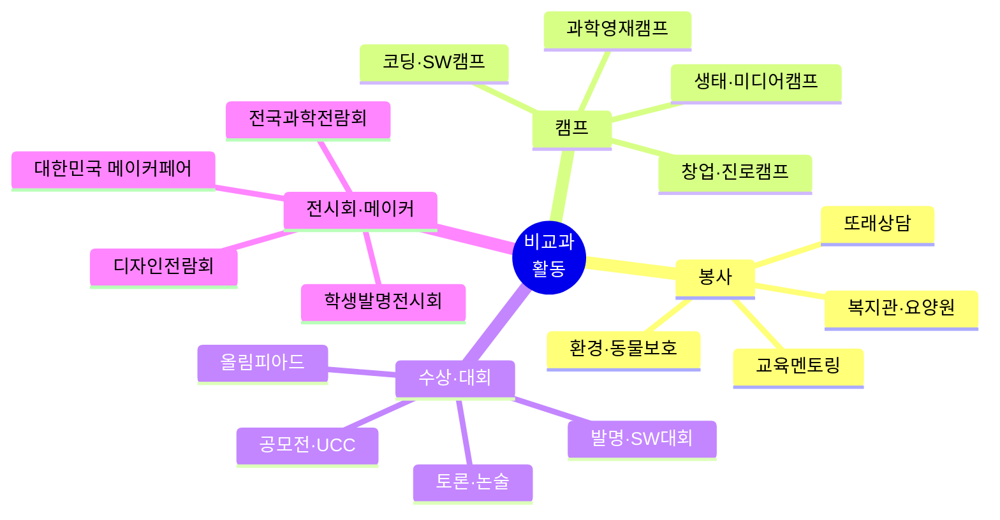
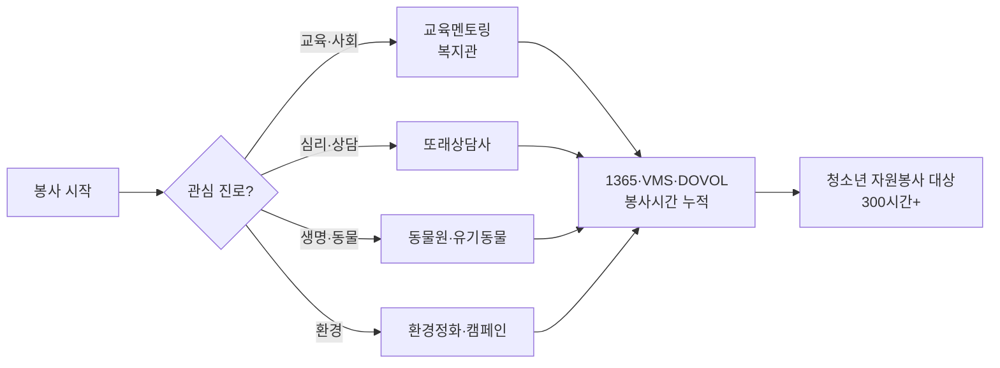
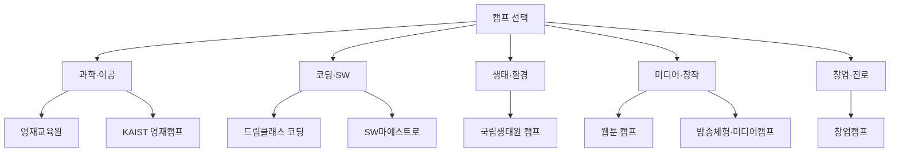
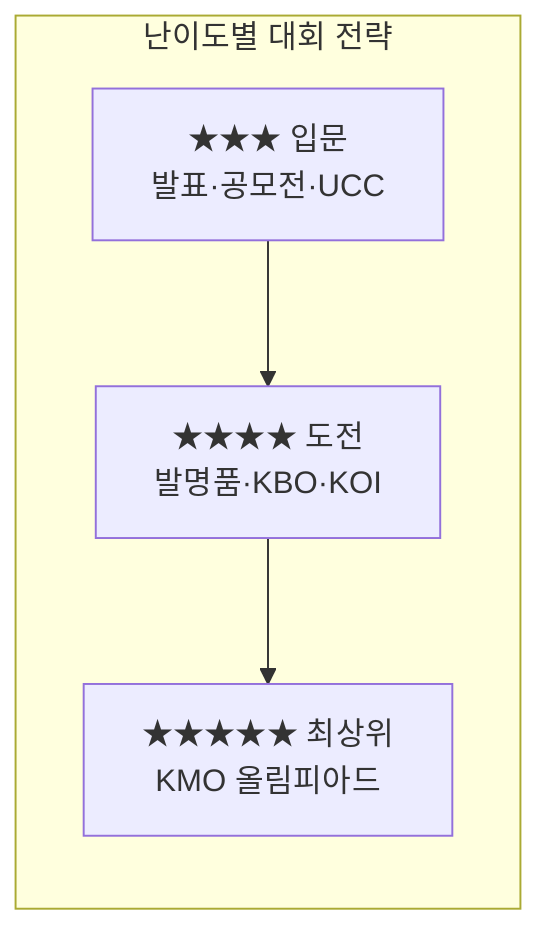
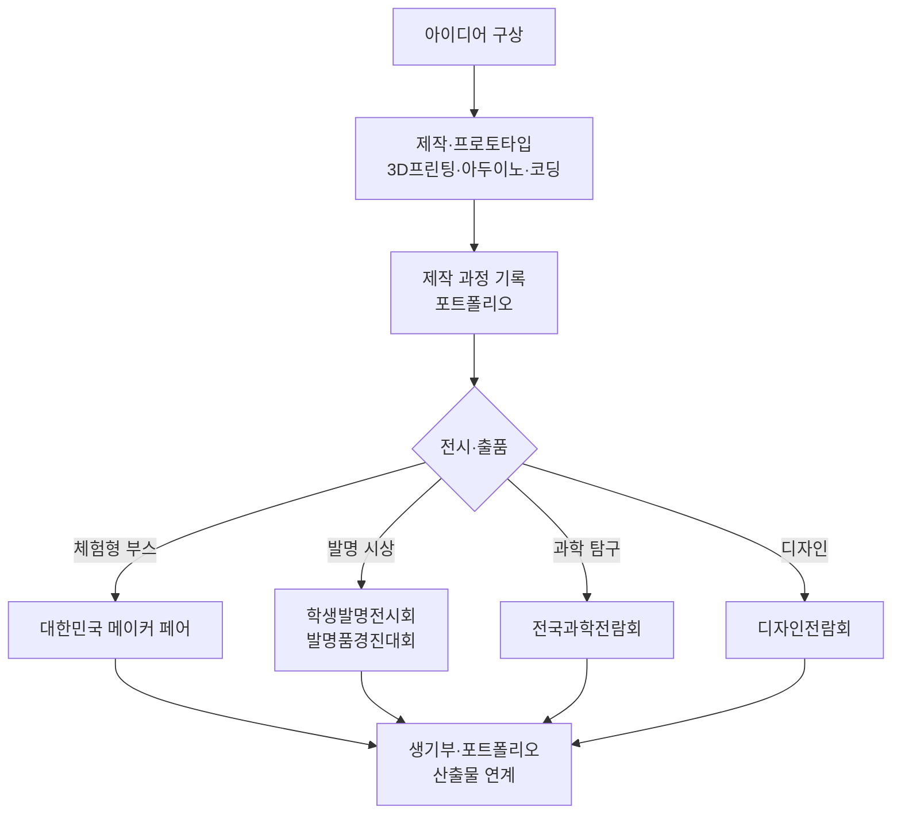

# 청소년 비교과 활동 종합 가이드 — 봉사 · 캠프 · 수상(대회) · 전시회

> 초·중·고 학생이 진로/생기부를 위해 참여할 수 있는 비교과 활동을 **봉사 · 캠프 · 수상(대회) · 전시회** 4개 유형으로 정리했습니다.
> 출처: `frontend/data/career-maker.json` 8개 진로 왕국 데이터 + 2025/2026 웹 조사 보강.
> ✅ **모든 홈페이지 URL은 실제 접속 검증을 완료**했습니다 (검증 결과는 §7 참조).
> ⚠️ 모집 시기·비용은 매년 변동되므로 **참여 전 반드시 공식 홈페이지에서 재확인**하세요.

---

## 0. 한눈에 보기 — 활동 유형 분류

### 유형별 핵심 차이

| 유형 | 목적 | 결과물 | 생기부 활용 포인트 |
|------|------|--------|--------------------|
| 🤝 **봉사** | 나눔·사회참여 | 봉사시간·확인서 | 공동체역량, 인성, 지속성 |
| 🏕️ **캠프** | 체험·심화학습 | 수료증·활동기록 | 전공적합성, 탐구 동기 |
| 🏆 **수상·대회** | 경쟁·성취 입증 | 상장·수상실적 | 학업역량, 전공역량(교내만 기재) |
| 🎨 **전시회·메이커** | 작품 발표·전시 | 출품작·전시이력 | 창의융합, 자기주도성, 산출물 |

> 📌 **2028 대입 유의사항**: 교외 수상·외부대회 실적은 대학 제출용 생기부에 **기재 불가**. 다만 활동에서 얻은 **역량·탐구경험**은 교내 활동(자율·동아리·진로)으로 연결해 녹여낼 수 있습니다.

---

## 1. 🤝 봉사 활동

| 활동명 | 대상 | 주최/장소 | 비용 | 특징 |
|--------|------|-----------|------|------|
| 교육 멘토링 봉사 | 중·고 | 지역 교육청/NGO | 무료 | 후배·취약계층 학습 지도, 교직·교육계열 적합 |
| 요양원·복지관 봉사 | 중·고 | 각 시설 | 무료 | 사회복지·간호·의료계열 연계 |
| 또래 상담사 활동 | 중·고 | 학교/교육청 | 무료 | 심리·상담계열, 공감 역량 |
| 서울대공원 동물원 봉사 | 중·고 | 서울대공원 | 무료 | 수의·생명·동물계열 적합 |
| 유기동물보호센터 봉사 | 중·고 | 동물보호단체 | 무료 | 산책·사회화 활동, 생명존중 |
| 환경정화·캠페인 봉사 | 초·중·고 | 지자체/환경단체 | 무료 | 환경·생태계열, 플로깅 등 |
| 도서관·박물관 도우미 | 중·고 | 공공기관 | 무료 | 인문·문헌정보계열 |

**🔗 봉사 포털** (✅ 검증됨)
- 1365 자원봉사포털 — https://www.1365.go.kr
- VMS 사회복지자원봉사 — https://www.vms.or.kr
- e청소년 DOVOL 청소년활동정보서비스 — https://www.youth.go.kr

---

## 2. 🏕️ 캠프 활동

| 캠프명 | 대상 | 주최 | 시기 | 비용 | 홈페이지 |
|--------|------|------|------|------|----------|
| 과학영재교육원 (대학 부설) | 초·중 | 한국과학창의재단 | 3~4월 | 무료~10만원 | https://www.kosac.re.kr |
| KAIST 과학영재캠프 | 중·고 | KAIST 과학영재교육연구원 | 7~8/12~1월 | 무료~10만원 | https://gifted.kaist.ac.kr |
| SW마에스트로 (고3/대학생) | 고 | 과기정통부·IITP | 연중 | 무료+지원금 | https://www.swmaestro.ai |
| 삼성 드림클래스 코딩 캠프 | 중 | 삼성전자 | 방학 | 무료 | https://www.dreamclass.samsung.com |
| 한국로봇산업협회 로봇 캠프 | 중·고 | 한국로봇산업협회 | 방학 | 5~15만원 | — |
| 국립생태원 청소년 생태캠프 | 중·고 | 환경부·국립생태원 | 방학 | 3~5만원 | https://www.nie.re.kr |
| 한국만화영상진흥원 웹툰 캠프 | 중·고 | 한국만화영상진흥원 | 방학 | 무료~5만원 | https://www.komacon.kr |
| KBS/MBC 방송 체험 캠프 | 고 | 방송문화재단 | 방학 | 5~10만원 | — |
| 유네스코 청소년 미디어 캠프 | 고 | 유네스코한국위원회 | 방학 | 무료~10만원 | https://www.unesco.or.kr |
| 교육부 창업동아리 창업캠프 | 고 | 교육부·창업진흥원 | 학기중 | 무료~지원금 | https://www.k-startup.go.kr |
| 경찰청 청소년 경찰학교 | 중·고 | 경찰청 | 상시 | 무료 | — |
| 여름방학 동행캠프 (지자체) | 중·고 | 시·도 청소년재단 | 방학 | 무료~저가 | https://www.youthnavi.net |

---

## 3. 🏆 수상 · 대회 (왕국별)

### 3-1. 탐구 왕국 🔬 (과학·수학·의료)

| 대회명 | 대상 | 주최 | 시기 | 난이도 | 홈페이지 |
|--------|------|------|------|:------:|----------|
| 한국수학올림피아드 (KMO) | 중·고 | 대한수학회 | 8/11월 | ★★★★★ | https://www.kms.or.kr |
| 한국생물올림피아드 (KBO) | 중·고 | 한국생물올림피아드위원회 | 4~8월 | ★★★★ | https://kbo.bioedu.kr |
| 중학생 생물올림피아드 | 중 | 한국생물올림피아드위원회 | 4~8월 | ★★★ | https://mskbo.bioedu.kr |
| 한국정보올림피아드 (KOI) | 초·중·고 | 과기정통부 | 6~8월 | ★★★★ | https://www.koi.or.kr |
| 한국천문올림피아드 (KAO) | 중·고 | 한국천문올림피아드위원회 | 상반기 | ★★★★ | — |
| 청소년 과학탐구 발표대회 | 중·고 | 교육부 | 5~6월 | ★★★ | — |

### 3-2. 기술 왕국 ⚙️ (SW·발명·로봇)

| 대회명 | 대상 | 주최 | 난이도 | 홈페이지 |
|--------|------|------|:------:|----------|
| 전국학생과학발명품경진대회 | 초·중·고 | 과기정통부·한국발명진흥회 | ★★★★ | https://www.kipa.org |
| 삼성 주니어 SW 창작대회 | 초4~고3 | 삼성전자 | ★★★ | https://www.juniorsoftwarecup.com |
| 전국 학생 코딩경진대회 | 초·중·고 | 코딩경진대회조직위 | ★★★ | https://codingcontest.or.kr |
| 고등학생 SW 개발 공모전 (FUTURE&DREAM) | 고 | 민간 주관 | ★★★★ | https://www.all-con.co.kr |
| 알고리즘 대회 (백준 BOJ 기반) | 중·고 | Baekjoon Online Judge | ★★★★ | https://www.acmicpc.net |

### 3-3. 창작 왕국 🎨 (만화·게임·영상·디자인)

| 대회명 | 대상 | 주최 | 홈페이지 |
|--------|------|------|----------|
| 전국학생만화공모전 | 중·고 | 한국만화영상진흥원 | https://www.komacon.kr |
| 넥슨 청소년 게임 창작 대회 (NDC) | 고 | 넥슨 | https://ndc.nexon.com |
| 청소년영화제 (YMCA·각 지역) | 중·고 | 각 지역 영화제 | — |
| 대한민국디자인전람회 (청소년부문) | 초·중·고 | 산업통상부·한국디자인진흥원 | https://award.kidp.or.kr |
| pixiv 한국 학생 일러스트 공모전 | 중·고 | 픽시브·청강문화산업대 | https://www.pixiv.net |

### 3-4. 자연·연결·질서·소통·도전 왕국 (분야별)

| 대회명 | 분야 | 대상 | 주최 |
|--------|------|------|------|
| 청소년환경보전 공모전 | 🌿 자연 | 중·고 | 환경부 |
| 전국청소년과학탐구대회 (생물) | 🌿 자연 | 중·고 | 과기정통부 |
| 청소년 자원봉사 대상 (300h+) | 🤝 연결 | 중·고 | 행정안전부 |
| 전국 청소년 사회복지 UCC 공모전 | 🤝 연결 | 고 | 한국사회복지협의회 |
| 전국고교생 논술·토론대회 | ⚖️ 질서 | 고 | 각 대학/언론사 |
| 청소년 경제 올림피아드 | ⚖️ 질서 | 중·고 | 경제교육학회 |
| 청소년 모의재판 대회 | ⚖️ 질서 | 중·고 | 대한변호사협회·법원 |
| 전국고교생 영어에세이 경진대회 | 📡 소통 | 고 | 각 대학/외고 |
| 청소년 UCC·영상 공모전 | 📡 소통 | 중·고 | 각 기관·지자체 |
| 전국 고교 창업아이디어 경진대회 | 🚀 도전 | 고 | 창업진흥원 |
| 청소년 비즈쿨 경진대회 | 🚀 도전 | 중·고 | 중소기업부·교육부 |
| 모의 UN 회의 (MUN) | 🚀 도전 | 고 | 각 MUN 주최기관 |
| 전국 학생 스포츠 대회 (종목별) | 🚀 도전 | 초·중·고 | 대한체육회 |

---

## 4. 🎨 전시회 · 메이커 활동

> 사용자 요청 반영 — 작품을 직접 만들어 출품·전시하는 활동.
> 📌 한국의 대표 메이커 행사는 **국립중앙과학관 주최 「대한민국 메이커 페어」** 입니다.

| 행사명 | 대상 | 주최 | 시기 | 성격 | 홈페이지 |
|--------|------|------|------|------|----------|
| **대한민국 메이커 페어** | 전연령 | 국립중앙과학관 | 10월 | 자작 발명품·DIY 전시/체험·메이커 운동회 | https://smart.science.go.kr |
| 전국과학전람회 (제71회) | 초·중·고+교원 | 국립중앙과학관 | 7~9월 | 과학 탐구작품 전시·시상 | https://www.science.go.kr |
| 대한민국 학생발명전시회 | 초·중·고 | 특허청·한국발명진흥회 | 하반기 | 학생 발명품 전시·시상 | https://www.kipa.org |
| 대한민국 과학축제 | 전연령 | 과기정통부 | 4월 | 대전 도심 과학 체험·부스 | https://www.scienceall.com |
| 대한민국디자인전람회 | 초·중·고~성인 | 한국디자인진흥원 | 하반기 | 디자인 작품 전시·시상 | https://award.kidp.or.kr |
| 부산국제어린이청소년아트페어 | 초·중·고 | BIKAF 조직위 | 연중 | 청소년 예술작품 아트페어 | https://www.bikaf.co.kr |
| 시·도 교육청 학생 메이커 페스티벌 | 초·중·고 | 각 시·도 교육청 | 학기중 | 메이커 작품 전시·경연 | — |

**메이커 활동 추천 흐름**
1. **아두이노/라즈베리파이/3D프린팅** 기초 학습 → 학교 메이커스페이스 활용
2. 문제 해결형 작품 제작 (생활 속 불편 → 발명)
3. 제작 과정·실패 기록을 **포트폴리오화**
4. 메이커 페어·발명전시회 출품 → 피드백 → 개선

---

## 5. 📅 연간 활동 캘린더 (대략)

| 월 | 주요 활동 |
|:--:|-----------|
| 1~2월 | 겨울 영재캠프, 코딩캠프, 자격증 준비 |
| 3~4월 | 영재교육원 모집, R&E 연구 시작, 대한민국 과학축제 |
| 5~6월 | 과학탐구 발표대회, 정보올림피아드(KOI) 1차 |
| 7~8월 | 여름캠프, KMO 1차, 생물올림피아드, 전국과학전람회 |
| 9~10월 | **대한민국 메이커 페어**, 학생발명전시회, 디자인전람회 |
| 11~12월 | KMO 2차, 연말 공모전 마감, 봉사시간 정리 |

```mermaid
gantt
    title 연간 비교과 활동 흐름
    dateFormat MM
    axisFormat %m월
    section 캠프
    겨울캠프      :01, 2M
    여름캠프      :07, 2M
    section 대회
    KOI 정보올림피아드  :05, 3M
    KMO 수학올림피아드  :08, 4M
    section 전시
    전국과학전람회 :07, 3M
    메이커페어/발명전시 :09, 2M
    section 봉사
    봉사시간 누적 :01, 12M
```

---

## 6. ✅ 활동 선택 체크리스트

- [ ] 내 **관심 진로(왕국)** 와 연결되는 활동인가?
- [ ] **교내 활동**(자율·동아리·진로)으로 연결해 생기부에 녹일 수 있는가?
- [ ] 일회성이 아닌 **지속·심화** 가능한 활동인가?
- [ ] 공식 홈페이지에서 **올해 모집 일정·비용**을 확인했는가?
- [ ] 활동 과정을 **기록·포트폴리오**로 남길 계획이 있는가?

---

## 7. 🌐 홈페이지 접속 검증 결과

> 2026-05-31 기준 실제 접속 테스트 결과. ✅정상 / 🔁주소변경 / ⚠️주의 / ❌접속불가

| 상태 | 사이트 | 검증 결과 / 비고 |
|:----:|--------|------------------|
| ✅ | 대한수학회 `kms.or.kr` | 정상 — KMO 올림피아드 안내 확인 |
| ✅ | 한국정보올림피아드 `koi.or.kr` | 정상 — 2026 대회 일정 게시 확인 |
| ✅ | 한국발명진흥회 `kipa.org` | 정상 — 발명 전시/행사 메뉴 확인 |
| ✅ | 국립중앙과학관 `science.go.kr` | 정상 — 전국과학전람회 운영 |
| ✅ | 국립중앙과학관 스마트 `smart.science.go.kr` | 정상 — **대한민국 메이커 페어** 페이지 확인 |
| ✅ | 한국만화영상진흥원 `komacon.kr` | 정상 |
| ✅ | KAIST 과학영재교육연구원 `gifted.kaist.ac.kr` | 정상 |
| ✅ | 1365 자원봉사포털 `1365.go.kr` | 정상 |
| ✅ | 백준 온라인 저지 `acmicpc.net` | 정상 — 알고리즘 채점 |
| ✅ | 대한민국디자인전람회 `award.kidp.or.kr` | 정상 |
| 🔁 | 한국과학창의재단 `kofac.re.kr` | **`kosac.re.kr`로 주소 변경**(301) — 문서 반영 완료 |
| 🔁 | SW마에스트로 `swmaestro.org` | **`swmaestro.ai`로 주소 변경**(302) — 문서 반영 완료 |
| 🔁 | 한국생물올림피아드 `kbo-biology.or.kr` | 접속불가 → **`kbo.bioedu.kr`로 정정** |
| 🔁 | 삼성 주니어 SW `juniorsw.com` | ❌ 아파트 분양 사이트로 변경됨 → **`juniorsoftwarecup.com`으로 정정** |
| ⚠️ | 메이커페어 `makerfaire.co.kr` | "곧 시작" 준비중 페이지 → 실질 행사는 국립중앙과학관 메이커 페어 권장 |
| ⚠️ | e청소년 `youth.go.kr` | 브라우저 접속 정상이나 자동검증 시 리디렉션 과다(봇 차단 추정) |
| ⚠️ | 삼성 주니어 SW `juniorsoftwarecup.com` | 삼성 공식 도메인 확인(뉴스룸 기준), 자동검증 봇 차단됨 |
| ❌ | 앱잼 `appjam.kr` | 접속 거부(ECONNREFUSED) — **사이트 폐쇄 추정, 참가 전 별도 확인 필요** |

**조치 요약**
- 🔁 4건(과학창의재단·SW마에스트로·생물올림피아드·삼성SW)은 본문 URL을 **새 주소로 정정** 완료.
- ⚠️ 2건(메이커페어·e청소년)은 봇 차단/준비중이나 실제 브라우저 접속은 가능.
- ❌ 1건(앱잼)은 폐쇄 추정으로 본문 대회 목록에서 제외함.

---

*문서 생성/갱신: 2026-05-31 · 데이터 출처: `frontend/data/career-maker.json` + 2025/2026 웹 조사·접속 검증*
*⚠️ 외부 일정·비용은 변동될 수 있으니 참여 전 공식 홈페이지 확인 필수.*
