# 한국 고등학교 종류 완전 정리 — 10개 카테고리 + 특목고 체계 가이드

> 대상: 중학생 본인 · 학부모 · 진로지도 교사
> 기준: 2028 대입 개편(통합형 수능 · 내신 5등급제) 체제 / 2026-05 현재
> 자매 문서: [고등학교 유형 완전 정리 — 진로지도용 상세 가이드](./고등학교_유형_완전정리_진로지도가이드.md)
>
> 이 문서는 서비스 UI 카테고리(과학고·영재고 / 외국어고 / 국제고 / IB 인증학교 / 자율형공립고 / 자율형사립고 / 예술고·체육고 / 마이스터고 / 비즈니스고 / 일반고 학군지)에 맞춰 **한국의 모든 고등학교 종류**를 빠짐없이 다룹니다.

---

## 0. 한눈에 보는 전체 지도

### 0-1. 법적 근거에 따른 분류 (공식 분류)

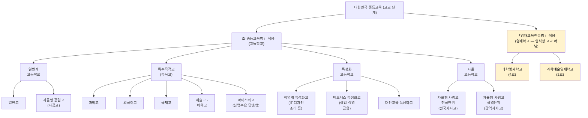

### 0-2. UI 10개 카테고리와 공식 분류 매핑

| UI 카테고리 | 공식 분류상 위치 | 핵심 키워드 | 본문 |
|---|---|---|---|
| 과학고 · 영재고 | 특목고 + 영재학교 | 수·과학 영재, 연구중심 | §2 |
| 외국어고 (외고) | 특목고 | 외국어·전공어 | §3 |
| 국제고 | 특목고 | 국제·글로벌 | §4 |
| IB 인증학교 | **교육과정 인증** (학교 유형 아님) | 토론·서술·논술 | §5 |
| 자율형 공립고 (자공고) | 일반계 | 공립 + 자율 | §6 |
| 자율형 사립고 (자사고) | 자율 고등학교 | 사립 + 자율 | §7 |
| 예술고 · 체육고 | 특목고 | 실기 중심 | §8 |
| 마이스터고 | 특목고 (산업수요 맞춤형) | 취업 직결 | §9 |
| 비즈니스고 | 특성화고 (상업·금융 계열) | 상경·실무 | §10 |
| 일반고 (학군지) | 일반계 | 평준화·갓반고 | §11 |
| (추가) 특성화고 일반 | 특성화고 | 직업·대안 | §12 |
| (추가) 영재학교 | 영재교육진흥법 별도 | 전국·연구 | §2 안에서 분리 정리 |

### 0-3. 특목고(특수목적고) 우산 다시 보기

> 사용자 피드백 반영: "특목고"는 **하나의 학교 유형이 아니라 우산 개념**입니다. 그 아래에 과학고·외고·국제고·예술고·체육고·마이스터고가 모두 들어갑니다.

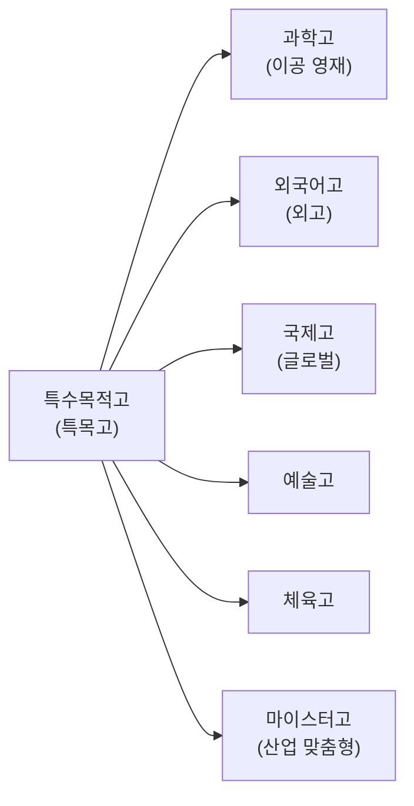

| 구분 | 설립 목적 | 대표 비유 |
|---|---|---|
| 과학고 | 이공계 영재 양성 | "지역 대표 이공 영재반" |
| 외고 | 외국어 인재 양성 | "전공어 깊이 파는 학교" |
| 국제고 | 국제 전문 인재 양성 | "국제기구·해외 지향 학교" |
| 예술고 | 음악·미술 등 예술 영재 | "실기로 입학해 실기로 진학" |
| 체육고 | 체육 영재 양성 | "운동선수·체대 진학 트랙" |
| 마이스터고 | 산업수요 맞춤형 직업교육 | "취업 직결 특목고" |

---

## 1. 분류 기준 5축 비교표

같은 '고등학교'라도 5가지 축으로 보면 학교의 정체가 한눈에 들어옵니다.

| 카테고리 | ① 법적 근거 | ② 모집 단위 | ③ 학비 | ④ 주된 진학 루트 | ⑤ 입학 난이도 |
|---|---|---|---|---|---|
| 영재학교 | 영재교육진흥법 | 전국 | 부대비용 위주 | 학종·특기자 (수시) | 최상위 |
| 과학고 | 초중등교육법 (특목) | 광역 | 무상교육+α | 학종 중심 | 상위 |
| 외고 | 초중등교육법 (특목) | 광역 | 공립 0 / 사립 수백만 | 학종 (어문·국제) | 상위 |
| 국제고 | 초중등교육법 (특목) | 광역 | 공립 0 / 사립 수백만 | 학종 (국제·인문) | 상위 |
| IB 인증학교 | (인증) — 학교 유형 위에 얹힘 | 학교별 | 학교 유형 따라감 | 학종·해외 진학 | 학교별 |
| 자공고 | 초중등교육법 (일반계) | 광역 | 무상교육 | 학종·교과·정시 | 다양 |
| 전국자사고 | 초중등교육법 (자율) | 전국 | **1,300~3,000만+** | 학종·정시 (학교 색깔에 따라) | 최상위권 |
| 광역자사고 | 초중등교육법 (자율) | 광역 | 수백만 | 학종 중심 | 상위~중상위 |
| 예술고·체육고 | 초중등교육법 (특목) | 광역/전국 | 사립 다수, 학비 큼 | 실기 + 학종 | 실기 중심 |
| 마이스터고 | 초중등교육법 (특목, 산업맞춤) | 전국 | 무상 + 장학 | **취업 우선** / 재직자 전형 | 적성+성적 |
| 비즈니스고 | 초중등교육법 (특성화) | 시·도 | 무상 | 취업 + 특성화고 전형 | 다양 |
| 직업계 특성화고 | 초중등교육법 (특성화) | 시·도 | 무상 | 취업 + 특성화고 전형 | 다양 |
| 일반고 (학군지·갓반고) | 초중등교육법 (일반계) | 학구/광역 | 무상교육 | 교과·학종·정시 (균형) | 다양 |

> 이 표 한 장이 의사결정의 출발점입니다. 학교명을 기억하기 전에 **이 5개 축으로 분류**하는 습관부터 들이세요.

---

## 2. 과학고 · 영재고

UI 카테고리상 한 묶음이지만, **법적 근거가 완전히 다른 두 학교**입니다. 진로지도에서 가장 자주 헷갈리는 지점이라 명확히 분리합니다.

### 2-1. 영재학교 (과학영재학교 4 + 과학예술영재학교 2)

| 항목 | 내용 |
|---|---|
| 법 | 「영재교육진흥법」 — 형식상 '고등학교'가 아닌 별도 학교 |
| 모집 | **전국 단위**, 중2~중3 모두 지원 가능 (조기 지원) |
| 일정 | 매년 3~6월 (1차 서류 → 2차 영재성검사 → 3차 캠프) |
| 중복지원 | **합격 시 다른 고교 지원 금지** — 가장 빠르고 가장 강한 구속 |
| 교육과정 | 무학년·학점제, 대학 수준 심화·R&E·졸업논문 |
| 진학 | 거의 전원 수시(학종·특기자) — 정시 비중 ★☆☆☆☆ |
| 의약학 | **불이익** — 교육비 환수, 학교 추천 제한 등 |

대표 학교 8교:

| 학교 | 위치 | 특이점 |
|---|---|---|
| 서울과학고 | 서울 | 최상위권 밀집 |
| 경기과학고 | 수원 | KAIST 등 이공계 연계 |
| 대구과학고 | 대구 | 권역 거점 |
| 광주과학고 | 광주 | 권역 거점 |
| 대전과학고 | 대전 | 권역 거점 |
| 한국과학영재학교 (KSA) | 부산 | KAIST 부설, 개별연구·HRP |
| 세종 과학예술영재학교 | 세종 | 과학+예술 융합 |
| 인천 과학예술영재학교 | 인천 | 과학+예술 융합 |

### 2-2. 과학고 (광역단위 특목고)

| 항목 | 내용 |
|---|---|
| 법 | 「초·중등교육법」 |
| 모집 | **광역(시·도) 단위** |
| 일정 | 8~11월 자기주도학습전형 (1단계 서류 → 2단계 면접) |
| 교육과정 | 과학·수학 심화, AP·과제연구 |
| 특이점 | **조기졸업(2년) 가능** — 영재학교와의 연결 통로 |
| 진학 | 학종 중심, 정시 비중 낮음 |
| 의약학 | **불이익 동일** |

> 영재학교 vs 과학고 정리: 영재학교가 더 상위·전국·연구중심, 과학고는 광역·조기졸업 통로. 둘 다 의약학 불이익이 있어 의대 지망생에게는 권장되지 않습니다.

### 2-3. 중학생 준비 로드맵

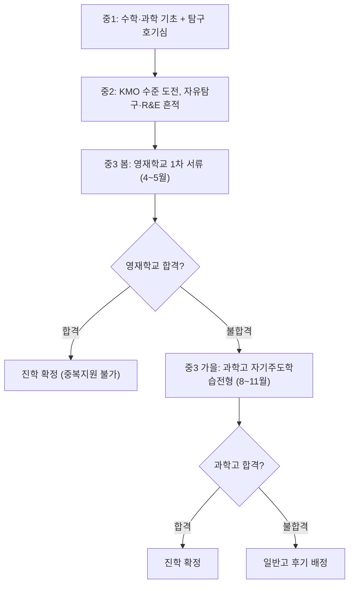

---

## 3. 외국어고 (외고)

| 항목 | 내용 |
|---|---|
| 법 | 「초·중등교육법」 (특목) |
| 모집 | 광역 단위 |
| 전공어 | 영어, 일본어, 중국어, 독일어, 프랑스어, 스페인어, 러시아어, 아랍어, 베트남어 등 |
| 전형 | 자기주도학습전형 (영어 내신 + 면접) |
| 교육과정 | 전공어 + 제2외국어 + 인문사회 비중 높음 — **과학·수학은 약함** |
| 진학 | 어문·국제·인문사회 학종 강세 / 이과 진학에는 구조적 불리 |

### 3-1. 자주 묻는 함정

```
□ 공인 영어시험 점수(TOEFL·TEPS·HSK 등) — 자소서 0점 처리
□ 어학원 수료증·해외체류 경험 — 기재 금지
□ 영어 수업·동아리·발표 기록 — 학교 내 기록만 평가
```

### 3-2. 대표 학교 (예시)

| 학교 | 위치 | 비고 |
|---|---|---|
| 대원외고 | 서울 | 어문·인문 학종 최상위 |
| 명덕외고 | 서울 | 어문 강세 |
| 대일외고 | 서울 | — |
| 한영외고 | 서울 | — |
| 김해외고 | 경남 | 지역 거점 |
| 부산외고 | 부산 | 지역 거점 |

### 3-3. 외고가 맞는 학생

| 적합 | 신중 |
|---|---|
| 언어·외국어를 즐김 | 수학·과학을 더 좋아함 |
| 어문·국제·정치외교 등 진로 | 의약학·이공계 진로 |
| 토론·글쓰기·발표가 강점 | 객관식 시험에만 강함 |

---

## 4. 국제고

| 항목 | 내용 |
|---|---|
| 법 | 「초·중등교육법」 (특목) |
| 모집 | 광역 단위 (일부 학교는 전국 모집 특례) |
| 교육과정 | 국제정치·국제경제·세계지리·국제법 등 **국제 전문 과목** + 영어 몰입 |
| 외고와의 차이 | 외고는 '전공어 깊이', 국제고는 '국제 주제 폭' |
| 진학 | 국제·사회과학·인문 학종 / 해외대학 병행 가능 |

### 4-1. 외고 vs 국제고 미세 비교

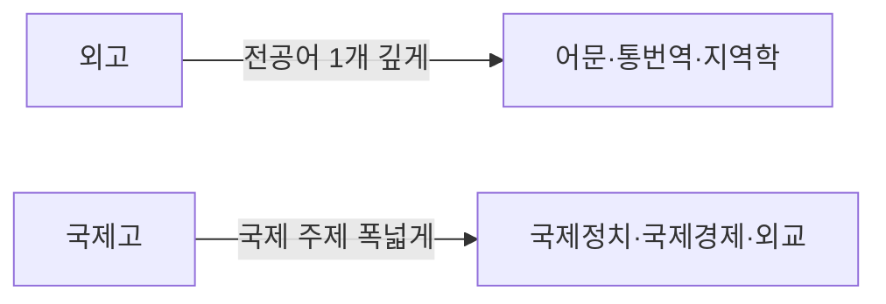

### 4-2. 대표 학교

| 학교 | 위치 |
|---|---|
| 서울국제고 | 서울 |
| 인천국제고 | 인천 |
| 청심국제고 | 가평 (전국 모집 특례) |
| 세종국제고 | 세종 |
| 부산국제고 | 부산 |
| 동탄국제고 | 화성 |
| 고양국제고 | 고양 |
| 대구국제고 | 대구 |

---

## 5. IB 인증학교

> **학교 유형이 아니라 교육과정(프로그램) 인증**입니다. 일반고든 자사고든 IB 인증을 받으면 'IB 학교'가 됩니다.

### 5-1. 인증 단계

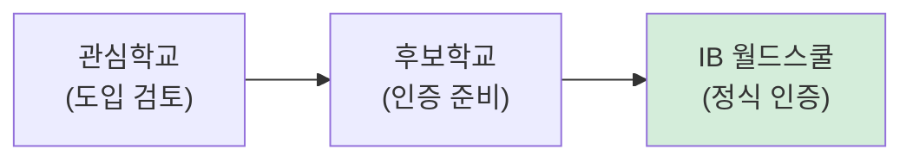

> '관심학교'와 '월드스쿨'은 수준 차이가 큽니다. **정식 IB DP 운영은 월드스쿨만** 가능.

### 5-2. 한국 IB 두 갈래

| 구분 | 영어 IB (국제학교형) | 한국어 IB (공교육형) |
|---|---|---|
| 운영 언어 | 영어 | 한국어 (수학·과학 등) |
| 대표 학교 | 외국인학교·국제학교 | 공립 일반고 (대구·제주 선도) |
| 주요 진로 | 해외대학 | 국내 학종 + 해외 병행 |
| 비용 | 높음 | 무상교육 적용 |
| 첫 공교육 인증 | — | 경북대사대부고 (2021, 공교육 최초 한·영 IB 월드스쿨) |

### 5-3. IB와 정시 — 핵심 주의

| 항목 | 특징 |
|---|---|
| 정시(수능) | IB DP 교육과정이 수능 출제 방식과 달라 **정시 사실상 불가** |
| 학종 | 논술·탐구 중심이라 학종에 최적 (★★★★★) |
| 해외 진학 | 다수 해외 대학이 IB 점수 직접 인정 |
| 국내 IB 전형 | 연세 UIC·성균관 글로벌리더학부 등 일부 국제학부 |
| 만점·기준 | 45점 만점, 42점이 서울대 일반전형 상위권 수준 |

### 5-4. 검증 체크리스트

```
□ '월드스쿨'인지 (관심·후보 단계와 구분)
□ 고교 과정 DP 운영 여부
□ 영어 IB / 한국어 IB 구분
□ 정시 포기에 학생·학부모 동의
□ 목표 대학의 IB 인정 여부 사전 확인
```

---

## 6. 자율형 공립고 (자공고)

| 항목 | 내용 |
|---|---|
| 법 | 「초·중등교육법」 (일반계) |
| 설립 형태 | **공립** + 교육과정 자율성 일부 부여 |
| 학비 | 무상교육 적용 — **사실상 0원** |
| 모집 | 광역 단위, 대부분 추첨 또는 학구 배정 |
| 교육과정 | 일반고와 유사하나 학교 특색사업·심화 운영 가능 |
| 진학 | 학종·교과·정시 모두 열림 |

> 자공고는 "공립의 안정성 + 약간의 자율성"을 가진 균형형입니다. **학비 부담 없이 자율 교육과정의 일부를 경험**하고 싶은 학생에게 적합합니다.

### 6-1. 자공고 vs 광역자사고 비교

| 항목 | 자공고 | 광역자사고 |
|---|---|---|
| 운영 주체 | 공립 | 사립 |
| 학비 | 0원 (무상교육) | 수백만 원 |
| 자율성 | 일부 | 상대적으로 큼 |
| 진학 색깔 | 일반고와 유사 | 학교별 편차 큼 |

---

## 7. 자율형 사립고 (자사고)

### 7-1. 두 갈래: 전국자사고 vs 광역자사고

| 구분 | 전국자사고 | 광역자사고 |
|---|---|---|
| 모집 | **전국 단위** | 시·도 내 |
| 기숙 | 대부분 전원 기숙 | 통학형 다수 |
| 학교 수 | 10교 (고정) | 시·도별 다수, 편차 큼 |
| 학비 | 연 1,300~3,000만+ | 수백만 |
| 학생 수준 | 최상위권 | 상위~중상위 (편차 큼) |

### 7-2. 전국자사고 10교 성향 지도

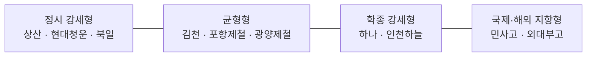

| 학교 | 위치 | 성향 |
|---|---|---|
| 하나고 | 서울 | 학종형 |
| 외대부고 | 용인 | 학종+국제형 |
| 민족사관고 | 횡성 | 학종+국제형 |
| 상산고 | 전주 | 정시·의약학 강세 |
| 현대청운고 | 울산 | 정시·의약학 강세 |
| 북일고 | 천안 | 정시 강세 |
| 김천고 | 김천 | 정시·학종 균형 |
| 인천하늘고 | 인천 | 학종형 |
| 포항제철고 | 포항 | 학종·정시 균형 |
| 광양제철고 | 광양 | 학종·정시 균형 |

### 7-3. 광역자사고 — 검증 필수

광역자사고는 같은 명칭이라도 진학 실적·교육과정 격차가 큽니다. **명칭이 아니라 데이터로 검증**:

```
□ 최근 3년 진학 실적 (수시/정시 비율)
□ 교육과정 편제표의 선택·심화과목 수
□ 학종형/정시형 색깔이 뚜렷한가
□ 학비 대비 진학 성과
```

---

## 8. 예술고 · 체육고

### 8-1. 예술고

| 항목 | 내용 |
|---|---|
| 법 | 「초·중등교육법」 (특목) |
| 분야 | 음악·미술·무용·연극영화·국악·문예창작 등 |
| 입학 전형 | **실기 비중이 압도적** (보통 70~90%) + 교과·면접 |
| 교육과정 | 전공 실기 + 일반 교과 (실기 시간 매우 많음) |
| 진학 | 대학 예체능 계열 (학종·실기 위주) |

대표 학교(예시):

| 학교 | 위치 | 특화 |
|---|---|---|
| 서울예술고 | 서울 | 음악·미술 종합 |
| 선화예술고 | 서울 | 음악·미술·무용 |
| 계원예술고 | 의왕 | 미술·디자인 |
| 국립국악고 | 서울 | 국악 특화 |
| 한국예술종합학교 부설 한국예술영재교육원 | — | 영재 교육 (학교 아님) |

### 8-2. 체육고

| 항목 | 내용 |
|---|---|
| 법 | 「초·중등교육법」 (특목) |
| 입학 전형 | 종목별 실기 + 학생부 |
| 교육과정 | 종목별 전문 훈련 + 일반 교과 |
| 진학 | 대학 체육계열, 실업팀, 프로 진출 |

대표 학교: 서울체육고, 경기체육고, 부산체육고, 광주체육고 등 시·도별 1교 내외.

### 8-3. 예체고가 맞는 학생

```
□ 초·중에 이미 전공 실기·종목 훈련을 5년 이상 누적
□ 부모와 진로(전공) 합의 완료
□ 일반 교과 시간이 줄어드는 것을 감수
□ 입시 실기 출제 경향을 사사 선생님과 함께 분석
```

---

## 9. 마이스터고 (산업수요 맞춤형 특목고)

| 항목 | 내용 |
|---|---|
| 법 | 「초·중등교육법」 (특목 — 산업수요 맞춤형) |
| 모집 | **전국 단위** |
| 학비 | **무상 + 장학금·기숙비 지원** |
| 분야 | SW·AI, 반도체, 자동차, 전기·전자, 항공, 조선해양, 에너지, 바이오, 게임 등 |
| 진학·취업 | **취업 우선** / 진학은 재직자 전형·후진학 트랙 |
| 산학연계 | 대기업·공기업과의 협약 채용·인턴십 강함 |

### 9-1. 분야별 대표 학교 (일부)

| 분야 | 학교 | 위치 |
|---|---|---|
| SW·소프트웨어 | 대덕소프트웨어마이스터고 | 대전 |
| SW·소프트웨어 | 대구소프트웨어마이스터고 | 대구 |
| 반도체 | 인천하이텍고 | 인천 |
| 반도체 | 구미전자공업고 | 구미 |
| 자동차 | 평택기계공업고 | 평택 |
| 항공 | 한국항공고 | 사천 |
| 조선해양 | 거제공업고 | 거제 |
| 에너지 | 한국에너지마이스터고 | 충주 |
| 게임 | 한국애니메이션고 | 하남 |
| 바이오 | 한국바이오마이스터고 | 진천 |

### 9-2. 진로지도 — 마이스터고 vs 일반 특성화고

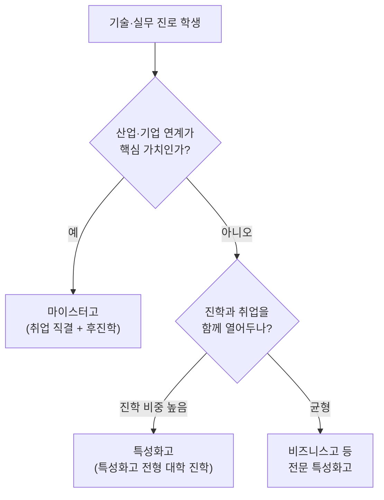

### 9-3. 자주 묻는 질문

| 질문 | 답 |
|---|---|
| 마이스터고 가면 대학 못 가나요? | 졸업 후 취업 → 3년 이상 재직 시 **재직자 전형**으로 대학 진학 가능 |
| 어떤 학생에게 맞나요? | 손으로 만들고 실습하는 게 즐겁고, 빠른 사회 진출과 후진학 트랙을 원하는 학생 |
| 학비 부담이 큰가요? | 무상 + 기숙·실습비 지원이 풍부 — 가계 부담 가장 낮음 |

---

## 10. 비즈니스고 (상업·경영·금융 계열 특성화고)

UI에서 '비즈니스고'로 분류된 학교들은 공식적으로는 **특성화고 중 상업·경영·금융·마케팅 계열**에 해당합니다. 전통적 명칭으로는 '상업고등학교'였고, 현재는 대부분 특성화고로 전환·재명명되었습니다.

| 항목 | 내용 |
|---|---|
| 법 | 「초·middle등교육법」 (특성화고) |
| 분야 | 회계·금융·세무·경영정보·마케팅·유통·창업·전자상거래·국제비즈니스 |
| 자격 | 전산회계·전산세무·FAT·TAT·증권투자·ITQ·MOS·유통관리사 등 |
| 진학·취업 | 금융권·공공기관 고졸채용, 회계사무·세무사무, 특성화고 전형 대학 진학 |

### 10-1. 대표 학교 (예시)

| 학교 | 위치 | 특화 |
|---|---|---|
| 서울여자상업고 | 서울 | 금융·회계 명문 |
| 덕수고(舊 덕수상업고) | 서울 | 금융·세무 |
| 선린인터넷고 | 서울 | 정보·금융 융합 |
| 부산경영과학고 | 부산 | 경영·정보 |
| 인천기계공업고 (경영과) | 인천 | 경영 트랙 |
| 대구상원고 | 대구 | 회계·금융 |
| 광주여자상업고 | 광주 | 금융·세무 |
| 한국금융고 (특성화) | 인천 | 금융 특화 |

> 학교명에 '여상' '상업' '경영' '금융' '비즈니스' '인터넷' 등이 들어가는 특성화고가 비즈니스고 카테고리에 속합니다.

### 10-2. 비즈니스고 진학 트랙

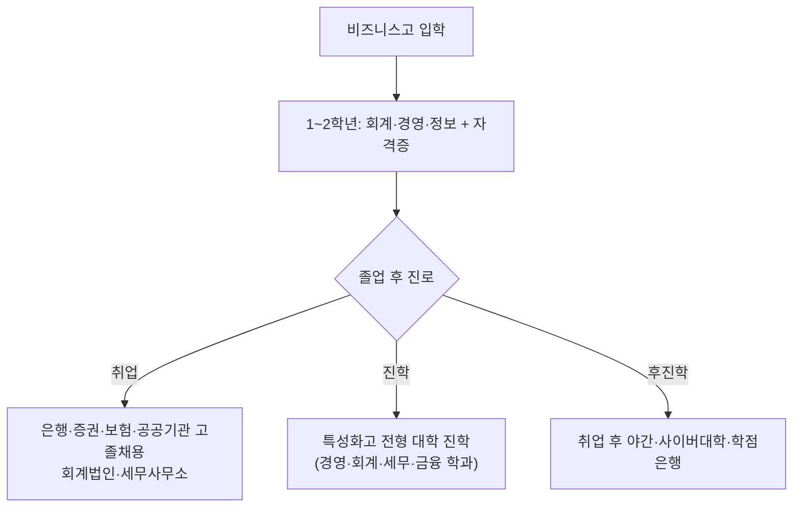

### 10-3. 비즈니스고가 맞는 학생

| 적합 | 신중 |
|---|---|
| 숫자·돈·시장에 관심 | 글쓰기·창작 중심 진로 지향 |
| 자격증 취득을 즐김 | 자유로운 탐구·이론을 선호 |
| 빠른 사회 진출 + 후진학 가능 | 대학 4년 정규 진학이 1순위 |
| 금융·공공기관 고졸채용에 매력 | 의약학·이공계 연구 진로 |

---

## 11. 일반고 (학군지·갓반고)

| 항목 | 내용 |
|---|---|
| 법 | 「초·중등교육법」 (일반계) |
| 모집 | 평준화 지역은 추첨 배정 / 비평준화는 내신·선발 |
| 학비 | 무상교육 — 0원 |
| 교육과정 | 국가 표준 + 학교별 진로선택·심화과목 |
| 진학 | **교과+학종+정시 모두 열림** (가장 폭넓은 트랙) |

### 11-1. '갓반고' = 학군지 우수 일반고

대치·목동·중계·분당·평촌·노원·반포·잠실 등 학군지 일반고. 정시 성과가 강하고 학생 수가 많아 **1등급(상위 10%) 확보 인원이 많은** 점이 2028 5등급제와 잘 맞물립니다.

| 강점 | 약점 |
|---|---|
| 1등급 확보 인원 多 → 교과전형·학종에 유리 | 사교육 의존도 높음 |
| 정시 노하우 축적 | 학교별 세특 운영 질 편차 |
| 학비 부담 0원 | 학군 진입 자체가 부동산 비용 |

### 11-2. 학군지 외 일반고 — 검증 포인트

```
□ 최근 3년 진학 실적 (수시·정시·재수생 비율)
□ 교육과정 편제표의 진로선택·심화과목 수
□ 학종 합격자가 꾸준히 배출되는가
□ 세특 운영(탐구·발표·보고서) 활발도
□ 학교알리미의 동아리·자율활동 현황
```

> 일반고의 가장 큰 강점은 **선택지가 넓다**는 것입니다. 진로가 아직 미정인 중학생에게는 가장 안전하고 가장 유연한 선택지입니다.

---

## 12. 특성화고 (직업계 + 대안교육) — 비즈니스·마이스터 외

비즈니스고·마이스터고를 제외한 나머지 특성화고를 분야별로 묶었습니다.

### 12-1. 직업계 특성화고 분야

| 분야 | 대표 학교 (예시) | 자격·진로 |
|---|---|---|
| IT·소프트웨어 | 선린인터넷고, 디지미디어고, 서울아이티고 | 정보처리·SQLD·리눅스마스터 |
| 디자인·미디어 | 한국애니메이션고, 미림여자정보과학고 | GTQ·웹디자인 |
| 조리·외식 | 한국조리과학고, 서울관광고 | 한식·양식·제과제빵 자격 |
| 보건·간호 | 서울아이티고(舊 일부 학과), 보건계 특성화고 | 보건교육사·간호조무사 |
| 농업·바이오 | 서울농업생명과학고, 김제농생고 | 농업·식품가공 |
| 패션·뷰티 | 한국디자인고, 정화여고 | 패션디자인·미용 |
| 자동차·기계 | 인천기계공업고, 부산기계공업고 | 정비·CAD·CNC |
| 관광·항공서비스 | 한국관광고, 서울관광고 | 관광통역·서비스 |

### 12-2. 대안교육 특성화고

| 학교 | 위치 | 철학 |
|---|---|---|
| 이우학교 | 성남 | 생태·인문 대안교육 |
| 간디학교 | 산청 | 생태·자율 |
| 풀무농업고등기술학교 | 홍성 | 농업·공동체 |
| 영산성지고 | 영광 | 인성·노작 |
| 양업고 | 청주 | 신앙·인성 |

### 12-3. 특성화고 전형 — 대학 진학 트랙

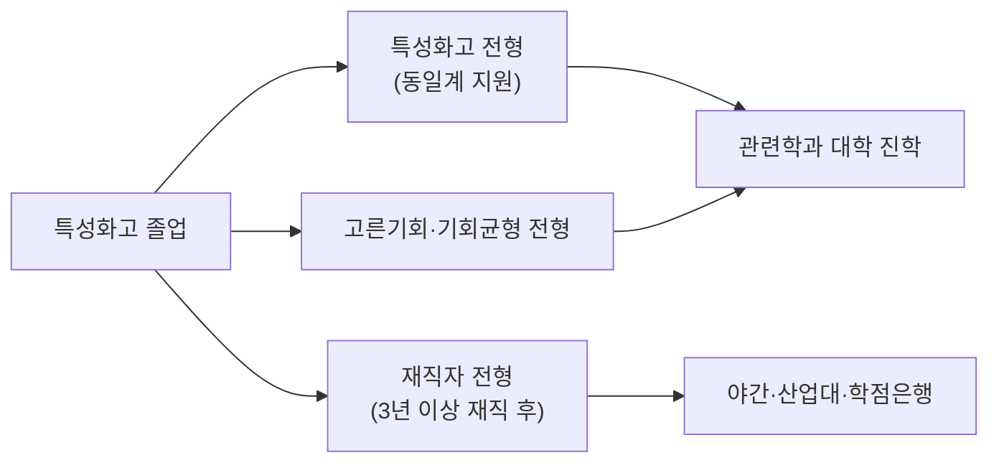

---

## 13. 학교 유형 결정 알고리즘 (의사결정 트리)

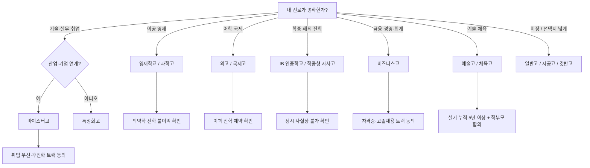

### 13-1. 학생 유형 × 학교 유형 매칭

| 학생 유형 | 1순위 | 2순위 | 피해야 할 학교 |
|---|---|---|---|
| 이공 영재 + 연구 지향 | 영재학교 | 과학고 | 외고·국제고 |
| 이공 + 의약학 지망 | 갓반고 / 학종형 자사고 | 일반고 | 영재학교·과학고 |
| 어학·국제 지향 | 외고·국제고 | 국제형 자사고 (외대부·민사) | 마이스터고 |
| 토론·서술·논술 강점 | IB 인증학교 / 학종형 자사고 | 우수 일반고 | 정시형 자사고 |
| 수능 강세 + 자기주도 | 정시형 자사고 (상산·현대청운) | 갓반고 | IB / 학종 올인 학교 |
| 예술·체육 5년 이상 | 예술고·체육고 | 일반고 + 입시 미술학원 | 학종형 자사고 |
| 기술 실무 + 빠른 사회진출 | 마이스터고 | 분야별 특성화고 | 일반고 |
| 금융·회계·경영 지향 | 비즈니스고 | 마이스터고 (경영·금융 분야) | 외고 |
| 진로 미정 + 균형 | 일반고 / 자공고 | 갓반고 | 정체 불분명 광역자사고 |

---

## 14. 카테고리별 학교 수 (UI 카드 기준)

> UI 카드의 학교 수는 **대표 학교만 큐레이션한 표본**입니다. 실제 한국 전체 학교 수와는 다릅니다. 카드의 학교 수를 출발점으로 삼되, '고입정보포털'에서 전체 목록을 확인하세요.

| UI 카테고리 | UI 카드 학교 수 | 한국 전체 (대략) |
|---|---|---|
| 과학고 · 영재고 | 16 | 영재학교 8 + 과학고 약 20교 |
| 외국어고 | 16 | 외고 약 28교 |
| 국제고 | 15 | 국제고 약 9교 + 국제 트랙 |
| IB 인증학교 | 15 | 월드스쿨 + 후보·관심학교 합산 360+ |
| 자율형 공립고 | 12 | 자공고 30~40교대 (지정 변동) |
| 자율형 사립고 | 12 | 전국자사고 10 + 광역자사고 20여 교 |
| 예술고 · 체육고 | 13 | 예술고 28교 + 체육고 16교 |
| 마이스터고 | 16 | 약 57교 (지정 확대 추세) |
| 비즈니스고 | 11 | 상업·경영 계열 특성화고 100+ |
| 일반고 (학군지) | 13 | 전국 일반고 1,500+ / 학군지 표본 |

### 14-1. 정확한 학교 목록을 확인할 곳

| 정보 | 사이트 |
|---|---|
| 고입 전형·학교 목록 | 고입정보포털 hischool.go.kr |
| 학교 공시 (학비·교육과정·진학실적) | 학교알리미 schoolinfo.go.kr |
| 영재학교 | 국가과학영재정보서비스 NSGI csa.nise.re.kr |
| IB 학교 | IBO 학교검색 ibo.org/programmes/find-an-ib-school |
| 마이스터고 | 한국직업능력연구원·교육부 직업교육 페이지 |

---

## 15. 중학생을 위한 통합 행동 알고리즘

```
[중1] 탐색의 해
  ├─ 자유학기제로 다양한 분야 시도
  ├─ 강한 분야 1차 후보 3개 적기 (이공/어학/예술/실무/균형)
  └─ 후보 카테고리(§2~§12) 1회독

[중2] 데이터를 만드는 해
  ├─ 첫 정식 내신 — 국·영·수·사·과 균형
  ├─ 강점 분야 깊이 1개 (대회·동아리·탐구)
  ├─ 후보 학교 5곳 1차 압축
  └─ 영재학교 지망자: KMO·과학탐구대회 등 실전 데이터 축적

[중3 봄] 의사결정의 해
  ├─ §13 알고리즘으로 카테고리 확정
  ├─ 영재학교 지원자: 4~5월 1차 서류 (전국 단위)
  └─ 학교 설명회 · 교육과정 편제표 확인

[중3 가을] 집행
  ├─ 자기소개서 초안 → 첨삭 → 최종
  ├─ 전기고 원서접수 (8~12월)
  └─ 2단계 면접 대비

[중3 겨울] 후기·마무리
  ├─ 전기고 발표 → 불합격 시 후기 일반고 모드 즉시 전환
  └─ 합격교 예비소집·고1 선행 준비
```

### 15-1. 절대 놓치면 안 되는 5가지

```
1. 영재학교 합격 시 다른 고교 중복지원 금지
2. 자기소개서에 외부 수상·어학시험 점수 쓰면 0점
3. 자기주도학습전형은 중2 내신부터 본다
4. 영재학교·과학고는 의약학 진학 불이익
5. IB 인증학교·학종형 자사고는 정시 사실상 불가
```

---

## 16. 카테고리별 대입 특징 · 합격 준비 · 장단점 종합 분석

각 카테고리를 **① 대입에서의 특징 ② 중학생이 합격하기 위한 준비 ③ 다른 고교와의 결정적 차이 ④ 장단점 ⑤ 내신·학종 수준** 5개 축으로 깊이 분석합니다.

### 16-0. 전체 카테고리 한눈 비교 (대입·내신·학종)

| 카테고리 | 대입 주력 루트 | 내신 난이도 | 내신 1등급 확보 | 학종 자원 수준 | 정시 가능성 | 추천 학생상 |
|---|---|---|---|---|---|---|
| 영재학교 | 학종·특기자 | ★★★★★ | 거의 불가 | ★★★★★ (R&E) | ★☆☆☆☆ | 연구·이공 영재 |
| 과학고 | 학종 | ★★★★★ | 매우 어려움 | ★★★★☆ | ★★☆☆☆ | 이공 + 조기졸업 지향 |
| 외고 | 학종 (어문·국제) | ★★★★☆ | 어려움 | ★★★★☆ (어문) | ★★★☆☆ | 어학·인문 |
| 국제고 | 학종 (국제·사회) | ★★★★☆ | 어려움 | ★★★★☆ (국제) | ★★★☆☆ | 글로벌·외교 |
| IB 인증학교 | 학종·해외 | ★★★★☆ | 학교별 차이 | ★★★★★ (논술·연구) | ★☆☆☆☆ | 서술·탐구형 |
| 자공고 | 학종+교과+정시 | ★★★☆☆ | 일반고 수준 | ★★★☆☆ | ★★★★☆ | 균형·안정형 |
| 전국자사고 (학종형) | 학종 | ★★★★★ | 매우 어려움 | ★★★★★ | ★★★☆☆ | 자기주도·탐구 |
| 전국자사고 (정시형) | 정시 | ★★★★★ | 매우 어려움 | ★★★☆☆ | ★★★★★ | 수능 강세·의약학 |
| 광역자사고 | 학종 | ★★★★☆ | 학교별 편차 | ★★★☆☆ | ★★★☆☆ | 학교별 검증 필수 |
| 예술고·체육고 | 실기 + 학종 | ★★★☆☆ | 학교별 | ★★☆☆☆ (실기 중심) | ★☆☆☆☆ | 실기 5년+ |
| 마이스터고 | **취업 우선** / 재직자 전형 | ★★★☆☆ | 비교적 무난 | ☆ (별도 트랙) | ☆ | 기술·취업 지향 |
| 비즈니스고 | 취업 + 특성화고 전형 | ★★★☆☆ | 비교적 무난 | ☆ (별도 트랙) | ☆ | 금융·실무 지향 |
| 일반고 (학군지/갓반고) | 정시 + 학종 | ★★★★☆ | 인원 多 → 확보 가능 | ★★★☆☆ | ★★★★★ | 정시·균형형 |
| 일반고 (평준화) | 교과+학종+정시 | ★★★☆☆ | **가장 유리** | ★★☆☆☆~★★★ | ★★★★☆ | 진로 미정·안정 |

> 표 읽는 법: **별점은 절대값이 아니라 카테고리 간 상대 비교**입니다. "학종 자원 ★★★★★"은 비교과·세특 소재가 풍부하다는 뜻이고, "내신 1등급 확보"는 2028 5등급제(상위 10%) 기준으로 평가했습니다.

---

### 16-1. 영재학교 — 대입·합격·장단점

#### 대입에서의 특징

| 항목 | 내용 |
|---|---|
| 진학 루트 | **거의 전원 수시** — 학종·특기자(과학특기자) |
| 2026 서울대 비중 | 수시최초 합격자의 약 19.5% (역대 최고) |
| KAIST·POSTECH | KAIST 정원의 약 절반이 영재학교 출신 |
| 의약학 | **교육비 환수 + 학교 추천 제한** — 사실상 봉쇄 |
| 정시 가능성 | 교육과정이 수능과 무관 → 정시 ★☆☆☆☆ |

#### 합격하기 위해 중학생이 해야 할 것

```
[중1~중2 상반기] 토대 구축
   □ 수학: 중등 전 과정 + 고등 수학(상·하) 자기학습
   □ 과학: 물·화·생·지 1과목 이상 깊이 (실험 노트 작성)
   □ 영재교육원(KAIST 부설, 대학 부설) 수료 — 가산점 아닌 '검증'

[중2 후반~중3 봄] 영재성 검증 준비
   □ KMO·과학탐구올림피아드 도전 (수상보다 도전 과정 기록)
   □ 자유탐구 1주제 — 보고서 형식 작성
   □ 학교 과학·수학 동아리 핵심 역할

[중3 4~5월] 1차 서류
   □ 자기소개서: 학습경험 → 탐구경험 → 진로계획
   □ 추천서: 담임·과학·수학 교사
   □ 학생부 — 중2~중3 내신 + 세특 + 과학·수학 활동

[중3 5~6월] 2차 영재성검사
   □ 수학·과학 사고력 문제 (서술형, 풀이 과정 평가)
   □ 평소 문제풀이 노트로 '풀이 과정 표현력' 훈련

[중3 6월] 3차 캠프
   □ 1박 2일 합숙: 협업·토론·연구 시뮬레이션
   □ 인성·협업 태도 함께 평가
```

#### 다른 고교와의 결정적 차이

| 비교 대상 | 영재학교의 차별점 |
|---|---|
| vs 과학고 | 전국 단위 · 무학년 학점제 · R&E 졸업논문 필수 · 더 깊은 연구 |
| vs 전국자사고 | 정시 트랙 없음 · 의약학 봉쇄 · 학비 vs 부대비용 구조 |
| vs IB 학교 | 인문·예술이 아닌 **수·과학 단일 트랙** |

#### 장단점

| 장점 | 단점 |
|---|---|
| 서울대·KAIST 진학률 압도적 | 의약학 진학 사실상 불가 |
| R&E·졸업논문이 학종 최강 자산 | 정시 옵션 닫힘 |
| 또래 자극 · 연구 인프라 최고 | 내신 1등급 극도로 어려움 |
| 학비 자체는 낮음 (부대비용은 있음) | 진로 변경 시 강점 살리기 어려움 |
| 무학년 학점제로 대학 수준 학습 | 기숙 의무 — 자기관리 부담 |

#### 내신·학종 수준

- **내신**: 학생 전원이 전국 최상위 → 상위 10%(1등급) 확보가 사실상 어려움. 단, 학종 평가에서는 '영재학교의 5등급'을 일반고의 1~2등급 수준으로 환산하는 경향이 정성평가에 존재.
- **학종**: R&E·졸업논문·심화과목·해외 학회 참여 등 **세특 자원이 최고 수준**. 학종 정성평가에서 거의 무적.

---

### 16-2. 과학고 — 대입·합격·장단점

#### 대입에서의 특징

| 항목 | 내용 |
|---|---|
| 진학 루트 | 학종 중심 (수시 80% 이상) |
| 조기졸업 | 2년 만에 조기졸업 → KAIST·UNIST·DGIST 등 이공계 특성화대 |
| 의약학 | **불이익 동일** — 교육비 환수 |
| 정시 | 일부 가능하나 수능 대비 시간 부족 |

#### 합격하기 위해 중학생이 해야 할 것

```
[중1~중2] 수·과학 깊이
   □ 수학: 중등 심화 + 고1 수학 선행
   □ 과학: 학교 실험 보고서 누적 + 1과목 깊이
   □ 과학동아리 핵심부원 / 자유탐구 기록

[중2 내신] 자기주도학습전형 시작점
   □ 국·영·수·사·과 균형, 특히 수·과 A 유지
   □ 2학기부터 수학·과학 세특에 탐구 흔적 만들기

[중3 8~9월] 1단계 서류 제출
   □ 학생부 + 자기소개서 + 학습계획서
   □ 1단계 1.5~2배수 통과 (내신+서류)

[중3 10~11월] 2단계 면접
   □ 수학·과학 사고력 질문
   □ 자기소개서 기반 진로·인성 질문
   □ 모의면접 5~10회
```

#### 다른 고교와의 결정적 차이

| 비교 대상 | 과학고의 차별점 |
|---|---|
| vs 영재학교 | 광역 단위 · 「초중등교육법」 · **조기졸업 가능** |
| vs 자사고 | 수·과학 단일 트랙 · 학종 일색 |
| vs 일반고 | 또래 수준·심화과목·실험 인프라 압도 |

#### 장단점

| 장점 | 단점 |
|---|---|
| 학비 부담 낮음 | 의약학 봉쇄 |
| 조기졸업으로 1년 단축 가능 | 비이공계 전향 시 강점 소실 |
| KAIST·UNIST 등 특성화대 진학 강함 | 내신 경쟁 치열 |
| 광역 모집 → 통학 가능 | 정시 옵션 약함 |

#### 내신·학종 수준

- **내신**: 한 학년 60~120명 규모로 변별이 크게 작동. 1등급 확보 어렵지만, 학종 평가에서 정성 보정.
- **학종**: 과제연구·실험 보고서·R&E가 핵심 무기. 영재학교보다 약간 낮으나 일반고 대비 압도적.

---

### 16-3. 외국어고 — 대입·합격·장단점

#### 대입에서의 특징

| 항목 | 내용 |
|---|---|
| 진학 루트 | 학종 (어문·국제·인문사회 계열) |
| 2026 서울대 | 대원외고 약 28명(공동 1위), 어문·인문 학종에서 최강 |
| 이과 진학 | **구조적 불리** — 과학·수학 심화 부족 |
| 정시 | 가능하나 어문·인문 한정 |

#### 합격하기 위해 중학생이 해야 할 것

```
[중1~중2] 영어를 '시험 점수'가 아니라 '학교 안 활동'으로
   □ 영어 수업 발표·토론에 깊이 참여
   □ 영자신문·영어 동아리 핵심 역할
   □ 제2외국어 1개 사전 학습 (전공어 선택용)
   □ ⚠️ TOEFL·TEPS 점수는 자소서에 쓸 수 없음

[중2~중3 초] 자기주도학습전형 준비
   □ 영어 내신 — 2~3학년 1~2학기 A 유지
   □ 국어·사회·역사도 동반 상승
   □ 독서록: 영어·국제 주제 누적

[중3 8~9월] 자기소개서 + 면접
   □ '왜 영어인가' '왜 이 학교인가' 구체적
   □ 학생부 기반 질문 (영어 수업 활동 사례)
```

#### 다른 고교와의 결정적 차이

| 비교 대상 | 외고의 차별점 |
|---|---|
| vs 국제고 | **전공어 1개 깊이** (국제고는 국제 주제의 폭) |
| vs 자사고 | 어문·인문 단일 트랙 — 이과 진학 어려움 |
| vs 일반고 | 어문 학종 자원·또래 수준 압도 |

#### 장단점

| 장점 | 단점 |
|---|---|
| 어문·국제 학종 최강 | 이과·의약학 진학 매우 어려움 |
| 제2외국어 자연 습득 | 과학·수학 심화과목 부족 |
| 해외 교환·국제교류 풍부 | 사립 외고는 학비 부담 |
| 졸업생 네트워크 강함 | 진로 미정 학생에게는 좁은 트랙 |

#### 내신·학종 수준

- **내신**: 어문 우수 학생 밀집 → 영어·국어 1등급 확보 어렵지만, 어문 세특 자원은 최상.
- **학종**: 어문·국제 세특이 풍부하나 **이과 세특은 빈약** — 이과 전향 시 치명적.

---

### 16-4. 국제고 — 대입·합격·장단점

#### 대입에서의 특징

| 항목 | 내용 |
|---|---|
| 진학 루트 | 학종 (국제정치·국제경제·외교 등) |
| 해외 진학 | 영어 몰입 + 국제 과목 → 해외대학 병행 가능 |
| 외고와의 차이 | 외고는 어문 깊이, 국제고는 국제 주제 폭 |

#### 합격하기 위해 중학생이 해야 할 것

```
[중1~중3] 국제·시사 감수성
   □ 영자신문·BBC News·뉴욕타임스 학생판 정기 독해
   □ 모의유엔(MUN)·국제토론 동아리
   □ 한국사·세계사 깊이
   □ 사회·정치·경제 시사 노트

[중3] 자소서·면접
   □ '왜 국제고인가' — 구체적 진로(외교관·국제기구·국제경영)
   □ 영어 면접 가능성 대비
```

#### 다른 고교와의 결정적 차이

| 비교 대상 | 국제고의 차별점 |
|---|---|
| vs 외고 | 전공어 없음, 대신 **국제 전문 교과** 다수 |
| vs 자사고 국제형 | 공립이면 학비 낮음, 정원·규모 작음 |
| vs IB 학교 | 한국 학종 친화적 (IB는 정시 닫힘) |

#### 장단점

| 장점 | 단점 |
|---|---|
| 국제·외교·국제경영 진로 최적 | 학교 수가 적음 (전국 약 9교) |
| 영어 몰입 환경 | 이과 진학 어려움 |
| 공립 다수 → 학비 부담 낮음 | 청심국제고 등 일부만 전국 모집 |
| 모의유엔·국제교류 풍부 | 학종 외 트랙 약함 |

#### 내신·학종 수준

- **내신**: 외고와 비슷한 수준. 사회·국어·영어 1등급 경쟁 치열.
- **학종**: 국제·사회 세특이 강하나 자연계 약함.

---

### 16-5. IB 인증학교 — 대입·합격·장단점

#### 대입에서의 특징

| 항목 | 내용 |
|---|---|
| 진학 루트 | 학종 + 해외대학 직접 인정 |
| 정시 | **사실상 불가** — IB DP 교육과정이 수능과 무관 |
| 국내 인정 전형 | 연세 UIC·성균관 글로벌리더 등 일부 국제학부 |
| 점수 기준 | 45점 만점, 42점 = 서울대 일반전형 상위권 수준 |

#### 합격하기 위해 중학생이 해야 할 것

```
[중1~중3] 서술·탐구·논술 체질 만들기
   □ 일기·에세이를 주 1회 누적
   □ 책 한 권을 '주장-근거-반론' 구조로 요약 훈련
   □ 발표·토론에 적극 참여 (객관식 의존 탈피)
   □ 자기주도 프로젝트 1~2개 (Personal Project 예행)

[중3 초] 학교 선택
   □ '월드스쿨'인지 확인 (관심·후보 학교 제외)
   □ 영어 IB / 한국어 IB 선택
   □ 정시 포기 동의 — 학부모 합의 필수

[지원 시점] 학교별 다름
   □ 공립 한국어 IB: 일반고 평준화 배정 또는 자율 지원
   □ 사립·국제학교 IB: 자체 입학 시험 (영어·수학·면접)
```

#### 다른 고교와의 결정적 차이

| 비교 대상 | IB 학교의 차별점 |
|---|---|
| vs 일반고 | 객관식 시험 없음, **서술·내부평가 100%** |
| vs 외고·국제고 | 외고는 한국 학종 친화적, IB는 해외 친화적 |
| vs 자사고 학종형 | 학종 비슷하나 정시 옵션이 IB는 없음 |

#### 장단점

| 장점 | 단점 |
|---|---|
| 해외대학 직접 인정 | 정시 사실상 불가 |
| 서술·탐구·논술 역량 극대화 | 국내 IB 전형 아직 제한적 |
| Extended Essay = 자기주도 연구 자산 | 과제·내부평가 부담 매우 큼 |
| 공교육형은 학비 부담 없음 | 객관식 학습자에게 비효율 |

#### 내신·학종 수준

- **내신**: 학교별 차이 크나, IB 점수가 사실상 내신을 대체.
- **학종**: EE(Extended Essay)·TOK(Theory of Knowledge)·CAS 활동이 학종 정성평가에 강력하게 작용.

---

### 16-6. 자율형 공립고 (자공고) — 대입·합격·장단점

#### 대입에서의 특징

| 항목 | 내용 |
|---|---|
| 진학 루트 | 교과·학종·정시 모두 열림 (일반고 유사) |
| 학비 | 무상교육 — 0원 |
| 특색 | 학교별 특색사업·진로선택과목 다양 |

#### 합격하기 위해 중학생이 해야 할 것

```
[지원 방식] 대부분 추첨 or 학구 배정
   □ 중학교 내신 — 일반고 배정과 동일 기준
   □ 일부 자공고는 자기주도학습전형 적용 (학교별 확인)
   □ 지역·통학 거리 우선
```

#### 다른 고교와의 결정적 차이

| 비교 대상 | 자공고의 차별점 |
|---|---|
| vs 일반고 | 교육과정 자율 + 학교 특색 사업 |
| vs 광역자사고 | **공립 → 학비 0원** |
| vs 갓반고 | 학군과 무관, 운영 자율성 위주 |

#### 장단점

| 장점 | 단점 |
|---|---|
| 학비 부담 0원 | 자율성은 자사고보다 약함 |
| 일반고 트랙 그대로 + α | 학교별 특색·운영 편차 |
| 교과·학종·정시 모두 가능 | '자율형'이라는 이름값은 약함 |

#### 내신·학종 수준

- **내신**: 일반고와 유사. 학교별로 우수 자공고는 갓반고에 근접.
- **학종**: 학교 특색 사업·진로선택과목으로 세특 자원 보강 가능.

---

### 16-7. 자율형 사립고 (자사고) — 대입·합격·장단점

#### 7-A. 전국자사고 (학종형: 하나·외대부·민사·인천하늘)

| 항목 | 내용 |
|---|---|
| 대입 주력 | 학종 + 일부 정시 |
| 2026 서울대 | 외대부고 약 64명(전국 최다급) · 하나고 수시 약 20명 |
| 학비 | 연 1,300~1,800만 (3년 4~5천만+) |

**중학생 합격 준비**
```
□ 중2~중3 내신 5과목 균형 (A 다수)
□ 자기주도학습 보고서·독서 누적
□ 진로 동아리 깊이 1개 (학종 트랙 명확화)
□ 자기소개서: 학습경험 → 탐구 → 진로 → 지원동기 일관성
□ 면접: 학생부 기반 + 인성 (모의면접 10회 이상)
```

#### 7-B. 전국자사고 (정시형: 상산·현대청운·북일)

| 항목 | 내용 |
|---|---|
| 대입 주력 | **정시 + 의약학 강세** |
| 상산고 2026 서울대 | 약 29명 중 정시 26명 |
| 의약학 합격 | 전국 최상위 |

**중학생 합격 준비**
```
□ 수학·과학 선행 강도 높음 (고1 수학 선행 권장)
□ 내신 + 수능형 객관식 시험 적응력
□ 자기소개서: 수능형 자기주도 학습 강조
□ 진로: 의약학·이공 등 정시 트랙 분명
```

#### 7-C. 광역자사고

| 항목 | 내용 |
|---|---|
| 대입 주력 | 학종 중심 (학교별 편차 큼) |
| 검증 | 명칭이 아니라 진학실적·교육과정 |

**중학생 합격 준비**
```
□ 시·도 내 지원 — 통학 거리 확인
□ 내신 5과목 균형
□ 자기소개서·면접 (학교별 형식 다름)
□ ⚠️ '애매한 학교' 회피 — 최근 3년 실적 확인 필수
```

#### 다른 고교와의 결정적 차이

| 비교 대상 | 자사고의 차별점 |
|---|---|
| vs 일반고 | 교육과정 자율권 (학교별 색깔) |
| vs 영재학교·과학고 | 정시 트랙 가능 · 의약학 가능 |
| vs 자공고 | 사립 → 학비 부담 큼 |
| vs 외고·국제고 | 종합 트랙 (이과·문과 모두) |

#### 장단점 (전국자사고 기준)

| 장점 | 단점 |
|---|---|
| 학종·정시 양쪽 다 강함 (학교 색깔에 따라) | 학비 3년 4~5천만+ |
| 또래 자극·기숙·집중 학습 | 기숙 생활 적응 부담 |
| 비교과·세특 자원 풍부 (학종형) | 색깔과 학생 불일치 시 무너짐 |
| 의약학 진학 가능 (영재·과고와 차별점) | 1등급 확보 매우 어려움 |

#### 내신·학종 수준

- **내신**: 전국자사고는 최상위권 밀집으로 매우 어려움. 광역자사고는 학교별 편차.
- **학종**: 학종형(하나·외대부·민사·인천하늘) ★★★★★ / 정시형(상산·현대청운·북일) ★★★☆☆.

---

### 16-8. 예술고 · 체육고 — 대입·합격·장단점

#### 대입에서의 특징

| 항목 | 내용 |
|---|---|
| 진학 루트 | **실기 + 학종** (예체능 계열) |
| 정시 | 비중 매우 낮음 |
| 학종 | 실기 + 학생부 정성평가 |
| 진로 | 음대·미대·체대·예술학교 |

#### 합격하기 위해 중학생이 해야 할 것

```
[초~중] 실기 누적 5년 이상이 사실상 전제
   □ 음악: 콩쿠르·연주회 경력
   □ 미술: 입시 미술학원 + 포트폴리오
   □ 체육: 종목별 대회 입상·선수 등록

[중2~중3] 학교별 실기 출제 경향 분석
   □ 사사 선생님과 학교별 입시곡·과제 매칭
   □ 학교 설명회 참석 + OB 후기

[중3] 원서·실기·면접
   □ 학교별 실기 시험 (전체 평가의 70~90%)
   □ 학생부 + 면접 + (학교에 따라) 영어/국어 시험
```

#### 다른 고교와의 결정적 차이

| 비교 대상 | 예술고·체육고의 차별점 |
|---|---|
| vs 일반고 + 학원 | 실기 시간 보장 + 또래 자극 |
| vs 자사고 | 실기 입학 + 단일 트랙 |
| vs 영재학교 | 학문이 아닌 **실기 영재** |

#### 장단점

| 장점 | 단점 |
|---|---|
| 실기 시간 보장 + 전문 교사 | 일반 교과 시간 적음 |
| 또래 자극·연주·전시·시합 풍부 | 진로 변경 시 일반 대학 진학 어려움 |
| 진학 트랙 명확 | 사립 예고는 학비 큼 |

#### 내신·학종 수준

- **내신**: 일반 교과는 평이하나 실기 평가가 절대적.
- **학종**: 실기 + 학생부 정성평가가 핵심. 일반 학종과 다른 트랙.

---

### 16-9. 마이스터고 — 대입·합격·장단점

#### 대입에서의 특징

| 항목 | 내용 |
|---|---|
| 주력 트랙 | **취업 우선** (졸업 시 90%+ 취업) |
| 진학 | 졸업 후 3년 재직 → **재직자 전형**으로 대학 진학 |
| 후진학 | 야간·사이버대학·산업대 가능 |
| 산학연계 | 대기업·공공기관 협약 채용 |

#### 합격하기 위해 중학생이 해야 할 것

```
[중1~중2] 진로 확신
   □ 분야 체험 (SW·반도체·자동차·항공 등)
   □ 코딩·메이커·실습 동아리

[중2~중3] 내신 + 적성
   □ 국·영·수 + 과학·기술 내신 균형
   □ 학교별 적성검사·면접 (실습 적성 평가)

[중3] 원서
   □ 전국 단위 모집 — 분야별 학교 선택
   □ 자기소개서: 진로 확신 + 산업 이해
```

#### 다른 고교와의 결정적 차이

| 비교 대상 | 마이스터고의 차별점 |
|---|---|
| vs 일반 특성화고 | 산업수요 맞춤 + 기업 협약 채용 |
| vs 일반고 | 취업이 1순위, 진학은 후진학 |
| vs 자사고 | 학비 무상 + 장학 + 기숙 지원 |

#### 장단점

| 장점 | 단점 |
|---|---|
| 학비 무상 + 장학금 | 일반 대학 직진학 트랙 약함 |
| 졸업 시 안정적 취업 | 진로 변경 어려움 |
| 대기업·공기업 협약 | 학종 트랙은 사실상 없음 |
| 빠른 사회 진출 (19세 취업) | 학력 인플레 사회에서 만학 부담 |

#### 내신·학종 수준

- **내신**: 비교적 무난, 전공 실습 비중이 큼.
- **학종**: 일반 학종과 다른 트랙. 자격증·취업·산업 이해도가 평가 핵심.

---

### 16-10. 비즈니스고 (상업·금융·경영 특성화고) — 대입·합격·장단점

#### 대입에서의 특징

| 항목 | 내용 |
|---|---|
| 주력 트랙 | 취업 (은행·증권·공공기관 고졸채용) + 진학 |
| 진학 전형 | **특성화고 전형** — 동일계 대학 진학 |
| 자격증 | 전산회계·전산세무·FAT·증권투자권유대행인·ITQ 등 |
| 후진학 | 재직자 전형 + 야간·사이버대학 |

#### 합격하기 위해 중학생이 해야 할 것

```
[중1~중2] 진로 적성
   □ 회계·경영·금융 기초 책 1~2권 (청소년판)
   □ 신문 경제면 정기 독해
   □ 수학 기초 (회계·통계의 토대)

[중2~중3] 내신 + 자격증 사전 노출
   □ 국·영·수·사회 내신 균형 (A~B)
   □ 정보·기술 과목 적극 참여
   □ 학교별 적성·면접 대비

[중3] 원서
   □ 시·도 단위 모집 — 통학 가능
   □ 자기소개서: 진로(금융·회계·경영) 명확화
```

#### 다른 고교와의 결정적 차이

| 비교 대상 | 비즈니스고의 차별점 |
|---|---|
| vs 마이스터고 | 산업기술이 아닌 **상경·서비스** |
| vs 일반고 경상계열 진학 | 자격증·실무·고졸채용 트랙 |
| vs 외고 | 어학이 아닌 회계·금융 실무 |

#### 장단점

| 장점 | 단점 |
|---|---|
| 학비 무상 | 진로 변경 어려움 |
| 자격증·고졸채용 트랙 명확 | 학종형 일반 대학 진학은 약함 |
| 은행·공공기관 고졸채용 매력 | 사회 진출 후 학력 압박 |
| 후진학 트랙 보장 | 일반 학종 자원 빈약 |

#### 내신·학종 수준

- **내신**: 일반 학종 트랙은 아니므로 **내신보다 자격증·실무 성취**가 핵심.
- **학종**: 특성화고 전형 안에서 평가. 자격증·인턴·경진대회 실적이 핵심.

---

### 16-11. 일반고 (학군지·갓반고 + 평준화) — 대입·합격·장단점

#### 대입에서의 특징

| 항목 | 학군지(갓반고) | 평준화 일반고 |
|---|---|---|
| 주력 트랙 | 정시 + 학종 + 교과 | 교과 + 학종 + 정시 |
| 2028 5등급제 효과 | 1등급 인원 多 → 학종 유리 | **1등급 확보 가장 유리** |
| 내신 환경 | 우수 학생 밀집 — 1등급 경쟁 치열 | 분포 다양 — 상위권은 유리 |
| 정시 노하우 | 학원 인프라 + 학교 정시 대비 | 학교 의존도 높음 |

#### 합격하기 위해 중학생이 해야 할 것

```
[학군지 갓반고]
   □ 거주지 학구 — 부동산·전입 신고 시점 중요
   □ 중3 후기 일반고 배정 — 학구 우선 배정

[평준화 일반고]
   □ 후기 추첨 배정 — 별도 입학 시험 없음
   □ 단, 입학 후 1등급 확보를 위한 **선행과 자기주도**가 핵심
   □ 진로선택과목·심화과목이 다양한 학교가 학종에 유리

[비평준화 일반고]
   □ 중학교 내신·선발고사 적용
   □ 지역별 명문 일반고 진학 가능
```

#### 다른 고교와의 결정적 차이

| 비교 대상 | 일반고의 차별점 |
|---|---|
| vs 모든 특목·자사고 | **선택지가 가장 넓음** (교과·학종·정시) |
| vs 영재·과고 | 의약학 진학 자유 |
| vs IB·학종형 자사고 | 정시 옵션 살아있음 |
| vs 마이스터·비즈니스고 | 일반 대학 트랙 |

#### 장단점

| 장점 | 단점 |
|---|---|
| 학비 부담 0원 | 학교별 세특 운영 편차 큼 |
| 1등급(상위 10%) 확보 가장 유리 | 비교과 자원 학교별 차이 |
| 교과·학종·정시 모두 열림 | 진로 미정 → 자기주도 필수 |
| 의약학·이공·인문 자유 | 학군지는 사교육 의존 |

#### 내신·학종 수준

- **내신**: 평준화 일반고는 1등급 확보 가장 유리. 학군지(갓반고)는 우수 학생 밀집으로 어려움.
- **학종**: 학교별 편차가 큼 → **학교알리미·진학실적으로 직접 검증**.

---

### 16-12. 카테고리별 '딱 한 줄' 결론

| 카테고리 | 한 줄 결론 |
|---|---|
| 영재학교 | "연구로 대학 가는 학교 — 의약학은 닫힘" |
| 과학고 | "이공계 광역 영재반 — 조기졸업이 무기" |
| 외고 | "전공어 1개를 무기로 어문·국제 학종" |
| 국제고 | "국제 주제로 외교·국제경영·해외 트랙" |
| IB 학교 | "서술·논술로 학종·해외 진학 — 정시는 닫힘" |
| 자공고 | "학비 0원 + 일반고 + α" |
| 전국자사고 학종형 | "비교과 풍부 + 학종 최강 (학비 큼)" |
| 전국자사고 정시형 | "수능·의약학 강세 (학비 큼)" |
| 광역자사고 | "학교별 검증 필수 — 명칭만 보면 위험" |
| 예술고·체육고 | "실기 5년+ 누적 전제 — 진로 단일 트랙" |
| 마이스터고 | "취업 직결 + 무상 + 후진학" |
| 비즈니스고 | "금융·회계 고졸채용 + 특성화고 전형" |
| 일반고 (학군지) | "정시 + 학종 균형 — 1등급 인원 多" |
| 일반고 (평준화) | "선택지 최대 + 1등급 확보 유리" |

---

## 17. 2028 대입 관점 — 카테고리별 내신·수능·학종 3축 전략

> 핵심 질문: "2028 통합형 수능 + 내신 5등급제 체제에서, 어떤 학생이 어느 학교에서 유리한가? 그리고 내신·수능·학종 3축을 어떻게 동시에 운영해야 하는가?"

### 17-0. 2028 대입 — 다시 정리하는 게임의 규칙

| 변경점 | 2027까지 | 2028부터 | 고교 선택에 미치는 영향 |
|---|---|---|---|
| 수능 | 선택과목 체제 | **통합형 수능** (선택과목 없음) | 일반고 정시 부담 완화 — '갓반고 르네상스' |
| 내신 | 9등급 상대평가 | **5등급 상대평가** (절대평가 병기) | 1등급 4%→**10%** 확대 — 일반고 유리 |
| 변별력 | 내신 크고 수능 큼 | 내신·수능 모두 변별력 ↓ | **학종 정성평가 비중 ↑** |
| 학종 평가 | 세특 정량+정성 | **세특·탐구의 질 평가 ↑** | 비교과 자원 강한 학교가 유리 |
| 의약학 | 모집정원·지역인재 | 지역인재 의무 확대 | 지방 자사고·일반고가 의약학에 유리해짐 |

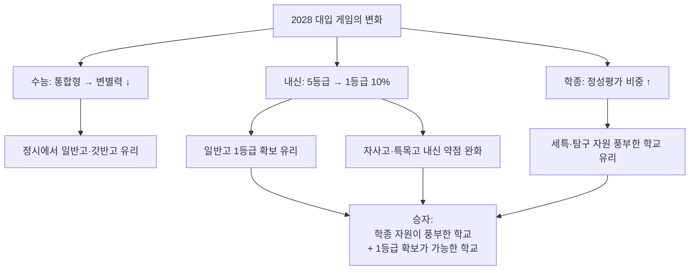

### 17-1. 3축 의사결정 매트릭스 — '나는 어느 축의 학생인가'

학생을 **내신형 / 수능형 / 학종형 / 균형형**으로 진단한 뒤, 학교 카테고리를 매칭합니다.

| 학생 유형 | 가장 강한 축 | 1순위 학교 | 2순위 학교 |
|---|---|---|---|
| 내신형 | 내신 1등급 안정 확보 | 평준화 일반고 / 자공고 | 갓반고 (인원 多) |
| 수능형 | 객관식·고난도 수능 | 정시형 자사고 / 갓반고 | 평준화 일반고 (자기주도 강) |
| 학종형 | 비교과·세특·탐구 | 학종형 자사고 / 영재·과고 / IB | 갓반고 / 우수 일반고 |
| 균형형 | 세 축 모두 평균 이상 | 외대부고 / 갓반고 / 균형형 자사고 | 자공고 |

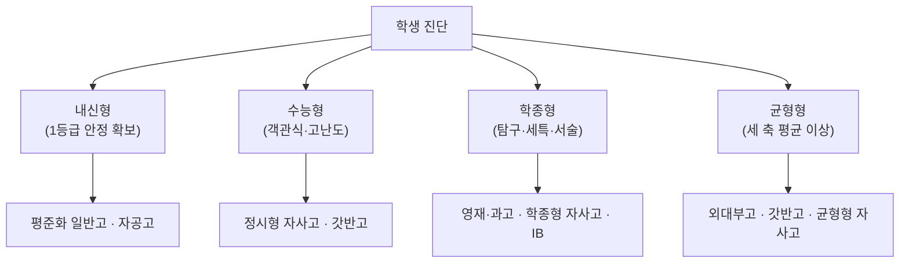

### 17-2. 카테고리별 3축 전략표 (내신·수능·학종)

각 카테고리에서 **3축을 어떻게 배분**해야 하는지 정리합니다. ★★★★★는 그 축에 자원을 집중하라는 뜻, ★☆☆☆☆는 사실상 포기해도 되는 축입니다.

| 카테고리 | 내신 전략 | 수능 전략 | 학종 전략 | 최적 학생 |
|---|---|---|---|---|
| 영재학교 | ★★☆☆☆ (5등급도 OK, 정성 환산) | ★☆☆☆☆ (사실상 포기) | ★★★★★ (R&E 올인) | 연구·이공 영재 |
| 과학고 | ★★★☆☆ (수·과 A 사수) | ★★☆☆☆ (선택지 보존용) | ★★★★★ (과제연구) | 이공계 + 조기졸업 |
| 외고 | ★★★★☆ (영어·국어 A) | ★★★☆☆ (국·영·사 정시 옵션) | ★★★★★ (어문 세특) | 어문·국제 학종형 |
| 국제고 | ★★★★☆ (국·영·사 A) | ★★★☆☆ (국·영·사 정시) | ★★★★★ (국제 세특) | 국제·외교 |
| IB 학교 | ★★★☆☆ (IB 점수가 대체) | ★☆☆☆☆ (포기) | ★★★★★ (EE·CAS) | 서술·탐구·해외 |
| 자공고 | ★★★★☆ (1등급 확보) | ★★★★☆ (모의·EBS) | ★★★☆☆ (학교 특색) | 균형·안정 |
| 전국자사고 (학종형) | ★★★★☆ (내신 + 정성 환산) | ★★★☆☆ (수능 옵션) | ★★★★★ (비교과 자원) | 자기주도·탐구 |
| 전국자사고 (정시형) | ★★★★☆ (수·영 A) | ★★★★★ (수능 올인) | ★★★☆☆ (정시 보조) | 의약학·이공 정시 |
| 광역자사고 | ★★★★☆ (학교별) | ★★★☆☆ (학교별) | ★★★★☆ (학교별) | 학교 검증 후 |
| 예체고 | ★★☆☆☆ (일반교과 보조) | ★☆☆☆☆ (포기) | ★★★☆☆ (실기+학생부) | 실기 5년+ |
| 마이스터고 | ★★★☆☆ (전공+자격증) | ☆☆☆☆☆ (별도 트랙) | ☆☆☆☆☆ (취업 우선) | 기술·취업 |
| 비즈니스고 | ★★★☆☆ (전공+자격증) | ☆☆☆☆☆ (별도 트랙) | ☆☆☆☆☆ (특성화고 전형) | 금융·실무 |
| 일반고 (학군지) | ★★★☆☆ (인원 多 활용) | ★★★★★ (정시 강세) | ★★★☆☆ (학교별) | 정시·균형형 |
| 일반고 (평준화) | ★★★★★ (1등급 확보 최유리) | ★★★★☆ (자기주도) | ★★★☆☆ (학교별) | 내신·교과·균형 |

### 17-3. 왜 카테고리마다 3축 가중치가 다른가 — 5가지 근본 이유

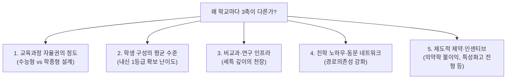

| 이유 | 결과 |
|---|---|
| 교육과정 자율권 | 자사고는 학종형/정시형으로 갈리고, 영재학교는 연구로 직진 |
| 학생 구성 | 영재·전국자사고는 1등급 확보 어려움 / 평준화 일반고는 1등급 확보 유리 |
| 비교과 인프라 | 학종형 자사고·IB는 세특 천장이 높음 / 정시형은 수능 시간 보존 |
| 경로의존성 | 한 번 정시 성과난 학교는 정시 노하우 누적 → 정시형 강화 |
| 제도적 제약 | 영재·과고는 의약학 봉쇄 / 특성화고는 별도 전형 트랙 |

### 17-4. 2028 대입에서 '유리한 학생' 6가지 프로필

#### A. 학종 정성평가 최강자 — "탐구·연구·서술이 즐겁다"

| 항목 | 내용 |
|---|---|
| 강한 축 | 학종 ★★★★★ |
| 추천 카테고리 | 영재학교 · 과고 · 학종형 전국자사고 · IB |
| 핵심 무기 | R&E · 졸업논문 · EE · 탐구보고서 |
| 2028 유리 이유 | 세특 정성평가 비중 ↑ → 학종 정량 변별력 약화 보완 |

#### B. 수능 통합형의 새로운 강자 — "객관식·고난도에 강하다"

| 항목 | 내용 |
|---|---|
| 강한 축 | 수능 ★★★★★ |
| 추천 카테고리 | 정시형 전국자사고 (상산·현대청운·북일) · 갓반고 |
| 핵심 무기 | 통합형 수능 — 선택과목 유불리 사라짐 |
| 2028 유리 이유 | 통합형 수능에서 일반고·갓반고의 정시 부담 완화, 정시 트랙 부활 |

#### C. 내신 1등급 안정 확보형 — "꾸준한 성실 + 1등급 10%"

| 항목 | 내용 |
|---|---|
| 강한 축 | 내신 ★★★★★ |
| 추천 카테고리 | 평준화 일반고 · 자공고 · 우수 일반고 |
| 핵심 무기 | 교과전형 + 학종 (학생부 교과) |
| 2028 유리 이유 | 1등급 비율 4%→10%로 확대 → 일반고가 가장 큰 수혜 |

#### D. 의약학 지망 정시형 — "수능 + 지역인재"

| 항목 | 내용 |
|---|---|
| 강한 축 | 수능 + 지역 |
| 추천 카테고리 | 지방 정시형 자사고 (상산·현대청운) · 지방 거점 일반고 |
| 핵심 무기 | 지역인재 의무 확대 |
| 2028 유리 이유 | 의대 지역인재 비율 확대 — 지방 거주·학력 우수자 유리 |
| ⚠️ 피해야 할 | 영재학교·과학고 (의약학 봉쇄) |

#### E. 어문·국제·해외 진학형 — "영어·언어·국제 감수성"

| 항목 | 내용 |
|---|---|
| 강한 축 | 학종 + 해외 |
| 추천 카테고리 | 외고 · 국제고 · IB · 국제형 자사고 (민사·외대부) |
| 핵심 무기 | 어문 세특 · 모의유엔 · IB EE |
| 2028 유리 이유 | 통합형 수능에서 사회·국어 등 어문 정시 옵션 유지 |

#### F. 기술·실무·빠른 진출형 — "취업 + 후진학"

| 항목 | 내용 |
|---|---|
| 강한 축 | 직무 + 자격증 |
| 추천 카테고리 | 마이스터고 · 비즈니스고 · 특성화고 |
| 핵심 무기 | 산학협력 채용 · 특성화고 전형 · 재직자 전형 |
| 2028 유리 이유 | 일반 대입 트랙과 분리된 별도 경로 |

### 17-5. 3축 통합 운영 — 학년·학기별 행동 알고리즘

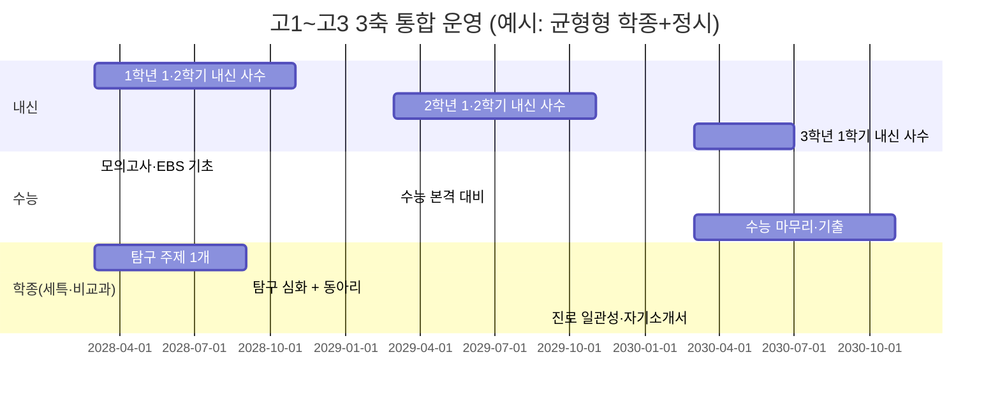

| 시기 | 내신 | 수능 | 학종 |
|---|---|---|---|
| 고1 1학기 | 첫 내신 — 5과목 균형 A | 모의 진단·약점 파악 | 동아리·자율 선택 + 탐구 주제 1개 |
| 고1 2학기 | 내신 유지 + 약점 보강 | EBS·기출 기초 누적 | 진로선택과목 선택 (학종 트랙) |
| 고2 1학기 | 진로 과목 내신 사수 | 정시 본격 대비 시작 | 탐구 심화 + 세특 소재 누적 |
| 고2 2학기 | 내신 + 선택과목 깊이 | 모의고사 안정화 | 진로 일관성 확보 |
| 고3 1학기 | 마지막 내신 — 총력 | 수능 마무리 | 자기소개서·면접 준비 |
| 고3 2학기 | — | 수능 + 정시 마무리 | 수시 원서·면접 |

### 17-6. 카테고리별 3축 운영 시나리오 (구체)

#### 시나리오 1. 평준화 일반고 + 학종 + 정시 보험

```
[내신] ★★★★★ 1등급(상위 10%) 사수 — 1순위
   └ 5등급제에서 일반고의 가장 큰 무기
[수능] ★★★★ 자기주도 학습 + EBS + 학원 보조
   └ 통합형 수능 = 일반고 친화적
[학종] ★★★ 학교 세특 + 진로 일관성
   └ 학교 자원 부족 → 자기 주도로 메우기
→ 결론: 교과전형 1순위 + 학종 2순위 + 정시 보험
```

#### 시나리오 2. 학군지 갓반고 + 정시 + 학종 균형

```
[내신] ★★★★ 1등급 인원 多 → 1.x등급 안정 가능
[수능] ★★★★★ 학교·학원·또래 자극 → 정시 최강
[학종] ★★★ 학교별 세특 운영에 따라
→ 결론: 정시 1순위 + 학종 병행 (의약학·SKY 정시)
```

#### 시나리오 3. 학종형 전국자사고 (하나·외대부·인천하늘)

```
[내신] ★★★★ 5등급 중 1~2등급 어렵지만 정성 보정
[수능] ★★★ 학교 수능 대비 시간 일부 보장
[학종] ★★★★★ 비교과·세특·R&E 최강
→ 결론: 학종 1순위 + 수능 보험
```

#### 시나리오 4. 정시형 전국자사고 (상산·현대청운·북일)

```
[내신] ★★★★ 수·과 사수
[수능] ★★★★★ 학교 전체가 수능 체제 — 노하우 최강
[학종] ★★★ 세특 운영 보통
→ 결론: 정시 1순위 (의약학·이공) + 수시 교과전형 병행
```

#### 시나리오 5. 영재학교 · 과학고

```
[내신] ★★ 1등급 사실상 불가, 정성 환산
[수능] ★ 사실상 포기 (수능 대비 시간 거의 없음)
[학종] ★★★★★ R&E·졸업논문이 절대 무기
→ 결론: 학종·특기자 100% — 단, 의약학은 피한다
```

#### 시나리오 6. IB 인증학교

```
[내신] ★★★ IB 점수가 사실상 내신 대체
[수능] ★ 포기 (교육과정 불일치)
[학종] ★★★★★ EE·TOK·CAS가 정성평가 최강 무기
→ 결론: 학종·국제학부·해외 진학 트랙
```

#### 시나리오 7. 마이스터고 · 비즈니스고 (특성화고 전형)

```
[내신] ★★★ 전공+일반교과 + 자격증
[수능] (해당 없음, 별도 트랙)
[학종] (별도 트랙 — 특성화고 전형 안에서)
→ 결론: 취업 + 재직자 전형 또는 특성화고 전형 대학 진학
```

### 17-7. 같은 학교에서도 3축 우선순위는 학생마다 다르다 — 진단 알고리즘

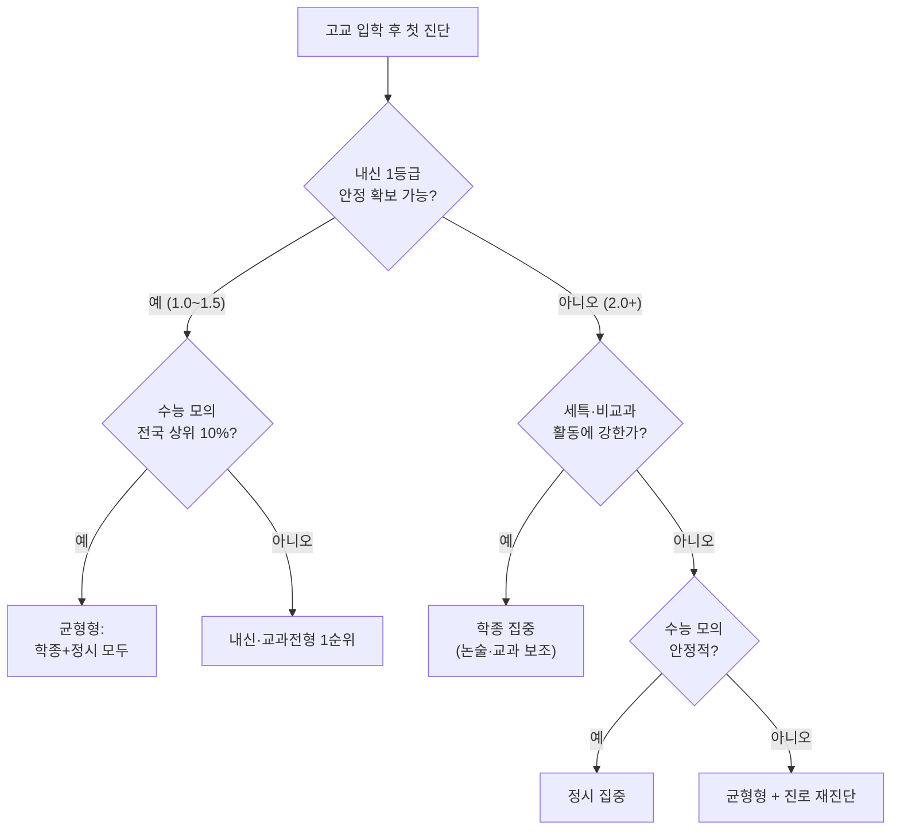

### 17-8. 3축 전략의 흔한 오해

| 오해 | 사실 |
|---|---|
| "자사고 가면 학종이 무조건 유리하다" | 자사고도 정시형(상산)/학종형(하나)으로 갈림 — 학생 색깔과 일치해야 함 |
| "일반고는 학종에 불리하다" | 2028 5등급제에서 1등급 10% 인원 多 → 일반고 교과·학종 모두 유리 |
| "수능은 이제 안 봐도 된다" | 통합형 수능은 변별력 ↓이지만 정시 비중은 유지 — '수능 최저' 통과는 필수 |
| "학종은 활동만 많으면 된다" | 정성평가 비중이 올라가며 **세특의 깊이·일관성**이 핵심 (양보다 질) |
| "내신은 중3 자기소개서 단계까지만 중요" | 고1 1학기부터 3학년 1학기까지 5학기 모두 반영 |
| "영재학교·과학고는 무조건 명문대" | 학종 트랙이 막히면 진학 어려움. 의약학 지망생에게는 최악의 선택 |

### 17-9. '나의 카테고리'를 결정하는 3단계 자가진단

```
[1단계] 진로 적합성
   □ 이공 연구 → 영재·과고
   □ 어학·국제 → 외고·국제고·IB
   □ 예체 → 예체고
   □ 기술·취업 → 마이스터·비즈니스·특성화
   □ 진로 미정/종합 → 일반고·자공고·균형형 자사고

[2단계] 3축 진단
   □ 내신 1등급 안정 확보 가능? → 평준화 일반고·자공고 유리
   □ 수능 통합형에 강함? → 갓반고·정시형 자사고 유리
   □ 비교과·세특·서술에 강함? → 학종형 자사고·영재·과고·IB 유리

[3단계] 현실 여건
   □ 학비 3년 4~5천만+ 감당? → 전국자사고 가능
   □ 기숙 적응 가능? → 전국자사고·영재학교·과고 가능
   □ 지방 거주 → 지역인재 + 지방 정시형 자사고 유리 (의약학)
```

### 17-10. 2028 대입의 '딱 세 줄' 결론

```
1. 1등급 10%로 확대 — 일반고·자공고의 교과·학종 트랙이 재평가된다.
2. 통합형 수능 — 일반고·갓반고의 정시가 부활하고, 정시형 자사고는 의약학·이공 정시에서 여전히 강하다.
3. 세특 정성평가 비중 ↑ — 영재·과고·학종형 자사고·IB가 학종에서 압도하지만, 일반고도 세특 운영 질만 갖추면 충분히 따라온다.
```

---

## 부록 A. 카테고리 ↔ 본문 빠른 이동표

| UI에서 본 카드 | 본문 섹션 |
|---|---|
| 과학고 · 영재고 | §2 |
| 외국어고 | §3 |
| 국제고 | §4 |
| IB 인증학교 | §5 |
| 자율형 공립고 | §6 |
| 자율형 사립고 | §7 |
| 예술고 · 체육고 | §8 |
| 마이스터고 | §9 |
| 비즈니스고 | §10 |
| 일반고 (학군지) | §11 |
| 그 외 특성화고 / 대안 | §12 |

## 부록 B. 자매 문서

- [고등학교 유형 완전 정리 — 진로지도용 상세 가이드](./고등학교_유형_완전정리_진로지도가이드.md) — 학종 관점 비교표·학교별 프로파일·중학생 학년별 로드맵(§13)
- [2028 대입준비 완벽가이드](./2028_대입준비_완벽가이드.md)
- [2028 학년별 대입준비 실전가이드](./2028_학년별_대입준비_실전가이드.md)

## 부록 C. 참고 출처

- 교육부, 「2028 대학입시제도 개편 확정안」(2023-12-27)
- 교육부, 「직업계고 발전 방안」 및 마이스터고 지정 고시
- 각 시·도 교육청 고입 전형 기본계획 (2026학년도)
- 학교알리미 schoolinfo.go.kr
- 고입정보포털 hischool.go.kr
- 국가과학영재정보서비스 NSGI csa.nise.re.kr
- IBO 한국 인증학교 목록 ibo.org
