# CareerPath — 투자 제안서 v2 (강화판)

> **"탐색에서 시작하고, 스프린트로 실행하고, 공유로 함께 나아간다"**
> 초등 고학년~고등학생 진로 설계 + 스프린트 실행 + 공유 플랫폼
> 2026.07 Updated

---

## 목차

1. [Executive Summary](#1-executive-summary)
2. [핵심 철학: 두 기둥 구조](#2-핵심-철학-두-기둥-구조)
3. [시장의 문제 (Problem)](#3-시장의-문제-problem)
4. [솔루션 (Solution)](#4-솔루션-solution)
5. [제1기둥: 탐색 — 고입·대입·취업 통합 정보 허브](#5-제1기둥-탐색--고입대입취업-통합-정보-허브)
6. [제2기둥: 패스·실행 — 스프린트 기반 프로젝트 빌더](#6-제2기둥-패스실행--스프린트-기반-프로젝트-빌더)
7. [트리 구조 템플릿 시스템 (핵심 엔진)](#7-트리-구조-템플릿-시스템-핵심-엔진)
8. [공유 생태계: 함께 나아가기](#8-공유-생태계-함께-나아가기)
9. [aimakerlab.com 연계 전략](#9-aimakerlabcom-연계-전략)
10. [벤치마킹 & 경쟁사 분석](#10-벤치마킹--경쟁사-분석)
11. [고객 페르소나](#11-고객-페르소나)
12. [핵심 제품: 커리어 패스 시스템](#12-핵심-제품-커리어-패스-시스템)
13. [수익 모델](#13-수익-모델)
14. [시장 규모 (TAM / SAM / SOM)](#14-시장-규모-tam--sam--som)
15. [Go-to-Market 전략](#15-go-to-market-전략)
16. [로드맵 & 마일스톤](#16-로드맵--마일스톤)
17. [재무 전망](#17-재무-전망)
18. [리스크 & 대응 전략](#18-리스크--대응-전략)
19. [팀 & 실행 역량](#19-팀--실행-역량)
20. [부록](#20-부록)

---

## 1. Executive Summary

```
┌───────────────────────────────────────────────────────────────────────┐
│                                                                       │
│   CareerPath = 탐색(토대) + 패스·실행(확장) + 공유(성장 엔진)            │
│                                                                       │
│   ┌─────────────┐    ┌──────────────────┐    ┌─────────────┐          │
│   │  제1기둥     │    │  제2기둥 ★핵심★   │    │  성장 엔진   │          │
│   │  탐색        │ →  │  패스·실행        │ →  │  공유        │          │
│   │             │    │                  │    │             │          │
│   │ 고입·대입·취업│    │ 스프린트 기반      │    │ 그룹·전체    │          │
│   │ 통합 정보    │    │ 프로젝트 빌더     │    │ 공유·협업    │          │
│   │ IB·비즈니스고│    │ 트리 구조 템플릿   │    │ 함께 나아감  │          │
│   │ 특성화고     │    │ Jira 스프린트형    │    │             │          │
│   │ 2028 대입    │    │                  │    │             │          │
│   └─────────────┘    └──────────────────┘    └─────────────┘          │
│                                                                       │
│   핵심 철학:                                                           │
│   · AI 시대에 결과는 AI가 만든다. 기획하는 과정이 진짜 실력이다.          │
│   · 혼자 가면 빨리 가지만, 함께 가면 멀리 간다.                          │
│   · 탐색은 토대, 패스·실행은 확장, 공유는 함께 나아감.                   │
│                                                                       │
│   실행 파트너: aimakerlab.com (교육 + 외주 개발)                        │
│                                                                       │
│   수익 모델:                                                           │
│     🔵 광고 수익 (교육/진로 맥락형)                                     │
│     🟠 학교·기관 연계 수익 (별도 측정)                                  │
│     🟢 세미나 캠페인 스폰서십/파트너십                                  │
│     🟣 aimakerlab.com 교육·외주 연계 수익                              │
│                                                                       │
│   목표: 입시 컨설턴트 · 유학원 시장을 디지털로 대체                      │
│                                                                       │
└───────────────────────────────────────────────────────────────────────┘
```

### 핵심 숫자

| 지표 | 수치 |
|------|------|
| **타겟 시장** | 한국 사교육 시장 29.2조원 (2024) |
| **직접 경쟁 시장** | 진로진학 컨설팅 1,007억원 (2024, YoY +33%) |
| **타겟 고객** | 중고등학생 260만명 + 학부모 |
| **제공 직업 수** | 200개 (8개 별(왕국) × 25개) |
| **실행 템플릿** | 141개 (스프린트 기반 주차별 트리 구조) |
| **고교 정보** | IB·비즈니스고·특성화고·자사고 등 전 유형 커버 |
| **접근 정책** | 학생 개인 구독 없음, 핵심 기능 무료 |
| **핵심 차별점** | 스프린트 기반 트리 구조 프로젝트 빌더 (시장 유일) |
| **실행 파트너** | aimakerlab.com (교육 및 외주 개발) |

---

## 2. 핵심 철학: 두 기둥 구조

### 2-1. 왜 두 기둥인가

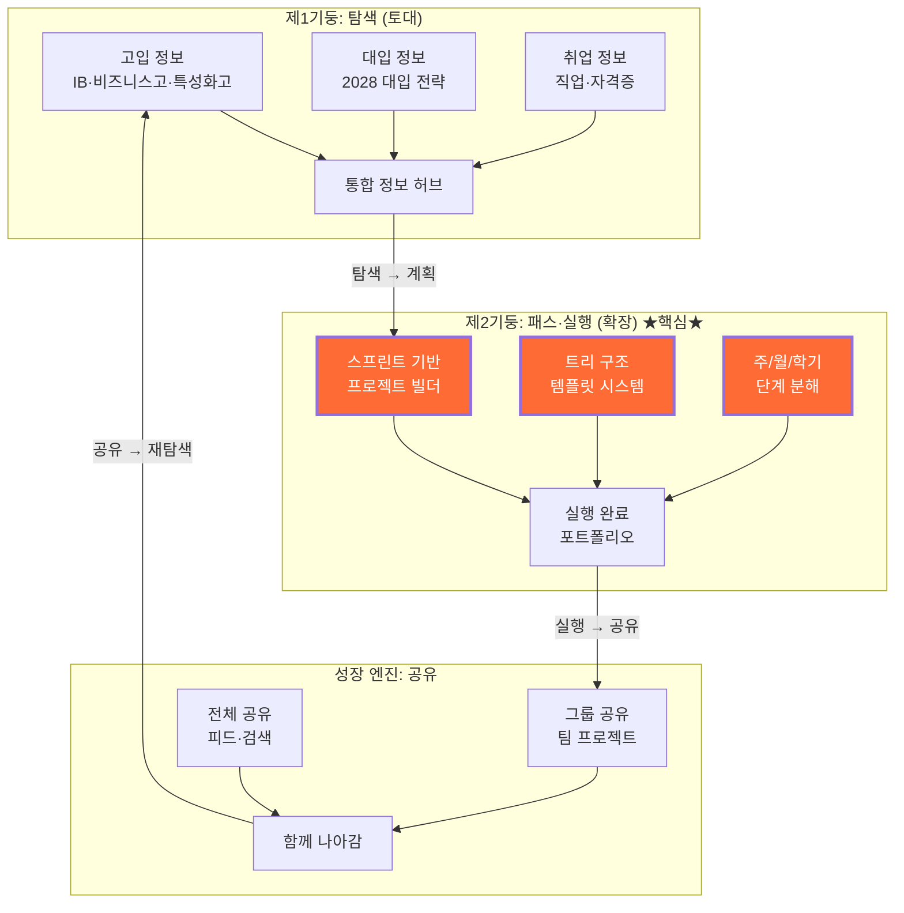

### 2-2. 두 기둥의 관계

| 구분 | 제1기둥: 탐색 | 제2기둥: 패스·실행 | 공유 |
|------|-------------|------------------|------|
| **역할** | 토대 (Foundation) | 확장 (Expansion) ★ | 성장 엔진 (Growth) |
| **핵심 질문** | "어떤 길이 있지?" | "어떻게 실행하지?" | "함께 갈 수 있을까?" |
| **제공 가치** | 고입·대입·취업 정보 통합 | 스프린트 기반 프로젝트 관리 | 그룹→전체 단계적 공유 |
| **사용자 행동** | 탐색·비교·선택 | 계획·분해·실행·회고 | 팀 협업·피드 공유·검색 |
| **경쟁 우위** | IB·특성화고 특화 정보 | 트리 구조 템플릿 (시장 유일) | 진로 기반 커뮤니티 |
| **비유** | 지도를 펼치는 것 | 길을 걸어가는 것 | 함께 걸어가는 것 |

### 2-3. 핵심 메시지

```
┌──────────────────────────────────────────────────────────────────┐
│                                                                  │
│   "혼자 가면 빨리 가지만, 함께 가면 멀리 간다"                       │
│                                                                  │
│   탐색(토대)에서 방향을 찾고,                                      │
│   패스·실행(확장)에서 스프린트로 걸어가고,                           │
│   공유(성장)에서 먼 길을 제대로 간다.                               │
│                                                                  │
│   ─────────────────────────────────────                          │
│                                                                  │
│   탐색만 있으면? → 정보는 있지만 실행 못 함 (커리어넷의 한계)        │
│   실행만 있으면? → 방향 없이 뛰어감 (Notion/Jira의 한계)           │
│   공유만 있으면? → 공유할 콘텐츠가 없음 (SNS의 한계)               │
│                                                                  │
│   세 가지가 연결될 때, 비로소 진로 설계가 완성된다.                  │
│                                                                  │
└──────────────────────────────────────────────────────────────────┘
```

---

## 3. 시장의 문제 (Problem)

### 3-1. 입시 컨설팅의 구조적 불평등

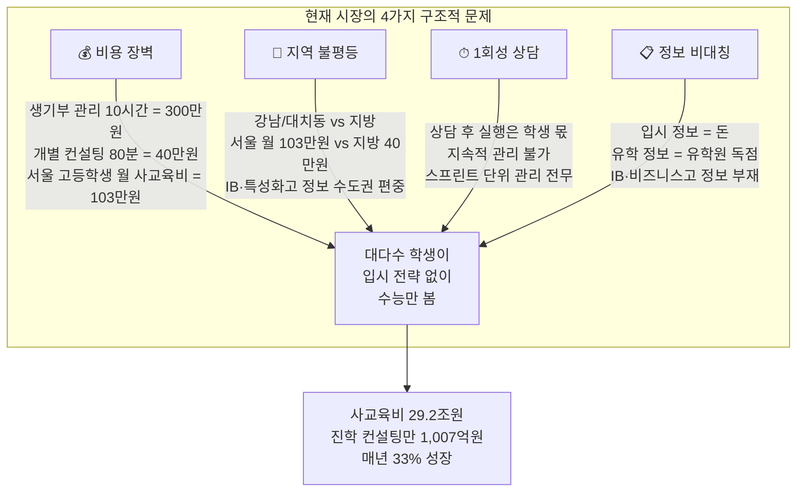

### 3-2. 기존 시장의 3가지 큰 구멍

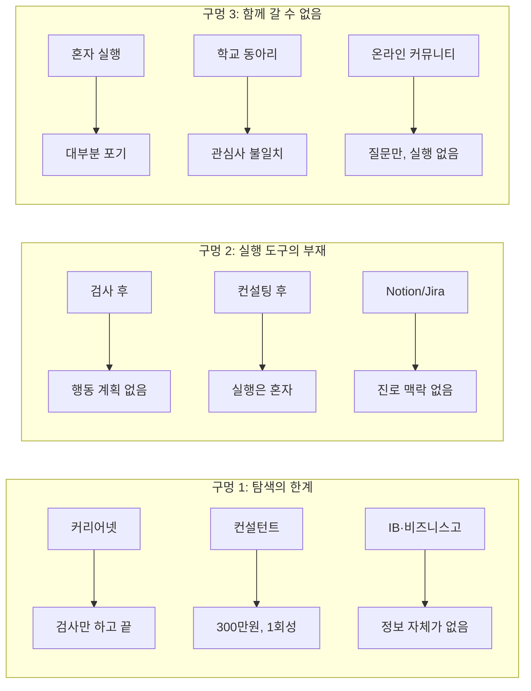

### 3-3. 학생이 겪는 Pain Point 상세

#### A. 탐색 단계 Pain Point

| # | Pain Point | 현재 해결책 | 비용 | 문제점 |
|---|-----------|-----------|------|--------|
| 1 | "나한테 맞는 직업을 모르겠다" | 커리어넷 검사 (무료) | 0원 | 검사만 하고 끝, 후속 행동 없음 |
| 2 | "IB 학교가 뭔지 모르겠다" | 구글링, 입시 카페 | 0원 | 정보 파편화, 신뢰성 부족 |
| 3 | "비즈니스고가 뭘 배우는 곳이야?" | 학교 설명회 (연 1회) | 0원 | 오프라인 한정, 비교 불가 |
| 4 | "특성화고 vs 일반고, 뭐가 나을까?" | 입시 컨설턴트 | 40~300만원 | 비용 부담, 서울 편중 |
| 5 | "2028 대입은 어떻게 바뀌어?" | 뉴스·입시 카페 | 0원 | 정보 산재, 해석 어려움 |

#### B. 실행 단계 Pain Point (★ 가장 큰 구멍)

| # | Pain Point | 현재 해결책 | 비용 | 문제점 |
|---|-----------|-----------|------|--------|
| 1 | "커리어 패스를 어떻게 만들지?" | 혼자 구글링 | 0원 | 막막함, 구조화 불가 |
| 2 | "의사가 되려면 중학교 때 뭘 해야 해?" | 입시 컨설턴트 | 40~300만원 | 비용 부담, 1회성 |
| 3 | "프로젝트를 어떻게 시작해?" | 혼자 구글링 | 0원 | 주차별 분해 불가, 완성 못 함 |
| 4 | "생기부에 뭘 넣어야 해?" | 학원 컨설팅 | 월 50~100만원 | 서울 편중 |
| 5 | "계획은 세웠는데 실행이 안 돼" | 없음 | - | 스프린트 관리 도구 전무 |
| 6 | "진행 상황을 어떻게 추적하지?" | 수기 메모 | 0원 | 체계 없음, 지속 불가 |

#### C. 공유 단계 Pain Point

| # | Pain Point | 현재 해결책 | 비용 | 문제점 |
|---|-----------|-----------|------|--------|
| 1 | "같은 목표의 동료가 없다" | 학교 동아리 | 0원 | 관심사 불일치 |
| 2 | "내 계획을 피드백 받고 싶다" | 없음 | - | 피드백 루프 부재 |
| 3 | "성공 사례를 참고하고 싶다" | 입시 카페 | 0원 | 검증 안 됨, 구조화 안 됨 |

### 3-4. 학교/기관이 겪는 Pain Point

| # | Pain Point | 현재 해결책 | 문제점 |
|---|-----------|-----------|--------|
| 1 | "16차시 수업을 채울 콘텐츠가 없다" | 커리어넷 검사 + PPT 직접 제작 | 매 학기 반복 제작, 시간 소모 |
| 2 | "학생 300명 개별 맞춤 지도가 불가능하다" | 학기당 1인 15분 상담 | 물리적 시간 한계 |
| 3 | "활동 기록 정리가 너무 힘들다" | 엑셀/나이스 수기 입력 | 학기말 야근, 생기부 근거 부족 |
| 4 | "학생들이 검사 한 번 하고 흥미를 잃는다" | 적성검사 1회 | 지속 참여 수단 없음 |
| 5 | "IB 프로그램 도입 정보가 부족하다" | 직접 해외 자료 번역 | 시간·전문성 부족 |

### 3-5. AI 시대의 새로운 문제

```
┌──────────────────────────────────────────────────────────────────┐
│  "AI가 다 해주면 내가 할 게 없다" — 이것이 새로운 불안이다.          │
├──────────────────────────────────────────────────────────────────┤
│                                                                  │
│  기존 불안                    AI 시대의 불안                      │
│  ─────────                    ─────────────                      │
│  "결과물을 어떻게 만들지?"  → "AI가 다 만드는데 내가 뭘 해야 하지?" │
│  "포트폴리오가 없다"        → "AI가 만든 것을 내 것이라 할 수 있나?"│
│  "방향을 모르겠다"          → "AI한테 물어봐도 내 상황에 안 맞다"  │
│  "계획을 세울 수 없다"      → "계획도 AI가 해주면 내 역할은?"     │
│                                                                  │
│  CareerPath의 답:                                                │
│  · 기획하는 과정이 진짜 실력이다                                   │
│  · 스프린트로 매주 직접 실행하는 과정이 포트폴리오다                 │
│  · 트리 구조로 좁혀가는 과정 자체가 나만의 차별화다                  │
│  · 함께 공유하며 피드백 받는 것이 AI가 대체할 수 없는 경험이다       │
│                                                                  │
└──────────────────────────────────────────────────────────────────┘
```

---

## 4. 솔루션 (Solution)

### 4-1. CareerPath의 핵심 구조

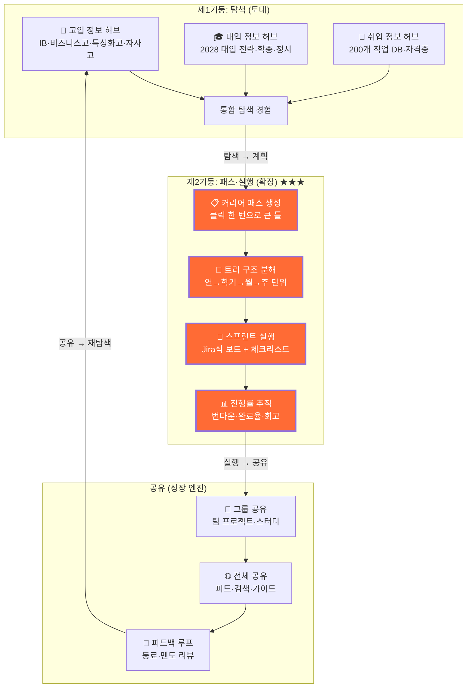

### 4-2. 기존 방식 vs CareerPath 비교

| 항목 | 입시 컨설턴트 | 유학원 | 커리어넷 | Notion/Jira | **CareerPath** |
|------|-------------|--------|---------|------------|---------------|
| **탐색 정보** | 전문가 경험 기반 | 유학 한정 | 적성검사 | 없음 | ✅ **고입·대입·취업 통합** |
| **IB·비즈니스고 정보** | 일부 컨설턴트만 | 없음 | 없음 | 없음 | ✅ **특화 DB** |
| **커리어 패스 생성** | 수동, 300만원 | 없음 | 없음 | 빈 문서에서 시작 | ✅ **클릭 한 번** |
| **트리 구조 분해** | 없음 | 없음 | 없음 | 수동 구성 | ✅ **템플릿 자동 분해** |
| **스프린트 실행** | 없음 | 없음 | 없음 | 있지만 범용 | ✅ **진로 특화 스프린트** |
| **주차별 할 일** | 분기 1회 체크 | 서류 대행 | 없음 | 수동 생성 | ✅ **141개 템플릿** |
| **함께 실행** | 없음 | 없음 | 없음 | 업무 협업 | ✅ **진로 기반 그룹** |
| **공유 피드** | 없음 | 없음 | 없음 | 없음 | ✅ **피드·검색** |
| **비용** | 300만원+ | 1,000만원+ | 무료 | 유료 구독 | **기본 무료** |
| **접근성** | 서울/수도권 | 서울/수도권 | 전국 | 전국 | **전국 + 해외** |

### 4-3. 사용자 여정 전체 흐름

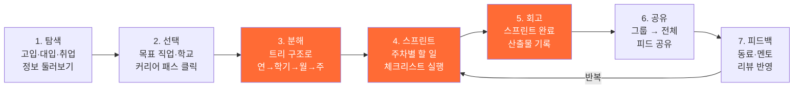

---

## 5. 제1기둥: 탐색 — 고입·대입·취업 통합 정보 허브

### 5-1. 탐색의 역할

> 탐색은 CareerPath의 **토대**입니다.
> 고입·대입·취업 정보가 한 곳에 모여야, 학생이 방향을 잡고 패스·실행으로 넘어갈 수 있습니다.

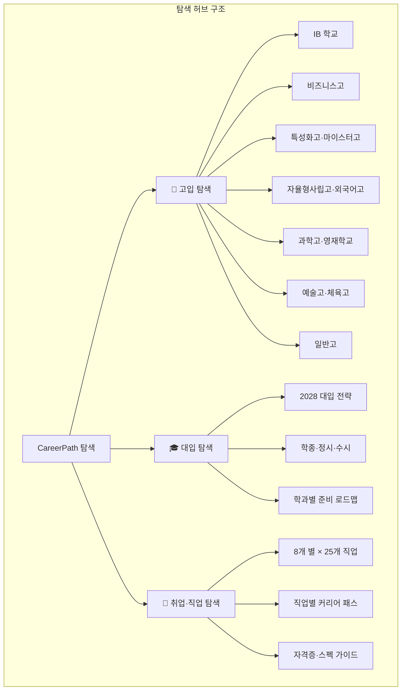

### 5-2. 고입 정보 — IB·비즈니스고·특성화고 특화

#### 고교 유형별 정보 매트릭스

| 고교 유형 | 핵심 정보 | 데이터 상태 | 특화 포인트 |
|----------|---------|----------|-----------|
| **IB 학교** | IB DP 커리큘럼, EE/TOK/CAS 가이드, 해외 대학 연계 | ✅ DB 구축 완료 | 국내 IB 도입교 전수 조사, 과목 선택 전략 |
| **비즈니스고** | 경영·회계·마케팅 커리큘럼, 자격증 로드맵, 취업 연계 | ✅ DB 구축 완료 | 비즈니스고 특화 자격증, 대학 연계 전형 |
| **특성화고** | 학과별 교육과정, 취업 연계, 대학 진학 옵션 | ✅ DB 구축 완료 | 마이스터고와의 비교, 학과 선택 가이드 |
| **마이스터고** | 산업 분야별 특화, 취업 보장 프로그램 | ✅ DB 구축 완료 | 분야별 취업률, 연봉 데이터 |
| **자율형사립고** | 교육 철학, 대학 진학 실적, 특색 프로그램 | ✅ DB 구축 완료 | 학비 대비 가치, 2028 자사고 폐지 대응 |
| **외국어고** | 언어별 특화, 해외 대학 연계 | ✅ DB 구축 완료 | 7개 외국어 비교, 글로벌 진로 연계 |
| **과학고·영재학교** | 과학 연구, 조기 졸업, R&E 프로그램 | ✅ DB 구축 완료 | 입학 전형 타임라인, 연구 활동 가이드 |
| **예술고·체육고** | 전공 실기, 포트폴리오, 진로 다양성 | ✅ DB 구축 완료 | 실기 준비 타임라인, 비전공 진로 옵션 |
| **일반고** | 내신 관리, 학종 준비, 정시 전략 | ✅ DB 구축 완료 | 지역별 일반고 비교, 교과 선택 전략 |

#### IB 학교 특화 정보 구조

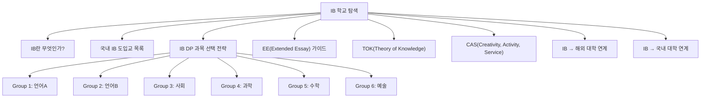

#### 비즈니스고 특화 정보 구조

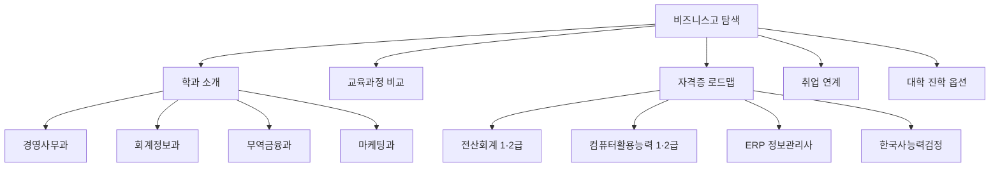

### 5-3. 대입 정보 — 2028 대입 특화

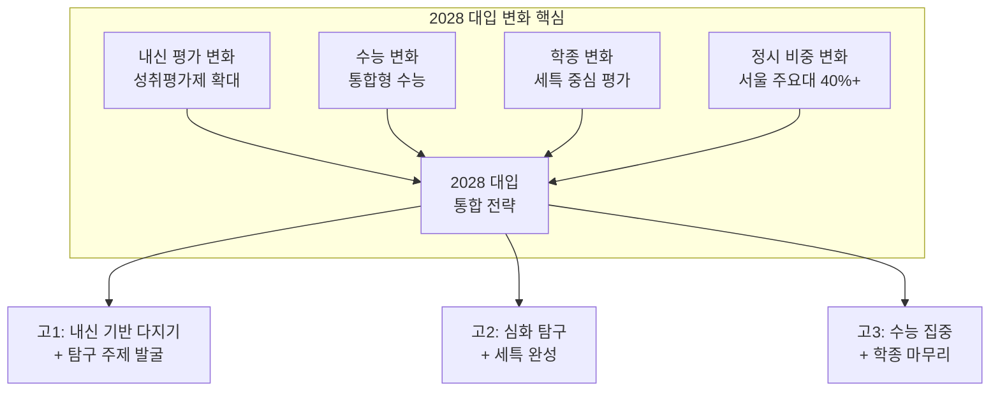

| 2028 대입 핵심 변화 | 기존 | 2028 | CareerPath 대응 |
|-------------------|------|------|----------------|
| **내신 평가** | 상대평가 중심 | 성취평가제 확대 | 과목별 성취 기준 가이드 |
| **수능** | 문·이과 구분 | 통합형 | 통합형 수능 준비 로드맵 |
| **학종** | 다양한 활동 나열 | 세특 중심 깊이 평가 | 세특 연계 프로젝트 템플릿 |
| **정시** | 30% 내외 | 40%+ (서울 주요대) | 정시 전략 스프린트 |
| **자사고** | 운영 | 폐지 논의 | 대안 진학 전략 가이드 |

### 5-4. 탐색에서 패스·실행으로의 전환

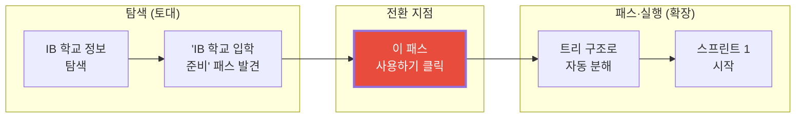

> **전환 포인트**: 탐색 중 발견한 정보가 곧바로 실행 가능한 스프린트로 변환됩니다.
> 이것이 "정보만 제공"하는 커리어넷과의 결정적 차이입니다.

---

## 6. 제2기둥: 패스·실행 — 스프린트 기반 프로젝트 빌더 ★★★

### 6-1. 왜 제2기둥이 핵심인가

```
┌──────────────────────────────────────────────────────────────────┐
│                                                                  │
│   "탐색만으로는 아무것도 바뀌지 않는다"                              │
│                                                                  │
│   커리어넷 사용자의 92%는 적성검사 후 아무 행동도 하지 않는다.       │
│   입시 컨설팅의 70%는 상담 후 실행으로 이어지지 않는다.             │
│                                                                  │
│   문제는 "정보가 없는 것"이 아니라,                                │
│   "정보를 실행 가능한 단위로 분해하는 도구가 없는 것"이다.           │
│                                                                  │
│   CareerPath의 패스·실행 도구는 이 구멍을 메운다:                   │
│   · Jira 스프린트처럼 주차별 할 일을 관리한다                       │
│   · 트리 구조 템플릿으로 대부분의 계획을 즉시 시작한다               │
│   · 스프린트 보드로 진행 상황을 추적한다                            │
│   · 회고 기록으로 과정 자체가 포트폴리오가 된다                     │
│                                                                  │
│   이것이 시장에서 유일한 기능이며,                                  │
│   CareerPath의 핵심 해자(Moat)이다.                               │
│                                                                  │
└──────────────────────────────────────────────────────────────────┘
```

### 6-2. 스프린트 기반 프로젝트 빌더 상세 구조

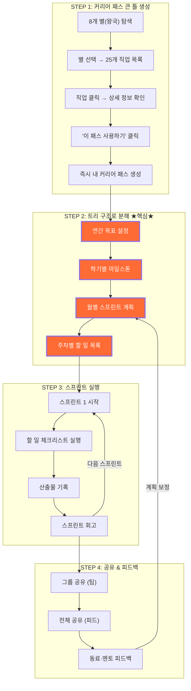

### 6-3. Jira 스프린트 vs CareerPath 스프린트 비교

| 항목 | Jira 스프린트 | CareerPath 스프린트 |
|------|-------------|-------------------|
| **대상** | 소프트웨어 개발팀 | 중고등학생 개인·그룹 |
| **스프린트 단위** | 1~4주 | 1~4주 (학사 일정 연동) |
| **백로그** | 이슈·스토리 | 활동·수상·작품·자격증 항목 |
| **보드 상태** | To Do → In Progress → Done | 시작 전 → 진행 중 → 완료 → 회고 |
| **번다운 차트** | 스토리 포인트 기반 | 할 일 완료율 기반 |
| **회고(Retrospective)** | 팀 회고 미팅 | 개인 회고 기록 (생기부 연계) |
| **산출물** | 코드·문서 | 탐구보고서·포트폴리오·실험일지 |
| **시작 난이도** | 프로젝트 세팅 필요 | **트리 구조 템플릿으로 즉시 시작** |
| **진로 맥락** | 없음 | **진로 목표와 연결된 스프린트** |
| **비용** | 유료 (10$/user/month) | **무료** |

### 6-4. 스프린트 보드 UI 구조

```
┌──────────────────────────────────────────────────────────────────────┐
│  스프린트 3 (6/1 ~ 6/14)  │ 과학 탐구 프로젝트 — 소아과 전문의 패스  │
├──────────────────────────────────────────────────────────────────────┤
│                                                                      │
│  시작 전 (3)        진행 중 (2)         완료 (4)         회고 (1)     │
│  ┌──────────┐      ┌──────────┐       ┌──────────┐    ┌──────────┐  │
│  │🎯 실험    │      │🎯 데이터  │       │🎯 문헌    │    │📝 이번    │  │
│  │   설계서  │      │   분석    │       │   조사    │    │  스프린트 │  │
│  │   작성    │      │   진행중  │       │   완료 ✅ │    │  배운 점  │  │
│  └──────────┘      └──────────┘       └──────────┘    └──────────┘  │
│  ┌──────────┐      ┌──────────┐       ┌──────────┐                  │
│  │🏆 교내    │      │🖼️ 포스터 │       │🎯 실험    │                  │
│  │   과학    │      │   초안   │       │   1차    │                  │
│  │   경시 접수│      │   제작중 │       │   완료 ✅ │                  │
│  └──────────┘      └──────────┘       └──────────┘                  │
│  ┌──────────┐                         ┌──────────┐                  │
│  │📜 생명    │                         │📜 CPR    │                  │
│  │   윤리    │                         │   자격증  │                  │
│  │   특강 접수│                         │   취득 ✅ │                  │
│  └──────────┘                         └──────────┘                  │
│                                       ┌──────────┐                  │
│                                       │🖼️ 탐구   │                  │
│                                       │   일지   │                  │
│                                       │   완료 ✅ │                  │
│                                       └──────────┘                  │
│                                                                      │
│  ── 진행률 ──────────────────── 60% ████████░░░░░░                   │
│  ── 이번 스프린트 산출물 ──── 탐구일지, 실험 데이터셋, CPR 자격증     │
│                                                                      │
└──────────────────────────────────────────────────────────────────────┘
```

### 6-5. 스프린트 실행 사이클 상세

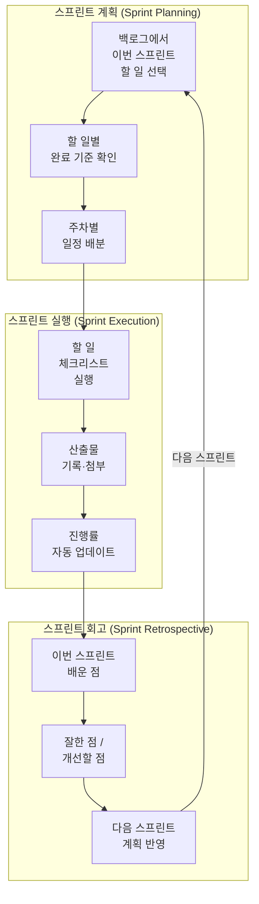

### 6-6. 스프린트별 산출물 유형

| 스프린트 단계 | 산출물 유형 | 생기부 연계 | 포트폴리오 활용 |
|-------------|-----------|-----------|-------------|
| **문제찾기** | 문헌조사 보고서, 질문 목록 | 세특 근거 자료 | 연구 동기 |
| **개발·실행** | 실험일지, 코드, 작품, 계획서 | 세특 활동 기록 | 과정 기록 |
| **테스트·검증** | 데이터 분석, 실험 결과, 피드백 | 세특 결과 분석 | 결과 증빙 |
| **성찰·회고** | 회고 기록, 개선 계획 | 세특 성장 과정 | 자기 성장 스토리 |

---

## 7. 트리 구조 템플릿 시스템 (핵심 엔진) ★★★★★

### 7-1. 왜 트리 구조 템플릿이 가장 중요한가

```
┌──────────────────────────────────────────────────────────────────┐
│                                                                  │
│   "대부분의 학생은 빈 문서 앞에서 멈춘다"                           │
│                                                                  │
│   Notion을 열어도, Jira를 열어도,                                 │
│   "뭘 써야 하는지 모르겠다"는 것이 첫 번째 장벽이다.                │
│                                                                  │
│   CareerPath의 트리 구조 템플릿은 이 장벽을 제거한다:              │
│                                                                  │
│   ① 141개 실행 템플릿이 이미 주차별 할 일을 담고 있다             │
│   ② 클릭 한 번으로 트리 구조가 자동 생성된다                       │
│   ③ 학생은 "채우기"만 하면 된다 — "설계"할 필요가 없다              │
│   ④ 트리를 수정하며 나만의 것으로 좁혀간다                         │
│                                                                  │
│   이것이 CareerPath의 가장 강력한 해자이다.                        │
│   경쟁사가 복제하려면 141개 × 주차별 할 일 × 성공 기준을            │
│   모두 만들어야 한다.                                             │
│                                                                  │
└──────────────────────────────────────────────────────────────────┘
```

### 7-2. 트리 구조 도식

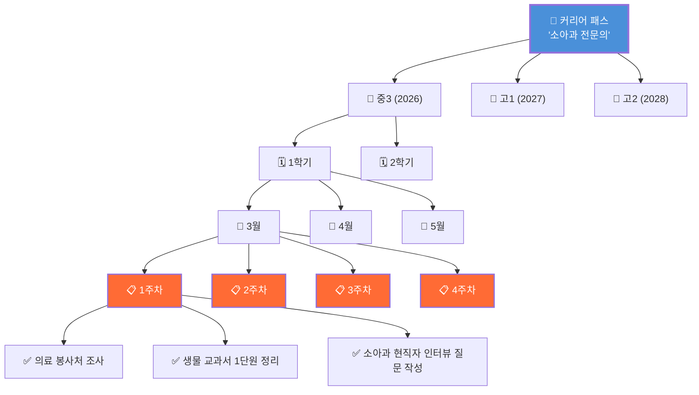

### 7-3. 트리 구조 레벨 정의

| 레벨 | 이름 | 시간 단위 | 내용 | 편집 방식 |
|------|------|---------|------|---------|
| **L0** | 커리어 패스 | 전체 기간 | 진로 목표, 핵심 역량 | 클릭으로 선택 |
| **L1** | 학년 | 1년 | 해당 학년 방향성 | 템플릿 기본 제공 |
| **L2** | 학기 | 6개월 | 학기별 마일스톤 | 템플릿 + 커스텀 |
| **L3** | 월 / 스프린트 | 2~4주 | 스프린트 목표·산출물 | 템플릿 + 커스텀 |
| **L4** | 주차 | 1주 | 주차별 할 일 목록 | 템플릿 + 커스텀 |
| **L5** | 할 일 (Task) | 1일~수일 | 구체적 실행 항목 | 체크리스트 |

### 7-4. 141개 실행 템플릿 분포

#### 카테고리별 분포

| 카테고리 | 이모지 | 템플릿 수 | 예시 |
|---------|--------|----------|------|
| **수상·대회** | 🏆 | 35개 | 과학 올림피아드, 수학 경시대회, 논문 공모전, 창업 경진대회 |
| **활동** | 🎯 | 42개 | 동아리 운영, 봉사활동, 탐구활동, 독서 프로젝트 |
| **작품** | 🖼️ | 38개 | 연구 보고서, 앱 개발, 영상 제작, 디자인 포트폴리오 |
| **자격증** | 📜 | 26개 | 한국사, 컴활, TOEIC, 코딩 자격증, 한자 |
| **합계** | | **141개** | |

#### 템플릿 1개의 구성 요소

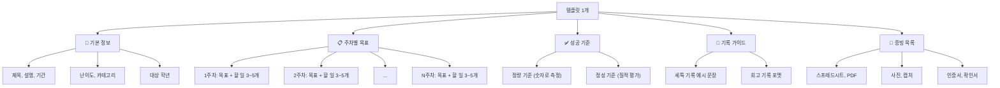

#### 템플릿 실제 예시 (과학 올림피아드)

```
┌──────────────────────────────────────────────────────────────────┐
│  🏆 과학 올림피아드 템플릿                                         │
│  난이도: ★★★★☆  |  기간: 1학기 (4개월)  |  카테고리: 수상·대회     │
├──────────────────────────────────────────────────────────────────┤
│                                                                  │
│  📋 주차별 트리 구조:                                             │
│                                                                  │
│  └─ 스프린트 1 (1~2주차): 출제 범위 확정 & 기출 확보               │
│     ├─ 1주차                                                     │
│     │  ├─ ✅ 목표 대회 1개 정하고 요강 PDF에서 범위·문항수 정리    │
│     │  ├─ ✅ 최근 3개년 기출 확보 (총 3회분)                      │
│     │  └─ ✅ 단원별 출제 빈도 Google Sheets 집계                  │
│     └─ 2주차                                                     │
│        ├─ ✅ 가장 오래된 기출 1회분 시간 재고 풀기                 │
│        ├─ ✅ 원점수 기록, 오답 문항 번호 표시                     │
│        └─ ✅ 단원별 정답률 계산 (출제 빈도와 교차 분석)           │
│                                                                  │
│  └─ 스프린트 2 (3~6주차): 약점 단원 집중 학습                     │
│     ├─ 3주차                                                     │
│     │  ├─ ✅ 오답 유형 분류 (개념 미숙/계산 실수/해석 오류)       │
│     │  ├─ ✅ 약점 단원 TOP 3 교과서 정독                         │
│     │  └─ ✅ 개념 정리 노트 작성                                 │
│     ├─ 4주차 ...                                                 │
│     ├─ 5주차 ...                                                 │
│     └─ 6주차 ...                                                 │
│                                                                  │
│  └─ 스프린트 3 (7~10주차): 모의 시험 & 실전 대비                  │
│     └─ ...                                                       │
│                                                                  │
│  └─ 스프린트 4 (11~16주차): 대회 참가 & 회고                      │
│     └─ ...                                                       │
│                                                                  │
│  ✅ 성공 기준:                                                    │
│  · 3개년 기출 90문항 이상 시간 재고 풀었고, 정오답 기록 완료       │
│  · 오답노트 30문항 이상이 3분류로 태깅, 재시험 정답률 30%p 상승   │
│  · 개념 지도 1장 완성 (단원 8개+, 연결선 15개+)                   │
│                                                                  │
│  📝 세특 기록 가이드:                                             │
│  "물리 경시 기출을 풀며 틀린 문항을 개념 미숙·계산 실수·문제       │
│   해석 오류로 분류하는 오답 태깅표를 스스로 설계함..."              │
│                                                                  │
│  📎 증빙 목록:                                                    │
│  · 기출 풀이 로그 (Google Sheets)                                │
│  · 오답 유형 비율 원그래프 (1주차/7주차 비교)                     │
│  · 개념 지도 1장 (A3 사진)                                       │
│  · 재시험 전/후 정답률 비교표 (PDF)                               │
│                                                                  │
└──────────────────────────────────────────────────────────────────┘
```

### 7-5. 템플릿에서 나만의 패스로 좁혀가기

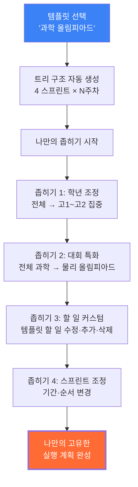

### 7-6. 트리 구조 템플릿 vs 경쟁사 비교

| 기능 | Notion | Jira | Trello | 커리어넷 | **CareerPath** |
|------|--------|------|--------|---------|---------------|
| **진로 특화 템플릿** | ❌ | ❌ | ❌ | ❌ | ✅ **141개** |
| **주차별 할 일 사전 제공** | ❌ | ❌ | ❌ | ❌ | ✅ |
| **트리 구조 자동 분해** | ❌ | ❌ | ❌ | ❌ | ✅ |
| **성공 기준 제시** | ❌ | ❌ | ❌ | ❌ | ✅ |
| **세특 기록 가이드** | ❌ | ❌ | ❌ | ❌ | ✅ |
| **증빙 체크리스트** | ❌ | ❌ | ❌ | ❌ | ✅ |
| **스프린트 보드** | ❌ | ✅ | ✅ | ❌ | ✅ (진로 특화) |
| **번다운 차트** | ❌ | ✅ | ❌ | ❌ | ✅ |
| **비용** | $8/월 | $10/월 | $5/월 | 무료 | **무료** |

### 7-7. 트리 구조 편집 기능 (프로젝트 빌더)

| 동작 | 설명 | UI 요소 |
|------|------|---------|
| ➕ **블록 추가** | 특정 스프린트·주차에 할 일 삽입 | 셀 호버 시 `+` 버튼 |
| 🗑 **블록 삭제** | 할 일 제거 (주차 번호 자동 재정렬) | 블록 우상단 `×` |
| ⬍ **블록 이동** | 할 일을 다른 스프린트·주차로 이동 | `↑↓` 버튼 / 드래그 |
| 📑 **블록 복제** | 비슷한 주차를 빠르게 복제 | 블록 메뉴 `복제` |
| ↻ **스프린트 추가** | 새 스프린트 회차 추가 | `+ 스프린트` 버튼 |
| ✏️ **인라인 편집** | 할 일 제목·설명 직접 수정 | 클릭 → 편집 패널 |
| 🔄 **단계 변경** | 문제찾기↔개발↔테스트↔성찰 | 드롭다운 선택 |

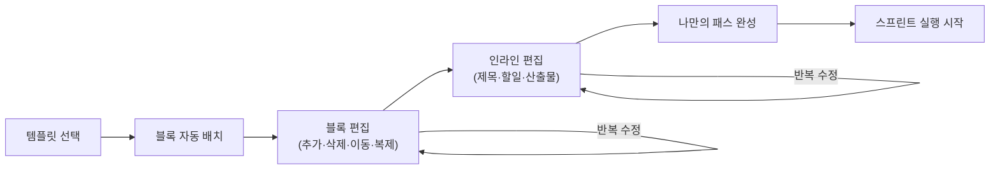

---

## 8. 공유 생태계: 함께 나아가기

### 8-1. 공유의 철학

```
┌──────────────────────────────────────────────────────────────────┐
│                                                                  │
│   "혼자 가면 빨리 가지만, 함께 가면 멀리 간다"                       │
│                                                                  │
│   공유는 CareerPath의 성장 엔진입니다.                             │
│   패스·실행에서 만든 결과물이 공유되어야,                           │
│   다른 학생의 탐색과 실행에 도움이 됩니다.                          │
│                                                                  │
│   그룹 공유 → 전체 공유 → 피드백 → 더 나은 실행                    │
│   이 순환이 CareerPath의 네트워크 효과를 만듭니다.                  │
│                                                                  │
└──────────────────────────────────────────────────────────────────┘
```

### 8-2. 공유 단계 구조

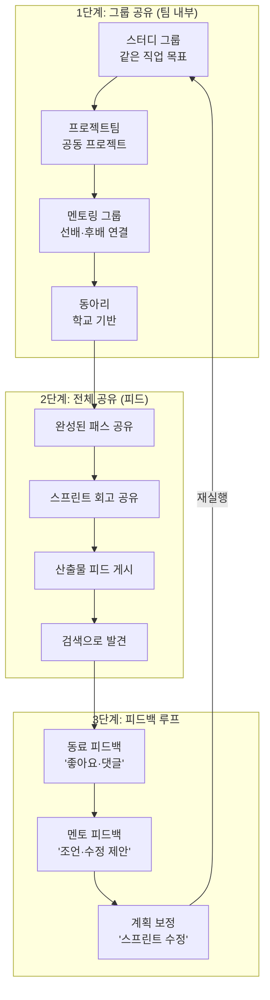

### 8-3. 그룹 유형별 상세

| 그룹 유형 | 목적 | 인원 | 진행 방식 | 산출물 |
|----------|------|------|---------|-------|
| **스터디** | 같은 목표 학습 | 3~8명 | 온라인/오프라인 | 학습 노트, 정리 자료 |
| **프로젝트팀** | 공동 프로젝트 수행 | 2~5명 | 스프린트 기반 | 탐구보고서, 작품 |
| **멘토링** | 선배·후배 연결 | 2~4명 | Zoom/대면 | 피드백 기록 |
| **동아리** | 학교 기반 활동 | 5~20명 | 정기 모임 | 활동 포트폴리오 |

### 8-4. 공유가 만드는 네트워크 효과

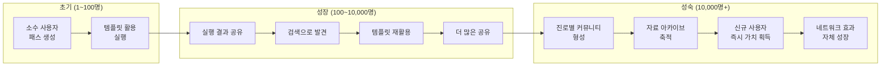

| 단계 | 사용자 수 | 공유 콘텐츠 | 네트워크 가치 |
|------|---------|-----------|-------------|
| **초기** | 1~100명 | 운영팀 제작 템플릿 | 템플릿 자체 가치 |
| **성장** | 100~10K | 학생 실행 결과물 | 참고 사례 축적 |
| **성숙** | 10K+ | 진로별 가이드 문화 | 자체 성장 (유입 > 이탈) |
| **확장** | 100K+ | 최대 진로 자료 아카이브 | 진입 장벽 = 해자 |

---

## 9. aimakerlab.com 연계 전략

### 9-1. aimakerlab.com의 역할

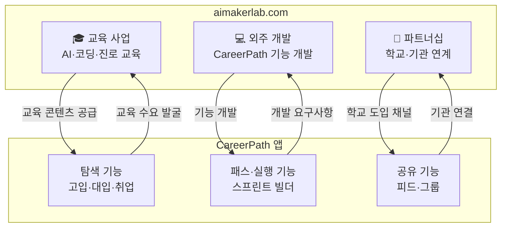

### 9-2. 시너지 구조

| 영역 | aimakerlab.com → CareerPath | CareerPath → aimakerlab.com |
|------|---------------------------|---------------------------|
| **교육** | AI·코딩 교육 커리큘럼 → 실행 템플릿 반영 | 학생 수요 데이터 → 교육 프로그램 개발 |
| **개발** | 외주 개발팀 투입 → 앱 기능 고도화 | 기술 스펙·로드맵 → 개발 파이프라인 |
| **영업** | 학교·기관 네트워크 → 앱 도입 채널 | 앱 사용 데이터 → B2B 영업 근거 |
| **브랜딩** | 교육 전문성 → 앱 신뢰도 | 앱 사용자 규모 → 교육 브랜드 가치 |

### 9-3. 연계 수익 모델

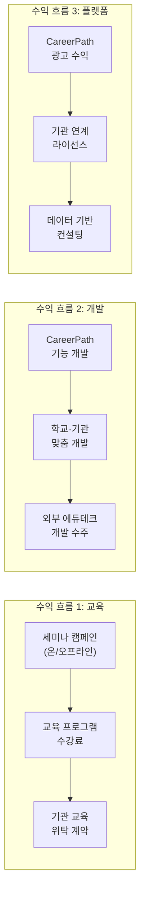

| 수익 채널 | Year 1 | Year 2 | Year 3 |
|----------|--------|--------|--------|
| **aimakerlab 교육** | 1.2억원 | 3.6억원 | 7.2억원 |
| **aimakerlab 외주 개발** | 0.8억원 | 2.4억원 | 4.8억원 |
| **CareerPath 광고** | 2.1억원 | 9.6억원 | 26.4억원 |
| **기관 연계** | 0.6억원 | 3.2억원 | 8.4억원 |
| **세미나 파트너십** | 0.48억원 | 1.8억원 | 4.2억원 |
| **합계** | **5.18억원** | **20.6억원** | **51.0억원** |

### 9-4. 실행 타임라인

```mermaid
gantt
    title aimakerlab.com 연계 타임라인
    dateFormat  YYYY-MM
    section 교육 사업
    세미나 캠페인 시작         :2026-07, 30d
    AI 교육 프로그램 런칭      :2026-09, 30d
    학교 위탁 교육 시작        :2026-11, 30d
    section 외주 개발
    CareerPath 스프린트 빌더   :active, 2026-07, 60d
    학교 맞춤 기능 개발         :2026-10, 60d
    외부 수주 시작             :2027-01, 30d
    section 파트너십
    학교 10곳 파일럿           :2026-09, 60d
    기관 연계 확대             :2027-01, 90d
```

---

## 10. 벤치마킹 & 경쟁사 분석

### 10-1. 경쟁 환경 지도

```mermaid
quadrantChart
    title 경쟁사 포지셔닝 (접근성 × 실행 도구 강도)
    x-axis "접근성 낮음 (비싸고/오프라인)" --> "접근성 높음 (저렴/온라인)"
    y-axis "탐색만 (정보 제공)" --> "실행까지 (스프린트 빌더)"
    quadrant-1 "CareerPath 독점 영역"
    quadrant-2 "고비용 실행 지원"
    quadrant-3 "저비용 탐색"
    quadrant-4 "고비용 탐색"
    "입시 컨설턴트": [0.15, 0.65]
    "유학원": [0.10, 0.55]
    "커리어넷": [0.85, 0.10]
    "와이즈멘토": [0.35, 0.20]
    "메이저맵": [0.65, 0.35]
    "드림어필": [0.70, 0.45]
    "에듀캔버스": [0.60, 0.40]
    "베어러블": [0.55, 0.50]
    "Notion": [0.75, 0.60]
    "Jira": [0.50, 0.80]
    "CareerPath": [0.90, 0.95]
```

### 10-2. 경쟁 구도 재정의 (2축 경쟁)

```mermaid
graph TD
    subgraph "축1: 콘텐츠 경쟁"
        CC1["입시·진로 컨설팅 학원<br/>축적된 노하우, 고가"] --> CC2["CareerPath 전략:<br/>가이드 문화 + 공유 데이터<br/>+ aimakerlab 교육"]
    end

    subgraph "축2: 도구 경쟁"
        TC1["Notion/Jira 등<br/>강력한 범용 편집/협업"] --> TC2["CareerPath 전략:<br/>진로 특화 스프린트 빌더<br/>+ 141개 트리 구조 템플릿"]
    end
```

| 구분 | 경쟁자 | 경쟁 포인트 | CareerPath 전략 |
|------|--------|------------|----------------|
| **콘텐츠** | 고입·대입·취업 컨설팅 학원 | 축적된 입시/진로 노하우, 고가 컨설팅 | 가이드 문화 + 공유 문화 + aimakerlab 교육으로 콘텐츠 격차 축소 |
| **도구** | Notion, Jira 등 글로벌 에디터 | 강력한 범용 편집/협업 기능 | 진로 한정 스프린트 빌더 + 트리 구조 템플릿으로 실행 속도 극대화 |

### 10-3. 경쟁사 상세 분석

#### A. 정부/공공 서비스

| 서비스 | 운영 | 핵심 기능 | 강점 | 약점 | CareerPath 차별점 |
|--------|------|----------|------|------|-----------------|
| **커리어넷** | 한국직업능력연구원 | 14종 적성검사, 직업백과 | 무료, 공신력 | 실행 도구 없음, UX 낡음 | 스프린트 빌더로 실행 연결 |
| **워크넷** | 고용노동부 | 직업 정보, 적성검사 | 무료 | 중고등학생 비적합 | 학생 맞춤 트리 구조 |

#### B. 에듀테크 스타트업

| 서비스 | 설립 | 핵심 기능 | 강점 | 약점 | CareerPath 차별점 |
|--------|------|----------|------|------|-----------------|
| **메이저맵** | 2018 | AI 진로 검사, 학과 분석 | 140개 대학 데이터 | 실행 도구 없음 | 스프린트로 실행 연결 |
| **드림어필** | 2022 | 실천형 진로 SNS | 846개교 도입 | 커리어 패스 설계 없음 | 트리 구조 패스 생성 |
| **에듀캔버스** | - | AI 진로 로드맵, 3D 시뮬레이션 | 12,000 직무 데이터 | B2B 모델, 개인 제한 | B2C 무료 + 스프린트 |
| **베어러블** | 2024.10 | AI 포트폴리오, 세특 정리 | 교사 도구 연계 | 진로 탐색 약함 | 탐색 + 실행 통합 |

#### C. 범용 프로젝트 도구

| 서비스 | 핵심 기능 | 강점 | 약점 | CareerPath 차별점 |
|--------|----------|------|------|-----------------|
| **Notion** | 범용 문서·위키 | 자유도 높음 | 진로 맥락 없음, 빈 문서 | 141개 트리 템플릿 |
| **Jira** | 스프린트 보드 | 강력한 프로젝트 관리 | 개발팀 전용, 복잡 | 진로 특화 간소 스프린트 |
| **Trello** | 칸반 보드 | 직관적 | 트리 구조 없음 | 시간별 트리 구조 |
| **Monday.com** | 업무 관리 | 다양한 뷰 | 업무용, 유료 | 학생 무료, 진로 특화 |

### 10-4. CareerPath 핵심 차별점 종합

```
┌─────────────────────────────────────────────────────────────────┐
│             CareerPath만의 4가지 해자 (Moat)                      │
├─────────────────────────────────────────────────────────────────┤
│                                                                 │
│  ① 트리 구조 템플릿 141개 (시장 유일)                             │
│     → 주차별 할 일이 사전 제공된 진로 특화 템플릿.                  │
│     → 클릭 한 번으로 트리 구조가 자동 생성.                        │
│     → 경쟁사가 복제하려면 141개 전체를 직접 제작해야 함.            │
│                                                                 │
│  ② 스프린트 기반 프로젝트 빌더 (Jira + 진로 맥락)                 │
│     → 스프린트 보드 + 회고 + 산출물 관리.                         │
│     → Jira의 강력함 + 진로 맥락의 특화.                           │
│     → 진로 도메인에서 스프린트를 제공하는 서비스 없음.              │
│                                                                 │
│  ③ 탐색→실행→공유 원스톱 연결                                    │
│     → 고입·대입·취업 정보 탐색 → 패스 생성 → 스프린트 실행.       │
│     → 그룹 공유 → 전체 공유 → 피드백 루프.                       │
│     → 탐색·실행·공유가 한 플랫폼에 연결된 서비스 없음.             │
│                                                                 │
│  ④ 콘텐츠 누적 효과 (가이드 + 공유 데이터)                        │
│     → 시작은 141개 템플릿, 점점 학생 데이터가 누적.                │
│     → 장기적으로 "진로 자료 아카이브" 1위 목표.                    │
│     → aimakerlab.com 교육 콘텐츠 연계로 가속.                    │
│                                                                 │
└─────────────────────────────────────────────────────────────────┘
```

| 차별점 | 커리어넷 | 메이저맵 | 드림어필 | Notion | Jira | **CareerPath** |
|--------|---------|---------|---------|--------|------|-------------|
| 적성검사 | ✅ | ✅ | ❌ | ❌ | ❌ | ✅ |
| 고입 정보 (IB·비즈니스고) | ❌ | ❌ | ❌ | ❌ | ❌ | ✅ **(특화)** |
| 2028 대입 전략 | ❌ | △ | ❌ | ❌ | ❌ | ✅ |
| 클릭으로 패스 생성 | ❌ | ❌ | ❌ | ❌ | ❌ | ✅ **(유일)** |
| **트리 구조 템플릿** | ❌ | ❌ | ❌ | ❌ | ❌ | ✅ **141개 (유일)** |
| **스프린트 보드** | ❌ | ❌ | ❌ | ❌ | ✅ (범용) | ✅ **(진로 특화)** |
| **주차별 할 일 제공** | ❌ | ❌ | ❌ | ❌ | ❌ | ✅ **(유일)** |
| 커리어 실행 그룹 | ❌ | ❌ | △ SNS | ❌ | ❌ | ✅ |
| 공유 피드 | ❌ | ❌ | △ | ❌ | ❌ | ✅ |
| AI 멘토링 | ❌ | ❌ | ❌ | ❌ | ❌ | ✅ (서브) |
| 비용 | 무료 | B2B | ✅ | $8/월 | $10/월 | **무료** |

---

## 11. 고객 페르소나

### 11-0. 학생 주도 사용 흐름 (Student First)

```mermaid
graph LR
    A["학생 가입"] --> B["탐색 허브<br/>고입·대입·직업"]
    B --> C["커리어 패스<br/>클릭 생성"]
    C --> D["트리 구조<br/>자동 분해"]
    D --> E["스프린트 1<br/>시작"]
    E --> F["주차별 할 일<br/>체크리스트"]
    F --> G["스프린트 회고<br/>산출물 기록"]
    G --> H["그룹 공유<br/>팀 협업"]
    H --> I["전체 공유<br/>피드 확산"]
    I --> J["피드백 반영<br/>패스 보정"]
    J -->|"다음 스프린트"| E

    style D fill:#FF6B35,color:#fff
    style E fill:#FF6B35,color:#fff
    style F fill:#FF6B35,color:#fff
```

### 11-1. 페르소나 1: IB 학생

```
┌────────────────────────────────────────────────────────────────┐
│  🎯 Persona 1: "IB 학생" — 정수아 (중3, 15세)                   │
├────────────────────────────────────────────────────────────────┤
│                                                                │
│  배경: 서울 거주, 영어 우수, IB 학교 진학 희망                    │
│  고민: "IB가 뭔지, 어떻게 준비하는지 정보가 없다"                 │
│                                                                │
│  CareerPath 여정:                                              │
│                                                                │
│  [탐색] IB 학교 탐색 → 국내 IB 도입교 비교 → IB DP 과목 이해     │
│     ↓                                                          │
│  [패스 생성] "IB 입학 준비" 커리어 패스 클릭                      │
│     ↓                                                          │
│  [트리 분해] 중3 1학기 → 4개 스프린트 자동 생성                   │
│  · 스프린트 1: IB 학교 리서치 & 학교 방문 일정                    │
│  · 스프린트 2: 영어 에세이 기초 훈련                              │
│  · 스프린트 3: CAS 사전 활동 계획                                │
│  · 스프린트 4: 지원서 초안 & 면접 준비                           │
│     ↓                                                          │
│  [스프린트 실행] 주차별 할 일 체크, 산출물 기록                   │
│     ↓                                                          │
│  [공유] IB 준비 그룹에서 에세이 상호 피드백                       │
│                                                                │
│  전환 포인트:                                                   │
│  "IB 정보도 없었는데, 주차별 할 일까지 나와서 바로 시작했다"      │
│                                                                │
└────────────────────────────────────────────────────────────────┘
```

### 11-2. 페르소나 2: 비즈니스고 학생

```
┌────────────────────────────────────────────────────────────────┐
│  🎯 Persona 2: "비즈니스고 학생" — 박민서 (중3, 15세)            │
├────────────────────────────────────────────────────────────────┤
│                                                                │
│  배경: 인천 거주, 상업 분야 관심, 비즈니스고 진학 결정             │
│  고민: "비즈니스고에서 뭘 배우고, 어떤 자격증을 따야 하지?"       │
│                                                                │
│  CareerPath 여정:                                              │
│                                                                │
│  [탐색] 비즈니스고 탐색 → 회계정보과 선택 → 자격증 로드맵 확인   │
│     ↓                                                          │
│  [패스 생성] "전산회계 자격증" 커리어 패스 클릭                    │
│     ↓                                                          │
│  [트리 분해] 고1 1학기 → 6개 스프린트 자동 생성                   │
│  · 스프린트 1-2: 회계 기초 이론 정리                             │
│  · 스프린트 3-4: 전산회계 2급 실습 문제 풀이                     │
│  · 스프린트 5: 모의시험 & 오답 정리                              │
│  · 스프린트 6: 자격시험 응시 & 회고                              │
│     ↓                                                          │
│  [스프린트 실행] 매주 실습 문제 20개 + 오답노트                   │
│     ↓                                                          │
│  [공유] 비즈니스고 스터디 그룹에서 문제 풀이 공유                 │
│                                                                │
│  전환 포인트:                                                   │
│  "자격증 공부를 스프린트로 나누니까 끝까지 할 수 있었다"          │
│                                                                │
└────────────────────────────────────────────────────────────────┘
```

### 11-3. 페르소나 3: 특성화고 학생

```
┌────────────────────────────────────────────────────────────────┐
│  🎯 Persona 3: "특성화고 학생" — 김태현 (고1, 16세)              │
├────────────────────────────────────────────────────────────────┤
│                                                                │
│  배경: 대전 거주, IT 관심, 특성화고 소프트웨어과                   │
│  고민: "코딩 포트폴리오를 어떻게 만들지? 대회도 나가고 싶다"      │
│                                                                │
│  CareerPath 여정:                                              │
│                                                                │
│  [탐색] 기술의 별 💻 → 개발자 직업 상세 → 취업·대학 진학 비교    │
│     ↓                                                          │
│  [패스 생성] "앱 개발 포트폴리오" 커리어 패스 클릭                │
│     ↓                                                          │
│  [트리 분해] 고1~고2 → 8개 스프린트 자동 생성                    │
│  · 스프린트 1-2: 기획서 작성 + 와이어프레임                      │
│  · 스프린트 3-4: 프론트엔드 개발                                │
│  · 스프린트 5-6: 백엔드 + 테스트                                │
│  · 스프린트 7: 배포 + 사용자 피드백                              │
│  · 스프린트 8: 대회 출품 + 회고                                 │
│     ↓                                                          │
│  [스프린트 실행] 매주 코드 커밋 + 진행 기록                      │
│     ↓                                                          │
│  [공유] 개발자 프로젝트팀 그룹에서 코드 리뷰                     │
│                                                                │
│  전환 포인트:                                                   │
│  "혼자 만들다 포기했는데, 스프린트로 나누니 완성했다"              │
│                                                                │
└────────────────────────────────────────────────────────────────┘
```

### 11-4. 페르소나 4: 일반고 학생 (2028 대입 준비)

```
┌────────────────────────────────────────────────────────────────┐
│  🎯 Persona 4: "2028 대입 준비생" — 이준호 (고1, 16세)           │
├────────────────────────────────────────────────────────────────┤
│                                                                │
│  배경: 서울 거주, 상위권, 학종 + 정시 병행 준비                   │
│  고민: "2028 대입이 바뀌는데, 생기부를 어떻게 채우지?"             │
│                                                                │
│  CareerPath 여정:                                              │
│                                                                │
│  [탐색] 2028 대입 전략 → 학종 세특 중심 평가 이해                │
│  [탐색] 탐구의 별 🔬 → 의사 직업 상세                            │
│     ↓                                                          │
│  [패스 생성] "의사 커리어 패스" → 고1~고2 범위로 좁히기           │
│     ↓                                                          │
│  [트리 분해] 고1 1학기 → 4개 스프린트                            │
│  · 스프린트 1: 생물 심화 탐구 주제 선정                          │
│  · 스프린트 2: 탐구 설계 + 실험                                 │
│  · 스프린트 3: 데이터 분석 + 보고서 초안                         │
│  · 스프린트 4: 보고서 완성 + 세특 기록 정리                      │
│     ↓                                                          │
│  [공유] 의료계 진로 탐구 그룹에서 보고서 피드백                   │
│                                                                │
│  전환 포인트:                                                   │
│  "300만원 컨설팅 없이도 스프린트로 세특을 체계적으로 준비했다"     │
│                                                                │
└────────────────────────────────────────────────────────────────┘
```

### 11-5. 페르소나 5: 유학 준비 학생

```
┌────────────────────────────────────────────────────────────────┐
│  🎯 Persona 5: "유학 준비 학생" — 박하은 (고2, 17세)             │
├────────────────────────────────────────────────────────────────┤
│                                                                │
│  배경: 부산 거주, 영어 특기, 미국 대학 CS 전공 희망               │
│  고민: "유학원비가 너무 비싸다. 스스로 준비할 방법이 없을까?"      │
│                                                                │
│  CareerPath 여정:                                              │
│                                                                │
│  [탐색] 기술의 별 💻 → CS 전공 상세 → 해외 대학 연계 정보        │
│     ↓                                                          │
│  [패스 생성] "CS 전공 유학 준비" 커리어 패스 클릭                 │
│     ↓                                                          │
│  [트리 분해] 고2~고3 → 12개 스프린트                             │
│  · 스프린트 1-3: SAT 준비 + AP CS 이수                          │
│  · 스프린트 4-6: 개인 프로젝트 포트폴리오                        │
│  · 스프린트 7-9: 에세이 + 추천서 준비                            │
│  · 스프린트 10-12: 지원서 작성 + 면접 준비                       │
│     ↓                                                          │
│  [공유] CS 유학 스터디 그룹에서 에세이·포트폴리오 상호 피드백     │
│                                                                │
│  전환 포인트:                                                   │
│  "유학원 1,000만원 대신, 스프린트로 직접 기획하고 실행했다"       │
│                                                                │
└────────────────────────────────────────────────────────────────┘
```

### 11-6. 보조 페르소나: 학부모

```
┌────────────────────────────────────────────────────────────────┐
│  👨‍👩‍👧 Persona 6: "불안한 학부모" — 최미영 (44세)                │
├────────────────────────────────────────────────────────────────┤
│                                                                │
│  배경: 고1 아들, 중2 딸                                        │
│  고민: "아이들 진로를 어떻게 도와줘야 할지 모르겠다"               │
│                                                                │
│  CareerPath 가치:                                              │
│  · "스프린트로 매주 뭘 하는지 보여서 안심된다"                    │
│  · "진행률이 숫자로 보이니까 잔소리 대신 응원할 수 있다"           │
│  · "그룹에서 같은 꿈 동료와 함께해서 혼자가 아니다"              │
│  · "유료 구독 없이 이 모든 게 된다니 감사하다"                   │
│                                                                │
└────────────────────────────────────────────────────────────────┘
```

### 11-7. 보조 페르소나: 학교·기관 코디네이터

```
┌────────────────────────────────────────────────────────────────┐
│  🏫 Persona 7: "학교 코디네이터" — 박정민 (38세, 진로교사)       │
├────────────────────────────────────────────────────────────────┤
│                                                                │
│  배경: 지방 일반고, 학생 300명 담당                              │
│  고민: "16차시 수업 콘텐츠 부족, 학생 개별 관리 불가"             │
│                                                                │
│  CareerPath 연계 가치:                                         │
│  · 141개 템플릿 → 수업 콘텐츠 즉시 활용                         │
│  · 학생 스프린트 진행률 → 학급 단위 모니터링                     │
│  · 스프린트 산출물 → 생기부 근거 자료 자동 축적                  │
│  · aimakerlab.com 세미나 연계 → 외부 전문가 강연                │
│                                                                │
└────────────────────────────────────────────────────────────────┘
```

---

## 12. 핵심 제품: 커리어 패스 시스템

### 12-1. 8개 별(왕국) — 200개 직업 구조

| 별(왕국) | RIASEC | 대표 직업 (25개 중 일부) | 색상 |
|---------|--------|----------------------|------|
| **탐구의 별** 🔬 | I 탐구형 | 의사, 약사, 연구원, 데이터과학자, 심리학자 | #4A90D9 |
| **창작의 별** 🎨 | A 예술형 | 디자이너, 영화감독, 작곡가, 웹툰작가, 건축가 | #E74C3C |
| **기술의 별** 💻 | R+I 실행·탐구형 | 개발자, 기계공학자, 전기기사, 파일럿, 요리사 | #3498DB |
| **자연의 별** 🌱 | I+R 탐구·실행형 | 수의사, 환경공학자, 농업과학자, 해양학자 | #27AE60 |
| **연결의 별** 🤝 | S 사회형 | 교사, 간호사, 상담사, 사회복지사, 소방관 | #F39C12 |
| **질서의 별** ⚖️ | C+E 관습·진취형 | 회계사, 공무원, 금융인, 세무사, 물류전문가 | #8E44AD |
| **소통의 별** 📡 | A+E 예술·진취형 | 아나운서, 유튜버, PD, 기자, 통역사 | #E91E63 |
| **도전의 별** 🚀 | E 진취형 | CEO, 마케터, 변호사, 외교관, 프로게이머 | #FF6B35 |

### 12-2. 커리어 패스 1개의 구성

| 섹션 | 내용 | 트리 레벨 |
|------|------|---------|
| **큰 틀 설계** | 진로 목표, 학년별 방향, 핵심 역량 | L0~L1 |
| **학기 마일스톤** | 학기별 달성 목표 | L2 |
| **월별 스프린트** | 스프린트 목표·산출물 | L3 |
| **주차별 할 일** | 구체적 실행 항목 체크리스트 | L4~L5 |
| **스프린트 회고** | 배운 점·개선점 기록 | 스프린트 종료 시 |
| **산출물 기록** | 실행 결과 첨부·정리 | 할 일 완료 시 |
| **공유 연결** | 그룹·전체 피드 게시 | 회고 완료 시 |

### 12-3. 커리어 패스 항목 유형 4가지

| 유형 | 이모지 | 색상 | 설명 | 템플릿 수 |
|------|--------|------|------|---------|
| **활동** | 🎯 | #3B82F6 | 동아리, 봉사, 체험 활동 | 42개 |
| **수상·대회** | 🏆 | #FBBF24 | 공모전, 경시대회, 수상 이력 | 35개 |
| **작품** | 🖼️ | #EC4899 | 포트폴리오, 프로젝트 산출물 | 38개 |
| **자격증** | 📜 | #22C55E | 자격증, 어학 성적, 인증 | 26개 |

### 12-4. 커리어 패스 연간 워크플로우

```mermaid
graph TD
    subgraph "1학기 (3~7월)"
        S1_1["스프린트 1<br/>3월: 주제 선정"]
        S1_2["스프린트 2<br/>4월: 실행 시작"]
        S1_3["스프린트 3<br/>5월: 중간 점검"]
        S1_4["스프린트 4<br/>6~7월: 산출물 완성"]
        S1_1 --> S1_2 --> S1_3 --> S1_4
    end

    subgraph "여름방학 (7~8월)"
        SV["집중 스프린트<br/>프로젝트·대회·자격증"]
    end

    subgraph "2학기 (9~12월)"
        S2_1["스프린트 5<br/>9월: 심화 시작"]
        S2_2["스프린트 6<br/>10월: 실행"]
        S2_3["스프린트 7<br/>11월: 마무리"]
        S2_4["스프린트 8<br/>12월: 연간 회고"]
        S2_1 --> S2_2 --> S2_3 --> S2_4
    end

    S1_4 --> SV --> S2_1
    S2_4 -->|"다음 학년<br/>패스 보정"| S1_1
```

---

## 13. 수익 모델

### 13-1. 기본 원칙

```
┌──────────────────────────────────────────────────────────────────┐
│  수익 모델 원칙                                                   │
│                                                                  │
│  ① 학생 개인에게는 구독 과금을 두지 않는다                         │
│  ② 핵심 기능(탐색 + 패스·실행 + 공유)은 무료로 제공한다             │
│  ③ 광고 수익을 기본으로 한다                                      │
│  ④ 학교·기관 연계 수익은 별도로 측정한다                           │
│  ⑤ aimakerlab.com 연계 수익으로 수익원을 다변화한다                │
│  ⑥ 세미나 캠페인은 성장 엔진이자 파트너십 수익 채널이다             │
│                                                                  │
└──────────────────────────────────────────────────────────────────┘
```

### 13-2. 수익 구조 전체 맵

```mermaid
graph TD
    subgraph "수익축 1: 광고 (기본)"
        AD1["피드 맥락형 광고"] --> AD2["교육/진로 타겟 광고"]
        AD2 --> AD3["CPM / CPC 매출"]
    end

    subgraph "수익축 2: 기관 연계 (별도)"
        ORG1["학교 도입 계약"] --> ORG2["교육청 위탁 운영"]
        ORG2 --> ORG3["기관 라이선스 수익"]
    end

    subgraph "수익축 3: 세미나 캠페인"
        SEM1["입문 세미나<br/>(Zoom/온라인)"] --> SEM2["실행 세미나<br/>(오프라인/하이브리드)"]
        SEM2 --> SEM3["스폰서십/파트너십 수익"]
    end

    subgraph "수익축 4: aimakerlab.com"
        AIM1["AI·코딩 교육<br/>수강료"] --> AIM2["학교 위탁 교육<br/>계약"]
        AIM2 --> AIM3["외주 개발<br/>수주"]
    end
```

### 13-3. 수익 시뮬레이션

| 수익축 | 6개월차 | 12개월차 | 24개월차 |
|--------|--------|---------|---------|
| **광고 매출** | 300만원/월 | 1,500만원/월 | 6,000만원/월 |
| **기관 연계 (별도)** | 0~200만원/월 | 500만원/월 | 2,000만원/월 |
| **세미나 파트너십** | 100만원/월 | 400만원/월 | 1,500만원/월 |
| **aimakerlab 교육** | 200만원/월 | 800만원/월 | 2,500만원/월 |
| **aimakerlab 개발** | 100만원/월 | 400만원/월 | 1,500만원/월 |
| **월 총 매출** | **700~900만원** | **3,600만원** | **13,500만원** |

### 13-4. 세미나 캠페인 운영 모델

| 유형 | 목적 | 방식 | 핵심 성과 | aimakerlab 연계 |
|------|------|------|---------|----------------|
| **입문 세미나** | 스프린트 사용법 전파 | Zoom/온라인 | 템플릿 시작률 증가 | 강사 파견 |
| **실행 세미나** | 트리 구조 분해 실습 | 오프라인/하이브리드 | 스프린트 완료율 증가 | 워크숍 운영 |
| **공유 세미나** | 성공 사례 확산 | 온라인 라이브 | 피드 공유량 증가 | 사례 발굴 |
| **학교 설명회** | 기관 도입 촉진 | 학교 방문 | 기관 계약 전환 | B2B 영업 |

---

## 14. 시장 규모 (TAM / SAM / SOM)

### 14-1. 시장 규모 계산

```mermaid
graph TD
    TAM["TAM: 29.2조원<br/>한국 사교육 시장 전체 (2024)"]
    SAM["SAM: 1,007억원<br/>진로진학 컨설팅 (2024, YoY +33%)"]
    ESAM["확장 SAM: 5,000억원<br/>진학컨설팅 + 유학컨설팅<br/>+ 진로교육도서 + 에듀테크 구독"]
    SOM["SOM: 5.2억원 (Year 1)<br/>중고등학생 260만 × 0.5%<br/>× ARPU 4만원 + aimakerlab"]

    TAM --> SAM --> ESAM --> SOM

    style SOM fill:#FF6B35,color:#fff,stroke-width:3px
```

| 구분 | 규모 | 산출 근거 |
|------|------|---------|
| **TAM** | **29.2조원** | 한국 사교육 시장 전체 (2024) |
| **SAM** | **1,007억원** | 진로진학 컨설팅 시장 (2024, YoY +33%) |
| **확장 SAM** | **5,000억원** | 진학 + 유학 컨설팅 + 진로 교육 + 에듀테크 구독 |
| **SOM (Year 1)** | **5.2억원** | CareerPath 광고 + 기관 + aimakerlab 연계 |
| **SOM (Year 3)** | **51억원** | 확장 목표 |

### 14-2. 시장 성장 드라이버

| 드라이버 | 현황 | 전망 | CareerPath 기회 |
|---------|------|------|----------------|
| **2028 대입 변화** | 제도 확정 단계 | 학종·정시 비중 조정 | 2028 대입 특화 콘텐츠 선점 |
| **IB 확대** | 국내 도입교 증가 | 2026~2028 급증 예상 | IB 특화 정보·패스 독점 |
| **AI 시대 불안** | 학부모·학생 불안 증가 | 기획 역량 수요 급증 | 과정 중심 철학 차별화 |
| **사교육비 부담** | 월 평균 43만원 | 계속 증가 추세 | 무료 대안 수요 증가 |
| **에듀테크 시장 성장** | 3.2조원 (2024) | 연 15% 성장 | 스프린트 도구로 시장 진입 |

---

## 15. Go-to-Market 전략

### 15-1. 진입 전략: 탐색 → 실행 → 공유 퍼널

```mermaid
graph TD
    subgraph "유입 (Awareness)"
        A1["공유 피드 유입"]
        A2["유튜브/숏폼"]
        A3["세미나 캠페인"]
        A4["커뮤니티 제휴"]
        A5["학교 연계"]
    end

    subgraph "활성화 (Activation)"
        B1["탐색 허브 둘러보기<br/>(고입·대입·직업)"]
        B2["커리어 패스 클릭 생성"]
    end

    subgraph "전환 (Conversion) ★핵심★"
        C1["트리 구조 분해"]
        C2["스프린트 1 시작"]
        C3["주차별 할 일 실행"]
    end

    subgraph "리텐션 (Retention)"
        D1["스프린트 완료 → 회고"]
        D2["그룹 공유 → 피드백"]
        D3["다음 스프린트 시작"]
    end

    subgraph "추천 (Referral)"
        E1["전체 공유 → 피드"]
        E2["친구 초대"]
        E3["성공 사례 확산"]
    end

    A1 --> B1
    A2 --> B1
    A3 --> B1
    A4 --> B1
    A5 --> B1

    B1 --> B2 --> C1 --> C2 --> C3
    C3 --> D1 --> D2 --> D3
    D3 -->|"반복"| C2
    D2 --> E1 --> E2
    E2 -->|"재유입"| B1

    style C1 fill:#FF6B35,color:#fff,stroke-width:3px
    style C2 fill:#FF6B35,color:#fff,stroke-width:3px
    style C3 fill:#FF6B35,color:#fff,stroke-width:3px
```

### 15-2. 채널별 전략

| 채널 | 전략 | 핵심 메시지 | 비용 | 우선순위 |
|------|------|-----------|------|---------|
| **공유 피드 유입** | 학생 사례·스프린트 결과물 공개 | "이 스프린트로 과학 탐구 완성" | 낮음 | ★★★ 최우선 |
| **세미나 캠페인** | aimakerlab 연계 오프/온라인 | "스프린트로 세특 완성하기" | 중간 | ★★★ |
| **유튜브/숏폼** | 트리 구조 분해법, 스프린트 실행 사례 | "1분 만에 커리어 패스 만들기" | 중간 | ★★ |
| **커뮤니티 제휴** | 학부모·입시 커뮤니티 협업 | "무료로 컨설팅 효과를" | 낮음 | ★★ |
| **학교 연계** | aimakerlab 교육 프로그램 연계 | "16차시 수업 즉시 활용" | 중간 | ★ |

### 15-3. 핵심 전환 지표 (Conversion Metrics)

| 단계 | 지표 | 목표 (6개월) | 목표 (12개월) |
|------|------|-----------|-----------|
| **유입→가입** | 가입 전환율 | 15% | 20% |
| **가입→탐색** | 탐색 페이지 조회 | 70% | 80% |
| **탐색→패스 생성** | 패스 생성률 | 30% | 40% |
| **패스→트리 분해** | 트리 분해 완료율 | 60% | 70% |
| **분해→스프린트 시작** | 스프린트 시작률 | 50% | 60% |
| **스프린트→완료** | 스프린트 완료율 | 30% | 40% |
| **완료→공유** | 공유율 | 20% | 30% |
| **공유→재유입** | 공유 통한 신규 가입 | 10% | 15% |

---

## 16. 기능 상세 & 1차·2차·3차 개발 로드맵

### 16-0. 전체 제품 기능 맵 (USER_FLOW 기반)

> 제품은 **검사 → 탐색 → 패스 → 실행** 4단계 여정으로 구성됩니다.
> 각 단계가 데이터로 연결되어 "나를 알고 → 세상을 보고 → 길을 그리고 → 꿈을 만든다"를 실현합니다.

```mermaid
graph TD
    subgraph "Phase 1: 검사"
        Q1["RIASEC 20문항<br/>성향검사"]
        Q2["레이더 차트 결과"]
        Q3["왕국 매칭 + 직업 추천"]
    end

    subgraph "Phase 2: 탐색"
        E1["🏫 고입 탐색<br/>12유형 궤도 UI"]
        E2["🎓 대입 탐색<br/>8전형 + 전략허브"]
        E3["🌌 취업 탐색<br/>200+ 직업 4탭"]
    end

    subgraph "Phase 3: 패스"
        P1["템플릿 라이브러리<br/>4종 소스"]
        P2["패스 빌더<br/>4단계 위저드"]
        P3["타임라인 관리<br/>연도별 시각화"]
    end

    subgraph "Phase 4: 실행 ★핵심★"
        X1["로드맵 에디터<br/>트리 구조 WBS"]
        X2["AI 실행계획 생성<br/>141개 템플릿"]
        X3["프로젝트 빌더<br/>블록 편집"]
        X4["포트폴리오<br/>AI 리포트"]
    end

    subgraph "공유 레이어"
        S1["학교 공간"]
        S2["그룹 협업"]
        S3["피드·검색"]
    end

    Q3 -->|"RIASEC→추천"| E3
    E1 -->|"학교→패스"| P1
    E2 -->|"전형→패스"| P1
    E3 -->|"직업→패스"| P1
    P2 -->|"패스→실행"| X1
    X4 -->|"결과→공유"| S3
    S3 -->|"재탐색"| E1

    style X1 fill:#FF6B35,color:#fff,stroke-width:3px
    style X2 fill:#FF6B35,color:#fff,stroke-width:3px
    style X3 fill:#FF6B35,color:#fff,stroke-width:3px
```

---

### 16-1. 1차 개발 (MVP 안정화) — 2026.03~2026.08

> **목표:** 탐색 DB 완성 + 기본 패스·실행 흐름 안정화 + 공유 기초
> **키워드:** "정보가 모이고, 패스가 만들어지고, 기본 실행이 가능한 상태"

#### 1차 개발 범위 총괄

```mermaid
graph LR
    subgraph "1차: 검사"
        A1["✅ RIASEC 20문항"]
        A2["✅ 레이더 차트 결과"]
        A3["✅ 왕국 매칭 추천"]
    end

    subgraph "1차: 탐색"
        B1["✅ 고입 12유형 궤도 허브"]
        B2["✅ 대입 8전형 궤도 허브"]
        B3["✅ 취업 8왕국 × 직업"]
        B4["🔄 IB·비즈니스고·특성화고 DB"]
        B5["🔄 대회·공모전 100+ 검증"]
    end

    subgraph "1차: 패스"
        C1["✅ 템플릿 라이브러리 4종"]
        C2["✅ 패스 빌더 4단계 위저드"]
        C3["✅ 타임라인 뷰"]
    end

    subgraph "1차: 실행"
        D1["✅ 로드맵 에디터 기본"]
        D2["✅ 141개 실행 템플릿"]
        D3["🔄 WBS 주간 목표 기본"]
        D4["🔄 할 일 체크리스트"]
    end

    subgraph "1차: 공유"
        E1["✅ 학교 공간 기본"]
        E2["✅ 그룹 생성·가입"]
        E3["✅ 공유 피드 기본"]
    end
```

#### 1차 개발 — Phase별 기능 상세

##### Phase 1: 검사 (1차 완성)

| 기능 | 화면/경로 | 상태 | 상세 |
|------|---------|------|------|
| 퀴즈 인트로 | `/quiz/intro` | ✅ 완료 | 히어로 아이콘, 통계 그리드, 팁, 보상 프리뷰 |
| 모드 선택 | `/quiz` | ✅ 완료 | 일반(20문항) / 빠른(10문항) |
| 문항 풀기 | `/quiz/play` | ✅ 완료 | 진행률 바, 문항 카드, 선택지, XP 팝업 |
| 결과 분석 | `/quiz/results` | ✅ 완료 | 레이더 차트, 왕국 매칭, 추천 직업 |
| 데이터 흐름 | - | ✅ 완료 | questions.json → riasec.ts → recommendations.ts → 결과 저장 |

##### Phase 2: 탐색 (1차 완성 + 데이터 보강)

**2-A. 고입 탐색**

| 기능 | 컴포넌트 | 상태 | 1차 범위 |
|------|---------|------|---------|
| 궤도 허브 | 좌측 패널 | ✅ 완료 | 12개 학교 유형 행성 UI |
| 학교 유형 상세 | `SchoolCategoryView` | ✅ 완료 | 유형 설명, AI 연계 수업, 2028 대입 적용 |
| 학교 상세 다이얼로그 | `SchoolDetailDialog` | ✅ 완료 | 기본 정보, 교육과정, 입시 정보 |
| 2028 대입 전략 필드 | `admissionStrategy2028` | ✅ 완료 | tracks, byGrade, perks 렌더링 |
| 보조 탭 | `HighSchoolOrbitHubChallengeTabBar` | ✅ 완료 | 자료실, 정체성 도전, 멘탈 도전, 적성 진단 |
| **IB·비즈니스고 DB** | JSON 데이터 | 🔄 보강중 | IB→KB 전환, 비즈니스고 자격증 로드맵 |

**2-B. 대입 탐색**

| 기능 | 컴포넌트 | 상태 | 1차 범위 |
|------|---------|------|---------|
| 전형 궤도 허브 | 좌측 패널 | ✅ 완료 | 8개 전형 행성 시각화 |
| 전형 상세 | `CategoryDetailView` | ✅ 완료 | 개요, 플레이북, 핵심 전략 |
| 전략 허브 | `StrategyHubView` | ✅ 완료 | 2028 전략, AI 학습, 논문, 로드맵 |
| 추천 활동 | `RecommendedActivitiesDirectory` | ✅ 완료 | 대회·봉사·캠프·논문·온라인·자격 7카테고리 |
| 진로-전공 연결 | `CareerMajorConnectionView` | ✅ 완료 | 4왕국별 직업→전공→학과 매핑 |
| 교육 기관 | `DevEducationInstitutionsView` | ✅ 완료 | 정부·기업·민간·혁신 4트랙 |

**2-C. 취업 탐색**

| 기능 | 컴포넌트 | 상태 | 1차 범위 |
|------|---------|------|---------|
| 스타 그리드 | `StarGridGroupedPanel` | ✅ 완료 | 8왕국 그리드, 직업 수 표시 |
| 스타 상세 | `StarDetailPanel` | ✅ 완료 | 직업 카드 리스트, AI 영향도 뱃지 |
| 직업 모달 — 프로세스 | `ProcessTab` | ✅ 완료 | 일일 업무, 핵심 역량, 업무 예시 |
| 직업 모달 — AI 전환 | `AiTransformationTab` | ✅ 완료 | 리스크 등급, 진화 카드, 플레이북 |
| 직업 모달 — 조직구조 | `OrganizationStructureTab` | ✅ 완료 | 5단계 조직 트리, 역할·역량 |
| 직업 모달 — 타임라인 | `TimelineTab` | ✅ 완료 | 교육기→입문기→성장기→전문가기→리더기 |

##### Phase 3: 패스 (1차 기본 완성)

| 기능 | 컴포넌트/경로 | 상태 | 1차 범위 |
|------|-------------|------|---------|
| 탐색 탭 | `CareerPathList` | ✅ 완료 | 4종 템플릿 소스, 필터, 검색, 정렬 |
| 패스 빌더 | `CareerPathBuilder` | ✅ 완료 | 4단계 위저드 (기본→단계→목표→미리보기) |
| 타임라인 뷰 | `VerticalTimelineList` | ✅ 완료 | Two-Column, 연도별 노드 |
| 패스 상세 | `CareerPathDetailPanel` | ✅ 완료 | 헤더, 타임라인, 계획·목표, 진행, 댓글 |
| 대입 연계 | `UniversityAdmissionList` | ✅ 완료 | 전형별 패스, 대학 포커스 |
| 공유 설정 | `ShareSettingsDialog` | ✅ 완료 | 비공개/학교/그룹/전체 4단계 |

##### Phase 4: 실행 (1차 기본)

| 기능 | 컴포넌트 | 상태 | 1차 범위 |
|------|---------|------|---------|
| 히어로 배너 | `DreamMateHeroBanner` | ✅ 완료 | 통계, CTA 3개 |
| 로드맵 에디터 | `RoadmapEditorDialog` | ✅ 완료 | 기본 정보, 목표 트리, 주간 그룹핑 |
| AI 실행 계획 | `ExecutionPlanAiGenerateDialog` | ✅ 완료 | 141개 템플릿, 깊이 선택, AI 자동 생성 |
| 실행 위저드 | `ExecutionWizardDialog` | ✅ 완료 | 목표·기간·세부계획·모니터링 |
| 내 기록 | `MyDreamMateTab` | ✅ 완료 | 대시보드, 필터, 로드맵 카드 |
| **WBS 주간 목표** | `RoadmapTreeView` | 🔄 기본 | 트리 뷰 기본, 할 일 체크 |
| **포트폴리오** | `PortfolioTab` | 🔄 기본 | 활동 모음 기본 구조 |

##### 공유 (1차 기본)

| 기능 | 컴포넌트 | 상태 | 1차 범위 |
|------|---------|------|---------|
| 학교 공간 | `SchoolSpaceView` | ✅ 완료 | 학교 코드 가입, 공유 패스 피드 |
| 그룹 | `GroupListView` | ✅ 완료 | 생성, 가입 요청, 피드, 운영자 |
| 공유 플랜 상세 | `SharedPlanDetailDialog` | ✅ 완료 | 타임라인 미리보기, 리액션, 복사 |
| 피드 | 피드 탭 | ✅ 완료 | 공유 로드맵/활동 타임라인 |

#### 1차 개발 완료 기준

```
┌──────────────────────────────────────────────────────────────────┐
│  1차 개발 완료 체크리스트 (2026.08 목표)                           │
├──────────────────────────────────────────────────────────────────┤
│                                                                  │
│  ✅ 검사 → 탐색 → 패스 → 실행 전체 흐름 동작                      │
│  ✅ 고입 12유형 + 대입 8전형 + 직업 200개 데이터                   │
│  ✅ IB·비즈니스고·특성화고 DB 검증 완료                            │
│  ✅ 141개 실행 템플릿 주차별 트리 구조 완비                        │
│  ✅ 로드맵 에디터 + 할 일 체크리스트 기본 동작                     │
│  ✅ 학교 공간 + 그룹 + 피드 공유 기본 동작                        │
│  ✅ Supabase 인증 + 기본 데이터 저장                              │
│                                                                  │
│  🎯 핵심 지표: 가입 10,000명, 패스 생성 3,000개                   │
│                                                                  │
└──────────────────────────────────────────────────────────────────┘
```

---

### 16-2. 2차 개발 (스프린트 빌더 고도화) — 2026.09~2027.02

> **목표:** 스프린트 기반 프로젝트 빌더 완성 + 공유 생태계 활성화 + 수익화 시작
> **키워드:** "패스·실행 도구가 Jira급으로 강해지고, 공유가 돌기 시작하는 단계"

#### 2차 개발 범위 총괄

```mermaid
graph TD
    subgraph "2차 핵심: 스프린트 빌더 ★★★"
        SB1["스프린트 보드 UI<br/>시작전/진행중/완료/회고"]
        SB2["트리 구조 편집기<br/>블록 추가/삭제/이동/복제"]
        SB3["인라인 편집<br/>제목/할일/산출물 직접 수정"]
        SB4["스프린트 회고<br/>배운점/개선점/다음계획"]
        SB5["번다운 차트<br/>진행률 대시보드"]
        SB1 --> SB2 --> SB3 --> SB4 --> SB5
    end

    subgraph "2차: 공유 고도화"
        SH1["피드백 루프<br/>댓글·리뷰"]
        SH2["패스 복사 → 커스텀"]
        SH3["인기 템플릿 랭킹"]
    end

    subgraph "2차: 수익화"
        MO1["광고 시스템 연동"]
        MO2["세미나 캠페인 운영"]
        MO3["기관 파일럿 10곳"]
    end

    subgraph "2차: AI 고도화"
        AI1["AI 멘토 채팅 MVP"]
        AI2["AI 스프린트 자동 추천"]
    end

    SB5 --> SH1
    SH3 --> MO1
    SB3 --> AI2
```

#### 2차 개발 — 기능 상세

##### A. 스프린트 보드 (핵심 신규 개발)

```mermaid
graph TD
    subgraph "스프린트 보드 상세 구조"
        BOARD["스프린트 보드"]
        BOARD --> COL1["시작 전<br/>(Backlog)"]
        BOARD --> COL2["진행 중<br/>(In Progress)"]
        BOARD --> COL3["완료<br/>(Done)"]
        BOARD --> COL4["회고<br/>(Retrospective)"]

        COL1 --> CARD["할 일 카드"]
        CARD --> CARD_D["카드 상세"]
        CARD_D --> CD1["🎯/🏆/🖼️/📜 유형 뱃지"]
        CARD_D --> CD2["제목 + 설명"]
        CARD_D --> CD3["체크리스트 (하위 할 일)"]
        CARD_D --> CD4["산출물 첨부"]
        CARD_D --> CD5["기한 + 우선순위"]
    end
```

| 기능 | 상세 | 우선순위 | 개발 난이도 |
|------|------|---------|-----------|
| **보드 레이아웃** | 4열 칸반 보드 (시작전/진행중/완료/회고) | ★★★ | 중 |
| **카드 드래그** | 열 간 카드 이동 (상태 변경) | ★★★ | 중 |
| **카드 유형 뱃지** | 활동🎯 / 수상🏆 / 작품🖼️ / 자격📜 | ★★ | 하 |
| **하위 체크리스트** | 카드 내 세부 할 일 체크 | ★★★ | 하 |
| **산출물 첨부** | 파일/링크/사진 첨부 | ★★ | 중 |
| **스프린트 전환** | 이전/다음 스프린트 전환 | ★★ | 하 |
| **진행률 바** | 스프린트 전체 완료율 표시 | ★★★ | 하 |

##### B. 트리 구조 편집기 (핵심 신규 개발)

```mermaid
graph TD
    subgraph "편집기 동작 흐름"
        TPL["템플릿 선택<br/>or 빈 캔버스"] --> BLOCKS["블록 자동 배치"]
        BLOCKS --> EDIT["블록 편집 모드"]

        EDIT --> ADD["➕ 추가<br/>셀 호버 + 버튼"]
        EDIT --> DEL["🗑 삭제<br/>우상단 × 버튼"]
        EDIT --> MOVE["⬍ 이동<br/>↑↓ 버튼 / 드래그"]
        EDIT --> COPY["📑 복제<br/>비슷한 주차 빠르게"]
        EDIT --> SPRINT_ADD["↻ 스프린트 추가<br/>회차 추가/삭제"]
        EDIT --> INLINE["✏️ 인라인 편집<br/>클릭 → 편집 패널"]

        INLINE --> IL1["목표 제목 수정"]
        INLINE --> IL2["할 일 추가/삭제/순서변경"]
        INLINE --> IL3["산출물 지정"]
        INLINE --> IL4["단계 변경<br/>문제찾기↔개발↔테스트↔성찰"]
    end
```

| 동작 | UI 요소 | 데이터 매핑 | 우선순위 |
|------|---------|-----------|---------|
| **블록 추가** | 셀 호버 시 `+` 버튼 | `PhaseBlock` 생성 | ★★★ |
| **블록 삭제** | 블록 우상단 `×` | 배열에서 제거, 번호 재정렬 | ★★★ |
| **블록 이동** | `↑↓` 버튼 (v1) / 드래그 (v1.5) | 배열 순서 변경 | ★★ |
| **블록 복제** | 블록 메뉴 `복제` | deep copy + 새 ID | ★★ |
| **스프린트 추가** | `+ 스프린트` 버튼 | 행 추가, 4단계 빈 블록 | ★★ |
| **인라인 편집** | 블록 클릭 → 편집 패널 | `RoadmapTodoItem` 1:1 매핑 | ★★★ |
| **단계 변경** | 드롭다운 선택 | `phase` 필드 업데이트 | ★ |

##### C. 스프린트 회고 기능

```
┌──────────────────────────────────────────────────────────────────┐
│  스프린트 3 회고 (6/1 ~ 6/14) — 소아과 전문의 패스                 │
├──────────────────────────────────────────────────────────────────┤
│                                                                  │
│  📊 이번 스프린트 성과                                            │
│  ├─ 완료: 4/7 (57%)   ████████░░░░░░                            │
│  ├─ 산출물: 탐구일지, 실험 데이터셋, CPR 자격증                   │
│  └─ 연속 스프린트: 3회 🔥                                        │
│                                                                  │
│  ✅ 잘한 점 (Keep)                                               │
│  ├─ "매일 30분 실험 일지를 쓰는 습관이 잡혔다"                    │
│  └─ "CPR 자격증을 계획대로 취득했다"                              │
│                                                                  │
│  🔄 개선할 점 (Problem)                                          │
│  ├─ "데이터 분석에 시간을 너무 많이 썼다"                         │
│  └─ "실험 설계서를 먼저 검토받았으면 좋았을 것"                   │
│                                                                  │
│  💡 다음 스프린트에 적용 (Try)                                    │
│  ├─ "데이터 분석은 주 2회로 제한"                                 │
│  └─ "설계서 초안을 그룹에 먼저 공유"                              │
│                                                                  │
│  📝 세특 기록 초안 (자동 생성)                                    │
│  "생물 실험에서 데이터 수집과 분석 과정을 체계적으로 기록하며..."  │
│                                                                  │
│  [저장] [피드에 공유] [다음 스프린트 계획]                         │
│                                                                  │
└──────────────────────────────────────────────────────────────────┘
```

| 회고 기능 | 상세 | 우선순위 |
|----------|------|---------|
| **KPT 프레임** | Keep(잘한점) / Problem(개선점) / Try(다음적용) | ★★★ |
| **성과 자동 집계** | 완료율, 산출물 수, 연속 스프린트 | ★★★ |
| **세특 기록 초안** | 실행 기록 기반 자동 생성 | ★★ |
| **피드 공유** | 회고를 그룹/전체에 공유 | ★★ |
| **다음 스프린트 연결** | 회고 → 다음 스프린트 계획에 반영 | ★★ |

##### D. 번다운 차트 & 대시보드

```mermaid
graph LR
    subgraph "대시보드 구성"
        BD1["번다운 차트<br/>남은 할 일 추이"]
        BD2["완료율 게이지<br/>스프린트별 달성률"]
        BD3["산출물 타임라인<br/>기간별 결과물"]
        BD4["활동 히트맵<br/>일별 실행 강도"]
    end
```

##### E. 공유 고도화

| 기능 | 상세 | 우선순위 |
|------|------|---------|
| **피드백 루프** | 댓글 + 리뷰 + 멘토 피드백 | ★★★ |
| **패스 복사 → 커스텀** | 다른 사람 패스를 복사하여 내 것으로 수정 | ★★ |
| **인기 템플릿 랭킹** | 사용 빈도 기반 인기순 정렬 | ★ |
| **그룹 스프린트** | 그룹 공동 스프린트 보드 | ★★ |

##### F. 수익화 시작

| 기능 | 상세 | 시기 |
|------|------|------|
| **광고 연동** | 피드 맥락형 교육 광고 CPM/CPC | 2026.10 |
| **세미나 캠페인** | aimakerlab 연계 온/오프라인 세미나 | 2026.09 |
| **기관 파일럿** | 학교 10곳 파일럿 도입 | 2026.10 |

##### G. AI 고도화

| 기능 | 상세 | 시기 |
|------|------|------|
| **AI 멘토 채팅** | 패스·스프린트 맥락 기반 Q&A | 2026.11 |
| **AI 스프린트 추천** | 진행 상황 기반 다음 할 일 추천 | 2027.01 |
| **세특 기록 AI 생성** | 회고 데이터 → 세특 초안 자동 생성 | 2027.02 |

#### 2차 개발 완료 기준

```
┌──────────────────────────────────────────────────────────────────┐
│  2차 개발 완료 체크리스트 (2027.02 목표)                           │
├──────────────────────────────────────────────────────────────────┤
│                                                                  │
│  ✅ 스프린트 보드 4열 칸반 + 카드 드래그 동작                      │
│  ✅ 트리 구조 편집기 (블록 추가/삭제/이동/복제/인라인편집)          │
│  ✅ 스프린트 회고 KPT + 성과 자동 집계                            │
│  ✅ 번다운 차트 + 진행률 대시보드                                  │
│  ✅ 피드백 루프 (댓글·리뷰) 동작                                  │
│  ✅ 광고 시스템 연동 + 월 광고 매출 발생                           │
│  ✅ AI 멘토 채팅 MVP 동작                                        │
│  ✅ 기관 파일럿 10곳 운영 중                                      │
│                                                                  │
│  🎯 핵심 지표: 가입 50,000명, 스프린트 완료율 30%                 │
│  💰 수익 지표: 월 매출 2,000만원                                  │
│                                                                  │
└──────────────────────────────────────────────────────────────────┘
```

---

### 16-3. 3차 개발 (생태계 확장) — 2027.03~2027.08

> **목표:** 포트폴리오 고도화 + 기관 연계 확장 + 공유 생태계 자생 + Series A 준비
> **키워드:** "도구가 성숙하고, 공유가 자생하며, 수익이 안정적으로 성장하는 단계"

#### 3차 개발 범위 총괄

```mermaid
graph TD
    subgraph "3차: 포트폴리오 고도화"
        PF1["AI 리포트 생성<br/>실행 기록 → 자동 보고서"]
        PF2["PDF 내보내기<br/>생기부·자소서 포맷"]
        PF3["증거 자료 관리<br/>사진/문서/링크 체계화"]
        PF4["포트폴리오 공유<br/>공개 프로필 페이지"]
        PF1 --> PF2 --> PF3 --> PF4
    end

    subgraph "3차: 기관 연계 확장"
        ORG1["학교 대시보드<br/>학급 단위 모니터링"]
        ORG2["학기 리포트 자동<br/>기관용 PDF 생성"]
        ORG3["교육청 연계<br/>대규모 도입"]
        ORG1 --> ORG2 --> ORG3
    end

    subgraph "3차: 공유 생태계"
        ECO1["커리어 패스 마켓<br/>우수 패스 큐레이션"]
        ECO2["멘토 매칭<br/>선배·후배 자동 연결"]
        ECO3["성공 사례 아카이브<br/>진로별 실행 사례 DB"]
        ECO1 --> ECO2 --> ECO3
    end

    subgraph "3차: 플랫폼 확장"
        EXT1["모바일 앱 (PWA)"]
        EXT2["알림 시스템<br/>스프린트 리마인더"]
        EXT3["해외 진출 준비<br/>영어 버전"]
        EXT1 --> EXT2 --> EXT3
    end
```

#### 3차 개발 — 기능 상세

##### A. 포트폴리오 고도화

```mermaid
graph TD
    subgraph "포트폴리오 생성 흐름"
        R1["스프린트 실행 기록"] --> R2["산출물 자동 수집"]
        R2 --> R3["AI 리포트 생성"]
        R3 --> R4["리포트 편집·보완"]
        R4 --> R5["PDF 내보내기"]
        R4 --> R6["공개 프로필 게시"]
    end
```

| 기능 | 상세 | 우선순위 |
|------|------|---------|
| **AI 리포트 생성** | 완료 할 일 + 회고 + 산출물 → 자동 보고서 | ★★★ |
| **리포트 템플릿** | 생기부 세특용 / 자소서용 / 포트폴리오용 | ★★★ |
| **PDF 내보내기** | A4 포맷 PDF 다운로드 | ★★ |
| **증거 자료 관리** | 사진/문서/링크 태깅 + 검색 | ★★ |
| **공개 프로필** | 포트폴리오 공유 링크 생성 | ★ |

##### B. 기관 연계 대시보드

```
┌──────────────────────────────────────────────────────────────────┐
│  🏫 학교 관리자 대시보드 — ○○고등학교                              │
├──────────────────────────────────────────────────────────────────┤
│                                                                  │
│  📊 학급 현황           📈 스프린트 진행률      🏆 우수 활동        │
│  ┌─────────────┐       ┌─────────────┐       ┌─────────────┐    │
│  │ 1학년: 120명 │       │ 전체: 42%    │       │ 과학탐구반   │    │
│  │ 2학년: 115명 │       │ 1학년: 38%   │       │ 스프린트3 완료│    │
│  │ 3학년: 108명 │       │ 2학년: 45%   │       │ 완료율: 87% │    │
│  └─────────────┘       │ 3학년: 43%   │       └─────────────┘    │
│                        └─────────────┘                          │
│                                                                  │
│  📋 학급별 활동 현황                                              │
│  ┌──────┬──────┬──────┬──────┬──────┐                           │
│  │ 학급 │ 패스 │ 스프린│ 완료 │ 산출 │                           │
│  │      │ 생성 │ 트시작│ 율   │ 물수 │                           │
│  ├──────┼──────┼──────┼──────┼──────┤                           │
│  │ 1-1  │ 28   │ 22   │ 45%  │ 34   │                           │
│  │ 1-2  │ 25   │ 20   │ 38%  │ 28   │                           │
│  │ ...  │ ...  │ ...  │ ...  │ ...  │                           │
│  └──────┴──────┴──────┴──────┴──────┘                           │
│                                                                  │
│  [학기 리포트 다운로드]  [학급 상세 보기]  [활동 분석]             │
│                                                                  │
└──────────────────────────────────────────────────────────────────┘
```

| 기관 기능 | 상세 | 우선순위 |
|----------|------|---------|
| **학급 모니터링** | 학급/학년별 패스 생성·스프린트 진행률 | ★★★ |
| **학기 리포트** | 학생별 활동 요약 PDF 자동 생성 | ★★★ |
| **활동 분석** | 인기 직업·활동·템플릿 통계 | ★★ |
| **교사 피드백** | 학생 스프린트에 교사 코멘트 | ★★ |
| **교육청 대시보드** | 다수 학교 통합 모니터링 (확장) | ★ |

##### C. 공유 생태계 자생

| 기능 | 상세 | 우선순위 |
|------|------|---------|
| **패스 마켓** | 우수 패스 큐레이션 + 인기순 랭킹 | ★★ |
| **멘토 매칭** | 같은 직업 목표 선배·후배 자동 연결 | ★★ |
| **성공 사례 DB** | 진로별 실행 사례 아카이브 검색 | ★★★ |
| **사용자 생성 템플릿** | 학생이 직접 만든 템플릿을 공유 | ★ |

##### D. 플랫폼 확장

| 기능 | 상세 | 우선순위 |
|------|------|---------|
| **모바일 PWA** | 모바일 최적화 + 홈 화면 추가 | ★★★ |
| **푸시 알림** | 스프린트 리마인더, 그룹 활동 알림 | ★★★ |
| **배지·보상** | 스프린트 완료 배지, 연속 스트릭 | ★★ |
| **영어 버전** | 해외 한인 학생 대상 i18n | ★ |
| **외부 연동** | Google Calendar 스프린트 연동 | ★ |

#### 3차 개발 완료 기준

```
┌──────────────────────────────────────────────────────────────────┐
│  3차 개발 완료 체크리스트 (2027.08 목표)                           │
├──────────────────────────────────────────────────────────────────┤
│                                                                  │
│  ✅ AI 포트폴리오 리포트 (생기부/자소서/포트폴리오 3종)            │
│  ✅ PDF 내보내기 동작                                             │
│  ✅ 기관 대시보드 (학급 모니터링 + 학기 리포트)                    │
│  ✅ 기관 연계 50곳 이상                                           │
│  ✅ 성공 사례 아카이브 1,000건+                                   │
│  ✅ 모바일 PWA + 푸시 알림                                       │
│  ✅ 공유 피드 월 10,000건+ (자생 성장)                            │
│                                                                  │
│  🎯 핵심 지표: 가입 100,000명, 활성 그룹 500개                    │
│  💰 수익 지표: ARR 15억원, Series A 투자 유치                    │
│                                                                  │
└──────────────────────────────────────────────────────────────────┘
```

---

### 16-4. 1차·2차·3차 개발 종합 로드맵

```mermaid
gantt
    title CareerPath 1차·2차·3차 개발 로드맵
    dateFormat  YYYY-MM
    axisFormat  %Y-%m

    section 1차 개발 (MVP 안정화)
    검사 완성                          :done, 2026-03, 30d
    탐색 DB 완성 (고입·대입·직업)       :done, 2026-03, 150d
    패스 빌더 + 타임라인               :done, 2026-04, 60d
    실행 기본 (로드맵·141템플릿)        :done, 2026-05, 60d
    공유 기본 (학교·그룹·피드)          :done, 2026-03, 60d
    Supabase 인증 + 저장              :active, 2026-06, 60d

    section 2차 개발 (스프린트 빌더) ★
    스프린트 보드 UI                    :2026-09, 45d
    트리 구조 편집기                    :2026-10, 45d
    스프린트 회고 기능                  :2026-11, 30d
    번다운 차트 + 대시보드              :2026-12, 30d
    피드백 루프 (댓글·리뷰)             :2026-12, 30d
    AI 멘토 채팅 MVP                   :2026-11, 45d
    광고 시스템 연동                    :2026-10, 30d
    세미나 캠페인 운영                  :2026-09, 150d
    기관 파일럿 10곳                    :2026-10, 120d

    section 3차 개발 (생태계 확장)
    AI 포트폴리오 리포트                :2027-03, 45d
    PDF 내보내기                       :2027-04, 30d
    기관 대시보드                      :2027-04, 60d
    성공 사례 아카이브                  :2027-05, 45d
    모바일 PWA + 푸시 알림              :2027-05, 45d
    멘토 매칭                          :2027-06, 30d
    해외 진출 준비 (영어)               :2027-07, 60d
```

### 16-5. 단계별 핵심 지표 대비표

| 지표 | 1차 완료 (2026.08) | 2차 완료 (2027.02) | 3차 완료 (2027.08) |
|------|------------------|------------------|------------------|
| **가입자** | 10,000명 | 50,000명 | 100,000명 |
| **패스 생성** | 3,000개 | 20,000개 | 80,000개 |
| **스프린트 시작률** | - | 50% | 65% |
| **스프린트 완료율** | - | 30% | 40% |
| **공유 피드 (월)** | 500건 | 3,000건 | 10,000건 |
| **활성 그룹** | 30개 | 100개 | 500개 |
| **기관 연계** | 0곳 | 10곳 | 50곳 |
| **월 매출** | 200만원 | 2,000만원 | 1.2억원 |
| **ARR** | - | 2.4억원 | 15억원 |

### 16-6. 단계별 기술 의존성 & 개발 순서

```mermaid
graph TD
    subgraph "1차 (토대)"
        F1["Supabase 인증"]
        F2["데이터 JSON → DB 마이그레이션"]
        F3["기본 CRUD API"]
        F1 --> F2 --> F3
    end

    subgraph "2차 (핵심 도구)"
        F4["스프린트 보드<br/>(F3 의존)"]
        F5["트리 편집기<br/>(F3 의존)"]
        F6["회고 기능<br/>(F4 의존)"]
        F7["번다운 차트<br/>(F4 의존)"]
        F8["AI 멘토<br/>(Claude API)"]
        F9["광고 SDK<br/>(독립)"]
        F3 --> F4
        F3 --> F5
        F4 --> F6
        F4 --> F7
    end

    subgraph "3차 (확장)"
        F10["AI 리포트<br/>(F6+F8 의존)"]
        F11["기관 대시보드<br/>(F4+F7 의존)"]
        F12["PWA + 푸시<br/>(독립)"]
        F13["멘토 매칭<br/>(F3 의존)"]
        F6 --> F10
        F8 --> F10
        F7 --> F11
    end

    style F4 fill:#FF6B35,color:#fff,stroke-width:3px
    style F5 fill:#FF6B35,color:#fff,stroke-width:3px
    style F6 fill:#FF6B35,color:#fff,stroke-width:3px
```

### 16-7. 단계 전환 시 전환 트리거 (유저 플로우 연결)

| 전환 | 트리거 (유저 액션) | 데이터 연결 | 개발 단계 |
|------|-----------------|-----------|---------|
| **검사 → 탐색** | 결과 화면 "탐색하러 가기" | RIASEC 점수 → 추천 왕국/직업 필터 | 1차 ✅ |
| **탐색 → 패스** | 직업 상세 "패스 만들기" / 템플릿 선택 | 직업ID → 매칭 템플릿 자동 제안 | 1차 ✅ |
| **패스 → 실행** | 패스 상세 "실행하기" | CareerPlan → Roadmap 변환 | 1차 ✅ |
| **실행 → 스프린트** | 로드맵 "스프린트 시작" | Roadmap → Sprint Board 변환 | **2차** |
| **스프린트 → 회고** | 스프린트 완료 시 "회고 작성" | Sprint → Retrospective 생성 | **2차** |
| **회고 → 포트폴리오** | "리포트 생성" | 회고 + 산출물 → AI 리포트 | **3차** |
| **포트폴리오 → 공유** | "피드에 공유" | 리포트 → SharedRoadmap 카드 | **3차** |
| **공유 → 재탐색** | 피드에서 다른 패스 발견 | 피드 카드 → 탐색/패스 페이지 이동 | 1차 ✅ |

```mermaid
graph LR
    A["🔍 검사<br/>1차"] -->|"RIASEC"| B["🌍 탐색<br/>1차"]
    B -->|"직업ID"| C["🗺️ 패스<br/>1차"]
    C -->|"CareerPlan"| D["🚀 실행<br/>1차 기본"]
    D -->|"Roadmap"| E["📋 스프린트<br/>2차 ★"]
    E -->|"Sprint"| F["📝 회고<br/>2차"]
    F -->|"회고+산출물"| G["📊 포트폴리오<br/>3차"]
    G -->|"리포트"| H["🌐 공유<br/>3차 고도화"]
    H -->|"재발견"| B

    style E fill:#FF6B35,color:#fff,stroke-width:3px
    style F fill:#FF6B35,color:#fff,stroke-width:3px
```

---

## 17. 재무 전망

### 17-1. 3개년 재무 요약 (aimakerlab 연계 포함)

| 항목 | Year 1 (2026) | Year 2 (2027) | Year 3 (2028) |
|------|-------------|-------------|-------------|
| **가입자** | 50,000명 | 200,000명 | 500,000명 |
| **스프린트 활성 사용자** | 5,000명 | 40,000명 | 150,000명 |
| | | | |
| **수익축 1: 광고** | 2.1억원 | 9.6억원 | 26.4억원 |
| **수익축 2: 기관 연계** | 0.6억원 | 3.2억원 | 8.4억원 |
| **수익축 3: 세미나 파트너십** | 0.48억원 | 1.8억원 | 4.2억원 |
| **수익축 4: aimakerlab 교육** | 1.2억원 | 3.6억원 | 7.2억원 |
| **수익축 5: aimakerlab 개발** | 0.8억원 | 2.4억원 | 4.8억원 |
| | | | |
| **총 매출** | **5.18억원** | **20.6억원** | **51.0억원** |
| **영업비용** | 5.5억원 | 14억원 | 28억원 |
| **영업이익** | -0.32억원 | 6.6억원 | 23.0억원 |
| **영업이익률** | -6.2% | 32.0% | 45.1% |

### 17-2. 비용 구조

| 비용 항목 | Year 1 | Year 2 | Year 3 |
|----------|--------|--------|--------|
| **인건비** | 3.0억원 | 8.0억원 | 16.0억원 |
| **서버/인프라** | 0.5억원 | 1.5억원 | 4.0억원 |
| **마케팅/세미나** | 1.0억원 | 2.5억원 | 5.0억원 |
| **기타 운영비** | 1.0억원 | 2.0억원 | 3.0억원 |
| **합계** | **5.5억원** | **14.0억원** | **28.0억원** |

### 17-3. 투자 요청

| 라운드 | 시기 | 금액 | 용도 |
|--------|------|------|------|
| **Pre-Seed** | 2026 Q2 | **2억원** | 200개 패스 완성 + 스프린트 보드 MVP + 팀 빌딩 |
| **Seed** | 2027 Q1 | **5~8억원** | 스프린트 빌더 고도화 + 세미나 확장 + 기관 연계 |
| **Series A** | 2027 Q3 | **20~30억원** | 학생 확산 + aimakerlab 확장 + 해외 진출 |

### 17-4. 투자금 사용 계획 (Pre-Seed 2억원)

```mermaid
pie title Pre-Seed 2억원 사용 계획
    "스프린트 빌더 개발" : 35
    "200개 패스 콘텐츠" : 25
    "팀 빌딩 (2명)" : 25
    "세미나 캠페인" : 10
    "인프라/운영" : 5
```

| 항목 | 금액 | 상세 |
|------|------|------|
| **스프린트 빌더 개발** | 7,000만원 | 보드 UI + 트리 편집기 + 회고 기능 (aimakerlab 개발) |
| **200개 패스 콘텐츠** | 5,000만원 | 8개 별 × 25개 직업 × 주차별 트리 구조 |
| **팀 빌딩** | 5,000만원 | 프론트엔드 1명 + 콘텐츠 1명 (6개월) |
| **세미나 캠페인** | 2,000만원 | 입문·실행 세미나 월 2회 × 6개월 |
| **인프라/운영** | 1,000만원 | 서버, 도메인, 기타 |

---

## 18. 리스크 & 대응 전략

### 18-1. 리스크 매트릭스

```mermaid
quadrantChart
    title 리스크 매트릭스 (발생 가능성 × 영향도)
    x-axis "발생 가능성 낮음" --> "발생 가능성 높음"
    y-axis "영향도 낮음" --> "영향도 높음"
    quadrant-1 "적극 대응"
    quadrant-2 "모니터링"
    quadrant-3 "수용"
    quadrant-4 "예방"
    "사용자 리텐션 저조": [0.65, 0.85]
    "경쟁사 유사 기능 출시": [0.45, 0.70]
    "학교 연계 지연": [0.55, 0.50]
    "콘텐츠 품질 이슈": [0.35, 0.60]
    "기술 장애": [0.25, 0.75]
    "규제 변화": [0.20, 0.55]
```

### 18-2. 리스크별 대응 전략

| 리스크 | 발생 가능성 | 영향도 | 대응 전략 |
|--------|-----------|-------|---------|
| **사용자 리텐션 저조** | 높음 | 매우 높음 | 스프린트 알림 + 그룹 동료 압력 + 세미나 캠페인 |
| **경쟁사 유사 기능** | 중간 | 높음 | 141개 트리 구조 템플릿이 진입 장벽, 선점 효과 |
| **학교 연계 지연** | 중간 | 중간 | B2C 우선 전략, aimakerlab 세미나로 대체 채널 |
| **콘텐츠 품질** | 중간 | 높음 | 전문가 감수 + 공유 피드백 루프로 품질 개선 |
| **기술 장애** | 낮음 | 높음 | Supabase 기반 안정적 인프라 + 모니터링 |
| **규제 변화** | 낮음 | 중간 | 교육부 정책 모니터링 + 유연한 콘텐츠 업데이트 |

### 18-3. 핵심 리스크: 리텐션 대응 전략 상세

```mermaid
graph TD
    subgraph "리텐션 문제"
        R1["스프린트 시작 후<br/>이탈"]
    end

    subgraph "대응 1: 스프린트 알림"
        A1["주차별 할 일 알림"]
        A2["스프린트 마감 리마인더"]
        A3["진행률 주간 리포트"]
    end

    subgraph "대응 2: 그룹 동료 압력"
        B1["같은 그룹원 진행률 공유"]
        B2["팀 스프린트 공동 목표"]
        B3["동료 응원 메시지"]
    end

    subgraph "대응 3: 세미나 캠페인"
        C1["실행 세미나 참여 유도"]
        C2["성공 사례 라이브"]
        C3["오프라인 만남"]
    end

    subgraph "대응 4: 보상 설계"
        D1["스프린트 완료 배지"]
        D2["연속 완료 스트릭"]
        D3["포트폴리오 자동 생성"]
    end

    R1 --> A1
    R1 --> B1
    R1 --> C1
    R1 --> D1
```

---

## 19. 팀 & 실행 역량

### 19-1. 조직 구조

```mermaid
graph TD
    CEO["CEO / 대표<br/>전략·사업 개발"]
    CEO --> PROD["제품팀"]
    CEO --> EDU["교육팀 (aimakerlab)"]
    CEO --> BIZ["사업팀"]

    PROD --> DEV["개발<br/>(프론트+백엔드)"]
    PROD --> CONTENT["콘텐츠<br/>(패스·템플릿)"]
    PROD --> DESIGN["디자인<br/>(UX/UI)"]

    EDU --> SEMINAR["세미나 운영"]
    EDU --> PROGRAM["교육 프로그램"]
    EDU --> OUTSOURCE["외주 개발"]

    BIZ --> SALES["학교·기관 영업"]
    BIZ --> MARKETING["마케팅·SNS"]
    BIZ --> PARTNER["파트너십"]
```

### 19-2. aimakerlab.com 실행 역량

| 역량 | 상세 | CareerPath 연계 |
|------|------|----------------|
| **교육 운영** | AI·코딩 교육 프로그램 기획·운영 경험 | 세미나 캠페인 직접 운영 |
| **외주 개발** | 풀스택 개발 역량 (프론트+백엔드) | 스프린트 빌더 직접 개발 |
| **학교 네트워크** | 교육 기관 파트너십 경험 | 학교 도입 영업 채널 |
| **콘텐츠 제작** | 교육 콘텐츠 기획·제작 | 141개 템플릿 제작·업데이트 |

### 19-3. 채용 계획

| 시기 | 포지션 | 인원 | 역할 |
|------|--------|------|------|
| **2026 Q3** | 프론트엔드 개발자 | 1명 | 스프린트 보드 UI 개발 |
| **2026 Q3** | 콘텐츠 기획자 | 1명 | 패스·템플릿 제작 |
| **2026 Q4** | 백엔드 개발자 | 1명 | API·데이터 파이프라인 |
| **2027 Q1** | 마케팅 매니저 | 1명 | SNS·커뮤니티 운영 |
| **2027 Q2** | 사업 개발 | 1명 | 기관 영업·파트너십 |

---

## 20. 부록

### 20-1. 핵심 한 장 요약

```
┌───────────────────────────────────────────────────────────────────┐
│                                                                   │
│                          CareerPath v2                             │
│       "탐색에서 시작하고, 스프린트로 실행하고, 공유로 함께 나아간다"    │
│                                                                   │
├───────────────────────────────────────────────────────────────────┤
│                                                                   │
│  두 기둥 구조:                                                     │
│                                                                   │
│  제1기둥 (토대): 탐색                                              │
│  · 고입·대입·취업 정보가 한 곳에                                    │
│  · IB·비즈니스고·특성화고 특화                                     │
│  · 2028 대입 전략                                                 │
│                                                                   │
│  제2기둥 (확장): 패스·실행 ★핵심★                                  │
│  · 스프린트 기반 프로젝트 빌더                                      │
│  · 트리 구조 템플릿 141개 (시장 유일)                               │
│  · Jira식 보드 + 주차별 할 일 + 회고                               │
│  · 클릭 → 분해 → 실행 → 공유 원스톱                               │
│                                                                   │
│  성장 엔진: 공유                                                   │
│  · 그룹 공유 → 전체 공유 → 피드백 루프                             │
│  · "혼자 가면 빨리 가지만, 함께 가면 멀리 간다"                      │
│                                                                   │
│  실행 파트너: aimakerlab.com                                      │
│  · 교육 + 외주 개발 + 학교 연계                                    │
│                                                                   │
│  ──────────────────────────────────────────                       │
│                                                                   │
│  문제: 정보만 있고 실행 도구가 없다 (1,007억 시장, 매년 33% 성장)   │
│  해결: 탐색→스프린트→공유 원스톱 (시장 유일)                        │
│  시장: TAM 29.2조원 / SAM 1,007억원                               │
│  수익: 광고 + 기관 + aimakerlab (Year 3: 51억원)                  │
│  투자: Pre-Seed 2억원                                             │
│                                                                   │
└───────────────────────────────────────────────────────────────────┘
```

### 20-2. 제품 스크린 플로우

```mermaid
graph TD
    subgraph "홈"
        HOME["CareerPath 홈"]
    end

    subgraph "탐색 (제1기둥)"
        HOME --> TAB_HS["고입 탐색"]
        HOME --> TAB_UNI["대입 탐색"]
        HOME --> TAB_JOB["직업 탐색"]

        TAB_HS --> IB["IB 학교"]
        TAB_HS --> BIZ["비즈니스고"]
        TAB_HS --> SPEC["특성화고"]

        TAB_JOB --> STAR["8개 별(왕국)"]
        STAR --> JOBS["25개 직업 목록"]
        JOBS --> DETAIL["직업 상세"]
    end

    subgraph "패스·실행 (제2기둥)"
        DETAIL --> CREATE["패스 생성<br/>'이 패스 사용하기'"]
        CREATE --> TREE["트리 구조<br/>자동 분해"]
        TREE --> EDIT["트리 편집<br/>(블록 추가/삭제/이동)"]
        EDIT --> SPRINT["스프린트 보드<br/>(시작전/진행중/완료/회고)"]
        SPRINT --> TODO["주차별 할 일<br/>체크리스트"]
        TODO --> OUTPUT["산출물 기록"]
        OUTPUT --> RETRO["스프린트 회고"]
    end

    subgraph "공유"
        RETRO --> GROUP["그룹 공유"]
        GROUP --> FEED["전체 피드"]
        FEED --> SEARCH["검색"]
    end
```

### 20-3. 기술 스택

| 영역 | 기술 | 선택 이유 |
|------|------|---------|
| **프론트엔드** | Next.js + TypeScript | SSR + 정적 생성, 타입 안전 |
| **UI** | Tailwind CSS + shadcn/ui | 빠른 개발, 일관된 디자인 |
| **백엔드** | Supabase (PostgreSQL) | 인증·DB·스토리지 올인원 |
| **배포** | Vercel | Next.js 최적 배포 |
| **AI** | Claude API | AI 멘토링·스프린트 추천 |
| **분석** | Mixpanel / GA4 | 사용자 행동 분석 |

### 20-4. 데이터 현황

| 데이터 영역 | 파일 수 | 상태 | 비고 |
|------------|--------|------|------|
| **고교 DB** | 20+ JSON | ✅ 구축 완료 | IB·비즈니스고·특성화고 포함 |
| **직업 패스** | 200개 목표 | 🔄 진행중 | 8개 별 × 25개 |
| **실행 템플릿** | 141개 | ✅ 구축 완료 | 4카테고리 주차별 트리 구조 |
| **대입 전략** | 2028 특화 | ✅ 구축 완료 | 학종·정시·수시 |
| **대회·공모전** | 100+ | ✅ 검증 완료 | 공식 페이지 실존 검증 |

### 20-5. 핵심 KPI 대시보드

| KPI | 측정 방법 | 6개월 목표 | 12개월 목표 | 24개월 목표 |
|-----|---------|----------|----------|----------|
| **가입자 수** | 총 가입 | 10,000명 | 50,000명 | 200,000명 |
| **패스 생성 수** | 커리어 패스 생성 | 3,000개 | 20,000개 | 100,000개 |
| **스프린트 시작률** | 패스 생성→스프린트 시작 | 50% | 60% | 70% |
| **스프린트 완료율** | 시작→완료 | 25% | 35% | 45% |
| **공유율** | 완료→피드 공유 | 15% | 25% | 35% |
| **그룹 활성 수** | 활동 중인 그룹 | 30개 | 100개 | 500개 |
| **NPS** | 사용자 만족도 | 30 | 45 | 60 |
| **월 매출** | 전체 수익 | 700만원 | 3,600만원 | 1.35억원 |

### 20-6. 용어 정의

| 용어 | 정의 |
|------|------|
| **커리어 패스** | 진로 목표를 향한 전체 로드맵 (큰 틀) |
| **트리 구조** | 연→학기→월→주→할일로 분해된 계층 구조 |
| **스프린트** | 2~4주 단위의 실행 주기 (Jira 스프린트 차용) |
| **스프린트 보드** | 할 일의 상태를 시각화하는 칸반 보드 |
| **백로그** | 아직 스프린트에 배정되지 않은 할 일 목록 |
| **번다운 차트** | 스프린트 기간 동안 남은 할 일 감소 추이 |
| **회고** | 스프린트 종료 시 배운 점·개선점 기록 |
| **산출물** | 스프린트 실행 결과물 (보고서, 작품, 자격증 등) |
| **템플릿** | 주차별 할 일이 사전 구성된 실행 계획 틀 |
| **별(왕국)** | 8개 직업 분류 (RIASEC 기반) |
| **피드** | 공유된 패스·산출물이 보이는 타임라인 |

### 20-7. 투자자 Q&A 예상 질문

| 질문 | 답변 |
|------|------|
| **"왜 무료인가?"** | 학생 접근성 최우선. 광고 + 기관 + aimakerlab 3축 수익으로 커버. |
| **"Notion/Jira가 진로 기능 넣으면?"** | 141개 트리 구조 템플릿 + 진로 맥락 DB는 범용 도구가 복제 불가. 그들의 시장이 아님. |
| **"리텐션을 어떻게 유지?"** | 스프린트 알림 + 그룹 동료 압력 + 세미나 캠페인 + 보상 설계 4중 장치. |
| **"aimakerlab과의 이해충돌은?"** | 동일 대표 운영. CareerPath = 플랫폼, aimakerlab = 실행 파트너. 시너지 구조. |
| **"해외 진출 가능한가?"** | 스프린트 빌더는 범용. 각국 입시 정보만 현지화하면 해외 적용 가능. |
| **"데이터 해자가 충분한가?"** | 현재 141개 템플릿 + 200개 직업 패스 + 고교 DB. 공유 데이터 누적으로 해자 강화. |
| **"교육부 규제 리스크는?"** | 무료 서비스로 규제 대상 아님. 교육부 정책 변화에 유연하게 콘텐츠 업데이트. |

### 20-8. 참고 자료

| 자료 | 출처 |
|------|------|
| 2024 사교육비 조사 | 통계청 |
| 진로진학 컨설팅 시장 규모 | 한국교육개발원 |
| IB 국내 도입 현황 | 대구시교육청, 제주도교육청 |
| 에듀테크 시장 규모 | 한국에듀테크산업협회 |
| 2028 대입 제도 변화 | 교육부 발표 자료 |

---

> **"탐색에서 시작하고, 스프린트로 실행하고, 공유로 함께 나아간다."**
>
> CareerPath는 정보만 주고 끝나는 서비스가 아닙니다.
> 트리 구조 템플릿으로 즉시 시작하고,
> 스프린트로 매주 실행하고,
> 함께 공유하며 먼 길을 제대로 걸어갑니다.
>
> 이것이 CareerPath만이 할 수 있는 일입니다.
