# DreamPath 개발 명세서 — 유저 플로우 & 기능 정의

> **문서 목적:** 개발 용역을 위한 화면별 기능 명세. 각 페이지의 라우트, 컴포넌트 구조, 상태 관리, 데이터 모델, API, 인터랙션을 정의한다.
>
> **전체 여정:** 나를 알고(검사) → 세상을 보고(탐색) → 길을 그리고(패스) → 꿈을 만든다(실행)

---

## 목차

1. [전체 사이트맵](#1-전체-사이트맵)
2. [글로벌 구조](#2-글로벌-구조--네비게이션--상태-관리)
3. [Phase 0: 온보딩](#3-phase-0-온보딩)
4. [Phase 1: 검사](#4-phase-1-검사--riasec-성향-검사)
5. [Phase 2-A: 고입 탐색](#5-phase-2-a-고입-탐색)
6. [Phase 2-B: 대입 탐색](#6-phase-2-b-대입-탐색)
7. [Phase 2-C: 취업 탐색](#7-phase-2-c-취업-탐색)
8. [Phase 3: 패스](#8-phase-3-패스--커리어-패스-메이커)
9. [Phase 4: 실행](#9-phase-4-실행--드림메이트)
10. [커뮤니티 & 공유](#10-커뮤니티--공유-시스템)
11. [보조 페이지](#11-보조-페이지)
12. [데이터 모델 총괄](#12-데이터-모델-총괄)
13. [API 엔드포인트 총괄](#13-api-엔드포인트-총괄)

---

## 1. 전체 사이트맵

### 1-1. 메인 저니 플로우

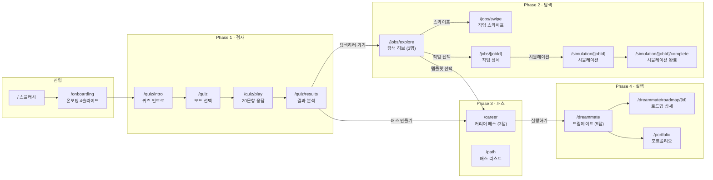

### 1-2. 페이지별 그룹 상세

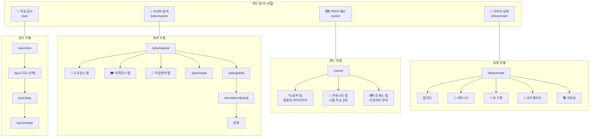

### 1-3. 탐색 탭 내부 구조

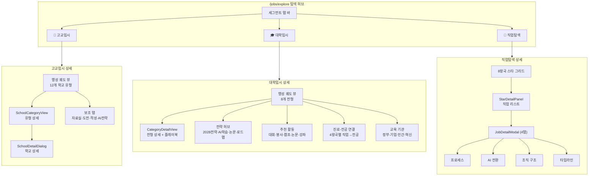

---

## 2. 글로벌 구조 — 네비게이션 · 상태 관리

### 2-1. 하단 탭 바

| 순서 | ID | 라벨 | 아이콘 | 라우트 | 색상 |
|------|-----|------|--------|--------|------|
| STEP 01 | `quiz` | 적성 검사 | `Brain` | `/quiz` | `#3B82F6` |
| STEP 02 | `jobs` | 커리어 탐색 | `Briefcase` | `/jobs/explore` | `#A855F7` |
| STEP 03 | `career` | 커리어 패스 | `Map` | `/career` | `#22C55E` |
| STEP 04 | `dreammate` | 커리어 실행 | `Users` | `/dreammate` | `#FBBF24` |

> **파일:** `frontend/components/tab-bar.config.ts`

### 2-2. 저장소 계층 (Dual-mode Persistence)

```mermaid
flowchart TB
    subgraph CLIENT["클라이언트 저장소"]
        LS["localStorage\n(게스트 모드)"]
        LS --> LS_RIASEC["storage.riasec"]
        LS --> LS_USER["storage.user"]
        LS --> LS_XP["storage.xp"]
        LS --> LS_SWIPE["storage.swipes"]
        LS --> LS_FAV["storage.favorites"]
        LS --> LS_SAVED["storage.savedJobs"]
        LS --> LS_SIM["storage.simulations"]
        LS --> LS_BADGE["storage.badges"]
        LS --> LS_TIMELINE["storage.timeline"]
        LS --> LS_CAREER["career_plans_guest_v1"]
        LS --> LS_COMMUNITY["career_joined_schools\ncareer_joined_groups"]
    end

    subgraph SERVER["서버 저장소"]
        API["REST API\n(인증 모드)"]
        API --> API_CAREER["Career Plan CRUD"]
        API --> API_DREAM["DreamMate Roadmap CRUD"]
        API --> API_SHARED["Shared Plan/Roadmap"]
        API --> API_REACTION["Like/Bookmark/Comment"]
    end

    HOOK_CP["useCareerPlansController"]
    HOOK_DM["useDreamMateWorkspace"]

    HOOK_CP -->|"hasAuth?"| API_CAREER
    HOOK_CP -->|"guest"| LS_CAREER
    HOOK_DM -->|"hasAuth?"| API_DREAM
    HOOK_DM -->|"guest"| LS
```

### 2-3. URL 상태 동기화

| 페이지 | 쿼리 파라미터 | 용도 |
|--------|-------------|------|
| `/jobs/explore` | `tab`, `starId`, `jobId`, `category`, `school`, `subView`, `resource` | 탐색 탭·선택 상태 |
| `/career` | `tab`, `template`, `plan` | 패스 탭·선택 상태 |
| `/dreammate` | `tab`, `roadmap`, `edit`, `report` | 실행 탭·선택 상태 |

> **훅:** `useExploreUrlState()` — `patchUrl(patch)` 로 쿼리 파라미터를 선언적으로 갱신. `router.replace()`로 히스토리 오염 방지.

---

## 3. Phase 0: 온보딩

### 3-0. 스플래시 (`/`)

| 항목 | 내용 |
|------|------|
| **라우트** | `/` (`frontend/app/page.tsx`) |
| **동작** | 유저 프로필 존재 여부 확인 → 없으면 `/onboarding`, 있으면 `/quiz` 리다이렉트 |
| **UI** | 로고 + 로딩 애니메이션 |

### 3-1. 온보딩 (`/onboarding`)

| 항목 | 내용 |
|------|------|
| **라우트** | `/onboarding` |
| **컴포넌트** | `OnboardingPage` (Client Component) |
| **데이터 소스** | `data/onboarding.json` (6개 슬라이드) |

#### 슬라이드 구성

| # | ID | 아이콘 | 색상 | 내용 | Steps |
|---|-----|--------|------|------|-------|
| 1 | `discover` | Sparkles | purple | 앱 소개 | — |
| 2 | `explore` | Compass | blue | 진로 탐색 컨셉 | — |
| 3 | `job-experience` | Briefcase | green | 직업 시뮬레이션 | 3개 |
| 4 | `career-builder` | Map | amber | 커리어 패스 빌더 | 3개 |
| 5 | `school-benefits` | Shield | teal | 학교별 혜택 | 3개 |
| 6 | `success` | Trophy | pink | CTA — 시작하기 | — |

#### 상태 관리

| 상태 | 타입 | 설명 |
|------|------|------|
| `current` | `number` | 현재 슬라이드 인덱스 |
| `touchRef` | `useRef` | 스와이프 제스처 추적 |

#### 인터랙션

| 동작 | 처리 |
|------|------|
| **다음** | `current + 1`, 마지막이면 프로필 생성 → `/quiz` |
| **이전** | `current - 1` |
| **스킵** | 프로필 생성 → `/quiz` |
| **스와이프** | 50px 이상 수평 스와이프 → 다음/이전 |
| **키보드** | `ArrowRight` / `ArrowLeft` |

#### 프로필 생성 (마지막 슬라이드 / 스킵)

```typescript
storage.user.set({
  id: crypto.randomUUID(),
  nickname: '탐험가',
  school: 'general',
  onboardingCompleted: true
})
```

#### 화면 구성

| 영역 | 설명 |
|------|------|
| `BackgroundLayer` | 슬라이드 색상 기반 그라디언트 배경 |
| 스킵 버튼 | 우상단, 텍스트 버튼 |
| `SlideIcon` | 메인 아이콘 + 4개 떠다니는 데코 아이콘 |
| `SlideContent` | 제목, 부제, 설명, 선택적 steps 리스트 |
| `ProgressDots` | 클릭 가능한 도트 인디케이터 |
| CTA 버튼 | "다음" 또는 마지막 "시작하기" |

---

## 4. Phase 1: 검사 — RIASEC 성향 검사

### 4-0. 퀴즈 엔트리 (`/quiz`)

| 항목 | 내용 |
|------|------|
| **라우트** | `/quiz` |
| **컴포넌트** | `QuizEntryPage` |
| **동작** | `resolveQuizLandingPath()` → 저장된 결과 여부로 `/quiz/intro` 또는 `/quiz/results` 리다이렉트 |
| **UI** | `StarfieldCanvas` 배경 + 리다이렉트 중 텍스트 |

### 4-1. 퀴즈 인트로 (`/quiz/intro`)

| 항목 | 내용 |
|------|------|
| **라우트** | `/quiz/intro` |
| **컴포넌트** | `QuizIntroPage` |
| **설정 파일** | `./config.ts` → `STAT_ITEMS`, `TIPS`, `LABELS`, `ROUTES` |

#### 상태 관리

| 상태 | 타입 | 설명 |
|------|------|------|
| `show` | `boolean` | 페이드인 애니메이션 (100ms 후 true) |
| `hasSavedRiasecResult` | `boolean` | `storage.riasec.get()` 존재 여부 |

#### 화면 구성

| 영역 | 조건 | 설명 |
|------|------|------|
| `StarfieldCanvas` | 항상 | 배경 파티클 120개 |
| `SavedResultChoiceBanner` | `hasSavedRiasecResult === true` | "이전 결과 보기 / 다시 검사" 선택 |
| 히어로 섹션 | 항상 | "STEP 01" 뱃지 + 제목 + 부제 |
| 통계 그리드 | 항상 | 2×2(모바일) / 4열(데스크탑), `STAT_ITEMS` 기반 |
| `RewardPreview` | 항상 | XP·뱃지 보상 미리보기 |
| 팁 리스트 | 항상 | `TIPS` 배열 (아이콘 + 텍스트) |
| CTA 버튼 | `hasSavedRiasecResult === false` | "검사 시작하기" → `/quiz/play` |
| 데코 이모지 | 데스크탑만 | 4개 플로팅 이모지, CSS 애니메이션 |

### 4-2. 문항 풀기 (`/quiz/play`)

| 항목 | 내용 |
|------|------|
| **라우트** | `/quiz/play` |
| **컴포넌트** | `QuizPlayPage` |
| **데이터 페칭** | React Query: `fetchQuizQuestions(mode)`, staleTime 10분 |

#### 상태 관리

| 상태 | 타입 | 설명 |
|------|------|------|
| `mode` | `QuizMode \| null` | 일반/빠른 모드 (null = 모드 선택 화면) |
| `currentIndex` | `number` | 현재 문항 인덱스 |
| `answers` | `Record<number, number>` | 문항 인덱스 → 선택지 인덱스 |
| `xpPopVisible` | `boolean` | XP 팝업 표시 |
| `animating` | `boolean` | 더블클릭 방지 |
| `choicesVisible` | `boolean` | 선택지 페이드인 |
| `pendingFeedback` | `FeedbackData \| null` | 문항 간 피드백 오버레이 |

#### 유저 플로우

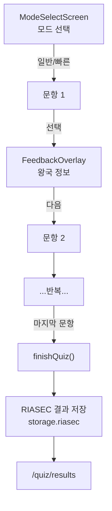

#### 핵심 함수

| 함수 | 동작 |
|------|------|
| `pickAnswer(choiceId, choiceIdx)` | 답 기록 → XP 팝업 → 딜레이 후 피드백 오버레이 |
| `handleFeedbackNext()` | 피드백 닫기 → 다음 문항 / `finishQuiz()` |
| `finishQuiz(finalAnswers)` | `generateRIASECResult()` → `storage.riasec.set()` → 프로필 업데이트 → 백엔드 제출 → `/quiz/results` |
| `goBack()` | 이전 문항 / 모드 선택으로 복귀 |

#### 화면 구성 (문항 화면)

| 영역 | 설명 |
|------|------|
| `BackgroundEffects` | 왕국 테마 색상 기반 배경 |
| `QuizHeader` | 진행률 바 + 뒤로가기 + 문항 번호 |
| `QuestionCard` | 질문 텍스트 + 상황 일러스트 |
| `ChoicesList` | 4~5개 보기, 탭 시 선택 |
| `XpPopup` | 일시적 XP 획득 애니메이션 |
| `QuizStatus` | 응답 수 + 진행 상태 |
| `FeedbackOverlay` | 문항 간 왕국 정보 모달 |

#### 제스처

| 제스처 | 동작 |
|--------|------|
| 우측 스와이프 (80px+) | `goBack()` |

### 4-3. 결과 분석 (`/quiz/results`)

| 항목 | 내용 |
|------|------|
| **라우트** | `/quiz/results` |
| **컴포넌트** | `QuizResultsPage` |
| **데이터 페칭** | React Query: `readStoredRiasecResult`, 스타 JSON 프리페치 |

#### 상태 관리

| 상태 | 타입 | 설명 |
|------|------|------|
| `phase` | `'analyzing' \| 'reveal' \| 'done'` | 애니메이션 단계 |
| `selectedJobForDialog` | `ExploreJob \| null` | 직업 상세 모달 대상 |
| `isJobDialogOpen` | `boolean` | 직업 모달 표시 |
| `isStarPanelOpen` | `boolean` | 스타 패널 표시 |

#### RIASEC 점수 계산 로직 (`lib/riasec.ts`)

| 함수 | 입력 → 출력 |
|------|-------------|
| `calculateRIASECScores(questions, answers)` | 문항+답 → `{R,I,A,S,E,C}` 누적 점수 |
| `getTopTypes(scores)` | 점수 → 상위 2개 타입 `[type1, type2]` |
| `generateKeywords(topTypes)` | 상위 타입 → 4개 한국어 성격 키워드 |
| `normalizeScores(scores)` | 원점수 → 0-100 정규화 (maxPossible=15) |
| `cosineSimilarity(a, b)` | 두 RIASEC 벡터 → 유사도 |
| `matchJobs(userScores, jobs)` | 유저 점수 × 전체 직업 → 매칭률 정렬 |

#### 직업 추천 로직 (`lib/recommendations.ts`)

```
최종 점수 = (RIASEC 코사인 유사도 × 0.6)
          + (좋아요 직업 유사도 보너스 × 0.15)
          + (즐겨찾기 보너스 × 0.1)
          - (같은 왕국 중복 패널티 × 0.03)
→ 최대 1.0 cap → 백분율 변환
```

#### 화면 구성

| 영역 | 설명 |
|------|------|
| **분석 애니메이션** | `QuizResultsAnalyzingView` (phase = analyzing) |
| **메인 타입 공개** | 대형 글자 + 라벨 + 설명 |
| **RIASEC 점수 바** | 정렬된 프로그레스 바 + 퍼센트 |
| **매칭 왕국 카드** | 클릭 → `StarDetailPanel` 열기 |
| **추천 직업 TOP 5** | 2열 그리드, 클릭 → `JobDetailModal` |
| **XP 획득 배너** | +100 XP |
| **다시 검사 버튼** | RIASEC 데이터 초기화 → `/quiz/play` |
| **CTA 버튼** | "탐색하러 가기" → 커리어 탐색 |

---

## 5. Phase 2-A: 고입 탐색

### 5-0. 탐색 허브 (`/jobs/explore`)

| 항목 | 내용 |
|------|------|
| **라우트** | `/jobs/explore` |
| **컴포넌트** | 상단 세그먼트 탭 3개로 분기 |
| **URL 상태** | `useExploreUrlState()` → `tab`, `category`, `school`, `starId`, `jobId`, `subView`, `resource` |

| 세그먼트 탭 | ID | 아이콘 | 컴포넌트 |
|-------------|-----|--------|----------|
| 고교 입시 | `admission` | 🏫 | `HighSchoolAdmissionTab` |
| 대학 입시 | `university` | 🎓 | `UniversityAdmissionTab` |
| 직업 탐색 | `star` (기본) | 🌌 | Star/Job Grid |

### 5-1. 고교입시 탭 (`HighSchoolAdmissionTab`)

| 항목 | 내용 |
|------|------|
| **파일** | `frontend/app/jobs/explore/components/HighSchoolAdmissionTab/index.tsx` |
| **데이터 소스** | `data/high-school/` 하위 12개 JSON + `meta.json` |
| **레이아웃** | `TwoColumnPanelLayout` (좌: 궤도 뷰, 우: 유형 상세) |

#### 상태 관리

| 상태 | 타입 | 설명 |
|------|------|------|
| `selectedCategory` | `HighSchoolCategory \| null` | 선택된 학교 유형 |
| `selectedSchool` | `HighSchoolDetail \| null` | 선택된 개별 학교 |
| `openOrbitHubChallengeTabId` | `TabId \| null` | 보조 탭 ID |

#### 12개 학교 유형 데이터

| ID | 유형 | JSON 파일 | 핵심 키워드 |
|----|------|----------|------------|
| `science_high` | 과학고/영재고 | `science_high.json` | KAIST 부설, 과학영재 |
| `foreign_language` | 외국어고 | `foreign_language.json` | 7개 외국어, 국제 교류 |
| `international` | 국제고 | `international.json` | IB 커리큘럼, 글로벌 |
| `ib` | IB 인증교 | `ib.json` | IB→KB 전환, 2028 대입 |
| `autonomous_private` | 자율형 사립고 | `autonomous_private.json` | 하나고, 민사고 |
| `autonomous_public` | 자율형 공립고 | `autonomous_public.json` | 지역 거점, 교육과정 자율 |
| `arts_sports` | 예술·체육고 | `arts_sports.json` | 예술, 체육 특기 |
| `meister` | 마이스터고 | `meister.json` | 산업 연계, 조기 취업 |
| `business` | 비즈니스고 | `business.json` | 상업계열, AI 비즈니스 |
| `specialized` | 특성화고 | `specialized.json` | 직업교육, AI 연계 실습 |
| `general_elite` | 일반고 중점학급 | `general_elite.json` | 교과 중점, 대학 진학 |
| `general` | 일반고 | `general.json` | 자유 선택 교육과정 |

#### 5-1-1. 좌측 패널: 행성 궤도 뷰 (`PlanetOrbitView`)

| 항목 | 내용 |
|------|------|
| **컴포넌트** | `PlanetOrbitView` |
| **Props** | `categories`, `onSelectCategory`, `selectedCategoryId` |
| **애니메이션** | `requestAnimationFrame` 루프, 각 행성의 `planet.orbitSpeed` 기반 각도 업데이트 |

| UI 요소 | 설명 |
|---------|------|
| SVG 궤도 링 | 점선 타원, 카테고리별 색상 |
| 중앙 별 | `motion.div`, 펄스 애니메이션 (scale + boxShadow) |
| 궤도 행성 | `motion.button`, 삼각함수로 위치 계산, 호버 시 글로우 |
| 하단 범례 | 2열 그리드, 이모지 + 이름 + 학교 수, 선택 시 좌측 액센트 바 |

| 상수 | 값 |
|------|-----|
| `PLANET_SIZES` | small: 44, medium: 54, large: 66 |
| `CENTER_X` / `CENTER_Y` | 160 / 160 |

#### 5-1-2. 우측 패널: 학교 유형 상세 (`SchoolCategoryView`)

| 항목 | 내용 |
|------|------|
| **Props** | `category`, `onBack`, `onSelectSchool`, `variant` (`leftList` \| `rightDetail`) |
| **퀴즈 상태** | `quizPhase`: `intro` → `question` → `feedback` → `result` |

| UI 섹션 | 설명 |
|---------|------|
| **헤더** | 이모지 + 유형명 + 설명 (`GlossaryText` 하이라이트) |
| **특성 카드** | `TraitRow` 3개 (이모지+라벨+값), 상세 보기 버튼 → `CategoryTraitDetailDialog` |
| **적성 퀴즈 아코디언** | 4지선다 퀴즈, 진행률 바, 점수 비율별 결과 메시지 (0.85/0.7/0.55/0.4/0) |
| **방향성 패널** | 2탭 아코디언: "2028 입시 방향" + "AI시대 방향" |
| — 2028 입시 | 정책 맥락, 수시/정시/면접 트랙별 전략, 학년별 전략, 장점 |
| — AI시대 | 맥락, 전략, 실천 팁 |
| **학교 리스트** | `SchoolListCard` × N (이모지, 이름, IB/기숙사 뱃지, 지역, 난이도, 입학 정원, 주요 프로그램 3개) |

#### 5-1-3. 학교 상세 다이얼로그 (`SchoolDetailDialog`)

| 항목 | 내용 |
|------|------|
| **렌더링** | `createPortal` 기반 풀스크린 오버레이, max-width 680px, 94dvh |
| **내부** | `SchoolDetailPanel` (variant="dialog") |
| **닫기** | ESC 키, 배경 클릭, X 버튼 |
| **스크롤 잠금** | 마운트 시 `body.overflow = hidden` |

| 상세 섹션 | 필드 |
|-----------|------|
| 기본 정보 | 이름, 설립 유형, 지역, 홈페이지 |
| 교육과정 | 주요 교과, 특색 프로그램 |
| AI 교육 | AI 연계 과목, 코딩 교육 |
| 2028 대입 전략 | `admissionStrategy2028` 필드 렌더링 |
| — `tracks` | 지원 전형 트랙 |
| — `byGrade` | 학년별 준비 전략 |
| — `perks` | 진학 시 유리한 점 |
| 입시 정보 | 전형 일정, 경쟁률, 준비 사항 |

#### 5-1-4. 보조 콘텐츠 탭 (`HighSchoolOrbitHubChallengeTabBar`)

| 탭 ID | 컴포넌트 | 설명 |
|--------|----------|------|
| `resource-hub` | `HighSchoolResourceHubSection` | 입시 가이드, 학교별 분석, 다운로드 자료 |
| `identity-challenge` | `IdentityChallengeGame` | 자기 정체성 탐색 미니 게임 |
| `mental-challenge` | `MentalChallengeGame` | 진로 불안 대처 미니 게임 |
| `aptitude-check` | `AptitudeCheckSection` | 학교 유형별 적성 매칭 체크리스트 |
| `ai-era-strategy` | `HighSchoolAiEraStrategyContent` | AI 시대 고교 선택 전략 |

#### 5-1-5. AI 시대 전략 콘텐츠 (`HighSchoolAiEraStrategyContent`)

| Props | 설명 |
|-------|------|
| `aiStrategy` | `HighSchoolAiEraStrategy` 데이터 |
| `categoryColor` / `categoryBgColor` | 카테고리 테마 색상 |

| UI 섹션 | 설명 |
|---------|------|
| 요약 카드 | 그라디언트 배경 + 제목 + 요약 |
| Key Insight 0 | "AI가 대체" (빨강) vs "인간이 해야 할 일" (초록) 2패널 |
| Key Insight 1 | 로드맵 — 버티컬 타임라인 (단계 뱃지, 집중 분야, 추천 도구, 프로젝트, keyPoint, warning) |
| Key Insight 2 | 전략 카드 (이름, why, how, example) |
| 실전 팁 | 이모지 + 카테고리 + 팁 + 상세 |
| 흔한 실수 | 실수 (빨강) + 올바른 접근 (초록) |
| 미래 커리어 인사이트 | 현실, 신규 직업, 준비 방법 |

---

## 6. Phase 2-B: 대입 탐색

### 6-1. 대학입시 탭 (`UniversityAdmissionTab`)

| 항목 | 내용 |
|------|------|
| **파일** | `frontend/app/jobs/explore/components/UniversityAdmissionTab/index.tsx` |
| **데이터 소스** | `data/university-admission/` 하위 — 8개 전형 JSON, 4개 기관 트랙, 4개 왕국 직업, 8개 플레이북, 4개 전략 허브, 추천 활동 |
| **레이아웃** | `TwoColumnPanelLayout` (좌: 궤도 + 서브뷰 버튼, 우: 상세) |

#### 상태 관리

| 상태 | 타입 | 설명 |
|------|------|------|
| `selectedCategory` | `AdmissionCategory \| null` | 선택된 전형 |
| `selectedSubView` | `SubView` | 서브뷰 종류 |
| `showCategoryDialog` | `boolean` | 전형 상세 다이얼로그 |
| `subViewAnimKey` | `number` | 애니메이션 리마운트 키 |

#### 8개 대입 전형

| ID | 전형명 | 설명 |
|----|--------|------|
| `student-record-comprehensive` | 학생부종합(활동) | 비교과 활동 중심 |
| `student-record-academic` | 학생부교과 | 내신 성적 중심 |
| `regular-admission` | 정시(수능) | 수능 점수 중심 |
| `ib-direct-admission` | IB 특별전형 | IB/KB 학위 활용 |
| `special-admission` | 특기자 | 특기 분야 |
| `international` | 재외국민 | 해외 거주 경험 |
| `overseas-korean-admission` | 해외 한국인 | 해외 교포 |
| `rural-opportunity-admission` | 농어촌 | 지역 균형 |

#### 5개 서브뷰 (좌측 하단 네비게이션 버튼)

| SubView | 컴포넌트 | 설명 |
|---------|----------|------|
| `strategy-hub` | `StrategyHubView` | 전략 허브 (2028전략·AI학습·논문·로드맵) |
| `recommended-activities` | `RecommendedActivitiesDirectory` | 추천 활동 디렉토리 |
| `career-major` | `CareerMajorConnectionView` | 진로-전공 연결 (4왕국) |
| `dev-institutions` | `DevEducationInstitutionsView` | 교육 기관 (정부·기업·민간) |
| `innovative-institutions` | `DevEducationInstitutionsView` | 혁신 기관 (42서울 등) |

### 6-2. 전형 상세 (`CategoryDetailView`)

| UI 섹션 | 내용 |
|---------|------|
| 전형 개요 | 핵심 평가 요소, 대상 학생 |
| 플레이북 | 단계별 준비 가이드 (playbook JSON) |
| 핵심 전략 | 합격을 위한 3~5가지 전략 |
| 연계 학교 | 해당 전형 적극 활용 고교 유형 |

### 6-3. 전략 허브 (`StrategyHubView`)

| 항목 | 내용 |
|------|------|
| **Props** | `sections`, `masterDetailLabels`, `mode`, `onClose` |
| **모드** | `standalone` (2열 레이아웃) / `right-panel` (단일 패널) |

#### Right-panel 모드 UI

| 영역 | 설명 |
|------|------|
| 헤더 | 이모지 + 제목 + 설명 + 닫기 |
| 학년 탭 | 1학년(초록) / 2학년(파랑) / 3학년(노랑) |
| 섹션 아코디언 | 접기/펼치기 헤더 (이모지+라벨+요약) |
| — 학년 목표 카드 | 해당 학년의 목표 |
| — 번호별 액션 카드 | 제목, 설명, 액션 스텝 체크리스트, 추천 시기 |
| — 실전 예시 | 구체적 활동 예시 |
| — 디테일 체크리스트 | 확인 항목 리스트 |

#### 4개 전략 섹션

| 전략 | JSON | 내용 |
|------|------|------|
| 2028 대입 전략 | `strategy-2028.json` | 새 입시 제도 핵심 변화와 대응 |
| AI 프로젝트 학습 | `ai-project-learning.json` | AI 도구 활용 프로젝트 기반 학습 |
| 논문 제작 활동 | `paper-maker-activities.json` | 소논문/탐구보고서 작성법 |
| 학년별 로드맵 | `grade-roadmap-overview.json` | 1~3학년 시기별 체크리스트 |

### 6-4. 추천 활동 디렉토리 (`RecommendedActivitiesDirectory`)

| 항목 | 내용 |
|------|------|
| **데이터 소스** | `recommended-activities-directory.json` |
| **타입** | `DirectoryGroup { id, label, emoji, color, items: DirectoryItem[] }` |
| **아이템 타입** | `DirectoryItem { name, org, grades, url, note?, schedule2025? }` |

| UI 영역 | 설명 |
|---------|------|
| 인트로 블록 | 그라디언트 카드, 이모지 + 제목 + 설명 |
| 그룹별 | 헤더 (이모지+라벨+개수 뱃지), 1~2열 그리드 |
| 아이템 카드 | 외부 링크 (`target="_blank"`), 이름, 학년 뱃지, 기관, 일정, 메모 |
| 면책 문구 | 외부 일정/비용 변동 주의 |

| 활동 카테고리 | 예시 |
|--------------|------|
| 대회·공모전 | 과학올림피아드, SW 공모전, 발명대회 |
| 봉사 활동 | 교육 봉사, 환경 봉사, 글로벌 봉사 |
| 캠프·체험 | 대학 탐방 캠프, STEM 캠프, 해외 캠프 |
| 논문·연구 | 소논문, R&E 프로그램, 과학/사회 탐구 |
| 온라인 학습 | MOOC, 코딩 부트캠프, AI 과정 |
| 전시·문화 | 과학관, 박물관, 문화 체험 |
| 자격·인증 | 국가기술자격, 어학, IT 자격증 |

### 6-5. 진로-전공 연결 (`CareerMajorConnectionView`)

| 항목 | 내용 |
|------|------|
| **Props** | `careers`, `mode`, `onClose` |
| **필터** | 4개 왕국: 탐구 / 기술 / 창작 / 자연 |

#### 유저 플로우

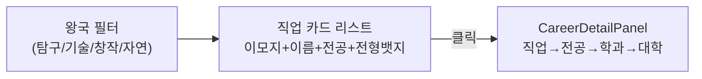

| 카드 필드 | 설명 |
|-----------|------|
| `emoji` | 직업 아이콘 |
| `name` | 직업명 |
| `kingdom` | 소속 왕국 |
| `targetMajor` | 목표 전공 |
| `admissionType` | 추천 전형 뱃지 |

### 6-6. 교육 기관 탐색 (`DevEducationInstitutionsView`)

| 항목 | 내용 |
|------|------|
| **Props** | `institutions`, `mode`, `masterDetailLabels`, `rightPanelColor` |
| **타입** | `DevEducationInstitution { emoji, name, fullName, type, duration, ... }` |

| 트랙 | 색상 | 예시 기관 |
|------|------|----------|
| 정부 기관 | 기본 보라 | 한국과학창의재단, KIST, 국립과학관 |
| 기업 프로그램 | 기본 보라 | 삼성 주니어SW, 네이버 커넥트재단 |
| 민간 교육 | 기본 보라 | 코딩 아카데미, STEM 연구소 |
| 혁신 기관 | 별도 색상 | 42 서울, SW 마에스트로 |

---

## 7. Phase 2-C: 취업 탐색

### 7-1. 직업 탐색 탭 (Star Tab)

| 항목 | 내용 |
|------|------|
| **데이터** | 8개 스타 JSON (explore, create, tech, connect, nature, order, communicate, challenge) |
| **레이아웃** | `TwoColumnPanelLayout` (좌: `StarGridGroupedPanel`, 우: `StarDetailPanel`) |

#### 8개 왕국

| 왕국 | 키워드 |
|------|--------|
| 탐구 (explore) | 연구, 분석, 과학 |
| 창작 (create) | 디자인, 예술, 콘텐츠 |
| 기술 (tech) | 개발, 엔지니어링, IT |
| 소통 (connect) | 교육, 상담, 미디어 |
| 자연 (nature) | 환경, 생태, 농업 |
| 질서 (order) | 법률, 행정, 금융 |
| 도전 (challenge) | 스포츠, 모험, 기업가 |
| 연결 (communicate) | 외교, 통역, 무역 |

### 7-2. 직업 상세 모달 (`JobDetailModal`)

| 항목 | 내용 |
|------|------|
| **Props** | `job: Job`, `star: StarData`, `onClose` |
| **래퍼** | `CareerPathStyleDialog` (다이얼로그 크롬 제공) |

#### 4개 탭

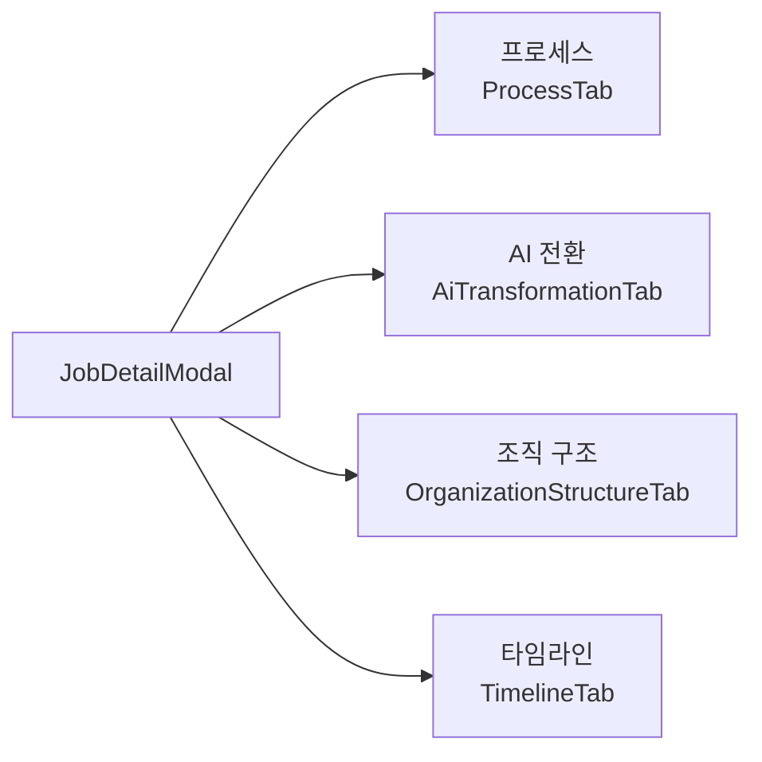

#### 탭 1: 프로세스 (`ProcessTab`)

| UI 섹션 | 설명 |
|---------|------|
| `ProcessHeaderCard` | 제목, 설명 (`GlossaryText`), 단계 수 뱃지 |
| Holland 코드 카드 | Brain 아이콘 + 파싱된 Holland 코드 라벨 |
| `ProcessTree` | 버티컬 타임라인 (발광 라인) |
| — 각 `ProcessTreeNode` | STEP N 뱃지 + 단계명 + 기간, 제목, 설명, 예시 카드, 도구 (pill), 스킬 (pill) |

**WorkPhase 타입:**
```typescript
{ id, phase, title, description, duration, icon, example, tools: string[], skills: string[] }
```

#### 탭 2: AI 전환 (`AiTransformationTab`)

| UI 섹션 | 설명 |
|---------|------|
| 히어로 카드 | 직업명 + 리스크 헤드라인 + TLDR + 액션 팁 |
| **STEP 1: AI 영향 진단** | |
| — `DungeonRiskSection` | 리스크 레벨 시각화 |
| — `XpBarsSection` | 대체 압력 / 협업 설계 XP 바 (0-5) |
| **STEP 2: 업무 변화** | |
| — `EvolutionCards` | AI 이전/이후 비교 카드 3단계 |
| **STEP 3: 실천 방안** | |
| — `PlaybookQuestLoop` | 4단계 액션 가이드 |
| — `ToolsAndSurvival` | AI 도구 추천 + 생존 전략 |

**리스크 등급:**

| 등급 | 색상 | 의미 |
|------|------|------|
| 🟢 Low | 초록 | AI 보조, 핵심은 인간 |
| 🟡 Medium | 노랑 | 일부 대체, 역량 전환 필요 |
| 🔴 High | 빨강 | 상당 부분 자동화 위험 |

#### 탭 3: 조직 구조 (`OrganizationStructureTab`)

| UI 섹션 | 설명 |
|---------|------|
| 헤더 | 제목 + 설명 |
| 계층 트리 | 레벨 내림차순 (최상위 먼저) |
| — 각 레벨 카드 | 아이콘 + 직급 + Lv.N 뱃지, 근속연수 + 평균 연봉 |
| — 내러티브 블록 | `roleNarrative` + `competencyNarrative` 카드 (없으면 roles/skills pill) |
| — 트리 커넥터 | 수직 라인 + 중앙 도트 |
| 승진 기준 | TrendingUp 아이콘 + 기준 카드 리스트 |
| 커리어 패스 | Briefcase 아이콘 + 경로명 + 설명 카드 |

**OrganizationLevel 타입:**
```typescript
{ level, title, icon, roles[], requiredSkills[], roleNarrative?, competencyNarrative?, yearsRange, avgSalary }
```

#### 탭 4: 타임라인 (`TimelineTab`)

| 항목 | 설명 |
|------|------|
| 데이터 | `job.careerTimeline` → 없으면 `buildFallbackCareerTimelineMilestones(job)` |
| 렌더러 | 공유 `CareerPathTimeline` 컴포넌트 |
| 테마 | `star.color` 기반 파생 (accentColor, costColor, successColor) |

### 7-3. 직업 스와이프 (`/jobs/swipe`)

| 항목 | 내용 |
|------|------|
| **라우트** | `/jobs/swipe` |
| **진입 조건** | `storage.user.riasecScores` 필수 (없으면 퀴즈로 리다이렉트) |
| **데이터** | `jobs.json` 전체 로드 |

| 상태 | 타입 | 설명 |
|------|------|------|
| `currentIndex` | `number` | 현재 카드 위치 |
| `direction` | `'left' \| 'right' \| null` | 스와이프 방향 |

| UI 영역 | 설명 |
|---------|------|
| 헤더 | 뒤로가기 + 카운터 (X/total) + 정보 버튼 |
| 카드 스택 | CSS transform 애니메이션 (translate + rotate + opacity) |
| — 직업 정보 | 왕국 뱃지, 난이도, 제목, 설명 |
| — 정보 행 | 평균 연봉, 필요 학력, 성장 전망 |
| 액션 버튼 | X (패스) / ♥ (좋아요) |
| 빈 상태 | "모든 직업을 확인했어요!" + 홈 버튼 |

### 7-4. 직업 상세 (`/jobs/[jobId]`)

| 항목 | 내용 |
|------|------|
| **라우트** | `/jobs/[jobId]` |
| **데이터** | `jobs.json`에서 ID 매칭, `kingdoms.json`에서 왕국 매칭 |

| UI 섹션 | 설명 |
|---------|------|
| 히어로 | 대형 아이콘/그라디언트 (h-72), 북마크 토글 |
| 퀵 정보 | 왕국 뱃지, 난이도 뱃지, 제목, 설명 |
| CTA | "하루 시뮬레이션 시작" → `/simulation/[jobId]` |
| 통계 그리드 (2×2) | 연봉, 학력, 성장성, 고용 수 |
| 5탭 콘텐츠 | overview, L1, L2, L3, L4 |
| — overview | 상세 설명 + 필요 스킬 뱃지 + 자격증 |
| — L1~L4 | 레벨별 제목, 설명, 업무 리스트, 스킬 뱃지 |

### 7-5. 시뮬레이션 (`/simulation/[jobId]`)

| 항목 | 내용 |
|------|------|
| **데이터** | `simulations.json`에서 jobId 매칭 |
| **타입** | `DaySimulation { jobId, scenes[] }` |

| 상태 | 타입 |
|------|------|
| `currentSceneIndex` | `number` |
| `selectedChoice` | `number \| null` |

| UI 영역 | 설명 |
|---------|------|
| 헤더 | 직업명 + 시간 (Clock) + 진행률 바 |
| 씬 콘텐츠 | 이모지 일러스트 + 제목 + 설명 (Card) |
| 선택지 | 라디오 카드 (텍스트 + XP 보상 + 스킬 획득) |
| 다음 버튼 | "다음 장면" / "완료하기", 미선택 시 비활성 |

**완료 시:** 총 XP 계산 → `storage.simulations.add()` → `/simulation/[jobId]/complete`

---

## 8. Phase 3: 패스 — 커리어 패스 메이커

### 8-0. 패스 메인 (`/career`)

| 항목 | 내용 |
|------|------|
| **라우트** | `/career` |
| **3탭 구조** | `CareerPageTabId` |

| 탭 | ID | 아이콘 | 컴포넌트 |
|-----|------|--------|----------|
| 탐색 | `explore` | 🔍 | `CareerPathList` |
| 커뮤니티 | `community` | 👥 | `CommunityTab` |
| 내 패스 | `timeline` | 🗺️ | `VerticalTimelineList` + `CareerPathTimeline` |

### 8-1. 탐색 탭 — 템플릿 라이브러리 (`CareerPathList`)

| 항목 | 내용 |
|------|------|
| **파일** | `frontend/app/career/components/CareerPathList.tsx` (382줄) |
| **Props** | `onUseTemplate`, `onNewPath`, `myPublicPlans`, `selectedTemplateId`, `onSelectTemplate` |
| **레이아웃** | `TwoColumnPanelLayout` (좌: 리스트, 우: `CareerPathDetailPanel`) |

#### 상태 관리

| 상태 | 타입 | 설명 |
|------|------|------|
| `activeFilter` | `string` | 스타 필터 ID (12개) |
| `showExpandDialog` | `boolean` | 확장 다이얼로그 |
| `templateBookmarkIds` | `string[]` | localStorage (`template_bookmarks_v1`) |
| `*Page` | `number` | 각 섹션 페이지네이션 |

#### 3개 아코디언 섹션

| 섹션 | 카드 컴포넌트 | 설명 |
|------|-------------|------|
| 북마크된 템플릿 | `BookmarkedTemplateCard` + `BookmarkedCommunityCard` | 내가 북마크한 템플릿/커뮤니티 패스 |
| 내 공유 패스 | `MyPublicPlanCard` | 내가 공유한 패스 |
| 커리어 패스 목록 | `TemplateRow` | 전체 템플릿 리스트 + 필터 |

#### 4종 템플릿 소스

| 파일 | 내용 |
|------|------|
| `career-path-templates.json` | 범용 커리어 패스 |
| `career-path-templates-admission.json` | 대입 연계 패스 |
| `career-path-templates-highschool.json` | 고입 연계 패스 |
| `career-path-templates-future.json` | 미래 직업 패스 |

#### Controlled / Uncontrolled 패턴

| 모드 | 트리거 | 선택 관리 |
|------|--------|----------|
| Controlled | `onSelectTemplate` prop 존재 | 부모가 선택 상태 관리 |
| Uncontrolled | prop 미제공 | URL 쿼리 `template=<id>` |

### 8-2. 패스 상세 패널 (`CareerPathDetailPanel`)

| 항목 | 내용 |
|------|------|
| **파일** | `frontend/app/career/components/CareerPathDetailPanel.tsx` (451줄) |
| **Props** | `template`, `onClose`, `onUseTemplate`, `onExpand` |

| UI 섹션 | 설명 |
|---------|------|
| 헤더 | 직업 이모지 + 스타 정보 뱃지 + AI 생성 뱃지 |
| 액션 바 | 좋아요(카운트) + 북마크 + 유저 수 + 공유 드롭다운 |
| AI 안내 배너 | AI 생성 콘텐츠 고지 |
| 설명 | 텍스트 |
| 입시 전략 섹션 | 연관 입시 전략 |
| 추천 활동 | 연관 추천 활동 |
| 성공 사례 | 성공 스토리 |
| 타임라인 | `CareerPathDetailPanelTimeline` |
| 태그 리스트 | 관련 태그 |
| 댓글 | 추가/수정/삭제 |
| 푸터 | "이 패스 사용하기" → 제목 커스터마이징 다이얼로그 |

### 8-3. 패스 빌더 (`CareerPathBuilder`)

| 항목 | 내용 |
|------|------|
| **파일** | `frontend/app/career/components/CareerPathBuilder.tsx` (3167줄) |
| **Props** | `initialPlan`, `initialStep`, `onSave`, `onClose` |
| **UI** | 풀스크린 오버레이, 백드롭 블러 |

#### 4단계 위저드

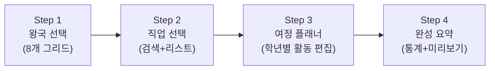

#### Step 1: 왕국 선택 (`Step1Kingdom`)

| 요소 | 설명 |
|------|------|
| 8개 왕국 그리드 | 이모지 + 이름 + 색상, 클릭 시 `starId` 설정 |

#### Step 2: 직업 선택 (`Step2Job`)

| 요소 | 설명 |
|------|------|
| 검색 입력 | 직업명 키워드 검색 |
| 추천 태그 pill | 빠른 필터 |
| 직업 카드 리스트 | 스크롤 가능, `loadKingdomJobsByKingdomId` 기반 |

#### Step 3: 여정 플래너 (`Step3Planner`)

| 요소 | 설명 |
|------|------|
| 시작 플래그 | 여정 시작 마커 |
| `YearPlanCard` × N | 학년별 스테이션 (초등~대학) |
| — 학기 선택 | 통년 / 학기 분할 |
| — `SemesterSection` | 학기별 목표 그룹 |
| — — `GoalActivityGroupCard` | 목표 헤더 + 활동 아코디언 |
| — — — `ActivityItemCard` | 활동 카드 (체크, 타입 뱃지, 월, 난이도, 서브아이템) |
| 여정 진행률 바 | 전체 달성률 |
| 트로피 도착지 | 여정 완료 마커 |

**활동 추가 (`AddItemSheet`):**

| 모드 | 설명 |
|------|------|
| 추천 모드 | `goal-recommended-items.json`에서 단계별 추천, 키워드 매칭 |
| 커스텀 모드 | 직접 입력 |

**활동 편집 (`EditItemSheet`):**

| 필드 | 타입 |
|------|------|
| `type` | 항목 유형 (activity, award, portfolio, certification, ...) |
| `title` | 제목 |
| `months` | 12개월 다중 선택 |
| `difficulty` | 난이도 (E~A) |
| `cost` | 비용 |
| `organizer` | 주관 기관 |
| `url` | 링크 |
| `description` | 설명 |

**항목 유형 (`ITEM_TYPES`):**

| 타입 | 이모지 | 라벨 | 색상 |
|------|--------|------|------|
| activity | 📌 | 활동 | blue |
| award | 🏆 | 수상/대회 | amber |
| portfolio | 📁 | 포트폴리오 | emerald |
| certification | 📜 | 자격/인증 | purple |
| 기타 | 각각 | 각각 | 각각 |

**난이도 티어 (`ACTIVITY_TIER_BY_DIFFICULTY`):**

| 레벨 | 티어 | 색상 |
|------|------|------|
| 1 | E | slate |
| 2 | D | blue |
| 3 | C | emerald |
| 4 | B | amber |
| 5 | A | rose |

#### Step 4: 완성 요약 (`Step4Summary`)

| 요소 | 설명 |
|------|------|
| 빅토리 화면 | 우승 이모지 + 축하 메시지 |
| 통계 그리드 | 스테이션 수 / 목표 수 / 활동 수 |
| 타임라인 미리보기 | `CareerPathTimelinePreview` |
| 저장 버튼 | `handleSave()` → `onSave(plan)` |

#### CareerPlan 데이터 모델

```typescript
interface CareerPlan {
  id: string;
  starId: string;
  starName: string;
  starEmoji: string;
  starColor: string;
  jobId: string;
  jobName: string;
  jobEmoji: string;
  years: YearPlan[];
  createdAt: string;
  title: string;
  description?: string;
  isPublic?: boolean;
  shareChannels?: string[];
  shareType?: 'private' | 'public' | 'school' | 'group';
  shareGroupIds?: string[];
  sharedAt?: string;
}

interface YearPlan {
  gradeId: string;
  gradeLabel: string;
  semester: SemesterOption;
  goals: string[];
  items: PlanItem[];
  goalGroups: GoalActivityGroup[];
  semesterPlans: SemesterPlan[];
}

interface PlanItem {
  id: string;
  type: ItemType;
  title: string;
  months: string[];
  difficulty: number;
  cost: string;
  organizer: string;
  description: string;
  url: string;
  subItems: SubItem[];
  categoryTags?: CareerItemCategoryTag[];
  activitySubtype?: CareerActivitySubtype;
  links?: CareerItemLink[];
}
```

### 8-4. 내 패스 탭 — 타임라인 (`CareerPathTimeline`)

| 항목 | 내용 |
|------|------|
| **파일** | `frontend/app/career/components/CareerPathTimeline.tsx` (742줄) |
| **Props** | `plan`, `onEdit`, `onNewPlan` |

| UI 섹션 | 설명 |
|---------|------|
| 스타/직업 헤더 | 왕국 이모지 + 직업명 |
| `YearCard` × N | 학년 카드 (학기 분할 지원) |
| — `GoalActivityGroupTimelineCard` | 목표별 활동 아코디언 |
| — — `ActivityItemTimelineCard` | 체크 토글, 타입 뱃지, 월, 난이도, 서브아이템 |
| WBS 차트 | 미니 Gantt (12개월 스팬) |
| 통계 그리드 | 타입별 카운트 (활동/수상/포트폴리오/자격) |
| 액션 버튼 | 수정 / 새 패스 만들기 |

### 8-5. 패스 상태 관리 (`useCareerPlansController`)

| 항목 | 내용 |
|------|------|
| **파일** | `frontend/app/career/hooks/useCareerPlansController.ts` (214줄) |

#### 반환 인터페이스

| 필드 | 타입 | 설명 |
|------|------|------|
| `plans` | `CareerPlan[]` | 전체 패스 목록 |
| `source` | `'server' \| 'guest'` | 저장소 모드 |
| `savePlan` | `(plan) => Promise<void>` | 저장 (생성/수정 자동 판별) |
| `deletePlan` | `(planId) => Promise<void>` | 삭제 |
| `updatePlanInline` | `(planId, patch) => void` | 인라인 수정 |
| `useTemplate` | `(templateId, title) => Promise<CareerPlan>` | 템플릿 복제 |
| `isSaving` | `boolean` | 저장 중 상태 |
| `refetch` | `() => void` | 재조회 |

#### 듀얼 모드 분기

| 모드 | 조건 | 저장소 | API |
|------|------|--------|-----|
| Server | `hasCareerPathBackendAuth() === true` | TanStack Query | REST API CRUD |
| Guest | 미인증 | localStorage `career_plans_guest_v1` | 없음 |

---

## 9. Phase 4: 실행 — 드림메이트

### 9-0. 드림메이트 메인 (`/dreammate`)

| 항목 | 내용 |
|------|------|
| **라우트** | `/dreammate` |
| **5탭 구조** | `DreamTabId` |
| **상태 관리** | `useDreamMateWorkspace()` (1281줄, 50+ 속성 반환) |

| 탭 | ID | 아이콘 | 컴포넌트 |
|-----|------|--------|----------|
| 피드 | `feed` | 🗓️ | `RoadmapFeedTab` |
| 커뮤니티 | `space` | 🤝 | `DreamSpaceTab` |
| 내 기록 | `my` | ⭐ | `MyDreamMateTab` |
| 포트폴리오 | `portfolio` | 🎨 | `PortfolioTab` |
| 자료실 | `library` | 📚 | `DreamLibraryTab` |

#### 히어로 배너 (`DreamMateHeroBanner`)

| 요소 | 설명 |
|------|------|
| 통계 | 진행 중 로드맵 수, 완료율, 연속 일수 |
| CTA 3개 | 로드맵 만들기 · 공간 만들기 · 자료 업로드 |

### 9-1. 피드 탭 (`RoadmapFeedTab`)

| 항목 | 내용 |
|------|------|
| **파일** | `frontend/app/dreammate/components/RoadmapFeedTab.tsx` (423줄) |
| **Props** | `roadmaps`, `currentUserId`, `bookmarkedIds`, `onCreateRoadmap`, `detailCallbacks`, `selectedRoadmapId`, `onSelectRoadmap` |

| 상태 | 설명 |
|------|------|
| `periodFilter` | 기간 필터 |
| `typeFilter` | 유형 필터 |
| `searchQuery` | 다중 필드 검색 (제목, 소유자, 아이템, 결과, 마일스톤, 실행 필드) |

| UI 섹션 | 설명 |
|---------|------|
| 북마크된 로드맵 아코디언 | 내가 북마크한 로드맵 |
| 내 공유 로드맵 아코디언 | 내가 공유한 로드맵 |
| 피드 리스트 | 검색바 + 필터 pill + 로드맵 카드 리스트 |
| 상세 패널 | `RoadmapDetailDialog` (inline 모드) |

**정렬 규칙:** 북마크된 아이템이 상단에 노출.

### 9-2. 로드맵 에디터 (`RoadmapEditorDialog`)

| 항목 | 내용 |
|------|------|
| **파일** | `frontend/app/dreammate/components/RoadmapEditorDialog.tsx` (1187줄) |
| **Props** | `title`, `submitLabel`, `initialValues`, `onClose`, `onSubmit`, `onOpenBuilder` |

#### RoadmapEditorPayload

```typescript
interface RoadmapEditorPayload {
  title: string;
  description: string;
  period: string;
  starColor: string;
  focusItemTypes: string[];
  milestoneResults?: { title: string; description?: string }[];
  finalResultTitle?: string;
  finalResultDescription?: string;
  finalResultUrl?: string;
  finalResultImageUrl?: string;
  groupIds: string[];
  items: RoadmapItem[];
}
```

#### 에디터 UI 구조

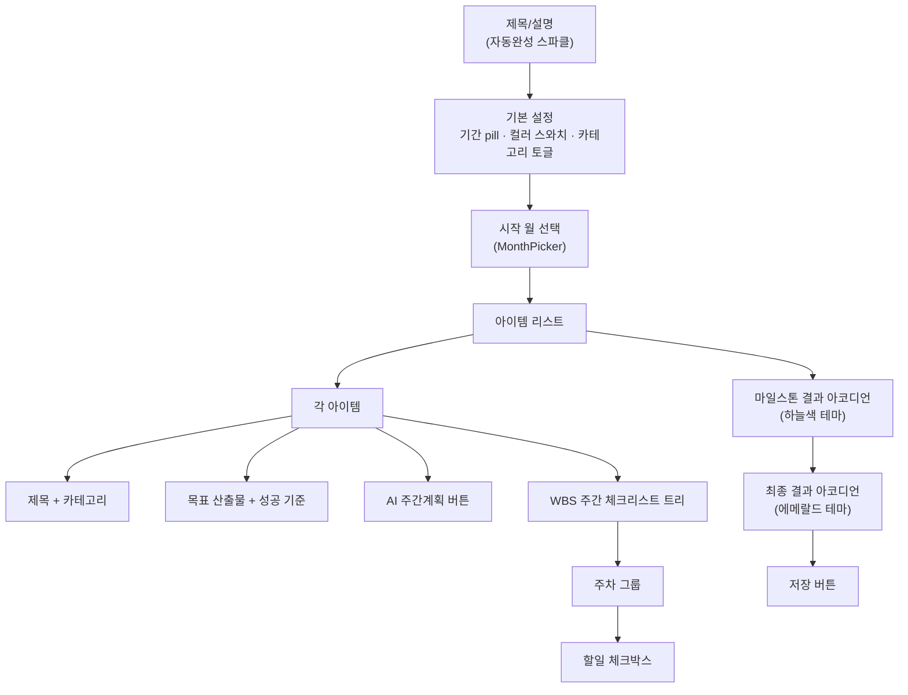

#### 주간 목표 관리 (WBS)

| 기능 | 설명 |
|------|------|
| 주차 추가/삭제 | 순차 주차 번호 자동 생성 |
| 할일 추가/삭제 | 체크박스 + 텍스트 |
| 할일 완료 토글 | `is_done` 플래그 |
| 산출물 기록 | `output_url`, `output_image_url` |
| 상태 순환 | Jira 스타일 (todo → in_progress → done) |

### 9-3. AI 실행 계획 생성 (`ExecutionPlanAiGenerateDialog`)

| 항목 | 내용 |
|------|------|
| **파일** | `frontend/app/dreammate/components/execution-plan-ai/ExecutionPlanAiGenerateDialog.tsx` (373줄) |
| **Props** | `isOpen`, `onClose`, `selectedMonths`, `defaultPlanTitle`, `onApplySubItems` |

#### 유저 플로우

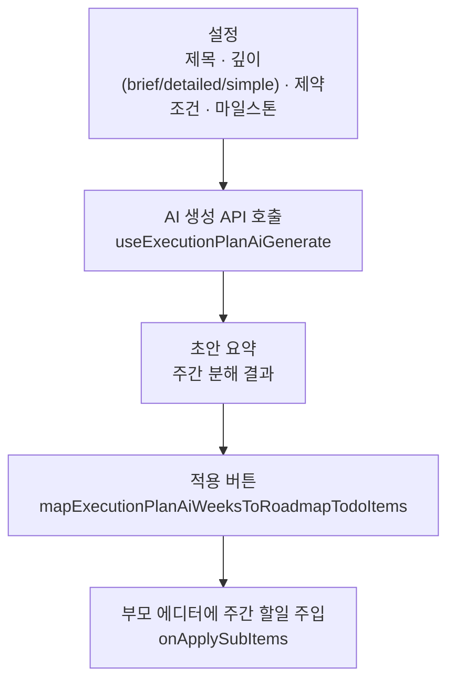

| 상태 | 타입 | 설명 |
|------|------|------|
| `planDepth` | `'brief' \| 'detailed' \| 'simple'` | 생성 깊이 |
| `title` | `string` | 계획 제목 |
| `constraints` | `string` | 제약 조건 |
| `milestones` | `{ title, date_iso }[]` | 마일스톤 |
| `usePreviousSummary` | `boolean` | 이전 생성 요약 활용 |

**히스토리:** localStorage에 최근 5개 생성 요약 저장, `usePreviousSummary` 토글로 컨텍스트 제공.

**실행 템플릿 (141개):**
```typescript
interface ExecutionTemplate {
  id: string;
  title: string;
  emoji: string;
  description: string;
  period: 'semester' | 'month' | 'week';
  months: string[];
  difficulty: 1 | 2 | 3 | 4 | 5;
  successCriteria: string[];
  recordHook: string;
  evidence: string[];
  weeklyGoals: {
    weekLabel: string;
    title: string;
    tasks: string[];
    output: string;
  }[];
}
```

### 9-4. 내 기록 탭 (`MyDreamMateTab`)

| 항목 | 내용 |
|------|------|
| **파일** | `frontend/app/dreammate/components/MyDreamMateTab.tsx` (461줄) |
| **Props** | 22개 (로드맵, 공간, 리액션, CRUD 콜백, 실행 관련) |

| 서브탭 | 설명 |
|--------|------|
| 로드맵 | 내 로드맵 리스트 + 실행 대시보드 필터 |
| 공간 | 가입한 공간 리스트 |

| UI 영역 | 설명 |
|---------|------|
| 헤더 요약 카드 | 진행 중/완료/예정 통계 |
| 실행 필터 바 | 상태/카테고리/기간 |
| 로드맵 카드 | 진행률 바, 최근 활동, 다음 할일 |
| 상세 패널 | `RoadmapDetailDialog` (inline) / `SpaceDetailView` |

### 9-5. 포트폴리오 탭 (`PortfolioTab`)

| 항목 | 내용 |
|------|------|
| **파일** | `frontend/app/dreammate/components/PortfolioTab.tsx` (166줄) |
| **Props** | `myRoadmaps`, `allowMutations`, `onOpenReport`, `onCreateRoadmap` |

| UI 요소 | 설명 |
|---------|------|
| 포트폴리오 카드 그리드 | 썸네일 + 기간 뱃지 + 상태 뱃지 |
| — 진행률 바 | `buildPortfolioReport()` 기반 계산 |
| — 사진 수 | 수집된 증거 사진 카운트 |
| — 산출물 수 | 수집된 산출물 카운트 |
| 리포트 버튼 | `PortfolioReportDialog` 열기 → AI 기반 자동 보고서 |

### 9-6. 커뮤니티 탭 (`DreamSpaceTab`)

| 항목 | 내용 |
|------|------|
| **파일** | `frontend/app/dreammate/components/DreamSpaceTab.tsx` (365줄) |
| **Props** | 20+ (공간, 로드맵, 리액션, CRUD 콜백) |

| UI 영역 | 설명 |
|---------|------|
| 공간 리스트 헤더 | 타이틀 + 만들기 버튼 |
| 초대 코드 입력 | 코드 입력 → 공간 가입 |
| `SpaceCard` 리스트 | 멤버 아바타, 로드맵 수, 가입 상태 뱃지, 시간 표시 |
| 공간 상세 | `SpaceDetailView` (TwoColumnPanelLayout) |
| 만들기 다이얼로그 | `DreamMateCreateSpaceDialog` |
| 가입 요청 | `SpaceJoinRequestDialog` |

### 9-7. 드림메이트 상태 관리 (`useDreamMateWorkspace`)

| 항목 | 내용 |
|------|------|
| **파일** | `frontend/app/dreammate/hooks/useDreamMateWorkspace.ts` (1281줄) |
| **반환** | 50+ 속성 |

#### 주요 반환 속성

| 카테고리 | 속성 |
|----------|------|
| **데이터** | `roadmaps`, `visibleRoadmaps`, `spaces`, `joinedSpaceIds`, `myRoadmaps`, `bookmarkedRoadmaps` |
| **리액션** | `likedRoadmapIds`, `bookmarkedRoadmapIds`, `likeCounts`, `bookmarkCounts`, `toggleLike`, `toggleBookmark` |
| **선택** | `selectedRoadmap`, `editingRoadmap`, 다이얼로그 상태들 |
| **핸들러** | `handleCreateRoadmap`, `handleUpdateRoadmap`, `handleDeleteRoadmap`, `handleUseRoadmap` (복제), `handleShareRoadmap`, `handleToggleTodoItem`, `handleUpdateTodoOutput`, `handleUpdateFinalResult`, `handleCreateSpace`, 등 |

#### 공유 모델

| shareType | 설명 |
|-----------|------|
| `private` | 비공개 |
| `public` | 전체 공개 |
| `space` | 선택한 공간에 공유 |

---

## 10. 커뮤니티 & 공유 시스템

### 10-1. 커뮤니티 탭 (`CommunityTab`)

| 항목 | 내용 |
|------|------|
| **파일** | `frontend/app/career/components/community/CommunityTab.tsx` (353줄) |
| **서브탭** | `school` (학교 공간) / `groups` (그룹) |

#### 커뮤니티 구조

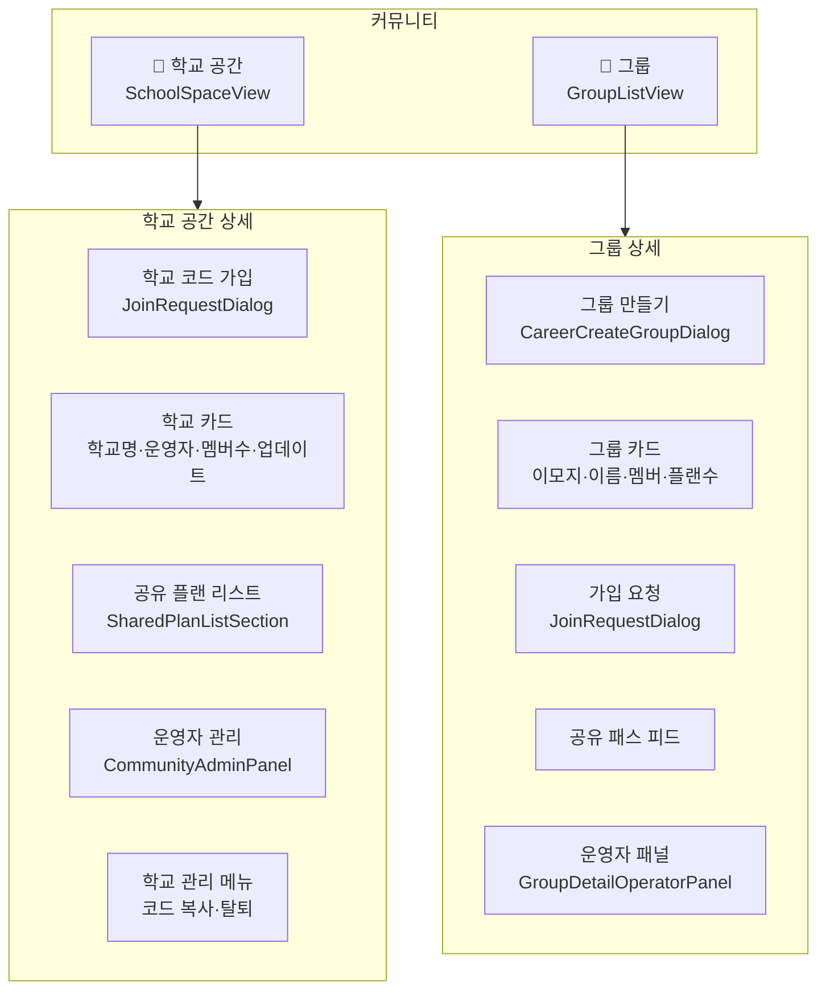

### 10-2. 학교 공간 (`SchoolSpaceView`)

| 기능 | 동작 |
|------|------|
| 학교 가입 | 학교 코드 입력 → `JoinRequestDialog` → `joinSchool(id)` |
| 학교 카드 | 학교명, 운영자 이모지, 멤버 수, 업데이트 시간, 가입/운영 뱃지 |
| 학교 상세 | 학교 선택 → 공유 플랜 리스트 |
| 공유 플랜 | 카드 탭 → `SharedPlanDetailDialog` |
| 학교 관리 | 코드 복사, 탈퇴 (`SchoolMoreMenu` 바텀시트) |

### 10-3. 그룹 (`GroupListView`)

| 기능 | 동작 |
|------|------|
| 그룹 만들기 | `CareerCreateGroupDialog` |
| 그룹 카드 | 이모지, 이름, 설명, 멤버 아바타 (최대 4+overflow), 플랜 수, NEW 뱃지 |
| 가입 요청 | `JoinRequestDialog` → 승인 대기 |
| 그룹 상세 | 멤버 리스트, 공유 패스, 리액션, 운영자 패널 |
| 접근 제어 | `CommunityAccessGate` |

#### 그룹 생성 페이로드

```typescript
{
  name: string;
  description: string;
  emoji: string;
  maxMembers: number;
  category: string;
  mode: string;
  tags: string[];
  isPublic: boolean;
}
```

### 10-4. 공유 플랜 상세 (`SharedPlanDetailDialog`)

| 요소 | 설명 |
|------|------|
| 작성자 프로필 | 닉네임, 학년, 목표 직업 |
| 타임라인 미리보기 | 단계별 활동 요약 |
| 리액션 | 👍 좋아요 · 🔖 북마크 (카운트) |
| 댓글 | 응원/질문 댓글 |
| 복사하기 | "내 패스에 복사" → 커스터마이징 |

### 10-5. 공유 범위 설정 (`ShareSettingsDialog`)

| 범위 | 설명 |
|------|------|
| 🔒 비공개 (`private`) | 나만 볼 수 있음 |
| 🏫 학교 (`school`) | 같은 학교 학생에게 공유 |
| 👥 그룹 (`group`) | 선택한 그룹에 공유 (`shareGroupIds`) |
| 🌐 전체 (`public`) | 모든 사용자에게 공유 |

### 10-6. 커뮤니티 localStorage 관리 (`lib/careerCommunity.ts`)

| 키 | 함수 |
|----|------|
| `career_joined_schools` | `joinSchool()`, `leaveSchool()`, `isJoinedSchool()` |
| `career_joined_groups` | `joinGroup()`, `leaveGroup()`, `isJoinedGroup()` |

---

## 11. 보조 페이지

### 11-1. 설정 (`/settings`)

| 항목 | 내용 |
|------|------|
| **라우트** | `/settings` |
| **데이터** | `storage.user`, `storage.xp` |

| UI 섹션 | 설명 |
|---------|------|
| 프로필 카드 | 아바타(로켓 이모지) + 닉네임 + ID + 학년 + 편집 버튼 |
| 통계 그리드 (3열) | 레벨, 총 XP, 활동 일수 |
| 계정 관리 | 개인정보 관리 (편집 다이얼로그), 개인정보 처리방침 |
| 데이터 | "데이터 내보내기" → JSON 다운로드 |
| 위험 영역 | "모든 데이터 초기화" → `AlertDialog` 확인 → `storage.reset()` → `/` |
| 앱 정보 | 버전, 태그라인, 크레딧 |

**데이터 내보내기 포맷:**
```json
{
  "user": "...",
  "xp": "...",
  "riasec": "...",
  "timeline": "...",
  "simulations": "...",
  "kingdoms": "...",
  "badges": "...",
  "favorites": "..."
}
```

### 11-2. 기타 페이지

| 라우트 | 설명 |
|--------|------|
| `/about` | 서비스 소개 |
| `/pricing` | 가격 정책 |
| `/auth/login` | 로그인 (`SocialLoginDialog`) |
| `/legal` | 법적 고지 |
| `/privacy` | 개인정보 처리방침 |
| `/terms` | 이용약관 |
| `/email-policy` | 이메일 정책 |
| `/marketing-consent` | 마케팅 동의 |
| `/history` | 활동 이력 |
| `/dashboard` | 대시보드 |
| `/launchpad` | 런치패드 |
| `/portfolio` | 포트폴리오 (별도 진입점) |
| `/explore` | 왕국 탐험 (8왕국 그리드) |
| `/explore/[kingdomId]` | 왕국 상세 |

---

## 12. 데이터 모델 총괄

### 12-1. 핵심 타입

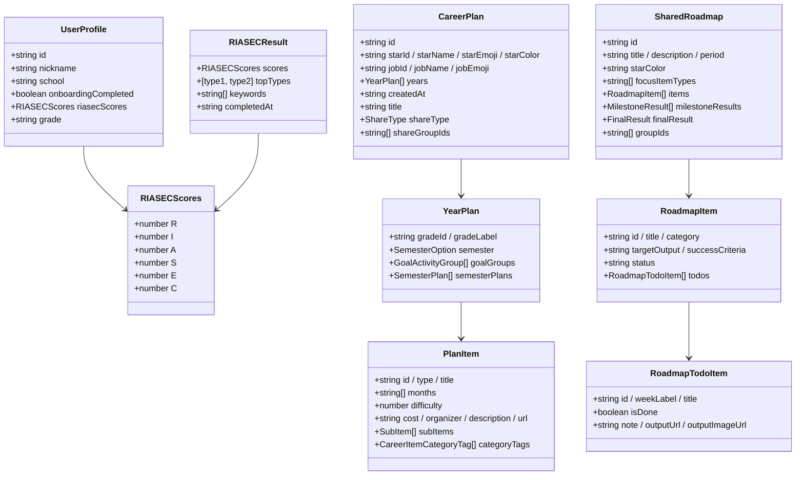

### 12-2. 데이터 파일 매핑

| 디렉토리 | 파일 수 | 주요 내용 |
|----------|---------|----------|
| `data/high-school/` | 12+ JSON | 학교 유형별 데이터, 메타, 챌린지, 자료실 |
| `data/university-admission/` | 25+ JSON | 전형, 플레이북, 전략, 활동, 기관, 직업-전공 |
| `data/path-templates/` | 4 JSON + TS | 커리어 패스 템플릿 4종 |
| `data/execution/` | 2 JSON | 실행 템플릿 141개 |
| `data/dreammate/` | 15+ JSON | 드림메이트 설정, 콘텐츠, 시드 데이터 |
| `data/stars/` | 9 JSON | 왕국별 스타 프로필 |
| `data/jobs/` | 10+ JSON | 200+ 직업 데이터 |
| `data/` (루트) | 15+ JSON | 왕국, 퀴즈, 시뮬레이션, 뱃지, 레벨 |

---

## 13. API 엔드포인트 총괄

### 13-1. Career Plan API

| 함수 | 메서드 | 설명 |
|------|--------|------|
| `fetchMyCareerPlanDetails()` | GET | 내 패스 목록 조회 |
| `createCareerPlanApi(plan)` | POST | 패스 생성 |
| `updateCareerPlanApi(planId, plan)` | PUT | 패스 수정 |
| `deleteCareerPlanApi(planId)` | DELETE | 패스 삭제 |
| `useTemplateApi(templateId, title)` | POST | 템플릿 복제 |

### 13-2. DreamMate Roadmap API

| 함수 | 메서드 | 설명 |
|------|--------|------|
| `fetchDreamMateAuthMe()` | GET | 인증 확인 |
| `fetchDreamMateRoadmapsList()` | GET | 내 로드맵 목록 |
| `fetchDreamMateRoadmapDetail(id)` | GET | 로드맵 상세 |
| `createDreamMateRoadmapApi(payload)` | POST | 로드맵 생성 |
| `updateDreamMateRoadmapApi(id, payload)` | PUT | 로드맵 수정 |
| `toggleDreamMateRoadmapTodoApi(id, itemId, todoId)` | PATCH | 할일 토글 |
| `deleteDreamMateRoadmapApi(id)` | DELETE | 로드맵 삭제 |

### 13-3. Shared Roadmap API

| 함수 | 메서드 | 설명 |
|------|--------|------|
| `fetchSharedDreamRoadmapsFeed()` | GET | 공유 피드 |
| `fetchSharedDreamRoadmapDetail(id)` | GET | 공유 로드맵 상세 |
| `fetchSharedDreamRoadmapByRoadmapId(id)` | GET | 로드맵 ID로 공유 조회 |
| `upsertSharedDreamRoadmapApi(payload)` | POST | 공유 생성/수정 |
| `patchSharedDreamRoadmapApi(id, patch)` | PATCH | 공유 부분 수정 |
| `deleteSharedDreamRoadmapApi(id)` | DELETE | 공유 삭제 |
| `toggleSharedDreamRoadmapLike(id)` | POST | 좋아요 토글 |
| `toggleSharedDreamRoadmapBookmark(id)` | POST | 북마크 토글 |
| `postSharedDreamRoadmapComment(id, text)` | POST | 댓글 추가 |
| `deleteSharedDreamRoadmapComment(id)` | DELETE | 댓글 삭제 |

### 13-4. AI 실행 계획 API

| 함수 | 메서드 | 설명 |
|------|--------|------|
| `useExecutionPlanAiGenerate` | POST (mutation) | AI 주간 계획 생성 |

**요청 페이로드:**
```typescript
{
  title: string;
  plan_depth: 'brief' | 'detailed' | 'simple';
  final_goal: string;
  selected_months: string[];
  milestones: { title: string; date_iso: string }[];
  constraints: string;
  previous_summary?: string;
}
```

### 13-5. 인증 방식

| 항목 | 설명 |
|------|------|
| 토큰 | JWT (`getAccessToken()`) |
| 헤더 | `Authorization: Bearer <token>` |
| 재시도 | `fetchWithAuthRetry` — 토큰 만료 시 자동 갱신 후 재요청 |
| 게스트 | 인증 없음, localStorage 전용 |

---

## 전체 단계 전환 트리거

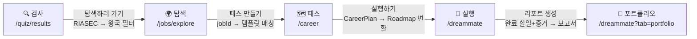

| 전환 | 트리거 | 데이터 연결 |
|------|--------|------------|
| 검사 → 탐색 | 결과 화면 "탐색하러 가기" 버튼 | `RIASEC scores` → 추천 왕국/직업 필터 |
| 탐색 → 패스 | 직업 상세 "패스 만들기" / 탐색 탭 "템플릿 선택" | `jobId` → 매칭 템플릿 자동 제안 |
| 패스 → 실행 | 패스 상세 "실행하기" 버튼 | `CareerPlan` → `RoadmapEditorPayload` 변환 |
| 실행 → 포트폴리오 | 로드맵 완료 → "리포트 생성" | 완료 할일 + 증거 → `buildPortfolioReport()` |
