# 중학생·고등학생 커리어 패스 앱 — 상세 기획서
> - "나를 먼저 찾고, 세상을 간접 체험하고, 내 길을 만든다"
> - 핵심 고객: 중학교 1~3학년 → 고등학교 1~3학년 (연속 커리어 설계)

---

## 들어가며: 왜 중학교부터 고등학교까지 연결된 커리어 패스가 필요한가?

### 핵심 Why — 지금 이 시대의 진로 교육이 달라져야 하는 이유

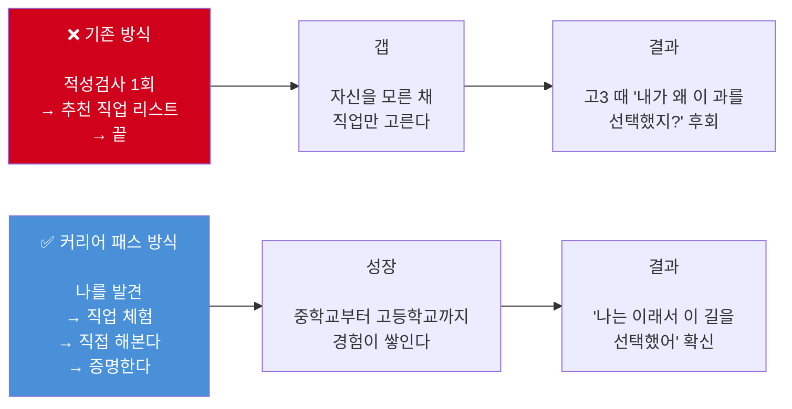

### 중학생·고등학생 커리어 패스 정의 및 목표 비교

| 구분 | 시기 | 핵심 미션 | 해야 할 일 | 왜 이 시기에? |
|-----|-----|---------|---------|------------|
| **중학교** | 중1~중3 | **나를 발견한다** | 에너지 일기, Holland 검사, 200개 직업 탐험, 미니 프로젝트 체험 | 아직 자신을 모르는 시기. 정체성이 형성되는 결정적 시기(12~15세)로, 강점·흥미를 먼저 경험해야 방향이 생긴다 |
| **고등학교** | 고1~고3 | **나를 증명한다** | 계열 선택, 심화 프로젝트, 실력 쌓기, 입시 포트폴리오 완성 | 방향은 정해졌다. 이제는 '실력'과 '기록'으로 증명할 시간. 수시·입시에서 차별화 포인트 만들기 |

### 단계별 핵심 목표와 Why

| 단계 | 학년 | 목표 | Why (이 목표가 중요한 이유) | 핵심 산출물 |
|-----|------|-----|--------------------------|-----------|
| **1단계** | 중1~중2 초 | 나를 발견한다 | 자신을 모르면 모든 직업이 똑같아 보인다. 강점 발견이 탐색의 출발점 | 강점 프로필, 에너지 일기 |
| **2단계** | 중2 | 직업 세계를 탐험한다 | 100개 이상 직업을 '간접 체험'해야 '내가 모르던 직업'을 발견할 수 있다 | 관심 직업 리스트, 체험 기록 |
| **3단계** | 중2~중3 | 직접 해본다 | 관심만으로는 부족하다. 4주 프로젝트로 '맞다/아니다' 실제 확인이 필요하다 | 미니 프로젝트 결과물 |
| **4단계** | 중3 | 고등학교를 설계한다 | 중학교 탐색 결과를 바탕으로 계열(문·이·예체능)을 전략적으로 선택한다 | 커리어 패스 초안, 계열 선택 |
| **5단계** | 고1 | 방향을 확정한다 | 고등학교 첫 해, 계열과 분야를 확정하고 심화 탐색을 시작한다 | 진로 확정 보고서 |
| **6단계** | 고2 | 실력을 쌓는다 | 관심 분야의 실제 프로젝트를 진행하고 포트폴리오를 본격 구축한다 | 심화 프로젝트 포트폴리오 |
| **7단계** | 고3 | 나를 증명한다 | 지금까지의 모든 탐색과 경험을 입시 포트폴리오로 완성해 대학에 증명한다 | 입시 포트폴리오 완성본 |

### 전체 커리어 여정 로드맵 (중1 → 고3)

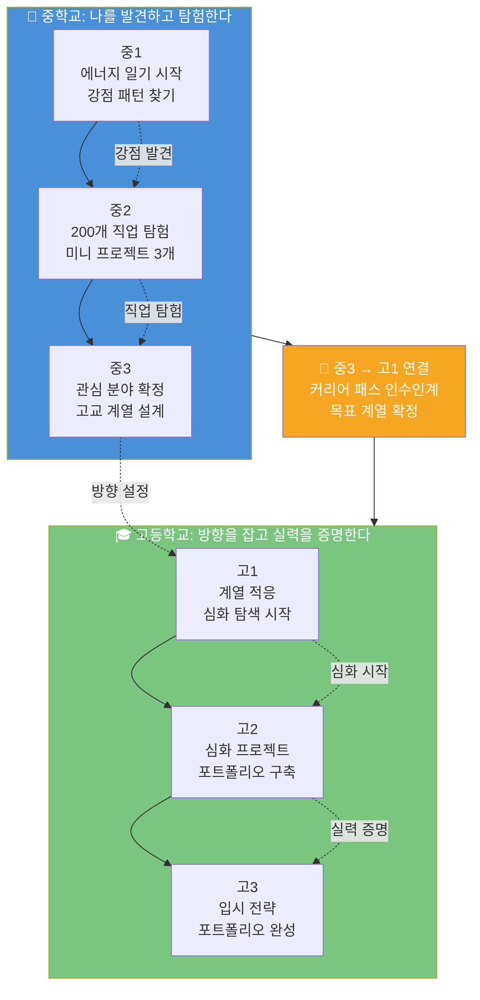

---

## PART 1. 중학생 커리어 패스 상세 기획

---

## 0. 핵심 설계 원칙

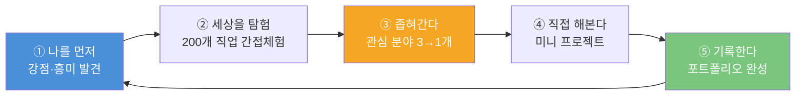

> **왜 이 순서인가?**
> 대부분의 앱이 직업 정보 → 적성 검사 순서로 만들어진다.
> 하지만 중학생에게 필요한 것은 **먼저 자신을 경험**하는 것이다.
> 자기 이해 없이 직업을 고르는 건, 배부르지 않은 상태에서 메뉴를 고르는 것과 같다.

---

## 1. 대표 페르소나 — 박서연 (심화 버전)

> 이 앱의 핵심 고객을 한 명으로 정의한다면 바로 이 학생이다.

```
╔══════════════════════════════════════════════════════════════╗
║  👧  박서연 / 만 14세 / 중학교 2학년 / 경기도 수원          ║
║                                                              ║
║  "내가 뭘 좋아하는지는 아는데,                               ║
║   그게 직업이 될 수 있는지 모르겠어요.                       ║
║   어디서 시작해야 할지도 모르고요."                          ║
╚══════════════════════════════════════════════════════════════╝
```

### 1.1 서연의 일상 프로필

| 항목 | 내용 |
|------|------|
| **성격** | ENFP 성향, 새로운 것 좋아함, 발표 잘하지만 꾸준함 부족 |
| **학교생활** | 미술부 부원, 반장 경험 있음, 수학 싫어함 |
| **디지털 습관** | 인스타·핀터레스트 1일 1~2시간, 유튜브 숏츠 즐겨봄 |
| **관심사** | 방 인테리어, 카페 탐방, SNS 피드 디자인, K-드라마 |
| **학원** | 영어 주 2회, 미술 주 1회 (부모 요청으로 수학 고민 중) |
| **부모님** | 아빠는 안정적 직업 원함, 엄마는 지지하지만 현실 걱정 |
| **고민** | "미술·디자인 직업은 돈을 못 번대요. 근데 다른 건 모르겠어요." |

### 1.2 서연이 앱을 열었을 때 하는 행동

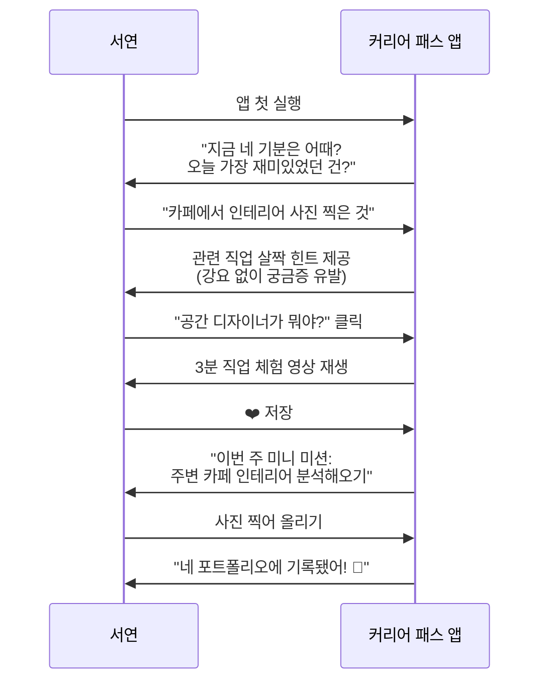

### 1.3 서연의 페인 포인트 심층 분석

| # | 페인 포인트 | 실제 발화 | 현재 해결 방법 | 앱의 해결책 |
|---|-----------|--------|-------------|-----------|
| 1 | 관심사 → 직업 연결 모름 | "인테리어 좋아하는데 그게 직업이 돼요?" | 유튜브 랜덤 탐색 | 관심 태그 → 직업 자동 매핑 |
| 2 | 너무 많은 선택지에 압도 | "직업이 너무 많아서 뭘 봐야 할지 모르겠어요" | 아무것도 안 함 | 성향 기반 필터링으로 압축 |
| 3 | 체험 기록이 남지 않음 | "자유학기 때 뭔가 했는데 기억이 안 나요" | 메모장에 대충 적음 | 즉시 기록 → 자동 포트폴리오 |
| 4 | 부모 설득 자료 없음 | "엄마한테 어떻게 설명해요?" | 그냥 포기 | 직업 전망·연봉 리포트 공유 |
| 5 | 진로 불안 | "친구들은 다 뭔가 하는 것 같은데 나만 뒤처지는 것 같아" | SNS 더 봄 | 성장 타임라인 시각화 |
| 6 | 검사 결과 불신 | "검사 할 때마다 달라요. 뭘 믿어요?" | 검사 안 함 | 시간별 검사 추이 + 패턴 분석 |

---

## 2. 사용자 여정 전체 흐름 (중학교 2년)

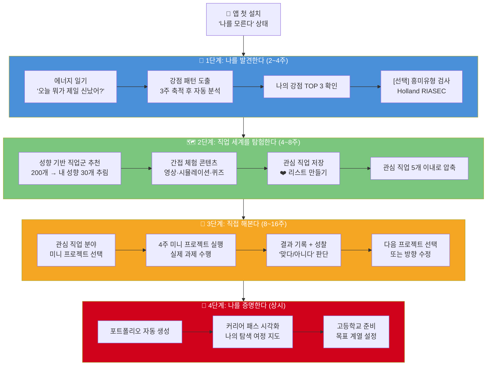

---

## 3. 1단계: 나를 발견한다

### 3.1 에너지 일기 (핵심 기능)

> 적성 검사보다 먼저. 매일 1문장으로 내 강점 패턴을 찾아간다.

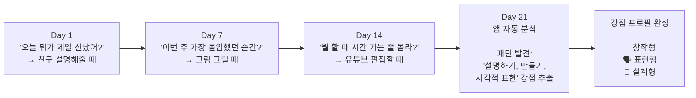

#### 에너지 일기 질문 예시 (레벨별)

| 레벨 | 질문 방식 | 예시 |
|------|---------|------|
| Lv.1 기본 | 오늘 하루 중 | "오늘 가장 재밌었던 순간은?" |
| Lv.2 심화 | 감정 연결 | "그때 기분이 어땠어? 왜 그랬을까?" |
| Lv.3 패턴 | 반복 발견 | "이번 달에 비슷한 상황이 또 있었어?" |
| Lv.4 강점 | 직업 연결 | "그 순간의 능력, 어떤 직업에서 쓸까?" |

### 3.2 [선택 옵션] 흥미 유형 검사 (Holland RIASEC)

> 강요하지 않는다. 에너지 일기 2주 후 자연스럽게 권유.

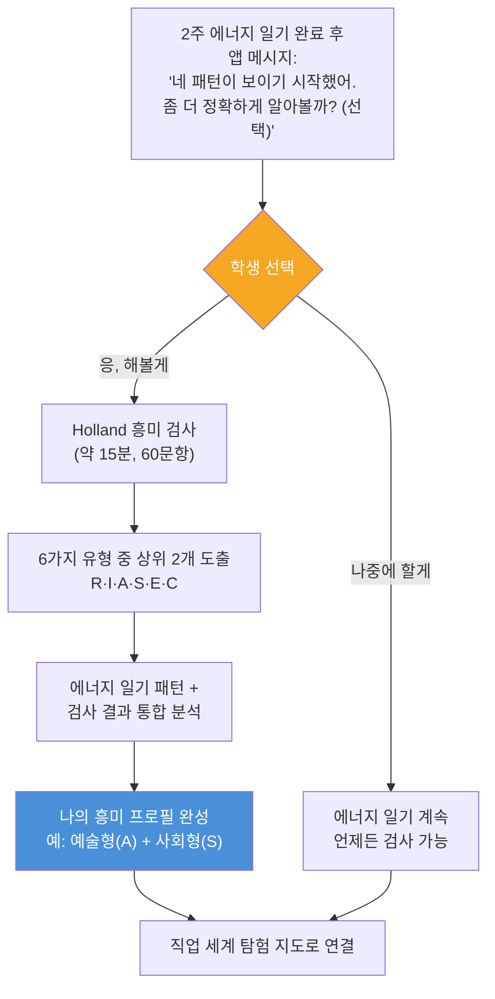

#### Holland 6가지 유형 × 직업군 매핑 요약

| 유형 | 코드 | 핵심 특성 | 대표 강점 | 잘 맞는 직업 분야 |
|------|------|---------|---------|----------------|
| 현실형 | R | 손으로 만들기, 몸 쓰기 좋아함 | 정밀함, 체력, 기계적 감각 | 공학, 건축, 스포츠, 농업 |
| 탐구형 | I | 왜? 어떻게? 질문을 좋아함 | 분석력, 논리, 호기심 | 과학, 의학, IT, 연구 |
| 예술형 | A | 만들고 표현하는 것 좋아함 | 창의력, 감수성, 상상력 | 디자인, 미디어, 예술, 문학 |
| 사회형 | S | 사람 돕고 가르치는 것 좋아함 | 공감력, 소통, 배려 | 교육, 의료, 복지, 상담 |
| 진취형 | E | 이끌고 설득하는 것 좋아함 | 리더십, 추진력, 자신감 | 경영, 법, 정치, 영업 |
| 관습형 | C | 계획하고 정리하는 것 좋아함 | 꼼꼼함, 책임감, 성실 | 회계, 행정, 금융, 데이터 |

---

## 4. 2단계: 200개 직업 세계 탐험

### 4.1 직업 분류 체계 (8대 분야 × 25개 직업)

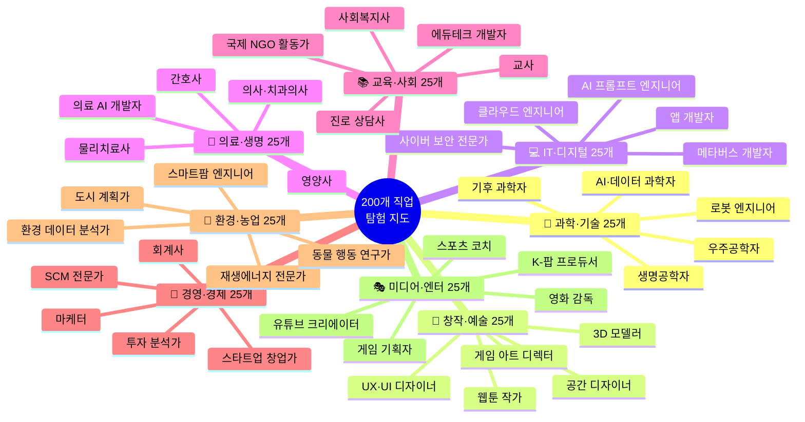

### 4.2 성향별 직업 추천 로직

> 에너지 일기 + Holland 결과를 조합해 **"너에게 맞을 것 같은 직업"** 상위 20~30개 추출

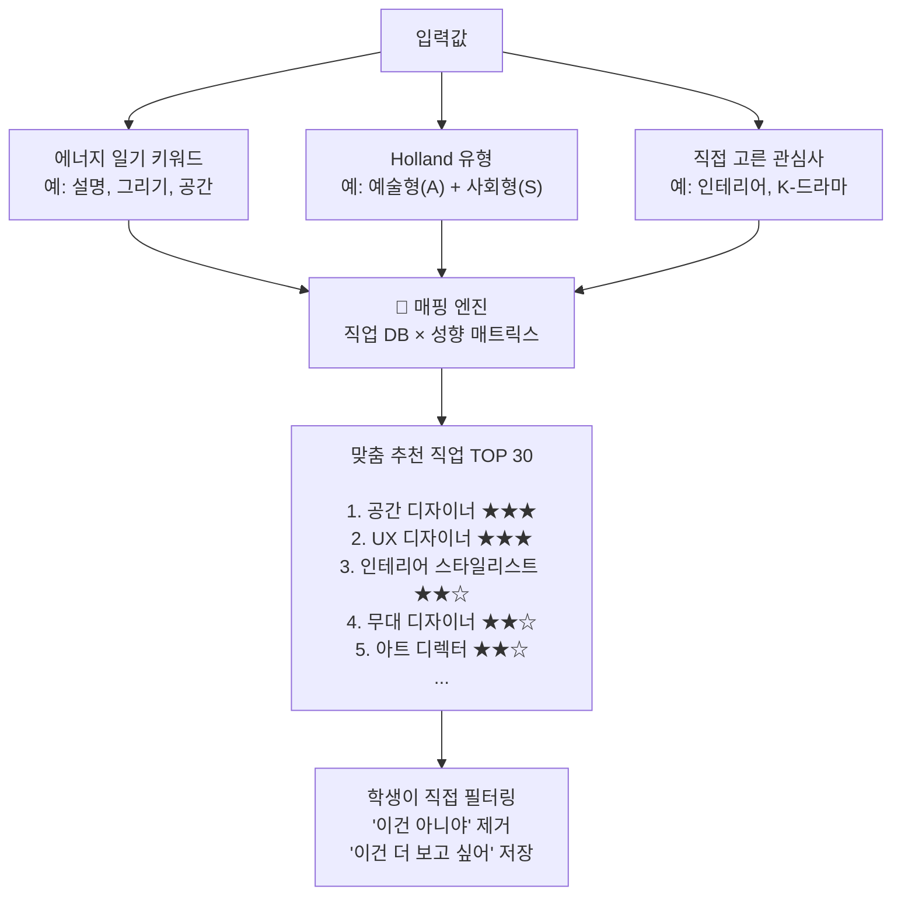

### 4.3 간접 체험 콘텐츠 방식 비교

| 체험 방식 | 형식 | 시간 | 몰입도 | 정보 깊이 | 추천 단계 |
|---------|------|------|--------|---------|---------|
| **직업 소개 카드** | 텍스트 + 이미지 | 1분 | ★ | ★ | 첫 탐색 |
| **하루 일과 영상** | 2~5분 유튜브형 | 3~5분 | ★★★ | ★★★ | 관심 발생 후 |
| **직업인 인터뷰** | 10~15분 영상 | 10분+ | ★★★ | ★★★★ | 진지한 탐색 |
| **업무 시뮬레이션** | 앱 내 미니게임 | 5~10분 | ★★★★ | ★★★ | 체험 욕구 시 |
| **하루 도전 미션** | 오프라인 과제 | 1일 | ★★★★★ | ★★★★★ | 관심 확정 후 |
| **VR 직업 체험** | VR/AR 콘텐츠 | 10~20분 | ★★★★★ | ★★★★ | 심화 체험 |
| **전문가 Q&A** | 라이브/녹화 | 30분+ | ★★★★ | ★★★★★ | 커리어 패스 설계 시 |

### 4.4 직업 탐험 카드 구성 (각 직업마다 동일 구조)

```
┌─────────────────────────────────────────────────┐
│  🎨 UX 디자이너                                  │
│  ─────────────────────────────────────────────  │
│  한 줄 설명: 사람들이 앱과 웹을 편하게 쓰도록    │
│             디자인하는 사람                       │
│                                                  │
│  📺 하루 일과 영상 (3분)        [▶ 보기]         │
│  🎮 업무 시뮬레이션 (5분)       [해보기]         │
│  💬 선배 인터뷰                  [듣기]           │
│                                                  │
│  필요한 강점: 공감력 / 시각적 감각 / 논리적 사고  │
│  관련 학과: 시각디자인 / HCI / 산업디자인         │
│  미래 전망: ★★★★☆  연봉: ★★★★☆               │
│                                                  │
│  비슷한 직업: 앱 디자이너, 서비스 기획자, 아트디렉터│
│                                                  │
│        [❤️ 관심 저장]  [📋 포트폴리오 추가]       │
└─────────────────────────────────────────────────┘
```

### 4.5 간접 체험 시나리오 (서연의 UX 디자이너 탐험)

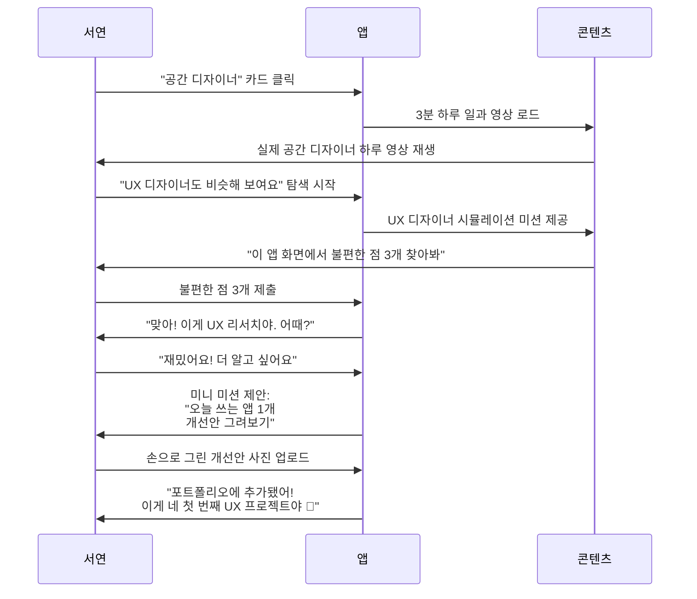

---

## 5. 3단계: 미니 프로젝트로 직접 해본다

> **핵심 철학**: 관심이 생겼다면 실제로 해봐야 진짜 맞는지 안다.
> 4주짜리 미니 프로젝트로 "이 분야가 나에게 맞나?" 직접 실험한다.

### 5.1 미니 프로젝트 구조

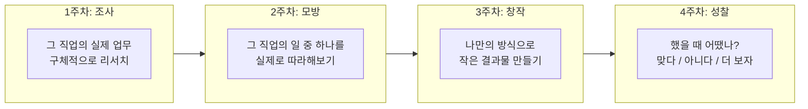

### 5.2 분야별 미니 프로젝트 예시 30선

#### 🎨 창작·디자인 계열

| 프로젝트명 | 직업 연결 | 4주 과제 | 결과물 |
|----------|---------|--------|--------|
| 앱 리디자인 챌린지 | UX 디자이너 | 내가 매일 쓰는 앱 1개의 불편함 찾고 개선안 스케치 | 손그림 또는 Figma 와이어프레임 |
| 내 방 리인테리어 기획 | 인테리어 디자이너 | 내 방 현재 사진 촬영 → 테마 선정 → 개선 계획서 작성 | 무드보드 + 배치도 |
| 웹툰 에피소드 1개 | 웹툰 작가 | 캐릭터 3개 설정 → 5컷 스토리 제작 | 완성된 웹툰 5컷 |
| 브랜드 로고 만들기 | 그래픽 디자이너 | 가상의 음식 브랜드 로고 3개 버전 제작 | 로고 파일 |
| 카페 공간 기획 | 공간 디자이너 | 동네 카페 방문 → 공간 분석 보고서 작성 | 분석 리포트 |

#### 💻 IT·기술 계열

| 프로젝트명 | 직업 연결 | 4주 과제 | 결과물 |
|----------|---------|--------|--------|
| 나만의 챗봇 만들기 | AI 개발자 | ChatGPT API 없이 룰 기반 챗봇 시나리오 설계 | 대화 흐름도 |
| 학급 앱 기획서 | 앱 개발자 | 우리 반이 쓸 앱 기획서 작성 (와이어프레임 포함) | 기획 문서 |
| 데이터 시각화 | 데이터 분석가 | 우리 반 취미 설문 → 엑셀로 그래프 제작 | 인포그래픽 |
| 유튜브 알고리즘 분석 | 데이터 사이언티스트 | 내 추천 피드 1주일 분석 → 패턴 보고서 | 분석 보고서 |
| 게임 레벨 설계 | 게임 기획자 | 간단한 게임 레벨 1개 설계 (장애물·규칙 포함) | 레벨 설계 문서 |

#### 🏥 의료·과학 계열

| 프로젝트명 | 직업 연결 | 4주 과제 | 결과물 |
|----------|---------|--------|--------|
| 우리 동네 환경 분석 | 환경 과학자 | 집 근처 미세먼지·소음 1주 측정 → 보고서 | 환경 분석 보고서 |
| 영양소 레시피 개발 | 영양사 | 10대 청소년 영양 연구 → 건강한 급식 메뉴 3가지 제안 | 메뉴 기획서 |
| 식물 성장 실험 | 생명과학자 | 조건 다르게 화분 3개 키우기 → 성장 비교 | 실험 일지 |
| 첫 Aid 시뮬레이션 | 간호사·응급구조사 | 심폐소생술 학습 + 유사 상황 시뮬레이션 실습 | 실습 기록 |

#### 📣 미디어·콘텐츠 계열

| 프로젝트명 | 직업 연결 | 4주 과제 | 결과물 |
|----------|---------|--------|--------|
| 유튜브 쇼츠 3개 제작 | 크리에이터·PD | 주제 정하기 → 대본 → 촬영 → 편집 | 유튜브 쇼츠 3개 |
| 학교 팟캐스트 | 방송 기자·PD | 주제 선정 → 대본 작성 → 녹음 → 편집 | 오디오 에피소드 |
| SNS 브랜딩 실험 | 마케터 | 주제 정하고 인스타 계정 1달 운영 | 게시물 10개 + 성과 분석 |
| 제품 광고 기획 | 광고 기획자 | 좋아하는 제품 광고 콘셉트 기획서 작성 | 광고 스토리보드 |

#### 💼 경영·사회 계열

| 프로젝트명 | 직업 연결 | 4주 과제 | 결과물 |
|----------|---------|--------|--------|
| 용돈 투자 시뮬레이션 | 투자 분석가 | 가상 10만원으로 모의 주식 투자 4주 운영 | 수익률 분석 보고서 |
| 미니 창업 플랜 | 창업가 | 학교 주변 문제 발견 → 해결하는 서비스 창업 기획 | 사업 계획서 |
| 인터뷰 프로젝트 | 사회학자·기자 | 관심 직업인 1명 인터뷰 → 기사형 정리 | 인터뷰 기사 |
| 학급 문제 해결 캠페인 | 사회복지사·활동가 | 학교 내 문제 발견 → 해결책 제안 → 친구들 설득 | 캠페인 포스터 + 활동 보고서 |

### 5.3 미니 프로젝트 성찰 프레임 (앱 내 포함)

```
📝 4주 후 성찰 질문

1. 이 프로젝트를 하면서 가장 신났던 순간은? (에너지 측정)
2. 힘들었던 부분은? 그래도 계속하고 싶었나? (끈기 측정)
3. 잘 된 것과 잘 안 된 것은? (역량 측정)
4. 이 분야의 직업인이 된다면 어떨 것 같아? (직업 적합도)
5. 다음에 더 해보고 싶나? 다른 걸 해보고 싶나? (방향 결정)

→ 앱이 성찰 결과를 바탕으로
   "계속 탐색" / "방향 전환" / "심화 프로젝트" 추천
```

---

## 6. 직업군별 중학생 커리어 패스 로드맵

> 관심 분야가 정해졌다면, 중학교 때부터 준비할 수 있는 구체적 경로

### 6.1 🎨 창작·디자인 커리어 패스

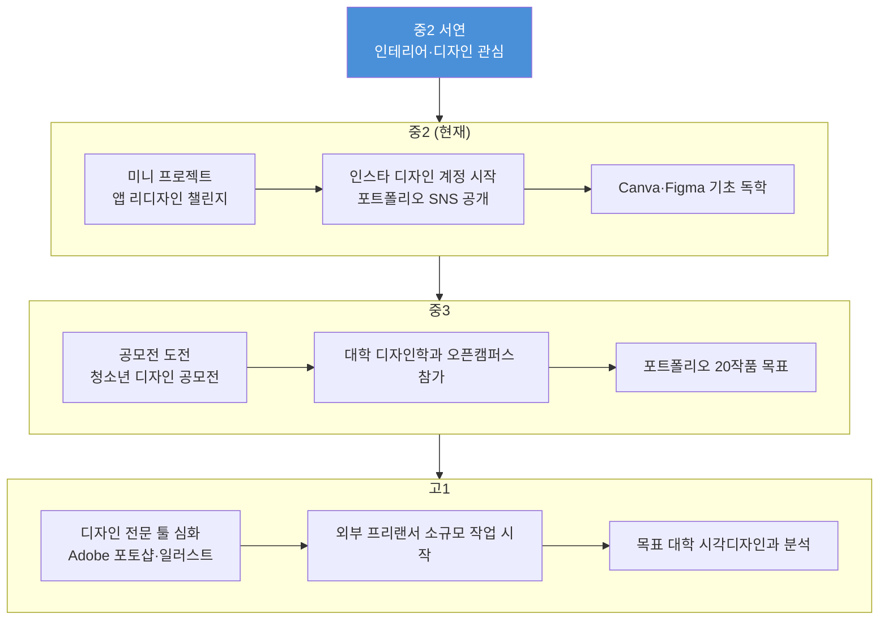

### 6.2 💻 IT·AI 커리어 패스

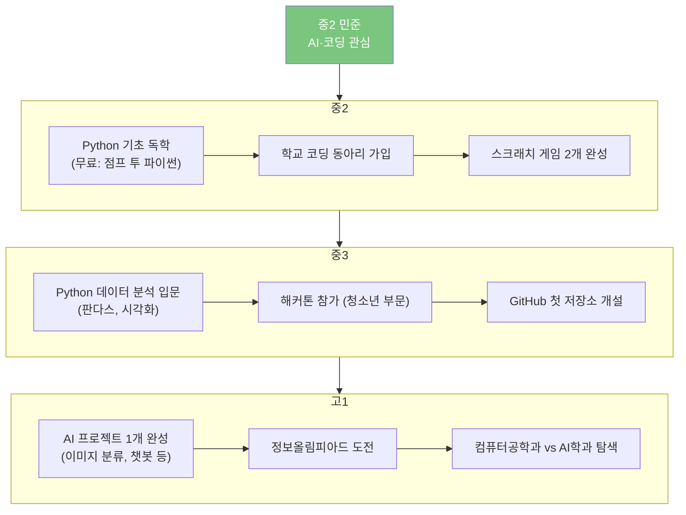

### 6.3 🏥 의료·생명 커리어 패스

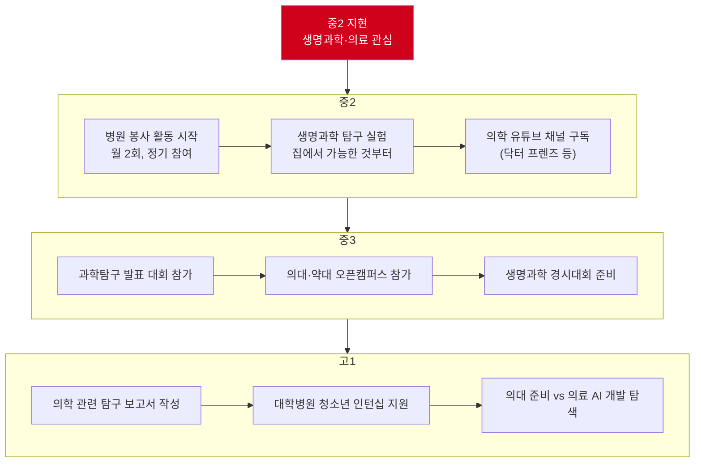

### 6.4 커리어 패스 요약 비교표 (8개 분야)

| 직업 분야 | 중2 핵심 활동 | 중3 핵심 활동 | 고1 목표 | 필수 역량 | 관련 대학 계열 |
|---------|------------|------------|---------|---------|-------------|
| AI·IT | Python 기초 + 미니 앱 | 해커톤 참가, GitHub | AI 프로젝트 완성 | 수학, 논리적 사고 | 컴퓨터공학, AI학과 |
| 디자인·예술 | 툴 독학 + 포트폴리오 SNS | 공모전 도전 | 프리랜서 소작업 | 창의성, 시각 감각 | 시각디자인, 산업디자인 |
| 의료·생명 | 병원 봉사 + 탐구 실험 | 과학 대회 참가 | 탐구 보고서 | 과학, 꼼꼼함 | 의대, 생명공학 |
| 미디어·콘텐츠 | 유튜브·SNS 채널 개설 | 구독자 1,000명 목표 | 브랜드 협업 | 스토리텔링, 편집 | 미디어, 광고 |
| 경영·창업 | 용돈 관리 + 모의 창업 | 창업 대회 참가 | 실제 소규모 창업 | 기획력, 설득력 | 경영, 경제 |
| 교육·사회 | 멘토링 봉사 시작 | 교육 프로그램 기획 | 교육 공모전 | 공감력, 소통 | 사범, 사회과학 |
| 환경·과학 | 환경 데이터 수집 실험 | 환경 프로젝트 참가 | 논문 읽기 시작 | 탐구력, 분석 | 환경공학, 자연과학 |
| 스포츠·신체 | 종목 클럽 팀 참가 | 대회 출전, 코치 보조 | 전문 훈련 시작 | 체력, 전략적 사고 | 체육학, 스포츠과학 |

---

## 7. 포트폴리오 자동 생성 구조

> 활동을 기록하면 앱이 알아서 포트폴리오를 구성해준다.

### 7.1 포트폴리오 자동 생성 흐름

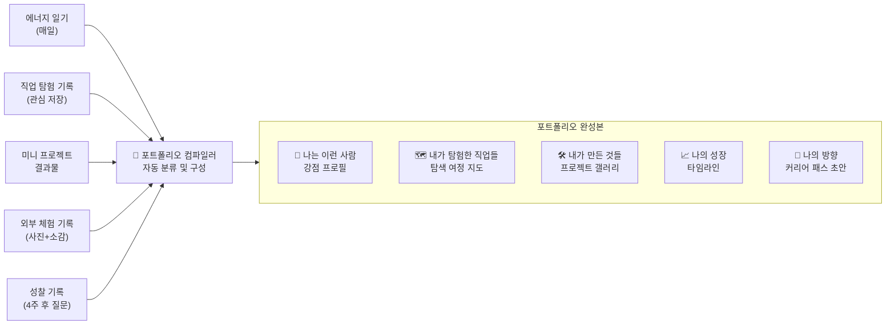

### 7.2 포트폴리오 페이지 구성 예시 (서연 기준)

```
📁 박서연의 커리어 탐색 포트폴리오
(중학교 2학년 ~ 현재)
────────────────────────────────────
🙋 나는 이런 사람
  강점: 창작형 / 표현형 / 설계형
  Holland 유형: 예술형(A) + 사회형(S)
  에너지 올라가는 순간: 공간 꾸밀 때, 설명할 때

🗺️ 탐험한 직업 (총 23개)
  ❤️ 관심 직업: UX디자이너 / 공간디자이너 / 마케터
  체험한 직업 영상: 18개
  완료한 시뮬레이션: 5개

🛠️ 내가 만든 것들
  📱 앱 리디자인 기획서 (4주 프로젝트)
  🏠 내 방 인테리어 무드보드
  📸 카페 공간 분석 보고서
  🎨 브랜드 로고 3개

📈 성장 타임라인
  6월: 앱 첫 설치, 에너지 일기 시작
  7월: Holland 검사 완료 - 예술형/사회형
  8월: UX 디자이너 시뮬레이션 체험
  9월: 첫 미니 프로젝트 완성!
  10월: 카페 공간 분석 → 공간 디자이너 확정 관심

🎯 나의 방향 (현재 초안)
  1순위: UX/공간 디자이너
  목표 고교: 일반고 예술 계열 or 디자인 특성화
  다음 할 일: Figma 독학 + 공모전 1개 도전
```

---

## 8. 앱 UX 핵심 설계 원칙 (중학생 맞춤)

### 8.1 중학생이 앱을 계속 쓰게 만드는 설계

| 설계 원칙 | 구체적 방법 | 기피해야 할 것 |
|---------|-----------|-------------|
| **짧게, 매일** | 하루 3~5분 완성 가능한 마이크로 태스크 | 긴 설문, 긴 텍스트 |
| **즉각적 피드백** | 기록 즉시 "포트폴리오에 추가됐어!" 반응 | 결과 없는 입력 |
| **강요 없는 권유** | "해볼래?" 선택 제공, 스킵 항상 가능 | 강제 완성 필수 단계 |
| **시각적 성장** | 탐험 지도, 성장 그래프, 뱃지 시스템 | 숫자·점수 위주 |
| **공유 욕구 자극** | 포트폴리오 카드 인스타 공유 기능 | 혼자만 보는 기록 |
| **부담 없는 시작** | 첫 화면: 질문 1개만, 가입 최소화 | 복잡한 온보딩 |

### 8.2 화면 흐름 (핵심 3화면)

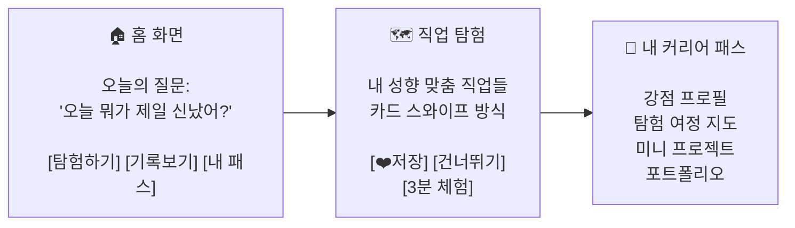

---

## 9. 대표 페르소나 3인 최종 정의

### 페르소나 A: "탐험가형" — 박서연

```
나이: 14세 / 중2 / 관심사: 디자인·인테리어
특징: 관심은 있는데 방향이 없다
목표: 관심사를 직업으로 연결하고 싶다
앱 사용 패턴: 매일 5~10분, 탐험 위주
핵심 필요: 관심사 → 직업 매핑 + 포트폴리오
```

### 페르소나 B: "실험가형" — 김도현

```
나이: 13세 / 중1 / 관심사: 코딩·게임
특징: 뭔가 만들고 싶은데 어디서 시작할지 모른다
목표: 프로젝트를 통해 직접 해보고 싶다
앱 사용 패턴: 주 3~4회, 프로젝트 위주
핵심 필요: 미니 프로젝트 가이드 + 기록
```

### 페르소나 C: "방황형" — 이수아

```
나이: 15세 / 중3 / 관심사: 없음 (찾는 중)
특징: 아무것도 모르겠다, 진로 불안이 높다
목표: 일단 나부터 알고 싶다
앱 사용 패턴: 불규칙, 에너지 일기 위주
핵심 필요: 자기 발견 + 불안 해소 + 작은 성공 경험
```

---

## 10. 단계별 기능 개발 우선순위

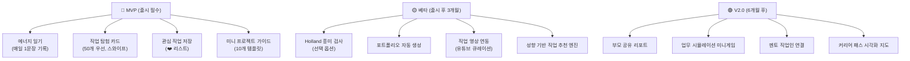

---

---

## PART 2. 고등학생 커리어 패스 심화 기획

> "방향은 정해졌다. 이제는 실력과 기록으로 증명할 시간"
> 핵심 고객: 고등학교 1~3학년 (중학교 탐색 결과를 이어받아 심화)

---

## 12. 고등학생 핵심 설계 원칙

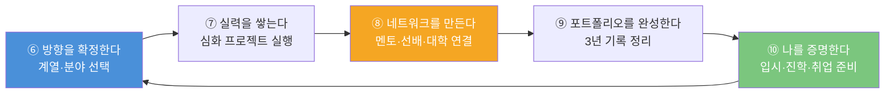

> **왜 고등학생에게는 다른 접근이 필요한가?**
> 중학생은 "나를 모른다" 문제가 핵심이다.
> 고등학생은 "알고는 있는데 어떻게 증명하지?" 문제가 핵심이다.
> 탐색에서 실행으로, 체험에서 실력으로, 일기에서 포트폴리오로 전환이 필요하다.

---

## 13. 고등학생 대표 페르소나

### 페르소나 D: "방향 탐색형" — 최지우 (고1)

```
╔══════════════════════════════════════════════════════════════╗
║  👩  최지우 / 만 16세 / 고등학교 1학년 / 서울 노원구         ║
║                                                              ║
║  "중학교 때 UX 디자인이 좋다는 건 알았는데,                  ║
║   고등학교 와서 뭘 준비해야 할지 모르겠어요.                 ║
║   수시가 뭔지도, 포트폴리오가 뭔지도 막막해요."              ║
╚══════════════════════════════════════════════════════════════╝
```

| 항목 | 내용 |
|------|------|
| **계열** | 인문·예체능 혼합 고민 중 (디자인 특기자 vs 일반 수시) |
| **강점** | 시각적 감각, 아이디어 발산, SNS 콘텐츠 제작 |
| **약점** | 꼼꼼한 정리 부족, 수학·과학 기피 |
| **활동** | 학교 미술부장, Canva 독학 중, 인스타 디자인 계정 운영 |
| **고민** | "포트폴리오 어떻게 만들어요? / 어떤 대학 디자인과가 좋아요?" |
| **부모님** | 예술계 진학 찬성하지만 취업률 걱정 |

### 페르소나 E: "실력 증명형" — 이민혁 (고2)

```
╔══════════════════════════════════════════════════════════════╗
║  👦  이민혁 / 만 17세 / 고등학교 2학년 / 경기 성남시         ║
║                                                              ║
║  "AI·SW 개발자가 목표인 건 확실한데,                         ║
║   뭘 만들어야 포트폴리오가 될지 모르겠어요.                  ║
║   코딩 학원만 다녀서는 안 될 것 같아서요."                   ║
╚══════════════════════════════════════════════════════════════╝
```

| 항목 | 내용 |
|------|------|
| **계열** | 자연계 이과 확정 |
| **강점** | 논리적 사고, 코딩 기초(Python·JS), 문제 해결 |
| **약점** | 팀 협업 경험 부족, 발표·스토리텔링 약함 |
| **활동** | 코딩 학원 수강, 교내 SW 동아리, 개인 GitHub 운영 중 |
| **고민** | "해커톤에 나가야 하나요? / 뭘 만들어야 입시에 도움이 되나요?" |
| **목표** | KAIST·서울대·연세대 AI학과 or SW 계열 수시 |

### 페르소나 F: "진로 전환형" — 박수빈 (고3)

```
╔══════════════════════════════════════════════════════════════╗
║  👩  박수빈 / 만 18세 / 고등학교 3학년 / 부산 해운대구       ║
║                                                              ║
║  "의대 준비하다가 고3 때 진로를 바꿨어요.                    ║
║   이제 사회복지사나 NGO 활동가가 되고 싶은데,                ║
║   지금이라도 늦지 않았을까요?"                               ║
╚══════════════════════════════════════════════════════════════╝
```

| 항목 | 내용 |
|------|------|
| **계열** | 자연계 → 인문계 전환 고민 |
| **강점** | 공감 능력, 사람 관계, 글쓰기, 리더십 경험(학생회) |
| **활동** | 학생회장, 해외 봉사 경험 1회, 멘토링 봉사 2년 |
| **고민** | "지금 남은 시간에 뭘 준비해야 하나요? / 자소서를 어떻게 써요?" |
| **목표** | 사회복지학과·사회학과 수시 지원 |

---

## 14. 고등학생 사용자 여정 전체 흐름 (고등학교 3년)

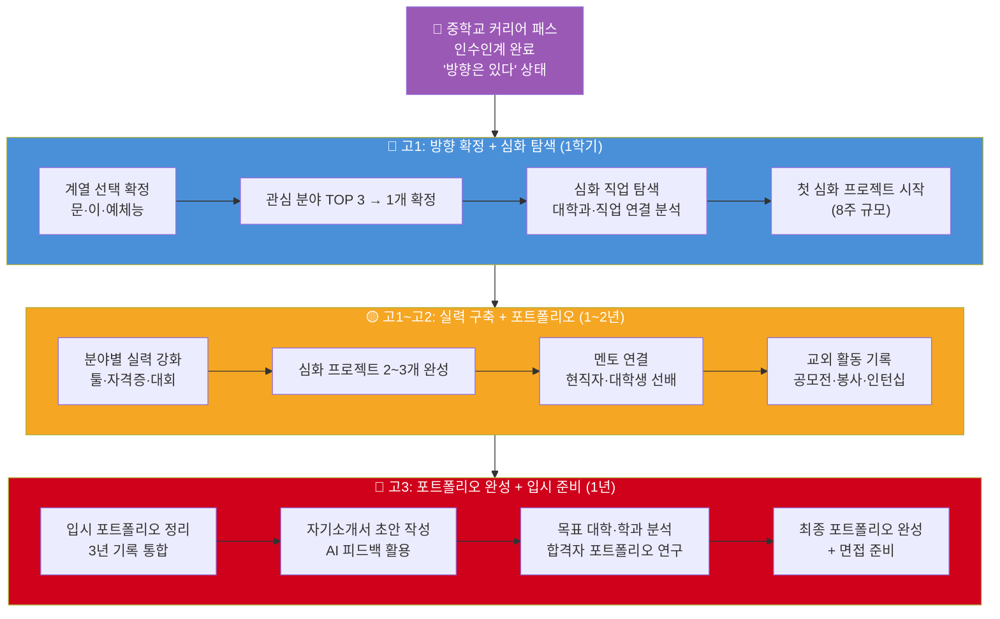

---

## 15. 고1: 방향 확정 단계

### 15.1 중학교 → 고등학교 커리어 패스 인수인계

> 중학교에서 쌓은 탐색 결과를 고등학교 첫 달에 정리하는 것이 핵심이다.

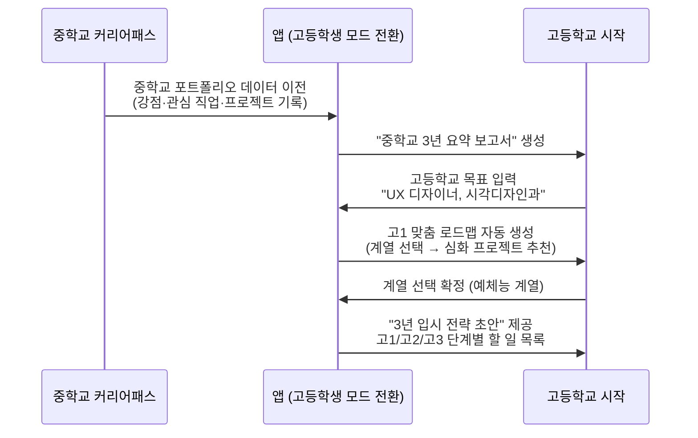

### 15.2 계열 선택 가이드 (고1 1학기 핵심)

| 계열 | 특징 | 잘 맞는 관심사 | 주요 진학 계열 | 주의사항 |
|-----|-----|-------------|-------------|--------|
| **이과(자연·공학)** | 수학·과학 중심, 논리·분석 강점 | AI·코딩, 의료·생명, 환경·공학 | 컴퓨터공학, 의대, 생명공학, 물리학 | 수학 포기 시 선택지 급감 |
| **문과(인문·사회)** | 언어·사고 중심, 소통·기획 강점 | 경영·창업, 교육·사회, 언론·법 | 경영학, 사회복지, 법학, 미디어 | 취업 시장 변화 체크 필요 |
| **예체능** | 실기·실력 중심, 창의·표현 강점 | 디자인·예술, 스포츠, 공연·방송 | 시각디자인, 체육학, 음악, 연극 | 실기 준비 + 내신 병행 부담 |
| **융합(이과+예체능)** | 기술+창의 결합, 점점 확장 중 | UX디자인, 게임, 미디어아트 | 산업디자인, HCI, 디지털미디어 | 입시 전형 세밀히 확인 |

### 15.3 고1 심화 탐색: 대학·학과 매핑

```mermaid
flowchart TD
    Interest["관심 직업 확정<br>예: UX 디자이너"] --> Uni["관련 대학 학과 분석"]

    subgraph Uni["학과 탐색 3단계"]
        U1["어떤 학과에서 배우나?<br>시각디자인 / HCI / 산업디자인"] --> U2["어떤 대학이 강한가?<br>홍익대·연세대·서울대·KAIST"]
        U2 --> U3["입시 전형 분석<br>실기 vs 수시 vs 정시"]
    end

    Uni --> Plan["고1~고3 준비 계획 확정"]

    style Uni fill:#4A90D9,color:#fff
```

### 15.4 고1 분야별 핵심 활동 목록

| 분야 | 고1 1학기 핵심 활동 | 고1 2학기 핵심 활동 | 목표 결과물 |
|-----|-----------------|-----------------|-----------|
| **AI·IT** | Python 중급 완성, 첫 개인 프로젝트 | 해커톤 참가, GitHub 포트폴리오 시작 | 완성된 앱 or AI 프로젝트 1개 |
| **디자인·예술** | Figma·Adobe CC 심화 독학 | 공모전 1개 참가, SNS 포트폴리오 300 팔로워 | 포트폴리오 20작품 이상 |
| **의료·생명** | 병원 정기 봉사, 탐구 실험 보고서 | 과학탐구 대회 참가, 의학 논문 읽기 | 탐구 보고서 2편 이상 |
| **경영·창업** | 독서 경영서 5권, 모의 창업 아이디어 | 창업 경진대회 참가, 멘토 인터뷰 | 사업 계획서 1편 |
| **교육·사회** | 멘토링 봉사 정기화, 교육 기관 탐방 | 교육 프로그램 기획 실행 | 봉사 활동 보고서 |
| **미디어·콘텐츠** | 유튜브/SNS 채널 전문화 | 구독자 1,000명 목표, 협업 콘텐츠 | 콘텐츠 30개 이상 |
| **환경·과학** | 환경 데이터 수집 프로젝트 | 환경 관련 공모전 참가 | 연구 보고서 1편 |
| **스포츠·체육** | 전문 종목 훈련 강화 | 지역 대회 참가 기록 | 대회 성적·기록 |

---

## 16. 고2: 실력 구축 + 포트폴리오 본격화

> **핵심 철학**: 고2는 커리어 패스에서 가장 중요한 1년이다.
> 아직 입시 압박이 최고조가 아니면서, 활동할 시간이 충분하다.
> 이 1년에 심화 프로젝트 2~3개를 완성하면 입시가 달라진다.

### 16.1 고2 심화 프로젝트 구조 (8주 단위)

```mermaid
flowchart LR
    subgraph W1_2["1~2주: 기획"]
        P1["문제 정의<br>Why this project?"] --> P2["리서치<br>선행 연구·사례 분석"]
    end
    subgraph W3_4["3~4주: 설계"]
        P3["솔루션 설계<br>구체적 방법론"] --> P4["프로토타입 제작<br>초안·스케치·설계도"]
    end
    subgraph W5_6["5~6주: 실행"]
        P5["본격 제작·실행<br>결과물 만들기"] --> P6["중간 피드백<br>멘토·동료 리뷰"]
    end
    subgraph W7_8["7~8주: 완성"]
        P7["최종 결과물 완성"] --> P8["성찰 보고서 작성<br>'배운 것, 한계, 다음 단계'"]
    end

    W1_2 --> W3_4 --> W5_6 --> W7_8
```

### 16.2 분야별 고2 심화 프로젝트 예시

#### 💻 AI·IT 계열

| 프로젝트명 | 난이도 | 8주 목표 | 결과물 | 입시 활용 |
|----------|------|--------|--------|---------|
| 사회 문제 해결 AI 모델 | ★★★★ | 데이터 수집 → 모델 학습 → 정확도 개선 | GitHub + 기술 보고서 | SW 특기자 전형 |
| 청소년 앱 기획·개발 | ★★★ | 기획서 → UI → 기본 기능 구현 | 앱 APK + 기획 문서 | 창의적 체험 활동 |
| 오픈소스 기여 프로젝트 | ★★★★★ | 실제 오픈소스에 PR 머지 1건 | GitHub 커밋 기록 | 실력 직접 증명 |

#### 🎨 디자인·예술 계열

| 프로젝트명 | 난이도 | 8주 목표 | 결과물 | 입시 활용 |
|----------|------|--------|--------|---------|
| 사회 이슈 캠페인 디자인 | ★★★ | 문제 선정 → 비주얼 콘셉트 → 전시 | 포스터·영상·웹사이트 | 실기 포트폴리오 |
| 브랜드 아이덴티티 디자인 | ★★★★ | 브랜드 기획 → BI 시스템 완성 | 브랜드 가이드라인 | 포트폴리오 대표작 |
| UX 리서치 + 리디자인 | ★★★ | 사용자 인터뷰 → 와이어프레임 → 프로토타입 | Figma 파일 + 리서치 보고서 | HCI 학과 지원 |

#### 🏥 의료·생명 계열

| 프로젝트명 | 난이도 | 8주 목표 | 결과물 | 입시 활용 |
|----------|------|--------|--------|---------|
| 지역 사회 건강 데이터 분석 | ★★★ | 데이터 수집 → 분석 → 정책 제안 | 연구 보고서 | 생기부 기재 |
| 의학 논문 리뷰 발표 | ★★★★ | 최신 논문 3편 → 요약 → 발표 | 발표 자료 + 정리 노트 | 의대 면접 대비 |

#### 💼 경영·사회 계열

| 프로젝트명 | 난이도 | 8주 목표 | 결과물 | 입시 활용 |
|----------|------|--------|--------|---------|
| 청소년 창업 캠프 기획·운영 | ★★★★ | 기획 → 참가자 모집 → 실행 → 결과 | 운영 보고서 + 사진 | 리더십 증명 |
| 사회적 기업 사례 연구 | ★★★ | 사례 10개 분석 → 비즈니스 모델 연구 | 케이스 스터디 보고서 | 경영·사회과학 지원 |

### 16.3 멘토 연결 시스템 (고2 핵심 기능)

```mermaid
flowchart TD
    Student["고2 이민혁<br>AI 개발자 목표"] --> Request["멘토 매칭 요청<br>'현직 AI 개발자와 연결 원해요'"]

    Request --> Matching["🔄 멘토 매칭 시스템<br>직업·대학·지역 필터"]

    subgraph Mentors["멘토 풀"]
        M1["현직 개발자<br>(구글·네이버·카카오)"]
        M2["관련 학과 대학생<br>(3~4학년)"]
        M3["졸업생 선배<br>(취업 2~5년차)"]
    end

    Matching --> Mentors
    Mentors --> Session["월 1~2회 화상 멘토링<br>30분 구조화 세션"]

    subgraph SessionContent["세션 구성"]
        SC1["현재 프로젝트 피드백"]
        SC2["포트폴리오 조언"]
        SC3["입시·취업 실제 경험 공유"]
    end

    Session --> SessionContent
    SessionContent --> Portfolio["포트폴리오에 자동 기록<br>'멘토링 활동' 항목"]
```

---

## 17. 고3: 입시 포트폴리오 완성 + 나를 증명한다

> **핵심 전략**: 고3은 새로운 활동보다 **3년을 정리하는 시간**이다.
> 지금까지 쌓은 탐색·프로젝트·기록을 입시 언어로 번역한다.

### 17.1 입시 포트폴리오 전략 흐름

```mermaid
> ⚠️ Mermaid 렌더링 에러 발생 — 아래 단계별 흐름을 **텍스트**로 설명합니다.

1. **3년간 쌓인 기록**
   - 에너지 일기 (중학교~)
   - 미니 프로젝트 기록
   - 심화 프로젝트 결과물
   - 멘토링·봉사 기록
   - 공모전·대회 성적
   ↓
2. **입시 전략에 맞게 선별**
   - 목표 학과별 어필 포인트 추출
   ↓
3. **입시 서류 작성**
   - 자기소개서 (AI 초안 + 직접 수정)
   - 생활기록부 관리 (교사 추천서 연결)
   - 포트폴리오 PDF (학과별 맞춤 버전)
   - 면접 준비 Q&A (예상 질문 + 답변 연습)
   ↓
4. **수시·정시 지원**

- 주요 단계: 기록 → 선별 → 서류 작성 → 지원
- 강조: '나만의 스토리'와 '학과 맞춤 전략'이 핵심

```

### 17.2 수시 전형별 커리어 패스 활용 전략

| 전형 유형 | 핵심 평가 요소 | 커리어 패스에서 활용할 기록 | 준비 포인트 |
|---------|------------|------------------------|-----------|
| **학생부종합 (종합전형)** | 학업역량, 진로역량, 공동체역량 | 미니·심화 프로젝트 과정, 멘토링 활동, 탐구 보고서 | 활동의 '왜'를 생기부에 연결 |
| **학생부교과 (교과전형)** | 내신 성적 + 서류 | 꾸준한 활동 기록 (출결·참여) | 내신 관리 + 기본 활동 기록 |
| **실기·특기자 전형** | 실기 수준, 포트폴리오 | 2~3년간 제작한 작품·프로젝트 결과물 | 대표작 선정 + 포트폴리오 PDF 완성 |
| **SW 특기자 전형** | 코딩 실력, 프로젝트 완성도 | GitHub 커밋 기록, AI·앱 프로젝트 | 수상 실적 + 오픈소스 기여 |
| **사회통합·기회균등** | 서류 + 면접 | 활동 기록의 진정성 | 스토리 일관성 강조 |

### 17.3 자기소개서 작성 가이드 (커리어 패스 기반)

```mermaid
flowchart LR
    subgraph Q1["자소서 1번<br>학업 경험"]
        Q1A["커리어 패스에서 가장<br>열심히 공부한 순간 추출"] --> Q1B["'왜 공부했는가?'<br>진로 목표와 연결"]
    end

    subgraph Q2["자소서 2번<br>의미있는 활동"]
        Q2A["심화 프로젝트 중<br>가장 임팩트 있는 1개 선택"] --> Q2B["과정(어려움·극복)과<br>배운 점 구체화"]
    end

    subgraph Q3["자소서 3번<br>지원 동기"]
        Q3A["중학교부터 지금까지<br>탐색 여정 요약"] --> Q3B["'왜 이 학과인가?'<br>데이터로 증명"]
    end

    Q1 & Q2 & Q3 --> Essay["완성된 자기소개서<br>일관된 스토리라인"]

    style Essay fill:#7BC67E,color:#fff
```

### 17.4 면접 준비 — 자주 나오는 질문 × 커리어 패스 활용

| 면접 질문 유형 | 예시 질문 | 커리어 패스 기록 활용법 |
|------------|---------|-------------------|
| **지원 동기** | "왜 이 학과에 지원했나요?" | 중학교 탐색 → 고등학교 심화 → 확신의 과정 스토리 |
| **활동 설명** | "포트폴리오에서 가장 자랑스러운 프로젝트는?" | 심화 프로젝트 과정·결과·배운 점 구체화 |
| **진로 계획** | "졸업 후 어떤 일을 하고 싶은가요?" | 에너지 일기 → 직업 체험 → 현재 목표 연결 |
| **어려움 극복** | "힘들었던 경험과 극복 방법은?" | 프로젝트 성찰 기록 활용 |
| **협업 경험** | "팀 프로젝트 경험을 말해보세요." | 멘토링·그룹 활동 기록 |

---

## 18. 직업군별 고등학생 심화 로드맵

### 18.1 💻 AI·IT 커리어 패스 (고등학교 3년)

```mermaid
flowchart TD
    Start["고1 이민혁<br>AI 개발자 목표 확정"] --> H1

    subgraph H1["고1"]
        H1A["Python 중급 완성<br>알고리즘 기초"] --> H1B["개인 프로젝트 1개 완성<br>(이미지 분류 or 챗봇)"]
        H1B --> H1C["GitHub 포트폴리오 공개<br>첫 star 10개 목표"]
    end

    H1 --> H2

    subgraph H2["고2"]
        H2A["AI 심화 프로젝트<br>사회 문제 해결 모델"] --> H2B["전국 해커톤 참가<br>수상 목표"]
        H2B --> H2C["현직 개발자 멘토링 월 1회<br>취업·진학 조언"]
    end

    H2 --> H3

    subgraph H3["고3"]
        H3A["SW 특기자 포트폴리오 완성<br>GitHub + 기술 보고서"] --> H3B["KAIST·서울대·연세대 SW 전형<br>자기소개서 완성"]
        H3B --> H3C["코딩 테스트 대비<br>+ 면접 기술 질문 준비"]
    end

    style Start fill:#7BC67E,color:#fff
```

### 18.2 🎨 디자인·예술 커리어 패스 (고등학교 3년)

```mermaid
flowchart TD
    Start["고1 지우<br>UX·공간 디자이너 목표 확정"] --> H1

    subgraph H1["고1"]
        H1A["Adobe CC + Figma 심화<br>포트폴리오 SNS 1,000 팔로워"] --> H1B["청소년 디자인 공모전 참가<br>입상 목표"]
        H1B --> H1C["목표 대학 시각디자인과 오픈캠퍼스"]
    end

    H1 --> H2

    subgraph H2["고2"]
        H2A["브랜드 아이덴티티 프로젝트 완성<br>(8주 심화)"] --> H2B["소규모 프리랜서 작업 시작<br>실제 클라이언트 경험"]
        H2B --> H2C["디자이너 멘토링<br>포트폴리오 피드백"]
    end

    H2 --> H3

    subgraph H3["고3"]
        H3A["실기 포트폴리오 최종 완성<br>20작품 이상, 대표작 5개"] --> H3B["홍익대·연세대 디자인학부<br>실기·학종 동시 준비"]
        H3B --> H3C["포트폴리오 PT 면접 연습"]
    end

    style Start fill:#F5A623,color:#fff
```

### 18.3 🏥 의료·생명 커리어 패스 (고등학교 3년)

```mermaid
flowchart TD
    Start["고1 지현<br>의사·의료 AI 개발자 목표"] --> H1

    subgraph H1["고1"]
        H1A["수학·과학 내신 관리<br>(의대 기본 조건)"] --> H1B["병원 봉사 정기화<br>월 2회, 연 100시간 목표"]
        H1B --> H1C["탐구 보고서 1편 작성<br>생명과학 관련"]
    end

    H1 --> H2

    subgraph H2["고2"]
        H2A["의학 논문 리뷰 발표<br>학교 세미나 진행"] --> H2B["의대 오픈캠퍼스·의학 캠프 참가"]
        H2B --> H2C["의료 AI 탐색<br>'의사 vs 의료AI개발자' 결정"]
    end

    H2 --> H3

    subgraph H3["고3"]
        H3A["수능 준비 최우선<br>(의대: 수능 위주)"] --> H3B["탐구 보고서 2~3편 완성<br>면접 대비 의학 지식 정리"]
        H3B --> H3C["의대 면접 준비<br>MMI·일반 면접 모두 대비"]
    end

    style Start fill:#D0021B,color:#fff
```

### 18.4 고등학생 커리어 패스 요약 비교표 (8개 분야)

| 직업 분야 | 고1 핵심 활동 | 고2 핵심 활동 | 고3 핵심 활동 | 주요 입시 전형 | 목표 대학 계열 |
|---------|------------|------------|------------|-------------|-------------|
| **AI·IT** | Python 심화 + 개인 프로젝트 | 해커톤 참가, AI 심화 모델 | SW 특기자 포트폴리오 | SW 특기자, 학종 | 컴퓨터공학, AI학과 |
| **디자인·예술** | Adobe·Figma 심화, 공모전 | 심화 프로젝트, 프리랜서 작업 | 실기 포트폴리오 완성 | 실기, 학종 | 시각디자인, 산업디자인 |
| **의료·생명** | 내신 + 봉사 정기화 | 탐구 보고서, 의학 캠프 | 수능 + 면접 준비 | 정시, 학종 | 의대, 생명공학 |
| **미디어·콘텐츠** | 전문 채널 구축, 1만 팔로워 | 브랜드 협업, 수익화 시작 | 미디어학과 포트폴리오 | 학종, 실기 | 미디어, 광고홍보 |
| **경영·창업** | 창업 아이디어, 경진대회 | 실제 미니 창업 실행 | 창업 실적 + 자소서 | 학종 | 경영, 경제, 창업학과 |
| **교육·사회** | 멘토링 봉사, 교육 기획 | 교육 프로그램 직접 운영 | 봉사·활동 기록 정리 | 학종 | 사범, 사회복지 |
| **환경·과학** | 환경 데이터 프로젝트 | 논문 읽기, 환경 공모전 | 탐구 보고서 2~3편 | 학종, 정시 | 환경공학, 자연과학 |
| **스포츠·체육** | 종목 전문 훈련 강화 | 지역·전국 대회 참가 | 수상 실적 + 면접 준비 | 실기, 특기자 | 체육학, 스포츠과학 |

---

## 19. 고등학생 앱 UX 설계 원칙 (중학생과 차별화)

### 19.1 중학생 vs 고등학생 앱 기능 비교

| 기능 영역 | 중학생 버전 | 고등학생 버전 | 변화 이유 |
|---------|-----------|-----------|---------|
| **온보딩** | "오늘 뭐가 재밌었어?" 감성 접근 | "3년 입시 전략 설계" 목적 접근 | 고등학생은 목표 지향적 |
| **탐색 방식** | 카드 스와이프 (직업 탐험) | 심화 직업 분석 (학과·연봉·전망) | 더 깊은 정보 필요 |
| **프로젝트** | 4주 미니 프로젝트 | 8~12주 심화 프로젝트 | 결과물 수준 상승 필요 |
| **기록** | 에너지 일기 (감성 위주) | 생기부 연계 활동 기록 (성과 위주) | 입시 활용 목적 |
| **멘토** | 직업 영상·인터뷰 (간접 체험) | 현직자 화상 멘토링 (직접 연결) | 실질적 조언 필요 |
| **포트폴리오** | 자동 생성 (활동 모음) | 입시 전략 맞춤 편집 | 학과별 어필 포인트 차별화 |
| **알림** | "오늘 에너지 일기 써봐!" 독려형 | "수시 원서 마감 D-30" 전략형 | 중요 일정 알림 중심 |

### 19.2 고등학생 핵심 화면 흐름

```mermaid
flowchart LR
    Screen1["🏠 홈 화면<br><br>입시 D-day 카운터<br>이번 주 할 일<br>프로젝트 진행률"] --> Screen2["📋 프로젝트 관리<br><br>진행 중 프로젝트<br>단계별 체크리스트<br>결과물 업로드"] --> Screen3["👤 멘토 연결<br><br>분야별 멘토 목록<br>세션 예약·기록<br>피드백 아카이브"]

    Screen3 --> Screen4["📁 입시 포트폴리오<br><br>자소서 초안<br>활동 기록 통합<br>학과별 맞춤 편집"]
```

---

## 20. 중학생 → 고등학생 연결 핵심 요약

```mermaid
flowchart LR
    subgraph MS_Summary["📚 중학교 3년 핵심"]
        MS1["나를 발견한다<br>강점 프로필 완성"] --> MS2["직업 탐험한다<br>관심 분야 확정"] --> MS3["직접 해본다<br>미니 프로젝트 3개+"]
    end

    subgraph Bridge_Summary["🔀 중3~고1 전환"]
        B1["커리어 패스 인수인계<br>탐색 결과 → 입시 전략"]
    end

    subgraph HS_Summary["🎓 고등학교 3년 핵심"]
        HS1["방향 확정한다<br>계열·학과 선택"] --> HS2["실력 쌓는다<br>심화 프로젝트 2~3개"] --> HS3["나를 증명한다<br>입시 포트폴리오 완성"]
    end

    MS_Summary --> Bridge_Summary --> HS_Summary

    style MS_Summary fill:#4A90D9,color:#fff
    style Bridge_Summary fill:#F5A623,color:#fff
    style HS_Summary fill:#7BC67E,color:#fff
```

> **결론**: 중학교에서 쌓은 "자기 이해와 탐색"이 고등학교 "실력 증명"의 토대가 된다.
> 중학교 때 에너지 일기를 써온 학생이 고3 자소서를 가장 잘 쓴다.
> 왜냐하면 자신의 이야기를 이미 3년간 기록해왔기 때문이다.

---

## 11. 한 줄 핵심 메시지 (앱 가치 제안)

```
"진로를 찾는 게 아니라, 나를 찾는 거야."

나를 알면 → 직업이 보이고
직업이 보이면 → 해볼 수 있고
해봐야 → 진짜 내 길이 보인다.

MyPath는 그 과정을 함께 기록한다.
```

---

> 📌 **데이터 출처**
> - 교육부 「2024 초·중등 진로교육 현황조사」
> - 커리어넷 Holland 직업흥미검사(H) 설계 자료
> - 한국고용정보원 VR 직업체험 콘텐츠 현황 (2024)
> - UX Planet: Career Compass 케이스 스터디
> - 한국직업능력연구원 PBL 진로교육 연구

---
*작성일: 2026년 2월 | 중학생·고등학생 커리어 패스 앱 상세 기획 (PART 1 중학생 + PART 2 고등학생)*
