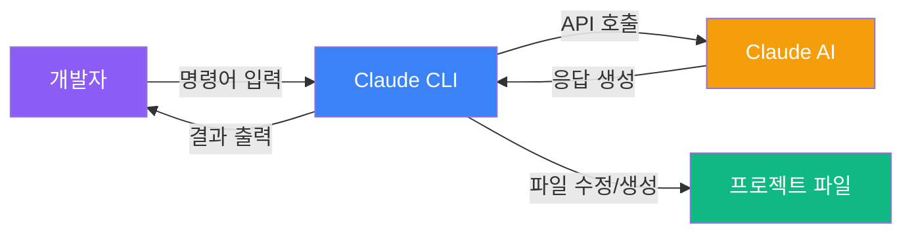
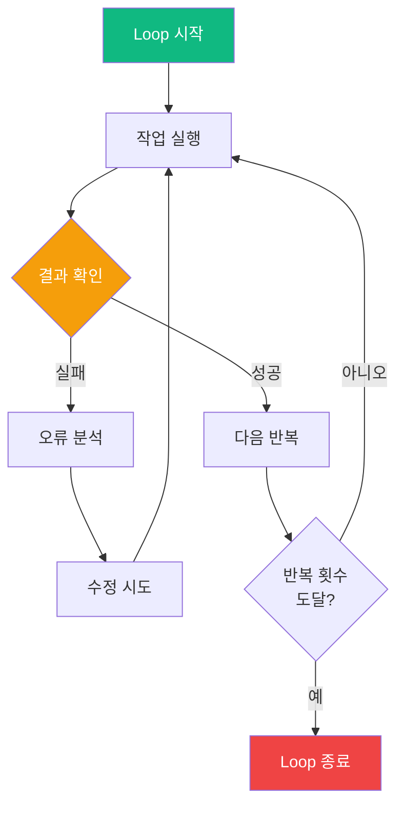
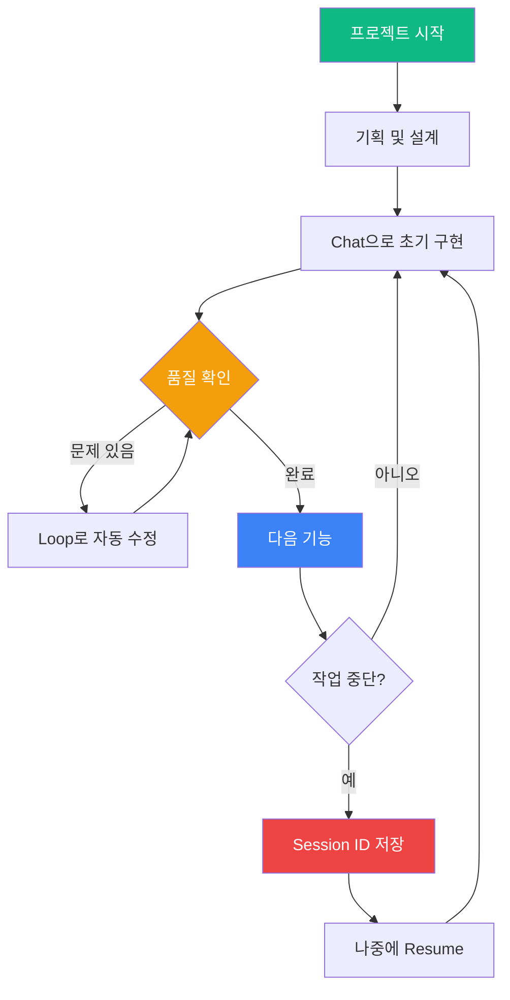

# Claude CLI 고급 사용법 가이드

> AI Vibe 프로젝트를 위한 Claude CLI 활용 완전 가이드  
> Loop, Resume, 그리고 고급 명령어 패턴 정리

---

## 목차

1. [Claude CLI 기본 개념](#1-claude-cli-기본-개념)
2. [Loop 명령어 완전 가이드](#2-loop-명령어-완전-가이드)
3. [Resume 명령어 완전 가이드](#3-resume-명령어-완전-가이드)
4. [고급 사용 패턴](#4-고급-사용-패턴)
5. [AI Vibe 프로젝트 적용 예시](#5-ai-vibe-프로젝트-적용-예시)
6. [베스트 프랙티스](#6-베스트-프랙티스)
7. [트러블슈팅](#7-트러블슈팅)

---

## 1. Claude CLI 기본 개념

### 1.1 Claude CLI란?

Claude CLI는 터미널에서 Claude AI와 대화하며 코드를 작성하고, 파일을 수정하고, 프로젝트를 관리할 수 있는 명령줄 도구입니다.



### 1.2 설치 및 초기 설정

```bash
# Claude CLI 설치
npm install -g @anthropic-ai/claude-cli

# 또는 yarn 사용
yarn global add @anthropic-ai/claude-cli

# API 키 설정
claude config set api_key YOUR_API_KEY

# 설정 확인
claude config list
```

### 1.3 기본 명령어 구조

```bash
claude [옵션] [명령어] [인자]
```

| 명령어 | 설명 | 예시 |
|--------|------|------|
| `chat` | 대화 시작 | `claude chat "코드 리뷰해줘"` |
| `loop` | 반복 작업 실행 | `claude loop --times 5 "테스트 실행"` |
| `resume` | 이전 세션 재개 | `claude resume SESSION_ID` |
| `history` | 세션 히스토리 조회 | `claude history` |
| `config` | 설정 관리 | `claude config set model claude-3-opus` |

---

## 2. Loop 명령어 완전 가이드

### 2.1 Loop의 핵심 개념

`loop`는 반복적인 작업을 자동화하는 명령어입니다. Claude가 작업을 수행하고, 결과를 확인하고, 필요시 수정하는 과정을 자동으로 반복합니다.



### 2.2 Loop 기본 사용법

#### 기본 구문

```bash
claude loop [옵션] "작업 설명"
```

#### 주요 옵션

| 옵션 | 설명 | 기본값 | 예시 |
|------|------|--------|------|
| `--times N` | 최대 반복 횟수 | 10 | `--times 5` |
| `--until "조건"` | 종료 조건 | 없음 | `--until "테스트 통과"` |
| `--delay MS` | 반복 간 대기 시간(ms) | 0 | `--delay 1000` |
| `--context FILE` | 컨텍스트 파일 지정 | 없음 | `--context ./README.md` |
| `--model NAME` | 사용할 모델 지정 | claude-3-sonnet | `--model claude-3-opus` |
| `--verbose` | 상세 로그 출력 | false | `--verbose` |
| `--dry-run` | 실제 실행 없이 시뮬레이션 | false | `--dry-run` |

### 2.3 Loop 실전 예시

#### 예시 1: 테스트 자동 수정

```bash
# 테스트가 통과할 때까지 최대 5번 반복
claude loop --times 5 --until "npm test 성공" \
  "frontend/app/quiz 폴더의 테스트를 실행하고, 실패하면 코드를 수정해줘"
```

**작동 방식:**
1. `npm test` 실행
2. 실패한 테스트 분석
3. 코드 수정
4. 다시 테스트 실행
5. 통과할 때까지 반복 (최대 5번)

#### 예시 2: 컴포넌트 리팩토링

```bash
# 모든 컴포넌트를 400줄 이하로 분리
claude loop --times 10 --verbose \
  "frontend/components 폴더의 모든 .tsx 파일을 검사하고, 
   400줄이 넘는 파일을 찾아서 컴포넌트로 분리해줘. 
   한 번에 하나씩 처리하고, 모든 파일이 400줄 이하가 될 때까지 반복해줘"
```

#### 예시 3: 타입 에러 자동 수정

```bash
# TypeScript 에러가 없을 때까지 반복
claude loop --until "tsc --noEmit 성공" --times 8 \
  "TypeScript 에러를 찾아서 하나씩 수정해줘. 
   타입 정의를 추가하거나 any 사용을 피하면서 수정해줘"
```

#### 예시 4: JSON 데이터 검증 및 수정

```bash
# 모든 JSON 파일이 스키마를 통과할 때까지
claude loop --times 5 --context ./schema.json \
  "frontend/data 폴더의 모든 JSON 파일을 검증하고, 
   스키마에 맞지 않는 부분을 수정해줘"
```

### 2.4 Loop 고급 패턴

#### 패턴 1: 점진적 개선 (Progressive Enhancement)

```bash
# 단계별로 품질을 높이는 패턴
claude loop --times 3 \
  "1단계: ESLint 경고 수정
   2단계: 코드 중복 제거
   3단계: 성능 최적화
   각 단계를 순서대로 진행하고, 다음 단계로 넘어가줘"
```

#### 패턴 2: 조건부 반복 (Conditional Loop)

```bash
# 특정 조건이 만족될 때까지
claude loop --until "lighthouse 점수 > 90" --times 10 \
  "웹 성능을 측정하고, 90점 이상이 될 때까지 최적화해줘.
   이미지 최적화, 코드 스플리팅, 레이지 로딩 등을 적용해줘"
```

#### 패턴 3: 배치 처리 (Batch Processing)

```bash
# 여러 파일을 순차적으로 처리
claude loop --times 20 --delay 500 \
  "frontend/data/high-school 폴더의 JSON 파일을 하나씩 처리해줘.
   각 파일에 대해:
   1. 데이터 검증
   2. 누락된 필드 추가
   3. 형식 통일
   한 파일씩 처리하고, 모든 파일이 완료될 때까지 반복해줘"
```

#### 패턴 4: 피드백 루프 (Feedback Loop)

```bash
# 사용자 피드백을 받으면서 반복
claude loop --times 5 --verbose \
  "컴포넌트를 개선하고, 각 반복마다 변경 사항을 요약해줘.
   내가 'continue'라고 하면 다음 개선을 진행하고,
   'stop'이라고 하면 중단해줘"
```

### 2.5 Loop 제어 옵션

#### 중단 조건 설정

```bash
# 여러 조건 조합
claude loop \
  --until "npm test 성공 AND npm run lint 성공" \
  --times 10 \
  "테스트와 린트를 모두 통과할 때까지 코드를 수정해줘"
```

#### 타임아웃 설정

```bash
# 최대 실행 시간 제한
claude loop --timeout 300000 --times 10 \
  "5분 안에 최대한 많은 컴포넌트를 리팩토링해줘"
```

---

## 3. Resume 명령어 완전 가이드

### 3.1 Resume의 핵심 개념

`resume`은 이전에 중단된 세션을 재개하는 명령어입니다. 컨텍스트를 유지하면서 작업을 이어갈 수 있습니다.


### 3.2 Resume 기본 사용법

#### 세션 ID 확인

```bash
# 최근 세션 목록 보기
claude history

# 출력 예시:
# Session ID: abc123def456
# Started: 2026-03-26 10:30:00
# Last message: "컴포넌트 리팩토링 중..."
# Status: interrupted
```

#### 세션 재개

```bash
# 기본 재개
claude resume abc123def456

# 추가 지시사항과 함께 재개
claude resume abc123def456 "이전 작업을 계속하되, 이번엔 TypeScript strict 모드를 적용해줘"

# 특정 모델로 재개
claude resume abc123def456 --model claude-3-opus
```

### 3.3 Resume 고급 옵션

| 옵션 | 설명 | 예시 |
|------|------|------|
| `--from-message N` | N번째 메시지부터 재개 | `--from-message 5` |
| `--reset-context` | 컨텍스트 초기화 후 재개 | `--reset-context` |
| `--add-context FILE` | 새 컨텍스트 파일 추가 | `--add-context ./new-requirements.md` |
| `--continue-loop` | Loop 모드로 재개 | `--continue-loop --times 5` |
| `--model NAME` | 다른 모델로 재개 | `--model claude-3-opus` |

### 3.4 Resume 실전 예시

#### 예시 1: 중단된 리팩토링 재개

```bash
# 1. 초기 작업 시작
claude chat "frontend/app/jobs 폴더를 리팩토링해줘"
# ... 작업 중 중단됨 (Session ID: abc123)

# 2. 나중에 재개
claude resume abc123 "이전 리팩토링을 계속해줘. 
남은 파일들도 같은 패턴으로 처리해줘"
```

#### 예시 2: 다른 방향으로 재개

```bash
# 1. 초기 작업
claude chat "고입 탐색 기능에 필터 추가해줘"
# Session ID: def456

# 2. 다른 접근 방식으로 재개
claude resume def456 --reset-context \
  "이전 세션의 코드를 참고하되, 
   이번엔 Radix UI Select 대신 커스텀 드롭다운을 만들어줘"
```

#### 예시 3: 컨텍스트 추가하며 재개

```bash
# 새로운 요구사항 문서를 추가하며 재개
claude resume abc123 \
  --add-context ./documents/new-requirements.md \
  "새 요구사항을 반영해서 이전 작업을 수정해줘"
```

#### 예시 4: Loop 모드로 전환하며 재개

```bash
# 일반 세션을 Loop 모드로 전환
claude resume def456 --continue-loop --times 5 \
  "이전 작업을 완료할 때까지 반복해줘"
```

### 3.5 Resume 관리 명령어

#### 세션 관리

```bash
# 모든 세션 목록
claude history --all

# 특정 기간의 세션
claude history --since "2026-03-20"

# 세션 상세 정보
claude history --session abc123 --verbose

# 세션 삭제
claude history --delete abc123

# 모든 완료된 세션 정리
claude history --cleanup
```

#### 세션 내보내기/가져오기

```bash
# 세션을 파일로 내보내기
claude export abc123 --output session-backup.json

# 세션 가져오기
claude import session-backup.json

# 팀원과 세션 공유
claude export abc123 --format markdown --output session-log.md
```

---

## 4. 고급 사용 패턴

### 4.1 Loop + Resume 조합

#### 패턴 1: 장기 프로젝트 관리

```bash
# 1일차: 초기 작업
claude loop --times 10 "컴포넌트 구조 설계 및 구현"
# Session ID: project-day1

# 2일차: 이어서 작업
claude resume project-day1 --continue-loop --times 10 \
  "어제 작업을 이어서 진행하고, 테스트도 추가해줘"

# 3일차: 최종 마무리
claude resume project-day1 --continue-loop --times 5 \
  "마지막 리팩토링과 문서화를 완료해줘"
```

#### 패턴 2: 실험적 개발

```bash
# 방법 A 시도
claude loop --times 5 "방법 A로 구현"
# Session ID: experiment-a

# 방법 B 시도
claude loop --times 5 "방법 B로 구현"
# Session ID: experiment-b

# 더 나은 방법 선택 후 계속
claude resume experiment-b --continue-loop --times 5 \
  "방법 B가 더 좋으니 이걸로 완성해줘"
```

### 4.2 컨텍스트 관리 전략

#### 다중 컨텍스트 파일 사용

```bash
# 여러 문서를 컨텍스트로 제공
claude loop --times 5 \
  --context ./README.md \
  --context ./ARCHITECTURE.md \
  --context ./CODING_CONVENTIONS.md \
  "프로젝트 규칙을 따르면서 새 기능을 구현해줘"
```

#### 동적 컨텍스트 업데이트

```bash
# 1단계: 기본 컨텍스트로 시작
claude chat --context ./phase1-requirements.md \
  "1단계 기능 구현"
# Session ID: phase1

# 2단계: 새 컨텍스트 추가
claude resume phase1 \
  --add-context ./phase2-requirements.md \
  "2단계 기능 추가"
```

### 4.3 병렬 작업 패턴

#### 여러 세션 동시 진행

```bash
# 터미널 1: 프론트엔드 작업
claude loop --times 10 "frontend 리팩토링"
# Session ID: frontend-work

# 터미널 2: 백엔드 작업
claude loop --times 10 "backend API 구현"
# Session ID: backend-work

# 터미널 3: 문서화 작업
claude loop --times 5 "문서 작성 및 업데이트"
# Session ID: docs-work
```

### 4.4 조건부 실행 패턴

#### Git 상태 기반 실행

```bash
# 변경사항이 있을 때만 실행
claude loop --times 5 \
  --until "git status --porcelain 비어있음" \
  "변경된 파일을 검토하고 커밋 준비해줘"
```

#### 테스트 결과 기반 실행

```bash
# 테스트 커버리지 목표 달성까지
claude loop --times 10 \
  --until "coverage > 80%" \
  "테스트 커버리지를 80% 이상으로 올려줘"
```

---

## 5. AI Vibe 프로젝트 적용 예시

### 5.1 컴포넌트 개발 워크플로우

#### 시나리오: 새로운 탭 컴포넌트 개발

```bash
# 1단계: 기본 구조 생성
claude chat "frontend/components/section-shell에 
새로운 GradientSegmentedTabBar 컴포넌트를 만들어줘.
config 파일로 라벨을 관리하고, 400줄 이하로 작성해줘"
# Session ID: tabbar-dev

# 2단계: 스타일링 개선 (Loop 사용)
claude resume tabbar-dev --continue-loop --times 3 \
  "그라데이션 애니메이션을 추가하고, 
   모바일 반응형을 완벽하게 만들어줘"

# 3단계: 접근성 개선
claude resume tabbar-dev \
  "ARIA 속성을 추가하고, 키보드 네비게이션을 구현해줘"

# 4단계: 테스트 추가
claude resume tabbar-dev --continue-loop --times 5 \
  "컴포넌트 테스트를 작성하고, 모든 테스트가 통과할 때까지 수정해줘"
```

### 5.2 데이터 관리 워크플로우

#### 시나리오: JSON 데이터 검증 및 정리

```bash
# 1단계: 전체 데이터 검증
claude loop --times 10 --verbose \
  "frontend/data/high-school 폴더의 모든 JSON 파일을 검사해줘.
   - 필수 필드 누락 확인
   - 데이터 타입 검증
   - 중복 데이터 제거
   한 파일씩 처리하고, 문제를 수정해줘"
# Session ID: data-validation

# 2단계: 스키마 통일
claude resume data-validation --continue-loop --times 5 \
  "모든 학교 데이터가 동일한 스키마를 따르도록 통일해줘"

# 3단계: 데이터 보강
claude resume data-validation \
  "누락된 careerPathDetails를 추가하고, 
   연봉 정보를 최신 데이터로 업데이트해줘"
```

### 5.3 리팩토링 워크플로우

#### 시나리오: 대규모 컴포넌트 분리

```bash
# 1단계: 문제 파일 식별
claude chat "frontend/app 폴더에서 400줄이 넘는 파일을 찾아줘"
# Session ID: refactor-project

# 2단계: 자동 분리 (Loop 사용)
claude resume refactor-project --continue-loop --times 15 \
  "400줄이 넘는 파일을 찾아서 하나씩 컴포넌트로 분리해줘.
   - 로직 컴포넌트와 UI 컴포넌트 분리
   - 공통 로직은 hooks로 추출
   - config 파일로 상수 관리
   모든 파일이 400줄 이하가 될 때까지 반복해줘"

# 3단계: 타입 정리
claude resume refactor-project \
  "분리한 컴포넌트의 타입을 types.ts 파일로 정리해줘"

# 4단계: 문서화
claude resume refactor-project \
  "변경된 컴포넌트 구조를 ARCHITECTURE.md에 문서화해줘"
```

### 5.4 기능 개발 전체 사이클

#### 시나리오: 고입 탐색 필터 기능 추가

```bash
# Day 1: 기획 및 설계
claude chat --context ./documents/고입가이드/중학생_고입_완전가이드_상.md \
  "고입 탐색 탭에 다음 필터를 추가해줘:
   - 지역별 필터
   - 난이도별 필터
   - 기숙사 유무 필터
   먼저 설계 문서를 작성해줘"
# Session ID: filter-feature

# Day 2: 구현 (Loop 사용)
claude resume filter-feature --continue-loop --times 10 \
  "설계대로 필터 기능을 구현해줘.
   - FilterBar 컴포넌트 생성
   - 필터 로직 구현
   - URL 쿼리 파라미터 연동
   - 모바일 반응형 적용"

# Day 3: 테스트 및 버그 수정
claude resume filter-feature --continue-loop --times 5 \
  --until "npm test 성공" \
  "테스트를 작성하고, 모든 테스트가 통과할 때까지 수정해줘"

# Day 4: 성능 최적화
claude resume filter-feature \
  "필터 성능을 최적화해줘:
   - useMemo로 필터링 결과 캐싱
   - 디바운싱 적용
   - 불필요한 리렌더링 방지"

# Day 5: 문서화 및 배포 준비
claude resume filter-feature \
  "README.md에 새 기능을 추가하고, 
   CHANGELOG.md에 변경사항을 기록해줘"
```

### 5.5 품질 관리 워크플로우

#### 시나리오: 전체 프로젝트 품질 개선

```bash
# 1단계: ESLint 경고 제거
claude loop --times 10 --until "npm run lint 경고 0개" \
  "ESLint 경고를 하나씩 수정해줘. any 타입 사용을 피하고, 
   unused variables를 제거해줘"
# Session ID: quality-improvement

# 2단계: TypeScript strict 모드 적용
claude resume quality-improvement --continue-loop --times 15 \
  "TypeScript strict 모드를 활성화하고, 
   발생하는 에러를 모두 수정해줘"

# 3단계: 코드 중복 제거
claude resume quality-improvement --continue-loop --times 10 \
  "중복된 코드를 찾아서 공통 컴포넌트나 유틸 함수로 추출해줘"

# 4단계: 성능 최적화
claude resume quality-improvement \
  "React DevTools Profiler로 성능 병목을 찾아서 최적화해줘"

# 5단계: 접근성 개선
claude resume quality-improvement --continue-loop --times 5 \
  "WCAG 2.1 AA 기준을 만족하도록 접근성을 개선해줘"
```

---

## 6. 베스트 프랙티스

### 6.1 Loop 사용 시 주의사항

#### ✅ 좋은 예시

```bash
# 명확한 종료 조건
claude loop --times 5 --until "테스트 통과" \
  "테스트를 실행하고 실패하면 수정해줘"

# 단계별 진행
claude loop --times 3 \
  "1단계씩 진행하고, 각 단계 완료 후 다음 단계로 넘어가줘"

# 상세한 로깅
claude loop --verbose --times 10 \
  "각 반복마다 무엇을 했는지 요약해줘"
```

#### ❌ 나쁜 예시

```bash
# 너무 많은 반복 (무한 루프 위험)
claude loop --times 100 "모든 걸 완벽하게 만들어줘"

# 모호한 지시
claude loop --times 5 "뭔가 개선해줘"

# 종료 조건 없음
claude loop "계속 작업해줘"
```

### 6.2 Resume 사용 시 주의사항

#### ✅ 좋은 예시

```bash
# 명확한 이어하기
claude resume abc123 "이전 작업을 계속하되, 
이번엔 에러 처리를 추가해줘"

# 컨텍스트 추가
claude resume abc123 --add-context ./new-spec.md \
  "새 스펙을 반영해서 수정해줘"

# 세션 정리
claude history --cleanup  # 주기적으로 실행
```

#### ❌ 나쁜 예시

```bash
# 컨텍스트 없이 재개
claude resume abc123  # 무엇을 할지 모름

# 너무 오래된 세션 재개
claude resume very-old-session-from-3-months-ago

# 세션 ID 관리 안 함
claude resume ???  # ID를 잊어버림
```

### 6.3 효율적인 프롬프트 작성

#### 구조화된 프롬프트

```bash
claude loop --times 5 "
목표: frontend/components 폴더 리팩토링

작업 순서:
1. 400줄 이상 파일 찾기
2. 컴포넌트 분리
3. 타입 정의 추출
4. 테스트 작성

제약사항:
- 파일당 400줄 이하
- config 파일로 상수 관리
- TypeScript strict 모드 준수

완료 조건:
- 모든 파일 400줄 이하
- 테스트 통과
- ESLint 경고 없음
"
```

#### 컨텍스트 제공

```bash
claude loop --times 5 \
  --context ./README.md \
  --context ./.cursor/rules/CODING_CONVENTIONS.md \
  "프로젝트 규칙을 따르면서 작업해줘"
```

### 6.4 세션 관리 전략

#### 세션 네이밍 규칙

```bash
# 의미 있는 세션 ID 사용
claude chat "..." --session-id feature-고입탐색-필터
claude chat "..." --session-id refactor-components-2026-03-26
claude chat "..." --session-id bugfix-issue-123
```

#### 주기적인 세션 정리

```bash
# 매주 월요일 실행
claude history --cleanup --older-than 7d

# 완료된 세션만 정리
claude history --cleanup --completed-only
```

#### 세션 백업

```bash
# 중요한 세션은 백업
claude export important-session-id \
  --output ./backups/session-$(date +%Y%m%d).json
```

---

## 7. 트러블슈팅

### 7.1 일반적인 문제

#### 문제 1: Loop가 무한 반복됨

**증상:**
```bash
claude loop --times 10 "테스트 수정"
# 10번 반복했는데도 끝나지 않음
```

**해결책:**
```bash
# 명확한 종료 조건 추가
claude loop --times 5 --until "npm test 성공" \
  "테스트를 실행하고, 실패한 테스트만 수정해줘. 
   각 반복마다 진행 상황을 보고해줘"

# 또는 타임아웃 설정
claude loop --timeout 300000 --times 10 \
  "5분 안에 최대한 수정해줘"
```

#### 문제 2: Resume 시 컨텍스트 손실

**증상:**
```bash
claude resume abc123
# "이전 작업이 무엇인지 기억나지 않습니다"
```

**해결책:**
```bash
# 세션 정보 먼저 확인
claude history --session abc123 --verbose

# 컨텍스트를 다시 제공하며 재개
claude resume abc123 \
  --add-context ./README.md \
  "이전에 고입 탐색 필터 기능을 개발하고 있었어. 
   마지막으로 FilterBar 컴포넌트를 만들었고, 
   이제 필터 로직을 구현해야 해"
```

#### 문제 3: API 요청 한도 초과

**증상:**
```bash
claude loop --times 20 "..."
# Error: Rate limit exceeded
```

**해결책:**
```bash
# 반복 간 딜레이 추가
claude loop --times 20 --delay 2000 "..."

# 또는 반복 횟수 줄이기
claude loop --times 5 "..."
# 완료 후 resume으로 이어서
claude resume session-id --continue-loop --times 5
```

### 7.2 성능 최적화

#### 대용량 파일 처리

```bash
# 나쁜 예: 모든 파일을 한 번에
claude loop --times 10 "frontend 폴더 전체 리팩토링"

# 좋은 예: 폴더별로 나누어 처리
claude loop --times 5 "frontend/components 리팩토링"
# Session ID: refactor-components

claude loop --times 5 "frontend/app 리팩토링"
# Session ID: refactor-app

claude loop --times 5 "frontend/data 리팩토링"
# Session ID: refactor-data
```

#### 컨텍스트 크기 최적화

```bash
# 나쁜 예: 너무 많은 컨텍스트
claude chat \
  --context ./README.md \
  --context ./ARCHITECTURE.md \
  --context ./CHANGELOG.md \
  --context ./CONTRIBUTING.md \
  --context ./LICENSE.md \
  "..."

# 좋은 예: 필요한 컨텍스트만
claude chat \
  --context ./README.md \
  --context ./ARCHITECTURE.md \
  "..."
```

### 7.3 디버깅 팁

#### 상세 로그 활성화

```bash
# verbose 모드로 실행
claude loop --verbose --times 5 "..."

# 로그 파일로 저장
claude loop --verbose --times 5 "..." > loop-log.txt 2>&1
```

#### 단계별 실행

```bash
# dry-run으로 먼저 테스트
claude loop --dry-run --times 5 "..."

# 문제없으면 실제 실행
claude loop --times 5 "..."
```

#### 세션 디버깅

```bash
# 세션 상세 정보 확인
claude history --session abc123 --verbose

# 특정 메시지부터 재개
claude resume abc123 --from-message 3
```

---

## 8. 실전 치트시트

### 8.1 자주 사용하는 명령어 모음

```bash
# === Loop 패턴 ===

# 테스트 자동 수정
claude loop --times 5 --until "npm test 성공" "테스트 수정"

# 컴포넌트 분리
claude loop --times 10 "400줄 넘는 파일 찾아서 분리"

# 타입 에러 수정
claude loop --until "tsc --noEmit 성공" --times 8 "타입 에러 수정"

# JSON 검증
claude loop --times 5 --context ./schema.json "JSON 파일 검증 및 수정"

# === Resume 패턴 ===

# 기본 재개
claude resume SESSION_ID "이전 작업 계속"

# 컨텍스트 추가하며 재개
claude resume SESSION_ID --add-context ./new-spec.md "새 스펙 반영"

# Loop 모드로 전환
claude resume SESSION_ID --continue-loop --times 5 "완료까지 반복"

# 다른 모델로 재개
claude resume SESSION_ID --model claude-3-opus "더 정교하게 작업"

# === 세션 관리 ===

# 세션 목록
claude history

# 세션 상세
claude history --session SESSION_ID --verbose

# 세션 정리
claude history --cleanup --older-than 7d

# 세션 백업
claude export SESSION_ID --output backup.json
```

### 8.2 프로젝트별 템플릿

#### AI Vibe 프로젝트 템플릿

```bash
# 새 컴포넌트 개발
claude chat --context ./README.md "
frontend/components에 새 컴포넌트 생성:
- 400줄 이하
- config 파일로 라벨 관리
- TypeScript strict 모드
- 모바일 반응형
"

# 데이터 관리
claude loop --times 10 "
frontend/data/high-school JSON 파일 검증:
- 필수 필드 확인
- 타입 검증
- 중복 제거
"

# 리팩토링
claude loop --times 15 "
400줄 넘는 파일 리팩토링:
- 컴포넌트 분리
- hooks 추출
- config 파일 관리
"

# 품질 개선
claude loop --until "npm run lint 경고 0개" --times 10 "
ESLint 경고 수정:
- any 타입 제거
- unused variables 제거
- import 정리
"
```

---

## 9. 추가 리소스

### 9.1 공식 문서

| 리소스 | URL |
|--------|-----|
| Claude CLI 공식 문서 | https://docs.anthropic.com/claude/cli |
| API 레퍼런스 | https://docs.anthropic.com/claude/reference |
| 커뮤니티 포럼 | https://community.anthropic.com |

### 9.2 유용한 도구

```bash
# Claude CLI 업데이트
npm update -g @anthropic-ai/claude-cli

# 설정 확인
claude config list

# 버전 확인
claude --version

# 도움말
claude --help
claude loop --help
claude resume --help
```

### 9.3 추천 워크플로우



---

## 10. 요약 및 다음 단계

### 10.1 핵심 요약

| 명령어 | 주요 용도 | 핵심 옵션 |
|--------|----------|----------|
| **loop** | 반복 작업 자동화 | `--times`, `--until`, `--delay` |
| **resume** | 세션 재개 | `--add-context`, `--continue-loop` |
| **history** | 세션 관리 | `--session`, `--cleanup` |
| **export** | 세션 백업 | `--output`, `--format` |

### 10.2 학습 로드맵


### 10.3 다음 단계

1. **실습하기**: 간단한 프로젝트로 Loop와 Resume 연습
2. **워크플로우 구축**: 자신만의 개발 워크플로우 만들기
3. **자동화**: 반복 작업을 Loop로 자동화
4. **팀 공유**: 세션 Export로 팀원과 협업

---

## 부록: AI Vibe 프로젝트 전용 스크립트

### A.1 자주 사용하는 명령어 스크립트

```bash
#!/bin/bash
# claude-helpers.sh

# 컴포넌트 리팩토링
refactor_components() {
    claude loop --times 15 \
        --context ./README.md \
        "frontend/components에서 400줄 넘는 파일을 찾아서 분리해줘"
}

# 데이터 검증
validate_data() {
    claude loop --times 10 \
        "frontend/data/high-school의 모든 JSON 파일을 검증하고 수정해줘"
}

# 품질 개선
improve_quality() {
    local session_id="quality-$(date +%Y%m%d)"
    
    # 1단계: Lint
    claude loop --times 10 --session-id "$session_id" \
        --until "npm run lint 경고 0개" \
        "ESLint 경고 수정"
    
    # 2단계: TypeScript
    claude resume "$session_id" --continue-loop --times 10 \
        --until "tsc --noEmit 성공" \
        "TypeScript 에러 수정"
    
    # 3단계: 테스트
    claude resume "$session_id" --continue-loop --times 5 \
        --until "npm test 성공" \
        "테스트 작성 및 수정"
}

# 세션 정리
cleanup_sessions() {
    claude history --cleanup --older-than 7d
    echo "7일 이상 된 세션을 정리했습니다."
}

# 사용법 출력
usage() {
    echo "Usage: $0 {refactor|validate|quality|cleanup}"
    echo ""
    echo "Commands:"
    echo "  refactor  - 컴포넌트 리팩토링"
    echo "  validate  - 데이터 검증"
    echo "  quality   - 품질 개선"
    echo "  cleanup   - 세션 정리"
}

# 메인 로직
case "$1" in
    refactor)
        refactor_components
        ;;
    validate)
        validate_data
        ;;
    quality)
        improve_quality
        ;;
    cleanup)
        cleanup_sessions
        ;;
    *)
        usage
        exit 1
        ;;
esac
```

### A.2 사용 예시

```bash
# 스크립트 실행 권한 부여
chmod +x claude-helpers.sh

# 컴포넌트 리팩토링 실행
./claude-helpers.sh refactor

# 데이터 검증 실행
./claude-helpers.sh validate

# 품질 개선 실행
./claude-helpers.sh quality

# 세션 정리 실행
./claude-helpers.sh cleanup
```

---

**문서 버전**: 1.0.0  
**최종 수정일**: 2026-03-26  
**작성자**: AI Vibe 개발팀  
**문서 상태**: 완료

이 가이드는 Claude CLI의 Loop와 Resume 명령어를 마스터하여 AI Vibe 프로젝트 개발 생산성을 극대화하기 위한 완전한 참고 자료입니다.
