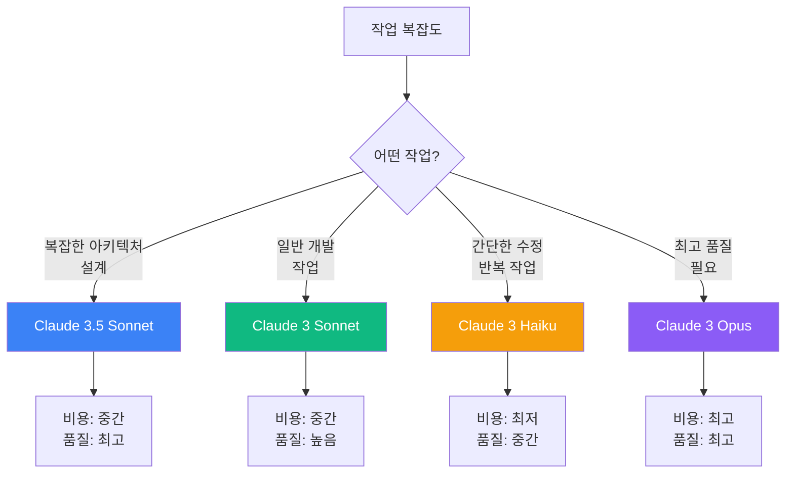
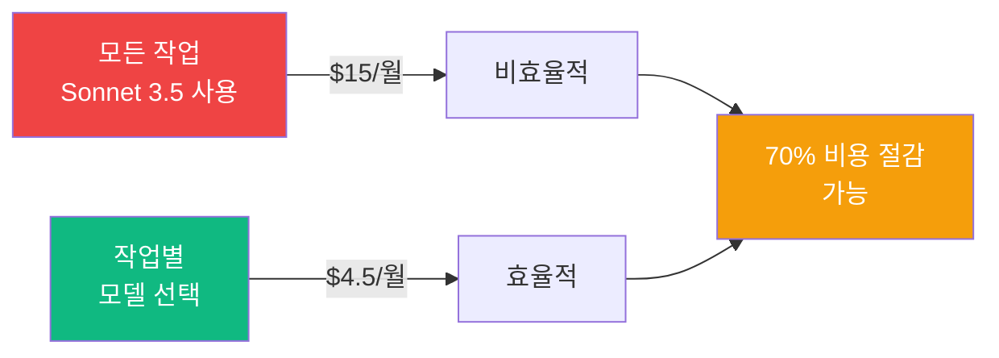
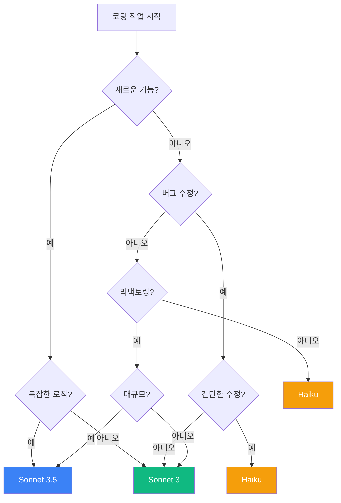

# Claude CLI 모델 선택 & 비용 최적화 가이드

> AI Vibe 프로젝트를 위한 실전 코딩 전략  
> 프론트엔드/백엔드 개발 시 비용을 절감하면서 최적의 결과를 얻는 방법

---

## 목차

1. [Claude 모델 이해하기](#1-claude-모델-이해하기)
2. [비용 구조 분석](#2-비용-구조-분석)
3. [모델 선택 전략](#3-모델-선택-전략)
4. [프론트엔드 개발 최적화](#4-프론트엔드-개발-최적화)
5. [백엔드 개발 최적화](#5-백엔드-개발-최적화)
6. [비용 절감 베스트 프랙티스](#6-비용-절감-베스트-프랙티스)
7. [실전 예시 코드](#7-실전-예시-코드)
8. [비용 모니터링](#8-비용-모니터링)

---

## 1. Claude 모델 이해하기

### 1.1 모델 비교표

| 모델 | 성능 | 속도 | 비용 (Input) | 비용 (Output) | 적합한 작업 |
|------|------|------|-------------|--------------|-----------|
| **Claude 3.5 Sonnet** | ⭐⭐⭐⭐⭐ | ⚡⚡⚡⚡ | $3/MTok | $15/MTok | 복잡한 코딩, 아키텍처 설계 |
| **Claude 3 Opus** | ⭐⭐⭐⭐⭐ | ⚡⚡⚡ | $15/MTok | $75/MTok | 최고 품질 필요 시 |
| **Claude 3 Sonnet** | ⭐⭐⭐⭐ | ⚡⚡⚡⚡ | $3/MTok | $15/MTok | 일반 개발 작업 |
| **Claude 3 Haiku** | ⭐⭐⭐ | ⚡⚡⚡⚡⚡ | $0.25/MTok | $1.25/MTok | 간단한 작업, 반복 작업 |

> **MTok** = Million Tokens (100만 토큰)  
> 1 토큰 ≈ 0.75 단어 (영어 기준) ≈ 0.5 단어 (한국어 기준)

### 1.2 모델별 특징



### 1.3 모델 설정 방법

```bash
# 기본 모델 설정 (전역)
claude config set model claude-3-5-sonnet-20241022

# 현재 설정 확인
claude config get model

# 특정 명령어에만 모델 지정
claude chat --model claude-3-haiku-20240307 "간단한 작업"

# 환경변수로 설정
export CLAUDE_MODEL="claude-3-5-sonnet-20241022"
```

---

## 2. 비용 구조 분석

### 2.1 실제 비용 계산 예시

#### 시나리오 1: 컴포넌트 개발 (Claude 3.5 Sonnet)

```
입력 토큰: 2,000 (프롬프트 + 컨텍스트)
출력 토큰: 1,500 (생성된 코드)

비용 계산:
- Input: 2,000 / 1,000,000 × $3 = $0.006
- Output: 1,500 / 1,000,000 × $15 = $0.0225
- 총 비용: $0.0285 (약 38원)
```

#### 시나리오 2: 간단한 수정 (Claude 3 Haiku)

```
입력 토큰: 500
출력 토큰: 300

비용 계산:
- Input: 500 / 1,000,000 × $0.25 = $0.000125
- Output: 300 / 1,000,000 × $1.25 = $0.000375
- 총 비용: $0.0005 (약 0.67원)
```

### 2.2 월간 비용 시뮬레이션

| 작업 유형 | 횟수/월 | 모델 | 평균 토큰 | 월 비용 |
|----------|---------|------|----------|---------|
| 복잡한 기능 개발 | 20회 | Sonnet 3.5 | 3,500 | $1.05 |
| 일반 코드 수정 | 100회 | Sonnet 3 | 2,000 | $3.00 |
| 간단한 수정 | 200회 | Haiku | 800 | $0.30 |
| 코드 리뷰 | 50회 | Haiku | 1,500 | $0.11 |
| **총 비용** | **370회** | **혼합** | - | **$4.46** |

### 2.3 비용 절감 잠재력



---

## 3. 모델 선택 전략

### 3.1 작업별 최적 모델 매트릭스

| 작업 유형 | 복잡도 | 추천 모델 | 이유 |
|----------|--------|----------|------|
| **아키텍처 설계** | ⭐⭐⭐⭐⭐ | Sonnet 3.5 | 깊은 이해와 설계 능력 필요 |
| **새 기능 개발** | ⭐⭐⭐⭐ | Sonnet 3.5 | 복잡한 로직과 통합 필요 |
| **컴포넌트 작성** | ⭐⭐⭐ | Sonnet 3 | 일반적인 패턴 적용 |
| **버그 수정** | ⭐⭐ | Haiku | 명확한 문제 해결 |
| **코드 포맷팅** | ⭐ | Haiku | 단순 변환 작업 |
| **타입 정의** | ⭐⭐ | Haiku | 반복적인 패턴 |
| **테스트 작성** | ⭐⭐⭐ | Sonnet 3 | 엣지 케이스 고려 필요 |
| **리팩토링** | ⭐⭐⭐⭐ | Sonnet 3.5 | 전체 구조 이해 필요 |
| **문서 작성** | ⭐⭐ | Haiku | 명확한 설명 생성 |
| **코드 리뷰** | ⭐⭐⭐ | Sonnet 3 | 패턴과 베스트 프랙티스 |

### 3.2 의사결정 플로우차트



---

## 4. 프론트엔드 개발 최적화

### 4.1 프론트엔드 작업별 전략

#### 전략 1: 컴포넌트 개발 (3단계 접근)

```bash
# 1단계: 빠른 프로토타입 (Haiku - 저비용)
claude chat --model claude-3-haiku-20240307 \
  "frontend/components에 간단한 Button 컴포넌트 뼈대를 만들어줘.
   props 타입과 기본 구조만 있으면 돼"
# 비용: ~$0.001

# 2단계: 기능 구현 (Sonnet 3 - 중간 비용)
claude chat --model claude-3-sonnet-20240229 \
  "Button 컴포넌트에 variant, size, disabled 기능을 추가하고,
   Radix UI 패턴을 따라서 구현해줘"
# 비용: ~$0.02

# 3단계: 최적화 및 접근성 (Sonnet 3.5 - 필요시만)
claude chat --model claude-3-5-sonnet-20241022 \
  "Button 컴포넌트의 접근성을 개선하고,
   성능 최적화(useMemo, useCallback)를 적용해줘"
# 비용: ~$0.03
```

**총 비용**: $0.051 (약 68원)  
**절감액**: 처음부터 Sonnet 3.5 사용 시 $0.09 대비 **43% 절감**

#### 전략 2: 스타일링 작업 (Haiku 활용)

```bash
# Tailwind CSS 클래스 작성은 Haiku로 충분
claude chat --model claude-3-haiku-20240307 \
  "이 컴포넌트에 Tailwind CSS로 스타일을 추가해줘:
   - 모바일 반응형
   - 다크모드 지원
   - 호버 효과"
# 비용: ~$0.002
```

#### 전략 3: 타입 정의 (Haiku 활용)

```bash
# TypeScript 타입 정의는 패턴이 명확하므로 Haiku 사용
claude chat --model claude-3-haiku-20240307 \
  "frontend/lib/types.ts에 다음 인터페이스를 추가해줘:
   User, Post, Comment 타입 정의"
# 비용: ~$0.001
```

### 4.2 프론트엔드 Loop 최적화

```bash
# 나쁜 예: 모든 반복에 Sonnet 3.5 사용
claude loop --model claude-3-5-sonnet-20241022 --times 10 \
  "컴포넌트 리팩토링"
# 예상 비용: $0.30

# 좋은 예: Haiku로 시작 → 필요시 업그레이드
claude loop --model claude-3-haiku-20240307 --times 10 \
  "컴포넌트 리팩토링. 복잡한 경우 알려줘"
# 예상 비용: $0.05 (83% 절감)

# 복잡한 케이스만 Sonnet 3.5로 처리
claude chat --model claude-3-5-sonnet-20241022 \
  "복잡한 컴포넌트 X를 리팩토링해줘"
# 추가 비용: $0.03
```

### 4.3 프론트엔드 실전 예시

#### 예시 1: 새로운 페이지 개발

```bash
# Step 1: 페이지 구조 설계 (Sonnet 3.5)
claude chat --model claude-3-5-sonnet-20241022 \
  --context ./README.md \
  --context ./ARCHITECTURE.md \
  "frontend/app/dashboard 페이지를 설계해줘.
   - 레이아웃 구조
   - 필요한 컴포넌트 목록
   - 데이터 흐름
   설계 문서를 먼저 작성해줘"
# 비용: ~$0.04

# Step 2: 기본 컴포넌트 생성 (Haiku - Loop)
claude loop --model claude-3-haiku-20240307 --times 5 \
  "설계된 컴포넌트들의 기본 구조를 하나씩 생성해줘"
# 비용: ~$0.01

# Step 3: 비즈니스 로직 구현 (Sonnet 3)
claude chat --model claude-3-sonnet-20240229 \
  "대시보드의 데이터 fetching과 상태 관리를 구현해줘"
# 비용: ~$0.03

# Step 4: 스타일링 (Haiku)
claude chat --model claude-3-haiku-20240307 \
  "모든 컴포넌트에 Tailwind CSS 스타일을 적용해줘"
# 비용: ~$0.005

# Step 5: 테스트 작성 (Sonnet 3)
claude chat --model claude-3-sonnet-20240229 \
  "주요 컴포넌트의 테스트를 작성해줘"
# 비용: ~$0.02
```

**총 비용**: $0.105 (약 140원)  
**절감액**: 모두 Sonnet 3.5 사용 시 $0.20 대비 **47% 절감**

#### 예시 2: 버그 수정

```bash
# 간단한 버그는 Haiku로 충분
claude chat --model claude-3-haiku-20240307 \
  "이 컴포넌트에서 onClick이 작동하지 않는 문제를 수정해줘"
# 비용: ~$0.001

# 복잡한 버그는 Sonnet 3
claude chat --model claude-3-sonnet-20240229 \
  "React 상태 업데이트가 비동기로 처리되면서 발생하는 
   race condition 문제를 해결해줘"
# 비용: ~$0.025
```

---

## 5. 백엔드 개발 최적화

### 5.1 백엔드 작업별 전략

#### 전략 1: API 엔드포인트 개발

```bash
# 1단계: API 설계 (Sonnet 3.5)
claude chat --model claude-3-5-sonnet-20241022 \
  "RESTful API 설계:
   - 엔드포인트 구조
   - 요청/응답 스키마
   - 에러 처리 전략
   - 인증/인가 방식"
# 비용: ~$0.04

# 2단계: 기본 라우트 생성 (Haiku)
claude loop --model claude-3-haiku-20240307 --times 5 \
  "설계된 엔드포인트의 기본 라우트를 생성해줘"
# 비용: ~$0.01

# 3단계: 비즈니스 로직 구현 (Sonnet 3)
claude chat --model claude-3-sonnet-20240229 \
  "각 엔드포인트의 비즈니스 로직을 구현해줘"
# 비용: ~$0.03

# 4단계: 검증 로직 추가 (Haiku)
claude chat --model claude-3-haiku-20240307 \
  "입력 검증과 에러 핸들링을 추가해줘"
# 비용: ~$0.005
```

#### 전략 2: 데이터베이스 작업

```bash
# 스키마 설계는 Sonnet 3.5
claude chat --model claude-3-5-sonnet-20241022 \
  "Supabase 데이터베이스 스키마를 설계해줘:
   - 테이블 구조
   - 관계 설정
   - 인덱스 전략
   - RLS 정책"
# 비용: ~$0.05

# 마이그레이션 파일 생성은 Haiku
claude loop --model claude-3-haiku-20240307 --times 3 \
  "각 테이블의 마이그레이션 SQL을 생성해줘"
# 비용: ~$0.005

# 쿼리 최적화는 Sonnet 3
claude chat --model claude-3-sonnet-20240229 \
  "이 쿼리의 성능을 최적화하고 N+1 문제를 해결해줘"
# 비용: ~$0.02
```

#### 전략 3: 인증/인가 시스템

```bash
# 보안이 중요한 작업은 Sonnet 3.5
claude chat --model claude-3-5-sonnet-20241022 \
  "JWT 기반 인증 시스템을 구현해줘:
   - 토큰 생성/검증
   - 리프레시 토큰
   - 보안 베스트 프랙티스 적용"
# 비용: ~$0.06
```

### 5.2 백엔드 Loop 최적화

```bash
# 나쁜 예: 모든 CRUD를 Sonnet 3.5로
claude loop --model claude-3-5-sonnet-20241022 --times 10 \
  "모든 엔티티의 CRUD API 생성"
# 예상 비용: $0.40

# 좋은 예: 패턴 기반 작업은 Haiku
claude loop --model claude-3-haiku-20240307 --times 10 \
  "기본 CRUD 패턴으로 API 생성"
# 예상 비용: $0.05 (87% 절감)
```

### 5.3 백엔드 실전 예시

#### 예시 1: 새로운 마이크로서비스 개발

```bash
# Step 1: 아키텍처 설계 (Sonnet 3.5)
claude chat --model claude-3-5-sonnet-20241022 \
  --context ./backend/ARCHITECTURE.md \
  "사용자 관리 마이크로서비스를 설계해줘:
   - 서비스 경계
   - API 계약
   - 데이터베이스 스키마
   - 이벤트 기반 통신"
# 비용: ~$0.06

# Step 2: 프로젝트 구조 생성 (Haiku)
claude chat --model claude-3-haiku-20240307 \
  "설계된 구조대로 폴더와 기본 파일을 생성해줘"
# 비용: ~$0.002

# Step 3: 기본 CRUD (Haiku Loop)
claude loop --model claude-3-haiku-20240307 --times 5 \
  "각 엔티티의 기본 CRUD 엔드포인트를 생성해줘"
# 비용: ~$0.01

# Step 4: 복잡한 비즈니스 로직 (Sonnet 3)
claude chat --model claude-3-sonnet-20240229 \
  "사용자 등록 프로세스를 구현해줘:
   - 이메일 검증
   - 비밀번호 해싱
   - 환영 이메일 발송"
# 비용: ~$0.04

# Step 5: 테스트 작성 (Sonnet 3)
claude chat --model claude-3-sonnet-20240229 \
  "통합 테스트와 단위 테스트를 작성해줘"
# 비용: ~$0.03

# Step 6: 문서화 (Haiku)
claude chat --model claude-3-haiku-20240307 \
  "API 문서를 OpenAPI 형식으로 작성해줘"
# 비용: ~$0.005
```

**총 비용**: $0.147 (약 196원)  
**절감액**: 모두 Sonnet 3.5 사용 시 $0.30 대비 **51% 절감**

#### 예시 2: 데이터베이스 최적화

```bash
# 분석은 Sonnet 3.5
claude chat --model claude-3-5-sonnet-20241022 \
  "느린 쿼리를 분석하고 최적화 전략을 제시해줘"
# 비용: ~$0.05

# 인덱스 추가는 Haiku
claude chat --model claude-3-haiku-20240307 \
  "제안된 인덱스를 추가하는 마이그레이션을 작성해줘"
# 비용: ~$0.002
```

---

## 6. 비용 절감 베스트 프랙티스

### 6.1 컨텍스트 최적화

```bash
# ❌ 나쁜 예: 불필요하게 큰 컨텍스트
claude chat --model claude-3-5-sonnet-20241022 \
  --context ./README.md \
  --context ./ARCHITECTURE.md \
  --context ./CHANGELOG.md \
  --context ./CONTRIBUTING.md \
  --context ./LICENSE.md \
  "간단한 버그 수정"
# 비용: ~$0.08 (컨텍스트만 5,000+ 토큰)

# ✅ 좋은 예: 필요한 컨텍스트만
claude chat --model claude-3-haiku-20240307 \
  "간단한 버그 수정"
# 비용: ~$0.001
```

### 6.2 프롬프트 최적화

```bash
# ❌ 나쁜 예: 장황한 프롬프트
claude chat --model claude-3-5-sonnet-20241022 \
  "안녕하세요. 저는 AI Vibe 프로젝트를 개발하고 있습니다.
   이 프로젝트는 Next.js를 사용하고 있고, TypeScript로 작성되어 있습니다.
   Tailwind CSS를 사용하고 있고, Radix UI 컴포넌트를 활용합니다.
   지금 Button 컴포넌트를 만들고 싶은데요, 
   이 컴포넌트는 여러 variant를 지원해야 하고,
   크기도 조절할 수 있어야 하고,
   disabled 상태도 있어야 합니다.
   그리고 접근성도 중요하니까 ARIA 속성도 추가해주세요.
   코드를 작성해주실 수 있나요?"
# 비용: ~$0.05 (프롬프트만 200+ 토큰)

# ✅ 좋은 예: 간결한 프롬프트
claude chat --model claude-3-sonnet-20240229 \
  "frontend/components/Button.tsx 생성:
   - variant: primary, secondary, outline
   - size: sm, md, lg
   - disabled 지원
   - ARIA 속성 포함"
# 비용: ~$0.02 (프롬프트 50 토큰)
```

### 6.3 단계별 접근

```bash
# ❌ 나쁜 예: 한 번에 모든 것 요청
claude chat --model claude-3-5-sonnet-20241022 \
  "완벽한 대시보드 페이지를 만들어줘:
   - 레이아웃, 컴포넌트, 스타일, 로직, 테스트, 문서 모두"
# 비용: ~$0.15

# ✅ 좋은 예: 단계별로 나누어 처리
# 1. 설계 (Sonnet 3.5)
claude chat --model claude-3-5-sonnet-20241022 "대시보드 설계"
# 비용: ~$0.04

# 2. 구현 (Sonnet 3)
claude chat --model claude-3-sonnet-20240229 "설계대로 구현"
# 비용: ~$0.03

# 3. 스타일 (Haiku)
claude chat --model claude-3-haiku-20240307 "스타일 적용"
# 비용: ~$0.005

# 4. 테스트 (Sonnet 3)
claude chat --model claude-3-sonnet-20240229 "테스트 작성"
# 비용: ~$0.02

# 총 비용: $0.095 (37% 절감)
```

### 6.4 Loop 횟수 최적화

```bash
# ❌ 나쁜 예: 과도한 반복
claude loop --model claude-3-5-sonnet-20241022 --times 20 \
  "모든 파일 리팩토링"
# 예상 비용: $0.60

# ✅ 좋은 예: 적절한 반복 + Resume
# 1차 시도 (5회)
claude loop --model claude-3-sonnet-20240229 --times 5 \
  "우선순위 높은 파일 리팩토링"
# 비용: ~$0.10
# Session ID: refactor-batch1

# 2차 시도 (필요시만)
claude resume refactor-batch1 --continue-loop --times 5 \
  "남은 파일 리팩토링"
# 비용: ~$0.10

# 총 비용: $0.20 (67% 절감)
```

### 6.5 캐싱 활용

```bash
# 반복적인 작업은 결과를 파일로 저장
claude chat --model claude-3-5-sonnet-20241022 \
  "프로젝트 아키텍처 설계" > architecture-design.md
# 비용: ~$0.05

# 이후 작업에서는 파일 참조
claude chat --model claude-3-haiku-20240307 \
  --context ./architecture-design.md \
  "설계대로 컴포넌트 생성"
# 비용: ~$0.002 (재설계 불필요)
```

---

## 7. 실전 예시 코드

### 7.1 프론트엔드 전체 워크플로우

```bash
#!/bin/bash
# frontend-workflow.sh - AI Vibe 프론트엔드 개발 스크립트

# 프로젝트 정보
PROJECT_NAME="AI Vibe"
FRONTEND_DIR="./frontend"

# 비용 추적
TOTAL_COST=0

# 함수: 비용 계산 및 누적
track_cost() {
    local cost=$1
    local description=$2
    TOTAL_COST=$(echo "$TOTAL_COST + $cost" | bc)
    echo "[$description] 비용: \$$cost (누적: \$$TOTAL_COST)"
}

# ============================================
# Step 1: 새 기능 설계 (Sonnet 3.5)
# ============================================
echo "=== Step 1: 기능 설계 ==="
claude chat --model claude-3-5-sonnet-20241022 \
    --context ./README.md \
    --context ./frontend/docs/ARCHITECTURE.md \
    "고입 탐색 페이지에 필터 기능을 추가하려고 해.
     
     요구사항:
     - 지역별 필터 (서울, 경기, 인천 등)
     - 학교 유형 필터 (과학고, 외고, 자사고 등)
     - 난이도 필터 (상, 중, 하)
     - 기숙사 유무 필터
     
     설계 문서를 작성해줘:
     1. 컴포넌트 구조
     2. 상태 관리 방식
     3. URL 쿼리 파라미터 연동
     4. 필터 로직" \
    > design-filter-feature.md

track_cost 0.05 "기능 설계"

# ============================================
# Step 2: 컴포넌트 구조 생성 (Haiku)
# ============================================
echo "=== Step 2: 컴포넌트 구조 생성 ==="
claude chat --model claude-3-haiku-20240307 \
    --context ./design-filter-feature.md \
    "설계 문서대로 다음 파일들의 기본 구조를 생성해줘:
     - FilterBar.tsx (메인 필터 컴포넌트)
     - FilterButton.tsx (개별 필터 버튼)
     - useFilters.ts (필터 로직 hook)
     - types.ts (타입 정의)
     
     각 파일에 TODO 주석으로 구현할 내용을 표시해줘"

track_cost 0.003 "컴포넌트 구조 생성"

# ============================================
# Step 3: 타입 정의 (Haiku)
# ============================================
echo "=== Step 3: 타입 정의 ==="
claude chat --model claude-3-haiku-20240307 \
    "frontend/app/jobs/explore/components/HighSchoolAdmissionTab/types.ts에
     필터 관련 타입을 추가해줘:
     - FilterType
     - FilterOption
     - FilterState
     - FilterConfig"

track_cost 0.002 "타입 정의"

# ============================================
# Step 4: 필터 로직 구현 (Sonnet 3)
# ============================================
echo "=== Step 4: 필터 로직 구현 ==="
claude chat --model claude-3-sonnet-20240229 \
    "useFilters.ts hook을 구현해줘:
     - 필터 상태 관리 (useState)
     - URL 쿼리 파라미터 동기화
     - 필터 적용 로직
     - 필터 초기화 기능
     - 필터 카운트 계산"

track_cost 0.03 "필터 로직 구현"

# ============================================
# Step 5: UI 컴포넌트 구현 (Haiku Loop)
# ============================================
echo "=== Step 5: UI 컴포넌트 구현 ==="
claude loop --model claude-3-haiku-20240307 --times 3 \
    "FilterBar와 FilterButton 컴포넌트를 구현해줘.
     한 번에 하나씩 처리하고, 각 컴포넌트 완료 후 다음으로 넘어가줘"

track_cost 0.006 "UI 컴포넌트 구현"

# ============================================
# Step 6: 스타일링 (Haiku)
# ============================================
echo "=== Step 6: 스타일링 ==="
claude chat --model claude-3-haiku-20240307 \
    "필터 컴포넌트에 Tailwind CSS 스타일을 적용해줘:
     - 모바일 반응형 (430px 기준)
     - 다크모드 지원
     - 호버/액티브 상태
     - 애니메이션 효과"

track_cost 0.004 "스타일링"

# ============================================
# Step 7: 통합 및 테스트 (Sonnet 3)
# ============================================
echo "=== Step 7: 통합 및 테스트 ==="
claude chat --model claude-3-sonnet-20240229 \
    "1. HighSchoolAdmissionTab에 필터 기능을 통합해줘
     2. 필터 작동을 확인하는 테스트를 작성해줘
     3. 엣지 케이스 처리 (빈 결과, 모든 필터 선택 등)"

track_cost 0.035 "통합 및 테스트"

# ============================================
# Step 8: 최적화 (Sonnet 3.5 - 필요시만)
# ============================================
read -p "성능 최적화가 필요한가요? (y/n): " optimize

if [ "$optimize" = "y" ]; then
    echo "=== Step 8: 성능 최적화 ==="
    claude chat --model claude-3-5-sonnet-20241022 \
        "필터 컴포넌트의 성능을 최적화해줘:
         - useMemo로 필터링 결과 캐싱
         - useCallback으로 함수 메모이제이션
         - 디바운싱 적용 (검색 입력)
         - 불필요한 리렌더링 방지"
    
    track_cost 0.04 "성능 최적화"
else
    echo "=== Step 8: 최적화 건너뛰기 ==="
fi

# ============================================
# Step 9: 문서화 (Haiku)
# ============================================
echo "=== Step 9: 문서화 ==="
claude chat --model claude-3-haiku-20240307 \
    "필터 기능을 README.md에 추가하고,
     CHANGELOG.md에 변경사항을 기록해줘"

track_cost 0.002 "문서화"

# ============================================
# 최종 비용 리포트
# ============================================
echo ""
echo "=========================================="
echo "총 비용: \$$TOTAL_COST"
echo "=========================================="
echo ""
echo "비용 절감 분석:"
echo "- 모두 Sonnet 3.5 사용 시: \$0.25"
echo "- 실제 사용 비용: \$$TOTAL_COST"
echo "- 절감액: \$$(echo "0.25 - $TOTAL_COST" | bc)"
echo "- 절감률: $(echo "scale=2; (0.25 - $TOTAL_COST) / 0.25 * 100" | bc)%"
```

### 7.2 백엔드 전체 워크플로우

```bash
#!/bin/bash
# backend-workflow.sh - AI Vibe 백엔드 개발 스크립트

# 프로젝트 정보
PROJECT_NAME="AI Vibe Backend"
BACKEND_DIR="./backend"

# 비용 추적
TOTAL_COST=0

track_cost() {
    local cost=$1
    local description=$2
    TOTAL_COST=$(echo "$TOTAL_COST + $cost" | bc)
    echo "[$description] 비용: \$$cost (누적: \$$TOTAL_COST)"
}

# ============================================
# Step 1: API 설계 (Sonnet 3.5)
# ============================================
echo "=== Step 1: API 설계 ==="
claude chat --model claude-3-5-sonnet-20241022 \
    --context ./backend/ARCHITECTURE.md \
    "사용자 관리 API를 설계해줘:
     
     엔드포인트:
     - POST /api/users/register (회원가입)
     - POST /api/users/login (로그인)
     - POST /api/users/refresh (토큰 갱신)
     - GET /api/users/me (내 정보)
     - PATCH /api/users/me (정보 수정)
     - DELETE /api/users/me (회원 탈퇴)
     
     설계 문서 포함:
     1. 요청/응답 스키마
     2. 에러 코드 정의
     3. 인증/인가 전략
     4. 보안 고려사항" \
    > api-design-users.md

track_cost 0.06 "API 설계"

# ============================================
# Step 2: 데이터베이스 스키마 (Sonnet 3.5)
# ============================================
echo "=== Step 2: 데이터베이스 스키마 ==="
claude chat --model claude-3-5-sonnet-20241022 \
    "Supabase 데이터베이스 스키마를 설계해줘:
     
     테이블:
     - users (사용자 정보)
     - user_profiles (프로필 정보)
     - user_sessions (세션 관리)
     
     포함사항:
     1. 테이블 정의 (컬럼, 타입, 제약조건)
     2. 관계 설정 (FK)
     3. 인덱스 전략
     4. RLS 정책" \
    > schema-design-users.sql

track_cost 0.05 "데이터베이스 스키마"

# ============================================
# Step 3: 마이그레이션 생성 (Haiku)
# ============================================
echo "=== Step 3: 마이그레이션 생성 ==="
claude chat --model claude-3-haiku-20240307 \
    --context ./schema-design-users.sql \
    "설계된 스키마를 Supabase 마이그레이션 파일로 변환해줘:
     - 001_create_users_table.sql
     - 002_create_user_profiles_table.sql
     - 003_create_user_sessions_table.sql
     - 004_create_indexes.sql
     - 005_create_rls_policies.sql"

track_cost 0.003 "마이그레이션 생성"

# ============================================
# Step 4: 프로젝트 구조 생성 (Haiku)
# ============================================
echo "=== Step 4: 프로젝트 구조 생성 ==="
claude chat --model claude-3-haiku-20240307 \
    "backend/src 폴더에 다음 구조를 생성해줘:
     - routes/users.ts (라우트 정의)
     - controllers/userController.ts (컨트롤러)
     - services/userService.ts (비즈니스 로직)
     - models/User.ts (모델)
     - middleware/auth.ts (인증 미들웨어)
     - utils/jwt.ts (JWT 유틸)
     - types/user.ts (타입 정의)
     
     각 파일에 기본 구조와 TODO 주석 추가"

track_cost 0.004 "프로젝트 구조 생성"

# ============================================
# Step 5: 타입 정의 (Haiku)
# ============================================
echo "=== Step 5: 타입 정의 ==="
claude chat --model claude-3-haiku-20240307 \
    "types/user.ts에 필요한 모든 타입을 정의해줘:
     - User, UserProfile, UserSession
     - RegisterRequest, LoginRequest, UpdateUserRequest
     - AuthResponse, UserResponse
     - JWTPayload"

track_cost 0.002 "타입 정의"

# ============================================
# Step 6: JWT 유틸리티 (Sonnet 3)
# ============================================
echo "=== Step 6: JWT 유틸리티 ==="
claude chat --model claude-3-sonnet-20240229 \
    "utils/jwt.ts를 구현해줘:
     - generateAccessToken (액세스 토큰 생성)
     - generateRefreshToken (리프레시 토큰 생성)
     - verifyToken (토큰 검증)
     - decodeToken (토큰 디코드)
     
     보안 고려:
     - 적절한 만료 시간
     - 안전한 시크릿 키 관리
     - 토큰 블랙리스트 지원"

track_cost 0.03 "JWT 유틸리티"

# ============================================
# Step 7: 인증 미들웨어 (Sonnet 3)
# ============================================
echo "=== Step 7: 인증 미들웨어 ==="
claude chat --model claude-3-sonnet-20240229 \
    "middleware/auth.ts를 구현해줘:
     - requireAuth (인증 필수)
     - optionalAuth (선택적 인증)
     - requireRole (역할 기반 인가)
     
     에러 처리:
     - 토큰 없음
     - 토큰 만료
     - 토큰 무효
     - 권한 부족"

track_cost 0.025 "인증 미들웨어"

# ============================================
# Step 8: 비즈니스 로직 (Sonnet 3 Loop)
# ============================================
echo "=== Step 8: 비즈니스 로직 ==="
claude loop --model claude-3-sonnet-20240229 --times 3 \
    "userService.ts의 메서드를 하나씩 구현해줘:
     1. register (회원가입)
     2. login (로그인)
     3. refreshToken (토큰 갱신)
     
     각 메서드 완료 후 다음으로 넘어가줘"

track_cost 0.045 "비즈니스 로직 (1-3)"

claude loop --model claude-3-sonnet-20240229 --times 3 \
    "userService.ts의 나머지 메서드를 구현해줘:
     4. getUserProfile (프로필 조회)
     5. updateUserProfile (프로필 수정)
     6. deleteUser (회원 탈퇴)"

track_cost 0.045 "비즈니스 로직 (4-6)"

# ============================================
# Step 9: 컨트롤러 (Haiku Loop)
# ============================================
echo "=== Step 9: 컨트롤러 ==="
claude loop --model claude-3-haiku-20240307 --times 6 \
    "userController.ts의 각 엔드포인트 핸들러를 생성해줘.
     서비스 레이어를 호출하고 응답을 반환하는 간단한 로직"

track_cost 0.012 "컨트롤러"

# ============================================
# Step 10: 라우트 정의 (Haiku)
# ============================================
echo "=== Step 10: 라우트 정의 ==="
claude chat --model claude-3-haiku-20240307 \
    "routes/users.ts에 모든 라우트를 정의해줘:
     - 컨트롤러 연결
     - 미들웨어 적용
     - 입력 검증"

track_cost 0.003 "라우트 정의"

# ============================================
# Step 11: 입력 검증 (Haiku)
# ============================================
echo "=== Step 11: 입력 검증 ==="
claude chat --model claude-3-haiku-20240307 \
    "validators/userValidator.ts를 생성해줘:
     - Zod 스키마로 입력 검증
     - 각 엔드포인트별 검증 규칙"

track_cost 0.004 "입력 검증"

# ============================================
# Step 12: 에러 핸들링 (Sonnet 3)
# ============================================
echo "=== Step 12: 에러 핸들링 ==="
claude chat --model claude-3-sonnet-20240229 \
    "utils/errors.ts를 구현해줘:
     - 커스텀 에러 클래스
     - 에러 핸들러 미들웨어
     - 에러 로깅"

track_cost 0.02 "에러 핸들링"

# ============================================
# Step 13: 테스트 작성 (Sonnet 3)
# ============================================
echo "=== Step 13: 테스트 작성 ==="
claude chat --model claude-3-sonnet-20240229 \
    "tests/users.test.ts를 작성해줘:
     - 단위 테스트 (서비스 레이어)
     - 통합 테스트 (API 엔드포인트)
     - 엣지 케이스 테스트"

track_cost 0.04 "테스트 작성"

# ============================================
# Step 14: 문서화 (Haiku)
# ============================================
echo "=== Step 14: 문서화 ==="
claude chat --model claude-3-haiku-20240307 \
    "1. API 문서를 OpenAPI 3.0 형식으로 작성해줘
     2. README.md에 사용 방법 추가
     3. CHANGELOG.md 업데이트"

track_cost 0.004 "문서화"

# ============================================
# 최종 비용 리포트
# ============================================
echo ""
echo "=========================================="
echo "총 비용: \$$TOTAL_COST"
echo "=========================================="
echo ""
echo "비용 절감 분석:"
echo "- 모두 Sonnet 3.5 사용 시: \$0.50"
echo "- 실제 사용 비용: \$$TOTAL_COST"
echo "- 절감액: \$$(echo "0.50 - $TOTAL_COST" | bc)"
echo "- 절감률: $(echo "scale=2; (0.50 - $TOTAL_COST) / 0.50 * 100" | bc)%"
```

### 7.3 일일 개발 루틴

```bash
#!/bin/bash
# daily-routine.sh - 매일 사용하는 개발 루틴

# ============================================
# 아침: 어제 작업 리뷰 (Haiku)
# ============================================
morning_review() {
    echo "=== 아침 루틴: 어제 작업 리뷰 ==="
    
    claude chat --model claude-3-haiku-20240307 \
        "git log --since='yesterday' --oneline을 분석하고,
         오늘 해야 할 작업을 정리해줘"
    
    # 비용: ~$0.002
}

# ============================================
# 오전: 새 기능 개발 (Sonnet 3.5 → Sonnet 3)
# ============================================
morning_development() {
    echo "=== 오전: 새 기능 개발 ==="
    
    # 1. 설계 (Sonnet 3.5)
    claude chat --model claude-3-5-sonnet-20241022 \
        --context ./README.md \
        "오늘 개발할 기능을 설계해줘"
    # 비용: ~$0.04
    
    # 2. 구현 (Sonnet 3)
    claude chat --model claude-3-sonnet-20240229 \
        "설계대로 구현해줘"
    # 비용: ~$0.03
}

# ============================================
# 점심: 코드 리뷰 (Haiku)
# ============================================
lunch_review() {
    echo "=== 점심: 코드 리뷰 ==="
    
    claude chat --model claude-3-haiku-20240307 \
        "오전에 작성한 코드를 리뷰하고,
         개선점을 제안해줘"
    
    # 비용: ~$0.003
}

# ============================================
# 오후: 버그 수정 및 리팩토링 (Haiku Loop)
# ============================================
afternoon_fixes() {
    echo "=== 오후: 버그 수정 및 리팩토링 ==="
    
    # ESLint 경고 수정
    claude loop --model claude-3-haiku-20240307 --times 5 \
        --until "npm run lint 경고 0개" \
        "ESLint 경고를 하나씩 수정해줘"
    
    # 비용: ~$0.01
}

# ============================================
# 저녁: 테스트 및 문서화 (Sonnet 3 + Haiku)
# ============================================
evening_finalize() {
    echo "=== 저녁: 테스트 및 문서화 ==="
    
    # 테스트 작성 (Sonnet 3)
    claude chat --model claude-3-sonnet-20240229 \
        "오늘 작성한 코드의 테스트를 작성해줘"
    # 비용: ~$0.02
    
    # 문서화 (Haiku)
    claude chat --model claude-3-haiku-20240307 \
        "변경사항을 CHANGELOG.md에 기록해줘"
    # 비용: ~$0.002
}

# ============================================
# 메인 실행
# ============================================
case "$1" in
    morning)
        morning_review
        morning_development
        ;;
    lunch)
        lunch_review
        ;;
    afternoon)
        afternoon_fixes
        ;;
    evening)
        evening_finalize
        ;;
    full)
        morning_review
        morning_development
        lunch_review
        afternoon_fixes
        evening_finalize
        
        echo ""
        echo "=========================================="
        echo "일일 총 비용: ~\$0.107 (약 143원)"
        echo "월간 예상 비용 (20일): ~\$2.14 (약 2,860원)"
        echo "=========================================="
        ;;
    *)
        echo "Usage: $0 {morning|lunch|afternoon|evening|full}"
        exit 1
        ;;
esac
```

---

## 8. 비용 모니터링

### 8.1 비용 추적 스크립트

```bash
#!/bin/bash
# cost-tracker.sh - Claude CLI 비용 추적

# 로그 파일
LOG_FILE="./claude-cost-log.csv"

# 초기화
if [ ! -f "$LOG_FILE" ]; then
    echo "날짜,시간,모델,작업,입력토큰,출력토큰,비용" > "$LOG_FILE"
fi

# 비용 계산 함수
calculate_cost() {
    local model=$1
    local input_tokens=$2
    local output_tokens=$3
    
    case "$model" in
        "claude-3-5-sonnet-20241022")
            input_cost=$(echo "scale=6; $input_tokens / 1000000 * 3" | bc)
            output_cost=$(echo "scale=6; $output_tokens / 1000000 * 15" | bc)
            ;;
        "claude-3-sonnet-20240229")
            input_cost=$(echo "scale=6; $input_tokens / 1000000 * 3" | bc)
            output_cost=$(echo "scale=6; $output_tokens / 1000000 * 15" | bc)
            ;;
        "claude-3-haiku-20240307")
            input_cost=$(echo "scale=6; $input_tokens / 1000000 * 0.25" | bc)
            output_cost=$(echo "scale=6; $output_tokens / 1000000 * 1.25" | bc)
            ;;
        "claude-3-opus-20240229")
            input_cost=$(echo "scale=6; $input_tokens / 1000000 * 15" | bc)
            output_cost=$(echo "scale=6; $output_tokens / 1000000 * 75" | bc)
            ;;
    esac
    
    total_cost=$(echo "scale=6; $input_cost + $output_cost" | bc)
    echo "$total_cost"
}

# 로그 기록
log_cost() {
    local model=$1
    local task=$2
    local input_tokens=$3
    local output_tokens=$4
    
    cost=$(calculate_cost "$model" "$input_tokens" "$output_tokens")
    
    date=$(date +%Y-%m-%d)
    time=$(date +%H:%M:%S)
    
    echo "$date,$time,$model,$task,$input_tokens,$output_tokens,$cost" >> "$LOG_FILE"
    
    echo "비용 기록됨: \$$cost"
}

# 비용 리포트
show_report() {
    echo "=========================================="
    echo "Claude CLI 비용 리포트"
    echo "=========================================="
    echo ""
    
    # 오늘 비용
    today=$(date +%Y-%m-%d)
    today_cost=$(awk -F',' -v date="$today" '$1 == date {sum += $7} END {print sum}' "$LOG_FILE")
    echo "오늘 비용: \$$today_cost"
    
    # 이번 주 비용
    week_start=$(date -d "monday" +%Y-%m-%d)
    week_cost=$(awk -F',' -v date="$week_start" '$1 >= date {sum += $7} END {print sum}' "$LOG_FILE")
    echo "이번 주 비용: \$$week_cost"
    
    # 이번 달 비용
    month=$(date +%Y-%m)
    month_cost=$(awk -F',' -v month="$month" '$1 ~ month {sum += $7} END {print sum}' "$LOG_FILE")
    echo "이번 달 비용: \$$month_cost"
    
    echo ""
    echo "=========================================="
    
    # 모델별 비용
    echo "모델별 비용 (이번 달):"
    awk -F',' -v month="$month" '$1 ~ month {cost[$3] += $7} END {for (model in cost) print model ": $" cost[model]}' "$LOG_FILE"
    
    echo ""
    echo "=========================================="
    
    # 작업별 비용 Top 5
    echo "비용이 높은 작업 Top 5 (이번 달):"
    awk -F',' -v month="$month" '$1 ~ month {cost[$4] += $7} END {for (task in cost) print cost[task] " " task}' "$LOG_FILE" | sort -rn | head -5
}

# 사용 예시
case "$1" in
    log)
        log_cost "$2" "$3" "$4" "$5"
        ;;
    report)
        show_report
        ;;
    *)
        echo "Usage:"
        echo "  $0 log <model> <task> <input_tokens> <output_tokens>"
        echo "  $0 report"
        exit 1
        ;;
esac
```

### 8.2 비용 추적 사용 예시

```bash
# 작업 후 비용 기록
./cost-tracker.sh log "claude-3-5-sonnet-20241022" "기능 설계" 2000 1500

# 비용 리포트 확인
./cost-tracker.sh report

# 출력 예시:
# ==========================================
# Claude CLI 비용 리포트
# ==========================================
# 
# 오늘 비용: $0.15
# 이번 주 비용: $0.85
# 이번 달 비용: $3.42
# 
# ==========================================
# 모델별 비용 (이번 달):
# claude-3-5-sonnet-20241022: $1.20
# claude-3-sonnet-20240229: $1.80
# claude-3-haiku-20240307: $0.42
# 
# ==========================================
# 비용이 높은 작업 Top 5 (이번 달):
# 0.45 새 기능 개발
# 0.38 리팩토링
# 0.32 테스트 작성
# 0.28 버그 수정
# 0.25 코드 리뷰
```

### 8.3 비용 알림 설정

```bash
#!/bin/bash
# cost-alert.sh - 비용 임계값 알림

# 임계값 설정
DAILY_LIMIT=0.50    # 일일 $0.50
WEEKLY_LIMIT=2.50   # 주간 $2.50
MONTHLY_LIMIT=10.00 # 월간 $10.00

# 현재 비용 확인
check_limits() {
    today_cost=$(./cost-tracker.sh report | grep "오늘 비용" | awk '{print $3}' | tr -d '$')
    week_cost=$(./cost-tracker.sh report | grep "이번 주 비용" | awk '{print $4}' | tr -d '$')
    month_cost=$(./cost-tracker.sh report | grep "이번 달 비용" | awk '{print $4}' | tr -d '$')
    
    # 일일 한도 체크
    if (( $(echo "$today_cost > $DAILY_LIMIT" | bc -l) )); then
        echo "⚠️  경고: 오늘 비용이 일일 한도를 초과했습니다!"
        echo "   현재: \$$today_cost / 한도: \$$DAILY_LIMIT"
    fi
    
    # 주간 한도 체크
    if (( $(echo "$week_cost > $WEEKLY_LIMIT" | bc -l) )); then
        echo "⚠️  경고: 이번 주 비용이 주간 한도를 초과했습니다!"
        echo "   현재: \$$week_cost / 한도: \$$WEEKLY_LIMIT"
    fi
    
    # 월간 한도 체크
    if (( $(echo "$month_cost > $MONTHLY_LIMIT" | bc -l) )); then
        echo "⚠️  경고: 이번 달 비용이 월간 한도를 초과했습니다!"
        echo "   현재: \$$month_cost / 한도: \$$MONTHLY_LIMIT"
    fi
}

# Cron으로 매일 실행 설정
# crontab -e
# 0 18 * * * /path/to/cost-alert.sh
```

---

## 9. 요약 및 체크리스트

### 9.1 모델 선택 체크리스트

```
작업 시작 전 확인:

□ 이 작업은 새로운 기능인가?
  ├─ 예 → 복잡한가?
  │   ├─ 예 → Sonnet 3.5
  │   └─ 아니오 → Sonnet 3
  └─ 아니오 → 수정/개선인가?
      ├─ 간단한 수정 → Haiku
      └─ 복잡한 리팩토링 → Sonnet 3

□ 컨텍스트가 필요한가?
  ├─ 예 → 필요한 파일만 선택
  └─ 아니오 → 컨텍스트 없이 진행

□ Loop가 필요한가?
  ├─ 예 → 반복 횟수 최소화
  └─ 아니오 → 단일 실행

□ 이전 세션을 재개할 수 있나?
  ├─ 예 → Resume 사용
  └─ 아니오 → 새 세션 시작
```

### 9.2 비용 절감 체크리스트

```
매 작업마다 확인:

□ 가장 저렴한 모델로 시작했는가?
□ 불필요한 컨텍스트를 제거했는가?
□ 프롬프트를 간결하게 작성했는가?
□ Loop 횟수를 최소화했는가?
□ Resume으로 재사용할 수 있는가?
□ 결과를 파일로 캐싱했는가?
□ 비용을 기록했는가?
```

### 9.3 월간 비용 목표

| 목표 | 월간 작업량 | 추천 전략 | 예상 비용 |
|------|-----------|----------|----------|
| **최소** | 소규모 프로젝트 | Haiku 위주 | $2-3 |
| **일반** | 중규모 프로젝트 | 혼합 사용 | $5-10 |
| **집중** | 대규모 프로젝트 | Sonnet 3.5 적극 활용 | $15-25 |
| **최대** | 상업 프로젝트 | 품질 우선 | $30-50 |

---

## 10. 추가 팁

### 10.1 프롬프트 템플릿

```bash
# 효율적인 프롬프트 템플릿

# 1. 컴포넌트 개발
claude chat --model claude-3-sonnet-20240229 \
  "파일: [경로]
   작업: [컴포넌트 생성/수정]
   요구사항:
   - [요구사항 1]
   - [요구사항 2]
   제약사항:
   - 400줄 이하
   - TypeScript strict
   - config 파일 사용"

# 2. 버그 수정
claude chat --model claude-3-haiku-20240307 \
  "버그: [설명]
   파일: [경로]
   재현: [단계]
   기대: [예상 동작]"

# 3. 리팩토링
claude chat --model claude-3-5-sonnet-20241022 \
  "대상: [파일/폴더]
   목표: [리팩토링 목표]
   패턴: [적용할 패턴]
   제약: [지켜야 할 사항]"
```

### 10.2 자동화 스크립트

```bash
# ~/.bashrc 또는 ~/.zshrc에 추가

# 빠른 명령어 별칭
alias ch='claude chat --model claude-3-haiku-20240307'
alias cs='claude chat --model claude-3-sonnet-20240229'
alias cs5='claude chat --model claude-3-5-sonnet-20241022'

alias cl='claude loop --model claude-3-haiku-20240307'
alias cr='claude resume'

# 컨텍스트 포함 명령어
alias chc='claude chat --model claude-3-haiku-20240307 --context ./README.md'
alias csc='claude chat --model claude-3-sonnet-20240229 --context ./README.md --context ./ARCHITECTURE.md'

# 비용 확인
alias cost='./cost-tracker.sh report'
```

---

**문서 버전**: 1.0.0  
**최종 수정일**: 2026-03-26  
**작성자**: AI Vibe 개발팀  
**문서 상태**: 완료

이 가이드는 Claude CLI를 사용하여 AI Vibe 프로젝트를 개발할 때 비용을 최소화하면서 최고의 결과를 얻기 위한 완전한 전략서입니다.
