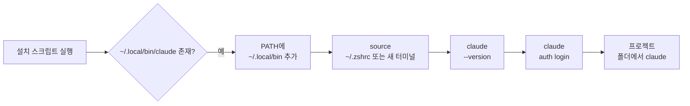
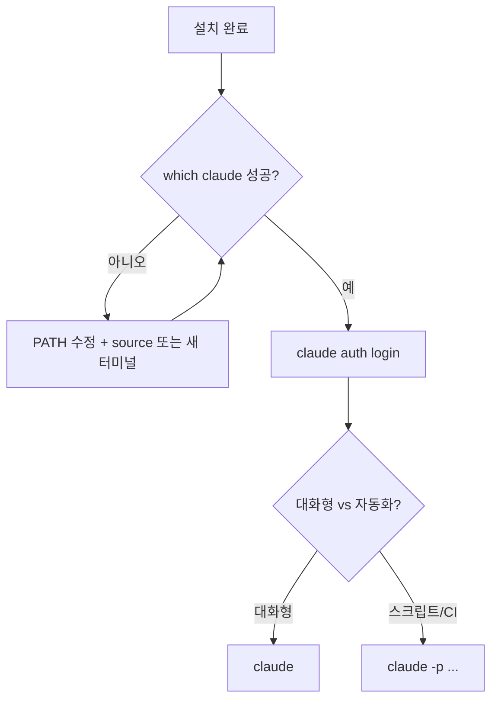
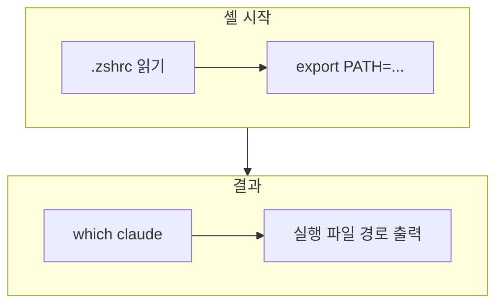
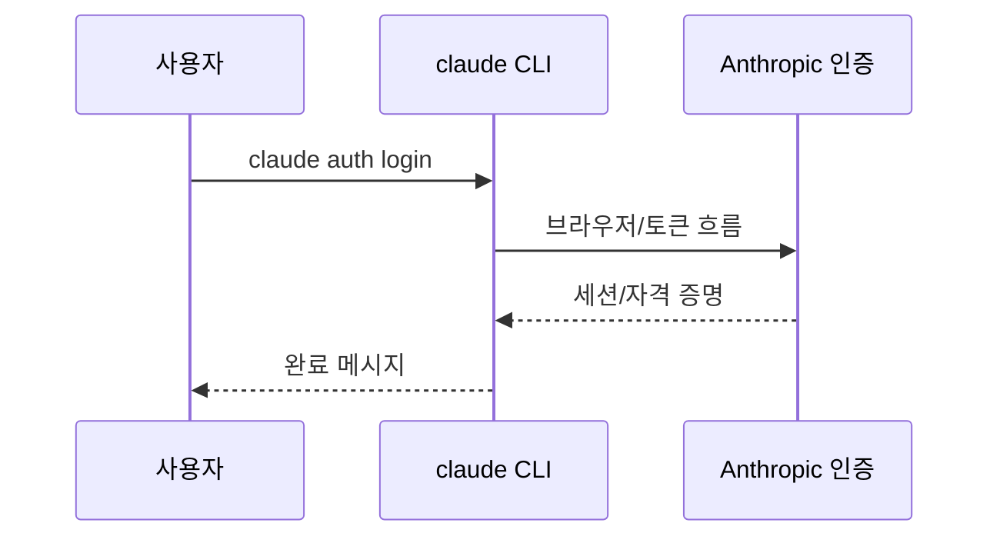
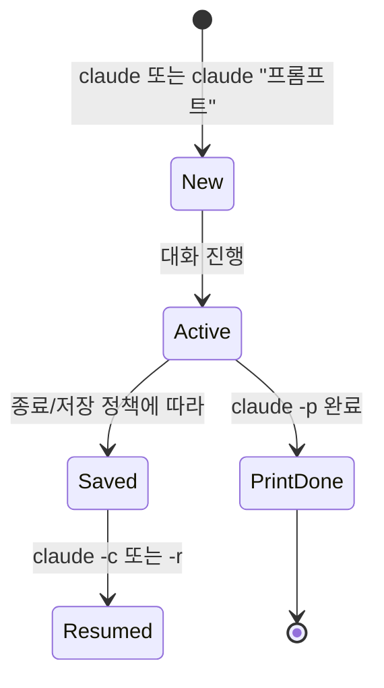
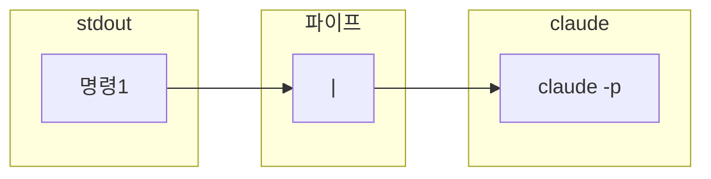
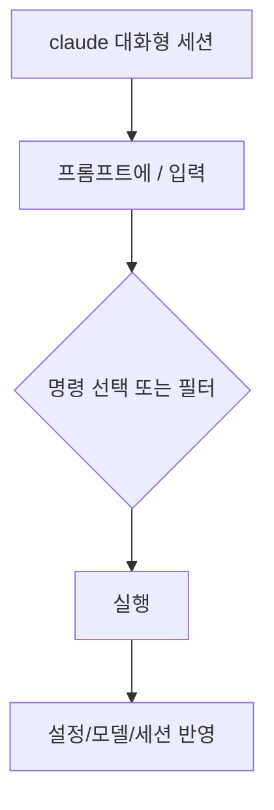

# Claude Code CLI — 설치·설정·터미널 사용 가이드 (확장판)

> **이름 주의:** 실행 파일·명령어는 **`claude`** 입니다. `cluade`처럼 철자가 바뀌면 `command not found`가 납니다.

이 문서는 **Claude Code**(터미널용 `claude` CLI)의 설치, 인증, 옵션, 워크플로, 그리고 **맥/리눅스 터미널에서 함께 쓰는 명령**을 표와 Mermaid로 정리합니다. 공식 문서가 갱신되면 일부 옵션 이름이 달라질 수 있으므로, 최종 확인은 `claude --help`와 [CLI reference](https://docs.anthropic.com/en/docs/claude-code/cli-reference)를 기준으로 하세요.

---

## 목차

| 번호 | 섹션 |
|------|------|
| 1 | [전체 흐름](#1-전체-흐름-한눈에) |
| 2 | [용어·모드 구분](#2-용어-및-모드-구분) |
| 3 | [시스템 요구사항](#3-시스템-요구사항) |
| 4 | [설치 방법 상세](#4-설치-방법-상세) |
| 5 | [PATH·셸 설정](#5-path셸-설정) |
| 6 | [인증·계정](#6-인증계정) |
| 7 | [CLI 서브커맨드](#7-cli-서브커맨드) |
| 8 | [플래그 카테고리별 정리](#8-플래그-카테고리별-정리) |
| 9 | [세션·재개·Git 연동](#9-세션재개git-연동) |
| 10 | [출력·스크립트·예산](#10-출력스크립트예산-print-모드) |
| 11 | [MCP·플러그인·에이전트](#11-mcp플러그인에이전트) |
| 12 | [원격·IDE·워크트리](#12-원격ide워크트리) |
| 13 | [설정·환경 변수](#13-설정환경-변수) |
| 14 | [보안·권한 모드](#14-보안권한-모드) |
| 15 | [터미널 명령 확장](#15-터미널-명령-확장-macos--linux-중심) |
| 16 | [문제 해결·FAQ](#16-문제-해결faq) |
| 17 | [참고 링크](#17-참고-링크) |
| 18 | [대화형 슬래시 명령 (`/`)](#18-대화형-슬래시-명령-) |
| 부록 | [한 페이지 치트시트](#부록-a-한-페이지-치트시트) |

---

## 1. 전체 흐름 (한눈에)



| 단계 | 목적 | 대표 명령 |
|------|------|-----------|
| 1 | CLI 설치 | `curl -fsSL https://claude.ai/install.sh \| bash` |
| 2 | PATH 확인/추가 | `echo $PATH` · `grep .local/bin` |
| 3 | 동작 확인 | `claude --version` |
| 4 | 로그인 | `claude auth login` |
| 5 | 대화 시작 | `claude` 또는 `claude "첫 질문"` |

### 1.1 설치 후 의사결정 (간단)



---

## 2. 용어 및 모드 구분

| 용어 | 설명 |
|------|------|
| **Claude Code** | 터미널·IDE·웹 등과 연동되는 코딩 에이전트 제품군(브랜드). |
| **`claude` 바이너리** | 터미널에서 실행하는 CLI. 설치 위치는 환경에 따라 다름(예: `~/.local/bin/claude`). |
| **대화형 세션** | `claude`만 실행하거나 초기 프롬프트를 넣고 턴을 이어가는 모드. |
| **Print 모드 (`-p`)** | 한 번(또는 제한된 턴) 응답하고 종료 — 스크립트·파이프에 적합. |
| **세션** | 대화 맥락이 저장되는 단위. 디렉터리·이름·ID로 재개할 수 있음. |
| **MCP** | Model Context Protocol — 외부 도구·데이터를 CLI에 연결하는 확장 방식. |

### 2.1 대화형 vs Print 모드 비교

| 항목 | 대화형 (`claude`) | Print (`claude -p`) |
|------|-------------------|---------------------|
| 용도 | 탐색, 리팩터, 대화형 승인 | CI, 로그 요약, 배치 처리 |
| stdin | 보통 터미널 입력 | 파이프·리다이렉트와 조합 |
| 출력 형식 | 터미널 UI | `--output-format text/json/stream-json` 등 |
| 세션 저장 | 기본적으로 이어쓰기 용이 | `--no-session-persistence` 등으로 제어 가능 |

---

## 3. 시스템 요구사항

| 항목 | 일반적인 기준 (공식 문서 기준으로 변동 가능) |
|------|-----------------------------------------------|
| macOS | 비교적 최신 버전(예: 13+) |
| Windows | Windows 10 이상 등 |
| Linux | Ubuntu 20.04+, Debian 10+ 등 |
| 메모리 | 수 GB 이상 권장 |
| 네트워크 | API·인증에 필요 |
| Windows 추가 | Git for Windows 필요할 수 있음 |

---

## 4. 설치 방법 상세

### 4.1 macOS / Linux

| 방법 | 명령 | 비고 |
|------|------|------|
| 공식 스크립트 (권장) | `curl -fsSL https://claude.ai/install.sh \| bash` | 흔히 `~/.local/bin/claude` |
| Homebrew (맥) | `brew install --cask claude-code` | Brew 사용자에게 편리 |
| npm (과거 방식) | `npm install -g @anthropic-ai/claude-code` | **deprecated** 안내가 있을 수 있음 — 공식 권장 경로 확인 |

### 4.2 Windows

| 환경 | 명령 |
|------|------|
| PowerShell | `irm https://claude.ai/install.ps1 \| iex` |
| CMD | `curl -fsSL https://claude.ai/install.cmd -o install.cmd && install.cmd && del install.cmd` |
| WinGet | `winget install Anthropic.ClaudeCode` |

### 4.3 업데이트

| 방법 | 명령 |
|------|------|
| CLI 내장 | `claude update` |
| Homebrew | `brew upgrade --cask claude-code` |

---

## 5. PATH·셸 설정

설치 메시지에 **`~/.local/bin`이 PATH에 없다**고 나오면 아래를 한 번 실행합니다 (zsh 기준).

```bash
echo 'export PATH="$HOME/.local/bin:$PATH"' >> ~/.zshrc
source ~/.zshrc
```

### 5.1 PATH가 잡히는 과정 (개념)



### 5.2 확인 명령

| 확인 | 명령 | 기대 |
|------|------|------|
| 바이너리 존재 | `ls -la ~/.local/bin/claude` | 실행 파일 항목 |
| 실행 경로 | `which claude` | 전체 경로 |
| 버전 | `claude -v` | 버전 문자열 |

### 5.3 bash 사용자

bash를 쓰면 `~/.bashrc` 또는 `~/.bash_profile`에 동일한 `export PATH=...`를 넣고 `source` 합니다.

| 셸 | 설정 파일 후보 |
|----|------------------|
| zsh | `~/.zshrc` |
| bash | `~/.bashrc`, `~/.bash_profile` |

---

## 6. 인증·계정

| 명령 | 설명 |
|------|------|
| `claude auth login` | Anthropic 계정으로 로그인 |
| `claude auth login --console` | Anthropic Console(API 과금 등) 흐름 |
| `claude auth login --email user@example.com` | 이메일 미리 채우기 |
| `claude auth login --sso` | SSO 강제 |
| `claude auth logout` | 로그아웃 |
| `claude auth status` | JSON ( `--text` 로 읽기 쉬운 출력 ) |

### 6.1 인증 흐름 (개념)



### 6.2 API 키 (정책·보안에 맞게 사용)

터미널 세션 한정:

```bash
export ANTHROPIC_API_KEY="sk-ant-..."
```

영구 저장은 **비밀 노출 위험**이 있으므로, 가능하면 OS 키체인·비밀 관리 도구·CI 시크릿을 사용합니다.

---

## 7. CLI 서브커맨드

공식: [CLI reference](https://docs.anthropic.com/en/docs/claude-code/cli-reference)

### 7.1 기본·세션

| 명령 | 용도 | 예시 |
|------|------|------|
| `claude` | 대화형 세션 | `claude` |
| `claude "질문"` | 시작과 동시에 첫 프롬프트 | `claude "이 레포 구조 요약"` |
| `claude -p "질문"` | Print 모드 | `claude -p "함수 설명"` |
| `claude -c` | 현재 디렉터리에서 최근 대화 이어가기 | `claude -c` |
| `claude -c -p "질문"` | 최근 맥락 + Print | (공식 표에 따름) |
| `claude -r "이름또는ID" "질문"` | 특정 세션 재개 | `claude -r "feature-x" "이어서"` |
| `claude --resume` | 피커로 세션 선택 등 | `claude --resume` |
| `claude update` | 업데이트 | `claude update` |

### 7.2 인증·설정 계열

| 명령 | 용도 |
|------|------|
| `claude auth login` / `logout` / `status` | 계정 |

### 7.3 확장 기능

| 명령 | 용도 |
|------|------|
| `claude mcp` | MCP 서버 구성 |
| `claude plugin` (`plugins`) | 플러그인 설치·관리 |
| `claude agents` | 서브에이전트 목록 |
| `claude auto-mode defaults` | 자동 모드 기본 규칙(JSON) |
| `claude auto-mode config` | 적용 설정 확인 |
| `claude remote-control` | 원격 제어 서버 모드 |

**파이프 예시:**

```bash
cat app.log | claude -p "에러 원인만 요약해줘"
git diff --stat | claude -p "변경 범위 한 줄로"
```

---

## 8. 플래그 카테고리별 정리

공식 문서의 플래그가 가장 정확합니다. 아래는 **자주 나오는 그룹**입니다.

### 8.1 세션·이름·재개

| 플래그 | 의미 |
|--------|------|
| `-c`, `--continue` | 최근 대화 이어가기 |
| `-r`, `--resume` | 이름/ID로 재개 |
| `-n`, `--name` | 세션 표시 이름 |
| `--session-id` | UUID 세션 지정 |
| `--fork-session` | 재개 시 새 세션 ID |
| `--from-pr` | GitHub PR 연동 세션 |

### 8.2 모델·비용·턴

| 플래그 | 의미 |
|--------|------|
| `--model` | 모델 지정 (`sonnet`, `opus` 또는 전체 이름) |
| `--effort` | effort 수준 (`low`~`max` 등, 제품·모델에 따름) |
| `--max-budget-usd` | Print 모드 예산 상한(USD) |
| `--max-turns` | Print 모드 최대 에이전트 턴 |
| `--fallback-model` | 과부하 시 대체 모델 |

### 8.3 출력·입력 (주로 `-p`)

| 플래그 | 의미 |
|--------|------|
| `--output-format` | `text`, `json`, `stream-json` |
| `--input-format` | `text`, `stream-json` |
| `--json-schema` | 구조화 출력 스키마 |
| `--verbose` | 상세 로그 |
| `--no-session-persistence` | 세션 디스크 저장 안 함 (Print) |

### 8.4 작업 디렉터리·도구

| 플래그 | 의미 |
|--------|------|
| `--add-dir` | 추가 읽기·작업 디렉터리 |
| `--tools` | 사용 가능한 도구 제한 |
| `--allowedTools` | 묻지 않고 허용할 도구 패턴 |
| `--disallowedTools` | 사용 금지 도구 |

### 8.5 시스템 프롬프트

| 플래그 | 의미 |
|--------|------|
| `--append-system-prompt` | 기본 프롬프트 뒤에 추가(일반적으로 권장) |
| `--append-system-prompt-file` | 파일에서 추가 |
| `--system-prompt` | 기본 프롬프트 전체 교체 |
| `--system-prompt-file` | 파일로 전체 교체 |

교체(`--system-prompt*`)와 추가(`--append-*`)는 목적이 다릅니다. 대부분 **추가**가 안전합니다.

### 8.6 권한·자동화 (주의)

| 플래그 | 의미 |
|--------|------|
| `--permission-mode` | 예: `plan` 등 |
| `--dangerously-skip-permissions` | 권한 프롬프트 우회 (**위험**) |
| `--allow-dangerously-skip-permissions` | 우회 옵션을 켤 수 있게만 함 |
| `--enable-auto-mode` | 자동 모드(플랜·모델 조건 있음) |

### 8.7 MCP·설정·기타

| 플래그 | 의미 |
|--------|------|
| `--mcp-config` | MCP JSON 로드 |
| `--strict-mcp-config` | 해당 설정만 사용 |
| `--settings` | 추가 settings JSON |
| `--setting-sources` | `user`, `project`, `local` 조합 |
| `--bare` | 훅·플러그인·MCP 자동 탐색 최소화(스크립트 가속) |
| `--debug` | 디버그 카테고리 |
| `--chrome` / `--no-chrome` | Chrome 연동 |
| `--ide` | IDE 자동 연결 |
| `--worktree`, `-w` | git worktree 격리 세션 |
| `--tmux` | worktree + tmux |
| `--remote` | 웹 세션 생성 |
| `--teleport` | 웹 세션을 로컬 터미널로 |
| `--remote-control`, `--rc` | 원격 제어 켜고 대화형 |

---

## 9. 세션·재개·Git 연동

### 9.1 세션 생명주기 (개념)



### 9.2 Git과 함께 쓰기 (예시)

| 목적 | 예시 |
|------|------|
| 변경 요약 | `git diff \| claude -p "커밋 메시지 후보 3개"` |
| 스테이징 전 리뷰 | `git diff --cached \| claude -p "보안 이슈 있나"` |
| 특정 파일 | `git show HEAD:path/to/file \| claude -p "설명"` |

### 9.3 GitHub PR (지원 시)

`--from-pr`로 PR 번호나 URL과 연결된 세션을 다룰 수 있습니다(공식 문서 확인).

---

## 10. 출력·스크립트·예산 (Print 모드)

| 시나리오 | 예시 아이디어 |
|----------|----------------|
| JSON으로 파이프라인 | `claude -p "..." --output-format json` |
| 스트리밍 이벤트 | `--output-format stream-json` (옵션과 조합) |
| 비용 상한 | `--max-budget-usd 2.00` |
| 턴 제한 | `--max-turns 5` |

구조화 출력이 필요하면 `--json-schema`를 공식 스펙과 함께 검토합니다.

---

## 11. MCP·플러그인·에이전트

| 주제 | 명령·참고 |
|------|-----------|
| MCP | `claude mcp` — [MCP 문서](https://docs.anthropic.com/en/docs/claude-code/mcp) |
| 플러그인 | `claude plugin install ...` — 마켓플레이스·공식 플러그인 |
| 서브에이전트 | `claude agents` |
| 동적 에이전트 | `--agents '{...}'` JSON |

---

## 12. 원격·IDE·워크트리

| 기능 | 설명 |
|------|------|
| `--ide` | 사용 가능한 IDE 하나에 자동 연결 |
| `--remote-control` | Claude 앱·웹에서 제어 |
| `-w` / `--worktree` | 병렬 작업용 worktree에서 세션 |
| `--remote` / `--teleport` | 웹 ↔ 로컬 연동 흐름 |

---

## 13. 설정·환경 변수

### 13.1 설정 소스

| 소스 | 용도 개념 |
|------|-----------|
| `user` | 사용자 전역 |
| `project` | 저장소 단위 |
| `local` | 머신/로컬 오버라이드 |

예: `claude --setting-sources user,project`

### 13.2 자주 쓰이는 환경 변수 (예시 — 공식 목록 확인)

| 변수 | 용도 |
|------|------|
| `ANTHROPIC_API_KEY` | API 키 인증 |
| `PATH` | `claude` 실행 파일 탐색 |

`--bare` 시 `CLAUDE_CODE_SIMPLE` 등이 설정된다는 설명이 문서에 있습니다.

---

## 14. 보안·권한 모드

| 원칙 | 설명 |
|------|------|
| 기본 흐름 유지 | 파일 쓰기·명령 실행 전 확인 프롬프트를 가볍게 넘기지 않기 |
| CI에서 우회 금지 권장 | `--dangerously-skip-permissions`는 신뢰할 수 없는 입력과 함께 쓰지 않기 |
| API 키 | 레포·스크린샷·히스토리에 남기지 않기 |
| 로그 | `claude -p` 출력에 민감 정보 포함 여부 점검 |

---

## 15. 터미널 명령 확장 (macOS · Linux 중심)

`claude`와 함께 **경로·환경·파일·Git·네트워크·배치**를 다룰 때 쓰는 명령을 주제별로 모았습니다.

### 15.1 디렉터리·경로

| 명령 | 설명 |
|------|------|
| `pwd` | 현재 작업 디렉터리 |
| `cd 경로` | 이동 (`cd ~`, `cd -`, `cd ..`) |
| `ls` | 목록 (`ls -la`, `ls -lah`) |
| `mkdir -p a/b/c` | 중첩 생성 |
| `pushd` / `popd` | 디렉터리 스택 (bash/zsh) |

### 15.2 실행 파일·버전

| 명령 | 설명 |
|------|------|
| `which claude` | PATH상 경로 |
| `type -a claude` | 가능한 모든 정의 |
| `command -v claude` | POSIX 스타일 확인 |

### 15.3 환경 변수·셸

| 명령 | 설명 |
|------|------|
| `echo $PATH` | PATH 출력 |
| `printenv` | 환경 변수 목록 |
| `export VAR=값` | 세션 변수 |
| `env VAR=값 명령` | 한 번만 변수 주고 실행 |
| `source ~/.zshrc` | 설정 다시 로드 |

### 15.4 파일 읽기·편집·검색

| 명령 | 설명 |
|------|------|
| `cat 파일` | 통째로 출력 |
| `less 파일` | 페이지 스크롤 (`q` 종료) |
| `head -n 50 파일` | 앞부분 |
| `tail -n 50 파일` | 뒷부분 |
| `tail -f 파일` | 실시간 로그 |
| `wc -l 파일` | 줄 수 |
| `file 파일` | 형식 추정 |

### 15.5 grep·ripgrep

| 명령 | 설명 |
|------|------|
| `grep -n 패턴 파일` | 줄 번호 |
| `grep -R 패턴 디렉터리` | 재귀 (느릴 수 있음) |
| `rg 패턴` | [ripgrep](https://github.com/BurntSushi/ripgrep) — 대규모 코드베이스에 유리 |

### 15.6 find

| 예시 | 설명 |
|------|------|
| `find . -name "*.ts"` | 이름 패턴 |
| `find . -type f -mtime -1` | 하루 안에 수정된 파일 |
| `find . -maxdepth 2` | 깊이 제한 |

### 15.7 파이프·리다이렉트



| 패턴 | 예시 |
|------|------|
| 파이프 | `cat log.txt \| claude -p "요약"` |
| stdin | `claude -p "번역" < memo.txt` |
| stdout | `claude -p "목차만" > outline.md` |
| stderr 포함 | `cmd 2>&1 \| claude -p "에러 분석"` |
| append | `claude -p "추가" >> notes.md` |

### 15.8 xargs (다수 파일 처리)

| 예시 | 설명 |
|------|------|
| `find . -name '*.md' -print0 \| xargs -0 ls -la` | 안전한 파일명 처리(`-0`) |
| `rg -l 패턴 \| xargs wc -l` | 매칭 파일에 대해 wc |

### 15.9 sed·awk (간단)

| 목적 | 예시 |
|------|------|
| 첫 줄만 | `sed -n '1p' 파일` |
| 치환 | `sed 's/foo/bar/g' 파일` |
| 필드 추출 | `awk '{print $1}' 파일` |

### 15.10 jq (JSON)

| 예시 | 설명 |
|------|------|
| `echo '{"a":1}' \| jq .` | 예쁘게 출력 |
| `... \| jq '.field'` | 필드 선택 (`claude -p` JSON 출력 후 파싱에 유용) |

### 15.11 Git

| 명령 | 설명 |
|------|------|
| `git status` | 상태 |
| `git diff` | unstaged 차이 |
| `git diff --cached` | staged 차이 |
| `git log --oneline -10` | 최근 커밋 |
| `git branch` | 브랜치 |

### 15.12 curl (HTTP)

| 예시 | 설명 |
|------|------|
| `curl -fsSL URL` | 실패 시 비표시, 리다이렉트, 진행 표시 |
| `curl -H "Header: val" URL` | 헤더 |

### 15.13 프로세스·작업 제어

| 단축/명령 | 설명 |
|-----------|------|
| `Ctrl + C` | 중단 |
| `Ctrl + D` | EOF |
| `Ctrl + Z` / `fg` / `bg` | 정지·재개 |
| `jobs` | 백그라운드 작업 |
| `nohup 명령 &` | 터미널 종료 후에도 유지 시도 |

### 15.14 권한

| 명령 | 설명 |
|------|------|
| `chmod +x script.sh` | 실행 허용 |
| `chmod 600 비밀파일` | 소유자만 읽기/쓰기 |

### 15.15 히스토리·재실행 (zsh/bash)

| 단축 | 설명 |
|------|------|
| `Ctrl + R` | 역검색 |
| `!!` | 이전 명령 |
| `!$` | 이전 명령의 마지막 인자 |

### 15.16 디스크·시스템 (맥)

| 명령 | 설명 |
|------|------|
| `df -h` | 디스크 사용량 |
| `du -sh 디렉터리` | 폴더 크기 |

---

## 16. 문제 해결·FAQ

### 16.1 증상별 체크리스트

| 증상 | 점검 |
|------|------|
| `command not found: claude` | 철자 `claude`, `which claude`, PATH |
| `command not found: cluade` | 오타 |
| 설치 직후에도 안 됨 | 새 터미널, `source ~/.zshrc`, 로그인 셸 vs 비로그인 셸 |
| 다른 `claude` 실행됨 | `type -a claude`, PATH 순서 |
| 인증 실패 | `claude auth status`, `claude auth login` |
| 오래된 CLI | `claude update` |
| 네트워크·프록시 | 회사망에서 HTTPS 프록시 필요 여부 |

### 16.2 디버깅

| 명령 | 용도 |
|------|------|
| `claude --debug "api,mcp"` | 디버그 카테고리(공식 문법 확인) |
| `claude -v` | 버전 확인 |

### 16.3 FAQ

| 질문 | 답 방향 |
|------|---------|
| 대화를 이어가고 싶다 | 같은 디렉터리에서 `claude -c` 또는 `-r` |
| 스크립트만 쓰고 싶다 | `claude -p` + 출력 형식 옵션 |
| 비용을 제한하고 싶다 | `--max-budget-usd`, `--max-turns` (Print) |

---

## 17. 참고 링크

| 문서 | URL |
|------|-----|
| CLI reference | https://docs.anthropic.com/en/docs/claude-code/cli-reference |
| Settings | https://docs.anthropic.com/en/docs/claude-code/settings |
| Quickstart | https://docs.anthropic.com/en/docs/claude-code/quickstart |
| Interactive mode | https://docs.anthropic.com/en/docs/claude-code/interactive-mode |
| Common workflows | https://docs.anthropic.com/en/docs/claude-code/common-workflows |
| Permission modes | https://docs.anthropic.com/en/docs/claude-code/permission-modes |
| MCP | https://docs.anthropic.com/en/docs/claude-code/mcp |
| Agent SDK (프로그래밍) | https://platform.claude.com/docs/en/agent-sdk/overview |
| Built-in commands (슬래시) | https://docs.anthropic.com/en/docs/claude-code/commands |

---

## 18. 대화형 슬래시 명령 (`/`)

**적용 대상:** `claude`로 연 **대화형(Interactive)** 세션 안에서 입력합니다. `claude -p`(Print 모드)에서는 보통 슬래시 명령 UI가 아니라 **일반 프롬프트·플래그**를 씁니다.

| 동작 | 설명 |
|------|------|
| 목록 보기 | 프롬프트에서 **`/`** 만 입력 |
| 필터 | **`/` + 글자**로 명령 이름 필터 (예: `/mo` → `/model` 등) |
| 가시성 | 플랫폼·요금제·환경에 따라 일부 명령은 목록에 안 보일 수 있음 |

공식: [Built-in commands](https://docs.anthropic.com/en/docs/claude-code/commands). 아래 표는 공식 문서의 내장 명령을 한국어로 요약한 것이며, **`인자`**는 공식 표기상 필수 인자를 뜻합니다.

### 18.1 자주 찾는 명령 vs `/root`

| 사용자가 말한 것 | 공식 내장 명령 | 설명 |
|------------------|----------------|------|
| `/clear` | `/clear` | 대화 기록 비우기·컨텍스트 정리. 별칭: `/reset`, `/new` |
| `/model` | `/model [model]` | 모델 선택·변경(즉시 적용) |
| `/root` | *(내장 목록에 없음)* | **공식 Built-in 표에 `/root`는 없습니다.** 프로젝트 루트에서 작업하려면 터미널에서 해당 폴더로 `cd` 후 `claude`를 실행하거나, 세션에 디렉터리를 추가할 때 `/add-dir 경로`를 사용하세요. |

### 18.2 세션·대화·히스토리·내보내기

| 명령 | 용도 |
|------|------|
| `/clear` | 대화 기록 삭제·컨텍스트 확보. 별칭: `/reset`, `/new` |
| `/compact [instructions]` | 대화 압축(선택: 초점 지시) |
| `/branch [name]` | 이 시점에서 대화 분기(브랜치). 별칭: `/fork` |
| `/rewind` | 대화·코드를 이전 시점으로 되감기 또는 요약. 별칭: `/checkpoint` |
| `/resume [session]` | ID·이름으로 재개 또는 피커. 별칭: `/continue` |
| `/rename [name]` | 세션 이름 변경(프롬프트 바에 표시). 생략 시 자동 생성 |
| `/export [filename]` | 대화 내보내기(텍스트). 파일명 있으면 직접 저장 |
| `/copy [N]` | 마지막 응답 클립보드. `N`번째 이전 응답은 `/copy 2` 등 |
| `/btw` | 인자 필수 — 대화 맥락에 넣지 않는 **사이드 질문** |

### 18.3 모델·비용·속도·한도

| 명령 | 용도 |
|------|------|
| `/model [model]` | 모델 선택·변경 |
| `/effort` | 인자: `low` · `medium` · `high` · `max` · `auto` — [effort 수준](https://docs.anthropic.com/en/docs/claude-code/model-config#adjust-effort-level). `max`는 세션 한정·모델 조건 있음 |
| `/cost` | 토큰·비용 통계(구독별 상세는 공식 가이드) |
| `/usage` | 플랜 한도·레이트 리밋 상태 |
| `/fast` | 인자: `on` 또는 `off` — [fast mode](https://docs.anthropic.com/en/docs/claude-code/fast-mode) 토글 |
| `/extra-usage` | 레이트 리밋 시 추가 사용 설정 |

### 18.4 설정·UI·편집

| 명령 | 용도 |
|------|------|
| `/config` | 설정 UI(테마·모델·출력 스타일 등). 별칭: `/settings` |
| `/status` | 설정의 Status 탭(버전·모델·계정·연결). 응답 중에도 열 수 있음 |
| `/theme` | 컬러 테마(라이트/다크·접근성·ANSI 등) |
| `/color` | 인자: 색 이름 또는 `default` — 프롬프트 바 색(`red` … `cyan`) |
| `/statusline` | [status line](https://docs.anthropic.com/en/docs/claude-code/statusline) 구성 |
| `/vim` | Vim / Normal 편집 모드 전환 |
| `/keybindings` | 키바인딩 파일 열기/생성 |
| `/terminal-setup` | Shift+Enter 등 단축키 설정(일부 터미널에서만 표시) |

### 18.5 프로젝트·작업 경로·메모리

| 명령 | 용도 |
|------|------|
| `/add-dir` | 인자 필수 — 현재 세션에 **작업 디렉터리 추가** (루트 외 폴더를 같이 쓸 때) |
| `/init` | `CLAUDE.md` 등 프로젝트 가이드 초기화 |
| `/memory` | `CLAUDE.md` 메모리 편집·auto-memory |
| `/context` | 컨텍스트 사용량 시각화·최적화 힌트 |
| `/doctor` | 설치·설정 진단 |

### 18.6 Git·코드·보안·리뷰

| 명령 | 용도 |
|------|------|
| `/diff` | 인터랙티브 diff 뷰어(미커밋·턴 단위) |
| `/pr-comments [PR]` | GitHub PR 코멘트 표시(`gh` 필요). 인자 생략 시 현재 브랜치 PR 추정 |
| `/security-review` | 현재 브랜치 변경 보안 검토 |

### 18.7 통합·에이전트·MCP·플러그인·원격

| 명령 | 용도 |
|------|------|
| `/agents` | 서브에이전트 설정 |
| `/mcp` | MCP 연결·OAuth |
| `/plugin` | [플러그인](https://docs.anthropic.com/en/docs/claude-code/plugins) 관리 |
| `/reload-plugins` | 플러그인 다시 로드 |
| `/ide` | IDE 연동 상태·관리 |
| `/chrome` | Claude in Chrome 설정 |
| `/remote-control` | claude.ai에서 원격 제어. 별칭: `/rc` |
| `/remote-env` | `--remote` 웹 세션 기본 환경 |
| `/desktop` | 데스크톱 앱에서 세션 이어가기(macOS/Windows). 별칭: `/app` |
| `/hooks` | 훅 설정 보기 |
| `/tasks` | 백그라운드 작업 목록·관리 |

### 18.8 계정·도움말·피드백·종료

| 명령 | 용도 |
|------|------|
| `/login` | 로그인 |
| `/logout` | 로그아웃 |
| `/help` | 도움말·명령 목록 |
| `/exit` | CLI 종료. 별칭: `/quit` |
| `/feedback [report]` | 피드백. 별칭: `/bug` |

### 18.9 플랜·제품·기타 (일부만 표시·조건부)

| 명령 | 용도 |
|------|------|
| `/plan [description]` | 플랜 모드로 진입(선택: 설명과 함께 시작) |
| `/permissions` | 권한 관리. 별칭: `/allowed-tools` |
| `/sandbox` | [샌드박스](https://docs.anthropic.com/en/docs/claude-code/sandboxing) 토글(지원 플랫폼만) |
| `/schedule [description]` | 클라우드 예약 작업 |
| `/insights` | 세션 패턴 분석 리포트 |
| `/stats` | 일별 사용·세션·스트릭 등 |
| `/release-notes` | 변경 로그 |
| `/upgrade` | 상위 플랜(요금제에 따라 표시) |
| `/privacy-settings` | 개인정보 설정(Pro/Max 등에서만) |
| `/install-github-app` | GitHub Actions 앱 연동 |
| `/install-slack-app` | Slack 앱 설치 |
| `/passes` | 추천용 무료 주간(자격 있을 때만) |
| `/review` | **deprecated** — `code-review` 플러그인 사용 권장 |
| `/mobile` | 모바일 앱 QR. 별칭: `/ios`, `/android` |
| `/voice` | 음성 입력(Claude.ai 계정 필요) |
| `/stickers` | 스티커 주문 |

### 18.10 MCP가 추가하는 명령·번들 스킬

| 종류 | 설명 |
|------|------|
| MCP 프롬프트 | 연결된 서버가 `/mcp__서버__프롬프트` 형식으로 명령을 노출할 수 있음. [MCP prompts](https://docs.anthropic.com/en/docs/claude-code/mcp#use-mcp-prompts-as-commands) |
| 번들 스킬 | `/simplify`, `/batch`, `/debug`, `/loop` 등 — [bundled skills](https://docs.anthropic.com/en/skills#bundled-skills) |

### 18.11 슬래시 명령 흐름 (개념)



---

### 18.12 실전 예시

#### A. 대화형 세션 안에서 (직접 입력)

프로젝트 루트에서 터미널을 연 뒤:

```bash
cd ~/Documents/GitHub/my-project
claude
```

세션이 열리면 프롬프트에 순서대로:

```text
/model
/clear
/init
/add-dir ../shared-packages
/compact API 에러 처리 논의만 남기고 압축해줘
```

- **`/model`**: 모델 선택 화면에서 Sonnet/Opus 등 선택(제품에 따라 다름).
- **`/clear`**: 긴 맥락을 비우고 새 작업에 집중.
- **`/init`**: `CLAUDE.md` 초기화로 팀 규칙을 문서화.
- **`/add-dir`**: 모노레포처럼 **루트가 아닌 폴더**를 같은 세션에 넣을 때(“루트 명령” 대안).

#### B. 세션 이름·재개

```text
/rename auth-refresh-2026
# …작업…
/exit
```

다음에 같은 저장소에서:

```bash
claude
```

```text
/resume auth-refresh-2026
```

또는 CLI로 처음부터:

```bash
claude -r "auth-refresh-2026" "JWT 만료 처리 이어서 해줘"
```

#### C. 비용·한도 확인

```text
/cost
/usage
```

#### D. Git diff와 함께 (대화형)

```text
/diff
```

터미널에서 미리 확인한 뒤 세션에서 리뷰 요청:

```text
방금 /diff에서 본 변경으로 커밋 메시지 3개만 제안해줘
```

#### E. Print 모드에서는 (슬래시 대신 플래그·프롬프트)

슬래시는 대화형 UI용이므로, 스크립트는 예를 들어:

```bash
#!/usr/bin/env bash
set -euo pipefail
cd "$(git rev-parse --show-toplevel)"

git diff HEAD~1 | claude -p "변경 요약을 한국어로 5줄 이내"
```

모델을 바꾸려면 세션 대신:

```bash
claude -p "타입 에러만 나열" --model sonnet
```

(정확한 `--model` 값은 `claude --help` 및 당시 문서 기준.)

#### F. 진단

```text
/doctor
```

설치·설정 문제가 있을 때 로그와 함께 확인합니다.

---

## 부록 A. 한 페이지 치트시트

| 하고 싶은 것 | 명령 |
|--------------|------|
| 버전 | `claude -v` |
| 도움말 | `claude --help` |
| 로그인 | `claude auth login` |
| 대화 시작 | `claude` |
| 한 번만 질문 | `claude -p "질문"` |
| 이어가기 | `claude -c` |
| 업데이트 | `claude update` |
| 로그 요약 | `tail -n 200 log \| claude -p "요약"` |
| 대화형에서 슬래시 목록 | `/` 입력 후 필터 |
| 맥락 비우기 | `/clear` |
| 모델 바꾸기 | `/model` |
| 작업 폴더 추가 | `/add-dir 경로` |
| 진단 | `/doctor` |

---

*CLI 및 정책은 변경될 수 있습니다. 상용·팀 환경에서는 항상 최신 공식 문서와 조직 보안 가이드를 따르세요.*
