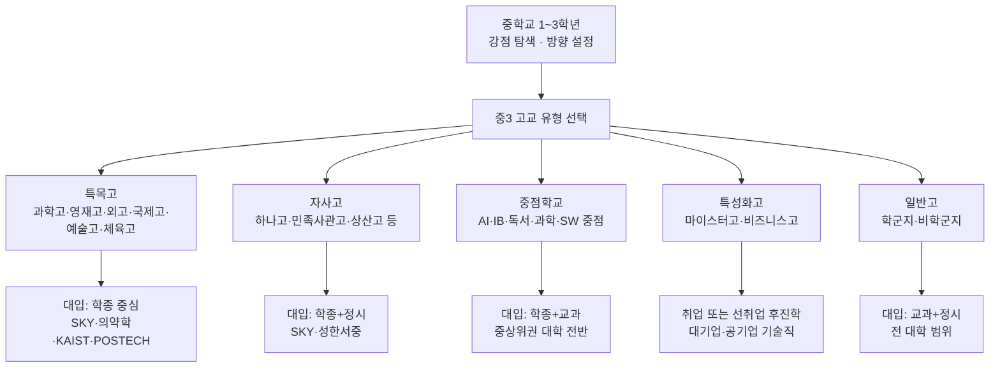
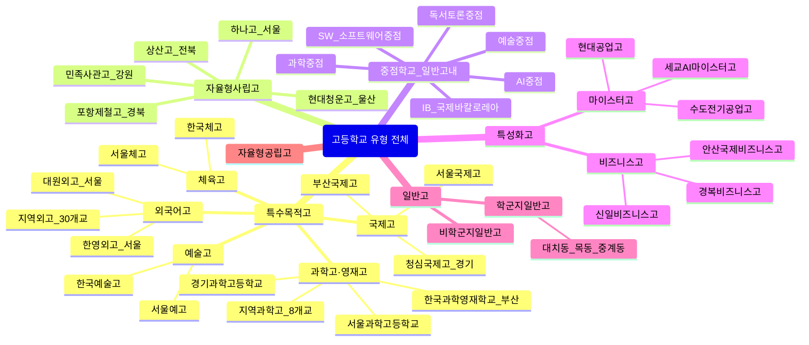
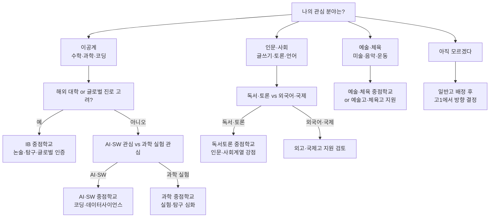
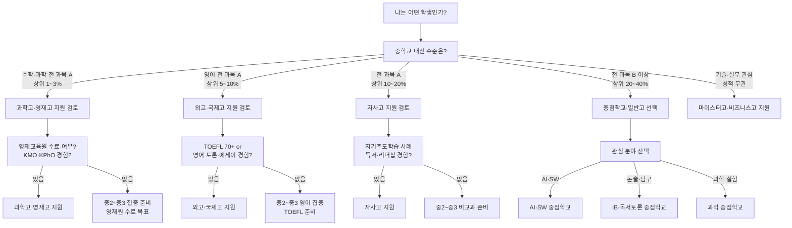
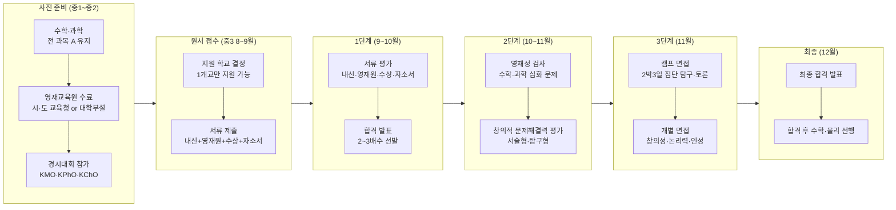
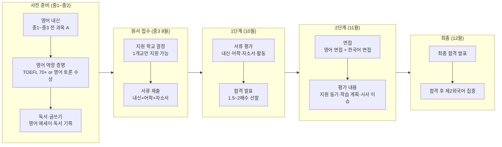
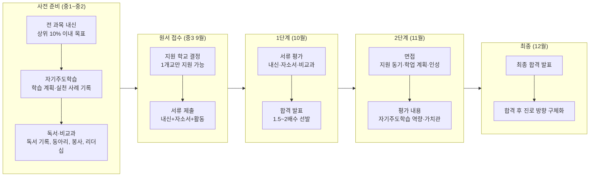
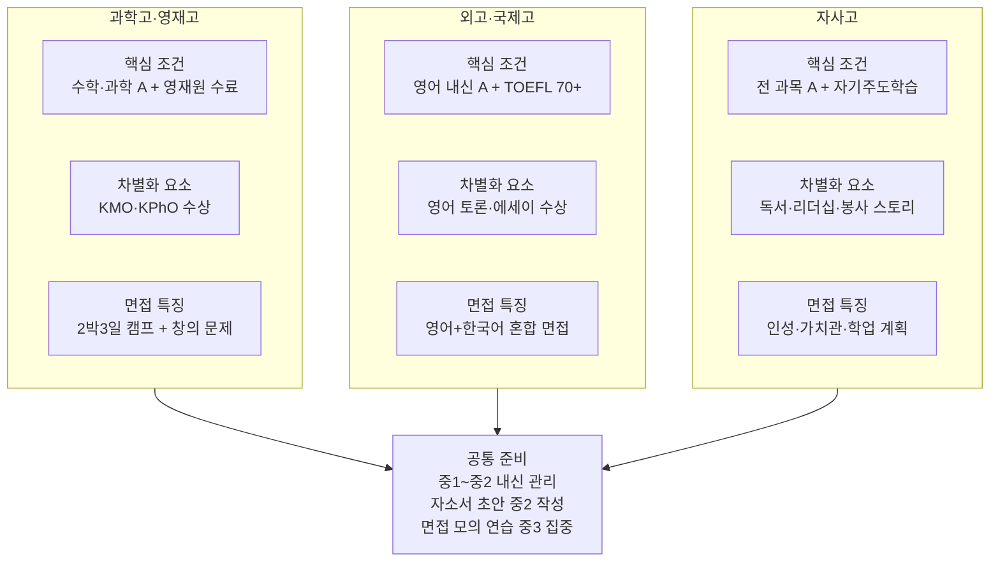
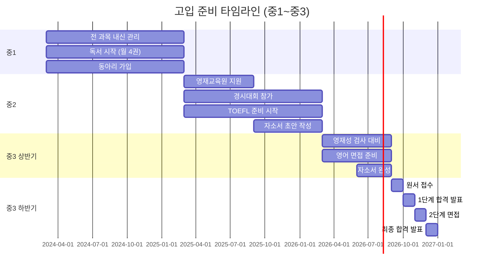

# 중학생을 위한 고입 완전 가이드 (상)
## 카테고리별 특수학교 · 중점학교 · 고교 유형 비교 · 전형 단계도

> 대상: 중학교 1~3학년 학생 및 학부모
> 목적: 고등학교 유형을 정확히 이해하고, 나에게 맞는 고교를 선택하기 위한 실전 안내서
> 연계 파일: [중학생_고입_완전가이드_하.md](./중학생_고입_완전가이드_하.md)

---

## 0. 고입 전체 구조 한눈에 보기

---

## 1. 카테고리별 특수학교 전체 분류

---

## 1-1. 과학고·영재고 대표 학교 현황표

| 학교명 | 소재지 | 특화 분야 | 모집 인원 | 전형 방식 | 경쟁률(참고) |
|-------|-------|---------|---------|---------|------------|
| **한국과학영재학교(KSA)** | 부산 | 수학·과학 전 분야, 대학 수준 R&E | 120명 | 서류 → 영재성검사 → 2박3일 캠프면접 | 10:1 내외 |
| **서울과학고등학교** | 서울 | 수학·물리·화학·생물 심화 | 120명 | 서류 → 영재성검사 → 면접 | 8:1 내외 |
| **경기과학고등학교** | 경기 수원 | 수학·과학 심화, 이공계 연구 | 120명 | 서류 → 영재성검사 → 면접 | 7:1 내외 |
| **대전과학고등학교** | 대전 | 수학·과학 심화, 지역 이공계 | 80명 | 서류 → 영재성검사 → 면접 | 4~5:1 |
| **광주과학고등학교** | 광주 | 수학·과학 심화, 지역 이공계 | 80명 | 서류 → 영재성검사 → 면접 | 4~5:1 |
| **인천과학고등학교** | 인천 | 수학·과학 심화, 해양·환경 | 80명 | 서류 → 영재성검사 → 면접 | 3~4:1 |
| **대구과학고등학교** | 대구 | 수학·과학 심화, 기계·전자 | 80명 | 서류 → 영재성검사 → 면접 | 3~4:1 |
| **부산과학고등학교** | 부산 | 수학·과학 심화, 조선·해양 | 80명 | 서류 → 영재성검사 → 면접 | 3~4:1 |

> **입학 핵심 조건**: 수학·과학 전 과목 A, 교육청·대학부설 영재교육원 수료, KMO·KPhO 등 경시대회 경험

---

## 1-2. 외국어고 대표 학교 현황표

| 학교명 | 소재지 | 주요 전공 언어 | 모집 인원 | 전형 방식 | 경쟁률(참고) |
|-------|-------|------------|---------|---------|------------|
| **대원외국어고등학교** | 서울 광진구 | 영어·일본어·중국어·프랑스어·독일어 | 280명 | 서류(내신+자소서) → 면접 | 2~3:1 |
| **한영외국어고등학교** | 서울 강동구 | 영어·일본어·중국어·스페인어 | 280명 | 서류(내신+자소서) → 면접 | 2~3:1 |
| **명덕외국어고등학교** | 서울 강서구 | 영어·일본어·중국어·프랑스어 | 240명 | 서류(내신+자소서) → 면접 | 2~2.5:1 |
| **서울외국어고등학교** | 서울 노원구 | 영어·일본어·중국어·러시아어 | 240명 | 서류(내신+자소서) → 면접 | 2~2.5:1 |
| **이화외국어고등학교** | 서울 마포구 | 영어·일본어·중국어·프랑스어 | 200명 | 서류(내신+자소서) → 면접 | 1.5~2:1 |
| **경기외국어고등학교** | 경기 의왕 | 영어·일본어·중국어·스페인어 | 240명 | 서류(내신+자소서) → 면접 | 2~2.5:1 |
| **부산외국어고등학교** | 부산 | 영어·일본어·중국어·베트남어 | 200명 | 서류(내신+자소서) → 면접 | 1.5~2:1 |

> **입학 핵심 조건**: 영어 내신 전 과목 A, 자소서(영어 학습 동기·국제 관심 계기), 영어 면접 역량

---

## 1-3. 국제고 대표 학교 현황표

| 학교명 | 소재지 | 특화 분야 | 모집 인원 | 전형 방식 | 경쟁률(참고) |
|-------|-------|---------|---------|---------|------------|
| **서울국제고등학교** | 서울 종로구 | 국제 관계·사회·경제, 영어 수업 비중 높음 | 200명 | 서류(내신+자소서) → 면접 | 2~3:1 |
| **청심국제고등학교** | 경기 가평 | 국제 관계·경제·사회, 전원 기숙사 | 200명 | 서류(내신+자소서) → 면접 | 2~3:1 |
| **부산국제고등학교** | 부산 해운대 | 국제 관계·외교·경제, 부산 지역 선발 | 160명 | 서류(내신+자소서) → 면접 | 1.5~2:1 |
| **인천국제고등학교** | 인천 연수구 | 국제 관계·경제·IT, 인천 지역 선발 | 160명 | 서류(내신+자소서) → 면접 | 1.5~2:1 |
| **고양국제고등학교** | 경기 고양 | 국제 관계·사회·경제, 경기 지역 선발 | 160명 | 서류(내신+자소서) → 면접 | 1.5~2:1 |

> **입학 핵심 조건**: 영어 포함 전 과목 A, 국제 이슈 관심·영어 토론 역량, 자소서(국제 관심 계기·학습 계획)

---

## 1-4. 자율형사립고(자사고) 대표 학교 현황표

| 학교명 | 소재지 | 특화 분야 | 모집 인원 | 전형 방식 | 경쟁률(참고) |
|-------|-------|---------|---------|---------|------------|
| **하나고등학교** | 서울 은평구 | 종합 엘리트, 전원 기숙사, 수시 SKY 강세 | 150명 | 서류(내신+자소서) → 면접 | 3~4:1 |
| **민족사관고등학교** | 강원 횡성 | 영어 수업 비중 높음, 전원 기숙사, 글로벌 리더 | 140명 | 서류(내신+자소서) → 면접 | 3~4:1 |
| **상산고등학교** | 전북 전주 | 수능 강세, 의대 합격률 높음, 이공계 강세 | 300명 | 서류(내신+자소서) → 면접 | 2~3:1 |
| **현대청운고등학교** | 울산 | 현대그룹 설립, 이공계 강세, 산학 연계 | 200명 | 서류(내신+자소서) → 면접 | 2~3:1 |
| **포항제철고등학교** | 경북 포항 | POSTECH 연계, 이공계 R&E, 전원 기숙사 | 300명 | 서류(내신+자소서) → 면접 | 2~3:1 |
| **용인외대부고** | 경기 용인 | 수시·정시 균형, SKY 합격 다수, 어학 강세 | 400명 | 서류(내신+자소서) → 면접 | 2~3:1 |
| **북일고등학교** | 충남 천안 | 수능 강세, 이공계·의대 진학 강세 | 300명 | 서류(내신+자소서) → 면접 | 2~2.5:1 |

> **입학 핵심 조건**: 전 과목 A(상위 10%), 자소서(자기주도학습 실천 사례·독서·진로), 인성·가치관 면접

---

## 1-5. 자율형공립고(자공고) 대표 학교 현황표

| 학교명 | 소재지 | 특화 분야 | 모집 인원 | 전형 방식 | 경쟁률(참고) |
|-------|-------|---------|---------|---------|------------|
| **서울 경기고등학교** | 서울 강남구 | 종합 명문, 수능·학종 균형 | 학군 배정 | 학군 배정 | 해당 없음 |
| **서울 휘문고등학교** | 서울 강남구 | 종합 명문, 수능·학종 균형 | 학군 배정 | 학군 배정 | 해당 없음 |
| **충남삼성고등학교** | 충남 아산 | 삼성 설립, AI·SW 특화, 전원 기숙사 | 300명 | 서류(내신+자소서) → 면접 | 3~4:1 |
| **인천하늘고등학교** | 인천 중구 | 항공·국제 특화, 인천공항공사 연계 | 200명 | 서류(내신+자소서) → 면접 | 2~3:1 |
| **전남 광양제철고** | 전남 광양 | POSCO 연계, 이공계 강세 | 300명 | 서류(내신+자소서) → 면접 | 2~3:1 |
| **경기 안산동산고** | 경기 안산 | 수능·학종 균형, 지역 명문 | 300명 | 서류(내신+자소서) → 면접 | 2~2.5:1 |

> **입학 핵심 조건**: 학교별 상이, 일부는 학군 배정, 일부는 자기주도학습전형 적용

---

## 1-6. 예술고·체육고 대표 학교 현황표

| 학교명 | 소재지 | 특화 분야 | 모집 인원 | 전형 방식 | 경쟁률(참고) |
|-------|-------|---------|---------|---------|------------|
| **서울예술고등학교** | 서울 강남구 | 미술·음악·무용·연극영화 | 분야별 20~40명 | 실기 + 서류 + 면접 | 5~10:1 |
| **한국예술고등학교** | 경기 안성 | 음악·미술·무용·연극, 전원 기숙사 | 분야별 20~30명 | 실기 + 서류 + 면접 | 5~8:1 |
| **선화예술고등학교** | 서울 중구 | 미술·음악·무용·연극, 종합 예술 | 분야별 20~30명 | 실기 + 서류 + 면접 | 4~7:1 |
| **계원예술고등학교** | 경기 의왕 | 미술·디자인·공예, 예술대 진학 강세 | 분야별 20~30명 | 실기 + 서류 + 면접 | 4~7:1 |
| **서울체육고등학교** | 서울 노원구 | 육상·수영·구기 등 전 종목 | 분야별 10~20명 | 실기(체력·기술) + 서류 | 3~5:1 |
| **한국체육고등학교** | 충북 충주 | 육상·수영·구기·격투기, 전원 기숙사 | 분야별 10~20명 | 실기(체력·기술) + 서류 | 3~5:1 |
| **부산예술고등학교** | 부산 | 미술·음악·무용, 지역 예술 특화 | 분야별 15~25명 | 실기 + 서류 + 면접 | 3~5:1 |

> **입학 핵심 조건**: 실기 역량이 1순위, 예술·체육 분야 진로 확정 필수, 일반 교과 내신 비중 낮음

---

## 1-7. 마이스터고 대표 학교 현황표

| 학교명 | 소재지 | 특화 분야 | 모집 인원 | 전형 방식 | 취업처(참고) |
|-------|-------|---------|---------|---------|-----------|
| **세교AI마이스터고** | 경기 화성 | AI·소프트웨어·데이터사이언스 (2026 개교) | 120명 | 서류 + 적성검사 + 면접 | AI·IT 기업 |
| **수도전기공업고등학교** | 서울 노원구 | 전기·전자·자동화, 한국전력 연계 | 200명 | 서류 + 적성검사 + 면접 | 한국전력·전기 기업 |
| **현대공업고등학교** | 울산 | 자동차·기계·용접, 현대자동차 연계 | 200명 | 서류 + 적성검사 + 면접 | 현대자동차그룹 |
| **부산자동화고등학교** | 부산 | 자동화·로봇·스마트팩토리 | 160명 | 서류 + 적성검사 + 면접 | 제조·자동화 기업 |
| **한국조리과학고등학교** | 경기 고양 | 조리·식품·외식 경영 | 160명 | 서류 + 실기 + 면접 | 호텔·외식 기업 |
| **삼성전자공업고등학교** | 경기 수원 | 반도체·전자·IT, 삼성전자 연계 | 200명 | 서류 + 적성검사 + 면접 | 삼성전자 |
| **포항제철공업고등학교** | 경북 포항 | 철강·금속·기계, POSCO 연계 | 160명 | 서류 + 적성검사 + 면접 | POSCO그룹 |

> **입학 핵심 조건**: 취업 의지 강함, 기술 분야 관심·적성, 내신 조건 없음(적성 중심), 포트폴리오 권장

---

## 1-8. 비즈니스고(상업계 특성화고) 대표 학교 현황표

| 학교명 | 소재지 | 특화 분야 | 모집 인원 | 전형 방식 | 주요 취득 자격증 |
|-------|-------|---------|---------|---------|--------------|
| **신일비즈니스고등학교** | 서울 강북구 | 경영사무·스마트IT경영·비즈니스콘텐츠 | 200명 | 서류 + 면접 | 컴활·전산회계·비서 |
| **안산국제비즈니스고등학교** | 경기 안산 | 국제무역·IT경영·관광비즈니스 | 200명 | 서류 + 면접 | 무역영어·컴활·관광통역 |
| **경복비즈니스고등학교** | 서울 서대문구 | 경영·회계·IT·시각디자인 | 200명 | 서류 + 면접 | 컴활·전산회계·유통관리사 |
| **서울금융고등학교** | 서울 중구 | 금융·보험·투자, 금융권 취업 특화 | 160명 | 서류 + 면접 | 증권투자상담사·은행텔러 |
| **성남여자상업고등학교** | 경기 성남 | 경영·회계·IT, 여학생 특화 | 160명 | 서류 + 면접 | 전산회계·컴활·비서 |
| **부산정보고등학교** | 부산 | IT·소프트웨어·경영정보 | 160명 | 서류 + 면접 | 정보처리기능사·컴활 |
| **대구상원고등학교** | 대구 | 경영·회계·유통, 지역 상업 특화 | 160명 | 서류 + 면접 | 전산회계·유통관리사 |

> **입학 핵심 조건**: 내신 특별 조건 없음, 경영·IT·금융 분야 관심, 자격증 취득 의지, 취업 또는 진학 목표 명확

---

## 2. 중점학교 비교 (AI · IB · 독서 · 과학 · SW 중점)

> 중점학교는 일반고 내에 특정 분야를 심화 운영하는 프로그램입니다.
> 별도 입학 전형 없이 일반고 배정 후 신청하거나, 일부는 별도 선발합니다.

### 2-A. AI 중점학교 상세

#### AI 중점 vs SW 중점 차이

| 구분 | AI 중점학교 | SW(소프트웨어) 중점학교 |
|------|-----------|-------------------|
| **핵심 교육 내용** | AI 알고리즘·머신러닝·데이터사이언스·AI 윤리 | 코딩·앱개발·알고리즘·웹개발 |
| **수업 방식** | AI 프로젝트 기반, 데이터 분석 실습 | 프로그래밍 언어 중심 실습 |
| **사용 도구** | Python·TensorFlow·Jupyter Notebook | Python·Java·HTML/CSS |
| **대입 연계** | 이공계 AI·데이터사이언스 학종 세특 강점 | SW·컴퓨터공학 학종 세특 강점 |
| **운영 학교 수** | 전국 100개교+ | 전국 80개교+ |
| **적합 학생** | AI·데이터 분석·머신러닝 관심 | 코딩·앱개발·게임개발 관심 |

#### AI 중점학교 대표 학교 현황표

| 학교명 | 소재지 | 주요 AI 교육과정 | 특이사항 |
|-------|-------|--------------|--------|
| **서울 선덕고등학교** | 서울 도봉구 | AI 기초·머신러닝·딥러닝 프로젝트 | 서울시 AI 중점학교 1호 지정 |
| **서울 신도림고등학교** | 서울 구로구 | AI·데이터사이언스·파이썬 심화 | 서울시 AI 교육 선도학교 |
| **경기 안양고등학교** | 경기 안양 | AI·SW 융합, 데이터 분석 실습 | 경기도 AI 중점 운영 |
| **인천 인천고등학교** | 인천 | AI·머신러닝·자율주행 프로젝트 | 인천시 AI 교육 거점학교 |
| **대전 대전고등학교** | 대전 | AI·데이터사이언스·IoT 융합 | 대전시 AI 중점 선도학교 |
| **부산 부산고등학교** | 부산 | AI·빅데이터·클라우드 실습 | 부산시 AI 교육 중점학교 |
| **광주 광주고등학교** | 광주 | AI·SW·스마트팩토리 융합 | 광주시 AI 중점 운영 |

> 최신 AI 중점학교 목록은 교육부·교육청 홈페이지에서 매년 갱신됩니다.

#### AI 중점학교 지원 시 중학교 준비 포인트

| 준비 항목 | 내용 | 시작 시기 |
|---------|------|---------|
| **파이썬 기초** | 변수·조건문·반복문·함수 이해, 간단한 프로그램 작성 | 중1~중2 |
| **수학 기초 강화** | 통계·확률·함수 개념 (AI 알고리즘의 수학적 기반) | 중1~중2 |
| **AI 관련 독서** | AI 교양서 읽기 (예: 『AI 최강의 수업』, 『파이썬으로 배우는 AI』) | 중1~중3 |
| **코딩 프로젝트** | 간단한 AI 프로젝트 1개 완성 (이미지 분류, 챗봇 등) | 중2~중3 |
| **탐구 보고서** | AI 관련 주제 탐구 보고서 1편 작성 | 중3 |
| **내신 관리** | 수학·정보 과목 A 목표 (AI 중점 신청 시 우선 고려) | 중1~중3 |

---

### 2-B. IB 중점학교 상세

#### IB(국제바칼로레아) 프로그램 개념

IB는 스위스 제네바에 본부를 둔 비영리 교육 재단(IBO)이 운영하는 국제 교육 과정입니다.

| 구분 | 내용 |
|------|------|
| **IB 과정 종류** | PYP(초등), MYP(중등), DP(고등), CP(직업) |
| **고교 해당 과정** | DP(Diploma Programme): 고1~고2 2년 과정 |
| **평가 방식** | 절대평가 7점 만점 (1~7점), 내신 9등급제와 다름 |
| **수업 언어** | 영어 또는 한국어 (학교별 상이) |
| **핵심 과목** | TOK(지식론)·EE(소논문)·CAS(창의·활동·봉사) 필수 |
| **국내 대입** | 서울대 IB 전형(2024~), 연세대 IB 전형(2025~) 신설 |
| **해외 대입** | 미국·영국·캐나다·호주 대학에서 IB 점수 직접 인정 |

#### IB 인증 학교 대표 현황표

| 학교명 | 소재지 | IB 과정 | 수업 언어 | 특이사항 |
|-------|-------|--------|---------|--------|
| **대구 경북여자고등학교** | 대구 | DP (고1~고2) | 한국어+영어 | 국내 최초 IB 한국어 인증 학교 |
| **제주 표선고등학교** | 제주 | DP (고1~고2) | 한국어+영어 | 제주도 IB 시범학교 1호 |
| **서울 미림여자고등학교** | 서울 관악구 | DP (고1~고2) | 한국어+영어 | 서울시 IB 시범학교 |
| **경기 이우고등학교** | 경기 성남 | DP (고1~고2) | 한국어+영어 | 경기도 IB 인증 학교 |
| **부산 해운대고등학교** | 부산 해운대 | DP (고1~고2) | 한국어+영어 | 부산시 IB 시범학교 |
| **대전 대전외국어고등학교** | 대전 | DP (고1~고2) | 영어 중심 | 외고 내 IB 운영 |
| **인천 인천하늘고등학교** | 인천 중구 | DP (고1~고2) | 영어 중심 | 국제 특화 자공고 내 IB 운영 |

> IB 인증 학교는 매년 확대 중이며, 최신 목록은 IBO 공식 홈페이지(ibo.org)에서 확인 가능합니다.

#### IB 학교 지원 시 중학교 준비 포인트

| 준비 항목 | 내용 | 시작 시기 |
|---------|------|---------|
| **영어 실력** | IB 수업은 영어 비중이 높음, 영어 원서 읽기·에세이 쓰기 역량 필수 | 중1~중3 |
| **논술·글쓰기** | IB의 핵심은 에세이·소논문(EE), 논리적 글쓰기 훈련 필수 | 중1~중3 |
| **비판적 사고** | TOK(지식론) 수업 대비, "왜?"를 묻는 사고 훈련 | 중2~중3 |
| **탐구 보고서** | 관심 분야 탐구 보고서 1~2편 작성 (IB EE 사전 훈련) | 중2~중3 |
| **독서** | 인문·사회·과학 다양한 분야 독서, 비판적 독서 기록 | 중1~중3 |
| **내신 관리** | IB 학교 신청 시 내신 B 이상 권장 (학교별 기준 상이) | 중1~중3 |
| **해외 대학 리서치** | IB 점수 인정 대학 목록 파악, 진로 방향 설정 | 중3 |

---

### 2-1. 중점 유형별 핵심 비교표

| 중점 유형 | 운영 학교 수 | 핵심 강점 | 약점 | 대입 연계 포인트 | 적합 학생 |
|---------|-----------|---------|------|----------------|---------|
| **AI 중점** | 전국 100개교+ | AI·데이터사이언스 실습, 최신 트렌드 반영 | 교사 역량 편차 큼, 수능 준비 시간 분산 | 세특에 AI 탐구 기록, 이공계 학종 강점 | 컴퓨터·수학 관심, 이공계 진학 목표 |
| **IB (국제바칼로레아)** | 전국 50개교+ | 논술·탐구 중심 수업, 글로벌 인증 | 내신 산출 방식 달라 대입 불확실성 존재 | 서울대·연세대 IB 전형 신설, 학종 서류 강점 | 논리적 사고·글쓰기 강점, 해외 대학 고려 |
| **독서토론 중점** | 전국 200개교+ | 독서·토론·글쓰기 역량 강화 | 수능 직접 연계 약함 | 학종 면접·세특 독서 연계, 인문계 강점 | 글쓰기·토론 좋아하는 학생 |
| **과학 중점** | 전국 150개교+ | 과학 심화 실험·탐구, 이공계 준비 | 수학·과학 외 과목 시간 부족 | 이공계 학종 세특 강점, 과학고 탈락 후 차선 | 과학 실험·탐구 좋아하는 학생 |
| **SW (소프트웨어) 중점** | 전국 80개교+ | 코딩·알고리즘·앱개발 실습 | 수능 준비 병행 어려움 | SW 관련 학과 학종 세특 강점 | 프로그래밍·개발 관심 학생 |
| **예술 중점** | 전국 100개교+ | 미술·음악·공연 심화 교육 | 일반 대입 경쟁력 약화 가능 | 예술대학 학종·실기 전형 연계 | 예술 진로 확정 학생 |
| **수학 중점** | 전국 50개교+ | 수학 심화·경시 준비 | 타 과목 균형 어려움 | 수학 관련 학과 학종, 수능 수학 강점 | 수학 특기 학생 |

---

### 2-2. 중점학교 선택 판단 흐름도

---

## 3. 고교 유형별 핵심 비교표

| 구분 | 과학고·영재고 | 외고·국제고 | 자사고 | AI·과학 중점 | IB 중점 | 마이스터고 | 비즈니스고 | 일반고 |
|------|------------|-----------|------|------------|--------|----------|----------|------|
| **입학 전형** | 영재성검사+면접 | 서류+면접 | 서류+면접 | 일반고 배정 후 신청 | 일반고 배정 후 신청 | 서류+적성+면접 | 서류+면접 | 배정 |
| **입학 난이도** | 최상 | 상 | 상 | 하 | 하 | 중 | 중 | 하 |
| **내신 경쟁** | 매우 치열 | 치열 | 치열 | 보통~치열 | 보통 | 보통 | 보통 | 학군지 치열 |
| **주요 목표** | 이공계 명문대 | 인문·국제계열 | 종합 명문대 | 이공계 대학 | 국내외 대학 | 취업(72%) | 취업·진학 | 수능·대학 |
| **대입 전략** | 학종+특기자 | 학종 중심 | 학종+정시 | 학종+교과 | 학종+IB전형 | 선취업 후진학 | 교과+수시 | 교과+정시 |
| **강점** | 이공계 심화, R&E | 어학·국제 역량 | 다양한 비교과 | AI·SW 세특 | 논술·탐구 역량 | 취업 보장형 | 자격증·실무 | 수능 집중 가능 |
| **약점** | 내신 불리, 문과 제한 | 문과 편중, 이공계 약함 | 내신 불리 | 수능 준비 분산 | 대입 불확실성 | 학력 인식 편견 | 대학 진학 제한 | 비교과 부족 |
| **적합 학생** | 수학·과학 최상위 | 영어 최상위, 국제 관심 | 자기주도형 전반 | 이공계 관심, 중위권 | 논리·글쓰기 강점 | 기술 전문가 지향 | 실무·창업 지향 | 수능형, 다양한 목표 |
| **졸업 후 연봉** | 대졸 후 고연봉 | 대졸 후 고연봉 | 대졸 후 고연봉 | 대졸 후 다양 | 대졸 후 다양 | 초봉 2,800만~ | 초봉 2,500만~ | 대졸 후 다양 |

---

## 3-1. 고교 유형 선택 핵심 판단 기준

---

## 4. 특목고·자사고 입학 전형 단계도

### 4-1. 과학고·영재고 전형 단계

**과학고·영재고 전형 핵심 포인트:**

| 단계 | 평가 내용 | 준비 방법 | 비중 |
|------|---------|---------|------|
| 1단계 서류 | 내신(수학·과학 A), 영재교육원 수료, 경시대회 수상, 자소서 | 중1~중3 내신 관리, 영재원 수료 | 40% |
| 2단계 영재성 검사 | 수학·과학 심화 문제, 창의적 문제해결 | 심화 문제집, 기출 풀이 | 35% |
| 3단계 캠프·면접 | 집단 탐구, 개별 면접, 창의성·인성 | 모의 면접, 탐구 토론 연습 | 25% |

---

### 4-2. 외고·국제고 전형 단계

**외고·국제고 전형 핵심 포인트:**

| 단계 | 평가 내용 | 준비 방법 | 비중 |
|------|---------|---------|------|
| 1단계 서류 | 영어 내신, TOEFL·토론 수상, 자소서(지원 동기·학습 계획) | 중1~중3 영어 내신 A, TOEFL 준비 | 50% |
| 2단계 면접 | 영어 면접(유창성·논리), 한국어 면접(시사·진로) | 영어 스피킹, 시사 공부, 모의 면접 | 50% |

---

### 4-3. 자사고 전형 단계

**자사고 전형 핵심 포인트:**

| 단계 | 평가 내용 | 준비 방법 | 비중 |
|------|---------|---------|------|
| 1단계 서류 | 내신(전 과목), 자소서(자기주도학습·진로·독서), 비교과 활동 | 전 과목 A 유지, 자소서 초안 중2부터 준비 | 50% |
| 2단계 면접 | 지원 동기, 학업 계획, 독서 경험, 인성·가치관 | 자소서 기반 예상 질문 100개 준비, 모의 면접 | 50% |

---

## 5. 특목고·자사고 입학 전형 비교 요약

| 구분 | 과학고·영재고 | 외고·국제고 | 자사고 |
|------|------------|-----------|------|
| **지원 시기** | 중3 8~9월 | 중3 9월 | 중3 9월 |
| **1단계** | 서류 (내신+영재원+수상) | 서류 (내신+어학+자소서) | 서류 (내신+자소서+비교과) |
| **2단계** | 영재성 검사 (수학·과학 심화) | 면접 (영어+한국어) | 면접 (인성+학업 계획) |
| **3단계** | 캠프 면접 (2박3일) | - | - |
| **핵심 준비물** | 영재원 수료증, KMO 수상 | TOEFL 성적, 영어 토론 수상 | 독서 기록, 자기주도학습 사례 |
| **중복 지원** | 불가 (1개교) | 불가 (1개교) | 불가 (1개교) |
| **합격 발표** | 12월 | 12월 | 12월 |

---

## 6. 고입 준비 타임라인 전체 요약

---

---

## 7. 자주 묻는 질문 20 (FAQ) — 고교 유형·특수학교·중점학교 편

> 실제 학부모·학생이 가장 많이 묻는 질문을 심도 있게 정리했습니다.

---

### Q1. 과학고와 영재고의 차이는 무엇인가요?

**A.** 가장 큰 차이는 설립 주체와 교육 과정 깊이입니다.

| 구분 | 과학고 | 영재고 (한국과학영재학교) |
|------|--------|----------------------|
| 설립 주체 | 시·도 교육청 | 교육부 직속 (국립) |
| 학교 수 | 전국 20개교 | 1개교 (부산) |
| 교육 과정 | 고교 교육과정 + 심화 | 대학 수준 R&E 연구 중심 |
| 졸업 학점 | 고교 졸업 | 대학 학점 일부 인정 |
| 대입 특징 | 학종·특기자 중심 | 서울대·KAIST 특별전형 강점 |
| 기숙사 | 학교별 상이 | 전원 기숙사 |

- 한국과학영재학교(KSA)는 전국 단위 선발로 경쟁률이 가장 높고, 졸업 후 KAIST·서울대 진학률이 압도적입니다.
- 지역 과학고는 해당 시·도 학생 우선 선발이 원칙이며, 서울과학고·경기과학고가 사실상 영재고에 준하는 수준입니다.

**근거 자료:**
- 교육부 영재교육 종합계획 (2023~2027): [https://www.moe.go.kr](https://www.moe.go.kr)
- 한국과학영재학교 공식 홈페이지: [https://www.ksa.hs.kr](https://www.ksa.hs.kr)

---

### Q2. 외고와 국제고의 차이는 무엇인가요?

**A.** 외고는 특정 외국어 전공 중심, 국제고는 국제 관계·사회 전반을 다루는 점이 핵심 차이입니다.

| 구분 | 외국어고 | 국제고 |
|------|---------|--------|
| 전공 구조 | 영어·일본어·중국어·프랑스어 등 언어별 학과 | 국제 관계·사회·경제 통합 |
| 제2외국어 | 전공 외국어 집중 | 영어 + 다양한 외국어 |
| 대입 연계 | 어문계열·국제학부 강점 | 국제학부·사회과학 강점 |
| 수업 방식 | 외국어 수업 비중 높음 | 영어 수업 + 사회 탐구 |
| 대표 학교 | 대원외고·한영외고 | 서울국제고·청심국제고 |

**근거 자료:**
- 교육부 특수목적고 현황 (2024): [https://www.moe.go.kr/boardCnts/list.do?boardID=316](https://www.moe.go.kr/boardCnts/list.do?boardID=316)
- 대원외고 공식 홈페이지: [https://www.daewon.hs.kr](https://www.daewon.hs.kr)

---

### Q3. 자사고는 일반고와 어떻게 다른가요? 폐지 논란은 어떻게 됐나요?

**A.** 자사고는 학교 운영비의 일부를 학생 등록금으로 충당하는 자율형 사립고입니다.

- **교육과정 자율성**: 일반고보다 다양한 교과목 개설 가능
- **등록금**: 일반고 대비 3배 수준 (연 700~900만 원)
- **폐지 논란**: 2019년 교육부가 자사고 일반고 전환 정책을 발표했으나, 2023년 헌법재판소 결정 및 정권 교체로 자사고 유지 방향으로 정책이 전환되었습니다.
- **2025년 현재**: 자사고는 유지되고 있으며, 하나고·민족사관고·상산고 등 주요 자사고는 계속 운영 중입니다.

**근거 자료:**
- 헌법재판소 자사고 관련 결정 (2023): [https://www.ccourt.go.kr](https://www.ccourt.go.kr)
- 교육부 자사고 정책 현황: [https://www.moe.go.kr](https://www.moe.go.kr)
- 조선일보 "자사고 폐지 논란 정리" (2023.03): [https://www.chosun.com](https://www.chosun.com)

---

### Q4. IB(국제바칼로레아) 중점학교는 일반 대입에서 불리한가요?

**A.** 불리할 수 있지만, 최근 국내 대학들이 IB 전형을 신설하면서 상황이 개선되고 있습니다.

| 구분 | 내용 |
|------|------|
| IB 내신 산출 | 7점 만점 체계 → 국내 9등급제와 다름 |
| 대입 불확실성 | 일부 대학은 IB 성적 환산 기준 미비 |
| IB 전형 신설 | 서울대(2024~), 연세대(2025~), 고려대(검토 중) |
| 해외 대학 | 미국·영국·캐나다 대학에서 IB 점수 직접 인정 |
| 학종 서류 | 탐구·논술 역량이 풍부해 학종 서류 강점 |

- 국내 대입만 목표라면 IB의 불확실성이 리스크입니다.
- 해외 대학 진학 가능성을 열어두거나, 서울대·연세대 IB 전형을 노린다면 유리합니다.

**근거 자료:**
- 서울대 IB 전형 안내 (2024): [https://admission.snu.ac.kr](https://admission.snu.ac.kr)
- IB 한국 공식 홈페이지: [https://www.ibo.org/ko](https://www.ibo.org/ko)
- 한겨레 "IB 학교 확산, 대입 어떻게 되나" (2024.02): [https://www.hani.co.kr](https://www.hani.co.kr)

---

### Q5. 과학고 입학 후 내신이 낮으면 대입이 어떻게 되나요?

**A.** 과학고에서 내신 1등급은 사실상 불가능에 가깝습니다. 그러나 내신 2~3등급도 충분히 SKY·의대 합격이 가능합니다.

- **R&E(Research & Education) 연구**: 내신 약점을 보완하는 핵심 수단
- **올림피아드 수상**: KMO·KPhO 수상은 내신 2~3등급 커버 가능
- **서울대 일반전형**: 내신 2등급대 + R&E 우수 시 합격 사례 다수
- **KAIST·POSTECH 특기자**: 내신보다 연구 실적·올림피아드 수상 중시
- **의대 정시**: 수능 집중 시 내신 불리 극복 가능 (수능 100% 전형)

**근거 자료:**
- 서울대 입학처 학종 평가 기준: [https://admission.snu.ac.kr](https://admission.snu.ac.kr)
- KAIST 입학처 특기자 전형: [https://admission.kaist.ac.kr](https://admission.kaist.ac.kr)
- 대치동 입시 컨설팅 블로그 "과학고 내신 현실" (2024): [https://blog.naver.com](https://blog.naver.com)

---

### Q6. 외고 출신이 이공계 대학에 진학할 수 있나요?

**A.** 가능하지만 상당히 불리합니다.

- 외고 교육과정은 어학·인문 중심으로 수학·과학 심화 수업이 부족합니다.
- 이공계 학종 지원 시 세특에 수학·과학 탐구 기록이 부족해 경쟁력이 낮습니다.
- 정시로 이공계 진학은 가능하나, 수능 수학·과학 준비를 외고 재학 중 병행해야 합니다.
- **현실적 조언**: 이공계 진로가 확실하다면 외고보다 과학고·자사고·일반고가 유리합니다.

**근거 자료:**
- 교육부 고교 유형별 대입 현황 통계 (2024): [https://www.moe.go.kr](https://www.moe.go.kr)
- 종로학원 "외고 출신 이공계 대입 분석" (2024): [https://www.jongro.co.kr](https://www.jongro.co.kr)

---

### Q7. 마이스터고 졸업 후 대학에 갈 수 있나요?

**A.** 가능합니다. '선취업 후진학' 제도를 통해 취업 후 대학에 진학할 수 있습니다.

| 진학 방법 | 내용 |
|---------|------|
| 재직자 특별전형 | 3년 이상 재직 후 대학 지원 가능 |
| 야간·사이버대학 | 재직 중 학위 취득 가능 |
| 전문대학 특별전형 | 마이스터고 졸업자 우선 선발 |
| 군 복무 후 진학 | 군 복무 중 학점 취득 후 대학 편입 |

- 2024년 기준 마이스터고 취업률 72.6%, 유지취업률 82.2%
- 삼성전자·현대자동차·LG전자 등 대기업이 마이스터고 졸업생 직접 채용

**근거 자료:**
- 교육부 마이스터고 현황 (2024): [https://www.moe.go.kr/boardCnts/view.do?boardID=340](https://www.moe.go.kr/boardCnts/view.do?boardID=340)
- 한국직업능력연구원 마이스터고 성과 분석 (2023): [https://www.krivet.re.kr](https://www.krivet.re.kr)

---

### Q8. 특목고·자사고는 중복 지원이 가능한가요?

**A.** 불가능합니다. 특목고·자사고는 1개교만 지원할 수 있습니다.

- 과학고·영재고, 외고·국제고, 자사고 중 **1개교만** 지원 가능
- 불합격 시 일반고 배정을 받습니다
- 단, 예술고·체육고는 별도 전형으로 중복 지원 가능 여부가 다릅니다
- 지원 전 반드시 해당 시·도 교육청 모집 요강을 확인해야 합니다

**근거 자료:**
- 서울시 교육청 고입 전형 안내 (2025): [https://www.sen.go.kr](https://www.sen.go.kr)
- 경기도 교육청 고입 전형 안내: [https://www.goe.go.kr](https://www.goe.go.kr)

---

### Q9. 영재교육원과 영재학급의 차이는 무엇인가요?

**A.** 운영 주체와 수준이 다릅니다.

| 구분 | 영재학급 | 영재교육원 |
|------|---------|----------|
| 운영 주체 | 일반 학교 내 | 교육청·대학 부설 |
| 수준 | 기초~중급 | 중급~고급 |
| 과학고 입시 반영 | 낮음 | 높음 |
| 선발 경쟁 | 낮음 | 높음 |
| 대표 기관 | 각 중학교 영재학급 | 서울교대 부설, 한국교원대 부설 |

- 과학고·영재고 입시에서는 **교육청 영재교육원 또는 대학 부설 영재교육원 수료**가 중요합니다.
- 학교 영재학급 수료는 가산점이 낮습니다.

**근거 자료:**
- 한국교육개발원 영재교육 통계 (2024): [https://www.kedi.re.kr](https://www.kedi.re.kr)
- GED 영재교육 종합데이터베이스: [https://ged.kedi.re.kr](https://ged.kedi.re.kr)

---

### Q10. 중학교 내신이 B가 있으면 과학고 지원이 불가능한가요?

**A.** 공식적으로 내신 조건은 없지만, 현실적으로 수학·과학 전 과목 A가 사실상 기준입니다.

- 과학고 1단계 서류 평가에서 내신은 40% 비중
- 수학·과학에서 B가 있으면 서류 통과가 매우 어렵습니다
- 단, 영재교육원 수료 + KMO 수상 등 비교과가 압도적이면 예외 사례 존재
- **현실적 조언**: 중1~중2에서 B가 있다면 중3까지 만회하고, 영재원·경시대회로 보완 전략을 세워야 합니다

**근거 자료:**
- 서울과학고 입학 전형 안내 (2025): [https://www.sshs.hs.kr](https://www.sshs.hs.kr)
- 경기과학고 입학 전형 안내: [https://www.gshs.hs.kr](https://www.gshs.hs.kr)

---

### Q11. AI 중점학교는 어떻게 신청하나요?

**A.** AI 중점학교는 일반고에 배정된 후 학교 내 프로그램을 신청하는 방식입니다.

- 별도 입학 전형 없이 일반고 배정 후 신청
- 일부 학교는 고1 초에 중점 프로그램 신청을 받음
- AI 중점 운영 학교는 교육부·교육청 홈페이지에서 확인 가능
- 2024년 기준 전국 100개교 이상 운영 중

**근거 자료:**
- 교육부 AI 교육 중점학교 현황 (2024): [https://www.moe.go.kr](https://www.moe.go.kr)
- 한국교육학술정보원(KERIS) AI 교육 정책: [https://www.keris.or.kr](https://www.keris.or.kr)
- 연합뉴스 "AI 중점학교 100개교 확대" (2024.03): [https://www.yna.co.kr](https://www.yna.co.kr)

---

### Q12. 특목고·자사고 불합격 시 일반고 배정은 어떻게 되나요?

**A.** 불합격 시 거주지 기준 일반고로 자동 배정됩니다.

- 특목고·자사고 불합격 → 시·도 교육청 일반고 배정 절차 진행
- 배정 시기: 12월 말~1월 초 (학교별 상이)
- 학군지 일반고 배정은 거주지 기준으로 결정
- **중요**: 불합격을 대비해 일반고 배정 절차와 학군을 미리 파악해야 합니다

**근거 자료:**
- 서울시 교육청 고입 배정 안내: [https://www.sen.go.kr](https://www.sen.go.kr)
- 경기도 교육청 고입 배정 안내: [https://www.goe.go.kr](https://www.goe.go.kr)

---

### Q13. 과학고 조기 졸업(2년 수료)이란 무엇인가요?

**A.** 과학고·영재고 학생은 우수한 성적으로 2년 만에 졸업하고 대학에 진학할 수 있습니다.

- 정규 3년 과정을 2년 만에 이수하는 제도
- 조기 졸업 후 서울대·KAIST 등 조기 입학 가능
- 조기 졸업 비율: 과학고 약 30~40%, 영재고 약 50~60%
- 조기 졸업을 위해서는 전 과목 우수 성적 + R&E 연구 실적 필요

**근거 자료:**
- 한국과학영재학교 조기 졸업 안내: [https://www.ksa.hs.kr](https://www.ksa.hs.kr)
- 교육부 영재교육 통계 연보 (2023): [https://www.moe.go.kr](https://www.moe.go.kr)

---

### Q14. 외고 입시에서 TOEFL 점수는 필수인가요?

**A.** 공식적으로 TOEFL은 필수 제출 서류가 아니지만, 사실상 영어 역량 증명의 핵심입니다.

- 외고 입시는 영어 내신 + 자소서 + 면접으로 평가
- TOEFL 점수를 직접 제출하는 학교는 거의 없음
- 그러나 TOEFL 준비 과정에서 쌓인 영어 실력이 면접·에세이에서 드러남
- **현실적 조언**: TOEFL 70~80점 수준의 영어 실력을 갖추는 것이 면접 경쟁력의 기준

**근거 자료:**
- 대원외고 입학 전형 안내 (2025): [https://www.daewon.hs.kr](https://www.daewon.hs.kr)
- 한영외고 입학 전형 안내: [https://www.hanyoung.hs.kr](https://www.hanyoung.hs.kr)

---

### Q15. 자사고 등록금은 얼마인가요? 장학금은 있나요?

**A.** 자사고 등록금은 일반고 대비 약 3배 수준이며, 장학금 제도가 있습니다.

| 구분 | 연간 등록금 | 기숙사비 | 총 비용 |
|------|-----------|---------|--------|
| 일반고 | 무상 | - | 거의 없음 |
| 자사고 (통학) | 700~900만 원 | - | 700~900만 원 |
| 자사고 (기숙사) | 700~900만 원 | 300~500만 원 | 1,000~1,400만 원 |

- 성적 우수 장학금: 내신 상위 10~20% 학생에게 등록금 일부 지원
- 소득 분위 장학금: 저소득층 학생 지원 (학교별 상이)
- 하나고·민족사관고 등은 장학금 제도가 비교적 잘 갖춰져 있음

**근거 자료:**
- 하나고등학교 장학금 안내: [https://www.hana.hs.kr](https://www.hana.hs.kr)
- 민족사관고 장학금 안내: [https://www.minjok.hs.kr](https://www.minjok.hs.kr)

---

### Q16. 중점학교(AI·과학·IB)와 일반고의 대입 결과 차이가 있나요?

**A.** 중점학교 자체보다 학생 개인의 역량이 더 중요하지만, 세특 기록의 질에서 차이가 납니다.

- AI·과학 중점학교: 탐구 활동·실험 기회가 많아 세특 기록이 풍부해짐
- IB 중점학교: 논술·탐구 역량이 강화되어 학종 서류 경쟁력 향상
- 그러나 내신 등급 자체는 일반고와 동일한 기준으로 산출
- **핵심**: 중점 프로그램을 적극 활용해 세특에 탐구 기록을 남기는 것이 관건

**근거 자료:**
- 교육부 학생부종합전형 실태조사 (2024): [https://www.moe.go.kr](https://www.moe.go.kr)
- 대학교육협의회 학종 가이드북 (2024): [https://www.kcue.or.kr](https://www.kcue.or.kr)

---

### Q17. 예술고·체육고는 일반 대학 진학이 가능한가요?

**A.** 가능하지만, 일반 대학 진학은 상당히 어렵습니다.

- 예술고·체육고 교육과정은 실기 중심으로 일반 교과 비중이 낮음
- 일반 대학 학종 지원 시 교과 성적·세특이 부족해 경쟁력 낮음
- 예술대학·체육대학 진학은 실기 전형으로 유리
- 일반 대학 진학을 원한다면 수능 준비를 병행해야 함

**근거 자료:**
- 서울예술고 진학 현황: [https://www.seoula.hs.kr](https://www.seoula.hs.kr)
- 교육부 예술·체육 특목고 현황: [https://www.moe.go.kr](https://www.moe.go.kr)

---

### Q18. 과학고 입시에서 KMO(수학올림피아드) 수상이 없으면 불리한가요?

**A.** KMO 수상이 없어도 합격 가능하지만, 수상 경력이 있으면 확실히 유리합니다.

- KMO 1차 합격(지역 예선 통과)만으로도 서류 평가에서 긍정적 영향
- KMO 수상 없이도 영재교육원 수료 + 과학 탐구 활동으로 보완 가능
- 영재고(KSA)는 KMO 수상 없이 합격하기 매우 어려움
- 지역 과학고는 KMO 없이도 영재원 수료 + 내신으로 합격 가능

**근거 자료:**
- 대한수학회 KMO 안내: [https://www.kms.or.kr/kmo](https://www.kms.or.kr/kmo)
- 서울과학고 입학 전형 안내: [https://www.sshs.hs.kr](https://www.sshs.hs.kr)

---

### Q19. 자사고 자기소개서에서 가장 중요한 항목은 무엇인가요?

**A.** '자기주도학습 과정'이 가장 중요하며, 단순 나열이 아닌 스토리가 핵심입니다.

자사고 자소서 평가 항목:
1. **자기주도학습 과정**: 스스로 학습 계획을 세우고 실천한 구체적 사례
2. **진로 계획**: 왜 이 학교인지, 졸업 후 어떤 방향으로 나아갈 것인지
3. **독서 활동**: 읽은 책과 그 책이 나에게 미친 영향
4. **인성 및 봉사**: 공동체 기여 경험

- 합격 자소서의 공통점: 구체적인 에피소드 + 배운 점 + 앞으로의 계획이 연결됨
- 불합격 자소서의 공통점: 활동 목록 나열, 추상적 표현, 진부한 문장

**근거 자료:**
- 교육부 자기주도학습전형 가이드 (2024): [https://www.moe.go.kr](https://www.moe.go.kr)
- 하나고 입학 전형 자소서 안내: [https://www.hana.hs.kr](https://www.hana.hs.kr)

---

### Q20. 특목고·자사고 진학이 반드시 유리한가요? 일반고도 SKY 갈 수 있나요?

**A.** 특목고·자사고가 유리한 것은 사실이지만, 일반고에서도 충분히 SKY 진학이 가능합니다.

| 구분 | 특목고·자사고 | 일반고 (학군지) | 일반고 (비학군지) |
|------|------------|-------------|---------------|
| SKY 합격 비율 | 졸업생 대비 높음 | 중간 | 낮음 |
| 내신 1등급 난이도 | 매우 어려움 | 어려움 | 상대적으로 쉬움 |
| 수능 준비 환경 | 학종 중심, 수능 불리 | 균형 | 수능 집중 가능 |
| 교과전형 유리도 | 낮음 | 중간 | 높음 |

- 비학군지 일반고에서 내신 1등급 + 수능 1등급 = SKY 교과·정시 모두 가능
- 특목고·자사고는 학종에서 유리하지만 내신 불리로 교과전형 지원이 어려움
- **결론**: 본인의 강점(내신형 vs 탐구형 vs 수능형)에 맞는 고교 선택이 핵심

**근거 자료:**
- 종로학원 고교 유형별 대입 합격 분석 (2024): [https://www.jongro.co.kr](https://www.jongro.co.kr)
- 메가스터디 고교 선택 가이드 (2024): [https://www.megastudy.net](https://www.megastudy.net)
- 교육부 학생부 기반 대입 현황 통계 (2024): [https://www.moe.go.kr](https://www.moe.go.kr)

---

> 다음 파일: [중학생_고입_완전가이드_하.md](./중학생_고입_완전가이드_하.md)
> 내용: 대입 연계 고민 · 특수학교 선택 준비 사항 · 실전 커리큘럼 5종 · 자가 진단 체크리스트
