# 중학생을 위한 고입 완전 가이드 (하)
## 대입 연계 고민 · 특수학교 선택 준비 · 실전 커리큘럼 5종 · 자가 진단

> 이전 파일: [중학생_고입_완전가이드_상.md](./중학생_고입_완전가이드_상.md)
> 내용: 고교 선택 후 대입까지의 연계 전략 + 중학생 실전 준비 커리큘럼

---

## 7. 대입에서의 고민 — 고교 유형별 학종·세특·내신·수능 연계

> 어떤 고등학교를 선택하느냐에 따라 대입 전략이 완전히 달라집니다.
> 지금 중학생이라면, 고교 선택 전에 대입 연계를 반드시 먼저 파악해야 합니다.

### 7-1. 고교 유형별 대입 전략 비교표

| 고교 유형 | 학종 유리도 | 세특 활용도 | 내신 등급 현실 | 수능 병행 여부 | 추천 전형 |
|---------|-----------|-----------|-------------|-------------|---------|
| **과학고·영재고** | ★★★★★ 매우 유리 | ★★★★★ R&E·탐구 기록 풍부 | 1등급 매우 어려움 (전국 1% 집합) | 수능 플랜 B로 운영 | 학종(서울대 일반전형, KAIST 특기자) |
| **외고·국제고** | ★★★★☆ 유리 | ★★★★☆ 어학·국제 탐구 기록 | 1~2등급 목표, 치열 | 수능 국·영·사 집중 | 학종 중심 + 정시 20% |
| **자사고** | ★★★★☆ 유리 | ★★★★☆ 다양한 비교과 연계 | 1~2등급 목표, 치열 | 수능 병행 필수 | 학종 + 교과 + 정시 균형 |
| **AI·과학 중점** | ★★★☆☆ 보통 | ★★★★☆ AI·과학 탐구 기록 | 1~2등급 가능 | 수능 병행 가능 | 학종 + 교과전형 |
| **IB 중점** | ★★★★☆ 유리 | ★★★★☆ 논술·탐구 기록 | IB 점수 별도 산출 | 수능 병행 어려움 | 학종(IB 전형) + 해외 대학 |
| **마이스터고** | ★☆☆☆☆ 불리 | ★★☆☆☆ 기술 탐구 기록 | 내신 경쟁 낮음 | 수능 준비 거의 안 함 | 선취업 후진학 (재직자 특별전형) |
| **비즈니스고** | ★★☆☆☆ 낮음 | ★★☆☆☆ 경영·IT 기록 | 내신 경쟁 낮음 | 수능 준비 일부 가능 | 교과전형 + 수시 |
| **일반고** | ★★★☆☆ 보통 | ★★★☆☆ 교과 탐구 기록 | 1등급 가능 (학군지 치열) | 수능 집중 가능 | 교과 + 정시 중심 |

---

### 7-2. 대입 전략 선택 흐름도 (고교 유형 → 전형 선택)

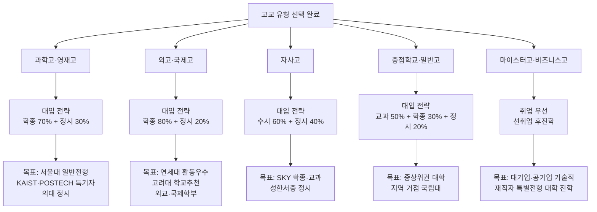

---

### 7-3. 학종·세특·내신·수능 4가지 핵심 고민

#### 고민 1: 학종 — 어떤 고교가 유리한가?

| 학종 평가 요소 | 과학고·영재고 | 외고·국제고 | 자사고 | 일반고 |
|-------------|------------|-----------|------|------|
| **내신** | 2~3등급도 합격 가능 (R&E 보완) | 1~2등급 필요 | 1~2등급 필요 | 1~2등급 필요 |
| **세특** | R&E 연구·올림피아드 기반 풍부 | 어학·국제 탐구 기반 풍부 | 다양한 탐구 가능 | 교과 탐구 중심 |
| **비교과** | 올림피아드·영재원 수료 강점 | 모의UN·토론·어학 강점 | 동아리·리더십 강점 | 상대적으로 부족 |
| **면접** | 수학·과학 심화 질문 | 영어·시사 질문 | 인성·진로 질문 | 인성·진로 질문 |

#### 고민 2: 세특 — 어떻게 쌓아야 하나?

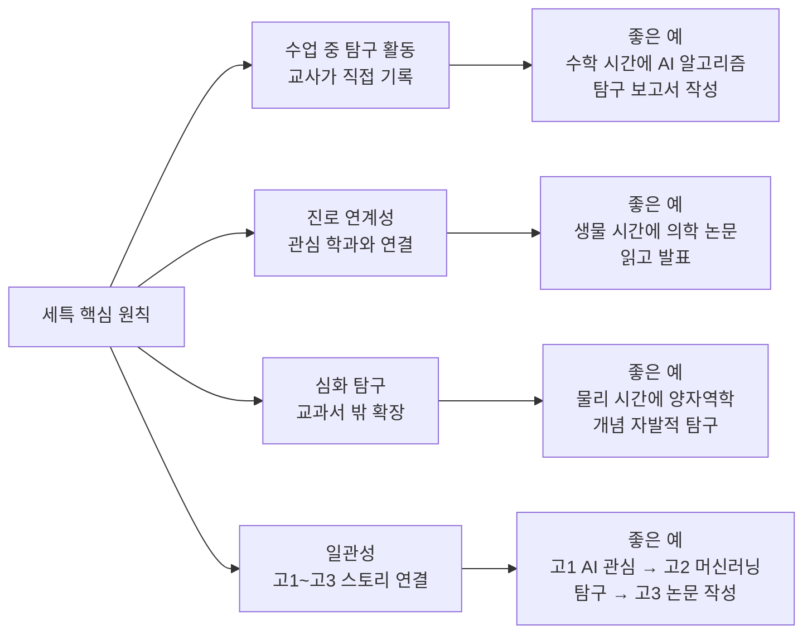

#### 고민 3: 내신 — 고교별 현실

| 고교 유형 | 1등급 비율 | 실제 경쟁 | 내신 전략 |
|---------|----------|---------|---------|
| **과학고·영재고** | 상위 4% (전국 1% 학생 중 4%) | 매우 치열, 1등급 거의 불가 | 2~3등급 + R&E로 보완 |
| **외고·국제고** | 상위 4% | 치열, 1등급 어려움 | 영어 과목 1등급 + 타 과목 2등급 |
| **자사고** | 상위 4% | 치열, 1~2등급 목표 | 전 과목 균형 + 수능 병행 |
| **일반고 (학군지)** | 상위 4% | 치열, 1등급 가능 | 주요 과목 1등급 집중 |
| **일반고 (비학군지)** | 상위 4% | 상대적으로 낮음 | 1등급 달성 용이 |
| **중점학교** | 상위 4% | 보통 | 1~2등급 달성 가능 |

#### 고민 4: 수능 — 고교별 병행 전략

| 고교 유형 | 수능 준비 시작 시기 | 수능 비중 | 수능 목표 등급 |
|---------|----------------|---------|------------|
| **과학고·영재고** | 고2 하반기~고3 | 30% | 수학·과학 1~2등급 (의대 정시용) |
| **외고·국제고** | 고2 상반기~고3 | 20% | 국어·영어·사탐 1~2등급 |
| **자사고** | 고1부터 병행 | 40% | 전 과목 1~2등급 |
| **중점학교·일반고** | 고1부터 집중 | 50~60% | 전 과목 1~2등급 |
| **마이스터고·비즈니스고** | 거의 안 함 | 5% 이하 | 해당 없음 |

---

### 7-4. 고교 유형별 세특·학종 핵심 역량 매트릭스

> 중학생이 지금부터 키워야 할 역량을 학교군별로 구체화합니다.
> 세특(교과 세부능력 및 특기사항)과 학종(학생부종합전형) 평가에 직접 연결되는 역량입니다.

#### 과학고·영재고 세특·학종 핵심 역량

**세특 연계 핵심 역량 5가지**:

1. **수학·과학 심화 탐구력**: 교과서 밖 개념을 스스로 탐구하는 능력
   - 예시: 미적분 개념을 물리 운동에 적용, 화학 반응식을 수학적으로 분석
   - 세특 기록 예: "학생은 미적분을 활용해 포물선 운동을 수식으로 유도했고, 실험 결과와 비교 분석했음"

2. **R&E 연구 설계 능력**: 연구 주제 선정부터 실험 설계, 데이터 분석까지
   - 예시: "식물 성장과 LED 파장의 관계" 연구 설계
   - 세특 기록 예: "학생은 독립변수(LED 파장)와 종속변수(성장 속도)를 명확히 설정하고 대조군을 구성했음"

3. **논문 읽기·쓰기**: 학술 논문을 읽고 이해하며, 탐구 결과를 논문 형식으로 작성
   - 예시: RISS에서 논문 검색 → 핵심 내용 요약 → 탐구 보고서 작성
   - 세특 기록 예: "학생은 관련 논문 3편을 읽고 선행 연구를 정리한 후 자신의 실험 결과와 비교했음"

4. **수학·과학 올림피아드 문제 해결력**: 고난도 문제를 논리적으로 해결
   - 예시: KMO(한국수학올림피아드) 중등부 기출 문제 풀이
   - 세특 기록 예: "학생은 정수론 문제를 모듈러 연산으로 접근해 독창적인 풀이를 제시했음"

5. **과학적 의사소통 능력**: 탐구 결과를 명확하게 발표하고 질문에 답변
   - 예시: 과학 탐구 발표 대회에서 10분 발표 + 5분 질의응답
   - 세특 기록 예: "학생은 실험 과정을 논리적으로 설명했고, 오차 원인에 대한 질문에 정확히 답변했음"

**중학생 준비 역량 (중1~중3 로드맵)**:

| 학년 | 수학 | 과학 | 탐구 | 기타 |
|------|------|------|------|------|
| **중1** | 수학 선행 (중3까지) | 과학 실험 기초 (변인 통제) | 관심 분야 탐색 | 과학 도서 월 1권 |
| **중2** | 수학 선행 (고1까지), KMO 1차 준비 | 과학 올림피아드 준비 | 탐구 보고서 3편 | 영재교육원 지원 |
| **중3** | 수학 선행 (고2까지), KMO 1차 통과 | 과학 올림피아드 수상 | R&E 기초 훈련 | 자소서 작성 |

**학종 평가 포인트**:
- `탐구 깊이`: 단순 실험이 아니라 "왜?"를 질문하고 심화 탐구
- `독창성`: 교과서 밖 개념을 스스로 연결하고 새로운 시도
- `실험 설계 능력`: 변인 통제, 대조군 설정, 오차 분석

**중학생→과학고→대입 역량 누적 흐름도**:

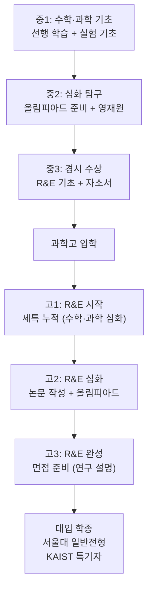

---

#### 외고·국제고 세특·학종 핵심 역량

**세특 연계 핵심 역량 5가지**:

1. **외국어 능력 (영어 + 제2외국어)**: 원서 읽기, 에세이 쓰기, 토론
   - 예시: 영어 원서 『1984』 읽고 감상문 작성, 스페인어 기초 회화
   - 세특 기록 예: "학생은 영어 원서를 읽고 작가의 의도를 분석한 에세이를 작성했음"

2. **국제 이슈 분석**: 시사 뉴스를 읽고 비판적으로 분석
   - 예시: "미국 대선이 한국 경제에 미치는 영향" 분석 보고서
   - 세특 기록 예: "학생은 국제 경제 이슈를 다각도로 분석하고 한국의 대응 방안을 제시했음"

3. **토론·발표 능력**: 영어 토론, 모의UN, 발표 대회
   - 예시: 영어 토론 대회에서 "기후변화 대응" 주제로 찬반 토론
   - 세특 기록 예: "학생은 영어 토론에서 논리적 근거를 제시하고 반론에 효과적으로 대응했음"

4. **문화 이해 능력**: 다양한 문화를 이해하고 존중
   - 예시: 다문화 가정 멘토링, 외국 문화 체험 활동
   - 세특 기록 예: "학생은 다문화 가정 학생을 멘토링하며 문화적 차이를 이해하고 소통했음"

5. **글로벌 시각**: 한국 중심이 아닌 세계적 관점에서 사고
   - 예시: "한국의 K-POP이 세계에 미치는 영향" 탐구
   - 세특 기록 예: "학생은 K-POP을 문화 외교 관점에서 분석하고 글로벌 영향력을 평가했음"

**중학생 준비 역량 (중1~중3 로드맵)**:

| 학년 | 영어 | 국제 이슈 | 토론·발표 | 제2외국어 |
|------|------|----------|----------|----------|
| **중1** | 영어 원서 월 1권 | 국제 뉴스 주 2회 | 토론 동아리 가입 | 관심 언어 탐색 |
| **중2** | 영어 에세이 월 2편, TOEFL 준비 | 국제 이슈 분석 월 1편 | 영어 토론 대회 참가 | 제2외국어 시작 (기초) |
| **중3** | TOEFL 70+ 달성 | 국제 이슈 발표 3회 | 모의UN 참가 | 제2외국어 중급 |

**학종 평가 포인트**:
- `글로벌 시각`: 한국만이 아닌 세계적 관점에서 문제를 바라봄
- `언어 활용 능력`: 영어를 도구로 활용해 정보를 습득하고 의견을 표현
- `비판적 사고`: 국제 이슈를 다각도로 분석하고 자신의 의견을 논리적으로 제시

**외고 세특 역량 구조도**:

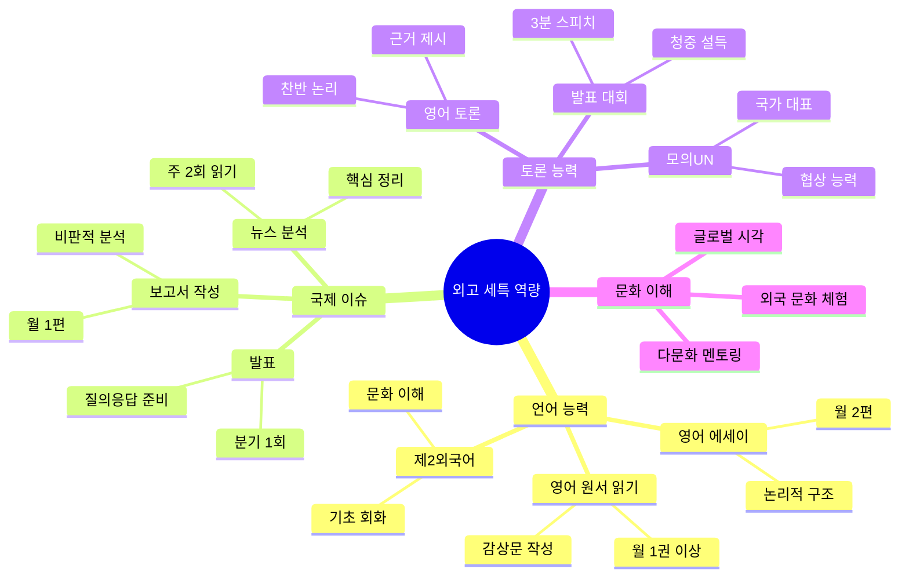

---

#### 자사고 세특·학종 핵심 역량

**세특 연계 핵심 역량 5가지**:

1. **자기주도 학습**: 스스로 학습 계획을 세우고 실행
   - 예시: 주간 학습 계획표 작성 + 실행 → 주말 회고
   - 세특 기록 예: "학생은 자기주도 학습 계획을 세우고 매주 실행 여부를 점검하며 개선했음"

2. **다양한 분야 탐구**: 한 분야에 국한되지 않고 여러 분야 탐구
   - 예시: 수학 탐구 + 역사 탐구 + 과학 탐구
   - 세특 기록 예: "학생은 수학의 황금비를 미술 작품에 적용하는 융합 탐구를 수행했음"

3. **리더십**: 학생회, 동아리 회장, 팀 프로젝트 리더
   - 예시: 동아리 회장으로 활동 기획 + 실행 + 평가
   - 세특 기록 예: "학생은 동아리 회장으로 활동을 기획하고 구성원 간 갈등을 조율했음"

4. **프로젝트 완성**: 탐구 주제를 정하고 끝까지 완성
   - 예시: "학교 급식 만족도 조사" 프로젝트 (설문 → 분석 → 보고서)
   - 세특 기록 예: "학생은 급식 만족도 조사 프로젝트를 기획하고 설문 결과를 통계적으로 분석했음"

5. **독서와 교과 연계**: 독서 내용을 교과 수업과 연결
   - 예시: 『총, 균, 쇠』 읽고 역사 수업에서 문명 발전 발표
   - 세특 기록 예: "학생은 『총, 균, 쇠』를 읽고 지리적 요인이 문명 발전에 미친 영향을 분석했음"

**중학생 준비 역량 (중1~중3 로드맵)**:

| 학년 | 자기주도 학습 | 탐구 | 리더십 | 독서 |
|------|-------------|------|--------|------|
| **중1** | 주간 계획표 작성 | 관심 분야 탐색 | 동아리 가입 | 월 4권 |
| **중2** | 학습 일지 작성 | 탐구 보고서 2편 | 동아리 임원 | 월 5권 + 독서 노트 |
| **중3** | 자기주도학습 사례 완성 | 탐구 발표 3회 | 학생회 또는 회장 | 월 6권 + 교과 연계 |

**학종 평가 포인트**:
- `자기주도성`: 스스로 목표를 설정하고 계획을 실행
- `탐구 일관성`: 고1~고3까지 일관된 관심 분야 탐구
- `활동 다양성`: 한 분야만이 아닌 다양한 분야에서 역량 발휘

**자사고 학종 준비 로드맵**:

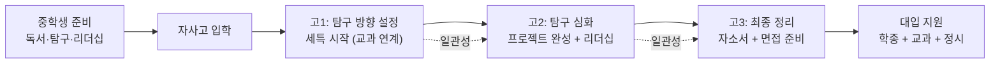

---

#### 일반고 (중점학교 포함) 세특·학종 핵심 역량

**AI·과학 중점학교 핵심 역량**:

1. **AI·데이터 분석**: Python으로 데이터 분석, 머신러닝 기초
   - 예시: 학교 급식 만족도 데이터를 Python으로 분석
   - 세특 기록 예: "학생은 Python을 활용해 급식 만족도 데이터를 시각화하고 패턴을 분석했음"

2. **코딩**: 알고리즘 문제 풀이, 프로젝트 개발
   - 예시: 백준 온라인 저지 브론즈~실버 문제 100개 풀이
   - 세특 기록 예: "학생은 알고리즘 문제를 풀며 논리적 사고력을 키웠고, 간단한 웹 프로젝트를 완성했음"

3. **과학 실험**: 실험 설계, 데이터 수집, 결과 분석
   - 예시: "온도가 식물 성장에 미치는 영향" 실험
   - 세특 기록 예: "학생은 온도 변인을 통제한 실험을 설계하고 결과를 그래프로 분석했음"

**IB 중점학교 핵심 역량**:

1. **논술**: 논리적 글쓰기, 비판적 사고
   - 예시: "AI 시대의 인간 역할" 논술 (1,000자)
   - 세특 기록 예: "학생은 AI 시대의 인간 역할을 철학적 관점에서 논술했음"

2. **비판적 사고**: 주어진 정보를 의심하고 다각도로 분석
   - 예시: 뉴스 기사를 읽고 편향성 분석
   - 세특 기록 예: "학생은 뉴스 기사의 편향성을 분석하고 객관적 사실을 구분했음"

3. **글쓰기**: 에세이, 보고서, 논문 형식 글쓰기
   - 예시: IB Extended Essay (4,000단어 논문)
   - 세특 기록 예: "학생은 Extended Essay에서 한국 전통 건축의 과학적 원리를 탐구했음"

**독서토론 중점학교 핵심 역량**:

1. **독서**: 월 5권 이상, 다양한 분야
   - 예시: 문학·역사·과학·철학 분야 균형 있게 읽기
   - 세특 기록 예: "학생은 월 5권 이상 독서하며 다양한 분야의 지식을 쌓았음"

2. **토론**: 논리적 주장, 근거 제시, 반론 대응
   - 예시: "사형제 폐지" 주제로 찬반 토론
   - 세특 기록 예: "학생은 사형제 폐지 토론에서 인권과 공공 안전을 균형 있게 논했음"

3. **발표**: 청중 앞에서 명확하게 의견 전달
   - 예시: 독서 감상 발표 (5분)
   - 세특 기록 예: "학생은 독서 감상을 논리적으로 발표하고 질문에 정확히 답변했음"

**중학생 준비 역량 (중점 유형별)**:

| 중점 유형 | 중1 | 중2 | 중3 |
|---------|-----|-----|-----|
| **AI·과학** | 코딩 기초 (Scratch) | Python 기초 | 프로젝트 1개 완성 |
| **IB** | 독서 월 3권 | 논술 월 1편 | 논술 월 2편 |
| **독서토론** | 독서 월 4권 | 토론 동아리 | 발표 대회 참가 |

**중점학교 유형별 역량 맵**:

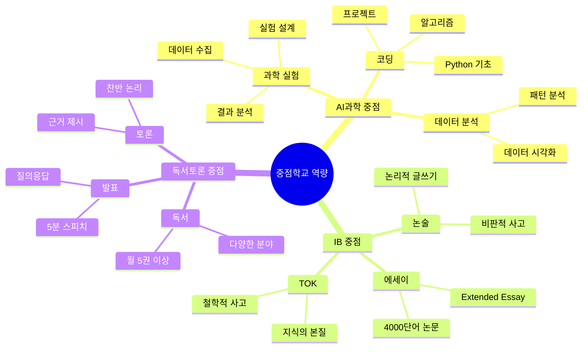

---

#### 마이스터고 세특·학종 핵심 역량

> 마이스터고는 학종보다 **취업 연계**가 핵심이지만, 세특 기록은 선취업 후진학 시 중요합니다.

**세특 연계 핵심 역량 5가지**:

1. **기술 실무**: 실제 산업 현장에서 사용하는 기술
   - 예시: 반도체 공정 실습, 자동차 엔진 분해·조립
   - 세특 기록 예: "학생은 반도체 공정 실습에서 정밀한 작업 능력을 보였음"

2. **자격증**: 국가기술자격증 취득
   - 예시: 정보처리기능사, 전기기능사, 컴퓨터활용능력 1급
   - 세특 기록 예: "학생은 정보처리기능사 자격증을 취득하며 프로그래밍 실력을 입증했음"

3. **프로젝트 완성**: 실무 프로젝트를 기획부터 완성까지
   - 예시: "학교 홈페이지 제작" 프로젝트 (기획 → 개발 → 테스트)
   - 세특 기록 예: "학생은 학교 홈페이지 제작 프로젝트를 주도하고 완성했음"

4. **산업 현장 이해**: 기업 견학, 현장 실습
   - 예시: 삼성전자 반도체 공장 견학, 현대자동차 공장 실습
   - 세특 기록 예: "학생은 기업 현장 실습에서 실무 프로세스를 이해하고 적극적으로 참여했음"

5. **팀워크**: 팀 프로젝트에서 협업
   - 예시: 4명이 팀을 이뤄 로봇 제작 프로젝트
   - 세특 기록 예: "학생은 팀 프로젝트에서 역할을 분담하고 구성원 간 소통을 주도했음"

**중학생 준비 역량 (중1~중3 로드맵)**:

| 학년 | 기술 탐색 | 코딩 | 자격증 | 프로젝트 |
|------|----------|------|--------|---------|
| **중1** | 관심 기술 분야 탐색 | Scratch 기초 | - | 기술 관련 독서 |
| **중2** | 기술 체험 프로그램 | Python 기초 | 컴활 준비 | 작은 프로젝트 1개 |
| **중3** | 마이스터고 정보 수집 | 알고리즘 기초 | 컴활 또는 정보처리기능사 | 포트폴리오 완성 |

**취업 연계 포인트**:
- `실무 프로젝트`: 학교에서 배운 기술을 실제 프로젝트에 적용
- `기업 연계 활동`: 기업 멘토링, 현장 실습, 채용 연계 프로그램
- `자격증`: 국가기술자격증은 취업 시 가산점

**마이스터고 취업 역량 파이프라인**:

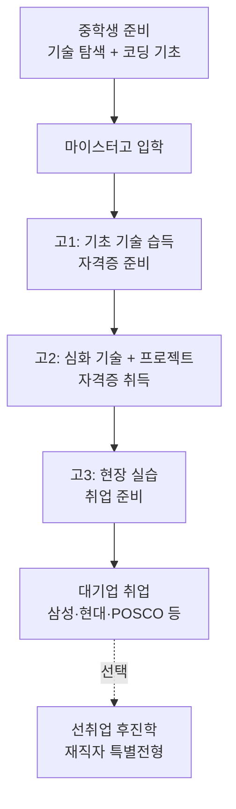

---

## 8. 특수학교 선택 시 준비해야 할 부분

### 8-1. 학교 유형별 중학교 단계 준비 항목

| 준비 항목 | 과학고·영재고 | 외고·국제고 | 자사고 | AI·중점학교 | 마이스터고 |
|---------|------------|-----------|------|-----------|---------|
| **내신 목표** | 수학·과학 전 과목 A | 영어 전 과목 A, 전 과목 A | 전 과목 A (상위 10%) | 전 과목 B 이상 | 특별 조건 없음 |
| **중1 핵심** | 수학 선행 (중3 수준), 과학 심화 | 영어 원서 읽기 시작, 영어 토론 | 독서 월 4권, 동아리 가입 | 관심 분야 탐색 | 관심 기술 분야 탐색 |
| **중2 핵심** | 영재교육원 지원·수료 | TOEFL 준비 시작, 영어 토론 수상 | 자기주도학습 사례 기록 | 코딩·과학 탐구 시작 | 관련 자격증 준비 |
| **중3 핵심** | KMO·KPhO 경시대회 참가 | TOEFL 70+ 달성, 자소서 작성 | 자소서 작성, 리더십 완성 | 탐구 보고서 1편 완성 | 포트폴리오 준비 |
| **자소서 핵심** | 수학·과학 탐구 경험, 영재원 활동 | 영어 학습 동기, 국제 관심 계기 | 자기주도학습 실천 사례 | 관심 분야 탐구 경험 | 기술 분야 관심 계기 |
| **면접 핵심** | 수학·과학 심화 문제 풀이 | 영어 스피킹, 시사 이슈 | 인성·가치관·학업 계획 | 해당 없음 | 기술 적성 면접 |
| **추천 활동** | 수학·과학 올림피아드, 영재원 | 영어 토론 동아리, 모의UN | 학생회·봉사·독서 | 코딩 동아리, 과학 탐구 | 기술 체험 프로그램 |

---

### 8-2. 학년별·필수/권장/선택 3단계 체크리스트

> **필수**: 해당 고교 지원 시 없으면 불리한 항목 | **권장**: 있으면 확실히 유리한 항목 | **선택**: 여유 있을 때 추가하면 좋은 항목

#### 중1 체크리스트

| 항목 | 과학고·영재고 | 외고·국제고 | 자사고 | AI·IB 중점 | 마이스터고 |
|------|------------|-----------|------|-----------|---------|
| 수학·과학 전 과목 A 달성 | **필수** | 권장 | **필수** | 권장 | 선택 |
| 영어 전 과목 A 달성 | 권장 | **필수** | **필수** | 권장 | 선택 |
| 독서 기록장 시작 (월 2권+) | 권장 | 권장 | **필수** | 권장 | 선택 |
| 수학 선행 (중3 수준) | **필수** | 선택 | 권장 | 선택 | 선택 |
| 영어 원서 읽기 시작 | 선택 | **필수** | 권장 | 권장 | 선택 |
| 동아리 가입 (관심 분야) | 권장 | 권장 | **필수** | 권장 | 선택 |
| 봉사활동 시작 (연 10시간+) | 선택 | 선택 | **필수** | 선택 | 선택 |
| 코딩 기초 (스크래치·엔트리) | 선택 | 선택 | 선택 | **필수** | 권장 |
| 관심 기술 분야 탐색 | 선택 | 선택 | 선택 | 권장 | **필수** |
| 자기주도학습 일지 시작 | 권장 | 권장 | **필수** | 권장 | 선택 |

#### 중2 체크리스트

| 항목 | 과학고·영재고 | 외고·국제고 | 자사고 | AI·IB 중점 | 마이스터고 |
|------|------------|-----------|------|-----------|---------|
| 수학·과학 전 과목 A 유지 | **필수** | 권장 | **필수** | 권장 | 선택 |
| 영재교육원 지원·수료 | **필수** | 선택 | 선택 | 선택 | 선택 |
| KMO 1차 준비·응시 | **필수** | 선택 | 선택 | 선택 | 선택 |
| TOEFL 준비 시작 (목표 60점) | 선택 | **필수** | 권장 | 선택 | 선택 |
| 영어 토론 동아리·대회 참가 | 선택 | **필수** | 권장 | 선택 | 선택 |
| 모의UN 참가 | 선택 | 권장 | 선택 | 선택 | 선택 |
| 자기주도학습 사례 기록 | 권장 | 권장 | **필수** | 권장 | 선택 |
| 교내 대회 수상 (1건+) | 권장 | 권장 | **필수** | 권장 | 선택 |
| 리더십 활동 (반장·동아리 임원) | 선택 | 선택 | **필수** | 선택 | 선택 |
| 탐구 보고서 1편 완성 | **필수** | 권장 | 권장 | **필수** | 선택 |
| 파이썬 기초 완성 | 선택 | 선택 | 선택 | **필수** | 권장 |
| 자격증 준비 (워드·컴활 3급) | 선택 | 선택 | 선택 | 선택 | **필수** |
| 자소서 초안 작성 | 권장 | 권장 | **필수** | 선택 | 권장 |
| 봉사활동 (연 20시간+) | 선택 | 선택 | **필수** | 선택 | 선택 |

#### 중3 체크리스트

| 항목 | 과학고·영재고 | 외고·국제고 | 자사고 | AI·IB 중점 | 마이스터고 |
|------|------------|-----------|------|-----------|---------|
| KMO 2차 도전 | **필수** | 선택 | 선택 | 선택 | 선택 |
| 영재성 검사 기출 집중 풀이 | **필수** | 선택 | 선택 | 선택 | 선택 |
| TOEFL 70+ 달성 | 선택 | **필수** | 권장 | 선택 | 선택 |
| 영어 면접 준비 (시사 이슈) | 선택 | **필수** | 권장 | 선택 | 선택 |
| 자소서 최종 완성 | **필수** | **필수** | **필수** | 선택 | 권장 |
| 면접 예상 질문 100개 준비 | **필수** | **필수** | **필수** | 선택 | 권장 |
| 모의 면접 3회+ 실시 | **필수** | **필수** | **필수** | 선택 | 권장 |
| 독서 목록 정리 (중1~중3) | 권장 | 권장 | **필수** | 권장 | 선택 |
| 탐구 포트폴리오 완성 | **필수** | 권장 | 권장 | **필수** | 선택 |
| AI 프로젝트 1개 완성 | 선택 | 선택 | 선택 | **필수** | 권장 |
| 자격증 취득 (컴활 2급+) | 선택 | 선택 | 선택 | 선택 | **필수** |
| 포트폴리오 완성 | 선택 | 선택 | 권장 | 권장 | **필수** |
| 전형요강 3회 이상 정독 | **필수** | **필수** | **필수** | **필수** | **필수** |
| 불합격 대비 일반고 배정 파악 | **필수** | **필수** | **필수** | 해당없음 | 해당없음 |

---

### 8-2. 중학교 단계별 준비 순서도

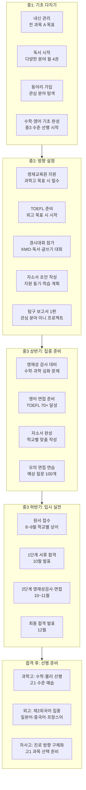

---

## 8-3. 합격 예시 커리큘럼 5종 (학교 유형별 실제 합격 패턴 기반)

> 아래 프로필은 실제 합격 사례를 바탕으로 재구성한 예시입니다. 개인별 상황에 따라 전략을 조정하세요.

---

### 합격 예시 A: 서울과학고 합격 (이공계 최상위형)

**합격 학생 프로필 요약**

| 항목 | 내용 |
|------|------|
| **내신** | 수학·과학 전 과목 A, 국어·영어 A, 기타 과목 A |
| **영재교육원** | 중2: 서울교대 부설 영재교육원 수료 |
| **경시대회** | KMO 1차 합격(중2), KMO 2차 지역 동상(중3) |
| **탐구 활동** | 수학 탐구 보고서 2편 (소수 분포 패턴, 확률과 통계 응용) |
| **자소서 핵심** | "수학 문제를 풀다 생긴 의문을 스스로 탐구한 경험" 중심 |
| **면접 강점** | 창의 수학 문제 현장 풀이, 탐구 과정 논리적 설명 |

**중1~중3 학기별 핵심 타임라인**

| 시기 | 수학 | 과학 | 비교과·입시 |
|------|------|------|----------|
| 중1 1학기 | 중3 수학 선행 완성 | 물리·화학 기초 개념 | 내신 전 과목 A 달성 |
| 중1 2학기 | 고1 수학(수학1) 시작 | 과학 심화 문제집 | 영재교육원 정보 수집 |
| 중2 1학기 | 고1 수학 완성 + 수학2 시작 | 영재교육원 수업 참여 | KMO 1차 준비·응시 |
| 중2 2학기 | 미적분 기초 | KPhO 기초 준비 | 탐구 보고서 1편 완성 |
| 중3 1학기 | 올림피아드 심화 | KMO 2차·KPhO 준비 | 자소서 초안 작성 |
| 중3 2학기 | 기출 문제 집중 풀이 | 영재성 검사 대비 | 원서 접수(9월) → 면접(11월) |

**합격 포인트**
- 영재교육원 수료가 서류 1단계 통과의 결정적 요소
- KMO 2차 수상 경력이 탐구 역량 증명
- 자소서에서 "문제를 만든 배경과 탐구 과정"을 구체적으로 서술
- 면접에서 창의 문제를 틀려도 사고 과정을 논리적으로 설명해 합격

---

### 합격 예시 B: 대원외고(영어과) 합격 (어학·국제형)

**합격 학생 프로필 요약**

| 항목 | 내용 |
|------|------|
| **내신** | 영어 전 과목 A, 전 과목 A (국어·수학 포함) |
| **영어 역량** | TOEFL 82점(중3 1학기), 영어 토론 대회 교내 1위(중2) |
| **활동** | 모의UN 참가(중2), 영어 에세이 교외 대회 장려상(중3) |
| **독서** | 영어 원서 중1~중3 총 30권+, 국제 관계 교양서 10권+ |
| **자소서 핵심** | "영어를 통해 세계를 이해하게 된 계기와 외교관 꿈" 중심 |
| **면접 강점** | 영어 면접 유창성, 시사 이슈(기후변화·AI 규제) 영어 답변 |

**중1~중3 학기별 핵심 타임라인**

| 시기 | 영어 | 제2외국어 | 비교과·입시 |
|------|------|---------|----------|
| 중1 1학기 | 영어 원서 읽기 시작(Roald Dahl) | 일본어 선택 결정 | 영어 토론 동아리 가입 |
| 중1 2학기 | 영어 원서 심화(Harry Potter) | 일본어 기초 문법 | TOEFL 기초 개념 파악 |
| 중2 1학기 | TOEFL 준비 시작(목표 60점) | 일본어 회화 기초 | 모의UN 참가, 영어 토론 대회 |
| 중2 2학기 | TOEFL 68점 달성 | 일본어 JLPT N4 준비 | 영어 에세이 월 2편 작성 |
| 중3 1학기 | TOEFL 82점 달성 | 일본어 심화 | 자소서 완성, 영어 에세이 대회 |
| 중3 2학기 | 영어 면접 집중 준비 | - | 원서 접수(9월) → 면접(11월) |

**합격 포인트**
- TOEFL 80점 이상이 영어 실력 증명의 실질적 기준
- 모의UN 참가 경험이 "국제 관심"을 구체적으로 증명
- 자소서에서 영어 학습 동기를 단순 "좋아서"가 아닌 "구체적 사건"으로 서술
- 영어 면접에서 기후변화 주제를 영어로 3분 이상 논리적으로 답변

---

### 합격 예시 C: 하나고등학교 합격 (자기주도형)

**합격 학생 프로필 요약**

| 항목 | 내용 |
|------|------|
| **내신** | 전 과목 A (중1~중3 전 학기 유지) |
| **독서** | 중1~중3 총 120권+, 독서 기록장 3권 작성 |
| **리더십** | 중2·중3 학생회 부회장, 동아리 회장 |
| **봉사** | 연 30시간+, 교육 봉사(초등학생 학습 지도) 중심 |
| **탐구 활동** | 사회·경제 탐구 보고서 2편 (청소년 경제 교육, 환경 정책) |
| **자소서 핵심** | "스스로 학습 계획을 세우고 실패를 통해 성장한 경험" 중심 |
| **면접 강점** | 자소서 기반 심층 질문에 구체적 에피소드로 답변 |

**중1~중3 학기별 핵심 타임라인**

| 시기 | 학습 | 독서·탐구 | 비교과·입시 |
|------|------|---------|----------|
| 중1 1학기 | 전 과목 A 목표 설정·달성 | 다양한 분야 독서 월 4권 | 동아리 가입, 봉사 시작 |
| 중1 2학기 | 취약 과목 집중 보완 | 독서 기록장 작성 시작 | 자기주도학습 일지 시작 |
| 중2 1학기 | 전 과목 A 유지 | 관심 분야 심화 독서 | 학생회 부회장 당선 |
| 중2 2학기 | 취약 과목 없음 유지 | 탐구 보고서 1편 완성 | 동아리 회장, 자소서 초안 |
| 중3 1학기 | 전 과목 A 유지 | 독서 목록 정리 완성 | 자소서 최종 완성 |
| 중3 2학기 | 면접 준비 | - | 원서 접수(9월) → 면접(11월) |

**합격 포인트**
- 중1부터 중3까지 전 과목 A 유지가 서류 통과의 기본 조건
- 자소서에서 "실패 → 반성 → 개선 → 성장" 스토리가 면접관에게 강한 인상
- 독서 기록장을 면접 현장에서 구체적으로 인용 가능한 수준으로 준비
- 리더십 활동이 "나를 위한 스펙"이 아닌 "공동체 기여"로 서술

---

### 합격 예시 D: AI 중점학교 합격 (AI·이공계형)

**합격 학생 프로필 요약**

| 항목 | 내용 |
|------|------|
| **내신** | 수학·정보 A, 전 과목 B 이상 |
| **코딩 역량** | 파이썬 기초 완성(중2), 머신러닝 입문 프로젝트 1개(중3) |
| **탐구 활동** | AI 관련 탐구 보고서 1편 (AI 이미지 인식 원리 탐구) |
| **독서** | AI 교양서 5권+ (『AI 최강의 수업』, 『파이썬으로 배우는 AI』 등) |
| **자소서 핵심** | "AI에 관심을 갖게 된 계기와 직접 프로젝트를 만든 경험" 중심 |
| **특이사항** | AI 중점학교는 별도 입학 전형 없이 일반고 배정 후 신청 |

**중1~중3 학기별 핵심 타임라인**

| 시기 | 학습 | AI·코딩 | 비교과·입시 |
|------|------|--------|----------|
| 중1 1학기 | 전 과목 B 이상 | 스크래치·엔트리 기초 | 관심 분야(AI) 탐색 |
| 중1 2학기 | 수학·정보 A 목표 | 파이썬 기초 시작 | AI 관련 독서 시작 |
| 중2 1학기 | 전 과목 A 목표 | 파이썬 기초 완성 | 코딩 동아리 가입 |
| 중2 2학기 | 수학 심화 | 데이터 분석 기초 | AI 탐구 보고서 주제 선정 |
| 중3 1학기 | 전 과목 A 유지 | 머신러닝 입문 프로젝트 | AI 탐구 보고서 완성 |
| 중3 2학기 | 일반고 배정 후 AI 중점 신청 | 프로젝트 포트폴리오 정리 | AI 중점 프로그램 합류 |

**합격 포인트**
- AI 중점학교는 별도 입학 전형이 없어 "합격"보다 "신청 후 선발" 개념
- 코딩 프로젝트 1개 완성이 AI 중점 신청 시 강점으로 작용
- 탐구 보고서에서 "AI 원리를 직접 실험하고 결과를 분석"한 내용이 고교 세특 기반이 됨
- 고1 AI 중점 합류 후 세특 기록을 대입 학종 서류로 연결하는 것이 핵심 전략

---

### 합격 예시 E: IB 중점학교 합격 (논술·탐구형)

**합격 학생 프로필 요약**

| 항목 | 내용 |
|------|------|
| **내신** | 전 과목 A (국어·영어·사회 특히 강점) |
| **영어 역량** | 영어 원서 중1~중3 총 40권+, 영어 에세이 월 2편 |
| **논술·글쓰기** | 독서 감상문·논술 에세이 총 30편+, 토론 대회 수상 |
| **탐구 활동** | 인문·사회 탐구 보고서 2편 (기후 정의, 디지털 격차) |
| **독서** | 인문·사회·과학 교양서 총 80권+, 비판적 독서 기록 |
| **자소서 핵심** | "왜 IB를 선택했는가: 정답 없는 질문을 탐구하고 싶은 이유" |
| **특이사항** | IB 학교도 일반고 배정 후 신청, 일부 학교는 별도 선발 |

**중1~중3 학기별 핵심 타임라인**

| 시기 | 학습 | 독서·글쓰기 | 비교과·입시 |
|------|------|---------|----------|
| 중1 1학기 | 전 과목 A 목표 | 다양한 분야 독서 월 4권 | 독서 감상문 쓰기 시작 |
| 중1 2학기 | 국어·영어 심화 | 영어 원서 읽기 시작 | 토론 동아리 가입 |
| 중2 1학기 | 전 과목 A 유지 | 논술 글쓰기 월 2편 | 지역 IB 학교 방문·정보 수집 |
| 중2 2학기 | 영어 에세이 강화 | 탐구 보고서 1편 완성 | 토론 대회 참가·수상 |
| 중3 1학기 | 전 과목 A 유지 | 탐구 포트폴리오 정리 | IB 학교 신청 준비 |
| 중3 2학기 | 일반고 배정 후 IB 신청 | 영어 에세이 포트폴리오 | IB DP 프로그램 합류 |

**합격 포인트**
- IB 학교 신청 시 "왜 IB인가"를 논리적으로 설명하는 역량이 핵심
- 논술·에세이 포트폴리오가 IB 수업 적응력을 증명
- 영어 원서 독서 경험이 IB 영어 수업 적응의 실질적 기반
- IB EE(소논문) 사전 훈련으로 탐구 보고서 작성 경험이 고교 IB 성적에 직결

---

## 9. 실전 준비 커리큘럼 예시 5종

---

### 커리큘럼 A: 과학고·영재고 지망 (이공계 특화)

```mermaid
flowchart LR
    subgraph A_M1["중1 (1년차)"]
        A1["수학 선행<br>중3~고1 수준"]
        A2["과학 심화<br>물리·화학·생물 기초"]
        A3["독서<br>과학자 전기, 수학 교양서"]
        A4["내신<br>수학·과학 전 과목 A"]
    end

    subgraph A_M2["중2 (2년차)"]
        A5["영재교육원 지원<br>시·도 교육청 영재원"]
        A6["KMO 준비<br>수학올림피아드 1차"]
        A7["KPhO 준비<br>물리올림피아드 기초"]
        A8["탐구 보고서<br>수학·과학 주제 1편"]
    end

    subgraph A_M3["중3 (3년차)"]
        A9["KMO 2차 도전<br>지역 수상 목표"]
        A10["영재성 검사 대비<br>기출 문제 집중 풀이"]
        A11["자소서 작성<br>탐구 경험 중심"]
        A12["캠프 면접 준비<br>창의 문제·토론 연습"]
    end

    A_M1 --> A_M2 --> A_M3
```

**과학고·영재고 지망 월별 커리큘럼:**

| 학년 | 월 | 수학 | 과학 | 독서·탐구 | 입시 준비 |
|------|---|------|------|---------|---------|
| **중1** | 3~6월 | 중3 수학 선행 완성 | 물리·화학 기초 개념 | 수학 교양서 2권 | 관심 분야 탐색 |
| **중1** | 7~8월 | 고1 수학(수학1) 시작 | 과학 심화 문제집 | 과학자 전기 2권 | 영재교육원 정보 수집 |
| **중1** | 9~12월 | 고1 수학 완성 | 물리·화학 심화 | 수학·과학 탐구 독서 | 영재원 지원 준비 |
| **중2** | 3~6월 | 고2 수학(수학2·미적분) | 영재교육원 수업 참여 | 탐구 보고서 주제 선정 | KMO 1차 준비 |
| **중2** | 7~8월 | 미적분 완성 | 물리올림피아드 기초 | 탐구 보고서 작성 | KMO 1차 응시 |
| **중2** | 9~12월 | 고3 수학(확통·기하) | KPhO 기초 준비 | 탐구 보고서 완성 | 영재원 수료 확인 |
| **중3** | 3~6월 | 올림피아드 심화 | KMO 2차·KPhO 준비 | 관련 논문 읽기 | 자소서 초안 작성 |
| **중3** | 7~8월 | 기출 문제 집중 풀이 | 영재성 검사 대비 | 탐구 주제 정리 | 자소서 완성 |
| **중3** | 9월 | 유지 관리 | 유지 관리 | - | 원서 접수 |
| **중3** | 10~11월 | 영재성 검사 | 영재성 검사 | - | 면접 준비 |
| **중3** | 12월 | 합격 후 선행 | 합격 후 선행 | - | 최종 합격 발표 |

---

### 커리큘럼 B: 외고·국제고 지망 (어학·국제 특화)

```mermaid
flowchart LR
    subgraph B_M1["중1 (1년차)"]
        B1["영어 원서 읽기<br>월 2권 시작"]
        B2["영어 토론 동아리<br>학교 내 가입"]
        B3["제2외국어 탐색<br>일본어·중국어 중 선택"]
        B4["내신<br>영어 전 과목 A"]
    end

    subgraph B_M2["중2 (2년차)"]
        B5["TOEFL 준비<br>목표: 70점"]
        B6["영어 에세이 작성<br>월 1편 이상"]
        B7["모의UN 참가<br>교내 or 교외"]
        B8["국제 이슈 독서<br>시사·경제·외교"]
    end

    subgraph B_M3["중3 (3년차)"]
        B9["TOEFL 70+ 달성<br>목표: 80+"]
        B10["영어 토론 수상<br>교내 or 교외 대회"]
        B11["자소서 작성<br>영어 학습 동기 중심"]
        B12["영어 면접 준비<br>시사 이슈 영어 답변"]
    end

    B_M1 --> B_M2 --> B_M3
```

**외고·국제고 지망 월별 커리큘럼:**

| 학년 | 월 | 영어 | 제2외국어 | 독서·탐구 | 입시 준비 |
|------|---|------|---------|---------|---------|
| **중1** | 3~6월 | 영어 원서 읽기 시작 (Roald Dahl 수준) | 제2외국어 선택 결정 | 국제 관련 교양서 2권 | 영어 토론 동아리 가입 |
| **중1** | 7~8월 | 영어 원서 심화 (Harry Potter 수준) | 제2외국어 기초 문법 | 세계사·지리 독서 | TOEFL 기초 개념 파악 |
| **중1** | 9~12월 | 영어 에세이 쓰기 시작 | 제2외국어 회화 기초 | 시사 영어 뉴스 읽기 | 영어 내신 A 유지 |
| **중2** | 3~6월 | TOEFL 준비 시작 (목표 60점) | 제2외국어 심화 | 외교·국제관계 독서 | 모의UN 참가 |
| **중2** | 7~8월 | TOEFL 60점 달성 | 제2외국어 시험 준비 | 영어 에세이 월 2편 | 영어 토론 대회 참가 |
| **중2** | 9~12월 | TOEFL 70점 목표 | 제2외국어 자격증 | 국제 이슈 영어 독서 | 자소서 초안 작성 |
| **중3** | 3~6월 | TOEFL 70~80점 달성 | 제2외국어 심화 | 관심 분야 영어 논문 | 자소서 완성 |
| **중3** | 7~8월 | 영어 면접 준비 | - | 시사 이슈 정리 | 면접 예상 질문 100개 |
| **중3** | 9월 | 유지 관리 | 유지 관리 | - | 원서 접수 |
| **중3** | 10~11월 | 영어 면접 실전 | - | - | 면접 준비 |
| **중3** | 12월 | 합격 후 제2외국어 집중 | 집중 학습 | - | 최종 합격 발표 |

---

### 커리큘럼 C: 자사고 지망 (종합 엘리트형)

```mermaid
flowchart LR
    subgraph C_M1["중1 (1년차)"]
        C1["전 과목 내신<br>A 목표 유지"]
        C2["독서<br>다양한 분야 월 4권"]
        C3["동아리 가입<br>관심 분야 탐색"]
        C4["봉사활동<br>연 20시간 이상"]
    end

    subgraph C_M2["중2 (2년차)"]
        C5["자기주도학습 기록<br>학습 계획·실천 일지"]
        C6["교내 대회 수상<br>독서·글쓰기·수학"]
        C7["리더십 활동<br>반장·동아리 임원"]
        C8["탐구 보고서<br>관심 분야 1편"]
    end

    subgraph C_M3["중3 (3년차)"]
        C9["자소서 작성<br>자기주도학습 사례 중심"]
        C10["독서 목록 정리<br>중1~중3 독서 기록"]
        C11["면접 준비<br>인성·가치관·학업 계획"]
        C12["포트폴리오 완성<br>활동 전체 정리"]
    end

    C_M1 --> C_M2 --> C_M3
```

**자사고 지망 월별 커리큘럼:**

| 학년 | 월 | 학습 | 독서·탐구 | 비교과 활동 | 입시 준비 |
|------|---|------|---------|---------|---------|
| **중1** | 3~6월 | 전 과목 A 목표 설정 | 다양한 분야 독서 월 4권 | 동아리 가입, 봉사 시작 | 자사고 정보 수집 |
| **중1** | 7~8월 | 취약 과목 보완 | 인문·사회 교양서 | 봉사활동 집중 | 목표 자사고 설명회 참석 |
| **중1** | 9~12월 | 전 과목 A 유지 | 독서 기록장 작성 시작 | 동아리 활동 심화 | 자기주도학습 일지 시작 |
| **중2** | 3~6월 | 전 과목 A 유지 | 관심 분야 심화 독서 | 교내 대회 참가 | 자소서 구조 파악 |
| **중2** | 7~8월 | 취약 과목 집중 보완 | 탐구 보고서 주제 선정 | 리더십 활동 강화 | 자소서 초안 작성 |
| **중2** | 9~12월 | 전 과목 A 유지 | 탐구 보고서 완성 | 동아리 임원 활동 | 자소서 1차 완성 |
| **중3** | 3~6월 | 전 과목 A 유지 | 독서 목록 정리 | 포트폴리오 정리 | 자소서 최종 완성 |
| **중3** | 7~8월 | 면접 준비 | - | 봉사 마무리 | 면접 예상 질문 100개 |
| **중3** | 9월 | 유지 관리 | - | - | 원서 접수 |
| **중3** | 10~11월 | - | - | - | 면접 실전 |
| **중3** | 12월 | 합격 후 진로 방향 구체화 | - | - | 최종 합격 발표 |

---

### 커리큘럼 D: IB·중점학교 지망 (융합·탐구형)

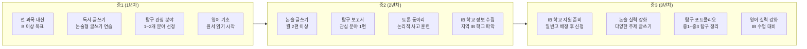

**IB·중점학교 지망 월별 커리큘럼:**

| 학년 | 월 | 학습 | 독서·탐구 | 글쓰기·토론 | 입시 준비 |
|------|---|------|---------|---------|---------|
| **중1** | 3~6월 | 전 과목 B 이상 | 다양한 분야 독서 | 독서 감상문 쓰기 | IB 학교 정보 수집 |
| **중1** | 7~8월 | 취약 과목 보완 | 인문·과학 교양서 | 논술 글쓰기 기초 | 관심 분야 2개 선정 |
| **중1** | 9~12월 | 전 과목 B 이상 유지 | 관심 분야 심화 독서 | 월 1편 글쓰기 | 토론 동아리 가입 |
| **중2** | 3~6월 | 전 과목 A 목표 | 탐구 보고서 주제 선정 | 월 2편 논술 글쓰기 | 지역 IB 학교 방문 |
| **중2** | 7~8월 | 취약 과목 집중 | 탐구 보고서 작성 | 토론 대회 참가 | IB 수업 방식 파악 |
| **중2** | 9~12월 | 전 과목 A 유지 | 탐구 보고서 완성 | 논술 실력 강화 | 영어 실력 점검 |
| **중3** | 3~6월 | 전 과목 A 유지 | 탐구 포트폴리오 정리 | 영어 에세이 쓰기 | 일반고 배정 준비 |
| **중3** | 7~8월 | IB 수업 대비 영어 | - | 논술 최종 점검 | IB 신청 준비 |
| **중3** | 9~12월 | 일반고 배정 후 IB 신청 | - | - | IB 프로그램 합류 |

---

### 커리큘럼 E: 마이스터고·비즈니스고 지망 (실무·취업형)

```mermaid
flowchart LR
    subgraph E_M1["중1 (1년차)"]
        E1["관심 기술 분야 탐색<br>AI·전기·자동차·경영"]
        E2["기초 코딩 학습<br>스크래치·파이썬 기초"]
        E3["직업 체험<br>관련 분야 견학·체험"]
        E4["내신<br>전 과목 B 이상"]
    end

    subgraph E_M2["중2 (2년차)"]
        E5["기술 분야 심화<br>관심 분야 집중 학습"]
        E6["자격증 준비<br>워드프로세서·컴활 3급"]
        E7["포트폴리오 시작<br>기술 프로젝트 기록"]
        E8["마이스터고 정보 수집<br>학교별 특성 파악"]
    end

    subgraph E_M3["중3 (3년차)"]
        E9["자격증 취득<br>컴활 2급 or 분야별"]
        E10["포트폴리오 완성<br>기술 프로젝트 정리"]
        E11["면접 준비<br>취업 의지·기술 관심"]
        E12["원서 접수<br>마이스터고·비즈니스고"]
    end

    E_M1 --> E_M2 --> E_M3
```

**마이스터고·비즈니스고 지망 월별 커리큘럼:**

| 학년 | 월 | 기술 학습 | 자격증 | 포트폴리오 | 입시 준비 |
|------|---|---------|------|---------|---------|
| **중1** | 3~6월 | 관심 기술 분야 탐색 | 컴퓨터 기초 학습 | 관심 분야 기록 시작 | 마이스터고 정보 수집 |
| **중1** | 7~8월 | 파이썬 기초 코딩 | 워드프로세서 준비 | 코딩 프로젝트 1개 | 학교별 설명회 참석 |
| **중1** | 9~12월 | 기술 분야 심화 탐색 | 워드프로세서 취득 | 기술 체험 기록 | 목표 학교 1~2개 선정 |
| **중2** | 3~6월 | 관심 분야 집중 학습 | 컴활 3급 준비 | 기술 프로젝트 2개 | 학교별 입학 조건 파악 |
| **중2** | 7~8월 | 기술 심화 (AI·전기 등) | 컴활 3급 취득 | 포트폴리오 초안 | 직업 체험 프로그램 |
| **중2** | 9~12월 | 분야별 심화 학습 | 컴활 2급 준비 | 포트폴리오 보완 | 자소서 초안 작성 |
| **중3** | 3~6월 | 실전 기술 프로젝트 | 컴활 2급 취득 | 포트폴리오 완성 | 자소서 완성 |
| **중3** | 7~8월 | 면접 준비 | 추가 자격증 도전 | - | 면접 예상 질문 준비 |
| **중3** | 9월 | 유지 관리 | - | - | 원서 접수 |
| **중3** | 10~11월 | - | - | - | 면접 실전 |
| **중3** | 12월 | 합격 후 기술 선행 학습 | - | - | 최종 합격 발표 |

---

### 커리큘럼 F: 마이스터고 학교별 완전 가이드

> 마이스터고는 학교마다 특화 분야, 기숙사, 교육과정이 다릅니다.
> 중학생이 지원 전에 반드시 확인해야 할 학교별 상세 정보입니다.

#### F-1. 서울·경기 마이스터고 상세 가이드

**1. 세교AI마이스터고 (경기 화성)**

**기본 정보**:
- 소재지: 경기도 화성시
- 개교: 2026년 (신설)
- 모집 인원: 120명
- 기숙사: 전원 기숙사 제공 (4인실), 기숙사비 월 20만원

**교육과정 (3개 학과)**:
1. AI소프트웨어과 (40명)
2. 데이터사이언스과 (40명)
3. AI융합과 (40명)

**배우는 과목 (학년별)**:

| 학년 | 전공 필수 과목 | 전공 심화 과목 | 실습 |
|------|-------------|-------------|------|
| **고1** | Python 프로그래밍, 자료구조, 데이터베이스 기초 | 수학 기초 (미적분, 선형대수 입문) | 간단한 웹 프로젝트 |
| **고2** | 머신러닝 기초, 딥러닝 입문, 데이터 분석 | 알고리즘, 통계학 기초 | AI 프로젝트 (이미지 분류) |
| **고3** | 딥러닝 심화, 자연어 처리, 컴퓨터 비전 | AI 윤리, 빅데이터 처리 | 졸업 프로젝트 (AI 서비스 개발) |

**취업처**:
- 네이버, 카카오, 쿠팡, 배달의민족
- AI 스타트업 (업스테이지, 뤼튼테크놀로지 등)
- 삼성전자, LG전자 AI 부서

**중학생 준비 역량**:
- Python 기초 (온라인 강의 또는 책으로 학습)
- 수학 기초 (중3 수학 + 고1 미적분 입문)
- AI 관련 독서 (『AI 시대, 인간을 다시 묻다』 등)
- 간단한 코딩 프로젝트 1개 (예: 가위바위보 게임)

**입학 전형**:
- 1단계: 서류 심사 (자소서 + 포트폴리오)
- 2단계: 적성검사 (논리·수리·코딩 기초)
- 3단계: 면접 (AI 관심도 + 학습 의지)

---

**2. 수도전기공업고등학교 (서울 노원구)**

**기본 정보**:
- 소재지: 서울 노원구
- 개교: 1973년 (마이스터고 전환 2010년)
- 모집 인원: 200명
- 기숙사: 없음 (통학)

**교육과정 (3개 학과)**:
1. 전기과 (70명)
2. 전자과 (70명)
3. 자동화시스템과 (60명)

**배우는 과목 (학년별)**:

| 학년 | 전공 필수 과목 | 전공 심화 과목 | 실습 |
|------|-------------|-------------|------|
| **고1** | 전기 기초, 전자 회로, 전기 기기 | 수학·과학 기초 | 전기 회로 실습 |
| **고2** | PLC (프로그래머블 로직 컨트롤러), 자동화 시스템 | 전기 설비, 전력 공학 | 자동화 시스템 실습 |
| **고3** | 전기 안전, 전기 공사, 신재생 에너지 | 전기 설계 | 졸업 프로젝트 (전기 설비 설계) |

**취업처**:
- 한국전력공사 (100% 취업 보장)
- 전기 기업 (LS전선, 효성중공업 등)
- 지하철공사, 철도공사

**중학생 준비 역량**:
- 수학·과학 기초 (중3 수준)
- 전기 관련 독서 (『전기가 만드는 세상』 등)
- 전기 관련 체험 (과학관 전기 체험)

**입학 전형**:
- 1단계: 서류 심사 (자소서)
- 2단계: 적성검사 (수리·논리)
- 3단계: 면접 (전기 관심도 + 취업 의지)

---

**3. 삼성전자공업고등학교 (경기 수원)**

**기본 정보**:
- 소재지: 경기도 수원시
- 개교: 1977년 (삼성전자 설립)
- 모집 인원: 200명
- 기숙사: 일부 제공 (지방 학생 우선, 4인실), 기숙사비 월 15만원

**교육과정 (3개 학과)**:
1. 반도체과 (80명)
2. 전자과 (70명)
3. IT과 (50명)

**배우는 과목 (학년별)**:

| 학년 | 전공 필수 과목 | 전공 심화 과목 | 실습 |
|------|-------------|-------------|------|
| **고1** | 반도체 기초, 전자 회로, 디지털 논리 | 수학·과학 기초 | 전자 회로 실습 |
| **고2** | 반도체 공정, 임베디드 시스템, 마이크로프로세서 | 반도체 물리, 전자 재료 | 반도체 공정 실습 |
| **고3** | 반도체 설계, IoT, 스마트 팩토리 | 반도체 테스트, 품질 관리 | 졸업 프로젝트 (IoT 시스템 개발) |

**취업처**:
- 삼성전자 (100% 취업 보장)
- 삼성디스플레이, 삼성SDI
- 반도체 협력사

**중학생 준비 역량**:
- 수학·과학 기초 (중3 수준)
- 전자 관련 독서 (『반도체, 세상을 바꾸다』 등)
- 코딩 기초 (C 언어 입문)

**입학 전형**:
- 1단계: 서류 심사 (자소서 + 내신)
- 2단계: 적성검사 (수리·논리·코딩 기초)
- 3단계: 면접 (반도체 관심도 + 삼성 취업 의지)

---

#### F-2. 지방 마이스터고 상세 가이드

**1. 현대공업고등학교 (울산)**

**기본 정보**:
- 소재지: 울산광역시
- 개교: 1979년 (현대자동차 설립)
- 모집 인원: 200명
- 기숙사: 전원 기숙사 제공 (4인실), 기숙사비 월 10만원

**교육과정 (3개 학과)**:
1. 자동차과 (80명)
2. 기계과 (70명)
3. 용접과 (50명)

**배우는 과목 (학년별)**:

| 학년 | 전공 필수 과목 | 전공 심화 과목 | 실습 |
|------|-------------|-------------|------|
| **고1** | 자동차 구조, 기계 기초, 용접 기초 | 수학·과학 기초 | 자동차 엔진 분해·조립 |
| **고2** | 자동차 정비, 기계 설계, 용접 기술 | 자동차 전기·전자, CAD | 자동차 정비 실습 |
| **고3** | 자동차 진단, 기계 가공, 특수 용접 | 자동차 튜닝, 품질 관리 | 졸업 프로젝트 (자동차 튜닝) |

**취업처**:
- 현대자동차그룹 (100% 취업 보장)
- 현대모비스, 현대위아
- 자동차 부품 협력사

**중학생 준비 역량**:
- 수학·과학 기초 (중3 수준)
- 자동차 관련 독서 (『자동차, 세상을 달리다』 등)
- 자동차 관련 체험 (자동차 박물관 견학)

**입학 전형**:
- 1단계: 서류 심사 (자소서)
- 2단계: 적성검사 (수리·공간 지각)
- 3단계: 면접 (자동차 관심도 + 현대 취업 의지)

---

**2. 포항제철공업고등학교 (경북 포항)**

**기본 정보**:
- 소재지: 경북 포항시
- 개교: 1971년 (POSCO 설립)
- 모집 인원: 160명
- 기숙사: 전원 기숙사 제공 (4인실), 기숙사비 월 10만원

**교육과정 (3개 학과)**:
1. 철강과 (60명)
2. 금속과 (50명)
3. 기계과 (50명)

**배우는 과목 (학년별)**:

| 학년 | 전공 필수 과목 | 전공 심화 과목 | 실습 |
|------|-------------|-------------|------|
| **고1** | 철강 기초, 금속 재료, 기계 기초 | 수학·과학 기초 | 금속 재료 실험 |
| **고2** | 철강 공정, 금속 가공, 기계 설계 | 열처리, 용접 | 철강 공정 실습 |
| **고3** | 철강 품질 관리, 금속 분석, 기계 가공 | 철강 설비, 안전 관리 | 졸업 프로젝트 (철강 품질 분석) |

**취업처**:
- POSCO그룹 (100% 취업 보장)
- 포스코건설, 포스코ICT
- 철강 협력사

**중학생 준비 역량**:
- 수학·과학 기초 (중3 수준)
- 철강 산업 이해 (『철강, 산업의 쌀』 등)
- 과학 실험 경험 (화학 실험)

**입학 전형**:
- 1단계: 서류 심사 (자소서)
- 2단계: 적성검사 (수리·과학)
- 3단계: 면접 (철강 관심도 + POSCO 취업 의지)

---

**3. 부산자동화고등학교 (부산)**

**기본 정보**:
- 소재지: 부산광역시
- 개교: 2010년 (마이스터고 전환)
- 모집 인원: 160명
- 기숙사: 일부 제공 (지방 학생 우선, 4인실), 기숙사비 월 15만원

**교육과정 (3개 학과)**:
1. 자동화시스템과 (60명)
2. 로봇과 (50명)
3. 스마트팩토리과 (50명)

**배우는 과목 (학년별)**:

| 학년 | 전공 필수 과목 | 전공 심화 과목 | 실습 |
|------|-------------|-------------|------|
| **고1** | PLC 기초, 로봇 기초, 자동화 기초 | 수학·과학 기초, 코딩 기초 | PLC 실습 |
| **고2** | PLC 심화, 로봇 제어, 스마트팩토리 시스템 | 센서 공학, IoT | 로봇 제어 실습 |
| **고3** | 자동화 설계, 로봇 프로그래밍, 스마트팩토리 구축 | AI 제조, 빅데이터 | 졸업 프로젝트 (스마트팩토리 시스템 구축) |

**취업처**:
- 제조 기업 (삼성중공업, 두산중공업 등)
- 자동화 기업 (LS산전, 효성중공업 등)
- 로봇 기업 (로보티즈, 한화로봇 등)

**중학생 준비 역량**:
- 수학·과학 기초 (중3 수준)
- 코딩 기초 (Python 또는 C)
- 로봇 관련 체험 (로봇 대회 관람)

**입학 전형**:
- 1단계: 서류 심사 (자소서 + 포트폴리오)
- 2단계: 적성검사 (수리·논리·코딩)
- 3단계: 면접 (자동화 관심도 + 취업 의지)

---

#### F-3. 마이스터고 비교표 (기숙사·교육과정·취업처 중심)

| 학교명 | 소재지 | 기숙사 | 주요 학과 | 핵심 과목 | 취업처 | 중학생 준비 역량 |
|--------|--------|--------|----------|----------|--------|----------------|
| **세교AI마이스터고** | 경기 화성 | 전원 제공 (월 20만원) | AI·SW·데이터 | Python, ML, DL | 네이버, 카카오, AI 기업 | Python 기초, 수학 기초 |
| **수도전기공업고** | 서울 노원 | 없음 (통학) | 전기·전자·자동화 | 전기 회로, PLC | 한국전력, 전기 기업 | 수학·과학 기초 |
| **삼성전자공업고** | 경기 수원 | 일부 제공 (월 15만원) | 반도체·전자·IT | 반도체 공정, 임베디드 | 삼성전자 (100% 보장) | 수학·과학 기초, C 언어 |
| **현대공업고** | 울산 | 전원 제공 (월 10만원) | 자동차·기계·용접 | 자동차 구조, 기계 설계 | 현대자동차 (100% 보장) | 수학·과학 기초 |
| **포항제철공업고** | 경북 포항 | 전원 제공 (월 10만원) | 철강·금속·기계 | 철강 공정, 금속 재료 | POSCO (100% 보장) | 수학·과학 기초, 화학 실험 |
| **부산자동화고** | 부산 | 일부 제공 (월 15만원) | 자동화·로봇·스마트팩토리 | PLC, 로봇 제어, IoT | 제조·자동화 기업 | 코딩 기초, 수학·과학 |

---

#### F-4. 대구·부산 추가 마이스터고 (간략 정보)

**대구 마이스터고**:
1. **대구일마이스터고** (대구 달서구)
   - 특화: 기계·전기·전자
   - 기숙사: 일부 제공
   - 취업처: 지역 제조 기업

2. **대구소프트웨어마이스터고** (대구 달성군)
   - 특화: SW·게임·앱 개발
   - 기숙사: 전원 제공
   - 취업처: IT 기업, 게임 회사

**부산 마이스터고**:
1. **부산컴퓨터과학고** (부산 사하구)
   - 특화: SW·네트워크·보안
   - 기숙사: 없음
   - 취업처: IT 기업, 금융권 IT 부서

2. **부산해사고** (부산 영도구)
   - 특화: 해양·조선·항만
   - 기숙사: 전원 제공
   - 취업처: 조선소, 항만 공사

---

#### F-5. 마이스터고 선택 가이드 (분야별)

**AI·IT 분야 관심**:
- 1순위: 세교AI마이스터고 (경기 화성)
- 2순위: 대구소프트웨어마이스터고 (대구)
- 3순위: 부산컴퓨터과학고 (부산)

**전기·전자 분야 관심**:
- 1순위: 수도전기공업고 (서울)
- 2순위: 삼성전자공업고 (경기 수원)
- 3순위: 대구일마이스터고 (대구)

**자동차·기계 분야 관심**:
- 1순위: 현대공업고 (울산)
- 2순위: 포항제철공업고 (경북 포항)
- 3순위: 부산자동화고 (부산)

**기숙사 필수 (지방 학생)**:
- 세교AI마이스터고 (경기 화성) - 전원 제공
- 현대공업고 (울산) - 전원 제공
- 포항제철공업고 (경북 포항) - 전원 제공
- 대구소프트웨어마이스터고 (대구) - 전원 제공

**100% 취업 보장**:
- 삼성전자공업고 → 삼성전자
- 현대공업고 → 현대자동차
- 포항제철공업고 → POSCO

---

## 10. 자가 진단 체크리스트 — 나는 어떤 고교가 맞을까?

### 10-1. 학습 스타일 진단

| 질문 | A | B | C | D | E |
|------|---|---|---|---|---|
| 수학 문제 풀 때 | 어렵고 복잡한 문제가 재미있다 | 영어 지문 읽는 게 더 좋다 | 다양한 과목 균형이 편하다 | 논리적으로 생각하는 게 좋다 | 실제로 만들거나 해보는 게 좋다 |
| 공부할 때 | 혼자 깊이 파고드는 편 | 토론하고 발표하는 게 좋다 | 계획 세우고 실천하는 편 | 글 쓰고 정리하는 게 좋다 | 직접 해보며 배우는 편 |
| 관심 있는 분야 | 수학·물리·화학·AI | 영어·외국어·국제 관계 | 다양한 분야 전반 | 인문·사회·철학·논술 | 기술·코딩·경영·제조 |
| 미래 직업 | 과학자·의사·공학자 | 외교관·번역가·국제기구 | 대기업·전문직·다양 | 교수·작가·연구원 | 기술직·창업·엔지니어 |
| 고교 생활 | 연구·실험 중심 | 어학·국제 활동 중심 | 다양한 비교과 활동 | 탐구·토론·글쓰기 중심 | 실습·자격증·취업 중심 |

**결과 해석:**
- **A가 많다** → 과학고·영재고 지원 검토
- **B가 많다** → 외고·국제고 지원 검토
- **C가 많다** → 자사고 지원 검토
- **D가 많다** → IB·독서토론 중점학교 검토
- **E가 많다** → 마이스터고·비즈니스고 지원 검토

---

### 10-2. 현재 상태 점검표

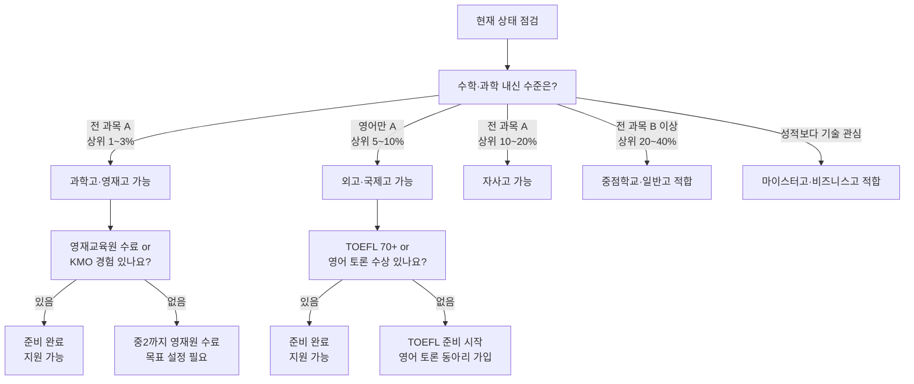

---

### 10-3. 고교 유형별 최종 추천 요약표

| 유형 | 추천 고교 | 핵심 준비 1가지 | 대입 목표 | 주의사항 |
|------|---------|--------------|---------|---------|
| 수학·과학 최상위 | 과학고·영재고 | 영재교육원 수료 | 서울대·KAIST·의대 | 내신 불리, 문과 진로 불가 |
| 영어 최상위, 국제 관심 | 외고·국제고 | TOEFL 70+ 달성 | 연세대·고려대 국제계열 | 문과 편중, 이공계 약함 |
| 자기주도형, 다양한 관심 | 자사고 | 자기주도학습 사례 기록 | SKY 학종·정시 | 내신 불리, 수능 병행 필수 |
| 논리·글쓰기 강점 | IB·독서토론 중점 | 논술 글쓰기 월 2편 | 중상위권 학종·IB전형 | 대입 불확실성, 수능 어려움 |
| AI·SW 관심 | AI·SW 중점 | 코딩 프로젝트 1개 | 이공계 학종·교과 | 수능 준비 분산 주의 |
| 기술·실무 지향 | 마이스터고 | 관심 기술 분야 자격증 | 대기업 기술직 취업 | 학력 인식 편견 존재 |
| 경영·IT 실무 지향 | 비즈니스고 | 컴활 자격증 취득 | 취업 or 경영계열 대학 | 대학 진학 범위 제한 |

---

---

## 11. 자주 묻는 질문 20 (FAQ) — 대입 연계·준비·커리큘럼 편

> 고교 선택 후 대입까지 연결되는 실전 질문들을 심도 있게 정리했습니다.

---

### Q1. 학종(학생부종합전형)은 어떤 학생에게 유리한가요?

**A.** 단순히 성적이 좋은 학생보다, 특정 분야에 대한 탐구 깊이와 일관성이 있는 학생에게 유리합니다.

학종에서 대학이 보는 핵심 요소:
1. **학업 역량**: 내신 등급 + 교과 세부능력(세특)의 탐구 깊이
2. **진로 일관성**: 고1~고3 활동이 하나의 방향으로 연결되는가
3. **자기주도성**: 스스로 문제를 발견하고 탐구한 경험
4. **공동체 기여**: 동아리·봉사에서 리더십 또는 협력 경험

- 내신 2~3등급이어도 세특이 탁월하고 R&E 연구 실적이 있으면 합격 사례 존재
- 내신 1등급이어도 세특이 평범하고 활동이 단순 나열이면 불합격 가능

**근거 자료:**
- 대학교육협의회 학종 가이드북 (2024): [https://www.kcue.or.kr](https://www.kcue.or.kr)
- 서울대 학종 평가 기준 공개 자료: [https://admission.snu.ac.kr](https://admission.snu.ac.kr)
- 연세대 학종 안내: [https://admission.yonsei.ac.kr](https://admission.yonsei.ac.kr)

---

### Q2. 세특(교과 세부능력 및 특기사항)은 어떻게 만들어지나요?

**A.** 세특은 담당 교과 선생님이 수업 중 학생의 탐구 활동·발표·보고서를 관찰해 직접 기록합니다.

- 학생이 직접 쓰는 것이 아니라 **교사가 기록**
- 수업 중 질문, 탐구 보고서 제출, 발표, 토론 참여가 기록의 원천
- 세특 글자 수: 과목당 최대 500자 (2024년 기준)
- 좋은 세특의 조건: 교과 내용을 넘어 스스로 심화 탐구한 내용이 담겨야 함

**세특을 잘 받기 위한 실전 전략:**

| 행동 | 효과 |
|------|------|
| 수업 중 심화 질문 | 교사가 탐구 의지로 기록 |
| 탐구 보고서 자발적 제출 | 보고서 내용이 세특에 반영 |
| 수업 내용을 진로와 연결해 발표 | 진로 일관성 기록 가능 |
| 교과서 밖 관련 논문·책 읽고 공유 | 학업 역량 심화 기록 |

**근거 자료:**
- 교육부 학생부 기재 요령 (2024): [https://www.moe.go.kr](https://www.moe.go.kr)
- 한국대학교육협의회 세특 작성 가이드: [https://www.kcue.or.kr](https://www.kcue.or.kr)

---

### Q3. 2028 수능 개편이 중학생에게 어떤 영향을 미치나요?

**A.** 현재 중학교 1~2학년이 2028 수능을 치르게 됩니다. 핵심 변화는 다음과 같습니다.

| 변화 항목 | 2026학년도 (현행) | 2028학년도 (개편) | 중학생 대비 전략 |
|---------|----------------|----------------|--------------|
| 수능 수학 | 확률과통계/미적분/기하 선택 | 공통 출제 (선택 폐지) | 전 영역 균형 학습 |
| 수능 탐구 | 사탐/과탐 2과목 선택 | 통합사회·통합과학 | 융합적 사고력 훈련 |
| 내신 등급 | 9등급제 (상위 4%=1등급) | 5등급제 (상위 10%=1등급) | 특목고 내신 부담 완화 |
| 학종 면접 | 10~30% 반영 | 최대 40% 반영 | 발표·토론 조기 훈련 |

- 2028 개편으로 수능이 더 쉬워지는 것이 아니라 **범위가 통합**되는 것
- 특목고 학생에게는 내신 5등급제가 유리 (1등급 비율 확대)

**근거 자료:**
- 교육부 2028 대입 개편안 발표 (2023.12): [https://www.moe.go.kr/boardCnts/view.do?boardID=294&boardSeq=96456](https://www.moe.go.kr/boardCnts/view.do?boardID=294&boardSeq=96456)
- EBS 2028 수능 개편 해설: [https://www.ebs.co.kr](https://www.ebs.co.kr)
- 중앙일보 "2028 수능 개편 완전 정리" (2024.01): [https://www.joongang.co.kr](https://www.joongang.co.kr)

---

### Q4. 과학고 출신이 의대에 가려면 어떻게 해야 하나요?

**A.** 과학고에서 의대 진학은 가능하지만, 정시(수능) 중심 전략이 현실적입니다.

- 과학고 학종으로 의대 지원: 내신 불리 + 의대는 교과 성적 중시 → 매우 어려움
- 과학고 정시로 의대 지원: 수능 집중 준비 필요 (수학·과학 1등급 목표)
- 과학고 조기 졸업 후 의대 지원: 수능 준비 시간 확보 가능
- **현실적 조언**: 의대가 목표라면 과학고보다 일반고·자사고에서 수능 집중이 더 유리

**근거 자료:**
- 종로학원 "과학고 출신 의대 합격 분석" (2024): [https://www.jongro.co.kr](https://www.jongro.co.kr)
- 메가스터디 의대 입시 전략 (2024): [https://www.megastudy.net](https://www.megastudy.net)

---

### Q5. 외고 출신이 SKY 문과 계열에 진학하는 현실적인 방법은?

**A.** 학종 중심 전략이 가장 현실적이며, 내신 1~2등급 유지가 전제 조건입니다.

| 전략 | 내용 | 목표 대학 |
|------|------|---------|
| 학종 (활동우수) | 모의UN·토론·어학 활동 기반 | 연세대 활동우수전형 |
| 학종 (학교추천) | 내신 1~2등급 + 담임 추천 | 고려대 학교추천전형 |
| 교과전형 | 내신 1등급 + 수능최저 충족 | 서울대·연세대·고려대 교과 |
| 정시 | 수능 국어·영어·사탐 1~2등급 | SKY 정시 |

- 외고에서 내신 1등급은 매우 어렵지만, 영어 과목 1등급 + 타 과목 2등급 조합으로 학종 지원 가능
- 수능최저 충족이 핵심: 외고 학생은 영어 1등급이 사실상 기본

**근거 자료:**
- 연세대 활동우수전형 안내: [https://admission.yonsei.ac.kr](https://admission.yonsei.ac.kr)
- 고려대 학교추천전형 안내: [https://oku.korea.ac.kr](https://oku.korea.ac.kr)

---

### Q6. 자사고에서 수능과 학종을 어떻게 병행해야 하나요?

**A.** 고1부터 수능 기초를 쌓으면서, 학종 준비는 세특과 비교과 중심으로 병행하는 것이 정석입니다.

```
고1: 내신 집중 + 수능 기초 (모의고사 감각 유지)
고2: 내신 + 수능 50:50 + 비교과 완성
고3 1학기: 내신 마무리 + 수능 집중
고3 2학기: 수시 원서·면접 + 수능 실전
```

- 자사고 학생의 현실: 내신 경쟁이 치열해 수능 준비 시간이 부족
- 해결책: 방학을 수능 집중 기간으로 활용, 학기 중 수능 감각 유지

**근거 자료:**
- 하나고 졸업생 대입 현황 (2024): [https://www.hana.hs.kr](https://www.hana.hs.kr)
- 이투스 자사고 대입 전략 (2024): [https://www.etoos.com](https://www.etoos.com)

---

### Q7. 중학교 때 독서를 얼마나 해야 고입·대입에 도움이 되나요?

**A.** 독서는 단순히 권수가 아니라 **깊이와 연결성**이 중요합니다.

| 학년 | 권장 독서량 | 독서 방향 | 활용 방법 |
|------|-----------|---------|---------|
| 중1 | 월 4권 | 다양한 분야 탐색 | 독서 기록장 작성 |
| 중2 | 월 4~6권 | 관심 분야 심화 | 탐구 보고서 연결 |
| 중3 | 월 6권+ | 목표 진로 집중 | 자소서·면접 연결 |

- 자사고 자소서: 독서 경험과 배운 점을 구체적으로 서술
- 학종 세특: 독서 내용을 수업 탐구와 연결
- 면접: 읽은 책에 대한 심층 질문 대비

**근거 자료:**
- 교육부 독서교육 종합지원시스템: [https://www.reading.or.kr](https://www.reading.or.kr)
- 서울대 권장도서 목록: [https://admission.snu.ac.kr](https://admission.snu.ac.kr)

---

### Q8. R&E(연구·교육) 활동이란 무엇이고, 어떻게 참여하나요?

**A.** R&E는 학생이 교사 또는 대학 교수의 지도 하에 연구 주제를 설정하고 탐구하는 활동입니다.

- 주로 과학고·영재고에서 운영
- 자사고·일반고에서도 교내 R&E 프로그램 운영하는 학교 있음
- 대학 연계 R&E: 일부 대학이 고교생 연구 참여 프로그램 운영
- 결과물: 연구 보고서, 논문 형식 발표, 학술대회 참가

R&E 참여 방법:
1. 재학 학교 R&E 프로그램 신청
2. 교육청 주관 고교생 연구 프로그램 지원
3. 대학 부설 연구소 고교생 인턴십 지원

**근거 자료:**
- 한국과학창의재단 R&E 프로그램: [https://www.kofac.re.kr](https://www.kofac.re.kr)
- KAIST 고교생 연구 참여 프로그램: [https://admission.kaist.ac.kr](https://admission.kaist.ac.kr)

---

### Q9. 마이스터고 취업 후 연봉은 얼마나 되나요?

**A.** 마이스터고 졸업 직후 초봉은 2,500~3,500만 원 수준이며, 대기업 취업 시 더 높습니다.

| 취업처 | 초봉 | 5년 후 예상 연봉 |
|-------|------|--------------|
| 삼성전자 (기술직) | 3,200~3,800만 원 | 5,000만 원+ |
| 현대자동차 (기술직) | 3,000~3,500만 원 | 4,500만 원+ |
| 한국전력 (기술직) | 2,800~3,200만 원 | 4,000만 원+ |
| 중견기업 기술직 | 2,500~3,000만 원 | 3,500만 원+ |

- 2024년 마이스터고 취업률 72.6%, 유지취업률 82.2%
- 삼성전자는 마이스터고 졸업생 전용 채용 트랙 운영

**근거 자료:**
- 교육부 마이스터고 취업 현황 (2024): [https://www.moe.go.kr](https://www.moe.go.kr)
- 한국직업능력연구원 마이스터고 성과 분석 (2023): [https://www.krivet.re.kr](https://www.krivet.re.kr)
- 매일경제 "마이스터고 졸업생 대기업 취업 현황" (2024.02): [https://www.mk.co.kr](https://www.mk.co.kr)

---

### Q10. 과학고 출신과 일반고 출신의 서울대 합격 비율 차이는?

**A.** 과학고·영재고 출신의 서울대 합격 비율이 압도적으로 높지만, 절대 수는 일반고가 더 많습니다.

| 구분 | 졸업생 대비 서울대 합격 비율 | 연간 합격자 수 (추정) |
|------|----------------------|------------------|
| 영재고 (KSA 등) | 30~40% | 40~60명 |
| 서울과학고 | 20~30% | 25~35명 |
| 지역 과학고 | 5~10% | 5~15명 |
| 주요 자사고 | 5~10% | 10~20명 |
| 일반고 (학군지) | 1~3% | 학교별 5~20명 |
| 일반고 전체 | 0.1~0.5% | 전국 합산 다수 |

- 서울대 합격자의 절반 이상은 일반고 출신 (모수가 압도적으로 많기 때문)
- 특목고·자사고는 진학률이 높지만, 일반고도 충분히 가능

**근거 자료:**
- 종로학원 고교별 서울대 합격 현황 (2024): [https://www.jongro.co.kr](https://www.jongro.co.kr)
- 조선일보 "고교별 SKY 합격 현황" (2024.02): [https://www.chosun.com](https://www.chosun.com)

---

### Q11. 중학생 때 코딩을 배워야 하나요? 어느 수준까지 필요한가요?

**A.** 진로 방향에 따라 다르지만, AI·이공계 진학을 목표로 한다면 중학교 때 기초 코딩은 필수입니다.

| 목표 고교 | 필요 코딩 수준 | 추천 언어 |
|---------|------------|---------|
| 과학고·영재고 | 알고리즘 기초 (정렬·탐색) | Python, C++ |
| AI·SW 중점학교 | 파이썬 기초 + 데이터 분석 | Python |
| 마이스터고 (AI 분야) | 파이썬 기초 + 머신러닝 입문 | Python |
| 일반 이공계 | 파이썬 기초 | Python |
| 인문·사회계열 | 필수 아님 (기초 이해 수준) | - |

- 코딩 교육 플랫폼: 엔트리(entry.pl.kr), 코드아카데미, 백준 온라인 저지
- 중학교 정보 교과에서 기초 알고리즘 학습 가능

**근거 자료:**
- 교육부 SW·AI 교육 정책 (2024): [https://www.moe.go.kr](https://www.moe.go.kr)
- 한국교육학술정보원 디지털 교육 현황: [https://www.keris.or.kr](https://www.keris.or.kr)
- 엔트리 공식 홈페이지: [https://playentry.org](https://playentry.org)

---

### Q12. 학종에서 봉사활동은 얼마나 중요한가요?

**A.** 2024년 이후 봉사활동의 직접적 영향력은 줄었지만, 인성 평가에서 여전히 중요합니다.

- 2024년부터 학생부에 봉사활동 시간만 기재 (내용 미기재)
- 학종에서 봉사 자체보다 **진로와 연계된 봉사**가 의미 있음
- 예: 의대 지망 → 병원·요양원 봉사, 교육 지망 → 교육 봉사
- 권장 봉사 시간: 연 20시간 이상 (학교 권장 기준)

**근거 자료:**
- 교육부 학생부 기재 요령 개정 (2024): [https://www.moe.go.kr](https://www.moe.go.kr)
- 1365 자원봉사 포털: [https://www.1365.go.kr](https://www.1365.go.kr)

---

### Q13. 수능 최저 기준이란 무엇이고, 왜 중요한가요?

**A.** 수능 최저 기준은 수시 전형에서 합격하려면 반드시 충족해야 하는 수능 등급 조건입니다.

- 예: "수능 2개 합 4등급" = 국어·수학·영어·탐구 중 2개 과목 등급 합이 4 이하
- 수능 최저를 충족하지 못하면 서류·면접 결과와 무관하게 불합격
- 수능 최저가 높을수록 실질 경쟁률이 낮아져 합격 가능성 상승

| 대학 | 전형 | 수능 최저 기준 (예시) |
|------|------|-------------------|
| 서울대 | 지역균형 | 3개 합 7등급 이내 |
| 연세대 | 추천형 | 3개 합 6등급 이내 |
| 고려대 | 학교추천 | 3개 합 6등급 이내 |
| 성균관대 | 학종 | 2개 합 4등급 이내 |

**근거 자료:**
- 각 대학 2025학년도 입학 전형 요강 (대학 공식 홈페이지)
- 대학교육협의회 대입정보포털 어디가: [https://www.adiga.kr](https://www.adiga.kr)

---

### Q14. 고등학교 과목 선택이 대입에 영향을 미치나요?

**A.** 매우 큰 영향을 미칩니다. 과목 선택은 사실상 대입 전략의 시작점입니다.

- 이공계 학종 지원: 수학·과학 심화 과목 선택 필수 (미적분·기하·물리2·화학2)
- 인문계 학종 지원: 사회·국어 심화 과목 선택 (경제·정치와법·문학)
- 의대 지원: 생명과학2·화학2 선택 강력 권장
- 수능 전략: 선택 과목에 따라 수능 유불리 달라짐 (2028 개편 전까지)

**근거 자료:**
- 교육부 고교학점제 과목 선택 가이드 (2024): [https://www.moe.go.kr](https://www.moe.go.kr)
- 한국교육과정평가원 과목 선택 안내: [https://www.kice.re.kr](https://www.kice.re.kr)

---

### Q15. 비즈니스고 졸업 후 대기업 취업이 가능한가요?

**A.** 가능하지만, 마이스터고 대비 대기업 직접 취업은 어렵습니다.

| 구분 | 비즈니스고 | 마이스터고 |
|------|---------|---------|
| 대기업 취업 | 금융·유통·IT 계열 일부 | 제조·기술직 대기업 다수 |
| 공기업 취업 | 어려움 | 한국전력·가스공사 등 가능 |
| 중견기업 취업 | 비교적 용이 | 비교적 용이 |
| 창업 | 경영·IT 기반 창업 가능 | 기술 기반 창업 가능 |

- 비즈니스고 강점: 컴활·전산회계·무역영어 등 자격증 취득 용이
- 금융권(은행·보험) 취업 시 비즈니스고 우대 전형 존재

**근거 자료:**
- 교육부 특성화고 취업 현황 (2024): [https://www.moe.go.kr](https://www.moe.go.kr)
- 한국직업능력연구원 특성화고 성과 분석: [https://www.krivet.re.kr](https://www.krivet.re.kr)

---

### Q16. 중학생 때 학원을 얼마나 다녀야 하나요?

**A.** 목표 고교에 따라 전략이 다르며, 무조건 많이 다닌다고 유리하지 않습니다.

| 목표 고교 | 핵심 학원 | 주의사항 |
|---------|---------|---------|
| 과학고·영재고 | 수학 심화 (KMO 전문 학원) + 과학 심화 | 학원 의존보다 자기 탐구 능력 중요 |
| 외고·국제고 | 영어 (TOEFL 전문 학원) | 영어 실력이 핵심, 과도한 학원 불필요 |
| 자사고 | 전 과목 균형 (국·영·수 학원) | 자기주도학습 능력도 평가 대상 |
| 일반고 | 수능 대비 (국·영·수 학원) | 내신 관리 병행 |
| 마이스터고 | 기술 분야 학원 or 독학 | 자격증 준비 중심 |

**근거 자료:**
- 통계청 사교육비 조사 (2024): [https://kostat.go.kr](https://kostat.go.kr)
- EBS 자기주도학습 가이드: [https://www.ebs.co.kr](https://www.ebs.co.kr)

---

### Q17. 고교학점제가 대입에 어떤 영향을 미치나요?

**A.** 2025년부터 전면 시행된 고교학점제는 과목 선택의 자유를 넓혀 대입 전략을 더 복잡하게 만들었습니다.

- **고교학점제**: 학생이 원하는 과목을 선택해 192학점 이수 후 졸업
- 대입 영향: 선택 과목이 세특·학종 서류에 직접 반영
- 이공계 지망: 수학·과학 심화 과목 선택이 학종 경쟁력 결정
- 주의사항: 쉬운 과목만 선택하면 내신은 유리하지만 학종에서 불리

**근거 자료:**
- 교육부 고교학점제 공식 안내: [https://www.hscredit.kr](https://www.hscredit.kr)
- 한국교육개발원 고교학점제 연구 (2024): [https://www.kedi.re.kr](https://www.kedi.re.kr)
- 경향신문 "고교학점제 대입 영향 분석" (2025.03): [https://www.khan.co.kr](https://www.khan.co.kr)

---

### Q18. 중학교 때 수학 선행은 얼마나 해야 하나요?

**A.** 목표 고교에 따라 필요한 선행 수준이 다릅니다.

| 목표 고교 | 중3 입학 전 목표 수준 | 중3 졸업 전 목표 수준 |
|---------|----------------|----------------|
| 과학고·영재고 | 고1 수학 완성 | 고2 수학 (미적분) 완성 |
| 자사고 | 중3 수학 완성 | 고1 수학 완성 |
| 일반고 (학군지) | 중3 수학 완성 | 고1 수학 기초 |
| 일반고 (비학군지) | 중3 수학 완성 | 중3 수학 완성 |
| 마이스터고 | 중3 수학 기초 | 중3 수학 기초 |

- 과도한 선행은 오히려 학교 수업 집중도를 낮춰 내신에 불리할 수 있음
- 선행보다 현재 학년 수학의 완전한 이해가 우선

**근거 자료:**
- 수학교육학회 선행학습 연구 (2023): [https://www.ksme.info](https://www.ksme.info)
- EBS 수학 선행 가이드: [https://www.ebs.co.kr](https://www.ebs.co.kr)

---

### Q19. 학종에서 수상 경력(교내 대회)은 얼마나 중요한가요?

**A.** 2024년부터 학기당 1건만 학생부에 기재 가능해 과거보다 중요도가 낮아졌습니다.

- **2024년 이전**: 모든 수상 기재 가능 → 수상 개수가 경쟁력
- **2024년 이후**: 학기당 1건만 기재 → 수상 선택이 전략적으로 중요
- 수상 선택 기준: 진로와 연결된 수상을 우선 기재
- 수상 자체보다 수상 과정에서 탐구한 내용을 세특에 연결하는 것이 핵심

**근거 자료:**
- 교육부 학생부 기재 요령 개정 (2024): [https://www.moe.go.kr](https://www.moe.go.kr)
- 대학교육협의회 학종 평가 가이드 (2024): [https://www.kcue.or.kr](https://www.kcue.or.kr)

---

### Q20. 중학생이 지금 당장 시작해야 할 가장 중요한 준비 1가지는?

**A.** 학년별로 가장 중요한 1가지는 다음과 같습니다.

| 학년 | 가장 중요한 1가지 | 이유 |
|------|--------------|------|
| **중1** | 전 과목 내신 A 목표 설정 | 모든 고교 지원의 기본 조건 |
| **중2** | 목표 고교 1개 확정 + 맞춤 준비 시작 | 방향이 정해져야 준비가 효율적 |
| **중3 상반기** | 자소서 초안 작성 + 면접 준비 | 입시는 준비 기간이 짧음 |
| **중3 하반기** | 원서 접수 전 전형 요강 3회 이상 정독 | 세부 조건 실수가 불합격 원인 |

- 중1이라면: 지금 당장 독서 기록장을 시작하세요. 독서는 자소서·면접·세특 모든 곳에 연결됩니다.
- 중2라면: 목표 고교 설명회에 반드시 참석하세요. 현장에서 얻는 정보가 가장 정확합니다.
- 중3이라면: 자소서를 지금 바로 초안 작성하세요. 완성도보다 시작이 중요합니다.

**근거 자료:**
- 대입정보포털 어디가 (고입 정보 포함): [https://www.adiga.kr](https://www.adiga.kr)
- 교육부 진로교육 포털 꿈길: [https://www.ggoomgil.go.kr](https://www.ggoomgil.go.kr)
- 서울시 교육청 고입 안내: [https://www.sen.go.kr](https://www.sen.go.kr)

---

## 11. 중학생 역량 준비 로드맵 (학교군별 중1~중3 완전 가이드)

> 중학생이 지금부터 시작해야 할 구체적인 행동을 학교군별로 정리했습니다.
> 중1, 중2, 중3 각 학년별로 무엇을 해야 하는지 명확히 제시합니다.

### 11-1. 과학고·영재고 지망생 역량 로드맵

**중1 (1년차): 기초 다지기**

| 영역 | 구체적 행동 | 목표 | 증빙 방법 |
|------|----------|------|----------|
| **수학** | 중3 수학까지 선행 학습 | 중3 수학 80점 이상 | 학원 테스트 또는 자가 평가 |
| **과학** | 과학 실험 기초 (변인 통제 이해) | 실험 보고서 3편 작성 | 실험 노트 |
| **독서** | 과학 도서 월 1권 | 연 12권 | 독서 기록장 |
| **올림피아드** | KMO 기출 문제 풀이 시작 | 중등부 기출 10개 풀이 | 풀이 노트 |
| **영재교육원** | 영재교육원 지원 준비 | 지원서 작성 | 지원 서류 |

**중2 (2년차): 심화 탐구**

| 영역 | 구체적 행동 | 목표 | 증빙 방법 |
|------|----------|------|----------|
| **수학** | 고1 수학까지 선행 학습 | 고1 수학 80점 이상 | 학원 테스트 |
| **과학** | 과학 올림피아드 준비 | KPhO 또는 KChO 1차 응시 | 응시 확인증 |
| **탐구** | 탐구 보고서 3편 완성 | 각 5쪽 이상 | 탐구 보고서 파일 |
| **올림피아드** | KMO 1차 통과 목표 | 1차 통과 | 통과 확인증 |
| **영재교육원** | 영재교육원 수료 | 수료증 획득 | 수료증 |

**중3 (3년차): 경시 수상 + 자소서**

| 영역 | 구체적 행동 | 목표 | 증빙 방법 |
|------|----------|------|----------|
| **수학** | 고2 수학까지 선행 학습 | 고2 수학 70점 이상 | 학원 테스트 |
| **과학** | 과학 올림피아드 수상 | 지역 대회 동상 이상 | 수상증 |
| **탐구** | R&E 기초 훈련 | 논문 읽기 + 요약 3편 | 논문 요약 노트 |
| **자소서** | 자소서 작성 (수학·과학 탐구 중심) | 초안 완성 | 자소서 파일 |
| **면접** | 수학·과학 심화 문제 풀이 연습 | 기출 문제 30개 풀이 | 풀이 노트 |

**과학고 지망생 역량 타임라인**:

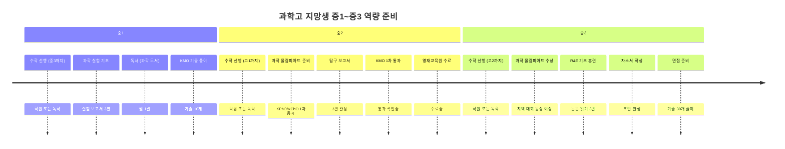

---

### 11-2. 외고·국제고 지망생 역량 로드맵

**중1 (1년차): 영어 기초 + 국제 이슈 탐색**

| 영역 | 구체적 행동 | 목표 | 증빙 방법 |
|------|----------|------|----------|
| **영어** | 영어 원서 월 1권 | 연 12권 | 독서 기록장 |
| **국제 이슈** | 국제 뉴스 주 2회 읽기 | 주요 이슈 정리 | 뉴스 스크랩북 |
| **토론** | 토론 동아리 가입 | 월 2회 토론 참여 | 동아리 활동 기록 |
| **제2외국어** | 관심 언어 탐색 | 3개 언어 비교 | 탐색 노트 |
| **내신** | 영어 전 과목 A | 전 과목 A | 성적표 |

**중2 (2년차): 영어 심화 + TOEFL 준비**

| 영역 | 구체적 행동 | 목표 | 증빙 방법 |
|------|----------|------|----------|
| **영어** | 영어 에세이 월 2편 | 연 24편 | 에세이 파일 |
| **TOEFL** | TOEFL 준비 시작 | 모의 TOEFL 60점 | 모의 점수표 |
| **국제 이슈** | 국제 이슈 분석 월 1편 | 연 12편 | 분석 보고서 |
| **토론** | 영어 토론 대회 참가 | 교내 대회 참가 | 참가 확인증 |
| **제2외국어** | 제2외국어 시작 (기초) | 기초 회화 가능 | 학습 노트 |

**중3 (3년차): TOEFL 달성 + 모의UN**

| 영역 | 구체적 행동 | 목표 | 증빙 방법 |
|------|----------|------|----------|
| **TOEFL** | TOEFL 70+ 달성 | 실제 TOEFL 70점 이상 | TOEFL 성적표 |
| **국제 이슈** | 국제 이슈 발표 3회 | 교내 발표 3회 | 발표 자료 |
| **토론** | 모의UN 참가 | 모의UN 1회 이상 | 참가 확인증 |
| **제2외국어** | 제2외국어 중급 | 중급 회화 가능 | 학습 노트 |
| **자소서** | 자소서 작성 (영어·국제 중심) | 초안 완성 | 자소서 파일 |

---

### 11-3. 자사고 지망생 역량 로드맵

**중1 (1년차): 자기주도 학습 + 독서**

| 영역 | 구체적 행동 | 목표 | 증빙 방법 |
|------|----------|------|----------|
| **자기주도 학습** | 주간 학습 계획표 작성 | 매주 계획 + 실행 | 학습 일지 |
| **독서** | 다양한 분야 독서 월 4권 | 연 48권 | 독서 기록장 |
| **동아리** | 관심 분야 동아리 가입 | 월 2회 활동 | 동아리 활동 기록 |
| **봉사** | 봉사활동 시작 | 연 10시간 이상 | 봉사 확인증 |
| **내신** | 전 과목 A | 전 과목 A | 성적표 |

**중2 (2년차): 탐구 + 리더십**

| 영역 | 구체적 행동 | 목표 | 증빙 방법 |
|------|----------|------|----------|
| **자기주도 학습** | 학습 일지 작성 | 매일 기록 | 학습 일지 |
| **독서** | 독서 월 5권 + 독서 노트 | 연 60권 + 독서 노트 | 독서 기록장 + 노트 |
| **탐구** | 탐구 보고서 2편 완성 | 각 5쪽 이상 | 탐구 보고서 파일 |
| **리더십** | 동아리 임원 활동 | 임원 1년 | 임원 확인증 |
| **내신** | 전 과목 A 유지 | 전 과목 A | 성적표 |

**중3 (3년차): 자소서 + 포트폴리오**

| 영역 | 구체적 행동 | 목표 | 증빙 방법 |
|------|----------|------|----------|
| **자기주도 학습** | 자기주도학습 사례 완성 | 구체적 사례 3개 | 사례 정리 문서 |
| **독서** | 독서 월 6권 + 교과 연계 | 연 72권 + 연계 노트 | 독서 기록장 + 연계 노트 |
| **탐구** | 탐구 발표 3회 | 교내 발표 3회 | 발표 자료 |
| **리더십** | 학생회 또는 회장 활동 | 회장 1년 | 활동 확인증 |
| **자소서** | 자소서 작성 (자기주도 중심) | 초안 완성 | 자소서 파일 |

---

### 11-4. 일반고 (중점학교) 지망생 역량 로드맵

**AI·과학 중점 지망생**

| 학년 | 코딩 | 수학·과학 | 탐구 | 기타 |
|------|------|----------|------|------|
| **중1** | Scratch 기초 | 중3 수학 선행 | 관심 분야 탐색 | 코딩 도서 월 1권 |
| **중2** | Python 기초 | 고1 수학 선행 | 탐구 보고서 1편 | 코딩 프로젝트 1개 |
| **중3** | 프로젝트 1개 완성 | 고1 수학 완성 | 탐구 발표 2회 | 포트폴리오 완성 |

**IB 중점 지망생**

| 학년 | 독서 | 논술 | 토론 | 기타 |
|------|------|------|------|------|
| **중1** | 월 3권 | - | 토론 동아리 가입 | 글쓰기 연습 |
| **중2** | 월 4권 | 논술 월 1편 | 토론 대회 참가 | 비판적 사고 훈련 |
| **중3** | 월 5권 | 논술 월 2편 | 토론 대회 수상 | 에세이 포트폴리오 |

**독서토론 중점 지망생**

| 학년 | 독서 | 토론 | 발표 | 기타 |
|------|------|------|------|------|
| **중1** | 월 4권 | 토론 동아리 | - | 독서 노트 작성 |
| **중2** | 월 5권 | 토론 대회 참가 | 발표 대회 참가 | 독서 감상문 월 1편 |
| **중3** | 월 6권 | 토론 대회 수상 | 발표 대회 수상 | 독서 포트폴리오 |

---

### 11-5. 마이스터고 지망생 역량 로드맵

**중1 (1년차): 기술 분야 탐색**

| 영역 | 구체적 행동 | 목표 | 증빙 방법 |
|------|----------|------|----------|
| **기술 탐색** | 관심 기술 분야 3개 탐색 | AI, 전기, 자동차 등 | 탐색 노트 |
| **코딩** | Scratch 기초 학습 | 간단한 게임 1개 제작 | 프로젝트 파일 |
| **독서** | 기술 관련 독서 월 1권 | 연 12권 | 독서 기록장 |
| **체험** | 기술 체험 프로그램 참가 | 연 2회 이상 | 체험 확인증 |
| **내신** | 전 과목 B 이상 | 전 과목 B 이상 | 성적표 |

**중2 (2년차): 기술 심화 + 자격증**

| 영역 | 구체적 행동 | 목표 | 증빙 방법 |
|------|----------|------|----------|
| **기술 심화** | 관심 분야 집중 학습 | 1개 분야 심화 | 학습 노트 |
| **코딩** | Python 기초 학습 | 간단한 프로그램 3개 제작 | 프로젝트 파일 |
| **자격증** | 컴활 3급 또는 워드프로세서 | 자격증 1개 취득 | 자격증 |
| **프로젝트** | 작은 프로젝트 1개 완성 | 프로젝트 완성 | 프로젝트 보고서 |
| **마이스터고 정보** | 학교별 정보 수집 | 목표 학교 3개 선정 | 정보 정리 노트 |

**중3 (3년차): 자격증 + 포트폴리오**

| 영역 | 구체적 행동 | 목표 | 증빙 방법 |
|------|----------|------|----------|
| **자격증** | 컴활 2급 또는 정보처리기능사 | 자격증 1개 취득 | 자격증 |
| **프로젝트** | 포트폴리오용 프로젝트 완성 | 프로젝트 1개 완성 | 포트폴리오 |
| **포트폴리오** | 중1~중3 활동 정리 | 포트폴리오 완성 | 포트폴리오 파일 |
| **자소서** | 자소서 작성 (기술 관심 중심) | 초안 완성 | 자소서 파일 |
| **면접** | 기술 적성 면접 준비 | 예상 질문 20개 답변 | 답변 노트 |

---

### 11-6. 학교군별 역량 준비 비교표

| 학교군 | 중1 핵심 | 중2 핵심 | 중3 핵심 | 최종 목표 |
|--------|---------|---------|---------|----------|
| **과학고** | 수학 선행 (중3), 과학 실험 | 수학 선행 (고1), 올림피아드 | 수학 선행 (고2), 경시 수상 | KMO 1차 통과 + 영재원 수료 |
| **외고** | 영어 원서 월 1권, 국제 뉴스 | 영어 에세이 월 2편, TOEFL 준비 | TOEFL 70+, 모의UN | TOEFL 70점 + 토론 대회 |
| **자사고** | 독서 월 4권, 자기주도 학습 | 독서 월 5권, 탐구 2편 | 독서 월 6권, 리더십 | 자기주도 사례 + 리더십 |
| **AI 중점** | Scratch, 수학 선행 | Python, 탐구 1편 | 프로젝트 1개 | 코딩 프로젝트 + 포트폴리오 |
| **IB 중점** | 독서 월 3권, 토론 동아리 | 독서 월 4권, 논술 월 1편 | 독서 월 5권, 논술 월 2편 | 논술 포트폴리오 |
| **마이스터고** | 기술 탐색, Scratch | Python, 자격증 1개 | 자격증 2개, 포트폴리오 | 자격증 2개 + 포트폴리오 |

---

### 11-7. 역량 준비 실패 사례와 성공 전환

**실패 사례 1: 과학고 지망생 - 선행만 하고 탐구 없음**
- 문제: 수학 선행은 고2까지 했지만 탐구 보고서 0편
- 결과: 자소서에 쓸 내용이 없어 불합격
- 전환: 중2부터 탐구 보고서 3편 작성 시작
- 성공: 자소서에 탐구 경험 기록 + 면접에서 설명 가능

**실패 사례 2: 외고 지망생 - TOEFL만 준비**
- 문제: TOEFL 80점 달성했지만 국제 이슈 관심 없음
- 결과: 면접에서 "왜 외고에 가고 싶은가?" 질문에 답변 못함
- 전환: 중2부터 국제 뉴스 읽기 + 분석 보고서 월 1편
- 성공: 면접에서 국제 이슈에 대한 의견 명확히 제시

**실패 사례 3: 마이스터고 지망생 - 자격증만 준비**
- 문제: 자격증 3개 취득했지만 프로젝트 경험 없음
- 결과: 면접에서 "무엇을 만들어봤는가?" 질문에 답변 못함
- 전환: 중3 때 작은 프로젝트 1개 완성
- 성공: 면접에서 프로젝트 과정 설명 + 포트폴리오 제시

---

## 12. 세특 작성 실전 가이드 (고교 유형별 전략)

> 고등학교에 진학한 후 세특을 잘 받기 위한 실전 전략입니다.
> 중학생이 미리 알아두면 고교 진학 후 바로 실행할 수 있습니다.

### 12-1. 과학고 세특 전략

**R&E 연구 주제 선정법**:
1. 관심 분야에서 "왜?"를 3번 질문하기
   - 예: "식물이 자란다" → "왜 자라는가?" → "광합성 때문" → "왜 광합성을 하는가?" → "에너지를 얻기 위해" → "왜 에너지가 필요한가?"
2. 교과서 밖 개념 찾기
   - 예: 교과서에는 "뉴턴 운동 법칙"만 나오지만, "상대성 이론"까지 확장
3. 선행 연구 조사
   - RISS에서 관련 논문 3편 읽고 요약

**실험 설계 및 데이터 분석**:
- 독립변수, 종속변수, 통제변수 명확히 설정
- 대조군 반드시 포함
- 실험 결과를 그래프로 시각화
- 오차 원인 분석 (예: 온도 변화, 측정 오차)

**논문 읽기 및 인용 방법**:
- 논문 구조 이해: 서론 → 방법 → 결과 → 결론
- 핵심 내용 요약 (A4 1쪽)
- 인용 시 출처 명확히 표기 (예: "김철수(2023)에 따르면...")

**교사와 소통하는 법**:
- 실험 전에 교사에게 실험 계획 공유
- 실험 중 어려운 점 질문
- 실험 후 결과 보고서 제출
- 교사 피드백을 반영해 수정

**세특 기록 예시**:
> "학생은 '온도가 식물 성장에 미치는 영향'을 주제로 R&E 연구를 수행했다. 독립변수(온도)와 종속변수(성장 속도)를 명확히 설정하고, 대조군을 구성했다. 실험 결과 예상과 다른 결과가 나왔을 때 추가 변수(습도)를 발견했고, 이를 통제한 2차 실험을 설계했다. 이 과정에서 과학적 탐구 태도와 문제 해결 능력을 보였다."

---

### 12-2. 외고 세특 전략

**영어 수업에서 심화 발표**:
- 영어 원서를 읽고 작가의 의도 분석
- 영어로 10분 발표 + 5분 질의응답
- 발표 자료는 PPT 10장 내외

**국제 이슈 분석 보고서**:
- 국제 뉴스 1개 선택 (예: "미국 대선")
- 배경 → 현황 → 영향 → 한국의 대응 순서로 분석
- A4 3쪽 분량

**제2외국어 활용 프로젝트**:
- 제2외국어로 간단한 대화 영상 제작
- 해당 국가 문화 소개 PPT 제작
- 제2외국어 에세이 작성 (500단어)

**모의UN 활동 기록**:
- 담당 국가 입장 정리
- 결의안 작성
- 협상 과정 기록

**세특 기록 예시**:
> "학생은 영어 수업에서 『1984』를 읽고 전체주의 사회에 대한 비판적 분석을 영어로 발표했다. 작가 조지 오웰의 의도를 역사적 맥락과 연결해 설명했고, 현대 사회의 감시 문제와 비교했다. 질의응답에서 청중의 질문에 논리적으로 답변했다."

---

### 12-3. 자사고 세특 전략

**자기주도 탐구 프로젝트**:
- 관심 주제 선정 (예: "학교 급식 만족도")
- 조사 방법 설계 (설문, 인터뷰)
- 데이터 수집 및 분석
- 보고서 작성 (A4 5쪽)

**독서와 교과 연계**:
- 독서 내용을 수업 시간에 발표
- 예: 『총, 균, 쇠』 읽고 역사 수업에서 "지리적 요인이 문명 발전에 미친 영향" 발표

**동아리 활동 심화**:
- 동아리에서 프로젝트 주도
- 예: 과학 동아리에서 "학교 에너지 절약 캠페인" 기획 및 실행

**리더십 활동 기록**:
- 학생회 또는 동아리 회장으로 활동
- 구성원 간 갈등 조율
- 활동 결과 보고서 작성

**세특 기록 예시**:
> "학생은 『총, 균, 쇠』를 읽고 지리적 요인이 문명 발전에 미친 영향을 역사 수업에서 발표했다. 유라시아 대륙의 동서 축 방향이 농업 전파에 유리했다는 점을 지도와 함께 설명했고, 아메리카 대륙과 비교 분석했다. 독서 내용을 교과와 연결하는 능력을 보였다."

---

### 12-4. 일반고 세특 전략

**교과 수업 중 질문하기**:
- 수업 중 이해 안 되는 부분 질문
- 교과서 밖 내용 질문 (예: "이 개념을 실생활에 어떻게 적용하나요?")

**탐구 보고서 자발적 제출**:
- 수업 내용을 확장한 탐구 보고서 작성
- 예: 수학 시간에 "피보나치 수열과 황금비" 탐구

**중점 프로그램 적극 활용**:
- AI 중점: AI 프로젝트 완성
- IB 중점: Extended Essay 작성
- 독서토론 중점: 토론 대회 참가

**독서와 세특 연계**:
- 독서 내용을 수업 시간에 발표
- 예: 『AI 시대, 인간을 다시 묻다』 읽고 정보 수업에서 "AI 윤리" 발표

**세특 기록 예시**:
> "학생은 수학 시간에 피보나치 수열과 황금비의 관계를 탐구했다. 피보나치 수열의 일반항을 유도했고, 연속된 두 항의 비가 황금비에 수렴함을 수학적으로 증명했다. 교과서 밖 개념을 스스로 탐구하는 태도를 보였다."

---

### 12-5. 마이스터고 세특 전략

**실무 프로젝트 완성**:
- 학교에서 배운 기술을 실제 프로젝트에 적용
- 예: "학교 홈페이지 제작" 프로젝트

**자격증 취득 과정 기록**:
- 자격증 준비 과정 기록
- 예: "정보처리기능사 자격증을 위해 C 언어를 3개월간 학습했고, 실기 시험에서 90점을 받았다"

**기업 연계 활동 참여**:
- 기업 견학, 현장 실습
- 예: "삼성전자 반도체 공장 견학에서 반도체 공정을 이해했다"

**기술 탐구 보고서 작성**:
- 기술 분야 탐구 보고서 작성
- 예: "반도체 공정에서 포토리소그래피의 원리" 탐구

**세특 기록 예시**:
> "학생은 학교 홈페이지 제작 프로젝트를 주도했다. HTML, CSS, JavaScript를 활용해 반응형 웹사이트를 설계했고, 데이터베이스 연동 기능을 구현했다. 프로젝트 기획부터 완성까지 전 과정을 주도하며 실무 능력을 보였다."

---

## 13. 마지막 정리

### 13-1. 학교군별 핵심 메시지

**과학고·영재고**: 수학·과학 선행 + 올림피아드 + R&E 탐구
**외고·국제고**: 영어 원서 + TOEFL 70+ + 국제 이슈 분석
**자사고**: 자기주도 학습 + 독서 + 리더십 + 다양한 탐구
**일반고 (중점)**: 중점 프로그램 적극 활용 + 교과 연계 탐구
**마이스터고**: 자격증 + 프로젝트 + 포트폴리오 + 취업 의지

### 13-2. 중학생이 지금 당장 시작해야 할 3가지

1. **독서 기록장 시작**: 모든 고교 유형에서 독서는 필수
2. **관심 분야 탐색**: 중1~중2 때 다양한 분야 탐색
3. **기록 습관**: 활동 후 5문장 기록 (나중에 자소서 재료)

---

> 이전 파일: [중학생_고입_완전가이드_상.md](./중학생_고입_완전가이드_상.md)
> 연계 파일: [2026_2028_대입_학종_교과_비중_및_수상_논문_대회활동_영향_정리.md](../대학입시제도/2026_2028_대입_학종_교과_비중_및_수상_논문_대회활동_영향_정리.md)
