# DreamPath 2단계 — 게임 설계 완전 가이드
# 페르소나 생성 × 200개 직업 살아보기 × 커리어 패스 × 전략 로드맵

> **"직업을 고르는 게 아니라, 직업을 살아보는 것"**
> 2단계는 DreamPath의 핵심 콘텐츠다.
> **나만의 페르소나를 만들고** → **직업인으로 살아보고** → **그 직업까지 가는 전략 일정을 손에 쥔다.**
> 정보 열람이 아닌 게임 플레이를 통해 자연스럽게 커리어 방향을 잡고, 합격자 패스까지 비교할 수 있다.

---

## 0. 왜 게임인가 — 설계 철학

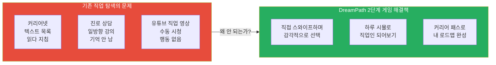

### 핵심 설계 원칙 비교표

| 원칙 | 기존 방식 | DreamPath 2단계 |
|------|---------|----------------|
| **탐색 방식** | 목록 읽기 (수동) | 스와이프·선택·플레이 (능동) |
| **정보 흡수** | 한 번에 다 보여줌 | 행동할 때마다 잠금 해제 |
| **결과 활용** | 결과 없음 | 커리어 패스 자동 생성 |
| **지속 동기** | 없음 | XP·레벨·뱃지·희귀 카드 |
| **개인화** | 동일한 정보 | 나의 학년·유형 기반 맞춤 |
| **깊이 조절** | 고정 | L1~L5 레이어 자율 선택 |

---

## 1. 페르소나 시스템 — "나를 캐릭터로 만들고, 직업을 살아본다"

> **"이 앱은 당신의 이야기다. 캐릭터를 만들고, 직접 살아봐."**
> 페르소나는 DreamPath에서 내가 직업을 체험하는 나만의 아바타다.
> 학년·유형·목표가 다르면, 완전히 다른 여정이 시작된다.

### 1.1 페르소나 생성 플로우

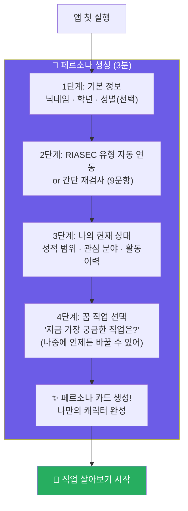

### 1.2 페르소나 카드 UI

```
╔══════════════════════════════════════════╗
║  🧑 나의 드림패스 페르소나               ║
╠══════════════════════════════════════════╣
║                                          ║
║         [캐릭터 아이콘 / 아바타]          ║
║                                          ║
║  닉네임:  탐험가 민준                    ║
║  학년:    중학교 2학년                   ║
║  RIASEC:  예술형(A) + 탐구형(I)          ║
║                                          ║
║  ─────────────────────────────────       ║
║  🎯 목표 직업:   UX 디자이너             ║
║  🎓 목표 대학:   미정 (탐색 중)          ║
║  ⚡ 현재 레벨:   Lv.1 탐색자             ║
║  💎 누적 XP:     0 XP                   ║
║  ─────────────────────────────────       ║
║                                          ║
║  👔 살아본 직업:        0개              ║
║  🗺️ 탐색한 커리어 패스: 0개              ║
║  🎮 직업 살아보기 완료: 0회              ║
║                                          ║
║  [페르소나 수정]  [커리어 패스 보기]      ║
╚══════════════════════════════════════════╝
```

### 1.3 페르소나 유형별 맞춤 여정 비교표

| 페르소나 조건 | 시작 메시지 | 추천 직업군 | 첫 시뮬 추천 | 긴급도 |
|------------|-----------|-----------|-----------|------|
| 초5~6 / 예술형 | "아직 뭐가 될지 몰라도 OK. 다양하게 살아보자!" | UX·게임기획·건축·영화감독 | UX 디자이너 하루 체험 | 🟢 낮음 |
| 중1 / 예술형 | "감각이 생겼어. Figma 한 번 살아볼까?" | UX·게임기획·광고기획·건축 | UX 디자이너 하루 체험 | 🟡 보통 |
| 중3 / 탐구형 | "좋아하는 분야가 보여. 깊이 살아볼 시간!" | AI 연구원·의사·생명공학자 | AI 연구원 하루 체험 | 🟠 높음 |
| 고1 / 사회형 | "입시가 시작됐어. 직업과 대학을 연결해야 해" | 교사·사회복지사·변호사·의사 | 의사 응급실 체험 | 🔴 매우 높음 |
| 고2 / 진취형 | "수시 설계 직전. 내 직업이 선택을 결정한다" | 창업가·경영자·마케터·변호사 | 창업가 투자 유치 체험 | 🚨 긴급 |

---

## 2. 직업 살아보기 — 몰입 여정 설계

> **"1일 체험 → 1주 캠프 → 1달 그림자 프로젝트"**
> 페르소나가 그 직업인으로 살아가는 3단계 몰입 구조

### 2.1 "직업 살아보기" 3단계 몰입 구조

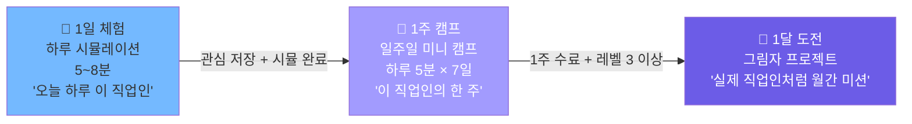

### 2.2 1주일 직업 살아보기 — UX 디자이너 예시

| 요일 | 미션 제목 | 실제 활동 내용 | 소요 시간 | XP |
|-----|---------|------------|---------|-----|
| **월요일** | 스탠드업 미팅 | 팀에게 금주 목표 3가지 브리핑 시뮬 | 5분 | +15 XP |
| **화요일** | 사용자 인터뷰 | 인터뷰 질문 3개 설계 + 인사이트 기록 | 7분 | +20 XP |
| **수요일** | 와이어프레임 | Figma 앱 화면 1개 스케치 미션 | 10분 | +25 XP |
| **목요일** | 클라이언트 발표 | 발표 흐름 선택지 시뮬 (설득력 점수) | 6분 | +20 XP |
| **금요일** | 주간 회고 | 이번 주 배운 것 3가지 기록 | 5분 | +15 XP |
| **토요일** | 커리어 패스 확인 | 이 직업이 되려면 지금 뭘 해야 하는가? | 5분 | +20 XP |
| **일요일** | 1주 결산 | 체험 결산 카드 발급 + 다음 스텝 확인 | 3분 | +85 XP |

> 1주 캠프 완료 시 **"UX 디자이너 1주 수료" 뱃지** + **+200 XP** 지급

### 2.3 1달 그림자 프로젝트 (Shadow Project) — 몰입 설계

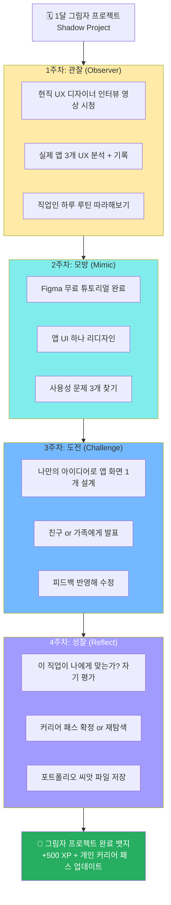

### 2.4 그림자 프로젝트 직업별 비교표

| 직업 | 1주차 관찰 미션 | 2주차 모방 미션 | 3주차 도전 미션 | 4주차 성과물 |
|-----|-------------|-------------|-------------|-----------|
| **UX 디자이너** | 앱 UI 3개 분석 | Figma 리디자인 1개 | 나만의 앱 화면 제작 | 포트폴리오 씨앗 1개 |
| **AI 연구원** | Kaggle 경진대회 탐색 | Python 데이터 분석 실습 | 간단한 분류 모델 제작 | GitHub 레포 1개 |
| **의사** | 의학 다큐 시청 + 요약 | 논문 1편 읽기 (초록만) | 의료 케이스 스터디 | 탐구 보고서 1편 |
| **게임 기획자** | 게임 3개 분석 보고서 | 기존 게임 시스템 개선안 | 나만의 게임 기획서 초안 | 기획서 1편 |
| **창업가** | 스타트업 사례 3개 분석 | 비즈니스 모델 캔버스 작성 | MVP 아이디어 발표 | 사업 아이디어서 1편 |

---

## 3. 직업까지 가는 전략 로드맵 — 학년별 전략 일정

> **"직업을 살아봤다면, 이제 그 직업까지 가는 길을 본다"**
> 페르소나의 현재 학년 기준으로 자동 생성되는 전략 일정표

### 3.1 로드맵 자동 생성 플로우

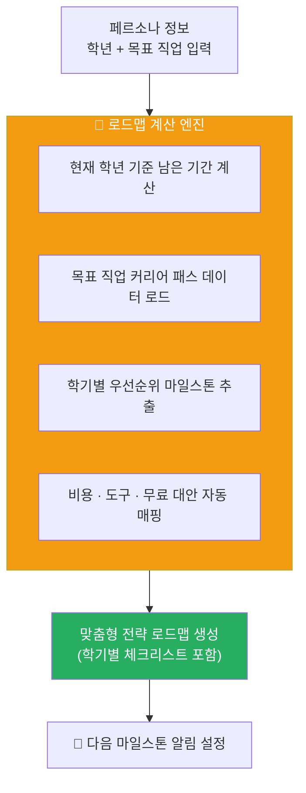

### 3.2 학년별 긴급도 전략 비교표 — UX 디자이너 목표

| 현재 학년 | 남은 기간 | 긴급도 | 이번 학기 핵심 1가지 | 입시 전략 방향 | 예상 총 비용 |
|---------|---------|------|-----------------|------------|-----------|
| **초5** | 7년 | 🟢 낮음 | Canva로 포스터 만들기 | 여유 있음, 기초 습관 형성 | 10~30만원 |
| **초6** | 6년 | 🟢 낮음 | 디자인 캠프 1회 참가 | 포트폴리오 씨앗 준비 시작 | 3~10만원 |
| **중1** | 5년 | 🟡 보통 | Figma 무료 독학 시작 | 중등 포트폴리오 구축 시작 | 0~20만원 |
| **중2** | 4년 | 🟡 보통 | 교내 공모전 1회 도전 | 고1 세특 전략 연계 계획 | 0~20만원 |
| **중3** | 3년 | 🟠 높음 | 포트폴리오 5작품 완성 | 고1 세특 전략 세팅 필수 | 10~30만원 |
| **고1** | 2년 | 🔴 매우 높음 | 세특 디자인 연계 즉시 시작 | 학종 vs 실기 전형 결정 | 20~50만원 |
| **고2** | 1년 | 🚨 긴급 | 포트폴리오 20작품 완성 | 수시 6장 전략 수립 | 30~80만원 |
| **고3** | 수개월 | 🔥 D-DAY | 수시 원서 + 실기 마감 | 지원 전략 최종 확정 | 입시 비용 |

### 3.3 현재 학년 기준 — 이번 학기 액션 플랜 화면 (중2 예시)

```
╔══════════════════════════════════════════╗
║  📍 나의 현재 위치: 중2 2학기            ║
║  🎯 목표 직업: UX 디자이너               ║
║  🎓 목표 대학 유형: 수도권 디자인학과    ║
╠══════════════════════════════════════════╣
║                                          ║
║  ⏰ 이번 학기 (중2-2) 핵심 3가지         ║
║  ━━━━━━━━━━━━━━━━━━━━━━━━━━━━━━━━       ║
║  ① Figma 중급 프로젝트 1개 완성 (무료)  ║
║     → UI 리디자인: 학교 앱 or 급식 앱   ║
║     → 소요 시간: 주 2시간 × 8주         ║
║                                          ║
║  ② 교내 공모전 or 디자인 대회 1회 도전  ║
║     → 검색어: "중학생 디자인 공모전"     ║
║     → 수상 못해도 경험이 세특에 기록됨  ║
║                                          ║
║  ③ 《UX의 정석》 독서 + 보고서 작성      ║
║     → 비용: 약 1.5만원                  ║
║     → 중3 국어 세특 연계 가능           ║
║  ─────────────────────────────────────  ║
║  📅 다음 학기 (중3) 예고                 ║
║  → 포트폴리오 5작품 목표                 ║
║  → 생물·정보 탐구대회 참가 검토          ║
║  → 고1 세특 전략 담임선생님과 상담 시작 ║
║  ─────────────────────────────────────  ║
║  💰 이번 학기 예산: 약 1.5~3만원         ║
║                                          ║
║  [✅ 체크리스트 저장]  [🔔 알림 설정]    ║
╚══════════════════════════════════════════╝
```

### 3.4 직업별 전략 로드맵 — 4개 직업 핵심 비교표

| 구분 | UX 디자이너 | AI 연구원 | 의사 | 게임 기획자 |
|-----|-----------|---------|-----|-----------|
| **핵심 입시 전형** | 학종 or 실기 | SW특기자 or 학종 | 학종 + 수능최저 | 학종 or 일반 |
| **가장 중요한 스펙** | 포트폴리오 20작품+ | GitHub + 공모전 수상 | 내신 1~2등급 | 기획서 + 게임 제작 실적 |
| **중학교 시작 필수** | Figma 독학 시작 | Python 코딩 시작 | 생명과학 심화 독학 | 게임 기획서 작성 연습 |
| **고1 핵심 액션** | 세특 디자인 연계 | 세특 AI·알고리즘 연계 | 세특 생명과학 탐구 | 세특 정보·국어 연계 |
| **반드시 있어야 할 것** | 포트폴리오 20작품 | KOI 수상 or Kaggle 입상 | 내신 + 생물올림피아드 | 게임 1개 완성 + 기획서 |
| **예상 총 비용 (중~고)** | 10~80만원 | 거의 무료 | 교재·올림피아드 비용 | 거의 무료 |
| **취업까지 총 기간** | 대학 4년 | 대학원 포함 6~8년 | 의대 6년 + 전공의 4년 | 대학 4년 |
| **AI 대체 위험도** | 중간 (협업 대상) | 낮음 (핵심 개발자) | 낮음 (의료 판단 고유) | 중간 (기획력 유지 필수) |

### 3.5 마일스톤 타임라인 — 중2 → UX 디자이너 합격까지

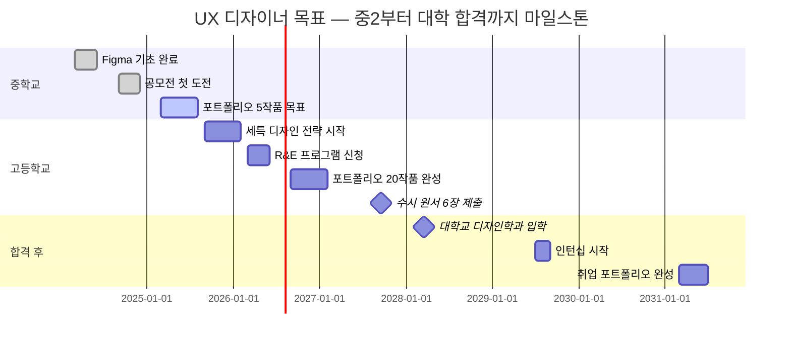

### 3.6 다음 30일 즉시 실행 계획 — 중2 / UX 디자이너 목표

| 주차 | 액션 | 도구 | 비용 | 결과물 |
|-----|-----|-----|-----|------|
| **1주차** | Figma 무료 계정 생성 + 기초 튜토리얼 완료 | Figma.com (무료) | 0원 | Figma 기초 작품 1개 |
| **2주차** | 내가 자주 쓰는 앱 UI 분석 보고서 작성 | 스마트폰 + 노션 | 0원 | 분석 보고서 1편 |
| **3주차** | 앱 UI 리디자인 1개 완성 | Figma | 0원 | 리디자인 작품 1개 |
| **4주차** | 교내 디자인 공모전 검색 + 참가 신청 | 인터넷 검색 | 0원 | 공모전 지원서 1건 |

> 30일 후 확보: **포트폴리오 씨앗 3개** + **공모전 참가 기록 1회** — 비용 0원

---

## 4. 전체 게임 구조 개요

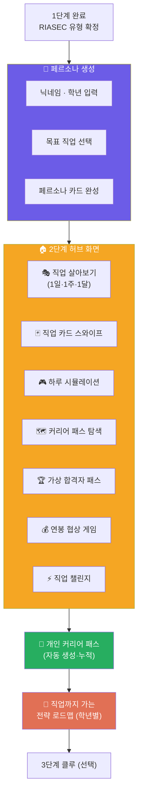

### 7개 핵심 모드 한눈에 비교

| 모드 | 핵심 행동 | 소요 시간 | XP | 잠금 해제 조건 | 핵심 가치 |
|------|---------|---------|-----|------------|---------|
| **페르소나 생성** | 캐릭터 설정 | 3분 | +50 XP | 없음 (필수) | 나만의 여정 시작 |
| **직업 살아보기** | 1일·1주·1달 몰입 | 5분~1달 | +200~500 XP | 시뮬 1회 완료 | 직업 실제 체험 |
| **직업 카드 스와이프** | 좌/우 스와이프 | 1분/카드 | +5 XP | 없음 (기본) | 직업 감각 익히기 |
| **하루 시뮬레이션** | 선택지 스토리 | 5~8분 | +30 XP | 카드 5개 저장 | 직업인 감정 체험 |
| **커리어 패스 탐색** | 로드맵 열람 | 3~5분 | +20 XP | 시뮬 1회 완료 | 구체적 경로 파악 |
| **가상 합격자 패스** | 합격자 비교 | 5~10분 | +25 XP | 커리어 패스 1개 열람 | 벤치마킹 + 갭 분석 |
| **연봉 협상 게임** | 슬라이더 협상 | 3~5분 | +20 XP | 시뮬 3회 완료 | 연봉 현실 감각 |
| **직업 챌린지** | 미니 퀘스트 | 2~5분 | +15~50 XP | 카드 20개 탐색 | 참여율 유지 |

---

## 5. 게임 시스템 — XP · 레벨 · 뱃지 · 희귀도

### 5.1 XP 획득 구조

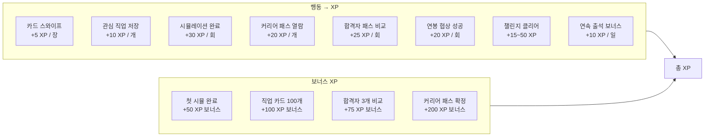

### 5.2 레벨 시스템

| 레벨 | 이름 | 필요 XP | 잠금 해제 내용 |
|------|------|--------|------------|
| Lv.1 | 탐색자 | 0 XP | 직업 카드 스와이프 (50개) |
| Lv.2 | 관찰자 | 100 XP | 하루 시뮬레이션, 관심 직업함 |
| Lv.3 | 체험자 | 300 XP | 커리어 패스 탐색, 연봉 협상 게임 |
| Lv.4 | 탐험가 | 700 XP | 가상 합격자 패스, 전체 카드 200개 |
| Lv.5 | 커리어러 | 1,500 XP | 합격자 비교 오버레이, PDF 미리보기 |
| Lv.6 | 드림파인더 | 3,000 XP | 개인 커리어 패스 완성본, 3단계 초대 |

### 5.3 뱃지 시스템

#### 뱃지 카테고리별 설계
| 카테고리      | 대표 뱃지 예시              | 조건/획득 기준                      | 효과/기념 요소            |
|--------------|----------------------------|-------------------------------------|--------------------------|
| 탐험/출석    | 7일 연속 출석              | 일주일 연속 출석                    | 프로필 출석 트로피        |
| 카드 탐색    | 100카드 탐색               | 직업 카드 100개 이상 열람           | 탐험대원 뱃지             |
| 시뮬레이션   | 10회 시뮬 클리어           | 하루 시뮬레이션 10회 이상 완료      | 시나리오 마스터           |
| 커리어 패스  | 첫 커리어 맵 완성          | 개인 커리어 패스 1회 저장           | 커리어빌더 메달           |
| 합격자 탐색  | 합격자 3인 비교            | 합격자 패스 3종 비교                | 벤치마킹 레전드           |
| 도전/챌린지  | 3연속 챌린지 달성          | 미니퀘스트 연속 3회 완료            | 챌린저 버지               |
| 희귀 발견    | 에픽/전설 카드 최초 오픈   | 에픽/전설 등급 카드 1종 이상 획득   | 전설헌터 마크             |
| 커뮤니티     | 첫 피드백 남김             | 리뷰/피드백 최초 작성               | 커뮤니티 파트너            |
| 특별/이벤트  | 시즌 한정 챌린지           | 시즌 챌린지 미션 기간 내 클리어      | 한정판 시즌 뱃지           | 


### 5.4 직업 카드 희귀도 시스템

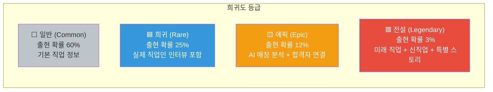

| 희귀도 | 출현 확률 | 특별 콘텐츠 | XP 보너스 |
|-------|---------|---------|---------|
| ⬜ 일반 | 60% | 기본 직업 정보 | 기본 |
| 🟦 희귀 | 25% | 현직자 1일 인터뷰 포함 | +2배 |
| 🟨 에픽 | 12% | AI 기반 나와의 매칭 분석 + 합격자 연결 | +3배 |
| 🟥 전설 | 3% | 미래 신직업 + 특별 스토리 + 한정 뱃지 | +5배 |

---

## 6. 게임 모드 1 — 직업 카드 스와이프

### 6.1 동작 플로우

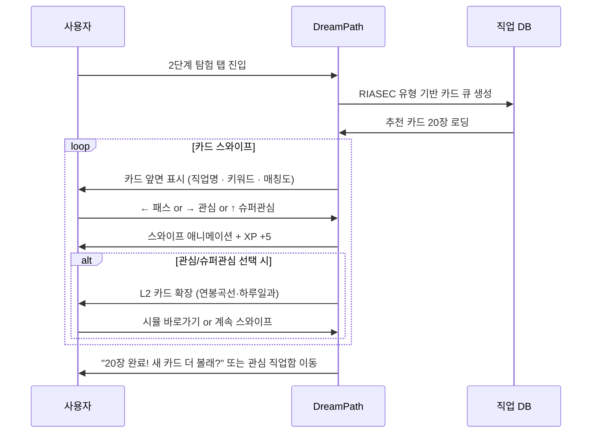

### 6.2 카드 UI 상세 설계

```
┌─────────────────────────────────┐
│  🟨 에픽 카드                    │
│─────────────────────────────────│
│                                 │
│  [직업 일러스트 / 아이콘]         │
│                                 │
│  UX 디자이너                     │
│                                 │
│  #사용자공감  #시각화  #협업      │
│                                 │
│  매칭도: ████████████ 97%        │
│  미래전망: ★★★★☆                 │
│                                 │
│─────────────────────────────────│
│                                 │
│  ←  패스          관심  →       │
│      (회색)        (주황)        │
│                                 │
│         ↑ 슈퍼관심               │
│         (파란색 별)              │
│                                 │
└─────────────────────────────────┘
```

```
┌─────────────────────────────────┐
│  관심 저장! +10 XP ⭐            │
│─────────────────────────────────│
│                                 │
│  UX 디자이너 빠른 정보           │
│                                 │
│  ⏰ 하루 일과 요약               │
│  9시 스탠드업 → 오전 디자인 작업 │
│  → 오후 클라이언트 미팅 →        │
│  저녁 피드백 반영                │
│                                 │
│  💰 연봉 곡선                    │
│  신입  │ 2,800만                │
│  3년차 │ 4,200만                │
│  7년차 │ 6,000만                │
│  10년+ │ 8,000만+               │
│                                 │
│  [하루 시뮬 해보기] [계속 탐색]  │
└─────────────────────────────────┘
```

### 6.3 스와이프 필터 시스템

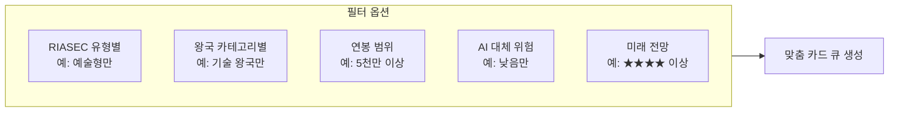

---

## 7. 게임 모드 2 — 하루 시뮬레이션

### 7.1 시뮬레이션 구조

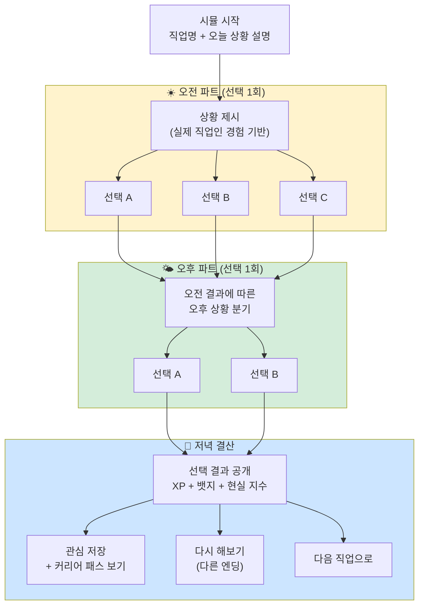

### 7.2 직업별 시뮬레이션 시나리오 예시 3개

#### 예시 A: UX 디자이너

```
╔══════════════════════════════════════════╗
║  🎮 UX 디자이너 하루 체험                ║
║  난이도: ★★★☆☆ / 예상 시간: 6분         ║
╚══════════════════════════════════════════╝

☀️ 오전 9:00 — 스타트업 사무실

[상황]
팀장: "오늘 오후 3시 클라이언트 발표인데,
수정 요청이 왔어요. 메인 컬러 전체를
바꿔달라고 하네요..."

→ 선택지
A. 😤 화가 나지만 묵묵히 수정 시작
B. 💬 클라이언트에게 이유를 먼저 물어봄
C. 🎨 3가지 대안을 빠르게 만들어 선택하게 함

─────────────────────────────────────────
🌤️ 오후 결과 (B 선택 시)

클라이언트: "사실 대표님이 파란색을
싫어하셔서요..."

→ 실제 문제 파악! 기존 디자인의 파란색
요소만 변경하는 최소 수정으로 해결.

⚡ [+30XP] 문제해결력 뱃지 획득!
   "질문으로 불필요한 수정을 막았어요"

─────────────────────────────────────────
🌙 하루 결산

UX 디자이너 현실 지수
스트레스  ████████░░  8/10
자유도    ██████░░░░  6/10
보람      █████████░  9/10

핵심 스킬 확인
→ 공감력, 커뮤니케이션, 빠른 의사결정

연봉 (5년차 기준) 약 5,200만원
```

#### 예시 B: 의사 (응급의학과)

```
╔══════════════════════════════════════════╗
║  🩺 응급의학과 의사 하루 체험             ║
║  난이도: ★★★★★ / 예상 시간: 7분         ║
╚══════════════════════════════════════════╝

☀️ 오전 2:30 — 응급실 야간 당직

[상황]
30대 남성 응급 내원.
가슴 통증 호소, 식은땀.
ECG 결과가 모호하게 나왔다.

→ 선택지
A. 🔬 추가 검사 더 진행 후 판단
B. 🚨 심근경색 의심 → 즉시 심혈관 팀 호출
C. 💊 일단 진통제 처방 후 경과 관찰

─────────────────────────────────────────
🌤️ 결과 (B 선택 시)

심혈관 팀 도착. 긴급 시술 성공.
"조기 발견이 생명을 구했습니다"

⚡ [+50XP] 결정적 판단 뱃지 획득!
   "1분의 결정이 생사를 가릅니다"

─────────────────────────────────────────
🌙 하루 결산

의사 현실 지수
스트레스  ██████████  10/10
자유도    ████░░░░░░  4/10
보람      ██████████  10/10
책임감    ██████████  10/10

연봉 (전문의 10년차) 약 1.2억+
```

#### 예시 C: 게임 기획자

```
╔══════════════════════════════════════════╗
║  🎲 게임 기획자 하루 체험                ║
║  난이도: ★★★☆☆ / 예상 시간: 6분         ║
╚══════════════════════════════════════════╝

☀️ 오전 10:00 — 게임 회사 기획팀

[상황]
신작 모바일 RPG 스테이지 디자인 중.
QA팀: "17스테이지가 너무 어려워요.
플레이어 90%가 여기서 이탈해요"

→ 선택지
A. 📉 스테이지 난이도 전체 하향 조정
B. 📊 데이터 더 분석 후 특정 구간만 조정
C. 🎁 힌트 아이템 추가로 보완

─────────────────────────────────────────
🌤️ 결과 (B 선택 시)

데이터 분석 결과: 특정 보스 패턴에서
집중 이탈. 해당 패턴만 조정.

이탈률 90% → 45%로 감소!
게임성은 유지하면서 문제 해결.

⚡ [+30XP] 데이터 드리븐 기획 뱃지!

─────────────────────────────────────────
🌙 하루 결산

게임 기획자 현실 지수
스트레스  ██████░░░░  6/10
자유도    ████████░░  8/10
창의성    █████████░  9/10
보람      ████████░░  8/10

연봉 (5년차) 약 4,800만원
```

### 7.3 멀티 엔딩 구조

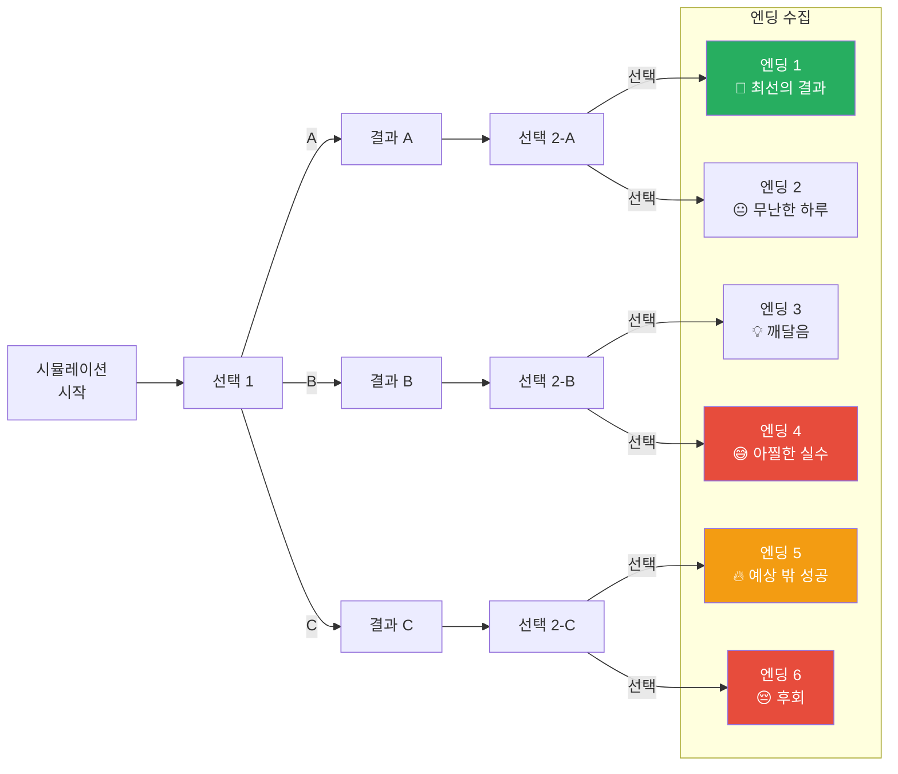

> 모든 엔딩을 수집하면 **"전지적 직업 시점" 뱃지** 획득. 리플레이 동기 부여.

---

## 8. 게임 모드 3 — 커리어 패스 탐색

### 8.1 구조 개요

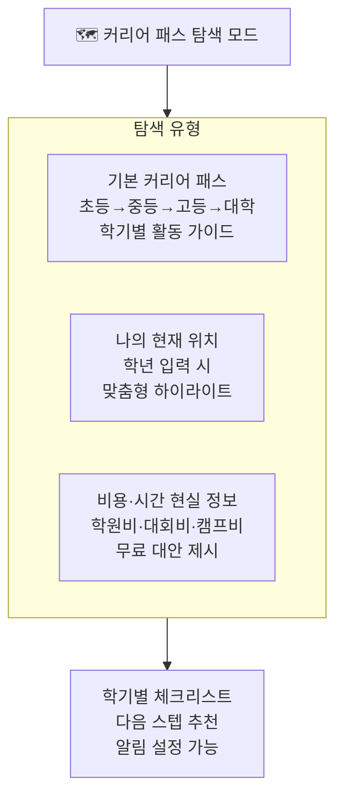

### 8.2 직업별 기본 커리어 패스 데이터 예시 (4개 직업)

#### UX 디자이너 커리어 패스

| 단계 | 학기 | 핵심 활동 | 도구/비용 | 성과물 |
|------|-----|---------|---------|------|
| **초등** | 초4~6 | 디자인 캠프·미술 관찰·앱 UI 스케치 | 캠프 3~5만원 | 스케치북 포트폴리오 |
| **중등** | 중1-1 | Figma 기초 독학, 앱 리디자인 연습 | Figma 무료 | 리디자인 3개 |
| **중등** | 중1-2 | UX 관련 독서, 사용성 테스트 체험 | 도서 1.5만원 | 독서 보고서 |
| **중등** | 중2-1 | 디자인 씽킹 PBL, 교내 공모전 도전 | 무료 | 공모전 참가 1회 |
| **중등** | 중2-2 | UI 공모전, Figma 중급 프로젝트 | 무료 | 수상 목표 |
| **중등** | 중3 | 포트폴리오 시작, IT 공모전 | Adobe XD 무료 | 포폴 5작품 |
| **고등** | 고1-1 | 미술·정보 세특 전략 수립 | 무료 | 세특 기록 시작 |
| **고등** | 고1-2 | 학교 IT 동아리 가입 or 창설 | 무료 | 동아리 활동 |
| **고등** | 고2-1 | R&E 프로그램 신청, UX 연구 | 대학 연계 | R&E 보고서 |
| **고등** | 고2-2 | 포트폴리오 20작품 완성 | 무료 | 포폴 완성 |
| **고등** | 고3 | 수시 6장 (디자인학과·인터랙션) | 입시 비용 | 합격 |
| **대학** | 1~4학년 | 전공 이수, 인턴십 2~3회 | 학비 | 취업 포트폴리오 |

#### AI 연구원 커리어 패스

| 단계 | 학기 | 핵심 활동 | 도구/비용 | 성과물 |
|------|-----|---------|---------|------|
| **초등** | 초4~6 | 스크래치 코딩, 수학 심화 | 무료 | 스크래치 게임 5개 |
| **중등** | 중1 | Python 독학, 백준 알고리즘 시작 | 무료 | 백준 실버 |
| **중등** | 중2 | ML 기초, scikit-learn 프로젝트 | K-MOOC 무료 | 첫 AI 모델 |
| **중등** | 중3 | 정보올림피아드(KOI), 챗봇 제작 | 무료 | KOI 예선 참가 |
| **고등** | 고1-1 | 정보 세특 "AI 원리 탐구" | 무료 | 세특 기록 |
| **고등** | 고1-2 | GitHub 포트폴리오 구축 | 무료 | GitHub 레포 10개+ |
| **고등** | 고2-1 | KOI 본선, arXiv 논문 읽기 시작 | 무료 | KOI 수상 목표 |
| **고등** | 고2-2 | AI 공모전 도전 (국내 또는 Kaggle) | 무료 | 공모전 수상 목표 |
| **고등** | 고3 | SW특기자 또는 수시 학종 | - | 합격 |
| **대학** | 1~4학년 | 전공+대학원 준비, 인턴십 | 학비 | 석·박사 진학 |

#### 의사 커리어 패스

| 단계 | 학기 | 핵심 활동 | 도구/비용 | 성과물 |
|------|-----|---------|---------|------|
| **초등** | 초4~6 | 보건소 봉사, 인체 모형 탐구 | 모형 3만원 | 봉사 인증서 |
| **중등** | 중1 | 생명과학 심화 독학, 의사 인터뷰 | 도서 1만원 | 인터뷰 보고서 |
| **중등** | 중2 | 건강 통계 프로젝트, 탐구대회 | 무료 | 탐구 보고서 |
| **중등** | 중3 | KBO 생물올림피아드 예선 | 교재 2만원 | 올림피아드 참가 |
| **고등** | 고1 | 생명과학Ⅰ·화학Ⅰ 1등급 목표 | - | 내신 1등급 |
| **고등** | 고2-1 | KBO 본선, R&E 프로그램 | - | KBO 수상 |
| **고등** | 고2-2 | 의대 학종 전략 세팅 | - | 수시 준비 |
| **고등** | 고3 | MMI 면접 대비, 수능 최저 | - | 의대 합격 |
| **대학** | 6년 | 의예과 2년 + 의학과 4년 | 학비 | 의사 국시 |

#### 스타트업 창업가 커리어 패스

| 단계 | 학기 | 핵심 활동 | 도구/비용 | 성과물 |
|------|-----|---------|---------|------|
| **초등** | 초4~6 | 학교 바자회 기획, 용돈 관리 일지 | 무료 | 바자회 수익 경험 |
| **중등** | 중1 | 비즈쿨 프로그램 참가, 아이디어 일지 | 무료 | 사업 아이디어 5개 |
| **중등** | 중2 | 모의 창업 대회, 팀 프로젝트 | 무료 | 창업 대회 참가 |
| **중등** | 중3 | 학생 창업가 인터뷰, 비즈니스 모델 공부 | 무료 | 인터뷰 보고서 |
| **고등** | 고1 | 교내 창업 동아리 창설, MVP 기획 | 무료 | 동아리 창설 |
| **고등** | 고2 | 청소년 창업 경진대회, 실제 MVP 제작 | 개발비 10만원 내외 | 대회 수상 목표 |
| **고등** | 고3 | 창업 전형 또는 경영학과 수시 | - | 합격 |
| **대학** | 1~4학년 | 교내 창업지원센터, 정부 창업 지원금 | - | 법인 설립 |

### 8.3 화면 UX 플로우

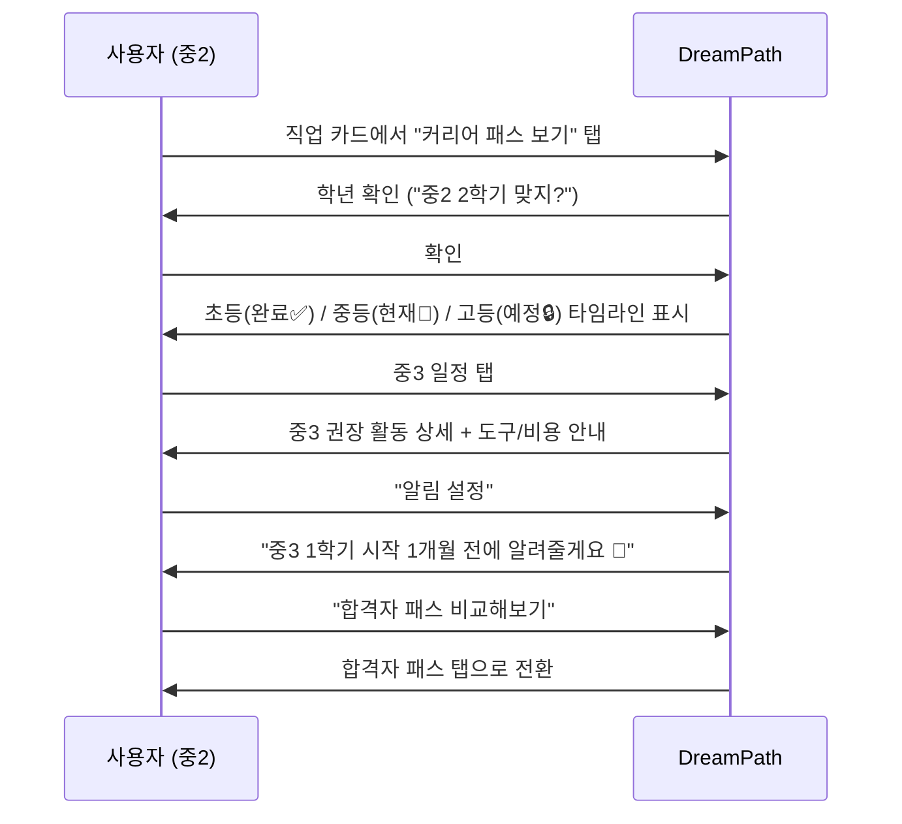

---

## 9. 게임 모드 4 — 가상 합격자 패스

### 9.1 구조 개요

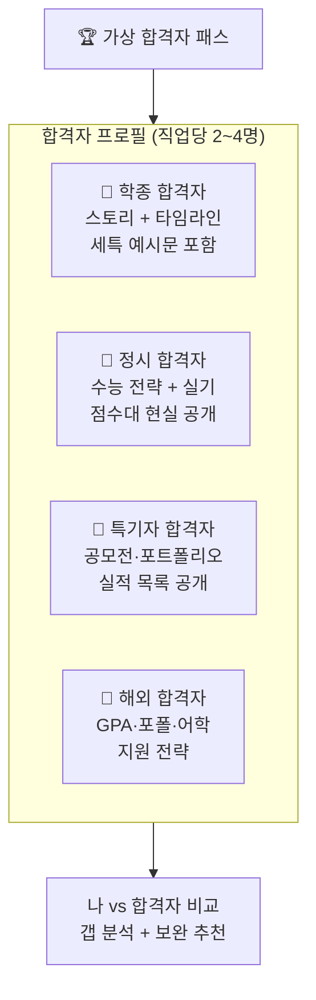

### 9.2 합격자 프로필 상세 예시 — UX 디자이너

#### 학종 합격자: 가상 인물 "김서진"

```
╔══════════════════════════════════════════╗
║  👩 김서진 (가상)                        ║
║  서울대학교 디자인학부 — 학종 합격       ║
║  RIASEC: 예술형(A) + 탐구형(I)          ║
╚══════════════════════════════════════════╝

📊 합격 핵심 스펙
┌────────────────────────────────────────┐
│ 내신 등급    │ 전체 1.8 / 미술·정보 1.2│
│ 세특 기록    │ 6학기 연속 디자인 연계  │
│ 수상 경력    │ 교내 디자인대회 3회 입상│
│ 자율 활동    │ 디자인 동아리 회장 2년  │
│ R&E         │ "고령자 UI 접근성" 연구  │
│ 봉사         │ 장애인 웹접근성 봉사 80h│
└────────────────────────────────────────┘

📅 고등학교 타임라인
고1-1학기
  세특: [미술] "사용자 중심 디자인 원리
         탐구 - 노인·장애인 UI 관찰 보고"
  활동: 디자인 동아리 가입

고1-2학기
  세특: [정보] "Figma를 활용한 앱
         프로토타입 제작과 사용성 평가"
  수상: 교내 정보 경진대회 장려상

고2-1학기
  세특: [미술] "R&E - 고령자를 위한
         키오스크 UI 재설계 연구"
  활동: 대학 R&E 프로그램 선발

고2-2학기
  세특: [정보] "데이터로 본 앱 이탈률
         분석과 UX 개선 제안"
  수상: 교내 디자인 전시회 최우수상
  활동: 동아리 회장 취임

고3-1학기
  수시 6장 집중: 서울대(학종), 연세대(학종),
  홍익대(학종), KAIST(학종), 이화여대(학종),
  국민대(실기+학종)

💬 면접 핵심 질문 & 답변 포인트
Q. "디자이너로서 가장 중요한 역량은?"
→ "사용자 공감력. R&E에서 노인 분들과
   직접 테스트하며 데이터와 감성을 함께
   보는 법을 배웠습니다."

Q. "AI 디자인 도구가 디자이너를 대체하나?"
→ "도구 활용은 AI가 하지만, 어떤 문제를
   풀지 정의하는 것은 인간 디자이너만
   할 수 있습니다."
```

#### 정시 합격자: 가상 인물 "박하윤"

```
╔══════════════════════════════════════════╗
║  👨 박하윤 (가상)                        ║
║  홍익대학교 시각디자인과 — 정시 합격     ║
║  RIASEC: 예술형(A) + 현실형(R)          ║
╚══════════════════════════════════════════╝

📊 합격 핵심 스펙
┌────────────────────────────────────────┐
│ 수능 등급    │ 국어 2 / 수학 2 / 영어 2│
│ 실기 성적    │ 상위 8% (기초디자인)    │
│ 내신         │ 3.5 (정시라 비중 낮음)  │
│ 실기 연습    │ 주 15시간 × 2년         │
└────────────────────────────────────────┘

📅 고등학교 준비 전략
고1: 수능 기초 + 실기 학원 주 3회
고2: 수능 집중 + 실기 주 5회 (강도 높임)
고3: 수능 최저 충족 + 실기 완성

💡 핵심 전략
→ 수능 최저 충족 (국영수 2개 이상 2등급)
→ 실기 10년치 기출 분석 + 모작 반복
→ 수능 수학 포기 금물: 실기 점수 보완 가능
```

### 9.3 나 vs 합격자 갭 분석 화면

```
┌──────────────────────────────────────────┐
│  📊 나 vs 합격자 갭 분석                  │
│  직업: UX 디자이너 / 합격자: 김서진 (학종)│
│──────────────────────────────────────────│
│                                          │
│  📍 나의 현재: 중2 2학기                  │
│  📍 김서진의 중2 2학기:                   │
│                                          │
│  항목별 비교                              │
│  ┌─────────────┬──────────┬────────────┐ │
│  │ 항목        │   나     │  김서진    │ │
│  ├─────────────┼──────────┼────────────┤ │
│  │ 디자인 도구 │ 없음 ❌  │ Figma 중급✅│ │
│  │ 포트폴리오  │ 0개 ❌   │ 3개 ✅     │ │
│  │ 공모전 참가 │ 없음 ❌  │ 1회 ✅     │ │
│  │ 코딩 기초   │ 없음 ❌  │ HTML/CSS ✅│ │
│  │ 디자인 독서 │ 없음 ❌  │ 3권 ✅     │ │
│  └─────────────┴──────────┴────────────┘ │
│                                          │
│  전체 달성도: ██░░░░░░░░ 20%             │
│                                          │
│──────────────────────────────────────────│
│  💡 지금 당장 할 수 있는 보완 액션        │
│  ① Figma 무료 튜토리얼 시작 (2주, 무료)  │
│  ② 앱 UI 리디자인 1개 완성 (1주)         │
│  ③ 《UX의 정석》 독서 시작 (2만원)        │
│  ④ 교내 디자인 대회 참가 신청            │
│                                          │
│  [액션 리스트 저장] [알림 설정]           │
└──────────────────────────────────────────┘
```

---

## 10. 게임 모드 5 — 연봉 협상 게임

### 10.1 게임 로직

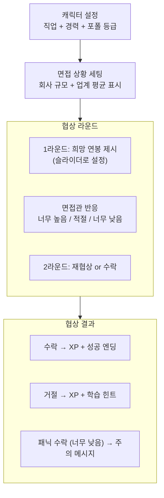

### 10.2 직업별 연봉 현실 데이터 비교표

| 직업 | 신입 | 3년차 | 5년차 | 10년차 | 협상 팁 |
|------|-----|------|------|-------|--------|
| UX 디자이너 | 2,800만 | 4,200만 | 5,500만 | 8,000만+ | 포트폴리오 강조 |
| AI 연구원 | 4,000만 | 6,500만 | 9,000만 | 1.5억+ | 논문·GitHub 실적 |
| 의사 (봉직의) | 1.2억 | 1.5억 | 1.8억 | 2억+ | 협상 여지 적음 |
| 게임 기획자 | 2,600만 | 4,000만 | 5,000만 | 7,000만+ | 포트폴리오·게임 이해도 |
| 변호사 | 3,500만 | 6,000만 | 1억+ | 2억+ (개업) | 사무소 규모 협상 |
| 환경공학자 | 2,800만 | 4,000만 | 5,200만 | 7,000만+ | 자격증 가산점 |

### 10.3 협상 게임 화면

```
┌─────────────────────────────────┐
│  💰 연봉 협상 게임               │
│  직업: AI 연구원 / 대기업 입사   │
│─────────────────────────────────│
│                                 │
│  👤 내 캐릭터                    │
│     KAIST 컴퓨터공학과 석사 1년차│
│     논문: ICML 1편               │
│     GitHub: ⭐ 230               │
│                                 │
│  🏢 면접관 (네이버 AI Lab)        │
│     "박사급 인재를 찾고 있어서   │
│      연봉은 어느 정도 기대하시나요?"│
│                                 │
│  업계 석사 평균: 4,000 ~ 5,500만  │
│  (네이버 평균: 상위 30% 수준)     │
│                                 │
│─────────────────────────────────│
│  나의 제시 연봉                  │
│  ◀──────[  5,200만원  ]──────▶   │
│                                 │
│  예상 반응: "적절한 범위네요 👍"   │
│                                 │
│  💡 전략 힌트                    │
│  "ICML 논문 실적 언급하면 추가   │
│   협상 여지 있음. 5,500까지 가능" │
│                                 │
│  [협상 제시하기]                 │
└─────────────────────────────────┘
```

---

## 11. 게임 모드 6 — 직업 챌린지

### 11.1 챌린지 유형

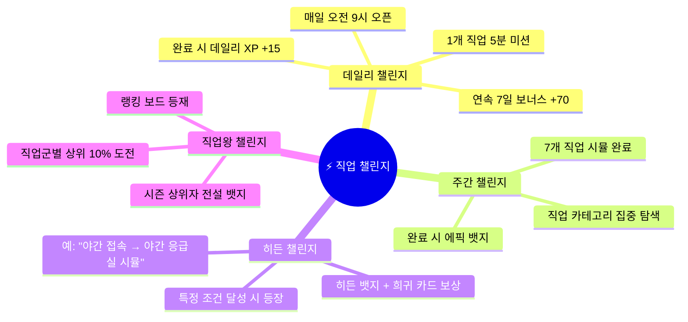

### 11.2 챌린지 예시 목록

| 챌린지명 | 유형 | 미션 | 보상 |
|---------|-----|-----|-----|
| 오늘의 직업인 | 데일리 | 랜덤 직업 시뮬 1회 | +15 XP |
| 의료계 일주일 | 주간 | 의사·약사·간호사·수의사 시뮬 | 에픽 뱃지 🏥 |
| 연봉 킹 | 주간 | 연봉 협상 5연속 성공 | +100 XP + 뱃지 |
| 밤샘 응급실 | 히든 | 오전 0~4시 접속 + 의사 시뮬 | 히든 뱃지 🌙 |
| 전설 카드 수집가 | 기간 | 전설 카드 5장 수집 | 전설 뱃지 👑 |
| 엔딩 컬렉터 | 기간 | 특정 직업 모든 엔딩 수집 | 전지적 시점 뱃지 |
| 커리어 패스 완성 | 기간 | 3개 직업 커리어 패스 열람 | +200 XP + 특별 뱃지 |

---

## 12. 게임 루프 설계 — 플레이어 여정

### 12.1 일간 게임 루프

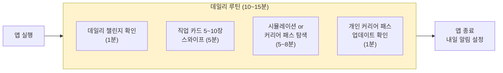

### 12.2 주간 게임 루프

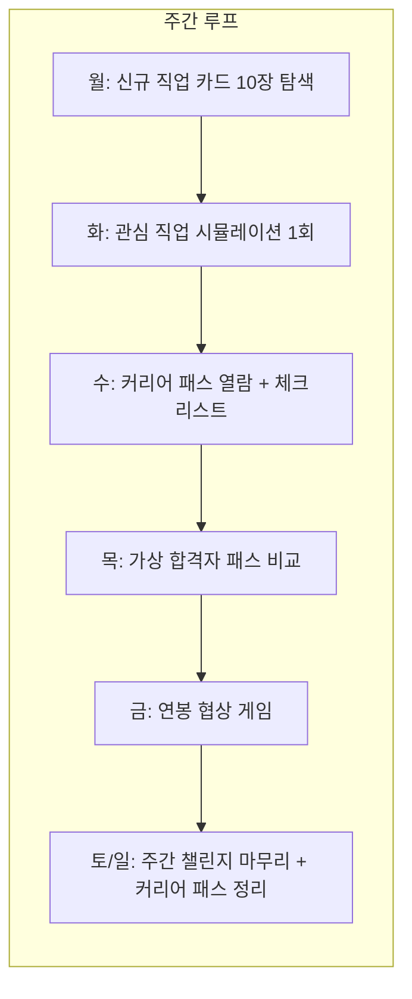

### 12.3 월간 진행 곡선

```mermaid
xychart-beta
    title "2단계 월간 XP 획득 목표"
    x-axis ["1주차", "2주차", "3주차", "4주차"]
    y-axis "누적 XP" 0 --> 1600
    bar [300, 700, 1100, 1500]
    line [300, 700, 1100, 1500]
```

| 주차 | 목표 XP | 주요 달성 | 잠금 해제 |
|-----|--------|---------|---------|
| 1주차 | 300 XP | 카드 20개, 시뮬 1회 | 커리어 패스 탐색 |
| 2주차 | 700 XP | 카드 50개, 시뮬 3회, 커리어 패스 2개 | 합격자 패스, 연봉 게임 |
| 3주차 | 1,100 XP | 카드 100개, 합격자 비교 3회 | 갭 분석 기능 |
| 4주차 | 1,500 XP | 커리어 패스 확정, 합격자 벤치마크 완성 | 개인 커리어 패스 완성본 |

---

## 13. 직업 콘텐츠 데이터 구조

### 13.1 직업 카드 데이터 스키마

```mermaid
erDiagram
    CAREER_CARD {
        string cardId
        string jobName
        string kingdom
        string riasecType
        string keywords
        int matchScore
        string rarity
        int futureRating
        int aiReplaceRisk
    }

    SIMULATION {
        string simId
        string cardId
        string timeOfDay
        string situation
        json choices
        json endings
        int stressScore
        int freedomScore
        int rewardScore
    }

    BASE_ROADMAP {
        string roadmapId
        string cardId
        json elemStage
        json midStage
        json highStage
        json univStage
        string totalCost
        string totalDuration
    }

    ACCEPTEE_PROFILE {
        string profileId
        string cardId
        string virtualName
        string admissionType
        string university
        string major
        json highTimeline
        json keySpecs
        json interviewQA
    }

    SALARY_DATA {
        string salaryId
        string cardId
        int juniorSalary
        int mid3Salary
        int mid5Salary
        int senior10Salary
        string negotiationTip
    }

    CAREER_CARD ||--o{ SIMULATION : "보유"
    CAREER_CARD ||--|| BASE_ROADMAP : "보유"
    CAREER_CARD ||--o{ ACCEPTEE_PROFILE : "보유"
    CAREER_CARD ||--|| SALARY_DATA : "보유"
```

### 13.2 콘텐츠 제작 우선순위 (직업 수 × 콘텐츠 유형)

| 직업 | 시뮬 개수 | 합격자 프로필 수 | 커리어 패스 | 연봉 데이터 |
|-----|---------|--------------|----------|----------|
| UX 디자이너 | 3개 | 4개 (학종·정시·특기·해외) | ✅ | ✅ |
| AI 연구원 | 3개 | 3개 (학종·특기·해외) | ✅ | ✅ |
| 의사 | 3개 | 2개 (학종·정시) | ✅ | ✅ |
| 게임 기획자 | 2개 | 3개 | ✅ | ✅ |
| 변호사 | 2개 | 2개 | ✅ | ✅ |
| ... (28개 직업) | 2개씩 | 2개씩 | ✅ | ✅ |

> **MVP 기준**: 32개 직업 × 시뮬 2개 + 커리어 패스 + 합격자 2개 + 연봉 데이터 = 총 약 320개 콘텐츠 유닛

---

## 14. 수익화 연동

### 14.1 무료 vs 유료 게임 콘텐츠

```mermaid
flowchart TD
    subgraph Free["🆓 무료"]
        F1["직업 카드 스와이프 50개"]
        F2["하루 시뮬레이션 3회"]
        F3["기본 커리어 패스 3개 열람"]
        F4["가상 합격자 패스 1개 열람"]
        F5["연봉 협상 게임 2회"]
        F6["개인 커리어 패스 기본"]
    end

    subgraph Premium["⭐ 프리미엄 (월 4,900원)"]
        P1["직업 카드 200개 전체"]
        P2["시뮬레이션 무제한 + 전체 엔딩"]
        P3["커리어 패스 32개 전체"]
        P4["합격자 패스 전체 (전형별)"]
        P5["갭 분석 + 보완 액션 추천"]
        P6["연봉 협상 무제한 + 전략 힌트"]
        P7["포트폴리오 PDF 자동 생성"]
    end

    style Free fill:#27AE60,color:#fff
    style Premium fill:#F5A623,color:#fff
```

### 14.2 자연스러운 유료 전환 트리거

| 트리거 시점 | 상황 | 전환 메시지 |
|---------|-----|----------|
| 무료 시뮬 3회 소진 | "다시 해보기" 탭 시 | "이 직업 모든 엔딩 보고 싶으면? 프리미엄에서 무제한으로!" |
| 합격자 패스 2번째 열람 시도 | 잠금 화면 등장 | "학종 말고 정시·특기자 합격자도 보고 싶지 않아?" |
| 갭 분석 첫 진입 시 | 기본 분석 표시 후 | "구체적인 보완 액션 추천은 프리미엄에서" |
| 커리어 패스 PDF 저장 시도 | 미리보기만 제공 | "PDF로 저장하고 부모님께 보여줄래?" |
| 레벨 4 달성 시 | 레벨업 축하 화면 | "레벨 4! 이제 합격자 패스 전체가 기다려. 한 달 무료 체험해봐" |

---

## 15. 이탈 방지 게임 장치

### 15.1 이탈 시점별 대응

```mermaid
flowchart TD
    subgraph Exit["이탈 위험 시점"]
        E1["D+1: 설치 후 하루 미접속"]
        E2["D+3: 카드만 보고 시뮬 안 함"]
        E3["D+7: 흥미 감소"]
        E4["D+14: 게임 루틴 끊김"]
        E5["D+30: 장기 이탈 위기"]
    end

    subgraph Intervention["개입 전략"]
        I1["푸시: '어제 저장한 UX 디자이너,<br> 오늘 하루 체험해볼까?'"]
        I2["앱 진입 시 시뮬 바로 추천<br> '5분이면 돼. 오늘 UX 디자이너 되어볼래?'"]
        I3["신규 콘텐츠 알림<br> '새 에픽 카드: AI 프롬프트 엔지니어 등장!'"]
        I4["주간 챌린지 리마인드<br> '이번 주 챌린지 D-2일. XP 100점 놓치지 마'"]
        I5["재참여 보상<br> '오랜만이야! 복귀 보너스 XP +100 지급'"]
    end

    E1 --> I1
    E2 --> I2
    E3 --> I3
    E4 --> I4
    E5 --> I5
```

### 15.2 세션 길이 설계

| 세션 유형 | 목표 시간 | 핵심 내용 | 설계 의도 |
|---------|---------|---------|---------|
| 초단기 세션 | 1~2분 | 카드 3~5장 스와이프 | "잠깐이라도 켜게" |
| 일반 세션 | 5~10분 | 시뮬레이션 1회 | 핵심 체험 |
| 집중 세션 | 15~20분 | 커리어 패스 + 합격자 비교 | 깊은 탐색 |
| 몰입 세션 | 30분+ | 여러 직업 연속 탐색 | 자발적 몰입 |

---

## 16. 기술 구현 참고 — 게임 관련 컴포넌트

```mermaid
flowchart LR
    subgraph Components["주요 컴포넌트 (React Native)"]
        C1["SwipeCard<br> (react-native-deck-swiper)"]
        C2["SimulationStory<br> (선택지 + 애니메이션)"]
        C3["CareerRoadmap<br> (타임라인 뷰)"]
        C4["AccepteeCompare<br> (갭 분석 테이블)"]
        C5["SalarySlider<br> (슬라이더 게임)"]
        C6["XPAnimator<br> (포인트 획득 이펙트)"]
        C7["BadgeUnlock<br> (뱃지 획득 모달)"]
    end

    subgraph State["상태 관리 (Zustand)"]
        S1["userProgress<br> (XP·레벨·뱃지)"]
        S2["exploredCards<br> (탐색 이력)"]
        S3["careerPath<br> (개인 커리어 패스)"]
        S4["compareData<br> (합격자 비교 캐시)"]
    end

    Components --> State
```

---

*작성일: 2026년 2월 | DreamPath 2단계 게임 설계 가이드 v1.0*
