# DreamPath 3단계 게임 설계서
# 전우(戰友) 시스템 · 개인/팀 프로젝트 · 문의 공유 생태계

> **"혼자 가면 빠르고, 함께 가면 멀리 간다."**
> 같은 꿈을 가진 전우와 함께, 기획부터 배포까지 완주한다.

---

## 0. 설계 철학 — 3단계가 필요한 이유

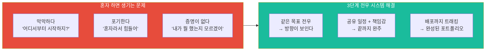

### 핵심 설계 원칙

| 원칙 | 내용 | 이유 |
|------|------|------|
| **전우(戰友) 관계** | 팀원이 아닌 전우. 같은 전쟁을 싸우는 동료 | 게임적 몰입감 + 책임감 |
| **코딩은 외부에서** | 플랫폼은 기획/일정/문의만 관리. 실제 개발은 외부 도구 | 진입장벽 최소화 |
| **배포가 완성 기준** | MVP 배포까지 트래킹. "만들다 멈춤"은 완성이 아님 | 커리어 증명 가능 결과물 |
| **문의 = 생명줄** | 초보 개발자의 첫 질문을 환영하는 문화 | 이탈 방지 핵심 장치 |
| **개인도, 팀도** | 1인 프로젝트 + 팀 프로젝트 모두 동등하게 지원 | 성격·상황 다양성 반영 |
| **기록이 포트폴리오** | 기획서, 일정표, 문의 해결 과정이 자동으로 포트폴리오 | 별도 작성 없음 |

---

## 1. 전우(戰友) 게임 시스템 전체 구조

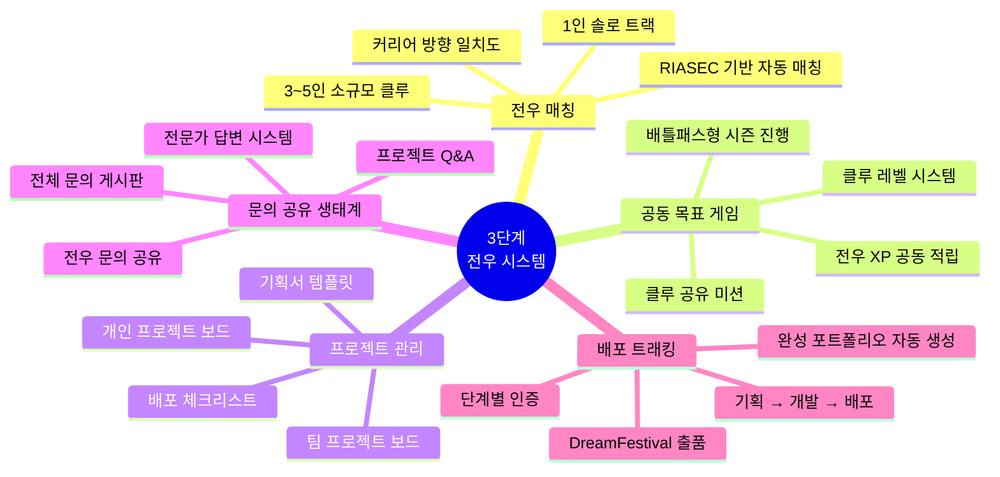

---

## 2. 전우 매칭 시스템

### 2.1 매칭 기준 비교표

| 매칭 요소 | 가중치 | 판단 기준 | 예시 |
|----------|--------|----------|------|
| **커리어 방향 일치** | 40% | 관심 직업 카테고리 동일 | UX디자이너 지망생끼리 |
| **RIASEC 유형 유사** | 25% | 동일하거나 보완적 유형 | 예술형 + 탐구형 조합 |
| **프로젝트 유형 선호** | 20% | 개인/팀, 프로젝트 종류 선택 | "앱 만들고 싶어" |
| **학년/나이 근접** | 10% | ±2년 이내 | 중3 ~ 고2 |
| **활동 시간대** | 5% | 주말형/평일형 | 주말 오후 주로 활동 |

### 2.2 전우 매칭 흐름

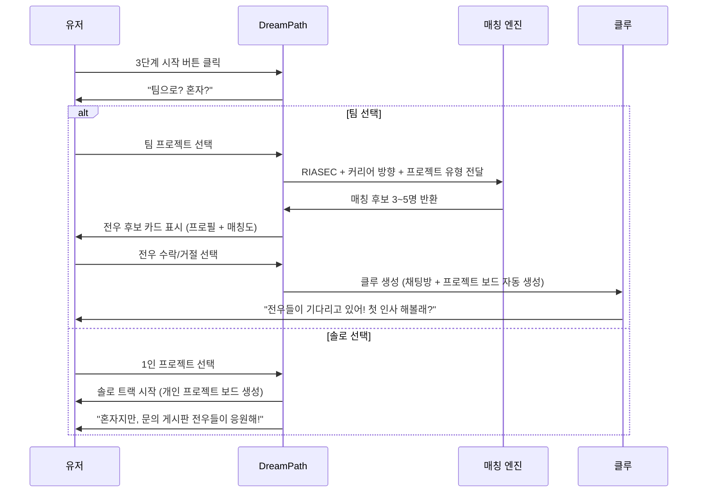

### 2.3 전우 프로필 카드 화면

```
┌─────────────────────────────────┐
│  ⚔️ 전우 후보                    │
│─────────────────────────────────│
│                                 │
│  👩 닉네임: 별하                 │
│  🎨 예술형(A) + 탐구형(I)       │
│  📍 고1 / 서울                  │
│                                 │
│  꿈: UX 디자이너                │
│  목표: "앱 포트폴리오 만들고 싶어"│
│                                 │
│  ┌─────────────────────────────┐│
│  │ 탐험한 직업: 67개            ││
│  │ 시뮬레이션: 12회             ││
│  │ 2단계 완료 ✅                ││
│  └─────────────────────────────┘│
│                                 │
│  전우 매칭도 ████████████ 94%   │
│                                 │
│  [⚔️ 전우 맺기]  [다음 후보 →]  │
│                                 │
└─────────────────────────────────┘
```

### 2.4 클루 결성 화면

```
┌─────────────────────────────────┐
│  ⚔️ 클루 결성!                   │
│─────────────────────────────────│
│                                 │
│  전우 4명이 모였다!              │
│                                 │
│  👩별하  👦준혁  👧소율  👦도윤  │
│  UX     UX     디자인  마케팅   │
│                                 │
│  ─────────────────────────────  │
│  클루 이름을 정해봐!             │
│                                 │
│  ┌─────────────────────────────┐│
│  │  [  디자인 파인더즈  ]      ││
│  └─────────────────────────────┘│
│  AI 추천: "비전 크래프터즈" 💡   │
│                                 │
│  ─────────────────────────────  │
│  공동 목표를 선언해!             │
│                                 │
│  🎯 "UX/디자인 커리어 가이드     │
│      앱을 기획하고 배포하자!"    │
│                                 │
│  [⚔️ 전우여, 출발하자!]          │
│                                 │
└─────────────────────────────────┘
```

---

## 3. 전우 게임 메카닉 (공동 목표 게임)

### 3.1 전우 XP 시스템

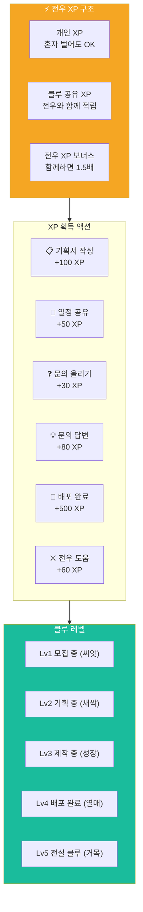

### 3.2 전우 배지 시스템

| 배지 | 조건 | 효과 |
|------|------|------|
| ⚔️ **첫 전우** | 클루 결성 완료 | 클루 채팅 오픈 |
| 📋 **기획왕** | 기획서 첫 완성 | 기획 템플릿 고급형 해금 |
| ❓ **질문 용사** | 문의 5회 이상 | "질문 잘하는 전우" 프로필 뱃지 |
| 💡 **답변 영웅** | 타인 문의 10회 답변 | 포트폴리오 "멘토 경험" 자동 기록 |
| 🚀 **첫 배포** | MVP 배포 완료 | 전설 배지 + 포트폴리오 등록 |
| 🏆 **클루 완주** | 팀 프로젝트 배포 완료 | DreamFestival 자동 출품 자격 |
| 🌟 **답변왕 전우** | 한 달 내 답변 30회 | 현직자 Q&A 이벤트 초청 |

### 3.3 시즌 배틀패스형 진행

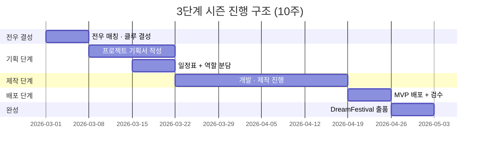

### 3.4 공동 목표 게이지 (클루 보드 핵심)

```
┌─────────────────────────────────┐
│  ⚔️ 클루: 디자인 파인더즈        │
│  Lv3 성장 중  ████████░░ 78%    │
│─────────────────────────────────│
│                                 │
│  🎯 공동 목표                    │
│  "UX 커리어 가이드 앱 기획 완성" │
│                                 │
│  공동 목표 게이지                │
│  ██████████████░░░░ 70%         │
│  → 배포 완료 시 100% 달성!      │
│                                 │
│  ─────────────────────────────  │
│  전우별 기여도                   │
│  👩별하  ██████████  100% ✅    │
│  👦준혁  ████████░░  80%        │
│  👧소율  ██████░░░░  60%  ⚠️    │
│  👦도윤  ████████░░  80%        │
│                                 │
│  ⚠️ 소율 전우가 뒤처지고 있어!  │
│  [응원 보내기 💪] [채팅 열기]   │
│                                 │
└─────────────────────────────────┘
```

---

## 4. 프로젝트 시스템 (개인 + 팀)

### 4.1 프로젝트 유형 비교표

| 구분 | 1인 솔로 프로젝트 | 팀 클루 프로젝트 |
|------|----------------|----------------|
| **인원** | 1명 | 3~5명 |
| **기간** | 자유 (권장 8주) | 시즌 기반 (10주) |
| **기획** | 개인 기획서 템플릿 | 공동 기획서 + 역할 분담 |
| **일정** | 개인 칸반 보드 | 공유 칸반 보드 |
| **문의** | 전체 Q&A 게시판 | 클루 Q&A + 전체 Q&A |
| **배포** | 개인 배포 + 인증 | 팀 배포 + 클루 인증 |
| **포트폴리오** | 개인 포트폴리오 자동 생성 | 개인 + 팀 포트폴리오 모두 생성 |
| **DreamFestival** | 개인 출품 가능 | 클루 출품 가능 |
| **전우 XP** | 개인 XP만 적립 | 클루 공유 XP + 1.5배 보너스 |

### 4.2 프로젝트 생애주기 (기획 → 배포)

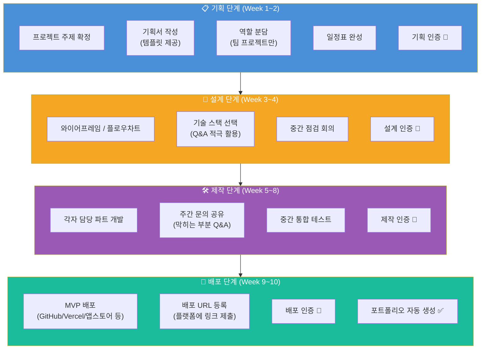

### 4.3 기획 단계 화면 설계

#### 기획서 작성 화면

```
┌─────────────────────────────────┐
│  📋 프로젝트 기획서               │
│  디자인 파인더즈 클루            │
│─────────────────────────────────│
│                                 │
│  📌 프로젝트명                   │
│  [ UX 커리어 탐색 가이드 앱    ] │
│                                 │
│  🎯 목적 (왜 만드나?)            │
│  [ UX 디자이너를 꿈꾸는 중고등  ]│
│  [ 학생을 위한 실전 가이드       ]│
│                                 │
│  👥 타겟 사용자                  │
│  [ 중1 ~ 고2, UX 디자인 관심자  ]│
│                                 │
│  🛠️ 기술 스택 (모르면 빈칸 OK!) │
│  [ React Native / Figma / ?    ] │
│  💡 "모르면 Q&A에 물어봐!"       │
│                                 │
│  📅 예상 완료일                  │
│  [ 2026년 5월 30일 ]            │
│                                 │
│  ─────────────────────────────  │
│  📊 완성도: ████░░░░░░ 40%      │
│                                 │
│  [저장]  [Q&A 물어보기]  [공유]  │
│                                 │
└─────────────────────────────────┘
```

#### 일정표 공유 화면 (칸반 보드)

```
┌─────────────────────────────────────────────────┐
│  📅 공유 일정표: 디자인 파인더즈                  │
│  시즌 D-42일  ████████░░░░░░░░ 55%              │
│─────────────────────────────────────────────────│
│                                                 │
│  📋 기획완료   🔄 진행중         ✅ 완료         │
│  ────────     ─────────         ──────          │
│  □ 최종        ■ [별하]          ✅ [별하]       │
│    편집          와이어프레임      기획서 완성     │
│                  D-3일 ⚠️                       │
│  □ 발표        ■ [준혁]          ✅ [준혁]       │
│    자료          React           현직자 인터뷰    │
│                  세팅 중                         │
│                ■ [소율]          ✅ [소율]       │
│                  디자인           RIASEC 조사     │
│                  시안 작업                       │
│                ■ [도윤]                          │
│                  마케팅 기획                     │
│                                                 │
│  [+ 카드 추가]  [전체 일정 보기]  [주간 회의 잡기]│
│                                                 │
└─────────────────────────────────────────────────┘
```

### 4.4 배포 체크리스트 (배포 기준 명확화)

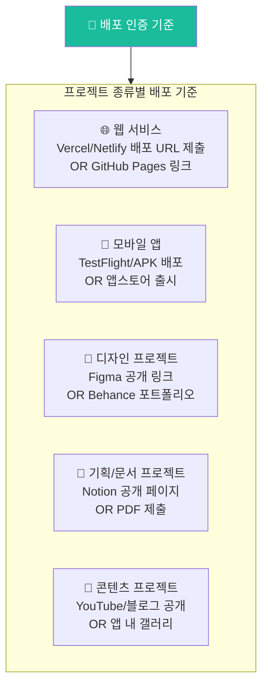

#### 배포 인증 화면

```
┌─────────────────────────────────┐
│  🚀 배포 인증하기                │
│─────────────────────────────────│
│                                 │
│  프로젝트: UX 커리어 탐색 앱    │
│                                 │
│  배포 링크 등록                  │
│  [ https://ux-guide.vercel.app] │
│                                 │
│  배포 방식 선택                  │
│  ○ 웹 서비스 (Vercel 등)        │
│  ● 디자인 (Figma 링크)          │
│  ○ 기획서 (Notion/PDF)          │
│  ○ 영상/콘텐츠                  │
│  ○ 모바일 앱                    │
│                                 │
│  배포 스크린샷 업로드            │
│  [ 📸 사진 첨부 ]               │
│                                 │
│  한 줄 소감                     │
│  [ "드디어 배포했다! 떨린다 ㅠ" ]│
│                                 │
│  [🚀 배포 인증 완료!]           │
│                                 │
│  ⚡ +500 XP 획득 예정           │
│  🏆 "첫 배포" 전설 배지 획득!   │
│                                 │
└─────────────────────────────────┘
```

---

## 5. 문의 공유 생태계 (핵심 강화 영역)

> **"처음 개발하는 사람이 가장 많이 막힌다."**
> 문의를 많이 올릴수록 XP를 얻는 구조로, 질문하는 문화를 만든다.

### 5.1 문의 시스템 전체 구조

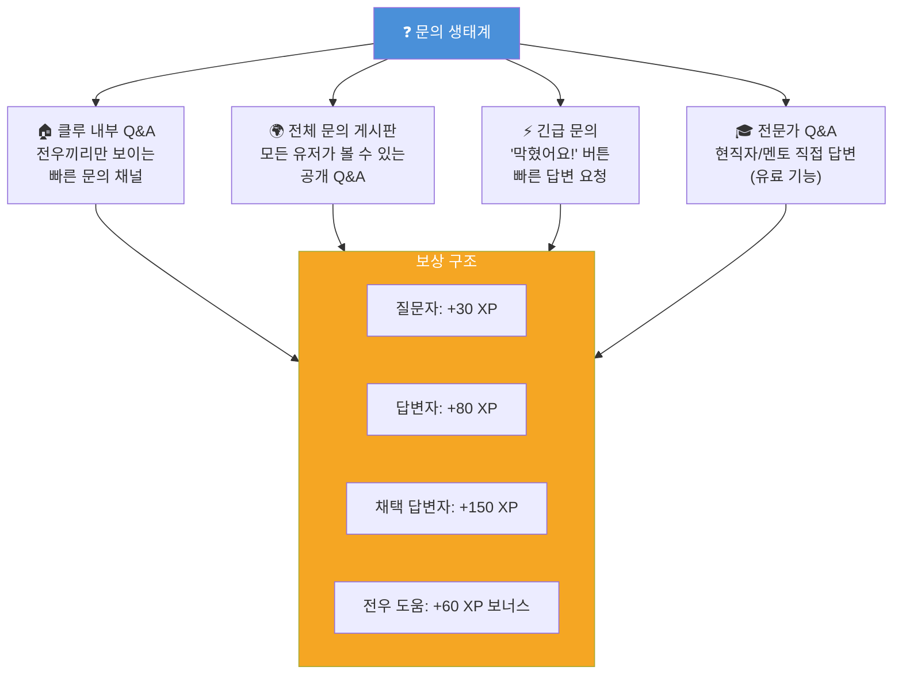

### 5.2 문의 카테고리 분류표

| 카테고리 | 아이콘 | 주요 질문 유형 | 주 사용 시점 |
|----------|--------|--------------|------------|
| **기획 문의** | 📋 | "어떤 주제가 좋을까요?" / "기획서 이렇게 써도 되나요?" | 기획 단계 |
| **일정 문의** | 📅 | "8주 안에 가능할까요?" / "역할 어떻게 나눴나요?" | 기획 단계 |
| **기술 선택** | 🛠️ | "React vs Vue 뭐 배울까요?" / "초보는 뭐부터?" | 설계 단계 |
| **개발 막힘** | 🔥 | "이 에러 어떻게 해요?" / "API 연동 방법" | 제작 단계 |
| **디자인** | 🎨 | "Figma 어떻게 써요?" / "UI 이거 어때요?" | 제작 단계 |
| **배포 방법** | 🚀 | "Vercel 배포 어떻게 해요?" / "도메인 연결 방법" | 배포 단계 |
| **커리어 조언** | 💼 | "이 프로젝트 학종에 써도 될까요?" / "포폴 이렇게 써도 돼요?" | 완성 단계 |
| **팀 문제** | 🤝 | "전우가 잠수 탔어요" / "역할 조정하고 싶어요" | 언제든지 |

### 5.3 문의 게시판 화면 설계

#### 전체 문의 게시판 메인

```
┌─────────────────────────────────┐
│  ❓ 문의 게시판                  │
│  [전체] [기획] [기술] [배포] [팀]│
│─────────────────────────────────│
│                                 │
│  [+ 문의 올리기]  🔥 +30 XP    │
│                                 │
│  ─────────────────────────────  │
│  🔥 긴급 문의                    │
│  ┌─────────────────────────────┐│
│  │🔥 React 오류 해결 부탁해요! ││
│  │  👤 준혁 | 기술 | 방금       ││
│  │  [답변하기 +80XP] 답변 0개  ││
│  └─────────────────────────────┘│
│                                 │
│  ─────────────────────────────  │
│  💬 최신 문의                    │
│  ┌─────────────────────────────┐│
│  │📋 기획서 주제 추천해주세요! ││
│  │  👤 소율 | 기획 | 2시간 전  ││
│  │  ✅ 답변 3개                ││
│  └─────────────────────────────┘│
│  ┌─────────────────────────────┐│
│  │🚀 Vercel 배포 방법 알려주세요││
│  │  👤 도윤 | 배포 | 5시간 전  ││
│  │  ✅ 채택 답변 있음 🏆       ││
│  └─────────────────────────────┘│
│  ┌─────────────────────────────┐│
│  │🛠️ 초보인데 어떤 언어 배울까요││
│  │  👤 새싹유저 | 기술 | 1일전  ││
│  │  ✅ 답변 8개 (인기글 🔥)    ││
│  └─────────────────────────────┘│
│                                 │
│  [인기 문의 보기] [해결됨 보기]  │
│                                 │
└─────────────────────────────────┘
```

#### 문의 작성 화면

```
┌─────────────────────────────────┐
│  ❓ 문의 올리기                  │
│  +30 XP 획득!                   │
│─────────────────────────────────│
│                                 │
│  카테고리 선택                   │
│  [📋기획] [🛠️기술] [🚀배포]     │
│  [🎨디자인] [🤝팀] [💼커리어]   │
│                                 │
│  제목                           │
│  [ React 에러 해결 방법 알고 싶어요 ]│
│                                 │
│  내용 (상세히 쓸수록 빠른 답변!) │
│  ┌─────────────────────────────┐│
│  │ 안녕하세요! 처음 React 배우 ││
│  │ 고 있는데요, 아래 에러가 계  ││
│  │ 속 뜨는데 어떻게 해결하나요? ││
│  │                             ││
│  │ [에러 메시지 붙여넣기]       ││
│  └─────────────────────────────┘│
│                                 │
│  스크린샷 첨부 (선택)           │
│  [ 📸 이미지 첨부 ]             │
│                                 │
│  공개 범위                      │
│  ● 전체 공개 (빠른 답변)        │
│  ○ 클루 내부만                  │
│                                 │
│  🔥 긴급 문의로 올리기          │
│  (알림이 전우들에게 전송돼!)     │
│                                 │
│  [문의 등록하기]  +30 XP        │
│                                 │
└─────────────────────────────────┘
```

#### 문의 상세 / 답변 화면

```
┌─────────────────────────────────┐
│  ❓ React 에러 해결 방법         │
│  📋 기술 | 👤 준혁 | 1시간 전   │
│─────────────────────────────────│
│                                 │
│  안녕하세요! 처음 React 배우고  │
│  있는데요, 아래 에러가 계속 떠요│
│                                 │
│  ```                            │
│  TypeError: Cannot read         │
│  property 'map' of undefined    │
│  ```                            │
│                                 │
│  [📸 스크린샷 1장]              │
│                                 │
│  ─────────────────────────────  │
│  💬 답변 3개                     │
│                                 │
│  ┌─────────────────────────────┐│
│  │ 👩 별하 (전우) · 30분 전    ││
│  │                             ││
│  │ data가 undefined일 때 map을  ││
│  │ 호출해서 그래요!             ││
│  │ 이렇게 고쳐봐요:            ││
│  │ data?.map(...) 또는         ││
│  │ (data || []).map(...)        ││
│  │                             ││
│  │ [👍 도움됐어요 5] [채택 🏆] ││
│  └─────────────────────────────┘│
│  ┌─────────────────────────────┐│
│  │ 👦 도윤 (전우) · 45분 전    ││
│  │ API 응답 오기 전에 map 돌리  ││
│  │ 는 거라서, useEffect로 데이 ││
│  │ 터 받아온 후에 렌더하세요!   ││
│  │ [👍 도움됐어요 3]           ││
│  └─────────────────────────────┘│
│                                 │
│  [답변 작성하기 +80XP]           │
│                                 │
└─────────────────────────────────┘
```

### 5.4 초보 개발자 전용 지원 시스템

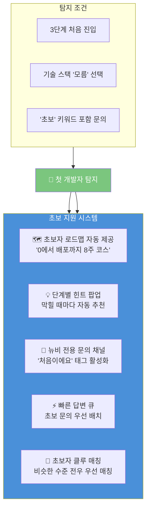

#### 초보자 로드맵 팝업 화면

```
┌─────────────────────────────────┐
│  🌱 처음이구나! 걱정 마!         │
│─────────────────────────────────│
│                                 │
│  "0에서 배포까지" 8주 코스       │
│                                 │
│  Week 1~2  📋 기획              │
│  ✅ 주제 정하기 → 기획서 작성   │
│     막히면: Q&A에 물어봐!       │
│                                 │
│  Week 3~4  🎨 설계              │
│  ☐ Figma로 화면 그려보기        │
│     추천: "Figma 무료 튜토리얼" │
│                                 │
│  Week 5~7  🛠️ 제작              │
│  ☐ 추천 스택: React (웹)        │
│              Flutter (앱)        │
│     막히면: Q&A에서 검색해봐!   │
│                                 │
│  Week 8   🚀 배포               │
│  ☐ Vercel 무료 배포             │
│     막히면: "Vercel 배포 가이드"│
│                                 │
│  ─────────────────────────────  │
│  💡 팁: 문의 많이 올릴수록      │
│         XP 더 많이 얻어!        │
│                                 │
│  [시작하기!]  [나중에 볼게요]   │
│                                 │
└─────────────────────────────────┘
```

### 5.5 문의 TOP 모음 (인기 문의 아카이브)

> 반복되는 문의는 **FAQ 아카이브**로 자동 전환. 다음 유저가 같은 질문을 하기 전에 미리 볼 수 있다.

```
┌─────────────────────────────────┐
│  🏆 전우들이 가장 많이 물어본 것 │
│─────────────────────────────────│
│                                 │
│  🔥 TOP 기획 문의               │
│  ┌─────────────────────────────┐│
│  │ Q. 프로젝트 주제 어떻게 잡아요?││
│  │    → 답변 47개 · 조회 1,204  ││
│  │ Q. 기획서 분량이 어느 정도에요?││
│  │    → 답변 23개 · 조회 876    ││
│  └─────────────────────────────┘│
│                                 │
│  🔥 TOP 기술 문의               │
│  ┌─────────────────────────────┐│
│  │ Q. 코딩 처음인데 뭐부터 해요?  ││
│  │    → 답변 89개 · 조회 3,421  ││
│  │ Q. React vs Vue 뭐가 좋아요? ││
│  │    → 답변 34개 · 조회 1,567  ││
│  └─────────────────────────────┘│
│                                 │
│  🔥 TOP 배포 문의               │
│  ┌─────────────────────────────┐│
│  │ Q. Vercel 배포 처음 하는데요  ││
│  │    → 답변 56개 · 조회 2,103  ││
│  │ Q. 도메인 없어도 배포 돼요?   ││
│  │    → 답변 19개 · 조회 934    ││
│  └─────────────────────────────┘│
│                                 │
└─────────────────────────────────┘
```

---

## 6. 클루 채팅 + 전우 소통 시스템

### 6.1 채팅 기능 구조

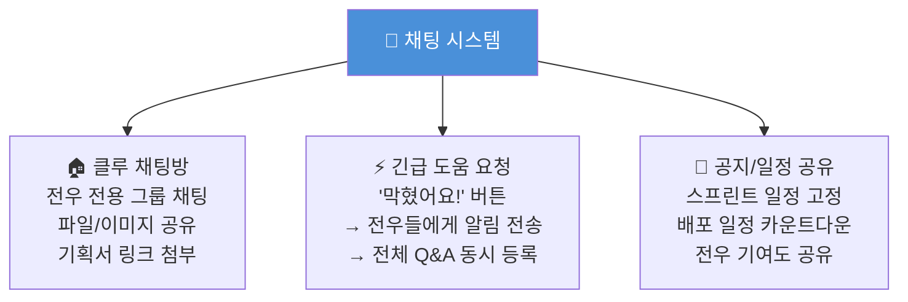

### 6.2 클루 채팅 화면

```
┌─────────────────────────────────┐
│  💬 디자인 파인더즈               │
│  전우 4명 · 온라인 3명 🟢        │
│─────────────────────────────────│
│                                 │
│  📌 고정: 배포 D-14일           │
│  공동 목표 ████████░░ 78%       │
│                                 │
│  ─────────────────────────────  │
│                                 │
│  👩별하   오전 10:23             │
│  와이어프레임 올렸어!            │
│  [📎 figma.com/wireframe]       │
│                                 │
│  👦준혁   오전 10:31             │
│  오 완전 좋다!! 색감 어떻게 할까?│
│                                 │
│  👧소율   오전 10:45             │
│  ┌─────────────────────────────┐│
│  │ 🔥 막혔어요! 도움 필요       ││
│  │ API 연동에서 CORS 에러 뜨는  ││
│  │ 데 어떻게 해요??             ││
│  └─────────────────────────────┘│
│  → Q&A에도 자동 등록됨!         │
│                                 │
│  👦도윤   오전 10:47             │
│  소율아, proxy 설정해봐!         │
│  내가 저번에 했는데 알려줄게     │
│                                 │
│  ─────────────────────────────  │
│                                 │
│  [메시지 입력...]  [🔥막혔어요!] │
│                                 │
└─────────────────────────────────┘
```

### 6.3 전우 응원 시스템

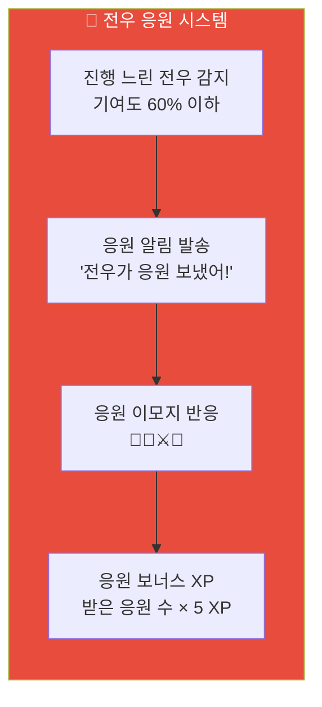

---

## 7. 포트폴리오 자동 생성 시스템

### 7.1 포트폴리오 구성 요소

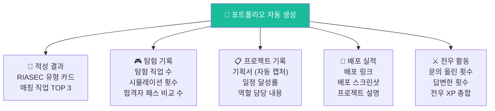

### 7.2 포트폴리오 화면

```
┌─────────────────────────────────┐
│  📁 나의 포트폴리오              │
│  [공유] [PDF] [링크 복사]       │
│─────────────────────────────────│
│                                 │
│  👤 별하 / 고1 / 서울           │
│  🎨 예술형(A) + 탐구형(I)       │
│                                 │
│  ─────────────────────────────  │
│  🎮 탐험 기록                   │
│  직업 탐험: 67개                │
│  시뮬레이션: 12회               │
│  합격자 패스 비교: 8회          │
│                                 │
│  ─────────────────────────────  │
│  🚀 완성 프로젝트                │
│                                 │
│  ┌─────────────────────────────┐│
│  │ UX 커리어 탐색 가이드 앱     ││
│  │ 팀 프로젝트 · 디자인 파인더즈 ││
│  │ 역할: 기획 + UX 리서치      ││
│  │ 🚀 배포: figma.com/...      ││
│  │ ⚔️ 전우: 준혁, 소율, 도윤   ││
│  └─────────────────────────────┘│
│                                 │
│  ─────────────────────────────  │
│  ❓ 커뮤니티 기여               │
│  문의 올림: 5회                 │
│  답변 제공: 12회  (+960 XP)     │
│  💡 채택 답변: 3회              │
│                                 │
│  ─────────────────────────────  │
│  🏆 획득 배지                   │
│  ⚔️첫전우  📋기획왕  🚀첫배포   │
│  💡답변영웅                     │
│                                 │
└─────────────────────────────────┘
```

---

## 8. 유저 시나리오 — 전우 시스템 완주

### 8.1 시나리오 A: 고1 별하 (클루 팀 프로젝트 완주)

```
╔══════════════════════════════════════════╗
║  👩 별하 / 16세 / 고1 / 서울            ║
║  꿈: UX 디자이너 확정                   ║
║  특성: 처음 개발, 질문 많음             ║
║  경로: 2단계 완료 → 클루 팀 프로젝트   ║
╚══════════════════════════════════════════╝
```

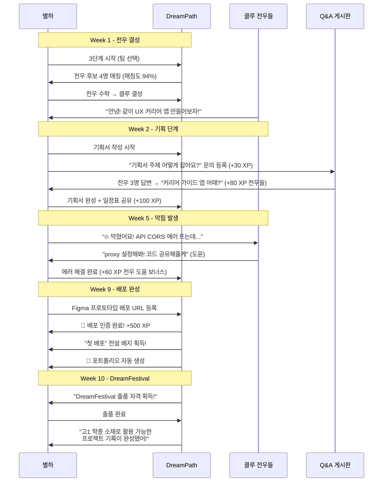

### 8.2 시나리오 B: 중3 준혁 (1인 솔로 프로젝트 완주)

```
╔══════════════════════════════════════════╗
║  👦 준혁 / 15세 / 중3 / 부산            ║
║  꿈: 게임 개발자                        ║
║  특성: 혼자 하는 게 편함, 처음 코딩     ║
║  경로: 2단계 완료 → 1인 솔로 프로젝트  ║
╚══════════════════════════════════════════╝
```

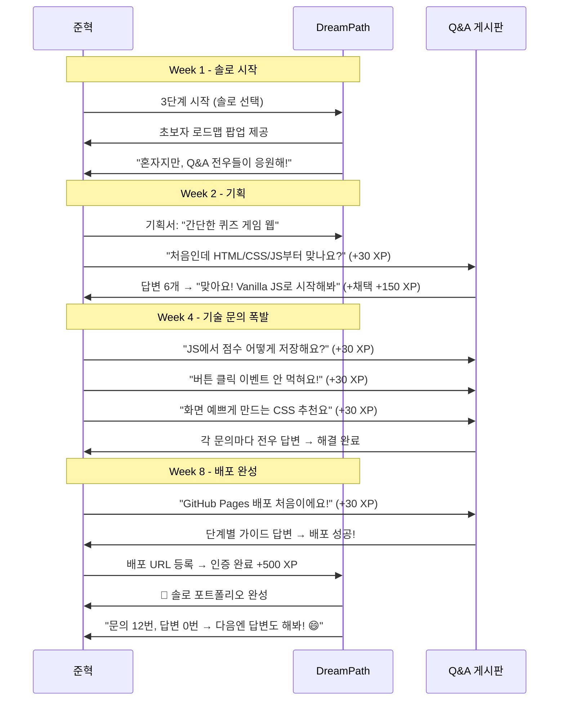

### 8.3 시나리오 C: 고2 소율 (문의 답변으로 성장)

```
╔══════════════════════════════════════════╗
║  👧 소율 / 17세 / 고2 / 대전            ║
║  꿈: 프론트엔드 개발자                   ║
║  특성: 개발 경험 있음, 답변 잘 해줌     ║
║  경로: 클루 프로젝트 + 답변 멘토 활동   ║
╚══════════════════════════════════════════╝
```

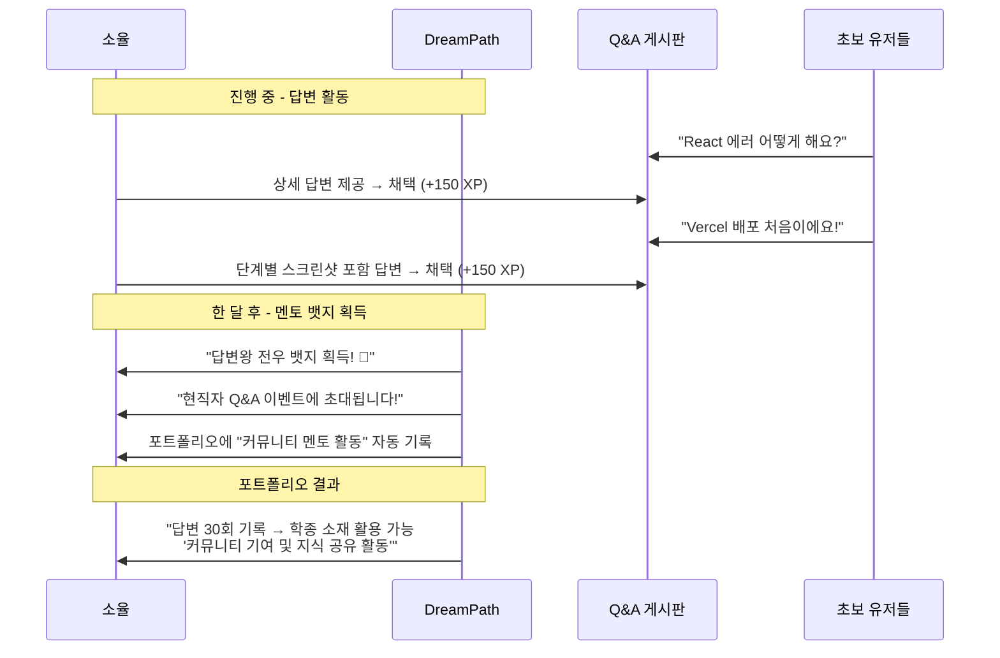

---

## 9. 전체 게임 흐름도 (3단계 완전판)

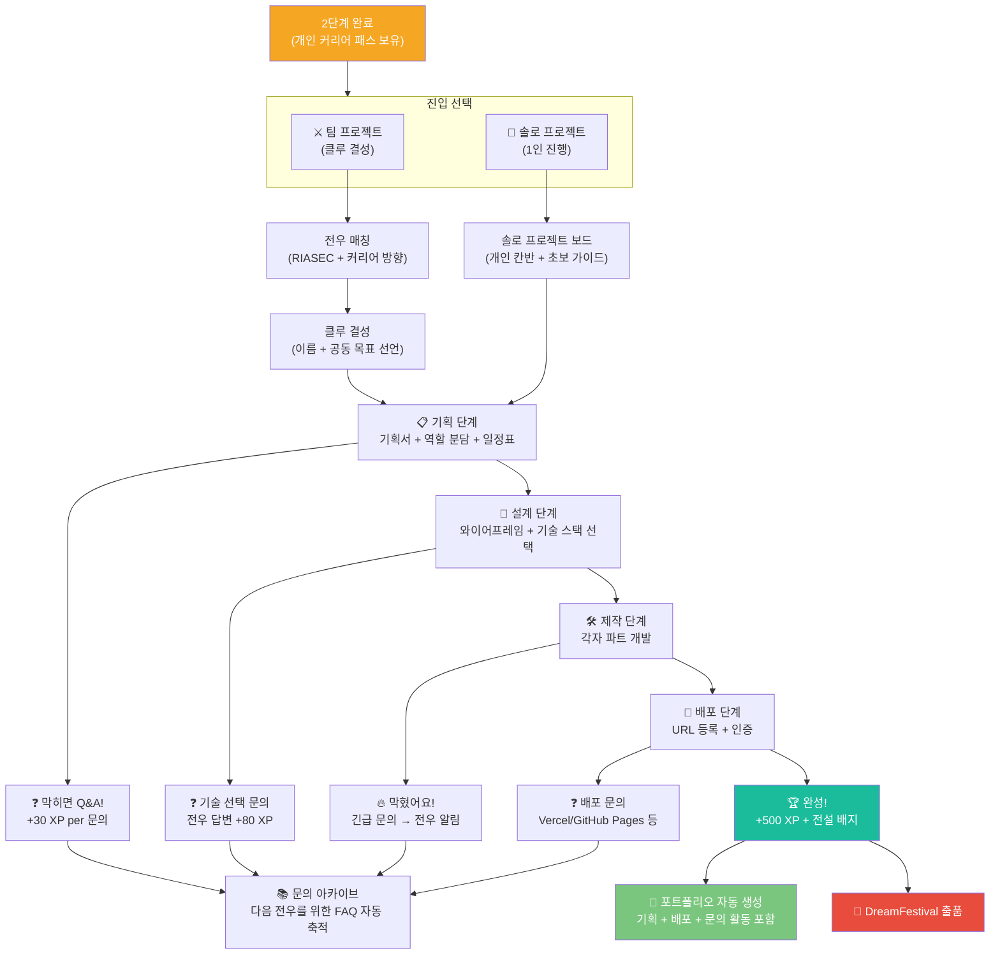

---

## 10. 전우 시스템 게임 요소 비교표

| 게임 요소 | 솔로 트랙 | 클루 팀 트랙 | 비고 |
|----------|-----------|------------|------|
| **XP 획득** | 개인 XP | 클루 공유 XP × 1.5배 | 팀이 유리 |
| **레벨 시스템** | 개인 레벨 | 클루 레벨 (공동 성장) | 팀은 함께 성장 |
| **문의 사용** | 전체 Q&A만 | 클루 Q&A + 전체 Q&A | 팀은 더 빠른 답변 |
| **응원 시스템** | 일반 응원 | 전우 긴급 도움 + 응원 | 팀은 즉각 알림 |
| **배포 인증** | 개인 인증 | 클루 공동 인증 | 동일 |
| **포트폴리오** | 개인 포트폴리오 | 개인 + 팀 포트폴리오 | 팀은 2개 생성 |
| **DreamFestival** | 개인 출품 | 클루 공동 출품 | 팀 출품이 주목도 높음 |
| **학종 소재** | 개인 프로젝트 기록 | 팀 협업 + 역할 기록 | 둘 다 활용 가능 |

---

## 11. 문의 생태계 강화 전략

### 11.1 "질문이 곧 성장" 문화 설계

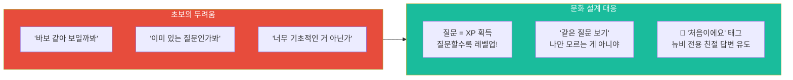

### 11.2 문의 건강도 지표

| 지표 | 측정 방법 | 목표값 | 개선 전략 |
|------|----------|--------|---------|
| **평균 답변 시간** | 문의 등록 → 첫 답변 시간 | 1시간 이내 | 긴급 문의 전우 알림 강화 |
| **답변 채택률** | 채택된 답변 / 전체 답변 | 40% 이상 | 채택 기준 안내 팝업 |
| **문의 해결률** | 해결됨 태그 / 전체 문의 | 80% 이상 | 전문가 Q&A 연동 |
| **재방문율** | 문의 후 재방문 비율 | 70% 이상 | 답변 알림 + XP 보상 |
| **초보 문의 비율** | '처음이에요' 태그 문의 | 30% 이상 | 초보 친화 환경 유지 |

---

## 12. 데이터 구조 (ERD)

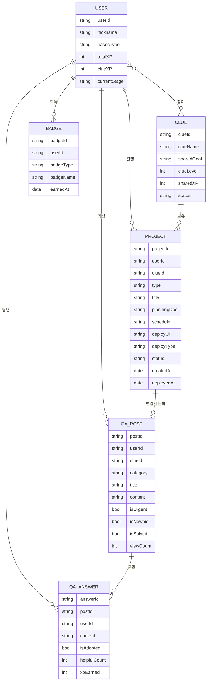

---

## 13. MVP 개발 우선순위 (3단계 전용)

| 우선순위 | 기능 | 이유 | 예상 기간 |
|---------|------|------|---------|
| 🔴 P0 | 전우 매칭 + 클루 생성 | 3단계 진입 필수 | 3주 |
| 🔴 P0 | 프로젝트 보드 (개인 + 팀) | 기획/일정 공유 핵심 | 3주 |
| 🔴 P0 | 전체 Q&A 게시판 | 초보 지원 핵심 | 2주 |
| 🔴 P0 | 클루 채팅 + 긴급 문의 | 소통 필수 | 3주 |
| 🔴 P0 | 배포 인증 시스템 | 완성 기준 명확화 | 1주 |
| 🟡 P1 | 문의 XP 보상 시스템 | 질문 문화 형성 | 2주 |
| 🟡 P1 | 초보자 로드맵 팝업 | 이탈 방지 | 1주 |
| 🟡 P1 | 포트폴리오 자동 생성 | 결과물 필수 | 3주 |
| 🟡 P1 | 클루 공유 XP + 레벨 | 게임 몰입 강화 | 2주 |
| 🟢 P2 | 문의 FAQ 아카이브 | 콘텐츠 축적 | 2주 |
| 🟢 P2 | 전문가 Q&A (유료) | 수익화 + 신뢰도 | 4주 |
| 🟢 P2 | 배지 + 응원 시스템 | 게임 완성도 | 2주 |
| 🟢 P2 | DreamFestival 출품 | 시즌 이벤트 | 3주 |

---

*작성일: 2026년 2월 | DreamPath 3단계 게임 설계서 v1.0*
