# DreamPath — AI 시대 직업 역량 재정의
# 8대 왕국 × AI 전후 직무 비교 × 역량 기반 프로젝트 설계

> **"AI가 일의 양을 줄이고 팀 규모를 줄였다. 그렇다면 남은 사람이 해야 할 일은 무엇인가?"**
> 직업 세계가 AI로 재편되는 지금, 역량의 정의도 바뀌어야 한다.
> DreamPath는 **AI 이후 살아남는 역량을 기반으로 프로젝트를 설계**한다.

---

## 0. 이 문서를 읽기 전에 — 핵심 3가지 질문

```
┌─────────────────────────────────────────────────────────┐
│                                                         │
│  Q1. AI가 내 직업의 어떤 일을 대체했는가?               │
│      → 구체적으로 어떤 업무가 사라지고 무엇이 남았나    │
│                                                         │
│  Q2. 왜 이런 변화가 일어났는가?                         │
│      → AI의 경제적 원리와 기업 입장에서의 논리          │
│                                                         │
│  Q3. 그렇다면 나는 지금 무엇을 배워야 하는가?           │
│      → 개발 프로세스 전체 이해 + AI 프로젝트 경험       │
│                                                         │
└─────────────────────────────────────────────────────────┘
```

> **이 3가지 질문에 답하는 것이 이 문서의 목표다.**
> 단순한 "AI가 무서워요"가 아니라, **"그래서 나는 이것을 해야 한다"**로 끝나야 한다.

---

## 1. AI가 바꾼 직업 세계 — 4가지 패러다임 전환

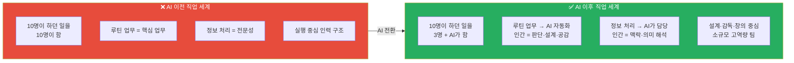

### 1.1 AI 시대 직업 세계 4대 변화 비교표

| 변화 축 | AI 이전 | AI 이후 | DreamPath 설계 방향 |
|--------|--------|--------|-----------------|
| **팀 규모** | 10명 → 각자 역할 분담 | 3명 + AI 툴로 동일 산출물 | 소수 정예 클루(3~5명) |
| **핵심 업무** | 루틴 실행 + 전문 판단 | 루틴 제거 → 판단·설계·공감만 | 역량 기반 살아보기 설계 |
| **전문성 정의** | 지식의 양 = 전문성 | 지식 활용 판단력 = 전문성 | 왕국별 핵심 역량 Top 5 |
| **새 직종** | 직업 경계 명확 | 융합·브릿지 직종 급증 | 왕국 교차 프로젝트 |
| **성장 방식** | 경력 연수 = 성장 | 포트폴리오·배포 = 증명 | 그림자 프로젝트 배포 |

### 1.2 AI가 대체하는 업무 vs 인간이 남는 업무

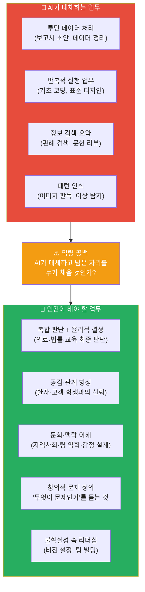

### 1.3 왜 이런 변화가 일어났는가 — AI 경제학의 구조

> **"기업이 AI를 도입하는 이유는 단 하나다: 같은 산출물을 더 적은 비용으로"**

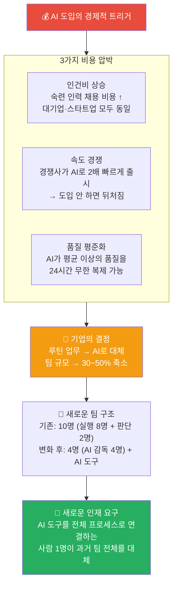

#### 구체적 사례: AI 이전 vs 이후 팀 구조 변화

| 회사 유형 | AI 이전 팀 구성 | AI 이후 팀 구성 | 무엇이 사라졌나 |
|---------|-------------|-------------|------------|
| **스타트업 앱 개발** | 개발자 5명 + 디자이너 2명 + 기획 1명 = 8명 | 풀스택 2명 + AI 감독 1명 = 3명 | 반복 코딩 담당 주니어 개발자 |
| **법률 사무소** | 변호사 3명 + 사무보조 3명 + 인턴 2명 = 8명 | 변호사 2명 + AI 법률 보조 = 3명 | 판례 검색·서류 작성 보조 |
| **디자인 에이전시** | 디자이너 4명 + 수정 담당 2명 = 6명 | 크리에이티브 디렉터 1명 + AI 협업 1명 = 2명 | 반복 수정 담당 주니어 디자이너 |
| **마케팅 팀** | 콘텐츠 제작 3명 + 광고 운영 2명 + 분석 1명 = 6명 | 전략 기획 1명 + AI 운영 감독 1명 = 2명 | 광고 소재 제작·A/B 테스트 실무자 |
| **의료 연구소** | 연구원 6명 + 데이터 입력 2명 = 8명 | 수석 연구원 2명 + AI 도구 = 3명 | 기초 데이터 처리·논문 정리 연구 보조 |
| **언론사** | 기자 5명 + 편집 2명 + 교열 1명 = 8명 | 취재 기자 2명 + AI 편집·교열 = 3명 | 단순 보도 기사 작성·편집 담당 |

> **핵심 결론:** 사라지는 포지션은 "전체 프로세스 중 한 단계만 담당"하는 자리다.
> 살아남는 포지션은 **"전체 프로세스를 이해하고 AI와 함께 전 단계를 조율"**하는 자리다.

---

### 1.4 대체된 업무 vs 새로 생긴 업무 — 전 산업 완전 해부

> **"AI가 한 단계씩 자동화하면서, 인간은 단계를 넘나드는 사람이 되어야 했다"**

```mermaid
flowchart LR
    subgraph OldJob["❌ AI가 대체한 업무 유형"]
        direction TB
        O1["📄 반복 문서 작성<br>보고서·계약서 초안·이메일 템플릿"]
        O2["🔍 정보 검색·요약<br>판례·논문·시장 조사·FAQ"]
        O3["🖼️ 기초 제작 실행<br>기본 코딩·표준 디자인·단순 편집"]
        O4["📊 데이터 수집·정리<br>엑셀 정리·DB 입력·통계 계산"]
        O5["🔄 패턴 인식·분류<br>이미지 분류·이상 탐지·번역"]
        O6["📋 일정·프로세스 관리<br>스케줄링·알림·표준 QA 체크"]
    end

    subgraph NewJob["✅ AI 이후 새로 생긴/강화된 업무"]
        direction TB
        N1["🧭 문제 정의 & 방향 설정<br>'무엇이 진짜 문제인가'를 묻는 역할"]
        N2["⚙️ AI 결과 검증 & 감독<br>AI 출력물의 오류·편향·품질 판단"]
        N3["🔗 전체 프로세스 연결<br>AI 도구들을 파이프라인으로 통합"]
        N4["🤝 이해관계자 소통<br>AI 결과를 맥락에 맞게 번역·설득"]
        N5["🎨 창의적 방향 제시<br>AI가 못 보는 문화·감성·윤리 판단"]
        N6["🚀 실험·피벗 설계<br>빠른 가설 검증 후 방향 수정"]
    end

    OldJob -->|"자동화"| Gap["⚠️ 역량 공백 발생<br>이 빈자리를 채울<br>사람이 없다"]
    Gap -->|"필요"| NewJob

    style OldJob fill:#E74C3C,color:#fff
    style NewJob fill:#27AE60,color:#fff
    style Gap fill:#F39C12,color:#fff
```

#### 산업별 대체 업무 vs 새 업무 완전 비교표

| 산업 | ❌ AI가 대체한 구체적 업무 | ✅ 새로 생긴/강화된 업무 | 필요한 새 직함 |
|-----|----------------------|---------------------|-----------|
| **의료·바이오** | 영상 판독, 1차 진단, 의무기록 작성, 논문 검색 | AI 진단 감독, 복합 케이스 판단, 환자 공감 상담, 연구 방향 설정 | AI 의료 감독관, 임상-AI 브릿지 |
| **법률** | 판례 검색, 계약서 초안, 법률 요약, 기초 서류 작성 | 협상 전략 수립, 법정 판단, AI 법률 오류 감사, 디지털 법학 자문 | AI 법률 감독관, 디지털 포렌식 전문가 |
| **교육** | 수업 자료 제작, 채점, 개별 설명, 진도 관리 | 학생 동기 설계, 관계 형성, AI 교육 품질 감독, 커리큘럼 전략 | 에듀테크 설계자, AI 학습 큐레이터 |
| **금융·회계** | 세무 신고, 결산 자동화, 재무 보고서, 데이터 입력 | 세금 전략 자문, 이례 탐지 판단, AI 리스크 평가, 투자 전략 | AI 금융 감사관, 전략 재무 자문 |
| **마케팅** | 광고 소재 제작, A/B 테스트, 성과 보고서 작성 | 브랜드 전략, 커뮤니티 관계, AI 콘텐츠 방향 감독, 문화 감수성 | 브랜드 전략가, AI 콘텐츠 디렉터 |
| **소프트웨어** | 기초 코딩, 버그 수정, 쿼리 최적화, QA 체크리스트 | 아키텍처 설계, 요구사항 정의, AI 코드 감사, 시스템 통합 | AI 아키텍트, 프롬프트 엔지니어 |
| **디자인** | 와이어프레임 반복 제작, 채색, 배경 작업, 리사이징 | 사용자 감정 흐름 설계, AI 결과물 큐레이션, 브랜드 철학 수호 | AI 크리에이티브 디렉터, UX 전략가 |
| **미디어·언론** | 기사 초안, 교열, 자막, 단순 편집 | 취재·탐사, 팩트체크, 서사 방향, 커뮤니티 신뢰 구축 | AI 저널리즘 감독관, 미디어 전략가 |
| **건설·건축** | CAD 도면 작성, 자재 비용 계산, 일정 관리 | 공간 철학 정의, 지역 맥락 설계, AI 설계 감독 | AI 건축 감독관, 공간 경험 디자이너 |
| **농업·식품** | 작물 상태 모니터링, 병충해 감지, 수확 시기 예측 | 농장 시스템 통합 설계, 이상 판단, 지역 농가 설득 | 스마트팜 통합 전문가, 농업 AI 감독관 |
| **인사·HR** | 이력서 스크리닝, 면접 일정, 급여 계산 | 인재 전략 설계, 조직 문화 설계, AI 채용 편향 감독 | AI 채용 감사관, 조직 설계 전문가 |
| **제조·물류** | 품질 검사, 재고 예측, 배송 경로 최적화 | 공장 시스템 통합, 예외 상황 판단, 공급망 리스크 관리 | AI 제조 감독관, 공급망 전략가 |

---

### 1.5 모든 산업이 AI에 영향받는다 — 공통 메커니즘

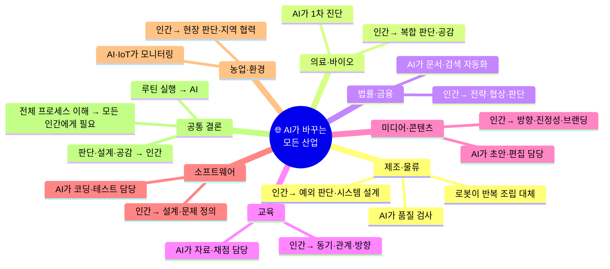

> **어떤 산업이든 변화의 구조는 동일하다:**
>
> `루틴 실행 업무 → AI 자동화` → `팀 규모 축소` → `남은 사람은 전체 프로세스를 혼자 감당` → **`개발 프로세스 전체 이해 필수`**

---

### 1.6 왜 "개발 프로세스 전체 이해"가 지금 가장 중요한가

> **핵심 논리:**
> AI 이전에는 전문가 10명이 각자 1단계씩 맡았다.
> AI 이후에는 3명이 AI와 함께 10단계 전체를 관리한다.
> 따라서 **"내가 맡은 1단계"만 아는 사람은 더 이상 필요하지 않다.**

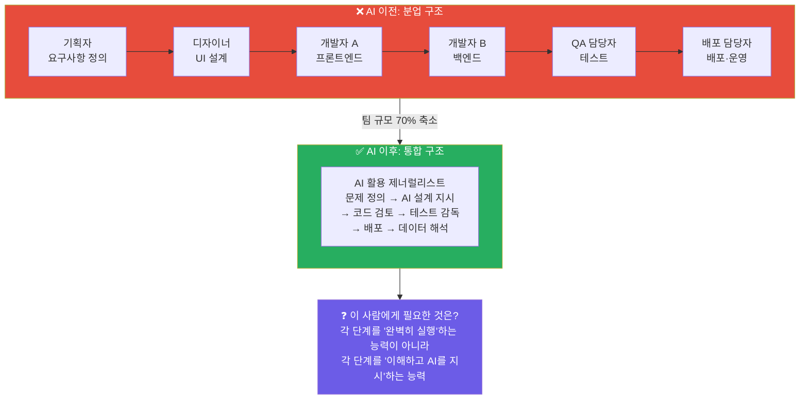

#### 개발 프로세스 전체 이해가 필요한 이유 — 단계별 설명

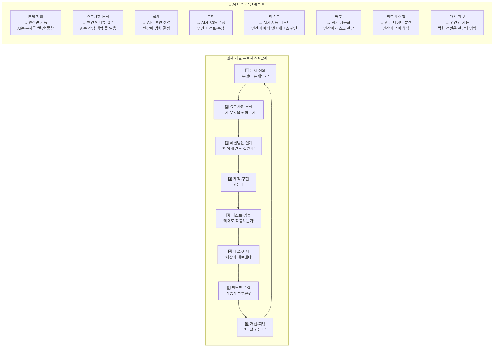

#### 프로세스 이해 없이 AI를 쓰면 생기는 문제

| 상황 | 프로세스 모르는 사람 | 프로세스 아는 사람 |
|-----|---------------|--------------|
| AI가 잘못된 요구사항으로 코드 생성 | "AI가 만들어줬으니 맞겠지" → 배포 후 오류 | "요구사항부터 다시 정의해야 한다" → 사전 수정 |
| AI 디자인이 예쁘지만 사용자가 못 씀 | "AI 점수가 높으니 선택" → 사용자 이탈 | "테스트 단계에서 실제 사용자 확인 필요" |
| AI 마케팅 결과 조회수는 높지만 전환율 0% | "AI가 최적화했으니 맞겠지" | "피드백 해석 → 랜딩 페이지 문제 발견" |
| AI 법률 서류 오류 있음 | 오류 발견 못함 → 소송 패배 | 검토 단계에서 논리 오류 발견 |

---

### 1.7 왜 프로젝트 경험이 유일한 해답인가

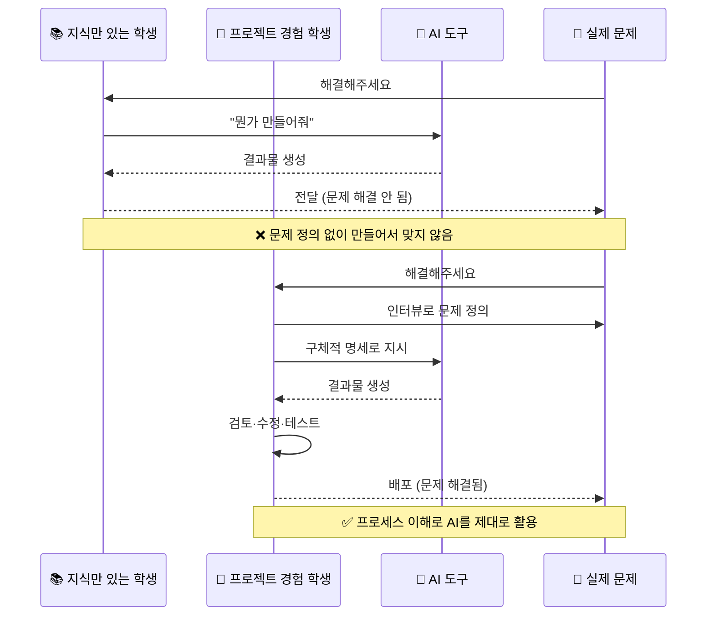

#### 프로젝트 경험이 만드는 5가지 역량

| 역량 | 수업·강의로 얻을 수 있나? | 프로젝트만 줄 수 있는 것 |
|-----|-------------------|---------------------|
| **문제 정의** | ❌ 이론은 배울 수 있음 | 실제 사용자 인터뷰에서 "예상과 다른 문제" 발견 경험 |
| **실패와 피벗** | ❌ 케이스 스터디로만 | 직접 출시하고 아무도 안 쓸 때의 감각·대응 능력 |
| **AI 활용 판단** | ❌ 시뮬레이션으로 한계 | AI가 틀렸을 때 발견하는 실전 감각 |
| **팀 협업** | ❌ 그룹 과제는 다름 | 실제 책임이 있는 역할에서 갈등·합의 경험 |
| **배포·공개** | ❌ 수업에 배포 없음 | 세상에 내놓았을 때의 책임감·성취감 |

> **결론: 지식은 수업에서, 역량은 프로젝트에서만 생긴다.**
> AI 시대에 역량이 곧 경쟁력이므로, **프로젝트 경험이 없으면 AI를 가진 타인과 경쟁할 수 없다.**

---

### 1.8 AI 프로젝트 개발 역량 — 구체적으로 무엇인가

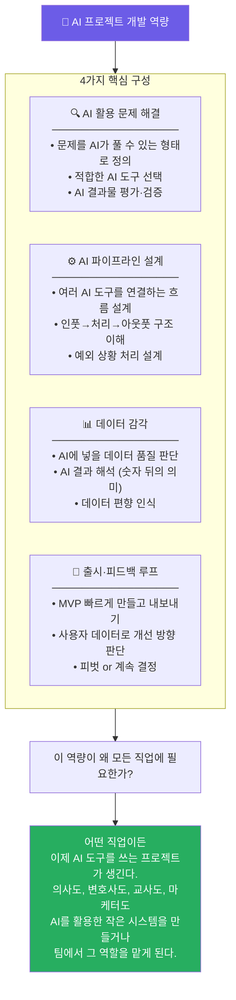

#### AI 프로젝트 개발 역량 수준 4단계

| 수준 | 이름 | 할 수 있는 것 | DreamPath 단계 |
|-----|-----|-----------|-------------|
| **Lv.1** | AI 사용자 | AI 도구에 프롬프트 입력하고 결과 사용 | 하루 살아보기 |
| **Lv.2** | AI 활용자 | 여러 AI 도구 조합해 프로젝트 1개 완성 | 1주 캠프 |
| **Lv.3** | AI 설계자 | AI 파이프라인 설계 + 출시 + 데이터 해석 | 1달 그림자 |
| **Lv.4** | AI 감독자 | AI 시스템 전체 책임 + 팀 방향 설정 + 리스크 관리 | 클루 그림자 프로젝트 |

---

## 2. 8대 왕국 — AI 전후 직무 × 역량 전체 비교표

| 왕국 | AI가 대체한 업무 | AI 이후 인간 핵심 업무 | 새로 생긴 직무 | 2030 핵심 역량 Top 3 |
|-----|--------------|-----------------|------------|-------------------|
| 🔬 **탐구** | 이미지 판독, 문헌 검색, 기초 진단 | 복합 케이스 판단, 연구 설계, 환자 공감 | AI 의료 감독자, 임상-AI 브릿지 연구원 | 복합 판단력 / 연구 설계 / 윤리 사고 |
| 🎨 **창작** | 기초 이미지 생성, 반복 디자인 | 사용자 공감, 문화적 맥락, 감정 설계 | AI 크리에이티브 디렉터, 프롬프트 아티스트 | 사용자 공감 / 문화 감수성 / AI 협업 |
| 💻 **기술** | 기초 코딩, 버그 수정, 쿼리 최적화 | 아키텍처 설계, 요구사항 정의, 보안 판단 | AI 엔지니어, 프롬프트 엔지니어, AI 감사관 | 시스템 설계 / 문제 정의 / AI 협업 |
| 🌱 **자연** | 환경 모니터링, 기초 진단, 데이터 수집 | 현장 판단, 생태 시스템 이해, 지역 설득 | 기후 테크 전문가, 스마트팜 운영 전문가 | 현장 전문성 / 생태 감수성 / IoT 활용 |
| 🤝 **연결** | 기초 정보 제공, 행정 처리, 일정 관리 | 관계 형성, 감정 지원, 현장 돌봄 | AI 활용 상담사, 에듀테크 교사 | 공감력 / 관계 설계 / AI 보조 활용 |
| 🏛️ **질서** | 판례 검색, 기초 서류 작성, 세무 자동화 | 협상, 전략적 판단, 정치·맥락 이해 | AI 법률 감독자, 디지털 외교관, 데이터 포렌식 | 전략적 사고 / 협상력 / 디지털 법학 |
| 📣 **소통** | 콘텐츠 초안, 광고 최적화, A/B 테스트 | 브랜드 전략, 문화 감수성, 커뮤니티 형성 | AI 콘텐츠 큐레이터, 마케팅 AI 감독 | 브랜딩 / 문화 이해 / 커뮤니티 설계 |
| 🚀 **도전** | 시장 조사, 재무 분석, 보고서 작성 | 비전 설정, 팀 빌딩, 관계 투자 | AI 창업 가속기, 벤처 AI 전략가 | 비전 설정 / 리더십 / 불확실성 포용 |

---

## 3. 왕국별 상세 역량 정의

### 3.1 🔬 탐구 왕국 — AI 시대 역량 재정의

#### 탐구 왕국 직종 전체 목록 (25개 중 대표 8개)

| 직종 | AI 이전 핵심 역할 | AI 이후 핵심 역할 | AI 대체 위험도 |
|-----|--------------|--------------|------------|
| **의사 (일반·전문의)** | 문진·진단·처방 전 과정 직접 수행 | AI 1차 진단 감독 + 복합 케이스 최종 판단 + 환자 공감 | 🟡 중간 |
| **AI 의료 감독관** | (신생 직종) | AI 의료 시스템 오류 탐지 + 편향 감사 + 정책 설계 | 🟢 낮음 |
| **임상연구원** | 실험 데이터 직접 수집·분석 | 연구 설계 + AI 결과 해석 + 연구 윤리 판단 | 🟡 중간 |
| **약사** | 처방 조제 + 용량 계산 | AI 처방 이상 탐지 감독 + 환자 복약 상담 | 🟠 높음 (조제 영역) |
| **생명공학연구원** | 실험 반복 수행 + 데이터 기록 | 실험 설계 + AI 데이터 해석 + 가설 수립 | 🟡 중간 |
| **의료데이터분석가** | (신생 직종) | 임상 데이터 의미 해석 + AI 모델 의료 번역 | 🟢 낮음 |
| **신약개발연구원** | 화합물 합성 + 임상 데이터 분석 | AlphaFold 결과 검증 + 신약 방향성 설계 | 🟡 중간 |
| **수의사** | 진료·수술 전 과정 | AI 영상 판독 감독 + 보호자 상담 + 복합 케이스 | 🟡 중간 |

#### 탐구 왕국에서 쓰이는 주요 AI 도구

| AI 도구 | 용도 | 인간이 해야 할 것 |
|--------|-----|--------------|
| **IBM Watson Health** | 환자 데이터 기반 진단 보조 | AI 결과의 신뢰도 판단 + 맥락 해석 |
| **PathAI** | 병리 슬라이드 자동 분석 | 경계 케이스 최종 판독 + 환자 상황 통합 |
| **AlphaFold** | 단백질 구조 예측 | 예측 결과의 생물학적 의미 해석 |
| **Elicit / Consensus** | 논문 자동 검색·요약 | 연구 방향 설정 + 비판적 평가 |
| **Nuance DAX** | 진료 대화 자동 의료기록화 | 기록 정확성 검토 + 의미 보완 |
| **Atomwise** | 신약 후보 물질 예측 | 임상 가능성 판단 + 실험 우선순위 설계 |

#### 하루 업무 비교 — 의사 (내과 전공의)

| 시간 | AI 이전 하루 | AI 이후 하루 |
|-----|-----------|-----------|
| **08:00** | 의무기록 직접 검토 (환자 1인당 5~10분) | AI가 요약한 환자 기록 30초 검토 + 이상 항목 확인 |
| **09:00~12:00** | 환자 15명 직접 문진·검사·진단·처방 | 환자 8명 진료: AI 1차 진단 결과 검증 + 복합 케이스 집중 판단 |
| **13:00** | 흉부 X-ray 15장 직접 판독 | AI 판독 결과 검토 + 불확실 판정 케이스 5장만 직접 판독 |
| **14:00~16:00** | 회진 + PubMed 수동 검색으로 최신 치료법 확인 | 회진 + AI 논문 요약 결과 검토 + 연구 의미 해석 |
| **16:00~18:00** | 처방전 작성 + 보험 청구 서류 작성 | AI 작성 처방·서류 검토 + 환자 상담에 집중 |
| **핵심 변화** | 정보 처리에 대부분의 시간 소모 | **판단·공감·맥락 해석에 집중** |

#### 탐구 왕국 핵심 역량 × 행동 지표 × 습득 방법

| 핵심 역량 | AI 이전 의미 | AI 이후 행동 지표 (이렇게 하면 이 역량이 있다) | 역량 습득 활동 |
|---------|-----------|--------------------------------------|------------|
| **복합 판단력** | 진단 프로토콜 암기 | "AI가 암 가능성 70%로 진단했을 때, 환자 나이·생활 패턴·가족력을 종합해 최종 결정을 내린다" | 의료 케이스 스터디, 모의 진단 토론 |
| **연구 설계** | 기존 실험 재현 | "AI가 수집한 데이터에서 기계가 발견하지 못한 맥락적 패턴을 찾아 새로운 연구 가설을 만든다" | R&E 프로그램, 탐구대회 참가 |
| **윤리 사고** | (AI 이전에는 없던 역량) | "AI 진단 오류의 책임이 누구에게 있는지 판단하고, 환자에게 AI 활용 사실을 어떻게 설명할지 결정한다" | 의료윤리 독서, 생명윤리 토론 |
| **환자 공감** | 진료의 부수 요소 | "AI 진단 결과를 환자가 이해하도록 번역하고, 불안을 해소하는 대화를 이끈다" | 봉사 경험, 노인·장애인 현장 활동 |
| **AI 리터러시** | (AI 이전에는 없던 역량) | "AI 도구의 학습 데이터 편향을 파악하고, 특정 환자군에서 정확도가 낮아질 수 있음을 인식한다" | AI 논문 읽기, Python 기초 실습 |

#### 탐구 왕국 프로젝트 블루프린트

**프로젝트 A: "우리 학교 급식 영양 AI 분석 + 개선 제안"**

| 항목 | 내용 |
|-----|-----|
| **목표** | 실제 데이터 기반 연구 설계 역량 + AI 리터러시 훈련 |
| **기간** | 6주 |
| **주요 활동** | 1주: 급식 데이터 수집 계획 / 2주: Python으로 영양소 분석 / 3주: AI 결과 해석 / 4주: 문제점 발견 / 5주: 개선안 설계 / 6주: 발표 |
| **산출물** | 탐구 보고서 1편 + 데이터 시각화 차트 + 개선 제안서 |
| **훈련 역량** | 연구 설계, AI 리터러시, 복합 판단력 |
| **입시 연계** | 과학·생명과학 세특 연계, 탐구대회 출품 |
| **예상 비용** | 0원 (공개 데이터 + Python 무료) |

**프로젝트 B: "AI 의료 오진 사례 분석 및 윤리 가이드라인 제안서"**

| 항목 | 내용 |
|-----|-----|
| **목표** | 윤리 사고 + 복합 판단력 + 연구 설계 통합 훈련 |
| **기간** | 8주 |
| **주요 활동** | 실제 AI 의료 오류 사례 3건 수집 → 원인 분석 → 예방 가이드라인 초안 작성 → 전문가 피드백 |
| **산출물** | 가이드라인 제안서 (A4 10페이지) + 발표 자료 |
| **훈련 역량** | 윤리 사고, 복합 판단력, 논리·글쓰기 |
| **입시 연계** | 생명과학·사회 세특, R&E 활동, 의대 자소서 소재 |
| **예상 비용** | 0원 |

---

### 3.2 🎨 창작 왕국 — AI 시대 역량 재정의

#### 창작 왕국 직종 전체 목록 (25개 중 대표 8개)

| 직종 | AI 이전 핵심 역할 | AI 이후 핵심 역할 | AI 대체 위험도 |
|-----|--------------|--------------|------------|
| **UX 디자이너** | 와이어프레임 직접 제작 + 사용성 테스트 | AI 결과물 큐레이션 + 사용자 감정 흐름 설계 | 🟡 중간 |
| **AI 크리에이티브 디렉터** | (신생 직종) | AI 생성 결과물 방향 지시 + 최종 품질 감독 | 🟢 낮음 |
| **웹툰·만화 작가** | 컷 구성 + 채색 + 대사 | 세계관·서사 설계 + AI 보조 채색 감독 | 🟡 중간 |
| **건축가** | CAD 도면 직접 작성 | 공간 철학 정의 + AI 설계 검토 + 사용자 경험 설계 | 🟡 중간 |
| **영화·영상감독** | 촬영·편집 직접 수행 | 스토리텔링 방향 + AI 편집 큐레이션 + 감정 곡선 설계 | 🟡 중간 |
| **프롬프트 아티스트** | (신생 직종) | AI 이미지·영상 생성 프롬프트 전문 설계 | 🟢 낮음 |
| **공간 디자이너** | 인테리어 도면 + 자재 선정 | 공간 경험 스토리 설계 + AI 렌더링 감독 | 🟡 중간 |
| **브랜드 디자이너** | 로고·아이덴티티 직접 제작 | 브랜드 철학 정의 + AI 결과물 방향 감독 | 🟡 중간 |

#### 창작 왕국에서 쓰이는 주요 AI 도구

| AI 도구 | 용도 | 인간이 해야 할 것 |
|--------|-----|--------------|
| **Midjourney / DALL-E 3** | 이미지·일러스트 자동 생성 | 프롬프트 방향 설계 + 결과물 선별·수정 |
| **Figma AI (Auto Layout)** | UI 레이아웃 자동 제안 | 사용자 감정 흐름 설계 + 접근성 판단 |
| **Adobe Firefly** | 이미지 편집·생성 | 브랜드 일관성 판단 + 문화적 맥락 검토 |
| **Runway ML** | 영상 편집·생성 | 감정 곡선 설계 + 서사 방향 판단 |
| **Suno / Udio** | 배경음악 자동 생성 | 장면 감정에 맞는 음악 선택·방향 |
| **Spline AI** | 3D 모델 자동 생성 | 공간 철학 구현 여부 판단 |

#### 하루 업무 비교 — UX 디자이너

| 시간 | AI 이전 하루 | AI 이후 하루 |
|-----|-----------|-----------|
| **09:00** | 스탠드업 미팅 + 오늘 작업 와이어프레임 직접 스케치 시작 | 스탠드업 + AI가 생성한 와이어프레임 3안 검토·선택 |
| **10:00~12:00** | Figma로 화면 하나씩 제작 (1개 화면 1~2시간) | AI 생성 레이아웃 기반 수정·개선 (1개 화면 20분) → 더 많은 화면 검토 가능 |
| **13:00~14:00** | 점심 + 사용자 인터뷰 준비 | 점심 + AI 분석한 사용자 인터뷰 데이터 검토 |
| **14:00~16:00** | 사용자 인터뷰 직접 진행 + 노트 | 사용자 인터뷰 진행 (AI 녹취·요약) → **인간은 감정·맥락 관찰에 집중** |
| **16:00~18:00** | 피드백 반영해 화면 수정 | AI가 제안한 개선안 검토 + 문화적·감성적 판단 추가 |
| **핵심 변화** | 제작 실행에 시간 소모 | **"왜 이렇게 느껴지는가" 감성 설계에 집중** |

#### 창작 왕국 핵심 역량 × 행동 지표 × 습득 방법

| 핵심 역량 | AI 이전 의미 | AI 이후 행동 지표 | 역량 습득 활동 |
|---------|-----------|--------------|------------|
| **사용자 공감** | 디자인 원칙 적용 | "AI가 생성한 UI 중 노인 사용자가 혼란스러울 수 있는 요소를 발견하고, 그 이유를 감정 단어로 설명한다" | 사용성 테스트 참여, 노인·아동 인터뷰 봉사 |
| **비판적 미학** | 예쁜 디자인 판단 | "Midjourney 결과물 10개 중 브랜드 철학과 문화적 맥락에 맞는 것을 1개 선택하고, 나머지를 기각하는 이유를 설명한다" | 포트폴리오 비평, 디자인 토론 |
| **문화 감수성** | (AI 이전에는 없던 역량) | "AI가 생성한 이미지에서 특정 문화권에 불쾌감을 줄 수 있는 요소를 찾아낸다" | 해외 디자인 사례 분석, 다문화 독서 |
| **AI 협업 설계** | (AI 이전에는 없던 역량) | "원하는 결과를 얻기 위해 AI 프롬프트를 3단계로 개선하고, 각 단계에서 무엇이 달라졌는지 설명한다" | Midjourney 실습, 프롬프트 엔지니어링 |
| **스토리텔링** | 화면 흐름 설계 | "앱을 처음 켠 사용자가 5분 안에 원하는 것을 찾도록 감정 여정(emotional journey)을 설계한다" | 시나리오 기반 UX 설계 실습 |

#### 창작 왕국 프로젝트 블루프린트

**프로젝트 A: "우리 학교 급식 앱 UI 리디자인 (노인·장애인 접근성 버전)"**

| 항목 | 내용 |
|-----|-----|
| **목표** | 사용자 공감 + AI 협업 역량 실전 훈련 |
| **기간** | 4주 |
| **주요 활동** | 1주: 현재 앱 사용성 문제 발견 (인터뷰 3명) / 2주: Figma AI로 개선 시안 3개 제작 / 3주: 사용자 테스트 + 개선 / 4주: 포트폴리오 정리 |
| **산출물** | Figma 프로토타입 + 사용성 테스트 보고서 + 포트폴리오 1편 |
| **훈련 역량** | 사용자 공감, AI 협업 설계, 비판적 미학 |
| **입시 연계** | 미술·정보 세특, 디자인 공모전 출품 |
| **예상 비용** | 0원 (Figma 무료) |

**프로젝트 B: "AI 생성 웹툰 시리즈 — 청소년 진로 탐색 이야기"**

| 항목 | 내용 |
|-----|-----|
| **목표** | 스토리텔링 + AI 협업 + 문화 감수성 통합 훈련 |
| **기간** | 8주 |
| **주요 활동** | 세계관·캐릭터 설계 → AI 이미지 생성 실험 → 컷 구성 → 5화 제작 → 플랫폼 공개 |
| **산출물** | 네이버 웹툰 or Instagram 공개 5화 + 제작 과정 노션 기록 |
| **훈련 역량** | 스토리텔링, AI 협업, 비판적 미학, 문화 감수성 |
| **입시 연계** | 미술·국어 세특, 창작 공모전, 포트폴리오 |
| **예상 비용** | 0~2만원 (Midjourney 무료 체험 or 저가 플랜) |

---

### 3.3 💻 기술 왕국 — AI 시대 역량 재정의

#### 기술 왕국 직종 전체 목록 (25개 중 대표 8개)

| 직종 | AI 이전 핵심 역할 | AI 이후 핵심 역할 | AI 대체 위험도 |
|-----|--------------|--------------|------------|
| **앱·웹 개발자** | 코드 직접 작성 (반복 포함) | 아키텍처 설계 + GitHub Copilot 감독 + 배포 전략 | 🟡 중간 |
| **AI/ML 엔지니어** | 모델 구현 반복 | 모델 아키텍처 설계 + 데이터 편향 감독 + 연구 방향 | 🟢 낮음 |
| **데이터사이언티스트** | 데이터 전처리 + 분석 | 분석 문제 정의 + AI 결과 비즈니스 번역 | 🟡 중간 |
| **프롬프트 엔지니어** | (신생 직종) | AI 시스템 프롬프트 설계·최적화 + 결과 품질 평가 | 🟢 낮음 |
| **정보보안 전문가** | 로그 분석 + 패턴 탐지 | AI 공격 판단 + 보안 정책 설계 + 사람 중심 대응 | 🟢 낮음 |
| **AI 감사관** | (신생 직종) | AI 시스템 편향·오류·윤리 감사 | 🟢 낮음 |
| **로봇공학자** | 센서 코딩 + 모션 설계 | 로봇-인간 협업 시스템 설계 + 현장 판단 | 🟡 중간 |
| **클라우드 아키텍트** | 서버 직접 관리 | AI 인프라 설계 + 비용·성능 균형 판단 | 🟡 중간 |

#### 기술 왕국에서 쓰이는 주요 AI 도구

| AI 도구 | 용도 | 인간이 해야 할 것 |
|--------|-----|--------------|
| **GitHub Copilot** | 코드 자동 완성·생성 | 코드 논리 검증 + 보안 취약점 확인 + 아키텍처 방향 |
| **Cursor AI** | 자연어로 코드 작성 | 요구사항 명확히 정의 + 생성 코드 테스트 |
| **Devin (자율 AI 개발자)** | 전체 기능 자동 개발 | 명세 작성 + 결과물 품질 검증 |
| **AWS CodeWhisperer** | 클라우드 코드 최적화 | 비용·성능 균형 판단 |
| **Snyk AI** | 보안 취약점 자동 탐지 | 실제 위험도 판단 + 대응 우선순위 설계 |
| **Tableau AI** | 데이터 시각화 자동 생성 | 어떤 인사이트가 중요한지 판단 |

#### 하루 업무 비교 — 앱 개발자

| 시간 | AI 이전 하루 | AI 이후 하루 |
|-----|-----------|-----------|
| **09:00** | 스탠드업 + 어제 짜던 코드 이어서 작성 | 스탠드업 + **오늘 해결할 문제 명확히 정의** |
| **10:00~12:00** | 기능 하나 구현 (보일러플레이트 코드 직접 작성, 2~3시간) | 기능 명세 작성 → Copilot으로 초안 생성 (20분) → 검토·수정·테스트 |
| **13:00~15:00** | 버그 수정 (스택오버플로우 검색 반복) | AI로 버그 원인 파악 → **근본 원인 판단 + 재발 방지 설계** |
| **15:00~17:00** | 코드 리뷰 + PR 작성 | **시스템 아키텍처 검토 + 팀 기술 방향 논의** |
| **핵심 변화** | 코드 작성 실행에 집중 | **"어떤 구조로 만들 것인가" 설계에 집중** |

#### 기술 왕국 핵심 역량 × 행동 지표 × 습득 방법

| 핵심 역량 | AI 이후 행동 지표 | 역량 습득 활동 |
|---------|--------------|------------|
| **시스템 설계** | "이 앱을 10만 명이 동시에 써도 버티게 만들려면 어떤 구조가 필요한지 다이어그램으로 설명한다" | 소프트웨어 설계 패턴 학습, 아키텍처 다이어그램 그리기 |
| **문제 정의** | "버그 리포트를 받았을 때, '어디가 어떻게 잘못됐는가'를 코드 보기 전에 설명할 수 있다" | 사용자 인터뷰, 요구사항 분석 실습 |
| **AI 코드 검증** | "Copilot이 생성한 코드에서 보안 취약점 2개와 성능 병목 1개를 발견한다" | AI 코딩 툴 실습 + 코드 리뷰 훈련 |
| **비즈니스 번역** | "데이터 분석 결과를 코딩 모르는 팀장에게 슬라이드 3장으로 설명한다" | 발표·문서 작성 훈련, 해커톤 PT |
| **보안·윤리 판단** | "이 기능을 구현하면 사용자 개인정보가 어떻게 노출될 수 있는지 시나리오 3가지를 만든다" | 정보보안 기초, 개인정보 법률 학습 |

#### 기술 왕국 프로젝트 블루프린트

**프로젝트 A: "학교 공지 자동 요약 텔레그램 봇"**

| 항목 | 내용 |
|-----|-----|
| **목표** | 시스템 설계 + AI 협업 + 문제 정의 역량 훈련 |
| **기간** | 4주 |
| **주요 활동** | 1주: 학교 공지 문제 정의 → 2주: Python + OpenAI API로 봇 제작 → 3주: 테스트 + 개선 → 4주: 배포 + 문서화 |
| **산출물** | 배포된 텔레그램 봇 + GitHub 레포 + README |
| **훈련 역량** | 문제 정의, AI 코드 검증, 시스템 설계 |
| **입시 연계** | 정보 세특, SW특기자 전형, GitHub 포트폴리오 |
| **예상 비용** | 0~1만원 (OpenAI API 무료 크레딧) |

**프로젝트 B: "중학생 수학 오답 패턴 분석 AI 모델"**

| 항목 | 내용 |
|-----|-----|
| **목표** | 문제 정의 + 데이터 분석 + AI 리터러시 통합 훈련 |
| **기간** | 6주 |
| **주요 활동** | 데이터 수집 계획 → Python 전처리 → scikit-learn 모델 → 결과 시각화 → 발표 |
| **산출물** | GitHub 프로젝트 + Jupyter Notebook + 발표 자료 |
| **훈련 역량** | 문제 정의, 시스템 설계, 비즈니스 번역 |
| **입시 연계** | 수학·정보 세특, KOI 준비, 데이터사이언스 공모전 |
| **예상 비용** | 0원 |

---

### 3.4 🌱 자연 왕국 — AI 시대 역량 재정의

#### 자연 왕국 직종 + AI 전후 하루 업무 비교

| 직종 | AI 이전 핵심 업무 | AI 이후 핵심 업무 |
|-----|--------------|--------------|
| **환경공학자** | 현장 오염도 직접 측정 + 보고서 수기 작성 | AI IoT 센서 데이터 이상 탐지 + 지역사회 설득·협력 |
| **수의사** | 진료·수술 전 과정 직접 수행 | AI 영상 판독 감독 + 보호자 감정 돌봄 + 복합 케이스 |
| **스마트팜 전문가** | 작물 상태 육안 확인 + 수동 조절 | AI 센서 데이터 해석 + 농장 시스템 최적화 설계 |
| **해양생물학자** | 현장 데이터 직접 수집 + 수동 분류 | AI 위성·드론 데이터 해석 + 생태계 맥락 판단 |
| **기후 테크 전문가** | (신생 직종) | AI 기후 예측 모델 검증 + 정책 번역 + 대응 설계 |

#### 자연 왕국에서 쓰이는 주요 AI 도구

| AI 도구 | 용도 | 인간이 해야 할 것 |
|--------|-----|--------------|
| **Climate TRACE** | 전 세계 온실가스 배출 자동 추적 | 지역별 맥락 해석 + 정책 대응 설계 |
| **iNaturalist AI** | 생물종 자동 동정·분류 | 경계 종 판별 + 생태계 관계 해석 |
| **아두이노 + TensorFlow** | IoT 환경 모니터링 | 센서 이상값 판단 + 현장 확인 |
| **Google Earth Engine** | 위성 이미지 분석 자동화 | 변화 원인 해석 + 현장 조사 계획 |

#### 자연 왕국 핵심 역량 × 행동 지표 × 프로젝트 씨앗

| 핵심 역량 | AI 이후 행동 지표 | 프로젝트 씨앗 |
|---------|--------------|------------|
| **현장 전문성** | "AI 센서가 이상값을 감지했을 때, 실제 현장에서 어떤 원인이 있는지 3가지 가설을 세운다" | 학교 주변 미세먼지 IoT 모니터링 프로젝트 |
| **생태 감수성** | "AI가 분류한 생물 데이터를 보고, 그 지역 생태계 건강도를 종합 판단한다" | 동네 생물 다양성 지도 제작 (iNaturalist 활용) |
| **IoT 활용** | "아두이노로 온습도 센서를 연결하고, 데이터를 실시간 대시보드로 표시한다" | 스마트 텃밭 자동화 프로토타입 |
| **지역 협력** | "환경 데이터 분석 결과를 주민·지자체에 설득력 있게 발표하고 개선 협의를 이끈다" | 지역 환경 문제 개선 제안서 + 주민 발표 |
| **기후 리터러시** | "AI 기후 예측 모델의 불확실성 범위를 이해하고, 과장 없이 설명한다" | 우리 지역 10년 기온 변화 분석 보고서 |

---

### 3.5 🤝 연결 왕국 — AI 시대 역량 재정의

#### 연결 왕국 직종 + AI 전후 하루 업무 비교

| 직종 | AI 이전 핵심 업무 | AI 이후 핵심 업무 |
|-----|--------------|--------------|
| **교사** | 수업 자료 직접 제작 + 채점 + 전달 | AI 제작 자료 큐레이션 + 학생 개별 관계 형성 + 동기 유발 |
| **심리상담사** | 상담 노트 기록 + 심리검사 채점 | AI 상담 기록 검토 + 감정 공명 + 복합 케이스 판단 |
| **간호사** | 활력징후 수기 기록 + 투약 계산 | AI 모니터링 감독 + 환자 감정 돌봄 + 이상 징후 판단 |
| **사회복지사** | 케이스 기록 수기 + 서비스 연결 검색 | AI 케이스 요약 검토 + 복합 상황 판단 + 신뢰 관계 형성 |
| **에듀테크 교사** | (신생 직종) | AI 학습 플랫폼 설계·감독 + 학생 데이터 해석 |

#### 연결 왕국 핵심 역량 × 행동 지표 × 프로젝트 씨앗

| 핵심 역량 | AI 이후 행동 지표 | 프로젝트 씨앗 |
|---------|--------------|------------|
| **공감력** | "AI가 제공한 상담 스크립트를 읽지 않고, 내담자의 표정과 말 사이 간극을 느껴 진짜 문제를 찾는다" | 청소년 익명 고민 공유 커뮤니티 플랫폼 기획 |
| **관계 설계** | "온라인·오프라인 통합 돌봄 여정을 설계하고, 각 접점에서 어떤 감정이 필요한지 정의한다" | 고령자 디지털 연결 프로그램 기획서 |
| **AI 보조 활용** | "AI 상담 챗봇이 잘못된 방향으로 응답할 수 있는 상황 5가지를 미리 설계하고 대응책을 마련한다" | AI 상담 챗봇 품질 평가 체크리스트 제작 |
| **문화 중재** | "다문화 가정 학생이 학교에서 겪는 문제를 AI 데이터와 직접 인터뷰 2가지로 비교·검증한다" | 다문화 가정 진로 가이드북 제작 |
| **에듀테크 설계** | "AI 학습 앱을 1주 사용한 학생의 학습 데이터를 보고, 어디서 막히는지 해석하고 개선한다" | 중학생 자기주도 학습 코스 설계 + 파일럿 운영 |

#### 연결 왕국 프로젝트 블루프린트

**프로젝트 A: "청소년 진로 불안 인터뷰 + 개선 방안 보고서"**

| 항목 | 내용 |
|-----|-----|
| **목표** | 공감력 + 관계 설계 + 문화 중재 역량 훈련 |
| **기간** | 6주 |
| **주요 활동** | 청소년 10명 인터뷰 설계 → 인터뷰 진행 → AI로 데이터 분석 → 인간적 해석 추가 → 개선 방안 보고서 |
| **산출물** | 인터뷰 보고서 + 인포그래픽 + 발표 자료 |
| **입시 연계** | 사회·국어 세특, 진로·상담 관련 대학 자소서 소재 |

---

### 3.6 🏛️ 질서 왕국 — AI 시대 역량 재정의

#### 질서 왕국 직종 + AI 전후 하루 업무 비교

| 직종 | AI 이전 핵심 업무 | AI 이후 핵심 업무 |
|-----|--------------|--------------|
| **변호사** | 판례 수동 검색 + 서류 작성 | AI 판례 분석 결과 해석 + 협상 전략 수립 + 법정 판단 |
| **외교관** | 협정 문서 분석 + 의전 절차 | AI 번역·분석 결과 감독 + 대인 협상 + 문화 맥락 판단 |
| **회계사·세무사** | 결산·세무 신고 수동 작업 | AI 세무 결과 검증 + 세금 전략 자문 + 이상 탐지 판단 |
| **프로파일러** | 사건 자료 수동 분석 | AI 패턴 분석 결과 검증 + 심리 맥락 해석 + 윤리 판단 |
| **AI 법률 감독관** | (신생 직종) | AI 법률 시스템 편향 감사 + AI 저작권 분쟁 처리 |
| **데이터 포렌식** | (신생 직종) | 디지털 증거 AI 분석 감독 + 법적 유효성 판단 |

#### 질서 왕국에서 쓰이는 주요 AI 도구

| AI 도구 | 용도 | 인간이 해야 할 것 |
|--------|-----|--------------|
| **Harvey AI** | 법률 서류 자동 초안 생성 + 판례 검색 | 전략 수립 + 클라이언트 관계 + 법정 판단 |
| **Kira Systems** | 계약서 자동 검토·위험도 분석 | 비즈니스 맥락 판단 + 협상 전략 |
| **ROSS Intelligence** | 판례 자동 검색·분류 | 승소 전략 설계 + 감정·윤리 요소 반영 |
| **Bloomberg Tax AI** | 세무 신고 자동화 | 세금 절감 전략 자문 + 이례적 거래 판단 |

#### 질서 왕국 핵심 역량 × 행동 지표 × 프로젝트 씨앗

| 핵심 역량 | AI 이후 행동 지표 | 프로젝트 씨앗 |
|---------|--------------|------------|
| **전략적 사고** | "Harvey AI가 검색한 판례 50개 중, 이 사건에 실제로 유리한 판례 3개를 선택하고 그 이유를 설명한다" | 청소년 디지털 권리 제안서 작성 |
| **협상력** | "양측 입장이 완전히 다른 협상 상황에서, 양측 모두 수용 가능한 합의점을 찾아 제안한다" | 학교 규칙 개정 협상 시뮬레이션 + 보고서 |
| **디지털 법학** | "AI가 생성한 웹툰의 저작권이 누구에게 있는지 현행 법령을 찾아 논리적으로 주장한다" | AI 저작권 침해 사례 분석 보고서 |
| **논리·글쓰기** | "AI가 작성한 법률 서류의 논리 구조 오류를 2개 이상 발견하고 수정한다" | 학생 권리 조례안 초안 작성 |
| **데이터 포렌식** | "디지털 메시지 스크린샷이 조작됐는지 확인하는 기술적·절차적 방법을 설명한다" | 사이버 범죄 유형 분류 및 대응 가이드 |

---

### 3.7 📣 소통 왕국 — AI 시대 역량 재정의

#### 소통 왕국 직종 + AI 전후 하루 업무 비교

| 직종 | AI 이전 핵심 업무 | AI 이후 핵심 업무 |
|-----|--------------|--------------|
| **유튜버·크리에이터** | 촬영·편집·자막 직접 작업 | AI 편집 감독 + 커뮤니티 관계 형성 + 콘셉트 방향 |
| **디지털 마케터** | 광고 소재 제작 + A/B 테스트 수동 | AI 광고 최적화 감독 + 브랜드 전략 + 커뮤니티 설계 |
| **방송 PD** | 촬영 스케줄 + 편집 직접 지시 | 스토리텔링 방향 설계 + AI 편집 큐레이션 + 출연자 관계 |
| **게임 기획자** | 스테이지 밸런스 수동 조정 | AI 플레이 데이터 해석 + 게임 감성 설계 + 커뮤니티 운영 |
| **AI 콘텐츠 큐레이터** | (신생 직종) | AI 생성 콘텐츠 선별·팩트체크·방향 감독 |
| **마케팅 AI 감독** | (신생 직종) | AI 마케팅 결과 해석 + 브랜드 일관성 유지 판단 |

#### 소통 왕국에서 쓰이는 주요 AI 도구

| AI 도구 | 용도 | 인간이 해야 할 것 |
|--------|-----|--------------|
| **HeyGen / Synthesia** | AI 아바타 영상 자동 생성 | 메시지 방향 설계 + 진정성 판단 |
| **Meta Advantage+** | 광고 타겟팅 자동 최적화 | 브랜드 철학 유지 + 윤리적 광고 판단 |
| **ChatGPT / Claude** | 콘텐츠 초안 자동 생성 | 브랜드 목소리 반영 여부 판단 + 감성 보완 |
| **Descript** | 영상 자동 편집 + 자막 | 감정 곡선 판단 + 핵심 장면 선택 |
| **Brand24** | 브랜드 언급 AI 모니터링 | 커뮤니티 감정 해석 + 위기 대응 판단 |

#### 소통 왕국 핵심 역량 × 행동 지표 × 프로젝트 씨앗

| 핵심 역량 | AI 이후 행동 지표 | 프로젝트 씨앗 |
|---------|--------------|------------|
| **브랜딩** | "AI가 생성한 10개의 콘텐츠 중 우리 브랜드 목소리와 맞는 것을 2개 선택하고, 나머지를 기각하는 이유를 정확히 설명한다" | 학교 동아리 브랜드 리디자인 + SNS 채널 운영 |
| **커뮤니티 설계** | "100명의 팔로워가 단순 소비자가 아닌 참여자가 되도록 하는 콘텐츠 구조를 설계한다" | Z세대 진로 탐색 인스타그램 채널 기획·운영 |
| **AI 콘텐츠 관리** | "AI가 생성한 기사·영상에서 사실 오류 2개와 편향적 표현 1개를 찾아낸다" | AI 생성 뉴스 팩트체크 가이드라인 제작 |
| **데이터 감수성** | "유튜브 채널 분석 데이터를 보고, 조회수와 구독자 증가가 왜 불일치하는지 원인을 3가지 가설로 설명한다" | 유튜브 채널 성장 전략 A/B 테스트 보고서 |
| **문화 이해** | "Z세대와 밀레니얼이 같은 밈을 다르게 받아들이는 이유를 설명하고, 각 세대에 맞는 콘텐츠 변형안을 제시한다" | 세대별 진로 불안 콘텐츠 시리즈 기획서 |

---

### 3.8 🚀 도전 왕국 — AI 시대 역량 재정의

#### 도전 왕국 직종 + AI 전후 하루 업무 비교

| 직종 | AI 이전 핵심 업무 | AI 이후 핵심 업무 |
|-----|--------------|--------------|
| **스타트업 창업가** | 시장 조사 + 사업계획서 직접 작성 | AI 시장 분석 검토 + 비전 설정 + 팀 빌딩 + 투자자 관계 |
| **투자분석가** | 기업 재무 데이터 수동 분석 | AI 분석 결과 해석 + 경영진 신뢰도 판단 + 포트폴리오 전략 |
| **프로덕트 매니저 (PM)** | 기획서 수작업 + 스프린트 관리 | AI 사용자 데이터 해석 + 제품 방향 설정 + 팀 에너지 관리 |
| **경영 컨설턴트** | 데이터 분석 + 보고서 작성 | AI 분석 감독 + 클라이언트 관계 + 조직 변화 관리 |
| **AI 창업 가속기** | (신생 직종) | AI 도구로 빠른 MVP 제작 + 시장 검증 + 피벗 판단 |
| **벤처 AI 전략가** | (신생 직종) | 스타트업 AI 도입 ROI 판단 + 팀 역량 설계 |

#### 도전 왕국에서 쓰이는 주요 AI 도구

| AI 도구 | 용도 | 인간이 해야 할 것 |
|--------|-----|--------------|
| **Perplexity / Gemini** | 시장 조사 자동화 | 조사 결과의 전략적 의미 해석 |
| **Beautiful.ai** | 투자 피치덱 자동 생성 | 스토리라인 설계 + 투자자 관계 |
| **Notion AI** | 사업계획서·보고서 초안 | 핵심 방향 설정 + 고객 맥락 반영 |
| **Make / Zapier** | 비즈니스 프로세스 자동화 | 자동화할 프로세스 선택 + 예외 처리 설계 |
| **Runway / Sora** | 홍보 영상 자동 생성 | 브랜드 스토리 방향 + 진정성 판단 |

#### 도전 왕국 핵심 역량 × 행동 지표 × 프로젝트 씨앗

| 핵심 역량 | AI 이후 행동 지표 | 프로젝트 씨앗 |
|---------|--------------|------------|
| **비전 설정** | "시장 조사 데이터가 아닌, 직접 관찰한 문제에서 '아무도 풀지 않은 이유'를 설명하고 우리가 풀어야 하는 이유를 설득한다" | 학교 문제 해결 MVP 기획서 + 투자 피치 |
| **리더십** | "팀원이 서로 다른 방향을 주장할 때, 데이터와 공감 2가지로 합의점을 만들어낸다" | 클루 프로젝트 PM 역할 수행 + 회고 보고서 |
| **불확실성 포용** | "MVP를 출시했는데 예상과 다른 결과가 나왔을 때, 3일 안에 원인 가설 3개와 피벗 방향 2개를 제시한다" | MVP 출시 → 사용자 피드백 → 피벗 과정 기록 |
| **AI 전략** | "이 비즈니스에서 AI를 도입했을 때 비용이 절감되는 업무 3가지와, 오히려 위험해지는 업무 2가지를 구분한다" | 학교 행정 AI 자동화 제안서 + 리스크 분석 |
| **관계 자본** | "투자자나 멘토에게 거절을 받은 후, 그 피드백을 반영해 다음 버전 피치를 개선한 사례를 만든다" | 해커톤 참가 + 투자 피치 경험 기록 |

#### 도전 왕국 프로젝트 블루프린트

**프로젝트 A: "학교 문제 해결 앱 MVP — 14일 창업 챌린지"**

| 항목 | 내용 |
|-----|-----|
| **목표** | 비전 설정 + 불확실성 포용 + AI 전략 역량 통합 훈련 |
| **기간** | 2주 집중 |
| **주요 활동** | Day1~3: 문제 발굴 인터뷰 5명 → Day4~7: Figma로 프로토타입 → Day8~10: 테스트 3명 → Day11~14: 개선·배포·발표 |
| **산출물** | 배포된 웹앱 or 앱 + 린 캔버스 + 피치덱 5장 |
| **훈련 역량** | 비전 설정, 불확실성 포용, AI 전략, 리더십 |
| **입시 연계** | 창업 전형, 경영 세특, 청소년 창업 경진대회 출품 |
| **예상 비용** | 0~5만원 (웹호스팅 최저가) |

---

### 3.2 🎨 창작 왕국 — AI 시대 역량 재정의

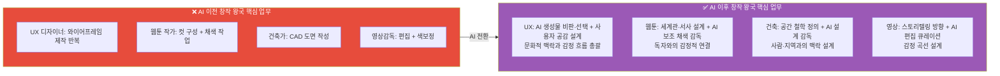

#### 창작 왕국 역량 × 직무 × 프로젝트 씨앗

| 핵심 역량 | AI 이전 의미 | AI 이후 의미 | 역량 습득 활동 | 프로젝트 씨앗 |
|---------|-----------|-----------|------------|------------|
| **사용자 공감** | 디자인 원칙 적용 | AI가 못 보는 감정·맥락 파악 | 사용성 테스트, 인터뷰 | 노인·장애인을 위한 키오스크 리디자인 |
| **문화 감수성** | 없음 (새 역량) | AI 편향 감지 + 지역 맥락 반영 | 다양한 독서·경험 | 지역 문화 기반 캐릭터 웹툰 제작 |
| **비판적 미학** | 미적 감각 | AI 결과물 평가·선별·방향 제시 | 포트폴리오 비평 훈련 | AI 생성 디자인 품질 평가 가이드 |
| **AI 협업** | 없음 (새 역량) | Midjourney·Sora 등 활용·감독 | AI 툴 실습, 프롬프트 연구 | AI 활용 개인 브랜드 포트폴리오 |
| **스토리텔링** | 내러티브 구성 | 감정 여정 설계 (전체 경험 아키텍처) | 시나리오 쓰기, 게임 기획 | 진로 탐색 웹툰 시리즈 제작 |

---

### 3.3 💻 기술 왕국 — AI 시대 역량 재정의

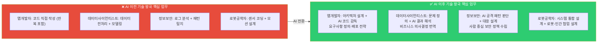

#### 기술 왕국 역량 × 직무 × 프로젝트 씨앗

| 핵심 역량 | AI 이전 의미 | AI 이후 의미 | 역량 습득 활동 | 프로젝트 씨앗 |
|---------|-----------|-----------|------------|------------|
| **시스템 설계** | 코드 작성 | 전체 아키텍처 + AI 통합 설계 | 소프트웨어 설계 패턴 학습 | 학교 알림 자동화 시스템 설계 |
| **문제 정의** | 주어진 문제 해결 | 무엇이 문제인지 발견 | 사용자 인터뷰, 데이터 탐색 | 학생 이탈률 원인 분석 데이터 프로젝트 |
| **AI 협업** | 없음 (새 역량) | Copilot·ChatGPT 활용 + 코드 검증 | AI 코딩 툴 실습 | AI 코드 리뷰 자동화 도구 제작 |
| **보안·윤리 판단** | 기술적 보안 | AI 의사결정의 편향·안전성 감독 | 정보보안 자격 학습 | 개인정보 보호 점검 체크리스트 앱 |
| **비즈니스 번역** | 없음 (새 역량) | 기술 결과를 비결정권자에게 설명 | 발표·문서 작성 훈련 | 데이터 분석 결과 시각화 대시보드 |

---

### 3.4 🌱 자연 왕국 — AI 시대 역량 재정의

#### 자연 왕국 역량 × 직무 × 프로젝트 씨앗

| 핵심 역량 | AI 이전 의미 | AI 이후 의미 | 역량 습득 활동 | 프로젝트 씨앗 |
|---------|-----------|-----------|------------|------------|
| **현장 전문성** | 데이터 수집·측정 | AI 센서 데이터 해석 + 이상 판단 | 환경 봉사, 현장 실습 | 학교 주변 미세먼지 IoT 모니터링 |
| **생태 감수성** | 생물 동정·분류 | 생태계 맥락 이해 (AI가 못 보는 부분) | 생태 탐사, 자연 관찰 일지 | 동네 생태 지도 앱 제작 |
| **IoT 활용** | 없음 (새 역량) | 센서·스마트팜 시스템 운용 감독 | 아두이노·라즈베리파이 실습 | 스마트 텃밭 자동화 프로토타입 |
| **지역 협력** | 없음 (새 역량) | 주민·지자체와 환경 정책 협의 | 지역 환경 프로젝트 참여 | 지역 환경 문제 개선 제안 보고서 |
| **기후 리터러시** | 없음 (새 역량) | 기후 데이터 해석 + 대응 설계 | 기후 관련 탐구·독서 | 기후 변화 영향 예측 데이터 분석 |

---

### 3.5 🤝 연결 왕국 — AI 시대 역량 재정의

#### 연결 왕국 역량 × 직무 × 프로젝트 씨앗

| 핵심 역량 | AI 이전 의미 | AI 이후 의미 | 역량 습득 활동 | 프로젝트 씨앗 |
|---------|-----------|-----------|------------|------------|
| **공감력** | 감정 공유 | AI가 제공하는 정보를 인간적으로 연결 | 상담 봉사, 경청 훈련 | 청소년 익명 고민 공유 플랫폼 |
| **관계 설계** | 면대면 돌봄 | 온오프라인 통합 케어 설계 | 커뮤니티 활동, 캠프 기획 | 고령자 디지털 연결 프로그램 기획 |
| **AI 보조 활용** | 없음 (새 역량) | AI 상담·교육 툴 감독·보완 | AI 교육 플랫폼 실습 | AI 상담 챗봇 품질 평가 체크리스트 |
| **문화 중재** | 없음 (새 역량) | 다문화·다세대 갈등 중재 | 다문화 봉사, 세대 교류 활동 | 다문화 가정 진로 가이드 제작 |
| **에듀테크 설계** | 없음 (새 역량) | AI 보조 교육과정 설계 | 교육 콘텐츠 제작 실습 | 중학생 자기주도 학습 코스 설계 |

---

### 3.6 🏛️ 질서 왕국 — AI 시대 역량 재정의

#### 질서 왕국 역량 × 직무 × 프로젝트 씨앗

| 핵심 역량 | AI 이전 의미 | AI 이후 의미 | 역량 습득 활동 | 프로젝트 씨앗 |
|---------|-----------|-----------|------------|------------|
| **전략적 사고** | 판례 암기 + 논리 | AI 판례 분석 결과 해석 + 전략 수립 | 모의법정, 토론대회 | 학생 권리 조례안 초안 작성 |
| **협상력** | 대화 기술 | 이해관계 구조 파악 + 합의점 설계 | 협상 게임, 갈등 중재 활동 | 학교 규칙 개정 캠페인 기획 |
| **디지털 법학** | 없음 (새 역량) | AI·개인정보·데이터 법률 해석 | 개인정보 법률 독서 | AI 저작권 침해 사례 보고서 |
| **논리·글쓰기** | 법률 문서 작성 | AI 초안 감독 + 논리 구조 강화 | 논술 훈련, 논문 읽기 | 청소년 디지털 권리 제안서 |
| **데이터 포렌식** | 없음 (새 역량) | 디지털 증거 분석 감독 | 정보보안 + 법학 융합 학습 | 사이버 범죄 유형 분석 보고서 |

---

### 3.7 📣 소통 왕국 — AI 시대 역량 재정의

#### 소통 왕국 역량 × 직무 × 프로젝트 씨앗

| 핵심 역량 | AI 이전 의미 | AI 이후 의미 | 역량 습득 활동 | 프로젝트 씨앗 |
|---------|-----------|-----------|------------|------------|
| **브랜딩** | 로고·슬로건 제작 | AI 콘텐츠 홍수 속 진정성 있는 아이덴티티 설계 | 브랜드 분석, 포트폴리오 | 학교 동아리 브랜드 리디자인 |
| **문화 이해** | 트렌드 팔로잉 | AI가 놓치는 하위문화·정서 감지 | 다양한 커뮤니티 참여 | Z세대 진로 불안 인사이트 콘텐츠 |
| **커뮤니티 설계** | 없음 (새 역량) | 온라인 공동체 형성·유지·발전 | 디스코드·커뮤니티 운영 | 청소년 진로 커뮤니티 채널 운영 |
| **AI 콘텐츠 관리** | 없음 (새 역량) | AI 생성 콘텐츠 큐레이션·팩트체크 | AI 미디어 리터러시 학습 | AI 생성 뉴스 팩트체크 가이드 |
| **데이터 감수성** | 없음 (새 역량) | 콘텐츠 성과 데이터 해석 + 방향 수정 | 유튜브 애널리틱스 분석 | 유튜브 채널 성장 전략 보고서 |

---

### 3.8 🚀 도전 왕국 — AI 시대 역량 재정의

#### 도전 왕국 역량 × 직무 × 프로젝트 씨앗

| 핵심 역량 | AI 이전 의미 | AI 이후 의미 | 역량 습득 활동 | 프로젝트 씨앗 |
|---------|-----------|-----------|------------|------------|
| **비전 설정** | 사업 목표 수립 | AI가 못 보는 "왜 이 문제인가" 정의 | 창업 대회, 아이디어 일지 | 학교 문제를 해결하는 앱 기획서 |
| **리더십** | 지시·관리 | 소규모 팀에서 방향·에너지 유지 | 팀 프로젝트 리더 경험 | 클루 프로젝트 PM 역할 수행 |
| **불확실성 포용** | 없음 (새 역량) | AI 예측 불가 상황 속 의사결정 | 실패 경험 + 회고 훈련 | MVP 출시 후 피벗 전략 보고서 |
| **AI 전략** | 없음 (새 역량) | AI 도입 비용·효과 판단 + 팀 적용 | AI 비즈니스 모델 케이스 학습 | 학교 행사 AI 자동화 제안서 |
| **관계 자본** | 네트워킹 | 신뢰 기반 협업 네트워크 구축 | 해커톤, 커뮤니티 활동 | 지역 청소년 창업가 네트워크 기획 |

---

## 4. AI 시대 공통 역량 — 모든 직업에 필요한 5가지

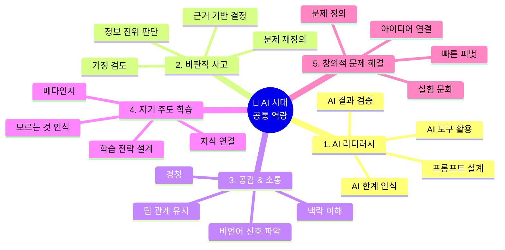

### AI 시대 공통 역량 × 학년별 습득 전략 상세

| 공통 역량 | 초등 (씨앗 심기) | 중학교 (뿌리 내리기) | 고등학교 (증명하기) | 역량 증명 산출물 |
|---------|--------------|-----------------|----------------|-------------|
| **AI 리터러시** | ChatGPT에게 질문하고 답변 평가해보기 | AI 도구 활용 프로젝트 완성 1개 + "AI가 틀린 부분" 보고서 | AI 감독·보완 역할로 팀 프로젝트 기여 + AI 편향 분석 | GitHub 커밋 기록 + AI 활용 보고서 |
| **비판적 사고** | "왜 그럴까?" 질문 노트 작성 | 탐구대회 보고서 (가설 → 실험 → 결론 구조) | R&E 설계 + arXiv 논문 1편 비판적 요약 | 탐구 보고서 + 토론 수상 |
| **공감 & 소통** | 봉사 + 발표 경험 1회 | 동아리 회의 진행 or 후배 상담 경험 | 팀 프로젝트 퍼실리테이터 + 이해관계자 인터뷰 보고서 | 인터뷰 보고서 + 발표 영상 |
| **자기주도 학습** | 관심사 탐색 일지 (월 1회) | 독학으로 도구 1개 마스터 (Figma·Python 등) | DreamPath 합격자 패스 기반 나만의 로드맵 완성 | 포트폴리오 + 세특 기록 |
| **창의적 문제 해결** | 학교 주변 문제 발견 + 아이디어 스케치 | 공모전·해커톤 1회 이상 참가 | 그림자 프로젝트 배포 + 피벗 보고서 | 배포된 프로젝트 URL + 회고 문서 |

#### 학년별 AI 역량 습득 체크리스트

```
╔══════════════════════════════════════════════════════╗
║  📋 AI 시대 역량 체크리스트 — 중2 기준              ║
╠══════════════════════════════════════════════════════╣
║                                                      ║
║  🔲 AI 리터러시                                      ║
║  ☑️ ChatGPT에게 같은 질문을 3가지 방식으로 물어봄    ║
║  ☑️ AI 답변에서 틀린 내용 1개 이상 발견해봄          ║
║  🔲 AI 도구 활용 프로젝트 1개 완성                   ║
║  🔲 "AI가 이 작업에서 왜 부족한가" 설명 가능         ║
║                                                      ║
║  🔲 비판적 사고                                      ║
║  ☑️ 탐구 주제 1개 선정 + 가설 작성 경험              ║
║  🔲 탐구대회 참가 or 보고서 완성                     ║
║  🔲 뉴스 기사 1개에서 근거 부족 부분 찾기            ║
║                                                      ║
║  🔲 공감 & 소통                                      ║
║  ☑️ 봉사 활동 20시간 이상                            ║
║  🔲 동아리에서 발표 또는 진행 경험                   ║
║  🔲 인터뷰 설계 + 진행 경험 1회                      ║
║                                                      ║
║  🔲 자기주도 학습                                    ║
║  ☑️ 관심 도구 독학 시작 (Figma or Python)            ║
║  🔲 독학으로 기초 프로젝트 1개 완성                  ║
║  🔲 학습 계획 → 실행 → 회고 사이클 경험              ║
║                                                      ║
║  🔲 창의적 문제 해결                                 ║
║  🔲 학교·주변의 불편한 점 3개 발견 + 기록            ║
║  🔲 해결 아이디어 스케치 or 기획서 초안 작성          ║
║  🔲 공모전 or 해커톤 1회 참가                        ║
║                                                      ║
║  현재 달성: 7/15 (47%)                              ║
╚══════════════════════════════════════════════════════╝
```

---

## 5. 역량 → 프로젝트 씨앗 매핑 — DreamPath 살아보기 연계

> **"역량은 살아보면서 쌓이고, 프로젝트를 통해 증명된다"**
> DreamPath에서 직업을 살아볼 때, 그 직업의 핵심 역량을 함께 훈련하도록 설계한다.

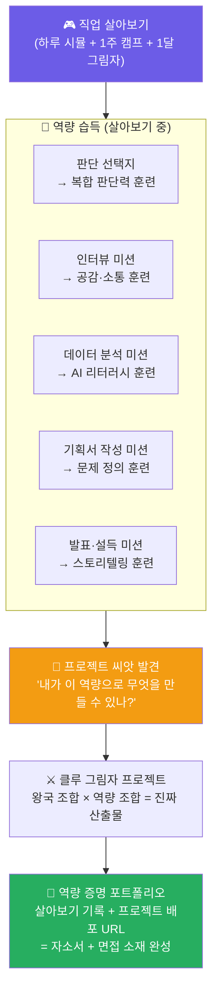

### 5.1 왕국별 살아보기 미션 × 역량 × 프로젝트 씨앗 전체 매핑

| 왕국 | 1일 시뮬 핵심 선택지 | 훈련되는 역량 | 1주 캠프 핵심 미션 | 자연스럽게 나오는 프로젝트 씨앗 |
|-----|-----------------|-----------|----------------|--------------------------|
| 🔬 탐구 | "AI 진단 70%vs30% → 당신의 최종 결정은?" | 복합 판단력 + 윤리 사고 | 논문 1편 읽기 + 연구 가설 3개 작성 | AI 오진 방지 체크리스트 앱 |
| 🎨 창작 | "AI가 생성한 3개 중 어떤 UI를 사용할 것인가?" | 사용자 공감 + 비판적 미학 | 사용자 인터뷰 2명 + Figma 개선안 | 노인 키오스크 리디자인 포트폴리오 |
| 💻 기술 | "버그 발생 → 빠른 수정 vs 근본 원인 파악?" | 문제 정의 + 시스템 설계 | 요구사항 정의 + 간단한 봇 제작 | 학교 공지 자동화 텔레그램 봇 |
| 🌱 자연 | "센서 이상값 → 현장 확인 vs AI 오탐 처리?" | 현장 전문성 + IoT 활용 | 아두이노 센서 연결 + 데이터 수집 | 학교 주변 미세먼지 IoT 모니터링 |
| 🤝 연결 | "학생이 'AI가 더 잘 알아요' 할 때 어떻게?" | 공감력 + 관계 설계 | 인터뷰 설계 + 진행 + 보고서 작성 | 청소년 고민 익명 공유 플랫폼 기획 |
| 🏛️ 질서 | "AI 저작권 침해 → 판례 없음 → 어떻게 주장?" | 전략적 사고 + 논리·글쓰기 | 조례안 초안 작성 + 반박 준비 | 학생 디지털 권리 조례안 제안서 |
| 📣 소통 | "AI가 생성한 광고 10개 → 어떤 2개를 올릴까?" | 브랜딩 + 문화 이해 | SNS 채널 기획 + 첫 콘텐츠 3개 제작 | Z세대 진로 탐색 인스타그램 채널 |
| 🚀 도전 | "MVP 출시 후 예상과 다른 결과 → 어떻게 피벗?" | 비전 설정 + 불확실성 포용 | 14일 창업 챌린지 + 투자 피치 5분 | 학교 문제 해결 앱 MVP 배포 |

### 5.2 왕국 교차 역량 프로젝트 — 실제 세상을 바꾸는 프로젝트

> **"한 왕국의 역량만으로는 부족하다. 서로 다른 역량이 만날 때 진짜 프로젝트가 탄생한다"**

| 왕국 조합 | 필요 역량 조합 | 구체적 프로젝트 | 산출물 | 입시 활용 |
|---------|-----------|------------|------|---------|
| 🎨 창작 × 💻 기술 | 사용자 공감 + 시스템 설계 | "장애 학생 맞춤 학습 UI 앱" | 배포된 앱 + 사용성 보고서 | UX·개발 모두 세특 연계 |
| 🔬 탐구 × 💻 기술 | 연구 설계 + AI 리터러시 | "학교 급식 영양 불균형 AI 예측 모델" | GitHub + Jupyter + 보고서 | 생명과학·정보 세특, KOI |
| 🤝 연결 × 📣 소통 | 공감력 + 커뮤니티 설계 | "청소년 진로 불안 인터뷰 + 인포그래픽 캠페인" | 영상 + 캠페인 사이트 | 사회·국어 세특 |
| 🌱 자연 × 💻 기술 | IoT 활용 + 문제 정의 | "교실 CO2 농도 IoT 모니터링 + 자동 환기 알림" | 아두이노 프로토타입 + 보고서 | 과학·정보 세특 |
| 🚀 도전 × 🎨 창작 | 비전 설정 + 브랜딩 | "중학생 부업 플랫폼 MVP + 브랜드 아이덴티티" | 랜딩 페이지 + 피치덱 | 창업 전형 자소서 |
| 🏛️ 질서 × 📣 소통 | 논리·글쓰기 + 커뮤니티 | "AI 저작권 청소년 가이드 + SNS 캠페인" | 가이드북 + SNS 시리즈 | 사회·법 탐구 세특 |

### 5.2 역량 성장 곡선 — 살아보기에서 프로젝트 배포까지

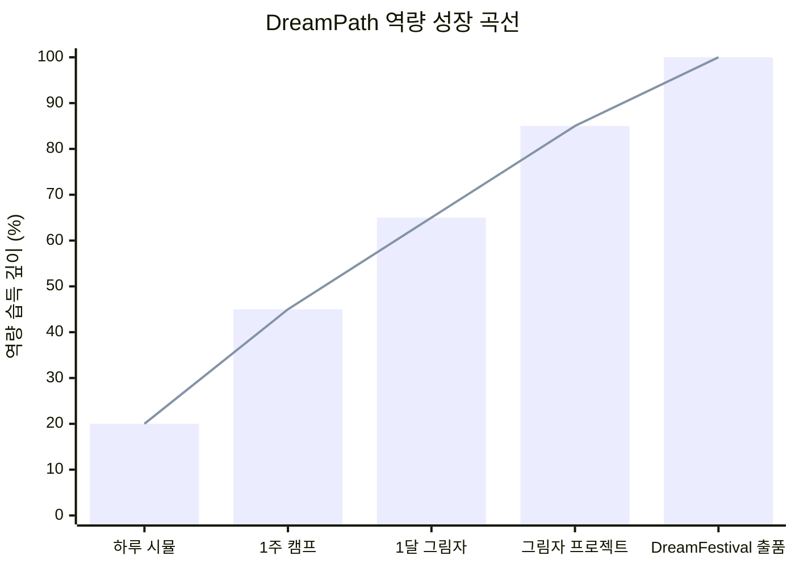

| 단계 | 역량 깊이 | 주요 역량 습득 | 산출물 |
|-----|---------|------------|------|
| **하루 시뮬** | 20% | AI 시대 직무 현실 인식 | 직업 현실 체크 보고서 |
| **1주 캠프** | 45% | 핵심 역량 1~2개 훈련 | 1주 수료 + 미니 산출물 |
| **1달 그림자** | 65% | 핵심 역량 3~5개 통합 훈련 | 그림자 포트폴리오 씨앗 |
| **그림자 프로젝트** | 85% | 역량 실전 적용 + 협업 | 배포된 프로젝트 |
| **DreamFestival** | 100% | 역량 공개 발표·인정 | 완성 포트폴리오 + 수상 |

---

## 6. AI 시대 직업별 생존 가능성 × 역량 필요도 지도

```mermaid
flowchart LR
    subgraph High["🟢 AI 보완 직업 (함께 성장)"]
        H1["AI 연구원<br>AI를 만드는 사람"]
        H2["UX 디자이너<br>AI가 못 보는 감성 설계"]
        H3["의사 (복합 케이스)<br>최종 판단은 인간이"]
        H4["교사 (관계형)<br>공감·돌봄은 대체 불가"]
        H5["창업가<br>비전·리더십은 인간 고유"]
    end

    subgraph Mid["🟡 AI 협업 직업 (역량 전환 필요)"]
        M1["변호사 → 전략 중심으로"]
        M2["회계사 → AI 감독·컨설팅"]
        M3["마케터 → 브랜딩·커뮤니티"]
        M4["기자 → 큐레이션·탐사"]
        M5["앱개발자 → 설계·감독"]
    end

    subgraph Low["🔴 AI 대체 위험 직업 (전환 필수)"]
        L1["단순 데이터 입력"]
        L2["기초 번역·요약"]
        L3["반복 코딩 작업"]
        L4["표준 보고서 작성"]
    end

    Low -->|"역량 전환"| Mid
    Mid -->|"심화 성장"| High

    style High fill:#27AE60,color:#fff
    style Mid fill:#F39C12,color:#fff
    style Low fill:#E74C3C,color:#fff
```

### AI 대체 위험도 × 역량 필요도 × 구체적 전환 전략 비교표

| 직업 | AI 대체 위험도 | AI가 대체하는 구체적 업무 | 인간이 반드시 해야 할 업무 | 필요 전환 역량 | DreamPath 연계 |
|-----|-------------|---------------------|----------------------|------------|--------------|
| **의사** | 🟢 낮음 | 1차 진단, 영상 판독, 의무기록 | 복합 케이스 판단, 환자 공감, 윤리 결정 | 복합 판단력, 환자 공감 | 탐구 왕국 1달 그림자 |
| **AI 연구원** | 🟢 낮음 | 모델 학습 반복, 하이퍼파라미터 튜닝 | 연구 문제 정의, AI 윤리 설계 | 연구 설계, AI 윤리 | 탐구 왕국 마스터 코스 |
| **UX 디자이너** | 🟡 중간 | 와이어프레임 제작, 아이콘 생성 | 사용자 감정 흐름, 문화 맥락 판단 | AI 협업, 사용자 공감 | 창작 왕국 AI 협업 미션 |
| **웹툰 작가** | 🟡 중간 | 채색, 배경 작업, 컷 레이아웃 | 서사 설계, 독자 감정 연결, 세계관 | 스토리텔링, 문화 감수성 | 창작 왕국 스토리 미션 |
| **앱 개발자** | 🟡 중간 | 보일러플레이트 코드, 버그 수정 | 아키텍처 설계, 요구사항 정의 | 시스템 설계, 문제 정의 | 기술 왕국 설계 미션 |
| **변호사** | 🟡 중간 | 판례 검색, 계약서 초안 작성 | 협상 전략, 감정·맥락 판단, 법정 변론 | 전략적 사고, 협상력 | 질서 왕국 협상 시뮬 |
| **교사** | 🟡 중간 | 자료 제작, 채점, 진도 관리 | 학생 동기 유발, 관계 형성, 맥락 판단 | 공감력, 관계 설계 | 연결 왕국 멘토링 미션 |
| **디지털 마케터** | 🟡 중간 | 광고 최적화, A/B 테스트, 데이터 보고서 | 브랜드 진정성, 커뮤니티 관계, 문화 감지 | 브랜딩, 커뮤니티 설계 | 소통 왕국 브랜드 미션 |
| **회계사 (기초)** | 🔴 높음 | 세무 신고, 결산 자동화, 전표 입력 | 세금 전략 자문, 이례 탐지, 클라이언트 신뢰 | 전략적 사고, AI 감독 | 질서 왕국 → 도전 왕국 전환 |
| **단순 번역·요약** | 🔴 매우 높음 | 90% 이상 AI 대체 | 문화 뉘앙스, 감정 표현, 창작 번역 일부 | 완전 전환 필요 | 다른 왕국 탐색 적극 권유 |

> **DreamPath 설계 원칙:** AI 대체 위험도가 높은 직업을 선택한 사용자에게는,  
> "이 직업의 AI 대체 위험 업무를 확인하셨나요? 이 역량을 키우면 AI와 협업하는 형태로 살아남을 수 있습니다" 알림을 제공한다.

---

## 7. DreamPath 역량 설계 — 앱 연동 방식

### 7.1 직업 카드 × 역량 태그 연동

```
╔══════════════════════════════════════════╗
║  🎨 UX 디자이너 카드                     ║
╠══════════════════════════════════════════╣
║                                          ║
║  ★★★ 내 성향 매칭 97%                   ║
║  미래 전망: ★★★★☆  AI 대체위험: 🟡 중간 ║
║                                          ║
║  💼 AI 이후 핵심 직무                    ║
║  ① 사용자 감정 흐름 설계                ║
║  ② AI 생성 디자인 큐레이션·방향 제시     ║
║  ③ 문화·맥락 기반 UX 판단               ║
║                                          ║
║  🧠 이 직업이 요구하는 역량 Top 3        ║
║  사용자 공감 | AI 협업 | 비판적 미학     ║
║                                          ║
║  🚀 역량 기반 프로젝트 씨앗              ║
║  "노인 키오스크 리디자인"                ║
║  "AI 생성 UI 품질 평가 가이드"           ║
║                                          ║
║  [▶ 하루 살아보기] [🗺️ 역량 로드맵]     ║
╚══════════════════════════════════════════╝
```

### 7.2 살아보기 미션 × 역량 훈련 연동 화면

```
╔══════════════════════════════════════════╗
║  🎮 UX 디자이너 1주 캠프 — 수요일        ║
║  미션: 와이어프레임 제작                 ║
╠══════════════════════════════════════════╣
║                                          ║
║  팀장: "AI가 3가지 앱 화면 레이아웃을    ║
║  생성해줬어요. 어떤 걸 선택할까요?"      ║
║                                          ║
║  [AI 생성 레이아웃 A, B, C 화면 표시]   ║
║                                          ║
║  → 어떤 기준으로 선택할 것인가?          ║
║                                          ║
║  A. 💡 가장 예쁜 것을 선택한다           ║
║  B. 🔍 사용자 인터뷰 결과와 비교해       ║
║     노인에게 가장 적합한 것을 선택한다   ║
║  C. 📊 클릭률 데이터 기준으로 선택한다  ║
║                                          ║
║  ━━━━━━━━━━━━━━━━━━━━━━━━━━━━━━━━       ║
║  🧠 이 선택이 훈련하는 역량:             ║
║  ✅ B 선택 → 사용자 공감 역량 +10       ║
║  ✅ AI 결과를 맹목적으로 따르지 않음     ║
║     → AI 협업 역량 +5                   ║
╚══════════════════════════════════════════╝
```

### 7.3 역량 누적 대시보드 — 개인 역량 지도

```
╔══════════════════════════════════════════╗
║  🧠 나의 역량 지도                       ║
║  살아본 직업 12개 기반 자동 생성          ║
╠══════════════════════════════════════════╣
║                                          ║
║  💪 현재 강한 역량                       ║
║  사용자 공감   ████████████ 90%          ║
║  스토리텔링    ██████████░░ 80%          ║
║  AI 협업       ████████░░░░ 65%          ║
║  문제 정의     ██████░░░░░░ 50%          ║
║  시스템 설계   ████░░░░░░░░ 35%          ║
║                                          ║
║  ⚠️ 보완이 필요한 역량                   ║
║  데이터 분석   ██░░░░░░░░░░ 20%          ║
║  협상력        ███░░░░░░░░░ 25%          ║
║                                          ║
║  💡 AI 추천: 탐구 왕국 + 질서 왕국 탐험  ║
║  → 데이터 분석 + 협상력 보완 가능        ║
║                                          ║
║  🚀 역량 기반 추천 프로젝트              ║
║  "사용자 공감 + 스토리텔링"              ║
║  → "청소년 진로 웹툰 시리즈 제작"        ║
║                                          ║
║  [프로젝트 시작하기] [역량 더 키우기]    ║
╚══════════════════════════════════════════╝
```

---

## 8. 역량 재정의가 바꾸는 커리어 패스 설계 방향

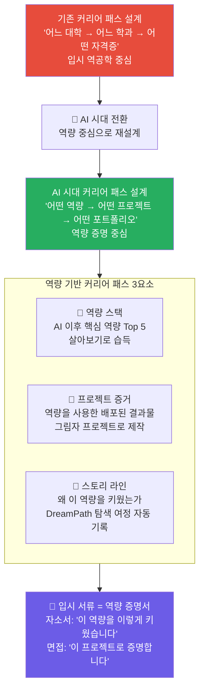

### 역량 기반 자소서 → 면접 연결 흐름 상세 예시

**사례: UX 디자이너 지망 고3, 창작 왕국 마스터 레벨**

| 서류 항목 | ❌ 기존 방식 | ✅ AI 시대 역량 기반 방식 |
|--------|----------|----------------------|
| **자소서 1번 (학업 경험)** | "미술 시간에 열심히 배웠습니다" | "DreamPath UX 시뮬레이션에서 AI가 생성한 3개의 UI 중 어떤 것이 노인 사용자에게 적합한지 판단하는 과정을 통해, 단순히 예쁜 디자인이 아닌 사용자 감정 흐름을 읽는 역량을 키웠습니다" |
| **자소서 2번 (의미 있는 활동)** | "봉사 100시간, 동아리 활동" | "중3 때 노인 복지관 봉사에서 키오스크 이용에 어려움을 겪는 어르신을 관찰한 후, Figma AI로 개선안을 설계하고 실제 테스트를 진행한 프로젝트를 완성했습니다 (GitHub 링크 첨부)" |
| **자소서 3번 (지원 동기)** | "UX 디자인이 좋아서 지원합니다" | "중2 DreamPath UX 살아보기에서 AI가 놓친 감성적 요소를 제가 포착했을 때의 경험이, 인간 중심 설계의 가치를 깨닫는 계기가 되었습니다. 이후 3년간 AI와 협업하는 UX 역량을 체계적으로 쌓아왔습니다" |
| **면접 "나의 강점"** | "창의적입니다" | "AI가 생성한 디자인을 비판적으로 평가하는 역량입니다. 실제로 노인 키오스크 프로젝트에서 AI 추천 레이아웃의 문제를 발견하고 수정하여, 테스트 사용자 만족도를 40% 높였습니다" |
| **면접 "실패 경험"** | "없습니다" | "첫 MVP를 배포했을 때 예상과 달리 사용자 이탈률이 70%였습니다. 데이터를 분석해 온보딩 UX 문제를 찾아냈고, 3번의 피벗 후 이탈률을 30%로 줄였습니다" |

---

## 9. DreamPath 역량 평가 설계 — 어떻게 측정할 것인가

> **"역량은 시험으로 측정하지 않는다. 판단 순간의 선택으로 측정한다"**

### 9.1 살아보기 미션 내 역량 측정 방식

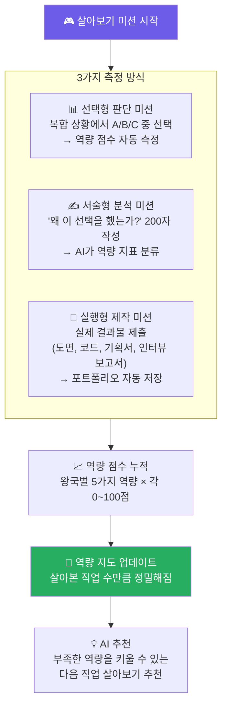

### 9.2 역량별 측정 미션 예시

| 역량 | 선택형 측정 미션 | 서술형 측정 미션 | 실행형 측정 미션 |
|-----|-------------|-------------|-------------|
| **복합 판단력** | "AI 진단 결과가 75%의 확률로 암이라고 합니다. 어떤 결정을 내리시겠습니까?" | "AI 결과를 따르지 않은 이유를 설명하세요" | 가상 케이스 3개 연속 판단 + 근거 작성 |
| **사용자 공감** | "AI가 추천한 UI A와 사용자가 불편해하는 UI A 중 어떤 것을 선택할까요?" | "사용자가 불편한 이유를 감정 단어로 설명하세요" | 실제 노인 2명 인터뷰 영상 제출 |
| **시스템 설계** | "기능 3개를 2주 안에 만들려면 어떤 순서로 개발할까요?" | "이 아키텍처의 단점을 찾아 설명하세요" | 간단한 시스템 다이어그램 제출 |
| **비전 설정** | "투자자가 '이건 안 될 것 같아요'라고 합니다. 어떻게 대응할까요?" | "이 문제를 풀어야 하는 이유를 3줄로 설명하세요" | 린 캔버스 1장 작성 |
| **AI 리터러시** | "AI가 생성한 보고서에서 어떤 부분을 검증하겠습니까?" | "이 AI 결과가 신뢰할 수 없는 이유를 설명하세요" | AI 결과물에서 오류 3개 찾기 |

### 9.3 역량 성장 시각화 — DreamPath 앱 화면

```
╔══════════════════════════════════════════════════════╗
║  🧠 나의 AI 시대 역량 성장 지도 (고1, 6개월 사용)   ║
╠══════════════════════════════════════════════════════╣
║                                                      ║
║  살아본 직업: 8개  │  완성 프로젝트: 2개             ║
║  ─────────────────────────────────────────           ║
║                                                      ║
║  🎨 창작 왕국 역량                                   ║
║  사용자 공감    ████████████████░░░░  82%  ⬆️+12    ║
║  AI 협업 설계   ████████████░░░░░░░░  60%  ⬆️+20    ║
║  비판적 미학    ████████░░░░░░░░░░░░  45%  ⬆️+15    ║
║  스토리텔링     ██████████████░░░░░░  72%  ⬆️+8     ║
║  문화 감수성    ██████░░░░░░░░░░░░░░  35%  🔲 미훈련 ║
║                                                      ║
║  💻 기술 왕국 역량 (교차 탐험)                       ║
║  문제 정의      ████████████░░░░░░░░  58%  ⬆️+18    ║
║  시스템 설계    ████░░░░░░░░░░░░░░░░  22%  🆕 첫 탐험 ║
║                                                      ║
║  ⚠️ AI 추천 다음 살아보기                            ║
║  "문화 감수성이 낮습니다 →                           ║
║   🌱 자연 왕국 or 🤝 연결 왕국을 살아보세요"         ║
║                                                      ║
║  🚀 역량 기반 추천 프로젝트                          ║
║  "사용자 공감 82% + 문제 정의 58%"                  ║
║  → "노인 복지관 키오스크 개선 프로젝트 (클루 모집)" ║
║                                                      ║
║  [프로젝트 시작] [클루 찾기] [역량 키우기]           ║
╚══════════════════════════════════════════════════════╝
```

---

## 10. 왕국별 살아보기 1일 시뮬 — 구체적 시나리오 설계

> 각 왕국의 "하루 살아보기"가 어떤 장면들로 구성되는지 구체적으로 설계한다.

### 10.1 🔬 탐구 왕국 — 의사 하루 살아보기 시나리오

```
오전 8:30 — 병원 도착
AI 시스템: "김환자 (72세, 여성) 오늘 진료입니다. AI 사전 진단 결과를 확인하세요."

[AI 사전 분석 요약]
• 주호소: 기침 3주 지속, 가래
• AI 1차 진단: 폐렴 68%, 폐암 22%, 기관지염 10%
• AI 권고: 흉부 CT 촬영 권고

─────────────────────────────────────────
선택지: 당신은 어떻게 할 것인가?

A. AI 권고대로 즉시 CT 촬영 지시
B. 직접 문진을 먼저 진행해 추가 정보 수집
C. AI 결과가 68%이므로 폐렴으로 처방하고 2주 후 재진

─────────────────────────────────────────
[B 선택 시 → 문진 장면 진행]

환자: "사실 3주 전에 손녀가 독감에 걸렸어요. 근데 우리 손녀가 화학공장 근처 학교 다녀요."

💡 AI가 놓친 정보 발견!
→ 가족 접촉력 + 환경 요인 = AI 진단과 다른 가설 가능

[결과 피드백]
✅ 복합 판단력 역량 +15
"AI 데이터만으로 판단하지 않고, 인간 문진으로 맥락을 추가 수집했습니다"
```

### 10.2 🎨 창작 왕국 — UX 디자이너 하루 살아보기 시나리오

```
오전 10:00 — 팀 미팅
팀장: "어제 AI에게 키오스크 UI 3개를 생성하도록 했어요.
      오늘 노인 복지관 시연 전에 하나를 골라야 합니다."

[AI 생성 UI 3개 이미지 표시]
UI-A: 버튼이 작고 정보가 많음 (AI 심미성 점수 92점)
UI-B: 큰 글씨, 단순한 구조 (AI 심미성 점수 61점)  
UI-C: 애니메이션 많고 화려함 (AI 심미성 점수 88점)

─────────────────────────────────────────
선택지:

A. AI 심미성 점수 1위인 UI-A 선택
B. 노인 사용자에게 가장 적합한 UI-B 선택
C. 가장 현대적인 UI-C 선택

─────────────────────────────────────────
[B 선택 시]
시연 결과: 노인 참가자 8명 중 7명이 UI-B에서 성공적으로 과제 완료

💡 AI가 놓친 것: "예쁜 것 ≠ 사용하기 쉬운 것"
→ 사용자 공감 역량 = AI 점수를 뛰어넘는 판단력

[결과 피드백]
✅ 사용자 공감 역량 +20
✅ 비판적 미학 역량 +10
"AI의 심미성 점수보다 실제 사용자 경험을 우선했습니다"
```

---

*작성일: 2026년 2월 | DreamPath AI 시대 직업 역량 재정의 v2.0*
*이 문서는 DreamPath_상세기획서_V2, 게임설계 문서, AI시대_직업역량 문서와 연동됩니다.*
*다음 버전에서 추가 예정: 왕국별 1달 그림자 프로젝트 시나리오, 역량 측정 알고리즘 상세 설계*
