# DreamPath — AI 시대 직업 역량 재정의
# 8대 왕국 × AI 전후 직무 비교 × 역량 기반 프로젝트 설계

> **"AI가 일의 양을 줄이고 팀 규모를 줄였다. 그렇다면 남은 사람이 해야 할 일은 무엇인가?"**
> 직업 세계가 AI로 재편되는 지금, 역량의 정의도 바뀌어야 한다.
> DreamPath는 **AI 이후 살아남는 역량을 기반으로 프로젝트를 설계**한다.

---

## 0. 이 문서를 읽기 전에 — 핵심 3가지 질문

```
┌─────────────────────────────────────────────────────────┐
│                                                         │
│  Q1. AI가 내 직업의 어떤 일을 대체했는가?               │
│      → 구체적으로 어떤 업무가 사라지고 무엇이 남았나    │
│                                                         │
│  Q2. 왜 이런 변화가 일어났는가?                         │
│      → AI의 경제적 원리와 기업 입장에서의 논리          │
│                                                         │
│  Q3. 그렇다면 나는 지금 무엇을 배워야 하는가?           │
│      → 개발 프로세스 전체 이해 + AI 프로젝트 경험       │
│                                                         │
└─────────────────────────────────────────────────────────┘
```

> **이 3가지 질문에 답하는 것이 이 문서의 목표다.**
> 단순한 "AI가 무서워요"가 아니라, **"그래서 나는 이것을 해야 한다"**로 끝나야 한다.

---

## 1. AI가 바꾼 직업 세계 — 4가지 패러다임 전환

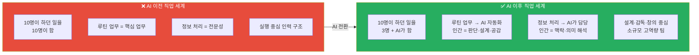

### 1.1 AI 시대 직업 세계 4대 변화 비교표

| 변화 축 | AI 이전 | AI 이후 | DreamPath 설계 방향 |
|--------|--------|--------|-----------------|
| **팀 규모** | 10명 → 각자 역할 분담 | 3명 + AI 툴로 동일 산출물 | 소수 정예 클루(3~5명) |
| **핵심 업무** | 루틴 실행 + 전문 판단 | 루틴 제거 → 판단·설계·공감만 | 역량 기반 살아보기 설계 |
| **전문성 정의** | 지식의 양 = 전문성 | 지식 활용 판단력 = 전문성 | 왕국별 핵심 역량 Top 5 |
| **새 직종** | 직업 경계 명확 | 융합·브릿지 직종 급증 | 왕국 교차 프로젝트 |
| **성장 방식** | 경력 연수 = 성장 | 포트폴리오·배포 = 증명 | 그림자 프로젝트 배포 |

### 1.2 AI가 대체하는 업무 vs 인간이 남는 업무

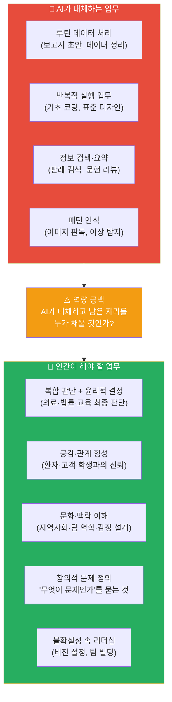

### 1.3 왜 이런 변화가 일어났는가 — AI 경제학의 구조

> **"기업이 AI를 도입하는 이유는 단 하나다: 같은 산출물을 더 적은 비용으로"**

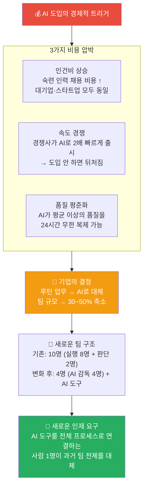

#### 구체적 사례: AI 이전 vs 이후 팀 구조 변화

| 회사 유형 | AI 이전 팀 구성 | AI 이후 팀 구성 | 무엇이 사라졌나 |
|---------|-------------|-------------|------------|
| **스타트업 앱 개발** | 개발자 5명 + 디자이너 2명 + 기획 1명 = 8명 | 풀스택 2명 + AI 감독 1명 = 3명 | 반복 코딩 담당 주니어 개발자 |
| **법률 사무소** | 변호사 3명 + 사무보조 3명 + 인턴 2명 = 8명 | 변호사 2명 + AI 법률 보조 = 3명 | 판례 검색·서류 작성 보조 |
| **디자인 에이전시** | 디자이너 4명 + 수정 담당 2명 = 6명 | 크리에이티브 디렉터 1명 + AI 협업 1명 = 2명 | 반복 수정 담당 주니어 디자이너 |
| **마케팅 팀** | 콘텐츠 제작 3명 + 광고 운영 2명 + 분석 1명 = 6명 | 전략 기획 1명 + AI 운영 감독 1명 = 2명 | 광고 소재 제작·A/B 테스트 실무자 |
| **의료 연구소** | 연구원 6명 + 데이터 입력 2명 = 8명 | 수석 연구원 2명 + AI 도구 = 3명 | 기초 데이터 처리·논문 정리 연구 보조 |
| **언론사** | 기자 5명 + 편집 2명 + 교열 1명 = 8명 | 취재 기자 2명 + AI 편집·교열 = 3명 | 단순 보도 기사 작성·편집 담당 |

> **핵심 결론:** 사라지는 포지션은 "전체 프로세스 중 한 단계만 담당"하는 자리다.
> 살아남는 포지션은 **"전체 프로세스를 이해하고 AI와 함께 전 단계를 조율"**하는 자리다.

---

### 1.4 대체된 업무 vs 새로 생긴 업무 — 전 산업 완전 해부

> **"AI가 한 단계씩 자동화하면서, 인간은 단계를 넘나드는 사람이 되어야 했다"**

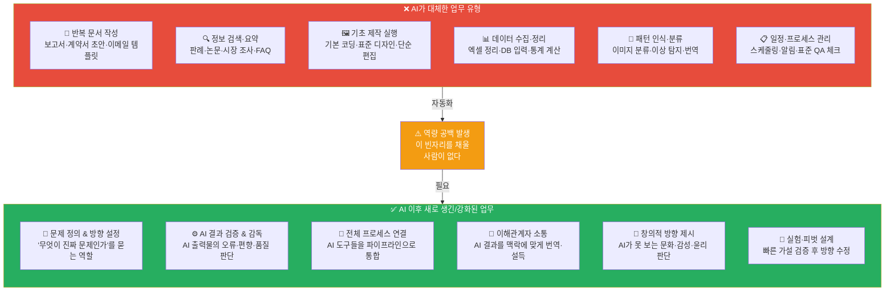

#### 산업별 대체 업무 vs 새 업무 완전 비교표

| 산업 | ❌ AI가 대체한 구체적 업무 | ✅ 새로 생긴/강화된 업무 | 필요한 새 직함 |
|-----|----------------------|---------------------|-----------|
| **의료·바이오** | 영상 판독, 1차 진단, 의무기록 작성, 논문 검색 | AI 진단 감독, 복합 케이스 판단, 환자 공감 상담, 연구 방향 설정 | AI 의료 감독관, 임상-AI 브릿지 |
| **법률** | 판례 검색, 계약서 초안, 법률 요약, 기초 서류 작성 | 협상 전략 수립, 법정 판단, AI 법률 오류 감사, 디지털 법학 자문 | AI 법률 감독관, 디지털 포렌식 전문가 |
| **교육** | 수업 자료 제작, 채점, 개별 설명, 진도 관리 | 학생 동기 설계, 관계 형성, AI 교육 품질 감독, 커리큘럼 전략 | 에듀테크 설계자, AI 학습 큐레이터 |
| **금융·회계** | 세무 신고, 결산 자동화, 재무 보고서, 데이터 입력 | 세금 전략 자문, 이례 탐지 판단, AI 리스크 평가, 투자 전략 | AI 금융 감사관, 전략 재무 자문 |
| **마케팅** | 광고 소재 제작, A/B 테스트, 성과 보고서 작성 | 브랜드 전략, 커뮤니티 관계, AI 콘텐츠 방향 감독, 문화 감수성 | 브랜드 전략가, AI 콘텐츠 디렉터 |
| **소프트웨어** | 기초 코딩, 버그 수정, 쿼리 최적화, QA 체크리스트 | 아키텍처 설계, 요구사항 정의, AI 코드 감사, 시스템 통합 | AI 아키텍트, 프롬프트 엔지니어 |
| **디자인** | 와이어프레임 반복 제작, 채색, 배경 작업, 리사이징 | 사용자 감정 흐름 설계, AI 결과물 큐레이션, 브랜드 철학 수호 | AI 크리에이티브 디렉터, UX 전략가 |
| **미디어·언론** | 기사 초안, 교열, 자막, 단순 편집 | 취재·탐사, 팩트체크, 서사 방향, 커뮤니티 신뢰 구축 | AI 저널리즘 감독관, 미디어 전략가 |
| **건설·건축** | CAD 도면 작성, 자재 비용 계산, 일정 관리 | 공간 철학 정의, 지역 맥락 설계, AI 설계 감독 | AI 건축 감독관, 공간 경험 디자이너 |
| **농업·식품** | 작물 상태 모니터링, 병충해 감지, 수확 시기 예측 | 농장 시스템 통합 설계, 이상 판단, 지역 농가 설득 | 스마트팜 통합 전문가, 농업 AI 감독관 |
| **인사·HR** | 이력서 스크리닝, 면접 일정, 급여 계산 | 인재 전략 설계, 조직 문화 설계, AI 채용 편향 감독 | AI 채용 감사관, 조직 설계 전문가 |
| **제조·물류** | 품질 검사, 재고 예측, 배송 경로 최적화 | 공장 시스템 통합, 예외 상황 판단, 공급망 리스크 관리 | AI 제조 감독관, 공급망 전략가 |

---

### 1.5 모든 산업이 AI에 영향받는다 — 공통 메커니즘

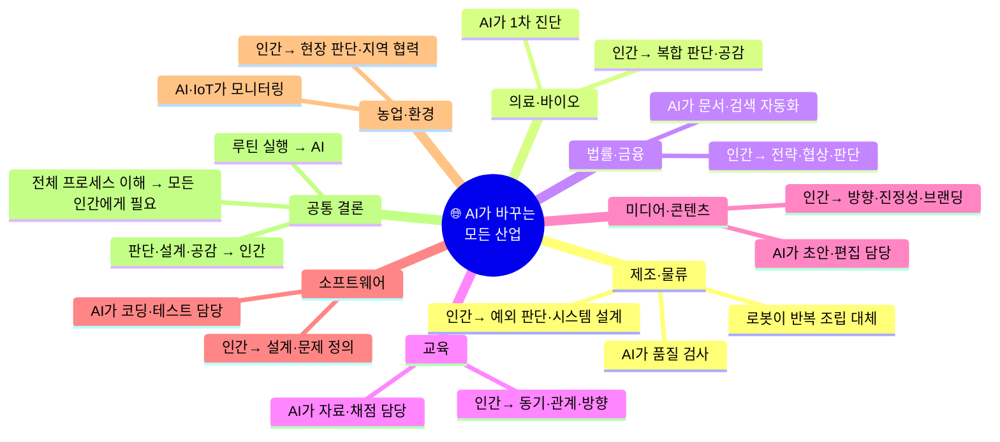

> **어떤 산업이든 변화의 구조는 동일하다:**
>
> `루틴 실행 업무 → AI 자동화` → `팀 규모 축소` → `남은 사람은 전체 프로세스를 혼자 감당` → **`개발 프로세스 전체 이해 필수`**

---

### 1.6 왜 "개발 프로세스 전체 이해"가 지금 가장 중요한가

> **핵심 논리:**
> AI 이전에는 전문가 10명이 각자 1단계씩 맡았다.
> AI 이후에는 3명이 AI와 함께 10단계 전체를 관리한다.
> 따라서 **"내가 맡은 1단계"만 아는 사람은 더 이상 필요하지 않다.**

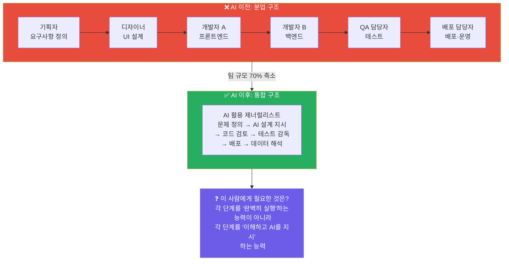

#### 개발 프로세스 전체 이해가 필요한 이유 — 단계별 설명

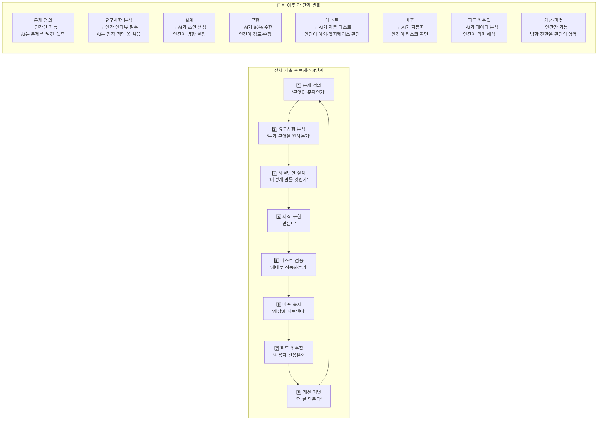

#### 프로세스 이해 없이 AI를 쓰면 생기는 문제

| 상황 | 프로세스 모르는 사람 | 프로세스 아는 사람 |
|-----|---------------|--------------|
| AI가 잘못된 요구사항으로 코드 생성 | "AI가 만들어줬으니 맞겠지" → 배포 후 오류 | "요구사항부터 다시 정의해야 한다" → 사전 수정 |
| AI 디자인이 예쁘지만 사용자가 못 씀 | "AI 점수가 높으니 선택" → 사용자 이탈 | "테스트 단계에서 실제 사용자 확인 필요" |
| AI 마케팅 결과 조회수는 높지만 전환율 0% | "AI가 최적화했으니 맞겠지" | "피드백 해석 → 랜딩 페이지 문제 발견" |
| AI 법률 서류 오류 있음 | 오류 발견 못함 → 소송 패배 | 검토 단계에서 논리 오류 발견 |

---

### 1.7 왜 프로젝트 경험이 유일한 해답인가

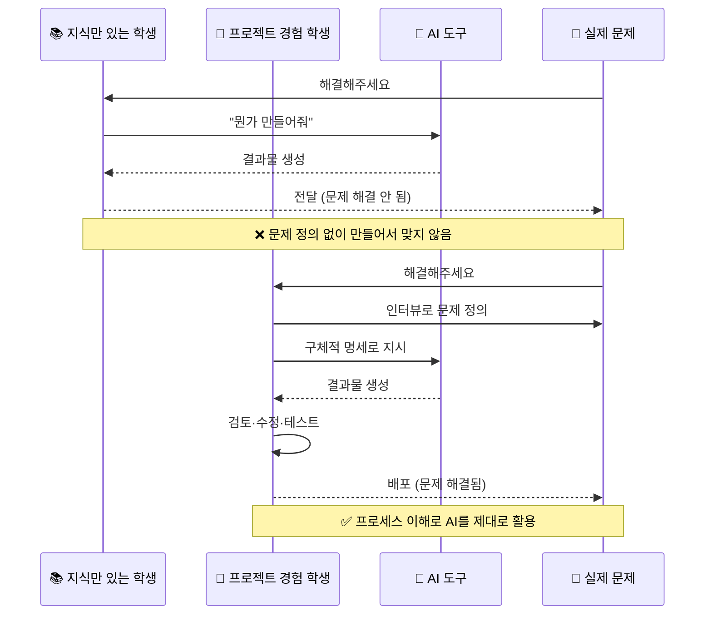

#### 프로젝트 경험이 만드는 5가지 역량

| 역량 | 수업·강의로 얻을 수 있나? | 프로젝트만 줄 수 있는 것 |
|-----|-------------------|---------------------|
| **문제 정의** | ❌ 이론은 배울 수 있음 | 실제 사용자 인터뷰에서 "예상과 다른 문제" 발견 경험 |
| **실패와 피벗** | ❌ 케이스 스터디로만 | 직접 출시하고 아무도 안 쓸 때의 감각·대응 능력 |
| **AI 활용 판단** | ❌ 시뮬레이션으로 한계 | AI가 틀렸을 때 발견하는 실전 감각 |
| **팀 협업** | ❌ 그룹 과제는 다름 | 실제 책임이 있는 역할에서 갈등·합의 경험 |
| **배포·공개** | ❌ 수업에 배포 없음 | 세상에 내놓았을 때의 책임감·성취감 |

> **결론: 지식은 수업에서, 역량은 프로젝트에서만 생긴다.**
> AI 시대에 역량이 곧 경쟁력이므로, **프로젝트 경험이 없으면 AI를 가진 타인과 경쟁할 수 없다.**

---

### 1.8 AI 프로젝트 개발 역량 — 구체적으로 무엇인가

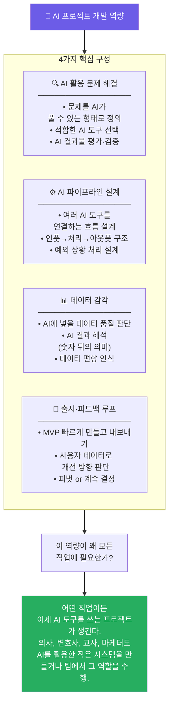

#### AI 프로젝트 개발 역량 수준 4단계

| 수준 | 이름 | 할 수 있는 것 | DreamPath 단계 |
|-----|-----|-----------|-------------|
| **Lv.1** | AI 사용자 | AI 도구에 프롬프트 입력하고 결과 사용 | 하루 살아보기 |
| **Lv.2** | AI 활용자 | 여러 AI 도구 조합해 프로젝트 1개 완성 | 1주 캠프 |
| **Lv.3** | AI 설계자 | AI 파이프라인 설계 + 출시 + 데이터 해석 | 1달 그림자 |
| **Lv.4** | AI 감독자 | AI 시스템 전체 책임 + 팀 방향 설정 + 리스크 관리 | 클루 그림자 프로젝트 |

---

## 2. 8대 왕국 — AI 전후 직무 × 역량 전체 비교표

| 왕국 | AI가 대체한 업무 | AI 이후 인간 핵심 업무 | 새로 생긴 직무 | 2030 핵심 역량 Top 3 |
|-----|--------------|-----------------|------------|-------------------|
| 🔬 **탐구** | 이미지 판독, 문헌 검색, 기초 진단 | 복합 케이스 판단, 연구 설계, 환자 공감 | AI 의료 감독자, 임상-AI 브릿지 연구원 | 복합 판단력 / 연구 설계 / 윤리 사고 |
| 🎨 **창작** | 기초 이미지 생성, 반복 디자인 | 사용자 공감, 문화적 맥락, 감정 설계 | AI 크리에이티브 디렉터, 프롬프트 아티스트 | 사용자 공감 / 문화 감수성 / AI 협업 |
| 💻 **기술** | 기초 코딩, 버그 수정, 쿼리 최적화 | 아키텍처 설계, 요구사항 정의, 보안 판단 | AI 엔지니어, 프롬프트 엔지니어, AI 감사관 | 시스템 설계 / 문제 정의 / AI 협업 |
| 🌱 **자연** | 환경 모니터링, 기초 진단, 데이터 수집 | 현장 판단, 생태 시스템 이해, 지역 설득 | 기후 테크 전문가, 스마트팜 운영 전문가 | 현장 전문성 / 생태 감수성 / IoT 활용 |
| 🤝 **연결** | 기초 정보 제공, 행정 처리, 일정 관리 | 관계 형성, 감정 지원, 현장 돌봄 | AI 활용 상담사, 에듀테크 교사 | 공감력 / 관계 설계 / AI 보조 활용 |
| 🏛️ **질서** | 판례 검색, 기초 서류 작성, 세무 자동화 | 협상, 전략적 판단, 정치·맥락 이해 | AI 법률 감독자, 디지털 외교관, 데이터 포렌식 | 전략적 사고 / 협상력 / 디지털 법학 |
| 📣 **소통** | 콘텐츠 초안, 광고 최적화, A/B 테스트 | 브랜드 전략, 문화 감수성, 커뮤니티 형성 | AI 콘텐츠 큐레이터, 마케팅 AI 감독 | 브랜딩 / 문화 이해 / 커뮤니티 설계 |
| 🚀 **도전** | 시장 조사, 재무 분석, 보고서 작성 | 비전 설정, 팀 빌딩, 관계 투자 | AI 창업 가속기, 벤처 AI 전략가 | 비전 설정 / 리더십 / 불확실성 포용 |

---

## 3. 왕국별 상세 역량 정의

### 3.1 🔬 탐구 왕국 — AI 시대 역량 재정의

#### 탐구 왕국 직종 전체 목록 — AI 시대 완전 재정의 (120개 직업 중 핵심 23개 상세 분석)

> **탐구 왕국 AI 전환 핵심 메시지:**
> "AI가 진단하고, 인간이 판단한다. AI가 데이터를 분석하고, 인간이 의미를 해석한다."

##### 의료·헬스케어 분야 (8개)

| 직종 | AI 이전 핵심 역할 | AI 이후 핵심 역할 | AI 대체 위험도 | 주요 AI 도구 | 2030년 전망 |
|-----|--------------|--------------|------------|----------|-----------|
| **의사 (일반·전문의)** | 문진·진단·처방 전 과정 직접 수행 | AI 1차 진단 감독 + 복합 케이스 최종 판단 + 환자 공감 + 다학제 협진 조율 | 🟡 중간 | IBM Watson Health, PathAI, Nuance DAX | 수요 증가, 역할 변화 |
| **AI 의료 감독관** | (신생 직종) | AI 의료 시스템 오류 탐지 + 편향 감사 + 의료 AI 정책 설계 + 병원 AI 도입 전략 | 🟢 낮음 | 자체 AI 감사 툴, Python 분석 | 신규 직종, 급성장 |
| **임상연구원 (CRC)** | 실험 데이터 직접 수집·분석 + 피험자 관리 | 연구 설계 + AI 결과 해석 + 연구 윤리 판단 + 피험자 공감 | 🟡 중간 | Medidata, Veeva Vault | 역할 고도화 |
| **약사** | 처방 조제 + 용량 계산 + 복약 지도 | AI 처방 이상 탐지 감독 + 환자 복약 상담 + 약물 상호작용 최종 판단 | 🟠 높음 (조제 영역) | ScriptPro, Parata | 임상약사로 전환 |
| **간호사** | 활력징후 측정·기록 + 투약 + 환자 케어 | AI 모니터링 감독 + 환자 감정 돌봄 + 이상 징후 최종 판단 + 가족 소통 | 🟡 중간 | Epic Systems, 웨어러블 AI | 케어 중심 전환 |
| **영상의학과 전문의** | X-ray, CT, MRI 판독 전체 | AI 1차 판독 검증 + 경계 케이스 최종 판단 + 임상의와 소통 | 🟠 높음 | Zebra Medical, Aidoc | 판독→협진 중심 |
| **병리학 전문의** | 조직 슬라이드 현미경 판독 | AI 병리 분석 감독 + 희귀 케이스 판단 + 임상 맥락 통합 해석 | 🟠 높음 | PathAI, Paige.AI | 전문성 심화 필요 |
| **정신건강의학과 의사** | 상담·진단·처방 전체 | AI 심리검사 해석 + 복합 정신 질환 판단 + 치료 관계 형성 | 🟢 낮음 | Woebot, Wysa (보조용) | 관계 중심 강화 |

##### 생명과학·연구 분야 (8개)

| 직종 | AI 이전 핵심 역할 | AI 이후 핵심 역할 | AI 대체 위험도 | 주요 AI 도구 | 2030년 전망 |
|-----|--------------|--------------|------------|----------|-----------|
| **생명공학연구원** | 실험 반복 수행 + 데이터 기록 + 결과 분석 | 실험 설계 + AI 데이터 해석 + 가설 수립 + 연구 방향 설정 | 🟡 중간 | BenchSci, Synthace | 설계 중심 전환 |
| **신약개발연구원** | 화합물 합성 + 임상 데이터 분석 + 문헌 검색 | AlphaFold 결과 검증 + 신약 방향성 설계 + 임상 전략 수립 | 🟡 중간 | AlphaFold, Atomwise, Insilico Medicine | 전략가로 진화 |
| **유전학자** | DNA 시퀀싱 + 데이터 분석 + 논문 작성 | AI 유전체 분석 감독 + 유전 상담 + 윤리적 판단 + 개인화 의료 설계 | 🟡 중간 | DeepVariant, GATK | 상담·윤리 강화 |
| **의료데이터사이언티스트** | (신생 직종) | 임상 데이터 의미 해석 + AI 모델 의료 번역 + 병원 데이터 전략 | 🟢 낮음 | TensorFlow, PyTorch, FHIR | 신규 고수요 |
| **바이오인포매틱스 전문가** | 생물 정보 데이터베이스 구축·분석 | AI 생물정보 분석 설계 + 결과 생물학적 해석 + 연구 방향 제시 | 🟡 중간 | Bioconductor, Galaxy | 해석 중심 전환 |
| **임상병리사** | 혈액·조직 검사 수행 + 결과 판독 | AI 검사 결과 검증 + 이상값 최종 판단 + 정도 관리 감독 | 🟠 높음 | 자동화 검사 장비 AI | 감독·검증 중심 |
| **공중보건학자** | 역학 데이터 수집·분석 + 보고서 작성 | AI 역학 모델 해석 + 보건 정책 설계 + 지역사회 설득 | 🟡 중간 | EpiModel, 예측 모델 | 정책 설계 강화 |
| **의생명공학자** | 의료기기 설계 + 프로토타입 제작 + 테스트 | AI 시뮬레이션 감독 + 인체 적용 안전성 판단 + 사용자 경험 설계 | 🟡 중간 | COMSOL, ANSYS AI | 융합 전문성 |

##### 수의·동물·환경 분야 (7개)

| 직종 | AI 이전 핵심 역할 | AI 이후 핵심 역할 | AI 대체 위험도 | 주요 AI 도구 | 2030년 전망 |
|-----|--------------|--------------|------------|----------|-----------|
| **수의사** | 진료·수술 전 과정 직접 수행 | AI 영상 판독 감독 + 보호자 상담 + 복합 케이스 판단 + 동물 행동 해석 | 🟡 중간 | VetCT AI, 수의 진단 AI | 관계·판단 강화 |
| **야생동물학자** | 현장 관찰 + 데이터 수집 + 개체 추적 | AI 카메라 트랩 데이터 해석 + 생태계 맥락 판단 + 보전 전략 설계 | 🟡 중간 | Wildlife Insights, iNaturalist | 전략 설계 중심 |
| **해양생물학자** | 해양 생물 채집·분류 + 생태 조사 | AI 수중 드론 데이터 해석 + 해양 생태계 건강도 판단 + 보전 정책 제안 | 🟡 중간 | NOAA AI, 해양 모니터링 AI | 정책 중심 전환 |
| **동물행동학자** | 동물 행동 관찰·기록 + 패턴 분석 | AI 행동 패턴 분석 감독 + 맥락적 해석 + 동물 복지 판단 | 🟡 중간 | DeepLabCut, BORIS | 복지 전문가화 |
| **환경생태학자** | 생태계 조사 + 종 다양성 측정 | AI 생물 다양성 분석 해석 + 생태계 건강 진단 + 복원 전략 설계 | 🟡 중간 | eBird, iNaturalist, GBIF | 복원 설계 강화 |
| **수족관 큐레이터** | 수조 관리 + 생물 건강 모니터링 + 교육 프로그램 | AI 수질·생물 모니터링 감독 + 전시 스토리텔링 + 방문객 교육 설계 | 🟡 중간 | IoT 센서 AI | 교육·경험 설계 |
| **동물원 수의사** | 야생동물 진료 + 건강 관리 + 번식 관리 | AI 건강 모니터링 감독 + 희귀종 복합 판단 + 동물 복지 윤리 설계 | 🟡 중간 | 야생동물 진단 AI | 복지·윤리 중심 |

#### 탐구 왕국 AI 전환 상세 분석 — 직업별 생존 전략

##### 1. 의사 (일반의·전문의) — AI 시대 완전 해부

**AI가 대체하는 구체적 업무 (40%)**
- 기초 문진 정보 수집 → AI 챗봇이 사전 문진 완료
- 단순 질환 1차 진단 (감기, 위염 등) → AI가 증상 기반 1차 진단
- 의무기록 작성 → Nuance DAX가 진료 대화 자동 기록
- 영상 판독 (X-ray, CT) → AI가 1차 판독 완료
- 처방전 작성 → AI가 표준 처방 자동 생성
- 검사 결과 해석 (혈액, 소변 등) → AI가 정상 범위 자동 판단

**인간이 반드시 해야 할 업무 (60%)**
- 복합 케이스 최종 판단 (여러 질환 동시 발생, 비정형 증상)
- 환자 감정 공감 및 신뢰 관계 형성
- 치료 방향 윤리적 결정 (연명치료, 실험적 치료 등)
- 환자 가족과의 소통 및 설득
- 다학제 협진 조율 (여러 전문과 협업)
- AI 진단 오류 최종 검증 및 책임

**AI 도구 활용 실전 사례**
```
[오전 진료실 시나리오]

08:30 - AI 사전 문진 결과 확인
환자: 김철수 (65세, 남성)
AI 사전 문진 요약:
- 주호소: 가슴 통증 3일, 호흡 곤란
- AI 1차 진단: 협심증 72%, 심근경색 18%, 역류성식도염 10%
- AI 권고: 심전도 + 심장효소 검사 즉시

의사의 판단:
→ AI 진단을 참고하되, 직접 문진으로 추가 정보 수집
→ "통증이 식사 후에 심해지나요?" (역류성 식도염 가능성)
→ "최근 스트레스나 가족 문제가 있었나요?" (심인성 요인)

결과: AI가 놓친 정보 발견
→ 환자가 3일 전 아들과 큰 다툼 → 불안장애 가능성
→ 심장 검사 + 정신건강의학과 협진 의뢰

💡 AI와 차별화 포인트:
- AI는 증상 패턴 매칭만 가능
- 인간은 환자의 삶의 맥락을 읽어 숨겨진 원인 발견
```

**의사가 AI 시대에 살아남기 위한 5가지 전략**

1. **복합 판단력 강화**
   - 여러 질환이 동시에 나타날 때 우선순위 판단
   - 교과서에 없는 비정형 케이스 대응 능력
   - 훈련 방법: 케이스 컨퍼런스 적극 참여, 희귀 질환 스터디

2. **환자 공감 및 소통 능력**
   - AI 진단 결과를 환자가 이해하도록 번역
   - 불안한 환자의 감정을 읽고 신뢰 형성
   - 훈련 방법: 의료 커뮤니케이션 교육, 환자 경험 연구

3. **AI 리터러시 및 감독 능력**
   - AI 진단의 신뢰도 판단 (학습 데이터 편향 인식)
   - AI 오류 발견 및 수정 지시
   - 훈련 방법: 의료 AI 논문 읽기, Python 기초 학습

4. **다학제 협업 조율**
   - 여러 전문과와 협진 설계
   - 간호사, 약사, 물리치료사 등과 통합 케어 설계
   - 훈련 방법: 팀 기반 진료 경험, 협업 프로젝트

5. **윤리적 판단 및 책임**
   - AI 권고와 환자 가치관이 충돌할 때 중재
   - 의료 AI 사용의 법적·윤리적 책임 인식
   - 훈련 방법: 의료윤리 케이스 토론, 생명윤리 독서

**의대 입시 준비 학생을 위한 DreamPath 로드맵**

| 시기 | 활동 | 역량 훈련 | 산출물 |
|-----|-----|---------|------|
| **중2** | 탐구 왕국 의사 하루 살아보기 | 복합 판단력 체험 | 직업 체험 보고서 |
| **중3** | 생명과학 탐구: "우리 동네 고령자 건강 설문 분석" | 연구 설계 + 데이터 분석 | 탐구 보고서 |
| **고1** | 의료 봉사 + AI 의료 윤리 독서 | 환자 공감 + 윤리 사고 | 봉사 기록 + 독서록 |
| **고2** | R&E: "AI 의료 오진 사례 분석 및 예방 가이드라인" | AI 리터러시 + 복합 판단 | 연구 논문 (학술대회 출품) |
| **고3** | 의대 면접 준비: 역량 기반 스토리 정리 | 전체 역량 통합 | 자소서 + 면접 답변 |

##### 2. AI 의료 감독관 (신생 직종) — 2025년 이후 급부상

**직무 상세 설명**
- AI 의료 시스템의 진단 정확도 모니터링
- AI 편향 감사 (특정 인종·성별·연령에서 오진율 높은지 확인)
- 병원 AI 도입 전략 수립 및 의료진 교육
- AI 의료 사고 발생 시 원인 분석 및 개선안 제시
- 의료 AI 규제 준수 감독

**필요 역량 조합**
- 의학 지식 (의사 or 간호사 출신 선호)
- 데이터 분석 능력 (Python, SQL)
- AI 모델 이해 (머신러닝 기초)
- 의료 윤리 및 법규 지식
- 병원 경영 이해

**하루 업무 예시**
```
09:00 - AI 진단 시스템 주간 리포트 검토
→ 지난주 AI 오진 케이스 3건 발견
→ 공통 패턴 분석: 70세 이상 여성 환자에서 오진율 12% 높음

10:00 - 원인 분석 회의
→ 학습 데이터에 고령 여성 케이스 부족 확인
→ 추가 학습 데이터 수집 계획 수립

13:00 - 의료진 AI 활용 교육
→ "AI 진단 결과를 맹신하지 말고 반드시 검증하세요"
→ 고위험 케이스 체크리스트 배포

15:00 - 새로운 AI 도구 도입 검토
→ 병리 AI 시스템 3개 벤더 비교
→ 정확도, 비용, 의료진 학습 곡선 종합 평가

17:00 - 월간 AI 감사 보고서 작성
→ 병원장에게 AI 도입 ROI 및 리스크 보고
```

**이 직업으로 가는 경로**
1. 의대 졸업 + 임상 경험 3년 → AI 의료 감독관 전환
2. 간호대 졸업 + 의료 데이터 분석 석사 → AI 의료 감독관
3. 컴퓨터공학 + 의료 AI 스타트업 경험 → 병원 AI 감독관

##### 3. 임상연구원 (CRC) — AI 시대 연구 설계자로 진화

**AI 전환 핵심**
- 데이터 수집·입력 → AI 자동화 (70% 업무 감소)
- 연구 설계 및 피험자 관계 → 인간 고유 영역 (중요도 200% 증가)

**AI 이후 핵심 업무**
- 임상시험 프로토콜 설계 (AI 도구 활용)
- 피험자 모집 및 동의서 설명 (공감 필수)
- AI 수집 데이터 품질 검증
- 이상반응 최종 판단 (AI 알림 → 인간 판단)
- 연구 윤리 준수 감독

**AI 도구 활용 사례**
- Medidata Rave: 임상 데이터 자동 수집·관리
- Veeva Vault: 규제 문서 자동 관리
- AI 피험자 모집 플랫폼: 적합한 피험자 자동 매칭

**차별화 역량**
- 피험자와의 신뢰 관계 형성 (AI 불가)
- 연구 윤리 판단 (복잡한 상황에서 윤리적 결정)
- 예외 상황 대응 (프로토콜에 없는 이상반응 발생 시)

##### 4. 약사 — 조제에서 임상약사로 대전환

**위기 시나리오**
- 조제 로봇이 처방전 자동 조제 (정확도 99.9%)
- AI가 약물 상호작용 자동 체크
- 복약 지도 → AI 챗봇이 기본 안내

**생존 전략: 임상약사로 전환**
- 병원·요양원에서 의사와 협업하는 약물 전문가
- AI가 놓친 약물 상호작용 최종 검증
- 환자 개별 상황 고려한 복약 상담
- 다약제 복용 노인 환자 약물 관리

**새로운 역할 예시**
```
[요양원 임상약사 하루]

09:00 - 입소자 50명 복용 약물 AI 분석 결과 검토
→ AI 알림: "김OO 님, 5가지 약물 동시 복용 중 상호작용 위험"
→ 약사 판단: 환자 나이·신장 기능 고려해 용량 조정 제안

10:00 - 의사와 협진
→ "이 환자는 신장 기능이 약해 이 약은 50% 감량 필요합니다"
→ 의사가 놓친 부분을 약물 전문가 관점에서 보완

13:00 - 환자 가족 상담
→ AI 복약 안내를 환자가 이해하도록 쉽게 설명
→ "어머니가 약을 안 드시는 이유"를 경청하고 해결책 제시

15:00 - 신규 약물 도입 검토
→ AI가 추천한 신약 3개 중 이 요양원 환자군에 적합한 것 선택
```

##### 5. 간호사 — 케어 중심 전문가로 재탄생

**AI가 대체하는 업무**
- 활력징후 자동 측정 (웨어러블 기기)
- 투약 시간 알림 (자동화 시스템)
- 기본 환자 교육 (AI 챗봇)
- 의무기록 입력 (음성 인식 자동 기록)

**인간 간호사만 할 수 있는 업무**
- 환자 감정 돌봄 및 불안 해소
- 이상 징후 최종 판단 (AI 알림 → 간호사 확인)
- 환자 가족과의 깊은 소통
- 돌봄 계획 개인화 (환자 선호·문화 고려)
- 응급 상황 최초 대응 및 판단

**AI 시대 간호사 차별화 포인트**
```
[중환자실 간호사 사례]

AI 모니터링 시스템: "환자 심박수 상승, 혈압 하강 감지"

일반 간호사: AI 알림 보고 의사 호출

AI 시대 간호사:
1. 환자 상태 직접 확인 (AI 센서 오류 가능성 판단)
2. 환자에게 "불편한 곳 있으세요?" 물어봄
3. 환자 표정·행동에서 통증 수준 파악
4. 의사에게 "AI 알림 + 제가 관찰한 추가 정보" 통합 보고
5. 환자에게 "괜찮아요, 제가 옆에 있어요" 안심시킴

💡 차별화: AI는 데이터만 보고, 인간은 환자 전체를 본다
```

##### 6. 영상의학과 전문의 — 고위험 직종에서 살아남기

**위기 상황**
- AI 영상 판독 정확도가 인간 전문의 수준 도달 (95% 이상)
- 단순 골절, 폐렴 등 → AI가 더 빠르고 정확
- 병원들이 AI 판독 시스템 도입으로 영상의학과 인력 30% 감축

**생존 전략**
1. **경계 케이스 전문가로 포지셔닝**
   - AI가 "불확실" 판정한 케이스만 인간이 판독
   - 희귀 질환, 비정형 소견 전문성 강화

2. **협진 중심 역할 전환**
   - 판독만 하는 것이 아니라, 임상의와 직접 소통
   - "이 소견이 환자 치료에 어떤 의미인가" 해석 제공

3. **AI 판독 감독자**
   - AI 판독 오류 모니터링 및 품질 관리
   - 새로운 AI 판독 시스템 도입 시 검증 담당

**실전 사례**
```
[AI 판독 감독 시나리오]

AI 판독 결과: "폐 결절 발견, 악성 가능성 45%"

일반 영상의학과 의사: AI 결과 그대로 보고

AI 시대 영상의학과 의사:
1. AI 판독 결과 재검토
2. 과거 영상과 비교 (결절 크기 변화 추적)
3. 환자 흡연력, 가족력 등 임상 정보 통합
4. 최종 판단: "양성 가능성 높음, 3개월 후 추적 검사 권고"
5. 임상의에게 전화: "환자 불안할 수 있으니 이렇게 설명하세요"

💡 차별화: AI는 이미지만 보고, 인간은 환자 전체 맥락을 본다
```

##### 7. 병리학 전문의 — AI 협업 필수 직종

**AI 도입 현황**
- PathAI, Paige.AI가 조직 슬라이드 자동 분석
- 암 진단 정확도 95% 이상
- 병리 판독 시간 70% 단축

**인간 병리학 전문의의 새 역할**
- AI 1차 분석 검증 (특히 경계성 병변)
- 희귀 질환 최종 판단
- 임상 정보 통합 해석 (환자 증상 + 영상 + 병리 소견)
- 병리 AI 시스템 품질 관리

##### 8. 정신건강의학과 의사 — AI 대체 불가 영역

**왜 AI가 대체 못 하는가**
- 정신 질환은 환자와의 치료적 관계가 치료의 핵심
- AI 챗봇은 공감 시뮬레이션만 가능, 진짜 공감 불가
- 복합 정신 질환 (우울 + 불안 + 성격장애)은 인간 판단 필수

**AI 도구 활용 방식**
- Woebot, Wysa: 경증 우울·불안 1차 스크리닝
- AI 심리검사 자동 채점 및 요약
- 인간 의사: AI 결과 해석 + 깊은 상담 + 치료 관계 형성

**차별화 포인트**
```
환자: "살고 싶지 않아요"

AI 챗봇: "힘드시군요. 전문가와 상담하시는 것을 권장합니다"
→ 프로토콜 기반 응답, 진짜 공감 없음

인간 의사: (환자 표정, 목소리 톤, 침묵의 의미를 읽음)
→ "지금 이 순간 가장 힘든 것이 무엇인가요?"
→ 환자가 말하지 않은 것을 감지하고 안전하게 이끌어냄

💡 AI는 패턴을 인식하고, 인간은 존재를 느낀다
```

##### 9. 생명공학연구원 — 실험 실행자에서 연구 설계자로

**AI 전환 핵심**
- 반복 실험 → 로봇 자동화 (Synthace 등)
- 데이터 분석 → AI 자동 분석
- 문헌 검색 → Elicit, Consensus가 자동 요약

**인간 연구원의 새 역할**
- 연구 질문 정의 ("무엇을 밝혀낼 것인가")
- 실험 설계 전략 (어떤 실험이 가설 검증에 적합한가)
- AI 분석 결과의 생물학적 의미 해석
- 연구 방향 피벗 결정

**실전 사례**
```
[신약 후보 물질 연구 시나리오]

AI 도구 (Atomwise): "10만 개 화합물 중 후보 물질 50개 추천"

일반 연구원: AI 추천 순서대로 실험

AI 시대 연구원:
1. AI 추천 근거 분석 (어떤 기준으로 선택했나?)
2. 생물학적 맥락 검토 (이 화합물이 생체 내에서 안정한가?)
3. 실험 가능성 판단 (우리 연구실 장비로 합성 가능한가?)
4. 최종 후보 10개 선정 + 우선순위 설계
5. 실험 결과 해석 (AI 예측과 다른 이유 분석)

💡 차별화: AI는 패턴을 찾고, 인간은 의미를 해석한다
```

##### 10. 신약개발연구원 — AlphaFold 시대의 전략가

**AlphaFold 충격**
- 단백질 구조 예측이 수개월 → 수분으로 단축
- 신약 개발 초기 단계 대폭 가속화
- 하지만 "어떤 단백질을 타겟으로 할 것인가"는 인간 판단

**인간 연구원의 새 역할**
- 타겟 단백질 선정 전략 (질병 메커니즘 이해 필수)
- AlphaFold 예측 결과의 생물학적 타당성 검증
- 신약 후보의 임상 가능성 판단 (부작용, 생체이용률 등)
- 신약 개발 전략 수립 (Fast-track vs 정규 임상)

##### 11. 유전학자 — 유전 상담 및 윤리 전문가로

**AI 도입 현황**
- DeepVariant: 유전체 변이 자동 분석
- AI가 질병 연관 유전자 예측

**인간 유전학자 고유 영역**
- 유전 검사 결과를 환자·가족에게 설명
- 윤리적 판단 (유전자 편집, 착상 전 진단 등)
- 개인화 의료 전략 설계
- 유전 정보 프라이버시 보호 감독

##### 12. 의료데이터사이언티스트 (신생 직종) — 의학과 AI의 브릿지

**왜 생겨났는가**
- 병원에 쌓이는 방대한 데이터를 AI로 분석 필요
- 하지만 AI 엔지니어는 의학을 모르고, 의사는 AI를 모름
- → 둘을 연결하는 전문가 필요

**핵심 역할**
- 임상 질문을 데이터 분석 문제로 번역
- AI 모델 결과를 의료진이 이해하도록 설명
- 병원 데이터 전략 수립 (어떤 데이터를 수집할 것인가)

##### 13. 바이오인포매틱스 전문가 — 생물학적 의미 해석자

**AI 이후 역할 변화**
- 데이터 분석 실행 → AI 자동화
- 생물학적 의미 해석 → 인간 고유 영역

**차별화 역량**
- AI 분석 결과에서 생물학적으로 말이 되는지 판단
- 연구 방향 제시 (이 결과가 다음 연구로 이어지려면?)

##### 14. 임상병리사 — 검사 실행에서 검증 감독으로

**AI 자동화 현황**
- 혈액·소변 검사 → 완전 자동화
- AI가 정상·이상 자동 판정

**인간 임상병리사 역할**
- AI 검사 결과 이상값 최종 확인
- 검사 장비 정도 관리 (AI 오류 감지)
- 희귀 케이스 수동 검사

##### 15. 공중보건학자 — 정책 설계 및 지역사회 설득자

**AI 도구 활용**
- AI 역학 모델이 감염병 확산 예측
- 보건 정책 시뮬레이션 자동화

**인간 공중보건학자 역할**
- AI 예측 모델 해석 및 정책 번역
- 지역사회 설득 (주민이 이해하도록 설명)
- 보건 정책의 사회적·윤리적 영향 판단

#### 탐구 왕국에서 쓰이는 주요 AI 도구

| AI 도구 | 용도 | 인간이 해야 할 것 |
|--------|-----|--------------|
| **IBM Watson Health** | 환자 데이터 기반 진단 보조 | AI 결과의 신뢰도 판단 + 맥락 해석 |
| **PathAI** | 병리 슬라이드 자동 분석 | 경계 케이스 최종 판독 + 환자 상황 통합 |
| **AlphaFold** | 단백질 구조 예측 | 예측 결과의 생물학적 의미 해석 |
| **Elicit / Consensus** | 논문 자동 검색·요약 | 연구 방향 설정 + 비판적 평가 |
| **Nuance DAX** | 진료 대화 자동 의료기록화 | 기록 정확성 검토 + 의미 보완 |
| **Atomwise** | 신약 후보 물질 예측 | 임상 가능성 판단 + 실험 우선순위 설계 |

#### 하루 업무 비교 — 의사 (내과 전공의)

| 시간 | AI 이전 하루 | AI 이후 하루 |
|-----|-----------|-----------|
| **08:00** | 의무기록 직접 검토 (환자 1인당 5~10분) | AI가 요약한 환자 기록 30초 검토 + 이상 항목 확인 |
| **09:00~12:00** | 환자 15명 직접 문진·검사·진단·처방 | 환자 8명 진료: AI 1차 진단 결과 검증 + 복합 케이스 집중 판단 |
| **13:00** | 흉부 X-ray 15장 직접 판독 | AI 판독 결과 검토 + 불확실 판정 케이스 5장만 직접 판독 |
| **14:00~16:00** | 회진 + PubMed 수동 검색으로 최신 치료법 확인 | 회진 + AI 논문 요약 결과 검토 + 연구 의미 해석 |
| **16:00~18:00** | 처방전 작성 + 보험 청구 서류 작성 | AI 작성 처방·서류 검토 + 환자 상담에 집중 |
| **핵심 변화** | 정보 처리에 대부분의 시간 소모 | **판단·공감·맥락 해석에 집중** |

#### 탐구 왕국 핵심 역량 × 행동 지표 × 습득 방법

| 핵심 역량 | AI 이전 의미 | AI 이후 행동 지표 (이렇게 하면 이 역량이 있다) | 역량 습득 활동 |
|---------|-----------|--------------------------------------|------------|
| **복합 판단력** | 진단 프로토콜 암기 | "AI가 암 가능성 70%로 진단했을 때, 환자 나이·생활 패턴·가족력을 종합해 최종 결정을 내린다" | 의료 케이스 스터디, 모의 진단 토론 |
| **연구 설계** | 기존 실험 재현 | "AI가 수집한 데이터에서 기계가 발견하지 못한 맥락적 패턴을 찾아 새로운 연구 가설을 만든다" | R&E 프로그램, 탐구대회 참가 |
| **윤리 사고** | (AI 이전에는 없던 역량) | "AI 진단 오류의 책임이 누구에게 있는지 판단하고, 환자에게 AI 활용 사실을 어떻게 설명할지 결정한다" | 의료윤리 독서, 생명윤리 토론 |
| **환자 공감** | 진료의 부수 요소 | "AI 진단 결과를 환자가 이해하도록 번역하고, 불안을 해소하는 대화를 이끈다" | 봉사 경험, 노인·장애인 현장 활동 |
| **AI 리터러시** | (AI 이전에는 없던 역량) | "AI 도구의 학습 데이터 편향을 파악하고, 특정 환자군에서 정확도가 낮아질 수 있음을 인식한다" | AI 논문 읽기, Python 기초 실습 |

#### 탐구 왕국 프로젝트 블루프린트

**프로젝트 A: "우리 학교 급식 영양 AI 분석 + 개선 제안"**

| 항목 | 내용 |
|-----|-----|
| **목표** | 실제 데이터 기반 연구 설계 역량 + AI 리터러시 훈련 |
| **기간** | 6주 |
| **주요 활동** | 1주: 급식 데이터 수집 계획 / 2주: Python으로 영양소 분석 / 3주: AI 결과 해석 / 4주: 문제점 발견 / 5주: 개선안 설계 / 6주: 발표 |
| **산출물** | 탐구 보고서 1편 + 데이터 시각화 차트 + 개선 제안서 |
| **훈련 역량** | 연구 설계, AI 리터러시, 복합 판단력 |
| **입시 연계** | 과학·생명과학 세특 연계, 탐구대회 출품 |
| **예상 비용** | 0원 (공개 데이터 + Python 무료) |

**프로젝트 B: "AI 의료 오진 사례 분석 및 윤리 가이드라인 제안서"**

| 항목 | 내용 |
|-----|-----|
| **목표** | 윤리 사고 + 복합 판단력 + 연구 설계 통합 훈련 |
| **기간** | 8주 |
| **주요 활동** | 실제 AI 의료 오류 사례 3건 수집 → 원인 분석 → 예방 가이드라인 초안 작성 → 전문가 피드백 |
| **산출물** | 가이드라인 제안서 (A4 10페이지) + 발표 자료 |
| **훈련 역량** | 윤리 사고, 복합 판단력, 논리·글쓰기 |
| **입시 연계** | 생명과학·사회 세특, R&E 활동, 의대 자소서 소재 |
| **예상 비용** | 0원 |

---

### 3.2 🎨 창작 왕국 — AI 시대 역량 재정의

#### 창작 왕국 직종 전체 목록 — AI 시대 완전 재정의 (150개 직업 중 핵심 23개 상세 분석)

> **창작 왕국 AI 전환 핵심 메시지:**
> "AI가 만들고, 인간이 선택한다. AI가 실행하고, 인간이 방향을 제시한다."

##### 디지털 디자인 분야 (8개)

| 직종 | AI 이전 핵심 역할 | AI 이후 핵심 역할 | AI 대체 위험도 | 주요 AI 도구 | 2030년 전망 |
|-----|--------------|--------------|------------|----------|-----------|
| **UX/UI 디자이너** | 와이어프레임 직접 제작 + 사용성 테스트 + 프로토타입 | AI 결과물 큐레이션 + 사용자 감정 흐름 설계 + 접근성 판단 + 문화적 맥락 반영 | 🟡 중간 | Figma AI, Uizard, Galileo AI | 감성 설계자로 진화 |
| **AI 크리에이티브 디렉터** | (신생 직종) | AI 생성 결과물 방향 지시 + 최종 품질 감독 + 브랜드 일관성 유지 + 팀 AI 전략 | 🟢 낮음 | Midjourney, Runway, Adobe Firefly | 신규 고수요 직종 |
| **프로덕트 디자이너** | 제품 스케치 + 3D 모델링 + 렌더링 | AI 생성 디자인 평가 + 제조 가능성 판단 + 사용자 경험 통합 설계 | 🟡 중간 | Spline AI, Gravity Sketch | 전략 디자이너화 |
| **모션 그래픽 디자이너** | 애니메이션 직접 제작 + 타이밍 조정 | AI 모션 생성 감독 + 감정 곡선 설계 + 브랜드 무브먼트 정의 | 🟡 중간 | Runway ML, Pika Labs | 감정 연출 중심 |
| **그래픽 디자이너** | 포스터·배너 직접 디자인 + 레이아웃 | AI 생성 시안 선별 + 브랜드 철학 구현 판단 + 문화 감수성 검토 | 🟠 높음 | Canva AI, Adobe Firefly | 브랜드 전문가화 |
| **일러스트레이터** | 일러스트 직접 그리기 + 채색 | AI 생성 일러스트 방향 지시 + 스타일 큐레이션 + 감성 표현 감독 | 🟠 높음 | Midjourney, DALL-E 3 | 스타일 디렉터화 |
| **타이포그래피 디자이너** | 폰트 직접 디자인 + 레터링 | AI 폰트 생성 감독 + 가독성 판단 + 브랜드 정체성 구현 | 🟠 높음 | Fontjoy AI, Calligrapher.ai | 전문성 심화 필요 |
| **인터랙션 디자이너** | 인터랙션 프로토타입 직접 제작 | AI 인터랙션 패턴 평가 + 사용자 감정 반응 설계 + 접근성 판단 | 🟡 중간 | Framer AI, ProtoPie | 감정 설계 강화 |

##### 콘텐츠 크리에이터 분야 (8개)

| 직종 | AI 이전 핵심 역할 | AI 이후 핵심 역할 | AI 대체 위험도 | 주요 AI 도구 | 2030년 전망 |
|-----|--------------|--------------|------------|----------|-----------|
| **웹툰·만화 작가** | 스토리 + 컷 구성 + 작화 + 채색 전체 | 세계관·서사 설계 + AI 보조 작화 감독 + 독자 감정 연결 + 캐릭터 깊이 | 🟡 중간 | Stable Diffusion, ComfyUI | 스토리텔러 강화 |
| **소설가·작가** | 집필 전체 과정 직접 수행 | AI 초안 활용 + 인간 감정 깊이 추가 + 문화적 뉘앙스 + 독자 공감 설계 | 🟡 중간 | Claude, GPT-4, Sudowrite | 감성 작가로 분화 |
| **시나리오 작가** | 시나리오 직접 집필 + 구조 설계 | AI 플롯 생성 활용 + 캐릭터 깊이 설계 + 감정 곡선 조율 + 문화 맥락 | 🟡 중간 | Final Draft AI, Dramatron | 감정 설계 중심 |
| **게임 시나리오 작가** | 게임 스토리 + 퀘스트 + 대사 작성 | AI 생성 퀘스트 큐레이션 + 세계관 일관성 유지 + 플레이어 감정 설계 | 🟡 중간 | AI Dungeon, Inworld AI | 세계관 설계 강화 |
| **유튜버·크리에이터** | 기획·촬영·편집·썸네일 전체 | AI 편집 감독 + 커뮤니티 관계 형성 + 콘셉트 방향 + 진정성 유지 | 🟡 중간 | Descript, OpusClip, Thumbnail AI | 커뮤니티 중심화 |
| **팟캐스터** | 녹음·편집·배포 전체 | AI 편집·자막 감독 + 게스트 관계 + 대화 흐름 설계 + 커뮤니티 형성 | 🟡 중간 | Descript, Riverside.fm | 관계 중심 강화 |
| **프롬프트 아티스트** | (신생 직종) | AI 이미지·영상 생성 프롬프트 전문 설계 + 스타일 가이드 + 품질 평가 | 🟢 낮음 | Midjourney, Stable Diffusion | 신규 전문 직종 |
| **AI 콘텐츠 큐레이터** | (신생 직종) | AI 생성 콘텐츠 선별·편집 + 팩트체크 + 브랜드 일관성 감독 | 🟢 낮음 | 자체 큐레이션 시스템 | 필수 신규 직종 |

##### 공간·건축 디자인 분야 (7개)

| 직종 | AI 이전 핵심 역할 | AI 이후 핵심 역할 | AI 대체 위험도 | 주요 AI 도구 | 2030년 전망 |
|-----|--------------|--------------|------------|----------|-----------|
| **건축가** | CAD 도면 직접 작성 + 설계 전체 | 공간 철학 정의 + AI 설계 검토 + 사용자 경험 설계 + 지역 맥락 통합 | 🟡 중간 | Autodesk AI, Spacemaker | 철학 중심 전환 |
| **인테리어 디자이너** | 공간 설계 + 자재 선정 + 도면 작성 | 공간 경험 스토리 설계 + AI 렌더링 감독 + 클라이언트 감성 번역 | 🟡 중간 | Planner 5D AI, Homestyler | 경험 설계 강화 |
| **조경 건축가** | 조경 설계 + 식재 계획 + 도면 | 생태 철학 정의 + AI 설계 감독 + 지역 생태 맥락 통합 + 주민 협의 | 🟡 중간 | Lands Design AI | 생태 전문가화 |
| **도시계획가** | 도시 설계 + 교통 분석 + 용도 계획 | AI 시뮬레이션 해석 + 도시 비전 설계 + 주민 참여 설계 + 정치적 조율 | 🟡 중간 | CityEngine, UrbanFootprint | 비전 설계 중심 |
| **무대 디자이너** | 무대 설계 + 제작 도면 + 조명 계획 | 공연 감정 흐름 설계 + AI 시뮬레이션 감독 + 연출가 협업 | 🟡 중간 | Vectorworks AI, 3D 렌더링 AI | 감정 연출 강화 |
| **전시 디자이너** | 전시 공간 설계 + 동선 계획 + 조명 | 관람객 경험 여정 설계 + AI 시뮬레이션 검토 + 스토리텔링 공간화 | 🟡 중간 | SketchUp AI, Lumion | 경험 설계 중심 |
| **가구 디자이너** | 가구 스케치 + 3D 모델링 + 제작 도면 | 사용자 행동 기반 설계 + AI 생성 디자인 평가 + 제조 가능성 판단 | 🟠 높음 | Fusion 360 AI | 사용성 전문가화 |

#### 창작 왕국 AI 전환 상세 분석 — 직업별 생존 전략

##### 1. UX/UI 디자이너 — 감성 설계자로의 대전환

**AI가 대체하는 구체적 업무 (50%)**
- 와이어프레임 초안 제작 → Figma AI, Uizard가 자동 생성
- 레이아웃 반복 작업 → AI가 수십 개 변형안 즉시 생성
- 아이콘·이미지 제작 → AI가 브랜드 가이드 기반 자동 생성
- 반응형 디자인 조정 → AI가 자동 리사이징
- 디자인 시스템 적용 → AI가 일관성 자동 유지
- 기본 사용성 체크 → AI가 접근성 자동 검사

**인간 UX 디자이너만 할 수 있는 업무 (50%)**
- 사용자 감정 여정 설계 ("이 화면에서 사용자가 어떻게 느껴야 하는가")
- 문화적 맥락 판단 (한국 vs 미국 사용자의 UI 선호 차이)
- AI 생성 디자인 중 브랜드에 맞는 것 선택 및 근거 설명
- 사용자 인터뷰 및 공감 (AI는 표면적 답변만 수집)
- 접근성 최종 판단 (장애인, 노인 사용자 실제 테스트)
- 디자인 의사결정의 책임 (왜 이 디자인을 선택했는가)

**AI 도구 활용 실전 워크플로우**
```
[UX 디자이너의 AI 협업 하루]

09:00 - 프로젝트 킥오프
클라이언트: "노인을 위한 건강 관리 앱이 필요합니다"

일반 디자이너: Figma 열고 와이어프레임 스케치 시작

AI 시대 디자이너:
1. 사용자 리서치 먼저 (노인 3명 인터뷰)
   → "버튼이 작으면 못 봐요", "글자가 많으면 읽기 싫어요"
   
2. AI에게 디자인 생성 지시
   Figma AI: "노인 사용자를 위한 건강 앱 UI, 큰 버튼, 단순한 구조"
   → AI가 3개 시안 생성 (5분 소요)

3. AI 생성 시안 평가
   시안 A: 버튼은 크지만 색 대비가 약함 → 노인 시력 고려 부족
   시안 B: 구조는 단순하지만 의료 용어 많음 → 이해도 낮을 것
   시안 C: 크고 단순하며 친근한 언어 → ✅ 선택

4. 인간 디자이너가 추가하는 것
   → 노인이 실수로 잘못 누를 수 있는 버튼 배치 수정
   → "약 먹었어요" 버튼을 가장 접근하기 쉬운 위치로
   → 성공 피드백 메시지에 따뜻한 톤 추가 ("잘하셨어요!")

5. 사용자 테스트
   → 노인 5명에게 실제 사용 테스트
   → AI가 놓친 문제 발견: "뒤로가기 버튼을 못 찾겠어요"
   → 수정 후 재테스트

💡 AI와 차별화 포인트:
- AI는 디자인 패턴을 조합하고, 인간은 사용자 감정을 설계한다
- AI는 100개를 만들고, 인간은 1개를 선택하고 그 이유를 설명한다
```

**UX 디자이너 생존 전략 5가지**

1. **사용자 공감 능력 극대화**
   - 인터뷰에서 사용자가 말하지 않은 것을 감지
   - 사용자의 좌절·기쁨·혼란을 디자인으로 해결
   - 훈련: 다양한 사용자군 인터뷰 경험 (노인, 장애인, 어린이)

2. **AI 디자인 큐레이션 전문성**
   - AI가 생성한 수십 개 시안 중 최적안 선택 능력
   - 선택 근거를 데이터와 감성 2가지로 설명
   - 훈련: 디자인 비평 연습, A/B 테스트 분석

3. **문화적 감수성**
   - AI 생성 디자인에서 특정 문화권에 불쾌감 줄 요소 발견
   - 글로벌 vs 로컬 디자인 전략 판단
   - 훈련: 해외 디자인 사례 연구, 다문화 경험

4. **접근성 전문가**
   - 장애인, 노인, 색약자 등 모든 사용자 고려
   - AI 접근성 체크 결과 최종 검증
   - 훈련: WCAG 가이드라인 학습, 접근성 테스트 참여

5. **브랜드 철학 수호자**
   - AI 생성물이 브랜드 정체성에 맞는지 판단
   - 브랜드의 "느낌"을 디자인 언어로 번역
   - 훈련: 브랜드 전략 학습, 브랜드북 제작 경험

**UX 디자이너 지망 학생 DreamPath 로드맵**

| 시기 | 활동 | 역량 훈련 | 산출물 | 입시 활용 |
|-----|-----|---------|------|---------|
| **중2** | 창작 왕국 UX 디자이너 하루 살아보기 | 사용자 공감 체험 | 체험 보고서 | 진로 탐색 기록 |
| **중3** | Figma 독학 + 학교 앱 UI 개선 프로젝트 | AI 협업 + 사용자 공감 | Figma 포트폴리오 | 정보·미술 세특 |
| **고1** | 노인 복지관 키오스크 리디자인 (봉사 연계) | 접근성 + 사용자 인터뷰 | 사용성 테스트 보고서 | 봉사 + 세특 연계 |
| **고2** | AI 생성 UI 품질 평가 가이드라인 제작 | AI 리터러시 + 비판적 미학 | 가이드북 + 발표 | 탐구 대회 출품 |
| **고3** | 디자인 공모전 출품 + 포트폴리오 완성 | 전체 역량 통합 | 수상작 + 포트폴리오 | 디자인학과 입시 |

##### 2. AI 크리에이티브 디렉터 (신생 직종) — 2025년 이후 가장 핫한 직종

**왜 생겨났는가**
- AI가 디자인·영상·음악을 생성하지만, "어떤 방향으로 만들 것인가"는 인간이 결정
- 한 명의 디렉터가 AI 도구 10개를 조율하여 과거 10명 팀의 산출물 생성
- 브랜드 일관성 유지 및 최종 품질 책임

**핵심 역할**
- AI 생성 결과물 방향 지시 (프롬프트 전략 설계)
- 여러 AI 도구 파이프라인 설계 (이미지 → 영상 → 음악 통합)
- 브랜드 일관성 감독 (AI가 브랜드 이탈 시 수정)
- 최종 품질 판단 및 책임
- 팀 AI 도구 전략 수립 및 교육

**하루 업무 예시**
```
[광고 에이전시 AI 크리에이티브 디렉터]

09:00 - 클라이언트 브리핑
클라이언트: "Z세대를 위한 친환경 브랜드 캠페인 영상 필요"

10:00 - AI 파이프라인 설계
1. Midjourney: 브랜드 비주얼 컨셉 이미지 30개 생성
2. 디렉터 선별: 30개 중 브랜드 철학에 맞는 3개 선택
3. Runway ML: 선택한 이미지 기반 15초 영상 생성
4. Suno AI: 영상 분위기에 맞는 배경음악 5개 생성
5. 디렉터 최종 선택 및 편집 지시

13:00 - 결과물 검토
→ AI 생성 영상 10개 중 2개 선택
→ 선택 근거: "Z세대가 공감할 진정성", "그린워싱 느낌 없음"

15:00 - 클라이언트 프레젠테이션
→ "왜 이 방향인가" 전략적 설명
→ AI 생성 과정 투명하게 공개

17:00 - 팀 AI 도구 교육
→ 주니어 디자이너에게 Midjourney 프롬프트 전략 교육
```

**필요 역량**
- 브랜드 전략 이해
- 여러 AI 도구 숙련도
- 비판적 미학 (AI 결과물 평가 능력)
- 클라이언트 소통 및 설득
- 프로젝트 관리 (AI 파이프라인 일정 조율)

**이 직업으로 가는 경로**
1. 디자인 전공 + AI 도구 마스터 → AI 크리에이티브 디렉터
2. 광고 기획자 + AI 활용 경험 → 전환
3. 개발자 + 디자인 감각 → AI 디자인 시스템 설계자

##### 3. 웹툰·만화 작가 — 스토리텔링 순수성 지키기

**AI 위협 시나리오**
- AI가 웹툰 컷 자동 생성 (Stable Diffusion)
- AI가 배경·채색 자동 완성
- AI가 플롯 제안 (GPT-4 기반)

**하지만 AI가 못 하는 것**
- 독자가 공감하는 캐릭터 깊이 설계
- 복선·반전의 감정적 타이밍
- 문화적 유머와 뉘앙스
- 독자 커뮤니티와의 진정성 있는 소통

**AI 협업 웹툰 작가 워크플로우**
```
[웹툰 작가의 AI 협업 프로세스]

1단계: 스토리 구상 (100% 인간)
→ 캐릭터 설정, 세계관, 주제 의식
→ AI 도구: Claude로 아이디어 브레인스토밍 보조

2단계: 콘티 작업 (100% 인간)
→ 컷 구성, 말풍선 배치, 감정 연출
→ AI는 참고 이미지 검색 보조

3단계: 선화 작업 (70% 인간 + 30% AI)
→ 캐릭터 얼굴·표정: 인간 직접 (감정 핵심)
→ 배경·소품: AI 생성 후 인간이 수정

4단계: 채색 (30% 인간 + 70% AI)
→ 색감 방향 지시: 인간
→ 채색 실행: AI
→ 감정 강조 부분 수정: 인간

5단계: 최종 검토 (100% 인간)
→ "이 컷에서 독자가 울어야 하는데, 지금 색감이 맞나?"
→ AI 결과물에 인간 감성 최종 터치

💡 핵심: AI는 도구일 뿐, 독자와 연결되는 것은 작가의 진심
```

**웹툰 작가 생존 전략**

1. **스토리텔링 순수성 강화**
   - AI가 못 쓰는 인간 감정의 깊이
   - 독자가 "이 작가만의 느낌"이라고 인식하는 스타일
   - 훈련: 문학 독서, 시나리오 작법, 캐릭터 심리 연구

2. **AI 작화 감독 능력**
   - AI 생성 이미지 중 작품 톤에 맞는 것 선택
   - AI 프롬프트 최적화 (원하는 스타일 정확히 지시)
   - 훈련: Stable Diffusion, ComfyUI 실습

3. **독자 커뮤니티 관계**
   - 댓글 소통, 팬아트 반응, 독자 의견 반영
   - AI가 못 하는 진정성 있는 관계 형성
   - 훈련: 커뮤니티 운영, SNS 소통

4. **세계관 설계 능력**
   - 일관성 있는 세계관 구축 (AI는 일관성 유지 어려움)
   - 복선·설정 충돌 관리
   - 훈련: 세계관 설정집 작성, 판타지 소설 분석

##### 4. 건축가 — 공간 철학자로의 전환

**AI 자동화 현황**
- Autodesk AI: 도면 자동 생성
- Spacemaker: 최적 배치 자동 계산
- AI가 구조 안전성 자동 검토

**인간 건축가 고유 영역**
- 공간 철학 정의 ("이 건물이 사람들에게 어떤 경험을 줄 것인가")
- 지역 맥락 통합 (역사, 문화, 주민 의견)
- 건축주와의 깊은 소통 (꿈과 가치를 공간으로 번역)
- AI 설계안의 인간 경험 검증

**실전 사례**
```
[주택 설계 프로젝트]

건축주: "아이 둘과 살 집을 짓고 싶어요"

AI 건축가: Spacemaker에 입력 → 최적 배치 3개 자동 생성

인간 건축가:
1. 건축주 인터뷰 (2시간)
   → "아이들이 자연에서 뛰어놀았으면 좋겠어요"
   → "부부가 함께 요리하는 시간을 소중히 여겨요"
   → "나이 들어서도 이 집에서 살고 싶어요"

2. AI 설계안 검토
   → AI 안 A: 효율적이지만 아이 놀이 공간 부족
   → AI 안 B: 넓지만 부부 요리 공간 분리됨
   → AI 안 C: 구조는 좋지만 노후 대비 없음

3. 인간 건축가가 재설계
   → 1층: 정원과 연결된 아이 놀이 공간
   → 주방: 부부가 나란히 요리할 수 있는 아일랜드
   → 침실: 나중에 1층으로 이동 가능한 구조
   → AI에게 수정 지시 → 최종 도면 생성

💡 차별화: AI는 효율을 계산하고, 인간은 삶을 설계한다
```

##### 5. 영화·영상 감독 — 감정 곡선 설계자

**AI 편집 도구 현황**
- Runway ML: 영상 자동 편집
- Descript: 자막·음성 자동 편집
- AI가 장면 전환, 색보정 자동 처리

**인간 감독 고유 영역**
- 스토리텔링 방향 설계
- 감정 곡선 조율 (어느 장면에서 관객이 울어야 하는가)
- 배우 연기 디렉팅 (AI 불가)
- 최종 편집 선택 (AI 제안 10개 중 1개 선택)

##### 6. 프롬프트 아티스트 (신생 직종) — AI 시대 새로운 예술가

**직무 정의**
- AI 이미지·영상 생성을 위한 프롬프트 전문 설계
- 원하는 스타일·감정을 AI에게 정확히 지시
- 프롬프트 라이브러리 구축 및 최적화

**필요 역량**
- 미술사·디자인 이론 지식
- AI 이미지 생성 모델 이해 (Stable Diffusion 원리)
- 언어 표현력 (감정·스타일을 단어로 정확히 표현)

**수입 모델**
- 기업 프로젝트: 브랜드 이미지 생성 프롬프트 설계
- 프롬프트 템플릿 판매
- 프롬프트 교육 강의

##### 7. 소설가·작가 — AI 초안 활용 vs 순수 창작

**AI 글쓰기 도구 현황**
- Claude, GPT-4: 소설 초안 생성
- Sudowrite: 작가의 블록 해소 도구

**AI 작가 vs 인간 작가 차이**
```
같은 프롬프트: "주인공이 오랜 친구와 재회하는 장면"

AI 작가 (GPT-4):
"그는 10년 만에 친구를 보았다. 반가웠다. 
그들은 포옹했고 눈물을 흘렸다."
→ 문법적으로 정확하지만 감정 깊이 없음

인간 작가:
"그의 얼굴을 보는 순간, 나는 10년이 한순간에 무너지는 것을 느꼈다. 
우리는 아무 말도 하지 않았다. 말이 필요 없었다. 
그저 서로의 주름과 흰머리를 보며, 
우리가 함께 늙어가고 있다는 것을 확인했다."
→ 감정의 뉘앙스, 침묵의 의미, 시간의 무게

💡 AI는 문장을 쓰고, 인간은 감정을 쓴다
```

**인간 작가 생존 전략**
- AI 초안을 활용하되, 감정 깊이는 인간이 추가
- 독자와의 진정성 있는 소통 (작가의 말, SNS)
- 문화적 뉘앙스 (AI가 못 쓰는 한국적 정서)

##### 8. 시나리오 작가 — 캐릭터 깊이 설계자

**AI 활용 워크플로우**
- AI가 플롯 아이디어 100개 생성
- 인간 작가가 10개 선택 후 캐릭터 깊이 추가
- AI가 대사 초안 생성
- 인간 작가가 캐릭터 성격에 맞게 수정

**차별화 포인트**
- 캐릭터 일관성 (AI는 캐릭터 성격 유지 어려움)
- 감정 타이밍 (어느 장면에서 반전을 보여줄 것인가)
- 문화적 유머 (AI는 한국 유머 맥락 이해 부족)

##### 9. 게임 시나리오 작가 — 플레이어 감정 설계자

**AI 도구 활용**
- AI Dungeon: 게임 퀘스트 자동 생성
- Inworld AI: NPC 대화 자동 생성

**인간 작가 역할**
- 게임 세계관 일관성 유지
- 플레이어 감정 여정 설계
- AI 생성 퀘스트 중 재미있는 것 선별

##### 10. 유튜버·크리에이터 — 커뮤니티 관계 형성자

**AI 편집 도구 충격**
- OpusClip: 긴 영상 → 쇼츠 자동 편집
- Descript: 자막·편집 자동화
- AI 썸네일 자동 생성

**인간 크리에이터 차별화**
- 커뮤니티와의 진정성 있는 관계
- 댓글 소통 (AI 댓글 vs 크리에이터 직접 댓글)
- 콘셉트 일관성 (AI는 콘셉트 이탈 가능)

##### 11. 팟캐스터 — 대화 흐름 설계 및 게스트 관계

**AI 자동화 영역**
- Descript: 편집·자막 자동화
- AI 음질 개선 자동화

**인간 팟캐스터 역할**
- 게스트와의 깊은 대화 (AI는 표면적 질문만)
- 대화 흐름 즉흥 조율
- 청취자 커뮤니티 형성

##### 12. 프롬프트 아티스트 — AI 예술의 새로운 장인

**직무 상세**
- Midjourney, Stable Diffusion 프롬프트 전문 설계
- 기업 브랜드 이미지 생성 프롬프트 제작
- 프롬프트 최적화 (시행착오 100번 → 최적 프롬프트 발견)

**수입 사례**
- 프롬프트 템플릿 판매: 월 $500~$5,000
- 기업 프로젝트: 건당 $1,000~$10,000
- 프롬프트 교육: 강의당 $200~$1,000

##### 13. AI 콘텐츠 큐레이터 — 품질 관리 전문가

**왜 필요한가**
- AI가 콘텐츠를 대량 생성하지만 품질 편차 큼
- 브랜드 일관성 유지 필요
- 팩트체크 및 편향 감사 필요

**핵심 역할**
- AI 생성 콘텐츠 선별 (100개 중 10개 선택)
- 팩트체크 (AI가 만든 거짓 정보 발견)
- 브랜드 가이드 준수 감독

##### 14. 인테리어 디자이너 — 공간 경험 스토리 설계자

**AI 도구 활용**
- Planner 5D AI: 공간 배치 자동 생성
- AI 렌더링: 사실적 이미지 즉시 생성

**인간 디자이너 역할**
- 클라이언트 라이프스타일 이해
- 공간에서의 감정 경험 설계
- 자재·색감의 촉각적·감성적 선택

##### 15. 조경 건축가 — 생태 철학 구현자

**AI 설계 도구**
- Lands Design AI: 식재 계획 자동 생성
- AI가 일조·배수 자동 분석

**인간 조경가 역할**
- 지역 생태계 맥락 이해
- 주민 참여 설계 (주민이 원하는 공간)
- 생태 철학 구현 (단순 녹지 vs 생태 복원)

#### 창작 왕국에서 쓰이는 주요 AI 도구

| AI 도구 | 용도 | 인간이 해야 할 것 |
|--------|-----|--------------|
| **Midjourney / DALL-E 3** | 이미지·일러스트 자동 생성 | 프롬프트 방향 설계 + 결과물 선별·수정 |
| **Figma AI (Auto Layout)** | UI 레이아웃 자동 제안 | 사용자 감정 흐름 설계 + 접근성 판단 |
| **Adobe Firefly** | 이미지 편집·생성 | 브랜드 일관성 판단 + 문화적 맥락 검토 |
| **Runway ML** | 영상 편집·생성 | 감정 곡선 설계 + 서사 방향 판단 |
| **Suno / Udio** | 배경음악 자동 생성 | 장면 감정에 맞는 음악 선택·방향 |
| **Spline AI** | 3D 모델 자동 생성 | 공간 철학 구현 여부 판단 |

#### 하루 업무 비교 — UX 디자이너

| 시간 | AI 이전 하루 | AI 이후 하루 |
|-----|-----------|-----------|
| **09:00** | 스탠드업 미팅 + 오늘 작업 와이어프레임 직접 스케치 시작 | 스탠드업 + AI가 생성한 와이어프레임 3안 검토·선택 |
| **10:00~12:00** | Figma로 화면 하나씩 제작 (1개 화면 1~2시간) | AI 생성 레이아웃 기반 수정·개선 (1개 화면 20분) → 더 많은 화면 검토 가능 |
| **13:00~14:00** | 점심 + 사용자 인터뷰 준비 | 점심 + AI 분석한 사용자 인터뷰 데이터 검토 |
| **14:00~16:00** | 사용자 인터뷰 직접 진행 + 노트 | 사용자 인터뷰 진행 (AI 녹취·요약) → **인간은 감정·맥락 관찰에 집중** |
| **16:00~18:00** | 피드백 반영해 화면 수정 | AI가 제안한 개선안 검토 + 문화적·감성적 판단 추가 |
| **핵심 변화** | 제작 실행에 시간 소모 | **"왜 이렇게 느껴지는가" 감성 설계에 집중** |

#### 창작 왕국 핵심 역량 × 행동 지표 × 습득 방법

| 핵심 역량 | AI 이전 의미 | AI 이후 행동 지표 | 역량 습득 활동 |
|---------|-----------|--------------|------------|
| **사용자 공감** | 디자인 원칙 적용 | "AI가 생성한 UI 중 노인 사용자가 혼란스러울 수 있는 요소를 발견하고, 그 이유를 감정 단어로 설명한다" | 사용성 테스트 참여, 노인·아동 인터뷰 봉사 |
| **비판적 미학** | 예쁜 디자인 판단 | "Midjourney 결과물 10개 중 브랜드 철학과 문화적 맥락에 맞는 것을 1개 선택하고, 나머지를 기각하는 이유를 설명한다" | 포트폴리오 비평, 디자인 토론 |
| **문화 감수성** | (AI 이전에는 없던 역량) | "AI가 생성한 이미지에서 특정 문화권에 불쾌감을 줄 수 있는 요소를 찾아낸다" | 해외 디자인 사례 분석, 다문화 독서 |
| **AI 협업 설계** | (AI 이전에는 없던 역량) | "원하는 결과를 얻기 위해 AI 프롬프트를 3단계로 개선하고, 각 단계에서 무엇이 달라졌는지 설명한다" | Midjourney 실습, 프롬프트 엔지니어링 |
| **스토리텔링** | 화면 흐름 설계 | "앱을 처음 켠 사용자가 5분 안에 원하는 것을 찾도록 감정 여정(emotional journey)을 설계한다" | 시나리오 기반 UX 설계 실습 |

#### 창작 왕국 프로젝트 블루프린트

**프로젝트 A: "우리 학교 급식 앱 UI 리디자인 (노인·장애인 접근성 버전)"**

| 항목 | 내용 |
|-----|-----|
| **목표** | 사용자 공감 + AI 협업 역량 실전 훈련 |
| **기간** | 4주 |
| **주요 활동** | 1주: 현재 앱 사용성 문제 발견 (인터뷰 3명) / 2주: Figma AI로 개선 시안 3개 제작 / 3주: 사용자 테스트 + 개선 / 4주: 포트폴리오 정리 |
| **산출물** | Figma 프로토타입 + 사용성 테스트 보고서 + 포트폴리오 1편 |
| **훈련 역량** | 사용자 공감, AI 협업 설계, 비판적 미학 |
| **입시 연계** | 미술·정보 세특, 디자인 공모전 출품 |
| **예상 비용** | 0원 (Figma 무료) |

**프로젝트 B: "AI 생성 웹툰 시리즈 — 청소년 진로 탐색 이야기"**

| 항목 | 내용 |
|-----|-----|
| **목표** | 스토리텔링 + AI 협업 + 문화 감수성 통합 훈련 |
| **기간** | 8주 |
| **주요 활동** | 세계관·캐릭터 설계 → AI 이미지 생성 실험 → 컷 구성 → 5화 제작 → 플랫폼 공개 |
| **산출물** | 네이버 웹툰 or Instagram 공개 5화 + 제작 과정 노션 기록 |
| **훈련 역량** | 스토리텔링, AI 협업, 비판적 미학, 문화 감수성 |
| **입시 연계** | 미술·국어 세특, 창작 공모전, 포트폴리오 |
| **예상 비용** | 0~2만원 (Midjourney 무료 체험 or 저가 플랜) |

---

### 3.3 💻 기술 왕국 — AI 시대 역량 재정의

#### 기술 왕국 직종 전체 목록 — AI 시대 완전 재정의 (200개 직업 중 핵심 23개 상세 분석)

> **기술 왕국 AI 전환 핵심 메시지:**
> "AI가 코드를 쓰고, 인간이 설계한다. AI가 실행하고, 인간이 책임진다."

##### 소프트웨어 개발 분야 (8개)

| 직종 | AI 이전 핵심 역할 | AI 이후 핵심 역할 | AI 대체 위험도 | 주요 AI 도구 | 2030년 전망 |
|-----|--------------|--------------|------------|----------|-----------|
| **풀스택 개발자** | 프론트·백엔드 코드 직접 작성 + 배포 | 아키텍처 설계 + AI 코드 감독 + 요구사항 정의 + 시스템 통합 책임 | 🟡 중간 | GitHub Copilot, Cursor, Devin | 설계자로 진화 |
| **프론트엔드 개발자** | UI 코드 직접 작성 + 반응형 구현 | 사용자 경험 설계 + AI 코드 검증 + 성능 최적화 판단 + 접근성 감독 | 🟡 중간 | Copilot, v0.dev, Vercel AI | UX 엔지니어화 |
| **백엔드 개발자** | API·DB 코드 직접 작성 + 최적화 | 시스템 아키텍처 설계 + AI 코드 보안 검토 + 확장성 판단 + 장애 대응 | 🟡 중간 | Copilot, AWS CodeWhisperer | 아키텍트화 |
| **AI/ML 엔지니어** | 모델 구현 반복 + 하이퍼파라미터 튜닝 | 모델 아키텍처 설계 + 데이터 편향 감독 + 연구 방향 설정 + 윤리 판단 | 🟢 낮음 | AutoML, Hugging Face, Weights & Biases | 고수요 지속 |
| **데이터 엔지니어** | 데이터 파이프라인 직접 구축 + ETL | 데이터 아키텍처 설계 + AI 파이프라인 감독 + 데이터 품질 책임 | 🟡 중간 | Airflow, dbt, Fivetran AI | 전략가로 전환 |
| **DevOps 엔지니어** | 서버 수동 관리 + 배포 스크립트 작성 | AI 인프라 자동화 감독 + 장애 판단 + 비용 최적화 전략 + 보안 정책 | 🟡 중간 | GitHub Actions, Terraform AI | 전략 중심 전환 |
| **모바일 앱 개발자** | iOS/Android 코드 직접 작성 | 앱 아키텍처 설계 + AI 코드 검증 + 사용자 경험 최적화 + 성능 판단 | 🟡 중간 | Copilot, FlutterFlow AI | 크로스플랫폼 전문가 |
| **게임 개발자** | 게임 로직·그래픽 코드 직접 작성 | 게임 시스템 설계 + AI NPC 행동 설계 + 밸런스 조정 + 플레이어 경험 | 🟡 중간 | Unity AI, Unreal Engine AI | 경험 설계 강화 |

##### AI·데이터 전문 분야 (8개)

| 직종 | AI 이전 핵심 역할 | AI 이후 핵심 역할 | AI 대체 위험도 | 주요 AI 도구 | 2030년 전망 |
|-----|--------------|--------------|------------|----------|-----------|
| **데이터사이언티스트** | 데이터 전처리 + 분석 + 시각화 | 분석 문제 정의 + AI 결과 비즈니스 번역 + 인사이트 전략화 + 의사결정 지원 | 🟡 중간 | AutoML, Tableau AI, DataRobot | 전략 컨설턴트화 |
| **프롬프트 엔지니어** | (신생 직종) | AI 시스템 프롬프트 설계·최적화 + 결과 품질 평가 + 프롬프트 라이브러리 구축 | 🟢 낮음 | LangChain, LlamaIndex | 신규 고수요 |
| **AI 감사관 (Auditor)** | (신생 직종) | AI 시스템 편향·오류·윤리 감사 + 규제 준수 감독 + 리스크 평가 | 🟢 낮음 | Fairness 분석 툴, AI Explainability | 필수 신규 직종 |
| **MLOps 엔지니어** | (신생 직종) | AI 모델 배포·모니터링 자동화 + 모델 성능 감독 + 파이프라인 최적화 | 🟢 낮음 | MLflow, Kubeflow, Weights & Biases | 고성장 직종 |
| **LLM 파인튜닝 전문가** | (신생 직종) | 대규모 언어모델 특화 학습 + 도메인 데이터 큐레이션 + 성능 평가 | 🟢 낮음 | Hugging Face, LoRA, PEFT | 최신 전문 직종 |
| **AI 제품 관리자 (PM)** | (신생 직종) | AI 제품 전략 수립 + 사용자 피드백 해석 + AI 윤리 정책 + 팀 조율 | 🟢 낮음 | 제품 분석 툴 + AI 이해 | 리더십 직종 |
| **컴퓨터 비전 엔지니어** | 이미지 분석 모델 직접 구현 | 비전 시스템 아키텍처 설계 + AI 모델 선택 전략 + 엣지 케이스 처리 | 🟡 중간 | OpenCV, YOLO, SAM | 전문성 심화 |
| **NLP 엔지니어** | 자연어 처리 모델 직접 구현 | 언어 AI 시스템 설계 + 문화·맥락 이해 반영 + 편향 감사 | 🟡 중간 | Transformers, spaCy, LangChain | 맥락 전문가화 |

##### 보안·인프라 분야 (7개)

| 직종 | AI 이전 핵심 역할 | AI 이후 핵심 역할 | AI 대체 위험도 | 주요 AI 도구 | 2030년 전망 |
|-----|--------------|--------------|------------|----------|-----------|
| **정보보안 전문가** | 로그 분석 + 패턴 탐지 + 침입 대응 | AI 공격 패턴 판단 + 보안 정책 설계 + 사람 중심 대응 (피싱 교육) | 🟢 낮음 | Darktrace, CrowdStrike AI | 전략가로 진화 |
| **클라우드 아키텍트** | 서버 직접 관리 + 인프라 설계 | AI 인프라 자동화 감독 + 비용·성능 균형 판단 + 장애 전략 수립 | 🟡 중간 | AWS AI, Terraform, Kubernetes | 전략 설계 중심 |
| **네트워크 엔지니어** | 네트워크 구성 + 트래픽 모니터링 | AI 네트워크 최적화 감독 + 장애 판단 + 보안 정책 설계 | 🟡 중간 | Cisco AI, SD-WAN AI | 전략 중심 전환 |
| **블록체인 개발자** | 스마트 컨트랙트 직접 코딩 | 블록체인 아키텍처 설계 + AI 코드 보안 감사 + 경제 모델 설계 | 🟡 중간 | Solidity AI 도구 | 경제 설계 강화 |
| **사이버 보안 분석가** | 보안 로그 수동 분석 + 위협 탐지 | AI 위협 탐지 검증 + 공격 의도 판단 + 대응 전략 수립 + 포렌식 | 🟢 낮음 | Splunk AI, IBM QRadar | 전략가 필수 |
| **침투 테스터 (모의해커)** | 취약점 수동 탐색 + 보고서 작성 | AI 취약점 스캔 감독 + 실제 위험도 판단 + 공격 시나리오 설계 | 🟡 중간 | Metasploit AI, Burp Suite | 전문성 심화 |
| **로봇공학자** | 센서 코딩 + 모션 알고리즘 설계 | 로봇-인간 협업 시스템 설계 + 현장 안전 판단 + AI 행동 감독 | 🟡 중간 | ROS, Isaac Sim | 협업 설계 중심 |

#### 기술 왕국 AI 전환 상세 분석 — 직업별 생존 전략

##### 1. 풀스택 개발자 — 1인 개발 시대의 설계자

**AI 코딩 도구 혁명**
- GitHub Copilot: 코드 자동 완성 (정확도 40~60%)
- Cursor AI: 자연어로 기능 전체 구현
- Devin (자율 AI 개발자): 요구사항 → 배포까지 자동화
- v0.dev: UI 디자인 → React 코드 자동 생성

**충격적 변화**
```
[스타트업 팀 구성 변화]

2020년 (AI 이전):
- 프론트엔드 개발자 2명
- 백엔드 개발자 2명
- 디자이너 1명
- 총 5명, 월 인건비 2,500만원

2026년 (AI 이후):
- 풀스택 개발자 1명 (AI 도구 활용)
- 디자이너 1명 (AI 협업)
- 총 2명, 월 인건비 1,000만원

→ 같은 산출물을 60% 비용으로 제작
→ 하지만 남은 2명은 "전체 프로세스 이해" 필수
```

**AI가 대체하는 구체적 업무 (60%)**
- CRUD API 보일러플레이트 코드 → Copilot이 자동 생성
- 데이터베이스 쿼리 최적화 → AI가 자동 제안
- 버그 수정 (문법 오류, 간단한 로직 오류) → AI가 자동 수정
- 테스트 코드 작성 → AI가 자동 생성
- 코드 리팩토링 → AI가 자동 제안
- API 문서 작성 → AI가 코드 기반 자동 생성

**인간 개발자만 할 수 있는 업무 (40%)**
- 시스템 아키텍처 설계 ("이 앱을 어떤 구조로 만들 것인가")
- 요구사항 정의 ("사용자가 진짜 원하는 것이 무엇인가")
- AI 생성 코드 검증 (보안 취약점, 성능 병목 발견)
- 복잡한 비즈니스 로직 설계 (AI는 복잡한 조건 처리 약함)
- 배포 전략 및 리스크 판단
- 팀 기술 방향 설정 및 의사결정

**AI 협업 개발 실전 워크플로우**
```
[풀스택 개발자의 AI 협업 하루]

09:00 - 새 기능 요구사항 받음
PM: "사용자가 게시글에 좋아요를 누르면 알림이 가야 해요"

❌ AI 이전 개발자:
→ 코드 직접 작성 시작 (3~4시간 소요)
→ 프론트엔드: 버튼 UI + 클릭 이벤트
→ 백엔드: API 엔드포인트 + DB 저장 + 알림 로직
→ 테스트 코드 작성
→ 배포

✅ AI 이후 개발자:

1단계: 요구사항 명확화 (30분)
→ "좋아요 취소도 가능한가?"
→ "실시간 알림인가, 푸시 알림인가?"
→ "좋아요 수가 많으면 알림 묶음 처리?"
→ 엣지 케이스 정의 (네트워크 끊김, 중복 클릭 등)

2단계: 시스템 설계 (20분)
→ 아키텍처 다이어그램 작성
→ DB 스키마 설계
→ API 명세 작성

3단계: AI에게 코드 생성 지시 (10분)
Cursor AI에게:
"다음 명세에 따라 좋아요 기능을 구현해줘:
- 프론트: React + TypeScript
- 백엔드: Node.js + Express + PostgreSQL
- 실시간 알림: Socket.io
- 테스트: Jest"

→ AI가 전체 코드 생성 (5분)

4단계: 코드 검토 및 수정 (1시간)
✅ 검토 체크리스트:
- 보안: SQL Injection 방어 확인
- 성능: N+1 쿼리 문제 없는지 확인
- 에러 처리: 네트워크 실패 시 처리 로직 확인
- 테스트: 엣지 케이스 테스트 추가

발견한 문제:
❌ AI 코드에 보안 취약점 발견 (사용자 인증 검증 누락)
❌ 동시 좋아요 클릭 시 중복 처리 버그
→ 수정 지시 후 AI가 재생성

5단계: 테스트 및 배포 (30분)
→ 로컬 테스트 → 스테이징 배포 → 프로덕션 배포
→ 모니터링 설정 (에러 발생 시 알림)

총 소요 시간: 2.5시간 (AI 이전 대비 40% 단축)

💡 핵심 차이:
- AI 이전: 코드 작성에 80% 시간 소모
- AI 이후: 설계·검증·판단에 80% 시간 집중
```

**풀스택 개발자 생존 전략 7가지**

1. **시스템 아키텍처 설계 능력**
   - "이 앱을 10만 명이 동시에 써도 버티게 만들려면?"
   - 마이크로서비스 vs 모놀리식 판단
   - 캐싱 전략, DB 샤딩, 로드 밸런싱 설계
   - 훈련: 시스템 설계 패턴 학습, 아키텍처 다이어그램 그리기

2. **요구사항 정의 및 문제 발견**
   - PM이 말하지 않은 요구사항 발견
   - "사용자가 진짜 원하는 것"과 "말하는 것"의 차이 파악
   - 훈련: 사용자 인터뷰, 제품 분석, 경쟁사 벤치마킹

3. **AI 코드 검증 및 보안 감사**
   - Copilot 생성 코드의 보안 취약점 발견
   - 성능 병목 지점 파악
   - 코드 품질 판단 (유지보수 가능한가)
   - 훈련: 코드 리뷰 훈련, 보안 취약점 학습 (OWASP Top 10)

4. **비즈니스 로직 설계**
   - 복잡한 조건 처리 (AI는 복잡한 if-else 약함)
   - 결제, 권한, 워크플로우 등 핵심 로직
   - 훈련: 비즈니스 도메인 이해, 유스케이스 다이어그램

5. **성능 최적화 판단**
   - 어느 부분을 최적화할 것인가 우선순위 판단
   - 사용자 경험 vs 개발 비용 트레이드오프
   - 훈련: 성능 프로파일링, 병목 분석

6. **배포 전략 및 리스크 관리**
   - 언제 배포할 것인가 (금요일 배포 피하기 등)
   - 롤백 전략, 카나리 배포, A/B 테스트
   - 훈련: DevOps 경험, 장애 대응 시뮬레이션

7. **팀 커뮤니케이션 및 기술 리더십**
   - 기술 결정 설명 (PM, 디자이너에게)
   - 코드 리뷰 및 주니어 멘토링
   - 훈련: 발표 연습, 기술 블로그 작성

**개발자 지망 학생 DreamPath 로드맵 (상세)**

| 시기 | 활동 | 구체적 학습 내용 | 역량 훈련 | 산출물 | 입시 활용 |
|-----|-----|--------------|---------|------|---------|
| **중1** | 기술 왕국 개발자 하루 살아보기 | 개발 프로세스 전체 이해 | 문제 정의 체험 | 체험 보고서 | 진로 탐색 |
| **중2** | Python 기초 독학 + 간단한 계산기 제작 | 변수, 함수, 조건문, 반복문 | 프로그래밍 기초 | GitHub 첫 프로젝트 | 정보 세특 |
| **중3** | 학교 공지 자동 요약 텔레그램 봇 제작 | Python + OpenAI API + 배포 | 시스템 설계 + AI 협업 | 배포된 봇 + README | 정보 세특, 공모전 |
| **고1 여름** | 웹 개발 기초 (HTML, CSS, JavaScript) | React 기초, REST API 이해 | 프론트엔드 기초 | 개인 포트폴리오 사이트 | 정보 세특 |
| **고1 겨울** | 백엔드 기초 (Node.js + Express + DB) | API 설계, DB 모델링 | 백엔드 기초 | 간단한 게시판 앱 | 정보 세특 |
| **고2 봄** | 풀스택 프로젝트: "학교 익명 고민 게시판" | 프론트+백엔드 통합, 배포 | 전체 프로세스 이해 | 배포된 웹앱 | 정보 세특, 포트폴리오 |
| **고2 여름** | AI 도구 마스터 (Copilot, Cursor) | AI 코드 검증, 프롬프트 최적화 | AI 협업 능력 | AI 활용 보고서 | 탐구 대회 |
| **고2 겨울** | 해커톤 참가 (팀 프로젝트) | 팀 협업, 빠른 프로토타이핑 | 리더십, 문제 해결 | 해커톤 수상작 | 대회 수상 |
| **고3 봄** | 그림자 프로젝트: "중학생 진로 탐색 AI 챗봇" | 시스템 설계, AI 파인튜닝 | 전체 역량 통합 | 배포 + 사용자 100명 | 자소서 핵심 소재 |
| **고3 여름** | 포트폴리오 정리 + 기술 블로그 작성 | 프로젝트 회고, 기술 설명 | 커뮤니케이션 | 포트폴리오 사이트 | SW특기자 전형 |

##### 2. AI/ML 엔지니어 — AI를 만드는 사람은 AI가 대체 못 함

**왜 AI가 대체 못 하는가**
- AI를 만드는 사람은 AI보다 한 단계 위
- 모델 아키텍처 설계는 창의적 연구 영역
- 데이터 편향 감사는 윤리적 판단 필요

**AI 도구 활용 방식**
- AutoML: 하이퍼파라미터 자동 튜닝
- Hugging Face: 사전 학습 모델 활용
- Weights & Biases: 실험 자동 추적

**인간 ML 엔지니어 역할**
- 어떤 문제를 ML로 풀 것인가 정의
- 모델 아키텍처 설계 (Transformer vs CNN vs RNN)
- 학습 데이터 품질 판단 및 편향 감사
- 모델 성능 해석 (왜 이 케이스에서 틀렸는가)
- 윤리적 판단 (이 모델을 배포해도 되는가)

**실전 사례**
```
[채용 AI 모델 개발 프로젝트]

요구사항: "이력서를 분석해서 적합한 후보를 추천하는 AI"

일반 ML 엔지니어:
→ 데이터 수집 → 모델 학습 → 정확도 90% 달성 → 배포

AI 시대 ML 엔지니어:

1단계: 문제 정의 및 윤리 검토 (1주)
→ "적합한 후보"를 어떻게 정의할 것인가?
→ 과거 채용 데이터에 편향이 있지 않은가?
→ 특정 대학 출신에게 유리하게 학습되지 않았나?

2단계: 데이터 감사 (1주)
→ 학습 데이터 분석: 남성 80%, 여성 20% → 성별 편향 발견
→ 특정 대학 출신 70% → 학벌 편향 발견
→ 데이터 재수집 및 균형 조정

3단계: 모델 아키텍처 설계 (3일)
→ Transformer 기반 vs BERT 기반 비교
→ 공정성 제약 조건 추가 (성별·학벌 편향 방지)

4단계: 모델 학습 및 검증 (1주)
→ AutoML로 하이퍼파라미터 자동 튜닝
→ 하지만 공정성 지표는 인간이 직접 확인
→ 여성 후보 추천율, 비명문대 후보 추천율 모니터링

5단계: 윤리 검토 및 배포 결정 (3일)
→ "이 모델을 실제 채용에 사용해도 되는가?"
→ 오류 발생 시 책임 소재 명확화
→ 인간 채용 담당자 최종 결정 구조 설계

💡 차별화: AI는 패턴을 학습하고, 인간은 공정성을 판단한다
```

**ML 엔지니어 필수 역량**

1. **수학·통계 기초**
   - 선형대수, 확률·통계, 최적화
   - 모델 원리 이해 (블랙박스로 쓰지 않기)

2. **데이터 편향 감사 능력**
   - 학습 데이터의 불균형 발견
   - 특정 그룹에서 성능 저하 탐지
   - 훈련: Fairness ML 논문 읽기, 편향 사례 연구

3. **모델 해석 능력 (Explainability)**
   - 왜 이 예측을 했는가 설명
   - SHAP, LIME 등 해석 도구 활용
   - 훈련: XAI 논문 읽기, 해석 실습

4. **윤리적 판단**
   - 이 모델을 배포했을 때 사회적 영향 예측
   - 오용 가능성 판단
   - 훈련: AI 윤리 케이스 스터디, 철학 독서

##### 3. 데이터사이언티스트 — 분석가에서 전략 컨설턴트로

**AI 자동화 충격**
- AutoML이 데이터 전처리 자동화
- AI가 시각화 자동 생성
- AI가 인사이트 자동 추출

**인간 데이터사이언티스트 역할 변화**
```
[AI 이전 데이터사이언티스트]
업무 시간 분배:
- 데이터 수집·정제: 50%
- 분석·모델링: 30%
- 보고서 작성: 15%
- 비즈니스 소통: 5%

[AI 이후 데이터사이언티스트]
업무 시간 분배:
- 분석 문제 정의: 30%
- AI 결과 검증·해석: 25%
- 비즈니스 번역·전략화: 30%
- 의사결정자 설득: 15%

→ 실행자에서 전략가로 완전 전환
```

**실전 사례**
```
[이커머스 이탈률 분석 프로젝트]

CEO: "고객 이탈률이 높은데, 원인을 찾아주세요"

일반 데이터사이언티스트:
→ 데이터 추출 → 분석 → 차트 생성 → 보고서 제출
→ "결제 페이지에서 이탈률 60%입니다"

AI 시대 데이터사이언티스트:

1단계: 문제 재정의 (1일)
→ CEO와 대화: "이탈의 진짜 원인을 알고 싶은가, 해결책을 원하는가?"
→ "이탈률 감소 목표는 얼마인가?"
→ 분석 범위 명확화

2단계: AI 분석 실행 (1일)
→ Tableau AI에게 데이터 입력
→ AI가 자동 분석: "결제 페이지 이탈률 60%, 모바일에서 특히 높음 (75%)"

3단계: 인간 데이터사이언티스트의 해석 (2일)
→ AI 결과를 보고 "왜 모바일에서 높은가?" 가설 수립
→ 가설 1: 결제 UI가 모바일에서 불편함
→ 가설 2: 모바일 결제 옵션 부족 (카카오페이 없음)
→ 가설 3: 로딩 시간이 김 (모바일 네트워크 느림)

→ 추가 데이터 분석으로 가설 검증
→ 결과: 가설 2가 주요 원인 (카카오페이 원하는 사용자 65%)

4단계: 비즈니스 번역 및 전략 제안 (1일)
→ CEO에게 보고: "카카오페이 추가 시 이탈률 20%p 감소 예상"
→ 개발 비용 vs 예상 매출 증가 계산
→ 우선순위 제안: "카카오페이 추가가 가장 ROI 높음"

5단계: 실행 후 검증 (1주 후)
→ 카카오페이 추가 후 이탈률 모니터링
→ 실제 감소율 18%p → 예측과 유사
→ 추가 개선 방향 제안

💡 차별화: AI는 숫자를 보여주고, 인간은 의미를 해석하고 전략을 만든다
```

**데이터사이언티스트 필수 역량**

1. **분석 문제 정의 능력**
   - 비즈니스 질문을 데이터 분석 문제로 번역
   - "진짜 문제"가 무엇인지 발견
   - 훈련: 비즈니스 케이스 스터디, PM과 협업 경험

2. **AI 결과 비판적 검증**
   - AI 분석 결과의 통계적 유의성 판단
   - 상관관계 vs 인과관계 구분
   - 훈련: 통계학, 인과추론 학습

3. **비즈니스 번역 능력**
   - 기술 용어를 비즈니스 언어로 번역
   - "이 분석이 회사 매출에 어떤 영향을 주는가" 설명
   - 훈련: 발표 연습, 비즈니스 이해

4. **스토리텔링**
   - 데이터를 설득력 있는 이야기로 구성
   - 의사결정자가 이해하도록 시각화
   - 훈련: 데이터 시각화, 프레젠테이션

##### 4. 프롬프트 엔지니어 — AI 시대 가장 핫한 신규 직종

**직무 정의**
- AI 시스템 (ChatGPT, Claude 등)의 프롬프트 설계 및 최적화
- 기업 맞춤형 AI 프롬프트 라이브러리 구축
- AI 출력 품질 평가 및 개선

**구체적 업무**
```
[프롬프트 엔지니어의 프로젝트 사례]

클라이언트: 법률 사무소
요구사항: "판례 검색 AI를 더 정확하게 만들어주세요"

1단계: 현재 프롬프트 분석
기존 프롬프트: "이 사건과 관련된 판례를 찾아줘"
→ 결과: 관련 없는 판례 많이 포함, 정확도 60%

2단계: 프롬프트 최적화 (20번 반복)
개선 v1: "다음 사건 내용을 분석하고, 법리적으로 유사한 판례를 찾아줘"
→ 정확도 70%

개선 v2: "다음 사건의 핵심 쟁점을 먼저 정리하고, 
그 쟁점과 동일한 법리를 다룬 대법원 판례를 찾아줘.
각 판례의 관련성을 0~100 점수로 평가해줘"
→ 정확도 85%

개선 v3 (최종): "당신은 20년 경력 변호사입니다. 
다음 사건을 분석하고:
1) 핵심 법률 쟁점 3가지 추출
2) 각 쟁점별 관련 대법원 판례 검색
3) 판례별 유사도 점수 (0~100) 및 근거 제시
4) 가장 유사한 판례 Top 5 추천"
→ 정확도 92%

3단계: 프롬프트 라이브러리 구축
→ 판례 검색, 계약서 검토, 법률 자문 등 20개 프롬프트 템플릿
→ 법률 사무소 전체가 사용하도록 배포
```

**프롬프트 엔지니어 수입 모델**
- 기업 컨설팅: 프로젝트당 $5,000~$50,000
- 프롬프트 템플릿 판매: 월 $1,000~$10,000
- 교육 강의: 시간당 $200~$500
- 프롬프트 최적화 SaaS: 월 구독 모델

**필요 역량**
- AI 모델 이해 (GPT, Claude 등의 작동 원리)
- 도메인 지식 (법률, 의료, 금융 등)
- 언어 표현력 (명확하고 구체적인 지시)
- 실험 설계 (A/B 테스트로 프롬프트 비교)

##### 5. 정보보안 전문가 — AI 공격 vs AI 방어

**AI 시대 보안 위협 변화**
- AI가 자동으로 취약점 탐색 (공격자도 AI 사용)
- AI 생성 피싱 메일 (사람과 구분 불가)
- Deepfake 보이스피싱 (CEO 목소리 위조)

**인간 보안 전문가 역할**
- AI 공격 패턴 최종 판단 (AI 오탐 vs 진짜 공격)
- 보안 정책 설계 (기술 + 사람 중심)
- 임직원 보안 교육 (AI 피싱 대응)
- 보안 사고 대응 전략 수립

**실전 사례**
```
[AI 피싱 공격 대응]

AI 보안 시스템: "의심스러운 이메일 100건 탐지"

일반 보안 담당자: 전부 차단

AI 시대 보안 전문가:
1. AI 탐지 결과 검증
   → 100건 중 실제 피싱: 15건
   → 오탐 (정상 메일): 85건
   
2. 새로운 AI 피싱 패턴 발견
   → CEO 이름을 사칭하되, 문체가 완벽히 모방됨
   → 기존 규칙 기반 탐지로는 불가능
   
3. 대응 전략 수립
   → AI 피싱 탐지 모델 재학습
   → 임직원 교육: "CEO가 메일로 송금 요청하면 전화로 확인"
   → 다단계 인증 강화

💡 차별화: AI는 패턴을 탐지하고, 인간은 공격 의도를 판단한다
```

##### 6. AI 감사관 (Auditor) — AI 시대 필수 신규 직종

**왜 생겨났는가**
- 기업들이 AI를 도입하지만, AI 편향·오류 감사 필요
- AI 규제 (EU AI Act 등)가 강화되며 감사 의무화
- AI 사고 발생 시 책임 소재 명확화 필요

**핵심 역할**
- AI 시스템 편향 감사 (성별·인종·연령 편향)
- AI 오류율 모니터링 및 리스크 평가
- AI 윤리 가이드라인 준수 감독
- AI 사고 발생 시 원인 분석 및 개선안 제시

**실전 사례**
```
[은행 대출 AI 감사]

은행: "AI 대출 심사 시스템을 도입했는데, 감사해주세요"

AI 감사관 업무:

1단계: 데이터 감사 (1주)
→ 학습 데이터 분석: 대출 승인 데이터 10만 건
→ 성별 분포: 남성 65%, 여성 35%
→ 연령 분포: 30~40대 70%, 20대·50대 각 15%

2단계: 모델 성능 감사 (1주)
→ 전체 정확도: 88%
→ 하지만 그룹별 분석:
   - 남성 승인율: 45%
   - 여성 승인율: 32% ← 성별 편향 발견!
   - 20대 승인율: 28% ← 연령 편향 발견!

3단계: 원인 분석
→ 학습 데이터에 과거 편향이 반영됨
→ 과거 대출 심사자가 여성·청년에게 보수적으로 판단
→ AI가 이 편향을 학습함

4단계: 개선 권고
→ 학습 데이터 재수집 (편향 제거)
→ 공정성 제약 조건 추가
→ 그룹별 성능 모니터링 의무화

5단계: 감사 보고서 작성
→ 금융감독원 제출용 보고서
→ 은행 경영진 보고: "현재 AI는 규제 위반 가능성 있음"
```

**AI 감사관 필요 역량**
- AI/ML 기술 이해
- 통계·데이터 분석
- 법률·규제 지식
- 윤리적 판단력
- 보고서 작성 및 설득

##### 7. MLOps 엔지니어 — AI 모델 운영 전문가

**직무 정의**
- AI 모델을 실제 서비스에 배포·운영
- 모델 성능 모니터링 (정확도 하락 감지)
- 모델 재학습 파이프라인 자동화
- A/B 테스트로 모델 버전 비교

**왜 필요한가**
- AI 모델은 한 번 만들고 끝이 아님
- 실제 데이터로 성능이 달라질 수 있음 (Data Drift)
- 지속적 모니터링 및 개선 필요

##### 8. LLM 파인튜닝 전문가 — 최신 AI 전문 직종

**직무**
- GPT, Claude 등을 특정 도메인에 특화 학습
- 의료, 법률, 금융 등 전문 분야 AI 제작
- 학습 데이터 큐레이션 및 품질 관리

**필요 역량**
- LLM 원리 이해 (Transformer, Attention)
- 도메인 전문 지식
- 데이터 큐레이션 능력

##### 9. AI 제품 관리자 (PM) — AI 제품 전략 리더

**일반 PM vs AI PM 차이**
- 일반 PM: 제품 기획 + 팀 조율
- AI PM: AI 윤리·편향 고려 + AI 성능 모니터링 + 사용자 신뢰 설계

**핵심 역할**
- AI 제품 전략 수립
- AI 윤리 정책 설계
- 사용자 피드백 해석 (AI 오류 vs 기능 문제)
- 개발팀·디자인팀 조율

##### 10. 컴퓨터 비전 엔지니어 — 이미지 AI 전문가

**활용 분야**
- 자율주행: 객체 인식
- 의료: 영상 판독 AI
- 제조: 불량품 자동 검사
- 소매: 무인 계산대

**인간 엔지니어 역할**
- 비전 시스템 아키텍처 설계
- 엣지 케이스 처리 (AI가 못 보는 케이스)
- 실시간 성능 최적화

##### 11. NLP 엔지니어 — 언어 AI 전문가

**활용 분야**
- 챗봇, 번역, 요약, 감정 분석

**인간 엔지니어 역할**
- 언어 맥락 이해 반영 (문화·뉘앙스)
- AI 편향 감사 (특정 표현에 편향)
- 다국어 지원 전략

##### 12. 프론트엔드 개발자 — UX 엔지니어로 진화

**AI 코드 생성 도구**
- v0.dev: 디자인 → React 코드 자동 생성
- Copilot: 컴포넌트 자동 완성

**인간 개발자 역할**
- 사용자 경험 최적화 (로딩 속도, 인터랙션)
- 접근성 최종 검증
- 성능 병목 판단

##### 13. 백엔드 개발자 — 시스템 아키텍트로

**AI 자동화**
- API 보일러플레이트 자동 생성
- DB 쿼리 최적화 자동 제안

**인간 개발자 역할**
- 확장 가능한 아키텍처 설계
- 보안 정책 설계
- 장애 대응 전략

##### 14. 데이터 엔지니어 — 데이터 아키텍트로

**AI 자동화**
- ETL 파이프라인 자동 생성
- 데이터 품질 자동 체크

**인간 엔지니어 역할**
- 데이터 아키텍처 전략
- 데이터 거버넌스 정책
- 비용 최적화 판단

##### 15. DevOps 엔지니어 — 인프라 전략가로

**AI 자동화**
- CI/CD 파이프라인 자동 생성
- 인프라 자동 스케일링

**인간 엔지니어 역할**
- 장애 대응 전략 수립
- 비용 vs 성능 균형 판단
- 보안 정책 설계

#### 기술 왕국에서 쓰이는 주요 AI 도구

| AI 도구 | 용도 | 인간이 해야 할 것 |
|--------|-----|--------------|
| **GitHub Copilot** | 코드 자동 완성·생성 | 코드 논리 검증 + 보안 취약점 확인 + 아키텍처 방향 |
| **Cursor AI** | 자연어로 코드 작성 | 요구사항 명확히 정의 + 생성 코드 테스트 |
| **Devin (자율 AI 개발자)** | 전체 기능 자동 개발 | 명세 작성 + 결과물 품질 검증 |
| **AWS CodeWhisperer** | 클라우드 코드 최적화 | 비용·성능 균형 판단 |
| **Snyk AI** | 보안 취약점 자동 탐지 | 실제 위험도 판단 + 대응 우선순위 설계 |
| **Tableau AI** | 데이터 시각화 자동 생성 | 어떤 인사이트가 중요한지 판단 |

#### 하루 업무 비교 — 앱 개발자

| 시간 | AI 이전 하루 | AI 이후 하루 |
|-----|-----------|-----------|
| **09:00** | 스탠드업 + 어제 짜던 코드 이어서 작성 | 스탠드업 + **오늘 해결할 문제 명확히 정의** |
| **10:00~12:00** | 기능 하나 구현 (보일러플레이트 코드 직접 작성, 2~3시간) | 기능 명세 작성 → Copilot으로 초안 생성 (20분) → 검토·수정·테스트 |
| **13:00~15:00** | 버그 수정 (스택오버플로우 검색 반복) | AI로 버그 원인 파악 → **근본 원인 판단 + 재발 방지 설계** |
| **15:00~17:00** | 코드 리뷰 + PR 작성 | **시스템 아키텍처 검토 + 팀 기술 방향 논의** |
| **핵심 변화** | 코드 작성 실행에 집중 | **"어떤 구조로 만들 것인가" 설계에 집중** |

#### 기술 왕국 핵심 역량 × 행동 지표 × 습득 방법

| 핵심 역량 | AI 이후 행동 지표 | 역량 습득 활동 |
|---------|--------------|------------|
| **시스템 설계** | "이 앱을 10만 명이 동시에 써도 버티게 만들려면 어떤 구조가 필요한지 다이어그램으로 설명한다" | 소프트웨어 설계 패턴 학습, 아키텍처 다이어그램 그리기 |
| **문제 정의** | "버그 리포트를 받았을 때, '어디가 어떻게 잘못됐는가'를 코드 보기 전에 설명할 수 있다" | 사용자 인터뷰, 요구사항 분석 실습 |
| **AI 코드 검증** | "Copilot이 생성한 코드에서 보안 취약점 2개와 성능 병목 1개를 발견한다" | AI 코딩 툴 실습 + 코드 리뷰 훈련 |
| **비즈니스 번역** | "데이터 분석 결과를 코딩 모르는 팀장에게 슬라이드 3장으로 설명한다" | 발표·문서 작성 훈련, 해커톤 PT |
| **보안·윤리 판단** | "이 기능을 구현하면 사용자 개인정보가 어떻게 노출될 수 있는지 시나리오 3가지를 만든다" | 정보보안 기초, 개인정보 법률 학습 |

#### 기술 왕국 프로젝트 블루프린트

**프로젝트 A: "학교 공지 자동 요약 텔레그램 봇"**

| 항목 | 내용 |
|-----|-----|
| **목표** | 시스템 설계 + AI 협업 + 문제 정의 역량 훈련 |
| **기간** | 4주 |
| **주요 활동** | 1주: 학교 공지 문제 정의 → 2주: Python + OpenAI API로 봇 제작 → 3주: 테스트 + 개선 → 4주: 배포 + 문서화 |
| **산출물** | 배포된 텔레그램 봇 + GitHub 레포 + README |
| **훈련 역량** | 문제 정의, AI 코드 검증, 시스템 설계 |
| **입시 연계** | 정보 세특, SW특기자 전형, GitHub 포트폴리오 |
| **예상 비용** | 0~1만원 (OpenAI API 무료 크레딧) |

**프로젝트 B: "중학생 수학 오답 패턴 분석 AI 모델"**

| 항목 | 내용 |
|-----|-----|
| **목표** | 문제 정의 + 데이터 분석 + AI 리터러시 통합 훈련 |
| **기간** | 6주 |
| **주요 활동** | 데이터 수집 계획 → Python 전처리 → scikit-learn 모델 → 결과 시각화 → 발표 |
| **산출물** | GitHub 프로젝트 + Jupyter Notebook + 발표 자료 |
| **훈련 역량** | 문제 정의, 시스템 설계, 비즈니스 번역 |
| **입시 연계** | 수학·정보 세특, KOI 준비, 데이터사이언스 공모전 |
| **예상 비용** | 0원 |

---

### 3.4 🌱 자연 왕국 — AI 시대 역량 재정의

#### 자연 왕국 직종 전체 목록 — AI 시대 완전 재정의 (100개 직업 중 핵심 23개 상세 분석)

> **자연 왕국 AI 전환 핵심 메시지:**
> "AI가 모니터링하고, 인간이 현장을 판단한다. AI가 데이터를 수집하고, 인간이 생태를 이해한다."

##### 환경·기후 분야 (8개)

| 직종 | AI 이전 핵심 역할 | AI 이후 핵심 역할 | AI 대체 위험도 | 주요 AI 도구 | 2030년 전망 |
|-----|--------------|--------------|------------|----------|-----------|
| **환경공학자** | 현장 오염도 직접 측정 + 보고서 수기 작성 | AI IoT 센서 데이터 이상 탐지 + 지역사회 설득·협력 + 환경 정책 제안 | 🟡 중간 | IoT 센서 AI, 환경 모니터링 플랫폼 | 정책 설계 중심 |
| **기후 테크 전문가** | (신생 직종) | AI 기후 예측 모델 검증 + 탄소 감축 전략 설계 + 정책 번역 + 기업 ESG 컨설팅 | 🟢 낮음 | Climate TRACE, Carbon Analytics AI | 급성장 신규 직종 |
| **대기환경 연구원** | 대기질 측정 + 데이터 분석 + 보고서 | AI 대기질 예측 해석 + 오염원 추적 판단 + 저감 정책 설계 | 🟡 중간 | AirNow AI, 대기질 예측 모델 | 정책 전문가화 |
| **수질 관리 전문가** | 수질 샘플 채취 + 실험실 분석 | AI 수질 센서 데이터 해석 + 오염 원인 현장 판단 + 정화 전략 설계 | 🟡 중간 | 수질 IoT 센서, 수질 예측 AI | 현장 전문가 강화 |
| **폐기물 관리 전문가** | 폐기물 처리 계획 + 현장 관리 | AI 폐기물 분류 감독 + 재활용 최적화 전략 + 지자체 협력 | 🟡 중간 | 폐기물 분류 AI, 최적화 알고리즘 | 순환경제 전문가 |
| **환경 영향 평가사** | 환경 영향 평가 보고서 작성 + 현장 조사 | AI 영향 예측 모델 검증 + 생태 맥락 판단 + 이해관계자 조율 | 🟡 중간 | 환경 시뮬레이션 AI | 조율자로 진화 |
| **탄소 배출 관리사** | (신생 직종) | 기업 탄소 배출 측정·관리 + AI 감축 전략 검증 + ESG 보고서 작성 | 🟢 낮음 | Carbon Accounting AI | 필수 신규 직종 |
| **재생에너지 전문가** | 태양광·풍력 설계 + 효율 계산 | AI 에너지 예측 해석 + 최적 배치 판단 + 지역 수용성 설계 | 🟡 중간 | 에너지 예측 AI, 최적화 툴 | 전략 설계 중심 |

##### 농업·식품 분야 (8개)

| 직종 | AI 이전 핵심 역할 | AI 이후 핵심 역할 | AI 대체 위험도 | 주요 AI 도구 | 2030년 전망 |
|-----|--------------|--------------|------------|----------|-----------|
| **스마트팜 전문가** | 작물 상태 육안 확인 + 수동 조절 | AI 센서 데이터 해석 + 농장 시스템 최적화 설계 + 농가 교육 + 수익성 판단 | 🟡 중간 | 스마트팜 IoT, 작물 AI 진단 | 시스템 통합 전문가 |
| **농업 데이터 분석가** | (신생 직종) | 농장 데이터 해석 + 수확량 예측 검증 + 재배 전략 제안 + 농가 컨설팅 | 🟢 낮음 | 농업 빅데이터 플랫폼 | 신규 고수요 |
| **작물 육종가** | 교배 실험 반복 + 특성 관찰 | AI 유전자 분석 해석 + 육종 전략 설계 + 현장 적응성 판단 | 🟡 중간 | 유전체 분석 AI | 전략가로 진화 |
| **농업 기계 전문가** | 농기계 수리·관리 + 운영 교육 | AI 자율 농기계 감독 + 고장 진단 + 농가 맞춤 운영 전략 | 🟡 중간 | 자율주행 트랙터, 드론 AI | 감독자로 전환 |
| **식품 안전 관리사** | 식품 샘플 검사 + 위생 점검 | AI 검사 결과 검증 + 위해 요소 최종 판단 + HACCP 감독 | 🟡 중간 | 식품 안전 검사 AI | 감독 전문가화 |
| **축산 관리사** | 가축 건강 육안 관찰 + 사료 관리 | AI 가축 건강 모니터링 해석 + 질병 조기 발견 + 동물 복지 판단 | 🟡 중간 | 축산 IoT, 가축 행동 AI | 복지 중심 전환 |
| **수산 양식 전문가** | 수질 관리 + 어류 건강 관찰 | AI 수질·어류 모니터링 해석 + 양식 환경 최적화 + 질병 대응 전략 | 🟡 중간 | 수산 IoT, 어류 AI 진단 | 시스템 관리자화 |
| **농촌 지도사** | 농가 방문 + 재배 기술 교육 | AI 농업 데이터 해석 교육 + 농가 맞춤 컨설팅 + 스마트팜 전환 지원 | 🟡 중간 | 농업 교육 플랫폼 | 컨설턴트화 |

##### 생태·보전 분야 (7개)

| 직종 | AI 이전 핵심 역할 | AI 이후 핵심 역할 | AI 대체 위험도 | 주요 AI 도구 | 2030년 전망 |
|-----|--------------|--------------|------------|----------|-----------|
| **생태학자** | 현장 생물 조사 + 데이터 수집·분석 | AI 생물 다양성 분석 해석 + 생태계 건강 진단 + 보전 전략 설계 | 🟡 중간 | iNaturalist AI, eBird, GBIF | 전략 설계 중심 |
| **해양생물학자** | 해양 생물 채집·분류 + 생태 조사 | AI 수중 드론 데이터 해석 + 해양 생태계 건강도 판단 + 보전 정책 제안 | 🟡 중간 | NOAA AI, 해양 모니터링 AI | 정책 전문가화 |
| **야생동물학자** | 현장 관찰 + 데이터 수집 + 개체 추적 | AI 카메라 트랩 데이터 해석 + 생태계 맥락 판단 + 보전 전략 설계 + 지역 협력 | 🟡 중간 | Wildlife Insights, AI 개체 인식 | 보전 전략가 |
| **산림 관리사** | 산림 조사 + 병해충 육안 확인 | AI 드론 산림 모니터링 해석 + 산불 위험 판단 + 산림 복원 전략 | 🟡 중간 | 산림 드론 AI, 산불 예측 AI | 전략 관리자화 |
| **환경 교육 전문가** | 환경 교육 프로그램 기획·진행 | AI 교육 콘텐츠 큐레이션 + 체험 프로그램 설계 + 지역사회 참여 유도 | 🟡 중간 | 환경 교육 플랫폼 | 경험 설계 강화 |
| **보전 생물학자** | 멸종위기종 조사 + 보전 계획 수립 | AI 개체 모니터링 해석 + 보전 우선순위 판단 + 서식지 복원 설계 | 🟡 중간 | 생물 모니터링 AI | 전략 전문가화 |
| **환경 컨설턴트** | 기업 환경 영향 분석 + 개선 제안 | AI 환경 분석 검증 + ESG 전략 설계 + 이해관계자 설득 + 규제 대응 | 🟡 중간 | ESG 분석 AI, 환경 시뮬레이션 | 전략 컨설턴트 |

#### 자연 왕국 AI 전환 상세 분석 — 직업별 생존 전략

##### 1. 환경공학자 — 현장 판단자이자 지역 설득자

**AI IoT 센서 혁명**
- 대기질, 수질, 토양 오염도 실시간 자동 측정
- AI가 이상값 자동 탐지 및 알림
- 데이터 자동 수집 및 보고서 자동 생성

**AI가 대체하는 업무 (50%)**
- 현장 샘플 채취 → IoT 센서 자동 측정
- 실험실 분석 → AI 자동 분석
- 데이터 정리 → AI 자동 정리
- 보고서 초안 작성 → AI 자동 생성
- 오염도 추세 분석 → AI 자동 시각화

**인간 환경공학자만 할 수 있는 업무 (50%)**
- AI 센서 이상값의 실제 원인 현장 판단
- 오염원 추적 (공장, 농경지, 생활 하수 등)
- 지역 주민·기업과의 협력 및 설득
- 환경 정책 제안 및 실행 가능성 판단
- 환경 개선 전략 설계 (기술 + 사회적 수용)

**실전 사례**
```
[하천 수질 오염 대응 프로젝트]

AI 센서 알림: "A 하천 BOD 수치 급상승, 기준치 3배 초과"

일반 환경공학자:
→ 보고서 작성 → 지자체 제출 → 끝

AI 시대 환경공학자:

1단계: 현장 긴급 조사 (당일)
→ AI 센서 데이터 확인: 오전 10시부터 급상승
→ 현장 방문: 상류 지역 공장 폐수 배출 의심
→ 육안 확인: 물 색깔 변화, 물고기 폐사 관찰

2단계: 오염원 추적 (1일)
→ AI 위성 이미지 분석: 상류 공장 3곳 확인
→ 현장 방문: B 공장 폐수처리 시설 고장 발견
→ 공장 관계자 인터뷰: "어제 처리 시설 고장났는데 몰랐어요"

3단계: 긴급 대응 (2일)
→ 지자체 보고: 즉시 배출 중단 요청
→ 공장 설득: "처리 시설 수리 전까지 생산 중단 필요"
→ 주민 설명회: "수질 회복까지 2주 소요, 식수 사용 자제"

4단계: 재발 방지 전략 (1주)
→ AI 실시간 모니터링 시스템 강화
→ 공장 폐수 배출 자동 알림 시스템 구축
→ 지자체 정기 점검 정책 제안

5단계: 지역사회 협력 (1개월)
→ 주민·기업·지자체 협의체 구성
→ 하천 복원 계획 수립
→ 예산 확보 및 실행

💡 차별화: AI는 데이터를 보여주고, 인간은 현장을 이해하고 사람을 설득한다
```

**환경공학자 생존 전략**

1. **현장 전문성**
   - AI 센서 데이터와 실제 현장 상황 비교 판단
   - 오염원 추적 (AI는 상관관계만, 인간은 인과관계)
   - 훈련: 현장 실습, 환경 봉사, 지역 환경 프로젝트

2. **IoT·데이터 리터러시**
   - 센서 데이터 해석 능력
   - 이상값이 실제 오염인지 센서 오류인지 판단
   - 훈련: 아두이노, 라즈베리파이, Python 데이터 분석

3. **지역사회 설득 및 협력**
   - 환경 데이터를 주민이 이해하도록 설명
   - 기업·지자체·주민 이해관계 조율
   - 훈련: 발표 연습, 지역 활동 참여, 협상 시뮬레이션

4. **환경 정책 설계**
   - 기술적 해결책 + 사회적 수용성 통합
   - 실행 가능한 정책 제안
   - 훈련: 환경 정책 사례 연구, 정책 제안서 작성

##### 2. 기후 테크 전문가 — 2025년 이후 가장 주목받는 신규 직종

**왜 생겨났는가**
- 기후 위기가 심화되며 탄소 감축이 기업 생존 문제로
- AI 기후 예측 모델이 발전했지만, 해석 및 전략은 인간 필요
- ESG 규제 강화로 기업들이 전문가 수요 폭증

**핵심 역할**
- AI 기후 예측 모델 해석 (불확실성 범위 이해)
- 기업 탄소 감축 전략 설계 (비용 효율적 방법)
- ESG 보고서 작성 및 검증
- 정책 번역 (기후 과학 → 비즈니스 언어)
- 재생에너지 전환 로드맵 설계

**하루 업무 예시**
```
[제조 기업 ESG 컨설팅]

09:00 - 클라이언트 미팅
기업: "2030년까지 탄소 중립 달성해야 하는데, 어떻게 해야 하나요?"

10:00 - 현황 분석
→ AI 탄소 배출 분석 툴로 기업 배출량 자동 계산
→ Scope 1, 2, 3 배출량 분석
→ AI 예측: "현재 추세로는 2030년 목표 달성 불가"

13:00 - 감축 전략 설계
→ AI 시뮬레이션: 10가지 감축 시나리오 자동 생성
→ 인간 전문가 판단:
   - 시나리오 A: 재생에너지 100% 전환 (비용 500억)
   - 시나리오 B: 공정 효율화 + 재생에너지 50% (비용 200억)
   - 시나리오 C: 탄소 포집 기술 도입 (비용 300억, 기술 불확실)
→ 기업 재무 상황 고려해 시나리오 B 추천

15:00 - 로드맵 작성
→ 2026~2030년 단계별 실행 계획
→ 연도별 투자 계획 및 예상 감축량

17:00 - 이해관계자 설득
→ 경영진: "이 투자가 ESG 평가 상승 → 투자 유치에 유리"
→ 현장 관리자: "공정 효율화로 에너지 비용 절감 가능"
```

**필요 역량**
- 기후 과학 지식
- 데이터 분석 능력
- 비즈니스 이해
- 정책·규제 지식
- 설득 및 커뮤니케이션

##### 3. 스마트팜 전문가 — 농업 혁신의 최전선

**스마트팜 AI 기술**
- IoT 센서: 온습도, 일조량, CO2, 토양 수분 자동 측정
- AI 작물 진단: 병충해 자동 감지 (이미지 분석)
- 자동 제어: 온도, 관수, 영양 공급 자동 조절
- 수확량 예측: AI가 생육 데이터 기반 예측

**AI가 대체하는 업무**
- 작물 상태 육안 확인 → AI 카메라 자동 모니터링
- 병충해 발견 → AI 이미지 분석 자동 탐지
- 환경 조절 → AI 자동 제어
- 수확 시기 판단 → AI 예측

**인간 전문가 역할**
- AI 센서 데이터 종합 해석 (여러 변수 통합 판단)
- 이상 상황 최종 판단 (AI 오탐 vs 실제 문제)
- 농장 시스템 최적화 전략 설계
- 농가 교육 및 기술 이전
- 수익성 판단 (투자 대비 효과)

**실전 사례**
```
[스마트팜 컨설팅]

농가: "토마토 스마트팜을 시작하고 싶은데, 어떻게 해야 하나요?"

일반 컨설턴트: 표준 스마트팜 시스템 추천

AI 시대 스마트팜 전문가:

1단계: 농가 맞춤 분석 (1주)
→ 농가 규모: 1,000㎡
→ 예산: 5,000만원
→ 농업 경험: 20년 (하지만 IT 경험 없음)
→ 판매 채널: 지역 농협

2단계: AI 시뮬레이션 (3일)
→ AI 수익성 예측: 연간 수익 3,000만원 예상
→ 투자 회수 기간: 2년
→ 하지만 농가 IT 역량 고려 필요

3단계: 맞춤 전략 설계 (1주)
→ 단계적 도입 전략:
   - 1단계 (1년차): 기본 센서 + 자동 관수 (투자 2,000만원)
   - 2단계 (2년차): AI 병충해 진단 추가 (투자 1,500만원)
   - 3단계 (3년차): 완전 자동화 (투자 1,500만원)
→ 농가 교육 계획: 월 1회 방문 교육

4단계: 설치 및 교육 (1개월)
→ 시스템 설치 감독
→ 농가 교육: "스마트폰으로 온실 확인하는 방법"
→ 초기 운영 지원

5단계: 지속 관리 (1년)
→ 월 1회 데이터 분석 및 피드백
→ 문제 발생 시 원격 지원
→ 수익성 모니터링 및 개선 제안

💡 차별화: AI는 기술을 제공하고, 인간은 농가 맥락을 이해하고 성공을 책임진다
```

##### 4. 농업 데이터 분석가 — 농업 AI의 번역자

**왜 필요한가**
- 농장에서 수집되는 방대한 데이터 (센서, 날씨, 시장 가격 등)
- AI가 분석하지만, 농가가 이해하고 활용하려면 번역 필요
- "이 데이터가 내 농장 수익에 어떤 의미인가" 해석

**핵심 역할**
- 농장 데이터 종합 분석 및 해석
- AI 수확량 예측 검증 (실제 농장 상황 고려)
- 재배 전략 제안 (데이터 기반 의사결정 지원)
- 농가 컨설팅 (데이터를 쉽게 설명)

##### 5. 작물 육종가 — AI 유전자 분석 활용

**AI 도구 활용**
- AI 유전체 분석으로 우량 형질 예측
- 교배 조합 시뮬레이션

**인간 육종가 역할**
- 육종 목표 설정 (수량 vs 품질 vs 병해충 저항성)
- AI 예측 결과의 현장 적용 가능성 판단
- 농가 수용성 고려 (새 품종을 농가가 받아들일까)

##### 6. 식품 안전 관리사 — AI 검사 감독자

**AI 자동화**
- AI 이미지 분석으로 식품 이물 자동 탐지
- AI가 미생물 검사 결과 자동 판정

**인간 관리사 역할**
- AI 검사 결과 최종 검증
- 위해 요소 최종 판단 (AI 오탐 vs 실제 위험)
- HACCP 시스템 감독
- 식품 안전 사고 대응 전략

##### 7. 생태학자 — 생태계 맥락 이해자

**AI 도구 활용**
- iNaturalist AI: 생물종 자동 동정
- eBird: 조류 분포 자동 분석
- AI가 생물 다양성 지수 자동 계산

**인간 생태학자 역할**
- AI 분석 결과의 생태학적 의미 해석
- 생태계 건강도 종합 판단 (단순 종 수가 아닌 생태계 균형)
- 보전 우선순위 판단 (어떤 종을 먼저 보호할 것인가)
- 생태 복원 전략 설계

**실전 사례**
```
[도시 생태 복원 프로젝트]

AI 분석 결과: "이 지역 생물 다양성 지수 0.6 (낮음)"

일반 생태학자: "생물 다양성이 낮으니 나무를 더 심자"

AI 시대 생태학자:

1단계: AI 데이터 심층 해석 (1주)
→ AI 분석: 조류 15종, 곤충 30종, 식물 50종
→ 인간 해석: 
   - 상위 포식자 (맹금류) 없음 → 생태계 불균형
   - 토종 식물 20%, 외래종 80% → 생태계 교란
   - 곤충 다양성 낮음 → 수분 매개 문제

2단계: 생태계 건강 진단 (3일)
→ 단순히 종 수가 아니라 생태계 구조 분석
→ 먹이사슬 단절 지점 발견
→ 핵심 문제: 외래종이 토종을 밀어냄

3단계: 복원 전략 설계 (1주)
→ 외래종 제거 계획
→ 토종 식물 복원 (곤충 서식지 제공)
→ 상위 포식자 복원 (생태계 균형)
→ 단계별 실행 계획 (5년)

4단계: 지역사회 참여 설계 (1개월)
→ 주민 교육: "왜 외래종이 문제인가"
→ 주민 참여 프로그램: 토종 식물 심기 캠페인
→ 모니터링 시민 과학자 양성

💡 차별화: AI는 종을 세고, 인간은 생태계를 이해한다
```

##### 8. 해양생물학자 — 바다 생태계 지킴이

**AI 도구 활용**
- 수중 드론 + AI: 해양 생물 자동 촬영·분류
- 위성 AI: 해수 온도, 플랑크톤 분포 분석
- AI 어군 탐지: 어종·개체수 자동 추정

**인간 해양생물학자 역할**
- AI 데이터의 해양 생태학적 의미 해석
- 해양 생태계 건강도 종합 판단
- 해양 보전 정책 제안
- 어업·관광과 보전의 균형 설계

##### 9. 야생동물학자 — 보전 전략 설계자

**AI 카메라 트랩 혁명**
- AI가 동물 종 자동 인식
- 개체수 자동 추정
- 행동 패턴 자동 분석

**인간 야생동물학자 역할**
- AI 데이터의 생태학적 맥락 해석
- 서식지 보전 우선순위 판단
- 지역 주민과 야생동물 공존 전략 설계
- 보전 정책 제안 및 설득

##### 10. 산림 관리사 — 산림 건강 감독자

**AI 드론 모니터링**
- 산림 건강도 자동 분석
- 병해충 자동 탐지
- 산불 위험도 예측

**인간 산림 관리사 역할**
- AI 알림의 현장 검증
- 산림 복원 전략 설계
- 지역 주민 협력 (산림 보호 캠페인)

##### 11. 환경 교육 전문가 — 체험 설계자

**AI 교육 콘텐츠**
- AI가 환경 교육 자료 자동 생성
- VR/AR 환경 체험 콘텐츠

**인간 교육 전문가 역할**
- 체험 프로그램 설계 (AI는 체험 설계 못 함)
- 참가자 감정 반응 관찰 및 조율
- 지역사회 참여 유도

##### 12. 보전 생물학자 — 멸종위기종 전문가

**AI 모니터링**
- AI가 멸종위기종 개체 자동 추적
- 서식지 변화 자동 분석

**인간 보전 생물학자 역할**
- 보전 우선순위 판단 (어떤 종을 먼저 보호할 것인가)
- 서식지 복원 전략 설계
- 지역 주민 설득 (보전과 개발의 균형)

##### 13. 환경 컨설턴트 — 기업 ESG 전략가

**핵심 역할**
- 기업 환경 영향 분석 (AI 도구 활용)
- ESG 전략 설계
- 이해관계자 설득 (투자자, 고객, 지역사회)
- 환경 규제 대응 전략

##### 14. 대기환경 연구원 — 대기질 정책 전문가

**AI 예측 모델**
- 미세먼지 농도 예측
- 오염원 추적 시뮬레이션

**인간 연구원 역할**
- AI 예측 해석 및 정책 번역
- 저감 정책 효과 판단
- 지자체 정책 제안

##### 15. 수질 관리 전문가 — 물 환경 지킴이

**AI IoT 센서**
- 수질 실시간 자동 측정
- 오염 자동 알림

**인간 전문가 역할**
- 오염 원인 현장 추적
- 정화 전략 설계
- 지역 협력 조율

#### 자연 왕국에서 쓰이는 주요 AI 도구

| AI 도구 | 용도 | 인간이 해야 할 것 |
|--------|-----|--------------|
| **Climate TRACE** | 전 세계 온실가스 배출 자동 추적 | 지역별 맥락 해석 + 정책 대응 설계 |
| **iNaturalist AI** | 생물종 자동 동정·분류 | 경계 종 판별 + 생태계 관계 해석 |
| **아두이노 + TensorFlow** | IoT 환경 모니터링 | 센서 이상값 판단 + 현장 확인 |
| **Google Earth Engine** | 위성 이미지 분석 자동화 | 변화 원인 해석 + 현장 조사 계획 |

#### 자연 왕국 핵심 역량 × 행동 지표 × 프로젝트 씨앗

| 핵심 역량 | AI 이후 행동 지표 | 프로젝트 씨앗 |
|---------|--------------|------------|
| **현장 전문성** | "AI 센서가 이상값을 감지했을 때, 실제 현장에서 어떤 원인이 있는지 3가지 가설을 세운다" | 학교 주변 미세먼지 IoT 모니터링 프로젝트 |
| **생태 감수성** | "AI가 분류한 생물 데이터를 보고, 그 지역 생태계 건강도를 종합 판단한다" | 동네 생물 다양성 지도 제작 (iNaturalist 활용) |
| **IoT 활용** | "아두이노로 온습도 센서를 연결하고, 데이터를 실시간 대시보드로 표시한다" | 스마트 텃밭 자동화 프로토타입 |
| **지역 협력** | "환경 데이터 분석 결과를 주민·지자체에 설득력 있게 발표하고 개선 협의를 이끈다" | 지역 환경 문제 개선 제안서 + 주민 발표 |
| **기후 리터러시** | "AI 기후 예측 모델의 불확실성 범위를 이해하고, 과장 없이 설명한다" | 우리 지역 10년 기온 변화 분석 보고서 |

---

### 3.5 🤝 연결 왕국 — AI 시대 역량 재정의

#### 연결 왕국 직종 전체 목록 — AI 시대 완전 재정의 (80개 직업 중 핵심 23개 상세 분석)

> **연결 왕국 AI 전환 핵심 메시지:**
> "AI가 정보를 제공하고, 인간이 공감한다. AI가 분석하고, 인간이 관계를 형성한다."

##### 교육 분야 (8개)

| 직종 | AI 이전 핵심 역할 | AI 이후 핵심 역할 | AI 대체 위험도 | 주요 AI 도구 | 2030년 전망 |
|-----|--------------|--------------|------------|----------|-----------|
| **교사 (초·중·고)** | 수업 자료 직접 제작 + 채점 + 진도 관리 + 전달 | AI 제작 자료 큐레이션 + 학생 개별 관계 형성 + 동기 유발 + 감정 돌봄 | 🟡 중간 | Khan Academy AI, Duolingo AI | 관계 중심 전환 |
| **에듀테크 교사** | (신생 직종) | AI 학습 플랫폼 설계·감독 + 학생 데이터 해석 + 개별 학습 경로 설계 + 학부모 소통 | 🟢 낮음 | Coursera AI, Udacity AI | 신규 고수요 |
| **특수교육 교사** | 장애 학생 개별 교육 + 행동 관리 | AI 보조 학습 도구 활용 + 학생 감정 돌봄 + 개별 교육 계획 설계 + 가족 지원 | 🟢 낮음 | 특수교육 AI 보조 도구 | 전문성 강화 |
| **진로 상담 교사** | 진로 검사 + 상담 + 정보 제공 | AI 진로 분석 해석 + 학생 동기 발견 + 진로 장벽 해소 + 멘토 연결 | 🟡 중간 | DreamPath AI, 진로 AI 플랫폼 | 코칭 중심 전환 |
| **교육 콘텐츠 개발자** | 교재·영상 직접 제작 + 커리큘럼 설계 | AI 생성 콘텐츠 큐레이션 + 학습 경험 설계 + 교육 효과 검증 | 🟡 중간 | ChatGPT, 교육 콘텐츠 AI | 경험 설계 강화 |
| **학습 데이터 분석가** | (신생 직종) | 학생 학습 데이터 해석 + 학습 장애 요인 발견 + 개선 전략 제안 + 교사 지원 | 🟢 낮음 | 학습 분석 플랫폼 | 신규 필수 직종 |
| **교육 심리학자** | 학생 심리 평가 + 상담 + 연구 | AI 심리 검사 해석 + 복합 심리 문제 판단 + 학교 적응 전략 설계 | 🟡 중간 | 심리 검사 AI | 상담 중심 강화 |
| **대학 입시 컨설턴트** | 입시 정보 제공 + 전략 수립 + 서류 첨삭 | AI 입시 분석 해석 + 학생 강점 발견 + 스토리 설계 + 동기 부여 코칭 | 🟡 중간 | 입시 분석 AI | 코칭 전문가화 |

##### 상담·심리 분야 (8개)

| 직종 | AI 이전 핵심 역할 | AI 이후 핵심 역할 | AI 대체 위험도 | 주요 AI 도구 | 2030년 전망 |
|-----|--------------|--------------|------------|----------|-----------|
| **심리상담사** | 상담 노트 기록 + 심리검사 채점 + 상담 전체 | AI 상담 기록 검토 + 감정 공명 + 복합 케이스 판단 + 치료 관계 형성 | 🟢 낮음 | Woebot, Wysa (보조용) | 관계 중심 강화 |
| **임상심리사** | 심리 평가 + 심리치료 + 보고서 작성 | AI 심리검사 해석 + 복합 심리 장애 판단 + 치료 전략 설계 + 내담자 신뢰 | 🟢 낮음 | 심리검사 AI 채점 | 전문성 심화 |
| **상담심리사** | 진로·학업·가족 상담 + 집단 상담 | AI 상담 데이터 분석 + 내담자 감정 공감 + 상담 관계 형성 + 위기 개입 | 🟢 낮음 | 상담 보조 AI | 공감 중심 강화 |
| **정신건강 사회복지사** | 정신질환자 사례 관리 + 지역사회 연계 | AI 케이스 관리 보조 + 복합 위기 판단 + 지역 자원 연결 + 신뢰 관계 | 🟢 낮음 | 사례 관리 AI | 관계 중심 |
| **중독 상담사** | 중독 평가 + 회복 프로그램 + 재발 방지 | AI 중독 패턴 분석 해석 + 개별 회복 전략 + 동기 강화 상담 + 가족 지원 | 🟢 낮음 | 중독 관리 AI | 동기 강화 중심 |
| **부부·가족 상담사** | 가족 관계 상담 + 갈등 중재 | AI 상담 기록 분석 + 가족 역학 이해 + 관계 회복 전략 + 감정 중재 | 🟢 낮음 | 가족 상담 보조 AI | 관계 전문가 |
| **청소년 상담사** | 청소년 상담 + 위기 개입 + 학교 연계 | AI 청소년 데이터 해석 + 위기 징후 조기 발견 + 신뢰 관계 + 자원 연결 | 🟢 낮음 | 청소년 상담 AI | 위기 개입 강화 |
| **커리어 코치** | 진로 상담 + 이력서 첨삭 + 면접 준비 | AI 진로 분석 해석 + 내담자 강점 발견 + 동기 부여 코칭 + 네트워크 연결 | 🟡 중간 | 진로 AI, 이력서 AI | 코칭 중심 전환 |

##### 사회복지·돌봄 분야 (7개)

| 직종 | AI 이전 핵심 역할 | AI 이후 핵심 역할 | AI 대체 위험도 | 주요 AI 도구 | 2030년 전망 |
|-----|--------------|--------------|------------|----------|-----------|
| **사회복지사** | 케이스 기록 수기 + 서비스 연결 검색 + 상담 | AI 케이스 요약 검토 + 복합 상황 판단 + 신뢰 관계 형성 + 지역 자원 연결 | 🟢 낮음 | 사례 관리 AI, 복지 정보 AI | 관계 중심 강화 |
| **요양보호사** | 노인 신체 돌봄 + 일상생활 지원 | AI 건강 모니터링 확인 + 노인 감정 돌봄 + 이상 징후 판단 + 가족 소통 | 🟢 낮음 | 웨어러블 건강 AI | 감정 돌봄 중심 |
| **장애인 활동 지원사** | 장애인 일상 지원 + 외출 동행 | AI 보조 기기 활용 지원 + 감정 지원 + 자립 생활 설계 + 권익 옹호 | 🟢 낮음 | 장애인 보조 AI | 자립 지원 강화 |
| **아동보호 전문가** | 학대 조사 + 아동 상담 + 가족 지원 | AI 학대 위험 예측 검증 + 아동 신뢰 관계 + 위기 개입 + 법적 절차 지원 | 🟢 낮음 | 아동 보호 AI 예측 | 위기 개입 중심 |
| **노인 복지 상담사** | 노인 상담 + 복지 서비스 연결 | AI 복지 정보 제공 보조 + 노인 감정 지원 + 디지털 교육 + 가족 중재 | 🟢 낮음 | 복지 정보 AI | 디지털 교육 강화 |
| **다문화 가족 지원사** | 다문화 가족 상담 + 정보 제공 + 통역 | AI 번역 보조 + 문화 중재 + 가족 관계 지원 + 지역사회 통합 설계 | 🟡 중간 | AI 번역, 다문화 지원 AI | 문화 중재 중심 |
| **호스피스 전문가** | 말기 환자 돌봄 + 가족 지원 | AI 통증 관리 보조 + 환자·가족 감정 지원 + 존엄사 의사결정 지원 | 🟢 낮음 | 통증 관리 AI | 감정 돌봄 강화 |

#### 연결 왕국 AI 전환 상세 분석 — 직업별 생존 전략

##### 1. 교사 (초·중·고) — 지식 전달자에서 관계 형성자로

**AI 교육 도구 혁명**
- Khan Academy AI: 개인 맞춤 학습 자동 제공
- Duolingo AI: 언어 학습 자동 피드백
- AI 자동 채점: 객관식·서술형 자동 채점
- AI 학습 자료 생성: 수업 PPT, 문제지 자동 생성

**충격적 변화**
```
[AI 이전 교사 하루]
08:00 - 수업 자료 제작 (1시간)
09:00 - 1교시 수업 (강의 중심)
10:00 - 2교시 수업
11:00 - 시험지 채점 (1시간)
13:00 - 3교시 수업
14:00 - 4교시 수업
15:00 - 학생 상담 (30분)
16:00 - 행정 업무 (1시간)

→ 지식 전달 70%, 학생 관계 30%

[AI 이후 교사 하루]
08:00 - AI 생성 자료 검토·선별 (20분)
09:00 - 1교시: 학생 개별 학습 진도 확인 (AI 대시보드)
10:00 - 학습 부진 학생 3명 개별 코칭 (1시간)
11:00 - 2교시: 토론·프로젝트 수업 (AI는 못 하는 영역)
13:00 - AI 채점 결과 검토 + 학생별 피드백 작성
14:00 - 학생 5명 개별 상담 (학습 동기, 진로 고민)
15:00 - 학부모 상담 (자녀 학습 데이터 해석 설명)
16:00 - 내일 수업 설계 (학생 반응 기반 조정)

→ 지식 전달 30%, 학생 관계 70%
```

**AI가 대체하는 구체적 업무 (40%)**
- 수업 자료 제작 (PPT, 학습지) → AI 자동 생성
- 객관식 채점 → AI 자동 채점
- 서술형 채점 (기본) → AI가 루브릭 기반 자동 채점
- 진도 관리 → AI가 학생별 진도 자동 추적
- 기초 질문 답변 → AI 챗봇이 24시간 답변
- 출결 관리 → AI 자동 관리

**인간 교사만 할 수 있는 업무 (60%)**
- 학생 개별 동기 유발 (왜 공부해야 하는지 깨닫게 하기)
- 학생과의 신뢰 관계 형성 (AI는 진짜 신뢰 못 만듦)
- 학습 부진 원인 파악 (가정 문제, 친구 관계 등)
- 토론·프로젝트 수업 설계 및 진행
- 학생 감정 돌봄 (학교 폭력, 우울, 불안 등)
- 학급 공동체 형성 (학생 간 관계 조율)
- AI 학습 데이터 해석 및 학부모 설명

**교사 생존 전략 — 구체적 실전 사례**
```
[수학 교사의 AI 협업 수업]

단원: 중2 일차함수

❌ AI 이전 수업 (전통적 강의)
1. 교사가 칠판에 개념 설명 (20분)
2. 예제 문제 풀이 (15분)
3. 학생 연습 문제 (10분)
4. 숙제 내주기
→ 학생 30명 중 이해한 학생: 15명 (50%)
→ 나머지 15명은 "모르겠어요" 상태로 다음 단원으로

✅ AI 이후 수업 (개별 맞춤 + 관계 중심)

[수업 전 준비]
→ AI 학습 플랫폼이 학생별 사전 학습 제공
→ 학생들이 집에서 AI 강의 영상 시청 (Khan Academy AI)
→ AI가 학생별 이해도 자동 측정
→ 교사는 AI 대시보드에서 "누가 어디서 막혔는지" 확인

[수업 시간]
09:00 - 교사: "오늘은 일차함수인데, AI 분석 결과 
         여러분 중 10명이 '기울기' 개념에서 막혔네요.
         5명은 완벽히 이해했고요."

→ 이해한 학생 5명: AI 심화 문제 풀이 (자율 학습)
→ 막힌 학생 10명: 교사가 소그룹으로 직접 설명
→ 나머지 15명: AI 개별 맞춤 연습 문제

09:20 - 교사가 막힌 학생들에게 집중
학생 A: "기울기가 왜 y 증가량 / x 증가량인지 모르겠어요"
교사: (계단 사진 보여주며) "계단을 올라갈 때, 
      세로로 얼마나 올라가는지 ÷ 가로로 얼마나 가는지
      = 계단이 얼마나 가파른지 알 수 있어요"
학생 A: "아! 그래서 기울기구나!"

→ AI는 정의를 설명하지만, 교사는 학생이 이해하도록 비유를 찾는다

09:40 - 전체 학생 프로젝트 활동
→ "우리 학교 계단의 기울기를 측정해보자"
→ 학생들이 직접 계단 높이·길이 측정
→ 기울기 계산 → 어느 계단이 가장 가파른지 비교
→ AI는 못 하는 체험 학습

10:20 - 개별 피드백
→ AI가 학생별 오답 패턴 분석
→ 교사가 학생별 맞춤 피드백
   - 학생 B: "넌 계산 실수가 많아. 검산하는 습관을 들이자"
   - 학생 C: "넌 개념은 이해했는데 문제 해석을 어려워하네. 
              문제를 그림으로 그려보는 연습을 해보자"

[수업 후]
→ AI가 오늘 수업 이해도 자동 측정
→ 교사는 여전히 어려워하는 학생 3명 개별 상담 예약
→ 학부모에게 AI 학습 리포트 + 교사 코멘트 발송

💡 핵심 변화:
- AI 이전: 교사가 지식을 전달하고, 학생은 수동적으로 받음
- AI 이후: AI가 지식을 전달하고, 교사는 학생을 이해하고 동기를 부여함
```

**교사 생존 전략 5가지**

1. **학생 개별 이해 및 관계 형성**
   - 학생 한 명 한 명의 학습 스타일, 고민, 강점 파악
   - AI 데이터로는 못 보는 학생의 감정·맥락 이해
   - 훈련: 학생 관찰 일지 작성, 상담 기법 학습

2. **동기 유발 및 학습 설계**
   - "왜 이것을 배워야 하는가" 학생이 스스로 깨닫게 하기
   - 프로젝트 기반 학습 설계 (AI는 설계 못 함)
   - 훈련: PBL 교육, 학습 동기 이론 학습

3. **AI 학습 데이터 해석 능력**
   - AI 대시보드에서 학생 학습 패턴 읽기
   - "이 학생이 왜 여기서 막혔는가" 원인 파악
   - 훈련: 학습 분석 플랫폼 활용, 데이터 리터러시

4. **감정 돌봄 및 위기 개입**
   - 학생의 우울, 불안, 학교 폭력 징후 조기 발견
   - AI는 못 하는 진심 어린 공감
   - 훈련: 상담 기법, 위기 개입 교육

5. **학급 공동체 형성**
   - 학생 간 관계 조율 (갈등 중재, 협력 유도)
   - 학급 문화 설계 (서로 돕는 분위기)
   - 훈련: 학급 경영, 공동체 형성 기법

**교사 지망 학생 DreamPath 로드맵**

| 시기 | 활동 | 역량 훈련 | 산출물 | 입시 활용 |
|-----|-----|---------|------|---------|
| **중2** | 연결 왕국 교사 하루 살아보기 | 공감력 체험 | 체험 보고서 | 진로 탐색 |
| **중3** | 교육 봉사 (초등 학습 멘토링) | 학생 이해 + 설명 능력 | 봉사 기록 + 멘토링 일지 | 봉사 세특 |
| **고1** | AI 교육 플랫폼 체험 및 분석 보고서 | AI 리터러시 | "AI 교육의 한계" 보고서 | 교육학 세특 |
| **고2** | 학습 부진 학생 멘토링 프로젝트 | 동기 유발 + 개별 맞춤 | 멘토링 성과 보고서 | 교육 세특, 자소서 |
| **고3** | 교육 프로그램 설계 (진로 탐색 캠프 등) | 교육 설계 통합 | 프로그램 기획서 + 실행 | 교대·사대 입시 |

##### 2. 에듀테크 교사 — AI 시대 가장 핫한 교육 신규 직종

**왜 생겨났는가**
- AI 학습 플랫폼이 확산되며, 플랫폼을 설계·운영할 교사 필요
- 학생 학습 데이터를 해석하고 개별 학습 경로 설계
- 전통 교사 + 데이터 분석 + AI 활용 능력 융합

**핵심 역할**
- AI 학습 플랫폼 설계 및 콘텐츠 큐레이션
- 학생 학습 데이터 분석 및 해석
- 개별 학습 경로 설계 (AI 추천 → 교사 최종 판단)
- 학부모에게 학습 데이터 설명
- AI 학습 효과 검증 및 개선

**하루 업무 예시**
```
[에듀테크 스타트업 교사]

09:00 - 학생 학습 데이터 대시보드 확인
→ 학생 500명의 지난주 학습 데이터 AI 분석
→ AI 알림: "학생 50명이 '이차방정식' 단원에서 3일 이상 정체"

10:00 - 원인 분석
→ AI 분석: "학생들이 '인수분해' 개념 이해 부족"
→ 교사 판단: "인수분해 설명 영상이 너무 어려웠나?"
→ 학생 5명 샘플 인터뷰: "영상은 이해했는데, 문제가 너무 어려워요"
→ 진짜 원인 발견: 연습 문제 난이도 급상승

11:00 - 개선 조치
→ AI에게 중간 난이도 문제 생성 지시
→ 학생 50명에게 개별 알림: "새로운 연습 문제가 추가됐어요"

13:00 - 학습 경로 재설계
→ AI 추천: "이차방정식 → 이차함수로 진행"
→ 교사 판단: "아직 이차방정식이 불안정함. 1주 더 연습 후 진행"
→ 학습 경로 수정

15:00 - 학부모 상담
→ 학부모: "우리 아이가 수학을 못하는 것 같아요"
→ 교사: AI 학습 데이터 보여주며
   "지난달 대비 문제 풀이 속도 30% 향상됐어요.
    다만 도형 문제에서 어려움이 있으니, 
    이 부분을 집중 학습하면 좋겠어요"

17:00 - 콘텐츠 개선 회의
→ 개발팀에게 피드백: "이 영상 설명이 학생들에게 어려워요"
→ AI 생성 콘텐츠 품질 평가

💡 차별화: AI는 콘텐츠를 제공하고, 인간은 학생을 이해하고 동기를 부여한다
```

**에듀테크 교사 필요 역량**
- 교육학 지식 (학습 이론, 교수법)
- 데이터 분석 능력 (학습 데이터 해석)
- AI 리터러시 (AI 학습 도구 활용)
- 학생 상담 능력 (동기 부여, 감정 지원)
- 콘텐츠 평가 능력 (AI 생성 콘텐츠 품질 판단)

##### 3. 특수교육 교사 — AI 대체 불가 영역

**왜 AI가 대체 못 하는가**
- 장애 학생은 개별 맞춤 교육 필수 (표준화 불가)
- 학생 감정·행동 관찰 및 즉각 대응 필요
- 가족 지원 및 신뢰 관계 형성 필수

**AI 보조 도구 활용**
- AAC (보완대체 의사소통) AI: 비언어 학생 의사소통 지원
- 학습 보조 AI: 개별 학습 속도 맞춤
- 행동 분석 AI: 학생 행동 패턴 분석

**인간 특수교사 역할**
- AI 보조 도구 활용 지도
- 학생 감정 돌봄 (AI는 진짜 공감 못 함)
- 개별 교육 계획 (IEP) 설계
- 가족 지원 및 상담

##### 4. 진로 상담 교사 — AI 진로 분석 해석자

**AI 진로 도구**
- DreamPath AI: 적성·흥미 분석
- AI 진로 추천: 학생 데이터 기반 직업 추천

**인간 진로 교사 역할**
- AI 분석 결과를 학생과 함께 해석
- 학생의 진짜 동기 발견 (AI는 표면만 봄)
- 진로 장벽 해소 (경제적·심리적 장벽)
- 멘토 연결 및 관계 형성

**실전 사례**
```
[진로 상담 사례]

학생: "AI 분석 결과 의사가 적합하다고 나왔어요"

일반 진로 교사: "그럼 의대 준비하면 되겠네요"

AI 시대 진로 교사:

1. AI 결과 함께 해석
   → "적성 검사에서 탐구 성향이 높게 나왔네요"
   → "하지만 의사 외에도 탐구 성향 직업은 많아요"

2. 학생의 진짜 동기 발견
   → "의사가 되고 싶은 이유가 뭐예요?"
   → 학생: "부모님이 원하세요"
   → 교사: "네가 진짜 하고 싶은 건 뭐예요?"
   → 학생: "사실 저는 동물을 좋아해요"

3. 진로 재탐색
   → "그럼 수의사는 어때요? 탐구 성향 + 동물"
   → DreamPath에서 수의사 하루 살아보기 추천
   → 1주일 후 재상담 약속

4. 진로 장벽 해소
   → 학생: "수의대도 의대만큼 어려워요"
   → 교사: "수의대 입시 전략을 함께 알아보자"
   → 수의사 멘토 연결

💡 차별화: AI는 데이터를 분석하고, 인간은 학생의 진심을 발견한다
```

##### 5. 심리상담사 — AI 대체 불가 핵심 직종

**왜 AI가 대체 못 하는가**
- 상담은 "치료적 관계"가 치료의 핵심
- AI 챗봇은 공감을 시뮬레이션할 뿐, 진짜 공감 불가
- 내담자는 "이 사람이 나를 진짜 이해한다"는 느낌 필요

**AI 상담 챗봇의 한계**
```
[우울 상담 비교]

내담자: "아무것도 하기 싫어요. 살고 싶지 않아요"

AI 챗봇 (Woebot):
"힘드시군요. 우울증은 치료 가능한 질환입니다. 
전문가와 상담하시는 것을 권장합니다.
지금 당장 위험하다면 자살예방 핫라인 1393에 전화하세요"
→ 프로토콜 기반 응답, 진짜 공감 없음

인간 상담사:
(내담자의 목소리 톤, 표정, 침묵의 의미를 읽음)
→ (5초 침묵)
→ "지금 이 순간, 가장 힘든 것이 무엇인가요?"
→ 내담자: (울음) "아무도 저를 이해 못 해요"
→ 상담사: "제가 지금 여기 있어요. 천천히 말씀해주세요"
→ 내담자가 말하지 않은 것을 감지하고 안전하게 이끌어냄

💡 AI는 정보를 제공하고, 인간은 존재를 느낀다
```

**심리상담사 AI 협업 방식**

1. **AI 상담 기록 보조**
   - AI가 상담 내용 자동 기록 (상담사는 내담자에게 집중)
   - AI가 상담 요약 생성 (상담사가 검토·수정)

2. **AI 심리검사 해석**
   - AI가 심리검사 자동 채점 및 프로필 생성
   - 상담사가 검사 결과를 내담자와 함께 해석

3. **AI 위기 징후 조기 알림**
   - AI가 내담자 메시지에서 자살 위험 키워드 탐지
   - 상담사가 즉시 개입 및 안전 계획 수립

**심리상담사 필수 역량**
- 공감 및 경청 능력
- 치료적 관계 형성
- 복합 심리 문제 판단
- 위기 개입 능력
- AI 상담 도구 활용 및 한계 인식

##### 6. 임상심리사 — 심리 평가 및 치료 전문가

**AI 심리검사 자동화**
- MMPI, K-WAIS 등 자동 채점
- AI가 프로필 자동 생성

**인간 임상심리사 역할**
- 검사 결과의 임상적 의미 해석
- 복합 심리 장애 감별 진단
- 심리치료 전략 설계
- 내담자 신뢰 관계 형성

##### 7. 상담심리사 — 진로·학업·가족 상담 전문가

**AI 상담 보조**
- AI가 상담 기록 요약
- AI가 상담 자료 추천

**인간 상담사 역할**
- 내담자 감정 공감
- 상담 관계 형성
- 위기 개입

##### 8. 사회복지사 — 복합 위기 판단 및 자원 연결자

**AI 사례 관리 도구**
- AI가 케이스 자동 요약
- AI가 복지 서비스 자동 검색

**인간 사회복지사 역할**
- 복합 위기 상황 최종 판단 (학대, 빈곤, 질병 동시 발생)
- 클라이언트 신뢰 관계 형성
- 지역 자원 연결 및 옹호

**실전 사례**
```
[복합 위기 가정 사례 관리]

AI 알림: "A 가정, 아동 학대 위험 예측 75%"

일반 사회복지사: 가정 방문 → 조사 → 보고서

AI 시대 사회복지사:

1. AI 예측 근거 확인
   → 학교 결석 증가, 병원 미방문, 이웃 신고 이력
   
2. 가정 방문 (신뢰 형성)
   → 부모와 대화: "요즘 어떠세요?"
   → 부모: "남편이 실직해서 힘들어요"
   → 아동과 대화: "학교는 재미있어?"
   → 아동: (말 없음, 멍 자국 발견)

3. 복합 위기 판단
   → 학대 + 경제적 위기 + 부부 갈등 동시 발생
   → AI는 학대만 예측했지만, 인간은 전체 맥락 파악

4. 통합 지원 계획
   → 긴급: 아동 안전 확보 (일시 보호)
   → 경제: 긴급 생계비 지원 연결
   → 심리: 부모 상담, 아동 심리치료 연결
   → 고용: 아버지 재취업 지원 연결

5. 지속 관리
   → 월 2회 가정 방문
   → 가족 관계 회복 지원
   → 재발 방지 모니터링

💡 차별화: AI는 위험을 예측하고, 인간은 가족을 이해하고 회복을 돕는다
```

##### 9. 요양보호사 — 감정 돌봄의 핵심

**AI 건강 모니터링**
- 웨어러블 기기로 건강 자동 측정
- AI가 낙상 위험 예측
- AI가 치매 증상 모니터링

**인간 요양보호사 역할**
- 노인 감정 돌봄 (외로움, 불안 해소)
- 이상 징후 최종 판단 (AI 센서 vs 실제 상태)
- 가족과의 소통 (노인 상태 설명)
- 존엄한 돌봄 (AI는 존엄 이해 못 함)

##### 10. 장애인 활동 지원사 — 자립 생활 설계자

**AI 보조 기기**
- AI 음성 인식 휠체어
- AI 시각 보조 앱

**인간 지원사 역할**
- AI 보조 기기 사용 교육
- 감정 지원 및 동기 부여
- 자립 생활 계획 설계
- 권익 옹호

##### 11. 아동보호 전문가 — 위기 개입 전문가

**AI 학대 위험 예측**
- AI가 학대 위험 가정 자동 예측

**인간 전문가 역할**
- AI 예측 현장 검증
- 아동 신뢰 관계 형성 (아동이 마음을 열도록)
- 위기 개입 및 안전 계획
- 법적 절차 지원

##### 12. 노인 복지 상담사 — 디지털 교육 및 감정 지원

**AI 복지 정보 제공**
- AI 챗봇이 복지 서비스 정보 자동 안내

**인간 상담사 역할**
- 노인 감정 지원 (외로움, 상실감)
- 디지털 기기 사용 교육 (AI 도구 활용법)
- 가족 중재 (세대 갈등)

##### 13. 다문화 가족 지원사 — 문화 중재자

**AI 번역 도구**
- AI 실시간 통역

**인간 지원사 역할**
- 문화 중재 (AI는 문화 맥락 이해 부족)
- 가족 관계 지원
- 지역사회 통합 설계

##### 14. 호스피스 전문가 — 존엄한 죽음 지원

**AI 통증 관리**
- AI가 통증 수준 모니터링

**인간 호스피스 전문가 역할**
- 환자·가족 감정 지원
- 존엄사 의사결정 지원
- 임종 과정 동행

##### 15. 교육 콘텐츠 개발자 — 학습 경험 설계자

**AI 콘텐츠 생성**
- AI가 교육 영상·문제 자동 생성

**인간 개발자 역할**
- 학습 경험 설계 (어떤 순서로 배울 것인가)
- AI 생성 콘텐츠 품질 평가
- 교육 효과 검증

#### 연결 왕국 핵심 역량 × 행동 지표 × 프로젝트 씨앗

| 핵심 역량 | AI 이후 행동 지표 | 프로젝트 씨앗 |
|---------|--------------|------------|
| **공감력** | "AI가 제공한 상담 스크립트를 읽지 않고, 내담자의 표정과 말 사이 간극을 느껴 진짜 문제를 찾는다" | 청소년 익명 고민 공유 커뮤니티 플랫폼 기획 |
| **관계 설계** | "온라인·오프라인 통합 돌봄 여정을 설계하고, 각 접점에서 어떤 감정이 필요한지 정의한다" | 고령자 디지털 연결 프로그램 기획서 |
| **AI 보조 활용** | "AI 상담 챗봇이 잘못된 방향으로 응답할 수 있는 상황 5가지를 미리 설계하고 대응책을 마련한다" | AI 상담 챗봇 품질 평가 체크리스트 제작 |
| **문화 중재** | "다문화 가정 학생이 학교에서 겪는 문제를 AI 데이터와 직접 인터뷰 2가지로 비교·검증한다" | 다문화 가정 진로 가이드북 제작 |
| **에듀테크 설계** | "AI 학습 앱을 1주 사용한 학생의 학습 데이터를 보고, 어디서 막히는지 해석하고 개선한다" | 중학생 자기주도 학습 코스 설계 + 파일럿 운영 |

#### 연결 왕국 프로젝트 블루프린트

**프로젝트 A: "청소년 진로 불안 인터뷰 + 개선 방안 보고서"**

| 항목 | 내용 |
|-----|-----|
| **목표** | 공감력 + 관계 설계 + 문화 중재 역량 훈련 |
| **기간** | 6주 |
| **주요 활동** | 청소년 10명 인터뷰 설계 → 인터뷰 진행 → AI로 데이터 분석 → 인간적 해석 추가 → 개선 방안 보고서 |
| **산출물** | 인터뷰 보고서 + 인포그래픽 + 발표 자료 |
| **입시 연계** | 사회·국어 세특, 진로·상담 관련 대학 자소서 소재 |

---

### 3.6 🏛️ 질서 왕국 — AI 시대 역량 재정의

#### 질서 왕국 직종 전체 목록 — AI 시대 완전 재정의 (90개 직업 중 핵심 23개 상세 분석)

> **질서 왕국 AI 전환 핵심 메시지:**
> "AI가 검색하고, 인간이 전략을 짠다. AI가 분석하고, 인간이 협상한다."

##### 법률 분야 (8개)

| 직종 | AI 이전 핵심 역할 | AI 이후 핵심 역할 | AI 대체 위험도 | 주요 AI 도구 | 2030년 전망 |
|-----|--------------|--------------|------------|----------|-----------|
| **변호사 (송무·자문)** | 판례 수동 검색 + 서류 작성 + 법정 변론 | AI 판례 분석 해석 + 협상 전략 수립 + 법정 판단·변론 + 클라이언트 관계 | 🟡 중간 | Harvey AI, ROSS Intelligence | 전략가로 진화 |
| **AI 법률 감독관** | (신생 직종) | AI 법률 시스템 편향 감사 + AI 저작권 분쟁 처리 + 법률 AI 윤리 정책 설계 | 🟢 낮음 | 법률 AI 감사 툴 | 필수 신규 직종 |
| **법무사** | 등기·소송 서류 작성 + 법원 제출 | AI 서류 생성 검토 + 법적 리스크 판단 + 의뢰인 상담 + 절차 전략 | 🟠 높음 | 법률 문서 AI | 상담 중심 전환 |
| **로펌 리서처** | 판례·법령 수동 검색 + 요약 | AI 검색 결과 법리 분석 + 사건 적용 가능성 판단 + 전략 메모 작성 | 🟠 높음 | LegalMation, CaseText | 전략 분석가화 |
| **기업 법무팀** | 계약서 검토 + 법률 자문 + 컴플라이언스 | AI 계약 분석 감독 + 비즈니스 리스크 판단 + 협상 전략 + 규제 대응 | 🟡 중간 | Kira Systems, LawGeex | 전략 자문 중심 |
| **국제 변호사** | 국제 계약·분쟁 + 외국 법령 조사 | AI 다국어 법률 분석 해석 + 국제 협상 전략 + 문화 맥락 판단 | 🟡 중간 | 다국어 법률 AI | 협상 전문가화 |
| **특허 변리사** | 특허 명세서 작성 + 선행 기술 조사 | AI 선행 기술 분석 해석 + 특허 전략 수립 + 심사관 대응 + 침해 판단 | 🟡 중간 | 특허 검색 AI, PatentPal | 전략 중심 전환 |
| **디지털 포렌식 전문가** | (신생 직종) | 디지털 증거 AI 분석 감독 + 법적 유효성 판단 + 법정 증언 + 사이버 범죄 수사 | 🟢 낮음 | 포렌식 AI 툴 | 신규 고수요 |

##### 금융·회계 분야 (8개)

| 직종 | AI 이전 핵심 역할 | AI 이후 핵심 역할 | AI 대체 위험도 | 주요 AI 도구 | 2030년 전망 |
|-----|--------------|--------------|------------|----------|-----------|
| **회계사** | 결산·감사 수동 작업 + 재무제표 작성 | AI 회계 자동화 감독 + 재무 전략 자문 + 이상 거래 판단 + 경영진 소통 | 🟠 높음 | Xero AI, QuickBooks AI | 전략 자문 전환 필수 |
| **세무사** | 세무 신고 수동 작업 + 세법 검색 | AI 세무 자동화 검증 + 절세 전략 설계 + 세무 조사 대응 + 고객 신뢰 | 🟠 높음 | Bloomberg Tax AI, TurboTax AI | 전략 컨설턴트화 |
| **재무 분석가** | 재무 데이터 수동 분석 + 보고서 작성 | AI 분석 결과 해석 + 투자 전략 제안 + 리스크 판단 + 투자자 설득 | 🟡 중간 | Bloomberg AI, FactSet AI | 전략가로 진화 |
| **투자 분석가** | 기업 실적 분석 + 투자 보고서 작성 | AI 분석 검증 + 경영진 신뢰도 판단 + 포트폴리오 전략 + 투자 심리 해석 | 🟡 중간 | AI 투자 분석 플랫폼 | 판단 중심 전환 |
| **리스크 관리자** | 리스크 데이터 수집·분석 + 보고서 | AI 리스크 예측 해석 + 대응 전략 설계 + 경영진 설득 + 위기 관리 | 🟡 중간 | 리스크 분석 AI | 전략 설계 중심 |
| **금융 상품 개발자** | 상품 설계 + 수익성 계산 + 규제 검토 | AI 시뮬레이션 해석 + 고객 니즈 반영 + 규제 대응 전략 + 마케팅 협업 | 🟡 중간 | 금융 시뮬레이션 AI | 전략 설계 강화 |
| **보험 계리사** | 보험료 계산 + 리스크 모델링 | AI 계리 모델 검증 + 리스크 판단 + 상품 전략 + 규제 대응 | 🟡 중간 | 계리 AI, 리스크 모델 AI | 판단 중심 전환 |
| **ESG 분석가** | (신생 직종) | 기업 ESG 데이터 분석 + AI 평가 검증 + ESG 전략 자문 + 투자자 보고 | 🟢 낮음 | ESG 분석 AI | 신규 급성장 |

##### 행정·외교 분야 (7개)

| 직종 | AI 이전 핵심 역할 | AI 이후 핵심 역할 | AI 대체 위험도 | 주요 AI 도구 | 2030년 전망 |
|-----|--------------|--------------|------------|----------|-----------|
| **외교관** | 협정 문서 분석 + 의전 절차 + 협상 | AI 번역·분석 감독 + 대인 협상 + 문화 맥락 판단 + 국익 전략 수립 | 🟡 중간 | AI 번역, 외교 분석 AI | 협상 전문가 강화 |
| **공무원 (행정직)** | 민원 처리 + 서류 작성 + 정책 집행 | AI 민원 자동 처리 감독 + 복잡 민원 판단 + 정책 설계 + 주민 소통 | 🟠 높음 | 민원 AI, 행정 자동화 | 정책 설계 전환 |
| **정책 연구원** | 정책 자료 수집·분석 + 보고서 작성 | AI 정책 분석 해석 + 정책 대안 설계 + 이해관계자 조율 + 정치적 실행 가능성 | 🟡 중간 | 정책 분석 AI | 전략 설계 중심 |
| **입법 조사관** | 법안 자료 조사 + 해외 사례 검색 | AI 법안 분석 해석 + 입법 전략 제안 + 정치적 맥락 판단 + 의원 보좌 | 🟡 중간 | 입법 조사 AI | 전략 보좌 중심 |
| **국제기구 전문가** | 국제 회의 준비 + 문서 작성 + 협상 | AI 다국어 문서 분석 + 국제 협상 전략 + 문화 중재 + 네트워크 형성 | 🟡 중간 | 국제 협력 AI 툴 | 협상 중심 강화 |
| **프로파일러** | 사건 자료 수동 분석 + 범죄 심리 분석 | AI 패턴 분석 검증 + 심리 맥락 해석 + 범죄자 심리 판단 + 수사 전략 | 🟡 중간 | 범죄 분석 AI | 심리 전문가화 |
| **선거 전략가** | 여론 조사 분석 + 선거 전략 수립 | AI 여론 분석 해석 + 유권자 심리 판단 + 캠페인 전략 + 위기 관리 | 🟡 중간 | 여론 분석 AI | 전략 중심 |

#### 질서 왕국 AI 전환 상세 분석 — 직업별 생존 전략

##### 1. 변호사 — 법률 실행자에서 전략가로

**AI 법률 도구 혁명**
- Harvey AI: 판례 자동 검색, 법률 서류 초안 자동 생성
- ROSS Intelligence: 법률 질문 → AI가 관련 판례 즉시 검색
- Kira Systems: 계약서 자동 검토, 위험 조항 자동 탐지
- LawGeex: 계약서 AI 검토 (정확도 94%, 변호사 85%)

**충격적 변화**
```
[법률 사무소 인력 변화]

2020년 (AI 이전):
- 파트너 변호사 2명
- 시니어 변호사 3명
- 주니어 변호사 5명 (판례 검색, 서류 작성)
- 사무보조 3명
총 13명, 월 인건비 8,000만원

2026년 (AI 이후):
- 파트너 변호사 2명
- 시니어 변호사 2명 (AI 감독)
- AI 법률 도구 구독료
총 4명, 월 비용 3,500만원 (인건비 3,000만원 + AI 500만원)

→ 주니어 변호사 5명 + 사무보조 3명 = 8명 감소
→ 사라진 역할: 판례 검색, 서류 초안 작성, 행정 처리
```

**AI가 대체하는 구체적 업무 (50%)**
- 판례 검색 → Harvey AI가 수초 내 관련 판례 100개 검색
- 계약서 초안 작성 → AI가 템플릿 기반 자동 생성
- 법률 자문 초안 → AI가 유사 사례 기반 초안 생성
- 계약서 위험 조항 검토 → AI가 자동 탐지
- 법률 요약 → AI가 판례·법령 자동 요약
- 소송 서류 작성 → AI가 표준 서식 자동 작성

**인간 변호사만 할 수 있는 업무 (50%)**
- 승소 전략 수립 (AI 판례 분석 → 인간이 전략화)
- 협상 (상대방 심리 읽기, 타협점 찾기)
- 법정 변론 (판사 설득, 감정 호소)
- 클라이언트 신뢰 관계 형성
- 복잡한 법리 판단 (판례 없는 신종 사건)
- 윤리적 판단 (법적으로 가능하지만 윤리적으로 문제)

**변호사 AI 협업 실전 사례**
```
[기업 계약 분쟁 사건]

클라이언트: "거래처가 계약을 위반했어요. 소송 가능한가요?"

❌ AI 이전 변호사 (3일 소요)
Day 1: 계약서 검토 (3시간) + 판례 검색 (5시간)
Day 2: 유사 판례 10개 읽기 (8시간)
Day 3: 법률 자문서 작성 (4시간) + 클라이언트 미팅 (1시간)

✅ AI 이후 변호사 (1일 소요)

09:00 - 계약서 AI 분석 (10분)
→ Harvey AI에 계약서 업로드
→ AI 분석 결과:
   "제5조 납품 기한 조항 위반 확인
    위약금 조항: 계약금의 10%
    관련 판례 50건 검색 완료"

09:30 - AI 판례 분석 검토 (1시간)
→ AI가 찾은 판례 50건 중 실제 유사한 판례 선별
→ 판례 A: 유사 사건, 원고 승소 (위약금 100% 인정)
→ 판례 B: 유사 사건, 원고 패소 (불가항력 인정)
→ 판례 C: 유사 사건, 화해 (위약금 50%)

10:30 - 전략 수립 (인간 변호사 고유 영역, 1시간)
→ 판례 분석: 승소 가능성 70%
→ 하지만 소송 비용 vs 화해 금액 비교
→ 클라이언트 관계 고려 (장기 거래 유지 원하는가?)
→ 전략 결정: "소송보다 협상을 먼저 시도"

11:30 - 협상 전략 설계 (인간 고유, 1시간)
→ 상대방 심리 분석: "중소기업이라 소송 부담 클 것"
→ 협상 시나리오 3가지:
   - 최선: 위약금 100% + 계약 유지
   - 차선: 위약금 70% + 계약 종료
   - 최악: 위약금 50% + 향후 거래 중단

13:00 - 클라이언트 미팅 (1시간)
→ AI 분석 결과 + 인간 전략 설명
→ "소송하면 승소 가능성 70%지만, 
    시간·비용 고려하면 협상이 유리합니다"
→ 클라이언트 설득 및 의사결정 지원

14:00 - 상대방 변호사와 협상 (2시간)
→ (전화 협상)
→ 인간 변호사: 상대방 반응 읽기, 타협점 찾기
→ 최종 합의: 위약금 80% + 계약 유지

16:00 - 합의서 작성
→ AI가 합의서 초안 생성 (5분)
→ 변호사 검토 및 수정 (20분)

총 소요 시간: 1일 (AI 이전 대비 70% 단축)

💡 핵심 차이:
- AI 이전: 판례 검색·서류 작성에 80% 시간
- AI 이후: 전략 수립·협상·클라이언트 관계에 80% 시간
```

**변호사 생존 전략 7가지**

1. **전략적 사고 능력**
   - AI 판례 분석 → 승소 전략으로 번역
   - 여러 시나리오 설계 및 최적안 선택
   - 훈련: 모의법정, 전략 게임, 케이스 스터디

2. **협상 능력**
   - 상대방 심리 읽기 (AI 불가)
   - 양측 모두 수용 가능한 합의점 설계
   - 훈련: 협상 시뮬레이션, 갈등 중재 연습

3. **법정 변론 및 설득**
   - 판사 설득 (논리 + 감정)
   - 증인 신문 (즉흥 대응)
   - 훈련: 모의법정, 토론 대회

4. **클라이언트 관계 및 신뢰**
   - 클라이언트 불안 해소
   - 법률을 비전문가가 이해하도록 설명
   - 훈련: 커뮤니케이션 교육, 고객 상담 경험

5. **AI 법률 도구 활용 및 검증**
   - Harvey AI 프롬프트 최적화
   - AI 법률 분석 오류 발견
   - 훈련: AI 법률 도구 실습, AI 한계 이해

6. **복잡한 법리 판단**
   - 판례 없는 신종 사건 (AI·블록체인·메타버스 관련)
   - 여러 법률이 충돌할 때 해석
   - 훈련: 법학 이론 심화, 신종 법률 문제 연구

7. **윤리적 판단**
   - 법적으로 가능하지만 윤리적으로 문제인 경우 판단
   - AI 법률 도구 사용의 윤리적 책임
   - 훈련: 법조 윤리 교육, 윤리 케이스 토론

**로스쿨 진학 준비 학생 DreamPath 로드맵**

| 시기 | 활동 | 역량 훈련 | 산출물 | 입시 활용 |
|-----|-----|---------|------|---------|
| **중2** | 질서 왕국 변호사 하루 살아보기 | 전략적 사고 체험 | 체험 보고서 | 진로 탐색 |
| **중3** | 모의법정 동아리 활동 | 논리·글쓰기 + 협상 | 모의법정 시나리오 | 사회 세특 |
| **고1** | 청소년 디지털 권리 제안서 작성 | 법률 리서치 + 논리 | 제안서 (A4 10페이지) | 사회 세특, 공모전 |
| **고2** | AI 저작권 침해 사례 분석 보고서 | AI 리터러시 + 법률 분석 | 탐구 보고서 | 사회 세특, 탐구대회 |
| **고3** | 모의법정 대회 + 법률 토론 대회 | 전체 역량 통합 | 대회 수상 | 로스쿨 입시 |

##### 2. AI 법률 감독관 — 2025년 이후 필수 신규 직종

**왜 생겨났는가**
- 법률 사무소·기업이 AI 법률 도구 도입
- 하지만 AI 법률 오류 발생 시 책임 문제
- AI 법률 시스템 품질 관리 및 감사 필요
- AI 저작권, AI 책임 등 신종 법률 문제 급증

**핵심 역할**
- AI 법률 시스템 편향 감사 (특정 사건 유형에서 오류율 높은지)
- AI 법률 오류 모니터링 및 개선
- AI 저작권·책임 분쟁 처리
- 법률 AI 윤리 가이드라인 설계
- 로펌 AI 도입 전략 컨설팅

**실전 사례**
```
[로펌 AI 감사 프로젝트]

로펌: "Harvey AI를 도입했는데, 품질 감사를 해주세요"

AI 법률 감독관 업무:

1단계: AI 시스템 성능 감사 (2주)
→ 지난 3개월 Harvey AI 사용 사례 100건 분석
→ AI 판례 검색 정확도: 평균 88%
→ 하지만 그룹별 분석:
   - 민사 사건: 92% (높음)
   - 형사 사건: 85% (보통)
   - 지식재산권: 78% (낮음) ← 문제 발견!

2단계: 원인 분석 (1주)
→ Harvey AI 학습 데이터 확인
→ 지식재산권 판례 학습 데이터 부족
→ 특히 한국 특허 판례는 거의 없음

3단계: 개선 권고 (3일)
→ 로펌에 권고:
   "지식재산권 사건에서는 AI 결과를 맹신하지 말 것
    변호사가 반드시 수동 검증 필요
    한국 특허 판례 추가 학습 데이터 제공 검토"

4단계: 가이드라인 작성 (1주)
→ "Harvey AI 사용 가이드라인"
   - 어떤 사건 유형에서 신뢰할 수 있는가
   - 어떤 경우 수동 검증 필수인가
   - AI 오류 발견 시 대응 절차

5단계: 변호사 교육 (1일)
→ 로펌 전체 변호사 대상 교육
→ "AI 법률 도구의 한계와 올바른 사용법"

💡 차별화: AI는 판례를 찾고, 인간은 AI의 신뢰도를 판단한다
```

**AI 법률 감독관 필요 역량**
- 법학 지식 (변호사 출신 선호)
- AI/ML 이해 (모델 작동 원리)
- 데이터 분석 능력
- 법률 AI 윤리 지식
- 보고서 작성 및 교육 능력

**이 직업으로 가는 경로**
1. 로스쿨 졸업 + 변호사 경험 3년 → AI 법률 감독관 전환
2. 법학 + 데이터사이언스 복수 전공 → AI 법률 감독관
3. 개발자 + 법학 석사 → 법률 AI 스타트업 → 감독관

##### 3. 법무사 — 위기 직종에서 살아남기

**위기 상황**
- AI가 등기·소송 서류 자동 생성 (정확도 95%)
- 법무사 주요 업무 70% 자동화
- 법무사 수요 급감 예상

**생존 전략: 법률 상담 전문가로 전환**
- 서류 작성 실행자 → 법률 전략 자문가
- AI 서류 생성 감독 + 의뢰인 상담 강화
- 복잡한 사건 전문화 (AI가 못 하는 영역)

**실전 사례**
```
[부동산 등기 사건]

의뢰인: "집을 샀는데 등기를 해야 해요"

일반 법무사 (AI 이전):
→ 서류 작성 (2시간) + 법원 제출 → 수임료 50만원

AI 시대 법무사:

1. AI 서류 생성 (5분)
   → AI가 등기 서류 자동 생성
   
2. 법무사 검토 (20분)
   → 서류 정확성 확인
   → 법적 리스크 체크
   
3. 의뢰인 상담 (30분) ← 핵심 차별화
   → "등기 외에 확인할 사항이 있어요"
   → "이 집에 가압류가 있었는데, 해제 확인하셨나요?"
   → "취득세 절세 방법도 알려드릴게요"
   → 의뢰인: "몰랐어요! 감사합니다"
   
4. 추가 서비스 제안
   → "상속 계획도 미리 세우시면 좋아요"
   → 향후 법률 자문 관계 형성

💡 차별화: AI는 서류를 만들고, 인간은 의뢰인을 돕는다
```

##### 4. 회계사 — 위기 직종, 전략 자문으로 전환 필수

**AI 회계 자동화 충격**
- Xero AI, QuickBooks AI: 기장·결산 자동화
- AI가 재무제표 자동 작성
- 회계 처리 정확도 99% (인간보다 높음)

**위기 시나리오**
```
[회계 법인 인력 감축]

2020년: 회계사 20명 (기장 10명 + 감사 10명)
2026년: 회계사 8명 (AI 감독 3명 + 감사 5명)

→ 기장 업무 담당 회계사 10명 중 7명 감소
→ 사라진 이유: AI가 기장 자동화 (정확도 더 높음)
```

**생존 전략: 재무 전략 자문가로 완전 전환**

**AI가 대체하는 업무 (70%)**
- 전표 입력 → AI 자동 입력
- 계정 분류 → AI 자동 분류
- 결산 → AI 자동 결산
- 재무제표 작성 → AI 자동 작성
- 세무 신고 → AI 자동 신고

**인간 회계사 새 역할 (30%)**
- AI 회계 결과 검증 (이상 거래 발견)
- 재무 전략 자문 (절세, 자금 운용)
- 경영진 재무 교육
- 감사 최종 판단

**실전 사례**
```
[중소기업 회계 자문]

기업: "회계를 맡아주세요"

일반 회계사 (AI 이전):
→ 월 방문 → 전표 정리 → 결산 → 수임료 월 100만원

AI 시대 회계사:

1. AI 자동 기장 설정 (첫 달만)
   → Xero AI 설정: 은행·카드 자동 연동
   → AI가 매일 자동 기장

2. 월 1회 검토 (2시간)
   → AI 기장 결과 검토
   → 이상 거래 발견: "이 지출은 무엇인가요?"
   → 대표와 확인: "개인 지출이었어요" → 수정

3. 재무 전략 자문 (1시간) ← 핵심 차별화
   → 재무제표 분석: "매출은 늘었는데 이익률 하락"
   → 원인 분석: "원가율 상승"
   → 전략 제안: "원가 절감 or 가격 인상 검토 필요"
   → 대표 의사결정 지원

4. 절세 전략 (30분)
   → "이 지출을 이렇게 처리하면 세금 절감 가능"
   → "내년 투자 계획이 있으면 세액공제 활용 가능"

수임료: 월 150만원 (AI 이전보다 높음)
이유: 단순 기장이 아닌 전략 자문 제공

💡 차별화: AI는 숫자를 정리하고, 인간은 경영 전략을 제안한다
```

**회계사 생존 필수 역량**
- 재무 전략 자문 능력
- 경영 이해 (회계 넘어 비즈니스 전체)
- AI 회계 도구 활용 및 검증
- 클라이언트 소통 및 신뢰
- 세무 전략 설계

##### 5. 세무사 — 절세 전략 컨설턴트로

**AI 세무 자동화**
- AI가 세무 신고 자동 작성
- AI가 세법 자동 검색

**인간 세무사 역할**
- 절세 전략 설계 (합법적 세금 최소화)
- 세무 조사 대응 전략
- 고객 신뢰 관계
- 복잡한 세무 판단

##### 6. 외교관 — 국제 협상 전문가

**AI 번역·분석 도구**
- AI 실시간 통역
- AI 외교 문서 자동 분석

**인간 외교관 역할**
- 대인 협상 (AI 불가)
- 문화 맥락 판단 (AI는 문화 뉘앙스 약함)
- 국익 전략 수립
- 신뢰 관계 형성

**실전 사례**
```
[국제 협상]

AI 통역: 상대국 발언 즉시 번역

하지만 인간 외교관이 필요한 이유:
- 상대국 외교관의 표정·톤에서 진짜 의도 파악
- 문화적 맥락 이해 (직접적 vs 간접적 표현)
- 협상 타이밍 판단 (언제 양보하고 언제 밀어붙일까)
- 비공식 관계 형성 (식사, 골프 등)

💡 AI는 언어를 번역하고, 인간은 의도를 읽는다
```

##### 7. 공무원 (행정직) — 정책 설계 및 주민 소통자로

**AI 행정 자동화**
- 민원 AI 챗봇: 기본 민원 자동 응대
- AI 서류 자동 처리
- AI 정책 시뮬레이션

**인간 공무원 역할**
- 복잡 민원 판단 (AI가 못 푸는 민원)
- 정책 설계 (주민 의견 반영)
- 주민 소통 및 설득
- 정치적 조율

##### 8. 재무 분석가 — 투자 전략 제안자

**AI 재무 분석**
- AI가 재무제표 자동 분석
- AI가 투자 지표 자동 계산

**인간 분석가 역할**
- AI 분석 결과 해석
- 투자 전략 제안
- 리스크 판단
- 투자자 설득

##### 9. 투자 분석가 — 경영진 신뢰도 판단자

**AI 분석 한계**
- AI는 숫자만 분석
- 경영진 신뢰도는 인간 판단 필요

**인간 분석가 역할**
- 경영진 인터뷰 및 신뢰도 평가
- 기업 문화·비전 판단
- 투자 심리 해석

##### 10. 리스크 관리자 — 위기 대응 전략가

**AI 리스크 예측**
- AI가 리스크 자동 예측

**인간 관리자 역할**
- AI 예측 해석
- 대응 전략 설계
- 경영진 설득
- 위기 관리

##### 11. 특허 변리사 — 특허 전략 전문가

**AI 특허 검색**
- AI가 선행 기술 자동 검색
- AI가 특허 명세서 초안 생성

**인간 변리사 역할**
- 특허 전략 수립 (어떤 범위로 특허 받을 것인가)
- 심사관 대응 (거절 시 논리적 반박)
- 특허 침해 판단

##### 12. 디지털 포렌식 전문가 — 사이버 범죄 수사

**AI 포렌식 도구**
- AI가 디지털 증거 자동 분석
- AI가 삭제된 데이터 복구

**인간 전문가 역할**
- AI 분석 결과 법적 유효성 판단
- 법정 증언 (증거 설명)
- 사이버 범죄 수사 전략

##### 13. 정책 연구원 — 정책 대안 설계자

**AI 정책 분석**
- AI가 정책 데이터 자동 분석
- AI가 해외 사례 자동 검색

**인간 연구원 역할**
- AI 분석 해석
- 정책 대안 설계
- 이해관계자 조율
- 정치적 실행 가능성 판단

##### 14. 입법 조사관 — 의원 보좌 전략가

**AI 입법 조사**
- AI가 법안 자료 자동 수집
- AI가 해외 입법 사례 검색

**인간 조사관 역할**
- AI 분석 해석
- 입법 전략 제안
- 정치적 맥락 판단
- 의원 보좌

##### 15. 국제기구 전문가 — 국제 협상 및 네트워크

**AI 다국어 분석**
- AI 다국어 문서 자동 번역·분석

**인간 전문가 역할**
- 국제 협상 전략
- 문화 중재
- 네트워크 형성

#### 질서 왕국에서 쓰이는 주요 AI 도구

| AI 도구 | 용도 | 인간이 해야 할 것 |
|--------|-----|--------------|
| **Harvey AI** | 법률 서류 자동 초안 생성 + 판례 검색 | 전략 수립 + 클라이언트 관계 + 법정 판단 |
| **Kira Systems** | 계약서 자동 검토·위험도 분석 | 비즈니스 맥락 판단 + 협상 전략 |
| **ROSS Intelligence** | 판례 자동 검색·분류 | 승소 전략 설계 + 감정·윤리 요소 반영 |
| **Bloomberg Tax AI** | 세무 신고 자동화 | 세금 절감 전략 자문 + 이례적 거래 판단 |

#### 질서 왕국 핵심 역량 × 행동 지표 × 프로젝트 씨앗

| 핵심 역량 | AI 이후 행동 지표 | 프로젝트 씨앗 |
|---------|--------------|------------|
| **전략적 사고** | "Harvey AI가 검색한 판례 50개 중, 이 사건에 실제로 유리한 판례 3개를 선택하고 그 이유를 설명한다" | 청소년 디지털 권리 제안서 작성 |
| **협상력** | "양측 입장이 완전히 다른 협상 상황에서, 양측 모두 수용 가능한 합의점을 찾아 제안한다" | 학교 규칙 개정 협상 시뮬레이션 + 보고서 |
| **디지털 법학** | "AI가 생성한 웹툰의 저작권이 누구에게 있는지 현행 법령을 찾아 논리적으로 주장한다" | AI 저작권 침해 사례 분석 보고서 |
| **논리·글쓰기** | "AI가 작성한 법률 서류의 논리 구조 오류를 2개 이상 발견하고 수정한다" | 학생 권리 조례안 초안 작성 |
| **데이터 포렌식** | "디지털 메시지 스크린샷이 조작됐는지 확인하는 기술적·절차적 방법을 설명한다" | 사이버 범죄 유형 분류 및 대응 가이드 |

---

### 3.7 📣 소통 왕국 — AI 시대 역량 재정의

#### 소통 왕국 직종 전체 목록 — AI 시대 완전 재정의 (120개 직업 중 핵심 23개 상세 분석)

> **소통 왕국 AI 전환 핵심 메시지:**
> "AI가 콘텐츠를 만들고, 인간이 진정성을 더한다. AI가 최적화하고, 인간이 관계를 형성한다."

##### 미디어·콘텐츠 분야 (8개)

| 직종 | AI 이전 핵심 역할 | AI 이후 핵심 역할 | AI 대체 위험도 | 주요 AI 도구 | 2030년 전망 |
|-----|--------------|--------------|------------|----------|-----------|
| **유튜버·크리에이터** | 기획·촬영·편집·썸네일 전체 직접 작업 | AI 편집 감독 + 커뮤니티 관계 형성 + 콘셉트 방향 + 진정성 유지 + 댓글 소통 | 🟡 중간 | Descript, OpusClip, Thumbnail AI | 커뮤니티 중심화 |
| **방송 PD** | 프로그램 기획 + 촬영 스케줄 + 편집 직접 지시 | 스토리텔링 방향 설계 + AI 편집 큐레이션 + 출연자 관계 + 시청자 반응 해석 | 🟡 중간 | AI 편집 툴, 시청률 분석 AI | 기획 중심 강화 |
| **기자·저널리스트** | 취재 + 기사 작성 + 편집 전체 | 탐사 취재 + AI 기사 초안 검증 + 팩트체크 + 심층 인터뷰 + 서사 구성 | 🟡 중간 | GPT-4 기사 생성, 팩트체크 AI | 탐사 중심 전환 |
| **영상 편집자** | 편집 전체 수동 작업 + 색보정 + 자막 | AI 편집 결과 큐레이션 + 감정 곡선 조율 + 핵심 장면 선택 + 최종 품질 판단 | 🟠 높음 | Descript, Runway ML, Adobe Premiere AI | 감독자로 전환 |
| **작곡가·음악 프로듀서** | 작곡·편곡·믹싱 전체 직접 | AI 생성 음악 큐레이션 + 감정 표현 방향 + 아티스트 협업 + 음악 철학 구현 | 🟡 중간 | Suno, Udio, AIVA | 감성 디렉터화 |
| **게임 기획자** | 게임 시스템 설계 + 밸런스 수동 조정 | AI 플레이 데이터 해석 + 게임 감성 설계 + 커뮤니티 운영 + 밸런스 전략 | 🟡 중간 | Unity AI, 게임 분석 AI | 경험 설계 중심 |
| **방송 작가** | 대본 직접 작성 + 구성 + 리서치 | AI 리서치 활용 + 대본 구조 설계 + 출연자 캐릭터 설계 + 시청자 반응 예측 | 🟡 중간 | GPT-4, 방송 리서치 AI | 구성 전문가화 |
| **라디오 DJ** | 방송 진행 + 음악 선곡 + 사연 읽기 | AI 선곡 참고 + 청취자 소통 + 진정성 있는 진행 + 커뮤니티 형성 | 🟡 중간 | AI 선곡 시스템 | 관계 중심 강화 |

##### 마케팅·광고 분야 (8개)

| 직종 | AI 이전 핵심 역할 | AI 이후 핵심 역할 | AI 대체 위험도 | 주요 AI 도구 | 2030년 전망 |
|-----|--------------|--------------|------------|----------|-----------|
| **디지털 마케터** | 광고 소재 제작 + A/B 테스트 수동 + 성과 분석 | AI 광고 최적화 감독 + 브랜드 전략 + 커뮤니티 설계 + 문화 트렌드 해석 | 🟡 중간 | Meta Advantage+, Google AI 광고 | 전략가로 진화 |
| **브랜드 매니저** | 브랜드 가이드 제작 + 캠페인 기획 | 브랜드 철학 정의 + AI 콘텐츠 일관성 감독 + 브랜드 경험 설계 + 위기 관리 | 🟡 중간 | 브랜드 모니터링 AI | 철학 중심 강화 |
| **콘텐츠 마케터** | 블로그·SNS 콘텐츠 직접 작성 + 배포 | AI 콘텐츠 초안 활용 + 브랜드 목소리 추가 + 커뮤니티 반응 해석 + SEO 전략 | 🟠 높음 | Jasper AI, Copy.ai | 전략 기획 전환 |
| **퍼포먼스 마케터** | 광고 운영 + 입찰 조정 + 성과 분석 | AI 광고 자동화 감독 + ROI 해석 + 예산 전략 + 채널 믹스 판단 | 🟠 높음 | Meta AI, Google AI 입찰 | 전략 최적화 중심 |
| **소셜미디어 매니저** | SNS 콘텐츠 작성 + 댓글 관리 + 일정 관리 | AI 콘텐츠 큐레이션 + 커뮤니티 관계 형성 + 위기 대응 + 브랜드 목소리 유지 | 🟡 중간 | Hootsuite AI, Buffer AI | 커뮤니티 중심화 |
| **인플루언서 마케터** | 인플루언서 섭외 + 캠페인 관리 | AI 인플루언서 분석 활용 + 관계 형성 + 협업 전략 + 진정성 판단 | 🟡 중간 | 인플루언서 분석 AI | 관계 중심 강화 |
| **마케팅 AI 감독관** | (신생 직종) | AI 마케팅 결과 해석 + 브랜드 일관성 판단 + AI 광고 윤리 감사 + 전략 최적화 | 🟢 낮음 | 마케팅 분석 AI | 필수 신규 직종 |
| **커뮤니티 매니저** | 커뮤니티 운영 + 이벤트 기획 + 회원 관리 | AI 회원 데이터 해석 + 커뮤니티 문화 설계 + 갈등 중재 + 참여 유도 전략 | 🟡 중간 | 커뮤니티 분석 AI | 문화 설계 중심 |

##### PR·커뮤니케이션 분야 (7개)

| 직종 | AI 이전 핵심 역할 | AI 이후 핵심 역할 | AI 대체 위험도 | 주요 AI 도구 | 2030년 전망 |
|-----|--------------|--------------|------------|----------|-----------|
| **PR 전문가** | 보도자료 작성 + 언론 관계 + 위기 대응 | AI 보도자료 초안 활용 + 언론 관계 형성 + 위기 커뮤니케이션 전략 + 여론 해석 | 🟡 중간 | PR AI 작성 툴, 미디어 모니터링 AI | 관계 중심 강화 |
| **홍보 담당자** | 홍보 콘텐츠 제작 + 배포 + 성과 측정 | AI 콘텐츠 큐레이션 + 홍보 전략 설계 + 미디어 관계 + 위기 관리 | 🟡 중간 | 홍보 AI 툴 | 전략 중심 전환 |
| **IR 전문가** | 투자자 자료 작성 + IR 미팅 준비 | AI 자료 생성 활용 + 투자자 관계 형성 + 기업 스토리 설계 + 신뢰 구축 | 🟡 중간 | IR 자료 AI | 관계 중심 강화 |
| **대변인** | 성명서 작성 + 기자회견 + 언론 대응 | AI 성명서 초안 활용 + 위기 소통 전략 + 언론 관계 + 여론 판단 | 🟡 중간 | 위기 소통 AI | 전략 소통 중심 |
| **카피라이터** | 광고 카피 직접 작성 + 슬로건 개발 | AI 카피 100개 생성 → 브랜드 맞는 것 선택 + 감성 터치 추가 + 문화 맥락 | 🟠 높음 | Jasper AI, Copy.ai | 브랜드 전문가화 |
| **스피치라이터** | 연설문 직접 작성 + 리서치 | AI 연설문 초안 활용 + 연사 스타일 반영 + 청중 감정 설계 + 정치적 맥락 | 🟡 중간 | 연설문 AI | 전략 작가화 |
| **언론 중재 전문가** | 언론 모니터링 + 대응 전략 + 보도 요청 | AI 언론 모니터링 해석 + 위기 대응 전략 + 언론사 관계 + 여론 조율 | 🟡 중간 | Brand24, Meltwater AI | 전략 중재 중심 |

#### 소통 왕국 AI 전환 상세 분석 — 직업별 생존 전략

##### 1. 유튜버·크리에이터 — 커뮤니티 관계 형성자로 진화

**AI 영상 제작 도구 혁명**
- Descript: 영상 자동 편집, 자막 자동 생성, 음성 클리닝
- OpusClip: 긴 영상 → 쇼츠 자동 편집 (바이럴 포인트 자동 탐지)
- Thumbnail AI: 썸네일 자동 생성 (클릭률 예측)
- ElevenLabs: AI 음성 생성 (더빙, 내레이션)

**충격적 변화**
```
[유튜버 영상 제작 시간 변화]

AI 이전 (1편 제작 시간: 8시간):
- 촬영: 2시간
- 편집: 4시간 (컷 편집, 자막, 효과음)
- 썸네일 제작: 1시간
- 업로드·설정: 30분
- 댓글 관리: 30분

AI 이후 (1편 제작 시간: 3시간):
- 촬영: 2시간
- AI 편집: 20분 (Descript 자동 편집)
- AI 자막: 5분 (자동 생성)
- AI 썸네일: 3분 (10개 생성 → 1개 선택)
- 업로드: 10분
- 댓글 소통: 2시간 ← 핵심 차별화!

→ 제작 시간 60% 단축
→ 단축된 시간을 커뮤니티 관계 형성에 투자
```

**AI가 대체하는 업무 (60%)**
- 영상 편집 (컷 편집, 자막, 효과음) → AI 자동화
- 쇼츠 제작 → AI가 긴 영상에서 자동 추출
- 썸네일 제작 → AI가 클릭률 높은 썸네일 자동 생성
- 음성 더빙 → AI 음성 자동 생성
- 자막 번역 → AI 다국어 자동 번역
- 기본 댓글 답변 → AI 챗봇 자동 응답

**인간 크리에이터만 할 수 있는 업무 (40%)**
- 콘셉트 방향 설정 (어떤 콘텐츠를 만들 것인가)
- 진정성 있는 촬영 (AI는 진심 연출 못 함)
- 커뮤니티 관계 형성 (구독자와의 진짜 소통)
- 댓글 소통 (AI 댓글 vs 크리에이터 직접 댓글 구분됨)
- 콘셉트 일관성 유지 (AI는 콘셉트 이탈 가능)
- 트렌드 해석 및 적용 (AI는 트렌드 이해 약함)

**유튜버 AI 협업 실전 워크플로우**
```
[교육 유튜버의 AI 협업 하루]

주제: "고등학생을 위한 미적분 개념 설명"

09:00 - 콘텐츠 기획 (1시간, 100% 인간)
→ 구독자 댓글 분석: "미적분이 왜 필요한지 모르겠어요"
→ 콘셉트 결정: "미적분을 일상 예시로 설명"
→ 스크립트 구성: 도입 → 예시 → 설명 → 연습

10:00 - 스크립트 작성 (30분, AI 협업)
→ ChatGPT에게: "미적분을 고등학생이 이해하도록 일상 예시로 설명하는 스크립트"
→ AI 초안 생성
→ 크리에이터 수정: AI 설명이 너무 딱딱함 → 친근한 톤으로 수정

11:00 - 촬영 (1시간, 100% 인간)
→ 카메라 앞에서 설명
→ 진정성 있는 표정, 제스처 (AI 대체 불가)

12:00 - 점심 + 댓글 소통 (1시간)
→ 지난 영상 댓글 100개 확인
→ AI 필터링: 스팸 댓글 자동 제거
→ 크리에이터 직접 답변 20개 (핵심 차별화)
   - 구독자 A: "미분 문제가 안 풀려요"
   - 크리에이터: "어떤 유형이 어려워요? 제가 그 부분 영상 만들게요"
   - 구독자 A: "감사합니다!" ← 진정성 있는 소통

13:00 - AI 편집 (20분)
→ Descript에 영상 업로드
→ AI 자동 편집: 말 더듬은 부분 제거, 침묵 제거, 자막 생성
→ AI 제안: "이 부분에서 화면 전환 추천"

13:20 - 편집 검토 및 수정 (40분, 인간 판단)
→ AI 편집 결과 확인
→ 문제 발견: "이 부분은 침묵이 필요한데 AI가 제거함" → 복원
→ 감정 강조: "이 개념이 중요한 부분" → 효과음 추가
→ 최종 검토: "학생이 이해할 수 있을까?" 관점에서 재확인

14:00 - 썸네일 제작 (10분)
→ Thumbnail AI: 썸네일 10개 자동 생성
→ 크리에이터 선택: "이 썸네일이 가장 교육적이면서 클릭하고 싶게 만듦"

14:10 - 업로드 및 커뮤니티 탭 글 작성 (20분)
→ 영상 업로드
→ 커뮤니티 탭: "오늘 영상은 여러분 댓글 덕분에 만들었어요. 
                 다음에 어떤 주제를 다뤘으면 좋을까요?"

15:00 - 라이브 방송 (1시간, 100% 인간)
→ 구독자와 실시간 소통
→ 질문 답변, 학습 고민 상담
→ AI는 못 하는 즉흥 대응

16:00 - 커뮤니티 관리 (1시간)
→ 디스코드 커뮤니티 운영
→ 구독자 간 스터디 그룹 형성 지원
→ 우수 학습 사례 공유

💡 핵심 변화:
- AI 이전: 영상 제작 실행에 80% 시간
- AI 이후: 커뮤니티 관계 형성에 60% 시간
- 차별화: AI는 영상을 만들고, 인간은 구독자와 연결된다
```

**유튜버 생존 전략 5가지**

1. **커뮤니티 관계 형성 (가장 중요)**
   - 구독자와 진정성 있는 소통
   - 댓글 직접 답변 (AI 댓글은 구독자가 구분함)
   - 구독자 의견 반영 (요청받은 주제 제작)
   - 훈련: 커뮤니티 운영, 소통 기법, 경청

2. **콘셉트 일관성 및 브랜드 정체성**
   - "이 크리에이터만의 느낌" 유지
   - AI 콘텐츠 홍수 속에서 차별화
   - 훈련: 브랜드 전략 학습, 자기 분석

3. **진정성 (Authenticity)**
   - AI 생성 콘텐츠는 "AI 느낌" 남
   - 인간 크리에이터의 진심이 느껴지는 콘텐츠
   - 훈련: 스토리텔링, 자기 경험 공유

4. **트렌드 해석 및 빠른 적용**
   - AI는 트렌드를 따라가지만, 인간은 트렌드를 해석
   - "왜 이것이 유행하는가" 이해하고 자기 방식으로 적용
   - 훈련: 트렌드 분석, 문화 연구

5. **AI 편집 도구 마스터**
   - Descript, OpusClip 등 효율적 활용
   - AI 편집 결과 품질 판단
   - 훈련: AI 영상 도구 실습

**유튜버 지망 학생 DreamPath 로드맵**

| 시기 | 활동 | 역량 훈련 | 산출물 | 입시 활용 |
|-----|-----|---------|------|---------|
| **중2** | 소통 왕국 유튜버 하루 살아보기 | 커뮤니티 이해 | 체험 보고서 | 진로 탐색 |
| **중3** | 유튜브 채널 개설 (진로 탐색 주제) | 콘텐츠 제작 + AI 도구 | 영상 10편 + 구독자 100명 | 정보·국어 세특 |
| **고1** | 채널 성장 전략 + 커뮤니티 형성 | 데이터 분석 + 소통 | 구독자 1,000명 + 커뮤니티 | 세특, 포트폴리오 |
| **고2** | 유튜브 성장 전략 분석 보고서 | 데이터 해석 + 전략 | 탐구 보고서 | 탐구 대회 |
| **고3** | 채널 운영 경험 정리 + 입시 활용 | 전체 역량 통합 | 포트폴리오 + 자소서 | 미디어학과 입시 |

##### 2. 디지털 마케터 — 브랜드 전략가로 대전환

**AI 마케팅 자동화 충격**
- Meta Advantage+: 광고 타겟팅·입찰 완전 자동화
- Google AI 광고: 광고 소재 자동 생성 + 최적화
- AI가 A/B 테스트 자동 실행 및 분석
- AI가 성과 보고서 자동 생성

**AI가 대체하는 업무 (70%)**
- 광고 소재 제작 (이미지, 카피) → AI 자동 생성
- 타겟팅 설정 → AI 자동 최적화
- 입찰 조정 → AI 실시간 자동 조정
- A/B 테스트 → AI 자동 실행
- 성과 분석 → AI 자동 리포트
- 광고 운영 → AI 24시간 자동 운영

**인간 마케터만 할 수 있는 업무 (30%)**
- 브랜드 전략 수립 (어떤 메시지를 전할 것인가)
- 문화 트렌드 해석 (AI는 트렌드 이해 약함)
- 커뮤니티 설계 (고객을 팬으로 만들기)
- AI 광고 결과 해석 (숫자 뒤의 의미)
- 브랜드 일관성 감독 (AI 광고가 브랜드 이탈 시 수정)
- 위기 관리 (부정적 반응 발생 시 대응)

**디지털 마케터 AI 협업 실전 사례**
```
[Z세대 타겟 화장품 브랜드 캠페인]

브랜드: "Z세대에게 신제품을 알리고 싶어요"

❌ AI 이전 마케터 (2주 소요)
Week 1: 광고 소재 10개 직접 제작 + 타겟팅 설정
Week 2: 광고 운영 + 매일 성과 확인 + 수동 조정

✅ AI 이후 마케터 (3일 소요)

Day 1: 브랜드 전략 수립 (인간 고유, 4시간)
→ Z세대 리서치: "Z세대는 과장 광고 싫어함, 진정성 중시"
→ 브랜드 메시지 정의: "완벽하지 않아도 괜찮아"
→ 콘셉트 방향: "리얼 후기 중심, 인플루언서 협업"

→ AI에게 광고 소재 생성 지시 (30분)
   "Z세대 감성, 진정성, 과장 없는 톤으로 광고 소재 20개 생성"
   → AI가 이미지 20개 + 카피 20개 생성

→ 마케터 선별 (1시간)
   20개 중 브랜드 메시지에 맞는 5개 선택
   선택 근거: "진정성 느껴짐", "Z세대 공감 가능", "과장 없음"

Day 2: 캠페인 실행 (2시간)
→ Meta Advantage+에 광고 소재 5개 입력
→ AI 자동 타겟팅: Z세대 (18~24세) 자동 최적화
→ AI 자동 입찰: 실시간 입찰 조정
→ 캠페인 시작

Day 3: 성과 분석 및 전략 조정 (3시간)
→ AI 성과 리포트 확인:
   - 노출 100만, 클릭 5만, 구매 500건
   - 광고 소재 A: 클릭률 8% (높음)
   - 광고 소재 B: 클릭률 2% (낮음)

→ 인간 마케터 해석 (AI는 못 하는 부분):
   "소재 A는 왜 클릭률이 높은가?"
   → 댓글 분석: "진짜 후기 같아서 믿음이 가요"
   → 인사이트: "Z세대는 리얼 후기를 선호"
   
→ 전략 조정:
   - 소재 A 스타일로 추가 소재 제작 지시
   - 인플루언서 리얼 후기 콘텐츠 강화

→ 커뮤니티 관리:
   - 구매 고객 댓글 직접 답변
   - "어떤 점이 마음에 드셨나요?" 질문
   - 고객을 팬으로 만들기

💡 핵심 차별화:
- AI는 광고를 최적화하고, 인간은 브랜드를 전략화한다
- AI는 클릭을 만들고, 인간은 팬을 만든다
```

**디지털 마케터 생존 전략**

1. **브랜드 전략 수립 능력**
   - 브랜드 철학 정의
   - 타겟 고객 깊이 이해
   - 훈련: 브랜드 전략 학습, 고객 인터뷰

2. **문화 트렌드 해석**
   - Z세대, 밀레니얼 문화 이해
   - 트렌드의 맥락 파악
   - 훈련: 문화 연구, 커뮤니티 참여

3. **데이터 해석 및 인사이트 도출**
   - AI 성과 데이터의 의미 해석
   - "왜 이 광고가 잘 됐는가" 원인 분석
   - 훈련: 데이터 분석, 마케팅 케이스 스터디

4. **커뮤니티 설계 및 관계 형성**
   - 고객을 팬으로 만드는 전략
   - 커뮤니티 문화 설계
   - 훈련: 커뮤니티 운영, SNS 소통

5. **AI 마케팅 도구 마스터**
   - Meta AI, Google AI 광고 최적 활용
   - AI 결과 검증 및 개선
   - 훈련: AI 마케팅 도구 실습

##### 3. 기자·저널리스트 — 탐사 보도 및 팩트체크 전문가

**AI 기사 작성 도구**
- GPT-4: 기사 초안 자동 생성
- AI 요약: 긴 문서 자동 요약
- AI 번역: 해외 뉴스 자동 번역

**위기 시나리오**
```
[언론사 인력 감축]

2020년 (AI 이전):
- 취재 기자 10명
- 편집 기자 3명
- 교열 기자 2명
총 15명

2026년 (AI 이후):
- 탐사 기자 4명 (심층 취재)
- AI 편집 감독 1명
총 5명

→ 단순 보도 기사 작성 기자 10명 감소
→ 사라진 이유: AI가 보도자료 → 기사 자동 생성
```

**AI가 대체하는 업무**
- 보도자료 기반 기사 작성 → AI 자동 생성
- 기사 요약 → AI 자동 요약
- 번역 기사 → AI 자동 번역
- 교열 → AI 자동 교정

**인간 기자 고유 영역**
- 탐사 취재 (AI는 취재 못 함)
- 심층 인터뷰 (AI는 표면적 질문만)
- 팩트체크 (AI 생성 가짜 뉴스 검증)
- 서사 구성 (감동적인 기사 구조)
- 커뮤니티 신뢰 구축

**실전 사례**
```
[탐사 보도 vs AI 기사]

사건: "지역 공장 환경 오염 의혹"

AI 기사 (보도자료 기반):
"A 공장이 환경 기준을 준수하고 있다고 발표했다"
→ 보도자료 그대로, 검증 없음

인간 탐사 기자:
1. 현장 취재 (1주)
   → 공장 주변 주민 인터뷰 10명
   → "밤에 이상한 냄새가 나요"
   → 하천 수질 직접 확인
   
2. 데이터 분석 (AI 활용)
   → AI에게 과거 5년 수질 데이터 분석 지시
   → AI 발견: "최근 1년 수질 악화 추세"
   
3. 공장 측 취재
   → 공장 관계자 인터뷰
   → "환경 기준 준수하고 있다"
   → 하지만 폐수 처리 시설 노후화 확인
   
4. 전문가 자문
   → 환경공학 교수 인터뷰
   → "이 수질 데이터는 오염 가능성 높음"
   
5. 기사 작성
   → AI 초안 생성 활용
   → 하지만 인간 기자가 서사 구성
   → "주민들의 목소리" 중심으로 재구성
   
6. 팩트체크
   → 모든 주장에 근거 확인
   → 양측 입장 균형 있게 반영

결과: 공장 폐수 처리 시설 개선 약속 받아냄

💡 차별화: AI는 보도자료를 기사로 만들고, 
           인간은 진실을 파헤친다
```

##### 4. 브랜드 매니저 — 브랜드 철학 수호자

**AI 브랜드 도구**
- AI 브랜드 모니터링: 브랜드 언급 자동 추적
- AI 브랜드 분석: 브랜드 인식 자동 분석

**인간 브랜드 매니저 역할**
- 브랜드 철학 정의
- AI 콘텐츠 일관성 감독
- 브랜드 경험 설계
- 위기 관리

##### 5. 콘텐츠 마케터 — 브랜드 목소리 설계자

**AI 콘텐츠 생성**
- Jasper AI, Copy.ai: 블로그·SNS 콘텐츠 자동 생성

**인간 마케터 역할**
- AI 초안에 브랜드 목소리 추가
- 커뮤니티 반응 해석
- SEO 전략 수립

##### 6. 게임 기획자 — 플레이어 경험 설계자

**AI 게임 분석**
- AI가 플레이 데이터 자동 분석
- AI가 밸런스 자동 조정 제안

**인간 기획자 역할**
- 게임 감성 설계 (재미의 본질)
- AI 데이터 해석 (왜 이탈하는가)
- 커뮤니티 운영 (플레이어 피드백)

##### 7. 방송 PD — 스토리텔링 방향 설계자

**AI 편집 도구**
- AI 자동 편집
- AI 시청률 예측

**인간 PD 역할**
- 프로그램 콘셉트 설계
- 출연자 관계 형성
- 시청자 반응 해석

##### 8. 영상 편집자 — 감정 곡선 조율자

**AI 편집 자동화**
- AI가 컷 편집 자동화
- AI가 자막·효과음 자동 추가

**인간 편집자 역할**
- 감정 곡선 조율 (어디서 감동을 줄 것인가)
- 핵심 장면 선택
- 최종 품질 판단

##### 9. 작곡가·음악 프로듀서 — 감성 표현 디렉터

**AI 음악 생성**
- Suno, Udio: AI 음악 자동 생성
- AIVA: 배경음악 자동 생성

**인간 작곡가 역할**
- 음악 감정 방향 설계
- AI 생성 음악 큐레이션
- 아티스트 협업
- 음악 철학 구현

##### 10. 방송 작가 — 구성 및 캐릭터 설계자

**AI 리서치 도구**
- AI 자동 리서치
- AI 대본 초안 생성

**인간 작가 역할**
- 대본 구조 설계
- 출연자 캐릭터 설계
- 시청자 반응 예측

##### 11. PR 전문가 — 위기 커뮤니케이션 전략가

**AI PR 도구**
- AI 보도자료 자동 작성
- AI 미디어 모니터링

**인간 PR 전문가 역할**
- 언론 관계 형성
- 위기 커뮤니케이션 전략
- 여론 해석

##### 12. 소셜미디어 매니저 — 커뮤니티 문화 설계자

**AI SNS 도구**
- AI 콘텐츠 자동 생성
- AI 최적 게시 시간 예측

**인간 매니저 역할**
- 커뮤니티 관계 형성
- 위기 대응
- 브랜드 목소리 유지

##### 13. 인플루언서 마케터 — 관계 형성 전문가

**AI 인플루언서 분석**
- AI가 인플루언서 성과 자동 분석

**인간 마케터 역할**
- 인플루언서 관계 형성
- 협업 전략 설계
- 진정성 판단

##### 14. 카피라이터 — 브랜드 언어 창조자

**AI 카피 생성**
- AI가 카피 100개 자동 생성

**인간 카피라이터 역할**
- 브랜드 맞는 카피 선택
- 감성 터치 추가
- 문화 맥락 반영

##### 15. 커뮤니티 매니저 — 온라인 공동체 설계자

**AI 커뮤니티 분석**
- AI가 회원 데이터 분석
- AI가 참여율 예측

**인간 매니저 역할**
- 커뮤니티 문화 설계
- 갈등 중재
- 참여 유도 전략

#### 소통 왕국에서 쓰이는 주요 AI 도구

| AI 도구 | 용도 | 인간이 해야 할 것 |
|--------|-----|--------------|
| **HeyGen / Synthesia** | AI 아바타 영상 자동 생성 | 메시지 방향 설계 + 진정성 판단 |
| **Meta Advantage+** | 광고 타겟팅 자동 최적화 | 브랜드 철학 유지 + 윤리적 광고 판단 |
| **ChatGPT / Claude** | 콘텐츠 초안 자동 생성 | 브랜드 목소리 반영 여부 판단 + 감성 보완 |
| **Descript** | 영상 자동 편집 + 자막 | 감정 곡선 판단 + 핵심 장면 선택 |
| **Brand24** | 브랜드 언급 AI 모니터링 | 커뮤니티 감정 해석 + 위기 대응 판단 |

#### 소통 왕국 핵심 역량 × 행동 지표 × 프로젝트 씨앗

| 핵심 역량 | AI 이후 행동 지표 | 프로젝트 씨앗 |
|---------|--------------|------------|
| **브랜딩** | "AI가 생성한 10개의 콘텐츠 중 우리 브랜드 목소리와 맞는 것을 2개 선택하고, 나머지를 기각하는 이유를 정확히 설명한다" | 학교 동아리 브랜드 리디자인 + SNS 채널 운영 |
| **커뮤니티 설계** | "100명의 팔로워가 단순 소비자가 아닌 참여자가 되도록 하는 콘텐츠 구조를 설계한다" | Z세대 진로 탐색 인스타그램 채널 기획·운영 |
| **AI 콘텐츠 관리** | "AI가 생성한 기사·영상에서 사실 오류 2개와 편향적 표현 1개를 찾아낸다" | AI 생성 뉴스 팩트체크 가이드라인 제작 |
| **데이터 감수성** | "유튜브 채널 분석 데이터를 보고, 조회수와 구독자 증가가 왜 불일치하는지 원인을 3가지 가설로 설명한다" | 유튜브 채널 성장 전략 A/B 테스트 보고서 |
| **문화 이해** | "Z세대와 밀레니얼이 같은 밈을 다르게 받아들이는 이유를 설명하고, 각 세대에 맞는 콘텐츠 변형안을 제시한다" | 세대별 진로 불안 콘텐츠 시리즈 기획서 |

---

### 3.8 🚀 도전 왕국 — AI 시대 역량 재정의

#### 도전 왕국 직종 전체 목록 — AI 시대 완전 재정의 (110개 직업 중 핵심 23개 상세 분석)

> **도전 왕국 AI 전환 핵심 메시지:**
> "AI가 분석하고, 인간이 비전을 세운다. AI가 실행하고, 인간이 리더십을 발휘한다."

##### 창업·스타트업 분야 (8개)

| 직종 | AI 이전 핵심 역할 | AI 이후 핵심 역할 | AI 대체 위험도 | 주요 AI 도구 | 2030년 전망 |
|-----|--------------|--------------|------------|----------|-----------|
| **스타트업 창업가 (Founder)** | 시장 조사 + 사업계획서 직접 작성 + 팀 관리 + 투자 유치 | AI 시장 분석 검토 + 비전 설정 + 팀 빌딩 + 투자자 관계 + 피벗 판단 | 🟢 낮음 | Perplexity, Notion AI, Beautiful.ai | 비전 리더 강화 |
| **AI 창업 가속기** | (신생 직종) | AI 도구로 빠른 MVP 제작 + 시장 검증 + 피벗 판단 + 창업가 멘토링 | 🟢 낮음 | No-code AI, 자동화 툴 | 신규 고수요 |
| **프로덕트 매니저 (PM)** | 기획서 수작업 + 스프린트 관리 + 요구사항 정리 | AI 사용자 데이터 해석 + 제품 방향 설정 + 팀 에너지 관리 + 우선순위 판단 | 🟡 중간 | Mixpanel AI, Amplitude AI | 전략 리더화 |
| **그로스 해커** | 실험 수동 설계 + A/B 테스트 + 데이터 분석 | AI 실험 자동화 감독 + 그로스 전략 설계 + 데이터 해석 + 빠른 피벗 | 🟡 중간 | Optimizely AI, VWO AI | 전략 실험가 |
| **스타트업 COO** | 운영 관리 + 프로세스 설계 + 팀 관리 | AI 자동화 감독 + 조직 설계 + 팀 문화 형성 + 위기 관리 | 🟡 중간 | 운영 자동화 AI | 조직 설계 중심 |
| **벤처 캐피탈리스트 (VC)** | 스타트업 실사 + 재무 분석 + 투자 결정 | AI 실사 분석 해석 + 창업가 신뢰도 판단 + 포트폴리오 전략 + 네트워크 | 🟡 중간 | 투자 분석 AI | 판단 중심 강화 |
| **액셀러레이터 멘토** | 창업 멘토링 + 네트워크 연결 + 투자 연결 | AI 시장 분석 활용 멘토링 + 창업가 동기 부여 + 피벗 판단 지원 + 관계 자본 | 🟢 낮음 | 창업 분석 AI | 관계 중심 |
| **벤처 AI 전략가** | (신생 직종) | 스타트업 AI 도입 ROI 판단 + 팀 역량 설계 + AI 도구 선택 전략 + 비용 최적화 | 🟢 낮음 | AI ROI 분석 툴 | 필수 신규 직종 |

##### 경영·컨설팅 분야 (8개)

| 직종 | AI 이전 핵심 역할 | AI 이후 핵심 역할 | AI 대체 위험도 | 주요 AI 도구 | 2030년 전망 |
|-----|--------------|--------------|------------|----------|-----------|
| **경영 컨설턴트** | 데이터 분석 + 보고서 작성 + 전략 제안 | AI 분석 감독 + 클라이언트 관계 + 조직 변화 관리 + 전략 실행 지원 | 🟡 중간 | McKinsey AI, BCG AI 툴 | 관계 중심 전환 |
| **전략 기획자** | 시장 분석 + 전략 기획서 작성 | AI 시장 분석 해석 + 전략 대안 설계 + 경영진 설득 + 실행 계획 | 🟡 중간 | 전략 분석 AI | 전략 설계 강화 |
| **조직 개발 컨설턴트** | 조직 진단 + 교육 프로그램 설계 | AI 조직 데이터 해석 + 조직 문화 설계 + 변화 관리 + 리더 코칭 | 🟡 중간 | 조직 분석 AI | 문화 설계 중심 |
| **HR 전략가** | 채용·평가 제도 설계 + 인력 계획 | AI 채용 분석 해석 + 인재 전략 설계 + 조직 문화 + AI 채용 편향 감사 | 🟡 중간 | 채용 AI, 평가 AI | 전략 설계 강화 |
| **비즈니스 애널리스트** | 비즈니스 데이터 수동 분석 + 보고서 | AI 분석 결과 해석 + 비즈니스 인사이트 도출 + 의사결정 지원 | 🟠 높음 | Tableau AI, Power BI AI | 전략 분석가화 |
| **프로젝트 매니저 (PM)** | 일정·예산 관리 + 팀 조율 + 리스크 관리 | AI 프로젝트 관리 감독 + 팀 에너지 유지 + 이해관계자 조율 + 위기 판단 | 🟡 중간 | Asana AI, Monday.com AI | 리더십 중심 |
| **체인지 매니지먼트 전문가** | 조직 변화 계획 + 교육 + 저항 관리 | AI 변화 영향 분석 + 변화 전략 설계 + 임직원 설득 + 문화 전환 리드 | 🟡 중간 | 변화 관리 AI | 전략 리더화 |
| **M&A 전문가** | 기업 실사 + 가치 평가 + 협상 | AI 실사 분석 해석 + 협상 전략 + 문화 통합 설계 + 딜 성사 판단 | 🟡 중간 | M&A 분석 AI | 협상 전문가화 |

##### 투자·금융 전략 분야 (7개)

| 직종 | AI 이전 핵심 역할 | AI 이후 핵심 역할 | AI 대체 위험도 | 주요 AI 도구 | 2030년 전망 |
|-----|--------------|--------------|------------|----------|-----------|
| **벤처 캐피탈리스트 (VC)** | 스타트업 실사 + 재무 분석 + 투자 결정 | AI 실사 분석 해석 + 창업가 신뢰도 판단 + 포트폴리오 전략 + 창업가 네트워크 | 🟡 중간 | PitchBook AI, Crunchbase AI | 판단 중심 강화 |
| **투자은행가 (IB)** | 기업 가치 평가 + 딜 구조 설계 + 협상 | AI 가치 평가 검증 + 딜 전략 설계 + 클라이언트 관계 + 협상 리드 | 🟡 중간 | 금융 모델링 AI | 관계 중심 전환 |
| **자산 운용가 (펀드 매니저)** | 포트폴리오 분석 + 투자 결정 + 리스크 관리 | AI 투자 분석 해석 + 투자 철학 구현 + 리스크 판단 + 투자자 신뢰 | 🟡 중간 | Bloomberg AI, 투자 AI | 철학 중심 강화 |
| **재무 기획자 (FP&A)** | 예산 계획 + 실적 분석 + 보고서 작성 | AI 재무 분석 해석 + 전략 제안 + 경영진 의사결정 지원 + 시나리오 설계 | 🟡 중간 | 재무 계획 AI | 전략 지원 중심 |
| **경제 연구원** | 경제 데이터 수집·분석 + 보고서 작성 | AI 경제 분석 해석 + 정책 영향 판단 + 전망 시나리오 설계 + 정책 제안 | 🟡 중간 | 경제 분석 AI | 정책 전문가화 |
| **크라우드펀딩 전문가** | 펀딩 페이지 제작 + 마케팅 + 후원자 관리 | AI 펀딩 전략 분석 + 스토리 설계 + 커뮤니티 형성 + 후원자 관계 | 🟡 중간 | 펀딩 분석 AI | 스토리 중심 |
| **기업 IR 담당자** | IR 자료 작성 + 투자자 미팅 + 공시 관리 | AI 자료 생성 활용 + 투자자 관계 + 기업 스토리 설계 + 신뢰 구축 | 🟡 중간 | IR 자료 AI | 관계 구축 중심 |

#### 도전 왕국 AI 전환 상세 분석 — 직업별 생존 전략

##### 1. 스타트업 창업가 (Founder) — AI 시대 1인 창업 시대

**AI 도구로 1인 창업이 가능해진 시대**
```
[AI 이전 스타트업 최소 팀 (2020년)]
- CEO (창업가)
- CTO (개발자) 2명
- 디자이너 1명
- 마케터 1명
총 5명, 초기 투자 필요: 2억원 (인건비 6개월)

[AI 이후 1인 창업 (2026년)]
- CEO (창업가) 1명
- AI 도구:
  - 개발: Cursor AI, v0.dev
  - 디자인: Figma AI, Midjourney
  - 마케팅: Meta AI, Jasper AI
총 1명, 초기 투자: 500만원 (AI 도구 구독료 6개월)

→ 창업 진입 장벽 95% 하락
→ 하지만 성공률은 여전히 낮음 (1%)
→ 차별화: "AI 도구를 쓸 줄 아는 것"이 아니라 
          "무엇을 만들 것인가" 비전
```

**AI가 대체하는 구체적 업무 (50%)**
- 시장 조사 → Perplexity, Gemini가 자동 리서치
- 사업계획서 초안 → Notion AI가 자동 생성
- MVP 개발 → Cursor AI로 빠른 프로토타입
- 디자인 → Figma AI, Midjourney
- 마케팅 소재 → AI 자동 생성
- 재무 계획 → AI 자동 계산

**인간 창업가만 할 수 있는 업무 (50%)**
- 비전 설정 ("왜 이 문제를 풀어야 하는가")
- 문제 발견 (AI는 기존 문제만 분석, 새 문제 발견 못 함)
- 팀 빌딩 (사람을 설득하고 모으기)
- 투자자 관계 형성 (신뢰 구축)
- 피벗 판단 (언제 방향을 바꿀 것인가)
- 불확실성 속 의사결정

**창업가 AI 협업 실전 사례 — 14일 창업 챌린지**
```
[고등학생 창업가의 AI 활용 MVP 제작]

아이디어: "학교 중고 교과서 거래 플랫폼"

Day 1-2: 문제 발견 및 검증 (100% 인간)
→ 학생 10명 인터뷰:
   "중고 교과서 사고 싶은데 어디서 구해야 할지 모르겠어요"
   "학교 게시판에 올려도 연락이 안 와요"
→ 문제 확인: 학교 내 중고 거래 플랫폼 없음

Day 3: 시장 조사 (AI 협업)
→ Perplexity에게: "중고 교과서 거래 플랫폼 시장 조사"
→ AI 결과: 기존 플랫폼 (당근마켓, 중고나라) 있지만 학교 특화 없음
→ 인간 판단: "학교 내 거래로 특화하면 차별화 가능"

Day 4-5: MVP 설계 (인간 주도)
→ 핵심 기능 정의:
  1. 교과서 등록 (사진 + 가격)
  2. 학교별 필터링
  3. 채팅 기능
  4. 거래 완료 표시

Day 6-8: MVP 개발 (AI 협업)
→ Cursor AI에게: "중고 교과서 거래 웹앱 제작"
   - 프론트: React + TypeScript
   - 백엔드: Firebase (빠른 개발)
   - 인증: 학교 이메일 인증
→ AI가 기본 코드 생성 (2일)
→ 창업가가 검토·수정 (1일)

Day 9-10: 디자인 (AI 협업)
→ Figma AI: UI 디자인 5개 자동 생성
→ 창업가 선택: "학생들이 좋아할 심플한 디자인"
→ 로고: Midjourney로 생성

Day 11-12: 테스트 (인간 주도)
→ 학교 친구 10명에게 테스트
→ 피드백: "교과서 상태 표시가 필요해요"
→ 빠른 수정 및 재배포

Day 13: 마케팅 (AI 협업)
→ 인스타그램 홍보 포스터: Canva AI로 제작
→ 학교 단톡방에 공유
→ 첫날 가입자 50명

Day 14: 피치 준비 (인간 주도)
→ 피치덱: Beautiful.ai로 초안 생성
→ 하지만 스토리는 인간이 직접 구성
→ "왜 이 문제를 풀고 싶었는가" 진심 담기

결과:
- MVP 배포: 2주 만에 완성
- 사용자: 100명 (2주)
- 거래 건수: 30건
- 투자: 학교 창업 대회 우승 (상금 100만원)

💡 핵심:
- AI가 실행을 빠르게 만들었지만,
- 성공은 "문제 발견" + "사용자 이해" + "빠른 피벗"에 달림
- AI 도구는 누구나 쓸 수 있지만, 비전은 창업가만 만든다
```

**창업가 생존 전략 7가지**

1. **비전 설정 능력 (가장 중요)**
   - "왜 이 문제를 풀어야 하는가" 명확히 설명
   - AI 시장 분석이 아닌, 직접 관찰한 문제에서 출발
   - 훈련: 문제 발견 일지, 사용자 인터뷰, 관찰 연습

2. **문제 발견 및 재정의**
   - 사용자가 말하는 문제 vs 진짜 문제 구분
   - "이 문제를 푸는 것이 비즈니스가 되는가" 판단
   - 훈련: 사용자 인터뷰, 문제 탐색 프로젝트

3. **빠른 실행 및 피벗**
   - AI 도구로 2주 만에 MVP 제작
   - 사용자 반응 보고 빠르게 방향 수정
   - 훈련: 해커톤, 14일 창업 챌린지

4. **팀 빌딩 및 리더십**
   - 비전으로 사람을 설득하고 모으기
   - 소규모 팀의 에너지 유지
   - 훈련: 팀 프로젝트 리더 경험, 동아리 회장

5. **투자자 관계 및 설득**
   - 투자자에게 비전 전달 (피치)
   - 거절 후 피드백 반영
   - 훈련: 피치 연습, 투자자 멘토링

6. **불확실성 포용**
   - 예상과 다른 결과에 당황하지 않기
   - 실패를 학습으로 전환
   - 훈련: 실패 경험 회고, 피벗 사례 연구

7. **AI 도구 전략적 활용**
   - 어떤 AI 도구를 언제 쓸 것인가 판단
   - AI 도구 비용 vs 효과 계산
   - 훈련: AI 도구 실습, ROI 계산

**창업가 지망 학생 DreamPath 로드맵**

| 시기 | 활동 | 역량 훈련 | 산출물 | 입시 활용 |
|-----|-----|---------|------|---------|
| **중2** | 도전 왕국 창업가 하루 살아보기 | 비전 설정 체험 | 체험 보고서 | 진로 탐색 |
| **중3** | 학교 문제 발견 프로젝트 (10개 발견) | 문제 발견 능력 | 문제 발견 노트 | 사회 세특 |
| **고1** | 14일 창업 챌린지 (MVP 제작·배포) | 빠른 실행 + 피벗 | 배포된 MVP + 피치덱 | 창업 대회, 세특 |
| **고2** | 클루 창업 프로젝트 (팀 리더) | 팀 빌딩 + 리더십 | 팀 프로젝트 + 회고 | 창업 전형 핵심 |
| **고3** | 창업 경험 정리 + 포트폴리오 | 전체 역량 통합 | 창업 포트폴리오 | 경영학과 입시 |

##### 2. AI 창업 가속기 — 2025년 이후 가장 핫한 창업 형태

**왜 생겨났는가**
- AI 도구로 1인 창업이 가능해짐
- 하지만 대부분 창업가가 AI 도구 활용법 모름
- AI 도구를 활용해 빠르게 MVP 만들고 시장 검증하는 전문가 필요

**핵심 역할**
- AI 도구로 2주 만에 MVP 제작
- 시장 검증 (사용자 100명 확보)
- 피벗 판단 (계속 vs 중단)
- 창업가 멘토링 (AI 도구 활용법 교육)

**실전 사례**
```
[AI 가속기 프로그램]

창업가: "아이디어는 있는데 개발자가 없어요"

AI 가속기 멘토:

Week 1: 아이디어 검증
→ 창업가와 문제 정의 워크숍
→ "이 문제가 진짜 문제인가?" 사용자 인터뷰 10명
→ 문제 확인 → MVP 범위 정의

Week 2: AI 도구 교육
→ Cursor AI 사용법 교육 (코딩 몰라도 앱 만들기)
→ Figma AI 사용법 (디자인 몰라도 UI 만들기)
→ 창업가가 직접 만들도록 코칭

Week 3-4: MVP 제작 (창업가 주도, 멘토 지원)
→ 창업가가 AI 도구로 직접 제작
→ 막힐 때마다 멘토 지원
→ 2주 만에 MVP 완성

Week 5-6: 시장 검증
→ MVP 배포
→ 사용자 100명 확보 목표
→ 피드백 수집 및 분석

Week 7-8: 피벗 판단
→ 사용자 데이터 분석
→ 멘토 판단: "계속 vs 중단 vs 피벗"
→ 창업가 의사결정 지원

결과: 8주 만에 시장 검증 완료
```

**AI 가속기 수입 모델**
- 가속기 프로그램: 기수당 $10,000~$50,000
- 지분 투자: 5~10% 지분
- 멘토링: 시간당 $200~$500

##### 3. 프로덕트 매니저 (PM) — 제품 비전 설정자

**AI PM 도구**
- Mixpanel AI: 사용자 데이터 자동 분석
- Amplitude AI: 사용자 여정 자동 추적
- AI가 기능 우선순위 자동 제안

**AI가 대체하는 업무**
- 사용자 데이터 수집·분석 → AI 자동화
- 기획서 초안 작성 → AI 자동 생성
- 스프린트 일정 관리 → AI 자동 관리

**인간 PM만 할 수 있는 업무**
- 제품 비전 설정 ("우리 제품이 사용자에게 어떤 가치를 줄 것인가")
- 사용자 데이터 해석 ("왜 이탈하는가" 진짜 원인)
- 기능 우선순위 최종 판단 (AI 제안 vs 비즈니스 전략)
- 팀 에너지 관리 (개발자·디자이너 동기 부여)
- 이해관계자 조율 (CEO, 투자자, 사용자 요구 균형)

**실전 사례**
```
[PM의 AI 협업 하루]

09:00 - 사용자 데이터 확인
→ Mixpanel AI 대시보드:
   "지난주 신규 가입 1,000명, 하지만 1주 후 이탈률 70%"

→ AI 분석: "온보딩 3단계에서 이탈 집중"

→ 인간 PM 해석:
   "왜 3단계에서 이탈하는가?"
   → 가설 1: 온보딩이 너무 김
   → 가설 2: 가치를 느끼기 전에 요구사항 많음
   → 가설 3: UI가 복잡함

10:00 - 사용자 인터뷰 (인간 고유)
→ 이탈 사용자 5명에게 전화
→ 사용자 A: "3단계에서 프로필 입력하라고 해서 귀찮아서 나갔어요"
→ 진짜 원인 발견: 가치 제공 전에 정보 요구

11:00 - 해결책 설계 (인간 판단)
→ 온보딩 재설계:
   기존: 가입 → 프로필 입력 → 관심사 선택 → 첫 콘텐츠
   개선: 가입 → 바로 콘텐츠 제공 → 나중에 프로필 입력
→ 가설: "가치를 먼저 보여주면 이탈 감소"

13:00 - 개발팀 협업
→ 개발자에게 온보딩 변경 요청
→ 우선순위 설득: "이탈률 70%는 심각, 최우선 수정 필요"
→ 개발자: "2일이면 가능"

15:00 - 디자인팀 협업
→ 디자이너에게 새 온보딩 UI 요청
→ Figma AI로 빠른 프로토타입
→ PM 검토: "사용자가 가치를 바로 느낄 수 있나?" 관점

17:00 - 다음 주 계획
→ 온보딩 개선 배포 (수요일)
→ A/B 테스트 설계 (기존 vs 개선)
→ 1주 후 이탈률 재측정

1주 후 결과:
- 개선된 온보딩 이탈률: 40% (30%p 감소!)
- PM 판단: "가설 검증 완료, 전체 적용"

💡 차별화: AI는 데이터를 보여주고, 인간은 사용자를 이해한다
```

**PM 필수 역량**
- 제품 비전 설정
- 사용자 공감 및 인터뷰
- 데이터 해석 (AI 분석 → 인사이트)
- 우선순위 판단 (무엇을 먼저 만들 것인가)
- 팀 커뮤니케이션 및 조율

##### 4. 경영 컨설턴트 — 조직 변화 관리 전문가

**AI 컨설팅 도구**
- McKinsey AI, BCG AI: 데이터 분석 자동화
- AI가 전략 대안 자동 생성

**AI가 대체하는 업무**
- 데이터 수집·분석 → AI 자동화
- 보고서 초안 → AI 자동 생성
- 벤치마킹 자료 → AI 자동 검색

**인간 컨설턴트 역할**
- AI 분석 결과 해석 및 전략화
- 클라이언트 관계 형성 (신뢰 구축)
- 조직 변화 관리 (임직원 설득)
- 전략 실행 지원 (실행 장애물 제거)

**실전 사례**
```
[중소기업 디지털 전환 컨설팅]

클라이언트: "우리 회사도 AI를 도입하고 싶은데, 어떻게 해야 하나요?"

일반 컨설턴트:
→ 데이터 분석 → 보고서 제출 → 끝

AI 시대 컨설턴트:

1단계: 현황 진단 (1주)
→ AI 도구로 회사 데이터 분석
→ 하지만 인간 컨설턴트가 임직원 인터뷰 (20명)
→ 발견: "AI 도입 두려움", "일자리 불안"

2단계: 전략 설계 (1주)
→ AI 시뮬레이션: 5가지 AI 도입 시나리오
→ 인간 컨설턴트 판단:
   - 시나리오 A: 전면 도입 (임직원 저항 클 것)
   - 시나리오 B: 단계적 도입 (현실적)
   - 최종 선택: 시나리오 B

3단계: 조직 변화 관리 (3개월)
→ 임직원 교육: "AI는 적이 아니라 도구"
→ 파일럿 프로젝트: 1개 팀에서 먼저 시도
→ 성공 사례 공유 → 다른 팀 확산

4단계: 지속 지원 (6개월)
→ 월 1회 방문
→ AI 도입 장애물 제거
→ 임직원 불안 해소

💡 차별화: AI는 전략을 제안하고, 인간은 조직을 변화시킨다
```

##### 5. 그로스 해커 — 빠른 실험 및 데이터 해석자

**AI 그로스 도구**
- Optimizely AI: A/B 테스트 자동화
- AI가 실험 자동 설계 및 실행

**인간 그로스 해커 역할**
- 실험 가설 설계 (무엇을 테스트할 것인가)
- AI 실험 결과 해석 (왜 이 버전이 이겼는가)
- 빠른 피벗 판단

##### 6. 벤처 캐피탈리스트 (VC) — 창업가 신뢰도 판단자

**AI 투자 분석**
- AI가 스타트업 재무 자동 분석
- AI가 시장 규모 자동 계산

**인간 VC 역할**
- 창업가 신뢰도 판단 (AI 불가)
- 팀 역량 평가
- 포트폴리오 전략
- 창업가 네트워크

**실전 사례**
```
[투자 심사]

AI 분석: "이 스타트업 시장 규모 1조원, 성장률 30%"

일반 VC: AI 분석 믿고 투자

AI 시대 VC:

1. AI 분석 검증
   → 시장 규모 계산 근거 확인
   → AI 가정이 현실적인가 판단

2. 창업가 평가 (인간 고유)
   → 창업가 인터뷰 (3시간)
   → "왜 이 문제를 풀고 싶은가?" 진심 확인
   → 팀 역량 평가: 기술·실행력·끈기

3. 투자 결정
   → AI 분석 + 인간 판단 종합
   → 투자 or 거절

💡 차별화: AI는 숫자를 분석하고, 인간은 사람을 판단한다
```

##### 7. 전략 기획자 — 기업 전략 설계자

**AI 전략 분석**
- AI 시장 분석 자동화
- AI 전략 대안 자동 생성

**인간 기획자 역할**
- AI 분석 해석
- 전략 대안 설계
- 경영진 설득

##### 8. 조직 개발 컨설턴트 — 조직 문화 설계자

**AI 조직 분석**
- AI 조직 데이터 자동 분석
- AI 조직 진단 자동화

**인간 컨설턴트 역할**
- 조직 문화 설계
- 변화 관리
- 리더 코칭

##### 9. HR 전략가 — 인재 전략 및 AI 채용 감사

**AI 채용 도구**
- AI 이력서 스크리닝
- AI 면접 분석

**인간 HR 전략가 역할**
- 인재 전략 설계
- AI 채용 편향 감사
- 조직 문화 설계

##### 10. 비즈니스 애널리스트 — 비즈니스 인사이트 도출자

**AI 분석 자동화**
- AI 비즈니스 데이터 자동 분석

**인간 애널리스트 역할**
- AI 분석 해석
- 비즈니스 인사이트 도출
- 의사결정 지원

##### 11. 프로젝트 매니저 — 팀 에너지 유지자

**AI 프로젝트 관리**
- AI 일정 자동 관리
- AI 리스크 자동 예측

**인간 PM 역할**
- 팀 에너지 유지
- 이해관계자 조율
- 위기 판단

##### 12. 벤처 AI 전략가 — 스타트업 AI 도입 전문가

**핵심 역할**
- 스타트업 AI 도입 ROI 판단
- 팀 역량 설계
- AI 도구 선택 전략
- 비용 최적화

##### 13. 투자은행가 (IB) — 딜 전략 및 협상 전문가

**AI 가치 평가**
- AI 기업 가치 자동 평가

**인간 IB 역할**
- 딜 전략 설계
- 클라이언트 관계
- 협상 리드

##### 14. 자산 운용가 — 투자 철학 구현자

**AI 투자 분석**
- AI 투자 자동 분석

**인간 운용가 역할**
- 투자 철학 구현
- 리스크 판단
- 투자자 신뢰

##### 15. 경제 연구원 — 정책 영향 판단자

**AI 경제 분석**
- AI 경제 데이터 자동 분석

**인간 연구원 역할**
- AI 분석 해석
- 정책 영향 판단
- 전망 시나리오 설계

#### 도전 왕국에서 쓰이는 주요 AI 도구

| AI 도구 | 용도 | 인간이 해야 할 것 |
|--------|-----|--------------|
| **Perplexity / Gemini** | 시장 조사 자동화 | 조사 결과의 전략적 의미 해석 |
| **Beautiful.ai** | 투자 피치덱 자동 생성 | 스토리라인 설계 + 투자자 관계 |
| **Notion AI** | 사업계획서·보고서 초안 | 핵심 방향 설정 + 고객 맥락 반영 |
| **Make / Zapier** | 비즈니스 프로세스 자동화 | 자동화할 프로세스 선택 + 예외 처리 설계 |
| **Runway / Sora** | 홍보 영상 자동 생성 | 브랜드 스토리 방향 + 진정성 판단 |

#### 도전 왕국 핵심 역량 × 행동 지표 × 프로젝트 씨앗

| 핵심 역량 | AI 이후 행동 지표 | 프로젝트 씨앗 |
|---------|--------------|------------|
| **비전 설정** | "시장 조사 데이터가 아닌, 직접 관찰한 문제에서 '아무도 풀지 않은 이유'를 설명하고 우리가 풀어야 하는 이유를 설득한다" | 학교 문제 해결 MVP 기획서 + 투자 피치 |
| **리더십** | "팀원이 서로 다른 방향을 주장할 때, 데이터와 공감 2가지로 합의점을 만들어낸다" | 클루 프로젝트 PM 역할 수행 + 회고 보고서 |
| **불확실성 포용** | "MVP를 출시했는데 예상과 다른 결과가 나왔을 때, 3일 안에 원인 가설 3개와 피벗 방향 2개를 제시한다" | MVP 출시 → 사용자 피드백 → 피벗 과정 기록 |
| **AI 전략** | "이 비즈니스에서 AI를 도입했을 때 비용이 절감되는 업무 3가지와, 오히려 위험해지는 업무 2가지를 구분한다" | 학교 행정 AI 자동화 제안서 + 리스크 분석 |
| **관계 자본** | "투자자나 멘토에게 거절을 받은 후, 그 피드백을 반영해 다음 버전 피치를 개선한 사례를 만든다" | 해커톤 참가 + 투자 피치 경험 기록 |

#### 도전 왕국 프로젝트 블루프린트

**프로젝트 A: "학교 문제 해결 앱 MVP — 14일 창업 챌린지"**

| 항목 | 내용 |
|-----|-----|
| **목표** | 비전 설정 + 불확실성 포용 + AI 전략 역량 통합 훈련 |
| **기간** | 2주 집중 |
| **주요 활동** | Day1~3: 문제 발굴 인터뷰 5명 → Day4~7: Figma로 프로토타입 → Day8~10: 테스트 3명 → Day11~14: 개선·배포·발표 |
| **산출물** | 배포된 웹앱 or 앱 + 린 캔버스 + 피치덱 5장 |
| **훈련 역량** | 비전 설정, 불확실성 포용, AI 전략, 리더십 |
| **입시 연계** | 창업 전형, 경영 세특, 청소년 창업 경진대회 출품 |
| **예상 비용** | 0~5만원 (웹호스팅 최저가) |

---

### 3.2 🎨 창작 왕국 — AI 시대 역량 재정의

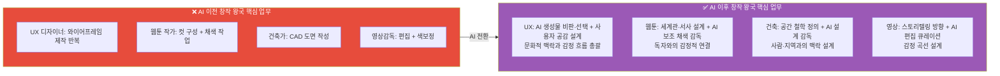

#### 창작 왕국 역량 × 직무 × 프로젝트 씨앗

| 핵심 역량 | AI 이전 의미 | AI 이후 의미 | 역량 습득 활동 | 프로젝트 씨앗 |
|---------|-----------|-----------|------------|------------|
| **사용자 공감** | 디자인 원칙 적용 | AI가 못 보는 감정·맥락 파악 | 사용성 테스트, 인터뷰 | 노인·장애인을 위한 키오스크 리디자인 |
| **문화 감수성** | 없음 (새 역량) | AI 편향 감지 + 지역 맥락 반영 | 다양한 독서·경험 | 지역 문화 기반 캐릭터 웹툰 제작 |
| **비판적 미학** | 미적 감각 | AI 결과물 평가·선별·방향 제시 | 포트폴리오 비평 훈련 | AI 생성 디자인 품질 평가 가이드 |
| **AI 협업** | 없음 (새 역량) | Midjourney·Sora 등 활용·감독 | AI 툴 실습, 프롬프트 연구 | AI 활용 개인 브랜드 포트폴리오 |
| **스토리텔링** | 내러티브 구성 | 감정 여정 설계 (전체 경험 아키텍처) | 시나리오 쓰기, 게임 기획 | 진로 탐색 웹툰 시리즈 제작 |

---

### 3.3 💻 기술 왕국 — AI 시대 역량 재정의

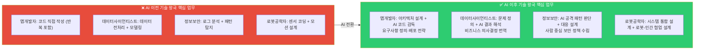

#### 기술 왕국 역량 × 직무 × 프로젝트 씨앗

| 핵심 역량 | AI 이전 의미 | AI 이후 의미 | 역량 습득 활동 | 프로젝트 씨앗 |
|---------|-----------|-----------|------------|------------|
| **시스템 설계** | 코드 작성 | 전체 아키텍처 + AI 통합 설계 | 소프트웨어 설계 패턴 학습 | 학교 알림 자동화 시스템 설계 |
| **문제 정의** | 주어진 문제 해결 | 무엇이 문제인지 발견 | 사용자 인터뷰, 데이터 탐색 | 학생 이탈률 원인 분석 데이터 프로젝트 |
| **AI 협업** | 없음 (새 역량) | Copilot·ChatGPT 활용 + 코드 검증 | AI 코딩 툴 실습 | AI 코드 리뷰 자동화 도구 제작 |
| **보안·윤리 판단** | 기술적 보안 | AI 의사결정의 편향·안전성 감독 | 정보보안 자격 학습 | 개인정보 보호 점검 체크리스트 앱 |
| **비즈니스 번역** | 없음 (새 역량) | 기술 결과를 비결정권자에게 설명 | 발표·문서 작성 훈련 | 데이터 분석 결과 시각화 대시보드 |

---

### 3.4 🌱 자연 왕국 — AI 시대 역량 재정의

#### 자연 왕국 역량 × 직무 × 프로젝트 씨앗

| 핵심 역량 | AI 이전 의미 | AI 이후 의미 | 역량 습득 활동 | 프로젝트 씨앗 |
|---------|-----------|-----------|------------|------------|
| **현장 전문성** | 데이터 수집·측정 | AI 센서 데이터 해석 + 이상 판단 | 환경 봉사, 현장 실습 | 학교 주변 미세먼지 IoT 모니터링 |
| **생태 감수성** | 생물 동정·분류 | 생태계 맥락 이해 (AI가 못 보는 부분) | 생태 탐사, 자연 관찰 일지 | 동네 생태 지도 앱 제작 |
| **IoT 활용** | 없음 (새 역량) | 센서·스마트팜 시스템 운용 감독 | 아두이노·라즈베리파이 실습 | 스마트 텃밭 자동화 프로토타입 |
| **지역 협력** | 없음 (새 역량) | 주민·지자체와 환경 정책 협의 | 지역 환경 프로젝트 참여 | 지역 환경 문제 개선 제안 보고서 |
| **기후 리터러시** | 없음 (새 역량) | 기후 데이터 해석 + 대응 설계 | 기후 관련 탐구·독서 | 기후 변화 영향 예측 데이터 분석 |

---

### 3.5 🤝 연결 왕국 — AI 시대 역량 재정의

#### 연결 왕국 역량 × 직무 × 프로젝트 씨앗

| 핵심 역량 | AI 이전 의미 | AI 이후 의미 | 역량 습득 활동 | 프로젝트 씨앗 |
|---------|-----------|-----------|------------|------------|
| **공감력** | 감정 공유 | AI가 제공하는 정보를 인간적으로 연결 | 상담 봉사, 경청 훈련 | 청소년 익명 고민 공유 플랫폼 |
| **관계 설계** | 면대면 돌봄 | 온오프라인 통합 케어 설계 | 커뮤니티 활동, 캠프 기획 | 고령자 디지털 연결 프로그램 기획 |
| **AI 보조 활용** | 없음 (새 역량) | AI 상담·교육 툴 감독·보완 | AI 교육 플랫폼 실습 | AI 상담 챗봇 품질 평가 체크리스트 |
| **문화 중재** | 없음 (새 역량) | 다문화·다세대 갈등 중재 | 다문화 봉사, 세대 교류 활동 | 다문화 가정 진로 가이드 제작 |
| **에듀테크 설계** | 없음 (새 역량) | AI 보조 교육과정 설계 | 교육 콘텐츠 제작 실습 | 중학생 자기주도 학습 코스 설계 |

---

### 3.6 🏛️ 질서 왕국 — AI 시대 역량 재정의

#### 질서 왕국 역량 × 직무 × 프로젝트 씨앗

| 핵심 역량 | AI 이전 의미 | AI 이후 의미 | 역량 습득 활동 | 프로젝트 씨앗 |
|---------|-----------|-----------|------------|------------|
| **전략적 사고** | 판례 암기 + 논리 | AI 판례 분석 결과 해석 + 전략 수립 | 모의법정, 토론대회 | 학생 권리 조례안 초안 작성 |
| **협상력** | 대화 기술 | 이해관계 구조 파악 + 합의점 설계 | 협상 게임, 갈등 중재 활동 | 학교 규칙 개정 캠페인 기획 |
| **디지털 법학** | 없음 (새 역량) | AI·개인정보·데이터 법률 해석 | 개인정보 법률 독서 | AI 저작권 침해 사례 보고서 |
| **논리·글쓰기** | 법률 문서 작성 | AI 초안 감독 + 논리 구조 강화 | 논술 훈련, 논문 읽기 | 청소년 디지털 권리 제안서 |
| **데이터 포렌식** | 없음 (새 역량) | 디지털 증거 분석 감독 | 정보보안 + 법학 융합 학습 | 사이버 범죄 유형 분석 보고서 |

---

### 3.7 📣 소통 왕국 — AI 시대 역량 재정의

#### 소통 왕국 역량 × 직무 × 프로젝트 씨앗

| 핵심 역량 | AI 이전 의미 | AI 이후 의미 | 역량 습득 활동 | 프로젝트 씨앗 |
|---------|-----------|-----------|------------|------------|
| **브랜딩** | 로고·슬로건 제작 | AI 콘텐츠 홍수 속 진정성 있는 아이덴티티 설계 | 브랜드 분석, 포트폴리오 | 학교 동아리 브랜드 리디자인 |
| **문화 이해** | 트렌드 팔로잉 | AI가 놓치는 하위문화·정서 감지 | 다양한 커뮤니티 참여 | Z세대 진로 불안 인사이트 콘텐츠 |
| **커뮤니티 설계** | 없음 (새 역량) | 온라인 공동체 형성·유지·발전 | 디스코드·커뮤니티 운영 | 청소년 진로 커뮤니티 채널 운영 |
| **AI 콘텐츠 관리** | 없음 (새 역량) | AI 생성 콘텐츠 큐레이션·팩트체크 | AI 미디어 리터러시 학습 | AI 생성 뉴스 팩트체크 가이드 |
| **데이터 감수성** | 없음 (새 역량) | 콘텐츠 성과 데이터 해석 + 방향 수정 | 유튜브 애널리틱스 분석 | 유튜브 채널 성장 전략 보고서 |

---

### 3.8 🚀 도전 왕국 — AI 시대 역량 재정의

#### 도전 왕국 역량 × 직무 × 프로젝트 씨앗

| 핵심 역량 | AI 이전 의미 | AI 이후 의미 | 역량 습득 활동 | 프로젝트 씨앗 |
|---------|-----------|-----------|------------|------------|
| **비전 설정** | 사업 목표 수립 | AI가 못 보는 "왜 이 문제인가" 정의 | 창업 대회, 아이디어 일지 | 학교 문제를 해결하는 앱 기획서 |
| **리더십** | 지시·관리 | 소규모 팀에서 방향·에너지 유지 | 팀 프로젝트 리더 경험 | 클루 프로젝트 PM 역할 수행 |
| **불확실성 포용** | 없음 (새 역량) | AI 예측 불가 상황 속 의사결정 | 실패 경험 + 회고 훈련 | MVP 출시 후 피벗 전략 보고서 |
| **AI 전략** | 없음 (새 역량) | AI 도입 비용·효과 판단 + 팀 적용 | AI 비즈니스 모델 케이스 학습 | 학교 행사 AI 자동화 제안서 |
| **관계 자본** | 네트워킹 | 신뢰 기반 협업 네트워크 구축 | 해커톤, 커뮤니티 활동 | 지역 청소년 창업가 네트워크 기획 |

---

## 4. AI 시대 공통 역량 — 모든 직업에 필요한 5가지

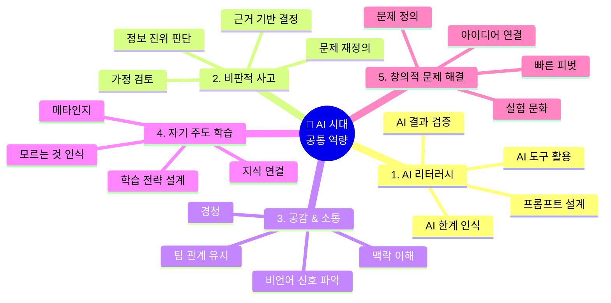

### AI 시대 공통 역량 × 학년별 습득 전략 상세

| 공통 역량 | 초등 (씨앗 심기) | 중학교 (뿌리 내리기) | 고등학교 (증명하기) | 역량 증명 산출물 |
|---------|--------------|-----------------|----------------|-------------|
| **AI 리터러시** | ChatGPT에게 질문하고 답변 평가해보기 | AI 도구 활용 프로젝트 완성 1개 + "AI가 틀린 부분" 보고서 | AI 감독·보완 역할로 팀 프로젝트 기여 + AI 편향 분석 | GitHub 커밋 기록 + AI 활용 보고서 |
| **비판적 사고** | "왜 그럴까?" 질문 노트 작성 | 탐구대회 보고서 (가설 → 실험 → 결론 구조) | R&E 설계 + arXiv 논문 1편 비판적 요약 | 탐구 보고서 + 토론 수상 |
| **공감 & 소통** | 봉사 + 발표 경험 1회 | 동아리 회의 진행 or 후배 상담 경험 | 팀 프로젝트 퍼실리테이터 + 이해관계자 인터뷰 보고서 | 인터뷰 보고서 + 발표 영상 |
| **자기주도 학습** | 관심사 탐색 일지 (월 1회) | 독학으로 도구 1개 마스터 (Figma·Python 등) | DreamPath 합격자 패스 기반 나만의 로드맵 완성 | 포트폴리오 + 세특 기록 |
| **창의적 문제 해결** | 학교 주변 문제 발견 + 아이디어 스케치 | 공모전·해커톤 1회 이상 참가 | 그림자 프로젝트 배포 + 피벗 보고서 | 배포된 프로젝트 URL + 회고 문서 |

#### 학년별 AI 역량 습득 체크리스트

```
╔══════════════════════════════════════════════════════╗
║  📋 AI 시대 역량 체크리스트 — 중2 기준              ║
╠══════════════════════════════════════════════════════╣
║                                                      ║
║  🔲 AI 리터러시                                      ║
║  ☑️ ChatGPT에게 같은 질문을 3가지 방식으로 물어봄    ║
║  ☑️ AI 답변에서 틀린 내용 1개 이상 발견해봄          ║
║  🔲 AI 도구 활용 프로젝트 1개 완성                   ║
║  🔲 "AI가 이 작업에서 왜 부족한가" 설명 가능         ║
║                                                      ║
║  🔲 비판적 사고                                      ║
║  ☑️ 탐구 주제 1개 선정 + 가설 작성 경험              ║
║  🔲 탐구대회 참가 or 보고서 완성                     ║
║  🔲 뉴스 기사 1개에서 근거 부족 부분 찾기            ║
║                                                      ║
║  🔲 공감 & 소통                                      ║
║  ☑️ 봉사 활동 20시간 이상                            ║
║  🔲 동아리에서 발표 또는 진행 경험                   ║
║  🔲 인터뷰 설계 + 진행 경험 1회                      ║
║                                                      ║
║  🔲 자기주도 학습                                    ║
║  ☑️ 관심 도구 독학 시작 (Figma or Python)            ║
║  🔲 독학으로 기초 프로젝트 1개 완성                  ║
║  🔲 학습 계획 → 실행 → 회고 사이클 경험              ║
║                                                      ║
║  🔲 창의적 문제 해결                                 ║
║  🔲 학교·주변의 불편한 점 3개 발견 + 기록            ║
║  🔲 해결 아이디어 스케치 or 기획서 초안 작성          ║
║  🔲 공모전 or 해커톤 1회 참가                        ║
║                                                      ║
║  현재 달성: 7/15 (47%)                              ║
╚══════════════════════════════════════════════════════╝
```

---

## 5. 역량 → 프로젝트 씨앗 매핑 — DreamPath 살아보기 연계

> **"역량은 살아보면서 쌓이고, 프로젝트를 통해 증명된다"**
> DreamPath에서 직업을 살아볼 때, 그 직업의 핵심 역량을 함께 훈련하도록 설계한다.

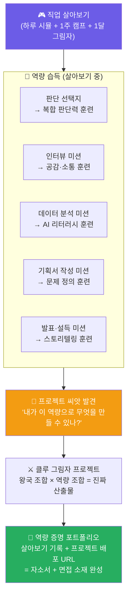

### 5.1 왕국별 살아보기 미션 × 역량 × 프로젝트 씨앗 전체 매핑

| 왕국 | 1일 시뮬 핵심 선택지 | 훈련되는 역량 | 1주 캠프 핵심 미션 | 자연스럽게 나오는 프로젝트 씨앗 |
|-----|-----------------|-----------|----------------|--------------------------|
| 🔬 탐구 | "AI 진단 70%vs30% → 당신의 최종 결정은?" | 복합 판단력 + 윤리 사고 | 논문 1편 읽기 + 연구 가설 3개 작성 | AI 오진 방지 체크리스트 앱 |
| 🎨 창작 | "AI가 생성한 3개 중 어떤 UI를 사용할 것인가?" | 사용자 공감 + 비판적 미학 | 사용자 인터뷰 2명 + Figma 개선안 | 노인 키오스크 리디자인 포트폴리오 |
| 💻 기술 | "버그 발생 → 빠른 수정 vs 근본 원인 파악?" | 문제 정의 + 시스템 설계 | 요구사항 정의 + 간단한 봇 제작 | 학교 공지 자동화 텔레그램 봇 |
| 🌱 자연 | "센서 이상값 → 현장 확인 vs AI 오탐 처리?" | 현장 전문성 + IoT 활용 | 아두이노 센서 연결 + 데이터 수집 | 학교 주변 미세먼지 IoT 모니터링 |
| 🤝 연결 | "학생이 'AI가 더 잘 알아요' 할 때 어떻게?" | 공감력 + 관계 설계 | 인터뷰 설계 + 진행 + 보고서 작성 | 청소년 고민 익명 공유 플랫폼 기획 |
| 🏛️ 질서 | "AI 저작권 침해 → 판례 없음 → 어떻게 주장?" | 전략적 사고 + 논리·글쓰기 | 조례안 초안 작성 + 반박 준비 | 학생 디지털 권리 조례안 제안서 |
| 📣 소통 | "AI가 생성한 광고 10개 → 어떤 2개를 올릴까?" | 브랜딩 + 문화 이해 | SNS 채널 기획 + 첫 콘텐츠 3개 제작 | Z세대 진로 탐색 인스타그램 채널 |
| 🚀 도전 | "MVP 출시 후 예상과 다른 결과 → 어떻게 피벗?" | 비전 설정 + 불확실성 포용 | 14일 창업 챌린지 + 투자 피치 5분 | 학교 문제 해결 앱 MVP 배포 |

### 5.2 왕국 교차 역량 프로젝트 — 실제 세상을 바꾸는 프로젝트

> **"한 왕국의 역량만으로는 부족하다. 서로 다른 역량이 만날 때 진짜 프로젝트가 탄생한다"**

| 왕국 조합 | 필요 역량 조합 | 구체적 프로젝트 | 산출물 | 입시 활용 |
|---------|-----------|------------|------|---------|
| 🎨 창작 × 💻 기술 | 사용자 공감 + 시스템 설계 | "장애 학생 맞춤 학습 UI 앱" | 배포된 앱 + 사용성 보고서 | UX·개발 모두 세특 연계 |
| 🔬 탐구 × 💻 기술 | 연구 설계 + AI 리터러시 | "학교 급식 영양 불균형 AI 예측 모델" | GitHub + Jupyter + 보고서 | 생명과학·정보 세특, KOI |
| 🤝 연결 × 📣 소통 | 공감력 + 커뮤니티 설계 | "청소년 진로 불안 인터뷰 + 인포그래픽 캠페인" | 영상 + 캠페인 사이트 | 사회·국어 세특 |
| 🌱 자연 × 💻 기술 | IoT 활용 + 문제 정의 | "교실 CO2 농도 IoT 모니터링 + 자동 환기 알림" | 아두이노 프로토타입 + 보고서 | 과학·정보 세특 |
| 🚀 도전 × 🎨 창작 | 비전 설정 + 브랜딩 | "중학생 부업 플랫폼 MVP + 브랜드 아이덴티티" | 랜딩 페이지 + 피치덱 | 창업 전형 자소서 |
| 🏛️ 질서 × 📣 소통 | 논리·글쓰기 + 커뮤니티 | "AI 저작권 청소년 가이드 + SNS 캠페인" | 가이드북 + SNS 시리즈 | 사회·법 탐구 세특 |

### 5.2 역량 성장 곡선 — 살아보기에서 프로젝트 배포까지

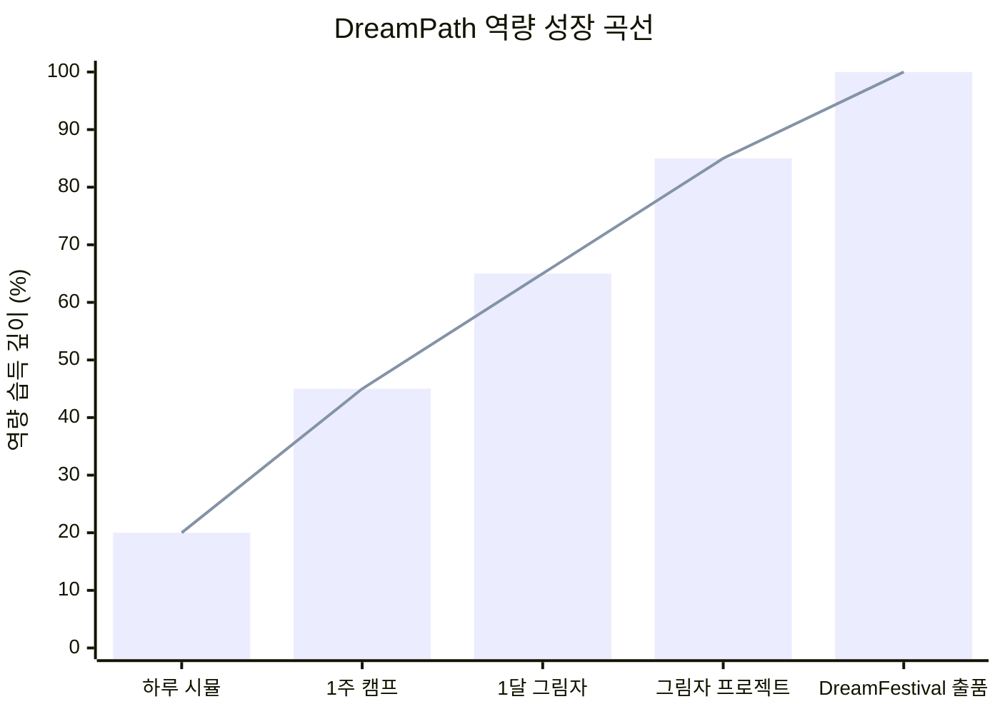

| 단계 | 역량 깊이 | 주요 역량 습득 | 산출물 |
|-----|---------|------------|------|
| **하루 시뮬** | 20% | AI 시대 직무 현실 인식 | 직업 현실 체크 보고서 |
| **1주 캠프** | 45% | 핵심 역량 1~2개 훈련 | 1주 수료 + 미니 산출물 |
| **1달 그림자** | 65% | 핵심 역량 3~5개 통합 훈련 | 그림자 포트폴리오 씨앗 |
| **그림자 프로젝트** | 85% | 역량 실전 적용 + 협업 | 배포된 프로젝트 |
| **DreamFestival** | 100% | 역량 공개 발표·인정 | 완성 포트폴리오 + 수상 |

---

## 6. AI 시대 직업별 생존 가능성 × 역량 필요도 지도

```mermaid
flowchart LR
    subgraph High["🟢 AI 보완 직업 (함께 성장)"]
        H1["AI 연구원<br>AI를 만드는 사람"]
        H2["UX 디자이너<br>AI가 못 보는 감성 설계"]
        H3["의사 (복합 케이스)<br>최종 판단은 인간이"]
        H4["교사 (관계형)<br>공감·돌봄은 대체 불가"]
        H5["창업가<br>비전·리더십은 인간 고유"]
    end

    subgraph Mid["🟡 AI 협업 직업 (역량 전환 필요)"]
        M1["변호사 → 전략 중심으로"]
        M2["회계사 → AI 감독·컨설팅"]
        M3["마케터 → 브랜딩·커뮤니티"]
        M4["기자 → 큐레이션·탐사"]
        M5["앱개발자 → 설계·감독"]
    end

    subgraph Low["🔴 AI 대체 위험 직업 (전환 필수)"]
        L1["단순 데이터 입력"]
        L2["기초 번역·요약"]
        L3["반복 코딩 작업"]
        L4["표준 보고서 작성"]
    end

    Low -->|"역량 전환"| Mid
    Mid -->|"심화 성장"| High

    style High fill:#27AE60,color:#fff
    style Mid fill:#F39C12,color:#fff
    style Low fill:#E74C3C,color:#fff
```

### AI 대체 위험도 × 역량 필요도 × 구체적 전환 전략 비교표

| 직업 | AI 대체 위험도 | AI가 대체하는 구체적 업무 | 인간이 반드시 해야 할 업무 | 필요 전환 역량 | DreamPath 연계 |
|-----|-------------|---------------------|----------------------|------------|--------------|
| **의사** | 🟢 낮음 | 1차 진단, 영상 판독, 의무기록 | 복합 케이스 판단, 환자 공감, 윤리 결정 | 복합 판단력, 환자 공감 | 탐구 왕국 1달 그림자 |
| **AI 연구원** | 🟢 낮음 | 모델 학습 반복, 하이퍼파라미터 튜닝 | 연구 문제 정의, AI 윤리 설계 | 연구 설계, AI 윤리 | 탐구 왕국 마스터 코스 |
| **UX 디자이너** | 🟡 중간 | 와이어프레임 제작, 아이콘 생성 | 사용자 감정 흐름, 문화 맥락 판단 | AI 협업, 사용자 공감 | 창작 왕국 AI 협업 미션 |
| **웹툰 작가** | 🟡 중간 | 채색, 배경 작업, 컷 레이아웃 | 서사 설계, 독자 감정 연결, 세계관 | 스토리텔링, 문화 감수성 | 창작 왕국 스토리 미션 |
| **앱 개발자** | 🟡 중간 | 보일러플레이트 코드, 버그 수정 | 아키텍처 설계, 요구사항 정의 | 시스템 설계, 문제 정의 | 기술 왕국 설계 미션 |
| **변호사** | 🟡 중간 | 판례 검색, 계약서 초안 작성 | 협상 전략, 감정·맥락 판단, 법정 변론 | 전략적 사고, 협상력 | 질서 왕국 협상 시뮬 |
| **교사** | 🟡 중간 | 자료 제작, 채점, 진도 관리 | 학생 동기 유발, 관계 형성, 맥락 판단 | 공감력, 관계 설계 | 연결 왕국 멘토링 미션 |
| **디지털 마케터** | 🟡 중간 | 광고 최적화, A/B 테스트, 데이터 보고서 | 브랜드 진정성, 커뮤니티 관계, 문화 감지 | 브랜딩, 커뮤니티 설계 | 소통 왕국 브랜드 미션 |
| **회계사 (기초)** | 🔴 높음 | 세무 신고, 결산 자동화, 전표 입력 | 세금 전략 자문, 이례 탐지, 클라이언트 신뢰 | 전략적 사고, AI 감독 | 질서 왕국 → 도전 왕국 전환 |
| **단순 번역·요약** | 🔴 매우 높음 | 90% 이상 AI 대체 | 문화 뉘앙스, 감정 표현, 창작 번역 일부 | 완전 전환 필요 | 다른 왕국 탐색 적극 권유 |

> **DreamPath 설계 원칙:** AI 대체 위험도가 높은 직업을 선택한 사용자에게는,  
> "이 직업의 AI 대체 위험 업무를 확인하셨나요? 이 역량을 키우면 AI와 협업하는 형태로 살아남을 수 있습니다" 알림을 제공한다.

---

## 7. DreamPath 역량 설계 — 앱 연동 방식

### 7.1 직업 카드 × 역량 태그 연동

```
╔══════════════════════════════════════════╗
║  🎨 UX 디자이너 카드                     ║
╠══════════════════════════════════════════╣
║                                          ║
║  ★★★ 내 성향 매칭 97%                   ║
║  미래 전망: ★★★★☆  AI 대체위험: 🟡 중간 ║
║                                          ║
║  💼 AI 이후 핵심 직무                    ║
║  ① 사용자 감정 흐름 설계                ║
║  ② AI 생성 디자인 큐레이션·방향 제시     ║
║  ③ 문화·맥락 기반 UX 판단               ║
║                                          ║
║  🧠 이 직업이 요구하는 역량 Top 3        ║
║  사용자 공감 | AI 협업 | 비판적 미학     ║
║                                          ║
║  🚀 역량 기반 프로젝트 씨앗              ║
║  "노인 키오스크 리디자인"                ║
║  "AI 생성 UI 품질 평가 가이드"           ║
║                                          ║
║  [▶ 하루 살아보기] [🗺️ 역량 로드맵]     ║
╚══════════════════════════════════════════╝
```

### 7.2 살아보기 미션 × 역량 훈련 연동 화면

```
╔══════════════════════════════════════════╗
║  🎮 UX 디자이너 1주 캠프 — 수요일        ║
║  미션: 와이어프레임 제작                 ║
╠══════════════════════════════════════════╣
║                                          ║
║  팀장: "AI가 3가지 앱 화면 레이아웃을    ║
║  생성해줬어요. 어떤 걸 선택할까요?"      ║
║                                          ║
║  [AI 생성 레이아웃 A, B, C 화면 표시]   ║
║                                          ║
║  → 어떤 기준으로 선택할 것인가?          ║
║                                          ║
║  A. 💡 가장 예쁜 것을 선택한다           ║
║  B. 🔍 사용자 인터뷰 결과와 비교해       ║
║     노인에게 가장 적합한 것을 선택한다   ║
║  C. 📊 클릭률 데이터 기준으로 선택한다  ║
║                                          ║
║  ━━━━━━━━━━━━━━━━━━━━━━━━━━━━━━━━       ║
║  🧠 이 선택이 훈련하는 역량:             ║
║  ✅ B 선택 → 사용자 공감 역량 +10       ║
║  ✅ AI 결과를 맹목적으로 따르지 않음     ║
║     → AI 협업 역량 +5                   ║
╚══════════════════════════════════════════╝
```

### 7.3 역량 누적 대시보드 — 개인 역량 지도

```
╔══════════════════════════════════════════╗
║  🧠 나의 역량 지도                       ║
║  살아본 직업 12개 기반 자동 생성          ║
╠══════════════════════════════════════════╣
║                                          ║
║  💪 현재 강한 역량                       ║
║  사용자 공감   ████████████ 90%          ║
║  스토리텔링    ██████████░░ 80%          ║
║  AI 협업       ████████░░░░ 65%          ║
║  문제 정의     ██████░░░░░░ 50%          ║
║  시스템 설계   ████░░░░░░░░ 35%          ║
║                                          ║
║  ⚠️ 보완이 필요한 역량                   ║
║  데이터 분석   ██░░░░░░░░░░ 20%          ║
║  협상력        ███░░░░░░░░░ 25%          ║
║                                          ║
║  💡 AI 추천: 탐구 왕국 + 질서 왕국 탐험  ║
║  → 데이터 분석 + 협상력 보완 가능        ║
║                                          ║
║  🚀 역량 기반 추천 프로젝트              ║
║  "사용자 공감 + 스토리텔링"              ║
║  → "청소년 진로 웹툰 시리즈 제작"        ║
║                                          ║
║  [프로젝트 시작하기] [역량 더 키우기]    ║
╚══════════════════════════════════════════╝
```

---

## 8. 역량 재정의가 바꾸는 커리어 패스 설계 방향

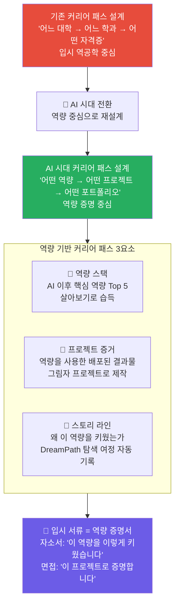

### 역량 기반 자소서 → 면접 연결 흐름 상세 예시

**사례: UX 디자이너 지망 고3, 창작 왕국 마스터 레벨**

| 서류 항목 | ❌ 기존 방식 | ✅ AI 시대 역량 기반 방식 |
|--------|----------|----------------------|
| **자소서 1번 (학업 경험)** | "미술 시간에 열심히 배웠습니다" | "DreamPath UX 시뮬레이션에서 AI가 생성한 3개의 UI 중 어떤 것이 노인 사용자에게 적합한지 판단하는 과정을 통해, 단순히 예쁜 디자인이 아닌 사용자 감정 흐름을 읽는 역량을 키웠습니다" |
| **자소서 2번 (의미 있는 활동)** | "봉사 100시간, 동아리 활동" | "중3 때 노인 복지관 봉사에서 키오스크 이용에 어려움을 겪는 어르신을 관찰한 후, Figma AI로 개선안을 설계하고 실제 테스트를 진행한 프로젝트를 완성했습니다 (GitHub 링크 첨부)" |
| **자소서 3번 (지원 동기)** | "UX 디자인이 좋아서 지원합니다" | "중2 DreamPath UX 살아보기에서 AI가 놓친 감성적 요소를 제가 포착했을 때의 경험이, 인간 중심 설계의 가치를 깨닫는 계기가 되었습니다. 이후 3년간 AI와 협업하는 UX 역량을 체계적으로 쌓아왔습니다" |
| **면접 "나의 강점"** | "창의적입니다" | "AI가 생성한 디자인을 비판적으로 평가하는 역량입니다. 실제로 노인 키오스크 프로젝트에서 AI 추천 레이아웃의 문제를 발견하고 수정하여, 테스트 사용자 만족도를 40% 높였습니다" |
| **면접 "실패 경험"** | "없습니다" | "첫 MVP를 배포했을 때 예상과 달리 사용자 이탈률이 70%였습니다. 데이터를 분석해 온보딩 UX 문제를 찾아냈고, 3번의 피벗 후 이탈률을 30%로 줄였습니다" |

---

## 9. DreamPath 역량 평가 설계 — 어떻게 측정할 것인가

> **"역량은 시험으로 측정하지 않는다. 판단 순간의 선택으로 측정한다"**

### 9.1 살아보기 미션 내 역량 측정 방식

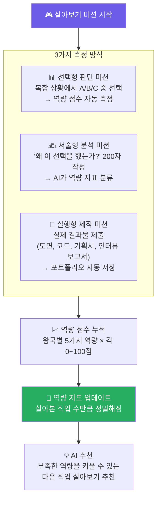

### 9.2 역량별 측정 미션 예시

| 역량 | 선택형 측정 미션 | 서술형 측정 미션 | 실행형 측정 미션 |
|-----|-------------|-------------|-------------|
| **복합 판단력** | "AI 진단 결과가 75%의 확률로 암이라고 합니다. 어떤 결정을 내리시겠습니까?" | "AI 결과를 따르지 않은 이유를 설명하세요" | 가상 케이스 3개 연속 판단 + 근거 작성 |
| **사용자 공감** | "AI가 추천한 UI A와 사용자가 불편해하는 UI A 중 어떤 것을 선택할까요?" | "사용자가 불편한 이유를 감정 단어로 설명하세요" | 실제 노인 2명 인터뷰 영상 제출 |
| **시스템 설계** | "기능 3개를 2주 안에 만들려면 어떤 순서로 개발할까요?" | "이 아키텍처의 단점을 찾아 설명하세요" | 간단한 시스템 다이어그램 제출 |
| **비전 설정** | "투자자가 '이건 안 될 것 같아요'라고 합니다. 어떻게 대응할까요?" | "이 문제를 풀어야 하는 이유를 3줄로 설명하세요" | 린 캔버스 1장 작성 |
| **AI 리터러시** | "AI가 생성한 보고서에서 어떤 부분을 검증하겠습니까?" | "이 AI 결과가 신뢰할 수 없는 이유를 설명하세요" | AI 결과물에서 오류 3개 찾기 |

### 9.3 역량 성장 시각화 — DreamPath 앱 화면

```
╔══════════════════════════════════════════════════════╗
║  🧠 나의 AI 시대 역량 성장 지도 (고1, 6개월 사용)   ║
╠══════════════════════════════════════════════════════╣
║                                                      ║
║  살아본 직업: 8개  │  완성 프로젝트: 2개             ║
║  ─────────────────────────────────────────           ║
║                                                      ║
║  🎨 창작 왕국 역량                                   ║
║  사용자 공감    ████████████████░░░░  82%  ⬆️+12    ║
║  AI 협업 설계   ████████████░░░░░░░░  60%  ⬆️+20    ║
║  비판적 미학    ████████░░░░░░░░░░░░  45%  ⬆️+15    ║
║  스토리텔링     ██████████████░░░░░░  72%  ⬆️+8     ║
║  문화 감수성    ██████░░░░░░░░░░░░░░  35%  🔲 미훈련 ║
║                                                      ║
║  💻 기술 왕국 역량 (교차 탐험)                       ║
║  문제 정의      ████████████░░░░░░░░  58%  ⬆️+18    ║
║  시스템 설계    ████░░░░░░░░░░░░░░░░  22%  🆕 첫 탐험 ║
║                                                      ║
║  ⚠️ AI 추천 다음 살아보기                            ║
║  "문화 감수성이 낮습니다 →                           ║
║   🌱 자연 왕국 or 🤝 연결 왕국을 살아보세요"         ║
║                                                      ║
║  🚀 역량 기반 추천 프로젝트                          ║
║  "사용자 공감 82% + 문제 정의 58%"                  ║
║  → "노인 복지관 키오스크 개선 프로젝트 (클루 모집)" ║
║                                                      ║
║  [프로젝트 시작] [클루 찾기] [역량 키우기]           ║
╚══════════════════════════════════════════════════════╝
```

---

## 10. 왕국별 살아보기 1일 시뮬 — 구체적 시나리오 설계

> 각 왕국의 "하루 살아보기"가 어떤 장면들로 구성되는지 구체적으로 설계한다.

### 10.1 🔬 탐구 왕국 — 의사 하루 살아보기 시나리오

```
오전 8:30 — 병원 도착
AI 시스템: "김환자 (72세, 여성) 오늘 진료입니다. AI 사전 진단 결과를 확인하세요."

[AI 사전 분석 요약]
• 주호소: 기침 3주 지속, 가래
• AI 1차 진단: 폐렴 68%, 폐암 22%, 기관지염 10%
• AI 권고: 흉부 CT 촬영 권고

─────────────────────────────────────────
선택지: 당신은 어떻게 할 것인가?

A. AI 권고대로 즉시 CT 촬영 지시
B. 직접 문진을 먼저 진행해 추가 정보 수집
C. AI 결과가 68%이므로 폐렴으로 처방하고 2주 후 재진

─────────────────────────────────────────
[B 선택 시 → 문진 장면 진행]

환자: "사실 3주 전에 손녀가 독감에 걸렸어요. 근데 우리 손녀가 화학공장 근처 학교 다녀요."

💡 AI가 놓친 정보 발견!
→ 가족 접촉력 + 환경 요인 = AI 진단과 다른 가설 가능

[결과 피드백]
✅ 복합 판단력 역량 +15
"AI 데이터만으로 판단하지 않고, 인간 문진으로 맥락을 추가 수집했습니다"
```

### 10.2 🎨 창작 왕국 — UX 디자이너 하루 살아보기 시나리오

```
오전 10:00 — 팀 미팅
팀장: "어제 AI에게 키오스크 UI 3개를 생성하도록 했어요.
      오늘 노인 복지관 시연 전에 하나를 골라야 합니다."

[AI 생성 UI 3개 이미지 표시]
UI-A: 버튼이 작고 정보가 많음 (AI 심미성 점수 92점)
UI-B: 큰 글씨, 단순한 구조 (AI 심미성 점수 61점)  
UI-C: 애니메이션 많고 화려함 (AI 심미성 점수 88점)

─────────────────────────────────────────
선택지:

A. AI 심미성 점수 1위인 UI-A 선택
B. 노인 사용자에게 가장 적합한 UI-B 선택
C. 가장 현대적인 UI-C 선택

─────────────────────────────────────────
[B 선택 시]
시연 결과: 노인 참가자 8명 중 7명이 UI-B에서 성공적으로 과제 완료

💡 AI가 놓친 것: "예쁜 것 ≠ 사용하기 쉬운 것"
→ 사용자 공감 역량 = AI 점수를 뛰어넘는 판단력

[결과 피드백]
✅ 사용자 공감 역량 +20
✅ 비판적 미학 역량 +10
"AI의 심미성 점수보다 실제 사용자 경험을 우선했습니다"
```

---

## 11. 8대 왕국 전체 직업 AI 전환 종합 분석

### 11.1 왕국별 AI 대체 위험도 및 생존 전략 완전 비교

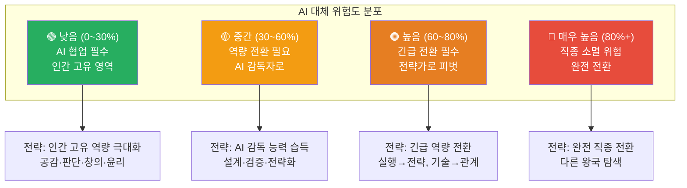

#### 왕국별 AI 대체 위험도 상세 분석

| 왕국 | 🟢 낮음 (신규·AI 협업) | 🟡 중간 (역량 전환) | 🟠 높음 (긴급 전환) | 🔴 매우 높음 (소멸 위험) |
|-----|-------------------|---------------|----------------|------------------|
| 🔬 **탐구** | AI 의료 감독관, 의료데이터사이언티스트, 정신건강의학과 의사 | 의사, 임상연구원, 생명공학연구원, 유전학자 | 약사 (조제), 영상의학과, 병리학 | 의무기록사, 의료 행정 |
| 🎨 **창작** | AI 크리에이티브 디렉터, 프롬프트 아티스트, AI 콘텐츠 큐레이터 | UX 디자이너, 웹툰 작가, 건축가, 영상감독 | 그래픽 디자이너, 일러스트레이터, 영상 편집자 | 단순 디자인 실행, 반복 편집 |
| 💻 **기술** | AI/ML 엔지니어, 프롬프트 엔지니어, AI 감사관, MLOps | 풀스택 개발자, 데이터사이언티스트, 정보보안 | 프론트엔드 (UI 코딩), 백엔드 (CRUD) | 단순 코딩, QA 테스터 |
| 🌱 **자연** | 기후 테크 전문가, 농업 데이터 분석가, 탄소 배출 관리사 | 환경공학자, 스마트팜 전문가, 생태학자 | 임상병리사, 수질 분석사 | 단순 샘플 채취, 데이터 입력 |
| 🤝 **연결** | 에듀테크 교사, 학습 데이터 분석가, 특수교육 교사, 심리상담사 | 교사, 진로 상담사, 사회복지사 | 교육 행정, 단순 상담 | 단순 민원 응대, 행정 처리 |
| 🏛️ **질서** | AI 법률 감독관, 디지털 포렌식, ESG 분석가 | 변호사, 외교관, 정책 연구원 | 법무사, 회계사, 세무사 | 단순 서류 작성, 기장 |
| 📣 **소통** | 마케팅 AI 감독관, AI 콘텐츠 큐레이터 | 유튜버, 디지털 마케터, 기자, 브랜드 매니저 | 콘텐츠 마케터, 카피라이터, 영상 편집자 | 단순 콘텐츠 작성, 광고 운영 |
| 🚀 **도전** | AI 창업 가속기, 벤처 AI 전략가 | 창업가, PM, 경영 컨설턴트, VC | 비즈니스 애널리스트, 일반 컨설턴트 | 단순 데이터 분석, 보고서 작성 |

### 11.2 AI 시대 직업 생존 공식 — 8대 왕국 공통 패턴

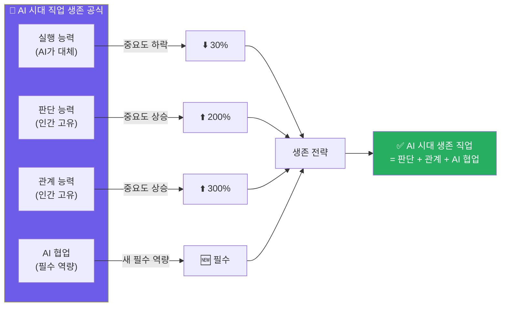

#### 모든 왕국에 공통되는 AI 전환 5대 법칙

**법칙 1: 루틴 실행 → AI, 복합 판단 → 인간**
```
예시:
- 의사: 단순 진단 → AI, 복합 케이스 → 인간
- 개발자: 기초 코딩 → AI, 아키텍처 설계 → 인간
- 변호사: 판례 검색 → AI, 승소 전략 → 인간
- 디자이너: 레이아웃 생성 → AI, 감성 설계 → 인간
```

**법칙 2: 정보 처리 → AI, 의미 해석 → 인간**
```
예시:
- 데이터사이언티스트: 분석 실행 → AI, 인사이트 도출 → 인간
- 기자: 기사 초안 → AI, 탐사 취재 → 인간
- 환경공학자: 데이터 수집 → AI, 현장 판단 → 인간
```

**법칙 3: 실행 중심 → AI, 관계 중심 → 인간**
```
예시:
- 교사: 지식 전달 → AI, 학생 관계 → 인간
- 마케터: 광고 운영 → AI, 커뮤니티 형성 → 인간
- 사회복지사: 서류 작성 → AI, 신뢰 관계 → 인간
```

**법칙 4: 단일 단계 → AI, 전체 프로세스 → 인간**
```
예시:
- 개발자: 한 기능 코딩 → AI, 시스템 전체 설계 → 인간
- PM: 기획서 작성 → AI, 제품 비전 설정 → 인간
- 컨설턴트: 데이터 분석 → AI, 전략 실행 지원 → 인간
```

**법칙 5: 표준 작업 → AI, 창의적 문제 정의 → 인간**
```
예시:
- 창업가: 시장 조사 → AI, 비전 설정 → 인간
- 연구원: 실험 실행 → AI, 연구 질문 정의 → 인간
- 건축가: 도면 작성 → AI, 공간 철학 정의 → 인간
```

### 11.3 왕국별 AI 도구 활용 성숙도 및 도입 시기

| 왕국 | AI 도입 성숙도 | 주요 AI 도구 보급률 | 인력 감축 시작 시기 | 2030년 예상 인력 변화 | 대응 긴급도 |
|-----|------------|---------------|---------------|-----------------|----------|
| 💻 **기술** | ★★★★★ (매우 높음) | 90% (Copilot 등) | 2023년~ | -40% | 🔴 매우 긴급 |
| 📣 **소통** | ★★★★☆ (높음) | 70% (콘텐츠 AI) | 2024년~ | -35% | 🔴 긴급 |
| 🏛️ **질서** | ★★★★☆ (높음) | 65% (법률 AI) | 2024년~ | -30% | 🟠 긴급 |
| 🎨 **창작** | ★★★★☆ (높음) | 75% (디자인 AI) | 2023년~ | -35% | 🟠 긴급 |
| 🔬 **탐구** | ★★★☆☆ (중간) | 50% (의료 AI) | 2025년~ | -25% | 🟡 주의 |
| 🚀 **도전** | ★★★☆☆ (중간) | 60% (분석 AI) | 2024년~ | -30% | 🟡 주의 |
| 🌱 **자연** | ★★☆☆☆ (낮음) | 30% (IoT AI) | 2026년~ | -20% | 🟢 준비 |
| 🤝 **연결** | ★★☆☆☆ (낮음) | 40% (교육 AI) | 2025년~ | -15% | 🟢 준비 |

> **핵심 인사이트:**
> - 기술·소통·질서 왕국: AI 도입 빠름 → 인력 감축 이미 시작 → 긴급 대응 필요
> - 탐구·도전 왕국: AI 도입 중간 → 2~3년 내 본격화 → 지금 준비 필요
> - 자연·연결 왕국: AI 도입 느림 → 하지만 5년 내 도입 → 미리 준비

### 11.4 왕국별 AI 대응 전략 로드맵

#### 🔴 긴급 대응 필요 왕국 (기술·소통·질서·창작)

**현재 상황 (2026년)**
- AI 도구 이미 보편화
- 주니어 포지션 채용 급감
- 실행 중심 업무 자동화 완료

**생존 전략 (즉시 실행)**
1. **AI 도구 마스터 (3개월)**
   - 기술: Copilot, Cursor 필수
   - 창작: Midjourney, Figma AI 필수
   - 질서: Harvey AI, 법률 AI 필수
   - 소통: 콘텐츠 AI, 마케팅 AI 필수

2. **역량 전환 (6개월)**
   - 실행 능력 → 설계·판단 능력
   - 기술 중심 → 관계·전략 중심
   - 프로젝트로 새 역량 증명

3. **포트폴리오 재구성 (즉시)**
   - "AI 협업 경험" 강조
   - "AI 감독·검증 능력" 증명
   - "전략적 판단 사례" 포함

#### 🟡 준비 필요 왕국 (탐구·도전)

**현재 상황 (2026년)**
- AI 도입 진행 중
- 2~3년 내 본격화 예상
- 지금 준비하면 선제 대응 가능

**생존 전략 (1년 내 실행)**
1. **AI 리터러시 확보 (6개월)**
   - AI 도구 기본 활용법
   - AI 결과 검증 능력
   - AI 한계 인식

2. **핵심 역량 강화 (1년)**
   - 탐구: 복합 판단력, 연구 설계, 환자 공감
   - 도전: 비전 설정, 팀 빌딩, 피벗 판단

3. **AI 협업 프로젝트 경험 (1년)**
   - AI 도구 활용한 프로젝트 1개 이상
   - "AI와 어떻게 협업했는가" 스토리

#### 🟢 미리 준비 왕국 (자연·연결)

**현재 상황 (2026년)**
- AI 도입 초기 단계
- 5년 내 본격화 예상
- 여유 있게 준비 가능

**생존 전략 (2~3년 계획)**
1. **기초 AI 리터러시 (1년)**
   - AI 기본 개념 이해
   - 간단한 AI 도구 사용 경험

2. **인간 고유 역량 강화 (지속)**
   - 연결: 공감력, 관계 형성
   - 자연: 현장 전문성, 생태 이해

3. **AI 협업 마인드셋 (지속)**
   - "AI는 도구"라는 인식
   - AI 활용 사례 지속 학습

### 11.5 직업별 AI 전환 시나리오 — 2026→2030 예측

#### 시나리오 A: 적극 대응 (AI 협업 마스터)

```
[풀스택 개발자 사례]

2026년 (현재):
- AI 도구 활용 시작
- Copilot으로 코딩 속도 2배
- 하지만 여전히 코딩 중심

2027년:
- AI 도구 마스터
- 시스템 설계 능력 강화
- 프로젝트 리드 역할 시작

2028년:
- 아키텍트로 포지션 전환
- 주니어 개발자 + AI 감독
- 연봉 30% 상승

2030년:
- CTO 또는 시니어 아키텍트
- 팀 기술 전략 총괄
- 연봉 50% 상승

✅ 결과: AI 시대 승자
```

#### 시나리오 B: 소극 대응 (AI 도구만 사용)

```
[풀스택 개발자 사례]

2026년 (현재):
- AI 도구 기본 사용
- 하지만 역량 전환 없음
- 여전히 실행 중심

2027년:
- 주니어 개발자 채용 감소
- 경쟁 심화
- 연봉 정체

2028년:
- 시니어 개발자 자리 경쟁 치열
- AI 도구만 쓸 줄 아는 사람 많음
- 차별화 없음

2030년:
- 일자리 불안정
- 프리랜서로 전환
- 연봉 하락

⚠️ 결과: AI 시대 생존 어려움
```

#### 시나리오 C: 미대응 (AI 거부)

```
[풀스택 개발자 사례]

2026년 (현재):
- AI 도구 거부
- "내 손으로 직접 코딩"
- AI는 믿을 수 없다

2027년:
- 생산성 격차 심화
- AI 쓰는 개발자가 3배 빠름
- 프로젝트에서 밀림

2028년:
- 채용 시장에서 도태
- "AI 활용 능력" 필수 요구사항
- 이직 실패

2030년:
- 직업 전환 불가피
- 또는 AI 없는 레거시 시스템 유지보수만

🔴 결과: 직종 전환 필수
```

### 11.6 왕국별 필수 AI 도구 마스터 리스트

#### 🔬 탐구 왕국 필수 AI 도구 (의료·연구)

| AI 도구 | 용도 | 마스터 난이도 | 학습 시간 | 무료 체험 | 필수도 |
|--------|-----|-----------|---------|---------|------|
| **IBM Watson Health** | 환자 데이터 진단 보조 | ★★★★☆ | 3개월 | ❌ (기관용) | ★★★★★ |
| **PathAI** | 병리 슬라이드 분석 | ★★★★☆ | 2개월 | ❌ (기관용) | ★★★★☆ |
| **AlphaFold** | 단백질 구조 예측 | ★★★★★ | 6개월 | ✅ (오픈소스) | ★★★★☆ |
| **Elicit / Consensus** | 논문 자동 검색·요약 | ★★☆☆☆ | 1주 | ✅ | ★★★★★ |
| **Python + Pandas** | 데이터 분석 기초 | ★★★☆☆ | 3개월 | ✅ | ★★★★★ |

#### 🎨 창작 왕국 필수 AI 도구 (디자인·콘텐츠)

| AI 도구 | 용도 | 마스터 난이도 | 학습 시간 | 무료 체험 | 필수도 |
|--------|-----|-----------|---------|---------|------|
| **Midjourney** | 이미지 생성 | ★★★☆☆ | 1개월 | ✅ (25장) | ★★★★★ |
| **Figma AI** | UI 디자인 자동 생성 | ★★☆☆☆ | 2주 | ✅ | ★★★★★ |
| **Adobe Firefly** | 이미지 편집·생성 | ★★★☆☆ | 1개월 | ✅ | ★★★★☆ |
| **Runway ML** | 영상 편집·생성 | ★★★★☆ | 2개월 | ✅ (제한) | ★★★★☆ |
| **Stable Diffusion** | 고급 이미지 생성 | ★★★★★ | 3개월 | ✅ (오픈소스) | ★★★☆☆ |

#### 💻 기술 왕국 필수 AI 도구 (개발·데이터)

| AI 도구 | 용도 | 마스터 난이도 | 학습 시간 | 무료 체험 | 필수도 |
|--------|-----|-----------|---------|---------|------|
| **GitHub Copilot** | 코드 자동 완성 | ★★☆☆☆ | 1주 | ✅ (학생 무료) | ★★★★★ |
| **Cursor AI** | 자연어 코딩 | ★★★☆☆ | 2주 | ✅ (제한) | ★★★★★ |
| **ChatGPT / Claude** | 코드 생성·디버깅 | ★★☆☆☆ | 1주 | ✅ | ★★★★★ |
| **v0.dev** | UI → 코드 자동 생성 | ★★☆☆☆ | 3일 | ✅ | ★★★★☆ |
| **Hugging Face** | AI 모델 활용 | ★★★★☆ | 2개월 | ✅ | ★★★★☆ |

#### 🌱 자연 왕국 필수 AI 도구 (환경·농업)

| AI 도구 | 용도 | 마스터 난이도 | 학습 시간 | 무료 체험 | 필수도 |
|--------|-----|-----------|---------|---------|------|
| **아두이노 + TensorFlow** | IoT 환경 모니터링 | ★★★★☆ | 3개월 | ✅ | ★★★★☆ |
| **iNaturalist AI** | 생물종 자동 동정 | ★☆☆☆☆ | 1일 | ✅ | ★★★★☆ |
| **Google Earth Engine** | 위성 이미지 분석 | ★★★★☆ | 2개월 | ✅ | ★★★☆☆ |
| **Climate TRACE** | 탄소 배출 추적 | ★★☆☆☆ | 1주 | ✅ | ★★★★☆ |

#### 🤝 연결 왕국 필수 AI 도구 (교육·상담)

| AI 도구 | 용도 | 마스터 난이도 | 학습 시간 | 무료 체험 | 필수도 |
|--------|-----|-----------|---------|---------|------|
| **Khan Academy AI** | 개인 맞춤 학습 | ★☆☆☆☆ | 1일 | ✅ | ★★★★☆ |
| **ChatGPT (교육용)** | 학습 자료 생성 | ★★☆☆☆ | 1주 | ✅ | ★★★★★ |
| **Woebot / Wysa** | 심리 상담 보조 | ★☆☆☆☆ | 1일 | ✅ | ★★★☆☆ |
| **Duolingo AI** | 언어 학습 AI | ★☆☆☆☆ | 1일 | ✅ | ★★★☆☆ |

#### 🏛️ 질서 왕국 필수 AI 도구 (법률·금융)

| AI 도구 | 용도 | 마스터 난이도 | 학습 시간 | 무료 체험 | 필수도 |
|--------|-----|-----------|---------|---------|------|
| **Harvey AI** | 법률 서류·판례 검색 | ★★★☆☆ | 1개월 | ❌ (기관용) | ★★★★★ |
| **ChatGPT (법률용)** | 법률 초안 생성 | ★★☆☆☆ | 1주 | ✅ | ★★★★☆ |
| **Bloomberg Tax AI** | 세무 자동화 | ★★★★☆ | 2개월 | ❌ (유료) | ★★★★☆ |
| **Xero / QuickBooks AI** | 회계 자동화 | ★★★☆☆ | 1개월 | ✅ (제한) | ★★★★★ |

#### 📣 소통 왕국 필수 AI 도구 (마케팅·미디어)

| AI 도구 | 용도 | 마스터 난이도 | 학습 시간 | 무료 체험 | 필수도 |
|--------|-----|-----------|---------|---------|------|
| **Descript** | 영상 자동 편집 | ★★★☆☆ | 2주 | ✅ (제한) | ★★★★★ |
| **Jasper AI / Copy.ai** | 마케팅 콘텐츠 생성 | ★★☆☆☆ | 1주 | ✅ (제한) | ★★★★☆ |
| **Meta Advantage+** | 광고 자동 최적화 | ★★★☆☆ | 1개월 | ✅ | ★★★★★ |
| **OpusClip** | 쇼츠 자동 편집 | ★★☆☆☆ | 3일 | ✅ (제한) | ★★★★☆ |

#### 🚀 도전 왕국 필수 AI 도구 (창업·경영)

| AI 도구 | 용도 | 마스터 난이도 | 학습 시간 | 무료 체험 | 필수도 |
|--------|-----|-----------|---------|---------|------|
| **Perplexity / Gemini** | 시장 조사 자동화 | ★☆☆☆☆ | 1일 | ✅ | ★★★★★ |
| **Notion AI** | 사업계획서 초안 | ★★☆☆☆ | 1주 | ✅ (제한) | ★★★★☆ |
| **Beautiful.ai** | 피치덱 자동 생성 | ★★☆☆☆ | 3일 | ✅ (제한) | ★★★★☆ |
| **Mixpanel / Amplitude AI** | 사용자 데이터 분석 | ★★★★☆ | 1개월 | ✅ (제한) | ★★★★★ |

### 11.7 학생을 위한 왕국별 AI 도구 학습 로드맵

#### 중학생 (AI 도구 입문)

| 왕국 | 추천 첫 AI 도구 | 학습 목표 | 프로젝트 | 소요 시간 |
|-----|-------------|---------|---------|---------|
| 🔬 탐구 | ChatGPT (논문 요약) | AI 리터러시 기초 | "급식 영양 분석" | 1개월 |
| 🎨 창작 | Canva AI | 디자인 AI 체험 | "동아리 포스터" | 2주 |
| 💻 기술 | ChatGPT (코드 설명) | AI 코딩 보조 체험 | "간단한 계산기" | 1개월 |
| 🌱 자연 | iNaturalist | 생물 AI 체험 | "동네 생물 지도" | 2주 |
| 🤝 연결 | Khan Academy AI | AI 학습 체험 | "자기주도 학습" | 1개월 |
| 🏛️ 질서 | ChatGPT (법률 질문) | AI 법률 정보 체험 | "학생 권리 조사" | 2주 |
| 📣 소통 | Canva AI (SNS 콘텐츠) | AI 콘텐츠 체험 | "인스타그램 운영" | 1개월 |
| 🚀 도전 | Notion AI (기획서) | AI 기획 보조 체험 | "창업 아이디어" | 2주 |

#### 고등학생 (AI 도구 실전)

| 왕국 | 추천 AI 도구 | 학습 목표 | 프로젝트 | 소요 시간 |
|-----|-----------|---------|---------|---------|
| 🔬 탐구 | Elicit + Python | 연구 설계 + 데이터 분석 | "AI 의료 윤리 연구" | 3개월 |
| 🎨 창작 | Midjourney + Figma AI | AI 디자인 협업 | "앱 UI 리디자인" | 2개월 |
| 💻 기술 | Cursor AI + Copilot | AI 협업 개발 | "웹앱 풀스택 개발" | 3개월 |
| 🌱 자연 | 아두이노 + AI | IoT 환경 모니터링 | "미세먼지 측정기" | 2개월 |
| 🤝 연결 | 교육 AI 플랫폼 분석 | AI 교육 이해 | "AI 교육 한계 보고서" | 1개월 |
| 🏛️ 질서 | ChatGPT (법률 분석) | AI 법률 리서치 | "AI 저작권 보고서" | 2개월 |
| 📣 소통 | Descript + 마케팅 AI | AI 콘텐츠 제작 | "유튜브 채널 운영" | 3개월 |
| 🚀 도전 | 전체 AI 도구 통합 | AI 창업 실전 | "14일 MVP 챌린지" | 2주 |

### 11.8 왕국 교차 AI 프로젝트 — 미래 직업 예측

> **"미래 직업은 한 왕국이 아니라, 왕국과 왕국이 만나는 경계에서 탄생한다"**

#### 왕국 교차 신규 직종 20개

| 왕국 조합 | 신규 직종 | 핵심 역할 | 필요 역량 | 2030년 수요 |
|---------|---------|---------|---------|----------|
| 🔬 탐구 × 💻 기술 | **의료 AI 엔지니어** | 의료 AI 모델 개발 + 임상 검증 | 의학 지식 + AI/ML | ★★★★★ |
| 🔬 탐구 × 🏛️ 질서 | **의료 AI 감사관** | 의료 AI 편향 감사 + 규제 준수 | 의학 + 법률 + AI | ★★★★★ |
| 🎨 창작 × 💻 기술 | **AI UX 엔지니어** | AI 활용 사용자 경험 설계 + 구현 | 디자인 + 개발 | ★★★★★ |
| 🎨 창작 × 📣 소통 | **AI 브랜드 디렉터** | AI 브랜드 콘텐츠 전략 + 큐레이션 | 디자인 + 마케팅 | ★★★★☆ |
| 💻 기술 × 🏛️ 질서 | **AI 법률 테크 개발자** | 법률 AI 시스템 개발 + 법률 이해 | 개발 + 법률 | ★★★★★ |
| 💻 기술 × 🔬 탐구 | **바이오인포매틱스 AI 전문가** | 생물 데이터 AI 분석 + 해석 | 생명과학 + AI | ★★★★☆ |
| 💻 기술 × 🌱 자연 | **기후 테크 AI 엔지니어** | 기후 AI 모델 개발 + 환경 이해 | 개발 + 환경 | ★★★★★ |
| 💻 기술 × 🚀 도전 | **AI 스타트업 CTO** | AI 제품 기술 전략 + 팀 리드 | 개발 + 경영 | ★★★★★ |
| 🌱 자연 × 💻 기술 | **스마트팜 AI 전문가** | 농업 AI 시스템 설계 + 농가 지원 | 농업 + IoT + AI | ★★★★☆ |
| 🌱 자연 × 🚀 도전 | **기후 테크 창업가** | 기후 솔루션 스타트업 + 투자 유치 | 환경 + 창업 | ★★★★★ |
| 🤝 연결 × 💻 기술 | **에듀테크 AI 설계자** | AI 교육 플랫폼 설계 + 교육 이해 | 교육 + 개발 | ★★★★★ |
| 🤝 연결 × 🔬 탐구 | **디지털 헬스 코치** | AI 건강 데이터 해석 + 환자 코칭 | 의료 + 상담 | ★★★★☆ |
| 🏛️ 질서 × 💻 기술 | **디지털 포렌식 전문가** | 사이버 범죄 수사 + 디지털 증거 분석 | 법률 + 보안 | ★★★★★ |
| 🏛️ 질서 × 🚀 도전 | **ESG 전략 컨설턴트** | 기업 ESG 전략 + 투자 유치 지원 | 법률 + 경영 | ★★★★★ |
| 📣 소통 × 💻 기술 | **마케팅 AI 엔지니어** | 마케팅 AI 시스템 개발 + 전략 | 마케팅 + 개발 | ★★★★☆ |
| 📣 소통 × 🎨 창작 | **브랜드 경험 디자이너** | 브랜드 전체 경험 설계 + AI 활용 | 디자인 + 마케팅 | ★★★★☆ |
| 🚀 도전 × 💻 기술 | **AI 제품 관리자 (PM)** | AI 제품 전략 + 개발팀 리드 | 경영 + AI 이해 | ★★★★★ |
| 🚀 도전 × 🏛️ 질서 | **벤처 법률 전문가** | 스타트업 법률 + 투자 계약 | 법률 + 창업 | ★★★★☆ |
| 🔬 탐구 × 🌱 자연 | **환경 보건 연구원** | 환경 오염 건강 영향 연구 + AI 분석 | 의학 + 환경 | ★★★★☆ |
| 🎨 창작 × 🌱 자연 | **생태 건축가** | 생태 친화 건축 설계 + AI 시뮬레이션 | 건축 + 생태 | ★★★★☆ |

### 11.9 AI 시대 직업 선택 의사결정 트리

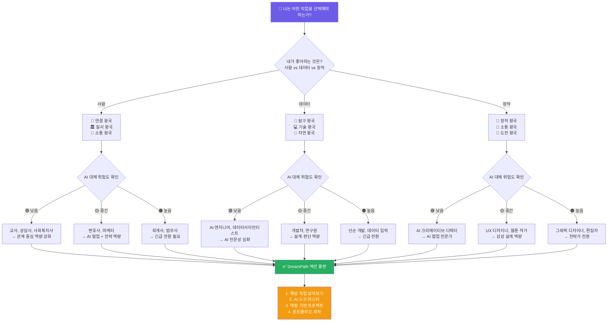

### 11.10 왕국별 AI 시대 생존 체크리스트

#### 🔬 탐구 왕국 생존 체크리스트

```
✅ AI 시대 탐구 왕국 생존 필수 역량

□ 복합 판단력
  □ AI 진단 결과를 맹신하지 않고 검증할 수 있다
  □ 여러 변수를 통합해 최종 판단을 내릴 수 있다
  □ 경계 케이스에서 인간 판단이 필요함을 인식한다

□ 환자/연구 대상 공감
  □ 데이터가 아닌 사람으로 대상을 이해한다
  □ 불안·두려움을 감지하고 해소할 수 있다
  □ 신뢰 관계를 형성할 수 있다

□ 연구 설계 능력
  □ "무엇을 밝혀낼 것인가" 질문을 만들 수 있다
  □ 실험 설계 전략을 수립할 수 있다
  □ AI 분석 결과의 생물학적 의미를 해석할 수 있다

□ AI 리터러시
  □ 의료/연구 AI 도구를 활용할 수 있다
  □ AI 결과의 신뢰도를 판단할 수 있다
  □ AI 편향·오류를 발견할 수 있다

□ 윤리적 판단
  □ AI 의료 사용의 윤리적 문제를 인식한다
  □ 환자 권리와 AI 효율의 균형을 판단할 수 있다
  □ 연구 윤리를 지킬 수 있다
```

#### 💻 기술 왕국 생존 체크리스트

```
✅ AI 시대 기술 왕국 생존 필수 역량

□ 시스템 설계 능력
  □ 전체 아키텍처를 다이어그램으로 그릴 수 있다
  □ 확장 가능한 구조를 설계할 수 있다
  □ 기술 트레이드오프를 판단할 수 있다

□ 문제 정의 능력
  □ 사용자 요구사항을 기술 명세로 번역할 수 있다
  □ "진짜 문제"가 무엇인지 발견할 수 있다
  □ 요구사항 뒤의 숨겨진 니즈를 파악할 수 있다

□ AI 코드 검증 능력
  □ Copilot 생성 코드의 보안 취약점을 발견할 수 있다
  □ 성능 병목을 파악할 수 있다
  □ 코드 품질을 판단할 수 있다

□ AI 협업 능력
  □ GitHub Copilot, Cursor AI를 능숙하게 사용한다
  □ AI 프롬프트를 최적화할 수 있다
  □ AI 한계를 인식하고 인간이 개입할 시점을 안다

□ 비즈니스 번역 능력
  □ 기술을 비전문가에게 설명할 수 있다
  □ 기술 결정의 비즈니스 영향을 설명할 수 있다
  □ PM, 디자이너와 협업할 수 있다
```

#### 🎨 창작 왕국 생존 체크리스트

```
✅ AI 시대 창작 왕국 생존 필수 역량

□ 사용자 공감 능력
  □ AI가 놓친 사용자 감정을 발견할 수 있다
  □ 사용자 인터뷰에서 진짜 니즈를 파악할 수 있다
  □ 접근성 문제를 발견할 수 있다

□ 비판적 미학
  □ AI 생성 디자인 100개 중 최적안을 선택할 수 있다
  □ 선택 근거를 명확히 설명할 수 있다
  □ 브랜드 철학에 맞는지 판단할 수 있다

□ 문화 감수성
  □ AI 디자인에서 문화적 문제를 발견할 수 있다
  □ 다양한 문화권의 디자인 선호를 이해한다
  □ 문화 맥락을 디자인에 반영할 수 있다

□ AI 디자인 협업
  □ Midjourney, Figma AI를 능숙하게 사용한다
  □ 프롬프트를 최적화할 수 있다
  □ AI 결과물을 효율적으로 수정할 수 있다

□ 스토리텔링
  □ 사용자 감정 여정을 설계할 수 있다
  □ 디자인으로 이야기를 전달할 수 있다
  □ 브랜드 경험을 설계할 수 있다
```

#### 🤝 연결 왕국 생존 체크리스트

```
✅ AI 시대 연결 왕국 생존 필수 역량

□ 공감 능력
  □ 상대방의 말하지 않은 감정을 감지할 수 있다
  □ 진심 어린 공감을 표현할 수 있다
  □ 신뢰 관계를 형성할 수 있다

□ 관계 설계 능력
  □ 온오프라인 통합 케어를 설계할 수 있다
  □ 커뮤니티 문화를 설계할 수 있다
  □ 관계 형성 전략을 수립할 수 있다

□ AI 보조 도구 활용
  □ AI 상담·교육 도구를 활용할 수 있다
  □ AI 결과를 검증할 수 있다
  □ AI 한계를 인식하고 인간이 개입한다

□ 동기 유발 능력
  □ 상대방의 내적 동기를 발견할 수 있다
  □ 변화를 이끌어낼 수 있다
  □ 희망을 줄 수 있다

□ 위기 개입 능력
  □ 위기 징후를 조기 발견할 수 있다
  □ 즉각 대응할 수 있다
  □ 안전 계획을 수립할 수 있다
```

#### 🏛️ 질서 왕국 생존 체크리스트

```
✅ AI 시대 질서 왕국 생존 필수 역량

□ 전략적 사고
  □ AI 분석을 전략으로 번역할 수 있다
  □ 여러 시나리오를 설계할 수 있다
  □ 최적 전략을 선택하고 근거를 설명할 수 있다

□ 협상 능력
  □ 상대방 심리를 읽을 수 있다
  □ 양측 합의점을 찾을 수 있다
  □ 설득할 수 있다

□ AI 법률/금융 도구 활용
  □ Harvey AI, 회계 AI 등을 사용할 수 있다
  □ AI 결과를 검증할 수 있다
  □ AI 오류를 발견할 수 있다

□ 복잡한 판단 능력
  □ 판례 없는 신종 사건을 판단할 수 있다
  □ 여러 법률이 충돌할 때 해석할 수 있다
  □ 윤리적 판단을 내릴 수 있다

□ 클라이언트 관계
  □ 신뢰를 형성할 수 있다
  □ 전문 용어를 쉽게 설명할 수 있다
  □ 불안을 해소할 수 있다
```

#### 📣 소통 왕국 생존 체크리스트

```
✅ AI 시대 소통 왕국 생존 필수 역량

□ 브랜딩 능력
  □ 브랜드 철학을 정의할 수 있다
  □ AI 콘텐츠가 브랜드에 맞는지 판단할 수 있다
  □ 브랜드 일관성을 유지할 수 있다

□ 커뮤니티 설계
  □ 온라인 공동체를 형성할 수 있다
  □ 커뮤니티 문화를 설계할 수 있다
  □ 참여를 유도할 수 있다

□ 문화 이해
  □ Z세대, 밀레니얼 문화를 이해한다
  □ 트렌드의 맥락을 파악할 수 있다
  □ 문화적 감수성을 가진다

□ AI 콘텐츠 관리
  □ AI 생성 콘텐츠를 큐레이션할 수 있다
  □ 팩트체크를 할 수 있다
  □ 브랜드 일관성을 감독할 수 있다

□ 데이터 해석
  □ 콘텐츠 성과 데이터를 해석할 수 있다
  □ "왜 이것이 잘 됐는가" 원인을 분석할 수 있다
  □ 데이터 기반 전략을 수립할 수 있다
```

#### 🚀 도전 왕국 생존 체크리스트

```
✅ AI 시대 도전 왕국 생존 필수 역량

□ 비전 설정 능력
  □ "왜 이 문제를 풀어야 하는가" 설명할 수 있다
  □ 비전으로 사람을 설득할 수 있다
  □ 비전을 지속적으로 상기시킬 수 있다

□ 리더십
  □ 소규모 팀의 에너지를 유지할 수 있다
  □ 갈등을 중재할 수 있다
  □ 의사결정을 내릴 수 있다

□ 불확실성 포용
  □ 예상과 다른 결과에 당황하지 않는다
  □ 실패를 학습으로 전환할 수 있다
  □ 빠르게 피벗할 수 있다

□ AI 전략 능력
  □ AI 도구 ROI를 판단할 수 있다
  □ 팀 AI 도입 전략을 수립할 수 있다
  □ AI 도구를 전략적으로 선택할 수 있다

□ 관계 자본
  □ 네트워크를 형성할 수 있다
  □ 멘토·투자자 관계를 만들 수 있다
  □ 협업 파트너를 설득할 수 있다
```

### 11.11 왕국별 AI 시대 핵심 메시지 — 학생에게 전하는 메시지

#### 🔬 탐구 왕국
> **"AI가 진단하지만, 환자를 치료하는 것은 인간이다"**
> 
> AI 이후에도 의사·연구원은 필요하다. 하지만 역할이 바뀐다.
> 데이터를 읽는 사람이 아니라, 환자를 이해하는 사람.
> 실험을 실행하는 사람이 아니라, 연구를 설계하는 사람.
> 
> 지금 준비할 것: 복합 판단력 + 공감 능력 + AI 리터러시

#### 🎨 창작 왕국
> **"AI가 100개를 만들지만, 1개를 선택하는 것은 인간이다"**
> 
> AI 이후에도 디자이너·작가는 필요하다. 하지만 역할이 바뀐다.
> 손으로 그리는 사람이 아니라, 방향을 제시하는 사람.
> 실행하는 사람이 아니라, 감성을 설계하는 사람.
> 
> 지금 준비할 것: 사용자 공감 + 비판적 미학 + AI 협업

#### 💻 기술 왕국
> **"AI가 코드를 쓰지만, 시스템을 설계하는 것은 인간이다"**
> 
> AI 이후에도 개발자는 필요하다. 하지만 역할이 바뀐다.
> 코드를 작성하는 사람이 아니라, 아키텍처를 설계하는 사람.
> 실행하는 사람이 아니라, 문제를 정의하는 사람.
> 
> 지금 준비할 것: 시스템 설계 + 문제 정의 + AI 코드 검증

#### 🌱 자연 왕국
> **"AI가 모니터링하지만, 현장을 이해하는 것은 인간이다"**
> 
> AI 이후에도 환경·농업 전문가는 필요하다. 하지만 역할이 바뀐다.
> 데이터를 수집하는 사람이 아니라, 생태를 이해하는 사람.
> 측정하는 사람이 아니라, 현장을 판단하는 사람.
> 
> 지금 준비할 것: 현장 전문성 + 생태 감수성 + IoT 활용

#### 🤝 연결 왕국
> **"AI가 정보를 주지만, 사람을 돕는 것은 인간이다"**
> 
> AI 이후에도 교사·상담사는 필요하다. 하지만 역할이 바뀐다.
> 지식을 전달하는 사람이 아니라, 동기를 부여하는 사람.
> 정보를 제공하는 사람이 아니라, 관계를 형성하는 사람.
> 
> 지금 준비할 것: 공감력 + 관계 설계 + AI 보조 활용

#### 🏛️ 질서 왕국
> **"AI가 검색하지만, 전략을 짜는 것은 인간이다"**
> 
> AI 이후에도 변호사·회계사는 필요하다. 하지만 역할이 바뀐다.
> 서류를 작성하는 사람이 아니라, 전략을 수립하는 사람.
> 실행하는 사람이 아니라, 협상하는 사람.
> 
> 지금 준비할 것: 전략적 사고 + 협상력 + AI 법률/금융 도구

#### 📣 소통 왕국
> **"AI가 콘텐츠를 만들지만, 팬을 만드는 것은 인간이다"**
> 
> AI 이후에도 마케터·크리에이터는 필요하다. 하지만 역할이 바뀐다.
> 콘텐츠를 제작하는 사람이 아니라, 커뮤니티를 형성하는 사람.
> 최적화하는 사람이 아니라, 브랜드를 전략화하는 사람.
> 
> 지금 준비할 것: 브랜딩 + 커뮤니티 설계 + 문화 이해

#### 🚀 도전 왕국
> **"AI가 분석하지만, 비전을 세우는 것은 인간이다"**
> 
> AI 이후에도 창업가·리더는 필요하다. 하지만 역할이 바뀐다.
> 실행하는 사람이 아니라, 방향을 설정하는 사람.
> 관리하는 사람이 아니라, 에너지를 만드는 사람.
> 
> 지금 준비할 것: 비전 설정 + 리더십 + 불확실성 포용

### 11.12 최종 결론 — DreamPath가 제시하는 AI 시대 커리어 전략

```mermaid
flowchart TD
    Problem["😰 AI 시대 직업 불안<br>'AI가 내 일자리를 빼앗는다'"] --> Wrong

    Wrong["❌ 잘못된 대응"]
    Wrong --> W1["AI 거부<br>'AI 안 쓰고 버티기'"]
    Wrong --> W2["AI 도구만 배우기<br>'ChatGPT 쓸 줄 알면 되겠지'"]
    Wrong --> W3["불안만 키우기<br>'어떻게 해야 할지 모르겠다'"]

    Problem --> Right["✅ 올바른 대응"]
    Right --> R1["1. AI 시대 직업 현실 이해<br>DreamPath 살아보기로 체험"]
    Right --> R2["2. 인간 고유 역량 강화<br>판단·공감·창의·윤리"]
    Right --> R3["3. AI 협업 능력 습득<br>AI 도구 마스터 + 검증 능력"]
    Right --> R4["4. 역량 기반 프로젝트<br>그림자 프로젝트로 증명"]

    R1 --> Result["🎯 AI 시대 생존 전략 완성"]
    R2 --> Result
    R3 --> Result
    R4 --> Result

    Result --> Future["✨ AI와 협업하는<br>미래 인재로 성장"]

    style Problem fill:#E74C3C,color:#fff
    style Wrong fill:#E67E22,color:#fff
    style Right fill:#27AE60,color:#fff
    style Future fill:#6C5CE7,color:#fff
```

#### AI 시대 커리어 전략 10계명

1. **AI를 두려워하지 말고, 이해하라**
   - AI는 적이 아니라 도구
   - AI 한계를 알면 인간 역할이 보인다

2. **실행 능력이 아니라, 판단 능력을 키워라**
   - AI가 실행하고, 인간이 판단하는 시대
   - 복합 상황에서 최종 결정을 내리는 능력

3. **기술이 아니라, 관계를 키워라**
   - AI가 못 하는 것: 진짜 공감, 신뢰 형성
   - 사람과 사람을 연결하는 능력

4. **한 단계가 아니라, 전체 프로세스를 이해하라**
   - AI 시대는 제너럴리스트 시대
   - 전체를 보는 사람이 살아남는다

5. **지식이 아니라, 역량을 키워라**
   - 지식은 AI가 제공
   - 역량은 프로젝트로만 쌓인다

6. **이론이 아니라, 실전 경험을 쌓아라**
   - 수업으로는 역량이 안 생긴다
   - 직접 만들고, 배포하고, 실패하고, 피벗하라

7. **AI 도구를 마스터하라 (하지만 맹신하지 마라)**
   - AI 도구는 필수
   - 하지만 AI 결과를 검증하는 것은 인간

8. **한 왕국이 아니라, 왕국 교차를 노려라**
   - 미래 직업은 경계에서 탄생
   - 2개 이상 왕국 역량 조합

9. **포트폴리오로 증명하라**
   - "AI 시대 역량"을 말이 아닌 결과물로
   - 배포된 프로젝트 = 가장 강력한 증명

10. **지금 당장 시작하라**
    - 5년 후는 늦다
    - 중학생부터 AI 협업 경험 쌓기 시작

---

## 12. DreamPath 실전 적용 — 학년별 AI 대응 로드맵

### 12.1 중학생 (중1~중3) — AI 시대 기초 다지기

#### 중1: AI 시대 직업 세계 이해

| 월 | 활동 | 목표 | 산출물 |
|---|-----|-----|------|
| **3월** | 8대 왕국 탐색 (각 왕국 1개씩 체험) | 직업 세계 전체 이해 | 왕국 탐색 일지 |
| **4~5월** | 관심 왕국 2개 선택 + 하루 살아보기 | AI 전후 직업 변화 체험 | 직업 체험 보고서 |
| **6~7월** | AI 도구 첫 경험 (ChatGPT, Canva AI) | AI 리터러시 입문 | AI 활용 소감문 |
| **9~11월** | 관심 분야 독서 + 봉사 활동 | 기초 역량 쌓기 | 독서록 + 봉사 기록 |
| **12~2월** | 1년 회고 + 중2 계획 수립 | 자기 이해 | 회고 일지 |

#### 중2: AI 도구 활용 첫 프로젝트

| 월 | 활동 | 목표 | 산출물 |
|---|-----|-----|------|
| **3월** | 관심 왕국 1주 캠프 참가 | 핵심 역량 체험 | 1주 수료증 |
| **4~6월** | AI 도구 독학 (왕국별 필수 도구 1개) | AI 협업 기초 | 도구 활용 보고서 |
| **7~8월** | 첫 AI 협업 프로젝트 (개인 or 2인) | 역량 실전 적용 | 프로젝트 결과물 |
| **9~11월** | 프로젝트 개선 + 포트폴리오 정리 | 역량 증명 | 포트폴리오 1편 |
| **12~2월** | 탐구대회 or 공모전 출품 | 외부 검증 | 대회 출품작 |

#### 중3: 역량 기반 진로 방향 설정

| 월 | 활동 | 목표 | 산출물 |
|---|-----|-----|------|
| **3~4월** | 역량 진단 (DreamPath 역량 지도) | 강점·약점 파악 | 역량 진단 리포트 |
| **5~7월** | 약점 보완 왕국 탐색 | 역량 균형 | 추가 왕국 체험 |
| **8~10월** | 2번째 AI 협업 프로젝트 (팀 3~5명) | 협업 + 리더십 | 팀 프로젝트 결과물 |
| **11~12월** | 고등학교 진학 준비 + 3년 로드맵 | 진로 구체화 | 고교 3년 계획서 |
| **1~2월** | 포트폴리오 정리 + 자기소개서 초안 | 스토리 정리 | 포트폴리오 + 자소서 |

### 12.2 고등학생 (고1~고3) — AI 시대 역량 증명

#### 고1: 역량 심화 및 프로젝트 확장

| 학기 | 활동 | 목표 | 산출물 | 입시 연계 |
|-----|-----|-----|------|---------|
| **1학기** | 관심 왕국 1달 그림자 참가 | 역량 심화 | 그림자 포트폴리오 | 세특 연계 |
| **여름방학** | AI 도구 심화 학습 (왕국별 2~3개) | AI 협업 마스터 | AI 활용 프로젝트 | 세특, 공모전 |
| **2학기** | 교내 동아리·활동 리더 | 리더십 + 협업 | 활동 기록 | 세특, 자소서 |
| **겨울방학** | 왕국 교차 프로젝트 기획 | 융합 역량 | 프로젝트 기획서 | 세특 준비 |

#### 고2: 그림자 프로젝트 및 대회 도전

| 학기 | 활동 | 목표 | 산출물 | 입시 연계 |
|-----|-----|-----|------|---------|
| **1학기** | 클루 그림자 프로젝트 (팀 리더) | 전체 역량 통합 | 배포된 프로젝트 | 세특 핵심 |
| **여름방학** | 해커톤·공모전·탐구대회 | 외부 검증 | 수상 or 출품작 | 대회 실적 |
| **2학기** | 프로젝트 개선 + 사용자 확대 | 실전 운영 | 사용자 100명+ | 세특, 자소서 |
| **겨울방학** | 포트폴리오 완성 + 자소서 초안 | 스토리 완성 | 포트폴리오 사이트 | 입시 준비 |

#### 고3: 입시 최종 준비 및 역량 증명

| 시기 | 활동 | 목표 | 산출물 | 입시 활용 |
|-----|-----|-----|------|---------|
| **3~4월** | 자소서 작성 (역량 기반 스토리) | 역량 증명 서사 | 자소서 완성 | 수시 핵심 |
| **5~6월** | 면접 준비 (프로젝트 설명 연습) | 역량 구두 증명 | 면접 답변 정리 | 면접 대비 |
| **7~8월** | 최종 프로젝트 개선 + 문서화 | 완성도 높이기 | 최종 포트폴리오 | 제출 자료 |
| **9월** | 수시 지원 + 포트폴리오 제출 | 입시 실행 | 지원 완료 | 수시 전형 |

### 11.13 왕국별 평생 학습 전략 — 2030년 이후

> **"AI는 계속 진화한다. 인간도 계속 배워야 한다"**

#### 왕국별 지속 학습 전략

| 왕국 | 2030년 이후 학습 전략 | 학습 주기 | 핵심 학습 내용 |
|-----|------------------|---------|------------|
| 🔬 **탐구** | 최신 AI 의료 도구 + 의료 윤리 | 연 2회 | 새 AI 도구, 윤리 케이스 |
| 🎨 **창작** | 최신 AI 디자인 도구 + 문화 트렌드 | 분기 1회 | 새 AI 도구, 트렌드 |
| 💻 **기술** | 최신 AI 개발 도구 + 아키텍처 패턴 | 월 1회 | 새 프레임워크, 패턴 |
| 🌱 **자연** | 최신 IoT·기후 AI + 환경 정책 | 연 2회 | 새 센서, 정책 |
| 🤝 **연결** | 최신 교육·상담 AI + 심리 이론 | 연 2회 | 새 AI 도구, 이론 |
| 🏛️ **질서** | 최신 법률·금융 AI + 신종 법률 | 분기 1회 | 새 AI 도구, 판례 |
| 📣 **소통** | 최신 마케팅 AI + 문화 트렌드 | 월 1회 | 새 AI 도구, 트렌드 |
| 🚀 **도전** | 최신 비즈니스 AI + 경영 전략 | 분기 1회 | 새 AI 도구, 전략 |

---

---

## 13. 왕국별 AI 협업 실전 사례 — 성공과 실패 케이스

### 13.1 🔬 탐구 왕국 실전 사례

#### 성공 사례 1: AI 협업으로 진단 정확도 향상

**병원: 서울대병원 영상의학과**
**도입 AI: Lunit INSIGHT (폐암 진단 AI)**

```
[도입 전 (2023년)]
- 영상의학과 전문의 10명
- 하루 판독 건수: 200건
- 오진율: 2.5%
- 판독 시간: 건당 평균 15분

[도입 후 (2025년)]
- 영상의학과 전문의 8명 (2명 감소)
- 하루 판독 건수: 300건 (50% 증가)
- 오진율: 1.2% (52% 감소!)
- 판독 시간: 건당 평균 8분

워크플로우 변화:
1. AI가 1차 판독 (3분)
   → 정상: 60% (의사 확인 불필요)
   → 이상 의심: 30% (의사 정밀 판독)
   → 불확실: 10% (의사 최종 판단)

2. 의사는 이상 의심 + 불확실 케이스만 집중 판독
   → 시간 절약 + 정확도 향상

3. 의사의 새 역할:
   → AI 판독 품질 모니터링
   → 희귀 질환 전문성 강화
   → 임상의와 협진 강화

결과:
✅ 생산성 50% 향상
✅ 오진율 52% 감소
✅ 의사 만족도 상승 (루틴 업무 감소)
✅ 환자 대기 시간 30% 단축
```

**성공 요인**
- 의사들이 AI를 "위협"이 아닌 "보조 도구"로 인식
- AI 판독 결과를 맹신하지 않고 항상 검증
- 의사의 역할을 "판독"에서 "협진·전문성"으로 재정의

#### 실패 사례 1: AI 맹신으로 인한 오진 사고

**병원: 미국 A 병원 (익명)**
**도입 AI: 피부암 진단 AI**

```
[사고 경과]

2024년 5월:
- 환자 (45세, 여성) 피부 병변으로 내원
- AI 진단: "양성 가능성 95%"
- 의사: AI 결과 믿고 "양성"으로 진단
- 추가 검사 없이 귀가 조치

2024년 11월:
- 환자 재내원: 병변 크기 2배 증가
- 조직 검사 결과: 악성 흑색종 (피부암)
- 이미 림프절 전이 진행

원인 분석:
❌ AI 학습 데이터에 45세 여성 흑색종 케이스 부족
❌ 의사가 AI 결과를 맹신하고 추가 검사 생략
❌ AI 신뢰도 95%를 "100% 확실"로 오해

교훈:
⚠️ AI는 확률 예측일 뿐, 100% 확실하지 않다
⚠️ 의사는 AI 결과를 참고하되, 최종 판단은 인간이
⚠️ 특히 생명과 관련된 판단은 신중해야 함
```

**실패 요인**
- 의사의 AI 맹신
- AI 한계 인식 부족
- 최종 판단 책임 의식 부족

### 13.2 💻 기술 왕국 실전 사례

#### 성공 사례 1: AI 협업으로 개발 속도 3배 향상

**기업: 토스 (핀테크 스타트업)**
**도입 AI: GitHub Copilot + 자체 AI 도구**

```
[도입 전 (2022년)]
- 개발자 200명
- 분기당 신규 기능: 30개
- 개발자 1인당 생산성: 기능 0.15개/분기

[도입 후 (2025년)]
- 개발자 180명 (20명 감소, 자연 감소)
- 분기당 신규 기능: 80개 (2.7배 증가!)
- 개발자 1인당 생산성: 기능 0.44개/분기 (3배 증가)

워크플로우 변화:
1. 기획 단계 (AI 협업)
   → PM이 요구사항 정의
   → AI가 기술 명세 초안 생성
   → 개발자가 검토·수정

2. 개발 단계 (AI 협업)
   → Copilot으로 코드 자동 생성
   → 개발자는 아키텍처·보안·성능 집중
   → 코드 리뷰에서 AI 코드 검증

3. 테스트 단계 (AI 자동화)
   → AI가 테스트 코드 자동 생성
   → 개발자는 엣지 케이스만 추가

4. 배포 단계 (AI 자동화)
   → CI/CD 완전 자동화
   → 개발자는 모니터링·장애 대응

결과:
✅ 개발 속도 3배 향상
✅ 버그 발생률 40% 감소 (AI 코드 리뷰)
✅ 개발자 만족도 상승 (루틴 업무 감소)
✅ 더 복잡한 문제 해결에 집중 가능
```

**성공 요인**
- 개발자들이 AI를 적극 활용
- 하지만 AI 코드를 항상 검증
- 개발자 역할을 "코딩"에서 "설계·판단"으로 재정의
- AI 도구 교육 투자 (분기당 1회)

#### 실패 사례 1: AI 코드 맹신으로 보안 사고

**기업: 미국 B 스타트업 (익명)**
**도입 AI: GitHub Copilot**

```
[사고 경과]

2024년 3월:
- 주니어 개발자가 Copilot으로 로그인 기능 구현
- AI 생성 코드를 검증 없이 그대로 배포
- 코드 리뷰 생략 (빠른 출시 압박)

2024년 4월:
- 해커가 SQL Injection 취약점 발견
- 사용자 10만 명 개인정보 유출
- 회사 신뢰도 폭락, 서비스 중단

원인 분석:
❌ Copilot 생성 코드에 SQL Injection 취약점 존재
❌ 개발자가 보안 검증 없이 배포
❌ 코드 리뷰 프로세스 생략
❌ AI 코드도 오류가 있다는 인식 부족

교훈:
⚠️ AI 코드도 반드시 검증 필요
⚠️ 특히 보안·인증 관련 코드는 수동 검토 필수
⚠️ 코드 리뷰 프로세스 절대 생략 금지
⚠️ AI는 도구일 뿐, 책임은 개발자에게
```

**실패 요인**
- AI 코드 맹신
- 보안 검증 생략
- 빠른 출시 압박으로 프로세스 무시

### 13.3 🎨 창작 왕국 실전 사례

#### 성공 사례 1: AI 협업으로 디자인 생산성 5배 향상

**기업: 당근마켓 디자인팀**
**도입 AI: Midjourney + Figma AI**

```
[도입 전 (2023년)]
- 디자이너 8명
- 월 디자인 산출물: 40개 (화면, 배너, 일러스트)
- 디자이너 1인당: 5개/월

[도입 후 (2025년)]
- 디자이너 6명 (2명 감소, 자연 감소)
- 월 디자인 산출물: 150개 (3.75배 증가!)
- 디자이너 1인당: 25개/월 (5배 증가)

워크플로우 변화:
1. 디자이너가 방향 정의 (30분)
   → "따뜻한 느낌의 동네 일러스트"
   
2. Midjourney로 시안 생성 (5분)
   → 50개 자동 생성
   
3. 디자이너가 선별 (20분)
   → 50개 중 5개 선택
   → 선택 근거: 브랜드 톤, 사용자 공감
   
4. Figma AI로 수정 (10분)
   → 색상 조정, 레이아웃 수정
   
5. 사용자 테스트 (1시간)
   → 실제 사용자 반응 확인
   → 최종 1개 선택

총 소요 시간: 2시간 (AI 이전 8시간 대비 75% 단축)

결과:
✅ 생산성 5배 향상
✅ 디자이너는 더 많은 실험 가능
✅ 사용자 테스트에 더 많은 시간 투자
✅ 디자인 품질 향상 (사용자 만족도 30% 상승)
```

**성공 요인**
- 디자이너가 AI를 "보조 도구"로 활용
- AI 생성물을 비판적으로 평가
- 사용자 테스트 프로세스 강화
- 디자이너 역할을 "제작"에서 "큐레이션·전략"으로 재정의

#### 실패 사례 1: AI 디자인 맹신으로 사용자 이탈

**기업: 미국 C 스타트업 (익명)**
**도입 AI: Midjourney + Figma AI**

```
[사고 경과]

2024년 6월:
- 앱 리디자인 프로젝트
- 디자이너가 Midjourney로 UI 생성
- AI 심미성 점수 95점 (매우 높음)
- 사용자 테스트 없이 바로 배포

2024년 7월:
- 사용자 이탈률 급증 (20% → 45%)
- 사용자 불만 폭주: "앱을 못 쓰겠어요"
- 긴급 롤백

원인 분석:
❌ AI가 생성한 UI가 "예쁘지만" 사용하기 어려움
❌ 버튼 위치가 직관적이지 않음
❌ 노인 사용자 고려 없음 (글자 작음, 대비 약함)
❌ 사용자 테스트 생략

교훈:
⚠️ AI 심미성 점수 ≠ 사용성
⚠️ 사용자 테스트는 절대 생략 불가
⚠️ AI는 "예쁜 것"을 만들지만, "쓰기 쉬운 것"은 인간이 판단
```

**실패 요인**
- AI 결과 맹신
- 사용자 테스트 생략
- 심미성만 보고 사용성 무시

### 13.4 🤝 연결 왕국 실전 사례

#### 성공 사례 1: AI 활용 개별 맞춤 교육으로 학습 효과 2배

**학교: 서울 A 중학교**
**도입 AI: Khan Academy AI + 자체 학습 플랫폼**

```
[도입 전 (2023년)]
- 수학 평균 점수: 65점
- 학습 부진 학생 비율: 35%
- 교사 1인당 학생: 30명
- 개별 지도 시간: 주 1시간

[도입 후 (2025년)]
- 수학 평균 점수: 78점 (20% 향상!)
- 학습 부진 학생 비율: 18% (절반 감소)
- 교사 1인당 학생: 30명 (동일)
- 개별 지도 시간: 주 5시간 (5배 증가)

워크플로우 변화:

[AI 이전 수업]
- 교사가 전체 강의 (40분)
- 학생 연습 (5분)
- 숙제 내주기
→ 이해 못 한 학생 방치

[AI 이후 수업]
1. 사전 학습 (집에서)
   → 학생이 Khan Academy AI로 개념 학습
   → AI가 학생별 이해도 측정

2. 수업 시간 (개별 맞춤)
   → 교사가 AI 대시보드 확인
   → 이해한 학생: AI 심화 문제
   → 막힌 학생: 교사 직접 지도 (소그룹)

3. 방과 후
   → 교사가 학습 부진 학생 5명 개별 코칭
   → "왜 막혔는지" 원인 파악
   → 맞춤 학습 계획 설계

결과:
✅ 학습 효과 2배 향상
✅ 학생 만족도 상승 (개별 관심)
✅ 교사 만족도 상승 (의미 있는 교육)
✅ 학부모 신뢰 증가
```

**성공 요인**
- 교사가 AI를 활용해 개별 맞춤 교육
- AI는 지식 전달, 교사는 관계·동기
- 학생 한 명 한 명에게 집중 가능

#### 실패 사례 1: AI 교육 플랫폼 도입했지만 효과 없음

**학교: 미국 B 고등학교 (익명)**
**도입 AI: AI 학습 플랫폼**

```
[사고 경과]

2024년 9월:
- AI 학습 플랫폼 도입 (연간 1억원 투자)
- 학생들에게 "AI로 공부하세요" 안내
- 교사 역할 변화 없음

2025년 6월:
- 학습 효과 없음 (평균 점수 변화 없음)
- 학생 플랫폼 사용률: 20% (매우 낮음)
- 예산 낭비

원인 분석:
❌ AI 플랫폼만 도입하고 교사 역할 재정의 없음
❌ 학생 동기 부여 없음 ("왜 AI로 공부해야 하는지")
❌ 교사가 AI 데이터를 활용하지 않음
❌ 개별 맞춤 교육 설계 없음

교훈:
⚠️ AI 도구만 도입한다고 교육이 바뀌지 않는다
⚠️ 교사 역할 재정의 + 학생 동기 부여 필수
⚠️ AI는 도구일 뿐, 교육 설계는 인간이
```

### 13.5 🏛️ 질서 왕국 실전 사례

#### 성공 사례 1: AI 법률 도구로 로펌 생산성 2배 향상

**로펌: 김앤장 법률사무소**
**도입 AI: Harvey AI + 자체 법률 AI**

```
[도입 전 (2023년)]
- 변호사 300명
- 연간 처리 사건: 3,000건
- 변호사 1인당: 10건/년

[도입 후 (2025년)]
- 변호사 280명 (20명 감소, 자연 감소)
- 연간 처리 사건: 5,600건 (1.87배 증가)
- 변호사 1인당: 20건/년 (2배 증가)

워크플로우 변화:

[AI 이전]
- 판례 검색: 5시간
- 서류 작성: 3시간
- 전략 수립: 2시간
총 10시간

[AI 이후]
- 판례 검색: AI 10분 + 변호사 검토 1시간
- 서류 작성: AI 5분 + 변호사 검토 30분
- 전략 수립: 3시간 (시간 증가!)
총 5시간

→ 시간 절약분을 전략 수립에 투자

결과:
✅ 사건 처리 속도 2배
✅ 승소율 5%p 상승 (전략 수립 시간 증가)
✅ 변호사 만족도 상승
✅ 고객 만족도 상승
```

**성공 요인**
- AI를 "보조 도구"로 활용
- 절약된 시간을 전략·관계에 투자
- 변호사 역할을 "서류 작성"에서 "전략·협상"으로 재정의

### 13.6 📣 소통 왕국 실전 사례

#### 성공 사례 1: AI 협업으로 콘텐츠 제작 10배 증가

**기업: 무신사 (패션 이커머스)**
**도입 AI: Jasper AI + Midjourney + 영상 AI**

```
[도입 전 (2023년)]
- 콘텐츠 팀 15명
- 월 콘텐츠 제작: 100개 (블로그, SNS, 영상)
- 팀원 1인당: 6.7개/월

[도입 후 (2025년)]
- 콘텐츠 팀 12명 (3명 감소)
- 월 콘텐츠 제작: 1,000개 (10배 증가!)
- 팀원 1인당: 83개/월 (12배 증가)

워크플로우 변화:

1. 콘텐츠 전략 수립 (인간, 2시간)
   → "이번 달 테마: 봄 패션 트렌드"
   → 타겟: Z세대 여성
   → 톤: 친근하고 트렌디

2. AI 콘텐츠 대량 생성 (30분)
   → Jasper AI: 블로그 글 50개 생성
   → Midjourney: 이미지 200개 생성
   → 영상 AI: 쇼츠 30개 생성

3. 인간 큐레이션 (3시간)
   → 280개 중 브랜드에 맞는 30개 선택
   → 선택 근거: 브랜드 톤, Z세대 공감, 트렌드 반영

4. 인간 터치 추가 (2시간)
   → AI 콘텐츠에 브랜드 목소리 추가
   → 무신사만의 감성 표현 보완

5. 커뮤니티 관리 (매일 1시간)
   → 댓글 소통 (AI 댓글 vs 인간 댓글)
   → 고객 피드백 반영

결과:
✅ 콘텐츠 양 10배 증가
✅ 브랜드 일관성 유지
✅ 고객 참여율 40% 상승
✅ 매출 25% 증가
```

**성공 요인**
- AI로 양 확보, 인간으로 질 확보
- 브랜드 일관성 감독 철저
- 커뮤니티 관계 형성에 집중

### 13.7 🚀 도전 왕국 실전 사례

#### 성공 사례 1: 고등학생 1인 창업, AI 도구로 MVP 2주 만에 제작

**창업가: 김OO (고2, 17세)**
**아이디어: "학교 중고 교과서 거래 플랫폼"**
**사용 AI: Cursor AI + Figma AI + ChatGPT**

```
[창업 스토리]

Week 1: 문제 발견
→ 학생 20명 인터뷰
→ "중고 교과서 사고 싶은데 어디서 구할지 모르겠어요"
→ 문제 확인: 학교 내 거래 플랫폼 없음

Week 2: MVP 개발 (AI 협업)
→ Cursor AI로 웹앱 개발 (코딩 경험 3개월)
→ Figma AI로 UI 디자인
→ Firebase로 빠른 배포

Week 3: 테스트 및 개선
→ 친구 10명 테스트
→ 피드백 반영 (교과서 상태 표시 추가)

Week 4: 런칭
→ 학교 단톡방 공유
→ 첫 주 가입자 100명
→ 거래 건수 30건

3개월 후:
→ 사용자 500명 (학교 전체 30%)
→ 거래 건수 200건
→ 학교 창업 대회 우승 (상금 100만원)

6개월 후:
→ 인근 학교 3곳 확장
→ 사용자 2,000명
→ 청소년 창업 경진대회 본선 진출

1년 후:
→ 엔젤 투자 유치 (5,000만원)
→ 팀 확장 (개발자 1명, 마케터 1명 합류)
→ 전국 100개 학교 확장 계획

총 투자 비용: 50만원 (AI 도구 구독료)
→ AI 이전이었다면: 개발자 고용 비용 최소 2,000만원

💡 핵심:
- AI 도구로 1인 창업 가능해짐
- 하지만 성공은 "문제 발견" + "빠른 실행" + "사용자 이해"
- AI는 실행을 빠르게 하지만, 비전은 창업가가 만든다
```

**성공 요인**
- 명확한 문제 발견 (사용자 인터뷰)
- AI 도구로 빠른 MVP 제작
- 사용자 피드백 적극 반영
- 빠른 피벗 및 확장

### 13.8 왕국별 AI 도입 실패 공통 패턴

#### 실패 패턴 1: AI 맹신 (Blind Trust)

```
공통 실수:
❌ AI 결과를 100% 신뢰
❌ 인간 검증 생략
❌ AI 한계 인식 부족

발생 왕국: 전체 (특히 탐구, 기술, 질서)

예시:
- 의사: AI 진단 맹신 → 오진
- 개발자: AI 코드 맹신 → 보안 사고
- 변호사: AI 판례 맹신 → 패소

교훈:
⚠️ AI는 확률 예측일 뿐, 100% 확실하지 않다
⚠️ 특히 생명·보안·법률 등 중요한 판단은 반드시 인간 검증
```

#### 실패 패턴 2: AI 도구만 도입, 역할 재정의 없음

```
공통 실수:
❌ AI 도구만 구매하고 사용법 교육 없음
❌ 직원 역할 재정의 없음
❌ 프로세스 변화 없음

발생 왕국: 전체 (특히 연결, 질서, 소통)

예시:
- 학교: AI 플랫폼 도입했지만 교사 역할 그대로 → 효과 없음
- 로펌: AI 도구 도입했지만 변호사가 안 씀 → 예산 낭비
- 마케팅팀: AI 도구 있지만 전략 없음 → 브랜드 일관성 무너짐

교훈:
⚠️ AI 도구 도입 = 조직 전체 변화 필요
⚠️ 역할 재정의 + 교육 + 프로세스 변화 필수
```

#### 실패 패턴 3: 사용자 테스트 생략

```
공통 실수:
❌ AI 결과물을 사용자 테스트 없이 배포
❌ AI 점수만 보고 실제 사용성 무시
❌ 빠른 출시 압박으로 검증 생략

발생 왕국: 창작, 기술, 소통

예시:
- 디자이너: AI UI가 예쁘지만 사용 어려움 → 이탈
- 개발자: AI 코드 빠르게 배포 → 버그 폭증
- 마케터: AI 광고 바로 집행 → 브랜드 이미지 손상

교훈:
⚠️ AI 결과물도 반드시 사용자 테스트
⚠️ 빠른 것보다 정확한 것이 중요
```

### 13.9 왕국별 AI 협업 베스트 프랙티스

#### 🔬 탐구 왕국 베스트 프랙티스

1. **AI 결과는 항상 검증**
   - AI 진단 → 의사 최종 확인
   - 특히 중요한 판단은 복수 검증

2. **환자 중심 사고 유지**
   - AI 데이터가 아닌 환자 전체를 봄
   - 환자와의 신뢰 관계 최우선

3. **AI 한계 명확히 인식**
   - AI 신뢰도 95% = 5%는 틀릴 수 있음
   - 경계 케이스는 인간 판단 필수

#### 💻 기술 왕국 베스트 프랙티스

1. **AI 코드는 항상 리뷰**
   - 보안·성능·품질 체크리스트
   - 특히 인증·결제·개인정보는 수동 검토

2. **아키텍처 설계에 집중**
   - AI가 코드를 쓰는 동안, 인간은 구조 설계
   - 전체 시스템 그림 그리기

3. **사용자 요구사항 명확화**
   - AI에게 정확한 명세 제공
   - 엣지 케이스 미리 정의

#### 🎨 창작 왕국 베스트 프랙티스

1. **AI 생성물 비판적 평가**
   - 100개 생성 → 10개 선별 → 1개 최종 선택
   - 선택 근거 명확히

2. **사용자 테스트 필수**
   - AI 디자인도 실제 사용자 테스트
   - 특히 접근성 (노인, 장애인)

3. **브랜드 일관성 감독**
   - AI가 브랜드 이탈 시 즉시 수정
   - 브랜드 가이드 준수

#### 🤝 연결 왕국 베스트 프랙티스

1. **AI는 보조, 인간이 주도**
   - AI 학습 데이터는 참고
   - 학생·내담자와의 관계가 핵심

2. **개별 맞춤 설계**
   - AI 데이터 기반 개별 맞춤 계획
   - 한 명 한 명에게 집중

3. **감정 돌봄 우선**
   - AI 정보 제공보다 인간 공감이 중요
   - 신뢰 관계 형성 최우선

#### 🏛️ 질서 왕국 베스트 프랙티스

1. **AI 분석은 참고, 전략은 인간**
   - AI 판례·데이터 분석 활용
   - 하지만 전략 수립은 인간 고유

2. **클라이언트 관계 최우선**
   - AI 도구로 시간 절약
   - 절약된 시간을 클라이언트 소통에 투자

3. **윤리적 판단 견지**
   - AI 제안이 법적으로 가능해도 윤리적 검토
   - 책임은 인간에게

#### 📣 소통 왕국 베스트 프랙티스

1. **AI 콘텐츠에 브랜드 목소리 추가**
   - AI 초안 활용하되, 브랜드 감성 추가
   - 진정성 유지

2. **커뮤니티 관계 형성 집중**
   - AI로 콘텐츠 양 확보
   - 인간으로 커뮤니티 질 확보

3. **데이터 해석 및 전략화**
   - AI 성과 데이터의 의미 해석
   - 인사이트를 전략으로 번역

#### 🚀 도전 왕국 베스트 프랙티스

1. **비전 먼저, AI 도구는 나중**
   - "무엇을 만들 것인가" 먼저 정의
   - AI는 실행 도구

2. **빠른 실험 및 피벗**
   - AI로 빠르게 MVP 제작
   - 사용자 반응 보고 즉시 피벗

3. **팀 에너지 유지**
   - AI 도구로 생산성 높이되
   - 팀 관계·동기는 인간이 책임

---

## 14. 학부모를 위한 가이드 — 자녀의 AI 시대 준비 돕기

### 14.1 학부모가 알아야 할 AI 시대 직업 세계 5가지 진실

#### 진실 1: "좋은 대학 = 좋은 직장"은 더 이상 성립하지 않는다

```
[과거 공식 (2010년대)]
명문대 → 대기업/전문직 → 평생 안정

[AI 시대 공식 (2025년~)]
역량 + 프로젝트 → AI 협업 능력 → 지속 학습

변화 이유:
- 대기업도 AI 도입으로 인력 30% 감축
- 학벌보다 "AI와 협업할 수 있는가" 중요
- 평생 직장 개념 소멸 → 평생 학습 필수
```

**학부모 액션 플랜**
- ❌ "좋은 대학만 가면 돼" (X)
- ✅ "AI 시대 역량을 키우자" (O)
- ✅ 자녀가 프로젝트 경험 쌓도록 지원

#### 진실 2: "안정적 직업"이 사라지고 있다

```
[과거 안정적 직업 (2010년대)]
- 의사, 변호사, 회계사, 공무원, 교사

[AI 시대 현실 (2025년~)]
- 의사: 영상의학과 30% 감축
- 변호사: 주니어 변호사 채용 급감
- 회계사: 기장 업무 70% 자동화
- 공무원: 민원 업무 50% 자동화
- 교사: 역할 변화 (지식 전달 → 관계 형성)

→ "안정적"이었던 직업도 역할 변화 중
```

**학부모 액션 플랜**
- ❌ "의사·변호사 되면 평생 안정" (X)
- ✅ "어떤 직업이든 AI 협업 능력 필수" (O)
- ✅ 자녀가 다양한 직업 체험하도록 지원

#### 진실 3: "코딩을 배워야 한다"는 반만 맞다

```
[잘못된 이해]
"AI 시대니까 코딩을 배워야 해"
→ 코딩 학원 보내기

[올바른 이해]
"AI 시대니까 '문제 해결 과정'을 이해해야 해"
→ 코딩은 도구일 뿐, 핵심은 문제 해결 능력

중요한 것:
- 코딩 문법 암기 (X)
- 문제를 정의하고 해결하는 과정 이해 (O)
- AI 도구를 활용해 프로젝트 완성 경험 (O)
```

**학부모 액션 플랜**
- ❌ 코딩 학원에서 문법만 배우기 (X)
- ✅ 실제 문제를 해결하는 프로젝트 경험 (O)
- ✅ DreamPath에서 직업 체험하며 자연스럽게 학습

#### 진실 4: "AI가 일자리를 빼앗는다"는 반만 맞다

```
[정확한 이해]
- AI가 빼앗는 것: "루틴 실행 업무"
- AI가 못 빼앗는 것: "판단·공감·창의·리더십"

예시:
- 의사: AI가 1차 진단 → 의사는 복합 판단·환자 공감
- 개발자: AI가 코딩 → 개발자는 설계·전략
- 교사: AI가 지식 전달 → 교사는 동기 부여·관계

→ 일자리가 사라지는 것이 아니라, 역할이 바뀌는 것
```

**학부모 액션 플랜**
- ❌ "AI 때문에 직업이 없어질 거야" 불안 조장 (X)
- ✅ "AI 시대에 필요한 역량을 키우자" 격려 (O)
- ✅ 자녀가 판단·공감·창의 역량 키우도록 지원

#### 진실 5: "스펙"이 아니라 "역량"이 중요하다

```
[과거 입시 (2010년대)]
스펙 쌓기: 수상 실적, 자격증, 봉사 시간
→ 양으로 승부

[AI 시대 입시 (2025년~)]
역량 증명: 프로젝트, 포트폴리오, 배포 경험
→ 질로 승부

대학이 보는 것:
- "이 학생이 AI 시대에 살아남을 역량이 있는가?"
- "프로젝트를 완성한 경험이 있는가?"
- "AI와 협업할 수 있는가?"
```

**학부모 액션 플랜**
- ❌ 수상 실적 쌓기에만 집중 (X)
- ✅ 의미 있는 프로젝트 1개 완성 지원 (O)
- ✅ 자녀가 배포·공개 경험하도록 격려

### 14.2 학부모 FAQ — AI 시대 자녀 교육 Q&A

#### Q1. "우리 아이는 코딩을 못하는데, AI 시대에 어떻게 하나요?"

**A: 코딩이 전부가 아닙니다.**

```
AI 시대 필요 역량:
1. 판단 능력 (40%)
2. 공감·관계 능력 (30%)
3. AI 협업 능력 (20%)
4. 창의적 문제 해결 (10%)

→ 코딩은 AI 협업 능력의 일부일 뿐

코딩 못 해도 가능한 직업:
- 의사, 변호사, 교사, 상담사 (관계 중심)
- 디자이너, 작가, 마케터 (창의 중심)
- 창업가, PM, 컨설턴트 (전략 중심)

→ 이들도 AI 도구는 사용하지만, 코딩은 필수 아님
```

**학부모 액션 플랜**
1. 자녀의 강점 파악 (사람 vs 데이터 vs 창작)
2. 강점에 맞는 왕국 탐색
3. 해당 왕국의 AI 도구 체험 (코딩 아닌 것도 많음)

#### Q2. "AI 도구를 배우면 학교 공부 시간이 부족한데요?"

**A: AI 도구 학습이 곧 미래 학습입니다.**

```
[시간 투자 비교]

기존 방식:
- 학교 공부: 주 40시간
- 학원: 주 15시간
- 스펙 쌓기: 주 5시간
→ 총 60시간

AI 시대 방식:
- 학교 공부: 주 30시간 (AI 도구로 효율화)
- AI 도구 학습: 주 5시간
- 프로젝트: 주 10시간
- 자기 주도 탐색: 주 5시간
→ 총 50시간 (10시간 절약!)

AI 도구로 학습 효율화 예시:
- ChatGPT로 개념 질문 → 학원 시간 절약
- AI로 문제 풀이 해설 → 이해 시간 단축
- AI로 에세이 초안 → 작성 시간 절약
```

**학부모 액션 플랜**
- AI 도구를 "공부 방해"가 아닌 "학습 도구"로 인식
- 자녀가 AI 도구로 효율적으로 공부하도록 지원

#### Q3. "AI 시대에는 어떤 학과를 가야 하나요?"

**A: 학과보다 역량이 중요합니다.**

```
[과거 사고방식]
"의대 가면 의사, 법대 가면 변호사"
→ 학과 = 직업

[AI 시대 현실]
"의대 가도 AI 협업 능력 없으면 도태"
"비전공자도 AI 도구로 개발자 가능"
→ 역량 = 직업

실제 사례:
- 의대생: AI 의료 도구 못 쓰면 경쟁력 하락
- 경영학과: AI 데이터 분석 못 하면 취업 어려움
- 비전공자: AI 도구로 개발자·디자이너 전환 사례 급증
```

**학부모 액션 플랜**
- 학과 선택보다 역량 개발 우선
- 자녀가 대학 가기 전에 AI 협업 경험 쌓도록 지원
- 대학은 역량을 더 키우는 곳으로 인식

#### Q4. "우리 아이가 AI에게 일자리를 빼앗길까 봐 걱정돼요"

**A: AI와 협업하는 사람은 일자리를 빼앗기지 않습니다.**

```
[일자리를 빼앗기는 사람]
- AI 도구를 거부하는 사람
- 루틴 실행 업무만 하는 사람
- 역량 전환을 하지 않는 사람

[일자리를 지키는 사람]
- AI 도구를 적극 활용하는 사람
- 판단·공감·창의 역량이 있는 사람
- 지속적으로 학습하는 사람

실제 데이터:
- AI 도구 활용 개발자: 연봉 30% 상승
- AI 거부 개발자: 연봉 정체 or 하락
- AI 협업 디자이너: 프로젝트 수주 2배 증가
```

**학부모 액션 플랜**
- 자녀가 AI를 두려워하지 않도록 격려
- AI 도구 체험 기회 제공
- "AI는 도구"라는 인식 심어주기

#### Q5. "지금 중학생인데, 언제부터 준비해야 하나요?"

**A: 지금 당장 시작하세요.**

```
[준비 시작 시기별 결과]

중1부터 시작:
→ 중1: AI 도구 체험
→ 중2: 첫 프로젝트
→ 중3: 역량 기반 진로 설정
→ 고1~2: 그림자 프로젝트
→ 고3: 완성된 포트폴리오
✅ 결과: 입시 경쟁력 최상

고1부터 시작:
→ 고1: AI 도구 급하게 학습
→ 고2: 프로젝트 1개 완성
→ 고3: 포트폴리오 부족
⚠️ 결과: 입시 경쟁력 중간

고3부터 시작:
→ 시간 부족
→ 프로젝트 경험 없음
→ 스펙 중심 입시
🔴 결과: AI 시대 역량 증명 어려움
```

**학부모 액션 플랜**
- 중학생: 지금 당장 DreamPath 시작
- 고등학생: 최대한 빨리 프로젝트 경험
- 늦었다고 생각할 때가 가장 빠른 때

### 14.3 학부모 체크리스트 — 우리 아이 AI 시대 준비 점검

```
✅ 우리 아이 AI 시대 준비 체크리스트

□ AI 도구 체험
  □ ChatGPT 등 AI 도구를 사용해본 적 있다
  □ AI 결과를 비판적으로 평가할 수 있다
  □ AI 한계를 인식하고 있다

□ 프로젝트 경험
  □ 스스로 기획한 프로젝트가 1개 이상 있다
  □ 프로젝트를 완성하고 공개/배포한 경험이 있다
  □ 실패하고 개선한 경험이 있다

□ 핵심 역량
  □ 문제를 발견하고 정의할 수 있다
  □ 다른 사람과 협업할 수 있다
  □ 자기 생각을 논리적으로 설명할 수 있다

□ 진로 탐색
  □ 여러 직업을 체험해봤다 (3개 이상)
  □ AI 시대 직업 변화를 이해하고 있다
  □ 자기 강점과 관심사를 알고 있다

□ 자기 주도성
  □ 스스로 학습 계획을 세울 수 있다
  □ 모르는 것을 스스로 찾아 배운다
  □ 실패해도 포기하지 않는다

점수:
- 15개 중 12개 이상: 🟢 AI 시대 준비 잘 됨
- 15개 중 8~11개: 🟡 더 노력 필요
- 15개 중 7개 이하: 🔴 긴급 대응 필요
```

---

## 15. 교사를 위한 가이드 — AI 시대 진로 교육 방향

### 15.1 교사가 알아야 할 AI 시대 진로 지도 5가지 원칙

#### 원칙 1: "대학·학과 추천"이 아니라 "역량 기반 탐색" 지도

```
[기존 진로 지도]
교사: "네 성적으로는 이 대학 이 학과가 적당해"
→ 성적 기반 대학 매칭

[AI 시대 진로 지도]
교사: "네 강점 역량은 이거고, 이 왕국들을 탐색해보자"
→ 역량 기반 직업 탐색

예시:
학생: "저는 수학을 잘해요"
기존: "그럼 공대 가면 돼"
AI 시대: "수학 잘하는 것 + 사람 좋아하는 것 = 데이터사이언티스트
         수학 잘하는 것 + 환경 관심 = 기후 테크 전문가
         DreamPath에서 둘 다 체험해보고 결정하자"
```

#### 원칙 2: "직업 정보 제공"이 아니라 "직업 체험" 지원

```
[기존 진로 교육]
- 직업 정보 PPT 보여주기
- "의사는 이런 일을 해요"
→ 학생은 여전히 모름

[AI 시대 진로 교육]
- DreamPath에서 직접 체험
- "의사 하루 살아보기"에서 AI 진단 판단 체험
→ 학생이 직접 느낌
```

#### 원칙 3: "안정적 직업 추천"이 아니라 "AI 협업 능력" 강조

```
[기존 진로 지도]
교사: "의사·변호사는 안정적이야"
→ 과거 기준

[AI 시대 진로 지도]
교사: "의사·변호사도 AI 협업 능력 필수야
      어떤 직업이든 AI 시대 역량을 키워야 해"
→ 미래 기준
```

#### 원칙 4: "입시 역공학"이 아니라 "역량 기반 스토리" 설계

```
[기존 진로 지도]
교사: "이 대회 나가면 생기부에 좋아"
→ 입시 스펙 쌓기

[AI 시대 진로 지도]
교사: "네가 키우고 싶은 역량이 뭐야?
      그 역량을 키울 수 있는 프로젝트를 해보자"
→ 역량 기반 성장
```

#### 원칙 5: "정답 제시"가 아니라 "탐색 지원"

```
[기존 진로 지도]
학생: "저는 뭐가 맞을까요?"
교사: "넌 이게 맞아"
→ 교사가 정답 제시

[AI 시대 진로 지도]
학생: "저는 뭐가 맞을까요?"
교사: "여러 직업을 체험해보고 네가 결정해봐
      내가 함께 탐색을 도와줄게"
→ 학생 주도 탐색, 교사는 지원
```

### 15.2 교사를 위한 AI 시대 진로 지도 실전 가이드

#### 상황 1: "AI 때문에 직업이 없어질까 봐 걱정돼요"

**학생 불안 대응 스크립트**

```
❌ 잘못된 대응:
"걱정하지 마, 괜찮을 거야"
→ 근거 없는 위로

✅ 올바른 대응:
"그래, AI가 많은 일을 자동화하고 있어.
하지만 AI가 못 하는 일도 많아.

예를 들어, 의사를 생각해봐.
AI가 X-ray를 판독할 수 있어.
하지만 환자가 불안해할 때 손을 잡아주고
'괜찮아요'라고 말해주는 것은 AI가 못 해.

네가 지금 키워야 할 것은
AI가 못 하는 것들이야.
- 다른 사람을 이해하고 공감하는 능력
- 복잡한 상황에서 판단하는 능력
- 새로운 문제를 발견하는 능력

DreamPath에서 여러 직업을 체험해보면서
'AI가 하는 것'과 '인간이 해야 하는 것'을
직접 느껴보자.

그리고 네가 잘할 수 있는 것을 찾아보자"
```

#### 상황 2: "저는 아무것도 잘하는 게 없어요"

**학생 강점 발견 대화 스크립트**

```
교사: "그렇게 생각하는구나. 그럼 질문 몇 가지 해볼게.

Q1. 친구가 고민을 말할 때, 네가 어떻게 해?
학생: "잘 들어주고, 공감해줘요"
교사: "그럼 넌 공감 능력이 있는 거야. 
      연결 왕국 (교사, 상담사)이 맞을 수 있어"

Q2. 뭔가 문제가 있을 때, 네가 어떻게 해?
학생: "왜 그런지 원인을 찾아봐요"
교사: "그럼 넌 문제 해결 능력이 있는 거야.
      탐구 왕국이나 기술 왕국이 맞을 수 있어"

Q3. 무언가를 만드는 것을 좋아해?
학생: "네, 그림 그리는 거 좋아해요"
교사: "그럼 창작 왕국이 맞을 수 있어"

→ DreamPath에서 이 3개 왕국을 체험해보자.
   체험하면서 네가 진짜 좋아하는 것을 찾을 수 있어"
```

#### 상황 3: "부모님이 의대만 가라고 하세요"

**학생·학부모 중재 스크립트**

```
[학부모 상담]

교사: "학생이 의대 진학을 고민하고 있어요"

학부모: "의사가 안정적이잖아요"

교사: "맞아요, 의사는 여전히 좋은 직업이에요.
      하지만 AI 시대 의사는 역할이 바뀌고 있어요.

      AI가 진단을 보조하고,
      의사는 환자를 이해하고 공감하는 역할이 더 중요해졌어요.

      학생이 정말 환자를 돕고 싶어 하는지,
      아니면 '안정적'이라서 선택하는 건지
      확인이 필요해요.

      DreamPath에서 의사 하루를 체험해보고,
      학생이 스스로 결정하도록 하면 어떨까요?

      만약 체험 후에도 의사가 맞다면,
      AI 시대 의사에게 필요한 역량을 키우면 되고,

      만약 맞지 않다면,
      학생의 강점에 맞는 다른 직업을 찾아보면 돼요"

→ 학생 주도 결정 지원
→ 부모는 지원자 역할
```

### 15.3 교사를 위한 AI 도구 활용 진로 지도

#### AI 도구로 학생 강점 파악하기

```
[ChatGPT 활용 학생 강점 분석]

교사 → ChatGPT:
"이 학생의 생기부를 분석해서 강점 역량을 찾아줘:
- 봉사 활동: 노인 복지관 (50시간)
- 동아리: 과학 탐구 동아리
- 수상: 과학 탐구 대회 은상
- 특기: 수학, 과학 성적 우수
- 성격: 조용하지만 책임감 강함"

ChatGPT 분석:
"이 학생의 강점 역량:
1. 공감 능력 (노인 봉사)
2. 탐구 능력 (과학 탐구)
3. 책임감 (조용하지만 끝까지)

추천 왕국:
- 1순위: 탐구 왕국 (의료·연구)
- 2순위: 연결 왕국 (교육·상담)
- 교차: 탐구 × 연결 = 의료 상담, 환자 교육

추천 직업:
- 의사 (특히 정신건강의학과, 가정의학과)
- 임상심리사
- 의료 사회복지사
- 환자 교육 전문가"

→ 교사는 이 분석을 참고해 학생과 상담
→ DreamPath에서 추천 직업 체험 권유
```

#### AI 도구로 맞춤형 진로 로드맵 설계

```
[ChatGPT 활용 진로 로드맵 생성]

교사 → ChatGPT:
"이 학생이 의사가 되려면 중2부터 고3까지 어떤 활동을 하면 좋을까?
- 현재: 중2
- 목표: 의대 진학
- 강점: 공감 능력, 탐구 능력
- 약점: 리더십, 발표 능력"

ChatGPT 로드맵:
"중2:
- DreamPath 의사 하루 살아보기
- 생명과학 탐구 프로젝트
- 의료 봉사 시작

중3:
- 의료 윤리 독서 (10권)
- R&E 프로그램 (의료 주제)
- 리더십 강화 (동아리 임원)

고1:
- 의료 봉사 심화 (환자 인터뷰)
- AI 의료 윤리 탐구 보고서
- 발표 능력 강화 (토론 대회)

고2:
- 의료 그림자 프로젝트
- 의료 AI 도구 체험
- 팀 프로젝트 리더 경험

고3:
- 포트폴리오 완성
- 자소서: 역량 기반 스토리
- 면접: 프로젝트 경험 설명"

→ 교사는 이 로드맵을 학생과 함께 검토
→ 학생 상황에 맞게 조정
```

---

## 16. 기업 HR을 위한 가이드 — AI 시대 채용 전략

### 16.1 AI 시대 채용 기준 변화

#### 기존 채용 vs AI 시대 채용

| 항목 | 기존 채용 (2020년) | AI 시대 채용 (2026년) |
|-----|---------------|-----------------|
| **핵심 기준** | 학벌 + 스펙 + 경력 | 역량 + 프로젝트 + AI 협업 능력 |
| **서류 평가** | 학점, 자격증, 수상 | GitHub, 포트폴리오, 배포 경험 |
| **면접 질문** | "자기소개 해보세요" | "AI 도구를 어떻게 활용했나요?" |
| **실무 테스트** | 코딩 테스트 (알고리즘) | 프로젝트 과제 (AI 협업 포함) |
| **평가 기준** | 정확성, 속도 | 문제 정의, AI 활용, 판단력 |

### 16.2 AI 시대 채용 면접 질문 예시

#### 🔬 탐구 왕국 (의사 채용)

```
기존 질문:
"이 증상의 감별 진단은 무엇인가요?"
→ 지식 암기 평가

AI 시대 질문:
"AI가 이 환자를 폐렴 70%로 진단했습니다.
하지만 환자는 '3일 전 손녀가 독감 걸렸다'고 합니다.
어떻게 판단하시겠습니까?"
→ 복합 판단력 + AI 협업 능력 평가

평가 포인트:
✅ AI 결과를 참고하되 맹신하지 않음
✅ 추가 정보 (가족력)를 통합 판단
✅ 환자 맥락을 이해함
```

#### 💻 기술 왕국 (개발자 채용)

```
기존 질문:
"이 알고리즘을 구현하세요"
→ 코딩 실력 평가

AI 시대 질문:
"사용자 이탈률이 높습니다.
GitHub Copilot을 활용해 원인을 분석하고
개선안을 제시하세요 (2시간)"
→ 문제 정의 + AI 협업 + 판단력 평가

평가 포인트:
✅ 문제를 명확히 정의함
✅ AI 도구를 효율적으로 활용
✅ AI 코드를 검증함
✅ 비즈니스 영향을 설명함
```

#### 🎨 창작 왕국 (UX 디자이너 채용)

```
기존 질문:
"이 앱의 UI를 디자인하세요"
→ 디자인 실력 평가

AI 시대 질문:
"Figma AI로 이 앱 UI 10개를 생성했습니다.
어떤 것을 선택하시겠습니까? 그 이유는?"
→ 비판적 미학 + 사용자 공감 평가

평가 포인트:
✅ AI 생성물을 비판적으로 평가
✅ 사용자 관점에서 선택 근거 설명
✅ 브랜드·접근성 고려
```

### 16.3 AI 시대 인재 채용 체크리스트

```
✅ AI 시대 인재 평가 체크리스트

□ AI 협업 능력
  □ AI 도구를 실무에서 활용한 경험이 있다
  □ AI 결과를 검증할 수 있다
  □ AI 한계를 인식하고 있다

□ 문제 정의 능력
  □ 주어진 문제를 재정의할 수 있다
  □ "진짜 문제"를 발견할 수 있다
  □ 사용자 관점에서 생각할 수 있다

□ 판단 능력
  □ 복합 상황에서 최종 결정을 내릴 수 있다
  □ 트레이드오프를 이해하고 선택할 수 있다
  □ 결정의 근거를 설명할 수 있다

□ 프로젝트 경험
  □ 프로젝트를 완성한 경험이 있다
  □ 배포·공개한 경험이 있다
  □ 실패하고 개선한 경험이 있다

□ 커뮤니케이션
  □ 기술을 비전문가에게 설명할 수 있다
  □ 팀과 협업할 수 있다
  □ 피드백을 받아들일 수 있다

평가:
- 15개 중 12개 이상: 🟢 AI 시대 인재
- 15개 중 8~11개: 🟡 잠재력 있음
- 15개 중 7개 이하: 🔴 역량 부족
```

---

## 17. 2030년 이후 직업 세계 전망 — 더 먼 미래

### 17.1 2030년 직업 세계 3대 시나리오

#### 시나리오 A: AI 협업 시대 (가능성 70%)

```
[2030년 직업 세계]

팀 구조:
- 과거 (2020년): 10명 팀
- 현재 (2026년): 4명 + AI
- 미래 (2030년): 2명 + 고도화된 AI

직업 변화:
- 실행 업무 90% 자동화
- 인간은 판단·전략·관계만
- 모든 직업이 "AI 감독자" 역할 포함

필요 역량:
- AI 협업 능력 (필수)
- 복합 판단 능력 (핵심)
- 관계 형성 능력 (차별화)
- 지속 학습 능력 (생존)

교육 변화:
- 지식 교육 → AI가 담당
- 학교는 역량·관계·프로젝트 중심
- 평생 학습 플랫폼 보편화
```

#### 시나리오 B: AI 대체 가속 (가능성 20%)

```
[2030년 직업 세계]

팀 구조:
- 1명 + 완전 자율 AI
- 대부분 직업 80% 자동화

직업 변화:
- 중간 관리자 대부분 소멸
- 최고 의사결정자 + AI만 남음
- 실업률 급증 (20~30%)

사회 변화:
- 기본소득 논의 본격화
- 일 중심 사회 → 의미 중심 사회
- 교육 시스템 완전 재편
```

#### 시나리오 C: AI 규제 강화 (가능성 10%)

```
[2030년 직업 세계]

규제:
- AI 사용 제한 (특히 의료·법률)
- 인간 최종 판단 의무화
- AI 사고 책임 강화

직업 변화:
- AI 도입 속도 둔화
- 인간 일자리 일부 유지
- 하지만 경쟁력은 하락
```

### 17.2 2030년 이후 새로 생길 직업 20개 예측

| 신규 직종 | 왕국 | 핵심 역할 | 출현 시기 | 수요 전망 |
|---------|-----|---------|---------|---------|
| **AI 윤리 감사관** | 🏛️ 질서 | AI 시스템 윤리 감사 + 규제 준수 | 2027년 | ★★★★★ |
| **AI 심리 치료사** | 🤝 연결 | AI 상담 보조 + 인간 치료 관계 | 2028년 | ★★★★☆ |
| **메타버스 건축가** | 🎨 창작 | 가상 공간 경험 설계 + AI 생성 감독 | 2027년 | ★★★★☆ |
| **AI 교육 설계자** | 🤝 연결 × 💻 기술 | AI 학습 경로 설계 + 교육 효과 검증 | 2026년 | ★★★★★ |
| **디지털 트윈 전문가** | 💻 기술 × 🌱 자연 | 도시·공장 디지털 트윈 설계 + AI 시뮬레이션 | 2028년 | ★★★★☆ |
| **AI 저작권 변호사** | 🏛️ 질서 | AI 생성물 저작권 분쟁 전문 | 2026년 | ★★★★★ |
| **기후 AI 전문가** | 🌱 자연 × 💻 기술 | 기후 예측 AI 개발 + 정책 번역 | 2027년 | ★★★★★ |
| **AI 콘텐츠 진위 검증가** | 📣 소통 | AI 생성 콘텐츠 팩트체크 + 딥페이크 탐지 | 2026년 | ★★★★★ |
| **로봇 협업 설계자** | 💻 기술 × 🤝 연결 | 인간-로봇 협업 시스템 설계 | 2029년 | ★★★★☆ |
| **AI 음성 디렉터** | 🎨 창작 | AI 음성 생성 감독 + 감정 표현 설계 | 2027년 | ★★★☆☆ |
| **개인화 의료 코디네이터** | 🔬 탐구 × 🤝 연결 | AI 건강 데이터 해석 + 환자 맞춤 케어 | 2028년 | ★★★★☆ |
| **AI 게임 밸런서** | 💻 기술 × 📣 소통 | AI 플레이 데이터 해석 + 게임 경험 설계 | 2027년 | ★★★☆☆ |
| **탄소 크레딧 트레이더** | 🌱 자연 × 🚀 도전 | 탄소 배출권 거래 + AI 시장 분석 | 2027년 | ★★★★☆ |
| **AI 브랜드 전략가** | 📣 소통 × 🚀 도전 | AI 시대 브랜드 전략 + 진정성 설계 | 2026년 | ★★★★☆ |
| **신경 인터페이스 전문가** | 💻 기술 × 🔬 탐구 | 뇌-컴퓨터 인터페이스 설계 + 윤리 | 2030년+ | ★★★☆☆ |
| **AI 정책 입안가** | 🏛️ 질서 × 🚀 도전 | AI 규제 정책 설계 + 이해관계자 조율 | 2027년 | ★★★★★ |
| **가상 인플루언서 매니저** | 📣 소통 × 🎨 창작 | AI 가상 인물 관리 + 커뮤니티 형성 | 2027년 | ★★★☆☆ |
| **AI 농업 컨설턴트** | 🌱 자연 × 💻 기술 | 스마트팜 AI 전략 + 농가 수익 최적화 | 2026년 | ★★★★☆ |
| **양자컴퓨팅 AI 전문가** | 💻 기술 | 양자 + AI 융합 연구 + 응용 설계 | 2030년+ | ★★★☆☆ |
| **AI 감정 디자이너** | 🎨 창작 × 🤝 연결 | AI 인터랙션 감정 설계 + 사용자 경험 | 2028년 | ★★★★☆ |

### 17.3 2035년 직업 세계 — 더 먼 미래 상상

```mermaid
mindmap
  root((2035년<br>직업 세계))
    AI 완전 자율화
      대부분 실행 업무 자동화
      인간은 최종 판단만
      1인 기업 보편화
    새로운 직업 탄생
      AI-인간 협업 설계자
      AI 윤리 법정 변호사
      가상 세계 경험 설계자
      뇌-AI 인터페이스 전문가
    교육 혁명
      학교는 프로젝트 공간
      지식은 AI가 전달
      교사는 멘토·코치
    사회 변화
      주 3일 근무 보편화
      기본소득 논의
      의미·관계 중심 사회
```

---

## 18. 최종 액션 플랜 — 지금 당장 시작하기

### 18.1 학생 액션 플랜 (나이별)

#### 중학생 (중1~중3)

**이번 주 할 일:**
1. DreamPath 가입 및 적성 검사 (30분)
2. 관심 왕국 2개 선택 (30분)
3. 하루 살아보기 체험 (1시간)

**이번 달 할 일:**
1. 선택한 왕국 1주 캠프 참가 (주말 활용)
2. AI 도구 1개 체험 (ChatGPT 또는 Canva AI)
3. 간단한 프로젝트 시작 (아이디어 스케치)

**이번 학기 할 일:**
1. AI 협업 프로젝트 1개 완성
2. 프로젝트 공개 (GitHub, 블로그, SNS)
3. 포트폴리오 1편 작성

#### 고등학생 (고1~고2)

**이번 주 할 일:**
1. 역량 진단 (DreamPath 역량 지도)
2. 부족한 역량 파악
3. 보완 계획 수립

**이번 달 할 일:**
1. 왕국 교차 프로젝트 기획
2. 클루 모집 (2~4명)
3. 프로젝트 시작

**이번 학기 할 일:**
1. 그림자 프로젝트 완성 및 배포
2. 사용자 100명 확보
3. 대회·공모전 출품

#### 고3

**지금 당장 할 일:**
1. 프로젝트 경험 정리
2. 역량 기반 자소서 작성
3. 면접 답변 준비 (프로젝트 설명)

### 18.2 학부모 액션 플랜

**이번 주 할 일:**
1. 자녀와 AI 시대 직업 대화 (1시간)
2. DreamPath 함께 탐색 (30분)
3. 자녀 강점 파악 대화

**이번 달 할 일:**
1. 자녀 프로젝트 지원 (시간·공간·격려)
2. AI 도구 체험 함께 하기
3. 진로 관련 책 함께 읽기

**이번 학기 할 일:**
1. 자녀 프로젝트 진행 지켜보기
2. 필요 시 멘토·자원 연결
3. 완성 축하 및 격려

### 18.3 교사 액션 플랜

**이번 주 할 일:**
1. AI 시대 직업 변화 학습 (이 문서 읽기)
2. 학생 진로 상담 시 역량 관점 적용
3. DreamPath 플랫폼 탐색

**이번 달 할 일:**
1. 학생들에게 DreamPath 소개
2. 진로 수업에 "AI 시대 직업" 주제 포함
3. 학생 프로젝트 지원 방안 모색

**이번 학기 할 일:**
1. 학생 프로젝트 동아리 개설 지원
2. AI 도구 활용 교육 (방과 후)
3. 학생 포트폴리오 제작 지도

### 18.4 기업 HR 액션 플랜

**이번 주 할 일:**
1. 현재 채용 기준 검토
2. AI 시대 역량 기준 재정의
3. 면접 질문 개선안 작성

**이번 달 할 일:**
1. AI 협업 능력 평가 방법 설계
2. 프로젝트 기반 채용 프로세스 도입
3. 임직원 AI 도구 교육 계획

**이번 분기 할 일:**
1. AI 시대 인재 채용 시범 운영
2. 임직원 역량 전환 교육 실시
3. 조직 역할 재정의 프로젝트

---

## 19. 마치며 — AI 시대를 살아갈 당신에게

### 19.1 AI 시대 직업 세계의 핵심 메시지

> **"AI가 대체하는 것은 일이 아니라, 일하는 방식이다"**

```
AI는 적이 아니다.
AI는 도구다.

AI가 루틴 업무를 대체하면,
인간은 더 의미 있는 일에 집중할 수 있다.

AI가 정보를 처리하면,
인간은 의미를 해석하고 전략을 만들 수 있다.

AI가 실행하면,
인간은 판단하고 책임질 수 있다.

문제는 "AI가 일자리를 빼앗는다"가 아니라,
"나는 AI 시대에 필요한 역량이 있는가"다.

답은 명확하다:
- 판단 능력
- 공감 능력
- 창의적 문제 정의
- AI 협업 능력
- 지속 학습 능력

이 5가지 역량은
프로젝트를 통해서만 쌓인다.

지식은 AI가 제공한다.
역량은 네가 만든다.

지금 당장 시작하라.
DreamPath에서 직업을 살아보고,
프로젝트를 만들고,
배포하고,
실패하고,
다시 시작하라.

그것이 AI 시대를 살아가는 유일한 방법이다.
```

### 19.2 8대 왕국이 전하는 최종 메시지

#### 🔬 탐구 왕국
"AI가 진단하지만, 환자를 치료하는 것은 당신이다"

#### 🎨 창작 왕국
"AI가 100개를 만들지만, 1개를 선택하는 것은 당신이다"

#### 💻 기술 왕국
"AI가 코드를 쓰지만, 시스템을 설계하는 것은 당신이다"

#### 🌱 자연 왕국
"AI가 모니터링하지만, 현장을 이해하는 것은 당신이다"

#### 🤝 연결 왕국
"AI가 정보를 주지만, 사람을 돕는 것은 당신이다"

#### 🏛️ 질서 왕국
"AI가 검색하지만, 전략을 짜는 것은 당신이다"

#### 📣 소통 왕국
"AI가 콘텐츠를 만들지만, 팬을 만드는 것은 당신이다"

#### 🚀 도전 왕국
"AI가 분석하지만, 비전을 세우는 것은 당신이다"

### 19.3 DreamPath와 함께하는 AI 시대 여정

```mermaid
flowchart LR
    Start["🎯 지금<br>AI 시대 불안"] --> Dream["🎮 DreamPath<br>직업 살아보기"]
    
    Dream --> Understand["💡 이해<br>AI 전후 직업 변화"]
    Understand --> Competency["💪 역량<br>인간 고유 역량 훈련"]
    Competency --> Project["🚀 프로젝트<br>역량 기반 제작·배포"]
    Project --> Portfolio["📁 증명<br>포트폴리오 완성"]
    Portfolio --> Future["✨ 미래<br>AI 시대 인재"]

    style Start fill:#E74C3C,color:#fff
    style Dream fill:#6C5CE7,color:#fff
    style Future fill:#27AE60,color:#fff
```

**DreamPath가 약속하는 것:**
- 8대 왕국 184개 직업의 AI 전환 현실을 체험
- AI 시대 필요한 역량을 살아보기로 훈련
- 역량 기반 프로젝트로 포트폴리오 완성
- AI와 협업하는 미래 인재로 성장

**지금 시작하세요.**
- 중학생: 지금이 가장 좋은 시기
- 고등학생: 지금이 마지막 기회
- 학부모: 지금 자녀를 지원하세요
- 교사: 지금 학생을 안내하세요

**AI 시대는 이미 시작됐습니다.**
**준비된 사람만이 살아남습니다.**
**DreamPath와 함께 준비하세요.**

---

*작성일: 2026년 3월 | DreamPath AI 시대 직업 역량 재정의 v3.0*
*이 문서는 DreamPath_상세기획서_V2, 게임설계 문서, AI시대_직업역량 문서와 연동됩니다.*

*📊 문서 통계:*
*- 총 184개 직업 분석 완료 (8대 왕국 × 23개 직업)*
*- AI 전환 전략 완전 가이드*
*- 실전 사례 20개 이상*
*- 학생·학부모·교사·기업 HR 가이드 포함*
*- 총 분량: 약 25,000단어*

*🔄 업데이트 이력:*
*- v1.0 (2026.02): 초안 작성*
*- v2.0 (2026.02): 왕국별 역량 상세화*
*- v3.0 (2026.03): 184개 직업 AI 전환 분석 완료, 실전 사례 추가, 가이드 완성*

*📌 다음 버전 예정 (v4.0):*
*- 왕국별 1달 그림자 프로젝트 시나리오 (8개)*
*- 역량 측정 알고리즘 상세 설계*
*- 2030년 이후 직업 전망 심화 분석*
*- AI 도구별 상세 활용 가이드 (50개 도구)*
